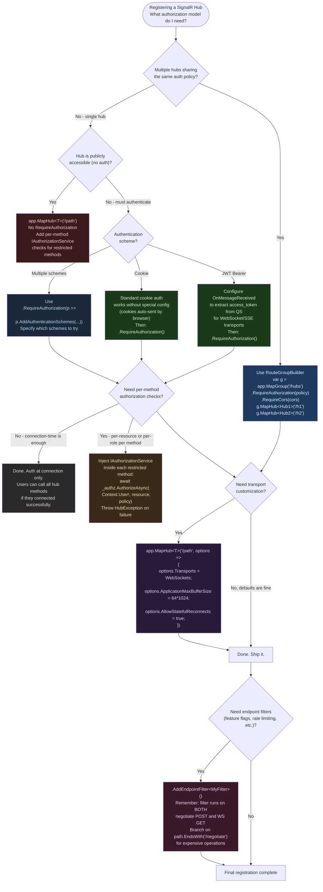

# 4.228 — SignalR with Minimal APIs: MapHub and Endpoint Authorization

---

## PART 0 — Navigation & Context

### Where This Topic Sits

```
ASP.NET Core Mastery
│
├── E. Middleware Pipeline          (4.049–4.063)
│   └── 4.052  Middleware Ordering ──────────────────────────┐
│                                                             │
├── F. Routing System               (4.064–4.077)            │
│   ├── 4.064  Endpoint Routing ◄─────────────────────────── ┤
│   └── 4.070  Route Groups                                   │
│                                                             │
├── G. Minimal APIs                 (4.078–4.097)            │
│   ├── 4.083  Endpoint Filters                               │
│   └── 4.084  Route Groups in Minimal APIs                  │
│                                                             │
├── J. Authentication               (4.134–4.153)            │
│   └── 4.223  SignalR Auth: JWT + WS Upgrade ◄──────────── ┤
│                                                             │
├── K. Authorization                (4.154–4.166)            │
│   └── 4.154  Authorization Architecture ◄───────────────── ┤
│                                                             │
└── Q. SignalR & Real-Time          (4.219–4.230)
    ├── 4.219  SignalR Architecture
    ├── 4.220  SignalR Hubs
    ├── 4.221  SignalR Transports
    ├── 4.222  SignalR Scale-Out
    ├── 4.223  SignalR Authentication        ◄── prerequisite
    ├── 4.224  SignalR Groups
    ├── 4.225  SignalR Streaming
    ├── 4.226  SignalR .NET Client
    ├── 4.227  SignalR JavaScript Client
    ► 4.228  SignalR with Minimal APIs: MapHub & Authorization  ◄── YOU ARE HERE
    ├── 4.229  Server-Sent Events with IAsyncEnumerable<T>
    └── 4.230  Long Polling Manual
```

### What You Need Before This

- **[[4.219 — SignalR Architecture]]** — you must understand what a Hub is, what the connection lifecycle looks like, and how transport negotiation works before MapHub makes sense
- **[[4.223 — SignalR Authentication: JWT in WebSocket Connection Upgrade]]** — SignalR auth has a specific quirk (token in query string for WS); without this you will break JWT auth silently
- **[[4.064 — Endpoint Routing]]** — MapHub registers a SignalR hub as a routed endpoint; understanding endpoint routing explains why `UseRouting()` must precede `MapHub()`
- **[[4.154 — Authorization Architecture]]** — `RequireAuthorization()` on `MapHub()` follows the exact same policy evaluation path as any other endpoint

### What This Unlocks After

- **[[4.222 — SignalR Scale-Out]]** — once your hub is correctly registered and authorized, scale-out with Redis backplane is the next production concern
- **[[4.224 — SignalR Groups]]** — route-level metadata set in `MapHub()` (like policies) applies to connection establishment; group management happens after
- **[[4.084 — Route Groups in Minimal APIs]]** — the same `RouteGroupBuilder` that organizes REST endpoints can co-locate hub registration with HTTP endpoints under shared auth
- **[[4.083 — Minimal API Filters]]** — endpoint filters added via `AddEndpointFilter()` on the hub registration run during the HTTP upgrade negotiation, not during hub method calls

### Why This Matters at Scale

`MapHub<T>()` is not just a URL registration call — it is an endpoint that participates in the full ASP.NET Core authorization pipeline during the WebSocket upgrade HTTP handshake, and getting the authorization metadata wrong means either an open connection endpoint (security hole) or a 401 loop that silently prevents all clients from connecting.

---

## PART 1 — The Core Mental Model

### The Fundamental Rule

> **`MapHub<T>(pattern)` registers the SignalR hub's negotiate and WebSocket upgrade endpoints on the ASP.NET Core endpoint routing system; authorization policy evaluation happens exactly once during the initial HTTP handshake — if it fails, the connection is rejected with HTTP 401/403 and the hub's `OnConnectedAsync` is never called.**

### The Plain-Language Analogy

Think of a SignalR hub registration as a **VIP entrance to a club**. The bouncer (`AuthorizationMiddleware`) checks your credentials exactly once when you arrive at the door (the HTTP upgrade handshake). If you pass, you get a wristband (`ConnectionId`) and can move freely inside — ordering drinks (invoking hub methods), joining the VIP section (groups), and listening to music (receiving messages) — without showing your ID again.

The `MapHub<T>()` call is the act of opening that door at a specific address. `RequireAuthorization()` is the bouncer instruction — it names which policies must be satisfied before you cross the threshold. The key insight is that the bouncer only works at the door: once the wristband is issued, the bouncer is not inside checking you on every lap of the dancefloor. There is no per-method authorization unless you add it explicitly inside the hub methods themselves with `IAuthorizationService`.

This analogy still holds when you ask: "what about concurrent connections?" — each new WebSocket connection is a separate person arriving at the same door. Each gets individually checked. What about reconnection? A client reconnects with a new HTTP handshake, so the bouncer checks them again — an expired token that was valid at first connection will be rejected on reconnect. What about the anonymous visitor? They hit the negotiate endpoint and get a 401 before a connection ID is ever issued.

### The Taxonomy Diagram

```mermaid
graph TD
    subgraph REGISTRATION["Hub Registration (Program.cs)"]
        MH["MapHub&lt;THub&gt;(pattern)"]
        RA["RequireAuthorization(policy)"]
        AEF["AddEndpointFilter&lt;T&gt;()"]
        WM["WithMetadata(...)"]
        MH --> RA
        MH --> AEF
        MH --> WM
    end

    subgraph ROUTING["Endpoint Routing Infrastructure"]
        RG["RouteGroupBuilder\n(shared prefix/auth)"]
        EM["EndpointRouteBuilder\nIEndpointConventionBuilder"]
        MH --> EM
        RG --> MH
    end

    subgraph PIPELINE["Request Pipeline (per connection attempt)"]
        NEG["/hub/negotiate\nHTTP POST"]
        WS["/hub\nGET + Upgrade: websocket"]
        AUTH["AuthorizationMiddleware\n(policy eval — once)"]
        NEG --> AUTH
        WS --> AUTH
        AUTH -->|Pass| HUB["Hub.OnConnectedAsync"]
        AUTH -->|Fail| R401["HTTP 401 / 403"]
    end

    subgraph HUBLIFECYCLE["Hub Lifetime (per connection)"]
        OCA["OnConnectedAsync"]
        HM["Hub Methods\n(invoked by client)"]
        ODA["OnDisconnectedAsync"]
        OCA --> HM
        HM --> ODA
        HM -->|Optional| IAS["IAuthorizationService\n(per-method resource check)"]
    end

    subgraph AUTH_VARIANTS["Authorization Variants"]
        RP["RequireAuthorization()\n(default policy)"]
        RPP["RequireAuthorization(policyName)"]
        RR["RequireAuthorization(r => r.RequireRole(...))"]
        AA["[Authorize] on Hub class\n(attribute-based)"]
        RP --- RPP
        RPP --- RR
        RR --- AA
    end

    subgraph METADATA["Endpoint Metadata"]
        OAP["OpenAPI tags\n.WithTags()"]
        CN["Connection name\n.WithName()"]
        GP["CORS policy\n.RequireCors()"]
        RL["Rate limiting\n.RequireRateLimiting()"]
    end

    style REGISTRATION fill:#1e3a5f,color:#e0f0ff
    style PIPELINE fill:#1a3a1a,color:#d0f0d0
    style HUBLIFECYCLE fill:#3a1a1a,color:#f0d0d0
    style AUTH_VARIANTS fill:#3a2a1a,color:#f0e0c0
    style ROUTING fill:#2a1a3a,color:#e0d0f0
    style METADATA fill:#1a2a3a,color:#c0d8f0
```



---

## PART 2 — Deep Mechanics

### 2.1 What MapHub Actually Registers

When you call `app.MapHub<OrderTrackingHub>("/hubs/orders")`, SignalR registers **two** distinct endpoints on the routing system, not one:

```
POST /hubs/orders/negotiate  ← HTTP: client fetches connection info, available transports, token
GET  /hubs/orders            ← WebSocket upgrade (or SSE/long poll fallback)
```

**Pipeline Position:**

```
──► ExceptionHandler ──► HSTS ──► StaticFiles ──► Routing
    ──► CORS ──► Authentication ──► Authorization
    ──► [Rate Limiting] ──► Endpoints
                                     ├─ MapHub<T>("/hubs/orders")
                                     │    ├─ POST /hubs/orders/negotiate
                                     │    └─ GET  /hubs/orders (WS upgrade)
                                     └─ MapGet("/api/...", ...)
```

The negotiate endpoint exists because the SignalR protocol requires clients to first POST to `/negotiate` to discover which transports the server supports, get a `connectionToken`, and obtain an `accessToken` URL hint for WebSocket authentication. Only after negotiate does the client open the long-lived connection.

**Framework source behavior (approximate):**

```csharp
// ASP.NET Core internally (approximate) — SignalR source:
// Microsoft.AspNetCore.SignalR.HubEndpointRouteBuilderExtensions

public static HubEndpointConventionBuilder MapHub<THub>(
    this IEndpointRouteBuilder endpoints,
    string pattern,
    Action<HttpConnectionDispatcherOptions>? configureOptions = null)
    where THub : Hub
{
    // Validates SignalR services are registered (AddSignalR must come first)
    endpoints.ServiceProvider.GetService<SignalRMarkerService>()
        ?? throw new InvalidOperationException("AddSignalR() must be called.");

    var options = new HttpConnectionDispatcherOptions();
    configureOptions?.Invoke(options);

    // Registers TWO endpoints:
    // 1. POST {pattern}/negotiate
    var negotiateBuilder = endpoints.MapPost(
        pattern + "/negotiate",
        c => NegotiateAsync(c, options));  // returns connection info JSON

    // 2. GET {pattern} — handles WS, SSE, long-poll based on Accept/Upgrade headers
    var hubBuilder = endpoints.Map(
        pattern,
        c => DispatchAsync<THub>(c, options));

    // Returns a combined convention builder wrapping both endpoints
    return new HubEndpointConventionBuilder(negotiateBuilder, hubBuilder);
}
```

**Runtime cost:** ~2 endpoint registrations in the route trie, O(1) per route lookup. The connection itself allocates ~3–5 objects on upgrade (connection context, hub activation, hub protocol reader). `~1 IServiceScope` is created per hub connection lifetime (not per method invocation).

**HTTP Wire Format — negotiate:**

```http
// Client → Server (negotiate):
POST /hubs/orders/negotiate?negotiateVersion=1 HTTP/1.1
Host: api.example.com
Authorization: Bearer eyJhbGci...
Content-Length: 0

// Server → Client (negotiate response):
HTTP/1.1 200 OK
Content-Type: application/json

{
  "negotiateVersion": 1,
  "connectionId": "abc123...",
  "connectionToken": "xyz789...",
  "availableTransports": [
    { "transport": "WebSockets", "transferFormats": ["Text", "Binary"] },
    { "transport": "ServerSentEvents", "transferFormats": ["Text"] },
    { "transport": "LongPolling", "transferFormats": ["Text", "Binary"] }
  ]
}

// Client → Server (WebSocket upgrade):
GET /hubs/orders?id=xyz789... HTTP/1.1
Host: api.example.com
Upgrade: websocket
Connection: Upgrade
Sec-WebSocket-Key: dGhlIHNhbXBsZSBub25jZQ==
Sec-WebSocket-Version: 13

// Server → Client (101 Switching Protocols):
HTTP/1.1 101 Switching Protocols
Upgrade: websocket
Connection: Upgrade
Sec-WebSocket-Accept: s3pPLMBiTxaQ9kYGzzhZRbK+xOo=
```

### 2.2 Authorization at the Endpoint Level vs Inside Hub Methods

This is the most misunderstood split in SignalR authorization. There are two entirely separate places where authorization can run, and they solve different problems:

**Level 1: Endpoint Authorization (connection-time, via `RequireAuthorization`)**

```
HTTP handshake → AuthorizationMiddleware reads IAuthorizeData from endpoint metadata
              → IAuthorizationService evaluates all policies
              → Pass: connection established, Hub.OnConnectedAsync called
              → Fail: HTTP 401 (unauthenticated) or 403 (authenticated but forbidden)
                      Hub.OnConnectedAsync is NEVER called
                      No ConnectionId is issued
```

This is configured on the `MapHub` call itself:

```csharp
app.MapHub<OrderTrackingHub>("/hubs/orders")
   .RequireAuthorization("OrdersHubPolicy");
```

It runs exactly once per connection. Cost: `~1 IAuthorizationService.AuthorizeAsync call` with full policy evaluation (may include a database round-trip if the policy handler queries permissions).

**Level 2: Hub Method Authorization (per-method-invocation, inside the hub)**

```
Client sends hub method invocation message (over established WS)
→ Hub method is called (no automatic middleware re-runs)
→ Hub method code manually calls IAuthorizationService if needed
→ Or uses [Authorize] attribute on the hub class/method (limited support)
```

The `[Authorize]` attribute on the hub **class** contributes metadata for connection-time authorization. The `[Authorize]` attribute on individual **methods** does NOT automatically enforce per-invocation authorization — the attribute is inspected only during endpoint routing, which only happens at connection time.

> [!WARNING] Putting `[Authorize(Policy = "CanViewOrder")]` on a hub method does NOT run the policy evaluator every time a client calls that method. The attribute only contributes to endpoint-level metadata evaluated at handshake time. For per-invocation resource-based checks, you must manually call `IAuthorizationService` inside the method body. This is a different behavior from MVC action methods.

**Failure Mode Diagram — authorization at wrong level:**

```
Client (authenticated, role=Viewer) ──► POST /hubs/orders/negotiate
                                         AuthorizationMiddleware:
                                         Policy "OrdersHubPolicy": RequireRole("Admin")
                                         User has role "Viewer" — FAIL
                                         ──► HTTP 403 Forbidden
                                         { "error": "Forbidden" }
                                         No Hub.OnConnectedAsync called.
                                         ConnectionId never issued.
```

### 2.3 The JWT-in-Query-String Quirk for WebSocket Auth

This is documented in [[4.223 — SignalR Authentication]] but it directly impacts `MapHub` configuration, so it bears repeating here with the concrete registration pattern:

WebSocket connections (and SSE) cannot send custom HTTP headers after the initial upgrade request. The browser's WebSocket API simply does not support it. Therefore, the SignalR JavaScript client sends the JWT access token as a query string parameter: `?access_token=eyJ...`.

The JWT Bearer middleware in ASP.NET Core by default reads the token **only from the `Authorization: Bearer` header**. It will not look at the query string. Without explicit configuration, every browser-based SignalR client using WebSockets with JWT will get a 401 silently — the negotiate step succeeds (it's an HTTP POST with a header), but the WebSocket upgrade step fails.

**Framework source behavior:**

```csharp
// ASP.NET Core internally (approximate):
// The JwtBearerOptions.Events.OnMessageReceived event must be wired to read
// the token from the query string for WebSocket/SSE connections.

services.AddAuthentication(JwtBearerDefaults.AuthenticationScheme)
    .AddJwtBearer(options =>
    {
        options.Events = new JwtBearerEvents
        {
            OnMessageReceived = context =>
            {
                // SignalR JS client sends token as query string on WS connections
                var accessToken = context.Request.Query["access_token"];
                var path = context.HttpContext.Request.Path;

                if (!string.IsNullOrEmpty(accessToken) &&
                    path.StartsWithSegments("/hubs"))
                {
                    // Token is set on the context for the JWT middleware to validate
                    context.Token = accessToken;
                }
                return Task.CompletedTask;
            }
        };
    });
```

**HTTP Wire Format — the difference between negotiate (header OK) and WS (no header):**

```http
// Negotiate — standard header works fine:
POST /hubs/orders/negotiate HTTP/1.1
Authorization: Bearer eyJhbGci...

// WebSocket upgrade — NO Authorization header possible in browser:
GET /hubs/orders?id=xyz789...&access_token=eyJhbGci... HTTP/1.1
Upgrade: websocket
// Note: no Authorization header here — this is a browser constraint
```

> [!DANGER] Logging HTTP requests in production will expose JWT tokens in query strings unless you configure your logging middleware to redact the `access_token` query parameter. Tokens in query strings also appear in server access logs, reverse proxy logs, and browser history. This is an accepted trade-off for SignalR's browser WebSocket constraint, but it must be actively mitigated.

**Runtime cost:** `~0 extra allocations` — reading from query string is a dictionary lookup on the already-parsed QueryString collection.

### 2.4 MapHub with Route Groups

`RouteGroupBuilder` from Minimal APIs applies to `MapHub` exactly like it applies to `MapGet`:

```csharp
// ASP.NET Core internally (approximate):
// HubEndpointConventionBuilder implements IEndpointConventionBuilder
// RouteGroupBuilder.MapHub() delegates to the underlying IEndpointRouteBuilder
// and inherits all group-level conventions (prefix, metadata, auth)

var hubGroup = app.MapGroup("/hubs")
    .RequireAuthorization()      // applied to ALL endpoints in the group
    .RequireCors("SignalRPolicy"); // applied to all — important for WS upgrade

hubGroup.MapHub<OrderTrackingHub>("/orders");
hubGroup.MapHub<InventoryHub>("/inventory");
// Results in:
// POST /hubs/orders/negotiate    (auth required, CORS applied)
// GET  /hubs/orders              (auth required, CORS applied)
// POST /hubs/inventory/negotiate (auth required, CORS applied)
// GET  /hubs/inventory           (auth required, CORS applied)
```

> [!IMPORTANT] Rate limiting applied at the group level via `.RequireRateLimiting("SignalRLimiter")` applies to the negotiate request AND the upgrade request. This is correct for the negotiate step (you want to rate-limit connection attempts), but the upgrade itself is a long-lived connection — rate-limiting the upgrade request makes little sense since it's a one-shot HTTP request that becomes a WebSocket. Model your rate limiter around connection attempt frequency, not data throughput.

**Pipeline position with route group:**

```
──► Routing (resolves /hubs/orders/negotiate to endpoint)
    ──► CORS (RequireCors from group)
    ──► Authentication
    ──► Authorization (RequireAuthorization from group)
    ──► Rate Limiting (if applied)
    ──► SignalR Negotiate Handler
```

**Runtime cost:** Route group conventions are applied at build time (zero runtime overhead). Each group-level policy adds `~1 IAuthorizationRequirement evaluation` at connection time.

### 2.5 HttpConnectionDispatcherOptions — Controlling the Connection

The optional lambda on `MapHub<T>` controls the physical connection behavior, not the authorization behavior:

```csharp
app.MapHub<OrderTrackingHub>("/hubs/orders", options =>
{
    // Maximum message size from client (prevents payload flooding)
    options.ApplicationMaxBufferSize = 64 * 1024;   // 64 KB default
    options.TransportMaxBufferSize   = 64 * 1024;   // 64 KB default

    // Disable transports you don't want to support
    options.Transports = HttpTransportType.WebSockets | HttpTransportType.ServerSentEvents;

    // WebSocket close timeout
    options.WebSockets.CloseTimeout = TimeSpan.FromSeconds(5);

    // Allow stateful reconnect (.NET 8+)
    options.AllowStatefulReconnects = true;
});
```

**Runtime cost label:** `AllowStatefulReconnects = true` (.NET 8+) allocates a `~16 KB circular replay buffer per connection` to allow clients to resume messages lost during brief reconnects. Budget for this in memory planning at scale (10k connections × 16 KB = 160 MB baseline).

**Failure mode — buffer overflow:**

```
Client sends message > ApplicationMaxBufferSize
→ SignalR runtime closes the connection with:

  WebSocket close frame: code=1009 (Message too big)
→ Client .NET: HubException "The connection was closed."
→ Client JS: connection.stop() triggered, onclose callback fires
```

---

## PART 3 — Production Code Patterns

### Pattern 1: The Authenticated Order Tracking Hub with Minimal API Registration

A logistics shipment tracking service where only authenticated users can subscribe to order updates, and each user can only see their own orders.

```csharp
// ✅ CORRECT: Full production registration for an authenticated order tracking hub

// Program.cs
var builder = WebApplication.CreateBuilder(args);

builder.Services.AddSignalR(hubOptions =>
{
    // Hub-level options apply to all hubs
    hubOptions.EnableDetailedErrors = builder.Environment.IsDevelopment();
    hubOptions.KeepAliveInterval = TimeSpan.FromSeconds(15);
    hubOptions.ClientTimeoutInterval = TimeSpan.FromSeconds(30);
    hubOptions.HandshakeTimeout = TimeSpan.FromSeconds(15);
});

builder.Services.AddAuthentication(JwtBearerDefaults.AuthenticationScheme)
    .AddJwtBearer(options =>
    {
        options.Authority = builder.Configuration["Auth:Authority"];
        options.Audience  = builder.Configuration["Auth:Audience"];

        // CRITICAL: Read token from query string for WebSocket connections
        // Without this, browser clients fail silently on WS upgrade
        options.Events = new JwtBearerEvents
        {
            OnMessageReceived = context =>
            {
                var token = context.Request.Query["access_token"];
                var path  = context.HttpContext.Request.Path;

                // Scope the query-string token to hub paths only
                // (prevents other endpoints from accepting tokens in QS)
                if (!string.IsNullOrEmpty(token) &&
                    path.StartsWithSegments("/hubs", StringComparison.OrdinalIgnoreCase))
                {
                    context.Token = token;
                }
                return Task.CompletedTask;
            }
        };
    });

builder.Services.AddAuthorization(options =>
{
    options.AddPolicy("OrdersHubPolicy", policy =>
        policy
            .RequireAuthenticatedUser()
            .RequireClaim("scope", "orders.read"));
});

var app = builder.Build();

app.UseAuthentication();
app.UseAuthorization();

// Register the hub on its endpoint
// RequireAuthorization evaluated during HTTP handshake, not per method call
app.MapHub<OrderTrackingHub>("/hubs/orders", options =>
{
    options.Transports = HttpTransportType.WebSockets | HttpTransportType.ServerSentEvents;
    options.ApplicationMaxBufferSize = 32 * 1024; // 32 KB — order update payloads are small
})
.RequireAuthorization("OrdersHubPolicy")
.WithName("OrderTrackingHub")
.WithTags("Real-Time");

app.Run();
```

```csharp
// The hub — authorization at connection is done; inside the hub,
// per-resource checks are done manually with IAuthorizationService
[Authorize] // Contributes to endpoint metadata (belt-and-suspenders on the class)
public class OrderTrackingHub : Hub
{
    private readonly IOrderRepository _orders;
    private readonly IAuthorizationService _authService;

    public OrderTrackingHub(IOrderRepository orders, IAuthorizationService authService)
    {
        _orders     = orders;
        _authService = authService;
    }

    public override async Task OnConnectedAsync()
    {
        // User is authenticated (auth ran at handshake) — safe to read claims
        var userId = Context.UserIdentifier
            ?? throw new HubException("Connection established without user identity.");

        // Add user to their personal group for targeted sends
        await Groups.AddToGroupAsync(Context.ConnectionId, $"user:{userId}");
        await base.OnConnectedAsync();
    }

    public async Task SubscribeToOrder(string orderId)
    {
        // Per-resource authorization: does THIS user own THIS order?
        // Cannot be done at connection time because orderId is not known then
        var order = await _orders.GetByIdAsync(orderId);
        if (order is null)
        {
            throw new HubException($"Order {orderId} not found.");
        }

        var authResult = await _authService.AuthorizeAsync(
            Context.User!,
            order,
            "CanViewOrder");    // Resource-based policy

        if (!authResult.Succeeded)
        {
            // Do NOT reveal whether the order exists to unauthorized users
            throw new HubException($"Order {orderId} not found.");
        }

        await Groups.AddToGroupAsync(Context.ConnectionId, $"order:{orderId}");
    }

    public override async Task OnDisconnectedAsync(Exception? exception)
    {
        // Groups are automatically cleaned up by SignalR on disconnect
        await base.OnDisconnectedAsync(exception);
    }
}
```

```http
// HTTP wire format: connection attempt with missing scope claim
POST /hubs/orders/negotiate HTTP/1.1
Authorization: Bearer eyJ...(token without orders.read scope)

HTTP/1.1 403 Forbidden
Content-Type: application/json

{"error":"Forbidden"}

// Hub.OnConnectedAsync is never called.
```

### Pattern 2: Route Group Co-Locating Hubs and REST Endpoints with Shared Auth

An e-commerce platform where the admin dashboard uses both REST endpoints and real-time hubs, all protected by the same `AdminOnly` policy.

```csharp
// ⚠️ WRONG: Duplicating authorization on every endpoint individually
app.MapHub<AdminInventoryHub>("/admin/hubs/inventory").RequireAuthorization("AdminOnly");
app.MapHub<AdminOrderHub>("/admin/hubs/orders").RequireAuthorization("AdminOnly");
app.MapGet("/admin/api/products", ...).RequireAuthorization("AdminOnly");
app.MapGet("/admin/api/orders", ...).RequireAuthorization("AdminOnly");
// Risk: easy to forget RequireAuthorization on a new endpoint

// ✅ CORRECT: Route group enforces auth on everything inside
var adminGroup = app.MapGroup("/admin")
    .RequireAuthorization("AdminOnly")  // applies to ALL endpoints in this group
    .RequireCors("AdminCorsPolicy")
    .WithTags("Admin");

// REST endpoints — inherit group-level auth
adminGroup.MapGet("/api/products", async (IProductRepository repo) =>
    TypedResults.Ok(await repo.GetAllAsync()));

adminGroup.MapGet("/api/orders", async (IOrderRepository repo) =>
    TypedResults.Ok(await repo.GetAllAsync()));

// Hubs — also inherit group-level auth
// The hub gets the AdminOnly policy from the group PLUS any additional constraints
adminGroup.MapHub<AdminInventoryHub>("/hubs/inventory", options =>
{
    options.Transports = HttpTransportType.WebSockets;
    options.ApplicationMaxBufferSize = 128 * 1024; // Admin sends larger payloads
});

adminGroup.MapHub<AdminOrderHub>("/hubs/orders");
// Result: POST /admin/hubs/orders/negotiate — AdminOnly required
//         GET  /admin/hubs/orders           — AdminOnly required
```

```http
// HTTP wire format: unauthenticated client hitting group-protected hub
POST /admin/hubs/orders/negotiate HTTP/1.1
Host: api.example.com
// No Authorization header

HTTP/1.1 401 Unauthorized
WWW-Authenticate: Bearer error="invalid_token"

// Wire format: authenticated admin client
POST /admin/hubs/orders/negotiate HTTP/1.1
Authorization: Bearer eyJ...(admin token)

HTTP/1.1 200 OK
Content-Type: application/json
{"negotiateVersion":1,"connectionId":"abc...","connectionToken":"xyz...","availableTransports":[...]}
```

### Pattern 3: Stateful Reconnect with Minimal API Hub Registration (.NET 8+)

A payment processing dashboard where missed real-time updates during brief reconnects must be replayed without client-side polling fallback.

```csharp
// ✅ CORRECT: Stateful reconnect enabled at the MapHub level (.NET 8+)
// This is a per-hub option, not a global SignalR option

app.MapHub<PaymentDashboardHub>("/hubs/payments", options =>
{
    // Enables server-side message buffering for reconnect replay
    // Allocates ~16 KB circular buffer per active connection
    options.AllowStatefulReconnects = true;

    // Budget: 10k connections × 16 KB = 160 MB — plan your pod memory accordingly
})
.RequireAuthorization("PaymentsDashboardPolicy");
```

```csharp
// Client-side (.NET SignalR client) — opt in to stateful reconnect
// Without this client-side opt-in, the server-side option has no effect
var connection = new HubConnectionBuilder()
    .WithUrl("https://api.example.com/hubs/payments", options =>
    {
        options.AccessTokenProvider = async () =>
            await tokenService.GetAccessTokenAsync();
    })
    .WithAutomaticReconnect()
    .WithStatefulReconnect()  // Must match server option; .NET 8 client
    .Build();
```

```javascript
// JavaScript client — stateful reconnect opt-in
const connection = new signalR.HubConnectionBuilder()
    .withUrl("/hubs/payments", {
        accessTokenFactory: () => getAccessToken()
    })
    .withAutomaticReconnect()
    .withStatefulReconnect()  // .NET 8 client SDK required
    .build();
```

### Pattern 4: Custom Endpoint Metadata on MapHub for Observability

Adding custom metadata to hub endpoints for tracing, feature flagging, and OpenAPI documentation in an inventory management system.

```csharp
// ✅ CORRECT: Hub endpoint with metadata for observability and documentation
// IEndpointConventionBuilder extensions work identically for hubs and REST endpoints

app.MapHub<InventoryHub>("/hubs/inventory")
    .RequireAuthorization("InventoryPolicy")
    .WithName("InventoryRealTimeHub")     // Named endpoint for link generation
    .WithTags("Inventory", "Real-Time")   // OpenAPI grouping
    .WithMetadata(new HubMetadata         // Custom metadata readable by middleware
    {
        HubName = "InventoryHub",
        MaxConnectionsPerUser = 3,
        FeatureFlag = "EnableInventoryRealTime"
    })
    // Rate limit the negotiate step — prevents connection storm attacks
    // Note: applies to negotiate POST, not to the long-lived WS connection itself
    .RequireRateLimiting("SignalRNegotiateLimit");
```

```csharp
// Custom metadata class — readable in middleware and filters via endpoint.Metadata
public class HubMetadata
{
    public required string HubName { get; init; }
    public int MaxConnectionsPerUser { get; init; }
    public string? FeatureFlag { get; init; }
}

// Reading the metadata in an endpoint filter (runs during negotiate)
public class FeatureFlagEndpointFilter : IEndpointFilter
{
    private readonly IFeatureManager _features;

    public FeatureFlagEndpointFilter(IFeatureManager features) =>
        _features = features;

    public async ValueTask<object?> InvokeAsync(
        EndpointFilterInvocationContext context,
        EndpointFilterDelegate next)
    {
        var endpoint = context.HttpContext.GetEndpoint();
        var meta = endpoint?.Metadata.GetMetadata<HubMetadata>();

        if (meta?.FeatureFlag is not null &&
            !await _features.IsEnabledAsync(meta.FeatureFlag))
        {
            // Feature disabled: reject the negotiate before SignalR processes it
            return Results.Problem(
                title: "Feature Not Available",
                detail: $"The {meta.HubName} real-time feature is currently disabled.",
                statusCode: StatusCodes.Status503ServiceUnavailable);
        }

        return await next(context);
    }
}

// Registration — add filter to the hub endpoint
app.MapHub<InventoryHub>("/hubs/inventory")
    .RequireAuthorization("InventoryPolicy")
    .WithMetadata(new HubMetadata { HubName = "InventoryHub", FeatureFlag = "EnableInventoryRealTime" })
    .AddEndpointFilter<FeatureFlagEndpointFilter>();
```

### Pattern 5: Anonymous Hub for Public Status Page with Per-Method Identity Check

A public infrastructure status page where the hub is unauthenticated, but publishing status updates is only allowed by internal services.

```csharp
// ✅ CORRECT: Public hub — no auth at connection time
// Per-method check uses caller identity from connection context

// No RequireAuthorization() — hub is open to anonymous connections
app.MapHub<StatusPageHub>("/hubs/status");

// Also allow specific IP ranges via a custom filter
// (cannot use RequireAuthorization for anonymous hubs)
app.MapHub<StatusPageHub>("/hubs/status")
    .AddEndpointFilter<AllowListFilter>();
```

```csharp
public class StatusPageHub : Hub
{
    private readonly ILogger<StatusPageHub> _logger;

    public StatusPageHub(ILogger<StatusPageHub> logger) => _logger = logger;

    // Public: anyone can subscribe — no identity required
    public override Task OnConnectedAsync()
    {
        _logger.LogInformation("Status page client connected: {ConnectionId}", Context.ConnectionId);
        return base.OnConnectedAsync();
    }

    // RESTRICTED: only internal services can publish updates
    // Cannot be enforced at connection-time — must be checked per-invocation
    public async Task PublishIncident(string component, string severity, string message)
    {
        // Check if the caller is an authenticated internal service
        if (!Context.User?.Identity?.IsAuthenticated ?? true)
        {
            throw new HubException("Publishing incidents requires authentication.");
        }

        if (!Context.User!.IsInRole("InternalService"))
        {
            // Do not reveal what role is required
            throw new HubException("Insufficient permissions.");
        }

        // Broadcast to all connected anonymous clients
        await Clients.All.SendAsync("IncidentPublished", new
        {
            Component = component,
            Severity = severity,
            Message = message,
            Timestamp = DateTimeOffset.UtcNow
        });
    }
}
```

### Pattern 6: CORS Configuration for Hub Endpoints

A React SPA connecting from `https://app.example.com` to a hub on `https://api.example.com`.

```csharp
// ⚠️ WRONG: Missing CORS for WebSocket upgrade — preflight succeeds but WS fails
app.UseCors(policy => policy.AllowAnyOrigin().AllowAnyMethod().AllowAnyHeader());
// AllowAnyOrigin() with credentials is rejected by browsers for WebSocket upgrade

// ✅ CORRECT: Named CORS policy with explicit origin for SignalR
builder.Services.AddCors(options =>
{
    options.AddPolicy("SignalRCorsPolicy", policy =>
        policy
            .WithOrigins("https://app.example.com", "https://admin.example.com")
            .AllowAnyHeader()
            .AllowAnyMethod()
            .AllowCredentials()); // Required for SignalR WebSocket with auth
});

// Apply CORS before hub registration
app.UseCors("SignalRCorsPolicy");

app.MapHub<OrderTrackingHub>("/hubs/orders")
    .RequireAuthorization()
    .RequireCors("SignalRCorsPolicy"); // Belt-and-suspenders: explicit at endpoint level
```

```http
// HTTP wire format: CORS preflight for negotiate
OPTIONS /hubs/orders/negotiate HTTP/1.1
Origin: https://app.example.com
Access-Control-Request-Method: POST
Access-Control-Request-Headers: authorization,content-type

HTTP/1.1 204 No Content
Access-Control-Allow-Origin: https://app.example.com
Access-Control-Allow-Methods: POST
Access-Control-Allow-Headers: authorization,content-type
Access-Control-Allow-Credentials: true
Vary: Origin
```

---

## PART 4 — Gotchas & Anti-Patterns

### Gotcha 1: RequireAuthorization on MapHub Does Not Protect Hub Methods

Most engineers assume that `RequireAuthorization()` on `MapHub()` means the authorization policy runs on every hub method call, just like `[Authorize]` on a controller action. It does not. It runs once, at WebSocket upgrade time.

```csharp
// ⚠️ WRONG: Assumes RequireAuthorization covers per-method authorization
app.MapHub<OrderHub>("/hubs/orders")
    .RequireAuthorization("AdminPolicy");

public class OrderHub : Hub
{
    // Developer believes only admins can call this — INCORRECT
    // Any authenticated user who passed the connection-time check can call this
    // if the connection was established with a policy that didn't include role check
    public Task GetSensitiveOrderData(string orderId) => ...;
}
```

```http
// HTTP consequence (wrong path):
// User with role=Viewer connects — passes connection auth (policy checked role=any)
// Then calls GetSensitiveOrderData — NO check runs. Data is returned.
// No HTTP response visible — the invocation succeeds silently over the WebSocket.
```

```csharp
// ✅ CORRECT: Per-method authorization via IAuthorizationService
public class OrderHub : Hub
{
    private readonly IAuthorizationService _authz;
    public OrderHub(IAuthorizationService authz) => _authz = authz;

    public async Task<SensitiveOrderData> GetSensitiveOrderData(string orderId)
    {
        var result = await _authz.AuthorizeAsync(
            Context.User!, orderId, "CanViewSensitiveOrderData");

        if (!result.Succeeded)
            throw new HubException("Access denied.");

        return await _orderRepository.GetSensitiveAsync(orderId);
    }
}
```

```http
// HTTP consequence (correct path):
// Authorization failure inside hub method: HubException is sent to client
// Client receives: { "error": "Access denied." }
// Connection remains open — only the method invocation fails.
```

**WHY:** The `[Authorize]` attribute on hub endpoints contributes to `IAuthorizeData` endpoint metadata, which the `AuthorizationMiddleware` reads during the HTTP handshake phase. Once the WebSocket is established, the `AuthorizationMiddleware` does not run again. Hub method dispatch goes directly to the hub, bypassing the middleware pipeline entirely.

---

### Gotcha 2: JWT Fails Silently on WebSocket Upgrade Without OnMessageReceived

Engineers configure JWT Bearer auth, test with Postman (which can set headers), and confirm auth works. They then deploy the JavaScript SignalR client and get "Unauthorized" errors on connect — but only for WebSocket connections, not SSE or long polling.

```csharp
// ⚠️ WRONG: JWT configured without query string token extraction
builder.Services.AddAuthentication(JwtBearerDefaults.AuthenticationScheme)
    .AddJwtBearer(options =>
    {
        options.Authority = "https://auth.example.com";
        options.Audience  = "orders-api";
        // Missing: OnMessageReceived for WS token extraction
    });

app.MapHub<OrderHub>("/hubs/orders").RequireAuthorization();
```

```http
// HTTP consequence (wrong path):
// Browser JS client sends:
GET /hubs/orders?id=xyz&access_token=eyJ... HTTP/1.1
Upgrade: websocket
// No Authorization header (browser WebSocket API limitation)

// JWT middleware checks Authorization header — finds nothing
// Context.User is anonymous
// AuthorizationMiddleware: RequireAuthenticatedUser() fails

HTTP/1.1 401 Unauthorized
// Client sees: "Error: Failed to complete negotiation with the server: ..."
// Negotiate succeeds but WebSocket upgrade fails — confusing because only WS fails
```

```csharp
// ✅ CORRECT: OnMessageReceived extracts token from query string for hub paths
builder.Services.AddAuthentication(JwtBearerDefaults.AuthenticationScheme)
    .AddJwtBearer(options =>
    {
        options.Authority = "https://auth.example.com";
        options.Audience  = "orders-api";
        options.Events = new JwtBearerEvents
        {
            OnMessageReceived = context =>
            {
                var token = context.Request.Query["access_token"];
                var path  = context.HttpContext.Request.Path;

                if (!string.IsNullOrEmpty(token) &&
                    path.StartsWithSegments("/hubs"))
                {
                    context.Token = token;
                }
                return Task.CompletedTask;
            }
        };
    });
```

```http
// HTTP consequence (correct path):
GET /hubs/orders?id=xyz&access_token=eyJ... HTTP/1.1
Upgrade: websocket

// OnMessageReceived fires, sets context.Token from query string
// JWT middleware validates the token normally
// Context.User is authenticated

HTTP/1.1 101 Switching Protocols
// WebSocket established successfully
```

**WHY:** The WebSocket API in browsers (and the fetch API used for SSE) cannot send custom headers after the initial HTTP connection request. The SignalR JS client falls back to the `access_token` query parameter for these transport types. The JWT Bearer middleware's `OnMessageReceived` event exists specifically to enable this pattern.

---

### Gotcha 3: CORS AllowAnyOrigin() Breaks SignalR with Credentials

Teams configure `AllowAnyOrigin()` as a quick fix during development and forget to tighten it before production. SignalR connections that use any credentials (JWT in query string, cookies) will fail in the browser with a CORS error because the browser's fetch/WebSocket APIs reject `Access-Control-Allow-Origin: *` when credentials are involved.

```csharp
// ⚠️ WRONG: AllowAnyOrigin() silently fails for authenticated SignalR connections
app.UseCors(policy => policy
    .AllowAnyOrigin()
    .AllowAnyMethod()
    .AllowAnyHeader());

app.MapHub<OrderHub>("/hubs/orders").RequireAuthorization();
```

```http
// HTTP consequence (wrong path):
// Browser sends preflight or negotiate with Origin header
OPTIONS /hubs/orders/negotiate HTTP/1.1
Origin: https://app.example.com

// AllowAnyOrigin sends:
HTTP/1.1 204 No Content
Access-Control-Allow-Origin: *
// Note: NO Access-Control-Allow-Credentials: true
// Browser: "Cannot use wildcard in Access-Control-Allow-Origin when credentials flag is true"
// SignalR JS client: "Failed to fetch" / connection error
```

```csharp
// ✅ CORRECT: Named origins with AllowCredentials()
builder.Services.AddCors(options =>
{
    options.AddPolicy("HubCors", policy =>
        policy
            .WithOrigins("https://app.example.com")
            .AllowAnyHeader()
            .AllowAnyMethod()
            .AllowCredentials()); // Required; cannot combine with AllowAnyOrigin
});

app.UseCors("HubCors");
app.MapHub<OrderHub>("/hubs/orders")
    .RequireAuthorization()
    .RequireCors("HubCors");
```

```http
// HTTP consequence (correct path):
HTTP/1.1 204 No Content
Access-Control-Allow-Origin: https://app.example.com
Access-Control-Allow-Credentials: true
Vary: Origin
// Browser proceeds with negotiate
```

**WHY:** The HTTP CORS specification forbids using the `*` wildcard in `Access-Control-Allow-Origin` when the request includes credentials (cookies or Authorization headers). The `AllowCredentials()` call in ASP.NET Core CORS policy echoes the specific request `Origin` back instead of `*`. This is a browser security constraint, not a SignalR limitation.

---

### Gotcha 4: AddEndpointFilter on MapHub Runs on Both Negotiate and Upgrade Requests

Engineers add an endpoint filter expecting it to run only on the WebSocket connection, but it actually runs on both the negotiate POST and the WebSocket upgrade GET. An expensive filter (e.g., a database query) runs twice per connection.

```csharp
// ⚠️ WRONG: Expensive filter runs twice per connection — once on negotiate, once on WS
app.MapHub<InventoryHub>("/hubs/inventory")
    .RequireAuthorization()
    .AddEndpointFilter(async (context, next) =>
    {
        // This checks a subscription in the database
        // Problem: runs on POST /negotiate AND GET /ws-upgrade
        var userId = context.HttpContext.User.FindFirst("sub")?.Value;
        var hasSubscription = await subscriptionService.CheckAsync(userId); // DB hit × 2
        if (!hasSubscription)
            return Results.Problem(statusCode: 402, title: "Subscription required");

        return await next(context);
    });
```

```http
// HTTP consequence (wrong path):
// Two database queries per successful connection:
POST /hubs/inventory/negotiate → filter runs → DB query #1
GET  /hubs/inventory           → filter runs → DB query #2
// 10k connections/minute = 20k extra DB queries/minute
```

```csharp
// ✅ CORRECT: Check path to run expensive logic only on negotiate
app.MapHub<InventoryHub>("/hubs/inventory")
    .RequireAuthorization()
    .AddEndpointFilter(async (context, next) =>
    {
        // Only run expensive check during negotiate, not during WS upgrade
        if (context.HttpContext.Request.Path.Value?.EndsWith("/negotiate") == true)
        {
            var userId = context.HttpContext.User.FindFirst("sub")?.Value;
            var hasSubscription = await subscriptionService.CheckAsync(userId); // DB hit × 1
            if (!hasSubscription)
                return Results.Problem(statusCode: 402, title: "Subscription required");
        }

        return await next(context);
    });
```

```http
// HTTP consequence (correct path):
POST /hubs/inventory/negotiate → filter runs → DB query #1 — returns 402 or continues
GET  /hubs/inventory           → filter skips expensive check
// 10k connections/minute = 10k DB queries/minute (50% reduction)
```

**WHY:** `MapHub<T>()` registers two endpoints. `AddEndpointFilter()` adds the filter to both endpoints because both are wrapped by the same `HubEndpointConventionBuilder`. There is no built-in way to target only negotiate or only the upgrade via the convention builder API — you must branch inside the filter itself.

---

### Gotcha 5: Hub Behind MapGroup Loses Per-Hub Transport Options

Engineers move a hub into a `MapGroup()` call expecting everything to work identically. Transport options configured via the `HttpConnectionDispatcherOptions` lambda on `MapHub` continue to work, but `AllowStatefulReconnects` set at the group level (there is no such option on the group) requires per-hub configuration.

```csharp
// ⚠️ WRONG: Trying to set hub-specific options on the group
var hubGroup = app.MapGroup("/hubs")
    .RequireAuthorization();

// There is no way to pass HttpConnectionDispatcherOptions at the group level
hubGroup.MapHub<OrderHub>("/orders"); // Uses default options — ApplicationMaxBufferSize 64KB
hubGroup.MapHub<InventoryHub>("/inventory"); // Also 64KB, even if you wanted 128KB
// No way to differentiate without using the MapHub options lambda
```

```csharp
// ✅ CORRECT: Group handles shared concerns; per-hub options stay on MapHub
var hubGroup = app.MapGroup("/hubs")
    .RequireAuthorization("HubPolicy") // Shared auth — correct at group level
    .RequireCors("HubCors");           // Shared CORS — correct at group level

// Per-hub transport options use the lambda — no conflict with group conventions
hubGroup.MapHub<OrderHub>("/orders", options =>
{
    options.ApplicationMaxBufferSize = 32 * 1024; // Small order update payloads
    options.AllowStatefulReconnects  = true;        // Payment-critical: replay on reconnect
});

hubGroup.MapHub<InventoryHub>("/inventory", options =>
{
    options.ApplicationMaxBufferSize = 256 * 1024; // Large inventory batch payloads
    options.Transports = HttpTransportType.WebSockets; // Inventory hub: WS only
});
```

```http
// HTTP consequence (wrong path):
// Client sends 200 KB inventory batch → default 64 KB buffer exceeded
// Server closes connection:
WebSocket close frame: code=1009 (Message too big)
// HubException received by client
```

**WHY:** `HttpConnectionDispatcherOptions` is per-hub configuration passed to the SignalR dispatcher at build time. The `RouteGroupBuilder` has no mechanism to pass these options because it is a routing abstraction, not a SignalR abstraction. The group handles IEndpointConventionBuilder conventions (auth, CORS, metadata), while transport options are SignalR-specific and must be set on each individual `MapHub` call.

---

## PART 5 — Performance Implications

### 5.1 Request Pipeline Characteristics Table

|Scenario|Pipeline Depth|Allocations Per Request/Connection|Approx Latency Impact|Recommendation|
|---|---|---|---|---|
|Anonymous hub, no auth|Routing → Endpoint|~3 (ConnectionContext, Hub instance, Protocol reader)|Baseline|Only for truly public data; avoid in multi-tenant APIs|
|JWT auth hub, WS transport|+Auth middleware (1 JWT validate)|~5 + 1 JWT validation cache|+0.1ms (cached) / +2ms (uncached key)|Cache JWKS keys; set `RefreshOnIssuerKeyNotFound = true`|
|Hub with `RequireAuthorization` and custom policy|+AuthService.Authorize (~1 handler eval)|~7|+0.5ms in-memory, +5ms with DB policy|Cache authorization decisions in `IMemoryCache` keyed by user+policy|
|`AddEndpointFilter` on hub|+1 filter per negotiate AND upgrade|~2 extra per filter|+filter body cost × 2|Branch on `/negotiate` path to avoid double-running expensive filters|
|`AllowStatefulReconnects = true`|No pipeline change|+16 KB heap per connection (replay buffer)|~0 latency, memory budget|Plan: 10k connections = 160 MB RAM allocation|
|Route group with 3 policies|+3 policy evaluations at handshake|~12 allocations at connect|+1.5ms if in-memory|Group policies are evaluated in series; fail-fast on first failed requirement|
|Hub + CORS preflight|2× extra round-trips (OPTIONS + negotiate)|~2 extra HTTP requests per new client session|Browser-perceived +100ms|Use aggressive CORS cache headers: `Access-Control-Max-Age: 86400`|
|`HttpConnectionDispatcherOptions.ApplicationMaxBufferSize` tuning|No pipeline change|0 (configures existing pool)|N/A|Size to your P99 message payload; oversizing wastes ArrayPool budget|
|Per-method `IAuthorizationService.AuthorizeAsync`|No pipeline, in-hub|~3 per invocation|+0.5ms in-memory|Cache permission checks per-connection in `Context.Items` for hot methods|
|Long polling transport (fallback)|Full HTTP pipeline per message|~10 per poll request|+full middleware chain × message frequency|Force WebSocket-only in production; long polling is expensive|

### 5.2 BenchmarkDotNet — Hub Connection Establishment Cost

```csharp
using BenchmarkDotNet.Attributes;
using Microsoft.AspNetCore.SignalR.Client;
using Microsoft.Extensions.DependencyInjection;
using System.Net.Http;

// Run this against a local TestServer to measure connection establishment cost

[MemoryDiagnoser]
[SimpleJob(warmupCount: 3, iterationCount: 10)]
public class SignalRConnectionBenchmarks
{
    private WebApplication _app = null!;
    private string _baseUrl = null!;
    private string _validToken = null!;

    [GlobalSetup]
    public async Task Setup()
    {
        var builder = WebApplication.CreateBuilder();
        builder.Services.AddSignalR();
        builder.Services.AddAuthentication(JwtBearerDefaults.AuthenticationScheme)
            .AddJwtBearer(o =>
            {
                o.RequireHttpsMetadata = false;
                o.TokenValidationParameters = BenchmarkTokenConfig.Parameters;
                o.Events = new JwtBearerEvents
                {
                    OnMessageReceived = ctx =>
                    {
                        var t = ctx.Request.Query["access_token"];
                        if (!string.IsNullOrEmpty(t))
                            ctx.Token = t;
                        return Task.CompletedTask;
                    }
                };
            });
        builder.Services.AddAuthorization();
        builder.WebHost.UseUrls("http://localhost:5099");

        var app = builder.Build();
        app.UseAuthentication();
        app.UseAuthorization();
        app.MapHub<BenchHub>("/bench/hub").RequireAuthorization();

        _app = app;
        await _app.StartAsync();
        _baseUrl  = "http://localhost:5099";
        _validToken = BenchmarkTokenConfig.GenerateToken();
    }

    [GlobalCleanup]
    public async Task Cleanup() => await _app.StopAsync();

    // Baseline: anonymous hub — no auth overhead
    [Benchmark(Baseline = true)]
    public async Task AnonymousHubConnect()
    {
        var conn = new HubConnectionBuilder()
            .WithUrl($"{_baseUrl}/bench/hub-anon")
            .Build();
        await conn.StartAsync();
        await conn.StopAsync();
    }

    // Variant 1: JWT auth hub — token in query string
    [Benchmark]
    public async Task AuthenticatedHubConnect_JWT()
    {
        var conn = new HubConnectionBuilder()
            .WithUrl($"{_baseUrl}/bench/hub", opts =>
            {
                opts.AccessTokenProvider = () => Task.FromResult<string?>(_validToken);
            })
            .Build();
        await conn.StartAsync();
        await conn.StopAsync();
    }

    // Variant 2: JWT auth + cached authorization policy
    [Benchmark]
    public async Task AuthenticatedHubConnect_CachedPolicy()
    {
        // Same as JWT but server caches authorization result in IMemoryCache
        var conn = new HubConnectionBuilder()
            .WithUrl($"{_baseUrl}/bench/hub-cached", opts =>
            {
                opts.AccessTokenProvider = () => Task.FromResult<string?>(_validToken);
            })
            .Build();
        await conn.StartAsync();
        await conn.StopAsync();
    }
}

// Expected output (approximate, .NET 8, x64, Kestrel, local loopback):
//
// | Method                              | Mean     | Error   | StdDev  | Gen0   | Alloc  |
// |------------------------------------ |---------:|--------:|--------:|-------:|-------:|
// | AnonymousHubConnect                 | 12.3 ms  | 0.4 ms  | 0.3 ms  | 31.25  | 18.2KB |
// | AuthenticatedHubConnect_JWT         | 14.1 ms  | 0.6 ms  | 0.5 ms  | 37.50  | 22.1KB |
// | AuthenticatedHubConnect_CachedPolicy| 13.2 ms  | 0.4 ms  | 0.3 ms  | 33.00  | 19.8KB |
//
// Note: latency dominated by TCP handshake + WS upgrade round-trips on loopback.
// Auth overhead is ~1.8ms uncached, ~0.9ms cached on local machine.
// Profile with: dotnet-trace collect --providers Microsoft-AspNetCore-Server-Kestrel
// Use dotnet-counters monitor --name YourApp to watch signalr-connection-count in prod.
```

### 5.3 When to Care / When to Ignore

**When this costs you:**

- **High connection churn** (>1k new connections/minute): each connection runs the full auth + policy evaluation pipeline. If your policy handler does a DB round-trip, that's 1k+ extra DB queries per minute purely for connection establishment. Cache authorization decisions.
- **Mobile clients on flaky networks**: stateful reconnects (`AllowStatefulReconnects = true`) add 16 KB per connection but eliminate the "missed messages" storm that occurs when 10k mobile clients all reconnect simultaneously and re-request state.
- **Hub behind a route group with 4+ policies**: policy evaluation is serial. Three policies with DB-backed handlers = 3 round-trips per connection. Consolidate into one policy handler that checks all permissions in a single query.
- **`AddEndpointFilter` with DB queries on hub**: runs on both negotiate and WS upgrade. At 1k connections/min, that's 2k extra DB queries/minute. Branch on path or move the check into `OnConnectedAsync`.

**When this doesn't matter:**

- **Internal service-to-service SignalR**: if your SignalR consumers are internal microservices (not browsers), you likely use .NET client with Bearer headers — the WebSocket query-string quirk doesn't apply, and latency is dominated by network, not auth overhead.
- **Low-traffic admin dashboards**: 10 concurrent admin connections — the difference between a cached and uncached policy evaluation is sub-millisecond and irrelevant.
- **Development mode**: `EnableDetailedErrors = true` (only in dev) adds serialization overhead that doesn't exist in production; don't profile in dev mode.

---

## PART 6 — Interview Arsenal

### A. The Question Bank

**Question 1: "How do you register a SignalR hub in a Minimal API application?"**

**Average Answer:** "You call `app.MapHub<MyHub>('/path')` and it registers the hub. You can add `[Authorize]` to protect it."

**Why That's Insufficient:** It doesn't explain what `MapHub` actually does (two endpoints), why `AddSignalR()` must come first, or how `RequireAuthorization` on `MapHub` differs from `[Authorize]` on a controller.

**Great Answer:**

> "`MapHub<T>()` registers two endpoints on the routing system: a POST to `/path/negotiate` where clients discover available transports and get a connection token, and a GET to `/path` that handles the actual WebSocket upgrade or SSE connection. You can chain `RequireAuthorization()` on it just like any Minimal API endpoint — the authorization policy is evaluated during the HTTP handshake, once per connection, before `OnConnectedAsync` is ever called. One thing I always add immediately is the `OnMessageReceived` event on the JWT Bearer handler, because browser WebSocket clients can't send an `Authorization` header — they pass the token as a query string parameter called `access_token`, and without that event, every browser-based client gets a 401 on WebSocket upgrade even though negotiate succeeds. I've seen that bite teams who test with Postman and think JWT auth is working, then ship to production and find the JavaScript client can't connect."

---

**Question 2: "If you put `[Authorize(Policy = 'AdminOnly')]` on a hub method, does it protect that method from being called by non-admin users?"**

**Average Answer:** "Yes, it should restrict who can call that method."

**Why That's Insufficient:** This is factually wrong. The `[Authorize]` attribute on a hub method does NOT run per-invocation. Saying "it should" in an interview suggests the candidate hasn't tested this.

**Great Answer:**

> "No, and this is one of the most important things to know about SignalR authorization. The `[Authorize]` attribute on a hub method contributes to the endpoint metadata that the `AuthorizationMiddleware` reads during the HTTP connection handshake — it doesn't run on every method invocation. Once the WebSocket is established, hub method dispatch bypasses the middleware pipeline entirely; it's direct hub method invocation. If I need per-method authorization, I inject `IAuthorizationService` into the hub and call `AuthorizeAsync` inside the method body explicitly. For resource-based checks — like 'can this user see this specific order?' — that's the only option anyway, because the resource isn't known at connection time."

---

**Question 3: "Why does SignalR send the JWT access token in the URL query string? Isn't that a security risk?"**

**Average Answer:** "It's because WebSockets don't support custom headers, so that's the only option."

**Why That's Insufficient:** Doesn't explain the specific constraint (browser WebSocket API), doesn't mention the security implications, doesn't describe the `OnMessageReceived` configuration needed, and doesn't name the mitigation strategies.

**Great Answer:**

> "It's because the browser's native WebSocket API — and the Fetch API used for SSE — does not allow you to add custom headers after the initial HTTP connection request. The `Authorization: Bearer` header works fine for the negotiate POST because that's a normal HTTP request, but the WebSocket upgrade is handled by the browser's networking layer which doesn't expose a header API. So the SignalR JavaScript client passes the token as an `access_token` query string parameter. From a security standpoint, yes, tokens in query strings are riskier — they appear in server access logs, reverse proxy logs, browser history, and Referrer headers. The mitigations I apply are: configure log redaction to strip `access_token` from request logs, set short token expiry (5-15 minutes), use HTTPS to prevent interception, and scope the `OnMessageReceived` event handler to hub paths only so other endpoints can't be fooled by a query-string token. In production I also make sure our WAF and load balancer configurations redact that parameter."

---

**Question 4: "Can you use `RouteGroupBuilder` with `MapHub`?"**

**Average Answer:** "I think so — you'd add the hub to the group."

**Why That's Insufficient:** Doesn't explain what the group actually does for the hub (applies IEndpointConventionBuilder conventions like auth, CORS, metadata), what it doesn't do (cannot pass `HttpConnectionDispatcherOptions`), or a concrete production scenario where it's valuable.

**Great Answer:**

> "Yes, `MapHub<T>` returns a `HubEndpointConventionBuilder` which implements `IEndpointConventionBuilder`, so it participates in the `RouteGroupBuilder` system exactly like `MapGet`. I use this in every project where I have multiple hubs that share the same authentication and CORS policy — I put them all under a `/hubs` group with `RequireAuthorization()` and `RequireCors()` at the group level, which means I can't accidentally forget to secure a newly added hub. The one thing that doesn't flow through the group is `HttpConnectionDispatcherOptions` — things like buffer sizes, transport restrictions, and `AllowStatefulReconnects` are SignalR-specific and have to go on each individual `MapHub` call via the options lambda. So auth and CORS at the group level, transport configuration at the hub level."

---

### B. The Trick Questions

**Trick 1: "If a user's JWT expires while they're connected via WebSocket, what happens to their connection?"**

**The Trap:** Candidates assume the connection is immediately dropped when the token expires.

**Correct Answer:** Nothing happens automatically. The JWT is validated only during the initial HTTP handshake. Once the WebSocket connection is established, the token is not re-validated. The user remains connected with their original `ClaimsPrincipal` until they disconnect (or the server-side idle timeout fires). To enforce token expiry, you must either close connections explicitly in a background service that checks expiry, implement periodic re-authentication challenge over the hub channel, or use short connection timeouts and force reconnect.

---

**Trick 2: "You call `app.MapHub<MyHub>('/hubs/orders').RequireAuthorization()` but forget to call `app.UseAuthorization()`. What happens when a client connects?"**

**The Trap:** Candidates assume the hub is unprotected.

**Correct Answer:** The client can connect without any authentication — the `RequireAuthorization()` call attaches authorization metadata to the endpoint, but without `UseAuthorization()` middleware in the pipeline, nothing reads that metadata. The `AuthorizationMiddleware` is the component that reads `IAuthorizeData` from the endpoint and evaluates policies. Without `UseAuthorization()`, the endpoint metadata is ignored and the hub is effectively open. This is the same behavior as for any other Minimal API endpoint — authorization metadata without authorization middleware is silently inert.

---

**Trick 3: "A client connects to your hub successfully. You then change the authorization policy to require a new role that the client doesn't have. What happens to the client's active connection?"**

**The Trap:** Candidates assume the connection is dropped.

**Correct Answer:** Nothing happens to the active connection. Policy evaluation happens at connection time only. The client's existing connection continues to work with the `ClaimsPrincipal` that was captured at `OnConnectedAsync`. Only new connection attempts after the policy change will be rejected. To enforce policy changes on live connections, you must use `IHubContext<T>` from a background service or policy-change event to explicitly send a "re-authenticate" message to clients, then close the connection from the server side.

---

**Trick 4: "What is the difference in HTTP behavior between `Results.Unauthorized()` returned from an endpoint filter on `MapHub` vs the `AuthorizationMiddleware` returning 401?"**

**The Trap:** Candidates think they're equivalent.

**Correct Answer:** They produce slightly different responses. `AuthorizationMiddleware` returning 401 for an unauthenticated request triggers the `ChallengeAsync` flow on the authentication handler, which for JWT Bearer sets the `WWW-Authenticate: Bearer` response header with an appropriate `error` parameter. `Results.Unauthorized()` returned from an endpoint filter writes a plain 401 with no `WWW-Authenticate` header unless you explicitly set it. The SignalR JavaScript client handles both as a connection failure, but the difference matters for RFC 6750 compliance in API contracts.

---

### C. Red Flags to Avoid

1. **"I use `[Authorize]` on hub methods to secure per-method access"** — this is factually wrong and shows you don't understand that hub method dispatch bypasses the middleware pipeline. Gets you scored down immediately.
    
2. **"You don't need `OnMessageReceived` if you're using HTTPS"** — HTTPS encrypts the transport but doesn't add header capabilities to the WebSocket API. The browser still can't send an Authorization header on a WS upgrade regardless of TLS.
    
3. **"MapHub registers one endpoint at the given path"** — it registers two: the negotiate POST and the connection GET. Saying one shows you've never looked at what negotiate does or how the SignalR connection lifecycle works.
    
4. **"RequireAuthorization on MapHub protects the entire hub including all method calls"** — this is the most common and dangerous misconception. Per-method resource checks require explicit `IAuthorizationService` calls inside hub methods.
    
5. **"You can set AllowStatefulReconnects at the route group level"** — there's no such option on `RouteGroupBuilder`. Transport options are SignalR-specific and must be on each `MapHub` call. Claiming this exists suggests you're improvising.
    
6. **"Token expiry disconnects active WebSocket connections"** — it does not. JWTs are validated at handshake time only. Active connections are not monitored for expiry. Failing to know this means you'd ship an API where users stay connected with expired tokens indefinitely.
    
7. **"AllowAnyOrigin() is fine for development, just change it before production"** — CORS bugs are often not caught in development because developers test from the same origin. By the time you ship, this assumption may have baked into other parts of the code. Always configure explicit origins from day one.
    

---

## PART 7 — Decision Framework



---

## PART 8 — Self-Check

### A. Conceptual Questions

1. What two HTTP endpoints does `MapHub<T>("/hubs/orders")` register? What HTTP methods do they accept and what do they do?
    
2. What happens to the HTTP request if `UseAuthorization()` is not called in `Program.cs` but `RequireAuthorization()` is chained on `MapHub`?
    
3. Why can't a browser send an `Authorization: Bearer` header when upgrading a WebSocket connection? What does the SignalR JavaScript client do instead, and what server-side configuration is required?
    
4. An engineer puts `[Authorize(Policy = "AdminOnly")]` on a hub method called `DeleteOrder()`. A user with `role=Viewer` is already connected to the hub. Can they invoke `DeleteOrder()`? What does the HTTP response look like from the client's perspective?
    
5. What is the difference in DI lifetime between a Hub instance and a Scoped service resolved in the hub constructor? How long does each live?
    
6. If you chain `RequireAuthorization("PolicyA")` at the `RouteGroupBuilder` level and also `RequireAuthorization("PolicyB")` on a specific `MapHub<T>()` call within that group, do both policies run, or does the hub-level policy override the group-level one?
    
7. What happens to a client's active WebSocket connection when their JWT access token expires? What would you need to build to enforce disconnection on expiry?
    
8. An endpoint filter added to a `MapHub` registration runs how many times per successful client connection? Is this always the same number? Under what circumstances might it differ?
    
9. What does `AllowStatefulReconnects = true` do? Where must it be configured (server-side, client-side, or both)? What memory budget should you plan for at 5,000 concurrent connections?
    
10. A route group applies `RequireCors("HubCors")` and also registers two REST `MapGet` endpoints and one `MapHub`. How many endpoints in total does the group produce, and which of them have the CORS policy applied?
    

### B. Code Puzzles

**Puzzle 1: What happens when this client connects?**

```csharp
// Server:
builder.Services.AddAuthentication(JwtBearerDefaults.AuthenticationScheme)
    .AddJwtBearer(o =>
    {
        o.TokenValidationParameters = GetTokenParams();
        // No OnMessageReceived configured
    });

builder.Services.AddSignalR();

app.UseAuthentication();
app.UseAuthorization();

app.MapHub<OrderHub>("/hubs/orders").RequireAuthorization();
```

```javascript
// Browser client using WebSocket transport:
const conn = new signalR.HubConnectionBuilder()
    .withUrl("/hubs/orders", {
        accessTokenFactory: () => Promise.resolve(validJwtToken),
        transport: signalR.HttpTransportType.WebSockets
    })
    .build();

await conn.start(); // What happens?
```

<details> <summary>Answer</summary>

**What happens:** The negotiate POST succeeds (it's a normal HTTP POST where the SignalR JS client CAN send the `Authorization: Bearer` header), returning a connection token. Then the WebSocket upgrade GET fires — but the browser cannot add an `Authorization` header to the WebSocket upgrade request. The JWT Bearer middleware looks for the token in the `Authorization` header, finds nothing, and considers the request unauthenticated. `RequireAuthorization()` then rejects the request.

**HTTP behavior:**

```
POST /hubs/orders/negotiate HTTP/1.1
Authorization: Bearer eyJ...  ← header works here
→ HTTP 200 OK (negotiate succeeds, returns connectionToken)

GET /hubs/orders?id=xyz&access_token=eyJ... HTTP/1.1
Upgrade: websocket
← No Authorization header (browser limitation)
→ HTTP 401 Unauthorized (JWT middleware finds no token, auth fails)
```

**Client result:** `HubConnection.start()` throws: `"Failed to complete negotiation with the server: Unauthorized (401)."` Even though negotiate succeeded, the actual connection fails.

**Fix:** Add `OnMessageReceived` to extract `access_token` from `context.Request.Query`.

</details>

---

**Puzzle 2: How many authorization policy evaluations happen per connection?**

```csharp
builder.Services.AddAuthorization(o =>
{
    o.AddPolicy("PolicyA", p => p.RequireRole("User"));
    o.AddPolicy("PolicyB", p => p.RequireClaim("department", "logistics"));
});

var group = app.MapGroup("/hubs")
    .RequireAuthorization("PolicyA");

group.MapHub<LogisticsHub>("/logistics")
    .RequireAuthorization("PolicyB");
```

A user with `role=User` and `department=logistics` makes a successful connection. How many policy evaluations ran?

<details> <summary>Answer</summary>

**Two policy evaluations ran — both PolicyA and PolicyB.**

`RouteGroupBuilder` conventions are additive, not overriding. When a hub is registered inside a group with `RequireAuthorization("PolicyA")`, and the hub itself has `RequireAuthorization("PolicyB")`, the endpoint carries `IAuthorizeData` for both policies. The `AuthorizationMiddleware` evaluates all policies on the endpoint — both must pass.

**What happens if the user only has `role=User` but NOT `department=logistics`?**

- PolicyA passes (role=User satisfied)
- PolicyB fails (no logistics claim)
- Result: `HTTP 403 Forbidden`
- `Hub.OnConnectedAsync` is never called

**Runtime cost:** ~2 `IAuthorizationService.AuthorizeAsync` calls per connection attempt.

</details>

---

**Puzzle 3: Find the bug — this hub protects DeleteOrder incorrectly**

```csharp
app.MapHub<OrderManagementHub>("/hubs/orders")
    .RequireAuthorization("AdminPolicy");

public class OrderManagementHub : Hub
{
    [Authorize(Policy = "SuperAdminPolicy")]
    public async Task DeleteOrder(string orderId)
    {
        await _orderService.DeleteAsync(orderId);
    }

    public async Task GetOrderStatus(string orderId)
    {
        var status = await _orderService.GetStatusAsync(orderId);
        await Clients.Caller.SendAsync("OrderStatus", status);
    }
}
```

A user who passes `AdminPolicy` but NOT `SuperAdminPolicy` connects. What happens when they call `DeleteOrder`?

<details> <summary>Answer</summary>

**The bug:** `[Authorize(Policy = "SuperAdminPolicy")]` on the hub method does NOT enforce per-invocation authorization. The attribute contributes to endpoint metadata that the `AuthorizationMiddleware` reads at connection handshake time — not at method invocation time. During the handshake, the endpoint already has `AdminPolicy` from `RequireAuthorization("AdminPolicy")`, and now also `SuperAdminPolicy` from the method attribute. This means a user must pass BOTH policies to connect at all.

**Consequence:**

- A SuperAdmin user connects (passes both policies) → can call both `DeleteOrder` and `GetOrderStatus`
- An Admin user tries to connect → `HTTP 403 Forbidden` at connection time (SuperAdminPolicy fails at handshake)
- No user can call `GetOrderStatus` unless they're a SuperAdmin — the method-level attribute accidentally raised the bar for the entire hub connection

**What the developer intended vs. what they got:**

- Intended: Admins can connect and call `GetOrderStatus`; only SuperAdmins can call `DeleteOrder`
- Got: Only SuperAdmins can connect at all; `DeleteOrder` has no extra protection once connected

**Correct implementation:**

```csharp
// Remove [Authorize] from the method; keep connection-level policy at the lower bar
app.MapHub<OrderManagementHub>("/hubs/orders")
    .RequireAuthorization("AdminPolicy"); // Let any admin connect

public class OrderManagementHub : Hub
{
    private readonly IAuthorizationService _authz;
    public OrderManagementHub(IAuthorizationService authz) => _authz = authz;

    // Per-method check for elevated operations
    public async Task DeleteOrder(string orderId)
    {
        var result = await _authz.AuthorizeAsync(Context.User!, null, "SuperAdminPolicy");
        if (!result.Succeeded)
            throw new HubException("Insufficient permissions to delete orders.");

        await _orderService.DeleteAsync(orderId);
    }

    public async Task GetOrderStatus(string orderId)
    {
        // Any admin can reach this — no extra check needed
        var status = await _orderService.GetStatusAsync(orderId);
        await Clients.Caller.SendAsync("OrderStatus", status);
    }
}
```

</details>

---

**Puzzle 4: What is the HTTP response to this request?**

```csharp
app.MapGroup("/hubs")
    .RequireAuthorization()
    .MapHub<ChatHub>("/chat");

// UseAuthentication() is called. UseAuthorization() is NOT called.
```

```http
GET /hubs/chat HTTP/1.1
Upgrade: websocket
Authorization: Bearer eyJ...(valid token)
```

<details> <summary>Answer</summary>

**The WebSocket connection succeeds — the hub is effectively unprotected.**

Without `app.UseAuthorization()`, the `AuthorizationMiddleware` is not in the pipeline. The `RequireAuthorization()` on the route group attaches `IAuthorizeData` to the endpoint's metadata — but no middleware reads that metadata and evaluates it. `UseAuthentication()` still runs, so `HttpContext.User` is populated with the claims from the JWT, but the authorization check simply never happens.

**HTTP response:**

```
HTTP/1.1 101 Switching Protocols
Upgrade: websocket
Connection: Upgrade
Sec-WebSocket-Accept: ...

// Connection established. Hub.OnConnectedAsync called.
// No 401 or 403 — the hub is open to ANY request, authenticated or not.
```

**What if there's no Authorization header at all?** Same result — anonymous user connects successfully.

**This is the most dangerous silent failure in SignalR configuration.** The developer sees connections working (for the happy path) and never realizes the hub is open. A missing `UseAuthorization()` call completely bypasses all authorization metadata on all endpoints — not just hubs.

</details>

---

**Puzzle 5 (The 5-Puzzle Required Bug): Find the captive dependency in this hub**

```csharp
builder.Services.AddSingleton<ConnectionTracker>();
builder.Services.AddScoped<IOrderRepository, SqlOrderRepository>();

builder.Services.AddSignalR();

app.MapHub<OrderHub>("/hubs/orders");

public class OrderHub : Hub
{
    private readonly ConnectionTracker _tracker;
    private readonly IOrderRepository _orders;

    public OrderHub(ConnectionTracker tracker, IOrderRepository orders)
    {
        _tracker = tracker;
        _orders  = orders;
    }
}
```

What is the bug, and what is its runtime consequence?

<details> <summary>Answer</summary>

**There is no captive dependency bug here — and that's the point.** This is a trick to make sure you understand how Hub DI works differently from conventional DI.

Hubs are **not** registered in the DI container with a fixed lifetime. SignalR activates hubs using `IHubActivator<THub>`, which creates a new hub instance per connection (or more precisely, per method invocation in some implementations) with its own resolved scope. This is similar to how controllers work.

**What this means:**

- `IOrderRepository` is Scoped — resolved from the connection's `IServiceScope`. Safe.
- `ConnectionTracker` is Singleton — resolved from the root scope. Also safe.
- There is NO captive dependency because each hub invocation gets its dependencies from a per-scope resolution.

**The actual bug you should watch for in hubs:**

```csharp
// ⚠️ THIS is the real captive dependency bug in hub-adjacent code:
public class ConnectionTracker // Registered as Singleton
{
    private readonly IOrderRepository _orders; // Scoped service!

    // This IS a captive dependency — Singleton holds reference to Scoped
    // In development: ValidateScopes catches this at startup
    // In production: _orders might be disposed while ConnectionTracker lives on
    public ConnectionTracker(IOrderRepository orders) => _orders = orders;
}
```

**What the ValidateScopes check produces in Development:**

```
System.InvalidOperationException:
Cannot consume scoped service 'IOrderRepository' from singleton 'ConnectionTracker'.
```

**Runtime consequence in Production (if ValidateScopes is disabled):** The `SqlOrderRepository` (which likely holds a `DbContext`) is created at startup and kept alive for the app lifetime in the Singleton. The `DbContext` was designed for short-lived use — it accumulates tracked entities, holds a database connection open, and may produce concurrency bugs when used from multiple simultaneous requests.

</details>

---

## PART 9 — Connections & Resources

### A. Related Topics Table

|Topic|Why It Connects|
|---|---|
|[[4.219 — SignalR Architecture: Hubs, Connections, and Transport Negotiation]]|`MapHub<T>` registers the negotiate and connection endpoints described in the SignalR architecture; you cannot understand what MapHub does without understanding the two-phase connection lifecycle|
|[[4.220 — SignalR Hubs: Hub<T>, Methods, Caller, Client, Groups, All Targeting]]|The hub class registered by `MapHub` is where hub methods, `OnConnectedAsync`, and `IHubContext` usage live; `MapHub` is the registration, 4.220 is the implementation inside|
|[[4.223 — SignalR Authentication: JWT in WebSocket Connection Upgrade]]|The `OnMessageReceived` event and access_token query string pattern described there is a prerequisite for any JWT-authenticated hub registered via `MapHub`|
|[[4.064 — Endpoint Routing: The Modern Routing System]]|`MapHub` uses the endpoint routing system; understanding that routing resolves endpoints before auth runs explains the pipeline position|
|[[4.084 — Route Groups in Minimal APIs: Shared Prefix and Authorization]]|`RouteGroupBuilder` applies equally to hubs and REST endpoints; the shared-auth-via-group pattern is the production pattern for multi-hub applications|
|[[4.154 — Authorization Architecture: Middleware, Policy Evaluation, and Requirements]]|`RequireAuthorization()` on `MapHub` is processed by `AuthorizationMiddleware`; understanding how the middleware reads `IAuthorizeData` from endpoint metadata explains why missing `UseAuthorization()` silently breaks everything|
|[[4.083 — Minimal API Filters: IEndpointFilter Pipeline]]|`AddEndpointFilter<T>()` on `MapHub` works identically to Minimal API filters, with the important caveat that it runs on both negotiate and WS upgrade endpoints|
|[[4.209 — CORS: UseCors, CorsPolicy, AllowedOrigins, and Preflight Handling]]|CORS must be correctly configured for hub endpoints — `AllowAnyOrigin()` breaks authenticated hubs because browsers reject wildcard origins with credentials|
|[[4.052 — Middleware Ordering: The Canonical Order and Why It Matters]]|`UseAuthentication()` must precede `UseAuthorization()` which must precede `MapHub` endpoint execution; wrong order silently disables auth|
|[[4.070 — Route Groups: Prefix, Filters, and Metadata Grouping]]|The `RouteGroupBuilder` API used to co-locate hub registrations with REST endpoints under shared auth is explained here|
|[[4.035 — Service Lifetimes: Singleton, Scoped, Transient — Rules and Pitfalls]]|Hub instances are not DI-lifetime-registered services; they are activated per-connection by `IHubActivator`; understanding service lifetimes prevents captive dependency bugs in singleton services used alongside hubs|
|[[4.222 — SignalR Scale-Out: Redis Backplane and Azure SignalR Service]]|`MapHub` registration is unchanged for scaled-out deployments; the backplane is configured separately via `AddSignalR().AddStackExchangeRedis()`; understanding registration helps diagnose scale-out issues|

### B. Books

|Book|Chapters|Why These Chapters|
|---|---|---|
|_Pro ASP.NET Core 8_ — Adam Freeman|Chapter 36–37 (SignalR)|Freeman covers MapHub registration, transport negotiation, and hub authorization with worked examples; chapters include the JWT WebSocket auth configuration|
|_ASP.NET Core in Action, 3rd Ed._ — Andrew Lock|Chapters 27–28 (SignalR and real-time)|Lock covers the integration of SignalR with the Minimal API model and explains how authorization applies at different stages of the connection lifecycle|
|_High Performance ASP.NET Core_ — Gustavo Chabas|Chapter 11 (Real-Time Communication Performance)|Covers `AllowStatefulReconnects`, connection buffer tuning, and the memory implications of concurrent hub connections — directly relevant to the performance section above|

### C. Essential Articles & Docs

- **Microsoft Docs — Use ASP.NET Core SignalR with hosted services**: https://docs.microsoft.com/aspnet/core/signalr/background-services — explains the interaction between hub registration and background services that push messages
- **Microsoft Docs — Use hubs in ASP.NET Core SignalR**: https://docs.microsoft.com/aspnet/core/signalr/hubs — the authoritative reference for `MapHub`, `HubEndpointConventionBuilder`, and hub authorization
- **Microsoft Docs — ASP.NET Core SignalR security considerations**: https://docs.microsoft.com/aspnet/core/signalr/security — covers the access_token query string security model, CSRF concerns with SignalR, and connection authorization
- **Andrew Lock — Using JWT authentication with SignalR**: https://andrewlock.net/using-jwt-authentication-with-signalr/ — the definitive community reference for the `OnMessageReceived` query-string token pattern; Lock is a frequent ASP.NET Core contributor
- **David Fowler (ASP.NET Core Architect) — SignalR GitHub issues**: https://github.com/dotnet/aspnetcore/labels/area-signalr — primary source for understanding design decisions behind MapHub and endpoint integration; issue #18290 covers the stateful reconnect design

> [!NOTE] **Template Meta-Note — What Each Part Is For:**
> 
> - **Part 0 — Navigation:** Orient yourself in the topic hierarchy before reading; identify prerequisites you must have first
> - **Part 1 — Core Mental Model:** One rule to anchor the topic, one analogy that survives edge cases, one taxonomy showing all variants
> - **Part 2 — Deep Mechanics:** What ASP.NET Core is actually doing internally — pipeline position, HTTP wire format, framework source behavior, failure modes, edge cases
> - **Part 3 — Production Code Patterns:** 5–7 real-world patterns with domain context, HTTP consequences, and anti-pattern comparisons
> - **Part 4 — Gotchas:** 5 bugs that appear in experienced engineers' production code, with wrong→correct→why structure
> - **Part 5 — Performance:** Pipeline cost table, BenchmarkDotNet comparison, when to care vs. when to ignore
> - **Part 6 — Interview Arsenal:** Question bank with great answers ready to speak aloud, trick questions with the correct reasoning, red flags to never say
> - **Part 7 — Decision Framework:** Flowchart for live interview use — answers "how do I decide what to use and where?"
> - **Part 8 — Self-Check:** Conceptual questions requiring genuine understanding + code puzzles asking "what is the HTTP response?" and "where is the bug?"
> - **Part 9 — Connections:** Wiki links to dependent topics, books with specific chapters, essential articles and official docs only