---

topic: "Long Polling: Correct Implementation When WebSockets Are Unavailable" domain: "ASP.NET Core Mastery" topic_id: "4.230" subsystem: "SignalR & Real-Time" tags:

- aspnetcore
- dotnet
- long-polling
- real-time
- http
- push
- cancellationtoken
- channel status: "complete" difficulty: "advanced" interview_importance: "high" production_importance: "high" aspnetcore_version: "8.0+" last_reviewed: "2026-06" related:
- "[[4.229 — Server-Sent Events with IAsyncEnumerable<T>: Push Without SignalR]]"
- "[[4.219 — SignalR Architecture: Hubs, Connections, and Transport Negotiation]]"
- "[[4.221 — SignalR Transports: WebSockets, SSE, and Long Polling Negotiation]]"
- "[[4.125 — HttpResponse: Writing Status, Headers, Cookies, and Streaming Body]]"
- "[[4.049 — The Middleware Pipeline: Request Delegation Chain]]"
- "[[4.234 — Queued Background Tasks: Channel<T>-Based Producer/Consumer]]"
- "[[4.199 — Request Timeouts (.NET 8): IHttpRequestTimeoutFeature]]"
- "[[4.202 — Rate Limiting (.NET 7+): Fixed Window, Sliding Window, Token Bucket]]"
- "[[4.035 — Service Lifetimes: Singleton, Scoped, Transient — Rules and Pitfalls]]"

---

# 4.230 — Long Polling: Correct Implementation When WebSockets Are Unavailable

---

## PART 0 — Navigation & Context

### Domain Hierarchy

```
ASP.NET Core Mastery
│
├── Q. SignalR & Real-Time                     (4.219–4.230)
│   ├── 4.219  SignalR Architecture: Hubs, Connections, Transport Negotiation
│   ├── 4.220  SignalR Hubs: Hub<T>, Methods, Caller/Group/All Targeting
│   ├── 4.221  SignalR Transports: WebSockets, SSE, Long Polling Negotiation
│   ├── 4.222  SignalR Scale-Out: Redis Backplane and Azure SignalR
│   ├── 4.223  SignalR Authentication: JWT in WebSocket Upgrade
│   ├── 4.224  SignalR Groups: Membership and Targeted Sends
│   ├── 4.225  SignalR Streaming: IAsyncEnumerable<T> from Hub to Client
│   ├── 4.226  SignalR .NET Client: HubConnection and Reconnect
│   ├── 4.227  SignalR JavaScript Client: hubConnection.on and invoke
│   ├── 4.228  SignalR with Minimal APIs: MapHub and Authorization
│   ├── 4.229  Server-Sent Events with IAsyncEnumerable<T>: Push Without SignalR
│   └── 4.230  ◄ YOU ARE HERE
│               Long Polling: Correct Implementation When WebSockets Unavailable
│
├── G. Minimal APIs                            (4.078–4.097)
│   └── 4.079  Defining Endpoints: MapGet, MapPost, MapPut, MapDelete
│
├── N. Caching & Output                        (4.186–4.201)
│   └── 4.199  Request Timeouts (.NET 8): IHttpRequestTimeoutFeature
│
└── O. Rate Limiting                           (4.202–4.207)
    └── 4.202  Rate Limiting (.NET 7+): Fixed Window, Sliding Window, Token Bucket
```

### What You Need Before This

- **[[4.049 — The Middleware Pipeline: Request Delegation Chain]]** — long polling holds a request open inside the pipeline; understanding how middleware wraps and what short-circuits prepares you for the lifecycle of a suspended long-poll request
- **[[4.234 — Queued Background Tasks: Channel<T>-Based Producer/Consumer]]** — the canonical long-polling server uses `Channel<T>` as the thread-safe buffer between event producers and waiting poll requests; this is mandatory prerequisite knowledge
- **[[4.229 — Server-Sent Events with IAsyncEnumerable<T>: Push Without SignalR]]** — SSE is the superior alternative when available; understanding SSE first makes long polling's trade-offs concrete and the decision framework meaningful
- **[[4.199 — Request Timeouts (.NET 8): IHttpRequestTimeoutFeature]]** — long-poll requests must be excluded from request timeout middleware, which would terminate them prematurely; or the timeout must be set to match the long-poll window

### What This Unlocks After

- **[[4.221 — SignalR Transports: WebSockets, SSE, and Long Polling Negotiation]]** — SignalR's long-polling transport is a hardened version of exactly what this note implements; knowing the manual implementation makes SignalR's fallback behavior entirely transparent
- **[[4.202 — Rate Limiting (.NET 7+)]]** — long-poll clients re-request aggressively; per-client rate limiting on the poll endpoint is a critical operational concern
- **[[4.203 — Rate Limiting Partitioning: Per-User, Per-IP, Per-API-Key]]** — the re-request pattern of long polling amplifies traffic; per-user rate limiting prevents abusive polling loops from DoS-ing the server

### Why This Matters at Scale

Long polling is not a relic — it is the **mandatory fallback** when WebSockets and SSE are blocked by enterprise firewalls, Citrix VDI environments, or legacy proxy infrastructure, and it is what SignalR silently uses in those environments; production engineers who cannot implement it correctly ship invisible bugs: thundering herd reconnects, unbounded memory growth per client, and thread-pool starvation from blocking-style implementations all manifest as load-dependent incidents that are trivial to understand once you know the correct `Channel<T>` + `CancellationToken` pattern.

---

## PART 1 — The Core Mental Model

### The Fundamental Rule

> **Long polling works by holding the client's HTTP request open on the server until an event is available or a timeout fires — then responding immediately with the event (or an empty 204) so the client can re-request; the correctness contract is: one pending request per client at all times, `CancellationToken`-driven wait so the server thread is never blocked, and a bounded `Channel<T>` per client so producers never outpace slow re-requesters.**

### The Plain-Language Analogy

Think of long polling as a patient diner at a restaurant who keeps returning to the host stand. The diner walks up and says "has my table opened?" Instead of saying "no, come back in 5 minutes" (regular polling), the host says "wait right here — I'll tell you the moment one opens, or in 30 seconds if nothing has changed." The diner stands there, blocking no one (the host can still seat other guests), until either a table frees up or 30 seconds pass. The host then sends the diner away with a response — "table 7 is ready" or "nothing yet, please ask again." The diner immediately returns to the front of the queue and starts the wait again. The key is that the host never blocks other operations while the diner waits — they are _asynchronously_ waiting, not physically occupying a staff member. When the restaurant closes (server shutdown) or the diner leaves (client disconnects), the host needs to know to stop holding the spot — that's the `CancellationToken`. And if tables are being freed faster than the diner can be seated (producer faster than consumer), the host needs a bounded list of available tables rather than an infinitely growing waitlist — that's the bounded `Channel<T>`.

### The Taxonomy Diagram

```mermaid
graph TB
    subgraph "Long Polling Variants"
        direction TB
        NAIVE["Naive Long Polling\n• Thread.Sleep or Task.Delay loop\n• Wastes thread pool threads\n• No cancellation awareness\n• ⚠️ WRONG"]
        CORRECT["Correct Async Long Polling\n• Channel<T>.Reader.WaitToReadAsync(ct)\n• Zero thread blocking\n• CancellationToken cooperative cancel\n• ✅ PRODUCTION PATTERN"]
        SIGNALR["SignalR Long Polling Transport\n• Correct implementation managed by framework\n• Adds connection lifecycle, reconnect, heartbeat\n• Use when SignalR hub abstraction is needed\n• ✅ FOR TEAMS WITHOUT CUSTOM NEEDS"]

        NAIVE -->|"replaced by"| CORRECT
        CORRECT -->|"abstracted by"| SIGNALR
    end

    subgraph "Long Polling Request Lifecycle"
        direction LR
        C1["Client sends\nGET /poll?after={cursor}"]
        S1["Server receives request\nBinds to client's Channel<T>"]
        WAIT["Server awaits\nChannel<T>.Reader.WaitToReadAsync(ct)\nor timeout fires"]
        EVENT["Event arrives\nin Channel<T>"]
        TIMEOUT["Timeout fires\n(30s, configurable)"]
        RESP_EVENT["Server responds:\n200 OK + event JSON\nClient re-requests immediately"]
        RESP_EMPTY["Server responds:\n204 No Content\nClient re-requests after short delay"]

        C1 --> S1 --> WAIT
        WAIT -->|"event available"| EVENT --> RESP_EVENT --> C1
        WAIT -->|"timeout"| TIMEOUT --> RESP_EMPTY --> C1
    end

    subgraph "Per-Client State Architecture"
        direction TB
        DICT["ConcurrentDictionary\n[clientId → Channel<T>]"]
        CHAN["Channel<T>\nBounded capacity\nDropOldest or Wait on full"]
        PROD["Background Producer\nPublishes events to channels\nby clientId"]
        POLL["Poll endpoint\nreads from channel\nwith timeout + cancellation"]

        DICT --> CHAN
        PROD --> CHAN
        CHAN --> POLL
    end

    subgraph "Comparison: Push Technologies"
        direction LR
        LP2["Long Polling\n• Works everywhere\n• Highest latency (~200ms+)\n• Most HTTP overhead\n• One request per event\n• Bidirectional (POST for sends)"]
        SSE2["Server-Sent Events\n• HTTP/1.1 GET, no upgrade\n• Low latency (~10ms)\n• Low overhead\n• Unidirectional (server→client)\n• Browser blocks on firewall"]
        WS2["WebSockets\n• Protocol upgrade required\n• Lowest latency (~1ms)\n• Minimal overhead\n• Full duplex\n• Blocked by enterprise proxies"]

        LP2 --- SSE2 --- WS2
    end

    style CORRECT fill:#2d5a27,color:#fff
    style SIGNALR fill:#2d5a27,color:#fff
    style NAIVE fill:#8b0000,color:#fff
    style RESP_EVENT fill:#2d5a27,color:#fff
    style RESP_EMPTY fill:#1a3a5c,color:#fff
```



---

## PART 2 — Deep Mechanics

### 2.1 — The Long Polling Protocol and HTTP Wire Format

Long polling is an HTTP protocol pattern, not an HTTP feature. It exploits the fact that HTTP has no server-mandated response timeout — you can hold a GET request open for an arbitrary duration before responding. The client and server agree on a maximum wait window; the server responds when either an event arrives or the window expires.

```
// Full long-poll request/response cycle (HTTP wire format):

// ── POLL REQUEST (client → server) ──────────────────────────────
// GET /api/orders/ORD-9821/poll?cursor=0 HTTP/1.1
// Host: api.example.com
// Authorization: Bearer eyJhbGci...
// Accept: application/json
// Connection: keep-alive
//                                              ← request arrives; server holds it open
//                                              ← server is awaiting Channel<T> for up to 30s

// ── POLL RESPONSE: event available (server → client) ────────────
// HTTP/1.1 200 OK
// Content-Type: application/json
// X-Next-Cursor: 7                            ← client sends cursor=7 on next request
// Cache-Control: no-store
//
// {
//   "events": [
//     {"seq": 7, "type": "StatusChanged", "orderId": "ORD-9821", "status": "Shipped"}
//   ],
//   "nextCursor": 7
// }
//                                              ← client immediately sends next poll request

// ── POLL RESPONSE: timeout (no event) (server → client) ─────────
// HTTP/1.1 204 No Content
// Cache-Control: no-store
//                                              ← client waits short delay (e.g., 500ms), then re-polls

// ── CLIENT DISCONNECT mid-poll ───────────────────────────────────
// (TCP FIN received by Kestrel)
// HttpContext.RequestAborted fires
// Channel<T>.Reader.WaitToReadAsync(ct) throws OperationCanceledException
// Server cleans up — no orphaned wait
```

**Pipeline position diagram:**

```
──► ExceptionHandler
    ──► HSTS / HTTPS Redirect
        ──► Routing
            ──► RateLimiting  ← critical: must throttle per-client re-requests
                ──► Authentication
                    ──► Authorization
                        ──► [LONG POLL ENDPOINT]
                            │
                            │  Request is held here for up to T seconds
                            │  (T = long-poll window; typically 20–60s)
                            │
                            │  Thread pool thread is NOT blocked:
                            │  awaiting Channel<T>.Reader.WaitToReadAsync()
                            │  is an async wait — zero threads consumed while waiting
                            │
                            └─► Response sent (200 or 204) → request completes
                                Client reconnects → new request enters pipeline
```

**Cost labels:**

- `0 thread pool threads blocked per waiting client` — async `WaitToReadAsync` suspends the state machine; no thread is consumed while waiting
- `~3–5 allocations per poll cycle` — `Task` state machine, `JsonSerializer` output buffer, response object
- `1 HTTP request/response round-trip per event received` — compare to SSE which amortizes one TCP connection across all events
- `1 TCP connection held open per poll window` — released on response; HTTP/1.1 keep-alive allows reuse for the next poll
- `~200–500ms minimum latency per event` — includes network RTT to server, queue wait, response, RTT back, and client re-request overhead

---

### 2.2 — The Naive Implementation and Why It Fails

Understanding the wrong approach is as important as the right one. Two antipatterns dominate naïve long polling implementations.

**Antipattern A: Polling loop with `Task.Delay`**

```
// ASP.NET Core internally (approximate) — what the WRONG code causes:

// Naïve implementation:
while (!hasEvent && !ct.IsCancellationRequested)
{
    var events = await repo.GetNewEventsAsync(cursor);
    if (events.Any()) { respond; return; }
    await Task.Delay(500, ct);   // ← polls every 500ms
}

// What this causes at runtime:
// 1. Each "poll" = one database query every 500ms per connected client
// 2. 100 clients = 200 database queries/second with ZERO events
// 3. Database CPU pegged at constant load from empty query results
// 4. Latency: up to 500ms delay between event creation and detection
// 5. GC pressure: repeated Task allocations from the delay loop
```

**Antipattern B: Synchronous blocking**

```
// Even worse — blocks a thread pool thread:
Thread.Sleep(TimeSpan.FromSeconds(30));   // ← blocks ThreadPool thread
// OR:
Task.Delay(30_000).Wait();                // ← sync-over-async, blocks thread

// What this causes at runtime:
// At 100 concurrent polls: 100 ThreadPool threads blocked
// ThreadPool starvation: new requests queue behind the waiting threads
// Kestrel connections accepted but requests cannot be processed
// System appears "stuck" under moderate load
// dotnet-counters shows: threadpool-queue-length climbing, zero throughput
```

**Cost labels for antipatterns:**

- Antipattern A (DB polling): `O(n × polls_per_second)` database queries where n = connected clients, regardless of event volume
- Antipattern B (blocking): `1 thread pool thread blocked per client` — thread starvation at ~100–200 concurrent clients on default pool sizes

---

### 2.3 — The Correct Implementation: `Channel<T>` + `WaitToReadAsync` + `CancellationToken`

The correct pattern uses `Channel<T>` as a thread-safe, async-friendly buffer between producers (background services, message bus consumers, or HTTP handlers publishing events) and the waiting poll request. `WaitToReadAsync(ct)` suspends the state machine without blocking any thread until either an event arrives or the cancellation token fires.

```
// ASP.NET Core internally (approximate) — the correct request lifecycle:

// 1. Poll request arrives:
//    - Route matched → endpoint handler executes
//    - Endpoint resolves client's Channel<T> from ConcurrentDictionary
//    - Creates a linked CancellationToken: min(requestAborted, pollTimeout)

// 2. Endpoint awaits:
using var pollTimeoutCts = CancellationTokenSource.CreateLinkedTokenSource(
    httpContext.RequestAborted);          // fires on client disconnect
pollTimeoutCts.CancelAfter(TimeSpan.FromSeconds(29));   // fires on poll window expiry

var combinedCt = pollTimeoutCts.Token;

bool hasEvent = await channel.Reader.WaitToReadAsync(combinedCt);
//  ↑ Zero threads blocked. State machine suspended until:
//    (a) channel.Writer.WriteAsync() is called by producer, OR
//    (b) requestAborted fires (TCP disconnect), OR
//    (c) CancelAfter(29s) fires (poll window expiry)

// 3a. Event arrives:
if (hasEvent && channel.Reader.TryRead(out var evt))
{
    // Respond 200 with event — fast path
    await httpContext.Response.WriteAsJsonAsync(new PollResponse(evt, nextCursor));
}

// 3b. Timeout fires (OperationCanceledException from CancelAfter, not requestAborted):
catch (OperationCanceledException) when (!httpContext.RequestAborted.IsCancellationRequested)
{
    // Poll window expired — no event arrived
    // Respond 204 No Content — client will re-poll
    httpContext.Response.StatusCode = 204;
}

// 3c. Client disconnected (requestAborted fired):
catch (OperationCanceledException) when (httpContext.RequestAborted.IsCancellationRequested)
{
    // Client is gone — do nothing, connection will close
    // Do NOT write to response — it would throw IOException
}
```

**Why `CancellationTokenSource.CreateLinkedTokenSource` is essential:** The poll endpoint needs to cancel the wait for two independent reasons: (a) the client disconnected, and (b) the poll window expired. These are different scenarios requiring different responses. A linked `CancellationTokenSource` combining `RequestAborted` (client disconnect) with a `CancelAfter` (timeout) allows distinguishing which fired via `IsCancellationRequested` checks on each source.

---

### 2.4 — Per-Client Channel Architecture and State Management

Each client needs its own event queue. The canonical implementation uses a `ConcurrentDictionary<string, Channel<T>>` keyed by client ID.

```
// Server-side state machine (approximate):

// At startup: singleton service holds the dictionary
ConcurrentDictionary<string, Channel<OrderEvent>> _clientChannels = new();

// When a poll request arrives:
// 1. Identify client (from JWT claim, session cookie, or explicit clientId param)
var clientId = httpContext.User.FindFirstValue("sub") ?? 
               throw new UnauthorizedAccessException();

// 2. Get or create the client's channel
var channel = _clientChannels.GetOrAdd(clientId, _ => 
    Channel.CreateBounded<OrderEvent>(new BoundedChannelOptions(capacity: 50)
    {
        FullMode = BoundedChannelFullMode.DropOldest,
        SingleWriter = false,   // multiple producers may publish to one client
        SingleReader = true     // only one poll request reads at a time
    }));

// 3. Wait for event (see 2.3 above)

// When client permanently disconnects (session ends, logout):
if (_clientChannels.TryRemove(clientId, out var removed))
    removed.Writer.TryComplete();   // signal channel is done; allows GC

// Memory cost:
// 1 Channel<T> per registered client = ~2KB overhead per client (empty channel)
// + (capacity × sizeof(OrderEvent)) when full = e.g., 50 × 200B = 10KB max per client
// 10,000 clients = ~100MB (50 × 200B per channel) at maximum fullness
```

**The `SingleReader = true` constraint matters:** Long polling guarantees only one pending poll request per client at any time (the client cannot send a second poll while the first is pending — the browser enforces this for the same origin). Setting `SingleReader = true` allows the channel internals to eliminate reader-side locking, reducing allocation.

---

### 2.5 — The Cursor/Sequence Pattern: Idempotent Re-Requesting

The most dangerous correctness bug in long polling: events dropped when the client re-requests after a network hiccup. The cursor pattern prevents this.

```
// Without a cursor (naive):
// Client polls → server holds → event arrives → 200 OK with event
// Network drops response before client receives it
// Client re-polls → server has already dequeued the event → event LOST

// With a cursor (correct):
// Every event has a monotonically increasing sequence number (seq)
// Client sends its last-seen seq: GET /poll?after=6
// Server returns events with seq > 6
// Client receives events {seq:7, seq:8}
// Network drops response before client receives it  
// Client re-polls: GET /poll?after=6   (same cursor — hasn't advanced)
// Server re-reads events with seq > 6 from durable store
// Events {seq:7, seq:8} delivered again — idempotent!

// Implementation requires:
// 1. Events stored durably (database, Redis) with monotonic seq per client
// 2. Poll endpoint reads from store (seq > cursor), not just in-memory channel
// 3. Channel<T> is the notification mechanism only — not the durable store
// 4. seq generated by server; client cannot manipulate it

// HTTP wire format with cursor:
// GET /api/notifications/poll?after=6&timeout=30 HTTP/1.1
// Authorization: Bearer eyJ...
//
// HTTP/1.1 200 OK
// Content-Type: application/json
//
// {"events":[{"seq":7,"type":"OrderShipped","payload":{...}}],"nextCursor":7}
//
// Client: next request is GET /api/notifications/poll?after=7
```

**Cost label:** Cursor-based delivery requires one database read per poll cycle (to re-fetch missed events after reconnect). This is acceptable because it is bounded to one read per client per poll cycle, not a continuous polling loop. The `Channel<T>` notification wakes the wait; the database provides the durable event.

---

### 2.6 — Interaction with Request Timeout Middleware (.NET 8)

.NET 8 introduces `IHttpRequestTimeoutFeature` with `UseRequestTimeouts()`. Long-poll endpoints must explicitly disable or extend the timeout — the default timeout (typically 30s or configured globally) will terminate them before the poll window completes.

```
// Pipeline position for timeout interaction:

──► ExceptionHandler
    ──► UseRequestTimeouts   ← configured with default timeout (e.g., 30s globally)
        ──► UseRouting
            ──► [LONG POLL ENDPOINT]  ← may need 60s poll window; conflicts with 30s default

// Options:

// Option A: Disable timeout for the poll endpoint via policy
builder.Services.AddRequestTimeouts(options =>
{
    options.AddPolicy("LongPoll", policy =>
        policy.Timeout(TimeSpan.FromSeconds(65)));  // > poll window (60s) + buffer
});

app.MapGet("/api/poll", PollHandler)
    .WithRequestTimeout("LongPoll");

// Option B: Disable timeout entirely for the poll endpoint
app.MapGet("/api/poll", PollHandler)
    .DisableRequestTimeout();

// Option C: Cancel timeout inside handler manually
app.MapGet("/api/poll", async (HttpContext context, CancellationToken ct) =>
{
    // Disable the timeout feature for this request
    context.Features.Get<IHttpRequestTimeoutFeature>()?.Disable();
    // ... rest of long poll handler
});
```

**Cost label:** Without timeout coordination, the default request timeout fires before the poll window, and the client receives a 504 Gateway Timeout or a 408 Request Timeout before any event can be delivered. This manifests as "long polling doesn't work" — the endpoint seems to always time out immediately.

---

### 2.7 — Concurrent Poll Detection and Enforcement

A client sending two simultaneous poll requests is a bug in the client code, but the server must handle it safely — two concurrent readers on a `SingleReader = true` channel causes undefined behavior.

```
// Problem: two poll requests for same clientId arrive simultaneously
// (client bug, network retry, or load balancer issue)

// Without concurrent poll detection:
// Both requests call channel.Reader.WaitToReadAsync(ct)
// SingleReader = true channel: undefined behavior
// Or with SingleReader = false: both requests wake on same event, one receives it,
// the other hangs until timeout — client ends up with two open polls

// ✅ CORRECT: Track active polls with SemaphoreSlim or ConcurrentDictionary<string, TaskCompletionSource>

private readonly ConcurrentDictionary<string, SemaphoreSlim> _activePollLocks = new();

// In poll handler:
var pollLock = _activePollLocks.GetOrAdd(clientId, _ => new SemaphoreSlim(1, 1));

if (!await pollLock.WaitAsync(0))  // tryEnter: non-blocking
{
    // Another poll is already active for this client
    context.Response.StatusCode = 409;  // Conflict
    await context.Response.WriteAsJsonAsync(new ProblemDetails
    {
        Status = 409,
        Title = "Concurrent poll requests are not supported",
        Detail = "Only one active poll connection per client is allowed."
    });
    return;
}

try
{
    // ... normal poll logic
}
finally
{
    pollLock.Release();
}

// HTTP consequence (concurrent poll attempt):
// HTTP/1.1 409 Conflict
// Content-Type: application/problem+json
//
// {"status":409,"title":"Concurrent poll requests are not supported"}
```

---

## PART 3 — Production Code Patterns

### Pattern 1 — The Complete Long-Poll Endpoint (Order Status, .NET 8)

The full production implementation for an e-commerce order notification poll endpoint. Covers channel management, linked cancellation, cursor-based delivery, and correct 200/204 distinction.

```csharp
// Domain: E-commerce order management — browser clients behind enterprise firewall
// Reason for long polling: WebSockets blocked by corporate Citrix proxy

// Service: manages per-client notification channels (Singleton)
public sealed class OrderNotificationBroker : IOrderNotificationBroker
{
    private readonly ConcurrentDictionary<string, Channel<OrderNotificationEvent>> _channels = new();

    public ChannelReader<OrderNotificationEvent> GetOrCreateReader(string userId)
    {
        var channel = _channels.GetOrAdd(userId, _ =>
            Channel.CreateBounded<OrderNotificationEvent>(
                new BoundedChannelOptions(capacity: 100)
                {
                    FullMode = BoundedChannelFullMode.DropOldest,
                    SingleWriter = false,
                    SingleReader = true
                }));
        return channel.Reader;
    }

    // Called by order processing background service
    public async ValueTask PublishAsync(
        string userId, OrderNotificationEvent evt, CancellationToken ct = default)
    {
        if (_channels.TryGetValue(userId, out var channel))
            await channel.Writer.WriteAsync(evt, ct);
        // Silently drop if no active subscriber — expected when client is offline
    }

    public void RemoveClient(string userId)
    {
        if (_channels.TryRemove(userId, out var ch))
            ch.Writer.TryComplete();
    }
}

// Poll endpoint registration
app.MapGet("/api/notifications/poll", async (
    [FromQuery] long after,                            // cursor: last-seen sequence number
    [FromQuery] int timeout,                           // client-requested timeout in seconds (1–60)
    ClaimsPrincipal user,
    IOrderNotificationBroker broker,
    IOrderEventStore eventStore,                       // durable store for cursor-based fetch
    HttpContext context,
    CancellationToken requestAborted) =>               // bound to HttpContext.RequestAborted
{
    var userId = user.FindFirstValue(ClaimTypes.NameIdentifier)
        ?? throw new UnauthorizedAccessException("Missing user identity claim.");

    // Clamp client-requested timeout between 10s and 60s
    var pollWindow = TimeSpan.FromSeconds(Math.Clamp(timeout, 10, 60));

    // First: check if there are already-queued events the cursor hasn't seen
    // (handles re-poll after network drop — idempotent event delivery)
    var missedEvents = await eventStore.GetEventsAfterAsync(userId, after, limit: 50);
    if (missedEvents.Count > 0)
    {
        // Return immediately — no need to wait
        return Results.Ok(new PollResponse(missedEvents, missedEvents[^1].Seq));
    }

    // No missed events — subscribe to Channel<T> and wait
    var reader = broker.GetOrCreateReader(userId);

    // Link: cancel when client disconnects OR poll window expires
    using var timeoutCts = CancellationTokenSource.CreateLinkedTokenSource(requestAborted);
    timeoutCts.CancelAfter(pollWindow);
    var combinedCt = timeoutCts.Token;

    // Prevent headers from being cached by intermediary proxies
    context.Response.Headers.CacheControl = "no-store, no-cache";
    context.Response.Headers.Pragma = "no-cache";

    try
    {
        // Async wait — zero threads blocked
        bool hasEvent = await reader.WaitToReadAsync(combinedCt);

        if (hasEvent && reader.TryRead(out var evt))
        {
            // Persist to durable store so cursor-based re-fetch works
            var stored = await eventStore.PersistAsync(userId, evt);

            // 200 OK with the event
            return Results.Ok(new PollResponse(
                Events: [stored],
                NextCursor: stored.Seq));
        }
    }
    catch (OperationCanceledException) when (requestAborted.IsCancellationRequested)
    {
        // Client disconnected mid-poll — return nothing, Kestrel closes connection
        return Results.Empty;
    }
    catch (OperationCanceledException)
    {
        // Poll window expired — respond with 204 so client knows to re-poll
    }

    // 204 No Content = poll window expired, no events; re-poll
    return Results.NoContent();
})
.RequireAuthorization()
.DisableRequestTimeout();   // .NET 8: exclude from global request timeout middleware

// HTTP consequence (event arrives at t=8s):
// GET /api/notifications/poll?after=12&timeout=30 HTTP/1.1
// Authorization: Bearer eyJ...
//
// (8 second wait — no threads blocked)
//
// HTTP/1.1 200 OK
// Content-Type: application/json
// Cache-Control: no-store, no-cache
//
// {"events":[{"seq":13,"type":"OrderShipped","orderId":"ORD-9821"}],"nextCursor":13}

// HTTP consequence (timeout at t=30s):
// GET /api/notifications/poll?after=12&timeout=30 HTTP/1.1
//
// (30 second wait)
//
// HTTP/1.1 204 No Content
// Cache-Control: no-store, no-cache
```

---

### Pattern 2 — The Durable Event Store for Cursor-Based Delivery

Long polling without a durable event store drops events on network hiccups. This pattern shows the EF Core-backed event store that makes polling idempotent.

```csharp
// Domain: Order management — durable notification event store

public sealed class OrderEventStore : IOrderEventStore
{
    private readonly OrderDbContext _db;

    public OrderEventStore(OrderDbContext db) => _db = db;

    public async Task<List<StoredNotificationEvent>> GetEventsAfterAsync(
        string userId, long afterSeq, int limit, CancellationToken ct = default)
    {
        // EF Core query: seq > cursor for this user, ordered by seq ascending
        return await _db.NotificationEvents
            .Where(e => e.UserId == userId && e.Seq > afterSeq)
            .OrderBy(e => e.Seq)
            .Take(limit)
            .Select(e => new StoredNotificationEvent(e.Seq, e.EventType, e.Payload))
            .ToListAsync(ct);

        // Generated SQL (approximate):
        // SELECT TOP(50) seq, event_type, payload
        // FROM notification_events
        // WHERE user_id = @userId AND seq > @afterSeq
        // ORDER BY seq ASC
        // Cost: index scan on (user_id, seq) — O(log n) per poll
    }

    public async Task<StoredNotificationEvent> PersistAsync(
        string userId, OrderNotificationEvent evt, CancellationToken ct = default)
    {
        // Optimistic sequence generation via DB identity column
        var entity = new NotificationEventEntity
        {
            UserId = userId,
            EventType = evt.EventType,
            Payload = JsonSerializer.Serialize(evt.Payload),
            CreatedAt = DateTimeOffset.UtcNow
        };
        _db.NotificationEvents.Add(entity);
        await _db.SaveChangesAsync(ct);

        return new StoredNotificationEvent(entity.Seq, entity.EventType, entity.Payload);
    }

    // Cleanup: prune events older than 24h to prevent unbounded table growth
    public async Task<int> PruneExpiredAsync(CancellationToken ct = default)
    {
        var cutoff = DateTimeOffset.UtcNow.AddHours(-24);
        return await _db.NotificationEvents
            .Where(e => e.CreatedAt < cutoff)
            .ExecuteDeleteAsync(ct);  // EF Core bulk delete — no entity materialization
    }
}

// Cost: 1 DB read per poll cycle per client (seq > cursor query on indexed column)
// Compared to naive polling: O(1) query regardless of time between events
// The index on (user_id, seq) makes this an O(log n) seek — not a table scan
```

---

### Pattern 3 — Event Publication from Background Service

The background order processor publishing events to waiting poll clients via the `OrderNotificationBroker`.

```csharp
// Domain: Order management — background processor publishes status changes
// This is the PRODUCER side of the Channel<T> pattern

public sealed class OrderStatusProcessor : BackgroundService
{
    private readonly IMessageBusConsumer _bus;
    private readonly IOrderNotificationBroker _broker;
    private readonly ILogger<OrderStatusProcessor> _logger;

    public OrderStatusProcessor(
        IMessageBusConsumer bus,
        IOrderNotificationBroker broker,
        ILogger<OrderStatusProcessor> logger)
    {
        _bus = bus;
        _broker = broker;
        _logger = logger;
    }

    protected override async Task ExecuteAsync(CancellationToken stoppingToken)
    {
        await foreach (var message in _bus.ConsumeAsync<OrderStatusChangedMessage>(stoppingToken))
        {
            try
            {
                var evt = new OrderNotificationEvent(
                    EventType: "OrderStatusChanged",
                    Payload: new { message.OrderId, message.NewStatus, message.UpdatedAt });

                // Publish to the customer who owns this order
                await _broker.PublishAsync(message.CustomerUserId, evt, stoppingToken);

                _logger.LogInformation(
                    "Published status update for order {OrderId} to user {UserId}",
                    message.OrderId, message.CustomerUserId);
            }
            catch (Exception ex) when (ex is not OperationCanceledException)
            {
                // Log and continue — one failed publish should not stop the processor
                _logger.LogError(ex,
                    "Failed to publish notification for order {OrderId}", message.OrderId);
            }
        }
    }
}

// Registration
builder.Services.AddSingleton<IOrderNotificationBroker, OrderNotificationBroker>();
builder.Services.AddHostedService<OrderStatusProcessor>();

// Cost: ~1 allocation per published event (Channel.WriteAsync call)
// The Channel<T> internal buffer absorbs bursts if the poll client is slow to re-request
// BoundedChannelFullMode.DropOldest prevents unbounded memory growth for offline clients
```

---

### Pattern 4 — Rate Limiting the Poll Endpoint (Preventing Thundering Herd)

Without rate limiting, a client bug causing rapid re-requests (missing backoff) creates a thundering herd. Per-client rate limiting is mandatory.

```csharp
// Domain: Any long-polling API — cross-cutting protection

// ⚠️ WRONG: No rate limiting; broken client code causes DoS
app.MapGet("/api/poll", PollHandler);
// A client with a bug (immediate re-request on 204) makes 2 req/s per client
// 1000 such clients = 2000 req/s to the poll endpoint
// Each request holds a connection for up to 60s... but broken clients re-request instantly
// Server: 1000 × 2 req/s = 2,000 simultaneous pending connection attempts

// ✅ CORRECT: Per-user rate limiting with a generous window for valid clients
builder.Services.AddRateLimiter(options =>
{
    options.AddPolicy("LongPollPolicy", context =>
    {
        // Partition by authenticated user ID
        var userId = context.User?.FindFirstValue(ClaimTypes.NameIdentifier) ?? "anonymous";

        return RateLimitPartition.GetFixedWindowLimiter(userId, _ =>
            new FixedWindowRateLimiterOptions
            {
                PermitLimit = 4,                          // 4 requests per window
                Window = TimeSpan.FromSeconds(10),        // per 10 seconds
                QueueProcessingOrder = QueueProcessingOrder.OldestFirst,
                QueueLimit = 0                            // no queueing — reject immediately
            });
    });

    options.OnRejected = async (context, ct) =>
    {
        context.HttpContext.Response.StatusCode = 429;
        context.HttpContext.Response.Headers.RetryAfter = "10";
        await context.HttpContext.Response.WriteAsJsonAsync(new ProblemDetails
        {
            Status = 429,
            Title = "Too Many Requests",
            Detail = "Long-polling rate limit exceeded. Please implement exponential backoff."
        }, ct);
    };
});

app.UseRateLimiter();

app.MapGet("/api/notifications/poll", PollHandler)
    .RequireRateLimiting("LongPollPolicy")
    .RequireAuthorization();

// HTTP consequence (rate limit exceeded):
// HTTP/1.1 429 Too Many Requests
// Retry-After: 10
// Content-Type: application/problem+json
//
// {"status":429,"title":"Too Many Requests","detail":"...implement exponential backoff."}

// Client must implement exponential backoff on 429:
// base delay: 1s, multiplier: 2x, jitter: ±20%, max: 60s
```

---

### Pattern 5 — Distinguishing Poll Timeout from Client Disconnect

The critical `OperationCanceledException` disambiguation pattern — the most common correctness bug in long-poll implementations.

```csharp
// Domain: Payment processing — poll for authorization decision

app.MapGet("/api/payments/{paymentId}/poll", async (
    string paymentId,
    IPaymentDecisionService decisionService,
    HttpContext context,
    CancellationToken requestAborted) =>
{
    // ⚠️ WRONG: Catches all OperationCanceledException the same way
    // try
    // {
    //     await reader.WaitToReadAsync(requestAborted);
    // }
    // catch (OperationCanceledException)
    // {
    //     return Results.NoContent();  // ← Wrong! This also catches client disconnects
    // }                               //   and attempts to write a response to a closed connection

    // ✅ CORRECT: Two independent cancellation sources, distinguished on catch
    var pollWindow = TimeSpan.FromSeconds(45);
    using var timeoutCts = CancellationTokenSource.CreateLinkedTokenSource(requestAborted);
    timeoutCts.CancelAfter(pollWindow);

    var reader = decisionService.GetDecisionChannel(paymentId);

    try
    {
        bool available = await reader.WaitToReadAsync(timeoutCts.Token);

        if (available && reader.TryRead(out var decision))
        {
            return Results.Ok(new PaymentDecisionResponse(
                PaymentId: paymentId,
                Decision: decision.Outcome,
                AuthCode: decision.AuthCode,
                ProcessedAt: decision.ProcessedAt));
        }
    }
    catch (OperationCanceledException oce)
    {
        // Distinguish: was it OUR timeout, or the client disconnecting?
        if (requestAborted.IsCancellationRequested)
        {
            // Client closed the connection — do NOT write a response
            // Attempting to write throws IOException; Kestrel will clean up
            context.Abort();  // explicitly close our side
            return Results.Empty;
        }

        // Our timeout (timeoutCts.CancelAfter fired, requestAborted did NOT fire)
        // Client is still connected — send 204 to tell them to re-poll
        // No need to check oce.CancellationToken — checking requestAborted is sufficient
    }

    // Poll window expired with no decision — tell client to try again
    return Results.NoContent();
})
.RequireAuthorization()
.DisableRequestTimeout();

// HTTP consequence: client disconnects at t=15s
// → requestAborted fires → OperationCanceledException caught
// → requestAborted.IsCancellationRequested = true → Results.Empty
// → No write to response — connection already closed on client side

// HTTP consequence: timeout at t=45s, client still connected
// → timeoutCts fires → OperationCanceledException caught
// → requestAborted.IsCancellationRequested = false → Results.NoContent()
// HTTP/1.1 204 No Content
// (client re-polls after short backoff)
```

---

### Pattern 6 — Exponential Backoff Client Pattern (JavaScript)

Long polling is worthless if the client hammers the server immediately on every 204. The client must implement backoff. Showing this makes your interview answers complete.

```javascript
// Domain: E-commerce order tracking page — JavaScript long-poll client
// This runs in the browser; shows the contract the server must honor

class OrderStatusPoller {
    #cursor = 0;
    #baseDelay = 1000;       // 1 second base
    #maxDelay = 30_000;      // 30 second max
    #currentDelay = 1000;
    #active = false;
    #abortController = null;

    async start(orderId, onEvent) {
        this.#active = true;
        this.#cursor = 0;
        this.#currentDelay = this.#baseDelay;

        while (this.#active) {
            this.#abortController = new AbortController();

            try {
                const response = await fetch(
                    `/api/orders/${orderId}/poll?after=${this.#cursor}&timeout=30`,
                    {
                        headers: { 'Authorization': `Bearer ${getToken()}` },
                        signal: this.#abortController.signal
                    });

                if (response.status === 200) {
                    const data = await response.json();
                    this.#cursor = data.nextCursor;
                    this.#currentDelay = this.#baseDelay;  // reset backoff on success
                    onEvent(data.events);
                    // Re-poll immediately on 200 — we want the next event fast
                    continue;
                }

                if (response.status === 204) {
                    // No events — poll window expired, re-poll with minimal delay
                    await this.#sleep(200);  // tiny delay to avoid request pileup
                    continue;
                }

                if (response.status === 429) {
                    // Rate limited — use Retry-After header
                    const retryAfter = parseInt(response.headers.get('Retry-After') ?? '10');
                    await this.#sleep(retryAfter * 1000);
                    continue;
                }

                // 5xx or unexpected: exponential backoff with jitter
                this.#currentDelay = Math.min(
                    this.#currentDelay * 2 * (0.8 + Math.random() * 0.4),
                    this.#maxDelay);
                await this.#sleep(this.#currentDelay);

            } catch (err) {
                if (err.name === 'AbortError') break;  // intentional stop()
                // Network error: back off
                this.#currentDelay = Math.min(this.#currentDelay * 2, this.#maxDelay);
                await this.#sleep(this.#currentDelay);
            }
        }
    }

    stop() {
        this.#active = false;
        this.#abortController?.abort();
    }

    #sleep(ms) { return new Promise(resolve => setTimeout(resolve, ms)); }
}
```

---

### Pattern 7 — Cleanup: Removing Idle Client Channels

Clients that log out or are inactive for hours must have their channels cleaned up. Without cleanup, the `ConcurrentDictionary` grows indefinitely.

```csharp
// Domain: Any long-polling service — lifetime management of per-client channels

// Option A: On logout (explicit cleanup)
app.MapPost("/api/auth/logout", async (
    ClaimsPrincipal user,
    IOrderNotificationBroker broker,
    HttpContext context) =>
{
    var userId = user.FindFirstValue(ClaimTypes.NameIdentifier)!;
    broker.RemoveClient(userId);    // complete the channel, allow GC

    // ... rest of logout (cookie clear, token revocation)
    return Results.NoContent();
}).RequireAuthorization();

// Option B: Periodic idle channel cleanup (BackgroundService)
public sealed class ChannelCleanupService : BackgroundService
{
    private readonly IOrderNotificationBroker _broker;
    private readonly IClientActivityTracker _activity;

    protected override async Task ExecuteAsync(CancellationToken stoppingToken)
    {
        using var timer = new PeriodicTimer(TimeSpan.FromMinutes(15));

        while (await timer.WaitForNextTickAsync(stoppingToken))
        {
            var idleClients = _activity.GetClientIdsIdleSince(TimeSpan.FromHours(2));
            foreach (var clientId in idleClients)
            {
                _broker.RemoveClient(clientId);
                _activity.Remove(clientId);
            }
        }
    }
}

// Cost: 1 background task, runs every 15 minutes
// Memory reclaimed: 1 Channel<T> per idle client removed
// At 10,000 registered clients with 80% idle (8,000 idle): ~80MB reclaimed per cleanup cycle
```

---

## PART 4 — Gotchas & Anti-Patterns

### Gotcha 1: `Task.Delay` Loop as the Wait Mechanism (The Database Killer)

Experienced engineers migrating from legacy systems implement long polling as a retry loop with `Task.Delay` + database check. They've done this for years. It looks async but burns database resources continuously.

```csharp
// ⚠️ WRONG: Polling loop masquerading as long polling
app.MapGet("/api/orders/{orderId}/poll", async (
    string orderId,
    IOrderEventRepository repo,
    long after,
    CancellationToken ct) =>
{
    var deadline = DateTime.UtcNow.AddSeconds(30);

    while (DateTime.UtcNow < deadline && !ct.IsCancellationRequested)
    {
        var events = await repo.GetEventsAfterAsync(orderId, after, ct);
        if (events.Any())
            return Results.Ok(events);

        await Task.Delay(500, ct);   // ⚠️ polls DB every 500ms
    }

    return Results.NoContent();
});

// HTTP consequence (wrong path):
// 30s poll window with no events:
// = 60 database queries per client per poll cycle
// At 500 concurrent clients: 30,000 queries/30s = 1,000 queries/second
// All returning empty results — 100% wasted database I/O
// Database CPU at 60–80% under "no load" (no events being produced)
// Engineering team diagnoses: "the database is slow" — wrong diagnosis

// ✅ CORRECT: Channel<T> notification — zero DB queries while waiting
// When an event is produced, it is written to Channel<T>
// Poll endpoint awaits Channel<T>.Reader.WaitToReadAsync(ct)
// Zero queries until an event actually exists
// Database query only when WaitToReadAsync returns true

// HTTP consequence (correct path):
// 30s poll window with no events:
// = 0 database queries (wait is on Channel<T>, not DB)
// At 500 concurrent clients: 0 queries during idle periods
// Database CPU: 0% from long-poll traffic when no events are produced

// WHY: Channel<T>.Reader.WaitToReadAsync() is a zero-allocation async wait backed
// by the runtime's async infrastructure. No thread is blocked and no I/O occurs
// until a writer calls WriteAsync(). The polling loop pattern inverts the push
// model back into pull, negating the entire purpose of long polling.
```

---

### Gotcha 2: Not Disambiguating `OperationCanceledException` Source

There are two reasons an `OperationCanceledException` fires in a long-poll handler: the poll window expired, or the client disconnected. Treating them identically causes either a 204 written to a closed connection (`IOException`) or a missed opportunity to inform the client.

```csharp
// ⚠️ WRONG: Treats all cancellations as timeout
app.MapGet("/api/poll", async (
    INotificationChannel channel,
    HttpContext context,
    CancellationToken requestAborted) =>
{
    using var cts = CancellationTokenSource.CreateLinkedTokenSource(requestAborted);
    cts.CancelAfter(TimeSpan.FromSeconds(30));

    try
    {
        await channel.Reader.WaitToReadAsync(cts.Token);
        // ... read and respond
    }
    catch (OperationCanceledException)
    {
        // ⚠️ This fires for BOTH: timeout AND client disconnect
        // If client disconnected: writing 204 throws IOException
        return Results.NoContent();   // ⚠️ may throw trying to write to closed socket
    }
});

// HTTP consequence (wrong path):
// Client disconnects at t=5s
// OperationCanceledException is caught
// Results.NoContent() tries to write HTTP/1.1 204 to already-closed TCP connection
// Kestrel logs: "Connection reset by peer" IOException
// Unhandled IOException propagates up → exception handler middleware logs error
// At scale: false error alerts in monitoring, log noise drowning real errors

// ✅ CORRECT: Check which token fired
catch (OperationCanceledException)
{
    if (requestAborted.IsCancellationRequested)
    {
        // Client disconnected — do NOT write response
        return Results.Empty;   // or context.Abort(); return Results.Empty;
    }
    // Timeout — client still connected, send 204
    return Results.NoContent();
}

// HTTP consequence (correct path):
// Client disconnects at t=5s: Results.Empty returned — no write attempt to closed socket
// Timeout at t=30s: Results.NoContent() → HTTP/1.1 204 No Content successfully sent

// WHY: HttpContext.RequestAborted.IsCancellationRequested is set to true when Kestrel
// detects TCP FIN. The linked CancellationTokenSource inherits this cancellation, so
// checking the original requestAborted token distinguishes "the CLIENT cancelled" from
// "OUR CancelAfter fired". The exception type is the same; only the source differs.
```

---

### Gotcha 3: Concurrent Polls from the Same Client Corrupting the Channel Reader

`SingleReader = true` channels have undefined behavior when two concurrent readers call `TryRead` or `WaitToReadAsync`. Even without `SingleReader`, two concurrent polls waste server resources. Engineers building long polling for the first time miss this because the browser normally prevents it — but load balancer retries and page refreshes can cause it.

```csharp
// ⚠️ WRONG: No concurrent poll detection
app.MapGet("/api/poll", async (
    string userId,
    INotificationBroker broker,
    CancellationToken ct) =>
{
    var reader = broker.GetOrCreateReader(userId);
    // ⚠️ If two requests arrive for same userId simultaneously:
    // Both call reader.WaitToReadAsync(ct)
    // Channel with SingleReader=true: undefined behavior / race condition
    // Channel with SingleReader=false: both wake on same event; one gets it, one hangs
    await reader.WaitToReadAsync(ct);
    // ...
});

// HTTP consequence (wrong path):
// Client refreshes page rapidly (double request for same userId)
// Request 1 and Request 2 both await WaitToReadAsync on the same channel reader
// Event arrives: one request wakes and reads it; the other WaitToReadAsync call may
// observe the channel as empty and miss the event entirely OR throw from the channel
// If SingleReader = true: InvalidOperationException thrown internally in channel
// Result: lost events, confused client, spurious server errors

// ✅ CORRECT: SemaphoreSlim-based exclusive poll lock
private readonly ConcurrentDictionary<string, SemaphoreSlim> _pollLocks = new();

var pollLock = _pollLocks.GetOrAdd(userId, _ => new SemaphoreSlim(1, 1));

if (!pollLock.Wait(0))  // non-blocking: try to acquire immediately
{
    return Results.Conflict(new ProblemDetails
    {
        Status = 409,
        Title = "Concurrent Poll Conflict",
        Detail = "A poll request for this client is already active."
    });
}

try
{
    // ... normal poll logic with exclusive channel access
}
finally
{
    pollLock.Release();
}

// HTTP consequence (correct path):
// Second concurrent poll: HTTP/1.1 409 Conflict immediately returned
// First poll continues normally, events delivered correctly
// Client-side: 409 tells the client to cancel the first poll before sending the second

// WHY: Channel<T> with SingleReader=true is designed for exactly one concurrent reader.
// Its internal implementation skips reader-side locking entirely for performance.
// Two concurrent readers violate this contract. SemaphoreSlim(1,1) enforces the
// single-reader invariant at the application level before reaching the channel.
```

---

### Gotcha 4: Missing Cache-Control Headers — Proxies Caching Poll Responses

A long-poll 204 No Content response can be cached by an intermediate proxy. The next re-poll returns the cached 204 immediately, and the client never receives real events. This appears as "long polling stopped working behind our load balancer."

```csharp
// ⚠️ WRONG: No cache control headers on poll responses
app.MapGet("/api/poll", async (...) =>
{
    // ... poll logic
    return Results.NoContent();  // ← no cache headers set
});

// HTTP consequence (wrong path):
// HTTP/1.1 204 No Content
// (no Cache-Control header)
//
// Some enterprise proxies (Squid, some AWS ALB configurations) cache 204 responses
// Subsequent polls return cached 204 immediately without reaching the server
// Client: rapid-fires re-requests against the proxy cache
// Events published by the server are never seen by the client
// Monitoring: server sees zero poll requests while client sees many 204s
// Debugging: looks like client-side issue but is proxy caching the responses

// ✅ CORRECT: Explicit no-cache headers on every poll response path
app.MapGet("/api/poll", async (HttpContext context, ...) =>
{
    // Set before ANY response — both 200 and 204 paths need this
    context.Response.Headers.CacheControl = "no-store, no-cache, must-revalidate";
    context.Response.Headers.Pragma = "no-cache";
    context.Response.Headers.Expires = "0";

    // ... poll logic
});

// HTTP consequence (correct path):
// HTTP/1.1 204 No Content
// Cache-Control: no-store, no-cache, must-revalidate
// Pragma: no-cache
// Expires: 0
//
// Proxy must NOT cache this response — every poll reaches the origin server
// Events are delivered reliably regardless of proxy infrastructure

// WHY: HTTP 204 does not have a default "not cacheable" behavior. Some proxies apply
// their default caching rules (cache responses without explicit Cache-Control for short
// TTLs). `no-store` prevents the proxy from storing the response at all.
// `must-revalidate` combined with `no-cache` ensures even conditional GET requests
// bypass the cache. Setting all three is belt-and-suspenders for enterprise proxies.
```

---

### Gotcha 5: Not Excluding Long-Poll Endpoints from Request Timeout Middleware

.NET 8 `UseRequestTimeouts()` defaults to a global timeout. Long-poll endpoints have intentionally long request durations (30–60 seconds). The middleware terminates them before they complete, returning 408 Request Timeout to every client.

```csharp
// ⚠️ WRONG: Global request timeout without long-poll exclusion
builder.Services.AddRequestTimeouts(options =>
{
    options.DefaultPolicy = new RequestTimeoutPolicy
    {
        Timeout = TimeSpan.FromSeconds(30)   // global 30s timeout
    };
});
app.UseRequestTimeouts();   // ← applies 30s timeout to ALL endpoints

app.MapGet("/api/poll", async (...) =>
{
    // Long poll with 45s window
    using var cts = CancellationTokenSource.CreateLinkedTokenSource(requestAborted);
    cts.CancelAfter(TimeSpan.FromSeconds(45));   // ⚠️ will never reach 45s
    // RequestTimeout middleware cancels at 30s regardless of handler intent
    await channel.Reader.WaitToReadAsync(cts.Token);
    // ...
});

// HTTP consequence (wrong path):
// At t=30s: UseRequestTimeouts middleware cancels the request
// HttpContext.RequestAborted fires (from the timeout, not the client)
// Handler catches OperationCanceledException
// Handler checks requestAborted.IsCancellationRequested → TRUE (timeout set it!)
// Handler returns Results.Empty — client gets no response, connection closes
// Client sees: connection reset / empty response — not a clean 204
// Debugging: poll endpoint "randomly drops connections at 30 seconds"

// ✅ CORRECT: Disable request timeout for the long-poll endpoint
app.MapGet("/api/poll", PollHandler)
    .DisableRequestTimeout();   // .NET 8 extension method on IEndpointConventionBuilder

// OR: Set a longer timeout specifically for poll endpoints
builder.Services.AddRequestTimeouts(options =>
{
    options.DefaultPolicy = new RequestTimeoutPolicy { Timeout = TimeSpan.FromSeconds(30) };
    options.AddPolicy("LongPoll", new RequestTimeoutPolicy
    {
        Timeout = TimeSpan.FromSeconds(90)   // covers 60s poll window + margin
    });
});

app.MapGet("/api/poll", PollHandler)
    .WithRequestTimeout("LongPoll");

// HTTP consequence (correct path):
// Request timeout middleware does NOT cancel the poll request
// Poll completes normally: 200 with event or 204 at 45s window expiry
// No spurious connection resets

// WHY: UseRequestTimeouts() injects a CancellationToken into the request pipeline
// that fires at the configured timeout. This is the same HttpContext.RequestAborted
// token the handler receives as its CancellationToken parameter. When the timeout
// fires, requestAborted.IsCancellationRequested becomes true — indistinguishable
// from a real client disconnect without inspecting IHttpRequestTimeoutFeature.
// DisableRequestTimeout() removes the timeout injection for that endpoint entirely.
```

---

## PART 5 — Performance Implications

### Request Pipeline Characteristics Table

|Scenario|Pipeline Depth|Allocations Per Request|Approx Latency Impact|Recommendation|
|---|---|---|---|---|
|Poll request arrival (no event)|Full pipeline once|~4 allocs (CancellationTokenSource, linked CTS, Task state machine, SemaphoreSlim acquire)|+2–5ms setup overhead|One-time per poll cycle; acceptable|
|`Channel<T>.Reader.WaitToReadAsync()` wait|Zero — state machine suspended|0 allocs while waiting|0 CPU, 0 threads|Correct pattern; zero cost per waiting client|
|Poll response with event (200 OK)|Zero middleware re-entry|~3 allocs (JsonSerializer output, response write buffer, IResult wrapper)|+0.5–2ms serialization|Use `JsonSerializerOptions` instance reuse|
|Poll response with timeout (204)|Zero middleware re-entry|~1 alloc (empty response write)|+0.1ms|Nearly free|
|`Task.Delay` loop antipattern (wrong)|DB call per 500ms interval|~2 allocs per iteration + DB Task|+DB RTT per 500ms (~2–10ms each)|Never use; kills database under load|
|Naive blocking `Thread.Sleep` (wrong)|1 thread pool thread per client|System thread (~1MB stack)|Thread starvation at ~200 clients|Never use; causes deadlock under load|
|Concurrent poll check (SemaphoreSlim)|Poll lock acquisition|~1 alloc (SemaphoreSlim wait Task)|+0.01ms per acquisition|Negligible; always include|
|Channel publish from background service|Channel.Writer.WriteAsync|~1 alloc (ValueTask box if async path)|Negligible (~0.05ms)|Use synchronous `TryWrite` for hot paths|
|Cursor-based event fetch on re-poll (DB)|EF Core + SQL query|~5 allocs (query, result set, mapping)|+2–15ms per query (indexed)|Index on (user_id, seq); acceptable once per reconnect|
|1,000 concurrent long-poll clients (correct)|1,000 async state machines suspended|Baseline × 1,000 (~4KB per suspended state machine)|~4MB RAM for 1,000 waiting poll state machines|Scales to 10,000+ clients on commodity hardware|
|1,000 concurrent clients (blocking wrong)|1,000 thread pool threads blocked|1,000 × ~1MB thread stack|Thread pool starvation; new requests unserviced|Catastrophic; 200 clients saturates default pool|

---

### BenchmarkDotNet — Long Poll Wait Mechanisms

```csharp
using BenchmarkDotNet.Attributes;
using System.Threading.Channels;

[MemoryDiagnoser]
[SimpleJob(launchCount: 1, warmupCount: 3, iterationCount: 10)]
public class LongPollWaitBenchmarks
{
    private Channel<string> _channel = null!;

    [GlobalSetup]
    public void Setup()
    {
        _channel = Channel.CreateBounded<string>(100);
        // Pre-fill with one item so reads complete immediately in benchmark
        _channel.Writer.TryWrite("event-payload");
    }

    // Variant 1: Naive — Task.Delay loop (wrong — simulates 1 iteration)
    [Benchmark(Baseline = true)]
    public async Task<string?> Naive_TaskDelay_Check()
    {
        if (_channel.Reader.TryRead(out var item))
            return item;
        await Task.Delay(500);  // simulate poll interval
        return null;
    }

    // Variant 2: Correct — WaitToReadAsync + TryRead
    [Benchmark]
    public async Task<string?> Correct_WaitToReadAsync()
    {
        if (await _channel.Reader.WaitToReadAsync() &&
            _channel.Reader.TryRead(out var item))
            return item;
        return null;
    }

    // Variant 3: Optimal — TryRead first (zero allocation if item present)
    [Benchmark]
    public string? Optimal_TryRead_First()
    {
        // When events are expected to be available frequently
        return _channel.Reader.TryRead(out var item) ? item : null;
    }

    [GlobalCleanup]
    public void Cleanup() => _channel.Writer.TryComplete();
}

// Expected output (approximate, .NET 8, x64):
// | Method                    | Mean       | Error    | Allocated |
// |---------------------------|------------|----------|-----------|
// | Naive_TaskDelay_Check     | 500.3 ms   | ±0.5ms   |     176 B |  ← blocked for 500ms!
// | Correct_WaitToReadAsync   |   0.04 µs  | ±0.002µs |      32 B |  ← immediate return when item present
// | Optimal_TryRead_First     |   0.01 µs  | ±0.001µs |       0 B |  ← zero alloc when item present
//
// Key insight: WaitToReadAsync is 12,500,000x faster than Task.Delay(500) when an item
// is available. The Task.Delay variant also allocates more and blocks for the full interval
// even if an item arrives 1ms after the check.
//
// Real-world impact at 1,000 clients, 1 event/min average:
// Naive: 120,000 DB queries/min (60 queries/client × 1,000 clients) — all empty
// Correct: ~1,000 WaitToReadAsync completions/min — exactly one per event delivered
```

**Profiling note:** For live long-poll performance, use `dotnet-counters monitor --process-id {pid}` and watch:

- `threadpool-queue-length` — should be near 0 with correct async wait; spikes to hundreds with blocking patterns
- `gc-heap-size` — grows slowly if client channels are not being cleaned up (idle client leak)
- `active-timer-count` — one `CancellationTokenSource` per active poll; at 10,000 clients = 10,000 timers; watch for leaks if CTSs are not disposed

### When to Care / When to Ignore

**When this costs you:**

- **High concurrent client counts (>500 simultaneous long-poll clients):** The `Channel<T>` architecture scales to thousands of clients on commodity hardware _if_ the channel wait is correctly async. The moment a single `Thread.Sleep` or blocking `.Wait()` enters the poll handler, thread starvation begins at ~200 concurrent clients (default ThreadPool min-threads = logical cores × some multiplier).
- **Enterprise proxy environments:** Long polling is used specifically in environments with strict proxies. Those environments often also have low idle-connection timeouts (60–120s) that can kill the poll window. If your poll window is longer than the proxy timeout, clients will see premature disconnects. Set poll window to 55–85% of the known proxy timeout.
- **Client reconnect storms after server restart:** When the server restarts, all clients with open polls disconnect simultaneously and all attempt to reconnect immediately. This creates a thundering herd. Rate limiting per client (Pattern 4) and staggered reconnect (jitter in client backoff) are both necessary.

**When this doesn't matter:**

- **Fewer than 50 simultaneous clients:** At this scale, even the naive `Task.Delay` loop is unlikely to produce observable problems. Correctness matters; performance optimization does not.
- **Internal admin tools or monitoring dashboards:** If the long-poll endpoint is consumed by internal staff (10–50 users), optimize readability and correctness; leave performance tuning for high-scale consumer-facing endpoints.
- **Short-lived polls (<5 seconds window):** A 5-second poll window means the endpoint is almost never in a waiting state — requests complete quickly regardless of implementation. The backoff client pattern still matters, but the server-side async wait optimization is less critical.

---

## PART 6 — Interview Arsenal

### A. The Question Bank

---

**Question 1: "What is long polling and how does it differ from regular polling and Server-Sent Events?"**

**Average Answer:** Long polling holds the connection open until an event arrives, unlike regular polling which always returns immediately. SSE is similar but is a dedicated protocol.

**Why That's Insufficient:** Doesn't explain the HTTP mechanics, doesn't identify the key correctness requirement (async wait — no blocked threads), and doesn't articulate when long polling is the correct choice versus SSE.

**Great Answer:**

> Regular polling is a repeated short-lived GET request — the server always responds immediately, either with data or an empty result. Long polling modifies this by holding the server's response until either an event is available or a configured timeout fires, then responding and letting the client immediately re-request. The critical difference from SSE is structural: long polling is a series of complete HTTP request-response cycles, while SSE is a single HTTP connection held open with a streaming response body. Long polling works through every proxy and firewall because it uses standard HTTP GET with a normal response — nothing about the request tells a proxy it will take 30 seconds. SSE, while also using HTTP GET, sends `Content-Type: text/event-stream` which some enterprise proxies and security appliances terminate or buffer. The production correctness requirement that most implementations get wrong is the server-side wait: it must be an async wait on a `Channel<T>` or similar primitive — never `Thread.Sleep` or a database polling loop. I've seen systems where the entire thread pool drains because someone implemented long polling with blocking waits, and Kestrel could no longer process incoming requests despite having CPU headroom.

---

**Question 2: "How do you implement the server-side long-poll wait in ASP.NET Core without blocking threads?"**

**Average Answer:** Use `async/await` instead of `Thread.Sleep`, and check for events asynchronously.

**Why That's Insufficient:** "Use async/await" is not a mechanism. The candidate needs to name `Channel<T>`, `WaitToReadAsync`, and the linked `CancellationTokenSource` pattern.

**Great Answer:**

> The production pattern uses `Channel<T>` as a thread-safe, backpressure-aware buffer between the event producer and the waiting poll request. When the poll request arrives, it calls `channel.Reader.WaitToReadAsync(combinedCt)` where `combinedCt` is a linked `CancellationTokenSource` combining `HttpContext.RequestAborted` — which fires on client disconnect — and a `CancelAfter` call set to the poll window duration. `WaitToReadAsync` returns a `ValueTask<bool>` that completes when either an event is written to the channel or the cancellation fires. No thread is blocked — the state machine is suspended at the `await`. When the task completes, I distinguish which cancellation fired: if `RequestAborted.IsCancellationRequested` is true, the client disconnected and I don't write a response; if only my timeout fired, the client is still there and I return 204 No Content so they know to re-poll. The channel itself is per-client, stored in a `ConcurrentDictionary<string, Channel<T>>` keyed by the user's identity claim. This architecture means zero CPU consumption while clients are waiting, and event delivery is push-based — the channel write wakes the waiting state machine immediately.

---

**Question 3: "How do you ensure long polling delivers events reliably if the network drops mid-response?"**

**Average Answer:** Implement retry logic on the client.

**Why That's Insufficient:** Client retry doesn't address the server-side event loss problem. The event is dequeued from the channel when the server responds, but if the response never reaches the client, the event is lost.

**Great Answer:**

> The in-memory `Channel<T>` alone is not enough for reliable delivery because once the server reads an event from the channel and writes the HTTP response, if the response is lost in transit, the event is gone. The correct pattern separates the notification mechanism from the durable event store. Events are written to both the channel (for immediate notification) and a database table with a monotonically increasing sequence number. The poll endpoint accepts a `cursor` query parameter — the last sequence number the client successfully received. On each poll request, before waiting on the channel, I first check the database for any events with sequence number greater than the cursor. If the network dropped the previous response, the client re-polls with the same cursor, the database returns the missed events, and they're delivered again. After the client confirms receipt by advancing its cursor in the next request, those events are effectively acknowledged. This makes event delivery at-least-once, which combined with idempotent client-side event handling, achieves effectively-once semantics. The channel is the wake-up mechanism; the database is the source of truth.

---

**Question 4: "What happens when you put long-polling endpoints behind ASP.NET Core's request timeout middleware?"**

**Average Answer:** The timeout might kill the connection too early.

**Why That's Insufficient:** Doesn't explain the mechanism or the subtle bug where the middleware fires `RequestAborted`, making a timeout indistinguishable from a client disconnect in the handler.

**Great Answer:**

> Request timeout middleware in .NET 8 injects cancellation into the request pipeline by firing `HttpContext.RequestAborted` when the configured timeout expires. In a long-poll handler that receives `CancellationToken` bound to `RequestAborted`, the middleware timeout is completely indistinguishable from an actual client disconnect — both fire the same token. If the global timeout is 30 seconds and your poll window is 45 seconds, the middleware cancels at 30 seconds, the handler catches `OperationCanceledException`, checks `RequestAborted.IsCancellationRequested` which is true, and returns `Results.Empty` thinking the client disconnected. The client actually receives a connection reset — not a clean 204 — and has no idea whether to re-poll. The fix is either `.DisableRequestTimeout()` on the poll endpoint's `IEndpointConventionBuilder`, or defining a named timeout policy with a duration longer than the maximum poll window via `AddRequestTimeouts(options => options.AddPolicy("LongPoll", ...))`. The subtle thing is that this bug looks like "clients randomly disconnect at 30 seconds" rather than a timeout configuration issue — easy to misdiagnose as a network problem.

---

### B. The Trick Questions

**Trick 1: "If 1,000 clients are connected with open long polls and the server restarts, what happens immediately after restart?"**

_Trap:_ Candidates describe individual reconnect without considering the aggregate effect.

_Correct answer:_ All 1,000 clients detect a connection reset simultaneously and re-poll at approximately the same time — a thundering herd. If the server takes 5 seconds to restart, those 1,000 clients re-connect within the same second window. Without rate limiting and client-side jitter in the reconnect backoff, the server may receive 1,000+ simultaneous requests at the moment it comes back online — potentially overwhelming it before it's fully warmed up. The mitigation is: (a) rate limiting per client (`RateLimiter` with per-user partition), (b) client exponential backoff with jitter (±20% of the delay prevents synchronized retries), and (c) server warm-up health check (`/health/ready`) that the load balancer consults before routing traffic.

---

**Trick 2: "Can two requests for the same client arrive at the same poll endpoint simultaneously? What causes this and how do you handle it?"**

_Trap:_ Candidates say "no, the client always waits for the response before re-requesting."

_Correct answer:_ Yes. The browser normally enforces this for same-origin requests — it won't send a new request while one is pending on the same connection. However: page refreshes before the poll response arrives, load balancer connection pooling reuse, network retries after timeout, and race conditions in client JavaScript can all produce two simultaneous polls for the same user identity. The server must handle this with an exclusive lock — `SemaphoreSlim(1,1)` per client — and return 409 Conflict to the second concurrent poll immediately. Without this, two concurrent readers on a `SingleReader = true` channel produce undefined behavior. Even with `SingleReader = false`, one request will receive the event and the other will hang until the poll window expires with no event.

---

**Trick 3: "Why is `204 No Content` the correct response for a poll timeout, not `200 OK` with an empty array?"**

_Trap:_ Candidates say they're equivalent — both tell the client "no events."

_Correct answer:_ They're not equivalent for several reasons. `200 OK` with `{"events":[]}` requires parsing a JSON response body on the client for every poll timeout. `204 No Content` has no body by spec — less bandwidth, no parsing overhead. More importantly, `200 OK` is semantically ambiguous: it might mean "success with data" or "success with empty data." Some HTTP middleware (response caching, API gateways) treats `200 OK` with empty body differently from `204 No Content`. `204` also signals "this is a terminal response for this request" without implying state change, while `200` with empty body could be confused with "the event list is genuinely empty as a valid state." Finally, browser-level caching rules differ: `204` responses are explicitly excluded from caching by most intermediaries; `200` with an empty body may be cached briefly by aggressive proxies. The `Cache-Control: no-store` header handles this explicitly, but 204 reduces reliance on clients and proxies behaving correctly.

---

**Trick 4: "What is the correct `SingleWriter` / `SingleReader` setting for a Channel used in long polling, and why?"**

_Trap:_ Candidates guess without reasoning through the actual use case.

_Correct answer:_ `SingleReader = true` because there is exactly one consumer per client — the one active poll request. Only one poll can be active at a time per client (enforced by the SemaphoreSlim lock). `SingleReader = true` allows the channel internals to eliminate reader-side locking, reducing overhead. `SingleWriter` depends on the producer side: if events can come from multiple background services, message bus consumers, or HTTP handlers simultaneously, use `SingleWriter = false`. If events for this client come from exactly one serialized producer (one background service that processes events sequentially per client), `SingleWriter = true` is correct and enables a further optimization in the channel's writer path. In practice, use `SingleWriter = false` for safety unless you can guarantee exclusive writer access.

---

**Trick 5: "How does long polling interact with ASP.NET Core's DI scope lifetime?"**

_Trap:_ Candidates either miss it entirely or think scoped services are fine since long polling is "just an HTTP request."

_Correct answer:_ Long polling IS an HTTP request and does get its own DI scope — this is correct behavior. However, the scope lives for the entire duration of the poll window (up to 60 seconds), not just for the time the handler is actively executing. This means any Scoped services resolved for the poll request — including `DbContext` instances — are held alive for the full poll window. A `DbContext` held open for 60 seconds consumes a connection from the database connection pool for that entire time. At 500 concurrent poll clients, that is potentially 500 `DbContext` instances holding 500 database connections for up to 60 seconds each. The fix is to resolve `DbContext` only briefly within the poll handler using `IServiceScopeFactory` to create a child scope for the short-lived database operations (cursor check on request, event persist on response), then dispose that scope immediately. The outer poll scope that holds the `Channel<T>` reader and the `CancellationTokenSource` does not need `DbContext` at all.

---

### C. Red Flags to Avoid

1. **"Long polling is just regular polling with a longer timeout"** — This misses the fundamental design: the server holds the _response_, not the _request frequency_. Regular polling always responds immediately. Long polling intentionally defers the response. The implementation is entirely different.
    
2. **"I use `Thread.Sleep` to wait between database checks"** — Instantly disqualifies you. This burns thread pool threads and databases simultaneously. The correct answer is `Channel<T>.Reader.WaitToReadAsync`. Saying `Task.Delay` in a loop is almost as bad — still queries the database on every iteration.
    
3. **"I don't need the cursor pattern — if the client misses an event, they can refresh"** — This is acceptable for low-stakes notifications but fatal for financial events (payment decisions, order confirmations). Interviewers at senior level expect you to name at-least-once delivery and explain why the cursor pattern achieves it.
    
4. **"SSE and long polling are basically the same thing"** — They share the push-from-server goal but differ fundamentally in HTTP mechanics (one persistent response body vs repeated request-response cycles), reconnect semantics, proxy compatibility, and implementation complexity on both client and server.
    
5. **"The poll endpoint doesn't need rate limiting — clients only poll once at a time"** — Under a client bug, network retry storm, or load balancer retry, a single client can generate multiple poll requests per second. Without rate limiting, this is an application-level DoS vector. Every external HTTP endpoint needs rate limiting.
    
6. **"I return 200 with an empty body when no events arrive"** — This conflates the two response meanings. 204 No Content is the correct response for "poll window expired, nothing to report." 200 should always carry event data. Interviewers notice this distinction.
    
7. **"I can use a global `CancellationToken` for the poll wait"** — You need a _linked_ `CancellationTokenSource` combining `RequestAborted` (disconnect) with a `CancelAfter` (timeout). Using only `RequestAborted` means the poll never times out — it waits until the client disconnects. Using a standalone `CancellationTokenSource` means you lose disconnect detection.
    
8. **"Long polling doesn't work at scale"** — Wrong framing. Long polling scales to thousands of concurrent clients with the correct async implementation. SignalR's long-polling transport serves major production workloads. The scaling concern is connection count (file descriptors), not thread count — and async correctly addresses thread count.
    

---

## PART 7 — Decision Framework

```mermaid
flowchart TD
    START([Need server-to-client push?]) --> Q1{Is the push\nbidirectional?\nClient also sends\ndata on same channel?}

    Q1 -->|Yes| WS_CHOICE{Are WebSockets\nallowed through\nall client networks?}
    Q1 -->|No - server push only| Q2{Are WebSockets\nblocked by proxy\nor firewall?}

    WS_CHOICE -->|Yes - no proxy issues| SIGNALR_WS[Use SignalR with\nWebSocket transport\nor raw WebSocket]
    WS_CHOICE -->|Uncertain / enterprise clients| SIGNALR_AUTO[Use SignalR with\nauto-negotiation\nFalls back to LP automatically]

    Q2 -->|Yes - WebSockets blocked| Q3{Does the client\nenvironment support\nSSE? (Not Citrix VDI,\nnot HTTP/2 proxy issues)}
    Q2 -->|No - WebSockets available| Q4{Unidirectional?\nMany events/sec?}

    Q3 -->|Yes - SSE works| Q5{Need bidirectional?\nor group broadcast?}
    Q3 -->|No - SSE also blocked| LONG_POLL_FORCED[Long Polling\nOnly viable option\nImplement Channel<T> pattern]

    Q4 -->|Yes - high throughput push| SSE_CHOICE[Server-Sent Events\ntext/event-stream\nIAsyncEnumerable<T> source]
    Q4 -->|No - low frequency| Q5b{Is SignalR hub\nabstraction needed?}

    Q5 -->|Yes| SIGNALR_SSE[Use SignalR\nAuto-selects SSE transport\nGroup/user targeting built-in]
    Q5 -->|No - simple push| SSE_MANUAL[Manual SSE\ntext/event-stream endpoint\nChannel<T> or IAsyncEnumerable<T>]

    Q5b -->|Yes| SIGNALR_AUTO
    Q5b -->|No| SSE_MANUAL

    LONG_POLL_FORCED --> LP_IMPL{Reliability\nrequired?}
    LP_IMPL -->|Yes - financial, orders| LP_CURSOR[Long Poll + Cursor Pattern\nDurable event store\nChannel<T> notification\nIdempotent delivery]
    LP_IMPL -->|No - best effort OK| LP_SIMPLE[Long Poll + Channel<T>\nNo durable store\nEvents dropped on network loss OK]

    LP_CURSOR --> LP_INFRA[Add:\n• Rate limiting per client\n• Exponential backoff client\n• Heartbeat comments\n• Cache-Control no-store\n• DisableRequestTimeout]
    LP_SIMPLE --> LP_INFRA

    style LONG_POLL_FORCED fill:#5c3a1a,color:#fff
    style LP_CURSOR fill:#2d5a27,color:#fff
    style LP_SIMPLE fill:#2d5a27,color:#fff
    style LP_INFRA fill:#2d5a27,color:#fff
    style SSE_MANUAL fill:#1a3a5c,color:#fff
    style SSE_CHOICE fill:#1a3a5c,color:#fff
    style SIGNALR_WS fill:#1a3a5c,color:#fff
    style SIGNALR_AUTO fill:#1a3a5c,color:#fff
    style SIGNALR_SSE fill:#1a3a5c,color:#fff
```

---

## PART 8 — Self-Check

### A. Conceptual Questions

1. What HTTP mechanism makes long polling possible — what specifically allows the server to delay its response, and for how long?
    
2. Describe the thread pool impact of implementing the long-poll wait using `Thread.Sleep(30000)` versus `Channel<T>.Reader.WaitToReadAsync(ct)`. What observable symptoms does each produce at 200 concurrent clients?
    
3. What is the `cursor` pattern in long polling, and which specific failure mode does it prevent that the `Channel<T>` alone cannot?
    
4. A long-poll endpoint is registered after `app.UseRequestTimeouts()` with a 30-second global policy. The poll window is 45 seconds. Describe exactly what happens from the client's perspective and why.
    
5. What is the correct HTTP status code for (a) an event delivered successfully, (b) a poll window that expired with no events, and (c) a concurrent poll from the same client? Explain the semantic reason for each.
    
6. Why must `Cache-Control: no-store` be set on both 200 and 204 long-poll responses? What specific failure mode does a missing cache header cause in enterprise proxy environments?
    
7. Explain the DI scope lifetime concern specific to long-polling endpoints. Which service type is most dangerous to hold across a 60-second poll window, and how do you resolve it?
    
8. A `Channel<T>` is created with `BoundedChannelFullMode.DropOldest` and capacity 100. The event producer writes 200 events in 1 second while the poll client is disconnected. How many events does the client receive when it reconnects, and which ones?
    
9. What are the three distinct reasons `HttpContext.RequestAborted` can fire during a long-poll handler, and how do you distinguish between them in code?
    
10. Why does long polling require per-client rate limiting specifically, even though other endpoints are rate-limited globally? What client behavior pattern creates the DoS risk?
    

---

### B. Code Puzzles

**Puzzle 1 — What status code does this return, and what is the bug?**

```csharp
app.MapGet("/api/events/poll", async (
    IEventChannel eventChannel,
    CancellationToken ct) =>
{
    try
    {
        using var cts = new CancellationTokenSource(TimeSpan.FromSeconds(30));
        await eventChannel.Reader.WaitToReadAsync(cts.Token);
        if (eventChannel.Reader.TryRead(out var evt))
            return Results.Ok(evt);
    }
    catch (OperationCanceledException)
    {
        return Results.NoContent();
    }
    return Results.NoContent();
});
```

<details> <summary>Answer</summary>

**The bug:** A standalone `new CancellationTokenSource(TimeSpan.FromSeconds(30))` is created but it is **not linked to `ct` (HttpContext.RequestAborted)**. If the client disconnects at t=5s, the `OperationCanceledException` is NOT thrown — the wait continues until t=30s. At t=30s, the handler returns `204 No Content`... but the client is already gone. ASP.NET Core tries to write the 204 response to a closed TCP connection, causing an `IOException` that propagates up through the middleware stack and logs as an unhandled error.

Additionally, the `CancellationTokenSource` is created without `using` in some versions of this code pattern — but here it IS `using`, so disposal is correct.

**The fix:**

```csharp
using var cts = CancellationTokenSource.CreateLinkedTokenSource(ct);
cts.CancelAfter(TimeSpan.FromSeconds(30));
```

This links the timeout CTS to `RequestAborted` so client disconnect is detected immediately. Then distinguish in the catch:

```csharp
catch (OperationCanceledException)
{
    if (ct.IsCancellationRequested) return Results.Empty;   // disconnect
    return Results.NoContent();                             // timeout
}
```

**Status code returned (no client disconnect, no events in 30s):** `204 No Content` — correct behavior for this path, but the client disconnect case silently throws `IOException`.

</details>

---

**Puzzle 2 — What happens to memory over 1 hour?**

```csharp
// Singleton service
public class NotificationHub
{
    private readonly ConcurrentDictionary<string, Channel<Notification>> _channels = new();

    public ChannelReader<Notification> GetOrCreate(string clientId) =>
        _channels.GetOrAdd(clientId, _ => Channel.CreateUnbounded<Notification>()).Reader;

    public async ValueTask Publish(string clientId, Notification n)
    {
        if (_channels.TryGetValue(clientId, out var ch))
            await ch.Writer.WriteAsync(n);
    }
    // No RemoveClient method
}

// Background producer: sends 1 notification/second to each of 10,000 registered users
// Only 100 of those users are actively polling at any given time
// 9,900 users are not polling — their channels exist but no reader is consuming
```

<details> <summary>Answer</summary>

**What happens:** The `Channel.CreateUnbounded<Notification>` channels for the 9,900 inactive users grow without bound. The producer writes 1 notification/second per registered user regardless of whether they are polling. After 1 hour:

- Each inactive channel: 3,600 unread notifications
- 9,900 inactive channels × 3,600 notifications × (assume 200 bytes/notification) = **~7.1 GB** memory consumed in the `ConcurrentDictionary`

The process will likely exhaust memory and crash within 1–2 hours, depending on heap size configuration.

**Root causes:**

1. `CreateUnbounded` — no capacity limit; grows forever
2. No `RemoveClient` — channels for inactive users are never cleaned up
3. No subscriber check before publishing — producer writes regardless of active consumers

**Fix:**

```csharp
Channel.CreateBounded<Notification>(new BoundedChannelOptions(100)
{
    FullMode = BoundedChannelFullMode.DropOldest  // cap at 100 per client
});

// AND: periodic cleanup of inactive clients
// AND: only publish if the channel exists (which is preserved, but with bounded size)
```

With `BoundedChannelOptions(100)` and `DropOldest`, memory is capped at 9,900 × 100 × 200B = ~198MB — manageable.

</details>

---

**Puzzle 3 — Which middleware runs, and what does the client receive?**

```csharp
builder.Services.AddRequestTimeouts(options =>
    options.DefaultPolicy = new RequestTimeoutPolicy
    {
        Timeout = TimeSpan.FromSeconds(10)
    });

app.UseRequestTimeouts();
app.UseRouting();
app.UseAuthorization();

app.MapGet("/api/poll", async (CancellationToken ct) =>
{
    // Simulates waiting 15 seconds for an event
    await Task.Delay(TimeSpan.FromSeconds(15), ct);
    return Results.Ok(new { message = "event" });
});
// No .DisableRequestTimeout() or .WithRequestTimeout()
```

<details> <summary>Answer</summary>

**What happens:**

At t=10s, `UseRequestTimeouts` middleware fires the request timeout policy. This cancels `HttpContext.RequestAborted` (the `CancellationToken ct` parameter is bound to this token).

`Task.Delay(TimeSpan.FromSeconds(15), ct)` receives the cancellation and throws `OperationCanceledException`.

No explicit exception handler is registered. The exception propagates to `UseExceptionHandler` (if registered) or returns a 500 error.

**What the client receives:**

```
HTTP/1.1 408 Request Timeout
Content-Type: application/problem+json

{
  "type": "https://tools.ietf.org/html/rfc6585#section-5",
  "title": "Request Timeout",
  "status": 408
}
```

(The default `IExceptionHandler` behavior in .NET 8 with `AddProblemDetails()` produces a 408. Without `AddProblemDetails()`, it may produce a 500 with the exception details in development or an empty 500 in production.)

**The fix:**

```csharp
app.MapGet("/api/poll", ...)
    .DisableRequestTimeout();
```

Or set a longer policy:

```csharp
options.AddPolicy("LongPoll", new RequestTimeoutPolicy { Timeout = TimeSpan.FromSeconds(60) });
// ...
app.MapGet("/api/poll", ...).WithRequestTimeout("LongPoll");
```

</details>

---

**Puzzle 4 — What status code does the second client receive?**

```csharp
// Given this poll endpoint with concurrent poll protection:
var activePollLocks = new ConcurrentDictionary<string, SemaphoreSlim>();

app.MapGet("/api/poll", async (
    ClaimsPrincipal user,
    IEventChannel channel,
    CancellationToken ct) =>
{
    var userId = user.FindFirstValue("sub")!;
    var semaphore = activePollLocks.GetOrAdd(userId, _ => new SemaphoreSlim(1, 1));

    if (!semaphore.Wait(0))
        return Results.StatusCode(409);

    try
    {
        using var cts = CancellationTokenSource.CreateLinkedTokenSource(ct);
        cts.CancelAfter(TimeSpan.FromSeconds(30));

        if (await channel.Reader.WaitToReadAsync(cts.Token) &&
            channel.Reader.TryRead(out var evt))
            return Results.Ok(evt);

        return Results.NoContent();
    }
    catch (OperationCanceledException) { return Results.NoContent(); }
    finally
    {
        semaphore.Release();
    }
});

// Scenario: User "alice" sends two simultaneous GET /api/poll requests.
// Request 1 arrives 5ms before Request 2.
// Request 1 is waiting on WaitToReadAsync.
// Request 2 arrives while Request 1 is waiting.
// Q: What does Request 2 receive, and how quickly?
```

<details> <summary>Answer</summary>

**Request 2 receives:** `HTTP/1.1 409 Conflict` — immediately (within milliseconds).

**Reasoning:** `semaphore.Wait(0)` is a non-blocking `TryEnter`. Request 1 acquired the semaphore and is now suspended at `WaitToReadAsync`. When Request 2 arrives and calls `semaphore.Wait(0)`, the semaphore count is 0 (held by Request 1). `Wait(0)` with zero timeout returns `false` immediately — no blocking. The `if (!semaphore.Wait(0))` branch returns `Results.StatusCode(409)`.

Request 2 completes in ~1ms (just the route matching + SemaphoreSlim.Wait overhead).

**What's missing:** The 409 response has no body. The client receives a 409 with no Content-Type and no explanation. Better implementation:

```csharp
if (!semaphore.Wait(0))
    return Results.Problem(
        statusCode: 409,
        title: "Concurrent Poll Conflict",
        detail: "Only one active poll per client is permitted.");
```

**Also missing:** The catch clause catches `OperationCanceledException` from BOTH client disconnect AND poll timeout without distinguishing them. If the client (Request 1) disconnects at t=5s, it returns `Results.NoContent()` and tries to write to a closed socket. This is Gotcha 2 from Part 4.

</details>

---

**Puzzle 5 — The Lost Event**

```csharp
// Simplified long-poll endpoint (missing cursor/store):
app.MapGet("/api/orders/{orderId}/poll", async (
    string orderId,
    IOrderChannel orderChannel,
    CancellationToken ct) =>
{
    using var cts = CancellationTokenSource.CreateLinkedTokenSource(ct);
    cts.CancelAfter(TimeSpan.FromSeconds(30));

    try
    {
        if (await orderChannel.GetReader(orderId).WaitToReadAsync(cts.Token))
        {
            orderChannel.GetReader(orderId).TryRead(out var evt);
            return Results.Ok(evt);
        }
    }
    catch (OperationCanceledException) when (!ct.IsCancellationRequested) { }

    return Results.NoContent();
});

// Scenario timeline:
// t=0:  Client polls GET /api/orders/ORD-9821/poll
// t=8:  Server writes event to channel; WaitToReadAsync returns true
// t=8:  Server calls TryRead → reads the event
// t=8:  Server serializes event → 200 OK response bytes written to Kestrel buffer
// t=8:  Network packet containing 200 OK lost in transit (packet loss)
// t=8+: Client never receives the response; TCP timeout; connection reset
// t=9:  Client re-polls GET /api/orders/ORD-9821/poll
// t=9:  WaitToReadAsync called — channel is now EMPTY (event was TryRead'd at t=8)
// t=39: Poll window expires — 204 No Content returned

// Q: What happened to the event? How do you fix this?
```

<details> <summary>Answer</summary>

**What happened:** The event at t=8 was permanently lost. `TryRead` dequeued it from the `Channel<T>`. The server attempted to write the 200 response, but the network lost the packet. The client never received the event. On re-poll at t=9, the channel is empty because the event was already consumed. The client receives 204 No Content at t=39 and believes no event ever occurred.

This is the fundamental unreliability of `Channel<T>`-only long polling for durable event delivery.

**The fix — cursor pattern with durable store:**

```csharp
app.MapGet("/api/orders/{orderId}/poll", async (
    string orderId,
    [FromQuery] long after,                    // cursor: client's last-confirmed seq
    IOrderChannel orderChannel,
    IOrderEventStore eventStore,               // durable store
    CancellationToken ct) =>
{
    // 1. Check for missed events first (handles re-poll after network drop)
    var missed = await eventStore.GetEventsAfterAsync(orderId, after);
    if (missed.Any())
        return Results.Ok(new { events = missed, nextCursor = missed[^1].Seq });

    // 2. Wait on channel for new events
    using var cts = CancellationTokenSource.CreateLinkedTokenSource(ct);
    cts.CancelAfter(TimeSpan.FromSeconds(30));

    try
    {
        if (await orderChannel.GetReader(orderId).WaitToReadAsync(cts.Token) &&
            orderChannel.GetReader(orderId).TryRead(out var evt))
        {
            // Store durably BEFORE responding
            var stored = await eventStore.PersistAsync(orderId, evt);
            return Results.Ok(new { events = new[] { stored }, nextCursor = stored.Seq });
        }
    }
    catch (OperationCanceledException) when (!ct.IsCancellationRequested) { }

    return Results.NoContent();
});
```

On re-poll at t=9, `GetEventsAfterAsync(orderId, after=0)` returns the persisted event with seq=1. Event is delivered. Client advances cursor to 1. Next re-poll sends `after=1` — event is not returned again. At-least-once delivery achieved.

</details>

---

## PART 9 — Connections & Resources

### A. Related Topics Table

|Topic|Why It Connects|
|---|---|
|[[4.229 — Server-Sent Events with IAsyncEnumerable<T>: Push Without SignalR]]|SSE is the preferred alternative to long polling when available; understanding both side-by-side makes the decision criteria concrete and the trade-offs defensible in interview settings|
|[[4.219 — SignalR Architecture: Hubs, Connections, and Transport Negotiation]]|SignalR negotiates long polling as its last-resort transport; the manual implementation in this note is exactly what SignalR's `LongPollingTransport` does internally, with added lifecycle management|
|[[4.221 — SignalR Transports: WebSockets, SSE, and Long Polling Negotiation]]|The transport negotiation sequence — WebSockets → SSE → Long Polling — and the conditions under which long polling is selected; directly informs when to implement long polling manually vs letting SignalR choose|
|[[4.234 — Queued Background Tasks: Channel<T>-Based Producer/Consumer]]|`Channel<T>` is the core primitive for the long-poll wait; understanding bounded vs unbounded channels, `SingleWriter`, `FullMode`, and `WaitToReadAsync` is prerequisite for correct long-poll implementation|
|[[4.199 — Request Timeouts (.NET 8): IHttpRequestTimeoutFeature]]|Long-poll endpoints must be excluded from or granted extended request timeouts; the interaction between `IHttpRequestTimeoutFeature` and `HttpContext.RequestAborted` creates the most subtle long-poll bug|
|[[4.202 — Rate Limiting (.NET 7+): Fixed Window, Sliding Window, Token Bucket]]|Per-client rate limiting is mandatory for long-poll endpoints to prevent thundering herd reconnect storms and broken client retry loops from DoS-ing the server|
|[[4.049 — The Middleware Pipeline: Request Delegation Chain]]|Long-poll requests traverse the full middleware pipeline once on arrival and once on response; response compression, authentication, and request timeout middleware all interact with the long-lived connection|
|[[4.035 — Service Lifetimes: Singleton, Scoped, Transient]]|The `OrderNotificationBroker` holding per-client channels must be Singleton; the DI scope for the poll request must NOT hold `DbContext` across the full poll window; scope lifetime during long-lived requests is a production concern|
|[[4.125 — HttpResponse: Writing Status, Headers, Cookies, and Streaming Body]]|Understanding when response headers are committed, what `HasStarted` means, and why you cannot change the status code mid-response is the underlying HTTP model that makes the "auth before flush" rule in long polling make sense|
|[[4.183 — Correlation IDs: Request Tracing Across Service Boundaries]]|Each long-poll cycle is a new HTTP request with a new correlation ID; for distributed tracing, the client must propagate its session or subscription ID across poll cycles to correlate events with their polling session|

---

### B. Books

|Book|Chapters|Why These Chapters|
|---|---|---|
|_ASP.NET Core in Action, 3rd ed._ — Andrew Lock|Ch. 19 (Real-time with SignalR), Ch. 22 (Performance)|Lock covers SignalR's long-polling transport and the `Channel<T>` pattern for background work; reading both reveals the connection between what SignalR does internally and what this note implements manually|
|_Designing Distributed Systems_ — Brendan Burns|Ch. 4 (Serving Patterns), Ch. 9 (Batch Computational Patterns)|The event delivery guarantees — at-least-once, exactly-once, idempotency — that the cursor pattern implements are formalized in Burns's coverage of serving patterns; maps long polling to the broader distributed systems literature|
|_HTTP: The Definitive Guide_ — Gourley & Totty|Ch. 4 (Connection Management), Ch. 8 (Gateways, Tunnels, Relays)|The proxy behaviors that make long polling necessary — WebSocket upgrade blocking, SSE content-type filtering — are explained at the HTTP protocol level; the idle connection timeout behavior that requires heartbeats|
|_Concurrency in C#_ — Stephen Cleary|Ch. 9 (Collections — Channel), Ch. 10 (Cancellation)|The canonical reference for `Channel<T>` semantics, `CancellationTokenSource.CreateLinkedTokenSource`, and the async wait patterns used throughout this note; Cleary's treatment of cancellation token composition is the clearest available|

---

### C. Essential Articles & Docs

- **Microsoft Docs — `Channel<T>` in .NET:** https://learn.microsoft.com/en-us/dotnet/core/extensions/channels — Official documentation covering `CreateBounded`, `CreateUnbounded`, `BoundedChannelOptions`, `FullMode`, and the `WaitToReadAsync` / `TryRead` pattern; the primary reference for the long-poll wait mechanism
- **Microsoft Docs — Request Timeouts (.NET 8):** https://learn.microsoft.com/en-us/aspnet/core/performance/timeouts — `DisableRequestTimeout()`, `WithRequestTimeout()`, and `IHttpRequestTimeoutFeature`; required reading before deploying long-poll endpoints on .NET 8
- **Microsoft Docs — Rate Limiting (.NET 7+):** https://learn.microsoft.com/en-us/aspnet/core/performance/rate-limit — `AddRateLimiter`, per-user partitioning, and `OnRejected` for the thundering-herd protection pattern
- **SignalR source code — `LongPollingTransport.cs`:** https://github.com/dotnet/aspnetcore/blob/main/src/SignalR/clients/csharp/Http.Connections.Client/src/Internal/LongPollingTransport.cs — Reading the actual SignalR long-polling transport implementation validates the patterns in this note and reveals what the framework adds on top of the raw HTTP pattern (keep-alive pings, connection ID management, graceful shutdown)
- **Andrew Lock — "Using Channels in .NET for high-throughput producer/consumer workflows":** https://andrewlock.net/an-introduction-to-channels-in-dotnet/ — Lock's treatment of `Channel<T>` with concrete performance comparisons; directly applicable to the long-poll notification broker pattern
- **RFC 7230 — HTTP/1.1 Message Syntax and Routing:** https://tools.ietf.org/html/rfc7230#section-6.3 — The HTTP persistent connection specification that makes long polling possible; Section 6.3 defines connection lifetime and how proxies must handle long-lived connections

---

> [!NOTE] **Template Meta-Note — What Each Part Is For:**
> 
> - **Part 0:** Orient yourself before reading — hierarchy, prerequisites, what this unlocks, why it matters in production
> - **Part 1:** Lock in the fundamental rule and analogy before touching any code — the mental model that makes everything else memorable
> - **Part 2:** Understand what ASP.NET Core is actually doing — pipeline position, HTTP wire format, framework internals, failure modes, and cost labels
> - **Part 3:** See production-quality code patterns with domain context — wrong first, then correct, with HTTP consequences shown
> - **Part 4:** Internalize the five bugs that experienced engineers ship — wrong mental model, HTTP consequence, correct fix, and the pipeline reason it works
> - **Part 5:** Know the performance characteristics before optimizing — characteristics table, runnable benchmark, and when it actually matters at scale
> - **Part 6:** Practice interview delivery — speak the Great Answers aloud, know the trick questions, memorize the red flags
> - **Part 7:** Use the decision flowchart as a live interview cheat sheet — start at the top, arrive at a named choice
> - **Part 8:** Test your understanding with pipeline-reasoning questions and code puzzles that ask "what status code?" and "which middleware runs?"
> - **Part 9:** Follow the connections — wiki links show the dependency graph; books give the deep theory; articles give the authoritative source