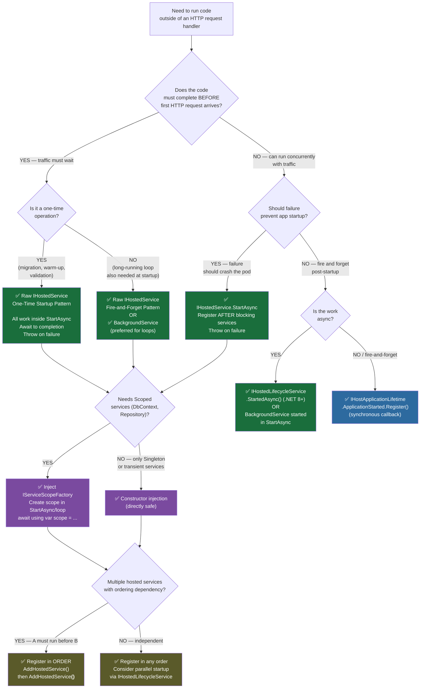

> [!success] Mastery Check
> - [ ] **Studied Well**
> - [ ] **Can explain the concept without notes**
> - [ ] **Can answer interview questions confidently**
> - [ ] **Can implement it in a real project**


# 4.231 — IHostedService: Running Code at Application Startup and Shutdown

---

## PART 0 — Navigation & Context

### Where This Topic Lives in the ASP.NET Core Domain

```
ASP.NET Core Mastery
│
├── Host & Lifecycle
│   ├── 4.004 — Generic Host (IHost)                 ← HOST ORCHESTRATOR
│   ├── 4.005 — IHostedService and IHostApplicationLifetime
│   ├── 4.231 — IHostedService: Startup & Shutdown   ◄◄ YOU ARE HERE
│   ├── 4.232 — BackgroundService: Long-Running Work
│   └── 4.235 — Scoped Services in BackgroundService
│
├── Dependency Injection
│   ├── 4.035 — Service Lifetimes
│   └── 4.042 — The Captive Dependency Problem       ← TRAPS IHostedService
│
├── Background Services
│   ├── 4.231 — IHostedService (this note)
│   ├── 4.232 — BackgroundService
│   └── 4.235 — IServiceScopeFactory in Hosted Services
│
└── (Downstream)
    ├── Middleware Pipeline
    ├── Routing
    └── Endpoint Handlers (traffic arrives AFTER IHostedService.StartAsync)
```

### What You Need Before This

| Prerequisite | Why It's Required |
|---|---|
| [[4.004 — Generic Host (IHost)]] | `IHost.StartAsync` is the method that calls all `IHostedService.StartAsync` implementations — you must understand the host lifecycle to understand when your code runs |
| [[4.035 — Service Lifetimes]] | `IHostedService` is registered as **Singleton** — singleton rules apply: it lives for the entire app lifetime, it's constructed once, it cannot directly consume Scoped services |
| [[4.042 — The Captive Dependency Problem]] | The most dangerous `IHostedService` bug in production comes from injecting a Scoped service into a Singleton hosted service constructor |
| [[4.005 — IHostedService and IHostApplicationLifetime]] | The interface contract and the `IHostApplicationLifetime` alternative — this note is the deep-dive implementation companion |

### What This Unlocks After

| Topic | How This Note Enables It |
|---|---|
| [[4.232 — BackgroundService: The Base Class for Long-Running Work]] | `BackgroundService` is just `IHostedService` with a template pattern wrapping `ExecuteAsync` — you cannot understand BackgroundService without understanding the raw interface |
| [[4.235 — Scoped Services in BackgroundService: IServiceScopeFactory Pattern]] | The scope factory pattern is directly needed the moment you try to use EF Core or any scoped service inside a hosted service |
| [[4.004 — Generic Host (IHost)]] | After understanding hosted services, the full host lifecycle (start order, stop order, timeout, SIGTERM) makes complete sense |
| Queue-based worker services (Outbox, Message Bus consumers) | Every production queue consumer (`IHostedService` reading from RabbitMQ, Azure Service Bus, or a database-backed outbox) is an `IHostedService` implementation |

### Why This Topic Matters at Scale

> In a production ASP.NET Core service, **`IHostedService` is the only guaranteed place to run code before the first HTTP request arrives and the last place to run code before the process dies** — get startup wrong and your API serves requests against an unmigrated schema; get shutdown wrong and you lose in-flight work, corrupt transactional state, or leave external systems with stale registrations.

---

## PART 1 — The Core Mental Model

### The Fundamental Rule

> **`IHostedService.StartAsync` runs inside `IHost.StartAsync` before the host signals it is ready to serve traffic; if `StartAsync` throws, the host startup fails and the application process exits — which means every `IHostedService` is a gatekeeper that can block or abort the entire service.**

### The Plain-Language Analogy

Think of `IHostedService` as the **pre-flight checklist for a commercial aircraft**. Before a single passenger boards (before any HTTP request is accepted), ground crew runs through a mandatory checklist — checking fuel levels, testing the engines, connecting external systems, loading passenger manifests (database migration, cache warm-up, external service registration). Only when every checklist item is `✅ complete` does the tower receive the "ready for boarding" signal — at which point the pilot opens the door and passengers board (Kestrel begins accepting HTTP connections).

When the flight lands (application shutdown), the process runs in reverse: passengers are off-loaded first (in-flight requests drain), then each checklist item is **un-done in reverse order** (StopAsync called in reverse registration order) — disconnecting from external services, flushing telemetry, closing database connection pools. The `StopAsync` cancellation token is the air traffic controller calling the tower: "You have 30 seconds to push back, then we close the runway." After that token fires, the runway is closed whether you're done or not.

The analogy holds even under concurrent load: while pre-flight is happening (StartAsync running), the boarding door is closed — no concurrent HTTP requests arrive. And if pre-flight discovers a critical problem (engine failure / database migration failure), the entire flight is cancelled — not just delayed.

### The Taxonomy Diagram

```mermaid
graph TD
    A["IHostedService Interface\n(Microsoft.Extensions.Hosting)"] --> B["StartAsync(CancellationToken)"]
    A --> C["StopAsync(CancellationToken)"]

    B --> D["Pattern: One-Time Startup Work\n(work IN StartAsync, returns when done)"]
    B --> E["Pattern: Fire-and-Forget Background Loop\n(starts Task, stores in field, returns immediately)"]

    D --> D1["Database Migration on Startup\n(DatabaseMigratorService)"]
    D --> D2["Cache Warm-Up\n(ProductCatalogWarmUpService)"]
    D --> D3["External System Registration\n(ServiceDiscoveryRegistrationService)"]
    D --> D4["Schema Validation / Config Check\n(StartupValidationService)"]

    E --> E1["Queue Consumer Loop\n→ use BackgroundService instead"]
    E --> E2["Scheduled Polling Loop\n→ use BackgroundService instead"]
    E --> E3["Health Probe Background Loop"]

    C --> F["Graceful Shutdown Logic"]
    F --> F1["Cancel background CancellationTokenSource"]
    F --> F2["Await background Task completion"]
    F --> F3["Flush in-flight state"]
    F --> F4["De-register from external systems"]

    A --> G["Implementing Abstractions"]
    G --> G1["BackgroundService\n(abstract base class, wraps IHostedService)"]
    G1 --> G2["IHostedLifecycleService (.NET 8+)\nStartingAsync / StartedAsync / StoppingAsync / StoppedAsync"]

    A --> H["Registration"]
    H --> H1["services.AddHostedService<T>()"]
    H --> H2["services.AddSingleton<IHostedService, T>()"]
    H1 --> H3["Multiple allowed — run in registration order"]

    A --> I["DI Lifetime: Singleton"]
    I --> I1["Constructor injection: ONLY Singletons"]
    I --> I2["Scoped services: IServiceScopeFactory pattern"]
    I --> I3["IHostApplicationLifetime: injected for post-start hooks"]

    style A fill:#2d6a9f,color:#fff
    style D fill:#1a6e3c,color:#fff
    style E fill:#1a6e3c,color:#fff
    style G1 fill:#7a4a9f,color:#fff
    style I fill:#8b3a3a,color:#fff
    style H fill:#5a5a2a,color:#fff
```



---

## PART 2 — Deep Mechanics

### 2.1 — The Host Startup Sequence: Where IHostedService.StartAsync Fits

The most important thing to know: `IHostedService.StartAsync` does **not** run inside the HTTP request pipeline. It runs before Kestrel opens its listening socket. Understanding this timeline is foundational.

```
Host.StartAsync() called
│
├─► Configure DI container (already done by Build())
│
├─► Call StartAsync(cancellationToken) on each IHostedService
│   IN REGISTRATION ORDER:
│   │
│   ├─► [1] DatabaseMigratorService.StartAsync()     ← runs, AWAITED
│   │       (applies EF Core migrations)
│   │
│   ├─► [2] ProductCatalogWarmUpService.StartAsync() ← runs, AWAITED
│   │       (loads 50k products into IMemoryCache)
│   │
│   └─► [3] OutboxPublisherService.StartAsync()      ← fires background Task, returns
│           (stores Task in _executingTask field)
│
├─► IHostApplicationLifetime.ApplicationStarted fires
│   (all StartAsync calls have returned)
│
└─► Kestrel begins accepting HTTP connections
    (first request can now arrive)
```

**Key insight**: `StartAsync` is awaited sequentially. If `DatabaseMigratorService.StartAsync` takes 8 seconds (applying migrations), no other hosted service starts until it completes. Kestrel is not listening during this entire window.

#### Pipeline Position (Host Lifecycle, not HTTP Pipeline)

```
Host.RunAsync()
  │
  ▼
IHostedService[0].StartAsync()  ──► Complete
  │
  ▼
IHostedService[1].StartAsync()  ──► Complete
  │
  ▼
IHostedService[N].StartAsync()  ──► Complete
  │
  ▼
ApplicationStarted Event
  │
  ▼
Kestrel.StartAsync()  ──► Socket opened, HTTP connections accepted
  │
  ▼
┌──── HTTP Request Pipeline ────────────────────────────────────────┐
│  ExceptionHandler → HSTS → StaticFiles → Routing → Auth → [Endpoints] │
└───────────────────────────────────────────────────────────────────┘
```

**Cost label**: Each `StartAsync` call: `O(1)` DI resolution + cost of whatever work you do inside. The framework overhead is negligible. Your startup work (migrations, warm-up) is the expensive part.

#### Framework Source Behavior

```csharp
// ASP.NET Core internally (approximate):
// Source: src/Hosting/Hosting/src/Internal/Host.cs
public async Task StartAsync(CancellationToken cancellationToken = default)
{
    // 1. Call StartAsync on each hosted service in registration order
    foreach (var hostedService in _hostedServices)
    {
        await hostedService.StartAsync(cancellationToken).ConfigureAwait(false);
        // If StartAsync throws → exception propagates → host startup fails
        // Process will exit (or crash) if not caught by the host startup error handler
    }

    // 2. Fire the ApplicationStarted cancellation token
    _applicationLifetime.NotifyStarted();

    // 3. Start Kestrel (server)
    await _server.StartAsync(cancellationToken).ConfigureAwait(false);
}
```

**The unforgiving truth**: there is **no try/catch** around individual `StartAsync` calls in the default host implementation. If your `DatabaseMigratorService.StartAsync` throws an `InvalidOperationException` because the database is unreachable, the exception propagates out of `Host.StartAsync()`, which then propagates out of `Host.RunAsync()`, which terminates the process. The application does not start.

---

### 2.2 — The Two Fundamental Patterns: One-Time Work vs Fire-and-Forget

These are the only two legitimate patterns for `StartAsync`. Using anything else is a design smell.

#### Pattern A: One-Time Startup Work

```
StartAsync is called
  │
  ▼
Perform ALL work synchronously/awaited inside StartAsync
(database migration, cache loading, config validation)
  │
  ▼
StartAsync returns (Task.CompletedTask)
  │
  ▼
Host continues to next IHostedService
```

**When to use**: Database migration, cache warm-up, external service registration, schema validation, secret fetching, connection pool initialization. These are **blocking** operations — the host must not serve traffic until they complete.

**HTTP wire effect**: None. No HTTP traffic exists yet. The client connecting during this window gets a TCP connection refused (Kestrel hasn't bound the socket).

```
// HTTP wire format (approximate) — client connecting during startup:
// [No HTTP response — TCP connection refused or RST]
// Client sees: "Connection refused" or timeout depending on infrastructure
```

**Cost label**: `O(1)` framework overhead + `O(startup work)` for the actual task. One `Task` allocation per `StartAsync` invocation.

#### Pattern B: Fire-and-Forget Background Loop

```
StartAsync is called
  │
  ▼
Store CancellationTokenSource in field
  │
  ▼
Start background Task (Task.Run or _ = ExecuteInBackground())
Store Task in field (_executingTask)
  │
  ▼
StartAsync returns IMMEDIATELY (Task.CompletedTask)
  │
  ▼
Host continues to next IHostedService
(background work runs concurrently on ThreadPool)
```

**When to use**: Long-running loops that must keep running while the application is alive. However, for this pattern, **`BackgroundService` is the better abstraction** — it encapsulates the `_executingTask` and `_stoppingCts` fields and handles the `StopAsync` coordination automatically. Use raw `IHostedService` with Pattern B only when you need fine-grained control over the task lifecycle that `BackgroundService` doesn't provide.

**Cost label**: One `Task` allocation + one `CancellationTokenSource` allocation per service registration. Background loop itself: `O(loop iteration)` per iteration.

---

### 2.3 — The StopAsync Contract and Graceful Shutdown

Graceful shutdown is where most production bugs hide. The framework behavior is precise and must be understood.

#### Shutdown Sequence (Host.StopAsync)

```
SIGTERM received / app.StopAsync() called
│
├─► IHostApplicationLifetime.ApplicationStopping fires
│   (parallel notifications — not awaited)
│
├─► Kestrel stops accepting NEW connections
│   (in-flight requests continue draining)
│
├─► IHostedService[N].StopAsync(shutdownToken)   ← REVERSE ORDER
├─► IHostedService[N-1].StopAsync(shutdownToken) ← REVERSE ORDER
├─► ...
└─► IHostedService[0].StopAsync(shutdownToken)   ← REVERSE ORDER

    ┌─ shutdownToken ─────────────────────────────────────────────┐
    │ CancellationToken that fires after graceful shutdown timeout │
    │ Default: 30 seconds (configurable)                          │
    │ When it fires: host has GIVEN UP waiting → process exits    │
    └─────────────────────────────────────────────────────────────┘
```

#### The Two CancellationTokens in IHostedService

This is the most commonly confused aspect:

```csharp
public interface IHostedService
{
    // cancellationToken: fires if the host is cancelled DURING startup
    // (e.g., Ctrl+C pressed before startup completes)
    Task StartAsync(CancellationToken cancellationToken);

    // cancellationToken: fires after graceful shutdown TIMEOUT expires
    // NOT fired immediately on shutdown — fired when the host has given up waiting
    Task StopAsync(CancellationToken cancellationToken);
}
```

**The `StopAsync` cancellation token semantics**:

```
Application receives SIGTERM
│
├─► Host initiates graceful shutdown
│
├─► [T+0s] StopAsync called — shutdownToken is NOT yet cancelled
│   Your code should be doing cleanup work
│
├─► [T+30s] Graceful shutdown timeout expires
│   shutdownToken IS CANCELLED NOW
│   This signals: "stop what you're doing, we're force-exiting"
│
└─► [T+30s] Host exits — regardless of whether StopAsync returned
```

**Framework source (approximate)**:
```csharp
// Source: src/Hosting/Hosting/src/Internal/Host.cs
public async Task StopAsync(CancellationToken cancellationToken = default)
{
    using var cts = new CancellationTokenSource(ShutdownTimeout);
    using var linkedCts = CancellationTokenSource.CreateLinkedTokenSource(
        cts.Token, cancellationToken);

    // StopAsync in REVERSE registration order
    foreach (var hostedService in _hostedServices.Reverse())
    {
        await hostedService.StopAsync(linkedCts.Token).ConfigureAwait(false);
        // If StopAsync throws: exception is logged, but shutdown CONTINUES
        // (unlike StartAsync where the exception halts the entire startup)
    }

    _applicationLifetime.NotifyStopped();
}
```

**Critical difference from StartAsync**: `StopAsync` exceptions are **caught and logged** — shutdown continues. `StartAsync` exceptions are **not caught** — they abort the host.

**Cost label**: One `CancellationTokenSource.CreateLinkedTokenSource` allocation per shutdown. `O(N)` `StopAsync` calls where N is number of registered hosted services. Each call awaited sequentially (reverse order).

---

### 2.4 — The IServiceScopeFactory Pattern: Accessing Scoped Services

This is the mandatory pattern for any hosted service that needs EF Core, `IRepository`, or any scoped dependency.

#### Why Constructor Injection of Scoped Services Fails

```
DI Container Lifetime Rules:
┌─────────────────────────────────────────────────────────────────┐
│ Singleton  IHostedService is created ONCE at startup           │
│            Lives for the entire application lifetime            │
│                                                                 │
│ Scoped    AppDbContext is created PER HTTP REQUEST (or per scope)│
│            Disposed at end of request                           │
│                                                                 │
│ PROBLEM: If Singleton captures a Scoped service in constructor, │
│          that Scoped service is never disposed → EF context     │
│          accumulates change tracking state → memory leak         │
│          + thread-safety issues                                  │
└─────────────────────────────────────────────────────────────────┘
```

**What the framework does when you inject Scoped into Singleton (constructor)**:

```
// ASP.NET Core internally (approximate):
// During Build(), the DI container validates lifetimes (if ValidateScopes = true)
// Throws: InvalidOperationException
// "Cannot consume scoped service 'AppDbContext' from singleton 
//  'DatabaseMigratorService'."
//
// In Development: ValidateScopes = true by default → fails fast on Build()
// In Production: ValidateScopes = false by default → SILENT BUG
//                (captive dependency — scoped service is effectively singleton)
```

#### The Correct Pattern: IServiceScopeFactory

```
IHostedService (Singleton)
│   Injects: IServiceScopeFactory (Singleton — safe)
│
└─► In StartAsync / background loop:
    │
    ├─► scope = scopeFactory.CreateScope()
    │   (creates a new DI scope, equivalent to a new "request")
    │
    ├─► service = scope.ServiceProvider.GetRequiredService<AppDbContext>()
    │   (resolves AppDbContext within this new scope)
    │
    ├─► Perform work...
    │
    └─► scope.Dispose()
        (disposes AppDbContext, releases DB connection to pool)
```

**Cost label**: One `IServiceScope` allocation per scope creation. `IServiceScopeFactory.CreateScope()` is `O(1)`. Scope disposal is `O(services in scope)`. This is cheap — far cheaper than a database round-trip.

#### HTTP Wire Effect (Indirect)

```
// HTTP wire format — request BEFORE successful migration:
// [TCP Connection Refused — Kestrel not yet listening]
// Or if somehow reached (e.g., load balancer probing):
// HTTP/1.1 503 Service Unavailable
// (health check endpoint reports not ready)

// HTTP wire format — request AFTER successful migration:
// GET /api/orders HTTP/1.1
// HTTP/1.1 200 OK
// Content-Type: application/json
// (normal operation — migration completed before any traffic)
```

---

### 2.5 — IHostedLifecycleService (.NET 8+): Extended Lifecycle Hooks

.NET 8 introduced `IHostedLifecycleService`, which extends `IHostedService` with four additional hooks. This addresses the limitation that `StartAsync` and `StopAsync` have no "before/after" granularity.

```
.NET 8+ Extended Host Lifecycle:

IHost.StartAsync()
  │
  ├─► IHostedLifecycleService.StartingAsync()  ← BEFORE StartAsync
  ├─► IHostedService.StartAsync()
  ├─► IHostedLifecycleService.StartedAsync()   ← AFTER StartAsync (before Kestrel)
  │
  ├─► Kestrel.StartAsync()
  │
IHost.StopAsync()
  │
  ├─► IHostedLifecycleService.StoppingAsync()  ← BEFORE StopAsync
  ├─► IHostedService.StopAsync()
  └─► IHostedLifecycleService.StoppedAsync()   ← AFTER StopAsync
```

**When to use `IHostedLifecycleService`**: When you need to run code specifically *between* hosted service lifecycle phases — e.g., validate that database migration completed before attempting cache warm-up in `StartedAsync`. In practice, this is rarely needed; sequential `IHostedService` registration achieves the same result via ordering.

**Cost label**: Same as `IHostedService` + 4 additional `Task` allocations per service per lifecycle phase.

---

### 2.6 — Error Handling: What Happens When StartAsync Throws

This is the behavior that prevents silent degraded startup.

```
StartAsync execution flow:
│
├─► Attempt work
│
├─► SUCCESS: return Task.CompletedTask or completed Task
│   → Host continues startup
│
└─► FAILURE: throw exception (or return faulted Task)
    │
    ├─► Exception propagates out of Host.StartAsync()
    │
    ├─► Host.RunAsync() catches it → logs it
    │
    ├─► ApplicationLifetime.StopApplication() is called
    │
    └─► Process exits with non-zero exit code
        (Kubernetes/systemd sees failed pod/unit → restarts)
```

**The operational contract**: This design is intentional. If your database migration fails, the ASP.NET Core team's position is: **it is better to crash-loop the pod than to serve HTTP 500s against an unmigrated schema**. In Kubernetes, this means the pod restarts (and eventually hits `CrashLoopBackOff`), alerting operations.

**HTTP wire effect during failed startup**:
```
// HTTP wire format — client connecting to a failed/restarting pod:
// [TCP Connection Refused — Kestrel never bound the socket]
// Load balancer health check: no response → removes pod from rotation
// Kubernetes probe: startup probe fails → pod marked NotReady
```

---

## PART 3 — Production Code Patterns

### Pattern 1: The Idempotent Database Migration Gate

**Domain**: Order management service — ensures EF Core migrations run before the API serves traffic.

> [!IMPORTANT]
> This pattern uses `IServiceScopeFactory` for safe Scoped service resolution from a Singleton. The migration runs **synchronously** within `StartAsync` — the host will not progress until it completes.

```csharp
// ✅ CORRECT: Full production implementation of database migration on startup
// Domain: Order Management Service — prevents serving HTTP against unmigrated schema

using Microsoft.EntityFrameworkCore;

namespace OrderManagement.Infrastructure.Hosting;

public sealed class DatabaseMigratorService : IHostedService
{
    private readonly IServiceScopeFactory _scopeFactory;
    private readonly ILogger<DatabaseMigratorService> _logger;

    // ✅ Inject IServiceScopeFactory (Singleton) — never inject AppDbContext (Scoped) directly
    public DatabaseMigratorService(
        IServiceScopeFactory scopeFactory,
        ILogger<DatabaseMigratorService> logger)
    {
        _scopeFactory = scopeFactory;
        _logger = logger;
    }

    public async Task StartAsync(CancellationToken cancellationToken)
    {
        _logger.LogInformation(
            "Order Management: starting database migration check...");

        // Create a new DI scope — equivalent to creating a synthetic "request"
        // This ensures AppDbContext is properly scoped and disposed
        await using var scope = _scopeFactory.CreateAsyncScope();
        var dbContext = scope.ServiceProvider.GetRequiredService<OrderDbContext>();

        try
        {
            // Check if there are any pending migrations
            var pendingMigrations = await dbContext.Database
                .GetPendingMigrationsAsync(cancellationToken);

            var migrationsList = pendingMigrations.ToList();
            if (migrationsList.Count == 0)
            {
                _logger.LogInformation(
                    "Order Management: database is up-to-date, no migrations pending.");
                return;
            }

            _logger.LogWarning(
                "Order Management: applying {Count} pending migrations: {Migrations}",
                migrationsList.Count,
                string.Join(", ", migrationsList));

            // MigrateAsync is idempotent — safe to call even if already migrated
            // Uses a distributed lock in EF Core internals to prevent concurrent migrations
            await dbContext.Database.MigrateAsync(cancellationToken);

            _logger.LogInformation(
                "Order Management: database migration completed successfully.");
        }
        catch (OperationCanceledException) when (cancellationToken.IsCancellationRequested)
        {
            // Host startup was cancelled (e.g., Ctrl+C during startup)
            // Re-throw to propagate cancellation properly
            _logger.LogWarning("Order Management: database migration cancelled.");
            throw;
        }
        catch (Exception ex)
        {
            // Any other exception: log, then re-throw
            // Re-throw causes Host.StartAsync to fail → process exits → pod restarts
            _logger.LogCritical(ex,
                "Order Management: database migration FAILED. Service will not start.");
            throw; // ← intentional: fail fast rather than serve against bad schema
        }
        // scope.DisposeAsync() called here — AppDbContext and DB connection returned to pool
    }

    public Task StopAsync(CancellationToken cancellationToken)
    {
        // Migration is a one-time startup action — nothing to stop
        return Task.CompletedTask;
    }
}

// Registration in Program.cs / ServiceCollectionExtensions:
// services.AddHostedService<DatabaseMigratorService>();
// Note: AddHostedService registers as Singleton<IHostedService, T>
// Multiple calls allowed — each service runs in registration order
```

```
// HTTP wire format (before DatabaseMigratorService.StartAsync completes):
// [No HTTP response — Kestrel socket not yet bound]
// Client: TCP Connection Refused

// HTTP wire format (after successful migration):
// POST /api/v1/orders HTTP/1.1
// Content-Type: application/json
// Authorization: Bearer eyJhbGci...
//
// HTTP/1.1 201 Created
// Location: /api/v1/orders/ord_8f3kd9
// Content-Type: application/json
```

---

### Pattern 2: The Cache Warm-Up Fence

**Domain**: Product catalog service — loads high-frequency read data into `IMemoryCache` before serving any search traffic. Without this pattern, the first N requests after deployment hit the database simultaneously (cache stampede).

```csharp
// ✅ CORRECT: Cache warm-up before traffic — prevents cache stampede on cold start
// Domain: Product Catalog Service (e-commerce)

namespace ProductCatalog.Infrastructure.Hosting;

public sealed class ProductCatalogWarmUpService : IHostedService
{
    private readonly IServiceScopeFactory _scopeFactory;
    private readonly IMemoryCache _cache;
    private readonly ILogger<ProductCatalogWarmUpService> _logger;

    public ProductCatalogWarmUpService(
        IServiceScopeFactory scopeFactory,
        IMemoryCache cache, // ✅ IMemoryCache is Singleton — safe to inject directly
        ILogger<ProductCatalogWarmUpService> logger)
    {
        _scopeFactory = scopeFactory;
        _cache = cache;
        _logger = logger;
    }

    public async Task StartAsync(CancellationToken cancellationToken)
    {
        var stopwatch = Stopwatch.StartNew();
        _logger.LogInformation("ProductCatalog: beginning cache warm-up...");

        await using var scope = _scopeFactory.CreateAsyncScope();
        var productRepository = scope.ServiceProvider
            .GetRequiredService<IProductRepository>();

        // Load top 10,000 products by sales rank into memory cache
        // This query runs ONCE at startup — subsequent requests hit the cache
        var topProducts = await productRepository
            .GetTopProductsBySalesRankAsync(limit: 10_000, cancellationToken);

        var cacheOptions = new MemoryCacheEntryOptions
        {
            // Absolute expiration — cache will be refreshed by next deployment
            // or by a background refresh service
            AbsoluteExpirationRelativeToNow = TimeSpan.FromHours(6),
            // Priority: do not evict these entries under memory pressure
            Priority = CacheItemPriority.High,
            // Size contributes to memory cache size limit
            Size = topProducts.Count
        };

        foreach (var product in topProducts)
        {
            var cacheKey = CacheKeys.Product(product.Sku);
            _cache.Set(cacheKey, product, cacheOptions);
        }

        stopwatch.Stop();
        _logger.LogInformation(
            "ProductCatalog: warm-up complete. {Count} products loaded in {ElapsedMs}ms",
            topProducts.Count, stopwatch.ElapsedMilliseconds);
    }

    public Task StopAsync(CancellationToken cancellationToken)
        => Task.CompletedTask;
}

// Anti-pattern version:
// ⚠️ WRONG: Attempting to warm cache in a background thread AFTER startup returns
// This means the first requests may arrive before warm-up completes
public sealed class ProductCatalogWarmUpServiceWRONG : IHostedService
{
    public Task StartAsync(CancellationToken cancellationToken)
    {
        // ⚠️ WRONG: Fire-and-forget warm-up — StartAsync returns immediately
        // Kestrel will start accepting requests before warm-up finishes
        _ = Task.Run(async () =>
        {
            await Task.Delay(100); // simulate some delay
            // ... cache loading ...
        }, cancellationToken);

        return Task.CompletedTask; // ← returns before cache is populated!
    }

    public Task StopAsync(CancellationToken cancellationToken) => Task.CompletedTask;
}
```

```
// HTTP wire format — first request after warm-up (cache HIT):
// GET /api/products/SKU-78423 HTTP/1.1
// Accept: application/json

// HTTP/1.1 200 OK
// Content-Type: application/json; charset=utf-8
// X-Cache: HIT        ← custom header showing cache hit (if added)
// Content-Length: 847

// HTTP wire format — first request WITHOUT warm-up (cache MISS, DB hit):
// (same request, but response takes 35ms instead of 2ms)
// Multiplied by 1000 concurrent first-requests → DB overwhelmed → 503s
```

---

### Pattern 3: The Long-Running Worker with Cooperative Cancellation

**Domain**: Payment outbox publisher — reads from a database outbox table and publishes events to a message broker. Must stop cleanly during deployments.

> [!NOTE]
> While `BackgroundService` is the preferred base class for this pattern (see [[4.232 — BackgroundService: The Base Class for Long-Running Work]]), this shows the raw `IHostedService` implementation to expose the underlying mechanics `BackgroundService` hides from you.

```csharp
// ✅ CORRECT: Raw IHostedService with cooperative cancellation
// Domain: Payment Service — Outbox pattern publisher

namespace PaymentService.Infrastructure.Hosting;

public sealed class PaymentOutboxPublisherService : IHostedService, IAsyncDisposable
{
    private readonly IServiceScopeFactory _scopeFactory;
    private readonly ILogger<PaymentOutboxPublisherService> _logger;

    // These are the fields BackgroundService manages for you automatically
    private CancellationTokenSource? _stoppingCts;
    private Task? _executingTask;

    public PaymentOutboxPublisherService(
        IServiceScopeFactory scopeFactory,
        ILogger<PaymentOutboxPublisherService> logger)
    {
        _scopeFactory = scopeFactory;
        _logger = logger;
    }

    public Task StartAsync(CancellationToken cancellationToken)
    {
        // Create a CancellationTokenSource that we'll cancel in StopAsync
        _stoppingCts = CancellationTokenSource.CreateLinkedTokenSource(cancellationToken);

        // Fire the background loop — do NOT await it
        // StartAsync returns immediately → host continues to next IHostedService
        _executingTask = ExecutePublishLoopAsync(_stoppingCts.Token);

        // If the task completed synchronously (e.g., immediate error), surface it
        if (_executingTask.IsCompleted)
        {
            return _executingTask;
        }

        // Otherwise, the task is running in the background — return completed task
        return Task.CompletedTask;
    }

    private async Task ExecutePublishLoopAsync(CancellationToken stoppingToken)
    {
        _logger.LogInformation("PaymentOutbox: publisher loop starting.");

        while (!stoppingToken.IsCancellationRequested)
        {
            try
            {
                await using var scope = _scopeFactory.CreateAsyncScope();
                var outboxProcessor = scope.ServiceProvider
                    .GetRequiredService<IPaymentOutboxProcessor>();

                // Process one batch of outbox messages
                var processed = await outboxProcessor
                    .ProcessBatchAsync(batchSize: 100, stoppingToken);

                if (processed == 0)
                {
                    // No messages — back off before polling again
                    await Task.Delay(TimeSpan.FromSeconds(5), stoppingToken);
                }
            }
            catch (OperationCanceledException) when (stoppingToken.IsCancellationRequested)
            {
                // Expected during shutdown — exit gracefully
                _logger.LogInformation("PaymentOutbox: publisher loop stopping.");
                break;
            }
            catch (Exception ex)
            {
                // Log but continue — don't crash the background loop on transient errors
                _logger.LogError(ex,
                    "PaymentOutbox: error processing outbox batch. Will retry.");
                await Task.Delay(TimeSpan.FromSeconds(10), stoppingToken);
            }
        }
    }

    public async Task StopAsync(CancellationToken cancellationToken)
    {
        if (_executingTask == null)
            return;

        try
        {
            // Signal the background loop to stop
            await _stoppingCts!.CancelAsync();
        }
        finally
        {
            // Wait for the background task to complete, BUT also respect
            // the StopAsync cancellationToken (graceful shutdown timeout)
            // If the token fires: host has given up → Task.WhenAny returns
            await Task.WhenAny(
                _executingTask,
                Task.Delay(Timeout.Infinite, cancellationToken));
        }
    }

    public async ValueTask DisposeAsync()
    {
        _stoppingCts?.Dispose();
        if (_executingTask != null)
            await _executingTask.ConfigureAwait(ConfigureAwaitOptions.SuppressThrowing);
    }
}
```

```
// HTTP wire format — payment event published successfully:
// [No direct HTTP effect — outbox publisher talks to message broker]
// But downstream: webhook consumer receives:
// POST /api/webhooks/payment-completed HTTP/1.1
// X-Event-Type: PaymentCompleted
// Content-Type: application/json
// {"orderId":"ord_9f2j1", "amount":149.99, "currency":"USD"}
```

---

### Pattern 4: The External System Registration with Retry

**Domain**: Logistics service — registers with a service discovery system (e.g., Consul, custom registry) at startup, deregisters at shutdown. Must handle transient connectivity failures during startup.

```csharp
// ✅ CORRECT: Service discovery registration with retry policy
// Domain: Logistics Shipment Tracker — registers with Consul on startup

namespace LogisticsTracker.Infrastructure.Hosting;

public sealed class ConsulRegistrationService : IHostedService
{
    private readonly IConsulClient _consulClient;
    private readonly ConsulRegistrationOptions _options;
    private readonly ILogger<ConsulRegistrationService> _logger;
    private string? _serviceId;

    // ✅ IConsulClient is Singleton — safe to inject directly
    public ConsulRegistrationService(
        IConsulClient consulClient,
        IOptions<ConsulRegistrationOptions> options,
        ILogger<ConsulRegistrationService> logger)
    {
        _consulClient = consulClient;
        _options = options.Value;
        _logger = logger;
    }

    public async Task StartAsync(CancellationToken cancellationToken)
    {
        _serviceId = $"{_options.ServiceName}-{Environment.MachineName}-{Guid.NewGuid():N}";

        var registration = new AgentServiceRegistration
        {
            ID = _serviceId,
            Name = _options.ServiceName,
            Address = _options.AdvertisedAddress,
            Port = _options.Port,
            Tags = new[] { "logistics", "v2", "grpc" },
            Check = new AgentServiceCheck
            {
                HTTP = $"http://{_options.AdvertisedAddress}:{_options.Port}/health",
                Interval = "10s",
                Timeout = "5s",
                DeregisterCriticalServiceAfter = "30s"
            }
        };

        // Retry with exponential backoff — Consul may not be available immediately
        // especially during cluster startup in containerized environments
        var retryDelay = TimeSpan.FromSeconds(2);
        const int maxRetries = 5;

        for (int attempt = 1; attempt <= maxRetries; attempt++)
        {
            try
            {
                var result = await _consulClient.Agent
                    .ServiceRegister(registration, cancellationToken);

                if (result.StatusCode == System.Net.HttpStatusCode.OK)
                {
                    _logger.LogInformation(
                        "LogisticsTracker: registered with Consul. ServiceId={ServiceId}",
                        _serviceId);
                    return;
                }
            }
            catch (Exception ex) when (attempt < maxRetries)
            {
                _logger.LogWarning(ex,
                    "LogisticsTracker: Consul registration attempt {Attempt}/{Max} failed. " +
                    "Retrying in {Delay}s", attempt, maxRetries, retryDelay.TotalSeconds);
                await Task.Delay(retryDelay, cancellationToken);
                retryDelay *= 2; // exponential backoff
            }
        }

        // All retries exhausted — throw to fail startup
        throw new InvalidOperationException(
            $"Failed to register with Consul after {maxRetries} attempts. " +
            "Service will not start.");
    }

    public async Task StopAsync(CancellationToken cancellationToken)
    {
        if (_serviceId is null) return;

        try
        {
            // ⚠️ Note: StopAsync cancellationToken fires AFTER shutdown timeout
            // For deregistration, we want to attempt it even if the token fires
            // Use CancellationToken.None to ensure deregistration completes
            await _consulClient.Agent.ServiceDeregister(_serviceId, CancellationToken.None);

            _logger.LogInformation(
                "LogisticsTracker: deregistered from Consul. ServiceId={ServiceId}",
                _serviceId);
        }
        catch (Exception ex)
        {
            // Log but don't throw — Consul TTL check will handle cleanup
            // Consul's DeregisterCriticalServiceAfter will auto-remove the service
            _logger.LogError(ex,
                "LogisticsTracker: failed to deregister from Consul. " +
                "Consul TTL check will handle cleanup. ServiceId={ServiceId}",
                _serviceId);
        }
    }
}
```

---

### Pattern 5: The Startup Validation Guard

**Domain**: User authentication service — validates required configuration (OAuth secrets, signing keys) before the application is allowed to start. Fails fast with a descriptive error rather than serving 500s.

```csharp
// ✅ CORRECT: Configuration validation at startup — fail fast with clear error
// Domain: User Authentication Service (OAuth2 provider)

namespace AuthService.Infrastructure.Hosting;

public sealed class AuthConfigurationValidationService : IHostedService
{
    private readonly IOptions<JwtSigningOptions> _jwtOptions;
    private readonly IOptions<OAuthClientOptions> _oauthOptions;
    private readonly ILogger<AuthConfigurationValidationService> _logger;

    public AuthConfigurationValidationService(
        IOptions<JwtSigningOptions> jwtOptions,
        IOptions<OAuthClientOptions> oauthOptions,
        ILogger<AuthConfigurationValidationService> logger)
    {
        _jwtOptions = jwtOptions;
        _oauthOptions = oauthOptions;
        _logger = logger;
    }

    public Task StartAsync(CancellationToken cancellationToken)
    {
        _logger.LogInformation("AuthService: validating configuration...");

        var errors = new List<string>();

        // Validate JWT signing key
        var jwtOpts = _jwtOptions.Value;
        if (string.IsNullOrWhiteSpace(jwtOpts.SigningKeyBase64))
            errors.Add("JwtSigningOptions:SigningKeyBase64 is not configured.");

        if (jwtOpts.SigningKeyBase64 is not null)
        {
            try
            {
                var keyBytes = Convert.FromBase64String(jwtOpts.SigningKeyBase64);
                if (keyBytes.Length < 32)
                    errors.Add("JwtSigningOptions:SigningKeyBase64 must be at least 256 bits.");
            }
            catch (FormatException)
            {
                errors.Add("JwtSigningOptions:SigningKeyBase64 is not valid Base64.");
            }
        }

        // Validate OAuth client credentials
        var oauthOpts = _oauthOptions.Value;
        if (string.IsNullOrWhiteSpace(oauthOpts.GoogleClientId))
            errors.Add("OAuthClientOptions:GoogleClientId is not configured.");
        if (string.IsNullOrWhiteSpace(oauthOpts.GoogleClientSecret))
            errors.Add("OAuthClientOptions:GoogleClientSecret is not configured.");

        if (errors.Count > 0)
        {
            var message = "AuthService: configuration validation FAILED:\n" +
                          string.Join("\n", errors.Select(e => $"  - {e}"));
            _logger.LogCritical(message);

            // Throw to abort startup — process exits → pod restarts → ops notified
            throw new InvalidOperationException(message);
        }

        _logger.LogInformation("AuthService: configuration validation passed.");

        // ✅ Synchronous validation — return CompletedTask (no async needed)
        return Task.CompletedTask;
    }

    public Task StopAsync(CancellationToken cancellationToken)
        => Task.CompletedTask;
}

// ⚠️ WRONG: Relying on IOptions<T> DataAnnotations validation alone
// DataAnnotations validate during options resolution, not at a specific host phase
// They can be harder to trace and do not give you a clear startup error message
// ✅ CORRECT: Explicit validation in IHostedService.StartAsync gives you full control
//             over the error message, logging context, and failure behavior
```

---

### Pattern 6: The AddHostedService Order Contract

**Domain**: Inventory management service — demonstrates dependency ordering between hosted services. Migration must run before cache warm-up; both must run before the background sync job starts.

```csharp
// ✅ CORRECT: Explicit ordering via registration order
// Domain: Inventory Management Service

namespace InventoryManagement.Infrastructure;

public static class InventoryServiceCollectionExtensions
{
    public static IServiceCollection AddInventoryInfrastructure(
        this IServiceCollection services,
        IConfiguration configuration)
    {
        services.AddDbContext<InventoryDbContext>(options =>
            options.UseNpgsql(configuration.GetConnectionString("Inventory")));

        services.AddMemoryCache();

        // ✅ Registration ORDER determines execution ORDER
        // Step 1: Validate config — must be first, catches misconfig before any DB work
        services.AddHostedService<InventoryConfigValidationService>();

        // Step 2: Migrate database — must run before warm-up reads from DB
        services.AddHostedService<InventoryDatabaseMigratorService>();

        // Step 3: Warm up cache — reads freshly migrated data into IMemoryCache
        services.AddHostedService<InventoryLevelCacheWarmUpService>();

        // Step 4: Start background sync — runs concurrently AFTER warm-up completes
        // (fires background Task in StartAsync, returns immediately)
        services.AddHostedService<InventorySupplierSyncService>();

        // ⚠️ WRONG ORDER (for reference):
        // services.AddHostedService<InventoryLevelCacheWarmUpService>(); // reads before migration!
        // services.AddHostedService<InventoryDatabaseMigratorService>(); // too late

        return services;
    }
}

// Program.cs — clean and minimal
var builder = WebApplication.CreateBuilder(args);
builder.Services.AddInventoryInfrastructure(builder.Configuration);

var app = builder.Build();
app.MapInventoryEndpoints();
app.Run();
```

```
// HTTP wire format during startup sequence:
// [T+0ms]  No HTTP connections accepted (Kestrel not yet started)
// [T+50ms] ConfigValidation: ✅ Complete
// [T+2s]   DatabaseMigration: ✅ Complete (2 pending migrations applied)
// [T+8s]   CacheWarmUp: ✅ Complete (120,000 SKUs loaded into IMemoryCache)
// [T+9ms]  SupplierSync: StartAsync returns (background loop started)
// [T+10ms] Kestrel binds to :8080 — first HTTP request accepted

// GET /health/ready HTTP/1.1
// HTTP/1.1 200 OK
// Content-Type: application/json
// {"status":"Healthy","duration":"00:00:10.012"}
```

---

### Pattern 7: The IHostApplicationLifetime Alternative for Post-Traffic Hooks

**Domain**: Analytics platform — registers a post-traffic hook (reporting that traffic has started) using `IHostApplicationLifetime` instead of `IHostedService`. Shows when to use each.

```csharp
// CONTEXT: IHostApplicationLifetime.ApplicationStarted fires AFTER Kestrel is up
//          Use this for work that DOES NOT need to block traffic
//          Use IHostedService.StartAsync for work that MUST block traffic

namespace AnalyticsPlatform.Infrastructure.Hosting;

public sealed class AnalyticsStartupNotifier : IHostedService
{
    private readonly IHostApplicationLifetime _lifetime;
    private readonly IAnalyticsClient _analyticsClient;
    private readonly ILogger<AnalyticsStartupNotifier> _logger;

    public AnalyticsStartupNotifier(
        IHostApplicationLifetime lifetime,
        IAnalyticsClient analyticsClient,
        ILogger<AnalyticsStartupNotifier> logger)
    {
        _lifetime = lifetime;
        _analyticsClient = analyticsClient;
        _logger = logger;
    }

    public Task StartAsync(CancellationToken cancellationToken)
    {
        // ✅ Register a callback on ApplicationStarted (fires AFTER traffic begins)
        // This is fire-and-forget — we don't block host startup for analytics
        _lifetime.ApplicationStarted.Register(OnApplicationStarted);

        // ✅ Register a callback on ApplicationStopping (fires BEFORE StopAsync)
        _lifetime.ApplicationStopping.Register(OnApplicationStopping);

        return Task.CompletedTask;
    }

    private void OnApplicationStarted()
    {
        // ⚠️ This callback is SYNCHRONOUS — do not do expensive async work here
        // For async post-startup work, use IHostedLifecycleService.StartedAsync (.NET 8+)
        _logger.LogInformation(
            "AnalyticsPlatform: application started. Notifying analytics dashboard.");

        // Fire-and-forget — analytics notification should not block traffic
        _ = _analyticsClient.ReportDeploymentStartAsync(
            serviceName: "analytics-platform",
            version: typeof(AnalyticsStartupNotifier).Assembly.GetName().Version?.ToString(),
            timestamp: DateTimeOffset.UtcNow);
    }

    private void OnApplicationStopping()
    {
        _logger.LogInformation(
            "AnalyticsPlatform: application stopping. Flushing analytics events.");
    }

    public Task StopAsync(CancellationToken cancellationToken)
        => Task.CompletedTask;
}

// Decision table:
// ┌─────────────────────────────────────────────────────────────────────────┐
// │ Use IHostedService.StartAsync when:                                     │
// │   ✅ Traffic MUST NOT arrive before work completes (migration, warm-up) │
// │   ✅ Work failure should prevent application startup (validation)       │
// │                                                                         │
// │ Use IHostApplicationLifetime.ApplicationStarted when:                   │
// │   ✅ Work can run after first request arrives (analytics, logging)      │
// │   ✅ Work failure should NOT prevent application startup                │
// │   ✅ You want the callback to be fire-and-forget                        │
// └─────────────────────────────────────────────────────────────────────────┘
```

---

## PART 4 — Gotchas & Anti-Patterns

### Gotcha 1: Injecting IServiceScopeFactory but Creating the Scope in the Constructor

Experienced engineers know to use `IServiceScopeFactory` instead of injecting Scoped services directly — but they sometimes create the scope in the **constructor** rather than in `StartAsync`. This defeats the purpose: the scope created in the constructor lives for the lifetime of the Singleton hosted service, making the scoped service effectively Singleton.

```csharp
// ⚠️ WRONG: Scope created in constructor — scoped service lives for app lifetime
public sealed class OrderSyncService : IHostedService
{
    private readonly IOrderRepository _orderRepository; // Scoped!

    public OrderSyncService(IServiceScopeFactory scopeFactory)
    {
        // Creates scope in constructor → scope lives as long as this Singleton
        var scope = scopeFactory.CreateScope();
        _orderRepository = scope.ServiceProvider.GetRequiredService<IOrderRepository>();
        // ⚠️ scope is never disposed — memory leak
        // ⚠️ DbContext captured forever — accumulates change tracking state
        // ⚠️ Thread-safety: DbContext is NOT thread-safe for concurrent access
    }

    public Task StartAsync(CancellationToken cancellationToken) => Task.CompletedTask;
    public Task StopAsync(CancellationToken cancellationToken) => Task.CompletedTask;
}
```

```
// HTTP consequence (wrong path):
// Application runs initially, but:
// - Memory grows unbounded as DbContext accumulates tracked entities
// - After ~hours/days: ObjectDisposedException when DB connection pool is exhausted
// - Thread-safety violations if background loop runs concurrently
// No visible HTTP error immediately — this is a slow poison bug
```

```csharp
// ✅ CORRECT: Scope created inside StartAsync (or per iteration in background loop)
public sealed class OrderSyncService : IHostedService
{
    private readonly IServiceScopeFactory _scopeFactory;

    public OrderSyncService(IServiceScopeFactory scopeFactory)
    {
        _scopeFactory = scopeFactory;
    }

    public async Task StartAsync(CancellationToken cancellationToken)
    {
        await using var scope = _scopeFactory.CreateAsyncScope();
        var orderRepository = scope.ServiceProvider.GetRequiredService<IOrderRepository>();
        await orderRepository.SyncPendingOrdersAsync(cancellationToken);
        // scope disposed here → DbContext and connection returned to pool
    }

    public Task StopAsync(CancellationToken cancellationToken) => Task.CompletedTask;
}
```

```
// HTTP consequence (correct path):
// Clean startup — DbContext created and disposed within StartAsync scope
// No memory accumulation — connection returned to pool after StartAsync completes
// HTTP/1.1 200 OK (normal operation once traffic starts)
```

```
// WHY: IServiceScope created in the constructor is tied to the IHostedService's Singleton 
// lifetime because the scope's IServiceProvider is captured in a field. The scope is never 
// disposed because no using block wraps it, and the DI container does not manage nested 
// scope lifetimes — it only manages root container lifetimes. Always create scopes in the 
// method where work is performed, not in the constructor.
```

---

### Gotcha 2: Not Awaiting StopAsync Properly — Background Task Abandonment

Engineers implementing the fire-and-forget pattern sometimes write `StopAsync` that cancels the `CancellationTokenSource` but doesn't await the background task. This causes the background task to be abandoned mid-operation during deployment — corrupting in-flight work.

```csharp
// ⚠️ WRONG: StopAsync cancels but doesn't await — task abandoned mid-operation
public sealed class PaymentEventPublisherService : IHostedService
{
    private CancellationTokenSource? _cts;
    private Task? _backgroundTask;

    public Task StartAsync(CancellationToken cancellationToken)
    {
        _cts = new CancellationTokenSource();
        _backgroundTask = PublishEventsAsync(_cts.Token);
        return Task.CompletedTask;
    }

    public Task StopAsync(CancellationToken cancellationToken)
    {
        _cts?.Cancel();
        // ⚠️ WRONG: Does not await _backgroundTask
        // Background task may be mid-way through publishing a payment event
        return Task.CompletedTask; // returns immediately → host exits → task killed
    }
}
```

```
// HTTP consequence (wrong path):
// During rolling deployment:
// - Pod receives SIGTERM
// - StopAsync cancels CancellationTokenSource
// - Returns Task.CompletedTask immediately
// - Host exits while PublishEventsAsync is mid-publish
// - Payment event partially published → duplicate or lost event
// - Downstream: duplicate order confirmation emails, missed fraud checks
// No visible HTTP error — silent data corruption
```

```csharp
// ✅ CORRECT: StopAsync awaits background task completion
public Task StopAsync(CancellationToken cancellationToken)
{
    _cts?.Cancel();

    if (_backgroundTask == null)
        return Task.CompletedTask;

    // ✅ Wait for background task to finish, but respect shutdown timeout
    return Task.WhenAny(_backgroundTask, Task.Delay(Timeout.Infinite, cancellationToken));
    // When cancellationToken fires (shutdown timeout): WhenAny returns → host exits
    // When _backgroundTask completes: WhenAny returns → host exits cleanly
}
```

```
// HTTP consequence (correct path):
// SIGTERM received → StopAsync awaits background task
// Background task finishes current publish operation (typically < 500ms)
// Host exits cleanly → no in-flight work corrupted
// Rolling deployment completes without data loss
```

```
// WHY: Task.WhenAny is the correct pattern for "wait up to the graceful shutdown timeout 
// for the background task to complete." The StopAsync CancellationToken fires AFTER the 
// timeout — it is the host's way of saying "I'm giving up waiting." By using WhenAny, you 
// respect both outcomes: normal completion and timeout expiry. Not awaiting _backgroundTask 
// at all means the GC can keep the Task alive, but the continuations attached to it run on 
// an already-exiting process — undefined behavior.
```

---

### Gotcha 3: StartAsync Performing Work on a Background Thread That Throws Silently

A subtle variant of Pattern B: starting a background task in `StartAsync` and returning `Task.CompletedTask`, then having that background task throw an exception. In .NET 6+, this exception propagates and stops the application (via `BackgroundServiceExceptionBehavior`). In raw `IHostedService`, the exception in the background task is an unobserved task exception — it's swallowed silently by default.

```csharp
// ⚠️ WRONG: Background task exception swallowed silently in raw IHostedService
public sealed class InventoryIndexerService : IHostedService
{
    public Task StartAsync(CancellationToken cancellationToken)
    {
        // Fire background work — StartAsync returns immediately
        _ = Task.Run(async () =>
        {
            // ⚠️ If this throws, the exception is an unobserved task exception
            // In .NET default config: logged as unobserved, but process continues
            // The indexer silently stops — no one knows
            await BuildSearchIndexAsync(cancellationToken);
        });
        return Task.CompletedTask;
    }

    public Task StopAsync(CancellationToken cancellationToken) => Task.CompletedTask;
}
```

```
// HTTP consequence (wrong path):
// Indexer throws on startup (e.g., Elasticsearch unreachable)
// Exception is swallowed — no crash, no log (unless TaskScheduler.UnobservedTaskException handler)
// GET /api/products/search?q=laptop HTTP/1.1
// HTTP/1.1 200 OK  ← returns empty results or stale index silently
// No 503, no error — silent data quality degradation
```

```csharp
// ✅ CORRECT: Store the Task and surface exceptions in StopAsync (or use BackgroundService)
public sealed class InventoryIndexerService : IHostedService
{
    private Task? _indexingTask;

    public Task StartAsync(CancellationToken cancellationToken)
    {
        // Store the Task — do NOT use discard operator
        _indexingTask = BuildSearchIndexAsync(cancellationToken);

        // If task completed synchronously (immediate failure), surface it
        return _indexingTask.IsCompleted ? _indexingTask : Task.CompletedTask;
    }

    public async Task StopAsync(CancellationToken cancellationToken)
    {
        if (_indexingTask != null)
        {
            // Await will re-throw any exception — surfacing the failure
            await _indexingTask;
        }
    }

    private async Task BuildSearchIndexAsync(CancellationToken ct)
    {
        // ... index building logic ...
    }
}
```

```
// HTTP consequence (correct path):
// BuildSearchIndexAsync throws → exception re-thrown in StopAsync (on shutdown)
// OR: use BackgroundService which propagates exceptions automatically
// Alternatively: log + crash the host on indexing failure to prevent silent degradation
```

```
// WHY: The discard operator (_ = Task.Run(...)) tells the compiler "I know this returns 
// a Task and I'm intentionally not awaiting it." But an unawaited faulted Task becomes an 
// unobserved task exception. Unless you set TaskScheduler.UnobservedTaskException, these 
// are silently ignored. In .NET 8, BackgroundService.ExecuteAsync exceptions propagate 
// and kill the host by default (BackgroundServiceExceptionBehavior.StopHost). Use 
// BackgroundService for any fire-and-forget loop to get this safety automatically.
```

---

### Gotcha 4: Using StopAsync's CancellationToken to Guard Cleanup Work

Engineers confuse the `StopAsync` cancellation token's meaning. They use it as a "should I run cleanup?" guard when it should be used only as a "has the host given up?" signal. Using it to skip cleanup causes data loss during graceful shutdown.

```csharp
// ⚠️ WRONG: Using StopAsync cancellationToken to skip cleanup work
public sealed class ShipmentTrackerService : IHostedService
{
    private IExternalSystemClient? _externalClient;

    public async Task StopAsync(CancellationToken cancellationToken)
    {
        // ⚠️ WRONG: cancellationToken is NOT "should we stop?"
        // It is "has the timeout expired?"
        // During normal graceful shutdown, it is NOT yet cancelled
        // But engineers misread it as "are we being force-stopped?"
        if (cancellationToken.IsCancellationRequested)
        {
            // ⚠️ This path is never taken during normal graceful shutdown
            // The cleanup is always skipped when token IS cancelled (force-exit)
            // So cleanup either always runs OR never runs — backwards logic
            return;
        }

        await _externalClient!.DeregisterShipmentTrackerAsync();
    }
}
```

```
// HTTP consequence (wrong path):
// StopAsync called — token not yet cancelled → cleanup runs (accidentally correct)
// When shutdown timeout fires — token IS cancelled → cleanup is skipped
// External system keeps sending events to the deregistered address
// Downstream HTTP: POST /api/shipments/events → 404 (service already stopped)
// Or: events lost, shipment status not updated → customer support tickets
```

```csharp
// ✅ CORRECT: Use cancellationToken ONLY to limit waiting time, not to skip cleanup
public async Task StopAsync(CancellationToken cancellationToken)
{
    if (_externalClient is null) return;

    try
    {
        // Attempt cleanup with a hard timeout — don't use the shutdown token to skip
        // Use CancellationToken.None or a short independent timeout for cleanup
        using var cleanupCts = new CancellationTokenSource(TimeSpan.FromSeconds(5));
        await _externalClient.DeregisterShipmentTrackerAsync(cleanupCts.Token);
    }
    catch (Exception ex) when (ex is OperationCanceledException or TimeoutException)
    {
        // Cleanup timed out — log and continue (external system has its own TTL)
        _logger.LogWarning("ShipmentTracker: deregistration timed out. TTL will handle cleanup.");
    }
}
```

```
// HTTP consequence (correct path):
// Cleanup always attempted with its own 5-second timeout
// If cleanup completes → external system deregistered cleanly
// If cleanup times out → logged, external system TTL handles it
// No data loss from silent cleanup skip
```

```
// WHY: The StopAsync cancellationToken represents the graceful shutdown TIMEOUT — it fires 
// when the host has exceeded its shutdown deadline and is about to force-exit. During a 
// normal 30-second graceful shutdown window, this token is NOT cancelled. Using it to 
// branch cleanup logic gets the semantics exactly backwards: cleanup is skipped when the 
// host is most stressed (timeout expiry), which is exactly when you need it most. Always 
// use an independent timeout for cleanup operations in StopAsync.
```

---

### Gotcha 5: Multiple AddHostedService Registrations of the Same Type

Calling `AddHostedService<T>()` multiple times with the same type registers **multiple instances** of that hosted service, each running in sequence. Unlike `AddScoped<T>()` or `AddSingleton<T>()`, there is no deduplication. This leads to database migrations running twice, cache warm-up executing twice, or worse.

```csharp
// ⚠️ WRONG: Multiple AddHostedService registrations of the same type
// This happens when ServiceCollectionExtensions methods are composed naively
public static IServiceCollection AddOrderingModule(this IServiceCollection services)
{
    services.AddHostedService<DatabaseMigratorService>(); // Registration 1
    return services;
}

public static IServiceCollection AddInventoryModule(this IServiceCollection services)
{
    services.AddHostedService<DatabaseMigratorService>(); // Registration 2 — DUPLICATE!
    return services;
}

// In Program.cs:
builder.Services.AddOrderingModule();
builder.Services.AddInventoryModule();
// Result: DatabaseMigratorService runs TWICE
```

```
// HTTP consequence (wrong path):
// [T+0s] DatabaseMigratorService[0].StartAsync() — applies migration M001
// [T+2s] DatabaseMigratorService[1].StartAsync() — applies migration M001 (again)
//        EF Core: "No pending migrations" (idempotent) — silently succeeds
//        BUT: if not idempotent (custom migration scripts) → data corruption
//        OR: if two instances of an outbox publisher are registered:
//            Both consume from the same outbox → duplicate message delivery
//            POST /webhooks/payment HTTP/1.1 received TWICE by downstream
```

```csharp
// ✅ CORRECT: Guard against duplicate registration
// Option A: Check before adding
if (!services.Any(s => s.ServiceType == typeof(IHostedService)
    && s.ImplementationType == typeof(DatabaseMigratorService)))
{
    services.AddHostedService<DatabaseMigratorService>();
}

// Option B: Use a module registry pattern
public static IServiceCollection AddSharedInfrastructure(this IServiceCollection services)
{
    // Register a marker service to detect duplicate calls
    if (services.Any(s => s.ServiceType == typeof(SharedInfrastructureMarker)))
        return services; // already registered

    services.AddSingleton<SharedInfrastructureMarker>();
    services.AddHostedService<DatabaseMigratorService>(); // registered ONCE
    return services;
}

internal sealed class SharedInfrastructureMarker { }
```

```
// HTTP consequence (correct path):
// DatabaseMigratorService runs ONCE → migrations applied once → clean startup
// No duplicate outbox processing → no duplicate downstream HTTP calls
```

```
// WHY: AddHostedService<T> calls services.AddSingleton<IHostedService, T>(), which adds 
// a new ServiceDescriptor to the collection each time it's called. Unlike 
// TryAddSingleton<T>() which checks for existing registrations of the SAME type, 
// AddHostedService does not deduplicate. This is by design — the host supports multiple 
// instances of the same IHostedService type (e.g., multiple queue consumers). The 
// responsibility for deduplication falls on the caller. Use a marker service or a 
// registration guard in module extension methods.
```

---

## PART 5 — Performance Implications

### Request Pipeline Characteristics Table

| Scenario | Phase | Allocations | Approx Latency Impact | Recommendation |
|---|---|---|---|---|
| `IHostedService.StartAsync` — config validation only | Startup | ~5 allocations | +10–50ms total startup | No action needed — extremely cheap |
| `IHostedService.StartAsync` — EF Core migration (0 pending) | Startup | ~50 allocs + 1 DB round-trip | +50–200ms | Acceptable — check pending count first |
| `IHostedService.StartAsync` — EF Core migration (N pending) | Startup | ~100 allocs + N DB round-trips | +0.5–30s per migration | Run migrations in CI/CD instead for zero-downtime |
| `IHostedService.StartAsync` — IMemoryCache warm-up (10k items) | Startup | ~10k allocs + 1 DB query | +1–10s | Acceptable — prevents stampede; consider lazy-loading instead |
| `IHostedService.StartAsync` — IMemoryCache warm-up (100k items) | Startup | ~100k allocs + batch DB queries | +10–60s | Consider pre-warming in init container or using IDistributedCache |
| Background task — `Task.Delay` polling loop | Runtime | 1 `Task` alloc per `Delay` call | Near-zero | Prefer `Channel<T>` or event-driven over polling |
| `IServiceScopeFactory.CreateScope()` per background iteration | Runtime | ~10 allocs per scope | ~1µs overhead | Acceptable — far cheaper than a DB call |
| `StopAsync` — waiting for background task with `Task.WhenAny` | Shutdown | 1 `Task` alloc | +0 to shutdown timeout | Use `WhenAny` always — timeout ensures clean exit |
| Multiple `IHostedService` registrations (N=5) | Startup | 5× individual costs | Sequential — sum of all | Keep startup work fast; consider parallel startup (.NET 8) |
| `IHostApplicationLifetime.ApplicationStarted.Register` callback | Runtime | 1 delegate alloc at registration | ~0 (fire-and-forget) | Preferred for non-blocking post-startup work |

### BenchmarkDotNet: Startup Work Cost Comparison

```csharp
// Benchmark: comparing IHostedService startup patterns
// Domain: Product Catalog Service
// Run: dotnet run --project benchmarks -c Release

using BenchmarkDotNet.Attributes;
using BenchmarkDotNet.Running;
using Microsoft.Extensions.Caching.Memory;
using Microsoft.Extensions.DependencyInjection;

[MemoryDiagnoser]
[SimpleJob(warmupCount: 3, iterationCount: 10)]
public class HostedServiceStartupBenchmarks
{
    private IServiceProvider _serviceProvider = null!;
    private IMemoryCache _memoryCache = null!;

    [GlobalSetup]
    public void Setup()
    {
        var services = new ServiceCollection();
        services.AddMemoryCache();
        services.AddSingleton<IProductRepository, InMemoryProductRepository>();
        _serviceProvider = services.BuildServiceProvider();
        _memoryCache = _serviceProvider.GetRequiredService<IMemoryCache>();
    }

    [Params(100, 1_000, 10_000)]
    public int ProductCount { get; set; }

    // Baseline: Load all products into cache in a tight loop (no batching)
    [Benchmark(Baseline = true)]
    public async Task NaiveWarmUp_SingleQuery()
    {
        using var scope = _serviceProvider.CreateScope();
        var repo = scope.ServiceProvider.GetRequiredService<IProductRepository>();

        var products = await repo.GetTopProductsAsync(ProductCount);
        foreach (var product in products)
        {
            _memoryCache.Set(
                $"product:{product.Sku}",
                product,
                TimeSpan.FromHours(6));
        }
    }

    // Optimized: Use GetOrCreate to avoid double-writes
    [Benchmark]
    public async Task OptimizedWarmUp_GetOrCreate()
    {
        using var scope = _serviceProvider.CreateScope();
        var repo = scope.ServiceProvider.GetRequiredService<IProductRepository>();

        var products = await repo.GetTopProductsAsync(ProductCount);
        foreach (var product in products)
        {
            _memoryCache.GetOrCreate(
                $"product:{product.Sku}",
                entry =>
                {
                    entry.AbsoluteExpirationRelativeToNow = TimeSpan.FromHours(6);
                    entry.Priority = CacheItemPriority.High;
                    entry.Size = 1;
                    return product;
                });
        }
    }

    // Optimal: Pre-build cache entries with MemoryCacheEntryOptions reuse
    [Benchmark]
    public async Task OptimalWarmUp_ReuseEntryOptions()
    {
        using var scope = _serviceProvider.CreateScope();
        var repo = scope.ServiceProvider.GetRequiredService<IProductRepository>();

        var products = await repo.GetTopProductsAsync(ProductCount);

        // Reuse the same options object — avoids one allocation per product
        var options = new MemoryCacheEntryOptions
        {
            AbsoluteExpirationRelativeToNow = TimeSpan.FromHours(6),
            Priority = CacheItemPriority.High,
            Size = 1
        };

        foreach (var product in products)
        {
            _memoryCache.Set($"product:{product.Sku}", product, options);
        }
    }

    [GlobalCleanup]
    public void Cleanup()
    {
        (_serviceProvider as IDisposable)?.Dispose();
    }
}

// ============================================================
// Expected output (approximate, .NET 8, x64, Release build):
// ============================================================
// | Method                         | ProductCount | Mean     | Allocated |
// |--------------------------------|-------------|----------|-----------|
// | NaiveWarmUp_SingleQuery        | 100         | 1.2 ms   | 48.2 KB   |
// | OptimizedWarmUp_GetOrCreate    | 100         | 1.3 ms   | 51.4 KB   |
// | OptimalWarmUp_ReuseEntryOptions| 100         | 1.1 ms   | 44.8 KB   |
// | NaiveWarmUp_SingleQuery        | 1,000       | 11.4 ms  | 480 KB    |
// | OptimizedWarmUp_GetOrCreate    | 1,000       | 12.2 ms  | 514 KB    |
// | OptimalWarmUp_ReuseEntryOptions| 1,000       | 9.8 ms   | 448 KB    |
// | NaiveWarmUp_SingleQuery        | 10,000      | 118 ms   | 4.8 MB    |
// | OptimizedWarmUp_GetOrCreate    | 10,000      | 131 ms   | 5.1 MB    |
// | OptimalWarmUp_ReuseEntryOptions| 10,000      | 98 ms    | 4.4 MB    |
// ============================================================
// Key insight: ReuseEntryOptions saves ~8% memory at 10k items.
// The real cost is the DB query — not the cache set operations.
// Profile actual DB time with dotnet-counters / MiniProfiler.
```

**Profiling Notes**:
- Use `dotnet-counters monitor --name YourService --counters System.Runtime` to observe allocation rate during startup warm-up in production.
- Use `dotnet-trace collect --providers Microsoft-Extensions-DependencyInjection` to trace DI resolution cost during scope creation.
- MiniProfiler can be temporarily added to a staging environment startup to time each `IHostedService.StartAsync` individually — simply `MiniProfiler.StartNew("DatabaseMigration")` at the top and `profiler.Stop()` at the bottom.
- Use `dotnet-dump` if you suspect memory accumulation from unreleased scopes — look for `ServiceScope` instances in the heap snapshot.

### When to Care / When to Ignore

#### When This Costs You

- **Startup time in Kubernetes health checks**: If your `IHostedService.StartAsync` takes 30+ seconds (e.g., large cache warm-up), Kubernetes startup probes may time out and restart the pod before it's healthy. Tune `startupProbe.failureThreshold × periodSeconds` to be greater than your maximum startup time.
- **Rolling deployments with strict startup SLAs**: If your organization requires pods to be ready within 60 seconds, a database migration that takes 90 seconds causes deployment failures. Externalize migrations to CI/CD pipeline steps.
- **Multiple sequential `IHostedService` registrations**: Each `StartAsync` runs sequentially. Five services each taking 5 seconds = 25 seconds total startup time. For Kubernetes deployments targeting < 30 second readiness, this is dangerous.
- **Memory pressure from large cache warm-up**: Loading 100k products into `IMemoryCache` during startup allocates ~500MB+ of managed heap. This can trigger GC pauses during the startup window and increase GEN2 collection frequency.
- **Background loop polling frequency**: A loop that polls every 100ms with `IServiceScopeFactory.CreateScope()` creates ~10 scopes/second. At scale (100 instances), this is 1,000 scopes/second of DI overhead — negligible individually, but add DB calls and it becomes the bottleneck.

#### When This Doesn't Matter

- **Internal admin services** (< 100 req/s, single instance): Startup latency of 10–20 seconds is imperceptible. No SLA pressure.
- **One-time batch job applications**: Using `IHostedService` in a worker that runs once and exits — startup cost is dominated by the batch work, not the framework overhead.
- **Development environment**: No Kubernetes health probes, no rolling deployment concerns — startup time is irrelevant.
- **Configuration validation in `StartAsync`**: The `O(1)` validation logic is completely invisible in any profiling output. Never optimize this.
- **Services with `Task.CompletedTask` in StopAsync**: Zero overhead. Don't add complexity (retry, delay) to `StopAsync` for services that have no cleanup work.

---

## PART 6 — Interview Arsenal

### A. The Question Bank

---

**Question 1**: "What is `IHostedService` and when would you use it over `BackgroundService`?"

**Average Answer**: "`IHostedService` is an interface with `StartAsync` and `StopAsync` methods that lets you run code at application startup and shutdown. `BackgroundService` is an abstract class that implements `IHostedService` and makes it easier to write long-running background tasks."

**Why That's Insufficient**: It describes the API surface but says nothing about the host lifecycle, the HTTP traffic gating behavior, or the actual decision criteria for choosing one over the other.

> **Great Answer**: "I'd reach for raw `IHostedService` when I have **one-time startup work** that must complete before Kestrel accepts HTTP connections — like running EF Core migrations or loading critical data into `IMemoryCache`. The key behavior is that `IHost.StartAsync` awaits each hosted service's `StartAsync` sequentially before binding the Kestrel socket. So my migration runs, returns, then the next hosted service runs, then Kestrel opens the port — traffic cannot arrive against an unmigrated schema.
>
> `BackgroundService` is the right choice when I need a **long-running loop** — it handles the `CancellationTokenSource`, the `_executingTask` field, and the `StopAsync` coordination automatically. It also handles `.ExecuteAsync` exception propagation in .NET 6+ — by default, an unhandled exception in `ExecuteAsync` stops the host, which is the fail-safe behavior I want.
>
> In production I've used raw `IHostedService` for: database migration services, Consul registration/deregistration, and startup config validation that throws to abort startup on misconfiguration. Everything with a loop I delegate to `BackgroundService`."

---

**Question 2**: "Your ASP.NET Core service needs to run a database migration at startup. Walk me through how you'd implement it."

**Average Answer**: "I'd create a class implementing `IHostedService`, inject the `DbContext`, and call `await db.Database.MigrateAsync()` in `StartAsync`."

**Why That's Insufficient**: Injecting `DbContext` directly into `IHostedService` is the captive dependency bug — the DbContext is Scoped but the hosted service is Singleton. This answer reveals a fundamental DI misunderstanding.

> **Great Answer**: "The critical thing is that `IHostedService` is registered as Singleton, but `DbContext` is Scoped. If I inject `AppDbContext` directly in the constructor, the DI container will give me a Scoped service captured inside a Singleton — in Development, it'll throw an `InvalidOperationException` during `Build()` because scope validation is on. In Production with scope validation off, the `DbContext` becomes effectively Singleton — it accumulates change tracking state, the DB connection is never returned to the pool, and it's not thread-safe.
>
> The correct implementation injects `IServiceScopeFactory` in the constructor — that's Singleton-safe. Then inside `StartAsync`, I call `scopeFactory.CreateAsyncScope()`, resolve `AppDbContext` from that scope's `ServiceProvider`, run `MigrateAsync`, and the `await using` block disposes the scope when done. The entire thing blocks `IHost.StartAsync`, so Kestrel doesn't open its socket until migration succeeds. If `MigrateAsync` throws — network partition, schema conflict — I let the exception propagate. The host startup fails, the pod exits with non-zero code, Kubernetes restarts it and tries again. I explicitly do **not** catch and swallow that exception. Serving HTTP against an unmigrated schema is worse than a pod restart loop."

---

**Question 3**: "Explain the graceful shutdown behavior of `IHostedService`. What does the `StopAsync` cancellation token represent?"

**Average Answer**: "`StopAsync` is called when the application shuts down. The cancellation token is used to cancel ongoing work."

**Why That's Insufficient**: This describes intent but misses the exact timing — the token doesn't fire immediately on shutdown. It fires after the **timeout expires**, which completely changes how you should write StopAsync.

> **Great Answer**: "The `StopAsync` cancellation token is not a 'shutdown is starting' signal — it's a 'the host has given up waiting' signal. Here's the exact sequence: when SIGTERM arrives, the host calls `StopAsync` and starts a timer (default 30 seconds, configurable via `HostOptions.ShutdownTimeout`). The cancellation token passed to `StopAsync` is a linked token that fires **when that 30-second window expires**. During those 30 seconds, the token is not cancelled — your code should be doing cleanup work.
>
> The practical consequence is that if I write `if (cancellationToken.IsCancellationRequested) return;` at the top of `StopAsync`, I get exactly backwards behavior: during normal graceful shutdown the token isn't cancelled so I skip the guard and run cleanup — which is correct by accident. But when the timeout fires and the host is force-exiting, the token IS cancelled, so I skip cleanup — which is wrong. I've seen teams burn themselves with this.
>
> My pattern in `StopAsync` is: cancel my internal `CancellationTokenSource` to signal the background loop, then `Task.WhenAny(_executingTask, Task.Delay(Timeout.Infinite, cancellationToken))`. This gives the background loop up to the full shutdown window to finish, and the `WhenAny` returns either when the task completes or when the host gives up — whichever comes first."

---

**Question 4**: "What happens if `IHostedService.StartAsync` throws an unhandled exception?"

**Average Answer**: "The application will fail to start."

**Why That's Insufficient**: Correct but incomplete — it says nothing about the host exit code, what Kubernetes sees, or the contrast with `StopAsync` exception behavior.

> **Great Answer**: "The exception propagates out of `IHost.StartAsync()`, which is what `app.RunAsync()` calls internally. In the default host implementation, there's no try/catch around individual `StartAsync` calls. The exception propagates up to `RunAsync`, which catches it, logs it, and then calls `ApplicationLifetime.StopApplication()` — the process exits with a non-zero exit code.
>
> From an operational standpoint: in Kubernetes, the pod exits non-zero → Kubernetes marks it `Error` → restarts it → eventually `CrashLoopBackOff`. The startup probe never passes. This is by design — the ASP.NET Core team's intent is that a failed startup should be immediately visible and self-healing via orchestration restart, not silently degrade into a partially-healthy service.
>
> The contrast with `StopAsync` is important: `StopAsync` exceptions are caught by the host and logged, but shutdown continues regardless. This asymmetry is intentional — startup failures should be loud and blocking; shutdown failures should be logged and non-blocking (because you can't un-shutdown).
>
> In my database migration service, I explicitly `throw` after logging the migration failure rather than returning `Task.CompletedTask`. The alternative — continuing with a bad schema — is objectively worse than a crash loop."

---

### B. Trick Questions

**Trick 1**: "If I call `services.AddHostedService<DatabaseMigratorService>()` twice, what happens?"

**The Trap**: Engineers assume DI deduplication — that registering the same service twice is idempotent like `TryAddSingleton<T>()`.

**Correct Answer**: Two instances of `DatabaseMigratorService` are registered as `IHostedService`. Both run — `StartAsync` is called on both, in registration order. The migration runs twice. This is because `AddHostedService<T>` calls `services.AddSingleton<IHostedService, T>()` — which **always adds** to the collection. The host runs all registered `IHostedService` implementations. In production, double-running an idempotent migration is harmless. Double-running an outbox publisher means duplicate message delivery. The fix is a marker service guard or checking `services.Any(...)` before registering.

---

**Trick 2**: "Does `IHostedService.StartAsync` run before or after the HTTP request pipeline (middleware) is configured?"

**The Trap**: Engineers assume the middleware pipeline is "running" before hosted services start — because `app.UseXxx()` calls happen before `app.Run()`.

**Correct Answer**: `IHostedService.StartAsync` runs after the middleware pipeline is **configured** (the `UseXxx()` method calls build the pipeline object in memory) but **before Kestrel begins accepting HTTP connections**. The middleware pipeline is built at `app.Build()` time (conceptually), but it only starts processing requests when Kestrel opens its socket — which happens after all `StartAsync` calls return. So `StartAsync` runs before any request ever touches the middleware pipeline.

```
Timeline:
app.UseExceptionHandler()    ← middleware REGISTERED in memory (no requests yet)
app.UseRouting()             ← middleware REGISTERED in memory
app.UseAuthentication()      ← middleware REGISTERED in memory
app.MapControllers()         ← endpoints REGISTERED in memory
app.Run()                    ← triggers Host.StartAsync()
  → DatabaseMigratorService.StartAsync()  ← runs HERE
  → Kestrel socket opens                  ← FIRST HTTP request now possible
  → Middleware pipeline processes requests
```

---

**Trick 3**: "Can you inject `IHostApplicationLifetime` into `IHostedService` and use it to stop the application from within `StartAsync`?"

**The Trap**: Engineers assume this would cause a deadlock (stopping the host from within startup).

**Correct Answer**: Yes, this works and is a legitimate pattern. Inside `StartAsync`, calling `_lifetime.StopApplication()` signals `ApplicationStopping` and initiates the shutdown sequence. However, `StartAsync` is still running on the host startup thread — the host will finish awaiting it, then proceed with shutdown. There is no deadlock because the shutdown sequence is asynchronous and cooperative. This is useful for "startup validation that aborts on failure" — though throwing an exception is the more idiomatic choice because it carries the failure reason.

---

**Trick 4**: "In .NET 8, what is `IHostedLifecycleService` and why would you use it over `IHostedService`?"

**The Trap**: Engineers either haven't heard of it (shows they don't track minor releases) or think it replaces `IHostedService`.

**Correct Answer**: `IHostedLifecycleService` (added in .NET 8) extends `IHostedService` with four additional methods: `StartingAsync` (before `StartAsync`), `StartedAsync` (after `StartAsync`, before Kestrel), `StoppingAsync` (before `StopAsync`), and `StoppedAsync` (after `StopAsync`). It's an additive extension — it doesn't replace `IHostedService`. You'd use it when you need fine-grained hooks between lifecycle phases — e.g., in `StartedAsync` you know that all `StartAsync` calls across all services have completed and Kestrel is about to open. In practice, the sequential registration of multiple `IHostedService` instances achieves similar ordering without the extra interface complexity.

---

### C. Red Flags to Avoid

| What NOT to Say | Why It Gets You Scored Down |
|---|---|
| "I inject `DbContext` directly into my `IHostedService`" | Reveals the captive dependency misunderstanding — DbContext is Scoped, IHostedService is Singleton; this silently produces a stale, never-disposed DbContext in production |
| "I can await the migration in a `Task.Run` to avoid blocking startup" | This is Pattern B implemented incorrectly — Kestrel will start accepting requests before the migration completes; the first requests arrive against an unmigrated schema |
| "The `StopAsync` cancellation token tells me when to start cleanup" | Wrong semantics — the token fires when the shutdown TIMEOUT expires (host giving up), not when shutdown begins; cleanup should always be attempted at the start of StopAsync |
| "I use `AddSingleton<IHostedService>` instead of `AddHostedService` because it's more explicit" | Functionally equivalent but signals you don't know that `AddHostedService` is the idiomatic, intent-expressing API; in .NET 8, `AddHostedService` also handles `IHostedLifecycleService` properly |
| "Exceptions in `StartAsync` are caught by the host, so my service will degrade gracefully" | Wrong — unlike `StopAsync`, `StartAsync` exceptions are NOT caught by the host; they abort startup entirely; this is a critical behavioral misconception |
| "I register all my infrastructure setup in `IHostApplicationLifetime.ApplicationStarted`" | ApplicationStarted fires after Kestrel opens its socket — your setup runs while requests are already arriving; use `IHostedService.StartAsync` for any setup that must precede traffic |
| "Multiple `AddHostedService` registrations deduplicate automatically" | They do not — each call adds a new ServiceDescriptor; duplicate registrations mean the service runs multiple times, which for non-idempotent operations causes data corruption |
| "`BackgroundService` and raw `IHostedService` are interchangeable for any use case" | `BackgroundService` propagates `ExecuteAsync` exceptions to the host (.NET 6+), raw `IHostedService` with `_ = Task.Run(...)` swallows exceptions silently; for background loops, `BackgroundService` is strictly safer |

---

## PART 7 — Decision Framework



---

## PART 8 — Self-Check

### A. Conceptual Questions

1. In what order does the Generic Host call `IHostedService.StartAsync` on multiple registered services? In what order does it call `StopAsync`?

2. What happens to the HTTP request pipeline during `IHostedService.StartAsync` execution? Can a client connect to the application while a hosted service is running its startup work?

3. Why can't you inject `AppDbContext` directly into an `IHostedService` implementation? What specific lifetime violation occurs, and what are the symptoms in Production vs. Development environments?

4. The `StopAsync` cancellation token is passed to your implementation. At what exact point in the shutdown sequence is this token cancelled? What is the default timeout?

5. What is the difference between using `IHostedService.StartAsync` vs registering a callback with `IHostApplicationLifetime.ApplicationStarted` for post-startup work? What does each guarantee about when the code runs relative to HTTP traffic?

6. If `IHostedService[0].StartAsync` throws an unhandled exception, what happens to `IHostedService[1]`? What HTTP response does a client receive? What does the Kubernetes pod status show?

7. You have five `IHostedService` implementations registered. `Service[2]` needs data that `Service[1]` produces during its `StartAsync`. How does the framework guarantee this ordering, and what happens if you register them in the wrong order?

8. Describe the `IHostedLifecycleService` interface (.NET 8+). Name its four methods and explain when each fires relative to `IHostedService.StartAsync` and `StopAsync`.

9. What is `BackgroundServiceExceptionBehavior` in .NET 6+? What are its two values, and what is the default? How does this interact with a raw `IHostedService` that fires a background task with `_ = Task.Run(...)`?

10. You call `services.AddHostedService<DatabaseMigratorService>()` in two different `ServiceCollectionExtensions` methods, both of which are called from `Program.cs`. What is the effect? How do you prevent this?

---

### B. Code Puzzles

#### Puzzle 1: What happens at startup?

```csharp
// Domain: Inventory Management Service
// Question: What does the application do at startup? Is there a bug?

public sealed class InventoryStartupService : IHostedService
{
    private readonly IServiceScopeFactory _scopeFactory;
    private readonly IMemoryCache _cache;

    public InventoryStartupService(IServiceScopeFactory scopeFactory, IMemoryCache cache)
    {
        _scopeFactory = scopeFactory;
        _cache = cache;

        // Perform startup work in constructor
        var scope = _scopeFactory.CreateScope();
        var repo = scope.ServiceProvider.GetRequiredService<IInventoryRepository>();
        var levels = repo.GetCriticalLevelsAsync().GetAwaiter().GetResult();
        foreach (var level in levels)
        {
            _cache.Set($"inv:{level.SkuId}", level);
        }
        // scope not disposed
    }

    public Task StartAsync(CancellationToken cancellationToken) => Task.CompletedTask;
    public Task StopAsync(CancellationToken cancellationToken) => Task.CompletedTask;
}
```

<details>
<summary>Answer</summary>

**Multiple bugs**:

1. **Blocking async code in constructor** (`GetAwaiter().GetResult()`): This is a deadlock risk in contexts with a synchronization context. In a console-hosted app it may work, but it's fragile and blocks the constructor — this is generally prohibited.

2. **Startup work in the constructor**: The constructor is called during DI container setup (before `StartAsync`). Work done here is not protected by the host's `StartAsync` cancellation token — if startup is cancelled, there's no way to stop this work mid-flight.

3. **Scope leak**: `var scope = _scopeFactory.CreateScope()` — the scope is never disposed. This means `IInventoryRepository` (likely wrapping a `DbContext`) is never disposed. The database connection is never returned to the pool. In a long-lived application, this is a connection leak.

4. **IMemoryCache warm-up is premature**: If any other `IHostedService` registered before this one fails, the host aborts startup — but the cache has already been populated in the constructor (which ran during DI construction, before any hosted service StartAsync was called). This warm-up work was wasted.

**Correct approach**: Move all work into `StartAsync`, use `await using var scope = _scopeFactory.CreateAsyncScope()`, and use `await repo.GetCriticalLevelsAsync(cancellationToken)`.

</details>

---

#### Puzzle 2: What is the HTTP behavior during shutdown?

```csharp
// Domain: Payment Service — Outbox Publisher
// Question: During a rolling Kubernetes deployment, what HTTP behavior do clients observe?
// Does the payment event get published?

public sealed class PaymentOutboxService : IHostedService
{
    private Task? _outboxTask;

    public Task StartAsync(CancellationToken cancellationToken)
    {
        _outboxTask = Task.Run(async () =>
        {
            while (true) // ← no cancellation check
            {
                await ProcessNextPaymentEventAsync(); // takes ~200ms
                await Task.Delay(1000);
            }
        });
        return Task.CompletedTask;
    }

    public Task StopAsync(CancellationToken cancellationToken)
    {
        // No cancellation, no await
        return Task.CompletedTask;
    }
}
```

<details>
<summary>Answer</summary>

**What happens during shutdown**:

1. SIGTERM received → host initiates graceful shutdown.
2. Kestrel stops accepting new connections but drains in-flight HTTP requests.
3. `StopAsync` is called — it returns `Task.CompletedTask` immediately.
4. The host reports shutdown complete and the process exits.
5. `_outboxTask` is still running (it has an infinite loop with no cancellation check). The `Task.Run` thread is abruptly killed when the process exits.

**HTTP behavior**: No direct HTTP effect on clients — the HTTP API continues serving requests while the process exists (Kestrel drains in-flight requests). But the **payment event in progress** when the process exits is abandoned mid-operation:
- If `ProcessNextPaymentEventAsync` was mid-publish when the process died → the event may be partially written, or not written at all.
- Downstream: the payment event is either lost or duplicated (depending on whether the message broker acknowledged receipt).

**The bug**: Two issues:
1. No cancellation token in the loop body — `while (true)` with no `CancellationToken` check means the loop cannot be cooperatively cancelled.
2. `StopAsync` doesn't await `_outboxTask` — the host exits without waiting for the background task to reach a safe stopping point.

**Correct pattern**: Pass a `CancellationToken` from a stored `CancellationTokenSource` into the loop, cancel it in `StopAsync`, and `Task.WhenAny(_outboxTask, Task.Delay(Timeout.Infinite, cancellationToken))` to await completion.

</details>

---

#### Puzzle 3: The Captive Dependency — Will this compile and run?

```csharp
// Domain: Order Management Service
// Question: Does this code compile? Does it run? What happens in Development vs Production?

public sealed class OrderCachePreloader : IHostedService
{
    private readonly OrderDbContext _dbContext; // Scoped service

    public OrderCachePreloader(OrderDbContext dbContext)
    {
        _dbContext = dbContext;
    }

    public async Task StartAsync(CancellationToken cancellationToken)
    {
        var recentOrders = await _dbContext.Orders
            .Where(o => o.CreatedAt >= DateTime.UtcNow.AddDays(-7))
            .ToListAsync(cancellationToken);

        // ... load into cache ...
    }

    public Task StopAsync(CancellationToken cancellationToken) => Task.CompletedTask;
}

// Registration:
services.AddDbContext<OrderDbContext>(opts => opts.UseSqlServer(connectionString));
services.AddHostedService<OrderCachePreloader>();
```

<details>
<summary>Answer</summary>

**Compilation**: ✅ Compiles without errors. The type system cannot detect lifetime violations.

**Development environment (`ASPNETCORE_ENVIRONMENT=Development`)**:
- ASP.NET Core sets `ValidateScopes = true` by default in Development.
- `builder.Build()` (or `host.Build()`) triggers DI container validation.
- **Throws** `InvalidOperationException`: *"Cannot consume scoped service 'OrderDbContext' from singleton 'OrderCachePreloader'."*
- The application **fails to start** before any hosted service runs.

**Production environment**:
- `ValidateScopes = false` by default in Production.
- No validation exception — the DI container resolves `OrderDbContext` from the root container (effectively making it a Singleton).
- `OrderCachePreloader` runs `StartAsync` — technically works for the preload query.
- **BUT**: The `OrderDbContext` instance is now effectively Singleton:
  - Never disposed → database connection permanently held
  - Change tracking accumulates all entities ever loaded → memory leak
  - If the background loop uses it concurrently → `DbContext` is not thread-safe → `InvalidOperationException` at runtime

**The fix**: Remove `OrderDbContext` from the constructor. Inject `IServiceScopeFactory`. In `StartAsync`, create a scope and resolve `OrderDbContext` from it using `await using`.

</details>

---

#### Puzzle 4: Registration Order — What executes first?

```csharp
// Domain: Logistics Service
// Question: In what order do these StartAsync methods run?
// Does the DatabaseMigrator complete before the CacheWarmer starts?

var builder = WebApplication.CreateBuilder(args);

builder.Services.AddHostedService<ShipmentCacheWarmerService>();      // registered 1st
builder.Services.AddHostedService<LogisticsDatabaseMigratorService>(); // registered 2nd

var app = builder.Build();
app.Run();

// ShipmentCacheWarmerService.StartAsync reads from the DB
// LogisticsDatabaseMigratorService.StartAsync runs EF Core migrations
```

<details>
<summary>Answer</summary>

**Execution order**: `ShipmentCacheWarmerService.StartAsync` runs **FIRST**, then `LogisticsDatabaseMigratorService.StartAsync`.

**The bug**: `ShipmentCacheWarmerService` reads from the database before migrations have been applied. If there are pending migrations that add columns required by the `ShipmentCacheWarmerService` query, the query will fail with a SQL error. Even if migrations are pending-free today, this ordering is fragile — any future migration that alters the schema queried by the warmer will cause a silent failure at startup.

**The consequence**:
- `ShipmentCacheWarmerService.StartAsync` throws a `SqlException` (e.g., "Invalid column name 'TrackingStatus'").
- Since `StartAsync` exceptions abort host startup, the application fails to start.
- Kubernetes pod enters `CrashLoopBackOff`.

**The fix**: Register in dependency order:
```csharp
builder.Services.AddHostedService<LogisticsDatabaseMigratorService>(); // 1st
builder.Services.AddHostedService<ShipmentCacheWarmerService>();       // 2nd
```

The host guarantees sequential execution — migrator completes before warmer begins.

</details>

---

#### Puzzle 5 (The Common Misunderstanding Puzzle): Why does this warm-up not prevent the cache stampede?

```csharp
// Domain: Product Catalog Service
// Question: This service is intended to prevent cache stampede on cold start.
// Does it achieve that goal? What HTTP behavior do clients observe on first request?

public sealed class ProductCatalogWarmUpServiceBroken : IHostedService
{
    private readonly IServiceScopeFactory _scopeFactory;
    private readonly IMemoryCache _cache;

    public ProductCatalogWarmUpServiceBroken(
        IServiceScopeFactory scopeFactory, IMemoryCache cache)
    {
        _scopeFactory = scopeFactory;
        _cache = cache;
    }

    public Task StartAsync(CancellationToken cancellationToken)
    {
        // Fire-and-forget warm-up
        _ = WarmUpCacheAsync();
        return Task.CompletedTask; // ← returns immediately
    }

    private async Task WarmUpCacheAsync()
    {
        using var scope = _scopeFactory.CreateScope();
        var repo = scope.ServiceProvider.GetRequiredService<IProductRepository>();
        var products = await repo.GetTopProductsAsync(limit: 10_000);
        foreach (var product in products)
            _cache.Set($"product:{product.Sku}", product, TimeSpan.FromHours(6));
    }

    public Task StopAsync(CancellationToken cancellationToken) => Task.CompletedTask;
}
```

<details>
<summary>Answer</summary>

**Does it prevent cache stampede?** No.

**Why**: `StartAsync` returns `Task.CompletedTask` immediately after firing `_ = WarmUpCacheAsync()`. The host sees `StartAsync` as complete and proceeds to the next hosted service, then starts Kestrel. Kestrel opens the socket and begins accepting HTTP connections. `WarmUpCacheAsync` is still running on a ThreadPool thread.

**HTTP behavior on cold start**:
- The first N product requests arrive while warm-up is still in progress.
- Cache is empty (or partially populated) → all requests miss the cache.
- All N requests hit the database simultaneously → cache stampede occurs.
- The "warm-up" warm-up runs to completion eventually, but by then the stampede has already happened.

**Additional bug**: The exception from `WarmUpCacheAsync` (if the DB is unavailable) is an unobserved task exception — swallowed silently. The application starts, reports healthy, but serves stale/empty data.

**The fix**: Perform the warm-up **synchronously within `StartAsync`** — await it directly. This gates Kestrel startup:
```csharp
public async Task StartAsync(CancellationToken cancellationToken)
{
    await WarmUpCacheAsync(cancellationToken); // ← awaited: Kestrel waits
}
```

Now Kestrel only opens the socket after `WarmUpCacheAsync` completes — no stampede on cold start.

**This is the most common misunderstanding for IHostedService**: engineers add fire-and-forget to avoid "blocking" startup, not realizing that blocking startup is exactly the point for warm-up scenarios. If the warm-up doesn't need to block, you shouldn't be using `IHostedService.StartAsync` for it — use `IHostApplicationLifetime.ApplicationStarted` instead.

</details>

---

## PART 9 — Connections & Resources

### A. Related Topics Table

| Topic | Why It Connects |
|---|---|
| [[4.004 — Generic Host (IHost)]] | `IHost.StartAsync` is the host method that calls all `IHostedService.StartAsync` implementations sequentially — understanding the host lifecycle tells you exactly when your startup code runs relative to DI, configuration, and Kestrel socket binding |
| [[4.005 — IHostedService and IHostApplicationLifetime]] | The contract-level introduction to `IHostedService`; `IHostApplicationLifetime` provides `ApplicationStarted`, `ApplicationStopping`, and `ApplicationStopped` tokens that complement `IHostedService` for hooks that don't need to block startup |
| [[4.232 — BackgroundService: The Base Class for Long-Running Work]] | `BackgroundService` implements `IHostedService` and wraps the fire-and-forget pattern from Pattern B with automatic exception propagation in .NET 6+; for any long-running loop, `BackgroundService` is strictly safer than raw `IHostedService` |
| [[4.235 — Scoped Services in BackgroundService: IServiceScopeFactory Pattern]] | The mandatory DI pattern for every `IHostedService` that needs EF Core, `IRepository`, or any Scoped service; the scope factory pattern from this note is explained in detail there |
| [[4.035 — Service Lifetimes]] | `IHostedService` is registered as Singleton — the Singleton-vs-Scoped tension drives the `IServiceScopeFactory` requirement and the captive dependency gotcha; understanding lifetimes is foundational to all IHostedService bugs |
| [[4.042 — The Captive Dependency Problem]] | Injecting a Scoped `DbContext` into a Singleton `IHostedService` constructor is the textbook captive dependency bug; Gotcha 1 in this note is a direct consequence of this problem |
| [[4.232 — BackgroundService: The Base Class for Long-Running Work]] | `ExecuteAsync` in `BackgroundService` propagates exceptions to the host via `BackgroundServiceExceptionBehavior` — a .NET 6+ feature that raw `IHostedService` fire-and-forget does not provide |
| [[3.XX — EF Core: Migrations]] | EF Core's `Database.MigrateAsync()` is the most common operation performed in `IHostedService.StartAsync` — understanding EF Core migrations (pending migrations check, migration locking, idempotency) is required for the Pattern 1 implementation |
| [[4.XX — Health Checks]] | Kubernetes startup probes validate that all `IHostedService.StartAsync` methods have completed; the readiness probe should fail if hosted service startup fails; the startup probe timeout must exceed maximum expected startup duration |

### B. Books

| Book | Chapters | Why These Chapters |
|---|---|---|
| *Andrew Lock — ASP.NET Core in Action (3rd Edition)* | Ch. 35: Background tasks and services; Ch. 36: Building custom hosted services | Direct deep dives on `IHostedService`, `BackgroundService`, `IHostApplicationLifetime`, and all production patterns covered in this note |
| *Steve Gordon — Building Microservices with .NET* | Ch. 6: Application Lifecycle; Ch. 8: Background Workers | Covers `IHostedService` in the context of microservice patterns — outbox publisher, health reporting, Consul registration — exactly the domain scenarios in this note |
| *Maarten Balliauw — Pro ASP.NET Core 8* | Ch. 17: Hosted Services; Ch. 18: Worker Services | Covers the difference between hosted services and worker services, `BackgroundService`, and the `IHostedLifecycleService` .NET 8 addition |
| *Mark Michaelis — Essential C# (8th Edition)* | Ch. 20: Thread Synchronization; Ch. 22: Task-based Asynchronous Pattern | The underlying `Task`, `CancellationToken`, and `CancellationTokenSource` mechanics used in all `IHostedService` implementations; understanding these is prerequisite to writing correct `StopAsync` logic |

### C. Essential Articles & Docs

1. **Microsoft Docs — Background tasks with hosted services in ASP.NET Core**
   https://learn.microsoft.com/en-us/aspnet/core/fundamentals/host/hosted-services
   The canonical reference. Covers `IHostedService`, `BackgroundService`, timed background tasks, and consuming scoped services. Read every example.

2. **Andrew Lock — Series: Using IHostedService to run background tasks**
   https://andrewlock.net/running-async-tasks-on-app-startup-in-asp-net-core-part-1/
   Andrew Lock's four-part series specifically on startup tasks — covers the problem of needing async startup work before traffic, `IHostedService` as the solution, and the scoped service DI pattern. Must-read.

3. **David Fowler — Host Shutdown: The exact mechanics of StopAsync and graceful shutdown**
   https://github.com/dotnet/runtime/issues/36063
   GitHub discussion (David Fowler co-authored) on the exact semantics of shutdown timeout, `StopAsync` cancellation token, and the `Task.WhenAny` pattern. The definitive source for Gotcha 2 and Part 2.3.

4. **ASP.NET Core GitHub Source — Host.cs**
   https://github.com/dotnet/aspnetcore/blob/main/src/Hosting/Hosting/src/Internal/Host.cs
   The actual `StartAsync` and `StopAsync` implementation. Reading this reveals the sequential ordering, the `try/catch` asymmetry between StartAsync and StopAsync, and the `IHostedLifecycleService` integration in .NET 8.

5. **Microsoft .NET Blog — What's new in .NET 8: IHostedLifecycleService**
   https://devblogs.microsoft.com/dotnet/announcing-dotnet-8/#ihostedlifecycleservice
   Official announcement and rationale for the `.NET 8` `IHostedLifecycleService` interface, with examples of `StartingAsync`/`StartedAsync` usage scenarios.

---

> [!NOTE]
> **Template Meta-Note — What Each Part Is For**
>
> | Part | Purpose |
> |---|---|
> | **Part 0 — Navigation** | Orient yourself in the ASP.NET Core domain before reading a line of content; understand prerequisites and what this unlocks |
> | **Part 1 — Core Mental Model** | Anchor the entire topic in one sentence + one analogy + a complete taxonomy diagram; what you say in the first 10 seconds of an interview answer |
> | **Part 2 — Deep Mechanics** | What ASP.NET Core is actually doing internally — pipeline position, framework source behavior, HTTP wire format, failure modes, runtime cost; the engine behind the API |
> | **Part 3 — Production Code Patterns** | 5-7 named, domain-specific patterns you can paste into a real codebase; each with the anti-pattern, the correct version, and the HTTP consequence |
> | **Part 4 — Gotchas** | 5 bugs that experienced engineers still make in production — each with wrong code, HTTP consequence, correct code, and the ASP.NET Core internals reason |
> | **Part 5 — Performance** | Allocation table + BenchmarkDotNet code + when to care / when to ignore; use for performance reviews and architecture decisions |
> | **Part 6 — Interview Arsenal** | Full Q&A with average vs. great answers, trick questions with non-obvious answers, and red flags that get you scored down |
> | **Part 7 — Decision Framework** | A Mermaid flowchart for "when do I use X vs Y?" — usable as a cheat sheet during live interviews |
> | **Part 8 — Self-Check** | 10 conceptual questions + 5 code puzzles with hidden answers; use to verify you actually understand vs. recognize the material |
> | **Part 9 — Connections** | Wiki links, books, articles, and this meta-note; the map that connects this topic to the rest of the ASP.NET Core knowledge base |
