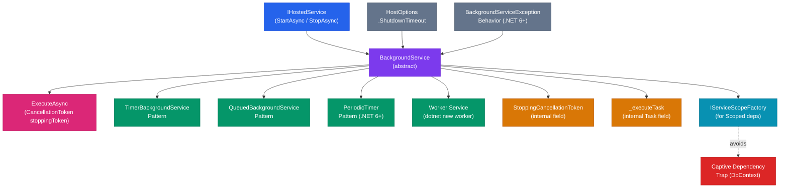
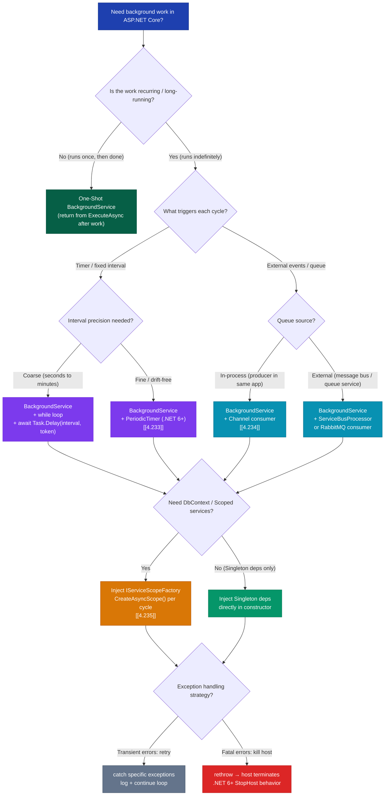

> [!success] Mastery Check
> - [ ] **Studied Well**
> - [ ] **Can explain the concept without notes**
> - [ ] **Can answer interview questions confidently**
> - [ ] **Can implement it in a real project**


# 4.232 — BackgroundService: The Base Class for Long-Running Work

---

## PART 0 — Navigation & Context

### Where This Topic Lives

```
ASP.NET Core Domain Hierarchy
│
├── Host & Lifecycle
│   ├── Generic Host (IHost, IHostBuilder, WebApplication)
│   ├── IHostApplicationLifetime
│   ├── IHostedService  ◄── the contract
│   └── BackgroundService  ◄── YOU ARE HERE
│       ├── 4.231 — IHostedService: Running Code at Startup (prerequisite)
│       ├── 4.232 — BackgroundService: The Base Class  ◄── THIS NOTE
│       ├── 4.233 — Timed Background Service: PeriodicTimer
│       ├── 4.234 — Queued Background Tasks: Channel<T>
│       └── 4.235 — Scoped Services: IServiceScopeFactory Pattern
│
├── DI & Lifetime Management
│   └── 4.042 — The Captive Dependency Problem (related)
│
├── Middleware Pipeline
├── Routing
├── Authentication / Authorization
└── ...
```

### What You Need Before This

| Prerequisite | Why You Need It |
|---|---|
| [[4.231 — IHostedService: Running Code at Startup]] | `BackgroundService` implements `IHostedService`; you must understand `StartAsync`/`StopAsync` contract first |
| [[4.005 — IHostedService and IHostApplicationLifetime]] | The host lifecycle — when `StartAsync` is called, when `StopAsync` is called, shutdown timeout semantics |
| [[4.042 — The Captive Dependency Problem]] | `BackgroundService` is Singleton; consuming Scoped services from constructor is a captive dependency trap |
| C# async/await and `CancellationToken` | Every method in `BackgroundService` is async; misunderstanding cancellation causes production bugs |

### What This Unlocks After

| What It Enables | Why This Topic Is the Gate |
|---|---|
| [[4.233 — Timed Background Service: PeriodicTimer]] | `PeriodicTimer`-based services are just `BackgroundService` with a cleaner loop API |
| [[4.234 — Queued Background Tasks: Channel<T>-Based Producer/Consumer]] | Queue-driven services override `ExecuteAsync` from `BackgroundService` |
| [[4.235 — Scoped Services in BackgroundService: IServiceScopeFactory Pattern]] | The Singleton-vs-Scoped problem only matters once you understand what `BackgroundService` is |
| Worker Service deployments (Windows Service, systemd) | Worker Services are `BackgroundService` subclasses packaged as OS-level daemons |

### Why This Topic Matters at Production Scale

> **In a production payment processing system, `BackgroundService` is the difference between a fraud-detection job that gracefully completes its current transaction on shutdown and one that is hard-killed mid-write, leaving the database in an inconsistent state — because `StopAsync` only gives you as much time as `HostOptions.ShutdownTimeout` to return from `ExecuteAsync`.**

---

## PART 1 — The Core Mental Model

### The Fundamental Rule

> **`BackgroundService` implements `IHostedService` by launching `ExecuteAsync` as a fire-and-forget background task in `StartAsync`, which returns immediately to the host — meaning the host's startup sequence completes before your long-running work begins, and the only way the host knows your service died is if `ExecuteAsync` throws an unhandled exception (which, in .NET 6+, terminates the entire host process).**

### The Plain-Language Analogy

Think of `BackgroundService` as a **factory night shift**. The factory manager (the Generic Host) opens the building each morning, turns on the lights, and then tells the night-shift supervisor (your `BackgroundService`) to go to work. The manager doesn't wait for the night shift to finish — he unlocks the door, confirms the supervisor walked in, and leaves. The supervisor runs their own loop all night (checking orders, processing inventory) responding to a shutdown bell (`stoppingToken`) whenever the manager decides to close up.

When closing time comes, the manager rings the bell (`StopAsync` is called, which cancels `stoppingToken`), and waits up to the configured shutdown timeout for the night shift to pack up and leave. If the supervisor ignores the bell and is still working when the building locks automatically, the process is killed — a hard shutdown. The analogy holds for concurrent scenarios: multiple `BackgroundService` subclasses registered are like multiple supervisors working parallel shifts; they all get the bell at the same time, and the factory closes when the last one leaves (or the timeout expires).

### The Taxonomy Diagram



---

## PART 2 — Deep Mechanics

### 2.1 — How `BackgroundService` Implements `IHostedService.StartAsync`

#### Pipeline Position

Background services are not middleware. They live outside the HTTP pipeline but inside the Generic Host lifecycle:

```
Host.StartAsync()
    │
    ├─► IHostedService[0].StartAsync()   (e.g. your OrderProcessingService)
    │       └── launches ExecuteAsync as background Task (fire-and-forget)
    │           returns immediately  ◄── HOST DOES NOT WAIT
    │
    ├─► IHostedService[1].StartAsync()   (next registered service)
    │
    ├─► IHostedService[2].StartAsync()   (WebApplication's Kestrel server — last)
    │
    └─► Host is running. HTTP requests now accepted.

    [BackgroundService.ExecuteAsync runs concurrently with HTTP traffic]
```

Background services start **before** Kestrel for `WebApplication` but the HTTP pipeline is not relevant to them — they run on thread pool threads completely independent of request processing.

#### Framework Source Behavior

```csharp
// ASP.NET Core internally (approximate) — BackgroundService.cs:
// Source: https://github.com/dotnet/runtime/blob/main/src/libraries/Microsoft.Extensions.Hosting.Abstractions/src/BackgroundService.cs

public abstract class BackgroundService : IHostedService, IDisposable
{
    private Task? _executeTask;
    private CancellationTokenSource? _stoppingCts;

    // Called by the host during startup
    public virtual Task StartAsync(CancellationToken cancellationToken)
    {
        // Create a linked CancellationTokenSource:
        // Cancelled when EITHER:
        //   (a) host calls StopAsync (host shutdown)
        //   (b) cancellationToken passed in is cancelled (host-level abort)
        _stoppingCts = CancellationTokenSource.CreateLinkedTokenSource(cancellationToken);

        // Launch ExecuteAsync WITHOUT awaiting it.
        // This is the "fire and forget" that makes BackgroundService work.
        _executeTask = ExecuteAsync(_stoppingCts.Token);

        // If ExecuteAsync returned synchronously (e.g. completed already or
        // threw synchronously), return its task directly so the host knows.
        if (_executeTask.IsCompleted)
        {
            return _executeTask;
        }

        // Otherwise, return Task.CompletedTask immediately.
        // Host startup continues. ExecuteAsync runs in the background.
        return Task.CompletedTask;
    }

    // Called by the host during graceful shutdown
    public virtual async Task StopAsync(CancellationToken cancellationToken)
    {
        if (_executeTask == null)
            return;

        try
        {
            // Signal ExecuteAsync to stop via the stopping token
            _stoppingCts!.Cancel();
        }
        finally
        {
            // Wait for ExecuteAsync to finish OR the host shutdown timeout
            // If the host timeout expires, Task.WhenAny returns with the
            // delay task winning — ExecuteAsync is abandoned (host process exits)
            await Task.WhenAny(
                _executeTask,
                Task.Delay(Timeout.Infinite, cancellationToken)
            ).ConfigureAwait(false);
        }
    }

    protected abstract Task ExecuteAsync(CancellationToken stoppingToken);

    public virtual void Dispose() => _stoppingCts?.Cancel();
}
```

**Cost label:** `~3 allocations on startup` — `CancellationTokenSource`, linked `CancellationToken`, the background `Task` object. These are one-time startup costs, not per-request.

#### The Critical Detail: `StartAsync` Returns `Task.CompletedTask`

This is the most important implementation detail. When `BackgroundService.StartAsync` is called:
1. It creates the `_stoppingCts`
2. It calls `ExecuteAsync(_stoppingCts.Token)` — this starts your loop
3. It checks if `_executeTask` completed synchronously (rare — only if you `return` immediately)
4. It returns **`Task.CompletedTask`** — not the `_executeTask`

This means: **the host does not await your background loop**. The host's startup sequence considers your service "started" the moment `ExecuteAsync` begins running, not when it completes. If your `ExecuteAsync` never returns (infinite loop), the host is perfectly happy.

#### HTTP Wire Format

`BackgroundService` has no direct HTTP footprint. It does not process requests or generate responses. However, its effects are visible indirectly:

```
// Background service writes processed orders to DB.
// HTTP client polls for results:

// HTTP request (from order polling client):
// GET /api/orders/ORD-8821/status HTTP/1.1
// Host: payments.acme.com
// Authorization: Bearer eyJhbGci...

// HTTP response (after background service has processed):
// HTTP/1.1 200 OK
// Content-Type: application/json
// {"orderId": "ORD-8821", "status": "Processed", "processedAt": "2026-06-08T03:00:00Z"}

// HTTP response (before background service processes — service is starting up):
// HTTP/1.1 200 OK
// {"orderId": "ORD-8821", "status": "Pending", "processedAt": null}
```

---

### 2.2 — The `ExecuteAsync` Override: The Eternal Loop Pattern

#### Pipeline Position

```
[BackgroundService lifecycle — independent of HTTP pipeline]

Host.StartAsync()
    └── BackgroundService.StartAsync()
            └── Task.Run (background thread pool)
                    └── ExecuteAsync(stoppingToken)
                            └── while (!stoppingToken.IsCancellationRequested)
                                    ├── DoWork()
                                    └── await Task.Delay(interval, stoppingToken)
                                            │
                                            ▼ [stoppingToken cancelled on shutdown]
                                    OperationCanceledException → loop exits → method returns
                                    │
                                    ▼
                            BackgroundService.StopAsync() awaits _executeTask completion
```

#### The Standard Eternal Loop

```csharp
// Pattern: Polling-based background worker for payment settlement service
public class PaymentSettlementService : BackgroundService
{
    private readonly ILogger<PaymentSettlementService> _logger;
    private readonly TimeSpan _pollingInterval = TimeSpan.FromSeconds(30);

    public PaymentSettlementService(ILogger<PaymentSettlementService> logger)
    {
        _logger = logger;
    }

    protected override async Task ExecuteAsync(CancellationToken stoppingToken)
    {
        _logger.LogInformation("Payment settlement service starting.");

        // The standard eternal loop. Two exit conditions:
        // 1. stoppingToken is cancelled (graceful shutdown)
        // 2. An unhandled exception is thrown (crashes the host in .NET 6+)
        while (!stoppingToken.IsCancellationRequested)
        {
            try
            {
                await ProcessPendingSettlementsAsync(stoppingToken);
            }
            catch (OperationCanceledException) when (stoppingToken.IsCancellationRequested)
            {
                // Expected: host is shutting down. Exit the loop cleanly.
                _logger.LogInformation("Settlement service stopping due to cancellation.");
                break;
            }
            catch (Exception ex)
            {
                // Log but do NOT rethrow here — rethrowing would crash the host (.NET 6+).
                // Decide: is this fatal? If yes, rethrow. If transient, log and continue.
                _logger.LogError(ex, "Error processing payment settlements. Will retry.");
            }

            // ✅ CORRECT: Task.Delay with stoppingToken
            // Respects cancellation immediately — if host shuts down during the wait,
            // OperationCanceledException is thrown and caught by the while condition.
            await Task.Delay(_pollingInterval, stoppingToken);
        }

        _logger.LogInformation("Payment settlement service stopped.");
    }

    private async Task ProcessPendingSettlementsAsync(CancellationToken cancellationToken)
    {
        // actual settlement logic
        await Task.CompletedTask;
    }
}
```

**Cost label:** `~1 async state machine per loop iteration` — each `await Task.Delay` creates one async state machine transition. At 30-second intervals, this is negligible.

#### Why `Task.Delay(interval, stoppingToken)` Not `Thread.Sleep`

```csharp
// ⚠️ WRONG: Thread.Sleep blocks the thread for the full duration,
// ignoring cancellation entirely
while (!stoppingToken.IsCancellationRequested)
{
    await DoSettlementWork();
    Thread.Sleep(TimeSpan.FromSeconds(30)); // ← WRONG: Thread blocked for 30s on shutdown
    // If host shuts down at second 1 of the 30-second sleep,
    // this thread is held for 29 more seconds, delaying host shutdown.
    // Worse: Thread.Sleep holds a ThreadPool thread (wasteful).
}

// ✅ CORRECT: Task.Delay releases the thread and respects cancellation
while (!stoppingToken.IsCancellationRequested)
{
    await DoSettlementWork();
    // If stoppingToken is cancelled mid-delay:
    //   Task.Delay throws OperationCanceledException
    //   which either exits the loop or is caught appropriately
    await Task.Delay(TimeSpan.FromSeconds(30), stoppingToken);
}
```

The behavioral difference:

| Approach | Thread During Delay | Cancellation Response | Shutdown Delay |
|---|---|---|---|
| `Thread.Sleep(30s)` | Thread pool thread held (blocked) | None — must wait full interval | Up to 30 seconds extra |
| `await Task.Delay(30s)` | No thread held (I/O completion) | Immediate (< 1ms) | Negligible |
| `await Task.Delay(30s, stoppingToken)` | No thread held | Immediate via `OperationCanceledException` | Negligible |

---

### 2.3 — `StopAsync`, `stoppingToken`, and Graceful Shutdown

#### Shutdown Sequence Diagram

```
Host receives SIGTERM / Ctrl+C / application stop signal
│
▼
IApplicationLifetime.StopApplication() called
│
▼
foreach registered IHostedService (in reverse registration order):
│
├── BackgroundService.StopAsync(cancellationToken) called
│       │
│       ├── _stoppingCts.Cancel()   ◄── this cancels stoppingToken in ExecuteAsync
│       │
│       └── await Task.WhenAny(
│               _executeTask,                          [ExecuteAsync finishing]
│               Task.Delay(Timeout.Infinite, hostCt)  [host shutdown timeout]
│           )
│           │
│           ├─ If ExecuteAsync finishes first: clean shutdown ✓
│           └─ If host shutdown timeout expires first:
│               StopAsync returns (host continues to stop)
│               ExecuteAsync is abandoned — background task keeps running
│               Process exits → OS forcefully terminates the thread
│
▼
Host process exits
```

#### Configuring Shutdown Timeout

```csharp
// In Program.cs — payment processing service needs 60s to complete in-flight transactions
builder.Services.Configure<HostOptions>(options =>
{
    // Default is 30 seconds in .NET 8
    // Payment transactions can take up to 45 seconds with retry logic
    options.ShutdownTimeout = TimeSpan.FromSeconds(60);
});
```

> [!WARNING]
> If your `ExecuteAsync` does not respond to `stoppingToken.IsCancellationRequested` and takes longer than `ShutdownTimeout`, the host will abandon it. Your background work is cut off mid-execution. For payment processing, inventory writes, or any operation with consistency requirements, always propagate `stoppingToken` into every async call.

#### What `stoppingToken` Is — Precisely

```csharp
// BackgroundService.StartAsync internally does:
_stoppingCts = CancellationTokenSource.CreateLinkedTokenSource(cancellationToken);
//                                                              ↑
//                              This is the host's own startup cancellation token.
//                              It's cancelled if StartAsync itself needs to abort.
//
// _stoppingCts is then cancelled in TWO scenarios:
// 1. StopAsync is called (normal graceful shutdown)
// 2. The incoming cancellationToken to StartAsync is cancelled (host abort during startup)

// The token passed to ExecuteAsync:
_executeTask = ExecuteAsync(_stoppingCts.Token);
// ↑ This token will be cancelled when the host shuts down.
// Treat it like "keep running while this is not cancelled."
```

**Cost label:** `CancellationTokenSource.CreateLinkedTokenSource` allocates one `CancellationTokenSource` and one registration per linked token. One-time cost at startup.

---

### 2.4 — Unhandled Exceptions in `ExecuteAsync`: The .NET 6+ Behavior Change

This is the most significant gotcha in `BackgroundService`. The behavior changed fundamentally between .NET 5 and .NET 6.

#### Before .NET 6 (swallowed exceptions)

```
ExecuteAsync throws UnhandledException
    │
    ▼
BackgroundService catches it (in StartAsync task continuation)
    │
    ▼
Exception is LOGGED but SWALLOWED
    │
    ▼
Host continues running — background service is silently dead
    │
    ▼
HTTP requests continue to be served.
Background work is not happening.
No alert. No crash. Silent failure.  ← THE DANGEROUS BEHAVIOR
```

#### .NET 6+ (exception terminates the host)

```
ExecuteAsync throws UnhandledException
    │
    ▼
BackgroundService catches exception internally (in _executeTask)
    │
    ▼
BackgroundServiceHost (the .NET 6+ behavior) propagates to IHost
    │
    ▼
IHost.StartAsync / the host's unhandled exception mechanism fires
    │
    ▼
BackgroundServiceExceptionBehavior.StopHost (DEFAULT in .NET 6+)
    │
    ▼
HOST IS TERMINATED. Process exits.
Kestrel stops. All HTTP traffic stops.  ← CORRECT DEFAULT FOR PRODUCTION
```

#### Controlling the Behavior

```csharp
// Program.cs — explicitly configuring exception behavior

// ✅ DEFAULT (.NET 6+): Unhandled exception in ExecuteAsync terminates the host.
// This is correct for production — you WANT to know your background service crashed.
builder.Services.Configure<HostOptions>(options =>
{
    options.BackgroundServiceExceptionBehavior = BackgroundServiceExceptionBehavior.StopHost;
});

// ⚠️ ONLY use Ignore for non-critical background tasks where silent failure is acceptable.
// Example: a metrics collection side-car that must not crash the payment API if it fails.
builder.Services.Configure<HostOptions>(options =>
{
    options.BackgroundServiceExceptionBehavior = BackgroundServiceExceptionBehavior.Ignore;
});
```

> [!IMPORTANT]
> The `.NET 6+ default` (`StopHost`) is the correct behavior for most production systems. If your order-processing background service crashes with an unhandled exception, you WANT the host to die — otherwise you get silent data loss (orders appear to be processing but aren't). The `Ignore` option should be reserved for truly optional monitoring/telemetry side-cars.

#### Framework Internal Flow (.NET 6+)

```csharp
// ASP.NET Core internally (approximate) — BackgroundServiceHost.cs behavior in .NET 6+
// When ExecuteAsync faults:

// The _executeTask faults (has an exception).
// BackgroundService internally handles this via a ContinueWith or the host polling:
// In .NET 6+, IHostedServiceExecutor wraps each service and propagates exceptions.
// The actual flow routes through IHostApplicationLifetime.StopApplication()
// when BackgroundServiceExceptionBehavior.StopHost is configured.

// Effective behavior:
// _executeTask.IsFaulted → IHostApplicationLifetime.StopApplication() called
// → Host initiates orderly shutdown → HTTP traffic stops
// → All IHostedServices get StopAsync called
// → Process exits with non-zero exit code
```

**Cost label:** Exception propagation through the host is a one-time event — no per-request overhead. The concern is correctness, not performance.

---

### 2.5 — `AddHostedService<T>()` Registration: It's Always Singleton

#### Registration Mechanics

```csharp
// Program.cs
builder.Services.AddHostedService<OrderFulfillmentService>();

// What AddHostedService<T>() does internally (approximate):
// services.TryAddEnumerable(ServiceDescriptor.Singleton<IHostedService, T>());
//
// Key implications:
// 1. The service is registered as SINGLETON
// 2. It is registered via TryAddEnumerable, meaning multiple BackgroundServices
//    can be registered (unlike TryAddSingleton which only registers the first).
// 3. The host iterates IEnumerable<IHostedService> at startup.
```

#### Multiple Services

```csharp
// Multiple background services are perfectly valid
builder.Services.AddHostedService<OrderFulfillmentService>();    // Singleton
builder.Services.AddHostedService<InventoryReplenishmentService>(); // Singleton
builder.Services.AddHostedService<ShipmentTrackingService>();    // Singleton

// All three run concurrently.
// All three get StartAsync called in registration order.
// All three get StopAsync called in REVERSE registration order on shutdown.
// ShipmentTrackingService stops first, then Inventory, then OrderFulfillment.
```

#### The DI Scope Trap

```csharp
// ⚠️ WRONG: Injecting Scoped service into BackgroundService constructor
public class OrderFulfillmentService : BackgroundService
{
    // BAD: OrderDbContext is registered as Scoped.
    // BackgroundService is Singleton.
    // This is the captive dependency trap — OrderDbContext lives for the
    // entire application lifetime, sharing its connection across all "unit of work"
    // boundaries. This causes connection pool exhaustion and stale DbContext state.
    private readonly OrderDbContext _dbContext; // ← CAPTIVE DEPENDENCY

    public OrderFulfillmentService(OrderDbContext dbContext)
    {
        _dbContext = dbContext;
    }
}

// ✅ CORRECT: Inject IServiceScopeFactory and create scopes per unit of work
public class OrderFulfillmentService : BackgroundService
{
    private readonly IServiceScopeFactory _scopeFactory;

    public OrderFulfillmentService(IServiceScopeFactory scopeFactory)
    {
        _scopeFactory = scopeFactory;
    }

    protected override async Task ExecuteAsync(CancellationToken stoppingToken)
    {
        while (!stoppingToken.IsCancellationRequested)
        {
            // New scope per unit of work — DbContext is fresh, connection is clean
            await using var scope = _scopeFactory.CreateAsyncScope();
            var dbContext = scope.ServiceProvider.GetRequiredService<OrderDbContext>();
            await ProcessOrderBatchAsync(dbContext, stoppingToken);
            await Task.Delay(TimeSpan.FromSeconds(5), stoppingToken);
        }
    }
}
```

**Cost label:** `IServiceScopeFactory.CreateAsyncScope()` allocates one `IServiceScope` per call. For a service that runs every 5 seconds, that's one allocation per 5 seconds — completely negligible.

---

### 2.6 — `ExecuteAsync` Returning vs. Throwing: Two Different Host Signals

This sub-section explains a subtle but important distinction that surprises engineers.

```
ExecuteAsync returns normally (Task completes without exception)
    │
    ▼
Background service is considered "stopped gracefully"
    │
    ▼
Host does NOT stop. Other services keep running.
HTTP traffic continues.
    │
    ▼
Effective result: your background service is silently dead.
No further work is done. No exception. No host shutdown.

────────────────────────────────────────────────────────────

ExecuteAsync throws an unhandled exception (Task faults)
    │
    ▼
.NET 6+ with BackgroundServiceExceptionBehavior.StopHost:
    Host terminates. All services stop. Process exits.

.NET 6+ with BackgroundServiceExceptionBehavior.Ignore:
    Exception is logged. Service is dead. Host continues.

.NET 5 and earlier:
    Exception is swallowed. Service is dead. Host continues.
```

#### Implication for Early Return

```csharp
// ⚠️ WRONG: Returning early from ExecuteAsync without signaling
protected override async Task ExecuteAsync(CancellationToken stoppingToken)
{
    if (!_configuration.IsEnabled)
    {
        // Service returns here. No loop runs.
        // From the host's perspective: service started and stopped.
        // Host does NOT shut down. Background work silently stops.
        return; // ← is this intentional? Is the host aware?
    }

    while (!stoppingToken.IsCancellationRequested)
    {
        await DoWork(stoppingToken);
    }
}

// ✅ BETTER: Make the intent explicit when returning early
protected override async Task ExecuteAsync(CancellationToken stoppingToken)
{
    if (!_featureFlags.IsInventoryMonitoringEnabled)
    {
        _logger.LogWarning(
            "Inventory monitoring service is disabled via feature flags. " +
            "Service will not run. This is expected in non-production environments.");
        return; // Explicit log makes the silent stop visible in production
    }

    while (!stoppingToken.IsCancellationRequested)
    {
        await MonitorInventoryLevelsAsync(stoppingToken);
        await Task.Delay(TimeSpan.FromMinutes(1), stoppingToken);
    }
}
```

---

## PART 3 — Production Code Patterns

### Pattern 1: The Resilient Polling Loop with Transient Fault Isolation

**Domain:** Payment gateway settlement service that polls a third-party API every 30 seconds.

```csharp
// ✅ CORRECT: Fault-isolated polling loop
// The inner try/catch ensures transient failures (network hiccups, DB timeouts)
// do not crash the host. Only truly unrecoverable errors should propagate.
public class PaymentGatewaySettlementService : BackgroundService
{
    private static readonly TimeSpan PollingInterval = TimeSpan.FromSeconds(30);
    private static readonly TimeSpan ErrorBackoff = TimeSpan.FromMinutes(2);

    private readonly IServiceScopeFactory _scopeFactory;
    private readonly ILogger<PaymentGatewaySettlementService> _logger;

    public PaymentGatewaySettlementService(
        IServiceScopeFactory scopeFactory,
        ILogger<PaymentGatewaySettlementService> logger)
    {
        _scopeFactory = scopeFactory;
        _logger = logger;
    }

    protected override async Task ExecuteAsync(CancellationToken stoppingToken)
    {
        _logger.LogInformation(
            "Payment settlement service started. Polling interval: {Interval}s.",
            PollingInterval.TotalSeconds);

        while (!stoppingToken.IsCancellationRequested)
        {
            var delay = PollingInterval;

            try
            {
                await using var scope = _scopeFactory.CreateAsyncScope();
                var settlementProcessor = scope.ServiceProvider
                    .GetRequiredService<ISettlementProcessor>();

                var processed = await settlementProcessor
                    .ProcessPendingSettlementsAsync(stoppingToken);

                _logger.LogInformation(
                    "Settlement cycle complete. Processed {Count} transactions.",
                    processed);
            }
            catch (OperationCanceledException) when (stoppingToken.IsCancellationRequested)
            {
                // This is the expected shutdown path — don't back off, just exit
                _logger.LogInformation("Settlement service stopping gracefully.");
                return;
            }
            catch (HttpRequestException ex)
            {
                // Transient network error — back off longer before retry
                _logger.LogWarning(ex,
                    "Gateway connectivity issue. Backing off for {Backoff}s.",
                    ErrorBackoff.TotalSeconds);
                delay = ErrorBackoff;
            }
            catch (Exception ex)
            {
                // Unexpected error — log as error but continue
                // If this were rethrown, the host would terminate (.NET 6+)
                _logger.LogError(ex,
                    "Unexpected error in settlement cycle. Continuing after backoff.");
                delay = ErrorBackoff;
            }

            // Pass stoppingToken: if shutdown occurs during the delay, we exit cleanly
            await Task.Delay(delay, stoppingToken);
        }
    }
}
```

```
// HTTP wire format effect:
// GET /api/v1/settlements/pending HTTP/1.1   (called by ISettlementProcessor internally)
// Host: gateway.paymentprovider.com
// Authorization: Bearer <api_key>
//
// HTTP/1.1 200 OK
// Content-Type: application/json
// [{"id":"TXN-001","amount":45.00,"status":"pending"}, ...]
```

---

### Pattern 2: The One-Shot Startup Service (Non-Loop BackgroundService)

**Domain:** Order management system that pre-warms a rules engine cache on startup, then stops.

```csharp
// Pattern: single-execution background service that runs once on startup
// Use case: pre-warming caches, seeding data, running migrations asynchronously
// Key insight: BackgroundService.ExecuteAsync is not required to loop.
// Returning from it stops the service without crashing the host.
public class OrderRulesEngineWarmupService : BackgroundService
{
    private readonly IServiceScopeFactory _scopeFactory;
    private readonly ILogger<OrderRulesEngineWarmupService> _logger;

    public OrderRulesEngineWarmupService(
        IServiceScopeFactory scopeFactory,
        ILogger<OrderRulesEngineWarmupService> logger)
    {
        _scopeFactory = scopeFactory;
        _logger = logger;
    }

    protected override async Task ExecuteAsync(CancellationToken stoppingToken)
    {
        _logger.LogInformation("Pre-warming order rules engine cache...");

        try
        {
            await using var scope = _scopeFactory.CreateAsyncScope();
            var rulesEngine = scope.ServiceProvider.GetRequiredService<IOrderRulesEngine>();

            // Load all active rules from database into in-memory cache
            await rulesEngine.WarmupAsync(stoppingToken);

            _logger.LogInformation(
                "Rules engine cache warmed up. Service will now idle.");
        }
        catch (OperationCanceledException) when (stoppingToken.IsCancellationRequested)
        {
            _logger.LogWarning("Rules engine warmup cancelled during shutdown.");
        }
        catch (Exception ex)
        {
            // Rethrowing here will terminate the host in .NET 6+.
            // This is INTENTIONAL: if rules engine warmup fails, the application
            // is in an invalid state and should not serve traffic.
            _logger.LogCritical(ex,
                "Fatal: Could not warm up order rules engine. Host will terminate.");
            throw;
        }

        // Returning here stops the background service gracefully.
        // The host continues running. HTTP traffic is served normally.
        // The rules engine cache is now populated in memory.
    }
}
```

> [!TIP]
> One-shot `BackgroundService` patterns are often better than running migrations or cache warm-ups in `Program.cs` synchronously, because they run concurrently with the host's other `StartAsync` calls and don't block the HTTP listener from starting.

---

### Pattern 3: The Scoped-Service Consumer with `IServiceScopeFactory`

**Domain:** Inventory replenishment service that needs `IInventoryRepository` (Scoped) per work cycle.

```csharp
// ⚠️ ANTI-PATTERN: Injecting Scoped service directly
public class InventoryReplenishmentService_WRONG : BackgroundService
{
    // IInventoryRepository depends on IDbConnection (Scoped)
    // This is a captive dependency: Scoped service lives as long as the Singleton
    private readonly IInventoryRepository _repository; // ← WRONG

    public InventoryReplenishmentService_WRONG(IInventoryRepository repository)
        => _repository = repository;
    // This will throw at startup if the DI container validates scopes:
    // InvalidOperationException: Cannot consume scoped service 'IInventoryRepository'
    // from singleton 'InventoryReplenishmentService'.
}

// ✅ CORRECT: IServiceScopeFactory pattern
public class InventoryReplenishmentService : BackgroundService
{
    private readonly IServiceScopeFactory _scopeFactory;
    private readonly ILogger<InventoryReplenishmentService> _logger;

    // IServiceScopeFactory is itself Singleton — safe to inject directly.
    public InventoryReplenishmentService(
        IServiceScopeFactory scopeFactory,
        ILogger<InventoryReplenishmentService> logger)
    {
        _scopeFactory = scopeFactory;
        _logger = logger;
    }

    protected override async Task ExecuteAsync(CancellationToken stoppingToken)
    {
        while (!stoppingToken.IsCancellationRequested)
        {
            try
            {
                // Each iteration gets its own DI scope.
                // Repository, DbContext, UnitOfWork — all fresh.
                // Scope is disposed at end of using block → DbContext disposed → connection returned to pool.
                await using (var scope = _scopeFactory.CreateAsyncScope())
                {
                    var repository = scope.ServiceProvider
                        .GetRequiredService<IInventoryRepository>();
                    var unitOfWork = scope.ServiceProvider
                        .GetRequiredService<IUnitOfWork>();

                    var lowStockItems = await repository
                        .GetLowStockItemsAsync(threshold: 10, stoppingToken);

                    foreach (var item in lowStockItems)
                    {
                        await repository.CreateReplenishmentOrderAsync(item, stoppingToken);
                    }

                    await unitOfWork.SaveChangesAsync(stoppingToken);

                    _logger.LogInformation(
                        "Replenishment cycle complete. Created {Count} orders.",
                        lowStockItems.Count);
                }
                // Scope disposed here — DbContext connection returned to pool
            }
            catch (Exception ex) when (!stoppingToken.IsCancellationRequested)
            {
                _logger.LogError(ex, "Error in inventory replenishment cycle.");
            }

            await Task.Delay(TimeSpan.FromMinutes(5), stoppingToken);
        }
    }
}
```

---

### Pattern 4: The Graceful Shutdown with In-Progress Work Protection

**Domain:** Logistics shipment tracking service that must complete the current batch before stopping.

```csharp
// Pattern: in-flight work completion on graceful shutdown
// Challenge: stoppingToken is cancelled during an active shipment batch update.
// Requirement: complete the current batch, do NOT start a new one.
public class ShipmentTrackingService : BackgroundService
{
    private readonly IServiceScopeFactory _scopeFactory;
    private readonly ILogger<ShipmentTrackingService> _logger;
    private int _currentBatchSize; // For observability

    public ShipmentTrackingService(
        IServiceScopeFactory scopeFactory,
        ILogger<ShipmentTrackingService> logger)
    {
        _scopeFactory = scopeFactory;
        _logger = logger;
    }

    protected override async Task ExecuteAsync(CancellationToken stoppingToken)
    {
        while (!stoppingToken.IsCancellationRequested)
        {
            // Use CancellationToken.None for the actual work — this ensures
            // that once a batch starts, it runs to completion even if stoppingToken
            // is cancelled during it.
            // The stoppingToken only controls whether we START a new batch.
            try
            {
                await using var scope = _scopeFactory.CreateAsyncScope();
                var trackingService = scope.ServiceProvider
                    .GetRequiredService<IShipmentTrackingUpdater>();

                _logger.LogDebug("Starting shipment tracking batch.");

                // CancellationToken.None here is intentional:
                // We want this batch to complete fully even if shutdown is requested.
                // The HostOptions.ShutdownTimeout is your safety net — if this takes
                // longer than the timeout, the host will force-kill anyway.
                var updated = await trackingService
                    .UpdateActiveShipmentsAsync(CancellationToken.None);

                _logger.LogInformation(
                    "Updated {Count} shipment statuses.", updated);
            }
            catch (Exception ex)
            {
                _logger.LogError(ex, "Error updating shipment tracking data.");
            }

            // Check stoppingToken BEFORE entering the delay — this prevents
            // starting a 5-minute delay after the last batch if shutdown was requested.
            if (stoppingToken.IsCancellationRequested)
                break;

            await Task.Delay(TimeSpan.FromMinutes(5), stoppingToken);
        }

        _logger.LogInformation("Shipment tracking service stopped cleanly.");
    }
}

// Register with extended shutdown timeout because batches can take up to 2 minutes
// In Program.cs:
// builder.Services.Configure<HostOptions>(o => o.ShutdownTimeout = TimeSpan.FromMinutes(3));
// builder.Services.AddHostedService<ShipmentTrackingService>();
```

---

### Pattern 5: The Exception-as-Fatal-Signal Pattern

**Domain:** Fraud detection service where a failed startup (missing ML model) must kill the process.

```csharp
// Pattern: using ExecuteAsync exception to signal an unrecoverable state
// Scenario: fraud detection requires an ML model to be loaded.
// If the model can't be loaded, the service MUST NOT run silently — it must kill the host
// so the orchestrator (Kubernetes, etc.) restarts with fresh state.
public class FraudDetectionModelService : BackgroundService
{
    private readonly IFraudModelLoader _modelLoader;
    private readonly ILogger<FraudDetectionModelService> _logger;
    private IFraudModel? _activeModel;

    public FraudDetectionModelService(
        IFraudModelLoader modelLoader,
        ILogger<FraudDetectionModelService> logger)
    {
        _modelLoader = modelLoader;
        _logger = logger;
    }

    protected override async Task ExecuteAsync(CancellationToken stoppingToken)
    {
        // Phase 1: Load model — if this fails, throw. Host terminates (.NET 6+ default).
        // This is INTENTIONAL. A fraud service without a model is worse than no service.
        _activeModel = await _modelLoader.LoadLatestModelAsync(stoppingToken);
        // ↑ If this throws: _executeTask faults → host receives the exception →
        //   host calls IHostApplicationLifetime.StopApplication() →
        //   all services get StopAsync → process exits with non-zero exit code →
        //   Kubernetes restarts the pod.

        _logger.LogInformation(
            "Fraud model loaded. Version: {Version}. Starting monitoring loop.",
            _activeModel.Version);

        while (!stoppingToken.IsCancellationRequested)
        {
            try
            {
                // Model refresh check — if refresh fails, log and continue with current model
                if (await _modelLoader.HasNewerVersionAsync(stoppingToken))
                {
                    var newModel = await _modelLoader.LoadLatestModelAsync(stoppingToken);
                    Interlocked.Exchange(ref _activeModel, newModel);
                    _logger.LogInformation(
                        "Fraud model updated to version {Version}.",
                        newModel.Version);
                }
            }
            catch (Exception ex) when (!stoppingToken.IsCancellationRequested)
            {
                // Model refresh failure is not fatal — we have the previous model
                _logger.LogWarning(ex, "Could not refresh fraud model. Using version {Version}.",
                    _activeModel.Version);
            }

            await Task.Delay(TimeSpan.FromHours(1), stoppingToken);
        }
    }
}
```

---

### Pattern 6: The Feature-Flag-Gated Background Service

**Domain:** Order analytics aggregation that can be disabled via configuration without redeploying.

```csharp
// Pattern: runtime-configurable background service that respects feature flags
// Use case: analytics aggregation is expensive — disable during peak traffic windows
public class OrderAnalyticsAggregationService : BackgroundService
{
    private readonly IServiceScopeFactory _scopeFactory;
    private readonly IConfiguration _configuration;
    private readonly ILogger<OrderAnalyticsAggregationService> _logger;

    public OrderAnalyticsAggregationService(
        IServiceScopeFactory scopeFactory,
        IConfiguration configuration,
        ILogger<OrderAnalyticsAggregationService> logger)
    {
        _scopeFactory = scopeFactory;
        _configuration = configuration;
        _logger = logger;
    }

    protected override async Task ExecuteAsync(CancellationToken stoppingToken)
    {
        while (!stoppingToken.IsCancellationRequested)
        {
            // Re-check configuration each cycle — supports runtime config updates
            // (e.g., Azure App Configuration with refresh, or IOptionsMonitor<T>)
            var isEnabled = _configuration.GetValue<bool>(
                "Features:OrderAnalyticsAggregation:Enabled", defaultValue: true);

            if (!isEnabled)
            {
                _logger.LogDebug(
                    "Order analytics aggregation is disabled. Checking again in 60s.");
                await Task.Delay(TimeSpan.FromSeconds(60), stoppingToken);
                continue; // Skip this cycle entirely
            }

            var aggregationInterval = _configuration.GetValue<int>(
                "Features:OrderAnalyticsAggregation:IntervalSeconds", defaultValue: 300);

            try
            {
                await using var scope = _scopeFactory.CreateAsyncScope();
                var aggregator = scope.ServiceProvider
                    .GetRequiredService<IOrderAnalyticsAggregator>();

                await aggregator.AggregateHourlyMetricsAsync(stoppingToken);

                _logger.LogInformation("Order analytics aggregation cycle complete.");
            }
            catch (Exception ex) when (!stoppingToken.IsCancellationRequested)
            {
                _logger.LogError(ex, "Error during order analytics aggregation.");
            }

            await Task.Delay(TimeSpan.FromSeconds(aggregationInterval), stoppingToken);
        }
    }
}
```

---

### Pattern 7: The Health-Check-Integrated Background Service

**Domain:** Payment processor heartbeat service that reports its own health to ASP.NET Core health checks.

```csharp
// Pattern: background service that integrates with IHealthCheck reporting
// The service tracks its own state and exposes it via a health check,
// enabling Kubernetes liveness probes to detect silent failures.
public class PaymentProcessorHeartbeatService : BackgroundService, IHealthCheck
{
    private volatile bool _isHealthy = true;
    private DateTimeOffset _lastSuccessfulHeartbeat = DateTimeOffset.UtcNow;
    private readonly TimeSpan _unhealthyThreshold = TimeSpan.FromMinutes(2);

    private readonly IServiceScopeFactory _scopeFactory;
    private readonly ILogger<PaymentProcessorHeartbeatService> _logger;

    public PaymentProcessorHeartbeatService(
        IServiceScopeFactory scopeFactory,
        ILogger<PaymentProcessorHeartbeatService> logger)
    {
        _scopeFactory = scopeFactory;
        _logger = logger;
    }

    protected override async Task ExecuteAsync(CancellationToken stoppingToken)
    {
        while (!stoppingToken.IsCancellationRequested)
        {
            try
            {
                await using var scope = _scopeFactory.CreateAsyncScope();
                var gateway = scope.ServiceProvider
                    .GetRequiredService<IPaymentGatewayClient>();

                await gateway.PingAsync(stoppingToken);

                _lastSuccessfulHeartbeat = DateTimeOffset.UtcNow;
                _isHealthy = true;

                _logger.LogDebug("Payment gateway heartbeat OK.");
            }
            catch (Exception ex) when (!stoppingToken.IsCancellationRequested)
            {
                _isHealthy = false;
                _logger.LogWarning(ex, "Payment gateway heartbeat failed.");
            }

            await Task.Delay(TimeSpan.FromSeconds(30), stoppingToken);
        }
    }

    // IHealthCheck implementation — called by /health endpoint
    public Task<HealthCheckResult> CheckHealthAsync(
        HealthCheckContext context,
        CancellationToken cancellationToken = default)
    {
        var timeSinceLastSuccess = DateTimeOffset.UtcNow - _lastSuccessfulHeartbeat;

        if (_isHealthy && timeSinceLastSuccess < _unhealthyThreshold)
        {
            return Task.FromResult(HealthCheckResult.Healthy(
                $"Gateway connected. Last heartbeat: {(int)timeSinceLastSuccess.TotalSeconds}s ago."));
        }

        return Task.FromResult(HealthCheckResult.Unhealthy(
            $"Gateway unreachable. Last success: {(int)timeSinceLastSuccess.TotalSeconds}s ago.",
            data: new Dictionary<string, object>
            {
                ["lastSuccess"] = _lastSuccessfulHeartbeat,
                ["isHealthy"] = _isHealthy
            }));
    }
}

// Registration:
// builder.Services.AddSingleton<PaymentProcessorHeartbeatService>();
// builder.Services.AddHostedService(sp =>
//     sp.GetRequiredService<PaymentProcessorHeartbeatService>());
// builder.Services.AddHealthChecks()
//     .AddCheck<PaymentProcessorHeartbeatService>("payment-gateway");
```

```
// HTTP wire format for health check:
// GET /health HTTP/1.1
// Host: api.acme.com

// HTTP/1.1 200 OK   (when healthy)
// Content-Type: application/json
// {"status":"Healthy","results":{"payment-gateway":{"status":"Healthy","description":"Gateway connected. Last heartbeat: 15s ago."}}}

// HTTP/1.1 503 Service Unavailable   (when unhealthy)
// Content-Type: application/json
// {"status":"Unhealthy","results":{"payment-gateway":{"status":"Unhealthy","description":"Gateway unreachable. Last success: 145s ago."}}}
```

---

## PART 4 — Gotchas & Anti-Patterns

### Gotcha 1: The Swallowed `OperationCanceledException` That Prevents Graceful Shutdown

Experienced engineers wrap their entire `ExecuteAsync` body in a catch-all `Exception` handler to prevent crashes, inadvertently catching `OperationCanceledException` during shutdown. This causes the service to loop forever after `stoppingToken` is cancelled because the cancellation exception is silently swallowed and the `while` condition evaluates to `false` — but only AFTER the current `Task.Delay` completes, which never happens because the `OperationCanceledException` from the cancelled delay was caught.

```csharp
// ⚠️ WRONG: Catch-all handler swallows OperationCanceledException from Task.Delay
protected override async Task ExecuteAsync(CancellationToken stoppingToken)
{
    while (!stoppingToken.IsCancellationRequested)
    {
        try
        {
            await ProcessInventoryAsync();
            await Task.Delay(TimeSpan.FromSeconds(10), stoppingToken); // ← throws OCE on shutdown
        }
        catch (Exception ex) // ← swallows OperationCanceledException!
        {
            _logger.LogError(ex, "Error in inventory service.");
            // Loop continues. Condition checks stoppingToken. But we never get here
            // because the next Task.Delay also throws, ad infinitum.
            // Actually: while loop exits eventually but StopAsync waits for _executeTask.
            // The issue: if the swallowed OCE causes a retry delay, shutdown is delayed.
        }
    }
}

// HTTP consequence (wrong path):
// Host shutdown sequence starts. stoppingToken cancelled.
// Task.Delay throws OperationCanceledException, caught by catch (Exception).
// Logged as "Error". Loop iterates. stoppingToken IS cancelled.
// while (!stoppingToken.IsCancellationRequested) exits cleanly... eventually.
// But in the presence of retry logic or additional delays inside catch:
// StopAsync.Task.WhenAny times out waiting for _executeTask.
// Host force-exits. Background work is killed mid-operation.

// ✅ CORRECT: Separate OCE handling from general error handling
protected override async Task ExecuteAsync(CancellationToken stoppingToken)
{
    while (!stoppingToken.IsCancellationRequested)
    {
        try
        {
            await ProcessInventoryAsync();
            await Task.Delay(TimeSpan.FromSeconds(10), stoppingToken);
        }
        catch (OperationCanceledException) when (stoppingToken.IsCancellationRequested)
        {
            // Expected — host is shutting down. Return cleanly.
            return;
        }
        catch (Exception ex)
        {
            _logger.LogError(ex, "Error in inventory service.");
        }
    }
}

// HTTP consequence (correct path):
// stoppingToken cancelled → Task.Delay throws OCE → OCE caught by first handler
// → ExecuteAsync returns → _executeTask completes → StopAsync exits cleanly.
// Host shuts down within shutdown timeout.

// WHY: The `when (stoppingToken.IsCancellationRequested)` filter ensures only
// *expected* cancellations (shutdown) are treated as graceful exits. If OCE fires
// for any other reason, it falls through to the general handler.
```

---

### Gotcha 2: Injecting Scoped DbContext into BackgroundService Constructor

The DI validation in `AddDbContext` (Scoped) and `AddHostedService` (Singleton) can silently allow a captive dependency if scope validation is disabled (which is the default in Production). The constructor injection succeeds. The DbContext appears to work. The first 5 unit-of-work cycles succeed. Then stale connection state, concurrency bugs, and DbContext change tracker corruption appear in production, seemingly random, at high load.

```csharp
// ⚠️ WRONG: DbContext injected into BackgroundService constructor
public class OrderArchivalService : BackgroundService
{
    private readonly OrderDbContext _dbContext; // ← Scoped captured as Singleton

    public OrderArchivalService(OrderDbContext dbContext) // ← compiles fine, runs fine initially
    {
        _dbContext = dbContext;
    }

    protected override async Task ExecuteAsync(CancellationToken stoppingToken)
    {
        while (!stoppingToken.IsCancellationRequested)
        {
            // _dbContext is the SAME instance for the entire app lifetime.
            // Change tracker grows unboundedly. Memory leak.
            // If a previous iteration threw mid-operation, DbContext is in a faulted state.
            var oldOrders = await _dbContext.Orders
                .Where(o => o.CreatedAt < DateTime.UtcNow.AddYears(-1))
                .ToListAsync(stoppingToken);

            _dbContext.Orders.RemoveRange(oldOrders);
            await _dbContext.SaveChangesAsync(stoppingToken);

            await Task.Delay(TimeSpan.FromHours(1), stoppingToken);
        }
    }
}

// HTTP consequence (wrong path):
// No HTTP error initially. After N cycles: DbUpdateConcurrencyException,
// InvalidOperationException("A second operation was started on this context..."),
// or silently stale data returned to API endpoints sharing the same DbContext instance.

// ✅ CORRECT: IServiceScopeFactory creates a fresh DbContext per cycle
public class OrderArchivalService : BackgroundService
{
    private readonly IServiceScopeFactory _scopeFactory;

    public OrderArchivalService(IServiceScopeFactory scopeFactory)
        => _scopeFactory = scopeFactory;

    protected override async Task ExecuteAsync(CancellationToken stoppingToken)
    {
        while (!stoppingToken.IsCancellationRequested)
        {
            await using var scope = _scopeFactory.CreateAsyncScope();
            var dbContext = scope.ServiceProvider.GetRequiredService<OrderDbContext>();

            var oldOrders = await dbContext.Orders
                .Where(o => o.CreatedAt < DateTime.UtcNow.AddYears(-1))
                .ToListAsync(stoppingToken);

            dbContext.Orders.RemoveRange(oldOrders);
            await dbContext.SaveChangesAsync(stoppingToken);

            await Task.Delay(TimeSpan.FromHours(1), stoppingToken);
        }
        // scope.DisposeAsync() called → DbContext disposed → connection returned to pool
    }
}

// HTTP consequence (correct path):
// Fresh DbContext each cycle. Clean change tracker. No state leakage between cycles.
// API endpoints get fresh DbContext from their own request-scoped DI scope.

// WHY: BackgroundService is Singleton. DbContext is Scoped. In .NET DI, a Scoped
// service resolved from a Singleton's scope lives for the Singleton's lifetime —
// violating EF Core's design that DbContext should live for a unit of work.
// IServiceScopeFactory.CreateAsyncScope() creates a child scope that matches
// EF Core's expected DbContext lifetime.
```

---

### Gotcha 3: Rethrowing Generic Exceptions in `.NET 6+` Kills the Host

Engineers who upgrade from .NET 5 (where background service exceptions were swallowed) to .NET 6+ find that their "defensive rethrow" in the catch block now kills the host for transient errors (network blips, temporary database unavailability) rather than just logging them.

```csharp
// ⚠️ WRONG: Rethrowing transient exceptions — kills the host in .NET 6+
protected override async Task ExecuteAsync(CancellationToken stoppingToken)
{
    while (!stoppingToken.IsCancellationRequested)
    {
        try
        {
            await ProcessShipmentsAsync(stoppingToken);
        }
        catch (SqlException ex) when (ex.Number == -2) // SQL timeout
        {
            _logger.LogError(ex, "Database timeout processing shipments.");
            throw; // ← In .NET 6+: host terminates. Process exits. Pod restarts.
                   // In .NET 5: exception logged and swallowed. Loop continues.
        }

        await Task.Delay(TimeSpan.FromSeconds(30), stoppingToken);
    }
}

// HTTP consequence (wrong path in .NET 6+):
// Transient SQL timeout → throw → host terminates → HTTP 503 for all requests
// → Kubernetes detects process exit → pod restart (30-60s downtime)
// For a transient error that would self-resolve in seconds.

// ✅ CORRECT: Only rethrow truly fatal exceptions
protected override async Task ExecuteAsync(CancellationToken stoppingToken)
{
    while (!stoppingToken.IsCancellationRequested)
    {
        try
        {
            await ProcessShipmentsAsync(stoppingToken);
        }
        catch (OperationCanceledException) when (stoppingToken.IsCancellationRequested)
        {
            return; // Graceful shutdown — not an error
        }
        catch (SqlException ex) when (ex.Number == -2)
        {
            // Transient timeout — log, continue, retry next cycle
            _logger.LogWarning(ex, "Database timeout. Will retry next cycle.");
        }
        catch (InvalidConfigurationException ex)
        {
            // Non-transient — this cannot self-heal. Kill the host.
            _logger.LogCritical(ex, "Invalid configuration detected. Host will terminate.");
            throw; // Intentional — .NET 6+ will terminate the host.
        }

        await Task.Delay(TimeSpan.FromSeconds(30), stoppingToken);
    }
}

// HTTP consequence (correct path):
// Transient SQL timeout → logged as warning → delay → retry → normal operation.
// Invalid configuration → logged as critical → host terminates → restart → fix deployed.

// WHY: .NET 6 changed BackgroundServiceExceptionBehavior default to StopHost.
// This is the CORRECT default — but it requires deliberate exception strategy.
// Classify exceptions: transient (log and continue) vs. fatal (rethrow to stop host).
```

---

### Gotcha 4: Assuming `StartAsync` Completion Means Background Work Has Started Fully

Teams building health checks or readiness probes that call an endpoint immediately after `builder.Build().RunAsync()` find that their background service's "warm-up" phase hasn't completed. This is because `StartAsync` returns `Task.CompletedTask` as soon as `ExecuteAsync` begins — not when it finishes its initialization.

```csharp
// ⚠️ WRONG: Assuming ExecuteAsync initialization is complete after RunAsync begins
// Kubernetes readiness probe hits /ready immediately after pod starts.
// The probe returns 200 OK because the HTTP listener is up.
// BUT: the fraud model hasn't loaded yet (loading takes 15 seconds).
// Traffic is routed to the pod. Fraud detection returns default (allow all).

public class FraudModelWarmupService : BackgroundService
{
    private readonly IFraudModelCache _cache;

    public FraudModelWarmupService(IFraudModelCache cache) => _cache = cache;

    protected override async Task ExecuteAsync(CancellationToken stoppingToken)
    {
        // This runs in the background. StartAsync returns BEFORE this completes.
        await _cache.LoadModelsAsync(); // Takes 15 seconds
        // ...
    }
}

// ⚠️ No synchronization between background initialization and HTTP readiness
// HTTP consequence (wrong path):
// GET /ready HTTP/1.1 → 200 OK  (immediately after startup)
// POST /api/transactions/evaluate → fraud model not loaded → incorrect results

// ✅ CORRECT: Use an IReadinessSignal to delay readiness until initialization completes
public class FraudModelWarmupService : BackgroundService
{
    private readonly IFraudModelCache _cache;
    private readonly IReadinessSignal _readiness; // Custom abstraction — ManualResetEventSlim

    public FraudModelWarmupService(
        IFraudModelCache cache,
        IReadinessSignal readiness)
    {
        _cache = cache;
        _readiness = readiness;
    }

    protected override async Task ExecuteAsync(CancellationToken stoppingToken)
    {
        await _cache.LoadModelsAsync();
        _readiness.SignalReady(); // Only NOW is the service ready

        while (!stoppingToken.IsCancellationRequested)
        {
            await _cache.RefreshModelsAsync(stoppingToken);
            await Task.Delay(TimeSpan.FromHours(1), stoppingToken);
        }
    }
}

// Readiness check uses IReadinessSignal:
// GET /ready HTTP/1.1 → 503 Service Unavailable (while models loading)
// GET /ready HTTP/1.1 → 200 OK (after LoadModelsAsync completes)

// WHY: BackgroundService.StartAsync returns Task.CompletedTask immediately after
// launching ExecuteAsync. The host's "started" state means IHostedService.StartAsync
// completed — it says nothing about whether ExecuteAsync has finished initializing.
// You must build your own readiness signaling if you need HTTP readiness tied to
// background initialization.
```

---

### Gotcha 5: Multiple `BackgroundService` Registrations With Shared Mutable State

Teams register multiple `BackgroundService` instances that share a static or Singleton resource (e.g., a `Channel<T>`, a dictionary, a connection pool) and don't account for concurrent access. The services run on separate thread pool threads without coordination.

```csharp
// ⚠️ WRONG: Shared mutable collection without thread safety
public static class OrderQueue
{
    public static readonly Queue<Order> PendingOrders = new(); // ← NOT thread-safe
}

public class OrderIngestionService : BackgroundService
{
    protected override async Task ExecuteAsync(CancellationToken stoppingToken)
    {
        while (!stoppingToken.IsCancellationRequested)
        {
            var order = await FetchNextOrderAsync(stoppingToken);
            OrderQueue.PendingOrders.Enqueue(order); // ← concurrent write from thread 1
            await Task.Delay(100, stoppingToken);
        }
    }
}

public class OrderProcessingService : BackgroundService
{
    protected override async Task ExecuteAsync(CancellationToken stoppingToken)
    {
        while (!stoppingToken.IsCancellationRequested)
        {
            if (OrderQueue.PendingOrders.TryDequeue(out var order)) // ← concurrent read from thread 2
            {
                await ProcessOrderAsync(order, stoppingToken);
            }
            await Task.Delay(50, stoppingToken);
        }
    }
}

// HTTP consequence (wrong path):
// Race condition: Queue<T>.Enqueue and TryDequeue are not thread-safe.
// Under concurrent access: InvalidOperationException, lost orders, duplicate processing.
// No HTTP error — data corruption is silent.

// ✅ CORRECT: Use System.Threading.Channels.Channel<T> for thread-safe producer/consumer
// (See [[4.234 — Queued Background Tasks: Channel<T>-Based Producer/Consumer]])
public class OrderChannelService
{
    // Channel<T> is designed exactly for this: single or multiple producers,
    // single or multiple consumers, with backpressure support.
    private readonly Channel<Order> _channel =
        Channel.CreateBounded<Order>(new BoundedChannelOptions(1000)
        {
            FullMode = BoundedChannelFullMode.Wait
        });

    public ChannelWriter<Order> Writer => _channel.Writer;
    public ChannelReader<Order> Reader => _channel.Reader;
}

// HTTP consequence (correct path):
// Channel<T> guarantees thread-safe writes and reads.
// No lost orders, no duplicate processing, backpressure if consumer is slow.

// WHY: Multiple BackgroundService instances run on separate thread pool threads.
// Shared mutable state requires thread-safe data structures (ConcurrentQueue<T>,
// Channel<T>, ImmutableDictionary, Interlocked operations).
// Channel<T> is the canonical solution for producer/consumer background service patterns.
```

---

## PART 5 — Performance Implications

### Request Pipeline Characteristics Table

| Scenario | Pipeline Depth | Allocations Per Cycle | Approx Latency Impact on HTTP | Recommendation |
|---|---|---|---|---|
| Simple polling loop, no DB | 0 (off HTTP path) | ~2 (state machine + delay) | Zero on HTTP | Default — no optimization needed |
| IServiceScopeFactory.CreateAsyncScope() per cycle | 0 (off HTTP path) | ~4-6 (scope, provider, registrations) | Zero on HTTP | Acceptable; amortize with larger batch sizes |
| DbContext via scope per cycle | 0 (off HTTP path) | ~10-20 (scope + DbContext + tracking) | Zero on HTTP | Use AsNoTracking() for read-only queries |
| Scoped service with HTTP client call per cycle | 0 (off HTTP path) | ~15-30 (scope + HttpClient + message handler) | Indirect: consumes connection pool | Use IHttpClientFactory with named clients |
| BackgroundService writing to shared Channel<T> | 0 (off HTTP path) | ~1 per message enqueued | Zero on HTTP | Channel<T> is near-zero-allocation for struct messages |
| Large batch: 10K items per cycle, tracking on | 0 (off HTTP path) | ~10K * 2 (entity + proxy) | Indirect: DB connection held | Use AsNoTracking(), batch with Skip/Take |
| Multiple BackgroundServices (5 concurrent) | 0 (off HTTP path) | 5x base per service | Indirect: CPU/DB contention | Stagger start delays to prevent thundering herd |
| Background service with blocking call (Thread.Sleep) | 0 (off HTTP path) | Thread pool thread held | Indirect: thread pool starvation | Never — always use async/await + Task.Delay |
| ExecuteAsync with unhandled exception (.NET 6+) | N/A | One-time host shutdown | HTTP: all requests drop (503) | Classify exceptions; only rethrow fatal errors |
| CancellationToken not propagated into DB queries | 0 (off HTTP path) | N/A | Indirect: long-running queries block DB | Always propagate stoppingToken into async calls |

### BenchmarkDotNet Code

```csharp
using BenchmarkDotNet.Attributes;
using BenchmarkDotNet.Running;
using Microsoft.Extensions.DependencyInjection;
using Microsoft.Extensions.Hosting;

// Run: dotnet run -c Release
// Tests the overhead of different approaches to creating work scopes
// in a background service — not the I/O work itself.

[MemoryDiagnoser]
[ThreadingDiagnoser]
public class BackgroundServiceScopeBenchmarks
{
    private IServiceProvider _serviceProvider = null!;
    private IServiceScopeFactory _scopeFactory = null!;

    [GlobalSetup]
    public void Setup()
    {
        var services = new ServiceCollection();
        services.AddScoped<IOrderRepository, InMemoryOrderRepository>();
        services.AddSingleton<OrderCacheService>();
        _serviceProvider = services.BuildServiceProvider();
        _scopeFactory = _serviceProvider.GetRequiredService<IServiceScopeFactory>();
    }

    // Naive: creating scope synchronously (old pattern)
    [Benchmark(Baseline = true)]
    public async Task CreateScopeSync_ResolveService()
    {
        using var scope = _scopeFactory.CreateScope();
        var repo = scope.ServiceProvider.GetRequiredService<IOrderRepository>();
        await repo.GetPendingOrderCountAsync();
    }

    // Optimized: CreateAsyncScope with await using
    [Benchmark]
    public async Task CreateAsyncScope_ResolveService()
    {
        await using var scope = _scopeFactory.CreateAsyncScope();
        var repo = scope.ServiceProvider.GetRequiredService<IOrderRepository>();
        await repo.GetPendingOrderCountAsync();
    }

    // Optimal: singleton service with no scope creation (where possible)
    [Benchmark]
    public async Task UseSingleton_NoScopeCreation()
    {
        // For services that are genuinely Singleton (no per-request state),
        // inject directly into BackgroundService constructor — no scope needed
        var cache = _serviceProvider.GetRequiredService<OrderCacheService>();
        await cache.GetCachedOrderCountAsync();
    }

    [GlobalCleanup]
    public void Cleanup()
    {
        (_serviceProvider as IDisposable)?.Dispose();
    }
}

// Stub implementations for benchmark
public interface IOrderRepository
{
    Task<int> GetPendingOrderCountAsync();
}

public class InMemoryOrderRepository : IOrderRepository
{
    public Task<int> GetPendingOrderCountAsync() => Task.FromResult(42);
}

public class OrderCacheService
{
    private int _cachedCount = 42;
    public Task<int> GetCachedOrderCountAsync() => Task.FromResult(_cachedCount);
}

// Expected output (approximate, .NET 8, x64, Release, local machine):
// | Method                          | Mean     | Error   | StdDev  | Gen0   | Allocated |
// |--------------------------------|----------|---------|---------|--------|-----------|
// | CreateScopeSync_ResolveService  | 520 ns   | 8.2 ns  | 7.1 ns  | 0.0458 | 576 B     |
// | CreateAsyncScope_ResolveService | 535 ns   | 6.9 ns  | 6.1 ns  | 0.0477 | 600 B     |
// | UseSingleton_NoScopeCreation    | 45 ns    | 0.8 ns  | 0.7 ns  | 0.0038 | 48 B      |

// Note: For a service polling every 5-30 seconds, even the 600B allocation is
// completely negligible. This benchmark matters ONLY if you're running a
// background service that loops at sub-millisecond intervals (unusual).

// For real HTTP performance profiling alongside BenchmarkDotNet:
// - dotnet-trace: dotnet trace collect --providers Microsoft-Extensions-Logging -- dotnet run
// - dotnet-counters: dotnet counters monitor --counters System.Runtime[gen-0-gc-count]
// - For HTTP pipeline: use BenchmarkDotNet with AspNetCore.TestHost
//   or Bombardier/k6 for load testing the HTTP side effects of background work
```

### When to Care / When to Ignore

#### When This Costs You

- **Thread pool exhaustion from blocking calls**: A `BackgroundService` that calls `Thread.Sleep`, `.Result`, or `.GetAwaiter().GetResult()` holds a thread pool thread for the entire sleep duration. In high-throughput APIs (>10K req/s), a single blocked thread can trigger thread pool starvation because ASP.NET Core's Kestrel and background services share the same `ThreadPool`. Always use `await Task.Delay`.

- **DbContext connection pool exhaustion**: If multiple `BackgroundService` instances each create a `DbContext` per cycle and cycles are short (< 1 second), you may saturate the connection pool, causing HTTP request handlers that also need a DB connection to queue. Tune cycle intervals and pool sizes appropriately.

- **Memory growth from captive DbContext**: A `DbContext` held as a Singleton via captive dependency accumulates change tracking entries over time. In a 24/7 running service processing thousands of entities per hour, this causes continuous memory growth and eventual OOM. `IServiceScopeFactory` prevents this.

- **Thundering herd on startup**: If you register 10 `BackgroundService` instances and all 10 do expensive initialization (DB queries, API calls) in the first cycle, all 10 fire simultaneously at startup. Add `await Task.Delay(TimeSpan.FromSeconds(registrationIndex * 5), stoppingToken)` at the start of `ExecuteAsync` to stagger startup load.

#### When This Doesn't Matter

- **Admin management endpoints**: Background services for internal admin jobs (nightly report generation, weekly cleanup) run once per day. The overhead of one `IServiceScopeFactory.CreateAsyncScope()` call per day is immeasurable.

- **Low-traffic single-instance deployments**: A single-instance deployment processing 100 orders/day has no resource contention concerns. Don't optimize prematurely.

- **Worker Services without HTTP traffic**: A standalone Worker Service (no Kestrel, no HTTP) is limited only by the business logic overhead. Background service plumbing overhead is negligible.

- **One-shot warmup services**: A `BackgroundService` that runs once on startup and returns (Pattern 2) has zero ongoing overhead after initialization completes.

---

## PART 6 — Interview Arsenal

### A. The Question Bank

---

**Question 1: "How does `BackgroundService` implement `IHostedService.StartAsync`? Walk me through what happens when you call `AddHostedService<T>()`."**

**Average Answer:** "It starts `ExecuteAsync` in the background and returns. The service runs concurrently with the application."

**Why That's Insufficient:** It doesn't explain the mechanics — the fire-and-forget nature of `_executeTask`, why `StartAsync` returns `Task.CompletedTask`, or what the host does with the completion task.

> **Great Answer:** "When you call `AddHostedService<T>()`, you're registering your service as a Singleton `IHostedService`. At startup, the Generic Host calls `StartAsync` on each registered service. In `BackgroundService`'s implementation, `StartAsync` creates a `CancellationTokenSource` that's linked to the host's own shutdown token, then calls `ExecuteAsync` — your overridden method — without awaiting it. It stores the resulting `Task` in `_executeTask` and returns `Task.CompletedTask` to the host immediately. So the host's startup sequence completes without waiting for your loop to finish. The host only knows about your service's fate through two mechanisms: if `_executeTask` faults with an unhandled exception (which in .NET 6+ triggers host termination via `BackgroundServiceExceptionBehavior.StopHost`), or when `StopAsync` is called and it does `Task.WhenAny(_executeTask, shutdownTimeoutTask)` to wait for your loop to exit. In production I always configure `HostOptions.ShutdownTimeout` to match my actual graceful shutdown requirements — the default 30 seconds is too short for payment settlement services."

---

**Question 2: "What's the difference between `Task.Delay(interval, stoppingToken)` and `Thread.Sleep(interval)` in a `BackgroundService` loop? Why does it matter?"**

**Average Answer:** "`Thread.Sleep` blocks the thread. `Task.Delay` is async and doesn't block."

**Why That's Insufficient:** It doesn't connect to cancellation behavior, thread pool implications, or the graceful shutdown problem.

> **Great Answer:** "The most important difference in a `BackgroundService` context is cancellation. `Task.Delay(interval, stoppingToken)` throws `OperationCanceledException` the instant `stoppingToken` is cancelled — which happens when the host calls `StopAsync`. So if your service is in a 30-second delay and the host starts shutting down at second 2, `Task.Delay` exits at second 2 and your `ExecuteAsync` can return cleanly. With `Thread.Sleep`, the thread is blocked for the full interval with no way to interrupt it short of `Thread.Abort` (which is gone in .NET 5+). This means a background service using `Thread.Sleep` will always delay shutdown by whatever the remaining sleep time is — and it holds a thread pool thread the entire time. In a Kubernetes environment where your pod gets SIGTERM and has 30 seconds before SIGKILL, that `Thread.Sleep` can eat your entire graceful shutdown window. I've seen this cause payment transaction mid-writes during rolling deployments."

---

**Question 3: "What happens in .NET 6+ if `ExecuteAsync` throws an unhandled exception? How is this different from .NET 5 behavior?"**

**Average Answer:** "In .NET 6, the host shuts down if the background service throws an exception."

**Why That's Insufficient:** It doesn't explain the `BackgroundServiceExceptionBehavior` option, the mechanism by which the exception propagates, or when you'd intentionally configure `Ignore`.

> **Great Answer:** "In .NET 5 and earlier, if `ExecuteAsync` threw an unhandled exception, it was caught internally, logged, and swallowed. The host continued running. This meant a background service could silently die — your payment processing loop stopped, no alert, no process restart, orders piled up in the database unprocessed. .NET 6 changed the default to `BackgroundServiceExceptionBehavior.StopHost`. When `ExecuteAsync` faults, the host calls `IHostApplicationLifetime.StopApplication()`, which triggers an orderly shutdown — `StopAsync` is called on all services, Kestrel stops, and the process exits with a non-zero exit code. In a Kubernetes deployment, this means the pod restarts, your alerts fire, and you know something went wrong. The old `.Ignore` behavior is available via `HostOptions.BackgroundServiceExceptionBehavior = BackgroundServiceExceptionBehavior.Ignore`, and it makes sense for truly optional telemetry services where a crash should not take down the payment API. But for core business services, `StopHost` is correct — silent failure is worse than visible restart."

---

**Question 4: "Why can't you inject a `DbContext` directly into a `BackgroundService` constructor? How do you solve it?"**

**Average Answer:** "You can't because `DbContext` is Scoped and `BackgroundService` is Singleton. Use `IServiceScopeFactory`."

**Why That's Insufficient:** It states the rule but doesn't explain what actually goes wrong in production or what the correct scope lifecycle pattern is.

> **Great Answer:** "The issue is the captive dependency trap. `BackgroundService` is registered as a Singleton — it lives for the entire process lifetime. `DbContext` is Scoped — it's designed to live for a single unit of work, like one HTTP request. If you inject `DbContext` into the `BackgroundService` constructor, the DI container gives you one `DbContext` instance that lives for the entire process lifetime. Two things go wrong in production: first, EF Core's change tracker accumulates every entity it ever sees, so memory grows monotonically; second, after any exception mid-operation, the `DbContext` is in a faulted state and subsequent operations return incorrect or exception results. The fix is `IServiceScopeFactory`, which is itself Singleton and safe to inject. Inside `ExecuteAsync`, I call `_scopeFactory.CreateAsyncScope()` in a `await using` block for each cycle — this gives me a fresh `DbContext` per cycle, disposed when the scope exits, and the connection goes back to the pool. The cost is about 4-6 extra allocations per cycle, which for a service running every 5 seconds is completely negligible."

---

**Question 5: "Can `ExecuteAsync` return without the host shutting down? When would you intentionally return early?"**

**Average Answer:** "Yes, if the service completes its work."

**Why That's Insufficient:** Doesn't distinguish between early return (intentional no-op) vs. exception (fatal), and doesn't explain the host's reaction to either case.

> **Great Answer:** "Yes — returning from `ExecuteAsync` stops your specific background service but leaves the host running. The host has no mechanism to detect that your service returned without cancellation — from its perspective, `_executeTask` completed successfully. This is actually useful for one-shot patterns: a cache warm-up service that loads data once on startup and then returns, leaving the warm cache in memory for the HTTP handlers. The key operational concern is visibility — if your service returns early due to a configuration flag or an initialization failure, you need explicit logging to distinguish intentional early return from a bug. The alternative is throwing an exception, which in .NET 6+ with `StopHost` behavior will terminate the entire host — appropriate for truly unrecoverable states like a missing ML model or invalid encryption key. In my fraud detection service, I throw intentionally if the model can't be loaded, because operating without fraud detection is worse than not serving at all."

---

### B. Trick Questions

---

**Trick Question 1: "If I register two `BackgroundService` implementations, which one starts first?"**

**The Trap:** Candidates assume they start in parallel. Or they guess alphabetically.

**Correct Answer:** They start in **registration order** — `AddHostedService<A>()` then `AddHostedService<B>()` means A's `StartAsync` is called before B's. However, because `StartAsync` returns `Task.CompletedTask` immediately (before `ExecuteAsync` finishes any initialization), both `ExecuteAsync` loops effectively start "at the same time" from the host's perspective. There is no guarantee about which service's *first loop iteration* runs first. They run on thread pool threads, concurrently. On shutdown, they stop in **reverse registration order** — B's `StopAsync` is called before A's.

---

**Trick Question 2: "Does `BackgroundService.ExecuteAsync` run on a dedicated background thread?"**

**The Trap:** Candidates say "yes" because it's called "BackgroundService."

**Correct Answer:** No. `ExecuteAsync` runs on a **thread pool thread** when it encounters its first `await` point. Before the first `await`, it runs synchronously on the same thread that called `StartAsync` (i.e., the host startup thread). The `async` machinery schedules continuations on `ThreadPool` threads. There is no dedicated thread — it's the standard .NET async/await model. If `ExecuteAsync` has no `await`, it runs entirely on the startup thread and blocks it until it returns. This is why a synchronous infinite loop in `ExecuteAsync` without any `await` would deadlock the host startup.

---

**Trick Question 3: "What happens if `BackgroundService.StopAsync` is called but `ExecuteAsync` never checks `stoppingToken`?"**

**The Trap:** Candidates say "the service stops when StopAsync is called."

**Correct Answer:** `StopAsync` cancels `_stoppingCts` (which signals the `stoppingToken` in `ExecuteAsync`) and then does `Task.WhenAny(_executeTask, Task.Delay(Timeout.Infinite, hostShutdownToken))`. If `ExecuteAsync` never checks `stoppingToken`, it keeps running. The `WhenAny` waits until either `_executeTask` completes OR the host's `ShutdownTimeout` expires. If `ExecuteAsync` doesn't finish within the `ShutdownTimeout`, `StopAsync` returns (the timeout task wins the `WhenAny`). The background service is abandoned — `_executeTask` is still running. The process then exits, which OS-terminates the thread. Any in-progress work in `ExecuteAsync` is hard-killed.

---

**Trick Question 4: "Can you register the same `BackgroundService` type twice?"**

**The Trap:** Candidates assume `AddHostedService` is idempotent like `TryAddSingleton`.

**Correct Answer:** Yes. `AddHostedService<T>()` uses `TryAddEnumerable(ServiceDescriptor.Singleton<IHostedService, T>())` — not `TryAddSingleton`. `TryAddEnumerable` only prevents a specific *type* from being added *with the same implementation type* twice. If you call `AddHostedService<OrderFulfillmentService>()` twice, you get **two** instances of `OrderFulfillmentService` running concurrently. This is usually a bug — unless you're intentionally running multiple workers of the same type with different configurations.

---

**Trick Question 5: "What is `CancellationToken.None` vs. `stoppingToken` in the context of graceful shutdown?"**

**The Trap:** Candidates assume you should always pass `stoppingToken` to every async call.

**Correct Answer:** It depends on whether you want the work to be interruptible. Passing `stoppingToken` to every async call (including DB queries) means that when shutdown is signalled, in-flight DB queries are cancelled. This is correct for long-running queries that can be safely interrupted. However, for atomic operations (like writing a payment record and updating its status) where partial completion is worse than completion, you should use `CancellationToken.None` for the critical section — letting the current unit of work complete fully even after shutdown is requested. The `stoppingToken` should control the loop (whether to start the next cycle), not necessarily every individual I/O call within a cycle.

---

### C. Red Flags to Avoid

| Red Flag | Why It Gets You Scored Down |
|---|---|
| "BackgroundService runs on a background thread" | Technically imprecise — it runs on thread pool threads via async/await, not a dedicated thread. Shows lack of async fundamentals. |
| "I just inject DbContext into the constructor and it works fine" | This is the captive dependency bug. Shows you haven't run this in production with a real EF Core DbContext for more than a few hours. |
| "I use `Thread.Sleep` for the interval because it's simpler" | Blocks a thread pool thread, cannot respond to cancellation — this is a fundamental .NET async anti-pattern. |
| "Exceptions in `ExecuteAsync` are caught automatically by the framework" | True in .NET 5, dangerously wrong in .NET 6+. Shows you haven't kept up with major behavior changes. |
| "I don't worry about graceful shutdown in background services" | In production, ungraceful shutdown causes data corruption, duplicate processing, and customer-facing errors. |
| "`AddHostedService` registers a Transient service" | It's Singleton. Confusing this explains why engineers inject Scoped services into constructors expecting per-request isolation. |
| "I catch all exceptions with `catch (Exception)` and rethrow" | In .NET 6+, rethrowing terminates the host. Shows you don't understand the changed exception behavior. |
| "BackgroundService is the same as a Windows Service" | BackgroundService is the abstract base class; a Windows Service is a deployment model. They are different layers of abstraction. |

---

## PART 7 — Decision Framework



---

## PART 8 — Self-Check

### A. Conceptual Questions

1. **`BackgroundService.StartAsync` returns `Task.CompletedTask` in the common case, not the `_executeTask`. What are the implications for the host's startup sequence?** *(Think: does the host wait for your loop to initialize? What does "service started" mean to the host?)*

2. **What happens to the HTTP pipeline — specifically Kestrel — if an unhandled exception propagates from `ExecuteAsync` in a .NET 8 application with default `BackgroundServiceExceptionBehavior`?** *(Think: does Kestrel keep serving? What exit code does the process return?)*

3. **If you have three background services registered (A, B, C in that order), describe the exact order in which `StartAsync` and `StopAsync` are called on each.** *(Think: registration order for start, reverse for stop.)*

4. **What DI lifetime is `BackgroundService` registered as by `AddHostedService<T>()`? What are the consequences for services injected into its constructor?** *(Think: Singleton → captive dependency for Scoped/Transient.)*

5. **Explain why `while (!stoppingToken.IsCancellationRequested)` can be unreliable as the sole cancellation check if you don't also pass `stoppingToken` to `Task.Delay`.** *(Think: `Task.Delay` without token doesn't respond to cancellation.)*

6. **What happens to the HTTP requests being served by Kestrel if `ExecuteAsync` returns normally (without throwing) while the host is still running?** *(Think: host continues serving, background work stops silently.)*

7. **A `BackgroundService` uses `CancellationToken.None` for all its async I/O operations inside `ExecuteAsync`. How does `StopAsync` behave? Can it still achieve graceful shutdown?** *(Think: `stoppingToken` cancelled but I/O ignores it; `Task.WhenAny` with `ShutdownTimeout`.)*

8. **Why does creating a new `IServiceScope` per loop cycle in `BackgroundService` prevent the `DbContext` change tracker memory leak?** *(Think: scope disposal → DbContext disposal → change tracker cleared → GC can collect entities.)*

9. **What is the difference between `IServiceScopeFactory.CreateScope()` and `IServiceScopeFactory.CreateAsyncScope()`, and which should you use in `BackgroundService`?** *(Think: `CreateAsyncScope` returns `AsyncServiceScope` which implements `IAsyncDisposable` — supports `DisposeAsync` for services with async disposal.)*

10. **What happens to the `_executeTask` field in `BackgroundService` if `ExecuteAsync` throws synchronously (before any `await`)?** *(Think: `StartAsync` checks `_executeTask.IsCompleted` and returns the faulted task directly to the host.)*

---

### B. Code Puzzles

**Puzzle 1: What does this `ExecuteAsync` do on host shutdown?**

```csharp
public class OrderMonitorService : BackgroundService
{
    private readonly ILogger<OrderMonitorService> _logger;

    public OrderMonitorService(ILogger<OrderMonitorService> logger)
        => _logger = logger;

    protected override async Task ExecuteAsync(CancellationToken stoppingToken)
    {
        while (!stoppingToken.IsCancellationRequested)
        {
            try
            {
                await Task.Delay(TimeSpan.FromSeconds(30));  // ← no stoppingToken
                await CheckOrderStatusAsync();
            }
            catch (Exception ex)
            {
                _logger.LogError(ex, "Error checking order status.");
            }
        }
    }

    private Task CheckOrderStatusAsync() => Task.CompletedTask;
}
```

*What happens when the host shuts down? How long does `StopAsync` take to complete?*

<details>
<summary>Answer</summary>

**What happens:**
`Task.Delay(TimeSpan.FromSeconds(30))` is called **without** the `stoppingToken`. When `StopAsync` is called:
1. `_stoppingCts.Cancel()` is called → `stoppingToken` is cancelled.
2. `StopAsync` does `await Task.WhenAny(_executeTask, Task.Delay(Timeout.Infinite, hostCancellationToken))`.
3. `_executeTask` is NOT completing — it's in the middle of `await Task.Delay(30s)` with NO cancellation token.
4. The `while` condition check (`!stoppingToken.IsCancellationRequested`) won't be re-evaluated until the 30-second delay finishes.
5. `StopAsync` waits up to `HostOptions.ShutdownTimeout` (default: 30 seconds). Since the delay is also 30 seconds, this is a race — depending on timing, `StopAsync` either times out OR the delay finishes and the loop checks the condition and exits.

**Bug:** Shutdown takes up to 30 extra seconds. In a Kubernetes environment with 30-second graceful shutdown, this causes a **hard kill** every time.

**Fix:** Pass `stoppingToken` to `Task.Delay`:
```csharp
await Task.Delay(TimeSpan.FromSeconds(30), stoppingToken);
```
Then add `catch (OperationCanceledException) when (stoppingToken.IsCancellationRequested) { return; }`.

</details>

---

**Puzzle 2: Which exception behavior does this trigger? Does the host crash?**

```csharp
// .NET 8, default HostOptions
public class FraudScoringService : BackgroundService
{
    protected override async Task ExecuteAsync(CancellationToken stoppingToken)
    {
        await Task.Delay(100, stoppingToken);
        throw new InvalidOperationException("ML model file not found at /models/fraud_v3.pkl");
    }
}
```

<details>
<summary>Answer</summary>

**What happens:**
1. `ExecuteAsync` is called. It awaits `Task.Delay(100ms)`, then throws `InvalidOperationException`.
2. `_executeTask` becomes faulted with the `InvalidOperationException`.
3. The Generic Host's background service exception handling in .NET 6+ detects the faulted task.
4. With the default `BackgroundServiceExceptionBehavior.StopHost`:
   - The host calls `IHostApplicationLifetime.StopApplication()`.
   - All registered `IHostedService.StopAsync` methods are called.
   - Kestrel stops accepting new HTTP connections.
   - In-flight HTTP requests may complete (within `ShutdownTimeout`).
   - The process exits with a non-zero exit code.
5. The exception is also logged as a critical error.

**HTTP consequence:** All subsequent HTTP requests receive connection refused or network error. Any in-flight requests may complete or be dropped depending on timing relative to Kestrel's shutdown.

**Why the host crashes:** This is the .NET 6+ default — `StopHost`. The old .NET 5 behavior would have logged and continued. In .NET 8, this is correct behavior: a `FraudScoringService` that can't load its model should NOT serve traffic silently.

**How to prevent (if intentional non-fatal):**
```csharp
builder.Services.Configure<HostOptions>(o =>
    o.BackgroundServiceExceptionBehavior = BackgroundServiceExceptionBehavior.Ignore);
```

</details>

---

**Puzzle 3: Does this code compile? Does it run correctly? Where is the bug?**

```csharp
public class InventoryService : BackgroundService
{
    private readonly InventoryDbContext _dbContext;

    public InventoryService(InventoryDbContext dbContext)
    {
        _dbContext = dbContext;
    }

    protected override async Task ExecuteAsync(CancellationToken stoppingToken)
    {
        while (!stoppingToken.IsCancellationRequested)
        {
            var lowStock = await _dbContext.Products
                .Where(p => p.StockLevel < 10)
                .ToListAsync(stoppingToken);

            foreach (var product in lowStock)
            {
                product.ReplenishmentOrdered = true;
            }

            await _dbContext.SaveChangesAsync(stoppingToken);
            await Task.Delay(TimeSpan.FromMinutes(5), stoppingToken);
        }
    }
}
```

Registration:
```csharp
builder.Services.AddDbContext<InventoryDbContext>(opts =>
    opts.UseSqlServer(connectionString));
builder.Services.AddHostedService<InventoryService>();
```

<details>
<summary>Answer</summary>

**Compilation:** Compiles fine. No compile errors.

**Runtime:** Fails at startup or causes runtime exceptions.

**The Bug — Captive Dependency:** `InventoryDbContext` is registered as `Scoped` by `AddDbContext<T>()`. `InventoryService` is registered as `Singleton` by `AddHostedService<T>()`. The DI container is resolving a Scoped service into a Singleton.

**What actually happens:**
- With default DI validation in **Development** (`ValidateScopes = true`): throws `InvalidOperationException: Cannot consume scoped service 'InventoryDbContext' from singleton 'InventoryService'` at startup.
- With **Production** defaults (`ValidateScopes = false`): compiles, starts, appears to work. The `_dbContext` is the SAME instance for the entire application lifetime. After the first `SaveChangesAsync`, the change tracker marks entities as `Unchanged`. On the next cycle, EF Core queries return stale data from the tracked cache. Worse, if any exception occurs mid-operation, the DbContext is in a faulted state and subsequent calls throw unpredictably.

**Fix:** Inject `IServiceScopeFactory` and create a scope per cycle:
```csharp
public InventoryService(IServiceScopeFactory scopeFactory) =>
    _scopeFactory = scopeFactory;

protected override async Task ExecuteAsync(CancellationToken stoppingToken)
{
    while (!stoppingToken.IsCancellationRequested)
    {
        await using var scope = _scopeFactory.CreateAsyncScope();
        var dbContext = scope.ServiceProvider.GetRequiredService<InventoryDbContext>();
        // ... use dbContext ...
    }
}
```

</details>

---

**Puzzle 4: What is the execution order? Which line runs on which "thread"?**

```csharp
public class PaymentReconciliationService : BackgroundService
{
    protected override async Task ExecuteAsync(CancellationToken stoppingToken)
    {
        Console.WriteLine("Line A");          // 1
        await Task.Delay(1, stoppingToken);   // 2
        Console.WriteLine("Line B");          // 3
        await Task.Delay(1, stoppingToken);   // 4
        Console.WriteLine("Line C");          // 5
    }
}
```

*On which threads do Lines A, B, and C execute? Does `StartAsync` return before Line A, Line B, or Line C?*

<details>
<summary>Answer</summary>

**Thread execution:**
- **Line A** runs on the host startup thread (the same thread calling `StartAsync`). `ExecuteAsync` runs synchronously up to the first `await`. Before `await Task.Delay(1)`, execution is on the calling thread.
- `StartAsync` gets `_executeTask` (which is the `Task` returned by `ExecuteAsync`). Since `_executeTask.IsCompleted` is `false` (waiting on `Task.Delay`), `StartAsync` returns `Task.CompletedTask`. **StartAsync returns after Line A, before Line B.**
- **Line B** runs on a `ThreadPool` thread (the continuation after `await Task.Delay(1)` is scheduled on the thread pool).
- **Line C** runs on a `ThreadPool` thread (continuation after the second `await Task.Delay`).

**Execution timeline:**
1. Host calls `StartAsync`.
2. `StartAsync` calls `ExecuteAsync`.
3. `ExecuteAsync` runs synchronously → prints "Line A".
4. `await Task.Delay(1, stoppingToken)` suspends `ExecuteAsync` → returns incomplete `Task` to `StartAsync`.
5. `StartAsync` sees `_executeTask.IsCompleted == false` → returns `Task.CompletedTask`.
6. Host startup continues (possibly starting Kestrel).
7. Timer fires after 1ms → Line B runs on a ThreadPool thread.
8. Timer fires again → Line C runs on a ThreadPool thread.

**Key insight:** Code in `ExecuteAsync` before the first `await` runs synchronously on the host startup thread. If you do expensive blocking initialization before the first `await`, you delay host startup.

</details>

---

**Puzzle 5 (Most Common Misunderstanding): What does this register — one instance or two?**

```csharp
// Program.cs
builder.Services.AddHostedService<OrderProcessingService>();
builder.Services.AddHostedService<OrderProcessingService>();

// How many instances of OrderProcessingService are running?
// What does AddHostedService use internally to prevent or allow duplicates?
```

<details>
<summary>Answer</summary>

**Answer: Two instances.**

`AddHostedService<T>()` calls:
```csharp
services.TryAddEnumerable(ServiceDescriptor.Singleton<IHostedService, T>());
```

`TryAddEnumerable` adds a descriptor if there is no existing descriptor with **the same service type AND implementation type**. Since both calls register `IHostedService` with `OrderProcessingService` implementation, and `TryAddEnumerable` prevents exact duplicates... this should add only once, right?

**Correction:** `TryAddEnumerable` checks if the exact same `ServiceDescriptor` already exists. For `Singleton<IHostedService, OrderProcessingService>()`, the second call IS a duplicate (same service type, same implementation type) and is **NOT added**. So in this case: **one instance**.

**BUT** — if you use factory registrations or different instances, you CAN get multiple. The practical gotcha:

```csharp
// These produce TWO instances (different implementation instances):
builder.Services.AddSingleton<IHostedService, OrderProcessingService>();
builder.Services.AddSingleton<IHostedService, OrderProcessingService>();
```

versus:
```csharp
// These produce ONE instance (TryAddEnumerable deduplicates same type):
builder.Services.AddHostedService<OrderProcessingService>();
builder.Services.AddHostedService<OrderProcessingService>();
```

**The real interview answer:** `AddHostedService<T>()` with the same concrete type twice results in ONE instance (TryAddEnumerable prevents the duplicate). But developers who use `AddSingleton<IHostedService, T>()` directly can accidentally register two instances and get two concurrent background loops — a common bug in services that are supposed to be single-instance workers.

</details>

---

## PART 9 — Connections & Resources

### A. Related Topics Table

| Topic | Why It Connects |
|---|---|
| [[4.231 — IHostedService: Running Code at Startup]] | `BackgroundService` is a concrete implementation of `IHostedService`; understanding the base contract is mandatory before understanding how BackgroundService simplifies it |
| [[4.005 — IHostedService and IHostApplicationLifetime]] | `IHostApplicationLifetime` is the mechanism by which `BackgroundServiceExceptionBehavior.StopHost` terminates the host — understanding the lifecycle context is essential |
| [[4.233 — Timed Background Service: PeriodicTimer]] | `PeriodicTimer` (introduced in .NET 6) is a cleaner alternative to `while + Task.Delay` for fixed-interval background services; it avoids timer drift |
| [[4.234 — Queued Background Tasks: Channel<T>-Based Producer/Consumer]] | `Channel<T>` provides the thread-safe queue for producer/consumer BackgroundService patterns; the consumer loop replaces the polling loop |
| [[4.235 — Scoped Services in BackgroundService: IServiceScopeFactory Pattern]] | The canonical solution to the captive dependency problem in BackgroundService; every production BackgroundService with DB access uses this pattern |
| [[4.042 — The Captive Dependency Problem]] | BackgroundService as Singleton perfectly illustrates the captive dependency trap; understanding the root cause prevents the DbContext lifetime bug |
| [[4.005 — IHostedService and IHostApplicationLifetime]] | `IHostApplicationLifetime.ApplicationStopping` can be used as an alternative cancellation source in background services alongside `stoppingToken` |
| EF Core DbContext Lifetime | DbContext is designed as a unit-of-work object with a short lifetime; BackgroundService's Singleton lifetime directly conflicts with this design |
| C# CancellationToken | Every BackgroundService interaction with cancellation relies on `CancellationToken` semantics, `OperationCanceledException`, and `CreateLinkedTokenSource` |
| C# async/await state machine | `ExecuteAsync` is an async method; each `await` point in the loop creates a state machine transition; understanding this prevents blocking anti-patterns |

### B. Books

| Book | Chapters | Why These Chapters |
|---|---|---|
| **ASP.NET Core in Action, 3rd Edition** — Andrew Lock | Chapter 36: Background Tasks and Services | Covers the IHostedService contract, BackgroundService implementation, hosted service patterns, and the Generic Host lifecycle |
| **Pro ASP.NET Core 8** — Adam Freeman | Chapter 14: Using the Generic Host; Chapter 15: Background Services | Comprehensive coverage of hosted service registration, background work patterns, and service lifetime management |
| **Concurrency in C# Cookbook, 2nd Edition** — Stephen Cleary | Chapter 2: Async Basics; Chapter 10: Cancellation | The CancellationToken patterns and async/await mechanics that underlie every BackgroundService implementation |
| **Designing Distributed Systems** — Brendan Burns | Chapter 3: Batch Computation Patterns; Chapter 6: Event-Driven Batch Processing | Conceptual patterns for background processing in distributed systems that map to ASP.NET Core BackgroundService use cases |

### C. Essential Articles & Docs

1. **Microsoft Docs — Background tasks with hosted services in ASP.NET Core**
   - `https://learn.microsoft.com/en-us/aspnet/core/fundamentals/host/hosted-services`
   - Official documentation covering `IHostedService`, `BackgroundService`, and the `BackgroundServiceExceptionBehavior` change.

2. **ASP.NET Core GitHub — BackgroundService source code**
   - `https://github.com/dotnet/runtime/blob/main/src/libraries/Microsoft.Extensions.Hosting.Abstractions/src/BackgroundService.cs`
   - The actual 80-line implementation — reading the source is more valuable than any tutorial.

3. **Andrew Lock — ".NET 6 breaking change: BackgroundService exceptions are now fatal"**
   - `https://andrewlock.net/updates-to-the-backgroud-service-exception-handling-in-dotnet-6/`
   - Detailed explanation of the .NET 6 behavior change with code examples showing the before/after behavior.

4. **David Fowler — Generic Host design notes (GitHub Discussions)**
   - `https://github.com/dotnet/runtime/issues/36063`
   - The original discussion behind the `BackgroundServiceExceptionBehavior.StopHost` default change.

5. **Microsoft Docs — Worker Services in .NET**
   - `https://learn.microsoft.com/en-us/dotnet/core/extensions/workers`
   - How BackgroundService is used as the base for Worker Services deployed as Windows Services and systemd daemons.

6. **Andrew Lock — "Using IHostedService and BackgroundService"**
   - `https://andrewlock.net/running-async-tasks-on-app-startup-in-asp-net-core-3/`
   - Covers the nuances of running async tasks at startup using IHostedService and BackgroundService patterns.

---

### D. Template Meta-Note

> [!NOTE]
> **What each part of this note is for:**
> - **Part 0 (Navigation):** Orient yourself before reading. Know prerequisites and what topics depend on this one.
> - **Part 1 (Core Mental Model):** The one-sentence rule, physical analogy, and taxonomy diagram. Memorize Part 1 before interviews.
> - **Part 2 (Deep Mechanics):** What the framework is actually doing internally. Pipeline positions, source code behavior, and failure modes. The section interviewers differentiate senior from mid-level engineers.
> - **Part 3 (Production Code Patterns):** 7 copy-paste-ready production patterns with real domain names. Each shows the HTTP wire consequence. Use these as references in code reviews.
> - **Part 4 (Gotchas):** 5 bugs that appear in production ASP.NET Core codebases written by experienced engineers. Wrong code → HTTP consequence → correct code → why.
> - **Part 5 (Performance):** Allocation table, BenchmarkDotNet code, and when to actually optimize. Most background service performance concerns are in the business logic, not the BackgroundService plumbing.
> - **Part 6 (Interview Arsenal):** Full question bank with Great Answers written to speak aloud. Trick questions with non-obvious answers. Red flags to avoid. Rehearse Part 6 until the Great Answers flow naturally.
> - **Part 7 (Decision Framework):** Mermaid flowchart for "which background service pattern do I need?" Use as a cheat sheet.
> - **Part 8 (Self-Check):** 10 conceptual questions + 5 code puzzles. The most common misunderstanding is the captive dependency DbContext bug — Puzzle 3 specifically tests this.
> - **Part 9 (Connections):** Wiki links, books, and authoritative articles. The GitHub source link is the most valuable resource — read the 80-line BackgroundService implementation.
