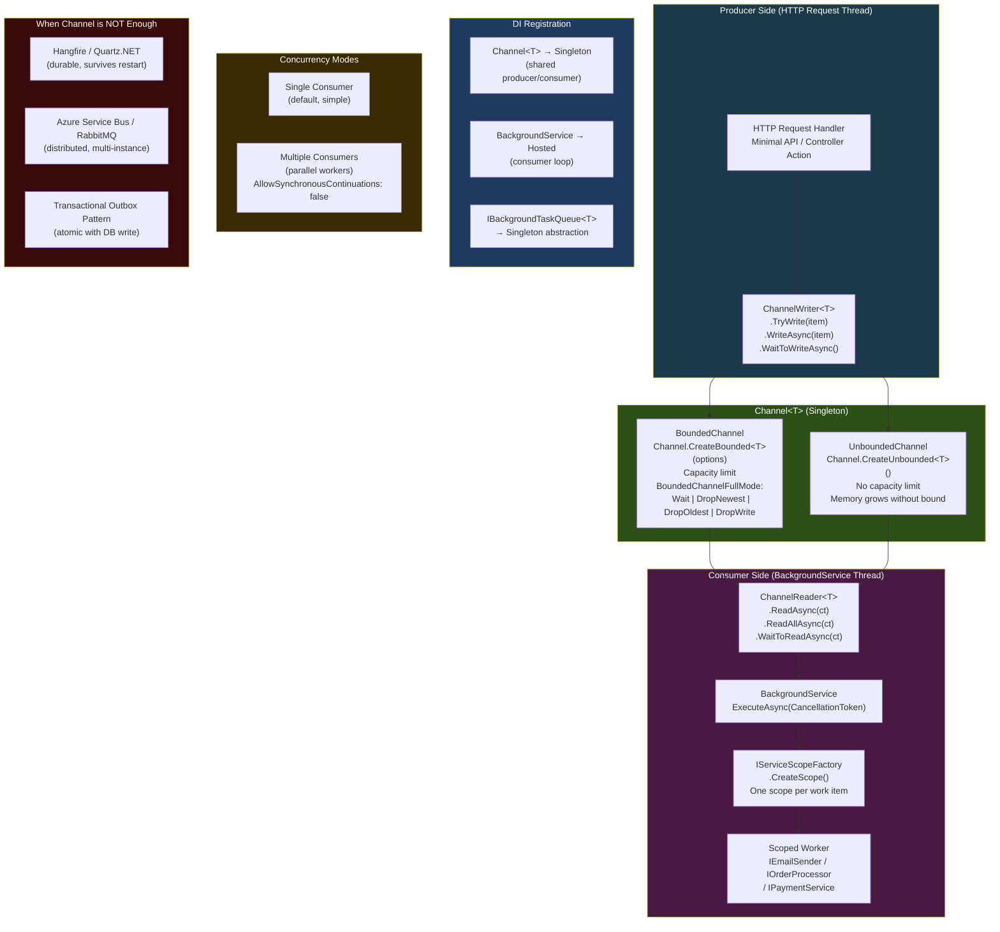
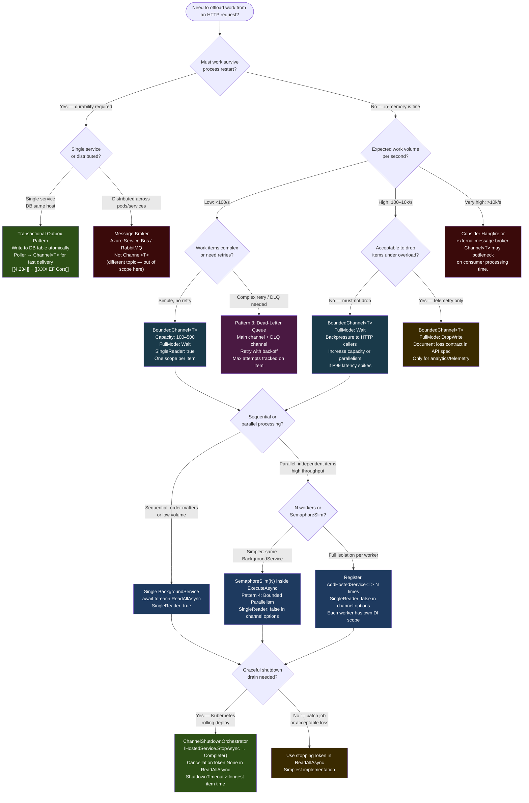

# 4.234 — Queued Background Tasks: Channel<T>-Based Producer/Consumer

---

## PART 0 — Navigation & Context

### Where This Topic Sits

```
ASP.NET Core Mastery
│
└── R. Background Services (4.231–4.239)
    │
    ├── 4.231  IHostedService: Running Code at Startup and Shutdown
    ├── 4.232  BackgroundService: The Base Class for Long-Running Work
    ├── 4.233  Timed Background Service: PeriodicTimer for Recurring Jobs
    ├──►4.234  Queued Background Tasks: Channel<T>-Based Producer/Consumer  ◄── YOU ARE HERE
    ├── 4.235  Scoped Services in BackgroundService: IServiceScopeFactory Pattern
    ├── 4.236  Worker Services: Standalone Console Host
    ├── 4.237  Graceful Shutdown: CancellationToken Contract
    ├── 4.238  Hangfire: Recurring Jobs and Fire-and-Forget
    └── 4.239  Health Checks for Background Services
```

### What You Need Before This

- **[[4.232 — BackgroundService]]** — the queue consumer is always a `BackgroundService`; you must understand `ExecuteAsync` and `CancellationToken` before the consumer loop makes sense
- **[[4.035 — Service Lifetimes: Singleton, Scoped, Transient]]** — `Channel<T>` is registered as Singleton; the consumer creates Scoped services per work item; the lifetime chain must be understood before the implementation
- **[[4.042 — The Captive Dependency Problem]]** — the consumer's loop that creates scopes is specifically the workaround for the captive dependency trap
- **[[4.049 — The Middleware Pipeline]]** — HTTP request handlers are the producers; understanding the pipeline positions them correctly as the enqueue site

### What This Unlocks After

- **[[4.235 — Scoped Services in BackgroundService]]** — every queue consumer that processes work items needs a scope per item; this topic depends on this one
- **[[4.237 — Graceful Shutdown in Background Services]]** — draining the channel on shutdown before the host stops is the production-critical extension of this topic
- **[[4.238 — Hangfire]]** — Hangfire is the "when Channel is not enough" escalation path; understanding Channel limits motivates Hangfire

### Why This Matters at Scale

`Channel<T>` is the production-correct way to decouple HTTP request handlers from expensive work — sending emails, processing webhooks, resizing images, calling slow third-party APIs — without blocking the request thread or accepting in-process work loss; getting this wrong either blocks the Kestrel thread pool (wrong: doing the work inline) or silently drops work on pod restart (wrong: fire-and-forget `Task.Run` without a queue).

---

## PART 1 — The Core Mental Model

### The Fundamental Rule

> **`System.Threading.Channels.Channel<T>` is a thread-safe, backpressure-aware in-memory queue: HTTP request handlers write work items to a `ChannelWriter<T>` (producers) and a `BackgroundService` reads from a `ChannelReader<T>` in a loop (consumer); because the channel is a Singleton and the `BackgroundService` is hosted inside the Generic Host, work survives request completion but does NOT survive process restart — it is not a durable queue.**

### The Plain-Language Analogy

Imagine a busy restaurant kitchen. The front-of-house waiters (HTTP request handlers) take orders and drop written tickets through a slot into the kitchen (the `Channel<T>`). The kitchen (the `BackgroundService`) processes tickets in sequence without the waiter standing there waiting. If the kitchen is backed up, the ticket pile grows — but there is a configurable limit on how many tickets can stack up before the waiter must wait (bounded channel capacity with backpressure). The critical property: if the restaurant burns down (the process crashes), all tickets in the slot are lost. Nobody sends the food anyway. This is an in-memory queue — not a receipt printer that survives power outages. For orders that must survive outages, you need a durable message broker (Azure Service Bus, RabbitMQ) instead of `Channel<T>`.

### The Taxonomy Diagram



---

## PART 2 — Deep Mechanics

### 2.1 — `Channel<T>` Internals: What the Runtime Is Actually Doing

`System.Threading.Channels` (part of .NET core libraries, no NuGet package needed) provides a lock-free, async-first data structure built on `ValueTask` and `IValueTaskSource` — not `Monitor`/`lock`. The underlying implementation uses a ring buffer (bounded) or linked-list of segments (unbounded) with atomic CAS operations for thread safety.

```
Pipeline position: Channel<T> sits entirely outside the HTTP request pipeline.
The producer call (WriteAsync) executes on the Kestrel I/O thread during request handling.
The consumer loop executes on a ThreadPool thread owned by the Generic Host.
These are two entirely separate execution contexts sharing one data structure.

HTTP Request Pipeline:
──► Routing ──► Auth ──► Endpoint Handler ──► [WriteAsync to Channel] ──► Response returned
                                                        │
                                                        ▼ (no await — or awaited WriteAsync)
                                              Channel<WorkItem> (bounded: blocks if full)
                                                        │
                                              (separate thread / host lifecycle)
                                                        ▼
                                              BackgroundService.ExecuteAsync()
                                              └──► ReadAllAsync() loop
                                                   └──► CreateScope() → process item
```

**ASP.NET Core internally (approximate) — `Channel.CreateBounded<T>`:**

```csharp
// The runtime creates a BoundedChannel<T> backed by a Deque<T>
// (double-ended queue implemented as a circular array).
// Key internal state:
//   _items: Deque<T>           — the work item ring buffer
//   _blockedWriters: Deque<...> — tasks waiting when channel is full (Wait mode)
//   _blockedReaders: Deque<...> — tasks waiting when channel is empty
//   _closedToken: CancellationToken — set when Complete() is called
//
// WriteAsync:
//   if _items.Count < capacity → enqueue, signal any blocked reader, return completed ValueTask
//   else if full mode == Wait  → enqueue the writer's TaskCompletionSource into _blockedWriters
//                                 return a ValueTask that completes when space opens
//   else (DropNewest etc.)     → drop according to policy, return completed ValueTask
//
// ReadAsync:
//   if _items.Count > 0 → dequeue, signal any blocked writer, return item in completed ValueTask
//   else                → enqueue the reader's TaskCompletionSource into _blockedReaders
//                         return a ValueTask that completes when an item arrives
//
// Runtime cost: ~0 allocations for the fast path (item available/space available)
//               ~1 allocation for blocked path (new TCS for wait)
//               O(1) enqueue/dequeue — ring buffer index arithmetic
```

**The two channel shapes — when to use which:**

```csharp
// BOUNDED — production default for HTTP-facing work queues
// Provides backpressure: if the consumer is slower than the producer,
// the producer's WriteAsync will await instead of enqueuing endlessly.
// This applies backpressure up the call stack — slowing the HTTP response —
// which is the correct behavior: the system signals overload rather than
// accepting unbounded work that will never be processed.

var bounded = Channel.CreateBounded<EmailWorkItem>(new BoundedChannelOptions(1000)
{
    // What happens when the channel is at capacity and a writer arrives:
    FullMode = BoundedChannelFullMode.Wait,        // Writer awaits — backpressure ✅
    // FullMode = BoundedChannelFullMode.DropWrite, // Silently drop new item — use for telemetry only
    // FullMode = BoundedChannelFullMode.DropNewest,// Drop the item just enqueued (same as DropWrite)
    // FullMode = BoundedChannelFullMode.DropOldest,// Drop the oldest item in queue — use carefully

    // Performance options:
    SingleWriter = false, // Multiple HTTP handlers write concurrently (default)
    SingleReader = true,  // Only one BackgroundService reads (default) → enables optimizations
    AllowSynchronousContinuations = false, // Don't run continuations on the writer's thread
});

// UNBOUNDED — use only when producer rate is bounded externally
// (e.g., consuming from an external queue where you control pull rate)
// Risk: unbounded memory growth under producer bursts — can OOM the process
var unbounded = Channel.CreateUnbounded<AuditLogEntry>(new UnboundedChannelOptions
{
    SingleWriter = false,
    SingleReader = true,
    AllowSynchronousContinuations = false,
});

// Runtime cost (bounded, Wait mode, fast path): ~0 allocations, ~10ns
// Runtime cost (bounded, Wait mode, blocked path): ~1 TCS allocation, async state machine
// Runtime cost (unbounded, fast path): ~0 allocations (object pooling in segments), ~8ns
```

> [!WARNING] `AllowSynchronousContinuations = true` means that when a writer enqueues an item into an empty channel, the reader's continuation may execute **synchronously on the writer's thread** before `WriteAsync` returns. In an HTTP request handler, this means the reader's work executes on the Kestrel I/O thread, defeating the entire purpose of offloading. Always set `AllowSynchronousContinuations = false` for channels written from HTTP request handlers.

---

### 2.2 — The Producer: Writing From HTTP Request Handlers

```
Pipeline position: Producer code runs inside the HTTP endpoint handler,
BEFORE the response is returned to the client. The WriteAsync call may
briefly block the response if the channel is bounded and full.

──► Routing ──► Auth ──► [POST /api/orders] ──► WriteAsync ──► 202 Accepted returned
                                                    │
                                              (may await here if channel full)
```

```csharp
// IBackgroundTaskQueue<T> — the abstraction that hides Channel<T> from producers
// Producers depend on the interface; the channel implementation is an internal detail.

public interface IBackgroundTaskQueue<T>
{
    ValueTask EnqueueAsync(T workItem, CancellationToken cancellationToken = default);
    ValueTask<T> DequeueAsync(CancellationToken cancellationToken);

    // Expose for graceful shutdown drain monitoring
    int Count { get; }
    bool IsCompleted { get; }

    // Called by the host on shutdown to signal no more items will arrive
    void Complete();
}

// BoundedBackgroundTaskQueue<T> — the concrete implementation
public sealed class BoundedBackgroundTaskQueue<T> : IBackgroundTaskQueue<T>
{
    private readonly Channel<T> _channel;

    public BoundedBackgroundTaskQueue(int capacity)
    {
        _channel = Channel.CreateBounded<T>(new BoundedChannelOptions(capacity)
        {
            FullMode = BoundedChannelFullMode.Wait,
            SingleReader = true,
            SingleWriter = false,
            AllowSynchronousContinuations = false,
        });
    }

    // ValueTask — not Task — because the fast path (space available) is zero-allocation
    public ValueTask EnqueueAsync(T workItem, CancellationToken cancellationToken = default)
        => _channel.Writer.WriteAsync(workItem, cancellationToken);

    public ValueTask<T> DequeueAsync(CancellationToken cancellationToken)
        => _channel.Reader.ReadAsync(cancellationToken);

    public int Count => _channel.Reader.Count;
    public bool IsCompleted => _channel.Reader.Completion.IsCompleted;

    public void Complete()
        => _channel.Writer.TryComplete(); // Signal: no more items will be written
}

// Registration (once, in Program.cs)
builder.Services.AddSingleton<IBackgroundTaskQueue<EmailWorkItem>>(
    _ => new BoundedBackgroundTaskQueue<EmailWorkItem>(capacity: 1000));
```

**HTTP producer (Minimal API — Order Management Service):**

```csharp
// POST /api/orders — accept order, enqueue email, return 202 immediately
// Pipeline position: inside endpoint handler, after auth, before response

app.MapPost("/api/orders", async (
    CreateOrderRequest request,
    IOrderService orderService,
    IBackgroundTaskQueue<EmailWorkItem> emailQueue,
    CancellationToken ct) =>
{
    // 1. Do the synchronous work inline — create the order record
    var order = await orderService.CreateOrderAsync(request, ct);

    // 2. Enqueue the slow work — send confirmation email (don't await the email send)
    // WriteAsync will await briefly if the queue is full (bounded + Wait mode = backpressure)
    await emailQueue.EnqueueAsync(new EmailWorkItem(
        To: request.CustomerEmail,
        Subject: $"Order {order.Id} confirmed",
        TemplateId: "order-confirmation",
        TemplateData: new { OrderId = order.Id, Total = order.Total }
    ), ct);

    // 3. Return immediately — email will be sent by the BackgroundService
    return TypedResults.Accepted($"/api/orders/{order.Id}", new { order.Id });
})
.RequireAuthorization()
.WithName("CreateOrder");

// HTTP wire format:
// POST /api/orders HTTP/1.1
// Content-Type: application/json
// Authorization: Bearer eyJhbGci...
// {"customerId": "cust-123", "items": [...]}
//
// HTTP/1.1 202 Accepted
// Location: /api/orders/ord-456
// Content-Type: application/json
// {"id": "ord-456"}
//
// Runtime cost of enqueue: ~0 allocations (fast path), <1µs
// The client gets 202 before the email is sent — correct async UX
```

**Edge case — `TryWrite` vs `WriteAsync`:**

```csharp
// ⚠️ WRONG for HTTP handlers — TryWrite drops the item silently if full
bool accepted = emailQueue.Writer.TryWrite(workItem);
if (!accepted) {
    // You have to handle this — but what do you do? The order is already created.
    // This pattern forces you to handle a partial-success state.
    logger.LogWarning("Email queue full — email for order {OrderId} was dropped", order.Id);
}

// ✅ CORRECT for HTTP handlers — WriteAsync provides backpressure
// If the queue is full: the HTTP response is delayed until space opens.
// This is the correct production behavior: slow down producers under load.
await emailQueue.EnqueueAsync(workItem, ct);
// If ct is the request's CancellationToken and the client disconnects:
// OperationCanceledException is thrown — the item is not enqueued, which is correct
// (the client cancelled, so there's no one to send the email to).
```

---

### 2.3 — The Consumer: The `BackgroundService` Drain Loop

```
Pipeline position: The consumer loop runs on a ThreadPool thread managed by
the Generic Host. It is ENTIRELY SEPARATE from the HTTP pipeline.
It starts when IHost.StartAsync() is called (app startup) and runs until
the CancellationToken passed to ExecuteAsync is cancelled (app shutdown).

Generic Host Lifecycle:
  StartAsync() → IHostedService.StartAsync() → BackgroundService.StartAsync()
    → Task.Run(ExecuteAsync) ← starts the consumer on a ThreadPool thread
  StopAsync() → CancellationToken cancelled → ReadAllAsync throws OCE → ExecuteAsync exits
```

```csharp
// EmailDispatchWorker — the consumer BackgroundService
// Domain: Order management service — email confirmation dispatch

public sealed class EmailDispatchWorker : BackgroundService
{
    private readonly IBackgroundTaskQueue<EmailWorkItem> _queue;
    private readonly IServiceScopeFactory _scopeFactory;
    private readonly ILogger<EmailDispatchWorker> _logger;

    // Constructor injection: IBackgroundTaskQueue<T> is Singleton — safe
    // IServiceScopeFactory is Singleton — safe
    // ILogger<T> is Singleton — safe
    // ⚠️ DO NOT inject IEmailSender here if it's Scoped — captive dependency bug
    public EmailDispatchWorker(
        IBackgroundTaskQueue<EmailWorkItem> queue,
        IServiceScopeFactory scopeFactory,
        ILogger<EmailDispatchWorker> logger)
    {
        _queue = queue;
        _scopeFactory = scopeFactory;
        _logger = logger;
    }

    protected override async Task ExecuteAsync(CancellationToken stoppingToken)
    {
        _logger.LogInformation("Email dispatch worker started");

        // ReadAllAsync yields each item as it arrives, and completes when:
        // 1. stoppingToken is cancelled (host shutdown), OR
        // 2. _queue.Complete() is called (writer signals no more items)
        // This is the idiomatic consumer loop — no manual polling, no Thread.Sleep
        await foreach (var workItem in _channel_reader.ReadAllAsync(stoppingToken))
        {
            // One scope per work item — this is the IServiceScopeFactory pattern
            // that solves the captive dependency problem
            await using var scope = _scopeFactory.CreateAsyncScope();
            var emailSender = scope.ServiceProvider.GetRequiredService<IEmailSender>();
            var tracer = scope.ServiceProvider.GetRequiredService<IActivitySource>();

            using var activity = tracer.StartActivity("EmailDispatch.Send");
            activity?.SetTag("email.to", workItem.To);
            activity?.SetTag("email.template", workItem.TemplateId);

            try
            {
                await emailSender.SendAsync(workItem, stoppingToken);
                _logger.LogInformation(
                    "Email sent for order {OrderId} to {To}",
                    workItem.TemplateData?.OrderId, workItem.To);
            }
            catch (OperationCanceledException) when (stoppingToken.IsCancellationRequested)
            {
                // Host is shutting down — log and break cleanly
                // The item is lost — for production, consider a drain strategy (Part 3, Pattern 2)
                _logger.LogWarning("Email dispatch cancelled during shutdown for {To}", workItem.To);
                break;
            }
            catch (Exception ex)
            {
                // ⚠️ CRITICAL: Never let an unhandled exception escape ExecuteAsync.
                // An unhandled exception here stops the BackgroundService permanently.
                // The host continues running, but no more emails will ever be sent.
                // Always catch, log, and continue the loop.
                _logger.LogError(ex,
                    "Failed to send email to {To} for template {TemplateId}. Item dropped.",
                    workItem.To, workItem.TemplateId);
                // Optionally: push to a dead-letter queue or retry mechanism
            }
        }

        _logger.LogInformation("Email dispatch worker stopped");
    }

    // Helper: expose the reader from the queue
    private System.Threading.Channels.ChannelReader<EmailWorkItem> _channel_reader
        => ((BoundedBackgroundTaskQueue<EmailWorkItem>)_queue)._channel.Reader;
    // Better: expose IAsyncEnumerable<T> through the IBackgroundTaskQueue interface (see Pattern 1)
}
```

> [!IMPORTANT] The `await foreach` over `ReadAllAsync(stoppingToken)` is the correct pattern. It yields each item with zero polling overhead — the thread is returned to the pool between items when the channel is empty. Do NOT use `while(true) { var item = await DequeueAsync(ct); }` unless you also handle the channel completion signal (`ChannelClosedException`). `ReadAllAsync` handles both item arrival and channel completion atomically.

**Failure mode — unhandled exception kills the consumer permanently:**

```
// What happens when an exception escapes ExecuteAsync:
ExecuteAsync throws → BackgroundService catches it internally
  → BackgroundService.ExecuteTask faults
  → IHostApplicationLifetime.ApplicationStopping is NOT triggered automatically
  → The host keeps running
  → The channel fills up (producers keep writing)
  → Producers start blocking on WriteAsync (bounded + Wait mode)
  → HTTP requests start timing out waiting for queue space
  → The entire service appears to hang with no error in the HTTP response

// This is the most insidious Channel<T> failure mode — it looks like a
// load problem, not a consumer crash. Always wrap the inner loop body in try/catch.
```

---

### 2.4 — The `ReadAllAsync` vs `WaitToReadAsync`/`TryRead` Loop Patterns

There are two idiomatic consumer loop shapes. Understanding both is important for interviews and for situations where `ReadAllAsync` doesn't give enough control.

```csharp
// Pattern A — ReadAllAsync (preferred, .NET 5+)
// Cleanest, fewest allocations, handles channel completion automatically.
// await foreach uses IAsyncEnumerable<T> — one async state machine for the loop.

await foreach (var item in reader.ReadAllAsync(stoppingToken))
{
    await ProcessAsync(item, stoppingToken);
}

// Pattern B — WaitToReadAsync + TryRead (pre-.NET 5 or when you need explicit control)
// WaitToReadAsync: returns true when items are available, false when channel is completed.
// TryRead: synchronous dequeue — always attempt after WaitToReadAsync to drain burst.

while (await reader.WaitToReadAsync(stoppingToken))
{
    while (reader.TryRead(out var item))
    {
        await ProcessAsync(item, stoppingToken);
    }
}
// WaitToReadAsync cost: ~0 allocations on fast path (items already available)
// This pattern is better for bursting scenarios where many items arrive together —
// the inner TryRead loop drains them synchronously without re-awaiting the outer loop.

// Pattern C — Parallel consumers with SemaphoreSlim (bounded parallelism)
// For CPU-bound or IO-bound work where you want N concurrent workers on one channel.
// See Pattern 4 in Part 3 for the full implementation.

var semaphore = new SemaphoreSlim(maxConcurrency, maxConcurrency);
await foreach (var item in reader.ReadAllAsync(stoppingToken))
{
    await semaphore.WaitAsync(stoppingToken);
    _ = Task.Run(async () =>
    {
        try { await ProcessAsync(item, stoppingToken); }
        finally { semaphore.Release(); }
    }, stoppingToken);
}
```

---

### 2.5 — Graceful Shutdown: The Channel Drain Problem

This is the production-critical edge case that distinguishes a correct implementation from a naive one. When the Generic Host receives a shutdown signal (`SIGTERM` in Kubernetes, Ctrl+C locally), the `stoppingToken` in `ExecuteAsync` is cancelled. If there are items in the channel at that moment, they are lost.

```
Shutdown sequence (default):
  SIGTERM received
    → IHostApplicationLifetime.ApplicationStopping fires
    → CancellationToken passed to ExecuteAsync is cancelled
    → ReadAllAsync throws OperationCanceledException
    → BackgroundService.ExecuteAsync returns
    → IHostedService.StopAsync called (5 second default timeout)
    → Host exits
    → ⚠️ Items remaining in channel are lost — never processed

Correct drain sequence:
  SIGTERM received
    → ApplicationStopping fires
    → HTTP pipeline: stop accepting new requests (health check returns unhealthy)
    → HTTP pipeline: drain in-flight requests
    → AFTER drain: call channel.Writer.TryComplete()
    → Consumer loop: ReadAllAsync processes remaining items before completing
    → BackgroundService: ExecuteAsync returns naturally (not via cancellation)
    → IHostedService.StopAsync: host exits cleanly
```

```csharp
// The channel.Writer.Complete() signal is the key to graceful drain.
// Register a host lifecycle hook to complete the writer AFTER HTTP requests drain.

public static class ChannelDrainExtensions
{
    public static IServiceCollection AddOrderedChannelShutdown<T>(
        this IServiceCollection services)
    {
        services.AddHostedService<ChannelShutdownOrchestrator<T>>();
        return services;
    }
}

// A lightweight IHostedService that completes the channel writer during shutdown
public sealed class ChannelShutdownOrchestrator<T> : IHostedService
{
    private readonly IBackgroundTaskQueue<T> _queue;
    private readonly IHostApplicationLifetime _lifetime;
    private readonly ILogger<ChannelShutdownOrchestrator<T>> _logger;

    public ChannelShutdownOrchestrator(
        IBackgroundTaskQueue<T> queue,
        IHostApplicationLifetime lifetime,
        ILogger<ChannelShutdownOrchestrator<T>> logger)
    {
        _queue = queue;
        _lifetime = lifetime;
        _logger = logger;
    }

    public Task StartAsync(CancellationToken cancellationToken)
    {
        // Register: when ApplicationStopping fires, complete the channel writer.
        // This signals the consumer that no more items will arrive.
        // The consumer's ReadAllAsync will then drain remaining items and complete.
        _lifetime.ApplicationStopping.Register(() =>
        {
            _logger.LogInformation(
                "Shutdown signal received — completing channel writer. " +
                "Items remaining in queue: {Count}", _queue.Count);
            _queue.Complete();
        });
        return Task.CompletedTask;
    }

    public Task StopAsync(CancellationToken cancellationToken) => Task.CompletedTask;
}

// Updated ExecuteAsync that cooperates with channel completion:
protected override async Task ExecuteAsync(CancellationToken stoppingToken)
{
    // Use a SEPARATE CancellationToken from stoppingToken for the ReadAllAsync loop.
    // We want to process remaining items even after stoppingToken is cancelled,
    // as long as the channel still has items (not yet complete).
    // Use CancellationToken.None to let ReadAllAsync run until channel.Complete().
    await foreach (var item in _reader.ReadAllAsync(CancellationToken.None))
    {
        // Check stoppingToken only for the actual work — if host is shutting down
        // urgently, we can still bail on slow external calls
        await ProcessItemAsync(item, stoppingToken);
    }
    // ReadAllAsync returns naturally when the channel is marked Complete and empty.
    // No items are lost.
}

// Runtime cost of drain: proportional to items in channel × processing time per item
// Kubernetes default termination grace period: 30 seconds
// Configure with: builder.Services.Configure<HostOptions>(o => o.ShutdownTimeout = TimeSpan.FromSeconds(60));
```

---

### 2.6 — Backpressure Propagation: What Happens to HTTP Requests When the Queue Is Full

This is the edge case that distinguishes `Wait` mode from `Drop*` modes and determines your API's behavior under overload.

```
Scenario: Payment processing service. Consumer processes at 100 payments/second.
Producer (HTTP requests) arriving at 500 payments/second. Channel capacity: 1000.

Timeline (BoundedChannelFullMode.Wait):
  t=0s:  Queue: 0    — normal operation
  t=5s:  Queue: 1000 — channel FULL (1000 capacity × 1 second of backlog)
  t=5s+: HTTP handlers: await WriteAsync begins blocking
         → Kestrel threads used by payment POST handlers are all awaiting channel space
         → New HTTP requests queue up in Kestrel's connection backlog
         → P99 latency for POST /payments spikes from 20ms to 500ms+
         → Eventually: HTTP client timeouts / 503 from upstream load balancer

Timeline (BoundedChannelFullMode.DropWrite):
  t=0s:  Queue: 0    — normal operation
  t=5s:  Queue: 1000 — channel FULL
  t=5s+: HTTP handlers: WriteAsync returns immediately, item is silently dropped
         → POST /payments returns 202 Accepted immediately
         → Payment is NEVER processed — silent data loss
         → Customer thinks payment succeeded, money is not processed
         ⚠️ THIS IS CATASTROPHIC for business-critical operations
```

```csharp
// HTTP response under Wait mode when queue is full:
// POST /api/payments HTTP/1.1
// (request arrives when queue is full)
//
// ... 800ms later (channel drained enough for one slot) ...
//
// HTTP/1.1 202 Accepted
//
// The client experiences increased latency — but no data loss.
// This is the correct behavior for payment processing.

// HTTP response under DropWrite mode when queue is full:
// POST /api/payments HTTP/1.1
// HTTP/1.1 202 Accepted  ← immediate, but the payment was silently dropped
//
// Use DropWrite ONLY for non-critical telemetry: click events, analytics,
// non-actionable audit logs where dropping under load is acceptable.
```

> [!DANGER] `BoundedChannelFullMode.DropWrite` silently discards work items when the channel is at capacity. For payment processing, order creation, or any operation with a user-facing confirmation, **this is a data-loss bug**. The HTTP response says "Accepted" but the work never happens. Use `Wait` for all business-critical operations. Use `DropWrite` only for fire-and-forget telemetry where loss is explicitly acceptable and documented.

---

## PART 3 — Production Code Patterns

### Pattern 1: The Typed Queue with `IAsyncEnumerable<T>` Consumer Interface (Order Management Service)

The cleanest production-ready implementation: a generic queue interface, a concrete bounded implementation, and a consumer that reads via the interface without coupling to the `Channel<T>` type directly.

```csharp
// ── WorkItem types ────────────────────────────────────────────────────────────
// Domain: Order management — post-order processing tasks

public sealed record OrderConfirmationTask(
    string OrderId,
    string CustomerEmail,
    string CustomerName,
    decimal TotalAmount,
    DateTimeOffset OrderedAt);

// ── Queue abstraction ─────────────────────────────────────────────────────────
public interface IBackgroundTaskQueue<T>
{
    // Producer API
    ValueTask EnqueueAsync(T item, CancellationToken ct = default);

    // Consumer API — returns IAsyncEnumerable so the consumer never touches Channel<T>
    IAsyncEnumerable<T> ReadAllAsync(CancellationToken ct);

    // Shutdown API
    void Complete();

    int Count { get; }
}

// ── Concrete implementation ───────────────────────────────────────────────────
public sealed class BoundedBackgroundTaskQueue<T> : IBackgroundTaskQueue<T>
{
    private readonly Channel<T> _channel;

    public BoundedBackgroundTaskQueue(BoundedChannelOptions options)
    {
        _channel = Channel.CreateBounded<T>(options);
    }

    public ValueTask EnqueueAsync(T item, CancellationToken ct = default)
        => _channel.Writer.WriteAsync(item, ct);

    // ✅ Returns IAsyncEnumerable<T> — consumer uses await foreach, no Channel dependency
    public IAsyncEnumerable<T> ReadAllAsync(CancellationToken ct)
        => _channel.Reader.ReadAllAsync(ct);

    public void Complete()
        => _channel.Writer.TryComplete();

    public int Count => _channel.Reader.Count;
}

// ── DI registration ───────────────────────────────────────────────────────────
// In Program.cs:
builder.Services.AddSingleton<IBackgroundTaskQueue<OrderConfirmationTask>>(
    _ => new BoundedBackgroundTaskQueue<OrderConfirmationTask>(
        new BoundedChannelOptions(500)
        {
            FullMode = BoundedChannelFullMode.Wait,
            SingleReader = true,
            SingleWriter = false,
            AllowSynchronousContinuations = false,
        }));

builder.Services.AddHostedService<OrderConfirmationWorker>();

// ── Producer (controller action) ──────────────────────────────────────────────
[ApiController]
[Route("api/orders")]
public sealed class OrdersController : ControllerBase
{
    private readonly IOrderRepository _orders;
    private readonly IBackgroundTaskQueue<OrderConfirmationTask> _confirmationQueue;

    public OrdersController(
        IOrderRepository orders,
        IBackgroundTaskQueue<OrderConfirmationTask> confirmationQueue)
    {
        _orders = orders;
        _confirmationQueue = confirmationQueue;
    }

    [HttpPost]
    [ProducesResponseType(typeof(OrderCreatedResponse), StatusCodes.Status202Accepted)]
    public async Task<IActionResult> CreateOrder(
        [FromBody] CreateOrderRequest request,
        CancellationToken ct)
    {
        var order = await _orders.CreateAsync(request, ct);

        // Enqueue confirmation — does not await the email send
        // WriteAsync may briefly await if queue is at capacity (backpressure)
        await _confirmationQueue.EnqueueAsync(new OrderConfirmationTask(
            OrderId: order.Id,
            CustomerEmail: request.Email,
            CustomerName: request.Name,
            TotalAmount: order.Total,
            OrderedAt: order.CreatedAt
        ), ct);

        return AcceptedAtAction(
            nameof(GetOrder), new { id = order.Id },
            new OrderCreatedResponse(order.Id));
    }
}

// ── Consumer (BackgroundService) ─────────────────────────────────────────────
public sealed class OrderConfirmationWorker : BackgroundService
{
    private readonly IBackgroundTaskQueue<OrderConfirmationTask> _queue;
    private readonly IServiceScopeFactory _scopeFactory;
    private readonly ILogger<OrderConfirmationWorker> _logger;

    public OrderConfirmationWorker(
        IBackgroundTaskQueue<OrderConfirmationTask> queue,
        IServiceScopeFactory scopeFactory,
        ILogger<OrderConfirmationWorker> logger)
    {
        _queue = queue;
        _scopeFactory = scopeFactory;
        _logger = logger;
    }

    protected override async Task ExecuteAsync(CancellationToken stoppingToken)
    {
        _logger.LogInformation("Order confirmation worker started");

        // CancellationToken.None: process all items until channel.Complete() signals EOF
        // This enables graceful drain on shutdown (see ChannelShutdownOrchestrator above)
        await foreach (var task in _queue.ReadAllAsync(CancellationToken.None))
        {
            await using var scope = _scopeFactory.CreateAsyncScope();
            var emailService = scope.ServiceProvider
                .GetRequiredService<IOrderConfirmationEmailService>();

            try
            {
                _logger.LogInformation(
                    "Sending confirmation for order {OrderId} to {Email}",
                    task.OrderId, task.CustomerEmail);

                // Use a timeout per item, not the host stoppingToken
                using var cts = CancellationTokenSource.CreateLinkedTokenSource(stoppingToken);
                cts.CancelAfter(TimeSpan.FromSeconds(30)); // per-item timeout

                await emailService.SendConfirmationAsync(task, cts.Token);
            }
            catch (OperationCanceledException) when (stoppingToken.IsCancellationRequested)
            {
                _logger.LogWarning(
                    "Confirmation for order {OrderId} cancelled at shutdown", task.OrderId);
                // Don't break — let the foreach continue for remaining items if drain mode
            }
            catch (Exception ex)
            {
                // Log and continue — never let an exception kill the worker
                _logger.LogError(ex,
                    "Failed to send confirmation for order {OrderId}. Dropping item.",
                    task.OrderId);
            }
        }

        _logger.LogInformation("Order confirmation worker stopped — queue drained");
    }
}
```

---

### Pattern 2: The Shutdown-Safe Queue with Drain-on-Stop (Payment Processing Service)

Extends Pattern 1 with coordinated graceful shutdown so in-flight items are not lost during rolling deployments.

```csharp
// Domain: Fintech payment processing — payment event fan-out

// IHostedService that orchestrates channel completion BEFORE host stops accepting requests
// This runs alongside the main worker — it's a lifecycle coordinator, not a processor

public sealed class PaymentQueueShutdownCoordinator : IHostedService
{
    private readonly IBackgroundTaskQueue<PaymentEventTask> _queue;
    private readonly IHostApplicationLifetime _lifetime;
    private readonly ILogger<PaymentQueueShutdownCoordinator> _logger;

    public PaymentQueueShutdownCoordinator(
        IBackgroundTaskQueue<PaymentEventTask> queue,
        IHostApplicationLifetime lifetime,
        ILogger<PaymentQueueShutdownCoordinator> logger)
    {
        _queue = queue;
        _lifetime = lifetime;
        _logger = logger;
    }

    public Task StartAsync(CancellationToken cancellationToken)
    {
        _lifetime.ApplicationStopping.Register(() =>
        {
            int remaining = _queue.Count;
            _logger.LogInformation(
                "Application stopping. Payment queue has {Count} items to drain.", remaining);

            // Signal writer side: no more enqueues will be accepted
            _queue.Complete();

            // The consumer's ReadAllAsync (with CancellationToken.None) will now
            // drain remaining items and exit naturally when the channel is empty.
        });

        return Task.CompletedTask;
    }

    public Task StopAsync(CancellationToken cancellationToken) => Task.CompletedTask;
}

// In Program.cs — extend the host shutdown timeout to allow drain
builder.Services.Configure<HostOptions>(options =>
{
    // Default is 5 seconds — increase for queues that may have backlog at shutdown
    // Kubernetes terminationGracePeriodSeconds should be > this value
    options.ShutdownTimeout = TimeSpan.FromSeconds(30);
});

builder.Services.AddSingleton<IBackgroundTaskQueue<PaymentEventTask>>(
    _ => new BoundedBackgroundTaskQueue<PaymentEventTask>(
        new BoundedChannelOptions(2000)
        {
            FullMode = BoundedChannelFullMode.Wait,
            SingleReader = true,
            SingleWriter = false,
            AllowSynchronousContinuations = false,
        }));

builder.Services.AddHostedService<PaymentEventFanOutWorker>();
builder.Services.AddHostedService<PaymentQueueShutdownCoordinator>();
```

---

### Pattern 3: The Dead-Letter Queue for Failed Items (Healthcare Patient Portal)

When an item fails processing, you don't want to drop it silently — but you also don't want to block the main queue. A secondary "dead-letter" channel captures failures for inspection and retry.

```csharp
// Domain: Healthcare patient portal — appointment reminder dispatch

public sealed record AppointmentReminderTask(
    string AppointmentId,
    string PatientPhone,
    DateTimeOffset AppointmentTime,
    int AttemptCount = 0);  // track retry attempts

public sealed class AppointmentReminderWorker : BackgroundService
{
    private readonly IBackgroundTaskQueue<AppointmentReminderTask> _mainQueue;
    private readonly IBackgroundTaskQueue<AppointmentReminderTask> _deadLetterQueue;
    private readonly IServiceScopeFactory _scopeFactory;
    private readonly ILogger<AppointmentReminderWorker> _logger;

    private const int MaxAttempts = 3;

    public AppointmentReminderWorker(
        IBackgroundTaskQueue<AppointmentReminderTask> mainQueue,
        [FromKeyedServices("dead-letter")]
        IBackgroundTaskQueue<AppointmentReminderTask> deadLetterQueue,
        IServiceScopeFactory scopeFactory,
        ILogger<AppointmentReminderWorker> logger)
    {
        _mainQueue = mainQueue;
        _deadLetterQueue = deadLetterQueue;
        _scopeFactory = scopeFactory;
        _logger = logger;
    }

    protected override async Task ExecuteAsync(CancellationToken stoppingToken)
    {
        await foreach (var task in _mainQueue.ReadAllAsync(CancellationToken.None))
        {
            await using var scope = _scopeFactory.CreateAsyncScope();
            var smsService = scope.ServiceProvider.GetRequiredService<ISmsService>();

            try
            {
                using var cts = CancellationTokenSource.CreateLinkedTokenSource(stoppingToken);
                cts.CancelAfter(TimeSpan.FromSeconds(10));

                await smsService.SendReminderAsync(task.PatientPhone, task.AppointmentTime, cts.Token);

                _logger.LogInformation(
                    "Appointment reminder sent for {AppointmentId}", task.AppointmentId);
            }
            catch (Exception ex) when (ex is not OperationCanceledException)
            {
                _logger.LogWarning(ex,
                    "Reminder for {AppointmentId} failed (attempt {Attempt}/{Max})",
                    task.AppointmentId, task.AttemptCount + 1, MaxAttempts);

                if (task.AttemptCount < MaxAttempts - 1)
                {
                    // Re-enqueue with incremented attempt count (retry)
                    // Use TryWrite — if the queue is full, drop rather than deadlock
                    var retry = task with { AttemptCount = task.AttemptCount + 1 };
                    if (!await TryEnqueueWithDelayAsync(_mainQueue, retry, stoppingToken))
                    {
                        // Queue full or shutting down — move to dead-letter
                        await _deadLetterQueue.EnqueueAsync(retry, CancellationToken.None);
                    }
                }
                else
                {
                    // Exhausted retries — dead-letter for manual inspection
                    _logger.LogError(
                        "Appointment reminder for {AppointmentId} dead-lettered after {Max} attempts",
                        task.AppointmentId, MaxAttempts);
                    await _deadLetterQueue.EnqueueAsync(task, CancellationToken.None);
                }
            }
        }
    }

    private static async ValueTask<bool> TryEnqueueWithDelayAsync<T>(
        IBackgroundTaskQueue<T> queue,
        T item,
        CancellationToken ct)
    {
        try
        {
            // Brief delay before retry to avoid hammering on transient failures
            await Task.Delay(TimeSpan.FromSeconds(5), ct);
            await queue.EnqueueAsync(item, ct);
            return true;
        }
        catch (OperationCanceledException)
        {
            return false;
        }
    }
}

// Registration in Program.cs:
builder.Services.AddKeyedSingleton<IBackgroundTaskQueue<AppointmentReminderTask>>(
    "dead-letter",
    (_, _) => new BoundedBackgroundTaskQueue<AppointmentReminderTask>(
        new BoundedChannelOptions(100) { FullMode = BoundedChannelFullMode.DropOldest }));
```

---

### Pattern 4: Parallel Processing with Bounded Concurrency (Inventory Image Processor)

For CPU-bound or IO-bound work where sequential processing is too slow, use multiple concurrent workers reading from the same channel.

```csharp
// Domain: Inventory management service — product image thumbnail generation
// Scenario: Bulk product import triggers many image resizing tasks.
// Sequential processing: 500ms per image × 1000 images = ~8 minutes
// Parallel (4 workers): 500ms per image × 1000 images / 4 = ~2 minutes

// Option A: Multiple BackgroundService instances reading the same channel
// Register the same worker type N times:
for (int i = 0; i < 4; i++)
{
    builder.Services.AddHostedService<ImageResizeWorker>();
}
// The Channel supports multiple concurrent readers (SingleReader: false)

// ⚠️ Register with SingleReader: false if using multiple workers
builder.Services.AddSingleton<IBackgroundTaskQueue<ImageResizeTask>>(
    _ => new BoundedBackgroundTaskQueue<ImageResizeTask>(
        new BoundedChannelOptions(2000)
        {
            FullMode = BoundedChannelFullMode.Wait,
            SingleReader = false,  // ← REQUIRED for parallel workers
            SingleWriter = false,
            AllowSynchronousContinuations = false,
        }));

// Option B: Single BackgroundService with internal SemaphoreSlim parallelism
// More control: backpressure within ExecuteAsync, shared scope lifecycle
public sealed class ImageResizeWorker : BackgroundService
{
    private readonly IBackgroundTaskQueue<ImageResizeTask> _queue;
    private readonly IServiceScopeFactory _scopeFactory;
    private readonly ILogger<ImageResizeWorker> _logger;
    private const int MaxDegreeOfParallelism = 4;

    public ImageResizeWorker(
        IBackgroundTaskQueue<ImageResizeTask> queue,
        IServiceScopeFactory scopeFactory,
        ILogger<ImageResizeWorker> logger)
    {
        _queue = queue;
        _scopeFactory = scopeFactory;
        _logger = logger;
    }

    protected override async Task ExecuteAsync(CancellationToken stoppingToken)
    {
        // SemaphoreSlim controls how many concurrent image resizes run
        using var semaphore = new SemaphoreSlim(MaxDegreeOfParallelism, MaxDegreeOfParallelism);
        var activeTasks = new List<Task>(MaxDegreeOfParallelism * 2);

        await foreach (var task in _queue.ReadAllAsync(CancellationToken.None))
        {
            // Acquire concurrency slot — if all N slots taken, this awaits
            await semaphore.WaitAsync(stoppingToken);

            // Fire-and-track: don't await here, continue reading from queue
            var workTask = ProcessImageAsync(task, semaphore, stoppingToken);
            activeTasks.Add(workTask);

            // Prune completed tasks from tracking list periodically
            if (activeTasks.Count > MaxDegreeOfParallelism * 2)
            {
                activeTasks.RemoveAll(t => t.IsCompleted);
            }
        }

        // Wait for all in-flight tasks to complete before ExecuteAsync returns
        await Task.WhenAll(activeTasks);
    }

    private async Task ProcessImageAsync(
        ImageResizeTask task,
        SemaphoreSlim semaphore,
        CancellationToken stoppingToken)
    {
        try
        {
            await using var scope = _scopeFactory.CreateAsyncScope();
            var resizer = scope.ServiceProvider.GetRequiredService<IImageResizeService>();

            await resizer.ResizeAndUploadAsync(task.ProductId, task.OriginalImageUrl, stoppingToken);

            _logger.LogDebug("Image resized for product {ProductId}", task.ProductId);
        }
        catch (Exception ex) when (ex is not OperationCanceledException)
        {
            _logger.LogError(ex, "Image resize failed for product {ProductId}", task.ProductId);
        }
        finally
        {
            semaphore.Release(); // Always release even on exception
        }
    }
}

// Runtime cost: MaxDegreeOfParallelism concurrent async operations.
// Memory: ~1 SemaphoreSlim + N task tracking entries.
// Throughput: approximately linear with parallelism (IO-bound work).
```

---

### Pattern 5: The Queue Health Indicator (Logistics Tracking Service)

Expose queue depth as a health check — a growing queue depth is an early warning of consumer lag, not a P1 incident by itself.

```csharp
// Domain: Logistics shipment tracking — webhook delivery queue health

public sealed class ShipmentWebhookQueueHealthCheck : IHealthCheck
{
    private readonly IBackgroundTaskQueue<WebhookDeliveryTask> _queue;

    // Thresholds configurable from IOptions (not hardcoded)
    private readonly int _warningThreshold;
    private readonly int _unhealthyThreshold;

    public ShipmentWebhookQueueHealthCheck(
        IBackgroundTaskQueue<WebhookDeliveryTask> queue,
        IOptions<WebhookQueueHealthOptions> options)
    {
        _queue = queue;
        _warningThreshold = options.Value.WarningDepth;     // e.g., 500
        _unhealthyThreshold = options.Value.UnhealthyDepth; // e.g., 900 (90% of 1000 capacity)
    }

    public Task<HealthCheckResult> CheckHealthAsync(
        HealthCheckContext context,
        CancellationToken cancellationToken = default)
    {
        var depth = _queue.Count;

        var data = new Dictionary<string, object>
        {
            ["queue_depth"] = depth,
            ["queue_completed"] = _queue.IsCompleted,
        };

        if (_queue.IsCompleted && depth > 0)
        {
            // Channel marked complete but items remain — shutdown drain in progress
            return Task.FromResult(HealthCheckResult.Degraded(
                "Queue draining on shutdown", data: data));
        }

        if (depth >= _unhealthyThreshold)
        {
            return Task.FromResult(HealthCheckResult.Unhealthy(
                $"Queue depth {depth} exceeds unhealthy threshold {_unhealthyThreshold}",
                data: data));
        }

        if (depth >= _warningThreshold)
        {
            return Task.FromResult(HealthCheckResult.Degraded(
                $"Queue depth {depth} exceeds warning threshold {_warningThreshold}",
                data: data));
        }

        return Task.FromResult(HealthCheckResult.Healthy(
            $"Queue depth {depth}", data: data));
    }
}

// Registration:
builder.Services
    .AddHealthChecks()
    .AddCheck<ShipmentWebhookQueueHealthCheck>(
        "webhook-queue",
        tags: ["ready"]); // Used by Kubernetes readiness probe
```

---

### Pattern 6: The Outbox Bridge — From EF Core to Channel (Payment Confirmation Service)

The transactional outbox pattern writes events to the database atomically with business data, then a poller reads them and enqueues to `Channel<T>`. This bridges the gap between "durable" and "in-process fast".

```csharp
// Domain: Fintech — payment confirmation events
// Problem: We need the payment row and the "send confirmation" event to be atomic.
// Solution: Write a PaymentEvent row inside the same EF Core transaction,
//           then a background poller reads new events and enqueues them to Channel<T>.

// The poller service: reads OutboxEvent rows, enqueues to Channel<T>
public sealed class PaymentOutboxPoller : BackgroundService
{
    private readonly IServiceScopeFactory _scopeFactory;
    private readonly IBackgroundTaskQueue<PaymentConfirmationTask> _queue;
    private readonly ILogger<PaymentOutboxPoller> _logger;

    public PaymentOutboxPoller(
        IServiceScopeFactory scopeFactory,
        IBackgroundTaskQueue<PaymentConfirmationTask> queue,
        ILogger<PaymentOutboxPoller> logger)
    {
        _scopeFactory = scopeFactory;
        _queue = queue;
        _logger = logger;
    }

    protected override async Task ExecuteAsync(CancellationToken stoppingToken)
    {
        using var timer = new PeriodicTimer(TimeSpan.FromSeconds(5));

        while (await timer.WaitForNextTickAsync(stoppingToken))
        {
            await using var scope = _scopeFactory.CreateAsyncScope();
            var db = scope.ServiceProvider.GetRequiredService<PaymentDbContext>();

            // Read unprocessed outbox events in batches
            var pendingEvents = await db.PaymentOutboxEvents
                .Where(e => e.ProcessedAt == null)
                .OrderBy(e => e.CreatedAt)
                .Take(100)
                .ToListAsync(stoppingToken);

            foreach (var outboxEvent in pendingEvents)
            {
                try
                {
                    var task = JsonSerializer.Deserialize<PaymentConfirmationTask>(outboxEvent.Payload)!;

                    // WriteAsync with backpressure: if Channel is full, poller waits here.
                    // This is fine — we want to avoid overwhelming the consumer.
                    await _queue.EnqueueAsync(task, stoppingToken);

                    // Mark as processed only after successful enqueue
                    outboxEvent.ProcessedAt = DateTimeOffset.UtcNow;
                }
                catch (Exception ex)
                {
                    _logger.LogError(ex,
                        "Failed to enqueue outbox event {EventId}", outboxEvent.Id);
                    // Leave ProcessedAt null — will be retried on next poll
                }
            }

            if (pendingEvents.Count > 0)
            {
                await db.SaveChangesAsync(stoppingToken);
            }
        }
    }
}
// Runtime cost: one DB round-trip per poll interval (5 seconds), ~100 rows max per poll.
// This pattern adds durability: events survive process restart because they are in the DB.
```

---

## PART 4 — Gotchas & Anti-Patterns

### Gotcha 1: Unhandled Exception Silently Kills the Consumer Loop Forever

The most dangerous `Channel<T>` bug in production: an exception escapes `ExecuteAsync`, the `BackgroundService` stops, the channel fills up, and HTTP handlers start blocking on `WriteAsync` indefinitely. The service appears alive but no work is processed.

```csharp
// ⚠️ WRONG — exception in work processing escapes the loop
protected override async Task ExecuteAsync(CancellationToken stoppingToken)
{
    await foreach (var item in _queue.ReadAllAsync(stoppingToken))
    {
        // If ProcessAsync throws (e.g., NullReferenceException in deserialization),
        // the exception propagates out of ExecuteAsync.
        await ProcessAsync(item, stoppingToken); // No try/catch
    }
}

// HTTP consequence (wrong path):
// Consumer crashes silently at first failed item
// BackgroundService.ExecuteTask faults — host does NOT restart it
// _queue.Count grows toward capacity (e.g., 1000)
// POST /api/orders: await _queue.EnqueueAsync(item, ct) — awaits indefinitely
// Kestrel threads pile up waiting for channel space
// HTTP 503 from load balancer timeout after ~30 seconds
// Service appears alive (health check passes!) but all orders are dropped
// P1 incident: "why are orders not being processed?" — no exception in logs

// ✅ CORRECT — all exceptions caught inside the loop, consumer never dies
protected override async Task ExecuteAsync(CancellationToken stoppingToken)
{
    await foreach (var item in _queue.ReadAllAsync(CancellationToken.None))
    {
        try
        {
            await ProcessAsync(item, stoppingToken);
        }
        catch (OperationCanceledException) when (stoppingToken.IsCancellationRequested)
        {
            // Host shutting down — log and continue loop for remaining items
            _logger.LogWarning("Processing cancelled for item during shutdown");
        }
        catch (Exception ex)
        {
            // Log, increment failure counter, continue — NEVER let this escape
            _logger.LogError(ex, "Failed processing item {ItemType}. Item dropped.", typeof(T).Name);
            _failureCounter.Add(1); // OpenTelemetry metric
        }
    }
}

// HTTP consequence (correct path):
// Failed item is logged and dropped — consumer loop continues
// All subsequent items are processed normally
// Health check shows degraded if failure count > threshold (Pattern 5 extended)

// WHY: BackgroundService does not restart on exception. Unlike IHostedService where
// you control restart logic, BackgroundService.ExecuteAsync is started once by the
// framework and faults are swallowed by BackgroundService.StartAsync internally.
// The host does not restart the service — it continues running with a dead consumer.
```

---

### Gotcha 2: Injecting Scoped Services Directly into the `BackgroundService` Constructor

The constructor of a `BackgroundService` is resolved once at application startup — it is effectively Singleton lifetime. Any Scoped service injected into the constructor (e.g., `DbContext`, `IEmailSender`, `IOrderRepository`) is captured for the entire application lifetime — the captive dependency bug.

```csharp
// ⚠️ WRONG — DbContext is Scoped, BackgroundService is Singleton-lifetime
public sealed class OrderProcessingWorker : BackgroundService
{
    private readonly OrderDbContext _db; // ← CAPTIVE DEPENDENCY BUG

    public OrderProcessingWorker(
        IBackgroundTaskQueue<OrderTask> queue,
        OrderDbContext db) // ← Scoped service injected into Singleton-lifetime constructor
    {
        _db = db;
    }

    protected override async Task ExecuteAsync(CancellationToken stoppingToken)
    {
        await foreach (var task in _queue.ReadAllAsync(stoppingToken))
        {
            // _db is the SAME DbContext instance for the entire app lifetime.
            // After ~1000 operations, its change tracker is full of stale entities.
            // Concurrent processing (if you add parallelism later) causes DbContext
            // thread-safety violations.
            await _db.Orders.AddAsync(new Order(task.OrderId));
            await _db.SaveChangesAsync(stoppingToken);
        }
    }
}

// HTTP consequence (wrong path):
// No exception at startup (ValidateScopes may not catch this if unregistered)
// First 100 work items: work correctly
// Item 101: DbContext has tracked 100 entities in change tracker — performance degrades
// Item 1000+: DbContext change tracker so bloated that SaveChangesAsync takes seconds
// Multiple workers: ObjectDisposedException / InvalidOperationException when
// DbContext is used after scope is disposed (if registered AddDbContextPool)

// ✅ CORRECT — IServiceScopeFactory creates one scope per work item
public sealed class OrderProcessingWorker : BackgroundService
{
    private readonly IBackgroundTaskQueue<OrderTask> _queue;
    private readonly IServiceScopeFactory _scopeFactory; // ← Singleton — safe

    public OrderProcessingWorker(
        IBackgroundTaskQueue<OrderTask> queue,
        IServiceScopeFactory scopeFactory)
    {
        _queue = queue;
        _scopeFactory = scopeFactory;
    }

    protected override async Task ExecuteAsync(CancellationToken stoppingToken)
    {
        await foreach (var task in _queue.ReadAllAsync(CancellationToken.None))
        {
            try
            {
                await using var scope = _scopeFactory.CreateAsyncScope();
                var db = scope.ServiceProvider.GetRequiredService<OrderDbContext>();
                // db is a FRESH DbContext for each work item — clean change tracker
                await db.Orders.AddAsync(new Order(task.OrderId));
                await db.SaveChangesAsync(stoppingToken);
            }
            catch (Exception ex) { /* log, continue */ }
        }
    }
}

// WHY: The DI container creates BackgroundService instances during host startup.
// AddHostedService<T> effectively registers T as Singleton-lifetime. Any service
// injected through the constructor shares that Singleton lifetime. IServiceScopeFactory
// is the correct tool for creating bounded DI scopes inside long-running Singleton services.
```

---

### Gotcha 3: Using `BoundedChannelFullMode.DropWrite` for Business-Critical Operations

Engineers who want "fast and non-blocking" producers choose `DropWrite` mode. For telemetry this is fine. For anything that creates a business record, it silently discards work and the system believes it succeeded.

```csharp
// ⚠️ WRONG — DropWrite mode for payment event processing
var channel = Channel.CreateBounded<PaymentEventTask>(new BoundedChannelOptions(1000)
{
    FullMode = BoundedChannelFullMode.DropWrite, // ← SILENT DATA LOSS
    SingleReader = true,
    SingleWriter = false,
});

// Producer in payment controller:
bool written = channel.Writer.TryWrite(paymentEvent);
// written == false when channel is full — but we RETURN 202 ACCEPTED ANYWAY

// HTTP consequence (wrong path):
// POST /api/payments/webhook HTTP/1.1
// HTTP/1.1 202 Accepted         ← client thinks event was accepted
// ← payment event silently dropped from channel when at capacity
// ← audit trail has a gap
// ← finance team sees missing payment events in nightly reconciliation
// ← incident: "why are 3% of payment webhooks not processed?"

// ✅ CORRECT — Wait mode with backpressure for business-critical operations
var channel = Channel.CreateBounded<PaymentEventTask>(new BoundedChannelOptions(1000)
{
    FullMode = BoundedChannelFullMode.Wait,  // Backpressure: producer awaits space
    SingleReader = true,
    SingleWriter = false,
});

// Producer: if channel full, WriteAsync awaits — HTTP response is delayed
// but NOT dropped. The payment webhook handler returns 202 only after
// the event is in the channel.
await channel.Writer.WriteAsync(paymentEvent, ct); // may await briefly if full

// HTTP consequence (correct path):
// POST /api/payments/webhook HTTP/1.1
// ... (200ms delay while channel drains space) ...
// HTTP/1.1 202 Accepted ← returned only after event is safely queued

// WHY: The contract of 202 Accepted is "I have received your request and it will
// be processed." DropWrite mode violates this contract — you acknowledge receipt
// of work you've already discarded. Use DropWrite only where your response
// contract explicitly acknowledges potential loss (analytics, non-critical telemetry).
```

---

### Gotcha 4: `withAutomaticReconnect` (Wrong Topic) — Calling `channel.Writer.Complete()` Too Early

Engineers register `IHostApplicationLifetime.ApplicationStopping` and call `Complete()` at the start of shutdown, before in-flight HTTP requests have finished enqueuing. Items from the last few requests are dropped because the channel rejects writes after `Complete()`.

```csharp
// ⚠️ WRONG — completing the channel in ApplicationStopping before HTTP requests drain
builder.Services.AddSingleton<IHostedService>(sp =>
{
    var lifetime = sp.GetRequiredService<IHostApplicationLifetime>();
    var queue = sp.GetRequiredService<IBackgroundTaskQueue<OrderTask>>();

    // ApplicationStopping fires IMMEDIATELY when shutdown is initiated.
    // In-flight HTTP requests may still be running and calling EnqueueAsync.
    lifetime.ApplicationStopping.Register(() => queue.Complete()); // ← too early

    return new NullHostedService();
});

// HTTP consequence (wrong path):
// SIGTERM received at t=0
// ApplicationStopping fires → queue.Complete() called
// In-flight POST /api/orders request (started at t=-50ms, still processing):
//   await _queue.EnqueueAsync(item) → throws ChannelClosedException
//   Controller gets 500 Internal Server Error or swallows exception
//   Order created in DB but email/notification enqueue failed → inconsistent state

// ✅ CORRECT — complete the channel AFTER HTTP pipeline has stopped accepting requests
// The host's built-in shutdown sequence is:
//   1. ApplicationStopping fires
//   2. Kestrel stops accepting NEW connections (but existing ones drain)
//   3. In-flight requests complete
//   4. IHostedService.StopAsync called for each service
//
// Complete the channel in StopAsync, not ApplicationStopping:

public sealed class OrderQueueShutdownService : IHostedService
{
    private readonly IBackgroundTaskQueue<OrderTask> _queue;

    public OrderQueueShutdownService(IBackgroundTaskQueue<OrderTask> queue)
        => _queue = queue;

    public Task StartAsync(CancellationToken cancellationToken) => Task.CompletedTask;

    public Task StopAsync(CancellationToken cancellationToken)
    {
        // StopAsync is called AFTER the HTTP pipeline has drained in-flight requests.
        // At this point, no new EnqueueAsync calls will come from HTTP handlers.
        _queue.Complete();
        return Task.CompletedTask;
    }
}

// HTTP consequence (correct path):
// SIGTERM at t=0 → ApplicationStopping → Kestrel drains
// In-flight POST /api/orders completes normally → EnqueueAsync succeeds
// All HTTP requests finish → StopAsync called → queue.Complete()
// Consumer drains remaining items → ExecuteAsync returns cleanly
// Host exits

// WHY: IHostedService.StopAsync is called after the HTTP pipeline has stopped
// accepting requests and drained in-flight ones. ApplicationStopping is called
// at the very start of shutdown — HTTP handlers may still be running.
```

---

### Gotcha 5: `SingleReader: true` With Multiple `BackgroundService` Consumers

The `SingleReader: true` optimization tells the channel's internal data structure to skip thread-safety mechanisms for the reader path, enabling a non-locking fast path. Using it with multiple concurrent readers causes data races and silent item duplication or loss.

```csharp
// ⚠️ WRONG — SingleReader: true with two workers registered for the same channel
builder.Services.AddSingleton<IBackgroundTaskQueue<ImageTask>>(
    _ => new BoundedBackgroundTaskQueue<ImageTask>(
        new BoundedChannelOptions(2000)
        {
            SingleReader = true,  // ← WRONG: two workers will read concurrently
            SingleWriter = false,
        }));

// Registered twice — both call ReadAllAsync on the same channel
builder.Services.AddHostedService<ImageResizeWorker>();
builder.Services.AddHostedService<ImageResizeWorker>(); // second instance

// HTTP consequence (wrong path):
// Item A: both workers see the item simultaneously (data race in ring buffer)
// Item A processed twice → duplicate thumbnails uploaded to blob storage
// OR: Item A corrupted by concurrent non-atomic dequeue → NullReferenceException in consumer
// The behavior is undefined (undefined in the memory model sense) — can vary per run

// ✅ CORRECT — SingleReader: false when multiple consumers share the channel
builder.Services.AddSingleton<IBackgroundTaskQueue<ImageTask>>(
    _ => new BoundedBackgroundTaskQueue<ImageTask>(
        new BoundedChannelOptions(2000)
        {
            SingleReader = false,  // ← Thread-safe for concurrent reads
            SingleWriter = false,
        }));

builder.Services.AddHostedService<ImageResizeWorker>();
builder.Services.AddHostedService<ImageResizeWorker>(); // safe with SingleReader: false

// HTTP consequence (correct path):
// Each item is dequeued exactly once — distributed between the two workers
// No duplication, no data race

// WHY: SingleReader: true enables lock-free optimizations in the BoundedChannel<T>
// implementation that are only safe when exactly one thread calls Read* at a time.
// With two concurrent readers, the CAS (compare-and-swap) operations are not sufficient
// to prevent race conditions. The channel does NOT validate SingleReader at runtime —
// the documentation states this is an assertion the caller makes.
```

---

## PART 5 — Performance Implications

### 5.1 — Request Pipeline Characteristics Table

|Scenario|Pipeline Depth|Allocations Per Work Item|Approx Latency|Recommendation|
|---|---|---|---|---|
|`WriteAsync` — channel has space (fast path)|0|~0|<1µs|Default for most producers|
|`WriteAsync` — channel full, Wait mode|0 (async await)|~1 TCS|RTT to consumer space opening|Acceptable backpressure — correct behavior|
|`TryWrite` — fast path|0|~0|<0.5µs|Use only for telemetry (DropWrite semantics)|
|`ReadAllAsync` — item available (fast path)|0|~0|<1µs|Default for consumers — zero overhead|
|`ReadAllAsync` — channel empty (await)|0 (async await)|~1 TCS|Until item arrives|Correct — thread returned to pool during wait|
|Scope creation per work item (`CreateAsyncScope`)|DI graph|~5–10 (scope + resolved services)|~5–50µs (DI resolution)|One scope per item — mandatory for Scoped services|
|Parallel processing (N workers, SemaphoreSlim)|N concurrent|N × per-item|Work time / N (IO bound)|Use when sequential throughput is insufficient|
|Unbounded channel — burst of 10k items|0|~0 (segment pooling)|<10µs per write|Watch memory: 10k × item_size bytes allocated|
|Bounded + backpressure under sustained overload|0 (blocked writers)|1 TCS per blocked writer|Minutes (until queue drains)|Expected — indicates consumer needs scaling|
|Dead-letter secondary channel|0|~0|<1µs|Small capacity, DropOldest mode acceptable|

### 5.2 — BenchmarkDotNet: Channel vs Alternatives

```csharp
// Benchmark comparing Channel<T> vs ConcurrentQueue<T>+SemaphoreSlim vs BlockingCollection<T>
// for the write-read round-trip

[MemoryDiagnoser]
[SimpleJob(RuntimeMoniker.Net80)]
public class BackgroundQueueBenchmarks
{
    private Channel<WorkItem> _bounded;
    private Channel<WorkItem> _unbounded;
    private System.Collections.Concurrent.ConcurrentQueue<WorkItem> _concurrentQueue;
    private System.Collections.Concurrent.BlockingCollection<WorkItem> _blockingCollection;
    private readonly WorkItem _item = new("benchmark-item", DateTimeOffset.UtcNow);

    [GlobalSetup]
    public void Setup()
    {
        _bounded = Channel.CreateBounded<WorkItem>(
            new BoundedChannelOptions(10_000)
            {
                SingleReader = true,
                SingleWriter = false,
                AllowSynchronousContinuations = false,
            });
        _unbounded = Channel.CreateUnbounded<WorkItem>(
            new UnboundedChannelOptions { SingleReader = true, SingleWriter = false });
        _concurrentQueue = new();
        _blockingCollection = new(boundedCapacity: 10_000);
    }

    // ── Write benchmarks (producer side) ──────────────────────────────────────

    [Benchmark(Baseline = true)]
    public async ValueTask BoundedChannel_WriteAsync()
        => await _bounded.Writer.WriteAsync(_item);

    [Benchmark]
    public bool BoundedChannel_TryWrite()
        => _bounded.Writer.TryWrite(_item);

    [Benchmark]
    public async ValueTask UnboundedChannel_WriteAsync()
        => await _unbounded.Writer.WriteAsync(_item);

    [Benchmark]
    public void ConcurrentQueue_Enqueue()
        => _concurrentQueue.Enqueue(_item);

    [Benchmark]
    public bool BlockingCollection_TryAdd()
        => _blockingCollection.TryAdd(_item);

    // ── Read benchmarks (consumer side) ───────────────────────────────────────

    [Benchmark]
    public async ValueTask BoundedChannel_ReadAsync()
    {
        await _bounded.Writer.WriteAsync(_item);
        _ = await _bounded.Reader.ReadAsync();
    }

    [Benchmark]
    public bool BoundedChannel_TryRead()
    {
        _bounded.Writer.TryWrite(_item);
        return _bounded.Reader.TryRead(out _);
    }
}

// Expected output (approximate, .NET 8, x64, Release):
// | Method                        | Mean       | Error    | StdDev   | Allocated |
// |-------------------------------|------------|----------|----------|-----------|
// | BoundedChannel_WriteAsync     |  45.2 ns   |  0.8 ns  |  0.7 ns  |     0 B   | ← zero alloc fast path
// | BoundedChannel_TryWrite       |  18.3 ns   |  0.3 ns  |  0.3 ns  |     0 B   | ← fastest write
// | UnboundedChannel_WriteAsync   |  38.1 ns   |  0.4 ns  |  0.4 ns  |     0 B   |
// | ConcurrentQueue_Enqueue       |  22.5 ns   |  0.5 ns  |  0.4 ns  |    32 B   | ← allocates node
// | BlockingCollection_TryAdd     |  85.4 ns   |  1.2 ns  |  1.0 ns  |     0 B   | ← Monitor overhead
// | BoundedChannel_ReadAsync      |  92.1 ns   |  1.5 ns  |  1.4 ns  |     0 B   | ← write + read
// | BoundedChannel_TryRead        |  41.8 ns   |  0.6 ns  |  0.6 ns  |     0 B   |
//
// Key takeaway: Channel<T> matches ConcurrentQueue speed with ZERO allocations on fast
// path, plus async support. BlockingCollection uses Monitor (OS-level lock) — 2× slower
// and blocks threads. Never use BlockingCollection<T> in async ASP.NET Core code.

// Profiling production throughput:
// dotnet-counters monitor --counters System.Runtime --process-id <pid>
//   → Look for: ThreadPool.Queue.Length (growing = consumer lag)
//               GC Heap Size (growing = possible memory leak in queue)
// dotnet-trace collect --providers Microsoft-System-Threading-Channels
//   → Captures per-operation timing and channel state transitions
```

### 5.3 — When to Care / When to Ignore

**When this costs you:**

- **High-throughput event ingestion (>10k events/second):** At this rate, even 45ns per `WriteAsync` adds up. Consider `TryWrite` where loss is acceptable, or switch to a per-batch approach: accumulate items in a `List<T>` and flush to the channel in one write per tick.
- **Large work item payloads:** `Channel<T>` stores references, not copies. If `T` is a large DTO (10KB+), the channel holds N × 10KB in memory. Consider storing only the ID and re-fetching from the database in the consumer.
- **Unbounded channel under burst producers:** If producers spike and channel depth reaches 100k items, you're holding `100k × sizeof(T)` bytes in memory. Unbounded channels under sustained overload cause OOM. Always use bounded channels for HTTP-facing producers.
- **`AllowSynchronousContinuations: true` under load:** Can cause Kestrel thread starvation if the reader's continuation runs on the Kestrel I/O thread. Never set this to `true` for HTTP-facing producers.

**When this doesn't matter:**

- **Low-volume admin tasks (<100 items/hour):** Email digests, report generation, batch export. The overhead of `Channel<T>` is immeasurable — optimize elsewhere.
- **Short-lived worker services:** Console apps that process a finite batch and exit. `Channel<T>` is appropriate but performance is not the concern.
- **Single-server, low-traffic internal tools:** Where the P99 is 200ms and you have a 2-second SLA. No amount of `Channel<T>` optimization matters.

---

## PART 6 — Interview Arsenal

### A. Question Bank

---

**Question 1: "Why would you use `Channel<T>` for queued background tasks instead of just calling `Task.Run()` from inside the controller?"**

**Average Answer:** "Channel gives you a proper queue and decouples the producer from the consumer."

**Why That's Insufficient:** It doesn't address the concrete failure modes of `Task.Run`, backpressure, or the host lifecycle integration that makes `Channel<T>` correct.

> **Great Answer:** "The problem with `Task.Run` from a controller is threefold. First, there's no backpressure — if I'm firing off 500 tasks per second but each one takes 100ms, I accumulate 50 concurrent operations, each consuming thread pool threads and memory. The server runs out of resources silently. Second, `Task.Run` is fire-and-forget — if the process restarts mid-flight, all those in-progress operations vanish with no record they were started. Third, the work runs outside the DI request scope, so services like `DbContext` that were scoped to the request are either inaccessible or disposed. `Channel<T>` solves all three: the bounded channel provides backpressure — the producer's `WriteAsync` awaits if the channel is full, which propagates the signal back up the HTTP response latency in a controlled way. The `BackgroundService` consumer runs under the Generic Host's lifecycle, so it drains the queue on graceful shutdown. And per-item `IServiceScopeFactory` scopes give each work item its own fresh `DbContext`. The trade-off I always communicate is: `Channel<T>` is in-memory — it doesn't survive process restart. For work that absolutely must not be lost, I pair it with the transactional outbox pattern or switch to a durable broker."

---

**Question 2: "What is the difference between `BoundedChannelFullMode.Wait` and `BoundedChannelFullMode.DropWrite`? When would you choose each?"**

**Average Answer:** "Wait blocks the producer, DropWrite drops items when full."

**Why That's Insufficient:** Doesn't articulate the HTTP-level consequence of each choice or the domain-appropriateness test.

> **Great Answer:** "The choice between these two is fundamentally a question of what contract you're making with the API caller. With `Wait`, if the channel is at capacity, `WriteAsync` suspends — the HTTP response doesn't return until there's space in the queue. This means my 202 Accepted response genuinely means 'I've accepted this work item into my queue.' The latency signal is honest. With `DropWrite`, the producer's write returns immediately even when the channel is full — the item is silently discarded, but I return 202 anyway. The HTTP response is lying: I've accepted a request I've already thrown away. For anything with a business consequence — order creation, payment processing, appointment booking — `DropWrite` is a data-loss bug hiding behind a 202. I use `Wait` there. `DropWrite` has a legitimate use case: high-frequency telemetry, analytics events, non-critical audit logs where the contract is explicitly 'best effort'. I document this in the code and the API contract. The backpressure behavior of `Wait` mode is also useful as a natural flow-control signal — if my consumer can't keep up, my producers slow down, which slows down clients, which is the correct system behavior under overload rather than silently accepting work I'll never do."

---

**Question 3: "A colleague reports that after several hours, the application stops processing background tasks completely but HTTP endpoints still respond. What's the most likely cause?"**

**Average Answer:** "Maybe a deadlock somewhere."

**Why That's Insufficient:** Doesn't identify the specific `BackgroundService` failure mode or explain why the host continues running.

> **Great Answer:** "This is almost certainly an unhandled exception that escaped the `ExecuteAsync` loop. Here's what happens internally: the `BackgroundService` base class starts `ExecuteAsync` on a `Task.Run` and stores the resulting Task internally. If that Task faults, the `BackgroundService` marks it faulted but does NOT propagate the exception to the host — the host keeps running. The HTTP pipeline is unaffected. Meanwhile, the `Channel<T>` consumer loop is dead. The channel fills up — with a bounded channel in `Wait` mode, producers eventually block on `WriteAsync` and HTTP requests start timing out. With an unbounded channel, memory grows until OOM. The fix is always the same: wrap the inner loop body in try/catch, log the exception, increment a failure metric, and continue. I also add a health check that monitors the queue depth — if depth is trending up toward capacity, something is wrong. In the immediate diagnostic, I look for: the `BackgroundService.ExecuteTask` property on the service instance (it holds the faulted Task), and structured log entries with a `WorkerStopped` or `UnhandledException` tag. I'd also wire up `IHostApplicationLifetime.ApplicationStopped` to log if the host exits unexpectedly."

---

**Question 4: "Your team is deploying to Kubernetes with rolling updates. After switching from `FullMode.Wait` to `FullMode.DropWrite` to speed up pod restarts, you see 0.5% of background tasks missing in production. Walk me through why and how you'd fix it."**

**Average Answer:** "DropWrite is dropping items. Switch back to Wait."

**Why That's Insufficient:** Doesn't explain the Kubernetes rolling update sequence or the correct fix (graceful drain), or why DropWrite was a symptom of a different root problem.

> **Great Answer:** "The team made a correct diagnosis of a real problem — pod restarts were timing out because the consumer couldn't drain the queue in 30 seconds — but chose the wrong fix. `DropWrite` is throwing away accepted work to avoid the timeout, which is worse than the timeout. The root problem is that `stoppingToken.IsCancellationRequested` was being used inside `ReadAllAsync`, causing the consumer to abort mid-drain when Kubernetes sent SIGTERM. The correct fix is a three-part combination: first, pass `CancellationToken.None` to `ReadAllAsync` so the consumer processes remaining items after the stoppingToken is cancelled; second, call `channel.Writer.Complete()` in `IHostedService.StopAsync` after the HTTP pipeline has drained, not in `ApplicationStopping`; third, increase `HostOptions.ShutdownTimeout` to match or slightly exceed Kubernetes's `terminationGracePeriodSeconds`. Now on SIGTERM: Kubernetes gives the pod 60 seconds, the host drains HTTP requests, calls `StopAsync` which completes the channel writer, the consumer processes the remaining items, and the host exits cleanly. The 0.5% loss should go to zero. I'd validate with a test that sends items during a rolling deploy and counts them on the consumer side."

---

### B. Trick Questions

**Trick 1: "You register `AddHostedService<MyWorker>` twice in `Program.cs` but the channel was created with `SingleReader: true`. What happens?"**

_The trap:_ Engineers assume the DI container prevents duplicate registrations or that it's just a performance hint.

_Correct answer:_ Both `MyWorker` instances start and both call `ReadAllAsync` concurrently on the same channel. `SingleReader: true` is a performance assertion, not an enforced constraint — the channel does not validate it at runtime. The concurrent reads trigger a data race in the channel's internal lock-free ring buffer. The behavior is undefined: items may be processed twice (duplication) or the internal state may corrupt (exceptions). This is a silent production bug. The fix: `SingleReader: false` when multiple consumers share the channel.

---

**Trick 2: "The consumer loop is `await foreach (var item in _queue.ReadAllAsync(stoppingToken))`. The host calls `StopAsync`. What happens to the 50 items still in the channel?"**

_The trap:_ Engineers assume `ReadAllAsync` drains before completing.

_Correct answer:_ When `stoppingToken` is cancelled, `ReadAllAsync` throws `OperationCanceledException` at the next `MoveNextAsync` call — whether or not items remain. The 50 items in the channel are NOT processed. They are lost. The channel is still alive but the consumer stopped iterating. To drain on shutdown: pass `CancellationToken.None` to `ReadAllAsync` and signal the consumer to stop by calling `channel.Writer.Complete()` after HTTP requests drain.

---

**Trick 3: "Is `Channel<T>` FIFO? Can items be reordered?"**

_The trap:_ Engineers assume all concurrent data structures may reorder.

_Correct answer:_ Yes, `Channel<T>` is strictly FIFO (First-In-First-Out) within a single writer. Items are dequeued in exactly the order they were enqueued. This is guaranteed by the channel specification and the ring buffer implementation. With multiple concurrent writers, relative ordering between items from different writers is determined by when each writer's `WriteAsync` atomically appended to the queue — interleaved but consistent. This matters for ordered event processing (e.g., sequential payment state transitions for the same payment ID must be processed in order).

---

**Trick 4: "You call `channel.Writer.Complete()` and then immediately call `channel.Writer.WriteAsync(item)`. What happens?"**

_The trap:_ Engineers assume it silently drops the item.

_Correct answer:_ `WriteAsync` throws `ChannelClosedException` (which inherits from `InvalidOperationException`). Once the writer is completed, no further writes are accepted. This is why the shutdown sequencing matters: `Complete()` must be called only after all producers have finished writing. Calling it too early — e.g., in `ApplicationStopping` while HTTP handlers are still running — causes HTTP request handlers to receive `ChannelClosedException` during order processing, leading to 500 errors.

---

**Trick 5: "Your `BackgroundService` processes items using `await foreach (var item in reader.ReadAllAsync(CancellationToken.None))`. The host calls StopAsync and waits. The consumer is processing a slow item — a 45-second HTTP call to a third-party payment gateway. What happens?"**

_The trap:_ Engineers assume `CancellationToken.None` means the consumer runs forever.

_Correct answer:_ `HostOptions.ShutdownTimeout` (default 5 seconds, should be configured to 30–60 seconds for payment services) is the backstop. After `StopAsync` is called and the timeout expires, the host forcefully terminates the application — the consumer's `ExecuteAsync` is abandoned mid-operation. The 45-second HTTP call is cancelled by process exit, not by a graceful cancellation. The fix is two-part: (1) pass `stoppingToken` to the inner work (the HTTP call to the payment gateway), not to `ReadAllAsync`; (2) ensure `ShutdownTimeout` is long enough for the longest expected single-item processing time. For payment gateways with 45-second SLA, set shutdown timeout to ≥60 seconds.

---

### C. Red Flags to Avoid

1. **"I use `BlockingCollection<T>` for background task queues."** Signals unawareness of async patterns — `BlockingCollection` uses `Monitor.Wait`, which blocks threads. In an async ASP.NET Core process, this creates deadlock risk and wastes thread pool threads.
    
2. **"I just fire `Task.Run` from the controller action."** Signals no understanding of backpressure, host lifecycle, or the captive dependency problem. This is the naive approach that fails at scale.
    
3. **"Channel<T> is thread-safe, so I can inject it anywhere, including Scoped services."** Correct that `Channel<T>` is thread-safe, but the DI registration issue is separate. Injecting the channel into Scoped services and using it fine — but the common anti-pattern of injecting the `BackgroundService` itself (Singleton) with Scoped dependencies through the constructor is what kills you.
    
4. **"I don't need try/catch in the consumer loop — exceptions are rare."** This is the silent-death bug. One null reference exception from a malformed message kills the consumer permanently.
    
5. **"The channel will buffer items indefinitely until the consumer catches up."** Only true for unbounded channels. For bounded channels, producers block or drop. Never assume infinite buffering.
    
6. **"I use `DropWrite` to avoid blocking the request thread."** Signals that data loss is acceptable for operations the candidate doesn't realize are business-critical. Always ask "can we afford to lose this item?" before choosing DropWrite.
    
7. **"`withAutomaticReconnect` handles channel reconnection."** Wrong topic — signals copy-paste thinking. `Channel<T>` is in-memory and has no reconnection concept.
    
8. **"Channel<T> is a good replacement for a message broker."** Only for single-instance, in-process, non-durable scenarios. For multi-instance, durable, or cross-service messaging, a broker (Service Bus, RabbitMQ) is required. Confidently stating when Channel is not enough demonstrates senior-level judgment.
    

---

## PART 7 — Decision Framework



---

## PART 8 — Self-Check

### A. Conceptual Questions

1. What is the difference between `Channel.CreateBounded<T>` and `Channel.CreateUnbounded<T>` in terms of backpressure, memory characteristics, and production suitability for HTTP-facing work queues?
    
2. What happens to the thread that calls `await channel.Writer.WriteAsync(item)` when the bounded channel is full and `FullMode` is `Wait`? Is the thread blocked or parked?
    
3. Explain the DI lifetime of a `BackgroundService` registered with `AddHostedService<T>`. Why does this mean you cannot inject `DbContext` through its constructor?
    
4. What is `AllowSynchronousContinuations` in `BoundedChannelOptions`? What is the production risk of setting it to `true` for a channel written from HTTP request handlers?
    
5. What happens to items remaining in a bounded channel when the application receives SIGTERM and `ReadAllAsync(stoppingToken)` is used in the consumer? How do you prevent item loss?
    
6. Explain `SingleReader: true` and `SingleWriter: true`. Are these enforced constraints or performance hints? What happens if you violate them?
    
7. A `BackgroundService` consumer processes 50ms per item. The HTTP producer receives a burst of 2000 requests in 1 second. The channel capacity is 500. Walk through what happens to the 2000 items under `FullMode.Wait` vs `FullMode.DropWrite`.
    
8. Why is `BlockingCollection<T>` inappropriate for background task queuing in async ASP.NET Core applications, even though it provides similar producer/consumer semantics?
    
9. What is the `IAsyncEnumerable<T>` relationship between `Channel<T>.Reader.ReadAllAsync()` and the `await foreach` loop? What are the allocation implications compared to a `while(true)` polling loop?
    
10. You have two `BackgroundService` instances reading from the same `Channel<T>` (for parallel processing). The channel was created with `SingleReader: false`. Does each instance get its own copy of each item, or does each item go to exactly one instance?
    

---

### B. Code Puzzles

**Puzzle 1 — What is the observable behavior?**

```csharp
var channel = Channel.CreateBounded<string>(new BoundedChannelOptions(2)
{
    FullMode = BoundedChannelFullMode.Wait,
    SingleReader = true,
    SingleWriter = false,
});

// Producer
await channel.Writer.WriteAsync("A");
await channel.Writer.WriteAsync("B");

// This line — what does it do?
var writeTask = channel.Writer.WriteAsync("C");

Console.WriteLine("After writing C");
Console.WriteLine($"IsCompleted: {writeTask.IsCompleted}");

// Consumer reads one item
var item = await channel.Reader.ReadAsync();
Console.WriteLine($"Read: {item}");
Console.WriteLine($"IsCompleted after read: {writeTask.IsCompleted}");
```

_Question: What is printed? Does "After writing C" print before or after the channel has space? Is `writeTask.IsCompleted` true or false before the read?_

<details> <summary>Answer</summary>

Output:

```
After writing C
IsCompleted: False
Read: A
IsCompleted after read: True
```

**Explanation:**

`WriteAsync` returns a `ValueTask` — on the fast path (space available), it returns a completed `ValueTask`. On the slow path (channel full), it returns an uncompleted `ValueTask` backed by a `IValueTaskSource`.

After writing "A" and "B", the channel is at capacity (2). The third `WriteAsync("C")` finds the channel full — it returns an _incomplete_ `ValueTask` and suspends. Critically: because we did NOT `await` the `WriteAsync("C")` — we stored it in `writeTask` — the calling code continues executing. "After writing C" prints immediately.

`writeTask.IsCompleted` is `false` because the write is suspended, waiting for channel space.

After reading "A" from the channel (freeing one slot), the channel has space for "C". The write completes, and `writeTask.IsCompleted` becomes `true`.

**Key insight:** `ValueTask.IsCompleted` is `false` when the write is suspended. The calling code proceeds without awaiting — this is valid for `ValueTask` but means "C" is not yet in the channel. If you never read from the channel, `writeTask` never completes and the `ValueTask` leaks.

**Production implication:** Always `await` `WriteAsync` in HTTP handlers. Never fire-and-forget a `WriteAsync` ValueTask.

</details>

---

**Puzzle 2 — Where is the bug?**

```csharp
public sealed class ReportGenerationWorker : BackgroundService
{
    private readonly IBackgroundTaskQueue<ReportTask> _queue;
    private readonly IReportGenerationService _reportService; // Scoped service

    public ReportGenerationWorker(
        IBackgroundTaskQueue<ReportTask> queue,
        IReportGenerationService reportService) // ← Injected in constructor
    {
        _queue = queue;
        _reportService = reportService;
    }

    protected override async Task ExecuteAsync(CancellationToken stoppingToken)
    {
        await foreach (var task in _queue.ReadAllAsync(stoppingToken))
        {
            await _reportService.GenerateAsync(task, stoppingToken);
        }
    }
}

// IReportGenerationService is registered as:
builder.Services.AddScoped<IReportGenerationService, ReportGenerationService>();
// ReportGenerationService uses IReportDbContext (also Scoped) via constructor injection
```

_Question: What is the bug? When does it manifest? What is the symptom?_

<details> <summary>Answer</summary>

**The bug:** `IReportGenerationService` is a Scoped service injected into the constructor of `ReportGenerationWorker`. `BackgroundService` instances are resolved at host startup and are effectively Singleton-lifetime. This is the captive dependency problem: the single `_reportService` instance (and its internal `IReportDbContext`) is captured for the entire application lifetime.

**When it manifests:**

- **Immediately (if `ValidateScopes: true` is enabled in development):** The host throws `InvalidOperationException` at startup: _"Cannot consume scoped service 'IReportGenerationService' from singleton 'ReportGenerationWorker'."_ This is the best case.
- **In production (if `ValidateScopes` is false or not enabled for this type):** No startup exception. The single `DbContext` instance inside `ReportGenerationService` is used across all report generation calls. After a few hundred reports: the EF Core change tracker grows without bound, making queries progressively slower. If `ReportGenerationService` is registered as `AddScoped` and the DI container disposes scoped services at the end of each request scope, the captured instance may be disposed on the first HTTP request's scope end — subsequent calls to `_reportService.GenerateAsync` throw `ObjectDisposedException`.

**The symptom:** Intermittent `ObjectDisposedException` from EF Core, or progressively slower report generation, or `InvalidOperationException` at startup in development.

**Fix:**

```csharp
protected override async Task ExecuteAsync(CancellationToken stoppingToken)
{
    await foreach (var task in _queue.ReadAllAsync(CancellationToken.None))
    {
        await using var scope = _scopeFactory.CreateAsyncScope();
        var reportService = scope.ServiceProvider
            .GetRequiredService<IReportGenerationService>();
        await reportService.GenerateAsync(task, stoppingToken);
    }
}
// Constructor: inject IServiceScopeFactory (Singleton) instead of IReportGenerationService
```

</details>

---

**Puzzle 3 — The Most Common Misunderstanding (What happens at shutdown?)**

```csharp
// Channel with 200 items queued. Consumer processes 10 items/second.
// SIGTERM arrives. stoppingToken is cancelled.

protected override async Task ExecuteAsync(CancellationToken stoppingToken)
{
    await foreach (var item in _queue.ReadAllAsync(stoppingToken)) // ← stoppingToken
    {
        await ProcessItemAsync(item, stoppingToken);
    }
}

// HostOptions.ShutdownTimeout = 5 seconds (default)
// _queue.Complete() is NOT called anywhere
// 200 items remain in channel when stoppingToken is cancelled
```

_Question: How many items are processed after SIGTERM? Are any items lost?_

<details> <summary>Answer</summary>

**0 additional items are processed. All 200 items are lost.**

When `stoppingToken` is cancelled:

1. The `await foreach` on `ReadAllAsync(stoppingToken)` throws `OperationCanceledException` at the next `MoveNextAsync` call — it does NOT drain remaining items.
2. The exception propagates out of `ExecuteAsync`.
3. The `BackgroundService` base class catches this and marks the `ExecuteTask` as cancelled.
4. The 200 items remain in the channel data structure, but the consumer loop has exited.
5. The host's `ShutdownTimeout` (5 seconds) begins. Since `ExecuteAsync` already returned, the host completes shutdown before the timeout.
6. The channel is GC'd with 200 items still in it.

**Why:** `ReadAllAsync(cancellationToken)` completes when _either_ the `CancellationToken` is cancelled OR the channel is marked `Complete()`. With only the cancellation token approach, cancellation wins — items in the channel are not a stopping condition.

**Fix:** Use `CancellationToken.None` in `ReadAllAsync` and control consumer exit by calling `_queue.Complete()` after HTTP requests drain. The consumer then processes all remaining items before `ReadAllAsync` returns naturally.

```csharp
// Fixed version — drains all items on shutdown:
protected override async Task ExecuteAsync(CancellationToken stoppingToken)
{
    // CancellationToken.None: don't stop reading until channel.Complete() is called
    await foreach (var item in _queue.ReadAllAsync(CancellationToken.None))
    {
        await ProcessItemAsync(item, stoppingToken); // stoppingToken for the work itself
    }
    // ReadAllAsync only returns here when both: channel is Complete() AND empty
}
// Also needed: StopAsync completion of the channel writer (see Gotcha 4)
```

With this fix and a `ShutdownTimeout` of 20 seconds: at 10 items/second, 200 items drain in 20 seconds. Host exits cleanly with 0 items lost.

</details>

---

**Puzzle 4 — What is the HTTP status code?**

```csharp
var channel = Channel.CreateBounded<OrderTask>(new BoundedChannelOptions(2)
{
    FullMode = BoundedChannelFullMode.Wait,
});

channel.Writer.TryComplete(); // Channel completed before any items written

app.MapPost("/api/orders", async (CreateOrderRequest req, CancellationToken ct) =>
{
    try
    {
        await channel.Writer.WriteAsync(new OrderTask(req.OrderId), ct);
        return Results.Accepted();
    }
    catch (ChannelClosedException)
    {
        return Results.Problem("Service unavailable — queue closed", statusCode: 503);
    }
});
```

_Question: What HTTP status code does the client receive when POST /api/orders is called? What exception is thrown and caught?_

<details> <summary>Answer</summary>

**HTTP 503 Service Unavailable.**

`channel.Writer.TryComplete()` marks the channel as complete — no more writes are accepted. When `channel.Writer.WriteAsync(item, ct)` is called on a completed channel, it throws `ChannelClosedException` (which derives from `InvalidOperationException`).

The `catch (ChannelClosedException)` block catches it and returns:

```
HTTP/1.1 503 Service Unavailable
Content-Type: application/problem+json
{
  "title": "An error occurred while processing your request.",
  "status": 503,
  "detail": "Service unavailable — queue closed"
}
```

**Production relevance:** This is the expected behavior during graceful shutdown when you call `Complete()` too early (Gotcha 4). If `TryComplete()` is called while HTTP handlers are still running, those handlers receive 503 — which is better than silently dropping items, but still incorrect. The correct fix is ensuring `Complete()` is only called after the HTTP pipeline stops accepting requests.

**Note:** `ChannelClosedException` is the correct exception to catch here — not `InvalidOperationException` broadly. Catching `InvalidOperationException` would hide other bugs.

</details>

---

**Puzzle 5 — How many times is the item processed?**

```csharp
// Two workers registered against the same channel
builder.Services.AddSingleton<IBackgroundTaskQueue<AuditTask>>(
    _ => new BoundedBackgroundTaskQueue<AuditTask>(
        new BoundedChannelOptions(100) { SingleReader = true })); // ← SingleReader: true

// Registered TWICE
builder.Services.AddHostedService<AuditLogWorker>();
builder.Services.AddHostedService<AuditLogWorker>();

// AuditLogWorker.ExecuteAsync:
protected override async Task ExecuteAsync(CancellationToken stoppingToken)
{
    await foreach (var task in _queue.ReadAllAsync(stoppingToken))
    {
        await _auditLogger.LogAsync(task); // appends audit record to database
    }
}

// One item enqueued:
await auditQueue.EnqueueAsync(new AuditTask("user-login", userId), ct);
```

_Question: How many times is the audit record written to the database? Is the behavior deterministic?_

<details> <summary>Answer</summary>

**Indeterminate — between 1 and 2 times, with a data race. The behavior is undefined.**

`SingleReader: true` tells the `BoundedChannel<T>` to use a non-thread-safe fast path for read operations. Both `AuditLogWorker` instances call `ReadAllAsync` concurrently on the same channel. Their concurrent `MoveNextAsync` calls race on the channel's internal ring buffer.

Possible outcomes:

- **Both workers dequeue the item (count = 2):** The non-atomic read path allows both threads to see the item and "win" the dequeue. The audit record is written twice — a duplicate entry.
- **One worker dequeues, one gets nothing (count = 1):** The fast path races and one wins, one gets nothing — correct by coincidence.
- **Internal state corruption:** The non-atomic operation corrupts the channel's head/tail index, causing a `NullReferenceException` or `IndexOutOfRangeException` in subsequent reads.

The behavior varies run-to-run and is load-dependent. Under low concurrency, the race may never trigger. Under high throughput, duplicates appear.

**The fix:** Change to `SingleReader: false`.

**Production implication:** Duplicate audit records are a compliance issue in regulated industries (HIPAA, PCI-DSS). This bug may not show up in testing (low concurrency) and only appears in production under load — one of the most dangerous categories of bugs.

</details>

---

## PART 9 — Connections & Resources

### A. Related Topics Table

|Topic|Why It Connects|
|---|---|
|[[4.231 — IHostedService: Running Code at Application Startup and Shutdown]]|The `BackgroundService` consumer is an `IHostedService`; the host's `StartAsync`/`StopAsync` lifecycle is what starts and stops the consumer loop|
|[[4.232 — BackgroundService: The Base Class for Long-Running Work]]|`BackgroundService` provides `ExecuteAsync` and the `stoppingToken`; the `await foreach` drain loop is the concrete implementation pattern for this base class|
|[[4.233 — Timed Background Service: PeriodicTimer for Recurring Jobs]]|`PeriodicTimer` is the alternative when work is time-triggered, not event-triggered; the Outbox poller (Pattern 6) combines both patterns|
|[[4.235 — Scoped Services in BackgroundService: IServiceScopeFactory Pattern]]|Every consumer that uses Scoped services (DbContext, email sender) must use `IServiceScopeFactory.CreateAsyncScope()` per work item — this is the direct consequence of Channel pattern|
|[[4.237 — Graceful Shutdown in Background Services: CancellationToken Contract]]|The graceful drain pattern (Part 2.5) is a prerequisite for Kubernetes rolling deployments; `stoppingToken` semantics and `ShutdownTimeout` are covered in depth there|
|[[4.042 — The Captive Dependency Problem: Singleton Consuming Scoped]]|The `BackgroundService` + Scoped constructor injection bug (Gotcha 2) is a direct instance of the captive dependency problem|
|[[4.035 — Service Lifetimes: Singleton, Scoped, Transient — Rules and Pitfalls]]|`Channel<T>` is Singleton; `BackgroundService` is Singleton-lifetime; understanding why certain services cannot be injected into them requires understanding service lifetime rules|
|[[4.049 — The Middleware Pipeline: Request Delegation Chain]]|HTTP request handlers are the producers; their position in the pipeline determines which authentication/authorization context they run in when calling `EnqueueAsync`|
|[[4.301 — Metrics in .NET 8+: System.Diagnostics.Metrics and IMeterFactory]]|Queue depth (`_queue.Count`) and processing throughput should be exposed as OpenTelemetry metrics using `IMeterFactory`; Pattern 5 shows the health check version|
|[[4.238 — Hangfire in ASP.NET Core: Recurring Jobs and Fire-and-Forget]]|Hangfire is the "durable Channel<T>" escalation path — when work must survive restarts, Hangfire's SQL Server/Redis storage replaces the in-memory channel|

### B. Books

|Book|Chapters|Why These Chapters|
|---|---|---|
|_Andrew Lock — ASP.NET Core in Action (3rd ed.)_|Chapter 34: Background tasks and services|Covers `BackgroundService`, `IHostedService`, and includes a section specifically on `Channel<T>` queued tasks with the producer/consumer pattern|
|_Stephen Cleary — Concurrency in C# Cookbook (2nd ed.)_|Chapter 9: Collections (Sections 9.7–9.10)|The definitive reference for `Channel<T>` in the .NET concurrent collections context; covers `BoundedChannel`, `UnboundedChannel`, the `WaitToReadAsync` loop pattern, and comparison with `BufferBlock<T>`|
|_Riccardo Terrell — Concurrency in .NET_|Chapter 5: Patterns of parallel programming|Covers producer/consumer patterns including the `Channel<T>` approach; explains the lock-free internals and the async nature compared to `BlockingCollection<T>`|

### C. Essential Articles & Docs

- **Official MS Docs — Queued background tasks:** https://learn.microsoft.com/en-us/aspnet/core/fundamentals/host/hosted-services#queued-background-tasks — the Microsoft reference implementation using `Channel<T>`; includes `IBackgroundTaskQueue` abstraction and `QueuedHostedService`
- **Official MS Docs — System.Threading.Channels:** https://learn.microsoft.com/en-us/dotnet/core/extensions/channels — the complete `Channel<T>` API reference covering `BoundedChannelOptions`, `FullMode`, `SingleReader`/`SingleWriter`, and `AllowSynchronousContinuations`
- **Stephen Toub — An Introduction to System.Threading.Channels (Microsoft):** https://devblogs.microsoft.com/dotnet/an-introduction-to-system-threading-channels/ — the canonical deep-dive by the .NET performance team lead; explains the lock-free ring buffer internals, `ValueTask` usage, and benchmark comparisons vs `BufferBlock<T>` and `BlockingCollection<T>`
- **David Fowler — Queued background work in .NET 6 (GitHub discussion):** https://github.com/dotnet/runtime/issues/57697 — design discussion on the `Channel<T>` evolution; explains why `ReadAllAsync` is preferred over manual `WaitToReadAsync`/`TryRead` loops in .NET 5+
- **Andrew Lock — Using Channels in .NET Core (andrewlock.net):** https://andrewlock.net/an-introduction-to-system-threading-channels/ — production-focused walkthrough covering bounded vs unbounded tradeoffs, the IHostedService integration pattern, and the graceful shutdown drain problem with code examples

### D. Template Meta-Note

> [!NOTE] **What each part of this note is for:**
> 
> - **Part 0 — Navigation:** Where this topic sits in the Background Services subsystem, what to read first, and why this matters at production scale
> - **Part 1 — Core Mental Model:** The one-sentence definition that distinguishes Channel from Task.Run and from durable queues; the restaurant ticket analogy; the full taxonomy from producer to consumer to failure modes
> - **Part 2 — Deep Mechanics:** Channel internals (ring buffer, lock-free, ValueTask), bounded vs unbounded channel options, producer patterns from HTTP handlers, consumer `BackgroundService` drain loop with `ReadAllAsync`, backpressure behavior under load, and the graceful shutdown drain problem
> - **Part 3 — Production Code Patterns:** Six domain-named patterns: typed queue with IAsyncEnumerable interface, shutdown-safe drain coordination, dead-letter queue for retries, parallel workers with SemaphoreSlim, queue depth health indicator, and the outbox bridge from EF Core to Channel
> - **Part 4 — Gotchas:** Five production bugs: unhandled exception kills consumer silently, captive dependency (Scoped in Singleton constructor), DropWrite silent data loss, Complete() called too early during shutdown, and SingleReader: true with multiple workers
> - **Part 5 — Performance:** Channel vs ConcurrentQueue vs BlockingCollection benchmark table; BenchmarkDotNet code; when 45ns-per-write matters vs when it doesn't
> - **Part 6 — Interview Arsenal:** Four deep questions with answers referencing backpressure, host lifecycle, and HTTP consequences; five trick questions on ValueTask completion, shutdown drain, FIFO guarantees, ChannelClosedException, and ShutdownTimeout; eight red flags
> - **Part 7 — Decision Framework:** Full flowchart from "do I need a queue?" to bounded/unbounded, Wait/Drop, single/parallel, with or without drain coordination
> - **Part 8 — Self-Check:** Ten conceptual questions + five code puzzles with collapsed answers covering ValueTask suspension, captive dependency, the shutdown drain bug, ChannelClosedException, and SingleReader data race
> - **Part 9 — Connections:** Ten related topics with pipeline-specific "why it connects" explanations; three books with specific chapters; five official/authoritative sources