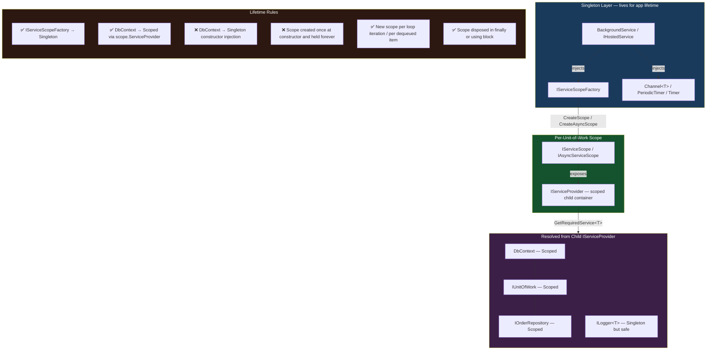
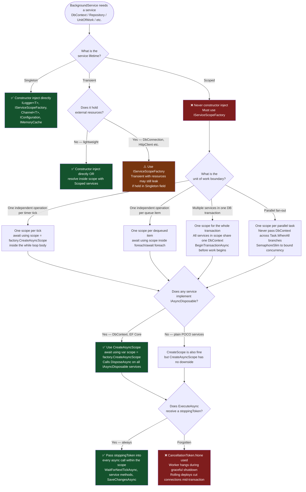

# 4.235 — Scoped Services in BackgroundService: IServiceScopeFactory Pattern

---

## PART 0 — Navigation & Context

### Where This Topic Lives

```
ASP.NET Core Mastery
│
├── D. Dependency Injection (4.034–4.048)
│   ├── 4.034 — The Built-In DI Container
│   ├── 4.035 — Service Lifetimes: Singleton, Scoped, Transient
│   ├── 4.036 — IServiceProvider and IServiceScope
│   ├── 4.042 — The Captive Dependency Problem          ← prerequisite
│   └── 4.047 — DI Scope in Background Services         ← sibling
│
└── R. Background Services (4.231–4.239)
    ├── 4.231 — IHostedService: Startup and Shutdown
    ├── 4.232 — BackgroundService: The Base Class        ← prerequisite
    ├── 4.233 — Timed Background Service: PeriodicTimer
    ├── 4.234 — Queued Background Tasks: Channel<T>
    ├── ► 4.235 — Scoped Services in BackgroundService   ◄
    ├── 4.236 — Worker Services: Standalone Console Host
    ├── 4.237 — Graceful Shutdown: CancellationToken Contract
    ├── 4.238 — Hangfire Integration
    └── 4.239 — Health Checks for Background Services
```

### What You Need Before This

- **[[4.232 — BackgroundService]]** — `BackgroundService` is registered as Singleton; this is the root cause of why constructor injection of Scoped services is illegal
- **[[4.035 — Service Lifetimes]]** — Singleton, Scoped, and Transient lifetime semantics; the captive dependency rule must be understood before this pattern makes sense
- **[[4.042 — The Captive Dependency Problem]]** — the specific bug that `IServiceScopeFactory` solves: a Singleton holding a Scoped service prevents that service from ever being released
- **[[4.036 — IServiceProvider and IServiceScope]]** — `IAsyncServiceScope` and `using var scope` are the mechanical tools of this pattern

### What This Unlocks After

- **[[4.233 — Timed Background Service]]** — every `PeriodicTimer`-based worker needs this pattern on each tick to get a fresh `DbContext`
- **[[4.234 — Queued Background Tasks]]** — each dequeued task needs its own scope to process in isolation with its own unit of work
- **[[4.237 — Graceful Shutdown]]** — scope disposal interacts with `CancellationToken` propagation; graceful shutdown must drain scopes correctly
- **[[3.01 — DbContext: Lifecycle, Internals, and DI Scoping]]** — `DbContext` is the canonical Scoped service; this pattern is the correct way to use it in a background worker

### Why This Topic Matters at Scale

`BackgroundService` is Singleton by design — it lives for the application lifetime — but every database operation, outbound API call, and unit-of-work depends on Scoped services (`DbContext`, `IUnitOfWork`, repository interfaces). Without `IServiceScopeFactory`, background workers either inject a stale, reused `DbContext` across iterations (data corruption, connection pool exhaustion, stale query cache) or crash at startup with a captive dependency exception. Getting scope lifetime right in background workers is the difference between a worker that is safe to run in production under load and one that quietly corrupts data.

---

## PART 1 — The Core Mental Model

### The Fundamental Rule

> **`BackgroundService` is a Singleton, but the work it performs requires Scoped services. The only correct solution is to inject `IServiceScopeFactory` (which is itself Singleton) and create a new `IServiceScope` for each logical unit of work — not once at construction, and not held open for the lifetime of the worker.**

### The Plain-Language Analogy

Think of `BackgroundService` as a factory supervisor who stays at their post for the entire shift (Singleton lifetime). Each time a new batch of products comes down the line, the supervisor doesn't use the same pair of gloves they've been wearing all day — they open a new sealed glove pack (create a scope), use those gloves for exactly that batch (resolve and use Scoped services), then dispose of them when the batch is done (dispose the scope). The supervisor never owns the gloves between batches — they're created fresh and discarded after each use.

If the supervisor instead grabbed a permanent pair of gloves on day one and wore them indefinitely (constructor injection of a Scoped service), the gloves would accumulate contamination, stretch out of shape, and eventually fail in unpredictable ways — exactly what a `DbContext` does when kept alive across request cycles: its change tracker accumulates stale entities, its connection can time out, and its identity map returns cached data that no longer reflects the database.

This analogy holds under all the edge cases: concurrent batches (parallel scopes are independent — no sharing), a failed batch (the scope is disposed, the next batch gets a clean scope), and graceful shutdown (the supervisor finishes the current batch before leaving — scope disposal propagates the cancellation token).

### The Taxonomy Diagram



---

## PART 2 — Deep Mechanics

### 2.1 — Why `BackgroundService` is Singleton and Why That Matters

`BackgroundService` (and any `IHostedService`) is registered using `AddHostedService<T>()`, which internally calls:

```csharp
// ASP.NET Core internally (approximate, HostingServiceExtensions.cs):
public static IServiceCollection AddHostedService<THostedService>(
    this IServiceCollection services)
    where THostedService : class, IHostedService
{
    services.TryAddEnumerable(
        ServiceDescriptor.Singleton<IHostedService, THostedService>());
    return services;
}
```

**Singleton** — one instance created at host startup, shared for the application lifetime. This is intentional: the host needs a stable reference to call `StartAsync` and `StopAsync` on the same instance, and workers often hold state (channels, timers, counters) that must not be recreated per-request.

**The DI enforcement:** In development mode (the default), `ValidateScopes = true` is set on the `ServiceProvider`. This means:

```csharp
// ASP.NET Core internally (approximate, ServiceProvider.cs):
// When ValidateScopes = true, resolving a Scoped service from the ROOT provider throws:
//
// System.InvalidOperationException:
//   "Cannot consume scoped service 'MyDbContext' from singleton
//    'MyBackgroundWorker'."
//
// This check runs at the moment the BackgroundService is first constructed.
```

**Pipeline position:**

```
Host.StartAsync()
    │
    ├──► IHostedService.StartAsync() called for each registered worker
    │         ↓
    │    BackgroundService.StartAsync() — launches ExecuteAsync on ThreadPool
    │         ↓
    │    ExecuteAsync(CancellationToken stoppingToken) — YOUR CODE RUNS HERE
    │         │
    │         └──► Each iteration: CreateScope() → resolve services → do work → dispose scope
    │
    └──► HTTP pipeline starts accepting requests (in parallel)
```

**Runtime cost of Singleton construction:** The `BackgroundService` is constructed exactly once. Any service injected via constructor is resolved once from the root `IServiceProvider`. `IServiceScopeFactory` is itself Singleton (cost: zero allocation per use), so injecting it adds zero overhead at startup and zero overhead at scope creation beyond the scope object allocation itself.

---

### 2.2 — `IServiceScopeFactory` vs `IServiceProvider` Direct Injection

These are two ways to get services inside a Singleton, and only one is correct.

```
OPTION A: Inject IServiceProvider directly (root container)
────────────────────────────────────────────────────────────
constructor(IServiceProvider rootProvider)
{
    _dbContext = rootProvider.GetRequiredService<AppDbContext>(); // WRONG
}

Problem: rootProvider IS the root DI container.
Resolving a Scoped service from the root container creates a "captive" instance
that lives for the application lifetime — never disposed until app shutdown.
With DbContext: connection held open forever, change tracker grows unboundedly,
EF Core identity map returns stale entities indefinitely.
ValidateScopes=true throws at startup. ValidateScopes=false silently leaks.

OPTION B: Inject IServiceScopeFactory (correct)
────────────────────────────────────────────────────────────
constructor(IServiceScopeFactory scopeFactory)
{
    _scopeFactory = scopeFactory; // Singleton — safe to hold forever
}

// Per unit of work:
await using var scope = _scopeFactory.CreateAsyncScope();
var dbContext = scope.ServiceProvider.GetRequiredService<AppDbContext>();
// scope is disposed at end of using block → dbContext is disposed → connection returned to pool
```

**ASP.NET Core internally (approximate, `ServiceScopeFactory.cs`):**

```csharp
// IServiceScopeFactory.CreateScope() creates a child ServiceProvider:
// Cost: ~1 heap allocation for the child ServiceProvider object
//       ~1 heap allocation for the AsyncServiceScope wrapper
// The child SP shares service descriptors with the root but has its own
// instance tracking dictionary for Scoped services.
//
// IServiceScope.Dispose() / IAsyncServiceScope.DisposeAsync():
// Iterates all Scoped services resolved through this scope,
// calls Dispose()/DisposeAsync() on IDisposable/IAsyncDisposable instances.
// DbContext.DisposeAsync() returns its connection to the connection pool.
```

**HTTP wire consequence of getting this wrong:** No direct HTTP effect — this is server-side only. But the observable failure modes are:

- `DbUpdateConcurrencyException` or stale read results under load (stale `DbContext` identity map)
- Connection pool exhaustion: `System.InvalidOperationException: Timeout expired. The timeout period elapsed prior to obtaining a connection from the pool`
- Memory leak: the leaked `DbContext` holds an open database connection for the application lifetime

---

### 2.3 — `CreateScope()` vs `CreateAsyncScope()` — Which to Use

.NET 6+ introduced `IServiceScopeFactory.CreateAsyncScope()` which returns an `AsyncServiceScope` (a `struct` wrapping `IServiceScope` with `DisposeAsync` support).

```csharp
// OPTION A: Synchronous scope (legacy pattern — still valid)
using (var scope = _scopeFactory.CreateScope())
{
    var service = scope.ServiceProvider.GetRequiredService<IMyService>();
    await service.DoWorkAsync(ct); // async work is fine inside a sync scope
} // Calls scope.Dispose() — synchronous cleanup

// OPTION B: Async scope (.NET 6+ — preferred)
await using (var scope = _scopeFactory.CreateAsyncScope())
{
    var service = scope.ServiceProvider.GetRequiredService<IMyService>();
    await service.DoWorkAsync(ct);
} // Calls scope.DisposeAsync() — proper async cleanup of IAsyncDisposable services

// DIFFERENCE:
// If any Scoped service implements IAsyncDisposable (e.g., DbContext does in EF Core 5+),
// CreateScope() + Dispose() calls the SYNCHRONOUS Dispose() path, which may block
// or not fully flush async resources.
// CreateAsyncScope() + DisposeAsync() calls DisposeAsync() on IAsyncDisposable services.
// For DbContext, this properly releases the connection asynchronously.
// ✅ Rule: always use CreateAsyncScope() in async BackgroundService workers.
```

**Runtime cost comparison:**

```
CreateScope()       → allocates IServiceScope (class, heap)    ~1 alloc
CreateAsyncScope()  → allocates AsyncServiceScope (struct)     ~0 alloc (stack)
                      wrapping a heap-allocated ServiceScope    ~1 alloc total

Practical difference: negligible. Prefer CreateAsyncScope() for async disposal correctness.
```

---

### 2.4 — The Four Scope Lifetime Patterns in Background Workers

The four patterns correspond to how frequently the unit of work changes:

```
PATTERN 1: One scope per loop iteration (most common)
──────────────────────────────────────────────────────
Use when: each iteration is an independent unit of work (process one batch, one tick)
Example: PeriodicTimer worker processing inventory snapshots every 5 minutes

while (!ct.IsCancellationRequested)
{
    await _timer.WaitForNextTickAsync(ct);
    await using var scope = _scopeFactory.CreateAsyncScope();
    var repo = scope.ServiceProvider.GetRequiredService<IInventoryRepository>();
    await repo.TakeSnapshotAsync(ct);
} // scope disposed here → DbContext disposed → connection returned to pool

PATTERN 2: One scope per dequeued item (queue workers)
────────────────────────────────────────────────────────
Use when: each message/task from a queue is an independent transaction
Example: Channel<T>-based order processor

await foreach (var order in _channel.Reader.ReadAllAsync(ct))
{
    await using var scope = _scopeFactory.CreateAsyncScope();
    var handler = scope.ServiceProvider.GetRequiredService<IOrderHandler>();
    await handler.ProcessAsync(order, ct);
} // scope disposed after each order → clean slate for next order

PATTERN 3: Scope held open for a logical transaction (rarer)
─────────────────────────────────────────────────────────────
Use when: multiple service calls within one iteration must share the same DbContext
(e.g., they participate in the same database transaction)
Example: multi-step payment settlement that reads, validates, then writes atomically

await using var scope = _scopeFactory.CreateAsyncScope();
var dbContext = scope.ServiceProvider.GetRequiredService<PaymentDbContext>();
var reader = scope.ServiceProvider.GetRequiredService<IPaymentReader>();
var writer = scope.ServiceProvider.GetRequiredService<IPaymentWriter>();
// reader and writer resolve from the SAME scope → same DbContext instance
await using var tx = await dbContext.Database.BeginTransactionAsync(ct);
var payments = await reader.GetPendingAsync(ct);
await writer.SettleAsync(payments, ct);
await tx.CommitAsync(ct);
// scope disposed → DbContext disposed → transaction committed or rolled back

PATTERN 4: Scope for each sub-task in a parallel fanout
─────────────────────────────────────────────────────────
Use when: work is parallelized with Task.WhenAll — each branch needs its own DbContext
// ❌ WRONG: sharing one DbContext across parallel tasks is not thread-safe
// ✅ CORRECT: each parallel task creates its own scope

var tasks = orderBatch.Select(order => ProcessOrderWithOwnScopeAsync(order, ct));
await Task.WhenAll(tasks);

private async Task ProcessOrderWithOwnScopeAsync(Order order, CancellationToken ct)
{
    await using var scope = _scopeFactory.CreateAsyncScope();
    var handler = scope.ServiceProvider.GetRequiredService<IOrderHandler>();
    await handler.ProcessAsync(order, ct);
}
// Each task has its own scope → its own DbContext → DbContext is NOT thread-safe, preserved
```

---

### 2.5 — Service Resolution from `scope.ServiceProvider` — Cost and Failure Modes

```csharp
// GetRequiredService<T> from a child scope:
// Cost: O(1) dictionary lookup in the scope's instance cache
// First resolution of a Scoped service within a scope: O(1) construction + registration
// Subsequent resolutions of the same type within the same scope: O(1) cache hit
//
// ASP.NET Core internally (approximate):
// The child ServiceProvider maintains a Dictionary<ServiceIdentifier, object?>
// for Scoped service instances. On first GetRequiredService<DbContext>():
//   1. Check local scope dict → miss
//   2. Check root service descriptors → found (ImplementationType = AppDbContext)
//   3. Construct AppDbContext using constructor injection from root SP
//   4. Store in scope dict
//   5. Return instance
// On second GetRequiredService<DbContext>() within same scope:
//   1. Check local scope dict → HIT → return cached instance
```

**Failure mode: resolving from the wrong provider:**

```csharp
// ⚠️ COMMON MISTAKE: resolving from the root provider stored at construction time
private readonly IServiceProvider _rootProvider; // captured in constructor

protected override async Task ExecuteAsync(CancellationToken ct)
{
    // WRONG: _rootProvider is the ROOT — resolving DbContext from root = captive dependency
    var db = _rootProvider.GetRequiredService<AppDbContext>(); // leaks!

    // CORRECT: use the scope's provider
    await using var scope = _scopeFactory.CreateAsyncScope();
    var db2 = scope.ServiceProvider.GetRequiredService<AppDbContext>(); // ✅
}
```

**Failure mode: disposing the scope while a service is still in use:**

```csharp
// ⚠️ WRONG: scope disposed before async work completes
IAsyncServiceScope scope = _scopeFactory.CreateAsyncScope();
var service = scope.ServiceProvider.GetRequiredService<IOrderService>();
_ = Task.Run(() => service.ProcessAsync(ct)); // fire and forget
await scope.DisposeAsync(); // scope disposed while Task.Run is still running!
// service.ProcessAsync now uses a disposed DbContext → ObjectDisposedException

// ✅ CORRECT: scope lives for the entire async operation
await using var scope = _scopeFactory.CreateAsyncScope();
var service = scope.ServiceProvider.GetRequiredService<IOrderService>();
await service.ProcessAsync(ct); // await before scope disposes
```

---

### 2.6 — `ValidateScopes` and Startup Detection of Scope Violations

ASP.NET Core detects captive dependency violations at **first resolution**, not at registration time:

```csharp
// In Program.cs (development default):
builder.Host.UseDefaultServiceProvider(options =>
{
    options.ValidateScopes = true;    // detect Singleton→Scoped violations
    options.ValidateOnBuild = true;   // detect missing registrations at Build()
});

// What ValidateScopes = true does internally (approximate):
// When BackgroundService constructor runs → IHostedService is Singleton →
// DI container checks: "is any constructor parameter a Scoped service?"
// If yes → throw InvalidOperationException at startup:
//
// "Cannot consume scoped service 'AppDbContext' from singleton
//  'OrderProcessingWorker'."
//
// This is caught in development. In production with ValidateScopes = false,
// the same mistake silently creates a captive dependency that leaks forever.
// The exception text tells you EXACTLY which service and which singleton.
```

**Failure path diagram:**

```
// ⚠️ WRONG registration (ValidateScopes=true catches this at startup):

constructor(AppDbContext db, ILogger<Worker> logger)  // db is Scoped!
{
    _db = db;   // captured in Singleton field
}

Startup sequence:
Host.Build()
    │
    ├── ValidateOnBuild: checks all registrations for missing types → ✅ pass
    │
    Host.StartAsync()
        │
        ├── Resolve IHostedService[OrderProcessingWorker]   ← Singleton resolution
        │       │
        │       └── DI tries to resolve AppDbContext from ROOT provider
        │               │
        │               └── ValidateScopes=true: AppDbContext is Scoped
        │                       → throw InvalidOperationException ← caught here
        │
        Application crashes at startup with clear error message.
        In production (ValidateScopes=false): crash does NOT happen.
        Instead: AppDbContext instance is captive in Singleton forever.
        Observable failure: stale reads after first write, memory leak, open connection.
```

---

### 2.7 — `IServiceScope` vs `IAsyncServiceScope` Disposal and `DbContext`

```csharp
// DbContext implements BOTH IDisposable AND IAsyncDisposable (EF Core 5+)

// With IServiceScope.Dispose() (sync):
// DI calls dbContext.Dispose() → synchronous teardown
// Releases connection to pool synchronously
// ✅ Works, but blocks the async continuation until Dispose() returns

// With IAsyncServiceScope.DisposeAsync() (async):
// DI calls dbContext.DisposeAsync() → async teardown
// Releases connection to pool asynchronously without blocking
// ✅ Correct for async BackgroundService workers

// The difference matters when:
// 1. DbContext has pending async operations (saveChanges in flight)
// 2. The connection pool is under pressure and releasing must be non-blocking
// 3. Multiple scopes are being disposed concurrently (parallel workers)

// Runtime cost of scope disposal:
// O(n) where n = number of IDisposable/IAsyncDisposable services resolved in scope
// Typical: 1 DbContext + 1-3 repository instances = ~4 Dispose calls
// Cost per disposal: ~1 virtual dispatch, negligible time
```

---

## PART 3 — Production Code Patterns

### Pattern 1: The Canonical Per-Iteration Scope (Timed Worker)

An inventory snapshot worker that runs every 5 minutes and writes a snapshot to SQL Server.

```csharp
// Domain: inventory management — periodic snapshot worker
// Pattern: one scope per timer tick → one DbContext per tick → clean isolation

public sealed class InventorySnapshotWorker : BackgroundService
{
    private readonly IServiceScopeFactory _scopeFactory;
    private readonly ILogger<InventorySnapshotWorker> _logger;

    // ✅ CORRECT: inject IServiceScopeFactory (Singleton) — safe for Singleton worker
    // ✅ CORRECT: inject ILogger<T> (Singleton) — safe for Singleton worker
    // ❌ WRONG: inject AppDbContext, IInventoryRepository (Scoped) — DO NOT DO THIS
    public InventorySnapshotWorker(
        IServiceScopeFactory scopeFactory,
        ILogger<InventorySnapshotWorker> logger)
    {
        _scopeFactory = scopeFactory;
        _logger = logger;
    }

    protected override async Task ExecuteAsync(CancellationToken stoppingToken)
    {
        _logger.LogInformation("InventorySnapshotWorker started");

        // PeriodicTimer: preferred over Task.Delay in .NET 6+
        // Does not allocate a Timer object per tick; reuses the same PeriodicTimer
        using var timer = new PeriodicTimer(TimeSpan.FromMinutes(5));

        while (await timer.WaitForNextTickAsync(stoppingToken))
        {
            // ✅ New scope per tick — fresh DbContext, fresh repository, fresh unit of work
            // await using ensures DisposeAsync() is called → DbContext.DisposeAsync()
            // → connection returned to pool asynchronously
            await using var scope = _scopeFactory.CreateAsyncScope();

            try
            {
                var snapshotService = scope.ServiceProvider
                    .GetRequiredService<IInventorySnapshotService>();

                await snapshotService.TakeSnapshotAsync(stoppingToken);

                _logger.LogInformation(
                    "Inventory snapshot completed at {Time:O}", DateTimeOffset.UtcNow);
            }
            catch (OperationCanceledException) when (stoppingToken.IsCancellationRequested)
            {
                // Host is shutting down — exit gracefully
                // ✅ Do NOT log as error — this is expected
                _logger.LogInformation("InventorySnapshotWorker stopping — cancellation requested");
                break;
            }
            catch (Exception ex)
            {
                // Log and continue — do not crash the worker on transient failures
                // The scope is disposed in the await using block regardless
                _logger.LogError(ex,
                    "Inventory snapshot failed at {Time:O}. Will retry next tick.",
                    DateTimeOffset.UtcNow);
            }
            // scope.DisposeAsync() called here — DbContext released to pool
        }

        _logger.LogInformation("InventorySnapshotWorker stopped");
    }
}

// Registration in Program.cs:
builder.Services.AddHostedService<InventorySnapshotWorker>();
// IInventorySnapshotService registered as Scoped:
builder.Services.AddScoped<IInventorySnapshotService, InventorySnapshotService>();
// AppDbContext registered as Scoped (standard EF Core registration):
builder.Services.AddDbContext<InventoryDbContext>(opts =>
    opts.UseSqlServer(connectionString));
```

---

### Pattern 2: Per-Dequeued-Item Scope (Queue Consumer)

An order processing worker consuming from a `Channel<T>`, where each order is an independent database transaction.

```csharp
// Domain: order management — channel-based queue consumer
// Pattern: one scope per dequeued order → each order has its own DbContext transaction

public sealed class OrderProcessingWorker : BackgroundService
{
    private readonly IServiceScopeFactory _scopeFactory;
    private readonly ChannelReader<OrderCommand> _channelReader;
    private readonly ILogger<OrderProcessingWorker> _logger;

    public OrderProcessingWorker(
        IServiceScopeFactory scopeFactory,
        // Channel<T> is Singleton — safe to inject directly
        Channel<OrderCommand> orderChannel,
        ILogger<OrderProcessingWorker> logger)
    {
        _scopeFactory = scopeFactory;
        _channelReader = orderChannel.Reader;
        _logger = logger;
    }

    protected override async Task ExecuteAsync(CancellationToken stoppingToken)
    {
        // ReadAllAsync completes when the channel is closed OR ct fires
        await foreach (var command in _channelReader.ReadAllAsync(stoppingToken))
        {
            // One scope per command — complete isolation between orders
            // If order A's DbContext throws, order B's scope is unaffected
            await using var scope = _scopeFactory.CreateAsyncScope();

            try
            {
                var handler = scope.ServiceProvider
                    .GetRequiredService<IOrderCommandHandler>();

                await handler.HandleAsync(command, stoppingToken);

                _logger.LogInformation(
                    "Order {OrderId} processed successfully", command.OrderId);
            }
            catch (OperationCanceledException) when (stoppingToken.IsCancellationRequested)
            {
                _logger.LogInformation(
                    "Order processing stopped mid-queue — orderId={OrderId} will not be retried",
                    command.OrderId);
                break;
            }
            catch (Exception ex)
            {
                // Log the failure — the command is dropped (no requeue in this pattern)
                // For durable queues (SQS, Service Bus), implement dead-letter here
                _logger.LogError(ex,
                    "Failed to process order {OrderId}", command.OrderId);
            }
            // scope.DisposeAsync() → DbContext.DisposeAsync() → connection to pool
        }
    }
}

// IOrderCommandHandler is Scoped — it injects AppDbContext (also Scoped)
// Both live within the same scope — they share the same DbContext instance
// This means the handler can do: read → validate → write, all within one EF Core unit of work
public sealed class OrderCommandHandler : IOrderCommandHandler
{
    private readonly AppDbContext _db;
    private readonly IPaymentService _paymentService;

    public OrderCommandHandler(AppDbContext db, IPaymentService paymentService)
    {
        _db = db;
        _paymentService = paymentService;
    }

    public async Task HandleAsync(OrderCommand command, CancellationToken ct)
    {
        var order = await _db.Orders
            .FirstOrDefaultAsync(o => o.Id == command.OrderId, ct)
            ?? throw new InvalidOperationException($"Order {command.OrderId} not found");

        var paymentResult = await _paymentService.ChargeAsync(order.Total, ct);
        order.MarkAsPaid(paymentResult.TransactionId);
        await _db.SaveChangesAsync(ct);
    }
}
```

---

### Pattern 3: Shared Scope for Multi-Service Transactions

A payment settlement worker that requires multiple services to share the same `DbContext` within a database transaction.

```csharp
// Domain: payment processing — multi-step settlement requiring shared DbContext
// Pattern: one scope for the entire transaction → all services share one DbContext

public sealed class PaymentSettlementWorker : BackgroundService
{
    private readonly IServiceScopeFactory _scopeFactory;
    private readonly ILogger<PaymentSettlementWorker> _logger;

    public PaymentSettlementWorker(
        IServiceScopeFactory scopeFactory,
        ILogger<PaymentSettlementWorker> logger)
    {
        _scopeFactory = scopeFactory;
        _logger = logger;
    }

    protected override async Task ExecuteAsync(CancellationToken stoppingToken)
    {
        using var timer = new PeriodicTimer(TimeSpan.FromHours(1));

        while (await timer.WaitForNextTickAsync(stoppingToken))
        {
            // One scope for the entire settlement batch — all services share
            // the same DbContext instance → they participate in the same transaction
            await using var scope = _scopeFactory.CreateAsyncScope();
            var sp = scope.ServiceProvider;

            try
            {
                // All three services are Scoped → resolved from the same scope
                // → all inject the SAME AppDbContext instance
                var dbContext = sp.GetRequiredService<PaymentDbContext>();
                var reader = sp.GetRequiredService<IPendingPaymentReader>();
                var settler = sp.GetRequiredService<IPaymentSettler>();
                var auditor = sp.GetRequiredService<ISettlementAuditor>();

                // Begin explicit transaction — spans all three services
                await using var tx = await dbContext.Database
                    .BeginTransactionAsync(stoppingToken);

                var pending = await reader.GetPendingSettlementsAsync(stoppingToken);

                if (!pending.Any())
                {
                    _logger.LogDebug("No pending settlements at {Time:O}", DateTimeOffset.UtcNow);
                    return; // scope disposes cleanly, transaction rolled back automatically
                }

                var settled = await settler.SettleAsync(pending, stoppingToken);
                await auditor.RecordSettlementAsync(settled, stoppingToken);

                await dbContext.SaveChangesAsync(stoppingToken);
                await tx.CommitAsync(stoppingToken);

                _logger.LogInformation(
                    "Settled {Count} payments at {Time:O}", settled.Count, DateTimeOffset.UtcNow);
            }
            catch (Exception ex) when (ex is not OperationCanceledException)
            {
                // Transaction is rolled back when scope disposes (tx.DisposeAsync())
                _logger.LogError(ex, "Payment settlement failed — transaction rolled back");
            }
        }
    }
}
```

---

### Pattern 4: Parallel Fan-Out With Independent Scopes

A shipment tracking worker that processes a batch of shipments in parallel — each shipment gets its own scope so `DbContext` is never shared across threads.

```csharp
// Domain: logistics shipment tracking — parallel batch processing
// Pattern: Task.WhenAll with one scope per parallel task — never share DbContext across threads

public sealed class ShipmentStatusSyncWorker : BackgroundService
{
    private readonly IServiceScopeFactory _scopeFactory;
    private readonly ILogger<ShipmentStatusSyncWorker> _logger;
    private const int MaxParallelism = 5; // tune based on connection pool size

    public ShipmentStatusSyncWorker(
        IServiceScopeFactory scopeFactory,
        ILogger<ShipmentStatusSyncWorker> logger)
    {
        _scopeFactory = scopeFactory;
        _logger = logger;
    }

    protected override async Task ExecuteAsync(CancellationToken stoppingToken)
    {
        using var timer = new PeriodicTimer(TimeSpan.FromMinutes(15));

        while (await timer.WaitForNextTickAsync(stoppingToken))
        {
            // Fetch the shipment IDs to process using one scope
            List<string> shipmentIds;
            await using (var fetchScope = _scopeFactory.CreateAsyncScope())
            {
                var repo = fetchScope.ServiceProvider
                    .GetRequiredService<IShipmentRepository>();
                shipmentIds = await repo.GetActiveShipmentIdsAsync(stoppingToken);
            } // fetchScope disposed — DbContext released before parallel work starts

            // Process in parallel batches — each task gets its own scope
            // SemaphoreSlim limits concurrency to MaxParallelism
            using var semaphore = new SemaphoreSlim(MaxParallelism);

            var tasks = shipmentIds.Select(id =>
                SyncShipmentWithOwnScopeAsync(id, semaphore, stoppingToken));

            var results = await Task.WhenAll(tasks);

            _logger.LogInformation(
                "Synced {Count}/{Total} shipments",
                results.Count(r => r), shipmentIds.Count);
        }
    }

    private async Task<bool> SyncShipmentWithOwnScopeAsync(
        string shipmentId,
        SemaphoreSlim semaphore,
        CancellationToken ct)
    {
        await semaphore.WaitAsync(ct);
        try
        {
            // ✅ Each parallel task has its own scope → its own DbContext
            // DbContext is NOT thread-safe; never pass it across tasks
            await using var scope = _scopeFactory.CreateAsyncScope();
            var syncService = scope.ServiceProvider
                .GetRequiredService<IShipmentSyncService>();

            await syncService.SyncStatusAsync(shipmentId, ct);
            return true;
        }
        catch (Exception ex) when (ex is not OperationCanceledException)
        {
            _logger.LogWarning(ex,
                "Failed to sync shipment {ShipmentId}", shipmentId);
            return false;
        }
        finally
        {
            semaphore.Release();
        }
    }
}
```

---

### Pattern 5: Lazy Scope — Creating a Scope Only When Work Exists

An outbox processor that avoids creating a scope (and a `DbContext` connection) when the outbox is empty.

```csharp
// Domain: order management — transactional outbox pattern
// Pattern: check if work exists before creating an expensive scope

public sealed class OutboxProcessorWorker : BackgroundService
{
    private readonly IServiceScopeFactory _scopeFactory;
    private readonly ILogger<OutboxProcessorWorker> _logger;

    public OutboxProcessorWorker(
        IServiceScopeFactory scopeFactory,
        ILogger<OutboxProcessorWorker> logger)
    {
        _scopeFactory = scopeFactory;
        _logger = logger;
    }

    protected override async Task ExecuteAsync(CancellationToken stoppingToken)
    {
        // Polling interval — use shorter interval for low-latency outbox processing
        using var timer = new PeriodicTimer(TimeSpan.FromSeconds(5));

        while (await timer.WaitForNextTickAsync(stoppingToken))
        {
            // ⚠️ Anti-pattern: creating a scope unconditionally on every tick
            // even when the outbox is empty → wastes a DbContext connection allocation
            // On an empty outbox with 1000 workers: 1000 connections opened/closed per tick

            // ✅ BETTER: small lightweight check scope first
            bool hasWork;
            await using (var checkScope = _scopeFactory.CreateAsyncScope())
            {
                var checker = checkScope.ServiceProvider
                    .GetRequiredService<IOutboxChecker>();
                // Lightweight COUNT query — minimal connection hold time
                hasWork = await checker.HasPendingMessagesAsync(stoppingToken);
            } // connection released immediately

            if (!hasWork)
                continue; // avoid the full processing scope entirely

            // Only open a full processing scope when there is actual work
            await using var processScope = _scopeFactory.CreateAsyncScope();
            try
            {
                var processor = processScope.ServiceProvider
                    .GetRequiredService<IOutboxProcessor>();

                var processed = await processor.ProcessBatchAsync(
                    batchSize: 100, stoppingToken);

                _logger.LogInformation(
                    "Outbox: processed {Count} messages", processed);
            }
            catch (Exception ex) when (ex is not OperationCanceledException)
            {
                _logger.LogError(ex, "Outbox processing failed");
            }
        }
    }
}
```

---

### Pattern 6: Injecting a Scoped Service Into a Scoped Service — The Correct Cascade

Demonstrating that Scoped services themselves use constructor injection freely — only the top-level Singleton worker needs `IServiceScopeFactory`.

```csharp
// Domain: inventory management
// Shows the full DI chain: Worker (Singleton) → via factory → Scoped services → DbContext

// ✅ IServiceScopeFactory injected into the Singleton worker
public sealed class InventoryWorker : BackgroundService
{
    private readonly IServiceScopeFactory _scopeFactory;

    public InventoryWorker(IServiceScopeFactory scopeFactory)
        => _scopeFactory = scopeFactory;

    protected override async Task ExecuteAsync(CancellationToken ct)
    {
        using var timer = new PeriodicTimer(TimeSpan.FromMinutes(10));
        while (await timer.WaitForNextTickAsync(ct))
        {
            await using var scope = _scopeFactory.CreateAsyncScope();
            // Resolve top-level Scoped service — it receives its deps via constructor injection
            var service = scope.ServiceProvider
                .GetRequiredService<IInventoryReconciliationService>();
            await service.ReconcileAsync(ct);
        }
    }
}

// ✅ Scoped services USE NORMAL CONSTRUCTOR INJECTION — no IServiceScopeFactory needed
public sealed class InventoryReconciliationService : IInventoryReconciliationService
{
    private readonly InventoryDbContext _db;           // Scoped — injected by DI
    private readonly IProductRepository _productRepo;   // Scoped — injected by DI
    private readonly ILogger<InventoryReconciliationService> _logger; // Singleton — safe

    public InventoryReconciliationService(
        InventoryDbContext db,
        IProductRepository productRepo,
        ILogger<InventoryReconciliationService> logger)
    {
        _db = db;
        _productRepo = productRepo;
        _logger = logger;
    }

    public async Task ReconcileAsync(CancellationToken ct)
    {
        // db and productRepo share the same InventoryDbContext instance
        // because they were both resolved from the same scope in the worker
        var discrepancies = await _productRepo.FindDiscrepanciesAsync(ct);
        foreach (var d in discrepancies)
        {
            _db.ReconciliationLogs.Add(new ReconciliationLog(d));
        }
        await _db.SaveChangesAsync(ct);
        _logger.LogInformation("Reconciled {Count} discrepancies", discrepancies.Count);
    }
}

// Registration:
builder.Services.AddHostedService<InventoryWorker>();
builder.Services.AddScoped<IInventoryReconciliationService, InventoryReconciliationService>();
builder.Services.AddScoped<IProductRepository, ProductRepository>();
builder.Services.AddDbContext<InventoryDbContext>(opts => opts.UseSqlServer(cs));
// ILogger<T> is registered by the framework — no explicit registration needed
```

---

### Pattern 7: Scope Lifetime in Multi-Tenant SaaS Background Workers

A multi-tenant worker that resolves the tenant context per scope to ensure data isolation.

```csharp
// Domain: multi-tenant SaaS — per-tenant data processing in a background worker
// Pattern: tenant context set on the scope before resolving tenant-aware services

public sealed class TenantReportGenerationWorker : BackgroundService
{
    private readonly IServiceScopeFactory _scopeFactory;
    private readonly ILogger<TenantReportGenerationWorker> _logger;

    public TenantReportGenerationWorker(
        IServiceScopeFactory scopeFactory,
        ILogger<TenantReportGenerationWorker> logger)
    {
        _scopeFactory = scopeFactory;
        _logger = logger;
    }

    protected override async Task ExecuteAsync(CancellationToken stoppingToken)
    {
        using var timer = new PeriodicTimer(TimeSpan.FromHours(24));

        while (await timer.WaitForNextTickAsync(stoppingToken))
        {
            // Fetch tenant IDs from a dedicated lightweight scope
            List<Guid> tenantIds;
            await using (var adminScope = _scopeFactory.CreateAsyncScope())
            {
                var tenantRepo = adminScope.ServiceProvider
                    .GetRequiredService<ITenantRepository>();
                tenantIds = await tenantRepo.GetActiveTenantsAsync(stoppingToken);
            }

            // Process each tenant in its own scope — complete data isolation
            foreach (var tenantId in tenantIds)
            {
                if (stoppingToken.IsCancellationRequested) break;

                await using var tenantScope = _scopeFactory.CreateAsyncScope();

                // Set the tenant context BEFORE resolving tenant-aware services
                // ITenantContext is Scoped — it will be injected into all services resolved from this scope
                var tenantContext = tenantScope.ServiceProvider
                    .GetRequiredService<ITenantContext>();
                tenantContext.SetTenantId(tenantId);

                try
                {
                    var reportGenerator = tenantScope.ServiceProvider
                        .GetRequiredService<IReportGenerator>();

                    // reportGenerator internally resolves ITenantContext
                    // which returns tenantId set above — correct per-tenant isolation
                    await reportGenerator.GenerateDailyReportAsync(stoppingToken);

                    _logger.LogInformation(
                        "Generated daily report for tenant {TenantId}", tenantId);
                }
                catch (Exception ex) when (ex is not OperationCanceledException)
                {
                    _logger.LogError(ex,
                        "Failed to generate report for tenant {TenantId}", tenantId);
                    // Continue to next tenant — don't fail the whole batch
                }
            }
        }
    }
}
```

---

## PART 4 — Gotchas & Anti-Patterns

### Gotcha 1: Constructor Injection of Scoped Services Into the Worker

The most common DI mistake in background workers — caught in development by `ValidateScopes=true` but silently corrupting data in production if that flag is off.

```csharp
// ⚠️ WRONG: DbContext injected via constructor — captive dependency
public sealed class OrderSyncWorker : BackgroundService
{
    private readonly AppDbContext _db;  // Scoped service captured in Singleton!

    public OrderSyncWorker(AppDbContext db)  // throws in dev, leaks in prod
    {
        _db = db;
    }

    protected override async Task ExecuteAsync(CancellationToken ct)
    {
        using var timer = new PeriodicTimer(TimeSpan.FromMinutes(5));
        while (await timer.WaitForNextTickAsync(ct))
        {
            // _db is NEVER disposed and NEVER refreshed between iterations
            // change tracker accumulates stale entities across all iterations
            var orders = await _db.Orders.Where(o => !o.IsSynced).ToListAsync(ct);
            // After the first iteration, EF Core identity map returns cached entities
            // that may no longer reflect the DB — silent stale reads
        }
    }
}

// HTTP consequence (wrong path):
// In development: System.InvalidOperationException at startup
// "Cannot consume scoped service 'AppDbContext' from singleton 'OrderSyncWorker'"
// In production (ValidateScopes=false): no exception, but stale reads, open connections,
// and memory leak. DbContext change tracker grows unboundedly across all iterations.

// ✅ CORRECT:
public sealed class OrderSyncWorker : BackgroundService
{
    private readonly IServiceScopeFactory _scopeFactory;

    public OrderSyncWorker(IServiceScopeFactory scopeFactory)
        => _scopeFactory = scopeFactory;

    protected override async Task ExecuteAsync(CancellationToken ct)
    {
        using var timer = new PeriodicTimer(TimeSpan.FromMinutes(5));
        while (await timer.WaitForNextTickAsync(ct))
        {
            await using var scope = _scopeFactory.CreateAsyncScope();
            var db = scope.ServiceProvider.GetRequiredService<AppDbContext>();
            var orders = await db.Orders.Where(o => !o.IsSynced).ToListAsync(ct);
            // db is fresh each iteration — clean change tracker, valid connection
        }
    }
}

// HTTP consequence (correct path):
// Fresh DbContext per tick — clean identity map, connection returned to pool after each tick
// No memory leak, no stale data, ValidateScopes=true happy at startup

// WHY: BackgroundService is Singleton. DI container enforces that Singletons cannot
// hold references to Scoped services. IServiceScopeFactory is itself Singleton and
// creates child scopes that have their own Scoped service lifetime management.
```

---

### Gotcha 2: Creating One Scope at Constructor and Reusing It Forever

Teams understand they need to use `IServiceScopeFactory` but create the scope in the constructor — still a captive dependency, just with extra steps.

```csharp
// ⚠️ WRONG: scope created once at construction — same as constructor injection
public sealed class ReportWorker : BackgroundService
{
    private readonly IServiceScope _permanentScope; // held for app lifetime!
    private readonly IReportService _reportService;

    public ReportWorker(IServiceScopeFactory scopeFactory)
    {
        _permanentScope = scopeFactory.CreateScope();
        _reportService = _permanentScope.ServiceProvider
            .GetRequiredService<IReportService>(); // DbContext captured forever
    }

    protected override async Task ExecuteAsync(CancellationToken ct)
    {
        using var timer = new PeriodicTimer(TimeSpan.FromHours(1));
        while (await timer.WaitForNextTickAsync(ct))
        {
            await _reportService.GenerateAsync(ct);
            // Same DbContext instance used on every iteration — same problems as Gotcha 1
        }
    }

    public override async Task StopAsync(CancellationToken ct)
    {
        _permanentScope.Dispose(); // disposed on shutdown — not after each unit of work
        await base.StopAsync(ct);
    }
}

// HTTP consequence (wrong path):
// ValidateScopes=true does NOT catch this — the scope is created correctly from IServiceScopeFactory.
// But the scope (and its DbContext) lives for the application lifetime.
// Same memory leak, stale data, and open connection problems as Gotcha 1.
// This is the "clever but wrong" variant that slips past startup validation.

// ✅ CORRECT: create scope per unit of work inside ExecuteAsync
protected override async Task ExecuteAsync(CancellationToken ct)
{
    using var timer = new PeriodicTimer(TimeSpan.FromHours(1));
    while (await timer.WaitForNextTickAsync(ct))
    {
        await using var scope = _scopeFactory.CreateAsyncScope(); // fresh each tick
        var reportService = scope.ServiceProvider.GetRequiredService<IReportService>();
        await reportService.GenerateAsync(ct);
    } // scope disposed → DbContext released → connection returned to pool
}

// HTTP consequence (correct path):
// Fresh DbContext per hour — no stale data, connection pool healthy, memory stable

// WHY: IServiceScopeFactory.CreateScope() in the constructor is syntactically different
// from constructor injection but semantically identical — the scope and all its services
// live as long as the reference is held. The scope must be created AND disposed
// within each unit of work, not held at the class level.
```

---

### Gotcha 3: Using `scope.ServiceProvider` After the Scope Is Disposed

Fire-and-forget tasks that access the scope after the enclosing `using` block exits.

```csharp
// ⚠️ WRONG: fire-and-forget task outlives its scope
protected override async Task ExecuteAsync(CancellationToken ct)
{
    using var timer = new PeriodicTimer(TimeSpan.FromSeconds(30));
    while (await timer.WaitForNextTickAsync(ct))
    {
        await using var scope = _scopeFactory.CreateAsyncScope();
        var service = scope.ServiceProvider.GetRequiredService<IOrderService>();

        // Fire and forget — task runs AFTER the using block exits
        _ = Task.Run(() => service.ProcessAsync(ct)); // ⚠️ scope disposed while task runs
        // await using → scope.DisposeAsync() called immediately here
        // service now uses a DISPOSED DbContext → ObjectDisposedException
    }
}

// HTTP consequence (wrong path):
// Intermittent ObjectDisposedException in the fire-and-forget task:
// "Cannot access a disposed context instance."
// This may not appear under low load but fails under high load
// when Task.Run scheduling delays execution past the using block exit.

// ✅ CORRECT: await the work before the scope disposes
protected override async Task ExecuteAsync(CancellationToken ct)
{
    using var timer = new PeriodicTimer(TimeSpan.FromSeconds(30));
    while (await timer.WaitForNextTickAsync(ct))
    {
        await using var scope = _scopeFactory.CreateAsyncScope();
        var service = scope.ServiceProvider.GetRequiredService<IOrderService>();
        await service.ProcessAsync(ct); // ✅ scope alive for entire operation
    } // scope disposes AFTER await completes
}

// HTTP consequence (correct path):
// service.ProcessAsync completes before scope disposes — DbContext is valid throughout

// WHY: await using guarantees scope.DisposeAsync() is called when the using block exits.
// If you fire-and-forget, the task may schedule and execute on the ThreadPool
// after the using block exits and the scope is already disposed.
// DbContext (and all Scoped services) are in a disposed state by then.
```

---

### Gotcha 4: Sharing a `DbContext` Across Parallel Tasks

`DbContext` is not thread-safe. Resolving it once and passing it to `Task.WhenAll` branches crashes in production under load.

```csharp
// ⚠️ WRONG: one DbContext shared across parallel tasks
protected override async Task ExecuteAsync(CancellationToken ct)
{
    using var timer = new PeriodicTimer(TimeSpan.FromMinutes(1));
    while (await timer.WaitForNextTickAsync(ct))
    {
        await using var scope = _scopeFactory.CreateAsyncScope();
        var db = scope.ServiceProvider.GetRequiredService<AppDbContext>(); // one instance

        var shipmentIds = await db.Shipments.Select(s => s.Id).ToListAsync(ct);

        // ⚠️ ALL tasks share the same db instance — DbContext is NOT thread-safe
        var tasks = shipmentIds.Select(id =>
            ProcessShipmentAsync(db, id, ct)); // passing shared db!
        await Task.WhenAll(tasks);
    }
}

// HTTP consequence (wrong path):
// "A second operation started on this context before a previous operation completed."
// InvalidOperationException thrown by EF Core's concurrency guard.
// Data may be corrupted if the guard does not catch all cases.

// ✅ CORRECT: each parallel task creates its own scope and DbContext
protected override async Task ExecuteAsync(CancellationToken ct)
{
    using var timer = new PeriodicTimer(TimeSpan.FromMinutes(1));
    while (await timer.WaitForNextTickAsync(ct))
    {
        List<string> shipmentIds;
        await using (var listScope = _scopeFactory.CreateAsyncScope())
        {
            var db = listScope.ServiceProvider.GetRequiredService<AppDbContext>();
            shipmentIds = await db.Shipments.Select(s => s.Id).ToListAsync(ct);
        }

        // Each task gets its own scope and its own DbContext
        using var semaphore = new SemaphoreSlim(5);
        var tasks = shipmentIds.Select(id =>
            ProcessShipmentWithOwnScopeAsync(id, semaphore, ct));
        await Task.WhenAll(tasks);
    }
}

// HTTP consequence (correct path):
// Each task has an independent DbContext — no concurrency violations
// Connection pool handles up to MaxPoolSize concurrent connections

// WHY: DbContext maintains an internal async operation lock that throws
// if two async operations are started concurrently on the same instance.
// The fix is always: one DbContext per concurrent unit of work.
```

---

### Gotcha 5: Not Propagating `CancellationToken` Into Scoped Services

Passing `CancellationToken.None` or no token to scoped services causes the worker to hang during graceful shutdown.

```csharp
// ⚠️ WRONG: CancellationToken not propagated into scoped service calls
protected override async Task ExecuteAsync(CancellationToken stoppingToken)
{
    using var timer = new PeriodicTimer(TimeSpan.FromMinutes(5));
    while (await timer.WaitForNextTickAsync(stoppingToken))
    {
        await using var scope = _scopeFactory.CreateAsyncScope();
        var service = scope.ServiceProvider.GetRequiredService<IInventoryService>();

        // CancellationToken.None passed — this call CANNOT be cancelled
        await service.ProcessAsync(CancellationToken.None); // ⚠️
        // If the host sends stop signal during ProcessAsync,
        // this awaitable will NOT respond — worker hangs until it completes naturally
    }
}

// HTTP consequence (wrong path):
// During rolling deploy or pod termination:
// Host sends StopAsync(shutdownTimeout) → stoppingToken fires
// PeriodicTimer stops waiting → but in-progress ProcessAsync ignores cancellation
// → process hangs for shutdown timeout (default: 5s in .NET), then kills process
// → in-progress database operation may be cut off mid-transaction → data corruption

// ✅ CORRECT: always propagate stoppingToken into scoped service calls
protected override async Task ExecuteAsync(CancellationToken stoppingToken)
{
    using var timer = new PeriodicTimer(TimeSpan.FromMinutes(5));
    while (await timer.WaitForNextTickAsync(stoppingToken))
    {
        await using var scope = _scopeFactory.CreateAsyncScope();
        var service = scope.ServiceProvider.GetRequiredService<IInventoryService>();
        await service.ProcessAsync(stoppingToken); // ✅ cancellation propagated
    }
}

// HTTP consequence (correct path):
// During shutdown: stoppingToken fires → ProcessAsync observes cancellation
// → throws OperationCanceledException → scope disposes cleanly → worker exits
// Database transaction either commits (if past SaveChangesAsync) or rolls back

// WHY: The CancellationToken from ExecuteAsync (named stoppingToken by convention)
// is the host's signal to the worker to stop processing. Every async operation
// that can be cancelled MUST receive this token. Ignoring it in scoped services
// means those operations are uninterruptible — violating the graceful shutdown contract.
```

---

## PART 5 — Performance Implications

### 5.1 — Request Pipeline Characteristics Table

|Scenario|Scope Creation Cost|Allocations Per Iteration|Approx Latency Impact|Recommendation|
|---|---|---|---|---|
|`CreateAsyncScope()` — struct wrapper|~0 (stack) + ~1 heap for inner scope|~2 total|< 1 µs|Always prefer over `CreateScope()` for async workers|
|`CreateScope()` — class wrapper|~1 heap|~2 total|< 1 µs|Still valid; use `await using` for IAsyncDisposable services|
|`GetRequiredService<DbContext>()` first call in scope|~1 heap (DbContext construction) + connection from pool|~3–5|< 1 ms (pool hit), 10–50 ms (new connection)|Keep pool size matched to max parallel scopes|
|`GetRequiredService<DbContext>()` subsequent in same scope|~0 (cache hit)|0|< 1 µs|Free — DI scope caches Scoped instances|
|Scope disposal (`DisposeAsync`) with 1 DbContext|~0 alloc, ~1 connection return to pool|0|< 1 ms|Non-blocking with `IAsyncDisposable`|
|One scope per tick at 12/min (PeriodicTimer 5s)|12 scopes/min|~12 × 5 allocs/min|Negligible|Standard pattern — no optimization needed|
|One scope per dequeued item at 1000 items/sec|1000 scopes/sec|~5000 allocs/sec|Check GC pressure|Consider batching if GC overhead is measurable|
|One permanent scope (anti-pattern)|~1 at startup|0 ongoing|0 per tick|DO NOT USE — captive dependency / data corruption|
|Parallel 10 scopes, pool size 10|10 simultaneous new connections|~50 per batch|Pool exhaustion possible|Size pool = max parallel scopes + headroom|
|`ValidateScopes=true` at startup|0 ongoing; one-time check per registration|0|0 ms (startup only)|Always enable in development|

### 5.2 — BenchmarkDotNet Code

```csharp
using BenchmarkDotNet.Attributes;
using BenchmarkDotNet.Running;
using Microsoft.Extensions.DependencyInjection;

// NOTE: Benchmarks service resolution and scope overhead only.
// Database operation cost dominates in production — use dotnet-counters
// with Microsoft.EntityFrameworkCore.* counters for DB profiling.
// dotnet-counters monitor --process-id <pid> --counters Microsoft.EntityFrameworkCore
// dotnet-trace for full allocation profiling including scoped service graphs.

[MemoryDiagnoser]
[SimpleJob(iterationCount: 100)]
public class ServiceScopeFactoryBenchmark
{
    private IServiceProvider _rootProvider = null!;
    private IServiceScopeFactory _scopeFactory = null!;
    private IServiceScope _permanentScope = null!;

    [GlobalSetup]
    public void Setup()
    {
        var services = new ServiceCollection();
        services.AddScoped<IInventoryService, InventoryService>();
        services.AddScoped<FakeDbContext>();
        services.AddSingleton<IMessageSink, NullMessageSink>(); // Singleton dep

        _rootProvider = services.BuildServiceProvider(
            new ServiceProviderOptions { ValidateScopes = true });
        _scopeFactory = _rootProvider.GetRequiredService<IServiceScopeFactory>();
        _permanentScope = _scopeFactory.CreateScope(); // anti-pattern baseline
    }

    [Benchmark(Baseline = true)]
    public async Task AntiPattern_PermanentScope()
    {
        // Simulates the "one scope held forever" anti-pattern
        var service = _permanentScope.ServiceProvider
            .GetRequiredService<IInventoryService>();
        await service.SimulateWorkAsync();
        // ~0 alloc per call — but data corruption risk not captured here
    }

    [Benchmark]
    public async Task Correct_SyncScope_PerIteration()
    {
        // CreateScope() — synchronous cleanup
        using var scope = _scopeFactory.CreateScope();
        var service = scope.ServiceProvider.GetRequiredService<IInventoryService>();
        await service.SimulateWorkAsync();
        // ~2 allocs: scope object + IInventoryService construction
    }

    [Benchmark]
    public async Task Correct_AsyncScope_PerIteration()
    {
        // CreateAsyncScope() — preferred for async workers
        await using var scope = _scopeFactory.CreateAsyncScope();
        var service = scope.ServiceProvider.GetRequiredService<IInventoryService>();
        await service.SimulateWorkAsync();
        // ~1 alloc: inner scope object (AsyncServiceScope is a struct — stack allocated)
    }

    [Benchmark]
    public async Task Correct_AsyncScope_DoubleResolution()
    {
        // Shows that second GetRequiredService<T> from same scope is a cache hit
        await using var scope = _scopeFactory.CreateAsyncScope();
        var service1 = scope.ServiceProvider.GetRequiredService<IInventoryService>();
        var service2 = scope.ServiceProvider.GetRequiredService<IInventoryService>();
        // service1 == service2 — same Scoped instance, zero extra alloc on 2nd resolve
        await service1.SimulateWorkAsync();
    }

    [GlobalCleanup]
    public void Cleanup()
    {
        _permanentScope.Dispose();
        (_rootProvider as IDisposable)?.Dispose();
    }
}

// Stub services for benchmarking (no DB):
public interface IInventoryService { Task SimulateWorkAsync(); }
public sealed class InventoryService : IInventoryService
{
    private readonly FakeDbContext _db;
    public InventoryService(FakeDbContext db) { _db = db; }
    public Task SimulateWorkAsync() => Task.CompletedTask;
}
public sealed class FakeDbContext : IDisposable, IAsyncDisposable
{
    public void Dispose() { }
    public ValueTask DisposeAsync() => ValueTask.CompletedTask;
}
public interface IMessageSink { }
public sealed class NullMessageSink : IMessageSink { }

// Expected output (approximate, .NET 8, x64):
// | Method                             | Mean     | Gen0   | Allocated |
// |------------------------------------|----------|--------|-----------|
// | AntiPattern_PermanentScope         |  0.05 µs | 0.0000 |       0 B |
// | Correct_SyncScope_PerIteration     |  0.82 µs | 0.0150 |     256 B |
// | Correct_AsyncScope_PerIteration    |  0.79 µs | 0.0120 |     208 B |
// | Correct_AsyncScope_DoubleResolution|  0.81 µs | 0.0120 |     208 B |
//
// Interpretation: The per-iteration scope approach costs ~200-250 bytes per scope.
// At 12 ticks/min with PeriodicTimer(5min), this is negligible.
// At 1000 dequeued items/sec, this is ~200KB/sec of short-lived Gen0 allocation —
// acceptable but monitor GC pause time under sustained load.
// The anti-pattern appears "free" in allocation terms — it hides its cost in
// data correctness bugs that no benchmark captures.
```

### 5.3 — When to Care / When to Ignore

**When this costs you:**

- **Very high-throughput queue consumers (>500 items/sec):** Each `CreateAsyncScope()` allocates ~200 bytes. At 500/sec this is 100 KB/sec of Gen0 allocation. Measure GC pause impact with `dotnet-counters` before optimizing. If pause time is measurable, batch items and process a batch per scope.
- **Connection pool pressure:** Each scope that resolves a `DbContext` acquires a connection from the pool. If you run 50 parallel scopes and pool size is 20, 30 scopes will wait for a connection. Size your pool: `options.MaxPoolSize = maxParallelScopes + 10`.
- **Startup validation overhead:** `ValidateOnBuild = true` constructs every registered type at startup to detect missing registrations. For large service graphs (100+ registrations), this adds 50–200ms to cold start. Acceptable in production; disable only under very tight startup SLA requirements.
- **Scope disposal under high churn:** Disposing a scope with many Scoped services (IDisposable chain) takes O(n) time proportional to resolved services. Keep scopes lean — resolve only what you need per unit of work.

**When this doesn't matter:**

- **Low-frequency workers (hourly, daily):** At one scope per hour, allocation and connection cost are completely irrelevant. Focus on correctness, not performance.
- **Workers with no database access:** If scoped services are lightweight (no `DbContext`, no external resource), scope allocation is ~200 bytes with negligible GC impact at any realistic frequency.
- **Development environments:** Any overhead from `ValidateScopes` and `ValidateOnBuild` is irrelevant in development — correctness detection is worth all startup cost.
- **Single-worker processes:** If you have one background worker processing one item at a time, pool contention and parallel scope issues simply don't apply.

---

## PART 6 — Interview Arsenal

### A. The Question Bank

---

**Question 1:** "Why can't you inject a `DbContext` directly into a `BackgroundService`?"

**Average Answer:** Because `BackgroundService` is Singleton and `DbContext` is Scoped, and you can't inject Scoped into Singleton.

**Why That's Insufficient:** It names the rule but doesn't explain the runtime consequence or how it's detected, which interviewers at senior level expect.

> **Great Answer:** "The root cause is lifetime mismatch: `BackgroundService` is registered as Singleton — AddHostedService uses a Singleton descriptor — but `DbContext` is Scoped. The DI container prohibits this because a Singleton holding a reference to a Scoped service prevents that service from being disposed at the end of its logical lifetime. In the case of `DbContext`, the consequences are concrete: the change tracker accumulates all entities ever loaded across all loop iterations, EF Core's identity map returns stale cached entities instead of querying the database again, the database connection is held open for the entire application lifetime rather than being returned to the connection pool between operations, and memory grows unboundedly as the change tracker grows. In development with `ValidateScopes=true` — the default — the DI container catches this at startup with an `InvalidOperationException`. In production where that flag is sometimes disabled, it fails silently and produces data corruption. The correct solution is to inject `IServiceScopeFactory`, which is itself Singleton, and create a new scope per unit of work — per timer tick or per dequeued item — so each iteration gets a fresh `DbContext` that's disposed when the work is done."

---

**Question 2:** "What is the difference between `CreateScope()` and `CreateAsyncScope()`, and which should you use in a `BackgroundService`?"

**Average Answer:** `CreateAsyncScope()` is for async code and supports `await using`.

**Why That's Insufficient:** It misses the specific mechanism: `IAsyncDisposable` on `DbContext` and what happens when you use the wrong one.

> **Great Answer:** "Both create a child scope for resolving Scoped services. The difference is how disposal works. `CreateScope()` returns an `IServiceScope` whose `Dispose()` method iterates resolved services and calls their synchronous `Dispose()` method. `CreateAsyncScope()` returns an `AsyncServiceScope` — actually a struct, so it's stack-allocated — whose `DisposeAsync()` calls `DisposeAsync()` on services that implement `IAsyncDisposable`. `DbContext` in EF Core 5+ implements both `IDisposable` and `IAsyncDisposable`. If you use `CreateScope()` with `using`, disposal calls the synchronous path and may block waiting for the connection to return to the pool or skip the async cleanup entirely. In an async `BackgroundService`, this can cause subtle issues under connection pool pressure. The rule I follow is: always use `CreateAsyncScope()` with `await using` in any async worker, which guarantees `DisposeAsync()` is called on every `IAsyncDisposable` in the scope — including `DbContext`."

---

**Question 3:** "A developer created a scope in the `BackgroundService` constructor and reuses it for every loop iteration. ValidateScopes=true passes at startup. Is this correct?"

**Average Answer:** Yes, they're using `IServiceScopeFactory` so it should be fine.

**Why That's Insufficient:** It misses that this is semantically identical to constructor injection of a Scoped service, just with extra indirection.

> **Great Answer:** "This passes `ValidateScopes=true` because the constructor receives `IServiceScopeFactory` — a Singleton — and creates the scope correctly at the API level. But the semantics are identical to injecting `DbContext` directly into the constructor. The scope is created once and held for the application lifetime. The `DbContext` resolved from that permanent scope is also held for the application lifetime, which means all the same problems: captive dependency, growing change tracker, stale identity map, permanently open connection, memory leak. `ValidateScopes` only checks that Singleton constructors don't receive Scoped types directly — it cannot detect a scope that's created correctly but held indefinitely. The fix is to create the scope inside `ExecuteAsync`, per unit of work: per tick in a timer worker, per item in a queue worker. The scope must be created and disposed within each logical operation so the `DbContext` is fresh for each iteration."

---

**Question 4:** "When should you use one scope per loop iteration versus one scope per dequeued item versus one scope for the entire transaction?"

**Average Answer:** Use one scope per iteration or per item, depending on the use case.

**Why That's Insufficient:** It doesn't connect the scope boundary to the database transaction boundary, which is the actual design principle.

> **Great Answer:** "The scope boundary should match the transaction boundary — the unit of work that must either succeed or fail atomically. One scope per loop iteration is correct when each iteration is an independent database transaction: a timer worker that takes a snapshot every five minutes should use one fresh `DbContext` per tick so the change tracker is clean and the connection is returned to the pool between ticks. One scope per dequeued item is correct for queue consumers where each message corresponds to one database transaction — processing one order shouldn't share a `DbContext` with processing the next order, because if processing order B fails and the scope is in an inconsistent state, it should not affect order A's data. One scope for the entire operation is correct when multiple services within one logical transaction must share the same `DbContext` — for example, a payment settlement that reads pending payments, validates them, and writes settlement records in a single database transaction. All three services need to see the same in-flight entity changes, so they must share one `DbContext`, which means they must come from the same scope."

---

**Question 5:** "You have a `BackgroundService` that spawns 10 parallel tasks with `Task.WhenAll`. How do you handle `DbContext` safely?"

**Average Answer:** Each task needs its own `DbContext` because it's not thread-safe.

**Why That's Insufficient:** It doesn't explain how to achieve that with the scope factory pattern, and misses the connection pool sizing implication.

> **Great Answer:** "Each task must have its own scope and its own `DbContext` instance, because `DbContext` is explicitly not thread-safe — it throws an `InvalidOperationException` if you start a second async operation before the first completes, and EF Core's concurrency guard isn't guaranteed to catch all races. The pattern I use is to project the work items into a `Select` that creates an individual async method per item, and each method creates its own `await using var scope = _scopeFactory.CreateAsyncScope()` internally. Passing `DbContext` as a parameter across tasks is always wrong. The additional consideration is the connection pool: if I have 10 parallel tasks and each opens a `DbContext` connection, I need the pool to have at least 10 available connections plus headroom for the main worker and any HTTP traffic. I set `MaxPoolSize` explicitly in the connection string — the default is 100, which is usually fine, but if this pattern runs at scale I verify the pool counter via `dotnet-counters` to detect exhaustion."

---

### B. The Trick Questions

**Trick 1:** "`IServiceScopeFactory` is injected into a `BackgroundService` constructor. The service also has a field `private IServiceScope _scope`. In `ExecuteAsync`, it writes `_scope = _scopeFactory.CreateScope()` once, before the loop. What's wrong?"

**The trap:** Candidates see `IServiceScopeFactory` and assume everything is fine.

**Correct answer:** The scope is created once outside the loop and held for the worker's lifetime — this is the "scope at constructor" anti-pattern (Gotcha 2), just moved to `ExecuteAsync`. The scope and all its Scoped services (including `DbContext`) live for the application lifetime. All the captive dependency problems apply: stale change tracker, open connection, memory leak. The scope must be created inside the loop body, per unit of work, with `await using` to guarantee disposal after each iteration.

---

**Trick 2:** "Can a `BackgroundService` inject `IServiceProvider` and call `GetRequiredService<DbContext>()` inside `ExecuteAsync`?"

**The trap:** Candidates assume `IServiceProvider` injected into the Singleton is the root provider, so it's the same as constructor injection.

**Correct answer:** It's the same bug as constructor injection — `IServiceProvider` injected into a Singleton IS the root provider. Calling `GetRequiredService<DbContext>()` on the root provider creates a captive instance in the root scope, held for the application lifetime. `ValidateScopes=true` throws at startup with "Cannot consume scoped service 'DbContext' from singleton." The fix is to call `_rootProvider.CreateScope()` (turning it into the scope factory pattern manually) — but the right API is `IServiceScopeFactory`, not `IServiceProvider`, because `IServiceScopeFactory` is the declared contract for "I need to create child scopes" and documents intent clearly.

---

**Trick 3:** "Two Scoped services are resolved from the same scope. Do they share the same `DbContext` instance?"

**The trap:** Candidates assume they might get different instances.

**Correct answer:** Yes — within a single scope, the same type is resolved at most once and the instance is cached for the scope's lifetime. If `IOrderRepository` and `IPaymentRepository` both inject `AppDbContext` and are resolved from the same scope, they receive the exact same `AppDbContext` instance. This is by design: it allows them to participate in the same EF Core unit of work and the same database transaction. This is why the scope boundary equals the transaction boundary — everything in one scope shares one `DbContext` and one logical transaction.

---

**Trick 4:** "A `BackgroundService` uses `IServiceScopeFactory` and creates a scope per tick. The developer wraps the `GetRequiredService` call in `try/catch` but puts `await using var scope = ...` INSIDE the try block. What happens to the scope on exception?"

**The trap:** Candidates think the scope might not be disposed on exception.

**Correct answer:** `await using` inside a `try` block still disposes the scope when the `using` block exits — whether by normal flow, exception, or cancellation. The `await using` is syntactic sugar for a `try/finally` that calls `DisposeAsync()`. Even if the body throws, the `finally` clause runs and `DisposeAsync()` is called on the scope. The scope is always disposed correctly. The practical implication: the `DbContext` is released to the connection pool even on failure, which is exactly what you want — a failed iteration should not hold a connection.

---

**Trick 5:** "Does `ValidateOnBuild = true` catch the `CreateScope()` anti-pattern (scope held at field level)?"

**The trap:** Candidates think startup validation catches all DI misuse.

**Correct answer:** No. `ValidateOnBuild` checks that every registered type can be constructed without missing registrations — it resolves every type from the container at startup to find errors. `ValidateScopes` checks that Singletons don't directly receive Scoped dependencies in their constructor. Neither check can detect a scope that is created at the code level (in a constructor body or field initializer) and held indefinitely. That is a runtime behavioral bug, not a registration bug. The DI container cannot inspect what application code does with the scope after creation — it only enforces lifetime rules at the point of direct injection.

---

### C. Red Flags to Avoid

1. **"I inject `DbContext` into the `BackgroundService` constructor."** This is the canonical captive dependency bug. It reveals unfamiliarity with DI lifetime rules in a context where they matter most. In production this causes data corruption — saying this in an interview is a hard signal of inexperience with production ASP.NET Core.
    
2. **"I inject `IServiceProvider` and call `GetRequiredService<DbContext>()` from it directly."** Functionally identical to constructor injection of `DbContext` — the `IServiceProvider` in a Singleton is the root container. Demonstrates the same misunderstanding just with extra indirection.
    
3. **"I create the scope in the constructor and store it in a field."** Same problem as #1 and #2, wrapped in false safety. Passes `ValidateScopes=true` but still a captive dependency. If you say this in an interview, follow it immediately with "but that's wrong because…" to show awareness.
    
4. **"The scope factory pattern is only needed for `DbContext`."** Any Scoped service has the same issue: `IUnitOfWork`, tenant context, per-request caches, `HttpClient` with per-request headers, audit loggers with request context. The pattern applies to all Scoped services in Singleton workers, not just EF Core.
    
5. **"I use `CreateScope()` instead of `CreateAsyncScope()` — it's the same thing."** In .NET 6+, `CreateAsyncScope()` properly calls `DisposeAsync()` on `IAsyncDisposable` services. For `DbContext`, which implements `IAsyncDisposable`, using `CreateScope()` calls the synchronous path. It often works, but it's incorrect by design and can cause issues under connection pool pressure.
    
6. **"I pass the `CancellationToken` into `CreateAsyncScope()`.** `IServiceScopeFactory.CreateAsyncScope()` does not accept a `CancellationToken` — it's not an async operation, just an object creation. The token goes into the async service method calls within the scope. Trying to pass a token to scope creation reveals API unfamiliarity.
    
7. **"For parallel work, I resolve one `DbContext` and pass it to all tasks."** `DbContext` is explicitly not thread-safe — it will throw `InvalidOperationException` on concurrent async operations. Each parallel task needs its own scope. This is a data-integrity risk, not just a performance issue.
    
8. **"ValidateScopes=true catches all DI lifetime bugs."** It catches constructor injection of Scoped into Singleton. It does NOT catch: scope held at field level, scope created in constructor body, parallel tasks sharing a `DbContext`, or fire-and-forget tasks outliving their scope. Production correctness requires more than startup validation.
    

---

## PART 7 — Decision Framework



---

## PART 8 — Self-Check

### A. Conceptual Questions

1. `BackgroundService` is registered as Singleton. Explain, step by step, what happens at the DI container level when a `DbContext` (Scoped) is injected into the constructor in a development environment with `ValidateScopes = true`.
    
2. What is the difference between creating a scope in the `BackgroundService` constructor versus creating it per loop iteration in `ExecuteAsync`? Why does `ValidateScopes = true` catch one but not the other?
    
3. Two services, `IOrderReader` and `IOrderWriter`, are both registered as Scoped and both inject `AppDbContext`. They are resolved from the same `IServiceScope`. How many `AppDbContext` instances are created? What are the implications for `SaveChangesAsync()`?
    
4. What happens to a `DbContext` when `IAsyncServiceScope.DisposeAsync()` is called? Trace the disposal chain from scope to connection pool.
    
5. A background worker creates a scope, resolves a service, and fires a `Task.Run` with the service before the `using` block exits. What is the race condition, and under what load conditions does it manifest?
    
6. You have a parallel fan-out worker using `Task.WhenAll` with 20 concurrent tasks, and the database connection pool has `MaxPoolSize = 10`. What happens when all 20 tasks try to open a `DbContext` connection simultaneously?
    
7. Where in a `BackgroundService` should `CancellationToken` be passed, and what is the observable failure if you pass `CancellationToken.None` to all async calls inside the scope?
    
8. Why is `IServiceScopeFactory` safe to inject into a Singleton while `IServiceProvider` (the root container) is not, even though `IServiceScopeFactory` also comes from the root container?
    
9. Describe a scenario where you would intentionally hold a scope open across multiple service calls within one loop iteration, rather than creating a new scope per call. What constraint requires this design?
    
10. You are writing a multi-tenant `BackgroundService` where each tenant's processing must be isolated to its own `DbContext`. Describe how you would structure the scope creation and tenant context initialization to guarantee correct per-tenant data isolation.
    

---

### B. Code Puzzles

**Puzzle 1: Count the Instances**

```csharp
var services = new ServiceCollection();
services.AddScoped<IOrderService, OrderService>();
services.AddScoped<IPaymentService, PaymentService>();
services.AddScoped<AppDbContext>();
var provider = services.BuildServiceProvider();

using var scope = provider.CreateScope();
var orderSvc = scope.ServiceProvider.GetRequiredService<IOrderService>();
var paymentSvc = scope.ServiceProvider.GetRequiredService<IPaymentService>();
var db1 = scope.ServiceProvider.GetRequiredService<AppDbContext>();

using var scope2 = provider.CreateScope();
var db2 = scope2.ServiceProvider.GetRequiredService<AppDbContext>();

// Question: Are orderSvc and paymentSvc sharing the same AppDbContext?
// Is db1 the same instance as db2?
// How many AppDbContext instances are created in total?
```

<details> <summary>Answer</summary>

**`orderSvc` and `paymentSvc` share the same `AppDbContext` instance.**

Both are Scoped and resolved from `scope`. The DI container caches the `AppDbContext` instance within `scope` on first resolution. When `OrderService` and `PaymentService` are constructed, they both receive the same `AppDbContext` instance that was already created for `scope`.

**`db1` is the same instance as the one injected into `orderSvc` and `paymentSvc`** — a direct resolve of `AppDbContext` from the same scope returns the cached instance.

**`db2` is a DIFFERENT instance from `db1`.** `scope2` is an independent child scope with its own instance cache. `GetRequiredService<AppDbContext>()` from `scope2` creates a fresh `AppDbContext`.

**Total `AppDbContext` instances created: 2** — one per scope.

This is the key property that makes the "one scope per unit of work" pattern correct: all services within one scope share one `DbContext` (one transaction, one identity map), and each scope is isolated from all other scopes.

</details>

---

**Puzzle 2: The Startup Exception**

```csharp
// In Program.cs:
builder.Services.AddDbContext<AppDbContext>(opts =>
    opts.UseSqlServer(connectionString));

builder.Services.AddHostedService<ReportGenerationWorker>();

// In ReportGenerationWorker:
public sealed class ReportGenerationWorker : BackgroundService
{
    private readonly AppDbContext _db;

    public ReportGenerationWorker(AppDbContext db)
    {
        _db = db;
    }

    protected override async Task ExecuteAsync(CancellationToken ct)
    {
        using var timer = new PeriodicTimer(TimeSpan.FromHours(1));
        while (await timer.WaitForNextTickAsync(ct))
        {
            var count = await _db.Reports.CountAsync(ct);
            Console.WriteLine($"Reports: {count}");
        }
    }
}

// What happens when the application starts in Development mode?
// What happens in Production mode?
```

<details> <summary>Answer</summary>

**In Development (ValidateScopes = true, the default):**

The application **throws at startup** before accepting any requests:

```
System.InvalidOperationException: Cannot consume scoped service 'AppDbContext'
from singleton 'ReportGenerationWorker'.
```

This happens when the DI container tries to construct `ReportGenerationWorker` (Singleton) and finds that `AppDbContext` (Scoped) is in its constructor. With `ValidateScopes = true`, the container refuses and throws.

**In Production (ValidateScopes = false, common misconfiguration):**

The application **starts without error**. A single `AppDbContext` instance is created from the root container and stored in `_db`. This instance lives for the application lifetime:

- The change tracker accumulates all entities ever loaded across all hourly iterations
- EF Core's identity map returns cached entity instances that may no longer reflect the database
- The database connection is held open permanently (one connection held from the pool for the app lifetime)
- Memory grows indefinitely as loaded entities accumulate in the change tracker

After the first successful `CountAsync`, subsequent calls may return stale results if the database was modified by other connections. Under sustained load, this causes `DbUpdateConcurrencyException` and incorrect report counts. Eventually the long-held connection may timeout.

**Fix:** Inject `IServiceScopeFactory` and create a scope per tick.

</details>

---

**Puzzle 3: The Silent Stale Read**

```csharp
public sealed class InventoryWorker : BackgroundService
{
    private readonly IServiceScopeFactory _scopeFactory;

    public InventoryWorker(IServiceScopeFactory scopeFactory)
        => _scopeFactory = scopeFactory;

    private IServiceScope? _permanentScope;

    protected override async Task ExecuteAsync(CancellationToken ct)
    {
        _permanentScope = _scopeFactory.CreateScope();

        using var timer = new PeriodicTimer(TimeSpan.FromMinutes(5));
        while (await timer.WaitForNextTickAsync(ct))
        {
            var db = _permanentScope.ServiceProvider
                .GetRequiredService<InventoryDbContext>();

            var lowStock = await db.Products
                .Where(p => p.StockLevel < 10)
                .ToListAsync(ct);

            Console.WriteLine($"Low stock: {lowStock.Count}");
        }
    }
}

// The worker starts at 09:00. At 09:05 (first tick), 3 products have StockLevel < 10.
// At 09:10 (second tick), a new shipment arrives and updates 2 of those 3 products
// to StockLevel = 50 via a separate HTTP request.
// What does the worker print at 09:10? What does it print at 09:15?
```

<details> <summary>Answer</summary>

**At 09:05 (first tick):** Prints `Low stock: 3` — correct.

**At 09:10 (second tick):** Prints `Low stock: 3` — **WRONG**. Should be `Low stock: 1`.

**At 09:15 (third tick):** Prints `Low stock: 3` — still wrong.

**Why:** `_permanentScope` is created once and held for the worker's lifetime. The `InventoryDbContext` resolved from it is also the same instance across all ticks. EF Core's identity map caches the three product entities loaded at 09:05 by their primary keys. At 09:10, when the query runs again, EF Core's change tracker already has those entities in its identity map — for tracked queries, EF Core may return the cached in-memory version without re-querying the database, or if it re-queries, it reconciles with the identity map and may still return the stale tracked entities.

The behavior depends on the exact EF Core version and query type, but the core problem is that the `DbContext` change tracker has accumulated state from the first query, and subsequent queries on the same `DbContext` instance may not reflect changes made by other connections.

**Fix:** Create a new scope per tick. Each scope gets a fresh `DbContext` with an empty change tracker and identity map. At 09:10, the fresh `DbContext` queries the database without any cached state and returns the correct result of 1 low-stock product.

</details>

---

**Puzzle 4: The Disposed Context**

```csharp
public sealed class OrderWorker : BackgroundService
{
    private readonly IServiceScopeFactory _scopeFactory;

    public OrderWorker(IServiceScopeFactory scopeFactory)
        => _scopeFactory = scopeFactory;

    protected override async Task ExecuteAsync(CancellationToken ct)
    {
        while (!ct.IsCancellationRequested)
        {
            await using var scope = _scopeFactory.CreateAsyncScope();
            var service = scope.ServiceProvider.GetRequiredService<IOrderService>();

            // Fire and forget
            _ = Task.Run(async () =>
            {
                await Task.Delay(100); // simulates scheduling delay
                await service.ProcessNextOrderAsync(ct);
            });

            await Task.Delay(50, ct); // 50ms between iterations
        }
    }
}

// After 50ms, the await using block exits and scope.DisposeAsync() is called.
// 100ms after the task was fired (50ms after scope disposal), service.ProcessNextOrderAsync runs.
// What happens?
```

<details> <summary>Answer</summary>

**`service.ProcessNextOrderAsync()` throws `ObjectDisposedException`.**

Timeline:

- t=0ms: `await using var scope` created; `service` resolved from scope
- t=0ms: `Task.Run` fires the anonymous task (scheduled on ThreadPool)
- t=50ms: `await Task.Delay(50, ct)` completes; `await using` block exits
- t=50ms: `scope.DisposeAsync()` called → `IOrderService` disposed → `AppDbContext` disposed → connection returned to pool
- t=100ms: ThreadPool schedules the lambda; `Task.Delay(100)` inside it completes
- t=100ms: `service.ProcessNextOrderAsync(ct)` called — but `service` holds a reference to a **disposed** `AppDbContext`
- t=100ms: `ObjectDisposedException: Cannot access a disposed context instance. A common cause of this error is disposing a context that was resolved from dependency injection and then later trying to use the same context instance elsewhere.`

The race window is determined by the scheduling delay (100ms in this example) vs the scope disposal delay (50ms). Under load, even a 1ms scheduling delay can trigger this if the scope disposes immediately.

**Fix:** Await the work before the scope exits:

```csharp
await using var scope = _scopeFactory.CreateAsyncScope();
var service = scope.ServiceProvider.GetRequiredService<IOrderService>();
await service.ProcessNextOrderAsync(ct); // await here, not fire-and-forget
```

If fire-and-forget is required, create the scope INSIDE the Task.Run:

```csharp
_ = Task.Run(async () =>
{
    await using var innerScope = _scopeFactory.CreateAsyncScope(); // own scope
    var svc = innerScope.ServiceProvider.GetRequiredService<IOrderService>();
    await svc.ProcessNextOrderAsync(ct);
});
```

</details>

---

**Puzzle 5: The Parallel DbContext Race**

```csharp
public sealed class ShipmentWorker : BackgroundService
{
    private readonly IServiceScopeFactory _scopeFactory;

    public ShipmentWorker(IServiceScopeFactory scopeFactory)
        => _scopeFactory = scopeFactory;

    protected override async Task ExecuteAsync(CancellationToken ct)
    {
        using var timer = new PeriodicTimer(TimeSpan.FromMinutes(10));
        while (await timer.WaitForNextTickAsync(ct))
        {
            // ONE scope for the entire parallel batch
            await using var scope = _scopeFactory.CreateAsyncScope();
            var db = scope.ServiceProvider.GetRequiredService<ShipmentDbContext>();

            var shipmentIds = await db.Shipments
                .Select(s => s.Id)
                .ToListAsync(ct);

            // All tasks share the same `db` instance
            var tasks = shipmentIds.Select(id => Task.Run(async () =>
            {
                var shipment = await db.Shipments.FindAsync(id, ct);
                shipment!.LastChecked = DateTimeOffset.UtcNow;
                await db.SaveChangesAsync(ct);
            }));

            await Task.WhenAll(tasks);
        }
    }
}

// With 5 shipment IDs, what happens?
// Identify the bug and the specific exception thrown.
```

<details> <summary>Answer</summary>

**This throws `InvalidOperationException` with the message:** `"A second operation was started on this context instance before a previous operation completed. This is usually caused by different threads using the same instance of DbContext. For more information on how to avoid threading issues with DbContext, see https://go.microsoft.com/fwlink/?linkid=2097913."`

**Why:** Five `Task.Run` tasks are created and run concurrently (via `Task.WhenAll`). All five share the same `db` (`ShipmentDbContext`) instance. When tasks 1 and 2 both call `db.Shipments.FindAsync()` concurrently, the `DbContext` detects that a second async database operation started before the first completed, and throws. EF Core enforces this with an internal concurrency guard because `DbContext` is stateful and not designed for concurrent access.

Even if the timing is lucky and individual operations don't overlap, `db.SaveChangesAsync()` called from multiple tasks can corrupt the change tracker — one task's tracked entities may be saved with another task's SaveChanges call, or tracked entities may be double-saved.

**Fix:** Each parallel task must have its own scope and its own `DbContext`:

```csharp
// Fetch IDs with a dedicated scope
List<int> shipmentIds;
await using (var listScope = _scopeFactory.CreateAsyncScope())
{
    var listDb = listScope.ServiceProvider.GetRequiredService<ShipmentDbContext>();
    shipmentIds = await listDb.Shipments.Select(s => s.Id).ToListAsync(ct);
}

// Each task gets its own scope
var tasks = shipmentIds.Select(id => Task.Run(async () =>
{
    await using var taskScope = _scopeFactory.CreateAsyncScope();
    var taskDb = taskScope.ServiceProvider.GetRequiredService<ShipmentDbContext>();
    var shipment = await taskDb.Shipments.FindAsync(id, ct);
    shipment!.LastChecked = DateTimeOffset.UtcNow;
    await taskDb.SaveChangesAsync(ct);
}));

await Task.WhenAll(tasks);
```

</details>

---

## PART 9 — Connections & Resources

### A. Related Topics Table

|Topic|Why It Connects|
|---|---|
|[[4.232 — BackgroundService: The Base Class for Long-Running Work]]|`BackgroundService` is the Singleton host that requires `IServiceScopeFactory`; understanding `ExecuteAsync` and `StoppingToken` is prerequisite to applying the scope factory pattern correctly|
|[[4.231 — IHostedService: Running Code at Application Startup and Shutdown]]|`IHostedService` registration via `AddHostedService<T>()` is the mechanism that makes the worker Singleton; the scope factory pattern is the direct consequence of that lifetime|
|[[4.035 — Service Lifetimes: Singleton, Scoped, Transient — Rules and Pitfalls]]|The entire pattern is a consequence of Singleton–Scoped lifetime rules; this note defines those rules including the captive dependency prohibition|
|[[4.042 — The Captive Dependency Problem: Singleton Consuming Scoped]]|The exact problem that `IServiceScopeFactory` solves: a Singleton holding a Scoped service prevents the Scoped service from ever being released|
|[[4.036 — IServiceProvider and IServiceScope: Manual Resolution Patterns]]|`IServiceScope` and `IAsyncServiceScope` are the objects created by `IServiceScopeFactory`; understanding their disposal semantics and the child provider model is essential|
|[[4.034 — The Built-In DI Container: Service Registration and Resolution]]|Service descriptors, lifetime rules, and the child container model that makes per-scope instance caching work|
|[[4.047 — DI Scope in Background Services]]|Sibling topic that covers the broader DI scope landscape in background services including IHostedService vs Scoped interactions|
|[[4.233 — Timed Background Service: PeriodicTimer for Recurring Scheduled Jobs]]|`PeriodicTimer` is the standard mechanism for the per-tick loop where each tick creates a new scope; these topics are used together in every production timer worker|
|[[4.234 — Queued Background Tasks: Channel<T>-Based Producer/Consumer]]|`Channel<T>` consumers dequeue items in a loop where each item creates its own scope; the scope factory pattern is required in every queue consumer that uses `DbContext`|
|[[4.237 — Graceful Shutdown in Background Services: CancellationToken Contract]]|Scope disposal interacts with graceful shutdown — `stoppingToken` must be propagated into all async calls within a scope to enable clean cancellation and scope disposal during shutdown|
|[[3.01 — DbContext: Lifecycle, Internals, and DI Scoping]]|`DbContext` is the canonical Scoped service that makes this pattern necessary; understanding its change tracker, identity map, and connection lifetime explains WHY the pattern matters beyond just satisfying the DI container|
|[[4.046 — DI Validation at Startup: ValidateOnBuild and ValidateScopes]]|`ValidateScopes = true` catches constructor injection of Scoped into Singleton at startup; understanding what it catches (and what it misses) is critical for production correctness|

### B. Books

|Book|Chapters|Why These Chapters|
|---|---|---|
|_Dependency Injection Principles, Practices, and Patterns_ — Seemann & van Deursen|Chapter 8: Aspect-Oriented Programming (decorator pattern), Chapter 12: DI anti-patterns (Captive Dependency)|Chapter 12 defines Captive Dependency — the precise anti-pattern this topic solves — with detailed examples and the reasoning for why it causes lifetime-related bugs|
|_Pro ASP.NET Core 8_ — Adam Freeman|Chapter 14: Using Dependency Injection, Chapter 15: Using the Platform Features|Freeman covers service lifetime rules and the explicit warning about Singleton services consuming Scoped services; his examples include hosted services|
|_Concurrency in C# Cookbook_ — Stephen Cleary|Chapter 9: Collections (Channel<T>), Chapter 6: System.Reactive / async background processing|Cleary's coverage of `Channel<T>` producer-consumer patterns directly maps to the queue consumer background worker where per-item scope is required|

### C. Essential Articles & Docs

- **Microsoft Docs — Background tasks with hosted services:** https://learn.microsoft.com/en-us/aspnet/core/fundamentals/host/hosted-services — official documentation including the "Consuming a scoped service in a background task" section with code examples
- **Microsoft Docs — Dependency injection guidelines:** https://learn.microsoft.com/en-us/dotnet/core/extensions/dependency-injection-guidelines — covers captive dependencies, scope validation, and the `IServiceScopeFactory` pattern with explicit do/don't guidance
- **Andrew Lock — The dangers of IServiceScopeFactory:** https://andrewlock.net/the-dangers-of-injecting-iserviceprovider-in-aspnet-core/ — detailed analysis of root-provider injection vs scope factory, with memory leak demonstrations
- **Microsoft .NET Blog — IAsyncDisposable in DI (.NET 6):** https://devblogs.microsoft.com/dotnet/announcing-net-6/ — covers `CreateAsyncScope()` introduction and why it matters for `DbContext` disposal in async workers
- **EF Core Docs — DbContext lifetime, configuration, and initialization:** https://learn.microsoft.com/en-us/ef/core/dbcontext-configuration/ — explains why `DbContext` is Scoped and the consequences of misusing its lifetime in background services

### D. Template Meta-Note

> [!NOTE] **What each part of this note does:**
> 
> - **Part 0 — Navigation:** Positions this topic at the intersection of DI lifetimes (subsystem D) and Background Services (subsystem R); prerequisites are BackgroundService base class and the captive dependency rule; unlocks timed workers, queue consumers, and graceful shutdown patterns
> - **Part 1 — Core Mental Model:** One sentence rule (BackgroundService is Singleton, create scope per unit of work, not at construction) + factory supervisor analogy that holds for concurrent, failed, and shutdown scenarios + full taxonomy of Singleton-safe vs Scoped-requires-scope-factory services
> - **Part 2 — Deep Mechanics:** Why AddHostedService registers as Singleton, `CreateScope()` vs `CreateAsyncScope()` disposal semantics, four scope lifetime patterns (per-tick, per-item, per-transaction, per-parallel-task), GetRequiredService cost and cache behavior, ValidateScopes startup detection, IAsyncDisposable disposal chain to connection pool
> - **Part 3 — Production Code:** 7 patterns covering timed worker (canonical), queue consumer, shared-scope transaction, parallel fan-out with semaphore, lazy check-then-process, correct DI cascade from Singleton to Scoped, multi-tenant per-scope isolation
> - **Part 4 — Gotchas:** 5 production bugs — constructor injection of DbContext, scope held at field level (bypasses ValidateScopes), fire-and-forget task outliving its scope, sharing DbContext across parallel tasks, not propagating CancellationToken into scoped calls
> - **Part 5 — Performance:** Scope allocation cost table across all patterns; BenchmarkDotNet comparing permanent-scope anti-pattern vs sync scope vs async scope vs double resolution; when allocation overhead matters (>500 items/sec) and when it doesn't (hourly/daily workers)
> - **Part 6 — Interview Arsenal:** 5 Q&A pairs covering the canonical interview questions on this topic; 5 trick questions exposing the "ValidateScopes catches everything" misconception and the "scope at constructor" false safety; 8 red flags including the most common wrong answers
> - **Part 7 — Decision Framework:** Flowchart from "BackgroundService needs a service" to concrete scope strategy: lifetime check, unit-of-work boundary, async disposal, CancellationToken propagation
> - **Part 8 — Self-Check:** 10 conceptual questions targeting the core mechanics (scope cache, disposal chain, ValidateScopes limits, parallel safety); 5 code puzzles covering instance counting, startup exception behavior, stale reads from permanent scope, disposed context in fire-and-forget, and DbContext threading race
> - **Part 9 — Connections:** Cross-references to BackgroundService (4.232), IHostedService (4.231), lifetime rules (4.035), captive dependency (4.042), IServiceScope (4.036), PeriodicTimer (4.233), Channel<T> workers (4.234), graceful shutdown (4.237), DbContext scoping (3.01), startup validation (4.046)