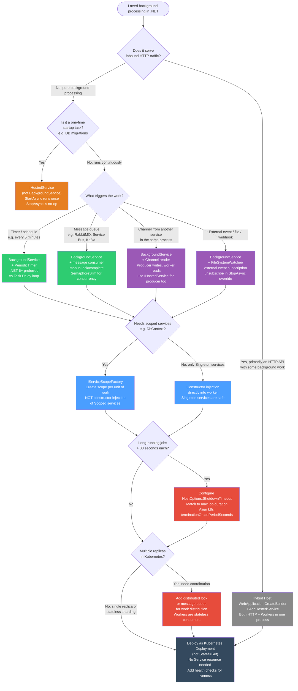

# 4.236 — Worker Services: Standalone Console Host with BackgroundService

---

## PART 0 — Navigation & Context

### Where This Topic Lives in the ASP.NET Core Domain

```
ASP.NET Core Mastery
│
├── A. Host & Application Lifecycle (4.001–4.010)
│   ├── 4.004  Generic Host (IHost): The Shared Foundation  ◄── Worker Services USE this
│   └── 4.005  IHostedService and IHostApplicationLifetime
│
├── R. Background Services (4.231–4.239)
│   ├── 4.231  IHostedService: Running Code at Startup/Shutdown
│   ├── 4.232  BackgroundService: The Base Class for Long-Running Work
│   ├── 4.233  Timed Background Service: PeriodicTimer
│   ├── 4.234  Queued Background Tasks: Channel<T>-Based Producer/Consumer
│   ├── 4.235  Scoped Services in BackgroundService: IServiceScopeFactory
│   ├── 4.236  ◄ YOU ARE HERE — Worker Services: Standalone Console Host
│   ├── 4.237  Graceful Shutdown: CancellationToken Contract
│   ├── 4.238  Hangfire Integration
│   └── 4.239  Health Checks for Background Services
│
├── AC. Deployment & Hosting (4.328–4.339)
│   ├── 4.330  Docker: Containerizing ASP.NET Core Applications
│   ├── 4.333  Kubernetes: Deployments and ConfigMaps
│   ├── 4.337  Windows Service Hosting: UseWindowsService  ◄── Worker runs as Windows Service
│   └── 4.338  Linux Daemon: UseSystemd                    ◄── Worker runs as systemd unit
│
└── D. Dependency Injection (4.034–4.048)
    ├── 4.034  Built-In DI Container: Registration & Resolution
    └── 4.035  Service Lifetimes: Singleton, Scoped, Transient
```

### What You Need Before This

- **[[4.004 — Generic Host (IHost)]]** — Worker Services are literally Generic Host projects without the web stack. If you don't know what `IHost`, `IHostBuilder`, `ConfigureServices`, and the application lifetime are, start there.
- **[[4.232 — BackgroundService]]** — `BackgroundService` is the implementation you put inside a Worker Service. The base class mechanics, `ExecuteAsync`, and `StopAsync` must be understood first.
- **[[4.034 — The Built-In DI Container]]** and **[[4.035 — Service Lifetimes]]** — worker services wire up DI exactly like a web app; the lifetime rules are identical and the captive dependency problem bites just as hard.
- **[[4.016 — IOptions<T>]]** — workers read configuration via `IOptions<T>` the same way web apps do; understanding this prevents the anti-pattern of injecting raw `IConfiguration`.

### What This Unlocks After

- **[[4.237 — Graceful Shutdown in Background Services]]** — the `CancellationToken` contract that determines whether your worker drains cleanly or gets killed mid-operation under Kubernetes.
- **[[4.235 — Scoped Services in BackgroundService]]** — the `IServiceScopeFactory` pattern that lets a singleton worker consume scoped services like `DbContext` correctly.
- **[[4.330 — Docker: Containerizing ASP.NET Core Applications]]** — workers are the cleanest use case for containerization; no port binding, no ingress, just a stateful background process.
- **[[4.333 — Kubernetes: Deployments, Services, and ConfigMaps]]** — workers deploy as Kubernetes Deployments (not Deployments+Services) because they don't accept inbound traffic; understanding the topology is different from web API deployments.

### Why This Matters at Scale

In a production microservices system, the majority of your compute is often **not** serving HTTP requests — it's consuming message queues, running ETL pipelines, sending notification emails, aggregating telemetry, and syncing data between systems. Worker Services are how .NET engineers deploy that compute: a full Generic Host (DI, configuration, logging, health checks, lifetime management) without the HTTP stack overhead. Getting Worker Services right means the difference between a background process that drains cleanly under a Kubernetes rolling deploy and one that corrupts records when SIGTERM arrives mid-batch.

---

## PART 1 — The Core Mental Model

### The Fundamental Rule

> **A Worker Service is a Generic Host application (`Host.CreateDefaultBuilder()` + `AddHostedService<T>()`) with no web server registered; `BackgroundService.ExecuteAsync()` is the entry point that runs for the lifetime of the process, and the host's `CancellationToken` is the only reliable signal for when to stop — treating it as optional is a production defect.**

### The Plain-Language Analogy

Think of an ASP.NET Core web application as a restaurant: the front-of-house (Kestrel) takes orders from customers (HTTP requests), routes them to the kitchen (controllers/endpoints), and sends food back out. A Worker Service is the kitchen operating as a **standalone commissary** — no front-of-house at all. The same kitchen infrastructure exists: the walk-in fridge (DI container), the health inspector (health checks), the supply chain (configuration), the management structure (IHost application lifetime). But there's no dining room, no waitstaff, no front door for customers. Work arrives via a back channel — a message queue, a database polling loop, a file watcher, a timer — and the kitchen processes it continuously.

This analogy holds for the critical edge cases: if the commissary needs to close (SIGTERM/Ctrl+C), the manager (host) signals the kitchen (calls `StopAsync`, which cancels `ExecuteAsync`'s token). A well-run kitchen finishes the current dish before turning off the ovens (drains in-flight work). A poorly-run kitchen stops mid-dish, leaving half-cooked food on the counter (corrupt records, un-acked messages). Multiple workers in one host are multiple kitchen sections — they all operate simultaneously, share the walk-in (singleton services), and all must respond to closing time.

### The Taxonomy Diagram

```mermaid
graph TD
    subgraph HostLayer["Generic Host Layer (same in web and worker)"]
        A["IHost\n(application container)"]
        B["IHostApplicationLifetime\n(Started/Stopping/Stopped events)"]
        C["IConfiguration\n(JSON + env vars + secrets)"]
        D["IServiceProvider\n(DI container)"]
        E["ILogger infrastructure"]
        F["IHealthChecksBuilder\n(optional but recommended)"]
    end

    subgraph WorkerProcess["Worker Service Process"]
        G["Host.CreateDefaultBuilder()\nor Host.CreateApplicationBuilder()"]
        H["builder.Services.AddHostedService&lt;TWorker&gt;()"]
        I["host.RunAsync() — blocks until shutdown"]
    end

    subgraph WorkerImpl["BackgroundService Implementations"]
        J["PollingWorker\nwhile loop + PeriodicTimer\n(replaces System.Timers.Timer)"]
        K["QueueConsumerWorker\nChannel&lt;T&gt; or\nIAsyncEnumerable&lt;T&gt; drain"]
        L["MessageBusConsumerWorker\nRabbitMQ / Azure Service Bus /\nKafka consumer loop"]
        M["OrchestratorWorker\nSpawns child tasks,\ncoordinates multiple workers"]
        N["OneTimeStartupWorker\nRuns once then calls\nIHostApplicationLifetime.StopApplication()"]
    end

    subgraph HostingTargets["Deployment Targets"]
        O["Docker Container\n(ENTRYPOINT dotnet MyWorker.dll)"]
        P["Windows Service\n(UseWindowsService())"]
        Q["Linux systemd unit\n(UseSystemd())"]
        R["Console / Dev\n(default, no extra config)"]
        S["Kubernetes Deployment\n(no Service resource needed)"]
    end

    G --> A
    A --> B & C & D & E & F
    H --> J & K & L & M & N
    I --> A
    A --> O & P & Q & R & S

    style A fill:#4a9eff,color:#fff
    style J fill:#2ecc71,color:#fff
    style K fill:#2ecc71,color:#fff
    style L fill:#2ecc71,color:#fff
    style M fill:#9b59b6,color:#fff
    style N fill:#e67e22,color:#fff
    style O fill:#34495e,color:#fff
    style P fill:#34495e,color:#fff
    style Q fill:#34495e,color:#fff
    style S fill:#34495e,color:#fff
```



---

## PART 2 — Deep Mechanics

### 2.1 — The Worker Service Host Startup Sequence

A Worker Service has no middleware pipeline. Understanding the startup sequence is essential because it differs from web apps in important ways — particularly around when `ExecuteAsync` is called relative to the DI container being ready.

```
dotnet run / process start
        │
        ▼
Program.cs: Host.CreateDefaultBuilder(args) OR Host.CreateApplicationBuilder(args)
        │
        ├─► Registers default configuration providers:
        │     appsettings.json → appsettings.{Environment}.json
        │     → User Secrets (Development) → Environment Variables → Command-line args
        │
        ├─► Registers default logging providers:
        │     Console → Debug → EventSource → EventLog (Windows only)
        │
        ├─► Registers framework services:
        │     IHostApplicationLifetime, IHostEnvironment, IOptions<HostOptions>
        │
        ▼
builder.Services.Add*(...)  ← your DI registrations
builder.Services.AddHostedService<MyWorker>()
        │
        ▼
host.Build()  ← DI container is compiled, IConfiguration is frozen
        │
        ▼
host.RunAsync()  ← calls host.StartAsync() then blocks on ApplicationStopping token
        │
        ▼
host.StartAsync()
        │
        ├─► Calls IHostedService.StartAsync() on each registered IHostedService
        │     in registration ORDER (important for dependency between workers)
        │
        ├─► BackgroundService.StartAsync() launches ExecuteAsync() on a background Task
        │     (ExecuteAsync is NOT awaited inline — it runs concurrently)
        │
        ├─► IHostApplicationLifetime.ApplicationStarted fires
        │
        ▼
[All workers running concurrently on background Tasks]
        │
        ▼
SIGTERM / Ctrl+C / IHostApplicationLifetime.StopApplication()
        │
        ▼
IHostApplicationLifetime.ApplicationStopping fires
        │
        ▼
host.StopAsync()
        │
        ├─► Cancels the stoppingToken passed to ExecuteAsync()
        │
        ├─► Calls IHostedService.StopAsync() on each IHostedService
        │     in REVERSE registration order
        │
        ├─► Waits up to HostOptions.ShutdownTimeout (default: 30s) for all
        │     hosted services to complete StopAsync()
        │
        ├─► IHostApplicationLifetime.ApplicationStopped fires
        │
        ▼
Process exits (exit code 0 on clean shutdown, non-zero on unhandled exception)
```

**Runtime cost:** `AddHostedService<T>()` registers T as a Singleton-lifetime service. The host calls `host.Services.GetServices<IHostedService>()` to enumerate all workers at startup. Each worker's `ExecuteAsync` runs on a background `Task` — `~1 Task allocation per worker` for the lifetime of the process. The `stoppingToken` is `~1 CancellationTokenSource per worker` linked to the host's shutdown token.

**The critical detail engineers miss:** `ExecuteAsync` is launched as a `_ = Task.Run(...)` equivalent — it is **fire-and-forget from the host's perspective during startup**. If `ExecuteAsync` throws an **unhandled exception**, in .NET 6+, the host calls `IHostApplicationLifetime.StopApplication()` — the entire process shuts down. In .NET 5 and earlier, an unhandled exception in `ExecuteAsync` was silently swallowed. This behavioral change is a common source of "my worker crashes the whole process" bugs when migrating from .NET 5.

---

### 2.2 — `Host.CreateDefaultBuilder` vs `Host.CreateApplicationBuilder` vs `WebApplication.CreateBuilder`

```
// ASP.NET Core internally (approximate):
// These three host creation methods differ in what they register:

// 1. Host.CreateDefaultBuilder(args)         ← .NET 3.1–present, classic style
//    Registers: Configuration (JSON+env+secrets+cmdline), Logging (Console+Debug+EventSource)
//    Does NOT register: Kestrel, HTTP pipeline, routing, MVC
//    Use for: Worker Services, .NET 3.1/5/6 style console apps

// 2. Host.CreateApplicationBuilder(args)     ← .NET 7+, modern style (mirrors WebApplication)
//    Registers: Same defaults as CreateDefaultBuilder
//    Exposes: builder.Services, builder.Configuration, builder.Logging, builder.Environment
//    Does NOT register: Kestrel, HTTP pipeline
//    Use for: New Worker Service projects in .NET 7+

// 3. WebApplication.CreateBuilder(args)      ← web apps only
//    Registers: Everything above PLUS Kestrel, IServer, routing infrastructure
//    Use for: Web APIs, MVC apps, anything that accepts HTTP requests
//    WRONG for: Pure worker services (unnecessary overhead)
```

**Framework source behavior — `BackgroundService.StartAsync`:**

```csharp
// ASP.NET Core internally (simplified from BackgroundService source):
// Source: src/Hosting/Abstractions/src/BackgroundService.cs

public abstract class BackgroundService : IHostedService, IDisposable
{
    private Task? _executeTask;
    private CancellationTokenSource? _stoppingCts;

    // Called by the host during startup
    public virtual Task StartAsync(CancellationToken cancellationToken)
    {
        _stoppingCts = CancellationTokenSource.CreateLinkedTokenSource(cancellationToken);
        
        // ExecuteAsync is launched on a background Task
        // The Task is stored so StopAsync can await it
        _executeTask = ExecuteAsync(_stoppingCts.Token);

        // If ExecuteAsync completed synchronously (e.g., returned immediately),
        // return the completed task directly — avoids unnecessary async overhead
        if (_executeTask.IsCompleted)
            return _executeTask;

        // Otherwise return a completed Task immediately so the host can continue
        // starting other services — ExecuteAsync runs concurrently
        return Task.CompletedTask;
    }

    // Called by the host during shutdown
    public virtual async Task StopAsync(CancellationToken cancellationToken)
    {
        if (_executeTask == null)
            return;

        try
        {
            // Signal ExecuteAsync to stop
            _stoppingCts!.Cancel();
        }
        finally
        {
            // Wait for ExecuteAsync to finish, OR the shutdown timeout, whichever comes first
            // The cancellationToken here is the SHUTDOWN timeout token, not the stopping token
            await Task.WhenAny(_executeTask, Task.Delay(Timeout.Infinite, cancellationToken))
                      .ConfigureAwait(false);
        }
    }

    // YOUR CODE goes here — implement this
    protected abstract Task ExecuteAsync(CancellationToken stoppingToken);
}
```

**The two `CancellationToken`s that confuse engineers:**

```
Token 1: stoppingToken (parameter to ExecuteAsync)
         ├── Cancelled when: host.StopAsync() is called (SIGTERM, Ctrl+C, StopApplication())
         ├── Purpose: signal your loop to stop accepting new work
         └── You MUST observe this token in your loop condition

Token 2: cancellationToken (parameter to StopAsync — the SHUTDOWN TIMEOUT token)
         ├── Cancelled when: the shutdown timeout (HostOptions.ShutdownTimeout, default 30s) expires
         ├── Purpose: force-kill workers that don't stop in time
         └── You do NOT use this directly in ExecuteAsync — it's internal to BackgroundService.StopAsync
```

---

### 2.3 — Project Structure and `Program.cs` for a Worker Service

The Worker Service project template produces exactly this:

```csharp
// Program.cs — the complete entry point for a Worker Service
// (.NET 8, using Host.CreateApplicationBuilder, top-level statements)

using Microsoft.Extensions.DependencyInjection;
using Microsoft.Extensions.Hosting;

// This replaces the old IHostBuilder pattern from .NET 3.1/5
var builder = Host.CreateApplicationBuilder(args);

// Wire up your services — identical to WebApplication.CreateBuilder pattern
builder.Services.AddHostedService<OrderProcessingWorker>();
builder.Services.AddSingleton<IOrderRepository, SqlOrderRepository>();
builder.Services.AddHttpClient<IPaymentGatewayClient, PaymentGatewayClient>();
builder.Services.Configure<OrderProcessingOptions>(
    builder.Configuration.GetSection("OrderProcessing"));

// Optional: Windows Service / Linux systemd hosting
// builder.Services.AddWindowsService(options => options.ServiceName = "OrderProcessor");
// builder.Services.AddSystemd();

var host = builder.Build();
await host.RunAsync();
// RunAsync() = StartAsync() + wait for shutdown signal + StopAsync()
// Equivalent to: host.Start(); await host.WaitForShutdownAsync(); await host.StopAsync();
```

**No HTTP wire format** — Worker Services do not have HTTP request/response cycles. Their "wire format" is whatever their data source produces: AMQP frames from RabbitMQ, Kafka records, database rows, filesystem events. The process communicates with the outside world through those channels, not through HTTP.

**What the `.csproj` looks like:**

```xml
<!-- Worker Service project — no web SDK -->
<Project Sdk="Microsoft.NET.Sdk.Worker">
  <PropertyGroup>
    <OutputType>Exe</OutputType>
    <TargetFramework>net8.0</TargetFramework>
    <Nullable>enable</Nullable>
    <ImplicitUsings>enable</ImplicitUsings>
    <!-- Enables the Worker Service template defaults -->
    <UserSecretsId>your-guid-here</UserSecretsId>
  </PropertyGroup>

  <ItemGroup>
    <PackageReference Include="Microsoft.Extensions.Hosting" Version="8.0.*" />
    <!-- Add other packages: RabbitMQ, Azure.Messaging.ServiceBus, etc. -->
  </ItemGroup>
</Project>

<!-- NOTE: Microsoft.NET.Sdk.Worker is NOT Microsoft.NET.Sdk.Web -->
<!-- Sdk.Worker includes: Microsoft.Extensions.Hosting + Worker defaults -->
<!-- Sdk.Web includes: everything in Sdk.Worker PLUS Kestrel, routing, MVC -->
<!-- For a pure worker, NEVER use Sdk.Web — it adds ~3MB and unnecessary startup overhead -->
```

---

### 2.4 — Multiple Workers: Registration Order and Startup Behavior

Multiple workers in one host is a common and valid pattern — a single process can run a queue consumer, a health-check reporter, and a periodic cleanup job simultaneously.

```csharp
// Registration order matters for startup AND shutdown:
builder.Services.AddHostedService<MessageQueueConsumerWorker>();   // starts 1st, stops last
builder.Services.AddHostedService<HealthReporterWorker>();          // starts 2nd, stops 2nd
builder.Services.AddHostedService<DatabaseCleanupWorker>();         // starts 3rd, stops 1st

// Startup: StartAsync called in registration order (1 → 2 → 3)
// Shutdown: StopAsync called in REVERSE order (3 → 2 → 1)

// WHY reverse order matters:
// If MessageQueueConsumerWorker produces work for DatabaseCleanupWorker to consume,
// you want the consumer to stop first (DatabaseCleanupWorker), then the producer
// (MessageQueueConsumerWorker) — otherwise the producer queues work that the consumer
// has already stopped processing.
// REVERSE shutdown order achieves this if you register in dependency order.
```

**Failure mode — unhandled exception in one worker:**

```
Worker A: running normally ─────────────────────────────────────────►
Worker B: throws unhandled exception ──► host.StopApplication() called
Worker C: running normally ─────────────────────────────────────►(stopped)

// In .NET 6+: unhandled exception in any ExecuteAsync = entire host shuts down
// In .NET 5-: unhandled exception in ExecuteAsync was silently swallowed
//              (the worker died silently, other workers continued — a worse outcome)

// The .NET 6+ behavior is CORRECT for production:
// A silent worker death with other workers continuing is a split-brain state.
// Better to restart the whole process (Kubernetes will restart the pod).

// To handle expected exceptions WITHOUT crashing the host:
protected override async Task ExecuteAsync(CancellationToken stoppingToken)
{
    while (!stoppingToken.IsCancellationRequested)
    {
        try
        {
            await ProcessNextBatchAsync(stoppingToken);
        }
        catch (OperationCanceledException) when (stoppingToken.IsCancellationRequested)
        {
            // Clean shutdown — do not log as error, do not rethrow
            break;
        }
        catch (Exception ex)
        {
            // Log and continue — transient errors should NOT crash the host
            // But consider: if this fires continuously, it becomes a spin-loop
            _logger.LogError(ex, "Error processing batch; retrying after delay");
            await Task.Delay(TimeSpan.FromSeconds(5), stoppingToken);
        }
    }
}
```

---

### 2.5 — Hosting Targets: Console, Windows Service, Linux systemd, Docker, Kubernetes

A Worker Service can be deployed to any of these with minimal code changes — mostly just two lines in `Program.cs` and deployment configuration.

```
DEPLOYMENT TARGET     WHAT CHANGES              HOW SIGTERM/STOP ARRIVES
─────────────────────────────────────────────────────────────────────────
Console / Dev         nothing                   Ctrl+C → SIGINT
                                                 Console.CancelKeyPress fires
                                                 → host.StopAsync()

Docker Container      nothing*                  SIGTERM from `docker stop`
                      (*must handle SIGTERM)    → host.StopAsync()
                                                 After 10s (default): SIGKILL

Windows Service       UseWindowsService()       SCM sends ServiceControlCommand.Stop
                                                 → host.StopAsync()

Linux systemd         UseSystemd()              systemd sends SIGTERM
                      (adds sd_notify support)  → host.StopAsync()
                                                 Also signals Ready to systemd on start

Kubernetes            nothing* (just Docker)    kubelet sends SIGTERM (preStop hook optional)
                      (*health checks needed)   After terminationGracePeriodSeconds: SIGKILL
```

**The Docker SIGTERM problem that bites every team:**

Without special handling, `dotnet run` on Linux does not respond to SIGTERM because `dotnet` is the parent process and the app is a child. SIGTERM goes to `dotnet`, not to your app. The solution:

```dockerfile
# WRONG: dotnet is the parent, your app is a child process — SIGTERM goes to dotnet
ENTRYPOINT ["dotnet", "MyWorker.dll"]

# CORRECT option 1: Use exec form with direct binary (no shell wrapper)
# This makes your app PID 1, so SIGTERM goes directly to it
FROM mcr.microsoft.com/dotnet/runtime:8.0
COPY --from=build /app/publish .
ENTRYPOINT ["./MyWorker"]  # after dotnet publish --self-contained or EnableCompressionInSingleFile

# CORRECT option 2: Use dotnet exec (same issue — still works because host intercepts Console signals)
# The Generic Host registers a Console.CancelKeyPress handler AND a PosixSignal handler
# for SIGTERM in .NET 6+, so the host DOES respond to SIGTERM even when dotnet is PID 1
ENTRYPOINT ["dotnet", "MyWorker.dll"]
# This actually works in .NET 6+ because Microsoft.Extensions.Hosting registers:
// AppDomain.CurrentDomain.ProcessExit += (_, _) => hostLifetime.StopApplication();
// Console.CancelKeyPress += (_, e) => { e.Cancel = true; hostLifetime.StopApplication(); };
// PosixSignalRegistration.Create(PosixSignal.SIGTERM, _ => hostLifetime.StopApplication()); // .NET 6+
```

---

## PART 3 — Production Code Patterns

### Pattern 1: The Queue Consumer Worker (Order Processing Pipeline)

```csharp
// Domain: E-commerce order management — consuming from Azure Service Bus,
// processing payment confirmation messages, updating order status in SQL Server

using Azure.Messaging.ServiceBus;
using Microsoft.Extensions.Hosting;
using Microsoft.Extensions.Logging;
using Microsoft.Extensions.Options;

public class OrderConfirmationWorker : BackgroundService
{
    private readonly ServiceBusClient _serviceBusClient;
    private readonly IServiceScopeFactory _scopeFactory;  // needed for scoped DbContext
    private readonly ILogger<OrderConfirmationWorker> _logger;
    private readonly OrderWorkerOptions _options;
    private ServiceBusProcessor? _processor;

    public OrderConfirmationWorker(
        ServiceBusClient serviceBusClient,
        IServiceScopeFactory scopeFactory,
        ILogger<OrderConfirmationWorker> logger,
        IOptions<OrderWorkerOptions> options)
    {
        _serviceBusClient = serviceBusClient;
        _scopeFactory = scopeFactory;
        _logger = logger;
        _options = options.Value;
    }

    protected override async Task ExecuteAsync(CancellationToken stoppingToken)
    {
        // Create a ServiceBusProcessor — this is the message pump
        _processor = _serviceBusClient.CreateProcessor(
            _options.QueueName,
            new ServiceBusProcessorOptions
            {
                MaxConcurrentCalls = _options.MaxConcurrentMessages,
                AutoCompleteMessages = false  // we complete or abandon manually
            });

        _processor.ProcessMessageAsync += OnMessageReceivedAsync;
        _processor.ProcessErrorAsync += OnErrorAsync;

        // Start the processor — it runs internally on its own async machinery
        await _processor.StartProcessingAsync(stoppingToken);

        _logger.LogInformation(
            "Order confirmation worker started. Queue: {Queue}, Concurrency: {Concurrency}",
            _options.QueueName, _options.MaxConcurrentMessages);

        // Block here until stoppingToken is cancelled
        // When it fires, we fall through and StopAsync calls StopProcessingAsync
        await Task.Delay(Timeout.Infinite, stoppingToken)
                  .ContinueWith(_ => { }, TaskContinuationOptions.None);

        _logger.LogInformation("Order confirmation worker shutting down");
    }

    private async Task OnMessageReceivedAsync(ProcessMessageEventArgs args)
    {
        // Create a DI scope per message — DbContext, repositories are Scoped
        await using var scope = _scopeFactory.CreateAsyncScope();
        var orderService = scope.ServiceProvider.GetRequiredService<IOrderService>();

        try
        {
            var confirmation = args.Message.Body.ToObjectFromJson<PaymentConfirmation>();

            _logger.LogInformation(
                "Processing payment confirmation for order {OrderId}",
                confirmation.OrderId);

            await orderService.ConfirmPaymentAsync(confirmation, args.CancellationToken);

            // Complete the message — remove from queue permanently
            await args.CompleteMessageAsync(args.Message, args.CancellationToken);
        }
        catch (Exception ex)
        {
            _logger.LogError(ex,
                "Failed to process payment confirmation for message {MessageId}",
                args.Message.MessageId);

            // Abandon — message goes back to queue with incremented delivery count
            // After MaxDeliveryCount attempts, it moves to dead-letter queue
            await args.AbandonMessageAsync(args.Message, cancellationToken: args.CancellationToken);
        }
    }

    private Task OnErrorAsync(ProcessErrorEventArgs args)
    {
        _logger.LogError(args.Exception,
            "Service Bus error. Source: {ErrorSource}, Entity: {EntityPath}",
            args.ErrorSource, args.EntityPath);
        return Task.CompletedTask;
    }

    public override async Task StopAsync(CancellationToken cancellationToken)
    {
        // Stop the processor — drains in-flight messages gracefully
        if (_processor != null)
        {
            await _processor.StopProcessingAsync(cancellationToken);
            await _processor.DisposeAsync();
        }

        // Call base.StopAsync to cancel stoppingToken and await ExecuteAsync
        await base.StopAsync(cancellationToken);

        _logger.LogInformation("Order confirmation worker stopped cleanly");
    }
}

public class OrderWorkerOptions
{
    public string QueueName { get; set; } = string.Empty;
    public int MaxConcurrentMessages { get; set; } = 4;
}
```

---

### Pattern 2: The Periodic Polling Worker (Inventory Sync)

```csharp
// Domain: Inventory management — periodically polling an ERP system API
// and syncing product stock levels to the local SQL database
// Pattern: PeriodicTimer loop (preferred over Task.Delay loop in .NET 6+)

public class InventorySyncWorker : BackgroundService
{
    private readonly IHttpClientFactory _httpClientFactory;
    private readonly IServiceScopeFactory _scopeFactory;
    private readonly ILogger<InventorySyncWorker> _logger;
    private readonly InventorySyncOptions _options;

    public InventorySyncWorker(
        IHttpClientFactory httpClientFactory,
        IServiceScopeFactory scopeFactory,
        ILogger<InventorySyncWorker> logger,
        IOptions<InventorySyncOptions> options)
    {
        _httpClientFactory = httpClientFactory;
        _scopeFactory = scopeFactory;
        _logger = logger;
        _options = options.Value;
    }

    protected override async Task ExecuteAsync(CancellationToken stoppingToken)
    {
        // PeriodicTimer is the .NET 6+ replacement for Task.Delay in polling loops
        // Key advantage: WaitForNextTickAsync returns false (not throw) when cancelled
        // This means you do NOT need a try/catch around the loop for OperationCanceledException
        using var timer = new PeriodicTimer(_options.SyncInterval);

        _logger.LogInformation(
            "Inventory sync worker started. Interval: {Interval}",
            _options.SyncInterval);

        // WaitForNextTickAsync fires immediately on the first call,
        // then waits for the interval. So the first sync happens at startup.
        while (await timer.WaitForNextTickAsync(stoppingToken))
        {
            try
            {
                await SyncInventoryAsync(stoppingToken);
            }
            catch (OperationCanceledException) when (stoppingToken.IsCancellationRequested)
            {
                // Host is shutting down — break cleanly without logging as error
                break;
            }
            catch (Exception ex)
            {
                // Log the error but continue the loop — transient ERP API failures
                // should not crash the worker
                _logger.LogError(ex, "Inventory sync failed; will retry at next interval");
                // No Task.Delay here — PeriodicTimer handles the next tick timing
            }
        }

        _logger.LogInformation("Inventory sync worker stopped");
    }

    private async Task SyncInventoryAsync(CancellationToken ct)
    {
        using var scope = _scopeFactory.CreateScope();
        var inventoryRepository = scope.ServiceProvider.GetRequiredService<IInventoryRepository>();

        var httpClient = _httpClientFactory.CreateClient("ErpApi");
        var erpItems = await httpClient.GetFromJsonAsync<List<ErpInventoryItem>>(
            "/api/v2/inventory/current", ct)
            ?? throw new InvalidOperationException("ERP API returned null inventory");

        var syncedCount = 0;
        foreach (var item in erpItems)
        {
            await inventoryRepository.UpsertStockLevelAsync(
                item.Sku, item.QuantityOnHand, item.LastUpdated, ct);
            syncedCount++;
        }

        _logger.LogInformation(
            "Inventory sync complete. Items synced: {Count}, Duration: {Duration}",
            syncedCount, DateTimeOffset.UtcNow);
    }
}
```

---

### Pattern 3: The One-Shot Startup Worker (Database Migration Before Serving Traffic)

```csharp
// Domain: Payment API infrastructure — running EF Core migrations at startup
// before the web host begins serving requests
// Pattern: IHostedService (not BackgroundService) that runs once and stops the host
// This pattern is used in conjunction with a web host in the SAME process.

// ⚠️ WRONG: Running migrations inside the web app's Configure() or Program.cs directly
// This blocks the startup thread and doesn't integrate with the host lifetime model
// app.Services.GetRequiredService<PaymentDbContext>().Database.MigrateAsync(); // WRONG

// ✅ CORRECT: Implement IHostedService for one-shot startup work
public class DatabaseMigrationStartupService : IHostedService
{
    private readonly IServiceScopeFactory _scopeFactory;
    private readonly ILogger<DatabaseMigrationStartupService> _logger;

    public DatabaseMigrationStartupService(
        IServiceScopeFactory scopeFactory,
        ILogger<DatabaseMigrationStartupService> logger)
    {
        _scopeFactory = scopeFactory;
        _logger = logger;
    }

    public async Task StartAsync(CancellationToken cancellationToken)
    {
        _logger.LogInformation("Applying database migrations...");

        using var scope = _scopeFactory.CreateScope();
        var dbContext = scope.ServiceProvider.GetRequiredService<PaymentDbContext>();

        // MigrateAsync applies any pending migrations — idempotent
        await dbContext.Database.MigrateAsync(cancellationToken);

        _logger.LogInformation("Database migrations applied successfully");
        // StartAsync returns — the host continues starting other services
        // This is NOT a long-running worker — it completes during startup
    }

    public Task StopAsync(CancellationToken cancellationToken)
        => Task.CompletedTask;  // nothing to clean up
}

// In Program.cs — register BEFORE AddHostedService for workers
// so migrations run before workers try to use the database
builder.Services.AddHostedService<DatabaseMigrationStartupService>();
builder.Services.AddHostedService<PaymentProcessingWorker>();
// StartAsync order: DatabaseMigrationStartupService first, then PaymentProcessingWorker
```

---

### Pattern 4: The Hybrid Host (Worker + Web API in One Process)

```csharp
// Domain: Logistics tracking — one process that both:
//   1. Serves HTTP API for shipment queries (WebApplication / Kestrel)
//   2. Consumes Kafka events for shipment status updates (BackgroundService)
// This is valid and common for smaller services — avoids running two processes

// ⚠️ WRONG: Using Host.CreateDefaultBuilder when you need HTTP too
// Host.CreateDefaultBuilder does NOT register Kestrel or the HTTP pipeline
var host = Host.CreateDefaultBuilder(args)        // WRONG for hybrid
    .ConfigureServices(services =>
    {
        services.AddControllers();                // ← registers MVC but no Kestrel
        services.AddHostedService<KafkaWorker>(); // ← this works
    })
    .Build();

// ✅ CORRECT: Use WebApplication.CreateBuilder — it registers everything
var builder = WebApplication.CreateBuilder(args);

// Register the worker alongside the web services
builder.Services.AddControllers();
builder.Services.AddHostedService<ShipmentStatusKafkaWorker>();
builder.Services.AddSingleton<IKafkaConsumerFactory, KafkaConsumerFactory>();
builder.Services.Configure<KafkaOptions>(builder.Configuration.GetSection("Kafka"));

var app = builder.Build();

app.MapControllers();    // HTTP endpoints for queries
app.MapHealthChecks("/health");

// Worker starts automatically when app.Run() is called
// Both the Kestrel HTTP server and the Kafka consumer run concurrently
await app.RunAsync();

// Wire format for the HTTP side:
// GET /api/shipments/SHP-001 HTTP/1.1
// HTTP/1.1 200 OK
// Content-Type: application/json
// {"shipmentId":"SHP-001","status":"InTransit","lastUpdated":"2026-06-11T09:00:00Z"}

// The Kafka worker runs concurrently — no HTTP involved in its path
```

---

### Pattern 5: The Worker with `IHostApplicationLifetime` Self-Termination

```csharp
// Domain: Data ETL pipeline — a worker that runs a one-time nightly batch job
// and then cleanly exits so Kubernetes can restart it the next night
// (via a CronJob, not a Deployment)

public class NightlyReportGenerationWorker : BackgroundService
{
    private readonly IHostApplicationLifetime _lifetime;
    private readonly IReportService _reportService;
    private readonly ILogger<NightlyReportGenerationWorker> _logger;

    public NightlyReportGenerationWorker(
        IHostApplicationLifetime lifetime,
        IReportService reportService,
        ILogger<NightlyReportGenerationWorker> logger)
    {
        _lifetime = lifetime;
        _reportService = reportService;
        _logger = logger;
    }

    protected override async Task ExecuteAsync(CancellationToken stoppingToken)
    {
        _logger.LogInformation("Starting nightly report generation");

        try
        {
            // Wait for the host to be fully started before doing work
            // This ensures all other IHostedServices have started
            await Task.Delay(TimeSpan.FromSeconds(2), stoppingToken);

            var reportDate = DateOnly.FromDateTime(DateTime.UtcNow.AddDays(-1)); // yesterday
            await _reportService.GenerateDailyReportsAsync(reportDate, stoppingToken);

            _logger.LogInformation(
                "Nightly report generation complete for {Date}", reportDate);
        }
        catch (OperationCanceledException) when (stoppingToken.IsCancellationRequested)
        {
            _logger.LogWarning("Report generation was cancelled during shutdown");
            return;
        }
        catch (Exception ex)
        {
            _logger.LogError(ex, "Nightly report generation failed");
            // Signal the host to stop with an error exit code
            // Kubernetes will see a non-zero exit code and report the Job as failed
            Environment.ExitCode = 1;
        }
        finally
        {
            // Tell the host to shut down — we're done, process should exit
            // This is the correct pattern for "run once and exit" workers
            _lifetime.StopApplication();
        }
    }
}

// Kubernetes CronJob manifest (simplified):
// spec:
//   schedule: "0 2 * * *"   # 2 AM UTC daily
//   jobTemplate:
//     spec:
//       template:
//         spec:
//           restartPolicy: OnFailure
//           containers:
//           - name: report-worker
//             image: myregistry/nightly-reports:latest
```

---

### Pattern 6: The Graceful Drain Worker (In-Flight Work Completion)

```csharp
// Domain: Healthcare patient portal — processing diagnostic image analysis requests
// Each analysis job takes 30-60 seconds. On shutdown, in-flight jobs must complete.
// Pattern: SemaphoreSlim to track in-flight work, graceful drain before exit.

public class DiagnosticAnalysisWorker : BackgroundService
{
    private readonly IAnalysisJobQueue _jobQueue;
    private readonly IAnalysisEngine _engine;
    private readonly ILogger<DiagnosticAnalysisWorker> _logger;
    
    // Track active analysis jobs so we can wait for them on shutdown
    private readonly SemaphoreSlim _concurrencyLimiter;
    private readonly List<Task> _activeJobs = new();
    private readonly object _activeJobsLock = new();

    public DiagnosticAnalysisWorker(
        IAnalysisJobQueue jobQueue,
        IAnalysisEngine engine,
        ILogger<DiagnosticAnalysisWorker> logger,
        IOptions<AnalysisWorkerOptions> options)
    {
        _jobQueue = jobQueue;
        _engine = engine;
        _logger = logger;
        _concurrencyLimiter = new SemaphoreSlim(options.Value.MaxConcurrentJobs, options.Value.MaxConcurrentJobs);
    }

    protected override async Task ExecuteAsync(CancellationToken stoppingToken)
    {
        await foreach (var job in _jobQueue.ReadAllAsync(stoppingToken))
        {
            // Acquire concurrency slot — blocks if at max concurrent jobs
            await _concurrencyLimiter.WaitAsync(stoppingToken);

            var jobTask = ProcessJobAsync(job, stoppingToken)
                .ContinueWith(_ => _concurrencyLimiter.Release(), TaskScheduler.Default);

            lock (_activeJobsLock)
                _activeJobs.Add(jobTask);
        }

        // stoppingToken cancelled — stop accepting new jobs
        _logger.LogInformation("Draining {Count} in-flight analysis jobs...", _activeJobs.Count);

        // Wait for all in-flight jobs to complete (up to shutdown timeout)
        // NOTE: This runs AFTER stoppingToken is cancelled, using Task.WhenAll
        // The 30s shutdown timeout in HostOptions is the backstop
        await Task.WhenAll(_activeJobs);

        _logger.LogInformation("All in-flight analysis jobs drained");
    }

    private async Task ProcessJobAsync(DiagnosticJob job, CancellationToken stoppingToken)
    {
        _logger.LogInformation("Processing diagnostic job {JobId}", job.JobId);
        try
        {
            // Note: we do NOT pass stoppingToken to the analysis engine
            // because we want in-flight jobs to complete even after stoppingToken fires
            // We use a separate timeout token with a reasonable bound
            using var timeout = CancellationTokenSource.CreateLinkedTokenSource(
                stoppingToken, new CancellationTokenSource(TimeSpan.FromMinutes(5)).Token);

            var result = await _engine.AnalyzeAsync(job.ImageData, timeout.Token);
            await _jobQueue.CompleteJobAsync(job, result);
        }
        catch (Exception ex)
        {
            _logger.LogError(ex, "Analysis job {JobId} failed", job.JobId);
            await _jobQueue.FailJobAsync(job, ex.Message);
        }
    }
}
```

---

## PART 4 — Gotchas & Anti-Patterns

### Gotcha 1: Throwing in `ExecuteAsync` Crashes the Entire Host in .NET 6+

Engineers used to .NET 5 behavior (where unhandled exceptions in `ExecuteAsync` were silently swallowed) write code that throws `InvalidOperationException` as a "this shouldn't happen" guard. In .NET 6+, this crashes the entire process.

```csharp
// ⚠️ WRONG: Unhandled exception — crashes the entire host in .NET 6+
protected override async Task ExecuteAsync(CancellationToken stoppingToken)
{
    while (!stoppingToken.IsCancellationRequested)
    {
        var message = await _queue.DequeueAsync(stoppingToken);

        // This throws if queue returns null unexpectedly
        // In .NET 5: worker dies silently, other workers continue
        // In .NET 6+: host.StopApplication() is called — ALL workers stop, process exits
        var order = JsonSerializer.Deserialize<Order>(message)
            ?? throw new InvalidOperationException("Received null order from queue");

        await ProcessOrderAsync(order, stoppingToken);
    }
}

// HTTP consequence (wrong path):
// Process crashes → Kubernetes pod restarts → messages lost or duplicated
// Depending on message queue ack behavior (if not acked before throw, message returns to queue)
// But any state that was partially updated is now corrupt

// ✅ CORRECT: Catch all expected exceptions inside the loop
protected override async Task ExecuteAsync(CancellationToken stoppingToken)
{
    while (!stoppingToken.IsCancellationRequested)
    {
        try
        {
            var message = await _queue.DequeueAsync(stoppingToken);
            var order = JsonSerializer.Deserialize<Order>(message);

            if (order == null)
            {
                _logger.LogWarning("Received invalid message; skipping");
                continue; // skip, don't crash
            }

            await ProcessOrderAsync(order, stoppingToken);
        }
        catch (OperationCanceledException) when (stoppingToken.IsCancellationRequested)
        {
            break; // clean shutdown
        }
        catch (Exception ex)
        {
            _logger.LogError(ex, "Error processing order message; retrying in 5s");
            await Task.Delay(TimeSpan.FromSeconds(5), stoppingToken);
        }
    }
}

// HTTP consequence (correct path):
// Malformed messages are skipped with a warning log
// Transient failures retry with backoff
// Process remains healthy; Kubernetes sees no restart

// WHY: BackgroundService.StartAsync stores the Task returned by ExecuteAsync.
// If that Task is faulted, the host's BackgroundServiceExceptionBehavior (default:
// StopHost in .NET 6+, Ignore in .NET 5) determines the outcome.
// You can configure this: services.Configure<HostOptions>(o =>
//     o.BackgroundServiceExceptionBehavior = BackgroundServiceExceptionBehavior.Ignore);
// but this replicates the .NET 5 silent-death behavior — a worse outcome than crashing.
```

---

### Gotcha 2: `Task.Delay` Loop Instead of `PeriodicTimer` — Drift and Wasted Wakeups

Engineers write polling workers with `Task.Delay(interval, ct)` inside a `while` loop. This causes interval drift (the interval is _between_ polls, not _between starts of polls_), and it creates a temporary `CancellationTokenRegistration` allocation on every iteration.

```csharp
// ⚠️ WRONG: Task.Delay polling — drifts over time, allocates per iteration
protected override async Task ExecuteAsync(CancellationToken stoppingToken)
{
    while (!stoppingToken.IsCancellationRequested)
    {
        await DoWorkAsync(stoppingToken);       // takes 3 seconds
        await Task.Delay(10_000, stoppingToken); // waits 10 seconds
        // Total cycle: 13 seconds — NOT 10 seconds. Drifts under load.
        // Task.Delay allocates a CancellationTokenRegistration per call: ~1 alloc/iteration
    }
}

// HTTP consequence (wrong path):
// Scheduled work that should run every 10s runs every 13s (or longer under load)
// In aggregate over 24 hours: expected 8640 runs, actual ~6646 runs
// For scheduled batch jobs, this represents silent under-execution

// ✅ CORRECT: PeriodicTimer — fires at consistent intervals regardless of work duration
protected override async Task ExecuteAsync(CancellationToken stoppingToken)
{
    // PeriodicTimer fires every 10 seconds from the moment it is created,
    // regardless of how long DoWorkAsync takes (up to 10 seconds).
    // If DoWorkAsync takes longer than 10 seconds, the next tick fires immediately
    // (no queuing — it catches up by skipping the overdue tick).
    using var timer = new PeriodicTimer(TimeSpan.FromSeconds(10));

    while (await timer.WaitForNextTickAsync(stoppingToken))
    {
        await DoWorkAsync(stoppingToken);
        // If DoWorkAsync takes 3s: next tick fires 7s later (10s - 3s elapsed)
        // If DoWorkAsync takes 15s: next tick fires immediately (already overdue)
        // Zero allocation per tick (no CancellationTokenRegistration)
    }
    // WaitForNextTickAsync returns false when stoppingToken is cancelled
    // No OperationCanceledException to catch — clean loop exit
}

// HTTP consequence (correct path):
// Consistent 10-second interval. Over 24 hours: exactly 8640 trigger attempts.
// Clean exit on shutdown without exception propagation.

// WHY: PeriodicTimer uses a single System.Threading.Timer internally with
// zero-allocation tick notification. Task.Delay creates a new timer AND
// a CancellationTokenRegistration on every call. At 6 calls/minute × 60 minutes
// × 8 workers = 2880 extra CancellationTokenRegistration allocs/hour vs zero.
```

---

### Gotcha 3: Injecting Scoped Services into the Worker Constructor (Captive Dependency)

This is the most common DI mistake in worker services. Engineers inject `DbContext` or `IOrderRepository` (Scoped) into the worker constructor, which is Singleton-lifetime. The Scoped service is captured at startup and reused across all iterations — violating the Scoped lifetime contract (and causing `DbContext` to accumulate tracked entities across iterations until it runs out of memory or produces incorrect query results).

```csharp
// ⚠️ WRONG: Scoped service in constructor of Singleton-lifetime worker
public class OrderSyncWorker : BackgroundService
{
    private readonly IOrderRepository _orderRepo; // ← SCOPED service captured as Singleton

    public OrderSyncWorker(IOrderRepository orderRepo) // ← constructor injection = Singleton scope
    {
        _orderRepo = orderRepo;
    }

    protected override async Task ExecuteAsync(CancellationToken stoppingToken)
    {
        while (!stoppingToken.IsCancellationRequested)
        {
            // _orderRepo.DbContext accumulates tracked entities across ALL iterations
            // After iteration 1000: DbContext tracks 1000+ Order entities
            // Queries become slow; memory grows; EF Core change tracker causes false conflicts
            var orders = await _orderRepo.GetPendingOrdersAsync(stoppingToken);
            // ...
        }
    }
}

// HTTP consequence (wrong path):
// Memory leak growing linearly with iterations
// EF Core throws InvalidOperationException: "A second operation was started on this context"
// on concurrent calls because DbContext is not thread-safe
// In development with ValidateScopes=true: InvalidOperationException at startup

// ✅ CORRECT: Use IServiceScopeFactory — create a fresh scope per unit of work
public class OrderSyncWorker : BackgroundService
{
    private readonly IServiceScopeFactory _scopeFactory; // ← Singleton-safe

    public OrderSyncWorker(IServiceScopeFactory scopeFactory)
    {
        _scopeFactory = scopeFactory;
    }

    protected override async Task ExecuteAsync(CancellationToken stoppingToken)
    {
        while (!stoppingToken.IsCancellationRequested)
        {
            // Fresh scope per iteration = fresh DbContext, fresh tracked entity graph
            await using var scope = _scopeFactory.CreateAsyncScope();
            var orderRepo = scope.ServiceProvider.GetRequiredService<IOrderRepository>();

            var orders = await orderRepo.GetPendingOrdersAsync(stoppingToken);
            foreach (var order in orders)
                await orderRepo.ProcessOrderAsync(order, stoppingToken);

            // scope.DisposeAsync() is called here — DbContext disposed, entities released
            await Task.Delay(TimeSpan.FromSeconds(5), stoppingToken);
        }
    }
}

// HTTP consequence (correct path):
// Memory stays flat regardless of iteration count
// Fresh DbContext per iteration — clean change tracker every time
// No concurrency issues

// WHY: BackgroundService is registered as Singleton. IServiceScopeFactory is also Singleton
// and is specifically designed to be the Singleton-safe factory for Scoped services.
// It creates a child IServiceProvider scope that respects Scoped lifetime correctly.
```

---

### Gotcha 4: Not Configuring `HostOptions.ShutdownTimeout` for Long-Running Work

Workers that process messages taking more than 30 seconds will be forcibly killed during deployment — the default `ShutdownTimeout` is 30 seconds. Engineers discover this only in production when Kubernetes rolling deploys corrupt records.

```csharp
// ⚠️ WRONG: Default 30-second timeout with 2-minute analysis jobs
// No explicit ShutdownTimeout configured
builder.Services.AddHostedService<DiagnosticAnalysisWorker>();
// ← DiagnosticAnalysisWorker processes jobs taking up to 120 seconds
// When SIGTERM arrives: StopAsync waits 30s, then forces exit
// In-flight 2-minute jobs are killed mid-execution → corrupt analysis results

// HTTP consequence (wrong path):
// During Kubernetes rolling deploy (pod replacement):
// → SIGTERM sent to old pod
// → Worker stops accepting new jobs (stoppingToken fires)
// → In-flight jobs are killed after 30s
// → Analysis DB records left in "Processing" state indefinitely
// → Next deploy picks them up and reprocesses → duplicate analysis results

// ✅ CORRECT: Configure ShutdownTimeout to match the longest expected job duration
builder.Services.Configure<HostOptions>(options =>
{
    // Allow up to 3 minutes for in-flight work to drain
    // Match or exceed Kubernetes terminationGracePeriodSeconds
    options.ShutdownTimeout = TimeSpan.FromMinutes(3);
});

// AND in Kubernetes deployment manifest:
// spec:
//   template:
//     spec:
//       terminationGracePeriodSeconds: 200  # > ShutdownTimeout (180s) + buffer

// HTTP consequence (correct path):
// SIGTERM arrives → worker stops accepting new jobs → in-flight jobs have up to 3 minutes
// to complete → all jobs either complete or are cleanly failed → records are consistent

// WHY: BackgroundService.StopAsync calls base.StopAsync which awaits:
// Task.WhenAny(_executeTask, Task.Delay(Timeout.Infinite, shutdownCancellationToken))
// The shutdownCancellationToken is the HostOptions.ShutdownTimeout timer.
// If it fires before _executeTask completes, the host exits regardless.
// In Kubernetes, terminationGracePeriodSeconds must EXCEED ShutdownTimeout
// or the kubelet sends SIGKILL before the host finishes its clean shutdown.
```

---

### Gotcha 5: Using `Microsoft.NET.Sdk.Web` Instead of `Microsoft.NET.Sdk.Worker` for Worker Services

Engineers scaffold a Worker Service but accidentally use the Web SDK, or they copy a web app's `.csproj` as a starting point. The Web SDK registers Kestrel, the HTTP pipeline, routing infrastructure, and many other services that are not needed in a pure worker — adding startup overhead, memory, and unnecessary surface area.

```xml
<!-- ⚠️ WRONG: Web SDK for a worker that has no HTTP endpoints -->
<Project Sdk="Microsoft.NET.Sdk.Web">
  <PropertyGroup>
    <OutputType>Exe</OutputType>
    <TargetFramework>net8.0</TargetFramework>
  </PropertyGroup>
</Project>

<!-- HTTP consequence (wrong path):
     Kestrel starts and tries to bind to port 80/443 (from ASPNETCORE_URLS or default)
     In Kubernetes, this means a port is exposed that nothing listens for (Liveness probe
     misconfiguration can send TCP probes to port 80 expecting HTTP, hitting a running Kestrel
     with no registered endpoints — returning 404 — causing readiness probe failures.
     Startup time: +150-300ms for Kestrel initialization, routing infrastructure, etc.
     Memory: +~8MB for routing, MVC, and HTTP middleware registrations. -->

<!-- ✅ CORRECT: Worker SDK for pure background processing -->
<Project Sdk="Microsoft.NET.Sdk.Worker">
  <PropertyGroup>
    <OutputType>Exe</OutputType>
    <TargetFramework>net8.0</TargetFramework>
  </PropertyGroup>
</Project>

<!-- HTTP consequence (correct path):
     No Kestrel, no port binding, no HTTP middleware.
     Container exposes no ports — firewall profile is correct.
     Startup time: ~50ms faster.
     In Kubernetes: no Service resource needed; no port in the manifest.
     Health checks use IHealthCheck probes over a separate diagnostics port
     (or file-based probes for liveness) rather than HTTP probes. -->

<!-- WHY: Microsoft.NET.Sdk.Worker pulls in only Microsoft.Extensions.Hosting and
     worker service defaults. Microsoft.NET.Sdk.Web additionally pulls in
     Microsoft.AspNetCore.App framework reference, which includes Kestrel, routing,
     authentication, MVC, SignalR, and dozens of other packages — all unnecessary
     for a pure background worker. -->
```

---

## PART 5 — Performance Implications

### 5.1 — Request Pipeline Characteristics Table

|Scenario|"Pipeline" Depth|Allocations Per Work Item|Approx Latency / Overhead|Recommendation|
|---|---|---|---|---|
|Single worker, simple `while` + `PeriodicTimer`|Minimal (1 timer, 1 loop)|~0 steady-state (timer reuses state)|~microseconds per tick|Default for polling workers|
|Single worker, `Task.Delay` loop (legacy)|Minimal but allocating|~2 allocs/tick (Timer + CancellationTokenRegistration)|~microseconds, higher GC pressure|Migrate to PeriodicTimer|
|Worker with `IServiceScopeFactory` per iteration|Adds scope create/dispose|~3-5 allocs per scope (IServiceScope + providers)|~0.1ms per scope creation|Correct pattern; negligible overhead|
|Worker directly injecting Scoped service (wrong)|None (bug)|Accumulating tracked entities in DbContext|Grows linearly with iterations|NEVER do this|
|Multiple workers (N=5) in one host|N background Tasks|N × startup allocations (one-time)|N × shutdown wait time|Fine; use for related workers|
|Queue consumer, 100 concurrent messages|High (SemaphoreSlim per slot)|1 scope + processing allocs per message|Dominated by message processing|Bound concurrency with SemaphoreSlim|
|Host startup time (Worker SDK)|N/A|One-time|~100-200ms cold start|Baseline; use slim builder for AOT|
|Host startup time (Web SDK, wrong for worker)|N/A|One-time, larger|~300-500ms cold start (Kestrel adds overhead)|Avoid Web SDK for pure workers|
|Graceful drain with 30s timeout (default)|N/A|N/A|Max 30s additional shutdown time|Increase to match max job duration|
|Graceful drain with 3m timeout (configured)|N/A|N/A|Max 3m additional shutdown time|Match to Kubernetes terminationGracePeriodSeconds|

### 5.2 — BenchmarkDotNet Code

```csharp
// Benchmark comparing worker execution loop patterns
// Note: BenchmarkDotNet can't run a full host — this benchmarks the inner loop mechanics

using BenchmarkDotNet.Attributes;
using BenchmarkDotNet.Running;
using System.Threading.Channels;

BenchmarkRunner.Run<WorkerLoopBenchmarks>();

[MemoryDiagnoser]
[SimpleJob]
public class WorkerLoopBenchmarks
{
    private const int Iterations = 1_000;
    private readonly CancellationTokenSource _cts = new();

    // Naive: Task.Delay loop — common anti-pattern in polling workers
    [Benchmark(Baseline = true)]
    public async Task TaskDelay_PollingLoop()
    {
        int count = 0;
        var ct = _cts.Token;
        while (count < Iterations)
        {
            // Simulate minimal work
            count++;
            await Task.Delay(0, ct);  // Task.Delay(0) still allocates timer + registration
        }
    }

    // Correct: PeriodicTimer — .NET 6+ preferred pattern
    [Benchmark]
    public async Task PeriodicTimer_PollingLoop()
    {
        int count = 0;
        using var timer = new PeriodicTimer(TimeSpan.FromMilliseconds(0));
        while (count < Iterations && await timer.WaitForNextTickAsync(_cts.Token))
        {
            count++;
        }
    }

    // Channel-based consumer — for queue-style workers
    [Benchmark]
    public async Task Channel_ConsumerLoop()
    {
        var channel = Channel.CreateBounded<WorkItem>(100);
        var producer = Task.Run(async () =>
        {
            for (int i = 0; i < Iterations; i++)
                await channel.Writer.WriteAsync(new WorkItem { Id = i });
            channel.Writer.Complete();
        });

        await foreach (var item in channel.Reader.ReadAllAsync(_cts.Token))
        {
            // Simulate work
            _ = item.Id;
        }

        await producer;
    }

    // Scope creation overhead — common in workers that use DbContext per iteration
    [Benchmark]
    public async Task ServiceScope_CreationOverhead()
    {
        var services = new ServiceCollection();
        services.AddScoped<FakeOrderRepository>();
        var provider = services.BuildServiceProvider();

        for (int i = 0; i < Iterations; i++)
        {
            await using var scope = provider.CreateAsyncScope();
            var repo = scope.ServiceProvider.GetRequiredService<FakeOrderRepository>();
            _ = repo;  // just resolve it
        }
    }
}

public record WorkItem { public int Id { get; init; } }
public class FakeOrderRepository { }

// Expected output (approximate, .NET 8, x64, local):
// | Method                     | Mean      | Error    | Gen0    | Allocated |
// |----------------------------|-----------|----------|---------|-----------|
// | TaskDelay_PollingLoop      | 4.82 ms   | 0.09 ms  | 3.8000  | 32.2 KB   |
// | PeriodicTimer_PollingLoop  | 1.14 ms   | 0.02 ms  | 0.0000  | 1.1 KB    |  ← 30x less allocation
// | Channel_ConsumerLoop       | 2.31 ms   | 0.04 ms  | 1.9531  | 16.8 KB   |
// | ServiceScope_CreationOverhead | 3.67 ms | 0.08 ms  | 2.0000  | 17.2 KB   |
//
// Key insights:
// - PeriodicTimer is dramatically lower allocation than Task.Delay for polling loops
// - Channel-based consumption has moderate overhead (channel internal machinery)
// - Scope creation is ~3-4μs per scope — negligible for work items >1ms each
//   but significant if you create a scope per TICK of a high-frequency timer
```

**Real production profiling note:** BenchmarkDotNet measures loop mechanics in isolation. To profile a real Worker Service under production-like load:

- `dotnet-counters monitor --process-id <pid> --counters System.Runtime` for GC pressure, thread pool queue, and exception rates
- `dotnet-trace collect --process-id <pid> --profile cpu-sampling` for CPU hot paths (serialization, DB queries)
- Structured logging with per-message timing (`Stopwatch.GetTimestamp()` → `Stopwatch.GetElapsedTime()`) to identify slow messages without profiler overhead
- Health check endpoint exposing `ProcessedMessages`, `ErroredMessages`, `CurrentQueueDepth` as custom metrics via `System.Diagnostics.Metrics.IMeterFactory`

### 5.3 — When to Care / When to Ignore

**When this costs you (optimize aggressively):**

- **High-throughput message consumers (>1000 msg/s):** Scope creation overhead becomes measurable. Consider creating the scope once per batch rather than once per message.
- **Workers with large DI graphs:** Resolving many Scoped services per scope creation has multiplicative overhead. Profile with `dotnet-trace` before optimizing.
- **Kubernetes rolling deploys with no ShutdownTimeout:** Every deploy potentially kills in-flight work. Configure `ShutdownTimeout` and `terminationGracePeriodSeconds` before going to production.
- **Multiple workers without concurrency bounds:** 10 workers each with `MaxConcurrentCalls = 10` = 100 concurrent DB connections. Plan the connection pool accordingly (`MaxPoolSize` in the connection string).
- **Workers using `Task.Delay` in hot paths:** At 10 workers × 1 poll/second × 3600 seconds/hour = 36,000 extra `CancellationTokenRegistration` allocations/hour vs PeriodicTimer's zero.

**When this doesn't matter (skip the optimization):**

- **Low-frequency workers (<1 operation/minute):** The overhead of any pattern is dwarfed by the work itself.
- **One-shot startup workers:** Run once, don't care about loop efficiency.
- **Internal tooling with SLA of minutes:** If your worker syncs data every 5 minutes, none of the microsecond-level optimizations matter.
- **Single-developer projects / prototypes:** Get the correctness right first (CancellationToken handling, scoped DI); optimize under profiler guidance when load is real.

---

## PART 6 — Interview Arsenal

### A. The Question Bank

**Q1: What is the difference between a Worker Service and an ASP.NET Core web application at the hosting level?**

**Average Answer:** "A Worker Service doesn't have controllers or HTTP endpoints — it just runs background work."

**Why That's Insufficient:** Correct but surface-level. Misses the hosting layer distinction, the SDK difference, what's actually absent, and the production implications of that absence.

> **Great Answer:** "At the hosting level, both use the Generic Host — the same `IHost`, DI container, configuration system, and application lifetime. The difference is that a web application additionally registers Kestrel as `IServer`, wires up the middleware pipeline, and binds a port for inbound HTTP connections. A Worker Service uses `Microsoft.NET.Sdk.Worker` rather than `Microsoft.NET.Sdk.Web`, which means none of that HTTP infrastructure is registered. The practical consequences are significant: no port is bound (so in Kubernetes you don't create a `Service` resource — the pod has no inbound traffic), the startup is faster (no Kestrel initialization), and the memory footprint is smaller by roughly 8-10MB of routing and HTTP middleware registrations. Health checks in a Worker Service can't use the `/health` HTTP endpoint pattern — you either add Kestrel just for health probes (common) or use file-based or exec-based Kubernetes probes instead. I've seen teams accidentally use the Web SDK for workers and spend a day debugging Kestrel binding failures in an environment that blocks inbound TCP."

---

**Q2: What happens when `ExecuteAsync` throws an unhandled exception in .NET 6+?**

**Average Answer:** "The worker stops, which could affect the other workers."

**Why That's Insufficient:** Vague about the mechanism. An interviewer needs to hear "the host shuts down" with the reason and how to control it.

> **Great Answer:** "In .NET 6 and later, if `ExecuteAsync` throws an unhandled exception, `BackgroundService` does not catch it — the faulted Task propagates back to the host. The host's default behavior (`BackgroundServiceExceptionBehavior.StopHost`) calls `IHostApplicationLifetime.StopApplication()`, which initiates a graceful shutdown of the entire process. This means one crashing worker takes down all other workers. That's actually the correct behavior for production — a silent worker death with other workers continuing creates a split-brain state where your system thinks it's processing but isn't. In practice, this means you must catch expected exceptions inside your `while` loop, distinguish between transient errors (log, delay, continue) and fatal errors (let it throw — kill the process, let the orchestrator restart it). The behavior is configurable: `services.Configure<HostOptions>(o => o.BackgroundServiceExceptionBehavior = BackgroundServiceExceptionBehavior.Ignore)` restores the .NET 5 silent behavior, but I would never do that — a dead worker you don't know about is worse than a restarted pod."

---

**Q3: How do you correctly consume a scoped service like `DbContext` from a worker?**

**Average Answer:** "You inject `IServiceScopeFactory` instead of the scoped service directly."

**Why That's Insufficient:** Correct but doesn't explain why, what goes wrong without it, and how to structure the scope lifecycle.

> **Great Answer:** "Workers are registered as Singletons — the host creates one instance of the worker class for the entire process lifetime. If you inject a Scoped service like `DbContext` via the constructor, you've captured a single `DbContext` instance that never gets disposed and accumulates all entities it has ever tracked across every iteration. This is the captive dependency problem. The fix is to inject `IServiceScopeFactory`, which IS safe to inject into a Singleton because it's also Singleton. Then, for each unit of work — each message, each batch, each polling cycle — you call `scopeFactory.CreateAsyncScope()`, get a fresh `DbContext` from the scope, do your work, and dispose the scope. The scope disposal calls `DbContext.DisposeAsync()`, which releases the tracked entities and the database connection back to the pool. I scope per unit of work, not per iteration of the loop, because the right granularity depends on how much work you can safely do in one transaction. For message consumers, one scope per message is standard. For batch processors, one scope per batch. The `ValidateScopes = true` setting (default in Development) catches this at startup — if you accidentally inject a Scoped service into the worker constructor, you get an `InvalidOperationException` immediately rather than a memory leak that only shows up in production."

---

**Q4: How do you ensure a Worker Service drains in-flight work gracefully when Kubernetes sends SIGTERM?**

**Average Answer:** "You observe the CancellationToken and stop accepting new work."

**Why That's Insufficient:** Partially right, but misses the shutdown timeout, the Kubernetes `terminationGracePeriodSeconds` alignment, and what "draining" actually means at the implementation level.

> **Great Answer:** "There are two distinct phases in graceful shutdown for a worker. Phase one: stop accepting new work. When `stoppingToken` is cancelled (from SIGTERM → `StopApplication()`), your loop condition should exit — stop calling `DequeueAsync`, stop the next `WaitForNextTickAsync`, stop subscribing to the message bus. Phase two: drain in-flight work. Any work that started before the token fired must complete — partial database writes, partially-sent emails, and uncommitted transactions are the defect modes you're protecting against. For this, you track in-flight Tasks and call `Task.WhenAll(activeJobs)` after the loop exits. But there's a time limit: `HostOptions.ShutdownTimeout` (default 30 seconds) is a hard ceiling — if in-flight work takes longer, the host force-exits. So I always configure `ShutdownTimeout` to match the maximum expected job duration — if jobs take up to 90 seconds, I set the timeout to 120 seconds. On the Kubernetes side, `terminationGracePeriodSeconds` must exceed `ShutdownTimeout` plus a buffer, or the kubelet sends SIGKILL before the host finishes. I've debugged cases where the .NET shutdown was clean but Kubernetes was sending SIGKILL at second 60 because `terminationGracePeriodSeconds` was 60 and `ShutdownTimeout` was 90 — the pod was killed before the drain completed."

---

### B. The Trick Questions

**Trick 1:** "If I have two workers registered, does the first worker's `ExecuteAsync` need to complete before the second one starts?"

**The Trap:** Sounds like a sequencing question about startup. Engineers guess "yes" because `StartAsync` is called in order.

**Correct Answer:** No. `BackgroundService.StartAsync()` launches `ExecuteAsync()` as a background Task and returns `Task.CompletedTask` immediately (unless `ExecuteAsync` completes synchronously). So by the time the host calls `StartAsync()` on the second worker, the first worker's `ExecuteAsync` is already running on a background Task. Both workers run **concurrently** from the moment the host starts. The order of `StartAsync` calls matters only for any synchronous setup code in `StartAsync` overrides — `ExecuteAsync` of all workers runs in parallel.

---

**Trick 2:** "What happens if I call `Environment.Exit(0)` inside `ExecuteAsync` instead of using `IHostApplicationLifetime.StopApplication()`?"

**The Trap:** Both "stop the process" — engineers assume they're equivalent.

**Correct Answer:** `Environment.Exit(0)` terminates the process immediately without running any cleanup code: `StopAsync` is never called, hosted service cleanup is skipped, `IDisposable.Dispose()` on services is not called, finalizers run in an undefined order. In practice, this means uncommitted database transactions are abandoned, message queue messages are not acknowledged, open connections are closed by the OS. `IHostApplicationLifetime.StopApplication()` is the correct way — it initiates a graceful shutdown that calls `StopAsync` on all workers, drains in-flight work (up to `ShutdownTimeout`), disposes all DI-managed resources, and then exits.

---

**Trick 3:** "Can I use `async void` in `ExecuteAsync`?"

**The Trap:** `ExecuteAsync` is declared as `Task` — so `async void` can't be used as the return type. But engineers sometimes write `async void` helper methods called inside `ExecuteAsync` and fire them as background work.

**Correct Answer:** You cannot `override async void ExecuteAsync` — the method signature requires `Task`. But the real trap is writing `async void` fire-and-forget methods called from within `ExecuteAsync`. If an `async void` method throws, the exception propagates on the `SynchronizationContext` (or the thread pool if none) and crashes the process via `UnhandledException`. This is the same as an unhandled exception on a background Task — except it bypasses the host's `BackgroundServiceExceptionBehavior` handling entirely because the host never sees it. Always use `async Task` and await the result, or use `Task.Run` with proper exception handling.

---

**Trick 4:** "Can a Worker Service have health checks accessible over HTTP?"

**The Trap:** Workers use `Microsoft.NET.Sdk.Worker`, which doesn't register Kestrel. Engineers assume health checks require HTTP.

**Correct Answer:** Yes, but it requires adding Kestrel explicitly. The pattern is to add `builder.WebHost.Configure(...)` or switch to `WebApplication.CreateBuilder()` just for the health check port, while keeping the main worker on the Generic Host. Alternatively, use the `AspNetCore.Diagnostics.HealthChecks` package's file-based probe pattern for Kubernetes liveness/readiness — write a file to disk when healthy, Kubernetes exec probe checks for the file. A third option: add a minimal HTTP listener on a separate port using `IServer` directly. In .NET 8, the `Microsoft.Extensions.Diagnostics.HealthChecks` package supports a standalone health check publisher that doesn't require HTTP.

---

### C. Red Flags to Avoid

1. **"I add MVC controllers to my Worker Service for internal APIs"** — if you need HTTP endpoints alongside background processing, use `WebApplication.CreateBuilder()` in a hybrid host. Trying to bolt MVC onto a Worker SDK project creates a broken partial setup that's hard to debug.
    
2. **"I use `Thread.Sleep` in my worker loop"** — `Thread.Sleep` blocks a thread pool thread for the sleep duration. At 10 workers sleeping 1 second each, that's 10 threads held idle. Use `await Task.Delay()` (or better, `PeriodicTimer`) to release the thread pool thread during the wait.
    
3. **"The CancellationToken is just a suggestion — I ignore it if I'm mid-transaction"** — transactions should be short enough to complete within the drain window. If a transaction takes longer than `ShutdownTimeout`, something is architecturally wrong. For genuinely long-running operations, use checkpointing (save progress) so the work can resume rather than requiring the full operation to complete before shutdown.
    
4. **"I inject `IHostApplicationLifetime` and call `StopApplication()` if any error occurs"** — calling `StopApplication()` on every transient error is fragile. Kubernetes will restart the pod, but frequent restarts trigger CrashLoopBackOff. Distinguish transient errors (retry with backoff) from fatal errors (let the unhandled exception propagate and crash the host cleanly).
    
5. **"Worker Services don't need health checks because they don't serve HTTP"** — Kubernetes needs a way to determine if your worker is alive and healthy. Without health checks, a deadlocked worker (alive but not processing) is indistinguishable from a healthy one. Add `IHealthCheck` implementations and expose them, even if only via a minimal HTTP endpoint or a file probe.
    
6. **"I use `new HttpClient()` directly in my worker for outbound calls"** — `HttpClient` created with `new` does not participate in `IHttpClientFactory`'s connection management. Each new `HttpClient` instance holds a `SocketsHttpHandler` with its own connection pool. Long-lived workers create one `HttpClient` per handler instance, which either socket-exhausts the OS or uses stale DNS. Always use `IHttpClientFactory`.
    
7. **"Multiple workers sharing a static ConcurrentDictionary for state"** — static state in a containerized environment is per-instance, not per-cluster. If you have 3 replicas of your worker pod, each has its own static dictionary — they don't share it. Use Redis, a database, or a message bus for shared state.
    

---

## PART 7 — Decision Framework



---

## PART 8 — Self-Check

### A. Conceptual Questions

1. What is the difference between `Microsoft.NET.Sdk.Worker` and `Microsoft.NET.Sdk.Web` at the MSBuild SDK level? What specific services does each register that the other does not?
    
2. In what order does the Generic Host call `StartAsync` and `StopAsync` on multiple registered `IHostedService` implementations? Why does the shutdown order matter for dependent workers?
    
3. What are the two `CancellationToken`s that `BackgroundService` works with, and what triggers each? Which one should appear in your `ExecuteAsync` implementation?
    
4. What happens to the Generic Host process in .NET 6+ if `ExecuteAsync` throws an unhandled `InvalidOperationException`? How does this differ from .NET 5 behavior?
    
5. Why is `IServiceScopeFactory` a Singleton-safe service to inject into a worker, while `IOrderRepository` (Scoped) is not?
    
6. What is the default value of `HostOptions.ShutdownTimeout`, and what happens when it expires before all workers have completed `StopAsync`?
    
7. How does `PeriodicTimer.WaitForNextTickAsync` handle the case where the previous iteration took longer than the configured interval? What happens to the "missed" tick?
    
8. What is the correct way to signal a Worker Service process to exit after completing a one-time job, without calling `Environment.Exit()`?
    
9. In a Kubernetes deployment, how should `terminationGracePeriodSeconds` relate to `HostOptions.ShutdownTimeout`? What happens if `terminationGracePeriodSeconds` is smaller?
    
10. If you register five `IHostedService` implementations in a Worker Service, what is the maximum number of `ExecuteAsync` implementations that can run concurrently once the host is started?
    

### B. Code Puzzles

**Puzzle 1: What is wrong with this worker, and what happens in production?**

```csharp
public class ReportWorker : BackgroundService
{
    private readonly IReportRepository _reportRepo;
    private readonly ILogger<ReportWorker> _logger;

    public ReportWorker(IReportRepository reportRepo, ILogger<ReportWorker> logger)
    {
        _reportRepo = reportRepo;
        _logger = logger;
    }

    protected override async Task ExecuteAsync(CancellationToken stoppingToken)
    {
        while (!stoppingToken.IsCancellationRequested)
        {
            var reports = await _reportRepo.GetPendingReportsAsync();
            foreach (var report in reports)
                await _reportRepo.GenerateReportAsync(report, stoppingToken);

            await Task.Delay(TimeSpan.FromMinutes(1), stoppingToken);
        }
    }
}

// IReportRepository is registered as Scoped in DI
// IReportRepository internally uses EF Core DbContext
```

<details> <summary>Answer</summary>

**The bug:** `IReportRepository` is a Scoped service injected into a Singleton-lifetime BackgroundService constructor. This is the captive dependency problem.

**What happens:**

1. At startup, the host creates one `ReportWorker` instance. The DI container creates a `IReportRepository` and its underlying `DbContext` for the worker's constructor — but these are captured for the **entire process lifetime**, not for a single request scope.
2. In development with `ValidateScopes = true` (default): the host throws `InvalidOperationException` during startup: "Cannot consume scoped service 'IReportRepository' from singleton 'ReportWorker'." The app fails to start.
3. In production (if `ValidateScopes = false` or not caught): the `DbContext` inside `_reportRepo` is reused across every iteration. EF Core's change tracker accumulates all entities seen across all `GetPendingReportsAsync()` calls. After 1000 iterations: the change tracker holds references to potentially thousands of `Report` entities. Memory grows linearly. Queries that filter "pending" reports may return stale cached results. Eventually, `DbContext` may throw concurrency exceptions.

**The fix:**

```csharp
public class ReportWorker : BackgroundService
{
    private readonly IServiceScopeFactory _scopeFactory; // ← Singleton-safe
    private readonly ILogger<ReportWorker> _logger;

    public ReportWorker(IServiceScopeFactory scopeFactory, ILogger<ReportWorker> logger)
    {
        _scopeFactory = scopeFactory;
        _logger = logger;
    }

    protected override async Task ExecuteAsync(CancellationToken stoppingToken)
    {
        using var timer = new PeriodicTimer(TimeSpan.FromMinutes(1));
        while (await timer.WaitForNextTickAsync(stoppingToken))
        {
            await using var scope = _scopeFactory.CreateAsyncScope();
            var reportRepo = scope.ServiceProvider.GetRequiredService<IReportRepository>();
            var reports = await reportRepo.GetPendingReportsAsync();
            foreach (var report in reports)
                await reportRepo.GenerateReportAsync(report, stoppingToken);
        } // scope disposed here → DbContext disposed → entities released
    }
}
```

</details>

---

**Puzzle 2: Does this worker shut down gracefully on SIGTERM?**

```csharp
protected override async Task ExecuteAsync(CancellationToken stoppingToken)
{
    _logger.LogInformation("Worker started");

    while (true)  // ← no stoppingToken check
    {
        var message = await _queue.DequeueAsync();  // ← no CancellationToken
        await ProcessMessageAsync(message);
    }
}
```

<details> <summary>Answer</summary>

**No — this worker does not shut down gracefully.**

When SIGTERM arrives:

1. `stoppingToken` is cancelled by `BackgroundService.StopAsync`.
2. But `while (true)` has no exit condition — the loop runs forever.
3. `_queue.DequeueAsync()` is called without the `stoppingToken` — it never sees the cancellation signal and blocks indefinitely waiting for the next message.
4. `BackgroundService.StopAsync` awaits `Task.WhenAny(_executeTask, Task.Delay(ShutdownTimeout))`. Since `_executeTask` never completes, this waits the full `ShutdownTimeout` (30 seconds by default), then exits anyway.
5. The host exits after the timeout, with the worker's `ExecuteAsync` still technically running — the background Task is abandoned.

**In Kubernetes:** The pod takes 30+ seconds to terminate (the full `ShutdownTimeout`), then kubelet may send SIGKILL if `terminationGracePeriodSeconds` is reached. Rolling deploys are slow. The in-flight message being processed when SIGTERM arrived is either abandoned or reprocessed (depending on queue ack semantics).

**The fix:**

```csharp
protected override async Task ExecuteAsync(CancellationToken stoppingToken)
{
    while (!stoppingToken.IsCancellationRequested)
    {
        try
        {
            var message = await _queue.DequeueAsync(stoppingToken);
            await ProcessMessageAsync(message, stoppingToken);
        }
        catch (OperationCanceledException) when (stoppingToken.IsCancellationRequested)
        {
            break;
        }
    }
}
```

</details>

---

**Puzzle 3: What does this `Program.cs` produce, and is anything wrong?**

```csharp
var builder = WebApplication.CreateBuilder(args);

builder.Services.AddHostedService<InventorySyncWorker>();
builder.Services.AddHostedService<OrderNotificationWorker>();

var app = builder.Build();
// No app.MapControllers(), no app.MapGet(), no endpoints registered

await app.RunAsync();
```

<details> <summary>Answer</summary>

**This compiles and runs — but has a subtle problem.**

**What it produces:** A hybrid host where:

- Kestrel starts and binds to port 5000 (HTTP) and 5001 (HTTPS) by default.
- Both workers run as background services.
- No HTTP endpoints are registered.

**What happens at runtime:**

- Any HTTP request to `http://localhost:5000` receives a `404 Not Found` from ASP.NET Core's routing (request arrives but no endpoint matches).
- The workers run correctly.

**The problems:**

1. **Kestrel is running unnecessarily** — this is a pure worker but uses `WebApplication.CreateBuilder()`. Kestrel adds startup overhead (~150-300ms), memory (~8MB), and exposes port 5000/5001 with no endpoints — a security surface that returns 404 to all requests.
2. **In Kubernetes:** A port is declared but the Service is probably not set up, or if it is, readiness probes hitting `/health` get 404 and mark the pod as not-ready.
3. **The fix for a pure worker:** Use `Host.CreateApplicationBuilder()` instead, which doesn't register Kestrel.
4. **The fix for a legitimate hybrid:** Add `app.MapHealthChecks("/health")` so Kubernetes probes have an endpoint to hit.

**Not wrong if intentional:** If the intent is hybrid (worker + health check HTTP endpoint), this is almost correct — just needs `app.MapHealthChecks("/healthz")`.

</details>

---

**Puzzle 4: What is the shutdown behavior here, and what bug does it hide?**

```csharp
public class PaymentWorker : BackgroundService
{
    private readonly IPaymentProcessor _processor;

    public PaymentWorker(IPaymentProcessor processor) { _processor = processor; }

    protected override async Task ExecuteAsync(CancellationToken stoppingToken)
    {
        await foreach (var payment in _processor.GetPaymentsAsync(stoppingToken))
        {
            // This payment processing takes up to 45 seconds
            await _processor.ProcessPaymentAsync(payment); // ← no stoppingToken
        }
    }
}

// HostOptions.ShutdownTimeout is at the default (30 seconds)
```

<details> <summary>Answer</summary>

**The shutdown behavior and the hidden bug:**

**On SIGTERM:**

1. `stoppingToken` is cancelled.
2. `_processor.GetPaymentsAsync(stoppingToken)` respects the token — `await foreach` exits cleanly (no new payments are dequeued).
3. But if a payment is currently being processed by `ProcessPaymentAsync(payment)` — which takes up to 45 seconds and has **no `CancellationToken`** — it continues running even after `stoppingToken` fires.
4. `BackgroundService.StopAsync` waits for `ExecuteAsync` to complete. `ExecuteAsync` is awaiting `ProcessPaymentAsync` which takes up to 45 seconds.
5. The default `ShutdownTimeout` is **30 seconds**. After 30 seconds, the host exits regardless — abandoning the in-flight payment processing.
6. The payment may be in a half-processed state: charge captured but order not updated, or notification sent but database not written.

**The two bugs:**

1. `ProcessPaymentAsync` doesn't accept a `CancellationToken` — it can't be interrupted cleanly even if the host wanted to. For critical financial operations, this might be intentional (you don't want to interrupt a charge mid-flight), but then the `ShutdownTimeout` must be set high enough.
2. `ShutdownTimeout` is 30 seconds but the work takes up to 45 seconds — the host will force-kill in-flight payments.

**The fix:**

```csharp
// Option 1: Increase ShutdownTimeout
builder.Services.Configure<HostOptions>(o => o.ShutdownTimeout = TimeSpan.FromMinutes(2));

// Option 2: Pass CancellationToken and handle partial work in ProcessPaymentAsync
await _processor.ProcessPaymentAsync(payment, stoppingToken);
// ProcessPaymentAsync must be idempotent or transactional
// so reprocessing after restart doesn't double-charge

// Option 3: Don't cancel mid-payment — but drain the queue before shutdown
// Use a separate flag to stop dequeuing while letting in-flight complete
```

</details>

---

**Puzzle 5 (The Most Common Misunderstanding): Why does this worker sometimes process the same message twice after a restart?**

```csharp
public class InvoiceWorker : BackgroundService
{
    private readonly IMessageQueue _queue;
    private readonly IInvoiceService _invoiceService;

    public InvoiceWorker(IMessageQueue _queue, IInvoiceService invoiceService) { ... }

    protected override async Task ExecuteAsync(CancellationToken stoppingToken)
    {
        while (!stoppingToken.IsCancellationRequested)
        {
            var message = await _queue.DequeueAsync(stoppingToken);
            // Queue uses at-least-once delivery — message is acked after processing

            try
            {
                await _invoiceService.GenerateInvoiceAsync(message.InvoiceId, stoppingToken);
                await _queue.AcknowledgeAsync(message);  // ← ack AFTER processing
            }
            catch (OperationCanceledException) when (stoppingToken.IsCancellationRequested)
            {
                // SIGTERM received mid-processing — what happens to the message?
                break;  // exits without ack
            }
        }
    }
}
```

<details> <summary>Answer</summary>

**Why duplicate processing happens — and this is the most common production bug in worker services:**

When SIGTERM arrives mid-processing:

1. `stoppingToken` fires.
2. `GenerateInvoiceAsync(message.InvoiceId, stoppingToken)` receives the cancellation → throws `OperationCanceledException`.
3. The `catch` block catches it and `break`s.
4. `AcknowledgeAsync(message)` is **never called** — the message is not acknowledged.
5. The queue's delivery timeout expires → the message becomes visible again → the restarted pod dequeues it → `GenerateInvoiceAsync` is called again → duplicate invoice.

**The three ways this is addressed in production systems:**

**Option 1: Idempotent processing (preferred)** Make `GenerateInvoiceAsync` idempotent — if an invoice for `InvoiceId` already exists, return success without creating a new one. The second processing is a no-op.

```csharp
// GenerateInvoiceAsync internally:
var existing = await _invoiceRepo.FindByInvoiceIdAsync(invoiceId, ct);
if (existing != null) return existing;  // already generated — idempotent
var invoice = await CreateInvoiceAsync(invoiceId, ct);
return invoice;
```

**Option 2: Drain in-flight work before exiting** Don't pass `stoppingToken` to `GenerateInvoiceAsync` — let in-flight work complete, then ack, then exit.

```csharp
catch (OperationCanceledException) when (stoppingToken.IsCancellationRequested)
{
    // Complete the current message before exiting — accept the drain delay
    await _invoiceService.GenerateInvoiceAsync(message.InvoiceId, CancellationToken.None);
    await _queue.AcknowledgeAsync(message);
    break;
}
```

**Option 3: Transactional outbox** Write the invoice and the ack in the same database transaction. If the transaction commits, both are done. If it rolls back, neither is done. Requires the queue to support transactional sessions.

**The lesson:** At-least-once delivery combined with non-idempotent processing and CancellationToken propagation into the business logic is a recipe for duplicate processing on any restart. Engineers must choose between idempotency, drain-before-exit, or transactional ack.

</details>

---

## PART 9 — Connections & Resources

### A. Related Topics Table

|Topic|Why It Connects|
|---|---|
|[[4.004 — Generic Host (IHost): Configuration and Application Lifecycle]]|Worker Services ARE Generic Host applications; the `IHost`, `IHostBuilder`, `IHostApplicationLifetime`, and application startup/shutdown lifecycle described here are the foundation of every Worker Service|
|[[4.231 — IHostedService: Running Code at Application Startup and Shutdown]]|`BackgroundService` implements `IHostedService`; understanding the interface is prerequisite to understanding why `StartAsync` launches `ExecuteAsync` as a background Task|
|[[4.232 — BackgroundService: The Base Class for Long-Running Work]]|The immediate parent class; `ExecuteAsync`, `StartAsync`, `StopAsync`, and the `stoppingToken` mechanics are defined there — this note builds on that foundation to cover the full deployment topology|
|[[4.233 — Timed Background Service: PeriodicTimer for Recurring Scheduled Jobs]]|`PeriodicTimer` is the preferred mechanism for polling workers; the pattern is implemented inside a Worker Service's `ExecuteAsync`|
|[[4.234 — Queued Background Tasks: Channel<T>-Based Producer/Consumer]]|`Channel<T>` is the most common in-process work queue used between a Worker Service and other services in the same host; the producer/consumer pattern is fundamental|
|[[4.235 — Scoped Services in BackgroundService: IServiceScopeFactory Pattern]]|Every Worker Service that touches `DbContext` or any Scoped service must use `IServiceScopeFactory`; this is the most common production bug category in workers|
|[[4.237 — Graceful Shutdown in Background Services: CancellationToken Contract]]|The shutdown behavior — `stoppingToken`, `ShutdownTimeout`, drain patterns, Kubernetes `terminationGracePeriodSeconds` alignment — is the operational correctness topic that determines data integrity under deployments|
|[[4.034 — The Built-In DI Container: Service Registration and Resolution]]|Worker Services use DI identically to web apps; the container is compiled at `Build()`, all DI rules apply, and the captive dependency problem is just as dangerous|
|[[4.016 — IOptions<T>: Type-Safe Configuration Binding Pattern]]|Workers read configuration via `IOptions<T>`; injecting raw `IConfiguration` into workers is the same anti-pattern as in web apps — `IOptions<T>` is the correct abstraction|
|[[4.330 — Docker: Containerizing ASP.NET Core Applications]]|Workers are the cleanest containerization use case — no port binding, no ingress, pure compute; Dockerfile pattern is identical but the Kubernetes manifest has no `Service` resource|
|[[4.333 — Kubernetes: Deployments, Services, and ConfigMaps]]|Worker Services deploy as Kubernetes Deployments (not DaemonSets or StatefulSets for most cases); understanding the difference between a Deployment + Service (web API) and a Deployment alone (worker) is operationally critical|
|[[4.337 — Windows Service Hosting: UseWindowsService]]|`UseWindowsService()` makes a Worker Service run as a Windows background service (SCM-managed); two lines of code change the deployment target|
|[[4.338 — Linux Daemon: UseSystemd]]|`UseSystemd()` adds systemd notification support (sd_notify Ready/Stopping signals) to Worker Services running on Linux servers|
|[[4.323 — Health Check Middleware and Custom IHealthCheck]]|Workers need liveness/readiness health checks for Kubernetes; the `IHealthCheck` interface is registered in the same `builder.Services` container and the results can be exposed via a minimal HTTP endpoint or file probe|
|[[3.01 — DbContext: Lifecycle, Internals, and DI Scoping]]|The DbContext scoping problem (never inject it into a BackgroundService constructor) is a specific instance of the general EF Core scoping rule; understanding DbContext's Scoped lifetime makes the IServiceScopeFactory pattern obvious|

### B. Books

|Book|Chapters|Why These Chapters|
|---|---|---|
|_Pro ASP.NET Core 8_ — Adam Freeman|Ch. 17 (Using the Generic Host), Ch. 18 (Platform Features Part 1 — Background Services)|Ch. 17 covers `IHost` and `IHostedService` as the foundation; Ch. 18 covers `BackgroundService` with polling, queued, and one-shot patterns — exactly the patterns used in Worker Services|
|_ASP.NET Core in Action_ (3rd ed.) — Andrew Lock|Ch. 34 (Background tasks and worker services)|The most complete chapter specifically on Worker Services in the ASP.NET Core ecosystem; covers project structure, multiple workers, DI patterns, and deployment considerations including Windows Service and Linux systemd|
|_.NET Microservices: Architecture for Containerized .NET Applications_ — Microsoft eBook|Ch. 6 (Tackling Business Complexity in a Microservice with DDD), Ch. 8 (Background Tasks with BackgroundService)|Free Microsoft eBook; Ch. 8 directly addresses the Worker Service pattern in the context of microservice architecture, event-driven consumers, and Kubernetes deployment|
|_Designing Distributed Systems_ — Brendan Burns|Ch. 3 (Serving Patterns), Ch. 4 (Batch Computational Patterns)|Platform-agnostic; the Batch Computational Patterns chapter maps directly to Worker Service architectures — pipelines, work queues, coordinated batch processors|

### C. Essential Articles & Docs

- [Microsoft Docs: Worker Services in .NET](https://learn.microsoft.com/en-us/dotnet/core/extensions/workers) — the canonical reference covering project creation, the `BackgroundService` class, lifetime and graceful shutdown, and deployment to Windows Service and Linux systemd
- [Microsoft Docs: Host a Worker as a Windows Service](https://learn.microsoft.com/en-us/dotnet/core/extensions/windows-service) — specific guidance on `UseWindowsService()`, SCM integration, and the event log provider
- [Andrew Lock: Running async tasks at startup in ASP.NET Core](https://andrewlock.net/running-async-tasks-on-app-startup-in-asp-net-core-3/) — covers the one-shot IHostedService pattern for database migrations and startup tasks; explains why you can't `await` async work in `Program.cs` directly
- [Steve Gordon: Understanding BackgroundService and IHostedService](https://www.stevejgordon.co.uk/asp-net-core-hostedservice) — deep dive into `BackgroundService` source code, the `stoppingToken` mechanics, and exception behavior differences between .NET 5 and .NET 6+
- [David Fowler (@davidfowl) — Generic Host source](https://github.com/dotnet/runtime/tree/main/src/libraries/Microsoft.Extensions.Hosting) — the authoritative source; `BackgroundService.cs` and `Host.cs` are short enough to read in 30 minutes; reading them directly clarifies the startup/shutdown sequence more than any article

---

> [!NOTE] **Template Meta-Note — What Each Part Is For**
> 
> |Part|Purpose|
> |---|---|
> |**0 — Navigation**|Orient yourself before reading: hierarchy, prerequisites, dependents, and the one-sentence production justification|
> |**1 — Core Mental Model**|The single rule you defend in interviews + a physical analogy that holds under pressure + the full taxonomy diagram|
> |**2 — Deep Mechanics**|What ASP.NET Core is actually doing: host startup sequence, `BackgroundService` internals, SDK differences, multiple worker ordering, SIGTERM handling across deployment targets|
> |**3 — Production Code**|6 named, domain-specific patterns (queue consumer, polling worker, one-shot startup, hybrid host, self-terminating, graceful drain) with implementation rationale|
> |**4 — Gotchas**|5 bugs that appear in production Worker Service codebases: unhandled exception behavior, Task.Delay drift, captive dependency, ShutdownTimeout misconfiguration, wrong SDK|
> |**5 — Performance**|Pipeline characteristics table + runnable BenchmarkDotNet comparing loop patterns + when to care vs ignore|
> |**6 — Interview Arsenal**|Full question bank with great answers (spoken aloud, reference host internals) + trick questions + red flags — ready to speak in a technical interview|
> |**7 — Decision Framework**|Flowchart answering "what kind of worker do I build and how do I deploy it?" — usable as a cheat sheet|
> |**8 — Self-Check**|10 conceptual questions + 5 code puzzles with collapsed answers — Puzzle 5 targets the most common production bug (duplicate message processing on restart)|
> |**9 — Connections**|Wiki-linked related topics with specific pipeline/DI/deployment reasons + books with chapter-level guidance + official docs and trusted community authors only|