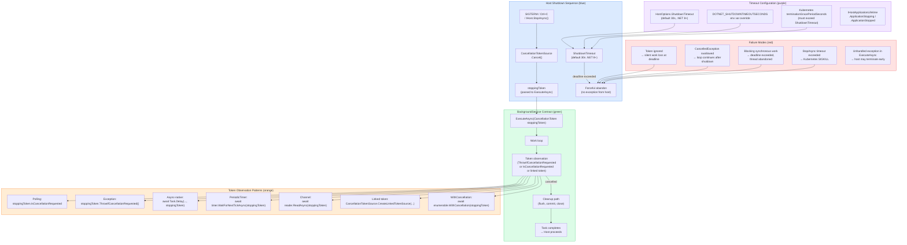

# 4.237 — Graceful Shutdown in Background Services: CancellationToken Contract

---

## PART 0 — Navigation & Context

### Domain Hierarchy

```
ASP.NET Core Mastery
│
├── A. Host & Application Lifecycle
│   ├── 4.004 — Generic Host (IHost)
│   └── 4.010 — Graceful Shutdown: CancellationToken Propagation  ◄── prerequisite
│
├── ...
│
└── R. Background Services  ◄── YOU ARE HERE
    │
    ├── 4.231 — IHostedService: Startup and Shutdown Lifecycle
    ├── 4.232 — BackgroundService: The Base Class for Long-Running Work
    ├── 4.233 — Timed Background Service: PeriodicTimer
    ├── 4.234 — Queued Background Tasks: Channel<T> Producer/Consumer
    ├── 4.235 — Scoped Services in BackgroundService
    ├── 4.236 — Worker Services: Standalone Console Host
    ├── 4.237 — Graceful Shutdown: CancellationToken Contract  ◄── THIS NOTE
    ├── 4.238 — Hangfire Integration
    └── 4.239 — Health Checks for Background Services
```

### What You Need Before This

- **[[4.232 — BackgroundService: The Base Class for Long-Running Work]]** — `ExecuteAsync` is the method that receives the `stoppingToken`; you must understand how `BackgroundService` wraps `IHostedService.StopAsync` before this topic makes sense
- **[[4.004 — Generic Host (IHost): Configuration and Application Lifecycle]]** — the Generic Host owns the `CancellationTokenSource` that drives shutdown; understanding host lifecycle explains where the cancellation signal originates
- **[[4.010 — Graceful Shutdown: CancellationToken Propagation and Drain Time]]** — the host-level drain timeout (`ShutdownTimeout`) sets the outer deadline that all background services must complete within
- **[[4.035 — Service Lifetimes: Singleton, Scoped, Transient — Rules and Pitfalls]]** — `BackgroundService` is Singleton; understanding why this matters for resources held across shutdown is prerequisite

### What This Unlocks After

- **[[4.239 — Health Checks for Background Services]]** — a service that handles shutdown correctly can signal liveness accurately; a service that ignores cancellation looks alive when it's dying
- **[[4.325 — Readiness vs Liveness Probes: Kubernetes Health Check Mapping]]** — Kubernetes sends SIGTERM before terminating a pod; graceful shutdown is the mechanism that makes rolling deploys safe
- **[[4.233 — Timed Background Service: PeriodicTimer]]** — `PeriodicTimer` integrates with `CancellationToken` directly; correct cancellation handling here depends on this note
- **[[4.234 — Queued Background Tasks: Channel<T>-Based Producer/Consumer]]** — draining a channel on shutdown is a direct application of the contract described here

### Why This Matters at Scale

In Kubernetes rolling deployments, every pod replacement sends a SIGTERM that triggers the Generic Host's shutdown sequence — background services that ignore `CancellationToken`, hold database connections, or block the shutdown thread cause **rolling deploy stalls, in-flight work loss, and Kubernetes forceful SIGKILL after the termination grace period expires**, which in turn causes data corruption in payment processors, inventory systems, and message consumers.

---

## PART 1 — The Core Mental Model

### The Fundamental Rule

> **The Generic Host cancels the `stoppingToken` passed to `BackgroundService.ExecuteAsync` when `IHost.StopAsync` is called, then waits up to `HostOptions.ShutdownTimeout` (default 30 seconds, .NET 8+: 30s; .NET 5/6: 5s) for `ExecuteAsync` to return before forcibly abandoning it — any work not completed before that deadline is lost, with no exception and no error log from the framework. The practical consequence is: if your background service does not observe the token, the host will appear to shut down successfully while your in-flight work is silently discarded.**

### The Plain-Language Analogy

Think of a background service as a night-shift worker on an assembly line. The host is the factory manager. At closing time, the manager flips the "shutdown" switch (cancels the token) — this is not a command to stop immediately, it's a courtesy signal that says "wrap up what you're doing, the factory closes in 30 seconds." A well-trained worker finishes the current unit, puts down their tools, and walks out the door. A poorly-trained worker ignores the switch and keeps building — when 30 seconds expire, the manager cuts the power regardless, leaving the half-assembled unit on the floor (data corruption / lost work).

The analogy holds under pressure: if the worker is in the middle of writing to a database when the power cuts (SIGKILL), the transaction is rolled back by the database — but uncommitted in-memory state (the unit on the floor) is gone. If the factory has 10 workers (10 background services), they all receive the same shutdown signal simultaneously and the 30-second clock runs for all of them in parallel — a single slow worker delays the entire shutdown. The `PeriodicTimer` is a worker who checks the switch between each unit rather than during one — they can be interrupted cleanly between tasks but not in the middle of one.

### The Taxonomy Diagram



---

## PART 2 — Deep Mechanics

### 2.1 — The Host Shutdown Sequence: What the Framework Actually Does

Background services don't live inside the HTTP pipeline — they run alongside it. The shutdown sequence is host-level, not middleware-level. Understanding what the host does before and after cancellation is critical.

**Pipeline / Lifecycle Position:**

```
Application Start
──► IHost.StartAsync()
    ├── IHostedService.StartAsync() for each registered service (in registration order)
    │   └── BackgroundService.StartAsync() → fires ExecuteAsync on a background Task
    └── Host starts processing HTTP requests (Kestrel starts)

Application Running
──► ExecuteAsync() running concurrently with HTTP pipeline

SIGTERM / Ctrl+C / IHost.StopAsync() called
──► IHostApplicationLifetime.ApplicationStopping.Cancel()    ← first signal (informational)
──► HTTP pipeline: Kestrel stops accepting NEW connections    ← in-flight HTTP requests drain
──► IHostedService.StopAsync() called for each service (in REVERSE registration order)
    └── BackgroundService.StopAsync():
        ├── Cancels the stoppingToken (CancellationTokenSource.Cancel())
        ├── Awaits _executeTask (the Task returned by ExecuteAsync)
        └── If _executeTask does not complete within ShutdownTimeout → logs warning + returns
──► IHostApplicationLifetime.ApplicationStopped.Cancel()     ← shutdown complete signal
──► Process exits
```

**Framework Source Behavior (approximate — `BackgroundService`):**

```csharp
// Microsoft.Extensions.Hosting — BackgroundService.cs (approximate):
public abstract class BackgroundService : IHostedService, IDisposable
{
    private Task? _executeTask;
    private CancellationTokenSource? _stoppingCts;

    // Called by host at startup — fires ExecuteAsync on a background thread
    public virtual Task StartAsync(CancellationToken cancellationToken)
    {
        _stoppingCts = CancellationTokenSource.CreateLinkedTokenSource(cancellationToken);
        // ExecuteAsync is NOT awaited here — it runs as a background Task
        _executeTask = ExecuteAsync(_stoppingCts.Token);

        // If ExecuteAsync completes synchronously (e.g., returns immediately), return it directly
        // Otherwise return Task.CompletedTask — the host does not wait for ExecuteAsync here
        return _executeTask.IsCompleted ? _executeTask : Task.CompletedTask;
    }

    // Called by host at shutdown — this is where the CancellationToken gets cancelled
    public virtual async Task StopAsync(CancellationToken cancellationToken)
    {
        if (_executeTask == null) return;

        try
        {
            // Signal ExecuteAsync to stop
            _stoppingCts!.Cancel();
        }
        finally
        {
            // Wait for ExecuteAsync to complete OR for the host shutdown timeout to expire
            // The cancellationToken here is the HOST'S shutdown timeout token (30s default)
            await Task.WhenAny(_executeTask, Task.Delay(Timeout.Infinite, cancellationToken));
        }
    }

    // Implement this in your derived class
    protected abstract Task ExecuteAsync(CancellationToken stoppingToken);
}
```

**The Critical Non-Obvious Detail:** `StopAsync` receives its OWN `CancellationToken` — this is the host's shutdown timeout token, separate from `stoppingToken`. When the shutdown timeout expires, `StopAsync` returns (cancellation from the host's timeout fires `Task.Delay`'s token). The `_executeTask` is NOT awaited to completion — it is abandoned in-flight. **No exception is thrown. The host does not log an error.** The work is simply gone.

**Runtime Cost:** Cancellation signal itself: `O(1)`, ~0 allocations (cancelling a `CancellationTokenSource` is a linked-list walk of callbacks). Waiting for `ExecuteAsync`: zero CPU — the host is blocked on `Task.WhenAny`. The cost is entirely in what your `ExecuteAsync` does during the shutdown window.

---

### 2.2 — The ShutdownTimeout: Configuring the Deadline

The default shutdown timeout changed between .NET versions — this is an interview-ready fact:

```
.NET 5, 6:   ShutdownTimeout = 5 seconds   ← dangerously short
.NET 7, 8+:  ShutdownTimeout = 30 seconds  ← much more practical
```

**Configuring the timeout:**

```csharp
// Option 1: HostOptions in Program.cs
builder.Services.Configure<HostOptions>(options =>
{
    // Set to 60 seconds for services that need to drain a long-running queue
    options.ShutdownTimeout = TimeSpan.FromSeconds(60);
});

// Option 2: Environment variable (useful for Kubernetes without code change)
// DOTNET_SHUTDOWNTIMEOUTSECONDS=60

// Option 3: Via appsettings.json (only works with custom provider)
// HostOptions does not natively bind from configuration — use Configure<HostOptions> above

// Runtime Cost: configuration read once at startup — zero runtime overhead
```

**Kubernetes Alignment — the critical production rule:**

```
Kubernetes terminationGracePeriodSeconds (pod spec)
    MUST be > DOTNET_SHUTDOWNTIMEOUTSECONDS + buffer (5-10s)

Why:
  K8s sends SIGTERM → waits terminationGracePeriodSeconds → sends SIGKILL
  ASP.NET Core receives SIGTERM → runs ShutdownTimeout → host exits

  If K8s SIGKILL fires BEFORE host exits:
  → Process is killed mid-cleanup regardless of CancellationToken handling
  → Data loss even in a correctly-written background service

Example:
  ShutdownTimeout = 30s  →  terminationGracePeriodSeconds = 45 (30 + 15s buffer)
```

**HTTP Wire Effect (Kubernetes rolling deploy):**

```
// New pod starts (readiness probe passes) →
// K8s removes old pod from Service endpoints (no new HTTP requests routed to it) →
// K8s sends SIGTERM to old pod →
// Old pod: Kestrel stops accepting, background services get stoppingToken cancelled →
// Old pod: background services drain work (up to ShutdownTimeout) →
// Old pod exits cleanly →
// K8s confirms old pod terminated

// HTTP consequence: zero-downtime deploy when timed correctly
// Bad consequence: if ShutdownTimeout > terminationGracePeriodSeconds,
//                 K8s kills the pod, in-flight DB writes are rolled back,
//                 message consumer loses its current batch
```

---

### 2.3 — Token Observation Patterns: How to Actually Respond to Cancellation

The most common bug is a background service that never inspects the token. Here are all production-correct patterns with their cost characteristics.

**Pattern A — Polling (explicit check in loop):**

```csharp
// Cost: checked once per loop iteration, O(1), ~0 allocations
protected override async Task ExecuteAsync(CancellationToken stoppingToken)
{
    while (!stoppingToken.IsCancellationRequested)
    {
        await DoWorkAsync();
        // ⚠️ If DoWorkAsync() takes 5 minutes and never checks stoppingToken,
        // this loop never checks until DoWorkAsync returns — fine for short work units
    }
    // Cleanup after loop exits
    await FlushAsync();
}
```

**Pattern B — Exception-based (ThrowIfCancellationRequested):**

```csharp
// Cost: O(1) check, throws OperationCanceledException — BackgroundService catches it
// NOTE: BackgroundService.ExecuteAsync catching OperationCanceledException is correct behavior
protected override async Task ExecuteAsync(CancellationToken stoppingToken)
{
    while (true)
    {
        stoppingToken.ThrowIfCancellationRequested();
        await DoWorkAsync(stoppingToken);
    }
}
// OperationCanceledException propagates to BackgroundService's _executeTask
// BackgroundService.StopAsync awaits _executeTask — a cancelled Task is a completed Task
// The host does NOT treat OperationCanceledException from ExecuteAsync as a crash
```

**Pattern C — Async-native (pass token to awaitable operations):**

```csharp
// BEST PRACTICE: Thread the stoppingToken through every awaitable
// Cost: token observation is zero-overhead for most operations (checked at await boundaries)
protected override async Task ExecuteAsync(CancellationToken stoppingToken)
{
    while (!stoppingToken.IsCancellationRequested)
    {
        // All awaits receive the token — cancellation unblocks immediately
        var message = await _channel.Reader.ReadAsync(stoppingToken);
        await ProcessMessageAsync(message, stoppingToken);
        await _dbContext.SaveChangesAsync(stoppingToken);
    }
}
// When stoppingToken is cancelled:
// → ReadAsync throws OperationCanceledException → loop exits → method returns
// Cost: zero extra allocations vs not using cancellation
```

**Pattern D — PeriodicTimer (.NET 6+, preferred for recurring work):**

```csharp
// PeriodicTimer.WaitForNextTickAsync accepts CancellationToken directly
// Cost: ~0 allocations per tick, no Timer callback allocation overhead
protected override async Task ExecuteAsync(CancellationToken stoppingToken)
{
    using var timer = new PeriodicTimer(TimeSpan.FromSeconds(30));

    // WaitForNextTickAsync returns false (not exception) when cancelled
    // This is the cleanest pattern for recurring background work
    while (await timer.WaitForNextTickAsync(stoppingToken))
    {
        try
        {
            await ProcessInventoryBatchAsync(stoppingToken);
        }
        catch (Exception ex) when (ex is not OperationCanceledException)
        {
            _logger.LogError(ex, "Inventory batch processing failed");
            // Continue loop — don't let one bad batch kill the service
        }
    }
    // Method falls through cleanly when stoppingToken fires — no exception needed
}
```

**Pattern E — Linked CancellationTokenSource (custom per-operation timeout):**

```csharp
// When you need a per-operation timeout AND response to host shutdown
// Cost: ~1 CancellationTokenSource allocation per operation (pool if hot path)
protected override async Task ExecuteAsync(CancellationToken stoppingToken)
{
    while (!stoppingToken.IsCancellationRequested)
    {
        // Each payment processing call has a 10-second timeout
        // BUT also responds to host shutdown immediately
        using var operationCts = CancellationTokenSource.CreateLinkedTokenSource(stoppingToken);
        operationCts.CancelAfter(TimeSpan.FromSeconds(10));

        try
        {
            await ProcessPaymentAsync(operationCts.Token);
        }
        catch (OperationCanceledException) when (stoppingToken.IsCancellationRequested)
        {
            // Host is shutting down — clean exit
            break;
        }
        catch (OperationCanceledException)
        {
            // Per-operation timeout — log and continue
            _logger.LogWarning("Payment processing timed out — retrying next cycle");
        }
    }
}
```

**Failure Mode — What happens when you ignore the token entirely:**

```csharp
// ⚠️ WRONG: Token never observed
protected override async Task ExecuteAsync(CancellationToken stoppingToken)
{
    while (true)  // infinite loop, no token check
    {
        await Task.Delay(5000);  // not passing stoppingToken
        await ProcessOrdersAsync();  // not passing stoppingToken
    }
}

// Consequence timeline:
// T=0:00  SIGTERM received
// T=0:00  stoppingToken cancelled (nobody observes it)
// T=0:00  Task.Delay(5000) continues — ignores cancellation
// T=0:30  ShutdownTimeout expires
// T=0:30  StopAsync returns (host moves on)
// T=0:30  _executeTask is abandoned — Task continues running on thread pool (!)
//         until the process exits (which the host then forces)
// T=0:30  Process exits — any in-flight ProcessOrdersAsync is abandoned mid-execution
// RESULT: silent data loss, no framework error, no warning from the host
```

---

### 2.4 — IHostApplicationLifetime: The Finer-Grained Shutdown Signals

`IHostApplicationLifetime` exposes three `CancellationToken` properties that represent different stages of shutdown. Understanding them prevents a common mistake where engineers use `ApplicationStopping` instead of `stoppingToken`.

```csharp
// ASP.NET Core internally — these are properties on IHostApplicationLifetime:
// ApplicationStarted  — fires when all IHostedService.StartAsync() have completed
// ApplicationStopping — fires when StopAsync() begins (same moment stoppingToken fires)
// ApplicationStopped  — fires when all IHostedService.StopAsync() have returned

// Injecting into a background service:
public class OrderProcessingService : BackgroundService
{
    private readonly IHostApplicationLifetime _lifetime;

    public OrderProcessingService(IHostApplicationLifetime lifetime)
    {
        _lifetime = lifetime;
    }

    protected override async Task ExecuteAsync(CancellationToken stoppingToken)
    {
        // Wait until the host is fully started before doing work
        // Avoids processing before DI, DB connections, etc. are ready
        await Task.Delay(Timeout.Infinite, _lifetime.ApplicationStarted);

        // Now process work using stoppingToken (not ApplicationStopping)
        while (!stoppingToken.IsCancellationRequested)
        {
            await ProcessNextOrderAsync(stoppingToken);
        }

        // ApplicationStopped fires AFTER this method returns + StopAsync completes
        // Don't wait for it here — you'd deadlock
    }
}
```

**Timing diagram:**

```
IHost.StartAsync()
│
├── RegisteredService1.StartAsync() → fires ExecuteAsync1
├── RegisteredService2.StartAsync() → fires ExecuteAsync2
│
└── ApplicationStarted.Cancel() ← fires HERE (all StartAsync complete)

[Application running...]

IHost.StopAsync()
│
├── ApplicationStopping.Cancel() ← fires HERE (same as stoppingToken)
├── RegisteredService2.StopAsync() → stoppingToken2.Cancel() → await _executeTask2
├── RegisteredService1.StopAsync() → stoppingToken1.Cancel() → await _executeTask1
│                                   (REVERSE registration order)
└── ApplicationStopped.Cancel() ← fires HERE (all StopAsync complete)
```

**The `ApplicationStopping` vs `stoppingToken` distinction:**

`_lifetime.ApplicationStopping` and the `stoppingToken` passed to `ExecuteAsync` are fired at essentially the same time — both are triggered when the host begins shutdown. However, use `stoppingToken` inside `ExecuteAsync`, not `_lifetime.ApplicationStopping`. The `stoppingToken` is correctly linked to the host's `StopAsync` timeout semantics and is the idiomatic contract. `ApplicationStopping` is for non-BackgroundService components (e.g., singletons) that need to hook shutdown without being `IHostedService`.

---

### 2.5 — Unhandled Exceptions in ExecuteAsync: The Other Shutdown Trigger

An unhandled exception in `ExecuteAsync` (not `OperationCanceledException`) causes the host to initiate shutdown. This is intentional — a crashed background service should bring down the process so the container orchestrator can restart it.

**Framework Source Behavior (approximate — `BackgroundService` + host):**

```csharp
// When ExecuteAsync throws (not OperationCanceledException):
// The _executeTask faults → BackgroundService does NOT catch it
// The GenericHost observes the faulted Task via _executeTask
// In .NET 6+: BackgroundService.ExecuteAsync faults → host logs the exception
//             and calls IHost.StopAsync() → initiates graceful shutdown of all other services

// In practice:
// builder.Services.Configure<HostOptions>(o =>
// {
//     o.BackgroundServiceExceptionBehavior = BackgroundServiceExceptionBehavior.Ignore;
//     // Default: StopHost — unhandled exception stops the entire host
//     // Ignore: logs the error but keeps host running (dangerous — service is dead silently)
// });
```

**Production rule:** Keep `BackgroundServiceExceptionBehavior.StopHost` (the default). When a background service crashes, you WANT the host to restart (Kubernetes will restart the pod). Setting `Ignore` means your service is dead but the process looks alive — health checks stop reporting correctly, orders stop being processed, and you get paged at 3am when someone notices.

**Runtime Cost:** Exception allocation is expensive (`~1 Exception` object + stack trace capture, `~1-5ms`). This is irrelevant for shutdown paths but matters for retry loops — never use exceptions for flow control in high-frequency work loops.

---

## PART 3 — Production Code Patterns

### Pattern 1: The Inventory Sync Worker — Correct Token Threading

Domain: E-commerce inventory service — background worker polls warehouse API every 30 seconds and syncs to database.

```csharp
// ⚠️ WRONG: Token not threaded through — shutdown takes up to 30s + API call time
public class InventorySyncWorker : BackgroundService
{
    protected override async Task ExecuteAsync(CancellationToken stoppingToken)
    {
        while (!stoppingToken.IsCancellationRequested)
        {
            await Task.Delay(30_000);  // ⚠️ Ignores cancellation — blocks full 30s on shutdown
            var items = await _warehouseApi.GetInventoryAsync();  // ⚠️ No token — call runs to completion
            await _db.BulkUpsertAsync(items);  // ⚠️ No token — DB write runs to completion
        }
    }
}

// ✅ CORRECT: PeriodicTimer + full token threading
public class InventorySyncWorker : BackgroundService
{
    private readonly IWarehouseApiClient _warehouseApi;
    private readonly IInventoryRepository _inventory;
    private readonly ILogger<InventorySyncWorker> _logger;

    public InventorySyncWorker(
        IWarehouseApiClient warehouseApi,
        IInventoryRepository inventory,
        ILogger<InventorySyncWorker> logger)
    {
        _warehouseApi = warehouseApi;
        _inventory = inventory;
        _logger = logger;
    }

    protected override async Task ExecuteAsync(CancellationToken stoppingToken)
    {
        _logger.LogInformation("Inventory sync worker starting");

        using var timer = new PeriodicTimer(TimeSpan.FromSeconds(30));

        // WaitForNextTickAsync returns false when stoppingToken fires — no exception
        while (await timer.WaitForNextTickAsync(stoppingToken))
        {
            try
            {
                await SyncInventoryAsync(stoppingToken);
            }
            catch (OperationCanceledException)
            {
                // stoppingToken was cancelled mid-sync — let loop condition handle exit
                // (WaitForNextTickAsync will return false next iteration)
                _logger.LogInformation("Inventory sync interrupted by shutdown signal");
                break;
            }
            catch (Exception ex)
            {
                // API or DB failure — log and continue to next tick, don't crash the service
                _logger.LogError(ex, "Inventory sync failed; will retry in 30 seconds");
            }
        }

        _logger.LogInformation("Inventory sync worker stopped cleanly");
    }

    private async Task SyncInventoryAsync(CancellationToken ct)
    {
        // Token threaded through every async call
        var items = await _warehouseApi.GetInventorySnapshotAsync(ct);

        if (items.Count == 0)
        {
            _logger.LogDebug("No inventory changes detected");
            return;
        }

        await _inventory.BulkUpsertAsync(items, ct);
        _logger.LogInformation("Synced {Count} inventory items", items.Count);
    }
}

// Shutdown consequence (correct path):
// SIGTERM → stoppingToken cancelled
// → timer.WaitForNextTickAsync(stoppingToken) returns false
// → while loop exits
// → "Inventory sync worker stopped cleanly" logged
// → ExecuteAsync returns → StopAsync completes → host exits
// Total shutdown time: < 1ms if between ticks, up to current operation duration if mid-sync
```

---

### Pattern 2: The Payment Processor — Draining In-Flight Work Before Shutdown

Domain: Payment gateway — background consumer processes payment authorizations from a Channel; must drain current batch before shutdown, must NOT process new ones.

```csharp
public class PaymentAuthorizationProcessor : BackgroundService
{
    private readonly ChannelReader<PaymentAuthRequest> _queue;
    private readonly IPaymentGateway _gateway;
    private readonly ILogger<PaymentAuthorizationProcessor> _logger;

    // Injected via IOptions from DI — the Channel is registered as Singleton
    public PaymentAuthorizationProcessor(
        Channel<PaymentAuthRequest> channel,
        IPaymentGateway gateway,
        ILogger<PaymentAuthorizationProcessor> logger)
    {
        _queue = channel.Reader;
        _gateway = gateway;
        _logger = logger;
    }

    protected override async Task ExecuteAsync(CancellationToken stoppingToken)
    {
        _logger.LogInformation("Payment processor starting");

        // ReadAllAsync streams items until channel is completed OR token cancelled
        // When stoppingToken fires: the enumeration throws OperationCanceledException
        // which exits the await foreach loop
        await foreach (var request in _queue.ReadAllAsync(stoppingToken))
        {
            try
            {
                // Individual payment processing has its own timeout (separate from shutdown)
                using var paymentCts = CancellationTokenSource.CreateLinkedTokenSource(stoppingToken);
                paymentCts.CancelAfter(TimeSpan.FromSeconds(15)); // per-payment timeout

                var result = await _gateway.AuthorizeAsync(request, paymentCts.Token);

                if (result.Success)
                    _logger.LogInformation("Authorized payment {PaymentId}", request.PaymentId);
                else
                    _logger.LogWarning("Payment {PaymentId} declined: {Reason}",
                        request.PaymentId, result.DeclineReason);
            }
            catch (OperationCanceledException) when (stoppingToken.IsCancellationRequested)
            {
                // Host shutting down — current payment is being abandoned
                // In production: push request back to a durable queue (e.g., Service Bus)
                // or rely on idempotency key re-processing on next startup
                _logger.LogWarning(
                    "Payment {PaymentId} interrupted by shutdown — will be reprocessed",
                    request.PaymentId);
                break;
            }
            catch (OperationCanceledException)
            {
                // Per-payment timeout — log and continue to next item
                _logger.LogWarning("Payment {PaymentId} timed out — skipping",
                    request.PaymentId);
            }
            catch (Exception ex)
            {
                _logger.LogError(ex, "Payment {PaymentId} failed unexpectedly",
                    request.PaymentId);
                // Don't rethrow — would crash the service and stop ALL payment processing
            }
        }

        _logger.LogInformation("Payment processor drained and stopped");
    }
}

// Shutdown sequence:
// SIGTERM → stoppingToken cancelled
// → ReadAllAsync(stoppingToken) throws OperationCanceledException on next iteration
// → catch block logs warning, breaks out of loop
// → ExecuteAsync returns → host exits
// In-flight payment: if caught mid-await, the OperationCanceledException is caught and logged
// The payment must be designed for at-least-once delivery with idempotency keys
```

---

### Pattern 3: The Shipment Tracker — Correct Exception Boundary with BackgroundServiceExceptionBehavior

Domain: Logistics service — background service polls carrier APIs; crashes should restart the pod, not silently die.

```csharp
// Program.cs
builder.Services.Configure<HostOptions>(options =>
{
    // Default is StopHost — crash in ExecuteAsync triggers host shutdown + pod restart
    // ✅ Keep default for production
    options.BackgroundServiceExceptionBehavior = BackgroundServiceExceptionBehavior.StopHost;
    options.ShutdownTimeout = TimeSpan.FromSeconds(45); // Align with K8s grace period
});

builder.Services.AddHostedService<ShipmentTrackerService>();

// ShipmentTrackerService.cs
public class ShipmentTrackerService : BackgroundService
{
    private readonly ICarrierApiClient _carrier;
    private readonly IShipmentRepository _shipments;
    private readonly ILogger<ShipmentTrackerService> _logger;

    public ShipmentTrackerService(
        ICarrierApiClient carrier,
        IShipmentRepository shipments,
        ILogger<ShipmentTrackerService> logger)
    {
        _carrier = carrier;
        _shipments = shipments;
        _logger = logger;
    }

    protected override async Task ExecuteAsync(CancellationToken stoppingToken)
    {
        using var timer = new PeriodicTimer(TimeSpan.FromMinutes(2));

        while (await timer.WaitForNextTickAsync(stoppingToken))
        {
            // Don't catch Exception broadly here — let fatal errors (OOM, config errors)
            // propagate and crash the service (triggering host shutdown + pod restart)
            // Only catch expected transient failures
            try
            {
                await TrackActiveShipmentsAsync(stoppingToken);
            }
            catch (HttpRequestException ex)
            {
                // Transient network failure — log and retry next tick
                _logger.LogWarning(ex, "Carrier API unreachable; will retry in 2 minutes");
            }
            catch (OperationCanceledException) when (stoppingToken.IsCancellationRequested)
            {
                _logger.LogInformation("Shipment tracker shutting down");
                break;
            }
            // All other exceptions (DbException, InvalidOperationException, etc.)
            // propagate up to BackgroundService → host initiates shutdown → pod restarts
        }
    }

    private async Task TrackActiveShipmentsAsync(CancellationToken ct)
    {
        var activeShipments = await _shipments.GetActiveAsync(ct);

        // Parallel tracking with concurrency limit (don't hammer the carrier API)
        var semaphore = new SemaphoreSlim(5, 5); // max 5 concurrent carrier API calls
        var tasks = activeShipments.Select(async shipment =>
        {
            await semaphore.WaitAsync(ct);
            try
            {
                var update = await _carrier.GetTrackingUpdateAsync(shipment.TrackingNumber, ct);
                await _shipments.UpdateStatusAsync(shipment.Id, update, ct);
            }
            finally
            {
                semaphore.Release();
            }
        });

        await Task.WhenAll(tasks);
    }
}
```

---

### Pattern 4: The Report Generator — Long-Running Work with Checkpoint Pattern

Domain: Analytics service — generates daily sales reports; work takes up to 2 minutes, must checkpoint to resume after restart.

```csharp
public class SalesReportGeneratorService : BackgroundService
{
    private readonly IReportRepository _reports;
    private readonly IReportCheckpointStore _checkpoints;
    private readonly ILogger<SalesReportGeneratorService> _logger;

    public SalesReportGeneratorService(
        IReportRepository reports,
        IReportCheckpointStore checkpoints,
        ILogger<SalesReportGeneratorService> logger)
    {
        _reports = reports;
        _checkpoints = checkpoints;
        _logger = logger;
    }

    protected override async Task ExecuteAsync(CancellationToken stoppingToken)
    {
        // Run once at midnight, then wait until next midnight
        // PeriodicTimer aligned to next midnight
        while (!stoppingToken.IsCancellationRequested)
        {
            var nextRun = GetNextMidnight();
            var delay = nextRun - DateTimeOffset.UtcNow;

            try
            {
                await Task.Delay(delay, stoppingToken);
            }
            catch (OperationCanceledException)
            {
                break; // Shutdown during wait — exit cleanly
            }

            await GenerateReportWithCheckpointAsync(stoppingToken);
        }
    }

    private async Task GenerateReportWithCheckpointAsync(CancellationToken stoppingToken)
    {
        var reportDate = DateOnly.FromDateTime(DateTime.UtcNow.AddDays(-1));

        // Load checkpoint — resume from where last run stopped (if restart occurred mid-report)
        var checkpoint = await _checkpoints.GetAsync(reportDate, stoppingToken)
                         ?? new ReportCheckpoint(reportDate, processedRegions: new List<string>());

        var regions = await _reports.GetRegionsAsync(stoppingToken);

        foreach (var region in regions)
        {
            // Check cancellation at region boundary — safe checkpoint point
            if (stoppingToken.IsCancellationRequested)
            {
                // Save checkpoint before exiting — next startup resumes from here
                await _checkpoints.SaveAsync(checkpoint, CancellationToken.None);
                // ⚠️ NOTE: pass CancellationToken.None here — we WANT this save to complete
                // even though stoppingToken is cancelled. This is one of the few valid uses
                // of CancellationToken.None in a shutdown path.
                _logger.LogInformation(
                    "Report generation interrupted at region {Region}; checkpoint saved",
                    region);
                break;
            }

            if (checkpoint.ProcessedRegions.Contains(region))
            {
                _logger.LogDebug("Region {Region} already processed; skipping", region);
                continue;
            }

            await _reports.GenerateRegionReportAsync(reportDate, region, stoppingToken);
            checkpoint.ProcessedRegions.Add(region);

            // Save checkpoint after each region — granular recovery
            await _checkpoints.SaveAsync(checkpoint, stoppingToken);
            _logger.LogInformation("Completed report for region {Region}", region);
        }

        // All regions done — clear checkpoint
        await _checkpoints.DeleteAsync(reportDate, CancellationToken.None);
        _logger.LogInformation("Sales report for {Date} completed", reportDate);
    }

    private static DateTimeOffset GetNextMidnight() =>
        DateTimeOffset.UtcNow.Date.AddDays(1).ToUniversalTime();
}
```

> [!IMPORTANT] **The `CancellationToken.None` Rule for Cleanup:** In shutdown paths, pass `CancellationToken.None` to operations that MUST complete even during shutdown — final checkpointing, flushing buffers to durable storage, closing external connections cleanly. These are the "put down your tools" operations. If you pass `stoppingToken` to them, they may be cancelled before completing, defeating the purpose of graceful shutdown.

---

### Pattern 5: The Outbox Processor — Awaiting the Host Started Signal

Domain: Order service with transactional outbox — background processor must not start before the DB migration IHostedService completes.

```csharp
public class OutboxMessageProcessor : BackgroundService
{
    private readonly IHostApplicationLifetime _lifetime;
    private readonly IOutboxRepository _outbox;
    private readonly IMessageBus _bus;
    private readonly ILogger<OutboxMessageProcessor> _logger;

    public OutboxMessageProcessor(
        IHostApplicationLifetime lifetime,
        IOutboxRepository outbox,
        IMessageBus bus,
        ILogger<OutboxMessageProcessor> logger)
    {
        _lifetime = lifetime;
        _outbox = outbox;
        _bus = bus;
        _logger = logger;
    }

    protected override async Task ExecuteAsync(CancellationToken stoppingToken)
    {
        // Wait for all IHostedServices (including DB migration service) to complete StartAsync
        // This prevents processing before the DB schema is ready
        // Use a linked token so we also respond to early shutdown
        using var startupCts = CancellationTokenSource.CreateLinkedTokenSource(
            _lifetime.ApplicationStarted,
            stoppingToken);

        try
        {
            // Wait indefinitely for ApplicationStarted, but cancel if shutdown fires
            await Task.Delay(Timeout.Infinite, startupCts.Token);
        }
        catch (OperationCanceledException) when (stoppingToken.IsCancellationRequested)
        {
            // Shutdown before startup completed — exit cleanly
            return;
        }
        catch (OperationCanceledException)
        {
            // ApplicationStarted fired — proceed with processing
        }

        _logger.LogInformation("Outbox processor started — host fully initialized");

        using var timer = new PeriodicTimer(TimeSpan.FromSeconds(5));

        while (await timer.WaitForNextTickAsync(stoppingToken))
        {
            try
            {
                var messages = await _outbox.GetUnpublishedAsync(batchSize: 50, stoppingToken);

                foreach (var message in messages)
                {
                    if (stoppingToken.IsCancellationRequested) break;

                    await _bus.PublishAsync(message, stoppingToken);
                    await _outbox.MarkPublishedAsync(message.Id, CancellationToken.None);
                    // CancellationToken.None: mark as published MUST succeed even during shutdown
                    // to prevent double-publishing on next startup (idempotency)
                }
            }
            catch (OperationCanceledException) when (stoppingToken.IsCancellationRequested)
            {
                break;
            }
            catch (Exception ex)
            {
                _logger.LogError(ex, "Outbox processing failed; retrying in 5 seconds");
            }
        }

        _logger.LogInformation("Outbox processor stopped");
    }
}
```

---

### Pattern 6: The Graceful Shutdown with External Resource Cleanup

Domain: Healthcare data pipeline — background service holds an SFTP connection to a hospital's file server; must close cleanly to release the server-side session.

```csharp
public class HospitalDataIngestionService : BackgroundService
{
    private readonly ISftpClientFactory _sftpFactory;
    private readonly IPatientDataRepository _patientData;
    private readonly ILogger<HospitalDataIngestionService> _logger;

    public HospitalDataIngestionService(
        ISftpClientFactory sftpFactory,
        IPatientDataRepository patientData,
        ILogger<HospitalDataIngestionService> logger)
    {
        _sftpFactory = sftpFactory;
        _patientData = patientData;
        _logger = logger;
    }

    protected override async Task ExecuteAsync(CancellationToken stoppingToken)
    {
        // External resource (SFTP connection) must be cleaned up on shutdown
        // Using statement ensures Dispose() is called even if exception occurs
        await using var sftpClient = await _sftpFactory.CreateAsync(stoppingToken);

        _logger.LogInformation("SFTP connection established to hospital file server");

        using var timer = new PeriodicTimer(TimeSpan.FromMinutes(15));

        try
        {
            while (await timer.WaitForNextTickAsync(stoppingToken))
            {
                await IngestNewFilesAsync(sftpClient, stoppingToken);
            }
        }
        finally
        {
            // Runs regardless of shutdown reason — token cancelled, exception, or clean exit
            // Closes SFTP session cleanly (server releases the connection slot)
            _logger.LogInformation("Closing SFTP connection to hospital file server");
            // The 'await using' above also handles this, but explicit log shows intent
        }

        _logger.LogInformation("Hospital data ingestion service stopped");
    }

    private async Task IngestNewFilesAsync(ISftpClient client, CancellationToken ct)
    {
        var files = await client.ListNewFilesAsync(ct);

        foreach (var file in files)
        {
            ct.ThrowIfCancellationRequested(); // Check before each file

            await using var stream = await client.OpenAsync(file.Path, ct);
            var records = await ParseHl7Async(stream, ct);
            await _patientData.BulkInsertAsync(records, CancellationToken.None);
            // CancellationToken.None: committed records must be marked ingested
            // even if shutdown fires mid-batch (prevents re-ingestion of same records)
            await client.MoveToProcessedAsync(file.Path, ct);
        }
    }
}
```

---

## PART 4 — Gotchas & Anti-Patterns

### Gotcha 1: Ignoring the Token in Long-Running Synchronous Sections

Engineers correctly observe the token at the loop level but then call a synchronous method that takes 60 seconds — the token is never observed during that execution, effectively making the loop-level check irrelevant for shutdown responsiveness.

```csharp
// ⚠️ WRONG CODE:
protected override async Task ExecuteAsync(CancellationToken stoppingToken)
{
    while (!stoppingToken.IsCancellationRequested)  // checked here...
    {
        // ...but this takes 45 seconds and doesn't observe the token at all
        var report = GenerateLargeReport(); // synchronous, CPU-bound, 45 seconds
        await _storage.UploadAsync(report, stoppingToken);
    }
}

// HTTP consequence (wrong path):
// SIGTERM → stoppingToken cancelled
// while check: not cancelled yet at the start of this iteration
// GenerateLargeReport() starts → 45 seconds of sync CPU work
// ShutdownTimeout (30s) expires at T=30s
// Host forcibly abandons ExecuteAsync → report generation is killed mid-computation
// Partial report data may be written to storage → corrupted output
// Next startup: service starts fresh, no checkpoint → full recompute

// ✅ CORRECT CODE: Thread the token into CPU-bound work via chunking
protected override async Task ExecuteAsync(CancellationToken stoppingToken)
{
    while (!stoppingToken.IsCancellationRequested)
    {
        // Break CPU-bound work into checkpointable chunks
        // Each chunk checks cancellation between iterations
        await foreach (var chunk in GetReportChunksAsync(stoppingToken))
        {
            stoppingToken.ThrowIfCancellationRequested();
            ProcessChunk(chunk);
            await _checkpoint.SaveAsync(chunk.Id, stoppingToken);
        }

        var report = await _assembler.AssembleAsync(stoppingToken);
        await _storage.UploadAsync(report, stoppingToken);
    }
}

// HTTP consequence (correct path):
// SIGTERM → stoppingToken cancelled → ThrowIfCancellationRequested() fires between chunks
// → OperationCanceledException → method exits → StopAsync completes within timeout
// Checkpoint saved → next startup resumes from last chunk
```

**WHY:** `CancellationToken` is cooperative — the framework cannot forcibly interrupt synchronous CPU work. You must explicitly check the token at regular intervals within long-running synchronous sections. The maximum responsive shutdown time equals the longest uninterrupted synchronous section.

---

### Gotcha 2: Swallowing OperationCanceledException and Continuing

Engineers add broad exception catches to make background services "resilient" but accidentally swallow the cancellation exception, causing the service to loop forever after shutdown is requested.

```csharp
// ⚠️ WRONG CODE:
protected override async Task ExecuteAsync(CancellationToken stoppingToken)
{
    while (true)
    {
        try
        {
            await ProcessOrdersAsync(stoppingToken);
        }
        catch (Exception ex) // ⚠️ catches OperationCanceledException too!
        {
            _logger.LogError(ex, "Error processing orders");
            await Task.Delay(5000); // ⚠️ also doesn't pass stoppingToken
            // loop continues — service never exits
        }
    }
}

// HTTP consequence (wrong path):
// SIGTERM → stoppingToken cancelled
// ProcessOrdersAsync throws OperationCanceledException
// catch (Exception) catches it → logs it as an "error" (misleading)
// Task.Delay(5000) — no token → blocks for 5 seconds
// Loop iteration: ProcessOrdersAsync throws again → same pattern
// ShutdownTimeout expires → host forcibly abandons → pod exits uncleanly
// K8s logs: "container terminated with exit code 137" (SIGKILL)

// ✅ CORRECT CODE:
protected override async Task ExecuteAsync(CancellationToken stoppingToken)
{
    while (!stoppingToken.IsCancellationRequested)
    {
        try
        {
            await ProcessOrdersAsync(stoppingToken);
        }
        catch (OperationCanceledException) when (stoppingToken.IsCancellationRequested)
        {
            // Shutdown requested — exit the loop cleanly (don't log as error)
            break;
        }
        catch (Exception ex)
        {
            // Genuine error — log it, wait, and retry
            _logger.LogError(ex, "Error processing orders; retrying in 5 seconds");
            try
            {
                await Task.Delay(5000, stoppingToken); // ✅ pass token to delay too
            }
            catch (OperationCanceledException)
            {
                break; // Shutdown during retry wait
            }
        }
    }
}

// HTTP consequence (correct path):
// SIGTERM → stoppingToken cancelled
// ProcessOrdersAsync throws OperationCanceledException
// catch (OperationCanceledException) when (stoppingToken.IsCancellationRequested) matches
// break → while loop exits → ExecuteAsync returns cleanly
// Host: StopAsync completes → clean shutdown
```

**WHY:** `OperationCanceledException` is the standard .NET signal for cooperative cancellation. Catching `Exception` without re-checking `stoppingToken.IsCancellationRequested` defeats the entire cancellation contract. Always filter using the `when` clause.

---

### Gotcha 3: ShutdownTimeout Mismatch with Kubernetes terminationGracePeriodSeconds

Engineers configure `ShutdownTimeout = 60s` in code but leave Kubernetes `terminationGracePeriodSeconds` at its default 30 seconds — Kubernetes SIGKILLs the pod before the .NET host finishes draining.

```csharp
// ⚠️ WRONG:
// Program.cs:
builder.Services.Configure<HostOptions>(o => o.ShutdownTimeout = TimeSpan.FromSeconds(60));

// k8s deployment.yaml:
// spec:
//   template:
//     spec:
//       terminationGracePeriodSeconds: 30  ← 30s < 60s .NET timeout
//       containers:
//         - name: order-processor

// HTTP consequence (wrong path):
// T=0:   K8s sends SIGTERM
// T=0:   .NET receives SIGTERM → starts 60s shutdown timeout
// T=0:   stoppingToken cancelled
// T=30:  K8s terminationGracePeriodSeconds expires → K8s sends SIGKILL
// T=30:  Process killed (exit code 137) regardless of .NET shutdown state
// Result: background service killed mid-drain even though it's correctly observing the token
// No error in .NET logs (killed before writing) — only K8s event log shows SIGKILL

// ✅ CORRECT: Align K8s grace period > .NET ShutdownTimeout + buffer
// Program.cs:
builder.Services.Configure<HostOptions>(o => o.ShutdownTimeout = TimeSpan.FromSeconds(45));

// k8s deployment.yaml:
// spec:
//   template:
//     spec:
//       terminationGracePeriodSeconds: 60   ← 60s > 45s .NET timeout + buffer
//       containers:
//         - name: order-processor

// HTTP consequence (correct path):
// T=0:   K8s sends SIGTERM → .NET starts 45s drain
// T=45:  .NET drain completes → process exits (exit code 0)
// T=60:  K8s grace period expires (but process already exited at T=45)
// Result: clean shutdown, K8s records normal termination
```

**WHY:** `terminationGracePeriodSeconds` is the outer wall clock constraint. The .NET `ShutdownTimeout` must fit inside it with room to spare (Kubernetes has its own overhead, preStop hooks may run, etc.). The rule: `terminationGracePeriodSeconds ≥ ShutdownTimeout + 15s`.

---

### Gotcha 4: Passing `stoppingToken` to Operations That Must Complete During Shutdown

Engineers correctly thread `stoppingToken` everywhere, but then pass it to operations that must succeed even during shutdown (final DB writes, checkpointing, closing external connections) — those operations get cancelled and cleanup fails.

```csharp
// ⚠️ WRONG: stoppingToken passed to the commit that MUST succeed
protected override async Task ExecuteAsync(CancellationToken stoppingToken)
{
    while (!stoppingToken.IsCancellationRequested)
    {
        var batch = await _queue.DequeueBatchAsync(stoppingToken);
        await _processor.ProcessAsync(batch, stoppingToken);

        // ⚠️ If stoppingToken fires here, the commit is cancelled
        // → batch is dequeued and processed but NOT committed
        // → next restart re-processes the batch → DOUBLE PROCESSING
        await _db.CommitBatchAsync(batch.Ids, stoppingToken);
    }
}

// HTTP consequence (wrong path):
// stoppingToken cancelled between ProcessAsync and CommitBatchAsync
// CommitBatchAsync throws OperationCanceledException
// Batch dequeued, processed, but IDs NOT marked committed
// Next startup: same IDs are dequeued again → duplicate processing
// For idempotent operations: minor. For payment processing: double-charge

// ✅ CORRECT: CancellationToken.None for the commit (it MUST complete)
protected override async Task ExecuteAsync(CancellationToken stoppingToken)
{
    while (!stoppingToken.IsCancellationRequested)
    {
        var batch = await _queue.DequeueBatchAsync(stoppingToken);
        await _processor.ProcessAsync(batch, stoppingToken);

        // ✅ CancellationToken.None: this commit must succeed regardless of shutdown
        // If the process is killed before this line completes → accept the duplicate
        // but don't voluntarily cancel it
        await _db.CommitBatchAsync(batch.Ids, CancellationToken.None);
    }
}

// HTTP consequence (correct path):
// stoppingToken cancelled → current iteration's commit completes with CancellationToken.None
// Next DequeueBatchAsync(stoppingToken) throws → loop exits cleanly
// No double processing
```

**WHY:** Not every operation should be cancellation-responsive. Cleanup operations, final checkpoints, and marking records as "processed" should use `CancellationToken.None` — these are the "put down the tools cleanly" operations. The token should prevent starting new work, not interrupt the handshake that prevents data duplication.

---

### Gotcha 5: Background Service Registration Order Determines Shutdown Order (Reverse)

Engineers assume all background services stop simultaneously — but they stop in reverse registration order, with each service having the full `ShutdownTimeout` period. A slow-stopping first-registered service can exhaust the timeout before later-registered services even begin stopping.

```csharp
// ⚠️ WRONG: Registration order creates implicit dependency that's not obvious
// Program.cs:
builder.Services.AddHostedService<SlowReportGeneratorService>(); // registered first
builder.Services.AddHostedService<OutboxProcessor>();            // registered second
builder.Services.AddHostedService<InventorySyncWorker>();        // registered third

// Shutdown order (REVERSE of registration):
// 1. InventorySyncWorker.StopAsync() → awaits up to 30s
// 2. OutboxProcessor.StopAsync()     → awaits up to 30s
// 3. SlowReportGeneratorService.StopAsync() → awaits up to 30s
//
// Total possible shutdown time: 90 seconds per the above
// BUT: HostOptions.ShutdownTimeout is per StopAsync call, not total
// So the entire sequence CAN take 3× ShutdownTimeout in theory

// ✅ CORRECT: Understand the implication and design services to stop quickly
// If OutboxProcessor MUST stop before SlowReportGeneratorService:
// Register OutboxProcessor AFTER SlowReportGeneratorService (stops first in reverse order)

builder.Services.AddHostedService<OutboxProcessor>();            // registered first → stops LAST
builder.Services.AddHostedService<SlowReportGeneratorService>(); // registered second → stops FIRST

// Also: don't rely on registration order for correctness — use IHostApplicationLifetime
// ApplicationStopping token to coordinate between services if needed

// HTTP consequence (wrong path with first example):
// InventorySyncWorker stops first (good — fast)
// OutboxProcessor stops second (good — fast)
// SlowReportGeneratorService stops last — takes 25s
// Total: ~26s → within 30s ShutdownTimeout individually, but close
// If K8s terminationGracePeriodSeconds = 35s, this is fine
// If K8s terminationGracePeriodSeconds = 30s → SIGKILL fires mid-report-service-shutdown
```

**WHY:** The .NET host stops `IHostedService` instances in reverse registration order, one at a time (not in parallel). Each gets up to `ShutdownTimeout` seconds. In practice, most well-written services stop quickly (< 1s). But if even one service is slow, it can cascade into timeout failures for others in a tight Kubernetes grace period.

---

## PART 5 — Performance Implications

### 5.1 Request Pipeline Characteristics Table

|Scenario|Shutdown Responsiveness|Allocations During Shutdown|Latency Impact|Recommendation|
|---|---|---|---|---|
|`PeriodicTimer.WaitForNextTickAsync(stoppingToken)` — between ticks|< 1ms|~0|None|Best pattern for periodic work|
|`PeriodicTimer.WaitForNextTickAsync(stoppingToken)` — mid-tick work|Up to 1 tick duration|~0|Up to work unit duration|Ensure work unit < ShutdownTimeout|
|`Task.Delay(interval, stoppingToken)` — between delays|< 1ms|~1 state machine|None|Fine; prefer PeriodicTimer for recurring work|
|`Channel.ReadAsync(stoppingToken)` — waiting for items|< 1ms|~0|None|Ideal — cancels immediately when queue is empty|
|`Channel.ReadAsync(stoppingToken)` — mid-processing|Up to current item processing time|Depends on work|Work unit duration|Design work units to be < 5s|
|`await foreach ReadAllAsync(stoppingToken)` — mid-iteration|At next await point in inner loop|~0|Next inner await boundary|Thread token into inner awaits|
|Synchronous CPU work (no token observation)|Up to ShutdownTimeout|0 (no allocations but blocks thread)|Blocks entire ShutdownTimeout|Chunk work with ThrowIfCancellationRequested|
|`HttpClient` call with `stoppingToken`|At HTTP call timeout or token fire|~1 cancelled Task|Cancel latency|Ensure HttpClient respects cancellation|
|Database write with `CancellationToken.None`|Runs to completion (intended)|Normal DB allocations|DB round-trip time|Required for cleanup operations|
|`CancellationTokenSource.CreateLinkedTokenSource` — per operation|< 1ms overhead per creation|~1 CTS object|Negligible|Pool if called > 10k/s|
|`stoppingToken.IsCancellationRequested` polling|< 1µs|0|Negligible|Fine in tight loops|
|`stoppingToken.ThrowIfCancellationRequested()`|< 1µs + exception overhead|~1 Exception if cancelled|Negligible except exception path|Use in checkpointable loops|

### 5.2 BenchmarkDotNet Code

```csharp
using BenchmarkDotNet.Attributes;
using BenchmarkDotNet.Running;

[MemoryDiagnoser]
[SimpleJob]
public class CancellationTokenBenchmarks
{
    private CancellationTokenSource _cts = null!;
    private CancellationToken _token;
    private CancellationToken _cancelledToken;

    [GlobalSetup]
    public void Setup()
    {
        _cts = new CancellationTokenSource();
        _token = _cts.Token; // not cancelled

        var cancelledCts = new CancellationTokenSource();
        cancelledCts.Cancel();
        _cancelledToken = cancelledCts.Token; // already cancelled
    }

    [Benchmark(Baseline = true)]
    public bool CheckIsCancellationRequested_NotCancelled()
    {
        // Cost of polling an uncancelled token — the hot path in every loop iteration
        return _token.IsCancellationRequested;
    }

    [Benchmark]
    public bool CheckIsCancellationRequested_Cancelled()
    {
        return _cancelledToken.IsCancellationRequested;
    }

    [Benchmark]
    public CancellationTokenSource CreateLinkedTokenSource()
    {
        // Cost of creating a linked CTS (per-operation timeout pattern)
        using var linked = CancellationTokenSource.CreateLinkedTokenSource(_token);
        return linked;
    }

    [Benchmark]
    public CancellationTokenSource CreateLinkedTokenSourceWithTimeout()
    {
        // The per-operation timeout pattern — create + CancelAfter
        using var linked = CancellationTokenSource.CreateLinkedTokenSource(_token);
        linked.CancelAfter(TimeSpan.FromSeconds(10));
        return linked;
    }

    [Benchmark]
    public async Task DelayWithToken()
    {
        // Cost of a cancellable delay (tight loop delay pattern)
        await Task.Delay(0, _token);
    }

    [GlobalCleanup]
    public void Cleanup() => _cts.Dispose();
}

// Expected output (approximate, .NET 8, x64, local):
// | Method                               | Mean      | Alloc  |
// |--------------------------------------|-----------|--------|
// | CheckIsCancellationRequested (false) | 0.5 ns    | 0 B    |
// | CheckIsCancellationRequested (true)  | 0.5 ns    | 0 B    |
// | CreateLinkedTokenSource              | 180 ns    | 128 B  |
// | CreateLinkedTokenSourceWithTimeout   | 320 ns    | 192 B  |
// | DelayWithToken                       | 1,200 ns  | 96 B   |
//
// Key insight: IsCancellationRequested polling is essentially free (< 1ns).
// CreateLinkedTokenSource is ~180ns — acceptable per-operation if called < 10k/s.
// Avoid per-message linked CTS in high-throughput (> 100k msg/s) consumers.

// Profiling recommendations for background services:
// dotnet-counters monitor --process-id <pid>
//   → Watch "threadpool-queue-length" — should drain to 0 during shutdown
// dotnet-trace collect --profile gc-verbose
//   → Look for GC pauses during shutdown that delay drain
// Custom metric (IHostApplicationLifetime + System.Diagnostics.Metrics):
//   → Track time from ApplicationStopping to ApplicationStopped
//   → Alert if > 25s (approaching 30s ShutdownTimeout)
```

### 5.3 When to Care / When to Ignore

**When this costs you:**

- **Kubernetes rolling deploys (any production service):** Every deploy is a shutdown event. If your background service takes 28 of the 30-second grace period to stop, your deploys are always on the edge of SIGKILL — and occasionally one slow iteration pushes it over. This causes data loss that appears random and is extremely hard to debug.
- **Message queue consumers processing large batches:** If you dequeue 1,000 messages and process them as a single unit without per-message token checks, the entire batch can be abandoned mid-flight on shutdown. Batch size × processing time must be < ShutdownTimeout.
- **Services with expensive external connections (SFTP, legacy TCP, database):** These connections must be closed cleanly. If the service is killed mid-close, the remote server holds the connection open until its own timeout expires — can exhaust connection pool limits on the server side.
- **Payment or inventory systems:** Silent work loss caused by unobserved cancellation = financial inconsistency. The cost of getting this wrong is far higher than the cost of getting it right.

**When this doesn't matter:**

- **Read-only analytics workers with idempotent processing:** A report generation worker that re-runs the full computation on restart (no checkpointing) can tolerate being interrupted — the next startup just reruns. Graceful shutdown is still best practice, but the correctness consequence of getting it wrong is just a slightly longer startup.
- **Health check background services that only write a timestamp:** If the worst case is a missed heartbeat write, the operational impact is a brief liveness probe failure — minor.
- **Development / local environments:** ShutdownTimeout rarely matters in dev — processes die immediately when you stop the debugger. This is exactly why shutdown bugs are invisible until production Kubernetes deploys.

---

## PART 6 — Interview Arsenal

### A. The Question Bank

---

**Q1: "What happens to a background service's in-flight work when the application shuts down?"**

**Average Answer:** The background service's `CancellationToken` is cancelled and the service should stop processing. If it doesn't finish in time, it might be killed.

**Why That's Insufficient:** Doesn't explain the mechanism (who cancels the token, what "killed" means at the framework level, what "in time" means), doesn't mention the silent work loss behavior, and doesn't distinguish between cooperative vs forceful shutdown.

> **Great Answer:** "When the host shuts down — triggered by SIGTERM in Kubernetes, Ctrl+C in local dev, or `IHost.StopAsync()` in tests — the Generic Host calls `BackgroundService.StopAsync()`, which cancels the `stoppingToken` passed to `ExecuteAsync`. The host then awaits `ExecuteAsync`'s completion, but only up to `ShutdownTimeout` — 30 seconds by default in .NET 8. If `ExecuteAsync` doesn't return within that window, the host moves on and the task is abandoned in-flight. The critical detail that catches engineers: the framework does NOT throw an exception, does NOT log an error about the abandonment. The work is silently discarded. I've seen this cause lost payment processing in production because the team assumed the host would wait indefinitely. The correct design is to thread `stoppingToken` through every async call inside `ExecuteAsync` so the method can return promptly, and use `CancellationToken.None` only for the final cleanup operations that must succeed — like marking records as processed to prevent duplication on restart."

---

**Q2: "How do you configure the graceful shutdown timeout and what should it be set to?"**

**Average Answer:** You can configure `ShutdownTimeout` in `HostOptions`. Set it based on how long your services need to stop.

**Why That's Insufficient:** Doesn't name the default values per .NET version, doesn't mention the Kubernetes `terminationGracePeriodSeconds` alignment requirement, and doesn't give a concrete formula for production.

> **Great Answer:** "The default changed between versions — it was 5 seconds in .NET 5 and 6, which was dangerous for any real workload, and was extended to 30 seconds in .NET 7 and 8. I configure it via `builder.Services.Configure<HostOptions>(o => o.ShutdownTimeout = TimeSpan.FromSeconds(45))` or via the `DOTNET_SHUTDOWNTIMEOUTSECONDS` environment variable, which I prefer in Kubernetes because it doesn't require a code change. The key production constraint is alignment with Kubernetes `terminationGracePeriodSeconds`: Kubernetes sends SIGTERM, waits `terminationGracePeriodSeconds`, then sends SIGKILL. Your .NET shutdown must complete before SIGKILL fires. I use the rule `terminationGracePeriodSeconds ≥ ShutdownTimeout + 15 seconds` to account for process startup overhead, preStop hooks, and Kestrel connection draining. On a payment service I worked on, we had `ShutdownTimeout = 45s` and `terminationGracePeriodSeconds = 30` — every rolling deploy had a 33% chance of killing in-flight payment authorizations because K8s consistently SIGKILLed before .NET finished draining."

---

**Q3: "What's the difference between `stoppingToken` and `IHostApplicationLifetime.ApplicationStopping`?"**

**Average Answer:** Both fire when the application is shutting down. ApplicationStopping is a more general signal.

**Why That's Insufficient:** Doesn't explain the timing relationship, who fires each one, or the correct usage pattern for each.

> **Great Answer:** "They fire at essentially the same moment — when the host begins shutdown — but they serve different purposes and you should use `stoppingToken` inside `ExecuteAsync`. The `stoppingToken` is created by `BackgroundService.StartAsync()` via a `CancellationTokenSource`, and `BackgroundService.StopAsync()` is what cancels it. It's also linked to the `CancellationToken` that `StartAsync` receives, meaning if the host aborts startup early, `stoppingToken` gets cancelled too. `IHostApplicationLifetime.ApplicationStopping` is a coarser signal for non-`IHostedService` components — like Singleton services registered without being hosted services — that need to react to shutdown but don't have an `ExecuteAsync`. The one scenario where I use `ApplicationStopping` inside a `BackgroundService` is when I need to wait for the host to be fully started before beginning work: I create a linked `CancellationTokenSource` from both `ApplicationStarted` and `stoppingToken`, then `await Task.Delay(Timeout.Infinite, linkedToken)` — this lets me block until startup completes while still exiting immediately if shutdown fires before startup finishes."

---

**Q4: "In what order do background services stop, and why does it matter?"**

**Average Answer:** They stop in reverse order of registration.

**Why That's Insufficient:** Doesn't explain why this matters (dependency ordering, timeout stacking) or what to do about it.

> **Great Answer:** "Background services stop in reverse registration order — last registered stops first, first registered stops last. The practical reason is dependency: if service B publishes messages that service A consumes, you want A to stop first (drain its queue), then B to stop (stop producing). Registering B before A gives you `StopAsync(A)` first, then `StopAsync(B)` — the correct order. The subtle operational issue is that `StopAsync` calls are sequential, not parallel. Each service gets the full `ShutdownTimeout` window. If you have three services each taking 20 seconds to drain, your worst-case shutdown is 60 seconds — which needs `terminationGracePeriodSeconds` set to at least 75 seconds in Kubernetes. I've seen microservices with 8 registered background workers that would theoretically require 4 minutes to stop sequentially, though in practice they all returned in under 2 seconds each. The point is: registration order is a real architectural decision in systems with inter-service dependencies, not just a stylistic choice."

---

### B. The Trick Questions

**TQ1: "You've set `ShutdownTimeout = 30s` and your background service correctly observes the `stoppingToken`. SIGTERM arrives during a `SaveChangesAsync(stoppingToken)` call. What happens?"**

- **The Trap:** Engineers think the DB write is abandoned because `stoppingToken` is cancelled.
- **The Answer:** `SaveChangesAsync(stoppingToken)` will throw `OperationCanceledException` when `stoppingToken` fires. Whether this causes data loss depends on whether the transaction was committed. EF Core's `SaveChangesAsync` with cancellation: if the cancellation fires _before_ the SQL is sent, the transaction is never started — no data loss, just re-process on restart. If it fires _during_ the SQL execution, the DB server will roll back the open transaction on connection close. Either way, the DB remains consistent — the .NET application just needs to handle the exception and not assume the save succeeded. The correct pattern here is to use `CancellationToken.None` if the save is a "must complete" cleanup operation.

**TQ2: "A background service's `ExecuteAsync` throws an unhandled `InvalidOperationException`. What does the host do by default in .NET 8?"**

- **The Trap:** Engineers expect the exception to be swallowed or logged and the service to restart automatically.
- **The Answer:** With the default `BackgroundServiceExceptionBehavior.StopHost`, the host logs the exception and then initiates shutdown of the entire host — including the HTTP pipeline and all other background services. The process exits. In Kubernetes, the container exits, and the pod restarts. This is intentional: a crashed background service indicates something fundamentally wrong, and the correct response is pod restart, not silent continuation.

**TQ3: "Can two background services share a `CancellationToken` and shut down together?"**

- **The Trap:** Engineers think there's a way to link services via a shared CTS.
- **The Answer:** Each `BackgroundService` instance gets its own `stoppingToken` from its own `CancellationTokenSource` inside `StartAsync`. They cannot inherently share one. However, they can share `IHostApplicationLifetime.ApplicationStopping`, which fires for all services simultaneously. If you need coordinated shutdown — "service B must stop before service A begins stopping" — you control this via registration order (reverse order = stop order) or via a shared `CancellationTokenSource` in a Singleton service that both workers observe.

**TQ4: "What is the return value of `BackgroundService.StartAsync`, and why does it matter?"**

- **The Trap:** Engineers think `StartAsync` awaits `ExecuteAsync` and returns when it's done.
- **The Answer:** `StartAsync` fires `ExecuteAsync` on a background `Task` but does NOT await it. It returns `Task.CompletedTask` almost immediately (or the completed `_executeTask` if `ExecuteAsync` returned synchronously, e.g., for early exit). This means the host can start the next registered `IHostedService` without waiting for your `ExecuteAsync` to begin its long-running work. The practical consequence: if `ExecuteAsync` throws synchronously before its first `await`, the exception is observed differently than if it throws asynchronously. Also: the background `Task` running concurrently means your service is ALWAYS running alongside HTTP requests, not blocking them.

**TQ5: "You register the same `BackgroundService` type twice via `AddHostedService<T>()`. What happens?"**

- **The Trap:** Engineers think the DI container will deduplicate it.
- **The Answer:** Two separate instances are created and registered. Both `StartAsync` calls fire, both `ExecuteAsync` methods run concurrently with independent `stoppingToken` instances. In `StopAsync`, both instances are stopped in reverse registration order. This is rarely intended — if you need a single instance, register it as a `Singleton<T>` and also `AddHostedService<T>()`. The DI container will use the existing singleton instance. But `AddHostedService<T>()` called twice creates two instances regardless.

---

### C. Red Flags to Avoid

1. **"The framework will kill the service after the timeout"** — The framework doesn't "kill" — it abandons the Task and the process exits. There's no forcible thread abort. Saying "kill" suggests confusion about how async shutdown works vs OS-level process termination.
    
2. **"I pass `CancellationToken.None` everywhere to be safe during shutdown"** — The opposite of the real mistake. `CancellationToken.None` for ALL operations means your service never responds to the shutdown signal. The correct answer is: `stoppingToken` for most operations, `CancellationToken.None` for the specific cleanup operations that must complete.
    
3. **"My service stops instantly because I observe the token in the while condition"** — Only true if the work _between_ while condition checks is short. A while loop condition check at the top of a loop doesn't help if the loop body takes 5 minutes.
    
4. **"The ShutdownTimeout default is 5 seconds"** — This was true in .NET 5/6 but changed to 30 seconds in .NET 7/8. Getting this wrong in an interview signals stale knowledge about a frequently asked production detail.
    
5. **"Background services stop simultaneously"** — They stop sequentially in reverse registration order. "Simultaneously" will fail any follow-up question about inter-service dependencies or worst-case shutdown time.
    
6. **"OperationCanceledException during shutdown is a bug I need to fix"** — It's the correct behavior. The host treats a cancelled `ExecuteAsync` task as a successful stop. Logging it as an error or trying to suppress it entirely reveals a fundamental misunderstanding of cooperative cancellation.
    
7. **"I don't need to thread `stoppingToken` into DB calls because transactions will roll back automatically"** — DB transactions rolling back is a DB-side concern. The application-level problem is that you've dequeued work, done processing, but the commit was cancelled — so the work appears incomplete from the application's perspective. You need idempotency keys or the `CancellationToken.None` pattern on commits to handle this correctly.
    
8. **"I set `terminationGracePeriodSeconds` to match `ShutdownTimeout`"** — They must NOT be equal. If K8s and .NET both have 30s, any slight timing variance causes SIGKILL. Always add a 10-15s buffer.
    

---

## PART 7 — Decision Framework

```mermaid
flowchart TD
    A["Need to implement shutdown\nbehavior in a BackgroundService"] --> B{What type of\nwork does ExecuteAsync do?}

    B -->|Recurring timed work\n(every N seconds/minutes)| C["Use PeriodicTimer\n+ WaitForNextTickAsync(stoppingToken)\n→ returns false on cancel, no exception"]

    B -->|Queue/Channel consumer\n(process items as they arrive)| D["Use Channel.ReadAllAsync(stoppingToken)\nor ReadAsync(stoppingToken)\n→ throws OCE when cancelled"]

    B -->|Long-running single operation\n(report, batch job)| E{Does operation\ntake > 5 seconds?}

    B -->|Wait-then-work\n(run at specific time)| F["Use Task.Delay(timeToNext, stoppingToken)\n+ catch OCE for clean exit"]

    E -->|Yes| G["Break into checkpointable chunks\n→ ThrowIfCancellationRequested()\nbetween chunks\n→ Save checkpoint before exit"]

    E -->|No| H["Single await with stoppingToken\n→ while (!stoppingToken.IsCancellationRequested)"]

    C & D & F & G & H --> I{Does any step\nMUST complete\neven during shutdown?}

    I -->|Yes (commit, checkpoint,\nclose connection, flush)| J["Use CancellationToken.None\nfor that specific operation\n→ Pass stoppingToken everywhere else"]

    I -->|No — all operations\ncan be abandoned| K["Pass stoppingToken to\neverything — simplest pattern"]

    J & K --> L{What ShutdownTimeout\ndo you need?}

    L -->|< 10 seconds\n(stateless, idempotent)| M["Default 30s is fine\nNo config needed"]

    L -->|10–45 seconds\n(draining queue or batch)| N["Configure HostOptions.ShutdownTimeout\n+ Set K8s terminationGracePeriodSeconds\n= ShutdownTimeout + 15s"]

    L -->|> 45 seconds\n(large checkpoint or migration)| O["Redesign: break into smaller chunks\nor use checkpoint pattern\nAvoid > 60s shutdown windows"]

    M & N & O --> P{Do you need to wait\nfor host fully started\nbefore processing?}

    P -->|Yes (DB migration,\ncache warmup must finish first)| Q["Await ApplicationStarted\nvia linked CTS\n+ stoppingToken"]

    P -->|No| R["Begin work in\nExecuteAsync immediately\n(after first PeriodicTimer tick\nif desired)"]

    Q & R --> S["Register service with\nAddHostedService&lt;T&gt;()\nConsider registration ORDER\nfor inter-service dependencies\n(reverse order = stop order)"]

    style C fill:#dcfce7,stroke:#22c55e
    style D fill:#dcfce7,stroke:#22c55e
    style F fill:#dcfce7,stroke:#22c55e
    style G fill:#ffedd5,stroke:#f97316
    style H fill:#dcfce7,stroke:#22c55e
    style J fill:#f3e8ff,stroke:#a855f7
    style K fill:#dcfce7,stroke:#22c55e
    style M fill:#dbeafe,stroke:#3b82f6
    style N fill:#ffedd5,stroke:#f97316
    style O fill:#fee2e2,stroke:#ef4444
    style Q fill:#f3e8ff,stroke:#a855f7
    style S fill:#dbeafe,stroke:#3b82f6
```

---

## PART 8 — Self-Check

### A. Conceptual Questions

1. `ShutdownTimeout` expires while a background service is still running. The host moves on. What happens to the `Task` returned by `ExecuteAsync`? Does it throw? Does the framework log an error?
    
2. What is the difference between `stoppingToken.IsCancellationRequested` returning `true` and `stoppingToken.ThrowIfCancellationRequested()` being called? When would you choose each in a background service loop?
    
3. A background service has this loop body: `await HttpClient.GetAsync(url)` with no `CancellationToken`. SIGTERM arrives. Describe exactly what happens from SIGTERM to process exit, assuming `ShutdownTimeout = 30s` and the HTTP call takes 40 seconds.
    
4. You want a background service to wait for a database migration (run by another `IHostedService`) to complete before it starts processing. What technique do you use? Explain why you can't just check a static bool.
    
5. `BackgroundServiceExceptionBehavior.Ignore` is set. A background service throws `NullReferenceException` in `ExecuteAsync`. What does the host do? Is the service restarted? What does the health check report?
    
6. Two background services are registered: `ServiceA` (registered first) and `ServiceB` (registered second). Both correctly observe `stoppingToken`. During shutdown, which stops first? If `ServiceB` produces messages that `ServiceA` consumes, is this the correct order?
    
7. What is the purpose of `IHostApplicationLifetime.ApplicationStopped` (vs `ApplicationStopping`), and why would you await it inside `ExecuteAsync`? (Hint: is there a scenario where you'd deadlock?)
    
8. A background service correctly handles `OperationCanceledException` but its finally block calls `await _connection.CloseAsync(stoppingToken)`. What is wrong with this, and what should it be?
    
9. In .NET 8, what is the default `ShutdownTimeout`? What was it in .NET 5/6? Why was it changed, and what production problems did the old default cause?
    
10. Explain the mechanism by which a background service's unhandled exception causes the Kubernetes pod to restart. Trace the path from `ExecuteAsync` throwing to the pod restarting.
    

---

### B. Code Puzzles

**Puzzle 1 — What happens during shutdown?**

```csharp
public class OrderSyncService : BackgroundService
{
    protected override async Task ExecuteAsync(CancellationToken stoppingToken)
    {
        while (true)
        {
            try
            {
                await Task.Delay(10_000);
                await SyncOrdersAsync();
            }
            catch (Exception ex)
            {
                _logger.LogError(ex, "Sync failed");
            }
        }
    }
}

// SIGTERM arrives while Task.Delay is running (3 seconds into the 10-second delay).
// ShutdownTimeout = 30s.
// Describe what happens from SIGTERM to process exit.
```

<details> <summary>Answer</summary>

**What happens:**

1. SIGTERM arrives → `BackgroundService.StopAsync()` is called → `stoppingToken.Cancel()` fires.
2. `Task.Delay(10_000)` is running WITHOUT the `stoppingToken` — it does NOT observe cancellation and continues waiting for the remaining 7 seconds.
3. After 7 seconds, `Task.Delay` completes → `SyncOrdersAsync()` is called (also without token) → runs to completion.
4. Loop body completes → `while (true)` continues → `Task.Delay(10_000)` starts again.
5. Now we're approximately 7s + sync time into the 30s ShutdownTimeout window.
6. If `SyncOrdersAsync` takes less than ~23 seconds: the loop starts another `Task.Delay(10_000)` that AGAIN ignores cancellation.
7. ShutdownTimeout (30s) expires → `StopAsync` returns → host abandons `ExecuteAsync` task → process exits.

**Result:** The service NEVER observes the cancellation. It loops until the ShutdownTimeout expires, then is forcibly abandoned. The `catch (Exception)` makes this worse — even if `Task.Delay` somehow observed cancellation, the `OperationCanceledException` would be swallowed and logged as an error, and the loop would continue.

**Fix:**

```csharp
while (!stoppingToken.IsCancellationRequested)
{
    try
    {
        await Task.Delay(10_000, stoppingToken); // ← pass token
        await SyncOrdersAsync(stoppingToken);    // ← pass token
    }
    catch (OperationCanceledException) when (stoppingToken.IsCancellationRequested)
    {
        break; // clean exit — don't log as error
    }
    catch (Exception ex)
    {
        _logger.LogError(ex, "Sync failed");
    }
}
```

</details>

---

**Puzzle 2 — What is the shutdown order and is it correct?**

```csharp
// Program.cs
builder.Services.AddHostedService<MessageConsumer>();   // consumes from queue
builder.Services.AddHostedService<MessageProducer>();   // produces to queue
builder.Services.AddHostedService<MetricsReporter>();   // reads from both

// SIGTERM arrives. In what order do these stop?
// Is this the correct order for a producer → queue → consumer pipeline?
```

<details> <summary>Answer</summary>

**Stop order (reverse of registration):**

1. `MetricsReporter` — stops first
2. `MessageProducer` — stops second
3. `MessageConsumer` — stops last

**Is this correct?**

For a producer → queue → consumer pipeline, the correct drain order is:

1. Stop the **producer** first (stop creating new work)
2. Let the **consumer** drain the remaining items in the queue
3. Stop the **consumer** once queue is empty

The current registration gives us: MetricsReporter → Producer → Consumer, meaning the consumer stops LAST — which IS correct for draining! But only accidentally. The producer stops second (correct) and the consumer stops last (correct).

However, `MetricsReporter` stopping before the producer and consumer is also correct (it's just reading, not essential to the pipeline).

**The real problem:** If the consumer correctly observes `stoppingToken` and exits when cancelled, it will exit AS SOON AS cancellation fires — it won't drain remaining items in the queue! The correct consumer pattern is:

```csharp
// Drain remaining items after stoppingToken fires:
protected override async Task ExecuteAsync(CancellationToken stoppingToken)
{
    await foreach (var msg in _queue.ReadAllAsync(stoppingToken)) // exits on cancel
    {
        await ProcessAsync(msg, stoppingToken);
    }

    // After stoppingToken fires: drain any already-queued items with a timeout
    // Use CancellationToken.None or a separate short-timeout CTS to drain what's left
    using var drainCts = new CancellationTokenSource(TimeSpan.FromSeconds(10));
    await foreach (var msg in _queue.ReadAllAsync(drainCts.Token))
    {
        await ProcessAsync(msg, CancellationToken.None);
    }
}
```

**To fix the registration order to be explicit:**

```csharp
builder.Services.AddHostedService<MetricsReporter>(); // stops last (we don't care)
builder.Services.AddHostedService<MessageConsumer>(); // stops second (drain queue)
builder.Services.AddHostedService<MessageProducer>(); // stops first (stop producing)
```

</details>

---

**Puzzle 3 — The most common shutdown bug (5-puzzle rule)**

```csharp
public class PaymentRetryService : BackgroundService
{
    private readonly IPaymentRepository _db;
    private readonly IPaymentGateway _gateway;

    protected override async Task ExecuteAsync(CancellationToken stoppingToken)
    {
        while (!stoppingToken.IsCancellationRequested)
        {
            var failedPayments = await _db.GetFailedPaymentsAsync(stoppingToken);

            foreach (var payment in failedPayments)
            {
                var result = await _gateway.RetryAsync(payment, stoppingToken);

                if (result.Success)
                {
                    await _db.MarkSuccessAsync(payment.Id, stoppingToken); // ← Line A
                }
            }

            await Task.Delay(TimeSpan.FromMinutes(1), stoppingToken);
        }
    }
}

// SIGTERM arrives while _gateway.RetryAsync is executing successfully (result.Success = true).
// stoppingToken is cancelled mid-execution.
// What happens at Line A?
// What is the operational consequence?
```

<details> <summary>Answer</summary>

**What happens:**

`_gateway.RetryAsync` has already completed successfully — the payment has been authorized with the external payment processor. The method returns with `result.Success = true`.

The code then reaches Line A: `await _db.MarkSuccessAsync(payment.Id, stoppingToken)`.

At this point, `stoppingToken` is already cancelled. `MarkSuccessAsync` receives a cancelled token and immediately throws `OperationCanceledException` (assuming it correctly checks the token at the start of execution).

**The exception propagates:**

- `OperationCanceledException` is thrown from Line A
- There's no try-catch in the `foreach` loop
- Exception propagates to the `while` loop
- `while (!stoppingToken.IsCancellationRequested)` — the exception is not caught at this level either
- Exception propagates out of `ExecuteAsync` → `BackgroundService` observes the faulted task
- With default `BackgroundServiceExceptionBehavior.StopHost` → host shuts down (though it was already shutting down)

**Operational consequence:**

The payment was successfully authorized with the payment gateway (money reserved or charged), but the database record was NOT marked as `Success`. From the application's perspective, the payment is still in "Failed" status.

On the next startup, the retry service picks up this payment again (it's still "Failed" in the DB) and calls `_gateway.RetryAsync` again → the customer is **double-charged**.

**The fix:**

```csharp
if (result.Success)
{
    // CancellationToken.None: marking success MUST complete even during shutdown
    // to prevent double-charging the customer on restart
    await _db.MarkSuccessAsync(payment.Id, CancellationToken.None);
}
```

This is the #1 most common graceful shutdown bug in payment services: the "must complete" cleanup operation uses `stoppingToken` instead of `CancellationToken.None`, causing data state divergence between the external system and the local database.

</details>

---

**Puzzle 4 — What does the host log and what is the exit code?**

```csharp
public class InventoryIndexer : BackgroundService
{
    protected override async Task ExecuteAsync(CancellationToken stoppingToken)
    {
        await Task.Delay(1000); // simulate startup work

        throw new InvalidOperationException("Search index unavailable");
    }
}

// HostOptions.BackgroundServiceExceptionBehavior = BackgroundServiceExceptionBehavior.StopHost (default)
// The application has also registered UseExceptionHandler middleware for HTTP.

// Questions:
// 1. What does the host log?
// 2. Does UseExceptionHandler catch this exception?
// 3. What is the process exit code?
// 4. Does Kubernetes restart the pod?
```

<details> <summary>Answer</summary>

**1. What does the host log?**

The host logs something like:

```
crit: Microsoft.Extensions.Hosting.BackgroundService[3]
      Unhandled exception in BackgroundService InventoryIndexer.
System.InvalidOperationException: Search index unavailable
   at InventoryIndexer.ExecuteAsync(CancellationToken stoppingToken) in ...
```

The level is `Critical`. The host then initiates shutdown of all other hosted services.

**2. Does UseExceptionHandler catch this exception?**

**No.** `UseExceptionHandler` is middleware in the HTTP pipeline — it catches exceptions thrown during HTTP request processing. `BackgroundService.ExecuteAsync` runs on a background thread pool task, completely outside the HTTP middleware pipeline. The exception is observed by the Generic Host's `BackgroundService` infrastructure, not by any HTTP middleware.

**3. What is the process exit code?**

The process exits with exit code `0` (success) — or potentially `1` depending on the OS and how the host handles the shutdown. In .NET 8, the host initiates a graceful shutdown after observing the faulted `ExecuteAsync` task, then exits normally. The exit code is typically `0` unless the host itself crashes. This means K8s may not always detect the crash via exit code — it relies on the restart policy and container health checks.

Actually, in .NET 8 with `StopHost`: the host calls `IHostApplicationLifetime.StopApplication()` → initiates graceful shutdown → all services stop → host exits with exit code `0`.

**4. Does Kubernetes restart the pod?**

**Yes**, but not because of the exit code. The Kubernetes pod restart depends on the `restartPolicy` (default for Deployments is `Always`). Since the container exits (exit code 0 or 1), Kubernetes restarts it per the restart policy. The pod will keep restarting and crashing in a CrashLoopBackOff if the root cause (search index unavailable) persists — which is the correct behavior, surfacing the failure for operators to address.

If `BackgroundServiceExceptionBehavior.Ignore` were set, the exception would be logged but the process would continue running with no HTTP errors — the background service is dead but HTTP requests still succeed, health checks pass (unless explicitly coded), and Kubernetes does NOT restart the pod. This is the dangerous setting.

</details>

---

**Puzzle 5 — Will this service stop cleanly within 30 seconds?**

```csharp
public class AuditLogFlusher : BackgroundService
{
    private readonly IHostApplicationLifetime _lifetime;
    private readonly IAuditBuffer _buffer;
    private readonly IAuditStore _store;

    public AuditLogFlusher(
        IHostApplicationLifetime lifetime,
        IAuditBuffer buffer,
        IAuditStore store)
    {
        _lifetime = lifetime;
        _buffer = buffer;
        _store = store;

        // Register callback directly on ApplicationStopping
        _lifetime.ApplicationStopping.Register(async () =>
        {
            var logs = _buffer.DrainAll();
            await _store.FlushAsync(logs, CancellationToken.None);
        });
    }

    protected override async Task ExecuteAsync(CancellationToken stoppingToken)
    {
        using var timer = new PeriodicTimer(TimeSpan.FromSeconds(30));
        while (await timer.WaitForNextTickAsync(stoppingToken))
        {
            var logs = _buffer.DrainAll();
            await _store.FlushAsync(logs, stoppingToken);
        }
    }
}

// Is the ApplicationStopping callback pattern correct?
// Will the flush complete before the host proceeds past shutdown?
```

<details> <summary>Answer</summary>

**No — the ApplicationStopping callback pattern is dangerously incorrect.**

`CancellationToken.Register` callbacks are synchronous. The registered callback signature is `async () =>` which means it's an `async void` lambda — **fire and forget**. The host fires the cancellation callbacks synchronously and does NOT await them. The `await _store.FlushAsync(...)` runs asynchronously, but nobody is waiting for it.

**What actually happens:**

1. `ApplicationStopping.Cancel()` fires → `Register` callbacks are invoked synchronously
2. The `async () =>` lambda starts executing: `var logs = _buffer.DrainAll()` (sync — runs)
3. `await _store.FlushAsync(...)` is hit → the async continuation is scheduled but NOT awaited by the host
4. The callback "completes" synchronously (the async void returns to the caller)
5. Host continues with shutdown → `StopAsync` is called → `ExecuteAsync` exits cleanly
6. The `FlushAsync` continuation may or may not complete before the process exits — **race condition**

**The correct pattern:** Put the flush logic in `ExecuteAsync`'s cleanup path (after the `while` loop exits), or in `IHostedService.StopAsync` if you implement `IHostedService` directly instead of `BackgroundService`.

```csharp
protected override async Task ExecuteAsync(CancellationToken stoppingToken)
{
    using var timer = new PeriodicTimer(TimeSpan.FromSeconds(30));

    while (await timer.WaitForNextTickAsync(stoppingToken))
    {
        var logs = _buffer.DrainAll();
        await _store.FlushAsync(logs, stoppingToken);
    }

    // ✅ stoppingToken fired, timer loop exited — now flush remaining buffered logs
    var remainingLogs = _buffer.DrainAll();
    if (remainingLogs.Count > 0)
    {
        // CancellationToken.None: this MUST complete even during shutdown
        await _store.FlushAsync(remainingLogs, CancellationToken.None);
    }
}
```

The host awaits `ExecuteAsync` completion (up to ShutdownTimeout) — the post-loop flush runs within that window and is guaranteed to complete before the host moves on.

</details>

---

## PART 9 — Connections & Resources

### A. Related Topics Table

|Topic|Why It Connects|
|---|---|
|[[4.231 — IHostedService: Running Code at Application Startup and Shutdown]]|`IHostedService.StopAsync(CancellationToken)` is the interface method that `BackgroundService` implements; the `CancellationToken` parameter in `StopAsync` is the host's shutdown timeout token — distinct from `stoppingToken` — and understanding both is required to understand why work can be abandoned|
|[[4.232 — BackgroundService: The Base Class for Long-Running Work]]|`BackgroundService` owns the `CancellationTokenSource` that creates `stoppingToken` and calls `Cancel()` in `StopAsync`; this note is the prerequisite that explains the mechanism this note builds on|
|[[4.233 — Timed Background Service: PeriodicTimer for Recurring Scheduled Jobs]]|`PeriodicTimer.WaitForNextTickAsync(CancellationToken)` is the canonical cancellation-aware API for periodic background work; it returns `false` on cancellation (not an exception), making it the cleanest shutdown pattern|
|[[4.234 — Queued Background Tasks: Channel<T>-Based Producer/Consumer]]|`Channel<T>.Reader.ReadAllAsync(stoppingToken)` is the cancellation-aware draining API; the correct shutdown pattern for queue consumers requires deciding whether to drain remaining items or abandon them, which requires understanding this note's `CancellationToken.None` vs `stoppingToken` distinction|
|[[4.235 — Scoped Services in BackgroundService: IServiceScopeFactory Pattern]]|Scoped services used inside `BackgroundService` must be resolved per-scope; those scopes must be disposed cleanly on shutdown — a scope not disposed during graceful shutdown leaks resources, which this note's cleanup patterns address|
|[[4.004 — Generic Host (IHost): Configuration and Application Lifecycle]]|The Generic Host owns the `CancellationTokenSource` hierarchy and calls `IHostedService.StopAsync` during shutdown; `HostOptions.ShutdownTimeout` is configured on the host — understanding host lifecycle is prerequisite for the shutdown sequence in Part 2|
|[[4.010 — Graceful Shutdown: CancellationToken Propagation and Drain Time]]|This host-level note covers Kestrel connection draining and the `DOTNET_SHUTDOWNTIMEOUTSECONDS` env var; the drain time for HTTP requests and background services share the same `ShutdownTimeout` window|
|[[4.239 — Health Checks for Background Services: Signaling Worker Liveness]]|A background service that is stuck (not observing `stoppingToken`) will fail to respond to health check updates during shutdown — Kubernetes will see a liveness failure and may SIGKILL before the ShutdownTimeout expires, causing an interaction between these two topics|
|[[4.325 — Readiness vs Liveness Probes: Kubernetes Health Check Mapping]]|`terminationGracePeriodSeconds` in the Kubernetes pod spec must exceed `ShutdownTimeout` in `HostOptions`; this topic explains the Kubernetes side of the alignment requirement described in Part 2.2|
|[[4.252 — Polly Integration: Retry, Circuit Breaker, and Hedging via AddHttpClient]]|Background services using HttpClient with Polly retry policies must ensure retry logic respects `stoppingToken` — a Polly retry that doesn't observe cancellation can hold up shutdown for the full retry duration multiplied by retry count|

### B. Books

|Book|Chapters|Why These Chapters|
|---|---|---|
|_Pro ASP.NET Core 8_ — Adam Freeman (Apress)|Chapter 14: Using the Generic Host; Chapter 17: Creating Background Services|Freeman covers `IHostedService`, `BackgroundService`, and `HostOptions.ShutdownTimeout` with concrete examples; Chapter 14 explains the lifecycle that drives the cancellation sequence in Part 2|
|_ASP.NET Core in Action, 3rd Ed._ — Andrew Lock (Manning)|Chapter 35: Running background tasks; Chapter 36: Using IHostedService and BackgroundService|Lock's treatment explicitly covers the `stoppingToken` contract, `PeriodicTimer`, and the Kubernetes alignment problem — closest book coverage to this note's production focus|
|_Concurrency in C# Cookbook, 2nd Ed._ — Stephen Cleary (O'Reilly)|Chapter 9: Cancellation; Chapter 10: Functional-Friendly OOP|Cleary's canonical treatment of `CancellationToken` patterns, linked token sources, and the cooperative cancellation model that underpins the entire contract described in Part 2|
|_.NET Microservices: Architecture for Containerized .NET Applications_ — Cesar de la Torre et al. (Microsoft Press / free)|Chapter 6: Resilient and async microservices; Section on graceful shutdown|Covers the Kubernetes + .NET lifecycle interaction including `terminationGracePeriodSeconds` alignment and the transactional outbox drain pattern from a microservices architecture perspective|

### C. Essential Articles & Docs

1. **[ASP.NET Core Background tasks with hosted services](https://learn.microsoft.com/en-us/aspnet/core/fundamentals/host/hosted-services)** — Official Microsoft docs covering `IHostedService`, `BackgroundService`, and the `stoppingToken` parameter. The canonical reference for the contract described in Part 2.
    
2. **[HostOptions.ShutdownTimeout — .NET API docs](https://learn.microsoft.com/en-us/dotnet/api/microsoft.extensions.hosting.hostoptions.shutdowntimeout)** — Documents the default values per .NET version, configuration patterns, and the interaction with `BackgroundService.StopAsync`. Required reading for the Part 2.2 timeout section.
    
3. **[BackgroundService source code — dotnet/runtime GitHub](https://github.com/dotnet/runtime/blob/main/src/libraries/Microsoft.Extensions.Hosting.Abstractions/src/BackgroundService.cs)** — 60 lines of source that make the entire contract concrete: the linked `CancellationTokenSource`, the background `Task`, the `Task.WhenAny` in `StopAsync`. Read this once and the mental model in Part 1 becomes permanent.
    
4. **[Andrew Lock — Running async tasks on app startup in ASP.NET Core](https://andrewlock.net/running-async-tasks-on-app-startup-in-asp-net-core-3/)** — Covers the `IHostApplicationLifetime.ApplicationStarted` pattern for delaying work until host is fully started (Pattern 5 in Part 3), including the pitfalls of the `Register` callback approach (Puzzle 5 in Part 8).
    
5. **[David Fowler — BackgroundService exception handling (.NET 6 behavior change)](https://github.com/dotnet/runtime/issues/43637)** — The GitHub issue and discussion that drove the `BackgroundServiceExceptionBehavior.StopHost` default and the change from `Ignore` to `StopHost`. Understanding the history explains why the default is what it is and why `Ignore` exists at all.
    
6. **[Kubernetes — Termination of Pods](https://kubernetes.io/docs/concepts/workloads/pods/pod-lifecycle/#pod-termination)** — The Kubernetes documentation covering `terminationGracePeriodSeconds`, the SIGTERM → SIGKILL sequence, and preStop hooks. Essential context for the alignment requirement in Part 2.2 and Gotcha 3 in Part 4.
    

---

> [!NOTE] **Template Meta-Note — What Each Part Is For:**
> 
> - **Part 0 — Navigation:** Orients you in the ASP.NET Core subsystem hierarchy; shows prerequisites and what this topic enables
> - **Part 1 — Core Mental Model:** One sentence rule + physical analogy + full taxonomy Mermaid diagram; anchors everything before you read the details
> - **Part 2 — Deep Mechanics:** Framework source behavior, lifecycle sequence diagrams, token observation patterns, `ShutdownTimeout` config, and the `IHostApplicationLifetime` signals — what the framework actually does internally
> - **Part 3 — Production Code Patterns:** 6 domain-specific patterns (inventory sync, payment processor, logistics tracker, report checkpointing, outbox processor, SFTP ingestion) with complete compilable code and shutdown consequence annotations
> - **Part 4 — Gotchas:** 5 production bugs with wrong→right→why format, including the `CancellationToken.None` for cleanup operations pattern and the Kubernetes grace period alignment failure
> - **Part 5 — Performance:** Per-pattern responsiveness table, BenchmarkDotNet micro-benchmarks for token operations, and explicit guidance on when graceful shutdown correctness matters vs when it's low-risk
> - **Part 6 — Interview Arsenal:** 4 question-bank entries with great answers that speak to the host lifecycle and operational consequence; 5 trick questions targeting common misconceptions; 8 interview red flags
> - **Part 7 — Decision Framework:** Mermaid flowchart from "what type of work" to token pattern choice, timeout configuration, and registration order decision
> - **Part 8 — Self-Check:** 10 conceptual questions + 5 code puzzles with collapsed answers; Puzzle 3 (the double-charge payment bug) is the 5-puzzle-rule entry for the most common graceful shutdown mistake
> - **Part 9 — Connections:** 10 cross-linked ASP.NET Core topics with specific dependency explanations, 4 book references with chapter precision, 6 official docs and community articles