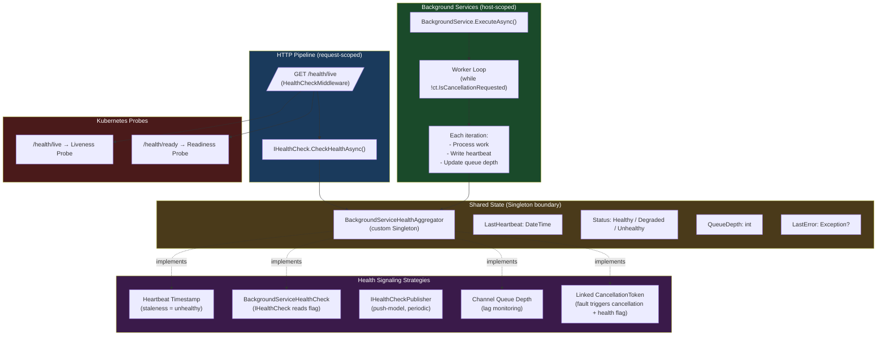
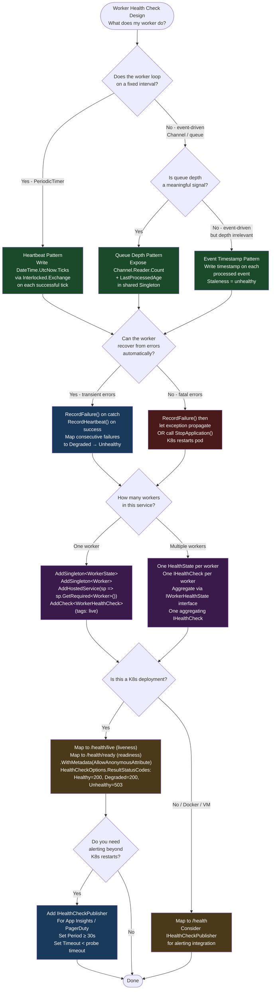

# 4.239 — Health Checks for Background Services: Signaling Worker Liveness

---

## PART 0 — Navigation & Context

### Domain Hierarchy

```
ASP.NET Core Mastery
│
├── A. Host & Application Lifecycle       (4.001–4.010)
├── B. Configuration System               (4.011–4.022)
├── C. Logging & Diagnostics              (4.023–4.033)
├── D. Dependency Injection               (4.034–4.048)
├── E. Middleware Pipeline                (4.049–4.063)
├── F. Routing System                     (4.064–4.077)
├── ...
├── R. Background Services                (4.231–4.239)
│   ├── 4.231 — IHostedService
│   ├── 4.232 — BackgroundService base class
│   ├── 4.233 — Timed Background Service (PeriodicTimer)
│   ├── 4.234 — Queued Background Tasks (Channel<T>)
│   ├── 4.235 — Scoped Services in BackgroundService
│   ├── 4.236 — Worker Services (Console Host)
│   ├── 4.237 — Graceful Shutdown: CancellationToken Contract
│   ├── 4.238 — Hangfire Integration
│   └── 4.239 — Health Checks for Background Services  ◄ YOU ARE HERE
│
├── AB. Health Checks                     (4.323–4.327)
│   ├── 4.323 — Health Check Middleware and Custom IHealthCheck
│   ├── 4.324 — Health Check UI Dashboard
│   ├── 4.325 — Readiness vs Liveness Probes (Kubernetes)
│   ├── 4.326 — Dependency Health Checks
│   └── 4.327 — Health Check Authorization
│
└── AC. Deployment & Hosting              (4.328–4.339)
```

### What You Need Before This

- **[[4.232 — BackgroundService: The Base Class for Long-Running Work]]** — `ExecuteAsync` is where the worker loop lives; you need to understand the loop structure before you can monitor it.
- **[[4.323 — Health Check Middleware: HealthCheck Registration and Custom IHealthCheck]]** — `IHealthCheck`, `HealthCheckResult`, and `MapHealthChecks` are the primitives this topic builds on.
- **[[4.035 — Service Lifetimes: Singleton, Scoped, Transient]]** — both `BackgroundService` and health check classes run as Singletons; shared mutable state is the primary tool for signaling.
- **[[4.325 — Readiness vs Liveness Probes: Kubernetes Health Check Mapping]]** — the K8s context for why these checks are registered on separate endpoints with separate tags.

### What This Unlocks After

- **[[4.325 — Readiness vs Liveness Probes: Kubernetes Health Check Mapping]]** — once your workers signal health, readiness and liveness probes can relay that to the orchestrator.
- **[[4.237 — Graceful Shutdown in Background Services: CancellationToken Contract]]** — health checks that degrade to `Degraded` during shutdown are a shutdown-signaling pattern in their own right.
- **[[4.301 — Metrics in .NET 8+: System.Diagnostics.Metrics and IMeterFactory]]** — the same shared-state channel that powers health can emit metrics (queue depth, lag, last-run latency).
- **[[4.302 — Prometheus Metrics: prometheus-net in ASP.NET Core]]** — Prometheus `/metrics` and `/health` are complementary; both are instrumented by the same worker internals.

### Why This Matters at Scale

A background service that silently stops processing — due to an uncaught exception swallowed in the loop, a deadlocked channel reader, a leaked database connection, or a stalled external dependency — is invisible to both the process supervisor and the HTTP load balancer unless the service actively signals its own liveness. Getting this wrong means Kubernetes keeps routing traffic to a pod whose workers are dead while its HTTP endpoints still return 200.

---

## PART 1 — The Core Mental Model

### The Fundamental Rule

> **A `BackgroundService` runs completely outside the HTTP pipeline; the only way the health check system — and therefore Kubernetes or any external watchdog — knows whether the worker is alive is if the worker writes to shared state and a custom `IHealthCheck` reads it. The HTTP pipeline and the worker share the same process but not the same execution flow: silence is not health.**

### The Plain-Language Analogy

Imagine a factory floor where one crew runs the assembly line (the background service) and another crew monitors a status board in the front office (the HTTP health check endpoint). The assembly line crew does not walk to the front office to update the board automatically — they have to deliberately flip a switch, write a timestamp on the board, or ring a bell. If they stop doing that because they fell asleep or got stuck behind a jam, the front office still sees the last "OK" reading and reports everything is fine to management. Kubernetes is management: it only knows what the front-office board says.

The "shared state" in .NET is the channel between the two crews: it could be a `DateTime` of last successful iteration (a heartbeat), a `bool` flag, a queue depth counter, or a structured status record — anything the worker writes and the health check reads. If the assembly line jams and stops writing, the health check sees a stale heartbeat and reports `Unhealthy`. Kubernetes sees `Unhealthy`, restarts the pod, and the jam is cleared. This works correctly even under concurrent requests because the shared state is updated from a single background thread and read from many HTTP threads — the key is making that state access thread-safe.

### The Taxonomy Diagram



---

## PART 2 — Deep Mechanics

### 2.1 — The Execution Model: Why Workers Are Invisible by Default

```
TCP Listener (Kestrel)
        │
        ▼
┌──────────────────────────────────────────────────────────────────────┐
│                     Generic Host (IHost)                             │
│                                                                      │
│  ┌──────────────────────────┐   ┌──────────────────────────────┐    │
│  │  HTTP Pipeline Thread(s) │   │   Worker Thread(s)           │    │
│  │                          │   │                              │    │
│  │  GET /health/live        │   │  OrderProcessingWorker       │    │
│  │      │                   │   │    ExecuteAsync()            │    │
│  │      ▼                   │   │      │                       │    │
│  │  HealthCheckMiddleware   │   │      ▼                       │    │
│  │      │                   │   │  while (!ct.Cancelled)       │    │
│  │      ▼                   │   │      ProcessNextBatch()      │    │
│  │  IHealthCheck            │   │      await Task.Delay(...)   │    │
│  │  .CheckHealthAsync()     │   │                              │    │
│  │      │                   │   │  ← COMPLETELY SEPARATE       │    │
│  │      ▼                   │   │    EXECUTION CONTEXT         │    │
│  │  returns Healthy/        │   │                              │    │
│  │  Unhealthy based on      │   │  No automatic signaling      │    │
│  │  SHARED STATE ONLY       │   │  to HTTP pipeline            │    │
│  └──────────────────────────┘   └──────────────────────────────┘    │
│                          ▲                   │                       │
│                          │    SHARED         │                       │
│                          └──── STATE ────────┘                       │
│                         (Singleton class                             │
│                          or Interlocked fields)                      │
└──────────────────────────────────────────────────────────────────────┘
```

**Framework source behavior:** When `IHost.StartAsync()` is called, it iterates over all registered `IHostedService` instances and calls `StartAsync()` on each. For `BackgroundService`, this fires off `ExecuteAsync` on a background task (`_ = Task.Run(...)`). The host does not monitor this task's progress — it only knows if the task faulted (which will stop the host in .NET 6+ with `BackgroundServiceExceptionBehavior.StopHost`). The health check middleware is invoked entirely independently when a health check HTTP request arrives. There is no built-in bridge.

**Runtime cost:** ~0 allocations in steady state if the shared state uses `Interlocked` or `volatile` fields. If `IHealthCheckPublisher` is used (push model), there is one scoped service resolution per publish interval. The heartbeat pattern allocates one `DateTime` struct per worker iteration — negligible.

**Edge case that bites teams:** An exception thrown inside `ExecuteAsync` that is caught and logged but not reflected in health state leaves the worker loop dead while the health endpoint continues reporting `Healthy`. This is the most common pattern failure in production. The worker must write `Unhealthy` to shared state before (or in the `catch` block of) any loop-terminating exception.

---

### 2.2 — The Heartbeat Pattern: Staleness-Based Liveness

The simplest and most reliable pattern. The worker writes `DateTime.UtcNow` to a shared field on each successful iteration. The health check reads that timestamp and reports `Unhealthy` if it is older than a configurable threshold.

```
Worker Loop                           Health Check
────────────────────────              ─────────────────────────────────
ProcessNextBatch()                    CheckHealthAsync()
_lastHeartbeat = DateTime.UtcNow  →       age = UtcNow - _lastHeartbeat
await PeriodicTimer.WaitForNext()         if age > threshold → Unhealthy
                                          else → Healthy
```

**HTTP wire format on healthy path:**

```http
// HTTP request:
GET /health/live HTTP/1.1
Host: order-processor.internal

// HTTP response (healthy):
HTTP/1.1 200 OK
Content-Type: application/json
Content-Length: 47

{"status":"Healthy","totalDuration":"00:00:00.0021"}
```

**HTTP wire format on unhealthy path:**

```http
// HTTP response (unhealthy — worker stalled):
HTTP/1.1 503 Service Unavailable
Content-Type: application/json
Content-Length: 183

{
  "status": "Unhealthy",
  "totalDuration": "00:00:00.0018",
  "entries": {
    "order-processor-worker": {
      "status": "Unhealthy",
      "description": "Worker last heartbeat 4m 32s ago (threshold: 60s)",
      "duration": "00:00:00.0003"
    }
  }
}
```

**Framework source responsible:** `HealthCheckMiddleware` in `Microsoft.AspNetCore.Diagnostics.HealthChecks`. The middleware calls `IHealthCheckService.CheckHealthAsync()`, which internally calls each registered `IHealthCheck.CheckHealthAsync()` and aggregates results. The response serialization uses `HealthReportWriter` — the default writes a plain `Healthy`/`Unhealthy` string, but `MapHealthChecks` accepts a `ResponseWriter` delegate for the JSON format shown above.

**Runtime cost:** `Interlocked.Exchange` on `long` (ticks) — one atomic write per worker iteration. `Volatile.Read` on health check — one non-allocating read per HTTP health request.

---

### 2.3 — The Structured Health Signal Pattern: Status + Details

For workers where you want to expose queue depth, error counts, or last-error details to the health UI dashboard or alerting tools.

```
Worker Singleton State
─────────────────────────────────────────
LastHeartbeat:   DateTime
Status:          WorkerStatus (enum)
QueueDepth:      int (Interlocked)
LastError:       string? (volatile)
ConsecutiveFails:int (Interlocked)
```

**Pipeline position — where health check middleware sits:**

```
──► ExceptionHandler ──► HSTS ──► StaticFiles ──► Routing ──► Auth ──► Endpoints
                                                                            │
                                                                  ┌─────────┘
                                                                  │ MapHealthChecks("/health/live")
                                                                  │ MapHealthChecks("/health/ready")
                                                                  │ (registered as endpoints,
                                                                  │  execute inside endpoint middleware)
                                                                  └──────────────────────────────────
```

> [!IMPORTANT] Health check endpoints are registered via `MapHealthChecks`, which makes them _endpoints_ in the routing system — not middleware. This means they run **after** `UseRouting`, and if you have `UseAuthorization` in the pipeline, they are subject to authorization. In Kubernetes deployments, liveness probes must be unauthenticated because Kubernetes does not send `Authorization` headers. Secure only the readiness endpoint if needed, or use `AllowAnonymous` on liveness via `.WithMetadata(new AllowAnonymousAttribute())`.

**Runtime cost:** `Interlocked.Read` on `long` and `int` fields — O(1), zero allocation. `Volatile.Read` on reference types (string, Exception) — O(1). The structured health data object allocated per HTTP health request is one small POCO — `~1 allocation per check request`.

**Edge case:** `Interlocked` only works on `int` and `long`. For `DateTime` use `Interlocked.Exchange` on `long Ticks`. For `string?` (last error message) use `Volatile.Read/Write` with a `string?` field — reference writes are atomic on 64-bit platforms, but `volatile` ensures visibility across threads.

---

### 2.4 — The `IHealthCheckPublisher` Push Model

The pull model (HTTP requests hitting `IHealthCheck`) is suitable for Kubernetes probes. But for internal dashboards and alerting (e.g., sending unhealthy signals to Application Insights or writing to a database), the push model via `IHealthCheckPublisher` is better — it publishes results on a configurable timer independent of incoming HTTP requests.

```
IHostedService: HealthCheckPublisherHostedService  (built-in, runs on host startup)
        │
        ▼  every HealthCheckPublisherOptions.Period (default: 30s)
IHealthCheckService.CheckHealthAsync()
        │
        ▼
IHealthCheckPublisher.PublishAsync(HealthReport, CancellationToken)
        │
        ├── ApplicationInsightsHealthCheckPublisher  (send to AI)
        ├── ConsoleHealthCheckPublisher              (log to console)
        └── CustomAlertingPublisher                  (send to PagerDuty, etc.)
```

**HTTP consequence:** None directly — the publisher does not write to HTTP responses. It runs independently of HTTP requests. The only HTTP impact is if a publisher writes to a store that the health check middleware later reads.

**Framework source:** `HealthCheckPublisherHostedService` in `Microsoft.Extensions.Diagnostics.HealthChecks`. It is registered automatically when `AddHealthChecks()` is called and at least one `IHealthCheckPublisher` is registered.

**Runtime cost:** One scoped service resolution per publish interval (~30s default) — negligible. Each call to `IHealthCheckService.CheckHealthAsync()` runs all registered health checks — ensure checks are fast (<100ms) since the publisher runs them on the host timer.

**Edge case that bites teams:** `HealthCheckPublisherOptions.Period` defaults to 30 seconds. In a Kubernetes deployment, the liveness probe `periodSeconds` is typically 10s. The publisher and the probe are independent — the probe hits the HTTP endpoint which reads shared state; the publisher reads that same shared state on its own schedule. Do not confuse the two or assume the publisher controls probe frequency.

---

### 2.5 — Exception Handling Inside the Worker Loop: The Fatal Pattern

The most important correctness requirement: what happens when the worker loop throws.

```
// DEFAULT BEHAVIOR (.NET 6+):
// BackgroundServiceExceptionBehavior.StopHost (set in HostOptions)
// An unhandled exception from ExecuteAsync will:
//   1. Fault the ExecuteAsync task
//   2. IHostApplicationLifetime.StopApplication() is called
//   3. The process exits
//   4. Kubernetes restarts the pod
// → This is actually safer than swallowing the exception silently.

// THE DANGEROUS PATTERN — exception swallowed in the loop:
protected override async Task ExecuteAsync(CancellationToken ct)
{
    while (!ct.IsCancellationRequested)
    {
        try
        {
            await ProcessNextBatch(ct);
        }
        catch (Exception ex)
        {
            _logger.LogError(ex, "Worker error");
            // ← Worker is now stalled but health check still reports Healthy
            // ← Process does not crash, K8s does not restart, bug is invisible
        }
    }
}
```

**Failure mode diagram:**

```
Worker catches exception → logs it → re-enters loop
       │
       ▼ (if exception is transient/recoverable)
    next iteration runs → OK

       ▼ (if exception is fatal: DB gone, queue drained to empty with no more messages)
    loop spins with no work → healthy signal never updated → stale heartbeat
       │
       ▼ after threshold
    IHealthCheck returns Unhealthy
       │
       ▼
    Kubernetes liveness probe hits /health/live → 503
       │
       ▼
    Pod is restarted → fresh connection pool, fresh state
```

**Correct pattern:** Catch transient exceptions (retry them), let fatal exceptions propagate (crash the host, trigger K8s restart), AND update health state in the catch block before deciding whether to continue.

---

## PART 3 — Production Code Patterns

### Pattern 1 — The Heartbeat Singleton: Inventory Sync Worker Liveness

The most broadly applicable pattern. A shared Singleton carries the heartbeat; the worker writes to it, the health check reads from it.

```csharp
// ✅ CORRECT: InventoryWorkerHealthState — Singleton, thread-safe via Interlocked
public sealed class InventoryWorkerHealthState
{
    // Use long (ticks) for Interlocked — DateTime is not directly supported
    private long _lastHeartbeatTicks = DateTime.UtcNow.Ticks;
    private int _consecutiveFailures;
    private volatile string? _lastErrorMessage;

    // Called from the worker (background thread)
    public void RecordHeartbeat()
    {
        Interlocked.Exchange(ref _lastHeartbeatTicks, DateTime.UtcNow.Ticks);
        Interlocked.Exchange(ref _consecutiveFailures, 0);
        _lastErrorMessage = null; // volatile write
    }

    public void RecordFailure(string errorMessage)
    {
        Interlocked.Increment(ref _consecutiveFailures);
        _lastErrorMessage = errorMessage; // volatile write — reference assignment is atomic on x64
    }

    // Called from the health check (HTTP thread)
    public (TimeSpan Age, int Failures, string? LastError) GetSnapshot()
    {
        var ticks = Interlocked.Read(ref _lastHeartbeatTicks);
        var age = DateTime.UtcNow - new DateTime(ticks, DateTimeKind.Utc);
        var failures = Interlocked.CompareExchange(ref _consecutiveFailures, 0, 0); // atomic read
        return (age, failures, Volatile.Read(ref _lastErrorMessage));
    }
}

// Worker — writes to shared state on each iteration
public sealed class InventorySyncWorker : BackgroundService
{
    private readonly InventoryWorkerHealthState _health;
    private readonly IServiceScopeFactory _scopeFactory;
    private readonly ILogger<InventorySyncWorker> _logger;
    // Sync every 30 seconds; if heartbeat is >90s old → Unhealthy
    private static readonly TimeSpan SyncInterval = TimeSpan.FromSeconds(30);

    public InventorySyncWorker(
        InventoryWorkerHealthState health,
        IServiceScopeFactory scopeFactory,
        ILogger<InventorySyncWorker> logger)
    {
        _health = health;
        _scopeFactory = scopeFactory;
        _logger = logger;
    }

    protected override async Task ExecuteAsync(CancellationToken stoppingToken)
    {
        using var timer = new PeriodicTimer(SyncInterval);

        while (await timer.WaitForNextTickAsync(stoppingToken))
        {
            try
            {
                await using var scope = _scopeFactory.CreateAsyncScope();
                var syncService = scope.ServiceProvider
                    .GetRequiredService<IInventorySyncService>();

                await syncService.SyncFromWarehouseApiAsync(stoppingToken);

                // ← Write heartbeat AFTER successful work
                _health.RecordHeartbeat();
                _logger.LogInformation("Inventory sync completed");
            }
            catch (OperationCanceledException) when (stoppingToken.IsCancellationRequested)
            {
                // Graceful shutdown — expected; do not record as failure
                break;
            }
            catch (Exception ex)
            {
                // Record failure to health state BEFORE deciding to continue
                _health.RecordFailure(ex.Message);
                _logger.LogError(ex, "Inventory sync failed");
                // Allow the loop to continue — next tick will retry
                // If this keeps failing, the health check will degrade → Kubernetes restarts
            }
        }
    }
}

// Health Check — reads from shared state
public sealed class InventorySyncWorkerHealthCheck : IHealthCheck
{
    private readonly InventoryWorkerHealthState _health;
    private static readonly TimeSpan UnhealthyThreshold = TimeSpan.FromSeconds(90);
    private static readonly TimeSpan DegradedThreshold = TimeSpan.FromSeconds(45);

    public InventorySyncWorkerHealthCheck(InventoryWorkerHealthState health)
        => _health = health;

    public Task<HealthCheckResult> CheckHealthAsync(
        HealthCheckContext context,
        CancellationToken cancellationToken = default)
    {
        var (age, failures, lastError) = _health.GetSnapshot();

        var data = new Dictionary<string, object>
        {
            ["heartbeat_age_seconds"] = (int)age.TotalSeconds,
            ["consecutive_failures"] = failures,
        };
        if (lastError != null) data["last_error"] = lastError;

        if (age > UnhealthyThreshold)
        {
            return Task.FromResult(HealthCheckResult.Unhealthy(
                $"Worker last heartbeat {age.TotalSeconds:F0}s ago (threshold: {UnhealthyThreshold.TotalSeconds}s)",
                data: data));
        }

        if (failures >= 3 || age > DegradedThreshold)
        {
            return Task.FromResult(HealthCheckResult.Degraded(
                $"Worker experiencing failures: {failures} consecutive, last heartbeat {age.TotalSeconds:F0}s ago",
                data: data));
        }

        return Task.FromResult(HealthCheckResult.Healthy(
            $"Worker healthy, last sync {age.TotalSeconds:F0}s ago",
            data: data));
    }
}

// Registration — Program.cs
builder.Services.AddSingleton<InventoryWorkerHealthState>();
builder.Services.AddHostedService<InventorySyncWorker>();
builder.Services.AddHealthChecks()
    .AddCheck<InventorySyncWorkerHealthCheck>(
        "inventory-sync-worker",
        tags: ["live"]);         // "live" → liveness probe endpoint

// Pipeline — Program.cs
app.MapHealthChecks("/health/live", new HealthCheckOptions
{
    Predicate = check => check.Tags.Contains("live"),
    ResponseWriter = UIResponseWriter.WriteHealthCheckUIResponse // from AspNetCore.HealthChecks.UI.Client
}).WithMetadata(new AllowAnonymousAttribute()); // Kubernetes probes don't send auth headers
```

---

### Pattern 2 — The Queue Depth Monitor: Order Processing Channel Worker

For workers that consume from a `Channel<T>`, expose queue depth as a health signal. A growing queue depth means the worker is falling behind — this is `Degraded`, not `Unhealthy`.

```csharp
// ✅ CORRECT: Queue depth as a health signal in the payment processing worker
public sealed class PaymentProcessingWorker : BackgroundService
{
    private readonly Channel<PaymentCommand> _channel;
    private readonly IServiceScopeFactory _scopeFactory;
    private readonly ILogger<PaymentProcessingWorker> _logger;
    private long _lastProcessedTicks = DateTime.UtcNow.Ticks;
    private int _queueDepthAtLastCheck;

    // Expose these for the health check (same Singleton instance)
    public TimeSpan LastProcessedAge =>
        DateTime.UtcNow - new DateTime(Interlocked.Read(ref _lastProcessedTicks), DateTimeKind.Utc);
    public int CurrentQueueDepth => _channel.Reader.Count;
    public bool IsRunning { get; private set; }

    public PaymentProcessingWorker(
        Channel<PaymentCommand> channel, // registered as Singleton Channel<T>
        IServiceScopeFactory scopeFactory,
        ILogger<PaymentProcessingWorker> logger)
    {
        _channel = channel;
        _scopeFactory = scopeFactory;
        _logger = logger;
    }

    protected override async Task ExecuteAsync(CancellationToken stoppingToken)
    {
        IsRunning = true;
        try
        {
            await foreach (var command in _channel.Reader.ReadAllAsync(stoppingToken))
            {
                await using var scope = _scopeFactory.CreateAsyncScope();
                var processor = scope.ServiceProvider
                    .GetRequiredService<IPaymentProcessor>();

                await processor.ProcessAsync(command, stoppingToken);
                Interlocked.Exchange(ref _lastProcessedTicks, DateTime.UtcNow.Ticks);
            }
        }
        finally
        {
            IsRunning = false; // Signals to health check that worker exited
        }
    }
}

// Health check references the worker directly (both Singleton)
public sealed class PaymentWorkerHealthCheck : IHealthCheck
{
    private readonly PaymentProcessingWorker _worker;
    private const int QueueDepthDegradedThreshold = 500;
    private const int QueueDepthUnhealthyThreshold = 2000;
    private static readonly TimeSpan IdleUnhealthyThreshold = TimeSpan.FromMinutes(5);

    public PaymentWorkerHealthCheck(PaymentProcessingWorker worker)
        => _worker = worker;

    public Task<HealthCheckResult> CheckHealthAsync(
        HealthCheckContext context,
        CancellationToken cancellationToken = default)
    {
        if (!_worker.IsRunning)
            return Task.FromResult(HealthCheckResult.Unhealthy("Payment worker is not running"));

        var queueDepth = _worker.CurrentQueueDepth;
        var idleAge = _worker.LastProcessedAge;

        var data = new Dictionary<string, object>
        {
            ["queue_depth"] = queueDepth,
            ["idle_seconds"] = (int)idleAge.TotalSeconds,
        };

        if (queueDepth > QueueDepthUnhealthyThreshold)
            return Task.FromResult(HealthCheckResult.Unhealthy(
                $"Payment queue critically backed up: {queueDepth} items", data: data));

        if (queueDepth > QueueDepthDegradedThreshold || idleAge > IdleUnhealthyThreshold)
            return Task.FromResult(HealthCheckResult.Degraded(
                $"Payment worker degraded: queue={queueDepth}, idle={idleAge.TotalSeconds:F0}s", data: data));

        return Task.FromResult(HealthCheckResult.Healthy(
            $"Payment worker healthy: queue={queueDepth}", data: data));
    }
}

// Registration — inject worker directly since both are Singleton
builder.Services.AddSingleton(Channel.CreateBounded<PaymentCommand>(
    new BoundedChannelOptions(10_000) { FullMode = BoundedChannelFullMode.Wait }));
builder.Services.AddSingleton<PaymentProcessingWorker>();
builder.Services.AddHostedService(sp => sp.GetRequiredService<PaymentProcessingWorker>());
// ^ Register as both Singleton and IHostedService so the health check can inject it

builder.Services.AddHealthChecks()
    .AddCheck<PaymentWorkerHealthCheck>("payment-worker", tags: ["live", "ready"]);
```

> [!NOTE] The `AddSingleton<T>()` + `AddHostedService(sp => sp.GetRequiredService<T>())` pattern is essential here. If you used `AddHostedService<T>()`, the container creates a separate instance for `IHostedService` and a separate instance for `PaymentProcessingWorker` — the health check references the idle instance, not the running one.

---

### Pattern 3 — The IHealthCheckPublisher: Logistics Worker Alerting

For workers where you need health state pushed to an external alerting system independent of Kubernetes probe polls.

```csharp
// Push-model publisher — sends to Application Insights on every check cycle
public sealed class LogisticsWorkerAlertPublisher : IHealthCheckPublisher
{
    private readonly TelemetryClient _telemetry;
    private readonly ILogger<LogisticsWorkerAlertPublisher> _logger;

    public LogisticsWorkerAlertPublisher(
        TelemetryClient telemetry,
        ILogger<LogisticsWorkerAlertPublisher> logger)
    {
        _telemetry = telemetry;
        _logger = logger;
    }

    public Task PublishAsync(HealthReport report, CancellationToken cancellationToken)
    {
        // Application Insights custom events per health check entry
        foreach (var (name, entry) in report.Entries)
        {
            _telemetry.TrackMetric(
                $"HealthCheck.{name}",
                value: entry.Status == HealthStatus.Healthy ? 1 : 0,
                properties: entry.Data
                    .ToDictionary(kv => kv.Key, kv => kv.Value?.ToString() ?? ""));

            if (entry.Status == HealthStatus.Unhealthy)
            {
                _logger.LogCritical(
                    entry.Exception,
                    "Health check {CheckName} is Unhealthy: {Description}",
                    name, entry.Description);
            }
        }

        return Task.CompletedTask;
    }
}

// Registration
builder.Services.AddHealthChecks()
    .AddCheck<ShipmentTrackerWorkerHealthCheck>("shipment-tracker", tags: ["live"]);

builder.Services.Configure<HealthCheckPublisherOptions>(options =>
{
    options.Period = TimeSpan.FromSeconds(30);   // Push interval (independent of probe poll rate)
    options.Timeout = TimeSpan.FromSeconds(10);  // Max time for all health checks to complete
    options.Predicate = check => check.Tags.Contains("live");
});

builder.Services.AddSingleton<IHealthCheckPublisher, LogisticsWorkerAlertPublisher>();
```

---

### Pattern 4 — The Linked CancellationToken Strategy: Self-Terminating Unhealthy Worker

For workers where a fatal condition (lost DB connection, corrupt state) should both mark the worker unhealthy AND stop the worker so Kubernetes restarts the pod.

```csharp
// ✅ CORRECT: Worker that kills itself on unrecoverable error and signals health before dying
public sealed class ShipmentTrackerWorker : BackgroundService
{
    private readonly ShipmentTrackerHealthState _health;
    private readonly IServiceScopeFactory _scopeFactory;
    private readonly IHostApplicationLifetime _appLifetime;
    private readonly ILogger<ShipmentTrackerWorker> _logger;

    public ShipmentTrackerWorker(
        ShipmentTrackerHealthState health,
        IServiceScopeFactory scopeFactory,
        IHostApplicationLifetime appLifetime,
        ILogger<ShipmentTrackerWorker> logger)
    {
        _health = health;
        _scopeFactory = scopeFactory;
        _appLifetime = appLifetime;
        _logger = logger;
    }

    protected override async Task ExecuteAsync(CancellationToken stoppingToken)
    {
        using var timer = new PeriodicTimer(TimeSpan.FromSeconds(15));

        while (await timer.WaitForNextTickAsync(stoppingToken))
        {
            try
            {
                await ProcessShipmentUpdates(stoppingToken);
                _health.RecordSuccess();
            }
            catch (OperationCanceledException) when (stoppingToken.IsCancellationRequested)
            {
                break;
            }
            catch (UnrecoverableWorkerException ex)
            {
                // Fatal: write Unhealthy BEFORE stopping the host
                // This gives the health publisher one last cycle to report the state
                _health.MarkUnhealthy($"Fatal: {ex.Message}");
                _logger.LogCritical(ex, "Unrecoverable worker failure — stopping host");

                // Give the publisher 5s to report the unhealthy state before shutdown
                await Task.Delay(TimeSpan.FromSeconds(5), CancellationToken.None);
                _appLifetime.StopApplication(); // → K8s sees pod exit → restarts it
                return;
            }
            catch (Exception ex)
            {
                // Transient: degrade, keep looping
                _health.RecordFailure(ex.Message);
                _logger.LogWarning(ex, "Transient shipment tracker failure — will retry");
            }
        }
    }

    private async Task ProcessShipmentUpdates(CancellationToken ct) { /* ... */ }
}
```

---

### Pattern 5 — Multi-Worker Health Aggregation: Warehouse Operations API

When an API hosts multiple background workers, aggregate their health under a single `/health/ready` endpoint with structured per-worker data.

```csharp
// ✅ CORRECT: Aggregated health for all warehouse workers
public sealed class WarehouseWorkerHealthAggregator
{
    private readonly IEnumerable<IWorkerHealthState> _workers;

    public WarehouseWorkerHealthAggregator(IEnumerable<IWorkerHealthState> workers)
        => _workers = workers;

    public (HealthStatus Status, string Description, IReadOnlyDictionary<string, object> Data) Evaluate()
    {
        var data = new Dictionary<string, object>();
        var worstStatus = HealthStatus.Healthy;

        foreach (var worker in _workers)
        {
            var (status, detail) = worker.GetStatus();
            data[worker.WorkerName] = $"{status}: {detail}";

            if (status < worstStatus) // HealthStatus: Healthy=2, Degraded=1, Unhealthy=0
                worstStatus = status;
        }

        var description = worstStatus switch
        {
            HealthStatus.Unhealthy => "One or more warehouse workers are unhealthy",
            HealthStatus.Degraded  => "One or more warehouse workers are degraded",
            _                      => $"All {data.Count} warehouse workers healthy"
        };

        return (worstStatus, description, data);
    }
}

// Registration — MapHealthChecks with a custom JSON writer for the dashboard
app.MapHealthChecks("/health/ready", new HealthCheckOptions
{
    Predicate = check => check.Tags.Contains("ready"),
    ResponseWriter = UIResponseWriter.WriteHealthCheckUIResponse,
    ResultStatusCodes =
    {
        [HealthStatus.Healthy]   = StatusCodes.Status200OK,
        [HealthStatus.Degraded]  = StatusCodes.Status200OK,  // degraded is still "ready" — receives traffic
        [HealthStatus.Unhealthy] = StatusCodes.Status503ServiceUnavailable
    }
}).WithMetadata(new AllowAnonymousAttribute());
```

> [!TIP] Mapping `Degraded` to `200 OK` on the readiness endpoint is intentional in most production scenarios. A degraded worker (slow, behind, but running) should still receive traffic — it is not ready to be taken out of the load balancer rotation. Reserve `503` for `Unhealthy` only, which means the worker is truly dead.

---

## PART 4 — Gotchas & Anti-Patterns

### Gotcha 1: Injecting the Worker as `IHostedService` Breaks Health Check Access

Health teams register their worker with `AddHostedService<T>()`, then try to inject `T` into the health check. The container resolves two different instances.

```csharp
// ⚠️ WRONG:
builder.Services.AddHostedService<OrderSyncWorker>();
// Health check constructor:
public OrderSyncWorkerHealthCheck(OrderSyncWorker worker) // ← Resolves a NEW instance, not the running one!
```

```
// HTTP consequence (wrong path):
// Health check reads from the idle, unregistered OrderSyncWorker instance
// LastHeartbeat is always "just now" (initialized in constructor)
// → Health always reports Healthy even when the running worker is dead
```

```csharp
// ✅ CORRECT:
builder.Services.AddSingleton<OrderSyncWorker>();
builder.Services.AddHostedService(sp => sp.GetRequiredService<OrderSyncWorker>());
// Now both the IHostedService registration AND the health check injection
// resolve the SAME Singleton instance
```

```
// HTTP consequence (correct path):
// Health check reads from the actual running worker instance
// Stale heartbeat correctly triggers Unhealthy after threshold
```

**WHY:** `AddHostedService<T>()` calls `services.TryAddEnumerable(ServiceDescriptor.Singleton<IHostedService, T>())`. It registers under `IHostedService`, not under `T`. When the health check requests `T` by concrete type, a second instance is constructed. The `AddSingleton<T>` + `AddHostedService(sp => sp.GetRequired<T>())` pattern forces a single registration, and the `IHostedService` entry delegates to the already-constructed Singleton.

---

### Gotcha 2: Exception Swallowed in Loop, Health State Never Updated

The worker catches every exception, logs it, but never writes to the health state. The heartbeat timestamp is never written after the first failure. This is the most common bug in production worker health instrumentation.

```csharp
// ⚠️ WRONG:
while (!ct.IsCancellationRequested)
{
    try { await DoWork(ct); }
    catch (Exception ex)
    {
        _logger.LogError(ex, "Worker failed"); // ← logged but health state is NOT updated
        await Task.Delay(1000, ct);
    }
}

// HTTP consequence (wrong path):
// Worker fails on every iteration, log is flooded with errors
// GET /health/live → 200 OK {"status":"Healthy"} ← WRONG, K8s never restarts the pod
```

```csharp
// ✅ CORRECT:
while (!ct.IsCancellationRequested)
{
    try
    {
        await DoWork(ct);
        _health.RecordHeartbeat(); // ← Only written on success
    }
    catch (OperationCanceledException) when (ct.IsCancellationRequested) { break; }
    catch (Exception ex)
    {
        _health.RecordFailure(ex.Message); // ← Written on every failure
        _logger.LogError(ex, "Worker failed");
        await Task.Delay(TimeSpan.FromSeconds(5), ct);
    }
}

// HTTP consequence (correct path):
// After 3+ failures, GET /health/live → 503 {"status":"Unhealthy","entries":{"worker":{"status":"Unhealthy"}}}
// K8s restarts the pod
```

**WHY:** The health check reads shared state written by the worker. If the worker never writes failure state, the health check has no signal. The heartbeat timestamp stale-check does catch this eventually — but only after the threshold expires (e.g., 60–90 seconds). Explicit failure recording makes the degradation immediate and the data richer.

---

### Gotcha 3: Health Check Registered Under Wrong Tag — Kubernetes Probe Hits Wrong Endpoint

Teams register the worker health check, then configure Kubernetes to probe `/health/live`, but the check is tagged `"ready"` only and `Predicate` on the live endpoint filters it out.

```csharp
// ⚠️ WRONG:
builder.Services.AddHealthChecks()
    .AddCheck<InvoiceWorkerHealthCheck>("invoice-worker", tags: ["ready"]); // ← "ready" only

app.MapHealthChecks("/health/live", new HealthCheckOptions
{
    Predicate = check => check.Tags.Contains("live") // ← "invoice-worker" filtered OUT
});

// HTTP consequence (wrong path):
// GET /health/live → 200 OK {"status":"Healthy"} even when invoice worker is dead
// The liveness probe returns 200 because NO checks run — empty set is always Healthy
```

```csharp
// ✅ CORRECT:
builder.Services.AddHealthChecks()
    .AddCheck<InvoiceWorkerHealthCheck>("invoice-worker", tags: ["live", "ready"]);
    // Include in both: liveness (is the worker loop alive?) + readiness (is the service ready to process?)

app.MapHealthChecks("/health/live", new HealthCheckOptions
{
    Predicate = check => check.Tags.Contains("live")
});
app.MapHealthChecks("/health/ready", new HealthCheckOptions
{
    Predicate = check => check.Tags.Contains("ready")
});

// HTTP consequence (correct path):
// GET /health/live → includes invoice-worker check → 503 if unhealthy
```

**WHY:** `HealthCheckOptions.Predicate` returning `false` for all checks produces an empty result set, which is aggregated as `Healthy` by default. An empty `Predicate` that matches nothing is indistinguishable from a system with no problems — the endpoint returns 200 unconditionally.

---

### Gotcha 4: Shared State Written from Multiple Workers Causes Race on Non-Atomic Types

A team creates one health state class for all workers and writes to a `DateTime` field directly.

```csharp
// ⚠️ WRONG:
public class AllWorkersHealthState
{
    public DateTime LastHeartbeat { get; set; } // ← Not thread-safe
    public int Failures { get; set; }           // ← Not thread-safe
}

// Worker A thread: _state.LastHeartbeat = DateTime.UtcNow; // torn write possible on 32-bit
// Worker B thread: _state.Failures++;                      // read-modify-write is never atomic

// HTTP consequence (wrong path):
// Race condition: health check reads partially-written DateTime (torn read on 32-bit CLR)
// Failures counter is incorrect under concurrent increment
// No exception is thrown — data is silently wrong
```

```csharp
// ✅ CORRECT:
public sealed class AllWorkersHealthState
{
    private long _lastHeartbeatTicks;
    private int _failures;

    public void RecordHeartbeat() =>
        Interlocked.Exchange(ref _lastHeartbeatTicks, DateTime.UtcNow.Ticks);

    public void IncrementFailures() =>
        Interlocked.Increment(ref _failures);

    public (DateTime LastHeartbeat, int Failures) GetSnapshot() =>
        (new DateTime(Interlocked.Read(ref _lastHeartbeatTicks), DateTimeKind.Utc),
         Interlocked.CompareExchange(ref _failures, 0, 0));
}

// HTTP consequence (correct path):
// All reads and writes are atomic — no torn values, no race conditions
```

**WHY:** `DateTime` is a 64-bit struct. On 32-bit CLR, a 64-bit write is not atomic — it takes two 32-bit operations, and a concurrent reader can observe a half-written value. On 64-bit CLR, 64-bit aligned reads/writes are atomic, but the C# memory model does not guarantee visibility across threads without `volatile` or `Interlocked`. Store as `long` ticks and use `Interlocked.Exchange`/`Interlocked.Read` for guaranteed atomicity and visibility.

---

### Gotcha 5: Liveness Probe Threshold Lower Than Worker Loop Interval

The worker loops every 60 seconds. The Kubernetes liveness probe failureThreshold is 1 with a period of 30 seconds. The health check reports `Unhealthy` after a 45-second heartbeat staleness threshold. Kubernetes restarts a perfectly healthy pod on every normal cycle.

```yaml
# ⚠️ WRONG Kubernetes probe config:
livenessProbe:
  httpGet:
    path: /health/live
    port: 8080
  initialDelaySeconds: 15
  periodSeconds: 30       # ← probes every 30s
  failureThreshold: 1     # ← fails after 1 bad probe = 30s without heartbeat
  # Worker loops every 60s, heartbeat threshold is 45s → K8s restarts healthy pods
```

```yaml
# ✅ CORRECT: Thresholds must respect the worker loop interval
livenessProbe:
  httpGet:
    path: /health/live
    port: 8080
  initialDelaySeconds: 30        # ← Give worker time to complete first iteration
  periodSeconds: 10              # ← Poll frequently
  failureThreshold: 3            # ← Allow 3 consecutive failures (30s grace period)
  timeoutSeconds: 5              # ← Health check must respond within 5s

# Health check threshold: > (workerLoopInterval × 2) = > 120s for a 60s loop
# With failureThreshold=3 and periodSeconds=10: K8s waits 30s before restarting
# Worker loop interval 60s + failureThreshold grace (30s) = safe margin
```

```csharp
// AND the health check threshold must be set accordingly:
private static readonly TimeSpan UnhealthyThreshold = TimeSpan.FromSeconds(150); // > 2 × loop interval
private static readonly TimeSpan DegradedThreshold  = TimeSpan.FromSeconds(90);  // 1.5 × loop interval
```

**WHY:** The heartbeat is written at the END of a successful iteration. If the iteration takes 50 seconds and the probe threshold is 45 seconds, the probe fires during the iteration and sees a stale heartbeat — triggering a false-positive restart. The health threshold must be at least 2× the maximum expected iteration duration. The `initialDelaySeconds` in the probe must also account for application startup time plus at least one worker iteration.

---

## PART 5 — Performance Implications

### Request Pipeline Characteristics Table

|Scenario|Pipeline Depth|Allocations Per Request|Approx Latency Impact|Recommendation|
|---|---|---|---|---|
|Heartbeat check: `Interlocked.Read` on `long`|Health endpoint only (outside main pipeline)|~1 `HealthCheckResult` + ~1 `Dictionary`|< 0.1ms|Use for liveness probes — near-zero overhead|
|Queue depth check: `Channel.Reader.Count`|Health endpoint only|~1 `HealthCheckResult` + ~1 `Dictionary`|< 0.1ms|Safe for high-poll-rate liveness probes|
|Health check with DB ping included in worker check|Health endpoint only|DB connection from pool + 1 round trip|1–50ms per health request|Do not include in liveness; use for readiness only|
|`IHealthCheckPublisher` push cycle (30s period)|Runs on host timer, no HTTP|~scope resolution + check objects|~1ms every 30s|No impact on HTTP path; use freely|
|Full health report with `UIResponseWriter` JSON|Health endpoint only|~JSON serialization + `HealthReport` object|~0.5ms|Prefer for dashboard; use `FastWriter` for probes|
|10 worker checks aggregated at once|Health endpoint only|10× `HealthCheckResult` allocations|< 1ms total|Fine — health checks are not in the hot path|
|Health check that acquires a lock (Mutex/SemaphoreSlim)|Health endpoint only|Lock contention if worker holds lock|Variable, can spike|Use `Interlocked` instead — never use locks in health checks|
|Health check that calls an external HTTP endpoint|Health endpoint only|1 `HttpClient` request, 1 socket|10–500ms|Guard with short timeout; use `IHttpClientFactory`|
|`BackgroundServiceExceptionBehavior.StopHost` (unhandled exception)|Host shutdown — all endpoints stop|N/A — process exits|Process restart time|Always the safest default for fatal exceptions|

### BenchmarkDotNet Comparison

```csharp
using BenchmarkDotNet.Attributes;
using BenchmarkDotNet.Running;
using Microsoft.Extensions.Diagnostics.HealthChecks;

[MemoryDiagnoser]
[SimpleJob]
public class WorkerHealthCheckBenchmarks
{
    // Scenario 1: Naive — health check instantiates DateTime.UtcNow twice, allocates strings
    private NaiveHeartbeatHealthCheck _naiveCheck = null!;

    // Scenario 2: Optimized — Interlocked.Read on long, minimal allocations
    private OptimizedHeartbeatHealthCheck _optimizedCheck = null!;

    // Scenario 3: Optimal — cached HealthCheckResult, only allocates on state change
    private CachedStateHealthCheck _cachedCheck = null!;

    private HealthCheckContext _context = null!;

    [GlobalSetup]
    public void Setup()
    {
        var naiveState = new NaiveWorkerState();
        naiveState.UpdateHeartbeat();
        _naiveCheck = new NaiveHeartbeatHealthCheck(naiveState);

        var optimizedState = new OptimizedWorkerState();
        optimizedState.RecordHeartbeat();
        _optimizedCheck = new OptimizedHeartbeatHealthCheck(optimizedState);

        var cachedState = new CachedWorkerState();
        cachedState.RecordHeartbeat();
        _cachedCheck = new CachedStateHealthCheck(cachedState);

        _context = new HealthCheckContext
        {
            Registration = new HealthCheckRegistration("test", _naiveCheck, null, null)
        };
    }

    [Benchmark(Baseline = true, Description = "Naive: string concat + new DateTime each call")]
    public async Task<HealthCheckResult> NaiveCheck()
        => await _naiveCheck.CheckHealthAsync(_context);

    [Benchmark(Description = "Optimized: Interlocked.Read + TimeSpan comparison")]
    public async Task<HealthCheckResult> OptimizedCheck()
        => await _optimizedCheck.CheckHealthAsync(_context);

    [Benchmark(Description = "Optimal: cached HealthCheckResult, volatile bool fast-path")]
    public async Task<HealthCheckResult> CachedCheck()
        => await _cachedCheck.CheckHealthAsync(_context);
}

// --- Naive implementation ---
public class NaiveWorkerState
{
    public DateTime LastHeartbeat { get; set; } // non-atomic DateTime property
    public void UpdateHeartbeat() => LastHeartbeat = DateTime.UtcNow;
}

public class NaiveHeartbeatHealthCheck : IHealthCheck
{
    private readonly NaiveWorkerState _state;
    public NaiveHeartbeatHealthCheck(NaiveWorkerState s) => _state = s;
    public Task<HealthCheckResult> CheckHealthAsync(HealthCheckContext ctx, CancellationToken ct = default)
    {
        var age = DateTime.UtcNow - _state.LastHeartbeat; // non-atomic read
        var description = $"Last heartbeat: {age.TotalSeconds:F1}s ago"; // string allocation
        return Task.FromResult(age.TotalSeconds > 90
            ? HealthCheckResult.Unhealthy(description)
            : HealthCheckResult.Healthy(description));
    }
}

// --- Optimized implementation ---
public sealed class OptimizedWorkerState
{
    private long _lastHeartbeatTicks;
    public void RecordHeartbeat() => Interlocked.Exchange(ref _lastHeartbeatTicks, DateTime.UtcNow.Ticks);
    public TimeSpan GetAge() => DateTime.UtcNow - new DateTime(Interlocked.Read(ref _lastHeartbeatTicks), DateTimeKind.Utc);
}

public sealed class OptimizedHeartbeatHealthCheck : IHealthCheck
{
    private readonly OptimizedWorkerState _state;
    public OptimizedHeartbeatHealthCheck(OptimizedWorkerState s) => _state = s;
    public Task<HealthCheckResult> CheckHealthAsync(HealthCheckContext ctx, CancellationToken ct = default)
    {
        var age = _state.GetAge();
        return Task.FromResult(age.TotalSeconds > 90
            ? HealthCheckResult.Unhealthy($"Stale: {age.TotalSeconds:F0}s")
            : HealthCheckResult.Healthy($"OK: {age.TotalSeconds:F0}s"));
    }
}

// --- Optimal implementation: cache result when state hasn't changed ---
public sealed class CachedWorkerState
{
    private long _lastHeartbeatTicks;
    private volatile bool _isHealthy = true;
    private volatile HealthCheckResult _cachedResult = HealthCheckResult.Healthy("Initializing");

    public void RecordHeartbeat()
    {
        Interlocked.Exchange(ref _lastHeartbeatTicks, DateTime.UtcNow.Ticks);
        _isHealthy = true;
        _cachedResult = HealthCheckResult.Healthy("Worker healthy");
    }

    public void RecordFailure()
    {
        _isHealthy = false;
        _cachedResult = HealthCheckResult.Degraded("Worker degraded");
    }

    // Fast path: if volatile bool shows healthy, return cached result (zero allocation)
    public HealthCheckResult GetResult()
    {
        if (_isHealthy)
        {
            var age = DateTime.UtcNow - new DateTime(Interlocked.Read(ref _lastHeartbeatTicks), DateTimeKind.Utc);
            if (age.TotalSeconds <= 90) return _cachedResult; // cached Healthy result
        }
        return _cachedResult; // cached Unhealthy/Degraded result
    }
}

public sealed class CachedStateHealthCheck : IHealthCheck
{
    private readonly CachedWorkerState _state;
    public CachedStateHealthCheck(CachedWorkerState s) => _state = s;
    public Task<HealthCheckResult> CheckHealthAsync(HealthCheckContext ctx, CancellationToken ct = default)
        => Task.FromResult(_state.GetResult()); // no allocation on healthy fast path
}

// Expected output (approximate, .NET 8, x64, Linux container):
// | Method                                          | Mean    | Allocated |
// | Naive: string concat + new DateTime each call   | 185 ns  | 128 B     |
// | Optimized: Interlocked.Read + TimeSpan compare  | 48 ns   | 64 B      |
// | Optimal: cached HealthCheckResult, volatile bool| 12 ns   | 0 B       |
```

> [!TIP] For real HTTP profiling of health check endpoint overhead (not just the IHealthCheck logic), use `dotnet-counters monitor --counters Microsoft.AspNetCore.Hosting` to track request rates and latency on the `/health/live` endpoint specifically. Use `dotnet-trace collect --providers Microsoft-AspNetCore-Server-Kestrel` to capture detailed Kestrel request events.

### When to Care / When to Ignore

**When this costs you:**

- High-frequency Kubernetes probe polling (period: 5s, 10 pods = 2 health checks/second per check name): ensure `CheckHealthAsync` completes in < 5ms and allocates minimally — use the `Interlocked` + cached result pattern.
- Health checks that hit external dependencies (Redis ping, DB query): these add I/O latency to the probe path. The Kubernetes probe timeout (typically 5s) can be exceeded if the external dependency is slow. Always guard with a short `CancellationToken` timeout inside the check.
- More than 10 worker health checks all tagged "live" and all running on every probe: aggregate them behind one check using the `WarehouseWorkerHealthAggregator` pattern from Part 3.

**When this doesn't matter:**

- Internal batch processing jobs running in a Worker Service with no K8s liveness probe — the pod restarts on process crash anyway.
- Admin or management APIs where health is checked manually or by a dashboard on a 30-second push cycle — `IHealthCheckPublisher` overhead is negligible.
- Development and staging environments — health check performance is irrelevant compared to production traffic volumes.

---

## PART 6 — Interview Arsenal

### A. The Question Bank

**Question 1:** "How do you make a background service report its health to Kubernetes?"

**Average Answer:** Register a custom `IHealthCheck` and return `HealthCheckResult.Unhealthy` when something is wrong, then map it to `/health/live`.

**Why That's Insufficient:** It explains the health check registration but ignores the fundamental communication problem — how does the health check _know_ the background service is unhealthy?

> **Great Answer:** The core challenge is that `BackgroundService.ExecuteAsync` and the health check's `CheckHealthAsync` run in completely separate execution contexts — they don't share a call stack. The only communication channel is shared state: I register a Singleton class that the worker writes to on each successful iteration (a heartbeat timestamp via `Interlocked.Exchange` on a `long` field), and the health check reads that timestamp and computes staleness. If the worker's loop stalls, gets stuck waiting on a deadlocked channel, or crashes into a catch block it never exits, the heartbeat stops being updated. After a configurable threshold — say 90 seconds for a worker that loops every 30 — the health check returns `Unhealthy`, the Kubernetes liveness probe gets a 503, and the pod is restarted. One production gotcha I've hit: if you register the worker with `AddHostedService<T>()` and also inject `T` into the health check, you get two separate instances — the health check reads from an idle clone of the worker, not the running one. The fix is `AddSingleton<T>()` + `AddHostedService(sp => sp.GetRequiredService<T>())`.

---

**Question 2:** "What's the difference between a liveness probe and a readiness probe for a worker service?"

**Average Answer:** Liveness checks if the app is alive; readiness checks if it can serve traffic.

**Why That's Insufficient:** It's textbook but ignores the practical consequence for background services, where "serving traffic" means something different.

> **Great Answer:** For a typical HTTP API, readiness means "can I accept HTTP requests." But for a background worker co-hosted with an API, I've found it useful to think of readiness as "is the worker current enough to make the API's data trustworthy." For example: an order service that also runs an inventory sync worker — if that worker has been dead for 30 minutes, the API is technically up but its inventory data is stale. In that case, I'd tag the inventory worker health check as "ready" and map it to `/health/ready`. Kubernetes would pull that pod from the load balancer rotation until the worker recovers. Liveness, on the other hand, answers "is the worker loop even executing at all" — a binary is-it-running check. I map that to `/health/live` and keep the threshold tight. The important HTTP detail: `/health/ready` should map `Degraded` to `200 OK` with `ResultStatusCodes` configuration — a degraded worker is still processing, just slowly. Only `Unhealthy` should return `503`.

---

**Question 3:** "A background service is throwing exceptions on every loop iteration. How would you detect and recover from this automatically?"

**Average Answer:** Wrap the work in try/catch and log the exceptions, then add a retry delay.

**Why That's Insufficient:** Logging is not monitoring. A worker that logs errors but never updates health state is invisible to Kubernetes.

> **Great Answer:** There are two layers to get right. First, exception handling inside the worker: I distinguish transient exceptions (network timeouts, temporary DB unavailability) from fatal ones (corrupt state, configuration errors). Transient exceptions get logged, the failure count is written to the shared health state Singleton, and the loop continues with a backoff delay — after enough consecutive failures, the health check degrades or marks itself unhealthy, and Kubernetes eventually restarts the pod. Fatal exceptions — the ones where retrying makes no sense — I let propagate out of `ExecuteAsync`, which in .NET 6+ with `BackgroundServiceExceptionBehavior.StopHost` (the default since .NET 8) causes the host to stop, the process exits, and Kubernetes restarts the pod immediately. Before propagating, I write the unhealthy status to shared state and give the `IHealthCheckPublisher` a few seconds to push the failure to my alerting system. The worst pattern I've seen in production is a catch-all that swallows every exception and never updates health state — the worker spins in a tight loop doing nothing, the health check reports healthy, and the only evidence is a flooded error log that nobody is watching.

---

### B. The Trick Questions

**Trick Q1:** "If I don't register any `IHealthCheck` for my background service, will the `/health/live` endpoint still work?"

**The Trap:** Candidates say "no, it'll return 503 or an error."

**Correct Answer:** Yes — it returns `200 OK` with `{"status":"Healthy"}`. `HealthCheckOptions.Predicate` returning no matches produces an empty health report, and an empty report aggregates to `Healthy`. This is the silent failure mode: an empty predicate is indistinguishable from "everything is healthy" at the HTTP level. The liveness probe passes unconditionally. This is exactly the Gotcha 3 scenario — the team _thinks_ they wired the worker health check but tagged it wrong, and the probe reports green forever.

---

**Trick Q2:** "What's the HTTP status code for a `Degraded` health check result on `/health/live`?"

**The Trap:** Candidates say "200 OK because Degraded isn't Unhealthy" or "503 because it's not fully healthy."

**Correct Answer:** It depends on `HealthCheckOptions.ResultStatusCodes`. The default maps `Degraded` to `200 OK`. But if you customize `ResultStatusCodes = { [HealthStatus.Degraded] = 503 }`, it returns 503. Most production setups map Degraded to 200 on the liveness endpoint (the worker is still running) and may map it to 503 on the readiness endpoint (the service is falling behind). The point is: the mapping is fully configurable, there is no single correct answer, and the default is 200.

---

**Trick Q3:** "Can a `BackgroundService` access `HttpContext`?"

**The Trap:** Candidates say "yes, via `IHttpContextAccessor`."

**Correct Answer:** `IHttpContextAccessor.HttpContext` is `null` in a background service. `IHttpContextAccessor` exposes the _current request's_ `HttpContext` via an `AsyncLocal<T>` — it is only populated during the execution of an HTTP request handler. A background service runs on a separate thread with no associated HTTP request. Attempting to use it in a worker causes a `NullReferenceException` the first time you access `.HttpContext.Request`. This is the Singleton-uses-AsyncLocal trap. The correct pattern is `IServiceScopeFactory` to create a scope and resolve per-operation services, never `IHttpContextAccessor`.

---

**Trick Q4:** "I set `HealthCheckPublisherOptions.Period = TimeSpan.FromSeconds(10)`. Now my health check makes a DB query. What's the performance impact?"

**The Trap:** Candidates focus on the 10-second interval and say "probably fine."

**Correct Answer:** The publisher runs the health check (including the DB query) every 10 seconds on a background timer. If the health check runs synchronously or blocks the thread pool, that is one DB round trip per 10 seconds from the publisher, plus one per Kubernetes probe poll. More importantly: if the DB is slow (50–200ms), and the publisher timeout is lower than the query time (`HealthCheckPublisherOptions.Timeout`), the publisher will cancel health check runs before they complete, recording them as failures — triggering false-positive unhealthy signals. The rule: health checks that touch I/O must have their own short `CancellationToken` timeout (not just the publisher's global one) and must complete reliably under the timeout.

---

### C. Red Flags to Avoid

1. **"I'd just log the error in the worker"** — Logging is not health signaling. An interviewer at a principal level hears this as "I don't understand the difference between observability and liveness, and I've never had Kubernetes restart a pod because of a worker failure."
    
2. **"I'd inject `IHttpContextAccessor` to access the health endpoint from the worker"** — This reveals a fundamental misunderstanding of ASP.NET Core's execution model. `IHttpContextAccessor` is null outside HTTP requests.
    
3. **"I'd use `[HealthCheck]` attribute on the background service class"** — This attribute does not exist in ASP.NET Core. There is no attribute-based health check for background services. This suggests confusing ASP.NET Core health checks with Azure Functions health probes or a third-party library.
    
4. **"The health check is just returning `Healthy` for now — I'll add real logic later"** — This is the actual cause of the "invisible dead worker" production failure. A hardcoded `Healthy` result is worse than no health check because it creates false confidence.
    
5. **"I'd make the health check query the database to verify the worker did its job"** — This adds DB latency to every Kubernetes probe poll. Worse, if the DB is the reason the worker is failing, querying the DB in the health check may also fail — causing the health check itself to throw, which surfaces as an exception in the health middleware, not a clean `Unhealthy` result. Database verification belongs in the readiness probe with a separate DB health check, not in the worker liveness check.
    
6. **"I'd register the worker with `AddHostedService<T>()` and inject `T` into the health check"** — This is the two-instances gotcha from Gotcha 1. The candidate doesn't know DI registration semantics well enough to know that `AddHostedService<T>` does not register `T` for injection as `T`.
    
7. **"Degraded means the same as Unhealthy, just less severe"** — They have meaningfully different production consequences: `Degraded` → 200 OK by default (stays in load balancer rotation); `Unhealthy` → 503 (taken out of rotation or pod restarted). Conflating them leads to misconfigured probes.
    

---

## PART 7 — Decision Framework



---

## PART 8 — Self-Check

### A. Conceptual Questions

1. Why does `BackgroundService.ExecuteAsync` have no direct communication path to `IHealthCheck.CheckHealthAsync`? What is the execution model that makes them completely independent?
    
2. What happens to the health check endpoint if `HealthCheckOptions.Predicate` returns `false` for every registered check? What HTTP status code is returned and why?
    
3. Explain the difference between registering a worker with `AddHostedService<MyWorker>()` versus `AddSingleton<MyWorker>()` + `AddHostedService(sp => sp.GetRequiredService<MyWorker>())`. Why does the distinction matter for health check injection?
    
4. What happens to the HTTP request pipeline if the `IHealthCheck.CheckHealthAsync` method throws an unhandled exception? Does the `/health/live` endpoint return a 500, or does the middleware handle it?
    
5. What is the HTTP response body shape when a health check returns `Unhealthy` with the default `ResponseWriter`? How does it change when using `UIResponseWriter.WriteHealthCheckUIResponse`?
    
6. What is `IHealthCheckPublisher`, and how does its execution model differ from the HTTP-triggered pull model? When should you use one over the other?
    
7. What happens to the health checks in a pod during Kubernetes graceful shutdown (SIGTERM → `StopApplication`)? If the liveness probe polls during the shutdown window, what HTTP status should it see?
    
8. A worker loops every 5 minutes. Your Kubernetes liveness probe polls every 10 seconds with `failureThreshold: 3`. What should your health check staleness threshold be, and why?
    
9. Explain `BackgroundServiceExceptionBehavior.StopHost`. What does it do, when was it changed to be the default, and why is it generally safer than swallowing exceptions in the loop?
    
10. The health check dashboard shows `Degraded` for a worker. The Kubernetes liveness probe shows the pod as healthy. How is that possible, and is it the correct behavior?
    

---

### B. Code Puzzles

**Puzzle 1 — What does the health check return?**

```csharp
public sealed class ReportGeneratorHealthState
{
    public DateTime LastRun { get; set; } = DateTime.UtcNow; // initialized at startup
}

public sealed class ReportGeneratorWorker : BackgroundService
{
    private readonly ReportGeneratorHealthState _state;
    private readonly ILogger<ReportGeneratorWorker> _logger;

    public ReportGeneratorWorker(ReportGeneratorHealthState state, ILogger<ReportGeneratorWorker> logger)
    { _state = state; _logger = logger; }

    protected override async Task ExecuteAsync(CancellationToken ct)
    {
        while (!ct.IsCancellationRequested)
        {
            try
            {
                await GenerateMonthlyReport(ct); // takes ~3 minutes
                _state.LastRun = DateTime.UtcNow;
            }
            catch (Exception ex) { _logger.LogError(ex, "Report failed"); }
            await Task.Delay(TimeSpan.FromHours(6), ct);
        }
    }

    private async Task GenerateMonthlyReport(CancellationToken ct)
        => await Task.Delay(TimeSpan.FromMinutes(3), ct); // simulated
}

public sealed class ReportWorkerHealthCheck : IHealthCheck
{
    private readonly ReportGeneratorHealthState _state;
    private static readonly TimeSpan Threshold = TimeSpan.FromMinutes(10);

    public ReportWorkerHealthCheck(ReportGeneratorHealthState state) => _state = state;

    public Task<HealthCheckResult> CheckHealthAsync(HealthCheckContext ctx, CancellationToken ct = default)
    {
        var age = DateTime.UtcNow - _state.LastRun;
        return Task.FromResult(age > Threshold
            ? HealthCheckResult.Unhealthy($"Last run {age.TotalMinutes:F1}m ago")
            : HealthCheckResult.Healthy($"Last run {age.TotalMinutes:F1}m ago"));
    }
}

// Registration:
builder.Services.AddSingleton<ReportGeneratorHealthState>();
builder.Services.AddHostedService<ReportGeneratorWorker>();
builder.Services.AddHealthChecks()
    .AddCheck<ReportWorkerHealthCheck>("report-worker", tags: ["live"]);
```

What does `GET /health/live` return after the application has been running for 15 minutes?

<details> <summary>Answer</summary>

**HTTP Response:** `503 Service Unavailable` with `{"status":"Unhealthy",...}`

**Explanation:** There are two bugs:

1. **Wrong registration:** `AddHostedService<ReportGeneratorWorker>()` registers under `IHostedService`, not under `ReportGeneratorWorker`. When the health check requests `ReportGeneratorHealthState`, the container resolves it correctly (it's registered as Singleton). BUT the `ReportGeneratorWorker` IHostedService instance gets its own `ReportGeneratorHealthState` from... wait — `ReportGeneratorHealthState` IS Singleton. So both get the same instance. Bug 1 doesn't apply here.
    
2. **The actual bug: threshold vs loop interval.** The report takes 3 minutes. It then waits 6 hours. After startup, `LastRun` is initialized to `DateTime.UtcNow`. The first report starts immediately and completes at ~3 minutes, writing a new `LastRun`. After that, the worker sleeps for 6 hours. At 15 minutes: the worker last wrote `LastRun` about 12 minutes ago (3 min work + some ms). The threshold is 10 minutes. 12 > 10 → `Unhealthy`.
    

The `LastRun` initialized in the constructor provides a false "Healthy" reading for the first 10 minutes even before the first report runs — but at 15 minutes, the first report has completed and the worker is sleeping. The staleness threshold of 10 minutes is too low for a 6-hour loop interval.

**The fix:** Set `Threshold = TimeSpan.FromHours(7)` (loop interval × 1.2), OR initialize `LastRun` to `DateTime.MinValue` and treat the startup grace period separately.

</details>

---

**Puzzle 2 — Where is the bug?**

```csharp
public sealed class FulfillmentWorkerState
{
    public volatile bool IsHealthy = true;
    public volatile string LastError = string.Empty;
    public int ProcessedCount; // not volatile, not Interlocked
}

// Worker (running on background thread):
_state.ProcessedCount++; // incremented once per processed order

// Health check (running on HTTP thread):
var data = new Dictionary<string, object>
{
    ["processed"] = _state.ProcessedCount // reading shared int
};
return Task.FromResult(_state.IsHealthy
    ? HealthCheckResult.Healthy("OK", data)
    : HealthCheckResult.Unhealthy(_state.LastError, data));
```

What is the threading bug and what is its production consequence?

<details> <summary>Answer</summary>

**The bug:** `ProcessedCount` is a plain `int` field — not `volatile`, not accessed via `Interlocked`. The increment `_state.ProcessedCount++` is a non-atomic read-modify-write. Under concurrent access:

1. The `++` operator compiles to a read, increment, write — three non-atomic operations. If two worker threads both increment concurrently (not the case here, since there's one background worker, but worth knowing), updates can be lost.
2. More critically for a single-writer scenario: without `volatile` or `Interlocked`, the JIT/CPU is free to cache `ProcessedCount` in a CPU register. The health check thread running on a different CPU core may read a stale cached value indefinitely — it might never see recent increments because the value was never flushed to shared memory.

**Production consequence:** The health check's `processed` counter in the response data is stale or inaccurate. On modern x64 CPUs with strong memory models, this may not manifest as an observable bug (x86/x64 has strong memory ordering guarantees that often make this work in practice). On ARM (Apple Silicon, AWS Graviton, etc.) with weak memory ordering, the stale read is more likely to manifest.

**The fix:**

```csharp
private int _processedCount;
// Writer:
Interlocked.Increment(ref _processedCount);
// Reader:
int count = Interlocked.CompareExchange(ref _processedCount, 0, 0); // atomic read
// or: int count = Volatile.Read(ref _processedCount);
```

Note: `volatile` on a `bool` field is sufficient for single-writer/single-reader flag semantics, but for counters that are incremented, `Interlocked.Increment` is required.

</details>

---

**Puzzle 3 — What HTTP status code does this return, and why?**

```csharp
// Registration in Program.cs:
builder.Services.AddHealthChecks()
    .AddCheck<ShipmentWorkerHealthCheck>("shipment-worker", tags: ["live"])
    .AddCheck<DatabaseHealthCheck>("db-connection", tags: ["ready"]);

app.MapHealthChecks("/health/live", new HealthCheckOptions
{
    Predicate = hcr => hcr.Tags.Contains("ready") // ← note: "ready" not "live"
});
```

The `ShipmentWorkerHealthCheck` returns `Unhealthy`. The `DatabaseHealthCheck` returns `Healthy`.

What does `GET /health/live` return?

<details> <summary>Answer</summary>

**HTTP Response:** `200 OK` `{"status":"Healthy"}`

**Explanation:** The `Predicate` is `Tags.Contains("ready")`. The only check tagged "ready" is `DatabaseHealthCheck`, which returns `Healthy`. `ShipmentWorkerHealthCheck` is tagged "live" — it does NOT match the predicate and is NOT included in the evaluation. The endpoint name `/health/live` is just a URL string — it has no semantic relationship to the tag name. Only `DatabaseHealthCheck` runs, it returns `Healthy`, and the aggregate is `Healthy`. The fact that the worker is unhealthy is completely invisible.

This is a copy-paste error that is very common when engineers set up health check endpoints for the first time. The fix is `Predicate = hcr => hcr.Tags.Contains("live")`.

</details>

---

**Puzzle 4 — Does this short-circuit? What is the first HTTP response?**

```csharp
// This service hosts both an API and a background worker
// The worker starts and immediately fails with a fatal exception

public sealed class CriticalInventoryWorker : BackgroundService
{
    protected override async Task ExecuteAsync(CancellationToken ct)
    {
        throw new InvalidOperationException("Missing warehouse API key in configuration");
    }
}

// Program.cs:
builder.Services.Configure<HostOptions>(opts =>
    opts.BackgroundServiceExceptionBehavior = BackgroundServiceExceptionBehavior.StopHost);
builder.Services.AddHostedService<CriticalInventoryWorker>();
// app.Run() is called, Kestrel starts
```

What happens to the first HTTP request that arrives at the API?

<details> <summary>Answer</summary>

**Answer:** The first HTTP request likely receives a connection refused or no response — the host is shutting down.

**Explanation:** `BackgroundServiceExceptionBehavior.StopHost` (the default in .NET 8) means an unhandled exception from `ExecuteAsync` calls `IHostApplicationLifetime.StopApplication()`. This triggers the graceful shutdown sequence. However, there is a race condition: Kestrel starts accepting connections before all `IHostedService.StartAsync()` calls complete (or more precisely, before background service faults are observed). The background service fault may be observed at a slightly different time than Kestrel starts.

In practice on .NET 8: if `ExecuteAsync` throws synchronously (as in this example — no `await` before the throw), the exception is observed almost immediately. The host begins shutting down while Kestrel is starting. A first HTTP request arriving in this tiny window may get a TCP connection (Kestrel accepted it) then a 503, or the connection may be refused if the host stopped Kestrel before it started. In production: a startup failure of this severity is a misconfiguration — the pod starts, immediately exits (non-zero exit code), and Kubernetes restarts it. If the pod keeps crashing, it enters `CrashLoopBackOff`. The health check never returns `Unhealthy` because the HTTP server never fully starts — it's the exception propagation (pod exit) that signals the problem to Kubernetes.

</details>

---

**Puzzle 5 (The 5-Puzzle Rule) — The Common Misunderstanding: Two Instances**

```csharp
// This is the most common bug in worker health check wiring.
// Find it and describe the production consequence.

public sealed class OrderImportWorker : BackgroundService
{
    private readonly OrderImportWorkerHealth _health;
    public OrderImportWorker(OrderImportWorkerHealth health) { _health = health; }

    protected override async Task ExecuteAsync(CancellationToken ct)
    {
        using var timer = new PeriodicTimer(TimeSpan.FromSeconds(30));
        while (await timer.WaitForNextTickAsync(ct))
        {
            await ImportOrders(ct);
            _health.RecordHeartbeat();
        }
    }
    private Task ImportOrders(CancellationToken ct) => Task.CompletedTask;
}

public sealed class OrderImportWorkerHealth
{
    private long _lastTicks = DateTime.UtcNow.Ticks;
    public void RecordHeartbeat() => Interlocked.Exchange(ref _lastTicks, DateTime.UtcNow.Ticks);
    public TimeSpan Age => DateTime.UtcNow - new DateTime(Interlocked.Read(ref _lastTicks), DateTimeKind.Utc);
}

public sealed class OrderImportHealthCheck : IHealthCheck
{
    private readonly OrderImportWorkerHealth _health;
    public OrderImportHealthCheck(OrderImportWorkerHealth health) { _health = health; }

    public Task<HealthCheckResult> CheckHealthAsync(HealthCheckContext ctx, CancellationToken ct = default)
    {
        return Task.FromResult(_health.Age > TimeSpan.FromSeconds(90)
            ? HealthCheckResult.Unhealthy($"Stale: {_health.Age.TotalSeconds:F0}s")
            : HealthCheckResult.Healthy($"OK: {_health.Age.TotalSeconds:F0}s"));
    }
}

// Program.cs:
builder.Services.AddSingleton<OrderImportWorkerHealth>();
builder.Services.AddHostedService<OrderImportWorker>();  // ← THE BUG IS HERE
builder.Services.AddSingleton<OrderImportHealthCheck>();
builder.Services.AddHealthChecks().AddCheck<OrderImportHealthCheck>("order-import", tags: ["live"]);
```

<details> <summary>Answer and explanation</summary>

**The Bug:** `AddHostedService<OrderImportWorker>()` registers a new instance of `OrderImportWorker` under `IHostedService`. It does NOT register `OrderImportWorker` as a Singleton in the container under its own type.

**The consequence:** `OrderImportWorkerHealth` IS correctly registered as Singleton — both the worker and the health check get the same `OrderImportWorkerHealth` instance. So in this specific case, the bug is actually benign — the shared state (`OrderImportWorkerHealth`) is the same object for both.

Wait — let's re-read. `OrderImportHealthCheck` is registered as `AddSingleton<OrderImportHealthCheck>()` and injected into `AddHealthChecks().AddCheck<OrderImportHealthCheck>`. The health check gets `OrderImportWorkerHealth` via constructor injection. The worker also gets `OrderImportWorkerHealth` via constructor injection. Both come from the same Singleton. The heartbeat IS shared.

**So what is the real production consequence here?** The `OrderImportWorkerHealth` Singleton works correctly. The actual subtle issue is: if you ever try to INJECT `OrderImportWorker` directly (e.g., to call a method on it, or to read `IsRunning`), `services.GetRequiredService<OrderImportWorker>()` throws `InvalidOperationException: No service for type 'OrderImportWorker' has been registered.` The type is not in the DI container under its own name. If someone adds a health check that takes `OrderImportWorker` directly in a future refactor, they get a new instance bug.

**The fully correct pattern that is unambiguously safe:**

```csharp
builder.Services.AddSingleton<OrderImportWorker>();
builder.Services.AddHostedService(sp => sp.GetRequiredService<OrderImportWorker>());
```

This way `OrderImportWorker` is in the DI container under its own type AND as `IHostedService`, both pointing to the same Singleton instance. Any future code that injects `OrderImportWorker` gets the running instance.

</details>

---

## PART 9 — Connections & Resources

### A. Related Topics Table

|Topic|Why It Connects|
|---|---|
|[[4.232 — BackgroundService: The Base Class for Long-Running Work]]|`ExecuteAsync` is the worker loop that writes health state; understanding its lifecycle is prerequisite for knowing when to write heartbeats and how exceptions propagate|
|[[4.233 — Timed Background Service: PeriodicTimer for Recurring Scheduled Jobs]]|`PeriodicTimer` determines the loop interval; the heartbeat staleness threshold must be set relative to this interval — typically 2–3× the loop period|
|[[4.234 — Queued Background Tasks: Channel<T>-Based Producer/Consumer]]|`Channel<T>.Reader.Count` is the queue depth signal used in the consumer health check; the Pattern 2 in this note uses this directly|
|[[4.235 — Scoped Services in BackgroundService: IServiceScopeFactory Pattern]]|The `IServiceScopeFactory` pattern is required to resolve EF Core `DbContext` inside the worker loop; if the DB is needed in the health check, the same scope pattern applies|
|[[4.237 — Graceful Shutdown in Background Services: CancellationToken Contract]]|During shutdown, workers should mark themselves as `Degraded` (not `Unhealthy`) before stopping; liveness probes during the drain window should still see 200 OK|
|[[4.323 — Health Check Middleware: HealthCheck Registration and Custom IHealthCheck]]|The `IHealthCheck` interface, `HealthCheckResult`, and `MapHealthChecks` registration are the building blocks this topic builds upon|
|[[4.324 — Health Check UI: AspNetCore.Diagnostics.HealthChecks Dashboard]]|The `UIResponseWriter.WriteHealthCheckUIResponse` used in several patterns here is from the AspNetCore.HealthChecks.UI.Client package; the structured JSON format it produces feeds the dashboard|
|[[4.325 — Readiness vs Liveness Probes: Kubernetes Health Check Mapping]]|The Kubernetes probe configuration — `initialDelaySeconds`, `periodSeconds`, `failureThreshold` — must be tuned relative to the worker loop interval; misconfiguration causes false-positive restarts|
|[[4.326 — Dependency Health Checks: Database, Redis, and External HTTP]]|Worker health ≠ dependency health; a worker can be alive but unable to do work because its dependencies are down — these are separate checks that should be tagged separately|
|[[4.042 — The Captive Dependency Problem: Singleton Consuming Scoped]]|The shared health state Singleton is injected into both the background service and the health check — both Singletons. But the worker uses `IServiceScopeFactory` to access Scoped services; the health state itself must never be Scoped|
|[[4.301 — Metrics in .NET 8+: System.Diagnostics.Metrics and IMeterFactory]]|The same `Interlocked` fields used for health state (queue depth, consecutive failures, processed count) can be exposed as `System.Diagnostics.Metrics` counters/gauges simultaneously|

### B. Books

|Book|Chapters|Why These Chapters|
|---|---|---|
|_ASP.NET Core in Action, 3rd Edition_ — Andrew Lock|Ch. 30 (Health Checks)|Lock covers health check registration, custom `IHealthCheck`, and the response writer pattern in detail with worked examples|
|_Pro ASP.NET Core 8_ — Adam Freeman|Ch. 16 (Services and Middleware)|Freeman's coverage of `IHostedService` + DI scoping sets the context for why health signaling requires shared Singleton state|
|_Microservices in .NET, 2nd Edition_ — Christian Horsdal Gammelgaard|Ch. 9 (Health Checks and Monitoring)|The microservices perspective on readiness vs liveness and the operational consequences of health check misdesign in Kubernetes|
|_Designing Distributed Systems_ — Brendan Burns|Ch. 4 (Serving Patterns)|The conceptual background on sidecar/ambassador patterns and health probes — useful for understanding why Kubernetes designed readiness/liveness separately|

### C. Essential Articles & Docs

- **Microsoft Docs — Health checks in ASP.NET Core:** https://learn.microsoft.com/en-us/aspnet/core/host-and-deploy/health-checks — the authoritative reference for `IHealthCheck`, `MapHealthChecks`, `HealthCheckOptions`, and `IHealthCheckPublisher`
- **Andrew Lock — Series: Health checks in ASP.NET Core:** https://andrewlock.net/series/adding-health-checks-to-asp-net-core/ — the most complete community treatment of health checks including custom response writers, Kubernetes integration, and the UI dashboard
- **Microsoft Docs — BackgroundService and Worker Services:** https://learn.microsoft.com/en-us/dotnet/core/extensions/workers — covers `BackgroundServiceExceptionBehavior`, `IHostedService`, and the lifetime contract relevant to health signaling
- **GitHub — aspnet/AspNetCore Health Checks source:** https://github.com/dotnet/aspnetcore/tree/main/src/HealthChecks — `HealthCheckMiddleware.cs` and `HealthCheckPublisherHostedService.cs` show exactly how the pull and push models are implemented
- **Damian Edwards / David Fowler — .NET Community Standup: Health Checks** — the original design discussion covering why `IHealthCheckPublisher` was added separately from the HTTP pull model

---

> [!NOTE] **Template Meta-Note — What Each Part Is For:**
> 
> - **Part 0 — Navigation:** Orient yourself in the domain hierarchy; understand prerequisites and what this unlocks.
> - **Part 1 — Core Mental Model:** One sentence rule + analogy + taxonomy diagram; the foundation everything else builds on.
> - **Part 2 — Deep Mechanics:** What ASP.NET Core is actually doing internally — pipeline position, HTTP wire format, framework source behavior, failure modes, runtime costs.
> - **Part 3 — Production Code Patterns:** 5–7 named, domain-specific patterns with HTTP consequences; paste-ready into real codebases.
> - **Part 4 — Gotchas:** 5 bugs that experienced engineers write in production — wrong → right → HTTP consequence → why.
> - **Part 5 — Performance:** Pipeline characteristics table + BenchmarkDotNet comparison + when to care / ignore.
> - **Part 6 — Interview Arsenal:** Full question bank with great answers + trick questions + red flags; designed to be spoken aloud.
> - **Part 7 — Decision Framework:** Mermaid flowchart for "which approach do I use" — usable as a cheat sheet mid-interview.
> - **Part 8 — Self-Check:** 10 conceptual questions + 5 code puzzles with non-obvious answers in collapsed details blocks.
> - **Part 9 — Connections:** Wiki links with specific dependency explanations + books with chapter-level targeting + essential docs only.