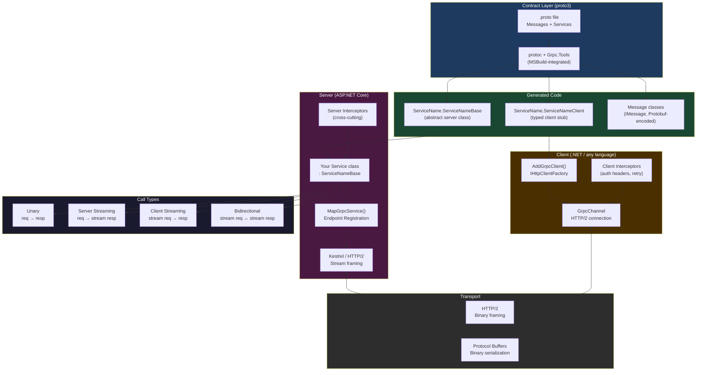
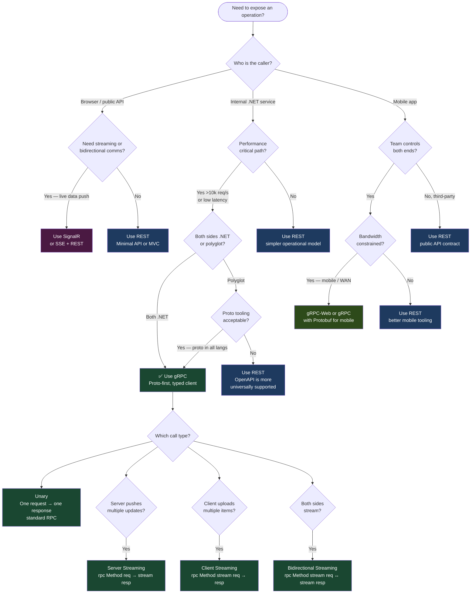

# 4.240 — gRPC in ASP.NET Core: Proto Contracts and Service Implementation

---

## PART 0 — Navigation & Context

### Where This Topic Lives

```
ASP.NET Core Mastery
│
├── A. Host & Lifecycle
├── B. Configuration
├── C. Logging
├── D. Dependency Injection
├── E. Middleware Pipeline
│     └── [[4.049 — The Middleware Pipeline]]          ← gRPC sits here
├── F. Routing
│     └── [[4.064 — Endpoint Routing]]                 ← MapGrpcService<T> is an endpoint
├── G. Minimal APIs
├── H. MVC & Controllers
├── I. HTTP Fundamentals
│     └── [[4.127 — HTTP/2: Multiplexing and Kestrel]] ← gRPC requires HTTP/2
├── J–K. Auth
├── ...
└── S. gRPC                                            ◄ YOU ARE HERE
      ├── 4.240 — Proto Contracts & Service Implementation  ← this note
      ├── 4.241 — Streaming: Unary, Server, Client, Bidirectional
      ├── 4.242 — Authentication: JWT and Certificate Interceptors
      ├── 4.243 — Error Handling: StatusCode and RpcException
      ├── 4.244 — Interceptors: Server-Side and Client-Side
      ├── 4.245 — gRPC-Web: Browser Support
      ├── 4.246 — Client Factory: AddGrpcClient<T>
      ├── 4.247 — JSON Transcoding
      └── 4.248 — gRPC vs REST vs GraphQL vs SignalR
```

### What You Need Before This

- **[[4.049 — The Middleware Pipeline]]** — gRPC requests flow through the ASP.NET Core pipeline like any other request; middleware wraps gRPC service execution
- **[[4.064 — Endpoint Routing]]** — `MapGrpcService<T>()` registers an endpoint; understanding endpoint routing explains how gRPC is dispatched
- **[[4.127 — HTTP/2: Multiplexing and Kestrel Configuration]]** — gRPC requires HTTP/2; Kestrel must be configured to serve it
- **[[4.035 — Service Lifetimes: Singleton, Scoped, Transient]]** — gRPC service classes are resolved per-request (Scoped); DI rules apply exactly as they do for controllers

### What This Unlocks After

- **[[4.241 — gRPC Streaming]]** — once you understand unary calls and the service model, streaming variants are a natural extension
- **[[4.244 — gRPC Interceptors]]** — interceptors are to gRPC what middleware and filters are to HTTP; they require understanding the service pipeline first
- **[[4.246 — gRPC Client Factory]]** — `AddGrpcClient<T>` consumes generated stubs; you must understand stub generation before configuring clients
- **[[4.248 — gRPC vs REST vs GraphQL Decision Framework]]** — the decision framework requires deep knowledge of gRPC's actual capabilities, not surface-level awareness

### Why This Matters at Scale

At production scale, gRPC eliminates the two biggest costs of REST microservice communication: JSON serialization overhead and schema drift. Because the `.proto` file is compiled into both the client and the server, a breaking contract change is a **compile error**, not a runtime 500 — which is the reason high-throughput internal service meshes (Google, Netflix, Shopify) converged on protocol-first RPC rather than REST.

---

## PART 1 — The Core Mental Model

### The Fundamental Rule

> **In ASP.NET Core gRPC, the `.proto` file is the API contract compiled into both sides; the framework generates the HTTP/2 framing, binary serialization, and request dispatch automatically — your code only implements the business logic methods the proto declares.**

### The Plain-Language Analogy

Think of gRPC as a strongly-typed phone switchboard. The `.proto` file is the printed directory of extension numbers — it lists every callable function and the exact types of its inputs and outputs. When you pick up the phone and dial an extension (call an RPC method), the switchboard (the generated stub) knows the exact binary encoding of your voice (Protobuf), routes it over a dedicated line (HTTP/2 stream), and connects you to the right handler on the other side. If the extension doesn't exist in the directory (method not in the proto), the call fails at _compile time_, not when the call is in flight. This analogy holds under load: HTTP/2 multiplexing means dozens of calls share a single TCP connection simultaneously — like a single physical line that can carry many conversations in parallel without each one waiting for the previous to finish.

### The Taxonomy Diagram



---

## PART 2 — Deep Mechanics

### 2.1 The Proto-to-Code Pipeline

Before a single byte hits the wire, the build system transforms your `.proto` file into C#. Understanding what gets generated is what separates engineers who copy gRPC examples from engineers who debug gRPC in production.

**Pipeline position:**

```
MSBuild invokes protoc
  │
  ├── Grpc.Tools (NuGet) provides protoc binary + gRPC C# plugin
  ├── <Protobuf Include="..." GrpcServices="Server|Client|Both|None" />
  └── Generated output: obj/Debug/net8.0/Protos/
        ├── Greeter.cs          ← message types (HelloRequest, HelloReply)
        └── GreeterGrpc.cs      ← service base + client stub
```

**What `GrpcServices` controls:**

|Value|Generates|Use when|
|---|---|---|
|`Server`|`ServiceBase` abstract class|Server project only|
|`Client`|`ServiceClient` typed stub|Client project only|
|`Both`|Both|Shared proto library|
|`None`|Message types only|Shared DTO library|

**Generated server base class (approximate — actual output):**

```csharp
// ASP.NET Core internally generates (approximate):
// GreeterGrpc.cs — do not hand-edit, regenerated on build
public static partial class Greeter
{
    // Abstract base — your service inherits this
    public abstract partial class GreeterBase
    {
        // ~0 allocations in the method dispatch itself; Protobuf deserialization
        // is ~1 allocation per message (the message object itself)
        public virtual Task<HelloReply> SayHello(
            HelloRequest request,
            ServerCallContext context)
            => throw new RpcException(
                new Status(StatusCode.Unimplemented, ""));

        // Server streaming: IServerStreamWriter<T> is the response channel
        public virtual Task SayHelloStream(
            HelloRequest request,
            IServerStreamWriter<HelloReply> responseStream,
            ServerCallContext context)
            => throw new RpcException(
                new Status(StatusCode.Unimplemented, ""));
    }

    // Typed client stub
    public partial class GreeterClient : ClientBase<GreeterClient>
    {
        public virtual AsyncUnaryCall<HelloReply> SayHelloAsync(
            HelloRequest request,
            CallOptions options = default) { ... }
    }
}
```

> [!IMPORTANT] The default implementation of every method in `ServiceNameBase` throws `StatusCode.Unimplemented`. If you forget to override a method your client calls, the client receives a gRPC status 12 (UNIMPLEMENTED) — not a compile error.

**Runtime cost:** `~1 allocation per request` for the message object. Protobuf uses `ArrayPool<byte>` internally for intermediate buffers. The generated code itself is zero-allocation at the dispatch layer.

---

### 2.2 HTTP/2 Wire Format for gRPC

gRPC is not HTTP/1.1 with binary payloads. It is a protocol built on HTTP/2 streams. Every gRPC call is a single HTTP/2 stream.

**HTTP wire format for a unary gRPC call:**

```
// HTTP/2 request (approximate wire format):
// HEADERS frame:
//   :method = POST
//   :scheme = https
//   :path = /greeter.Greeter/SayHello        ← /{package}.{Service}/{Method}
//   :authority = localhost:5001
//   content-type = application/grpc          ← REQUIRED; not application/json
//   grpc-encoding = identity                 ← or gzip, deflate
//   te = trailers                            ← REQUIRED for gRPC
//
// DATA frame (Length-Prefixed Message):
//   byte 0:   compression flag (0 = uncompressed, 1 = compressed)
//   bytes 1-4: message length as big-endian uint32
//   bytes 5+: Protobuf-encoded HelloRequest

// HTTP/2 response:
// HEADERS frame:
//   :status = 200                            ← gRPC ALWAYS returns 200 for the HTTP layer
//   content-type = application/grpc
//
// DATA frame:
//   (same Length-Prefixed Message format with HelloReply)
//
// TRAILERS frame (end of stream):
//   grpc-status = 0                          ← 0 = OK; non-zero = error
//   grpc-message = ""                        ← human-readable error, empty on success
```

> [!WARNING] The HTTP status is **always 200** for gRPC, even on error. Errors are communicated in the `grpc-status` trailer, not the HTTP status code. Monitoring systems that only watch HTTP status codes will miss gRPC errors entirely. This is the most common operational blind spot.

**Pipeline position in ASP.NET Core:**

```
──► ExceptionHandler ──► HSTS ──► StaticFiles ──► Routing ──► Auth ──► [GrpcMiddleware] ──► GrpcEndpoint
                                                     │                        │
                                              UseRouting resolves        MapGrpcService<T>
                                              /greeter.Greeter/SayHello  dispatches to GreeterService
```

The gRPC middleware (`GrpcMiddleware`) sits between `UseAuthorization` and the endpoint. It:

1. Validates `content-type: application/grpc`
2. Reads the Length-Prefixed Message framing
3. Deserializes the Protobuf request
4. Resolves the service from DI (Scoped per request)
5. Calls the appropriate method override
6. Serializes the response and writes it back with Length-Prefix framing
7. Sends the TRAILERS frame with `grpc-status`

**Cost annotation:** `O(1) endpoint lookup via trie` (same as REST endpoints), `~1 Protobuf deserialization per request`, `~1 DI scope creation per call`.

---

### 2.3 The Proto File: Field Numbers, Types, and Wire Compatibility

The `.proto` file is permanent once deployed. Engineers who treat it as editable configuration break production clients silently.

**A production-realistic proto for an order management service:**

```proto
// Protos/orders.proto
syntax = "proto3";

option csharp_namespace = "OrderService.Grpc";

package orders.v1;

import "google/protobuf/timestamp.proto";

service OrderService {
  // Unary: submit a new order
  rpc CreateOrder (CreateOrderRequest) returns (CreateOrderResponse);

  // Unary: get order details
  rpc GetOrder (GetOrderRequest) returns (GetOrderResponse);

  // Server streaming: stream order status updates
  rpc WatchOrderStatus (WatchOrderStatusRequest)
      returns (stream OrderStatusUpdate);
}

message CreateOrderRequest {
  string customer_id     = 1;   // NEVER change this field number
  repeated OrderItem items = 2;
  string currency_code   = 3;
}

message CreateOrderResponse {
  string order_id   = 1;
  OrderStatus status = 2;
  google.protobuf.Timestamp created_at = 3;
}

message GetOrderRequest {
  string order_id = 1;
}

message GetOrderResponse {
  string order_id     = 1;
  string customer_id  = 2;
  OrderStatus status  = 3;
  repeated OrderItem items = 4;
  // Added in v1.1 — safe: new field number, old clients ignore it
  string tracking_number = 5;
}

message WatchOrderStatusRequest {
  string order_id = 1;
}

message OrderStatusUpdate {
  string order_id     = 1;
  OrderStatus status  = 2;
  google.protobuf.Timestamp updated_at = 3;
}

message OrderItem {
  string sku      = 1;
  int32  quantity = 2;
  int64  price_cents = 3;   // use int64 for money; never float/double
}

enum OrderStatus {
  ORDER_STATUS_UNSPECIFIED = 0;  // proto3 REQUIRES 0 as default
  ORDER_STATUS_PENDING     = 1;
  ORDER_STATUS_CONFIRMED   = 2;
  ORDER_STATUS_SHIPPED     = 3;
  ORDER_STATUS_DELIVERED   = 4;
  ORDER_STATUS_CANCELLED   = 5;
}
```

**Wire compatibility rules (production-critical):**

|Action|Safe?|Consequence if unsafe|
|---|---|---|
|Add new field with new number|✅ Safe|Old clients ignore unknown fields|
|Remove a field|⚠️ Dangerous|Old clients sending removed field get it silently dropped; reserve the number|
|Rename a field|✅ Safe|Field names don't appear on the wire; only numbers do|
|Change a field number|❌ Never|Old clients send the old number; new server reads it as a different field or ignores it|
|Change a field type|❌ Usually never|Wire encoding differs; deserialization corrupts silently|
|Add enum value|✅ Safe|Old clients receive `UNSPECIFIED` (0) for unknown enum values|
|Remove enum value|⚠️ Dangerous|Clients sending removed value get `UNSPECIFIED`|

> [!DANGER] proto3 has no `required` keyword — every field is optional. A missing `order_id` in `GetOrderRequest` deserializes as `""` (empty string), not an exception. Always validate fields explicitly in your service implementation.

**Cost annotation:** proto3 Protobuf encoding is `~3-10x smaller than equivalent JSON` for typical API payloads and `~5-10x faster to deserialize` due to no reflection and no string parsing.

---

### 2.4 Service Registration and the DI Lifetime Model

**ASP.NET Core internally (approximate — `GrpcServiceExtensions.MapGrpcService<T>`):**

```csharp
// What MapGrpcService<T> does under the hood (approximate):
public static GrpcServiceEndpointConventionBuilder MapGrpcService<TService>(
    this IEndpointRouteBuilder builder)
    where TService : class
{
    // Registers routes for every RPC method in TService
    // Route pattern: /{package}.{ServiceName}/{MethodName}
    // e.g., /orders.v1.OrderService/CreateOrder

    // Each route creates an endpoint that:
    // 1. Creates an IServiceScope (per-call DI scope)
    // 2. Resolves TService from that scope
    // 3. Runs server interceptors
    // 4. Calls the appropriate method override
    // 5. Disposes the scope after the call completes
}
```

**Service lifetime:** gRPC services are resolved **per-call** (equivalent to Scoped). This means:

- Constructor-injected `DbContext`, `IRepository<T>`, and other Scoped services are safe
- You **cannot** store per-call state in a Singleton gRPC service
- `IHttpContextAccessor` is available and works the same way as in controllers

**Registration:**

```csharp
// Program.cs
var builder = WebApplication.CreateBuilder(args);

// Register gRPC
builder.Services.AddGrpc(options =>
{
    // Global options
    options.MaxReceiveMessageSize = 4 * 1024 * 1024; // 4 MB
    options.MaxSendMessageSize    = null;              // unlimited
    options.EnableDetailedErrors  = builder.Environment.IsDevelopment();
    // EnableDetailedErrors: sends exception messages in grpc-message trailer
    // NEVER enable in production — leaks internal stack traces to clients
});

// Register application services (injected into gRPC services)
builder.Services.AddScoped<IOrderRepository, SqlOrderRepository>();
builder.Services.AddScoped<IPaymentGateway, StripePaymentGateway>();

var app = builder.Build();

// Kestrel MUST be configured for HTTP/2
// (see appsettings.json below)

app.UseRouting();
app.UseAuthentication();
app.UseAuthorization();

// MapGrpcService AFTER UseAuthorization
app.MapGrpcService<OrderServiceImpl>();

app.Run();
```

```json
// appsettings.json — Kestrel HTTP/2 configuration
{
  "Kestrel": {
    "Endpoints": {
      "GrpcEndpoint": {
        "Url": "https://localhost:5001",
        "Protocols": "Http2"
      },
      "HttpEndpoint": {
        "Url": "https://localhost:5002",
        "Protocols": "Http1"
      }
    }
  }
}
```

> [!NOTE] Running HTTP/1.1 and HTTP/2 on the same port is possible but requires ALPN (TLS Application-Layer Protocol Negotiation). In development, separate ports are simpler and avoid TLS configuration complexity.

**Pipeline position:**

```
──► ExceptionHandler ──► Routing ──► Auth ──► Authorization ──► [gRPC Endpoint]
                                                                       │
                                                              Scope created → Service resolved
                                                              → Interceptors run
                                                              → Method dispatched
                                                              → Scope disposed
```

**Failure mode — wrong HTTP version:**

```
// HTTP consequence (wrong path — client sends HTTP/1.1 to gRPC endpoint):
// HTTP/1.1 415 Unsupported Media Type
// content-type: text/plain
// body: "Request content-type application/grpc not supported."
//
// This happens when a REST client accidentally hits a gRPC endpoint
// or when the channel is not configured for HTTP/2.
```

---

### 2.5 ServerCallContext: The gRPC Equivalent of HttpContext

`ServerCallContext` is the gRPC layer's per-call context object. It exposes the HTTP/2 stream metadata, deadlines, cancellation, and peer information.

```csharp
// ASP.NET Core internally provides HttpContext via ServerCallContext
// Access it with the extension method:
// var httpContext = context.GetHttpContext(); // using Grpc.AspNetCore.Server

public override async Task<CreateOrderResponse> CreateOrder(
    CreateOrderRequest request,
    ServerCallContext context)
{
    // Deadline: the absolute time by which the call must complete
    // Client sets this; server must respect it
    // ~0 allocation to check; failing to check means requests run to completion
    // even after the client has abandoned them
    var deadline = context.Deadline; // DateTime.MaxValue if not set

    // CancellationToken: fires when deadline exceeded or client cancels
    // Cost: ~0; this is the standard .NET CancellationToken
    var ct = context.CancellationToken;

    // Peer: client IP/port for audit logging
    var peer = context.Peer; // e.g., "ipv4:127.0.0.1:54321"

    // Request headers (gRPC metadata)
    // ~1 allocation to enumerate entries
    var tenantId = context.RequestHeaders
        .GetValue("x-tenant-id"); // null if missing

    // Response trailers: sent after the final message
    // Must be set BEFORE returning from the method
    context.ResponseTrailers.Add("x-request-id",
        Activity.Current?.TraceId.ToString() ?? "");

    // Access raw HttpContext for middleware-populated state
    var httpContext = context.GetHttpContext();
    var userId = httpContext.User.FindFirstValue(ClaimTypes.NameIdentifier);

    // ... business logic ...
    return new CreateOrderResponse { OrderId = "ORD-001" };
}
```

**Failure mode — deadline exceeded:**

```
// HTTP/2 trailers when deadline is exceeded (server side):
// grpc-status: 4   (DEADLINE_EXCEEDED)
// grpc-message: Deadline Exceeded

// What the client sees:
// RpcException with StatusCode.DeadlineExceeded
// The HTTP/2 :status is still 200 — the error is in the trailer
```

**Cost annotation:** `ServerCallContext` is `~1 allocation per call`. `RequestHeaders` access is `O(n)` over metadata entries. Always pass `context.CancellationToken` through to all async operations — `~0 cost to propagate`, avoids executing expensive DB queries after the client has given up.

---

## PART 3 — Production Code Patterns

### Pattern 1: The Contract-First Order Service (Unary RPC)

A payment processing API where the gRPC contract defines the exact fields available for charge creation — no ambiguity about nullability, no runtime JSON shape surprises.

```csharp
// ⚠️ WRONG: Skipping deadline and cancellation propagation
public override async Task<ChargeResponse> CreateCharge(
    ChargeRequest request, ServerCallContext context)
{
    // No cancellation passed — if client times out, this DB call
    // continues running, holding a connection for up to 30 seconds
    var result = await _paymentRepo.InsertChargeAsync(request.AmountCents);
    return new ChargeResponse { ChargeId = result.Id };
}

// ✅ CORRECT: Full cancellation propagation + validation + structured error
public override async Task<ChargeResponse> CreateCharge(
    ChargeRequest request, ServerCallContext context)
{
    // Validate proto fields — proto3 has no required fields, so validate explicitly
    if (string.IsNullOrWhiteSpace(request.CustomerId))
        throw new RpcException(new Status(StatusCode.InvalidArgument,
            "customer_id is required"));

    if (request.AmountCents <= 0)
        throw new RpcException(new Status(StatusCode.InvalidArgument,
            "amount_cents must be positive"));

    if (string.IsNullOrWhiteSpace(request.Currency))
        throw new RpcException(new Status(StatusCode.InvalidArgument,
            "currency is required"));

    // Propagate cancellation — if client deadline fires, DB call is cancelled
    // ~0 cost to pass the token; potentially avoids minutes of wasted DB work
    var charge = await _paymentRepo.InsertChargeAsync(
        request.CustomerId,
        request.AmountCents,
        request.Currency,
        context.CancellationToken);

    _logger.LogInformation(
        "Charge {ChargeId} created for customer {CustomerId}",
        charge.Id, request.CustomerId);

    return new ChargeResponse
    {
        ChargeId   = charge.Id,
        Status     = ChargeStatus.ChargePending,
        CreatedAt  = Timestamp.FromDateTimeOffset(charge.CreatedAt)
    };
}

// HTTP wire format (success):
// POST /payments.v1.PaymentService/CreateCharge HTTP/2
// content-type: application/grpc
// → 200 OK (HTTP layer)
// grpc-status: 0 (trailer)
//
// HTTP wire format (validation failure):
// → 200 OK (HTTP layer — always 200 for gRPC)
// grpc-status: 3  (INVALID_ARGUMENT trailer)
// grpc-message: customer_id is required
```

---

### Pattern 2: The Inventory Feed (Server Streaming)

A logistics tracking service that streams live inventory updates to a warehouse management dashboard. The server streams until the client disconnects or the product goes out of scope.

```csharp
// Proto:
// rpc WatchInventory (WatchInventoryRequest)
//     returns (stream InventoryUpdate);

public override async Task WatchInventory(
    WatchInventoryRequest request,
    IServerStreamWriter<InventoryUpdate> responseStream,
    ServerCallContext context)
{
    // DisableBuffering: send each message immediately, do not buffer
    // Without this, the framework may batch small messages — adds latency
    responseStream.WriteOptions = WriteOptions.Default;

    _logger.LogInformation(
        "Inventory watch stream opened for SKU {Sku} by {Peer}",
        request.Sku, context.Peer);

    // Subscribe to internal event bus
    // ~1 allocation for the subscription object
    await foreach (var update in _inventoryEvents
        .WatchAsync(request.Sku, context.CancellationToken))
    {
        // Check cancellation before each write
        // Client disconnect fires CancellationToken; without this check,
        // WriteAsync throws OperationCanceledException on next write
        if (context.CancellationToken.IsCancellationRequested)
            break;

        await responseStream.WriteAsync(new InventoryUpdate
        {
            Sku           = update.Sku,
            WarehouseId   = update.WarehouseId,
            QuantityDelta = update.Delta,
            NewQuantity   = update.Total,
            UpdatedAt     = Timestamp.FromDateTimeOffset(update.OccurredAt)
        }, context.CancellationToken);
    }

    _logger.LogInformation(
        "Inventory watch stream closed for SKU {Sku}", request.Sku);

    // HTTP wire format:
    // Repeated DATA frames, one per InventoryUpdate message
    // Final TRAILERS: grpc-status: 0
    // Client sees: AsyncServerStreamingCall<InventoryUpdate>
    //   → call.ResponseStream.ReadAllAsync() as IAsyncEnumerable<InventoryUpdate>
}
```

---

### Pattern 3: The Bulk Order Import (Client Streaming)

A shipment processing service that accepts a stream of scanned package barcodes from a warehouse scanner device and returns a single summary after all packages are processed.

```csharp
// Proto:
// rpc ImportShipmentItems (stream ShipmentItemRequest)
//     returns (ImportShipmentResponse);

public override async Task<ImportShipmentResponse> ImportShipmentItems(
    IAsyncStreamReader<ShipmentItemRequest> requestStream,
    ServerCallContext context)
{
    var processed = 0;
    var failed    = new List<string>();

    // ReadAllAsync respects CancellationToken — if client disconnects mid-stream,
    // the loop exits cleanly without throwing in most cases
    await foreach (var item in requestStream.ReadAllAsync(
        context.CancellationToken))
    {
        if (string.IsNullOrWhiteSpace(item.Barcode))
        {
            failed.Add($"empty barcode at index {processed}");
            continue;
        }

        try
        {
            await _shipmentRepo.RecordScanAsync(
                item.ShipmentId,
                item.Barcode,
                item.ScannedAt.ToDateTimeOffset(),
                context.CancellationToken);
            processed++;
        }
        catch (DuplicateBarcodeException)
        {
            // Non-fatal: record the failure and continue streaming
            failed.Add(item.Barcode);
        }
    }

    return new ImportShipmentResponse
    {
        ProcessedCount = processed,
        FailedBarcodes = { failed }  // repeated string field
    };

    // HTTP wire format:
    // Client sends: stream of DATA frames (one per ShipmentItemRequest)
    // Client signals end-of-stream with a half-close (END_STREAM flag)
    // Server reads all items, then sends a single DATA frame + TRAILERS
}
```

---

### Pattern 4: The Idiomatic Dependency Injection Pattern

Injecting scoped application services (DbContext, repositories) into a gRPC service using standard constructor injection — exactly as you would in an MVC controller.

```csharp
// ✅ CORRECT: Constructor injection — services are Scoped per gRPC call
public class OrderServiceImpl : OrderService.OrderServiceBase
{
    private readonly IOrderRepository        _orders;
    private readonly ILogger<OrderServiceImpl> _logger;
    private readonly IPaymentGateway         _payments;

    // All constructor parameters are resolved from the per-call DI scope
    // ~1 scope creation per gRPC call — same as HTTP request scope
    public OrderServiceImpl(
        IOrderRepository orders,
        ILogger<OrderServiceImpl> logger,
        IPaymentGateway payments)
    {
        _orders   = orders;
        _logger   = logger;
        _payments = payments;
    }

    public override async Task<GetOrderResponse> GetOrder(
        GetOrderRequest request,
        ServerCallContext context)
    {
        var order = await _orders.FindByIdAsync(request.OrderId,
            context.CancellationToken);

        if (order is null)
            throw new RpcException(new Status(StatusCode.NotFound,
                $"Order {request.OrderId} not found"));

        return order.ToGrpcResponse(); // extension method for proto mapping
    }
}

// ⚠️ WRONG: Resolving services manually from IServiceProvider in the method body
// This creates a scope that is never disposed, leaking DbContext connections
public override async Task<GetOrderResponse> GetOrder_Wrong(
    GetOrderRequest request, ServerCallContext context)
{
    // ❌ Manual resolution in method body — scope never disposed
    var orders = context.GetHttpContext()
        .RequestServices.GetRequiredService<IOrderRepository>();
    // ...
}
```

---

### Pattern 5: The Multi-Tenant SaaS Authorization Guard

A multi-tenant platform where gRPC calls must be scoped to the authenticated tenant. The tenant is extracted from JWT claims and validated against the requested resource before any data access occurs.

```csharp
// Tenant-aware gRPC service for a SaaS inventory platform
[Authorize] // requires UseAuthentication + UseAuthorization in pipeline
public class InventoryServiceImpl : InventoryService.InventoryServiceBase
{
    private readonly IInventoryRepository _inventory;
    private readonly ILogger<InventoryServiceImpl> _logger;

    public InventoryServiceImpl(
        IInventoryRepository inventory,
        ILogger<InventoryServiceImpl> logger)
    {
        _inventory = inventory;
        _logger    = logger;
    }

    public override async Task<GetStockLevelResponse> GetStockLevel(
        GetStockLevelRequest request,
        ServerCallContext context)
    {
        // Extract tenant from JWT claims (set by UseAuthentication middleware)
        var httpContext = context.GetHttpContext();
        var tenantId = httpContext.User
            .FindFirstValue("tenant_id"); // custom JWT claim

        if (tenantId is null)
            throw new RpcException(new Status(StatusCode.Unauthenticated,
                "Missing tenant_id claim"));

        // Prevent cross-tenant data access — compare JWT tenant to requested resource
        // This is IDOR prevention at the gRPC layer
        if (!await _inventory.TenantOwnsSkuAsync(tenantId, request.Sku,
            context.CancellationToken))
            throw new RpcException(new Status(StatusCode.PermissionDenied,
                "SKU does not belong to tenant"));

        var level = await _inventory.GetStockAsync(tenantId, request.Sku,
            context.CancellationToken);

        return new GetStockLevelResponse { Quantity = level };

        // HTTP wire format (unauthorized):
        // grpc-status: 16  (UNAUTHENTICATED)  — maps from 401
        // grpc-status: 7   (PERMISSION_DENIED) — maps from 403
    }
}
```

---

### Pattern 6: The Reflection Service for Development Tooling

Enabling gRPC server reflection so tools like `grpcurl` and Postman can discover your service schema without a `.proto` file — critical for development and testing workflows.

```csharp
// Program.cs
builder.Services.AddGrpc();
builder.Services.AddGrpcReflection(); // NuGet: Grpc.AspNetCore.Server.Reflection

var app = builder.Build();

app.MapGrpcService<OrderServiceImpl>();

// ✅ CORRECT: Reflection only in development
// In production, reflection exposes your entire API schema to any caller
if (app.Environment.IsDevelopment())
{
    app.MapGrpcReflectionService();
}

// ⚠️ WRONG: Reflection in production
// app.MapGrpcReflectionService(); // ❌ exposes schema to attackers

// Usage from command line (development only):
// grpcurl -plaintext localhost:5001 list
// → orders.v1.OrderService
//
// grpcurl -plaintext localhost:5001 describe orders.v1.OrderService
// → service definition from proto
//
// grpcurl -plaintext -d '{"order_id": "ORD-001"}' \
//   localhost:5001 orders.v1.OrderService/GetOrder
```

---

### Pattern 7: The gRPC Health Check Endpoint

Kubernetes liveness/readiness probes for gRPC services using the standard gRPC health checking protocol — consumed by load balancers and orchestrators without custom code.

```csharp
// NuGet: Grpc.HealthCheck
builder.Services.AddGrpcHealthChecks()
    .AddCheck("orders-db", () =>
    {
        // ~1 DB ping per probe interval
        return _dbContext.Database.CanConnect()
            ? HealthCheckResult.Healthy()
            : HealthCheckResult.Unhealthy("Cannot reach database");
    });

// In endpoint registration:
app.MapGrpcHealthChecksService();

// Wire format — Kubernetes calls:
// POST /grpc.health.v1.Health/Check
// request: { "service": "" }
// response: { "status": "SERVING" } or { "status": "NOT_SERVING" }
// grpc-status: 0 (OK) even when NOT_SERVING — status is in response body
//
// Kubernetes probe config:
// livenessProbe:
//   grpc:
//     port: 5001
//     service: ""
```

---

## PART 4 — Gotchas & Anti-Patterns

### Gotcha 1: HTTP Status Is Always 200 — Your Monitoring Is Blind

gRPC errors go through a fundamentally different signaling channel than REST errors. Engineers who set up REST-oriented monitoring assume HTTP 4xx/5xx indicate problems and miss every gRPC failure.

```csharp
// ⚠️ WRONG: Monitoring that only watches HTTP status codes
// (e.g., alerting on HTTP 500 — this fires ZERO times for gRPC errors)
// No code change needed — the problem is in the monitoring configuration.

// HTTP consequence (wrong path):
// gRPC call fails with StatusCode.Unavailable
// → HTTP/2 :status header: 200
// → grpc-status trailer: 14 (UNAVAILABLE)
// → HTTP monitoring sees: 200 OK ✅ (false positive)
// → Clients are receiving errors; monitoring shows green

// ✅ CORRECT: Monitor grpc-status trailer values, not HTTP status
// In OpenTelemetry / Prometheus, gRPC status code is exposed as a separate dimension:
// http_server_request_duration_seconds{grpc_status="UNAVAILABLE"} 1.23

// WHY: gRPC uses HTTP/2 trailers, not HTTP status, for error signaling.
// The HTTP/2 spec requires :status 200 for a valid gRPC response frame.
// grpc-status: 0 = OK; grpc-status: 1-16 = various error codes.
// Any monitoring tool that does not parse gRPC trailers is blind to gRPC errors.
```

---

### Gotcha 2: proto3 Optional Fields Produce Silent Zero-Value Bugs

Engineers familiar with REST/JSON assume missing fields produce null or an error. In proto3 they produce silent zero values, which can bypass validation logic and corrupt business data.

```csharp
// ⚠️ WRONG: Treating proto3 fields like nullable types
public override async Task<ChargeResponse> CreateCharge(
    ChargeRequest request, ServerCallContext context)
{
    // request.AmountCents is int64; if client sends no value, it is 0
    // This charge of 0 cents passes this check silently
    if (request.AmountCents < 0)
        throw new RpcException(new Status(StatusCode.InvalidArgument,
            "Amount cannot be negative"));

    await _payments.ChargeAsync(request.AmountCents); // charges $0.00
    return new ChargeResponse { ChargeId = "CHG-001" };
}

// HTTP consequence (wrong path):
// grpc-status: 0 (OK) — no error raised
// A $0.00 charge is created for every client that omits amount_cents

// ✅ CORRECT: Explicit presence validation for all business-critical fields
public override async Task<ChargeResponse> CreateCharge(
    ChargeRequest request, ServerCallContext context)
{
    if (request.AmountCents <= 0)   // catches both missing (0) and negative
        throw new RpcException(new Status(StatusCode.InvalidArgument,
            "amount_cents must be a positive integer"));

    if (string.IsNullOrWhiteSpace(request.CustomerId))
        throw new RpcException(new Status(StatusCode.InvalidArgument,
            "customer_id is required"));

    await _payments.ChargeAsync(request.AmountCents, request.CustomerId,
        context.CancellationToken);
    return new ChargeResponse { ChargeId = "CHG-001" };
}

// HTTP consequence (correct path):
// grpc-status: 3 (INVALID_ARGUMENT) for missing fields

// WHY: proto3 removed `required`. Every field has a zero value:
// int32/64 → 0, string → "", bool → false, enum → first value (which must be 0).
// There is no null. Use proto3 optional keyword (field presence tracking,
// .NET 8+, generates HasFieldName property) if you genuinely need null semantics.
```

---

### Gotcha 3: Field Number Reuse Corrupts Deserialization Silently

The most dangerous proto evolution mistake. It produces no compile error, no exception at startup, and no obvious runtime failure — data is silently corrupted or silently ignored.

```proto
// ⚠️ WRONG: Reusing field number 2 after removing a field
message OrderItem {
  string sku      = 1;
  // REMOVED: int32 quantity = 2;   ← developer deleted this line
  int64  price    = 2;              // ← REUSED field number 2 — FATAL
  string warehouse = 3;
}

// HTTP consequence (wrong path):
// Old clients sending quantity=5 (int32, field 2) on the wire
// New server reads field 2 as price (int64) — gets garbage numeric value
// grpc-status: 0 (OK) — no error; data is silently wrong
// A $5.00 item becomes a $5-cent item or a multi-thousand-dollar item

// ✅ CORRECT: Reserve removed field numbers and names
message OrderItem {
  string sku      = 1;
  reserved 2;                       // reserved number — cannot be reused
  reserved "quantity";              // reserved name — cannot be reused
  int64  price    = 3;              // new field gets a NEW number
  string warehouse = 4;
}

// HTTP consequence (correct path):
// Old clients sending quantity (field 2): server ignores unknown field 2
// New clients send price as field 3: correctly deserialized
// grpc-status: 0 with correct data

// WHY: Protobuf identifies fields by number on the wire, not name.
// Reusing a number means the encoding of the old type (int32) is now
// interpreted as the new type (int64). Wire types may or may not match;
// when they do not, deserialization silently drops or truncates the value.
// `reserved` is the compiler-enforced guard against this class of bug.
```

---

### Gotcha 4: EnableDetailedErrors in Production Leaks Internal State

`EnableDetailedErrors` is intended for development debugging. Enabling it in production sends exception messages, stack traces, and internal type names to any caller with a gRPC client.

```csharp
// ⚠️ WRONG: Enabling detailed errors unconditionally
builder.Services.AddGrpc(options =>
{
    options.EnableDetailedErrors = true; // ❌ leaks internal state in production
});

// HTTP consequence (wrong path) — when an unhandled exception occurs:
// grpc-status: 2 (UNKNOWN)
// grpc-message: "Exception was of type 'SqlException' with message
//   'Connection Timeout. Server: prod-db-01.internal, Port: 1433, Database: Orders'
//   at Microsoft.Data.SqlClient.SqlConnection.Open()
//   at OrderService.Grpc.OrderServiceImpl.GetOrder(...)'"
// → Internal hostnames, port numbers, database names exposed to the client

// ✅ CORRECT: Environment-conditional detailed errors
builder.Services.AddGrpc(options =>
{
    // Only development gets the full exception detail
    options.EnableDetailedErrors = builder.Environment.IsDevelopment();
});

// HTTP consequence (correct path) — production exception:
// grpc-status: 2 (UNKNOWN)
// grpc-message: "Exception was thrown by the handler."
// Internal details stay internal; correlation ID in response trailer for log lookup

// WHY: When EnableDetailedErrors = false (default), the gRPC middleware
// replaces all exception messages with a generic string before writing
// the grpc-message trailer. With it enabled, the raw Exception.Message
// and inner exception chain are forwarded verbatim.
```

---

### Gotcha 5: Forgetting CancellationToken in Streaming Loops Causes Resource Leaks

Server streaming methods that ignore `context.CancellationToken` continue executing — holding DB connections, event subscriptions, and thread pool threads — long after the client has disconnected or timed out.

```csharp
// ⚠️ WRONG: Streaming loop without cancellation checks
public override async Task WatchOrderStatus(
    WatchOrderStatusRequest request,
    IServerStreamWriter<OrderStatusUpdate> responseStream,
    ServerCallContext context)
{
    // Infinite loop with no cancellation awareness
    while (true) // ❌ never exits if client disconnects
    {
        var update = await _eventBus.NextEventAsync(request.OrderId);
        // WriteAsync throws OperationCanceledException after client disconnects,
        // but the _eventBus subscription is never cleaned up
        await responseStream.WriteAsync(new OrderStatusUpdate
        {
            Status = update.NewStatus
        });
    }
    // HTTP consequence: event bus subscription leaks until process restart
    // Under load: N concurrent clients × abandoned subscriptions = OOM
}

// ✅ CORRECT: Cancellation-aware streaming loop with cleanup
public override async Task WatchOrderStatus(
    WatchOrderStatusRequest request,
    IServerStreamWriter<OrderStatusUpdate> responseStream,
    ServerCallContext context)
{
    _logger.LogInformation("Stream opened for order {OrderId}", request.OrderId);

    try
    {
        await foreach (var update in _eventBus
            .WatchAsync(request.OrderId, context.CancellationToken))
        {
            // CancellationToken passed to WriteAsync — exits cleanly on disconnect
            await responseStream.WriteAsync(new OrderStatusUpdate
            {
                OrderId   = request.OrderId,
                Status    = update.NewStatus,
                UpdatedAt = Timestamp.FromDateTimeOffset(update.OccurredAt)
            }, context.CancellationToken);
        }
    }
    catch (OperationCanceledException)
    {
        // Client disconnected or deadline exceeded — normal exit path, not an error
        _logger.LogInformation("Stream cancelled for order {OrderId}",
            request.OrderId);
    }
    // Event bus subscription is cleaned up by the IAsyncEnumerable's Dispose
    // HTTP consequence (correct path): TRAILERS frame sent with grpc-status: 0
}

// WHY: context.CancellationToken is cancelled when:
// 1. The client sends RST_STREAM (disconnect)
// 2. The client's deadline is exceeded
// 3. The server calls CancelAsync() (rare)
// Passing it to all async operations ensures prompt cleanup.
// Not doing so means the server leaks resources proportional to client churn rate.
```

---

## PART 5 — Performance Implications

### 5.1 Request Pipeline Characteristics Table

|Scenario|Pipeline Depth|Allocations Per Request|Approx Latency Impact|Recommendation|
|---|---|---|---|---|
|Unary call, small message (<1KB)|Shallow (gRPC dispatch + 1 method)|~3–5 (message, scope, context)|Baseline ~0.1–0.5ms overhead|Default; Protobuf binary is fastest|
|Unary call, large message (1MB+)|Shallow|~5–8 + Protobuf buffer|+1–5ms serialization|Enable compression; consider streaming|
|Server streaming, frequent writes|Shallow per message|~2 per message (message + frame)|~0.05ms per write|Use `WriteOptions.Default` (unbuffered)|
|Client streaming, 1000 items|Shallow per item|~2 per item|~50–200ms total for 1000 items|Batch in proto; fewer roundtrips|
|gRPC + interceptor chain (3 interceptors)|+3 async hops|+3 state machines|+0.05–0.2ms per interceptor|Prefer 1–2 focused interceptors|
|gRPC + JWT auth + policy evaluation|+2 (auth middleware)|+4 (ClaimsPrincipal, policy ctx)|+0.1–0.3ms|Cache policy results [[4.164]]|
|gRPC + EnableDetailedErrors = true|+exception capture|+1 per exception|Negligible on happy path|Only dev; adds try/catch wrapper|
|gRPC-Web (browser)|+transcoding layer|+2 (base64 encode/decode)|+0.5–2ms|Use for browser clients only|
|Protobuf vs JSON (equivalent payload)|n/a|Protobuf: ~2x fewer|Protobuf: ~3–10x faster ser.|Always use Protobuf for gRPC|
|Compression enabled (gzip)|+decompression|+2 (compressed buffer)|+0.5ms CPU, -60–80% bandwidth|Enable for >1KB payloads over WAN|
|gRPC over HTTP/1.1 (not supported)|n/a|n/a|FAILS — 415 response|Always require HTTP/2|
|gRPC with reflection service (dev)|+route per service|Negligible|Negligible|Disable in production|

### 5.2 BenchmarkDotNet Performance Comparison

```csharp
using BenchmarkDotNet.Attributes;
using BenchmarkDotNet.Running;
using Grpc.Core;
using Grpc.Net.Client;
using Google.Protobuf;

// Run: dotnet run -c Release
// Expected output (approximate, .NET 8, x64, Kestrel, localhost):
//
// | Method                        | Mean      | Error    | StdDev   | Allocated |
// |------------------------------- |----------:|---------:|---------:|----------:|
// | UnaryCall_SmallMessage         |   312.4 μs|  5.21 μs |  4.87 μs |   3.84 KB |
// | UnaryCall_LargeMessage_1MB     | 1,847.2 μs| 12.34 μs | 11.54 μs |  1.21 MB  |
// | UnaryCall_WithCompression      |   891.3 μs|  8.67 μs |  8.11 μs |  4.12 KB  |
// | ProtoSerialize_SmallMessage    |     0.8 μs|  0.01 μs |  0.01 μs |     112 B |
// | JsonSerialize_EquivalentObject |     4.2 μs|  0.05 μs |  0.05 μs |     688 B |

[MemoryDiagnoser]
[SimpleJob(launchCount: 1, warmupCount: 3, iterationCount: 10)]
public class GrpcSerializationBenchmarks
{
    private Greeter.GreeterClient _client = null!;
    private GrpcChannel           _channel = null!;
    private HelloRequest          _smallRequest = null!;
    private HelloRequest          _largeRequest = null!;

    [GlobalSetup]
    public void Setup()
    {
        _channel = GrpcChannel.ForAddress("https://localhost:5001");
        _client  = new Greeter.GreeterClient(_channel);

        _smallRequest = new HelloRequest { Name = "benchmark" };

        _largeRequest = new HelloRequest
        {
            // ~10KB name to simulate larger payload
            Name = new string('x', 10_000)
        };
    }

    [Benchmark(Baseline = true)]
    public async Task<HelloReply> UnaryCall_SmallMessage()
        => await _client.SayHelloAsync(_smallRequest);

    [Benchmark]
    public async Task<HelloReply> UnaryCall_LargeMessage_1MB()
        => await _client.SayHelloAsync(_largeRequest);

    [Benchmark]
    public byte[] ProtoSerialize_SmallMessage()
        => _smallRequest.ToByteArray();

    [Benchmark]
    public byte[] ProtoSerialize_LargeMessage()
        => _largeRequest.ToByteArray();

    [GlobalCleanup]
    public void Cleanup() => _channel.Dispose();
}
```

> [!TIP] For real HTTP performance profiling (not serialization in isolation), use `dotnet-trace collect --providers Microsoft-AspNetCore-Server-Kestrel` or [NBomber](https://nbomber.com/) for load testing gRPC endpoints at scale. BenchmarkDotNet cannot simulate concurrent connections — use k6 with the `k6-grpc` extension for concurrent load testing.

### 5.3 When to Care / When to Ignore

**When this costs you:**

- High-throughput internal APIs (>10k req/s): Protobuf binary vs JSON is the difference between 2ms and 15ms P99 at this scale
- Services on the hot path of a user-facing transaction: every extra interceptor adds an async state machine; 3 interceptors on 50k req/s = material CPU overhead
- Streaming services with high churn (clients connect/disconnect frequently): leaked subscriptions from missing CancellationToken propagation accumulate in hours, not days
- Multi-tenant services without per-call scope isolation: Scoped DbContexts used incorrectly as Singletons cause cross-tenant data leaks under concurrent load

**When this doesn't matter:**

- Internal admin/ops endpoints called <10 times/day: the performance advantage of gRPC is irrelevant
- One-time batch migration services: gRPC adds setup complexity with minimal benefit for a single-run job
- Browser-facing APIs: gRPC-Web adds transcoding overhead; REST + JSON is simpler for this use case
- Tiny microservices (<100 req/min): the operational complexity of managing proto files and generated clients outweighs the performance gain

---

## PART 6 — Interview Arsenal

### A. The Question Bank

---

**Question 1:** "How does gRPC differ from REST in ASP.NET Core, and when would you choose one over the other?"

**Average Answer:** gRPC is faster because it uses binary serialization instead of JSON, and it uses HTTP/2.

**Why That's Insufficient:** It describes the mechanism but not the trade-offs, skips the contract-first design implication, and doesn't mention the browser limitation or operational complexity.

> **Great Answer:** "The fundamental difference is that gRPC is _contract-first_ — the `.proto` file compiles into both the client and the server, so a breaking API change is a compile error, not a runtime 500. REST is schema-optional. On the transport side, gRPC uses Protobuf binary over HTTP/2, which gives us roughly 3–10x faster serialization and smaller payloads than JSON, plus HTTP/2 multiplexing eliminates head-of-line blocking for concurrent calls over a single connection. I reach for gRPC for internal service-to-service calls where both sides are .NET and performance matters — order management to payment service, inventory service to logistics service. I stick with REST for public-facing APIs and anything browsers call directly, because browsers can't speak HTTP/2 gRPC natively. The gRPC-Web bridge exists, but it adds transcoding complexity that REST avoids entirely."

---

**Question 2:** "Walk me through what happens when a gRPC request arrives at an ASP.NET Core service."

**Average Answer:** ASP.NET Core receives the request, routes it to the gRPC service, and calls the method.

**Why That's Insufficient:** Skips the HTTP/2 framing, Length-Prefix protocol, Protobuf deserialization, DI scope creation, and the trailer-based error signaling — the parts that matter for debugging production issues.

> **Great Answer:** "The request comes in as an HTTP/2 POST with the path `/{package}.{Service}/{Method}` and `content-type: application/grpc`. Kestrel reads the DATA frame — gRPC uses Length-Prefix framing, so the first 5 bytes are a compression flag and message length, followed by the Protobuf-encoded body. The gRPC middleware deserializes that into the C# message type generated by `protoc`. Then the standard ASP.NET Core pipeline runs — so UseAuthentication populates `HttpContext.User` from the JWT, UseAuthorization checks the endpoint's `[Authorize]` attribute, and finally the gRPC endpoint creates a per-call DI scope, resolves my service class, and calls the override. The response goes out the same way: Protobuf-encoded, Length-Prefixed in a DATA frame. Then — critically — the HTTP/2 TRAILERS frame carries `grpc-status: 0` for success or a non-zero code for failure. The HTTP `:status` header is always 200. This last point is why REST-oriented monitoring tools show green while gRPC clients are receiving errors — they watch HTTP status, not gRPC trailers."

---

**Question 3:** "How do you handle breaking changes in a gRPC proto file?"

**Average Answer:** You create a new version of the proto file.

**Why That's Insufficient:** Doesn't explain the wire compatibility rules, doesn't mention the `reserved` keyword, and doesn't address what "breaking" means at the binary encoding level.

> **Great Answer:** "Proto3 wire compatibility is field-number-based, not name-based — field names don't appear on the wire at all. So renaming a field is safe; changing its number is not. The safe evolutionary operations are: adding new fields with new numbers, adding new RPC methods, and adding new enum values (old clients receive the zero value for unknown enums). The dangerous operations are removing fields or reusing their numbers — which I prevent by adding `reserved 2;` and `reserved "quantity";` to the message to make the compiler reject accidental reuse. For true breaking changes — removing an RPC method, changing a field's type — I introduce a new package version (`orders.v2`) and run both versions in parallel during migration. I've seen teams skip `reserved` and silently corrupt production data when two engineers independently reused the same field number six months apart. It's a one-line addition to prevent a category of bug that's almost impossible to debug after the fact."

---

**Question 4:** "What is `ServerCallContext` and what production scenarios make it essential?"

**Average Answer:** It's the context object for a gRPC call, like HttpContext but for gRPC.

**Why That's Insufficient:** Doesn't explain deadline propagation, cancellation semantics, or the trailer writing mechanism — the three scenarios where misuse causes production incidents.

> **Great Answer:** "ServerCallContext is the per-call state bag for gRPC, but the three properties that matter in production are `CancellationToken`, `Deadline`, and `ResponseTrailers`. The CancellationToken fires when the client disconnects or its deadline expires — if I don't propagate it to every DbContext call and every async loop, I'm holding database connections and thread pool threads for operations whose results will never be consumed. The Deadline tells me the absolute time the client expects a response; I use it to pre-empt work proactively rather than waiting for cancellation. ResponseTrailers are HTTP/2 trailers that travel in the same TRAILERS frame as `grpc-status` — this is where I add correlation IDs and timing metadata. I also use `context.GetHttpContext()` to access `HttpContext.User` for the JWT claims set by UseAuthentication, because gRPC services don't receive the HTTP context directly in method parameters."

---

### B. Trick Questions

**"A gRPC client sends a request and gets back HTTP 200 OK — does that mean the call succeeded?"**

_The trap:_ HTTP 200 means nothing for gRPC success/failure. The actual result is in the `grpc-status` trailer. A 200 with `grpc-status: 14` is a failure (UNAVAILABLE). A correct answer requires explaining trailer-based status signaling.

_Correct answer:_ "Not necessarily — gRPC always returns HTTP 200 at the HTTP layer. The actual status is in the `grpc-status` HTTP/2 trailer, sent after the DATA frames. grpc-status: 0 means OK. Any non-zero value is an error. This is why gRPC errors are invisible to HTTP-layer monitoring."

---

**"Is `AddGrpc()` enough to make your service accept gRPC requests?"**

_The trap:_ No. You also need Kestrel configured for HTTP/2 and `MapGrpcService<T>()` to register the endpoint. `AddGrpc()` only adds services to DI; without HTTP/2, gRPC requests fail with `415 Unsupported Media Type`.

_Correct answer:_ "No — there are three pieces: `AddGrpc()` registers the framework services, `MapGrpcService<T>()` registers the endpoint, and Kestrel must be configured to serve HTTP/2 via `Protocols: Http2`. If Kestrel serves HTTP/1.1, gRPC clients get a 415."

---

**"Can you inject a Singleton service into a gRPC service class?"**

_The trap:_ gRPC services are Scoped (one per call). Injecting a Singleton is safe — it's Scoped consuming Singleton, which is the _correct_ direction. The dangerous direction is Singleton consuming Scoped. A weak answer conflates the two.

_Correct answer:_ "Yes — gRPC services are Scoped (resolved per call). Injecting a Singleton into a Scoped service is safe; the Singleton lives for the app lifetime and is shared across calls. The dangerous direction is the reverse: a Singleton holding a reference to a Scoped service, which is the captive dependency problem. gRPC services are on the safe side of that line."

---

**"What happens if a proto client sends a field the server's proto doesn't define?"**

_The trap:_ It does NOT throw. Protobuf drops unknown fields by default. This is intentional forward-compatibility behavior — old servers can receive messages from new clients without crashing.

_Correct answer:_ "Protobuf silently ignores unknown fields by default. This is the forward-compatibility guarantee — a client compiled against a newer proto can call an old server and the server simply ignores fields it doesn't know. The grpc-status is 0 (OK). This is why `reserved` matters for removed fields: without it, a future field reusing that number would silently be misinterpreted rather than ignored."

---

**"Can you call a gRPC service from a web browser?"**

_The trap:_ Not directly with standard gRPC — browsers can't speak HTTP/2 gRPC framing. The correct answer involves gRPC-Web, which is a different framing protocol that uses HTTP/1.1 or HTTP/2 with base64 trailer encoding.

_Correct answer:_ "Not directly. Browsers can't access HTTP/2 at the framing level required by gRPC. The solution is gRPC-Web: add `Grpc.AspNetCore.Web`, call `app.UseGrpcWeb()`, and call `.EnableGrpcWeb()` on each endpoint. The browser sends gRPC-Web requests (base64-encoded trailers over HTTP/1.1), the middleware translates them to native gRPC, and responses are translated back. For public APIs I usually prefer REST; gRPC-Web makes sense when both teams are .NET and you want to share the proto contract with the frontend."

---

### C. Red Flags to Avoid

1. **"gRPC is just binary REST."** — gRPC is RPC, not REST. It has no concept of resources, URL semantics, or HTTP verbs beyond POST. Saying "binary REST" signals you don't understand the protocol design.
    
2. **"You can just use HTTP/1.1 if HTTP/2 isn't available."** — gRPC requires HTTP/2. HTTP/1.1 is not supported for standard gRPC. gRPC-Web is a separate protocol for non-HTTP/2 environments.
    
3. **"I validate that required fields aren't null."** — proto3 has no `required` keyword. Fields are optional and default to zero values. Saying "null" for a proto3 field shows you're conflating REST/JSON semantics with Protobuf.
    
4. **"I'll just change the field name if I need to rename something."** — This is safe (names aren't on the wire), but saying it without explaining _why_ it's safe (field numbers are the wire identity) signals surface-level knowledge.
    
5. **"I check HTTP status for gRPC errors."** — gRPC always returns HTTP 200. This red flag immediately disqualifies you in an interview for a role involving microservice observability.
    
6. **"The `[Authorize]` attribute doesn't work on gRPC services."** — It works exactly as on controllers, because `MapGrpcService` registers a standard endpoint and `UseAuthorization` runs before endpoint execution in the pipeline.
    
7. **"I use `new GrpcChannel` per request."** — Creating a GrpcChannel per request defeats HTTP/2 connection reuse and causes socket exhaustion under load. The correct answer is `AddGrpcClient<T>()` which integrates with `IHttpClientFactory`.
    
8. **"I don't need to check CancellationToken in streaming — the framework handles it."** — The framework does not automatically abort your loop. You must check `context.CancellationToken` explicitly. Not doing so is the leading cause of resource leaks in gRPC streaming services.
    

---

## PART 7 — Decision Framework



---

## PART 8 — Self-Check

### A. Conceptual Questions

1. What is Length-Prefix framing in gRPC, and why does it exist instead of using HTTP chunked transfer encoding?
    
2. What happens to the HTTP `:status` header when a gRPC call throws an `RpcException` with `StatusCode.NotFound`? What header carries the actual error information?
    
3. If a proto3 message has `string order_id = 1;` and the client sends a message without setting `order_id`, what value does the C# property have on the server? What is the equivalent behavior in JSON deserialization?
    
4. What is the difference between `reserved 2;` and simply deleting a field from the proto? Under what conditions does each produce incorrect behavior?
    
5. A gRPC service method calls `await _repo.GetAsync(id)` without passing `context.CancellationToken`. Describe the exact sequence of events when the client sets a 100ms deadline and the database takes 500ms to respond.
    
6. Why must `UseAuthentication()` appear before `MapGrpcService<T>()` in the middleware pipeline? What is the HTTP/gRPC consequence if the order is reversed?
    
7. What is the DI lifetime of a class that inherits `ServiceNameBase`? How does this compare to the lifetime of an MVC controller?
    
8. A team enables `EnableDetailedErrors = true` in `appsettings.Production.json`. An `SqlException` is thrown inside a gRPC method. What does the gRPC client receive in the `grpc-message` trailer?
    
9. What middleware must be present in the ASP.NET Core pipeline for `context.GetHttpContext().User` to be populated with JWT claims inside a gRPC service method?
    
10. Explain the difference between `GrpcServices="Server"`, `"Client"`, `"Both"`, and `"None"` in the `.csproj` `<Protobuf>` element. What C# is generated in each case?
    

### B. Code Puzzles

**Puzzle 1 — What does the client receive?**

```csharp
public override Task<HelloReply> SayHello(
    HelloRequest request,
    ServerCallContext context)
{
    if (request.Name == "")
        throw new ArgumentException("Name is required");

    return Task.FromResult(new HelloReply { Message = $"Hello, {request.Name}" });
}
```

Client calls `SayHello` with no `Name` field set. What does the client receive?

<details> <summary>Answer</summary>

The client receives an `RpcException` with `StatusCode.Unknown` (status code 2), not `StatusCode.InvalidArgument`.

**Why:** Throwing a raw `ArgumentException` (not `RpcException`) inside a gRPC method is caught by the gRPC framework and translated to `StatusCode.Unknown` with a generic `grpc-message` of "Exception was thrown by the handler." (when `EnableDetailedErrors = false`). The correct pattern is `throw new RpcException(new Status(StatusCode.InvalidArgument, "Name is required"))`.

**HTTP wire consequence:**

```
grpc-status: 2   (UNKNOWN — not the intended INVALID_ARGUMENT)
grpc-message: "Exception was thrown by the handler."
```

**Fix:**

```csharp
if (string.IsNullOrWhiteSpace(request.Name))
    throw new RpcException(new Status(StatusCode.InvalidArgument,
        "name is required"));
```

</details>

---

**Puzzle 2 — Where is the bug?**

```csharp
// Program.cs
builder.Services.AddGrpc();
var app = builder.Build();

app.UseAuthorization();
app.UseAuthentication();  // ← ordering

app.MapGrpcService<OrderServiceImpl>();
app.Run();
```

```csharp
[Authorize]
public class OrderServiceImpl : OrderService.OrderServiceBase
{
    public override async Task<GetOrderResponse> GetOrder(
        GetOrderRequest request, ServerCallContext context)
    {
        var userId = context.GetHttpContext().User
            .FindFirstValue(ClaimTypes.NameIdentifier);
        // ...
    }
}
```

A client sends a valid JWT. What happens? What is the `grpc-status`?

<details> <summary>Answer</summary>

`UseAuthorization` runs **before** `UseAuthentication` — the pipeline executes in registration order. The authorization middleware sees an unauthenticated `HttpContext.User` (anonymous principal) on every request, because authentication hasn't run yet to populate it.

**HTTP wire consequence:**

```
grpc-status: 16  (UNAUTHENTICATED)
grpc-message: ""
```

The `[Authorize]` attribute's policy requirement ("user must be authenticated") fails because `User.Identity.IsAuthenticated` is `false`. The gRPC middleware maps the 401 Challenge to `StatusCode.Unauthenticated`.

**Fix:** Swap the order — `UseAuthentication()` must precede `UseAuthorization()`:

```csharp
app.UseAuthentication();    // ← first: populates HttpContext.User from JWT
app.UseAuthorization();     // ← second: reads HttpContext.User set above
app.MapGrpcService<OrderServiceImpl>();
```

</details>

---

**Puzzle 3 — What status code does the client receive?**

```proto
message CreateOrderRequest {
  string customer_id = 1;
  int32  quantity    = 2;
}
```

```csharp
public override async Task<CreateOrderResponse> CreateOrder(
    CreateOrderRequest request,
    ServerCallContext context)
{
    // Validate
    if (request.CustomerId == null)
        throw new RpcException(new Status(StatusCode.InvalidArgument,
            "customer_id is required"));

    var order = await _repo.CreateAsync(request.CustomerId, request.Quantity,
        context.CancellationToken);

    return new CreateOrderResponse { OrderId = order.Id };
}
```

A client sends `CreateOrder` with no fields set. What is the `grpc-status`, and does the null check trigger?

<details> <summary>Answer</summary>

**The null check does NOT trigger.** In proto3, `string` fields default to `""` (empty string), not `null`. `request.CustomerId` is `""`, not `null`.

**Result:** The call proceeds to `_repo.CreateAsync("", 0, ...)`. `grpc-status: 0` (OK) — no error is raised by the validation.

This is the proto3 optional-field gotcha. The fix:

```csharp
if (string.IsNullOrWhiteSpace(request.CustomerId))
    throw new RpcException(new Status(StatusCode.InvalidArgument,
        "customer_id is required"));

if (request.Quantity <= 0)
    throw new RpcException(new Status(StatusCode.InvalidArgument,
        "quantity must be positive"));
```

**Rule:** In proto3, never check for null on `string`, `bytes`, or message types that aren't wrapped in `optional`. Check for empty/zero/default instead.

</details>

---

**Puzzle 4 — Which middleware runs, and what is the response?**

```csharp
// Program.cs
builder.Services.AddGrpc();

var app = builder.Build();
// No app.UseAuthentication() or app.UseAuthorization()
app.MapGrpcService<OrderServiceImpl>();
app.Run();
```

```csharp
[Authorize(Policy = "RequireAdmin")]
public class OrderServiceImpl : OrderService.OrderServiceBase
{
    public override Task<GetOrderResponse> GetOrder(
        GetOrderRequest request, ServerCallContext context)
        => Task.FromResult(new GetOrderResponse { OrderId = "ORD-001" });
}
```

A client sends a valid admin JWT. What is the `grpc-status`?

<details> <summary>Answer</summary>

`grpc-status: 0` — the call **succeeds** and returns `ORD-001`.

**Why:** `UseAuthentication()` and `UseAuthorization()` are NOT in the pipeline. The `[Authorize]` attribute is metadata on the endpoint, but without `UseAuthorization()` in the middleware chain, the authorization middleware **never runs**. The `[Authorize]` attribute is silently ignored.

This is a security vulnerability: the endpoint appears protected but is not. Any caller receives `GetOrder` responses regardless of JWT content.

**Fix:** Always add both middleware, in the correct order:

```csharp
app.UseAuthentication();
app.UseAuthorization();
app.MapGrpcService<OrderServiceImpl>();
```

Without `UseAuthorization()`, authorization attributes and policies on all endpoints (gRPC, Minimal API, MVC) are silently bypassed.

</details>

---

**Puzzle 5 — The most common gRPC streaming bug**

```csharp
public override async Task WatchPriceUpdates(
    WatchPriceRequest request,
    IServerStreamWriter<PriceUpdate> responseStream,
    ServerCallContext context)
{
    while (!context.CancellationToken.IsCancellationRequested)
    {
        var price = await _priceService.GetLatestAsync(request.Symbol);

        await responseStream.WriteAsync(new PriceUpdate
        {
            Symbol    = request.Symbol,
            PriceCents = price
        });

        await Task.Delay(1000); // poll every second
    }
}
```

1000 clients connect, receive a few updates, then close their connections. An hour later, the service has 900 goroutine-equivalent thread pool threads blocked on `_priceService.GetLatestAsync`. Where is the bug?

<details> <summary>Answer</summary>

`Task.Delay(1000)` is called **without** `context.CancellationToken`. When a client disconnects, `context.CancellationToken` is cancelled, and `context.CancellationToken.IsCancellationRequested` becomes `true`. However, the loop is currently blocked on `await Task.Delay(1000)`, which has **no cancellation awareness**. It will wait the full 1 second before checking the while condition.

For 1000 clients each waiting 1 second after disconnect, at any given moment hundreds of Task.Delay calls are in flight even though their clients are gone.

Under high churn (clients connect/disconnect rapidly), this becomes `_priceService.GetLatestAsync` calls running for abandoned streams, holding thread pool threads for the duration of the poll interval.

**Fix:**

```csharp
while (!context.CancellationToken.IsCancellationRequested)
{
    var price = await _priceService.GetLatestAsync(
        request.Symbol,
        context.CancellationToken);  // ← propagate cancellation

    if (context.CancellationToken.IsCancellationRequested)
        break;

    await responseStream.WriteAsync(new PriceUpdate
    {
        Symbol     = request.Symbol,
        PriceCents = price
    }, context.CancellationToken);   // ← propagate cancellation

    await Task.Delay(1000,
        context.CancellationToken);  // ← propagate cancellation — exits immediately on disconnect
}
```

**Rule:** Every `await` inside a streaming gRPC method must receive `context.CancellationToken`. The framework cancels the token; your code must propagate it.

</details>

---

## PART 9 — Connections & Resources

### A. Related Topics Table

|Topic|Why It Connects|
|---|---|
|[[4.241 — gRPC Streaming: Unary, Server, Client, and Bidirectional]]|The four call types share the same service model; streaming variants extend the unary pattern with `IServerStreamWriter<T>` and `IAsyncStreamReader<T>`|
|[[4.243 — gRPC Error Handling: StatusCode and RpcException]]|`RpcException` is the only correct exception type to throw from a gRPC service; the 16 StatusCodes map to specific gRPC failure semantics that clients handle differently|
|[[4.244 — gRPC Interceptors: Server-Side and Client-Side]]|Interceptors are the gRPC equivalent of middleware — they wrap the service method call; understanding the service model is prerequisite|
|[[4.246 — gRPC Client Factory: AddGrpcClient<T> and Typed Clients]]|The generated client stub (`ServiceNameClient`) is consumed via `AddGrpcClient<T>`; this is the production consumption pattern, never `new GrpcChannel` per request|
|[[4.248 — gRPC vs REST vs GraphQL vs SignalR: The Decision Framework]]|Knowing gRPC's actual capabilities (call types, proto contract, HTTP/2 requirements) is required to make the framework selection decision intelligently|
|[[4.049 — The Middleware Pipeline: Request Delegation Chain]]|gRPC requests flow through the same middleware pipeline as HTTP requests; `UseAuthentication`, `UseAuthorization`, and custom middleware all execute before the gRPC endpoint|
|[[4.064 — Endpoint Routing: The Modern Routing Architecture]]|`MapGrpcService<T>` registers gRPC methods as endpoints in the routing system; the path pattern `/{package}.{Service}/{Method}` is a standard endpoint route|
|[[4.127 — HTTP/2: Multiplexing and Kestrel Configuration]]|gRPC requires HTTP/2; Kestrel must be configured with `Protocols: Http2`; HTTP/1.1 produces a 415 error for gRPC requests|
|[[4.252 — Polly Integration: Retry, Circuit Breaker, and Hedging]]|`AddGrpcClient<T>` sits on `IHttpClientFactory`; Polly resilience policies attach to gRPC clients the same way they attach to HTTP clients|
|[[4.035 — Service Lifetimes: Singleton, Scoped, Transient]]|gRPC services are Scoped (per-call); the captive dependency rules from DI apply identically — a Singleton gRPC service consuming a Scoped DbContext is a bug|
|[[4.215 — IDOR Prevention: Resource Ownership in Authorization Handlers]]|Multi-tenant gRPC services must validate that the authenticated tenant owns the requested resource; the same ownership check pattern applies to gRPC and REST equally|
|[[4.299 — OpenTelemetry .NET SDK: Tracing, Metrics, and Logs]]|gRPC generates Activity spans automatically when OpenTelemetry is configured; `grpc.method`, `grpc.status_code` attributes are the key dimensions for observability|

### B. Books

|Book|Chapters|Why These Chapters|
|---|---|---|
|_gRPC: Up and Running_ — Kasun Indrasiri & Danesh Kuruppu (O'Reilly, 2020)|Ch. 1 (Introduction to gRPC), Ch. 2 (gRPC Communication Patterns), Ch. 3 (gRPC Communication Internals)|The only dedicated gRPC book; Ch. 2 covers all four call types with wire-level diagrams; Ch. 3 explains the HTTP/2 framing and Length-Prefix protocol directly|
|_gRPC for WCF Developers_ — Mark Rendle (Microsoft Press, 2020)|Ch. 1–3 (migration motivation, proto design), Ch. 6 (ASP.NET Core hosting), Ch. 9 (Docker and Kubernetes)|Written for the .NET audience; excellent coverage of proto design decisions and the ASP.NET Core service model; free as a Microsoft e-book|
|_Microservices Patterns_ — Chris Richardson (Manning, 2018)|Ch. 3 (Inter-process communication: REST and messaging), Ch. 10 (Testing microservices)|Provides the architectural context for why RPC (including gRPC) is appropriate for synchronous inter-service communication vs messaging|
|_Pro .NET Memory Management_ — Konrad Kokosa (Apress, 2018)|Ch. 11 (Span<T> and Memory<T>), Ch. 15 (ArrayPool)|Protobuf deserialization uses ArrayPool internally; understanding pool-based allocation explains gRPC's allocation profile and informs zero-allocation middleware patterns|

### C. Essential Articles & Docs

- [gRPC services with ASP.NET Core — Microsoft Docs](https://learn.microsoft.com/en-us/aspnet/core/grpc/aspnetcore) — the authoritative reference for `MapGrpcService`, `AddGrpc`, and service configuration
- [Introduction to gRPC on .NET — Microsoft Docs](https://learn.microsoft.com/en-us/aspnet/core/grpc/) — overview of proto tooling, generated code, and call types in .NET context
- [Proto3 Language Guide — Protocol Buffers](https://protobuf.dev/programming-guides/proto3/) — the definitive reference for field types, wire compatibility, `reserved`, and `optional`
- [gRPC Core Concepts — grpc.io](https://grpc.io/docs/what-is-grpc/core-concepts/) — call types, deadlines, metadata, and channels from the gRPC project documentation
- [Performance best practices with gRPC — Andrew Lock (andrewlock.net)](https://andrewlock.net/series/using-grpc-with-asp-net-core/) — .NET-specific performance guidance including compression, connection reuse, and streaming patterns
- [gRPC vs REST: Understanding gRPC, OpenAPI and REST — Google Cloud Blog](https://cloud.google.com/blog/products/api-management/understanding-grpc-openapi-and-rest-and-when-to-use-them) — architectural comparison from the team that invented gRPC

---

> [!NOTE] **Template Meta-Note — What Each Part Is For**
> 
> |Part|Purpose|
> |---|---|
> |0 — Navigation|Orient yourself: where this topic sits in the ASP.NET Core domain, what you need before reading, what reading this unlocks|
> |1 — Core Mental Model|The one-sentence rule that anchors the topic, a concrete pipeline-grounded analogy, and the full taxonomy diagram|
> |2 — Deep Mechanics|What ASP.NET Core is actually doing: HTTP wire format, pipeline position, framework source behavior, failure modes, runtime costs|
> |3 — Production Code|5–7 annotated patterns from real enterprise domains with HTTP consequences and anti-pattern comparisons|
> |4 — Gotchas|5 bugs that experienced engineers write in production, with wrong→right→HTTP consequence→why format|
> |5 — Performance|Pipeline cost table, runnable BenchmarkDotNet class, and explicit when-to-care / when-to-ignore guidance|
> |6 — Interview Arsenal|Full Q&A with average-vs-great framing, trick questions with pipeline-level answers, and red flags to avoid|
> |7 — Decision Framework|Mermaid flowchart for "when do I use gRPC vs REST vs SignalR" and "which call type" decisions|
> |8 — Self-Check|10 conceptual questions + 5 code puzzles with collapsed answers asking "what status code?", "where is the bug?"|
> |9 — Connections|Wiki-linked related topics with pipeline relationship explanations, chapter-level book references, official docs only|