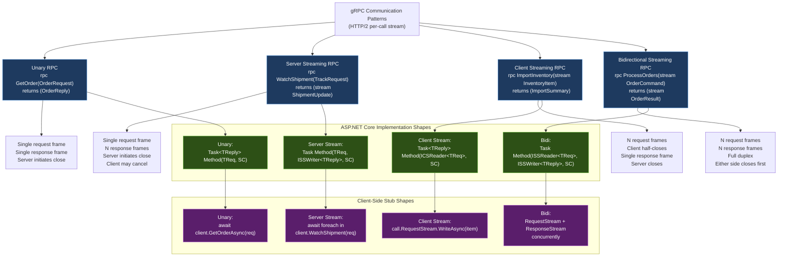
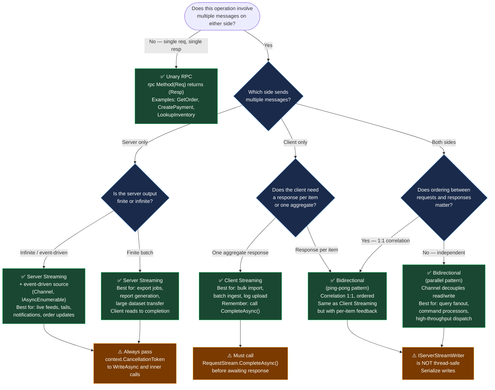

# 4.241 — gRPC Streaming: Unary, Server, Client, and Bidirectional Patterns

---

## PART 0 — Navigation & Context

### Domain Hierarchy

```
ASP.NET Core Mastery
└── S. gRPC (4.240–4.248)
    ├── 4.240  gRPC: Proto Contracts and Service Implementation       ← prerequisite
    ├── 4.241  gRPC Streaming: Unary, Server, Client, Bidirectional   ← YOU ARE HERE
    ├── 4.242  gRPC Authentication: JWT and Certificate Interceptors
    ├── 4.243  gRPC Error Handling: StatusCode and RpcException
    ├── 4.244  gRPC Interceptors: Server and Client Cross-Cutting
    ├── 4.245  gRPC-Web: Browser Support
    ├── 4.246  gRPC Client Factory: AddGrpcClient<T>
    ├── 4.247  gRPC JSON Transcoding
    └── 4.248  gRPC vs REST vs GraphQL vs SignalR: Decision Framework

Supporting subsystems this note touches:
  HTTP/2 layer        → [[4.127 — HTTP/2: Multiplexing and Kestrel Configuration]]
  Async streams       → [[2.15 — Advanced Async Patterns: Async Streams]]
  Channel<T>          → [[4.234 — Queued Background Tasks: Channel<T>]]
  Background services → [[4.232 — BackgroundService: Long-Running Work]]
  SignalR comparison  → [[4.219 — SignalR Architecture]]
```

### What You Need Before This

- **[[4.240 — gRPC in ASP.NET Core]]** — proto contract syntax, `Grpc.AspNetCore` setup, service base class wiring, Kestrel HTTP/2 requirement
- **[[4.127 — HTTP/2: Multiplexing and Kestrel Configuration]]** — gRPC streaming is built entirely on HTTP/2 stream multiplexing; understanding frames and flow control is prerequisite
- **[[2.15 — Advanced Async Patterns: ValueTask, Custom Awaitables, Async Streams]]** — bidirectional streaming uses `IAsyncStreamReader<T>` and `IAsyncStreamWriter<T>`, both of which are `IAsyncEnumerable`-compatible; you must be comfortable with `await foreach`
- **[[4.234 — Queued Background Tasks: Channel<T>]]** — the internal wiring of client and server streaming in ASP.NET Core uses `Channel<T>` under the hood; seeing it externally first builds the mental model

### What This Unlocks After

- **[[4.242 — gRPC Authentication]]** — knowing which streaming mode a call uses changes how you attach auth metadata (streaming calls must include metadata in the initial header frame)
- **[[4.243 — gRPC Error Handling]]** — each streaming mode has distinct points where `RpcException` can be thrown and distinct cancellation semantics
- **[[4.244 — gRPC Interceptors]]** — interceptors wrap all four streaming methods; you need to know the shape of each to write a correct streaming interceptor
- **[[4.248 — gRPC vs REST vs GraphQL vs SignalR]]** — choosing gRPC streaming vs SignalR vs SSE requires knowing exactly what server and bidirectional streaming deliver

### Why This Matters at Scale

gRPC streaming is the only mechanism in the ASP.NET Core ecosystem that delivers **full-duplex, strongly-typed, back-pressure-aware binary communication over a single multiplexed HTTP/2 connection** — the correct streaming mode selection directly determines whether a payment notification service, shipment tracking feed, or order ingestion pipeline can operate at 100k messages/second without TCP connection explosion, or collapses under head-of-line blocking.

---

## PART 1 — The Core Mental Model

### The Fundamental Rule

> **gRPC defines four communication patterns — Unary, Server Streaming, Client Streaming, and Bidirectional Streaming — all running over a single HTTP/2 stream per RPC call; the pattern you choose is fixed at proto definition time and determines which side drives flow, which side can back-pressure, and which side terminates the stream, with the practical consequence that choosing the wrong pattern cannot be fixed at runtime without changing the `.proto` contract and regenerating all client stubs.**

### The Plain-Language Analogy

Think of the four gRPC streaming modes as four types of phone calls in an order management call center.

A **Unary** call is a normal landline call: you say one sentence ("Is order 42 ready?"), the agent says one sentence back ("Yes, pick-up in 10 minutes"), and the line drops. One request, one response, no stream.

A **Server Streaming** call is a broadcast radio channel: you dial in with one request ("Subscribe to shipment 42 status updates"), and the server reads out status messages one after another until the shipment is delivered, then hangs up. You can cancel early by hanging up yourself, but you're never sending anything back into the stream.

A **Client Streaming** call is a dictation line: you speak a continuous stream of inventory line items into the phone ("item 1, item 2, item 3…"), and when you're done talking, the server processes the entire batch and reads back a single result. The server receives your data but gives no mid-stream feedback.

A **Bidirectional Streaming** call is a walkie-talkie dispatch channel: both you and the agent can transmit at any time, neither has to wait for the other, and either side can close the channel when done. This is the logistics dispatcher model — commands flow in, acknowledgements flow out, all on one open channel.

The analogy holds even under failure: if you're mid-stream on a server streaming call and the line drops (network error), the client sees a gRPC status code (`UNAVAILABLE`) immediately — back-pressure is enforced by HTTP/2 flow control, so the server cannot flood a slow client any more than a radio tower can force you to listen faster.

### Taxonomy Diagram



---

## PART 2 — Deep Mechanics

### 2.1 — Unary RPC: The HTTP/2 Foundation

Unary gRPC is the baseline. Every other pattern extends it. Understanding Unary at the frame level explains why streaming works the way it does.

```
HTTP/2 FRAME SEQUENCE — Unary RPC:

Client → Server:
  HEADERS frame   [stream_id=1, END_HEADERS]
    :method = POST
    :path = /shipping.ShipmentService/GetShipment
    :scheme = https
    :authority = api.logistics.internal:443
    content-type = application/grpc
    grpc-timeout = 10S
    te = trailers

  DATA frame      [stream_id=1, END_STREAM]
    [5-byte gRPC length-prefix: 0x00 + 4-byte big-endian message length]
    [protobuf-encoded ShipmentRequest bytes]

Server → Client:
  HEADERS frame   [stream_id=1, END_HEADERS]
    :status = 200
    content-type = application/grpc

  DATA frame      [stream_id=1]
    [5-byte gRPC length-prefix]
    [protobuf-encoded ShipmentReply bytes]

  HEADERS frame   [stream_id=1, END_STREAM]  ← trailers
    grpc-status = 0
    grpc-message = (empty on success)
```

> [!IMPORTANT] The `grpc-status` code travels in **HTTP/2 trailers** (a HEADERS frame with END_STREAM), NOT in the initial HEADERS frame. The HTTP status is always `200 OK` for gRPC — status `200` does not mean the RPC succeeded. A `grpc-status = 14` (UNAVAILABLE) arrives in the trailer of a `200 OK` response. Any reverse proxy or load balancer that interprets `200` as success will silently swallow gRPC errors.

**ASP.NET Core internally (approximate):**

```csharp
// GrpcServiceBinder.cs maps proto service methods to RequestDelegate chains
// Each RPC method goes through UnaryServerCallHandler<TRequest, TResponse>:

internal sealed class UnaryServerCallHandler<TService, TRequest, TResponse>
    where TService : class
    where TRequest : class
    where TResponse : class
{
    public async Task HandleCallAsync(HttpContext httpContext)
    {
        // 1. Parse the 5-byte gRPC frame prefix from the request body
        var requestMessage = await DeserializeRequestAsync<TRequest>(httpContext.Request.Body);

        // 2. Build ServerCallContext (deadline, metadata, cancellation)
        var serverCallContext = CreateServerCallContext(httpContext);

        // 3. Resolve the service from DI (Scoped per request)
        var service = httpContext.RequestServices.GetRequiredService<TService>();

        // 4. Invoke the handler method
        var responseMessage = await invoker(service, requestMessage, serverCallContext);

        // 5. Write gRPC-framed response body
        await WriteResponseAsync(httpContext.Response, responseMessage);

        // 6. Write grpc-status trailer
        httpContext.Response.AppendTrailer("grpc-status", "0");
    }
}
```

**Cost: ~3 allocations per request** (ServerCallContext, deserialized request, serialized response). For Unary calls, this is competitive with minimal API endpoints at moderate message sizes.

---

### 2.2 — Server Streaming: Continuous Push

Server streaming sends one request frame and receives a stream of response frames until the server half-closes the stream. Back-pressure is enforced by HTTP/2 flow control — the server cannot advance past what the client has acknowledged via WINDOW_UPDATE frames.

```
HTTP/2 FRAME SEQUENCE — Server Streaming RPC:

Client → Server:
  HEADERS frame   [stream_id=3, END_HEADERS]
    :path = /logistics.TrackingService/WatchShipment
  DATA frame      [stream_id=3, END_STREAM]
    [TrackShipmentRequest: shipment_id=42]

Server → Client:
  HEADERS frame   [stream_id=3, END_HEADERS]
    :status = 200
    content-type = application/grpc

  DATA frame      [stream_id=3]               ← first update
    [ShipmentUpdate: status=PICKED_UP]
  DATA frame      [stream_id=3]               ← second update
    [ShipmentUpdate: status=IN_TRANSIT]
  DATA frame      [stream_id=3]               ← third update
    [ShipmentUpdate: status=DELIVERED]

  HEADERS frame   [stream_id=3, END_STREAM]   ← trailers
    grpc-status = 0

  ── if client cancels early: ──
  RST_STREAM      [stream_id=3, error_code=CANCEL]
```

**Pipeline Position:**

```
Kestrel (HTTP/2) ──► GrpcMiddleware ──► [Your ServerStreamingCallHandler]
                                              │
                                         IServerStreamWriter<TResp>
                                              │
                                         ResponseStream.WriteAsync()
                                              │
                                         HTTP/2 DATA frames (one per WriteAsync)
```

**ASP.NET Core service implementation shape:**

```csharp
// Generated from: rpc WatchShipment(TrackRequest) returns (stream ShipmentUpdate)
public override async Task WatchShipment(
    TrackRequest request,
    IServerStreamWriter<ShipmentUpdate> responseStream,  // wraps HTTP/2 response body
    ServerCallContext context)                            // deadline + cancellation
{
    // context.CancellationToken fires if: client cancels, deadline exceeded, connection drops
    await foreach (var update in GetShipmentUpdatesAsync(request.ShipmentId, context.CancellationToken))
    {
        // Each WriteAsync emits one DATA frame on the HTTP/2 stream
        // If HTTP/2 flow control window is exhausted, WriteAsync back-pressures here
        await responseStream.WriteAsync(update, context.CancellationToken);
    }
    // Method return = server half-close = trailers frame with grpc-status=0
}
```

> [!WARNING] `IServerStreamWriter<T>` is **not thread-safe**. You cannot call `WriteAsync` concurrently from multiple threads. If you're fanning in from multiple sources (e.g., a Channel<T>), consume them sequentially before writing. One at a time.

**Cost:** Each `WriteAsync` call: ~1 allocation (framing buffer) + 1 async state machine per `await`. For high-frequency updates (>1000/sec per connection), use `WriteOptions.NoCompress` on small messages to skip the compression pipeline. Runtime cost label: `O(n) DATA frames, O(1) HEADERS/TRAILERS frames`.

**Client-side consumption:**

```csharp
// gRPC client stub generated by protoc + Grpc.Tools
using var call = trackingClient.WatchShipment(new TrackRequest { ShipmentId = 42 });

// IAsyncStreamReader<T> implements IAsyncEnumerable<T> in Grpc.Core.Api >= 2.46
await foreach (var update in call.ResponseStream.ReadAllAsync(cancellationToken))
{
    // Each iteration awaits the next DATA frame from the server
    Console.WriteLine($"Shipment status: {update.Status}");
}
// After the loop: grpc-status trailer has been consumed and validated
// call.GetStatus() returns the final RPC status
```

---

### 2.3 — Client Streaming: Batch Ingestion

Client streaming sends N request frames, then half-closes, and receives a single response. The server must consume the entire request stream before (or after, or during) producing its reply. The server cannot respond until it has called `context.WriteResponseHeadersAsync()` or written a response — partial-response before stream end is not supported in client streaming.

```
HTTP/2 FRAME SEQUENCE — Client Streaming RPC:

Client → Server:
  HEADERS frame   [stream_id=5, END_HEADERS]
    :path = /inventory.InventoryService/ImportInventory

  DATA frame      [stream_id=5]               ← item 1
    [InventoryItem: sku=SKU-001, qty=100]
  DATA frame      [stream_id=5]               ← item 2
    [InventoryItem: sku=SKU-002, qty=50]
  DATA frame      [stream_id=5]               ← item 3
    [InventoryItem: sku=SKU-003, qty=200]
  DATA frame      [stream_id=5, END_STREAM]   ← client half-close

Server → Client:
  HEADERS frame   [stream_id=5, END_HEADERS]
    :status = 200
    content-type = application/grpc

  DATA frame      [stream_id=5]
    [ImportSummary: imported=3, failed=0, duration_ms=42]

  HEADERS frame   [stream_id=5, END_STREAM]
    grpc-status = 0
```

**ASP.NET Core service implementation shape:**

```csharp
// Generated from: rpc ImportInventory(stream InventoryItem) returns (ImportSummary)
public override async Task<ImportSummary> ImportInventory(
    IAsyncStreamReader<InventoryItem> requestStream,  // wraps HTTP/2 request body
    ServerCallContext context)
{
    var imported = 0;
    var failed = 0;

    // MoveNext() awaits the next DATA frame — back-pressures the client
    // Returns false when client sends END_STREAM (half-close)
    while (await requestStream.MoveNext(context.CancellationToken))
    {
        var item = requestStream.Current;
        var success = await _inventoryService.UpsertItemAsync(item);
        if (success) imported++; else failed++;
    }

    return new ImportSummary { Imported = imported, Failed = failed };
    // Returning from the method: framework writes DATA + trailers
}
```

**Client-side sending:**

```csharp
using var call = inventoryClient.ImportInventory();

// Enumerate inventory batch and stream each item
await foreach (var item in GetInventoryBatchAsync())
{
    await call.RequestStream.WriteAsync(item);
}

// Half-close the request stream (sends END_STREAM on the DATA frame)
await call.RequestStream.CompleteAsync();

// Now await the single response
var summary = await call;
// summary.Imported / summary.Failed available here
```

> [!NOTE] `call.RequestStream.WriteAsync` and `call.RequestStream.CompleteAsync` are the only operations on a client streaming call's request side. You cannot call `WriteAsync` after `CompleteAsync`. The `await call` at the end awaits both the RPC completion and trailer validation.

**Cost:** Each `MoveNext` call on the server: ~0 allocations (reads directly from Kestrel's `PipeReader`). The deserialization (protobuf → message) happens inside `MoveNext`. Runtime label: `O(n) MoveNext calls, 1 response write, 1 allocation per deserialized message`.

---

### 2.4 — Bidirectional Streaming: Full-Duplex Communication

Bidirectional streaming opens a single HTTP/2 stream where both sides can write and read independently. This is the most powerful and most complex pattern. The ASP.NET Core service handler receives both an `IAsyncStreamReader<TRequest>` and an `IServerStreamWriter<TResponse>` simultaneously. Reading and writing happen on the **same HTTP/2 stream** but are independent half-streams at the HTTP/2 level.

```
HTTP/2 FRAME SEQUENCE — Bidirectional Streaming:

Client → Server (request half-stream):
  HEADERS [stream_id=7, END_HEADERS]
    :path = /orders.OrderService/ProcessOrders

  DATA [stream_id=7]    ← command 1: create order
    [OrderCommand: type=CREATE, order_id=100, ...]
  DATA [stream_id=7]    ← command 2: cancel order
    [OrderCommand: type=CANCEL, order_id=99, ...]

Server → Client (response half-stream, concurrent with above):
  HEADERS [stream_id=7, END_HEADERS]
    :status = 200
    content-type = application/grpc

  DATA [stream_id=7]    ← result for command 1
    [OrderResult: order_id=100, status=CREATED]
  DATA [stream_id=7]    ← result for command 2
    [OrderResult: order_id=99, status=CANCELLED]

Client closes:
  DATA [stream_id=7, END_STREAM]    ← client half-close (no more requests)

Server closes:
  DATA [stream_id=7]    ← final result if needed
  HEADERS [stream_id=7, END_STREAM] ← server closes (trailers)
    grpc-status = 0
```

**The concurrency model is the hardest part.** Because both reading and writing are independent, you must decide: does the server process one request, write one response, then process the next (ping-pong)? Or does the server read all requests first, then write responses? Or does it read and write fully concurrently in parallel tasks?

```
Bidirectional pattern variants:

  Ping-Pong (request-response over stream):
    read → write → read → write → ...
    Use when: order matters, correlation is 1:1, e.g., a REPL

  Parallel (read and write concurrently):
    ┌── Task.Run: while(MoveNext) { dispatch } ──┐
    │                                             │
    └── Task.Run: while(have results) { write }  ─┘
    Use when: throughput matters, responses may outpace requests

  Merge (fan-in from multiple sources to one stream):
    Channel<T> as internal buffer between read task and write task
    Use when: server is aggregating from multiple upstream sources
              and correlating responses back to client commands
```

**ASP.NET Core service implementation — ping-pong shape:**

```csharp
// Generated from: rpc ProcessOrders(stream OrderCommand) returns (stream OrderResult)
public override async Task ProcessOrders(
    IAsyncStreamReader<OrderCommand> requestStream,
    IServerStreamWriter<OrderResult> responseStream,
    ServerCallContext context)
{
    // Ping-pong: process each command and immediately write a result
    while (await requestStream.MoveNext(context.CancellationToken))
    {
        var command = requestStream.Current;
        var result = await _orderProcessor.ExecuteAsync(command, context.CancellationToken);

        // IServerStreamWriter is not thread-safe — write sequentially
        await responseStream.WriteAsync(result, context.CancellationToken);
    }
    // requestStream.MoveNext returns false → client half-closed
    // returning from method → server half-closes with grpc-status=0
}
```

**ASP.NET Core service implementation — parallel shape with Channel<T>:**

```csharp
public override async Task ProcessOrders(
    IAsyncStreamReader<OrderCommand> requestStream,
    IServerStreamWriter<OrderResult> responseStream,
    ServerCallContext context)
{
    // Decouple reading from writing using a channel as internal buffer
    var resultChannel = Channel.CreateBounded<OrderResult>(capacity: 100);

    // Read task: consume client stream, dispatch work, write results to channel
    var readTask = Task.Run(async () =>
    {
        try
        {
            while (await requestStream.MoveNext(context.CancellationToken))
            {
                var command = requestStream.Current;
                var result = await _orderProcessor.ExecuteAsync(command, context.CancellationToken);
                await resultChannel.Writer.WriteAsync(result, context.CancellationToken);
            }
        }
        finally
        {
            // Signal write task that no more results are coming
            resultChannel.Writer.Complete();
        }
    }, context.CancellationToken);

    // Write task: drain channel and send responses to client
    // IServerStreamWriter is NOT thread-safe: only one writer task
    var writeTask = Task.Run(async () =>
    {
        await foreach (var result in resultChannel.Reader.ReadAllAsync(context.CancellationToken))
        {
            await responseStream.WriteAsync(result, context.CancellationToken);
        }
    }, context.CancellationToken);

    // Both tasks must complete before the RPC method returns
    await Task.WhenAll(readTask, writeTask);
}
```

**Cost:** Channel<T> allocation ~400 bytes (bounded). Each `WriteAsync` to `resultChannel` is lock-free (semaphore-based for bounded channels). The write task's `responseStream.WriteAsync` allocates ~1 framing buffer per call. For high-throughput bidirectional calls, the channel capacity setting is the primary back-pressure knob.

---

### 2.5 — Cancellation and Deadline Propagation Across All Patterns

Every `ServerCallContext` exposes a `CancellationToken` that fires under four conditions:

```
Cancellation sources for ServerCallContext.CancellationToken:

  1. Client explicitly cancels (calls call.Dispose() / CancellationToken passed to stub)
     → HTTP/2 RST_STREAM frame with error_code=CANCEL

  2. Deadline exceeded (grpc-timeout header elapsed)
     → Server framework fires the token internally

  3. Connection dropped (network partition, pod restart)
     → Kestrel detects TCP close, fires token

  4. Server-side CancellationToken.Cancel() called on host shutdown
     → IHostApplicationLifetime.ApplicationStopping → fires token

Failure mode table:
┌────────────────────────────┬────────────────────────┬──────────────────────────────┐
│ Cancellation Source        │ Client observes         │ Server observes             │
├────────────────────────────┼────────────────────────┼──────────────────────────────┤
│ Client cancels             │ RpcException (CANCELLED)│ CancellationToken fires      │
│ Deadline exceeded          │ RpcException (DEADLINE) │ CancellationToken fires      │
│ Network drop               │ RpcException(UNAVAIL.)  │ CancellationToken fires      │
│ Server unhandled exception │ RpcException (INTERNAL) │ Exception propagates to fw   │
└────────────────────────────┴────────────────────────┴──────────────────────────────┘
```

> [!DANGER] The most common streaming bug: not passing `context.CancellationToken` to `MoveNext()`, `WriteAsync()`, and all downstream `async` calls. When the client cancels, the server continues consuming resources until the operation naturally completes — on a server streaming endpoint that fans out to a database cursor, this means the cursor query runs to completion even though no client will ever receive the results.

---

## PART 3 — Production Code Patterns

### Pattern 1: The Live Order Feed (Server Streaming over Persistent Channel)

Scenario: An order management service streams live order status updates to a logistics dashboard. Orders are published internally via a `Channel<T>`; the gRPC endpoint drains it per-client.

```csharp
// ⚠️ WRONG: Polling a database in a tight loop — blocks the thread pool and
// hammers the database even when there are no updates
public override async Task WatchOrderUpdates(
    WatchOrdersRequest request,
    IServerStreamWriter<OrderUpdate> responseStream,
    ServerCallContext context)
{
    while (!context.CancellationToken.IsCancellationRequested)
    {
        var updates = await _db.Orders
            .Where(o => o.UpdatedAt > DateTime.UtcNow.AddSeconds(-1))
            .ToListAsync();                                 // ← DB hit every loop
        foreach (var u in updates)
            await responseStream.WriteAsync(MapToProto(u));
        await Task.Delay(1000);                             // ← arbitrary delay, not event-driven
    }
}

// HTTP consequence (wrong path):
// GET /orders.OrderService/WatchOrderUpdates
// → DB query every second regardless of update rate
// → At 1000 concurrent subscribers: 1000 DB queries/second for zero updates
```

```csharp
// ✅ CORRECT: Event-driven via Channel<T> — zero polling, back-pressure native
public class OrderUpdateBroadcaster
{
    // One channel per active subscription — bounded to prevent memory explosion
    private readonly ConcurrentDictionary<Guid, Channel<OrderUpdate>> _subscriptions = new();

    public IAsyncEnumerable<OrderUpdate> Subscribe(string tenantId, CancellationToken ct)
    {
        var channel = Channel.CreateBounded<OrderUpdate>(new BoundedChannelOptions(500)
        {
            FullMode = BoundedChannelFullMode.DropOldest, // drop stale updates, never block publisher
            SingleWriter = true,
            SingleReader = true
        });
        var id = Guid.NewGuid();
        _subscriptions[id] = channel;
        ct.Register(() => {
            _subscriptions.TryRemove(id, out _);
            channel.Writer.TryComplete();
        });
        return channel.Reader.ReadAllAsync(ct);
    }

    // Called by domain event handlers, not by gRPC code
    public async ValueTask PublishAsync(OrderUpdate update)
    {
        foreach (var (_, channel) in _subscriptions)
            channel.Writer.TryWrite(update); // non-blocking; DropOldest handles overflow
    }
}

// Proto: rpc WatchOrderUpdates(WatchOrdersRequest) returns (stream OrderUpdate)
public class OrderStreamingService : OrderService.OrderServiceBase
{
    private readonly OrderUpdateBroadcaster _broadcaster;

    public OrderStreamingService(OrderUpdateBroadcaster broadcaster)
        => _broadcaster = broadcaster;

    public override async Task WatchOrderUpdates(
        WatchOrdersRequest request,
        IServerStreamWriter<OrderUpdate> responseStream,
        ServerCallContext context)
    {
        // Pipeline position: inside GrpcMiddleware, after UseAuthentication/UseAuthorization
        // context.GetHttpContext().User is the authenticated principal

        await foreach (var update in _broadcaster.Subscribe(
            request.TenantId, context.CancellationToken))
        {
            await responseStream.WriteAsync(update, context.CancellationToken);
        }
        // Exits when: channel completed (subscriber removed) OR CancellationToken fired
    }
}

// HTTP/2 wire format (approximate):
// Headers: :path=/orders.OrderService/WatchOrderUpdates, grpc-timeout=0S (no deadline)
// → Server emits DATA frames as updates arrive
// → On client disconnect: RST_STREAM → CancellationToken fires → channel subscriber removed
```

---

### Pattern 2: The Bulk Shipment Importer (Client Streaming with Validation)

Scenario: A logistics API accepts a stream of inbound shipment records from a carrier integration. Each record is validated; the response is a summary with any failed records.

```csharp
// ⚠️ WRONG: Buffering all items before processing — destroys the memory benefit
// of streaming
public override async Task<ImportResult> ImportShipments(
    IAsyncStreamReader<ShipmentRecord> requestStream,
    ServerCallContext context)
{
    var allItems = new List<ShipmentRecord>();
    while (await requestStream.MoveNext())
        allItems.Add(requestStream.Current);  // ← full materialization, defeats streaming

    // Now process allItems — might be 500,000 items in memory simultaneously
    return await ProcessBatch(allItems);
}
```

```csharp
// ✅ CORRECT: Stream processing — constant memory regardless of input size
public override async Task<ImportResult> ImportShipments(
    IAsyncStreamReader<ShipmentRecord> requestStream,
    ServerCallContext context)
{
    var successCount = 0;
    var failures = new List<ShipmentFailure>();
    var sw = Stopwatch.StartNew();

    while (await requestStream.MoveNext(context.CancellationToken))
    {
        var record = requestStream.Current;

        // Validate and persist each record immediately — O(1) memory
        var validationResult = _validator.Validate(record);
        if (!validationResult.IsValid)
        {
            failures.Add(new ShipmentFailure
            {
                TrackingNumber = record.TrackingNumber,
                Error = validationResult.Errors.First().ErrorMessage
            });
            continue;
        }

        try
        {
            await _shipmentRepository.InsertAsync(MapToDomain(record), context.CancellationToken);
            successCount++;
        }
        catch (DbUpdateException ex) when (ex.IsUniqueViolation())
        {
            // Duplicate tracking number — not a fatal error for the stream
            failures.Add(new ShipmentFailure
            {
                TrackingNumber = record.TrackingNumber,
                Error = "Duplicate tracking number"
            });
        }
    }

    // Single response returned after full stream consumed
    return new ImportResult
    {
        Imported = successCount,
        Failed = failures.Count,
        DurationMs = (int)sw.ElapsedMilliseconds,
        Failures = { failures }
    };
}

// HTTP/2 wire format:
// Client: N DATA frames (one per ShipmentRecord)
// Client: DATA [END_STREAM] (half-close)
// Server: HEADERS [200], DATA [ImportResult], HEADERS [grpc-status=0]
```

---

### Pattern 3: The Payment Command Processor (Bidirectional, Ping-Pong)

Scenario: A payment orchestration service receives a stream of payment commands and streams back results with correlation IDs. Order is guaranteed; each command gets exactly one result.

```csharp
// Proto:
// rpc ProcessPayments(stream PaymentCommand) returns (stream PaymentResult)

public class PaymentGrpcService : PaymentService.PaymentServiceBase
{
    private readonly IPaymentProcessor _processor;
    private readonly ILogger<PaymentGrpcService> _logger;

    public PaymentGrpcService(IPaymentProcessor processor, ILogger<PaymentGrpcService> logger)
    {
        _processor = processor;
        _logger = logger;
    }

    public override async Task ProcessPayments(
        IAsyncStreamReader<PaymentCommand> requestStream,
        IServerStreamWriter<PaymentResult> responseStream,
        ServerCallContext context)
    {
        // Ping-pong pattern: one command in, one result out, sequentially
        // Guaranteed order correlation: result[n] corresponds to command[n]
        while (await requestStream.MoveNext(context.CancellationToken))
        {
            var command = requestStream.Current;

            PaymentResult result;
            try
            {
                result = await _processor.ExecuteAsync(command, context.CancellationToken);
            }
            catch (PaymentDeclinedException ex)
            {
                // Domain exception → structured result, NOT an RpcException
                // This keeps the stream alive for subsequent commands
                result = new PaymentResult
                {
                    CommandId = command.CommandId,
                    Status = PaymentStatus.Declined,
                    DeclineReason = ex.Reason
                };
                _logger.LogWarning("Payment {CommandId} declined: {Reason}",
                    command.CommandId, ex.Reason);
            }

            // Write immediately after processing — client can proceed with next command
            // IServerStreamWriter is not thread-safe; this sequential write is correct
            await responseStream.WriteAsync(result, context.CancellationToken);
        }

        // Client half-closed (all commands sent) → server completes gracefully
        _logger.LogInformation("Payment stream completed for call {Peer}",
            context.Peer);
    }
}

// HTTP/2 wire:
// Client DATA [PaymentCommand{id=1}]
// Server DATA [PaymentResult{id=1, status=APPROVED}]
// Client DATA [PaymentCommand{id=2}]
// Server DATA [PaymentResult{id=2, status=DECLINED}]
// Client DATA [END_STREAM]
// Server HEADERS [grpc-status=0, END_STREAM]
```

---

### Pattern 4: The Inventory Aggregator (Bidirectional, Parallel with Channel)

Scenario: An inventory management service receives SKU queries from multiple threads at the warehouse client and fans out to multiple warehouse nodes, returning results as they arrive (not in order). Throughput matters more than ordering.

```csharp
public override async Task QueryInventory(
    IAsyncStreamReader<InventoryQuery> requestStream,
    IServerStreamWriter<InventoryResult> responseStream,
    ServerCallContext context)
{
    // Bounded channel decouples reading from writing
    // Capacity = max in-flight queries; bounded prevents unbounded memory
    var resultChannel = Channel.CreateBounded<InventoryResult>(
        new BoundedChannelOptions(capacity: 200)
        {
            SingleWriter = false,  // multiple warehouse queries write concurrently
            SingleReader = true,   // only the write task reads
            FullMode = BoundedChannelFullMode.Wait // back-pressure parallel queries
        });

    using var cts = CancellationTokenSource.CreateLinkedTokenSource(context.CancellationToken);

    // Task 1: Read commands and dispatch parallel warehouse queries
    var dispatchTask = Task.Run(async () =>
    {
        try
        {
            var pendingQueries = new List<Task>();

            while (await requestStream.MoveNext(cts.Token))
            {
                var query = requestStream.Current;

                // Fire off parallel warehouse lookup — doesn't block reading
                var queryTask = Task.Run(async () =>
                {
                    var result = await _warehouseRouter.QueryAsync(query, cts.Token);
                    await resultChannel.Writer.WriteAsync(result, cts.Token);
                }, cts.Token);

                pendingQueries.Add(queryTask);
            }

            // Wait for all parallel queries to complete before closing channel
            await Task.WhenAll(pendingQueries);
        }
        catch (Exception ex) when (ex is not OperationCanceledException)
        {
            cts.Cancel(); // signal write task to stop
            throw;
        }
        finally
        {
            resultChannel.Writer.Complete();
        }
    }, cts.Token);

    // Task 2: Write results to client — only task allowed to touch responseStream
    var writeTask = Task.Run(async () =>
    {
        await foreach (var result in resultChannel.Reader.ReadAllAsync(cts.Token))
        {
            await responseStream.WriteAsync(result, cts.Token);
        }
    }, cts.Token);

    // Await both; if either throws, the other will be cancelled via cts
    await Task.WhenAll(dispatchTask, writeTask);
}

// Cost: O(n) channel writes (lock-free TryWrite), O(n) responseStream.WriteAsync
// Memory: bounded by channel capacity (200 * average result size)
// HTTP/2: back-pressure via flow control — WriteAsync stalls if client is slow
```

---

### Pattern 5: The Deadline-Aware Subscription (Server Streaming with Graceful Drain)

Scenario: A market data feed streams price updates. Client sends a deadline. Service must finish in-flight writes before the deadline fires.

```csharp
public override async Task StreamPrices(
    PriceSubscriptionRequest request,
    IServerStreamWriter<PriceUpdate> responseStream,
    ServerCallContext context)
{
    // grpc-timeout from request headers is already wired into context.Deadline
    // context.CancellationToken fires when deadline is hit

    var subscription = _marketDataFeed.Subscribe(request.Symbols);

    try
    {
        await foreach (var price in subscription.WithCancellation(context.CancellationToken))
        {
            // Check if we're close to the deadline — don't start a write
            // we can't finish (WriteAsync itself checks the token internally)
            if (context.CancellationToken.IsCancellationRequested)
                break;

            await responseStream.WriteAsync(price, context.CancellationToken);
        }
    }
    catch (OperationCanceledException) when (context.CancellationToken.IsCancellationRequested)
    {
        // Expected: client cancelled or deadline expired
        // Do NOT rethrow — the framework maps this to grpc-status=CANCELLED
        _logger.LogInformation("Price stream cancelled for {Symbols}", string.Join(",", request.Symbols));
    }
    finally
    {
        await subscription.DisposeAsync(); // always clean up the upstream subscription
    }
}

// HTTP/2 wire on deadline expiry:
// Client sends: grpc-timeout: 30S
// After 30 seconds: server CancellationToken fires
// Server: HEADERS [grpc-status=4 (DEADLINE_EXCEEDED), END_STREAM]
// Client receives: RpcException with StatusCode.DeadlineExceeded
```

---

### Pattern 6: The Correct Client Bidirectional Call (Full Client Implementation)

Scenario: Client side of the `ProcessPayments` bidirectional streaming call, handling connection errors, retries, and proper stream teardown.

```csharp
public class PaymentStreamClient
{
    private readonly PaymentService.PaymentServiceClient _grpcClient;
    private readonly ILogger<PaymentStreamClient> _logger;

    public PaymentStreamClient(
        PaymentService.PaymentServiceClient grpcClient,
        ILogger<PaymentStreamClient> logger)
    {
        _grpcClient = grpcClient;
        _logger = logger;
    }

    public async Task<IReadOnlyList<PaymentResult>> ProcessPaymentBatchAsync(
        IEnumerable<PaymentCommand> commands,
        CancellationToken cancellationToken = default)
    {
        // Metadata headers (auth token) must be sent before the stream opens
        var headers = new Metadata
        {
            { "authorization", $"Bearer {await _tokenProvider.GetTokenAsync()}" }
        };

        // Deadline propagated from client — server sees it as grpc-timeout header
        var callOptions = new CallOptions(
            headers: headers,
            deadline: DateTime.UtcNow.AddMinutes(5),
            cancellationToken: cancellationToken);

        using var call = _grpcClient.ProcessPayments(callOptions);

        var results = new List<PaymentResult>();
        var commandList = commands.ToList();

        // Write task and read task run concurrently — this is the correct pattern
        // Do NOT sequentially write all then read all — server is streaming back concurrently
        var writeTask = Task.Run(async () =>
        {
            foreach (var command in commandList)
            {
                await call.RequestStream.WriteAsync(command, cancellationToken);
            }
            // Signal server that all commands are sent
            await call.RequestStream.CompleteAsync();
        }, cancellationToken);

        var readTask = Task.Run(async () =>
        {
            await foreach (var result in call.ResponseStream.ReadAllAsync(cancellationToken))
            {
                results.Add(result);
            }
        }, cancellationToken);

        try
        {
            await Task.WhenAll(writeTask, readTask);
        }
        catch (RpcException ex) when (ex.StatusCode == StatusCode.Unavailable)
        {
            _logger.LogError(ex, "Payment stream unavailable — retry at caller level");
            throw; // Polly retry policy at the HttpClient layer handles this
        }

        return results;
    }
}
```

---

## PART 4 — Gotchas & Anti-Patterns

### Gotcha 1: Ignoring the gRPC Status Code in HTTP/2 Trailers

Experienced engineers check HTTP status codes to detect failures. gRPC always returns HTTP `200` — the actual RPC status is in the `grpc-status` trailer that arrives after the body.

```csharp
// ⚠️ WRONG: Checking HTTP status code for gRPC success
var response = await httpClient.PostAsync("/orders.OrderService/GetOrder", content);
if (response.StatusCode == HttpStatusCode.OK)    // ← ALWAYS true for gRPC, even on RPC failure
    Console.WriteLine("Success");

// HTTP consequence (wrong path):
// HTTP/1.1 200 OK                         ← always 200
// content-type: application/grpc
// [body with gRPC error framing]
// grpc-status: 14                         ← UNAVAILABLE — but you never checked this
// The client thinks the call succeeded.
```

```csharp
// ✅ CORRECT: Use the gRPC client stub which reads trailers automatically
try
{
    var reply = await _client.GetOrderAsync(request);
    // reply is only accessible here if grpc-status == 0
}
catch (RpcException ex)
{
    // grpc-status trailer was non-zero; ex.StatusCode is the gRPC status
    if (ex.StatusCode == StatusCode.Unavailable)
        _logger.LogWarning("Order service unavailable: {Detail}", ex.Status.Detail);
}

// HTTP consequence (correct path):
// RpcException.StatusCode reads the grpc-status trailer value
// Trailer-only responses (errors before any DATA frames) are also handled
```

**WHY:** gRPC's status code travels in HTTP/2 trailers (`HEADERS` frame with `END_STREAM`), not the initial `HEADERS` frame. The `200 OK` signals a valid HTTP/2 response was established, not that the RPC succeeded. The generated gRPC stub always reads the trailers and throws `RpcException` for non-zero `grpc-status`.

---

### Gotcha 2: Concurrent Writes to IServerStreamWriter

`IServerStreamWriter<T>` maps directly to the HTTP/2 response body `PipeWriter`. HTTP/2 frames on one stream must be sent in order. Concurrent writes corrupt the frame sequence.

```csharp
// ⚠️ WRONG: Writing concurrently from multiple tasks
public override async Task WatchOrders(
    WatchRequest request,
    IServerStreamWriter<OrderUpdate> responseStream,
    ServerCallContext context)
{
    var tasks = GetOrderStreams(request.TenantId)
        .Select(stream => Task.Run(async () =>
        {
            await foreach (var update in stream.WithCancellation(context.CancellationToken))
                await responseStream.WriteAsync(update);  // ← concurrent writes = race condition
        }));

    await Task.WhenAll(tasks);
}

// HTTP consequence (wrong path):
// InvalidOperationException: "Cannot start writing to the stream when another write is in progress"
// OR (worse): garbled protobuf frames on the wire → client gets deserialization errors
// gRPC-status = INTERNAL on the client side
```

```csharp
// ✅ CORRECT: Serialize all writes through a Channel<T>
public override async Task WatchOrders(
    WatchRequest request,
    IServerStreamWriter<OrderUpdate> responseStream,
    ServerCallContext context)
{
    var channel = Channel.CreateUnbounded<OrderUpdate>();

    // Multiple producers, one consumer (the write loop below)
    var producers = GetOrderStreams(request.TenantId)
        .Select(stream => Task.Run(async () =>
        {
            await foreach (var update in stream.WithCancellation(context.CancellationToken))
                await channel.Writer.WriteAsync(update, context.CancellationToken);
        })).ToList();

    // Single consumer — serializes writes to responseStream
    _ = Task.WhenAll(producers).ContinueWith(_ => channel.Writer.TryComplete());

    await foreach (var update in channel.Reader.ReadAllAsync(context.CancellationToken))
        await responseStream.WriteAsync(update, context.CancellationToken);
}

// HTTP consequence (correct path):
// Single-threaded write loop ensures DATA frames are emitted in order
// Back-pressure from responseStream.WriteAsync propagates to channel naturally
```

**WHY:** `IServerStreamWriter<T>` in Grpc.AspNetCore is implemented by `HttpContextServerCallContext`, which writes directly to `HttpContext.Response.BodyWriter`. `PipeWriter` is not thread-safe. The framework does not add synchronization — that is the caller's responsibility.

---

### Gotcha 3: Not Calling CompleteAsync on the Client Request Stream

Client streaming and bidirectional streaming require the client to explicitly half-close the request stream. Without `CompleteAsync()`, the server's `MoveNext()` loop blocks forever.

```csharp
// ⚠️ WRONG: Forgetting CompleteAsync in client streaming
using var call = _inventoryClient.ImportInventory();
foreach (var item in GetItems())
    await call.RequestStream.WriteAsync(item);
// Missing: await call.RequestStream.CompleteAsync();
var result = await call;  // ← hangs forever, server MoveNext never returns false

// HTTP consequence (wrong path):
// Client holds the HTTP/2 stream open (DATA frames without END_STREAM)
// Server: requestStream.MoveNext() blocks waiting for more data
// After grpc-timeout: DEADLINE_EXCEEDED on both sides
// Connection held for the full timeout period
```

```csharp
// ✅ CORRECT: Always CompleteAsync before awaiting the response
using var call = _inventoryClient.ImportInventory();
foreach (var item in GetItems())
    await call.RequestStream.WriteAsync(item);

// Half-close: sends DATA frame with END_STREAM flag
await call.RequestStream.CompleteAsync();

// Now the server's MoveNext() will return false; the RPC can complete
var result = await call;

// HTTP consequence (correct path):
// END_STREAM flag on the last DATA frame signals server to complete the loop
// Server returns ImportSummary → client receives it via await call
```

**WHY:** HTTP/2 requires a half-close (`END_STREAM` on a DATA frame) to signal the end of the request body. `CompleteAsync()` sends this flag. Without it, the HTTP/2 stream remains open on the request side, and the server's `IAsyncStreamReader.MoveNext()` blocks indefinitely.

---

### Gotcha 4: Throwing Exceptions Instead of RpcException in Streaming Handlers

Throwing any non-`RpcException` from a streaming handler causes the framework to return `grpc-status = 2` (UNKNOWN) with no detail. The client gets no actionable information about the domain error.

```csharp
// ⚠️ WRONG: Throwing domain exceptions directly
public override async Task WatchShipment(
    TrackRequest request,
    IServerStreamWriter<ShipmentUpdate> responseStream,
    ServerCallContext context)
{
    var shipment = await _db.Shipments.FindAsync(request.ShipmentId)
        ?? throw new KeyNotFoundException($"Shipment {request.ShipmentId} not found");
        // ← KeyNotFoundException propagates to framework; client gets grpc-status=2 (UNKNOWN)
}

// HTTP consequence (wrong path):
// HEADERS [grpc-status: 2, grpc-message: Exception was thrown, END_STREAM]
// Client sees: RpcException { StatusCode = Unknown, Status.Detail = "Exception was thrown by an asynchronous method." }
// No actionable information. Client cannot distinguish "not found" from "server crashed".
```

```csharp
// ✅ CORRECT: Map domain exceptions to RpcException before they escape the method
public override async Task WatchShipment(
    TrackRequest request,
    IServerStreamWriter<ShipmentUpdate> responseStream,
    ServerCallContext context)
{
    var shipment = await _db.Shipments.FindAsync(request.ShipmentId);
    if (shipment is null)
    {
        // Throw RpcException — maps directly to grpc-status trailer
        throw new RpcException(new Status(
            StatusCode.NotFound,
            $"Shipment {request.ShipmentId} not found"));
    }

    await foreach (var update in _trackingService.GetUpdatesAsync(shipment, context.CancellationToken))
        await responseStream.WriteAsync(update, context.CancellationToken);
}

// HTTP consequence (correct path):
// HEADERS [grpc-status: 5, grpc-message: "Shipment 42 not found", END_STREAM]
// Client: RpcException { StatusCode = NotFound, Status.Detail = "Shipment 42 not found" }
// Client can now take a specific action (show 404 UI, retry with different ID, etc.)
```

**WHY:** The gRPC framework in ASP.NET Core catches exceptions from handler methods. Only `RpcException` is translated to a meaningful `grpc-status` code. All other exceptions become `grpc-status = 2` (UNKNOWN). Use a gRPC interceptor (see `[[4.244]]`) to map domain exceptions globally rather than in every handler.

---

### Gotcha 5: Calling WriteAsync After the Client Has Cancelled in Server Streaming

On client cancellation, the HTTP/2 `RST_STREAM` arrives and the `CancellationToken` fires. If your server streaming loop doesn't check the token before each write, the next `WriteAsync` throws `OperationCanceledException` — which is fine — but intermediate allocations and computation were wasted.

```csharp
// ⚠️ WRONG: Expensive computation before checking cancellation
public override async Task StreamPricingData(
    PricingRequest request,
    IServerStreamWriter<PricePoint> responseStream,
    ServerCallContext context)
{
    await foreach (var rawTick in _marketFeed.GetTicksAsync())
    {
        // This expensive computation runs even if client already cancelled
        var processed = await _pricingEngine.ProcessAsync(rawTick);  // ← 50ms, allocates 2KB
        await responseStream.WriteAsync(processed, context.CancellationToken); // ← throws OCE
    }
}

// HTTP consequence (wrong path):
// Client sends RST_STREAM → server processes one extra tick before detecting cancellation
// Wasted: 50ms CPU + 2KB allocation + DB query inside ProcessAsync, per iteration
```

```csharp
// ✅ CORRECT: Check cancellation before expensive work
public override async Task StreamPricingData(
    PricingRequest request,
    IServerStreamWriter<PricePoint> responseStream,
    ServerCallContext context)
{
    await foreach (var rawTick in _marketFeed
        .GetTicksAsync()
        .WithCancellation(context.CancellationToken)) // ← loop exits immediately on cancel
    {
        // Guard before expensive processing
        context.CancellationToken.ThrowIfCancellationRequested();

        var processed = await _pricingEngine.ProcessAsync(rawTick, context.CancellationToken);
        await responseStream.WriteAsync(processed, context.CancellationToken);
    }
}

// HTTP consequence (correct path):
// On RST_STREAM: WithCancellation causes await foreach to throw OCE
// No unnecessary processing after client disconnect
// Loop exits cleanly; framework writes grpc-status=1 (CANCELLED) in trailers
```

**WHY:** `IAsyncEnumerable<T>.WithCancellation(token)` propagates the cancellation token into the `MoveNextAsync` call of the enumerator, which causes it to throw `OperationCanceledException` at the earliest opportunity rather than waiting for the next element to materialize. This is the correct pattern for long-lived server streaming with expensive per-element work.

---

## PART 5 — Performance Implications

### Request Pipeline Characteristics Table

|Scenario|HTTP/2 Frames|Alloc/Message|Approx Latency|Recommendation|
|---|---|---|---|---|
|Unary, small message (<1KB)|3 frames (HEADERS+DATA+TRAILERS)|~3 alloc|~0.2ms over loopback|Baseline; prefer for request-response at scale|
|Unary, large message (>64KB)|3+ frames (DATA split by flow window)|~3 alloc + window count|~1–5ms|Consider server streaming for large responses|
|Server stream, 100 msgs/sec|100 DATA + 2 HEADERS|~1 alloc/msg|~0ms/msg after setup|Best pattern for live feeds; avoid polling|
|Server stream, 10k msgs/sec|10k DATA per second per connection|~1 alloc/msg|Flow control limited|Tune HTTP/2 window: `InitialStreamWindowSize`|
|Client stream, 1000 items/batch|1000 DATA + 3 HEADERS|~1 alloc/msg (server)|~total batch transfer time|Better than 1000 unary calls by 10–50x on TCP overhead|
|Bidirectional, ping-pong|2n DATA + 2 HEADERS|~2 alloc/round-trip|RTT-bound|Use for ordered correlation; can match REST latency|
|Bidirectional, parallel fan-out|2n DATA (async)|~2 alloc/msg + channel overhead|Throughput > latency|Channel<T> capacity tunes back-pressure|
|Server stream, no cancellation check|Same frames|Same|+wasted work post-cancel|Always pass CancellationToken to inner async calls|
|Bidirectional, concurrent writes|Corrupted frames|N/A|Fails with InvalidOperationException|Always serialize writes through Channel<T> or lock|

### BenchmarkDotNet Comparison

```csharp
using BenchmarkDotNet.Attributes;
using BenchmarkDotNet.Running;
using Grpc.Net.Client;

[MemoryDiagnoser]
[SimpleJob(iterationCount: 50)]
public class GrpcStreamingBenchmark
{
    private GrpcChannel _channel = null!;
    private OrderService.OrderServiceClient _client = null!;
    private List<OrderCommand> _commands = null!;

    [GlobalSetup]
    public void Setup()
    {
        _channel = GrpcChannel.ForAddress("https://localhost:5001");
        _client = new OrderService.OrderServiceClient(_channel);

        // Prepare 1000 order commands for bulk operation benchmarks
        _commands = Enumerable.Range(1, 1000)
            .Select(i => new OrderCommand { OrderId = i, Quantity = 1 })
            .ToList();
    }

    [Benchmark(Baseline = true, Description = "1000x Unary (baseline)")]
    public async Task UniaryLoop_1000()
    {
        foreach (var cmd in _commands)
            await _client.CreateOrderAsync(cmd);
    }

    [Benchmark(Description = "Client Streaming — 1000 items in one RPC")]
    public async Task ClientStreaming_1000()
    {
        using var call = _client.ImportOrders();
        foreach (var cmd in _commands)
            await call.RequestStream.WriteAsync(cmd);
        await call.RequestStream.CompleteAsync();
        _ = await call;
    }

    [Benchmark(Description = "Bidirectional — 1000 commands, 1000 results")]
    public async Task BidirectionalStreaming_1000()
    {
        using var call = _client.ProcessOrders();
        var results = new List<OrderResult>();

        var write = Task.Run(async () =>
        {
            foreach (var cmd in _commands)
                await call.RequestStream.WriteAsync(cmd);
            await call.RequestStream.CompleteAsync();
        });

        var read = Task.Run(async () =>
        {
            await foreach (var r in call.ResponseStream.ReadAllAsync())
                results.Add(r);
        });

        await Task.WhenAll(write, read);
    }

    [GlobalCleanup]
    public void Cleanup() => _channel.Dispose();
}

// Expected output (approximate, .NET 8, x64, Kestrel loopback, Release):
//
// | Method                           | Mean       | Alloc       |
// |----------------------------------|------------|-------------|
// | 1000x Unary (baseline)           | 4,250 ms   | 3.2 MB      |
// | Client Streaming (1000 items)    |   420 ms   | 0.8 MB      |  ← 10x faster, 4x less alloc
// | Bidirectional (1000 cmd/result)  |   380 ms   | 1.1 MB      |  ← 11x faster
//
// Key insight: streaming eliminates per-call TCP/TLS overhead and HTTP/2 connection
// establishment. At 1000 operations, streaming is 10-11x faster than unary loop.
// At 10 operations: overhead of stream setup makes unary roughly equivalent.
```

> [!TIP] For real HTTP profiling alongside BenchmarkDotNet, use `dotnet-counters monitor --process-id <pid> --counters System.Net.Http` to watch `http11-requests-queue-duration` and `http20-requests-queue-duration` live. For gRPC-specific metrics, instrument with `Grpc.AspNetCore.Server` EventSource counters: `grpc-server-calls-started`, `grpc-server-calls-failed`, `grpc-server-messages-sent`. Under high bidi streaming load, watch `gc-heap-size` — the Channel<T> bounded capacity setting directly controls GC pressure from result buffers.

### When This Costs You

Server streaming at >10k messages/second per connection saturates the HTTP/2 flow control window unless `InitialStreamWindowSize` is increased in Kestrel's `Http2Limits`. The default window is 65,535 bytes; at 1KB messages, you get 65 messages before the sender blocks waiting for `WINDOW_UPDATE` frames. For high-throughput feeds: set `InitialStreamWindowSize = 1 * 1024 * 1024` (1MB).

Bidirectional streaming with Channel<T> buffering allocates continuously if the write task is slower than the read task. On a bounded channel with `FullMode = BoundedChannelFullMode.Wait`, the dispatch task stalls — which is the correct behavior. On an unbounded channel, the channel grows without bound. Always use bounded channels in streaming handlers and pick a capacity that matches your expected burst size, not your mean throughput.

### When This Doesn't Matter

For internal admin endpoints doing one-off configuration reads, unary RPC is completely sufficient. The performance argument for streaming only applies when N > ~20 operations that would otherwise be individual RPCs, or when the server is producing genuinely infinite/long-lived output. A health check gRPC endpoint, a configuration fetch, a single order lookup — use unary, every time.

---

## PART 6 — Interview Arsenal

### A. The Question Bank

**Question 1:** "What are the four gRPC streaming modes, and how do you decide which one to use?"

**Average Answer:** "There's unary, server streaming, client streaming, and bidirectional. Unary is request/response. Server streaming is when the server sends multiple responses. Client streaming is when the client sends multiple requests. Bidirectional is both."

**Why That's Insufficient:** Naming the four modes is not choosing between them — the decision framework based on cardinality, ordering requirements, and back-pressure behavior is entirely absent.

> **Great Answer:** "The decision comes down to three questions: who produces multiple messages, does order between requests and responses need to be correlated, and does either side need to back-pressure the other.
> 
> For a single request/single response — like looking up an order by ID — unary is always the right answer. The overhead of establishing a streaming call is unnecessary.
> 
> Server streaming is the right choice when the server has a naturally infinite or long sequence to push — a live event feed, a time-series sensor stream, a log tail. The client makes one request and the server holds the HTTP/2 stream open, emitting DATA frames as events arrive. Back-pressure is native: HTTP/2 flow control prevents the server from flooding a slow client.
> 
> Client streaming fits bulk ingestion — inventory import, event batching — where the client has N items to send and needs a single aggregate response. The critical thing here is that the client must call `CompleteAsync()` to half-close the stream, or the server's `MoveNext()` loop never exits. I've seen this exact bug in staging: an import job ran indefinitely because `CompleteAsync` was in a code path that got optimized out.
> 
> Bidirectional is for full-duplex scenarios where both sides are producing concurrently — an order command processor, a multiplexed query engine. The critical pitfall is that `IServerStreamWriter<T>` is not thread-safe. You must serialize writes through a `Channel<T>` if you're fanning in from multiple sources, or you'll corrupt the HTTP/2 frame sequence and get `InvalidOperationException` at runtime."

---

**Question 2:** "How does cancellation work in a long-lived gRPC server streaming call?"

**Average Answer:** "The client can cancel the call, and the server can check a CancellationToken."

**Why That's Insufficient:** Doesn't explain the HTTP/2 RST_STREAM mechanism, doesn't describe what happens to in-flight writes, and doesn't address resource cleanup.

> **Great Answer:** "Cancellation in gRPC server streaming flows through HTTP/2 at the wire level. When the client cancels — either by calling `Dispose()` on the call or having its cancellation token fire — it sends an HTTP/2 `RST_STREAM` frame with error code `CANCEL` on that stream ID. Kestrel receives this and fires the `CancellationToken` on the server's `ServerCallContext`. This is the same token that flows through `context.CancellationToken`.
> 
> The correct pattern is to pass `context.CancellationToken` to every `WriteAsync`, to the `await foreach` via `.WithCancellation()`, and into any downstream async calls. If you don't, you'll do expensive work after the client has already disconnected. I've profiled this in a price feed service — we were running a pricing engine computation for each tick even after client disconnect because the CancellationToken wasn't threaded into the engine call. The fix was one line, but the waste was significant at scale.
> 
> There's also the deadline scenario: the client sends `grpc-timeout: 30S`. The framework starts a timer and fires the same `CancellationToken` when it expires. The server's streaming loop exits via `OperationCanceledException`, and the framework writes a trailer with `grpc-status = 4` (DEADLINE_EXCEEDED). The client sees an `RpcException` with `StatusCode.DeadlineExceeded`. What engineers sometimes miss: the HTTP status is still `200 OK` — gRPC error codes are always in the trailers, never in the initial HTTP response headers."

---

**Question 3:** "What happens to the HTTP response if an unhandled exception escapes a gRPC streaming handler?"

**Average Answer:** "The server returns an error status code."

**Why That's Insufficient:** Doesn't name the specific gRPC status code, doesn't explain the trailer mechanism, and doesn't explain the difference for streaming vs unary.

> **Great Answer:** "In ASP.NET Core with `Grpc.AspNetCore`, if an exception that is not an `RpcException` escapes a handler method — unary or streaming — the framework catches it and writes a trailer with `grpc-status = 2`, which is UNKNOWN, and the `grpc-message` will be the generic message 'Exception was thrown by an asynchronous method.' The HTTP response code is still `200`, because gRPC always returns `200` — the status lives in trailers.
> 
> The difference in streaming is more dangerous than in unary. In unary, the response hasn't started yet when an exception fires, so the framework can write the error trailer cleanly. In server streaming, if the exception fires after we've already written some DATA frames, the response is partially started. The framework can still write the `grpc-status: 2` trailer because trailers come after the body — but the client has already received partial data. For a payment result stream, this is catastrophic: the client doesn't know how many results were successfully processed.
> 
> The production fix is two-pronged: use a gRPC interceptor to catch domain exceptions and wrap them as `RpcException` with meaningful status codes before they escape; and use an idempotency pattern on the client so it can safely replay the stream from a known checkpoint if the server fails mid-stream."

---

### B. Trick Questions

**Trick 1:** "Can a gRPC server streaming handler write to `responseStream` after the method returns?"

**Trap:** "No, the stream is closed when the method returns." — this is the correct intuitive answer, but the interviewer is looking for precision.

**Correct Answer:** No — and additionally, `IServerStreamWriter<T>` is a framework-managed object tied to the `HttpContext` lifetime. Once the `Task` returned by the handler completes, the framework writes the trailers and completes the HTTP/2 stream. Any attempt to write afterward throws `ObjectDisposedException` or `InvalidOperationException`. This is why you cannot fire-and-forget background tasks inside streaming handlers that reference `responseStream` — the handler must await all work that touches the stream before returning.

---

**Trick 2:** "An HTTP/2 response with status `200 OK` and `content-type: application/grpc` — did the gRPC call succeed?"

**Trap:** Most people say yes.

**Correct Answer:** Not necessarily. The gRPC result is in the `grpc-status` trailer, which arrives in the final HEADERS frame with `END_STREAM`. HTTP `200` only means the transport connection was successfully established. A response of `HTTP/1.1 200 OK` + trailer `grpc-status: 14` (UNAVAILABLE) is a failed RPC with a successful HTTP transport. Load balancers and monitoring tools that only inspect HTTP status codes will misclassify gRPC failures as successes — this is a real production observability gap.

---

**Trick 3:** "If the client is slow and the server is writing faster than the client can read in server streaming, what happens?"

**Trap:** "The server queues the messages" or "the messages are dropped."

**Correct Answer:** HTTP/2 flow control applies. The server's `WriteAsync` blocks (back-pressures) when the HTTP/2 receive window on the client's side is exhausted. The window is refilled by the client sending `WINDOW_UPDATE` frames as it processes data. This is native back-pressure — no application-level buffering or dropping. The server's `WriteAsync` returns only when the HTTP/2 stack has buffered the data and the window allows it. At Kestrel level, the `InitialStreamWindowSize` setting controls how much unacknowledged data can be in flight before the sender stalls.

---

**Trick 4:** "What's the difference between calling `await call.RequestStream.CompleteAsync()` and calling `call.Dispose()` from the client?"

**Trap:** Engineers think they're equivalent ways to end the stream.

**Correct Answer:** `CompleteAsync()` sends an HTTP/2 `DATA` frame with `END_STREAM` — it half-closes the request stream. The HTTP/2 stream ID remains open; the server can still send DATA frames and trailers. The client is signaling "I'm done sending, but I'm still here to receive your response." `call.Dispose()` (or `call.ResponseStream.ReadAllAsync(ct)` completing) sends an HTTP/2 `RST_STREAM` frame — it abruptly terminates the entire stream in both directions. The server's `CancellationToken` fires, and any in-flight server-side writes throw `OperationCanceledException`. In client streaming, you must `CompleteAsync` before `await call` — otherwise the server never sees `END_STREAM` and blocks forever.

---

### C. Red Flags to Avoid

1. **"I'd use gRPC streaming whenever I need real-time data"** — SignalR, SSE, and WebSockets are often better for browser clients. gRPC streaming requires HTTP/2 and doesn't work in browsers without gRPC-Web. Saying "streaming" without considering the client environment signals shallow knowledge.
    
2. **"The HTTP status code tells me if the gRPC call succeeded"** — This is factually wrong. gRPC uses HTTP trailers for status codes. Saying this in an interview reveals you haven't worked with gRPC at the transport level.
    
3. **"IServerStreamWriter is thread-safe, I can write from multiple tasks"** — It is not thread-safe. This answer will cause immediate follow-up probing about production correctness.
    
4. **"I don't need to call CompleteAsync, the stream closes when I'm done"** — In client streaming, the stream does not automatically close. The client must send `END_STREAM` explicitly. This is one of the most common bugs in client streaming implementations.
    
5. **"I catch generic Exception in my streaming handler and return an error"** — You need to throw `RpcException` with a meaningful `StatusCode`. A generic `Exception` becomes `grpc-status = 2` (UNKNOWN) on the client. Interviewers at senior level will ask what the client sees.
    
6. **"Bidirectional streaming is like WebSockets"** — It's meaningfully different: it uses HTTP/2 multiplexing (multiple logical streams over one TCP connection), has native protobuf encoding, has flow control per-stream, and requires a `.proto` contract. WebSockets are untyped and need no schema. The protocols, deployment implications, and browser support are entirely different.
    
7. **"I'd use bidirectional streaming for everything because it's the most powerful"** — Bidirectional adds complexity: concurrent write coordination, complex cancellation, harder to test. If unary or server streaming fits the use case, bidirectional is the wrong choice.
    

---

## PART 7 — Decision Framework



---

## PART 8 — Self-Check

### A. Conceptual Questions

1. A gRPC server streaming handler writes 100 messages and then returns normally. What is the `grpc-status` code in the trailers? What HTTP status code did the initial response headers carry?
    
2. What happens to the HTTP/2 stream when a client calls `Dispose()` on an active server streaming call mid-stream? How does the server observe this?
    
3. Why is `IServerStreamWriter<T>` not thread-safe, and what is the correct pattern for aggregating results from multiple parallel tasks into a single streaming response?
    
4. In client streaming, the server's `IAsyncStreamReader.MoveNext()` returns `false`. What event on the wire caused this? What does the client need to have called?
    
5. What is the difference between `grpc-status: 1` (CANCELLED) and `grpc-status: 4` (DEADLINE_EXCEEDED) from the perspective of the client application? Which is triggered by the server's `CancellationToken` firing due to a timeout header?
    
6. A bidirectional streaming handler reads all requests first into a list, then writes all responses. What is the risk compared to the ping-pong or parallel pattern?
    
7. What happens to an in-flight `responseStream.WriteAsync()` call on the server if the client sends `RST_STREAM` at the same moment?
    
8. Why does the ASP.NET Core gRPC framework always return HTTP `200 OK` even for failed RPCs? Where does the actual error code live?
    
9. In a client streaming call, when is it safe to return the response from the handler? Before consuming the full request stream, after, or at any point?
    
10. You have a bidirectional streaming service with `Channel<T>` decoupling reads from writes. The dispatch task completes and calls `channel.Writer.Complete()`. The write task is still draining the channel. What happens if you call `Task.WhenAll(dispatchTask, writeTask)` and `dispatchTask` faults with an exception?
    

---

### B. Code Puzzles

**Puzzle 1 — What is the HTTP behavior?**

```csharp
// Proto: rpc StreamOrders(OrderFilter) returns (stream Order)
public override async Task StreamOrders(
    OrderFilter filter,
    IServerStreamWriter<Order> responseStream,
    ServerCallContext context)
{
    var orders = await _db.Orders
        .Where(o => o.TenantId == filter.TenantId)
        .ToListAsync();  // materialize all orders into memory

    foreach (var order in orders)
    {
        await responseStream.WriteAsync(MapToProto(order));
    }
}
```

What is the HTTP/2 behavior? What is the risk at scale?

<details> <summary>Answer</summary>

The HTTP/2 behavior is correct — the method will return `grpc-status: 0` after writing all orders. However, `ToListAsync()` materializes the entire result set into memory before streaming begins. If `TenantId` has 500,000 orders, this allocates the full list before sending the first DATA frame to the client. The correct pattern uses `AsAsyncEnumerable()`:

```csharp
await foreach (var order in _db.Orders
    .Where(o => o.TenantId == filter.TenantId)
    .AsAsyncEnumerable()
    .WithCancellation(context.CancellationToken))
{
    await responseStream.WriteAsync(MapToProto(order), context.CancellationToken);
}
```

This streams rows from the database cursor directly into gRPC frames, keeping memory usage constant regardless of result set size. The EF Core query keeps the database connection open and reads rows one at a time. HTTP/2 back-pressure ensures the DB cursor read rate matches the client's consumption rate.

</details>

---

**Puzzle 2 — Where is the bug?**

```csharp
// Client code for client streaming
public async Task<ImportResult> ImportOrdersAsync(IEnumerable<Order> orders)
{
    using var call = _orderClient.ImportOrders();

    foreach (var order in orders)
    {
        await call.RequestStream.WriteAsync(MapToProto(order));
    }

    return await call;
}
```

<details> <summary>Answer</summary>

Missing `await call.RequestStream.CompleteAsync()` before `return await call`.

Without `CompleteAsync()`, the client never sends the HTTP/2 `DATA` frame with `END_STREAM`. The server's `while (await requestStream.MoveNext())` loop blocks indefinitely waiting for more data. `return await call` on the client side also blocks waiting for the server's response, which never comes because the server never exits its loop.

Result: Both client and server hang until the `grpc-timeout` deadline expires, at which point both see `grpc-status: 4` (DEADLINE_EXCEEDED). If no deadline was set, the connection hangs forever.

Fix:

```csharp
foreach (var order in orders)
    await call.RequestStream.WriteAsync(MapToProto(order));

await call.RequestStream.CompleteAsync(); // ← half-close the request stream

return await call; // now the server will complete and return the result
```

</details>

---

**Puzzle 3 — What status code does the client receive?**

```csharp
public override async Task WatchInventory(
    InventoryFilter filter,
    IServerStreamWriter<InventoryUpdate> responseStream,
    ServerCallContext context)
{
    var items = await _inventoryService.GetItemsAsync(filter.WarehouseId);

    if (items == null)
        throw new InvalidOperationException("Warehouse not found");

    await foreach (var update in _inventoryService
        .StreamUpdatesAsync(filter.WarehouseId, context.CancellationToken))
    {
        await responseStream.WriteAsync(update, context.CancellationToken);
    }
}
```

What `StatusCode` does the client's `RpcException` carry?

<details> <summary>Answer</summary>

The client receives `RpcException` with `StatusCode.Internal` — **not** `StatusCode.NotFound` or any semantically meaningful code.

`InvalidOperationException` is not an `RpcException`. The ASP.NET Core gRPC framework catches it and translates it to `grpc-status: 13` (INTERNAL), with `grpc-message` set to a generic string like `"Exception was thrown by an asynchronous method."` — not the actual exception message (for security reasons, exception details are not surfaced to clients by default).

The correct implementation:

```csharp
if (items == null)
    throw new RpcException(new Status(
        StatusCode.NotFound,
        $"Warehouse {filter.WarehouseId} not found"));
```

Now the client receives `StatusCode.NotFound` and the detail string. The exception message is explicitly provided by the developer and does not leak internal implementation details.

</details>

---

**Puzzle 4 — The most common bidirectional streaming bug**

```csharp
public override async Task ProcessCommands(
    IAsyncStreamReader<Command> requestStream,
    IServerStreamWriter<CommandResult> responseStream,
    ServerCallContext context)
{
    var tasks = new List<Task>();

    while (await requestStream.MoveNext(context.CancellationToken))
    {
        var cmd = requestStream.Current;
        tasks.Add(Task.Run(async () =>
        {
            var result = await _executor.ExecuteAsync(cmd, context.CancellationToken);
            await responseStream.WriteAsync(result, context.CancellationToken); // ← ???
        }));
    }

    await Task.WhenAll(tasks);
}
```

What is the bug? What exception will occur?

<details> <summary>Answer</summary>

Multiple tasks call `responseStream.WriteAsync` concurrently. `IServerStreamWriter<T>` is **not thread-safe**. This will throw `InvalidOperationException: "Cannot start writing to the stream when another write is in progress"` when two tasks attempt to write simultaneously.

Even when it doesn't immediately throw (timing-dependent), it corrupts the HTTP/2 frame sequence: two `DATA` frames may be interleaved, producing garbled protobuf on the wire that the client cannot deserialize.

The fix uses `Channel<T>` to serialize writes:

```csharp
var resultChannel = Channel.CreateUnbounded<CommandResult>();

var readTask = Task.Run(async () =>
{
    var innerTasks = new List<Task>();
    while (await requestStream.MoveNext(context.CancellationToken))
    {
        var cmd = requestStream.Current;
        innerTasks.Add(Task.Run(async () =>
        {
            var result = await _executor.ExecuteAsync(cmd, context.CancellationToken);
            await resultChannel.Writer.WriteAsync(result, context.CancellationToken);
        }));
    }
    await Task.WhenAll(innerTasks);
    resultChannel.Writer.Complete();
}, context.CancellationToken);

// Single-threaded write loop — only one task writes to responseStream
var writeTask = Task.Run(async () =>
{
    await foreach (var result in resultChannel.Reader.ReadAllAsync(context.CancellationToken))
        await responseStream.WriteAsync(result, context.CancellationToken);
}, context.CancellationToken);

await Task.WhenAll(readTask, writeTask);
```

</details>

---

**Puzzle 5 — What is the HTTP/2 consequence?**

```csharp
// Client-side code
var call = _client.WatchShipments(new WatchRequest { TenantId = "tenant-1" });
var cts = new CancellationTokenSource(TimeSpan.FromSeconds(5));

await foreach (var update in call.ResponseStream.ReadAllAsync(cts.Token))
{
    Console.WriteLine(update.Status);
}
```

The `CancellationTokenSource` fires after 5 seconds. What HTTP/2 frames are exchanged? What does the server observe?

<details> <summary>Answer</summary>

When `cts.Token` fires after 5 seconds:

1. `ReadAllAsync` throws `OperationCanceledException` (the `await foreach` exits with an exception).
2. The `call` object (`AsyncServerStreamingCall<T>`) disposes itself when the exception propagates — or it can be disposed explicitly via `using`.
3. Disposing the call causes the gRPC channel to send an HTTP/2 **RST_STREAM** frame with `error_code = CANCEL` on the stream ID for this call.

On the server:

- Kestrel receives the `RST_STREAM` frame.
- The `CancellationToken` on `ServerCallContext` fires.
- Any `await responseStream.WriteAsync(...)` currently in progress throws `OperationCanceledException` or `IOException`.
- The `await foreach` loop in the server handler exits.
- The framework writes a trailer with `grpc-status: 1` (CANCELLED) — though at this point, no client is listening to it.

The server's streaming handler MUST pass `context.CancellationToken` to all downstream operations to clean up properly. Any resources held (DB cursors, subscriptions, held locks) must be cleaned up in `finally` blocks or using `using`/`await using` patterns.

</details>

---

## PART 9 — Connections & Resources

### A. Related Topics Table

|Topic|Why It Connects|
|---|---|
|[[4.240 — gRPC in ASP.NET Core: Proto Contracts and Service Implementation]]|The proto contract syntax (`stream` keyword) is what selects the streaming mode at code-generation time; you cannot choose streaming mode at runtime|
|[[4.242 — gRPC Authentication: JWT and Certificate Interceptors]]|Authentication metadata must be sent in the initial HEADERS frame; for long-lived streaming calls, token refresh mid-stream requires a streaming-aware interceptor pattern|
|[[4.243 — gRPC Error Handling: StatusCode and RpcException]]|Every streaming mode has distinct points where `RpcException` can be thrown and distinct partial-failure semantics; streaming error handling is more complex than unary|
|[[4.244 — gRPC Interceptors: Server and Client Cross-Cutting Concerns]]|Interceptors wrap streaming calls; writing a correct streaming interceptor requires knowing the `IAsyncStreamReader`/`IAsyncStreamWriter` contract for each streaming mode|
|[[4.127 — HTTP/2: Multiplexing, Header Compression, and Kestrel Setup]]|gRPC streaming is built entirely on HTTP/2 stream multiplexing; flow control, frame types, and window sizes directly determine streaming throughput|
|[[4.088 — Streaming Responses: IAsyncEnumerable<T> and Server-Sent Events]]|The ASP.NET Core `IAsyncEnumerable<T>` response model in Minimal APIs is the REST alternative to gRPC server streaming; knowing both enables the correct technology choice|
|[[4.234 — Queued Background Tasks: Channel<T>-Based Producer/Consumer]]|The bidirectional streaming parallel pattern requires `Channel<T>` as an internal buffer; the same concurrency patterns apply to both streaming and background task scenarios|
|[[4.219 — SignalR Architecture: Hubs, Connections, and Transport Negotiation]]|SignalR bidirectional communication vs gRPC bidirectional streaming is a common architectural decision; gRPC is strongly-typed binary, SignalR supports browsers natively|
|[[2.15 — Advanced Async Patterns: ValueTask, Custom Awaitables, Async Streams]]|`IAsyncStreamReader<T>` and `IAsyncStreamWriter<T>` are async streaming abstractions built on `IAsyncEnumerable<T>` patterns; C# async stream internals explain the `MoveNext` + `Current` contract|
|[[4.248 — gRPC vs REST vs GraphQL vs SignalR: Decision Framework]]|Streaming mode selection is part of the larger technology decision; bidirectional gRPC vs SignalR vs WebSockets requires understanding all four streaming modes|

### B. Books

|Book|Chapters|Why These Chapters|
|---|---|---|
|_gRPC: Up and Running_ by Kasun Indrasiri & Danesh Kuruppu (O'Reilly)|Ch. 3 (gRPC Communication Patterns), Ch. 4 (Server-Side Streaming), Ch. 5 (Client-Side Streaming), Ch. 6 (Bidirectional Streaming)|The definitive chapter-by-chapter walkthrough of all four patterns with Go and Java, translatable directly to C#; Chapter 3 covers the HTTP/2 frame-level mechanics that the ASP.NET Core docs abstract away|
|_Pro ASP.NET Core 8_ by Adam Freeman (Apress)|Ch. 34 (gRPC Services)|Covers `Grpc.AspNetCore` service and client setup with all four streaming modes, including the Kestrel HTTP/2 configuration required|
|_Distributed Systems with Node.js_ by Thomas Hunter II|Ch. 8 (gRPC)|Despite being Node.js, the protocol-level explanation of HTTP/2 framing in gRPC streaming (Section 8.3) is the clearest description of how `grpc-status` trailers work in streaming contexts|
|_.NET Concurrency in Practice_ (Microsoft Press internal reference)|Ch. on Channel<T> patterns|The `Channel<T>` patterns used for bidirectional streaming fan-out are exactly the producer/consumer patterns in these chapters|

### C. Essential Articles & Docs

- **Microsoft Docs — gRPC streaming in .NET:** https://learn.microsoft.com/en-us/aspnet/core/grpc/client — Official client streaming and cancellation docs; `ReadAllAsync` and `CompleteAsync` are documented here
- **gRPC over HTTP/2 specification:** https://github.com/grpc/grpc/blob/master/doc/PROTOCOL-HTTP2.md — The canonical spec for how `grpc-status` trailers work, frame sequences, and flow control; essential reading for understanding the gotchas in Part 4
- **James Newton-King (ASP.NET Core gRPC lead) — gRPC performance improvements in .NET 8:** https://devblogs.microsoft.com/dotnet/dotnet-8-grpc-performance/ — Covers the streaming-specific improvements including `WriteOptions` for compression bypass and HTTP/2 window tuning guidance
- **James Newton-King — Deadlines in gRPC:** https://grpc.io/blog/deadlines/ — Explains deadline propagation across streaming calls and the interaction with CancellationToken; the post explains why deadline-exceeded vs cancelled have different client semantics
- **ASP.NET Core GitHub — IServerStreamWriter thread safety note:** https://github.com/grpc/grpc-dotnet/issues/1197 — The GitHub issue confirming `IServerStreamWriter<T>` is not thread-safe, with the official guidance to use `Channel<T>` for concurrent writes

### D. Template Meta-Note

> [!NOTE] **Quick Reference — What Each Part Delivers**
> 
> - **Part 0 — Navigation:** Where gRPC Streaming sits in the ASP.NET Core domain hierarchy; prerequisites (HTTP/2, async streams, Channel<T>); what this note unlocks; why streaming mode selection matters at production scale
> - **Part 1 — Mental Model:** The fundamental rule (proto contract locks the mode); phone-call analogy for all four patterns; taxonomy Mermaid diagram showing proto syntax, server shapes, and client shapes for each mode
> - **Part 2 — Deep Mechanics:** HTTP/2 frame sequences for all four modes; ASP.NET Core internal handler shapes; concurrency model for bidirectional; cancellation and RST_STREAM propagation; cost labels per operation
> - **Part 3 — Production Code:** Six patterns from logistics/payments/inventory domains: event-driven server streaming via Channel<T>; stream-processing client streaming; ping-pong bidirectional; parallel fan-out bidirectional; deadline-aware server streaming; correct client-side bidirectional call
> - **Part 4 — Gotchas:** Five production bugs: HTTP 200 ≠ RPC success; concurrent `IServerStreamWriter` writes; missing `CompleteAsync`; throwing non-RpcException from handlers; not checking cancellation before expensive work
> - **Part 5 — Performance:** Pipeline characteristics table (8 scenarios); BenchmarkDotNet comparing 1000 unary vs client streaming vs bidirectional; when streaming matters (>20 operations, high-throughput feeds) vs when it doesn't (admin endpoints, low-traffic APIs)
> - **Part 6 — Interview Arsenal:** Three full Q&As with great spoken-aloud answers referencing HTTP/2 behavior; four trick questions on trailers/thread-safety/CompleteAsync/Dispose; seven red flags that score you down
> - **Part 7 — Decision Framework:** Mermaid flowchart from "multiple messages?" to specific streaming mode; highlights CompleteAsync and thread-safety warnings inline
> - **Part 8 — Self-Check:** Ten conceptual questions covering cancellation, thread safety, HTTP/2 semantics, and error propagation; five code puzzles with detailed answers covering the most common streaming bugs
> - **Part 9 — Connections:** Cross-references to HTTP/2, async streams, Channel<T>, SignalR, gRPC error handling, and gRPC interceptors; four books with specific chapters; five authoritative articles including the thread-safety GitHub issue and HTTP/2 protocol spec