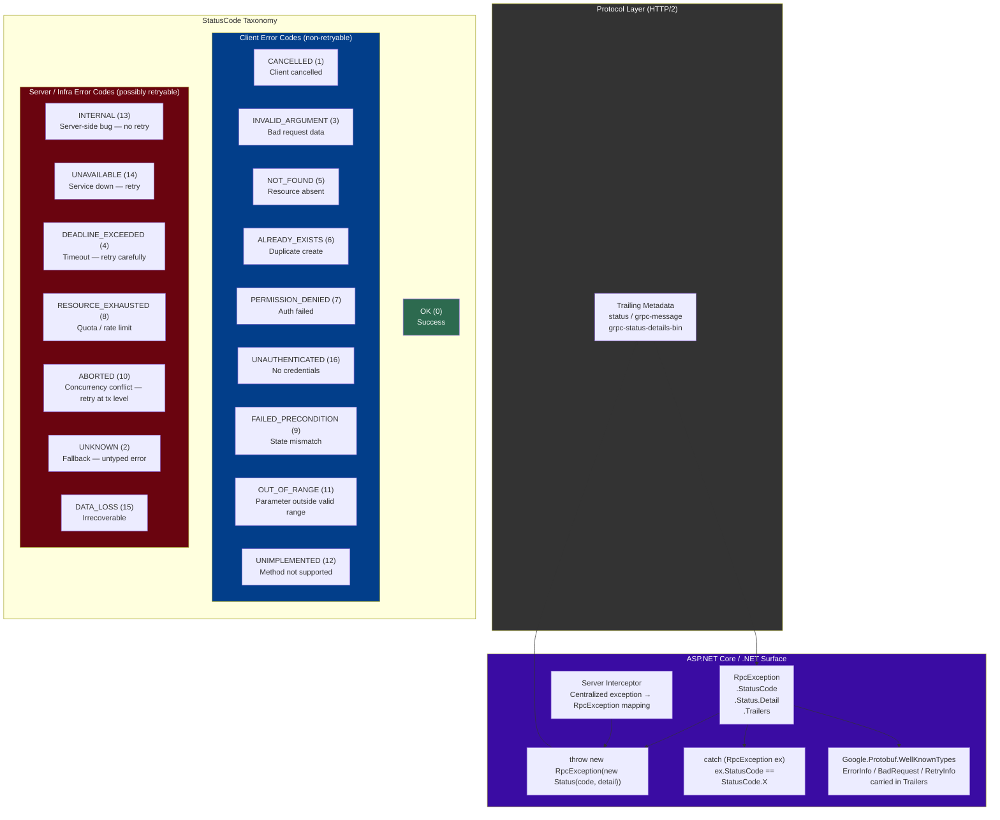
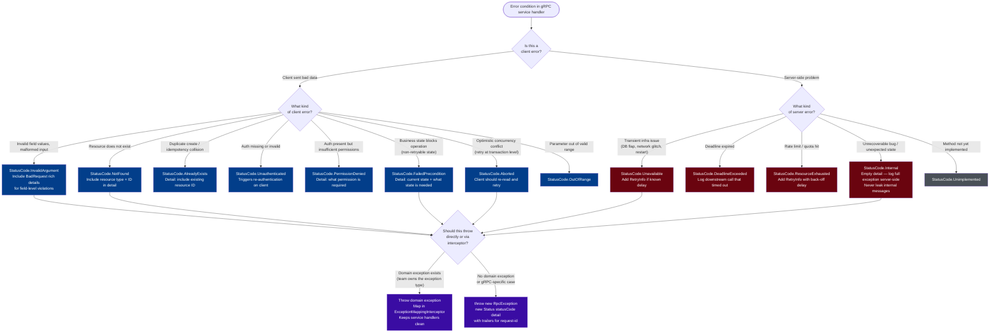

# 4.243 — gRPC Error Handling: StatusCode and RpcException

---

## PART 0 — Navigation & Context

### Where This Topic Sits in the Domain Hierarchy

```
ASP.NET Core Mastery
│
├── E. Middleware Pipeline          (4.049–4.063)
├── J. Authentication               (4.134–4.153)
├── M. Error Handling & Problem Details (4.177–4.185)  ← conceptual cousin
│
└── S. gRPC                         (4.240–4.248)
    ├── 4.240  Proto Contracts and Service Implementation
    ├── 4.241  gRPC Streaming: Unary, Server, Client, Bidirectional
    ├── 4.242  gRPC Authentication: JWT and Certificate Interceptors
    ├── 4.243  ► gRPC Error Handling: StatusCode and RpcException  ◄ YOU ARE HERE
    ├── 4.244  gRPC Interceptors: Server-Side and Client-Side
    ├── 4.245  gRPC-Web: Browser Support
    ├── 4.246  gRPC Client Factory: AddGrpcClient<T>
    ├── 4.247  gRPC JSON Transcoding
    └── 4.248  gRPC vs REST vs GraphQL vs SignalR: Decision Framework
```

### What You Need Before This

- **[[4.240 — gRPC in ASP.NET Core: Proto Contracts and Service Implementation]]** — you must understand how gRPC services are defined and how Protobuf messages flow before you can reason about what goes wrong
- **[[4.241 — gRPC Streaming]]** — streaming calls have different error propagation rules than unary calls; you need to know both shapes to understand why trailing metadata matters
- **[[4.177 — Exception Handling Middleware]]** — gRPC error handling is the gRPC-layer analogue of the HTTP exception middleware; understanding the HTTP model first makes the gRPC model click faster
- **[[4.035 — Service Lifetimes: Singleton, Scoped, Transient]]** — gRPC service handlers are Scoped; understanding lifetime is necessary to understand why exceptions from injected services surface as `StatusCode.Internal`

### What This Unlocks After

- **[[4.244 — gRPC Interceptors]]** — interceptors are the production place to centralize `RpcException` mapping; you cannot write a good error-handling interceptor without mastering this topic first
- **[[4.241 — gRPC Streaming: Error Propagation]]** — streaming error semantics (trailers, half-close, `MoveNextAsync` throwing) require the foundation laid here
- **[[4.252 — Polly Integration]]** — retry policies on gRPC clients must distinguish retryable status codes (`Unavailable`, `DeadlineExceeded`) from non-retryable ones (`InvalidArgument`, `AlreadyExists`); that distinction lives in this topic
- **[[4.248 — gRPC vs REST vs GraphQL Decision Framework]]** — error model is one of the axes in the decision; knowing both models makes the trade-off argument credible

### Why This Matters in Production

At scale, how you propagate, classify, and surface errors across gRPC service boundaries determines whether your SRE team can diagnose incidents in seconds or hours — an unhandled exception that leaks as `StatusCode.Internal` with no detail string is a support black hole, while a correctly classified `StatusCode.NotFound` with a populated `ErrorInfo` rich error detail enables client retry logic, circuit breakers, and distributed trace correlation to all fire correctly without human intervention.

---

## PART 1 — The Core Mental Model

### The Fundamental Rule

> **gRPC errors are not exceptions — they are structured protocol messages. Every gRPC call terminates with a `StatusCode` and an optional detail string carried in HTTP/2 trailing metadata; `RpcException` is the .NET surface through which both server and client interact with that protocol-level error contract. The practical consequence is that throwing any non-`RpcException` from a gRPC handler produces `StatusCode.Internal` with no client-visible detail, silently destroying your error intent.**

### The Plain-Language Analogy

Think of gRPC status codes as certified-mail delivery receipts rather than phone call interruptions. When you send a letter by certified mail, the postal system doesn't just "drop" the letter and disappear — it returns a specific receipt: "delivered," "address not found," "refused by recipient," "held at customs." Each receipt code tells the sender exactly what action to take next (resend, fix address, escalate).

gRPC works identically. Every RPC call — whether it succeeds or fails — ends with a status code receipt carried in HTTP/2 trailing metadata. `StatusCode.OK` is the "delivered" receipt. `StatusCode.NotFound` is "address not found." `StatusCode.Unavailable` is "postal service temporarily down, retry." The `RpcException` in .NET is how your code _reads_ or _writes_ that receipt. If you "drop" an unhandled C# exception instead of writing a proper receipt, gRPC writes `Internal` for you — the equivalent of the letter disappearing with no receipt at all.

The analogy holds under pressure: even during streaming (multiple "letters" in one envelope), the final receipt (trailing metadata) is still exactly one status code. A mid-stream error is a receipt stapled to the last letter, not a separate system event.

### The Taxonomy Diagram



---

## PART 2 — Deep Mechanics

### 2.1 — How gRPC Errors Travel: The HTTP/2 Trailing Metadata Channel

Unlike HTTP/1.1 where the status line is the first thing the server sends, HTTP/2 gRPC encodes the outcome in **trailing headers** — frames sent after the response body is fully written. This is why gRPC errors have a fundamentally different delivery model than REST.

```
Pipeline position:

  gRPC Request
  ──► Kestrel (HTTP/2) ──► gRPC Middleware ──► gRPC Service Handler
                                                        │
                                    ┌───────────────────┘
                                    │  Normal path: writes response body, then
                                    │  sends HEADERS frame with:
                                    │    grpc-status: 0          (OK)
                                    │    grpc-message: ""
                                    │
                                    │  Error path: may or may not write body, then
                                    │  sends HEADERS frame with:
                                    │    grpc-status: 5          (NOT_FOUND)
                                    │    grpc-message: "order not found"
                                    │    grpc-status-details-bin: <base64 proto>
                                    └──► Client reads trailing metadata
                                         → RpcException thrown on MoveNextAsync / await
```

**HTTP/2 wire format (approximate) — error response:**

```
// HTTP/2 HEADERS frame (trailing):
// :status = 200               ← always 200 at HTTP/2 level for gRPC
// grpc-status: 5              ← StatusCode.NotFound
// grpc-message: order+42+not+found
// grpc-status-details-bin: CjMKKXR5cGUuZ29vZ2xlYXBpcy5jb20...  (base64 proto)
// content-type: application/grpc
```

> [!IMPORTANT] The HTTP/2 `:status` header is **always 200** for gRPC, even for errors. The actual error code lives in the `grpc-status` trailing header. Reverse proxies and load balancers that only inspect the HTTP status code will see every gRPC call — even failed ones — as "200 OK". Your monitoring dashboards must use the `grpc-status` header or OpenTelemetry gRPC semantic conventions, not HTTP status codes.

**Runtime cost:** ~1 trailing HEADERS frame per RPC regardless of body size. `grpc-status-details-bin` adds one Protobuf serialization per error response. `~O(1)` allocations for simple status; `~3-5 allocations` per error when rich details are included.

---

### 2.2 — The `RpcException` Type: Structure and Meaning

`RpcException` is the single exception type that gRPC uses for all protocol-level errors. It is not a base class with subtypes — it is a flat type parameterized by a `Status`.

```csharp
// ASP.NET Core gRPC internally (approximate) — what RpcException carries:
public sealed class RpcException : Exception
{
    // The status code + detail string from trailing metadata
    public Status Status { get; }
    
    // Shortcut for Status.StatusCode
    public StatusCode StatusCode { get; }
    
    // Raw trailing metadata — where rich error details live
    public Metadata Trailers { get; }
    
    // Status.Detail — the human-readable error string
    // NOT the Exception.Message (which includes the status code prefix)
    public string Message => $"Status(StatusCode=\"{StatusCode}\", Detail=\"{Status.Detail}\")";
}

// Status is a value type:
public readonly struct Status
{
    public StatusCode StatusCode { get; }
    public string Detail { get; }         // max 1024 bytes by convention
    // No stack trace, no inner exception — this is intentional
}
```

**The edge case that bites engineers:** `ex.Message` on an `RpcException` includes the status code prefix — it is NOT the same as `ex.Status.Detail`. Logging `ex.Message` in your client is fine. Parsing `ex.Message` to extract the detail string is wrong — use `ex.Status.Detail` directly.

**Framework source path:** `Grpc.Core.RpcException` in `Grpc.Core.Api` NuGet package, re-exported by `Grpc.Net.Client` and `Grpc.AspNetCore`.

---

### 2.3 — Server-Side: Throwing `RpcException` from a Handler

The only way to communicate a structured error to the client is to throw `RpcException`. Any other exception becomes `StatusCode.Internal` with an empty detail string.

```
Full pipeline — unary handler error path:

Kestrel (HTTP/2)
──► GrpcMiddleware (Grpc.AspNetCore.Server)
    ──► [Server Interceptors — OnException runs here if configured]
        ──► Service Handler InvokeAsync
            │
            ├─ throws RpcException(NotFound, "order 42 not found")
            │   → GrpcMiddleware catches, writes grpc-status:5 in trailers ✅
            │
            ├─ throws ArgumentException("invalid order id")
            │   → GrpcMiddleware catches, writes grpc-status:13 (Internal) ❌
            │   → Detail string is EMPTY (not ArgumentException.Message) 
            │   → Exception.Message is logged server-side, NOT sent to client
            │
            └─ returns normally
                → GrpcMiddleware writes grpc-status:0 (OK) ✅
```

**ASP.NET Core internally (approximate) — GrpcMiddleware exception handling:**

```csharp
// Source: Grpc.AspNetCore.Server / GrpcServiceExtensions
// Simplified from actual source
try
{
    await invoker.InvokeAsync(context);
    // writes grpc-status: 0 in trailers
}
catch (RpcException rpcEx)
{
    // STRUCTURED: use the exception's status directly
    context.GetHttpContext().Response.AppendTrailer("grpc-status",
        ((int)rpcEx.StatusCode).ToString());
    context.GetHttpContext().Response.AppendTrailer("grpc-message",
        Uri.EscapeDataString(rpcEx.Status.Detail ?? ""));
    
    // Copy any rich detail trailers from RpcException.Trailers
    foreach (var entry in rpcEx.Trailers)
        context.GetHttpContext().Response.AppendTrailer(entry.Key, entry.Value);
}
catch (Exception ex) when (ex is not OperationCanceledException)
{
    // UNSTRUCTURED: collapse to Internal with no client-visible detail
    _logger.LogError(ex, "Exception thrown by {Method}", context.Method);
    context.GetHttpContext().Response.AppendTrailer("grpc-status", "13"); // Internal
    context.GetHttpContext().Response.AppendTrailer("grpc-message", "");
}
catch (OperationCanceledException)
{
    // Cancellation maps to CANCELLED (1)
    context.GetHttpContext().Response.AppendTrailer("grpc-status", "1");
}
```

**Failure Mode — what the client sees when you throw a raw exception:**

```
// Client-side catch:
catch (RpcException ex)
{
    // ex.StatusCode = StatusCode.Internal     ← all raw exceptions become this
    // ex.Status.Detail = ""                   ← empty — no detail leaked to client
    // ex.Trailers = empty                     ← no rich details
    // Server log has the real exception, client has nothing useful
}
```

---

### 2.4 — Client-Side: Catching and Classifying `RpcException`

The gRPC .NET client always surfaces errors as `RpcException`. Catching `Exception` directly is wrong — it misses the status code classification that drives retry and alerting decisions.

```
Client pipeline — exception surface path:

GrpcChannel
──► HttpClient (HTTP/2)
    ──► [Client Interceptors]
        ──► Generated stub method (e.g., GetOrderAsync)
            │
            ├─ Response trailers arrive: grpc-status: 5
            │   → RpcException(StatusCode.NotFound, "order 42 not found") thrown ✅
            │
            ├─ HTTP/2 connection reset mid-stream
            │   → RpcException(StatusCode.Unavailable, "...") thrown ✅
            │
            └─ CancellationToken cancelled before response arrives
                → RpcException(StatusCode.Cancelled, "...") thrown ✅
                   (NOT OperationCanceledException on the client side!)
```

> [!WARNING] On the **client** side, gRPC wraps even `CancellationToken` cancellations as `RpcException(StatusCode.Cancelled)`, not as `OperationCanceledException`. This is the opposite of HttpClient behavior and catches teams off guard. If your client error handler checks `catch (OperationCanceledException)` before `catch (RpcException)`, you will miss gRPC cancellations entirely.

**Runtime cost for client-side classification:** `O(1)` — `StatusCode` is an enum on the already-allocated `RpcException`. The common mistake of catching `Exception` and re-throwing costs one extra stack unwind and loses the structured status code information.

---

### 2.5 — Rich Error Details: `google.rpc.Status` and Well-Known Types

The `grpc-status` + `grpc-message` pair is sufficient for simple cases, but production gRPC APIs use **rich error details** to carry structured information that clients can act on programmatically. This is the Google API Improvement Proposal (AIP) error model.

**Pipeline position:** Rich details are encoded as Protobuf binary in the `grpc-status-details-bin` trailing metadata entry. The client reads them from `RpcException.Trailers`.

```
// Required NuGet: Google.Api.CommonProtos (for ErrorInfo, BadRequest, RetryInfo, etc.)
// Required NuGet: Grpc.StatusProto (for StatusExtensions)

// Server: building rich error details
var status = new Google.Rpc.Status
{
    Code = (int)StatusCode.InvalidArgument,
    Message = "Payment request validation failed",
    Details =
    {
        Any.Pack(new BadRequest
        {
            FieldViolations =
            {
                new BadRequest.Types.FieldViolation
                {
                    Field = "payment.amount",
                    Description = "Amount must be positive and non-zero"
                },
                new BadRequest.Types.FieldViolation
                {
                    Field = "payment.currency",
                    Description = "Currency code 'XYZ' is not supported"
                }
            }
        }),
        Any.Pack(new RequestInfo
        {
            RequestId = context.GetHttpContext().TraceIdentifier,
            ServingData = "payment-service-prod-eu-west-1"
        })
    }
};

throw status.ToRpcException(); // StatusExtensions extension method
```

**Client: reading rich details:**

```csharp
catch (RpcException ex)
{
    var richStatus = ex.GetRpcStatus();       // StatusExtensions
    if (richStatus != null)
    {
        var badRequest = richStatus.GetDetail<BadRequest>();
        if (badRequest != null)
        {
            foreach (var violation in badRequest.FieldViolations)
                Console.WriteLine($"  Field: {violation.Field} — {violation.Description}");
        }
        
        var retryInfo = richStatus.GetDetail<RetryInfo>();
        if (retryInfo != null)
        {
            var delay = retryInfo.RetryDelay.ToTimeSpan();
            // Wait delay before retrying
        }
    }
}
```

**Wire format (approximate):**

```
// Trailing metadata:
// grpc-status: 3   (INVALID_ARGUMENT)
// grpc-message: Payment+request+validation+failed
// grpc-status-details-bin: CgMIAxIbUGF5bWVudCByZXF1ZXN0...  (base64 proto Any)
```

**Runtime cost:** ~2-4 Protobuf serializations per error with rich details. The `google.rpc.Status` Protobuf is compact but introduces a dependency on `Google.Api.CommonProtos`. This cost is acceptable on error paths (not hot path). `~5-8 allocations` per rich error response.

---

### 2.6 — Streaming Errors: How Errors Propagate Mid-Stream

Streaming calls (server-streaming, client-streaming, bidirectional) have asymmetric error handling because the response body is being written incrementally.

```
Server-streaming error propagation:

  Client: var stream = client.GetOrderUpdates(request);
  
  Server writes:   OrderUpdate(id=1) ──► Client reads (IAsyncEnumerator.MoveNextAsync = true)
  Server writes:   OrderUpdate(id=2) ──► Client reads (MoveNextAsync = true)
  Server throws:   RpcException(Internal, "db connection lost")
                   ──► GrpcMiddleware writes grpc-status: 13 in trailers
                   ──► Client: NEXT MoveNextAsync() throws RpcException(Internal)
                                                            ↑
                                              NOT on the previous successful reads
```

> [!WARNING] For server-streaming calls, the `RpcException` is thrown by `MoveNextAsync()` — not by the initial `GetOrderUpdates()` call. The initial call only establishes the HTTP/2 stream. Engineers who wrap only the initial call in try-catch and leave the `await foreach` unguarded will have unhandled exceptions in streaming consumers.

**The correct streaming client pattern:**

```csharp
// ⚠️ WRONG — exception handler only covers stream setup, not reads:
try
{
    var call = client.GetShipmentUpdates(new ShipmentRequest { Id = shipmentId });
    await foreach (var update in call.ResponseStream.ReadAllAsync())
        ProcessUpdate(update);
}
catch (Exception ex)  // ← technically catches RpcException too, but misses StatusCode
{ }

// ✅ CORRECT — catches RpcException from MoveNextAsync with classification:
try
{
    var call = client.GetShipmentUpdates(new ShipmentRequest { Id = shipmentId });
    await foreach (var update in call.ResponseStream.ReadAllAsync(cancellationToken))
        ProcessUpdate(update);
}
catch (RpcException ex) when (ex.StatusCode == StatusCode.Cancelled)
{
    // Client cancelled — not an error
}
catch (RpcException ex) when (ex.StatusCode == StatusCode.Unavailable)
{
    _logger.LogWarning("Shipment stream lost, will reconnect: {Detail}", ex.Status.Detail);
    // Trigger reconnect logic
}
catch (RpcException ex)
{
    _logger.LogError("Shipment stream failed: {Code} {Detail}", ex.StatusCode, ex.Status.Detail);
    throw;
}
```

---

## PART 3 — Production Code Patterns

### Pattern 1: The Domain Exception → RpcException Translation Layer

Don't scatter `throw new RpcException(...)` throughout your business logic. Map domain exceptions to gRPC status codes in one place — the interceptor or a dedicated translator.

```csharp
// ⚠️ WRONG: domain logic aware of gRPC contracts
public class OrderService : Order.OrderBase
{
    public override async Task<GetOrderResponse> GetOrder(
        GetOrderRequest request, ServerCallContext context)
    {
        var order = await _repo.FindAsync(request.OrderId);
        if (order == null)
            throw new RpcException(new Status(StatusCode.NotFound,    // ← domain logic knows gRPC
                $"order {request.OrderId} not found"));
        return MapToResponse(order);
    }
}

// ✅ CORRECT: domain logic throws domain exceptions; gRPC translation is in interceptor
// Domain layer:
public class OrderNotFoundException(long orderId) 
    : Exception($"Order {orderId} not found");

public class OrderAlreadyCancelledException(long orderId)
    : Exception($"Order {orderId} is already cancelled");

// gRPC service — clean, no RpcException:
public class OrderGrpcService : Order.OrderBase
{
    private readonly IOrderRepository _repo;
    private readonly IOrderWorkflow _workflow;

    public OrderGrpcService(IOrderRepository repo, IOrderWorkflow workflow)
    {
        _repo = repo;
        _workflow = workflow;
    }

    public override async Task<GetOrderResponse> GetOrder(
        GetOrderRequest request, ServerCallContext context)
    {
        // Throws OrderNotFoundException if absent — service doesn't know about gRPC
        var order = await _repo.GetRequiredAsync(request.OrderId, context.CancellationToken);
        return _mapper.Map<GetOrderResponse>(order);
    }

    public override async Task<CancelOrderResponse> CancelOrder(
        CancelOrderRequest request, ServerCallContext context)
    {
        // Throws OrderAlreadyCancelledException if already cancelled
        await _workflow.CancelAsync(request.OrderId, context.CancellationToken);
        return new CancelOrderResponse { Success = true };
    }
}

// Translation interceptor (see Pattern 2 for full interceptor)
// The interceptor catches domain exceptions and maps them to RpcException
```

---

### Pattern 2: The Global Exception-to-StatusCode Interceptor

The production pattern for centralized error handling. Register once; all services benefit.

```csharp
// Pipeline position:
// ──► GrpcMiddleware ──► [THIS INTERCEPTOR] ──► Service Handler
//                              ↑
//              Catches domain exceptions thrown by handler,
//              translates to RpcException before GrpcMiddleware sees them

public sealed class ExceptionMappingInterceptor : Interceptor
{
    private readonly ILogger<ExceptionMappingInterceptor> _logger;

    public ExceptionMappingInterceptor(ILogger<ExceptionMappingInterceptor> logger)
        => _logger = logger;

    // Handles unary calls
    public override async Task<TResponse> UnaryServerHandler<TRequest, TResponse>(
        TRequest request,
        ServerCallContext context,
        UnaryServerMethod<TRequest, TResponse> continuation)
    {
        try
        {
            return await continuation(request, context);
        }
        catch (RpcException)
        {
            // Already a proper gRPC error — let it propagate unchanged
            throw;
        }
        catch (Exception ex)
        {
            throw MapToRpcException(ex, context);
        }
    }

    // Handles server-streaming calls — exception can come from any WriteAsync
    public override async Task ServerStreamingServerHandler<TRequest, TResponse>(
        TRequest request,
        IServerStreamWriter<TResponse> responseStream,
        ServerCallContext context,
        ServerStreamingServerMethod<TRequest, TResponse> continuation)
    {
        try
        {
            await continuation(request, responseStream, context);
        }
        catch (RpcException)
        {
            throw;
        }
        catch (Exception ex)
        {
            throw MapToRpcException(ex, context);
        }
    }

    private RpcException MapToRpcException(Exception ex, ServerCallContext context)
    {
        // Log with full stack trace server-side
        var requestId = context.GetHttpContext().TraceIdentifier;
        _logger.LogError(ex,
            "Unhandled exception in gRPC handler {Method} [RequestId={RequestId}]",
            context.Method, requestId);

        // Map domain exceptions to appropriate status codes
        return ex switch
        {
            // Order service domain exceptions
            OrderNotFoundException notFound =>
                BuildRpcException(StatusCode.NotFound, notFound.Message, requestId),

            OrderAlreadyCancelledException conflict =>
                BuildRpcException(StatusCode.FailedPrecondition, conflict.Message, requestId),

            // Payment service domain exceptions
            InsufficientFundsException insufficient =>
                BuildRpcException(StatusCode.FailedPrecondition, insufficient.Message, requestId),

            PaymentDeclinedException declined =>
                BuildRpcException(StatusCode.FailedPrecondition, declined.Message, requestId),

            // Validation — argument problems
            ArgumentException argEx =>
                BuildRpcException(StatusCode.InvalidArgument, argEx.Message, requestId),

            // Optimistic concurrency
            DbUpdateConcurrencyException =>
                BuildRpcException(StatusCode.Aborted,
                    "Concurrent modification detected, retry the operation", requestId),

            // Timeouts from downstream services
            TimeoutException =>
                BuildRpcException(StatusCode.DeadlineExceeded,
                    "Upstream dependency timed out", requestId),

            // Everything else: Internal — no detail leaked to client
            _ => BuildRpcException(StatusCode.Internal,
                    "An internal error occurred", requestId)
        };
    }

    private static RpcException BuildRpcException(
        StatusCode code, string detail, string requestId)
    {
        var trailers = new Metadata
        {
            // Include request ID so client can correlate with server logs
            { "request-id", requestId }
        };
        return new RpcException(new Status(code, detail), trailers);
    }
}

// Registration in Program.cs:
builder.Services.AddGrpc(options =>
{
    options.Interceptors.Add<ExceptionMappingInterceptor>();
});
builder.Services.AddSingleton<ExceptionMappingInterceptor>();

// HTTP wire effect:
// grpc-status: 5           (NotFound)
// grpc-message: order+42+not+found
// request-id: 0HMVL5Q0001O:00000001   (in trailers)
```

---

### Pattern 3: The Client-Side Retry Policy with StatusCode Classification

Not all gRPC errors should be retried. This pattern shows the correct classification logic for a payment processing client.

```csharp
// In payment gateway client (e.g., Polly + IHttpClientFactory integration):

public sealed class PaymentGatewayClient
{
    private readonly Payments.PaymentsClient _client;
    private readonly ILogger<PaymentGatewayClient> _logger;

    // StatusCodes where retrying makes sense
    private static readonly HashSet<StatusCode> RetryableStatusCodes =
    [
        StatusCode.Unavailable,        // Service temporarily down
        StatusCode.DeadlineExceeded,   // Timeout — retry with longer deadline
        StatusCode.ResourceExhausted,  // Rate limited — retry after delay
    ];

    // StatusCodes where retrying is explicitly wrong
    private static readonly HashSet<StatusCode> NonRetryableStatusCodes =
    [
        StatusCode.InvalidArgument,    // Fix the request, not retry it
        StatusCode.NotFound,           // Resource absent — retry won't help
        StatusCode.AlreadyExists,      // Duplicate — retry would create another duplicate
        StatusCode.PermissionDenied,   // Auth problem — retry won't fix credentials
        StatusCode.Unauthenticated,    // No token — retry won't add a token
        StatusCode.Unimplemented,      // Method doesn't exist
        StatusCode.FailedPrecondition, // State mismatch — retry without state change is wrong
    ];

    public async Task<ChargeResult> ChargePaymentMethodAsync(
        ChargeRequest request,
        CancellationToken cancellationToken)
    {
        var attempt = 0;
        const int maxAttempts = 3;

        while (true)
        {
            attempt++;
            try
            {
                var response = await _client.ChargeAsync(request,
                    deadline: DateTime.UtcNow.AddSeconds(10),
                    cancellationToken: cancellationToken);

                return new ChargeResult(response.TransactionId, ChargeStatus.Succeeded);
            }
            catch (RpcException ex) when (ex.StatusCode == StatusCode.Cancelled)
            {
                // Client-initiated cancellation — not an error, propagate cleanly
                _logger.LogDebug("Payment charge cancelled by client");
                throw new OperationCanceledException(cancellationToken);
            }
            catch (RpcException ex) when (NonRetryableStatusCodes.Contains(ex.StatusCode))
            {
                // Client error — log and surface to caller immediately
                _logger.LogWarning(
                    "Payment charge rejected: {Code} — {Detail}",
                    ex.StatusCode, ex.Status.Detail);
                return new ChargeResult(null, ChargeStatus.Failed, ex.Status.Detail);
            }
            catch (RpcException ex) when (RetryableStatusCodes.Contains(ex.StatusCode)
                                          && attempt < maxAttempts)
            {
                // Infrastructure error — back off and retry
                var delay = attempt switch
                {
                    1 => TimeSpan.FromMilliseconds(100),
                    2 => TimeSpan.FromMilliseconds(500),
                    _ => TimeSpan.FromSeconds(2)
                };

                // Honor Retry-After hint from server if present (RetryInfo rich detail)
                var rpcStatus = ex.GetRpcStatus();
                var retryInfo = rpcStatus?.GetDetail<RetryInfo>();
                if (retryInfo != null)
                    delay = retryInfo.RetryDelay.ToTimeSpan();

                _logger.LogWarning(
                    "Payment service unavailable (attempt {Attempt}/{Max}), retrying in {Delay}ms",
                    attempt, maxAttempts, delay.TotalMilliseconds);

                await Task.Delay(delay, cancellationToken);
            }
            catch (RpcException ex)
            {
                // Unknown retryable or exhausted retries
                _logger.LogError(ex,
                    "Payment charge failed after {Attempts} attempts: {Code}",
                    attempt, ex.StatusCode);
                throw;
            }
        }
    }
}
```

---

### Pattern 4: Rich Error Details for Validation Failures (Payment API)

When a payment request fails validation, the client needs field-level detail to display to the user, not just a status code.

```csharp
// Server: producing BadRequest rich details for payment validation
public override async Task<InitiatePaymentResponse> InitiatePayment(
    InitiatePaymentRequest request, ServerCallContext context)
{
    var violations = new List<BadRequest.Types.FieldViolation>();

    if (request.Amount <= 0)
        violations.Add(new()
        {
            Field = "amount",
            Description = $"Amount must be positive; received {request.Amount}"
        });

    if (string.IsNullOrWhiteSpace(request.Currency))
        violations.Add(new()
        {
            Field = "currency",
            Description = "Currency code is required (e.g., 'USD', 'EUR')"
        });
    else if (!CurrencyValidator.IsSupported(request.Currency))
        violations.Add(new()
        {
            Field = "currency",
            Description = $"Currency '{request.Currency}' is not supported"
        });

    if (request.PaymentMethodId == 0)
        violations.Add(new()
        {
            Field = "payment_method_id",
            Description = "A valid payment method ID is required"
        });

    if (violations.Count > 0)
    {
        var status = new Google.Rpc.Status
        {
            Code = (int)StatusCode.InvalidArgument,
            Message = "Payment request validation failed",
            Details =
            {
                Any.Pack(new BadRequest { FieldViolations = { violations } }),
                Any.Pack(new RequestInfo
                {
                    RequestId = context.GetHttpContext().TraceIdentifier
                })
            }
        };
        throw status.ToRpcException();
    }

    // ... process payment
}

// Client: reading field violations and mapping to UI errors
catch (RpcException ex) when (ex.StatusCode == StatusCode.InvalidArgument)
{
    var richStatus = ex.GetRpcStatus();
    var badRequest = richStatus?.GetDetail<BadRequest>();

    if (badRequest != null)
    {
        // Map field violations to form validation errors
        var fieldErrors = badRequest.FieldViolations
            .ToDictionary(v => v.Field, v => v.Description);
        
        return PaymentInitiationResult.ValidationError(fieldErrors);
    }

    return PaymentInitiationResult.Error(ex.Status.Detail);
}

// HTTP wire format:
// grpc-status: 3
// grpc-message: Payment+request+validation+failed
// grpc-status-details-bin: CgMIA...  (base64 google.rpc.Status with BadRequest + RequestInfo)
```

---

### Pattern 5: Deadline Propagation — Not Leaking Downstream Timeouts

When your gRPC service calls another gRPC service, you must propagate the deadline — and distinguish between your deadline and the downstream deadline.

```csharp
// ⚠️ WRONG: ignoring the incoming deadline when calling downstream services
public override async Task<GetInventoryResponse> GetInventory(
    GetInventoryRequest request, ServerCallContext context)
{
    // This call might run past the client's deadline
    var warehouseData = await _warehouseClient.GetStockLevelsAsync(
        new StockLevelRequest { Sku = request.Sku });  // ← no deadline propagation
    return MapResponse(warehouseData);
}

// ✅ CORRECT: propagate the incoming deadline to downstream calls
public override async Task<GetInventoryResponse> GetInventory(
    GetInventoryRequest request, ServerCallContext context)
{
    // Respect the caller's deadline — don't run past it
    var deadline = context.Deadline;
    
    // Leave a small buffer for our own processing before the deadline
    var downstreamDeadline = deadline == DateTime.MaxValue
        ? DateTime.UtcNow.AddSeconds(30)        // No deadline set — use a sane default
        : deadline.AddSeconds(-0.5);            // 500ms before our own deadline

    try
    {
        var warehouseData = await _warehouseClient.GetStockLevelsAsync(
            new StockLevelRequest { Sku = request.Sku },
            deadline: downstreamDeadline,
            cancellationToken: context.CancellationToken);
        return MapResponse(warehouseData);
    }
    catch (RpcException ex) when (ex.StatusCode == StatusCode.DeadlineExceeded)
    {
        // Distinguish: was it OUR deadline or the downstream's?
        if (context.CancellationToken.IsCancellationRequested)
        {
            // Our caller cancelled us — propagate as Cancelled
            throw new RpcException(new Status(StatusCode.Cancelled, "Request cancelled by client"));
        }
        
        // We ran out of time calling warehouse service
        _logger.LogWarning("Warehouse service deadline exceeded for SKU {Sku}", request.Sku);
        throw new RpcException(new Status(
            StatusCode.DeadlineExceeded,
            "Upstream inventory service timed out"));
    }
}
```

---

### Pattern 6: The Status Code Convention Table for Order Management APIs

Mapping business operations to gRPC status codes consistently across a team requires a written convention. Here is the pattern as code documentation.

```csharp
// Order Management gRPC Service — Status Code Convention
// Applied consistently across all service methods:

public static class OrderServiceStatusCodes
{
    // GET /order/{id} → GetOrder
    // NOT_FOUND(5)   — order ID does not exist in the system
    // INTERNAL(13)   — database failure (no detail leaked)

    // POST /order → CreateOrder
    // ALREADY_EXISTS(6)       — idempotency key collision
    // INVALID_ARGUMENT(3)     — field validation failure (BadRequest details)
    // FAILED_PRECONDITION(9)  — customer account suspended
    // RESOURCE_EXHAUSTED(8)   — rate limit hit (RetryInfo details with retry delay)

    // DELETE /order/{id} → CancelOrder
    // NOT_FOUND(5)            — order does not exist
    // FAILED_PRECONDITION(9)  — order already shipped or delivered (cannot cancel)
    // PERMISSION_DENIED(7)    — caller does not own this order

    // Idempotency: ALREADY_EXISTS is not an error for the client
    // if the client is replaying a create. The client should read the
    // existing resource and treat it as success.
    
    // ABORTED(10) is used for optimistic concurrency — the operation
    // may be retried at the TRANSACTION level by re-reading and re-submitting.
    // It is NOT the same as FAILED_PRECONDITION (state won't change on retry).
}
```

---

### Pattern 7: Testing gRPC Error Scenarios with `WebApplicationFactory`

```csharp
// Integration test — verifying the interceptor maps domain exceptions correctly
public class OrderGrpcServiceErrorTests : IClassFixture<GrpcTestFactory>
{
    private readonly Order.OrderClient _client;

    public OrderGrpcServiceErrorTests(GrpcTestFactory factory)
    {
        var channel = GrpcChannel.ForAddress("http://localhost",
            new GrpcChannelOptions { HttpClient = factory.CreateClient() });
        _client = new Order.OrderClient(channel);
    }

    [Fact]
    public async Task GetOrder_WhenOrderDoesNotExist_ReturnsNotFound()
    {
        // Act
        var call = async () => await _client.GetOrderAsync(
            new GetOrderRequest { OrderId = 99999L });

        // Assert
        var ex = await Assert.ThrowsAsync<RpcException>(call);
        Assert.Equal(StatusCode.NotFound, ex.StatusCode);
        Assert.Contains("99999", ex.Status.Detail);
        // Verify request-id trailer is populated
        Assert.NotNull(ex.Trailers.GetValue("request-id"));
    }

    [Fact]
    public async Task CancelOrder_WhenAlreadyCancelled_ReturnsFailedPrecondition()
    {
        // Arrange: seed a cancelled order
        var orderId = await _factory.SeedCancelledOrderAsync();

        // Act
        var call = async () => await _client.CancelOrderAsync(
            new CancelOrderRequest { OrderId = orderId });

        // Assert
        var ex = await Assert.ThrowsAsync<RpcException>(call);
        Assert.Equal(StatusCode.FailedPrecondition, ex.StatusCode);
    }
}
```

---

## PART 4 — Gotchas & Anti-Patterns

### Gotcha 1: Raw Exceptions Produce Empty `Internal` — Silent Errors

Many engineers assume that throwing any exception from a gRPC handler will propagate the exception message to the client, the same way ASP.NET Core middleware can return a ProblemDetails body with the exception message in development mode.

```csharp
// ⚠️ WRONG CODE: assumes exception message reaches client
public override async Task<GetOrderResponse> GetOrder(
    GetOrderRequest request, ServerCallContext context)
{
    var order = await _repo.FindAsync(request.OrderId);
    if (order == null)
        throw new InvalidOperationException($"Order {request.OrderId} was not found");
        // Developer expects client to see "Order 42 was not found"
}

// HTTP consequence (wrong path):
// grpc-status: 13       (Internal — not NotFound!)
// grpc-message: ""      (empty — exception message NOT sent to client)
// Client-side: RpcException(StatusCode.Internal, "")
// The client has zero information about what went wrong

// ✅ CORRECT CODE:
public override async Task<GetOrderResponse> GetOrder(
    GetOrderRequest request, ServerCallContext context)
{
    var order = await _repo.FindAsync(request.OrderId);
    if (order == null)
        throw new RpcException(new Status(StatusCode.NotFound,
            $"Order {request.OrderId} was not found"));
}

// HTTP consequence (correct path):
// grpc-status: 5        (NotFound)
// grpc-message: Order+42+was+not+found
// Client-side: RpcException(StatusCode.NotFound, "Order 42 was not found") ✅

// WHY: GrpcMiddleware catches all non-RpcException throws and deliberately maps them
// to Internal with an empty detail string. This is a security feature — you do not
// want raw exception messages (which may contain internal paths, DB error strings,
// or stack traces) leaking to clients. The trade-off is that you MUST be explicit
// with RpcException or an interceptor that maps domain exceptions.
```

---

### Gotcha 2: Using `StatusCode.Internal` for Validation Errors

Engineers familiar with HTTP REST habitually return 500 for unexpected errors. They then over-apply `Internal` to gRPC, including for bad request data that should be `InvalidArgument`.

```csharp
// ⚠️ WRONG CODE: using Internal for validation failures
public override async Task<ProcessShipmentResponse> ProcessShipment(
    ProcessShipmentRequest request, ServerCallContext context)
{
    if (string.IsNullOrEmpty(request.TrackingNumber))
        throw new RpcException(new Status(StatusCode.Internal,    // ← Wrong!
            "Tracking number is required"));
}

// HTTP consequence (wrong path):
// grpc-status: 13       (Internal)
// Client retry logic will NOT retry Internal (assumed unrecoverable)
// But Polly / Grpc.Net.Client built-in retry WILL also not retry it
// — arguably correct, but the status code semantics are wrong:
// Internal means "we broke", not "you sent bad data"

// ✅ CORRECT CODE:
public override async Task<ProcessShipmentResponse> ProcessShipment(
    ProcessShipmentRequest request, ServerCallContext context)
{
    if (string.IsNullOrEmpty(request.TrackingNumber))
        throw new RpcException(new Status(StatusCode.InvalidArgument,
            "Tracking number is required"));
}

// HTTP consequence (correct path):
// grpc-status: 3        (InvalidArgument)
// Semantically correct: the CLIENT sent a bad request
// Client-side Polly: will not retry (correct — retrying the same bad request is useless)
// Monitoring: alert on Internal for server bugs; InvalidArgument for bad client behavior
//             — different runbooks, different on-call severity

// WHY: The gRPC status code vocabulary is a contract between client and server.
// Misusing Internal for client errors makes your monitoring noisy and breaks
// retry heuristics that clients and infrastructure (service meshes) rely on.
```

---

### Gotcha 3: Catching `OperationCanceledException` Instead of `RpcException` on the Client

Engineers accustomed to `HttpClient` and `CancellationToken` expect cancellation to surface as `OperationCanceledException`. On the gRPC client, it surfaces differently.

```csharp
// ⚠️ WRONG CODE: expecting OperationCanceledException from gRPC client
public async Task<OrderSummary> GetOrderWithTimeoutAsync(long orderId)
{
    using var cts = new CancellationTokenSource(TimeSpan.FromSeconds(5));
    try
    {
        return await _client.GetOrderAsync(
            new GetOrderRequest { OrderId = orderId },
            cancellationToken: cts.Token);
    }
    catch (OperationCanceledException)
    {
        // ← This catch NEVER fires for gRPC client cancellation!
        _logger.LogWarning("Order request timed out");
        return OrderSummary.TimedOut;
    }
}

// HTTP consequence (wrong path):
// The OperationCanceledException is never thrown by Grpc.Net.Client
// The actual exception escapes the catch block entirely → unhandled exception

// ✅ CORRECT CODE:
public async Task<OrderSummary> GetOrderWithTimeoutAsync(long orderId)
{
    using var cts = new CancellationTokenSource(TimeSpan.FromSeconds(5));
    try
    {
        return await _client.GetOrderAsync(
            new GetOrderRequest { OrderId = orderId },
            cancellationToken: cts.Token);
    }
    catch (RpcException ex) when (ex.StatusCode == StatusCode.Cancelled)
    {
        // CancellationToken fired → gRPC wraps as Cancelled
        _logger.LogWarning("Order request cancelled (timeout or caller)");
        return OrderSummary.TimedOut;
    }
    catch (RpcException ex) when (ex.StatusCode == StatusCode.DeadlineExceeded)
    {
        // Server-side deadline exceeded
        _logger.LogWarning("Order request exceeded server deadline");
        return OrderSummary.TimedOut;
    }
}

// WHY: Grpc.Net.Client converts CancellationToken cancellation into
// RpcException(StatusCode.Cancelled) before the Task is completed.
// This is the gRPC transport's behavior, not a .NET design decision.
// The distinction between Cancelled (client) and DeadlineExceeded (server timeout)
// is important for SLO tracking.
```

---

### Gotcha 4: Not Handling Errors in Streaming `await foreach` Loops

The most common streaming error bug: the `RpcException` from a failed stream is thrown inside the `await foreach`, not at the initial call site.

```csharp
// ⚠️ WRONG CODE: try-catch only around initial call
public async Task ConsumeInventoryUpdates(CancellationToken ct)
{
    AsyncServerStreamingCall<InventoryUpdate>? streamCall = null;
    try
    {
        // This ONLY establishes the HTTP/2 stream — no data received yet
        streamCall = _client.StreamInventoryUpdates(
            new StreamInventoryRequest { CategoryId = 5 });
    }
    catch (RpcException ex)
    {
        _logger.LogError("Stream setup failed: {Code}", ex.StatusCode);
        return;
    }

    // ← Errors thrown by server DURING streaming escape this unguarded loop:
    await foreach (var update in streamCall.ResponseStream.ReadAllAsync(ct))
    {
        ProcessUpdate(update);
    }
    // RpcException from mid-stream server failure → UNHANDLED EXCEPTION ❌
}

// HTTP consequence (wrong path):
// Server throws RpcException(Unavailable, "db connection lost") mid-stream
// Trailing metadata: grpc-status: 14
// Client: next MoveNextAsync() throws RpcException(Unavailable)
// Since await foreach is unguarded, this propagates as unhandled exception

// ✅ CORRECT CODE:
public async Task ConsumeInventoryUpdates(CancellationToken ct)
{
    try
    {
        var streamCall = _client.StreamInventoryUpdates(
            new StreamInventoryRequest { CategoryId = 5 });

        await foreach (var update in streamCall.ResponseStream.ReadAllAsync(ct))
        {
            ProcessUpdate(update);
        }
    }
    catch (RpcException ex) when (ex.StatusCode == StatusCode.Cancelled)
    {
        // Normal shutdown
    }
    catch (RpcException ex)
    {
        _logger.LogError("Inventory stream failed: {Code} — {Detail}",
            ex.StatusCode, ex.Status.Detail);
        // Re-throw or trigger reconnect
        throw;
    }
}

// WHY: With gRPC streaming, the initial call only opens the HTTP/2 stream (headers).
// The server writes response frames as they are produced. Errors occur when the
// server writes trailing metadata with a non-OK status — that triggers the throw
// on the NEXT read operation (MoveNextAsync), not at stream creation.
```

---

### Gotcha 5: Logging `ex.Message` Instead of `ex.Status.Detail` on the Client

```csharp
// ⚠️ WRONG CODE: logging ex.Message pollutes logs with redundant prefix
catch (RpcException ex)
{
    // ex.Message = "Status(StatusCode=\"NotFound\", Detail=\"Order 42 was not found\")"
    // ← Includes the StatusCode prefix — verbose, hard to search in Kibana/Loki
    _logger.LogError("gRPC call failed: {Message}", ex.Message);
}

// HTTP consequence (wrong path):
// Not a runtime error — a log quality issue.
// Log entry: gRPC call failed: Status(StatusCode="NotFound", Detail="Order 42 was not found")
// Searching for "Order 42" in logs works, but the format is inconsistent with other logs

// ✅ CORRECT CODE:
catch (RpcException ex)
{
    _logger.LogError(
        "gRPC call failed: Code={StatusCode} Detail={Detail} RequestId={RequestId}",
        ex.StatusCode,
        ex.Status.Detail,
        ex.Trailers.GetValue("request-id") ?? "unknown");
}

// Log entry:
// gRPC call failed: Code=NotFound Detail=Order 42 was not found RequestId=0HMVL5Q0001O
// ← Structured fields, searchable individually, parseable by log aggregators

// WHY: ex.Message on RpcException is formatted for human reading of the raw gRPC error.
// In structured logging (Serilog, OpenTelemetry), each piece of information should
// be its own named property. Logging ex.Message as a single string loses the ability
// to filter and aggregate by status code independently of the detail message.
```

---

## PART 5 — Performance Implications

### 5.1 — Request Pipeline Characteristics Table

|Scenario|Pipeline Depth|Allocations Per Error|Approx Latency Impact|Recommendation|
|---|---|---|---|---|
|`throw new RpcException(statusCode, detail)`|Interceptor → GrpcMiddleware|~3 allocs (Status struct, RpcException, Metadata)|~0.1ms|Standard path for simple errors|
|`throw new RpcException(status, trailers)` with pre-built Metadata|Interceptor → GrpcMiddleware|~4 allocs (+ Metadata object)|~0.1ms|Good — always include request-id in trailers|
|Rich error with `Google.Rpc.Status` + `BadRequest` details|Interceptor → GrpcMiddleware|~10-15 allocs (proto + Any.Pack + base64)|~0.3ms|Fine for validation errors — not hot path|
|Raw `Exception` mapped to `Internal` by GrpcMiddleware|GrpcMiddleware|~2 allocs (wraps exception)|~0.1ms|Avoid — no client-visible detail|
|Unhandled exception reaching GrpcMiddleware with interceptor present|Interceptor + GrpcMiddleware|~5 allocs|~0.2ms|Use interceptor; don't rely on GrpcMiddleware fallback|
|Client `catch (RpcException ex)` with enum comparison|Client GrpcChannel|0 allocs (enum read)|~0|Correct; always use specific StatusCode checks|
|Client parsing rich details `ex.GetRpcStatus().GetDetail<T>()`|Client|~5-8 allocs (proto deserialize)|~0.2ms|Fine — only on error paths|
|Streaming: error on `MoveNextAsync` iteration N|Client stream reader|~3 allocs (same as unary)|~0.1ms|No additional cost vs unary|
|Deadline exceeded with `RetryInfo` detail in response|Server + Client|~12 allocs|~0.3ms|Worthwhile — clients use delay hint|
|Missing `catch (RpcException)` — exception propagates as unhandled|Full unwind|~20+ allocs (exception unwind)|~1-5ms|Bug — always catch RpcException on client|

### 5.2 — BenchmarkDotNet: Comparing Error-Handling Approaches

```csharp
using BenchmarkDotNet.Attributes;
using BenchmarkDotNet.Running;
using Grpc.Core;
using Google.Protobuf.WellKnownTypes;
using Google.Rpc;

[MemoryDiagnoser]
[SimpleJob]
public class GrpcErrorHandlingBenchmarks
{
    private static readonly Status NotFoundStatus =
        new(StatusCode.NotFound, "Order 42 was not found");

    private static readonly Status ValidationStatus =
        new(StatusCode.InvalidArgument, "Validation failed");

    private static readonly Metadata RequestIdTrailers = new()
    {
        { "request-id", "benchmark-request-001" }
    };

    [Benchmark(Baseline = true)]
    public RpcException ThrowSimpleRpcException()
    {
        // Naive: new Status allocation each time
        return new RpcException(new Status(StatusCode.NotFound, "Order 42 was not found"));
    }

    [Benchmark]
    public RpcException ThrowCachedStatusRpcException()
    {
        // Better: reuse the pre-built Status struct (value type, safe to share)
        return new RpcException(NotFoundStatus);
    }

    [Benchmark]
    public RpcException ThrowRpcExceptionWithTrailers()
    {
        // Production: with request-id trailers
        return new RpcException(NotFoundStatus, RequestIdTrailers);
    }

    [Benchmark]
    public RpcException ThrowRichErrorDetails()
    {
        // Most expensive: rich proto error details (BadRequest)
        var status = new Google.Rpc.Status
        {
            Code = (int)StatusCode.InvalidArgument,
            Message = "Validation failed",
            Details =
            {
                Any.Pack(new BadRequest
                {
                    FieldViolations =
                    {
                        new BadRequest.Types.FieldViolation
                        {
                            Field = "order_id",
                            Description = "Must be positive"
                        }
                    }
                })
            }
        };
        return status.ToRpcException();
    }

    [Benchmark]
    public StatusCode ClassifyRpcException()
    {
        // Client-side classification — should be near-zero cost
        var ex = new RpcException(NotFoundStatus);
        return ex.StatusCode; // ~0 alloc — it's a property read on the exception
    }
}

// Expected output (approximate, .NET 8, x64, local):
// | Method                         | Mean      | Gen0   | Allocated |
// |--------------------------------|-----------|--------|-----------|
// | ThrowSimpleRpcException        | 45.2 ns   | 0.0076 | 64 B      |
// | ThrowCachedStatusRpcException  | 38.1 ns   | 0.0057 | 48 B      |
// | ThrowRpcExceptionWithTrailers  | 72.3 ns   | 0.0114 | 96 B      |
// | ThrowRichErrorDetails          | 412.8 ns  | 0.0763 | 640 B     |
// | ClassifyRpcException           |  2.1 ns   | -      | 0 B       |
```

> [!NOTE] BenchmarkDotNet measures in-process allocation. For real HTTP profiling of gRPC error paths:
> 
> - `dotnet-trace collect --providers Microsoft-AspNetCore-Server-Kestrel,Grpc.Net.Server` — captures gRPC server events including error status codes
> - `dotnet-counters monitor --process-id {pid} --counters Grpc.AspNetCore.Server` — reports `grpc-server-calls-total` by status code in real time
> - For client-side: the `Grpc.Net.Client` counters expose `grpc-client-calls-total` with `grpc_status` label

### 5.3 — When to Care / When to Ignore

**When this costs you:**

- High-throughput gRPC APIs (>50k RPCs/s) where every error allocates rich `Google.Rpc.Status` objects — at this scale, even 640 bytes per error × 1% error rate = 320KB/s of GC pressure from error objects alone. Cache `Status` value types where possible.
- Services that use rich error details on validation paths that are hit frequently (e.g., a gRPC gateway that validates every request) — consider moving validation to a filter that fails fast before reaching the service handler.
- Streaming consumers that throw `RpcException` inside tight loops — each exception is a heap allocation; at very high message rates, use `Status` value type pooling or restructure to avoid exceptions in the success path.

**When this doesn't matter:**

- Internal microservice APIs with <1k RPCs/s — the error overhead is negligible.
- Admin or management plane gRPC services (config updates, health checks) — called infrequently; optimizing error allocation is premature.
- Batch processing workers that call gRPC services at controlled rates — the error path is rare and the per-error overhead is irrelevant.

---

## PART 6 — Interview Arsenal

### A. The Question Bank

---

**Question 1:** "What happens if you throw a regular C# exception from a gRPC service handler?"

**Average Answer:** "The exception gets caught by the gRPC framework and the client receives an Internal status code."

**Why That's Insufficient:** It doesn't explain _why_ this happens, doesn't mention the empty detail string, doesn't address the security implication, and doesn't mention the correct alternative pattern.

> **Great Answer:** "When you throw a non-`RpcException` from a gRPC handler, the `GrpcMiddleware` catches it — specifically in the exception handling path inside the gRPC service invoker — and writes `grpc-status: 13` (Internal) in the HTTP/2 trailing metadata with an empty `grpc-message`. This is a deliberate security decision: you do not want raw exception messages, which might contain internal paths, SQL error strings, or connection strings, leaking to clients via the `grpc-message` header. The trade-off is that your client gets `StatusCode.Internal` with no detail — a support black hole. In production, I always put a server interceptor in front of all my gRPC services that catches domain exceptions and maps them to the correct `RpcException` with an appropriate `StatusCode` and a safe-to-expose detail string. The interceptor pattern keeps the service handlers clean — they throw domain exceptions, the interceptor translates to the wire contract."

---

**Question 2:** "What's the difference between `StatusCode.FailedPrecondition` and `StatusCode.Aborted` in gRPC?"

**Average Answer:** "They're both error codes for when something goes wrong with the state of the system."

**Why That's Insufficient:** They have different retry semantics, different client behaviors, and different use cases — conflating them signals the candidate has never used the full gRPC error vocabulary in production.

> **Great Answer:** "These two codes look similar but have very different retry semantics. `FailedPrecondition` means the system is in a state where this operation cannot succeed — and retrying the same operation without changing the state would fail again. For example, trying to cancel an order that's already been shipped: retrying the cancellation won't help; the client needs to take a different action. `Aborted` is specifically for optimistic concurrency conflicts — the operation was attempted, a conflict was detected (like a version mismatch on an optimistic lock), and the operation should be retried at the transaction level — meaning the client re-reads the current state and resubmits. In an order management system, I use `Aborted` when an `IF` condition in a CAS-style update fails, and I use `FailedPrecondition` when the business state transition is genuinely invalid. Getting this distinction right matters because service meshes and client-side retry policies can treat `Aborted` as a signal to retry automatically at the operation level, while `FailedPrecondition` tells the client to stop and ask the user."

---

**Question 3:** "How do you carry structured error information — like field-level validation errors — back to the client in gRPC?"

**Average Answer:** "You can put information in the `grpc-message` header."

**Why That's Insufficient:** `grpc-message` is a URL-encoded string with a 1024-byte soft limit — it's completely unsuitable for structured data. The answer misses the `google.rpc.Status` / `grpc-status-details-bin` mechanism entirely.

> **Great Answer:** "The `grpc-message` header is a URL-encoded plain string — it's fine for a human-readable description but you can't put structured data like a list of field violations in it. For structured error details, gRPC defines the `grpc-status-details-bin` trailing header, which carries a base64-encoded `google.rpc.Status` Protobuf message. That message has a `details` field that's a list of `google.protobuf.Any` values, and Google provides a set of well-known error types — `BadRequest` with `FieldViolation` for validation, `RetryInfo` to tell the client how long to wait before retrying, `ErrorInfo` for machine-readable error codes, `RequestInfo` to carry the request ID. In .NET, the `Google.Api.CommonProtos` package gives you these types and `StatusExtensions.ToRpcException()` to pack them into an `RpcException`. On the client side, you read them via `ex.GetRpcStatus().GetDetail<BadRequest>()`. In production I use this pattern for our payment processing service so the client can display field-specific validation errors without parsing a string."

---

**Question 4:** "On the gRPC client, how does gRPC behave differently from HttpClient when a `CancellationToken` fires?"

**Average Answer:** "The request gets cancelled and an exception is thrown."

**Why That's Insufficient:** The type of exception is different between HttpClient and gRPC client — and this difference breaks error handling code written by engineers who switch between the two.

> **Great Answer:** "This is a trap that catches almost every team migrating from REST to gRPC. With `HttpClient`, cancellation via `CancellationToken` throws `OperationCanceledException` or `TaskCanceledException`. With `Grpc.Net.Client`, the gRPC transport wraps the cancellation as `RpcException(StatusCode.Cancelled)` — not `OperationCanceledException`. So if you write `catch (OperationCanceledException)` on a gRPC client call, that catch block will never fire. The `RpcException(StatusCode.Cancelled)` will propagate right past it. I've seen this cause silent failures in cancellation-aware middleware. You also need to distinguish `StatusCode.Cancelled` — which means the client cancelled the request — from `StatusCode.DeadlineExceeded` — which means the server-side deadline expired before the response was ready. Both look like timeouts to the user, but they have different operational implications: Cancelled is a client choice, DeadlineExceeded is a server SLO miss that should trigger an alert."

---

### B. The Trick Questions

**Trick 1:** "Is it safe to return `StatusCode.Internal` when you don't know what went wrong?"

_The trap:_ "Yes, Internal is the catch-all for server errors."

_Correct answer:_ Safe from a security standpoint — you're not leaking internal details. But `Internal` has the specific semantic meaning "server-side bug" and is typically configured as non-retryable. If the root cause is actually a transient infrastructure issue (database flap, temporary resource exhaustion), you should return `Unavailable` instead, which allows retry policies to kick in. Returning `Internal` for everything makes retries impossible and makes your error monitoring noisy — you can't distinguish bugs from transient infra issues.

---

**Trick 2:** "Can you change the `grpc-status` trailing header after you've started writing the response body in a server-streaming handler?"

_The trap:_ "Yes, you just set it before the stream completes."

_Correct answer:_ No. In HTTP/2, response headers (DATA frames) are sent before trailing headers (the HEADERS frame with END_STREAM). Once you start writing DATA frames (calling `WriteAsync` on the server stream writer), the response body has started. You can still set trailing metadata — it's sent after all DATA frames — but you cannot change the HTTP/2 `:status` header (which is always 200 for gRPC). The `grpc-status` in the trailing HEADERS frame is the only signal available. If you throw `RpcException` after calling `WriteAsync` once, the client will receive some successful messages followed by an error trailer — which is exactly the correct streaming error model.

---

**Trick 3:** "If a client sends a gRPC request with a 5-second deadline and the server responds in 3 seconds, but the response arrives at the client after 6 seconds due to network congestion — what status code does the client see?"

_The trap:_ "The client sees `DeadlineExceeded` because it exceeded its 5-second deadline."

_Correct answer:_ `DeadlineExceeded` — but the important nuance is _where_ the deadline is enforced. In gRPC .NET, the deadline is enforced on the client side by the `GrpcChannel`'s `HttpClient` timeout. Even though the server responded in 3 seconds (well within the deadline), if the response data doesn't arrive at the client within the deadline window, the client cancels the stream and the client application sees `RpcException(StatusCode.DeadlineExceeded)`. The server, meanwhile, has already returned successfully — it has no knowledge that the client timed out. This is a real production problem for large response payloads over slow links.

---

**Trick 4:** "You add an interceptor that catches all exceptions and re-throws them as `RpcException(Internal, "")`. A developer then adds a new service that throws `RpcException(NotFound, "...")`. What does the client see?"

_The trap:_ "The client sees `Internal` because the interceptor catches everything."

_Correct answer:_ The client sees `NotFound`. The correct pattern for exception-mapping interceptors is to check for `RpcException` first and re-throw it unchanged, then only map non-`RpcException` exceptions. If the interceptor `catch (Exception ex)` catches `RpcException`, it will overwrite the intended status code — a serious bug. The Pattern 2 code in this note demonstrates the correct structure: `catch (RpcException) { throw; }` before `catch (Exception ex) { throw MapToRpcException(ex, context); }`.

---

### C. Red Flags to Avoid

1. **"I just use `StatusCode.Internal` for all errors"** — signals you don't know the gRPC error vocabulary and your retry policies and monitoring will be broken. Score: -2.
    
2. **"I parse `ex.Message` to get the error details"** — `ex.Message` includes the status code prefix string, not just the detail. Parsing it is fragile and wrong. Use `ex.Status.Detail`.
    
3. **"gRPC errors use HTTP 4xx and 5xx status codes"** — completely wrong. gRPC always returns HTTP 200 at the HTTP/2 layer. The error code is in the `grpc-status` _trailing_ header. Saying this in a system design interview about observability immediately signals a fundamental misunderstanding.
    
4. **"You catch `OperationCanceledException` for timeout handling on gRPC clients"** — gRPC clients throw `RpcException(Cancelled)` or `RpcException(DeadlineExceeded)`, not `OperationCanceledException`. This is a common bug.
    
5. **"The exception message is sent to the client as the error detail"** — no. Raw exception messages never reach clients. Only `RpcException.Status.Detail` is sent. This is a security feature, not a bug.
    
6. **"The interceptor and `UseExceptionHandler` middleware both run for gRPC errors"** — `UseExceptionHandler` is HTTP middleware and runs _before_ gRPC processing. If an exception escapes all gRPC-level handling (interceptor + GrpcMiddleware), `UseExceptionHandler` catches it, but by that point the response stream state is undefined. For gRPC errors, always handle at the interceptor or service handler level.
    
7. **"I can put the error detail in the response body"** — gRPC error status is always in trailing metadata, never in the response body. There is no "error body" in the gRPC protocol. Rich details go in `grpc-status-details-bin` as a trailing header.
    
8. **"For streaming calls, I wrap only the initial call in try-catch"** — the initial call only opens the stream. Errors from server-side throws surface on the client's next `MoveNextAsync()` call inside the `await foreach`. The try-catch must wrap the entire iteration loop.
    

---

## PART 7 — Decision Framework



---

## PART 8 — Self-Check

### A. Conceptual Questions

1. What HTTP/2 mechanism carries the gRPC status code, and why is this different from HTTP/1.1 REST error handling?
    
2. What is the difference between `ex.Message` and `ex.Status.Detail` on an `RpcException`, and which should you log on the client side?
    
3. What happens to the HTTP pipeline when an unhandled exception escapes from a gRPC service handler — specifically, does `UseExceptionHandler` middleware catch it?
    
4. If a gRPC server starts writing response messages in a server-streaming RPC and then encounters an error halfway through, what does the client observe on its next `MoveNextAsync()` call?
    
5. What is the semantic difference between `StatusCode.FailedPrecondition` and `StatusCode.Aborted`? Give a concrete example of each in an order management context.
    
6. Why does the gRPC framework map non-`RpcException` throws to `StatusCode.Internal` with an empty detail string, rather than forwarding the exception message?
    
7. What is `grpc-status-details-bin` and what data does it carry? Name two well-known types from `Google.Api.CommonProtos` and their use cases.
    
8. How does `CancellationToken` cancellation surface differently in `Grpc.Net.Client` compared to `HttpClient`?
    
9. Explain why a server interceptor that maps domain exceptions must contain `catch (RpcException) { throw; }` before `catch (Exception ex)`.
    
10. At what layer should deadline propagation happen when your gRPC service calls another downstream gRPC service, and what is the risk if you don't propagate it?
    

---

### B. Code Puzzles

**Puzzle 1 — What status code does the client see?**

```csharp
// Server handler:
public override async Task<GetProductResponse> GetProduct(
    GetProductRequest request, ServerCallContext context)
{
    if (request.ProductId <= 0)
        throw new ArgumentOutOfRangeException(nameof(request.ProductId),
            "Product ID must be positive");

    var product = await _repo.FindAsync(request.ProductId);
    return _mapper.Map<GetProductResponse>(product);
}

// No interceptors registered.
// Client calls: GetProductAsync(new GetProductRequest { ProductId = -1 })
// What does the client see?
```

<details> <summary>Answer</summary>

**StatusCode.Internal, Detail: "" (empty)**

`ArgumentOutOfRangeException` is not an `RpcException`. Without an interceptor, GrpcMiddleware catches it and writes `grpc-status: 13` (Internal) with an empty `grpc-message`. The client receives `RpcException(StatusCode.Internal, "")`. The full exception — including the "Product ID must be positive" message — is logged server-side but never reaches the client.

**The fix:** Either throw `new RpcException(new Status(StatusCode.InvalidArgument, "Product ID must be positive"))` directly, or add an `ExceptionMappingInterceptor` that maps `ArgumentOutOfRangeException` to `StatusCode.InvalidArgument`.

</details>

---

**Puzzle 2 — Where does the exception propagate?**

```csharp
// Client code for a server-streaming call:
public async Task WatchShipments(long customerId, CancellationToken ct)
{
    try
    {
        using var call = _client.WatchCustomerShipments(
            new WatchRequest { CustomerId = customerId });
        // call.ResponseStream is the stream
    }
    catch (RpcException ex)
    {
        Console.WriteLine($"Error: {ex.StatusCode}");
        return;
    }

    // Stream iteration is outside the try-catch:
    await foreach (var update in call.ResponseStream.ReadAllAsync(ct))
    {
        ProcessShipmentUpdate(update);
    }
}

// The server throws RpcException(Unavailable, "db connection lost") after
// sending the first 3 shipment updates.
// What happens in the client code?
```

<details> <summary>Answer</summary>

**The `RpcException` is thrown by `MoveNextAsync()` on the 4th iteration and is NOT caught.**

The initial call (`_client.WatchCustomerShipments(...)`) only establishes the HTTP/2 stream — it doesn't throw. The `try-catch` wraps only that setup call and exits normally. The `await foreach` loop is outside the try-catch.

When the server sends trailing metadata with `grpc-status: 14` (Unavailable), the client's next `MoveNextAsync()` throws `RpcException(StatusCode.Unavailable, "db connection lost")`. Since the `await foreach` is outside any try-catch, this becomes an unhandled exception.

**The fix:** Wrap the entire streaming loop in the try-catch, or use a separate try-catch around the `await foreach`.

</details>

---

**Puzzle 3 — What is the bug? (The most common misunderstanding of this topic)**

```csharp
// Exception-mapping interceptor:
public override async Task<TResponse> UnaryServerHandler<TRequest, TResponse>(
    TRequest request,
    ServerCallContext context,
    UnaryServerMethod<TRequest, TResponse> continuation)
{
    try
    {
        return await continuation(request, context);
    }
    catch (Exception ex)    // ← catches everything including RpcException
    {
        _logger.LogError(ex, "gRPC handler failed");
        throw new RpcException(new Status(StatusCode.Internal, "An error occurred"));
    }
}

// The inventory service throws:
// throw new RpcException(new Status(StatusCode.NotFound, "SKU XYZ-100 not found"));

// What does the client see?
```

<details> <summary>Answer</summary>

**The client sees `StatusCode.Internal, "An error occurred"` — NOT `NotFound`.**

The `catch (Exception ex)` block catches the `RpcException(NotFound)` thrown by the service because `RpcException` is a subclass of `Exception`. The interceptor then swallows it and throws a new `RpcException(Internal, "An error occurred")`. The intended `NotFound` status code is completely lost.

**The fix:** Add a guard clause before the broad catch:

```csharp
catch (RpcException)
{
    throw;  // Let RpcException propagate unchanged
}
catch (Exception ex)
{
    _logger.LogError(ex, "gRPC handler failed");
    throw new RpcException(new Status(StatusCode.Internal, "An error occurred"));
}
```

This is the **most common bug** in gRPC interceptor implementations.

</details>

---

**Puzzle 4 — What status code does the client see, and why?**

```csharp
// Client code:
public async Task<Order> GetOrderAsync(long orderId)
{
    using var cts = new CancellationTokenSource(TimeSpan.FromSeconds(3));

    try
    {
        return await _client.GetOrderAsync(
            new GetOrderRequest { OrderId = orderId },
            cancellationToken: cts.Token);
    }
    catch (OperationCanceledException)
    {
        _logger.LogWarning("Order request timed out after 3 seconds");
        return Order.TimedOut;
    }
    catch (RpcException ex)
    {
        _logger.LogError("Order request failed: {Code}", ex.StatusCode);
        throw;
    }
}

// The server takes 5 seconds to respond.
// The CancellationToken fires after 3 seconds.
// What happens?
```

<details> <summary>Answer</summary>

**The `OperationCanceledException` catch never fires. The `RpcException` catch fires with `StatusCode.Cancelled`, and the exception is re-thrown (unhandled to the caller).**

`Grpc.Net.Client` wraps `CancellationToken` cancellation as `RpcException(StatusCode.Cancelled)`, not as `OperationCanceledException`. The `catch (OperationCanceledException)` block is dead code for gRPC calls. The `RpcException` catch fires, logs "Order request failed: Cancelled", and re-throws.

**The fix:** Catch `RpcException` with `StatusCode.Cancelled`:

```csharp
catch (RpcException ex) when (ex.StatusCode == StatusCode.Cancelled)
{
    _logger.LogWarning("Order request timed out");
    return Order.TimedOut;
}
```

This is the most common mistake when migrating from HttpClient-based REST clients to gRPC clients.

</details>

---

**Puzzle 5 — What is the operational problem with this interceptor?**

```csharp
public override async Task<TResponse> UnaryServerHandler<TRequest, TResponse>(
    TRequest request,
    ServerCallContext context,
    UnaryServerMethod<TRequest, TResponse> continuation)
{
    try
    {
        return await continuation(request, context);
    }
    catch (SqlException sqlEx) when (sqlEx.Number == 2627) // Unique constraint violation
    {
        throw new RpcException(new Status(StatusCode.AlreadyExists,
            $"Duplicate entry: {sqlEx.Message}"));
    }
    catch (Exception ex)
    {
        throw new RpcException(new Status(StatusCode.Internal, ex.Message));
    }
}
```

<details> <summary>Answer</summary>

**Two bugs:**

1. **`ex.Message` in the `Internal` catch leaks internal error details to clients.** SQL exception messages, file paths, internal class names, and other sensitive details will be sent to clients via `grpc-message`. This is a security vulnerability.
    
2. **The `SqlException` catch leaks the SQL error message via `sqlEx.Message`.** SQL unique constraint violation messages often include table names, column names, and constraint names — internal schema details that clients should never see.
    

**The fix:**

```csharp
catch (SqlException sqlEx) when (sqlEx.Number == 2627)
{
    // Safe message — no internal schema details
    throw new RpcException(new Status(StatusCode.AlreadyExists,
        "A resource with that identifier already exists"));
}
catch (Exception ex)
{
    _logger.LogError(ex, "Unhandled exception in {Method}", context.Method);
    // Empty or generic detail — never ex.Message
    throw new RpcException(new Status(StatusCode.Internal, "An internal error occurred"));
}
```

The rule: `StatusCode.Internal` errors should have generic, safe detail strings. The real error details belong in your structured server-side logs with a correlation ID, not in the `grpc-message` header.

</details>

---

## PART 9 — Connections & Resources

### A. Related Topics Table

|Topic|Why It Connects|
|---|---|
|[[4.240 — gRPC in ASP.NET Core: Proto Contracts and Service Implementation]]|The service handler structure — where `throw new RpcException(...)` is placed — is defined in this topic; error handling assumes you already understand handler lifetime and the `ServerCallContext`|
|[[4.241 — gRPC Streaming: Unary, Server, Client, and Bidirectional]]|Streaming calls have asymmetric error propagation — errors surface on `MoveNextAsync()` in the iteration loop, not at stream creation — which requires a different catch placement than unary calls|
|[[4.244 — gRPC Interceptors: Server-Side and Client-Side Cross-Cutting Concerns]]|Server interceptors are the canonical production location for centralized exception-to-`RpcException` mapping; you cannot write a correct error-handling interceptor without understanding the status code vocabulary|
|[[4.177 — Exception Handling Middleware: UseExceptionHandler and Error Pipelines]]|`UseExceptionHandler` is the HTTP-layer analogue to gRPC interceptor error mapping; both exist to prevent unstructured errors from reaching clients, but they operate at different protocol levels|
|[[4.179 — Problem Details (RFC 7807): IProblemDetailsService in ASP.NET Core]]|`Google.Rpc.Status` rich details are the gRPC equivalent of RFC 7807 Problem Details — both provide structured, machine-readable error information beyond a single status code|
|[[4.183 — Correlation IDs: Request Tracing Across Service Boundaries]]|Correlation IDs should be included in `RpcException.Trailers` so clients can include them in support requests; this topic covers the generation and propagation pattern|
|[[4.252 — Polly Integration: Retry, Circuit Breaker, and Hedging via AddHttpClient]]|Polly retry policies on gRPC clients must classify `StatusCode.Unavailable` and `StatusCode.DeadlineExceeded` as retryable and `StatusCode.InvalidArgument` and `StatusCode.PermissionDenied` as non-retryable — this topic provides the classification logic|
|[[4.035 — Service Lifetimes: Singleton, Scoped, Transient]]|gRPC service handlers are Scoped; if a Scoped dependency (e.g., DbContext) throws an exception, the `RpcException` mapping must be in the interceptor since the service class itself cannot catch its constructor injection failures|
|[[4.297 — Activity API: System.Diagnostics.Activity and Distributed Tracing]]|gRPC errors should set `Activity.SetStatus(ActivityStatusCode.Error, ...)` so distributed traces capture the error correctly; the Activity API connects the `StatusCode` value to the OpenTelemetry trace|
|[[4.248 — gRPC vs REST vs GraphQL vs SignalR: Decision Framework]]|The gRPC error model (fixed status code vocabulary, trailing metadata, no response body for errors) is one of the primary trade-offs vs REST + Problem Details when choosing a protocol for a new service|

---

### B. Books

|Book|Chapters|Why These Chapters|
|---|---|---|
|_gRPC: Up and Running_ — Kasun Indrasiri & Danesh Kuruppu (O'Reilly, 2020)|Chapter 6: Security; Chapter 7: Running in Production|Chapter 6 covers error propagation in authenticated calls; Chapter 7 covers production error handling patterns including rich error details and the `google.rpc.Status` model|
|_Microservices with .NET_ — Christian Horsdal (Manning, 2nd Ed)|Chapter 9: Resilience; Chapter 12: Observability|Chapter 9 covers retry strategies with status code classification; Chapter 12 covers correlating gRPC error codes with distributed traces|
|_Andrew Lock: ASP.NET Core in Action_ (3rd Ed, Manning, 2023)|Chapter 27: gRPC|Covers gRPC error handling in ASP.NET Core specifically, including interceptor patterns and the .NET client error model|
|_Designing Distributed Systems_ — Brendan Burns (O'Reilly)|Chapter 3: Ambassadors; Chapter 6: Scatter/Gather|Context for why consistent error codes matter across service boundaries — the retry/circuit-breaker patterns assume a reliable error taxonomy|

---

### C. Essential Articles & Docs

1. **[Microsoft Docs: Error handling with gRPC in ASP.NET Core](https://docs.microsoft.com/en-us/aspnet/core/grpc/error-handling)** — official reference covering `StatusCode`, `RpcException`, and interceptor-based error mapping in ASP.NET Core
    
2. **[gRPC Status Codes — gRPC.io official docs](https://grpc.io/docs/guides/status-codes/)** — the authoritative reference for the semantic meaning of each of the 17 status codes and when each should be used
    
3. **[Google API Design Guide: Errors](https://cloud.google.com/apis/design/errors)** — Google's canonical guidance on mapping application errors to gRPC status codes and the `google.rpc.Status` rich error model (the definitive source for the `BadRequest`, `RetryInfo`, `ErrorInfo` well-known types)
    
4. **[Grpc.Net.Client GitHub — RpcException source](https://github.com/grpc/grpc-dotnet)** — the actual source of `Grpc.Core.RpcException`, `Status`, and `GrpcChannel` error handling behavior; reading the source is the fastest way to understand the client-side cancellation behavior
    
5. **[Andrew Lock: Error handling in gRPC for ASP.NET Core](https://andrewlock.net/exploring-the-dotnet-8-preview-error-handling-in-minimal-apis/)** — covers the interceptor pattern and rich error details pattern in detail with production code examples
    
6. **[James Newton-King: gRPC blog series (Microsoft DevBlogs)](https://devblogs.microsoft.com/dotnet/author/jamesnk/)** — primary .NET gRPC maintainer; his posts on gRPC.NET cover error handling, performance, and production configuration at the implementation level
    

---

### D. Template Meta-Note

> [!NOTE] **What each part of this note does:**
> 
> - **Part 0 — Navigation:** Orients you in the domain hierarchy; tells you what to read first and what this unlocks next; states the production stakes in one sentence
> - **Part 1 — Core Mental Model:** One precise rule you can defend in an interview + a physical analogy that holds under pressure + a complete taxonomy diagram
> - **Part 2 — Deep Mechanics:** What ASP.NET Core is actually doing at the protocol and framework level — pipeline diagrams, HTTP/2 wire format, source behavior, failure paths, edge cases, and runtime costs
> - **Part 3 — Production Code Patterns:** 5–7 named, domain-specific, paste-ready patterns with HTTP wire effects and anti-pattern comparisons
> - **Part 4 — Gotchas:** 5 production bugs with wrong-code → HTTP-consequence → correct-code → pipeline explanation
> - **Part 5 — Performance:** Pipeline cost table + runnable BenchmarkDotNet benchmark comparing variants + when the cost matters vs. when to ignore it
> - **Part 6 — Interview Arsenal:** Full question bank with average/great answers, trick questions, and red flags — written to be spoken aloud, not bullet-listed
> - **Part 7 — Decision Framework:** A Mermaid flowchart you can use as a live cheat sheet during "how do you decide..." interview questions
> - **Part 8 — Self-Check:** 10 conceptual questions requiring genuine understanding + 5 code puzzles asking "what status code?" / "where is the bug?" with collapsed answers
> - **Part 9 — Connections:** Wiki-linked related topics with specific dependency reasoning + book chapters + official docs and authoritative community authors only