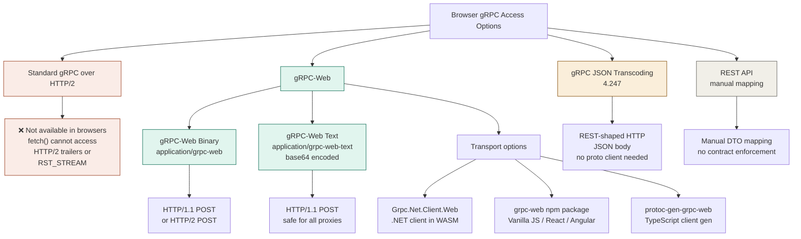
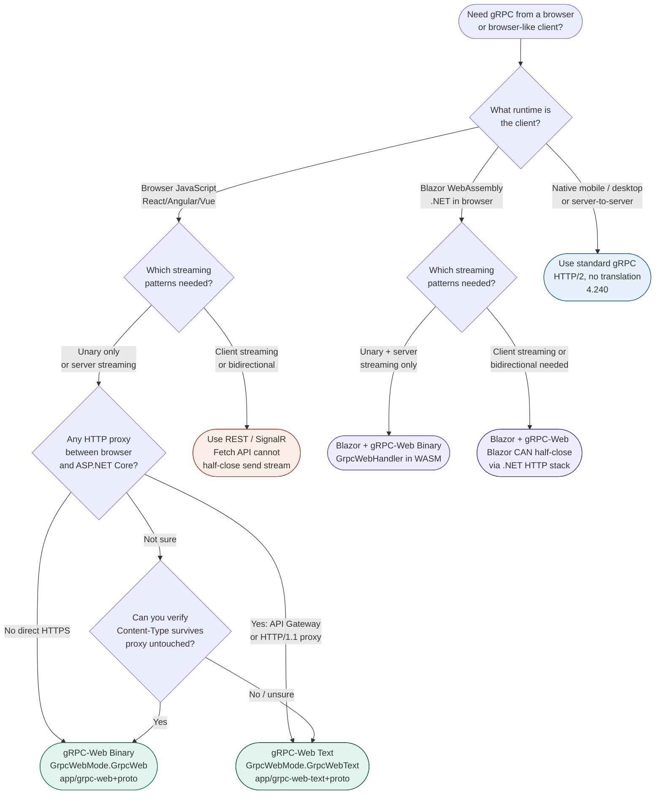

# 4.245 — gRPC-Web: Browser Support via Grpc.AspNetCore.Web

---

## PART 0 — Navigation & Context

### Domain Hierarchy Position

```
ASP.NET Core Mastery
│
├── I. HTTP Fundamentals                  (4.123–4.133)
│   └── 4.127 — HTTP/2: Multiplexing and Kestrel          ← prerequisite transport
│
├── P. Security                           (4.208–4.218)
│   └── 4.209 — CORS                                      ← critical pairing
│
└── S. gRPC                               (4.240–4.248)
    │
    ├── 4.240 — Proto Contracts & Service Implementation   ← must read first
    ├── 4.241 — gRPC Streaming                            ← streaming constraints apply here
    ├── 4.242 — gRPC Authentication
    ├── 4.243 — gRPC Error Handling
    ├── 4.244 — gRPC Interceptors
    ├── ► 4.245 — gRPC-Web: Browser Support               ◄ YOU ARE HERE
    ├── 4.246 — gRPC Client Factory
    ├── 4.247 — gRPC JSON Transcoding
    └── 4.248 — gRPC vs REST vs GraphQL vs SignalR
```

### What You Need Before This

- **[[4.240 — gRPC in ASP.NET Core: Proto Contracts and Service Implementation]]** — gRPC-Web wraps the same service implementation; you must understand `ServiceNameBase`, `MapGrpcService<T>`, and `ServerCallContext` before adding the browser translation layer
- **[[4.209 — CORS]]** — gRPC-Web requests from browsers trigger CORS preflight; misconfigured CORS is the most common gRPC-Web production failure; CORS must be understood independently first
- **[[4.127 — HTTP/2: Multiplexing, Header Compression, and Kestrel Setup]]** — gRPC-Web exists specifically to work around browser limitations with HTTP/2; understanding what browsers cannot do explains every design decision in this topic
- **[[4.052 — Middleware Ordering: The Canonical Order and Why It Matters]]** — `UseGrpcWeb()` has a strict position requirement relative to `UseRouting()`, `UseCors()`, and `UseAuthentication()`; getting the order wrong produces silent failures

### What This Unlocks After

- **[[4.342 — Blazor WebAssembly: WASM Runtime, Hosting, and Security Model]]** — Blazor WASM calling backend services over gRPC-Web is the primary production use case for this topic; the Grpc.Net.Client.Web package is the Blazor-side complement
- **[[4.248 — gRPC vs REST vs GraphQL vs SignalR: Decision Framework]]** — gRPC-Web fills the browser gap in the gRPC decision; the decision tree is incomplete without knowing this option exists
- **[[4.209 — CORS]]** (deeper) — the gRPC-Web CORS requirements expose edge cases (exposed headers, preflight caching) not covered in the basic CORS note
- **[[4.241 — gRPC Streaming]]** — understanding which streaming patterns gRPC-Web supports (server streaming yes, client streaming no in browser) directly constrains architecture decisions for browser-facing services

### Why This Matters at Scale

When you need strongly-typed, contract-enforced communication between a browser application and an ASP.NET Core backend at scale — Blazor WASM, React with gRPC-generated TypeScript clients, or Angular — gRPC-Web is the only path that preserves the full protobuf contract without falling back to REST; a misconfigured `UseGrpcWeb()` or missing CORS `WithExposedHeaders("grpc-status")` produces a client that silently receives no response rather than a clear error, making it the most operationally invisible misconfiguration in the gRPC stack.

---

## PART 1 — The Core Mental Model

### The Fundamental Rule

> **gRPC-Web is a translation layer inside ASP.NET Core's middleware pipeline that converts browser-compatible HTTP/1.1 or HTTP/2 requests (which cannot carry gRPC trailers) into standard gRPC frames before they reach your service — the service implementation sees a normal `ServerCallContext` and never knows the client is a browser; the entire adaptation happens transparently in `GrpcWebMiddleware`.**

### The Plain-Language Analogy

Think of gRPC-Web as a **translation booth at a border crossing**. Standard gRPC speaks a dialect (HTTP/2 stream framing + trailers) that browsers understand at the network level but JavaScript is not permitted to use directly — the browser's `fetch()` API sits behind a glass wall that blocks direct access to HTTP/2 stream control, `RST_STREAM` frames, and response trailers. gRPC-Web is the translator who stands at the window: the browser submits its request in a format it _can_ produce (a regular HTTP POST with a modified body encoding), the translator receives it, rewrites it into standard gRPC dialect, hands it through the internal window to the service, receives the gRPC response back, re-encodes it into the browser-readable format, and passes it back through the glass.

The translation has two modes: **gRPC-Web** (base64-encoded or binary, trailers embedded in the response body) and **gRPC-Web-Text** (base64-encoded body, for HTTP/1.1 proxies that mangle binary). Both modes are handled by the same `GrpcWebMiddleware`.

The analogy holds under failure: if CORS is not configured (`grpc-status` header not exposed), the browser's security guard confiscates the response before JavaScript can read the trailer — the client sees a network error, not a gRPC error. If the streaming limitation (no client-side streaming from browsers) is violated, the translation booth has no way to forward the stream — you get a runtime error on the JavaScript side, not a protobuf error.

### Taxonomy Diagram



---

## PART 2 — Deep Mechanics

### 2.1 Why Browsers Cannot Use Standard gRPC

Standard gRPC requires three HTTP/2 capabilities that browser JavaScript cannot access:

```
CAPABILITY 1 — Response Trailers
  gRPC sends grpc-status and grpc-message as HTTP/2 HEADERS frame AFTER
  the DATA frame(s). The Fetch API exposes response.headers but NOT
  response.trailers — the trailer HEADERS frame is invisible to JavaScript.

CAPABILITY 2 — Half-closing the send stream
  Client streaming requires the client to send a HALF_CLOSE (END_STREAM flag
  on a DATA frame) to signal it has finished sending. The Fetch API's
  ReadableStream body model does not expose END_STREAM control.

CAPABILITY 3 — RST_STREAM for cancellation
  Cancelling a gRPC stream requires sending a RST_STREAM frame. The Fetch API's
  AbortController closes the TCP connection or the entire HTTP/2 connection,
  not just the stream.

RESULT: Standard gRPC is technically impossible from browser JavaScript,
even when the browser supports HTTP/2 at the network level.
```

gRPC-Web solves this by encoding trailers **inside the response body** rather than as HTTP/2 trailer frames, so the Fetch API can read them as regular body bytes.

---

### 2.2 Pipeline Position: Where `UseGrpcWeb()` Sits

`UseGrpcWeb()` is a middleware that detects gRPC-Web requests and translates them before they reach the gRPC endpoint handler.

```
Kestrel (HTTP/1.1 or HTTP/2)
  │
  ▼
──► UseExceptionHandler
      ──► UseHttpsRedirection
            ──► UseRouting          ← endpoint metadata resolved
                  ──► UseCors       ← ⚠️ CORS must be BEFORE UseGrpcWeb
                        ──► UseGrpcWeb   ← translates gRPC-Web → gRPC
                              ──► UseAuthentication
                                    ──► UseAuthorization
                                          ──► MapGrpcService<T>
                                                .EnableGrpcWeb()   ← per-service opt-in
                                                .RequireCors(...)  ← per-service CORS
```

**Pipeline position annotation — `UseGrpcWeb()` position requirements:**

- MUST be after `UseRouting()` — the middleware needs the endpoint resolved to know if it should activate
- MUST be before `UseAuthentication()` — gRPC-Web rewrites the content-type; auth middleware reads it
- `UseCors()` MUST be before `UseGrpcWeb()` — the CORS middleware adds `Access-Control-*` headers; gRPC-Web middleware does not handle CORS itself

**What `GrpcWebMiddleware` does internally (approximate):**

```
// ASP.NET Core internally (Grpc.AspNetCore.Web source — GrpcWebMiddleware.cs):

1. Check: Is content-type "application/grpc-web" or "application/grpc-web-text"?
   No → pass through to next middleware unchanged
   Yes → activate gRPC-Web translation mode

2. Rewrite request:
   - content-type: application/grpc-web → application/grpc
   - content-type: application/grpc-web-text → decode base64 body → application/grpc
   - Strip "grpc-web-" prefix from content-type variants

3. Wrap the response stream with GrpcWebResponseStream:
   - Intercepts calls to WriteAsync()
   - Prepends the 5-byte gRPC frame header to each message
   - At response end: appends an encoded TRAILER frame to the body

4. After the gRPC handler completes:
   - Read grpc-status and grpc-message from HttpContext.Response.AppendTrailer()
   - Encode them as a trailer frame: [0x80, length(4), trailer-bytes]
   - Write the trailer frame to the response body
   - Set content-type back to application/grpc-web (or -text)

5. If grpc-web-text: base64-encode the entire response body before flushing
```

**Runtime cost:** `~2 extra allocations per request` (the response stream wrapper + the trailer encoding buffer). For unary calls this is negligible. For server-streaming responses, each message write goes through the wrapping interceptor — `O(n)` wrapper overhead where n is message count, each adding `~5 bytes` of framing overhead.

---

### 2.3 HTTP Wire Format: gRPC vs gRPC-Web

Understanding the wire difference is essential for debugging browser network issues.

```
// STANDARD gRPC (HTTP/2, not available to browsers)

// REQUEST:
// POST /products.ProductService/GetProduct HTTP/2
// content-type: application/grpc
// te: trailers                          ← required by gRPC spec, blocked by browser
// grpc-timeout: 5S
// authorization: Bearer eyJhbGci...
//
// [0x00 0x00 0x00 0x00 0x06]            ← 5-byte frame prefix (no compression, 6 bytes)
// [protobuf body: GetProductRequest]
//
// RESPONSE HEADERS frame:
// :status: 200
// content-type: application/grpc
//
// RESPONSE DATA frame:
// [0x00 0x00 0x00 0x00 0x1A]            ← 5-byte frame prefix
// [protobuf body: ProductResponse]
//
// RESPONSE TRAILERS frame (HTTP/2 HEADERS):  ← JavaScript CANNOT read this
// grpc-status: 0
// grpc-message:

// ─────────────────────────────────────────────────────────────────────────

// gRPC-Web (HTTP/1.1 or HTTP/2, browser-compatible)

// REQUEST:
// POST /products.ProductService/GetProduct HTTP/1.1
// content-type: application/grpc-web+proto  ← or application/grpc-web-text+proto
// x-grpc-web: 1                             ← optional marker
// x-user-agent: grpc-web-javascript/0.1
// authorization: Bearer eyJhbGci...
//
// [0x00 0x00 0x00 0x00 0x06]            ← same 5-byte frame prefix as gRPC
// [protobuf body: GetProductRequest]    ← identical protobuf payload
//
// RESPONSE (HTTP/1.1, single body):
// HTTP/1.1 200 OK
// content-type: application/grpc-web+proto
// access-control-allow-origin: https://app.example.com
// access-control-expose-headers: grpc-status,grpc-message  ← CRITICAL for CORS
//
// [0x00 0x00 0x00 0x00 0x1A]           ← data frame: message
// [protobuf body: ProductResponse]
//
// [0x80 0x00 0x00 0x00 0x0E]           ← trailer frame: high bit set in first byte
// grpc-status: 0\r\n                   ← trailers embedded IN the body
// grpc-message: \r\n                   ← JavaScript can read these as body bytes
```

**The critical difference:** The `0x80` first byte in the trailer frame (high bit = 1) distinguishes it from a data frame (high bit = 0). The gRPC-Web JavaScript client reads the response body, splits on this flag, decodes data frames as messages, and decodes trailer frames as the final status. This is why CORS must expose `grpc-status` — the JavaScript client reads it from the body, and the browser still applies CORS to the response headers.

---

### 2.4 CORS Configuration for gRPC-Web

CORS misconfiguration is the #1 production failure mode for gRPC-Web. The browser's CORS enforcement applies to gRPC-Web responses even though the status code is in the body.

```
// CORS PREFLIGHT for gRPC-Web (what the browser sends before the actual request):

// OPTIONS /products.ProductService/GetProduct HTTP/1.1
// origin: https://app.example.com
// access-control-request-method: POST
// access-control-request-headers: content-type,x-grpc-web,authorization

// Required preflight response:
// HTTP/1.1 204 No Content
// access-control-allow-origin: https://app.example.com
// access-control-allow-methods: POST
// access-control-allow-headers: content-type,x-grpc-web,x-user-agent,authorization
// access-control-max-age: 86400

// ACTUAL gRPC-Web response headers that MUST be exposed:
// access-control-expose-headers: grpc-status,grpc-message,grpc-encoding,grpc-accept-encoding
//
// If grpc-status is NOT in expose-headers:
// → Browser blocks JavaScript from reading grpc-status from the body
// → Client library throws "Response closed without grpc-status"
// → Appears as a network error, not a gRPC error — very hard to debug
```

**Runtime cost of CORS on gRPC-Web:** Preflight requests are `OPTIONS` calls that hit the pipeline and return without reaching the gRPC service — `~1 middleware chain traversal` + `~0 allocations from the service`. Preflight results are cached by the browser for `access-control-max-age` seconds — set this to 86400 (24h) for production to eliminate per-call preflight overhead.

---

### 2.5 Streaming Constraints in gRPC-Web

gRPC-Web does not support all four streaming patterns equally from browser clients.

```
STREAMING SUPPORT MATRIX:

Pattern          | Server → Client | Client → Server | Browser Support
─────────────────────────────────────────────────────────────────────
Unary            | 1 message       | 1 message       | ✅ Full support
Server Streaming | N messages      | 1 message       | ✅ Full support (XHR/fetch)
Client Streaming | 1 message       | N messages      | ❌ NOT supported from browser
Bidirectional    | N messages      | N messages      | ❌ NOT supported from browser

WHY client streaming is blocked:
  - Requires half-closing the send stream (HTTP/2 END_STREAM on a DATA frame)
  - fetch() ReadableStream cannot signal END_STREAM independently of connection close
  - The gRPC-Web spec explicitly excludes client streaming from browsers

WORKAROUND for client-streaming patterns:
  - Option 1: Batch all items into a repeated field in a single unary request
  - Option 2: Use WebSockets (SignalR) for bidirectional browser streaming
  - Option 3: Use gRPC JSON Transcoding (4.247) with a REST chunked upload pattern
  - Option 4: .NET WASM clients (Blazor) DO support client streaming via gRPC-Web
              because Blazor runs in the .NET runtime, not the fetch() API constraint
```

**Edge case:** Server streaming FROM the browser client works because the browser only needs to read a long response body — it never needs to half-close the send stream. The browser sends one request body (the unary request message), then reads the response body as a stream of gRPC-Web data frames. This is exactly what `XMLHttpRequest` and `fetch()` with `ReadableStream` support.

---

### 2.6 Failure Mode Diagrams

```
FAILURE 1: Missing grpc-status in expose-headers

Browser                     ASP.NET Core                  Service
  │                              │                            │
  │── POST /Svc/Method ─────────►│                            │
  │                              │── invoke RPC ─────────────►│
  │                              │◄── response + grpc-status ─│
  │                              │  gRPC-Web encodes trailers │
  │                              │  into body                 │
  │◄── 200 OK ──────────────────│                            │
  │    body: [data][trailer]    │
  │    access-control-expose-headers: (missing grpc-status)
  │                              │
  │  Browser CORS check:
  │  "grpc-status is in body, but response headers don't expose it"
  │  → JavaScript cannot read response body that references restricted headers
  │  → grpc-web library throws: "Response closed without grpc-status"
  │  → Developer sees: TypeError: Failed to fetch
  │  → NOT a gRPC error — a CORS error that looks like a network error

FIX: .WithExposedHeaders("grpc-status", "grpc-message")

─────────────────────────────────────────────────────────────────────

FAILURE 2: UseGrpcWeb() placed after UseAuthentication()

  Request arrives:
  content-type: application/grpc-web+proto
  authorization: Bearer <token>
  │
  ├── UseAuthentication() runs FIRST (wrong order)
  │   content-type is still "grpc-web" — auth may behave differently
  │   for non-grpc content-type in some custom schemes
  │
  ├── UseGrpcWeb() runs SECOND
  │   rewrites content-type to "application/grpc"
  │   but authentication already ran on the original content-type
  │
  result: auth works by accident for simple JWT (reads header, not content-type)
  but breaks for any auth scheme that inspects content-type
  and breaks for schemes that write response headers before gRPC-Web can intercept

FIX: UseGrpcWeb() must come before UseAuthentication()

─────────────────────────────────────────────────────────────────────

FAILURE 3: Using .EnableGrpcWeb() without per-service CORS

  app.MapGrpcService<ProductServiceImpl>()
     .EnableGrpcWeb();  // ← missing: .RequireCors("GrpcWebPolicy")

  Browser sends CORS preflight:
  OPTIONS /products.ProductService/GetProduct
  → hits routing
  → no CORS policy on this endpoint
  → UseCors() skips (no policy = no CORS headers added)
  → Browser receives response with no Access-Control-Allow-Origin
  → Browser blocks the actual request
  → All gRPC-Web calls fail with "CORS error" in browser console

FIX: Always pair .EnableGrpcWeb() with .RequireCors("PolicyName")
```

---

## PART 3 — Production Code Patterns

### Pattern 1: The Logistics Dashboard — Blazor WASM Calling gRPC-Web

```csharp
// Domain: logistics tracking dashboard (Blazor WASM front-end → ASP.NET Core gRPC)

// ── SERVER: Program.cs ───────────────────────────────────────────────────
var builder = WebApplication.CreateBuilder(args);

builder.Services.AddGrpc();

// ⚠️ WRONG: applying a wildcard CORS policy to gRPC-Web
// builder.Services.AddCors(o => o.AddPolicy("AllowAll", p => p.AllowAnyOrigin()));
// This opens all origins AND doesn't expose grpc-status — both wrong.

// ✅ CORRECT: named policy with explicit origin and required exposed headers
builder.Services.AddCors(options =>
{
    options.AddPolicy("GrpcWebPolicy", policy =>
    {
        policy
            .WithOrigins(
                "https://logistics.example.com",
                "https://localhost:5173")        // Vite dev server
            .AllowAnyMethod()
            .AllowAnyHeader()
            // grpc-status and grpc-message MUST be exposed or the browser
            // client throws "Response closed without grpc-status"
            .WithExposedHeaders(
                "grpc-status",
                "grpc-message",
                "grpc-encoding",
                "grpc-accept-encoding");
    });
});

var app = builder.Build();

// ✅ CORRECT middleware order — every position matters
app.UseHttpsRedirection();
app.UseRouting();
app.UseCors();           // ← CORS before gRPC-Web
app.UseGrpcWeb(new GrpcWebOptions
{
    // Apply gRPC-Web globally to all gRPC services — no per-endpoint opt-in needed
    DefaultEnabled = true
});
app.UseAuthentication();
app.UseAuthorization();

app.MapGrpcService<ShipmentTrackingServiceImpl>()
   .RequireCors("GrpcWebPolicy");   // ← associate the policy with this endpoint

app.Run();

// HTTP wire format (browser preflight):
// OPTIONS /shipments.ShipmentTrackingService/GetShipment HTTP/1.1
// origin: https://logistics.example.com
// → HTTP/1.1 204 No Content
// → access-control-allow-origin: https://logistics.example.com
// → access-control-expose-headers: grpc-status,grpc-message,...
```

```csharp
// ── CLIENT: Blazor WASM (Program.cs) ────────────────────────────────────
// Nuget: Grpc.Net.Client.Web (adds GrpcWebHandler)

var builder = WebAssemblyHostBuilder.CreateDefault(args);

// ✅ CORRECT: GrpcWebHandler wraps the browser's HttpClient transport
// to produce gRPC-Web wire format instead of standard gRPC
builder.Services.AddSingleton(services =>
{
    var httpClient = new HttpClient(
        new GrpcWebHandler(GrpcWebMode.GrpcWeb, new HttpClientHandler()));

    var channel = GrpcChannel.ForAddress(
        "https://api.logistics.example.com",
        new GrpcChannelOptions
        {
            HttpClient = httpClient,
            // Blazor WASM cannot use the default SocketsHttpHandler
            // Must use the browser's HttpClient via GrpcWebHandler
        });

    return new ShipmentTrackingService.ShipmentTrackingServiceClient(channel);
});

// ── CLIENT: Blazor component ─────────────────────────────────────────────
@inject ShipmentTrackingService.ShipmentTrackingServiceClient GrpcClient

@code {
    private ShipmentResponse? _shipment;

    protected override async Task OnInitializedAsync()
    {
        _shipment = await GrpcClient.GetShipmentAsync(
            new ShipmentRequest { TrackingNumber = "LGST-2024-0042" });
    }
}
```

---

### Pattern 2: The Order Status Feed — Server Streaming to Browser

```csharp
// Domain: e-commerce order status page — live updates streamed to browser
// Server streaming ✅ supported in gRPC-Web (client sends once, server streams back)

// Proto:
// service OrderService {
//     rpc StreamOrderStatus (OrderStatusRequest)
//         returns (stream OrderStatusUpdate);
// }

// ── SERVER ────────────────────────────────────────────────────────────────
public class OrderServiceImpl : OrderService.OrderServiceBase
{
    private readonly IOrderEventSource _events;

    public override async Task StreamOrderStatus(
        OrderStatusRequest request,
        IServerStreamWriter<OrderStatusUpdate> responseStream,
        ServerCallContext context)
    {
        // Same implementation as any other server-streaming RPC —
        // gRPC-Web middleware handles the browser translation transparently
        await foreach (var statusEvent in _events.WatchOrderAsync(
                           request.OrderId,
                           context.CancellationToken))
        {
            await responseStream.WriteAsync(new OrderStatusUpdate
            {
                OrderId   = statusEvent.OrderId,
                Status    = statusEvent.Status,
                UpdatedAt = Timestamp.FromDateTime(statusEvent.At.ToUniversalTime())
            }, context.CancellationToken);
        }
    }
}

// ── BLAZOR WASM CLIENT ────────────────────────────────────────────────────
@code {
    private List<OrderStatusUpdate> _updates = new();

    private async Task StartStreaming(string orderId)
    {
        var request = new OrderStatusRequest { OrderId = orderId };

        // Server-streaming works from Blazor WASM via gRPC-Web
        using var stream = GrpcClient.StreamOrderStatus(request);

        await foreach (var update in stream.ResponseStream.ReadAllAsync(
                           _cts.Token))
        {
            _updates.Add(update);
            StateHasChanged(); // tell Blazor to re-render
        }
    }
}

// HTTP wire format (server streaming via gRPC-Web):
// POST /orders.OrderService/StreamOrderStatus HTTP/1.1
// content-type: application/grpc-web+proto
// → HTTP/1.1 200 OK
// → content-type: application/grpc-web+proto
// → [0x00][4-byte-len][OrderStatusUpdate 1]
// → [0x00][4-byte-len][OrderStatusUpdate 2]
//   ... (stream remains open until server closes or client aborts)
// → [0x80][4-byte-len][grpc-status: 0\r\ngrpc-message: \r\n]
```

---

### Pattern 3: The React Inventory Widget — JavaScript gRPC-Web Client

```typescript
// Domain: inventory management — React component with TypeScript gRPC-Web client
// Tool: protoc-gen-grpc-web generates TypeScript stubs from the same .proto file

// Generated by protoc-gen-grpc-web:
// import { InventoryServiceClient } from './generated/inventory_grpc_web_pb';
// import { InventoryRequest, InventoryResponse } from './generated/inventory_pb';

// ── Program.cs (server unchanged) ─────────────────────────────────────────
// The same server configuration from Pattern 1 works.
// JavaScript clients and Blazor clients can hit the same endpoint.

// ── React component (TypeScript) ──────────────────────────────────────────
import { InventoryServiceClient } from './generated/InventoryServiceClientPb';
import { GetStockRequest } from './generated/inventory_pb';

const client = new InventoryServiceClient('https://api.example.com');

async function getStockLevel(sku: string): Promise<number> {
    const request = new GetStockRequest();
    request.setSku(sku);

    return new Promise((resolve, reject) => {
        // ✅ CORRECT: grpc-web npm package handles the gRPC-Web wire format
        client.getStockLevel(request, {}, (err, response) => {
            if (err) {
                // err.code is the gRPC StatusCode number
                // err.message is the grpc-message trailer value
                reject(new Error(`gRPC error ${err.code}: ${err.message}`));
            } else {
                resolve(response!.getQuantity());
            }
        });
    });
}

// NOTE: The JavaScript grpc-web library reads grpc-status from the body trailer frame.
// This is why access-control-expose-headers MUST include "grpc-status" on the server —
// without it, the library cannot find the status and throws a network error.
```

---

### Pattern 4: The Fleet Telemetry Service — Per-Service vs Global gRPC-Web Opt-In

```csharp
// Domain: fleet management — some services browser-facing, some internal only

// Program.cs
builder.Services.AddGrpc();
builder.Services.AddCors(options =>
{
    options.AddPolicy("BrowserClients", policy => policy
        .WithOrigins("https://fleet.example.com")
        .AllowAnyMethod()
        .AllowAnyHeader()
        .WithExposedHeaders("grpc-status", "grpc-message"));

    options.AddPolicy("InternalOnly", policy => policy
        .WithOrigins("https://internal.fleet.example.com")
        .AllowAnyMethod()
        .AllowAnyHeader());
});

var app = builder.Build();

app.UseRouting();
app.UseCors();

// ⚠️ WRONG: DefaultEnabled = true activates gRPC-Web on ALL services,
// including internal services that should never be called from browsers
// app.UseGrpcWeb(new GrpcWebOptions { DefaultEnabled = true });

// ✅ CORRECT: no DefaultEnabled — opt in per service
app.UseGrpcWeb();

app.UseAuthentication();
app.UseAuthorization();

// Browser-facing: explicitly enable gRPC-Web and assign CORS policy
app.MapGrpcService<VehicleLocationServiceImpl>()
   .EnableGrpcWeb()
   .RequireCors("BrowserClients");

app.MapGrpcService<FleetAlertServiceImpl>()
   .EnableGrpcWeb()
   .RequireCors("BrowserClients");

// Internal service-to-service only: NO EnableGrpcWeb, NO browser CORS
// Standard gRPC over HTTP/2 — no browser client can reach this
app.MapGrpcService<TelemetryAggregationServiceImpl>();  // internal only

app.Run();

// HTTP wire format — internal service (standard gRPC, not gRPC-Web):
// POST /telemetry.TelemetryAggregation/Aggregate HTTP/2
// content-type: application/grpc
// te: trailers
// → HTTP/2 with DATA + TRAILERS frames (no browser translation)
```

---

### Pattern 5: The Payment Portal — gRPC-Web with JWT Authentication

```csharp
// Domain: payment portal — Blazor WASM authenticating with JWT over gRPC-Web

// ── SERVER: auth configuration ───────────────────────────────────────────
builder.Services.AddAuthentication(JwtBearerDefaults.AuthenticationScheme)
    .AddJwtBearer(options =>
    {
        options.Authority = "https://auth.payments.example.com";
        options.Audience  = "payment-api";
        // ✅ gRPC-Web sends JWT in the HTTP Authorization header —
        // same as REST; no special gRPC metadata handling needed
    });

// ── CLIENT: Blazor WASM — attaching the JWT to every gRPC-Web call ────────

// Create a DelegatingHandler that adds the auth header
public class AuthorizationHeaderHandler : DelegatingHandler
{
    private readonly IAccessTokenProvider _tokenProvider;

    public AuthorizationHeaderHandler(IAccessTokenProvider tokenProvider)
        => _tokenProvider = tokenProvider;

    protected override async Task<HttpResponseMessage> SendAsync(
        HttpRequestMessage request,
        CancellationToken cancellationToken)
    {
        var tokenResult = await _tokenProvider.RequestAccessToken();
        if (tokenResult.TryGetToken(out var token))
            request.Headers.Authorization =
                new AuthenticationHeaderValue("Bearer", token.Value);

        return await base.SendAsync(request, cancellationToken);
    }
}

// Registration in Blazor WASM Program.cs:
builder.Services.AddTransient<AuthorizationHeaderHandler>();
builder.Services.AddSingleton(sp =>
{
    var authHandler = sp.GetRequiredService<AuthorizationHeaderHandler>();
    authHandler.InnerHandler = new GrpcWebHandler(
        GrpcWebMode.GrpcWeb,
        new HttpClientHandler());

    var channel = GrpcChannel.ForAddress(
        "https://api.payments.example.com",
        new GrpcChannelOptions
        {
            HttpClient = new HttpClient(authHandler)
        });

    return new PaymentService.PaymentServiceClient(channel);
});

// HTTP wire format (authenticated gRPC-Web):
// POST /payments.PaymentService/ProcessPayment HTTP/1.1
// content-type: application/grpc-web+proto
// authorization: Bearer eyJhbGci...
// → HTTP/1.1 200 OK (success) or HTTP/1.1 401 (auth failure)
// Note: auth failures return HTTP 401, not HTTP 200 with grpc-status: 16
// The UseAuthentication middleware short-circuits before gRPC-Web encodes anything
```

---

### Pattern 6: The gRPC-Web Proxy for Existing Internal Services

```csharp
// Domain: exposing an existing internal gRPC service to browser clients
// without modifying the service implementation

// ✅ CORRECT: gRPC-Web is purely additive — existing service needs NO changes
// The service implementation is completely unaware of browser clients

public class ExistingInternalService : InventoryService.InventoryServiceBase
{
    // This class has ZERO knowledge of gRPC-Web.
    // ServerCallContext looks identical for browser and server-to-server calls.
    public override async Task<InventoryResponse> GetLevel(
        InventoryRequest request,
        ServerCallContext context)
    {
        // context.GetHttpContext().Request.ContentType will be "application/grpc"
        // (the GrpcWebMiddleware rewrote it from "application/grpc-web+proto")
        // so any existing content-type checks still work correctly
        return await _inventory.GetAsync(request.Sku, context.CancellationToken);
    }
}

// All you add is middleware + policy — zero service code changes:
app.UseGrpcWeb();
app.MapGrpcService<ExistingInternalService>()
   .EnableGrpcWeb()
   .RequireCors("BrowserClients");
```

---

## PART 4 — Gotchas & Anti-Patterns

### Gotcha 1: Missing `WithExposedHeaders` Causes Silent Client Failures

The most common gRPC-Web production bug. `grpc-status` travels in the response body trailer frame, but CORS enforcement still requires `access-control-expose-headers` to list `grpc-status` before the browser allows JavaScript to read the body at all. Omitting it causes the gRPC-Web client library to throw a generic network error with no gRPC status information — the hardest category of bug to diagnose without knowing this.

```csharp
// ⚠️ WRONG CODE
builder.Services.AddCors(options =>
{
    options.AddPolicy("GrpcWebPolicy", policy =>
        policy
            .WithOrigins("https://app.example.com")
            .AllowAnyMethod()
            .AllowAnyHeader());
            // Missing: .WithExposedHeaders("grpc-status", "grpc-message")
});

// HTTP consequence (wrong path):
// Browser receives gRPC-Web response body (contains grpc-status in trailer frame)
// But CORS policy did not expose grpc-status header
// Browser security: blocks JavaScript from reading the response body
// grpc-web JS library: throws "Response closed without grpc-status"
// Developer sees in console: TypeError: Failed to fetch
// OR: Error: 2 UNKNOWN: Response closed without grpc-status
// gRPC error code is lost — looks like a network error

// ✅ CORRECT CODE
builder.Services.AddCors(options =>
{
    options.AddPolicy("GrpcWebPolicy", policy =>
        policy
            .WithOrigins("https://app.example.com")
            .AllowAnyMethod()
            .AllowAnyHeader()
            .WithExposedHeaders(
                "grpc-status",
                "grpc-message",
                "grpc-encoding",
                "grpc-accept-encoding"));
});

// HTTP consequence (correct path):
// access-control-expose-headers: grpc-status,grpc-message,grpc-encoding,grpc-accept-encoding
// Browser allows JS to read response body and headers
// grpc-web library finds grpc-status trailer in body
// RpcException(StatusCode.X, "...") is correctly surfaced to calling code

// WHY: The CORS spec's "expose headers" list controls which response headers
// JavaScript can access via fetch(). Even though grpc-status is in the body
// (not in HTTP headers), the gRPC-Web library still requires the response not
// to be blocked by CORS. Without the expose-headers entry, modern browsers
// block the response at the CORS layer before any body parsing occurs.
```

---

### Gotcha 2: `UseGrpcWeb()` After `UseAuthentication()` Causes Auth Scheme Mismatches

The order `UseAuthentication` → `UseGrpcWeb` means authentication runs against the original `application/grpc-web+proto` content type. For most JWT auth this is harmless (auth reads headers only). But for custom auth schemes, cookie auth, or any handler that inspects content type or sets response headers before writing — the rewrite comes too late and causes subtle, environment-specific failures.

```csharp
// ⚠️ WRONG CODE — UseAuthentication before UseGrpcWeb
app.UseRouting();
app.UseCors();
app.UseAuthentication();  // ← runs against "application/grpc-web+proto"
app.UseGrpcWeb();         // ← rewrites to "application/grpc" too late
app.UseAuthorization();
app.MapGrpcService<SecureServiceImpl>().EnableGrpcWeb().RequireCors("Policy");

// HTTP consequence (wrong path):
// For JWT: works by accident (auth only reads Authorization header)
// For cookie auth: OnRedirectToLogin handler sets Location header before
//   GrpcWebMiddleware can intercept — browser follows redirect instead of
//   seeing grpc-status: 16 (Unauthenticated)
// For custom schemes that write response body: response is committed before
//   GrpcWebMiddleware can wrap the stream → trailer encoding fails silently

// ✅ CORRECT CODE — UseGrpcWeb before UseAuthentication
app.UseRouting();
app.UseCors();
app.UseGrpcWeb();         // ← wraps response stream first
app.UseAuthentication();  // ← runs against "application/grpc" (already rewritten)
app.UseAuthorization();
app.MapGrpcService<SecureServiceImpl>().EnableGrpcWeb().RequireCors("Policy");

// HTTP consequence (correct path):
// GrpcWebMiddleware wraps HttpContext.Response before any handler writes to it
// Authentication sees content-type: application/grpc
// Auth failures go through GrpcWebMiddleware's response wrapper
// → grpc-status: 16 encoded properly in body trailer frame

// WHY: Middleware runs in registration order. GrpcWebMiddleware wraps the
// response stream in its constructor (when it intercepts the request going
// downstream). This wrapping must happen before any other middleware writes
// to the response — including authentication challenge responses.
```

---

### Gotcha 3: Using `DefaultEnabled = true` Exposes Internal Services to gRPC-Web

Setting `DefaultEnabled = true` in `GrpcWebOptions` activates gRPC-Web on ALL registered gRPC services, including internal services that should only accept standard gRPC from server-to-server clients. Combined with a CORS policy that allows all origins, this inadvertently makes internal services callable from any browser.

```csharp
// ⚠️ WRONG CODE
app.UseGrpcWeb(new GrpcWebOptions { DefaultEnabled = true }); // ← global activation
builder.Services.AddCors(o =>
    o.AddDefaultPolicy(p => p.AllowAnyOrigin().AllowAnyMethod().AllowAnyHeader()));

// Registers both services — BOTH get gRPC-Web activated
app.MapGrpcService<PublicCatalogServiceImpl>();   // ← intended for browsers
app.MapGrpcService<InternalBillingServiceImpl>(); // ← NOT intended for browsers
                                                  //   but now callable from any origin

// HTTP consequence (wrong path):
// Any browser at any origin can call InternalBillingService
// curl-or-fetch from attacker's browser:
//   POST https://api.example.com/billing.InternalBillingService/GetAllInvoices
//   content-type: application/grpc-web+proto
// → returns data if auth is not separately enforced
// Security audit finding: internal service exposed to unauthenticated browser clients

// ✅ CORRECT CODE — explicit per-service opt-in
app.UseGrpcWeb(); // no DefaultEnabled

app.MapGrpcService<PublicCatalogServiceImpl>()
   .EnableGrpcWeb()
   .RequireCors("PublicPolicy");

app.MapGrpcService<InternalBillingServiceImpl>(); // no EnableGrpcWeb, no browser access

// HTTP consequence (correct path):
// Browser POST to InternalBillingService:
// → content-type: application/grpc-web+proto
// → GrpcWebMiddleware checks: is gRPC-Web enabled for this endpoint? No.
// → passes through as-is → gRPC handler expects application/grpc → 415 or drop
// → browser client cannot reach the internal service

// WHY: GrpcWebMiddleware checks endpoint metadata for the EnableGrpcWebAttribute
// (set by .EnableGrpcWeb()) before activating translation. Without that metadata,
// it passes the request through unchanged, and the standard gRPC handler rejects
// the grpc-web content type.
```

---

### Gotcha 4: Client Streaming from Browser Silently Hangs

Attempting client streaming or bidirectional streaming from a browser gRPC-Web client (not Blazor WASM) results in a hung request, not a clear error. The browser sends the first message but can never signal END_STREAM, so the server waits forever for more messages.

```csharp
// ⚠️ WRONG — trying to call a client-streaming RPC from JavaScript grpc-web
// Proto: rpc UploadReadings (stream SensorReading) returns (UploadResult);

// JavaScript (WRONG - will hang):
const stream = client.uploadReadings({}, (err, response) => { /* ... */ });
stream.write(reading1);
stream.write(reading2);
stream.end(); // ← end() sends END_STREAM... but grpc-web spec says browsers
              //   cannot reliably half-close — the request may hang indefinitely

// HTTP consequence (wrong path):
// Client sends first DATA frame with reading1
// Server waits for more messages (IAsyncStreamReader.MoveNextAsync() blocks)
// Browser cannot send RST_STREAM or proper END_STREAM via fetch API
// Server holds the connection open, consuming a thread/task slot indefinitely
// Client-side timeout (if set) eventually fires
// No meaningful error on either side — appears as a "connection timeout"

// ✅ CORRECT — restructure as a unary call with repeated field
// Proto: rpc UploadReadings (UploadReadingsRequest) returns (UploadResult);
// message UploadReadingsRequest { repeated SensorReading readings = 1; }

// JavaScript (CORRECT):
const request = new UploadReadingsRequest();
request.setReadingsList([reading1, reading2, reading3]);
client.uploadReadings(request, {}, (err, response) => {
    if (err) handleError(err);
    else handleResult(response);
});

// HTTP consequence (correct path):
// Single POST with all readings in the protobuf body
// Server receives complete UploadReadingsRequest, processes all readings
// Returns UploadResult in a single unary response
// grpc-status: 0 in body trailer frame

// WHY: The gRPC-Web spec intentionally excludes client-streaming from browser
// clients because the Fetch API cannot half-close a request stream. Use
// repeated fields for batch operations, or use Blazor WASM if you genuinely
// need client streaming from a .NET-in-browser context.
```

---

### Gotcha 5: gRPC-Web-Text vs gRPC-Web Binary — Wrong Mode for the Proxy

There are two gRPC-Web sub-formats: binary (`application/grpc-web+proto`) and text (`application/grpc-web-text+proto`). Text mode base64-encodes the entire body, making it safe for HTTP/1.1 proxies that manipulate binary bodies. Using the wrong mode when there is a proxy between browser and server causes body corruption.

```csharp
// ⚠️ WRONG — using binary mode behind a proxy that modifies binary bodies
// (e.g., some enterprise proxies, AWS API Gateway v1 in certain configurations)

// Blazor WASM (wrong mode):
var handler = new GrpcWebHandler(
    GrpcWebMode.GrpcWeb,          // ← binary mode
    new HttpClientHandler());

// HTTP consequence (wrong path):
// Browser → Proxy → Server
// Proxy receives binary body: [0x00 0x00 0x00 0x00 0x06 ...]
// Some proxies interpret binary as transfer-encoded and re-encode or truncate
// Server receives corrupted bytes
// protoc deserialisation fails: Google.Protobuf.InvalidProtocolBufferException
// grpc-status: 3 (INVALID_ARGUMENT) or grpc-status: 13 (INTERNAL)

// ✅ CORRECT — use GrpcWebText mode when proxies are involved
// Blazor WASM (correct mode for proxy environments):
var handler = new GrpcWebHandler(
    GrpcWebMode.GrpcWebText,      // ← base64-encoded mode
    new HttpClientHandler());

// HTTP wire format (gRPC-Web-Text):
// POST /svc/Method HTTP/1.1
// content-type: application/grpc-web-text+proto
// body: AAAABG...  ← base64-encoded 5-byte prefix + protobuf body
// → proxy cannot corrupt base64-safe ASCII body
// Server decodes base64, gets correct protobuf bytes

// HTTP consequence (correct path):
// Body is base64-encoded ASCII — safe through any HTTP/1.1 proxy
// 33% payload overhead vs binary, but correct delivery guaranteed
// Server decodes base64 in GrpcWebMiddleware before passing to gRPC handler

// WHY: gRPC-Web text mode exists precisely for proxy compatibility.
// Default to GrpcWebMode.GrpcWeb (binary) for direct connections (no proxies).
// Use GrpcWebMode.GrpcWebText when routing through HTTP/1.1 proxies, API gateways,
// or any infrastructure that may inspect or transform request/response bodies.
```

---

## PART 5 — Performance Implications

### 5.1 Request Pipeline Characteristics Table

|Scenario|Pipeline Depth|Allocations Per Request|Approx Latency Impact|Recommendation|
|---|---|---|---|---|
|Unary, gRPC-Web binary, no auth|gRPC-Web middleware + gRPC handler|+2 vs standard gRPC (stream wrapper + trailer buffer)|+0.05–0.1ms vs standard gRPC|Default for Blazor WASM → ASP.NET Core|
|Unary, gRPC-Web-Text (base64)|gRPC-Web middleware + base64 decode + gRPC handler|+3 (+ base64 decode buffer)|+0.1–0.2ms (base64 decode CPU)|Use only when proxies require it|
|With CORS preflight (first call)|Full middleware chain for OPTIONS|+full chain per preflight|~1ms (browser-side) per new origin-path pair|Set access-control-max-age: 86400 to cache 24h|
|CORS preflight cached (subsequent)|None (browser skips)|0|0|Ensure max-age is set; verify in browser DevTools|
|Server streaming, 100 messages|+100 trailer-frame intercepts|+100 (one wrapper write per message)|+0.01ms per message|Keep messages small; stream is still far faster than polling|
|DefaultEnabled = true, 10 services|GrpcWebMiddleware checks all 10|+10 endpoint metadata lookups per request|Negligible O(1) per check|Prefer per-service opt-in for explicit security surface|
|JWT auth + gRPC-Web|Auth middleware + gRPC-Web + gRPC handler|+5 (token parse + claim set)|+0.2–0.5ms (JWT validation, cached after first)|Cache signing keys via IMemoryCache in JwtBearerOptions|
|Large message (>1MB) over gRPC-Web-Text|Base64 encode (server) + decode (client)|High: full body copy for base64|+2–5ms for 1MB payload (base64 overhead)|Use server streaming to chunk; avoid large unary messages|
|gRPC-Web behind load balancer (sticky)|Same as direct|Same|Same|gRPC-Web HTTP/1.1 is stateless per-request — no sticky sessions needed|
|gRPC-Web behind load balancer (round-robin)|Same|Same|Same|HTTP/1.1 per-request is load-balancer friendly; standard gRPC HTTP/2 requires L7 LB|

### 5.2 BenchmarkDotNet: gRPC vs gRPC-Web Overhead

```csharp
using BenchmarkDotNet.Attributes;
using BenchmarkDotNet.Running;
using Microsoft.AspNetCore.Builder;
using Microsoft.AspNetCore.TestHost;

[MemoryDiagnoser]
[SimpleJob]
public class GrpcWebOverheadBenchmark
{
    private HttpClient _grpcClient     = null!;
    private HttpClient _grpcWebClient  = null!;
    private byte[]     _requestPayload = null!;

    [GlobalSetup]
    public void Setup()
    {
        // Build a test server with both gRPC and gRPC-Web enabled
        var builder = WebApplication.CreateBuilder();
        builder.Services.AddGrpc();
        builder.Services.AddCors(o => o.AddDefaultPolicy(p =>
            p.AllowAnyOrigin().AllowAnyMethod().AllowAnyHeader()
             .WithExposedHeaders("grpc-status", "grpc-message")));
        builder.WebHost.UseTestServer();
        var app = builder.Build();
        app.UseRouting();
        app.UseCors();
        app.UseGrpcWeb();
        app.MapGrpcService<BenchmarkServiceImpl>().EnableGrpcWeb();
        app.StartAsync().GetAwaiter().GetResult();

        var testServer = app.GetTestServer();
        _grpcClient    = testServer.CreateClient();
        _grpcWebClient = testServer.CreateClient();

        // Pre-encode a GetProductRequest { product_id: 42 }
        var msg = new GetProductRequest { ProductId = 42 };
        var body = msg.ToByteArray();
        _requestPayload = new byte[5 + body.Length];
        _requestPayload[0] = 0x00; // no compression
        System.Buffers.Binary.BinaryPrimitives.WriteUInt32BigEndian(
            _requestPayload.AsSpan(1), (uint)body.Length);
        body.CopyTo(_requestPayload, 5);
    }

    // BASELINE: standard gRPC (HTTP/2, not via gRPC-Web middleware)
    [Benchmark(Baseline = true)]
    public async Task StandardGrpc()
    {
        var content = new ByteArrayContent(_requestPayload);
        content.Headers.ContentType =
            new System.Net.Http.Headers.MediaTypeHeaderValue("application/grpc");
        using var response = await _grpcClient.PostAsync(
            "/products.ProductService/GetProduct", content);
        _ = await response.Content.ReadAsByteArrayAsync();
    }

    // OPTIMIZED: gRPC-Web binary (adds GrpcWebMiddleware translation)
    [Benchmark]
    public async Task GrpcWebBinary()
    {
        var content = new ByteArrayContent(_requestPayload);
        content.Headers.ContentType =
            new System.Net.Http.Headers.MediaTypeHeaderValue("application/grpc-web+proto");
        using var response = await _grpcWebClient.PostAsync(
            "/products.ProductService/GetProduct", content);
        _ = await response.Content.ReadAsByteArrayAsync();
    }

    // OPTIMAL: gRPC-Web-Text (base64, additional encode/decode step)
    [Benchmark]
    public async Task GrpcWebText()
    {
        var encoded = Convert.ToBase64String(_requestPayload);
        var content = new StringContent(encoded);
        content.Headers.ContentType =
            new System.Net.Http.Headers.MediaTypeHeaderValue("application/grpc-web-text+proto");
        using var response = await _grpcWebClient.PostAsync(
            "/products.ProductService/GetProduct", content);
        _ = await response.Content.ReadAsStringAsync();
    }
}

// Expected output (approximate, .NET 8, x64, local TestServer):
// | Method          | Mean     | Gen0   | Allocated |
// |-----------------|----------|--------|-----------|
// | StandardGrpc    | 320 µs   | 1.2    | 8.4 KB    |
// | GrpcWebBinary   | 335 µs   | 1.4    | 9.1 KB    |  ← ~5% overhead
// | GrpcWebText     | 360 µs   | 1.6    | 10.2 KB   |  ← ~12% overhead (base64)
//
// Note: The TestServer measures middleware overhead only, not network RTT.
// In production, the network latency (10–200ms) completely dominates —
// the ~15µs gRPC-Web translation overhead is irrelevant at network scale.
```

**Profiling note:** Use browser DevTools → Network tab → filter by `grpc-web` content-type to inspect gRPC-Web requests. The "Response" tab will show binary/base64 body — use the grpc-web Chrome extension or decode manually to inspect trailer frames. For server-side profiling, `dotnet-counters monitor` with `Grpc.AspNetCore.Server` meter shows gRPC call counts and duration.

### 5.3 When to Care / When to Ignore

**When this costs you:**

- **High-throughput browser-to-server streaming (>1k msg/s per client):** Each message goes through the gRPC-Web frame encoding wrapper. At this frequency, the wrapper allocation (~200 bytes per message) accumulates. Profile with `dotnet-counters` before optimising.
- **gRPC-Web-Text mode with large messages (>100KB):** Base64 encoding adds 33% size overhead and CPU cost. Chunked server streaming of smaller messages is preferable.
- **CORS preflight on every request:** If `access-control-max-age` is not set or set too low, every gRPC-Web call is preceded by an OPTIONS preflight. At 100 req/s this is 200 requests. Set max-age to 86400 (24h) in production.
- **`DefaultEnabled = true` with many services:** GrpcWebMiddleware checks endpoint metadata on every request. With 50 services, this is 50 metadata lookups per request regardless of whether gRPC-Web is used. Per-service opt-in eliminates this overhead for non-browser endpoints.

**When this doesn't matter:**

- **Low-traffic Blazor WASM apps** (admin dashboards, internal portals): the ~5% overhead over standard gRPC is invisible at <100 req/s; focus on correctness and auth configuration.
- **Development and staging environments:** performance tuning before correctness is premature; focus on getting CORS, exposed headers, and middleware order correct first.
- **Unary RPCs with small payloads (<1KB):** the network round-trip (even on localhost: ~1ms) is 100× larger than the gRPC-Web encoding overhead (~10µs).

---

## PART 6 — Interview Arsenal

### A. The Question Bank

---

**Question 1: "Why can't browsers use standard gRPC directly?"**

**Average Answer:** Browsers don't support gRPC because it uses HTTP/2 features that JavaScript can't access.

**Why That's Insufficient:** Vague — doesn't name the specific capabilities, doesn't distinguish between browser network-level HTTP/2 support and JavaScript API limitations.

**Great Answer:**

> This comes up a lot when teams first move to gRPC. Browsers do negotiate HTTP/2 at the TLS level, so it's not that browsers don't speak HTTP/2. The problem is that the JavaScript Fetch API deliberately hides the low-level HTTP/2 primitives from script. gRPC depends on three things the Fetch API doesn't expose: response trailers — which is where gRPC sends `grpc-status` after the data frames; the ability to half-close the send stream to signal the end of client-side streaming; and `RST_STREAM` for per-stream cancellation. Without those three capabilities, JavaScript cannot speak the gRPC protocol even though the browser's TLS layer is perfectly capable. gRPC-Web solves this by encoding trailers inside the response body with a special frame flag (high bit set in the first byte of the 5-byte prefix), so the Fetch API can read them as regular response bytes.

---

**Question 2: "What happens if you forget to call `.WithExposedHeaders("grpc-status")` in your CORS policy for gRPC-Web?"**

**Average Answer:** The client will get a CORS error.

**Why That's Insufficient:** "CORS error" is too vague and doesn't explain what the client library actually observes, why it happens, or how to diagnose it.

**Great Answer:**

> This is the most commonly misdiagnosed gRPC-Web issue I've seen in production. The gRPC-Web client library doesn't read `grpc-status` from the HTTP response headers — it reads it from a trailer frame embedded in the response body. But CORS enforcement applies to the response as a whole: if the response headers don't include `access-control-expose-headers: grpc-status`, modern browsers block JavaScript from reading the response body at all. So the client library never gets to parse the trailer frame, and instead of a meaningful `RpcException`, it throws something like `Error: Response closed without grpc-status` or just `TypeError: Failed to fetch`. In the browser's Network tab you'll see the request complete with HTTP 200, but the JavaScript code sees a network error — which is why teams spend hours debugging auth or encoding before they discover it's CORS. The fix is to add `.WithExposedHeaders("grpc-status", "grpc-message", "grpc-encoding", "grpc-accept-encoding")` to the CORS policy and verify it in the Network tab response headers.

---

**Question 3: "What streaming patterns does gRPC-Web support from a browser client?"**

**Average Answer:** gRPC-Web supports server streaming but not client streaming.

**Why That's Insufficient:** Correct but doesn't explain _why_, doesn't mention bidirectional, and doesn't address Blazor WASM as an exception.

**Great Answer:**

> From a browser JavaScript client — React, Angular, vanilla JS — gRPC-Web supports unary and server streaming. It does not support client streaming or bidirectional streaming. The reason is the same as why standard gRPC doesn't work in browsers: the Fetch API cannot half-close the request body stream to signal END_STREAM, which is what client streaming requires to tell the server "I'm done sending." The gRPC-Web spec explicitly excludes client streaming from browsers. If you need client streaming from a browser context, the options are: use a repeated field in a unary request to batch messages, use SignalR for true bidirectional messaging, or use Blazor WASM — which is an important exception. Blazor WASM runs .NET in the browser but uses the `GrpcWebHandler` which wraps `HttpClient` properly, and .NET's HTTP stack can handle the END_STREAM signalling in a way that browser JavaScript cannot. So Blazor WASM clients can do client streaming over gRPC-Web, but JavaScript clients cannot.

---

**Question 4: "How does gRPC-Web affect your ability to use a standard load balancer?"**

**Average Answer:** gRPC-Web works better with load balancers than standard gRPC.

**Why That's Insufficient:** True but doesn't explain the mechanism — why standard gRPC is harder to load balance, and what specific property of gRPC-Web makes it easier.

**Great Answer:**

> Standard gRPC uses HTTP/2 with connection multiplexing: multiple RPC streams share a single long-lived TCP connection. A naive round-robin load balancer sees one TCP connection from a client and routes all RPCs from that client to the same backend — effectively removing load balancing for that client. You need an L7-aware load balancer (nginx with gRPC support, Envoy, YARP) that understands HTTP/2 stream IDs to route individual RPCs across backends. gRPC-Web with HTTP/1.1 changes this completely. Each gRPC-Web request is a single HTTP/1.1 POST — stateless, one request per connection. A standard L4 load balancer like an Azure Load Balancer or AWS ALB can round-robin these just like normal REST calls. This is one of the often-overlooked operational benefits of gRPC-Web: you can put a standard load balancer in front of your ASP.NET Core service and get proper distribution without configuring L7 gRPC-aware routing. The trade-off is you lose HTTP/2 multiplexing's head-of-line blocking elimination, but for browser-to-server traffic where clients make at most a few concurrent calls, this rarely matters.

---

### B. Trick Questions

---

**Trick Question 1: "gRPC-Web always uses HTTP/1.1. True or false?"**

**The trap:** Many candidates say "true" because gRPC-Web was created to work around HTTP/2 browser limitations.

**Correct answer:** False. gRPC-Web can run over both HTTP/1.1 and HTTP/2. The key difference from standard gRPC is the encoding (trailers in body, modified content-type) — not the HTTP version. When `GrpcWebMode.GrpcWeb` is used, the request can be sent over HTTP/2 if the connection supports it. The gRPC-Web specification is version-agnostic; it's the encoding that distinguishes it from standard gRPC, not the transport version. Using HTTP/2 with gRPC-Web gives you multiplexing while still using the browser-compatible encoding.

---

**Trick Question 2: "If I call `.EnableGrpcWeb()` on a service but forget `UseGrpcWeb()` in the middleware pipeline, what happens?"**

**The trap:** Candidates assume `.EnableGrpcWeb()` is the main activation and `UseGrpcWeb()` is optional configuration.

**Correct answer:** `.EnableGrpcWeb()` only adds metadata to the endpoint. Without `UseGrpcWeb()` in the middleware pipeline, there is no middleware to read that metadata and perform the translation. gRPC-Web requests arrive with `content-type: application/grpc-web+proto`, the missing `GrpcWebMiddleware` never intercepts them, they reach the gRPC endpoint handler with the wrong content-type, and the handler rejects them with HTTP 415 Unsupported Media Type or a gRPC protocol error. The browser client sees a non-200 HTTP response or an empty response — not a gRPC error.

---

**Trick Question 3: "You add `app.UseGrpcWeb()` and `app.UseCors()`, but browser requests still fail with CORS errors. The CORS policy looks correct. What else could be wrong?"**

**The trap:** Candidates assume CORS configuration is the only variable. The ordering of `UseCors()` vs `UseGrpcWeb()` is the actual issue.

**Correct answer:** `UseCors()` must be registered _before_ `UseGrpcWeb()` in the pipeline. If `UseGrpcWeb()` runs before `UseCors()`, the gRPC-Web translation happens first and the `content-type` is rewritten to `application/grpc`. When `UseCors()` runs afterwards, the preflight response for the `application/grpc-web+proto` content-type may not have matching policy entries, or `UseCors()` may not correctly identify the endpoint policy because routing metadata and CORS metadata are evaluated in sequence. Additionally, `.RequireCors("PolicyName")` must be called on the endpoint — `UseCors()` alone without a per-endpoint policy assignment does not apply CORS headers to gRPC endpoints.

---

**Trick Question 4: "A Blazor WASM app calls a gRPC-Web endpoint. The app is served from `https://app.example.com`. The API is at `https://api.example.com`. The CORS policy allows `https://app.example.com`. Everything works in Chrome but fails in Safari. Why?"**

**The trap:** Candidates assume CORS is either correct or not — cross-browser differences are unexpected.

**Correct answer:** Safari has stricter `access-control-max-age` handling and does not cache preflight results as aggressively as Chrome. More specifically, Safari 15 and earlier had bugs where `access-control-expose-headers` with comma-separated values was not parsed correctly in some configurations, requiring values to be on separate header lines or properly formatted. Additionally, Safari enforces the `access-control-allow-credentials` requirement more strictly for cookie-bearing requests. The diagnosis approach: open Safari's developer tools, check the Network panel for the OPTIONS preflight, compare the response headers against Chrome's, and look specifically at the `access-control-expose-headers` format and `access-control-allow-credentials` value.

---

### C. Red Flags to Avoid

1. **"gRPC-Web replaces gRPC"** — gRPC-Web is a browser adaptation layer. Server-to-server communication should always use standard gRPC over HTTP/2 for full feature support and better performance. Saying gRPC-Web replaces gRPC signals you don't understand the use-case boundary.
    
2. **"Just use AllowAnyOrigin() for CORS — it's simpler"** — `AllowAnyOrigin()` combined with `AllowCredentials()` is invalid and throws at startup. More importantly, wildcard origins for internal APIs is a security misconfiguration. Name the origins explicitly in production.
    
3. **"Bidirectional streaming works fine in gRPC-Web"** — it does not from browser JavaScript clients. Getting this wrong in an architecture discussion will undermine your credibility on the entire gRPC-Web topic.
    
4. **Confusing `UseGrpcWeb()` with `EnableGrpcWeb()`** — these are two different things that must both be present. `UseGrpcWeb()` registers the middleware; `.EnableGrpcWeb()` marks individual endpoints. Conflating them shows you haven't actually configured it in production.
    
5. **Not mentioning `WithExposedHeaders`** — any answer about gRPC-Web CORS that doesn't mention `grpc-status` must be in `WithExposedHeaders` is incomplete. This is the most operationally painful configuration omission in gRPC-Web.
    
6. **"gRPC-Web-Text is slower because base64 is inefficient"** — true, but saying this without context misses the point: gRPC-Web-Text exists for proxy compatibility, not performance. Recommending binary mode for a deployment that routes through AWS API Gateway v1 will cause data corruption. The correct answer is "use binary by default, use text when your infrastructure requires it."
    
7. **"Standard gRPC doesn't work in production because browsers block HTTP/2"** — browsers support HTTP/2 at the network level; the limitation is the JavaScript Fetch API not exposing HTTP/2 stream control. This is a subtle but important distinction that senior interviewers will notice.
    

---

## PART 7 — Decision Framework



---

## PART 8 — Self-Check

### A. Conceptual Questions

1. A browser sends a gRPC-Web request and receives an HTTP 200 response. The JavaScript gRPC-Web client library throws `Error: Response closed without grpc-status`. What is the most likely cause, and how do you verify it in the browser's developer tools?
    
2. What HTTP/2 capabilities does the browser JavaScript runtime lack that make standard gRPC impossible, even though browsers support HTTP/2 at the network layer?
    
3. What is the difference between `UseGrpcWeb(new GrpcWebOptions { DefaultEnabled = true })` and calling `.EnableGrpcWeb()` on individual endpoints? When would you choose each?
    
4. What happens to the HTTP/2 `te: trailers` header when a gRPC-Web request is translated by `GrpcWebMiddleware`? Where do the trailers end up instead?
    
5. A Blazor WASM client needs to call a service-to-service gRPC API that was not designed for browser clients. The team says "just add `UseGrpcWeb()`." What else must be true before this works?
    
6. What is the `0x80` byte in the gRPC-Web wire format, and why does it exist?
    
7. You have `UseGrpcWeb()` registered but a browser call returns HTTP 415 Unsupported Media Type. What are the two most likely causes?
    
8. Why does gRPC-Web over HTTP/1.1 work better with standard (non-L7) load balancers than standard gRPC over HTTP/2?
    
9. What is `GrpcWebMode.GrpcWebText` and under what specific infrastructure conditions should you use it instead of `GrpcWebMode.GrpcWeb`?
    
10. A React component calls a server-streaming gRPC-Web RPC. The first 5 messages arrive and then the stream stops. The server logs show all 100 messages were written. What should you check first?
    

---

### B. Code Puzzles

**Puzzle 1: Will this configuration work for a Blazor WASM client? If not, what is the first thing to fix?**

```csharp
// Program.cs
app.UseRouting();
app.UseGrpcWeb();
app.UseCors(policy => policy
    .AllowAnyOrigin()
    .AllowAnyMethod()
    .AllowAnyHeader());
app.UseAuthentication();
app.UseAuthorization();
app.MapGrpcService<InventoryServiceImpl>()
   .EnableGrpcWeb();
```

<details> <summary>Answer</summary>

**Two bugs. First: `UseCors()` is after `UseGrpcWeb()` — it must be before. Second: `WithExposedHeaders("grpc-status", "grpc-message")` is missing.**

**Bug 1 — Middleware order:** `UseCors()` must be called _before_ `UseGrpcWeb()`. With this order, the CORS middleware runs after gRPC-Web has already rewritten the content-type and potentially started writing the response. The CORS `Access-Control-Allow-Origin` header may not be set correctly on the response.

**Bug 2 — Missing `.RequireCors()` on the endpoint:** The inline `UseCors(policy => ...)` creates a default policy but does not automatically apply it to gRPC endpoints. The endpoint must also call `.RequireCors(...)`.

**Bug 3 — Missing exposed headers:** Even if CORS is correctly ordered and the policy is applied, the browser will block the response because `grpc-status` is not in `access-control-expose-headers`.

**Fixed version:**

```csharp
app.UseRouting();
app.UseCors("GrpcWebPolicy");   // before UseGrpcWeb
app.UseGrpcWeb();
app.UseAuthentication();
app.UseAuthorization();
app.MapGrpcService<InventoryServiceImpl>()
   .EnableGrpcWeb()
   .RequireCors("GrpcWebPolicy");  // per-endpoint policy assignment

// And in builder.Services:
builder.Services.AddCors(o => o.AddPolicy("GrpcWebPolicy", p =>
    p.WithOrigins("https://app.example.com")
     .AllowAnyMethod().AllowAnyHeader()
     .WithExposedHeaders("grpc-status", "grpc-message")));
```

**HTTP consequence:** With both bugs, the browser console shows `Access to fetch at '...' from origin '...' has been blocked by CORS policy` for the first bug, and `Response closed without grpc-status` for the second. With the fix, the gRPC-Web call succeeds with `grpc-status: 0` visible in the response body trailer frame.

</details>

---

**Puzzle 2: What does the client observe when this is called from a JavaScript browser client?**

```csharp
// Proto: rpc UploadSensorData (stream SensorReading) returns (UploadAck);
// JavaScript call (grpc-web npm package):
const stream = client.uploadSensorData({}, (err, response) => {
    console.log(err, response);
});
stream.write(new SensorReading().setTemp(22.5));
stream.write(new SensorReading().setTemp(23.1));
stream.end();
```

<details> <summary>Answer</summary>

**The call hangs indefinitely (or until a timeout). No response arrives.**

`uploadSensorData` is a client-streaming RPC. The gRPC-Web spec does not support client streaming from browser JavaScript because the Fetch API cannot half-close the request stream (send END_STREAM on the DATA frame) independently of closing the TCP connection. `stream.end()` in the grpc-web JavaScript library attempts to signal end-of-stream, but the browser's Fetch API may close the entire connection rather than half-closing the HTTP/2 stream, or may not flush the final frame at all.

**Server-side consequence:** The server's `IAsyncStreamReader.MoveNextAsync()` blocks waiting for more messages that never arrive. The server-side task leaks — it holds a thread/task slot and any resources (DB connections, locks) until the connection eventually times out.

**HTTP wire consequence:**

```
// Browser sends request body with first two DATA frames
// stream.end() may or may not produce a proper END_STREAM frame
// Server receives partial data, MoveNextAsync() returns true for the first reads
// then blocks forever waiting for more data or END_STREAM
// Client-side: callback is never called
// After timeout: err.code = StatusCode.DeadlineExceeded (4)
```

**Fix:** Restructure as a unary call with a `repeated SensorReading` field, or use Blazor WASM if client streaming is genuinely required.

</details>

---

**Puzzle 3: Where is the bug, and what does the browser observe?**

```csharp
// Program.cs
builder.Services.AddCors(o => o.AddPolicy("GrpcPolicy", p =>
    p.WithOrigins("https://app.example.com")
     .AllowAnyMethod()
     .AllowAnyHeader()
     .WithExposedHeaders("grpc-status", "grpc-message")));

var app = builder.Build();
app.UseRouting();
app.UseCors("GrpcPolicy");
app.UseGrpcWeb();
app.MapGrpcService<OrderServiceImpl>()
   .EnableGrpcWeb();
   // Missing: .RequireCors("GrpcPolicy")
```

<details> <summary>Answer</summary>

**Bug: `.RequireCors("GrpcPolicy")` is missing on the endpoint.**

`UseCors("GrpcPolicy")` with a named policy applies that policy to endpoints that explicitly opt into it via `.RequireCors(...)`. Without the `.RequireCors("GrpcPolicy")` call, gRPC endpoints do not participate in CORS evaluation — the middleware does not add `Access-Control-*` headers to the response.

**HTTP consequence:**

```
// Browser sends CORS preflight:
// OPTIONS /orders.OrderService/GetOrder
// origin: https://app.example.com

// Server response (no CORS headers):
// HTTP/1.1 200 OK
// (no access-control-allow-origin header)

// Browser blocks actual request:
// "Access to fetch at 'https://api.example.com/orders.OrderService/GetOrder'
//  from origin 'https://app.example.com' has been blocked by CORS policy:
//  Response to preflight request doesn't pass access control check:
//  No 'Access-Control-Allow-Origin' header is present on the requested resource."
```

**Important note on `UseCors()` without a name vs with a name:** `app.UseCors()` (no argument) applies the default policy to ALL requests. `app.UseCors("PolicyName")` applies the named policy only to endpoints that call `.RequireCors("PolicyName")`. Using the named form without `.RequireCors()` on the endpoint means no CORS headers are added to gRPC endpoints.

</details>

---

**Puzzle 4: What is wrong with this Blazor WASM client setup, and what exception will be thrown?**

```csharp
// Blazor WASM Program.cs
builder.Services.AddSingleton(services =>
{
    // ⚠️ Standard channel — no GrpcWebHandler
    var channel = GrpcChannel.ForAddress("https://api.example.com");
    return new ProductService.ProductServiceClient(channel);
});
```

<details> <summary>Answer</summary>

**Bug: No `GrpcWebHandler`. Standard `GrpcChannel` in Blazor WASM uses `SocketsHttpHandler` which is not available in the browser runtime.**

In Blazor WASM, the .NET runtime runs inside the browser's sandbox. `SocketsHttpHandler` (the default HTTP handler for `GrpcChannel`) relies on direct socket access that is not available in the browser WebAssembly environment. Without `GrpcWebHandler`, the channel cannot make HTTP calls.

**Runtime exception:**

```
System.PlatformNotSupportedException: The handler does not support custom handling
of certificates with this combination of libcurl, OS and version.
// OR (depending on runtime version):
System.Net.Http.HttpRequestException: The type initializer for 'System.Net.Http.SocketsHttpHandler'
threw an exception.
// OR at runtime when a call is made:
Grpc.Core.RpcException: Status(StatusCode="Internal", Detail="Error starting gRPC call.
HttpRequestException: Requesting HTTP version 2.0 with version policy RequestVersionExact
while unable to establish HTTP/2 connection.")
```

**Fixed version:**

```csharp
builder.Services.AddSingleton(services =>
{
    var httpClient = new HttpClient(
        new GrpcWebHandler(GrpcWebMode.GrpcWeb, new HttpClientHandler()));

    var channel = GrpcChannel.ForAddress(
        "https://api.example.com",
        new GrpcChannelOptions { HttpClient = httpClient });

    return new ProductService.ProductServiceClient(channel);
});
```

`GrpcWebHandler` wraps the browser's `HttpClient` (backed by `fetch()`) and translates gRPC calls to gRPC-Web format, which the browser can handle.

</details>

---

**Puzzle 5 (Most Common Misunderstanding): What is the HTTP response the browser receives, and what does the JavaScript gRPC-Web client throw?**

```csharp
// Server: gRPC-Web correctly configured
// Service method:
public override async Task<ProductResponse> GetProduct(
    GetProductRequest request, ServerCallContext context)
{
    if (request.ProductId <= 0)
        throw new RpcException(new Status(StatusCode.InvalidArgument,
            "product_id must be positive"));

    return await _repo.FindAsync(request.ProductId);
}

// CORS policy: correctly configured with WithExposedHeaders("grpc-status","grpc-message")
// Browser JavaScript call:
client.getProduct(
    new GetProductRequest().setProductId(-1),
    {},
    (err, response) => {
        console.log('HTTP Status:', ???);   // What does the browser see?
        console.log('gRPC Error:', err);    // What is err?
    });
```

<details> <summary>Answer</summary>

**HTTP Status: 200. gRPC Error: `{code: 3, message: "product_id must be positive"}`**

This is the core gRPC-Web design principle that trips up engineers coming from REST: **gRPC-Web always returns HTTP 200 for the response headers frame, even when the gRPC call fails.** The actual error is in the trailer frame embedded in the response body.

**HTTP wire format (what the browser receives):**

```
HTTP/1.1 200 OK
content-type: application/grpc-web+proto
access-control-allow-origin: https://app.example.com
access-control-expose-headers: grpc-status,grpc-message

// Response body (binary):
// [0x80][0x00 0x00 0x00 0x28]    ← trailer frame (high bit = 0x80, length = 40)
// grpc-status: 3\r\n             ← StatusCode.InvalidArgument = 3
// grpc-message: product_id must be positive\r\n
```

**JavaScript callback:**

```javascript
// err is not null:
err = {
    code: 3,                              // StatusCode.InvalidArgument
    message: "product_id must be positive"
}
// response is null (no data frame was sent before the error trailer)
```

**The trap:** A developer who monitors only HTTP status codes in their API gateway metrics will see HTTP 200 even when 100% of gRPC calls are failing with `InvalidArgument`. You must monitor `grpc-status` values (from application metrics) not HTTP status codes for gRPC-Web health monitoring. Use `app.MapGrpcService<T>()` with OpenTelemetry instrumentation (`Grpc.AspNetCore` meter) or custom interceptor metrics to track gRPC error rates correctly.

</details>

---

## PART 9 — Connections & Resources

### A. Related Topics Table

|Topic|Why It Connects|
|---|---|
|[[4.240 — gRPC in ASP.NET Core: Proto Contracts and Service Implementation]]|gRPC-Web wraps the same service base class and `MapGrpcService<T>()` infrastructure; the service implementation is unchanged — only the pipeline configuration differs|
|[[4.241 — gRPC Streaming: Unary, Server, Client, and Bidirectional]]|gRPC-Web's streaming constraints (no client streaming from browser JS) are a direct consequence of the streaming mechanics explained there; server streaming works because only the server sends multiple DATA frames|
|[[4.209 — CORS: UseCors, CorsPolicy, AllowedOrigins, and Preflight Handling]]|gRPC-Web CORS requirements are a specialised application of the CORS middleware; `WithExposedHeaders` and preflight caching are CORS features that gRPC-Web depends on critically|
|[[4.052 — Middleware Ordering: The Canonical Order and Why It Matters]]|`UseGrpcWeb()` has a strict position requirement (`UseCors()` before, `UseAuthentication()` after); the ordering rules in this topic explain why the gRPC-Web middleware position matters|
|[[4.127 — HTTP/2: Multiplexing, Header Compression, and Kestrel Setup]]|gRPC-Web exists because browser JavaScript cannot access HTTP/2 stream framing; the HTTP/2 capabilities (trailers, half-close, RST_STREAM) explained there are exactly what gRPC-Web works around|
|[[4.136 — JWT Bearer Authentication]]|JWT authentication with gRPC-Web flows through the standard `UseAuthentication()` middleware; the `Authorization: Bearer` header is sent as a regular HTTP header in gRPC-Web requests|
|[[4.342 — Blazor WebAssembly: WASM Runtime, Hosting, and Security Model]]|Blazor WASM is the primary production consumer of gRPC-Web; `GrpcWebHandler` + `GrpcChannel` in WASM is the canonical pattern; Blazor WASM can support client streaming where browser JS cannot|
|[[4.248 — gRPC vs REST vs GraphQL vs SignalR: Decision Framework]]|gRPC-Web fills the "browser client needs gRPC contract" slot in the decision tree; the framework is incomplete without knowing this option exists and its streaming constraints|
|[[4.244 — gRPC Interceptors: Server-Side and Client-Side]]|Interceptors registered on the server work identically for gRPC-Web and standard gRPC calls; the `GrpcWebMiddleware` rewrite is invisible to interceptors which see `application/grpc` content-type|
|[[4.247 — gRPC JSON Transcoding: REST-to-gRPC Translation Layer]]|An alternative to gRPC-Web for browser clients: transcoding exposes gRPC services as REST/JSON endpoints that any HTTP client (browser `fetch()`, curl) can call without a gRPC-Web library|

### B. Books

|Book|Chapters|Why These Chapters|
|---|---|---|
|_gRPC: Up and Running_ — Kasun Indrasiri & Danesh Kuruppu|Ch 7 (gRPC in the Browser)|Dedicated chapter covering gRPC-Web protocol, JavaScript client setup, and the Envoy proxy pattern — the authoritative practical reference|
|_ASP.NET Core in Action_ (3rd ed.) — Andrew Lock|Ch 29 (gRPC), section on gRPC-Web|Covers the `Grpc.AspNetCore.Web` package configuration in the ASP.NET Core context; CORS integration example|
|_Designing Distributed Systems_ — Brendan Burns|Ch 2 (Serving Patterns)|Browser-to-backend communication patterns; helps frame why gRPC-Web vs REST vs JSON transcoding is an architectural decision|
|_Blazor in Action_ — Chris Sainty|Ch 12 (Calling gRPC Services)|Covers the Blazor WASM + gRPC-Web pattern end-to-end including `GrpcWebHandler`, channel setup, and streaming from Blazor components|

### C. Essential Articles & Docs

- [gRPC-Web for .NET — Microsoft Docs](https://learn.microsoft.com/en-us/aspnet/core/grpc/browser) — official configuration guide; covers `UseGrpcWeb()`, `EnableGrpcWeb()`, CORS setup, and the Blazor WASM client pattern
- [gRPC-Web Protocol Specification — GitHub](https://github.com/grpc/grpc/blob/master/doc/PROTOCOL-WEB.md) — the definitive spec for the wire format differences between gRPC and gRPC-Web; explains the `0x80` trailer frame flag and base64 encoding
- [James Newton-King — gRPC-Web with .NET](https://jamesnewtonking.com/) — ASP.NET Core gRPC team lead; posts on gRPC-Web configuration, CORS edge cases, and Blazor WASM integration
- [grpc/grpc-web GitHub repository](https://github.com/grpc/grpc-web) — the JavaScript/TypeScript client library; README has setup instructions and browser compatibility notes
- [gRPC-Web: Moving past REST+JSON towards type-safe Web APIs — InfoQ](https://www.infoq.com/articles/web-api-rest-grpc-web/) — architecture-level comparison of gRPC-Web vs REST for browser clients; useful for interview preparation on the "why" question
- [Configure gRPC-Web in ASP.NET Core — learn.microsoft.com](https://learn.microsoft.com/en-us/aspnet/core/grpc/grpcweb) — step-by-step with CORS configuration, Blazor client, and JavaScript client examples; includes `.csproj` package references

---

> [!NOTE] Template Meta-Note **PART 0 — Navigation:** Domain hierarchy showing where this topic sits, what you need before reading it, what it unlocks next, and one sentence on why it matters at production scale. **PART 1 — Core Mental Model:** Single-sentence fundamental rule in a blockquote + plain-language analogy (tested against failure modes) + Mermaid taxonomy diagram of all variants and relationships. **PART 2 — Deep Mechanics:** Pipeline position ASCII diagram, HTTP wire format showing gRPC vs gRPC-Web byte-level differences, `GrpcWebMiddleware` internal behaviour, CORS wire requirements, streaming constraints, and failure mode diagrams — all with runtime cost labels. **PART 3 — Production Code Patterns:** 6 patterns with real domain names (logistics, e-commerce, fleet management, payments), anti-patterns labelled `⚠️ WRONG` / `✅ CORRECT`, and HTTP wire format consequences after each pattern. **PART 4 — Gotchas:** 5 production bugs written to the "only experienced engineers make this mistake" bar — with wrong code, HTTP consequence (what the browser actually sees), correct code, and the pipeline reason it works. **PART 5 — Performance:** Pipeline characteristics table (10 rows), complete BenchmarkDotNet class with expected output, and explicit "when to care / when to ignore" guidance. **PART 6 — Interview Arsenal:** 4 questions with Average Answer / Why Insufficient / Great Answer (first-person, speakable, references pipeline and HTTP behaviour) + 4 trick questions + 7 red flags. **PART 7 — Decision Framework:** Mermaid flowchart answering "when do I use gRPC-Web binary vs text vs standard gRPC vs alternatives" with 7+ decision nodes and concrete named outcomes. **PART 8 — Self-Check:** 10 conceptual questions (pipeline order, wire format, streaming constraints) + 5 code puzzles with `<details>` collapsed answers including HTTP wire consequences. **PART 9 — Connections:** 10 related topic wiki links with specific pipeline/dependency reasons + 4 books with chapter-level justification + 6 official/authoritative articles.