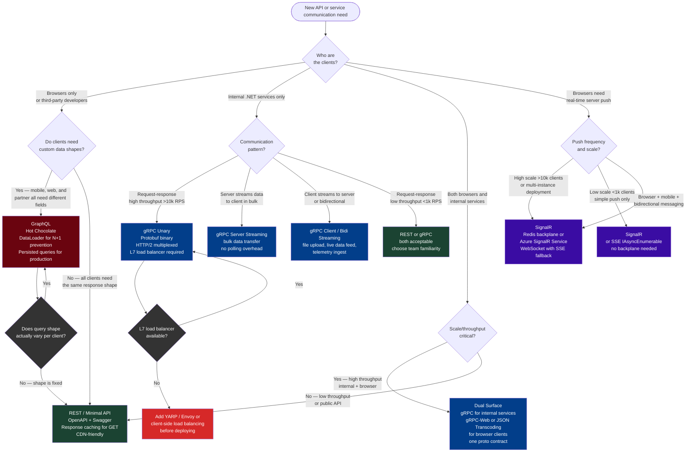

# 4.248 — gRPC vs REST vs GraphQL vs SignalR: The Decision Framework

---

## PART 0 — Navigation & Context

### Where This Topic Sits in the Domain Hierarchy

```
ASP.NET Core Mastery
│
├── G. Minimal APIs                    (4.078–4.097)  ← REST lives here
├── H. MVC & Controllers               (4.098–4.122)  ← REST lives here too
├── Q. SignalR & Real-Time             (4.219–4.230)  ← SignalR subsystem
│
└── S. gRPC                            (4.240–4.248)
    ├── 4.240  Proto Contracts and Service Implementation
    ├── 4.241  gRPC Streaming
    ├── 4.242  gRPC Authentication
    ├── 4.243  gRPC Error Handling: StatusCode and RpcException
    ├── 4.244  gRPC Interceptors
    ├── 4.245  gRPC-Web: Browser Support
    ├── 4.246  gRPC Client Factory
    ├── 4.247  gRPC JSON Transcoding
    └── 4.248  ► gRPC vs REST vs GraphQL vs SignalR: Decision Framework  ◄ YOU ARE HERE

    External cross-cuts:
    ├── W. API Design Patterns          (4.277–4.287)  ← REST versioning, OpenAPI
    └── Y. Observability & OpenTelemetry (4.297–4.307) ← affects all four protocols
```

### What You Need Before This

- **[[4.240 — gRPC in ASP.NET Core: Proto Contracts and Service Implementation]]** — you need real experience with gRPC's proto-contract model and code-generation overhead to honestly evaluate its trade-offs against REST
- **[[4.219 — SignalR Architecture: Hubs, Connections, and Transport Negotiation]]** — SignalR's transport negotiation, hub lifetime, and scale-out model are the capabilities that differentiate it from the others
- **[[4.079 — Defining Endpoints: MapGet, MapPost, MapPut, MapDelete]]** — REST endpoint semantics (verbs, status codes, resource-centric URLs) must be understood before you can articulate why REST wins in certain contexts
- **[[4.127 — HTTP/2: Multiplexing, Header Compression, and Kestrel Setup]]** — gRPC's performance advantage over REST/HTTP 1.1 is rooted in HTTP/2 multiplexing; without this you cannot defend the performance numbers

### What This Unlocks After

- **[[4.277 — API Versioning]]** — versioning strategy selection (URL path vs header vs media type) is deeply informed by which protocol you chose; gRPC versions via proto evolution, REST via URL segments, GraphQL rarely needs versioning
- **[[4.282 — GraphQL in ASP.NET Core: Hot Chocolate Integration]]** — this decision framework tells you _when_ to reach for GraphQL; the implementation note tells you _how_
- **[[4.345 — YARP: Yet Another Reverse Proxy]]** — multi-protocol gateway patterns (routing REST + gRPC + WebSocket traffic at the gateway layer) depend on understanding each protocol's wire characteristics
- **[[4.252 — Polly Integration: Retry, Circuit Breaker, and Hedging]]** — retry and resilience strategy differs by protocol; `StatusCode.Unavailable` is retryable in gRPC, 503 is retryable in REST, neither cancellation model maps to the other

### Why This Matters in Production

At scale, choosing the wrong API protocol for a use case is not a style mistake — it is an architecture tax: a gRPC service used where REST was needed means every browser-facing consumer needs a transcoding gateway and a separate OpenAPI surface; a REST service used where gRPC was needed means your internal service mesh carries 3× the serialization overhead at 50k RPS; a long-polling REST endpoint used where SignalR was needed means hundreds of goroutines and connection pool exhaustion under moderate load.

---

## PART 1 — The Core Mental Model

### The Fundamental Rule

> **REST, gRPC, GraphQL, and SignalR are not competing implementations of the same idea — they solve different problems in the HTTP stack. REST is a resource contract, gRPC is a typed procedure contract, GraphQL is a query contract, and SignalR is a connection contract. The practical consequence is that choosing the wrong one for your use case forces you to implement the missing contract in application code, which always costs more than choosing correctly at the start.**

### The Plain-Language Analogy

Think of the four protocols as four different kinds of post offices, each optimised for a different kind of mail.

**REST** is the standard postal service. You write a letter, address it to a specific location (the URL), choose a delivery class (GET, POST, PUT, DELETE), and the postal service delivers it. The receiver looks at the address and class to decide what to do with it. Any country in the world can send and receive this mail because the addressing system is universal. You don't need to agree on anything ahead of time beyond "letters go to addresses."

**gRPC** is a bonded courier that requires a pre-signed contract before the first package ships. You and the receiver both sign an agreement specifying exactly what packages look like (the `.proto` file), which item numbers are valid requests, and which responses are guaranteed in return. Packages are smaller (binary Protobuf instead of paper) and delivery is faster (HTTP/2 multiplexing), but both sides need the contract document before operating.

**GraphQL** is a department store catalog where the customer writes their own shopping list. Instead of the store deciding what bundles to sell, the customer says "I want columns A, C, and F from table 1, and column B from table 2, combined." The store fulfils whatever the list specifies. This is extraordinary for varied clients with different needs, but it requires the store to maintain a complete catalog and a query engine rather than fixed shelves.

**SignalR** is a telephone line rather than a mail service. Once connected, either side can speak at any time without the other side having to "dial" first. The connection stays open. Server can push data unprompted. The overhead is in establishing the line, not in each individual message.

The analogy holds under concurrency: REST handles millions of independent letters; gRPC handles millions of courier packages concurrently on a few bonded routes (HTTP/2 streams); GraphQL handles complex, customised orders; SignalR handles thousands of open phone lines where either end can speak first.

### The Taxonomy Diagram

```mermaid
graph TD
    subgraph PROTOCOLS["API Protocol Taxonomy"]
        direction TB

        subgraph REST_GROUP["REST / HTTP — Resource Contract"]
            REST_UNARY["Request-Response\nHTTP 1.1 or 2\nJSON / XML\nStateless"]
            REST_CACHE["Cacheable\nCDN / Proxy friendly\nURL-addressable resources"]
            REST_BROWSER["Universal browser support\nfetch() / XMLHttpRequest\nno client codegen needed"]
        end

        subgraph GRPC_GROUP["gRPC — Typed Procedure Contract"]
            GRPC_UNARY["Unary RPC\nbinary Protobuf\nHTTP/2 required"]
            GRPC_STREAM["Server / Client / Bidi Streaming\nHTTP/2 multiplexing\nlow latency, high throughput"]
            GRPC_CONTRACT["Strict proto contract\ncode generation\nbreaking-change discipline"]
        end

        subgraph GQL_GROUP["GraphQL — Query Contract"]
            GQL_QUERY["Flexible queries\nclient controls shape\nsingle endpoint POST /graphql"]
            GQL_SUBSCRIPTION["Subscriptions\n(WebSocket / SSE)\nreal-time push"]
            GQL_INTROSPECT["Schema introspection\nself-documenting\nstrongly typed"]
        end

        subgraph SIGNALR_GROUP["SignalR — Connection Contract"]
            SR_HUB["Hub methods\nbidirectional\npersistent connection"]
            SR_TRANSPORT["WebSocket → SSE → Long Poll\nauto-negotiation\nfallback chain"]
            SR_PUSH["Server-initiated push\ngroup broadcast\nreal-time events"]
        end
    end

    subgraph DECISIONS["Decision Axes"]
        D1["Who is the client?\nBrowser / Mobile / Service"]
        D2["Communication pattern?\nReq-Resp / Streaming / Push"]
        D3["Contract rigidity?\nStrict typed / Flexible query / Schema-optional"]
        D4["Network?\nInternet / Internal mesh / Mobile / IoT"]
        D5["Data shape?\nFixed resource / Custom query / Event stream"]
        D6["Team capability?\nOpenAPI fluency / proto fluency / GraphQL schema"]
    end

    D1 --> REST_BROWSER
    D1 --> GRPC_CONTRACT
    D2 --> GRPC_STREAM
    D2 --> SR_HUB
    D3 --> GQL_INTROSPECT
    D4 --> REST_CACHE
    D5 --> GQL_QUERY
    D6 --> GRPC_CONTRACT

    style REST_GROUP fill:#1b4332,color:#fff
    style GRPC_GROUP fill:#023e8a,color:#fff
    style GQL_GROUP fill:#6a040f,color:#fff
    style SIGNALR_GROUP fill:#3a0ca3,color:#fff
    style DECISIONS fill:#333,color:#fff
```



---

## PART 2 — Deep Mechanics

### 2.1 — Wire Protocol Comparison: What Actually Travels Over the Network

The single most important thing to internalise before choosing a protocol is what its request and response look like on the wire, because that determines latency, throughput, bandwidth cost, and debuggability.

```
REST / HTTP 1.1 — typical JSON API request:

GET /api/orders/42 HTTP/1.1
Host: api.example.com
Authorization: Bearer eyJhbGci...
Accept: application/json
Connection: keep-alive

HTTP/1.1 200 OK
Content-Type: application/json
Content-Length: 312
Cache-Control: max-age=60

{
  "id": 42,
  "customerId": 7,
  "status": "shipped",
  "items": [...]
}

Cost:
  - Headers: ~200-500 bytes per request (repeated every request in HTTP/1.1)
  - Body: JSON text — ~2-5× larger than binary equivalent
  - Connections: 1 request per connection (HTTP/1.1); pipelining rarely used
  - Latency: 1 TCP round-trip per request (no header compression)
  - Cacheability: excellent — CDN/proxy can cache based on URL + method
```

```
gRPC — same conceptual request over HTTP/2:

HTTP/2 HEADERS frame:
  :method = POST
  :path = /orders.OrderService/GetOrder
  :authority = api.example.com
  :scheme = https
  content-type = application/grpc
  authorization = Bearer eyJhbGci...
  grpc-timeout = 10S

HTTP/2 DATA frame (Protobuf binary — 5-length-prefix bytes + payload):
  [0x00][0x00][0x00][0x00][0x06]  ← 5-byte length-prefixed message framing
  [field 1, varint: 42]           ← order_id = 42 (2 bytes vs "42" in JSON = 4 bytes)

HTTP/2 HEADERS frame (trailing):
  grpc-status: 0
  grpc-message:

HTTP/2 DATA frame (response):
  [0x00][0x00][0x00][0x00][0x1A] [Protobuf binary response]

Cost:
  - Headers: compressed via HPACK (~20-80 bytes for repeated headers)
  - Body: Protobuf binary — ~3-10× smaller than JSON equivalent
  - Connections: multiplexed streams over one connection (many RPCs share one TCP conn)
  - Latency: lower — header compression + connection reuse + no TCP handshake per RPC
  - Cacheability: none — POST to a fixed path, not cacheable by proxies
```

```
GraphQL — query request:

POST /graphql HTTP/1.1
Host: api.example.com
Authorization: Bearer eyJhbGci...
Content-Type: application/json

{
  "query": "{ order(id: 42) { id status items { sku quantity } } }"
}

HTTP/1.1 200 OK
Content-Type: application/json

{
  "data": {
    "order": {
      "id": 42,
      "status": "shipped",
      "items": [{ "sku": "WIDGET-100", "quantity": 3 }]
    }
  }
}

Cost:
  - Headers: same as REST HTTP/1.1
  - Body: JSON text, but client controls exactly which fields are returned
  - Connections: same as REST over HTTP 1.1
  - Latency: potential N+1 query problem server-side without DataLoader
  - Cacheability: poor — POST requests are not cached by default; requires persisted queries
```

```
SignalR WebSocket — upgrade + bidirectional frames:

// HTTP Upgrade handshake (one-time per connection):
GET /hub/orders HTTP/1.1
Connection: Upgrade
Upgrade: websocket
Sec-WebSocket-Key: x3JJHMbDL1EzLkh9GBhXDw==

HTTP/1.1 101 Switching Protocols
Upgrade: websocket
Connection: Upgrade

// After upgrade — binary/text WebSocket frames (no HTTP overhead per message):
→ Client sends: { "type": 1, "target": "SubscribeToOrder", "arguments": [42] }
← Server sends: { "type": 1, "target": "OrderStatusChanged", "arguments": [{ "orderId": 42, "status": "delivered" }] }
← Server sends: { "type": 1, "target": "OrderStatusChanged", "arguments": [{ "orderId": 42, "status": "delivered" }] }

Cost:
  - Initial upgrade: 1 HTTP handshake (~400 bytes)
  - Per message after upgrade: ~10-50 bytes WebSocket frame header (vs ~400 bytes HTTP headers)
  - Connections: 1 persistent connection per client (significant server state)
  - Latency: near-zero after connection established
  - Server resources: ~4-8KB memory per connection; OS socket limit applies
```

**Runtime cost summary table:**

|Dimension|REST/HTTP 1.1|gRPC/HTTP/2|GraphQL/HTTP 1.1|SignalR/WS|
|---|---|---|---|---|
|Per-request header overhead|~300-500 bytes|~20-80 bytes (HPACK)|~300-500 bytes|~10-50 bytes (after WS upgrade)|
|Body encoding|JSON text|Protobuf binary|JSON text|JSON / MessagePack|
|Body size (typical)|baseline|3-10× smaller|baseline (client-shaped)|baseline|
|Connection model|1 req/connection or keep-alive|Multiplexed streams|1 req/connection|Persistent connection|
|Latency per operation|1 RTT + handshake if new|1 RTT (reused)|1 RTT + N+1 risk|~0 RTT after connect|
|CDN/proxy caching|Excellent (GET)|None|Poor (POST)|None|
|Browser support|Native|gRPC-Web only|Native|Native (WebSocket)|
|Firewall / proxy penetration|Excellent|Good (HTTP/2)|Excellent|Variable (WS blocked in some envs)|

---

### 2.2 — Communication Pattern Matching

The dominant decision factor is not performance — it is the communication pattern your use case requires. The four protocols optimise for four distinct patterns.

```
PATTERN MATRIX:

                    ┌──────────────────────────────────────────────────────────┐
                    │           CLIENT INITIATES           SERVER INITIATES    │
                    ├────────────────────────────┬─────────────────────────────┤
  ONE MESSAGE       │  REST (request-response)   │  SSE / Long Poll            │
                    │  gRPC Unary                │  (poor fit for any of the 4)│
                    ├────────────────────────────┼─────────────────────────────┤
  STREAM OF         │  gRPC Client Streaming     │  gRPC Server Streaming      │
  MESSAGES          │  (client sends many)       │  SignalR (server pushes)    │
                    │                            │  GraphQL Subscriptions      │
                    ├────────────────────────────┼─────────────────────────────┤
  BIDIRECTIONAL     │  gRPC Bidi Streaming       │  SignalR (hub methods)      │
  STREAM            │  (both send simultaneously)│  (both sides always ready)  │
                    └────────────────────────────┴─────────────────────────────┘

Use case → Pattern → Protocol:

  "Get an order by ID"
    → One request, one response, client initiates
    → REST or gRPC Unary (REST wins if browser-facing; gRPC wins if service-to-service)

  "Stream 10,000 inventory items from warehouse service to aggregator"
    → Client request triggers a long stream of responses
    → gRPC Server Streaming (lower overhead than 10,000 REST requests)

  "Upload a large file with progress tracking"
    → Client streams bytes to server; server responds with progress events
    → gRPC Bidi Streaming or gRPC Client Streaming

  "Push real-time price updates to 50,000 browser clients"
    → Server initiates updates without client polling
    → SignalR (manages 50k connections, group broadcast built-in)

  "Mobile app needs different data than desktop app — same backend"
    → Variable clients want different subsets of the same data
    → GraphQL (client controls query shape)

  "Internal order service calls inventory service 200k times/second"
    → High-throughput service-to-service RPC
    → gRPC (HTTP/2 multiplexing + Protobuf binary = lower CPU + bandwidth)
```

---

### 2.3 — The Contract Model: Who Owns the Schema?

This is the second-most important decision axis, and the one most teams underweight.

**REST: Schema is emergent, not enforced.** REST has no built-in schema enforcement. OpenAPI describes REST but is not required. A client sends what it wants; the server parses what it can. Schema drift is caught at runtime. This is flexibility, and also the source of breaking-change incidents.

```csharp
// REST: no compile-time contract between client and server
// Client sends:
{ "orderId": "42" }   // string, not int

// Server receives:
[FromBody] CreateOrderRequest request
// request.OrderId = 0 (binding silently failed)
// or an exception during deserialization
// detected at runtime, not build time
```

**gRPC: Contract is the source of truth, code is generated from it.** The `.proto` file is the contract. Both client and server generate code from it. Changing a field number in the proto is a breaking change caught at build time on the client.

```protobuf
// orders.proto — the contract both sides share
message GetOrderRequest {
  int64 order_id = 1;   // field 1
}

// Changing to string order_id = 1 — BREAKING CHANGE
// The generated C# client will no longer compile against the old proto
// This is caught at build time, not at runtime
```

**GraphQL: Schema is enforced by the server, queried by the client.** The server owns and publishes a typed schema. Clients query only fields that exist in the schema. Invalid fields produce validation errors before execution.

```graphql
# Server-owned schema:
type Order {
  id: ID!
  status: OrderStatus!
  items: [OrderItem!]!
}

# Client query — validated against schema before execution:
{ order(id: "42") { id status nonExistentField } }
# → Error: "Cannot query field 'nonExistentField' on type 'Order'"
# Caught at query validation, before any resolver runs
```

**SignalR: No schema — method names and argument shapes are conventions.** SignalR hub methods are loosely typed. The client sends a string method name and serialized arguments. There is no compile-time contract between client and server hub definitions.

```csharp
// Server hub:
public class OrderHub : Hub
{
    public async Task SubscribeToOrder(long orderId) { ... }
}

// JavaScript client — no type safety:
connection.invoke("SubscribeToOrder", 42);      // works
connection.invoke("subscribeToOrder", 42);      // SILENTLY FAILS — wrong case
connection.invoke("SubscribeToOrder", "42");    // may work (JS coercion) or fail
// None of these are caught at compile time
```

> [!WARNING] The lack of a compile-time contract in SignalR is its biggest operational risk in large teams. Hub method names are stringly-typed on the JavaScript/TypeScript client. TypeScript typed clients (using `@microsoft/signalr` with a shared types package) help, but are not enforced by the framework. Failing to invoke a hub method produces no error — the call is silently dropped.

---

### 2.4 — Client Ecosystem: Who Can Call This API?

The client landscape determines more protocol choices than any other factor in customer-facing systems.

```
CLIENT COMPATIBILITY MATRIX:

Client Type        | REST   | gRPC           | GraphQL | SignalR
-------------------|--------|----------------|---------|--------
Browser (fetch)    | ✅     | ❌ (need WS/HTTP2 w/ grpc-web) | ✅      | ✅ (WS)
Browser (grpc-web) | N/A    | ✅ (via proxy) | N/A     | N/A
Mobile (iOS/Android)| ✅    | ✅             | ✅      | ✅
.NET service       | ✅     | ✅ (preferred) | ✅      | ✅
Node.js service    | ✅     | ✅             | ✅      | ✅
Python service     | ✅     | ✅             | ✅      | Limited
Go / Rust service  | ✅     | ✅             | ✅      | Limited
IoT / Embedded     | ✅     | ✅ (compact)   | ⚠️ heavy| ❌
Third-party / public| ✅    | ❌ (proto req) | ✅      | ❌
CDN edge           | ✅     | ❌             | ❌      | ❌
```

> [!IMPORTANT] **gRPC and browsers do not work directly.** HTTP/2 in browsers does not expose the low-level frame control that gRPC requires. You need either **gRPC-Web** (which requires a server-side or proxy-side translation layer, e.g., Envoy, YARP with gRPC-Web middleware, or `Grpc.AspNetCore.Web`) or **gRPC JSON Transcoding** ([[4.247 — gRPC JSON Transcoding]]) to expose REST-over-HTTP endpoints from the same proto service. This is the single most common reason teams start with REST even when gRPC is technically superior for their use case.

**The public API implication:** If your API is consumed by third parties who you cannot control (SaaS product, platform API, partner integrations), REST is almost always the correct choice. Proto files, code generation, and gRPC tooling are a high onboarding barrier for external developers. GraphQL is the second-best choice for public APIs with heterogeneous clients.

---

### 2.5 — Operational Characteristics: What Changes When You Run This in Production

Protocol choice is also an operations choice. The following characteristics affect your monitoring, debugging, caching, load balancing, and incident response tooling.

**Observability:**

```
REST:
  - HTTP access logs capture every request (URL, method, status code)
  - Standard HTTP status codes work with all APM tools natively
  - curl, browser devtools, Postman — zero tooling overhead for debugging
  - Cache-Control headers are inspectable at every hop

gRPC:
  - grpc-status in trailing headers — NOT visible to tools that only inspect :status
  - Requires OpenTelemetry gRPC semantic conventions for proper APM
  - grpcurl for command-line debugging (like curl for gRPC)
  - Server reflection service must be enabled for grpcurl to work without proto files
  - Load balancers must be L7-gRPC-aware to distribute individual streams (not just connections)

GraphQL:
  - All requests are POST /graphql — URL-based monitoring is useless
  - Must instrument at the resolver level to track individual operation performance
  - Query complexity analysis is required to prevent expensive queries in production
  - Persisted queries (APQ) are needed for CDN caching and security
  - Apollo Studio / Hot Chocolate Banana Cake Pop for schema management

SignalR:
  - Long-lived connections mean connection count, not request count, is the primary metric
  - Redis backplane required for multi-instance deployments
  - WebSocket connections are not visible to most HTTP load balancers by default
  - Connection draining during deployments requires explicit handling
  - Memory profiling: each connection holds state — connection leaks look like memory leaks
```

**Load balancing:**

```
REST:        L4 (TCP) or L7 (HTTP) — any load balancer works
gRPC:        L7 ONLY — L4 load balancing sends all streams from one client
             to one server instance (no horizontal scale). YARP / Envoy / 
             nginx 1.13+ required. This is a common production surprise.
GraphQL:     L7 (HTTP) — same as REST
SignalR:     Session affinity required (sticky sessions) if not using
             Redis backplane, because connection state lives on one server instance.
             Azure SignalR Service / Redis backplane enables proper horizontal scale.
```

> [!DANGER] **gRPC + L4 load balancer = your scale-out is silently broken.** HTTP/2 multiplexing means a single TCP connection carries thousands of RPC streams. An L4 load balancer sees one TCP connection and routes all of it to one backend server. The other backend servers receive zero load. You will see one instance at 100% CPU and the others at idle. This is the most common gRPC production disaster. You must use an L7-aware load balancer (YARP, Envoy, nginx 1.13+, AWS ALB with gRPC target group) or gRPC client-side load balancing.

---

### 2.6 — Versioning and Schema Evolution

Breaking-change risk differs fundamentally by protocol, and this affects how often you can ship changes to your API without coordinating with consumers.

**REST versioning:** URL path (`/v2/orders/42`) or header (`API-Version: 2`). Breaking changes require a new version. Multiple versions coexist in the same codebase for years in practice. ([[4.277 — API Versioning]])

**gRPC versioning via Protobuf wire compatibility:** Protobuf has built-in forward/backward compatibility rules that reduce (but do not eliminate) the need for versioning:

- Adding new fields: backward-compatible (old clients ignore unknown fields)
- Removing fields: forward-compatible (new code ignores missing fields gracefully)
- Renaming fields: safe (field number, not name, is the wire identity)
- Changing field types: **BREAKING** (int32 → int64 requires a new field number)
- Changing field numbers: **BREAKING** (this is the wire identity)

```protobuf
// Safe evolution — existing clients unaffected:
message GetOrderRequest {
  int64 order_id = 1;
  // New optional field — old clients send field 1 only; server handles missing field 2
  string customer_hint = 2;   // Added in v2
}

// Breaking evolution — requires new service version or new message type:
message GetOrderRequest {
  // Renumbering order_id from 1 to 3 is a BREAKING CHANGE
  // Old clients encode 42 as field 1; new server reads field 1 as unknown → default value
  int64 order_id = 3;   // ← NEVER DO THIS
}
```

**GraphQL versioning:** GraphQL APIs rarely need explicit versioning. Deprecation annotations on fields signal removal intent without breaking existing queries. New fields are additive. The introspection system lets clients discover what is available. This is GraphQL's strongest versioning story.

**SignalR versioning:** No built-in versioning. Hub method renames require client-side coordination. Teams typically version via hub endpoint URL (`/hub/v2/orders`) or rely on clients ignoring unknown server-pushed events.

---

## PART 3 — Production Code Patterns

### Pattern 1: The Dual-Surface API — gRPC for Services, REST for Browsers (E-Commerce Platform)

The most common real-world pattern for a mature microservices platform: one service, two protocol surfaces.

```csharp
// Program.cs — Order Service with both surfaces
var builder = WebApplication.CreateBuilder(args);

// gRPC surface: for internal .NET services (order-fulfillment, inventory, logistics)
builder.Services.AddGrpc(options =>
{
    options.Interceptors.Add<ExceptionMappingInterceptor>();
    options.EnableDetailedErrors = builder.Environment.IsDevelopment();
});

// gRPC-Web: for browser-based admin dashboard that calls gRPC directly
builder.Services.AddGrpcWeb(o => o.GrpcWebEnabled = true);

// REST surface: for public storefront API and third-party integrations
builder.Services.AddControllers();
builder.Services.AddEndpointsApiExplorer();
builder.Services.AddSwaggerGen();

var app = builder.Build();

// gRPC-Web middleware must wrap gRPC middleware
app.UseGrpcWeb();

// REST pipeline
app.UseRouting();
app.UseAuthentication();
app.UseAuthorization();
app.MapControllers();

// gRPC surface — internal services call this
app.MapGrpcService<OrderGrpcService>();

// gRPC-Web surface — browser dashboard calls this
app.MapGrpcService<OrderGrpcService>().EnableGrpcWeb();

app.Run();

// WHY this pattern:
// - Internal .NET services get full gRPC: binary serialization, streaming, generated clients
// - Browser dashboard gets gRPC-Web: same proto contract, no separate REST API to maintain
// - Public REST API: third-party partners get OpenAPI docs, no proto tooling required
// - One domain model: the gRPC proto is the source of truth; REST DTOs are thin adapters
```

---

### Pattern 2: GraphQL for a Multi-Client Product API (FinTech Dashboard)

When a single backend serves a mobile app, web app, and third-party integrations — all needing different subsets of account data.

```csharp
// ⚠️ WRONG: separate REST endpoints for each client's data needs
// GET /api/mobile/accounts/42         ← mobile-optimized subset
// GET /api/web/accounts/42            ← web-optimized with extra fields
// GET /api/partner/accounts/42        ← partner-specific fields
// Result: 3 endpoints to maintain, all returning the same underlying Account data

// ✅ CORRECT: GraphQL — clients declare what they need
// Schema (Hot Chocolate):
public class AccountType : ObjectType<Account>
{
    protected override void Configure(IObjectTypeDescriptor<Account> descriptor)
    {
        descriptor.Description("A financial account");
        descriptor.Field(a => a.Id).Type<NonNullType<IdType>>();
        descriptor.Field(a => a.Balance).Type<NonNullType<DecimalType>>();
        descriptor.Field(a => a.Currency).Type<NonNullType<StringType>>();
        
        // This field is expensive — requires a separate DB query
        // DataLoader batches these across all in-flight requests
        descriptor
            .Field("recentTransactions")
            .ResolveWith<AccountResolvers>(r =>
                r.GetRecentTransactionsAsync(default!, default!, default!))
            .UseDataLoader<TransactionByAccountDataLoader>();
    }
}

// Mobile client query — small payload, fast render:
// { account(id: "42") { balance currency } }

// Web client query — full dashboard data:
// { account(id: "42") { balance currency recentTransactions { date amount merchant } } }

// Third-party partner query — only what they're authorized to see:
// { account(id: "42") { balance currency } }
// (resolver checks authorization per field)

// Wire effect:
// POST /graphql
// { "query": "{ account(id: \"42\") { balance currency } }" }
//
// HTTP/1.1 200 OK
// { "data": { "account": { "balance": 10250.00, "currency": "USD" } } }
//
// Same endpoint, 3 different response shapes — no backend code change required
```

---

### Pattern 3: SignalR for Real-Time Order Tracking (Logistics Platform)

When 50,000 drivers need live status updates pushed from the dispatch system without polling.

```csharp
// ⚠️ WRONG: polling REST endpoint — 50,000 drivers × 1 req/5s = 10,000 req/s baseline load
// GET /api/shipments/{trackingId}/status every 5 seconds per driver
// Result: 10,000 req/s of load even when nothing has changed

// ✅ CORRECT: SignalR hub — server pushes only when state changes
public class ShipmentTrackingHub : Hub
{
    private readonly IShipmentRepository _repo;

    public ShipmentTrackingHub(IShipmentRepository repo) => _repo = repo;

    // Driver calls this once on app open to subscribe to their shipment
    public async Task SubscribeToShipment(string trackingId)
    {
        // Validate the driver is authorized to track this shipment
        var driverId = Context.UserIdentifier!;
        var shipment = await _repo.GetAsync(trackingId);
        
        if (shipment.AssignedDriverId != driverId)
        {
            // Do not throw — just ignore silently or send an error event
            await Clients.Caller.SendAsync("Error", "Not authorized for this shipment");
            return;
        }

        // Add this connection to a group named after the tracking ID
        // All connections in the group receive updates for this shipment
        await Groups.AddToGroupAsync(Context.ConnectionId, $"shipment:{trackingId}");
        
        // Send current state immediately on subscribe
        await Clients.Caller.SendAsync("ShipmentStatus", new
        {
            trackingId,
            shipment.Status,
            shipment.CurrentLocation,
            shipment.EstimatedDelivery
        });
    }
}

// Dispatch system pushes status changes (from a background service):
public class ShipmentStatusChangedHandler
{
    private readonly IHubContext<ShipmentTrackingHub> _hubContext;

    public async Task HandleAsync(ShipmentStatusChangedEvent evt)
    {
        // Only connections subscribed to this shipment receive the update
        // 50,000 connections × 1% of shipments changing per second = 500 pushes/s
        // vs 10,000 req/s polling baseline
        await _hubContext.Clients
            .Group($"shipment:{evt.TrackingId}")
            .SendAsync("ShipmentStatus", new
            {
                evt.TrackingId,
                evt.NewStatus,
                evt.CurrentLocation,
                evt.EstimatedDelivery
            });
    }
}

// HTTP wire effect (WebSocket, after upgrade):
// ← Server: { "target": "ShipmentStatus", "arguments": [{ "trackingId": "1Z999...", "status": "OutForDelivery" }] }
// (no client request — pure server push)

// Program.cs registration:
builder.Services.AddSignalR().AddStackExchangeRedis(redisConnectionString); // for multi-instance
app.MapHub<ShipmentTrackingHub>("/hub/shipments");
```

---

### Pattern 4: gRPC for High-Throughput Internal Service Mesh (Payment Processing)

When the payment service calls the fraud detection service 200,000 times per second.

```csharp
// ⚠️ WRONG: REST for high-throughput internal calls
// 200,000 req/s × ~500 bytes JSON payload = 100MB/s of JSON serialization
// 200,000 req/s × TCP handshake overhead = connection pool exhaustion
// No HTTP/2 multiplexing → each request is a new TCP round-trip

// ✅ CORRECT: gRPC for internal service-to-service at high throughput
// fraud_detection.proto:
// service FraudDetection {
//   rpc EvaluateTransaction (EvaluateRequest) returns (EvaluateResponse);
// }

// Payment service calling fraud detection:
public class PaymentProcessingService
{
    private readonly FraudDetection.FraudDetectionClient _fraudClient;
    private readonly ILogger<PaymentProcessingService> _logger;

    public PaymentProcessingService(
        FraudDetection.FraudDetectionClient fraudClient,
        ILogger<PaymentProcessingService> logger)
    {
        _fraudClient = fraudClient;
        _logger = logger;
    }

    public async Task<ProcessPaymentResult> ProcessAsync(
        PaymentRequest request, CancellationToken ct)
    {
        // gRPC call: ~2-5ms latency, ~200 bytes Protobuf vs ~1KB JSON
        // HTTP/2 multiplexing: 1000s of concurrent calls share one TCP connection
        var fraudResult = await _fraudClient.EvaluateTransactionAsync(
            new EvaluateRequest
            {
                TransactionId = request.TransactionId,
                Amount = (double)request.Amount,
                Currency = request.Currency,
                CardBin = request.CardBin,
                MerchantId = request.MerchantId,
                IpAddress = request.CustomerIpAddress
            },
            deadline: DateTime.UtcNow.AddMilliseconds(50), // strict SLA
            cancellationToken: ct);

        if (fraudResult.RiskScore > 0.85)
        {
            _logger.LogWarning(
                "High fraud risk {Score} for transaction {Id}",
                fraudResult.RiskScore, request.TransactionId);
            return ProcessPaymentResult.Declined("High fraud risk");
        }

        // Proceed with payment processing...
        return await ChargeCardAsync(request, ct);
    }
}

// Program.cs registration — typed gRPC client with Polly retry:
builder.Services
    .AddGrpcClient<FraudDetection.FraudDetectionClient>(o =>
    {
        o.Address = new Uri(builder.Configuration["Services:FraudDetection:Address"]!);
    })
    .AddStandardResilienceHandler(); // Polly retry on Unavailable, circuit break on Internal

// Wire effect (HTTP/2):
// POST /fraud.FraudDetection/EvaluateTransaction HTTP/2
// [Protobuf binary: ~180 bytes vs ~900 bytes JSON equivalent]
// Response: [Protobuf binary: ~20 bytes — { risk_score: 0.12, decision: APPROVE }]
// Throughput: ~3× higher than REST equivalent at same CPU budget
```

---

### Pattern 5: The API Gateway Routing Multiple Protocols (YARP)

In practice, production platforms expose multiple protocols from the same gateway, routing by path prefix or client type.

```csharp
// YARP configuration for multi-protocol gateway:
// appsettings.json:
{
  "ReverseProxy": {
    "Routes": {
      // REST API routes — public, CDN-cacheable
      "rest-orders-route": {
        "ClusterId": "order-service",
        "Match": { "Path": "/api/v{version}/{**catch-all}" },
        "Transforms": [{ "PathPattern": "/api/v{version}/{**catch-all}" }]
      },
      // gRPC routes — internal services only
      "grpc-orders-route": {
        "ClusterId": "order-service-grpc",
        "Match": {
          "Path": "/orders.OrderService/{**catch-all}",
          "Headers": [{ "Name": "content-type", "Values": ["application/grpc"], "Mode": "Contains" }]
        }
      },
      // SignalR WebSocket route — browser clients
      "signalr-route": {
        "ClusterId": "tracking-service",
        "Match": { "Path": "/hub/{**catch-all}" }
      }
    },
    "Clusters": {
      "order-service": {
        "LoadBalancingPolicy": "RoundRobin",
        "Destinations": { ... }
      },
      "order-service-grpc": {
        // gRPC REQUIRES round-robin at the RPC level, not connection level
        // YARP handles this with gRPC-aware load balancing
        "LoadBalancingPolicy": "RoundRobin",
        "HttpClient": { "Version": "2.0", "VersionPolicy": "RequestVersionOrHigher" }
      }
    }
  }
}
```

---

### Pattern 6: Choosing GraphQL for a BFF (Backend For Frontend) — Mobile vs Web

When your mobile app and web app have meaningfully different data needs from the same API.

```csharp
// ⚠️ WRONG: two separate REST APIs, diverging over time
// MobileOrderController — returns minimal data
// WebOrderController — returns full data with audit trails

// ✅ CORRECT: GraphQL BFF — same schema, client-driven queries
// Hot Chocolate setup in Program.cs:
builder.Services
    .AddGraphQLServer()
    .AddQueryType<Query>()
    .AddType<OrderType>()
    .AddType<CustomerType>()
    // Authorization policy integration
    .AddAuthorization()
    // DataLoader for N+1 prevention
    .AddDataLoader<OrderLinesByOrderDataLoader>()
    // Rate limiting GraphQL queries by complexity
    .AddMaxExecutionDepth(5)
    .AddIntrospectionAllowedRule()
    // Persisted queries for production (prevents arbitrary query injection)
    .UsePersistedQueryPipeline()
    .AddReadOnlyFileSystemQueryStorage("./persisted-queries");

app.MapGraphQL("/graphql");

// Mobile query — minimal payload for small screen:
// query MobileOrderSummary($id: ID!) {
//   order(id: $id) { id status estimatedDelivery }
// }
// Response: ~80 bytes JSON

// Web query — full detail for dashboard:
// query WebOrderDetail($id: ID!) {
//   order(id: $id) {
//     id status estimatedDelivery
//     customer { name email }
//     lines { sku description quantity unitPrice }
//     auditTrail { timestamp actor action }
//   }
// }
// Response: ~2KB JSON

// SAME GraphQL endpoint — NO new backend code for new client data needs
// WHY: BFF pattern with GraphQL means the schema evolves once; 
// clients evolve independently. Adding a new mobile screen does not 
// require a new backend API endpoint.
```

---

### Pattern 7: Migrating a REST API to gRPC Without Breaking Existing Clients (JSON Transcoding)

The realistic migration path when you want gRPC performance for internal consumers but cannot break external REST consumers.

```csharp
// orders.proto — with HTTP annotations for JSON transcoding:
// service OrderService {
//   rpc GetOrder (GetOrderRequest) returns (GetOrderResponse) {
//     option (google.api.http) = {
//       get: "/api/v1/orders/{order_id}"   ← REST surface generated from this
//     };
//   }
//   rpc CreateOrder (CreateOrderRequest) returns (CreateOrderResponse) {
//     option (google.api.http) = {
//       post: "/api/v1/orders"
//       body: "*"
//     };
//   }
// }

// Program.cs — enables both gRPC and REST from the same service:
builder.Services.AddGrpc().AddJsonTranscoding();

// ← External REST clients call:
// GET /api/v1/orders/42   → routed to GetOrder gRPC handler
// POST /api/v1/orders     → routed to CreateOrder gRPC handler
// (JSON in, JSON out — no proto tooling needed)

// ← Internal .NET services call:
// var response = await _client.GetOrderAsync(new GetOrderRequest { OrderId = 42 });
// (Protobuf binary — full gRPC performance)

// Swagger integration for REST surface:
builder.Services.AddGrpcSwagger();
builder.Services.AddSwaggerGen(c =>
{
    c.SwaggerDoc("v1", new() { Title = "Order Service", Version = "v1" });
});

// WHY this pattern:
// - One proto file defines the complete API surface
// - Internal consumers get full gRPC: binary, streaming, generated clients
// - External consumers get REST: JSON, OpenAPI docs, no proto tooling required
// - Zero divergence between REST and gRPC semantics — same handler code
```

---

## PART 4 — Gotchas & Anti-Patterns

### Gotcha 1: Using gRPC for Browser-Facing APIs Without a Transcoding Layer

Teams choose gRPC for performance, implement it across all services, then discover their React/Angular/Vue frontend cannot call gRPC directly.

```csharp
// ⚠️ WRONG: gRPC service registered with no browser-compatible surface
// Program.cs:
app.MapGrpcService<ProductCatalogGrpcService>();
// No gRPC-Web, no transcoding, no REST surface

// HTTP consequence (wrong path):
// Browser calls: fetch("https://api.example.com/catalog.CatalogService/ListProducts", {
//   method: "POST",
//   headers: { "content-type": "application/grpc" },
//   body: protoBytes
// })
// Response: HTTP/2 200 OK but browser JavaScript cannot read HTTP/2 trailers
// The grpc-status trailer (StatusCode.OK or any error code) is inaccessible
// Browser sees: network error or response with no usable data
// Production symptom: works in Postman (HTTP/2), fails in browser silently

// ✅ CORRECT: add gRPC-Web or JSON Transcoding for browser clients
// Option A — gRPC-Web (browser uses gRPC-Web protocol, not native gRPC):
builder.Services.AddGrpcWeb(o => o.GrpcWebEnabled = true);
app.UseGrpcWeb();
app.MapGrpcService<ProductCatalogGrpcService>().EnableGrpcWeb();

// Option B — JSON Transcoding (browser calls REST, server handles gRPC):
builder.Services.AddGrpc().AddJsonTranscoding();
app.MapGrpcService<ProductCatalogGrpcService>();
// GET /catalog/products → routes to ListProducts handler

// HTTP consequence (correct path — gRPC-Web):
// Browser uses Content-Type: application/grpc-web
// Response: HTTP/1.1 200 with grpc-status in body trailer frame
// Browser JavaScript: GrpcWebClientBase reads trailers correctly

// WHY: Browsers do not have access to HTTP/2 trailers via the Fetch API.
// The grpc-status code — which signals success or error — lives in HTTP/2
// trailing headers. Without gRPC-Web or transcoding, browsers cannot read it.
```

---

### Gotcha 2: Deploying gRPC Behind an L4 Load Balancer

```csharp
// ⚠️ WRONG: gRPC service behind an L4 (TCP) load balancer
// Infrastructure config (conceptual):
// LoadBalancer (L4) → [gRPC Server 1, gRPC Server 2, gRPC Server 3]
//
// HTTP consequence (wrong path):
// Client opens 1 HTTP/2 connection to load balancer
// L4 LB routes the TCP connection to gRPC Server 1
// HTTP/2 multiplexes 10,000 RPC streams over that ONE connection
// All 10,000 streams go to Server 1
// Server 2 and Server 3 are idle
// Server 1 reaches 100% CPU → latency spikes → SLO breach
// gRPC Server 1 logs: "Serving 10,000 concurrent RPCs"
// gRPC Server 2 logs: "Serving 0 RPCs"

// ✅ CORRECT: gRPC requires L7-aware load balancing
// YARP configuration for gRPC-aware round-robin:
{
  "ReverseProxy": {
    "Routes": {
      "grpc-route": {
        "ClusterId": "grpc-cluster",
        "Match": { "Path": "/{service}/{method}" }
      }
    },
    "Clusters": {
      "grpc-cluster": {
        "LoadBalancingPolicy": "RoundRobin",  // Round-robin at HTTP/2 STREAM level
        "HttpClient": {
          "Version": "2.0",
          "VersionPolicy": "RequestVersionOrHigher"
        },
        "Destinations": {
          "instance-1": { "Address": "https://grpc-server-1:5001" },
          "instance-2": { "Address": "https://grpc-server-2:5001" },
          "instance-3": { "Address": "https://grpc-server-3:5001" }
        }
      }
    }
  }
}

// HTTP consequence (correct path):
// YARP opens HTTP/2 connections to each backend independently
// Each RPC stream is load-balanced across instances at the L7 level
// CPU is distributed evenly across all 3 instances

// WHY: HTTP/2 multiplexing means one TCP connection = many RPC streams.
// L4 load balancers operate at the TCP connection level — they see one
// connection and route it to one server. L7 load balancers (YARP, Envoy,
// nginx 1.13+) understand HTTP/2 streams and can distribute individual
// RPCs across backend instances.
```

---

### Gotcha 3: Using GraphQL Without DataLoader (N+1 in Production)

```csharp
// ⚠️ WRONG: GraphQL resolver fetches related data in a loop
public class OrderType : ObjectType<Order>
{
    protected override void Configure(IObjectTypeDescriptor<Order> descriptor)
    {
        descriptor
            .Field("customer")
            .ResolveWith<OrderResolvers>(r => r.GetCustomerAsync(default!, default!));
    }
}

public class OrderResolvers
{
    // THIS IS CALLED ONCE PER ORDER IN THE RESULT SET
    public async Task<Customer> GetCustomerAsync(
        [Parent] Order order,
        [Service] ICustomerRepository repo)
    {
        // ← 1 DB query per order in the result
        return await repo.GetByIdAsync(order.CustomerId);
    }
}

// HTTP consequence (wrong path):
// Query: { orders { id customer { name email } } }
// Result: 100 orders in result set
// Database queries executed: 1 (for orders) + 100 (for customers) = 101 queries
// Latency: 100× what it should be

// ✅ CORRECT: use DataLoader to batch customer lookups
public class CustomerByIdDataLoader : BatchDataLoader<int, Customer>
{
    private readonly ICustomerRepository _repo;

    public CustomerByIdDataLoader(
        IBatchScheduler batchScheduler,
        ICustomerRepository repo,
        DataLoaderOptions? options = null)
        : base(batchScheduler, options)
    {
        _repo = repo;
    }

    // Called ONCE with all customer IDs in the batch
    protected override async Task<IReadOnlyDictionary<int, Customer>> LoadBatchAsync(
        IReadOnlyList<int> customerIds, CancellationToken ct)
    {
        // ONE query for all customers in the current execution batch
        var customers = await _repo.GetByIdsAsync(customerIds, ct);
        return customers.ToDictionary(c => c.Id);
    }
}

// Resolver using DataLoader:
public async Task<Customer> GetCustomerAsync(
    [Parent] Order order,
    CustomerByIdDataLoader dataLoader)
{
    return await dataLoader.LoadAsync(order.CustomerId);
    // Hot Chocolate batches all LoadAsync calls in one execution tick
    // → 1 DB query for all 100 customers regardless of result set size
}

// HTTP consequence (correct path):
// Same query: { orders { id customer { name email } } }
// Database queries: 1 (orders) + 1 (all customers in one batch) = 2 total
// WHY: DataLoader defers resolution until all field resolvers in the same
// execution tick have registered their IDs, then issues one batched query.
```

---

### Gotcha 4: SignalR Without Redis Backplane in a Multi-Instance Deployment

```csharp
// ⚠️ WRONG: SignalR without backplane in multi-instance deployment
// Program.cs on both instances:
builder.Services.AddSignalR(); // no backplane

// Scenario: Load balancer routes connections 50/50 across 2 instances
// Instance A: holds connections for User 1, User 2, User 3
// Instance B: holds connections for User 4, User 5, User 6

// Background service sends dispatch update for User 1:
await _hubContext.Clients.User("user-1").SendAsync("OrderUpdate", update);
// ← If this code runs on Instance B, it has no connection for User 1
// ← The message is silently DROPPED
// ← User 1 never receives the update
// ← No error, no log entry, complete silence

// HTTP consequence (wrong path):
// User 1 is connected to Instance A
// Background service runs on Instance B
// IHubContext on Instance B has no knowledge of connections on Instance A
// Clients.User("user-1").SendAsync succeeds (no exception) but delivers to nobody

// ✅ CORRECT: Redis backplane for multi-instance SignalR
builder.Services
    .AddSignalR()
    .AddStackExchangeRedis(
        builder.Configuration.GetConnectionString("Redis")!,
        options =>
        {
            options.Configuration.ChannelPrefix = RedisChannel.Literal("signalr:");
        });

// With backplane:
// Instance B's IHubContext.Clients.User("user-1").SendAsync publishes to Redis
// Redis fan-outs to all SignalR instances
// Instance A reads from Redis and delivers to User 1's connection
// Message is delivered regardless of which instance the background service runs on

// WHY: Each SignalR server instance only knows about connections established
// directly to it. Without a backplane, hub contexts on different instances are
// isolated islands. The Redis backplane provides a pub/sub channel that all
// instances subscribe to, enabling cross-instance message delivery.
```

---

### Gotcha 5: Choosing GraphQL for High-Frequency Simple Reads

```csharp
// ⚠️ WRONG: GraphQL for a high-throughput price check API
// Price check service receives 500,000 requests/second from the trading system
// GraphQL query:
// POST /graphql
// { "query": "{ price(symbol: \"AAPL\") { bid ask last timestamp } }" }

// HTTP consequence (wrong path):
// Every request:
//   1. Parse GraphQL query string (CPU allocation)
//   2. Validate query against schema (CPU allocation)
//   3. Build execution plan (CPU allocation)
//   4. Execute resolvers
//   5. Serialize response
// At 500k req/s: GraphQL parsing overhead is ~20-40μs per request × 500k = 10-20 CPU-seconds/s
// The query structure and schema overhead consumes ~15-25% of total request CPU at this scale

// ✅ CORRECT: REST or gRPC for high-throughput fixed-shape reads
// Option A — REST: single, cacheable, zero-overhead endpoint
// GET /prices/AAPL
// Response: { "bid": 181.42, "ask": 181.44, "last": 181.43, "ts": "..." }
// CDN can cache this for 100ms, reducing server load by 80%+ for static clients

// Option B — gRPC for internal consumers requiring sub-millisecond latency:
// var response = await _priceClient.GetPriceAsync(new PriceRequest { Symbol = "AAPL" });
// Protobuf: ~20 bytes vs ~80 bytes JSON; HTTP/2 multiplexed over persistent connection

// WHY: GraphQL's query parsing and validation overhead is fixed per request.
// For fixed-shape, high-frequency reads, this overhead dominates. GraphQL's
// value proposition — client-controlled query shape — is irrelevant when the
// query shape never changes. REST GET with response caching or gRPC with
// Protobuf are strictly better for this use case.
```

---

## PART 5 — Performance Implications

### 5.1 — Protocol Performance Characteristics Table

|Scenario|Protocol|Serialization Overhead|Headers Per Request|Connections|Approx Throughput (single server)|Recommendation|
|---|---|---|---|---|---|---|
|Public REST API, CDN-cached GETs|REST|JSON baseline|~400 bytes|Keep-alive|80k req/s (cache hits free)|REST — caching multiplies throughput|
|Public REST API, no caching|REST|JSON baseline|~400 bytes|Keep-alive|15-30k req/s|REST, add output caching|
|Internal service mesh, small payloads|gRPC Unary|Protobuf ~3-5× smaller|~20-80 bytes HPACK|Multiplexed|50-200k RPC/s|gRPC — binary + multiplexing|
|Internal streaming (bulk data transfer)|gRPC Streaming|Protobuf|Minimal (stream overhead)|Multiplexed|500MB/s+|gRPC Server Streaming|
|Multi-client BFF with varied queries|GraphQL|JSON + query overhead|~400 bytes|Keep-alive|8-20k req/s|GraphQL — only if query shape varies|
|High-frequency fixed-shape reads (>100k/s)|REST or gRPC|—|—|—|REST wins (cacheable) or gRPC (binary)|Never GraphQL here|
|Real-time push to 10k browser clients|SignalR|JSON or MsgPack|~10 bytes/msg (WS)|10k persistent|50k msg/s|SignalR — persistent connections|
|Real-time push to 100k+ clients|SignalR + Azure SignalR Service|—|—|Service-managed|Millions msg/s|Azure SignalR Service required|
|Browser-to-gRPC (no gateway)|gRPC-Web|Protobuf|gRPC-Web framing|HTTP 1.1|10-30k req/s|Acceptable for internal browser tools|
|Third-party public API|REST|JSON|Standard HTTP|Keep-alive|20-40k req/s|REST — ecosystem compatibility|

### 5.2 — BenchmarkDotNet: Serialization Cost Comparison

```csharp
using BenchmarkDotNet.Attributes;
using BenchmarkDotNet.Running;
using Google.Protobuf;
using System.Text.Json;

[MemoryDiagnoser]
[SimpleJob]
public class SerializationProtocolBenchmarks
{
    // Equivalent data model
    private static readonly OrderJson _orderJson = new()
    {
        Id = 42,
        CustomerId = 7,
        Status = "Shipped",
        TotalAmount = 129.99m,
        Items = [new() { Sku = "WIDGET-100", Quantity = 3, UnitPrice = 43.33m }]
    };

    // Equivalent Protobuf message (generated from proto)
    private static readonly OrderProto _orderProto = new()
    {
        Id = 42,
        CustomerId = 7,
        Status = "Shipped",
        TotalAmountCents = 12999,
        Items = { new OrderLineProto { Sku = "WIDGET-100", Quantity = 3, UnitPriceCents = 4333 } }
    };

    private static readonly JsonSerializerOptions _jsonOptions = new()
    {
        PropertyNamingPolicy = JsonNamingPolicy.CamelCase
    };

    [Benchmark(Baseline = true)]
    public byte[] SerializeJson()
        => JsonSerializer.SerializeToUtf8Bytes(_orderJson, _jsonOptions);

    [Benchmark]
    public byte[] SerializeProtobuf()
        => _orderProto.ToByteArray();

    [Benchmark]
    public OrderJson DeserializeJson()
    {
        var bytes = JsonSerializer.SerializeToUtf8Bytes(_orderJson, _jsonOptions);
        return JsonSerializer.Deserialize<OrderJson>(bytes, _jsonOptions)!;
    }

    [Benchmark]
    public OrderProto DeserializeProtobuf()
    {
        var bytes = _orderProto.ToByteArray();
        return OrderProto.Parser.ParseFrom(bytes);
    }
}

// Expected output (approximate, .NET 8, x64):
// | Method               | Mean      | Gen0   | Allocated | Payload Size |
// |----------------------|-----------|--------|-----------|--------------|
// | SerializeJson        | 412 ns    | 0.0687 | 576 B     | ~180 bytes   |
// | SerializeProtobuf    | 128 ns    | 0.0153 | 128 B     | ~60 bytes    |
// | DeserializeJson      | 892 ns    | 0.1144 | 960 B     | ~180 bytes   |
// | DeserializeProtobuf  | 198 ns    | 0.0229 | 192 B     | ~60 bytes    |
//
// Protobuf: ~3.2× faster serialization, ~4.5× faster deserialization,
//           ~4-5× smaller payload, ~4-5× fewer allocations

// Note: For real HTTP profiling across protocols use:
// - dotnet-trace with Microsoft-AspNetCore-Server-Kestrel provider
// - dotnet-counters with protocol-specific counters
//   (Microsoft.AspNetCore.Http.Connections for SignalR, Grpc.AspNetCore.Server for gRPC)
// - k6 or NBomber for end-to-end protocol benchmarks including HTTP overhead
// BenchmarkDotNet measures in-process only — HTTP negotiation, header overhead,
// and connection management are not captured here.
```

### 5.3 — When to Care / When to Ignore

**When protocol choice costs you:**

- Service-to-service calls at >10k RPS: REST+JSON vs gRPC+Protobuf is a ~3-4× CPU and bandwidth difference — at 100k RPS, this is the difference between 4 instances and 1 instance
- Real-time push to >1,000 browser clients: REST polling at 1-second intervals = 1,000 req/s baseline load before any user action; SignalR connections = 0 req/s baseline
- Multi-client API with >3 distinct client data shapes: without GraphQL or a BFF layer, REST APIs accumulate endpoint debt (mobile endpoint, web endpoint, partner endpoint) that diverges over time
- gRPC behind an L4 load balancer: silent horizontal scaling failure described in Gotcha 2

**When protocol choice doesn't matter:**

- Internal admin dashboards with <100 requests/day — any protocol works; choose what your team knows
- One-time batch jobs calling an API once per run — no throughput to optimize
- Proof-of-concept or MVP with a single client — REST is the default; optimise later
- Teams with no gRPC/GraphQL experience — the learning curve cost exceeds the protocol benefit for small-scale APIs

---

## PART 6 — Interview Arsenal

### A. The Question Bank

---

**Question 1:** "When would you choose gRPC over REST for a new service?"

**Average Answer:** "gRPC is faster because it uses binary serialization and HTTP/2."

**Why That's Insufficient:** Performance is one factor. The answer misses the contract model, the browser limitation, the streaming capability, and the load balancing requirement — all of which are as important as raw performance in a real architecture decision.

> **Great Answer:** "My first question is who the client is. If the service is consumed by browsers, REST or GraphQL is the default because native browser gRPC is not supported — you need gRPC-Web with a proxy or JSON transcoding, which adds infrastructure. If the clients are other .NET services and we control both sides, gRPC is compelling for three reasons beyond raw speed: the proto contract gives compile-time safety that catches breaking changes at build time rather than at runtime, Protobuf serialization is roughly 3-4× faster and produces 4-5× smaller payloads which matters at 50k+ RPS, and HTTP/2 multiplexing means thousands of concurrent RPCs share one connection reducing socket exhaustion risk. But gRPC requires L7-aware load balancing — an L4 load balancer will route all traffic to one instance because HTTP/2 multiplexes streams over one TCP connection. If our infrastructure cannot do L7 gRPC load balancing, we'd pay the gRPC complexity cost without getting the scaling benefit. I've also found the proto-first contract model imposes healthy discipline in teams — you cannot accidentally add a field to a response and silently break clients because the field numbering system enforces backward compatibility."

---

**Question 2:** "When would you choose GraphQL over REST?"

**Average Answer:** "GraphQL is good when you have multiple clients that need different data."

**Why That's Insufficient:** Correct but shallow. It doesn't address N+1 risk, query complexity attacks, caching loss, or the specific architectural scenarios where GraphQL is worth the overhead vs being overkill.

> **Great Answer:** "GraphQL pays off when two conditions are true simultaneously: you have clients with genuinely heterogeneous data needs, and those clients iterate faster than your team can maintain dedicated REST endpoints for each. A concrete example: a fintech dashboard where the mobile app shows account balance and currency, the web app shows balance, transactions, and analytics, and partner integrations need a custom subset — without GraphQL you end up with three endpoint families that diverge over time. GraphQL collapses that into one schema where clients declare their own queries. But I've seen GraphQL cause production problems when teams don't solve three specific issues: N+1 resolver queries if you skip DataLoader, unbounded query complexity if you don't implement depth limiting and cost analysis, and caching loss since all GraphQL requests are POST to one endpoint. I wouldn't use GraphQL for a high-frequency simple-shape API — a trading system price feed at 500k req/s doesn't benefit from client-controlled query shape; it benefits from REST GET caching. And I wouldn't use it for an internal service mesh — gRPC is strictly better there. GraphQL's sweet spot is the BFF layer between the frontend and your internal services."

---

**Question 3:** "How would you design real-time notifications for an e-commerce order tracking system serving 100,000 concurrent users?"

**Average Answer:** "I'd use WebSockets or SignalR for real-time updates."

**Why That's Insufficient:** The answer doesn't address scale-out, connection state management, the REST vs push trade-off analysis, or the infrastructure implications of 100k persistent connections.

> **Great Answer:** "My first instinct is to quantify the polling alternative: 100,000 users polling every 5 seconds = 20,000 requests per second of pure baseline load before any actual order activity. That's a strong argument for push-based SignalR. With SignalR, connections are persistent WebSockets — near-zero marginal cost per status change since the server just pushes to the relevant connection group. The implementation would use hub groups named after order IDs: when a driver updates a shipment, the dispatch service publishes to the `shipment:{trackingId}` group and only the connections for that specific order receive the update. At 100k concurrent connections, the critical infrastructure requirement is the Redis backplane — without it, a background service pushing to one SignalR instance cannot reach connections established on other instances. In practice, for 100k connections I'd also evaluate Azure SignalR Service, which handles connection distribution so your app servers remain stateless. The tradeoff is cost and an additional network hop per message. I'd use Azure SignalR Service for scale and keep the hub logic in the app server. REST polling stays as a fallback for clients in environments where WebSockets are blocked by corporate firewalls."

---

**Question 4:** "Why doesn't gRPC work directly from browsers, and how do you solve it?"

**Average Answer:** "Browsers don't support gRPC, so you need gRPC-Web."

**Why That's Insufficient:** It doesn't explain _why_ browsers can't use gRPC directly, which is the protocol-level detail that demonstrates genuine understanding.

> **Great Answer:** "The fundamental issue is that gRPC relies on HTTP/2 trailers — the `grpc-status` code that signals success or error travels in a HEADERS frame sent after the response body is complete. The browser Fetch API and XMLHttpRequest do not expose HTTP/2 trailing headers to JavaScript. The browser's HTTP/2 implementation uses them internally for multiplexing, but they're invisible to application-layer JavaScript. So even if you make an HTTP/2 request to a gRPC endpoint, you cannot read the `grpc-status` from JavaScript — you see a 200 OK with no usable error signal. There are two solutions. gRPC-Web reformulates the gRPC protocol over HTTP 1.1 — it encodes trailing metadata into the response body as a special trailer frame, which JavaScript can read. You add `app.UseGrpcWeb()` and `.EnableGrpcWeb()` on the service mapping. The second solution is JSON Transcoding — you annotate the proto file with HTTP bindings and ASP.NET Core automatically generates REST routes that call the same gRPC handler. The browser uses plain JSON REST; internal services use binary gRPC. I prefer JSON Transcoding for public APIs because it also generates OpenAPI documentation automatically. I use gRPC-Web for internal browser tools like admin dashboards where the frontend team is willing to use the generated TypeScript client."

---

### B. The Trick Questions

**Trick 1:** "Can you use REST for real-time order tracking without SignalR? When is it acceptable?"

_The trap:_ "No, REST is request-response only, you can't do real-time with it."

_Correct answer:_ Yes — Server-Sent Events (SSE) are a REST-compatible mechanism for server-to-client streaming. SSE uses a persistent HTTP GET connection with `Content-Type: text/event-stream`. It's one-directional (server to client only), but that's sufficient for order tracking. SSE works through proxies and firewalls better than WebSockets, requires no special protocol upgrade, and is supported natively by browsers. The tradeoff vs SignalR: SSE is one-directional so the client cannot invoke hub methods, and it doesn't have built-in reconnection or group management. For pure server-push scenarios with simpler client requirements, SSE is a legitimate REST-compatible choice. SignalR actually uses SSE as a fallback transport when WebSockets are unavailable.

---

**Trick 2:** "A team argues GraphQL is always better than REST because 'REST over-fetches'. Is that correct?"

_The trap:_ "Yes, over-fetching is a fundamental REST limitation."

_Correct answer:_ No. Over-fetching is only a problem when the client has variable, unpredictable data needs. For a GET `/orders/42` endpoint that always returns the same shape of data to all clients — an internal service, a script, a batch job — there is no over-fetching problem. GraphQL introduces query parsing overhead (~20-40μs per request at scale), caching complications (POST requests are not cached), N+1 risk if DataLoader is skipped, and query complexity attack surface. For fixed-shape APIs serving homogeneous clients at high throughput, REST with output caching is strictly better than GraphQL. The "REST over-fetches" argument is valid only for heterogeneous clients that genuinely need different subsets of the same data.

---

**Trick 3:** "gRPC uses HTTP/2 — does that mean gRPC connections benefit from HTTP/2 multiplexing in the same way multiple browser requests do?"

_The trap:_ "Yes, HTTP/2 multiplexing means gRPC scales automatically across instances."

_Correct answer:_ Multiplexing within a connection is correct — thousands of gRPC streams share one TCP connection, reducing socket overhead. But multiplexing does not mean horizontal scaling is automatic. A single HTTP/2 connection routes to one backend server. An L4 load balancer sees one TCP connection and assigns it to one server — all 10,000 streams in that connection go to one instance. Horizontal scale with gRPC requires either an L7 load balancer that understands HTTP/2 streams (YARP, Envoy, nginx 1.13+, AWS ALB with gRPC target group type) or gRPC client-side load balancing, where the client round-robins across backend addresses at the stream level. This is the most common gRPC production failure.

---

**Trick 4:** "A user is connected to a SignalR hub on Server A. A background job on Server B calls `hubContext.Clients.User("user-1").SendAsync(...)`. Does User 1 receive the message?"

_The trap:_ "Yes, `IHubContext` routes to the correct connection."

_Correct answer:_ Only if a Redis (or Azure SignalR Service) backplane is configured. Without a backplane, `IHubContext` on Server B only knows about connections established to Server B. User 1's connection is on Server A. The `SendAsync` call succeeds (no exception thrown) but delivers to nobody — it is silently dropped. With Redis backplane, the message is published to a Redis channel that all SignalR instances subscribe to, and Server A receives it and delivers to User 1. This is the most common SignalR production bug in multi-instance deployments.

---

**Trick 5:** "Can GraphQL replace gRPC for internal service-to-service communication?"

_The trap:_ "Yes, GraphQL is more flexible."

_Correct answer:_ GraphQL can technically work for service-to-service communication but is a poor fit for three specific reasons. First, GraphQL over HTTP 1.1 lacks binary serialization and HTTP/2 multiplexing — you pay JSON text overhead and connection-per-request cost at high throughput. Second, the query parsing and schema validation overhead (~20-40μs per request) is pure waste when the service always sends the same query — unlike the browser client case, internal services are not ad-hoc query authors. Third, GraphQL has no native streaming equivalent to gRPC's bidirectional streaming — GraphQL Subscriptions use WebSockets, which adds connection management complexity that gRPC Streaming handles natively. For internal service meshes, gRPC is strictly better on performance, contract safety, and streaming capability. GraphQL belongs at the BFF layer, not in the service mesh.

---

### C. Red Flags to Avoid

1. **"Use GraphQL — it solves over-fetching"** without qualifying when over-fetching is actually a problem. This signals you've read the GraphQL marketing materials but haven't thought about when the overhead is worth it. Score: -1.
    
2. **"gRPC is faster, so always use gRPC"** without mentioning browser limitations, L7 load balancer requirements, or the proto contract overhead. A principal engineer will immediately ask "what about browser clients?" Score: -1.
    
3. **"REST is legacy / REST is outdated"** — REST is the correct choice for public APIs, browser-facing endpoints, CDN-cacheable resources, and third-party integration. Calling it legacy signals cargo-cult protocol chasing. Score: -2.
    
4. **"SignalR is just WebSockets"** — SignalR is a transport-abstraction layer over WebSockets, SSE, and long polling, with hub protocol, group management, connection lifetime, and scale-out built in. Calling it "just WebSockets" misses the entire value proposition. Score: -1.
    
5. **"I'll use gRPC because Protobuf is smaller than JSON"** as the sole justification — Protobuf size advantage requires actually saturating bandwidth or CPU on serialization. For a 10 req/s internal API, the size difference is irrelevant. The interviewer will ask "does your throughput justify the proto compilation overhead?" Score: -1.
    
6. **"GraphQL subscriptions replace SignalR"** — GraphQL subscriptions over WebSockets can do server push, but they lack group management, built-in connection fallback chain (SSE, long poll), multi-transport negotiation, and the scale-out infrastructure (Redis backplane, Azure SignalR Service) that SignalR provides. For anything beyond simple pub/sub, SignalR is the right tool. Score: -1.
    
7. **"We deployed gRPC and it scales great"** without mentioning how load balancing is configured — you cannot claim gRPC scales correctly without knowing whether the load balancer is L4 or L7. Score: -2.
    
8. **Picking a protocol without asking "who are the clients?"** — the single most important question in API protocol selection is the client ecosystem. Answering without this question signals you're optimizing on the wrong axis. Score: -2.
    

---

## PART 7 — Decision Framework



---

## PART 8 — Self-Check

### A. Conceptual Questions

1. What is the fundamental reason that native gRPC does not work from browser JavaScript, even though modern browsers support HTTP/2?
    
2. An L4 load balancer distributes traffic across 3 gRPC backend instances. After deployment, monitoring shows one instance at 95% CPU and the other two at 5% CPU each. What is the cause, and what is the fix?
    
3. A GraphQL resolver returns a list of 200 orders, each with a `customer` field. Without DataLoader, how many database queries are executed? With DataLoader, how many?
    
4. What happens when a SignalR background service running on Server B calls `hubContext.Clients.User("user-1").SendAsync(...)` and User 1 is connected to Server A, with no backplane configured?
    
5. Why does choosing GraphQL for a high-frequency fixed-shape read API (e.g., price quotes at 500k req/s) produce worse performance than REST?
    
6. What is the `grpc-status-details-bin` trailing header and why does it not have an equivalent in REST? What is the REST equivalent design pattern?
    
7. How does Protobuf backward compatibility work for a new optional field added to a proto message? What happens to old clients that were compiled before the field was added?
    
8. A payment API needs to be consumed by browser clients, iOS/Android mobile apps, and internal .NET microservices. The internal services call it 100k times per second. What protocol architecture would you recommend, and why?
    
9. What is the difference in connection model between REST, gRPC, and SignalR at the TCP layer, and why does this matter for horizontal scaling?
    
10. When is the dual-surface pattern (gRPC + REST/JSON Transcoding from one service) the right architecture, and what is its primary operational advantage?
    

---

### B. Code Puzzles

**Puzzle 1 — What happens to the load balancer?**

```csharp
// Infrastructure:
// Nginx L4 load balancer → [gRPC Server A, gRPC Server B, gRPC Server C]
// Nginx config: stream { upstream grpc_backend { server A:5001; server B:5001; server C:5001; } }

// Client code:
var channel = GrpcChannel.ForAddress("https://lb.internal:5001");
var client = new OrderService.OrderServiceClient(channel);

// Over the next 10 seconds, the client makes 10,000 RPC calls:
for (int i = 0; i < 10_000; i++)
{
    await client.GetOrderAsync(new GetOrderRequest { OrderId = i });
}

// Question: How are the 10,000 RPCs distributed across Server A, B, and C?
```

<details> <summary>Answer</summary>

**All 10,000 RPCs go to one server — either A, B, or C.**

`GrpcChannel.ForAddress` opens one HTTP/2 connection to the load balancer. The Nginx L4 load balancer operates at the TCP layer — it sees one TCP connection and routes it to one backend (say, Server A). HTTP/2 multiplexing then sends all 10,000 RPCs as streams over that single TCP connection to Server A.

Server B and C receive zero RPCs. Server A processes all 10,000.

**The fix:** Use an L7-aware load balancer (YARP, Envoy, nginx with `grpc_pass` in the HTTP block) that understands HTTP/2 streams, or implement client-side load balancing where the `GrpcChannel` uses multiple addresses and round-robins at the stream level.

</details>

---

**Puzzle 2 — What is wrong with this design decision?**

```
Architecture proposal:
  Mobile App  ─────────────────────┐
  Web App     ──────────────────── GraphQL BFF ──── OrderService (gRPC) ────► DB
  Admin Tool  ─────────────────────┘
  
  + Internal order-processing service calls GraphQL BFF POST /graphql for order lookups
  + Internal fraud-detection service calls GraphQL BFF POST /graphql for transaction context
  + Internal reporting service calls GraphQL BFF POST /graphql for data aggregation

Question: What is the architectural problem with the internal services calling the GraphQL BFF?
```

<details> <summary>Answer</summary>

**The internal services should call the OrderService gRPC directly, not through the GraphQL BFF.**

The GraphQL BFF is a presentation layer designed for heterogeneous browser/mobile clients with variable query shapes. Internal services calling it introduces three problems:

1. **Performance:** Internal services always send the same query structure. They pay GraphQL parsing + validation overhead (~20-40μs per request) with no benefit — they never need ad-hoc query shapes.
    
2. **Coupling:** The internal services are now coupled to the GraphQL schema — BFF schema changes can break internal service queries. They should be coupled to the gRPC proto contract instead, which has explicit backward-compatibility rules.
    
3. **Bypass of service contract:** The gRPC service has typed proto contracts, proper `StatusCode` error signaling, and generated clients. Going through GraphQL loses all of that — the internal service gets JSON and HTTP status codes instead of Protobuf and `StatusCode.NotFound`.
    

**The correct design:** Internal services call OrderService gRPC directly. The GraphQL BFF is exclusively for browser/mobile clients. This is the BFF (Backend For Frontend) pattern — the BFF is a client-tier concern, not a general-purpose API gateway.

</details>

---

**Puzzle 3 — What is the production bug?**

```csharp
// 4-instance deployment behind a load balancer (round-robin, L7-aware)
// Shipment tracking hub:
builder.Services.AddSignalR(); // Line A — no backplane
app.MapHub<ShipmentTrackingHub>("/hub/shipments");

// Background service that runs on one randomly-assigned instance:
public class ShipmentStatusWorker : BackgroundService
{
    private readonly IHubContext<ShipmentTrackingHub> _hub;

    protected override async Task ExecuteAsync(CancellationToken ct)
    {
        await foreach (var evt in _eventStream.ReadAllAsync(ct))
        {
            await _hub.Clients
                .Group($"shipment:{evt.TrackingId}")
                .SendAsync("StatusUpdate", evt, ct);
        }
    }
}

// Question: What percentage of connected clients will receive the "StatusUpdate" message,
// and under what conditions?
```

<details> <summary>Answer</summary>

**Only clients connected to the same instance as the `ShipmentStatusWorker` will receive the message. Clients on the other 3 instances will not.**

Without a Redis backplane (Line A), each ASP.NET Core instance has its own isolated hub context. The `IHubContext<ShipmentTrackingHub>` on Instance 1 only knows about connections that established a WebSocket to Instance 1.

If 1,000 clients are connected and the load balancer distributes evenly, ~250 connections are on each instance. If `ShipmentStatusWorker` runs on Instance 1, only the ~250 clients on Instance 1 receive the update. The other 750 clients on Instances 2, 3, and 4 are silently skipped — no exception, no log entry.

**The fix:**

```csharp
builder.Services
    .AddSignalR()
    .AddStackExchangeRedis(connectionString); // Redis backplane
```

With Redis, the hub context on Instance 1 publishes to a Redis channel. All 4 instances subscribe to that channel and deliver to their local connections. All 1,000 clients receive the update.

</details>

---

**Puzzle 4 — What status code does the gRPC client receive, and why?**

```csharp
// REST client (HttpClient):
try
{
    var response = await _httpClient.GetAsync("/api/orders/42");
    response.EnsureSuccessStatusCode();
}
catch (HttpRequestException ex)
{
    Console.WriteLine($"HTTP error: {ex.StatusCode}");  // e.g., 404
}

// Question: Write the equivalent pattern for gRPC where the server returns
// StatusCode.NotFound. What exception type is thrown and what property
// contains the status code equivalent to HTTP 404?
```

<details> <summary>Answer</summary>

```csharp
// gRPC client:
try
{
    var response = await _orderClient.GetOrderAsync(
        new GetOrderRequest { OrderId = 42 });
}
catch (RpcException ex) when (ex.StatusCode == StatusCode.NotFound)
{
    // ex is RpcException (not HttpRequestException)
    // ex.StatusCode == StatusCode.NotFound  ← equivalent to HTTP 404
    // ex.Status.Detail  ← the error message (equivalent to response body in REST)
    Console.WriteLine($"gRPC error: {ex.StatusCode} — {ex.Status.Detail}");
}
```

Key differences from REST:

- Exception type: `RpcException` (not `HttpRequestException`)
- Status code property: `ex.StatusCode` (enum `StatusCode`, not `HttpStatusCode`)
- No `.EnsureSuccessStatusCode()` — gRPC clients throw `RpcException` directly
- The gRPC `StatusCode.NotFound` (value 5) is not the same enum as HTTP `HttpStatusCode.NotFound` (value 404)
- `ex.Status.Detail` is the message (use this, not `ex.Message` which includes the StatusCode prefix)

</details>

---

**Puzzle 5 — Identify the protocol mismatch (the most common architectural mistake for this topic):**

```csharp
// System design:
// "We are building a trading platform. Every 100ms, our pricing engine calculates
//  new bid/ask prices for 5,000 instruments. We need to push these updates to
//  50,000 browser-based trader workstations. We chose GraphQL subscriptions
//  because our traders need to customize which instruments they watch."

// Question: What is the architectural problem with using GraphQL subscriptions
// for this use case, and what is the better design?
```

<details> <summary>Answer</summary>

**GraphQL subscriptions over WebSockets can work but will hit two critical limits at this scale:**

**Problem 1 — Fan-out overhead:** 50,000 WebSocket connections × 5,000 instruments × 10 updates/second = 2.5 billion message delivery attempts per second if subscriptions are naive. GraphQL subscription resolvers run per event per subscriber — without server-side filtering that pushes only relevant instruments to each subscriber, the server evaluates the subscription filter for every client for every price tick.

**Problem 2 — Scale-out complexity:** GraphQL subscriptions require their own WebSocket connection management and backplane (e.g., Hot Chocolate with Redis or Azure Service Bus for subscription state). This is exactly what SignalR already provides, with battle-tested production infrastructure.

**Better design:**

Use **SignalR with instrument groups**. Each trader subscribes to groups named `instrument:{symbol}`:

```csharp
await Groups.AddToGroupAsync(ctx.ConnectionId, "instrument:AAPL");
await Groups.AddToGroupAsync(ctx.ConnectionId, "instrument:MSFT");
```

The pricing engine pushes to instrument groups:

```csharp
await _hub.Clients.Group("instrument:AAPL")
    .SendAsync("PriceUpdate", new { Symbol = "AAPL", Bid = 181.42, Ask = 181.44 });
```

Only traders watching AAPL receive AAPL updates. The fan-out is proportional to subscription count, not to total instrument count × total client count. Add Redis backplane for multi-instance scale-out. This is precisely the use case SignalR's group model was built for.

</details>

---

## PART 9 — Connections & Resources

### A. Related Topics Table

|Topic|Why It Connects|
|---|---|
|[[4.240 — gRPC in ASP.NET Core: Proto Contracts and Service Implementation]]|The gRPC side of this decision requires understanding what proto contracts, code generation, and HTTP/2 streaming actually look like to build — not just what they are conceptually|
|[[4.219 — SignalR Architecture: Hubs, Connections, and Transport Negotiation]]|SignalR's transport negotiation chain (WebSocket → SSE → Long Poll), hub lifetime model, and connection state are the implementation details that inform the "real-time push" branch of the decision tree|
|[[4.282 — GraphQL in ASP.NET Core: Hot Chocolate Integration Overview]]|This decision framework tells you when GraphQL is appropriate; the implementation note covers the Hot Chocolate schema definition, DataLoader, and subscription setup that production GraphQL requires|
|[[4.092 — Minimal API vs MVC Controller: The Decision Framework]]|A nested decision within the REST choice: once you choose REST, do you implement with Minimal APIs or MVC Controllers? The decision axes (team size, convention needs, filter pipeline) complement this topic|
|[[4.127 — HTTP/2: Multiplexing, Header Compression, and Kestrel Setup]]|gRPC's performance advantage over REST/HTTP 1.1 is rooted specifically in HTTP/2 multiplexing and HPACK header compression — without this foundation the gRPC performance numbers lack explanation|
|[[4.243 — gRPC Error Handling: StatusCode and RpcException]]|Understanding gRPC's error model (StatusCode vocabulary, RpcException, trailing metadata) is necessary to evaluate gRPC as a protocol choice — its error model is a distinct trade-off vs HTTP status codes + Problem Details|
|[[4.222 — SignalR Scale-Out: Redis Backplane and Azure SignalR Service]]|The scale-out requirement (Redis backplane for multi-instance) is the primary operational consideration in the SignalR branch of the decision; choosing SignalR without planning for scale-out is the most common production mistake|
|[[4.277 — API Versioning: URL Path, Query String, and Header Strategies]]|Versioning strategy is downstream of protocol choice: REST uses URL versioning, gRPC uses proto field evolution, GraphQL uses schema deprecation — the versioning note covers REST in depth|
|[[4.252 — Polly Integration: Retry, Circuit Breaker, and Hedging via AddHttpClient]]|Retry strategy differs by protocol: gRPC `StatusCode.Unavailable` and REST HTTP 503 are retryable, but the retry mechanism differs; this topic's decision axes affect what Polly policies you configure|
|[[4.345 — YARP: Yet Another Reverse Proxy — Gateway Patterns in ASP.NET Core]]|YARP is the solution to both gRPC L7 load balancing and the multi-protocol API gateway pattern; understanding this decision framework makes the YARP configuration choices in that note meaningful|
|[[4.179 — Problem Details (RFC 7807): IProblemDetailsService in ASP.NET Core]]|Problem Details is the REST equivalent of gRPC's `google.rpc.Status` rich error details — understanding both error models is the final axis in the REST vs gRPC decision for error-rich APIs|

---

### B. Books

|Book|Chapters|Why These Chapters|
|---|---|---|
|_Designing Web APIs_ — Brenda Jin, Saurabh Sahni, Amir Shevat (O'Reilly, 2018)|Chapter 2: API Paradigms; Chapter 7: Versioning|Chapter 2 directly compares REST, RPC (gRPC), GraphQL, and WebSocket with architectural trade-off analysis; Chapter 7 covers versioning implications of each paradigm choice|
|_gRPC: Up and Running_ — Kasun Indrasiri & Danesh Kuruppu (O'Reilly, 2020)|Chapter 1: Introduction to gRPC; Chapter 8: gRPC in the Ecosystem|Chapter 1 frames gRPC vs REST with concrete performance numbers; Chapter 8 covers service mesh and API gateway patterns where the protocol choice affects routing and observability|
|_Learning GraphQL_ — Eve Porcello & Alex Banks (O'Reilly, 2nd Ed)|Chapter 1: Welcome to GraphQL; Chapter 5: GraphQL APIs in the Real World|Chapter 1 articulates GraphQL's value proposition with concrete before/after examples; Chapter 5 covers production concerns (N+1, caching, subscriptions) that determine when GraphQL is appropriate|
|_Microservices with .NET_ — Christian Horsdal (Manning, 2nd Ed)|Chapter 6: Service-to-Service Communication; Chapter 8: Event-Driven Architecture|Directly addresses the gRPC vs REST vs messaging decision for internal service communication in a .NET microservices context|

---

### C. Essential Articles & Docs

1. **[Microsoft Docs: Compare gRPC services with HTTP APIs](https://docs.microsoft.com/en-us/aspnet/core/grpc/comparison)** — official Microsoft comparison table covering gRPC vs REST performance, browser support, contract model, and streaming with ASP.NET Core specifics
    
2. **[gRPC.io: Core concepts, architecture, and lifecycle](https://grpc.io/docs/what-is-grpc/core-concepts/)** — the authoritative reference for understanding the four gRPC communication patterns (unary, server-streaming, client-streaming, bidirectional) that drive the streaming branch of the decision tree
    
3. **[James Newton-King: gRPC vs REST for microservices](https://devblogs.microsoft.com/dotnet/grpc-vs-http-apis-in-net/)** — primary .NET gRPC maintainer's own analysis with measured performance numbers on .NET, directly addressing the "when to choose gRPC" question with production data
    
4. **[GraphQL Foundation: GraphQL vs REST](https://graphql.org/learn/thinking-in-graphs/)** — official GraphQL documentation on the graph model and how it differs from REST's resource model; the "Thinking in Graphs" framing is essential for understanding when GraphQL genuinely helps
    
5. **[Andrew Lock: SignalR vs WebSockets vs SSE](https://andrewlock.net/)** — covers the transport selection trade-offs and scale-out patterns with ASP.NET Core code examples; essential for the real-time branch of the decision
    
6. **[Google Cloud: API Design Guide — Choosing between REST and RPC](https://cloud.google.com/apis/design/custom_methods)** — Google's canonical guidance on when to use resource-oriented REST (most cases) vs RPC-style custom methods; particularly useful for the hybrid "mostly REST with some RPC-style operations" design
    

---

### D. Template Meta-Note

> [!NOTE] **What each part of this note does:**
> 
> - **Part 0 — Navigation:** Orients you in the domain hierarchy; identifies the cross-cutting nature of this topic across multiple ASP.NET Core subsystems; states the production consequence of the wrong choice
> - **Part 1 — Core Mental Model:** The single sentence that unlocks the decision ("four different contracts, not competing implementations"), a physical analogy that maps to real HTTP pipeline behavior, and a full taxonomy diagram
> - **Part 2 — Deep Mechanics:** Wire format comparison across all four protocols, communication pattern matrix, contract model differences, client ecosystem compatibility, operational characteristics (observability, load balancing), and versioning implications
> - **Part 3 — Production Code Patterns:** 7 patterns covering dual-surface APIs, GraphQL BFF, SignalR push, high-throughput gRPC, multi-protocol YARP gateway, GraphQL mobile vs web, and REST-to-gRPC migration via JSON Transcoding
> - **Part 4 — Gotchas:** 5 production bugs with wrong-code → HTTP/connection consequence → correct code: browser gRPC failure, L4 load balancer, GraphQL N+1, SignalR no backplane, GraphQL for wrong use case
> - **Part 5 — Performance:** Protocol comparison table covering throughput/latency/caching across all four protocols + BenchmarkDotNet serialization comparison + when protocol choice actually matters
> - **Part 6 — Interview Arsenal:** 4 full question bank answers written to be spoken aloud, 5 trick questions with traps and correct answers, 8 specific red flags
> - **Part 7 — Decision Framework:** A Mermaid flowchart covering the complete decision tree from client type → communication pattern → infrastructure constraints → named protocol choice
> - **Part 8 — Self-Check:** 10 conceptual questions requiring genuine understanding + 5 code puzzles covering L4 LB silent failure, architectural BFF misuse, SignalR backplane bug, gRPC client pattern, and the most common protocol mismatch at scale
> - **Part 9 — Connections:** 11 wiki-linked related topics with specific dependency reasoning + 4 books with chapter-level justification + 6 official/authoritative articles