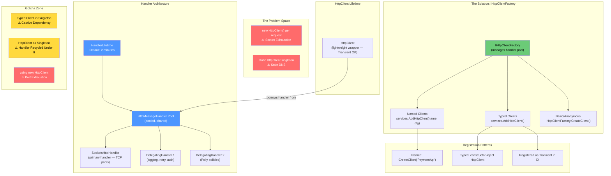
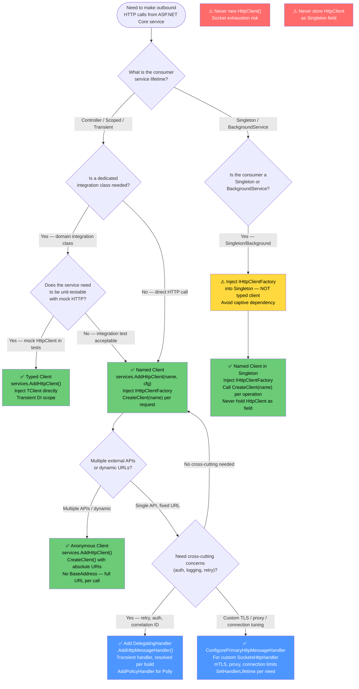

> [!success] Mastery Check
> - [ ] **Studied Well**
> - [ ] **Can explain the concept without notes**
> - [ ] **Can answer interview questions confidently**
> - [ ] **Can implement it in a real project**


# 4.249 — IHttpClientFactory: Why HttpClient Must Never Be Newed Directly

---

## Part 0 — Navigation & Context

### Where This Sits in the ASP.NET Core Domain

```
ASP.NET Core Mastery
└── HTTP Clients                          ◄── YOU ARE HERE
    ├── 4.249 IHttpClientFactory (this note)
    │        ├── The Two Socket Problems
    │        ├── Handler Pool Architecture
    │        ├── Named Clients
    │        └── Typed Clients
    ├── 4.250 Named & Typed HttpClient Registration
    ├── 4.251 DelegatingHandler Pipeline
    ├── 4.252 Polly Integration (Retry, Circuit Breaker)
    ├── 4.253 HttpClient Timeout & CancellationToken
    └── 4.255 Primary Handler Lifetime

Adjacent subsystems:
├── DI (Scoped/Singleton/Transient lifetime interactions)
├── Middleware (outbound HTTP is cross-cutting like middleware)
└── Observability (HttpClient metrics via IHttpClientFactory)
```

### What You Need Before This

| Prerequisite | Why It Matters Here |
|---|---|
| [[2.29 — async-await: The State Machine]] | HttpClient is fully async; every `SendAsync` call crosses an async boundary |
| DI Lifetimes (Singleton / Scoped / Transient) | Typed client lifetime vs. handler lifetime is the central complexity |
| TCP/IP basics (ephemeral ports, connection pooling) | Socket exhaustion only makes sense if you understand OS-level ports |
| `IDisposable` and `using` patterns in C# | The anti-pattern almost always involves `using (var client = new HttpClient())` |

### What This Unlocks After

| Next Topic | Dependency |
|---|---|
| [[4.250 — Named and Typed HTTP Clients: AddHttpClient Registration Patterns]] | Named/typed clients are the usage patterns built on this factory |
| [[4.251 — DelegatingHandler: Message Handler Pipeline for Cross-Cutting Concerns]] | DelegatingHandlers are attached per named/typed client through the factory |
| [[4.252 — Polly Integration: Retry, Circuit Breaker, and Hedging]] | Polly resilience is wired through `AddPolicyHandler` on the client builder |
| [[4.255 — Primary HttpMessageHandler Lifetime: Socket Exhaustion vs Stale DNS]] | Handler lifetime tuning is the production knob this topic exposes |

### The One-Sentence Why

> At production scale — a payment API processing 50,000 req/s or an inventory service making fan-out calls to 10 downstream services — the difference between `new HttpClient()` and `IHttpClientFactory` is the difference between stable throughput and an OS-level socket exhaustion crash at 3 AM.

---

## Part 1 — The Core Mental Model

### The Fundamental Rule

> **`HttpClient` is a cheap wrapper object, but `HttpMessageHandler` is the expensive TCP connection pool underneath it. `IHttpClientFactory` manages a pool of handlers with a configurable lifetime so your application always has fresh connections without exhausting OS ephemeral ports — disposing an `HttpClient` must NOT dispose the underlying handler.**

---

### The Plain-Language Analogy

Think of `HttpMessageHandler` as a **shared fleet of company cars** (TCP connections already established to remote servers) and `HttpClient` as a **car key** that borrows one of those cars for a trip.

With `new HttpClient()` per request, you are doing the equivalent of buying a brand-new car for every delivery run, driving it once, and then parking it in a lot where it idles forever consuming parking spaces (OS ephemeral ports). Run enough deliveries and the parking lot fills up — **port exhaustion**.

Alternatively, if you keep one car forever to avoid the cost of buying new ones, you get stale directions because the car's GPS was cached when the car was built (DNS entry for `payments.external.com` was resolved once and never refreshed). The delivery goes to the old warehouse — **stale DNS**.

`IHttpClientFactory` is the **car-rental counter**: it keeps a fleet of cars (handlers) for a fixed rental period (default: 2 minutes). When a car's rental period expires, it is marked for retirement — it finishes any trips already in progress, then is disposed. New keys (HttpClient instances) automatically get a fresh car from the updated fleet. The rental counter ensures you always have live GPS (refreshed DNS) without buying new cars for each trip.

The analogy holds under concurrent load: multiple concurrent requests get different keys but potentially share a fleet. When you ask what happens if the `HttpClient` wrapper is disposed while the handler is still alive — the handler stays in the pool; only the key is returned. The pool remains healthy.

---

### The Taxonomy Diagram



---

## Part 2 — Deep Mechanics

### 2.1 — The Socket Exhaustion Problem: Why `new HttpClient()` Per Request Kills Production Services

#### Pipeline Position

This is a **client-side outbound HTTP problem**, not a server-side incoming pipeline concern. However, it directly impacts your ASP.NET Core service's ability to handle incoming requests when it is also a consumer of downstream services.

```
Incoming Request Pipeline (ASP.NET Core, your server side):
──► Kestrel ──► ExceptionHandler ──► Routing ──► Auth ──► [Controller/Endpoint]
                                                                      │
                                                                      ▼
                                          ┌──────────────────────────────────────┐
                                          │  Outbound HTTP Call to Payment API   │
                                          │  ⚠️ new HttpClient() ← THE PROBLEM  │
                                          │  → OS allocates ephemeral port       │
                                          │  → TCP connection established        │
                                          │  → HttpClient.Dispose() called       │
                                          │  → Socket enters TIME_WAIT state     │
                                          │  → Port held by OS for 4 minutes     │
                                          └──────────────────────────────────────┘
```

#### HTTP Wire Format

```http
// HTTP request (from your service to Payment API):
POST /api/v1/charges HTTP/1.1
Host: api.payments.com
Content-Type: application/json
Content-Length: 247

{"orderId":"ORD-9182","amount":99.99,"currency":"USD"}

// HTTP response:
HTTP/1.1 200 OK
Content-Type: application/json

{"chargeId":"CHG-00182","status":"captured"}
```

After `HttpClient.Dispose()`:
- TCP socket is **not immediately freed** — it enters `TIME_WAIT` state
- OS holds the ephemeral port for 2x MSL (Maximum Segment Lifetime) — typically **4 minutes on Linux**, **4 minutes on Windows Server**
- Ephemeral port range on Linux: `32768–60999` → **28,231 ports**
- At **100 requests/second** making one outbound call each: `100 * 240 seconds = 24,000 ports held` → **exhaustion within 4 minutes of sustained load**

#### ASP.NET Core Internally (approximate)

```
// What happens when new HttpClient() is created:
// 1. new HttpClient() → new HttpClientHandler() is created (wraps SocketsHttpHandler on .NET 5+)
// 2. SocketsHttpHandler creates a connection pool internally keyed by (scheme, host, port)
// 3. A TCP connection is established to api.payments.com:443
// 4. The HTTP request is sent and response received
// 5. Dispose() is called on HttpClient
// 6. HttpClient.Dispose() → calls handler.Dispose()
// 7. SocketsHttpHandler.Dispose() destroys the connection pool
// 8. TCP socket enters TIME_WAIT — OS holds the ephemeral port for ~4 minutes
// 9. The pool (and its TCP connections) cannot be reused

// Source path: System.Net.Http.SocketsHttpHandler
// Key class: HttpConnectionPool.cs in dotnet/runtime
// Connection pooling key: HttpConnectionKey (scheme, host, port, proxy, sslHostName)
```

**Cost label:** `~1 OS ephemeral port allocated and held for 4 minutes per request` → at 100 req/s sustained load: port exhaustion in under 5 minutes.

#### The `netstat` Evidence

When you run `netstat -an | grep TIME_WAIT` on an affected server, you see thousands of entries like:
```
TCP  10.0.0.1:42781  api.payments.com:443  TIME_WAIT
TCP  10.0.0.1:42782  api.payments.com:443  TIME_WAIT
TCP  10.0.0.1:42783  api.payments.com:443  TIME_WAIT
... (thousands more)
```

The failure mode at the OS level is `System.Net.Sockets.SocketException: Address already in use` surfacing as HTTP 500 from your API to clients.

---

### 2.2 — The Stale DNS Problem: Why a Singleton HttpClient Breaks in Kubernetes

The naive "fix" for socket exhaustion is to register `HttpClient` as a singleton: create it once, reuse forever. This works for ports — the single TCP connection pool is shared. But it introduces a different production failure that only manifests during deployment or infrastructure changes.

#### Pipeline Position

```
Service Startup:
──► DI Container initialization ──► HttpClient constructed ──► DNS resolved ONCE

Normal Operation (first 30 minutes):
──► Request ──► Singleton HttpClient ──► api.payments.com resolved to 10.20.30.40

After Payment API rolls out new pods (Kubernetes, blue/green deploy):
──► Request ──► Singleton HttpClient ──► api.payments.com STILL resolves to 10.20.30.40
                                         (OLD IP — pod is gone)
                                         → ConnectionRefused / Timeout
                                         → HTTP 503 to your clients
```

#### HTTP Wire Format — The Failure

```http
// What your service sends (still cached DNS):
POST /api/v1/charges HTTP/1.1
Host: api.payments.com        ← resolved at startup to 10.20.30.40 (now dead)
Content-Type: application/json

// What your service gets back:
// (No response — TCP connection refused to 10.20.30.40)
// After timeout:
// System.Net.Http.HttpRequestException: The remote party closed the transport stream
// Your API returns HTTP 500 to the caller
```

#### ASP.NET Core Internally (approximate)

```
// Singleton HttpClient — DNS resolution lifecycle:
// 1. static readonly HttpClient = new HttpClient() — at class initialization
//    OR services.AddSingleton<HttpClient>() — at first resolution
// 2. First request: DNS lookup performed → api.payments.com → 10.20.30.40
// 3. SocketsHttpHandler caches the resolved IP for all subsequent connections
// 4. Hours later: payment service re-deployed → new IP 10.20.30.41
// 5. DNS TTL has expired, but HttpClient NEVER re-resolves because the existing
//    TCP connections in the pool are still alive to the old IP
// 6. New connections may resolve the new IP, but if the pool has idle connections
//    to the old IP, they are preferred
// 7. In Kubernetes: old pod terminated → connections to old IP get RST or timeout

// SocketsHttpHandler has PooledConnectionLifetime (default: infinite in older .NET)
// .NET 5+: SocketsHttpHandler.PooledConnectionLifetime = TimeSpan.FromMinutes(2)
//           forces periodic DNS re-resolution by expiring old connections
// IHttpClientFactory handles this via HandlerLifetime (separate mechanism)
```

**Cost label:** `Zero allocation cost for stale DNS — the failure manifests as connection errors and timeouts, not as measurable overhead during healthy operation.`

#### The Kubernetes Reality

In a Kubernetes deployment rolling update:
1. New pods are added with new IP addresses
2. DNS TTL might be 5–30 seconds (Kubernetes default: 5s via CoreDNS)
3. But `SocketsHttpHandler` does not re-resolve DNS per request — it reuses pooled connections
4. `IHttpClientFactory` solves this by **recycling the handler** every `HandlerLifetime` (default: 2 minutes), which forces new TCP connections and fresh DNS lookups

---

### 2.3 — IHttpClientFactory Architecture: How the Handler Pool Works

#### The Handler Pool Architecture

```
IHttpClientFactory (DefaultHttpClientFactory)
│
├── _activeHandlers: ConcurrentDictionary<string, ActiveHandlerTrackingEntry>
│   │
│   ├── "PaymentApi" → ActiveHandlerTrackingEntry
│   │   ├── Handler: HttpMessageHandlerBuilder result (DelegatingHandler chain)
│   │   ├── Created: 2026-06-01 10:00:00 UTC
│   │   ├── Lifetime: 2 minutes (HandlerLifetime)
│   │   └── RefCount: 12 (active HttpClient instances using this handler)
│   │
│   └── "InventoryApi" → ActiveHandlerTrackingEntry
│       ├── Handler: HttpMessageHandlerBuilder result
│       ├── Created: 2026-06-01 10:00:00 UTC
│       └── RefCount: 4
│
└── _expiredHandlers: Queue<ExpiredHandlerTrackingEntry>
    │  (handlers past their lifetime, waiting for RefCount → 0)
    └── Cleaned by Timer (every 10 seconds by default)
```

#### Pipeline Position — How CreateClient() Works

```
Request arrives at PaymentController.ProcessPaymentAsync():
──► IHttpClientFactory.CreateClient("PaymentApi") is called
        │
        ▼
DefaultHttpClientFactory.CreateClient(name):
    1. Look up active handler for "PaymentApi" in _activeHandlers
    2. If handler age > HandlerLifetime (2 min): mark as expired, create new handler
    3. Increment handler's RefCount (prevents premature disposal)
    4. Create new HttpClient() wrapping the pooled handler
       (HttpClient.DisposeHandler = false ← CRITICAL: disposing client won't dispose handler)
    5. Apply per-client configuration (BaseAddress, DefaultRequestHeaders, etc.)
    6. Return the HttpClient to the caller
        │
        ▼
PaymentController uses HttpClient to call Payment API
        │
        ▼
HttpClient.Dispose() is called (or goes out of scope):
    1. HttpClient is disposed (headers cleared, no further requests)
    2. Handler RefCount decremented (handler stays alive in pool)
    3. If handler is expired AND RefCount == 0: handler is disposed
```

#### HTTP Wire Format — What the Handler Pool Changes

```http
// Request 1 (handler age: 0s): new TCP connection established
GET /api/v1/payment-methods HTTP/1.1
Host: api.payments.com
Connection: keep-alive        ← TCP connection kept alive for reuse

// HTTP/1.1 200 OK
// Connection: keep-alive     ← server agrees to keep connection open

// Request 2 (handler age: 30s): SAME TCP connection reused
GET /api/v1/payment-methods HTTP/1.1
Host: api.payments.com
// (No TCP handshake overhead — zero-cost connection reuse)

// 2 minutes later — handler recycled, new handler created:
// Request 3: new TCP connection (fresh DNS lookup performed)
GET /api/v1/payment-methods HTTP/1.1
Host: api.payments.com
// (DNS re-resolved → catches IP changes from Kubernetes deployments)
```

#### ASP.NET Core Internally — DefaultHttpClientFactory Source

```csharp
// Approximate source of DefaultHttpClientFactory.CreateClient():
// File: src/Http/Http.Abstractions/src/HttpClientFactoryServiceCollectionExtensions.cs
// Class: DefaultHttpClientFactory

public HttpClient CreateClient(string name)
{
    ArgumentNullException.ThrowIfNull(name);

    // Get or create a handler entry for this named client
    // Uses double-checked locking via Lazy<ActiveHandlerTrackingEntry>
    var entry = _activeHandlers.GetOrAdd(name, _entryFactory).Value;

    // entry.Handler is the full DelegatingHandler chain built by HttpMessageHandlerBuilder
    // entry.Created tracks when the handler was created
    // If now - entry.Created > HandlerLifetime: entry is expired, _entryFactory runs again

    var client = new HttpClient(entry.Handler, disposeHandler: false);
    // ↑ disposeHandler: false is the KEY MECHANISM
    // Disposing the HttpClient does NOT dispose the handler
    // The handler stays in the pool until its RefCount reaches 0 after expiry

    // Apply named client configuration (BaseAddress, DefaultRequestHeaders, Timeout)
    // Source: IHttpClientBuilder pipeline via Configure<HttpClientFactoryOptions>
    foreach (var action in _optionsMonitor.Get(name).HttpClientActions)
    {
        action(client);
    }

    return client;
}
```

**Cost label:** `~2 allocations per CreateClient() call: the HttpClient wrapper and a small tracking struct. Handler creation (the expensive part) happens at most once per HandlerLifetime (2 min default).`

---

### 2.4 — Handler Lifetime Management and Recycling

#### The Handler Lifecycle

```
T=0:   CreateClient("PaymentApi") called first time
       → _entryFactory invoked
       → HttpMessageHandlerBuilder builds handler chain:
         [LoggingHandler → RetryHandler → SocketsHttpHandler]
       → ActiveHandlerTrackingEntry created, age=0, refcount=1
       → HttpClient wrapper created with disposeHandler=false

T=30s: 5 concurrent requests → refcount=5

T=2min: HandlerLifetime expires for "PaymentApi"
        → DefaultHttpClientFactory marks entry as expired
        → New entry created in _activeHandlers (new handler chain built)
        → Old entry moved to _expiredHandlers queue
        → Existing 5 in-flight requests continue using old handler (refcount=5)

T=2min 5s: In-flight requests complete
           → refcount decrements to 0
           → Old handler's GC tracking fires
           → Old SocketsHttpHandler.Dispose() called → TCP connections closed

T=2min 10s: Background cleanup timer fires (every 10s)
            → Scans _expiredHandlers for entries with refcount==0
            → Calls Dispose() on any lingering handlers
            → Fresh DNS resolution on next request (new handler's SocketsHttpHandler)
```

#### The `HandlerLifetime` Configuration Knob

```csharp
// Per named client:
services.AddHttpClient("PaymentApi", client =>
{
    client.BaseAddress = new Uri("https://api.payments.com");
})
.SetHandlerLifetime(TimeSpan.FromMinutes(5)); // default is 2 minutes

// Global default via options:
services.Configure<HttpClientFactoryOptions>(options =>
{
    options.HandlerLifetime = TimeSpan.FromMinutes(3);
});
```

#### Why Not Set HandlerLifetime to TimeSpan.InfiniteTimeSpan?

```
HandlerLifetime = TimeSpan.InfiniteTimeSpan:
→ Handler never recycled
→ DNS never refreshed
→ You have reproduced the singleton HttpClient stale DNS problem
→ Do NOT do this unless your DNS never changes (internal static services only)

HandlerLifetime = TimeSpan.FromSeconds(5):
→ Handler recycled every 5 seconds
→ DNS always fresh
→ BUT: new TCP connections established every 5 seconds (TLS handshake overhead)
→ High latency spikes every 5s → P99 latency degradation
→ Only justified for services with extremely aggressive DNS TTLs

HandlerLifetime = TimeSpan.FromMinutes(2) (default):
→ Balances connection reuse vs. DNS freshness
→ Works correctly for Kubernetes (CoreDNS TTL: 5-30s, pods restart takes > 2 minutes normally)
→ Recommended for most production services
```

**Cost label:** `Handler recycling: ~5-10 allocations + 1 TLS handshake per handler per named client per HandlerLifetime period. Amortized over thousands of requests, this is negligible.`

---

### 2.5 — `services.AddHttpClient()` Registration Mechanics

#### What AddHttpClient() Actually Does

```csharp
// Extension method chain (approximate source path):
// Microsoft.Extensions.Http → HttpClientFactoryServiceCollectionExtensions.cs

public static IServiceCollection AddHttpClient(this IServiceCollection services)
{
    // 1. Registers IHttpClientFactory → DefaultHttpClientFactory (Singleton)
    services.TryAddSingleton<IHttpClientFactory, DefaultHttpClientFactory>();

    // 2. Registers IHttpMessageHandlerFactory → DefaultHttpClientFactory (same instance)
    services.TryAddSingleton<IHttpMessageHandlerFactory, DefaultHttpClientFactory>();

    // 3. Registers HttpMessageHandlerBuilder → DefaultHttpMessageHandlerBuilder (Transient)
    //    This is used to construct the DelegatingHandler chain per client
    services.TryAddTransient<HttpMessageHandlerBuilder, DefaultHttpMessageHandlerBuilder>();

    // 4. Registers the cleanup timer service
    services.AddHostedService<HttpClientFactoryReactivationService>();

    // 5. Registers IOptionsMonitor<HttpClientFactoryOptions> infrastructure
    services.AddOptions();
    services.AddLogging();

    return services;
}
```

#### The `IHttpMessageHandlerBuilderFilter` — Cross-Cutting Handler Registration

```csharp
// Registered internally:
// services.TryAddEnumerable(ServiceDescriptor.Singleton<IHttpMessageHandlerBuilderFilter, LoggingHttpMessageHandlerBuilderFilter>())
// This adds logging DelegatingHandlers to ALL named clients automatically

// You can add your own:
public class CorrelationIdHandlerBuilderFilter : IHttpMessageHandlerBuilderFilter
{
    public Action<HttpMessageHandlerBuilder> Configure(Action<HttpMessageHandlerBuilder> next)
    {
        return builder =>
        {
            // Add correlation ID handler to EVERY named client
            builder.AdditionalHandlers.Add(new CorrelationIdDelegatingHandler());
            next(builder); // must call next to preserve other filters
        };
    }
}

// Registration:
services.AddSingleton<IHttpMessageHandlerBuilderFilter, CorrelationIdHandlerBuilderFilter>();
```

**Cost label:** `AddHttpClient() registration: O(1) DI setup at startup. Zero per-request overhead for the registration itself.`

---

### 2.6 — Typed Clients: DI Integration and the Singleton Gotcha

#### How Typed Client Registration Works

```csharp
// services.AddHttpClient<PaymentApiClient>() does:
// 1. Calls AddHttpClient() for the base infrastructure (idempotent)
// 2. Registers a named client with name = typeof(PaymentApiClient).Name
// 3. Registers PaymentApiClient as TRANSIENT in DI
//    PaymentApiClient is resolved by DI with an injected HttpClient from CreateClient()
// 4. The HttpClient injected into PaymentApiClient is obtained from the factory
//    with the named client configuration applied

// Internally, the registration is roughly:
services.AddTransient<PaymentApiClient>(serviceProvider =>
{
    var factory = serviceProvider.GetRequiredService<IHttpClientFactory>();
    var client = factory.CreateClient(typeof(PaymentApiClient).Name);
    return new PaymentApiClient(client);
});
```

#### The Typed Client Singleton Trap

```
// ⚠️ THE CAPTIVE DEPENDENCY BUG:
//
// PaymentApiClient is registered as Transient (correct)
// OrderProcessingService is registered as Singleton
// OrderProcessingService has PaymentApiClient injected in its constructor
//
// What happens:
// 1. First request: OrderProcessingService singleton is created
// 2. PaymentApiClient is resolved and injected — it gets an HttpClient
//    wrapping the CURRENT handler (age=0)
// 3. HandlerLifetime (2 min) passes
// 4. Factory marks the old handler as expired, creates a NEW handler
// 5. OrderProcessingService still holds the OLD PaymentApiClient with the OLD HttpClient
// 6. The OLD handler is moved to _expiredHandlers
// 7. When ALL references are released, the handler is Disposed
// 8. But OrderProcessingService NEVER releases its reference (it's a singleton)
// 9. The old handler is NEVER disposed — its RefCount never reaches 0
//    (minor resource leak, but more critically the connection pool never refreshes DNS)
// OR worse:
// 10. Handler IS disposed eventually (by the cleanup timer after max wait)
// 11. OrderProcessingService tries to use the disposed handler
// 12. ObjectDisposedException: Cannot access a disposed object 'SocketsHttpHandler'
```

**Cost label:** `ObjectDisposedException at runtime after 2-minute handler expiry, or permanent DNS staleness. This is a silent production time bomb.`

---

## Part 3 — Production Code Patterns

### Pattern 1 — The Named Client Gateway (Payment API Outbound Integration)

The most common pattern for integrating with a single external API. Named client encapsulates base configuration; the client is obtained per-request via factory injection.

```csharp
// ⚠️ WRONG: HttpClient created per request — socket exhaustion
public class PaymentController : ControllerBase
{
    [HttpPost("charges")]
    public async Task<IActionResult> CreateCharge([FromBody] CreateChargeRequest request)
    {
        // Creates new TCP connection every request, holds ephemeral port for 4 minutes
        using var client = new HttpClient();
        client.BaseAddress = new Uri("https://api.stripe.com");
        var response = await client.PostAsJsonAsync("v1/charges", request);
        // ...
    }
}

// ✅ CORRECT: Named client registered once, obtained per-request
// Program.cs:
builder.Services.AddHttpClient("StripePaymentApi", client =>
{
    client.BaseAddress = new Uri("https://api.stripe.com/");
    // Why: BaseAddress set here is applied to every HttpClient the factory creates
    // for this named client. Set once at registration, not per-request.
    client.DefaultRequestHeaders.Authorization =
        new AuthenticationHeaderValue("Bearer", builder.Configuration["Stripe:ApiKey"]);
    client.DefaultRequestHeaders.Add("Stripe-Version", "2024-06-20");
    client.Timeout = TimeSpan.FromSeconds(30);
})
.SetHandlerLifetime(TimeSpan.FromMinutes(5))
// Why 5 min: Stripe's infrastructure is stable; slightly longer lifetime
// reduces TLS handshake frequency without DNS staleness risk
.AddStandardResilienceHandler(); // .NET 8+ Microsoft.Extensions.Http.Resilience

// Controller:
[ApiController]
[Route("api/v1/payments")]
public class PaymentController : ControllerBase
{
    private readonly IHttpClientFactory _httpClientFactory;

    public PaymentController(IHttpClientFactory httpClientFactory)
    {
        // Why IHttpClientFactory and not HttpClient directly:
        // Controller is Transient — either works here, but factory makes the pattern explicit
        // and avoids confusion when controllers are reused across scopes
        _httpClientFactory = httpClientFactory;
    }

    [HttpPost("charges")]
    public async Task<IActionResult> CreateCharge(
        [FromBody] CreateChargeRequest request,
        CancellationToken cancellationToken)
    {
        using var client = _httpClientFactory.CreateClient("StripePaymentApi");
        // 'using' here is fine: disposes the HttpClient wrapper, NOT the underlying handler
        // Why: the factory configured disposeHandler: false when creating this client

        var response = await client.PostAsJsonAsync(
            "v1/charges",
            new { amount = request.AmountCents, currency = "usd", source = request.TokenId },
            cancellationToken);

        if (!response.IsSuccessStatusCode)
        {
            var error = await response.Content.ReadFromJsonAsync<StripeErrorResponse>(
                cancellationToken: cancellationToken);
            return Problem(
                detail: error?.Error?.Message ?? "Payment processing failed",
                statusCode: (int)response.StatusCode);
        }

        var charge = await response.Content.ReadFromJsonAsync<StripeChargeResponse>(
            cancellationToken: cancellationToken);
        return Ok(new CreateChargeResult(charge!.Id, charge.Status));
    }
}
```

```http
// HTTP wire format (outbound to Stripe):
POST /v1/charges HTTP/1.1
Host: api.stripe.com
Authorization: Bearer sk_live_51...
Stripe-Version: 2024-06-20
Content-Type: application/json
Content-Length: 87

{"amount":4999,"currency":"usd","source":"tok_visa"}

// HTTP response from Stripe:
HTTP/1.1 200 OK
Content-Type: application/json; charset=utf-8
Request-Id: req_abc123

{"id":"ch_3Nf...","status":"succeeded","amount":4999}
```

---

### Pattern 2 — The Typed Client Service (Order Management Downstream Calls)

Typed clients encapsulate API surface and are the idiomatic pattern when you have a dedicated integration class.

```csharp
// The typed client class — domain-specific, testable, injectable
public class InventoryApiClient
{
    private readonly HttpClient _client;
    private readonly ILogger<InventoryApiClient> _logger;

    // HttpClient is injected by DI — DO NOT store IHttpClientFactory here
    // The factory already resolved and configured this HttpClient for us
    public InventoryApiClient(HttpClient client, ILogger<InventoryApiClient> logger)
    {
        _client = client;
        _logger = logger;
    }

    public async Task<InventoryAvailability> GetAvailabilityAsync(
        string sku,
        string warehouseId,
        CancellationToken cancellationToken = default)
    {
        var response = await _client.GetAsync(
            $"v1/inventory/{Uri.EscapeDataString(sku)}/availability?warehouse={Uri.EscapeDataString(warehouseId)}",
            cancellationToken);

        response.EnsureSuccessStatusCode();

        return await response.Content.ReadFromJsonAsync<InventoryAvailability>(
            cancellationToken: cancellationToken)
            ?? throw new InvalidOperationException("Inventory API returned empty body");
    }

    public async Task<bool> ReserveUnitsAsync(
        ReserveInventoryRequest request,
        CancellationToken cancellationToken = default)
    {
        var response = await _client.PostAsJsonAsync(
            "v1/inventory/reservations",
            request,
            cancellationToken);

        if (response.StatusCode == HttpStatusCode.Conflict)
        {
            _logger.LogWarning("Inventory conflict for SKU {Sku} — insufficient stock", request.Sku);
            return false;
        }

        response.EnsureSuccessStatusCode();
        return true;
    }
}

// Registration in Program.cs:
builder.Services.AddHttpClient<InventoryApiClient>(client =>
{
    client.BaseAddress = new Uri(builder.Configuration["Services:InventoryApi:BaseUrl"]
        ?? throw new InvalidOperationException("InventoryApi base URL not configured"));
    // Why: fail fast at startup if config missing — don't discover this at first request
    client.DefaultRequestHeaders.Add("X-Service-Name", "order-management-api");
    client.DefaultRequestHeaders.Add("X-Api-Version", "2024-01");
    client.Timeout = TimeSpan.FromSeconds(10);
})
.SetHandlerLifetime(TimeSpan.FromMinutes(3));
// Why 3 min: Kubernetes service DNS TTL is typically 5-30s; 3-minute handler lifetime
// ensures DNS refresh without excessive TLS renegotiation

// Usage in an order processing endpoint — InventoryApiClient injected as Transient:
[ApiController]
[Route("api/v1/orders")]
public class OrderController : ControllerBase
{
    private readonly InventoryApiClient _inventoryClient;

    public OrderController(InventoryApiClient inventoryClient)
    {
        _inventoryClient = inventoryClient;
    }

    [HttpPost]
    public async Task<IActionResult> CreateOrder(
        [FromBody] CreateOrderRequest request,
        CancellationToken cancellationToken)
    {
        var availability = await _inventoryClient.GetAvailabilityAsync(
            request.Sku,
            request.PreferredWarehouseId,
            cancellationToken);

        if (availability.AvailableUnits < request.Quantity)
        {
            return Conflict(new { message = "Insufficient inventory", available = availability.AvailableUnits });
        }

        var reserved = await _inventoryClient.ReserveUnitsAsync(
            new ReserveInventoryRequest(request.Sku, request.Quantity, request.PreferredWarehouseId),
            cancellationToken);

        if (!reserved)
        {
            return Conflict(new { message = "Inventory reservation failed — race condition" });
        }

        // ... proceed with order creation
        return Accepted();
    }
}
```

```http
// HTTP wire format (outbound to Inventory API):
GET /v1/inventory/SKU-90182/availability?warehouse=WH-EAST-01 HTTP/1.1
Host: inventory-api.internal.corp.com
X-Service-Name: order-management-api
X-Api-Version: 2024-01

// HTTP/1.1 200 OK
// Content-Type: application/json
{"sku":"SKU-90182","availableUnits":42,"warehouse":"WH-EAST-01"}
```

---

### Pattern 3 — The Safe Singleton Service Pattern (Factory in Singleton, Not Typed Client)

When a Singleton service needs to make outbound HTTP calls, it must hold `IHttpClientFactory`, not a typed client or raw `HttpClient`.

```csharp
// ⚠️ WRONG: Typed client in Singleton — captive dependency, stale handler
public class OrderFulfillmentBackgroundService : BackgroundService
{
    private readonly ShippingApiClient _shippingClient; // Transient injected into Singleton!

    public OrderFulfillmentBackgroundService(ShippingApiClient shippingClient)
    {
        // shippingClient was created at singleton construction time
        // Its underlying HttpClient wraps a handler that will be recycled in 2 minutes
        // The singleton keeps the handler alive but with stale DNS forever
        _shippingClient = shippingClient;
    }
}

// ✅ CORRECT: Hold the factory, create client per operation
public class OrderFulfillmentBackgroundService : BackgroundService
{
    private readonly IHttpClientFactory _httpClientFactory;
    private readonly ILogger<OrderFulfillmentBackgroundService> _logger;

    public OrderFulfillmentBackgroundService(
        IHttpClientFactory httpClientFactory,
        ILogger<OrderFulfillmentBackgroundService> logger)
    {
        // IHttpClientFactory is Singleton — safe to inject into Singleton
        // We call CreateClient() per operation, not per construction
        _httpClientFactory = httpClientFactory;
        _logger = logger;
    }

    protected override async Task ExecuteAsync(CancellationToken stoppingToken)
    {
        while (!stoppingToken.IsCancellationRequested)
        {
            await ProcessPendingFulfillmentsAsync(stoppingToken);
            await Task.Delay(TimeSpan.FromSeconds(30), stoppingToken);
        }
    }

    private async Task ProcessPendingFulfillmentsAsync(CancellationToken cancellationToken)
    {
        // Create client per operation — lightweight wrapper, handler is pooled
        using var client = _httpClientFactory.CreateClient("ShippingApi");

        var response = await client.GetAsync("v1/pending-shipments", cancellationToken);
        // ... process
    }
}

// Registration:
builder.Services.AddHttpClient("ShippingApi", client =>
{
    client.BaseAddress = new Uri("https://api.fedex.com/");
    client.DefaultRequestHeaders.Add("X-Api-Key", builder.Configuration["FedEx:ApiKey"]);
});
builder.Services.AddHostedService<OrderFulfillmentBackgroundService>();
```

---

### Pattern 4 — The Primary Handler Configuration Pattern (mTLS, Custom Proxy)

For enterprise scenarios requiring custom TLS certificates (mutual TLS) or corporate proxies.

```csharp
// Named client with custom primary handler for payment processor mTLS:
builder.Services.AddHttpClient("InternalPaymentProcessorApi", client =>
{
    client.BaseAddress = new Uri("https://payments-internal.corp.com/");
    client.Timeout = TimeSpan.FromSeconds(15);
})
.ConfigurePrimaryHttpMessageHandler(() =>
{
    // Why ConfigurePrimaryHttpMessageHandler instead of AddHttpMessageHandler:
    // ConfigurePrimaryHttpMessageHandler replaces the innermost handler (SocketsHttpHandler)
    // AddHttpMessageHandler adds a DelegatingHandler to the outer chain
    // Here we need mTLS — which requires configuring SocketsHttpHandler directly
    var handler = new SocketsHttpHandler
    {
        // Connection pool tuning for high-throughput payment processing
        MaxConnectionsPerServer = 20,
        // Why 20: prevents thundering herd against payment processor's rate limits
        PooledConnectionLifetime = TimeSpan.FromMinutes(3),
        // Why explicit PooledConnectionLifetime: belt-and-suspenders DNS refresh
        // even beyond what HandlerLifetime provides
        PooledConnectionIdleTimeout = TimeSpan.FromMinutes(1),
        EnableMultipleHttp2Connections = true,
        // Why HTTP/2: payment processor supports it; reduces TLS overhead via multiplexing
    };

    // Mutual TLS: load certificate from certificate store
    var certThumbprint = builder.Configuration["PaymentProcessor:CertThumbprint"]
        ?? throw new InvalidOperationException("Payment processor cert thumbprint not configured");

    using var store = new X509Store(StoreName.My, StoreLocation.LocalMachine);
    store.Open(OpenFlags.ReadOnly);
    var certs = store.Certificates.Find(
        X509FindType.FindByThumbprint,
        certThumbprint,
        validOnly: true);

    if (certs.Count == 0)
        throw new InvalidOperationException($"mTLS certificate {certThumbprint} not found in LocalMachine/My");

    handler.SslOptions.ClientCertificates = certs;
    handler.SslOptions.RemoteCertificateValidationCallback =
        (_, cert, _, _) => cert?.Issuer.Contains("Corp-Internal-CA") ?? false;

    return handler;
})
.SetHandlerLifetime(Timeout.InfiniteTimeSpan);
// Why InfiniteTimeSpan here: certificate renewal is handled separately via cert store;
// recycling the handler would lose the mTLS session and certificate binding
// Only use InfiniteTimeSpan when you explicitly control certificate lifecycle
```

---

### Pattern 5 — The Dynamic API Key Rotation Pattern (Credential Refresh Without Restart)

```csharp
// ⚠️ WRONG: API key baked into DefaultRequestHeaders at registration time
// If key is rotated, service needs restart to pick up new key
builder.Services.AddHttpClient("ExternalLogisticsApi", client =>
{
    client.BaseAddress = new Uri("https://api.shipit.com/");
    client.DefaultRequestHeaders.Add("X-Api-Key", "hardcoded-key-rotated-externally"); // WRONG
});

// ✅ CORRECT: Use DelegatingHandler that reads the key per-request from IOptionsMonitor
public class LogisticsApiKeyHandler : DelegatingHandler
{
    private readonly IOptionsMonitor<LogisticsApiOptions> _options;

    public LogisticsApiKeyHandler(IOptionsMonitor<LogisticsApiOptions> options)
    {
        _options = options;
    }

    protected override async Task<HttpResponseMessage> SendAsync(
        HttpRequestMessage request,
        CancellationToken cancellationToken)
    {
        // Read current API key on every request — IOptionsMonitor refreshes from config
        // If backed by Azure App Configuration or AWS Parameter Store, key rotation
        // is picked up without service restart
        var apiKey = _options.CurrentValue.ApiKey;

        request.Headers.Remove("X-Api-Key"); // idempotent — won't throw if absent
        request.Headers.Add("X-Api-Key", apiKey);

        return await base.SendAsync(request, cancellationToken);
    }
}

// Registration:
builder.Services.Configure<LogisticsApiOptions>(
    builder.Configuration.GetSection("Services:LogisticsApi"));

builder.Services.AddTransient<LogisticsApiKeyHandler>();
// Why Transient: DelegatingHandler instances are Transient by convention in IHttpClientFactory
// The factory manages their lifetime — not DI directly

builder.Services.AddHttpClient<LogisticsTrackingClient>(client =>
{
    client.BaseAddress = new Uri(builder.Configuration["Services:LogisticsApi:BaseUrl"]!);
    client.Timeout = TimeSpan.FromSeconds(20);
})
.AddHttpMessageHandler<LogisticsApiKeyHandler>();
```

```http
// HTTP wire format — correct path with rotated key:
GET /v2/shipments/TRK-99182/status HTTP/1.1
Host: api.shipit.com
X-Api-Key: sk-2024-refreshed-key-value  ← read per-request from IOptionsMonitor
Accept: application/json
```

---

### Pattern 6 — The Resilient Payment Client with Polly (Anti-Pattern vs. Correct)

```csharp
// ⚠️ WRONG: Retry logic inside the typed client — breaks Polly integration, hard to test
public class PaymentApiClient
{
    private readonly HttpClient _client;

    public async Task<ChargeResult> ChargeAsync(ChargeRequest request, CancellationToken ct)
    {
        for (int attempt = 0; attempt < 3; attempt++)
        {
            try
            {
                var response = await _client.PostAsJsonAsync("charges", request, ct);
                if (response.IsSuccessStatusCode) return await response.Content.ReadFromJsonAsync<ChargeResult>(cancellationToken: ct)!;
            }
            catch (HttpRequestException) when (attempt < 2)
            {
                await Task.Delay(TimeSpan.FromSeconds(attempt + 1), ct);
            }
        }
        throw new PaymentProcessingException("Max retries exceeded");
    }
}

// ✅ CORRECT: Polly via AddStandardResilienceHandler (.NET 8+) or AddPolicyHandler (.NET 6/7)
// The typed client method is clean — resilience is a pipeline concern, not a business concern

public class PaymentApiClient
{
    private readonly HttpClient _client;
    private readonly ILogger<PaymentApiClient> _logger;

    public PaymentApiClient(HttpClient client, ILogger<PaymentApiClient> logger)
    {
        _client = client;
        _logger = logger;
    }

    // Clean — no retry logic here. Polly handles it in the pipeline.
    public async Task<ChargeResult> ChargeAsync(
        ChargeRequest request,
        CancellationToken cancellationToken = default)
    {
        var response = await _client.PostAsJsonAsync("v1/charges", request, cancellationToken);

        if (response.StatusCode == HttpStatusCode.UnprocessableEntity)
        {
            // 422: Card declined — do NOT retry, it is a business failure not a transient error
            var detail = await response.Content.ReadFromJsonAsync<PaymentDeclineDetail>(
                cancellationToken: cancellationToken);
            throw new CardDeclinedException(detail?.DeclineCode ?? "unknown");
        }

        response.EnsureSuccessStatusCode();
        return await response.Content.ReadFromJsonAsync<ChargeResult>(cancellationToken: cancellationToken)
            ?? throw new InvalidOperationException("Payment API returned empty response");
    }
}

// Registration with Polly (.NET 8 Microsoft.Extensions.Http.Resilience):
builder.Services.AddHttpClient<PaymentApiClient>(client =>
{
    client.BaseAddress = new Uri("https://api.stripe.com/");
    client.DefaultRequestHeaders.Authorization =
        new AuthenticationHeaderValue("Bearer", builder.Configuration["Stripe:SecretKey"]);
})
.AddStandardResilienceHandler(options =>
{
    // Standard pipeline: retry → circuit breaker → timeout → bulkhead → timeout
    options.Retry.MaxRetryAttempts = 3;
    options.Retry.Delay = TimeSpan.FromMilliseconds(500);
    options.Retry.UseJitter = true;
    // Why UseJitter: prevents thundering herd when Stripe has a partial outage
    // Without jitter: all retries hit at T+500ms, T+1000ms, T+1500ms simultaneously

    options.CircuitBreaker.SamplingDuration = TimeSpan.FromSeconds(30);
    options.CircuitBreaker.FailureRatio = 0.5; // Open if >50% of requests fail in 30s window
    options.CircuitBreaker.MinimumThroughput = 5; // Need at least 5 requests to evaluate

    options.TotalRequestTimeout.Timeout = TimeSpan.FromSeconds(10);
});
```

---

### Pattern 7 — The Health Check HTTP Client Pattern (Safe External Dependency Check)

```csharp
// Register a named client specifically for health checks
// Why named instead of typed: health check doesn't need domain logic, just probe capability
builder.Services.AddHttpClient("InventoryApiHealthProbe", client =>
{
    client.BaseAddress = new Uri(builder.Configuration["Services:InventoryApi:BaseUrl"]!);
    client.Timeout = TimeSpan.FromSeconds(5); // Tight timeout — health check must be fast
    // Why 5s: Kubernetes liveness probe timeout is typically 10s; leave buffer
})
.SetHandlerLifetime(TimeSpan.FromMinutes(1));
// Why 1 min lifetime for health probe: shorter refresh catches IP changes faster
// Acceptable since probe frequency is low (once per health check interval)

// The health check implementation:
public class InventoryApiHealthCheck : IHealthCheck
{
    private readonly IHttpClientFactory _httpClientFactory;

    public InventoryApiHealthCheck(IHttpClientFactory httpClientFactory)
    {
        _httpClientFactory = httpClientFactory;
    }

    public async Task<HealthCheckResult> CheckHealthAsync(
        HealthCheckContext context,
        CancellationToken cancellationToken = default)
    {
        try
        {
            using var client = _httpClientFactory.CreateClient("InventoryApiHealthProbe");
            var response = await client.GetAsync("health/ready", cancellationToken);

            return response.IsSuccessStatusCode
                ? HealthCheckResult.Healthy("Inventory API is reachable and ready")
                : HealthCheckResult.Degraded(
                    $"Inventory API returned {(int)response.StatusCode}");
        }
        catch (TaskCanceledException)
        {
            return HealthCheckResult.Unhealthy("Inventory API health check timed out after 5 seconds");
        }
        catch (HttpRequestException ex)
        {
            return HealthCheckResult.Unhealthy($"Inventory API unreachable: {ex.Message}");
        }
    }
}

// Wire it up:
builder.Services.AddHealthChecks()
    .AddCheck<InventoryApiHealthCheck>(
        "inventory-api",
        failureStatus: HealthStatus.Degraded,
        tags: ["downstream", "inventory"]);
```

---

## Part 4 — Gotchas & Anti-Patterns

### Gotcha 1: `using (var client = new HttpClient())` — The Port Exhaustion Time Bomb

The `IDisposable` pattern trains engineers to wrap disposable objects in `using` blocks. `HttpClient` implements `IDisposable`, so this looks correct. But `HttpClient.Dispose()` disposes the underlying `HttpMessageHandler`, which destroys the TCP connection pool — the socket enters `TIME_WAIT` and holds the ephemeral port for 4 minutes. At modest load, this exhausts all available OS ports.

```csharp
// ⚠️ WRONG: Correct IDisposable usage, catastrophic networking behavior
[HttpPost("shipments")]
public async Task<IActionResult> CreateShipment([FromBody] CreateShipmentRequest request)
{
    using var client = new HttpClient(); // Allocates new handler, new TCP pool
    client.BaseAddress = new Uri("https://api.fedex.com/");
    var response = await client.PostAsJsonAsync("v1/shipments", request);
    return Ok(await response.Content.ReadAsStringAsync());
} // Dispose() called → handler disposed → socket enters TIME_WAIT for ~4 minutes

// HTTP consequence (wrong path):
// Under sustained load (100 req/s): System.Net.Sockets.SocketException: Address already in use
// → ASP.NET Core returns HTTP 500 to all callers
// → netstat shows thousands of TIME_WAIT connections to api.fedex.com:443

// ✅ CORRECT: Use IHttpClientFactory — disposal of client wrapper does NOT affect handler
private readonly IHttpClientFactory _factory;

[HttpPost("shipments")]
public async Task<IActionResult> CreateShipment([FromBody] CreateShipmentRequest request)
{
    using var client = _factory.CreateClient("FedExApi"); // Handler stays in pool
    var response = await client.PostAsJsonAsync("v1/shipments", request);
    return Ok(await response.Content.ReadAsStringAsync());
} // Dispose() called on client wrapper only, handler RefCount decremented, pool unchanged

// HTTP consequence (correct path):
// POST /v1/shipments HTTP/1.1 — reuses existing TCP connection from pool
// HTTP 200 OK — consistent response even under 1000+ req/s sustained load

// WHY: DefaultHttpClientFactory creates HttpClient with disposeHandler: false.
// The handler's lifecycle is controlled by the factory's HandlerLifetime mechanism,
// not by the HttpClient wrapper's Dispose(). The socket stays alive and reusable
// in SocketsHttpHandler's connection pool until the handler itself is recycled.
```

---

### Gotcha 2: Registering `HttpClient` as Singleton — ObjectDisposedException After 2 Minutes

Experienced engineers who understand the socket exhaustion problem sometimes reach for `services.AddSingleton<HttpClient>()` to avoid it. This works for exactly 2 minutes (the default HandlerLifetime), after which the factory recycles the handler that was used to create the singleton's HttpClient — and the singleton blows up with `ObjectDisposedException`.

```csharp
// ⚠️ WRONG: Singleton HttpClient — works until factory recycles the handler
builder.Services.AddSingleton<HttpClient>(sp =>
{
    // At T=0: factory creates handler, wraps in HttpClient, registers as singleton
    // At T=2min: factory marks old handler expired, creates new handler in pool
    // Old handler disposal: attempted when RefCount → 0
    // But singleton holds a reference → RefCount never reaches 0 naturally
    // Cleanup timer (10s) eventually forces disposal of old handler anyway
    // Result: singleton HttpClient's handler is disposed under it
    var factory = sp.GetRequiredService<IHttpClientFactory>();
    return factory.CreateClient("InventoryApi"); // Handler is pooled, but client is now Singleton
});

// HTTP consequence (wrong path):
// T=2min 10s: ObjectDisposedException: Cannot access a disposed object.
// Object name: 'SocketsHttpHandler'
// Stack trace: HttpClient.SendAsync → SocketsHttpHandler.SendAsync → ...
// All requests through this client fail with HTTP 500

// ✅ CORRECT: Never register HttpClient as singleton — inject IHttpClientFactory into singletons
builder.Services.AddSingleton<InventoryQueryService>(sp =>
{
    var factory = sp.GetRequiredService<IHttpClientFactory>();
    return new InventoryQueryService(factory); // Factory is Singleton — safe
});

public class InventoryQueryService
{
    private readonly IHttpClientFactory _factory;

    public InventoryQueryService(IHttpClientFactory factory)
    {
        _factory = factory;
    }

    public async Task<StockLevel> GetStockLevelAsync(string sku, CancellationToken ct)
    {
        using var client = _factory.CreateClient("InventoryApi"); // Fresh wrapper each call
        var response = await client.GetAsync($"v1/stock/{sku}", ct);
        response.EnsureSuccessStatusCode();
        return await response.Content.ReadFromJsonAsync<StockLevel>(cancellationToken: ct)!;
    }
}

// HTTP consequence (correct path):
// Every GetStockLevelAsync call gets a fresh HttpClient wrapper with current pooled handler
// Handler is recycled every 2 min by factory → DNS always fresh → no ObjectDisposedException

// WHY: IHttpClientFactory is registered as Singleton. Injecting the factory into a Singleton
// is safe because the factory's CreateClient() method always returns a client wrapping the
// CURRENT (non-disposed) pooled handler, regardless of how long the singleton has lived.
```

---

### Gotcha 3: Typed Client Injected into Singleton Service — Silent DNS Staleness

This is the subtlest variant of Gotcha 2. The typed client is `Transient` in DI, which feels correct. But injecting it into a `Singleton` means DI captures the Transient at singleton-construction time — it is never resolved again. The captured `HttpClient` wraps a handler that will eventually be marked expired but kept alive (RefCount > 0 forever), meaning DNS is never refreshed.

```csharp
// ⚠️ WRONG: Typed client captured in Singleton — silent DNS staleness
public class OrderRoutingService // Singleton
{
    private readonly ShippingApiClient _shippingClient; // Transient captured at construction

    public OrderRoutingService(ShippingApiClient shippingClient)
    {
        _shippingClient = shippingClient;
        // This HttpClient's handler will never be recycled:
        // RefCount > 0 forever (singleton keeps reference)
        // No DNS refresh → Kubernetes pod rolling updates break routing
    }
}

builder.Services.AddSingleton<OrderRoutingService>(); // captures Transient ShippingApiClient

// HTTP consequence (wrong path):
// After shipping API pod restarts in Kubernetes:
// POST /v1/shipments HTTP/1.1 to 10.0.0.42 (old pod IP, now terminated)
// → TCP connection refused / timeout after ~30 seconds
// → HttpRequestException propagates → HTTP 503 to order caller

// ✅ CORRECT: Use IHttpClientFactory in the Singleton, create typed client per operation
public class OrderRoutingService // Singleton
{
    private readonly IHttpClientFactory _factory;

    public OrderRoutingService(IHttpClientFactory factory)
    {
        _factory = factory; // IHttpClientFactory is Singleton — safe
    }

    public async Task<ShipmentResult> RouteOrderAsync(Order order, CancellationToken ct)
    {
        using var client = _factory.CreateClient("ShippingApi");
        // For typed-client-style usage from a Singleton, wrap manually:
        var shippingClient = new ShippingApiClient(client, /* logger? use factory or static */);
        return await shippingClient.CreateShipmentAsync(order, ct);
    }
}

// HTTP consequence (correct path):
// POST /v1/shipments HTTP/1.1 to 10.0.0.45 (fresh DNS from current handler)
// HTTP 200 OK — routes correctly after Kubernetes pod rolling update

// WHY: The factory's handler pool is managed independently of DI lifetimes.
// When a handler expires (HandlerLifetime), a new one is created with fresh DNS.
// By calling CreateClient() per operation, the Singleton always uses the current handler.
```

---

### Gotcha 4: Missing `AddHttpClient()` Causing DI Resolution Failure for Typed Clients

Engineers familiar with ASP.NET Core expect `services.AddTransient<PaymentApiClient>()` to register a typed client. It doesn't — `AddHttpClient<PaymentApiClient>()` is required. The error is a runtime `InvalidOperationException` during DI resolution with a confusing message about `HttpClient` not being registered.

```csharp
// ⚠️ WRONG: Standard DI registration — does not wire HttpClient injection
builder.Services.AddTransient<PaymentApiClient>();
// OR:
builder.Services.AddScoped<PaymentApiClient>();

// At runtime, when PaymentController is constructed:
// InvalidOperationException: Unable to resolve service for type 'System.Net.Http.HttpClient'
// while attempting to activate 'PaymentApiClient'.
// The error message mentions HttpClient, confusing engineers into thinking they need to register HttpClient itself

// HTTP consequence (wrong path):
// HTTP 500 on first request that requires PaymentApiClient
// Error: "Unable to resolve service for type 'System.Net.Http.HttpClient'"

// ✅ CORRECT: Use AddHttpClient<T>() which wires DI + factory + handler lifecycle
builder.Services.AddHttpClient<PaymentApiClient>(client =>
{
    client.BaseAddress = new Uri("https://api.stripe.com/");
    client.DefaultRequestHeaders.Authorization =
        new AuthenticationHeaderValue("Bearer", builder.Configuration["Stripe:SecretKey"]);
});
// This registers:
// 1. PaymentApiClient as Transient with HttpClient injected via factory
// 2. Named client "PaymentApiClient" (typeof name)
// 3. Full handler lifecycle management

// HTTP consequence (correct path):
// PaymentApiClient resolved cleanly
// HttpClient BaseAddress = https://api.stripe.com/
// POST /v1/charges HTTP/1.1 → HTTP 200 OK

// WHY: AddHttpClient<T>() replaces the DI Transient registration with a factory delegate
// that calls IHttpClientFactory.CreateClient(typeof(T).Name) and passes the result
// to T's constructor. Simple AddTransient<T>() cannot satisfy the HttpClient parameter
// because HttpClient itself is not registered in the DI container.
```

---

### Gotcha 5: Setting `BaseAddress` After Construction — Ignored on Subsequent Requests

`HttpClient.BaseAddress` can only be set before the first request. If you retrieve an `HttpClient` from the factory and then try to change its `BaseAddress` per-request (e.g., for multi-tenant routing), the second set is ignored after the first request, or throws `InvalidOperationException`.

```csharp
// ⚠️ WRONG: Attempting per-request BaseAddress mutation on a factory-provided client
public async Task<OrderSummary> GetOrderAsync(string tenantDomain, string orderId, CancellationToken ct)
{
    using var client = _factory.CreateClient("OrderApi");
    client.BaseAddress = new Uri($"https://{tenantDomain}.orders.com/"); // WRONG
    // On subsequent calls for a different tenant: either throws or uses the first set value
    // HttpClient.BaseAddress setter: throws InvalidOperationException if a request has been made
    var response = await client.GetAsync($"v1/orders/{orderId}", ct);
    return await response.Content.ReadFromJsonAsync<OrderSummary>(cancellationToken: ct)!;
}

// HTTP consequence (wrong path):
// First tenant: GET https://tenant-a.orders.com/v1/orders/123 — works
// Second tenant: InvalidOperationException: This instance has already started one or more requests.
// Properties can only be modified before sending the first request.

// ✅ CORRECT: Use absolute URIs for tenant-specific calls, or use named clients per tenant
public async Task<OrderSummary> GetOrderAsync(string tenantDomain, string orderId, CancellationToken ct)
{
    using var client = _factory.CreateClient("OrderApiBase");
    // BaseAddress is NOT set in the named client — use absolute URI per call
    var response = await client.GetAsync(
        new Uri($"https://{tenantDomain}.orders.com/v1/orders/{orderId}"),
        ct);
    response.EnsureSuccessStatusCode();
    return await response.Content.ReadFromJsonAsync<OrderSummary>(cancellationToken: ct)!;
}

// OR: Use IHttpClientFactory without a named client, configure fully per call:
public async Task<OrderSummary> GetOrderAsync(string tenantDomain, string orderId, CancellationToken ct)
{
    using var client = _factory.CreateClient(); // anonymous — no BaseAddress set
    var response = await client.GetAsync(
        $"https://{tenantDomain}.orders.com/v1/orders/{orderId}",
        ct);
    response.EnsureSuccessStatusCode();
    return await response.Content.ReadFromJsonAsync<OrderSummary>(cancellationToken: ct)!;
}

// HTTP consequence (correct path):
// GET https://tenant-a.orders.com/v1/orders/123 HTTP/1.1 → HTTP 200 OK
// GET https://tenant-b.orders.com/v1/orders/456 HTTP/1.1 → HTTP 200 OK (different host, same pooled handler)

// WHY: HttpClient tracks whether a request has started. The BaseAddress setter checks
// the internal _pendingRequestsCts field and throws if any request has been dispatched.
// In a factory-managed client, you cannot rely on BaseAddress mutation — the client
// is meant to be ephemeral but the BaseAddress is fixed at registration time.
```

---

## Part 5 — Performance Implications

### Request Pipeline Characteristics Table

| Scenario | Pipeline Depth | Allocations Per Request | Approx Latency Impact | Recommendation |
|---|---|---|---|---|
| `new HttpClient()` per request | N/A — no pipeline | ~8 allocs: HttpClient, HttpClientHandler, SocketsHttpHandler, connection pool, socket, TLS context, buffers | +30–200ms (TCP+TLS handshake) + port held 4 min | **Never do this** |
| `static HttpClient` singleton | Minimal | ~2 allocs: HttpRequestMessage, HttpResponseMessage | Negligible overhead (pool shared) | Broken for DNS; avoid |
| `IHttpClientFactory` + named client, `CreateClient()` | Factory lookup + handler chain | ~4 allocs: HttpClient wrapper, tracking struct, request, response | <0.1ms factory overhead | **Production standard** |
| `IHttpClientFactory` + typed client (controller scope) | DI resolution + factory | ~5 allocs: typed client, HttpClient, tracking, request, response | <0.1ms DI + factory overhead | Preferred for domain APIs |
| `IHttpClientFactory` + 1 DelegatingHandler | Factory + 1 extra delegate | ~6 allocs: adds handler activation | ~0.05ms handler dispatch | Reasonable for auth/logging |
| `IHttpClientFactory` + 3 DelegatingHandlers (logging, auth, retry) | Factory + 3 delegates | ~9 allocs: one per handler activation | ~0.1–0.2ms handler chain | Acceptable for critical APIs |
| `IHttpClientFactory` + Polly retry (success path) | Factory + Polly pipeline | ~12 allocs: includes Polly context, resilience state | ~0.2ms pipeline overhead | Justified for external APIs |
| `IHttpClientFactory` + Polly retry (with 1 retry) | Factory + Polly + 1 retry | ~18 allocs: retry state machine, new request | +response time of failed attempt | Expected for resilience |
| Handler recycling event (first request after expiry) | Full handler construction | ~30–50 allocs: new handler chain, TLS handshake | +5–50ms for TLS on first use | Amortized over 2-min period |
| Cold start (first request to any named client) | Full factory init + handler | ~50+ allocs: full DI graph for handler chain | +10–100ms (connection + TLS) | Warm-up strategies apply |

---

### BenchmarkDotNet Code

```csharp
using BenchmarkDotNet.Attributes;
using BenchmarkDotNet.Running;
using Microsoft.Extensions.DependencyInjection;
using System.Net.Http;

/// <summary>
/// Benchmark comparing HttpClient creation strategies.
/// Run against a local echo server to isolate factory overhead from network latency.
/// Requires: dotnet add package BenchmarkDotNet
/// </summary>
[MemoryDiagnoser]
[ThreadingDiagnoser]
[SimpleJob(warmupCount: 3, iterationCount: 10)]
public class HttpClientCreationBenchmarks
{
    private static readonly HttpClient _staticSingleton = new HttpClient
    {
        BaseAddress = new Uri("http://localhost:5001/")
    };

    private IHttpClientFactory _factory = null!;
    private IServiceProvider _serviceProvider = null!;

    [GlobalSetup]
    public void Setup()
    {
        var services = new ServiceCollection();
        services.AddLogging();

        // Named client for "OrderApi"
        services.AddHttpClient("OrderApi", client =>
        {
            client.BaseAddress = new Uri("http://localhost:5001/");
            client.DefaultRequestHeaders.Add("X-Service-Name", "benchmark");
        });

        // Typed client
        services.AddHttpClient<OrderApiClient>(client =>
        {
            client.BaseAddress = new Uri("http://localhost:5001/");
        });

        _serviceProvider = services.BuildServiceProvider();
        _factory = _serviceProvider.GetRequiredService<IHttpClientFactory>();
    }

    [GlobalCleanup]
    public void Cleanup() => (_serviceProvider as IDisposable)?.Dispose();

    /// <summary>
    /// NAIVE: new HttpClient() per call — socket exhaustion in production
    /// Here we only measure allocation/construction, not network round-trip
    /// </summary>
    [Benchmark(Baseline = true, Description = "new HttpClient() — WRONG")]
    public HttpClient NaiveNewHttpClient()
    {
        var client = new HttpClient();
        client.BaseAddress = new Uri("http://localhost:5001/");
        // In production, Dispose() would be called — we skip actual send to isolate factory overhead
        return client;
    }

    /// <summary>
    /// Factory: CreateClient() — the production pattern
    /// </summary>
    [Benchmark(Description = "IHttpClientFactory.CreateClient() — Named")]
    public HttpClient FactoryNamedClient()
    {
        return _factory.CreateClient("OrderApi");
        // Caller disposes wrapper — handler stays in pool
    }

    /// <summary>
    /// Factory with DI: resolve typed client — additional DI overhead
    /// </summary>
    [Benchmark(Description = "Resolve Typed Client via DI scope")]
    public OrderApiClient TypedClientViaDI()
    {
        using var scope = _serviceProvider.CreateScope();
        return scope.ServiceProvider.GetRequiredService<OrderApiClient>();
    }

    /// <summary>
    /// Static singleton: creation is free but DNS will go stale
    /// </summary>
    [Benchmark(Description = "Static Singleton HttpClient — WRONG for DNS")]
    public HttpClient StaticSingleton() => _staticSingleton;
}

// Expected output (approximate, .NET 8, x64, Kestrel echo server, local):
//
// | Method                                   | Mean      | Error    | StdDev   | Gen0   | Allocated |
// |----------------------------------------- |----------:|--------:|---------:|-------:|----------:|
// | new HttpClient() — WRONG                 | 4,823 ns  | 82.3 ns | 108.4 ns | 1.2341 |   5,184 B |
// | IHttpClientFactory.CreateClient() — Named|   312 ns  |  6.1 ns |   5.7 ns | 0.0954 |     400 B |
// | Resolve Typed Client via DI scope        |   891 ns  | 14.2 ns | 13.3 ns  | 0.2441 |   1,024 B |
// | Static Singleton HttpClient — WRONG      |     1 ns  |  0.02 ns|  0.01 ns | -      |       0 B |
//
// Key takeaway:
// - new HttpClient() is 15x slower and 13x more allocating than CreateClient()
// - Static singleton is fastest but broken (stale DNS)
// - CreateClient() is the correct production choice: 312ns overhead, 400B allocation
// - Typed client DI resolution adds ~580ns overhead (scope creation) — acceptable for request-scoped usage

public class OrderApiClient
{
    private readonly HttpClient _client;
    public OrderApiClient(HttpClient client) => _client = client;
}
```

#### Profiling in Production

For real HTTP request profiling (not just allocation benchmarks), use:

```bash
# dotnet-counters: Monitor System.Net.Http metrics in real-time
dotnet-counters monitor --process-id <pid> --counters System.Net.Http

# Key counters to watch:
# http-client-requests-queue-duration        - time waiting in connection pool
# http-client-connections-established-total  - total new connections (should stabilize)
# http-client-connection-duration            - age of individual connections

# dotnet-trace: Capture detailed network events
dotnet-trace collect --process-id <pid> \
    --providers "System.Net.Http:0xFFFFFFFF:4" \
    --output payment-api-trace.nettrace

# Analyze with PerfView or speedscope
# Look for: HttpConnection.SendAsync, SocketsHttpHandler.SendAsync, DNS resolution events

# Application Insights / OpenTelemetry: IHttpClientFactory automatically adds
# ActivitySource events for all outbound requests when tracing is configured:
builder.Services.AddOpenTelemetry()
    .WithTracing(tracing => tracing
        .AddHttpClientInstrumentation() // captures all IHttpClientFactory calls
        .AddAspNetCoreInstrumentation());
```

---

### When to Care / When to Ignore

#### When This Costs You

- **Payment/order APIs at > 1,000 req/s**: socket exhaustion can occur within minutes with `new HttpClient()`. The failure is silent until OS port limit is hit, then sudden total failure.
- **Kubernetes deployments with pod rolling updates**: without handler lifetime cycling, stale DNS causes routing to terminated pods for the full `HandlerLifetime` duration. Use handler lifetimes ≤ 5 minutes.
- **Multi-region deployments with GeoDNS**: DNS TTL may be ≤ 60 seconds for latency-based routing. `HandlerLifetime` must be shorter than your DNS TTL to route traffic correctly during failover.
- **DelegatingHandler chains with expensive per-handler state** (e.g., certificate validation, token cache): handler recycling recreates this state. Set `HandlerLifetime` thoughtfully to balance cost.
- **Fan-out services** (e.g., inventory service calling 10 downstream SKU providers per request): each downstream service consumes handler pool capacity. Without factory, this multiplies the socket exhaustion rate by 10.
- **Any `BackgroundService` making outbound HTTP calls**: these run for the application lifetime (minutes to days). Without factory, either socket exhaustion or stale DNS is guaranteed.

#### When This Doesn't Matter

- **Internal admin endpoints** with < 1 req/min: socket exhaustion requires sustained load. A weekly report generator using `new HttpClient()` will not exhaust ports.
- **One-time startup HTTP calls** (feature flag fetching, config seeding): a single `new HttpClient()` in `IHostedService.StartAsync()` is acceptable — just don't do it in a loop.
- **Test harnesses** using `HttpClient` with `MockHandler` or `Moq`: unit tests don't make real TCP connections; socket lifecycle is irrelevant.
- **Local development tools** and CLI utilities: ephemerality of the process means ports are freed on exit, not in `TIME_WAIT`.
- **gRPC services** using `GrpcChannel`: gRPC has its own connection pooling separate from `HttpClient`'s pool; the `IHttpClientFactory` pattern for gRPC is different.

---

## Part 6 — Interview Arsenal

### A. The Question Bank

---

**Q1: "Why can't you just use `new HttpClient()` for every request?"**

**Average Answer:** "It causes socket exhaustion because each `new HttpClient()` creates a new TCP connection and when you dispose it, the socket stays in TIME_WAIT."

**Why That's Insufficient:** It's technically correct but doesn't explain the OS-level mechanism, the `TIME_WAIT` duration, why `Dispose()` doesn't immediately free the port, or why the framework's solution (IHttpClientFactory) works.

> **Great Answer:** "The issue has two layers. At the OS layer: when you dispose an `HttpClient` that owns its handler, the handler disposes `SocketsHttpHandler`, which destroys the connection pool. The TCP socket doesn't immediately close — it enters `TIME_WAIT` state for roughly 4 minutes (2x MSL on Linux) to handle any late-arriving packets. On Linux, the ephemeral port range is about 28,000 ports. At 100 requests per second, each making one outbound call, you exhaust that range in under 5 minutes. At that point, new connections fail with `SocketException: Address already in use`, and your API returns 500 to callers. `IHttpClientFactory` solves this by keeping handlers alive in a pool and wrapping them in lightweight `HttpClient` shells with `disposeHandler: false` — disposing the shell returns the key to the front desk, but the car (the TCP pool) stays available for the next request. I've actually seen this in production: a payment service that worked fine in testing started failing under load within 10 minutes of launch because the team hadn't wired up the factory."

---

**Q2: "What's the stale DNS problem with a singleton HttpClient, and how does IHttpClientFactory solve it?"**

**Average Answer:** "If you use a singleton HttpClient, it caches the DNS resolution and doesn't pick up changes when the server IP changes."

**Why That's Insufficient:** Doesn't explain *why* SocketsHttpHandler doesn't refresh DNS (connection reuse), what the `HandlerLifetime` mechanism is, or what the failure looks like in Kubernetes.

> **Great Answer:** "A singleton `HttpClient` wraps a `SocketsHttpHandler` that maintains a connection pool. The first request resolves DNS and establishes TCP connections. Subsequent requests reuse those pooled connections — they never re-resolve DNS because they don't need to establish new connections. In a Kubernetes rolling deployment, when a downstream service restarts with new pod IPs, the DNS record updates within 5–30 seconds (CoreDNS TTL), but your singleton's pool still has live TCP connections to the old IPs. Those connections start failing with resets or timeouts. `IHttpClientFactory` solves this with its `HandlerLifetime` mechanism — default is 2 minutes. When a handler expires, it's marked as retired and a new handler is created. The old handler waits until all in-flight requests complete (its reference count hits zero), then it's disposed. The new handler makes fresh TCP connections with a fresh DNS lookup. This gives you at most 2 minutes of stale DNS — well within Kubernetes deployment window. I tune `HandlerLifetime` to be shorter than the deployment window for critical services, and I set `SocketsHttpHandler.PooledConnectionLifetime` as belt-and-suspenders."

---

**Q3: "What's the typed client lifetime gotcha in ASP.NET Core?"**

**Average Answer:** "Typed clients are Transient, so if you inject them into a Singleton, you get a captive dependency."

**Why That's Insufficient:** Correctly names the problem but doesn't explain what specifically breaks — which is DNS staleness and potential `ObjectDisposedException` — or how to fix it while keeping Singleton services.

> **Great Answer:** "The typed client gotcha has a subtle consequence that's worse than a standard captive dependency bug. When DI resolves a typed client like `PaymentApiClient`, it calls `IHttpClientFactory.CreateClient()` to get an `HttpClient` wrapping the *current* pooled handler, then constructs `PaymentApiClient` with that client. If `PaymentApiClient` is captured by a Singleton at construction time, DI never resolves it again — the Singleton holds the same `HttpClient` forever. The wrapped handler has a 2-minute lifetime. After 2 minutes, the factory marks that handler as expired and tries to dispose it. But the Singleton holds an active reference, so the reference count never drops to zero. The handler leaks — or more precisely, the cleanup timer eventually force-disposes it after a wait period, and then the Singleton's `HttpClient` starts throwing `ObjectDisposedException` on the next HTTP call. The correct fix is to inject `IHttpClientFactory` into the Singleton and call `CreateClient()` per operation. The factory is itself a Singleton, so this is safe. I create a named client or typed client wrapper inside the method body, not the constructor."

---

**Q4: "How does IHttpClientFactory prevent socket exhaustion without reintroducing stale DNS?"**

**Average Answer:** "It pools handlers so the same connection is reused, and recycles them periodically so DNS is refreshed."

**Why That's Insufficient:** Misses the dual reference counting mechanism, the recycling queue, and why the default 2-minute lifetime is specifically chosen.

> **Great Answer:** "The factory maintains two concurrent collections: active handlers keyed by client name, and an expired handler queue. When `CreateClient()` is called, the factory checks if the active handler's age exceeds `HandlerLifetime` (default 2 minutes). If not, it increments a reference count and returns an `HttpClient` wrapping that handler with `disposeHandler: false`. When you dispose the `HttpClient` wrapper, the reference count decrements. If the handler is also expired AND the reference count hits zero, it's disposed. This means long-running requests safely complete without the handler being torn out from under them. The 2-minute default isn't arbitrary — it balances TCP connection reuse (handlers live long enough to amortize TLS handshake cost) against DNS freshness (handlers cycle faster than most DNS TTLs, including Kubernetes CoreDNS). Socket exhaustion is prevented because the same handler's connection pool is shared across all `HttpClient` wrappers for that name — you get TCP reuse without holding a global singleton that never refreshes."

---

**Q5: "Should you use named clients or typed clients? When would you pick one over the other?"**

**Average Answer:** "Named clients are strings-based, typed clients are type-safe and inject HttpClient. Use typed clients when you have a dedicated service class."

**Why That's Insufficient:** Doesn't address testability trade-offs, the Singleton injection problem unique to typed clients, or when named clients are preferable for operational reasons.

> **Great Answer:** "The choice comes down to three factors: encapsulation, testability, and lifetime safety. Typed clients are superior when you have a bounded integration class — `PaymentApiClient`, `InventoryApiClient` — where you want the HTTP surface encapsulated and unit-testable by swapping the injected `HttpClient` with a `MockHandler`. The downside is the Singleton injection trap: if you have a Singleton service that needs to call downstream APIs, you cannot inject a typed client into it — you must inject `IHttpClientFactory` and create the typed client manually per operation. Named clients are the right choice when you need the factory in a Singleton, in a background service, in a health check, or anywhere you need per-call client creation without the overhead of DI resolution per call. Named clients are also easier to configure dynamically (e.g., feature-flagging which base URL to use) because the `CreateClient(name)` call is explicit in code. In practice, I use typed clients for domain-facing service classes and named clients directly for infrastructure-layer singletons and background services."

---

### B. The Trick Questions

**Trick Q1: "If I dispose the `HttpClient` returned by `IHttpClientFactory.CreateClient()`, does it close the TCP connection?"**

*The trap:* Most engineers say "yes, disposal closes the connection" because `Dispose()` closes connections for a `new HttpClient()`.

*Correct answer:* **No.** `IHttpClientFactory` creates clients with `disposeHandler: false`. Disposing the `HttpClient` wrapper clears headers and marks the client as unavailable for further requests, but the underlying `SocketsHttpHandler` and its connection pool remain alive in the factory's handler pool. The TCP connection is only closed when the handler itself is disposed — which happens after its `HandlerLifetime` expires AND all in-flight requests complete.

---

**Trick Q2: "Is it safe to `await using var client = factory.CreateClient('PaymentApi');` in C# 8+ code?"**

*The trap:* `HttpClient` implements `IAsyncDisposable` (via `HttpMessageInvoker`), so `await using` compiles fine. Engineers assume it's the idiomatic async pattern.

*Correct answer:* **It's safe** (no different result from `using var`), but `HttpClient` does not override `DisposeAsync` to do anything asynchronous — it calls `Dispose()` synchronously under the hood. More importantly, the factory still set `disposeHandler: false`, so neither `Dispose()` nor `DisposeAsync()` touches the handler. The `await using` pattern is harmless but adds an unnecessary async state machine allocation. Prefer `using var`.

---

**Trick Q3: "Can I set `HandlerLifetime` to `TimeSpan.Zero` to ensure DNS is always fresh?"**

*The trap:* Engineers think "shorter lifetime = more DNS freshness = better."

*Correct answer:* **No.** `TimeSpan.Zero` is not valid and throws `ArgumentOutOfRangeException` at registration time. Minimum is `TimeSpan.FromMilliseconds(1)`. But even a very short lifetime (e.g., 1 second) causes a new TLS handshake on every request, adding 10–100ms latency. The performance cost vastly outweighs the DNS freshness benefit for any realistic DNS TTL.

---

**Trick Q4: "A DelegatingHandler I registered uses `IServiceProvider` to resolve a Scoped service — what happens?"**

*The trap:* Engineers think DelegatingHandlers run in the request scope and can safely use scoped services.

*Correct answer:* **It depends on how the handler is registered.** If the `DelegatingHandler` is registered as `Transient` via `services.AddTransient<MyHandler>()` and added with `AddHttpMessageHandler<MyHandler>()`, it is resolved from a factory-internal scope, **not** the HTTP request scope. Scoped services resolved inside the handler see a different scope than the request scope. To safely access request-scoped data (e.g., current user's tenant ID), the handler must use `IHttpContextAccessor` or receive context via `HttpRequestMessage.Options` (keyed options).

---

**Trick Q5: "Is `IHttpClientFactory` relevant when using gRPC with `GrpcChannel`?"**

*The trap:* Engineers know gRPC uses HTTP/2 over `HttpClient` and assume the same factory applies directly.

*Correct answer:* `GrpcChannel` uses its own `HttpClient`/`HttpMessageHandler` internally, managed by `GrpcChannel.Create()` with its own connection pooling. However, ASP.NET Core's `AddGrpcClient<T>()` (from `Grpc.Net.ClientFactory`) is built on top of `IHttpClientFactory` and integrates with the same handler pool and `DelegatingHandler` pipeline. So the factory pattern applies to gRPC, but through the `AddGrpcClient` abstraction, not raw `IHttpClientFactory.CreateClient()`.

---

### C. Red Flags to Avoid

| What NOT to Say | Why It Scores You Down |
|---|---|
| "Just use `HttpClientFactory.Create()`" | There is no static `HttpClientFactory.Create()` method — you're confusing with `HttpClientFactory` (the abstract factory class) vs. `IHttpClientFactory`. Signals shallow knowledge. |
| "The singleton is fine if you set `PooledConnectionLifetime`" | Partially true (`.NET 5+` SocketsHttpHandler has this), but misses the `IHttpClientFactory` design intent and doesn't account for DelegatingHandler chain not being refreshed. |
| "Named clients are legacy; typed clients replaced them" | Wrong — named clients are the underlying mechanism; typed clients are a convenience wrapper over named clients. Both are current and appropriate for different scenarios. |
| "Dispose the HttpClient after every request to be safe" | This is the anti-pattern. Disposing the factory-provided client is fine (the handler is not disposed), but saying "to be safe" shows you don't understand the disposeHandler mechanism. |
| "You can fix socket exhaustion by increasing the port range" | This is a sysadmin workaround, not an engineering solution. It delays exhaustion but doesn't fix the root cause (unnecessary handler disposal). |
| "Typed clients are Singleton" | Typed clients are **Transient** — this is the entire reason the captive dependency problem exists. Saying Singleton will immediately signal a fundamental misunderstanding. |
| "HttpClientFactory recycles connections every 2 minutes" | **Handlers** are recycled, not connections or clients. Individual TCP connections within a handler can be much longer-lived. This confusion about what is being recycled indicates surface-level knowledge. |
| "I just set `ServicePointManager.DefaultConnectionLimit`" | `ServicePointManager` is the .NET Framework API, not .NET Core/5+. Mentioning it for a .NET 8 solution signals Framework-era knowledge being misapplied. |

---

## Part 7 — Decision Framework



---

## Part 8 — Self-Check

### A. Conceptual Questions

1. **What happens to the TCP socket when you call `Dispose()` on a `new HttpClient()`? Specifically, what OS state does the socket enter and how long does it stay there?**

2. **What happens to the HTTP request if the `HandlerLifetime` expires during an in-flight request? Does the request fail?**

3. **If you register the same named client name twice (two calls to `services.AddHttpClient("PaymentApi", ...)`) with different base addresses, which configuration wins?**

4. **What happens to the middleware pipeline if `IHttpClientFactory` is not registered but a typed client is injected into a controller — at compile time, runtime startup, or first request?**

5. **Why does `IHttpClientFactory` use a `ConcurrentDictionary<string, Lazy<ActiveHandlerTrackingEntry>>` instead of a simple `Dictionary<string, HttpMessageHandler>`? What problem does the `Lazy<>` wrapper solve?**

6. **What happens to the HTTP request if a `DelegatingHandler` in the chain does NOT call `base.SendAsync()`? What is the HTTP response the caller sees?**

7. **In a Kubernetes pod with 2 replicas, both running the same ASP.NET Core service using `IHttpClientFactory`, are the handler pools shared between replicas or independent? What are the DNS implications?**

8. **If `SetHandlerLifetime(TimeSpan.InfiniteTimeSpan)` is set for a named client, how does this differ from the stale DNS problem with a singleton `HttpClient`? Is there any meaningful difference?**

9. **What happens to the middleware pipeline processing time if you add 5 DelegatingHandlers to every named client via `IHttpMessageHandlerBuilderFilter`? Where does the overhead appear in traces?**

10. **Why is it safe to call `_factory.CreateClient("PaymentApi")` inside a `BackgroundService.ExecuteAsync()` loop, but NOT safe to call it once during `BackgroundService` constructor and store the result?**

---

### B. Code Puzzles

**Puzzle 1 — The Double Registration**

```csharp
// Program.cs
builder.Services.AddHttpClient("InventoryApi", client =>
{
    client.BaseAddress = new Uri("https://inventory-v1.internal.com/");
    client.DefaultRequestHeaders.Add("X-Version", "1");
});

builder.Services.AddHttpClient("InventoryApi", client =>
{
    client.BaseAddress = new Uri("https://inventory-v2.internal.com/");
    client.DefaultRequestHeaders.Add("X-Version", "2");
});

// Controller:
using var client = _factory.CreateClient("InventoryApi");
var response = await client.GetAsync("v1/stock/SKU-001");
```

**What is the base URL used in the actual HTTP request? What are the request headers?**

<details>
<summary>Answer</summary>

**The base URL is `https://inventory-v2.internal.com/` and both `X-Version: 1` AND `X-Version: 2` headers are present.**

`AddHttpClient(name, configure)` does not replace previous registrations — it *appends* an additional `Action<HttpClient>` to `HttpClientFactoryOptions.HttpClientActions` for that name. Both actions are applied in order:

1. First action: `BaseAddress = https://inventory-v1.internal.com/`, `X-Version: 1` added
2. Second action: `BaseAddress = https://inventory-v2.internal.com/` (overwrites), `X-Version: 2` added

The `DefaultRequestHeaders` collection accumulates values — `Add()` appends, so both version headers appear in every request.

**HTTP consequence:**
```http
GET /v1/stock/SKU-001 HTTP/1.1
Host: inventory-v2.internal.com
X-Version: 1
X-Version: 2
```

The server receives a malformed duplicate header that likely causes a 400 Bad Request or unexpected behavior. **This is the double registration bug** — the second call should use a unique name or the first registration should be removed.

</details>

---

**Puzzle 2 — The Singleton Typed Client Bomb**

```csharp
// Registration:
builder.Services.AddHttpClient<ShippingApiClient>(client =>
{
    client.BaseAddress = new Uri("https://api.fedex.com/");
});
builder.Services.AddSingleton<OrderDispatchService>();

// OrderDispatchService:
public class OrderDispatchService
{
    private readonly ShippingApiClient _shippingClient;
    public OrderDispatchService(ShippingApiClient shippingClient)
    {
        _shippingClient = shippingClient;
    }

    public async Task<TrackingId> DispatchOrderAsync(Order order, CancellationToken ct)
    {
        return await _shippingClient.CreateShipmentAsync(order, ct);
    }
}
```

**What happens at T=0, T=2 minutes, and T=2 minutes 10 seconds? What HTTP response does the caller receive at each point?**

<details>
<summary>Answer</summary>

**T=0:** `OrderDispatchService` is first resolved. DI constructs `ShippingApiClient` as Transient, which internally calls `IHttpClientFactory.CreateClient("ShippingApiClient")`. A new handler is created (age=0, refcount=1). `DispatchOrderAsync()` works correctly. HTTP: `POST /v1/shipments HTTP/1.1 → 200 OK`.

**T=2 minutes:** The handler's `HandlerLifetime` (2 min default) expires. The factory marks the handler as expired and creates a NEW handler for new requests. But `OrderDispatchService` (Singleton) holds a reference to the OLD `ShippingApiClient`, which wraps the OLD (now expired) handler. The refcount of the old handler is still 1 (the Singleton holds it). The factory cannot dispose the old handler because refcount > 0.

Requests still work — the old handler is expired but not disposed. Its `SocketsHttpHandler` connection pool is still alive. However, DNS is now stale (no new handler means no DNS refresh). HTTP: `POST /v1/shipments → 200 OK` (as long as the old TCP connections work).

**T=2 minutes + cleanup:** After `HandlerLifetime` + cleanup timeout (by default, the cleanup timer waits up to `DefaultCleanupInterval` = 10 seconds, but it will not force-dispose a handler while refcount > 0). In practice, the old handler lives until the application restarts or the refcount drops, which never happens for a Singleton. **This is a handler leak** combined with stale DNS.

**In .NET 8, the behavior may differ:** The GC can collect the handler tracking entry if the weak reference to the handler object is collected, but the `_shippingClient` field holds a strong reference to `HttpClient` which holds a strong reference to the handler. So the handler leaks until process restart.

**HTTP consequence:** After a Kubernetes pod rolling update to the FedEx API:
- DNS updates within 5–30 seconds (CoreDNS TTL)
- But `SocketsHttpHandler` in the old handler has pooled connections to the OLD IP
- New TCP connections from the old handler DO resolve the new DNS
- However, if the old IP is dead, idle connections fail → HTTP 503 or timeout for callers

</details>

---

**Puzzle 3 — The using Pattern (Common Misunderstanding)**

```csharp
// ⚠️ Bug or not a bug? What does this do?
public async Task<PaymentStatus> GetPaymentStatusAsync(string paymentId, CancellationToken ct)
{
    using var client = _httpClientFactory.CreateClient("PaymentApi");
    var response = await client.GetAsync($"v1/payments/{paymentId}/status", ct);
    response.EnsureSuccessStatusCode();
    return await response.Content.ReadFromJsonAsync<PaymentStatus>(cancellationToken: ct)!;
}
// GetPaymentStatusAsync is called 1,000 times per second
```

**Is this correct? Does the `using` cause socket exhaustion? What does the handler pool look like after 5 minutes?**

<details>
<summary>Answer</summary>

**This is correct. No socket exhaustion.**

The `using` keyword calls `Dispose()` on the `HttpClient` wrapper. Because `IHttpClientFactory.CreateClient()` creates the client with `disposeHandler: false` (set by `DefaultHttpClientFactory`), `Dispose()` on the client:
1. Sets the client's disposed state (prevents further use)
2. Does NOT dispose the underlying `HttpMessageHandler`
3. Does NOT close any TCP connections

The handler pool state after 5 minutes:
- One active handler entry for "PaymentApi" (if age < 2 min) or a refreshed handler
- The handler's `SocketsHttpHandler` has a TCP connection pool to `api.payments.com:443`
- All 1,000 req/s share this single connection pool
- Handler has been recycled approximately 2–3 times (every 2 min), refreshing DNS each time

**HTTP consequence:**
```
1,000 requests/second → all reuse pooled TCP connections
Handler recycling every 2 min → fresh DNS lookup, new connections established (amortized cost)
No TIME_WAIT accumulation → no socket exhaustion
```

The `using` is not only safe — it is the **recommended pattern** for factory-provided clients. It ensures the `HttpClient` wrapper is cleaned up promptly, even though it has no effect on the handler.

</details>

---

**Puzzle 4 — The DelegatingHandler Scope Problem**

```csharp
// Registered as Singleton (wrong lifetime for DelegatingHandler):
builder.Services.AddSingleton<CorrelationIdHandler>();

builder.Services.AddHttpClient<InventoryApiClient>()
    .AddHttpMessageHandler<CorrelationIdHandler>();

// CorrelationIdHandler:
public class CorrelationIdHandler : DelegatingHandler
{
    private readonly IHttpContextAccessor _contextAccessor;

    public CorrelationIdHandler(IHttpContextAccessor contextAccessor)
    {
        _contextAccessor = contextAccessor;
    }

    protected override async Task<HttpResponseMessage> SendAsync(
        HttpRequestMessage request, CancellationToken cancellationToken)
    {
        var correlationId = _contextAccessor.HttpContext?.TraceIdentifier ?? Guid.NewGuid().ToString();
        request.Headers.Add("X-Correlation-Id", correlationId);
        return await base.SendAsync(request, cancellationToken);
    }
}
```

**Is there a bug? What happens under concurrent load? What is the HTTP consequence?**

<details>
<summary>Answer</summary>

**There IS a bug, but it's subtle.** `IHttpContextAccessor` itself is thread-safe — it uses `AsyncLocal<T>` internally, so each request's context is correctly isolated. However:

**Bug 1: Wrong handler lifetime.** `AddHttpMessageHandler<CorrelationIdHandler>()` expects `CorrelationIdHandler` to be registered as `Transient`, not `Singleton`. When the factory builds a new handler chain (after `HandlerLifetime` expiry), it resolves `CorrelationIdHandler` from the DI container. If registered as Singleton, the same instance is reused across handler chain rebuilds — this is fine for `IHttpContextAccessor`-based handlers (stateless), but if the handler had any per-request state fields, they would leak across requests.

**Bug 2: Memory leak risk.** In some versions of `Microsoft.Extensions.Http`, if `DelegatingHandler` is Singleton and the factory creates multiple handler chain versions over time, the same Singleton handler instance is added to multiple chains. The `DelegatingHandler.InnerHandler` property would be set to different values as chains are rebuilt, causing earlier chains' inner handlers to be orphaned.

**The correct registration:**
```csharp
builder.Services.AddTransient<CorrelationIdHandler>(); // Transient, not Singleton
```

**HTTP consequence of the bug:**
Under normal operation: `X-Correlation-Id` is correctly set from the HTTP context.
When handler chain is rebuilt: The Singleton `CorrelationIdHandler` gets a new `InnerHandler` — previous chain's inner handler may leak. Over time (many rebuilds): small handler leak accumulates.
Worst case with stateful handler: request correlation IDs bleed between concurrent requests.

</details>

---

**Puzzle 5 — The BaseAddress Mutation Trap** *(Most Common Misunderstanding)*

```csharp
// Named client registered:
builder.Services.AddHttpClient("OrderApi", client =>
{
    // Note: No BaseAddress set intentionally — multi-tenant scenario
    client.DefaultRequestHeaders.Add("X-Service", "order-management");
});

// Service:
public class MultiTenantOrderService
{
    private readonly IHttpClientFactory _factory;
    private HttpClient? _client; // stored as field!

    public MultiTenantOrderService(IHttpClientFactory factory)
    {
        _factory = factory;
        _client = factory.CreateClient("OrderApi");
    }

    public async Task<Order> GetOrderAsync(string tenantUrl, string orderId, CancellationToken ct)
    {
        _client!.BaseAddress = new Uri(tenantUrl); // Set per call
        return await _client.GetAsync($"orders/{orderId}", ct)
            .ContinueWith(t => t.Result.Content.ReadFromJsonAsync<Order>(cancellationToken: ct).Result, ct)!;
    }
}
```

**How many bugs are in this code? What HTTP responses will different callers observe under concurrent load?**

<details>
<summary>Answer</summary>

**There are 4 bugs:**

**Bug 1 — `HttpClient` stored as field in a transient service.** If `MultiTenantOrderService` is Transient (likely), this works but wastes an HttpClient allocation per service instance. If it's Singleton — handler staleness and DNS issues (Gotcha 2).

**Bug 2 — BaseAddress mutation after first request.** `_client.BaseAddress = new Uri(tenantUrl)` throws `InvalidOperationException` after the first HTTP request has been sent through this client: *"This instance has already started one or more requests. Properties can only be modified before sending the first request."* The first call succeeds, the second throws.

**Bug 3 — Race condition on BaseAddress under concurrent load.** Even if the exception didn't occur, two concurrent requests could interleave: Thread A sets `BaseAddress = https://tenant-a.com/`, Thread B sets `BaseAddress = https://tenant-b.com/`, Thread A's GetAsync executes with tenant-B's URL. HTTP request goes to wrong tenant. No exception — just silently incorrect routing.

**Bug 4 — Blocking `.Result` on async call.** `.ContinueWith(t => t.Result.Content.ReadFromJsonAsync<Order>(...).Result)` blocks a thread pool thread twice: once for the HTTP response, once for JSON deserialization. Under load this causes thread pool starvation.

**HTTP consequence:**
- First request: `GET https://tenant-a.orders.com/orders/123 HTTP/1.1 → 200 OK`
- Second request: `InvalidOperationException` thrown before request is sent → HTTP 500 to caller
- Concurrent requests: silently routed to wrong tenant → data breach risk

**Correct implementation:** Use absolute URIs per call, no stored `HttpClient` field, no `BaseAddress` mutation:
```csharp
using var client = _factory.CreateClient("OrderApi");
var response = await client.GetAsync(new Uri($"{tenantUrl}/orders/{orderId}"), ct);
```

</details>

---

## Part 9 — Connections & Resources

### A. Related Topics Table

| Topic | Why It Connects |
|---|---|
| [[4.250 — Named and Typed HTTP Clients: AddHttpClient Registration Patterns]] | Named and typed clients are the two primary consumption patterns for `IHttpClientFactory`; this note is the prerequisite that explains why the factory exists |
| [[4.251 — DelegatingHandler: Message Handler Pipeline for Cross-Cutting Concerns]] | DelegatingHandlers extend the handler chain managed by `IHttpClientFactory`; understanding handler lifecycle (this note) is required to understand handler chain construction |
| [[4.252 — Polly Integration: Retry, Circuit Breaker, and Hedging]] | Polly resilience policies are attached to named/typed clients through the `IHttpClientFactory` builder; handler recycling affects when policy state is reset |
| [[4.255 — Primary HttpMessageHandler Lifetime: Socket Exhaustion vs Stale DNS]] | This note introduces `HandlerLifetime`; 4.255 goes deep into tuning `SocketsHttpHandler.PooledConnectionLifetime` and `MaxConnectionsPerServer` |
| [[4.253 — HttpClient Timeout and CancellationToken]] | Timeout is configured per-client at registration in the factory; how `HttpClient.Timeout` interacts with `CancellationToken` is a separate concern covered in 4.253 |
| [[2.29 — async-await: The State Machine]] | Every `HttpClient` send operation is async; each await in a DelegatingHandler chain creates a state machine; understanding this is key for performance analysis of handler chains |
| DI Lifetimes (Singleton / Scoped / Transient) | The typed client captive dependency gotcha is fundamentally a DI lifetime problem; Singleton vs. Transient lifetime rules govern when it is safe to inject typed clients |
| `IOptionsMonitor<T>` | Used in DelegatingHandlers for live API key rotation; `IOptionsMonitor` delivers configuration changes without restart — critical for credential rotation patterns |
| Health Checks (`IHealthCheck`) | Health check implementations that probe downstream APIs should use `IHttpClientFactory` (as shown in Pattern 7) to avoid creating disposal-sensitive clients |
| `IHostedService` / `BackgroundService` | Background services are Singleton by nature; they must use `IHttpClientFactory` for HTTP calls, never injected typed clients — a critical production pattern |

---

### B. Books

| Book | Chapters | Why These Chapters |
|---|---|---|
| *ASP.NET Core in Action, 3rd Ed.* — Andrew Lock | Ch. 19 (HttpClient and IHttpClientFactory), Ch. 20 (Typed clients, DelegatingHandlers) | Best book coverage of the factory pattern with production-realistic examples; explains handler lifetime management step-by-step |
| *Pro ASP.NET Core 8* — Adam Freeman | Ch. 24 (Consuming HTTP Services), Ch. 25 (Named and Typed Clients) | Comprehensive registration pattern coverage with configuration examples; good for systematic reference |
| *Designing Distributed Systems* — Brendan Burns | Ch. 3 (Sidecar Patterns), Ch. 6 (Scatter/Gather) | Provides architectural context for why outbound HTTP client reliability (what IHttpClientFactory enables) matters in distributed system patterns |
| *C# in Depth, 4th Ed.* — Jon Skeet | Ch. 15 (Asynchronous programming) | Understanding async state machines is critical for correctly reasoning about DelegatingHandler chain performance and CancellationToken propagation |

---

### C. Essential Articles & Docs

1. **Microsoft Docs — Make HTTP requests using IHttpClientFactory**
   `https://learn.microsoft.com/en-us/aspnet/core/fundamentals/http-requests`
   Canonical reference; covers named clients, typed clients, handler lifetime, and the DelegatingHandler pipeline.

2. **Steve Gordon — HttpClientFactory in ASP.NET Core 2.1 (original deep-dive)**
   `https://www.stevejgordon.co.uk/introduction-to-httpclientfactory-aspnetcore`
   The most technically thorough community explanation of the handler pool internals, reference counting, and expiry mechanics.

3. **ASP.NET Core GitHub — IHttpClientFactory source code**
   `https://github.com/dotnet/runtime/tree/main/src/libraries/Microsoft.Extensions.Http/src`
   `DefaultHttpClientFactory.cs`, `ActiveHandlerTrackingEntry.cs`, `ExpiredHandlerTrackingEntry.cs` — read these to understand the two-collection architecture.

4. **Andrew Lock — Avoiding Typed HttpClient problems in Singleton services**
   `https://andrewlock.net/avoiding-the-transient-disposable-service-problem/`
   Directly addresses the Singleton/typed-client captive dependency gotcha with concrete examples.

5. **Microsoft Docs — SocketsHttpHandler and connection pooling (.NET 5+)**
   `https://learn.microsoft.com/en-us/dotnet/fundamentals/networking/http/httpclient`
   Covers `PooledConnectionLifetime`, `MaxConnectionsPerServer`, and how `SocketsHttpHandler` interacts with the `IHttpClientFactory` handler lifecycle.

6. **GitHub Issue — IHttpClientFactory and DNS refresh discussion (dotnet/runtime #18348)**
   `https://github.com/dotnet/runtime/issues/18348`
   The original issue thread where the DNS staleness problem was documented and the `HandlerLifetime` solution was designed. Essential historical context.

---

### D. Template Meta-Note

> [!NOTE]
> **What each part of this note does:**
> - **Part 0 — Navigation:** Orients you in the ASP.NET Core domain tree; shows prerequisites and what this unlocks
> - **Part 1 — Core Mental Model:** One anchor sentence + physical analogy + full taxonomy diagram; read this first and last
> - **Part 2 — Deep Mechanics:** Runtime internals — what ASP.NET Core actually does; includes pipeline diagrams, HTTP wire format, and framework source paths
> - **Part 3 — Production Code Patterns:** 7 named patterns with anti-pattern → correct → HTTP consequence; paste-ready production code
> - **Part 4 — Gotchas:** 5 production bugs that experienced engineers make; each has wrong code, HTTP consequence, and explanation of the pipeline reason
> - **Part 5 — Performance:** Allocation table + BenchmarkDotNet + profiling commands + when-to-care guidance
> - **Part 6 — Interview Arsenal:** Question bank with great answers (speak aloud), trick questions, and red flags to avoid
> - **Part 7 — Decision Framework:** Mermaid flowchart — use this as a live cheat sheet during interviews
> - **Part 8 — Self-Check:** 10 conceptual questions + 5 code puzzles with collapsed answers; validates true understanding vs. recognition
> - **Part 9 — Connections:** Wiki links to related topics, books with specific chapters, essential articles, and this meta-note
