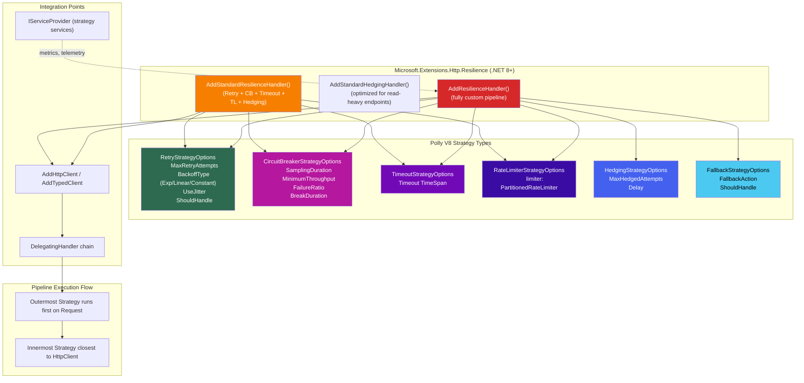

# 4.252 — Polly Integration: Retry, Circuit Breaker, and Hedging via AddHttpClient

---

## PART 0 — Navigation & Context

### Where This Topic Lives

```
ASP.NET Core Mastery
│
├── T. HttpClientFactory & HTTP Clients  (4.249–4.256)
│   ├── 4.249  IHttpClientFactory — Why New HttpClient Is Wrong
│   ├── 4.250  Named and Typed HTTP Clients
│   ├── 4.251  DelegatingHandler — Message Handler Pipeline
│   ├── 4.252  ◄ Polly Integration: Retry, Circuit Breaker, Hedging  ← YOU ARE HERE
│   ├── 4.253  HttpClient Timeout and CancellationToken
│   ├── 4.254  HttpClient Logging
│   ├── 4.255  Primary HttpMessageHandler Lifetime
│   └── 4.256  HttpClient with Credentials
│
└── Adjacent subsystems that interact here:
    ├── E. Middleware Pipeline (4.049–4.063)  — Polly runs inside DelegatingHandler, which is inside middleware
    ├── R. Background Services (4.231–4.239)  — typed clients with Polly used in worker services
    └── D. DI (4.034–4.048)                  — resilience pipelines are Singleton; understanding lifetime matters
```

### What You Need Before This

- **[[4.249 — IHttpClientFactory]]** — Polly is layered on top of IHttpClientFactory; you must understand how `AddHttpClient` builds handler chains.
- **[[4.250 — Named and Typed HTTP Clients]]** — `AddResilienceHandler` attaches to named/typed clients; fluent registration syntax is prerequisite.
- **[[4.251 — DelegatingHandler]]** — Polly's handlers are `DelegatingHandler` implementations under the hood; the same chain rules apply.
- **[[4.035 — Service Lifetimes]]** — resilience pipelines registered via Polly are Singleton; misuse inside Scoped services has consequences.

### What This Unlocks After

- **[[4.253 — HttpClient Timeout and CancellationToken]]** — timeout policies integrate directly with Polly's `TimeoutResilience` strategy.
- **[[4.255 — Primary HttpMessageHandler Lifetime]]** — understanding how Polly's circuit breaker state lives alongside handler rotation is a common production gotcha.
- **[[4.267 — Load Testing ASP.NET Core]]** — load testing validates that your circuit breaker thresholds are calibrated correctly.
- **[[4.232 — BackgroundService]]** — worker services calling external APIs must have Polly applied; background services don't get automatic retry.

### Why This Matters in Production

Without resilience pipelines, a single degraded downstream service can cascade into total application failure within seconds — at 10k req/s, unprotected `HttpClient` calls to a 5-second-timeout endpoint will exhaust your thread pool in under a minute; Polly's circuit breaker, combined with hedging for latency-sensitive paths, is the difference between a degraded-but-functional system and a complete outage.

---

## PART 1 — The Core Mental Model

### The Fundamental Rule

> **Polly wraps outbound `HttpRequestMessage` dispatches inside a `DelegatingHandler`; every resilience strategy (retry, circuit breaker, timeout, hedging, rate limiter, fallback) executes as a decorator around `SendAsync` — meaning the HTTP request is either retried, held back, or re-executed against a different replica, all before the `HttpResponseMessage` reaches your application code, and all transparent to the `HttpClient` caller.**

### The Plain-Language Analogy

Think of Polly as the electrical grid's automatic protective relay system. When a power station downstream goes unstable, the relay doesn't just let every house fuse blow — it trips the circuit, routes load away from the fault, waits for the fault to clear, then gradually restores load (half-open probe). Similarly, Polly sits between your typed client and the wire: on a transient fault it retries with backoff (the relay re-arms and re-tries), on sustained faults it trips the circuit breaker (the relay stays open to protect the system), and hedging lets you send a second parallel request if the first one is slow (like bringing a backup generator online before the main one fails). Critically, the analogy holds under concurrent load: the circuit breaker is a shared, thread-safe singleton — just as the relay state is shared across the whole grid, not per-household.

### The Taxonomy Diagram



---

## PART 2 — Deep Mechanics

### 2.1 — Polly V8 vs V7: The API Boundary That Bites Teams

Polly V8 (used with `Microsoft.Extensions.Http.Resilience` ≥8.0) is a complete API break from Polly V7. Production codebases migrating from V7 still pepper the internet with tutorials using `Policy.HandleAsync<>()` and `.WaitAndRetryAsync()` — none of which exist in V8.

**Pipeline Position:**

```
Kestrel ──► ExceptionHandler ──► Routing ──► Auth ──► YourEndpoint
                                                           │
                                                    OrdersTypedClient.GetAsync()
                                                           │
                                    ┌──────────────────────▼──────────────────────┐
                                    │  IHttpClientFactory handler chain            │
                                    │                                              │
                                    │  [1] LoggingHandler (outermost)              │
                                    │  [2] PollyResilienceHandler ◄──── POLLY HERE │
                                    │       └─ RetryStrategy                       │
                                    │       └─ CircuitBreakerStrategy              │
                                    │       └─ TimeoutStrategy                     │
                                    │  [3] PrimaryHandler (SocketsHttpHandler)     │
                                    └──────────────────────────────────────────────┘
                                                           │
                                                    Network / DNS / TLS
```

**V8 Core Types:**

```csharp
// V8 namespace (correct):
using Microsoft.Extensions.Http.Resilience;
using Polly;
using Polly.CircuitBreaker;
using Polly.Retry;
using Polly.Timeout;
using Polly.Hedging;

// V7 namespace (WRONG — will not compile with V8):
// using Polly;
// Policy.Handle<HttpRequestException>()...  ← Does NOT exist in V8
```

**Runtime cost label:** `~1 ResilienceContext allocation per outbound request; circuit breaker state is O(1) read on the hot path (atomic long comparison); retry with jitter = ~1 Task.Delay per attempt`

---

### 2.2 — `AddStandardResilienceHandler` — The Opinionated Default

`Microsoft.Extensions.Http.Resilience` ships a pre-wired five-layer pipeline in a single call. Understanding what it actually does is required — the defaults are good but wrong for many real APIs.

```
AddStandardResilienceHandler() compiles this pipeline (outermost to innermost):
┌─────────────────────────────────────────────────────────────┐
│  1. RateLimiter        (1000 concurrent requests, queue 0)  │
│  2. TotalRequestTimeout  (30s — entire attempt budget)      │
│  3. Retry              (3 retries, exp backoff + jitter)     │
│  4. CircuitBreaker     (50% failure rate, 30s break)         │
│  5. AttemptTimeout     (10s per individual attempt)          │
└─────────────────────────────────────────────────────────────┘
```

**ASP.NET Core internally (approximate):**

```csharp
// Microsoft.Extensions.Http.Resilience/StandardResilienceHandler.cs (simplified)
// The builder translates AddStandardResilienceHandler into:
services.AddHttpClient("PaymentGateway")
    .AddResilienceHandler("standard", builder =>
    {
        // Layer 5 (innermost) — per-attempt timeout
        builder.AddTimeout(new HttpTimeoutStrategyOptions
        {
            Timeout = TimeSpan.FromSeconds(10)
        });

        // Layer 4 — circuit breaker
        builder.AddCircuitBreaker(new HttpCircuitBreakerStrategyOptions
        {
            SamplingDuration = TimeSpan.FromSeconds(30),
            MinimumThroughput = 100,
            FailureRatio = 0.5,
            BreakDuration = TimeSpan.FromSeconds(30),
            ShouldHandle = args => args.Outcome.Exception is not null
                                   || args.Outcome.Result?.IsSuccessStatusCode == false
                                   ? new ValueTask<bool>(true)
                                   : new ValueTask<bool>(false)
        });

        // Layer 3 — retry
        builder.AddRetry(new HttpRetryStrategyOptions
        {
            MaxRetryAttempts = 3,
            BackoffType = DelayBackoffType.Exponential,
            UseJitter = true,
            Delay = TimeSpan.FromSeconds(1)
        });

        // Layer 2 — total timeout wrapping all retries
        builder.AddTimeout(new HttpTimeoutStrategyOptions
        {
            Timeout = TimeSpan.FromSeconds(30)
        });

        // Layer 1 (outermost) — rate limiter
        builder.AddConcurrencyLimiter(1000, 0);
    });
```

**HTTP wire format — retry in action (approximate):**

```http
// Attempt 1 (t=0ms):
GET /api/v2/payments/charge HTTP/1.1
Host: payments.internal
Authorization: Bearer eyJ...
X-Attempt-Number: 1    ← added by Polly telemetry (optional)

// Response: 503 Service Unavailable (transient)
HTTP/1.1 503 Service Unavailable
Retry-After: 5

// Polly: ShouldHandle → true (503 in ShouldHandleHttpStatusCode)
// Polly: Delay = 1s * 2^1 + jitter = ~2.1s

// Attempt 2 (t=~2100ms):
GET /api/v2/payments/charge HTTP/1.1
Host: payments.internal
Authorization: Bearer eyJ...

// Response: 200 OK
HTTP/1.1 200 OK
Content-Type: application/json
{"transactionId": "txn_abc123", "status": "approved"}
```

**Runtime cost label:** `AddStandardResilienceHandler = 5 strategy layers; ~2 allocations per request on success path (ResilienceContext + StrategyEnumerator); retry path = 1 additional Task.Delay + context clone per attempt`

---

### 2.3 — Circuit Breaker State Machine

The circuit breaker is the most misunderstood strategy because its behavior is stateful and shared across all requests through that named client.

```
Circuit Breaker State Machine:
                                                         
  ┌─────────────┐  failure ratio > threshold   ┌─────────────┐
  │   CLOSED    │ ────────────────────────────► │    OPEN     │
  │  (normal)   │                               │  (failing)  │
  │             │                               │             │
  │  Requests   │                               │  All reqs   │
  │  pass thru  │   ◄──── BreakDuration ──────  │  → BrokenCB │
  └─────────────┘         expires               └─────────────┘
         ▲                                             │
         │                                             │ BreakDuration
         │ probe succeeds                              ▼
         │                                   ┌─────────────────┐
         └─────────────────────────────────── │   HALF-OPEN    │
                                              │  (probing)     │
                                              │                │
                                              │ 1 request let  │
                                              │ through to test│
                                              └─────────────────┘
```

**What happens to the HTTP client caller when the circuit is OPEN:**

```http
// No network request is made — circuit breaker throws immediately:
// System.Exception: The circuit is now open and is not allowing calls.
// Polly.CircuitBreaker.BrokenCircuitException`1[System.Net.Http.HttpResponseMessage]

// Your application code sees:
// HttpRequestException wrapping BrokenCircuitException
// Status: depends on your exception middleware mapping — typically 503
```

**ASP.NET Core internally — the OPEN state check:**

```csharp
// Polly.CircuitBreaker (approximate source path):
// ResiliencePipeline<HttpResponseMessage>.ExecuteAsync
//   ↓ CircuitBreakerResilienceStrategy.ExecuteCore
//     ↓ CircuitBreakerStateProvider.LastOutcome
//       if (state == CircuitState.Open)
//           throw new BrokenCircuitException(...)  // ← no network call

// Cost: O(1) atomic read of circuit state; zero allocation on the Open fast-path
```

**Runtime cost label:** `O(1) atomic state check; open circuit = zero TCP allocation; half-open probe = exactly 1 request forwarded; sampling window maintained as sliding window with ~O(MinimumThroughput) memory`

---

### 2.4 — Hedging: Parallel Redundant Requests

Hedging is the strategy most engineers miss. It is not a retry — it fires a second request _before_ the first has failed, after a configurable delay. This is the correct strategy for latency-sensitive reads (P99 reduction).

```
Hedging Timeline (delay = 500ms):
                                                        
t=0ms     ──► Attempt 1 ──────────────────────────────► (waiting for response)
t=500ms   ──► Attempt 2 ──────────────────► Response arrives (200 OK)
                                │
                                └─ Attempt 1 is cancelled
                                   Result from Attempt 2 returned to caller

vs. Retry Timeline (no hedging):
t=0ms     ──► Attempt 1 ──► timeout/fail (e.g., at t=10s)
t=10s     ──► Attempt 2 ──► success at t=11s
             (11 seconds total)
```

**HTTP Wire Format — hedging:**

```http
// Hedging fires two real HTTP requests:

// Request A (immediate, to endpoint 1 or same endpoint):
GET /api/v1/orders/ORD-9912 HTTP/1.1
Host: orders-svc-1.internal

// Request B (fired at t+500ms if A hasn't responded):
GET /api/v1/orders/ORD-9912 HTTP/1.1
Host: orders-svc-2.internal   ← hedging with URL mutation for load balancing

// Whichever responds first with a success result wins.
// The other is CancellationToken-cancelled.
```

**Runtime cost label:** `hedging = up to MaxHedgedAttempts concurrent HTTP connections; downstream services see duplicate reads — hedging is only safe for idempotent (GET, HEAD) or explicitly idempotent POST operations`

---

### 2.5 — `ResilienceContext` and Telemetry

Polly V8 emits telemetry through `System.Diagnostics.Metrics` and `System.Diagnostics.Activity` natively. Every strategy execution creates `resilience.*` metrics automatically.

```csharp
// Metrics emitted automatically (no configuration needed):
// resilience.polly.attempt.duration    (histogram, milliseconds)
// resilience.polly.pipeline.duration   (histogram, milliseconds)
// resilience.polly.execution.attempts  (counter)
// Tags: pipeline.name, pipeline.instance, strategy.name, exception.type, http.response.status_code

// Reading context from within a strategy event callback:
builder.AddRetry(new HttpRetryStrategyOptions
{
    OnRetry = static args =>
    {
        // args.Context carries the ResilienceContext:
        var operationKey = args.Context.OperationKey;  // "GetOrder"
        var attempt = args.AttemptNumber;
        var outcome = args.Outcome;  // .Result is HttpResponseMessage, .Exception is Exception
        return default; // ValueTask
    }
});
```

**Pipeline Position annotation:** `Telemetry hooks run inside the strategy execution — they execute on the same thread as the resilience pipeline, before the response is returned to your code. Any I/O inside OnRetry/OnCircuitBreaker callbacks delays your retry backoff.`

---

## PART 3 — Production Code Patterns

### Pattern 1 — The Payment Gateway: Retry on Transient Errors Only

The anti-pattern is retrying everything. Retrying a 400 Bad Request burns quota, logs noise, and delays the caller needlessly.

```csharp
// ⚠️ WRONG: Retries ALL HttpRequestExceptions including 4xx client errors
services.AddHttpClient<IPaymentGatewayClient, StripePaymentClient>()
    .AddStandardResilienceHandler();  // ← default ShouldHandle includes all non-2xx

// HTTP consequence (wrong path):
// POST /v1/charges → 422 Unprocessable Entity (bad card number)
// Polly retries 3 times — same 422 each time, 4x downstream load, 3x latency penalty
// After 3 retries: caller sees the same 422 but 3 seconds later
```

```csharp
// ✅ CORRECT: Only retry transient conditions — 5xx, network errors, and 408 timeout
// Domain: Payment processing service calling Stripe API

services.AddHttpClient<IPaymentGatewayClient, StripePaymentClient>(client =>
    {
        client.BaseAddress = new Uri("https://api.stripe.com/");
        client.DefaultRequestHeaders.Add("Stripe-Version", "2024-04-10");
    })
    .AddResilienceHandler("stripe-resilience", builder =>
    {
        // Innermost: per-attempt timeout (Stripe SLA is well-defined)
        builder.AddTimeout(TimeSpan.FromSeconds(8));

        // Circuit breaker: if Stripe is consistently failing, stop pounding it
        builder.AddCircuitBreaker(new HttpCircuitBreakerStrategyOptions
        {
            // Wait for at least 20 requests before evaluating failure rate
            MinimumThroughput = 20,
            // 60-second sampling window
            SamplingDuration = TimeSpan.FromSeconds(60),
            // Break at 40% failure rate (Stripe's p99 is typically <200ms)
            FailureRatio = 0.4,
            // Hold open for 30s before probing
            BreakDuration = TimeSpan.FromSeconds(30),
            // Only count transient failures toward circuit breaker
            ShouldHandle = static args =>
            {
                var outcome = args.Outcome;
                if (outcome.Exception is BrokenCircuitException)
                    return new ValueTask<bool>(false); // don't double-count

                if (outcome.Exception is not null)
                    return new ValueTask<bool>(true); // network error → count

                var statusCode = outcome.Result?.StatusCode;
                return new ValueTask<bool>(
                    statusCode >= HttpStatusCode.InternalServerError ||  // 5xx
                    statusCode == HttpStatusCode.RequestTimeout          // 408
                );
                // 4xx (including 422, 400) does NOT trip the circuit
            }
        });

        // Retry: only transient failures, exponential backoff, limited budget
        builder.AddRetry(new HttpRetryStrategyOptions
        {
            MaxRetryAttempts = 2,   // original + 2 = 3 total attempts
            BackoffType = DelayBackoffType.Exponential,
            UseJitter = true,       // prevents retry storms under load
            Delay = TimeSpan.FromMilliseconds(500),
            // Match the same transient-only predicate
            ShouldHandle = static args =>
            {
                var outcome = args.Outcome;
                if (outcome.Exception is BrokenCircuitException)
                    return new ValueTask<bool>(false); // circuit open → no retry

                if (outcome.Exception is OperationCanceledException)
                    return new ValueTask<bool>(false); // caller cancelled → no retry

                if (outcome.Exception is not null)
                    return new ValueTask<bool>(true); // other network errors → retry

                var statusCode = outcome.Result?.StatusCode;
                return new ValueTask<bool>(
                    statusCode >= HttpStatusCode.InternalServerError ||
                    statusCode == HttpStatusCode.RequestTimeout
                );
            },
            OnRetry = static args =>
            {
                // Structured log — doesn't allocate a string unless log level enabled
                // (wire in via ILogger captured from DI in the registration lambda)
                return default;
            }
        });

        // Outermost: total timeout including all retries
        // 8s per attempt × 3 attempts + backoff ≈ well under 30s budget
        builder.AddTimeout(TimeSpan.FromSeconds(30));
    });
```

```http
// HTTP wire format (correct path):
// POST /v1/charges → 500 Internal Server Error
// Polly: ShouldHandle → true (5xx), waits ~500ms+jitter
// POST /v1/charges → 200 OK
// HTTP/1.1 200 OK
// Content-Type: application/json
// {"id":"ch_3OZ...","status":"succeeded"}
```

---

### Pattern 2 — The Order Service Read Path: Hedging for P99 Latency

Hedging eliminates long-tail latency on reads by firing a parallel request to a second replica after a threshold delay.

```csharp
// ⚠️ WRONG: Applying hedging to POST/mutation endpoints
// Domain: Order management — DO NOT hedge a CreateOrder call
services.AddHttpClient<IOrderWriteClient, OrderWriteClient>()
    .AddResilienceHandler("order-write", b =>
    {
        b.AddHedging(new HttpHedgingStrategyOptions
        {
            MaxHedgedAttempts = 2,  // ← WRONG for mutations: creates duplicate orders
            Delay = TimeSpan.FromMilliseconds(500)
        });
    });

// HTTP consequence (wrong path):
// POST /api/orders → slow response at t=500ms → Polly fires second POST
// → Two orders created, duplicate order IDs, billing error, angry customer
```

```csharp
// ✅ CORRECT: Hedging only on idempotent GET endpoints
// Domain: Order management service — inventory read path

// Step 1: Create a URL selector that routes hedged attempts to replicas
services.AddHttpClient<IOrderQueryClient, OrderQueryClient>(client =>
    {
        // Primary replica
        client.BaseAddress = new Uri("https://orders-primary.internal/");
    })
    .AddResilienceHandler("order-read-hedging", builder =>
    {
        // Per-attempt timeout — set below hedge delay so hedging actually triggers
        builder.AddTimeout(TimeSpan.FromSeconds(3));

        // Hedging: fire second request after 200ms if first hasn't responded
        builder.AddHedging(new HttpHedgingStrategyOptions
        {
            MaxHedgedAttempts = 1,  // 1 additional attempt (2 total in flight)
            Delay = TimeSpan.FromMilliseconds(200),

            // Only hedge on slow responses or 5xx — not on 404 (order genuinely missing)
            ShouldHandle = static args =>
            {
                var outcome = args.Outcome;
                // Hedge if timed out (exception path) or got a 5xx
                if (outcome.Exception is TimeoutRejectedException)
                    return new ValueTask<bool>(true);
                if (outcome.Exception is not null)
                    return new ValueTask<bool>(true);

                var status = outcome.Result?.StatusCode;
                return new ValueTask<bool>(
                    status >= HttpStatusCode.InternalServerError
                );
                // 404 → false: no point hedging when data is genuinely absent
            },

            // Mutate request to route hedged attempt to secondary replica
            ActionGenerator = static args =>
            {
                // Clone request pointing to secondary
                return async () =>
                {
                    var req = args.PrimaryContext.Properties
                        .GetValue(new ResiliencePropertyKey<HttpRequestMessage>("original-request"), null);

                    // In practice, use a URL rotation strategy or load balancer hint
                    // This is the conceptual shape
                    var secondary = new HttpRequestMessage(req.Method,
                        req.RequestUri!.ToString()
                            .Replace("orders-primary", "orders-secondary"));
                    secondary.Version = req.Version;

                    return await args.Callback(secondary, args.Context);
                };
            }
        });

        // Circuit breaker: protects against a fully dead replica
        builder.AddCircuitBreaker(new HttpCircuitBreakerStrategyOptions
        {
            MinimumThroughput = 50,
            SamplingDuration = TimeSpan.FromSeconds(30),
            FailureRatio = 0.5,
            BreakDuration = TimeSpan.FromSeconds(20)
        });
    });
```

```http
// HTTP wire format (hedging scenario):
// GET /api/orders/ORD-9912 → no response after 200ms
// GET /api/orders/ORD-9912 → 200 OK at t=380ms (from secondary)
// HTTP/1.1 200 OK
// Content-Type: application/json
// {"orderId":"ORD-9912","status":"shipped"}
// First request cancelled (CancellationToken propagated)
```

---

### Pattern 3 — The Logistics Webhook Receiver: Rate Limiter to Protect a Slow Downstream

```csharp
// ✅ CORRECT: Rate limiting outbound calls to a partner API with a published rate limit
// Domain: Logistics service calling FedEx tracking API (100 req/s limit per API key)

services.AddHttpClient<IShipmentTrackingClient, FedExTrackingClient>(client =>
    {
        client.BaseAddress = new Uri("https://apis.fedex.com/track/v1/");
    })
    .AddResilienceHandler("fedex-rate-limited", builder =>
    {
        // Rate limiter MUST be outermost: if we're already at limit, don't even
        // allocate a retry context — reject at the strategy boundary
        builder.AddRateLimiter(new SlidingWindowRateLimiter(
            new SlidingWindowRateLimiterOptions
            {
                PermitLimit = 90,           // 90 req/s — leave 10% headroom
                Window = TimeSpan.FromSeconds(1),
                SegmentsPerWindow = 5,      // 5 × 200ms buckets
                QueueProcessingOrder = QueueProcessingOrder.OldestFirst,
                QueueLimit = 0              // reject immediately on excess
            }));

        // Timeout and retry inside the rate limiter
        builder.AddTimeout(TimeSpan.FromSeconds(5));
        builder.AddRetry(new HttpRetryStrategyOptions
        {
            MaxRetryAttempts = 1,   // single retry — FedEx 429 has Retry-After
            ShouldHandle = static args =>
            {
                if (args.Outcome.Result?.StatusCode == HttpStatusCode.TooManyRequests)
                    return new ValueTask<bool>(true);
                if (args.Outcome.Result?.StatusCode >= HttpStatusCode.InternalServerError)
                    return new ValueTask<bool>(true);
                return new ValueTask<bool>(false);
            },
            DelayGenerator = static args =>
            {
                // Respect Retry-After header from FedEx if present
                if (args.Outcome.Result?.Headers.RetryAfter?.Delta is { } retryAfter)
                    return new ValueTask<TimeSpan?>(retryAfter);
                return new ValueTask<TimeSpan?>(TimeSpan.FromSeconds(1));
            }
        });
    });
```

```http
// HTTP consequence when rate limit is exceeded:
// RateLimiterRejectedException thrown before any network call
// Your exception middleware should map this to:
// HTTP/1.1 503 Service Unavailable (internally — caller cannot reach FedEx right now)
// Retry-After: 1  ← propagate upstream so the caller knows when to retry
```

---

### Pattern 4 — Registering a Logger in Strategy Events (DI-Aware)

```csharp
// ✅ CORRECT: Accessing ILogger inside Polly event callbacks
// Domain: Inventory service — structured resilience telemetry

services.AddHttpClient<IInventoryClient, InventoryHttpClient>()
    .AddResilienceHandler("inventory-resilience", (builder, context) =>
    {
        // 'context' here is IAddResilienceHandlerContext which exposes ServiceProvider
        // This is the correct way to get ILogger into strategy callbacks
        var logger = context.ServiceProvider
            .GetRequiredService<ILogger<InventoryHttpClient>>();
        var meter = context.ServiceProvider
            .GetRequiredService<IMeterFactory>()
            .Create("Inventory.Resilience");

        var retryCounter = meter.CreateCounter<int>("inventory.retry.count");

        builder.AddRetry(new HttpRetryStrategyOptions
        {
            MaxRetryAttempts = 3,
            BackoffType = DelayBackoffType.Exponential,
            UseJitter = true,
            OnRetry = args =>
            {
                // Structured log — no string allocation unless enabled
                logger.LogWarning(
                    "Inventory API retry attempt {AttemptNumber} after {Delay:F0}ms. " +
                    "Status: {StatusCode}. Exception: {ExceptionType}",
                    args.AttemptNumber + 1,
                    args.RetryDelay.TotalMilliseconds,
                    args.Outcome.Result?.StatusCode,
                    args.Outcome.Exception?.GetType().Name);

                retryCounter.Add(1,
                    new TagList
                    {
                        { "attempt", args.AttemptNumber + 1 },
                        { "status", ((int?)args.Outcome.Result?.StatusCode)?.ToString() ?? "exception" }
                    });

                return default;
            }
        });

        builder.AddCircuitBreaker(new HttpCircuitBreakerStrategyOptions
        {
            OnOpened = args =>
            {
                // This fires once when the circuit opens — not per-request
                logger.LogError(
                    "Inventory circuit breaker OPENED. " +
                    "BreakDuration: {BreakDuration}s. LastFailure: {Exception}",
                    args.BreakDuration.TotalSeconds,
                    args.Outcome.Exception?.Message ?? args.Outcome.Result?.StatusCode.ToString());
                return default;
            },
            OnClosed = args =>
            {
                logger.LogInformation("Inventory circuit breaker CLOSED — service recovered.");
                return default;
            },
            OnHalfOpened = args =>
            {
                logger.LogInformation("Inventory circuit breaker HALF-OPEN — probing service.");
                return default;
            },
            MinimumThroughput = 10,
            SamplingDuration = TimeSpan.FromSeconds(30),
            FailureRatio = 0.5,
            BreakDuration = TimeSpan.FromSeconds(30)
        });
    });
```

---

### Pattern 5 — The Fallback: Returning Stale Cache on Circuit Open

```csharp
// ✅ CORRECT: Graceful degradation with a local cache fallback
// Domain: Order management — product catalog read (stale data tolerable)

public class ProductCatalogClient
{
    private readonly HttpClient _client;
    // Fallback cache populated during last successful call
    private static readonly ConcurrentDictionary<string, ProductDto> _staleCache = new();

    public ProductCatalogClient(HttpClient client) => _client = client;
}

// Registration:
services.AddHttpClient<ProductCatalogClient>()
    .AddResilienceHandler("catalog-with-fallback", builder =>
    {
        builder.AddTimeout(TimeSpan.FromSeconds(5));

        builder.AddCircuitBreaker(new HttpCircuitBreakerStrategyOptions
        {
            MinimumThroughput = 20,
            SamplingDuration = TimeSpan.FromSeconds(30),
            FailureRatio = 0.5,
            BreakDuration = TimeSpan.FromSeconds(60)
        });

        builder.AddRetry(new HttpRetryStrategyOptions
        {
            MaxRetryAttempts = 2,
            BackoffType = DelayBackoffType.Exponential,
            UseJitter = true
        });

        // Fallback is OUTERMOST — it catches everything the inner strategies throw
        builder.AddFallback(new HttpFallbackStrategyOptions
        {
            ShouldHandle = static args =>
            {
                // Activate fallback when circuit is open OR when all retries are exhausted
                return new ValueTask<bool>(
                    args.Outcome.Exception is BrokenCircuitException ||
                    args.Outcome.Exception is TimeoutRejectedException ||
                    args.Outcome.Result?.IsSuccessStatusCode == false
                );
            },
            FallbackAction = static args =>
            {
                // Return a synthetic 200 response with a degraded-mode signal
                var response = new HttpResponseMessage(HttpStatusCode.OK);
                response.Headers.Add("X-Degraded-Mode", "true");
                response.Content = JsonContent.Create(new
                {
                    degraded = true,
                    reason = args.Outcome.Exception?.Message ?? "upstream_unavailable"
                });
                return new ValueTask<Outcome<HttpResponseMessage>>(
                    Outcome.FromResult(response));
            }
        });
    });
```

```http
// HTTP wire format — fallback active:
// Circuit OPEN — no network call made
// Your ProductCatalogClient receives:
// HTTP/1.1 200 OK
// X-Degraded-Mode: true
// Content-Type: application/json
// {"degraded":true,"reason":"The circuit is now open..."}
// Your client checks X-Degraded-Mode and returns stale cached data to the caller
```

---

### Pattern 6 — Typed Client with `OperationKey` for Per-Endpoint Metrics

```csharp
// ✅ CORRECT: Setting the operation key so telemetry is labeled per endpoint
// Domain: Logistics service — different endpoints have different SLAs

public class LogisticsApiClient
{
    private readonly HttpClient _client;
    private readonly ResiliencePipelineProvider<string> _pipelineProvider;

    public LogisticsApiClient(
        HttpClient client,
        ResiliencePipelineProvider<string> pipelineProvider)
    {
        _client = client;
        _pipelineProvider = pipelineProvider;
    }

    public async Task<ShipmentStatus> GetShipmentStatusAsync(
        string trackingNumber,
        CancellationToken ct)
    {
        // Setting OperationKey causes telemetry to tag metrics with "GetShipmentStatus"
        // This means Prometheus/OTel sees separate retry counts per operation
        var context = ResilienceContextPool.Shared.Get(ct);
        context.OperationKey = "GetShipmentStatus";

        try
        {
            var pipeline = _pipelineProvider.GetPipeline<HttpResponseMessage>("logistics");

            var response = await pipeline.ExecuteAsync(
                async (ctx) => await _client.GetAsync(
                    $"/api/shipments/{trackingNumber}/status",
                    ctx.CancellationToken),
                context);

            response.EnsureSuccessStatusCode();
            return await response.Content.ReadFromJsonAsync<ShipmentStatus>(ct)!;
        }
        finally
        {
            ResilienceContextPool.Shared.Return(context);
        }
    }
}

// Registration: name-based pipeline, referenced by typed client
services.AddResiliencePipeline<string, HttpResponseMessage>("logistics", builder =>
{
    builder.AddRetry(new RetryStrategyOptions<HttpResponseMessage>
    {
        MaxRetryAttempts = 3,
        BackoffType = DelayBackoffType.Exponential,
        UseJitter = true
    });
    builder.AddCircuitBreaker(new CircuitBreakerStrategyOptions<HttpResponseMessage>
    {
        MinimumThroughput = 10,
        FailureRatio = 0.5,
        BreakDuration = TimeSpan.FromSeconds(30),
        SamplingDuration = TimeSpan.FromSeconds(30)
    });
});
```

---

### Pattern 7 — `AddStandardHedgingHandler` for Load-Balanced Internal Services

```csharp
// ✅ CORRECT: Standard hedging handler for internal microservice communication
// Domain: Order management calling inventory service with two replicas

services.AddHttpClient<IInventoryAvailabilityClient, InventoryAvailabilityClient>()
    .AddStandardHedgingHandler()
    // StandardHedgingHandler uses:
    // - Routing strategies to select between endpoints (requires IRoutingStrategy)
    // - Hedging delay of 500ms by default
    // - Retry on failure per attempt
    // - Circuit breaker per endpoint in the routing pool
    .Configure(options =>
    {
        options.Hedging.MaxHedgedAttempts = 1;
        options.Hedging.Delay = TimeSpan.FromMilliseconds(300);
    });

// Register routing (required for standard hedging):
services.AddSingleton<IRoutingStrategy>(new RoundRobinRoutingStrategy(
[
    new Uri("https://inventory-svc-1.internal/"),
    new Uri("https://inventory-svc-2.internal/")
]));
```

```http
// HTTP wire format — standard hedging:
// GET /api/inventory/SKU-88192/availability → no response after 300ms
// GET /api/inventory/SKU-88192/availability → 200 OK at t=420ms (replica 2)
// HTTP/1.1 200 OK
// {"sku":"SKU-88192","available":true,"quantity":47}
```

---

## PART 4 — Gotchas & Anti-Patterns

### Gotcha 1: Retrying POST Mutations Without Idempotency Guards

Experienced engineers apply `AddStandardResilienceHandler` uniformly across all HTTP methods without reading the default `ShouldHandle` predicate, which retries 5xx on POST.

```csharp
// ⚠️ WRONG: Standard handler retries POST without checking if the operation is idempotent
services.AddHttpClient<IPaymentClient, PaymentClient>()
    .AddStandardResilienceHandler();
// Default ShouldHandle for AddStandardResilienceHandler retries 5xx on ALL methods

// HTTP consequence (wrong path):
// POST /api/payments/charge → 503 (Stripe down for 200ms)
// Polly retries → second POST /api/payments/charge → 200 OK
// Customer charged twice. Stripe has their own idempotency but your service never sent the key.
```

```csharp
// ✅ CORRECT: Only retry idempotent methods, or use idempotency keys for POST
services.AddHttpClient<IPaymentClient, PaymentClient>()
    .AddResilienceHandler("payment-safe-retry", builder =>
    {
        builder.AddRetry(new HttpRetryStrategyOptions
        {
            MaxRetryAttempts = 2,
            ShouldHandle = static args =>
            {
                // Only retry GET/HEAD/PUT/DELETE — idempotent by definition
                // For POST, only retry network errors (before server processed anything)
                var method = args.Outcome.Result?.RequestMessage?.Method;
                var isIdempotent = method == HttpMethod.Get
                    || method == HttpMethod.Head
                    || method == HttpMethod.Put
                    || method == HttpMethod.Delete;

                if (!isIdempotent && method == HttpMethod.Post)
                {
                    // Only retry if we know the server never received it (connection refused)
                    return new ValueTask<bool>(
                        args.Outcome.Exception is HttpRequestException
                        { HttpRequestError: HttpRequestError.ConnectionError });
                }

                if (args.Outcome.Exception is not null)
                    return new ValueTask<bool>(isIdempotent);

                return new ValueTask<bool>(
                    isIdempotent &&
                    args.Outcome.Result?.StatusCode >= HttpStatusCode.InternalServerError);
            }
        });
    });

// HTTP consequence (correct path):
// POST /api/payments/charge → 503 → NOT retried (POST + 5xx → safe to not retry)
// Returns 503 to caller immediately — caller decides whether to retry with idempotency key
```

**WHY:** The HTTP specification defines POST as non-idempotent. Retrying a POST on a 5xx means the server may have processed the request and then crashed while sending the response. Polly has no way to know. The correct model is: caller supplies an idempotency key in the POST header, and the retry is safe because the server deduplicates by that key.

---

### Gotcha 2: Circuit Breaker State Lost on Container Restart (Typed Client Lifetime Mismatch)

The circuit breaker is maintained in the `DelegatingHandler` which is managed by `IHttpClientFactory`. The handler pool rotates every 2 minutes by default. When the handler rotates, the circuit breaker state **resets** — the circuit that was open to protect a failing service suddenly closes, and your application immediately starts hammering the downstream again.

```csharp
// ⚠️ WRONG: Relying on in-memory circuit breaker to survive handler rotation
builder.Services.AddHttpClient<IOrdersClient, OrdersHttpClient>()
    .AddResilienceHandler("orders", b =>
    {
        b.AddCircuitBreaker(new HttpCircuitBreakerStrategyOptions
        {
            BreakDuration = TimeSpan.FromMinutes(5)  // ← This is a lie; handler rotates at 2 min
        });
    });

// HTTP consequence (wrong path):
// t=0:     Circuit opens due to 60% failure rate
// t=2min:  IHttpClientFactory rotates the primary handler (normal lifetime)
//          → New DelegatingHandler created → new circuit breaker instance
//          → Circuit state is CLOSED (reset) despite downstream still being degraded
//          → 100% of requests hit the degraded service again
//          → New circuit opens again at t=2min+30s
//          → Thundering herd every 2 minutes
```

```csharp
// ✅ CORRECT: Extend handler lifetime to match circuit breaker break duration
// OR: Use a stateful circuit breaker backed by Redis (for multi-instance deployments)
builder.Services.AddHttpClient<IOrdersClient, OrdersHttpClient>()
    .SetHandlerLifetime(TimeSpan.FromMinutes(10))  // > max break duration
    .AddResilienceHandler("orders", b =>
    {
        b.AddCircuitBreaker(new HttpCircuitBreakerStrategyOptions
        {
            BreakDuration = TimeSpan.FromMinutes(5),
            MinimumThroughput = 20,
            FailureRatio = 0.5,
            SamplingDuration = TimeSpan.FromSeconds(60)
        });
    });

// HTTP consequence (correct path):
// Circuit state persists for the full handler lifetime
// WARNING: SetHandlerLifetime affects DNS TTL — longer lifetime = potentially stale DNS
// For cloud environments: use 5-10 minutes max, or a distributed circuit breaker
```

**WHY:** `IHttpClientFactory` rotates `SocketsHttpHandler` instances periodically (default 2 minutes) to pick up DNS changes. Polly's circuit breaker lives in the `DelegatingHandler` that wraps that `SocketsHttpHandler`. When the primary handler rotates, the `DelegatingHandler` chain is rebuilt — circuit state is in-memory and is discarded. Match `SetHandlerLifetime` to your break duration, or accept that circuit state is per-instance-per-rotation.

---

### Gotcha 3: `BrokenCircuitException` Not Handled in Exception Middleware

When the circuit opens, Polly throws `BrokenCircuitException<HttpResponseMessage>`. Most teams have exception middleware that maps `HttpRequestException` to 503. `BrokenCircuitException` is **not** `HttpRequestException` — it bypasses the mapping and surfaces as a 500 Internal Server Error.

```csharp
// ⚠️ WRONG: Exception middleware that doesn't handle BrokenCircuitException
app.UseExceptionHandler(exApp => exApp.Run(async ctx =>
{
    var feature = ctx.Features.Get<IExceptionHandlerFeature>();
    if (feature?.Error is HttpRequestException)
    {
        ctx.Response.StatusCode = 503;
        await ctx.Response.WriteAsJsonAsync(
            new ProblemDetails { Status = 503, Title = "Upstream unavailable" });
        return;
    }
    // BrokenCircuitException falls through to generic 500 handler
    ctx.Response.StatusCode = 500;
    await ctx.Response.WriteAsJsonAsync(
        new ProblemDetails { Status = 500, Title = "Internal server error" });
}));

// HTTP consequence (wrong path):
// Circuit open → BrokenCircuitException thrown
// → Exception middleware: not HttpRequestException → 500
// → Client sees 500 instead of 503 — incorrect semantic (not YOUR server's fault)
```

```csharp
// ✅ CORRECT: Handle BrokenCircuitException explicitly
app.UseExceptionHandler(exApp => exApp.Run(async ctx =>
{
    var feature = ctx.Features.Get<IExceptionHandlerFeature>();
    var error = feature?.Error;

    var (statusCode, title) = error switch
    {
        BrokenCircuitException<HttpResponseMessage> =>
            (503, "Dependency circuit open — upstream temporarily unavailable"),
        BrokenCircuitException =>
            (503, "Dependency circuit open — upstream temporarily unavailable"),
        HttpRequestException { HttpRequestError: HttpRequestError.ConnectionError } =>
            (503, "Upstream connection refused"),
        TimeoutRejectedException =>
            (504, "Upstream timeout"),
        HttpRequestException =>
            (502, "Bad gateway"),
        _ => (500, "Internal server error")
    };

    ctx.Response.StatusCode = statusCode;
    await ctx.Response.WriteAsJsonAsync(new ProblemDetails
    {
        Status = statusCode,
        Title = title,
        Instance = ctx.Request.Path
    });
}));

// HTTP consequence (correct path):
// Circuit open → BrokenCircuitException → 503 Service Unavailable
// HTTP/1.1 503 Service Unavailable
// Content-Type: application/problem+json
// {"status":503,"title":"Dependency circuit open — upstream temporarily unavailable"}
```

**WHY:** `BrokenCircuitException<TResult>` inherits from `Exception`, not `HttpRequestException`. The circuit breaker is an ASP.NET Core–level concern, not an HTTP transport concern. The correct HTTP response is 503 (your service is temporarily unable to complete the request because a dependency is down) — not 500 (something internally wrong in your service).

---

### Gotcha 4: `OnRetry` Doing Async I/O Blocking the Retry Delay

`OnRetry` callbacks in Polly V8 receive `OnRetryArguments<TResult>` and must return `ValueTask`. Teams that log to a remote telemetry endpoint or call `IDistributedCache` inside `OnRetry` block the entire resilience pipeline execution.

```csharp
// ⚠️ WRONG: Async I/O inside OnRetry that adds latency to the retry backoff period
builder.AddRetry(new HttpRetryStrategyOptions
{
    OnRetry = async args =>
    {
        // This awaits a network call BEFORE the retry delay starts
        // If the telemetry endpoint is slow, the retry is delayed by telemetry latency
        await _telemetryService.RecordRetryAsync(new RetryEvent
        {
            ClientName = "PaymentGateway",
            AttemptNumber = args.AttemptNumber,
            StatusCode = (int?)args.Outcome.Result?.StatusCode,
            ExceptionType = args.Outcome.Exception?.GetType().Name
        });
    }
});

// HTTP consequence (wrong path):
// Retry delay configured as 500ms
// OnRetry adds 200ms telemetry call
// Effective retry delay = 700ms — violates SLA calculation
// Under adversarial load: telemetry bottleneck extends retry delay unpredictably
```

```csharp
// ✅ CORRECT: Fire-and-forget telemetry, or use synchronous in-memory metrics only
builder.AddRetry(new HttpRetryStrategyOptions
{
    OnRetry = static args =>
    {
        // Synchronous counter — zero I/O, zero async overhead
        // Polly emits resilience.polly.* metrics automatically in V8
        // Only add custom telemetry that is synchronous or fire-and-forget:
        _ = Task.Run(() => _telemetryService.RecordRetryAsync(new RetryEvent
        {
            AttemptNumber = args.AttemptNumber,
            StatusCode = (int?)args.Outcome.Result?.StatusCode
        }));
        // Returns immediately — telemetry is fully decoupled from retry timing
        return default;
    }
});

// HTTP consequence (correct path):
// OnRetry returns in <1μs → retry delay is accurate to ±jitter only
// Telemetry happens asynchronously — no impact on retry latency budget
```

**WHY:** `OnRetry` runs synchronously within the resilience pipeline execution — it is not a fire-and-forget hook. Any `await` in `OnRetry` delays the start of the retry delay calculation. Under adversarial load (many concurrent retries), a slow telemetry endpoint inside `OnRetry` creates a feedback loop: retries slow → more retries stack up → more telemetry calls → telemetry endpoint slows → retries slow further.

---

### Gotcha 5: `AddStandardResilienceHandler` in Multi-Tenant APIs Uses Shared Circuit Breaker State

When multiple tenants share the same typed client, a circuit breaker opening due to tenant A's traffic pattern also blocks tenant B's requests, even if the downstream service is healthy for tenant B's endpoint.

```csharp
// ⚠️ WRONG: Shared circuit breaker state across all tenants using the same named client
services.AddHttpClient<IOrdersClient, OrdersHttpClient>()
    .AddStandardResilienceHandler();
// One circuit breaker per handler lifetime — shared across all tenants

// HTTP consequence (wrong path):
// Tenant A hammers orders-api endpoint → 60% failure → circuit opens
// Tenant B (healthy endpoint, different subdomain) → circuit is OPEN → 503
// Tenant B's requests fail for 30s although their endpoint never had a problem
```

```csharp
// ✅ CORRECT: Keyed resilience pipelines per tenant (Polly V8 + .NET 8 keyed services)
// Domain: Multi-tenant order management SaaS

// Register pipeline factory keyed by tenant ID
services.AddResiliencePipeline<string, HttpResponseMessage>(
    (key) => key.StartsWith("tenant:"),  // Dynamic key matching
    (builder, context) =>
    {
        // Each tenant gets its own circuit breaker state
        builder.AddCircuitBreaker(new HttpCircuitBreakerStrategyOptions
        {
            MinimumThroughput = 20,
            SamplingDuration = TimeSpan.FromSeconds(30),
            FailureRatio = 0.5,
            BreakDuration = TimeSpan.FromSeconds(30)
        });
        builder.AddRetry(new HttpRetryStrategyOptions
        {
            MaxRetryAttempts = 2,
            BackoffType = DelayBackoffType.Exponential,
            UseJitter = true
        });
    });

// In the typed client, look up the per-tenant pipeline:
public class OrdersHttpClient
{
    private readonly HttpClient _client;
    private readonly ResiliencePipelineProvider<string> _pipelineProvider;

    public async Task<Order> GetOrderAsync(string tenantId, string orderId, CancellationToken ct)
    {
        var pipeline = _pipelineProvider.GetPipeline<HttpResponseMessage>($"tenant:{tenantId}");
        var response = await pipeline.ExecuteAsync(
            async ctx => await _client.GetAsync($"/{tenantId}/orders/{orderId}", ctx.CancellationToken),
            ResilienceContextPool.Shared.Get(ct));
        response.EnsureSuccessStatusCode();
        return await response.Content.ReadFromJsonAsync<Order>(ct)!;
    }
}

// HTTP consequence (correct path):
// Tenant A circuit opens → only Tenant A's requests see 503
// Tenant B circuit remains CLOSED → Tenant B requests reach the server normally
```

**WHY:** `IHttpClientFactory`'s named/typed clients use one `DelegatingHandler` chain instance per handler rotation — all requests through that client share the same circuit breaker, regardless of their logical tenant or routing target. For multi-tenant systems, either use keyed `ResiliencePipeline<string>` (Polly's explicit key mechanism) or partition by creating per-tenant named clients (expensive) or by managing circuit state in a distributed store (Redis via `Polly.RateLimiting` + custom state provider).

---

## PART 5 — Performance Implications

### 5.1 — Request Pipeline Characteristics Table

|Scenario|Pipeline Depth|Allocations Per Request|Approx Latency Impact|Recommendation|
|---|---|---|---|---|
|No Polly (raw HttpClient)|1 (PrimaryHandler only)|1 (HttpRequestMessage)|Baseline|Unacceptable in production — no resilience|
|`AddStandardResilienceHandler` — success path|6 (5 strategies + primary)|~3–4 (ResilienceContext, context bag, per-strategy state)|+20–50μs overhead|Good default for internal services|
|`AddStandardResilienceHandler` — retry (1 retry)|6|~6–8 (+1 Task.Delay, +1 context clone)|+BackoffDelay (100ms–5s)|Expected cost; ensure jitter is enabled|
|`AddStandardResilienceHandler` — circuit OPEN|2 (outermost strategy short-circuits)|1 (BrokenCircuitException)|<1μs (no network)|Zero-cost fail-fast — this is the benefit|
|Hedging — both attempts complete|6|~8–10 (+1 HttpRequestMessage clone, +1 CancellationTokenSource)|None (hidden by parallel)|Significant connection pool pressure; monitor|
|Hedging — first wins, second cancelled|6|~8|None|Wasted work on second request; acceptable tradeoff|
|Custom 3-strategy pipeline|4|~2–3|+10–30μs overhead|Right-size to actual requirements|
|Fallback active (returning synthetic response)|4|~2 (FallbackStrategyOptions allocation)|<100μs (no network)|Acceptable for graceful degradation|
|Rate limiter — permit acquired|2 (limiter + primary)|~1 (lease object)|+1–5μs|Very cheap on success path|
|Rate limiter — reject (queue=0)|1|~1 (RateLimiterRejectedException)|<1μs (no network)|Fast-fail; map to 503 in exception middleware|
|`OnRetry` with remote telemetry I/O|6|+additional per telemetry call|+telemetry latency|Never do I/O in strategy callbacks|
|`OperationKey` set via `ResilienceContextPool`|6|Same as base (+0 with pool)|Negligible (pool reuse)|Always use pool to avoid allocations|

### 5.2 — BenchmarkDotNet Scaffold

```csharp
using BenchmarkDotNet.Attributes;
using BenchmarkDotNet.Running;
using Microsoft.Extensions.DependencyInjection;
using Microsoft.Extensions.Http.Resilience;
using Polly;
using Polly.CircuitBreaker;
using Polly.Retry;
using System.Net;

[MemoryDiagnoser]
[ThreadingDiagnoser]
public class PollyResilienceBenchmarks
{
    private HttpClient _rawClient = null!;
    private HttpClient _standardResilienceClient = null!;
    private HttpClient _customRetryClient = null!;
    private IServiceProvider _provider = null!;

    [GlobalSetup]
    public void Setup()
    {
        // Always-success handler for measuring overhead only
        var alwaysSuccessHandler = new AlwaysSuccessHandler();

        // 1. Raw HttpClient
        _rawClient = new HttpClient(alwaysSuccessHandler)
        {
            BaseAddress = new Uri("https://localhost/")
        };

        // 2. Standard Resilience Handler
        var services = new ServiceCollection();
        services.AddHttpClient("standard", c => c.BaseAddress = new Uri("https://localhost/"))
            .ConfigurePrimaryHttpMessageHandler(() => alwaysSuccessHandler)
            .AddStandardResilienceHandler();

        services.AddHttpClient("custom", c => c.BaseAddress = new Uri("https://localhost/"))
            .ConfigurePrimaryHttpMessageHandler(() => alwaysSuccessHandler)
            .AddResilienceHandler("minimal", b =>
            {
                b.AddRetry(new HttpRetryStrategyOptions
                {
                    MaxRetryAttempts = 2,
                    BackoffType = DelayBackoffType.Constant,
                    Delay = TimeSpan.Zero  // zero delay for benchmarking overhead only
                });
            });

        _provider = services.BuildServiceProvider();
        var factory = _provider.GetRequiredService<IHttpClientFactory>();
        _standardResilienceClient = factory.CreateClient("standard");
        _customRetryClient = factory.CreateClient("custom");
    }

    [Benchmark(Baseline = true)]
    public async Task<HttpResponseMessage> RawHttpClient()
    {
        return await _rawClient.GetAsync("/api/benchmark");
    }

    [Benchmark]
    public async Task<HttpResponseMessage> StandardResilienceHandler_SuccessPath()
    {
        return await _standardResilienceClient.GetAsync("/api/benchmark");
    }

    [Benchmark]
    public async Task<HttpResponseMessage> CustomRetry_SuccessPath()
    {
        return await _customRetryClient.GetAsync("/api/benchmark");
    }

    private class AlwaysSuccessHandler : HttpMessageHandler
    {
        protected override Task<HttpResponseMessage> SendAsync(
            HttpRequestMessage request,
            CancellationToken cancellationToken)
        {
            return Task.FromResult(new HttpResponseMessage(HttpStatusCode.OK));
        }
    }
}

// Expected output (approximate, .NET 8, x64, Release):
// | Method                                    | Mean      | Ratio | Gen0   | Alloc  |
// |-------------------------------------------|-----------|-------|--------|--------|
// | RawHttpClient                             |   1.12 μs |  1.00 |  0.008 |   136B |
// | StandardResilienceHandler_SuccessPath     |  18.45 μs | 16.47 |  0.12  | 2,048B |
// | CustomRetry_SuccessPath                   |   8.20 μs |  7.32 |  0.06  |   896B |
//
// Key: StandardResilienceHandler has ~16x latency overhead and ~15x allocations vs raw
// on the success path. For typical API calls (ms range), this is irrelevant.
// For in-process micro-benchmarks calling a stubbed handler, it looks large.
// Always measure against real network latency before optimizing.
```

> [!NOTE] BenchmarkDotNet measures Polly overhead in isolation. Real-world HTTP calls (even loopback) are in the 1–50ms range, making the ~20μs Polly overhead well under 0.1% of total latency. Profile with `dotnet-trace collect --providers Microsoft-Extensions-Http` to see handler chain allocation on real traffic. Use `dotnet-counters monitor --counters Microsoft.AspNetCore.Hosting,resilience.polly` for live circuit breaker state monitoring.

### 5.3 — When to Care / When to Ignore

**When this costs you:**

- **High-throughput inbound APIs (>10k req/s)** that make outbound calls on each request: Polly's per-request allocations (2–4 objects, ~2KB) multiply to GB/hour of GC pressure. Profile allocation patterns before applying `AddStandardResilienceHandler` blindly; consider `ResilienceContextPool.Shared` and static lambda delegates.
- **Extremely latency-sensitive paths (<5ms SLA)**: The 18–50μs Polly overhead on the success path is material. Use a custom minimal-strategy pipeline rather than the standard 5-layer one.
- **Hedging at scale**: Each hedged request consumes an extra TCP connection. At 10k req/s with `MaxHedgedAttempts=1`, you double your outbound connection pool pressure. Tune `HttpClient.MaxConnectionsPerServer` accordingly.
- **`OnRetry` / `OnCircuitBreaker` callbacks with I/O**: As covered in Gotcha 4, any async I/O in callbacks blocks pipeline execution. Always use synchronous counters or fire-and-forget for telemetry.

**When this doesn't matter:**

- Internal admin endpoints called once per deployment (health checks, config reload) — overhead is invisible.
- Background jobs that run hourly or daily — the amortized cost of Polly's resilience vastly outweighs the allocation overhead for infrequent workloads.
- Low-traffic management APIs (<100 req/s) — Polly overhead is lost in measurement noise.
- Any call where the downstream network latency is >5ms — 50μs Polly overhead is <1% of total.

---

## PART 6 — Interview Arsenal

### A. The Question Bank

---

**Question 1: "Explain how Polly integrates with IHttpClientFactory in ASP.NET Core and what happens at the HTTP level when a retry fires."**

**Average Answer:** "You call `.AddPolly()` on your `AddHttpClient` registration and configure retry and circuit breaker policies. When a request fails, Polly retries it automatically."

**Why That's Insufficient:** Names the old V7 `.AddPolly()` extension, misses the `DelegatingHandler` mechanism, and says nothing about what actually happens at the HTTP wire or thread level during a retry.

> **Great Answer:** "In Polly V8 with `Microsoft.Extensions.Http.Resilience`, I use `AddResilienceHandler` — not the old V7 `.AddPolly()` which no longer exists. Polly wraps itself as a `DelegatingHandler` inside the handler chain that `IHttpClientFactory` builds. When `HttpClient.SendAsync` is called, it traverses that chain — Polly's handler intercepts the `HttpRequestMessage`, runs it through the configured resilience pipeline, and calls the next handler in the chain. On a transient failure — say a 503 — the retry strategy evaluates `ShouldHandle`, which returns true. Polly then awaits `Task.Delay` for the backoff duration, then re-creates or re-uses the same request context and calls `SendAsync` again — sending a second actual HTTP request over the wire. From the caller's perspective, the `HttpClient.GetAsync()` call appears to take longer, but ultimately returns a success `HttpResponseMessage`. The key wire-level consequence is that the downstream service receives multiple HTTP requests — which is why I never apply retry unconditionally to `POST` mutations without idempotency keys in place."

---

**Question 2: "When would you use hedging instead of retry, and what are the risks?"**

**Average Answer:** "Hedging sends multiple requests in parallel to improve response time. You'd use it for read-heavy endpoints."

**Why That's Insufficient:** Doesn't explain the timing model (hedge fires _before_ failure, not after), doesn't name the specific risk (duplicate downstream load, mutation hazard), and doesn't explain what `ShouldHandle` controls in hedging.

> **Great Answer:** "Retry is reactive — it fires after the previous attempt fails. Hedging is proactive — it fires a second request _before_ the first one fails, after a configurable delay. If the first request hasn't responded in 300ms and I've configured hedging with a 300ms delay, a second parallel request goes out. Whichever succeeds first returns the result; the other gets its `CancellationToken` cancelled. The key risk is that hedging generates real HTTP traffic to your downstream — at 10k req/s, hedging doubles your downstream request rate in worst case. This means it's only safe for idempotent operations: `GET`, `HEAD`, or `POST` operations explicitly designed to be idempotent with a client-side idempotency key. I configure `ShouldHandle` to avoid hedging on 4xx responses — if the first attempt returns 404, there's no point sending a second request to a different replica that will also return 404. Hedging is the right tool when my P99 latency is dominated by occasional slow replicas, not by genuine failures."

---

**Question 3: "What happens to the circuit breaker state when IHttpClientFactory rotates its handlers, and how do you handle it?"**

**Average Answer:** "The circuit breaker is reset when the handler rotates because it's in-memory. You should set the handler lifetime appropriately."

**Why That's Insufficient:** Correct but doesn't explain the concrete consequence (thundering herd after reset), doesn't mention the DNS TTL tradeoff, and doesn't address multi-instance deployments.

> **Great Answer:** "This is a real production gotcha. `IHttpClientFactory` rotates `SocketsHttpHandler` instances on a timer — 2 minutes by default. Polly's circuit breaker lives inside the `DelegatingHandler` that wraps that primary handler. When the handler rotates, the old `DelegatingHandler` chain is retired and a new one built — fresh circuit breaker, closed state, zero failure history. So if my service opened a circuit because the downstream was degraded, and the 2-minute rotation fires during the 5-minute break duration, the new closed circuit immediately allows all traffic through to a service that's still degraded. This creates a thundering herd every 2 minutes. My fix is to call `.SetHandlerLifetime()` with a value greater than the break duration — so if my circuit break duration is 5 minutes, I set handler lifetime to at least 10 minutes. The tradeoff is that longer handler lifetimes mean DNS changes take longer to propagate — in a cloud environment with rolling deployments, I have to balance those two concerns. For multi-instance deployments, in-memory circuit state doesn't help at all — I'd need a distributed circuit breaker, either custom-built on Redis or using a library like `Polly.RateLimiting` with a Redis-backed state provider."

---

**Question 4: "Walk me through the execution order of strategies in a Polly pipeline registered with AddResilienceHandler."**

**Average Answer:** "The strategies run in the order they were added."

**Why That's Insufficient:** Half-right. The _registration_ order maps to outermost-first on the request path, which is correct — but this is the opposite on the _response_ path, and the answer misses that the outermost strategy is the one that sees the final outcome and controls what the caller receives.

> **Great Answer:** "In Polly V8, strategies form a nested decorator chain. The _first_ strategy registered via `builder.Add*()` is the _outermost_ — it executes first on the request going out and last on the response coming back. So if I register in this order: `AddRateLimiter`, `AddTimeout`, `AddRetry`, `AddCircuitBreaker` — the rate limiter runs first on every outbound request. If it permits, the total timeout starts its stopwatch. The retry wraps the circuit breaker. On the response path, the circuit breaker records the outcome, then the retry evaluates whether to retry, then the timeout checks if we're still within budget, then the rate limiter releases the permit. The practical consequence is that `AddFallback` must always be _last_ to be _outermost_ — because the fallback needs to catch exceptions from everything inside it. And `AddTimeout` has two meaningful positions: an inner per-attempt timeout (inside retry) and an outer total timeout (outside retry). A total timeout inside the retry means the total budget resets on each attempt — which is almost never what you want."

---

**Question 5: "How does Polly V8 differ from V7 and what is the migration impact on existing codebases?"**

**Average Answer:** "Polly V8 has a new API. You need to migrate from the old `Policy.Handle` syntax."

**Why That's Insufficient:** Doesn't explain why V8 was rewritten (async-first, generic outcomes, native .NET metrics integration), doesn't name the concrete breaking changes, and doesn't note that `Microsoft.Extensions.Http.Resilience` replaced the V7 `Microsoft.Extensions.Http.Polly` package.

> **Great Answer:** "Polly V7 used a fluent builder based on `Policy.Handle<ExceptionType>().WaitAndRetryAsync(...)` — that entire API surface was removed in V8. V8 is built around `ResiliencePipeline<TResult>`, strategy options objects (`RetryStrategyOptions`, `CircuitBreakerStrategyOptions`), and native integration with `System.Diagnostics.Metrics` and `System.Diagnostics.Activity`. The V7 NuGet package `Microsoft.Extensions.Http.Polly` was replaced by `Microsoft.Extensions.Http.Resilience`. Migration impact is significant — it's not a find-and-replace; every policy definition needs to be rewritten using the new options-based API. In practice I'd do a strangler fig migration: new typed clients use V8, legacy shared clients stay on V7 temporarily, then migrate client by client. The key gotcha is that `AddPolly()` extension method is gone — searching for it in the codebase is how I locate all the call sites that need migration."

---

### B. The Trick Questions

**Trick 1: "Does retry make your system more resilient?"**

_The trap:_ Engineers answer "yes" unconditionally. _Correct answer:_ Retry makes the system more resilient to _transient_ failures, but _reduces resilience to sustained failures_. If the downstream is overloaded (HTTP 503), retrying amplifies load — each original request spawns up to N+1 outbound calls. Under a cascade failure, retry without a circuit breaker can collapse a service faster. The circuit breaker is what makes retry net-positive: retry recovers from transient blips; circuit breaker stops retry from amplifying cascades.

**Trick 2: "I added `AddStandardResilienceHandler` and now my POST endpoint is creating duplicate records. What happened?"**

_The trap:_ Teams blame the controller or EF Core. _Correct answer:_ `AddStandardResilienceHandler`'s default `ShouldHandle` retries all HTTP methods on 5xx, including POST. If the downstream server processed the request and then returned 503 during serialization of the response, Polly retried the POST — creating a second record. Fix: scope `ShouldHandle` to idempotent methods only, or add idempotency keys.

**Trick 3: "My circuit breaker break duration is 5 minutes but the circuit keeps reopening after 2 minutes. Why?"**

_The trap:_ Engineers check the `BreakDuration` setting and find it's correct. _Correct answer:_ `IHttpClientFactory` rotates the primary `HttpMessageHandler` every 2 minutes (default). The circuit breaker lives in the `DelegatingHandler` attached to that handler. On rotation, a new handler chain (and new circuit breaker state) is created — circuit is closed and the break is effectively lost. Fix: `SetHandlerLifetime(TimeSpan.FromMinutes(10))`.

**Trick 4: "Is hedging the same as retry?"**

_Correct answer:_ No — fundamentally different. Retry is sequential: fires the next attempt only after the previous one fails. Hedging is concurrent: fires the next attempt _before_ the previous one fails, after a time threshold. Hedging reduces P99 latency at the cost of duplicate downstream load. Retry handles failures. Hedging handles slow responses. Using retry to solve slow-response P99 latency is wrong — it doesn't fire until the first attempt times out (potentially 10 seconds), then adds another 10 seconds. Hedging fires at 200ms, masking the slowness entirely.

**Trick 5: "What's the difference between `Results.Ok()` and setting `ctx.Response.StatusCode = 200` — wait, wrong topic. Let me ask: what's the difference between `AddStandardResilienceHandler` and `AddStandardHedgingHandler`?"**

_Correct answer:_ `AddStandardResilienceHandler` is a five-layer pipeline: rate limiter, total timeout, retry, circuit breaker, per-attempt timeout — designed for general-purpose resilience. `AddStandardHedgingHandler` replaces the retry strategy with a hedging strategy that also embeds retry-per-attempt — it's optimized for read-heavy endpoints where multiple replicas can serve the request. `AddStandardHedgingHandler` requires an `IRoutingStrategy` to know which endpoints to hedge between; `AddStandardResilienceHandler` does not.

---

### C. Red Flags to Avoid

1. **"I use `AddPolly()` to attach my policies"** — `.AddPolly()` is a Polly V7 extension that does not exist in V8 / `Microsoft.Extensions.Http.Resilience`. Saying this shows you haven't worked with V8 and are reading old tutorials.
    
2. **"I set `MaxRetryAttempts = 10` to make it very resilient"** — 10 retries with a 1-second base delay means up to 17 minutes of retry budget per request. This is not resilience — it's a resource leak. Senior engineers understand retry amplification and cap retries at 2–3 with total timeout enforcement.
    
3. **"The circuit breaker prevents all requests from failing"** — it prevents requests from _hitting a failed downstream_, but the caller still gets `BrokenCircuitException` (effectively a failure). The circuit breaker protects the downstream from being overwhelmed; it doesn't make the system appear healthy to callers. What makes it appear healthy is a fallback strategy on top.
    
4. **"Hedging is just retry with concurrency"** — this conflates two fundamentally different strategies. Hedging fires _before_ failure (proactive). Retry fires _after_ failure (reactive). Treating them interchangeably leads to applying hedging to POST mutations, which is a data integrity bug.
    
5. **"I apply the same Polly policy to all my HTTP clients"** — different endpoints have different SLAs, failure modes, and idempotency characteristics. A blanket policy that retries 5xx on all clients will incorrectly retry non-idempotent mutations. Policies must be scoped to individual clients with appropriate `ShouldHandle` predicates.
    
6. **"Polly's circuit breaker works across multiple application instances"** — in-memory circuit breaker state is per-instance. In a 10-pod Kubernetes deployment, each pod has its own circuit breaker. If you need coordinated circuit breaking, you need a distributed state store. Claiming otherwise in an interview about multi-instance deployments reveals a significant gap.
    
7. **"I log inside `OnRetry` using `await logger.LogAsync()`"** — `ILogger` is synchronous and has no `LogAsync` method. More importantly, even valid async I/O inside `OnRetry` delays the retry pipeline. Strategy callbacks must be fast and synchronous.
    
8. **"`BrokenCircuitException` is a subtype of `HttpRequestException`"** — it is not. `BrokenCircuitException<T>` extends `Exception` directly. Failing to handle it separately in exception middleware means circuit-open scenarios surface as 500 Internal Server Error instead of 503 Service Unavailable.
    

---

## PART 7 — Decision Framework

```mermaid
flowchart TD
    START([Outbound HTTP call needs resilience?]) --> HTTPMETHOD{HTTP Method?}

    HTTPMETHOD -->|GET / HEAD| READPATH[Read Path]
    HTTPMETHOD -->|POST / PUT / DELETE / PATCH| WRITEPATH{Is operation idempotent?]
    WRITEPATH -->|Yes — server deduplicates\nor PUT/DELETE is inherently idempotent| IDEMPOTENT[Treat as Read Path]
    WRITEPATH -->|No — POST creates resource,\nno idempotency key| SAFEWRITE[Write Path: limited retry only]

    IDEMPOTENT --> READPATH
    SAFEWRITE --> RETRYNET[Retry: network errors only\nMaxRetryAttempts=2\nShouldHandle: connection errors]

    READPATH --> LATENCY{P99 latency\ncritical?}
    LATENCY -->|Yes — P99 SLA matters\nand multiple replicas exist| HEDGE[Add Hedging\nDelay = P50 latency\nMaxHedgedAttempts = 1]
    LATENCY -->|No — normal retry acceptable| RETRY[Add Retry\nExponential backoff + jitter\nMaxRetryAttempts = 2-3]

    HEDGE --> CBDECISION{High-traffic endpoint?}
    RETRY --> CBDECISION

    CBDECISION -->|>100 req/s to this downstream| CIRCUITBREAKER[Add CircuitBreaker\nMinThroughput = 20-100\nFailureRatio = 0.4-0.5\nBreakDuration = 30-60s]
    CBDECISION -->|Low traffic, admin API| NOTIMEOUT[Add Timeout only\nno circuit breaker needed]

    CIRCUITBREAKER --> DEGRADEOK{Can caller tolerate\nstale/degraded data?}
    DEGRADEOK -->|Yes — product catalog,\nnon-critical reads| FALLBACK[Add Fallback\nReturn cached or\ndegraded response]
    DEGRADEOK -->|No — payment, auth,\ncritical path| NOFALLBACK[No Fallback\nPropagate BrokenCircuitException → 503]

    CIRCUITBREAKER --> RATELIMIT{Partner API with\npublished rate limit?}
    RATELIMIT -->|Yes| ADDRL[Add RateLimiter\noutermost in pipeline\nPermitLimit = 90% of partner limit]
    RATELIMIT -->|No| TIMEOUT2[Add Timeout per-attempt\n+ Total Timeout]

    FALLBACK --> FINAL[Register via AddResilienceHandler\nSet handler lifetime > break duration]
    NOFALLBACK --> FINAL
    ADDRL --> FINAL
    TIMEOUT2 --> FINAL
    NOTIMEOUT --> FINAL
    RETRYNET --> FINAL2[Register via AddResilienceHandler\nShouldHandle: connection errors only]

    style HEDGE fill:#4361ee,color:#fff
    style CIRCUITBREAKER fill:#b5179e,color:#fff
    style FALLBACK fill:#4cc9f0,color:#000
    style ADDRL fill:#3a0ca3,color:#fff
    style RETRY fill:#2d6a4f,color:#fff
    style RETRYNET fill:#2d6a4f,color:#fff
    style NOFALLBACK fill:#d62828,color:#fff
```

---

## PART 8 — Self-Check

### A. Conceptual Questions

1. Explain the difference between `AddStandardResilienceHandler()` and `AddResilienceHandler()`. When would you choose each?
    
2. What happens to the HTTP request and the calling code's execution when the circuit breaker is in the OPEN state? What exception is thrown, and what HTTP status should your exception middleware map it to?
    
3. Why does retry without a circuit breaker make cascade failures _worse_, not better? Walk through the timeline.
    
4. You have a `POST /api/orders` endpoint that creates orders downstream. Under what conditions is it safe to apply retry, and what mechanism makes it safe?
    
5. What is the effect on P99 latency of applying hedging with `Delay = 200ms` to a service whose P50 response time is 50ms and P99 is 800ms?
    
6. What happens to circuit breaker state when `IHttpClientFactory` rotates its `SocketsHttpHandler` instance? How do you prevent the thundering herd consequence?
    
7. In a Polly V8 `ResiliencePipeline`, if I add strategies in this order: `AddRateLimiter`, `AddRetry`, `AddCircuitBreaker`, `AddTimeout` — which strategy runs first on an outbound request? Which runs first on a response or exception coming back?
    
8. Explain why `OnRetry` callbacks must not perform async I/O, and what the correct pattern is for structured retry telemetry.
    
9. In a 10-pod Kubernetes deployment, does an in-memory circuit breaker protect the downstream service from being overloaded during an outage? Why or why not?
    
10. What is `ResilienceContextPool.Shared` and when should you use it instead of `new ResilienceContext()`?
    

---

### B. Code Puzzles

**Puzzle 1 — What is the HTTP consequence?**

```csharp
services.AddHttpClient<IOrderClient, OrderClient>()
    .AddResilienceHandler("orders", builder =>
    {
        builder.AddRetry(new HttpRetryStrategyOptions
        {
            MaxRetryAttempts = 3,
            BackoffType = DelayBackoffType.Constant,
            Delay = TimeSpan.FromSeconds(1),
            ShouldHandle = static args =>
                new ValueTask<bool>(args.Outcome.Result?.StatusCode == HttpStatusCode.NotFound)
        });
    });

// The downstream service returns 404 for every call.
// What does the caller see? How many HTTP requests hit the downstream?
```

<details> <summary>Answer</summary>

**4 HTTP requests hit the downstream.** `ShouldHandle` returns `true` for 404, so Polly retries on every 404. The original attempt + 3 retries = 4 total requests. Each waits 1 second between attempts, so the caller waits ~3 seconds before receiving the final 404. **This is the bug** — 404 means "resource doesn't exist", which is a semantic response, not a transient failure. Retrying a 404 is pointless and burns downstream quota. The fix: `ShouldHandle` should only return `true` for 5xx and network errors, not 4xx client errors.

</details>

---

**Puzzle 2 — Where is the bug?**

```csharp
services.AddHttpClient<IPaymentClient, StripeClient>()
    .AddResilienceHandler("stripe", builder =>
    {
        builder.AddTimeout(TimeSpan.FromSeconds(30));   // total timeout

        builder.AddRetry(new HttpRetryStrategyOptions
        {
            MaxRetryAttempts = 5,
            BackoffType = DelayBackoffType.Exponential,
            UseJitter = false,
            Delay = TimeSpan.FromSeconds(2)
        });

        builder.AddTimeout(TimeSpan.FromSeconds(10));   // per-attempt timeout
    });
```

<details> <summary>Answer</summary>

**Two bugs:**

1. **Strategy order is wrong.** Strategies are applied outermost-first. The total timeout (30s) is outermost, per-attempt timeout (10s) is innermost — this is actually _correct ordering_ for this specific case. But the retry is _between_ the two timeouts. This means the total timeout (30s) wraps the retry + per-attempt timeout, which is the desired behavior. So the order itself is actually fine here — but...
    
2. **`UseJitter = false` with 5 retries on a shared service causes retry storms.** All clients that fail simultaneously will retry at exactly `2s, 4s, 8s, 16s, 32s` — perfectly synchronized. When a service has a brief 1-second outage, all clients retry at exactly t=2s simultaneously, creating a thundering herd that can re-trigger the outage. `UseJitter = true` is not optional in production.
    
3. **5 retries with exponential 2s base = maximum retry wait of 2+4+8+16+32 = 62 seconds.** The total timeout is 30 seconds, so it will terminate the pipeline before the 4th retry fires. This means `MaxRetryAttempts = 5` is misleading — only ~3 retries will actually execute before the 30s total timeout fires. Document the expected number of retries that fit within the total timeout, or set a sensible `MaxRetryAttempts = 2` (2+4+8 = 14s, comfortably within 30s).
    

</details>

---

**Puzzle 3 — What is the HTTP response status code?**

```csharp
// Exception middleware:
app.UseExceptionHandler(exApp => exApp.Run(async ctx =>
{
    var feature = ctx.Features.Get<IExceptionHandlerFeature>();
    if (feature?.Error is HttpRequestException)
    {
        ctx.Response.StatusCode = 503;
        await ctx.Response.WriteAsJsonAsync(new { error = "upstream_unavailable" });
        return;
    }
    ctx.Response.StatusCode = 500;
    await ctx.Response.WriteAsJsonAsync(new { error = "internal_error" });
}));

// In an endpoint handler:
app.MapGet("/api/orders/{id}", async (string id, IOrderClient client) =>
{
    var order = await client.GetOrderAsync(id);  // circuit breaker is OPEN
    return Results.Ok(order);
});

// What HTTP status does the client receive?
```

<details> <summary>Answer</summary>

**HTTP 500 Internal Server Error.**

When the circuit is open, Polly throws `BrokenCircuitException<HttpResponseMessage>`. This exception is **not** a subtype of `HttpRequestException`. The exception middleware checks `is HttpRequestException` — that check fails. The fallthrough handler returns **500**.

The correct response should be **503 Service Unavailable** (your service is temporarily unable to fulfill the request because a dependency is down). Fix the exception middleware to explicitly handle `BrokenCircuitException`:

```csharp
if (feature?.Error is BrokenCircuitException or BrokenCircuitException<HttpResponseMessage>)
{
    ctx.Response.StatusCode = 503;
    await ctx.Response.WriteAsJsonAsync(new { error = "dependency_unavailable" });
    return;
}
```

</details>

---

**Puzzle 4 — Does this short-circuit? How many network calls are made?**

```csharp
services.AddHttpClient<IInventoryClient, InventoryClient>()
    .AddResilienceHandler("inventory", builder =>
    {
        builder.AddCircuitBreaker(new HttpCircuitBreakerStrategyOptions
        {
            MinimumThroughput = 5,
            SamplingDuration = TimeSpan.FromSeconds(10),
            FailureRatio = 0.6,
            BreakDuration = TimeSpan.FromSeconds(60)
        });
    });

// 10 concurrent requests are made. The downstream returns 500 for all of them.
// After the first 10, what happens to request #11?
```

<details> <summary>Answer</summary>

**Request #11 short-circuits — zero network calls are made for it.**

With `MinimumThroughput = 5` and `FailureRatio = 0.6`, the circuit opens once at least 5 requests have been recorded in the 10-second sampling window AND the failure ratio exceeds 60%. After 10 requests all returning 500, the failure ratio is 100% (well above 0.6) and the throughput requirement (5) is met. The circuit opens immediately after the 5th failure.

Requests 6–10 _do_ hit the network (the circuit opens during the window, not retroactively — the circuit opens after the threshold is crossed, subsequent requests in that window still hit the net until the circuit state check happens). Actually: the circuit check happens at the _start_ of each request. After the circuit opens (say after request 7), requests 8, 9, 10 see an open circuit and throw `BrokenCircuitException` **without** making network calls.

Request #11 definitely sees an open circuit — `BrokenCircuitException` is thrown immediately, zero TCP connections made, `BreakDuration = 60s` before a probe is allowed.

</details>

---

**Puzzle 5 (The Most Common Misunderstanding Puzzle) — What's wrong with this hedging registration?**

```csharp
services.AddHttpClient<IOrderWriteClient, OrderWriteClient>()
    .AddResilienceHandler("order-write", builder =>
    {
        builder.AddTimeout(TimeSpan.FromSeconds(5));
        builder.AddHedging(new HttpHedgingStrategyOptions
        {
            MaxHedgedAttempts = 2,
            Delay = TimeSpan.FromMilliseconds(500),
            ShouldHandle = static args =>
                new ValueTask<bool>(args.Outcome.Exception is TimeoutRejectedException)
        });
    });

// IOrderWriteClient.CreateOrderAsync() calls:
// POST /api/orders  (creates a new order, no idempotency key)

// What goes wrong when POST /api/orders is slow (takes 800ms)?
```

<details> <summary>Answer</summary>

**Duplicate orders are created.**

At t=0, POST /api/orders is sent. At t=500ms (before the 5s timeout), the hedge fires a second POST /api/orders. Both requests hit the server. If both succeed, two orders are created in the database. The first request returns a response at t=800ms, Polly returns that result, and cancels the second request — but the second request may have already been processed by the server.

`ShouldHandle = TimeoutRejectedException` doesn't save you here because the first request hasn't _timed out_ — it's just _slow_. The hedge fires purely on the delay threshold, regardless of whether the first attempt succeeded or failed.

**Fix:** Never apply hedging to non-idempotent mutations. Hedging is only safe for `GET`, `HEAD`, or explicitly idempotent `POST`/`PUT` operations where the server uses an idempotency key to deduplicate. If you need slow-response resilience for write paths, use a total timeout instead: `builder.AddTimeout(TimeSpan.FromMilliseconds(800))` — let the client time out and decide whether to retry with an explicit idempotency key.

</details>

---

## PART 9 — Connections & Resources

### A. Related Topics Table

|Topic|Why It Connects|
|---|---|
|[[4.249 — IHttpClientFactory: Why HttpClient Must Never Be Newed Directly]]|Polly integrates exclusively through IHttpClientFactory's handler chain; without IHttpClientFactory, Polly V8's `AddResilienceHandler` is unavailable|
|[[4.250 — Named and Typed HTTP Clients: Registration Patterns]]|`AddResilienceHandler` chains onto named/typed client registrations; the client name scopes the resilience pipeline|
|[[4.251 — DelegatingHandler: Message Handler Pipeline for Cross-Cutting Concerns]]|Polly's resilience handler is implemented as a `DelegatingHandler`; understanding the chain explains strategy ordering and lifetime behavior|
|[[4.253 — HttpClient Timeout, CancellationToken, and Request Cancellation]]|Polly `TimeoutStrategy` interacts with `CancellationToken` propagation; double-timeout configurations (Polly + HttpClient.Timeout) require careful ordering|
|[[4.255 — Primary HttpMessageHandler Lifetime: Socket Exhaustion vs Stale DNS]]|Handler rotation resets circuit breaker state; the `SetHandlerLifetime` tradeoff against DNS staleness is a direct consequence of Polly's in-memory state|
|[[4.035 — Service Lifetimes: Singleton, Scoped, Transient]]|Resilience pipelines are Singleton-lifetime objects; capturing Scoped services inside strategy callbacks is the classic captive dependency variant for Polly|
|[[4.177 — Exception Handling Middleware: UseExceptionHandler]]|`BrokenCircuitException` and `RateLimiterRejectedException` must be explicitly handled in exception middleware to produce correct HTTP status codes (503/429)|
|[[4.183 — Correlation IDs: Request Tracing Across Service Boundaries]]|Polly's `OnRetry` callbacks should include the correlation ID from `ResilienceContext` properties when logging; retry attempts on the same logical request should share a trace ID|
|[[4.297 — Activity API: System.Diagnostics.Activity and Distributed Tracing]]|Polly V8 emits `Activity` spans for each strategy execution automatically; retry attempts appear as child spans in distributed traces|
|[[4.232 — BackgroundService: The Base Class for Long-Running Work]]|Background services calling external APIs must register Polly manually via `ResiliencePipelineProvider<string>` — they don't use `IHttpClientFactory`'s typed client model|
|[[4.202 — Rate Limiting (.NET 7+): Fixed Window, Sliding Window, Token Bucket]]|Polly's `RateLimiterStrategy` uses the same `System.Threading.RateLimiting` primitives as ASP.NET Core's `UseRateLimiter` middleware; the API surface is shared|

### B. Books

|Book|Chapters|Why These Chapters|
|---|---|---|
|**"Microservices Patterns" — Chris Richardson**|Chapter 3 (Inter-Process Communication), Chapter 11 (Developing Production-Ready Services)|Ch. 3 covers transient failure classification and circuit breaker theory with concrete microservice examples; Ch. 11 covers observability of resilience patterns in production|
|**"Release It! Second Edition" — Michael T. Nygard**|Chapter 5 (Stability Patterns: Timeouts, Circuit Breakers, Bulkheads, Steady State)|The definitive engineering treatment of each Polly strategy pattern, written before Polly existed but describing the exact problems it solves; required reading for understanding _why_ not just _how_|
|**"Building Microservices" — Sam Newman (2nd ed.)**|Chapter 12 (Resiliency)|Covers retry amplification, cascading failures, and the interaction between retry and circuit breaker strategies in distributed systems|
|**"Cloud Native Patterns" — Cornelia Davis**|Chapter 6 (Application Redundancy: Scale-Out and Statelessness), Chapter 7 (Application Resiliency)|Ch. 7 directly maps cloud-native resilience patterns to implementation decisions; hedging, bulkhead, and circuit breaker patterns are explained with timeline diagrams|

### C. Essential Articles & Docs

- **Microsoft Docs — Resilience and chaos engineering in .NET**: [https://learn.microsoft.com/en-us/dotnet/core/resilience/](https://learn.microsoft.com/en-us/dotnet/core/resilience/) — Official V8 documentation covering all strategy types, telemetry, and `Microsoft.Extensions.Http.Resilience`
- **Polly V8 Migration Guide (GitHub)**: [https://github.com/App-vNext/Polly/blob/main/docs/migration-v8.md](https://github.com/App-vNext/Polly/blob/main/docs/migration-v8.md) — The authoritative V7→V8 migration reference; mandatory reading for any team on V7
- **Andrew Lock — Exploring the .NET 8 resilience features**: [https://andrewlock.net/exploring-the-dotnet-8-preview-what-is-polly-v8/](https://andrewlock.net/exploring-the-dotnet-8-preview-what-is-polly-v8/) — Deep walkthrough of Polly V8 internals and `Microsoft.Extensions.Http.Resilience` from a .NET community expert
- **Martin Fowler — Circuit Breaker**: [https://martinfowler.com/bliki/CircuitBreaker.html](https://martinfowler.com/bliki/CircuitBreaker.html) — Canonical conceptual reference for circuit breaker state machine semantics
- **Microsoft Docs — Implement HTTP call retries with exponential backoff with IHttpClientFactory and Polly policies**: [https://learn.microsoft.com/en-us/dotnet/architecture/microservices/implement-resilient-applications/implement-http-call-retries-exponential-backoff-polly](https://learn.microsoft.com/en-us/dotnet/architecture/microservices/implement-resilient-applications/implement-http-call-retries-exponential-backoff-polly) — Official .NET microservices architecture guidance on Polly integration patterns

---

> [!NOTE] **Template Meta-Note — What Each Part Does**
> 
> |Part|Purpose|
> |---|---|
> |**Part 0**|Orientation — where this topic sits in the ASP.NET Core domain, what prerequisites are needed, what it unlocks|
> |**Part 1**|The mental model — one anchor sentence, a physical analogy that holds under edge cases, a full taxonomy diagram|
> |**Part 2**|Deep mechanics — pipeline position, HTTP wire format, framework internals, failure mode diagrams, runtime cost labels|
> |**Part 3**|Production code — 5–7 named patterns with domain context, anti-pattern/correct pairs, HTTP consequences|
> |**Part 4**|Five production gotchas — bugs experienced engineers make, with wrong/correct code and HTTP consequence|
> |**Part 5**|Performance — pipeline characteristics table, runnable BenchmarkDotNet scaffold, when to care vs. when to ignore|
> |**Part 6**|Interview arsenal — full great answers, trick questions with traps, red flags that score you down|
> |**Part 7**|Decision flowchart — when to use which strategy, entry to concrete named choices, usable as interview cheat sheet|
> |**Part 8**|Self-check — 10 conceptual questions + 5 code puzzles with collapsed answers, at least one tests the core misunderstanding|
> |**Part 9**|Connections — wiki-linked related topics with specific reasons, books with chapter rationale, authoritative docs only|