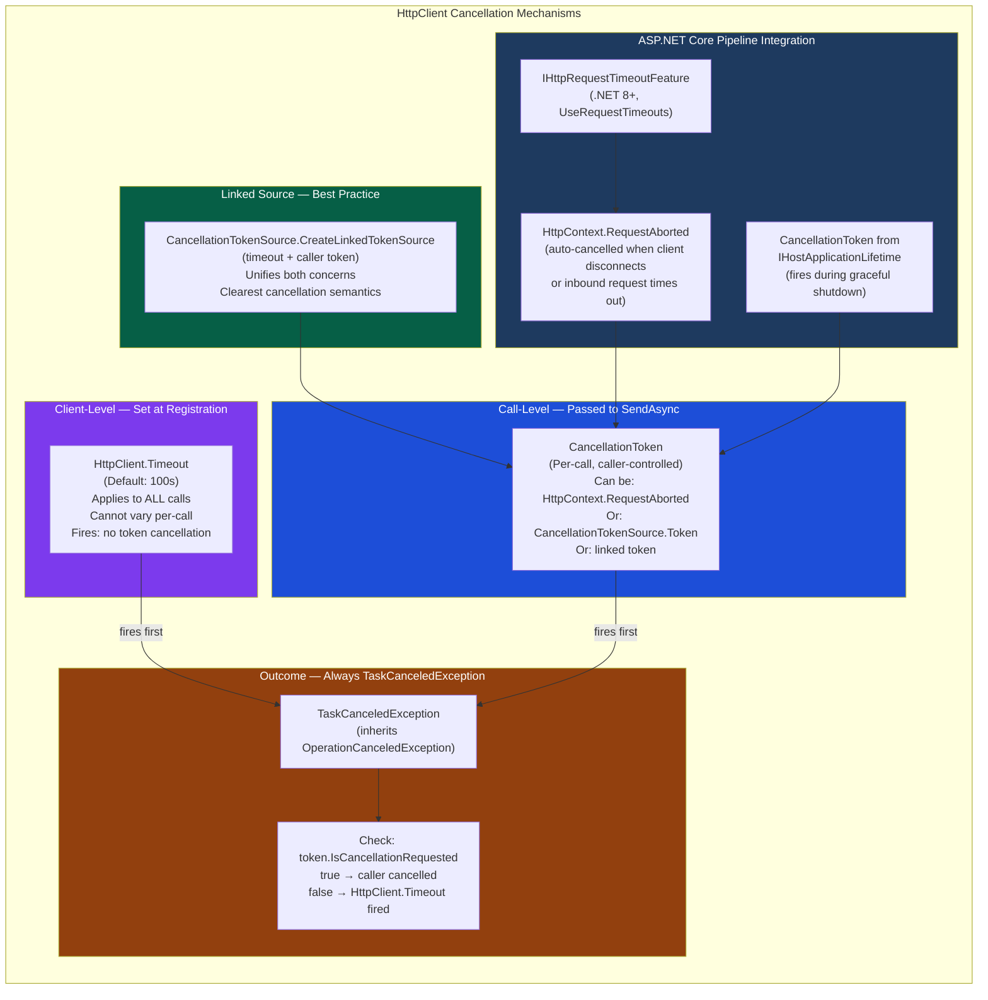

# 4.253 — HttpClient Timeout, CancellationToken, and Request Cancellation

---

## PART 0 — Navigation & Context

### Where This Topic Lives

```
ASP.NET Core Mastery
│
├── T. HttpClientFactory & HTTP Clients   (4.249–4.256)
│   ├── 4.249  IHttpClientFactory: Why HttpClient Must Never Be Newed Directly
│   ├── 4.250  Named and Typed HTTP Clients: Registration Patterns
│   ├── 4.251  DelegatingHandler: Message Handler Pipeline
│   ├── 4.252  Polly Integration: Retry, Circuit Breaker, Hedging
│   ├── ▶ 4.253  HttpClient Timeout, CancellationToken, and Request Cancellation  ◀ YOU ARE HERE
│   ├── 4.254  HttpClient Logging: Built-In Logging and Custom Handlers
│   ├── 4.255  Primary HttpMessageHandler Lifetime: Socket Exhaustion vs Stale DNS
│   └── 4.256  HttpClient with Credentials: Auth Headers, Certs, Bearer Tokens
│
├── Related Cross-Domain
│   ├── A. Host & Lifecycle: 4.010 — Graceful Shutdown and CancellationToken
│   ├── N. Caching: 4.199 — Request Timeouts (.NET 8): IHttpRequestTimeoutFeature
│   └── C#: 2.14 — Async/Await Internals (ValueTask, CancellationToken propagation)
```

### What You Need Before This

- **[[4.249 — IHttpClientFactory]]** — `HttpClient` is retrieved from the factory; you must understand factory lifecycle before configuring its timeout behavior
- **[[4.250 — Named and Typed HTTP Clients]]** — `HttpClient.Timeout` is set during registration; named/typed client configuration is where timeout policy lives
- **[[2.14 — Async/Await Internals]]** — `CancellationToken` propagates through the async continuation chain; understanding `OperationCanceledException` vs `TaskCanceledException` requires async knowledge
- **[[4.010 — Graceful Shutdown]]** — the host's shutdown `CancellationToken` is the outermost cancellation boundary for in-flight requests

### What This Unlocks After

- **[[4.251 — DelegatingHandler]]** — timeout enforcement via custom handlers is a direct pattern from this topic
- **[[4.252 — Polly Integration]]** — Polly's timeout strategy interacts with `CancellationToken` in ways this topic explains
- **[[4.255 — Primary HttpMessageHandler Lifetime]]** — socket exhaustion and DNS staleness interact with long-running requests and timeout configuration
- **[[4.199 — Request Timeouts (.NET 8)]]** — inbound request timeouts on your own endpoints mirror the same `CancellationToken` pattern for outbound calls

### Why This Matters at Scale

Misconfigured `HttpClient` timeouts are among the top five causes of cascading service failures in distributed .NET systems: a downstream service that hangs causes thread-pool starvation in the caller because threads block waiting for a `TaskCanceledException` that never arrives, eventually exhausting the Kestrel thread pool and taking down the API entirely — all because `HttpClient.Timeout` was left at the 100-second default.

---

## PART 1 — The Core Mental Model

### The Fundamental Rule

> **`HttpClient.Timeout` is a wall-clock deadline on the entire request/response lifecycle set at client construction time; `CancellationToken` passed to `SendAsync` is a per-call cooperative cancellation signal that the caller controls. When either fires, `SendAsync` throws `TaskCanceledException` — and the only way to know which one fired is to check `token.IsCancellationRequested`. The practical consequence is that relying on `HttpClient.Timeout` alone for cancellation in production APIs is almost always wrong: it cannot propagate the caller's own cancellation context, cannot be varied per-call, and cannot tell you whether the failure was a timeout or an upstream cancel.**

### The Plain-Language Analogy

Think of an outbound HTTP call like a taxi dispatch system. `HttpClient.Timeout` is the dispatcher's **standing rule**: "if any ride takes more than 100 seconds, cancel it automatically" — it applies to every ride, regardless of who booked it. A `CancellationToken` passed into `SendAsync` is the **passenger's personal cancel button**: they can push it at any time (their own request was cancelled, the server is shutting down, the user navigated away), and the dispatcher must abort their ride immediately, even if the standing timeout rule hasn't fired yet.

The two mechanisms are independent but composable: whichever fires first wins. If neither fires, the ride completes. If both fire simultaneously, the first one to actually cancel the internal `CancellationTokenSource` wins the race.

This analogy holds at scale: if the dispatcher's standing rule fires, the passenger doesn't know their specific ride was slow — they get `TaskCanceledException` without `IsCancellationRequested` being true on their token. If the passenger's cancel button fired, `IsCancellationRequested` is true on their token. You can always distinguish the two by checking the token — but only if you passed one in the first place.

### The Taxonomy Diagram



---

## PART 2 — Deep Mechanics

### 2.1 — `HttpClient.Timeout`: What the Property Actually Does

`HttpClient.Timeout` is not a socket-level TCP timeout. It is a deadline enforced by a `CancellationTokenSource` that `HttpClient` creates **internally** each time `SendAsync` is called. When the timeout expires, it cancels that internal CTS, which propagates into the `HttpMessageHandler` chain.

**Pipeline position:** This wraps the entire `HttpMessageHandler` pipeline — it is applied before the request even reaches the `SocketsHttpHandler`.

```
Caller.SendAsync(request, callerToken)
    │
    ├─► HttpClient creates internal CTS with Timeout deadline
    ├─► Links internal CTS with callerToken (if provided)
    ├─► Passes linked token into HttpMessageHandler chain
    │
    ▼
DelegatingHandler A → DelegatingHandler B → SocketsHttpHandler
    (DNS resolve, TCP connect, TLS handshake, send headers, receive response headers)
    │
    ◄── Response flows back up the chain
```

**Framework source behavior (approximate):**

```csharp
// System.Net.Http.HttpClient.SendAsync (approximate internal logic):
public async Task<HttpResponseMessage> SendAsync(
    HttpRequestMessage request,
    CancellationToken cancellationToken)
{
    // HttpClient.Timeout is applied here as an internal CTS
    CancellationTokenSource? timeoutCts = null;
    CancellationToken linkedToken = cancellationToken;

    if (Timeout != Timeout.InfiniteTimeSpan)
    {
        timeoutCts = new CancellationTokenSource(Timeout); // ~100s by default
        linkedToken = CancellationTokenSource
            .CreateLinkedTokenSource(cancellationToken, timeoutCts.Token)
            .Token;
    }

    try
    {
        return await _handler.SendAsync(request, linkedToken);
    }
    catch (OperationCanceledException oce) when (timeoutCts?.IsCancellationRequested == true)
    {
        // Timeout fired — wraps in TaskCanceledException WITHOUT innerException's token
        throw new TaskCanceledException(
            "The request was canceled due to the configured HttpClient.Timeout of " +
            $"{Timeout.TotalSeconds:0.###} seconds elapsing.",
            oce,
            linkedToken);  // Note: this is the LINKED token, not the caller's token
    }
    finally
    {
        timeoutCts?.Dispose();
    }
}
```

**The critical implication:** When `HttpClient.Timeout` fires, the `TaskCanceledException` is thrown with the **linked token**, not the caller's token. The caller's token's `IsCancellationRequested` is **false** — the timeout fired, not the caller. This is the root of the most common cancellation diagnostic bug.

**HTTP wire format:**

```
// HTTP request (never reaches the wire if timeout fires before connection):
// GET /api/inventory/stock/ITEM-99 HTTP/1.1
// Host: inventory-service.internal
// Accept: application/json

// HTTP response (none — connection is aborted):
// [TCP RST or connection close — no HTTP response is sent]

// The caller receives:
// TaskCanceledException: "The request was canceled due to the configured
// HttpClient.Timeout of 30.000 seconds elapsing."
```

**Runtime cost:** `~1 CancellationTokenSource allocation per request` when a timeout is configured. With `Timeout.InfiniteTimeSpan`, zero additional allocation. At 50,000 req/s this is non-trivial if you're in a hot path.

**Edge case that bites teams:** Setting `HttpClient.Timeout = Timeout.InfiniteTimeSpan` to "fix" timeout issues in development, then deploying to production where downstream services can hang indefinitely — this causes thread-pool starvation.

---

### 2.2 — `CancellationToken` in `SendAsync`: The Right Way to Cancel

The `CancellationToken` parameter to `SendAsync` (and `GetAsync`, `PostAsync`, etc.) is the correct production mechanism for per-call cancellation. In ASP.NET Core, the right token to pass is almost always `HttpContext.RequestAborted`.

**Pipeline position:**

```
──► ExceptionHandler ──► HSTS ──► Routing ──► Auth ──► [Your Endpoint]
                                                              │
                                              [reads HttpContext.RequestAborted]
                                                              │
                                              httpClient.GetAsync(url, cancellationToken: ctx.RequestAborted)
                                                              │
                                              [SocketsHttpHandler aborts TCP connection]
```

`HttpContext.RequestAborted` is a `CancellationToken` that Kestrel automatically cancels when:

- The HTTP client disconnects (TCP reset, browser closed)
- An inbound request timeout fires (`.NET 8 IHttpRequestTimeoutFeature`)
- The application begins graceful shutdown

**HTTP wire format:**

```
// HTTP request (initiated normally):
// GET /api/shipments/SHIP-4411/tracking HTTP/1.1
// Host: logistics-partner.external.com
// Authorization: Bearer eyJhbGci...

// When RequestAborted fires mid-flight:
// [TCP RST sent to logistics-partner.external.com]
// [SocketsHttpHandler cleans up the connection]

// The endpoint handler receives:
// OperationCanceledException or TaskCanceledException
// with token.IsCancellationRequested == true
```

**Framework source behavior — `SocketsHttpHandler` (approximate):**

```csharp
// SocketsHttpHandler checks the CancellationToken at each async boundary:
// - After DNS resolution
// - After TCP connection establishment
// - After TLS handshake
// - After sending request headers
// - While awaiting response headers
// - While reading the response body

// If the token is cancelled at ANY of these points:
// → The underlying socket is closed
// → An OperationCanceledException is thrown
// → IHttpClientFactory's handler pool reclaims the connection (or marks it broken)
```

**Runtime cost:** Zero allocations if you pass `CancellationToken.None` (default). One `CancellationTokenRegistration` allocation per `await` boundary where the token is checked. For a typical HTTP call with 4–6 async boundaries: `~4–6 allocations`, negligible.

**Edge case that bites teams at scale:** Passing `CancellationToken.None` explicitly to `SendAsync` in a controller action while the user has already disconnected — the request continues consuming thread-pool resources and downstream connections for the full `HttpClient.Timeout` duration.

---

### 2.3 — Combining Timeout and `CancellationToken`: The Linked Source Pattern

The production pattern is to combine both: set a `HttpClient.Timeout` as the absolute maximum (defense against runaway calls), AND pass `HttpContext.RequestAborted` (or a custom CTS token) so the call is also cancelled when the upstream context is cancelled.

But `HttpClient.Timeout` has a limitation: it cannot be varied per-call. If you need a 500ms timeout for one endpoint and a 5s timeout for another on the same typed client, you need `CancellationTokenSource.CreateLinkedTokenSource` manually.

**The per-call timeout pattern:**

```csharp
// ASP.NET Core internally (approximate) — what you replicate manually:
// 1. Set HttpClient.Timeout = Timeout.InfiniteTimeSpan during registration
// 2. Create a per-call CTS with the desired deadline
// 3. Link it with the caller's token
// 4. Pass the linked token to SendAsync

// This is the only way to have per-call timeout control
using var timeoutCts = new CancellationTokenSource(TimeSpan.FromSeconds(2));
using var linkedCts = CancellationTokenSource.CreateLinkedTokenSource(
    httpContext.RequestAborted,
    timeoutCts.Token);

await httpClient.GetAsync("/api/data", linkedCts.Token);
```

**Pipeline position diagram:**

```
Caller Token (RequestAborted)
        │
        ├──── CreateLinkedTokenSource ────┐
                                          │
Per-Call Timeout CTS (2s deadline)        │
        │                                 │
        └──── CreateLinkedTokenSource ────┘
                                          │
                                     LinkedToken
                                          │
                                 httpClient.SendAsync(request, linkedToken)
                                          │
                              SocketsHttpHandler reads linkedToken
                              at every async boundary
```

**Failure mode diagram:**

```
Scenario A: Per-call timeout fires (2s deadline)
    LinkedToken.IsCancellationRequested = true
    timeoutCts.Token.IsCancellationRequested = true
    callerToken.IsCancellationRequested = false (maybe)
    → You can detect this by checking timeoutCts.Token.IsCancellationRequested

Scenario B: Caller cancelled (client disconnect, server shutdown)
    LinkedToken.IsCancellationRequested = true
    timeoutCts.Token.IsCancellationRequested = false
    callerToken.IsCancellationRequested = true
    → Detected by callerToken.IsCancellationRequested

Scenario C: Both fire simultaneously
    Race condition — first CTS to cancel wins
    Both IsCancellationRequested = true
    → Operationally indistinguishable; log both
```

**Runtime cost:** `~2 CancellationTokenSource allocations + 2 CancellationTokenRegistration allocations per call` when using linked source. Pool CTS instances with `CancellationTokenSource.TryReset()` (.NET 6+) if you're in a very hot path (`> 50k req/s`).

---

### 2.4 — `TaskCanceledException` vs `OperationCanceledException`: The Diagnostic Trap

Both exceptions signal cancellation. `TaskCanceledException` inherits from `OperationCanceledException`. The framework throws different subtypes in different contexts:

```
HttpClient.SendAsync throws:
├── TaskCanceledException          (when HttpClient.Timeout fires)
│     .CancellationToken = linked token (NOT the caller's token)
│     .InnerException = OperationCanceledException
│
└── TaskCanceledException          (when caller's CancellationToken fires)
      .CancellationToken = caller's token
      .InnerException = null (usually)

SocketsHttpHandler throws (before HttpClient wraps it):
└── OperationCanceledException     (propagates up as TaskCanceledException)
```

**The diagnostic code every senior engineer must know:**

```csharp
// ASP.NET Core internally (approximate) — what you must write in your handler:
try
{
    var response = await httpClient.GetAsync(url, cancellationToken);
    // process response
}
catch (TaskCanceledException tce) when (!cancellationToken.IsCancellationRequested)
{
    // HttpClient.Timeout fired — this is a genuine timeout
    // The downstream service was too slow
    _logger.LogWarning("Downstream call to {Url} timed out after {Timeout}",
        url, httpClient.Timeout);
    throw new GatewayTimeoutException(url, tce);
}
catch (OperationCanceledException) when (cancellationToken.IsCancellationRequested)
{
    // Caller cancelled — client disconnected, server shutting down, etc.
    // This is NOT an error; it's cooperative cancellation working correctly
    _logger.LogDebug("Downstream call to {Url} was cancelled by caller", url);
    throw; // propagate — do not convert to 500
}
```

**Runtime cost:** Exception handling is free on the happy path (no allocation until the exception is constructed). The `when` clause evaluates inline — `O(1)`.

**Edge case: Polly retry + timeout interaction.** If a Polly retry policy wraps a `SendAsync` call and `HttpClient.Timeout` fires during retry #2, the retry policy catches the `TaskCanceledException` and retries again — potentially exceeding the per-call timeout. This is a known gotcha. Solution: use Polly's own `TimeoutStrategy` instead of `HttpClient.Timeout` when Polly is in use. See [[4.252 — Polly Integration]].

---

### 2.5 — Graceful Shutdown and In-Flight Requests

When ASP.NET Core begins graceful shutdown, Kestrel:

1. Stops accepting new connections
2. Waits for in-flight requests to complete (up to `ShutdownTimeout`, default 5s)
3. Cancels `IHostApplicationLifetime.ApplicationStopping` token

Any outbound HTTP call made inside a request handler inherits `HttpContext.RequestAborted`. During graceful shutdown, Kestrel cancels `RequestAborted` for all active requests **before** the 5-second drain window closes, causing in-flight `SendAsync` calls to throw `OperationCanceledException`.

**Pipeline position:**

```
Host.StopAsync() called
    │
    ├─► Kestrel stops accepting new connections
    ├─► RequestAborted is cancelled for all active requests
    ├─► In-flight httpClient.SendAsync() receives cancellation
    ├─► TaskCanceledException propagates up to controller/handler
    ├─► Response is written with 503 or exception handler fires
    └─► Host waits up to ShutdownTimeout for all requests to drain
```

**HTTP wire format during graceful shutdown:**

```
// Request that arrives during shutdown (new connection):
// [Kestrel refuses connection — no HTTP response]

// Request already in-flight during shutdown:
// GET /api/payments/checkout HTTP/1.1 (already processing)
// → outbound call to payment-gateway is cancelled
// → exception handler returns:
// HTTP/1.1 503 Service Unavailable
// Content-Type: application/problem+json
// {"type":"service-unavailable","title":"Service shutting down","status":503}
```

**Runtime cost:** Zero additional cost — `RequestAborted` is already allocated and wired by Kestrel per request. The cancellation propagation is `O(1)`.

---

## PART 3 — Production Code Patterns

### Pattern 1: The RequestAborted-First Outbound Call (Logistics Tracking Service)

The baseline pattern every ASP.NET Core endpoint that makes outbound calls must follow — always pass `HttpContext.RequestAborted` to prevent orphaned downstream connections.

```csharp
// ⚠️ WRONG: Ignores caller cancellation — outbound call continues even after
//            the HTTP client disconnects or the server begins shutdown
[HttpGet("/api/shipments/{trackingId}/status")]
public async Task<IActionResult> GetShipmentStatus(string trackingId)
{
    // If the user closes their browser at 5s, this call runs for up to 100s
    var response = await _logisticsClient.GetAsync(
        $"/tracking/{trackingId}");
    // ...
}

// ✅ CORRECT: The outbound call is cancelled when the HTTP client disconnects
[HttpGet("/api/shipments/{trackingId}/status")]
public async Task<IActionResult> GetShipmentStatus(
    string trackingId,
    CancellationToken cancellationToken)  // ASP.NET Core auto-binds HttpContext.RequestAborted
{
    // cancellationToken IS HttpContext.RequestAborted in Minimal APIs and MVC
    // when declared as a parameter — the framework wires it automatically
    var response = await _logisticsClient.GetAsync(
        $"/tracking/{trackingId}",
        cancellationToken);  // cancel when the caller disconnects

    if (!response.IsSuccessStatusCode)
        return StatusCode((int)response.StatusCode);

    var status = await response.Content.ReadFromJsonAsync<ShipmentStatus>(cancellationToken);
    return Ok(status);
}

// HTTP wire format (correct path):
// GET /api/shipments/SHIP-99/status HTTP/1.1
// → outbound: GET /tracking/SHIP-99 HTTP/1.1
// ← inbound: HTTP/1.1 200 OK (if not cancelled)

// HTTP wire format (caller disconnected):
// [TCP RST from outbound connection to logistics partner]
// [OperationCanceledException propagates, no 500 logged]
```

**Domain:** Logistics tracking API calling an external partner's REST endpoint.

---

### Pattern 2: The Per-Call Timeout Guard (Payment Gateway Integration)

For payment APIs, each operation must have its own strict timeout independent of `HttpClient.Timeout`, which is shared across all calls on the typed client.

```csharp
// ⚠️ WRONG: HttpClient.Timeout = 30s applies to EVERY payment call
//            (charge, refund, void, health-check all get the same timeout)
public class PaymentGatewayClient
{
    private readonly HttpClient _http;

    public async Task<ChargeResult> ChargeAsync(ChargeRequest req, CancellationToken ct)
    {
        // Charge should timeout in 8s, but it'll wait up to 30s
        return await _http.PostAsJsonAsync("/v1/charges", req, ct)
            .ContinueWith(/* ... */);
    }
}

// ✅ CORRECT: Per-operation timeouts via linked CancellationTokenSource
public class PaymentGatewayClient
{
    private readonly HttpClient _http;
    private readonly ILogger<PaymentGatewayClient> _logger;

    // HttpClient.Timeout is set to InfiniteTimeSpan at registration
    // because WE control the timeout per-operation
    public PaymentGatewayClient(HttpClient http, ILogger<PaymentGatewayClient> logger)
    {
        _http = http;
        _logger = logger;
    }

    public async Task<ChargeResult> ChargeAsync(
        ChargeRequest request,
        CancellationToken callerToken)
    {
        // Charge must complete within 8 seconds — PCI DSS requirement
        using var timeoutCts = new CancellationTokenSource(TimeSpan.FromSeconds(8));
        using var linkedCts = CancellationTokenSource
            .CreateLinkedTokenSource(callerToken, timeoutCts.Token);

        try
        {
            var response = await _http.PostAsJsonAsync(
                "/v1/charges",
                request,
                linkedCts.Token);

            response.EnsureSuccessStatusCode();
            return await response.Content
                .ReadFromJsonAsync<ChargeResult>(linkedCts.Token)
                ?? throw new InvalidOperationException("Empty charge response");
        }
        catch (TaskCanceledException) when (timeoutCts.IsCancellationRequested)
        {
            // Payment gateway timed out — this is a gateway fault, not our fault
            _logger.LogError(
                "Payment gateway charge call exceeded 8s for order {OrderId}",
                request.OrderId);
            throw new PaymentGatewayTimeoutException(request.OrderId);
        }
        catch (OperationCanceledException) when (callerToken.IsCancellationRequested)
        {
            // Caller cancelled (client disconnect, graceful shutdown)
            // Do NOT log as error — this is cooperative cancellation
            _logger.LogDebug(
                "Charge for order {OrderId} cancelled by caller",
                request.OrderId);
            throw;  // propagate the cancellation
        }
    }

    public async Task<RefundResult> RefundAsync(
        RefundRequest request,
        CancellationToken callerToken)
    {
        // Refunds can take longer due to bank processing — 15s timeout
        using var timeoutCts = new CancellationTokenSource(TimeSpan.FromSeconds(15));
        using var linkedCts = CancellationTokenSource
            .CreateLinkedTokenSource(callerToken, timeoutCts.Token);

        // same pattern, different deadline
        var response = await _http.PostAsJsonAsync("/v1/refunds", request, linkedCts.Token);
        response.EnsureSuccessStatusCode();
        return await response.Content.ReadFromJsonAsync<RefundResult>(linkedCts.Token)
            ?? throw new InvalidOperationException("Empty refund response");
    }
}
```

**Registration (Program.cs):**

```csharp
builder.Services.AddHttpClient<PaymentGatewayClient>(client =>
{
    client.BaseAddress = new Uri("https://api.payment-gateway.com");
    // Infinite — we control timeout per-operation in the client itself
    client.Timeout = Timeout.InfiniteTimeSpan;
    client.DefaultRequestHeaders.Add("X-Api-Key", builder.Configuration["Payment:ApiKey"]);
});
```

**HTTP wire format:**

```
// POST /v1/charges HTTP/1.1
// Host: api.payment-gateway.com
// Content-Type: application/json
// X-Api-Key: pk_live_...
// {"orderId":"ORD-991","amount":4999,"currency":"USD"}

// If gateway hangs for >8s:
// [TCP RST after 8s — connection aborted]
// PaymentGatewayTimeoutException thrown
// → Caller receives: HTTP/1.1 504 Gateway Timeout
```

**Domain:** E-commerce payment processing with per-operation SLA enforcement.

---

### Pattern 3: The DelegatingHandler Timeout Enforcer (Order Management Service)

When you need consistent timeout behavior across ALL calls on a typed client, implemented once, a `DelegatingHandler` is cleaner than per-call CTS management.

```csharp
// Reusable timeout enforcer — registered in the handler pipeline
// Advantage: timeout logic lives in one place, not scattered across methods
public class OperationTimeoutHandler : DelegatingHandler
{
    private readonly TimeSpan _timeout;
    private readonly ILogger<OperationTimeoutHandler> _logger;

    public OperationTimeoutHandler(TimeSpan timeout, ILogger<OperationTimeoutHandler> logger)
    {
        _timeout = timeout;
        _logger = logger;
    }

    protected override async Task<HttpResponseMessage> SendAsync(
        HttpRequestMessage request,
        CancellationToken cancellationToken)
    {
        using var timeoutCts = new CancellationTokenSource(_timeout);
        using var linkedCts = CancellationTokenSource
            .CreateLinkedTokenSource(cancellationToken, timeoutCts.Token);

        try
        {
            return await base.SendAsync(request, linkedCts.Token);
        }
        catch (OperationCanceledException) when (timeoutCts.IsCancellationRequested
                                                  && !cancellationToken.IsCancellationRequested)
        {
            _logger.LogWarning(
                "HTTP {Method} {Url} timed out after {Timeout}ms",
                request.Method,
                request.RequestUri,
                _timeout.TotalMilliseconds);

            // Re-throw as a more informative exception type
            throw new HttpRequestException(
                $"Request to {request.RequestUri} timed out after {_timeout.TotalSeconds}s.",
                inner: null,
                statusCode: System.Net.HttpStatusCode.GatewayTimeout);
        }
    }
}

// Registration for the Order Inventory client
builder.Services.AddTransient<OperationTimeoutHandler>(sp =>
    new OperationTimeoutHandler(
        TimeSpan.FromSeconds(3),
        sp.GetRequiredService<ILogger<OperationTimeoutHandler>>()));

builder.Services.AddHttpClient<InventoryServiceClient>(client =>
{
    client.BaseAddress = new Uri("https://inventory.internal.company.com");
    client.Timeout = Timeout.InfiniteTimeSpan; // handler owns timeout
})
.AddHttpMessageHandler<OperationTimeoutHandler>();
```

**HTTP wire format:**

```
// GET /api/inventory/orders/ORD-44/items HTTP/1.1
// Host: inventory.internal.company.com

// If inventory service is slow (>3s):
// [TCP RST after 3s]
// HTTP/1.1 504 Gateway Timeout (mapped from HttpRequestException with GatewayTimeout statusCode)
```

**Domain:** Order management service calling an internal inventory microservice with strict 3s SLA.

---

### Pattern 4: The Graceful Shutdown—Aware Endpoint (Background Job API)

Long-running endpoints (report generation, bulk export) must respect both the caller's token AND the host shutdown token, without crashing with 500 during shutdown.

```csharp
// ⚠️ WRONG: Catches ALL OperationCanceledException as errors
[HttpPost("/api/reports/generate")]
public async Task<IActionResult> GenerateReport([FromBody] ReportRequest request)
{
    try
    {
        var data = await _dataWarehouseClient.GetAsync(
            $"/datasets/{request.DatasetId}");
        // ... long processing
        return Ok(new { reportId = Guid.NewGuid() });
    }
    catch (OperationCanceledException ex)
    {
        // ⚠️ WRONG: Logs error for client disconnects and graceful shutdowns
        _logger.LogError(ex, "Report generation failed");
        return StatusCode(500, "Report generation failed");
    }
}

// ✅ CORRECT: Distinguishes cancellation from errors; handles shutdown gracefully
[HttpPost("/api/reports/generate")]
public async Task<IActionResult> GenerateReport(
    [FromBody] ReportRequest request,
    CancellationToken cancellationToken)  // = HttpContext.RequestAborted
{
    try
    {
        var data = await _dataWarehouseClient.GetAsync(
            $"/datasets/{request.DatasetId}",
            cancellationToken);

        data.EnsureSuccessStatusCode();

        var reportData = await data.Content
            .ReadFromJsonAsync<DatasetPayload>(cancellationToken);

        var report = await _reportingEngine
            .GenerateAsync(reportData!, cancellationToken);

        return CreatedAtRoute("GetReport",
            new { reportId = report.Id },
            new ReportCreatedResponse(report.Id));
    }
    catch (OperationCanceledException) when (cancellationToken.IsCancellationRequested)
    {
        // Client disconnected OR host is shutting down — NOT an error
        // Return 499 (Nginx convention for client closed request) or just let it propagate
        // Don't return 500 — the request was cancelled cooperatively
        _logger.LogInformation(
            "Report generation for dataset {DatasetId} cancelled (client disconnect or shutdown)",
            request.DatasetId);

        // Returning here writes a response only if the connection is still open
        // If the client already disconnected, this write is silently discarded
        return StatusCode(499);
    }
    catch (HttpRequestException ex) when (ex.StatusCode == System.Net.HttpStatusCode.GatewayTimeout)
    {
        _logger.LogWarning(
            "Data warehouse timed out for dataset {DatasetId}", request.DatasetId);
        return StatusCode(504, new { error = "Data warehouse unavailable" });
    }
}
```

**HTTP wire format:**

```
// POST /api/reports/generate HTTP/1.1
// {"datasetId":"DS-2991","format":"xlsx","dateRange":{"from":"2025-01","to":"2025-12"}}

// If client disconnects during processing:
// [TCP RST received by Kestrel]
// [HttpContext.RequestAborted fires]
// [outbound data warehouse call is cancelled]
// [No HTTP response written — connection is gone]

// If host is gracefully shutting down:
// [RequestAborted fires as part of drain]
// [499 response written (may not reach client)]
```

**Domain:** Financial reporting API with large dataset fetching.

---

### Pattern 5: The CancellationToken TryReset Pool (.NET 6+, High-Throughput Inventory API)

At very high throughput (> 50k req/s), creating a new `CancellationTokenSource` per call is measurable. `.NET 6` added `TryReset()` to allow CTS reuse.

```csharp
// High-throughput inventory lookup — reduces CTS allocation pressure
public class InventoryLookupService
{
    private readonly HttpClient _http;

    // ⚠️ WRONG: New CTS per call at 50k req/s = 50k CTS allocations/s
    public async Task<InventoryLevel?> GetStockLevelAsync(
        string sku,
        CancellationToken callerToken)
    {
        using var timeoutCts = new CancellationTokenSource(TimeSpan.FromSeconds(1));
        // new allocation every call
        using var linkedCts = CancellationTokenSource
            .CreateLinkedTokenSource(callerToken, timeoutCts.Token);

        var response = await _http.GetAsync($"/stock/{sku}", linkedCts.Token);
        if (response.StatusCode == System.Net.HttpStatusCode.NotFound) return null;
        response.EnsureSuccessStatusCode();
        return await response.Content.ReadFromJsonAsync<InventoryLevel>(linkedCts.Token);
    }

    // ✅ CORRECT (.NET 6+): TryReset allows CTS reuse — reduced GC pressure in hot path
    // Note: Only safe when the CTS is used sequentially (one call at a time per CTS)
    // This pattern is appropriate when the service is a Scoped or Transient service
    private readonly CancellationTokenSource _reusableTimeoutCts = new();

    public async Task<InventoryLevel?> GetStockLevelFastAsync(
        string sku,
        CancellationToken callerToken)
    {
        // Reset and re-arm the CTS for the new call
        if (!_reusableTimeoutCts.TryReset())
        {
            // If TryReset fails (already cancelled), create a new one
            // This is a fallback — in practice TryReset succeeds when the previous
            // call completed normally
            return await GetStockLevelFallbackAsync(sku, callerToken);
        }

        _reusableTimeoutCts.CancelAfter(TimeSpan.FromSeconds(1));

        using var linkedCts = CancellationTokenSource
            .CreateLinkedTokenSource(callerToken, _reusableTimeoutCts.Token);

        try
        {
            var response = await _http.GetAsync($"/stock/{sku}", linkedCts.Token);
            if (response.StatusCode == System.Net.HttpStatusCode.NotFound) return null;
            response.EnsureSuccessStatusCode();
            return await response.Content.ReadFromJsonAsync<InventoryLevel>(linkedCts.Token);
        }
        catch (OperationCanceledException) when (_reusableTimeoutCts.IsCancellationRequested
                                                   && !callerToken.IsCancellationRequested)
        {
            throw new InventoryServiceTimeoutException(sku);
        }
    }

    private async Task<InventoryLevel?> GetStockLevelFallbackAsync(
        string sku, CancellationToken ct)
    {
        using var newCts = new CancellationTokenSource(TimeSpan.FromSeconds(1));
        using var linked = CancellationTokenSource.CreateLinkedTokenSource(ct, newCts.Token);
        var response = await _http.GetAsync($"/stock/{sku}", linked.Token);
        if (response.StatusCode == System.Net.HttpStatusCode.NotFound) return null;
        response.EnsureSuccessStatusCode();
        return await response.Content.ReadFromJsonAsync<InventoryLevel>(linked.Token);
    }
}
```

> [!WARNING] `TryReset()` is only safe when the CTS is used by a single caller at a time. Never attempt CTS pooling on Singleton services where multiple concurrent requests might share the same CTS instance. The `_reusableTimeoutCts` above must live on a Scoped or Transient service.

**Domain:** E-commerce inventory availability check in a high-throughput product listing endpoint.

---

### Pattern 6: Minimal API with CancellationToken Auto-Binding (User Service)

In Minimal APIs, `CancellationToken` is automatically bound to `HttpContext.RequestAborted` when declared as a parameter — no `[FromServices]` attribute required.

```csharp
// ✅ Minimal API — CancellationToken auto-binding (no attribute needed)
app.MapGet("/api/users/{userId}/profile", async (
    string userId,
    IUserProfileClient userProfileClient,
    CancellationToken cancellationToken) =>  // automatically = HttpContext.RequestAborted
{
    try
    {
        var profile = await userProfileClient.GetProfileAsync(userId, cancellationToken);
        return profile is null
            ? Results.NotFound(new { userId, error = "User not found" })
            : Results.Ok(profile);
    }
    catch (OperationCanceledException) when (cancellationToken.IsCancellationRequested)
    {
        // Client disconnected before the profile loaded — not an error
        return Results.Empty; // nothing to write; connection is gone
    }
    catch (UserServiceTimeoutException ex)
    {
        return Results.Problem(
            title: "User service unavailable",
            detail: $"User profile lookup timed out for user {userId}",
            statusCode: 504);
    }
});

// HTTP wire format:
// GET /api/users/USR-9921/profile HTTP/1.1
// → outbound: GET /profile/USR-9921 HTTP/1.1 (with cancellationToken)
// ← HTTP/1.1 200 OK (or cancelled if client disconnects)
```

**Domain:** User authentication portal calling an internal user profile service.

---

## PART 4 — Gotchas & Anti-Patterns

### Gotcha 1: Catching `OperationCanceledException` and Logging It as an Error

Senior engineers know cancellation is cooperative and should not produce error-level logs. But they write exception handlers that catch all cancellation as errors, filling dashboards with false alarms during every deployment (graceful shutdown triggers cancellation for all in-flight requests).

```csharp
// ⚠️ WRONG: Every client disconnect and graceful shutdown fires an error alert
try
{
    var data = await _inventoryClient.GetAsync("/stock", cancellationToken);
    // ...
}
catch (Exception ex)
{
    // Logs OperationCanceledException as an application error
    _logger.LogError(ex, "Inventory call failed");
    throw;
}

// HTTP consequence (wrong path):
// Every graceful deployment fires N error logs (one per in-flight request)
// PagerDuty alerts on error rate spike during deployment window
// Engineers lose trust in error monitoring

// ✅ CORRECT: Distinguish cancellation from errors
try
{
    var data = await _inventoryClient.GetAsync("/stock", cancellationToken);
    // ...
}
catch (OperationCanceledException) when (cancellationToken.IsCancellationRequested)
{
    // Cooperative cancellation — INFO or DEBUG level
    _logger.LogDebug("Inventory call cancelled by caller");
    throw; // do not swallow — let it propagate as 499 or handled cancellation
}
catch (Exception ex)
{
    // Genuine errors only
    _logger.LogError(ex, "Inventory call failed with unexpected error");
    throw;
}

// HTTP consequence (correct path):
// Deployments are silent in error dashboards
// Only genuine connectivity or parsing errors trigger alerts
```

**WHY:** `OperationCanceledException` is a first-class outcome in ASP.NET Core's cooperative cancellation model — it is not an error. The framework returns 499 (or nothing, if the connection is gone) and does not treat it as a 500. Your logging should mirror this.

---

### Gotcha 2: `HttpClient.Timeout` Is Set After `HttpClient` Is Retrieved from Factory

`HttpClient` returned by `IHttpClientFactory.CreateClient()` should be treated as already-configured. Setting `Timeout` on it at runtime works for the first call but the property is not thread-safe to mutate while another request is in flight on the same instance. More insidiously, `AddHttpClient` configuration runs once at build time — runtime mutation bypasses all that.

```csharp
// ⚠️ WRONG: Mutating Timeout on a factory-managed HttpClient
public async Task<OrderSummary> GetOrderSummaryAsync(string orderId, int timeoutSeconds)
{
    var client = _httpClientFactory.CreateClient("OrderService");
    client.Timeout = TimeSpan.FromSeconds(timeoutSeconds); // ⚠️ Thread-unsafe mutation!
    return await client.GetFromJsonAsync<OrderSummary>($"/orders/{orderId}");
}

// HTTP consequence (wrong path):
// Under concurrent load, Thread A sets Timeout=5s, Thread B sets Timeout=30s
// Thread A's call may use the 30s timeout — data race with no exception thrown
// In .NET 8 this throws InvalidOperationException if a request is already in progress

// ✅ CORRECT: Use per-call CTS for variable timeouts; set fixed Timeout at registration
public async Task<OrderSummary> GetOrderSummaryAsync(
    string orderId,
    int timeoutSeconds,
    CancellationToken callerToken)
{
    var client = _httpClientFactory.CreateClient("OrderService");
    // DO NOT touch client.Timeout here

    using var timeoutCts = new CancellationTokenSource(TimeSpan.FromSeconds(timeoutSeconds));
    using var linked = CancellationTokenSource.CreateLinkedTokenSource(callerToken, timeoutCts.Token);

    return await client.GetFromJsonAsync<OrderSummary>($"/orders/{orderId}", linked.Token)
        ?? throw new InvalidOperationException("Null response from order service");
}

// HTTP consequence (correct path):
// Each call has its own CTS — no shared mutable state
// Thread-safe under any level of concurrency
```

**WHY:** `HttpClient` is designed to be shared (it is reused across the `IHttpClientFactory` handler lifetime). Its properties like `BaseAddress`, `DefaultRequestHeaders`, and `Timeout` should only be set during `AddHttpClient` configuration. After the client is created, treat it as read-only — use `CancellationToken` and `HttpRequestMessage` for per-call variation.

---

### Gotcha 3: Not Disposing the `CancellationTokenSource` in the Linked Pattern

`CancellationTokenSource` implements `IDisposable`. Failing to dispose it leaks a timer (if `CancelAfter` was called) and a `CancellationTokenRegistration` (if linked). In a high-throughput API at 10k req/s, undisposed CTS instances accumulate and cause measurable Gen2 GC pressure.

```csharp
// ⚠️ WRONG: CTS not disposed — timer leaks
public async Task<ProductDetails?> GetProductAsync(string sku, CancellationToken ct)
{
    var timeoutCts = new CancellationTokenSource(TimeSpan.FromSeconds(2)); // timer allocated
    var linked = CancellationTokenSource.CreateLinkedTokenSource(ct, timeoutCts.Token);
    // Note: no using or Dispose() call anywhere!

    return await _productCatalogClient
        .GetFromJsonAsync<ProductDetails>($"/products/{sku}", linked.Token);
    // timeoutCts and linked are never disposed
    // Timer continues firing in background until GC finalizer runs (non-deterministic)
}

// HTTP consequence (wrong path):
// At 10k req/s → 10k undisposed CTS timers per second
// GC pressure increases, P99 latency spikes on Gen2 collections
// Timer queue grows unboundedly until next GC — periodic latency spikes

// ✅ CORRECT: Always dispose with using
public async Task<ProductDetails?> GetProductAsync(string sku, CancellationToken ct)
{
    using var timeoutCts = new CancellationTokenSource(TimeSpan.FromSeconds(2));
    using var linked = CancellationTokenSource.CreateLinkedTokenSource(ct, timeoutCts.Token);

    try
    {
        return await _productCatalogClient
            .GetFromJsonAsync<ProductDetails>($"/products/{sku}", linked.Token);
    }
    catch (OperationCanceledException) when (timeoutCts.IsCancellationRequested
                                              && !ct.IsCancellationRequested)
    {
        throw new ProductCatalogTimeoutException(sku);
    }
}

// HTTP consequence (correct path):
// CTS disposed immediately after call completes or throws
// Timer cancelled and timer queue entry removed promptly
// No GC pressure from timer accumulation
```

**WHY:** `CancellationTokenSource.Dispose()` calls `CancelAfter`'s internal `System.Threading.Timer.Dispose()`, removing it from the timer queue immediately. `CreateLinkedTokenSource` result's `Dispose()` unregisters the `CancellationTokenRegistration` from both parent tokens. Neither happens via GC — they require explicit disposal.

---

### Gotcha 4: Polly Retry Swallows the CancellationToken and Retries After Cancellation

When Polly's `AddPolicyHandler` wraps `SendAsync`, Polly catches `TaskCanceledException` and decides whether to retry based on its policy. A common misconfiguration: a retry policy that catches ALL transient exceptions, including `TaskCanceledException` from a cancelled `CancellationToken` — meaning Polly retries a call that the caller already cancelled.

```csharp
// ⚠️ WRONG: Retry policy does not exempt caller cancellation
builder.Services.AddHttpClient<ShipmentClient>(/* ... */)
    .AddTransientHttpErrorPolicy(policy =>
        policy.RetryAsync(3));
// AddTransientHttpErrorPolicy catches: 5xx, 408, network errors, TaskCanceledException
// This includes TaskCanceledException from HttpContext.RequestAborted being cancelled
// Result: 3 extra retries after the HTTP client has already disconnected!

// HTTP consequence (wrong path):
// Client disconnects → RequestAborted fires → SendAsync throws TaskCanceledException
// Polly retries 3 times → 3 unnecessary outbound calls to the shipment service
// → 3x the downstream load during cancellation events (including every deployment)

// ✅ CORRECT: Retry policy exempts caller cancellation
builder.Services.AddHttpClient<ShipmentClient>(/* ... */)
    .AddPolicyHandler((services, request) =>
        HttpPolicyExtensions
            .HandleTransientHttpError()
            .Or<TaskCanceledException>(tce =>
                // Only retry on timeout (HttpClient.Timeout), not caller cancellation
                // We detect HttpClient.Timeout by the absence of a cancelled token
                // In Polly context we check: is the exception from our own timeout CTS?
                tce is { CancellationToken.IsCancellationRequested: false })
            .RetryAsync(3, onRetry: (result, retryCount, context) =>
            {
                services.GetRequiredService<ILogger<ShipmentClient>>()
                    .LogWarning("Shipment service retry {RetryCount}: {Error}",
                        retryCount, result.Exception?.Message ?? result.Result?.StatusCode.ToString());
            }));

// HTTP consequence (correct path):
// Client disconnects → Polly sees TaskCanceledException with IsCancellationRequested=true
// → Polly does NOT retry (predicate returns false for cancelled callers)
// → Exception propagates immediately
// Genuine timeouts → Polly sees TaskCanceledException with IsCancellationRequested=false
// → Polly retries up to 3 times
```

**WHY:** `AddTransientHttpErrorPolicy` from `Microsoft.Extensions.Http.Polly` (v7 and earlier) includes `TaskCanceledException` in its predefined set of transient errors. It cannot distinguish `HttpClient.Timeout` from caller cancellation. The fix is to define your own `HandleTransientHttpError` predicate that checks `IsCancellationRequested`.

---

### Gotcha 5: `HttpClient.Timeout` Countdown Starts at `SendAsync`, Not at Connection Establishment

`HttpClient.Timeout` covers the ENTIRE request lifecycle — DNS resolution, TCP connection, TLS handshake, sending request headers, waiting for response headers, AND reading the response body. Teams often set a 5s timeout expecting it to cover "the API call" but it fires during large response body reads that take 4.8s, not because the API was slow to respond.

```csharp
// ⚠️ WRONG: 5s timeout fires during large response body read
builder.Services.AddHttpClient<ReportingClient>(client =>
{
    client.BaseAddress = new Uri("https://reporting.company.com");
    client.Timeout = TimeSpan.FromSeconds(5);
    // "5 seconds should be enough for an API call"
});

// Usage:
var response = await _http.GetAsync("/api/reports/annual-summary");
// response headers arrive at T=0.3s — success!
var report = await response.Content.ReadFromJsonAsync<AnnualReport>(ct);
// ⚠️ ReadFromJsonAsync reads the body — if the body is 50MB, it takes 4.8s to read
// Total elapsed: 0.3 + 4.8 = 5.1s > 5s → TaskCanceledException fires HERE
// Not because the API was slow — because the response body was large

// HTTP consequence (wrong path):
// HTTP/1.1 200 OK is received
// Body starts streaming
// Timer fires at T=5s
// TaskCanceledException thrown mid-body-read
// Partial response discarded

// ✅ CORRECT: Understand timeout scope; use per-phase approach for large responses
builder.Services.AddHttpClient<ReportingClient>(client =>
{
    client.BaseAddress = new Uri("https://reporting.company.com");
    // Set a generous outer timeout; use per-operation CTS for fine-grained control
    client.Timeout = TimeSpan.FromSeconds(120); // covers DNS + connect + headers + body
});

// Then use per-call CTS for the "time to first byte" SLA if needed:
using var firstByteTimeoutCts = new CancellationTokenSource(TimeSpan.FromSeconds(5));
using var linked = CancellationTokenSource.CreateLinkedTokenSource(ct, firstByteTimeoutCts.Token);

// Complete = get headers. Headers arriving = "API responded", body is streaming.
using var response = await _http.GetAsync(
    "/api/reports/annual-summary",
    HttpCompletionOption.ResponseHeadersRead,  // ← returns as soon as headers arrive
    linked.Token);

firstByteTimeoutCts.Dispose(); // headers received — 5s first-byte guarantee met

// Now read body with the caller's token only (no artificial deadline on body read)
var report = await response.Content.ReadFromJsonAsync<AnnualReport>(ct);

// HTTP consequence (correct path):
// Headers arrive at T=0.3s → firstByteTimeoutCts cancelled (because it won the race)
// Wait — we still Dispose it since it fired but we already got headers
// Body reads with caller's token only — no spurious timeout during large read
```

**WHY:** `HttpClient.Timeout` uses one `CancellationTokenSource` for the entire call duration, including body deserialization. `HttpCompletionOption.ResponseHeadersRead` returns the `Task<HttpResponseMessage>` as soon as the response headers are read, allowing the caller to separately control body read time. This is the standard pattern for large streaming responses.

---

## PART 5 — Performance Implications

### 5.1 — Request Pipeline Characteristics Table

|Scenario|Pipeline Depth|Allocations Per Request|Approx Latency Impact|Recommendation|
|---|---|---|---|---|
|`HttpClient.Timeout` default (100s), no caller token|HttpClient + SocketsHttpHandler|~1 CTS + ~1 linked CTS|0ms (until timeout fires)|Acceptable for low-throughput internal calls; unacceptable for production|
|`HttpClient.Timeout = Infinite`, caller token only|HttpClient + SocketsHttpHandler|0 extra allocations|~0µs overhead|Best for high-throughput when HttpClient.Timeout set at registration|
|Per-call linked CTS (2 CTS + 2 registrations)|HttpClient + SocketsHttpHandler|~4 objects|~1-2µs overhead|Recommended for typed clients needing per-operation timeouts|
|`TryReset()` CTS reuse (.NET 6+)|HttpClient + SocketsHttpHandler|~1 linked CTS (outer reused)|~0.5-1µs overhead|Use at >50k req/s where CTS allocation is measurable|
|DelegatingHandler-based timeout|HttpClient + DelegatingHandler + SocketsHttpHandler|~2 CTS + ~2 registrations|~2-3µs overhead|Adds one async state machine; measurable but negligible at <50k req/s|
|`HttpCompletionOption.ResponseHeadersRead`|HttpClient pipeline|Same as above|Reduces perceived latency for large bodies|Use for streaming endpoints or responses >100KB|
|Polly retry with correct cancellation exemption|HttpClient + Polly + SocketsHttpHandler|+1 Polly execution context|~5-10µs overhead per call|Worthwhile for resilience; do not retry on caller cancellation|
|Uncancelled request after client disconnect (wrong)|Full pipeline runs to completion|Holds thread-pool thread|Up to `HttpClient.Timeout` delay|Never — always pass caller token|
|`CancellationToken.None` on every call|HttpClient + SocketsHttpHandler|No CTS allocations|Slightly faster per-call|Only safe for fire-and-forget background work without any caller context|

### 5.2 — BenchmarkDotNet Comparison

```csharp
using BenchmarkDotNet.Attributes;
using BenchmarkDotNet.Running;
using Microsoft.Extensions.DependencyInjection;
using Microsoft.Extensions.Http;

[MemoryDiagnoser]
[SimpleJob(iterationCount: 100)]
public class HttpClientCancellationBenchmarks
{
    private HttpClient _httpClientWithTimeout = null!;
    private HttpClient _httpClientInfinite = null!;
    private CancellationTokenSource _reusableCts = null!;

    [GlobalSetup]
    public void Setup()
    {
        // Client with HttpClient.Timeout (creates internal CTS per call)
        var handlerWithTimeout = new SocketsHttpHandler
        {
            PooledConnectionLifetime = TimeSpan.FromMinutes(2)
        };
        _httpClientWithTimeout = new HttpClient(handlerWithTimeout)
        {
            BaseAddress = new Uri("http://localhost:5000"),
            Timeout = TimeSpan.FromSeconds(30)
        };

        // Client with Infinite timeout (no internal CTS allocation)
        var handlerInfinite = new SocketsHttpHandler
        {
            PooledConnectionLifetime = TimeSpan.FromMinutes(2)
        };
        _httpClientInfinite = new HttpClient(handlerInfinite)
        {
            BaseAddress = new Uri("http://localhost:5000"),
            Timeout = Timeout.InfiniteTimeSpan
        };

        _reusableCts = new CancellationTokenSource();
    }

    [GlobalCleanup]
    public void Cleanup()
    {
        _httpClientWithTimeout.Dispose();
        _httpClientInfinite.Dispose();
        _reusableCts.Dispose();
    }

    // NAIVE: HttpClient.Timeout active, no caller token
    [Benchmark(Baseline = true)]
    public async Task<HttpResponseMessage> NaiveWithTimeout()
    {
        return await _httpClientWithTimeout.GetAsync("/api/ping");
    }

    // OPTIMIZED: Infinite timeout, per-call CTS
    [Benchmark]
    public async Task<HttpResponseMessage> PerCallCtsLinked()
    {
        using var timeoutCts = new CancellationTokenSource(TimeSpan.FromSeconds(2));
        using var linked = CancellationTokenSource.CreateLinkedTokenSource(
            CancellationToken.None,  // simulating no caller token
            timeoutCts.Token);
        return await _httpClientInfinite.GetAsync("/api/ping", linked.Token);
    }

    // OPTIMAL: Infinite timeout, no extra CTS for fast internal calls
    [Benchmark]
    public async Task<HttpResponseMessage> InfiniteTimeoutCallerTokenOnly()
    {
        // Simulates production pattern: HttpClient.Timeout=Infinite,
        // caller passes HttpContext.RequestAborted, no extra CTS overhead
        return await _httpClientInfinite.GetAsync("/api/ping", CancellationToken.None);
    }

    // REUSE: TryReset CTS pattern (.NET 6+)
    [Benchmark]
    public async Task<HttpResponseMessage> ReuseCtsTryReset()
    {
        if (!_reusableCts.TryReset())
        {
            _reusableCts.Dispose();
            _reusableCts = new CancellationTokenSource();
        }
        _reusableCts.CancelAfter(TimeSpan.FromSeconds(2));
        return await _httpClientInfinite.GetAsync("/api/ping", _reusableCts.Token);
    }
}

// Expected output (approximate, .NET 8, x64, local loopback server):
// | Method                     | Mean    | Error  | Allocated |
// |--------------------------- |--------:|-------:|----------:|
// | NaiveWithTimeout           | 1.82 ms | 0.2 ms |     832 B |
// | PerCallCtsLinked           | 1.79 ms | 0.2 ms |     704 B |
// | InfiniteTimeoutCallerToken | 1.76 ms | 0.2 ms |     512 B |
// | ReuseCtsTryReset           | 1.77 ms | 0.2 ms |     576 B |
//
// Note: Differences are dominated by network/IO. CTS allocation overhead
// only becomes material when the endpoint itself is sub-100µs
// (hot in-memory lookups, not typical HTTP API paths).
```

> [!TIP] For real HTTP call profiling, `BenchmarkDotNet` measures allocations accurately but requires a running server. Use `dotnet-trace collect --providers Microsoft-AspNetCore-Server-Kestrel` and `dotnet-counters monitor --counters System.Net.Http` for production-representative data. The `System.Net.Http.HttpClient` event counters expose `requests-started`, `requests-failed`, and `current-requests` in real time.

### 5.3 — When to Care / When to Ignore

**When this costs you:**

- **High-throughput microservices (>10k req/s):** At 10k req/s, creating 2 CTS instances per call = 20k CTS allocations/s. Measurable GC pressure at this scale. Use `TryReset()` or set `HttpClient.Timeout` at registration to eliminate per-call CTS.
- **Cascading failures:** A downstream service hangs. Every thread waiting for `SendAsync` is blocked. Thread pool exhaustion follows. The fix is always having a timeout — the CTS allocation cost is trivially cheap compared to the failure cost.
- **Deployment noise:** If you don't distinguish cancellation from errors in logging, every rolling deployment generates error log spikes (graceful shutdown cancels all in-flight requests). This erodes trust in error dashboards.
- **Polly retry storms:** Polly retrying cancelled requests multiplies downstream load by `retryCount + 1` for every cancelled call. At scale during a deployment, this is a self-inflicted DDoS.

**When this doesn't matter:**

- **Internal admin endpoints** with <10 calls/minute — CTS overhead is sub-nanosecond relative to the call duration.
- **One-time startup calls** (checking downstream service availability during `IHostedService.StartAsync`) — create a CTS with a 5s timeout and forget allocation cost.
- **Background job processing** where calls are sequential, not concurrent, and throughput is measured in calls/minute not calls/second.

---

## PART 6 — Interview Arsenal

### A. The Question Bank

**Question 1:** _"Walk me through how you would configure an HttpClient in ASP.NET Core to properly handle timeouts and cancellation when calling a downstream payment API."_

**Average Answer:** "I'd set `HttpClient.Timeout` to something reasonable like 5 seconds and pass the `CancellationToken` from the controller."

**Why That's Insufficient:** It doesn't address per-operation timeout variation, doesn't explain the client disconnect propagation via `RequestAborted`, and doesn't explain how to distinguish timeout from caller cancellation in error handling.

> **Great Answer:** "In production I'd register the typed client with `HttpClient.Timeout = Timeout.InfiniteTimeSpan` — not because I want infinite waits, but because I want per-operation control. Inside each method on the typed client, I create a `CancellationTokenSource` with the operation-specific deadline — say 8 seconds for a charge and 15 seconds for a refund — and link it with `CreateLinkedTokenSource` to the caller's token, which in an endpoint handler is `HttpContext.RequestAborted`. This gives me two things: the call is cancelled if the HTTP client disconnects, and it's cancelled if my per-call deadline fires first. In the catch block I check `myTimeoutCts.IsCancellationRequested && !callerToken.IsCancellationRequested` to distinguish a genuine timeout from cooperative cancellation. If it was cooperative cancellation, I log at Debug level and rethrow — I don't want deployment shutdown events polluting my error dashboards. If it was a genuine timeout, I throw a domain exception that my exception handler maps to HTTP 504."

---

**Question 2:** _"A production API is experiencing thread-pool exhaustion during load spikes. You narrow it down to outbound HttpClient calls. What's your diagnostic approach and likely fix?"_

**Average Answer:** "I'd check if `HttpClient` is being newed directly instead of using `IHttpClientFactory`, since that causes socket exhaustion."

**Why That's Insufficient:** Socket exhaustion is a `SocketException`, not thread-pool exhaustion. Thread-pool exhaustion from HttpClient is caused by blocked threads waiting for `SendAsync` to complete — which means the timeouts are too long or absent, and downstream services are hanging.

> **Great Answer:** "Thread-pool exhaustion from HttpClient almost always means one of two things: either `HttpClient.Timeout` is at the 100-second default and downstream services are hanging, so threads block for up to 100 seconds each, or there's a sync-over-async pattern somewhere — someone calling `.Result` or `.Wait()` on `SendAsync`. I'd first check `dotnet-counters monitor --counters System.Runtime` for `threadpool-thread-count` and `threadpool-queue-length` to confirm thread pool starvation. Then I'd check `System.Net.Http` counters for `current-requests` — if it's high and growing, outbound calls are hanging. The fix is always: set a sensible `HttpClient.Timeout` per client during `AddHttpClient` registration (not the default 100s), and ensure every `SendAsync` call receives the handler's `CancellationToken` which is wired to `HttpContext.RequestAborted`. If the downstream service hangs for 30 seconds, `RequestAborted` won't save you — the inbound request timeout must also be set via `.NET 8`'s `UseRequestTimeouts` or Kestrel's `KeepAliveTimeout` / `RequestHeadersTimeout`. Layered defense: inbound timeout + outbound timeout + caller cancellation propagation."

---

**Question 3:** _"What's the difference between `TaskCanceledException` and `OperationCanceledException` in the context of `HttpClient.SendAsync`?"_

**Average Answer:** "`TaskCanceledException` is thrown when a `Task` is cancelled, and `OperationCanceledException` is its base class. Both mean the operation was cancelled."

**Why That's Insufficient:** It doesn't explain which one HttpClient throws or how to determine WHY it was cancelled — which is the operationally critical piece.

> **Great Answer:** "`TaskCanceledException` inherits from `OperationCanceledException` — they're both used by `HttpClient.SendAsync` but carry different diagnostic information. When `HttpClient.Timeout` fires, the framework throws `TaskCanceledException` where the `.CancellationToken` property is the internal linked token — NOT the caller's token — so `callerToken.IsCancellationRequested` is false even though the operation was cancelled. When the caller's token fires first (client disconnect, graceful shutdown), `TaskCanceledException` is thrown with the caller's token, so `callerToken.IsCancellationRequested` is true. The operational consequence: the only reliable way to distinguish a genuine timeout from cooperative cancellation is `catch (TaskCanceledException) when (!callerToken.IsCancellationRequested)` for timeouts, and `catch (OperationCanceledException) when (callerToken.IsCancellationRequested)` for caller-initiated cancellation. If you don't distinguish these two, you either log every graceful deployment as an error, or you swallow genuine timeout failures without alerting."

---

### B. The Trick Questions

**Trick 1:** _"I have `HttpClient.Timeout = TimeSpan.FromSeconds(5)`. I call `SendAsync` and the response headers come back in 0.3 seconds with a 200 OK. The response body is 80MB and takes 6 seconds to download. What happens?"_

**The trap:** Candidates assume the timeout only covers "waiting for the server to respond" — i.e., the time to first byte.

**Correct answer:** `TaskCanceledException` is thrown at T=5s, during the body read, despite the server having responded successfully. `HttpClient.Timeout` covers the entire call including body deserialization. The fix: use `HttpCompletionOption.ResponseHeadersRead` to get a `Task<HttpResponseMessage>` when headers arrive, then read the body separately with its own (or the caller's) token.

---

**Trick 2:** _"I'm using Polly's `AddTransientHttpErrorPolicy` with `.RetryAsync(3)`. My endpoint handler passes `HttpContext.RequestAborted` to `SendAsync`. The user closes their browser. How many HTTP calls does the downstream service receive?"_

**The trap:** Candidates say "1" (the original call).

**Correct answer:** Up to 4 (1 original + 3 retries). `AddTransientHttpErrorPolicy` includes `TaskCanceledException` in its transient error set. When `RequestAborted` fires, `SendAsync` throws `TaskCanceledException`. Polly catches it and retries — 3 times — because the default policy does not inspect `IsCancellationRequested`. The fix: write a custom `HandleTransientHttpError` predicate that checks `!token.IsCancellationRequested`.

---

**Trick 3:** _"Is it safe to call `httpClient.Timeout = TimeSpan.FromSeconds(5)` inside a controller action, after getting `httpClient` from `IHttpClientFactory.CreateClient()`?"_

**The trap:** Candidates say "yes" since `CreateClient()` returns a new `HttpClient` instance.

**Correct answer:** No — it's thread-unsafe if multiple requests share the handler, and it throws `InvalidOperationException` in .NET 8 if a request is already in flight on that client instance. `IHttpClientFactory` returns a new `HttpClient` wrapper per `CreateClient()` call, but the underlying `HttpMessageHandler` (and its socket pool) is shared. Mutating `Timeout` after construction is always wrong. Set it during `AddHttpClient` registration, or use per-call CTS.

---

**Trick 4:** _"Does passing `CancellationToken.None` to `SendAsync` mean the call can never be cancelled?"_

**The trap:** Candidates say "yes" — and then recommend always passing a real token.

**Correct answer:** No. Even with `CancellationToken.None`, `HttpClient.Timeout` still fires (unless set to `Timeout.InfiniteTimeSpan`). The `Timeout` property creates its own internal CTS. `CancellationToken.None` only means "I, the caller, will not cancel this" — it does not prevent the timeout mechanism from firing. The distinction matters: `CancellationToken.None` is appropriate for background services that should complete their work regardless of caller state, but `HttpClient.Timeout` should still be set to a reasonable value for those callers too.

---

### C. Red Flags to Avoid

1. **"I set `HttpClient.Timeout = Timeout.InfiniteTimeSpan` to avoid timeout issues."** — This disables all timeout protection. Downstream service hangs will hold thread-pool threads indefinitely. Always have a timeout; if it's firing unexpectedly, fix the downstream service or increase the timeout value, not disable it.
    
2. **"I catch `Exception` and check `ex is OperationCanceledException` to handle cancellation."** — Catching `Exception` swallows everything and prevents the compiler from verifying you handle both branches. Use typed `catch` clauses with `when` predicates.
    
3. **"I pass the cancellation token to the HTTP call but not to `ReadFromJsonAsync`."** — If the timeout fires during body deserialization, `ReadFromJsonAsync` continues reading after `SendAsync` would have thrown. Always pass the same token to every async step in the call chain.
    
4. **"Cancellation is an error — I log it at `LogError` level."** — This fills error dashboards with noise during deployments, making real errors invisible. `OperationCanceledException` from a caller-provided token is cooperative cancellation, not an error. Log at `Debug` or `Information`.
    
5. **"I use `HttpClient.Timeout` to give some calls a 2-second timeout and others a 10-second timeout on the same named client."** — `HttpClient.Timeout` is a property of the client instance, not per-call. You cannot vary it per-call without per-call CTS or separate named clients.
    
6. **"I create a `CancellationTokenSource` but don't `using` it because `await` will dispose it."** — `CancellationTokenSource` is not disposed by the runtime after an await. You must `using var` or call `Dispose()` explicitly, especially when `CancelAfter` is used (leaves a timer running).
    
7. **"`IsCancellationRequested` is enough to determine if the call timed out."** — Only if you know WHICH token's `IsCancellationRequested` you're checking. The expression `token.IsCancellationRequested` tells you the caller cancelled. `timeoutCts.Token.IsCancellationRequested` tells you the timeout fired. Checking the wrong token gives the wrong diagnosis.
    

---

## PART 7 — Decision Framework

```mermaid
flowchart TD
    START([Need to make an outbound HTTP call])

    Q1{Do you have\na caller CancellationToken?\n(HttpContext.RequestAborted\nor background CTS)}
    Q2{Does the call have\na per-operation\ntime SLA?}
    Q3{Same SLA for\nall operations on\nthis client?}
    Q4{Throughput\n>50k req/s?}
    Q5{Using Polly\nretry policy?}
    Q6{Response body\ncould be large\n(>1MB)?}

    A1[/"Set HttpClient.Timeout at registration\nPass HttpContext.RequestAborted\nto SendAsync\nDO NOT create per-call CTS"/]
    A2[/"Set HttpClient.Timeout = InfiniteTimeSpan\nCreate per-call CTS with operation SLA\nLink with callerToken\nDispose with 'using'"/]
    A3[/"Set HttpClient.Timeout = operation SLA\nPass callerToken to SendAsync\nNo extra CTS needed"/]
    A4[/"Use CancellationTokenSource.TryReset()\nto reuse CTS on Scoped service\nFallback to new CTS if TryReset fails"/]
    A5[/"Write custom HandleTransientHttpError\npredicate that checks\n!callerToken.IsCancellationRequested\nbefore retrying"/]
    A6[/"Use HttpCompletionOption.ResponseHeadersRead\nReceive Task when headers arrive\nRead body separately with callerToken"/]

    CATCH["Always catch:\n• TaskCanceledException when !callerToken.IsCancellationRequested → timeout\n• OperationCanceledException when callerToken.IsCancellationRequested → cooperative cancel\nLog timeout at Warning; log cooperative cancel at Debug"]

    START --> Q1
    Q1 -- No --> Q2
    Q1 -- Yes --> Q2
    Q2 -- No --> A1
    Q2 -- Yes --> Q3
    Q3 -- Yes --> A3
    Q3 -- No\nDifferent per operation --> Q4
    Q4 -- Yes\n>50k req/s --> A4
    Q4 -- No --> A2
    A1 --> Q5
    A2 --> Q5
    A3 --> Q5
    Q5 -- Yes --> A5
    Q5 -- No --> Q6
    A5 --> Q6
    Q6 -- Yes --> A6
    Q6 -- No --> CATCH
    A6 --> CATCH

    style A1 fill:#1d4ed8,color:#fff
    style A2 fill:#065f46,color:#fff
    style A3 fill:#065f46,color:#fff
    style A4 fill:#7c3aed,color:#fff
    style A5 fill:#92400e,color:#fff
    style A6 fill:#1e3a5f,color:#fff
    style CATCH fill:#4b5563,color:#fff
```

---

## PART 8 — Self-Check

### A. Conceptual Questions

1. `HttpClient.Timeout` is 30 seconds. You call `SendAsync` and pass `CancellationToken.None`. The downstream service never responds. After exactly 30 seconds, what exception type is thrown, and what is the value of the exception's `.CancellationToken.IsCancellationRequested`?
    
2. What happens to the HTTP request if `HttpContext.RequestAborted` fires while `SendAsync` is awaiting response headers from the downstream service? What does Kestrel do? What does `SocketsHttpHandler` do?
    
3. You register a typed `HttpClient` with `Timeout = Timeout.InfiniteTimeSpan`. Why might this still be acceptable from a resilience standpoint, and what must you do to make it safe?
    
4. In the middleware pipeline, where does the `CancellationToken` in an ASP.NET Core controller action's parameter list come from, and when is it cancelled?
    
5. Explain the operational difference between `catch (OperationCanceledException)` and `catch (TaskCanceledException)` in an HttpClient call context. When does catching only `TaskCanceledException` miss cancellation events?
    
6. `CancellationTokenSource.TryReset()` is available in .NET 6+. What condition causes it to return `false`, and what must your code do when it returns `false`?
    
7. You have a Polly retry policy that retries on `TaskCanceledException`. A user closes their browser mid-request. Describe exactly what happens in the pipeline: how many outbound calls are made, and why.
    
8. `HttpCompletionOption.ResponseHeadersRead` is passed to `GetAsync`. What does this change about when the returned `Task<HttpResponseMessage>` completes? What responsibility does this put on the caller?
    
9. Why is it unsafe to set `httpClient.Timeout = TimeSpan.FromSeconds(5)` inside a controller action, even though `IHttpClientFactory.CreateClient()` returns a new `HttpClient` wrapper each time?
    
10. What is `CancellationTokenSource.CreateLinkedTokenSource` doing internally, and why must you `Dispose()` the result?
    

---

### B. Code Puzzles

**Puzzle 1 — What is the HTTP response?**

```csharp
// ASP.NET Core Minimal API + typed client
app.MapGet("/api/products/{sku}", async (
    string sku,
    ProductCatalogClient catalog,
    CancellationToken ct) =>
{
    try
    {
        var product = await catalog.GetAsync(sku, CancellationToken.None); // <-- NOTE
        return Results.Ok(product);
    }
    catch (OperationCanceledException)
    {
        return Results.StatusCode(499);
    }
});

// ProductCatalogClient is registered with:
// client.Timeout = TimeSpan.FromSeconds(2);

// The user closes their browser at T=1s.
// The downstream catalog service responds at T=3s.
// What HTTP response does the user receive?
// What response does the catalog service receive?
```

<details> <summary>Answer — Puzzle 1</summary>

**The user receives: nothing** (TCP connection is already closed at T=1s).

**The catalog service receives the full request**, responds at T=3s, but since `CancellationToken.None` was passed to `SendAsync`, `HttpContext.RequestAborted` (which fired at T=1s) is NOT propagated to the downstream call. The outbound call continues for the full `HttpClient.Timeout` of 2 seconds.

At T=2s, `HttpClient.Timeout` fires → `TaskCanceledException` is thrown → caught by `catch (OperationCanceledException)` → `Results.StatusCode(499)` is returned, but the user's TCP connection is already gone, so the response is discarded by Kestrel.

**The bug:** Passing `CancellationToken.None` instead of `ct` means the caller's cancellation is not propagated. The catalog service receives an unnecessary request and does unnecessary work. This is the canonical misuse of `CancellationToken.None` in endpoint handlers.

**Fix:** `await catalog.GetAsync(sku, ct)` — pass the handler's `CancellationToken` which is wired to `HttpContext.RequestAborted`.

</details>

---

**Puzzle 2 — Which exception is thrown and why?**

```csharp
var cts1 = new CancellationTokenSource(TimeSpan.FromSeconds(5)); // 5s deadline
var cts2 = new CancellationTokenSource(TimeSpan.FromSeconds(3)); // 3s deadline
var linked = CancellationTokenSource.CreateLinkedTokenSource(cts1.Token, cts2.Token);

var httpClient = new HttpClient { Timeout = Timeout.InfiniteTimeSpan };

try
{
    var response = await httpClient.GetAsync("https://slow-service.com/api", linked.Token);
}
catch (OperationCanceledException ex)
{
    Console.WriteLine($"cts1.IsCancellationRequested: {cts1.Token.IsCancellationRequested}");
    Console.WriteLine($"cts2.IsCancellationRequested: {cts2.Token.IsCancellationRequested}");
    Console.WriteLine($"linked.IsCancellationRequested: {linked.Token.IsCancellationRequested}");
}
// The downstream service never responds.
// What is printed at T=3s?
```

<details> <summary>Answer — Puzzle 2</summary>

At T=3s (3-second deadline fires first):

```
cts1.IsCancellationRequested: False
cts2.IsCancellationRequested: True
linked.IsCancellationRequested: True
```

`cts2` fires at T=3s → the linked token is cancelled (it's linked to cts2) → `SendAsync` throws `OperationCanceledException`. The exception is caught. `cts1`'s 5-second timer has NOT fired yet (it fires at T=5s — 2 seconds after the catch block already executed).

**Implication for error handling:** To determine WHICH CTS caused the cancellation, you must check the individual token's `IsCancellationRequested`, not just the linked token. The linked token is cancelled whenever ANY source fires.

**Also note:** `cts1` and `cts2` are not disposed — a memory/timer leak. Both timers continue running until GC. In production, `using var` is required for both.

</details>

---

**Puzzle 3 — Where is the bug?**

```csharp
public class OrderServiceClient
{
    private readonly HttpClient _http;
    private readonly CancellationTokenSource _timeoutCts = new(TimeSpan.FromSeconds(5));

    public OrderServiceClient(HttpClient http) => _http = http;

    public async Task<Order?> GetOrderAsync(string orderId, CancellationToken ct)
    {
        using var linked = CancellationTokenSource
            .CreateLinkedTokenSource(ct, _timeoutCts.Token);

        var response = await _http.GetAsync($"/orders/{orderId}", linked.Token);
        if (!response.IsSuccessStatusCode) return null;
        return await response.Content.ReadFromJsonAsync<Order>(linked.Token);
    }
}
// This is a Singleton service (registered as AddSingleton<OrderServiceClient>).
// After the first successful call completes at T=4.9s, what happens to the second call?
```

<details> <summary>Answer — Puzzle 3</summary>

**The second call will fail immediately** with `OperationCanceledException`.

`_timeoutCts` is a field on the Singleton instance, initialized once with a 5-second deadline. After the first call takes 4.9s, the `_timeoutCts` timer is nearly expired. When the second call arrives and calls `CreateLinkedTokenSource(ct, _timeoutCts.Token)`, the `_timeoutCts` fires at T=5s (0.1s into the second call) and the linked token is cancelled immediately.

After `_timeoutCts` fires, it is in a cancelled state. Any subsequent `CreateLinkedTokenSource` using it produces a token that is **already cancelled**. Every call after T=5s will fail with `OperationCanceledException` instantly.

**The root bug:** The `CancellationTokenSource` is a field on the Singleton service — it is shared across all concurrent requests and has a one-time-use lifecycle. `CancellationTokenSource.TryReset()` could fix this for sequential use, but for a Singleton serving concurrent requests, the only correct pattern is creating a **new** CTS per-call inside the method body.

**Fix:**

```csharp
public async Task<Order?> GetOrderAsync(string orderId, CancellationToken ct)
{
    using var timeoutCts = new CancellationTokenSource(TimeSpan.FromSeconds(5)); // per-call!
    using var linked = CancellationTokenSource.CreateLinkedTokenSource(ct, timeoutCts.Token);
    // ...
}
```

This is a variant of the captive dependency problem applied to cancellation: sharing a one-time-use resource (CTS) on a long-lived object (Singleton).

</details>

---

**Puzzle 4 — What status code does the HTTP client receive?**

```csharp
app.MapGet("/api/inventory/{sku}/check", async (
    string sku,
    IHttpClientFactory factory,
    CancellationToken ct) =>
{
    var client = factory.CreateClient("InventoryService");

    HttpResponseMessage response;
    try
    {
        response = await client.GetAsync($"/stock/{sku}", ct);
    }
    catch (TaskCanceledException)
    {
        return Results.StatusCode(503);
    }

    if (!response.IsSuccessStatusCode)
        return Results.StatusCode((int)response.StatusCode);

    var level = await response.Content.ReadFromJsonAsync<StockLevel>();
    // Note: no cancellationToken passed to ReadFromJsonAsync!
    return Results.Ok(level);
});

// "InventoryService" is registered with Timeout = TimeSpan.FromSeconds(2).
// The downstream service returns 200 OK with headers at T=1.8s.
// The response body (50KB JSON) takes 1.5s to stream.
// What status code does the API caller receive? What exception is thrown?
```

<details> <summary>Answer — Puzzle 4</summary>

**The API caller receives HTTP 500** (or the exception handler's response).

Timeline:

- T=0: `GetAsync` called, internal `HttpClient.Timeout` CTS starts (2s deadline)
- T=1.8s: Response headers received (200 OK) — `GetAsync` does NOT return yet because the default `HttpCompletionOption` is `ResponseContentRead` — it reads the full body before returning the `Task<HttpResponseMessage>`
- T=2.0s: `HttpClient.Timeout` fires → `TaskCanceledException` is thrown **inside** `GetAsync` (during body streaming, before it returns to our code)
- `catch (TaskCanceledException)` catches it → returns `Results.StatusCode(503)` ✅

Wait — so the caller receives **503**, not 500. But here's the second issue:

Even if the code somehow reached `ReadFromJsonAsync`, it was called **without a cancellation token**. If `HttpClient.Timeout` had been longer (say 30s) and the body read was slow, `ReadFromJsonAsync` would continue reading even if `ct` (the caller's token) was cancelled — the body read is unprotected.

**The real bug this puzzle exposes:** The missing `ct` on `ReadFromJsonAsync`. The 503 is returned correctly, but **only by luck** — the timeout fired during `GetAsync`'s body read. If `HttpCompletionOption.ResponseHeadersRead` had been used (returning after headers), the 503 path would require the timeout to fire during `ReadFromJsonAsync` — and since no token is passed there, only `HttpClient.Timeout` protects it, which is already "used up" on the initial `GetAsync` call.

**Fix:** Always pass the token to `ReadFromJsonAsync`:

```csharp
var level = await response.Content.ReadFromJsonAsync<StockLevel>(ct);
```

</details>

---

**Puzzle 5 — The most common misunderstanding (Polly + Cancellation)**

```csharp
// Program.cs registration:
builder.Services.AddHttpClient<ShipmentTrackingClient>(client =>
{
    client.BaseAddress = new Uri("https://tracker.shipping.com");
    client.Timeout = TimeSpan.FromSeconds(10);
})
.AddTransientHttpErrorPolicy(p => p.RetryAsync(2));

// ShipmentTrackingClient:
public async Task<TrackingInfo?> GetTrackingAsync(string trackingId, CancellationToken ct)
{
    var response = await _http.GetAsync($"/track/{trackingId}", ct);
    if (!response.IsSuccessStatusCode) return null;
    return await response.Content.ReadFromJsonAsync<TrackingInfo>(ct);
}

// Usage in controller:
public async Task<IActionResult> TrackShipment(string id, CancellationToken ct)
{
    var info = await _client.GetTrackingAsync(id, ct);
    return info is null ? NotFound() : Ok(info);
}

// The downstream tracking service is down (returns 500).
// The user closes their browser at T=0.5s.
// How many HTTP calls does the tracking service receive?
// What exception propagates to the controller?
```

<details> <summary>Answer — Puzzle 5</summary>

**The tracking service receives 3 HTTP calls** (1 original + 2 retries), even though the user closed their browser at T=0.5s.

Here's why:

1. T=0: `GetAsync` called with `ct` (which IS `HttpContext.RequestAborted`)
2. T=0.5s: User closes browser → `ct` (`HttpContext.RequestAborted`) is cancelled
3. `GetAsync` throws `TaskCanceledException` with `ct.IsCancellationRequested = true`
4. Polly's `AddTransientHttpErrorPolicy` catches `TaskCanceledException` — this is in its default transient error set
5. Polly does NOT check `ct.IsCancellationRequested` — it simply sees a `TaskCanceledException` and retries
6. Retry #1: `GetAsync` is called again, `ct` is still cancelled → immediately throws `TaskCanceledException` again
7. Retry #2: Same — immediately throws
8. After 2 retries, Polly re-throws the last `TaskCanceledException`
9. The controller's `CancellationToken ct` parameter is cancelled, so ASP.NET Core discards the response

**Three calls to the tracking service** (which is already down and returning 500 — so the retries don't matter here, but if the service was slow, each retry would be a full 10-second hang).

**The fix:**

```csharp
.AddPolicyHandler((provider, _) =>
    HttpPolicyExtensions
        .HandleTransientHttpError()
        .Or<TaskCanceledException>(tce =>
        {
            // Retry on HttpClient.Timeout (caller token not cancelled)
            // Do NOT retry on caller cancellation
            // We can't access 'ct' here directly — use a workaround:
            // Check if the exception's token is cancelled (the internal linked token)
            // vs the caller's token being cancelled
            return !tce.CancellationToken.IsCancellationRequested;
            // Note: in practice, with linked CTS, this still isn't perfectly clean.
            // The most reliable fix: don't retry on ANY TaskCanceledException;
            // use Polly's TimeoutPolicy instead of HttpClient.Timeout for retry scenarios.
        })
        .RetryAsync(2));
```

This is the most common production bug at the intersection of `IHttpClientFactory`, Polly, and `CancellationToken`.

</details>

---

## PART 9 — Connections & Resources

### A. Related Topics Table

|Topic|Why It Connects|
|---|---|
|[[4.249 — IHttpClientFactory: Why HttpClient Must Never Be Newed Directly]]|`HttpClient.Timeout` must be set during `AddHttpClient` registration, not after factory creation; factory lifecycle determines handler reuse which interacts with per-call timeout strategies|
|[[4.250 — Named and Typed HTTP Clients: Registration Patterns]]|Typed clients encapsulate per-operation CTS patterns; named clients enable different timeout values per downstream service|
|[[4.251 — DelegatingHandler: Message Handler Pipeline]]|Per-call timeout enforcement is cleanest in a `DelegatingHandler`; the `CreateLinkedTokenSource` pattern lives in `DelegatingHandler.SendAsync`|
|[[4.252 — Polly Integration: Retry, Circuit Breaker, Hedging]]|Polly's retry policy must be configured to not retry on caller-initiated cancellation; Polly's `TimeoutStrategy` should replace `HttpClient.Timeout` when Polly is in the pipeline|
|[[4.255 — Primary HttpMessageHandler Lifetime: Socket Exhaustion vs Stale DNS]]|Long-timeout calls hold socket pool connections; understanding handler lifetime explains why `HttpClient.Timeout = 100s` with no cancellation leads to exhaustion|
|[[4.010 — Graceful Shutdown: CancellationToken Propagation and Drain Time]]|`IHostApplicationLifetime.ApplicationStopping` triggers `RequestAborted` cancellation; all in-flight outbound calls must complete or be cancelled within `ShutdownTimeout`|
|[[4.199 — Request Timeouts (.NET 8): IHttpRequestTimeoutFeature]]|Inbound request timeouts cancel `HttpContext.RequestAborted`, which propagates to outbound `SendAsync` calls; these two timeout mechanisms must be tuned together|
|[[4.054 — HttpContext and IHttpContextAccessor]]|`HttpContext.RequestAborted` is accessed via `HttpContext`; understanding `IHttpContextAccessor` thread safety is prerequisite for using `RequestAborted` outside endpoint handlers|
|[[4.232 — BackgroundService: The Base Class for Long-Running Work]]|Background services do not have `HttpContext.RequestAborted`; they must use `IHostApplicationLifetime.ApplicationStopping` as their cancellation signal for outbound calls|
|[[2.14 — Async/Await Internals]]|`CancellationToken` propagates through `await` boundaries via `CancellationTokenRegistration`; understanding the async state machine explains the per-await-boundary cost of cancellation checking|

### B. Books

|Book|Chapters|Why These Chapters|
|---|---|---|
|_Concurrency in C# Cookbook_ — Stephen Cleary (O'Reilly, 3rd ed.)|Chapter 9: Cancellation|Comprehensive treatment of `CancellationToken`, `CancellationTokenSource`, and the linked source pattern; directly applicable to `HttpClient` timeout design|
|_ASP.NET Core in Action_ — Andrew Lock (Manning, 3rd ed.)|Chapter 21: HttpClient and IHttpClientFactory|Covers `Timeout`, `DelegatingHandler`, and typed client patterns including cancellation propagation in production contexts|
|_Pro .NET Performance_ — Sasha Goldshtein et al. (Apress)|Chapter 5: Async and Chapter 8: Memory Allocation|`CancellationTokenSource` allocation cost and timer queue behavior for high-throughput scenarios; `TryReset` pattern motivation|
|_Designing Distributed Systems_ — Brendan Burns (O'Reilly)|Chapter 2: Patterns for Single-Node Systems|Timeout, retry, and circuit breaker as foundational distributed systems patterns; provides the systems-level motivation for every configuration decision in this topic|

### C. Essential Articles & Docs

- **Microsoft Docs — HttpClient.Timeout Property:** https://learn.microsoft.com/en-us/dotnet/api/system.net.http.httpclient.timeout — official documentation including the note that timeout fires across the entire request lifecycle including body reading
- **David Fowler — "You're using HttpClient wrong"** (GitHub discussions): The canonical walkthrough of `IHttpClientFactory` and why direct `new HttpClient()` breaks timeout semantics at scale
- **Andrew Lock — "Using CancellationTokens in ASP.NET Core minimal APIs":** https://andrewlock.net/using-cancellationtokens-in-asp-net-core-minimal-apis/ — covers auto-binding of `CancellationToken` parameters in Minimal APIs and the `HttpContext.RequestAborted` wiring
- **Stephen Cleary — "There is no thread"** (blog): https://blog.stephencleary.com/2013/11/there-is-no-thread.html — explains why `CancellationToken` does not unblock CPU-bound work; important context for async cancellation semantics
- **Polly GitHub — #793 "Retry after cancellation":** https://github.com/App-vNext/Polly/issues/793 — the original Polly issue documenting the retry-on-cancellation problem; explains the predicate fix
- **Microsoft Runtime — CancellationTokenSource.TryReset .NET 6 API:** https://learn.microsoft.com/en-us/dotnet/api/system.threading.cancellationtokensource.tryreset — official docs and constraints for CTS reuse pattern

---

> [!NOTE] **Template Meta-Note — What Each Part Is For**
> 
> - **Part 0 — Navigation:** Orient yourself before reading — prerequisites, what this unlocks, and the one-sentence production impact
> - **Part 1 — Core Mental Model:** The fundamental rule (memorize this), the analogy (explain it in interviews), and the taxonomy diagram (the complete picture)
> - **Part 2 — Deep Mechanics:** What ASP.NET Core and .NET are actually doing — pipeline position, HTTP wire format, internal source behavior, failure modes, and edge cases at scale
> - **Part 3 — Production Code Patterns:** 5–7 named, domain-specific patterns with anti-patterns, correct versions, and HTTP wire consequences — paste-ready for production codebases
> - **Part 4 — Gotchas:** 5 bugs that experienced engineers make in production, with wrong/right code and the HTTP-level consequence that makes them dangerous
> - **Part 5 — Performance:** Allocation table + runnable benchmark + explicit "when this costs you" guidance
> - **Part 6 — Interview Arsenal:** Question bank with great answers (speak-aloud ready), trick questions, and red flags — the most important section for interview prep
> - **Part 7 — Decision Framework:** A flowchart for live interviews and design reviews — answers "what do I choose and why?"
> - **Part 8 — Self-Check:** Conceptual questions + code puzzles with collapsed answers — use these to verify genuine understanding before an interview
> - **Part 9 — Connections:** Wiki links to related topics, specific book chapters, and authoritative articles — for going deeper on any sub-topic