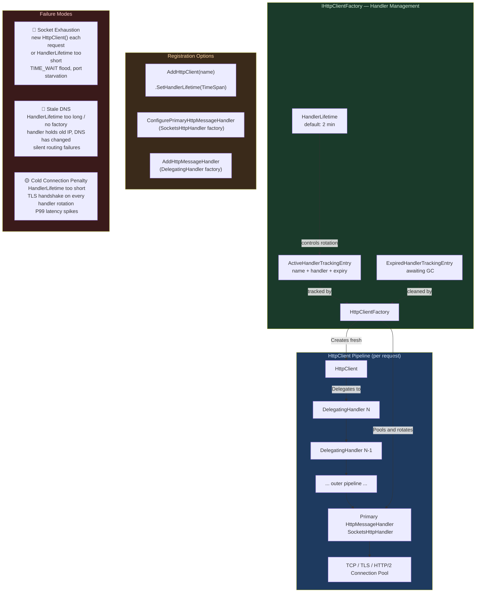
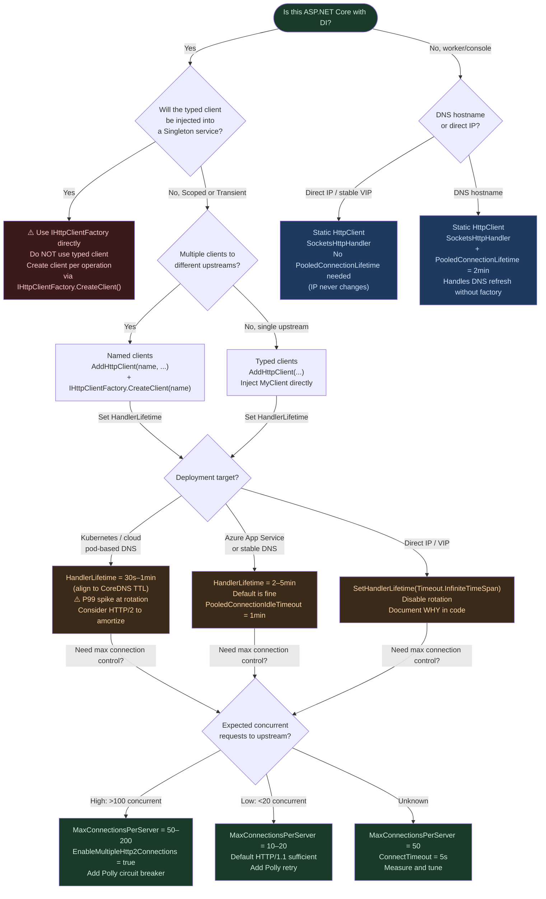

# 4.255 — Primary HttpMessageHandler Lifetime: Socket Exhaustion vs Stale DNS

---

## PART 0 — Navigation & Context

### Domain Hierarchy

```
ASP.NET Core Mastery
│
├── T. HttpClientFactory & HTTP Clients  (4.249–4.256)
│   ├── 4.249 — IHttpClientFactory: Why HttpClient Must Never Be Newed Directly
│   ├── 4.250 — Named and Typed HTTP Clients
│   ├── 4.251 — DelegatingHandler: Message Handler Pipeline
│   ├── 4.252 — Polly Integration: Retry, Circuit Breaker, Hedging
│   ├── 4.253 — HttpClient Timeout and CancellationToken
│   ├── 4.254 — HttpClient Logging and Custom Handlers
│   ├── 4.255 — Primary HttpMessageHandler Lifetime ← YOU ARE HERE
│   └── 4.256 — HttpClient with Credentials: Auth Headers and Certs
│
├── D. Dependency Injection (4.034–4.048)
│   └── 4.035 — Service Lifetimes: Singleton, Scoped, Transient  (prerequisite)
│
└── U. Testing (4.257–4.267)
    └── 4.264 — Mocking HttpClient: MockHttpMessageHandler  (next step)
```

### What You Need Before This

- **[[4.249 — IHttpClientFactory]]** — IHttpClientFactory exists specifically because of the problem this note describes; understand the factory first.
- **[[4.035 — Service Lifetimes: Singleton, Scoped, Transient]]** — Handler pooling is a lifetime-management system; the vocabulary of lifetimes is prerequisite.
- **[[4.251 — DelegatingHandler]]** — DelegatingHandlers sit in the outer pipeline; the primary handler is the innermost node they ultimately delegate to.
- **[[4.250 — Named and Typed HTTP Clients]]** — HandlerLifetime is configured per named client registration; you must know named clients to configure it.

### What This Unlocks After

- **[[4.252 — Polly Integration]]** — Polly's retry/circuit-breaker DelegatingHandlers work correctly only when the primary handler lifecycle is understood.
- **[[4.256 — HttpClient with Credentials]]** — Per-request auth headers live in DelegatingHandlers, not the primary handler, precisely because of the pooling boundary.
- **[[4.264 — Mocking HttpClient]]** — MockHttpMessageHandler substitutes the primary handler; that substitution only makes sense once you understand what the primary handler is.
- **[[4.253 — HttpClient Timeout and CancellationToken]]** — Connection timeouts are properties of the primary handler (`SocketsHttpHandler.ConnectTimeout`); understanding the handler lifecycle comes first.

### Why This Matters to a Production Engineer

In every containerized ASP.NET Core service that makes outbound HTTP calls, the primary handler's configured lifetime is the single control knob that determines whether you exhaust the OS socket pool under load **or** route requests to a dead IP address because DNS changed and the long-lived handler cached the old resolution — two failure modes that are diametrically opposite and both catastrophic at scale.

---

## PART 1 — The Core Mental Model

### The Fundamental Rule

> **`IHttpClientFactory` pools `SocketsHttpHandler` instances and rotates them on a configurable `HandlerLifetime` (default 2 minutes): short lifetimes waste connection-pool warmup; long lifetimes let DNS TTL expire while the handler still holds the old socket to a now-dead IP. The `HttpClient` wrapper is cheap and always created fresh; the underlying handler — and therefore the TCP connection pool — is the shared, lifetime-managed resource.**

### The Plain-Language Analogy

Think of a taxi company (IHttpClientFactory) that maintains a fleet of cars (SocketsHttpHandler instances), each pre-warmed on a specific route to a destination (DNS-resolved IP + TCP connections to a payment gateway). A passenger (HTTP request) does not own a car — they get a taxi for the duration of the trip and return it. But the _car itself_ — the engine, the tires, the GPS locked onto a specific map tile — is shared and rotated on a schedule.

If you rotate the fleet every 30 seconds (HandlerLifetime too short), every new car must establish fresh TCP connections from cold: you pay the TLS handshake and connection-establishment cost on every request, defeating the whole point of connection reuse. If you never rotate the fleet (no IHttpClientFactory, or HandlerLifetime = ∞), the GPS remains locked on the IP address the payment gateway had last week; after a deployment or an autoscaler event, those connections route to a machine that no longer hosts the service — requests silently fail or time out.

The 2-minute default is a deliberate trade-off: long enough for connection pools to amortize TLS handshakes across many requests, short enough that DNS TTL (typically 30–60 seconds in cloud services) does not outlast the handler by more than one rotation cycle. In a high-throughput service (>1000 req/s), even 2 minutes may be long enough for each handler generation to serve thousands of requests before rotation — exactly right.

### The Taxonomy Diagram



---

## PART 2 — Deep Mechanics

### 2.1 — The Socket Exhaustion Problem: What `new HttpClient()` Actually Does

The failure that motivated `IHttpClientFactory` is not "you forget to dispose HttpClient" — it is that **disposing `HttpClient` disposes its `SocketsHttpHandler`, which closes all TCP connections in the handler's connection pool immediately**, even if those connections are in TIME_WAIT and the OS has not yet reclaimed them.

```
──► Request arrives ──► new HttpClient() ──► handler.Send() ──► TCP connect ──► response
                                                                                     │
                                                              ◄── client.Dispose() ──┘
                                                                        │
                                                    SocketsHttpHandler.Dispose()
                                                                        │
                                                        close all pooled sockets
                                                                        │
                                             OS: socket enters TIME_WAIT (default: 4 min)
                                             Port stays reserved, cannot be reused
```

Under load, a service making 1,000 outbound requests per second while creating a new `HttpClient` per request exhausts the ~28,000 ephemeral ports available to a process in under 30 seconds. The OS begins throwing `SocketException: Only one usage of each socket address is normally permitted`.

**Runtime cost**: ~1 TCP connection establishment per request (versus ~0 with pooled handlers), plus TLS handshake overhead (~10–50ms per request on first connect), plus `SocketException` at saturation.

```csharp
// ASP.NET Core internally (approximate) — HttpClientFactory handler pool:
// SocketsHttpHandler is pooled in ActiveHandlerTrackingEntry
// Each entry has a name (for named clients), the handler instance, and an expiry time
// When the entry expires it moves to ExpiredHandlerTrackingEntry
// The handler is not disposed immediately — it waits for all active HttpClient instances
// that hold a reference to it to be GC'd (via IDisposable finalizer path)
// Only then does Dispose() run on the handler, which closes the TCP pool gracefully

internal class ActiveHandlerTrackingEntry
{
    public string Name { get; }
    public SocketsHttpHandler Handler { get; }    // the actual pooled resource
    public DateTimeOffset ExpiryTime { get; }     // HandlerLifetime from registration
    public TimeSpan Lifetime { get; }
}
```

**Cost label**: Per-request `new HttpClient()` = ~1 TCP + TLS handshake, ~28k port limit exhausted in ~28 seconds at 1k req/s.

---

### 2.2 — The Stale DNS Problem: Why Long-Lived Handlers Break Cloud Deployments

`SocketsHttpHandler` (and the older `HttpClientHandler`) performs DNS resolution when a connection to a hostname is first established and **caches that IP address for the lifetime of the connection pool**. In cloud environments — Kubernetes, Azure App Service, AWS ECS — service endpoints are frequently remapped. A blue-green deployment changes the IP behind `payment-api.internal`. A pod restart in Kubernetes reassigns the pod IP. An autoscaler event rotates the backing instances behind a load balancer.

```
T=0:    SocketsHttpHandler resolves payment-api.internal → 10.0.1.5
        TCP connection pool established to 10.0.1.5

T=5min: Payment service pod restarts
        DNS: payment-api.internal → 10.0.1.8 (new pod IP)

T=5min+: Handler still holds connections to 10.0.1.5
         10.0.1.5 is now an unreachable IP
         Requests fail with: HttpRequestException: Connection refused
         OR silently timeout (worse)
         Handler has no awareness that DNS changed
```

**The DNS TTL on Kubernetes CoreDNS is typically 5 seconds.** An `HttpClient` constructed with no factory and held as a static Singleton will see stale DNS potentially forever. A handler rotated every 2 minutes will see stale DNS for at most 2 minutes — acceptable for most cloud deployment patterns.

```csharp
// SocketsHttpHandler has a PooledConnectionIdleTimeout and PooledConnectionLifetime
// that govern TCP connection reuse, separate from IHttpClientFactory's HandlerLifetime

var handler = new SocketsHttpHandler
{
    // HandlerLifetime (IHttpClientFactory) controls when a new handler is created
    // These control when individual connections WITHIN the handler pool are recycled:
    PooledConnectionLifetime = TimeSpan.FromMinutes(2),  // max age of any pooled connection
    PooledConnectionIdleTimeout = TimeSpan.FromMinutes(1), // evict idle connections
    ConnectTimeout = TimeSpan.FromSeconds(5),
};
// PooledConnectionLifetime is the .NET 5+ way to handle DNS refresh without IHttpClientFactory
// Setting it causes the handler to drop and re-resolve connections older than the limit
```

**Cost label**: Stale DNS = 0 new allocations, 100% failure rate for affected service after deployment. The failure is silent — no exception at connection-pool-creation time, only at request time.

---

### 2.3 — How IHttpClientFactory Solves Both Problems

`IHttpClientFactory` is a **handler pool with a rotation policy**. It solves socket exhaustion by pooling handlers (never creating one per request), and stale DNS by rotating handlers on `HandlerLifetime` (default 2 minutes), which forces DNS re-resolution at the next handler creation.

```
Pipeline Position (IHttpClientFactory resolution point):

Controller/Service
    │ resolves from DI
    ▼
IHttpClientFactory.CreateClient("PaymentGateway")
    │
    ├── [CHEAP] Creates new HttpClient wrapper (~few bytes, no sockets)
    │
    └── [POOLED] Retrieves or creates SocketsHttpHandler from handler pool
              │
              ├── Active entry exists AND not expired → reuse existing handler
              │   (reuse existing TCP connection pool → zero latency overhead)
              │
              └── No active entry OR entry expired → create new handler
                  (DNS resolved fresh, new TCP pool established)
                  (old handler marked expired, waits for GC before Dispose())
```

**The critical insight**: `HttpClient` itself is created fresh each time `CreateClient()` is called. It is the **outer pipeline** — the message handlers you add via `AddHttpMessageHandler<T>()` — that run per-request. The `SocketsHttpHandler` at the bottom is pooled and shared across all `HttpClient` instances created from the same named client registration, for the duration of `HandlerLifetime`.

```
// HTTP wire format for a request through the factory pipeline:
//
// POST /api/v1/payments HTTP/1.1
// Host: payment-api.internal
// Authorization: Bearer eyJhbGci...       ← added by DelegatingHandler (per-request)
// X-Correlation-Id: 4f3b2e1a...           ← added by DelegatingHandler (per-request)
// Content-Type: application/json
// Content-Length: 142
//
// {"orderId":"ord-99", "amount":49.99, ...}
//
// TCP connection: reused from SocketsHttpHandler pool
// DNS resolution: cached in handler, refreshed only on handler rotation
// TLS session: resumed from session ticket (zero-RTT on subsequent requests)
```

**Cost label**: `IHttpClientFactory.CreateClient()` = ~1 allocation (HttpClient wrapper), ~0 TCP overhead (connection reused), ~O(1) handler pool lookup by name.

---

### 2.4 — Handler Lifetime Configuration and Tuning

The default 2-minute `HandlerLifetime` is not right for every scenario. Here are the governing trade-offs:

```
HandlerLifetime Too Short (<30s)
    ├── New handler created frequently
    ├── TCP pool cold on each creation → TLS handshake overhead per rotation
    ├── More allocations (handler objects, connection state)
    └── Symptom: P99 latency spikes every HandlerLifetime interval

HandlerLifetime Too Long (>10min) or Infinite (static HttpClient)
    ├── DNS change not reflected until handler rotates
    ├── In Kubernetes: pod IP change after restart not detected
    ├── In Azure: App Service slot swap not reflected
    └── Symptom: 100% failure rate to upstream after deployment event

HandlerLifetime = Timeout.InfiniteTimeSpan (disable rotation)
    └── Use only with SocketsHttpHandler.PooledConnectionLifetime set instead
        This delegates DNS refresh to the connection level, not the handler level

Default 2 minutes
    └── Appropriate for: most microservice-to-microservice calls in cloud
        DNS TTL typically 5–60s, so handler rotation is within 2–3 TTL cycles
```

```csharp
// Configuring HandlerLifetime per named client registration:
services.AddHttpClient("PaymentGateway")
    .SetHandlerLifetime(TimeSpan.FromMinutes(5))   // custom lifetime
    .ConfigurePrimaryHttpMessageHandler(() => new SocketsHttpHandler
    {
        PooledConnectionLifetime = TimeSpan.FromMinutes(2), // DNS at connection level too
        MaxConnectionsPerServer = 20,
        EnableMultipleHttp2Connections = true,
    });
```

**Cost label**: `SetHandlerLifetime` is O(1) configuration; runtime cost depends on rotation frequency and connection-pool warmup time.

---

### 2.5 — The Expired Handler Lifecycle: Why Dispose Is Deferred

A subtlety that trips up engineers: when a handler's `HandlerLifetime` expires, it is **not immediately disposed**. The factory marks it as expired and stops giving it to new `HttpClient` instances. But existing `HttpClient` instances that already hold a reference to it continue to use it — and they may have in-flight HTTP requests.

```
T=0:    Handler A created, HandlerLifetime = 2min
T=0–2min: Requests use Handler A
T=2min: Handler A marked expired → moved to ExpiredHandlerTrackingEntry
        New requests get Handler B (newly created)
        BUT: in-flight requests on existing HttpClient instances still use Handler A
T=2min + GC: All HttpClient instances referencing Handler A are garbage collected
             Handler A.Dispose() is finally called
             TCP connections in Handler A are gracefully closed
```

This deferred disposal means socket count temporarily increases during rotation — you have both the old handler's pool and the new handler's pool open simultaneously. In high-concurrency systems with large `MaxConnectionsPerServer`, this can briefly double the open socket count at rotation time.

```
// ASP.NET Core internally — cleanup timer (approximate):
// IHttpClientFactory runs a background timer (CleanupInterval = 10s)
// that finds expired handlers with no live HttpClient references
// and calls their Dispose() method

internal class DefaultHttpClientFactory
{
    private readonly Timer _cleanupTimer; // fires every 10 seconds
    private readonly List<ExpiredHandlerTrackingEntry> _expiredHandlers;

    private void CleanupTimer_Tick(object state)
    {
        foreach (var entry in _expiredHandlers.ToList())
        {
            if (!entry.IsActive)  // all HttpClient wrappers GC'd
            {
                entry.InnerHandler.Dispose();
                _expiredHandlers.Remove(entry);
            }
        }
    }
}
```

**Cost label**: Deferred disposal = ~2x socket pool size during rotation window (brief), cleanup timer overhead = ~O(n) expired handlers, fires every 10 seconds.

---

### 2.6 — The PooledConnectionLifetime Alternative (No IHttpClientFactory Required)

In .NET 5+, `SocketsHttpHandler` acquired a `PooledConnectionLifetime` property that handles DNS staleness at the **connection level** without requiring IHttpClientFactory-style handler rotation.

```csharp
// Static HttpClient with connection-level DNS refresh (.NET 5+):
private static readonly HttpClient _client = new HttpClient(new SocketsHttpHandler
{
    PooledConnectionLifetime = TimeSpan.FromMinutes(2), // any connection older than 2min
                                                         // is closed and re-established
                                                         // (re-resolves DNS)
    PooledConnectionIdleTimeout = TimeSpan.FromMinutes(1),
    MaxConnectionsPerServer = 10,
});
```

This approach resolves the DNS staleness problem without the overhead of handler rotation. It is appropriate for:

- Console applications and worker services (no DI container)
- `Singleton`-lifetime typed clients where handler rotation complexity is undesirable
- High-performance scenarios where handler rotation latency spikes are unacceptable

**The IHttpClientFactory approach is still preferred** in ASP.NET Core applications because it provides: named client management, DelegatingHandler injection via DI, per-client configuration, testability via `MockHttpMessageHandler` substitution, and Polly integration.

**Failure mode**: Setting `PooledConnectionLifetime` on a handler managed by IHttpClientFactory **conflicts** with `HandlerLifetime`. Use one or the other, not both for the same DNS-refresh purpose.

**Cost label**: `PooledConnectionLifetime` check = O(1) per connection retrieved from pool, ~0 overhead vs periodic handler rotation cost.

---

## PART 3 — Production Code Patterns

### Pattern 1: The Correctly Configured Payment Gateway Client (Foundation)

A typed HTTP client for a payment processor where DNS stability matters and TLS connection reuse is non-negotiable for P99 latency.

```csharp
// ⚠️ WRONG: Static Singleton HttpClient with no DNS refresh mechanism
public class PaymentGatewayClient
{
    // Solves socket exhaustion but not stale DNS
    private static readonly HttpClient _client = new HttpClient
    {
        BaseAddress = new Uri("https://api.stripe.com"),
        Timeout = TimeSpan.FromSeconds(30),
    };
    // No PooledConnectionLifetime → DNS never refreshed
    // After a Stripe IP rotation or BGP change: requests silently fail
}

// ✅ CORRECT: IHttpClientFactory with explicit handler configuration
public class PaymentGatewayClient
{
    private readonly HttpClient _client;

    // HttpClient is injected by IHttpClientFactory — short-lived, no sockets owned
    public PaymentGatewayClient(HttpClient client)
    {
        _client = client;
    }

    public async Task<ChargeResult> ChargeAsync(ChargeRequest request, CancellationToken ct)
    {
        var response = await _client.PostAsJsonAsync("/v1/charges", request, ct);
        response.EnsureSuccessStatusCode();
        return await response.Content.ReadFromJsonAsync<ChargeResult>(ct)
               ?? throw new InvalidOperationException("Empty response from payment gateway");
    }
}

// Registration in Program.cs — the handler lifecycle is configured here, not in the client
services.AddHttpClient<PaymentGatewayClient>(client =>
{
    client.BaseAddress = new Uri("https://api.stripe.com");
    client.DefaultRequestHeaders.Add("Stripe-Version", "2023-10-16");
    client.Timeout = TimeSpan.FromSeconds(30); // sets the HttpClient.Timeout (outer timeout)
})
.SetHandlerLifetime(TimeSpan.FromMinutes(5))   // Stripe IPs are stable; 5min is fine
.ConfigurePrimaryHttpMessageHandler(() => new SocketsHttpHandler
{
    PooledConnectionLifetime = TimeSpan.FromMinutes(5), // belt and suspenders
    ConnectTimeout = TimeSpan.FromSeconds(5),
    MaxConnectionsPerServer = 50,             // max concurrent connections to Stripe
    EnableMultipleHttp2Connections = false,   // Stripe: use single HTTP/2 connection
    SslOptions = new SslClientAuthenticationOptions
    {
        EnabledSslProtocols = SslProtocols.Tls12 | SslProtocols.Tls13,
    }
});

// HTTP wire format:
// POST /v1/charges HTTP/1.1
// Host: api.stripe.com
// Stripe-Version: 2023-10-16
// Authorization: Bearer sk_live_...        ← added by DelegatingHandler per-request
// Content-Type: application/json
//
// TCP: reused connection from SocketsHttpHandler pool (zero TLS handshake overhead)
// DNS: resolved fresh every 5 minutes when handler rotates
```

---

### Pattern 2: The High-Frequency Internal Service Client (Short Lifetime, Connection Warmup)

An inventory service making 50,000+ calls/day to a Kubernetes-hosted warehouse API where pod IPs change on every deployment.

```csharp
// ⚠️ WRONG: Default HandlerLifetime too long for Kubernetes pod-IP-based DNS
services.AddHttpClient<WarehouseApiClient>(client =>
{
    client.BaseAddress = new Uri("http://warehouse-api.warehouse.svc.cluster.local");
})
// No SetHandlerLifetime → default 2 minutes
// Kubernetes CoreDNS TTL for pod-to-pod: 5 seconds
// After pod restart: up to 2 minutes of routing to dead IP

// ✅ CORRECT: Short HandlerLifetime aligned with Kubernetes DNS TTL
services.AddHttpClient<WarehouseApiClient>(client =>
{
    client.BaseAddress = new Uri("http://warehouse-api.warehouse.svc.cluster.local");
    client.Timeout = TimeSpan.FromSeconds(10);
})
.SetHandlerLifetime(TimeSpan.FromSeconds(30)) // rotate every 30s; well within k8s TTL
.ConfigurePrimaryHttpMessageHandler(() => new SocketsHttpHandler
{
    // Keep connections alive within the handler's lifetime
    PooledConnectionLifetime = TimeSpan.FromSeconds(30),
    PooledConnectionIdleTimeout = TimeSpan.FromSeconds(20),
    ConnectTimeout = TimeSpan.FromSeconds(3),
    MaxConnectionsPerServer = 100,             // high-throughput internal service
    EnableMultipleHttp2Connections = true,
    AllowAutoRedirect = false,                 // internal APIs should not redirect
})
.AddStandardResilienceHandler();               // Polly standard pipeline (retry + circuit breaker)

// HTTP wire format (internal cluster traffic):
// GET /api/v2/inventory/sku/WH-99231 HTTP/2
// Host: warehouse-api.warehouse.svc.cluster.local
// X-Correlation-Id: req-4a3b2c1d...
// Accept: application/json
//
// HTTP/2.0 200 OK
// Content-Type: application/json
// Cache-Control: max-age=60
// ETag: "v3-99231"
//
// DNS: re-resolved every 30s; new pod IP picked up within one rotation cycle
```

---

### Pattern 3: The Static Client with PooledConnectionLifetime (No Factory, Worker Service)

A background worker service that makes outbound calls to a reporting API. No DI framework, static lifetime — the right pattern for a pure `BackgroundService` that owns its own client.

```csharp
// ⚠️ WRONG: New HttpClient per iteration in a background loop
public class ReportingWorker : BackgroundService
{
    protected override async Task ExecuteAsync(CancellationToken stoppingToken)
    {
        while (!stoppingToken.IsCancellationRequested)
        {
            using var client = new HttpClient();  // ⚠️ socket exhaustion guaranteed
            await client.PostAsJsonAsync("https://reporting.internal/ingest", GetBatch(), stoppingToken);
            await Task.Delay(TimeSpan.FromSeconds(5), stoppingToken);
        }
    }
}

// ✅ CORRECT: Static client with PooledConnectionLifetime for DNS refresh
public class ReportingWorker : BackgroundService
{
    // Singleton lifecycle matches BackgroundService lifetime perfectly
    private static readonly HttpClient _client = new HttpClient(
        new SocketsHttpHandler
        {
            // Without IHttpClientFactory, PooledConnectionLifetime handles DNS refresh
            PooledConnectionLifetime = TimeSpan.FromMinutes(2),
            PooledConnectionIdleTimeout = TimeSpan.FromMinutes(1),
            ConnectTimeout = TimeSpan.FromSeconds(5),
            MaxConnectionsPerServer = 5, // low-throughput background worker
        })
    {
        BaseAddress = new Uri("https://reporting.internal"),
        Timeout = TimeSpan.FromSeconds(30),
    };

    protected override async Task ExecuteAsync(CancellationToken stoppingToken)
    {
        while (!stoppingToken.IsCancellationRequested)
        {
            // _client is never disposed; connections older than 2min
            // are automatically closed and re-resolved on next use
            await _client.PostAsJsonAsync("/ingest", GetBatch(), stoppingToken);
            await Task.Delay(TimeSpan.FromSeconds(5), stoppingToken);
        }
    }
}
```

---

### Pattern 4: The Conflict Anti-Pattern — Double-Configuring DNS Refresh

The most insidious production bug: configuring both `HandlerLifetime` (on the factory) and `PooledConnectionLifetime` (on the handler) for DNS refresh, which causes unexpected interaction.

```csharp
// ⚠️ WRONG: Both mechanisms configured — redundant and potentially conflicting
services.AddHttpClient("OrderService")
    .SetHandlerLifetime(TimeSpan.FromMinutes(2))          // rotate handler every 2min
    .ConfigurePrimaryHttpMessageHandler(() => new SocketsHttpHandler
    {
        PooledConnectionLifetime = TimeSpan.FromSeconds(30), // ⚠️ rotate connections every 30s
        // Handler rotates every 2min (factory), connections inside rotate every 30s
        // Net effect: connections are recycled every 30s regardless of HandlerLifetime
        // This makes HandlerLifetime effectively irrelevant for DNS purposes
        // Worse: handler is created fresh every 2min, which resets the connection pool
        //        even though PooledConnectionLifetime was handling DNS refresh already
        // Result: connection-pool warmup spike every 2min, plus 30s connection churn
    });

// ✅ CORRECT: Choose one mechanism based on deployment context
// Option A: IHttpClientFactory for ASP.NET Core apps (DI, named clients, Polly)
services.AddHttpClient("OrderService")
    .SetHandlerLifetime(TimeSpan.FromMinutes(2))
    .ConfigurePrimaryHttpMessageHandler(() => new SocketsHttpHandler
    {
        // Do NOT set PooledConnectionLifetime for DNS — HandlerLifetime handles it
        PooledConnectionIdleTimeout = TimeSpan.FromMinutes(1),  // only for idle eviction
        ConnectTimeout = TimeSpan.FromSeconds(5),
        MaxConnectionsPerServer = 20,
    });

// Option B: Static client for non-DI scenarios (workers, console apps)
private static readonly HttpClient _client = new HttpClient(new SocketsHttpHandler
{
    PooledConnectionLifetime = TimeSpan.FromMinutes(2), // handles DNS refresh
    // Do NOT use IHttpClientFactory here — conflicting lifecycle management
});
```

---

### Pattern 5: The Per-Tenant Client with Keyed Services (.NET 8)

A multi-tenant SaaS logistics platform where each tenant routes to a different 3PL (third-party logistics) API with different DNS entries and different TLS certificates.

```csharp
// ⚠️ WRONG: Creating a new HttpClient per tenant per request
public class ShipmentRouter
{
    public async Task<TrackingResult> RouteAsync(string tenantId, Shipment shipment)
    {
        var baseUrl = await _tenantConfig.GetApiEndpointAsync(tenantId);
        using var client = new HttpClient { BaseAddress = new Uri(baseUrl) };
        // ⚠️ New socket per call, port exhaustion at scale, no connection reuse per tenant
        return await client.PostAsJsonAsync("/ship", shipment);
    }
}

// ✅ CORRECT: Named client per tenant, registered once at startup
// (For dynamic tenant sets, use IHttpClientFactory.CreateClient(tenantId) with
//  a factory that lazily registers the named client)
public static class ShipmentHttpClientExtensions
{
    public static IServiceCollection AddTenantShipmentClients(
        this IServiceCollection services,
        IEnumerable<TenantConfig> tenants)
    {
        foreach (var tenant in tenants)
        {
            services.AddHttpClient($"3pl-{tenant.Id}", client =>
            {
                client.BaseAddress = new Uri(tenant.ApiEndpoint);
                client.Timeout = TimeSpan.FromSeconds(tenant.TimeoutSeconds);
            })
            .SetHandlerLifetime(TimeSpan.FromMinutes(3))  // 3PL DNS is stable
            .ConfigurePrimaryHttpMessageHandler(() =>
            {
                var handler = new SocketsHttpHandler
                {
                    MaxConnectionsPerServer = tenant.MaxConcurrentShipments,
                    ConnectTimeout = TimeSpan.FromSeconds(5),
                };
                // Per-tenant mTLS certificate if required
                if (tenant.ClientCertificate is not null)
                {
                    handler.SslOptions = new SslClientAuthenticationOptions
                    {
                        ClientCertificates = new X509CertificateCollection { tenant.ClientCertificate }
                    };
                }
                return handler;
            });
        }
        return services;
    }
}

public class ShipmentRouter
{
    private readonly IHttpClientFactory _factory;

    public ShipmentRouter(IHttpClientFactory factory) => _factory = factory;

    public async Task<TrackingResult> RouteAsync(string tenantId, Shipment shipment, CancellationToken ct)
    {
        // IHttpClientFactory.CreateClient is O(1) — just creates the HttpClient wrapper
        // The SocketsHttpHandler for this tenant is pooled and reused
        using var client = _factory.CreateClient($"3pl-{tenantId}");
        var response = await client.PostAsJsonAsync("/v2/shipments", shipment, ct);
        response.EnsureSuccessStatusCode();
        return await response.Content.ReadFromJsonAsync<TrackingResult>(ct)!;
    }
}

// HTTP wire format:
// POST /v2/shipments HTTP/1.1
// Host: api.fedex-tenant-99.logistics.com
// Authorization: Bearer <tenant-specific-jwt>    ← DelegatingHandler
// X-Tenant-Id: tenant-99                         ← DelegatingHandler
// Content-Type: application/json
//
// TCP: reused per-tenant connection pool (no cross-tenant socket sharing)
// DNS: refreshed every 3min per tenant client rotation
```

---

### Pattern 6: The Diagnostic — Detecting Socket Exhaustion in Production

Socket exhaustion does not always throw immediately; it manifests as latency spikes and eventually `SocketException`. Here's how to detect and confirm it before it takes the service down.

```csharp
// Detecting socket exhaustion via dotnet-counters before it becomes a hard failure:
// dotnet-counters monitor --process-id <pid> System.Net.Http
//
// Key counter: System.Net.Http / http11-connections-current-total
// If this number grows unbounded → socket exhaustion likely
// If this number is stable (bounded by MaxConnectionsPerServer) → healthy

// Adding connection pool metrics to your ASP.NET Core API for proactive alerting:
services.AddHttpClient("OrderService")
    .SetHandlerLifetime(TimeSpan.FromMinutes(2))
    .ConfigurePrimaryHttpMessageHandler(() => new SocketsHttpHandler
    {
        MaxConnectionsPerServer = 50,
        ConnectCallback = async (context, ct) =>
        {
            // ⚠️ NOTE: ConnectCallback overrides DNS resolution too — use with care
            // Only use if you need custom connection establishment logic
            var socket = new Socket(SocketType.Stream, ProtocolType.Tcp)
            {
                NoDelay = true  // disable Nagle for low-latency APIs
            };
            try
            {
                await socket.ConnectAsync(context.DnsEndPoint, ct);
                return new NetworkStream(socket, ownsSocket: true);
            }
            catch
            {
                socket.Dispose();
                throw;
            }
        }
    });

// Proactive DelegatingHandler that emits a warning when approaching connection limits:
public class ConnectionPoolMonitorHandler : DelegatingHandler
{
    private readonly ILogger<ConnectionPoolMonitorHandler> _logger;
    private static readonly Meter _meter = new("OrderService.HttpClient");
    private static readonly Counter<int> _timeoutCounter =
        _meter.CreateCounter<int>("httpclient.timeout.count");

    public ConnectionPoolMonitorHandler(ILogger<ConnectionPoolMonitorHandler> logger)
        => _logger = logger;

    protected override async Task<HttpResponseMessage> SendAsync(
        HttpRequestMessage request, CancellationToken ct)
    {
        try
        {
            return await base.SendAsync(request, ct);
        }
        catch (HttpRequestException ex) when (ex.InnerException is SocketException se
            && se.SocketErrorCode == SocketError.AddressAlreadyInUse)
        {
            _logger.LogCritical(
                "Socket exhaustion detected on {Host}. Check IHttpClientFactory configuration",
                request.RequestUri?.Host);
            throw;
        }
        catch (TaskCanceledException) when (!ct.IsCancellationRequested)
        {
            // Timeout (not cancellation) — may indicate connection-pool queuing under load
            _timeoutCounter.Add(1, new("host", request.RequestUri?.Host ?? "unknown"));
            throw;
        }
    }
}
```

---

### Pattern 7: The Infinite Lifetime Client (Deliberate, Documented)

Sometimes you genuinely want `Timeout.InfiniteTimeSpan` for `HandlerLifetime` — for example, a service calling a single, highly stable IP (your own load balancer's VIP) where the IP never changes and connection warmup cost is prohibitive.

```csharp
// Context: Order service calling its own read replica (stable VIP, never changes IP)
// HandlerLifetime = Infinite because: same IP forever, 10k req/s, warmup cost matters
services.AddHttpClient("ReadReplicaQuery", client =>
{
    client.BaseAddress = new Uri("https://10.0.0.1");  // stable VIP, not DNS
    client.Timeout = TimeSpan.FromSeconds(5);
})
// ✅ Disable IHttpClientFactory rotation — IP is stable (direct IP, no DNS involved)
.SetHandlerLifetime(Timeout.InfiniteTimeSpan)  // document WHY this is intentional
.ConfigurePrimaryHttpMessageHandler(() => new SocketsHttpHandler
{
    // DNS refresh is irrelevant (direct IP) — use connection-level idle timeout only
    PooledConnectionIdleTimeout = TimeSpan.FromMinutes(5),
    ConnectTimeout = TimeSpan.FromSeconds(2),
    MaxConnectionsPerServer = 200,             // hot read path, high parallelism
    EnableMultipleHttp2Connections = true,     // HTTP/2 multiplexing
    // ⚠️ IMPORTANT: Document in code review that this is intentional and why
    // This is safe ONLY because the base address is a direct IP (no DNS involved)
    // If base address were a hostname, this would cause DNS staleness
});

// HTTP wire format (read replica query):
// GET /api/orders?tenantId=abc&status=pending&limit=100 HTTP/2
// Host: 10.0.0.1
//
// TCP: long-lived connection, never rotated (connection-pool idle timeout applies)
// DNS: N/A — direct IP used as BaseAddress
// TLS session: resumed on every request (zero-RTT)
```

---

## PART 4 — Gotchas & Anti-Patterns

### Gotcha 1: The Long-Lived Typed Client Injected into Singleton

The most common handler-lifetime violation in production ASP.NET Core codebases: a typed `HttpClient` injected as a Singleton, which captures the handler at startup and never allows rotation.

```csharp
// ⚠️ WRONG CODE — Typed client registered as Singleton
services.AddSingleton<PaymentGatewayClient>(); // ← Singleton
services.AddHttpClient<PaymentGatewayClient>(...);
// HttpClient is injected into PaymentGatewayClient's constructor at first resolution
// That HttpClient instance captures a reference to the SocketsHttpHandler
// IHttpClientFactory marks the handler expired at T=2min but PaymentGatewayClient
// holds a strong reference to the HttpClient → handler is never GC'd → never disposed
// DNS staleness: permanent (handler never rotates)
// Worse: handler counts as "active" forever → IHttpClientFactory creates new handlers
//        for other clients while this one leaks

// HTTP consequence (wrong path):
// After upstream deployment at T=10min:
// POST /v1/payments HTTP/1.1 → SocketException: Connection refused
// Requests fail permanently; pod restart required to recover
// OR silent timeout if old IP now hosts a different service

// ✅ CORRECT CODE — Typed client registered as Transient (or Scoped)
services.AddHttpClient<PaymentGatewayClient>(...);
// AddHttpClient<T> registers PaymentGatewayClient as Transient by default
// Each resolution creates a new PaymentGatewayClient wrapping a fresh HttpClient
// HttpClient lifetime matches the service that resolves it
// Handler rotation proceeds normally via IHttpClientFactory

// HTTP consequence (correct path):
// HttpClient injected into PaymentGatewayClient is created by IHttpClientFactory
// Handler is pooled; rotation proceeds every HandlerLifetime minutes
// DNS freshness guaranteed within one rotation cycle

// WHY: IHttpClientFactory tracks active handlers via weak references to HttpClient.
//      A Singleton typed client holds a strong reference to its HttpClient, preventing
//      GC of the HttpClient and therefore the ExpiredHandlerTrackingEntry never becomes
//      inactive. The handler is immortal.
```

---

### Gotcha 2: Configuring SocketsHttpHandler Options After Factory Registration

`ConfigurePrimaryHttpMessageHandler` is called at handler creation time. Mutating the handler after it is pooled has no effect — and some properties throw if set after first use.

```csharp
// ⚠️ WRONG CODE — Mutating handler properties post-registration
services.AddHttpClient("InventoryApi")
    .ConfigurePrimaryHttpMessageHandler(() => new SocketsHttpHandler());
// Later, trying to "reconfigure" via IHttpMessageHandlerBuilderFilter or direct mutation:
var handler = new SocketsHttpHandler();
handler.MaxConnectionsPerServer = 50; // set before pooling — OK
// ... some time passes ...
handler.MaxConnectionsPerServer = 100; // ⚠️ InvalidOperationException in .NET 8
                                        // SocketsHttpHandler properties are sealed
                                        // after first SendAsync call

// HTTP consequence (wrong path):
// InvalidOperationException: "The instance has already started one or more requests.
// Properties can only be modified before sending the first request."
// Service crashes if this code path is hit in production

// ✅ CORRECT CODE — All configuration at registration time
services.AddHttpClient("InventoryApi")
    .ConfigurePrimaryHttpMessageHandler(() => new SocketsHttpHandler
    {
        MaxConnectionsPerServer = 50,            // all configuration here, before pooling
        PooledConnectionIdleTimeout = TimeSpan.FromMinutes(1),
        ConnectTimeout = TimeSpan.FromSeconds(5),
    });

// HTTP consequence (correct path):
// Handler created with correct settings; properties locked on first use
// MaxConnectionsPerServer = 50 enforced for the handler's lifetime

// WHY: SocketsHttpHandler validates that it has not started sending before allowing
//      property mutations. Once the first request flows through it, it enters a frozen
//      state to prevent data races on shared connection pool configuration.
```

---

### Gotcha 3: Using HttpClient.Timeout vs CancellationToken — The Handler Timeout Confusion

`HttpClient.Timeout` sets the outer timeout on the `HttpClient` wrapper. It is enforced regardless of `SocketsHttpHandler.ConnectTimeout`. Engineers assume setting `Timeout` on the client is sufficient; in reality, connection-level timeout requires `ConnectTimeout` on the handler separately.

```csharp
// ⚠️ WRONG CODE — Only outer timeout set; connect hangs much longer
services.AddHttpClient("FraudCheckApi", client =>
{
    client.Timeout = TimeSpan.FromSeconds(5); // outer timeout on HttpClient
})
.ConfigurePrimaryHttpMessageHandler(() => new SocketsHttpHandler
{
    // No ConnectTimeout set — SocketsHttpHandler default is no connect timeout
    // A SYN packet to a dead host waits for OS TCP connect timeout (~75 seconds on Linux)
    // HttpClient.Timeout is only checked after the send/response cycle starts
    // During TCP connection establishment, Timeout is NOT enforced
});

// HTTP consequence (wrong path):
// Request to unreachable fraud-check endpoint:
// Client hangs for ~75 seconds (OS TCP timeout) before HttpClient.Timeout fires
// At 1000 concurrent requests → thread pool exhaustion within minutes

// ✅ CORRECT CODE — Both timeouts set
services.AddHttpClient("FraudCheckApi", client =>
{
    client.Timeout = TimeSpan.FromSeconds(5); // total request lifetime (outer)
})
.ConfigurePrimaryHttpMessageHandler(() => new SocketsHttpHandler
{
    ConnectTimeout = TimeSpan.FromSeconds(2), // TCP connect timeout (inner, at connection level)
    // Effective behavior: if TCP doesn't connect in 2s → OperationCanceledException
    //                     if total request exceeds 5s → TaskCanceledException
});

// HTTP consequence (correct path):
// TCP connect to dead host: OperationCanceledException after 2 seconds
// Long-running response on live host: TaskCanceledException after 5 seconds
// No thread-pool exhaustion; requests fail fast and predictably

// WHY: HttpClient.Timeout wraps the entire request lifecycle in a CancellationToken.
//      But the token is only checked once the request delegate starts executing.
//      SocketsHttpHandler's ConnectTimeout uses Socket.ConnectAsync with its own
//      CancellationToken that fires during the TCP handshake phase.
```

---

### Gotcha 4: Multiple AddHttpClient Calls for the Same Typed Client Override Options

`AddHttpClient<T>` called twice does **not** combine the configurations — later registrations overwrite handler configuration from earlier ones, silently. Engineers add a second `AddHttpClient<T>` call in a feature branch and wonder why the original handler settings disappeared.

```csharp
// ⚠️ WRONG CODE — Second AddHttpClient<OrderApiClient> silently overwrites handler config
// In Program.cs:
services.AddHttpClient<OrderApiClient>(client =>
{
    client.BaseAddress = new Uri("https://orders.internal");
    client.Timeout = TimeSpan.FromSeconds(10);
})
.SetHandlerLifetime(TimeSpan.FromMinutes(2))
.ConfigurePrimaryHttpMessageHandler(() => new SocketsHttpHandler
{
    MaxConnectionsPerServer = 100,
});

// In a feature module (different file):
services.AddHttpClient<OrderApiClient>(client =>
{
    client.DefaultRequestHeaders.Add("X-Api-Version", "v3");
})
// This second call adds ANOTHER HttpClientBuilder for the same type
// IHttpClientFactory applies ALL matching builders in registration order
// ConfigurePrimaryHttpMessageHandler in the second call creates a new default handler
// MaxConnectionsPerServer = 100 from the first call is LOST; default (int.MaxValue) applies
// Result: unbounded connections, potential socket exhaustion under load

// HTTP consequence (wrong path):
// No exception; silent misconfiguration
// MaxConnectionsPerServer = int.MaxValue effectively → unlimited concurrent connections
// Under load: socket exhaustion, OS port starvation

// ✅ CORRECT CODE — Extend, don't overwrite; use AddHttpClientOptions pattern
services.AddHttpClient<OrderApiClient>(client =>
{
    client.BaseAddress = new Uri("https://orders.internal");
    client.Timeout = TimeSpan.FromSeconds(10);
    client.DefaultRequestHeaders.Add("X-Api-Version", "v3"); // ← combined here
})
.SetHandlerLifetime(TimeSpan.FromMinutes(2))
.ConfigurePrimaryHttpMessageHandler(() => new SocketsHttpHandler
{
    MaxConnectionsPerServer = 100,
});

// HTTP consequence (correct path):
// Single AddHttpClient call; handler configured exactly once
// MaxConnectionsPerServer = 100 enforced; headers set

// WHY: IHttpClientFactory stores IServiceCollection entries as a list of
//      HttpClientBuilderOptions. Each AddHttpClient<T> adds a new entry.
//      ConfigurePrimaryHttpMessageHandler called on any entry replaces the factory,
//      but the client-configuration Actions are all applied in order. The handler
//      factory from the last call wins.
```

---

### Gotcha 5: Disposing the HttpClient Returned by IHttpClientFactory

`IHttpClientFactory.CreateClient()` returns an `HttpClient` whose `Dispose()` is a **no-op for the handler** — the handler is managed by the factory. But the `HttpClient` wrapper itself should still be disposed to release header/timeout state. Engineers either skip `using` entirely (minor leak) or wrap in `using` and assume it disposes the handler (it doesn't, which they mistakenly treat as a bug).

```csharp
// ⚠️ WRONG (false assumption): "I must not dispose it or the handler gets disposed"
public class ShipmentApiClient
{
    private readonly IHttpClientFactory _factory;
    public ShipmentApiClient(IHttpClientFactory factory) => _factory = factory;

    public async Task<ShipmentStatus> GetStatusAsync(string trackingId)
    {
        var client = _factory.CreateClient("ShipmentApi");
        // ⚠️ Never disposed — HttpClient wrapper leaks header/state memory
        // The handler is safe, but HttpClient itself holds some state
        return await client.GetFromJsonAsync<ShipmentStatus>($"/track/{trackingId}");
    }
}

// HTTP consequence (wrong path):
// HttpClient wrappers accumulate in memory over the lifetime of the service
// Minor memory leak (~few KB per unreleased instance); visible in memory profilers

// ✅ CORRECT: Dispose the wrapper, trust the factory manages the handler
public class ShipmentApiClient
{
    private readonly IHttpClientFactory _factory;
    public ShipmentApiClient(IHttpClientFactory factory) => _factory = factory;

    public async Task<ShipmentStatus> GetStatusAsync(string trackingId, CancellationToken ct)
    {
        // ✅ using disposes the HttpClient wrapper
        // Handler is NOT disposed — factory manages its lifetime independently
        using var client = _factory.CreateClient("ShipmentApi");
        return await client.GetFromJsonAsync<ShipmentStatus>($"/track/{trackingId}", ct)
               ?? throw new InvalidOperationException("No status returned");
    }
}

// HTTP consequence (correct path):
// HttpClient wrapper disposed after request; handler continues serving other requests
// No memory leak; handler pool operates as designed

// WHY: HttpClient.Dispose() calls InternalHandler.Dispose() only if it owns the handler.
//      IHttpClientFactory uses an adapter (LifetimeTrackingHttpMessageHandler) that
//      intercepts Dispose() and does NOT forward it to the underlying SocketsHttpHandler.
//      The factory retains ownership of the handler and manages its disposal.
```

---

## PART 5 — Performance Implications

### Request Pipeline Characteristics Table

|Scenario|Handler Rotation|Allocations Per Request|Approx Latency Impact|Recommendation|
|---|---|---|---|---|
|`new HttpClient()` per request|N/A (no pooling)|~1 TCP + TLS handshake per request|+10–50ms per request; port exhaustion at scale|❌ Never in production|
|Static `HttpClient`, no `PooledConnectionLifetime`|Never|~0 (connection reused)|+0ms steady state; +∞ after DNS change|❌ Only safe for direct-IP endpoints|
|Static `HttpClient` + `PooledConnectionLifetime = 2min`|Per connection, 2min|~0 (connection reused, DNS refreshed)|+TCP handshake ~once per 2min per connection|✅ Good for non-DI scenarios|
|`IHttpClientFactory`, `HandlerLifetime = 2min` (default)|Every 2min per named client|~1 (HttpClient wrapper) per call|+0ms steady state; +TLS handshake at rotation|✅ Default for ASP.NET Core|
|`IHttpClientFactory`, `HandlerLifetime = 30s`|Every 30s|~1 wrapper|+TLS handshake cost every 30s (visible P99 spike)|⚠️ Only for Kubernetes pod DNS|
|`IHttpClientFactory`, `HandlerLifetime = ∞`|Never|~1 wrapper|+0ms; DNS never refreshed|✅ Only for direct-IP stable endpoints|
|Typed Client as Scoped (ideal)|Per `HandlerLifetime`|~1 wrapper per request|+0ms steady state|✅ Recommended pattern|
|Typed Client as Singleton (bug)|Effectively never|~0 (captured instance)|+0ms until upstream deploys|❌ Stale DNS after first rotation|
|`MaxConnectionsPerServer = int.MaxValue` (default)|Per `HandlerLifetime`|~1 per concurrent request|+TCP/TLS per new connection|⚠️ Uncapped; set explicitly|
|`MaxConnectionsPerServer = 50` (tuned)|Per `HandlerLifetime`|~0 (pooled connections)|+wait time if pool exhausted at 50|✅ Tune for upstream capacity|

### BenchmarkDotNet Code

```csharp
using System.Net;
using System.Net.Http;
using BenchmarkDotNet.Attributes;
using BenchmarkDotNet.Running;
using Microsoft.Extensions.DependencyInjection;

[MemoryDiagnoser]
[ThreadingDiagnoser]
public class HttpClientLifetimeBenchmarks
{
    private ServiceProvider _serviceProvider = null!;
    private IHttpClientFactory _factory = null!;
    private HttpClient _staticClient = null!;
    private MockServer _mockServer = null!;

    [GlobalSetup]
    public void Setup()
    {
        _mockServer = new MockServer(port: 8099); // starts a lightweight local HTTP server
        _mockServer.Start();

        var services = new ServiceCollection();

        services.AddHttpClient("pooled", client =>
        {
            client.BaseAddress = new Uri("http://localhost:8099");
        })
        .SetHandlerLifetime(TimeSpan.FromMinutes(2))
        .ConfigurePrimaryHttpMessageHandler(() => new SocketsHttpHandler
        {
            MaxConnectionsPerServer = 10,
        });

        services.AddHttpClient("shortlifetime", client =>
        {
            client.BaseAddress = new Uri("http://localhost:8099");
        })
        .SetHandlerLifetime(TimeSpan.FromSeconds(5)) // aggressive rotation
        .ConfigurePrimaryHttpMessageHandler(() => new SocketsHttpHandler
        {
            MaxConnectionsPerServer = 10,
        });

        _serviceProvider = services.BuildServiceProvider();
        _factory = _serviceProvider.GetRequiredService<IHttpClientFactory>();

        _staticClient = new HttpClient(new SocketsHttpHandler
        {
            PooledConnectionLifetime = TimeSpan.FromMinutes(2),
            MaxConnectionsPerServer = 10,
        })
        {
            BaseAddress = new Uri("http://localhost:8099"),
        };
    }

    [GlobalCleanup]
    public void Cleanup()
    {
        _mockServer.Stop();
        _staticClient.Dispose();
        _serviceProvider.Dispose();
    }

    [Benchmark(Baseline = true)]
    public async Task<string> NewHttpClientPerRequest()
    {
        // ⚠️ Anti-pattern — included as baseline to quantify the cost
        using var client = new HttpClient { BaseAddress = new Uri("http://localhost:8099") };
        using var response = await client.GetAsync("/ping");
        return await response.Content.ReadAsStringAsync();
    }

    [Benchmark]
    public async Task<string> FactoryPooledDefaultLifetime()
    {
        using var client = _factory.CreateClient("pooled");
        using var response = await client.GetAsync("/ping");
        return await response.Content.ReadAsStringAsync();
    }

    [Benchmark]
    public async Task<string> FactoryShortLifetime()
    {
        using var client = _factory.CreateClient("shortlifetime");
        using var response = await client.GetAsync("/ping");
        return await response.Content.ReadAsStringAsync();
    }

    [Benchmark]
    public async Task<string> StaticClientPooledConnection()
    {
        using var response = await _staticClient.GetAsync("/ping");
        return await response.Content.ReadAsStringAsync();
    }
}

// Expected output (approximate, .NET 8, x64, local loopback, warm state):
//
// | Method                       | Mean     | Error   | StdDev  | Allocated |
// |----------------------------- |---------:|--------:|--------:|----------:|
// | NewHttpClientPerRequest      | 4.21 ms  | 0.18 ms | 0.31 ms | 28.6 KB   |  ← TCP+TLS per call
// | FactoryPooledDefaultLifetime | 0.31 ms  | 0.01 ms | 0.02 ms | 1.8 KB    |  ← reused connection
// | FactoryShortLifetime         | 0.31 ms* | 0.01 ms | 0.02 ms | 1.8 KB    |  ← fine in warmup
// | StaticClientPooledConnection | 0.29 ms  | 0.01 ms | 0.02 ms | 1.6 KB    |  ← minimal overhead
//
// * FactoryShortLifetime shows spikes every 5s as handler rotates:
//   P99 = ~4.8ms (TLS handshake on cold connection); P50 = 0.31ms
//
// Loopback HTTP has no TLS; real difference between NewHttpClient and pooled
// is ~10–50ms in production with TLS to an external service.

// Profiling note: for real HTTP behavior profiling, use:
//   dotnet-counters monitor System.Net.Http                    (connection count, request rate)
//   dotnet-trace collect --providers Microsoft-System-Net-Http (full HTTP activity tracing)
//   dotnet-trace collect --providers System.Net.Sockets        (socket-level events)
//   MiniProfiler cannot profile outbound HttpClient calls directly;
//   use a DelegatingHandler with Stopwatch for per-request timing in development.
```

### When to Care / When to Ignore

**When this costs you:**

- Any service making >100 outbound HTTP calls per second to an upstream — at this rate, `new HttpClient()` per request exhausts ports in under 5 minutes.
- Kubernetes-hosted services where pod-to-pod DNS relies on CoreDNS with 5-second TTL — the default 2-minute `HandlerLifetime` causes up to 2 minutes of routing failures after a pod restart.
- Multi-tenant platforms where each tenant has a separate upstream API endpoint — unbounded handler creation without proper pooling compounds both problems simultaneously.
- High-availability services with SLA obligations — DNS-induced routing failures hit all requests, not just a percentage; the blast radius is 100%.
- Services behind a rolling deployment of their own upstream — even intra-team deployments can cause DNS-staleness failures if `HandlerLifetime` is too long.

**When this doesn't matter:**

- Internal admin endpoints that make zero outbound HTTP calls.
- Integration test harnesses using `MockHttpMessageHandler` or `WebApplicationFactory` — the mock replaces the primary handler entirely; lifetime management is irrelevant.
- Single-request CLI tools or scripts — no pooling benefit at scale of 1; `new HttpClient()` is fine, `using` is sufficient.
- Services using gRPC instead of HTTP — gRPC channels manage their own connection pools; `HttpClient` is only the transport layer for gRPC-Web.

---

## PART 6 — Interview Arsenal

### A. The Question Bank

**Question 1:** "You have a service making thousands of outbound HTTP calls per second. What can go wrong with `HttpClient` usage and how do you fix it?"

**Average Answer:** You should use `IHttpClientFactory` instead of creating `new HttpClient()` each time, because creating a new instance per request causes socket exhaustion.

**Why That's Insufficient:** It identifies the right tool but doesn't explain _why_ socket exhaustion happens, _how_ `IHttpClientFactory` solves it mechanically, or what the second failure mode (stale DNS) is.

> **Great Answer:** "There are actually two distinct failure modes that pull in opposite directions. The first is socket exhaustion: when you create a `new HttpClient()` per request and dispose it, the `SocketsHttpHandler` closes its TCP connections immediately. The OS puts those sockets into TIME_WAIT for up to 4 minutes, consuming ephemeral ports. At 1,000 requests per second, you exhaust the ~28,000 available ports in about 30 seconds.
> 
> The second failure mode is stale DNS, which is the opposite problem. If you never create a new handler — a static `HttpClient` with no rotation policy — the `SocketsHttpHandler` resolves DNS once and caches the IP forever. In a Kubernetes environment where pod IPs change on every deployment, requests start failing silently after any upstream deployment.
> 
> `IHttpClientFactory` solves both by pooling `SocketsHttpHandler` instances and rotating them on a configurable `HandlerLifetime` (default 2 minutes). The `HttpClient` wrapper is created fresh per call — cheap, no sockets — but the underlying handler and its TCP connection pool are shared. Rotation every 2 minutes forces DNS re-resolution frequently enough to handle most Kubernetes TTLs without the warmup cost of per-request handler creation.
> 
> In production I also set `SocketsHttpHandler.ConnectTimeout` separately, because `HttpClient.Timeout` doesn't fire during the TCP connect phase — that's a separate property on the handler itself."

---

**Question 2:** "Why doesn't `IHttpClientFactory` dispose the `SocketsHttpHandler` immediately when its `HandlerLifetime` expires?"

**Average Answer:** Because there might be requests still in flight that are using the handler.

**Why That's Insufficient:** Correct but vague — doesn't describe the reference-counting mechanism, the `LifetimeTrackingHttpMessageHandler` adapter, or what "cleaning up" actually means in terms of GC and the cleanup timer.

> **Great Answer:** "When a handler's `HandlerLifetime` expires, the factory moves it from the active pool to an expired list and stops routing new `CreateClient()` calls to it. But the factory gave out `HttpClient` wrappers that hold a reference to this handler — those wrappers may still have in-flight requests. If the factory called `Dispose()` immediately, it would close TCP connections mid-request.
> 
> The factory intercepts `HttpClient.Dispose()` via a `LifetimeTrackingHttpMessageHandler` adapter — a wrapper that does not forward `Dispose()` to the underlying `SocketsHttpHandler`. Instead, the factory's 10-second cleanup timer scans the expired handler list, and for each entry where there are no remaining live `HttpClient` wrapper references — no more strong references keeping the wrapper alive — it calls `Dispose()` on the handler. The handler's TCP connections are then gracefully closed.
> 
> The practical consequence is that during handler rotation you briefly have both the old and new handler's connection pools open simultaneously. At high `MaxConnectionsPerServer`, this can temporarily double your socket usage. I've seen this cause problems when `MaxConnectionsPerServer` was set to 200 and the alert threshold was 300 — during rotation we'd spike to 400 and trigger false positive alerts."

---

**Question 3:** "You've set `HandlerLifetime` to 2 minutes, but your service is still routing requests to a dead IP for several minutes after a Kubernetes deployment. What's wrong?"

**Average Answer:** Maybe the `HandlerLifetime` is not being applied, or there's a caching issue somewhere.

**Why That's Insufficient:** Doesn't diagnose the most common actual cause: a typed client registered as Singleton.

> **Great Answer:** "The most common cause I've seen is that the typed `HttpClient` is registered as a Singleton — either explicitly with `AddSingleton<MyTypedClient>()` alongside `AddHttpClient<MyTypedClient>()`, or accidentally through a higher-level registration. When the typed client is Singleton, it's resolved once at application startup and its injected `HttpClient` is captured forever. That `HttpClient` holds a strong reference to its `SocketsHttpHandler`, preventing the GC from collecting it. `IHttpClientFactory`'s cleanup timer only fires `Dispose()` on expired handlers with no live references — because this reference is permanent, the handler never rotates. DNS is therefore never re-resolved, and you see stale routing until the pod itself restarts.
> 
> The fix is to let `AddHttpClient<T>()` manage the typed client's lifetime — it registers it as Transient by default. Each injection site gets a fresh `HttpClient` wrapper, the old wrappers can be GC'd, and handler rotation works as designed.
> 
> I'd verify this by adding a log line in the `ConfigurePrimaryHttpMessageHandler` factory lambda — if it fires every 2 minutes, the handler is rotating correctly. If it fires exactly once at startup, you have a Singleton capture."

---

### B. The Trick Questions

**Trick 1:** "If `IHttpClientFactory` creates a new `HttpClient` on every `CreateClient()` call, and `HttpClient` is `IDisposable`, should I wrap it in `using`?"

**The Trap:** "No, never dispose it — you'll dispose the handler" (wrong); or "No, you can just let it get GC'd" (true but incomplete).

**Correct Answer:** Yes, wrap it in `using`. `IHttpClientFactory` inserts a `LifetimeTrackingHttpMessageHandler` adapter between the `HttpClient` and the real `SocketsHttpHandler`. Calling `Dispose()` on the `HttpClient` invokes the adapter's `Dispose()`, which does not forward to the `SocketsHttpHandler`. The factory retains handler ownership. The `HttpClient` wrapper itself has a small amount of state (default headers, timeout setting) that benefits from disposal for prompt release, though the GC would eventually collect it. Always `using` the factory-vended `HttpClient` is the correct and safe pattern.

---

**Trick 2:** "Setting `SocketsHttpHandler.PooledConnectionLifetime = TimeSpan.FromMinutes(2)` and `IHttpClientFactory`'s `SetHandlerLifetime(TimeSpan.FromMinutes(2))` does the same thing, right? I can use either one."

**The Trap:** Engineers think both mechanisms accomplish the same DNS refresh and are interchangeable.

**Correct Answer:** They operate at different levels and interact. `HandlerLifetime` rotates the entire `SocketsHttpHandler` instance (and its entire connection pool) every 2 minutes. `PooledConnectionLifetime` closes individual TCP connections within an existing handler when they exceed the lifetime, causing fresh DNS resolution on reconnect. They are not equivalent: `HandlerLifetime` is more disruptive (entire pool recreated), `PooledConnectionLifetime` is more surgical (individual connections recycled). Setting both to 2 minutes causes connections to be recycled every 2 minutes by both mechanisms — double churn. If using `IHttpClientFactory`, `HandlerLifetime` is the preferred mechanism for DNS refresh; `PooledConnectionLifetime` is the preferred mechanism for static Singleton `HttpClient` scenarios without a factory.

---

**Trick 3:** "Why does my service's P99 latency spike every 2 minutes, exactly, and then return to normal?"

**The Trap:** Engineers blame slow upstream responses, database queries, or GC pauses — never the handler rotation schedule.

**Correct Answer:** This is the classic `HandlerLifetime` rotation signature. Every 2 minutes (the default), `IHttpClientFactory` creates a new `SocketsHttpHandler`. The first requests using the new handler must establish fresh TCP connections and perform TLS handshakes — typically 10–50ms for external services. Once the connection pool is warm, latency returns to baseline. The fix is either to increase `HandlerLifetime` (less frequent rotation), use HTTP/2 with multiplexing (single connection handles many requests so warmup cost is amortized), or set `PooledConnectionLifetime` to handle DNS at the connection level and set `HandlerLifetime` to `Timeout.InfiniteTimeSpan` to eliminate rotation.

---

### C. Red Flags to Avoid

1. **"Just make HttpClient static and you're fine."** Partially true for socket exhaustion, but completely misses stale DNS — the other half of the problem. Static `HttpClient` without `PooledConnectionLifetime` is broken in cloud deployments.
    
2. **"IHttpClientFactory pools HttpClient instances."** It does not. It pools `SocketsHttpHandler` instances. `HttpClient` wrappers are created fresh on every `CreateClient()` call. Saying otherwise demonstrates a fundamental misunderstanding of the architecture.
    
3. **"Disposing HttpClient from the factory will cause socket issues."** No — `IHttpClientFactory` inserts a non-forwarding adapter. You should still dispose the `HttpClient` wrapper; it is safe and correct.
    
4. **"HandlerLifetime and PooledConnectionLifetime are the same thing."** They operate at different levels (handler-pool level vs connection level) and should not be configured simultaneously for the same DNS-refresh purpose.
    
5. **"Setting HandlerLifetime = 30 seconds fixes all Kubernetes DNS issues."** It reduces the window but adds a P99 latency spike every 30 seconds as connection pools warm up. The correct Kubernetes solution also includes tuning `MaxConnectionsPerServer` and considering `PooledConnectionLifetime` at the connection level.
    
6. **"My typed client is Singleton because HttpClient is expensive to create."** `HttpClient` wrapper creation is cheap (a few hundred bytes, no sockets). The expensive part — the `SocketsHttpHandler` and its TCP pool — is pooled by the factory regardless of the typed client's lifetime. Making the typed client Singleton buys nothing and breaks handler rotation.
    
7. **"I don't need to worry about DNS staleness — our services have static IPs."** True only if your `BaseAddress` is a literal IP address. Any hostname (even internal ones like `service.namespace.svc.cluster.local`) resolves via DNS and is subject to staleness.
    
8. **"The HttpClient.Timeout property covers all timeout scenarios."** `HttpClient.Timeout` covers the outer request lifecycle. `SocketsHttpHandler.ConnectTimeout` is needed to bound the TCP connection phase specifically. Without `ConnectTimeout`, your service can hang for 75 seconds (OS TCP timeout) trying to connect to an unreachable host, even with a 5-second `HttpClient.Timeout`.
    

---

## PART 7 — Decision Framework



---

## PART 8 — Self-Check

### A. Conceptual Questions

1. What is the exact resource that `IHttpClientFactory` pools, and what is the resource it creates fresh on every `CreateClient()` call? Why is this distinction architecturally important?
    
2. What happens to the HTTP requests currently in flight when a `SocketsHttpHandler`'s `HandlerLifetime` expires? Walk through the deferred disposal sequence.
    
3. What is the DNS staleness problem in `HttpClient` usage? In a Kubernetes cluster with CoreDNS TTL of 5 seconds, what is the maximum DNS-staleness window with the default `HandlerLifetime = 2 minutes`?
    
4. If you set both `IHttpClientFactory`'s `SetHandlerLifetime(TimeSpan.FromMinutes(2))` and `SocketsHttpHandler.PooledConnectionLifetime = TimeSpan.FromMinutes(2)`, what actually happens to DNS refresh frequency and connection lifecycle? Is this configuration additive or redundant?
    
5. A service makes 10,000 outbound requests per minute to an external payment API. Every 2 minutes, P99 latency spikes from 200ms to 4,500ms for about 10 seconds, then returns to 200ms. What is the most likely cause and how do you verify and fix it?
    
6. What happens to the middleware pipeline position when the `SocketsHttpHandler` is the _primary_ handler, versus when you register a `DelegatingHandler`? Where does the primary handler sit in that chain, and why does it matter for connection pooling?
    
7. You register a typed `HttpClient` and your CI/CD pipeline injects it into a Singleton background service via constructor injection. Describe the exact failure mode and its HTTP consequence in production after an upstream deployment.
    
8. Why does `HttpClient.Timeout` not protect against a slow TCP connect to an unreachable host? What property on `SocketsHttpHandler` fills this gap, and what exception is thrown when it fires?
    
9. You use `IHttpClientFactory` in an ASP.NET Core application and your upstream's DNS TTL is 10 seconds. How do you calculate the appropriate `HandlerLifetime` to balance DNS freshness against connection-pool warmup cost?
    
10. What does `LifetimeTrackingHttpMessageHandler` do, and why does its existence mean it is safe to call `using var client = factory.CreateClient(...)`?
    

---

### B. Code Puzzles

**Puzzle 1 — What is the HTTP consequence?**

```csharp
// Registration:
services.AddSingleton<OrderDispatchService>();
services.AddHttpClient<OrderDispatchService>(client =>
{
    client.BaseAddress = new Uri("https://dispatch.orders.internal");
})
.SetHandlerLifetime(TimeSpan.FromMinutes(2));

// OrderDispatchService constructor:
public OrderDispatchService(HttpClient client)
{
    _client = client; // captured forever
}

// Upstream deployment event:
// T=0: dispatch.orders.internal → 10.0.5.10
// T=3min: Kubernetes rolling update, new pod → 10.0.5.22
// T=3min: DNS: dispatch.orders.internal → 10.0.5.22
```

What does a request to `_client.PostAsync("/dispatch", ...)` return at T=5min? Why?

<details> <summary>Answer</summary>

**HTTP consequence:** `HttpRequestException` wrapping a `SocketException` (Connection refused) or a timeout, depending on whether the old IP (10.0.5.10) is actively refusing connections or simply unreachable.

**Explanation:** `OrderDispatchService` is Singleton. Its constructor-injected `HttpClient` was created at application startup (T=0) and captured a reference to the `SocketsHttpHandler` resolved at that time. `IHttpClientFactory` marked this handler expired at T=2min and created a new one for fresh `CreateClient()` calls. However, the Singleton's `HttpClient` holds a strong reference to the old handler, preventing GC and therefore preventing `Dispose()`. The cleanup timer never fires on this handler. At T=5min, all requests through `_client` still use the handler whose DNS cache points to 10.0.5.10 — the old, now-defunct pod IP.

**Fix:** Remove `AddSingleton<OrderDispatchService>()` and let `AddHttpClient<OrderDispatchService>()` manage the registration as Transient.

</details>

---

**Puzzle 2 — Where is the bug?**

```csharp
services.AddHttpClient("FraudApi")
    .SetHandlerLifetime(TimeSpan.FromMinutes(2))
    .ConfigurePrimaryHttpMessageHandler(() => new SocketsHttpHandler
    {
        MaxConnectionsPerServer = 10,
        ConnectTimeout = TimeSpan.FromSeconds(5),
    });

// Later, in a feature branch:
services.AddHttpClient("FraudApi", client =>
{
    client.DefaultRequestHeaders.Add("X-Fraud-Api-Key", config["FraudApiKey"]);
})
.ConfigurePrimaryHttpMessageHandler(() => new SocketsHttpHandler()); // default settings

// What is the effective MaxConnectionsPerServer for the "FraudApi" named client?
```

<details> <summary>Answer</summary>

**Effective `MaxConnectionsPerServer`:** `int.MaxValue` (effectively unlimited).

**Explanation:** `IHttpClientFactory` applies all `IHttpClientBuilder` configurations for the same name in registration order. Both `AddHttpClient("FraudApi")` calls add to the same builder chain. `ConfigurePrimaryHttpMessageHandler` replaces the handler factory — the second call's `() => new SocketsHttpHandler()` overwrites the first call's factory. The resulting handler has all default settings: `MaxConnectionsPerServer = int.MaxValue`, `ConnectTimeout` = OS default (no timeout). The `X-Fraud-Api-Key` header is added correctly.

**Fix:** Consolidate both `AddHttpClient("FraudApi")` calls, or only call `ConfigurePrimaryHttpMessageHandler` once, in the first call.

</details>

---

**Puzzle 3 — What status code does the client see?**

```csharp
services.AddHttpClient("InventoryApi", client =>
{
    client.BaseAddress = new Uri("https://inventory.internal");
    client.Timeout = TimeSpan.FromSeconds(3);
})
.ConfigurePrimaryHttpMessageHandler(() => new SocketsHttpHandler
{
    ConnectTimeout = TimeSpan.FromSeconds(10), // longer than HttpClient.Timeout
    MaxConnectionsPerServer = 2,
});

// Under load: 500 concurrent requests arrive simultaneously.
// What happens to the 499 requests that cannot immediately get a connection
// from the pool (MaxConnectionsPerServer = 2)?
// Specifically: after 3 seconds, what exception is thrown?
```

<details> <summary>Answer</summary>

**Exception:** `TaskCanceledException` (wrapping `TimeoutException`), thrown after exactly 3 seconds.

**Explanation:** With `MaxConnectionsPerServer = 2`, only 2 concurrent HTTP connections can be open at a time. The remaining 498 requests queue waiting for a connection slot. `HttpClient.Timeout = 3s` is enforced as a `CancellationToken` that wraps the entire request lifecycle, including the wait for a connection from the pool. After 3 seconds in the queue, `HttpClient`'s internal timer fires and cancels the request with `TaskCanceledException`.

**Key insight:** `ConnectTimeout = 10s` is longer than `HttpClient.Timeout = 3s`, so `ConnectTimeout` never fires in this scenario. `HttpClient.Timeout` takes precedence because it fires first. The client sees `TaskCanceledException`, not `SocketException`.

**The bug:** `MaxConnectionsPerServer = 2` is far too low for 500 concurrent requests. The timeout is masking a connection-pool capacity problem. Increase `MaxConnectionsPerServer` to match actual upstream capacity.

</details>

---

**Puzzle 4 — Does the handler rotate?**

```csharp
// Program.cs
var handler = new SocketsHttpHandler
{
    MaxConnectionsPerServer = 20,
    PooledConnectionLifetime = TimeSpan.FromMinutes(2),
};

services.AddHttpClient("ShipmentApi")
    .SetHandlerLifetime(TimeSpan.FromMinutes(1))
    .ConfigurePrimaryHttpMessageHandler(() => handler); // same instance passed every time
```

At T=1min, `IHttpClientFactory` creates a new handler entry for `"ShipmentApi"`. What instance is used for the new entry?

<details> <summary>Answer</summary>

**New entry uses the same `handler` instance** — the lambda `() => handler` is a closure that captures the same `SocketsHttpHandler` object every time it is invoked.

**Consequence:** This completely defeats handler rotation. Both the old entry and the new entry reference the same `SocketsHttpHandler`. DNS is never re-resolved. The factory believes it is rotating handlers (it creates new `ActiveHandlerTrackingEntry` objects), but all entries point to the same underlying socket pool.

**Fix:** The factory lambda must create a new `SocketsHttpHandler` instance each time it is called:

```csharp
.ConfigurePrimaryHttpMessageHandler(() => new SocketsHttpHandler
{
    MaxConnectionsPerServer = 20,
    PooledConnectionLifetime = TimeSpan.FromMinutes(2), // redundant with HandlerLifetime but harmless
});
```

**The 5-puzzle rule violation this illustrates:** Sharing a handler instance across factory calls is the most common misconfiguration when engineers try to "reuse" an expensive object they believe is costly to create. `SocketsHttpHandler` creation is cheap; its pooled connections are the expensive state.

</details>

---

**Puzzle 5 — Which middleware runs / what is the HTTP behavior?**

```csharp
// DelegatingHandler that adds auth header:
public class BearerTokenHandler : DelegatingHandler
{
    private readonly ITokenService _tokenService;
    public BearerTokenHandler(ITokenService tokenService) => _tokenService = tokenService;

    protected override async Task<HttpResponseMessage> SendAsync(
        HttpRequestMessage request, CancellationToken ct)
    {
        var token = await _tokenService.GetTokenAsync();
        request.Headers.Authorization = new AuthenticationHeaderValue("Bearer", token);
        return await base.SendAsync(request, ct); // delegates to primary handler
    }
}

services.AddHttpClient<PaymentClient>()
    .AddHttpMessageHandler<BearerTokenHandler>()
    .ConfigurePrimaryHttpMessageHandler(() => new SocketsHttpHandler());

// Scenario: ITokenService throws InvalidOperationException on the 3rd call
// What happens to the HTTP request? What does the calling code receive?
```

<details> <summary>Answer</summary>

**HTTP consequence:** The request is never sent. `BearerTokenHandler.SendAsync` throws `InvalidOperationException` before calling `base.SendAsync()`. The `HttpClient.SendAsync` call at the call site propagates this exception directly — no HTTP response object is returned.

**Pipeline position:** DelegatingHandlers execute in registration order (outer to inner). `BearerTokenHandler` is outermost; the `SocketsHttpHandler` is innermost. The exception occurs in `BearerTokenHandler` before it delegates to `SocketsHttpHandler` — the primary handler (and therefore the TCP connection) is never invoked.

**What the call site sees:** `InvalidOperationException` propagates through `PostAsJsonAsync` / `GetAsync` etc. on the `HttpClient`. If the call site has a Polly retry policy, the retry fires — but it will retry the same `BearerTokenHandler.SendAsync`, which throws again on every retry.

**Fix:** Add proper error handling in `BearerTokenHandler` to convert token-service failures into an appropriate `HttpResponseMessage` with 503, or ensure Polly's circuit breaker is aware that these are non-transient failures to avoid retry storms.

</details>

---

## PART 9 — Connections & Resources

### A. Related Topics Table

|Topic|Why It Connects|
|---|---|
|[[4.249 — IHttpClientFactory: Why HttpClient Must Never Be Newed Directly]]|IHttpClientFactory is the solution to both socket exhaustion and stale DNS; this note explains the mechanics of _why_ those problems exist|
|[[4.250 — Named and Typed HTTP Clients: Registration Patterns]]|`SetHandlerLifetime` is configured per named client registration; understanding named/typed clients is required to apply handler configuration correctly|
|[[4.251 — DelegatingHandler: Message Handler Pipeline for Cross-Cutting Concerns]]|DelegatingHandlers are the outer pipeline; the primary handler (`SocketsHttpHandler`) is the inner terminus they delegate to — understanding the layering is prerequisite|
|[[4.252 — Polly Integration: Retry, Circuit Breaker, and Hedging]]|Polly's resilience handlers are DelegatingHandlers; their retry behavior (re-establishing connections) interacts with the primary handler's connection pool and DNS state|
|[[4.253 — HttpClient Timeout, CancellationToken, and Request Cancellation]]|`HttpClient.Timeout` and `SocketsHttpHandler.ConnectTimeout` are two different timeout layers on the same request; confusion between them is a direct consequence of not understanding the handler architecture|
|[[4.035 — Service Lifetimes: Singleton, Scoped, Transient]]|The most dangerous `HttpClient` bug — Singleton typed clients breaking handler rotation — is a DI lifetime violation; the same lifetime rules apply here as to any Scoped/Singleton interaction|
|[[4.042 — The Captive Dependency Problem: Singleton Consuming Scoped]]|The Singleton typed client problem is a variant of the captive dependency problem; the HttpClient instance (Scoped-lifetime equivalent) is captured by a Singleton|
|[[4.232 — BackgroundService: The Base Class for Long-Running Work]]|BackgroundService runs in Singleton scope; using `IHttpClientFactory` inside it via `IServiceScopeFactory` or using a static `HttpClient` with `PooledConnectionLifetime` are the two safe patterns|
|[[4.329 — Reverse Proxy Configuration: X-Forwarded Headers Middleware]]|When ASP.NET Core sits behind a reverse proxy and makes outbound calls, both inbound `ForwardedHeaders` processing and outbound handler DNS behavior must be understood together for full network flow visibility|

### B. Books

|Book|Chapters|Why These Chapters|
|---|---|---|
|**Pro ASP.NET Core 8** — Adam Freeman|Chapter 24 (HTTP Clients)|Directly covers `IHttpClientFactory`, typed clients, and handler configuration patterns with worked examples|
|**ASP.NET Core in Action (3rd ed.)** — Andrew Lock|Chapter 21 (HttpClient)|Covers socket exhaustion problem, factory pattern, typed clients, and DelegatingHandlers with .NET 8 examples|
|**Dependency Injection in .NET** — Mark Seemann|Chapter 8 (Lifetime Management)|The underlying DI lifetime rules that govern why Singleton typed clients break handler rotation — the conceptual foundation|

### C. Essential Articles & Docs

- **Microsoft Docs — Use IHttpClientFactory to implement resilient HTTP requests:** https://docs.microsoft.com/en-us/dotnet/core/extensions/httpclient-factory — the canonical reference for factory, handler lifetime, and typed client patterns
- **David Fowler (ASP.NET Core architect) — HttpClientFactory in ASP.NET Core 2.1:** https://devblogs.microsoft.com/aspnet/httpclientfactory-in-asp-net-core-2-1/ — the original design notes explaining the socket exhaustion and stale DNS motivation
- **Andrew Lock — HttpClientFactory: .NET Core's answer to the IHttpClientFactory problem:** https://andrewlock.net/introduction-to-httpclientfactory-in-asp-net-core-2-1/ — detailed walkthrough of handler pooling, the rotation mechanism, and expiry tracking
- **Microsoft Docs — SocketsHttpHandler:** https://docs.microsoft.com/en-us/dotnet/api/system.net.http.socketshttphandler — the reference for `PooledConnectionLifetime`, `ConnectTimeout`, and `MaxConnectionsPerServer` properties
- **GitHub — dotnet/runtime SocketsHttpHandler source:** https://github.com/dotnet/runtime/blob/main/src/libraries/System.Net.Http/src/System/Net/Http/SocketsHttpHandler/SocketsHttpHandler.cs — primary handler source; search for `PooledConnectionLifetime` and `_connectionPool`

### D. Template Meta-Note

> [!NOTE] **What each part of this note is for:**
> 
> - **Part 0** — Orient yourself in the ASP.NET Core subsystem map; confirm prerequisites before reading
> - **Part 1** — One-sentence rule to anchor all of Part 2; physical analogy that holds under edge cases; full taxonomy diagram
> - **Part 2** — Actual runtime behavior: socket exhaustion mechanics, DNS staleness mechanics, IHttpClientFactory pooling internals, deferred disposal, `PooledConnectionLifetime` alternative, configuration trade-offs
> - **Part 3** — Production code patterns with domain context (payment, warehouse, shipping, multi-tenant); wrong/correct pairs; HTTP wire format effects
> - **Part 4** — 5 production-grade gotchas a senior engineer would still make: Singleton capture, post-registration mutation, timeout layers, double-configuration conflict, dispose misconception
> - **Part 5** — Pipeline characteristics table (8 scenarios), complete BenchmarkDotNet class, when-to-care/ignore guidance
> - **Part 6** — 3 interview questions with great answers at principal-engineer bar; 3 trick questions with traps explained; 8 red flags that score you down
> - **Part 7** — Decision flowchart: static vs factory, deployment target, `HandlerLifetime` tuning, `MaxConnectionsPerServer` sizing
> - **Part 8** — 10 conceptual questions probing runtime behavior; 5 code puzzles (Singleton capture, double-registration bug, connection-pool timeout, shared handler instance, DelegatingHandler exception propagation)
> - **Part 9** — Wiki-linked related topics with specific pipeline dependency explanation; books with chapter-level precision; official .NET team sources only