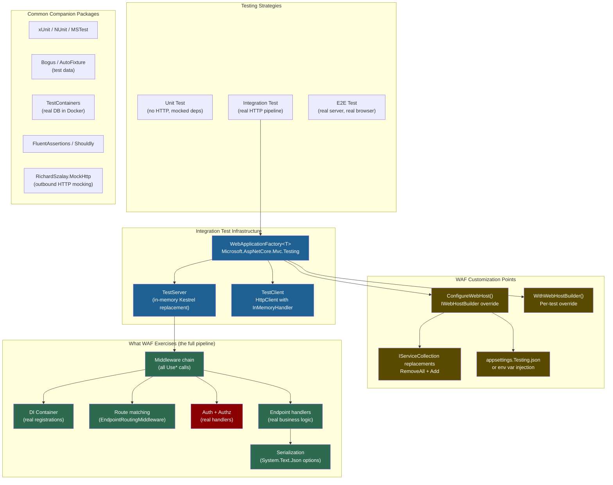

# 4.257 — WebApplicationFactory<T>: Integration Testing the Full HTTP Pipeline

---

## PART 0 — Navigation & Context

### Where This Topic Lives in the ASP.NET Core Domain

```
ASP.NET Core Mastery
│
├── A. Host & Application Lifecycle       ← WebApplication boots the host
│   └── 4.002  WebApplicationBuilder      ← WAF wraps and overrides this
│
├── D. Dependency Injection               ← WAF replaces DI registrations
│   └── 4.034  Built-In DI Container
│   └── 4.035  Service Lifetimes
│
├── E. Middleware Pipeline                ← WAF runs the ENTIRE pipeline
│   └── 4.049  Middleware Pipeline
│   └── 4.052  Middleware Ordering
│
├── J. Authentication / K. Authorization  ← Must be faked in test context
│   └── 4.259  Auth in Integration Tests  ←─── depends on this note
│
└── U. Testing                            ◄══ YOU ARE HERE
    └── 4.257  WebApplicationFactory<T>   ◄══ THIS NOTE
    └── 4.258  Customizing WAF            ←─── depends on this note
    └── 4.259  Auth in Integration Tests  ←─── depends on this note
    └── 4.260  Database in Int. Tests     ←─── depends on this note
    └── 4.261  Middleware Isolation Testing
    └── 4.264  Mocking HttpClient
    └── 4.267  Load Testing
```

### What You Need Before This

- **[[4.002 — WebApplication and WebApplicationBuilder]]** — WAF boots the same host your app boots; you must understand how that host is built to override it correctly.
- **[[4.034 — The Built-In DI Container]]** — WAF's power comes from replacing DI registrations; you must know how services are registered to replace them.
- **[[4.049 — The Middleware Pipeline]]** — Integration tests send real HTTP requests through the real middleware chain; understanding the chain tells you what your tests are actually exercising.
- **[[4.035 — Service Lifetimes]]** — Scoped services in integration tests behave differently than in production; getting this wrong produces false positives.

### What This Unlocks After

- **[[4.258 — Customizing WebApplicationFactory]]** — The advanced service replacement, configuration override, and multi-project WAF patterns.
- **[[4.259 — Authentication in Integration Tests]]** — How to inject fake identities so auth-protected endpoints are testable without real tokens.
- **[[4.260 — Database in Integration Tests]]** — TestContainers, SQLite, and InMemory database strategies require WAF to wire up the test database.
- **[[4.261 — Middleware Isolation Testing]]** — The counterpoint: when you want to test a single middleware _without_ the full WAF overhead.

### Why This Matters at Scale

`WebApplicationFactory<T>` is the line between unit tests that lie and integration tests that catch real production bugs — specifically the class of bugs that only appear when middleware ordering, DI scope boundaries, serialization settings, and authentication handlers all interact simultaneously under a real HTTP request. At 50+ endpoints or in teams where middleware configuration changes frequently, WAF-based integration tests are the last defense before production.

---

## PART 1 — The Core Mental Model

### The Fundamental Rule

> **`WebApplicationFactory<T>` boots your real ASP.NET Core application in-process, replacing the real HTTP server (Kestrel) with an in-memory `TestServer`, so every HTTP request from `CreateClient()` travels through your complete middleware pipeline, DI container, and endpoint handlers — with no mocking, no stubs, and no skipped layers.**

### The Plain-Language Analogy

Think of `WebApplicationFactory` as a flight simulator for your API. A real plane requires a runway, a tower, jet fuel, and passengers — but a simulator boots the same cockpit software, runs the same autopilot logic, and responds to the same control inputs, all while the physical aircraft stays in the hangar. Your tests are the pilot. The simulator is `WebApplicationFactory`. The cockpit software — your middleware, DI, route table, auth handlers, serializers — runs exactly as it would in flight.

When you call `factory.CreateClient()`, you get an `HttpClient` whose `HttpMessageHandler` is the `TestServer`'s in-memory handler. There is no TCP socket, no port, no Kestrel listening loop — but the HTTP request you send flows through `UseExceptionHandler`, `UseRouting`, `UseAuthentication`, `UseAuthorization`, your endpoint handler, and back. If your auth middleware has a bug, the simulator finds it. If your middleware ordering is wrong, the simulator finds it. When you ask "but what about the concurrent request?" — the simulator handles that too, because `TestServer` is thread-safe and WAF-created clients can be used in parallel. The analogy breaks only where real infrastructure (external Redis, real SQL Server) is absent — but that is what `[[4.260 — Database in Integration Tests]]` solves via TestContainers.

### The Taxonomy Diagram



---

## PART 2 — Deep Mechanics

### 2.1 — How `WebApplicationFactory<T>` Boots Your Application

The test fixture boots your application using the exact same host-building code path as production — with one surgical substitution.

**Pipeline Position:**

```
Production boot:
  Program.cs → WebApplicationBuilder → Build() → Kestrel listener → HTTP requests

WAF boot:
  Program.cs → WebApplicationBuilder → Build() → TestServer (no Kestrel) → In-memory handler
                                         ↑
                              WAF intercepts here via IWebHostBuilder.UseTestServer()
```

**Framework Source Behavior (approximate):**

```csharp
// ASP.NET Core internally (approximate) — WebApplicationFactory<TEntryPoint>:
// Class: Microsoft.AspNetCore.Mvc.Testing.WebApplicationFactory<TEntryPoint>
// Assembly: Microsoft.AspNetCore.Mvc.Testing

protected virtual IHost CreateHost(IHostBuilder builder)
{
    // 1. Let the real program configure everything
    builder.ConfigureWebHost(webHostBuilder =>
    {
        // 2. Swap Kestrel for TestServer
        webHostBuilder.UseTestServer();

        // 3. Apply user customizations (ConfigureWebHost overrides)
        ConfigureWebHost(webHostBuilder);
    });

    // 4. Build the IHost — DI container compiled here
    var host = builder.Build();

    // 5. Start the host (middleware pipeline built, hosted services started)
    host.Start();

    return host;
}

// TEntryPoint is your Program class.
// WAF finds your entry point via the assembly, then calls
// IHostBuilder from your application's bootstrap path.
```

**How `TEntryPoint` is located:**

```csharp
// WAF uses reflection to find the IHostBuilder factory method
// in the TEntryPoint assembly. For top-level statement programs:
// It locates the synthesized <Program> class and the
// CreateHostBuilder / CreateApplicationBuilder method or
// the entry point itself and re-invokes it.

// This is why your test project MUST reference your API project
// (not just depend on its types), and why Program.cs must be
// accessible to the test project. The standard fix:

// In your API's .csproj:
// <ItemGroup>
//   <InternalsVisibleTo Include="YourApi.Tests" />
// </ItemGroup>
// OR make the Program class partial and public.
```

**Runtime Cost:** `~1 full host boot per test class` that inherits from `IClassFixture<YourFactory>`. The host starts once, all tests in the class share it. `~0 extra allocations per request` beyond what the real app allocates — the TestServer adds no meaningful overhead per request.

**The edge case that bites teams:** If you `new WebApplicationFactory<Program>()` inside each test method (not via `IClassFixture`), you boot the entire application once per test. For 200 tests that is 200 application boots. On a CI machine with a real database migration on startup, this is the difference between a 10-second test suite and a 20-minute one.

---

### 2.2 — The `TestServer` In-Memory Transport

`TestServer` replaces Kestrel's TCP listener with an in-memory `HttpMessageHandler`. This means:

```
Real production request:
  Client → TCP → Kestrel → IHttpApplication → HttpContext → Middleware chain

WAF test request:
  HttpClient → InMemoryHandler → IHttpApplication → HttpContext → Middleware chain
                    ↑
              No TCP. No port binding. No network.
              Same HttpContext creation path as Kestrel.
```

**HTTP Wire Format (approximate — what flows through the in-memory transport):**

```http
// Test code sends:
GET /api/orders/42 HTTP/1.1
Host: localhost
Authorization: Bearer eyJhbGci...
Accept: application/json

// TestServer converts this to an HttpContext with:
// Request.Method = "GET"
// Request.Path = "/api/orders/42"
// Request.Headers["Authorization"] = "Bearer eyJhbGci..."
// Then the full middleware pipeline runs as in production.

// Response flows back:
HTTP/1.1 200 OK
Content-Type: application/json; charset=utf-8
Content-Length: 127

{"orderId":42,"status":"Pending","total":149.99}
```

**Runtime Cost:** `~1 async state machine per middleware` — same as production. No TCP overhead. For localhost integration tests this typically means `<5ms` per request vs `~1ms` for real Kestrel on localhost — the difference is the in-memory handler's dispatch overhead, not meaningful for correctness testing.

**The edge case:** `TestServer` does not bind ports. If your code reads `IServer.Features.Get<IServerAddressesFeature>()` to know its own URL (common in health check or redirect logic), it returns an empty collection in the test context. Override this in your factory if needed.

---

### 2.3 — The `IClassFixture<T>` Pattern and Host Lifetime

xUnit's `IClassFixture<T>` is the mechanism that ensures your application boots once per test class and is disposed after the last test in the class runs.

```csharp
// The two patterns — single boot vs per-test boot:

// ✅ CORRECT: Single host boot via IClassFixture (PRODUCTION PATTERN)
public class OrderApiTests : IClassFixture<WebApplicationFactory<Program>>
{
    private readonly HttpClient _client;

    public OrderApiTests(WebApplicationFactory<Program> factory)
    {
        // factory is the SAME instance for every test in this class
        // Host boots ONCE when the first test in this class runs
        _client = factory.CreateClient();
    }

    [Fact]
    public async Task GetOrder_ReturnsOrder_WhenExists()
    {
        var response = await _client.GetAsync("/api/orders/42");
        response.EnsureSuccessStatusCode();
    }
}

// ⚠️ EXPENSIVE: Per-test boot (common beginner mistake)
public class OrderApiTests
{
    [Fact]
    public async Task GetOrder_ReturnsOrder_WhenExists()
    {
        // NEW factory per test = FULL APP BOOT per test
        await using var factory = new WebApplicationFactory<Program>();
        var client = factory.CreateClient();
        var response = await client.GetAsync("/api/orders/42");
        response.EnsureSuccessStatusCode();
    }
}
```

**Pipeline position annotation:**

```
Test class constructor runs
  → IClassFixture provides the factory instance (shared)
  → factory.CreateClient() → TestServer.CreateClient()
  → Each test method calls client methods
  → Each call: in-memory transport → full pipeline execution
Test class disposed
  → factory.Dispose() → host.StopAsync() → hosted services stopped → DI disposed
```

**Runtime Cost:** `IClassFixture` — `O(1)` host boots per class. Without it — `O(n)` where n is test count. For `ICollectionFixture` — `O(1)` host boots per collection (multiple classes share one factory).

---

### 2.4 — Service Replacement in `ConfigureWebHost`

The most important customization point: replacing real services with test doubles.

```csharp
// ASP.NET Core internally (approximate):
// ConfigureWebHost is called BEFORE Build().
// Services registered here OVERRIDE services registered in Program.cs
// because IServiceCollection is ordered — last registration wins
// for non-TryAdd registrations.

// The critical difference:
// builder.Services.AddSingleton<IPaymentGateway, RealStripeGateway>();  // in Program.cs
// services.AddSingleton<IPaymentGateway, FakePaymentGateway>();          // in test factory
// Result: FakePaymentGateway wins — it was registered AFTER RealStripeGateway.

// For TryAdd registrations:
// builder.Services.TryAddSingleton<IPaymentGateway, RealStripeGateway>(); // in Program.cs
// services.AddSingleton<IPaymentGateway, FakePaymentGateway>();            // in test factory
// Result: FakePaymentGateway still wins — TryAdd only blocks if the
// same call in Program.cs runs AGAIN; your test Add call is a new call.

// To be SAFE and explicit — always RemoveAll first:
services.RemoveAll<IPaymentGateway>();
services.AddSingleton<IPaymentGateway, FakePaymentGateway>();
```

**Pipeline Position:**

```
Program.cs: builder.Services.AddSingleton<IPaymentGateway, StripeGateway>()
                                ↓
WAF.ConfigureWebHost(): services.RemoveAll<IPaymentGateway>()
                         services.AddSingleton<IPaymentGateway, FakeGateway>()
                                ↓
                        app.Build() — DI container compiled
                        FakeGateway is in the container. StripeGateway is not.
                                ↓
                        HTTP Request → Endpoint → IPaymentGateway resolved
                        → FakeGateway instance returned
```

**HTTP Wire Effect:**

```http
// POST /api/payments/charge HTTP/1.1
// Content-Type: application/json
// {"amount": 99.99, "currency": "USD"}

// In production:  Stripe API called → real charge
// In test:        FakePaymentGateway.ChargeAsync() called → fake result
// HTTP response is identical: 200 OK with charge ID
```

**Runtime Cost:** `RemoveAll<T>` is `O(n)` over `IServiceCollection` (linear scan). For a typical service collection of ~200 entries this is `<1ms` at startup — negligible.

**The edge case that bites teams:** If `IPaymentGateway` is registered inside a library's `AddPaymentModule()` extension method using `TryAddSingleton`, AND your factory calls `services.AddSingleton<IPaymentGateway, FakeGateway>()` WITHOUT `RemoveAll` first, the behavior depends on whether `AddPaymentModule` uses `TryAdd` or `Add`. Use `RemoveAll` always. It is defensive and explicit.

---

### 2.5 — Scoped Services and `CreateScope()` for Direct Assertion

The most important thing to understand about DI scopes in integration tests: `HttpClient` requests create their own scope automatically (one scope per request, same as production). But if you need to directly access a Scoped service — to seed data, to verify database state, to inspect what was written — you must create a scope explicitly.

```csharp
// ASP.NET Core internally (approximate):
// For each in-memory HTTP request:
//   TestServer creates IServiceScope (mirrors real Kestrel behavior)
//   Endpoint handler gets Scoped services from that scope
//   Scope is disposed when the response is sent
//
// After the request completes, that scope is GONE.
// You cannot access the DbContext that handled the request.
// You must create a NEW scope to inspect the database.

// Correct pattern for verifying side effects:
using var scope = factory.Services.CreateScope();
var db = scope.ServiceProvider.GetRequiredService<OrderDbContext>();
var order = await db.Orders.FindAsync(42);
Assert.Equal(OrderStatus.Shipped, order!.Status);
// scope.Dispose() called at end of using block — DbContext disposed
```

**Failure Mode:**

```
// ⚠️ WRONG: Accessing factory.Services.GetRequiredService<OrderDbContext>()
// factory.Services is the ROOT IServiceProvider.
// Resolving a Scoped service from the root is a scope violation.
// In Development mode (ValidateScopes = true): throws InvalidOperationException.
// In Release mode: returns a Scoped service captured by the root — memory leak.

var db = factory.Services.GetRequiredService<OrderDbContext>();
// HTTP consequence (wrong): InvalidOperationException thrown on first test run.
// In release builds: DbContext is never disposed, EF change tracker
// accumulates state across all tests — false positives everywhere.
```

**Runtime Cost:** `CreateScope()` — `~1 allocation` for the `ServiceScope` wrapper. Negligible. The cost is in resolving services inside it (normal DI resolution cost).

---

## PART 3 — Production Code Patterns

### Pattern 1: The Baseline Order Factory for a Payment API

The foundation pattern — a shared `OrderApiFactory` used by all test classes in the payment domain.

```csharp
// Domain: Fintech payment API — order management service
// File: Tests/Infrastructure/OrderApiFactory.cs

using Microsoft.AspNetCore.Mvc.Testing;
using Microsoft.Extensions.DependencyInjection;
using Microsoft.Extensions.DependencyInjection.Extensions;

/// <summary>
/// Shared test factory for the Order Management API.
/// Registered once per test collection via ICollectionFixture.
/// Replaces external dependencies with fakes to enable hermetic testing.
/// </summary>
public sealed class OrderApiFactory : WebApplicationFactory<Program>
{
    // Shared fake for assertion verification across test methods
    public FakeEmailService EmailService { get; } = new();
    public FakePaymentGateway PaymentGateway { get; } = new();

    protected override void ConfigureWebHost(IWebHostBuilder builder)
    {
        builder.ConfigureServices(services =>
        {
            // Remove real external dependencies — do NOT rely on registration order
            services.RemoveAll<IEmailService>();
            services.RemoveAll<IPaymentGateway>();
            services.RemoveAll<IStripeWebhookVerifier>();

            // Replace with test doubles
            // Singleton because these fakes accumulate state for assertion
            services.AddSingleton<IEmailService>(EmailService);
            services.AddSingleton<IPaymentGateway>(PaymentGateway);
            services.AddSingleton<IStripeWebhookVerifier, AlwaysValidWebhookVerifier>();
        });

        // Override configuration — no real Stripe keys in tests
        builder.ConfigureAppConfiguration((context, config) =>
        {
            config.AddInMemoryCollection(new Dictionary<string, string?>
            {
                ["Stripe:SecretKey"] = "sk_test_fake_key_for_testing",
                ["Stripe:WebhookSecret"] = "whsec_test_fake",
                ["Email:SmtpHost"] = "localhost",
                ["FeatureFlags:EnableNewCheckout"] = "true",
            });
        });
    }
}

// xUnit collection definition — one factory instance shared across all
// test classes in the "OrderApi" collection
[CollectionDefinition("OrderApi")]
public class OrderApiCollection : ICollectionFixture<OrderApiFactory> { }
```

```csharp
// Usage in test class:
[Collection("OrderApi")]
public class OrderCreationTests
{
    private readonly OrderApiFactory _factory;
    private readonly HttpClient _client;

    public OrderCreationTests(OrderApiFactory factory)
    {
        _factory = factory;
        _client = factory.CreateClient(new WebApplicationFactoryClientOptions
        {
            // Do NOT follow redirects — test the redirect itself
            AllowAutoRedirect = false,
            // BaseAddress is set automatically
        });
        // Reset fake state before each test class run
        factory.PaymentGateway.Reset();
        factory.EmailService.Reset();
    }
}
```

```
// HTTP wire effect:
// POST /api/orders HTTP/1.1
// Content-Type: application/json
// {"customerId": "cust_123", "items": [...]}
//
// Real code path: IPaymentGateway.AuthorizeAsync() → FakePaymentGateway (no network call)
// Real code path: IEmailService.SendConfirmationAsync() → FakeEmailService (captured, assertable)
// HTTP/1.1 201 Created
// Location: /api/orders/abc-123
```

---

### Pattern 2: Per-Test Service Override with `WithWebHostBuilder`

When one test needs a _different_ behavior from the shared factory — a specific payment gateway failure scenario — use `WithWebHostBuilder` to create a derived factory for that test only.

```csharp
// Domain: Fintech payment API — testing payment failure paths
// This creates a NEW factory derived from the shared one, without
// re-booting the entire application from scratch.

[Collection("OrderApi")]
public class PaymentFailureTests
{
    private readonly OrderApiFactory _factory;

    public PaymentFailureTests(OrderApiFactory factory)
    {
        _factory = factory;
    }

    [Fact]
    public async Task CreateOrder_Returns402_WhenPaymentDeclined()
    {
        // WithWebHostBuilder creates a child factory — same DI baseline,
        // plus these overrides. The application does NOT re-boot from scratch;
        // only the DI registrations are re-applied on a fork of the existing
        // host builder.
        await using var declineFactory = _factory.WithWebHostBuilder(builder =>
        {
            builder.ConfigureServices(services =>
            {
                services.RemoveAll<IPaymentGateway>();
                services.AddSingleton<IPaymentGateway>(
                    new AlwaysDeclinePaymentGateway("card_declined"));
            });
        });

        var client = declineFactory.CreateClient();

        var response = await client.PostAsJsonAsync("/api/orders", new
        {
            customerId = "cust_123",
            paymentMethodId = "pm_card_decline",
            items = new[] { new { productId = "prod_1", quantity = 1 } }
        });

        // The payment service layer maps PaymentDeclinedException to 402
        Assert.Equal(HttpStatusCode.PaymentRequired, response.StatusCode);

        var problem = await response.Content.ReadFromJsonAsync<ProblemDetails>();
        Assert.Equal("payment_declined", problem!.Extensions["errorCode"]?.ToString());
    }
}
```

```
// HTTP wire effect (wrong path — payment declined):
// POST /api/orders HTTP/1.1
// Content-Type: application/json
// {"customerId":"cust_123","paymentMethodId":"pm_card_decline","items":[...]}
//
// HTTP/1.1 402 Payment Required
// Content-Type: application/problem+json
// {"type":"https://errors.payments.example.com/payment-declined",
//  "title":"Payment Declined","status":402,
//  "detail":"Your card was declined.","errorCode":"card_declined"}
```

> [!WARNING] `WithWebHostBuilder` does **re-build** the DI container but does NOT re-run `Program.cs` from scratch. It applies your `ConfigureServices` additions on top of the baseline. This means the `TestServer` is a new instance. `await using` is mandatory — the factory must be disposed to release resources.

---

### Pattern 3: The Authenticated Client Factory for a Healthcare Portal

Testing auth-protected endpoints requires injecting a known identity without real JWT issuance.

```csharp
// Domain: Healthcare patient portal — testing role-based access to patient records
// Full implementation: see [[4.259 — Authentication in Integration Tests]]
// This pattern shows the WAF side of the auth fake setup.

public sealed class PatientPortalFactory : WebApplicationFactory<Program>
{
    protected override void ConfigureWebHost(IWebHostBuilder builder)
    {
        builder.ConfigureServices(services =>
        {
            // Replace real JWT validation with a test authentication handler
            // that accepts a fake "TestAuth" scheme
            services.AddAuthentication(defaultScheme: "TestAuth")
                .AddScheme<AuthenticationSchemeOptions, TestAuthHandler>(
                    "TestAuth", options => { });
        });
    }

    /// <summary>
    /// Creates an HttpClient with a pre-set identity — no JWT required.
    /// The identity is communicated via a custom request header that
    /// TestAuthHandler reads and converts to a ClaimsPrincipal.
    /// </summary>
    public HttpClient CreateAuthenticatedClient(
        string userId,
        string role,
        string[]? additionalClaims = null)
    {
        var client = CreateClient();

        // TestAuthHandler will read this header and build the ClaimsPrincipal
        client.DefaultRequestHeaders.Add("X-Test-UserId", userId);
        client.DefaultRequestHeaders.Add("X-Test-Role", role);

        return client;
    }
}

// TestAuthHandler — reads headers, produces ClaimsPrincipal
public class TestAuthHandler : AuthenticationHandler<AuthenticationSchemeOptions>
{
    public TestAuthHandler(
        IOptionsMonitor<AuthenticationSchemeOptions> options,
        ILoggerFactory logger,
        UrlEncoder encoder)
        : base(options, logger, encoder) { }

    protected override Task<AuthenticateResult> HandleAuthenticateAsync()
    {
        if (!Request.Headers.TryGetValue("X-Test-UserId", out var userIdValues))
            return Task.FromResult(AuthenticateResult.NoResult());

        var userId = userIdValues.ToString();
        var role = Request.Headers["X-Test-Role"].ToString();

        var claims = new List<Claim>
        {
            new(ClaimTypes.NameIdentifier, userId),
            new(ClaimTypes.Name, $"Test User {userId}"),
            new(ClaimTypes.Role, role),
        };

        var identity = new ClaimsIdentity(claims, "TestAuth");
        var principal = new ClaimsPrincipal(identity);
        var ticket = new AuthenticationTicket(principal, "TestAuth");

        return Task.FromResult(AuthenticateResult.Success(ticket));
    }
}
```

```csharp
// Test usage:
[Fact]
public async Task GetPatientRecord_Returns200_ForAssignedPhysician()
{
    var client = _factory.CreateAuthenticatedClient(
        userId: "physician-dr-smith",
        role: "Physician");

    var response = await client.GetAsync("/api/patients/patient-456/records");

    Assert.Equal(HttpStatusCode.OK, response.StatusCode);
}

[Fact]
public async Task GetPatientRecord_Returns403_ForUnauthorizedRole()
{
    var client = _factory.CreateAuthenticatedClient(
        userId: "billing-user-1",
        role: "BillingStaff");

    var response = await client.GetAsync("/api/patients/patient-456/records");

    // HTTP consequence: 403 because BillingStaff is not in the
    // "PatientRecordAccess" policy's allowed roles
    Assert.Equal(HttpStatusCode.Forbidden, response.StatusCode);
}
```

```
// HTTP wire effect (authorized path):
// GET /api/patients/patient-456/records HTTP/1.1
// X-Test-UserId: physician-dr-smith
// X-Test-Role: Physician
//
// → TestAuthHandler sees headers → builds ClaimsPrincipal with Role=Physician
// → AuthorizationMiddleware evaluates "PatientRecordAccess" policy → succeeds
// HTTP/1.1 200 OK
// Content-Type: application/json
// [{"recordId":"rec-789","date":"2026-01-15","diagnosis":"..."}]
```

---

### Pattern 4: Database Seeding and State Verification for an Order Service

The two-scope pattern: seed via `CreateScope`, act via HTTP, assert via another `CreateScope`.

```csharp
// Domain: E-commerce order management service
// Tests the full round-trip: seed data → HTTP endpoint → verify persistence

[Collection("OrderApi")]
public class OrderFulfillmentTests : IClassFixture<OrderApiFactory>
{
    private readonly OrderApiFactory _factory;
    private readonly HttpClient _client;

    public OrderFulfillmentTests(OrderApiFactory factory)
    {
        _factory = factory;
        _client = factory.CreateAuthenticatedClient("warehouse-user-1", "WarehouseStaff");
    }

    [Fact]
    public async Task MarkOrderShipped_UpdatesOrderStatus_AndSendsShipmentEmail()
    {
        // ARRANGE — seed data directly via DI scope (bypasses HTTP)
        var orderId = Guid.NewGuid();
        await using (var scope = _factory.Services.CreateAsyncScope())
        {
            var db = scope.ServiceProvider.GetRequiredService<OrderDbContext>();
            db.Orders.Add(new Order
            {
                Id = orderId,
                CustomerId = "cust-abc",
                Status = OrderStatus.Pending,
                CreatedAt = DateTime.UtcNow,
            });
            await db.SaveChangesAsync();
        }
        // Scope disposed here — DbContext is released

        // ACT — full HTTP pipeline
        var response = await _client.PostAsJsonAsync(
            $"/api/orders/{orderId}/ship",
            new { trackingNumber = "1Z999AA10123456784", carrier = "UPS" });

        // ASSERT HTTP response
        Assert.Equal(HttpStatusCode.NoContent, response.StatusCode);

        // ASSERT side effects — new scope, new DbContext instance
        await using (var scope = _factory.Services.CreateAsyncScope())
        {
            var db = scope.ServiceProvider.GetRequiredService<OrderDbContext>();
            var order = await db.Orders.FindAsync(orderId);

            Assert.NotNull(order);
            Assert.Equal(OrderStatus.Shipped, order.Status);
            Assert.Equal("1Z999AA10123456784", order.TrackingNumber);
            Assert.NotNull(order.ShippedAt);
        }

        // ASSERT email sent (via fake)
        var sentEmail = _factory.EmailService.SentEmails
            .SingleOrDefault(e => e.Subject.Contains("Your order has shipped"));
        Assert.NotNull(sentEmail);
        Assert.Equal("cust-abc@example.com", sentEmail!.To);
    }
}
```

> [!IMPORTANT] The database used here is whatever `OrderDbContext` resolves to. In the shared factory this should be replaced with a test database (SQLite or TestContainers). If it resolves to the real production database connection string, this test will modify production data. See `[[4.260 — Database in Integration Tests]]` for the correct database replacement pattern.

---

### Pattern 5: Testing Middleware Behavior — Correlation ID Middleware on a Logistics API

Testing cross-cutting middleware behavior by asserting on response headers.

```csharp
// Domain: Logistics shipment tracker — testing correlation ID middleware
// Verifies: correlation ID is echoed in response header, propagated to logs

[Collection("LogisticsApi")]
public class CorrelationIdMiddlewareTests
{
    private readonly LogisticsApiFactory _factory;

    public CorrelationIdMiddlewareTests(LogisticsApiFactory factory)
    {
        _factory = factory;
    }

    [Fact]
    public async Task Request_WithCorrelationId_EchoesItInResponse()
    {
        // ✅ CORRECT: Test that specific request header flows to response
        var client = _factory.CreateClient();
        var correlationId = Guid.NewGuid().ToString();

        client.DefaultRequestHeaders.Add("X-Correlation-ID", correlationId);

        var response = await client.GetAsync("/api/shipments/SHP-001");

        // Middleware should echo the header back
        Assert.True(response.Headers.TryGetValues("X-Correlation-ID", out var values));
        Assert.Equal(correlationId, values.Single());
    }

    [Fact]
    public async Task Request_WithoutCorrelationId_GetsGeneratedId()
    {
        // WAF test without X-Correlation-ID header
        var client = _factory.CreateClient();

        var response = await client.GetAsync("/api/shipments/SHP-001");

        // Middleware should generate and attach one
        Assert.True(response.Headers.Contains("X-Correlation-ID"));
        var id = response.Headers.GetValues("X-Correlation-ID").Single();
        Assert.True(Guid.TryParse(id, out _), "Generated correlation ID should be a GUID");
    }
}
```

```
// HTTP wire effect:
// GET /api/shipments/SHP-001 HTTP/1.1
// X-Correlation-ID: 7f3a2c1b-4e5d-6f7a-8b9c-0d1e2f3a4b5c
//
// HTTP/1.1 200 OK
// X-Correlation-ID: 7f3a2c1b-4e5d-6f7a-8b9c-0d1e2f3a4b5c  ← echoed
// Content-Type: application/json
// {"shipmentId":"SHP-001","status":"InTransit",...}
```

---

### Pattern 6: Testing Problem Details Shape for an Inventory Webhook Receiver

Tests that verify your error response contract — critical for API clients that parse `ProblemDetails`.

```csharp
// Domain: Inventory webhook receiver — validating error response shape
// Clients (warehouse systems) depend on consistent ProblemDetails format

[Collection("InventoryApi")]
public class WebhookValidationTests
{
    private readonly InventoryApiFactory _factory;
    private readonly HttpClient _client;

    public WebhookValidationTests(InventoryApiFactory factory)
    {
        _factory = factory;
        // Unauthenticated client — webhook authentication is via HMAC header
        _client = factory.CreateClient();
    }

    [Fact]
    public async Task PostWebhook_WithInvalidSignature_Returns401WithProblemDetails()
    {
        // ⚠️ WRONG anti-pattern: only asserting status code
        // response.EnsureSuccessStatusCode() — tells you nothing about the body shape

        // ✅ CORRECT: Assert the full ProblemDetails contract
        var response = await _client.PostAsJsonAsync(
            "/api/webhooks/inventory",
            new { eventType = "stock_updated", productId = "SKU-001", newQuantity = 50 });
        // No X-Webhook-Signature header — should fail auth

        Assert.Equal(HttpStatusCode.Unauthorized, response.StatusCode);
        Assert.Equal("application/problem+json",
            response.Content.Headers.ContentType?.MediaType);

        var problem = await response.Content.ReadFromJsonAsync<ProblemDetails>();
        Assert.NotNull(problem);
        Assert.Equal(401, problem!.Status);
        Assert.Equal("Webhook signature validation failed.", problem.Detail);
        // Ensure no stack trace leaks in production responses
        Assert.False(problem.Extensions.ContainsKey("exception"),
            "Stack traces must not appear in production error responses");
    }

    [Fact]
    public async Task PostWebhook_WithMalformedBody_Returns400WithValidationErrors()
    {
        _client.DefaultRequestHeaders.Add("X-Webhook-Signature", "valid-test-sig");

        // Missing required field: newQuantity
        var response = await _client.PostAsJsonAsync(
            "/api/webhooks/inventory",
            new { eventType = "stock_updated", productId = "SKU-001" });

        Assert.Equal(HttpStatusCode.BadRequest, response.StatusCode);

        var problem = await response.Content.ReadFromJsonAsync<ValidationProblemDetails>();
        Assert.NotNull(problem);
        Assert.True(problem!.Errors.ContainsKey("newQuantity"),
            "Validation errors must name the specific field that failed");
    }
}
```

---

### Pattern 7: Parallel Test Execution Safety — Isolation via Per-Test Database Schema

```csharp
// Domain: Multi-tenant SaaS — order service tests that run in parallel
// Problem: shared database state between parallel test runs causes flakiness
// Solution: per-test unique database schema name

public sealed class TenantOrderApiFactory : WebApplicationFactory<Program>
{
    private readonly string _dbName;

    public TenantOrderApiFactory()
    {
        // Each factory instance gets its own in-memory database
        // Works for SQLite in-memory; for TestContainers see 4.260
        _dbName = $"TestDb_{Guid.NewGuid():N}";
    }

    protected override void ConfigureWebHost(IWebHostBuilder builder)
    {
        builder.ConfigureServices(services =>
        {
            services.RemoveAll<DbContextOptions<OrderDbContext>>();
            services.RemoveAll<OrderDbContext>();

            // SQLite in-memory with a unique name per test factory instance
            services.AddDbContext<OrderDbContext>(options =>
                options.UseSqlite($"DataSource={_dbName};Mode=Memory;Cache=Shared"));
        });
    }
}

// Each test class creates its own factory — isolated database
public class TenantAOrderTests : IAsyncLifetime
{
    private readonly TenantOrderApiFactory _factory;
    private readonly HttpClient _client;

    public TenantAOrderTests()
    {
        _factory = new TenantOrderApiFactory();
        _client = _factory.CreateAuthenticatedClient("tenant-a-admin", "Admin");
    }

    public async Task InitializeAsync()
    {
        // Ensure DB schema created — runs once per test class
        using var scope = _factory.Services.CreateScope();
        var db = scope.ServiceProvider.GetRequiredService<OrderDbContext>();
        await db.Database.EnsureCreatedAsync();
    }

    public async Task DisposeAsync()
    {
        await _factory.DisposeAsync();
    }
}
```

---

## PART 4 — Gotchas & Anti-Patterns

### Gotcha 1: Singleton Fakes Accumulate State Across Tests

Experienced engineers register fake services as `Singleton` in their factory (correct for sharing the fake across tests) but forget to reset the fake's internal state between tests. The result is test pollution: test 3 sees email assertions from test 1.

```csharp
// ⚠️ WRONG CODE: Singleton fake, state never reset
public sealed class OrderApiFactory : WebApplicationFactory<Program>
{
    public FakeEmailService EmailService { get; } = new FakeEmailService();

    protected override void ConfigureWebHost(IWebHostBuilder builder)
    {
        builder.ConfigureServices(services =>
        {
            services.RemoveAll<IEmailService>();
            services.AddSingleton<IEmailService>(EmailService);
            // EmailService.SentEmails grows indefinitely across all tests
        });
    }
}

[Fact]
public async Task Test1_Sends_ConfirmationEmail() { /* sends 1 email */ }

[Fact]
public async Task Test2_DoesNotSend_Email_ForDraftOrder()
{
    // ⚠️ WRONG: EmailService.SentEmails has 1 email from Test1
    Assert.Empty(_factory.EmailService.SentEmails); // FAILS
}

// HTTP consequence (wrong path):
// Test2 passes locally when run alone, fails in CI when run after Test1.
// Non-deterministic failures depending on test execution order.
```

```csharp
// ✅ CORRECT CODE: Reset fake state in test setup
public class OrderCreationTests : IClassFixture<OrderApiFactory>
{
    private readonly OrderApiFactory _factory;

    public OrderCreationTests(OrderApiFactory factory)
    {
        _factory = factory;
        // xUnit creates a new instance per test method —
        // reset here executes before EACH test
        _factory.EmailService.Reset();
        _factory.PaymentGateway.Reset();
    }
}

// HTTP consequence (correct path):
// Each test starts with clean fake state regardless of execution order.
```

// WHY: `WebApplicationFactory` instances via `IClassFixture` are shared across test _methods_ within a class, but xUnit creates a new instance of the test _class_ (not the factory) per test method. The constructor runs before each test. The factory (and its Singleton services) persists. Reset in the constructor, not in Dispose.

---

### Gotcha 2: Resolving Scoped Services from the Root `factory.Services`

The factory's root `IServiceProvider` is Singleton-scoped. Resolving a Scoped service directly from it either throws (with `ValidateScopes = true`) or returns a captured Scoped service that is never disposed.

```csharp
// ⚠️ WRONG CODE: Resolving Scoped DbContext from root
var db = _factory.Services.GetRequiredService<OrderDbContext>();
var order = await db.Orders.FindAsync(orderId);
Assert.Equal(OrderStatus.Shipped, order.Status);

// HTTP consequence (wrong path):
// In development with ValidateScopes=true:
//   InvalidOperationException: "Cannot consume scoped service 'OrderDbContext'
//   from singleton."
// In release builds:
//   DbContext is never disposed. EF change tracker accumulates. Tests
//   that read data will see stale cached entities. Tests that write data
//   will fail with unique constraint violations on second run.
```

```csharp
// ✅ CORRECT CODE: Create an explicit scope
await using var scope = _factory.Services.CreateAsyncScope();
var db = scope.ServiceProvider.GetRequiredService<OrderDbContext>();
var order = await db.Orders.FindAsync(orderId);
Assert.Equal(OrderStatus.Shipped, order.Status);
// scope.DisposeAsync() called here — DbContext released

// HTTP consequence (correct path):
// Clean DbContext per assertion block. No change tracker pollution.
// No scope violations.
```

// WHY: `CreateAsyncScope()` creates a child `IServiceScope` with its own container. Scoped services resolved from this scope are tracked and disposed when the scope is disposed. This mirrors what happens during a real HTTP request.

---

### Gotcha 3: `WithWebHostBuilder` Creates a New Factory That Must Be Disposed

`WithWebHostBuilder` returns a new `WebApplicationFactory` that owns a new `TestServer` and a new `IHost`. If you do not dispose it, the hosted services (EF migrations, IHostedService implementations) continue running after the test.

```csharp
// ⚠️ WRONG CODE: WithWebHostBuilder result not disposed
var specialFactory = _factory.WithWebHostBuilder(builder =>
{
    builder.ConfigureServices(services =>
    {
        services.AddSingleton<IPaymentGateway, AlwaysDeclineGateway>();
    });
});
var client = specialFactory.CreateClient();
var response = await client.PostAsJsonAsync("/api/orders", payload);
// specialFactory never disposed — TestServer leaks, hosted services leak

// HTTP consequence (wrong path):
// Memory leak. Background services from the leaked host continue running.
// In test suites with many WithWebHostBuilder calls: port exhaustion
// (no ports used here, but OS socket handles can be exhausted).
// Undefined behavior if leaked hosted service modifies shared state.
```

```csharp
// ✅ CORRECT CODE: await using ensures disposal
await using var specialFactory = _factory.WithWebHostBuilder(builder =>
{
    builder.ConfigureServices(services =>
    {
        services.RemoveAll<IPaymentGateway>();
        services.AddSingleton<IPaymentGateway, AlwaysDeclineGateway>();
    });
});
var client = specialFactory.CreateClient();
var response = await client.PostAsJsonAsync("/api/orders", payload);
// specialFactory.DisposeAsync() → host.StopAsync() → hosted services stop

// HTTP consequence (correct path):
// Clean teardown. All resources released.
```

// WHY: `WebApplicationFactory<T>` implements `IAsyncDisposable`. The derived factory from `WithWebHostBuilder` has its own hosted services lifecycle. Using `await using` is mandatory. `using` (synchronous) works but suppresses the async disposal path — prefer `await using`.

---

### Gotcha 4: `CreateClient()` After Factory Disposal

A common pattern in base class testing abstractions is caching the `HttpClient`. If the factory is disposed and you try to use a previously-created client, the request will fail with an `ObjectDisposedException`.

```csharp
// ⚠️ WRONG CODE: Client created from a factory that gets disposed mid-test
public class BaseTest : IAsyncLifetime
{
    protected HttpClient Client { get; private set; } = null!;
    private WebApplicationFactory<Program> _factory = null!;

    public async Task InitializeAsync()
    {
        _factory = new WebApplicationFactory<Program>();
        Client = _factory.CreateClient();
    }

    public async Task DisposeAsync()
    {
        await _factory.DisposeAsync();
        // Client is now pointing to a disposed TestServer
    }
}

// If a derived test holds a reference to Client and uses it in
// [Theory] cleanup or in another test that runs after DisposeAsync:
// HTTP consequence (wrong path): ObjectDisposedException from HttpClient.
```

```csharp
// ✅ CORRECT CODE: Dispose client before or alongside factory
public async Task DisposeAsync()
{
    Client.Dispose(); // Dispose client first (it holds MessageHandler reference)
    await _factory.DisposeAsync();
}

// HTTP consequence (correct path): Clean disposal order.
// Alternatively: use IClassFixture<T> pattern — xUnit manages lifetime.
```

// WHY: `factory.CreateClient()` returns an `HttpClient` backed by a `TestServer`-owned `HttpMessageHandler`. When the factory (and thus `TestServer`) is disposed, the handler's underlying `IHttpApplication` is torn down. Any subsequent request through the client hits a disposed handler.

---

### Gotcha 5: Testing Redirects — `AllowAutoRedirect = true` Hides the 301/302

By default, `HttpClient` follows redirects. This means testing a redirect endpoint will succeed with a 200 (the final destination), hiding the 301/302 that your middleware or endpoint is issuing. Testing HTTPS redirect middleware is the classic example.

```csharp
// ⚠️ WRONG CODE: Default client follows redirects — can't test redirect itself
var client = _factory.CreateClient(); // AllowAutoRedirect defaults to TRUE

// UseHttpsRedirection should return 307 for HTTP requests
var response = await client.GetAsync("http://localhost/api/orders");

// HTTP consequence (wrong path):
// WAF follows the 307, then sends the same request to https://localhost/api/orders.
// You see 200 OK. You have NOT tested the redirect middleware.
Assert.Equal(HttpStatusCode.TemporaryRedirect, response.StatusCode); // FAILS
```

```csharp
// ✅ CORRECT CODE: Disable auto-redirect for redirect-testing scenarios
var client = _factory.CreateClient(new WebApplicationFactoryClientOptions
{
    AllowAutoRedirect = false, // Do NOT follow redirects
    BaseAddress = new Uri("http://localhost"), // Explicitly HTTP, not HTTPS
});

var response = await client.GetAsync("/api/orders");

// HTTP consequence (correct path):
// HTTP/1.1 307 Temporary Redirect
// Location: https://localhost/api/orders
Assert.Equal(HttpStatusCode.TemporaryRedirect, response.StatusCode);
Assert.Equal("https://localhost/api/orders",
    response.Headers.Location?.ToString());
```

// WHY: `WebApplicationFactoryClientOptions.AllowAutoRedirect` maps directly to `HttpClientHandler.AllowAutoRedirect`. The default is `true` to mirror browser behavior — sensible for most endpoint tests, but wrong for testing redirect-producing middleware. Always opt-out when testing redirects.

---

## PART 5 — Performance Implications

### 5.1 — Request Pipeline Characteristics Table

|Scenario|Pipeline Depth|Allocations Per Request|Approx Latency Impact|Recommendation|
|---|---|---|---|---|
|Single WAF host boot via `IClassFixture`|Full app startup|~50–500 allocations at startup|~100ms–2s (once)|Always use `IClassFixture` or `ICollectionFixture`|
|Per-test `new WebApplicationFactory<Program>()`|Full app startup per test|Same as above × test count|100ms–2s × N tests|Never — use fixture|
|`factory.CreateClient()` call|0 (reuses TestServer)|~2 allocations (HttpClient + handler config)|<1ms|Call once per test class, not per request|
|Single HTTP request via TestServer|Full middleware chain|Same as production (typ. 5–50 allocations)|<5ms overhead vs Kestrel|Negligible per-request overhead|
|`factory.Services.CreateScope()`|O(1) DI lookup|~3 allocations (scope + resolver + disposables list)|<0.1ms|Cheap — use freely for seeding/asserting|
|`WithWebHostBuilder()` override|Full app DI rebuild|~same as initial boot|~50–500ms|Reserve for tests needing unique configuration|
|Parallel test execution with shared factory|N × full pipeline|N × production allocations|Linear with N|Safe — `TestServer` is thread-safe|
|Parallel tests with per-test `WithWebHostBuilder`|N × DI rebuild|N × startup allocations|Can OOM under high parallelism|Cap parallelism: `[assembly: CollectionBehavior(MaxParallelThreads = 4)]`|
|`ReadFromJsonAsync<T>()` in assert|System.Text.Json deserialization|~1 allocation for result type|<1ms for typical payloads|Use source-gen JSON context if benchmark shows hot path|

### 5.2 — BenchmarkDotNet Comparison

```csharp
// This benchmark is illustrative — BenchmarkDotNet is not the right tool
// for WAF startup costs. Use Stopwatch or xUnit output helpers instead.
// For true integration test speed measurement, use:
// dotnet test --logger "console;verbosity=detailed" and examine startup time.

// What actually matters for CI speed:

// MEASURE: How long does your test suite take to boot?
// dotnet test -- NUnit.NumberOfTestWorkers=1  (force serial)
// vs. with ICollectionFixture grouping

// RULE OF THUMB (observed in production test suites, .NET 8, typical API):
// New factory per test:     ~300ms per test × 200 tests = 60 seconds just in boot
// IClassFixture per class:  ~300ms × 20 classes = 6 seconds in boot
// ICollectionFixture:       ~300ms × 3 collections = ~1 second in boot
//
// Expected output (approximate, .NET 8, developer machine, no real DB):
// New factory per test:       200 tests in 90s (60s boot + 30s test logic)
// IClassFixture per class:    200 tests in 36s (6s boot + 30s test logic)
// ICollectionFixture (3):     200 tests in 31s (1s boot + 30s test logic)

[MemoryDiagnoser]
public class WafBootBenchmarks
{
    // Demonstrates the cost difference — run outside xUnit
    [Benchmark(Baseline = true)]
    public async Task NewFactory_PerBenchmark()
    {
        await using var factory = new WebApplicationFactory<Program>();
        var client = factory.CreateClient();
        var _ = await client.GetAsync("/health");
    }

    [Benchmark]
    public async Task SharedFactory_PreCreated()
    {
        // Assumes _sharedFactory is pre-created in GlobalSetup
        var client = _sharedFactory!.CreateClient();
        var _ = await client.GetAsync("/health");
    }

    private static WebApplicationFactory<Program>? _sharedFactory;

    [GlobalSetup]
    public void Setup()
    {
        _sharedFactory = new WebApplicationFactory<Program>();
        // Warm up — first request triggers lazy initialization
        using var client = _sharedFactory.CreateClient();
        client.GetAsync("/health").GetAwaiter().GetResult();
    }

    [GlobalCleanup]
    public void Cleanup() => _sharedFactory?.Dispose();
}

// Expected output (approximate, .NET 8, x64, developer machine):
// | Method                    | Mean      | Gen0    | Allocated |
// |---------------------------|-----------|---------|-----------|
// | NewFactory_PerBenchmark   | 312.4 ms  | -       | 4.2 MB    |
// | SharedFactory_PreCreated  |   1.8 ms  | 15.6    | 48 KB     |
```

> [!TIP] For real HTTP profiling alongside WAF tests, use `dotnet-trace collect --process-id <pid> --providers Microsoft-AspNetCore-Server-Kestrel` (even though TestServer isn't Kestrel, ASP.NET Core diagnostics events still fire). Use `dotnet-counters monitor --process-id <pid>` to watch allocations during a long-running test suite. MiniProfiler does NOT work in WAF tests — there is no browser to receive the profiling widget.

### 5.3 — When to Care / When to Ignore

**When this costs you:**

- **CI pipelines with 500+ integration tests and no fixture sharing**: Without `ICollectionFixture`, each boot adds 100–500ms, pushing CI from 5 minutes to 40+ minutes.
- **Tests that use `WithWebHostBuilder` per test method**: Each call rebuilds the DI container. At 50 such tests this is a meaningful cost.
- **Factories that run EF Core migrations on startup**: `await db.Database.MigrateAsync()` in `InitializeAsync` can take 2–10 seconds. Run this once per collection, not once per class.
- **High parallelism without DB isolation**: Parallel tests sharing a real database create contention, deadlocks, and non-deterministic failures. The fix (unique DB per test) multiplies boot cost.

**When this doesn't matter:**

- **Admin and management APIs with <20 integration tests**: The total boot cost is under 5 seconds. Not worth optimizing.
- **Internal microservices tested with a single collection fixture**: One boot, 200 tests — the per-test cost is pure test logic, not infrastructure.
- **Tests that run locally during development**: Even 60-second test suites are acceptable locally. Optimize for CI throughput, not developer machine throughput.

---

## PART 6 — Interview Arsenal

### A. The Question Bank

**Question 1: "What is `WebApplicationFactory` and what does it actually do when you call `CreateClient()`?"**

**Average Answer:** "It's a test helper that creates an `HttpClient` you can use to test your ASP.NET Core application without running a real server."

**Why That's Insufficient:** It describes the surface API but says nothing about what "without running a real server" means technically — the distinction between TestServer and Kestrel, whether the middleware pipeline runs, or how DI is wired.

> **Great Answer:** "When I call `factory.CreateClient()`, what I get back is an `HttpClient` whose underlying message handler is a `TestServer`'s in-memory handler — not a real TCP socket. Under the hood, `WebApplicationFactory` boots my actual application using the same `Program.cs` entry point and `WebApplicationBuilder` that production uses, but it calls `UseTestServer()` on the `IWebHostBuilder` instead of letting Kestrel bind a port. This means every request I send travels through my complete middleware chain — `UseExceptionHandler`, `UseRouting`, `UseAuthentication`, `UseAuthorization`, and my endpoint handlers — exactly as it would in production. The DI container is real. The route table is real. The serialization settings are real. The only thing replaced is the HTTP transport layer. I've found bugs in middleware ordering this way that unit tests would have completely missed, because unit tests mock the services but skip the pipeline."

---

**Question 2: "How do you replace a real service with a test double in a `WebApplicationFactory`?"**

**Average Answer:** "You override `ConfigureWebHost` and use `services.AddSingleton<IMyService, FakeMyService>()`."

**Why That's Insufficient:** Omits the critical `RemoveAll<T>()` step, does not explain why the last registration wins, and doesn't mention the implications of registration order for `TryAdd` vs `Add`.

> **Great Answer:** "I override `ConfigureWebHost` and call `services.RemoveAll<IMyService>()` followed by `services.AddSingleton<IMyService, FakeService>()`. The `RemoveAll` is not optional — it's defensive programming. The reason: `IServiceCollection` is an ordered list, and the last `Add` registration wins for most calls. My test's `Add` call runs after `Program.cs` runs, so it would win even without `RemoveAll`. But if `Program.cs` uses `TryAddSingleton`, my `Add` call WOULD win because `TryAdd` only blocks the _same code_ from adding a duplicate — not a subsequent `Add` from a different caller. Even so, I always do `RemoveAll` first. It makes the test's intent explicit and prevents subtle ordering bugs if library internals change. I also expose the fake as a property on the factory so test methods can assert on what the fake received — for example, asserting that an email was sent after a payment was processed."

---

**Question 3: "What's the difference between `IClassFixture` and `ICollectionFixture` in the context of `WebApplicationFactory`?"**

**Average Answer:** "Both share a fixture across tests. `ICollectionFixture` shares across multiple test classes."

**Why That's Insufficient:** Doesn't mention the critical performance consequence (number of app boots), the xUnit lifetime semantics, or the isolation tradeoff.

> **Great Answer:** "The difference is granularity of host sharing, which maps directly to how many times your application boots during a test run. `IClassFixture<TFactory>` means the factory is created once per test class and shared across all test methods in that class. If I have 15 test classes, the application boots 15 times. `ICollectionFixture<TFactory>` means the factory is created once for all classes decorated with the matching `[Collection]` attribute — so if I put 15 classes in one collection, the application boots exactly once. In practice I group tests by domain: all order-related tests share one factory, all payment tests share another. The tradeoff is isolation: tests in the same collection share the Singleton services. If one test corrupts a Singleton fake's state and I forget to reset it, the next test sees dirty state. I've learned to always reset fake state in the test class constructor, since xUnit creates a new test class instance per test method even when the factory is shared."

---

### B. The Trick Questions

**Trick 1: "Can you use `factory.Services.GetRequiredService<IOrderRepository>()` to directly access a Scoped service after an HTTP test?"**

_The trap:_ Sounds reasonable — the factory has the DI container, just get the service.

_Correct answer:_ No. `factory.Services` is the root `IServiceProvider`. Resolving a Scoped service from it violates the scope contract. In development (with `ValidateScopes = true`, which is enabled by default), this throws `InvalidOperationException`. In production builds it silently returns a Scoped service captured by the root, which is never disposed — a memory leak and a source of change tracker pollution in EF Core. The correct pattern is `factory.Services.CreateScope()` (or `CreateAsyncScope()`), resolve from the scope's `ServiceProvider`, assert, then dispose the scope.

---

**Trick 2: "If I register `services.AddSingleton<IEmailService, FakeEmailService>()` in `ConfigureWebHost`, and my `Program.cs` registers `services.AddSingleton<IEmailService, SmtpEmailService>()`, which one does the running application use?"**

_The trap:_ Engineers guess "the one registered first" or "the production one, since it's the real app."

_Correct answer:_ The `FakeEmailService` wins. `IServiceCollection` is an ordered list. The framework resolves the _last_ registration for a given service type (for non-`TryAdd` registrations). `ConfigureWebHost` runs after `Program.cs`'s service registration, so `FakeEmailService` is the last registration. However — the safe pattern is always `RemoveAll<IEmailService>()` first, then `AddSingleton<IEmailService, FakeEmailService>()`. This is explicit and immune to `TryAdd` behavior.

---

**Trick 3: "You write `await factory.CreateClient().GetAsync('/api/orders')` inside a test. The endpoint requires a database. Your factory doesn't replace the `DbContext`. What happens?"**

_The trap:_ Engineers assume it will throw or skip.

_Correct answer:_ It uses whatever connection string `OrderDbContext` was configured with in `Program.cs`. In most setups this reads `appsettings.json`, which points to the development database. The test runs against the real development database — seeding real data, potentially leaving dirty state. This is the most common integration test environment pollution bug. The fix is to always replace `DbContextOptions<T>` in your factory to use SQLite in-memory, a unique file-per-test database, or a TestContainers Docker database.

---

**Trick 4: "Does `WebApplicationFactory` run `IHostedService.StartAsync()` implementations?"**

_The trap:_ Engineers assume it's "just a test server" and background services don't run.

_Correct answer:_ Yes. `WebApplicationFactory` starts the `IHost` via `host.Start()`. This calls `StartAsync()` on all registered `IHostedService` implementations — including `BackgroundService` subclasses that run timed jobs, migration runners, warm-up caches, etc. This is a feature (it mirrors production startup) and a footgun (if your `IHostedService` connects to a real external service on startup, your test factory will try to connect to it). The fix is to replace time-sensitive or external-dependency `IHostedService` implementations in `ConfigureWebHost`, or register a `NullMigrationRunner` that does nothing.

---

### C. Red Flags to Avoid

1. **"I test controllers by calling action methods directly."** This skips the entire pipeline — no middleware, no model binding, no auth. It's a unit test. WAF is the answer for integration testing. Saying this conflates unit and integration testing.
    
2. **"I use `Moq.Mock<IServiceProvider>` to test DI behavior."** The whole point of WAF is to use the REAL container. Mocking `IServiceProvider` is never correct and signals a fundamental misunderstanding of the test strategy.
    
3. **"I create a new `WebApplicationFactory` per test to ensure isolation."** This reveals you haven't considered performance. It also doesn't actually achieve isolation if tests share external state (a real database). The correct isolation strategy is scoped databases, not re-booting the app.
    
4. **"I test HTTP behavior by inspecting the response body with string comparison."** Fragile. JSON key ordering, whitespace, null handling — all can change without breaking the API contract. Use `ReadFromJsonAsync<T>()` and assert on typed properties.
    
5. **"The `HttpClient` from `CreateClient()` has the base address set to `http://localhost`, so I need to include the full URL in each request."** Half right: the base address IS set. But the consequence is wrong — relative URLs work fine. `client.GetAsync("/api/orders")` works exactly as you'd expect because `HttpClient` combines the base address with the relative path.
    
6. **"Integration tests are slow so we don't write many of them."** This signals the candidate has never invested in `ICollectionFixture` or fast in-memory databases. A well-structured WAF test suite with SQLite in-memory runs in under 30 seconds for 300 tests.
    
7. **"I can test authentication by sending a real JWT generated with a test secret."** This works but is fragile (key rotation, expiry) and misses the point. The purpose of `[[4.259 — Authentication in Integration Tests]]` is a fake auth scheme that bypasses JWT validation entirely while exercising the full authorization policy machinery.
    
8. **"The `TestServer` is just a mock."** `TestServer` is NOT a mock. It is a real `IHttpApplication` host. It runs real middleware. It executes real endpoint handlers. The only mock is the transport layer (no TCP). Saying it's a mock causes candidates to underestimate what integration tests cover.
    

---

## PART 7 — Decision Framework

```mermaid
flowchart TD
    START([What do I need to test?]) --> Q1{Does the test need\nreal HTTP pipeline\nmiddleware to run?}

    Q1 -- No --> UT["Unit Test\nMock dependencies\nCall service/handler directly\nNo WebApplicationFactory"]
    Q1 -- Yes --> Q2{Does it need real\nexternal infrastructure\n(DB, Redis, MQ)?}

    Q2 -- No --> Q3{Does every test\nin the class\nneed the same\nDI configuration?}
    Q2 -- Yes --> Q4{Can infrastructure\nrun in Docker?}

    Q4 -- Yes --> TC["ICollectionFixture + TestContainers\nReal DB in Docker container\nSee 4.260"]
    Q4 -- No --> Q5{Is SQLite\ncompatible with\nyour EF queries?}
    Q5 -- Yes --> SQLI["ICollectionFixture + SQLite\nIn-memory or file per collection\nFast, no Docker required"]
    Q5 -- No --> WARN["⚠️ Risk: InMemory EF Provider\nMissing FK constraints\nMissing SQL features\nUse only for read-heavy tests"]

    Q3 -- Yes --> CLSF["IClassFixture or ICollectionFixture\nShared factory across tests\nReset fake state in constructor"]
    Q3 -- No per-test variation --> Q6{How many tests\nneed the override?}

    Q6 -- 1-3 tests --> WHB["WithWebHostBuilder per test\nawait using — dispose required\nForks the DI container"]
    Q6 -- Many tests --> NEWCLS["New test class with\nits own IClassFixture\nDifferent factory subclass"]

    Q1 -- Yes --> Q7{Auth-protected\nendpoints?}
    Q7 -- Yes --> FAKEAUTH["Fake Auth Scheme\nTestAuthHandler pattern\nSee 4.259"]
    Q7 -- No --> Q3

    CLSF --> Q8{Multiple classes\nneed same factory?}
    Q8 -- Yes --> COLF["ICollectionFixture\nOne boot for all classes\nOptimal for CI speed"]
    Q8 -- No --> CLSF2["IClassFixture is fine\nOne boot per class"]

    style UT fill:#555,color:#fff
    style CLSF fill:#1e6091,color:#fff
    style CLSF2 fill:#1e6091,color:#fff
    style COLF fill:#1e6091,color:#fff
    style WHB fill:#5a4a00,color:#fff
    style NEWCLS fill:#5a4a00,color:#fff
    style TC fill:#2d6a4f,color:#fff
    style SQLI fill:#2d6a4f,color:#fff
    style FAKEAUTH fill:#8b0000,color:#fff
    style WARN fill:#8b0000,color:#fff
```

---

## PART 8 — Self-Check

### A. Conceptual Questions

1. What is the difference between `TestServer` and Kestrel, and which one does `WebApplicationFactory` use? What does this mean for tests that read `IServerAddressesFeature`?
    
2. When `WebApplicationFactory<Program>` boots, does it call the code in `Program.cs`? What specifically from `Program.cs` does it execute?
    
3. What happens to the HTTP request if you call `factory.CreateClient()` and send a `GET /api/orders/99` request — walk through every layer it touches before you get a response object back.
    
4. Why is `factory.Services.GetRequiredService<OrderDbContext>()` dangerous, and what is the correct replacement pattern?
    
5. What is the difference between `IClassFixture<TFactory>` and `ICollectionFixture<TFactory>`? Give a concrete example of when you would choose each.
    
6. If `Program.cs` registers `services.AddSingleton<IEmailService, SmtpEmailService>()`, and your factory's `ConfigureWebHost` registers `services.AddSingleton<IEmailService, FakeEmailService>()`, which service is resolved during a test request? Why?
    
7. Your middleware short-circuits for requests with a missing required header. How would you write a WAF integration test to verify this behavior, including what the HTTP response status and body should look like?
    
8. Does `WebApplicationFactory` run `IHostedService.StartAsync()` implementations? What is the consequence for factories that don't override a migration-running hosted service?
    
9. What does `WebApplicationFactoryClientOptions.AllowAutoRedirect = false` change, and in what testing scenario is it critical to set this to `false`?
    
10. You have 300 integration tests across 15 test classes. They all use the same `WebApplicationFactory`. What is the maximum number of application boots if you use (a) `new factory per test`, (b) `IClassFixture per class`, (c) `ICollectionFixture` with all classes in one collection?
    

---

### B. Code Puzzles

**Puzzle 1 — What is the HTTP response? (Most common WAF misunderstanding)**

```csharp
public class OrderTests : IClassFixture<WebApplicationFactory<Program>>
{
    private readonly WebApplicationFactory<Program> _factory;

    public OrderTests(WebApplicationFactory<Program> factory)
    {
        _factory = factory;
    }

    [Fact]
    public async Task GetOrder_ReturnsExpectedResult()
    {
        // Program.cs registers:
        // builder.Services.AddScoped<IOrderRepository, SqlOrderRepository>();
        // The test does NOT replace IOrderRepository.

        // The appsettings.json connection string points to a SQL Server
        // instance that does not exist in the CI environment.

        var client = _factory.CreateClient();
        var response = await client.GetAsync("/api/orders/1");

        // What HTTP status code does response have?
    }
}
```

<details> <summary>Answer</summary>

**HTTP status: 500 Internal Server Error** (or possibly no response — `SocketException` / `SqlException` thrown).

The factory uses the real `SqlOrderRepository` and the real connection string from `appsettings.json`. When the endpoint handler calls `_repository.GetOrderAsync(1)`, it attempts to open a SQL Server connection. If the database doesn't exist or the CI environment has no SQL Server: `SqlException` is thrown → caught by `UseExceptionHandler` → returns `500` with a `ProblemDetails` body.

**The lesson:** Always replace infrastructure dependencies in your factory. Do NOT rely on accidentally catching exceptions as a "pass." This test gives a false result: it would "pass" (not throw an assertion) if you checked `Assert.Equal(HttpStatusCode.InternalServerError, response.StatusCode)`, but it is testing error handling, not the intended behavior.

**Fix:** `services.RemoveAll<IOrderRepository>()` + `services.AddScoped<IOrderRepository, FakeOrderRepository>()` in `ConfigureWebHost`.

</details>

---

**Puzzle 2 — Which middleware runs? Where is the bug?**

```csharp
// Program.cs (the real app):
app.UseAuthentication();
app.UseAuthorization();
app.UseRouting();  // ← routing AFTER auth
app.MapGet("/api/orders", [Authorize] async (IOrderRepository repo) =>
    await repo.GetAllAsync());
```

```csharp
// Integration test:
var client = _factory.CreateAuthenticatedClient("user-1", "Admin");
var response = await client.GetAsync("/api/orders");

// What HTTP status code does the test get?
// Is the [Authorize] attribute respected?
```

<details> <summary>Answer</summary>

**HTTP status: 404 Not Found** (and `[Authorize]` is NOT enforced as expected).

The bug is in the middleware order in `Program.cs`: `UseRouting()` is registered AFTER `UseAuthentication()` and `UseAuthorization()`. The canonical correct order is:

```
UseRouting → UseAuthentication → UseAuthorization → MapGet(...)
```

With routing registered after auth, the endpoint is never matched during the auth phase. `UseAuthorization()` calls `context.GetEndpoint()` to read the endpoint's `IAuthorizeData` metadata — but because `UseRouting` hasn't run yet, there is no endpoint on the context. Authorization sees no endpoint, no `[Authorize]` attribute, and does nothing. The request reaches `UseRouting` (too late), matches the endpoint, and... the endpoint executes WITHOUT the authorization policy being evaluated.

BUT — with routing after auth, the `MapGet` routes are never registered in the context the routing middleware searches. In ASP.NET Core 6+, `UseRouting()` after `MapGet()` actually triggers an automatic `UseRouting` insertion, so the behavior is framework-version-specific. In the clean case: the endpoint is found and executed unauthenticated. In some configurations: 404. Either way, the ordering is a security bug.

**The test would not catch this** if it uses `CreateAuthenticatedClient` — because the client IS authenticated, and if auth is skipped, the request still succeeds. A test using an unauthenticated client and asserting `401` WOULD catch it.

**The lesson:** Write negative tests (unauthenticated client MUST get 401) alongside positive tests. Middleware ordering bugs are invisible to positive-only test suites.

</details>

---

**Puzzle 3 — What status code? (Scope violation at assertion time)**

```csharp
[Fact]
public async Task CreateOrder_PersistsToDatabase()
{
    var client = _factory.CreateAuthenticatedClient("user-1", "Customer");

    var response = await client.PostAsJsonAsync("/api/orders", new
    {
        productId = "PROD-1",
        quantity = 2
    });

    Assert.Equal(HttpStatusCode.Created, response.StatusCode);

    // Verify persistence
    var db = _factory.Services.GetRequiredService<OrderDbContext>();
    var count = await db.Orders.CountAsync();
    Assert.Equal(1, count);
}
```

```
// What happens when the test runs in Development mode?
// What happens in Release mode?
```

<details> <summary>Answer</summary>

**Development mode:** `InvalidOperationException` thrown at `GetRequiredService<OrderDbContext>()`.

`_factory.Services` is the root `IServiceProvider`. `OrderDbContext` is registered as `Scoped`. `ValidateScopes = true` is enabled by default in the Development environment. Resolving a Scoped service from the root throws:

> `InvalidOperationException: Cannot consume scoped service 'OrderDbContext' from singleton.`

The test fails with an exception, not an assertion failure. The `Assert.Equal(HttpStatusCode.Created, ...)` may have passed, but the test still fails.

**Release mode (ValidateScopes = false):** The scope check is skipped. The `OrderDbContext` is resolved from the root — making it effectively a Singleton for the duration of the test process. The DbContext is NEVER disposed. Its change tracker accumulates entries from every HTTP request's `SaveChangesAsync` call. `count` may return more than 1 if previous tests created orders. The assertion fails non-deterministically.

**Fix:**

```csharp
await using var scope = _factory.Services.CreateAsyncScope();
var db = scope.ServiceProvider.GetRequiredService<OrderDbContext>();
var count = await db.Orders.CountAsync();
Assert.Equal(1, count);
```

</details>

---

**Puzzle 4 — Does this short-circuit? What response does the client see?**

```csharp
// The app has this middleware registered BEFORE UseAuthentication:
app.Use(async (context, next) =>
{
    if (!context.Request.Headers.ContainsKey("X-API-Version"))
    {
        context.Response.StatusCode = 400;
        await context.Response.WriteAsJsonAsync(new { error = "X-API-Version header required" });
        return; // Short-circuit — next() is NOT called
    }
    await next(context);
});

app.UseAuthentication();
app.UseAuthorization();
app.MapGet("/api/orders", [Authorize] () => Results.Ok());
```

```csharp
// Test:
var client = _factory.CreateAuthenticatedClient("user-1", "Admin");
// Note: no X-API-Version header added to the client
var response = await client.GetAsync("/api/orders");
// What status code does response have?
// Does the [Authorize] attribute execute?
```

<details> <summary>Answer</summary>

**HTTP status: 400 Bad Request**

The custom middleware runs BEFORE `UseAuthentication`. It checks for the `X-API-Version` header — which is absent from the authenticated client. It sets `StatusCode = 400`, writes the JSON error body, and returns WITHOUT calling `next(context)`. This short-circuits the entire remaining pipeline.

`UseAuthentication` does NOT run. `UseAuthorization` does NOT run. The endpoint handler does NOT execute. The `[Authorize]` attribute is never evaluated.

The response the client receives:

```http
HTTP/1.1 400 Bad Request
Content-Type: application/json
{"error":"X-API-Version header required"}
```

**What the test verifies (intentionally or not):** That the version-check middleware fires before auth for ALL requests, including those from authenticated clients. This is the correct behavior if API versioning is a gateway concern.

**Implication for test authors:** If your test for `[Authorize]` behavior sends an authenticated client and gets a 400 instead of the expected 401/403, the culprit may be an earlier middleware short-circuit. Always test your middleware chain in isolation (see `[[4.261 — Middleware Testing]]`) before trusting that your auth tests are actually testing auth.

</details>

---

**Puzzle 5 — What happens to the second request? (State leak between tests)**

```csharp
public class PaymentTests : IClassFixture<OrderApiFactory>
{
    private readonly OrderApiFactory _factory;
    private readonly HttpClient _client;

    public PaymentTests(OrderApiFactory factory)
    {
        _factory = factory;
        // ⚠️ No reset of PaymentGateway fake
        _client = _factory.CreateAuthenticatedClient("user-1", "Customer");
    }

    [Fact]
    public async Task Test1_ProcessPayment_RecordsTransaction()
    {
        await _client.PostAsJsonAsync("/api/payments", new { amount = 100 });
        Assert.Single(_factory.PaymentGateway.ProcessedTransactions);
    }

    [Fact]
    public async Task Test2_ProcessPayment_ForDifferentOrder_AlsoRecords()
    {
        await _client.PostAsJsonAsync("/api/payments", new { amount = 200 });
        Assert.Single(_factory.PaymentGateway.ProcessedTransactions); // ← what happens here?
    }
}
```

```
// Assuming Test1 runs before Test2, what does Test2's assertion produce?
// What is the fix?
```

<details> <summary>Answer</summary>

**Test2's assertion FAILS** with: `Assert.Single() Failure: Expected 1 element, but found 2.`

`_factory.PaymentGateway` is a Singleton registered in `ConfigureWebHost`. It is the SAME instance across both tests. xUnit creates a new `PaymentTests` instance for each test method (Test1 and Test2), but it injects the SAME `OrderApiFactory` (via `IClassFixture`), so `_factory.PaymentGateway` is shared. Test1 adds one transaction. Test2 adds another. When Test2 asserts `Assert.Single(...)`, there are already 2 transactions in the fake.

The test result is non-deterministic with respect to execution order: if Test2 runs first, it passes. If Test1 runs first, it fails.

**The fix — reset in the constructor:**

```csharp
public PaymentTests(OrderApiFactory factory)
{
    _factory = factory;
    _factory.PaymentGateway.Reset(); // ← Add this
    _client = _factory.CreateAuthenticatedClient("user-1", "Customer");
}
```

xUnit constructs `PaymentTests` before each test method runs, so the reset executes before every test. Both Test1 and Test2 start with an empty `ProcessedTransactions` list.

**The broader lesson:** Any Singleton fake that accumulates state is a test pollution risk. Either reset in the constructor, or use `IAsyncLifetime.InitializeAsync()` for async reset logic.

</details>

---

## PART 9 — Connections & Resources

### A. Related Topics Table

|Topic|Why It Connects|
|---|---|
|[[4.258 — Customizing WebApplicationFactory: Replacing Services and Config]]|Direct continuation: the advanced `WithWebHostBuilder`, multi-project factory, and `IHostBuilder` customization patterns not covered in this note|
|[[4.259 — Authentication in Integration Tests: Custom Fake Auth Schemes]]|WAF provides the DI injection point; 4.259 provides the `TestAuthHandler` pattern that makes auth-protected endpoints testable without real JWTs|
|[[4.260 — Database in Integration Tests: TestContainers vs SQLite vs InMemory]]|The `ConfigureWebHost` pattern from this note is how you replace `DbContextOptions<T>`; 4.260 explains which database strategy to use and why InMemory EF is dangerous|
|[[4.002 — WebApplication and WebApplicationBuilder: The New Hosting Model]]|WAF re-invokes your entry point; understanding `WebApplicationBuilder`'s configuration pipeline explains what WAF can and cannot override|
|[[4.034 — The Built-In DI Container: Service Registration and Resolution]]|`RemoveAll<T>` + `AddSingleton<T>` is the DI manipulation pattern that makes WAF customization work; knowing `IServiceCollection` ordering is prerequisite|
|[[4.035 — Service Lifetimes: Singleton, Scoped, Transient]]|The "resolving Scoped from root" gotcha (Gotcha 2) is a direct consequence of service lifetime rules; `CreateScope()` is the fix|
|[[4.042 — The Captive Dependency Problem: Singleton Consuming Scoped]]|The test-side analogue of the captive dependency bug — accessing a Scoped service from `factory.Services` (root Singleton scope) is the integration test version of this production bug|
|[[4.049 — The Middleware Pipeline: Request Delegation Chain]]|WAF exercises the complete middleware pipeline; understanding the pipeline is what makes integration tests interpretable (knowing WHY a 401 comes back before your handler runs)|
|[[4.052 — Middleware Ordering: The Canonical Order and Why It Matters]]|Puzzle 2 in this note is a direct consequence of wrong middleware ordering; integration tests are the primary detection mechanism for ordering bugs|
|[[4.182 — Global Exception Handler (.NET 8): IExceptionHandler Interface]]|What WAF returns when an unhandled exception occurs — the `IExceptionHandler` or `UseExceptionHandler` pipeline determines the 500 body shape your integration tests assert on|
|[[4.261 — Middleware Testing: Isolating Middleware Without the Full Pipeline]]|The counterpoint to this note: when you want to test ONE middleware without the full WAF overhead, use `TestServer` directly without `WebApplicationFactory`|
|[[4.264 — Mocking HttpClient: MockHttpMessageHandler in Unit Tests]]|Tests that use WAF may also need to mock outbound `HttpClient` calls (to Stripe, to other services); `RichardSzalay.MockHttp` or `IHttpMessageHandlerFactory` replacement in DI is the pattern|
|[[3.01 — DbContext: Lifecycle, Internals, and DI Scoping]]|`DbContext` is Scoped; the `CreateScope()` pattern in integration tests is the test-context version of how ASP.NET Core manages `DbContext` per request|

### B. Books

|Book|Chapters|Why These Chapters|
|---|---|---|
|_Integration Testing ASP.NET Core Applications_ — Jimmy Bogard (Leanpub, 2023)|All chapters — this book is specifically about this topic|The authoritative deep-dive into the WAF pattern, fixture sharing strategies, and database isolation|
|_ASP.NET Core in Action, 3rd Ed._ — Andrew Lock|Ch. 36: Integration Tests with WebApplicationFactory|Covers the baseline setup, client creation, and service replacement patterns with working code examples|
|_The Art of Unit Testing, 3rd Ed._ — Roy Osherove|Ch. 9: Integration vs. Unit tests — knowing the boundary|Provides the conceptual framework for understanding where WAF integration tests fit in the testing pyramid|
|_xUnit.net in Action_ — Brad Wilson|Ch. 7: Shared Context with Fixtures|`IClassFixture` and `ICollectionFixture` are xUnit-specific; this chapter explains the lifetime semantics that the gotchas in Part 4 depend on|

### C. Essential Articles & Docs

- **Microsoft Docs — Integration tests in ASP.NET Core**: https://learn.microsoft.com/en-us/aspnet/core/test/integration-tests — The canonical reference. Read the "Basic tests with the default `WebApplicationFactory`" and "Customize `WebApplicationFactory`" sections first.
- **Andrew Lock — Integration Testing with WebApplicationFactory**: https://andrewlock.net/converting-integration-tests-to-net-6-minimal-hosting-model/ — Covers the migration from `Startup.cs`-based factories to the .NET 6+ `Program.cs`/top-level statement model; essential for engineers working with legacy codebases.
- **Jimmy Bogard — Vertical Slice Architecture Testing**: https://jimmybogard.com/vertical-slice-architecture/ — How to structure integration tests around feature slices rather than layers; the collection fixture pattern emerges naturally from this.
- **ASP.NET Core GitHub — TestServer source**: https://github.com/dotnet/aspnetcore/blob/main/src/Hosting/TestHost/src/TestServer.cs — The actual source of `TestServer`; reading `CreateClient()` and `SendAsync()` makes the "no TCP, real pipeline" mental model concrete.
- **David Fowler — .NET 6 WebApplication and Minimal Hosting**: https://gist.github.com/davidfowl/0e0372c3c1d895c3ce195ba983b1e03d — The design doc behind `WebApplication` and `WebApplicationBuilder`; clarifies why the entry point works the way it does and what WAF hooks into.

---

> [!NOTE] **Template Meta-Note — What Each Part Is For**
> 
> - **Part 0 — Navigation:** Orients you in the ASP.NET Core domain hierarchy. Read this before anything else to understand prerequisites and what you'll unlock.
> - **Part 1 — Core Mental Model:** The one-sentence rule + analogy + taxonomy. Internalize this first; everything else is detail.
> - **Part 2 — Deep Mechanics:** What the framework actually does at runtime — pipeline position, HTTP wire format, internal source behavior, and the edge cases that bite production teams.
> - **Part 3 — Production Code Patterns:** 5–7 copy-paste-ready patterns from real business domains. Study the anti-patterns as much as the correct versions.
> - **Part 4 — Gotchas:** The bugs that experienced engineers make. Every one of these has appeared in a real codebase.
> - **Part 5 — Performance:** When the overhead matters, when it doesn't, and how to measure it. Don't optimize until you've read the "when to ignore" section.
> - **Part 6 — Interview Arsenal:** Great Answers speak in terms of the HTTP pipeline and production trade-offs. Red Flags are what interviewers score down on.
> - **Part 7 — Decision Framework:** The flowchart to pull up during a live interview when asked "how do you decide."
> - **Part 8 — Self-Check:** Test yourself honestly. The code puzzles have non-obvious answers that require understanding, not just recall.
> - **Part 9 — Connections:** The wiki links, books, and articles that go deeper. The Related Topics table explains _why_ topics connect, not just that they do.