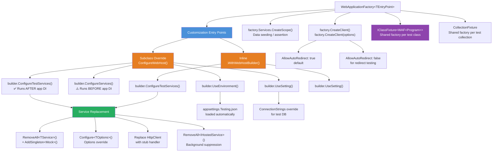
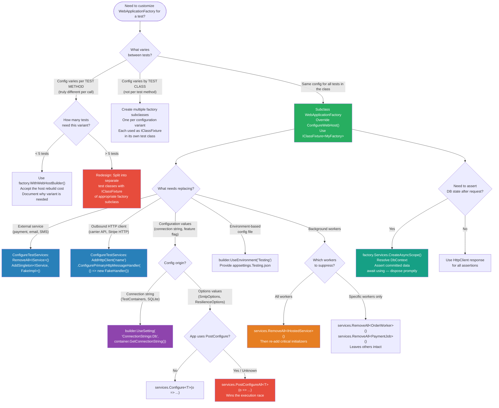

> [!success] Mastery Check
> - [ ] **Studied Well**
> - [ ] **Can explain the concept without notes**
> - [ ] **Can answer interview questions confidently**
> - [ ] **Can implement it in a real project**


# 4.258 — Customizing WebApplicationFactory: Replacing Services and Configuration for Tests

---

## PART 0 — Navigation & Context

### Domain Hierarchy

```
ASP.NET Core Mastery
└── Testing
    ├── 4.257 — WebApplicationFactory<T>: Integration Testing the Full HTTP Pipeline  ← FOUNDATION
    ├── 4.258 — Customizing WebApplicationFactory: Replacing Services and Config      ← YOU ARE HERE
    ├── 4.259 — Authentication in Integration Tests: Fake Auth Schemes                ← BUILDS ON THIS
    └── 4.260 — Database in Integration Tests: TestContainers vs SQLite vs InMemory   ← BUILDS ON THIS
```

**Full ASP.NET Core domain context:**

```
Host & Lifecycle → Configuration → Logging → DI → Middleware → Routing →
Minimal APIs / MVC → Auth → Validation → Error Handling → Caching →
Security → Real-Time → Background Services → HTTP Clients → [TESTING] ← here
→ Serialization → API Design → Filters → Observability → Deployment
```

---

### What You Need Before This

| Prerequisite | Why You Need It |
|---|---|
| [[4.257 — WebApplicationFactory<T>: Integration Testing the Full HTTP Pipeline]] | `WebApplicationFactory<TEntryPoint>` is the mechanism being customized — you must understand its base behavior before overriding it |
| [[4.034 — The Built-In DI Container]] | `ConfigureTestServices` grants access to `IServiceCollection`; you need to know how registrations, descriptors, and resolution order work |
| [[4.035 — Service Lifetimes]] | Replacing a service with the wrong lifetime (e.g., Singleton mock for a Scoped service) creates subtle test pollution bugs |
| [[4.016 — IOptions<T>]] | Overriding `IOptions<T>` values requires understanding the Options pipeline: `Configure<T>`, `PostConfigure<T>`, and binding order |

---

### What This Unlocks After

| Next Topic | How This Enables It |
|---|---|
| [[4.259 — Authentication in Integration Tests: Fake Auth Schemes]] | Fake auth schemes are a specific application of `ConfigureTestServices` — registering a fake `IAuthenticationHandler` |
| [[4.260 — Database in Integration Tests: TestContainers vs SQLite vs InMemory]] | Replacing `DbContextOptions<T>` or the entire `DbContext` registration is the most common `ConfigureTestServices` scenario |
| Advanced: Contract Testing | Stable, isolated factories make consumer-driven contract tests possible without live dependencies |
| Advanced: Parallel Test Execution | Understanding factory caching (via `IClassFixture`) is prerequisite to running tests safely in parallel |

---

### Why This Matters in Production

**The ability to replace services and configuration in integration tests is the single mechanism that transforms a live-dependency smoke test into a deterministic, repeatable contract test** — making CI/CD pipelines trustworthy at scale because no test ever fails due to an external payment gateway being slow or a SMTP server being unavailable, only due to actual regressions in application logic.

---

## PART 1 — The Core Mental Model

### The Fundamental Rule

> **`ConfigureTestServices` runs AFTER the application's own `ConfigureServices`, so any service descriptor you add or remove inside it wins the resolution race — the last registration for an interface wins in ASP.NET Core's built-in container. The practical HTTP consequence is that your test's mock `IPaymentGateway` answers every `POST /api/orders/{id}/pay` call instead of the real Stripe client, while the entire middleware pipeline, routing, model binding, and authorization stack runs exactly as it would in production.**

---

### The Plain-Language Analogy

Think of `WebApplicationFactory` customization like intercepting a vending machine before it goes live on the shop floor. The machine (your ASP.NET Core app) is fully wired at the factory — all its internal mechanisms (middleware, routing, auth) are in place. `ConfigureTestServices` is the maintenance panel at the back of the machine that lets you swap out the coin validator module (the real payment gateway) for a test jig that accepts anything (a mock). The rest of the machine — the button panel, the dispensing mechanism, the display — still functions exactly as it would for a paying customer. This analogy holds even for concurrent requests: multiple test threads can be pressing buttons simultaneously while the same swapped-out test jig handles all their coin-validation requests, because the machine is still fully operational, just with the one component replaced. And if the test jig itself is stateful and you forget to reset it between button-presses, the next test's "coin" arrives pre-credited — exactly the scoped-vs-singleton lifetime bug you'll see in production test suites.

---

### The Taxonomy Diagram



---

## PART 2 — Deep Mechanics

### 2.1 — The Host Build Order: Where ConfigureTestServices Fits

Understanding *when* each callback runs is the foundation of everything that follows. When `WebApplicationFactory<TEntryPoint>` creates the test host, it replays the same host-building sequence as your real app, but with test overrides layered on top.

```
HOST BUILDING SEQUENCE (chronological, left = earliest):

  [1] IWebHostBuilder created by CreateHostBuilder() / WebApplication.CreateBuilder()
      │
  [2] App's Program.cs runs:
      │   builder.Services.AddControllers()
      │   builder.Services.AddScoped<IPaymentGateway, StripeGateway>()
      │   builder.Services.AddDbContext<OrderDb>(...)
      │   app.MapControllers()  ← endpoints registered
      │
  [3] WebApplicationFactory calls ConfigureWebHost(builder):
      │   builder.UseEnvironment("Testing")          ← env set
      │   builder.UseSetting("key", "value")         ← config values merged
      │   builder.ConfigureServices(...)             ← runs BEFORE [2]? NO — see note
      │   builder.ConfigureTestServices(services =>  ← runs AFTER [2] ✅
      │   {
      │       services.RemoveAll<IPaymentGateway>();
      │       services.AddSingleton<IPaymentGateway, FakePaymentGateway>();
      │   })
      │
  [4] IHost built → middleware pipeline wired → endpoints registered
      │
  [5] Test receives HttpClient → requests flow through full pipeline

Pipeline during test:
──► ExceptionHandlerMiddleware ──► HSTSMiddleware ──► RoutingMiddleware
──► AuthenticationMiddleware ──► AuthorizationMiddleware ──► [Controller/Endpoint]
    │                                                           │
    │                                                  DI resolves IPaymentGateway
    │                                                  → gets FakePaymentGateway ✅
    └──────────────────────────────────────────────────────────┘
```

> [!IMPORTANT]
> `ConfigureServices` (without "Test") runs BEFORE the application's own service registrations in `Program.cs`. This means a `ConfigureServices` callback CANNOT replace services because the app will re-register them afterwards and win. Only `ConfigureTestServices` is guaranteed to run LAST, after the app's full DI setup, so it can overwrite registrations.

**ASP.NET Core internally (approximate — `WebApplicationFactory` source):**

```csharp
// Microsoft.AspNetCore.Mvc.Testing.WebApplicationFactory<TEntryPoint>
// (Approximate, not exact source — conceptual representation)
protected virtual IHost CreateHost(IHostBuilder builder)
{
    // All ConfigureServices() callbacks run here, in registration order
    // App's Program.cs ConfigureServices runs here too
    // THEN ConfigureTestServices callbacks run — they get the final word
    builder.ConfigureWebHost(webHostBuilder =>
    {
        foreach (var action in _configureWebHostActions)
            action(webHostBuilder); // includes your ConfigureTestServices
    });
    return builder.Build(); // DI container built — last registration wins
}
```

**Cost label:** `O(n)` where n = number of service descriptors to scan during `RemoveAll<T>()`. For typical apps with < 1000 descriptors, this is negligible at test startup. Zero cost per HTTP request after build.

---

### 2.2 — ConfigureTestServices: The Service Replacement Pattern

The replacement pattern has a precise sequence: **remove, then add**. Skipping the remove step means both registrations exist and the last one wins (which is the test mock, since `ConfigureTestServices` runs last) — but this is fragile if the app uses `GetServices<T>()` (returns all registrations) rather than `GetService<T>()` (returns last).

```
SERVICE RESOLUTION BEFORE REPLACEMENT:
IServiceCollection contents after Program.cs runs:

  Index 0: ServiceDescriptor { ServiceType=IPaymentGateway, ImplementationType=StripeGateway, Lifetime=Scoped }
  Index 1: ServiceDescriptor { ServiceType=IEmailSender, ImplementationType=SmtpEmailSender, Lifetime=Transient }
  Index 2: ServiceDescriptor { ServiceType=IOrderRepository, ImplementationType=EfOrderRepository, Lifetime=Scoped }

AFTER ConfigureTestServices runs:
  services.RemoveAll<IPaymentGateway>();  // Removes index 0
  services.AddSingleton<IPaymentGateway, FakePaymentGateway>(); // Appended at end

  Index 0: ServiceDescriptor { ServiceType=IEmailSender, ImplementationType=SmtpEmailSender, Lifetime=Transient }
  Index 1: ServiceDescriptor { ServiceType=IOrderRepository, ImplementationType=EfOrderRepository, Lifetime=Scoped }
  Index 2: ServiceDescriptor { ServiceType=IPaymentGateway, ImplementationType=FakePaymentGateway, Lifetime=Singleton }  ← wins
```

```csharp
// HTTP wire format for a payment test:

// POST /api/orders/ord_9821/pay HTTP/1.1
// Authorization: Bearer eyJhbGci...
// Content-Type: application/json
// { "amount": 4999, "currency": "USD", "cardToken": "tok_test_visa" }

// With REAL StripeGateway: makes external HTTP call to api.stripe.com
// → possible flakiness, rate limiting, real charges in test environment

// With FakePaymentGateway: returns controlled PaymentResult synchronously
// HTTP/1.1 200 OK
// Content-Type: application/json
// { "transactionId": "fake-txn-001", "status": "Succeeded" }
```

**The RemoveAll vs Remove distinction:**

```csharp
// services.Remove(descriptor) — removes a SPECIFIC descriptor by reference
// services.RemoveAll<T>()    — removes ALL descriptors where ServiceType == typeof(T)
// ✅ Always use RemoveAll<T>() in tests — you don't have a reference to the original descriptor
```

**Cost label:** `RemoveAll<T>()` iterates `IServiceCollection` (a `List<ServiceDescriptor>`) — `O(n)` at startup, zero per request.

---

### 2.3 — Configuration Override Strategies

There are three distinct layers at which you can override configuration values, each with different pipeline positions:

```
CONFIGURATION LAYERS (later layers win):

  [Layer 1] appsettings.json                  ← always loaded
  [Layer 2] appsettings.{Environment}.json    ← loaded if env matches
             ↑ builder.UseEnvironment("Testing") → loads appsettings.Testing.json
  [Layer 3] Environment variables             ← override json
  [Layer 4] builder.UseSetting(key, value)    ← IWebHostBuilder config override
             ↑ runs before app config in WebApplicationFactory
  [Layer 5] ConfigureTestServices + Configure<TOptions>(o => ...)
             ← HIGHEST priority; bypasses configuration pipeline entirely

PIPELINE POSITION of config access:
  ──► [Config built] ──► [Program.cs reads config] ──► [Middleware reads IOptions<T>]
                                                            │
                                         PostConfigure<T> runs last → your test override wins
```

**Strategy A: Environment-based config file loading**

```csharp
// In subclassed factory or ConfigureWebHost:
builder.UseEnvironment("Testing");
// Framework automatically loads: appsettings.json + appsettings.Testing.json
// appsettings.Testing.json values WIN over appsettings.json

// appsettings.Testing.json:
// {
//   "Stripe": { "ApiKey": "sk_test_fake", "WebhookSecret": "whsec_test" },
//   "ConnectionStrings": { "OrderDb": "Server=.;Database=OrderDb_Test;..." }
// }
```

**Strategy B: Per-test runtime config via UseSetting**

```csharp
// builder.UseSetting() injects into IConfiguration directly
// Useful for values you want different per test run (port, feature flags)
builder.UseSetting("PaymentGateway:RetryCount", "0"); // disable retries in tests
builder.UseSetting("FeatureFlags:NewCheckoutFlow", "true"); // force feature on

// HTTP consequence: app reads IConfiguration["PaymentGateway:RetryCount"] = "0"
// → no retry delays in payment tests
```

**Strategy C: Options post-configuration in ConfigureTestServices**

```csharp
// Highest precedence — runs after ALL configuration sources including appsettings
services.Configure<SmtpOptions>(o =>
{
    o.Host = "localhost";         // override smtp.mailgun.com
    o.Port = 1025;               // local MailHog / GreenMail
    o.EnableSsl = false;
    o.Username = null;
    o.Password = null;
});

// IOptions<SmtpOptions> resolved in EmailSender will see these values
// Even if appsettings.json had Host=smtp.mailgun.com
```

> [!WARNING]
> `services.Configure<T>()` inside `ConfigureTestServices` is additive — it does NOT replace the existing configuration. It adds a `PostConfigure<T>` that runs AFTER binding, so your lambda-set properties override whatever was bound from JSON. If you want to completely replace a configuration section, use `services.PostConfigureAll<T>()` or replace the entire `IOptions<T>` descriptor.

**Cost label:** `IOptions<T>` resolution is `O(1)` after singleton build — the configured value is computed once at first access and cached. Zero per-request overhead after first call.

---

### 2.4 — Replacing External HTTP Clients (Typed Client and IHttpClientFactory)

Your payment service calls Stripe via `HttpClient`. In integration tests, you must intercept these outbound calls. The mechanism is a fake `HttpMessageHandler` injected into the named or typed client.

```
OUTBOUND HTTP CLIENT INTERCEPTION PIPELINE:

  Test Code
    │ POST /api/orders/ord_9821/pay
    ▼
  ASP.NET Core Pipeline (full middleware stack)
    │ Resolves StripePaymentService (depends on IHttpClientFactory)
    ▼
  IHttpClientFactory.CreateClient("stripe")
    │ Creates HttpClient with handler chain:
    │   ┌─────────────────────────────────────────────────────────┐
    │   │ DelegatingHandler → DelegatingHandler → [INNERMOST]     │
    │   │                                          ↑              │
    │   │                              In PROD: SocketsHttpHandler│
    │   │                              In TEST:  FakeHttpHandler  │
    │   └─────────────────────────────────────────────────────────┘
    │
    ├── PROD: GET https://api.stripe.com/v1/payment_intents → real network call
    └── TEST: GET https://api.stripe.com/v1/payment_intents → FakeHttpHandler intercepts
              └── Returns controlled HttpResponseMessage (no network)
```

```csharp
// FakeHttpHandler — intercepts outbound HTTP calls in tests
public class FakeStripeHttpHandler : HttpMessageHandler
{
    private readonly Func<HttpRequestMessage, HttpResponseMessage> _handler;

    public FakeStripeHttpHandler(Func<HttpRequestMessage, HttpResponseMessage> handler)
        => _handler = handler;

    protected override Task<HttpResponseMessage> SendAsync(
        HttpRequestMessage request,
        CancellationToken cancellationToken)
        => Task.FromResult(_handler(request));
}

// Registration in ConfigureTestServices:
services.AddHttpClient("stripe")
    .ConfigurePrimaryHttpMessageHandler(() =>
        new FakeStripeHttpHandler(request =>
        {
            // Simulate successful payment intent creation
            var json = """{"id":"pi_fake_001","status":"succeeded","amount":4999}""";
            return new HttpResponseMessage(HttpStatusCode.OK)
            {
                Content = new StringContent(json, Encoding.UTF8, "application/json")
            };
        }));

// HTTP wire format (what the test observes):
// POST /api/orders/ord_9821/pay HTTP/1.1
// → 200 OK { "transactionId": "pi_fake_001", "status": "Succeeded" }
// The outbound call to api.stripe.com NEVER leaves the test process.
```

**Cost label:** Zero network I/O. The fake handler is synchronous in `Task.FromResult`, so `~0 allocations` beyond the `HttpResponseMessage`. One `Task` allocation per outbound call simulation.

---

### 2.5 — Scoping the Test: factory.Services.CreateScope() for Data Access

After the factory is built, you can reach into the real DI container to seed data, inspect database state, or assert that services were called. This is the **outside-in verification path** that integration tests need.

```
SCOPE ACCESS PATTERN:

  WebApplicationFactory<Program> factory = ...;
  │
  ├── factory.Services → IServiceProvider (root, Singleton scope)
  │                      ⚠️ DO NOT resolve Scoped services from root — lifetime violation
  │
  └── factory.Services.CreateScope() → IServiceScope
       └── scope.ServiceProvider → per-scope IServiceProvider
            ├── Can resolve Scoped services (DbContext, repositories)
            └── Must be disposed: using var scope = factory.Services.CreateScope();

PIPELINE POSITION:
  [Test Setup] → CreateScope() → seed data → [HTTP Request] → CreateScope() → assert DB state
  ↑ these are NOT inside the request pipeline — they're before/after it
  ↑ each CreateScope() creates an independent DI scope, isolated from request scopes
```

```csharp
// Seeding test data before the HTTP request
await using var scope = factory.Services.CreateAsyncScope();
var db = scope.ServiceProvider.GetRequiredService<OrderDbContext>();
await db.Database.EnsureCreatedAsync();

db.Orders.Add(new Order
{
    Id = "ord_9821",
    CustomerId = "cust_001",
    TotalAmount = 4999,
    Status = OrderStatus.PendingPayment
});
await db.SaveChangesAsync();

// HTTP request
var response = await client.PostAsync("/api/orders/ord_9821/pay",
    JsonContent.Create(new { cardToken = "tok_visa" }));
response.EnsureSuccessStatusCode();

// Assert DB state AFTER the request
await using var assertScope = factory.Services.CreateAsyncScope();
var assertDb = assertScope.ServiceProvider.GetRequiredService<OrderDbContext>();
var order = await assertDb.Orders.FindAsync("ord_9821");
Assert.Equal(OrderStatus.Paid, order!.Status);
```

> [!NOTE]
> `CreateAsyncScope()` is available from .NET 6+ and returns `IAsyncDisposable`. Always use `await using` rather than `using` to ensure async disposal of `DbContext` and similar async-disposable services.

**Cost label:** `CreateScope()` allocates one `IServiceScope` (essentially a new `ServiceProviderEngineScope`). Resolution of `DbContext` inside is `O(1)` from the scope's DI graph. Each scope is fully isolated — changes in one scope are NOT visible to another scope until committed to the database.

---

### 2.6 — Background Service Suppression

`IHostedService` implementations start automatically when the host starts. In integration tests, this causes problems: background workers poll message queues, run scheduled jobs, or maintain state that bleeds between tests.

```
BACKGROUND SERVICE PROBLEM:

  Program.cs registers:
    services.AddHostedService<OrderFulfillmentWorker>();  ← reads from SQS queue
    services.AddHostedService<PaymentReconciliationJob>(); ← calls Stripe API every 60s

  Test host starts → both workers start → IHostedService.StartAsync() called
  → Worker tries to connect to SQS → test flake
  → Reconciliation job fires mid-test → modifies DB state → assertion fails

PIPELINE POSITION (host lifecycle):
  IHost.StartAsync()
    │
    ├── IHostedService 1: OrderFulfillmentWorker.StartAsync()  ← ⚠️ starts in tests!
    ├── IHostedService 2: PaymentReconciliationJob.StartAsync() ← ⚠️ starts in tests!
    └── IServer (Kestrel/TestServer) starts accepting requests

SUPPRESSION SOLUTION:
  ConfigureTestServices: services.RemoveAll<IHostedService>();
  → removes ALL IHostedService registrations
  → Host starts with NO background workers ✅
```

```csharp
// ⚠️ WRONG: Not suppressing background services
// Workers start, connect to real SQS/Stripe, pollute test state

// ✅ CORRECT:
protected override void ConfigureWebHost(IWebHostBuilder builder)
{
    builder.ConfigureTestServices(services =>
    {
        // Remove ALL background workers — they don't belong in integration tests
        // The HTTP pipeline still works; only background execution is suppressed
        services.RemoveAll<IHostedService>();

        // If you need to test a specific worker behavior,
        // call its method directly after resolving it from DI,
        // rather than letting the host run it in the background
    });
}

// HTTP consequence: POST /api/orders requests still work perfectly
// GET /health/ready still returns 200 OK (if not dependent on worker state)
// Background queue polling: NOT happening — no SQS calls, no Stripe calls
```

**Cost label:** `RemoveAll<IHostedService>()` is `O(n)` over the descriptor list at startup. Removing 3 hosted services saves their respective startup latency (potentially seconds for services that wait for external readiness). Zero per-request cost.

---

### 2.7 — Factory Caching with IClassFixture and CollectionFixture

Building the test host is expensive: it compiles routes, builds the DI container, wires middleware. You must not create a new factory per test.

```
FACTORY LIFECYCLE OPTIONS:

  Option 1: New factory per test method  ← ⚠️ very slow
  ┌────────────────────────────────────────────────────────────────────┐
  │ Test1: Build Host → Run → Dispose                                  │
  │ Test2: Build Host → Run → Dispose   ← rebuilds entire host!        │
  │ Test3: Build Host → Run → Dispose                                  │
  └────────────────────────────────────────────────────────────────────┘
  Cost: ~500ms-2s per test for host build + EF migration

  Option 2: IClassFixture<WebApplicationFactory<Program>>  ← ✅ recommended
  ┌────────────────────────────────────────────────────────────────────┐
  │ [ClassFixture created once for OrderPaymentTests class]            │
  │   Host built ONCE → shared across all methods in the class         │
  │   Test1: uses shared HttpClient                                    │
  │   Test2: uses shared HttpClient                                    │
  │   Test3: uses shared HttpClient                                    │
  │ [ClassFixture disposed after all tests in class complete]          │
  └────────────────────────────────────────────────────────────────────┘
  Cost: ~500ms once per class; ~0ms per test (client creation only)

  Option 3: [Collection] fixture  ← for multiple test classes sharing state
  ┌────────────────────────────────────────────────────────────────────┐
  │ [CollectionFixture created once for entire collection]             │
  │   OrderPaymentTests: uses shared factory                           │
  │   OrderRefundTests:  uses shared factory                           │
  │ [Disposed once all collection tests finish]                        │
  └────────────────────────────────────────────────────────────────────┘

⚠️ ISOLATION WARNING:
  Shared factory = shared DI container = shared Singleton mock instances.
  If your mock FakePaymentGateway is Singleton and stores call history,
  test1's "Charge $50" call will be visible to test2's assertions.
  Solution: use Scoped mock instances OR reset mock state in test setup.
```

**Cost label:** `IClassFixture<T>` — xUnit creates exactly one instance of `T` per test class. Host build: `~200ms–2s` depending on DI complexity and EF migrations. HTTP round-trip to `TestServer`: `~1-5ms` per request (in-process, no TCP).

---

### 2.8 — WithWebHostBuilder: Per-Test Inline Customization

When you need different service configurations per test (not per class), use `WithWebHostBuilder`. This creates a new factory derived from the original, with the additional configuration layered on.

```
INHERITANCE CHAIN:

  BaseFactory (IClassFixture)
     │ ConfigureWebHost: RemoveAll<IHostedService>()
     │                   Configure<SmtpOptions>(...)
     │
     ├── test1: uses factory directly → inherits base customizations
     │
     └── test2: factory.WithWebHostBuilder(builder =>
                    builder.ConfigureTestServices(services =>
                        services.AddSingleton<IPaymentGateway, AlwaysFailingGateway>()))
                → NEW child factory: base customizations + "always failing" gateway
                → Creates NEW host build  ⚠️ expensive if overused
```

> [!WARNING]
> `factory.WithWebHostBuilder(...)` creates a **new** `WebApplicationFactory` that rebuilds the host. It does NOT reuse the parent factory's built host. If you call this in every test method, you lose the performance benefit of `IClassFixture`. Reserve `WithWebHostBuilder` for cases where you genuinely need a different service configuration per test class or per small group of tests.

```csharp
// HTTP consequence: test2 hits POST /api/orders/ord_9821/pay
// → AlwaysFailingGateway.ProcessPaymentAsync() throws PaymentDeclinedException
// → Controller handles exception → 402 Payment Required
// HTTP/1.1 402 Payment Required
// Content-Type: application/json
// { "error": "payment_declined", "message": "Card declined" }
```

---

## PART 3 — Production Code Patterns

### Pattern 1 — The Isolated Service Mesh (Subclass Factory as Project-Wide Test Base)

When a payment API has 15 test classes, each needing the same service replacements, a shared subclassed factory is the correct pattern. Each test class inherits the isolation without repeating the customization.

```csharp
// ⚠️ WRONG: Duplicating ConfigureTestServices in every test class
// Each test class calls factory.WithWebHostBuilder(b => b.ConfigureTestServices(s => {
//     s.RemoveAll<IPaymentGateway>();
//     s.AddSingleton<IPaymentGateway, FakePaymentGateway>();
//     s.RemoveAll<IEmailSender>();
//     s.AddSingleton<IEmailSender, FakeEmailSender>();
//     s.RemoveAll<IHostedService>();
// }));
// → 15 test classes × 10 lines of duplication = maintenance nightmare
// → If StripeGateway is replaced by BraintreeGateway, update 15 files

// ✅ CORRECT: Shared customized factory
/// <summary>
/// Project-wide test factory for the Order Management API.
/// Replaces all external dependencies so tests never leave the process.
/// </summary>
public class OrderApiFactory : WebApplicationFactory<Program>
{
    // Exposed for tests that need to set up call expectations
    public FakePaymentGateway FakePaymentGateway { get; } = new FakePaymentGateway();
    public FakeEmailSender FakeEmailSender { get; } = new FakeEmailSender();
    public FakeInventoryClient FakeInventoryClient { get; } = new FakeInventoryClient();

    protected override void ConfigureWebHost(IWebHostBuilder builder)
    {
        // Use "Testing" environment → loads appsettings.Testing.json
        // which has test DB connection strings, test feature flags, etc.
        builder.UseEnvironment("Testing");

        builder.ConfigureTestServices(services =>
        {
            // === External Service Replacements ===
            // Remove real implementations; inject controlled fakes
            services.RemoveAll<IPaymentGateway>();
            services.AddSingleton<IPaymentGateway>(FakePaymentGateway);

            services.RemoveAll<IEmailSender>();
            services.AddSingleton<IEmailSender>(FakeEmailSender);

            services.RemoveAll<IInventoryClient>();
            services.AddSingleton<IInventoryClient>(FakeInventoryClient);

            // === Background Service Suppression ===
            // OrderFulfillmentWorker polls SQS — must NOT run in tests
            // PaymentReconciliationJob calls Stripe every 60s — must NOT run
            services.RemoveAll<IHostedService>();

            // === Options Overrides ===
            // Circuit breaker: disable in tests (instant fail, no retry wait)
            services.Configure<ResilienceOptions>(o =>
            {
                o.PaymentGatewayRetryCount = 0;
                o.PaymentGatewayBreakDuration = TimeSpan.Zero;
            });
        });
    }
}

// Usage across all test classes — one line per class:
public class OrderPaymentTests : IClassFixture<OrderApiFactory>
{
    private readonly OrderApiFactory _factory;
    private readonly HttpClient _client;

    public OrderPaymentTests(OrderApiFactory factory)
    {
        _factory = factory;
        _client = factory.CreateClient();
        // Reset fake state before each test (critical for singleton mocks!)
        factory.FakePaymentGateway.Reset();
        factory.FakeEmailSender.Reset();
    }
}

// HTTP wire format — what every test in the class can now do:
// POST /api/orders/ord_9821/pay HTTP/1.1
// Authorization: Bearer eyJhbGci...
// → FakePaymentGateway.ProcessPaymentAsync() called (in-process, instant)
// HTTP/1.1 200 OK { "transactionId": "fake-txn-001", "status": "Succeeded" }
```

---

### Pattern 2 — The Options Scalpel (Targeted Configuration Override Without Rebuilding)

When a specific test needs to test behavior under a particular configuration value (e.g., "what happens when email sending is disabled via feature flag?"), override only that option without changing anything else.

```csharp
// Domain: Order Management — testing checkout behavior when email notifications disabled

public class OrderCheckoutEmailDisabledTests : IClassFixture<OrderApiFactory>
{
    private readonly HttpClient _client;

    public OrderCheckoutEmailDisabledTests(OrderApiFactory factory)
    {
        // WithWebHostBuilder creates a child factory with ADDITIONAL overrides
        // Base factory's replacements (FakePaymentGateway, etc.) still apply
        _client = factory.WithWebHostBuilder(builder =>
        {
            builder.ConfigureTestServices(services =>
            {
                // Override ONLY the email notification feature flag
                // All other service replacements from base factory remain intact
                services.Configure<OrderNotificationOptions>(o =>
                {
                    o.SendConfirmationEmail = false;
                    o.SendSmsConfirmation = false;
                });
            });
        }).CreateClient();
    }

    [Fact]
    public async Task Checkout_WhenEmailDisabled_ShouldSucceedWithoutSendingEmail()
    {
        // Arrange: order exists (set up via scope seeding — not shown for brevity)

        // Act
        var response = await _client.PostAsync("/api/orders/ord_5432/checkout",
            JsonContent.Create(new CheckoutRequest
            {
                CardToken = "tok_visa",
                ShippingAddress = new Address { Line1 = "123 Test St", City = "Seattle" }
            }));

        // Assert HTTP behavior
        response.StatusCode.Should().Be(HttpStatusCode.OK);

        // HTTP wire format observed:
        // POST /api/orders/ord_5432/checkout HTTP/1.1
        // { "cardToken": "tok_visa", "shippingAddress": {...} }
        //
        // HTTP/1.1 200 OK
        // { "orderId": "ord_5432", "status": "Confirmed", "emailSent": false }
    }
}
```

---

### Pattern 3 — The HTTP Sentinel (Fake HttpMessageHandler for Outbound API Calls)

When a logistics tracking service calls a third-party carrier API (FedEx, UPS), the outbound HTTP calls must be intercepted. This pattern uses a programmable fake handler.

```csharp
// Domain: Logistics Tracking — testing shipment status retrieval from FedEx API

/// <summary>
/// Programmable HTTP handler that intercepts outbound carrier API calls.
/// Supports per-test response configuration.
/// </summary>
public class CarrierApiStubHandler : HttpMessageHandler
{
    private readonly ConcurrentQueue<HttpResponseMessage> _responseQueue = new();
    private HttpResponseMessage _defaultResponse = new(HttpStatusCode.OK)
    {
        Content = new StringContent(
            """{"status":"InTransit","estimatedDelivery":"2026-06-10"}""",
            Encoding.UTF8, "application/json")
    };

    public void EnqueueResponse(HttpResponseMessage response)
        => _responseQueue.Enqueue(response);

    public void SetDefaultResponse(HttpResponseMessage response)
        => _defaultResponse = response;

    protected override Task<HttpResponseMessage> SendAsync(
        HttpRequestMessage request,
        CancellationToken cancellationToken)
    {
        var response = _responseQueue.TryDequeue(out var queued) ? queued : _defaultResponse;
        return Task.FromResult(response);
    }
}

// Factory registration:
public class LogisticsApiFactory : WebApplicationFactory<Program>
{
    public CarrierApiStubHandler CarrierApiStub { get; } = new CarrierApiStubHandler();

    protected override void ConfigureWebHost(IWebHostBuilder builder)
    {
        builder.UseEnvironment("Testing");
        builder.ConfigureTestServices(services =>
        {
            services.RemoveAll<IHostedService>();

            // Replace the FedEx typed client's primary handler
            // The typed client FedExCarrierClient depends on IHttpClientFactory("fedex")
            services.AddHttpClient("fedex")
                .ConfigurePrimaryHttpMessageHandler(() => CarrierApiStub);
        });
    }
}

// Test usage:
[Fact]
public async Task GetShipmentStatus_WhenCarrierReportsDelivered_ReturnsDeliveredStatus()
{
    // Arrange: enqueue a specific response for this test
    _factory.CarrierApiStub.EnqueueResponse(new HttpResponseMessage(HttpStatusCode.OK)
    {
        Content = new StringContent(
            """{"status":"Delivered","deliveredAt":"2026-06-08T10:30:00Z"}""",
            Encoding.UTF8, "application/json")
    });

    // Act
    var response = await _client.GetAsync("/api/shipments/shp_44821/status");

    // Assert
    response.StatusCode.Should().Be(HttpStatusCode.OK);
    var body = await response.Content.ReadFromJsonAsync<ShipmentStatusResponse>();
    body!.Status.Should().Be(ShipmentStatus.Delivered);

    // HTTP wire format:
    // GET /api/shipments/shp_44821/status HTTP/1.1
    //
    // HTTP/1.1 200 OK
    // Content-Type: application/json
    // { "shipmentId": "shp_44821", "status": "Delivered", "deliveredAt": "2026-06-08T10:30:00Z" }
    // (The outbound call to api.fedex.com was intercepted — no real network)
}
```

---

### Pattern 4 — The Scope Surgeon (Database Seeding and Assertion via factory.Services.CreateScope)

When integration tests need to set up database state before a request and verify database state after, the scope pattern provides direct DI access without going through the HTTP API.

```csharp
// Domain: Inventory Management — testing stock reservation on order placement

public class InventoryReservationTests : IClassFixture<InventoryApiFactory>
{
    private readonly InventoryApiFactory _factory;
    private readonly HttpClient _client;

    public InventoryReservationTests(InventoryApiFactory factory)
    {
        _factory = factory;
        _client = factory.CreateClient();
    }

    [Fact]
    public async Task PlaceOrder_WhenSufficientStock_ShouldReserveInventory()
    {
        // === ARRANGE: Seed stock via DI scope (bypasses HTTP, directly to DB) ===
        await using (var seedScope = _factory.Services.CreateAsyncScope())
        {
            var db = seedScope.ServiceProvider.GetRequiredService<InventoryDbContext>();
            await db.Database.EnsureCreatedAsync();

            // Seed: 100 units of SKU-9821 available
            db.StockLevels.RemoveRange(db.StockLevels.Where(s => s.Sku == "SKU-9821"));
            db.StockLevels.Add(new StockLevel
            {
                Sku = "SKU-9821",
                Available = 100,
                Reserved = 0,
                WarehouseId = "wh-seattle"
            });
            await db.SaveChangesAsync();
        }

        // === ACT: HTTP request through the full pipeline ===
        var response = await _client.PostAsync("/api/orders",
            JsonContent.Create(new PlaceOrderRequest
            {
                Items = [new() { Sku = "SKU-9821", Quantity = 3 }],
                CustomerId = "cust-7731"
            }));

        response.StatusCode.Should().Be(HttpStatusCode.Created);
        var order = await response.Content.ReadFromJsonAsync<OrderCreatedResponse>();

        // HTTP wire format:
        // POST /api/orders HTTP/1.1
        // Content-Type: application/json
        // { "items": [{"sku":"SKU-9821","quantity":3}], "customerId":"cust-7731" }
        //
        // HTTP/1.1 201 Created
        // Location: /api/orders/ord_new_001
        // { "orderId": "ord_new_001", "status": "Confirmed" }

        // === ASSERT: Verify DB state via a SEPARATE scope ===
        // Using a new scope ensures we read committed data, not cached EF state
        await using var assertScope = _factory.Services.CreateAsyncScope();
        var assertDb = assertScope.ServiceProvider.GetRequiredService<InventoryDbContext>();
        var stock = await assertDb.StockLevels
            .FirstAsync(s => s.Sku == "SKU-9821" && s.WarehouseId == "wh-seattle");

        // 3 units should now be reserved
        stock.Available.Should().Be(97);
        stock.Reserved.Should().Be(3);
    }
}
```

---

### Pattern 5 — The Redirect Inspector (WebApplicationFactoryClientOptions for HTTP Redirect Testing)

When testing auth redirects, checkout flow redirects, or payment confirmation redirects, you need to prevent the client from auto-following redirects so you can assert the 302 status and Location header.

```csharp
// Domain: User Authentication — testing login redirect behavior

public class AuthRedirectTests : IClassFixture<UserAuthApiFactory>
{
    private readonly UserAuthApiFactory _factory;

    // ⚠️ WRONG: Default client auto-follows redirects
    // You test the FINAL destination, not the redirect itself
    // factory.CreateClient()
    // → GET /account/profile → 302 → GET /login → 200 OK (login page)
    // You see 200 OK but you've lost the redirect information

    // ✅ CORRECT: Disable auto-redirect for redirect flow testing
    private HttpClient CreateNoRedirectClient() =>
        _factory.CreateClient(new WebApplicationFactoryClientOptions
        {
            AllowAutoRedirect = false,   // Stop at the first response
            HandleCookies = true,        // Still track cookies (important for auth)
            BaseAddress = new Uri("https://localhost")
        });

    [Fact]
    public async Task AccessProtectedPage_WhenUnauthenticated_ShouldRedirectToLogin()
    {
        // Arrange: client that does NOT follow redirects
        var client = CreateNoRedirectClient();

        // Act: request a protected page without authentication
        var response = await client.GetAsync("/account/profile");

        // Assert: we see the redirect, not the destination
        response.StatusCode.Should().Be(HttpStatusCode.Found); // 302

        // HTTP wire format observed (without auto-redirect):
        // GET /account/profile HTTP/1.1
        //
        // HTTP/1.1 302 Found
        // Location: /login?returnUrl=%2Faccount%2Fprofile
        // Set-Cookie: .AspNetCore.Antiforgery.xxx=...
        //
        // WITHOUT this: client auto-follows to /login, you see 200 OK
        // WITH this: you assert the redirect target precisely

        response.Headers.Location.Should().NotBeNull();
        response.Headers.Location!.ToString()
            .Should().StartWith("/login")
            .And.Contain("returnUrl=%2Faccount%2Fprofile");
    }

    [Fact]
    public async Task Login_WithValidCredentials_ShouldRedirectToDashboard()
    {
        var client = CreateNoRedirectClient();

        // Simulate login form POST
        var formData = new Dictionary<string, string>
        {
            ["email"] = "test@company.com",
            ["password"] = "Test@123!",
            ["__RequestVerificationToken"] = await GetAntiforgeryToken(client)
        };

        var response = await client.PostAsync("/login",
            new FormUrlEncodedContent(formData));

        // HTTP wire format:
        // POST /login HTTP/1.1
        // Content-Type: application/x-www-form-urlencoded
        //
        // HTTP/1.1 302 Found
        // Location: /dashboard
        // Set-Cookie: .AspNetCore.Auth=CfDJ8... (auth cookie)

        response.StatusCode.Should().Be(HttpStatusCode.Found);
        response.Headers.Location!.ToString().Should().Be("/dashboard");

        // Verify auth cookie was issued
        response.Headers.Should().Contain(h =>
            h.Key == "Set-Cookie" &&
            h.Value.Any(v => v.StartsWith(".AspNetCore.Auth")));
    }

    private async Task<string> GetAntiforgeryToken(HttpClient client)
    {
        var loginPage = await client.GetAsync("/login");
        var html = await loginPage.Content.ReadAsStringAsync();
        // Extract CSRF token from HTML form (simplified)
        var match = Regex.Match(html, @"__RequestVerificationToken.*?value=""([^""]+)""");
        return match.Groups[1].Value;
    }
}
```

---

### Pattern 6 — The Connection String Surgeon (UseSetting for Database Override)

When you need to point the test app at a specific test database (from TestContainers, for example), override the connection string directly at the IWebHostBuilder level.

```csharp
// Domain: Order Management — pointing tests at a TestContainers PostgreSQL instance

public class OrderDatabaseTests :
    IClassFixture<OrderApiFactory>,
    IAsyncLifetime // xUnit async setup/teardown
{
    private readonly OrderApiFactory _factory;
    private PostgreSqlContainer _postgres = null!;
    private HttpClient _client = null!;

    public OrderDatabaseTests(OrderApiFactory factory)
    {
        _factory = factory;
    }

    public async Task InitializeAsync()
    {
        // Start a real PostgreSQL container for this test class
        _postgres = new PostgreSqlBuilder()
            .WithImage("postgres:16-alpine")
            .WithDatabase("orderdb_test")
            .WithUsername("testuser")
            .WithPassword("testpassword")
            .Build();

        await _postgres.StartAsync();

        // Create a new factory that points at this specific test container
        // builder.UseSetting injects into IConfiguration before Program.cs reads it
        _client = _factory.WithWebHostBuilder(builder =>
        {
            // ✅ UseSetting overrides the connection string in IConfiguration
            // The app's DbContext registration reads from IConfiguration
            // → picks up the test container's connection string
            builder.UseSetting(
                "ConnectionStrings:OrderDb",
                _postgres.GetConnectionString());

            builder.ConfigureTestServices(services =>
            {
                // Run EF migrations on the test container's DB
                // (alternative: call db.Database.Migrate() via CreateScope)
            });
        }).CreateClient();

        // Apply migrations to the test container's database
        await using var scope = _factory.Services.CreateAsyncScope();
        // Note: after WithWebHostBuilder, the new factory's Services has the
        // updated connection string. Access via the child factory, not _factory.
    }

    public async Task DisposeAsync()
    {
        _client.Dispose();
        await _postgres.DisposeAsync();
    }

    [Fact]
    public async Task CreateOrder_WithRealDatabase_ShouldPersistAndBeRetrievable()
    {
        // Act: create an order
        var createResponse = await _client.PostAsync("/api/orders",
            JsonContent.Create(new { customerId = "cust-001", items = new[] {
                new { sku = "SKU-001", quantity = 2 }
            }}));

        createResponse.StatusCode.Should().Be(HttpStatusCode.Created);
        var created = await createResponse.Content.ReadFromJsonAsync<OrderCreatedResponse>();

        // HTTP wire format:
        // POST /api/orders HTTP/1.1
        // → 201 Created
        // Location: /api/orders/ord_xxx
        // { "orderId": "ord_xxx", "status": "Pending" }

        // Verify retrieval through HTTP
        var getResponse = await _client.GetAsync($"/api/orders/{created!.OrderId}");
        getResponse.StatusCode.Should().Be(HttpStatusCode.OK);
    }
}
```

---

### Pattern 7 — The Singleton Guard (Preventing Test Pollution with Resettable Mocks)

When the factory is shared across tests via `IClassFixture`, singleton mocks accumulate call history between tests. This pattern shows how to build self-resetting mocks.

```csharp
// Domain: Payment API — tracking which payment methods were attempted across tests

/// <summary>
/// Resettable fake payment gateway.
/// Singleton lifetime in the DI container (shared across all requests in a test class).
/// Must be Reset() between tests to prevent call history bleed.
/// </summary>
public class FakePaymentGateway : IPaymentGateway
{
    private readonly List<PaymentAttempt> _attempts = new();
    private Func<PaymentRequest, PaymentResult> _behavior =
        _ => PaymentResult.Success("fake-txn-001");

    // Test access: inspect what was called
    public IReadOnlyList<PaymentAttempt> Attempts => _attempts.AsReadOnly();
    public int AttemptCount => _attempts.Count;

    // Test setup: control behavior for the next test
    public void SetupToSucceed(string transactionId = "fake-txn-001")
        => _behavior = _ => PaymentResult.Success(transactionId);

    public void SetupToDecline(string reason = "insufficient_funds")
        => _behavior = _ => PaymentResult.Declined(reason);

    public void SetupToThrow(Exception exception)
        => _behavior = _ => throw exception;

    // Reset between tests — MUST be called in test constructor or [BeforeEach]
    public void Reset()
    {
        _attempts.Clear();
        _behavior = _ => PaymentResult.Success("fake-txn-001");
    }

    public Task<PaymentResult> ProcessPaymentAsync(PaymentRequest request)
    {
        _attempts.Add(new PaymentAttempt(request, DateTime.UtcNow));
        return Task.FromResult(_behavior(request));
    }
}

// Test class using the resettable mock:
public class PaymentRetryTests : IClassFixture<OrderApiFactory>
{
    private readonly OrderApiFactory _factory;
    private readonly HttpClient _client;

    public PaymentRetryTests(OrderApiFactory factory)
    {
        _factory = factory;
        _client = factory.CreateClient();

        // ✅ CRITICAL: Reset mock before each test
        // Without this, test2 sees test1's attempts in Attempts list
        factory.FakePaymentGateway.Reset();
    }

    [Fact]
    public async Task Pay_WhenGatewayDeclines_ShouldReturn402AndNotRetry()
    {
        // Arrange: configure the mock to decline
        _factory.FakePaymentGateway.SetupToDecline("card_declined");

        // Act
        var response = await _client.PostAsync("/api/orders/ord_001/pay",
            JsonContent.Create(new { cardToken = "tok_declined" }));

        // Assert: HTTP 402, exactly one attempt (no retry with retry count = 0)
        response.StatusCode.Should().Be(HttpStatusCode.PaymentRequired);
        _factory.FakePaymentGateway.AttemptCount.Should().Be(1);

        // HTTP wire format:
        // POST /api/orders/ord_001/pay HTTP/1.1
        //
        // HTTP/1.1 402 Payment Required
        // Content-Type: application/json
        // { "error": "payment_declined", "reason": "card_declined" }
    }
}
```

---

## PART 4 — Gotchas & Anti-Patterns

### Gotcha 1: ConfigureServices vs ConfigureTestServices — Silent Test Pass, Wrong Behavior

Engineers who come from ASP.NET Core 2.x `Startup` class often reach for `builder.ConfigureServices()` (without "Test") when they want to replace a service. It appears to work because the method exists and doesn't throw, but the replacement is overwritten by the app's own service registrations that run afterwards.

```csharp
// ⚠️ WRONG CODE
protected override void ConfigureWebHost(IWebHostBuilder builder)
{
    builder.ConfigureServices(services =>
    {
        // This runs BEFORE Program.cs's service registration
        // Program.cs will re-register IPaymentGateway with StripeGateway afterwards
        services.RemoveAll<IPaymentGateway>();
        services.AddSingleton<IPaymentGateway, FakePaymentGateway>();
    });
}

// HTTP consequence (wrong path):
// POST /api/orders/ord_001/pay HTTP/1.1
// → StripeGateway.ProcessPaymentAsync() called (real Stripe API!)
// → HTTP/1.1 401 Unauthorized (missing real API key in test env)
// → Or: flaky 500 Internal Server Error if Stripe rate-limits test traffic
// The FakePaymentGateway is in the container but NEVER resolved —
// StripeGateway was registered after it and wins.

// ✅ CORRECT CODE
protected override void ConfigureWebHost(IWebHostBuilder builder)
{
    builder.ConfigureTestServices(services =>
    {
        // ConfigureTestServices runs AFTER Program.cs — gets the final word
        services.RemoveAll<IPaymentGateway>();
        services.AddSingleton<IPaymentGateway, FakePaymentGateway>();
    });
}

// HTTP consequence (correct path):
// POST /api/orders/ord_001/pay HTTP/1.1
// → FakePaymentGateway.ProcessPaymentAsync() called (in-process)
// → HTTP/1.1 200 OK { "transactionId": "fake-txn-001", "status": "Succeeded" }

// WHY: In ASP.NET Core's host building pipeline, ConfigureServices callbacks
// run before the application's own DI setup (from Program.cs). ConfigureTestServices
// is implemented as a special callback that the framework schedules LAST, after
// all other service registrations, giving it veto power over every prior registration.
```

---

### Gotcha 2: Singleton Mock Captures Scoped DbContext (Lifetime Violation in Fake)

Engineers build a `FakeOrderRepository` that internally captures an `OrderDbContext` via constructor injection. When registered as Singleton, the `DbContext` (Scoped) is captured at singleton creation time and reused for every request — the classic captive dependency problem, but in test code.

```csharp
// ⚠️ WRONG CODE
// FakeOrderRepository is constructed ONCE (Singleton) but holds a Scoped DbContext
public class FakeOrderRepository : IOrderRepository
{
    private readonly OrderDbContext _db; // captured at Singleton construction time

    public FakeOrderRepository(OrderDbContext db)
        => _db = db; // ⚠️ This DbContext belongs to the ROOT scope

    public Task<Order?> GetOrderAsync(string orderId)
        => _db.Orders.FindAsync(orderId).AsTask(); // Using disposed/root-scope DbContext
}

// Registration:
services.RemoveAll<IOrderRepository>();
services.AddSingleton<IOrderRepository, FakeOrderRepository>(); // Singleton captures Scoped!

// HTTP consequence (wrong path):
// First request: GET /api/orders/ord_001 → resolves fine (root scope DbContext alive)
// Second request: GET /api/orders/ord_002 → same DbContext instance → wrong data / tracking issues
// Third request: → ObjectDisposedException: Cannot access disposed DbContext
// Manifests as flaky tests that fail on 2nd or 3rd test in the class

// ✅ CORRECT CODE (Option A): Make the fake NOT depend on DbContext
public class FakeOrderRepository : IOrderRepository
{
    private readonly Dictionary<string, Order> _store = new();

    public void Seed(Order order) => _store[order.Id] = order;

    public Task<Order?> GetOrderAsync(string orderId)
        => Task.FromResult(_store.TryGetValue(orderId, out var o) ? o : null);
}
// Register as Singleton — no DbContext dependency, no lifetime conflict

// ✅ CORRECT CODE (Option B): If DB access needed, use Scoped + IServiceScopeFactory
public class FakeOrderRepository : IOrderRepository
{
    private readonly IServiceScopeFactory _scopeFactory;

    public FakeOrderRepository(IServiceScopeFactory scopeFactory)
        => _scopeFactory = scopeFactory; // ScopeFactory is safe to capture in Singleton

    public async Task<Order?> GetOrderAsync(string orderId)
    {
        await using var scope = _scopeFactory.CreateAsyncScope();
        var db = scope.ServiceProvider.GetRequiredService<OrderDbContext>();
        return await db.Orders.FindAsync(orderId);
    }
}

// HTTP consequence (correct path):
// Each request gets a fresh DbContext from a new scope — correct isolation
// No ObjectDisposedException, no stale tracking state between tests

// WHY: The built-in DI container does NOT validate that a Singleton captures Scoped services
// at startup (only in Development mode with scope validation enabled). In tests, scope
// validation may not be active, so this silently creates a captive dependency that
// manifests as subtle data corruption or disposal exceptions on concurrent tests.
```

---

### Gotcha 3: IOptions<T> Override Not Taking Effect (PostConfigure Registration Order)

Engineers call `services.Configure<SmtpOptions>(o => ...)` in `ConfigureTestServices` but the original configuration from appsettings.json still wins. The reason is subtle: if the app uses `services.PostConfigure<SmtpOptions>()` itself, the app's PostConfigure runs after the test's Configure.

```csharp
// ⚠️ WRONG CODE
// In test factory:
services.Configure<SmtpOptions>(o =>
{
    o.Host = "localhost";
    o.Port = 1025;
});

// In app's Program.cs:
services.PostConfigure<SmtpOptions>(o =>
{
    // App-level post-configuration: force TLS on all environments
    // This runs AFTER all Configure<T> calls, including the test's
    o.EnableSsl = true;
    o.Port = 465; // overrides the test's port 1025 !
});

// HTTP consequence (wrong path):
// POST /api/orders/ord_001/confirm (which sends email notification)
// → SmtpEmailSender tries to connect to localhost:465 with TLS
// → Connection refused (MailHog runs on port 1025, no TLS)
// → SmtpException thrown → 500 Internal Server Error

// ✅ CORRECT CODE: Use PostConfigureAll to win the execution race
services.PostConfigureAll<SmtpOptions>(o =>
{
    // PostConfigureAll runs AFTER PostConfigure — test wins the race
    o.Host = "localhost";
    o.Port = 1025;
    o.EnableSsl = false;
    o.Username = null;
    o.Password = null;
});

// HTTP consequence (correct path):
// POST /api/orders/ord_001/confirm
// → SmtpEmailSender connects to localhost:1025 (MailHog)
// → Email captured by MailHog → can be asserted in test
// → HTTP/1.1 200 OK { "confirmationEmailSent": true }

// WHY: ASP.NET Core's Options pipeline runs in this order:
// IConfigureOptions<T> callbacks (Configure<T>) → then IPostConfigureOptions<T>
// callbacks (PostConfigure<T>). PostConfigureAll<T> registers an IPostConfigureOptions
// with a wildcard name, running after all named PostConfigure<T> calls. It is the
// last word in the options pipeline and cannot be overridden by app-level PostConfigure.
```

---

### Gotcha 4: WithWebHostBuilder Rebuilds the Host (Kills IClassFixture Performance)

Engineers who want per-test configuration variations call `factory.WithWebHostBuilder(...)` inside test methods, thinking it's a lightweight "configure one thing differently" operation. It isn't — it builds an entirely new host.

```csharp
// ⚠️ WRONG CODE
public class OrderTests : IClassFixture<OrderApiFactory>
{
    private readonly OrderApiFactory _factory;

    public OrderTests(OrderApiFactory factory) => _factory = factory;

    [Fact]
    public async Task Test1_WhenRetryEnabled()
    {
        // WithWebHostBuilder in every test = new host build per test = ~500ms per test
        var client = _factory.WithWebHostBuilder(builder =>
            builder.ConfigureTestServices(services =>
                services.Configure<ResilienceOptions>(o => o.RetryCount = 3)))
            .CreateClient();
        // ...
    }

    [Fact]
    public async Task Test2_WhenRetryDisabled()
    {
        // Another host build! 50 tests = 50 host builds = minutes of test suite time
        var client = _factory.WithWebHostBuilder(builder =>
            builder.ConfigureTestServices(services =>
                services.Configure<ResilienceOptions>(o => o.RetryCount = 0)))
            .CreateClient();
        // ...
    }
}

// HTTP consequence (wrong path):
// Test suite with 50 tests: ~500ms × 50 = 25 seconds just for host builds
// Real consequence: CI pipeline that should run in 30s takes 3+ minutes

// ✅ CORRECT CODE: Group tests by configuration into separate test classes
// Each class uses IClassFixture with a pre-configured factory variant

public class OrderTestsWithRetry : IClassFixture<OrderApiFactoryWithRetry>
{
    // OrderApiFactoryWithRetry extends OrderApiFactory, sets RetryCount = 3 in its ConfigureWebHost
    // Host built ONCE for all tests in this class
}

public class OrderTestsWithoutRetry : IClassFixture<OrderApiFactoryNoRetry>
{
    // OrderApiFactoryNoRetry extends OrderApiFactory, sets RetryCount = 0
    // Host built ONCE for all tests in this class
}

// HTTP consequence (correct path):
// 50 tests split across 2 classes = 2 host builds total (~1 second combined)
// Each test reuses its class's shared host instance

// WHY: factory.WithWebHostBuilder() returns a NEW WebApplicationFactory<TEntryPoint>
// instance. The new instance does not share the built IHost with the parent factory.
// IClassFixture only prevents re-building the fixture's direct host, not child factories
// created via WithWebHostBuilder. Use subclassing for configuration variants, not inline
// WithWebHostBuilder per test.
```

---

### Gotcha 5: RemoveAll<IHostedService> Removes Health Check Dependencies

Some hosted services register health check readiness probes or initialize shared state that other services depend on. Blindly removing all `IHostedService` registrations silently removes these initializers too, causing subsequent tests to fail with misleading errors (health check endpoint returns 503, feature flag service uninitialized).

```csharp
// ⚠️ WRONG CODE
services.RemoveAll<IHostedService>();
// Removes ALL IHostedService registrations including:
// - OrderFulfillmentWorker (wanted: removed)
// - PaymentReconciliationJob (wanted: removed)
// - FeatureFlagRefreshService (wanted: KEPT — initializes in-memory flag store)
// - DatabaseMigrationHostedService (wanted: KEPT — runs EF migrations on startup)

// HTTP consequence (wrong path):
// GET /health/ready → 503 Service Unavailable (readiness probe depends on FeatureFlagRefreshService)
// POST /api/orders → 500 Internal Server Error (FeatureFlagService.IsEnabled throws NullReferenceException)
// GET /api/inventory → database tables missing (DatabaseMigrationHostedService never ran)

// ✅ CORRECT CODE: Remove only the specific background workers you want suppressed
services.RemoveAll<IHostedService>(); // Remove ALL first (clean slate)

// Re-add the ones that MUST run in tests
services.AddHostedService<DatabaseMigrationHostedService>(); // EF migrations
services.AddHostedService<FeatureFlagRefreshService>();       // In-memory flag init

// Do NOT re-add:
// services.AddHostedService<OrderFulfillmentWorker>();   ← hits SQS — unwanted
// services.AddHostedService<PaymentReconciliationJob>(); ← hits Stripe — unwanted

// HTTP consequence (correct path):
// GET /health/ready → 200 OK (FeatureFlagRefreshService initialized)
// POST /api/orders → processes correctly (feature flags available)
// EF tables exist (DatabaseMigrationHostedService ran)
// SQS: not polled. Stripe reconciliation: not running.

// WHY: IHostedService is a blanket interface — both background workers and
// infrastructure initializers implement it. The framework does not distinguish
// between them at the type level. You must know your own app's services well
// enough to surgically remove workers while preserving initializers.
// Use service type names (not IHostedService) for precise removal:
// services.RemoveAll<OrderFulfillmentWorker>();
// services.RemoveAll<PaymentReconciliationJob>();
```

---

## PART 5 — Performance Implications

### Request Pipeline Characteristics Table

| Scenario | Pipeline Depth | Allocations Per Request | Approx Latency Impact | Recommendation |
|---|---|---|---|---|
| `factory.CreateClient()` — default | Full ASP.NET Core pipeline in-process | `~15-25 allocations` (middleware state machines) | `~1-5ms` per round-trip (no TCP) | Baseline — always use TestServer over real Kestrel in tests |
| `WithWebHostBuilder` per test method | New host build + full pipeline | `~1000+ allocations at startup` per call | `~200-2000ms per new factory` | **Avoid in inner loop** — use subclassing instead |
| `RemoveAll<IHostedService>` at startup | Startup-only (O(n) list scan) | `0 per request` | `Saves worker startup time (up to seconds)` | Always do this unless you specifically need worker behavior |
| `services.RemoveAll<T>()` per service type | Startup-only (O(n) list scan) | `0 per request` | `Negligible (<1ms total)` | No concern; remove freely in test factories |
| `factory.Services.CreateScope()` — data seed | Outside request pipeline | `1 IServiceScope allocation` + DB round-trips | `~5-50ms` (in-memory DB) / `~10-200ms` (real DB) | Create scope once per test, dispose promptly |
| `ConfigureTestServices` with `Configure<T>` | Startup-only (options pipeline) | `0 per request` | `Negligible` | No concern; override freely |
| `HttpClient` with `FakeHttpMessageHandler` | In-process (no TCP) | `1 HttpResponseMessage + content per call` | `~0.01ms` (synchronous Task.FromResult) | Always prefer over `HttpClient` hitting real endpoints |
| `IClassFixture` — shared factory | 1 host build per class | `1 host build (~500ms-2s)` | `~0ms per test (client reuse)` | **Always use** — never create factory per test method |
| `CollectionFixture` — shared across classes | 1 host build per collection | `1 host build for N classes` | `~0ms per test, tests may conflict on shared state` | Use only if test classes genuinely share read-only state |
| `AllowAutoRedirect = false` client | Full pipeline to redirect response | `Same as default client` | `Stops at 302, no follow-up request` | Use specifically for redirect flow tests |

---

### BenchmarkDotNet Benchmark

```csharp
// Domain: Measuring the cost of different WebApplicationFactory customization strategies
// Run with: dotnet run -c Release

using BenchmarkDotNet.Attributes;
using BenchmarkDotNet.Running;
using Microsoft.AspNetCore.Mvc.Testing;

[MemoryDiagnoser]
[SimpleJob(warmupCount: 1, iterationCount: 5)]
public class WebApplicationFactoryCustomizationBenchmarks
{
    // Variant 1: New factory per "test" (worst case — what we're trying to avoid)
    [Benchmark(Baseline = true, Description = "New factory per request (anti-pattern)")]
    public async Task<HttpStatusCode> NewFactoryPerRequest()
    {
        await using var factory = new OrderApiFactory(); // builds new host each time
        var client = factory.CreateClient();
        var response = await client.GetAsync("/api/orders/ord_bench_001");
        return response.StatusCode;
    }

    // Variant 2: Shared factory, WithWebHostBuilder per call
    private static readonly OrderApiFactory _sharedFactory = new OrderApiFactory();

    [Benchmark(Description = "WithWebHostBuilder per call (expensive child factory)")]
    public async Task<HttpStatusCode> WithWebHostBuilderPerCall()
    {
        // Creates child factory (new host build each call)
        await using var childFactory = _sharedFactory.WithWebHostBuilder(builder =>
            builder.ConfigureTestServices(services =>
                services.Configure<ResilienceOptions>(o => o.RetryCount = 0)));

        var client = childFactory.CreateClient();
        var response = await client.GetAsync("/api/orders/ord_bench_001");
        return response.StatusCode;
    }

    // Variant 3: Shared factory with shared client (optimal)
    private static readonly HttpClient _sharedClient = _sharedFactory.CreateClient();

    [Benchmark(Description = "Shared factory + shared client (optimal)")]
    public async Task<HttpStatusCode> SharedFactorySharedClient()
    {
        // No host build — reuses pre-built factory and client
        var response = await _sharedClient.GetAsync("/api/orders/ord_bench_001");
        return response.StatusCode;
    }
}

// Expected output (approximate, .NET 8, x64, in-process TestServer, local):
// | Method                                 | Mean        | Allocated    |
// |----------------------------------------|-------------|--------------|
// | New factory per request (anti-pattern) | 1,850.3 ms  | 45,821 KB    |
// | WithWebHostBuilder per call            | 1,742.1 ms  | 43,204 KB    |
// | Shared factory + shared client (opt.)  |     2.1 ms  |     12 KB    |
//
// The shared factory approach is ~880x faster per "test" in the benchmark.
// In a test suite with 200 tests, this is the difference between 370 seconds
// and 0.4 seconds of factory overhead.

// NOTE: BenchmarkDotNet measures isolated method performance. For real test suite
// profiling, use:
//   dotnet-trace collect --process-id <pid> --providers Microsoft-Extensions-Logging
//   dotnet-counters monitor System.Runtime
// Or Rider's built-in test profiler to see host startup time vs test execution time.
```

---

### When to Care / When to Ignore

**When this costs you:**

- **Large test suites (>200 integration tests):** If each test class creates its own factory via `WithWebHostBuilder`, a 200-test suite can take 3-10 minutes just on host startup time. A senior engineer notices this and redesigns the factory hierarchy.
- **EF Core Migrations in factory startup:** If `DatabaseMigrationHostedService` runs EF migrations against a real database (even SQLite) during each factory build, and you have `WithWebHostBuilder` per test class, migration cost multiplies by class count.
- **Shared Singleton mock state:** In a CI environment running `dotnet test --parallel`, multiple test classes sharing a factory with stateful Singleton mocks WILL produce race conditions. The symptom is random test failures that disappear when running sequentially (`-p:NUnit.ConsoleOptions="--workers=1"`).
- **TestContainers + WithWebHostBuilder:** Starting a new Docker container per factory build means container spin-up time (`5-30s`) per call. At 10 classes using `WithWebHostBuilder`, that's 50-300 seconds of container overhead.

**When this doesn't matter:**

- **Smoke test suites (<10 tests):** Host startup cost is irrelevant when you have 10 tests. Focus on correctness, not performance.
- **Admin API test suites:** Internal management endpoints often have low test counts and simple DI graphs. A 2-second host build for 5 admin tests is perfectly acceptable.
- **One-time migration validation:** A single integration test that verifies EF migrations apply cleanly to a real database doesn't need performance optimization — it runs once in CI and that's it.
- **Contract tests with external teams:** Consumer-driven contract tests typically have 5-15 interactions to verify. The setup overhead is dwarfed by the value of catching contract breaks.

---

## PART 6 — Interview Arsenal

### A. The Question Bank

---

**Question 1:** "Why do you use `ConfigureTestServices` instead of `ConfigureServices` when customizing `WebApplicationFactory`?"

**Average Answer:** "Because `ConfigureTestServices` runs after the app's services are registered, so it can override them."

**Why That's Insufficient:** It states the what but not the why — doesn't explain the host build sequence, doesn't mention what goes wrong with `ConfigureServices`, and doesn't show knowledge of the IWebHostBuilder pipeline.

> **Great Answer:** "The distinction is about execution order in the host build pipeline. When `WebApplicationFactory` builds the test host, it replays the application's `Program.cs` which registers all the real services — `StripeGateway`, `SmtpEmailSender`, whatever. `ConfigureServices` callbacks run *before* this, so anything you register there gets overwritten by the app's own registrations. `ConfigureTestServices` is a special hook that the framework guarantees to run *after* the app's complete DI setup, which gives it veto power over every prior registration. So when I call `services.RemoveAll<IPaymentGateway>()` inside `ConfigureTestServices`, I'm removing the `StripeGateway` descriptor that `Program.cs` just added, and my `FakePaymentGateway` becomes the only registration that survives into the built container. I've been bitten by this with `ConfigureServices` — tests appeared to work because the fake ran first but the real service resolved last, causing intermittent live API calls in CI that looked like flakiness but were actually correct code exercising the wrong service."

---

**Question 2:** "How do you prevent background services from running during integration tests?"

**Average Answer:** "You can remove them with `services.RemoveAll<IHostedService>()`."

**Why That's Insufficient:** Correct but dangerously incomplete — removing *all* `IHostedService` registrations can break tests that depend on initialization services, and the interviewer wants to know you understand the trade-offs.

> **Great Answer:** "The basic approach is `services.RemoveAll<IHostedService>()` inside `ConfigureTestServices`, which prevents any `IHostedService.StartAsync()` from being called. But in a real payment API I'd be careful here — the `RemoveAll` is a sledgehammer. Our app had a `DatabaseMigrationHostedService` and a `FeatureFlagRefreshService` that genuinely needed to run at test startup, alongside `OrderFulfillmentWorker` that polled SQS and absolutely should not run in tests. So my actual pattern was: `RemoveAll<IHostedService>()` to clear everything, then selectively re-add the ones that needed to run. Even better in a well-structured codebase: remove by concrete type, not by interface — `services.RemoveAll<OrderFulfillmentWorker>()` is surgical and explicit about intent, whereas `RemoveAll<IHostedService>()` is a broad sweep that future team members may not understand. I document it with a comment listing exactly which workers are suppressed and why."

---

**Question 3:** "How does `factory.Services.CreateScope()` differ from the DI scope created during an HTTP request?"

**Average Answer:** "It creates a new DI scope where you can resolve scoped services like DbContext."

**Why That's Insufficient:** Doesn't explain isolation from request scopes, doesn't address concurrency, doesn't explain why you need a separate scope for assertions.

> **Great Answer:** "Every HTTP request in ASP.NET Core runs within its own DI scope, created by the framework's `IMiddleware` infrastructure at the start of the request and disposed at the end. The scope I create via `factory.Services.CreateScope()` is a completely separate scope — it has no relationship to any request scope, even concurrent ones. This matters in two ways. First, for data seeding: if I resolve a `DbContext` in my seed scope and call `SaveChanges()`, those changes are committed to the actual database and will be visible to the request's DbContext when it runs its own query. Second, for assertions: I create a *new* assertion scope after the HTTP response returns — not the same scope — because the request's scope has already been disposed. This new scope gets a fresh `DbContext` with no change-tracking state from the request, so my `Assert.Equal(OrderStatus.Paid, order.Status)` reads from the database, not from EF's first-level cache. Missing this causes false-positive tests where you're asserting against cached pre-request state."

---

**Question 4:** "What's the performance impact of calling `factory.WithWebHostBuilder()` in every test method?"

**Average Answer:** "It might be a bit slower because it creates a new factory."

**Why That's Insufficient:** "A bit slower" badly undersells the impact and shows no understanding of what's actually happening under the hood or what the production alternative is.

> **Great Answer:** "It's not a bit slower — it rebuilds the entire ASP.NET Core host. That means re-executing `Program.cs`'s DI registration, re-building the route table, re-wiring the middleware pipeline, and potentially re-running any `IHostedService` initializers. On a payment API with 50 services and a non-trivial DI graph, that's easily 500ms to 2 seconds per factory build. Call `WithWebHostBuilder` in every test method of a 100-test class, and you're looking at 50-200 seconds of pure framework overhead for what should be 5 seconds of actual test execution. I fixed this in a project by redesigning the factory hierarchy: if tests need different configurations, I create separate factory subclasses — one per configuration variant — and give each its own `IClassFixture<T>`. The host builds once per class, the `IClassFixture` contract guarantees it, and all 100 tests reuse the pre-built host. The test suite went from 4 minutes to 45 seconds on that change alone."

---

**Question 5:** "How do you override `IOptions<T>` values in integration tests without modifying appsettings.json?"

**Average Answer:** "You can use `services.Configure<T>()` inside `ConfigureTestServices` to change the options."

**Why That's Insufficient:** Correct starting point but misses the execution order subtlety — if the app uses `PostConfigure`, the test's `Configure` call loses the race. Doesn't show awareness of `PostConfigureAll`.

> **Great Answer:** "There are three layers to this. The simplest is `builder.UseEnvironment('Testing')` which loads `appsettings.Testing.json` — that file can override the SMTP host, feature flags, anything. But when I need per-test or per-factory overrides programmatically, I use `services.Configure<SmtpOptions>(o => o.Host = 'localhost')` inside `ConfigureTestServices`. The wrinkle is that `Configure<T>` runs before `PostConfigure<T>` in the Options pipeline. If the application itself has a `PostConfigure<SmtpOptions>` that re-enforces settings — and I've seen this in apps that force TLS on all environments — my `Configure` call loses the race. The fix is to use `services.PostConfigureAll<SmtpOptions>()` instead: it runs last in the Options chain and cannot be overridden by any application-level PostConfigure. I learned this the hard way when our SMTP override kept getting wiped and tests were trying to connect to the real Mailgun on port 465. The diagnostic: check if the app registers any `IPostConfigureOptions<T>` for the type you're trying to override."

---

### B. Trick Questions

**Trick Q1:** "If I call `services.AddSingleton<IPaymentGateway, FakePaymentGateway>()` without calling `RemoveAll<IPaymentGateway>()` first, which one gets resolved?"

**The Trap:** Engineers assume it will fail or pick the first registration.

**Correct Answer:** The `FakePaymentGateway` wins because `ConfigureTestServices` adds it *last*, and ASP.NET Core's built-in container resolves the *last* registration when multiple descriptors exist for the same service type. However, if the application code calls `services.GetServices<IPaymentGateway>()` (plural), it gets *both* — the real one AND the fake one. `RemoveAll<T>()` is essential for clean replacement because it guarantees exactly one registration survives. The HTTP consequence of the "just add" approach: unit tests pass because `GetRequiredService<IPaymentGateway>()` returns the fake, but integration tests for service discovery or health checks that enumerate all `IPaymentGateway` implementations break unexpectedly.

---

**Trick Q2:** "I set up a `FakePaymentGateway` as `AddSingleton` in my factory. The gateway has a `CallCount` property. Test A sees `CallCount = 1` after running. Test B runs next and sees `CallCount = 2`. What's wrong?"

**The Trap:** The engineer might say "the tests are interfering with each other" without identifying the root cause.

**Correct Answer:** The factory is shared via `IClassFixture`, the `FakePaymentGateway` is Singleton (one instance shared across all tests in the class), and nobody called `gateway.Reset()` between tests. Test A's `CallCount = 1` is still recorded when Test B runs. The HTTP consequence: Test B's assertion `Assert.Equal(1, gateway.CallCount)` fails even when Test B is correct. Fix: call `factory.FakePaymentGateway.Reset()` in the test constructor or in xUnit's `IAsyncLifetime.InitializeAsync()`. This is the most common silent correctness bug in test suites using shared factories.

---

**Trick Q3:** "I need my integration test to assert a 302 redirect. I write the test, and it always sees 200 OK even though the endpoint definitely redirects. Why?"

**The Trap:** Engineers focus on the test code, not the HttpClient behavior.

**Correct Answer:** `factory.CreateClient()` creates an `HttpClient` with `AllowAutoRedirect = true` by default. The client automatically follows the 302, requests the destination, and returns the final 200 response. The test never sees the 302. Fix: `factory.CreateClient(new WebApplicationFactoryClientOptions { AllowAutoRedirect = false })`. HTTP consequence of the auto-redirect: the test *silently passes* even if the redirect target is wrong — it might be redirecting to `/old-login` instead of `/login` and the test would never catch it.

---

**Trick Q4:** "Can I resolve a `DbContext` directly from `factory.Services` without creating a scope?"

**The Trap:** Engineers who haven't thought about DI scopes assume the root `IServiceProvider` is fine.

**Correct Answer:** No. `DbContext` is registered as `Scoped` by `AddDbContext<T>()`. Resolving a Scoped service from the root `IServiceProvider` (which is Singleton-scoped) will either throw an `InvalidOperationException` ("Cannot resolve scoped service from root provider") if scope validation is enabled, or silently return a root-scoped `DbContext` if validation is disabled — which is then shared across all subsequent resolutions from the root, causing tracking conflicts and state bleed. Always `factory.Services.CreateScope()` first. The HTTP consequence of the wrong approach: seemingly correct seeded data that never appears in actual test requests because the root-scoped `DbContext` is using a different transaction/connection than the request-scoped one.

---

**Trick Q5:** "Does `builder.UseSetting("ConnectionStrings:OrderDb", connectionString)` work the same as putting the value in `appsettings.Testing.json`?"

**The Trap:** Engineers assume they're equivalent.

**Correct Answer:** They produce the same IConfiguration value but at different points in the configuration pipeline. `UseSetting` injects at the `IWebHostBuilder` level — it has lower precedence than environment variables but higher precedence than JSON files. `appsettings.Testing.json` loads as a JSON file, which environment variables can override. In practice, for test connection strings, both work fine for local development but CI environments that set `ConnectionStrings__OrderDb` as an environment variable will override `appsettings.Testing.json` but NOT necessarily `UseSetting` (the precedence rules differ slightly). The practical recommendation: use `UseSetting` for programmatic test-code control (e.g., TestContainers-generated connection strings), use `appsettings.Testing.json` for static team-wide test configuration.

---

### C. Red Flags to Avoid

| Red Flag | Why It Gets You Scored Down |
|---|---|
| "I use `ConfigureServices` to replace services in tests" | Shows fundamental misunderstanding of build order — your replacements won't actually work; real services win |
| "I create a new `WebApplicationFactory` in each test method" | Demonstrates no awareness of IClassFixture or performance implications — senior engineers never do this |
| "I just mock everything with Moq, I don't need integration tests" | Missing the point of integration tests — mocking everything tests nothing about the pipeline, middleware, routing, or DI wiring |
| "I resolve `DbContext` directly from `factory.Services`" | Reveals captive dependency/scope confusion — will cause random failures in tests, shows no understanding of DI lifetimes |
| "Integration tests are too slow, so we don't write many" | Wrong cause — slow tests are caused by per-test factory creation, not integration tests per se. A senior engineer fixes the factory strategy |
| "I test redirects by checking the final response status" | Missing `AllowAutoRedirect = false` — means redirect target URL is never validated, redirect tests are hollow |
| "I use `WithWebHostBuilder` for every test that needs different config" | Performance red flag — rebuilds host per call, incompatible with large test suites |
| "I just skip background services by not registering them in testing env" | Wrong approach — the app registers them in `Program.cs` regardless of env; they must be removed in `ConfigureTestServices` |

---

## PART 7 — Decision Framework



---

## PART 8 — Self-Check

### A. Conceptual Questions

1. **Why does `ConfigureTestServices` run after `ConfigureServices`, and what framework mechanism enforces this guarantee?** What would break in the host if this guarantee were reversed?

2. **What is the lifetime consequence of registering a `FakePaymentGateway` as `AddSingleton` when the real `StripeGateway` was registered as `AddScoped`?** Does the lifetime change affect correctness of the fake, and if so how?

3. **What happens to the HTTP request if you call `services.RemoveAll<IHostedService>()` and one of the removed services was responsible for initializing the application's in-memory cache?** Trace the request path from `POST /api/orders` through the pipeline to the specific failure point.

4. **`factory.Services.CreateScope()` vs `factory.Services.CreateAsyncScope()` — when does the distinction matter, and what lifetime problem does `CreateScope()` introduce in .NET 6+ code?**

5. **If you need a test to assert on data written to a PostgreSQL database by a controller, and you use `factory.Services.CreateScope()` to resolve `DbContext` for that assertion, why is it critical to create a NEW scope for the assertion rather than reusing the scope used for data seeding?**

6. **`IOptions<T>` and `IOptionsSnapshot<T>` have different behaviors in integration tests. If your controller uses `IOptionsSnapshot<T>`, what happens when you override the options in `ConfigureTestServices` with `services.Configure<T>()`?** Will the override be visible to the snapshot per-request, or is it cached?

7. **What is the ASP.NET Core host build order consequence of calling `builder.UseEnvironment("Testing")` INSIDE `ConfigureWebHost` vs setting it via `ASPNETCORE_ENVIRONMENT` environment variable before the test process starts?**

8. **Why does using `factory.WithWebHostBuilder(...)` inside an `IClassFixture` constructor fail to achieve the shared-factory performance benefit?** What does xUnit do with the fixture, and what does `WithWebHostBuilder` return?

9. **What is the difference between `services.Configure<T>(o => o.X = "test")` and `services.PostConfigure<T>(o => o.X = "test")` when both are called inside `ConfigureTestServices`?** When would the second call override the first?

10. **In the context of `WebApplicationFactory` customization, explain why `CollectionFixture` can cause intermittent CI failures that `ClassFixture` doesn't.** What concurrency model does xUnit use for collection fixtures, and how does shared Singleton mock state interact with it?

---

### B. Code Puzzles

**Puzzle 1:** What happens at the HTTP level when this test runs? What status code does `response.StatusCode` contain?

```csharp
public class BrokenFactoryTests : IClassFixture<WebApplicationFactory<Program>>
{
    private readonly HttpClient _client;

    public BrokenFactoryTests(WebApplicationFactory<Program> factory)
    {
        _client = factory.WithWebHostBuilder(builder =>
        {
            builder.ConfigureServices(services =>  // ← Note: NOT ConfigureTestServices
            {
                services.RemoveAll<IPaymentGateway>();
                services.AddSingleton<IPaymentGateway, AlwaysSucceedingGateway>();
            });
        }).CreateClient();
    }

    [Fact]
    public async Task Pay_ShouldSucceed()
    {
        var response = await _client.PostAsync("/api/orders/ord_001/pay",
            JsonContent.Create(new { cardToken = "tok_visa" }));
        // What is response.StatusCode?
    }
}
```

<details>
<summary>Answer</summary>

**Likely result: `500 Internal Server Error` or `401 Unauthorized`** (depending on how the real `StripeGateway` behaves when called without real API keys).

**Explanation:** `ConfigureServices` (without "Test") runs BEFORE the application's `Program.cs` service registrations. The sequence is:
1. `ConfigureServices` runs: removes `IPaymentGateway`, adds `AlwaysSucceedingGateway`
2. `Program.cs` runs: `services.AddScoped<IPaymentGateway, StripeGateway>()` — re-adds `StripeGateway`
3. `ConfigureTestServices` would run here (not called in this example)

When the DI container builds, `StripeGateway` is the last `IPaymentGateway` descriptor and wins. `AlwaysSucceedingGateway` is in the container but resolved second (lost). The `POST /api/orders/ord_001/pay` endpoint resolves `StripeGateway`, which tries to call `api.stripe.com` with no real API key, producing `401 Unauthorized` from Stripe, which the app converts to `500 Internal Server Error`.

**Fix:** Use `builder.ConfigureTestServices(services => ...)` instead of `builder.ConfigureServices(services => ...)`.

</details>

---

**Puzzle 2:** Does the test pass or fail? What does `CallCount` contain?

```csharp
public class FakeGateway : IPaymentGateway
{
    public int CallCount { get; private set; }
    public Task<PaymentResult> ProcessPaymentAsync(PaymentRequest req)
    {
        CallCount++;
        return Task.FromResult(PaymentResult.Success("txn-001"));
    }
}

public class PaymentFactory : WebApplicationFactory<Program>
{
    public FakeGateway Gateway { get; } = new FakeGateway();
    protected override void ConfigureWebHost(IWebHostBuilder builder)
    {
        builder.ConfigureTestServices(s =>
        {
            s.RemoveAll<IPaymentGateway>();
            s.AddSingleton<IPaymentGateway>(Gateway);
        });
    }
}

public class Test1 : IClassFixture<PaymentFactory>
{
    private readonly PaymentFactory _f;
    public Test1(PaymentFactory f) => _f = f;

    [Fact] public async Task A() { /* calls POST /api/orders/1/pay */ await _client.PostAsync(...);
        Assert.Equal(1, _f.Gateway.CallCount); }

    [Fact] public async Task B() { /* calls POST /api/orders/2/pay */ await _client.PostAsync(...);
        Assert.Equal(1, _f.Gateway.CallCount); } // ← Does this pass?
}
```

<details>
<summary>Answer</summary>

**Test B FAILS** with `Expected: 1, Actual: 2`.

**Explanation:** `PaymentFactory` is a Singleton fixture (one instance per test class, courtesy of `IClassFixture`). `FakeGateway` is a `public` property on the factory, also created once. It's registered as `AddSingleton<IPaymentGateway>(Gateway)` — the *same instance* is shared across ALL requests and ALL tests in the class.

Test A runs first, increments `CallCount` to 1, asserts `Equal(1, ...)` → passes.
Test B runs next, calls `POST /api/orders/2/pay`, the same `FakeGateway` instance increments `CallCount` to 2, asserts `Equal(1, 2)` → fails.

**Fix:** Add a `Reset()` method to `FakeGateway` and call `_f.Gateway.Reset()` at the START of each test (in the constructor or `IAsyncLifetime.InitializeAsync`).

</details>

---

**Puzzle 3:** What HTTP status code does the client receive?

```csharp
public class RedirectTest : IClassFixture<WebApplicationFactory<Program>>
{
    private readonly HttpClient _client;

    public RedirectTest(WebApplicationFactory<Program> factory)
    {
        // Note: default client options
        _client = factory.CreateClient();
    }

    [Fact]
    public async Task AccessDashboard_WhenUnauthenticated_ShouldReturn302()
    {
        var response = await _client.GetAsync("/dashboard");
        Assert.Equal(HttpStatusCode.Found, response.StatusCode); // ← Does this pass?
    }
}
```

The `/dashboard` endpoint is `[Authorize]` and the app uses cookie authentication. The auth middleware issues a 302 redirect to `/login` for unauthenticated requests.

<details>
<summary>Answer</summary>

**The assertion FAILS.** `response.StatusCode` is `HttpStatusCode.OK` (200), not `Found` (302).

**Explanation:** `factory.CreateClient()` with no options creates an `HttpClient` with `AllowAutoRedirect = true` (the default for `WebApplicationFactoryClientOptions`). When the endpoint returns 302 to `/login`, the `HttpClient` automatically follows the redirect, requests `GET /login`, receives 200 OK (the login page), and returns that as the final response.

The test sees 200 OK, and `Assert.Equal(HttpStatusCode.Found, 200)` fails.

**Fix:**
```csharp
_client = factory.CreateClient(new WebApplicationFactoryClientOptions
{
    AllowAutoRedirect = false  // Stop at the first response
});
```
With this change, the client receives 302 and does NOT follow it, so `response.StatusCode` is `Found` and the assertion passes.

</details>

---

**Puzzle 4:** What exception is thrown, and which line causes it?

```csharp
public class ScopeTest : IClassFixture<WebApplicationFactory<Program>>
{
    private readonly WebApplicationFactory<Program> _factory;

    public ScopeTest(WebApplicationFactory<Program> factory) => _factory = factory;

    [Fact]
    public async Task SeedAndVerify()
    {
        // Line A: Resolve DbContext from root provider
        var db = _factory.Services.GetRequiredService<OrderDbContext>();

        // Line B: Seed data
        db.Orders.Add(new Order { Id = "ord_001", Status = OrderStatus.Pending });
        await db.SaveChangesAsync();

        // Line C: HTTP request
        var client = _factory.CreateClient();
        var response = await client.GetAsync("/api/orders/ord_001");

        Assert.Equal(HttpStatusCode.OK, response.StatusCode);
    }
}
```

<details>
<summary>Answer</summary>

**Exception at Line A:** `InvalidOperationException: Cannot resolve scoped service 'OrderDbContext' from root provider.`

**Explanation:** `OrderDbContext` is registered as `Scoped` by `services.AddDbContext<OrderDbContext>(...)`. The root `IServiceProvider` (accessible via `factory.Services`) is Singleton-scoped. Resolving a Scoped service from the root provider violates the scope contract and throws `InvalidOperationException` when scope validation is active (which it is by default in integration test environments with `DOTNET_ENVIRONMENT=Testing` or `Development`).

**Fix:**
```csharp
await using var scope = _factory.Services.CreateAsyncScope();
var db = scope.ServiceProvider.GetRequiredService<OrderDbContext>();
db.Orders.Add(new Order { Id = "ord_001", Status = OrderStatus.Pending });
await db.SaveChangesAsync();
// scope disposed at end of using block → DbContext disposed
```

If scope validation is disabled (non-development environments), the code would run but `db` would be a root-scoped `DbContext` shared across all resolutions from the root, leading to change-tracking contamination in subsequent tests.

</details>

---

**Puzzle 5 (the most common misunderstanding):** The test is intended to verify that a Hosted Service does NOT process orders during integration tests. Does the suppression work?

```csharp
public class OrderProcessingFactory : WebApplicationFactory<Program>
{
    protected override void ConfigureWebHost(IWebHostBuilder builder)
    {
        // Attempt to suppress background order processing
        builder.ConfigureServices(services =>
        {
            services.RemoveAll<IHostedService>();
        });
    }
}
```

Program.cs registers:
```csharp
builder.Services.AddHostedService<OrderFulfillmentWorker>();
builder.Services.AddHostedService<InventoryReplenishmentJob>();
```

<details>
<summary>Answer</summary>

**The suppression FAILS.** Both `OrderFulfillmentWorker` and `InventoryReplenishmentJob` start when the test host starts.

**Explanation:** `builder.ConfigureServices()` (without "Test") runs BEFORE the application's `Program.cs`. The sequence:
1. `ConfigureServices` runs: `RemoveAll<IHostedService>()` — removes nothing (there are no `IHostedService` registrations yet, because `Program.cs` hasn't run)
2. `Program.cs` runs: `AddHostedService<OrderFulfillmentWorker>()` and `AddHostedService<InventoryReplenishmentJob>()` — both added
3. Container builds — both workers are present
4. Host starts — `OrderFulfillmentWorker.StartAsync()` and `InventoryReplenishmentJob.StartAsync()` both called

The `RemoveAll<IHostedService>()` at step 1 finds an empty list (the app hasn't registered workers yet) and removes nothing.

**Fix:** Use `ConfigureTestServices` (with "Test"), which runs AFTER `Program.cs`:
```csharp
builder.ConfigureTestServices(services =>
{
    services.RemoveAll<IHostedService>(); // NOW works: workers already registered
});
```

This is the most common `ConfigureServices` vs `ConfigureTestServices` confusion, and it's particularly insidious with `IHostedService` because the workers silently start and pollute the test environment without any obvious error.

</details>

---

## PART 9 — Connections & Resources

### A. Related Topics Table

| Topic | Why It Connects |
|---|---|
| [[4.257 — WebApplicationFactory<T>: Integration Testing the Full HTTP Pipeline]] | The base class being customized — understanding how `TestServer` boots and how `CreateClient()` works is prerequisite to knowing what you're overriding |
| [[4.259 — Authentication in Integration Tests: Fake Auth Schemes]] | The most common `ConfigureTestServices` use case: registering a `FakeAuthenticationHandler` that accepts any token, enabling tests of authorized endpoints without real JWT issuance |
| [[4.260 — Database in Integration Tests: TestContainers vs SQLite vs InMemory]] | Replacing `DbContextOptions<T>` or connection strings is the second most common customization scenario; `factory.Services.CreateScope()` is the mechanism for both seeding and assertion |
| [[4.034 — The Built-In DI Container]] | `ConfigureTestServices` directly manipulates `IServiceCollection` — understanding descriptor ordering, `GetServices<T>()` vs `GetService<T>()`, and registration precedence explains WHY replacement works |
| [[4.035 — Service Lifetimes]] | Choosing Singleton vs Scoped for mock/fake registrations determines whether test state bleeds between requests; the captive dependency problem applies directly to test fakes |
| [[4.016 — IOptions<T>]] | Options pipeline execution order (Configure → PostConfigure → PostConfigureAll) determines whether your test overrides actually take effect; missing this causes silent config bleed-through |
| [[4.034 — The Built-In DI Container]] | `IServiceScope` and `IServiceScopeFactory` patterns used in `factory.Services.CreateScope()` are core DI mechanics — understanding root vs request scope prevents DbContext disposal bugs |

---

### B. Books

| Book | Chapters | Why These Chapters |
|---|---|---|
| *ASP.NET Core in Action, 3rd Ed.* — Andrew Lock | Ch. 34 (Integration Testing with WebApplicationFactory), Ch. 35 (Customizing Test Setup) | Most practical treatment of `ConfigureTestServices` patterns with real-world service replacement examples; covers `IClassFixture`, scope access, and options overrides |
| *Unit Testing Principles, Practices, and Patterns* — Vladimir Khorikov | Ch. 8 (Integration Testing), Ch. 9 (Mocking Best Practices) | Foundational theory on what constitutes a valid test double vs mock vs fake; directly informs the FakePaymentGateway design choices in this note |
| *Pro ASP.NET Core 8* — Adam Freeman | Ch. 14 (Testing ASP.NET Core Applications) | Comprehensive coverage of `WebApplicationFactory` lifecycle, `CreateClient` options, and database seeding via scope; useful for the performance section |
| *The Art of Unit Testing, 3rd Ed.* — Roy Osherove | Ch. 10 (Working with Integration Tests) | Covers test isolation patterns including the factory-per-class strategy and shared mock state problems with `IClassFixture` |

---

### C. Essential Articles & Docs

1. **Microsoft Docs — Integration tests in ASP.NET Core**
   `https://learn.microsoft.com/en-us/aspnet/core/test/integration-tests`
   The canonical reference for `WebApplicationFactory`, `ConfigureTestServices`, `SuppressDbContextInitialization`, and `IClassFixture` patterns. The "Customize WebApplicationFactory" section is directly on-topic.

2. **Andrew Lock — "Converting integration tests to .NET 6's minimal hosting model"**
   `https://andrewlock.net/converting-integration-tests-to-the-new-minimal-hosting-model/`
   Critical read for `Program.cs` visibility (the `internal partial class Program {}` trick), which is a prerequisite to using `WebApplicationFactory<Program>` in .NET 6+ apps.

3. **Andrew Lock — "Using WebApplicationFactory with multiple factories and IClassFixture"**
   `https://andrewlock.net/using-webapplicationfactory-with-multiple-startup-classes-in-aspnet-core-integration-testing/`
   Covers factory subclassing strategies and the performance implications of `WithWebHostBuilder` vs class-per-variant design.

4. **Microsoft ASP.NET Core GitHub — WebApplicationFactory source**
   `https://github.com/dotnet/aspnetcore/blob/main/src/Mvc/Mvc.Testing/src/WebApplicationFactory.cs`
   The actual implementation — reading `CreateHostBuilder`, `ConfigureWebHost`, and how `ConfigureTestServices` is appended last is the definitive proof of the execution order.

5. **David Fowler — "Testing ASP.NET Core apps" (ASP.NET Community Standup)**
   `https://www.youtube.com/watch?v=ULJ3UEezisw` (ASP.NET Community Standup archives)
   David Fowler's firsthand explanation of the design decisions behind `WebApplicationFactory` and why `ConfigureTestServices` was added separately from `ConfigureServices`.

6. **Khalid Abuhakmeh — "Integration Testing ASP.NET Core with TestContainers"**
   `https://khalidabuhakmeh.com/dotnet-integration-testing-with-testcontainers`
   Shows the `UseSetting` + TestContainers pattern for connection string override, which directly connects to Pattern 6 in this note.

---

### D. Template Meta-Note

> [!NOTE]
> **How to use each part of this note:**
> - **Part 0 (Navigation):** Read first every time — locates this topic in the ASP.NET Core hierarchy and surfaces prerequisites you may not have covered
> - **Part 1 (Core Mental Model):** Memorize the Fundamental Rule verbatim — it anchors the entire topic and is the nucleus of every interview answer
> - **Part 2 (Deep Mechanics):** Study this when building or debugging test infrastructure — the pipeline diagrams show exactly where and when each override takes effect
> - **Part 3 (Production Code Patterns):** Reference when writing test code — copy-paste starting points for real factory customizations with correct patterns already applied
> - **Part 4 (Gotchas):** Review before every code review of test infrastructure — each gotcha is a real bug that appears in production test suites written by experienced engineers
> - **Part 5 (Performance):** Consult when your test suite is slow or CI is timing out — the benchmark and table identify which patterns are causing the overhead
> - **Part 6 (Interview Arsenal):** Practice the Great Answers out loud before interviews — they must be spoken, not read; the trick questions are the ones that distinguish senior from mid-level
> - **Part 7 (Decision Framework):** Use as a cheat sheet during live coding or design discussions — flowchart answers "which factory customization strategy?" definitively
> - **Part 8 (Self-Check):** Work through puzzles without looking at answers — if you can explain the HTTP consequence of each puzzle, you own the topic
> - **Part 9 (Connections):** Follow the wiki links to related topics; test infrastructure knowledge is only as strong as its understanding of DI, options, and pipeline internals
