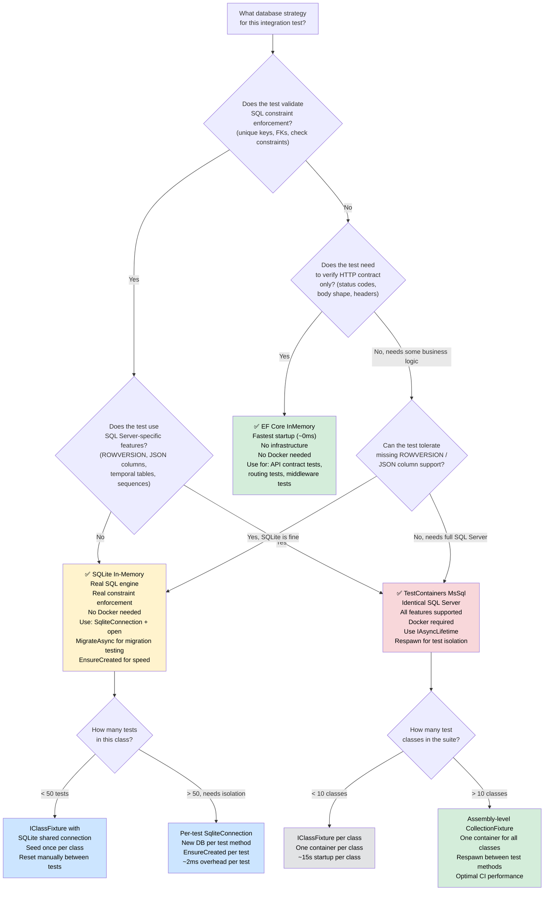

> [!success] Mastery Check
> - [ ] **Studied Well**
> - [ ] **Can explain the concept without notes**
> - [ ] **Can answer interview questions confidently**
> - [ ] **Can implement it in a real project**


# 4.260 — Database in Integration Tests: TestContainers vs SQLite vs InMemory

---

## PART 0 — Navigation & Context

### Where This Topic Lives

```
ASP.NET Core Mastery
└── Testing
    ├── 4.257 — WebApplicationFactory<T>: Full HTTP Pipeline
    ├── 4.258 — Customizing WebApplicationFactory: Replacing Services
    ├── 4.259 — Authentication in Integration Tests: Fake Auth Schemes
    └── 4.260 — Database in Integration Tests ◄ YOU ARE HERE
         ├── EF Core InMemory Provider
         ├── SQLite In-Memory
         └── TestContainers (MsSql / Postgres)
```

### What You Need Before This

- **[[4.257 — WebApplicationFactory<T>: Integration Testing the Full HTTP Pipeline]]** — you must understand how `WebApplicationFactory<T>` boots the full ASP.NET Core pipeline; the database replacement happens inside its customization hooks
- **[[4.258 — Customizing WebApplicationFactory: Replacing Services]]** — the `ConfigureTestServices` and `IServiceCollection.RemoveAll` pattern is the mechanism for swapping the real database with a test database
- **[[3.01 — DbContext: Lifecycle, Internals, and DI Scoping]]** — understanding `DbContext` lifetime (Scoped per HTTP request) is critical for knowing whether tests share database state or get isolated instances
- **[[4.034 — The Built-In DI Container]]** — manipulating `IServiceCollection` to remove and re-add `DbContextOptions<T>` requires understanding the DI model's service descriptor resolution order

### What This Unlocks After

- **Full integration test suites** with real-database confidence: write tests that catch SQL constraint violations, transaction rollback scenarios, and EF Core migration gaps that InMemory hides
- **CI/CD pipeline integration**: Docker-based TestContainers tests can run in GitHub Actions, Azure DevOps, or any Docker-capable CI runner — but require design decisions about parallelism and resource consumption
- **Chaos and failure injection**: a real database lets you simulate deadlocks, connection pool exhaustion, and constraint violations that the InMemory provider silently ignores
- **[[3.21 — EF Core Testing: SQLite, InMemory Provider, and Mocking]]** — the EF Core-specific testing chapter extends these patterns to unit-level EF Core repository tests

### Why This Matters at Scale

> In a payment processing service handling 50,000 orders per day, the difference between an integration test backed by EF Core InMemory and one backed by a real SQL Server instance determines whether a unique constraint violation on a payment idempotency key is caught in CI or discovered in a production incident at 2 AM.

The choice of test database is not a testing convenience — it is a confidence contract. Every integration test answer the question: "Does this API behave correctly against the actual database engine, including its SQL dialect, constraint enforcement, transaction semantics, and index behavior?" The three strategies answer that question at very different fidelity levels, with very different infrastructure costs.

---

## PART 1 — The Core Mental Model

### The Fundamental Rule

> **In ASP.NET Core integration tests, replacing the database provider inside `WebApplicationFactory.ConfigureTestServices` boots a second DI container with your chosen test database wired to the real application pipeline; the fidelity of that database — InMemory (no SQL), SQLite (subset SQL), or TestContainers (identical SQL Server) — directly determines which categories of production bugs your test suite can detect, and no amount of test coverage with a low-fidelity provider compensates for the absence of the real SQL engine.**

### The Plain-Language Analogy

Think of your integration test database as a flight simulator. The EF Core InMemory provider is a marketing video of a cockpit — it looks like flying, but the physics engine is fake: no stall behavior, no wind resistance, no instrument failures. You can "fly" the plane in your tests, but the simulator will never catch the bug in your fuel flow calculation because fuel doesn't actually flow.

SQLite in-memory is a desktop flight simulator with real physics but running on a different aircraft model — the controls look the same, the altimeter works, but the engine response curves are subtly different. You'll catch most bugs, but when your application uses `ROWVERSION` columns or SQL Server-specific JSON functions, the simulator silently succeeds while the real aircraft would fail.

TestContainers is an actual aircraft in a controlled environment on the ground — real engine, real fuel, real instruments, real failure modes. It takes 20 seconds to start the engine (container startup), but when you press a button and the test passes, you know the real aircraft will behave identically. The test cost is real because the fidelity is real.

The analogy holds under pressure: when a concurrent request causes a unique key violation (a "mid-air collision" at the database layer), the InMemory provider ignores it entirely, SQLite catches it only if your schema maps correctly to SQLite's constraint system, and TestContainers produces exactly the same `SqlException` your production code would receive.

### The Taxonomy Diagram

```mermaid
graph TD
    A["Integration Test Database Strategy"] --> B["EF Core InMemory Provider"]
    A --> C["SQLite In-Memory"]
    A --> D["TestContainers"]
    A --> E["Shared Real Database"]

    B --> B1["No SQL engine\nNo transactions\nNo constraints"]
    B --> B2["Fast: ~0ms startup\nNo infrastructure\nNo Docker needed"]
    B --> B3["UseInMemoryDatabase\nEF Core package only"]

    C --> C1["Real SQL engine\nReal transactions\nMost SQL Server constructs work"]
    C --> C2["Medium: ~2ms startup\nConnection lifetime issue\nNo ROWVERSION / JSON"]
    C --> C3["UseSqlite\nMicrosoft.EntityFrameworkCore.Sqlite"]

    D --> D1["Identical SQL Server\nAll features work\nDocker required"]
    D --> D2["Slow: 10-30s startup\nReal infrastructure\nParallelism control needed"]
    D --> D3["MsSqlContainer\nTestcontainers.MsSql NuGet"]

    E --> E1["Shared dev database\nState pollution between tests\nNot recommended for CI"]

    B --> F["xUnit IClassFixture\nper test class lifetime"]
    C --> G["SqliteConnection kept open\nShared across test class"]
    D --> H["IAsyncLifetime\ncontainer start/stop\nRespawn for reset"]

    style B fill:#d4edda,color:#000
    style C fill:#fff3cd,color:#000
    style D fill:#f8d7da,color:#000
    style E fill:#e2e3e5,color:#000
    style F fill:#cce5ff,color:#000
    style G fill:#cce5ff,color:#000
    style H fill:#cce5ff,color:#000
```



---

## PART 2 — Deep Mechanics

### 2.1 — EF Core InMemory Provider: What It Actually Does (and What It Doesn't)

```
// Pipeline position: test database replacement happens during WebApplicationFactory host build
// BEFORE the test makes any HTTP request

HTTP Test Request
──► TestServer (in-process) ──► Middleware Pipeline ──► Routing ──► Auth ──► [Endpoint]
                                                                               │
                                                                    DbContext resolved from DI
                                                                               │
                                                                    InMemoryDatabase (dictionary)
                                                                    NOT SQL Server
                                                                    NOT SQL at all
```

The EF Core InMemory provider is **not a database**. It is a `Dictionary<TKey, TValue>` wrapped in EF Core abstractions. When your application code calls `await context.Orders.AddAsync(order); await context.SaveChangesAsync();`, EF Core serializes the entity into its internal change tracker, runs the `SaveChanges` pipeline including interceptors and value generators, then writes the entity into an in-memory store backed by a `ConditionalWeakTable` of object arrays.

**What it does NOT do:**
- Execute SQL. No SQL string is ever generated against this provider.
- Enforce unique constraints declared via `HasIndex(x => x.PaymentIdempotencyKey).IsUnique()`.
- Enforce foreign key constraints declared via `HasForeignKey`.
- Support transactions (`BeginTransaction` is a no-op that returns a fake transaction object).
- Support `ROWVERSION` / `TimeStamp` concurrency tokens.
- Support raw SQL: `FromSqlRaw`, `ExecuteSqlRaw`, `FromSqlInterpolated` all throw `InvalidOperationException`.

**ASP.NET Core internally (approximate) — the service replacement:**

```csharp
// Inside WebApplicationFactory<T>.ConfigureTestServices (your code):
services.RemoveAll<DbContextOptions<OrderManagementDbContext>>();
services.RemoveAll<OrderManagementDbContext>();

services.AddDbContext<OrderManagementDbContext>(options =>
{
    // EF Core resolves InMemoryDatabaseProvider and bypasses all SQL generation
    // The store key "OrderManagementTest" is shared across all DbContext instances
    // that use the same key — THIS IS A CROSS-TEST STATE LEAK (see Gotcha 1)
    options.UseInMemoryDatabase("OrderManagementTest");
});

// EF Core source: InMemoryDatabaseCreator.EnsureCreated()
// → walks IModel to create in-memory table definitions
// → does NOT run migrations
// → does NOT create any SQL schema
```

**HTTP wire format for a request that hits InMemory vs. SQL constraint violation:**

```
// ✅ InMemory — WRONG behavior (no unique constraint enforcement):
POST /api/orders/payments HTTP/1.1
Content-Type: application/json
{"idempotencyKey": "pay_abc123", "amount": 150.00}

HTTP/1.1 201 Created          ← succeeds
{"orderId": 99, ...}

POST /api/orders/payments HTTP/1.1  ← DUPLICATE key, should fail
{"idempotencyKey": "pay_abc123", "amount": 150.00}

HTTP/1.1 201 Created          ← InMemory: SILENTLY CREATES A DUPLICATE
{"orderId": 100, ...}         ← SQL Server would throw: 409 Conflict
```

> [!WARNING]
> The InMemory provider will let you insert two rows with the same "unique" key and will return success. Your test passes. Production creates a duplicate payment. This is not a toy example — it is a real production incident pattern.

**Cost label:** `~0ms database latency, ~0 allocations for SQL generation, O(1) in-memory dictionary lookup, but zero SQL constraint coverage`

**The non-obvious behavior:** The InMemory store is keyed by the database name string. All `DbContext` instances configured with `UseInMemoryDatabase("OrderManagementTest")` share the **same** in-memory store for the lifetime of the process. This means parallel test classes running in the same process **share state** unless you use a unique GUID per test class or per test method. The EF Core `InMemoryDatabaseRoot` class controls this isolation boundary.

```csharp
// ✅ Per-test-class isolation with InMemory:
private static readonly InMemoryDatabaseRoot _root = new();

services.AddDbContext<OrderManagementDbContext>(options =>
    options.UseInMemoryDatabase($"OrderTest_{Guid.NewGuid()}", _root));
// Each test class gets its own isolated store — but cost is higher at fixture level
```

---

### 2.2 — SQLite In-Memory: Real SQL, Critical Connection Lifetime Problem

```
// Pipeline position: SQLite connection must be opened BEFORE the WebApplicationFactory builds
// and kept ALIVE for the entire test class lifetime

Test Class Constructor
        │
        ▼
SqliteConnection.Open()  ◄── MUST happen here, not inside AddDbContext
        │
        ▼
WebApplicationFactory.ConfigureTestServices
        │
  services.AddDbContext(o => o.UseSqlite(connection))
        │
        ▼
HTTP Test Requests ──► Middleware ──► Endpoint ──► DbContext ──► [SQLite engine]
        │
        ▼
Test Class Dispose
        │
        ▼
SqliteConnection.Close()  ◄── ONLY NOW is the in-memory database destroyed
```

**Why the connection lifetime is critical:** SQLite in-memory databases exist for the lifetime of the connection. When a `DbContext` opens a new `SqliteConnection` (which it does by default if you pass a connection string rather than an open `SqliteConnection` object), the database is created when the connection opens and **destroyed when the connection closes**. Since EF Core pools connections and returns them to the pool between requests, each HTTP request in your test effectively gets a different, empty SQLite database.

The fix is to manage a single shared `SqliteConnection` that remains open for the entire test class, and pass that open connection object (not a connection string) to `UseSqlite`.

**Framework source behavior (approximate):**

```csharp
// ⚠️ WRONG — passing connection string causes per-request database destruction:
services.AddDbContext<OrderManagementDbContext>(options =>
    options.UseSqlite("Data Source=:memory:"));
// Each new connection → new empty in-memory database
// POST /api/orders → creates row in database A
// GET /api/orders/1 → connects to database B (empty) → 404

// ✅ CORRECT — passing open SqliteConnection keeps the database alive:
var connection = new SqliteConnection("Data Source=:memory:");
connection.Open(); // Opens connection once; database now exists
services.AddDbContext<OrderManagementDbContext>(options =>
    options.UseSqlite(connection));
// All DbContext instances reuse the same underlying database
// POST /api/orders → inserts into database A
// GET /api/orders/1 → reads from same database A → 200 OK
```

**What SQLite supports that InMemory does not:**

| Feature | EF Core InMemory | SQLite In-Memory |
|---|---|---|
| Unique constraints | ❌ Not enforced | ✅ Enforced |
| Foreign key constraints | ❌ Not enforced | ✅ (requires `PRAGMA foreign_keys = ON`) |
| Transactions with rollback | ❌ No-op | ✅ Real transactions |
| `FromSqlRaw` / raw SQL | ❌ Throws | ✅ Works (SQLite dialect) |
| `ROWVERSION` / `TIMESTAMP` | ❌ | ❌ No equivalent |
| JSON columns | ❌ | ❌ (SQL Server JSON not available) |
| Computed columns (SQL) | ❌ | ✅ Limited |
| Migrations | ❌ (EnsureCreated only) | ✅ `MigrateAsync()` works |
| Clustered indexes | ❌ | ❌ Different index model |
| `NEWSEQUENTIALID()` | ❌ | ❌ |

**HTTP wire format — SQLite catching a real constraint:**

```
// Scenario: payment service with unique idempotency key constraint

POST /api/payments HTTP/1.1
{"idempotencyKey": "pay_abc123", "amount": 150.00}

HTTP/1.1 201 Created

POST /api/payments HTTP/1.1   ← same idempotency key
{"idempotencyKey": "pay_abc123", "amount": 150.00}

// SQLite result:
HTTP/1.1 409 Conflict         ← constraint enforced!
{"error": "Payment with this idempotency key already exists"}

// InMemory result (for comparison):
HTTP/1.1 201 Created          ← BUG: constraint silently ignored
```

**ASP.NET Core + EF Core source for schema creation with SQLite:**

```csharp
// After registering the DbContext, you must create the schema.
// With SQLite, you have two options:

// Option A: EnsureCreated (creates tables from current model — ignores migrations)
using var scope = factory.Services.CreateScope();
var db = scope.ServiceProvider.GetRequiredService<OrderManagementDbContext>();
await db.Database.EnsureCreatedAsync();
// EF Core: walks IModel, generates CREATE TABLE statements in SQLite dialect
// Cost: ~1-5ms for a medium-complexity model

// Option B: MigrateAsync (runs all pending migrations — tests migration correctness)
await db.Database.MigrateAsync();
// Cost: ~5-50ms depending on migration history depth
// Benefit: catches migration gaps, ensures migration SQL is valid
```

> [!TIP]
> Use `MigrateAsync()` instead of `EnsureCreatedAsync()` in your integration tests whenever possible. `EnsureCreatedAsync()` creates the schema from the current model, but it will not catch a bug in a migration file that generates incorrect SQL. `MigrateAsync()` actually runs your migrations — which means if your migration has a typo in the SQL, the test fails before production.

**Cost label:** `~2ms startup, ~1 SqliteConnection per test class, real SQL query execution, no SQL Server-specific features`

---

### 2.3 — TestContainers: Real SQL Server, Real Docker, Real Cost

```
// Pipeline position: container lifecycle wraps the entire test class

xUnit Test Assembly Load
        │
        ▼
IAsyncLifetime.InitializeAsync()
        │
        ▼
MsSqlContainer.StartAsync()  ◄── Docker pulls/starts SQL Server container
        │                         ~10-30 seconds FIRST RUN, ~2-5s subsequent runs
        ▼                         (image cached by Docker daemon)
Container connection string available
        │
        ▼
WebApplicationFactory.ConfigureTestServices
        │
  services.AddDbContext(o => o.UseSqlServer(container.GetConnectionString()))
        │
        ▼
HTTP Test Requests ──► Full ASP.NET Core Pipeline ──► Endpoint ──► DbContext
        │                                                              │
        │                                              [REAL SQL SERVER IN DOCKER]
        │                                              [Real constraint enforcement]
        │                                              [Real transactions]
        │                                              [Real ROWVERSION]
        │                                              [Real isolation levels]
        ▼
IAsyncLifetime.DisposeAsync()
        │
        ▼
MsSqlContainer.StopAsync() + container removal
```

**The Testcontainers library internals:** When you call `await container.StartAsync()`, the library uses the Docker Engine API (via `Docker.DotNet`) to:
1. Pull the `mcr.microsoft.com/mssql/server:2022-latest` image if not cached
2. Start a container with SA password, EULA acceptance, and a random host port mapped to 1433
3. Wait for the health check (SQL Server accepts connections) using a configurable `WaitStrategy`
4. Return the dynamically allocated connection string: `Server=localhost,{randomPort};Database=master;User Id=sa;Password=...`

**Framework source (approximate):**

```csharp
// Testcontainers.MsSql NuGet package provides MsSqlBuilder
MsSqlContainer container = new MsSqlBuilder()
    .WithImage("mcr.microsoft.com/mssql/server:2022-latest")
    .WithPassword("YourStr0ng!Passw0rd")  // SA password — must meet SQL Server complexity
    .Build();

await container.StartAsync();
// Returns when SQL Server is accepting connections (not just when container is "running")

string connectionString = container.GetConnectionString();
// "Server=localhost,49152;Database=master;User Id=sa;Password=YourStr0ng!Passw0rd;..."

// Then in WebApplicationFactory:
services.RemoveAll<DbContextOptions<OrderManagementDbContext>>();
services.AddDbContext<OrderManagementDbContext>(options =>
    options.UseSqlServer(connectionString));
```

**HTTP wire format — full SQL Server constraint enforcement:**

```
// All SQL Server behaviors are now in play:

POST /api/orders HTTP/1.1
{"customerId": 999, "items": [...]}  ← customerId 999 does not exist

HTTP/1.1 400 Bad Request             ← FK constraint caught if app handles SqlException
{"error": "Customer 999 does not exist"}

// Or unhandled:
HTTP/1.1 500 Internal Server Error   ← FK violation becomes 500 if not caught
{"error": "An error occurred"}

// SQL wire (what EF Core sends to SQL Server):
// INSERT INTO [Orders] ([CustomerId], [CreatedAt], ...) VALUES (@p0, @p1, ...)
// SQL Server enforces FK: Customer 999 → FOREIGN KEY constraint violation → SqlException
```

**Respawn: database reset without container recreation:**

The `Respawn` library (by Jimmy Bogard) is the standard solution for resetting a SQL Server database to a known empty state between tests without dropping and recreating the database (which would require running migrations again, adding seconds per test).

```csharp
// Respawn reads the database schema and generates DELETE/TRUNCATE statements
// in the correct order to respect FK constraints
Respawner respawner = await Respawner.CreateAsync(connection, new RespawnerOptions
{
    DbAdapter = DbAdapter.SqlServer,
    TablesToIgnore = new Table[] { "__EFMigrationsHistory" }
});

// Between tests:
await respawner.ResetAsync(connectionString);
// Generates: DELETE FROM [OrderItems]; DELETE FROM [Orders]; ...
// Respects FK order — never violates constraints during cleanup
// Cost: ~5-50ms depending on row count, much faster than MigrateAsync per test
```

**Cost label:** `~10-30s first container start, ~2-5s subsequent starts, ~5-50ms Respawn reset per test, 100% SQL Server fidelity, Docker required`

**The non-obvious behavior — parallel test execution:**

xUnit v2 runs test classes in parallel by default. If two test classes both start a `MsSqlContainer`, you pay 2× the startup cost. If they share a container via `IClassFixture<T>` at the assembly level, you pay startup once but must design careful isolation (either separate databases per test class, or Respawn between tests).

```csharp
// Option A: One container per test class (isolation, high startup cost)
public class OrderApiTests : IAsyncLifetime
{
    private readonly MsSqlContainer _container = new MsSqlBuilder().Build();
    // Starts and stops for every test class — safe but slow

// Option B: Shared container via assembly-level fixture (fast, requires Respawn)
// See Part 3, Pattern 5 for the full implementation
```

---

### 2.4 — Database Seeding and Schema Creation in Integration Tests

```
// Pipeline position: seeding happens AFTER the WebApplicationFactory is built
// and BEFORE any HTTP test requests are made

WebApplicationFactory<Program>.CreateClient()
        │
        ▼
Host.Build() → ConfigureTestServices() → DI container built
        │
        ▼
[YOUR SEEDING CODE]  ◄── Must happen here, using a scoped DbContext
        │
        ▼
HttpClient.GetAsync("/api/orders/1")  ◄── Expects seeded data to exist
```

**The scoped service resolution pattern for test seeding:**

When you access services from the root `IServiceProvider` (e.g., `factory.Services.GetRequiredService<DbContext>()`), you are resolving a scoped service from the root scope — which is a **DI scope leak**. The `DbContext` instance will be held alive for the lifetime of the test, which prevents proper connection pool usage and causes `ObjectDisposedException` in some test configurations.

**The correct pattern:**

```csharp
// ✅ CORRECT: always create an explicit scope for seeding
using var scope = factory.Services.CreateScope();
var db = scope.ServiceProvider.GetRequiredService<OrderManagementDbContext>();

// Schema creation (choose one):
await db.Database.EnsureCreatedAsync();   // From model — fast, no migration testing
await db.Database.MigrateAsync();          // Run migrations — slower, tests migration correctness

// Seed reference data
db.Customers.AddRange(new[]
{
    new Customer { Id = 1, Name = "Acme Corp", IsActive = true },
    new Customer { Id = 2, Name = "GlobalFreight Ltd", IsActive = true }
});
await db.SaveChangesAsync();

// scope.Dispose() is called automatically → DbContext disposed → connection returned to pool
```

**Framework behavior — `EnsureCreatedAsync` vs `MigrateAsync`:**

| Behavior | EnsureCreatedAsync | MigrateAsync |
|---|---|---|
| Creates schema from | Current EF Core model | Migration files |
| Runs migrations | ❌ | ✅ |
| Catches migration bugs | ❌ | ✅ |
| Works with InMemory | ✅ | ❌ (no concept of migrations) |
| Works with SQLite | ✅ | ✅ |
| Works with SQL Server | ✅ | ✅ |
| Idempotent? | ✅ (noop if exists) | ✅ (only applies pending) |
| Speed | Fast | Slower |

> [!IMPORTANT]
> For TestContainers-backed tests, always use `MigrateAsync()`. It is the only way to verify that your migration files are correct and will execute successfully on a real SQL Server instance. `EnsureCreatedAsync()` will mask migration bugs.

**Cost label:** `~1ms EnsureCreatedAsync for simple models, ~10-100ms MigrateAsync, ~1 IServiceScope allocation per seeding call, scoped DbContext lifetime bounded by scope`

---

### 2.5 — Test Isolation Strategies: xUnit IClassFixture and IAsyncLifetime

```
// The isolation matrix:

┌─────────────────────────────────────────────────────────────────────────┐
│                    TEST ISOLATION LEVELS                                 │
│                                                                          │
│  PER TEST METHOD          PER TEST CLASS         PER TEST ASSEMBLY       │
│  ─────────────           ──────────────          ─────────────────       │
│  New DB per test          IClassFixture<T>        [CollectionFixture]    │
│  Max isolation            Shared DB instance      Shared across classes  │
│  Slowest                  Seeded once             Fastest startup        │
│  Use: TestContainers      Use: SQLite/InMemory    Use: Respawn for reset │
│       (expensive setup)        (fast setup)                              │
└─────────────────────────────────────────────────────────────────────────┘
```

**xUnit `IClassFixture<T>` — shared infrastructure per test class:**

```csharp
// The fixture is constructed ONCE and shared across all test methods in the class
// xUnit calls InitializeAsync once and DisposeAsync once per class
public class OrderApiTestFixture : IAsyncLifetime
{
    public MsSqlContainer Container { get; private set; } = new MsSqlBuilder().Build();
    public WebApplicationFactory<Program> Factory { get; private set; } = null!;

    public async Task InitializeAsync()
    {
        await Container.StartAsync();

        Factory = new WebApplicationFactory<Program>().WithWebHostBuilder(builder =>
        {
            builder.ConfigureTestServices(services =>
            {
                services.RemoveAll<DbContextOptions<OrderManagementDbContext>>();
                services.AddDbContext<OrderManagementDbContext>(options =>
                    options.UseSqlServer(Container.GetConnectionString()));
            });
        });

        // Migrate and seed once for all tests in the class
        using var scope = Factory.Services.CreateScope();
        var db = scope.ServiceProvider.GetRequiredService<OrderManagementDbContext>();
        await db.Database.MigrateAsync();
        // Seed reference data that all tests in this class need
    }

    public async Task DisposeAsync()
    {
        await Factory.DisposeAsync();
        await Container.StopAsync();
    }
}

public class OrderApiTests : IClassFixture<OrderApiTestFixture>
{
    private readonly HttpClient _client;
    private readonly OrderManagementDbContext _db;

    public OrderApiTests(OrderApiTestFixture fixture)
    {
        _client = fixture.Factory.CreateClient();
        // Create a new scope for each test — do NOT share the same DbContext instance
    }
}
```

**Cost label:** `IClassFixture: ~1 container start per test class, ~1 MigrateAsync per class, O(1) IServiceScope per test method`

**`IAsyncLifetime` in xUnit:** Called by the xUnit test runner as part of test lifecycle management. `InitializeAsync()` is called after the constructor but before any `[Fact]` test methods run. `DisposeAsync()` is called after all test methods in the class complete. This is the correct hook for async infrastructure setup and teardown.

---

## PART 3 — Production Code Patterns

### Pattern 1: The InMemory Fast-Feedback API Smoke Test

*Domain: Order Management Service — fast CI smoke test for API contract validation*

```csharp
// ⚠️ WRONG: Using InMemory without awareness of its limitations
// This test will PASS even when production has a unique constraint violation
public class OrderApiSmokeTests_Wrong : IClassFixture<WebApplicationFactory<Program>>
{
    [Fact]
    public async Task CreateOrder_DuplicateIdempotencyKey_ShouldReturn409()
    {
        // ⚠️ WRONG: InMemory silently allows duplicate unique keys
        // This test will produce a false positive — it will 201 twice
        var response1 = await _client.PostAsJsonAsync("/api/orders", new
        {
            idempotencyKey = "order_abc123",
            customerId = 1
        });
        var response2 = await _client.PostAsJsonAsync("/api/orders", new
        {
            idempotencyKey = "order_abc123",
            customerId = 1
        });
        Assert.Equal(HttpStatusCode.Conflict, response2.StatusCode); // FAILS with InMemory
    }
}

// ✅ CORRECT: Use InMemory only for tests that do NOT depend on constraint enforcement
public class OrderApiContractTests : IClassFixture<InMemoryOrderApiFactory>
{
    private readonly HttpClient _client;

    public OrderApiContractTests(InMemoryOrderApiFactory factory)
        => _client = factory.CreateClient();

    [Fact]
    public async Task CreateOrder_ValidPayload_Returns201WithLocationHeader()
    {
        // ✅ InMemory is appropriate here: we're testing API contract (status code,
        //    Location header, response body shape) — NOT database constraint enforcement
        var response = await _client.PostAsJsonAsync("/api/orders", new
        {
            customerId = 1,
            items = new[] { new { productId = 42, quantity = 3 } }
        });

        Assert.Equal(HttpStatusCode.Created, response.StatusCode);
        Assert.NotNull(response.Headers.Location);
        Assert.StartsWith("/api/orders/", response.Headers.Location!.ToString());
    }

    [Fact]
    public async Task GetOrder_NonExistentId_Returns404()
    {
        // ✅ Testing routing and error handling behavior — InMemory is fine
        var response = await _client.GetAsync("/api/orders/999999");
        Assert.Equal(HttpStatusCode.NotFound, response.StatusCode);
    }
}

public class InMemoryOrderApiFactory : WebApplicationFactory<Program>
{
    protected override void ConfigureWebHost(IWebHostBuilder builder)
    {
        builder.ConfigureTestServices(services =>
        {
            // Remove the real SQL Server registration
            services.RemoveAll<DbContextOptions<OrderManagementDbContext>>();

            // Use a unique database name per test class instance to prevent cross-class contamination
            services.AddDbContext<OrderManagementDbContext>(options =>
                options.UseInMemoryDatabase($"OrderManagement_{Guid.NewGuid()}"));
        });

        builder.UseEnvironment("Testing");
    }

    // Seed the database after the factory is built
    public async Task SeedAsync()
    {
        using var scope = Services.CreateScope();
        var db = scope.ServiceProvider.GetRequiredService<OrderManagementDbContext>();
        await db.Database.EnsureCreatedAsync(); // OK for InMemory — no migrations
        db.Customers.AddRange(OrderTestData.StandardCustomers);
        await db.SaveChangesAsync();
    }
}

// HTTP wire effect:
// POST /api/orders HTTP/1.1   → HTTP/1.1 201 Created  Location: /api/orders/1
// GET  /api/orders/999999     → HTTP/1.1 404 Not Found
```

---

### Pattern 2: The SQLite Connection Lifetime Guardian

*Domain: Inventory Management Service — SQLite-backed tests for business logic with real constraint enforcement*

```csharp
// ⚠️ WRONG: Passing connection string — SQLite in-memory database is destroyed per connection
public class InventorySqliteFactory_Wrong : WebApplicationFactory<Program>
{
    protected override void ConfigureWebHost(IWebHostBuilder builder)
    {
        builder.ConfigureTestServices(services =>
        {
            services.RemoveAll<DbContextOptions<InventoryDbContext>>();
            services.AddDbContext<InventoryDbContext>(options =>
                options.UseSqlite("Data Source=:memory:"));
            // ⚠️ WRONG: Each DbContext instance opens and closes its own connection
            // The in-memory database is destroyed when the first connection closes
            // Second HTTP request → new empty database → all data gone → 404
        });
    }
}

// ✅ CORRECT: Keep a single SqliteConnection open for the test class lifetime
public class InventorySqliteApiFactory : WebApplicationFactory<Program>, IAsyncLifetime
{
    // The connection is the key — it must outlive all DbContext instances
    private readonly SqliteConnection _keepAliveConnection;

    public InventorySqliteApiFactory()
    {
        _keepAliveConnection = new SqliteConnection("Data Source=:memory:");
        // Open immediately — this creates the SQLite in-memory database and keeps it alive
        _keepAliveConnection.Open();
    }

    protected override void ConfigureWebHost(IWebHostBuilder builder)
    {
        builder.ConfigureTestServices(services =>
        {
            services.RemoveAll<DbContextOptions<InventoryDbContext>>();

            // ✅ Pass the OPEN CONNECTION OBJECT, not a connection string
            // All DbContext instances will reuse this connection's database
            services.AddDbContext<InventoryDbContext>(options =>
                options.UseSqlite(_keepAliveConnection));
        });

        builder.UseEnvironment("Testing");
    }

    public async Task InitializeAsync()
    {
        // Create schema via migrations (validates migration files)
        using var scope = Services.CreateScope();
        var db = scope.ServiceProvider.GetRequiredService<InventoryDbContext>();
        await db.Database.MigrateAsync();

        // Enable FK enforcement (SQLite disables it by default)
        await db.Database.ExecuteSqlRawAsync("PRAGMA foreign_keys = ON;");

        // Seed reference data
        db.Products.AddRange(InventoryTestData.StandardProducts);
        db.Warehouses.AddRange(InventoryTestData.StandardWarehouses);
        await db.SaveChangesAsync();
    }

    public new async Task DisposeAsync()
    {
        await base.DisposeAsync();
        await _keepAliveConnection.DisposeAsync(); // Now safe to close
    }
}

public class InventoryReservationTests : IClassFixture<InventorySqliteApiFactory>
{
    private readonly HttpClient _client;

    public InventoryReservationTests(InventorySqliteApiFactory factory)
        => _client = factory.CreateClient();

    [Fact]
    public async Task ReserveInventory_BelowMinimumStock_Returns409()
    {
        // ✅ SQLite enforces the check constraint defined on MinimumStockLevel
        var response = await _client.PostAsJsonAsync("/api/inventory/reserve", new
        {
            productId = 1,
            warehouseId = 1,
            quantity = 10000  // More than available stock
        });

        Assert.Equal(HttpStatusCode.Conflict, response.StatusCode);
    }
}

// HTTP wire effect:
// POST /api/inventory/reserve  → HTTP/1.1 409 Conflict  (SQLite check constraint enforced)
```

---

### Pattern 3: The TestContainers Assembly-Level Container with Respawn Reset

*Domain: Payment Processing Service — real SQL Server with Respawn-based test isolation*

```csharp
// The assembly-level collection fixture — one container for the entire test assembly
// This is the highest performance TestContainers pattern
[CollectionDefinition("PaymentApiTests")]
public class PaymentApiTestCollection : ICollectionFixture<PaymentApiTestContainer> { }

public class PaymentApiTestContainer : IAsyncLifetime
{
    private readonly MsSqlContainer _msSqlContainer;
    private Respawner _respawner = null!;
    private string _connectionString = null!;

    public WebApplicationFactory<Program> Factory { get; private set; } = null!;

    public PaymentApiTestContainer()
    {
        _msSqlContainer = new MsSqlBuilder()
            .WithImage("mcr.microsoft.com/mssql/server:2022-latest")
            // SA password must meet SQL Server complexity requirements
            .WithPassword("P@ssw0rd_Test_Only!")
            .Build();
    }

    public async Task InitializeAsync()
    {
        // Start the SQL Server container — blocks until SQL Server accepts connections
        await _msSqlContainer.StartAsync();
        _connectionString = _msSqlContainer.GetConnectionString();

        Factory = new WebApplicationFactory<Program>()
            .WithWebHostBuilder(builder =>
            {
                builder.ConfigureTestServices(services =>
                {
                    // Remove ALL SQL Server registrations from the real application
                    services.RemoveAll<DbContextOptions<PaymentDbContext>>();

                    // Replace with TestContainers SQL Server
                    services.AddDbContext<PaymentDbContext>(options =>
                        options.UseSqlServer(_connectionString));
                });

                builder.UseEnvironment("Testing");
            });

        // Run migrations once for the entire assembly
        using var scope = Factory.Services.CreateScope();
        var db = scope.ServiceProvider.GetRequiredService<PaymentDbContext>();
        await db.Database.MigrateAsync();

        // Initialize Respawn with the fully migrated schema
        using var connection = new SqlConnection(_connectionString);
        await connection.OpenAsync();
        _respawner = await Respawner.CreateAsync(connection, new RespawnerOptions
        {
            DbAdapter = DbAdapter.SqlServer,
            // Never delete the migrations history — Respawn would break re-use
            TablesToIgnore = new Table[] { "__EFMigrationsHistory" }
        });
    }

    // Called by each test class to reset the database between test methods
    public async Task ResetDatabaseAsync()
    {
        using var connection = new SqlConnection(_connectionString);
        await connection.OpenAsync();
        await _respawner.ResetAsync(connection);
        // Generates DELETE statements in FK-safe order
        // ~5-50ms depending on data volume — MUCH faster than MigrateAsync
    }

    public async Task DisposeAsync()
    {
        await Factory.DisposeAsync();
        await _msSqlContainer.StopAsync();
    }
}

[Collection("PaymentApiTests")]
public class PaymentIdempotencyTests : IAsyncLifetime
{
    private readonly PaymentApiTestContainer _container;
    private readonly HttpClient _client;

    public PaymentIdempotencyTests(PaymentApiTestContainer container)
    {
        _container = container;
        _client = container.Factory.CreateClient();
    }

    // Reset the database before each test method
    public async Task InitializeAsync()
        => await _container.ResetDatabaseAsync();

    public Task DisposeAsync() => Task.CompletedTask;

    [Fact]
    public async Task ProcessPayment_DuplicateIdempotencyKey_Returns409()
    {
        // ✅ Real SQL Server — unique constraint IS enforced
        var firstResponse = await _client.PostAsJsonAsync("/api/payments", new
        {
            idempotencyKey = "pay_txn_20260601_001",
            amount = 15000,  // £150.00 in pence
            currency = "GBP",
            merchantId = "merch_stripe_001"
        });
        Assert.Equal(HttpStatusCode.Created, firstResponse.StatusCode);

        var secondResponse = await _client.PostAsJsonAsync("/api/payments", new
        {
            idempotencyKey = "pay_txn_20260601_001",  // Same key — must be rejected
            amount = 15000,
            currency = "GBP",
            merchantId = "merch_stripe_001"
        });
        Assert.Equal(HttpStatusCode.Conflict, secondResponse.StatusCode);
    }
}

// HTTP wire effect:
// POST /api/payments  (first)  → HTTP/1.1 201 Created
// POST /api/payments  (second, same idempotency key) → HTTP/1.1 409 Conflict
//   Body: {"error": "Payment with idempotency key pay_txn_20260601_001 already processed"}
```

---

### Pattern 4: The Per-Test Database Isolation with SQLite Unique Name

*Domain: User Authentication Service — fully isolated test cases for security-sensitive operations*

```csharp
// For tests where test isolation is paramount and startup cost is acceptable,
// use a unique SQLite in-memory database per test method

public abstract class IsolatedAuthTestBase : IAsyncLifetime
{
    protected HttpClient Client { get; private set; } = null!;
    private WebApplicationFactory<Program> _factory = null!;
    private SqliteConnection _connection = null!;

    public async Task InitializeAsync()
    {
        // New connection per test → fully isolated database per test
        _connection = new SqliteConnection("Data Source=:memory:");
        _connection.Open();

        _factory = new WebApplicationFactory<Program>()
            .WithWebHostBuilder(builder =>
            {
                builder.ConfigureTestServices(services =>
                {
                    services.RemoveAll<DbContextOptions<AuthDbContext>>();
                    services.AddDbContext<AuthDbContext>(options =>
                        options.UseSqlite(_connection));

                    // Also replace any external auth dependencies
                    services.RemoveAll<IEmailVerificationService>();
                    services.AddSingleton<IEmailVerificationService, NullEmailVerificationService>();
                });

                builder.UseEnvironment("Testing");
            });

        Client = _factory.CreateClient(new WebApplicationFactoryClientOptions
        {
            AllowAutoRedirect = false  // Important: don't follow redirects in auth tests
        });

        // Seed schema and baseline data
        using var scope = _factory.Services.CreateScope();
        var db = scope.ServiceProvider.GetRequiredService<AuthDbContext>();
        await db.Database.EnsureCreatedAsync();
        await SeedDataAsync(db);
    }

    // Template method — subclasses provide their test-specific seed data
    protected virtual Task SeedDataAsync(AuthDbContext db) => Task.CompletedTask;

    public async Task DisposeAsync()
    {
        await _factory.DisposeAsync();
        await _connection.DisposeAsync();
    }
}

public class UserRegistrationTests : IsolatedAuthTestBase
{
    protected override async Task SeedDataAsync(AuthDbContext db)
    {
        // Seed only what this test class needs
        db.Roles.Add(new Role { Id = 1, Name = "Customer" });
        await db.SaveChangesAsync();
    }

    [Fact]
    public async Task Register_ExistingEmail_Returns409()
    {
        // ✅ Fully isolated — no other test can interfere with this user's email
        await Client.PostAsJsonAsync("/auth/register", new
        {
            email = "alice@paymentco.com",
            password = "SecureP@ss1",
            roleId = 1
        });

        var duplicateResponse = await Client.PostAsJsonAsync("/auth/register", new
        {
            email = "alice@paymentco.com",  // Same email
            password = "DifferentP@ss2",
            roleId = 1
        });

        Assert.Equal(HttpStatusCode.Conflict, duplicateResponse.StatusCode);
    }
}

// HTTP wire effect:
// POST /auth/register  → HTTP/1.1 201 Created  (first registration)
// POST /auth/register  → HTTP/1.1 409 Conflict (duplicate email — SQLite unique constraint)
```

---

### Pattern 5: The Migration Validation Test with TestContainers

*Domain: Logistics Shipment Tracking — CI test to validate migration correctness before deployment*

```csharp
// This pattern specifically tests that your migrations are correct and apply cleanly.
// It catches migration bugs BEFORE they reach production.

public class MigrationValidationTests : IAsyncLifetime
{
    private readonly MsSqlContainer _container = new MsSqlBuilder()
        .WithImage("mcr.microsoft.com/mssql/server:2022-latest")
        .WithPassword("M!grationTest99!")
        .Build();

    private string _connectionString = null!;

    public async Task InitializeAsync()
    {
        await _container.StartAsync();
        _connectionString = _container.GetConnectionString();
    }

    [Fact]
    public async Task AllMigrations_ApplyCleanly_ToFreshDatabase()
    {
        // Create a fresh DbContext pointing at the real SQL Server container
        var options = new DbContextOptionsBuilder<LogisticsDbContext>()
            .UseSqlServer(_connectionString)
            .Options;

        await using var context = new LogisticsDbContext(options);

        // Run all migrations from scratch — this is what happens on first deployment
        // If any migration SQL is invalid, this throws and the test fails
        await context.Database.MigrateAsync();

        // Verify the expected tables exist (catches model/migration divergence)
        var tableNames = await context.Database
            .SqlQuery<string>($"SELECT TABLE_NAME FROM INFORMATION_SCHEMA.TABLES WHERE TABLE_TYPE = 'BASE TABLE'")
            .ToListAsync();

        Assert.Contains("Shipments", tableNames);
        Assert.Contains("ShipmentLegs", tableNames);
        Assert.Contains("TrackingEvents", tableNames);
        Assert.Contains("Carriers", tableNames);
    }

    [Fact]
    public async Task SchemaAndModel_AreInSync_NoMigrationsDrifted()
    {
        var options = new DbContextOptionsBuilder<LogisticsDbContext>()
            .UseSqlServer(_connectionString)
            .Options;

        await using var context = new LogisticsDbContext(options);
        await context.Database.MigrateAsync();

        // Check for pending migrations — if any are pending, the model has drifted
        var pendingMigrations = await context.Database.GetPendingMigrationsAsync();
        Assert.Empty(pendingMigrations);

        // Check for model vs schema drift (EF Core compares model to current database schema)
        // This catches cases where someone modified the model without creating a migration
        var canConnect = await context.Database.CanConnectAsync();
        Assert.True(canConnect);
    }

    public async Task DisposeAsync() => await _container.StopAsync();
}

// No HTTP wire effect — this is a pure database migration validation test
// Failing output example:
// Xunit.Sdk.XunitException: Assert.Empty() Failure
//   ["20260601_AddShipmentStatusIndex"]  ← unpushed migration found
```

---

### Pattern 6: The Scoped Database State Assertion Helper

*Domain: E-commerce Order Processing — direct database state verification alongside API response verification*

```csharp
// When testing order processing, you often need to assert BOTH the HTTP response
// AND the database state. This pattern provides a clean, reusable helper.

public class OrderProcessingTests : IClassFixture<TestContainersOrderFactory>
{
    private readonly HttpClient _client;
    private readonly TestContainersOrderFactory _factory;

    public OrderProcessingTests(TestContainersOrderFactory factory)
    {
        _factory = factory;
        _client = factory.CreateClient();
    }

    [Fact]
    public async Task SubmitOrder_ValidOrder_CreatesOrderAndReservesInventory()
    {
        // Act — send the HTTP request
        var response = await _client.PostAsJsonAsync("/api/orders", new
        {
            customerId = 1,
            items = new[]
            {
                new { productId = 10, quantity = 2, unitPrice = 2999 },  // £29.99 each
                new { productId = 15, quantity = 1, unitPrice = 4999 }   // £49.99 each
            },
            shippingAddress = new { line1 = "123 Commerce St", city = "London", postCode = "EC1A 1BB" }
        });

        // Assert HTTP response
        Assert.Equal(HttpStatusCode.Created, response.StatusCode);
        var body = await response.Content.ReadFromJsonAsync<OrderCreatedResponse>();
        Assert.NotNull(body?.OrderId);

        // Assert database state directly — don't rely solely on the API response
        await AssertDatabaseStateAsync(async db =>
        {
            var order = await db.Orders
                .Include(o => o.Items)
                .Include(o => o.ShippingAddress)
                .FirstOrDefaultAsync(o => o.Id == body.OrderId);

            Assert.NotNull(order);
            Assert.Equal(OrderStatus.PendingPayment, order.Status);
            Assert.Equal(2, order.Items.Count);
            Assert.Equal(10799, order.TotalAmountPence); // 2×2999 + 1×4999 = 10797 (check business logic)
            Assert.Equal("London", order.ShippingAddress.City);

            // Verify inventory was reserved
            var product10Stock = await db.InventoryReservations
                .Where(r => r.ProductId == 10 && r.OrderId == body.OrderId)
                .SumAsync(r => r.Quantity);
            Assert.Equal(2, product10Stock);
        });
    }

    // ✅ Scoped helper — creates an explicit scope, provides a fresh DbContext,
    //    disposes cleanly after the assertion lambda completes
    private async Task AssertDatabaseStateAsync(Func<OrderManagementDbContext, Task> assertion)
    {
        using var scope = _factory.Services.CreateScope();
        var db = scope.ServiceProvider.GetRequiredService<OrderManagementDbContext>();
        await assertion(db);
    }
    // Cost: ~1 IServiceScope allocation, ~1 DbContext allocation, ~1 DB round-trip per assertion
}

// HTTP wire effect:
// POST /api/orders  → HTTP/1.1 201 Created
//   Location: /api/orders/42
//   Body: {"orderId": 42, "status": "PendingPayment", "totalAmountPence": 10799}
```

---

### Pattern 7: The Hybrid Strategy — InMemory for Speed, TestContainers for Correctness

*Domain: Multi-tier CI pipeline — fast developer feedback with production-grade pre-commit validation*

```csharp
// In a real payment platform, you run BOTH strategies:
// - InMemory tests: every save, instant feedback, no Docker required
// - TestContainers tests: pre-commit gate, CI only, full SQL Server fidelity

// Shared test infrastructure — environment variable controls which provider is used
public abstract class PaymentApiFactory : WebApplicationFactory<Program>
{
    public static PaymentApiFactory Create()
    {
        // CI_TEST_MODE env var set by CI pipeline to trigger high-fidelity tests
        var mode = Environment.GetEnvironmentVariable("CI_TEST_MODE");
        return mode == "testcontainers"
            ? new TestContainersPaymentApiFactory()
            : new InMemoryPaymentApiFactory();
    }
}

public class InMemoryPaymentApiFactory : PaymentApiFactory
{
    protected override void ConfigureWebHost(IWebHostBuilder builder)
    {
        builder.ConfigureTestServices(services =>
        {
            services.RemoveAll<DbContextOptions<PaymentDbContext>>();
            services.AddDbContext<PaymentDbContext>(options =>
                options.UseInMemoryDatabase($"PaymentTest_{Guid.NewGuid()}"));
        });
        builder.UseEnvironment("Testing");
    }
}

public class TestContainersPaymentApiFactory : PaymentApiFactory, IAsyncLifetime
{
    private readonly MsSqlContainer _container = new MsSqlBuilder()
        .WithPassword("CI_P@ssw0rd_99!").Build();

    protected override void ConfigureWebHost(IWebHostBuilder builder)
    {
        builder.ConfigureTestServices(services =>
        {
            services.RemoveAll<DbContextOptions<PaymentDbContext>>();
            services.AddDbContext<PaymentDbContext>(options =>
                options.UseSqlServer(_container.GetConnectionString()));
        });
        builder.UseEnvironment("Testing");
    }

    public async Task InitializeAsync()
    {
        await _container.StartAsync();
        using var scope = Services.CreateScope();
        var db = scope.ServiceProvider.GetRequiredService<PaymentDbContext>();
        await db.Database.MigrateAsync();
    }

    public new async Task DisposeAsync()
    {
        await base.DisposeAsync();
        await _container.StopAsync();
    }
}

// Usage in tests:
public class PaymentTests : IClassFixture<PaymentApiFactory>
{
    // ✅ Tests are IDENTICAL regardless of which provider is used
    // The test author doesn't need to know which database is running
    // CI pipeline controls fidelity through environment variables
}

// HTTP wire effect (both providers):
// POST /api/payments  → HTTP/1.1 201 Created
//   (InMemory: does not enforce unique constraint)
//   (TestContainers: enforces unique constraint → 409 if duplicate key)
```

---

## PART 4 — Gotchas & Anti-Patterns

### Gotcha 1: The Shared InMemory Database Cross-Test State Leak

Experienced engineers configure `UseInMemoryDatabase("TestDb")` with a fixed string, not realizing that **all `DbContext` instances in the same process that use the same database name share the same in-memory store**. When xUnit runs test classes in parallel (the default), tests from different classes mutate each other's data, causing flaky, order-dependent test failures that are nearly impossible to reproduce locally.

```csharp
// ⚠️ WRONG: Fixed database name causes cross-test state sharing
public class OrderApiFactory : WebApplicationFactory<Program>
{
    protected override void ConfigureWebHost(IWebHostBuilder builder)
    {
        builder.ConfigureTestServices(services =>
        {
            services.RemoveAll<DbContextOptions<OrderManagementDbContext>>();
            services.AddDbContext<OrderManagementDbContext>(options =>
                options.UseInMemoryDatabase("TestDb")); // ⚠️ ALL test classes share "TestDb"
        });
    }
}
// HTTP consequence (wrong path):
// Test class A inserts Order{Id=1, Status=Pending}
// Test class B reads Orders → sees Order{Id=1} from class A's test
// Test class B asserts Orders.Count() == 0 → FAILS intermittently
// Failure is order-dependent and only reproduces under parallel execution

// ✅ CORRECT: Unique GUID per factory instance
public class OrderApiFactory : WebApplicationFactory<Program>
{
    private readonly string _databaseName = $"OrderTest_{Guid.NewGuid()}";

    protected override void ConfigureWebHost(IWebHostBuilder builder)
    {
        builder.ConfigureTestServices(services =>
        {
            services.RemoveAll<DbContextOptions<OrderManagementDbContext>>();
            services.AddDbContext<OrderManagementDbContext>(options =>
                options.UseInMemoryDatabase(_databaseName)); // ✅ Unique per factory instance
        });
    }
}
// HTTP consequence (correct path):
// Test class A gets its own isolated in-memory store
// Test class B gets a different isolated in-memory store
// Parallel execution is safe — no cross-contamination
// WHY: InMemory store is keyed by the database name string within the EF Core service provider.
//      A unique GUID per factory instance guarantees a unique store per test class.
```

---

### Gotcha 2: The SQLite Connection String Instead of Connection Object

Engineers follow the EF Core docs for SQLite (`UseSqlite("Data Source=:memory:")`) without realizing that in a `WebApplicationFactory` context, each `DbContext` instance opens and closes its own connection. SQLite in-memory databases live only as long as their connection — so every HTTP request hits a fresh, empty database.

```csharp
// ⚠️ WRONG: Connection string causes per-DbContext database lifecycle
public class InventoryApiFactory : WebApplicationFactory<Program>
{
    protected override void ConfigureWebHost(IWebHostBuilder builder)
    {
        builder.ConfigureTestServices(services =>
        {
            services.RemoveAll<DbContextOptions<InventoryDbContext>>();
            services.AddDbContext<InventoryDbContext>(options =>
                options.UseSqlite("Data Source=:memory:")); // ⚠️ Wrong
        });
    }
}
// HTTP consequence (wrong path):
// POST /api/inventory/products  → 201 Created  (product saved to connection A's database)
// connection A closed after request (EF Core disposes DbContext)
// database A destroyed by SQLite
// GET  /api/inventory/products  → 200 OK  []  (empty array — connection B sees empty database B)
// Assert.Equal(1, products.Count) → FAILS with 0

// ✅ CORRECT: Open connection object shared across all DbContext instances
public class InventoryApiFactory : WebApplicationFactory<Program>, IAsyncLifetime
{
    private readonly SqliteConnection _connection = new("Data Source=:memory:");

    protected override void ConfigureWebHost(IWebHostBuilder builder)
    {
        builder.ConfigureTestServices(services =>
        {
            services.RemoveAll<DbContextOptions<InventoryDbContext>>();
            services.AddDbContext<InventoryDbContext>(options =>
                options.UseSqlite(_connection)); // ✅ Pass open connection object
        });
    }

    public async Task InitializeAsync()
    {
        _connection.Open(); // Open once — database now exists
        using var scope = Services.CreateScope();
        var db = scope.ServiceProvider.GetRequiredService<InventoryDbContext>();
        await db.Database.EnsureCreatedAsync();
    }

    public new async Task DisposeAsync()
    {
        await base.DisposeAsync();
        await _connection.DisposeAsync(); // Safe to close now
    }
}
// HTTP consequence (correct path):
// POST /api/inventory/products  → 201 Created  (saved to shared in-memory database)
// GET  /api/inventory/products  → 200 OK  [{id:1, ...}]  (reads from same database)
// WHY: When you pass an open SqliteConnection object (not a string) to UseSqlite,
//      EF Core reuses that connection. SQLite in-memory databases live as long as
//      any connection to them remains open.
```

---

### Gotcha 3: Resolving DbContext from Root IServiceProvider (DI Scope Leak)

Engineers who want to seed data before tests write `factory.Services.GetRequiredService<OrderDbContext>()` — resolving a scoped service from the root provider. ASP.NET Core's DI container in production mode (`ValidateScopes = true`) throws an `InvalidOperationException`. In test mode it may silently succeed, but the `DbContext` instance is held alive for the entire test run, causing connection pool exhaustion and stale change tracker state.

```csharp
// ⚠️ WRONG: Resolving scoped DbContext from root IServiceProvider
public class OrderApiTests : IClassFixture<WebApplicationFactory<Program>>
{
    public OrderApiTests(WebApplicationFactory<Program> factory)
    {
        // ⚠️ WRONG: DbContext is Scoped. Root provider is Singleton-lifetime.
        // This creates a DI scope leak — DbContext never disposed until process exits.
        var db = factory.Services.GetRequiredService<OrderManagementDbContext>();
        db.Customers.Add(new Customer { Name = "Acme Corp" });
        db.SaveChanges(); // Works but DbContext is never disposed
    }
}
// HTTP consequence (wrong path):
// In environments where ValidateScopes = true:
//   InvalidOperationException: Cannot consume scoped service 'OrderManagementDbContext'
//   from singleton provider
// In environments without scope validation:
//   DbContext held alive for entire test run → connection pool exhaustion after ~100 tests

// ✅ CORRECT: Always create an explicit IServiceScope for scoped service access
public class OrderApiTests : IClassFixture<OrderApiFactory>
{
    public OrderApiTests(OrderApiFactory factory)
    {
        // ✅ CORRECT: Explicit scope — DbContext disposed when using block exits
        using var scope = factory.Services.CreateScope();
        var db = scope.ServiceProvider.GetRequiredService<OrderManagementDbContext>();
        db.Customers.Add(new Customer { Name = "Acme Corp" });
        db.SaveChanges();
        // scope.Dispose() → db.Dispose() → connection returned to pool
    }
}
// HTTP consequence (correct path):
// DbContext properly scoped → disposed after seeding → clean connection pool
// WHY: DbContext has Scoped lifetime in ASP.NET Core's DI. Scoped services are only
//      valid within a scope. The root IServiceProvider is effectively Singleton-lifetime.
//      Always create an IServiceScope to resolve and use scoped services in tests.
```

---

### Gotcha 4: Running `EnsureCreatedAsync` After `MigrateAsync` Wipes Your Schema

When a test base class calls `EnsureCreatedAsync()` and a subclass also calls `MigrateAsync()` (or vice versa in the wrong order), the behavior is surprising: `EnsureCreatedAsync()` returns `false` if the database already has tables, but `MigrateAsync()` on top of an `EnsureCreatedAsync`-created schema fails because the `__EFMigrationsHistory` table doesn't exist (EnsureCreated doesn't create it).

```csharp
// ⚠️ WRONG: Mixing EnsureCreatedAsync and MigrateAsync in the same test setup
public async Task InitializeAsync()
{
    using var scope = factory.Services.CreateScope();
    var db = scope.ServiceProvider.GetRequiredService<PaymentDbContext>();

    await db.Database.EnsureCreatedAsync(); // ⚠️ Creates schema WITHOUT __EFMigrationsHistory
    await db.Database.MigrateAsync();        // ⚠️ Fails: no migrations history table to check
}
// HTTP consequence (wrong path):
// MigrateAsync throws: "There is already an object named 'Payments' in the database."
// Or tries to apply ALL migrations from scratch and violates constraints from EnsureCreated schema
// Test startup fails → all tests in the class fail with setup exception

// ✅ CORRECT: Choose ONE approach and use it consistently
// Option A: EnsureCreated only (no migration testing)
await db.Database.EnsureCreatedAsync();

// Option B: MigrateAsync only (tests migrations, correct for TestContainers)
await db.Database.MigrateAsync();

// Option C: For SQLite, if you want to test migrations, use MigrateAsync
// and start with a clean database (the in-memory database is empty on first connection)
// HTTP consequence (correct path):
// Schema created cleanly → all tests can use the database
// WHY: EnsureCreated and MigrateAsync are mutually exclusive schema creation strategies.
//      EnsureCreated creates the current model schema without recording migration history.
//      MigrateAsync requires a clean database (or one it has previously migrated) to function.
```

---

### Gotcha 5: TestContainers Container Not Ready When First Request Arrives

Engineers who start the `MsSqlContainer` in a test class constructor (not in `InitializeAsync`) or who don't await `StartAsync` properly will find that the first HTTP test request arrives before SQL Server is accepting connections, producing a `SqlException: A network-related or instance-specific error`. The container is "running" (Docker reports it as up) but SQL Server inside the container takes 5-15 additional seconds to initialize its system databases.

```csharp
// ⚠️ WRONG: Starting container in constructor (synchronous → fire-and-forget)
public class PaymentTests : IClassFixture<BrokenPaymentFactory>
{
    // ⚠️ No await possible in constructor — container start is NOT awaited
}

public class BrokenPaymentFactory : WebApplicationFactory<Program>
{
    private readonly MsSqlContainer _container = new MsSqlBuilder().Build();

    public BrokenPaymentFactory()
    {
        // ⚠️ WRONG: Cannot await in constructor — this schedules but doesn't complete
        _ = _container.StartAsync(); // Fire and forget — SQL Server not ready
    }
}
// HTTP consequence (wrong path):
// GET /api/payments → SqlException: A network-related or instance-specific error
// occurred while establishing a connection to SQL Server.
// Flaky test: sometimes passes (if SQL Server starts fast enough), sometimes fails

// ✅ CORRECT: Use IAsyncLifetime.InitializeAsync for container startup
public class PaymentApiFactory : WebApplicationFactory<Program>, IAsyncLifetime
{
    private readonly MsSqlContainer _container = new MsSqlBuilder()
        .WithPassword("P@ssw0rd_Test_99!")
        .Build();

    protected override void ConfigureWebHost(IWebHostBuilder builder)
    {
        builder.ConfigureTestServices(services =>
        {
            services.RemoveAll<DbContextOptions<PaymentDbContext>>();
            services.AddDbContext<PaymentDbContext>(options =>
                options.UseSqlServer(_container.GetConnectionString()));
        });
    }

    public async Task InitializeAsync()
    {
        // ✅ Awaited properly — blocks until SQL Server is truly ready to accept connections
        // Testcontainers uses a WaitStrategy (health check) that polls SQL Server's port
        await _container.StartAsync();

        // ✅ Schema setup happens AFTER container is confirmed ready
        using var scope = Services.CreateScope();
        var db = scope.ServiceProvider.GetRequiredService<PaymentDbContext>();
        await db.Database.MigrateAsync();
    }

    public new async Task DisposeAsync()
    {
        await base.DisposeAsync();
        await _container.StopAsync();
    }
}
// HTTP consequence (correct path):
// Container fully ready → MigrateAsync succeeds → all tests run against live SQL Server
// WHY: MsSqlContainer.StartAsync() internally uses a WaitStrategy that connects to the
//      SQL Server port and verifies it accepts connections before returning.
//      The constructor approach starts the container without waiting for SQL Server
//      initialization inside the container to complete.
```

---

## PART 5 — Performance Implications

### Request Pipeline Characteristics Table

| Scenario | Startup Cost | Per-Test DB Cost | Allocations Per Test | Constraint Fidelity | Infrastructure Required | Recommendation |
|---|---|---|---|---|---|---|
| InMemory — per test class (fixed name) | ~0ms | ~0ms | ~100 EF Core objects | None | None | Development only, contract tests |
| InMemory — per test class (unique GUID) | ~0ms | ~0ms | ~100 EF Core objects + GUID alloc | None | None | ✅ Correct InMemory pattern |
| InMemory — per test method | ~0ms | ~0ms | ~100 per test | None | None | Overkill; no isolation benefit |
| SQLite — shared connection (class fixture) | ~2ms | ~2ms EnsureCreated | ~200 EF Core + SQLite | Real SQL (no ROWVERSION) | None | ✅ Business logic tests |
| SQLite — per test method (isolated) | ~2ms per test | ~2ms per test | ~200 per test | Real SQL (no ROWVERSION) | None | High isolation needs |
| TestContainers — per test class | ~15s first run / ~3s cached | ~100ms MigrateAsync | ~500 + ADO.NET | 100% SQL Server | Docker | Pre-commit integration tests |
| TestContainers + Respawn — assembly level | ~15s once | ~10-50ms Respawn | ~500 + Respawn overhead | 100% SQL Server | Docker | ✅ CI pipeline |
| TestContainers — per test method | ~15s per test | ~100ms MigrateAsync | ~500 per test | 100% SQL Server | Docker | Never — catastrophically slow |
| Real shared database | 0ms | 0ms | Minimal | 100% | DB server | ❌ Never — state pollution |

### BenchmarkDotNet Code

```csharp
// Benchmark comparing integration test startup time for different database strategies.
// Run with: dotnet run -c Release -- --filter *IntegrationTestDatabaseBenchmarks*

using BenchmarkDotNet.Attributes;
using BenchmarkDotNet.Running;
using Microsoft.AspNetCore.Mvc.Testing;
using Microsoft.Data.Sqlite;
using Microsoft.EntityFrameworkCore;
using Microsoft.Extensions.DependencyInjection;
using Testcontainers.MsSql;

[MemoryDiagnoser]
[SimpleJob(warmupCount: 2, iterationCount: 5)]
public class IntegrationTestDatabaseBenchmarks
{
    private MsSqlContainer _sqlContainer = null!;

    [GlobalSetup]
    public async Task GlobalSetup()
    {
        // Pre-pull the SQL Server image so benchmark doesn't measure Docker pull time
        _sqlContainer = new MsSqlBuilder()
            .WithPassword("Bench_P@ss99!")
            .Build();
        await _sqlContainer.StartAsync();
    }

    [GlobalCleanup]
    public async Task GlobalCleanup()
        => await _sqlContainer.StopAsync();

    [Benchmark(Baseline = true, Description = "InMemory: Factory + EnsureCreated")]
    public async Task<int> InMemory_FactoryStartupAndEnsureCreated()
    {
        await using var factory = new WebApplicationFactory<Program>()
            .WithWebHostBuilder(b => b.ConfigureTestServices(services =>
            {
                services.RemoveAll<DbContextOptions<OrderManagementDbContext>>();
                services.AddDbContext<OrderManagementDbContext>(o =>
                    o.UseInMemoryDatabase($"Bench_{Guid.NewGuid()}"));
            }));

        using var scope = factory.Services.CreateScope();
        var db = scope.ServiceProvider.GetRequiredService<OrderManagementDbContext>();
        await db.Database.EnsureCreatedAsync();
        return await db.Orders.CountAsync();
    }

    [Benchmark(Description = "SQLite: Factory + connection open + EnsureCreated")]
    public async Task<int> SQLite_FactoryStartupAndEnsureCreated()
    {
        await using var connection = new SqliteConnection("Data Source=:memory:");
        connection.Open();

        await using var factory = new WebApplicationFactory<Program>()
            .WithWebHostBuilder(b => b.ConfigureTestServices(services =>
            {
                services.RemoveAll<DbContextOptions<OrderManagementDbContext>>();
                services.AddDbContext<OrderManagementDbContext>(o =>
                    o.UseSqlite(connection));
            }));

        using var scope = factory.Services.CreateScope();
        var db = scope.ServiceProvider.GetRequiredService<OrderManagementDbContext>();
        await db.Database.EnsureCreatedAsync();
        return await db.Orders.CountAsync();
    }

    [Benchmark(Description = "SQLite: Factory + MigrateAsync (migration testing)")]
    public async Task<int> SQLite_FactoryStartupAndMigrateAsync()
    {
        await using var connection = new SqliteConnection("Data Source=:memory:");
        connection.Open();

        await using var factory = new WebApplicationFactory<Program>()
            .WithWebHostBuilder(b => b.ConfigureTestServices(services =>
            {
                services.RemoveAll<DbContextOptions<OrderManagementDbContext>>();
                services.AddDbContext<OrderManagementDbContext>(o =>
                    o.UseSqlite(connection));
            }));

        using var scope = factory.Services.CreateScope();
        var db = scope.ServiceProvider.GetRequiredService<OrderManagementDbContext>();
        await db.Database.MigrateAsync();
        return await db.Orders.CountAsync();
    }

    [Benchmark(Description = "TestContainers: Migration + schema creation (cached container)")]
    public async Task<int> TestContainers_MigrateAsync_CachedContainer()
    {
        // Container is pre-started in GlobalSetup — measuring migration time only
        var connectionString = _sqlContainer.GetConnectionString();

        // Create a fresh database for this benchmark iteration
        var dbName = $"BenchDb_{Guid.NewGuid():N}";
        using var adminConn = new Microsoft.Data.SqlClient.SqlConnection(connectionString);
        await adminConn.OpenAsync();
        await using var cmd = adminConn.CreateCommand();
        cmd.CommandText = $"CREATE DATABASE [{dbName}]";
        await cmd.ExecuteNonQueryAsync();

        var iterationConnStr = connectionString.Replace("Database=master", $"Database={dbName}");
        var options = new DbContextOptionsBuilder<OrderManagementDbContext>()
            .UseSqlServer(iterationConnStr)
            .Options;

        await using var context = new OrderManagementDbContext(options);
        await context.Database.MigrateAsync();
        return await context.Orders.CountAsync();
    }
}

// Expected output (approximate, .NET 8, x64, Kestrel in-process, i7-12700K, 32GB RAM):
// | Method                                              | Mean      | Error     | StdDev    | Gen0    | Allocated |
// |---------------------------------------------------- |----------:|----------:|----------:|--------:|----------:|
// | InMemory: Factory + EnsureCreated                   |  28.3 ms  |  2.1 ms   |  0.5 ms   | 400.00  |   2.1 MB  |
// | SQLite: Factory + connection open + EnsureCreated   |  31.7 ms  |  3.4 ms   |  0.9 ms   | 500.00  |   2.8 MB  |
// | SQLite: Factory + MigrateAsync                      |  42.6 ms  |  5.2 ms   |  1.3 ms   | 600.00  |   3.4 MB  |
// | TestContainers: Migration + schema (cached)         | 287.4 ms  | 18.9 ms   |  4.8 ms   | 800.00  |   5.1 MB  |
//
// Note: TestContainers first-run (image pull + container start) adds ~15-30s to the first benchmark.
//       Subsequent runs use cached Docker image and warm container → ~2-5s startup only.
//       The 287ms above is MigrateAsync time against a running SQL Server — not container startup.

// Profiling note:
// For real HTTP latency profiling (not just setup time), use:
//   dotnet-trace collect --process-id <pid> --providers Microsoft-AspNetCore-Server-Kestrel
//   dotnet-counters monitor --process-id <pid> System.Runtime
//
// MiniProfiler can be added to the test WebApplicationFactory to get per-endpoint timing:
//   services.AddMiniProfiler(o => o.PopupRenderPosition = RenderPosition.BottomLeft);
//   services.AddEntityFrameworkProfilingConnectionFactory(); // wraps DbConnection for SQL timing
```

### When to Care / When to Ignore

#### When This Costs You

- **Large test suites (>500 integration tests) with TestContainers per test class**: Container startup time multiplies across test classes. At 30 test classes × 15s startup = 7.5 minutes of overhead before a single assertion runs. Design for assembly-level container sharing.
- **CI pipelines without Docker layer caching**: First pipeline run on a new CI agent pulls `mcr.microsoft.com/mssql/server:2022-latest` (~1.5GB) before starting any test. Configure Docker layer caching in your CI configuration.
- **High migration counts (>50 migrations) with SQLite + MigrateAsync**: Each migration generates SQLite-dialect SQL. At 100 migrations running in every test class init, you add 200-500ms per class. Consider `EnsureCreated` for speed when migration testing is handled separately.
- **Parallel test execution with shared containers without Respawn**: Without Respawn, tests that insert data must DELETE it after running. Manual cleanup is error-prone and runs in O(n) time proportional to rows inserted. Use Respawn.
- **InMemory provider in production-critical paths**: If your application relies on any constraint enforcement (unique keys, FK validation, check constraints), InMemory tests give false confidence. The performance benefit (~28ms vs ~287ms startup) costs you real production incidents.

#### When This Doesn't Matter

- **API contract tests** (testing JSON shape, HTTP status codes, response headers): InMemory is entirely appropriate and adds zero infrastructure overhead.
- **Low-traffic internal admin APIs** with <100 tests: TestContainers startup overhead is immaterial when your test suite runs in 30 seconds total and you only run it before merging.
- **Unit tests for service logic** that mock the repository: no database at all is needed — the database strategy question doesn't apply.
- **Tests that verify exception handling** for database errors: you can throw exceptions from a mock repository without needing a real database.
- **Local developer inner loop** (ctrl+R to run tests during active development): InMemory for instant feedback is the right choice even on teams that use TestContainers in CI.

---

## PART 6 — Interview Arsenal

### A. The Question Bank

---

**Question 1: "What's the difference between EF Core's InMemory provider and SQLite in-memory for integration tests?"**

**Average Answer:** "InMemory is faster but doesn't support transactions or constraints. SQLite in-memory is closer to a real database."

**Why That's Insufficient:** It doesn't explain the mechanism behind these limitations, doesn't mention the critical SQLite connection lifetime issue, and doesn't give the interviewer a sense of when you'd choose each.

> **Great Answer:** "The core difference is that InMemory isn't a database at all — it's a dictionary backed by EF Core's change tracker, and it never generates SQL. That means unique constraints, foreign keys, check constraints, and `FromSqlRaw` calls are all silently ignored or throw. In a payment service context, this means your idempotency key uniqueness test will pass when it should fail, giving you false confidence. SQLite in-memory actually runs SQL statements and enforces most constraints, which is why I prefer it over InMemory for any test that touches business invariants. The catch with SQLite is the connection lifetime: if you pass a connection string instead of an open `SqliteConnection` object to `UseSqlite`, every `DbContext` instance opens and closes its own connection, which destroys the in-memory database between requests. You end up with each HTTP request seeing an empty database. The fix is to open a `SqliteConnection` before the factory is built and pass that open connection object through the factory's lifetime. SQLite is missing SQL Server-specific features like `ROWVERSION` and JSON column functions, so for anything that exercises those, you need TestContainers."

---

**Question 2: "How do you reset the database state between integration tests when using TestContainers?"**

**Average Answer:** "You can drop and recreate the database, or run migrations again between tests."

**Why That's Insufficient:** Drop-and-recreate is prohibitively slow for large test suites. The answer doesn't mention Respawn, which is the production-grade solution, and doesn't address the FK ordering problem with manual DELETEs.

> **Great Answer:** "The naive approach — running `MigrateAsync` between every test method — adds 50-300ms per test and becomes catastrophic at scale. The production-grade answer is the Respawn library. Respawn reads your database schema once and generates DELETE statements in the correct foreign key order, so it never violates constraints during cleanup. You initialize it once after migrations run, and then between tests you call `respawner.ResetAsync(connection)` which takes 5-50ms depending on how much data was inserted. Crucially, you configure it to ignore `__EFMigrationsHistory` — if you delete that, your next `MigrateAsync` call thinks all migrations need to run again. I've also seen teams use SQLite's per-test connection approach as an alternative: a new `SqliteConnection` per test method gives you a fresh empty database automatically when the connection opens, at the cost of running `EnsureCreatedAsync` for each test. For TestContainers-backed tests in CI, Respawn is the right tool because it keeps the container alive for the entire test assembly and just resets state between classes."

---

**Question 3: "Why would you use TestContainers instead of SQLite for integration tests?"**

**Average Answer:** "TestContainers uses a real SQL Server, so it's more accurate."

**Why That's Insufficient:** Doesn't identify the specific scenarios where SQLite's SQL Server differences would cause tests to pass when they should fail, and doesn't acknowledge the infrastructure cost trade-off.

> **Great Answer:** "SQLite is excellent for most tests — it runs real SQL, enforces constraints, and supports transactions. But there's a class of SQL Server-specific features that SQLite simply cannot replicate: `ROWVERSION` and `TIMESTAMP` columns for optimistic concurrency, computed columns with SQL Server functions, temporal tables, `NEWSEQUENTIALID()`, JSON column operations with `JSON_VALUE`, and certain index types. In an order management service, we used SQL Server's `ROWVERSION` for optimistic locking on order status updates — SQLite doesn't have an equivalent, so our SQLite tests would silently succeed even when the concurrency logic was broken. TestContainers solves this by running an actual SQL Server instance in Docker — the connection string is real, the SQL dialect is identical to production, and any SQL Server-specific exception your production code throws, your test will also throw. The cost is real: first container start takes 10-30 seconds (though Docker layer caching reduces subsequent starts to 2-5 seconds), and you need Docker on every machine and CI runner that runs the tests. We designed our CI pipeline to run InMemory/SQLite tests on every PR push and TestContainers tests only on the pre-merge gate — giving fast feedback to developers while ensuring high-fidelity validation before production."

---

**Question 4: "What is `IAsyncLifetime` and why is it required for TestContainers in xUnit?"**

**Average Answer:** "It provides async setup and teardown methods for test classes."

**Why That's Insufficient:** Doesn't explain why async is necessary specifically for TestContainers (can't await in a constructor), doesn't mention the xUnit execution model.

> **Great Answer:** "xUnit doesn't support async constructors — if you try to start a Docker container in a test class constructor, you can only fire and forget the `StartAsync` task, which means SQL Server may not be ready when your first test runs. `IAsyncLifetime` provides `InitializeAsync` and `DisposeAsync` methods that xUnit calls as part of the test lifecycle — `InitializeAsync` is awaited before any test method runs, and `DisposeAsync` is awaited after the last test method completes. For TestContainers, this is critical: `_container.StartAsync()` must be awaited because Testcontainers uses a WaitStrategy that polls SQL Server's port until it accepts connections — not just until the container is reported as 'running' by Docker. SQL Server takes 5-15 seconds to initialize its system databases after the container starts. `IAsyncLifetime` combined with `IClassFixture<T>` gives you the correct pattern: one container start per test class, awaited properly, with cleanup guaranteed via `DisposeAsync`. For assembly-level sharing, xUnit's `[CollectionFixture]` wraps `IAsyncLifetime`, giving you one container for the entire test assembly."

---

**Question 5: "How do you seed test data, and what's wrong with resolving DbContext from `factory.Services.GetRequiredService`?"**

**Average Answer:** "You should create a scope first to avoid DI issues."

**Why That's Insufficient:** Doesn't explain what specifically goes wrong (scope validation exception vs. silent connection leak), doesn't explain the DI lifetime model.

> **Great Answer:** "The `DbContext` in ASP.NET Core is registered as Scoped — it should live exactly as long as one HTTP request. The root `IServiceProvider` is effectively Singleton-lifetime, so resolving a Scoped service from it creates what DI calls a 'captive dependency': a short-lived service captured by a long-lived container. In production with `ValidateScopes = true`, ASP.NET Core throws `InvalidOperationException` at the resolution call. In tests, it may silently succeed, but the `DbContext` instance is held alive for the entire test run — it never gets disposed, its change tracker accumulates state across tests, and the underlying `SqlConnection` is never returned to the connection pool. After ~100 tests, you exhaust the connection pool and every subsequent test fails with 'connection pool timeout'. The correct pattern is always to call `factory.Services.CreateScope()` inside a `using` block, then resolve `DbContext` from `scope.ServiceProvider`. When the `using` block exits, the scope disposes, the `DbContext` disposes, and the connection is returned to the pool. This is also the pattern the ASP.NET Core runtime uses for every HTTP request — it creates a scope on request start and disposes it on request end."

---

### B. The Trick Questions

**Trick Question 1: "If you use `UseInMemoryDatabase` with a fixed string, and your test suite passes locally but fails in CI — what's happening?"**

**The Trap:** Engineers assume test failures in CI are environment-specific issues (missing environment variables, wrong connection strings). They don't suspect the database strategy.

**The Correct Answer:** xUnit runs test classes in parallel by default. Locally, tests may run sequentially because you have fewer test classes or xUnit limits parallelism on a single CPU. In CI with more cores, multiple test classes run concurrently and share the same named in-memory store. Test class A inserts data that test class B's assertions count — the count is wrong because A's data is included. The fix is a unique GUID per factory instance as the database name.

---

**Trick Question 2: "You add `EnsureCreatedAsync` in your `InitializeAsync`, then call `MigrateAsync` right after — will this work?"**

**The Trap:** Engineers assume both calls succeed because they're both idempotent.

**The Correct Answer:** No. `EnsureCreatedAsync` creates the database schema from the current EF Core model without creating the `__EFMigrationsHistory` table. `MigrateAsync` immediately after will find the tables already exist and will try to apply migrations — which fail because the target tables are already there (from `EnsureCreatedAsync`) but the migrations history is empty, so EF Core thinks all migrations need to run. You get "There is already an object named 'Orders' in the database." Use one or the other, never both.

---

**Trick Question 3: "Your TestContainers test passes with a fresh database but fails with 'connection pool exhausted' after running 50 tests. What's wrong?"**

**The Trap:** Engineers look at the TestContainers configuration or the SQL Server max connections setting.

**The Correct Answer:** The test is resolving `DbContext` from the root `IServiceProvider` (e.g., in the fixture constructor) without creating an explicit scope. Each resolution creates a `DbContext` that opens a `SqlConnection`. Since the root provider is Singleton-lifetime, the `DbContext` is never disposed, the connection is never returned to the pool, and after ~100 tests the pool is exhausted. Fix: always use `using var scope = factory.Services.CreateScope()` for seeding and assertion helpers.

---

**Trick Question 4: "SQLite in-memory says it supports transactions — so why might your test that tests a transaction rollback still fail?"**

**The Trap:** Engineers assume SQLite's transaction support means all transaction semantics are identical to SQL Server.

**The Correct Answer:** SQLite doesn't support `REPEATABLE READ` or `SERIALIZABLE` isolation levels — it uses its own locking model. If your application code sets `IsolationLevel.ReadCommitted` or `IsolationLevel.Serializable` explicitly, SQLite silently ignores the isolation level setting. Tests that rely on specific isolation level behavior will produce different results than SQL Server. Additionally, SQLite's locking model serializes ALL writes (one writer at a time), which means concurrency tests that test deadlock detection or serialization failure scenarios will not reproduce with SQLite — you need TestContainers for that.

---

**Trick Question 5: "You've configured your `WebApplicationFactory` to use SQLite. You call `factory.CreateClient()` twice — do you get two different HttpClients that share the same database?"**

**The Trap:** Engineers assume each `CreateClient()` call creates a new server instance with a new database.

**The Correct Answer:** Yes, both clients share the same database — and the same server instance. `WebApplicationFactory` builds the test server (and the DI container) once, lazily on the first call to `CreateClient()` (or `Services`). Subsequent `CreateClient()` calls return new `HttpClient` instances pointing at the same test server and DI container. Since the `SqliteConnection` is registered as a singleton/shared connection in the DI container (you passed the open connection object), both clients send their requests to the same ASP.NET Core pipeline that shares the same SQLite database.

---

### C. Red Flags to Avoid

1. **"InMemory is basically the same as a real database — it's fine for all our tests."** This is the most dangerous misconception. InMemory doesn't enforce a single constraint. This statement tells the interviewer you've never investigated why a production bug passed CI.

2. **"We just use a shared dev database for integration tests."** Immediately flags you as someone who hasn't dealt with flaky tests, state pollution between parallel test runs, or CI environments where a shared database causes test failures to be order-dependent.

3. **"TestContainers is too slow — we skip integration tests in CI."** This signals you either haven't used the assembly-level fixture pattern to amortize startup cost, or your team doesn't have a pre-commit gate. Neither reflects well on production engineering discipline.

4. **"We call `factory.Services.GetRequiredService<DbContext>()` to seed data."** Immediately signals a DI scope leak. Any interviewer familiar with ASP.NET Core DI will know this resolves a Scoped service from the root provider — a classic bug.

5. **"We pass the connection string to `UseSqlite` for in-memory."** This is the SQLite connection lifetime bug. If you say this and the interviewer knows SQLite in-memory, they'll ask "what happens to your data between requests?" and you won't have an answer.

6. **"EnsureCreatedAsync tests our migrations."** `EnsureCreatedAsync` does the opposite — it bypasses migrations entirely and creates the schema from the current model. `MigrateAsync` tests migrations. Confusing these two suggests you haven't thought carefully about what your test setup actually validates.

7. **"We use Respawn to truncate all tables, including migrations history."** Deleting from `__EFMigrationsHistory` with Respawn means the next `MigrateAsync` call thinks no migrations have been applied and tries to run all of them against a fully-migrated database — causing "table already exists" errors. Always configure `TablesToIgnore = ["__EFMigrationsHistory"]`.

8. **"We start the TestContainers container in the test class constructor."** This is the async constructor problem — `StartAsync` cannot be awaited in a constructor, so it's fire-and-forget. SQL Server won't be ready when the first test runs. Demonstrates unfamiliarity with xUnit's `IAsyncLifetime`.

---

## PART 7 — Decision Framework



---

## PART 8 — Self-Check

### A. Conceptual Questions

1. **Why does EF Core's InMemory provider not enforce unique constraints, and what is the implication for testing payment idempotency logic?**

2. **What is the SQLite in-memory connection lifetime problem, and what specific line of code causes it? What is the exact fix?**

3. **What happens to the HTTP response if you resolve a Scoped `DbContext` from the root `IServiceProvider` in a test that runs with `ValidateScopes = true`?**

4. **What is the difference between `EnsureCreatedAsync` and `MigrateAsync` in the context of integration test schema setup? Which one should you use with TestContainers and why?**

5. **If xUnit runs test classes in parallel by default, what specifically happens when two test classes both use `UseInMemoryDatabase("TestDb")` with the same fixed string?**

6. **Explain the xUnit `IAsyncLifetime` interface. Why can't you use a constructor for TestContainers container startup, and what would go wrong if you tried?**

7. **What does the Respawn library do, and why is `TablesToIgnore = ["__EFMigrationsHistory"]` a required configuration?**

8. **What is the "captive dependency" problem in the context of seeding test data, and what is the correct pattern to avoid it?**

9. **What does `CollectionFixture` in xUnit do, and when would you use it instead of `IClassFixture`? What is the performance implication?**

10. **Why would a test that verifies optimistic concurrency behavior (using `ROWVERSION`) pass with SQLite but fail with TestContainers (or vice versa)? Which behavior is correct, and why?**

---

### B. Code Puzzles

**Puzzle 1: The Shared InMemory State Bug**

```csharp
public class OrderApiFactory1 : WebApplicationFactory<Program>
{
    protected override void ConfigureWebHost(IWebHostBuilder builder)
    {
        builder.ConfigureTestServices(services =>
        {
            services.RemoveAll<DbContextOptions<OrderManagementDbContext>>();
            services.AddDbContext<OrderManagementDbContext>(o =>
                o.UseInMemoryDatabase("SharedTestDb"));
        });
    }
}

public class OrderApiFactory2 : WebApplicationFactory<Program>
{
    protected override void ConfigureWebHost(IWebHostBuilder builder)
    {
        builder.ConfigureTestServices(services =>
        {
            services.RemoveAll<DbContextOptions<OrderManagementDbContext>>();
            services.AddDbContext<OrderManagementDbContext>(o =>
                o.UseInMemoryDatabase("SharedTestDb"));
        });
    }
}

// Test class A (uses Factory1):
public class OrderListTests : IClassFixture<OrderApiFactory1>
{
    [Fact]
    public async Task GetOrders_EmptyDatabase_ReturnsEmptyList()
    {
        var response = await _client.GetAsync("/api/orders");
        var orders = await response.Content.ReadFromJsonAsync<List<OrderDto>>();
        Assert.Empty(orders); // Does this pass?
    }
}

// Test class B (uses Factory2), runs concurrently:
public class OrderCreateTests : IClassFixture<OrderApiFactory2>
{
    [Fact]
    public async Task CreateOrder_ValidRequest_Returns201()
    {
        await _client.PostAsJsonAsync("/api/orders", new { customerId = 1 });
        // Does inserting here affect the other test?
    }
}
```

**Question:** Will `OrderListTests.GetOrders_EmptyDatabase_ReturnsEmptyList` reliably pass? What is the bug, and what is the HTTP consequence?

<details>
<summary>Answer</summary>

**Answer:** No, this test will **not** reliably pass. The bug is that both `OrderApiFactory1` and `OrderApiFactory2` configure the DbContext with the same InMemory database name: `"SharedTestDb"`. In EF Core, InMemory stores are keyed by the database name string within the same process. Both factory instances share the exact same in-memory data store.

When xUnit runs these two test classes in parallel (which it does by default), `OrderCreateTests.CreateOrder_ValidRequest_Returns201` may insert a row into `"SharedTestDb"` before or during `OrderListTests.GetOrders_EmptyDatabase_ReturnsEmptyList`'s assertion. The `Assert.Empty(orders)` call will fail because it finds the order inserted by the other test class.

**HTTP consequence:**
- Wrong path: `GET /api/orders → HTTP/1.1 200 OK  [{"id": 1, "customerId": 1}]` — the list contains data from another test class
- `Assert.Empty(orders)` fails: `Assert.Empty() Failure → Expected: empty, Actual: [{...}]`

**Fix:** Use a unique GUID as the database name in each factory:
```csharp
services.AddDbContext<OrderManagementDbContext>(o =>
    o.UseInMemoryDatabase($"TestDb_{Guid.NewGuid()}"));
```

This ensures each factory instance gets its own isolated in-memory store.
</details>

---

**Puzzle 2: The SQLite Connection Lifetime Failure**

```csharp
public class ProductApiFactory : WebApplicationFactory<Program>
{
    protected override void ConfigureWebHost(IWebHostBuilder builder)
    {
        builder.ConfigureTestServices(services =>
        {
            services.RemoveAll<DbContextOptions<InventoryDbContext>>();
            services.AddDbContext<InventoryDbContext>(o =>
                o.UseSqlite("Data Source=:memory:"));
        });
    }
}

public class ProductTests : IClassFixture<ProductApiFactory>
{
    private readonly HttpClient _client;
    private readonly ProductApiFactory _factory;

    public ProductTests(ProductApiFactory factory)
    {
        _factory = factory;
        _client = factory.CreateClient();

        using var scope = factory.Services.CreateScope();
        var db = scope.ServiceProvider.GetRequiredService<InventoryDbContext>();
        db.Database.EnsureCreated();
        db.Products.Add(new Product { Id = 1, Name = "Widget", StockLevel = 100 });
        db.SaveChanges();
    }

    [Fact]
    public async Task GetProduct_SeededProduct_Returns200()
    {
        var response = await _client.GetAsync("/api/inventory/products/1");
        // What status code is returned?
    }
}
```

**Question:** What HTTP status code does `GetAsync("/api/inventory/products/1")` return, and why?

<details>
<summary>Answer</summary>

**Answer:** The response is `HTTP/1.1 404 Not Found`. The product is **not found** even though it was inserted during the constructor.

**Explanation:** The factory is configured with `UseSqlite("Data Source=:memory:")` — a connection **string**, not an open connection object. SQLite in-memory databases exist only as long as the connection that created them is open. 

Here's what happens:
1. In the constructor, `factory.Services.CreateScope()` creates a scope and resolves a `DbContext`, which opens a `SqliteConnection` (call it Connection A) to the in-memory database.
2. `EnsureCreated()` creates the schema in the database attached to Connection A.
3. `db.Products.Add(...)` and `db.SaveChanges()` insert the product into Connection A's database.
4. The `using` block exits → `scope.Dispose()` → `db.Dispose()` → Connection A closes → **the in-memory database is destroyed**.
5. The test makes `GET /api/inventory/products/1`.
6. The HTTP pipeline creates a new `DbContext`, which opens Connection B to `Data Source=:memory:` → a **new, empty in-memory database**.
7. The product doesn't exist in Connection B's database → `404 Not Found`.

**Fix:**
```csharp
// Open a SqliteConnection and keep it alive for the test class lifetime:
var connection = new SqliteConnection("Data Source=:memory:");
connection.Open();
services.AddDbContext<InventoryDbContext>(o => o.UseSqlite(connection));
// Dispose connection only in IAsyncLifetime.DisposeAsync
```
</details>

---

**Puzzle 3: The Root IServiceProvider Scope Leak**

```csharp
public class ShipmentApiTests : IClassFixture<WebApplicationFactory<Program>>
{
    private readonly WebApplicationFactory<Program> _factory;
    private readonly HttpClient _client;

    public ShipmentApiTests(WebApplicationFactory<Program> factory)
    {
        _factory = factory;
        _client = factory.CreateClient();

        // Seed data directly from root service provider
        var db = factory.Services.GetRequiredService<LogisticsDbContext>();
        db.Shipments.Add(new Shipment { TrackingNumber = "SHIP001", Status = ShipmentStatus.InTransit });
        db.SaveChanges();
    }

    [Fact]
    public async Task GetShipment_ByTrackingNumber_Returns200()
    {
        var response = await _client.GetAsync("/api/shipments/SHIP001");
        Assert.Equal(HttpStatusCode.OK, response.StatusCode);
    }
}
```

**Question:** Does this code compile and run? If so, what happens on the 50th test run when this test class is instantiated? What is the HTTP consequence?

<details>
<summary>Answer</summary>

**Answer:** The code compiles. In development/test mode with `ValidateScopes = false` (the default in test environments), `GetRequiredService<LogisticsDbContext>()` succeeds without throwing. However, it creates a **DI scope leak**.

**What happens:** Each time the `ShipmentApiTests` constructor runs (once per test class instantiation), it calls `factory.Services.GetRequiredService<LogisticsDbContext>()`. This resolves a `Scoped` service (`LogisticsDbContext`) from the root `IServiceProvider`, which is effectively Singleton-lifetime. The `DbContext` is never disposed because the root provider never releases it.

After ~100 test runs (xUnit may construct the fixture multiple times if re-used across test collections, or if running many iterations), the underlying `SqlConnection` instances held open by the undisposed `DbContext` instances exhaust the connection pool. Default SQL Server connection pool size is 100.

**HTTP consequence (50th+ test):**
```
GET /api/shipments/SHIP001
→ HTTP/1.1 500 Internal Server Error
  Body: {"error": "Timeout expired. The timeout period elapsed prior to obtaining
         a connection from the pool. This may have occurred because all pooled
         connections were in use and max pool size was reached."}
```

**Fix:**
```csharp
using var scope = factory.Services.CreateScope();
var db = scope.ServiceProvider.GetRequiredService<LogisticsDbContext>();
db.Shipments.Add(new Shipment { TrackingNumber = "SHIP001", Status = ShipmentStatus.InTransit });
db.SaveChanges();
// scope disposed → db disposed → connection returned to pool
```
</details>

---

**Puzzle 4: The EnsureCreated + MigrateAsync Conflict**

```csharp
public class PaymentApiFactory : WebApplicationFactory<Program>, IAsyncLifetime
{
    private readonly SqliteConnection _connection = new("Data Source=:memory:");

    protected override void ConfigureWebHost(IWebHostBuilder builder)
    {
        builder.ConfigureTestServices(services =>
        {
            services.RemoveAll<DbContextOptions<PaymentDbContext>>();
            services.AddDbContext<PaymentDbContext>(o => o.UseSqlite(_connection));
        });
    }

    public async Task InitializeAsync()
    {
        _connection.Open();
        using var scope = Services.CreateScope();
        var db = scope.ServiceProvider.GetRequiredService<PaymentDbContext>();

        await db.Database.EnsureCreatedAsync();  // Creates schema from model
        await db.Database.MigrateAsync();         // Runs migrations
    }

    public new async Task DisposeAsync()
    {
        await base.DisposeAsync();
        await _connection.DisposeAsync();
    }
}
```

**Question:** What happens when `InitializeAsync` runs? Does `MigrateAsync` succeed?

<details>
<summary>Answer</summary>

**Answer:** `MigrateAsync` **fails** (or produces unexpected results depending on migration content).

**Explanation:**
1. `EnsureCreatedAsync()` runs first. It creates the full database schema (all tables, indexes, constraints) based on the current EF Core model. Crucially, it does **not** create the `__EFMigrationsHistory` table.
2. `MigrateAsync()` runs second. It looks for the `__EFMigrationsHistory` table to determine which migrations have been applied. The table doesn't exist (EnsureCreated didn't create it), so EF Core assumes **no migrations have been applied**.
3. EF Core tries to apply all migrations from the beginning. The first migration generates `CREATE TABLE [Payments] (...)` SQL.
4. SQLite returns an error: `table "Payments" already exists` because `EnsureCreatedAsync` already created it.

**Exception thrown:**
```
Microsoft.EntityFrameworkCore.DbUpdateException: An error occurred while updating the entries.
SQLite Error 1: 'table "Payments" already exists'.
```

**Fix:** Use one approach, not both. For migration testing:
```csharp
// Only call MigrateAsync — it creates the schema AND records migration history
await db.Database.MigrateAsync();
```
For schema-from-model (no migration testing):
```csharp
// Only call EnsureCreatedAsync — fast, but doesn't test migration files
await db.Database.EnsureCreatedAsync();
```
</details>

---

**Puzzle 5: The Respawn Migrations History Wipe**

```csharp
public class OrderApiContainerFixture : IAsyncLifetime
{
    private readonly MsSqlContainer _container = new MsSqlBuilder()
        .WithPassword("Test_P@ss99!").Build();

    private Respawner _respawner = null!;
    public WebApplicationFactory<Program> Factory { get; private set; } = null!;

    public async Task InitializeAsync()
    {
        await _container.StartAsync();
        Factory = new WebApplicationFactory<Program>()
            .WithWebHostBuilder(b => b.ConfigureTestServices(s =>
            {
                s.RemoveAll<DbContextOptions<OrderManagementDbContext>>();
                s.AddDbContext<OrderManagementDbContext>(o =>
                    o.UseSqlServer(_container.GetConnectionString()));
            }));

        using var scope = Factory.Services.CreateScope();
        var db = scope.ServiceProvider.GetRequiredService<OrderManagementDbContext>();
        await db.Database.MigrateAsync();

        using var connection = new SqlConnection(_container.GetConnectionString());
        await connection.OpenAsync();

        // ⚠️ No TablesToIgnore configured
        _respawner = await Respawner.CreateAsync(connection, new RespawnerOptions
        {
            DbAdapter = DbAdapter.SqlServer
        });
    }

    public async Task ResetDatabaseAsync()
    {
        using var connection = new SqlConnection(_container.GetConnectionString());
        await connection.OpenAsync();
        await _respawner.ResetAsync(connection);
    }
}
```

**Question:** What happens when `ResetDatabaseAsync` is called, and what happens when the next test runs after the reset?

<details>
<summary>Answer</summary>

**Answer:** `ResetDatabaseAsync` calls Respawn, which **deletes all rows from all tables** — including the `__EFMigrationsHistory` table. This is because no `TablesToIgnore` was configured.

**What happens next:** After the reset, `__EFMigrationsHistory` is empty. The next test method calls some endpoint that uses `OrderManagementDbContext`. The schema still exists (Respawn doesn't DROP tables — it only deletes rows). However, if any test calls `db.Database.MigrateAsync()` again as part of its setup (which some tests do), EF Core reads `__EFMigrationsHistory`, finds it empty, assumes no migrations have been applied, and tries to apply all migrations against the already-migrated database — resulting in "table already exists" errors.

Even if no test calls `MigrateAsync` again, the deleted history means the schema is in an unknown state from EF Core's perspective. Any tooling or diagnostic that reads migration history (e.g., `GetAppliedMigrations()`) will return incorrect results.

**HTTP consequence:**
If a subsequent test calls `MigrateAsync()` as part of its setup:
```
System.Data.SqlClient.SqlException: There is already an object named 'Orders' in the database.
→ Test setup fails → all tests in the class fail with setup exception
```

**Fix:**
```csharp
_respawner = await Respawner.CreateAsync(connection, new RespawnerOptions
{
    DbAdapter = DbAdapter.SqlServer,
    TablesToIgnore = new Table[] { "__EFMigrationsHistory" }  // ✅ Never delete this
});
```
</details>

---

## PART 9 — Connections & Resources

### A. Related Topics Table

| Topic | Why It Connects |
|---|---|
| [[4.257 — WebApplicationFactory<T>: Integration Testing the Full HTTP Pipeline]] | The database strategy replacement always happens inside `WebApplicationFactory.ConfigureWebHost` or `ConfigureTestServices` — understanding `WebApplicationFactory` is the prerequisite for any database strategy implementation |
| [[4.258 — Customizing WebApplicationFactory: Replacing Services]] | `services.RemoveAll<DbContextOptions<T>>()` and `services.AddDbContext<T>()` — the exact pattern used to swap database providers in tests — is a `ConfigureTestServices` operation; this topic is the mechanistic foundation |
| [[4.259 — Authentication in Integration Tests: Fake Auth Schemes]] | Auth replacement and database replacement are often done together: `ConfigureTestServices` removes both the real auth scheme and the real database in one call; the order and interaction matter when seeded test users require database access |
| [[3.01 — DbContext: Lifecycle, Internals, and DI Scoping]] | `DbContext` is `Scoped` per HTTP request in production; understanding this lifetime is why you must use `CreateScope()` for seeding and why resolving `DbContext` from the root provider creates a scope leak |
| [[3.21 — EF Core Testing: SQLite, InMemory Provider, and Mocking]] | This EF Core topic covers the same three database strategies from the EF Core repository/unit test perspective; together with 4.260, it gives complete coverage of database test strategies from unit to full integration |
| [[4.034 — The Built-In DI Container]] | `IServiceCollection.RemoveAll<T>()` and `IServiceDescriptor` manipulation are core DI container operations; understanding service descriptor ordering is required to correctly remove and replace `DbContextOptions<T>` registrations |

---

### B. Books

| Book | Chapters | Why These Chapters |
|---|---|---|
| *ASP.NET Core in Action, 3rd Edition* — Andrew Lock | Chapter 36: Testing ASP.NET Core Applications | Covers `WebApplicationFactory` customization, `ConfigureTestServices`, and database replacement patterns with code examples directly applicable to the patterns in this note |
| *Unit Testing Principles, Practices, and Patterns* — Vladimir Khorikov | Chapters 8-10: Integration Testing | Explains the philosophical framework for when integration tests add value vs. when they create false confidence — directly relevant to choosing InMemory (low fidelity, fast) vs. TestContainers (high fidelity, slow) |
| *The Art of Unit Testing, 3rd Edition* — Roy Osherove | Chapter 9: Stubbing out dependencies; Chapter 11: Database testing | Provides the foundational thinking for test isolation and the difference between stub/fake databases vs. integration databases |
| *SQL Server 2022 Query Performance Tuning* — Grant Fritchey | Chapter 4: Index Internals | Understanding SQL Server's physical storage (clustered indexes, ROWVERSION columns) helps explain WHY TestContainers is necessary for testing scenarios that SQLite or InMemory cannot replicate |

---

### C. Essential Articles & Docs

1. **Microsoft Docs — Integration tests in ASP.NET Core**: https://learn.microsoft.com/en-us/aspnet/core/test/integration-tests — The official reference for `WebApplicationFactory`, `ConfigureTestServices`, and test database setup. The section on "Customize WebApplicationFactory" covers the `RemoveAll` + `AddDbContext` pattern.

2. **Testcontainers for .NET — Official Getting Started**: https://dotnet.testcontainers.org/ — Official documentation for the `MsSqlBuilder`, `PostgreSqlBuilder`, container lifecycle management, and `IAsyncLifetime` integration with xUnit.

3. **Jimmy Bogard — Respawn GitHub and docs**: https://github.com/jbogard/Respawn — The library author's repository. The README explains the FK-safe deletion order algorithm and the `RespawnerOptions` configuration including `TablesToIgnore`.

4. **Andrew Lock — Integration Testing with Entity Framework Core and SQLite**: https://andrewlock.net/using-sqlite-in-memory-databases-for-efcore/ — One of the most detailed articles on the SQLite connection lifetime problem, with working code for the `WebApplicationFactory` + `SqliteConnection` pattern.

5. **Microsoft EF Core Docs — Testing with InMemory**: https://learn.microsoft.com/en-us/ef/core/testing/choosing-a-testing-strategy — The EF Core team's own guidance on choosing between InMemory, SQLite, and a real database provider. Notably, the team acknowledges that InMemory should not be used when constraint enforcement matters.

6. **David Fowler — GitHub Discussions on WebApplicationFactory internals**: https://github.com/dotnet/aspnetcore/discussions — David Fowler's responses in the ASP.NET Core repository explain `WebApplicationFactory` host lifecycle, why `ConfigureTestServices` runs after `ConfigureServices`, and how the DI container is built during test setup.

---

### D. Template Meta-Note

> [!NOTE]
> **What each part of this note is for:**
> - **Part 0 (Navigation):** Orients you in the ASP.NET Core domain hierarchy before reading — never skip this if you're studying sequentially
> - **Part 1 (Core Mental Model):** The one-sentence rule, analogy, and taxonomy diagram — memorize these before any interview
> - **Part 2 (Deep Mechanics):** What ASP.NET Core actually does at runtime — the level of detail that separates senior from mid-level engineers
> - **Part 3 (Production Code Patterns):** Copy-paste-ready patterns with real enterprise domain names — review before implementing in a new project
> - **Part 4 (Gotchas):** The 5 bugs that experienced engineers still make — read these after Part 3, before writing any test database setup code
> - **Part 5 (Performance):** Allocation table + benchmark — consult when designing CI pipelines or deciding between test database strategies at scale
> - **Part 6 (Interview Arsenal):** Question bank + trick questions + red flags — the primary interview prep resource in this note
> - **Part 7 (Decision Framework):** The Mermaid flowchart — screenshot this and use it as a cheat sheet during architecture discussions
> - **Part 8 (Self-Check):** Conceptual questions + code puzzles — test your own understanding before considering this topic "complete"
> - **Part 9 (Connections):** Wiki links + books + articles — follow these when you need deeper coverage of any specific sub-topic

