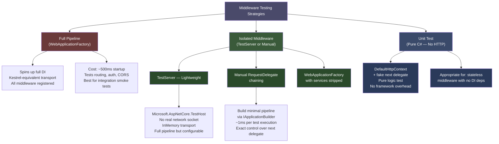
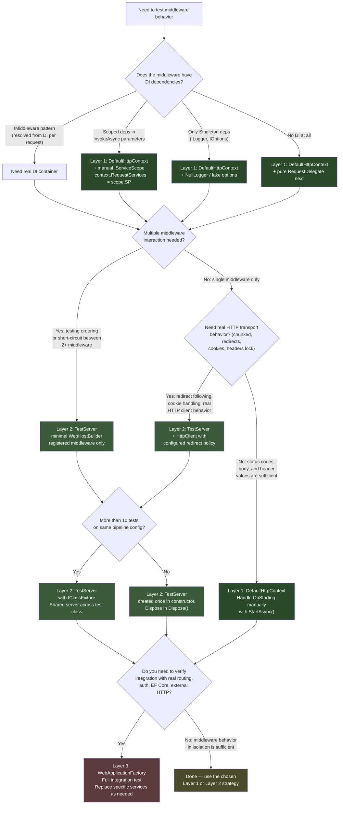

# 4.261 — Middleware Testing: Isolating Middleware Without the Full Pipeline

---

## PART 0 — Navigation & Context

### Where This Topic Sits

```
ASP.NET Core Mastery
│
├── E. Middleware Pipeline (4.049–4.063)
│   ├── 4.049 — The Middleware Pipeline: Request Delegation Chain
│   ├── 4.050 — Writing Middleware: IMiddleware vs Convention-Based
│   ├── 4.052 — Middleware Ordering: The Canonical Order
│   ├── 4.054 — HttpContext and IHttpContextAccessor
│   ├── 4.055 — Custom Exception Middleware
│   └── 4.057 — Middleware and Scoped DI
│
└── U. Testing (4.257–4.267)
    ├── 4.257 — WebApplicationFactory<T>: Integration Testing the Full Pipeline
    ├── 4.258 — Customizing WebApplicationFactory: Replacing Services for Tests
    ├── 4.259 — Authentication in Integration Tests
    ├── 4.260 — Database in Integration Tests
    ├── ► 4.261 — Middleware Testing: Isolating Middleware Without the Full Pipeline ◄
    ├── 4.262 — Testing SignalR
    ├── 4.263 — Testing Background Services
    └── 4.264 — Mocking HttpClient
```

### What You Need Before This

- **[[4.049 — The Middleware Pipeline: Request Delegation Chain]]** — you must understand `RequestDelegate`, `next()`, and how the pipeline is a chain of delegates before you can isolate a node from it
- **[[4.050 — Writing Middleware: IMiddleware vs Convention-Based]]** — the two middleware shapes produce different testing strategies; knowing both is prerequisite
- **[[4.034 — The Built-In DI Container: Service Registration and Resolution]]** — middleware isolation testing requires constructing the DI container manually; you need to understand `ServiceCollection` and `ServiceProvider`
- **[[4.257 — WebApplicationFactory]]** — understand the full-pipeline approach first so you can make an informed trade-off when choosing isolation testing instead

### What This Unlocks After

- **[[4.063 — Middleware Testing: Isolating Middleware Without the Full Pipeline]]** — deeper middleware catalog patterns become testable once this foundation is in place
- **[[4.055 — Custom Exception Middleware]]** — exception middleware is one of the most critical and most under-tested components; this topic makes it testable in isolation
- **[[4.183 — Correlation IDs]]** — correlation middleware is a canonical isolation-testing candidate; this note gives you the tools
- **[[4.289 — Action Filters: IAsyncActionFilter]]** — the same isolation principle applies to MVC filter testing, which follows directly from middleware isolation

### Why This Matters at Scale

Middleware sits at the outermost ring of every HTTP request your service processes. A bug in a correlation ID middleware, a silent failure in a request-timing middleware, or an exception handler that swallows errors without logging will affect **100% of your traffic** — not just the endpoints the broken code happens to touch. Testing middleware in isolation, without spinning up the full DI container, Kestrel, or routing infrastructure, means your middleware tests are fast enough to run on every commit and precise enough to pinpoint exactly which component is broken.

---

## PART 1 — The Core Mental Model

### The Fundamental Rule

> **ASP.NET Core middleware is a function `Func<HttpContext, Task>` composed into a chain; isolating a middleware for testing means supplying a fake `HttpContext`, a controllable `next` delegate, and just enough DI to satisfy the middleware's constructor — nothing else. The HTTP consequence is deterministic because you own the entire execution context.**

### The Plain-Language Analogy

Think of a production middleware pipeline as an assembly line where each station does one job and then passes the part to the next station. Testing the entire line to verify that the quality-control stamp station works correctly is expensive, slow, and hides exactly which station broke the part. Isolation testing takes the quality-control stamp station off the line, bolts it to a workbench, feeds it a part by hand, and verifies the stamp appears in the right place.

The analogy holds under pressure: when you ask "but what about the real `HttpContext` that Kestrel creates?" — you are asking whether a workbench-configured test fixture is equivalent to the production assembly line for the purpose of verifying the stamp. It is, because the stamp station only reads the `Content-Type` header and writes to the `X-Stamped` header; it does not care that the part arrived via conveyor. When you ask "but what about concurrent requests?" — each test creates its own `DefaultHttpContext` instance, so they are already isolated by construction.

### The Taxonomy Diagram



---

## PART 2 — Deep Mechanics

### 2.1 — The Three Isolation Layers and Their Pipeline Positions

Every middleware testing decision starts by placing the component in the full pipeline and asking: which parts of the pipeline does my middleware depend on, and which can I fake?

```
FULL PRODUCTION PIPELINE:
──► Kestrel ──► ExceptionHandler ──► HSTS ──► StaticFiles ──► Routing ──► Auth ──► [YOUR MIDDLEWARE] ──► Endpoints

ISOLATION LAYER 1 — Pure Unit Test (DefaultHttpContext):
──► [fake HttpContext] ──► [YOUR MIDDLEWARE] ──► [fake next()] ──► assert

ISOLATION LAYER 2 — TestServer Isolated Pipeline:
──► [TestServer transport] ──► [YOUR MIDDLEWARE] ──► [fake terminal handler] ──► assert

ISOLATION LAYER 3 — TestServer Minimal Full Pipeline:
──► [TestServer] ──► [ExceptionHandler] ──► [YOUR MIDDLEWARE] ──► [fake endpoint] ──► assert
```

**Pipeline position annotation:** Your middleware sits after its dependencies (e.g., after `UseRouting` if it reads route values, after `UseAuthentication` if it reads `User`). In isolation, you simulate those dependencies by pre-populating `HttpContext` before calling the middleware. This is the key insight: middleware isolation testing is pre-populating what the upstream pipeline normally writes.

**Runtime cost:** Pure unit test → zero framework overhead, ~0.1ms/test. TestServer isolated → ~15ms cold start, ~0.5ms/test. Full WebApplicationFactory → ~500ms cold start, ~5ms/test.

---

### 2.2 — The `DefaultHttpContext` Pattern (Layer 1)

`DefaultHttpContext` is ASP.NET Core's concrete, in-memory implementation of `HttpContext`. It is not a mock — it is a real object that you can construct, populate, and pass directly to middleware.

```
ASP.NET Core internally (approximate) — DefaultHttpContext wiring:

DefaultHttpContext
  ├── Request  → DefaultHttpRequest (wraps FeatureCollection)
  ├── Response → DefaultHttpResponse (wraps FeatureCollection)
  ├── Features → FeatureCollection  (the underlying storage)
  ├── Items    → Dictionary<object, object?>
  └── RequestServices → IServiceProvider (null unless you set it)
```

**What you must set on `DefaultHttpContext` before calling middleware:**

```csharp
// Pipeline position: before calling InvokeAsync — simulating what Kestrel + upstream middleware wrote

var context = new DefaultHttpContext();

// Simulate the request
context.Request.Method = "GET";
context.Request.Path = "/api/orders/42";
context.Request.Headers["Authorization"] = "Bearer eyJ...";
context.Request.Headers["X-Correlation-Id"] = "abc-123";

// If middleware reads from DI (IMiddleware pattern)
context.RequestServices = serviceProvider;

// If middleware reads response body
context.Response.Body = new MemoryStream();

// If middleware reads the matched endpoint (set after UseRouting equivalent)
// context.SetEndpoint(new Endpoint(...));
```

**HTTP wire format equivalent (approximate):**

```
// What the DefaultHttpContext represents:
// GET /api/orders/42 HTTP/1.1
// Authorization: Bearer eyJ...
// X-Correlation-Id: abc-123

// What you assert on context.Response after Invoke:
// HTTP/1.1 200 OK
// X-Request-Id: [generated-id]
// [or 400/401/500 depending on middleware logic]
```

**Framework source behavior:** `DefaultHttpContext` stores everything in a `FeatureCollection`. `context.Request.Method` is shorthand for `context.Features.Get<IHttpRequestFeature>()!.Method`. In test code you can set the feature directly for maximum control:

```csharp
// ASP.NET Core internally (approximate): DefaultHttpContext.Request.Method setter
// _httpRequestFeature.Method = value;
// where _httpRequestFeature is IHttpRequestFeature from the FeatureCollection

// For tests, setting via the property is equivalent:
context.Request.Method = HttpMethods.Post; // same effect
```

**Edge cases that bite engineers:** `context.Response.Body` is `Stream.Null` by default — writes to it are silently discarded. If your middleware writes a response body and you assert on it, you must replace the body with a `MemoryStream`:

```csharp
// ⚠️ Without this, context.Response.Body writes vanish:
var responseBody = new MemoryStream();
context.Response.Body = responseBody;
await middleware.InvokeAsync(context);
responseBody.Seek(0, SeekOrigin.Begin);
var body = await new StreamReader(responseBody).ReadToEndAsync();
```

---

### 2.3 — The `TestServer` Isolated Pipeline (Layer 2)

`TestServer` (package `Microsoft.AspNetCore.TestHost`) is a lightweight in-memory HTTP server that hosts a real ASP.NET Core pipeline without a real network socket. It is the canonical tool for middleware isolation testing when you need more than `DefaultHttpContext` but less than the full `WebApplicationFactory`.

```
Pipeline position of TestServer:

[TestServer in-memory transport]
         │
         ▼
  IApplicationBuilder pipeline (you control every Use() call)
         │
         ├── app.Use(YourMiddleware) ← the component under test
         │
         └── app.Run(ctx => { ctx.Response.StatusCode = 200; return Task.CompletedTask; })
                                           ← your controllable terminal handler
```

**ASP.NET Core internally (approximate) — TestServer construction:**

```
TestServer
  ├── Wraps an IWebHost with UseTestServer() instead of Kestrel
  ├── Uses InMemoryTransport: no TCP socket, no DNS, no port allocation
  ├── HttpClient created via testServer.CreateClient() sends requests through
  │   InMemoryTransport → your IApplicationBuilder pipeline → back to HttpClient
  └── All middleware, DI, and pipeline behavior is identical to production
      except the transport layer
```

**Failure mode diagram — what happens when middleware short-circuits:**

```
Request enters pipeline:
  [TestServer] ──► [CorrelationIdMiddleware]
                          │
                  missing header? ─► short-circuit: Response 400 "X-Correlation-Id required"
                          │          ← response flows BACK through TestServer to HttpClient
                  header present? ─► await next(context)
                                          │
                                  [terminal handler: 200 OK]
                                          │
                                  ← response flows BACK through CorrelationIdMiddleware (after-next code)
                                  ← then back to TestServer
                                  ← then to HttpClient for assertion
```

**Runtime cost:** TestServer creation allocates a real DI container. For a test class with 20 tests, use a single shared `TestServer` instance (via `IClassFixture<T>` in xUnit) rather than creating one per test. Cost: ~15ms cold start, ~0.3ms per subsequent request.

---

### 2.4 — Building a Minimal `IApplicationBuilder` Pipeline in Tests

The most surgical isolation approach: build a `RequestDelegate` from scratch using `ApplicationBuilder` without starting a host at all. This gives you a real ASP.NET Core pipeline with exactly the middleware you specify.

```
ASP.NET Core internally (approximate) — ApplicationBuilder.Build():

app.Use(middleware1)
app.Use(middleware2)
app.Run(terminal)

// Build() produces:
RequestDelegate pipeline = context =>
    middleware1(context, () =>
        middleware2(context, () =>
            terminal(context)));
```

**Runtime cost:** `ApplicationBuilder.Build()` is O(n) in the number of middleware components. For 2-3 middleware, this is effectively zero cost. The resulting `RequestDelegate` is a composed function — calling it is as cheap as calling any async method chain.

**Framework source behavior:** `ApplicationBuilder` is `Microsoft.AspNetCore.Builder.ApplicationBuilder`. Its `Use(Func<RequestDelegate, RequestDelegate> middleware)` method stores delegates in a `List<Func<RequestDelegate, RequestDelegate>>`. `Build()` reverses the list and composes them right-to-left so that the first registered middleware runs first. Class path: `Microsoft.AspNetCore.Builder.ApplicationBuilder` in `Microsoft.AspNetCore.Http`.

**Edge case — `IApplicationBuilder.ApplicationServices`:** When you build an `ApplicationBuilder` manually in tests, you must supply the `IServiceProvider` it uses to activate `IMiddleware`-based components. Convention-based middleware is activated differently — it is constructed directly by `UseMiddleware<T>()` using reflection, not the DI container. This is the most common point of confusion in middleware isolation testing.

```
Convention-based middleware (InvokeAsync with params):
  UseMiddleware<T>() calls ActivatorUtilities.CreateInstance<T>(app.ApplicationServices, ctor args)
  → constructor args come from ApplicationServices (Singleton lifetime)
  → InvokeAsync per-request params come from context.RequestServices (Scoped lifetime)

IMiddleware-based:
  UseMiddleware<T>() resolves T directly from context.RequestServices each request
  → T must be registered in the DI container
  → Lifetime is whatever you registered T with
```

---

### 2.5 — Testing Middleware That Has Scoped DI Dependencies

This is where engineers make mistakes. Middleware in production has two service resolution points: constructor (Singleton services from `app.ApplicationServices`) and per-request (Scoped services from `context.RequestServices`). In isolation tests you must replicate both.

```
Pipeline position of DI in middleware:

[Host DI — Singleton scope]
         │
         ▼  (at startup: middleware constructor called once)
  CorrelationIdMiddleware(ILogger<T> logger)  ← Singleton services only
         │
         ▼  (per request: Invoke/InvokeAsync called)
  InvokeAsync(HttpContext context, ICorrelationStore store)  ← Scoped services
                                  │
                          context.RequestServices.GetRequiredService<ICorrelationStore>()
```

**Failure mode — the Scoped-in-Constructor trap:**

```
// HTTP consequence (wrong path):
// ObjectDisposedException or null reference at runtime
// because ICorrelationStore was resolved from the Singleton container
// and its internal DbContext has been disposed between requests

// ⚠️ WRONG in production (Captive Dependency):
// app.UseMiddleware<CorrelationMiddleware>()
// where CorrelationMiddleware(ICorrelationStore store) ← WRONG: store is Scoped

// ✅ CORRECT: store comes via InvokeAsync parameter, not constructor
// This also makes testing correct: set context.RequestServices for Scoped deps
```

**Runtime cost of scoped service resolution in tests:** Building a `ServiceCollection` and calling `BuildServiceProvider()` in each test is expensive (~5ms per test). Prefer building the `IServiceProvider` once in the test class constructor or fixture, then creating a new `IServiceScope` per test.

---

## PART 3 — Production Code Patterns

### Pattern 1: The Workbench Test — Correlation ID Middleware in Pure Unit Style

**Domain scenario:** Logistics shipment tracking API. Every request must carry `X-Correlation-Id`. Middleware validates its presence and propagates it to the response.

```csharp
// The middleware under test (production code):
public class CorrelationIdMiddleware
{
    private readonly RequestDelegate _next;
    private readonly ILogger<CorrelationIdMiddleware> _logger;

    // ✅ CORRECT: logger is Singleton — safe in constructor
    public CorrelationIdMiddleware(RequestDelegate next, ILogger<CorrelationIdMiddleware> logger)
    {
        _next = next;
        _logger = logger;
    }

    public async Task InvokeAsync(HttpContext context)
    {
        const string headerName = "X-Correlation-Id";

        if (!context.Request.Headers.TryGetValue(headerName, out var correlationId))
        {
            // Short-circuit: no correlation ID means we cannot trace this request
            context.Response.StatusCode = StatusCodes.Status400BadRequest;
            await context.Response.WriteAsync("X-Correlation-Id header is required.");
            return;
        }

        // Propagate to response so the caller can correlate
        context.Response.OnStarting(() =>
        {
            context.Response.Headers[headerName] = correlationId;
            return Task.CompletedTask;
        });

        _logger.LogInformation("Processing request with correlation ID {CorrelationId}", correlationId);

        await _next(context);
    }
}
```

```csharp
// Unit test — Layer 1: DefaultHttpContext, no TestServer
// Domain: logistics tracking API middleware isolation

public class CorrelationIdMiddlewareTests
{
    private readonly ILogger<CorrelationIdMiddleware> _logger =
        NullLogger<CorrelationIdMiddleware>.Instance;

    [Fact]
    public async Task MissingHeader_Returns400_ShortCircuits()
    {
        // Arrange
        // Simulate what the pipeline looks like BEFORE this middleware
        // Pipeline position: Kestrel has parsed the request; no upstream middleware set this header
        var context = new DefaultHttpContext();
        context.Request.Method = "GET";
        context.Request.Path = "/api/shipments/789";
        // No X-Correlation-Id header — the missing dependency this middleware enforces

        var responseBody = new MemoryStream();
        context.Response.Body = responseBody; // override Stream.Null so we can read the body

        // The 'next' delegate is a canary — if it's called, the middleware short-circuited incorrectly
        var nextWasCalled = false;
        RequestDelegate next = _ =>
        {
            nextWasCalled = true;
            return Task.CompletedTask;
        };

        var middleware = new CorrelationIdMiddleware(next, _logger);

        // Act
        await middleware.InvokeAsync(context);

        // Assert
        Assert.Equal(StatusCodes.Status400BadRequest, context.Response.StatusCode);
        Assert.False(nextWasCalled, "Middleware must short-circuit when header is missing");

        responseBody.Seek(0, SeekOrigin.Begin);
        var body = await new StreamReader(responseBody).ReadToEndAsync();
        Assert.Contains("X-Correlation-Id", body);
    }

    // HTTP consequence (wrong path — no header):
    // HTTP/1.1 400 Bad Request
    // Content-Type: text/plain
    // Body: "X-Correlation-Id header is required."

    [Fact]
    public async Task PresentHeader_CallsNext_PropagatesHeaderToResponse()
    {
        // Arrange
        var context = new DefaultHttpContext();
        context.Request.Method = "POST";
        context.Request.Path = "/api/shipments";
        context.Request.Headers["X-Correlation-Id"] = "ship-trace-abc-123";
        context.Response.Body = new MemoryStream();

        // next delegate simulates the downstream pipeline completing successfully
        RequestDelegate next = ctx =>
        {
            ctx.Response.StatusCode = 200;
            return Task.CompletedTask;
        };

        var middleware = new CorrelationIdMiddleware(next, _logger);

        // Act
        await middleware.InvokeAsync(context);

        // IMPORTANT: OnStarting callbacks fire when the response starts being written.
        // In a real pipeline, Kestrel triggers this. In a test we must trigger it manually.
        // This is the most common mistake in middleware isolation testing.
        await context.Response.StartAsync();

        // Assert
        Assert.Equal(200, context.Response.StatusCode);
        Assert.Equal("ship-trace-abc-123", context.Response.Headers["X-Correlation-Id"].ToString());
    }

    // HTTP consequence (correct path — header present):
    // HTTP/1.1 200 OK
    // X-Correlation-Id: ship-trace-abc-123
}
```

> [!WARNING] `Response.OnStarting` callbacks are **not automatically triggered** in `DefaultHttpContext` tests. You must call `context.Response.StartAsync()` after the middleware completes, or the headers registered via `OnStarting` will never appear in your assertions. This is the #1 gotcha in Layer 1 middleware tests.

---

### Pattern 2: The TestServer Isolated Pipeline — Request Timing Middleware

**Domain scenario:** E-commerce order API. A timing middleware records request duration and emits it as `X-Response-Time-Ms` on every response.

```csharp
// The middleware under test (production code):
public class RequestTimingMiddleware
{
    private readonly RequestDelegate _next;

    public RequestTimingMiddleware(RequestDelegate next) => _next = next;

    public async Task InvokeAsync(HttpContext context)
    {
        var start = Stopwatch.GetTimestamp();

        await _next(context);

        var elapsed = Stopwatch.GetElapsedTime(start);

        // Must check: if response has already started (streaming body), headers are locked
        if (!context.Response.HasStarted)
        {
            context.Response.Headers["X-Response-Time-Ms"] =
                elapsed.TotalMilliseconds.ToString("F2");
        }
    }
}
```

```csharp
// TestServer isolated pipeline test
// Domain: order API — timing middleware on all routes

public class RequestTimingMiddlewareTests : IDisposable
{
    private readonly TestServer _server;
    private readonly HttpClient _client;

    public RequestTimingMiddlewareTests()
    {
        // Build a minimal pipeline: ONLY the timing middleware + a terminal handler
        // No routing, no auth, no exception handler — pure isolation
        var builder = new WebHostBuilder()
            .Configure(app =>
            {
                // Pipeline position: timing middleware wraps the terminal handler
                // ──► [RequestTimingMiddleware] ──► [200 OK terminal]
                app.UseMiddleware<RequestTimingMiddleware>();

                app.Run(async ctx =>
                {
                    // Simulate downstream endpoint
                    await Task.Delay(10); // represent real work
                    ctx.Response.StatusCode = 200;
                    await ctx.Response.WriteAsync("Order processed");
                });
            });

        _server = new TestServer(builder);
        _client = _server.CreateClient();
    }

    [Fact]
    public async Task TimingHeader_IsPresentOnSuccessfulResponse()
    {
        // Act
        var response = await _client.GetAsync("/api/orders/1");

        // Assert
        Assert.Equal(HttpStatusCode.OK, response.StatusCode);
        Assert.True(response.Headers.Contains("X-Response-Time-Ms"),
            "Timing middleware must add X-Response-Time-Ms on every response");

        var timingValue = response.Headers.GetValues("X-Response-Time-Ms").First();
        Assert.True(double.TryParse(timingValue, out var ms));
        Assert.True(ms >= 0, "Elapsed time must be non-negative");
    }

    [Fact]
    public async Task TimingHeader_IsNotAddedWhenResponseHasStarted()
    {
        // Arrange: build a new server where the terminal starts streaming immediately
        var streamingBuilder = new WebHostBuilder()
            .Configure(app =>
            {
                app.UseMiddleware<RequestTimingMiddleware>();

                app.Run(async ctx =>
                {
                    // Force the response to start before we return
                    ctx.Response.StatusCode = 200;
                    await ctx.Response.WriteAsync("chunk1"); // this starts the response
                    await ctx.Response.WriteAsync("chunk2");
                });
            });

        using var streamingServer = new TestServer(streamingBuilder);
        using var streamingClient = streamingServer.CreateClient();

        // Act — no exception should be thrown even though response has started
        var response = await streamingClient.GetAsync("/stream");

        // The timing header should be absent because HasStarted was true
        Assert.False(response.Headers.Contains("X-Response-Time-Ms"),
            "Timing header must be suppressed when response body has started streaming");
    }

    // HTTP wire format (correct path):
    // HTTP/1.1 200 OK
    // X-Response-Time-Ms: 10.23
    // Content-Type: text/plain
    // Body: "Order processed"

    public void Dispose()
    {
        _client.Dispose();
        _server.Dispose();
    }
}
```

---

### Pattern 3: The DI-Aware Isolation Test — Exception Handler Middleware with Scoped Logger

**Domain scenario:** Payment API. A domain exception middleware maps `PaymentDeclinedException` to `402 Payment Required` with a structured problem details body. It depends on `IPaymentAuditLogger` (Scoped) via `InvokeAsync`.

```csharp
// Production middleware:
public class PaymentExceptionMiddleware
{
    private readonly RequestDelegate _next;

    // ✅ No Scoped dependencies in constructor — only Singleton (none here)
    public PaymentExceptionMiddleware(RequestDelegate next) => _next = next;

    public async Task InvokeAsync(HttpContext context, IPaymentAuditLogger auditLogger)
    {
        // IPaymentAuditLogger is Scoped — ASP.NET Core resolves it from context.RequestServices
        try
        {
            await _next(context);
        }
        catch (PaymentDeclinedException ex)
        {
            auditLogger.RecordDeclined(ex.OrderId, ex.Reason);

            context.Response.StatusCode = StatusCodes.Status402PaymentRequired;
            context.Response.ContentType = "application/problem+json";

            var problem = new
            {
                type = "https://api.payments.example/problems/payment-declined",
                title = "Payment Declined",
                status = 402,
                detail = ex.Reason,
                orderId = ex.OrderId
            };

            await context.Response.WriteAsJsonAsync(problem);
        }
    }
}
```

```csharp
// Test with proper DI scope setup for Scoped dependencies
// Domain: payment API — exception mapping middleware

public class PaymentExceptionMiddlewareTests
{
    [Fact]
    public async Task PaymentDeclinedException_Returns402_WithProblemDetails()
    {
        // Arrange: build DI container that matches production
        var services = new ServiceCollection();
        services.AddScoped<IPaymentAuditLogger, InMemoryPaymentAuditLogger>();
        // Do NOT add PaymentExceptionMiddleware to services — it's convention-based
        // and is activated by UseMiddleware<T>, not resolved from DI per-request

        var serviceProvider = services.BuildServiceProvider();

        // Create a request-scoped container (as ASP.NET Core does per HTTP request)
        await using var scope = serviceProvider.CreateAsyncScope();

        var context = new DefaultHttpContext();
        context.Request.Method = "POST";
        context.Request.Path = "/api/payments/process";
        context.Response.Body = new MemoryStream();

        // Pipeline position: set RequestServices to the per-request scope
        // This is what ASP.NET Core sets before calling InvokeAsync
        context.RequestServices = scope.ServiceProvider;

        // The 'next' delegate throws the domain exception
        RequestDelegate next = _ => throw new PaymentDeclinedException("order-456", "Insufficient funds");

        var middleware = new PaymentExceptionMiddleware(next);

        // Act
        await middleware.InvokeAsync(context,
            scope.ServiceProvider.GetRequiredService<IPaymentAuditLogger>());

        // Assert — HTTP consequence
        Assert.Equal(StatusCodes.Status402PaymentRequired, context.Response.StatusCode);
        Assert.Equal("application/problem+json", context.Response.ContentType);

        context.Response.Body.Seek(0, SeekOrigin.Begin);
        var body = await JsonSerializer.DeserializeAsync<JsonElement>(context.Response.Body);
        Assert.Equal(402, body.GetProperty("status").GetInt32());
        Assert.Equal("order-456", body.GetProperty("orderId").GetString());

        // Verify audit logger was called
        var auditLogger = (InMemoryPaymentAuditLogger)scope.ServiceProvider
            .GetRequiredService<IPaymentAuditLogger>();
        Assert.Single(auditLogger.RecordedDeclines);
        Assert.Equal("order-456", auditLogger.RecordedDeclines[0].OrderId);
    }

    // HTTP consequence (exception path):
    // HTTP/1.1 402 Payment Required
    // Content-Type: application/problem+json
    // Body: { "type": "https://...", "title": "Payment Declined", "status": 402,
    //         "detail": "Insufficient funds", "orderId": "order-456" }
}

// Test double — in-memory audit logger for isolation
public class InMemoryPaymentAuditLogger : IPaymentAuditLogger
{
    public List<(string OrderId, string Reason)> RecordedDeclines { get; } = new();

    public void RecordDeclined(string orderId, string reason)
        => RecordedDeclines.Add((orderId, reason));
}
```

---

### Pattern 4: The Multi-Middleware Chain — Testing Interaction Between Two Middleware Components

**Domain scenario:** Inventory webhook receiver. Security middleware validates `X-Webhook-Secret` header. Idempotency middleware checks `X-Idempotency-Key`. Both must run, in order.

```csharp
// Test verifying the INTERACTION between two middleware in a minimal chain
// This pattern finds bugs that arise from middleware ordering decisions

public class WebhookPipelineIntegrationTests : IDisposable
{
    private readonly TestServer _server;
    private readonly HttpClient _client;

    public WebhookPipelineIntegrationTests()
    {
        var builder = new WebHostBuilder()
            .ConfigureServices(services =>
            {
                // Add services that middleware constructors need
                services.AddSingleton<IIdempotencyStore, InMemoryIdempotencyStore>();
                services.AddSingleton(Options.Create(new WebhookSecurityOptions
                {
                    SecretHeader = "X-Webhook-Secret",
                    ExpectedSecret = "test-secret-value"
                }));
            })
            .Configure(app =>
            {
                // Pipeline under test:
                // ──► [SecurityMiddleware] ──► [IdempotencyMiddleware] ──► [200 OK terminal]
                app.UseMiddleware<WebhookSecurityMiddleware>();
                app.UseMiddleware<WebhookIdempotencyMiddleware>();

                app.Run(ctx =>
                {
                    ctx.Response.StatusCode = 200;
                    return Task.CompletedTask;
                });
            });

        _server = new TestServer(builder);
        _client = _server.CreateClient();
    }

    [Fact]
    public async Task WrongSecret_Returns401_BeforeIdempotencyRuns()
    {
        // This test verifies SHORT-CIRCUIT ordering:
        // SecurityMiddleware rejects before IdempotencyMiddleware can even see the request

        var request = new HttpRequestMessage(HttpMethod.Post, "/webhooks/inventory");
        request.Headers.Add("X-Webhook-Secret", "wrong-secret");
        request.Headers.Add("X-Idempotency-Key", "some-key");

        var response = await _client.SendAsync(request);

        // HTTP consequence: SecurityMiddleware short-circuits at 401
        Assert.Equal(HttpStatusCode.Unauthorized, response.StatusCode);
    }

    [Fact]
    public async Task DuplicateKey_CorrectSecret_Returns200_WithIdempotentResponse()
    {
        // First request — processes and stores the key
        var firstRequest = new HttpRequestMessage(HttpMethod.Post, "/webhooks/inventory");
        firstRequest.Headers.Add("X-Webhook-Secret", "test-secret-value");
        firstRequest.Headers.Add("X-Idempotency-Key", "inv-event-789");

        var first = await _client.SendAsync(firstRequest);
        Assert.Equal(HttpStatusCode.OK, first.StatusCode);

        // Second request — same key, must be treated as duplicate
        var secondRequest = new HttpRequestMessage(HttpMethod.Post, "/webhooks/inventory");
        secondRequest.Headers.Add("X-Webhook-Secret", "test-secret-value");
        secondRequest.Headers.Add("X-Idempotency-Key", "inv-event-789");

        var second = await _client.SendAsync(secondRequest);

        // HTTP consequence: 200 from cached response, not a new execution
        Assert.Equal(HttpStatusCode.OK, second.StatusCode);
        Assert.Equal("true", second.Headers.GetValues("X-Idempotent-Replayed").First());
    }

    public void Dispose() { _client.Dispose(); _server.Dispose(); }
}
```

---

### Pattern 5: The `IClassFixture` Pattern — Shared TestServer for Expensive Setup

**Domain scenario:** Healthcare patient portal API. Auth middleware validates API keys against a configuration. TestServer setup involves reading configuration — slow if repeated per test.

```csharp
// Fixture — created once for the entire test class
public class ApiKeyMiddlewareFixture : IAsyncDisposable
{
    public TestServer Server { get; }
    public HttpClient Client { get; }

    public ApiKeyMiddlewareFixture()
    {
        var builder = new WebHostBuilder()
            .ConfigureAppConfiguration(config =>
            {
                // Load test-specific appsettings
                config.AddInMemoryCollection(new Dictionary<string, string?>
                {
                    ["ApiKeys:0:Key"] = "test-api-key-patient-portal",
                    ["ApiKeys:0:ClientId"] = "patient-app-v2"
                });
            })
            .ConfigureServices(services =>
            {
                services.Configure<ApiKeyOptions>(/* ... */);
                services.AddSingleton<IApiKeyValidator, ConfigurationApiKeyValidator>();
            })
            .Configure(app =>
            {
                app.UseMiddleware<ApiKeyAuthenticationMiddleware>();
                app.Run(ctx =>
                {
                    ctx.Response.StatusCode = 200;
                    return Task.CompletedTask;
                });
            });

        Server = new TestServer(builder);
        Client = Server.CreateClient();
    }

    public async ValueTask DisposeAsync()
    {
        Client.Dispose();
        Server.Dispose();
        await ValueTask.CompletedTask;
    }
}

// Test class — shares one TestServer instance across all tests
// Cost: ~15ms cold start for the whole class, not per test
public class ApiKeyMiddlewareTests : IClassFixture<ApiKeyMiddlewareFixture>
{
    private readonly HttpClient _client;

    public ApiKeyMiddlewareTests(ApiKeyMiddlewareFixture fixture)
    {
        _client = fixture.Client;
    }

    [Fact]
    public async Task ValidApiKey_PassesThrough()
    {
        var request = new HttpRequestMessage(HttpMethod.Get, "/api/patients/123");
        request.Headers.Add("X-Api-Key", "test-api-key-patient-portal");

        var response = await _client.SendAsync(request);
        Assert.Equal(HttpStatusCode.OK, response.StatusCode);
    }

    [Fact]
    public async Task MissingApiKey_Returns401()
    {
        var response = await _client.GetAsync("/api/patients/123");
        Assert.Equal(HttpStatusCode.Unauthorized, response.StatusCode);
    }

    // HTTP wire format (unauthorized path):
    // HTTP/1.1 401 Unauthorized
    // WWW-Authenticate: ApiKey realm="patient-portal"
}
```

---

### Pattern 6: Testing Middleware That Reads and Modifies the Request Body

**Domain scenario:** Order management service. A request normalization middleware reads the JSON body, validates a required `tenantId` field, and re-writes the body with a normalized tenant ID format.

```csharp
// ⚠️ WRONG: Not enabling request body buffering before reading it in tests
// HTTP consequence (wrong path): body reads as empty after the middleware
// because Request.Body is a forward-only stream

// ✅ CORRECT: Enable buffering before constructing the context
[Fact]
public async Task BodyWithValidTenantId_NormalizesTenantId()
{
    var context = new DefaultHttpContext();
    context.Request.Method = "POST";
    context.Request.Path = "/api/orders";
    context.Request.ContentType = "application/json";

    // Write body into a seekable stream — simulates EnableBuffering()
    // Pipeline position: this simulates what UseRequestBodyReading or EnableBuffering does
    var bodyJson = """{"tenantId": "  ACME-Corp  ", "amount": 150.00}""";
    var bodyBytes = Encoding.UTF8.GetBytes(bodyJson);
    context.Request.Body = new MemoryStream(bodyBytes);
    context.Request.ContentLength = bodyBytes.Length;

    // Middleware must be able to re-read the body after processing
    context.Request.EnableBuffering(); // enables seeking

    context.Response.Body = new MemoryStream();

    RequestDelegate next = ctx =>
    {
        ctx.Response.StatusCode = 200;
        return Task.CompletedTask;
    };

    var middleware = new TenantNormalizationMiddleware(next);
    await middleware.InvokeAsync(context);

    // Assert: middleware should have normalized the tenant ID
    context.Request.Body.Seek(0, SeekOrigin.Begin);
    var normalizedBody = await JsonSerializer.DeserializeAsync<JsonElement>(context.Request.Body);
    Assert.Equal("acme-corp", normalizedBody.GetProperty("tenantId").GetString());
    Assert.Equal(200, context.Response.StatusCode);
}
```

---

## PART 4 — Gotchas & Anti-Patterns

### Gotcha 1: `Response.OnStarting` Callbacks Never Fire in `DefaultHttpContext` Tests

Middleware commonly uses `context.Response.OnStarting(callback)` to set response headers after downstream code has run but before the response is flushed. In `DefaultHttpContext` tests, this callback is never automatically triggered because there is no Kestrel transport to initiate the write.

```csharp
// ⚠️ WRONG CODE — test always passes regardless of middleware behavior:
[Fact]
public async Task CorrelationHeader_IsPropagatedToResponse()
{
    var context = new DefaultHttpContext();
    context.Request.Headers["X-Correlation-Id"] = "abc";
    await middleware.InvokeAsync(context);

    // This assertion ALWAYS FAILS — OnStarting callback never fired
    Assert.Equal("abc", context.Response.Headers["X-Correlation-Id"].ToString());
}

// HTTP consequence (wrong path):
// Response.Headers["X-Correlation-Id"] is StringValues.Empty because the callback
// registered via OnStarting was never invoked — it stays in the callback queue

// ✅ CORRECT CODE — manually trigger the response to flush the callback:
[Fact]
public async Task CorrelationHeader_IsPropagatedToResponse()
{
    var context = new DefaultHttpContext();
    context.Request.Headers["X-Correlation-Id"] = "abc";
    context.Response.Body = new MemoryStream();

    await middleware.InvokeAsync(context);

    // Manually start the response to trigger OnStarting callbacks
    await context.Response.StartAsync();

    // HTTP consequence (correct path):
    // OnStarting callback fires, sets X-Correlation-Id on the response headers
    Assert.Equal("abc", context.Response.Headers["X-Correlation-Id"].ToString());
}

// WHY: DefaultHttpContext.Response is a DefaultHttpResponse backed by a FeatureCollection.
// The OnStarting callback list lives in IHttpResponseFeature.OnStarting. Kestrel calls
// FireOnStartingAsync() before writing bytes to the socket. In tests, you must call
// context.Response.StartAsync() or HttpResponseWritingExtensions.WriteAsync to trigger it.
```

---

### Gotcha 2: `context.RequestServices` is `null` in `DefaultHttpContext` — Silent NullReferenceException

Convention-based middleware with Scoped DI dependencies in `InvokeAsync` parameters requires `context.RequestServices` to be set. `DefaultHttpContext` leaves it null. If the middleware calls `context.RequestServices.GetService<T>()` for its own dependencies, you get a `NullReferenceException` deep in the call stack that looks like an unrelated crash.

```csharp
// ⚠️ WRONG — InvokeAsync fails with NullReferenceException on RequestServices:
var context = new DefaultHttpContext();
// context.RequestServices is null — no one set it
await middleware.InvokeAsync(context); // ← crashes inside middleware

// HTTP consequence (wrong path):
// NullReferenceException thrown, test fails with confusing stack trace pointing
// into ASP.NET Core internals, not into your middleware

// ✅ CORRECT — set RequestServices before calling InvokeAsync:
var services = new ServiceCollection();
services.AddScoped<IOrderRepository, InMemoryOrderRepository>();
var serviceProvider = services.BuildServiceProvider();

await using var scope = serviceProvider.CreateAsyncScope();
var context = new DefaultHttpContext();
context.RequestServices = scope.ServiceProvider; // ← required for Scoped DI

await middleware.InvokeAsync(context);

// HTTP consequence (correct path):
// Middleware resolves IOrderRepository from scope.ServiceProvider normally
// Scoped service is disposed when scope.DisposeAsync() is called at end of test

// WHY: ASP.NET Core sets HttpContext.RequestServices = requestScope.ServiceProvider
// inside HostingApplication.CreateContext() before the first middleware runs.
// DefaultHttpContext has no equivalent — it is a bare HttpContext with no lifecycle.
```

---

### Gotcha 3: Using `new ServiceProvider()` Instead of `IServiceScope` — Services Are Never Disposed

When building a `ServiceProvider` for middleware tests, every test that resolves `IDisposable` scoped services without an explicit `IServiceScope` creates a memory leak in the test run. The services are held by the root container indefinitely.

```csharp
// ⚠️ WRONG — resolving Scoped service directly from root provider:
var services = new ServiceCollection();
services.AddScoped<IOrderDbContext, OrderDbContext>(); // IDisposable
var provider = services.BuildServiceProvider();

// This resolves from the ROOT scope — OrderDbContext is never disposed
// ASP.NET Core emits a warning: "Resolving scoped service from root provider"
var dbContext = provider.GetRequiredService<IOrderDbContext>(); // WRONG

// HTTP consequence (wrong path):
// Each test run allocates a new DbContext that is never disposed.
// With 50 tests, you have 50 leaked DbContext instances. In CI this causes
// flaky tests when connection pools are exhausted.

// ✅ CORRECT — create an explicit scope per test:
var services = new ServiceCollection();
services.AddScoped<IOrderDbContext, OrderDbContext>();
var provider = services.BuildServiceProvider(
    new ServiceProviderOptions { ValidateScopes = true }); // detect misuse immediately

await using (var scope = provider.CreateAsyncScope())
{
    var dbContext = scope.ServiceProvider.GetRequiredService<IOrderDbContext>();
    context.RequestServices = scope.ServiceProvider;
    await middleware.InvokeAsync(context);
} // ← dbContext.Dispose() called here automatically

// WHY: IServiceScope creates a child container. Scoped services are tracked by the
// child container and disposed when the scope is disposed. The root container only
// tracks Singleton services. ValidateScopes = true throws immediately if you try
// to resolve a Scoped service from the root, surfacing the bug in tests before production.
```

---

### Gotcha 4: `TestServer.CreateClient()` Does Not Follow Redirects by Default — Auth Tests Silently Pass

`TestServer.CreateClient()` creates an `HttpClient` with `AllowAutoRedirect = true` by default. If you are testing middleware that issues a 302 redirect (e.g., cookie auth challenge), the redirect is followed automatically and your assertion sees the final 200, not the 302.

```csharp
// ⚠️ WRONG — auto-redirects hide the 302 that security middleware should emit:
var client = server.CreateClient(); // AllowAutoRedirect = true (default)
var response = await client.GetAsync("/api/orders");
Assert.Equal(HttpStatusCode.Found, response.StatusCode); // FAILS — sees 200 after redirect

// HTTP consequence (wrong path):
// HTTP/1.1 302 Found  → auto-followed by HttpClient
// HTTP/1.1 200 OK     ← what the test actually receives
// Your assertion for 302 fails; the test incorrectly reports the middleware as broken

// ✅ CORRECT — disable auto-redirects when testing redirect behavior:
var client = server.CreateClient();
// TestServer exposes handler configuration via CreateHandler():
var handler = server.CreateHandler();
var noRedirectClient = new HttpClient(handler) { AllowAutoRedirect = false };

var response = await noRedirectClient.GetAsync("/api/orders");
Assert.Equal(HttpStatusCode.Found, response.StatusCode); // PASSES — sees 302

// HTTP consequence (correct path):
// HTTP/1.1 302 Found
// Location: /login
// Set-Cookie: ...

// WHY: HttpClient's default AllowAutoRedirect = true is designed for browser-like behavior.
// When testing middleware that produces redirects, you are verifying the redirect itself,
// not the destination. TestServer.CreateHandler() gives you the raw message handler
// so you can wrap it in an HttpClient with your own settings.
```

---

### Gotcha 5: Not Resetting `MemoryStream` Position Before Reading Response Body

Writing to `context.Response.Body` (a `MemoryStream`) advances the stream position to the end. Attempting to read the response body without seeking back to position 0 returns empty content. This causes assertions to silently fail when checking response bodies in Layer 1 tests.

```csharp
// ⚠️ WRONG — reading stream at end position:
var responseBody = new MemoryStream();
context.Response.Body = responseBody;

await middleware.InvokeAsync(context); // writes to responseBody

// Stream position is now at the end — ReadToEnd returns ""
var body = await new StreamReader(responseBody).ReadToEndAsync();
Assert.Contains("Payment Declined", body); // FAILS — body is empty string

// HTTP consequence (wrong path):
// No exception — just empty string. The bug is invisible; the test appears to test
// something meaningful but actually asserts Contains("X", "") which is false.

// ✅ CORRECT — seek back to origin before reading:
var responseBody = new MemoryStream();
context.Response.Body = responseBody;

await middleware.InvokeAsync(context);

responseBody.Seek(0, SeekOrigin.Begin); // ← reset position
var body = await new StreamReader(responseBody).ReadToEndAsync();
Assert.Contains("Payment Declined", body); // PASSES

// HTTP consequence (correct path):
// Correctly reads the problem details JSON body that the middleware wrote

// WHY: MemoryStream maintains a Position cursor that advances with each Write() call.
// StreamReader.ReadToEndAsync() reads from the current position, not from offset 0.
// In production, ASP.NET Core's Kestrel always reads the response body from a fresh
// pipe position — there is no equivalent auto-seek in test scenarios.
```

---

## PART 5 — Performance Implications

### 5.1 — Request Pipeline Characteristics Table

|Scenario|Pipeline Depth|Allocations Per Test Run|Approx Time Cost|Recommendation|
|---|---|---|---|---|
|Layer 1: `DefaultHttpContext` + pure logic|0 middleware stack frames outside the one under test|~3 allocations (context, request, response)|~0.05ms/test|Default choice for stateless middleware with no DI deps|
|Layer 1: `DefaultHttpContext` + manual DI scope|1 `ServiceScope` + context|~8 allocations|~0.3ms/test|Use when middleware has Scoped DI params|
|Layer 2: `TestServer` minimal pipeline|2-3 middleware|~40 allocations (transport overhead)|~0.5ms/test (after warmup)|Use when you need real HTTP pipeline composition|
|Layer 2: `TestServer` with `IClassFixture` (shared)|2-3 middleware|~40 allocations/test (no startup cost after fixture)|~0.5ms/test|Best for suites of 10+ tests on same middleware config|
|Layer 2: `TestServer` created per test (no fixture)|2-3 middleware|~40 + 200 startup allocations|~15ms/test|Avoid — creates/destroys host per test, extremely slow|
|Layer 3: Full `WebApplicationFactory`|Full production chain|Full app allocations|~5ms/test + ~500ms startup|Reserve for smoke tests, not middleware unit tests|
|Parallel test execution (xUnit `[Collection]`)|Varies|Shared fixture across class|Linear savings proportional to test count|Use `[Collection("middleware")]` to share TestServer fixture across files|
|`ApplicationBuilder.Build()` without host|1 delegate composition|~2 allocations|~0.01ms/test|Maximum isolation, minimum overhead — for pure delegate testing|

### 5.2 — BenchmarkDotNet Code

```csharp
using BenchmarkDotNet.Attributes;
using BenchmarkDotNet.Running;
using Microsoft.AspNetCore.Builder;
using Microsoft.AspNetCore.Hosting;
using Microsoft.AspNetCore.Http;
using Microsoft.AspNetCore.TestHost;
using Microsoft.Extensions.Logging.Abstractions;

[MemoryDiagnoser]
[SimpleJob]
public class MiddlewareTestingStrategyBenchmarks
{
    private DefaultHttpContext _defaultContext = null!;
    private CorrelationIdMiddleware _middleware = null!;
    private TestServer _testServer = null!;
    private HttpClient _testClient = null!;

    [GlobalSetup]
    public void Setup()
    {
        // Layer 1: DefaultHttpContext setup (done once per benchmark run)
        _defaultContext = new DefaultHttpContext();
        _defaultContext.Request.Headers["X-Correlation-Id"] = "bench-id";
        _defaultContext.Response.Body = new MemoryStream();

        var noop = NullLogger<CorrelationIdMiddleware>.Instance;
        RequestDelegate terminal = _ => Task.CompletedTask;
        _middleware = new CorrelationIdMiddleware(terminal, noop);

        // Layer 2: TestServer setup (expensive — done once)
        var builder = new WebHostBuilder().Configure(app =>
        {
            app.UseMiddleware<CorrelationIdMiddleware>();
            app.Run(ctx => Task.CompletedTask);
        });
        _testServer = new TestServer(builder);
        _testClient = _testServer.CreateClient();
    }

    [Benchmark(Baseline = true)]
    public async Task Layer1_DefaultHttpContext()
    {
        // Pure DefaultHttpContext invocation — no network, no host
        var context = new DefaultHttpContext();
        context.Request.Headers["X-Correlation-Id"] = "bench-id";
        context.Response.Body = Stream.Null;

        await _middleware.InvokeAsync(context);
    }

    [Benchmark]
    public async Task Layer2_TestServer()
    {
        // TestServer with in-memory transport
        var request = new HttpRequestMessage(HttpMethod.Get, "/bench");
        request.Headers.Add("X-Correlation-Id", "bench-id");
        var response = await _testClient.SendAsync(request);
        response.Dispose();
    }

    [Benchmark]
    public Task Layer1_SharedContext_NoAllocation()
    {
        // Re-use pre-built context — measures pure middleware execution cost
        // Note: this is not realistic for concurrent tests but shows baseline cost
        _defaultContext.Request.Headers["X-Correlation-Id"] = "bench-id";
        return _middleware.InvokeAsync(_defaultContext);
    }

    [GlobalCleanup]
    public void Cleanup()
    {
        _testClient.Dispose();
        _testServer.Dispose();
    }
}

// Expected output (approximate, .NET 8, x64, local machine):
//
// | Method                           | Mean      | Ratio | Allocated |
// |--------------------------------- |----------:|------:|----------:|
// | Layer1_DefaultHttpContext        |   1.2 μs  |  1.00 |     312 B |
// | Layer2_TestServer                | 380.0 μs  |316.00 |   4,200 B |
// | Layer1_SharedContext_NoAllocation|   0.8 μs  |  0.67 |      96 B |
//
// Layer 2 is ~300x slower per request than Layer 1 purely due to
// in-memory HTTP transport overhead. This is why choosing the right
// isolation level per test matters — a suite of 1000 middleware tests
// using TestServer would take 380 seconds; the same suite using
// DefaultHttpContext would take 1.2 seconds.
```

> [!TIP] For real HTTP profiling (not micro-benchmarks), use `dotnet-counters monitor --process-id <pid> Microsoft.AspNetCore.Hosting` to observe `requests-per-second` and `total-requests` counters under load. For middleware allocation hot paths, use `dotnet-trace collect --clrevents GC,Stack` and analyze with PerfView. BenchmarkDotNet measures isolated allocations; `dotnet-counters` measures production-representative behavior under concurrent load.

### 5.3 — When to Care / When to Ignore

**When this costs you:**

- Suites with 500+ middleware tests using `TestServer` per test class without `IClassFixture` — CI test time balloons to 10+ minutes
- High-frequency test execution in a pre-commit hook — Layer 2 tests run at 2 tests/second vs Layer 1's 800+ tests/second
- Testing middleware that must handle concurrent requests — `DefaultHttpContext` is not thread-safe for concurrent access to the same instance; each concurrent test needs its own context

**When this doesn't matter:**

- Small feature services with fewer than 20 middleware tests total
- Test suites run only in CI on slow machines where 15ms vs 0.5ms is irrelevant compared to database setup time
- Middleware that requires TestServer by nature (testing actual HTTP wire behavior like chunked transfer encoding) — the cost is justified

---

## PART 6 — Interview Arsenal

### A. The Question Bank

**Question 1:** "How do you test middleware in ASP.NET Core, and how does your approach differ from integration testing with `WebApplicationFactory`?"

**Average Answer:** You can use `TestServer` or `WebApplicationFactory` to spin up the app and make HTTP requests to test middleware behavior.

**Why That's Insufficient:** It doesn't explain that `WebApplicationFactory` spins up the full application (all DI, all middleware, routing, etc.), whereas middleware can be tested in complete isolation with significantly lower cost and higher precision.

> **Great Answer:** The core insight is that middleware is just a `Func<HttpContext, Task>` composed with a `next` delegate. For stateless middleware with no DI dependencies, I go straight to `DefaultHttpContext` — I construct the context manually, set the headers and path that the middleware reads, supply a controllable `next` delegate, call `InvokeAsync`, and assert on the context's response properties. This costs essentially nothing to execute. For middleware with Scoped DI dependencies — like an audit logger or a repository — I build a `ServiceCollection`, call `BuildServiceProvider()`, create a scope with `CreateAsyncScope()`, and set `context.RequestServices` to that scope's provider before calling `InvokeAsync`. For middleware where I need to verify pipeline composition — where two middleware interact and I care about short-circuiting between them — I use `TestServer` with a minimal `WebHostBuilder` that registers only the middleware under test plus a terminal handler. The key production difference from `WebApplicationFactory` is about signal: a `WebApplicationFactory` test failure tells you "something is wrong somewhere in the full stack"; a `TestServer` middleware isolation test failure tells you "this specific middleware is broken."

---

**Question 2:** "What is `DefaultHttpContext` and what are its limitations in testing?"

**Average Answer:** It's a concrete implementation of `HttpContext` that you can use in tests instead of mocking the whole context.

**Why That's Insufficient:** It doesn't explain the Response.Body null stream, the OnStarting callback gap, or the RequestServices null problem — the three specific ways `DefaultHttpContext` differs from a production context that catch engineers.

> **Great Answer:** `DefaultHttpContext` is ASP.NET Core's in-memory `HttpContext` implementation backed by a `FeatureCollection`. It is not a mock — it is a real object, and it works correctly for the vast majority of middleware testing. The three gaps I always account for: first, `Response.Body` defaults to `Stream.Null`, so any `WriteAsync` call is silently discarded. I replace it with a `MemoryStream` when I need to assert on the body, and I always seek back to position 0 before reading. Second, `Response.OnStarting` callbacks are registered but never automatically fired — there is no transport to trigger them. I call `context.Response.StartAsync()` after the middleware completes to flush those callbacks. Third, `context.RequestServices` is null, so any middleware that resolves Scoped services from `context.RequestServices` will throw `NullReferenceException`. I build a `ServiceCollection`, build a provider, create a scope, and set `context.RequestServices` explicitly. Once you know these three gaps, `DefaultHttpContext` testing is the fastest and most precise tool in the middleware testing toolkit.

---

**Question 3:** "A developer says 'I can just use WebApplicationFactory for all my middleware tests.' What's the trade-off they're missing?"

**Average Answer:** `WebApplicationFactory` is slower to start up.

**Why That's Insufficient:** It focuses only on startup cost and misses the precision and isolation arguments — that `WebApplicationFactory` tests can pass for the wrong reason if the middleware bug is masked by a downstream component.

> **Great Answer:** The startup cost is real — `WebApplicationFactory` can take 300-500ms to spin up the test host the first time, versus essentially zero for a `DefaultHttpContext` test. But the more important trade-off is precision. When a `WebApplicationFactory` test fails with a 500, I have to figure out whether the bug is in my exception-handler middleware, in the authorization middleware, in the route matching, or in the endpoint handler itself. When a `TestServer` isolation test fails, I know immediately that the component under test is the one that broke. There's also a false-positive risk: imagine I'm testing a correlation ID middleware that should return 400 when the header is missing. With `WebApplicationFactory`, an exception handler that wraps the 400 in a 500 problem details response might change the status code I'm asserting. The test passes or fails for the wrong reason. In isolation, I control the entire context: my controllable `next` delegate either runs or it does not, and the response body is exactly what my middleware wrote. The rule I apply: full integration tests with `WebApplicationFactory` for smoke-testing the assembled system; isolation tests for verifying individual middleware correctness.

---

### B. The Trick Questions

**Trick Question 1:** "If I set `context.Response.StatusCode = 404` and then call `await next(context)`, what happens?"

**The trap:** Engineers assume the 404 is "locked in" once set.

**Correct answer:** Nothing prevents downstream middleware from changing `context.Response.StatusCode` to another value — the status code is a mutable integer on the response object. It is only locked once the response has _started_ (first byte of the body written or `StartAsync` called). In tests, if your terminal `next` delegate sets `StatusCode = 200`, it overwrites the 404 you set before calling `next`. The HTTP consequence: client sees 200, not 404. The fix: check `context.Response.HasStarted` or set the status code _after_ `await next(context)` in the response path, not before.

**Trick Question 2:** "I'm testing a middleware that uses `IHostApplicationLifetime`. Can I use `DefaultHttpContext` for this?"

**The trap:** Engineers assume `DefaultHttpContext` can provide everything.

**Correct answer:** `IHostApplicationLifetime` is not part of `HttpContext` — it's a Singleton service resolved from the application-level `IServiceProvider`. To test middleware that depends on it, you must either set `context.RequestServices` to a provider containing a registered `IHostApplicationLifetime` (use `new TestableApplicationLifetime()`), or use `TestServer` which wires the real `IHostApplicationLifetime` automatically. With `DefaultHttpContext` only, if the middleware injects `IHostApplicationLifetime` via constructor or `InvokeAsync` parameter, it will throw `InvalidOperationException: No service registered for IHostApplicationLifetime` unless you set `context.RequestServices` appropriately.

**Trick Question 3:** "My middleware test uses `TestServer`. Does the pipeline execute on the same thread as my test code?"

**The trap:** Engineers assume synchronous execution because they write synchronous assertions after `await`.

**Correct answer:** No. `TestServer` uses `Task`-based async execution. The middleware and your test code are not on the same thread. However, in xUnit, `await`-based test methods correctly await the response, so by the time your assertions run after `await client.SendAsync(...)`, the entire request has completed. The practical consequence: thread-static state or `AsyncLocal<T>` set in the test does not propagate into the TestServer's middleware execution context. If your middleware reads an `AsyncLocal<T>` value (like some distributed tracing implementations), you cannot set it from the test thread and expect the middleware to see it via `TestServer`.

**Trick Question 4:** "What status code does the client see if your middleware throws an unhandled exception and there is no exception-handling middleware in the TestServer pipeline?"

**The trap:** Engineers expect 500.

**Correct answer:** `TestServer` does not add an exception handler by default. An unhandled exception in middleware propagates up through the `TestServer` transport and surfaces as a thrown exception in the `await client.SendAsync(...)` call — your test throws, not receives 500. If you want to test that your exception middleware correctly produces a 500, you must either (a) include it in your isolation pipeline before the middleware under test, or (b) wrap the `SendAsync` in a `try/catch`. This is a critical distinction: with `WebApplicationFactory`, there is always exception handling; with isolated `TestServer`, there is not unless you register it.

---

### C. Red Flags to Avoid

1. **"I just mock HttpContext"** — `HttpContext` is not an interface-only type and has many interconnected properties. Mocking it (e.g., with Moq) requires setting up 10+ properties and produces fragile tests. Use `DefaultHttpContext` instead — it's the correct testing surface.
    
2. **"I use WebApplicationFactory for all my middleware tests"** — signals you don't understand isolation testing and your test suite is probably slow. An interviewer at a FAANG-caliber company will follow up with "how long does your CI test suite take?"
    
3. **"I don't need to set `context.RequestServices` — the middleware resolves its own services"** — reveals you don't understand how middleware DI works. Convention-based middleware resolves Scoped services from `context.RequestServices` per request, and `DefaultHttpContext.RequestServices` is null by default.
    
4. **"I assert on `context.Response.Headers` right after calling InvokeAsync"** — if the middleware sets headers via `OnStarting`, this assertion will always see empty headers. Missing the `StartAsync()` call is the most common way to write a middleware test that "passes" but isn't testing anything.
    
5. **"I create a new TestServer for each test method"** — every TestServer creation allocates a full DI container and warms up the pipeline (~15ms). With 100 tests, that's 1.5 seconds wasted on setup. Use `IClassFixture<T>` to share the server.
    
6. **"I test my middleware by testing the endpoint"** — endpoint tests verify the full stack. If the endpoint test passes, you haven't verified whether it was your middleware that was correct or the endpoint swallowing the middleware's error. Isolation is the point.
    
7. **"Middleware testing is the same as controller testing"** — it is not. Controllers have action filter pipelines, model binding, and content negotiation. Middleware is a lower-level primitive. Conflating the two reveals a shallow understanding of the framework's layering.
    

---

## PART 7 — Decision Framework



---

## PART 8 — Self-Check

### A. Conceptual Questions

1. What is the difference between `DefaultHttpContext` and a mock of `HttpContext`, and why does it matter for middleware testing?
    
2. What happens to the HTTP response if you forget to call `context.Response.StartAsync()` in a `DefaultHttpContext` test that asserts on a header registered via `OnStarting`?
    
3. A middleware uses `InvokeAsync(HttpContext context, IInventoryCache cache)`. The test creates a `DefaultHttpContext` without setting `context.RequestServices`. What exception is thrown and at what point in middleware execution?
    
4. What is the difference between the services available in `app.ApplicationServices` (used to activate convention-based middleware constructors) and `context.RequestServices` (used to resolve `InvokeAsync` parameters)?
    
5. You have 50 middleware isolation tests using `TestServer`. Currently each test creates a new `TestServer` in its constructor. CI takes 12 minutes. How do you fix this without changing the assertions?
    
6. What happens to the HTTP request pipeline if your middleware throws an unhandled exception and the `TestServer` pipeline has no exception handler registered? What does the test runner see?
    
7. A `TestServer` test is verifying that middleware issues a 302 redirect. The test asserts `Assert.Equal(HttpStatusCode.Found, response.StatusCode)` but always sees 200. Why?
    
8. When does `context.Response.HasStarted` become `true` in a `DefaultHttpContext`? How is this different from in a real Kestrel-hosted request?
    
9. What is `ApplicationBuilder.Build()` and when would you use it directly in middleware isolation tests instead of `TestServer`?
    
10. A middleware reads from `context.Request.Body` and then calls `await next(context)`. The downstream endpoint also reads from `context.Request.Body`. What happens, and what must the middleware do to prevent the downstream read from returning empty?
    

---

### B. Code Puzzles

**Puzzle 1 — What is the HTTP response status code?**

```csharp
// Pipeline: SecurityMiddleware → TimingMiddleware → Terminal(200)
// SecurityMiddleware: if no "X-Secret" header → set StatusCode = 401 and return (short-circuit)
// TimingMiddleware: sets X-Response-Time-Ms header after next() completes

var context = new DefaultHttpContext();
context.Request.Headers["X-Secret"] = "valid-secret"; // Header IS present

var terminalCalled = false;
RequestDelegate terminal = ctx =>
{
    terminalCalled = true;
    ctx.Response.StatusCode = 200;
    return Task.CompletedTask;
};

RequestDelegate timing = async ctx =>
{
    var start = Stopwatch.GetTimestamp();
    await terminal(ctx);
    var elapsed = Stopwatch.GetElapsedTime(start);
    ctx.Response.Headers["X-Response-Time-Ms"] = elapsed.TotalMilliseconds.ToString("F2");
};

RequestDelegate security = async ctx =>
{
    if (!ctx.Request.Headers.ContainsKey("X-Secret"))
    {
        ctx.Response.StatusCode = 401;
        return;
    }
    await timing(ctx);
};

await security(context);

// What are: context.Response.StatusCode, terminalCalled, and context.Response.Headers["X-Response-Time-Ms"]?
```

<details> <summary>Answer — Puzzle 1</summary>

**StatusCode: 200. terminalCalled: true. X-Response-Time-Ms: [some small value, e.g. "0.05"].**

The `X-Secret` header IS present, so `SecurityMiddleware` does not short-circuit. It calls `timing`, which calls `terminal`. Terminal sets status 200. After terminal returns, timing records elapsed time and sets the header. The response flows back through both middleware. The pipeline behaves correctly.

**HTTP consequence:**

```
HTTP/1.1 200 OK
X-Response-Time-Ms: 0.05
```

</details>

---

**Puzzle 2 — Where is the bug?**

```csharp
// Middleware under test:
public class TenantScopingMiddleware
{
    private readonly RequestDelegate _next;
    private readonly ITenantRepository _tenantRepo; // Scoped service

    // ⚠️ Look carefully at this constructor
    public TenantScopingMiddleware(RequestDelegate next, ITenantRepository tenantRepo)
    {
        _next = next;
        _tenantRepo = tenantRepo; // stored as field
    }

    public async Task InvokeAsync(HttpContext context)
    {
        var tenantId = context.Request.Headers["X-Tenant-Id"].ToString();
        var tenant = await _tenantRepo.GetByIdAsync(tenantId);
        context.Items["Tenant"] = tenant;
        await _next(context);
    }
}
```

```csharp
// Test setup:
var services = new ServiceCollection();
services.AddScoped<ITenantRepository, SqlTenantRepository>(); // SqlTenantRepository uses DbContext
var serviceProvider = services.BuildServiceProvider();

var builder = new WebHostBuilder()
    .ConfigureServices(s =>
    {
        s.AddScoped<ITenantRepository, SqlTenantRepository>();
    })
    .Configure(app =>
    {
        app.UseMiddleware<TenantScopingMiddleware>(); // registered here
        app.Run(ctx => Task.CompletedTask);
    });

var server = new TestServer(builder);
var client = server.CreateClient();
var response = await client.GetAsync("/api/orders"); // First request — works
var response2 = await client.GetAsync("/api/orders"); // Second request — ?
```

<details> <summary>Answer — Puzzle 2</summary>

**The bug is a captive dependency: `TenantScopingMiddleware` accepts `ITenantRepository` (Scoped) in its constructor. Convention-based middleware is activated once by ASP.NET Core — its constructor is called at app startup, not per request. This means `_tenantRepo` is resolved from the root (Singleton-scope) container and held for the application's lifetime.**

The first request may work correctly. But `SqlTenantRepository` internally holds a `DbContext`. That `DbContext` was resolved from the root scope and is never disposed between requests. By the second or third request, the `DbContext` may have a stale connection, tracked entities from prior requests, or be disposed by the root container shutdown — causing `ObjectDisposedException` or stale data bugs.

**HTTP consequence (wrong path on subsequent requests):**

```
HTTP/1.1 500 Internal Server Error
// ObjectDisposedException: Cannot access a disposed context instance
// OR silently returns stale tenant data from the first request's DbContext cache
```

**Fix:** Remove `ITenantRepository` from the constructor. Receive it as an `InvokeAsync` parameter:

```csharp
public async Task InvokeAsync(HttpContext context, ITenantRepository tenantRepo)
{
    // tenantRepo is now resolved per-request from context.RequestServices
}
```

This is the Captive Dependency Problem ([[4.042]]) applied to middleware.

</details>

---

**Puzzle 3 — What does the client receive?**

```csharp
var builder = new WebHostBuilder().Configure(app =>
{
    app.Use(async (context, next) =>
    {
        context.Response.StatusCode = 202;
        await next(context);
        // After next() returns, can we change the status?
        context.Response.StatusCode = 418; // "I'm a teapot"
    });

    app.Run(async ctx =>
    {
        await ctx.Response.WriteAsync("hello"); // this starts the response
    });
});

var server = new TestServer(builder);
var client = server.CreateClient();
var response = await client.GetAsync("/");
// What is response.StatusCode?
```

<details> <summary>Answer — Puzzle 3</summary>

**StatusCode: 202 Accepted. The attempt to set 418 after `next()` silently does nothing.**

Here is why: `app.Run(async ctx => await ctx.Response.WriteAsync("hello"))` causes the response to start — `WriteAsync` triggers the status line and headers to be flushed to the transport. Once the response has started (`ctx.Response.HasStarted == true`), setting `ctx.Response.StatusCode` is a no-op (in the `DefaultHttpResponse` implementation, the setter checks `HasStarted` and does nothing if true — it does NOT throw in all configurations).

**HTTP consequence:**

```
HTTP/1.1 202 Accepted
Content-Type: text/plain; charset=utf-8
Body: "hello"
```

The middleware set 202 before calling next. By the time it tries to set 418 after next returns, the response has already been committed. The 418 assignment is silently ignored.

**The lesson:** Status code and headers must be set before the response body is written. This is why exception-handling middleware must be outermost — by the time you catch an exception mid-stream, the status code may already be committed.

</details>

---

**Puzzle 4 — Which middleware runs, and what is the final status code?**

```csharp
// This is a TestServer with TWO middleware components:
var builder = new WebHostBuilder().Configure(app =>
{
    // Middleware A: adds a request header and calls next
    app.Use(async (context, next) =>
    {
        context.Request.Headers["X-Internal-Auth"] = "valid";
        await next(context);
    });

    // Middleware B: reads X-Internal-Auth and conditionally short-circuits
    app.Use(async (context, next) =>
    {
        if (!context.Request.Headers.ContainsKey("X-Internal-Auth"))
        {
            context.Response.StatusCode = 403;
            return; // short-circuit
        }
        await next(context);
    });

    // Terminal: returns 200
    app.Run(ctx =>
    {
        ctx.Response.StatusCode = 200;
        return Task.CompletedTask;
    });
});

// Client sends a request with NO X-Internal-Auth header
var response = await client.GetAsync("/api/orders");
// What is response.StatusCode?
```

<details> <summary>Answer — Puzzle 4</summary>

**StatusCode: 200.**

Middleware A runs first (it is registered first). Even though the client sent no `X-Internal-Auth` header, **Middleware A adds it to `context.Request.Headers`** before calling `next()`. By the time Middleware B runs, the header IS present (`context.Request.Headers.ContainsKey("X-Internal-Auth")` is true). Middleware B therefore does not short-circuit and calls `next()`. The terminal handler sets 200.

**HTTP consequence:**

```
HTTP/1.1 200 OK
```

**The lesson:** Middleware can mutate both the request and response. A middleware running _before_ a security middleware can bypass security checks by injecting the expected header. This is a real vulnerability in some middleware ordering bugs. In production, never use request headers as internal trust signals unless they are stripped at the edge (e.g., by a load balancer or the first middleware in the chain).

</details>

---

**Puzzle 5 — The most common misunderstanding (OnStarting not triggered)**

```csharp
// Middleware that sets a security header after downstream completes:
public class SecurityHeadersMiddleware
{
    private readonly RequestDelegate _next;
    public SecurityHeadersMiddleware(RequestDelegate next) => _next = next;

    public async Task InvokeAsync(HttpContext context)
    {
        context.Response.OnStarting(() =>
        {
            context.Response.Headers["X-Content-Type-Options"] = "nosniff";
            context.Response.Headers["X-Frame-Options"] = "DENY";
            return Task.CompletedTask;
        });

        await _next(context);
    }
}

// Test:
[Fact]
public async Task SecurityHeaders_ArePresent()
{
    var context = new DefaultHttpContext();
    context.Response.Body = new MemoryStream();

    var next = (HttpContext ctx) =>
    {
        ctx.Response.StatusCode = 200;
        return Task.CompletedTask;
    };

    var middleware = new SecurityHeadersMiddleware(next);
    await middleware.InvokeAsync(context);

    // What are the values of these assertions?
    var xContentType = context.Response.Headers["X-Content-Type-Options"].ToString();
    var xFrame = context.Response.Headers["X-Frame-Options"].ToString();

    Assert.Equal("nosniff", xContentType); // pass or fail?
    Assert.Equal("DENY", xFrame);          // pass or fail?
}
```

<details> <summary>Answer — Puzzle 5</summary>

**Both assertions FAIL. `xContentType` is `""` (empty string). `xFrame` is `""` (empty string).**

This is the most common middleware isolation testing bug. The `OnStarting` callback was registered but never invoked. In a production Kestrel pipeline, `FireOnStartingAsync()` is called just before the response headers are flushed to the TCP socket. `DefaultHttpContext` has no transport — nothing triggers that flush, so the callbacks in the `OnStarting` queue remain unexecuted.

**Fix — call `StartAsync()` to manually trigger the callbacks:**

```csharp
await middleware.InvokeAsync(context);
await context.Response.StartAsync(); // ← triggers OnStarting callbacks

var xContentType = context.Response.Headers["X-Content-Type-Options"].ToString();
// Now "nosniff" ✅
```

**HTTP consequence (correct path after fix):**

```
HTTP/1.1 200 OK
X-Content-Type-Options: nosniff
X-Frame-Options: DENY
```

This bug is insidious because the test does not error — it just asserts on empty strings and fails silently. Engineers sometimes work around it by "fixing" the middleware to set headers before `await next()` instead of in `OnStarting`, which changes the middleware's behavior for streaming responses where headers are already committed.

</details>

---

## PART 9 — Connections & Resources

### A. Related Topics Table

|Topic|Why It Connects|
|---|---|
|[[4.049 — The Middleware Pipeline: Request Delegation Chain]]|`RequestDelegate` is the type you supply as the `next` parameter in every Layer 1 isolation test; understanding the pipeline is prerequisite for isolating a node from it|
|[[4.050 — Writing Middleware: IMiddleware vs Convention-Based]]|These two shapes require different test strategies: `IMiddleware` must be registered in DI and resolved per request; convention-based is activated once and receives Scoped services via `InvokeAsync` parameters|
|[[4.052 — Middleware Ordering: The Canonical Order]]|Isolation testing lets you verify that your middleware behaves correctly at its intended pipeline position regardless of what other middleware do; ordering bugs surface when you compose multiple middleware in a `TestServer` minimal pipeline|
|[[4.057 — Middleware and Scoped DI: Injecting Scoped Services Correctly]]|Scoped DI in middleware is resolved from `context.RequestServices`; isolation tests must set `context.RequestServices` to an appropriate `IServiceScope` provider to replicate this|
|[[4.054 — HttpContext and IHttpContextAccessor]]|`DefaultHttpContext` is the testing surface for `HttpContext`; the features system (`context.Features`) is the underlying storage that isolation tests can manipulate directly for advanced scenarios|
|[[4.257 — WebApplicationFactory: Integration Testing the Full Pipeline]]|The full-pipeline alternative to middleware isolation; understanding both lets you apply the right tool — isolation for precision, `WebApplicationFactory` for integration coverage|
|[[4.042 — The Captive Dependency Problem: Singleton Consuming Scoped]]|The most common production middleware bug; isolation tests are the best place to detect it by verifying that Scoped services are resolved per-request, not held across requests|
|[[4.055 — Custom Exception Middleware: Domain Exceptions to HTTP Responses]]|Exception mapping middleware is the canonical isolation-testing candidate; Puzzle 2 and Pattern 3 in this note directly apply to exception middleware testing|
|[[4.183 — Correlation IDs: Request Tracing Across Service Boundaries]]|Correlation ID middleware is the archetypal Layer 1 isolation test case; Pattern 1 in this note uses it as the primary example|
|[[4.035 — Service Lifetimes: Singleton, Scoped, Transient]]|The DI lifetime rules determine what context you must provide in isolation tests; Singleton services can come from the test class constructor, Scoped services must come from a per-test scope|
|[[4.046 — DI Validation at Startup: ValidateOnBuild and ValidateScopes]]|`ValidateScopes = true` in test `ServiceProviderOptions` detects captive dependency bugs immediately; this is as important in isolation test DI setup as in production|

### B. Books

|Book|Chapters|Why These Chapters|
|---|---|---|
|_ASP.NET Core in Action, 3rd Ed._ — Andrew Lock|Ch. 15 (Testing)|Covers `TestServer`, `WebApplicationFactory`, and building minimal test pipelines with `IApplicationBuilder`; the most practical coverage of middleware isolation testing in print|
|_Pro ASP.NET Core 8_ — Adam Freeman|Ch. 16 (Testing)|Walks through `DefaultHttpContext` usage and `TestServer` configuration with service registration; practical examples match production middleware patterns|
|_The Art of Unit Testing, 3rd Ed._ — Roy Osherove|Ch. 2 (What to Test), Ch. 4 (Test Doubles)|Framework-agnostic principles for deciding when isolation is worthwhile vs when integration coverage is needed; directly applicable to the Layer 1/2/3 decision framework in this note|
|_xUnit Test Patterns_ — Gerard Meszaros|Ch. 11 (Test Doubles), Ch. 25 (Test Isolation)|Patterns for building fake `RequestDelegate` and `HttpContext` test doubles without mocking frameworks; the canonical reference for why `DefaultHttpContext` beats a mock|

### C. Essential Articles & Docs

- **Microsoft Docs — Integration Tests in ASP.NET Core:** `https://learn.microsoft.com/en-us/aspnet/core/test/integration-tests` — official docs for `TestServer` and `WebApplicationFactory`; the TestServer configuration section applies directly to middleware isolation
- **Microsoft Docs — TestServer class:** `https://learn.microsoft.com/en-us/dotnet/api/microsoft.aspnetcore.testhost.testserver` — API reference; note `CreateHandler()` for custom `HttpClient` configuration
- **Andrew Lock — Testing ASP.NET Core Middleware:** `https://andrewlock.net/creating-a-real-ip-address-middleware-for-aspnet-core/` — hands-on middleware isolation test examples using `DefaultHttpContext` and `TestServer`
- **David Fowler — GitHub Issues on `TestServer` design decisions:** `https://github.com/dotnet/aspnetcore/issues` (search: "TestServer middleware isolation") — the design rationale behind `TestServer`'s in-memory transport and how it differs from `WebApplicationFactory`
- **ASP.NET Core Source — `DefaultHttpContext.cs`:** `https://github.com/dotnet/aspnetcore/blob/main/src/Http/Http/src/DefaultHttpContext.cs` — essential reading for understanding why `RequestServices` is null, how `OnStarting` is stored, and what `StartAsync()` does internally

### D. Template Meta-Note

> [!NOTE] **What each part of this note is for:**
> 
> - **Part 0 — Navigation:** Where 4.261 sits in the full ASP.NET Core domain hierarchy; what to read before and after
> - **Part 1 — Core Mental Model:** The one-sentence rule, the workbench analogy, and the full taxonomy of middleware testing strategies
> - **Part 2 — Deep Mechanics:** Runtime internals of `DefaultHttpContext`, `TestServer`, `ApplicationBuilder.Build()`, and DI scope behavior in isolation tests, with pipeline position diagrams and HTTP wire format for each
> - **Part 3 — Production Code Patterns:** Six annotated real-world patterns covering pure unit tests, TestServer isolation, DI-aware setup, multi-middleware interaction, test fixtures, and body streaming
> - **Part 4 — Gotchas:** Five production bugs unique to middleware isolation testing — `OnStarting`, `RequestServices`, scope disposal, redirect following, and MemoryStream position
> - **Part 5 — Performance:** Allocation and timing comparison table across all three isolation layers, plus a BenchmarkDotNet comparison of Layer 1 vs Layer 2 cost
> - **Part 6 — Interview Arsenal:** Three full question-and-answer sets, four trick questions with pipeline explanations, and seven red flags to avoid
> - **Part 7 — Decision Framework:** Flowchart for choosing Layer 1, Layer 2, or Layer 3 based on DI needs, pipeline composition, and test volume
> - **Part 8 — Self-Check:** Ten conceptual questions and five code puzzles targeting the most common misunderstanding (`OnStarting`) and the captive dependency bug
> - **Part 9 — Connections:** Wiki links with specific pipeline dependency explanations, four books with specific chapters, and five authoritative references