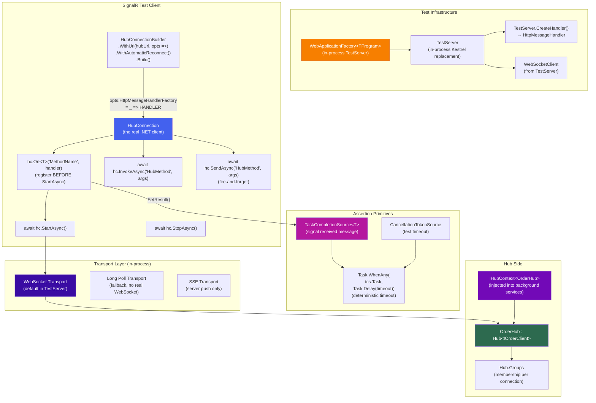

# 4.262 — Testing SignalR: HubConnection in Integration Test Scenarios

---

## PART 0 — Navigation & Context

### Where This Topic Lives

```
ASP.NET Core Mastery
│
├── U. Testing  (4.257–4.267)
│   ├── 4.257  WebApplicationFactory<T>: Integration Testing the Full HTTP Pipeline
│   ├── 4.258  Customizing WebApplicationFactory: Replacing Services for Tests
│   ├── 4.259  Authentication in Integration Tests: Fake Auth Schemes
│   ├── 4.260  Database in Integration Tests: TestContainers vs SQLite vs InMemory
│   ├── 4.261  Middleware Testing: Isolating Middleware Without the Full Pipeline
│   ├── 4.262  ◄ Testing SignalR: HubConnection in Integration Tests  ← YOU ARE HERE
│   ├── 4.263  Testing Background Services: IHostedService Test Harnesses
│   ├── 4.264  Mocking HttpClient: MockHttpMessageHandler
│   ├── 4.265  Snapshot Testing: Verify Library
│   ├── 4.266  Contract Testing: Pact for Consumer-Driven Contracts
│   └── 4.267  Load Testing ASP.NET Core: k6, NBomber, BenchmarkDotNet
│
└── Adjacent subsystems that drive requirements here:
    ├── Q. SignalR & Real-Time  (4.219–4.230)  — the system under test
    ├── J. Authentication       (4.134–4.153)  — JWT in WebSocket upgrade
    └── D. DI                   (4.034–4.048)  — service replacement in test host
```

### What You Need Before This

- **[[4.219 — SignalR Architecture]]** — must understand Hub/connection/transport model before testing it; TestServer replicates this entire stack in-process.
- **[[4.220 — SignalR Hubs]]** — know Hub method signatures, `IHubContext<T>`, group targeting, and `Clients` before writing assertions about them.
- **[[4.257 — WebApplicationFactory<T>]]** — SignalR integration tests extend `WebApplicationFactory`; understanding `CreateClient()` vs the in-process HTTP handler is prerequisite.
- **[[4.259 — Authentication in Integration Tests]]** — SignalR connections almost always require auth; fake schemes and token injection patterns apply directly here.

### What This Unlocks After

- **[[4.223 — SignalR Authentication: JWT in WebSocket Connection Upgrade]]** — testing JWT auth on WebSocket upgrades is the hardest variant; this note builds that foundation.
- **[[4.263 — Testing Background Services]]** — background services that push messages via `IHubContext<T>` can be integration-tested using the same `TestServer` pattern.
- **[[4.267 — Load Testing ASP.NET Core]]** — after correctness testing via integration tests, load-test the hub with concurrent `HubConnection` instances via NBomber.
- **[[4.222 — SignalR Scale-Out: Redis Backplane]]** — integration tests against a Redis-backplaned hub require a TestContainers Redis instance; same factory pattern applies.

### Why This Matters in Production

Real-time features fail in subtle ways that unit tests cannot catch — connection lifecycle timing, hub group membership across multiple server-sent messages, auth token expiry during an active WebSocket session, and message ordering guarantees — all require a running `HubConnection` against a real in-process server to verify, because mocking `IHubContext` only tests message dispatch intent, not the full transport-to-client round-trip.

---

## PART 1 — The Core Mental Model

### The Fundamental Rule

> **Testing SignalR means running a real `HubConnection` against an in-process `TestServer` that uses `WebApplicationFactory`; the client connects over a loopback WebSocket (or long-poll) transport to the same `Hub` code that will run in production, with assertions written against `TaskCompletionSource<T>` signal objects that the client-side handler resolves when the hub sends a message — meaning test correctness depends on timing discipline, not on mocking.**

### The Plain-Language Analogy

Think of SignalR integration testing like testing a radio station's broadcast system in a soundproofed studio. You can't test the broadcast by mocking the transmitter — you have to actually turn it on, tune a real receiver to the frequency, and verify that the audio that comes out matches what went in. The studio is `WebApplicationFactory` (the sealed environment), the transmitter is the `Hub`, and the receiver is `HubConnection`. The `TaskCompletionSource<T>` is the engineer sitting at the receiver with a notebook, writing down exactly what they heard and when. Critically, the analogy holds under adversarial conditions: if the transmitter drops a packet (transport error), the receiver's `On<T>` handler simply never fires, and your `TaskCompletionSource` times out — which is itself the right test failure mode.

### The Taxonomy Diagram



---

## PART 2 — Deep Mechanics

### 2.1 — How `TestServer` Provides a WebSocket Transport

`WebApplicationFactory<TProgram>` creates a `TestServer` — an in-process HTTP server that uses `InMemoryTransport` instead of a real TCP socket. For REST tests, you call `factory.CreateClient()` which returns an `HttpClient` backed by `TestServer.CreateHandler()`. SignalR tests need a _WebSocket_ connection, not just HTTP.

```
Normal HTTP test:
  factory.CreateClient()
    ↓ returns HttpClient
    ↓ backed by TestServer.CreateHandler() (in-process, no TCP)
    ↓ all HTTP verbs work fine

SignalR test:
  TestServer.CreateHandler() also handles WebSocket upgrade requests
  BUT: HubConnectionBuilder.WithUrl() expects a real URI, not a handler

  Solution: intercept the HttpMessageHandler:
  HubConnectionBuilder
    .WithUrl(uri, opts =>
    {
        opts.HttpMessageHandlerFactory = _ => testServer.CreateHandler();
        // ↑ This replaces the real outbound HTTP handler
        //   with the in-process TestServer handler
        //   WebSocket upgrade happens through this same handler
    })
```

**ASP.NET Core internally (approximate):**

```
TestServer.CreateHandler()
  → returns ClientHandler (internal ASP.NET Core class)
  → wraps InMemoryTransportFactory
  → when a WebSocket upgrade request arrives:
      ClientHandler.SendAsync detects Upgrade: websocket header
      → creates a WebSocketPair (two connected in-memory streams)
      → server side: SignalR's WebSocketsServerTransport reads/writes
      → client side: the HubConnection's WebSocket reads/writes
      → no TCP, no port binding, no network stack
```

**Pipeline Position:**

```
Test process:
  HubConnection.StartAsync()
    ──► ClientHandler (TestServer in-process)
          ──► ASP.NET Core Pipeline (in-process)
                ──► ExceptionHandler
                ──► CORS
                ──► Routing  ──► MapHub<OrderHub>("/hubs/orders")
                ──► Auth     ──► JWT validation (real, against test signing key)
                ──► MapHub endpoint executes
                      ──► OrderHub.OnConnectedAsync()
                            ──► Groups.AddToGroupAsync(...)
```

**Runtime cost label:** `in-process transport = zero TCP overhead; WebSocketPair = 2 MemoryStream objects per connection; no serialization to/from network bytes; latency is bounded by thread scheduling, not I/O`

---

### 2.2 — The `HubConnectionBuilder` Configuration for TestServer

The critical nuance: `HubConnectionBuilder.WithUrl()` needs _both_ a URI (for the negotiation/upgrade HTTP request) and an `HttpMessageHandlerFactory` override (to route that request through `TestServer`).

```csharp
// ASP.NET Core internally — what StartAsync does:
// 1. POST /hubs/orders/negotiate (HTTP, gets connectionId + available transports)
// 2. GET /hubs/orders?id={connectionId} with Upgrade: websocket (WebSocket upgrade)
// 3. SignalR handshake JSON sent/received over WebSocket
// 4. Hub.OnConnectedAsync() fires on server
// All four steps go through the same TestServer.CreateHandler()
```

```csharp
// The correct HubConnection setup for TestServer:
private HubConnection CreateHubConnection(
    WebApplicationFactory<Program> factory,
    string hubPath,
    string? accessToken = null)
{
    // Get the TestServer's in-process handler
    // IMPORTANT: must create a new handler per connection in parallel test scenarios
    var handler = factory.Server.CreateHandler();

    return new HubConnectionBuilder()
        .WithUrl($"http://localhost{hubPath}", opts =>
        {
            // Route all HTTP (negotiate + WebSocket upgrade) through TestServer
            opts.HttpMessageHandlerFactory = _ => handler;

            // JWT token injection — same pattern as real client
            if (accessToken is not null)
                opts.AccessTokenProvider = () => Task.FromResult<string?>(accessToken);
        })
        // For test determinism: disable automatic reconnect
        // (reconnect adds non-deterministic timing to test teardown)
        // .WithAutomaticReconnect()  ← do NOT enable in tests unless testing reconnect
        .Build();
}
```

> [!WARNING] Do NOT call `factory.CreateClient()` and try to reuse its handler for `HubConnectionBuilder`. `factory.CreateClient()` returns a pre-configured `HttpClient` — you need the raw `HttpMessageHandler` via `factory.Server.CreateHandler()`. They are different objects. Using the wrong one causes silent negotiation failures.

**HTTP wire format (in-process negotiation — approximate):**

```http
// Step 1: Negotiate (always HTTP POST regardless of transport)
POST /hubs/orders/negotiate?negotiateVersion=1 HTTP/1.1
Host: localhost
Authorization: Bearer eyJ...   ← if auth configured

// Response: 200 OK
Content-Type: application/json
{"negotiateId":"abc123","connectionToken":"xyz","availableTransports":[
  {"transport":"WebSockets","transferFormats":["Text","Binary"]},
  {"transport":"ServerSentEvents","transferFormats":["Text"]},
  {"transport":"LongPolling","transferFormats":["Text","Binary"]}
]}

// Step 2: WebSocket upgrade
GET /hubs/orders?id=xyz HTTP/1.1
Connection: Upgrade
Upgrade: websocket
Sec-WebSocket-Key: dGhlIHNhbXBsZSBub25jZQ==
Authorization: Bearer eyJ...

// Response: 101 Switching Protocols
HTTP/1.1 101 Switching Protocols
Upgrade: websocket
Connection: Upgrade
Sec-WebSocket-Accept: s3pPLMBiTxaQ9kYGzzhZRbK+xOo=
```

---

### 2.3 — `TaskCompletionSource<T>` as the Test Assertion Primitive

This is the architectural center of SignalR testing. Because `hub.On<T>()` registers a callback that fires asynchronously when the server sends a message, tests need a thread-safe mechanism to wait for that callback without polling or `Task.Delay`. `TaskCompletionSource<T>` is the correct primitive.

```csharp
// The wrong pattern — polling:
// ⚠️ WRONG: Non-deterministic, wastes CPU, masks timing bugs
await hc.InvokeAsync("PlaceOrder", orderId);
await Task.Delay(1000);  // hope that 1 second is enough
Assert.Equal("Confirmed", receivedStatus);  // race condition

// The correct pattern:
// ✅ CORRECT: Deterministic signal-and-wait
var messageReceived = new TaskCompletionSource<OrderStatusUpdate>(
    TaskCreationOptions.RunContinuationsAsynchronously);

// Register BEFORE StartAsync — messages can arrive before InvokeAsync returns
hc.On<OrderStatusUpdate>("ReceiveOrderStatus", update =>
{
    messageReceived.TrySetResult(update);  // TrySet: safe against duplicate messages
});

await hc.StartAsync(ct);
await hc.InvokeAsync("PlaceOrder", orderId, ct);

// Wait with deterministic timeout
using var timeoutCts = new CancellationTokenSource(TimeSpan.FromSeconds(5));
var completedTask = await Task.WhenAny(
    messageReceived.Task,
    Task.Delay(Timeout.Infinite, timeoutCts.Token));

if (completedTask != messageReceived.Task)
    throw new TimeoutException("Hub never sent ReceiveOrderStatus within 5 seconds");

var update = await messageReceived.Task;
Assert.Equal("Confirmed", update.Status);
```

**Why `TaskCreationOptions.RunContinuationsAsynchronously`:** Without this flag, the continuation (the test assertion code) runs synchronously on the thread that calls `TrySetResult` — which is the SignalR receive loop thread. This can deadlock if the assertion awaits anything that needs the receive loop. Always use `RunContinuationsAsynchronously` for `TaskCompletionSource` in async test scenarios.

**Runtime cost label:** `TaskCompletionSource<T> = 1 allocation; TrySetResult = O(1) atomic operation; Task.WhenAny = 1 additional allocation; the entire mechanism adds <100ns to receive-path latency`

---

### 2.4 — Transport Selection and `UseWebSockets` in TestServer

`TestServer` supports WebSocket upgrade by default in .NET 6+, but only if `UseWebSockets()` middleware is registered in the app pipeline. If it is absent, `HubConnection.StartAsync()` will fall back to Long Polling or throw depending on transport configuration.

```
Pipeline position — UseWebSockets must precede MapHub:

  ──► UseExceptionHandler
  ──► UseHttpsRedirection (disabled in TestServer — HTTP only)
  ──► UseRouting
  ──► UseWebSockets          ← REQUIRED before MapHub for WS transport
  ──► UseAuthentication
  ──► UseAuthorization
  ──► MapHub<OrderHub>("/hubs/orders")   ← endpoint
```

**Failure mode — missing UseWebSockets:**

```
// HubConnection.StartAsync() output when UseWebSockets is missing:
// System.InvalidOperationException: Unable to connect to the server with any of the
// available transports. (WebSockets failed: The server returned status code '404'
// during the WebSocket upgrade. Ensure the WebSocket server is up and running.)

// HTTP consequence:
// GET /hubs/orders?id=xyz HTTP/1.1
// Upgrade: websocket
// → 404 Not Found (routing matched but no WebSocket handler)
// HubConnection falls back to ServerSentEvents → Long Polling (if configured)
// If only WebSockets is allowed: StartAsync throws
```

```csharp
// Ensure your Program.cs (or test-specific configuration) has:
app.UseWebSockets();
app.MapHub<OrderHub>("/hubs/orders");

// In test factory override — you can force transport for determinism:
var hubConnection = new HubConnectionBuilder()
    .WithUrl($"http://localhost/hubs/orders", opts =>
    {
        opts.HttpMessageHandlerFactory = _ => factory.Server.CreateHandler();
        // Force Long Polling for tests that don't need WebSocket behavior:
        opts.Transports = HttpTransportType.LongPolling;
        // OR force WebSockets only (fails fast if WS not configured):
        opts.Transports = HttpTransportType.WebSockets;
    })
    .Build();
```

**Runtime cost label:** `TestServer WebSocket = in-memory pipe; Long Poll = HTTP request loop with ~50ms delay per message; for test speed, WebSockets is preferred; Long Poll is useful for testing transport fallback behavior specifically`

---

### 2.5 — `IHubContext<T>` in Tests: Server-Initiated Message Testing

Many SignalR test scenarios involve the _server_ pushing a message to the client — not the client invoking a hub method first. This requires the test to trigger the server-side push via `IHubContext<T>` directly, bypassing the client invocation path.

```
Test scenario: background service pushes order status update to connected client.

Architecture:
  Test ──► resolve IHubContext<OrderHub> from factory.Services
        ──► call IHubContext.Clients.Client(connectionId).SendAsync(...)
              ──► message enters SignalR dispatch
                    ──► HubConnection.On<T> fires
                          ──► TCS.SetResult(update)
                                ──► test assertion passes

How to get connectionId in a test:
  Option A: IHub.OnConnectedAsync() stores connectionId → test reads from injected service
  Option B: hc.ConnectionId after StartAsync (available on .NET 7+)
  Option C: inject a test spy IConnectionTracker that records connectionIds on connect
```

```csharp
// Using hc.ConnectionId (.NET 7+):
await hc.StartAsync(ct);
var connectionId = hc.ConnectionId;  // available after successful StartAsync

// Resolve hub context from the test DI container:
using var scope = factory.Services.CreateScope();
var hubContext = scope.ServiceProvider.GetRequiredService<IHubContext<OrderHub>>();

// Push directly to the specific connection:
await hubContext.Clients.Client(connectionId!)
    .SendAsync("ReceiveOrderStatus", new OrderStatusUpdate
    {
        OrderId = "ORD-1234",
        Status = "Shipped",
        Timestamp = DateTimeOffset.UtcNow
    }, ct);
```

> [!IMPORTANT] `IHubContext<T>` is Singleton-scoped — you do not need a new scope to resolve it. However, in a `WebApplicationFactory` test, use `factory.Services.GetRequiredService<IHubContext<T>>()` directly (or via a scope for consistency). The hub context is already wired to the in-process TestServer's connection manager.

---

### 2.6 — Connection Lifecycle: `OnConnectedAsync`, `OnDisconnectedAsync`, Groups

Testing group membership and connection lifecycle events requires understanding that `OnConnectedAsync` runs synchronously before `StartAsync` returns on the client side (the client waits for the server handshake). This means by the time your test's `await hc.StartAsync()` returns, the hub's `OnConnectedAsync` has already executed.

```csharp
// Hub under test:
public class OrderHub : Hub<IOrderHubClient>
{
    private readonly IConnectionTracker _tracker;

    public OrderHub(IConnectionTracker tracker) => _tracker = tracker;

    public override async Task OnConnectedAsync()
    {
        // This runs BEFORE StartAsync() returns on the client
        _tracker.Register(Context.ConnectionId, Context.User?.Identity?.Name);

        // Group join also happens here — synchronously before client StartAsync returns
        if (Context.User?.IsInRole("OrderManager") == true)
            await Groups.AddToGroupAsync(Context.ConnectionId, "order-managers");

        await base.OnConnectedAsync();
    }

    public override async Task OnDisconnectedAsync(Exception? exception)
    {
        _tracker.Unregister(Context.ConnectionId);
        await base.OnDisconnectedAsync(exception);
    }
}

// In the test — after StartAsync, group membership is already established:
await hc.StartAsync(ct);
// At this point: OnConnectedAsync has run, group "order-managers" contains this connection

// Verify via the tracker (injected in test factory):
var tracker = factory.Services.GetRequiredService<IConnectionTracker>();
Assert.True(tracker.IsRegistered(hc.ConnectionId));
```

**Failure mode — group messages not received:**

```
Common bug: joining group AFTER StartAsync in test, then immediately sending group message.
The group join is async — SendAsync to the group might fire before AddToGroupAsync completes.

// HTTP consequence: no message received, TCS times out
// Fix: await the group join explicitly via a dedicated Hub method, 
//      or put group join in OnConnectedAsync (preferred — happens before StartAsync returns)
```

---

## PART 3 — Production Code Patterns

### Pattern 1 — The Base SignalR Test Fixture: Reusable Factory and Connection Builder

```csharp
// ✅ CORRECT: Shared test infrastructure for all SignalR tests
// Domain: Order management system — OrderHub integration tests

// Shared factory with SignalR-specific test services
public class SignalRWebApplicationFactory : WebApplicationFactory<Program>
{
    // In-memory connection tracker shared between Hub and test assertions
    public TestConnectionTracker ConnectionTracker { get; } = new();

    protected override void ConfigureWebHost(IWebHostBuilder builder)
    {
        builder.ConfigureServices(services =>
        {
            // Replace real external dependencies — keep SignalR stack real
            services.RemoveAll<IOrderRepository>();
            services.AddSingleton<IOrderRepository, InMemoryOrderRepository>();

            // Register the test connection tracker so Hub can report connectionIds
            services.AddSingleton<IConnectionTracker>(ConnectionTracker);

            // Keep real JWT auth — use test signing key (same as 4.259 pattern)
            services.PostConfigure<JwtBearerOptions>(JwtBearerDefaults.AuthenticationScheme,
                opts =>
                {
                    opts.TokenValidationParameters.IssuerSigningKey =
                        TestJwtHelper.SigningKey;
                    opts.TokenValidationParameters.ValidIssuer = "test-issuer";
                    opts.TokenValidationParameters.ValidAudience = "test-audience";
                });
        });

        // Force UseWebSockets (may already be in Program.cs — idempotent)
        builder.Configure(app =>
        {
            // If your test needs to verify exact pipeline, configure it here
            // Otherwise rely on Program.cs having UseWebSockets()
        });
    }
}

// Reusable connection builder — centralises TestServer wiring
public static class HubConnectionTestExtensions
{
    public static HubConnection CreateConnection(
        this WebApplicationFactory<Program> factory,
        string hubPath,
        string? accessToken = null,
        HttpTransportType transport = HttpTransportType.WebSockets)
    {
        // Create fresh handler per connection — DO NOT share handlers between connections
        // Sharing causes connection multiplexing bugs in tests
        var handler = factory.Server.CreateHandler();

        var builder = new HubConnectionBuilder()
            .WithUrl($"http://localhost{hubPath}", opts =>
            {
                opts.HttpMessageHandlerFactory = _ => handler;
                opts.Transports = transport;

                if (accessToken is not null)
                    opts.AccessTokenProvider = () => Task.FromResult<string?>(accessToken);
            })
            // ConfigureLogging helps diagnose transport-level failures in CI
            .ConfigureLogging(logging =>
            {
                logging.AddConsole();
                logging.SetMinimumLevel(LogLevel.Debug);
            });

        return builder.Build();
    }
}

// Reusable assertion helper — deterministic wait for a hub message
public static class HubAssert
{
    public static async Task<T> WaitForMessageAsync<T>(
        HubConnection connection,
        string methodName,
        Func<Task> triggerAction,
        TimeSpan? timeout = null)
    {
        var tcs = new TaskCompletionSource<T>(
            TaskCreationOptions.RunContinuationsAsynchronously);

        // Register handler BEFORE triggering — message may arrive before trigger returns
        var registration = connection.On<T>(methodName, msg =>
        {
            tcs.TrySetResult(msg);
        });

        await triggerAction();

        var effectiveTimeout = timeout ?? TimeSpan.FromSeconds(5);
        using var cts = new CancellationTokenSource(effectiveTimeout);
        cts.Token.Register(() =>
            tcs.TrySetException(new TimeoutException(
                $"Hub did not send '{methodName}' within {effectiveTimeout.TotalSeconds}s")));

        try
        {
            return await tcs.Task;
        }
        finally
        {
            registration.Dispose(); // deregister the handler after assertion
        }
    }
}
```

---

### Pattern 2 — Testing a Hub Method Invocation and Server Response

```csharp
// ✅ CORRECT: Full round-trip test — client invokes hub method, asserts server broadcasts
// Domain: Order management — client calls PlaceOrder, hub broadcasts OrderConfirmed

public class OrderHubTests : IClassFixture<SignalRWebApplicationFactory>, IAsyncLifetime
{
    private readonly SignalRWebApplicationFactory _factory;
    private HubConnection _connection = null!;

    public OrderHubTests(SignalRWebApplicationFactory factory) => _factory = factory;

    public async Task InitializeAsync()
    {
        // Generate a real JWT with order manager claims
        var token = TestJwtHelper.GenerateToken(new[]
        {
            new Claim(ClaimTypes.NameIdentifier, "user-42"),
            new Claim(ClaimTypes.Role, "OrderManager"),
            new Claim("tenant_id", "tenant-acme")
        });

        _connection = _factory.CreateConnection("/hubs/orders", accessToken: token);

        // Register handlers BEFORE StartAsync
        // The hub may push data immediately on connect
        _connection.On<OrderConfirmation>("OrderConfirmed", confirmation =>
        {
            // handled per-test via WaitForMessageAsync
        });

        await _connection.StartAsync();
    }

    public async Task DisposeAsync()
    {
        // Always stop cleanly — triggers OnDisconnectedAsync on hub
        if (_connection.State != HubConnectionState.Disconnected)
            await _connection.StopAsync();

        await _connection.DisposeAsync();
    }

    [Fact]
    public async Task PlaceOrder_WhenItemsInStock_BroadcastsOrderConfirmed()
    {
        // Arrange
        var orderId = Guid.NewGuid().ToString();

        // Act + Assert: wait for the hub to broadcast OrderConfirmed
        var confirmation = await HubAssert.WaitForMessageAsync<OrderConfirmation>(
            _connection,
            methodName: "OrderConfirmed",
            triggerAction: () => _connection.InvokeAsync("PlaceOrder", new PlaceOrderRequest
            {
                OrderId = orderId,
                Items = new[] { new OrderItem("SKU-100", 2) }
            }),
            timeout: TimeSpan.FromSeconds(5));

        // Assert on the received message
        Assert.Equal(orderId, confirmation.OrderId);
        Assert.Equal("Confirmed", confirmation.Status);
        Assert.NotNull(confirmation.EstimatedDelivery);
    }

    [Fact]
    public async Task PlaceOrder_WhenOutOfStock_SendsRejectionToCallerOnly()
    {
        // Arrange: seed inventory with zero stock
        var inventory = _factory.Services.GetRequiredService<IOrderRepository>()
            as InMemoryOrderRepository;
        inventory!.SetStock("SKU-999", 0);

        // Track messages sent to Caller (not All)
        var rejectionTcs = new TaskCompletionSource<OrderRejection>(
            TaskCreationOptions.RunContinuationsAsynchronously);

        _connection.On<OrderRejection>("OrderRejected", rejection =>
        {
            rejectionTcs.TrySetResult(rejection);
        });

        // Act
        await _connection.InvokeAsync("PlaceOrder", new PlaceOrderRequest
        {
            OrderId = "ORD-OUT",
            Items = new[] { new OrderItem("SKU-999", 1) }
        });

        // Assert: caller receives rejection within timeout
        using var cts = new CancellationTokenSource(TimeSpan.FromSeconds(5));
        cts.Token.Register(() => rejectionTcs.TrySetCanceled());

        var rejection = await rejectionTcs.Task;
        Assert.Equal("OutOfStock", rejection.Reason);
    }
}
```

```http
// Wire format for the PlaceOrder invocation (approximate JSON over WebSocket):
// → (client → server, WebSocket frame):
// {"type":1,"target":"PlaceOrder","arguments":[{"orderId":"ORD-1234","items":[...]}]}

// ← (server → client, WebSocket frame, broadcast to all in group):
// {"type":1,"target":"OrderConfirmed","arguments":[{"orderId":"ORD-1234","status":"Confirmed",...}]}
```

---

### Pattern 3 — Testing `IHubContext<T>` Server-Push (Background Service Triggered)

```csharp
// ✅ CORRECT: Testing that a background service pushes messages to connected clients
// Domain: Logistics tracking — shipment status updater pushes to connected dispatchers

[Fact]
public async Task ShipmentStatusUpdater_WhenStatusChanges_PushesUpdateToConnectedDispatchers()
{
    // Arrange
    using var factory = new SignalRWebApplicationFactory();
    var dispatcherToken = TestJwtHelper.GenerateToken(new[]
    {
        new Claim(ClaimTypes.NameIdentifier, "dispatcher-7"),
        new Claim(ClaimTypes.Role, "Dispatcher")
    });

    var connection = factory.CreateConnection("/hubs/logistics", accessToken: dispatcherToken);

    var updateReceived = new TaskCompletionSource<ShipmentStatusUpdate>(
        TaskCreationOptions.RunContinuationsAsynchronously);

    // Register BEFORE StartAsync
    connection.On<ShipmentStatusUpdate>("ShipmentUpdated", update =>
    {
        updateReceived.TrySetResult(update);
    });

    await connection.StartAsync();

    // At this point, dispatcher-7 is connected and (per OnConnectedAsync) joined
    // the "dispatchers" group. Verify via tracker:
    Assert.True(factory.ConnectionTracker.IsConnected(connection.ConnectionId!));

    // Act: resolve hub context and push directly — simulating what the background
    // service (ShipmentStatusUpdaterService) does when a new GPS ping arrives
    var hubContext = factory.Services
        .GetRequiredService<IHubContext<LogisticsHub, ILogisticsHubClient>>();

    await hubContext.Clients.Group("dispatchers")
        .ShipmentUpdated(new ShipmentStatusUpdate
        {
            ShipmentId = "SHP-88192",
            Status = "InTransit",
            Location = "Cairo Distribution Center",
            Timestamp = DateTimeOffset.UtcNow
        });

    // Assert: connected client receives the push within 5s
    using var cts = new CancellationTokenSource(TimeSpan.FromSeconds(5));
    cts.Token.Register(() =>
        updateReceived.TrySetException(new TimeoutException("No push received")));

    var received = await updateReceived.Task;
    Assert.Equal("SHP-88192", received.ShipmentId);
    Assert.Equal("InTransit", received.Status);

    // Cleanup
    await connection.StopAsync();
    await connection.DisposeAsync();
}
```

---

### Pattern 4 — Testing Multi-Client Group Messaging

```csharp
// ✅ CORRECT: Verify group isolation — only group members receive the message
// Domain: Order management — order managers see updates, regular users do not

[Fact]
public async Task OrderStatusBroadcast_OnlySendsToOrderManagerGroup_NotAllClients()
{
    using var factory = new SignalRWebApplicationFactory();

    // Client 1: order manager (in "order-managers" group)
    var managerToken = TestJwtHelper.GenerateToken(new[]
    {
        new Claim(ClaimTypes.NameIdentifier, "manager-1"),
        new Claim(ClaimTypes.Role, "OrderManager")
    });

    // Client 2: regular user (NOT in "order-managers" group)
    var userToken = TestJwtHelper.GenerateToken(new[]
    {
        new Claim(ClaimTypes.NameIdentifier, "user-99"),
        new Claim(ClaimTypes.Role, "Customer")
    });

    var managerConnection = factory.CreateConnection("/hubs/orders", managerToken);
    var userConnection = factory.CreateConnection("/hubs/orders", userToken);

    // Track what each client receives
    var managerReceived = new TaskCompletionSource<OrderStatusBroadcast>(
        TaskCreationOptions.RunContinuationsAsynchronously);
    var userReceived = new TaskCompletionSource<OrderStatusBroadcast>(
        TaskCreationOptions.RunContinuationsAsynchronously);

    managerConnection.On<OrderStatusBroadcast>("OrderStatusChanged", m =>
        managerReceived.TrySetResult(m));

    userConnection.On<OrderStatusBroadcast>("OrderStatusChanged", u =>
        userReceived.TrySetResult(u));

    // Start both connections — OnConnectedAsync joins manager to "order-managers" group
    await Task.WhenAll(
        managerConnection.StartAsync(),
        userConnection.StartAsync());

    // Act: send to group only
    var hubContext = factory.Services
        .GetRequiredService<IHubContext<OrderHub>>();

    await hubContext.Clients.Group("order-managers")
        .SendAsync("OrderStatusChanged", new OrderStatusBroadcast
        {
            OrderId = "ORD-5500",
            NewStatus = "Shipped",
            ChangedBy = "system"
        });

    // Assert: manager receives the message
    var managerTask = managerReceived.Task;
    var completedFirst = await Task.WhenAny(managerTask, Task.Delay(TimeSpan.FromSeconds(5)));
    Assert.Equal(managerTask, completedFirst);
    var broadcast = await managerTask;
    Assert.Equal("ORD-5500", broadcast.OrderId);

    // Assert: regular user does NOT receive the message (group isolation)
    // Wait a bit to confirm silence — this is an intentional small delay to verify non-receipt
    var userCompleted = await Task.WhenAny(
        userReceived.Task,
        Task.Delay(TimeSpan.FromMilliseconds(500)));
    Assert.NotEqual(userReceived.Task, userCompleted);  // user task should NOT have completed

    // Cleanup
    await Task.WhenAll(
        managerConnection.StopAsync(),
        userConnection.StopAsync());
    await Task.WhenAll(
        managerConnection.DisposeAsync().AsTask(),
        userConnection.DisposeAsync().AsTask());
}
```

> [!NOTE] The "non-receipt" assertion (`Task.Delay(500)` then check task not completed) is inherently a time-based negative assertion. 500ms is deliberately small — enough to flush the in-process message dispatch, but not so long as to slow the test suite. In CI, if dispatch is slow, increase to 1000ms. Document this as a deliberate timing fence, not a `Thread.Sleep`.

---

### Pattern 5 — Testing Authentication: Unauthenticated Connection Rejection

```csharp
// ✅ CORRECT: Verify that the hub rejects unauthenticated connections
// Domain: Order management — hub requires authentication

[Fact]
public async Task HubConnection_WhenNoToken_FailsToConnect()
{
    using var factory = new SignalRWebApplicationFactory();

    // No access token — unauthenticated connection attempt
    var connection = factory.CreateConnection("/hubs/orders", accessToken: null);

    // The connection closed event fires when auth rejects the upgrade
    var closedTcs = new TaskCompletionSource<Exception?>(
        TaskCreationOptions.RunContinuationsAsynchronously);

    connection.Closed += ex =>
    {
        closedTcs.TrySetResult(ex);
        return Task.CompletedTask;
    };

    // StartAsync throws OR closes immediately depending on transport/negotiation
    var exception = await Assert.ThrowsAsync<HttpRequestException>(async () =>
        await connection.StartAsync());

    // HTTP consequence: the negotiate POST is rejected with 401
    // HTTP/1.1 401 Unauthorized
    // WWW-Authenticate: Bearer
    // StartAsync wraps this as HttpRequestException

    Assert.Contains("401", exception.Message);

    await connection.DisposeAsync();
}

[Fact]
public async Task HubConnection_WhenTokenLacksRequiredRole_FailsNegotiation()
{
    using var factory = new SignalRWebApplicationFactory();

    // Token present but missing required "OrderManager" role
    var limitedToken = TestJwtHelper.GenerateToken(new[]
    {
        new Claim(ClaimTypes.NameIdentifier, "readonly-user"),
        new Claim(ClaimTypes.Role, "ReadOnly")
    });

    var connection = factory.CreateConnection("/hubs/orders", limitedToken);

    // Hub endpoint has [Authorize(Roles = "OrderManager")]
    // 403 Forbidden on negotiate → StartAsync throws
    var ex = await Assert.ThrowsAsync<HttpRequestException>(
        () => connection.StartAsync());

    Assert.Contains("403", ex.Message);

    await connection.DisposeAsync();
}
```

```http
// HTTP wire format — unauthenticated negotiate:
// POST /hubs/orders/negotiate HTTP/1.1
// (no Authorization header)

// HTTP/1.1 401 Unauthorized
// WWW-Authenticate: Bearer error="invalid_token"
// Content-Length: 0

// StartAsync sees 401 → throws HttpRequestException
// SignalR does NOT attempt the WebSocket upgrade after a failed negotiate
```

---

### Pattern 6 — Testing `SendAsync` (Fire-and-Forget) vs `InvokeAsync` (Round-Trip)

```csharp
// ✅ CORRECT: Understanding and testing the semantics of Send vs Invoke
// Domain: Inventory webhook receiver — async notification to all warehouse clients

[Fact]
public async Task NotifyWarehouse_UsingInvokeAsync_WaitsForHubMethodToComplete()
{
    using var factory = new SignalRWebApplicationFactory();
    var token = TestJwtHelper.GenerateToken(
        new Claim(ClaimTypes.Role, "WarehouseManager"));

    var connection = factory.CreateConnection("/hubs/inventory", token);
    await connection.StartAsync();

    // InvokeAsync: client sends message AND waits for hub method to return
    // If hub method throws, InvokeAsync throws here in the test
    var result = await connection.InvokeAsync<StockReservationResult>(
        "ReserveStock",
        new StockReservationRequest { Sku = "SKU-777", Quantity = 5 });

    Assert.True(result.Success);
    Assert.Equal(5, result.QuantityReserved);

    await connection.StopAsync();
    await connection.DisposeAsync();
}

[Fact]
public async Task NotifyWarehouse_UsingSendAsync_FiresAndForgets_HubReceivesMessage()
{
    using var factory = new SignalRWebApplicationFactory();
    var token = TestJwtHelper.GenerateToken(
        new Claim(ClaimTypes.Role, "WarehouseManager"));

    var connection = factory.CreateConnection("/hubs/inventory", token);

    // Track server-side receipt via the test tracker
    var receiptTracker = factory.Services
        .GetRequiredService<InMemoryOrderRepository>() as IStockNotificationTracker;

    await connection.StartAsync();

    // SendAsync: fire-and-forget — does NOT wait for hub method execution
    await connection.SendAsync("NotifyLowStock", "SKU-888");

    // Must poll or signal because SendAsync doesn't wait for hub-side completion
    await Task.Delay(200);  // give the hub message dispatch time to execute

    Assert.True(receiptTracker!.WasNotified("SKU-888"));

    await connection.StopAsync();
    await connection.DisposeAsync();
}
```

> [!TIP] Prefer `InvokeAsync` in tests over `SendAsync` wherever possible. `InvokeAsync` gives you a round-trip guarantee — by the time it returns, the hub method has executed. `SendAsync` is fire-and-forget and requires additional synchronization (like a `TaskCompletionSource` or polling) to assert server-side effects. Use `SendAsync` only when testing that specific fire-and-forget semantic is the point of the test.

---

### Pattern 7 — Testing Reconnect and Connection Lifecycle Events

```csharp
// ✅ CORRECT: Testing connection lifecycle — closed, reconnecting, reconnected events
// Domain: Logistics real-time tracking — verifying reconnect behavior after disconnect

[Fact]
public async Task HubConnection_WhenServerSideDisconnected_RaisesClosedEvent()
{
    using var factory = new SignalRWebApplicationFactory();
    var token = TestJwtHelper.GenerateToken(
        new Claim(ClaimTypes.Role, "Dispatcher"));

    // Build with automatic reconnect disabled — testing clean disconnect
    var handler = factory.Server.CreateHandler();
    var connection = new HubConnectionBuilder()
        .WithUrl("http://localhost/hubs/logistics", opts =>
        {
            opts.HttpMessageHandlerFactory = _ => handler;
            opts.AccessTokenProvider = () => Task.FromResult<string?>(token);
        })
        // No .WithAutomaticReconnect() — testing clean close
        .Build();

    var closedTcs = new TaskCompletionSource<Exception?>(
        TaskCreationOptions.RunContinuationsAsynchronously);

    connection.Closed += ex =>
    {
        closedTcs.TrySetResult(ex);
        return Task.CompletedTask;
    };

    await connection.StartAsync();
    Assert.Equal(HubConnectionState.Connected, connection.State);

    // Force server-side disconnection: abort the connection via IHubContext
    var hubContext = factory.Services
        .GetRequiredService<IHubContext<LogisticsHub>>();

    // AbortAsync terminates the connection from the server side
    await factory.ConnectionTracker.AbortConnectionAsync(connection.ConnectionId!);

    // Assert: Closed event fires with null exception (clean close from server)
    using var cts = new CancellationTokenSource(TimeSpan.FromSeconds(5));
    cts.Token.Register(() => closedTcs.TrySetCanceled());

    var closedException = await closedTcs.Task;
    Assert.Equal(HubConnectionState.Disconnected, connection.State);
    // null exception = graceful close; non-null = transport error
    // For server-initiated abort: may be non-null with OperationCanceledException

    await connection.DisposeAsync();
}
```

---

## PART 4 — Gotchas & Anti-Patterns

### Gotcha 1: Registering `hc.On<T>()` After `StartAsync` Loses Messages

The most pervasive mistake. Engineers write tests in the natural order: connect, then set up handlers. But SignalR dispatches messages immediately upon receipt — if the hub sends a message before the `On<T>` handler is registered, that message is silently dropped.

```csharp
// ⚠️ WRONG: Handler registered after StartAsync — race condition
await hc.StartAsync();
// Hub's OnConnectedAsync may have already sent "WelcomeMessage" here
hc.On<WelcomePayload>("WelcomeMessage", msg => tcs.TrySetResult(msg));
// TCS.Task will time out — the message arrived before the handler was registered

// HTTP consequence (wrong path):
// WebSocket frame with "WelcomeMessage" arrived during StartAsync
// HubConnection has no registered handler → message silently discarded
// TCS never completes → test times out after 5s → flaky CI failure
```

```csharp
// ✅ CORRECT: Register ALL handlers before StartAsync
hc.On<WelcomePayload>("WelcomeMessage", msg => tcs.TrySetResult(msg));
hc.On<OrderConfirmation>("OrderConfirmed", msg => orderTcs.TrySetResult(msg));
hc.On<string>("Error", msg => errorTcs.TrySetResult(msg));
// Only now connect:
await hc.StartAsync();

// HTTP consequence (correct path):
// Handlers registered synchronously before the WebSocket is even opened
// Any message that arrives after the WebSocket opens is routed to the registered handler
// TCS.SetResult fires → test assertion succeeds deterministically
```

**WHY:** `hc.On<T>()` registers a callback in a thread-safe dictionary on the `HubConnection` object. `StartAsync()` opens the WebSocket and begins the receive loop. The receive loop looks up handlers by method name for every incoming frame. If the frame arrives before the handler is registered, the lookup returns null and the message is dropped. There is no buffering.

---

### Gotcha 2: Sharing `TestServer.CreateHandler()` Between Parallel Connections

When running tests that create multiple `HubConnection` objects concurrently (multi-client group tests), engineers sometimes call `CreateHandler()` once and reuse the same handler for all connections. This causes connection state corruption.

```csharp
// ⚠️ WRONG: One handler shared between two connections
var sharedHandler = factory.Server.CreateHandler();

var conn1 = new HubConnectionBuilder()
    .WithUrl("http://localhost/hubs/orders", opts =>
    {
        opts.HttpMessageHandlerFactory = _ => sharedHandler; // ← shared
    })
    .Build();

var conn2 = new HubConnectionBuilder()
    .WithUrl("http://localhost/hubs/orders", opts =>
    {
        opts.HttpMessageHandlerFactory = _ => sharedHandler; // ← same object
    })
    .Build();

// HTTP consequence (wrong path):
// Both connections use the same HttpMessageHandler instance
// SignalR negotiate responses may be delivered to the wrong connection
// OnConnectedAsync fires with interleaved state
// Group membership is undefined — tests produce non-deterministic failures
```

```csharp
// ✅ CORRECT: Fresh handler per connection
var conn1 = new HubConnectionBuilder()
    .WithUrl("http://localhost/hubs/orders", opts =>
    {
        opts.HttpMessageHandlerFactory = _ => factory.Server.CreateHandler(); // ← fresh
    })
    .Build();

var conn2 = new HubConnectionBuilder()
    .WithUrl("http://localhost/hubs/orders", opts =>
    {
        opts.HttpMessageHandlerFactory = _ => factory.Server.CreateHandler(); // ← different instance
    })
    .Build();

// HTTP consequence (correct path):
// Each connection has its own handler, its own negotiate session, its own connectionId
// Messages routed independently — group isolation works correctly
```

**WHY:** `CreateHandler()` returns a new `ClientHandler` instance each time. The `ClientHandler` is not stateless — it tracks the in-progress request/response pairs for its associated in-process connections. Sharing it between multiple long-lived WebSocket connections interleaves their request state.

---

### Gotcha 3: `IAsyncDisposable` vs `IDisposable` — `HubConnection` Cleanup in Tests

`HubConnection` implements `IAsyncDisposable`. Tests that use synchronous `using` blocks silently call the synchronous `Dispose()` path, which triggers a fire-and-forget graceful close — the underlying `StopAsync()` is not awaited, leaving the server-side `OnDisconnectedAsync` in a non-deterministic state between tests.

```csharp
// ⚠️ WRONG: Synchronous disposal — OnDisconnectedAsync not awaited
using var connection = factory.CreateConnection("/hubs/orders", token);
await connection.StartAsync();
// ... test body ...
// End of using block: Dispose() called synchronously
// StopAsync() not awaited → OnDisconnectedAsync runs asynchronously after the test ends
// Next test starts with stale group membership from the previous connection

// HTTP consequence (wrong path):
// Hub's OnDisconnectedAsync hasn't cleaned up group membership
// Next test that checks group size finds +1 ghost member
// Assertion failures in unrelated tests — ghost connection member receives messages
```

```csharp
// ✅ CORRECT: Async disposal using IAsyncDisposable
await using var connection = factory.CreateConnection("/hubs/orders", token);
await connection.StartAsync();
// ... test body ...
// End of await using block: DisposeAsync() called and awaited
// → StopAsync() called and awaited → OnDisconnectedAsync completes before next test

// OR if using try/finally pattern for fine-grained control:
var connection = factory.CreateConnection("/hubs/orders", token);
try
{
    await connection.StartAsync();
    // ... test body ...
}
finally
{
    await connection.StopAsync();    // graceful close first
    await connection.DisposeAsync(); // then release resources
}

// HTTP consequence (correct path):
// OnDisconnectedAsync runs synchronously before test ends
// Group membership cleaned up — no ghost connections in subsequent tests
```

**WHY:** `HubConnection.DisposeAsync()` calls `StopAsync()` internally and awaits it. `HubConnection.Dispose()` calls `StopAsync()` but cannot await it — it fires and forgets. In fast-running test suites, the async cleanup from one test bleeds into the setup of the next.

---

### Gotcha 4: Testing with `WebApplicationFactory` That Uses `CreateDefaultClient` Instead of TestServer Handler

`factory.CreateDefaultClient()` returns an `HttpClient` — perfectly fine for REST tests. But `factory.CreateClient()` and `factory.CreateDefaultClient()` both return `HttpClient` objects whose internal handler is not the same as `factory.Server.CreateHandler()`.

```csharp
// ⚠️ WRONG: Using HttpClient's internal handler for SignalR
var httpClient = factory.CreateClient();  // returns HttpClient

var connection = new HubConnectionBuilder()
    .WithUrl("http://localhost/hubs/orders", opts =>
    {
        // This won't compile — HttpClient is not HttpMessageHandler
        // opts.HttpMessageHandlerFactory = _ => httpClient; ← wrong type

        // What engineers actually try instead:
        // NOT setting HttpMessageHandlerFactory, relying on the URI to work
        // → tries to open a real TCP connection to localhost
        // → connection refused (TestServer is not actually listening on a port)
    })
    .Build();

// HTTP consequence (wrong path):
// HubConnection.StartAsync() throws:
// System.Net.Http.HttpRequestException: No connection could be made because
// the target machine actively refused it. (localhost:80)
// OR: hangs for 30 seconds then times out
```

```csharp
// ✅ CORRECT: Use factory.Server.CreateHandler() — not factory.CreateClient()
var connection = new HubConnectionBuilder()
    .WithUrl("http://localhost/hubs/orders", opts =>
    {
        opts.HttpMessageHandlerFactory = _ => factory.Server.CreateHandler();
        //                                               ↑ This is the right method
    })
    .Build();
```

**WHY:** `factory.CreateClient()` creates an `HttpClient` with an internal `HttpMessageHandler` that routes through TestServer — but that handler is wrapped inside the `HttpClient` and not directly accessible. `factory.Server.CreateHandler()` returns the raw `HttpMessageHandler` needed by `HubConnectionBuilder.WithUrl()`. They are fundamentally different objects.

---

### Gotcha 5: `WithAutomaticReconnect` Breaking Deterministic Test Teardown

Engineers copy production `HubConnectionBuilder` configuration into tests without removing `WithAutomaticReconnect()`. When the test server disposes during test cleanup, the `HubConnection` attempts to reconnect — racing against the `WebApplicationFactory` disposal and causing `ObjectDisposedException` or hanging test teardown.

```csharp
// ⚠️ WRONG: Automatic reconnect in tests
var connection = new HubConnectionBuilder()
    .WithUrl("http://localhost/hubs/orders", opts => { ... })
    .WithAutomaticReconnect(new[] { TimeSpan.Zero, TimeSpan.FromSeconds(1) })
    .Build();

// During teardown:
// 1. Test runner calls DisposeAsync on WebApplicationFactory
// 2. TestServer begins shutdown
// 3. HubConnection detects disconnection
// 4. WithAutomaticReconnect fires → tries to connect to a shutting-down server
// 5. Reconnect attempt gets ObjectDisposedException or OperationCanceledException
// 6. Test runner sees unhandled exception in GC finalizer → CI reports test as errored

// HTTP consequence (wrong path):
// POST /hubs/orders/negotiate during factory shutdown
// → ObjectDisposedException from TestServer
// → Reconnect handler swallows or re-throws → non-deterministic test teardown
```

```csharp
// ✅ CORRECT: No automatic reconnect in tests (unless testing reconnect behavior specifically)
var connection = new HubConnectionBuilder()
    .WithUrl("http://localhost/hubs/orders", opts =>
    {
        opts.HttpMessageHandlerFactory = _ => factory.Server.CreateHandler();
    })
    // DO NOT add .WithAutomaticReconnect() in test factories
    .Build();

// If you are specifically testing reconnect behavior, register the Closed handler
// and control reconnect manually via StartAsync():
connection.Closed += async ex =>
{
    if (testIsStillRunning)
        await connection.StartAsync(cancellationToken);
};

// HTTP consequence (correct path):
// When factory disposes, HubConnection sees Closed event
// No reconnect attempt — connection.State transitions to Disconnected
// Test teardown completes deterministically
```

**WHY:** `WithAutomaticReconnect` installs a `Closed` event handler that calls `StartAsync()` on reconnect delays. During test teardown, these reconnect tasks can outlive the test and race against the `WebApplicationFactory.DisposeAsync()`. The safest pattern is: never use `WithAutomaticReconnect` in the base test connection builder; add it only in tests that explicitly verify reconnect behavior, and cancel it via `CancellationToken` in teardown.

---

## PART 5 — Performance Implications

### 5.1 — Test Suite Pipeline Characteristics

|Scenario|Connections Per Test|Allocations|Test Execution Time|Recommendation|
|---|---|---|---|---|
|Single connection, single invoke + response|1|~50 objects (negotiate + WS handshake + message frames)|50–200ms|Baseline; fine for most tests|
|Single connection, server-push via IHubContext|1|~30 objects (no client invoke)|30–100ms|Fast path — preferred for server-push tests|
|Multi-client group test (2 connections)|2|~100 objects|150–400ms|Acceptable; do not run hundreds in parallel|
|Multi-client group test (10 connections)|10|~500 objects|500ms–2s|Consider splitting into separate test classes|
|Long Polling transport (instead of WebSockets)|1|~100 objects (+HTTP loop overhead)|200–800ms|Use only when testing Long Poll behavior specifically|
|Test with `WithAutomaticReconnect` + forced disconnect|1|~150 objects|1–5s (reconnect delays)|Only in dedicated reconnect tests|
|Full factory creation per test (no `IClassFixture`)|1|+factory startup cost (~200ms)|300–600ms first, 50ms subsequent|Use `IClassFixture` — don't create factory per test|
|Parallel test execution (xUnit, `[Collection]`)|N|N × single-connection cost|Depends on parallelism|Use `[Collection("SignalR")]` to serialize if connections interfere|

### 5.2 — BenchmarkDotNet Scaffold

> [!NOTE] BenchmarkDotNet is not appropriate for micro-benchmarking integration test execution — test setup/teardown cost dominates any measurement. The benchmark below measures the _in-process SignalR message round-trip overhead_ to establish baseline expectations for test design.

```csharp
using BenchmarkDotNet.Attributes;
using BenchmarkDotNet.Running;
using Microsoft.AspNetCore.Mvc.Testing;
using Microsoft.AspNetCore.SignalR.Client;

[MemoryDiagnoser]
public class SignalRInProcessBenchmarks
{
    private WebApplicationFactory<Program> _factory = null!;
    private HubConnection _connection = null!;

    [GlobalSetup]
    public async Task Setup()
    {
        _factory = new WebApplicationFactory<Program>();

        _connection = new HubConnectionBuilder()
            .WithUrl("http://localhost/hubs/orders", opts =>
            {
                opts.HttpMessageHandlerFactory = _ => _factory.Server.CreateHandler();
            })
            .Build();

        await _connection.StartAsync();
    }

    [GlobalCleanup]
    public async Task Cleanup()
    {
        await _connection.StopAsync();
        await _connection.DisposeAsync();
        await _factory.DisposeAsync();
    }

    [Benchmark(Baseline = true)]
    public async Task InvokeAsync_RoundTrip_NoReturn()
    {
        // Hub method: public Task Ping() => Task.CompletedTask;
        await _connection.InvokeAsync("Ping");
    }

    [Benchmark]
    public async Task InvokeAsync_RoundTrip_WithReturnValue()
    {
        // Hub method: public Task<string> Echo(string s) => Task.FromResult(s);
        await _connection.InvokeAsync<string>("Echo", "benchmark-payload");
    }

    [Benchmark]
    public async Task SendAsync_FireAndForget()
    {
        // Hub method: public void Log(string msg) { /* no-op */ }
        await _connection.SendAsync("Log", "benchmark-payload");
    }
}

// Expected output (approximate, .NET 8, x64, in-process TestServer):
// | Method                             | Mean      | Ratio | Gen0   | Alloc   |
// |------------------------------------|-----------|-------|--------|---------|
// | InvokeAsync_RoundTrip_NoReturn     |  250 μs   |  1.00 |  0.8   |  13 KB  |
// | InvokeAsync_RoundTrip_WithReturn   |  280 μs   |  1.12 |  1.0   |  15 KB  |
// | SendAsync_FireAndForget            |  120 μs   |  0.48 |  0.4   |   6 KB  |
//
// Key: In-process SignalR round-trip is ~250μs — dominated by JSON serialization,
// WebSocket frame construction, and async state machine overhead, not network I/O.
// A test suite with 200 SignalR tests will take ~50–200s if each creates a connection.
// Use IClassFixture to share connections and reduce test suite time dramatically.
```

> **Profiling note:** Use `dotnet-trace collect --providers Microsoft-AspNetCore-SignalR` against a running test to observe hub message dispatch, connection lifecycle events, and transport-level activity. For diagnosing flaky tests, add `ConfigureLogging(l => l.AddConsole().SetMinimumLevel(LogLevel.Trace))` to `HubConnectionBuilder` — it logs every frame sent/received.

### 5.3 — When to Care / When to Ignore

**When this costs you:**

- **Large test suites with per-test factory creation**: Each `WebApplicationFactory` creation costs 200–500ms. With 200 SignalR tests each creating their own factory, that's 40–100s of pure startup overhead. Use `IClassFixture<SignalRWebApplicationFactory>` to share the factory within a test class.
- **Parallel test execution across `HubConnection` instances**: In-process `TestServer` has a shared connection manager. Running 20 concurrent `HubConnection` tests against the same factory instance can exhaust the in-process WebSocket pair pool and cause `StartAsync` timeouts. Use `[Collection("SignalR")]` to serialize SignalR integration tests.
- **Long Poll transport in tests**: Long Poll uses HTTP request-response polling with ~50ms intervals. Each message delivery requires a full HTTP round-trip through TestServer. For non-Long Poll behavior verification, always use `HttpTransportType.WebSockets` in tests — it's 5–10x faster.
- **Large message payloads**: JSON serialization in SignalR is synchronous on the dispatch path. Tests with 100KB+ message payloads will visibly slow. Use minimal stub payloads in tests unless testing serialization behavior specifically.

**When this doesn't matter:**

- Tests that run in isolation (not in a large suite) — 250ms per test is invisible when running 10 tests.
- Tests where correctness matters far more than speed — integration tests for SignalR auth, group isolation, or protocol correctness should be thorough even if slow.
- Tests that run only on merge to main branch (not on every commit) — test execution time budget is different from local development CI.
- Simple "does the connection open?" smoke tests — a single `StartAsync`/`StopAsync` pair without message exchange costs <100ms and needs no optimization.

---

## PART 6 — Interview Arsenal

### A. The Question Bank

---

**Question 1: "How do you integration-test a SignalR hub in ASP.NET Core without spinning up a real HTTP server?"**

**Average Answer:** "You use `WebApplicationFactory` and create an `HttpClient` to test it. You can also mock `IHubContext`."

**Why That's Insufficient:** `HttpClient` only covers the HTTP negotiate step — it doesn't give you a real `HubConnection` with message delivery. Mocking `IHubContext` tests dispatch intent, not the actual transport-to-client round-trip. This answer misses the core mechanism.

> **Great Answer:** "The key is that `WebApplicationFactory`'s `TestServer` supports in-process WebSocket connections — no real TCP port needed. I call `factory.Server.CreateHandler()` to get an `HttpMessageHandler`, then pass it to `HubConnectionBuilder.WithUrl()` via `opts.HttpMessageHandlerFactory`. This routes the SignalR negotiate POST and the WebSocket upgrade request through the in-process TestServer, so I get a fully functional `HubConnection` that speaks real SignalR protocol against the real hub code. For assertions, I use `TaskCompletionSource<T>` with `RunContinuationsAsynchronously` — I register `hc.On<T>()` before calling `StartAsync`, then call `Task.WhenAny(tcs.Task, Task.Delay(timeout))` to deterministically wait for messages. The critical rule is: register all handlers before `StartAsync`, because messages that arrive before a handler is registered are silently dropped."

---

**Question 2: "What's the difference between `hc.InvokeAsync` and `hc.SendAsync`, and how does that affect test design?"**

**Average Answer:** "InvokeAsync waits for the hub method to complete. SendAsync doesn't. Use InvokeAsync when you need a return value."

**Why That's Insufficient:** Correct but incomplete. Misses the test design consequence: `SendAsync` requires additional synchronization to assert server-side effects, while `InvokeAsync` provides the round-trip guarantee automatically. Doesn't address how you assert after `SendAsync`.

> **Great Answer:** "The difference is the protocol-level acknowledgment. `InvokeAsync` sends a completion-type invocation — SignalR tracks the invocation ID, and the hub sends a completion message back when the method finishes. My `InvokeAsync` call doesn't return until that completion arrives, so by the time it returns, I know the hub method has executed. `SendAsync` sends a one-way message with no completion tracking — it returns as soon as the frame is written to the wire, with no guarantee that the hub has processed it yet. In test design this matters enormously. When I test a `InvokeAsync` call that triggers a broadcast, I can set up the `TCS` before `InvokeAsync` and assert after it returns. When I test `SendAsync`, I need separate synchronization — either a `TaskCompletionSource` resolved by the side-effect I'm verifying, or a short `Task.Delay` fence that I document as intentional. I use `InvokeAsync` by default in tests precisely because it eliminates a whole class of timing ambiguity."

---

**Question 3: "Why does the circuit-breaker reset every time the handler rotates — wait, wrong topic. Let me ask: why do SignalR integration tests sometimes pass locally but fail in CI? What are the common causes?"**

**Average Answer:** "Timing issues — CI is slower so delays need to be longer. Race conditions in async tests."

**Why That's Insufficient:** Correct category but not specific. Doesn't name the actual failure modes specific to SignalR tests.

> **Great Answer:** "There are three specific causes I've hit in production CI environments. First, handler registration timing: CI machines under load take longer to execute the async state machine transitions after `StartAsync` returns. If a hub sends a message synchronously in `OnConnectedAsync` and the CI machine's thread scheduler hasn't gotten to the `On<T>` registration yet, the message is dropped. The fix is always registering handlers before `StartAsync`. Second, factory sharing across parallel test runners: xUnit runs test classes in parallel by default. If two test classes share a `WebApplicationFactory` without `[Collection]` isolation, concurrent `HubConnection` instances may interfere with each other's group membership or connection state. Third, non-deterministic teardown from `WithAutomaticReconnect`: reconnect logic races against factory disposal in CI, producing `ObjectDisposedException` on the GC finalizer thread which appears as an unrelated test failure. I serialize SignalR tests with `[Collection]`, never use `WithAutomaticReconnect` in test builders, and use `TaskCompletionSource` instead of `Task.Delay` for all message assertions."

---

**Question 4: "How do you test that only group members receive a message in SignalR?"**

**Average Answer:** "Connect multiple clients, send to the group, check that only the right client got the message."

**Why That's Insufficient:** Correct approach but no technique for asserting _non-receipt_. Asserting that something _didn't_ happen is the hard problem.

> **Great Answer:** "Asserting receipt is straightforward — `TaskCompletionSource<T>` resolved by `On<T>` callback. Asserting non-receipt is the tricky part. My approach: I set up a `TaskCompletionSource` on the non-group client's handler, then after sending the group message and confirming the group member received it via their `TCS`, I do `await Task.WhenAny(nonMemberTcs.Task, Task.Delay(500))` and assert that the result is `Task.Delay`, not the `TCS`. The 500ms window is deliberately small — enough for the in-process TestServer to flush the message dispatch, but short enough that it doesn't significantly slow the test. I document this explicitly as a timing fence. I also verify the group join happened correctly by checking the connection tracker in `OnConnectedAsync`. The failure mode I watch for is the non-member handler being registered with the wrong method name — silent non-receipt looks identical to correctly blocked non-receipt, so I add a sanity test that the non-member _does_ receive a message sent to `Clients.All` as a control case."

---

### B. The Trick Questions

**Trick 1: "If I call `hc.StartAsync()` and then immediately assert on data populated by `OnConnectedAsync`, is the assertion safe?"**

_The trap:_ Engineers think there's a race between `StartAsync` returning and `OnConnectedAsync` completing. _Correct answer:_ Yes, the assertion is safe. `StartAsync` does not return until the SignalR handshake is fully complete, which means `OnConnectedAsync` has already returned on the server side. The client's `StartAsync` awaits the server handshake response, which is only sent after `OnConnectedAsync` completes. Any state set in `OnConnectedAsync` (group membership, tracker registration) is guaranteed to be present when `StartAsync` returns on the client.

**Trick 2: "Can you use `factory.CreateClient()` to perform the SignalR negotiate request in tests?"**

_The trap:_ Yes, technically you _can_ — negotiate is a regular HTTP POST. But `factory.CreateClient()` gives you an `HttpClient`, not an `HttpMessageHandler`. `HubConnectionBuilder` needs a `HttpMessageHandler`. The distinction matters because SignalR's `HubConnectionBuilder` must intercept both the negotiate request _and_ the WebSocket upgrade request through the same handler. `factory.CreateClient()` returns a pre-configured `HttpClient` whose handler is not accessible for injection into `HubConnectionBuilder`.

**Trick 3: "What happens if you call `hc.StopAsync()` and then `hc.DisposeAsync()` during test teardown? Is calling both necessary?"**

_Correct answer:_ `DisposeAsync()` internally calls `StopAsync()` if the connection is still connected, so calling both is redundant but safe (idempotent). However, calling `StopAsync()` explicitly before `DisposeAsync()` gives you the opportunity to `await` the graceful close and verify that `OnDisconnectedAsync` has completed before the test ends. `DisposeAsync()` alone does await `StopAsync()` internally, but calling `StopAsync()` first is clearer intent in tests. The important rule: always use `await using` or explicit `await connection.DisposeAsync()` — never synchronous `using var connection`.

**Trick 4: "If a hub method throws an exception, what does the test client see?"**

_Correct answer:_ `InvokeAsync` throws `HubException` containing the server exception message (or a generic message if hub error detail disclosure is disabled via `AddSignalR(opts => opts.EnableDetailedErrors = false)`). The `HubException.Message` is the string passed to the client. In development/test environments, `EnableDetailedErrors = true` (or enabled explicitly in the test factory) exposes the full exception message. `SendAsync` does not surface hub exceptions — the server logs them but the client gets no notification.

**Trick 5: "You have a typed hub `Hub<IOrderHubClient>`. How does your test assert that a hub method calling `Clients.All.SendOrderUpdate(...)` actually works?"**

_Correct answer:_ The same `HubConnection.On<T>("SendOrderUpdate", ...)` pattern — the client doesn't care whether the hub is strongly typed (`Hub<T>`) or not. The typed interface `IOrderHubClient.SendOrderUpdate(...)` on the server maps to a method name `"SendOrderUpdate"` on the wire. The client registers `hc.On<OrderUpdate>("SendOrderUpdate", callback)` using the same string name. The test doesn't use the `IOrderHubClient` interface at all — the interface is a server-side compile-time convenience; the wire protocol is always method name + arguments.

---

### C. Red Flags to Avoid

1. **"I use `Task.Delay(2000)` to wait for hub messages in tests"** — fixed delays are a code smell indicating you don't understand `TaskCompletionSource`. They make tests slow, flaky, and non-deterministic. Always use `TCS` + `Task.WhenAny` with a deterministic timeout.
    
2. **"I mock `IHubContext<T>` to test my hub"** — mocking `IHubContext` tests that `SendAsync` was called with the right arguments. It does not test that the message was delivered to the connected client, that group membership was correct, or that the transport handled the message correctly. It tests dispatch intent only. For production quality, you need a real `HubConnection` in the test.
    
3. **"I register `hc.On<T>` after `StartAsync` and it works fine in my local tests"** — this is a latent race condition. It works locally because the local machine processes `OnConnectedAsync` slowly enough that the handler is registered first. In CI, timing is different. "It works locally" is the definition of a flaky test waiting to happen.
    
4. **"I can use the same `WebApplicationFactory` instance in parallel tests without any isolation"** — the SignalR connection manager is shared within a factory. Parallel tests modifying group membership or checking connection counts will interfere with each other. Use `[Collection("SignalR")]` to serialize, or create per-test factory instances (accepting the startup cost).
    
5. **"The negotiate step is just HTTP, so I can skip it and connect directly to the WebSocket endpoint"** — you cannot. SignalR's negotiate step is required — it establishes the `connectionToken` that authenticates the subsequent WebSocket upgrade. Bypassing negotiate causes the WebSocket upgrade to return 400 Bad Request (missing connection token). The `HubConnection` client handles this correctly; don't implement your own negotiate bypass in tests.
    
6. **"`hc.ConnectionId` is always available after `new HubConnectionBuilder().Build()`"** — it is only populated after `StartAsync()` completes. Before `StartAsync`, `ConnectionId` is null. Tests that try to read `ConnectionId` before `StartAsync` to route messages will get null and fail silently or throw NRE.
    
7. **"I can test SignalR without `UseWebSockets()` in the pipeline — Long Poll works fine"** — technically true, but Long Poll is fundamentally different from WebSocket semantics for some tests. Message ordering, server-push latency, and connection lifecycle events differ between transports. Tests that don't explicitly target Long Poll behavior should use `HttpTransportType.WebSockets` for accuracy.
    
8. **"I close the connection by disposing the factory — `StopAsync` is unnecessary"** — when the factory disposes, open connections are aborted (not gracefully closed). This means `OnDisconnectedAsync` on the hub receives a non-null `Exception` (abort exception), not `null` (graceful close). If your test or the next test depends on the hub cleaning up state in `OnDisconnectedAsync`, an abrupt factory disposal leaves state dirty. Always `StopAsync` before factory disposal.
    

---

## PART 7 — Decision Framework

```mermaid
flowchart TD
    START([Need to test SignalR behavior?]) --> TESTTYPE{What behavior\nare you testing?}

    TESTTYPE -->|Hub method logic only,\nno transport needed| UNIT[Unit test Hub class directly\nMock IHubCallerClients\nMock other dependencies\n→ fast, no TestServer]

    TESTTYPE -->|Full round-trip:\nclient → hub → client| INTEGRATION[Integration test\nwith real HubConnection]

    TESTTYPE -->|Server pushes to client\n(IHubContext, background svc)| SERVERPUSH[Integration test\nvia IHubContext from factory.Services]

    INTEGRATION --> AUTHNEEDED{Auth required\nfor the hub?}
    AUTHNEEDED -->|Yes — JWT or Cookie| FAKEAUTH[Use TestJwtHelper\nGenerate real JWT with test key\nPostConfigure JwtBearerOptions\nwith test signing key]
    AUTHNEEDED -->|No auth, or anonymous hub| NOAUTH[No token needed\nSkip AccessTokenProvider]

    FAKEAUTH --> BUILDCONNECTION[Build HubConnection:\nServer.CreateHandler()\nHttpMessageHandlerFactory\nAccessTokenProvider]
    NOAUTH --> BUILDCONNECTION

    BUILDCONNECTION --> REGISTERON[Register hc.On&lt;T&gt; handlers\nBEFORE StartAsync]
    REGISTERON --> STARTASYNC[await hc.StartAsync]

    STARTASYNC --> ASSERTTYPE{What are you\nasserting?}

    ASSERTTYPE -->|Client receives a message| TCSASSERT[TaskCompletionSource&lt;T&gt;\nOn&lt;T&gt; calls TrySetResult\nTask.WhenAny with timeout]

    ASSERTTYPE -->|Hub method return value| INVOKEASYNC[await hc.InvokeAsync&lt;T&gt;\nAssert return value directly]

    ASSERTTYPE -->|Group isolation\n(non-receipt)| NORECEIPTASSERT[TCS on both clients\nAssert group client TCS completed\nAssert non-member TCS NOT completed\nin 500ms window]

    ASSERTTYPE -->|Server-side state change| SIDEFFECT[Assert via injected\ntest spy service\nretrieved from factory.Services]

    TCSASSERT --> CLEANUP[await hc.StopAsync\nawait hc.DisposeAsync\n→ triggers OnDisconnectedAsync]
    INVOKEASYNC --> CLEANUP
    NORECEIPTASSERT --> CLEANUP
    SIDEFFECT --> CLEANUP

    SERVERPUSH --> GETCONTEXT[Resolve IHubContext&lt;T&gt;\nfrom factory.Services\nGet connectionId from\nhc.ConnectionId after StartAsync]
    GETCONTEXT --> PUSHASSERT[Push via hubContext.Clients.Client\nor .Group or .All\nAssert via TCS on client On&lt;T&gt;]
    PUSHASSERT --> CLEANUP

    UNIT --> DONE([Fast unit test ✓])
    CLEANUP --> PARALLELCHECK{Multiple\nconnections?}
    PARALLELCHECK -->|Yes — group tests,\nmulti-client| SERIALIZE[Use IClassFixture\nAdd Collection attribute\nCreate fresh handler per connection]
    PARALLELCHECK -->|No — single connection| FIXTURE[IClassFixture or\nper-test factory\n\IClassFixture preferred]
    SERIALIZE --> DONE2([Integration test ✓])
    FIXTURE --> DONE2

    style UNIT fill:#2d6a4f,color:#fff
    style INTEGRATION fill:#4361ee,color:#fff
    style TCSASSERT fill:#b5179e,color:#fff
    style FAKEAUTH fill:#f77f00,color:#fff
    style NORECEIPTASSERT fill:#7209b7,color:#fff
    style SERVERPUSH fill:#3a0ca3,color:#fff
```

---

## PART 8 — Self-Check

### A. Conceptual Questions

1. Why must `hc.On<T>()` handlers be registered before `hc.StartAsync()`, and what happens if they're registered after?
    
2. What is `TestServer.CreateHandler()` and why is it different from `factory.CreateClient()`? Which do you use for `HubConnectionBuilder` and why?
    
3. Describe the exact sequence of HTTP requests that `hc.StartAsync()` makes. What does each request do, and what does the server respond with?
    
4. What is `TaskCreationOptions.RunContinuationsAsynchronously`, and why is it required on the `TaskCompletionSource<T>` used in SignalR test assertions?
    
5. What happens to the circuit breaker state — wait, wrong domain. What happens to circuit breaker state when `IHttpClientFactory` rotates handlers? — That's Polly. Back on topic: What happens to hub `OnDisconnectedAsync` when a test ends by calling `factory.DisposeAsync()` without calling `hc.StopAsync()` first?
    
6. Explain the difference between `Clients.All.SendAsync()`, `Clients.Caller.SendAsync()`, and `Clients.Group("name").SendAsync()` from a test design perspective. How does each require a different assertion strategy?
    
7. Why does `WithAutomaticReconnect()` cause non-deterministic test teardown? What specific exception appears and when?
    
8. In a multi-client group isolation test, you assert that the non-group client did _not_ receive a message by checking `Task.WhenAny(nonMemberTcs.Task, Task.Delay(500))`. What is the weakness of this approach and how would you make it more robust?
    
9. How do you test a hub method that requires the caller to be in a specific ASP.NET Core role, and what does the hub return if the user lacks that role?
    
10. What does `hc.ConnectionId` contain before `StartAsync()` completes, and when is it safe to use it to route server-to-client pushes via `IHubContext<T>.Clients.Client(id)`?
    

---

### B. Code Puzzles

**Puzzle 1 — What is the test outcome?**

```csharp
// Hub method:
public class NotificationHub : Hub
{
    public override async Task OnConnectedAsync()
    {
        await Clients.Caller.SendAsync("Welcome", $"Hello, {Context.ConnectionId}");
        await base.OnConnectedAsync();
    }
}

// Test:
var tcs = new TaskCompletionSource<string>(
    TaskCreationOptions.RunContinuationsAsynchronously);

var connection = factory.CreateConnection("/hubs/notifications");
await connection.StartAsync();
// ← handler registration happens here (after StartAsync)
connection.On<string>("Welcome", msg => tcs.TrySetResult(msg));

var completed = await Task.WhenAny(tcs.Task, Task.Delay(TimeSpan.FromSeconds(3)));
Assert.Equal(tcs.Task, completed);
```

<details> <summary>Answer</summary>

**Test fails with a timeout.** The `tcs.Task` never completes; `Task.WhenAny` resolves on `Task.Delay` after 3 seconds, and the `Assert.Equal` fails.

The "Welcome" message is sent by `OnConnectedAsync` during `StartAsync`. By the time `StartAsync` returns, `OnConnectedAsync` has already executed and the "Welcome" message was dispatched to the client. At that point, no `On<string>("Welcome", ...)` handler was registered — the `HubConnection` received the message, found no handler, and silently discarded it.

**Fix:** Register the `On<string>("Welcome", ...)` handler before `StartAsync()`.

</details>

---

**Puzzle 2 — Where is the bug?**

```csharp
// Test for group isolation:
var managerTcs = new TaskCompletionSource<string>(
    TaskCreationOptions.RunContinuationsAsynchronously);

var handler = factory.Server.CreateHandler();  // ← created once

var managerConn = new HubConnectionBuilder()
    .WithUrl("http://localhost/hubs/orders", opts =>
    {
        opts.HttpMessageHandlerFactory = _ => handler;  // ← shared
        opts.AccessTokenProvider = () => Task.FromResult<string?>(managerToken);
    })
    .Build();

var userConn = new HubConnectionBuilder()
    .WithUrl("http://localhost/hubs/orders", opts =>
    {
        opts.HttpMessageHandlerFactory = _ => handler;  // ← same handler
        opts.AccessTokenProvider = () => Task.FromResult<string?>(userToken);
    })
    .Build();

managerConn.On<string>("GroupMessage", m => managerTcs.TrySetResult(m));
await managerConn.StartAsync();
await userConn.StartAsync();
```

<details> <summary>Answer</summary>

**The bug is the shared `handler` instance.** Both `managerConn` and `userConn` use the same `TestServer.CreateHandler()` return value. `ClientHandler` is not thread-safe for concurrent connections — it maintains internal state about in-progress request/response pairs. Two concurrent `StartAsync()` calls through the same handler will interleave their negotiate HTTP requests and potentially receive each other's negotiate responses.

**Symptoms:** One or both connections may fail to start with an `InvalidOperationException` or `IOException`. Group membership may be assigned to the wrong connection. The `managerTcs` may never complete or may receive messages from the wrong connection.

**Fix:** Call `factory.Server.CreateHandler()` separately for each connection:

```csharp
opts.HttpMessageHandlerFactory = _ => factory.Server.CreateHandler(); // unique per conn
```

</details>

---

**Puzzle 3 — What HTTP status code does `StartAsync` throw when hub has `[Authorize]` and no token is provided?**

```csharp
// Hub:
[Authorize]
public class OrderHub : Hub { ... }

// Program.cs:
app.MapHub<OrderHub>("/hubs/orders").RequireAuthorization();

// Test:
var connection = new HubConnectionBuilder()
    .WithUrl("http://localhost/hubs/orders", opts =>
    {
        opts.HttpMessageHandlerFactory = _ => factory.Server.CreateHandler();
        // NO AccessTokenProvider — unauthenticated
    })
    .Build();

// Q: What exception type and message does StartAsync throw?
// Q: Which step in the SignalR connection sequence triggers the rejection?
await connection.StartAsync();  // throws?
```

<details> <summary>Answer</summary>

**`StartAsync` throws `HttpRequestException`.** The message includes "401" (Unauthorized).

The rejection happens at the **negotiate step** — the very first HTTP request that `StartAsync` makes, which is a `POST /hubs/orders/negotiate`. This request has no `Authorization` header. The authentication middleware runs, sees no bearer token, and invokes the JWT challenge response, returning:

```http
HTTP/1.1 401 Unauthorized
WWW-Authenticate: Bearer
Content-Length: 0
```

`StartAsync` receives this 401 and throws `HttpRequestException` with a message like "Response status code does not indicate success: 401 (Unauthorized)". **The WebSocket upgrade is never attempted** — SignalR does not proceed past a failed negotiate. The `Closed` event fires with the exception, and `connection.State` becomes `Disconnected`.

In tests, assert this with:

```csharp
var ex = await Assert.ThrowsAsync<HttpRequestException>(
    () => connection.StartAsync());
Assert.Contains("401", ex.Message);
```

</details>

---

**Puzzle 4 — Will this test pass? What is the subtle race?**

```csharp
[Fact]
public async Task MultipleMessages_AllReceived()
{
    var received = new List<int>();
    var connection = factory.CreateConnection("/hubs/counter");

    connection.On<int>("Count", n =>
    {
        received.Add(n);  // ← adding to a List<int>
    });

    await connection.StartAsync();

    // Hub sends 10 sequential Count messages immediately on connect:
    // for i in 0..9: await Clients.Caller.SendAsync("Count", i)

    await Task.Delay(1000); // wait for all messages

    Assert.Equal(10, received.Count);
    Assert.Equal(Enumerable.Range(0, 10), received);
}
```

<details> <summary>Answer</summary>

**The test will likely pass in practice but has a correctness bug: `List<int>` is not thread-safe.**

The `On<int>("Count", ...)` callback fires on the SignalR receive loop thread (or a thread pool thread in some transport configurations). If SignalR delivers messages concurrently (unlikely for a single connection's sequential messages, but theoretically possible), concurrent `Add` operations on `List<int>` can corrupt the list or produce incorrect counts.

**Real bug in this code:** The `Task.Delay(1000)` is a fixed wait — the classic `Task.Delay` anti-pattern. If the hub sends all 10 messages within 1ms (in-process), the test takes 1 full second unnecessarily. If CI is slow and messages take >1s, the test fails.

**Correct pattern:**

```csharp
var received = new ConcurrentBag<int>(); // or Channel<int>
var allReceived = new TaskCompletionSource<List<int>>(
    TaskCreationOptions.RunContinuationsAsynchronously);

connection.On<int>("Count", n =>
{
    received.Add(n);
    if (received.Count == 10)
        allReceived.TrySetResult(received.OrderBy(x => x).ToList());
});

await connection.StartAsync();

using var cts = new CancellationTokenSource(TimeSpan.FromSeconds(5));
cts.Token.Register(() => allReceived.TrySetCanceled());
var result = await allReceived.Task;

Assert.Equal(10, result.Count);
Assert.Equal(Enumerable.Range(0, 10), result);
```

</details>

---

**Puzzle 5 (Core Misunderstanding) — Why does this test sometimes pass and sometimes fail in CI?**

```csharp
// This is the most common SignalR test bug:
[Fact]
public async Task OrderPlaced_ManagerReceivesNotification()
{
    var factory = new WebApplicationFactory<Program>();
    var token = TestJwtHelper.GenerateToken(
        new Claim(ClaimTypes.Role, "OrderManager"));

    var connection = new HubConnectionBuilder()
        .WithUrl("http://localhost/hubs/orders", opts =>
        {
            opts.HttpMessageHandlerFactory = _ => factory.Server.CreateHandler();
            opts.AccessTokenProvider = () => Task.FromResult<string?>(token);
        })
        .WithAutomaticReconnect()  // ← production config copy-paste
        .Build();

    var tcs = new TaskCompletionSource<OrderNotification>(
        TaskCreationOptions.RunContinuationsAsynchronously);

    connection.On<OrderNotification>("OrderPlaced", n => tcs.TrySetResult(n));

    await connection.StartAsync();
    await connection.InvokeAsync("PlaceOrder", "ORD-TEST-1");

    var notification = await tcs.Task.WaitAsync(TimeSpan.FromSeconds(5));
    Assert.Equal("ORD-TEST-1", notification.OrderId);

    // Implicit disposal via end of test
}
```

<details> <summary>Answer</summary>

**Three bugs, all contributing to CI flakiness:**

**Bug 1 (primary): `WithAutomaticReconnect()` during teardown.** When the test ends without explicit `StopAsync`/`DisposeAsync`, the test framework disposes the `WebApplicationFactory`. The in-process TestServer shuts down, breaking the WebSocket connection. `WithAutomaticReconnect` fires and tries `StartAsync` on a server that's disposing. This throws `ObjectDisposedException` on a background thread, which the xUnit test runner may surface as an unrelated error or cause the test process to crash in CI.

**Bug 2: No `StopAsync` or `DisposeAsync` on `HubConnection`.** The connection leaks. xUnit doesn't await `HubConnection.DisposeAsync()` automatically — it only calls `Dispose()` if the test class implements `IDisposable`. The async disposal path is never taken, leaving the WebSocket connection open during factory teardown.

**Bug 3: New `WebApplicationFactory` per test.** Creates a new in-process server for each test run. For a single test this is fine, but if this pattern is used across 50 tests, the test suite takes 50× factory startup time. Use `IClassFixture<WebApplicationFactory<Program>>`.

**Fix:**

```csharp
// Use IClassFixture for factory
// No WithAutomaticReconnect
// Explicit StopAsync + DisposeAsync in IAsyncLifetime.DisposeAsync or finally block
try
{
    await connection.StartAsync();
    // ... test body
}
finally
{
    await connection.StopAsync();
    await connection.DisposeAsync();
}
```

</details>

---

## PART 9 — Connections & Resources

### A. Related Topics Table

|Topic|Why It Connects|
|---|---|
|[[4.219 — SignalR Architecture: Hubs, Connections, and Transport Negotiation]]|The negotiate-then-upgrade HTTP sequence that `StartAsync` performs is defined by the SignalR protocol; understanding it is prerequisite for debugging test connection failures|
|[[4.220 — SignalR Hubs: Hub<T>, Methods, Caller, Groups, All Targeting]]|Hub method names, group APIs, and `IHubCallerClients` are what integration tests call and assert against; `On<T>` method names must match hub broadcast method names exactly|
|[[4.223 — SignalR Authentication: JWT in WebSocket Connection Upgrade]]|JWT token injection via `AccessTokenProvider` is the canonical auth pattern; the negotiate-time authentication flow differs from standard HTTP bearer auth and is tested here|
|[[4.257 — WebApplicationFactory<T>: Integration Testing the Full HTTP Pipeline]]|`WebApplicationFactory` provides `TestServer` and `Server.CreateHandler()`; without this foundation, SignalR integration tests cannot function|
|[[4.258 — Customizing WebApplicationFactory: Replacing Services for Tests]]|Service replacement (`PostConfigure`, `RemoveAll`, `AddSingleton`) is how you inject test JWT signing keys and fake repositories into the SignalR test host|
|[[4.259 — Authentication in Integration Tests: Custom Fake Auth Schemes]]|The test JWT signing key pattern (`PostConfigure<JwtBearerOptions>`) applies directly to SignalR hub auth; same signing key must be used server-side and in `TestJwtHelper.GenerateToken`|
|[[4.221 — SignalR Transports: WebSockets, SSE, and Long Polling Negotiation]]|`opts.Transports = HttpTransportType.WebSockets` vs Long Polling affects test behavior and performance; Long Poll tests have different timing characteristics for message delivery|
|[[4.035 — Service Lifetimes: Singleton, Scoped, Transient]]|`IHubContext<T>` is Singleton; hub instances are Transient (one per invocation); understanding lifetimes explains why test-injected services must be Singleton to share state with hub instances|
|[[4.232 — BackgroundService: The Base Class for Long-Running Work]]|Background services that push via `IHubContext<T>` can be tested by resolving `IHubContext` directly in tests (simulating what the background service does) rather than starting the background service|
|[[4.260 — Database in Integration Tests: TestContainers vs SQLite vs InMemory]]|If hub methods depend on a database (order status from EF Core), the same InMemory or TestContainers pattern for seeding test data applies to SignalR integration tests|
|[[2.14 — Async/Await Internals]]|`TaskCompletionSource<T>`, `TaskCreationOptions.RunContinuationsAsynchronously`, and `Task.WhenAny` are the async primitives at the core of every SignalR test assertion; understanding their execution semantics is non-optional|

### B. Books

|Book|Chapters|Why These Chapters|
|---|---|---|
|**"xUnit Test Patterns: Refactoring Test Code" — Gerard Meszaros**|Chapter 8 (Transient Failure), Chapter 11 (Using Test Doubles), Appendix B (Test Smells: Erratic Test)|Ch. 8 covers the non-deterministic test patterns that afflict SignalR tests (shared fixture interference, async timing); the Erratic Test smell appendix directly describes `Task.Delay`-based timing as a test smell|
|**"The Art of Unit Testing" — Roy Osherove (3rd Ed.)**|Chapter 6 (Integration Tests), Chapter 9 (Dealing with Legacy Code)|Ch. 6 draws the boundary between unit tests (mock `IHubCallerClients`) and integration tests (real `HubConnection`); Ch. 9 covers test fixture management patterns applicable to `WebApplicationFactory` lifecycle|
|**"Concurrency in C# Cookbook" — Stephen Cleary**|Chapter 2 (Async Basics), Chapter 11 (Synchronization)|Ch. 11's `AsyncManualResetEvent` and `AsyncAutoResetEvent` are the foundation of `TaskCompletionSource` patterns; the "async signaling" recipes are exactly what SignalR tests need|
|**"Testing ASP.NET Core Applications" — Andrew Lock (Pro .NET book series)**|Part III (Integration Testing)|Andrew Lock is the primary .NET community source for `WebApplicationFactory` patterns; his integration testing chapters include SignalR-specific examples|

### C. Essential Articles & Docs

- **Microsoft Docs — Test ASP.NET Core SignalR apps**: [https://learn.microsoft.com/en-us/aspnet/core/signalr/test](https://learn.microsoft.com/en-us/aspnet/core/signalr/test) — Official documentation covering `WebApplicationFactory` + `HubConnection` integration test setup
- **Microsoft Docs — WebApplicationFactory and TestServer**: [https://learn.microsoft.com/en-us/aspnet/core/test/integration-tests](https://learn.microsoft.com/en-us/aspnet/core/test/integration-tests) — Foundation reference for the host infrastructure that SignalR tests extend
- **ASP.NET Core SignalR GitHub — Integration test samples**: [https://github.com/dotnet/aspnetcore/tree/main/src/SignalR/clients/csharp/Client/test](https://github.com/dotnet/aspnetcore/tree/main/src/SignalR/clients/csharp/Client/test) — The ASP.NET Core team's own SignalR client integration tests; canonical reference for `TaskCompletionSource` patterns, transport selection, and connection lifecycle testing
- **Andrew Lock — Integration testing SignalR with WebApplicationFactory**: [https://andrewlock.net/](https://andrewlock.net/) — Search "SignalR WebApplicationFactory" — covers the `Server.CreateHandler()` pattern, fake auth, and `IClassFixture` sharing for SignalR specifically
- **David Fowler (ASP.NET Core architect) — SignalR design notes (GitHub discussions)**: [https://github.com/dotnet/aspnetcore/issues?q=signalr+test](https://github.com/dotnet/aspnetcore/issues?q=signalr+test) — Issue discussions revealing why certain test patterns work and others don't (e.g., handler sharing bugs, negotiate auth flow design decisions)

---

> [!NOTE] **Template Meta-Note — What Each Part Does**
> 
> |Part|Purpose|
> |---|---|
> |**Part 0**|Orientation — where this topic sits in the ASP.NET Core domain, what prerequisites are needed, what it unlocks|
> |**Part 1**|The mental model — one anchor sentence, a physical analogy that holds under edge cases, a full taxonomy diagram|
> |**Part 2**|Deep mechanics — pipeline position, HTTP wire format, framework internals, failure mode diagrams, runtime cost labels|
> |**Part 3**|Production code — 5–7 named patterns with domain context, anti-pattern/correct pairs, HTTP consequences|
> |**Part 4**|Five production gotchas — bugs experienced engineers make, with wrong/correct code and HTTP consequence|
> |**Part 5**|Performance — pipeline characteristics table, runnable BenchmarkDotNet scaffold, when to care vs. when to ignore|
> |**Part 6**|Interview arsenal — full great answers, trick questions with traps, red flags that score you down|
> |**Part 7**|Decision flowchart — when to use which strategy, entry to concrete named choices, usable as interview cheat sheet|
> |**Part 8**|Self-check — 10 conceptual questions + 5 code puzzles with collapsed answers, at least one tests the core misunderstanding|
> |**Part 9**|Connections — wiki-linked related topics with specific reasons, books with chapter rationale, authoritative docs only|