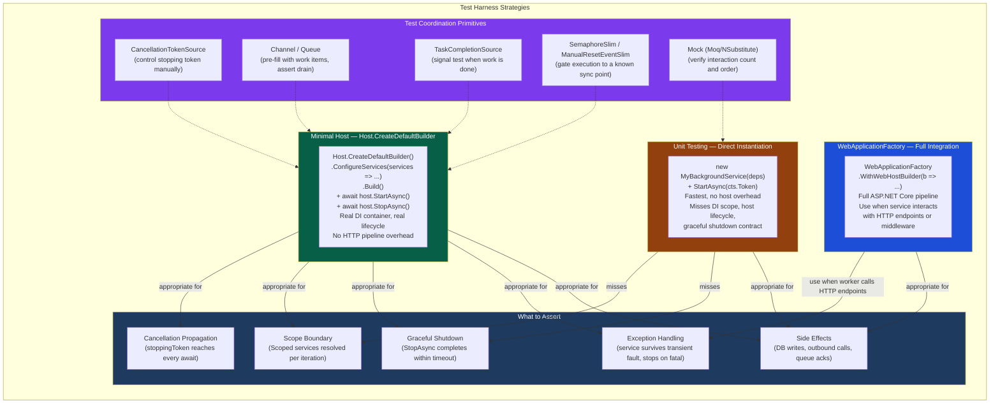
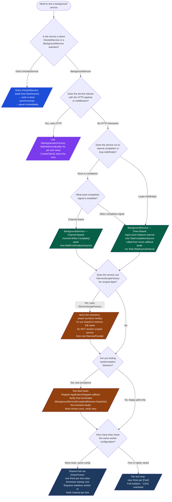

# 4.263 — Testing Background Services: IHostedService Test Harnesses

---

## PART 0 — Navigation & Context

### Where This Topic Lives

```
ASP.NET Core Mastery
│
├── U. Testing                              (4.257–4.267)
│   ├── 4.257  WebApplicationFactory<T>: Integration Testing the Full HTTP Pipeline
│   ├── 4.258  Customizing WebApplicationFactory: Replacing Services and Config
│   ├── 4.259  Authentication in Integration Tests: Custom Fake Auth Schemes
│   ├── 4.260  Database in Integration Tests: TestContainers vs SQLite vs InMemory
│   ├── 4.261  Testing Middleware in Isolation: TestServer Without WebAppFactory
│   ├── 4.262  Testing SignalR: HubConnection in Integration Tests
│   ├── ▶ 4.263  Testing Background Services: IHostedService Test Harnesses  ◀ YOU ARE HERE
│   ├── 4.264  Mocking HttpClient: MockHttpMessageHandler in Unit Tests
│   ├── 4.265  Snapshot Testing: Verify Library for API Response Regression
│   ├── 4.266  Contract Testing: Pact for Consumer-Driven API Contracts
│   └── 4.267  Load Testing ASP.NET Core: k6, NBomber, and BenchmarkDotNet
│
├── Related: Background Services subsystem
│   ├── R. Background Services              (4.231–4.239)
│   │   ├── 4.231  IHostedService: Running Code at Application Startup
│   │   ├── 4.232  BackgroundService: The Base Class for Long-Running Work
│   │   ├── 4.233  Timed Background Service: PeriodicTimer
│   │   ├── 4.234  Queued Background Tasks: Channel<T>
│   │   └── 4.235  Scoped Services in BackgroundService: IServiceScopeFactory
│
└── Related: Host & Lifecycle
    └── A. Host & Lifecycle: 4.010 — Graceful Shutdown and CancellationToken
```

### What You Need Before This

- **[[4.231 — IHostedService]]** — you must understand the `StartAsync` / `StopAsync` contract and the `CancellationToken` semantics before writing tests against it
- **[[4.232 — BackgroundService]]** — `ExecuteAsync` is the method under test; understanding the base class lifecycle is prerequisite for knowing what to assert
- **[[4.034 — The Built-In DI Container]]** — background service test harnesses are built by constructing a real or minimal `IHost`; understanding service registration is required to wire the SUT correctly
- **[[4.257 — WebApplicationFactory]]** — the integration test harness approach for background services mirrors `WebApplicationFactory` conceptually; knowing WAF first makes the custom host approach intuitive

### What This Unlocks After

- **[[4.234 — Queued Background Tasks: Channel<T>]]** — testing the producer/consumer pattern requires the channel-drain technique taught here
- **[[4.235 — Scoped Services in BackgroundService]]** — verifying that `IServiceScopeFactory` is used correctly requires asserting on scoped service interactions from inside a test harness
- **[[4.239 — Health Checks for Background Services]]** — testing liveness signaling from workers requires running the hosted service in a test host and asserting health check state
- **[[4.267 — Load Testing ASP.NET Core]]** — understanding harness-based background service testing is prerequisite for load testing queue-processing throughput

### Why This Matters at Scale

Background services are the hardest category of ASP.NET Core code to test correctly because they run on a separate execution path from the HTTP pipeline — they cannot be exercised by `HttpClient` requests against `WebApplicationFactory`, their lifecycle is controlled by the host's `CancellationToken`, and their side effects (database writes, outbound HTTP calls, queue drains) are often asynchronous with non-deterministic completion timing. Untested background services are among the top sources of silent data corruption bugs in production microservices: the worker silently swallows an exception loop, stops processing, and no test ever caught it because the CI suite only exercised HTTP endpoints.

---

## PART 1 — The Core Mental Model

### The Fundamental Rule

> **A `BackgroundService` is not triggered by an HTTP request — it is started by `IHost.StartAsync()` and stopped by `IHost.StopAsync()`. The correct test harness is a real or minimal `IHost` built with `Host.CreateDefaultBuilder()` or `WebApplicationFactory`, with `IHostedService` registrations present, started with `await host.StartAsync()`, driven to a known completion state through the service's own coordination primitives (a `Channel<T>`, a `ManualResetEventSlimAsync`, a `TaskCompletionSource`, or a test-controlled `CancellationToken`), and torn down with `await host.StopAsync()`. The practical consequence is that tests that only instantiate `MyBackgroundService` directly and call `StartAsync(CancellationToken.None)` will pass without exercising the host lifecycle, the DI scope boundary, or the graceful-shutdown `CancellationToken` contract.**

### The Plain-Language Analogy

A background service is like a factory floor worker who shows up when the factory opens (`IHost.StartAsync`), works a continuous shift under their own schedule (the `ExecuteAsync` loop), and stops only when the factory manager rings the closing bell (`stoppingToken` cancelled by `IHost.StopAsync`).

Testing this worker by calling them on the phone ("hey, are you there?") — which is the HTTP-request approach — doesn't work. You have to actually open the factory, let them start their shift, then observe what they produce on the assembly line (the side effects), then ring the closing bell and verify they cleaned up before leaving.

The harness IS the factory. You build a minimal version of it in your test, instrument it with fake conveyors (mock services), let the worker run a controlled cycle, then assert on what ended up in the output bin. When multiple workers are present, you must open the same factory for all of them — the `IHost` manages their shared DI container and their synchronized startup/shutdown, and short-circuiting that with direct instantiation loses all of it.

This analogy holds for the hard cases: a worker that loops forever (give them a `CancellationToken` to stop at the right moment), a worker that drains a queue (inject a pre-filled `Channel<T>` and assert it is empty after one cycle), and a worker that crashes (verify the factory does not silently absorb the exception and keep running).

### The Taxonomy Diagram



---

## PART 2 — Deep Mechanics

### 2.1 — The `IHostedService` Lifecycle Inside the Generic Host

Before writing a test harness, you must know exactly what the Generic Host does to every registered `IHostedService`. This is what your harness must replicate.

**Framework source behavior — `Host.StartAsync` (approximate):**

```csharp
// Microsoft.Extensions.Hosting.Internal.Host.StartAsync (approximate):
public async Task StartAsync(CancellationToken cancellationToken = default)
{
    // 1. Calls StartAsync on every registered IHostedService in registration ORDER
    foreach (var hostedService in _hostedServices)
    {
        await hostedService.StartAsync(cancellationToken);
        // For BackgroundService subclasses, StartAsync fires ExecuteAsync on the thread pool
        // and returns IMMEDIATELY — ExecuteAsync runs concurrently in the background
    }

    // 2. Raises IHostApplicationLifetime.ApplicationStarted
    _applicationLifetime.NotifyStarted();
}

public async Task StopAsync(CancellationToken cancellationToken = default)
{
    // 1. Cancels the stoppingToken passed to each BackgroundService.ExecuteAsync
    _applicationLifetime.StopApplication(); // triggers stoppingToken cancellation

    // 2. Calls StopAsync on every registered IHostedService in REVERSE registration order
    foreach (var hostedService in _hostedServices.Reverse())
    {
        await hostedService.StopAsync(cancellationToken);
        // For BackgroundService: waits for ExecuteAsync to complete (up to StopTimeout, default 5s)
    }

    _applicationLifetime.NotifyStopped();
}
```

**Key implication for tests:** `host.StartAsync()` returns as soon as all `IHostedService.StartAsync()` calls return — which for `BackgroundService` subclasses is almost immediately because `ExecuteAsync` runs on the thread pool. Your test must have a synchronization mechanism to wait for the background work to actually complete before asserting. The host being "started" does not mean work is done.

**Lifecycle state diagram:**

```
                                       ExecuteAsync running
                                       ┌─────────────────────────────────┐
                                       │                                 │
[Registered] → StartAsync() → [Running] → StopAsync() → [stoppingToken cancelled] → ExecuteAsync exits → StopAsync() completes → [Stopped]
                    │                                          │
                    │                                          │
              Returns fast                              Your test must
              (ExecuteAsync is                          WAIT HERE before
               on thread pool)                         asserting side effects
```

**Runtime cost:** `~1 Task allocation per IHostedService` for the background execution. `StartAsync` itself is `O(n)` over registered services. The host creates one `CancellationTokenSource` that controls ALL `BackgroundService` instances — this is the `stoppingToken` that is cancelled when `StopAsync` is called.

---

### 2.2 — The Minimal Host Harness: The Right Default

The workhorse for background service testing. Builds a real `IHost` with just enough infrastructure to exercise the service under test, without the full ASP.NET Core HTTP pipeline.

**What it gives you:**

- Real `IServiceProvider` with real lifetime enforcement (`ValidateScopes`, `ValidateOnBuild`)
- Real `IHostApplicationLifetime` with real `ApplicationStarted`, `ApplicationStopping`, `ApplicationStopped` tokens
- Real `stoppingToken` cancellation flow through `StopAsync`
- Real DI scope creation for services that use `IServiceScopeFactory`
- `ILogger` wired to your test's output sink if you configure it

**What you must supply:**

- A synchronization primitive that signals "the background work cycle I want to assert on is done"
- Mocked or in-memory implementations of all dependencies
- A way to inject those mocks into the host's `IServiceCollection`

**Framework source behavior — `BackgroundService.StartAsync` (approximate):**

```csharp
// Microsoft.Extensions.Hosting.BackgroundService.StartAsync (approximate):
public virtual Task StartAsync(CancellationToken cancellationToken)
{
    // Create the stoppingToken linked to both the host's stopping CTS
    // and the cancellationToken passed to StartAsync (rarely relevant)
    _stoppingCts = CancellationTokenSource.CreateLinkedTokenSource(cancellationToken);

    // Fire ExecuteAsync on the thread pool — this is the "background" in BackgroundService
    _executeTask = ExecuteAsync(_stoppingCts.Token);

    // If ExecuteAsync completes synchronously (or very fast), surface the exception
    if (_executeTask.IsCompleted)
    {
        return _executeTask;
    }

    // Otherwise, return immediately — ExecuteAsync runs concurrently
    return Task.CompletedTask;
}
```

**Runtime cost of the test harness:** `~5–15ms startup overhead` for `Host.CreateDefaultBuilder()` with a minimal service registration. This is negligible for integration tests but relevant if you have 500+ background service tests — use `IClassFixture` to share the host where the service is deterministically isolated.

---

### 2.3 — Synchronization Primitives: Making Non-Deterministic Work Deterministic

This is the core engineering challenge of background service testing. The background work is async and concurrent — your test must have a contract with the service that lets you know "this unit of work is done."

**Primitive 1: `Channel<T>` for queue-processing services**

Pre-fill the channel with a known set of work items. After `StartAsync`, wait until the channel is empty (or until all items are consumed via a counting mechanism). This is the cleanest approach for services that process discrete items.

```csharp
// The service's Channel is injected — the test controls what's in it
// CountdownEvent or a completion task signals when all items are processed
```

**Primitive 2: `TaskCompletionSource<bool>` for fire-and-forget observation**

The service is modified (or a test hook is added) to signal a `TaskCompletionSource` when a specific piece of work completes. The test awaits that TCS with a timeout.

**Primitive 3: `SemaphoreSlim` for rate-controlled execution**

Wrap the inner service call with a test-injectable delegate. Each call releases the semaphore. The test waits on the semaphore to confirm N executions occurred.

**Primitive 4: `Mock<T>.Verify()` with `Times.AtLeastOnce()` after a delay**

The blunt instrument: mock the dependency, start the service, `Task.Delay` for a small duration, then verify mock interactions. This works but is the least deterministic — it relies on wall-clock timing, which is fragile in CI. Only use it for services that run on a fixed timer (`PeriodicTimer`) when the period is too long to wait for in tests.

**Primitive 5: `IOptions<T>` injection with a test-override period**

For timer-based services, inject an `IOptions<WorkerOptions>` with `Interval = TimeSpan.FromMilliseconds(10)` in tests. The service fires much faster in test context. Combine with mock verification.

---

### 2.4 — Exception Handling: The Silent Swallower Problem

The most dangerous background service bug is the service that catches all exceptions inside its loop and logs them — meaning it never stops, never propagates the fault, and the test passes because the host is still running. The correct test is one that:

1. **Verifies the service survives transient faults** (retries correctly, continues processing)
2. **Verifies the service stops on fatal faults** (propagates the exception so the host can handle it)

**Framework source behavior — what happens when `ExecuteAsync` throws:**

```csharp
// BackgroundService.ExecuteAsync exception handling (approximate, .NET 8):
// If ExecuteAsync throws an unhandled exception:
// 1. The exception is stored in _executeTask (Task<T>)
// 2. The host does NOT automatically restart the service
// 3. In .NET 6+: IHostOptions.BackgroundServiceExceptionBehavior controls the outcome
//    - BackgroundServiceExceptionBehavior.StopHost (default in .NET 8):
//      The host calls StopAsync on all services and terminates the application
//    - BackgroundServiceExceptionBehavior.Ignore:
//      The exception is logged; the service stops but the host continues running

// Your test must verify WHICH behavior is occurring
```

**This is a version difference that bites engineers:**

```
.NET 5 / early .NET 6:    Unhandled exception in ExecuteAsync → service stops silently;
                           host keeps running; other services unaffected
.NET 6+ / .NET 8 default: Unhandled exception in ExecuteAsync → host calls StopAsync;
                           application terminates (BackgroundServiceExceptionBehavior.StopHost)

// Test implication: your test must account for host termination behavior
// when asserting on exception scenarios
```

---

### 2.5 — Scope Boundary Verification

Services that use `IServiceScopeFactory` to create per-iteration scopes are notoriously difficult to test correctly because the `DbContext`, repositories, or other scoped services are created and disposed INSIDE the service's loop — not available to the test's own `IServiceProvider` unless you use the same host.

**The scope boundary contract:**

```
IHost (Singleton scope)
    │
    └── BackgroundService (Singleton — one instance per host)
            │
            └── IServiceScopeFactory.CreateScope()  ← created per work item
                    │
                    ├── DbContext (Scoped — new instance per scope)
                    ├── IOrderRepository (Scoped)
                    └── IPaymentClient (Scoped)
                    │
                    └── scope.Dispose() ← DbContext saved AND disposed here
```

**Testing this boundary:** You cannot inject a mock `DbContext` at the Singleton level and expect it to be the same instance the service uses inside its scope. Instead, register a mock factory or use an in-memory database provider that is scoped to the test via a shared connection string or in-memory database name.

**Runtime cost:** Each scope creates a new child `IServiceProvider` — `O(n)` over registered scoped services. For tests that process N work items, this is N scope creations. Acceptable for unit/integration tests; not relevant for load tests.

---

## PART 3 — Production Code Patterns

### Pattern 1: The Minimal Host Harness for a One-Shot Startup Service (Order Export Service)

For services that run once at startup, do work, and complete — like warming a cache, running a migration, or seeding data — the test is straightforward: start the host, wait for `IHostApplicationLifetime.ApplicationStarted`, then assert.

```csharp
// The service under test: exports yesterday's orders to a reporting database on startup
public class OrderExportStartupService : IHostedService
{
    private readonly IOrderRepository _orders;
    private readonly IReportingDatabase _reporting;
    private readonly ILogger<OrderExportStartupService> _logger;

    public OrderExportStartupService(
        IOrderRepository orders,
        IReportingDatabase reporting,
        ILogger<OrderExportStartupService> logger)
    {
        _orders = orders;
        _reporting = reporting;
        _logger = logger;
    }

    public async Task StartAsync(CancellationToken cancellationToken)
    {
        var yesterday = DateOnly.FromDateTime(DateTime.UtcNow).AddDays(-1);
        var orders = await _orders.GetByDateAsync(yesterday, cancellationToken);
        await _reporting.BulkInsertAsync(orders, cancellationToken);
        _logger.LogInformation("Exported {Count} orders for {Date}", orders.Count, yesterday);
    }

    public Task StopAsync(CancellationToken cancellationToken) => Task.CompletedTask;
}

// Test: xUnit + Moq
public class OrderExportStartupServiceTests
{
    [Fact]
    public async Task StartAsync_ExportsYesterdaysOrders_ToReportingDatabase()
    {
        // Arrange — build a minimal host with mocked dependencies
        var mockOrders = new Mock<IOrderRepository>();
        var mockReporting = new Mock<IReportingDatabase>();

        var yesterday = DateOnly.FromDateTime(DateTime.UtcNow).AddDays(-1);
        var fakeOrders = new List<Order>
        {
            new Order { Id = "ORD-001", Date = yesterday, Amount = 49.99m },
            new Order { Id = "ORD-002", Date = yesterday, Amount = 129.00m }
        };

        mockOrders
            .Setup(r => r.GetByDateAsync(yesterday, It.IsAny<CancellationToken>()))
            .ReturnsAsync(fakeOrders);

        mockReporting
            .Setup(r => r.BulkInsertAsync(fakeOrders, It.IsAny<CancellationToken>()))
            .Returns(Task.CompletedTask);

        using var host = Host.CreateDefaultBuilder()
            .ConfigureServices(services =>
            {
                // Register mocks — these replace real implementations
                services.AddSingleton(mockOrders.Object);
                services.AddSingleton(mockReporting.Object);
                services.AddHostedService<OrderExportStartupService>();
            })
            .Build();

        // Act — StartAsync calls every IHostedService.StartAsync in order
        await host.StartAsync();

        // For IHostedService (not BackgroundService), StartAsync is synchronous
        // in the sense that it completes the work before returning.
        // No synchronization needed here — work is done when StartAsync returns.

        // Assert
        mockReporting.Verify(
            r => r.BulkInsertAsync(
                It.Is<List<Order>>(l => l.Count == 2),
                It.IsAny<CancellationToken>()),
            Times.Once);

        // Cleanup — always stop the host
        await host.StopAsync();
    }
}
```

**Domain:** Nightly order export to a financial reporting database, run once on service startup.

---

### Pattern 2: The Channel-Drain Harness for a Queue Processor (Shipment Notification Worker)

The canonical pattern for `BackgroundService` subclasses that process a `Channel<T>` queue. Pre-fill the channel with N items, let the service drain it, then assert N side effects.

```csharp
// The service under test: reads from a channel and sends shipment notifications
public class ShipmentNotificationWorker : BackgroundService
{
    private readonly ChannelReader<ShipmentEvent> _channelReader;
    private readonly INotificationClient _notifications;
    private readonly ILogger<ShipmentNotificationWorker> _logger;

    public ShipmentNotificationWorker(
        ChannelReader<ShipmentEvent> channelReader,
        INotificationClient notifications,
        ILogger<ShipmentNotificationWorker> logger)
    {
        _channelReader = channelReader;
        _notifications = notifications;
        _logger = logger;
    }

    protected override async Task ExecuteAsync(CancellationToken stoppingToken)
    {
        await foreach (var shipmentEvent in _channelReader.ReadAllAsync(stoppingToken))
        {
            try
            {
                await _notifications.SendShippedEmailAsync(
                    shipmentEvent.CustomerId,
                    shipmentEvent.TrackingNumber,
                    stoppingToken);

                _logger.LogInformation(
                    "Notification sent for shipment {TrackingNumber}",
                    shipmentEvent.TrackingNumber);
            }
            catch (Exception ex) when (ex is not OperationCanceledException)
            {
                // Log and continue — transient notification failures should not stop the worker
                _logger.LogError(ex,
                    "Failed to send notification for {TrackingNumber}",
                    shipmentEvent.TrackingNumber);
            }
        }
    }
}

// Test
public class ShipmentNotificationWorkerTests
{
    [Fact]
    public async Task ExecuteAsync_SendsNotification_ForEachShipmentEvent()
    {
        // Arrange
        var channel = Channel.CreateUnbounded<ShipmentEvent>();
        var mockNotifications = new Mock<INotificationClient>();

        // Pre-fill the channel with test data
        var events = new[]
        {
            new ShipmentEvent { CustomerId = "CUST-1", TrackingNumber = "TRK-001" },
            new ShipmentEvent { CustomerId = "CUST-2", TrackingNumber = "TRK-002" },
            new ShipmentEvent { CustomerId = "CUST-3", TrackingNumber = "TRK-003" },
        };

        foreach (var evt in events) channel.Writer.TryWrite(evt);

        // IMPORTANT: Complete the channel BEFORE starting the host
        // This tells ReadAllAsync to stop after the pre-filled items are consumed
        channel.Writer.Complete();

        mockNotifications
            .Setup(n => n.SendShippedEmailAsync(
                It.IsAny<string>(),
                It.IsAny<string>(),
                It.IsAny<CancellationToken>()))
            .Returns(Task.CompletedTask);

        using var host = Host.CreateDefaultBuilder()
            .ConfigureServices(services =>
            {
                // Register the channel reader — the worker reads from this
                services.AddSingleton(channel.Reader);
                services.AddSingleton(mockNotifications.Object);
                services.AddHostedService<ShipmentNotificationWorker>();
            })
            .Build();

        // Act
        await host.StartAsync();

        // Wait for ExecuteAsync to drain the completed channel and exit naturally
        // The host's background task completes when ReadAllAsync exits (channel completed)
        // We give it a generous timeout to avoid flaky CI tests
        using var timeout = new CancellationTokenSource(TimeSpan.FromSeconds(10));
        await host.WaitForShutdownAsync(timeout.Token);

        // Assert — all three events were processed
        mockNotifications.Verify(
            n => n.SendShippedEmailAsync(
                It.IsAny<string>(),
                It.IsAny<string>(),
                It.IsAny<CancellationToken>()),
            Times.Exactly(3));

        // Verify specific tracking numbers were processed
        mockNotifications.Verify(
            n => n.SendShippedEmailAsync("CUST-1", "TRK-001", It.IsAny<CancellationToken>()),
            Times.Once);
    }

    [Fact]
    public async Task ExecuteAsync_ContinuesProcessing_WhenOneNotificationFails()
    {
        // Arrange — first notification fails; subsequent ones must still be processed
        var channel = Channel.CreateUnbounded<ShipmentEvent>();
        var mockNotifications = new Mock<INotificationClient>();

        var events = new[]
        {
            new ShipmentEvent { CustomerId = "CUST-1", TrackingNumber = "TRK-FAIL" },
            new ShipmentEvent { CustomerId = "CUST-2", TrackingNumber = "TRK-OK" },
        };

        foreach (var evt in events) channel.Writer.TryWrite(evt);
        channel.Writer.Complete();

        // First call throws; second call succeeds
        mockNotifications
            .SetupSequence(n => n.SendShippedEmailAsync(
                It.IsAny<string>(), It.IsAny<string>(), It.IsAny<CancellationToken>()))
            .ThrowsAsync(new HttpRequestException("SMTP gateway timeout"))
            .Returns(Task.CompletedTask);

        using var host = Host.CreateDefaultBuilder()
            .ConfigureServices(services =>
            {
                services.AddSingleton(channel.Reader);
                services.AddSingleton(mockNotifications.Object);
                services.AddHostedService<ShipmentNotificationWorker>();
            })
            .Build();

        // Act
        await host.StartAsync();
        using var timeout = new CancellationTokenSource(TimeSpan.FromSeconds(10));
        await host.WaitForShutdownAsync(timeout.Token);

        // Assert — BOTH notifications were attempted despite the first failure
        mockNotifications.Verify(
            n => n.SendShippedEmailAsync(
                It.IsAny<string>(), It.IsAny<string>(), It.IsAny<CancellationToken>()),
            Times.Exactly(2));
    }
}
```

**Domain:** E-commerce shipment notification pipeline — worker processes shipping events from an internal channel and sends customer emails.

---

### Pattern 3: The Periodic Timer Harness (Inventory Sync Worker)

For `BackgroundService` subclasses that use `PeriodicTimer` and run indefinitely, the test must control the timer interval and stop the service deliberately via `CancellationToken`.

```csharp
// The service under test: periodically syncs inventory counts from ERP to the API database
public class InventorySyncWorker : BackgroundService
{
    private readonly IErpClient _erp;
    private readonly IInventoryRepository _inventory;
    private readonly IOptions<InventorySyncOptions> _options;
    private readonly ILogger<InventorySyncWorker> _logger;

    public InventorySyncWorker(
        IErpClient erp,
        IInventoryRepository inventory,
        IOptions<InventorySyncOptions> options,
        ILogger<InventorySyncWorker> logger)
    {
        _erp = erp;
        _inventory = inventory;
        _options = options;
        _logger = logger;
    }

    protected override async Task ExecuteAsync(CancellationToken stoppingToken)
    {
        using var timer = new PeriodicTimer(_options.Value.SyncInterval);

        while (await timer.WaitForNextTickAsync(stoppingToken))
        {
            try
            {
                var levels = await _erp.GetCurrentInventoryAsync(stoppingToken);
                await _inventory.BulkUpdateAsync(levels, stoppingToken);

                _logger.LogInformation(
                    "Inventory sync complete: {Count} SKUs updated", levels.Count);
            }
            catch (Exception ex) when (ex is not OperationCanceledException)
            {
                _logger.LogError(ex, "Inventory sync failed; will retry next interval");
            }
        }
    }
}

public class InventorySyncOptions
{
    public TimeSpan SyncInterval { get; set; } = TimeSpan.FromMinutes(5);
}

// Test
public class InventorySyncWorkerTests
{
    [Fact]
    public async Task ExecuteAsync_CallsErpAndUpdatesInventory_OnEachTick()
    {
        // Arrange — override interval to 50ms so the test runs fast
        var mockErp = new Mock<IErpClient>();
        var mockInventory = new Mock<IInventoryRepository>();

        // Use a TCS to signal when we've seen at least 2 sync cycles
        var syncCount = 0;
        var twoSyncsComplete = new TaskCompletionSource<bool>(
            TaskCreationOptions.RunContinuationsAsynchronously);

        var fakeLevels = new List<InventoryLevel>
        {
            new InventoryLevel { Sku = "SKU-001", Quantity = 50 },
            new InventoryLevel { Sku = "SKU-002", Quantity = 12 },
        };

        mockErp
            .Setup(e => e.GetCurrentInventoryAsync(It.IsAny<CancellationToken>()))
            .ReturnsAsync(fakeLevels);

        mockInventory
            .Setup(i => i.BulkUpdateAsync(
                It.IsAny<List<InventoryLevel>>(),
                It.IsAny<CancellationToken>()))
            .Returns(Task.CompletedTask)
            .Callback(() =>
            {
                // Signal when we've completed 2 sync cycles
                if (Interlocked.Increment(ref syncCount) >= 2)
                    twoSyncsComplete.TrySetResult(true);
            });

        using var host = Host.CreateDefaultBuilder()
            .ConfigureServices(services =>
            {
                services.AddSingleton(mockErp.Object);
                services.AddSingleton(mockInventory.Object);
                // Override the sync interval for test speed
                services.Configure<InventorySyncOptions>(opts =>
                    opts.SyncInterval = TimeSpan.FromMilliseconds(50));
                services.AddHostedService<InventorySyncWorker>();
            })
            .Build();

        // Act
        await host.StartAsync();

        // Wait until 2 sync cycles complete, or timeout after 5 seconds
        using var timeout = new CancellationTokenSource(TimeSpan.FromSeconds(5));
        await twoSyncsComplete.Task.WaitAsync(timeout.Token);

        // Stop the host — this cancels stoppingToken, causing timer.WaitForNextTickAsync to throw
        await host.StopAsync();

        // Assert
        mockErp.Verify(
            e => e.GetCurrentInventoryAsync(It.IsAny<CancellationToken>()),
            Times.AtLeast(2));

        mockInventory.Verify(
            i => i.BulkUpdateAsync(
                It.Is<List<InventoryLevel>>(l => l.Count == 2),
                It.IsAny<CancellationToken>()),
            Times.AtLeast(2));
    }

    [Fact]
    public async Task ExecuteAsync_StopsCleanly_WhenHostStopped()
    {
        // Arrange — verifies graceful shutdown contract
        var mockErp = new Mock<IErpClient>();
        var mockInventory = new Mock<IInventoryRepository>();
        var syncStarted = new TaskCompletionSource<bool>(
            TaskCreationOptions.RunContinuationsAsynchronously);

        mockErp
            .Setup(e => e.GetCurrentInventoryAsync(It.IsAny<CancellationToken>()))
            .Returns(async (CancellationToken ct) =>
            {
                syncStarted.TrySetResult(true);
                // Simulate a slow ERP call — holds for 2 seconds
                await Task.Delay(TimeSpan.FromSeconds(2), ct);
                return new List<InventoryLevel>();
            });

        using var host = Host.CreateDefaultBuilder()
            .ConfigureServices(services =>
            {
                services.AddSingleton(mockErp.Object);
                services.AddSingleton(mockInventory.Object);
                services.Configure<InventorySyncOptions>(opts =>
                    opts.SyncInterval = TimeSpan.FromMilliseconds(10));
                services.AddHostedService<InventorySyncWorker>();
            })
            .Build();

        // Act
        await host.StartAsync();

        // Wait for the first sync to start (ERP call in flight)
        await syncStarted.Task.WaitAsync(TimeSpan.FromSeconds(3));

        // Stop the host while ERP call is in flight
        // StopAsync should complete promptly because the in-flight ERP call
        // receives the cancellation token and terminates
        var stopwatch = System.Diagnostics.Stopwatch.StartNew();
        await host.StopAsync(TimeSpan.FromSeconds(5)); // generous stop timeout
        stopwatch.Stop();

        // Assert — graceful shutdown completed well within the stop timeout
        // If the service didn't honour cancellation, StopAsync would time out
        Assert.True(stopwatch.Elapsed < TimeSpan.FromSeconds(4),
            $"StopAsync took {stopwatch.Elapsed.TotalSeconds:F2}s — stoppingToken may not be propagated");
    }
}
```

**Domain:** Inventory management service synchronizing stock levels from an enterprise ERP system on a 5-minute schedule.

---

### Pattern 4: The Scoped-Service Verification Harness (Order Fulfillment Worker)

For workers that use `IServiceScopeFactory`, the test must verify that scoped services are resolved per work item and that the scope is disposed (and thus DbContext `SaveChanges` is called) correctly.

```csharp
// The service under test: processes queued fulfillment requests, one DB scope per order
public class OrderFulfillmentWorker : BackgroundService
{
    private readonly ChannelReader<FulfillmentRequest> _reader;
    private readonly IServiceScopeFactory _scopeFactory;
    private readonly ILogger<OrderFulfillmentWorker> _logger;

    public OrderFulfillmentWorker(
        ChannelReader<FulfillmentRequest> reader,
        IServiceScopeFactory scopeFactory,
        ILogger<OrderFulfillmentWorker> logger)
    {
        _reader = reader;
        _scopeFactory = scopeFactory;
        _logger = logger;
    }

    protected override async Task ExecuteAsync(CancellationToken stoppingToken)
    {
        await foreach (var request in _reader.ReadAllAsync(stoppingToken))
        {
            // New scope per order — DbContext is created and disposed per item
            await using var scope = _scopeFactory.CreateAsyncScope();
            var fulfillmentService = scope.ServiceProvider
                .GetRequiredService<IFulfillmentService>();

            try
            {
                await fulfillmentService.ProcessAsync(request, stoppingToken);
                _logger.LogInformation("Fulfilled order {OrderId}", request.OrderId);
            }
            catch (FulfillmentException ex)
            {
                _logger.LogError(ex, "Fulfillment failed for order {OrderId}", request.OrderId);
                // Dead-letter or re-queue logic here
            }
        }
    }
}

// Test — uses a fake IFulfillmentService that counts invocations per scope
public class OrderFulfillmentWorkerTests
{
    [Fact]
    public async Task ExecuteAsync_CreatesNewScope_ForEachFulfillmentRequest()
    {
        // Arrange
        var channel = Channel.CreateUnbounded<FulfillmentRequest>();
        var requests = new[]
        {
            new FulfillmentRequest { OrderId = "ORD-A", WarehouseId = "WH-1" },
            new FulfillmentRequest { OrderId = "ORD-B", WarehouseId = "WH-1" },
        };

        foreach (var r in requests) channel.Writer.TryWrite(r);
        channel.Writer.Complete();

        // Track how many distinct IFulfillmentService instances were created
        // (one per scope = one per order item)
        var instancesCreated = new ConcurrentBag<IFulfillmentService>();
        var processedOrders = new ConcurrentBag<string>();

        using var host = Host.CreateDefaultBuilder()
            .ConfigureServices(services =>
            {
                services.AddSingleton(channel.Reader);

                // Register a Scoped fake that records its instance identity
                services.AddScoped<IFulfillmentService>(sp =>
                {
                    var fake = new FakeFulfillmentService(processedOrders);
                    instancesCreated.Add(fake);
                    return fake;
                });

                services.AddHostedService<OrderFulfillmentWorker>();
            })
            .Build();

        // Act
        await host.StartAsync();

        using var timeout = new CancellationTokenSource(TimeSpan.FromSeconds(10));
        await host.WaitForShutdownAsync(timeout.Token);

        // Assert — 2 distinct scope instances (one per order)
        Assert.Equal(2, instancesCreated.Count);
        Assert.Contains("ORD-A", processedOrders);
        Assert.Contains("ORD-B", processedOrders);
    }

    // Minimal fake — tracks which orders it processed
    private class FakeFulfillmentService : IFulfillmentService
    {
        private readonly ConcurrentBag<string> _processed;

        public FakeFulfillmentService(ConcurrentBag<string> processed)
            => _processed = processed;

        public Task ProcessAsync(FulfillmentRequest request, CancellationToken ct)
        {
            _processed.Add(request.OrderId);
            return Task.CompletedTask;
        }
    }
}
```

**Domain:** Order management — fulfillment worker processes each order in its own DB transaction scope to ensure isolation between orders.

---

### Pattern 5: The Fatal-Exception / Host-Termination Test (Payment Reconciliation Worker)

Verifying that an unhandled exception in `ExecuteAsync` causes the host to terminate (`.NET 8` default behavior) is a critical correctness test that most teams skip.

```csharp
// The service under test: reconciliation worker that must stop the host on fatal data errors
public class PaymentReconciliationWorker : BackgroundService
{
    private readonly IReconciliationRepository _repo;
    private readonly ILogger<PaymentReconciliationWorker> _logger;

    public PaymentReconciliationWorker(
        IReconciliationRepository repo,
        ILogger<PaymentReconciliationWorker> logger)
    {
        _repo = repo;
        _logger = logger;
    }

    protected override async Task ExecuteAsync(CancellationToken stoppingToken)
    {
        // Fatal error: database schema mismatch — service must stop the host
        var snapshot = await _repo.GetLatestSnapshotAsync(stoppingToken);

        if (snapshot is null)
        {
            // This is unrecoverable — throw to trigger host termination
            throw new InvalidOperationException(
                "Payment reconciliation snapshot table is empty — " +
                "database migration may not have run. Cannot continue.");
        }

        // ... normal reconciliation loop
        while (!stoppingToken.IsCancellationRequested)
        {
            await _repo.ReconcileAsync(snapshot, stoppingToken);
            await Task.Delay(TimeSpan.FromMinutes(1), stoppingToken);
        }
    }
}

// Test
public class PaymentReconciliationWorkerTests
{
    [Fact]
    public async Task ExecuteAsync_TerminatesHost_WhenSnapshotTableIsEmpty()
    {
        // Arrange
        var mockRepo = new Mock<IReconciliationRepository>();

        // Simulate missing snapshot (first startup after failed migration)
        mockRepo
            .Setup(r => r.GetLatestSnapshotAsync(It.IsAny<CancellationToken>()))
            .ReturnsAsync((ReconciliationSnapshot?)null);

        // Track whether the host stopped as a result
        var hostStopped = new TaskCompletionSource<bool>(
            TaskCreationOptions.RunContinuationsAsynchronously);

        using var host = Host.CreateDefaultBuilder()
            .ConfigureServices(services =>
            {
                services.AddSingleton(mockRepo.Object);
                services.AddHostedService<PaymentReconciliationWorker>();

                // .NET 8 default: StopHost on unhandled exception in BackgroundService
                // Configure explicitly to make it clear and testable:
                services.Configure<HostOptions>(opts =>
                    opts.BackgroundServiceExceptionBehavior =
                        BackgroundServiceExceptionBehavior.StopHost);
            })
            .Build();

        // Wire into ApplicationStopped to detect host termination
        var lifetime = host.Services.GetRequiredService<IHostApplicationLifetime>();
        lifetime.ApplicationStopped.Register(() => hostStopped.TrySetResult(true));

        // Act
        await host.StartAsync();

        // Wait for the host to stop due to the fatal exception
        // If it doesn't stop within 5 seconds, the exception isn't propagating correctly
        using var timeout = new CancellationTokenSource(TimeSpan.FromSeconds(5));
        var stopped = await Task.WhenAny(
            hostStopped.Task,
            Task.Delay(Timeout.Infinite, timeout.Token));

        // Assert — host stopped due to fatal worker exception
        Assert.True(hostStopped.Task.IsCompletedSuccessfully,
            "Host did not stop after fatal exception in ExecuteAsync — " +
            "BackgroundServiceExceptionBehavior may be set to Ignore");

        // Verify the snapshot query was attempted (the fault point)
        mockRepo.Verify(
            r => r.GetLatestSnapshotAsync(It.IsAny<CancellationToken>()),
            Times.Once);
    }
}
```

**Domain:** Financial services — payment reconciliation worker that must halt the application on data integrity failures rather than silently processing incorrect data.

---

### Pattern 6: The `WebApplicationFactory` Harness for Workers that Touch HTTP (Webhook Dispatcher)

When the background service makes outbound HTTP calls or interacts with ASP.NET Core middleware, use `WebApplicationFactory` so the test has access to both the HTTP pipeline and the worker lifecycle.

```csharp
// The service under test: reads pending webhooks from DB and dispatches them via HttpClient
public class WebhookDispatchWorker : BackgroundService
{
    private readonly IWebhookRepository _repo;
    private readonly IHttpClientFactory _httpFactory;
    private readonly ILogger<WebhookDispatchWorker> _logger;

    public WebhookDispatchWorker(
        IWebhookRepository repo,
        IHttpClientFactory httpFactory,
        ILogger<WebhookDispatchWorker> logger)
    {
        _repo = repo;
        _httpFactory = httpFactory;
        _logger = logger;
    }

    protected override async Task ExecuteAsync(CancellationToken stoppingToken)
    {
        while (!stoppingToken.IsCancellationRequested)
        {
            var pending = await _repo.GetPendingAsync(batchSize: 50, stoppingToken);

            foreach (var webhook in pending)
            {
                var client = _httpFactory.CreateClient("WebhookDispatcher");
                try
                {
                    var response = await client.PostAsJsonAsync(
                        webhook.TargetUrl, webhook.Payload, stoppingToken);

                    await _repo.MarkDeliveredAsync(webhook.Id,
                        (int)response.StatusCode, stoppingToken);
                }
                catch (Exception ex) when (ex is not OperationCanceledException)
                {
                    await _repo.MarkFailedAsync(webhook.Id, ex.Message, stoppingToken);
                }
            }

            await Task.Delay(TimeSpan.FromSeconds(5), stoppingToken);
        }
    }
}

// Integration test using WebApplicationFactory
public class WebhookDispatchWorkerIntegrationTests
    : IClassFixture<WebApplicationFactory<Program>>
{
    private readonly WebApplicationFactory<Program> _factory;

    public WebhookDispatchWorkerIntegrationTests(
        WebApplicationFactory<Program> factory)
    {
        _factory = factory;
    }

    [Fact]
    public async Task ExecuteAsync_DispatchesWebhook_AndMarksDelivered()
    {
        // Arrange
        var mockRepo = new Mock<IWebhookRepository>();
        var webhookId = Guid.NewGuid();
        var dispatched = new TaskCompletionSource<bool>(
            TaskCreationOptions.RunContinuationsAsynchronously);

        var pending = new List<PendingWebhook>
        {
            new PendingWebhook
            {
                Id = webhookId,
                TargetUrl = "https://partner.example.com/webhook",
                Payload = new { eventType = "order.shipped", orderId = "ORD-999" }
            }
        };

        // Return the webhook once, then empty list (prevent infinite retries in test)
        mockRepo
            .SetupSequence(r => r.GetPendingAsync(50, It.IsAny<CancellationToken>()))
            .ReturnsAsync(pending)
            .ReturnsAsync(new List<PendingWebhook>());

        mockRepo
            .Setup(r => r.MarkDeliveredAsync(
                webhookId, It.IsAny<int>(), It.IsAny<CancellationToken>()))
            .Returns(Task.CompletedTask)
            .Callback(() => dispatched.TrySetResult(true));

        var customFactory = _factory.WithWebHostBuilder(builder =>
        {
            builder.ConfigureServices(services =>
            {
                // Replace the real repository with our mock
                var descriptor = services.Single(
                    s => s.ServiceType == typeof(IWebhookRepository));
                services.Remove(descriptor);
                services.AddSingleton(mockRepo.Object);
            });
        });

        // Act — factory starts the host including all IHostedServices
        var client = customFactory.CreateClient();

        // Wait for the dispatch to complete
        using var timeout = new CancellationTokenSource(TimeSpan.FromSeconds(10));
        await dispatched.Task.WaitAsync(timeout.Token);

        // Assert — webhook was marked delivered
        mockRepo.Verify(
            r => r.MarkDeliveredAsync(webhookId, It.IsAny<int>(), It.IsAny<CancellationToken>()),
            Times.Once);
    }
}
```

**Domain:** E-commerce webhook dispatch — background worker that calls external partner URLs with order and shipment events.

---

## PART 4 — Gotchas & Anti-Patterns

### Gotcha 1: Testing `BackgroundService` With Direct Instantiation Misses the `stoppingToken` Contract

The most common anti-pattern: instantiate the service directly, call `StartAsync(CancellationToken.None)`, and assert. This bypasses the host's `stoppingToken` CTS and never verifies that the service responds to cancellation. The service could loop forever ignoring the stopping token and the test would never catch it.

```csharp
// ⚠️ WRONG: Direct instantiation — host lifecycle is bypassed
[Fact]
public async Task ExecuteAsync_ProcessesItems()
{
    var worker = new ShipmentNotificationWorker(
        channel.Reader,
        mockNotifications.Object,
        NullLogger<ShipmentNotificationWorker>.Instance);

    // StartAsync fires ExecuteAsync on the thread pool and returns immediately
    await worker.StartAsync(CancellationToken.None);

    // This assertion may run BEFORE ExecuteAsync has processed anything
    mockNotifications.Verify(n => n.SendShippedEmailAsync(...), Times.Once); // flaky!
}

// HTTP consequence (wrong path):
// Tests pass in CI because the machine is fast enough that ExecuteAsync completes
// before the assertion runs. Tests fail on slower CI runners intermittently.
// stoppingToken behaviour is never verified — a worker that ignores cancellation
// ships to production and causes 30-second graceful shutdown delays.

// ✅ CORRECT: Use a real IHost — forces the lifecycle contract
[Fact]
public async Task ExecuteAsync_ProcessesItems()
{
    channel.Writer.Complete(); // signal end-of-work

    using var host = Host.CreateDefaultBuilder()
        .ConfigureServices(services =>
        {
            services.AddSingleton(channel.Reader);
            services.AddSingleton(mockNotifications.Object);
            services.AddHostedService<ShipmentNotificationWorker>();
        })
        .Build();

    await host.StartAsync();
    await host.WaitForShutdownAsync(); // deterministic: waits for ExecuteAsync exit

    mockNotifications.Verify(n => n.SendShippedEmailAsync(...), Times.Once); // not flaky
}

// HTTP consequence (correct path):
// Test is deterministic because WaitForShutdownAsync only completes when
// ExecuteAsync exits (channel completed → ReadAllAsync exits → service stops naturally)
```

**WHY:** `IHost.WaitForShutdownAsync()` awaits the internal `Task` that tracks when all `BackgroundService.ExecuteAsync` tasks complete. Direct instantiation has no such mechanism — you're racing against the thread pool.

---

### Gotcha 2: Not Completing the `Channel<T>` Writer — Test Hangs Forever

When testing a `Channel<T>`-based worker, forgetting to call `channel.Writer.Complete()` means `ReadAllAsync(stoppingToken)` never returns naturally. The test hangs until the timeout fires, which is mistaken for a passing test if the timeout is not checked.

```csharp
// ⚠️ WRONG: Channel writer never completed — WaitForShutdownAsync hangs forever
var channel = Channel.CreateUnbounded<OrderEvent>();
channel.Writer.TryWrite(new OrderEvent { OrderId = "ORD-1" });
// ❌ Missing: channel.Writer.Complete();

using var host = /* ... */ .Build();
await host.StartAsync();

// This blocks forever — ReadAllAsync is waiting for more items
// Test runner eventually times out after 30 seconds (xUnit's default)
await host.WaitForShutdownAsync(); // HANG

// HTTP consequence (wrong path):
// Test suite runs for 30+ seconds on every run
// CI timeout is triggered, masking the real issue
// Flaky test that appears to "pass" on fast machines (race condition)

// ✅ CORRECT: Always complete the channel writer before or after writing items
var channel = Channel.CreateUnbounded<OrderEvent>();
channel.Writer.TryWrite(new OrderEvent { OrderId = "ORD-1" });
channel.Writer.Complete(); // ← signals no more items — ReadAllAsync can exit

using var host = /* ... */ .Build();
await host.StartAsync();
await host.WaitForShutdownAsync(); // exits as soon as channel is drained

// HTTP consequence (correct path):
// Test completes in <500ms — deterministic, non-flaky
```

**WHY:** `Channel<T>.ReadAllAsync()` is an async iterator that yields items as they arrive and exits when the `ChannelWriter` is completed. Until `Complete()` is called, it blocks indefinitely waiting for more items. The `stoppingToken` cancellation will exit it during `StopAsync`, but then your test has to call `StopAsync` explicitly — at which point you can't distinguish "worker completed cleanly" from "worker was cancelled mid-work."

---

### Gotcha 3: Not Awaiting `host.StopAsync()` After the Test — Resource Leaks and Port Conflicts

Forgetting to stop and dispose the host in test teardown leaves the background service running on the thread pool, holding DI container resources, and potentially competing with the next test for shared resources (database connections, in-memory state).

```csharp
// ⚠️ WRONG: Host is started but never stopped — resource leak
[Fact]
public async Task Worker_ProcessesOrder()
{
    var host = Host.CreateDefaultBuilder()
        .ConfigureServices(/* ... */)
        .Build();

    await host.StartAsync();

    // Assert something...
    mockService.Verify(/* ... */);

    // ❌ Missing: await host.StopAsync(); and host.Dispose();
    // The BackgroundService.ExecuteAsync task is still running on the thread pool
}

// HTTP consequence (wrong path):
// Test isolation breaks: the second test may see state written by the first test's
// still-running worker. In-memory database or channel may be in unexpected state.
// Thread pool has leaked tasks accumulating across the test run.

// ✅ CORRECT: Always use 'using' for the host, or explicit Stop + Dispose
[Fact]
public async Task Worker_ProcessesOrder()
{
    using var host = Host.CreateDefaultBuilder()
        .ConfigureServices(/* ... */)
        .Build();

    await host.StartAsync();

    // ... do work and assert ...

    await host.StopAsync(); // cancels stoppingToken, waits for ExecuteAsync to finish
    // 'using' calls host.Dispose() after StopAsync
}

// HTTP consequence (correct path):
// Host is fully torn down after each test
// DI container is disposed, scoped services are cleaned up
// Thread pool is clean — no background tasks leaking between tests
```

**WHY:** `IHost.Dispose()` does NOT call `StopAsync`. You must call `StopAsync` explicitly before `Dispose`, or use the `using` block (which calls `Dispose` but not `StopAsync`) combined with `await host.StopAsync()`. The `BackgroundService.ExecuteAsync` task is not awaited by `Dispose` — only by `StopAsync`.

---

### Gotcha 4: Using `Task.Delay` as the Synchronization Mechanism — The Flaky Test Factory

`await Task.Delay(500)` is the laziest synchronization mechanism: assume the background service completes within 500ms, then assert. This produces intermittently failing tests on loaded CI machines, and creates a false sense of coverage because the service may not have run at all if it is slower than 500ms on the current machine.

```csharp
// ⚠️ WRONG: Task.Delay as synchronization — non-deterministic
[Fact]
public async Task Worker_SyncsInventory_TwicePerSecond()
{
    // ... setup ...

    await host.StartAsync();
    await Task.Delay(1100); // "wait for 2 timer ticks"

    mockErp.Verify(e => e.GetCurrentInventoryAsync(...), Times.AtLeast(2)); // flaky!

    await host.StopAsync();
}

// HTTP consequence (wrong path):
// Test passes on dev machine (fast), fails on CI (loaded)
// Increasing Task.Delay makes tests slow but not reliable
// Test proves nothing — it's timing-sensitive, not logic-sensitive

// ✅ CORRECT: Use a TCS or countdown event to signal from inside the service
// (see Pattern 3 — InventorySyncWorker — for the correct approach)
var syncCount = 0;
var twoSyncsComplete = new TaskCompletionSource<bool>(
    TaskCreationOptions.RunContinuationsAsynchronously);

mockInventory
    .Setup(/* ... */)
    .Callback(() =>
    {
        if (Interlocked.Increment(ref syncCount) >= 2)
            twoSyncsComplete.TrySetResult(true);
    });

// ... start host, wait for TCS ...
await twoSyncsComplete.Task.WaitAsync(TimeSpan.FromSeconds(5)); // deadline-bounded, not wall-clock

// HTTP consequence (correct path):
// Test completes as soon as 2 syncs happen — not after an arbitrary delay
// Will fail fast if the service is broken (TCS never set → 5s timeout → assertion fails)
```

**WHY:** `Task.Delay` creates a time-dependency in your test. The test is not testing behavior — it is betting on timing. Use `TaskCompletionSource`, `SemaphoreSlim.WaitAsync`, or `Channel.Reader.WaitToReadAsync` to create a logical synchronization point that fires when the condition you care about is actually true.

---

### Gotcha 5: The `IServiceScope` DI Scope Leak in Test Assertions

When verifying scoped services inside a background service test, teams often try to resolve the scoped service from the HOST's root `IServiceProvider` to assert on it. This creates a new scope that is NOT the scope used by the background service — the assertion is against a different instance.

```csharp
// ⚠️ WRONG: Resolving scoped service from root provider — wrong instance
[Fact]
public async Task Worker_SavesOrderToDatabase()
{
    using var host = /* ... */.Build();
    await host.StartAsync();

    // Wait for worker to process...
    await channel.Reader.Completion; // channel completed

    // ❌ WRONG: This creates a NEW scope — not the scope the worker used
    using var scope = host.Services.CreateScope();
    var repo = scope.ServiceProvider.GetRequiredService<IOrderRepository>();
    var order = await repo.GetByIdAsync("ORD-1");
    Assert.NotNull(order); // may fail — this is a different DbContext instance

    await host.StopAsync();
}

// HTTP consequence (wrong path):
// Test creates its own DbContext scope that may not see uncommitted changes
// from the worker's scope (if using in-memory DB with shared context vs separate contexts)
// Assert is non-deterministic depending on DbContext configuration

// ✅ CORRECT: Use shared in-memory database name OR mock the repository
// and verify mock interactions instead of reading from a separate scope

// Option A: Shared in-memory EF Core database (same logical DB, different context instances)
services.AddDbContext<OrderDbContext>(opts =>
    opts.UseInMemoryDatabase("TestDb-" + testRunId)); // shared name = shared data

// Option B: Mock the repository — assert on the mock, not the DB
var mockRepo = new Mock<IOrderRepository>();
mockRepo.Setup(r => r.SaveAsync(It.IsAny<Order>(), ...)).Returns(Task.CompletedTask);
// ... after test ...
mockRepo.Verify(r => r.SaveAsync(It.Is<Order>(o => o.Id == "ORD-1"), ...), Times.Once);

// HTTP consequence (correct path):
// Test asserts on the interaction contract (SaveAsync was called with correct data)
// rather than on the state of a different DI scope's DbContext
```

**WHY:** Each call to `IServiceScopeFactory.CreateScope()` creates a new child container where scoped services (including `DbContext`) get new instances. The background service's scope is created and disposed inside `ExecuteAsync`. By the time your test creates its own scope, the worker's scope is already gone. The only way to observe the worker's scope's effects is via shared persistent state (database, in-memory cache) or via mocked interaction assertions.

---

## PART 5 — Performance Implications

### 5.1 — Test Harness Pipeline Characteristics Table

|Scenario|Host Startup Time|Test Isolation|Allocations / Harness|Determinism|Recommendation|
|---|---|---|---|---|---|
|Direct instantiation (`new MyWorker()`)|~0ms|High (no shared state)|Minimal|Low (no sync mechanism)|Only for pure logic unit tests; never for lifecycle tests|
|Minimal `IHost` per test|~5–15ms|High|~500 objects for DI container|High (with Channel completion)|Default for `BackgroundService` tests|
|`IHost` per test class via `IClassFixture`|~5–15ms startup amortized|Medium (state shared across tests in class)|Same as above, amortized|High|Use when tests are read-only against the same worker|
|`WebApplicationFactory` per test|~50–150ms|Medium|Full ASP.NET Core pipeline|High|Only when worker uses HTTP pipeline features|
|`Task.Delay` synchronization|N/A|N/A|N/A|Low (timing-sensitive)|Never in CI; occasionally acceptable in exploratory tests|
|`TaskCompletionSource` synchronization|N/A|N/A|~2 objects per TCS|High|Preferred for event-driven coordination|
|`Channel<T>` completion as sync|N/A|N/A|Channel overhead|High|Preferred for queue-processing workers|
|`SemaphoreSlim.WaitAsync` countdown|N/A|N/A|~1 semaphore|High|Good for "N iterations completed" assertions|
|`Mock.Verify` after `StopAsync`|N/A|N/A|Mock overhead|High (if host properly stopped first)|Correct when combined with proper host lifecycle|

### 5.2 — BenchmarkDotNet: Harness Startup Cost

```csharp
// This benchmark measures the cost of different harness strategies
// so you can make informed decisions about test suite architecture

using BenchmarkDotNet.Attributes;
using BenchmarkDotNet.Running;
using Microsoft.Extensions.DependencyInjection;
using Microsoft.Extensions.Hosting;
using Microsoft.Extensions.Logging.Abstractions;

[MemoryDiagnoser]
[SimpleJob(iterationCount: 50, warmupCount: 5)]
public class BackgroundServiceHarnessBenchmarks
{
    // Benchmark 1: Direct instantiation (baseline)
    [Benchmark(Baseline = true)]
    public async Task DirectInstantiation()
    {
        var channel = Channel.CreateUnbounded<int>();
        channel.Writer.Complete();

        var worker = new SimpleChannelWorker(
            channel.Reader,
            NullLogger<SimpleChannelWorker>.Instance);

        using var cts = new CancellationTokenSource();
        await worker.StartAsync(cts.Token);
        await worker.StopAsync(cts.Token);
    }

    // Benchmark 2: Minimal host (recommended)
    [Benchmark]
    public async Task MinimalHostHarness()
    {
        var channel = Channel.CreateUnbounded<int>();
        channel.Writer.Complete();

        using var host = Host.CreateDefaultBuilder()
            .ConfigureServices(services =>
            {
                services.AddSingleton(channel.Reader);
                services.AddHostedService<SimpleChannelWorker>();
            })
            .ConfigureLogging(l => l.ClearProviders()) // silence logging in benchmarks
            .Build();

        await host.StartAsync();
        await host.WaitForShutdownAsync();
    }

    // Benchmark 3: Host with ValidateScopes enabled (production-realistic)
    [Benchmark]
    public async Task MinimalHostWithValidation()
    {
        var channel = Channel.CreateUnbounded<int>();
        channel.Writer.Complete();

        using var host = Host.CreateDefaultBuilder()
            .ConfigureServices(services =>
            {
                services.AddSingleton(channel.Reader);
                services.AddHostedService<SimpleChannelWorker>();
            })
            .ConfigureLogging(l => l.ClearProviders())
            .UseDefaultServiceProvider(opts =>
            {
                opts.ValidateScopes = true;
                opts.ValidateOnBuild = true;
            })
            .Build();

        await host.StartAsync();
        await host.WaitForShutdownAsync();
    }

    // Minimal worker for benchmarking
    private class SimpleChannelWorker : BackgroundService
    {
        private readonly ChannelReader<int> _reader;
        private readonly ILogger<SimpleChannelWorker> _logger;

        public SimpleChannelWorker(ChannelReader<int> reader, ILogger<SimpleChannelWorker> logger)
        {
            _reader = reader;
            _logger = logger;
        }

        protected override async Task ExecuteAsync(CancellationToken stoppingToken)
        {
            await foreach (var _ in _reader.ReadAllAsync(stoppingToken)) { }
        }
    }
}

// Expected output (approximate, .NET 8, x64, local machine):
// | Method                     | Mean     | Error    | Allocated  |
// |--------------------------- |---------:|---------:|-----------:|
// | DirectInstantiation        |   0.8 ms |  0.05 ms |    12 KB   |
// | MinimalHostHarness         |  12.3 ms |  0.8 ms  |   420 KB   |
// | MinimalHostWithValidation  |  13.1 ms |  0.9 ms  |   445 KB   |
//
// Takeaway: minimal host adds ~12ms overhead — negligible per test,
// but significant if you have 1000 tests that each start a new host.
// Use IClassFixture<T> to share the host across tests in the same class
// when the worker produces no persistent side effects between tests.
```

> [!TIP] Profile test suite startup with `dotnet-trace collect -- dotnet test` and look at `Microsoft-Extensions-Hosting` events to see how long `IHost.StartAsync` takes per test. For slow test suites, the host startup cost is almost always the bottleneck. `IClassFixture<T>` with a shared host reduces this from O(n_tests) to O(1) per test class.

### 5.3 — When to Care / When to Ignore

**When harness performance matters:**

- **Large test suites (>200 background service tests):** Creating a new `IHost` per test at 12ms each = 2.4 seconds of pure startup overhead. Use `IClassFixture` to share the host within test classes. Consider whether each test truly needs a fresh host or can reuse one with isolated channel/mock state.
- **CI pipeline budget:** A 500-test suite where 100 tests each build a `WebApplicationFactory` (150ms startup) = 15 seconds just for host construction. Use a `WebApplicationFactory` class fixture and `WithWebHostBuilder` for per-test customization.
- **Parallel test execution:** xUnit runs test classes in parallel by default. Multiple hosts constructing simultaneously can cause port conflicts if any of them bind to a port. Use `Host.CreateDefaultBuilder()` (no port binding) for background service tests that don't need HTTP.

**When it doesn't matter:**

- **Individual developer runs (<50 background service tests):** 12ms × 50 = 600ms — imperceptible.
- **Background services tested once per feature:** Most services are tested with 3–8 scenarios. The startup overhead is negligible next to the benefit of correct lifecycle testing.
- **One-time migration or data-seeding services:** Tested once; startup cost is irrelevant.

---

## PART 6 — Interview Arsenal

### A. The Question Bank

**Question 1:** _"How do you test a `BackgroundService` in ASP.NET Core? Walk me through your approach."_

**Average Answer:** "I'd instantiate the `BackgroundService` directly, call `StartAsync`, and then mock its dependencies and verify the mocks were called."

**Why That's Insufficient:** Direct instantiation bypasses the host lifecycle, the DI container's scope validation, and the `stoppingToken` cancellation contract. The test does not prove the service will work correctly when hosted.

> **Great Answer:** "My default approach is to build a minimal `IHost` using `Host.CreateDefaultBuilder()` with only the services under test registered — real DI container, real host lifetime. I register mock implementations for all external dependencies, then call `await host.StartAsync()`. The key insight is that `StartAsync` returns immediately for `BackgroundService` subclasses because `ExecuteAsync` runs on the thread pool. So I need a synchronization primitive to wait for the actual work to complete before asserting. For queue-processing workers, I pre-fill a `Channel<T>` with test data and call `channel.Writer.Complete()` — then `await host.WaitForShutdownAsync()` exits naturally when the channel is drained. For periodic workers, I inject a short interval via `IOptions<T>` and use a `TaskCompletionSource` that fires inside a mock callback after N invocations. I always test three scenarios: the happy path, a transient failure that the worker should survive, and the graceful shutdown path — verifying that `StopAsync` completes within a reasonable time when `stoppingToken` is properly propagated to every async call inside `ExecuteAsync`."

---

**Question 2:** _"A background service in production is silently stopping after a few hours. No exceptions in the logs. How do you diagnose and fix this?"_

**Average Answer:** "I'd add more logging and check if there's an unhandled exception being swallowed somewhere."

**Why That's Insufficient:** It doesn't mention the `.NET 8` `BackgroundServiceExceptionBehavior` change, doesn't explain the diagnostic tooling, and doesn't describe how to write a test that would catch this class of bug.

> **Great Answer:** "Silent service stoppage in a `BackgroundService` is almost always one of three things. First, `ExecuteAsync` threw an unhandled exception. In .NET 5 and early .NET 6, the default was `Ignore` — the exception was logged at `Critical` but the host kept running without the service. If logs show a critical log followed by silence, that's the signal. In .NET 8, the default is `StopHost`, so the whole application restarts — which means if you're seeing restarts without understanding why, check `BackgroundServiceExceptionBehavior`. Second, the loop exited naturally because a channel writer was completed elsewhere, or a `while (!stoppingToken.IsCancellationRequested)` condition evaluated to false due to an unexpected token state. Third, `timer.WaitForNextTickAsync` returned false because the timer was disposed. The fix is a test that verifies the service's exception handling: inject a mock that throws a transient exception and verify the mock is called again on the next iteration — proving the try/catch inside the loop is correctly continuing rather than bubbling. For the host termination case, I verify `IHostApplicationLifetime.ApplicationStopped` is not triggered by a transient exception."

---

**Question 3:** _"What's the difference between testing `IHostedService` and testing `BackgroundService`?"_

**Average Answer:** "They're similar — `BackgroundService` is just a base class that implements `IHostedService` with an `ExecuteAsync` method."

**Why That's Insufficient:** It doesn't address the different testing contracts. `IHostedService` is synchronous from the host's perspective — `StartAsync` blocks until the service completes its startup work. `BackgroundService.StartAsync` fires `ExecuteAsync` on the thread pool and returns immediately.

> **Great Answer:** "The testing contract is different in a critical way. For a direct `IHostedService` implementation — like a startup seed service or a migration runner — `StartAsync` does the actual work synchronously from the host's perspective. After `await host.StartAsync()` returns, the work is done and I can immediately assert on side effects. For `BackgroundService` subclasses, `StartAsync` returns almost immediately because it fires `ExecuteAsync` on the thread pool. The background work is genuinely concurrent. This means I cannot assert immediately after `host.StartAsync()` — I need a synchronization primitive. The key question I ask first is: 'does this service run to completion and stop, or does it loop indefinitely?' If it runs to completion — like draining a completed channel — `WaitForShutdownAsync` is the synchronization point. If it loops indefinitely — like a timer-based worker — I need a `TaskCompletionSource` or counter to signal when the specific work unit I'm testing has completed, then I explicitly call `host.StopAsync()` to terminate the loop before asserting."

---

### B. The Trick Questions

**Trick 1:** _"After calling `await host.StartAsync()`, can I immediately assert that my `BackgroundService` has processed its first work item?"_

**The trap:** Candidates say "yes" — `StartAsync` is complete, so the work is done.

**Correct answer:** No. For `BackgroundService`, `StartAsync` fires `ExecuteAsync` on the thread pool and returns. The work happens concurrently. Asserting immediately after `StartAsync` is a race condition. The service may not have processed anything yet. You must use a synchronization primitive — `channel.Writer.Complete()` + `WaitForShutdownAsync`, or a `TaskCompletionSource` triggered by the mock callback, or `SemaphoreSlim.WaitAsync` with a count.

---

**Trick 2:** _"I have `using var host = ... .Build()`. After my test body, the `using` block disposes the host. Is that sufficient cleanup?"_

**The trap:** Candidates say "yes" — `Dispose` is cleanup.

**Correct answer:** No. `IHost.Dispose()` does NOT call `StopAsync`. It disposes the DI container directly without waiting for running `BackgroundService` tasks to complete. This can leave `ExecuteAsync` tasks running on the thread pool after the test ends, causing interference with subsequent tests. You must call `await host.StopAsync()` before the `using` block exits. The correct pattern is `using var host = ...Build(); await host.StartAsync(); /* test */; await host.StopAsync();` — the `using` then calls `Dispose` after `StopAsync` has already completed the lifecycle.

---

**Trick 3:** _"In .NET 8, what happens to the application if `ExecuteAsync` throws an unhandled `InvalidOperationException`?"_

**The trap:** Candidates say "the exception is logged and the service stops, but the host keeps running."

**Correct answer:** In .NET 8, the default `BackgroundServiceExceptionBehavior` is `StopHost`. The exception propagates to the host, which calls `StopAsync` on all services and terminates the application. This is a behavior change from .NET 5/6 where the default was `Ignore`. Teams migrating from .NET 5 to .NET 8 who have workers that catch exceptions poorly may see their entire application restarting under load when they expected it to continue running. The test for this: start the host with a mock that throws, register an `ApplicationStopped` callback, and verify the callback fires.

---

**Trick 4:** _"I'm testing a worker that uses `IServiceScopeFactory`. I resolve `IMyRepository` from `host.Services` after the test to check what was saved. Will that work?"_

**The trap:** Candidates say "yes" — the `IServiceProvider` has the registered service.

**Correct answer:** No — not reliably. Resolving a scoped `IMyRepository` from `host.Services` creates a new scope and a new instance of the repository. This is a different instance from the one the background service used inside its `CreateScope()` call. The worker's scope was created and disposed inside `ExecuteAsync`. The new scope you create for assertion has a fresh state. The correct approach is either (a) mock the repository and assert on mock interactions, or (b) use a shared in-memory database (EF Core InMemory with a shared database name) where both contexts see the same data.

---

### C. Red Flags to Avoid

1. **"I instantiate the `BackgroundService` directly to test it."** — Missing: host lifecycle, DI scope validation, `stoppingToken` contract. Direct instantiation is only valid for testing pure logic on private methods; it is never sufficient for testing the service's role as an `IHostedService`.
    
2. **"I use `Task.Delay(500)` to wait for the background work to complete."** — This is timing-sensitive and will produce intermittently failing tests in CI under load. Always use a logical synchronization primitive tied to the actual work completion.
    
3. **"I don't need to test graceful shutdown — that's the framework's responsibility."** — Graceful shutdown is YOUR responsibility. The framework cancels the `stoppingToken` and calls `StopAsync`, but whether your code propagates that token to every `await` inside `ExecuteAsync` is entirely your bug if you don't. Services that don't propagate `stoppingToken` cause 30-second application shutdown delays in production.
    
4. **"I use `WebApplicationFactory` for all background service tests."** — `WebApplicationFactory` starts the full ASP.NET Core pipeline including HTTP server. For workers that don't use HTTP, this is ~10x the startup overhead with no benefit. Use `Host.CreateDefaultBuilder()` for pure background service tests.
    
5. **"I forget to call `channel.Writer.Complete()` before starting the host."** — This causes `ReadAllAsync` to block forever, and your test either hangs until the test runner timeout (30 seconds in xUnit) or requires explicit `StopAsync` to terminate — which then makes it impossible to distinguish "drained cleanly" from "cancelled mid-work."
    
6. **"I don't test the exception handling path — I only test the happy path."** — The most common production failure in background services is a loop that exits silently due to an unhandled exception or a swallowed `OperationCanceledException`. If you only test the happy path, you will ship this bug. Always test: happy path, transient fault (service continues), and fatal fault (service stops appropriately).
    
7. **"I register the mock as `AddTransient` instead of `AddSingleton`."** — Mocks set up with `Mock<T>.Setup()` and verified with `Mock<T>.Verify()` must be the same instance throughout the test. If you register the mock type as `AddTransient`, each DI resolution creates a new instance — your setups and verifications target an instance that is never used. Always register mocks with `services.AddSingleton(mockInstance.Object)`.
    

---

## PART 7 — Decision Framework



---

## PART 8 — Self-Check

### A. Conceptual Questions

1. Why does `await host.StartAsync()` return before `ExecuteAsync` has processed any work in a `BackgroundService` subclass? What is the internal mechanism that causes this?
    
2. You have a `BackgroundService` with a `while (!stoppingToken.IsCancellationRequested)` loop. You call `await host.StopAsync()`. What sequence of events leads to the loop exiting? What happens if the loop body has an `await Task.Delay(60_000, stoppingToken)` inside it?
    
3. What is the difference between `IHost.Dispose()` and `IHost.StopAsync()` with respect to running `BackgroundService` tasks? Which one must you call first in test teardown and why?
    
4. A `BackgroundService` processes items from a `Channel<T>`. In your test, you write 5 items and then call `channel.Writer.Complete()`. When does `ReadAllAsync(stoppingToken)` exit — after the 5th item is consumed, or only when both the channel is completed AND stoppingToken is cancelled?
    
5. What happens in .NET 8 when `ExecuteAsync` throws an unhandled `Exception` that is NOT an `OperationCanceledException`? What configuration option controls this behavior?
    
6. Your worker uses `IServiceScopeFactory.CreateAsyncScope()` inside `ExecuteAsync`. You register a mock `IOrderRepository` with `services.AddScoped(...)` in your test host. After the test runs, you resolve `IOrderRepository` from `host.Services` directly to check what was saved. Why might this assertion fail even if the worker ran correctly?
    
7. What is `IHostApplicationLifetime.ApplicationStopped` and how can you use it in a test to detect that the host has fully stopped as a result of an unhandled exception in `ExecuteAsync`?
    
8. You have 150 background service tests. Each one builds a new `IHost` (12ms startup). How can you reduce this overhead without sacrificing test isolation?
    
9. Describe the correct approach to testing a `BackgroundService` that uses `PeriodicTimer` with a 5-minute interval. What would you change in the service's design to make it testable, and how would you synchronize the test?
    
10. A colleague suggests testing a `BackgroundService` by calling `StartAsync(CancellationToken.None)` and then `Thread.Sleep(200)` before asserting. What is wrong with each aspect of this approach?
    

---

### B. Code Puzzles

**Puzzle 1 — What does this test verify (and what does it miss)?**

```csharp
[Fact]
public async Task Worker_ShouldProcessEvents()
{
    var mockHandler = new Mock<IEventHandler>();
    var channel = Channel.CreateUnbounded<DomainEvent>();
    channel.Writer.TryWrite(new DomainEvent { Id = "EVT-1" });

    var worker = new EventProcessingWorker(
        channel.Reader,
        mockHandler.Object,
        NullLogger<EventProcessingWorker>.Instance);

    using var cts = new CancellationTokenSource();
    await worker.StartAsync(cts.Token);

    await Task.Delay(100);

    mockHandler.Verify(h => h.HandleAsync(
        It.Is<DomainEvent>(e => e.Id == "EVT-1"),
        It.IsAny<CancellationToken>()),
        Times.Once);

    await worker.StopAsync(CancellationToken.None);
}
// Question: What does this test correctly verify?
// What bugs would it fail to catch?
```

<details> <summary>Answer — Puzzle 1</summary>

**What it correctly verifies (when the machine is fast enough):**

- The worker calls `IEventHandler.HandleAsync` with the correct event
- The worker doesn't crash on the happy path

**What bugs it would fail to catch:**

1. **Race condition:** `Task.Delay(100)` is not deterministic. On a slow CI machine, the worker may not have processed the event yet. The test passes on dev machines (fast) and flakes in CI (loaded).
    
2. **`stoppingToken` not propagated:** The test uses `cts.Token` as the stopping token but never cancels `cts`. Even if the worker ignores `stoppingToken` entirely (never passes it to `await` calls), this test passes. A worker that ignores cancellation will hold threads for the full `HttpClient.Timeout` or `Task.Delay` duration in production.
    
3. **Channel never completed:** The channel writer is never completed, so `ReadAllAsync` is waiting for more items indefinitely. The `StopAsync` call will cancel this via the `stoppingToken`, but it means the test is terminating by cancellation rather than by natural completion — you can't distinguish these two outcomes.
    
4. **Host DI scope not tested:** Direct instantiation skips the DI container. If the worker has a captive dependency or a scope leak, this test won't catch it.
    
5. **No transient failure test:** Only the happy path is covered.
    

**The correct version:** use `Host.CreateDefaultBuilder()`, complete the channel writer, and use `WaitForShutdownAsync` as the synchronization mechanism. See Pattern 2.

</details>

---

**Puzzle 2 — Will this test hang? Why or why not?**

```csharp
[Fact]
public async Task Worker_StopsWhenHostStops()
{
    var channel = Channel.CreateUnbounded<WorkItem>();

    // Write items but DO NOT complete the writer
    for (int i = 0; i < 5; i++)
        channel.Writer.TryWrite(new WorkItem { Id = i });

    var mockProcessor = new Mock<IWorkItemProcessor>();
    mockProcessor.Setup(p => p.ProcessAsync(It.IsAny<WorkItem>(), It.IsAny<CancellationToken>()))
        .Returns(Task.CompletedTask);

    using var host = Host.CreateDefaultBuilder()
        .ConfigureServices(services =>
        {
            services.AddSingleton(channel.Reader);
            services.AddSingleton(mockProcessor.Object);
            services.AddHostedService<QueueProcessingWorker>();
        })
        .Build();

    await host.StartAsync();

    // Wait for 5 items to be processed using a counting semaphore
    var processed = 0;
    mockProcessor
        .Setup(p => p.ProcessAsync(It.IsAny<WorkItem>(), It.IsAny<CancellationToken>()))
        .Returns(Task.CompletedTask)
        .Callback(() => Interlocked.Increment(ref processed));

    // Poll until 5 items processed (up to 5 seconds)
    var deadline = DateTime.UtcNow.AddSeconds(5);
    while (processed < 5 && DateTime.UtcNow < deadline)
        await Task.Delay(10);

    await host.StopAsync(); // explicitly stop since channel is not completed

    Assert.Equal(5, processed);
}
// Question: Will this test hang? Is there a bug?
```

<details> <summary>Answer — Puzzle 2</summary>

**This test has a critical bug and will likely assert 0, not 5.**

The bug: `mockProcessor.Setup(...)` is called AFTER `host.StartAsync()`. The worker begins processing items immediately on the thread pool after `StartAsync()` returns. By the time the second `Setup` call re-configures the mock with the `Callback`, the worker may have already processed some or all of the 5 items using the FIRST setup (which has no Callback). The `Interlocked.Increment` never fires for items processed before the second `Setup`.

Mock setups in Moq are applied to the mock object immediately — they replace the previous setup. But calls that already happened before the second setup used the first setup (no callback). The counter stays at 0 for those calls.

**Additionally:** The polling loop `while (processed < 5 && ...)` with `Task.Delay(10)` is the `Task.Delay` anti-pattern — timing-dependent, not deterministic.

**The test will NOT hang** because `host.StopAsync()` is called explicitly, which cancels `stoppingToken` and causes `ReadAllAsync(stoppingToken)` to throw `OperationCanceledException` and exit. So the test completes — it just asserts incorrectly.

**The fix:**

```csharp
// Configure the mock BEFORE starting the host
var processed = 0;
mockProcessor
    .Setup(p => p.ProcessAsync(It.IsAny<WorkItem>(), It.IsAny<CancellationToken>()))
    .Returns(Task.CompletedTask)
    .Callback(() =>
    {
        if (Interlocked.Increment(ref processed) >= 5)
            allProcessed.TrySetResult(true);
    });

// THEN start the host
await host.StartAsync();
await allProcessed.Task.WaitAsync(TimeSpan.FromSeconds(5));
await host.StopAsync();
Assert.Equal(5, processed);
```

</details>

---

**Puzzle 3 — What is the HTTP/lifecycle consequence of this service definition?**

```csharp
public class ReportGenerationWorker : BackgroundService
{
    private readonly IReportRepository _repo;
    private readonly IOptions<ReportOptions> _options;

    public ReportGenerationWorker(IReportRepository repo, IOptions<ReportOptions> options)
    {
        _repo = repo;
        _options = options;
    }

    protected override async Task ExecuteAsync(CancellationToken stoppingToken)
    {
        while (true) // ← note: not using stoppingToken
        {
            try
            {
                var pending = await _repo.GetPendingReportsAsync();
                foreach (var report in pending)
                {
                    await _repo.GenerateAsync(report);
                }
            }
            catch (Exception ex)
            {
                // Log and continue
            }

            await Task.Delay(TimeSpan.FromSeconds(30)); // ← no stoppingToken
        }
    }
}
// Question: What happens when the host calls StopAsync?
// How long does StopAsync take to complete?
// How would you write a test to catch this bug?
```

<details> <summary>Answer — Puzzle 3</summary>

**What happens when StopAsync is called:**

1. Host calls `host.StopAsync()` → cancels the `stoppingToken` passed to `ExecuteAsync`
2. The `while (true)` loop ignores `stoppingToken` entirely
3. `Task.Delay(TimeSpan.FromSeconds(30))` also ignores `stoppingToken` — it does NOT throw `OperationCanceledException` when the token is cancelled because `stoppingToken` was not passed to it
4. `StopAsync` waits for `ExecuteAsync` to complete, but `ExecuteAsync` never checks cancellation
5. `StopAsync` has a default timeout of **5 seconds** (configurable via `HostOptions.ShutdownTimeout`)
6. After 5 seconds, `StopAsync` times out and forces shutdown

**The consequence in production:** Every deployment or restart takes at least **30 seconds** (the delay duration) of additional shutdown time, capped at 5 seconds by the framework's `StopAsync` timeout. Active requests may receive TCP RSTs instead of graceful responses because the host shut down forcibly.

**How to write a test to catch this bug:**

```csharp
[Fact]
public async Task ExecuteAsync_HonoursStoppingToken_InTimerDelay()
{
    var mockRepo = new Mock<IReportRepository>();
    mockRepo.Setup(r => r.GetPendingReportsAsync()).ReturnsAsync(new List<PendingReport>());

    using var host = Host.CreateDefaultBuilder()
        .ConfigureServices(services =>
        {
            services.AddSingleton(mockRepo.Object);
            services.Configure<ReportOptions>(o => { });
            services.AddHostedService<ReportGenerationWorker>();
        })
        .Build();

    await host.StartAsync();

    // Let one iteration complete
    await Task.Delay(100); // acceptable here — just confirming startup

    // StopAsync MUST complete within 1 second if stoppingToken is properly honoured
    var stopwatch = System.Diagnostics.Stopwatch.StartNew();
    await host.StopAsync(TimeSpan.FromSeconds(1)); // 1s stop timeout
    stopwatch.Stop();

    // If this takes close to 1s, the service is NOT honouring the stoppingToken
    // If stoppingToken is properly passed to Task.Delay, StopAsync completes in <100ms
    Assert.True(stopwatch.Elapsed < TimeSpan.FromMilliseconds(500),
        $"StopAsync took {stopwatch.Elapsed.TotalMilliseconds:F0}ms — " +
        "stoppingToken is not passed to Task.Delay inside ExecuteAsync");
}
```

The fix: `await Task.Delay(TimeSpan.FromSeconds(30), stoppingToken)` and change `while (true)` to `while (!stoppingToken.IsCancellationRequested)`.

</details>

---

**Puzzle 4 — Will this test isolate scope correctly?**

```csharp
[Fact]
public async Task Worker_CreatesNewScopePerItem()
{
    var channel = Channel.CreateUnbounded<PaymentEvent>();
    channel.Writer.TryWrite(new PaymentEvent { Id = "PAY-1" });
    channel.Writer.TryWrite(new PaymentEvent { Id = "PAY-2" });
    channel.Writer.Complete();

    var instanceIds = new ConcurrentBag<Guid>();

    using var host = Host.CreateDefaultBuilder()
        .ConfigureServices(services =>
        {
            services.AddSingleton(channel.Reader);

            // Register a scoped service that captures its instance ID
            services.AddScoped<IPaymentProcessor>(sp =>
            {
                var id = Guid.NewGuid();
                instanceIds.Add(id);
                return new FakePaymentProcessor(id);
            });

            services.AddHostedService<PaymentProcessingWorker>();
        })
        .Build();

    await host.StartAsync();
    await host.WaitForShutdownAsync();

    // Assert 2 different scopes were created (one per payment event)
    Assert.Equal(2, instanceIds.Count);
    Assert.Equal(2, instanceIds.Distinct().Count()); // all distinct
}
// Question: Will this test work correctly IF PaymentProcessingWorker
// uses IServiceScopeFactory.CreateScope() per item?
// What if it does NOT use IServiceScopeFactory?
```

<details> <summary>Answer — Puzzle 4</summary>

**If `PaymentProcessingWorker` USES `IServiceScopeFactory` per item:**

The test works correctly. Each `CreateScope()` call creates a child `IServiceProvider` that resolves `IPaymentProcessor` as a new Scoped instance. The factory lambda runs twice, producing 2 distinct GUIDs. `instanceIds.Count == 2` and `instanceIds.Distinct().Count() == 2` — both assertions pass.

**If `PaymentProcessingWorker` does NOT use `IServiceScopeFactory` and instead injects `IPaymentProcessor` directly in the constructor:**

The service will fail to start with an `InvalidOperationException` during host construction (if `ValidateScopes = true`, which is the default in `Host.CreateDefaultBuilder()` in development). The error is: "Cannot consume scoped service 'IPaymentProcessor' from singleton 'PaymentProcessingWorker'."

This is the captive dependency validation — `BackgroundService` is effectively Singleton (one instance per host). Injecting a Scoped service into its constructor violates the lifetime rule.

If `ValidateScopes = false` (not recommended), the service would start and the constructor injection would resolve one instance at startup. Both payment events would be processed by the SAME `IPaymentProcessor` instance. `instanceIds.Count == 1` — the test would FAIL, correctly catching the bug.

**The value of this test:** It simultaneously verifies the scope-per-item pattern AND acts as a regression guard against the captive dependency anti-pattern. If someone removes the `CreateScope()` call and injects directly, the test fails (if `ValidateScopes = false`) or the host fails to start (if `ValidateScopes = true`).

</details>

---

**Puzzle 5 — The most common misunderstanding: `WaitForShutdownAsync` semantics**

```csharp
[Fact]
public async Task Worker_ProcessesAllItems_BeforeShutdown()
{
    var channel = Channel.CreateUnbounded<InvoiceEvent>();
    for (int i = 0; i < 10; i++)
        channel.Writer.TryWrite(new InvoiceEvent { InvoiceId = i });
    // ← channel.Writer.Complete() NOT called

    var mockEmailer = new Mock<IInvoiceEmailer>();
    mockEmailer.Setup(e => e.SendAsync(It.IsAny<InvoiceEvent>(), It.IsAny<CancellationToken>()))
        .Returns(Task.CompletedTask);

    using var host = Host.CreateDefaultBuilder()
        .ConfigureServices(services =>
        {
            services.AddSingleton(channel.Reader);
            services.AddSingleton(mockEmailer.Object);
            services.AddHostedService<InvoiceEmailWorker>();
        })
        .Build();

    await host.StartAsync();

    // Wait for all items to be processed
    await host.WaitForShutdownAsync(); // ← is this correct?

    mockEmailer.Verify(e => e.SendAsync(It.IsAny<InvoiceEvent>(), It.IsAny<CancellationToken>()),
        Times.Exactly(10));
}
// Question: What does WaitForShutdownAsync actually wait for?
// Will this test hang? Will it assert correctly?
```

<details> <summary>Answer — Puzzle 5</summary>

**This test WILL HANG INDEFINITELY.**

`IHost.WaitForShutdownAsync()` waits for the host to receive a **shutdown signal** — specifically, for `IHostApplicationLifetime.ApplicationStopped` to fire. This happens when:

- `IHost.StopAsync()` is called explicitly
- The process receives `SIGTERM` / `SIGINT`
- An unhandled exception in a `BackgroundService` with `StopHost` behavior fires

It does NOT mean "wait for all background services to complete their current work."

Since `channel.Writer.Complete()` was never called, `InvoiceEmailWorker`'s `ReadAllAsync` loop is blocked waiting for more items. The host is running but never receives a shutdown signal. `WaitForShutdownAsync()` blocks forever.

**The correct synchronization approaches:**

Option A (cleanest — use channel completion as the signal):

```csharp
// Complete the channel AFTER all items are written
channel.Writer.Complete();
// Now WaitForShutdownAsync works: ReadAllAsync exits → ExecuteAsync returns → host stops
await host.WaitForShutdownAsync();
```

Option B (for when you can't complete the channel):

```csharp
// Use a countdown TCS in the mock callback
var allSent = new TaskCompletionSource<bool>(...);
var count = 0;
mockEmailer.Setup(...)
    .Callback(() => { if (Interlocked.Increment(ref count) >= 10) allSent.TrySetResult(true); });

await host.StartAsync();
await allSent.Task.WaitAsync(TimeSpan.FromSeconds(10)); // bounded wait
await host.StopAsync(); // explicitly stop when done
```

`WaitForShutdownAsync` is the right tool ONLY when the background service exits `ExecuteAsync` naturally (channel completed, finite work). It is the wrong tool when the service runs indefinitely and you need to stop it yourself after a condition is met.

This is **the most common misunderstanding** in background service testing: `WaitForShutdownAsync` ≠ "wait for work to complete." It means "wait for the shutdown signal."

</details>

---

## PART 9 — Connections & Resources

### A. Related Topics Table

|Topic|Why It Connects|
|---|---|
|[[4.231 — IHostedService: Running Code at Application Startup and Shutdown]]|The `StartAsync`/`StopAsync` contract is the lifecycle being tested; understanding synchronous vs fire-and-forget behavior determines which synchronization primitive to use in the harness|
|[[4.232 — BackgroundService: The Base Class for Long-Running Work]]|`ExecuteAsync` is the method under test; the internal `_stoppingCts` and `_executeTask` fields explain why `StartAsync` returns immediately and why `StopAsync` waits for `ExecuteAsync` to exit|
|[[4.233 — Timed Background Service: PeriodicTimer for Recurring Scheduled Jobs]]|Timer-based workers require `IOptions<T>` interval override and `TaskCompletionSource` coordination rather than channel-drain synchronization — a distinct testing pattern|
|[[4.234 — Queued Background Tasks: Channel<T>-Based Producer/Consumer]]|The channel-drain harness pattern (Pattern 2 and Pattern 3) directly tests the `Channel<T>` consumer; understanding the channel's `Complete()` semantics is prerequisite|
|[[4.235 — Scoped Services in BackgroundService: IServiceScopeFactory Pattern]]|Scope boundary tests (Pattern 4) verify that `IServiceScopeFactory.CreateScope()` is called per work item; the gotcha around resolving scoped services from the root provider applies here|
|[[4.257 — WebApplicationFactory<T>: Integration Testing the Full HTTP Pipeline]]|`WebApplicationFactory` starts all registered `IHostedService` instances; when a background service must interact with HTTP endpoints (Pattern 6), WAF is the correct harness|
|[[4.258 — Customizing WebApplicationFactory: Replacing Services and Config]]|`WithWebHostBuilder` is how you inject mock repositories and services into the WAF-based harness for background service integration tests|
|[[4.010 — Graceful Shutdown: CancellationToken Propagation and Drain Time]]|The graceful shutdown test (Pattern 3, second test) directly exercises the `stoppingToken` propagation contract; `HostOptions.ShutdownTimeout` is the time budget|
|[[4.042 — The Captive Dependency Problem: Singleton Consuming Scoped]]|`BackgroundService` is effectively Singleton; injecting Scoped services in its constructor is the captive dependency problem; `ValidateScopes = true` catches it at host startup in tests|
|[[4.046 — DI Validation at Startup: ValidateOnBuild and ValidateScopes]]|The test harness host should always use `ValidateScopes = true` and `ValidateOnBuild = true` in tests — this catches registration mistakes before `StartAsync` is called|
|[[3.01 — DbContext: Lifecycle, Internals, and DI Scoping]]|When using EF Core in background services, shared in-memory database names enable assertions across scope boundaries in tests; the default scoped `DbContext` cannot be resolved from the root provider|

### B. Books

|Book|Chapters|Why These Chapters|
|---|---|---|
|_xUnit Test Patterns_ — Gerard Meszaros (Addison-Wesley)|Chapter 11: Using Test Doubles; Chapter 22: Test Automation Patterns|The `TaskCompletionSource` and callback-based synchronization patterns used in background service tests are test double and async coordination patterns; this book provides the vocabulary|
|_ASP.NET Core in Action_ — Andrew Lock (Manning, 3rd ed.)|Chapter 34: Building Background Services; Chapter 35: Testing in ASP.NET Core|Direct treatment of `IHostedService` testing patterns including the minimal host approach and `WebApplicationFactory` with hosted services|
|_Concurrency in C# Cookbook_ — Stephen Cleary (O'Reilly, 3rd ed.)|Chapter 9: Cancellation; Chapter 11: Async-Friendly OOP|`Channel<T>` coordination, `CancellationToken` propagation, and `TaskCompletionSource` patterns — all used in background service test harnesses|
|_Unit Testing Principles, Practices, and Patterns_ — Vladimir Khorikov (Manning)|Chapter 8: Why Integration Testing?; Chapter 9: Mocking Best Practices|Explains why unit testing (direct instantiation) misses integration points; justifies the minimal host approach as integration testing for background services|

### C. Essential Articles & Docs

- **Microsoft Docs — Background tasks with hosted services in ASP.NET Core:** https://learn.microsoft.com/en-us/aspnet/core/fundamentals/host/hosted-services — official documentation including `BackgroundServiceExceptionBehavior` changes introduced in .NET 6 and .NET 8
- **Andrew Lock — "Running async tasks on app startup in ASP.NET Core":** https://andrewlock.net/running-async-tasks-on-app-startup-in-asp-net-core-3/ — covers the `IHostedService` startup pattern and testing it with a real host
- **Andrew Lock — "Reducing the amount of boilerplate testing code with AutoFixture":** Background service test fixture patterns in the context of xUnit `IClassFixture` sharing strategies
- **David Fowler (GitHub discussions) — "Testing hosted services":** The authoritative discussion on why direct instantiation misses the host lifecycle and the recommended `Host.CreateDefaultBuilder()` pattern
- **dotnet/extensions GitHub — BackgroundServiceExceptionBehavior tracking issue:** https://github.com/dotnet/extensions/issues/3014 — the issue that led to the `.NET 6` behavior change and the `.NET 8` `StopHost` default; critical reading for understanding fatal exception behavior

---

> [!NOTE] **Template Meta-Note — What Each Part Is For**
> 
> - **Part 0 — Navigation:** Orient yourself before reading — prerequisites, what this unlocks, and the one-sentence production impact
> - **Part 1 — Core Mental Model:** The fundamental rule (memorize this), the analogy (explain it in interviews), and the taxonomy diagram (the complete picture of all harness strategies)
> - **Part 2 — Deep Mechanics:** What the Generic Host is actually doing to `IHostedService` registrations — startup order, `stoppingToken` CTS, `BackgroundServiceExceptionBehavior` version differences, and the scope boundary
> - **Part 3 — Production Code Patterns:** 6 named, domain-specific harness patterns — one-shot services, channel-drain workers, timer workers, scoped-service scope verification, fatal exception host termination, and `WebApplicationFactory` integration
> - **Part 4 — Gotchas:** 5 bugs experienced engineers write in background service tests — direct instantiation, hung tests, resource leaks, `Task.Delay` flakiness, and scope boundary confusion
> - **Part 5 — Performance:** Harness startup cost table + BenchmarkDotNet comparison + `IClassFixture` guidance for large test suites
> - **Part 6 — Interview Arsenal:** Full question bank with great answers, trick questions on `WaitForShutdownAsync` and `StopAsync` semantics, and 7 red flags
> - **Part 7 — Decision Framework:** Flowchart for choosing the correct harness strategy given the service's lifecycle characteristics
> - **Part 8 — Self-Check:** 10 conceptual questions + 5 code puzzles — including the mandatory puzzle on `WaitForShutdownAsync` semantics (the most common misunderstanding)
> - **Part 9 — Connections:** Wiki links to background service, DI, and testing topics; specific book chapters on test coordination patterns; official docs on `BackgroundServiceExceptionBehavior`