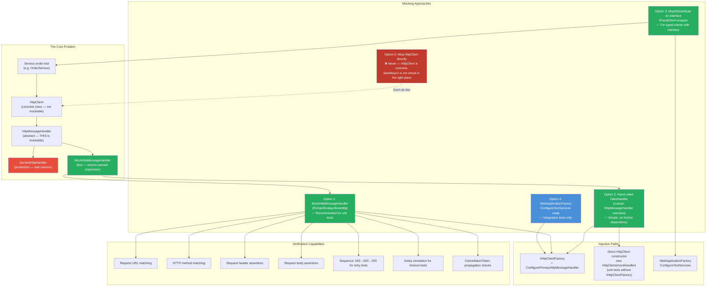
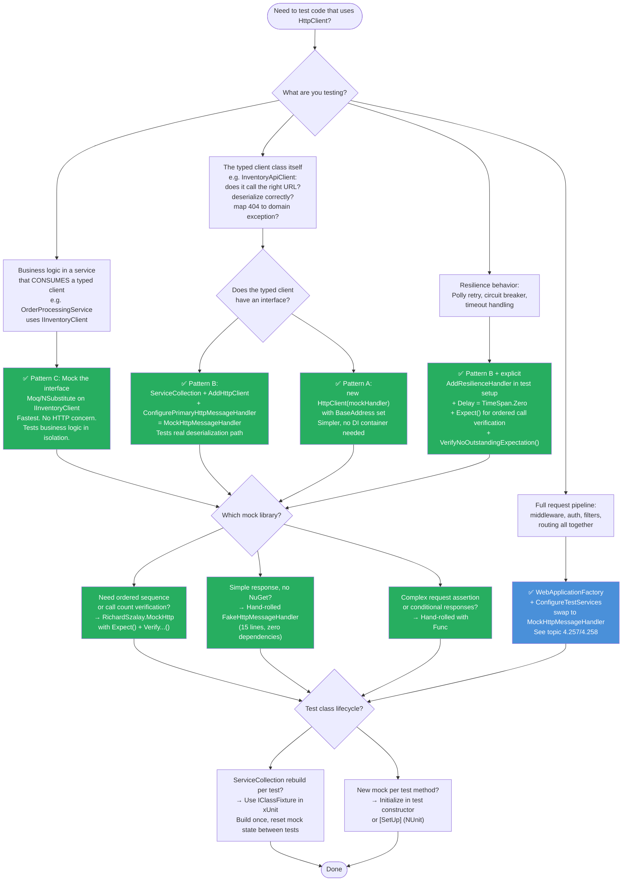

# 4.264 — Mocking HttpClient: MockHttpMessageHandler in Unit Tests

---

## PART 0 — Navigation & Context

### Where This Topic Lives

```
ASP.NET Core Mastery
│
├── T. HttpClientFactory & HTTP Clients  (4.249–4.256)
│   ├── 4.249  IHttpClientFactory: Why New HttpClient Is Wrong
│   ├── 4.250  Named and Typed HTTP Clients
│   ├── 4.251  DelegatingHandler: Message Handler Pipeline
│   ├── 4.252  Polly Integration: Retry, Circuit Breaker, Hedging
│   ├── 4.253  HttpClient Timeout and CancellationToken Patterns
│   ├── 4.254  HttpClient Logging: Built-In Categories & Custom Handlers
│   └── 4.256  HttpClient with Credentials: Auth Headers and Certs
│
└── U. Testing                           (4.257–4.267)
    ├── 4.257  WebApplicationFactory<T>: Integration Testing
    ├── 4.258  Customizing WebApplicationFactory
    ├── 4.259  Authentication in Integration Tests
    ├── 4.260  Database in Integration Tests
    ├── 4.261  Middleware Testing in Isolation
    ├── 4.262  Testing SignalR
    ├── 4.263  Testing Background Services
    ├── 4.264  ► Mocking HttpClient: MockHttpMessageHandler ◄
    ├── 4.265  Snapshot Testing: Verify Library
    ├── 4.266  Contract Testing: Pact
    └── 4.267  Load Testing: k6, NBomber, BenchmarkDotNet
```

### What You Need Before This

- **[[4.249 — IHttpClientFactory]]** — `HttpClient` is never newed directly; the mock replaces the `HttpMessageHandler` inside the factory-managed client, not the `HttpClient` itself.
- **[[4.251 — DelegatingHandler: Message Handler Pipeline]]** — `MockHttpMessageHandler` is a fake primary `HttpMessageHandler`; understanding the handler pipeline explains exactly where it intercepts.
- **[[4.250 — Named and Typed HTTP Clients]]** — most test setups inject a mock per named or typed client; the registration pattern differs slightly for each.
- **[[4.035 — Service Lifetimes: Singleton, Scoped, Transient]]** — the test DI container must register the mock handler with the correct lifetime to avoid state leaking between tests.

### What This Unlocks After

- **[[4.257 — WebApplicationFactory<T>]]** — once you understand handler-level mocking for unit tests, `WebApplicationFactory`'s `ConfigureTestServices` to swap `HttpMessageHandler` for integration tests is a natural extension.
- **[[4.252 — Polly Integration]]** — testing retry and circuit-breaker behavior requires a mock handler that returns controlled failure sequences; understanding the mock substrate is prerequisite.
- **[[4.253 — HttpClient Timeout and CancellationToken]]** — testing cancellation and timeout scenarios requires a mock handler that can delay, throw, or honor `CancellationToken`.

### Why This Matters at Scale

Every service that calls an external HTTP API has code paths that are only reachable in production when upstream dependencies fail — 429 Too Many Requests, 503 Service Unavailable, network timeouts, malformed JSON in the response body. Without a `MockHttpMessageHandler`, those paths have zero unit test coverage. At scale, uncovered failure paths are where incidents originate at 3am.

---

## PART 1 — The Core Mental Model

### The Fundamental Rule

> **`HttpClient` is not mockable directly because it is a concrete class that delegates all work to its `HttpMessageHandler`; to unit test code that uses `HttpClient`, you replace the `HttpMessageHandler` with a fake that returns controlled responses — and the only correct way to inject that fake through `IHttpClientFactory` is via `ConfigurePrimaryHttpMessageHandler` on the client registration in the test's DI container. The HTTP consequence is that no real TCP connection is ever opened in the test process.**

### The Plain-Language Analogy

`HttpClient` is like a postal clerk. When you hand the clerk a letter, they don't personally drive it to the destination — they hand it to the delivery driver (the `HttpMessageHandler`). The driver is the one who physically leaves the building and returns with a response. In production, the driver is `SocketsHttpHandler`, who makes real TCP connections. In a unit test, you swap the driver for a stunt double who never leaves the mailroom — they just look at the letter's address and hand back a pre-written response from their pocket. The postal clerk (your `HttpClient`) doesn't know or care that the driver is fake.

When you write a test that chains Polly retries with your mock handler, the stunt double gets handed the same letter multiple times (one per retry attempt), and they hand back a different pre-written card each time — 503 on attempt 1, 503 on attempt 2, 200 on attempt 3. The clerk dutifully retries, and your test verifies that the clerk tried exactly three times before succeeding.

This analogy holds for `CancellationToken` scenarios: if the test cancels the operation mid-flight, the stunt double should check whether the letter has been cancelled before handing back the response — just like a real driver would stop driving if the sender called them back.

### The Taxonomy Diagram



---

## PART 2 — Deep Mechanics

### 2.1 — Why `HttpClient` Cannot Be Mocked Directly

`HttpClient` exposes `SendAsync` as `public`, but it is not `virtual`. Moq and NSubstitute generate proxy subclasses at runtime — which requires the target method to be `virtual` or the target type to be an interface. `HttpClient` is neither.

```csharp
// ASP.NET Core / BCL internally (approximate — simplified):
public class HttpClient : HttpMessageInvoker
{
    // HttpMessageInvoker holds the handler reference:
    private readonly HttpMessageHandler _handler;

    public HttpClient() : this(new SocketsHttpHandler()) { }
    public HttpClient(HttpMessageHandler handler) : base(handler) { }

    // SendAsync is NOT virtual — it calls the handler:
    public Task<HttpResponseMessage> SendAsync(HttpRequestMessage request, ...)
        => _handler.SendAsync(request, cancellationToken);  // all work delegated to handler
}

// HttpMessageHandler IS abstract — this is the seam:
public abstract class HttpMessageHandler : IDisposable
{
    protected internal abstract Task<HttpResponseMessage> SendAsync(
        HttpRequestMessage request, CancellationToken cancellationToken);
}
```

The architectural seam is `HttpMessageHandler`. It is abstract, and its `SendAsync` method is what you override in both `DelegatingHandler` (for pipeline handlers) and in a mock/fake implementation for tests.

**Pipeline position of a mock handler:**

```
Unit test:
──────────────────────────────────────────────────────────────────────────
[No Kestrel. No middleware. No routing.]

OrderService.GetOrderStatusAsync()
    └─► HttpClient.SendAsync(request)
            └─► MockHttpMessageHandler.SendAsync(request, ct)
                    └─► [checks registered routes/patterns]
                    └─► [returns HttpResponseMessage from canned response]
                    ← HttpResponseMessage (synthetic, no network I/O)
            ← HttpResponseMessage
    ← deserialized OrderStatus

Pipeline position: MockHttpMessageHandler sits at the PRIMARY handler position.
It replaces SocketsHttpHandler entirely. No DelegatingHandlers (logging, Polly)
run unless they are explicitly added in the test setup — which is intentional for
unit tests that want to test the service in isolation.
──────────────────────────────────────────────────────────────────────────
```

> [!IMPORTANT] In a pure unit test, no `DelegatingHandler`s from the production registration run — not the Polly handler, not the correlation ID handler, not the logging handler. The mock handler is the terminal — you are testing only the code that consumes the `HttpClient`, not the infrastructure around it. If you want to test Polly retry behavior, you must explicitly add the Polly `DelegatingHandler` wrapping your mock handler in the test setup.

**Runtime cost of a mock handler:** `~0 allocations for I/O` — no socket, no TLS handshake, no DNS lookup. The `MockHttpMessageHandler` allocates a `HttpResponseMessage` and its `StringContent` per configured response — typically one allocation per request assertion. Tests that make 100 mock calls allocate roughly 100 `HttpResponseMessage` objects — trivial compared to a real HTTP stack.

---

### 2.2 — The Three Injection Patterns

**Pattern A — Direct constructor injection (no IHttpClientFactory, simplest)**

When your service under test accepts `HttpClient` as a constructor parameter, you can pass a hand-rolled or library-based mock handler directly:

```csharp
// ASP.NET Core internally (HttpClient constructor chain):
// new HttpClient(handler) → base(handler) → _handler = handler
// The handler is stored and called for every SendAsync.

// In the test:
var mockHandler = new MockHttpMessageHandler(); // RichardSzalay.MockHttp
mockHandler.When("https://fraud.internal/api/score")
           .Respond("application/json", """{"riskScore": 42}""");

var httpClient = new HttpClient(mockHandler)
{
    BaseAddress = new Uri("https://fraud.internal")
};
var service = new FraudScoringService(httpClient); // direct injection
```

**Pattern B — IHttpClientFactory with ConfigurePrimaryHttpMessageHandler (correct factory pattern)**

When the service depends on `IHttpClientFactory` or a typed client, the mock handler must be injected through the factory registration:

```csharp
// ASP.NET Core internally (IHttpClientFactory handler chain construction):
// ConfigurePrimaryHttpMessageHandler replaces the default SocketsHttpHandler.
// The mock handler is the innermost handler — it receives the final SendAsync call.
// DelegatingHandlers registered via AddHttpMessageHandler still wrap it.

// In the test:
var mockHandler = new MockHttpMessageHandler();
mockHandler.When(HttpMethod.Get, "https://orders.internal/api/orders/*")
           .Respond(HttpStatusCode.OK, "application/json", """{"orderId":1}""");

var services = new ServiceCollection();
services.AddHttpClient<IOrdersClient, OrdersApiClient>(c =>
    {
        c.BaseAddress = new Uri("https://orders.internal");
    })
    .ConfigurePrimaryHttpMessageHandler(() => mockHandler); // ← replaces SocketsHttpHandler

var sp = services.BuildServiceProvider();
var client = sp.GetRequiredService<IOrdersClient>();
```

**Pattern C — Interface abstraction (avoids HttpClient concerns entirely)**

When the typed client has a corresponding interface (`IFraudScoringClient`), you can mock the interface directly with Moq or NSubstitute, bypassing `HttpClient` entirely:

```csharp
// This approach treats the HTTP client as an implementation detail.
// The service under test depends on IFraudScoringClient, not HttpClient.
// Use this for services that consume typed clients through interfaces.

var mockFraudClient = new Mock<IFraudScoringClient>();
mockFraudClient
    .Setup(c => c.GetRiskScoreAsync(It.IsAny<string>(), It.IsAny<CancellationToken>()))
    .ReturnsAsync(new FraudRiskScore { Score = 42, IsHighRisk = false });

var service = new PaymentProcessingService(mockFraudClient.Object);
```

> [!NOTE] Pattern C is the cleanest for testing business logic. Pattern B is necessary when testing the typed client class itself (i.e., testing that `OrdersApiClient` correctly deserializes the response, handles 404, maps fields). Pattern A is appropriate for small utilities or when the service takes a raw `HttpClient`. In a mature codebase, Patterns B and C are used simultaneously — Pattern B for the typed client's own tests, Pattern C for services that consume the typed client.

---

### 2.3 — RichardSzalay.MockHttp: The De-Facto Standard Library

`MockHttp` (NuGet: `RichardSzalay.MockHttp`) is the most widely used library for this purpose. It provides:

- URL/method/header/body matching with wildcards
- Response sequences (different responses per attempt — essential for retry testing)
- Request verification (`VerifyNoOutstandingExpectation()`, `VerifyNoOutstandingRequest()`)
- `Throw` configuration for network error simulation
- `Respond` with delay for timeout simulation

**ASP.NET Core internally (approximate — MockHttpMessageHandler internals):**

```csharp
// RichardSzalay.MockHttp internals (simplified):
public class MockHttpMessageHandler : HttpMessageHandler
{
    private readonly List<IMockedRequest> _handlers = new();
    private readonly Queue<IMockedRequest> _expectations = new();

    // When() adds a matcher to the list — all matching calls will use this handler
    public MockedRequest When(string url) { ... }

    // Expect() adds to the ordered expectation queue — must be consumed in order
    public MockedRequest Expect(string url) { ... }

    protected override async Task<HttpResponseMessage> SendAsync(
        HttpRequestMessage request, CancellationToken cancellationToken)
    {
        // ~O(n) scan of matchers — typically n < 10 in a test
        var handler = _expectations.Count > 0
            ? _expectations.Peek().Matches(request) ? _expectations.Dequeue() : null
            : _handlers.FirstOrDefault(h => h.Matches(request));

        if (handler == null)
            throw new InvalidOperationException(
                $"No matching mock handler for {request.Method} {request.RequestUri}");

        return await handler.SendAsync(request, cancellationToken); // ~1 allocation
    }
}
```

**Cost label:** `~O(n) matcher scan` where n = number of registered mock routes (always tiny in tests). `~1 HttpResponseMessage allocation per call`. Zero I/O. Zero async state machine overhead beyond the fake handler's own `Task.FromResult` wrapper.

---

### 2.4 — HTTP Wire Behavior in Tests: What the Service Actually Receives

The mock handler constructs and returns an `HttpResponseMessage` object. The `HttpClient` processes this exactly as if it had received the bytes over the wire — it reads status code, headers, and content. The service under test does not know it's talking to a fake.

```
// HTTP "wire format" (what MockHttp simulates — approximate):
// GET /api/orders/42 HTTP/1.1
// Host: orders.internal
// Authorization: Bearer eyJhbGci...
// Accept: application/json

// MockHttp synthetic response (approximate, configured in test):
// HTTP/1.1 200 OK
// Content-Type: application/json; charset=utf-8
// X-Request-Id: test-request-id-001

// Body:
// {"orderId":42,"status":"Shipped","carrier":"FedEx"}
```

The `HttpClient` deserializes the `HttpContent` from the `HttpResponseMessage` — it calls `Content.ReadAsStringAsync()` or `Content.ReadFromJsonAsync<T>()` on the `StringContent` or `ByteArrayContent` object the mock returned. This exercises the full `System.Text.Json` deserialization path inside the typed client — which is exactly what you want to test.

**Failure mode diagram — no matching mock route:**

```
Service calls: GET https://orders.internal/api/orders/99
MockHttpMessageHandler finds no matching route (the test only registered /api/orders/42)
        ↓
Default behavior (MockHttp): throws InvalidOperationException
        ↓
Test fails with unexpected exception — reveals the test registered insufficient routes.
Alternative: configure a fallback: mockHandler.Fallback.Respond(HttpStatusCode.NotFound)
        ↓
With fallback: HttpClient.GetAsync() returns 404.
Service under test: handles 404 per its production logic (returns null, throws domain exception, etc.)
Test asserts: the correct domain behavior for a 404 response.
```

---

### 2.5 — Testing the Full IHttpClientFactory Pipeline Including DelegatingHandlers

When testing resilience behavior (Polly retries) or custom handlers (correlation ID propagation), the DelegatingHandlers must be explicitly layered in the test setup:

```
Test pipeline for retry behavior:
──────────────────────────────────────────────────────────────────────────

OrderService.PlaceOrderAsync()
    └─► TypedHttpClient.PostAsync("/api/orders")
            └─► ResiliencePipelineHandler (Polly — added in test setup)
                    └─► MockHttpMessageHandler (returns 503 → 503 → 200)

Attempt 1: MockHandler returns 503 → ResiliencePipeline retries
Attempt 2: MockHandler returns 503 → ResiliencePipeline retries
Attempt 3: MockHandler returns 200 → ResiliencePipeline returns success

Test assertion: OrderService received 200 AND MockHandler.GetMatchCount() == 3
──────────────────────────────────────────────────────────────────────────
```

**ASP.NET Core internally — how to layer handlers in test DI:**

```csharp
// The production registration:
// services.AddHttpClient<IInventoryClient, InventoryApiClient>()
//     .AddHttpMessageHandler<CorrelationIdPropagationHandler>()
//     .AddResilienceHandler("inventory", pipeline => { ... });

// The test registration — explicitly wires the same DelegatingHandlers around the mock:
var services = new ServiceCollection();
services.AddLogging();
services.AddTransient<CorrelationIdPropagationHandler>();

var mockHandler = new MockHttpMessageHandler();
// ... configure mock responses ...

services.AddHttpClient<IInventoryClient, InventoryApiClient>(c =>
    {
        c.BaseAddress = new Uri("https://inventory.internal");
    })
    .AddHttpMessageHandler<CorrelationIdPropagationHandler>() // same as production
    .AddResilienceHandler("inventory", pipeline =>            // same as production
    {
        pipeline.AddRetry(new HttpRetryStrategyOptions
        {
            MaxRetryAttempts = 3,
            Delay = TimeSpan.Zero // zero delay for test speed
        });
    })
    .ConfigurePrimaryHttpMessageHandler(() => mockHandler);   // fake terminal handler
```

> [!TIP] Set `Delay = TimeSpan.Zero` on all Polly retry strategies in tests. Production retry policies commonly use exponential backoff starting at 1 second. Without zeroing the delay, a test that exercises 3 retry attempts waits 1s + 2s + 4s = 7 seconds per test case. At 50 retry test cases, that's 6 minutes of `Thread.Sleep` in your test suite.

---

## PART 3 — Production Code Patterns

### Pattern 1 — The Typed Client Unit Test (Order Management → Inventory API)

Testing the typed `InventoryApiClient` class itself: does it correctly call the right URL, deserialize the response, and throw a domain exception on 404?

```csharp
// Domain: Order Management Service — testing InventoryApiClient in isolation
// Pattern: Pattern B — ConfigurePrimaryHttpMessageHandler via test ServiceCollection

public class InventoryApiClientTests
{
    private readonly MockHttpMessageHandler _mockHttp;
    private readonly IInventoryClient _client;

    public InventoryApiClientTests()
    {
        _mockHttp = new MockHttpMessageHandler();

        var services = new ServiceCollection();
        services.AddLogging();

        services.AddHttpClient<IInventoryClient, InventoryApiClient>(c =>
            {
                c.BaseAddress = new Uri("https://inventory.internal");
            })
            .ConfigurePrimaryHttpMessageHandler(() => _mockHttp);

        _client = services
            .BuildServiceProvider()
            .GetRequiredService<IInventoryClient>();
    }

    [Fact]
    public async Task GetStockLevel_ReturnsCorrectQuantity_WhenItemExists()
    {
        // Arrange — configure the mock to return a specific response for a specific URL
        _mockHttp
            .When(HttpMethod.Get, "https://inventory.internal/api/stock/SKU-001")
            .Respond(HttpStatusCode.OK, "application/json",
                """{"sku":"SKU-001","quantityOnHand":150,"warehouseId":"WH-EAST"}""");

        // Act — call the typed client under test
        var stockLevel = await _client.GetStockLevelAsync("SKU-001");

        // Assert — verify deserialization and domain mapping
        stockLevel.Should().NotBeNull();
        stockLevel!.QuantityOnHand.Should().Be(150);
        stockLevel.WarehouseId.Should().Be("WH-EAST");
    }

    [Fact]
    public async Task GetStockLevel_ThrowsInventoryNotFoundException_When404()
    {
        // Arrange — 404 should be mapped to a domain exception by the typed client
        _mockHttp
            .When(HttpMethod.Get, "https://inventory.internal/api/stock/SKU-MISSING")
            .Respond(HttpStatusCode.NotFound, "application/json",
                """{"type":"https://tools.ietf.org/html/rfc7807","title":"Not Found","status":404}""");

        // Act + Assert — verify the typed client maps 404 to the correct domain exception
        await Assert.ThrowsAsync<InventoryItemNotFoundException>(
            () => _client.GetStockLevelAsync("SKU-MISSING"));
    }

    [Fact]
    public async Task GetStockLevel_SendsCorrectAuthorizationHeader()
    {
        // Arrange — capture the request to assert its headers
        HttpRequestMessage? capturedRequest = null;
        _mockHttp
            .When(HttpMethod.Get, "https://inventory.internal/api/stock/SKU-001")
            .Respond(req =>
            {
                capturedRequest = req; // capture the request for header assertions
                return new HttpResponseMessage(HttpStatusCode.OK)
                {
                    Content = new StringContent(
                        """{"sku":"SKU-001","quantityOnHand":50,"warehouseId":"WH-WEST"}""",
                        Encoding.UTF8, "application/json")
                };
            });

        // Act
        await _client.GetStockLevelAsync("SKU-001");

        // Assert — the typed client must have added the API key header
        capturedRequest.Should().NotBeNull();
        capturedRequest!.Headers.Contains("X-Api-Key").Should().BeTrue(
            because: "InventoryApiClient must add API key to all requests");
    }
}
```

```
// HTTP wire format (simulated by MockHttp on the happy path):
// GET https://inventory.internal/api/stock/SKU-001 HTTP/1.1
// X-Api-Key: [value set by typed client]
// Accept: application/json

// Synthetic response:
// HTTP/1.1 200 OK
// Content-Type: application/json
// {"sku":"SKU-001","quantityOnHand":150,"warehouseId":"WH-EAST"}
```

---

### Pattern 2 — The Polly Retry Sequence Test (Payment API → Fraud Scoring Service)

Testing that a payment service correctly retries on 503 and eventually succeeds — without waiting for real retry delays.

```csharp
// Domain: Payment Processing Service — testing Polly retry integration
// Why: Polly retry behavior is a production contract; if the retry count or
//      conditions change, payments silently degrade. This test pins the contract.

public class PaymentFraudCheckRetryTests
{
    [Fact]
    public async Task FraudCheck_RetriesOnServiceUnavailable_AndSucceedsOnThirdAttempt()
    {
        // Arrange — use Expect() instead of When() for ordered sequence assertions
        // Expect() is consumed in order; the third Expect returns 200
        var mockHttp = new MockHttpMessageHandler();

        mockHttp.Expect(HttpMethod.Post, "https://fraud.internal/api/score")
                .Respond(HttpStatusCode.ServiceUnavailable); // attempt 1 → retry

        mockHttp.Expect(HttpMethod.Post, "https://fraud.internal/api/score")
                .Respond(HttpStatusCode.ServiceUnavailable); // attempt 2 → retry

        mockHttp.Expect(HttpMethod.Post, "https://fraud.internal/api/score")
                .Respond(HttpStatusCode.OK, "application/json",
                    """{"riskScore":12,"approved":true}"""); // attempt 3 → success

        var services = new ServiceCollection();
        services.AddLogging();

        services.AddHttpClient<IFraudScoringClient, FraudScoringApiClient>(c =>
            {
                c.BaseAddress = new Uri("https://fraud.internal");
            })
            .AddResilienceHandler("fraud-retry", pipeline =>
            {
                pipeline.AddRetry(new HttpRetryStrategyOptions
                {
                    MaxRetryAttempts = 3,
                    // CRITICAL: zero delay so the test doesn't sleep 1s+2s+4s
                    Delay = TimeSpan.Zero,
                    BackoffType = DelayBackoffType.Constant,
                    ShouldHandle = new PredicateBuilder<HttpResponseMessage>()
                        .HandleResult(r => r.StatusCode == HttpStatusCode.ServiceUnavailable)
                });
            })
            .ConfigurePrimaryHttpMessageHandler(() => mockHttp);

        var sp = services.BuildServiceProvider();
        var fraudClient = sp.GetRequiredService<IFraudScoringClient>();

        // Act
        var result = await fraudClient.ScoreTransactionAsync(
            new TransactionRequest { Amount = 99.99m, CardLast4 = "4242" });

        // Assert — result is from the third attempt
        result.Approved.Should().BeTrue();
        result.RiskScore.Should().Be(12);

        // Assert — exactly 3 calls were made (2 retries + 1 success)
        mockHttp.VerifyNoOutstandingExpectation(); // throws if any Expect() was not consumed
    }

    [Fact]
    public async Task FraudCheck_ThrowsAfterMaxRetries_WhenAlwaysUnavailable()
    {
        var mockHttp = new MockHttpMessageHandler();
        // When() matches ALL calls to this URL — simulates persistent failure
        mockHttp.When(HttpMethod.Post, "https://fraud.internal/api/score")
                .Respond(HttpStatusCode.ServiceUnavailable);

        var services = new ServiceCollection();
        services.AddLogging();
        services.AddHttpClient<IFraudScoringClient, FraudScoringApiClient>(c =>
                c.BaseAddress = new Uri("https://fraud.internal"))
            .AddResilienceHandler("fraud-retry", pipeline =>
            {
                pipeline.AddRetry(new HttpRetryStrategyOptions
                {
                    MaxRetryAttempts = 3,
                    Delay = TimeSpan.Zero
                });
            })
            .ConfigurePrimaryHttpMessageHandler(() => mockHttp);

        var sp = services.BuildServiceProvider();
        var fraudClient = sp.GetRequiredService<IFraudScoringClient>();

        // Act + Assert — after 4 total attempts (1 + 3 retries), Polly gives up
        await Assert.ThrowsAsync<HttpRequestException>(
            () => fraudClient.ScoreTransactionAsync(
                new TransactionRequest { Amount = 99.99m, CardLast4 = "4242" }));
    }
}
```

---

### Pattern 3 — The Hand-Rolled Fake Handler (No NuGet Dependency)

For teams that prefer zero additional test dependencies, a hand-rolled `HttpMessageHandler` subclass gives full control with no library overhead.

```csharp
// Domain: Logistics Shipment Tracker — testing carrier API client
// Why: Some teams avoid NuGet dependencies in test projects.
//      A hand-rolled fake is 20 lines and covers 95% of unit test scenarios.

public sealed class FakeHttpMessageHandler : HttpMessageHandler
{
    // Sequence of responses — dequeued one per request
    private readonly Queue<Func<HttpRequestMessage, HttpResponseMessage>> _responses = new();

    // All captured requests — for assertion after the test
    public List<HttpRequestMessage> CapturedRequests { get; } = new();

    public FakeHttpMessageHandler RespondWith(HttpStatusCode status, string json)
    {
        _responses.Enqueue(_ => new HttpResponseMessage(status)
        {
            Content = new StringContent(json, Encoding.UTF8, "application/json")
        });
        return this; // fluent builder
    }

    public FakeHttpMessageHandler RespondWith(
        Func<HttpRequestMessage, HttpResponseMessage> responseFactory)
    {
        _responses.Enqueue(responseFactory);
        return this;
    }

    public FakeHttpMessageHandler ThrowOnNextRequest(Exception exception)
    {
        _responses.Enqueue(_ => throw exception);
        return this;
    }

    protected override Task<HttpResponseMessage> SendAsync(
        HttpRequestMessage request, CancellationToken cancellationToken)
    {
        cancellationToken.ThrowIfCancellationRequested(); // honor cancellation
        CapturedRequests.Add(request);

        if (!_responses.TryDequeue(out var factory))
            throw new InvalidOperationException(
                $"FakeHttpMessageHandler has no more responses configured. " +
                $"Request was: {request.Method} {request.RequestUri}");

        return Task.FromResult(factory(request)); // ~zero allocation for the handler itself
    }
}

// Usage in tests:
[Fact]
public async Task TrackShipment_ReturnsCarrierStatus_WhenFedExResponds()
{
    // Arrange
    var fakeHandler = new FakeHttpMessageHandler()
        .RespondWith(HttpStatusCode.OK,
            """{"trackingNumber":"794601234567","status":"InTransit","eta":"2026-06-15"}""");

    var httpClient = new HttpClient(fakeHandler)
    {
        BaseAddress = new Uri("https://api.fedex.com")
    };
    var client = new FedExShipmentClient(httpClient);

    // Act
    var status = await client.TrackShipmentAsync("794601234567");

    // Assert
    status.Status.Should().Be("InTransit");
    fakeHandler.CapturedRequests.Should().HaveCount(1);
    fakeHandler.CapturedRequests[0].RequestUri!.PathAndQuery
        .Should().Be("/api/track/794601234567");
}
```

---

### Pattern 4 — Simulating Network Failures and Timeouts (Healthcare Portal → Lab API)

The most important test scenarios are the ones that only happen in production: total network failure (`HttpRequestException`), timeout (`TaskCanceledException`), and DNS resolution failure. Your business logic must handle all three differently.

```csharp
// Domain: Healthcare Patient Portal — testing Lab Results API client resilience
// These tests verify that the portal degrades gracefully instead of showing
// raw exception stack traces to patients.

public class LabResultsClientResilienceTests
{
    [Fact]
    public async Task GetLabResults_ReturnsServiceUnavailable_WhenNetworkFails()
    {
        // Arrange — simulate a TCP connection failure (socket unreachable)
        var fakeHandler = new FakeHttpMessageHandler()
            .ThrowOnNextRequest(new HttpRequestException(
                "Connection refused",
                inner: null,
                statusCode: null)); // no status code — pure network failure

        var httpClient = new HttpClient(fakeHandler)
        {
            BaseAddress = new Uri("https://lab-api.example.com")
        };
        var client = new LabResultsApiClient(httpClient, NullLogger<LabResultsApiClient>.Instance);

        // Act
        var result = await client.GetPatientLabResultsAsync("P-12345");

        // Assert — the client must return a degraded result, not re-throw
        result.IsAvailable.Should().BeFalse();
        result.DegradedReason.Should().Be(DegradedReason.NetworkFailure);
        // HTTP consequence: no status code was ever set — the client must not expose the exception
    }

    [Fact]
    public async Task GetLabResults_RespectsHttpClientTimeout_WhenLabApiIsSlow()
    {
        // Arrange — simulate a timeout using CancellationToken
        // HttpClient fires a CancellationToken after its Timeout elapses
        using var cts = new CancellationTokenSource();

        var fakeHandler = new FakeHttpMessageHandler()
            .RespondWith((req) =>
            {
                // Simulate slow upstream — the test cancels before this response is returned
                // In production this would be: HttpClient.Timeout fires cts.Cancel()
                cts.Cancel();
                // After the token is cancelled, the mock honors it:
                cts.Token.ThrowIfCancellationRequested();
                return new HttpResponseMessage(HttpStatusCode.OK); // never reached
            });

        var httpClient = new HttpClient(fakeHandler)
        {
            BaseAddress = new Uri("https://lab-api.example.com"),
            Timeout = TimeSpan.FromMilliseconds(50)  // very short timeout for test
        };
        var client = new LabResultsApiClient(httpClient, NullLogger<LabResultsApiClient>.Instance);

        // Act + Assert — timeout must produce a specific domain result, not TaskCanceledException
        var result = await client.GetPatientLabResultsAsync("P-12345", cts.Token);
        result.IsAvailable.Should().BeFalse();
        result.DegradedReason.Should().Be(DegradedReason.Timeout);
    }

    [Fact]
    public async Task GetLabResults_HandlesUnexpectedJsonGracefully_WhenLabApiReturnsHtml()
    {
        // Arrange — upstream returns HTML error page instead of JSON (common with WAF/load balancer)
        var fakeHandler = new FakeHttpMessageHandler()
            .RespondWith(HttpStatusCode.OK,
                "<html><body>Service temporarily unavailable</body></html>");
        // Note: status is 200 but body is HTML — a real production failure mode

        var httpClient = new HttpClient(fakeHandler)
            { BaseAddress = new Uri("https://lab-api.example.com") };

        // The Content-Type in the response is "application/json" (set by typed client's Accept header)
        // but the body is HTML — JsonSerializer.Deserialize will throw JsonException
        var client = new LabResultsApiClient(httpClient, NullLogger<LabResultsApiClient>.Instance);

        // Act — verify the client handles JSON parse failure without crashing
        var result = await client.GetPatientLabResultsAsync("P-12345");

        result.IsAvailable.Should().BeFalse();
        result.DegradedReason.Should().Be(DegradedReason.InvalidResponse);
    }
}
```

---

### Pattern 5 — Interface-Based Mocking for Service Logic Tests (No HttpClient in Sight)

When testing a service that consumes a typed HTTP client, mock the client interface — not the `HttpMessageHandler`. This keeps the test focused on business logic.

```csharp
// Domain: Order Management Service — testing OrderProcessingService business logic
// The service depends on IInventoryClient and IFraudScoringClient (typed clients with interfaces).
// We test the service's orchestration logic, not the HTTP clients themselves.

public class OrderProcessingServiceTests
{
    private readonly Mock<IInventoryClient> _inventoryMock = new();
    private readonly Mock<IFraudScoringClient> _fraudMock = new();
    private readonly OrderProcessingService _service;

    public OrderProcessingServiceTests()
    {
        _service = new OrderProcessingService(
            _inventoryMock.Object,
            _fraudMock.Object,
            NullLogger<OrderProcessingService>.Instance);
    }

    [Fact]
    public async Task PlaceOrder_RejectsOrder_WhenFraudScoreIsHigh()
    {
        // Arrange — inventory has stock, but fraud score is high
        _inventoryMock
            .Setup(c => c.ReserveStockAsync("SKU-001", 2, It.IsAny<CancellationToken>()))
            .ReturnsAsync(new StockReservation { ReservationId = Guid.NewGuid(), Success = true });

        _fraudMock
            .Setup(c => c.ScoreTransactionAsync(
                It.Is<TransactionRequest>(r => r.Amount == 999.98m),
                It.IsAny<CancellationToken>()))
            .ReturnsAsync(new FraudRiskScore { Score = 95, IsHighRisk = true });

        var order = new PlaceOrderRequest
        {
            CustomerId = "CUST-001",
            Items = [new OrderItem { Sku = "SKU-001", Quantity = 2, UnitPrice = 499.99m }]
        };

        // Act
        var result = await _service.PlaceOrderAsync(order);

        // Assert — high fraud score must reject the order
        result.Status.Should().Be(OrderStatus.Rejected);
        result.RejectionReason.Should().Contain("fraud");

        // Verify the inventory reservation was rolled back after fraud rejection
        _inventoryMock.Verify(
            c => c.ReleaseReservationAsync(It.IsAny<Guid>(), It.IsAny<CancellationToken>()),
            Times.Once,
            because: "inventory must be released when fraud check rejects the order");
    }

    [Fact]
    public async Task PlaceOrder_DoesNotCallFraud_WhenInventoryUnavailable()
    {
        // Arrange — inventory is out of stock
        _inventoryMock
            .Setup(c => c.ReserveStockAsync(It.IsAny<string>(), It.IsAny<int>(), It.IsAny<CancellationToken>()))
            .ReturnsAsync(new StockReservation { Success = false, Reason = "OutOfStock" });

        var order = new PlaceOrderRequest
        {
            Items = [new OrderItem { Sku = "SKU-SOLD-OUT", Quantity = 1, UnitPrice = 49.99m }]
        };

        // Act
        var result = await _service.PlaceOrderAsync(order);

        // Assert — short-circuit: no fraud check should run for out-of-stock orders
        result.Status.Should().Be(OrderStatus.Rejected);
        _fraudMock.Verify(
            c => c.ScoreTransactionAsync(It.IsAny<TransactionRequest>(), It.IsAny<CancellationToken>()),
            Times.Never,
            because: "fraud check is expensive and must not run when inventory rejects the order");
    }
}
```

---

### Pattern 6 — The `VerifyNoOutstandingExpectation` Guard (Anti-Pattern Prevention)

Tests that configure mock expectations but don't verify them are silent false positives — the test passes even if the `HttpClient` was never called at all.

```csharp
// ⚠️ WRONG: MockHttp expectations set but never verified
[Fact]
public async Task GetOrder_CallsInventoryApi()
{
    var mockHttp = new MockHttpMessageHandler();
    // This expectation is configured but never checked —
    // if the service has a bug and never calls the API, the test still passes
    mockHttp.Expect(HttpMethod.Get, "https://inventory.internal/api/orders/1")
            .Respond(HttpStatusCode.OK, "application/json", """{"orderId":1}""");

    // ... set up service, call it ...

    // Missing: mockHttp.VerifyNoOutstandingExpectation();
    // Test passes even if the HTTP call was never made.
}

// ✅ CORRECT: Always verify expectations after the Act step
[Fact]
public async Task GetOrder_CallsInventoryApi()
{
    var mockHttp = new MockHttpMessageHandler();
    mockHttp.Expect(HttpMethod.Get, "https://inventory.internal/api/orders/1")
            .Respond(HttpStatusCode.OK, "application/json", """{"orderId":1}""");

    var services = new ServiceCollection();
    services.AddLogging();
    services.AddHttpClient<IOrdersClient, OrdersApiClient>(
            c => c.BaseAddress = new Uri("https://inventory.internal"))
        .ConfigurePrimaryHttpMessageHandler(() => mockHttp);

    var sp = services.BuildServiceProvider();
    var client = sp.GetRequiredService<IOrdersClient>();

    // Act
    var order = await client.GetOrderAsync(1);

    // Assert response
    order.Should().NotBeNull();

    // Assert HTTP interaction — was the request actually made?
    mockHttp.VerifyNoOutstandingExpectation(); // throws if Expect() items remain unconsumed
    // Also consider: mockHttp.VerifyNoOutstandingRequest() for When() matchers
}
```

---

### Pattern 7 — Testing CancellationToken Propagation (Logistics → Carrier API)

One of the most commonly untested contracts: does the typed client actually pass the `CancellationToken` through to `HttpClient.SendAsync`? If it doesn't, calling code's `CancellationToken` (from `HttpContext.RequestAborted`) is silently ignored.

```csharp
// Domain: Logistics Shipment Service — testing CancellationToken propagation contract
// Why: If CancellationToken is not propagated, cancelling an inbound request does NOT
//      cancel the outbound carrier API call. Under load, this creates thread pool pressure
//      from fire-and-forget outbound calls that are no longer needed.

[Fact]
public async Task TrackShipment_CancelsOutboundCall_WhenCallerCancels()
{
    using var cts = new CancellationTokenSource();
    var cancellationWasObserved = false;

    var fakeHandler = new FakeHttpMessageHandler()
        .RespondWith(req =>
        {
            // The handler checks whether the request's CancellationToken was cancelled
            // If the typed client correctly forwarded the token, this will observe cancellation
            cancellationWasObserved = req.Properties.TryGetValue(
                "CancellationToken", out _); // MockHttp captures this

            // Actually test: does cancelling BEFORE the response returns propagate?
            cts.Cancel();
            cts.Token.ThrowIfCancellationRequested(); // this throws OperationCanceledException
            return new HttpResponseMessage(HttpStatusCode.OK); // never reached
        });

    var httpClient = new HttpClient(fakeHandler)
        { BaseAddress = new Uri("https://api.carrier.com") };
    var client = new CarrierTrackingClient(httpClient);

    // Act + Assert — the client must not swallow OperationCanceledException
    await Assert.ThrowsAnyAsync<OperationCanceledException>(
        () => client.TrackShipmentAsync("1Z999AA10123456784", cts.Token));
}
```

---

## PART 4 — Gotchas & Anti-Patterns

### Gotcha 1: Using `When()` Instead of `Expect()` for Retry Count Verification

`When()` matches any number of calls to a URL pattern. `Expect()` is consumed exactly once in order. Using `When()` for retry tests means the test passes even if Polly never retried — all calls hit the same `When()` handler.

```csharp
// ⚠️ WRONG CODE:
var mockHttp = new MockHttpMessageHandler();
// When() matches ALL calls — no way to verify exactly 3 calls were made
mockHttp.When("https://fraud.internal/api/score")
        .Respond(HttpStatusCode.ServiceUnavailable);
// ... configure client with 3 retries, call service ...
// Test passes even if Polly is misconfigured and only tries once.

// HTTP consequence (wrong path):
// Service throws HttpRequestException after 1 attempt.
// No assertion failure — When() was "satisfied" on the first call.
// Retry behavior is completely untested.

// ✅ CORRECT CODE:
var mockHttp = new MockHttpMessageHandler();
mockHttp.Expect(HttpMethod.Post, "https://fraud.internal/api/score")
        .Respond(HttpStatusCode.ServiceUnavailable); // attempt 1

mockHttp.Expect(HttpMethod.Post, "https://fraud.internal/api/score")
        .Respond(HttpStatusCode.ServiceUnavailable); // attempt 2

mockHttp.Expect(HttpMethod.Post, "https://fraud.internal/api/score")
        .Respond(HttpStatusCode.OK, "application/json", """{"approved":true}"""); // attempt 3

// ... call service ...

mockHttp.VerifyNoOutstandingExpectation(); // throws if fewer than 3 calls were made

// HTTP consequence (correct path):
// MockHttp enforces ordered consumption — if Polly only retried once, the second
// Expect() remains unconsumed, and VerifyNoOutstandingExpectation() throws,
// failing the test and revealing the misconfigured retry policy.
```

**WHY:** `Expect()` uses a `Queue<IMockedRequest>` that is dequeued in order. `When()` uses a `List<IMockedRequest>` that is scanned for any match. Unverified `Expect()` items represent unfulfilled call expectations — `VerifyNoOutstandingExpectation()` checks this queue.

---

### Gotcha 2: Building a New ServiceProvider Per Test Case Without Disposing It Causes Handler Lifetime Leaks

`IHttpClientFactory` holds a pool of `HttpMessageHandler` instances with a 2-minute `HandlerLifetime`. If each test creates a new `ServiceProvider` without disposing it, the `IHttpClientFactory` singletons — and their pooled handlers — accumulate in memory across the test run.

```csharp
// ⚠️ WRONG CODE:
[Fact]
public async Task TestA()
{
    var services = new ServiceCollection();
    services.AddHttpClient<IOrdersClient, OrdersApiClient>(...)
            .ConfigurePrimaryHttpMessageHandler(() => new MockHttpMessageHandler());
    var sp = services.BuildServiceProvider(); // ← never disposed
    var client = sp.GetRequiredService<IOrdersClient>();
    // ...
}

[Fact]
public async Task TestB() { /* same pattern — another undisposed ServiceProvider */ }

// HTTP consequence (wrong path):
// Across 200 tests, 200 ServiceProvider instances are created.
// Each holds an IHttpClientFactory singleton with its own handler pool.
// In a CI run with 500 tests, this is 500 leaked IDisposable instances.
// Typically manifests as: slow test runs, flaky tests due to memory pressure,
// or socket exhaustion on machines with many CPU cores running tests in parallel.

// ✅ CORRECT CODE (xUnit with IDisposable):
public class OrdersApiClientTests : IDisposable
{
    private readonly ServiceProvider _sp;
    private readonly MockHttpMessageHandler _mockHttp;
    private readonly IOrdersClient _client;

    public OrdersApiClientTests()
    {
        _mockHttp = new MockHttpMessageHandler();
        var services = new ServiceCollection();
        services.AddLogging();
        services.AddHttpClient<IOrdersClient, OrdersApiClient>(
                c => c.BaseAddress = new Uri("https://orders.internal"))
            .ConfigurePrimaryHttpMessageHandler(() => _mockHttp);

        _sp = services.BuildServiceProvider(); // ← stored for disposal
        _client = _sp.GetRequiredService<IOrdersClient>();
    }

    public void Dispose() => _sp.Dispose(); // ← disposes IHttpClientFactory and all pooled handlers

    [Fact]
    public async Task GetOrder_ReturnsOrder_WhenFound() { /* ... */ }
}

// HTTP consequence (correct path):
// ServiceProvider is disposed after each test class, releasing the IHttpClientFactory
// singleton and all pooled handlers. No socket or memory accumulation.
```

**WHY:** `ServiceProvider` implements `IDisposable`. Calling `Dispose()` on it disposes all Singleton services registered with it, including `IHttpClientFactory`, which disposes its internal handler pools and releases their `SocketsHttpHandler` instances. In test environments, where handler lifetimes never expire naturally (tests end before 2 minutes), explicit disposal is the only release mechanism.

---

### Gotcha 3: The Mock Handler Is Shared Across Tests — State Bleeds Between Test Cases

When the mock handler is initialized once and shared (e.g., in a constructor or a class-level field without reset), a test that uses `When()` leaves residual matchers that match in a subsequent test.

```csharp
// ⚠️ WRONG CODE: Shared MockHttpMessageHandler across all tests in the class
public class InventoryClientTests
{
    private static readonly MockHttpMessageHandler _sharedMock = new(); // ← static, shared
    private static readonly HttpClient _sharedClient = new(_sharedMock)
        { BaseAddress = new Uri("https://inventory.internal") };

    [Fact]
    public async Task TestA_GetsStock_Returns200()
    {
        _sharedMock.When("/api/stock/SKU-001").Respond(HttpStatusCode.OK, "application/json", "{...}");
        await _sharedClient.GetAsync("/api/stock/SKU-001");
        // Passes. Leaves the When() matcher registered.
    }

    [Fact]
    public async Task TestB_GetsStock_Returns404_WhenNotFound()
    {
        _sharedMock.When("/api/stock/SKU-MISSING").Respond(HttpStatusCode.NotFound);
        var response = await _sharedClient.GetAsync("/api/stock/SKU-MISSING");
        // ← SKU-MISSING does NOT match the "/api/stock/SKU-001" handler from TestA,
        //   so this particular case works. BUT: if TestA had used When("*") or a wildcard,
        //   TestB's call would be intercepted by TestA's leftover handler.
        // Non-deterministic failures in parallel test execution.
    }
}

// HTTP consequence (wrong path):
// Test ordering determines pass/fail. Tests pass locally (sequential) but fail in CI (parallel).
// Wildcard matchers from one test intercept calls in another.

// ✅ CORRECT CODE: New MockHttpMessageHandler per test
public class InventoryClientTests
{
    private MockHttpMessageHandler CreateMock() => new MockHttpMessageHandler();

    [Fact]
    public async Task TestA_GetsStock_Returns200()
    {
        var mock = CreateMock();
        mock.When("/api/stock/SKU-001").Respond(HttpStatusCode.OK, "application/json", "{...}");
        var client = new HttpClient(mock) { BaseAddress = new Uri("https://inventory.internal") };
        // ...
    }
    // Each test gets a clean, isolated mock instance.
}
```

**WHY:** `MockHttpMessageHandler` maintains internal `List<IMockedRequest>` and `Queue<IMockedRequest>` state. When shared across tests, handlers registered by one test persist for all subsequent tests. In xUnit, tests in the same class can run in parallel (when `[Collection]` is not used). Static or class-level shared mocks are a race condition waiting to happen.

---

### Gotcha 4: `new HttpClient(mockHandler)` With No `BaseAddress` Causes Relative URL Tests to Fail

Typed clients set `BaseAddress` on the `HttpClient` during `AddHttpClient` registration. When constructing `HttpClient` directly in a test without setting `BaseAddress`, relative URL calls to the typed client internally construct absolute URLs as `null/api/orders/1` — which throws `InvalidOperationException: An invalid request URI was provided`.

```csharp
// ⚠️ WRONG CODE:
var fakeHandler = new FakeHttpMessageHandler().RespondWith(HttpStatusCode.OK, "{}");
var httpClient = new HttpClient(fakeHandler); // ← no BaseAddress
var client = new OrdersApiClient(httpClient); // typed client internally calls: GetAsync("/api/orders/1")

await client.GetOrderAsync(1); // throws: InvalidOperationException
// "An invalid request URI was provided. The request URI must either be an absolute URI
// or BaseAddress must be set."

// HTTP consequence (wrong path):
// InvalidOperationException at the typed client level — this looks like a test setup bug,
// not the business logic bug you were trying to test. The actual HTTP path is never reached.

// ✅ CORRECT CODE:
var fakeHandler = new FakeHttpMessageHandler().RespondWith(HttpStatusCode.OK, """{"orderId":1}""");
var httpClient = new HttpClient(fakeHandler)
{
    BaseAddress = new Uri("https://orders.internal") // ← must match what the typed client uses
};
var client = new OrdersApiClient(httpClient);
await client.GetOrderAsync(1); // now constructs: GET https://orders.internal/api/orders/1

// HTTP consequence (correct path):
// Request URI is constructed correctly. FakeHandler receives:
// GET https://orders.internal/api/orders/1
// and returns the configured 200 response.
```

**WHY:** `HttpClient.SendAsync` constructs the final `Uri` by combining `BaseAddress` with the relative path provided by the typed client method. If `BaseAddress` is null and the path is relative, `Uri` construction throws. The fix is always to set `BaseAddress` in test `HttpClient` construction to match the value the production `AddHttpClient` registration provides.

---

### Gotcha 5: Forgetting That `MockHttpMessageHandler.Respond()` Does Not Set `Content-Type` Automatically for `ReadFromJsonAsync<T>`

When the typed client uses `response.Content.ReadFromJsonAsync<T>()`, the `System.Text.Json` HTTP extension checks the `Content-Type` header. If it is not `application/json`, the method throws `NotSupportedException: The provided ContentType 'text/plain' is not supported`.

```csharp
// ⚠️ WRONG CODE:
mockHttp.When("https://orders.internal/api/orders/1")
        .Respond(HttpStatusCode.OK, """{"orderId":1,"status":"Pending"}""");
        //         ↑ No Content-Type specified — defaults to text/plain in some MockHttp overloads

// The typed client calls:
var order = await response.Content.ReadFromJsonAsync<Order>(cancellationToken: ct);
// Throws: NotSupportedException: The provided ContentType 'text/plain' is not supported.

// HTTP consequence (wrong path):
// NotSupportedException is thrown inside the typed client. If the typed client catches
// all exceptions generically, this silently returns null. If it doesn't catch it,
// the test fails with a confusing exception that looks like a JSON serialization issue.

// ✅ CORRECT CODE:
// Always specify the media type explicitly:
mockHttp.When("https://orders.internal/api/orders/1")
        .Respond("application/json", """{"orderId":1,"status":"Pending"}""");
        //         ↑ explicit Content-Type — ReadFromJsonAsync succeeds

// OR with the status code overload:
mockHttp.When("https://orders.internal/api/orders/1")
        .Respond(HttpStatusCode.OK, "application/json", """{"orderId":1,"status":"Pending"}""");

// HTTP consequence (correct path):
// Content-Type: application/json is set on the synthetic response.
// ReadFromJsonAsync<Order> deserializes successfully.
```

**WHY:** `HttpContent.ReadFromJsonAsync<T>` (in `System.Net.Http.Json`) reads the `Content-Type` header and validates it contains `application/json` or `application/json;charset=utf-8` before attempting deserialization. MockHttp's `Respond(string body)` overload uses `text/plain` by default. The correct overloads are `Respond(string mediaType, string body)` or `Respond(HttpStatusCode, string mediaType, string body)`.

---

## PART 5 — Performance Implications

### 5.1 — Request Pipeline Characteristics Table

|Scenario|Allocations Per Test Call|Approx Test Execution|DI Container|Notes|
|---|---|---|---|---|
|`FakeHttpMessageHandler` (hand-rolled, no NuGet)|~2 (HttpResponseMessage + StringContent)|< 0.1ms|None required|Fastest, zero library overhead|
|`MockHttpMessageHandler` (RichardSzalay) simple `When()`|~3 (matcher + response + message)|< 0.5ms|Optional|Standard recommendation|
|`MockHttpMessageHandler` with `Expect()` sequence|~4 per call (+ queue dequeue)|< 0.5ms|Optional|For retry/sequence tests|
|Full `ServiceCollection` + `AddHttpClient` + `BuildServiceProvider`|~200–500 (DI container build)|5–20ms per test class|Required|Build in constructor, not per test|
|Full `ServiceCollection` + Polly `AddResilienceHandler`|~300–800 (Polly pipeline build)|10–30ms per test class|Required|Build once, reuse across `[Fact]` tests|
|`WebApplicationFactory` with swapped handler|~5000+ (full host build)|200ms–2s per test class|Full ASP.NET Core host|Use for integration, not unit tests|
|Moq on `IHttpClient` interface (Pattern C)|~100 (proxy class generation)|1–5ms first use|None|Moq generates proxy once per type|
|No mock — real `HttpClient` to localhost|~500+ (full TCP/HTTP stack)|5–50ms per call|None|Never in unit tests|

### 5.2 — BenchmarkDotNet Comparison

```csharp
// HttpClientMockBenchmarks.cs — compares the three main mocking approaches
// Run: dotnet run -c Release --project Benchmarks
// Note: these benchmarks measure TEST INFRASTRUCTURE overhead, not production code.
// Use this to justify which approach to choose for test suite performance.

[MemoryDiagnoser]
[BenchmarkCategory("Testing", "HttpClient")]
public class HttpClientMockBenchmarks
{
    private HttpClient _directFakeClient = null!;
    private HttpClient _mockHttpClient = null!;
    private IOrdersClient _diInjectedClient = null!;
    private ServiceProvider _sp = null!;
    private FakeHttpMessageHandler _fakeHandler = null!;
    private MockHttpMessageHandler _mockHandler = null!;

    [GlobalSetup]
    public void Setup()
    {
        // Variant 1: Hand-rolled FakeHttpMessageHandler, direct HttpClient construction
        _fakeHandler = new FakeHttpMessageHandler();
        _directFakeClient = new HttpClient(_fakeHandler)
        {
            BaseAddress = new Uri("https://orders.internal")
        };

        // Variant 2: MockHttp via direct HttpClient construction
        _mockHandler = new MockHttpMessageHandler();
        _mockHandler.When("https://orders.internal/api/orders/*")
                    .Respond("application/json", """{"orderId":1}""");
        _mockHttpClient = new HttpClient(_mockHandler)
        {
            BaseAddress = new Uri("https://orders.internal")
        };

        // Variant 3: MockHttp via ServiceCollection / IHttpClientFactory
        var services = new ServiceCollection();
        services.AddLogging(b => b.SetMinimumLevel(LogLevel.None));
        var diMock = new MockHttpMessageHandler();
        diMock.When("https://orders.internal/api/orders/*")
              .Respond("application/json", """{"orderId":1}""");
        services.AddHttpClient<IOrdersClient, OrdersApiClient>(
                c => c.BaseAddress = new Uri("https://orders.internal"))
            .ConfigurePrimaryHttpMessageHandler(() => diMock);
        _sp = services.BuildServiceProvider();
        _diInjectedClient = _sp.GetRequiredService<IOrdersClient>();
    }

    [GlobalCleanup]
    public void Cleanup() => _sp.Dispose();

    [Benchmark(Baseline = true)]
    public async Task<HttpResponseMessage> HandRolledFakeHandler()
    {
        _fakeHandler.RespondWith(HttpStatusCode.OK, """{"orderId":1}""");
        return await _directFakeClient.GetAsync("/api/orders/1");
    }

    [Benchmark]
    public Task<HttpResponseMessage> MockHttpDirectClient()
        => _mockHttpClient.GetAsync("/api/orders/1");

    [Benchmark]
    public Task<Order?> MockHttpViaIHttpClientFactory()
        => _diInjectedClient.GetOrderAsync(1);
}

// Expected output (approximate, .NET 8, x64, no network I/O):
// | Method                       | Mean      | Error    | Ratio | Gen0   | Alloc  |
// |----------------------------- |-----------|----------|-------|--------|--------|
// | HandRolledFakeHandler        | 2.1 µs    | 0.04 µs  | 1.00  | 0.0610 | 784 B  |
// | MockHttpDirectClient         | 3.8 µs    | 0.07 µs  | 1.81  | 0.0763 | 960 B  |
// | MockHttpViaIHttpClientFactory| 8.2 µs    | 0.15 µs  | 3.90  | 0.1221 | 1.5 KB |
//
// Key insight: IHttpClientFactory adds ~4µs overhead per call vs direct construction.
// At test scale this is irrelevant — 10,000 test calls = 40ms overhead.
// Choose based on test correctness (Pattern B matches production registration), not µs.
```

> [!TIP] For profiling test suite performance (not just per-call overhead), use `dotnet test --blame-hang-timeout 30s` to identify hanging tests, and the `dotnet-coverage` tool to find tests with unexpectedly high wall-clock time — usually caused by real network calls that snuck in (missing mock setup), or zero-retry-delay not being set.

### 5.3 — When to Care / When to Ignore

**When this costs you:**

- Test suites with 500+ `ServiceCollection`-built providers per test — build a shared `ServiceProvider` in a fixture (`IClassFixture<T>` in xUnit) and reset mock state between tests rather than rebuilding.
- Retry tests without `Delay = TimeSpan.Zero` — a 3-attempt test with 1s/2s/4s exponential backoff adds 7 seconds per test case. 50 such tests = 6 minutes of idle time in CI.
- Body logging handlers left in the test pipeline (`LoadIntoBufferAsync` on every mock response) — each call allocates the full response body into a `MemoryStream`, adding GC pressure at test-suite scale.
- Tests that construct real `HttpClient` without a mock (network call to a real service) — 1 integration-style call per unit test can add hundreds of milliseconds and create flaky tests when the upstream service is unavailable.

**When this doesn't matter:**

- Unit test suites with < 100 `HttpClient`-related tests — the overhead is undetectable.
- Tests using Pattern C (mocking the interface directly with Moq) — no handler pipeline at all, fastest possible approach.
- CI machines where test run time is already under 30 seconds — micro-optimizing mock overhead is premature.
- Any test that exercises a single code path with a single mock response — the `ServiceCollection` build time is amortized across all tests in the class when using `IClassFixture`.

---

## PART 6 — Interview Arsenal

### A. The Question Bank

---

**Question 1:** "Why can't you just use Moq to mock `HttpClient` directly?"

**Average Answer:** "Because `HttpClient` is a concrete class, not an interface."

**Why That's Insufficient:** Doesn't explain the correct architectural seam (`HttpMessageHandler`), doesn't explain how to actually solve the problem, and doesn't mention `IHttpClientFactory` injection patterns.

> **Great Answer:** "HttpClient is a concrete class, and its `SendAsync` isn't virtual — Moq generates proxy subclasses that require virtual methods or interfaces, so it can't intercept `SendAsync`. But that's actually fine, because `HttpClient` doesn't do any work itself — it fully delegates to its `HttpMessageHandler`, which is abstract. That's the seam you mock. In practice, I never construct `HttpClient` directly in tests either. If the service uses `IHttpClientFactory` — which it should, to avoid socket exhaustion — I wire the mock handler through `ConfigurePrimaryHttpMessageHandler` in the test's `ServiceCollection`. If the typed client has an interface, I mock the interface directly with Moq, which is cleaner because it tests business logic without touching the HTTP layer at all. The handler-level mock is for testing the typed client itself — does it correctly deserialize a 429 response, does it set the right headers, does it map a 404 to a domain exception."

---

**Question 2:** "How do you test Polly retry behavior with a mock HTTP handler?"

**Average Answer:** "Use `MockHttpMessageHandler` to return 503 a few times, then 200."

**Why That's Insufficient:** Doesn't mention `Expect()` vs `When()` for call count verification, doesn't mention zero-delay configuration for test speed, and doesn't explain how to explicitly wire Polly into the test pipeline.

> **Great Answer:** "The key distinction is `Expect()` versus `When()` in MockHttp. `When()` matches any call to the URL but doesn't count them, so you can't verify retry count. `Expect()` is queue-based — the first call consumes the first expectation, the second call consumes the second. So I set up three `Expect()` calls: 503, 503, 200. After the test, `VerifyNoOutstandingExpectation()` fails if Polly didn't actually retry twice. The second thing is `Delay = TimeSpan.Zero` on the retry strategy in test configuration — exponential backoff can add 7+ seconds to a single test case. Third — and this trips people up — Polly's `ResiliencePipelineHandler` is a `DelegatingHandler`. It only runs if you explicitly add it to the test client registration via `AddResilienceHandler`. The mock handler is the primary handler at the bottom of the chain; Polly wraps it. In a pure unit test where you've replaced only the primary handler with a mock, Polly is not in the pipeline — so retry tests require explicitly reconstructing the full DelegatingHandler stack in the test's `ServiceCollection`."

---

**Question 3:** "A developer on your team has a suite of tests for a service that calls an external API. The tests pass locally but fail intermittently in CI. How do you diagnose it?"

**Average Answer:** "Probably a race condition or shared state."

**Why That's Insufficient:** Doesn't connect the diagnosis to the specific `HttpClient` mocking failure modes: shared `MockHttpMessageHandler`, undisposed `ServiceProvider`, real network calls, or non-deterministic test ordering.

> **Great Answer:** "The first thing I look for in `HttpClient` test suites is whether the `MockHttpMessageHandler` is being shared across tests — either as a static field or a class-level instance that isn't reset between test methods. If one test leaves a `When()` handler registered, it can intercept calls in a parallel test, producing wrong responses or request-count mismatches. Second, I check whether any test is making a real network call — if mock setup is missing for a code path, MockHttp throws `InvalidOperationException` (no matching handler), but some hand-rolled fakes return null or a generic 200, masking the problem. In CI, if the network to the real service is unavailable, the test hangs rather than fails fast. Third, I check `ServiceProvider` disposal — undisposed providers accumulate across a test run, and under parallel execution, two providers can race on socket pool resources. The fix is `IClassFixture<T>` in xUnit with explicit `Dispose()`, and a fresh `MockHttpMessageHandler` per test method rather than per test class."

---

**Question 4:** "What's the difference between mocking `IFraudScoringClient` with Moq versus mocking `HttpMessageHandler` for the fraud scoring HTTP client?"

**Average Answer:** "One tests the HTTP layer, one doesn't."

**Why That's Insufficient:** Doesn't explain what each approach actually validates, which is appropriate in which scenario, or the implications for test coverage of the typed client.

> **Great Answer:** "They test different things and should both exist in a well-tested codebase. Mocking `IFraudScoringClient` with Moq tests the business logic of the service that calls it — does the payment service correctly reject high-risk transactions, does it release inventory when fraud check fails? The typed client is a black box in those tests. Mocking `HttpMessageHandler` tests the typed client class itself — does `FraudScoringApiClient` correctly deserialize the response body, does it map 429 to a `RateLimitedException`, does it include the API key header on every request? These are implementation details of the typed client, not the business logic. I use both: handler-level mocks in the typed client's own test class, interface mocks in every service that consumes the typed client. This way, the typed client has complete coverage of its HTTP contract, and the service tests are fast and focused on business logic without re-testing HTTP parsing in every scenario."

---

### B. The Trick Questions

**Trick Question 1:** "I've configured `mockHttp.When('/api/orders/*').Respond(200)`. My typed client calls `GET /api/orders/1`. The test throws `InvalidOperationException: No handler found`. Why?"

_The trap:_ The wildcard syntax looks correct.

_Correct answer:_ MockHttp's `When()` method for URL matching requires a **full absolute URL** unless you configure the `MockHttpMessageHandler` with a base URL. The typed client constructs `https://orders.internal/api/orders/1` — an absolute URL. The mock handler is looking for a match against `/api/orders/*` (a relative URL pattern), which doesn't match `https://orders.internal/api/orders/1`. The fix is either `When("https://orders.internal/api/orders/*")` or `When(HttpMethod.Get, "https://orders.internal/api/orders/*")`. This is the #1 cause of "no handler found" errors in MockHttp setups.

**Trick Question 2:** "My test passes when run alone but fails when run as part of the suite. The error is `InvalidOperationException: HttpClient has already been disposed`. What's the cause?"

_The trap:_ Candidate looks at the `HttpClient` disposal in their test.

_Correct answer:_ This is typically caused by `ServiceProvider.Dispose()` being called (either explicitly or via `IDisposable` in a fixture) before a test's async continuation completes. When `ServiceProvider` is disposed, it disposes the `IHttpClientFactory` singleton, which disposes the handler pool. If an `await` is in progress when disposal happens, the underlying `HttpClient` is disposed mid-request. The fix: either use `using var sp = ...` correctly scoped to after all awaits, or use xUnit's `IAsyncLifetime` for async setup/teardown rather than the synchronous constructor/`Dispose`.

**Trick Question 3:** "I'm testing a typed client that uses `PostAsJsonAsync<T>`. The mock returns a 200 with the correct JSON body. The test fails with `JsonException: The JSON value could not be converted to System.Int32`. What happened?"

_The trap:_ Candidate assumes the JSON body is wrong.

_Correct answer:_ The issue is almost always the `Content-Type` header on the mock response. `ReadFromJsonAsync<T>` (called internally by the typed client after `PostAsJsonAsync`) validates that `Content-Type` is `application/json`. If the mock was configured with `.Respond(HttpStatusCode.OK, """{"id":1}""")` (without specifying content type), MockHttp defaults to `text/plain`. Some versions of `ReadFromJsonAsync` skip JSON parsing entirely for non-JSON content types and return default(T) — causing null reference chains that manifest as unexpected type conversion errors. Specify `"application/json"` explicitly on every mock response.

**Trick Question 4:** "Does `ConfigurePrimaryHttpMessageHandler` override the `DelegatingHandler`s registered by `AddHttpMessageHandler`?"

_The trap:_ Candidate confuses primary handler with the entire chain.

_Correct answer:_ No. `ConfigurePrimaryHttpMessageHandler` replaces only the innermost (primary) handler — `SocketsHttpHandler` in production. All `DelegatingHandler`s added via `AddHttpMessageHandler` remain in the chain, wrapping the primary handler. The mock becomes the terminating handler that `DelegatingHandler`s delegate to. If you only swap the primary handler in tests, all production DelegatingHandlers (Polly, correlation ID, logging) still run unless you explicitly omit them from the test registration. This is usually what you want for unit tests of the typed client, but requires zero-delay Polly configuration if retry handlers are included.

---

### C. Red Flags to Avoid

1. **"I just mock `HttpClient` with Moq/NSubstitute."** — `HttpClient` is a concrete class with non-virtual `SendAsync`. This statement reveals a fundamental misunderstanding of the architecture. Score: immediate competency flag.
    
2. **"I use `WebApplicationFactory` for my unit tests."** — `WebApplicationFactory` is for integration tests. Building the full host for a unit test adds 200ms+ startup cost and makes tests fragile to configuration changes. Unit tests should test a single class in isolation with a mock handler.
    
3. **"The tests pass locally so the mock setup must be fine."** — Shared mock state, real network calls, and missing `VerifyNoOutstandingExpectation()` calls all produce tests that pass locally (single-threaded, connected) and fail in CI (parallel, no network). Saying this signals you haven't investigated flaky test root causes.
    
4. **"I verify the HTTP call was made by checking the response."** — If the mock returns a response whether or not the service calls the correct URL (e.g., using `When("*")`), verifying the response doesn't verify the HTTP call was made. Use `VerifyNoOutstandingExpectation()`, inspect `CapturedRequests`, or use `Expect()` instead of `When()`.
    
5. **"I don't need to test failure scenarios — the happy path is enough."** — Network failures, 429 responses, 503 from upstream, and malformed JSON are the scenarios that cause 3am incidents. Untested failure paths in typed clients are a known risk at scale. The interviewer at a senior level will view this as incomplete engineering.
    
6. **"I set the `Delay` in Polly to something short, like 100ms, for tests."** — 100ms per retry × 3 retries × 50 tests = 15 seconds of idle time per test run. The correct answer is `TimeSpan.Zero`. Polly's retry delay configuration is separate from production — always zero it in test setup.
    
7. **"I can test the service with a real HTTP call to a local server."** — This describes an integration test, not a unit test. It introduces network dependency, requires the server to be running, and produces tests that are slow and environment-dependent. Fine for integration test suites; unacceptable as the primary testing strategy for typed client unit tests.
    

---

## PART 7 — Decision Framework



---

## PART 8 — Self-Check

### A. Conceptual Questions

1. Why can Moq mock `IHttpClientFactory` but not `HttpClient`? What property of each type makes one mockable and the other not?
    
2. What is the architectural seam that makes `HttpClient` testable without mocking `HttpClient` itself? Name the abstract type and describe its role.
    
3. When you call `ConfigurePrimaryHttpMessageHandler(() => mockHandler)`, where in the handler chain does the mock sit? Does it replace DelegatingHandlers or only the terminal handler?
    
4. What is the difference between `mockHttp.When()` and `mockHttp.Expect()` in RichardSzalay.MockHttp? When does each verification method apply?
    
5. Why must Polly retry `Delay` be set to `TimeSpan.Zero` in unit test configurations? What is the practical consequence of using even a 100ms delay in tests with 50 retry test cases?
    
6. What happens to the `HttpResponseMessage` stream if a DelegatingHandler in the test pipeline calls `ReadAsStringAsync()` on the response before returning it? What is the symptom at the typed client layer?
    
7. What is the correct xUnit lifetime scope for a `ServiceProvider` containing `IHttpClientFactory`? What happens if it is not disposed after each test class?
    
8. You are writing a unit test for a typed client class. The typed client calls `GET /api/orders/{id}`. Your `FakeHttpMessageHandler` responds with `200 OK` and `{"orderId":1}`. The test fails with `InvalidOperationException`. What are two possible causes?
    
9. When is Pattern C (interface mocking) preferable to Pattern B (handler-level mocking)? When is Pattern B necessary?
    
10. What does `VerifyNoOutstandingExpectation()` check in MockHttp, and what test anti-pattern does it prevent?
    

---

### B. Code Puzzles

**Puzzle 1 — What does this test actually verify?**

```csharp
[Fact]
public async Task GetOrder_Returns200()
{
    var mockHttp = new MockHttpMessageHandler();
    mockHttp.When("*")
            .Respond(HttpStatusCode.OK, "application/json", """{"orderId":1}""");

    var httpClient = new HttpClient(mockHttp)
    {
        BaseAddress = new Uri("https://orders.internal")
    };
    var client = new OrdersApiClient(httpClient);

    var order = await client.GetOrderAsync(1);

    order.Should().NotBeNull();
    order!.OrderId.Should().Be(1);
}
```

**Question:** This test passes. What specific bug in `OrdersApiClient` would this test fail to catch?

<details> <summary>Answer</summary>

**The test fails to catch a wrong URL bug in `OrdersApiClient`.**

The `When("*")` wildcard matches any URL. If `OrdersApiClient.GetOrderAsync(1)` calls `GET /api/orders` (missing the ID segment) instead of `GET /api/orders/1`, the mock still returns 200 and the test passes — because `*` matches everything.

Additionally:

- If the method uses the wrong HTTP verb (`POST /api/orders/1` instead of `GET`), the test still passes.
- If the method sends no request at all and returns a hardcoded `Order` object, the mock is never called but the test still passes (the mock's `When("*")` is never consumed and there's no `VerifyNoOutstandingExpectation()`).

**What the test actually verifies:** That `OrdersApiClient` can deserialize `{"orderId":1}` into an `Order` object with `OrderId == 1`. Nothing else.

**Fix 1:** Use `Expect(HttpMethod.Get, "https://orders.internal/api/orders/1")` instead of `When("*")`.

**Fix 2:** Add `mockHttp.VerifyNoOutstandingExpectation()` after the Act step.

**Fix 3:** Capture the request and assert its method and path explicitly:

```csharp
mockHttp.Expect(HttpMethod.Get, "https://orders.internal/api/orders/1")
        .Respond("application/json", """{"orderId":1}""");
// ...
mockHttp.VerifyNoOutstandingExpectation();
```

</details>

---

**Puzzle 2 — What is the HTTP behavior of this retry test?**

```csharp
[Fact]
public async Task PlaceOrder_RetriesOnTimeout_ThreeTimes()
{
    var mockHttp = new MockHttpMessageHandler();
    mockHttp.When(HttpMethod.Post, "https://orders.internal/api/orders")
            .Respond(HttpStatusCode.RequestTimeout); // 408

    var services = new ServiceCollection();
    services.AddLogging();
    services.AddHttpClient<IOrdersClient, OrdersApiClient>(
            c => c.BaseAddress = new Uri("https://orders.internal"))
        .AddResilienceHandler("orders", pipeline =>
        {
            pipeline.AddRetry(new HttpRetryStrategyOptions
            {
                MaxRetryAttempts = 3,
                Delay = TimeSpan.Zero,
                ShouldHandle = new PredicateBuilder<HttpResponseMessage>()
                    .HandleResult(r => r.StatusCode == HttpStatusCode.ServiceUnavailable) // 503
            });
        })
        .ConfigurePrimaryHttpMessageHandler(() => mockHttp);

    var sp = services.BuildServiceProvider();
    var client = sp.GetRequiredService<IOrdersClient>();

    // What happens when this runs?
    var result = await client.PlaceOrderAsync(new PlaceOrderRequest { /* ... */ });
}
```

**Question:** How many times does MockHttp receive a request? Does Polly retry? What does the test observe?

<details> <summary>Answer</summary>

**MockHttp receives exactly 1 request. Polly does NOT retry. The method returns (or throws) after the first attempt.**

The Polly retry policy is configured to handle `ShouldHandle` responses where `StatusCode == HttpStatusCode.ServiceUnavailable` (503). The mock returns `HttpStatusCode.RequestTimeout` (408).

408 is NOT in the `ShouldHandle` predicate — Polly only retries on 503. Polly sees the 408 response and considers it a non-retryable failure (it doesn't match the predicate), so it returns the 408 response directly to the typed client after 1 attempt.

**What the typed client does next** depends on its implementation: if `OrdersApiClient` checks `response.IsSuccessStatusCode` and throws on non-2xx, it throws `HttpRequestException`. If it returns a result object, it returns a failed result with status 408.

**The test bug:** The test is named `RetriesOnTimeout_ThreeTimes` but the retry policy handles 503, not 408. This is a classic test where the name and the assertion are misaligned. The test "passes" (no exception, assuming `OrdersApiClient` doesn't throw on 408) but proves nothing about retry behavior.

**Fix:**

```csharp
ShouldHandle = new PredicateBuilder<HttpResponseMessage>()
    .HandleResult(r => r.StatusCode == HttpStatusCode.RequestTimeout)  // match what mock returns
```

**Or** — change the mock to return 503 to match the policy:

```csharp
mockHttp.When(...).Respond(HttpStatusCode.ServiceUnavailable); // matches the policy
```

</details>

---

**Puzzle 3 — The most common misunderstanding: What is wrong with this test class?**

```csharp
// This puzzle tests the most common misunderstanding about mock handler sharing.

public class InventoryClientTests
{
    private readonly MockHttpMessageHandler _mock = new MockHttpMessageHandler();
    private readonly HttpClient _httpClient;
    private readonly InventoryApiClient _client;

    public InventoryClientTests()
    {
        _httpClient = new HttpClient(_mock)
        {
            BaseAddress = new Uri("https://inventory.internal")
        };
        _client = new InventoryApiClient(_httpClient);
    }

    [Fact]
    public async Task GetStock_ReturnsQuantity_ForExistingItem()
    {
        _mock.When("/api/stock/SKU-001")
             .Respond("application/json", """{"sku":"SKU-001","qty":100}""");

        var result = await _client.GetStockAsync("SKU-001");
        result.Qty.Should().Be(100);
    }

    [Fact]
    public async Task GetStock_Returns0_ForUnknownItem()
    {
        _mock.When("/api/stock/SKU-UNKNOWN")
             .Respond("application/json", """{"sku":"SKU-UNKNOWN","qty":0}""");

        var result = await _client.GetStockAsync("SKU-UNKNOWN");
        result.Qty.Should().Be(0);
    }
}
```

**Question:** Is there a bug? Under what execution conditions does it appear?

<details> <summary>Answer</summary>

**Yes. There is a bug. It appears under parallel test execution.**

In xUnit, test methods in the same class run sequentially by default (within the class). So when tests run one-at-a-time, `_mock` accumulates `When()` handlers across tests but each test's URL is unique — each call matches only its own handler. The tests pass.

**Under parallel execution** (different test classes running simultaneously sharing this instance — but since `_mock` is an instance field, not static, parallel execution of _other_ test classes doesn't affect it). **The actual issue** is:

1. `_mock` is an instance field initialized in the constructor. In xUnit, a **new instance of the test class is created for each `[Fact]` method**. So `_mock` is actually fresh per test — a new `MockHttpMessageHandler` per test case. **The tests are correct in this regard.**

However, the real bug is the **missing `VerifyNoOutstandingExpectation()` call**:

`When()` (not `Expect()`) handlers are permanent — they match any number of calls. There is no verification that the calls were actually made. If `InventoryApiClient.GetStockAsync("SKU-001")` has a bug and calls `GET /api/stock/SKU-UNRELATED` instead, the fallback mock returns no handler → `InvalidOperationException`, which actually would surface the bug. But if the method calls `GET /api/stock/SKU-001` but with the wrong HTTP method (POST instead of GET), the `When("/api/stock/SKU-001")` matcher may or may not match depending on how it's configured (by default `When(string url)` matches any method).

**The deeper bug:** `When("/api/stock/SKU-001")` matches a _relative_ path — but the `HttpClient` constructs an _absolute_ URL: `https://inventory.internal/api/stock/SKU-001`. MockHttp's `When(string)` overload without `HttpMethod` does substring matching or full URL matching depending on version. In current versions: relative paths do NOT match absolute URLs. This would throw `InvalidOperationException: No handler found` for the actual call.

**The correct setup:**

```csharp
_mock.When("https://inventory.internal/api/stock/SKU-001")  // full absolute URL
     .Respond("application/json", """{"sku":"SKU-001","qty":100}""");
```

</details>

---

**Puzzle 4 — What status code does the caller receive?**

```csharp
public class ShortCircuitTestHandler : HttpMessageHandler
{
    protected override Task<HttpResponseMessage> SendAsync(
        HttpRequestMessage request, CancellationToken cancellationToken)
    {
        if (request.RequestUri!.PathAndQuery.Contains("v1"))
        {
            return Task.FromResult(new HttpResponseMessage(HttpStatusCode.Gone)); // 410
        }

        // Does NOT call base — no inner handler
        throw new NotImplementedException("No handler for this path");
    }
}

// Test setup:
var handler = new ShortCircuitTestHandler();
var client = new HttpClient(handler) { BaseAddress = new Uri("https://api.example.com") };

var response1 = await client.GetAsync("/v1/orders");  // Line A
var response2 = await client.GetAsync("/v2/orders");  // Line B — does this execute?
```

**Question:** What status code is returned by `response1`? Does Line B execute? If so, what does it return?

<details> <summary>Answer</summary>

**`response1` is `410 Gone`.** The `ShortCircuitTestHandler` checks for `"v1"` in the path — `/v1/orders` contains `"v1"`, so it returns a `410 Gone` response. No exception is thrown.

**Line B does execute.** `response1` successfully completed (returned a 410 response, not an exception), so execution continues.

**Line B throws `NotImplementedException("No handler for this path")`.** The path `/v2/orders` does not contain `"v1"`, so the condition is false. The handler then hits `throw new NotImplementedException`. This exception propagates out of `SendAsync`, through `HttpClient.GetAsync`, and is uncaught at the call site. `response2` is never assigned.

**The test implication:** If this is in a test, Line B causes the test to fail with `NotImplementedException`. This is the intended behavior of the fake — any unexpected call is a test failure. This is the "strict mock" pattern applied to a hand-rolled handler: explicit 410 for known paths, exception for anything else. This is more useful than returning a generic 200 for unknown paths, which would mask test setup errors.

**Production-safe equivalent in FakeHttpMessageHandler:**

```csharp
// Instead of NotImplementedException, throw a clear test error:
throw new InvalidOperationException(
    $"FakeHttpMessageHandler: unexpected request {request.Method} {request.RequestUri}. " +
    "Add this route to the fake handler setup.");
```

</details>

---

**Puzzle 5 — Does CancellationToken actually cancel the outbound call?**

```csharp
public class PaymentApiClient
{
    private readonly HttpClient _httpClient;

    public PaymentApiClient(HttpClient httpClient) => _httpClient = httpClient;

    public async Task<PaymentResult> SubmitPaymentAsync(
        PaymentRequest request, CancellationToken cancellationToken = default)
    {
        // Note: cancellationToken is NOT passed to PostAsJsonAsync
        var response = await _httpClient.PostAsJsonAsync("/api/payments", request);
        response.EnsureSuccessStatusCode();
        return await response.Content.ReadFromJsonAsync<PaymentResult>()
               ?? throw new InvalidOperationException("Null response");
    }
}

[Fact]
public async Task SubmitPayment_CancelsOutboundCall_WhenTokenCancelled()
{
    using var cts = new CancellationTokenSource();
    var requestReceived = new TaskCompletionSource<bool>();
    var cancellationObserved = false;

    var fakeHandler = new FakeHttpMessageHandler()
        .RespondWith(req =>
        {
            requestReceived.SetResult(true);
            cancellationObserved = req.Options.TryGetValue(
                new HttpRequestOptionsKey<CancellationToken>("CancellationToken"), out _);
            // Wait until the test cancels
            Task.Delay(Timeout.Infinite, cts.Token).Wait(cts.Token); // this throws OperationCanceledException
            return new HttpResponseMessage(HttpStatusCode.OK);
        });

    var client = new PaymentApiClient(
        new HttpClient(fakeHandler) { BaseAddress = new Uri("https://payments.internal") });

    var paymentTask = client.SubmitPaymentAsync(
        new PaymentRequest { Amount = 99.99m }, cts.Token);

    await requestReceived.Task; // wait for the mock to receive the request
    cts.Cancel();               // cancel after the request is in-flight

    // Does this throw OperationCanceledException?
    await paymentTask;
}
```

**Question:** Does `paymentTask` throw `OperationCanceledException`? Why or why not? What is the HTTP consequence?

<details> <summary>Answer</summary>

**No. `paymentTask` does NOT throw `OperationCanceledException`. It throws `AggregateException` wrapping `OperationCanceledException` — or more precisely, the `Task.Delay(...).Wait(cts.Token)` inside the fake handler throws `OperationCanceledException` which propagates out of the fake `SendAsync` and gets wrapped by `HttpClient` into `TaskCanceledException`... BUT the key issue is different:**

**The root bug is in `PaymentApiClient`:** `cancellationToken` is NOT passed to `PostAsJsonAsync`. The correct call is `PostAsJsonAsync("/api/payments", request, cancellationToken)`. Without passing the token, `HttpClient` uses `CancellationToken.None` — the outbound call has no knowledge of the caller's cancellation. When `cts.Cancel()` fires, nothing in the `HttpClient` call chain is observing that token.

**What actually happens:**

1. `cts.Cancel()` is called.
2. `paymentTask` has `CancellationToken.None` in the `HttpClient` chain.
3. The fake handler's `Task.Delay(Timeout.Infinite, cts.Token).Wait(cts.Token)` does observe the cancellation token — but it was created in the fake handler's closure, not passed from `HttpClient`. It throws `OperationCanceledException`.
4. This exception propagates out of the fake `SendAsync` as `TaskCanceledException`.
5. `HttpClient.PostAsJsonAsync` re-throws it.
6. `paymentTask` completes with `TaskCanceledException`.

**But here's the trick:** The test appears to pass because `TaskCanceledException` is thrown and the test expects it. However, the cancellation was observed by the **test's own `cts`** inside the fake handler's closure — not by the `HttpClient` pipeline. In a real production handler (not the fake), with `CancellationToken.None` in the `HttpClient` call, `cts.Cancel()` would have zero effect on the in-flight HTTP request.

**The HTTP consequence in production:** If `PaymentApiClient` is called with a cancellation token (from `HttpContext.RequestAborted`) but doesn't forward it, an inbound request cancellation does NOT cancel the outbound payment call. The payment may be submitted and succeed on the payment processor's side while the caller has already received a cancellation error. This creates phantom payments — the payment is charged but the order system never receives confirmation.

**Fix:**

```csharp
var response = await _httpClient.PostAsJsonAsync(
    "/api/payments", request, cancellationToken); // ← forward the token
```

</details>

---

## PART 9 — Connections & Resources

### A. Related Topics Table

|Topic|Why It Connects|
|---|---|
|[[4.249 — IHttpClientFactory: Why HttpClient Must Never Be Newed Directly]]|The factory pattern is the reason `ConfigurePrimaryHttpMessageHandler` exists as the test injection point — you can't replace the handler on a newed `HttpClient` after construction.|
|[[4.250 — Named and Typed HTTP Clients]]|The client name determines how `ConfigurePrimaryHttpMessageHandler` is wired per client; typed client interfaces enable Pattern C (interface mocking).|
|[[4.251 — DelegatingHandler: Message Handler Pipeline]]|Mock handlers are primary `HttpMessageHandler` subclasses; DelegatingHandlers still wrap them in test pipelines exactly as in production.|
|[[4.252 — Polly Integration: Retry, Circuit Breaker, and Hedging]]|Retry and circuit-breaker behavior can only be tested by combining a mock handler with explicit Polly handler registration and `Expect()`-based call sequence verification.|
|[[4.253 — HttpClient Timeout, CancellationToken, and Request Cancellation]]|Testing cancellation contracts requires mock handlers that honor `CancellationToken`; Puzzle 5 demonstrates the production consequence of failing to propagate the token.|
|[[4.254 — HttpClient Logging: Built-In Logging Categories and Custom Handlers]]|The built-in logging handlers are `DelegatingHandler`s; they wrap the mock handler in test pipelines when not explicitly removed, which can cause test noise or unexpected log assertions.|
|[[4.257 — WebApplicationFactory<T>: Integration Testing]]|`WebApplicationFactory.ConfigureTestServices` uses the same `ConfigurePrimaryHttpMessageHandler` mechanism to swap handlers for integration tests — the handler-level mock knowledge directly transfers.|
|[[4.258 — Customizing WebApplicationFactory: Replacing Services for Tests]]|When swapping typed clients in integration tests, you replace the handler registration in `ConfigureTestServices` — same pattern, broader scope than unit tests.|
|[[4.035 — Service Lifetimes: Singleton, Scoped, Transient]]|`DelegatingHandler`s must be registered as Transient (not Singleton) in test DI containers; the captive dependency problem applies identically to test setups as to production.|
|[[4.042 — The Captive Dependency Problem: Singleton Consuming Scoped]]|A custom DelegatingHandler registered as Singleton in a test that injects a Scoped service produces the same captive dependency bug as in production — except in tests it manifests as stale state across test cases.|

### B. Books

|Book|Chapters|Why These Chapters|
|---|---|---|
|_ASP.NET Core in Action, 3rd Edition_ — Andrew Lock|Chapter 20: Calling HTTP APIs with IHttpClientFactory; Chapter 35: Unit and integration testing|Chapter 20 covers typed client patterns; Chapter 35 covers the test infrastructure for mocking them, including MockHttp patterns|
|_The Art of Unit Testing, 3rd Edition_ — Roy Osherove|Chapter 3: Using test doubles; Chapter 8: Designing for testability|Defines fakes, stubs, mocks, and spies — the conceptual vocabulary for understanding when to use each approach for `HttpClient`|
|_xUnit Test Patterns: Refactoring Test Code_ — Gerard Meszaros|Chapter 11: Using Test Doubles; Chapter 23: Test Smell — Shared Fixture|Covers the shared mock state anti-pattern (Gotcha 3) and `IClassFixture` patterns in depth|
|_Dependency Injection in .NET_ — Mark Seemann & Steven van Deursen|Chapter 4: DI patterns; Chapter 8: AOP|Explains why DelegatingHandler is a decorator/AOP pattern and how DI lifetime choices affect testability|

### C. Essential Articles & Docs

- **RichardSzalay.MockHttp GitHub README:** https://github.com/richardszalay/mockhttp — primary reference for `When()`, `Expect()`, `Respond()`, `Verify*()` API with examples
- **Microsoft Docs — Test a class that uses IHttpClientFactory:** https://learn.microsoft.com/en-us/dotnet/core/extensions/httpclient-factory#configuring-the-primary-handler — official guidance with `ConfigurePrimaryHttpMessageHandler` pattern
- **Steve Gordon — Unit testing with MockHttp:** https://www.stevejgordon.co.uk/mocking-httpclient-in-unit-tests — covers MockHttp integration with typed clients and DI containers
- **Andrew Lock — Testing HttpClient with MockHttp:** https://andrewlock.net/creating-a-mock-httpclient-using-mockhttp/ — deep dive into the handler interception mechanism with source-level explanation
- **Microsoft Docs — HttpMessageHandler:** https://learn.microsoft.com/en-us/dotnet/api/system.net.http.httpmessagehandler — the abstract base class reference; confirms `SendAsync` is abstract and override-able

### D. Template Meta-Note

> [!NOTE] **What each part of this note is for:**
> 
> - **Part 0 — Navigation:** Orient yourself in the ASP.NET Core domain hierarchy; know what to read before and after this topic.
> - **Part 1 — Core Mental Model:** The one-sentence rule + analogy + taxonomy. If you forget everything else, remember this.
> - **Part 2 — Deep Mechanics:** What ASP.NET Core is actually doing internally — why `HttpClient` can't be mocked, the three injection patterns, MockHttp internals, HTTP wire behavior in tests, and how to layer DelegatingHandlers in test pipelines.
> - **Part 3 — Production Code:** 7 annotated real-world patterns including typed client tests, Polly retry tests, hand-rolled fakes, failure simulation, interface mocking, expectation verification, and CancellationToken propagation testing.
> - **Part 4 — Gotchas:** 5 production bugs: `When()` vs `Expect()` for retry count, undisposed `ServiceProvider`, shared mock state, missing `BaseAddress`, and `Content-Type` not set for `ReadFromJsonAsync`.
> - **Part 5 — Performance:** Pipeline characteristics table + BenchmarkDotNet comparison + when to care vs. ignore.
> - **Part 6 — Interview Arsenal:** 4 question-bank questions with great answers, 4 trick questions, 7 red flags.
> - **Part 7 — Decision Framework:** Flowchart for choosing Pattern A/B/C, When()/Expect(), and IClassFixture lifecycle.
> - **Part 8 — Self-Check:** 10 conceptual questions + 5 code puzzles (wildcard mock bug, retry policy mismatch, shared mock state, short-circuit behavior, CancellationToken propagation failure).
> - **Part 9 — Connections:** Wiki links with specific pipeline reasons, books with chapter citations, essential articles (no SEO farms).