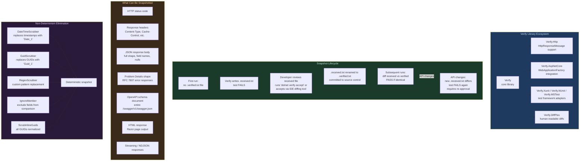
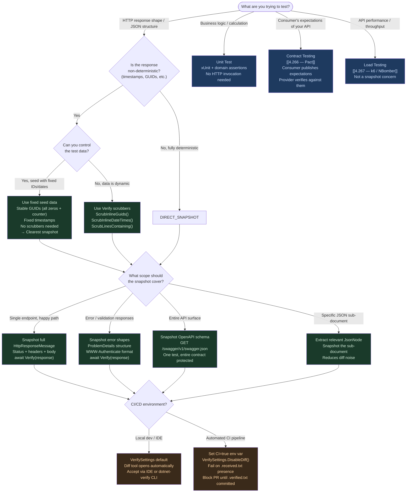

# 4.265 — Snapshot Testing: Verify Library for API Response Regression

---

## PART 0 — Navigation & Context

### Domain Hierarchy

```
ASP.NET Core Mastery
│
├── U. Testing  (4.257–4.267)
│   ├── 4.257 — WebApplicationFactory<T>: Integration Testing the Full Pipeline
│   ├── 4.258 — Customizing WebApplicationFactory: Replacing Services and Config
│   ├── 4.259 — Authentication in Integration Tests: Fake Auth Schemes
│   ├── 4.260 — Database in Integration Tests: TestContainers vs SQLite vs InMemory
│   ├── 4.261 — Middleware Testing: Isolating Middleware Without the Full Pipeline
│   ├── 4.262 — Testing SignalR: HubConnection in Integration Tests
│   ├── 4.263 — Testing Background Services: IHostedService Test Harnesses
│   ├── 4.264 — Mocking HttpClient: MockHttpMessageHandler Pattern
│   ├── 4.265 — Snapshot Testing: Verify Library  ← YOU ARE HERE
│   ├── 4.266 — Contract Testing: Pact for Consumer-Driven API Contracts
│   └── 4.267 — Load Testing ASP.NET Core: k6, NBomber, BenchmarkDotNet
│
└── V. Serialization  (4.268–4.276)
    └── 4.268 — System.Text.Json Global Configuration  (related: JSON shape testing)
```

### What You Need Before This

- **[[4.257 — WebApplicationFactory]]** — snapshot tests run against the full HTTP pipeline; `WebApplicationFactory<T>` is the test host that makes this possible.
- **[[4.258 — Customizing WebApplicationFactory]]** — database and auth service replacement in tests is prerequisite for deterministic snapshot content.
- **[[4.259 — Authentication in Integration Tests]]** — protected endpoints require fake auth; without it, snapshot tests get 401s instead of response bodies.
- **[[4.268 — System.Text.Json Global Configuration]]** — JSON naming, null handling, and enum serialization policies determine the exact snapshot content; understanding the serializer options is prerequisite for writing meaningful snapshots.

### What This Unlocks After

- **[[4.266 — Contract Testing: Pact]]** — snapshot testing verifies your own API's output shape; contract testing verifies consumer expectations against it. The two are complementary.
- **[[4.279 — OpenAPI / Swagger Integration]]** — the OpenAPI schema can itself be snapshot-tested; schema drift is caught the same way response drift is.
- **[[4.260 — Database in Integration Tests]]** — snapshot tests against database-backed endpoints require the test database seeding patterns described there.

### Why This Matters to a Production Engineer

In any API that serves downstream consumers — mobile clients, partner integrations, internal microservices — unintentional JSON shape changes are silent breaking changes that only manifest as consumer errors in production. Snapshot testing is the cheapest regression guard at the HTTP contract boundary: once a golden file exists, any future change to field names, nullability, nesting, or status codes causes an immediate, diff-visible test failure before the change ships.

---

## PART 1 — The Core Mental Model

### The Fundamental Rule

> **Snapshot testing serializes the actual HTTP response — status code, headers, and JSON body — into a versioned golden file on first run; every subsequent run diffs the current response against that file and fails if anything changed. The Verify library automates this diff, manages the golden files, and provides an approval workflow: the developer explicitly reviews and accepts every snapshot change before it is committed.**

### The Plain-Language Analogy

Think of a snapshot test as a passport photo system for your API. The first time your endpoint is photographed, the image is filed as the official reference. Every time someone applies for renewal (runs the test suite), a new photo is taken and compared against the reference. Any change — different hairstyle, new glasses, different expression — triggers a rejection: "This doesn't match the record. Was this intentional?" The applicant (developer) must consciously approve the updated photo before it becomes the new reference.

The critical difference from an ordinary `Assert.Equal` check is that you do not write down what the correct photo looks like in advance. You let the system take the first photo and you approve it. This means the approval step is the human judgement gate: "I looked at this response, I confirm this is what my API should return." Subsequent test runs then enforce that contract automatically, with zero maintenance — until you intentionally break and re-approve it.

This analogy holds under edge cases: when the API adds a new field (hairstyle change), the photo differs and the test fails — you must explicitly approve the new shape. When the API removes a required field (lost an eye), the test also fails. The passport analogy works for concurrent requests too: each "applicant" (test case) has their own passport file; photos don't cross-contaminate.

### The Taxonomy Diagram



---

## PART 2 — Deep Mechanics

### 2.1 — The Verify Execution Model: Received, Verified, and the Approval Gate

Verify is not a conventional assertion library. It does not compare an expected value you wrote against an actual value the code produced. It compares the actual value against a **file on disk** — the "verified" snapshot. This changes the test authoring workflow fundamentally.

```
Pipeline Position: Snapshot tests sit outside the ASP.NET Core pipeline itself.
They exercise the pipeline via WebApplicationFactory<T>'s HttpClient:

Test Process
  │
  ├── WebApplicationFactory<T>.CreateClient()
  │       ↓
  │   [Full ASP.NET Core Pipeline in test host process]
  │   ExceptionHandler → HTTPS → Routing → Auth → Endpoint → Serializer
  │       ↓
  │   HttpResponseMessage
  │       ↓
  ├── Verify.Http captures: StatusCode + Headers + Body (deserialized or raw)
  │       ↓
  ├── Serializes to .received.txt (next to the test .cs file)
  │       ↓
  ├── Compares against .verified.txt (from source control)
  │       ↓
  └── PASS (identical) or FAIL (diff) + opens diff tool if configured
```

The file naming convention uses the test class and test method name:

```
Tests/
  OrderApiTests.cs
  OrderApiTests.GetOrder_ReturnsOrderWithLineItems.verified.txt   ← golden file (in source control)
  OrderApiTests.GetOrder_ReturnsOrderWithLineItems.received.txt   ← generated on each run (gitignored)
```

```csharp
// ASP.NET Core internally (approximate) — what Verify.Http captures:
// Verify.Http serializes HttpResponseMessage as:
// {
//   "StatusCode": "OK",                        // HttpStatusCode enum name
//   "Headers": {
//     "Content-Type": "application/json; charset=utf-8",
//     "Cache-Control": "no-cache"
//   },
//   "Content": {
//     "orderId": "ord-001",
//     "status": "Pending",
//     "lineItems": [ ... ]
//   }
// }
//
// The Content is deserialized from the response body as a JToken/JsonNode
// so it is formatted with consistent indentation regardless of the
// serialization format the endpoint uses internally.
```

**Cost label**: First run = 1 file write per test case (I/O cost, negligible). Subsequent runs = 1 file read + string diff per test case. At 200 snapshot tests, the I/O cost is ~50ms total — negligible versus the HTTP pipeline invocation cost.

---

### 2.2 — Non-Determinism: The Single Biggest Challenge in Snapshot Testing

The most common reason snapshot tests fail spuriously is **non-deterministic output** — values that change on every run even when the API behavior is correct: timestamps, generated IDs (GUIDs, database autoincrement), correlation IDs, `ETag` values, `Date` response headers.

If your snapshot includes `"createdAt": "2026-06-12T14:23:11.4421Z"`, that test will fail tomorrow because the timestamp changed. Verify provides a **scrubbing system** that replaces non-deterministic values with stable placeholders before the snapshot is written or compared.

```csharp
// HTTP wire format (approximate — what the endpoint returns):
// HTTP/1.1 200 OK
// Content-Type: application/json; charset=utf-8
// ETag: "3f2a1b9c"           ← changes per response
// Date: Thu, 12 Jun 2026 14:23:11 GMT   ← changes per second

// {
//   "orderId": "ord-78f3a2b1-...",  ← GUID-based ID
//   "createdAt": "2026-06-12T14:23:11Z", ← timestamp
//   "status": "Pending"
// }

// Snapshot .verified.txt (after scrubbing):
// {
//   StatusCode: OK,
//   Headers: {
//     Content-Type: application/json; charset=utf-8,
//     ETag: Guid_1        ← scrubbed
//   },
//   Content: {
//     orderId: Guid_1,    ← scrubbed (all GUIDs normalized, same value = same placeholder)
//     createdAt: Date_1,  ← scrubbed
//     status: Pending
//   }
// }
```

```csharp
// Scrubber configuration — applied globally or per-test:
public static class VerifyDefaults
{
    public static void Initialize()
    {
        // Global scrubbers applied to all Verify calls in the test assembly
        VerifierSettings.ScrubInlineGuids();           // all GUIDs → "Guid_1", "Guid_2"
        VerifierSettings.ScrubInlineDateTimes("o");    // all ISO-8601 timestamps → "Date_1"
        VerifierSettings.ScrubInlineDateTimeOffsets(); // DateTimeOffset values
        VerifierSettings.AddScrubber(s =>
            s.Replace(Environment.MachineName, "TheMachine")); // hostname in logs

        // Custom regex scrubber for correlation IDs in response headers
        VerifierSettings.ScrubLinesContaining("X-Correlation-Id");

        // Ignore specific members across all snapshots
        VerifyHttp.AddIgnoreHeader("X-Request-Id");
        VerifyHttp.AddIgnoreHeader("Date");            // HTTP Date header always changes
    }
}

// Called once in test project setup:
[assembly: AssemblyFixture(typeof(VerifyConfiguration))]
public class VerifyConfiguration : IDisposable
{
    public VerifyConfiguration() => VerifyDefaults.Initialize();
    public void Dispose() { }
}
```

**Cost label**: Each scrubber is a string replacement pass over the serialized snapshot. At 10 scrubbers over a 5KB response body, this is microseconds — unmeasurable in practice.

---

### 2.3 — Integration with WebApplicationFactory: The Full Pipeline Test

The real power of snapshot testing comes when it is combined with `WebApplicationFactory<T>` — testing the actual HTTP pipeline end-to-end, not a mocked controller. The snapshot captures exactly what a real HTTP client receives.

```
Full pipeline flow for a snapshot test:

[Test method]
    │ factory.CreateClient()
    ▼
WebApplicationFactory<Program>
    │ In-process test server
    ▼
ASP.NET Core pipeline:
  UseExceptionHandler
    └── UseRouting
          └── UseAuthentication  ← fake scheme injects test claims
                └── UseAuthorization
                      └── MapControllers / MapGet
                            └── OrdersController.GetOrder(id)
                                  └── IOrderRepository (test double / test DB)
                                        └── Returns Order domain object
                                              └── JsonSerializer → response body
                                                    │
                                                    ▼
                                              HttpResponseMessage
                                                    │
                                                    ▼
                                              Verify.Http captures
                                                    │
                                                    ▼
                                              .received.txt → diff → .verified.txt
```

```csharp
// HTTP wire format (what the test captures):
// GET /api/orders/ord-001 HTTP/1.1
// Authorization: Bearer test-token (fake scheme adds test user claims)
//
// HTTP/1.1 200 OK
// Content-Type: application/json; charset=utf-8
// Cache-Control: no-cache
//
// {
//   "orderId": "ord-001",
//   "customerId": "cust-42",
//   "status": "Pending",
//   "lineItems": [
//     { "sku": "WIDGET-A", "quantity": 2, "unitPrice": 9.99 },
//     { "sku": "WIDGET-B", "quantity": 1, "unitPrice": 24.99 }
//   ],
//   "total": 44.97,
//   "createdAt": "2026-06-12T14:23:11Z"
// }
```

**Framework Source Behavior**: `Verify.Http` uses `HttpResponseMessage.Content.ReadAsStringAsync()` to read the body, then passes it through `JsonNode.Parse()` for formatting. If the body is not JSON, it is snapshotted as raw text. The `VerifyHttp` extension method is the entry point:

```csharp
await Verify(response); // where response is HttpResponseMessage — this is the core call
```

**Cost label**: One full HTTP pipeline invocation per snapshot test (same cost as any integration test). No additional cost beyond the Verify diff step (~O(n) string comparison where n = response size).

---

### 2.4 — Snapshot Verification Strategies: When to Include vs Exclude

Not everything in an HTTP response should be snapshotted. The goal is to capture the **contract** — the parts a consumer depends on — while excluding the noise that changes legitimately without breaking the contract.

```
What to INCLUDE in snapshots (high contract value):
  ✅ JSON field names and nesting structure
  ✅ HTTP status code (200 vs 201 vs 400 is a contract)
  ✅ Content-Type header (application/json vs application/problem+json)
  ✅ Presence/absence of nullable fields
  ✅ Enum serialization format ("Pending" vs "pending" vs 0)
  ✅ Array vs object shape (breaking changes in schema)
  ✅ Error response shape (ProblemDetails fields)
  ✅ Pagination envelope structure (total, page, items)

What to EXCLUDE/SCRUB from snapshots (low contract value, high noise):
  ❌ Timestamp values (scrub to Date_1)
  ❌ GUID/UUID values (scrub to Guid_1)
  ❌ Auto-increment database IDs (scrub or use stable seed data)
  ❌ Date response header (changes per second)
  ❌ Correlation ID / Request ID headers
  ❌ ETag values (content hash — changes with data)
  ❌ Cache-Control max-age with specific durations if you're not testing caching
  ❌ Server header / X-Powered-By
```

```csharp
// Selective scrubbing via VerifySettings per test:
var settings = new VerifySettings();
settings.ScrubInlineGuids();
settings.ScrubInlineDateTimes();
settings.IgnoreMembers("requestId", "traceId"); // JSON fields to exclude from diff

// Alternatively, use ModifySerialization for structural changes:
settings.ModifySerialization(s =>
{
    s.IgnoreMember("requestId");
    s.IgnoreMember<OrderResponse>(o => o.LastModifiedAt); // strongly typed member ignore
});

await Verify(response, settings);
```

**Edge case that bites engineers**: Scrubbing GUIDs globally normalizes them as `Guid_1`, `Guid_2`, etc. in the order they appear. If your response contains three GUIDs, the snapshot will have `Guid_1`, `Guid_2`, `Guid_3`. If the API changes the order fields appear in the JSON output, the snapshot fails — not because the GUIDs changed, but because their normalized names rearranged. Fix: use `ScrubInlineGuids()` which replaces all GUIDs with the same placeholder regardless of position, or seed your test data with static known IDs.

---

### 2.5 — The Approval Workflow: CLI Tools and IDE Integration

Verify's approval workflow is what makes snapshot tests maintainable. The key is that "accepting" a new snapshot is a conscious, reviewable action — not a `--update-snapshots` flag that blindly overwrites everything.

```
Approval options:
┌─────────────────────────────────────────────────────────────┐
│ Option 1: dotnet-verify CLI tool                            │
│   dotnet tool install -g Verify.Tool                        │
│   dotnet verify accept   ← accept all pending changes       │
│   dotnet verify reject   ← reject all (clean up .received)  │
│   dotnet verify review   ← open diff for each change        │
├─────────────────────────────────────────────────────────────┤
│ Option 2: IDE integration (Rider / VS)                      │
│   Rider: right-click .received.txt → Accept Snapshot        │
│   VS: Verify plugin opens diff window automatically         │
├─────────────────────────────────────────────────────────────┤
│ Option 3: CI/CD policy                                      │
│   In CI: Verify.DiffTool.UseClipboard() disabled            │
│   CI run: test fails on snapshot diff → PR blocked          │
│   Developer: runs tests locally, reviews diff, accepts      │
│   Committed .verified.txt goes through code review          │
└─────────────────────────────────────────────────────────────┘
```

```csharp
// CI environment configuration — suppress diff tool popup, just fail:
[assembly: AssemblyFixture(typeof(CiVerifySetup))]
public class CiVerifySetup : IDisposable
{
    public CiVerifySetup()
    {
        // In CI: no interactive diff tools, just fail cleanly
        if (Environment.GetEnvironmentVariable("CI") == "true")
        {
            VerifySettings.DisableDiff();
            // Alternatively: DiffRunner.Disabled = true;
        }

        VerifyDefaults.Initialize(); // global scrubbers
    }
    public void Dispose() { }
}
```

**The git workflow**: `.verified.txt` files go into source control. `.received.txt` files go into `.gitignore`. When a developer changes an endpoint and the snapshot changes, both files appear in `git status`: the `.received.txt` is new/modified (untracked), and the `.verified.txt` is modified. The code reviewer sees exactly what changed in the HTTP contract — the diff of the `.verified.txt` file is the contract changelog.

**Cost label**: No runtime cost for the approval workflow itself — it is a file management step that only occurs when snapshots change.

---

### 2.6 — Snapshot Testing the OpenAPI Schema Document

One of the highest-value snapshot targets in an ASP.NET Core API is the OpenAPI schema itself. Snapshotting `/swagger/v1/swagger.json` means any change to the API surface — new endpoints, changed parameter names, modified response schemas — is caught immediately and must be explicitly approved.

```
// HTTP wire format (OpenAPI snapshot request):
// GET /swagger/v1/swagger.json HTTP/1.1
// Accept: application/json
//
// HTTP/1.1 200 OK
// Content-Type: application/json; charset=utf-8
//
// {
//   "openapi": "3.0.1",
//   "info": { "title": "Order Management API", "version": "v1" },
//   "paths": {
//     "/api/orders/{id}": {
//       "get": {
//         "tags": ["Orders"],
//         "parameters": [...],
//         "responses": {
//           "200": { "content": { "application/json": { "schema": { "$ref": "#/components/schemas/OrderResponse" } } } },
//           "404": { "content": { "application/problem+json": { ... } } }
//         }
//       }
//     }
//   },
//   "components": { "schemas": { "OrderResponse": { ... } } }
// }
```

```csharp
// Snapshotting the full OpenAPI document:
[Fact]
public async Task OpenApiSchema_MatchesApprovedSnapshot()
{
    var client = _factory.CreateClient();
    var response = await client.GetAsync("/swagger/v1/swagger.json");

    // The OpenAPI document is large and relatively static
    // Snapshot it without scrubbers (no timestamps/GUIDs in schema)
    await Verify(response);
}

// This test catches:
// - Adding/removing endpoints (path changes)
// - Changing parameter names or types
// - Adding/removing response fields in schemas
// - Changing required vs optional field status
// - Changing enum values
// All changes require explicit approval before merging
```

**Framework source behavior**: Swashbuckle generates the OpenAPI JSON at request time from the registered endpoint metadata. The snapshot captures the exact JSON output. If you use .NET 9's `Microsoft.AspNetCore.OpenApi`, the same approach works — the endpoint path is `/openapi/v1.json` by default.

**Cost label**: One HTTP request to generate the schema (~50–200ms depending on API complexity) + file write on first run. The schema document is typically 10–100KB; diff comparison is ~1–10ms.

---

## PART 3 — Production Code Patterns

### Pattern 1: The Foundation — Basic Snapshot Test with WebApplicationFactory

The minimal complete snapshot test for an order management API, covering the happy-path response shape.

```csharp
// ⚠️ WRONG: Manual field-by-field assertion — misses shape, fragile, verbose
[Fact]
public async Task GetOrder_ReturnsExpectedFields_Wrong()
{
    var response = await _client.GetFromJsonAsync<OrderResponse>("/api/orders/ord-001");
    Assert.NotNull(response);
    Assert.Equal("ord-001", response.OrderId);
    Assert.Equal("Pending", response.Status);
    Assert.Equal(2, response.LineItems.Count);
    // ⚠️ Doesn't test: field names in JSON (camelCase vs PascalCase),
    //                   nullability (is lineItems[] or null when empty?),
    //                   extra/missing fields added by serializer config,
    //                   HTTP status code, Content-Type header
    // Result: serializer bug that renames "lineItems" to "line_items" goes undetected
}

// ✅ CORRECT: Snapshot the full HTTP response
[UsesVerify]
public class OrderApiSnapshotTests : IClassFixture<OrderApiFactory>
{
    private readonly HttpClient _client;

    public OrderApiSnapshotTests(OrderApiFactory factory)
    {
        _client = factory.CreateClient();
    }

    [Fact]
    public async Task GetOrder_ReturnsOrderWithLineItems()
    {
        // Act — exercise the full pipeline
        var response = await _client.GetAsync("/api/orders/ord-001");

        // Assert — snapshot the entire HTTP response
        // Status code + headers + body are all captured
        await Verify(response)
            .ScrubInlineGuids()         // order/customer IDs normalized
            .ScrubInlineDateTimes();    // createdAt, updatedAt normalized

        // On first run: creates OrderApiSnapshotTests.GetOrder_ReturnsOrderWithLineItems.received.txt
        // After acceptance: OrderApiSnapshotTests.GetOrder_ReturnsOrderWithLineItems.verified.txt
        //
        // .verified.txt content (example):
        // {
        //   StatusCode: OK,
        //   Headers: {
        //     Content-Type: application/json; charset=utf-8
        //   },
        //   Content: {
        //     orderId: Guid_1,
        //     customerId: Guid_2,
        //     status: Pending,
        //     lineItems: [
        //       { sku: WIDGET-A, quantity: 2, unitPrice: 9.99 },
        //       { sku: WIDGET-B, quantity: 1, unitPrice: 24.99 }
        //     ],
        //     total: 44.97,
        //     createdAt: Date_1
        //   }
        // }
    }
}

// HTTP wire format (captured by Verify):
// GET /api/orders/ord-001 HTTP/1.1
//
// HTTP/1.1 200 OK
// Content-Type: application/json; charset=utf-8
```

---

### Pattern 2: The Custom WebApplicationFactory with Seed Data

Snapshot tests require deterministic data. A factory that seeds a known test database state ensures the snapshot content is stable across runs and environments.

```csharp
public class OrderApiFactory : WebApplicationFactory<Program>, IAsyncLifetime
{
    private readonly IContainer _dbContainer = new MsSqlBuilder()
        .WithImage("mcr.microsoft.com/mssql/server:2022-latest")
        .Build();

    protected override void ConfigureWebHost(IWebHostBuilder builder)
    {
        builder.ConfigureServices(services =>
        {
            // Replace the real DbContext with one pointing to the test container
            var descriptor = services.Single(d =>
                d.ServiceType == typeof(DbContextOptions<OrderDbContext>));
            services.Remove(descriptor);

            services.AddDbContext<OrderDbContext>(options =>
                options.UseSqlServer(_dbContainer.GetConnectionString()));
        });
    }

    public async Task InitializeAsync()
    {
        await _dbContainer.StartAsync();

        // Seed DETERMINISTIC data — known IDs, no timestamps in assertions
        using var scope = Services.CreateScope();
        var db = scope.ServiceProvider.GetRequiredService<OrderDbContext>();
        await db.Database.MigrateAsync();
        await SeedSnapshotTestDataAsync(db);
    }

    private static async Task SeedSnapshotTestDataAsync(OrderDbContext db)
    {
        // Use FIXED GUIDs for test data — eliminates the need to scrub IDs
        // The snapshot can contain the real ID and it never changes
        var customerId = new Guid("00000000-0000-0000-0000-000000000001"); // stable test ID
        var orderId = new Guid("00000000-0000-0000-0000-000000000042");    // stable test ID

        db.Orders.Add(new Order
        {
            Id = orderId,
            CustomerId = customerId,
            Status = OrderStatus.Pending,
            LineItems = new List<LineItem>
            {
                new() { Sku = "WIDGET-A", Quantity = 2, UnitPrice = 9.99m },
                new() { Sku = "WIDGET-B", Quantity = 1, UnitPrice = 24.99m },
            },
            // Use a FIXED timestamp for snapshot stability
            CreatedAt = new DateTimeOffset(2026, 1, 1, 0, 0, 0, TimeSpan.Zero),
        });
        await db.SaveChangesAsync();
    }

    public async Task DisposeAsync() => await _dbContainer.DisposeAsync();
}

// With fixed IDs and timestamps, the snapshot needs NO scrubbers:
[Fact]
public async Task GetOrder_WithFixedSeedData_MatchesSnapshot()
{
    var response = await _client.GetAsync("/api/orders/00000000-0000-0000-0000-000000000042");

    // No scrubbers needed — seed data uses stable values
    await Verify(response);

    // .verified.txt:
    // {
    //   StatusCode: OK,
    //   Content: {
    //     orderId: 00000000-0000-0000-0000-000000000042,
    //     customerId: 00000000-0000-0000-0000-000000000001,
    //     status: Pending,
    //     createdAt: 2026-01-01T00:00:00+00:00,
    //     lineItems: [ ... ]
    //   }
    // }
}
```

---

### Pattern 3: The Error Response Snapshot (ProblemDetails and Validation Errors)

Error response shapes are the most commonly broken contract. Snapshot testing catches when validation error field names change, when `ProblemDetails.type` URIs drift, or when HTTP 400 vs 422 semantics change.

```csharp
[UsesVerify]
public class OrderValidationSnapshotTests : IClassFixture<OrderApiFactory>
{
    private readonly HttpClient _client;
    public OrderValidationSnapshotTests(OrderApiFactory factory) => _client = factory.CreateClient();

    [Fact]
    public async Task CreateOrder_WithMissingRequiredFields_ReturnsProblemDetails()
    {
        // Intentionally invalid payload — missing required CustomerId
        var invalidPayload = new { LineItems = Array.Empty<object>() };

        var response = await _client.PostAsJsonAsync("/api/orders", invalidPayload);

        // Snapshot the 400 validation response
        // This catches: field names in "errors" dict, "type" URI, "title" value,
        //               status code (400 vs 422 is a contract decision)
        await Verify(response)
            .ScrubInlineDateTimes()     // traceId may contain timing info
            .ScrubLinesContaining("traceId"); // traceId is non-deterministic

        // .verified.txt:
        // {
        //   StatusCode: BadRequest,
        //   Headers: {
        //     Content-Type: application/problem+json; charset=utf-8
        //   },
        //   Content: {
        //     type: https://tools.ietf.org/html/rfc9110#section-15.5.1,
        //     title: One or more validation errors occurred.,
        //     status: 400,
        //     errors: {
        //       CustomerId: [ The CustomerId field is required. ],
        //       LineItems: [ The order must contain at least one line item. ]
        //     }
        //   }
        // }
    }

    [Fact]
    public async Task GetOrder_NotFound_ReturnsRfc7807ProblemDetails()
    {
        var response = await _client.GetAsync("/api/orders/00000000-0000-0000-0000-999999999999");

        await Verify(response);

        // .verified.txt:
        // {
        //   StatusCode: NotFound,
        //   Headers: {
        //     Content-Type: application/problem+json; charset=utf-8
        //   },
        //   Content: {
        //     type: https://tools.ietf.org/html/rfc9110#section-15.5.5,
        //     title: Order not found.,
        //     status: 404,
        //     detail: Order with ID '00000000-0000-0000-0000-999999999999' does not exist.
        //   }
        // }
    }

    [Theory]
    [InlineData("GET",    "/api/orders/not-a-guid",           "BadRequest")]
    [InlineData("DELETE", "/api/orders/00000000-0000-0000-0000-999999999999", "NotFound")]
    [InlineData("POST",   "/api/orders",                      "BadRequest")]
    public async Task ErrorResponses_MatchApprovedShapes(string method, string url, string expectedStatus)
    {
        // Parameterized snapshot tests: Verify uses the test parameters to
        // generate unique snapshot file names automatically
        var request = new HttpRequestMessage(new HttpMethod(method), url);
        if (method == "POST")
            request.Content = new StringContent("{}", Encoding.UTF8, "application/json");

        var response = await _client.SendAsync(request);

        // Each parameter combination gets its own .verified.txt file:
        // ErrorResponses_MatchApprovedShapes_method=GET_url=..._.verified.txt
        await Verify(response)
            .UseParameters(method, url, expectedStatus)
            .ScrubLinesContaining("traceId");
    }
}
```

---

### Pattern 4: The Pagination Envelope Snapshot

Paginated list endpoints have the most complex response shapes — total counts, page metadata, link headers — and are the most likely to regress silently. Snapshot testing catches pagination contract breaks.

```csharp
[Fact]
public async Task ListOrders_FirstPage_MatchesSnapshot()
{
    // Seed data: 25 orders in the test database
    var response = await _client.GetAsync("/api/orders?page=1&pageSize=10&status=Pending");

    // The snapshot captures the SHAPE of the paginated response:
    // - items array (10 items for page 1)
    // - pagination metadata (total, page, pageSize, hasNextPage)
    // - Link header (RFC 5988 pagination links)
    var settings = new VerifySettings();
    settings.ScrubInlineGuids();
    settings.ScrubInlineDateTimes();
    // Scrub the Link header's URL query strings (contain timestamps)
    settings.ScrubLinesContaining("Link:");

    await Verify(response, settings);

    // .verified.txt:
    // {
    //   StatusCode: OK,
    //   Headers: {
    //     Content-Type: application/json; charset=utf-8,
    //     X-Total-Count: 25,
    //     X-Page: 1,
    //     X-Page-Size: 10
    //   },
    //   Content: {
    //     items: [
    //       { orderId: Guid_1, status: Pending, total: 44.97, createdAt: Date_1 },
    //       ... (10 items)
    //     ],
    //     pagination: {
    //       total: 25,
    //       page: 1,
    //       pageSize: 10,
    //       hasNextPage: true,
    //       hasPreviousPage: false
    //     }
    //   }
    // }
}
```

---

### Pattern 5: The OpenAPI Schema Regression Snapshot

Snapshot the entire OpenAPI document as a contract stability test. Any API surface change is caught before it ships.

```csharp
[UsesVerify]
public class OpenApiSchemaSnapshotTests : IClassFixture<OrderApiFactory>
{
    private readonly HttpClient _client;
    public OpenApiSchemaSnapshotTests(OrderApiFactory factory) => _client = factory.CreateClient();

    [Fact]
    public async Task OpenApiSchema_MatchesApprovedDocument()
    {
        var response = await _client.GetAsync("/swagger/v1/swagger.json");

        response.EnsureSuccessStatusCode();

        // OpenAPI JSON has no timestamps or GUIDs — no scrubbers needed
        // The snapshot is the authoritative API contract document
        await Verify(response);

        // This test catches:
        // - Adding/removing API endpoints
        // - Renaming request/response fields
        // - Changing required vs optional fields
        // - Changing HTTP verbs for an operation
        // - Adding/removing [ProducesResponseType] attributes
        // - Changing enum values
        // All require explicit approval → forces API contract review
    }

    [Fact]
    public async Task OpenApiSchema_OrderEndpoints_MatchApprovedSchemas()
    {
        // Targeted snapshot: just the orders section of the schema
        // Faster to review when only orders changed, not the whole document
        var response = await _client.GetAsync("/swagger/v1/swagger.json");
        var schema = await response.Content.ReadFromJsonAsync<JsonNode>();

        var orderPaths = schema!["paths"]!.AsObject()
            .Where(p => p.Key.StartsWith("/api/orders"))
            .ToDictionary(p => p.Key, p => p.Value);

        await Verify(orderPaths);
    }
}

// HTTP wire format:
// GET /swagger/v1/swagger.json HTTP/1.1
//
// HTTP/1.1 200 OK
// Content-Type: application/json; charset=utf-8
//
// (Full OpenAPI JSON document — ~20-100KB)
```

---

### Pattern 6: The Multi-Scenario Inline Snapshot (UseTextForParameters)

For simple endpoint tests with many parameter combinations, inline snapshots within the test file reduce file-system noise while still capturing shape changes.

```csharp
[UsesVerify]
public class PaymentStatusSnapshotTests : IClassFixture<PaymentApiFactory>
{
    private readonly HttpClient _client;
    public PaymentStatusSnapshotTests(PaymentApiFactory factory) => _client = factory.CreateClient();

    // Parameterized test where each combination gets its own snapshot file
    [Theory]
    [InlineData("pay-001", "Completed")]
    [InlineData("pay-002", "Failed")]
    [InlineData("pay-003", "Pending")]
    public async Task GetPaymentStatus_ReturnsCorrectShape(string paymentId, string expectedStatus)
    {
        var response = await _client.GetAsync($"/api/payments/{paymentId}/status");

        // Verify generates unique snapshot file names from parameters:
        // PaymentStatusSnapshotTests.GetPaymentStatus_ReturnsCorrectShape_paymentId=pay-001_expectedStatus=Completed.verified.txt
        await Verify(response)
            .UseParameters(paymentId, expectedStatus)
            .ScrubInlineDateTimes();
    }

    // For auth-sensitive endpoints: fake auth scheme provides test claims
    [Fact]
    public async Task GetPaymentStatus_Unauthorized_Returns401WithProblemDetails()
    {
        // Factory configured with fake auth; this test uses NO auth header
        var requestWithoutAuth = new HttpRequestMessage(HttpMethod.Get, "/api/payments/pay-001/status");
        var response = await _client.SendAsync(requestWithoutAuth);

        await Verify(response);
        // .verified.txt captures the 401 WWW-Authenticate challenge shape
        // Catches if auth middleware changes challenge header format
    }
}
```

---

### Pattern 7: The CI/CD Integration — Fail Fast on Unapproved Snapshots

Configure the pipeline to block PRs when snapshot files are missing (new test without corresponding `.verified.txt`) or when `.received.txt` files exist in the workspace (snapshot changed but not approved).

```yaml
# .github/workflows/test.yml
- name: Run snapshot tests
  run: dotnet test src/OrderApi.Tests --logger "trx;LogFileName=test-results.trx"
  env:
    CI: "true"   # Disables Verify's interactive diff tool

- name: Check for unapproved snapshots
  run: |
    # Fail if any .received.txt files exist (snapshot changed, not approved)
    RECEIVED=$(find . -name "*.received.txt" | wc -l)
    if [ "$RECEIVED" -gt "0" ]; then
      echo "❌ Unapproved snapshot changes detected:"
      find . -name "*.received.txt"
      echo "Run 'dotnet verify accept' locally to approve, then commit the .verified.txt files."
      exit 1
    fi
    echo "✅ All snapshots approved."
```

```csharp
// .gitignore additions for snapshot testing:
// *.received.txt        ← generated on test run, never committed
// *.received.json       ← same for JSON-formatted snapshots
// !*.verified.txt       ← explicitly track verified files
// !*.verified.json      ← same for verified JSON
```

---

## PART 4 — Gotchas & Anti-Patterns

### Gotcha 1: Non-Deterministic Output Causes Permanent Snapshot Churn

The most common reason teams abandon snapshot testing: they forgot to scrub a non-deterministic value, so the test fails on every run with a different `createdAt` timestamp. The team runs `dotnet verify accept` daily out of habit, which defeats the entire purpose.

```csharp
// ⚠️ WRONG CODE — No scrubbers on a response containing timestamps
[Fact]
public async Task GetOrder_MatchesSnapshot_Wrong()
{
    var response = await _client.GetAsync("/api/orders/ord-001");
    await Verify(response); // ⚠️ No scrubbers
    // .received.txt contains: "createdAt": "2026-06-12T14:23:11.4421Z"
    // Next run at 14:23:12: "createdAt": "2026-06-12T14:23:12.1183Z"
    // Test FAILS on every run
}

// HTTP consequence (wrong path):
// Test fails deterministically — 100% failure rate after the first minute
// Team learns to blindly accept changes → snapshot testing provides zero value
// Equivalent to deleting the test and replacing it with: Assert.True(true)

// ✅ CORRECT CODE — Scrub all non-deterministic values
[Fact]
public async Task GetOrder_MatchesSnapshot_Correct()
{
    var response = await _client.GetAsync("/api/orders/ord-001");
    await Verify(response)
        .ScrubInlineDateTimes()
        .ScrubInlineGuids();
}

// HTTP consequence (correct path):
// "createdAt" becomes "Date_1" in snapshot — identical on every run
// Test passes deterministically when API behavior is unchanged

// WHY: Verify serializes the response to text before comparing. Any value that
//      changes between runs must be normalized to a stable placeholder. The scrubbing
//      happens before the comparison, so the verified file contains the placeholder,
//      not the original value.
```

---

### Gotcha 2: Snapshot Files Not Committed to Source Control

Teams use snapshots but add `*.verified.txt` to `.gitignore`, treating them as generated artifacts. This means every CI run regenerates snapshots from scratch and they are never compared against anything — the tests always pass.

```csharp
// ⚠️ WRONG .gitignore
*.received.txt   ← correct, these are temporary
*.verified.txt   ← ⚠️ WRONG — these are the golden files, must be committed

// HTTP consequence (wrong path):
// CI generates .verified.txt on first run → test "passes" (no existing file to compare)
// Next CI run also generates a new .verified.txt → "passes" again
// The API can change its response shape entirely and tests never fail
// Snapshot testing is completely ineffective

// ✅ CORRECT .gitignore
*.received.txt       ← generated, never commit
# *.verified.txt is NOT in .gitignore → committed with the test code

// HTTP consequence (correct path):
// .verified.txt committed → CI compares current output against committed snapshot
// Any shape change → .received.txt differs from .verified.txt → test FAILS
// PR is blocked until developer accepts the change and commits new .verified.txt

// WHY: The entire value of snapshot testing comes from the golden file being a stable
//      reference committed in version control. Without that reference, there is nothing
//      to compare against and the test degenerates into "does the endpoint return
//      a 200?" — which a trivial integration test already covers.
```

---

### Gotcha 3: Using Snapshot Tests for Business Logic Validation

Snapshot tests validate the HTTP contract shape. They are not substitutes for unit tests that verify business logic. Engineers who misuse snapshot tests for logic validation create tests that fail when the right logic produces a different — but still correct — output.

```csharp
// ⚠️ WRONG CODE — Using snapshot to test a calculated value
[Fact]
public async Task GetOrder_TotalIsCalculatedCorrectly_Wrong()
{
    // Order has lineItems: [{qty:2, price:9.99}, {qty:1, price:24.99}]
    // Expected total: 2*9.99 + 1*24.99 = 44.97
    var response = await _client.GetAsync("/api/orders/ord-001");

    // Snapshot includes "total": 44.97
    // This "passes" but does NOT verify calculation logic is correct
    // It just records what value happened to be returned today
    await Verify(response).ScrubInlineDateTimes().ScrubInlineGuids();

    // ⚠️ If the total calculation is WRONG (returns 0), the first snapshot
    // acceptance records the wrong value as "correct"
    // Snapshot test now verifies the BUG, not correct behavior
}

// HTTP consequence (wrong path):
// Business logic bug is baked into the snapshot as the "approved" value
// Test continues to pass while business logic is broken
// Snapshot tests used this way provide false confidence

// ✅ CORRECT CODE — Separate concerns: snapshot for shape, unit test for logic
// Unit test for business logic:
[Fact]
public void Order_Total_IsCalculatedCorrectly()
{
    var order = new Order
    {
        LineItems = new[]
        {
            new LineItem { Quantity = 2, UnitPrice = 9.99m },
            new LineItem { Quantity = 1, UnitPrice = 24.99m },
        }
    };
    Assert.Equal(44.97m, order.CalculateTotal());
}

// Snapshot test for HTTP contract shape (not the calculated value):
[Fact]
public async Task GetOrder_ResponseShape_MatchesSnapshot()
{
    // Pre-condition: test data has known total (from seeded values)
    var response = await _client.GetAsync("/api/orders/ord-001");
    await Verify(response).ScrubInlineDateTimes().ScrubInlineGuids();
    // This catches: "total" field renamed to "orderTotal",
    //               "total" moved from root to nested "summary.total",
    //               "total" removed from response
    //               NOT: whether the calculation is correct
}

// HTTP consequence (correct path):
// Shape regressions caught by snapshot; calculation regressions caught by unit test
// Each test type does what it does best

// WHY: Snapshots verify identity (does this look the same?), not correctness
//      (is this the right answer?). A snapshot with a wrong value in it will
//      pass on every subsequent run, providing the opposite of quality assurance.
```

---

### Gotcha 4: Testing Endpoints with Randomised Ordering in Collections

List endpoints that return items in non-deterministic order (no `ORDER BY` clause, parallel processing, hash-based collections) cause snapshot tests to fail intermittently — the items are correct but rearranged.

```csharp
// ⚠️ WRONG CODE — Snapshotting an unordered list endpoint
[Fact]
public async Task ListOrders_MatchesSnapshot_Wrong()
{
    var response = await _client.GetAsync("/api/orders?customerId=cust-001");
    // ⚠️ If the DB returns orders in non-deterministic order, this fails intermittently
    // Run 1: [order-A, order-B, order-C] → snapshot file
    // Run 2: [order-C, order-A, order-B] → DIFF! → test fails
    await Verify(response).ScrubInlineDateTimes().ScrubInlineGuids();
}

// HTTP consequence (wrong path):
// Intermittent failure (flaky test) — passes on some runs, fails on others
// Team disables or ignores the test → contract regression goes undetected

// ✅ CORRECT CODE — Enforce deterministic ordering before snapshotting
// Option A: Fix the endpoint to always return ordered results
// In the query:
var orders = await _db.Orders
    .Where(o => o.CustomerId == customerId)
    .OrderBy(o => o.CreatedAt)  // ← deterministic order
    .ThenBy(o => o.Id)          // ← tie-breaker for same timestamp
    .ToListAsync();

// Option B: Sort the JSON before snapshotting in the test
[Fact]
public async Task ListOrders_MatchesSnapshot_Ordered()
{
    var response = await _client.GetAsync("/api/orders?customerId=cust-001");
    var json = await response.Content.ReadFromJsonAsync<JsonNode>();

    // Sort the items array by a stable field before snapshotting
    var items = json!["items"]!.AsArray().OrderBy(item => item!["orderId"]!.GetValue<string>()).ToArray();
    json["items"] = JsonNode.Parse(JsonSerializer.Serialize(items));

    var settings = new VerifySettings();
    settings.ScrubInlineDateTimes();
    settings.ScrubInlineGuids();
    await Verify(json, settings);
}

// HTTP consequence (correct path):
// Items always sorted in snapshot → deterministic comparison → no flakiness

// WHY: Verify's diff is a string comparison. Two JSON arrays with the same elements
//      in different order are textually different and fail the comparison.
//      The fix must either be in the API (enforce ORDER BY) or in the test
//      (sort before snapshotting). Prefer fixing the API — unordered list responses
//      are typically a bug anyway (clients cannot rely on ordering).
```

---

### Gotcha 5: Large Snapshots That Nobody Actually Reviews

Snapshot files that are thousands of lines long defeat the approval-gate purpose. When a developer sees a 3,000-line diff of an OpenAPI schema change, they click "accept" without reading it. The gate becomes theater.

```csharp
// ⚠️ WRONG CODE — Single test that snapshots the entire API response including all nested data
[Fact]
public async Task GetFullOrderWithEverything_MatchesSnapshot_Wrong()
{
    // Endpoint returns order + customer profile + all historical payments + address history
    // Snapshot is 800 lines of JSON
    var response = await _client.GetAsync("/api/orders/ord-001?include=customer,payments,addresses");
    await Verify(response).ScrubInlineDateTimes().ScrubInlineGuids();
    // When ANY of these sub-resources changes, the diff is 800 lines
    // Reviewers approve without reading → regressions pass through
}

// HTTP consequence (wrong path):
// Test passes but provides no effective regression detection
// Approval step bypassed in practice because diffs are unreadable

// ✅ CORRECT CODE — Targeted snapshots per concern
[Fact]
public async Task GetOrder_CoreFields_MatchesSnapshot()
{
    // Test only the order's own fields
    var response = await _client.GetAsync("/api/orders/ord-001");
    await Verify(response).ScrubInlineDateTimes().ScrubInlineGuids();
    // ~30 lines of snapshot — reviewable
}

[Fact]
public async Task GetOrder_CustomerEmbed_MatchesSnapshot()
{
    // Separate test for the customer embed
    var response = await _client.GetAsync("/api/orders/ord-001?include=customer");
    await Verify(response).ScrubInlineDateTimes().ScrubInlineGuids();
    // Tests: is customer present? correct shape? correct fields?
    // ~50 lines — reviewable
}

[Fact]
public async Task OpenApiSchema_MatchesApprovedDocument()
{
    // OpenAPI schema gets its own test — this one IS large but is reviewed holistically
    // on the first acceptance and only re-reviewed when API surface changes
    var response = await _client.GetAsync("/swagger/v1/swagger.json");
    await Verify(response);
    // Accepted once per meaningful API change — large but intentionally so
}

// HTTP consequence (correct path):
// Small, focused snapshots → reviewable diffs → effective approval gate
// Engineers actually read and approve each change

// WHY: The approval workflow is the mechanism. If reviewers routinely skip reading
//      the diff, the mechanism has failed regardless of whether the test technically
//      "works." Snapshot granularity should match the granularity of contract concern.
```

---

## PART 5 — Performance Implications

### Request Pipeline Characteristics Table

|Scenario|File Operations|Comparison Cost|Test Execution Time|Recommendation|
|---|---|---|---|---|
|First run (no verified file)|1 write (.received.txt)|N/A — no comparison|+1–5ms (file write)|Expected; requires approval|
|Subsequent runs (snapshot stable)|1 write + 1 read|O(n) string diff, n = response chars|+1–10ms (diff)|✅ Normal operation|
|Large OpenAPI schema (100KB)|1 write + 1 read|~100KB string diff|+10–30ms|✅ Acceptable; run once per suite|
|200 snapshot tests in suite|200 writes + 200 reads|200 × O(n) diffs|+200–1000ms total|✅ Still faster than DB tests|
|Snapshot with 10 scrubbers|1 write + 1 read + scrub|O(n × k), k = scrubber count|+5–15ms|✅ Negligible|
|Snapshot changed but not approved|1 write + 1 read|Diff finds mismatch|Test fails fast (~5ms)|✅ Expected failure mode|
|Parallel test execution (xUnit)|Concurrent writes|Concurrent diffs|Proportional to degree|✅ Verify supports parallel|
|Snapshot file missing (.verified.txt deleted)|1 write|N/A|Test fails immediately|⚠️ Requires re-approval|
|GUID scrubbing on 50-field response|1 pass per GUID|O(n) per replacement|+1–3ms|✅ Negligible|
|Inline snapshot (no file)|None|In-memory string compare|+<1ms|✅ For tiny responses only|

### BenchmarkDotNet Code

```csharp
// Note: BenchmarkDotNet is not the right tool for measuring Verify's snapshot comparison —
// the I/O and diffing cost is negligible compared to the HTTP pipeline invocation.
// The meaningful performance measurement is: how many snapshot tests can the test suite
// run without becoming a bottleneck in CI?

// For measuring snapshot test suite throughput, use dotnet test timing:
// dotnet test --logger "console;verbosity=detailed" | grep "Passed\|Failed\|Duration"

// Approximate real-world numbers (.NET 8, SSD, 200 snapshot tests):
// Snapshot I/O overhead per test:     ~2–5ms
// HTTP pipeline invocation per test:  ~50–200ms (dominates)
// Total for 200 tests (parallel):     ~30–60 seconds
// Total for 200 tests (sequential):   ~60–120 seconds
//
// Comparison: 200 unit tests take ~1–5 seconds.
// Snapshot tests are integration tests — their cost is the HTTP round-trip, not the snapshot.

[MemoryDiagnoser]
[SimpleJob(RuntimeMoniker.Net80)]
public class SnapshotComparisonBenchmarks
{
    private string _smallJson = null!;
    private string _largeJson = null!;
    private string _smallJsonSnapshot = null!;
    private string _largeJsonSnapshot = null!;

    [GlobalSetup]
    public void Setup()
    {
        // Simulate snapshot comparison without the HTTP pipeline
        _smallJson = """{"orderId":"ord-001","status":"Pending","total":44.97}""";
        _smallJsonSnapshot = _smallJson;

        _largeJson = new string('x', 100_000); // 100KB response body
        _largeJsonSnapshot = _largeJson;
    }

    [Benchmark(Baseline = true)]
    public bool SmallSnapshot_Identical()
        => string.Equals(_smallJson, _smallJsonSnapshot, StringComparison.Ordinal);

    [Benchmark]
    public bool LargeSnapshot_Identical()
        => string.Equals(_largeJson, _largeJsonSnapshot, StringComparison.Ordinal);

    [Benchmark]
    public bool SmallSnapshot_WithScrubbing()
    {
        var scrubbed = _smallJson.Replace("ord-001", "Guid_1");
        var scrubbedSnapshot = _smallJsonSnapshot.Replace("ord-001", "Guid_1");
        return string.Equals(scrubbed, scrubbedSnapshot, StringComparison.Ordinal);
    }
}

// Expected output (approximate, .NET 8, x64, SSD):
// | Method                      | Mean      | Error    | StdDev   | Allocated |
// |---------------------------- |----------:|---------:|---------:|----------:|
// | SmallSnapshot_Identical     | 12.3 ns   | 0.1 ns   | 0.1 ns   | -         |
// | LargeSnapshot_Identical     | 18.7 μs   | 0.2 μs   | 0.3 μs   | -         |
// | SmallSnapshot_WithScrubbing | 145.0 ns  | 2.1 ns   | 1.9 ns   | 128 B     |
//
// All snapshot comparison costs are negligible vs HTTP invocation (~50–200ms)

// For profiling snapshot test suite performance in CI, use:
//   dotnet test --blame-hang-timeout 30s    (catch hanging tests)
//   dotnet test --parallel                  (run test classes in parallel)
//   GitHub Actions: annotate test results with dotnet-test-reporter
```

### When to Care / When to Ignore

**When snapshot testing costs you:**

- APIs in active development with daily shape changes. Every change requires an approval cycle; if developers are spending more time accepting snapshots than reviewing them, the tests are correctly flagging instability — the right fix is to stabilize the API contract, not to remove the tests.
- Snapshot files accumulate when endpoints are removed but their test methods are not. Dead snapshot files in the repository are noise; add a linting step to detect `.verified.txt` files with no corresponding test method.
- Very large response bodies (>500KB) can make snapshot diffs visually unreadable. Scope the snapshot to the relevant sub-document rather than the entire response.

**When snapshot testing provides the most value and should always be present:**

- Any endpoint consumed by external partners or mobile clients where a shape change is a breaking change with SLA implications.
- Serialization configuration is in flux — `System.Text.Json` options changes (`camelCase` → `CamelCase`, null handling, enum formats) affect every endpoint simultaneously; a single snapshot suite run catches all of them.
- OpenAPI schema documents — one snapshot test protects the entire API surface at zero maintenance cost.
- Error response shapes (`ProblemDetails`) — clients parse error fields; any change to field names or nesting breaks client error handling silently.
- Large refactors (controller → minimal API, Newtonsoft.Json → System.Text.Json) — snapshot tests confirm the HTTP contract is preserved through the refactor before deployment.

---

## PART 6 — Interview Arsenal

### A. The Question Bank

**Question 1:** "How do you test that a refactoring from MVC controllers to Minimal APIs doesn't change your API's HTTP contract?"

**Average Answer:** Write integration tests that check the status code and parse the JSON response to verify the expected fields are present.

**Why That's Insufficient:** Describes a manual assertion approach that only catches changes you thought to check for. It misses field renames, nullability changes, enum format changes, header changes — anything you did not explicitly assert.

> **Great Answer:** "The most robust approach is to establish snapshot baselines with the Verify library before the refactor. On every endpoint, I run a full-pipeline integration test through `WebApplicationFactory` that snapshots the complete HTTP response — status code, `Content-Type` header, and the full JSON body. The `.verified.txt` files go into source control as the approved contract.
> 
> Then I do the refactor. If any endpoint's HTTP output changes, the corresponding snapshot test fails with a clear diff showing exactly what changed. If `lineItems` became `line_items` because the Minimal API route handler inherited different `JsonSerializerOptions`, the snapshot diff shows that immediately — I don't need to know to check for it in advance.
> 
> The trick is scrubbing non-deterministic values — timestamps and GUIDs — before the comparison so that the tests aren't failing because a `createdAt` timestamp changed between runs. I configure those scrubbers globally so every test inherits them. After the refactor, if the snapshots are clean, I have high confidence the HTTP contract is identical. If the OpenAPI schema snapshot also passes, I know the contract documentation is consistent with the implementation too."

---

**Question 2:** "What's the difference between snapshot testing and contract testing, and when do you use each?"

**Average Answer:** Snapshot testing records the output and compares it; contract testing verifies against a consumer's expectations. You'd use them for different things.

**Why That's Insufficient:** Too abstract — doesn't articulate the pipeline relationship, who owns each, or the specific failure scenarios each catches.

> **Great Answer:** "Snapshot testing is self-contained: I own both the golden file and the API. The test asks, 'does this endpoint look the same as it did when I approved it?' It catches unintentional drift — the kind that happens during refactors, serializer upgrades, or model changes. The verified file lives in my repository and I'm the reviewer of every change to it.
> 
> Contract testing, specifically consumer-driven contract testing with Pact, flips the ownership. The consumer publishes what they expect from my API, and my service verifies that its current responses satisfy those expectations. This is the right tool when a mobile app team or a partner service has specific response requirements — they express those as a contract, I run the verification in my CI pipeline, and any time my API would break their contract, my build fails before I deploy.
> 
> In practice I use both: snapshot tests to protect the API from internal regressions that I catch before code review, and Pact contracts to protect consumers from API changes I might not think to communicate. The HTTP pipeline flows into both: `WebApplicationFactory` exercises the real ASP.NET Core pipeline for snapshot tests, and Pact provider verification does the same. The difference is who authored the expectation and who receives the failure notification."

---

**Question 3:** "A snapshot test starts failing in CI after a routine dependency upgrade. How do you diagnose whether this is a legitimate regression or an acceptable change?"

**Average Answer:** Look at the diff, decide if the change is expected, and if so, accept the snapshot update.

**Why That's Insufficient:** Describes the mechanics but not the diagnostic process — what specific things to look for in the diff, and how to distinguish a benign change (library formats slightly differently) from a breaking change (field name renamed).

> **Great Answer:** "First I look at what exactly changed in the diff. The diff is the contract delta — if I see `lineItems` changed to `line_items`, that's a breaking change for any consumer using the camelCase field name, regardless of whether it was caused by a dependency upgrade. If I see the `Content-Type` header changed from `application/json` to `application/json; charset=utf-8`, that's likely a benign formatting change that no consumer would break on.
> 
> The categories I check are: field name changes (always breaking), field removals (always breaking), added required fields in request models (breaking for producers), status code changes (always breaking — 200 vs 201 vs 400 is a contract), `Content-Type` changes (breaking if the consumer uses it for deserialization decisions), and numeric precision changes (can be breaking for currency fields).
> 
> If the change is in an error response shape — the `ProblemDetails` type URI or the `errors` dictionary structure — I treat it as breaking because clients typically parse error responses to display user-facing messages. A dependency upgrade that changes how ASP.NET Core formats `ValidationProblemDetails` is a breaking API change, even if the framework team didn't intend it that way.
> 
> After diagnosis, if it's benign, I accept the snapshot and document in the commit message why the change is safe. If it's breaking, I revert the dependency upgrade or add a serializer configuration to preserve the old format before accepting."

---

### B. The Trick Questions

**Trick 1:** "If I use `ScrubInlineGuids()` globally and my response contains two different GUIDs — an `orderId` and a `customerId` — what do the scrubbed values look like in the snapshot?"

**The Trap:** Engineers assume both GUIDs become `Guid_1` since they are both "scrubbed."

**Correct Answer:** Verify normalizes GUIDs in their order of appearance in the serialized text. The first GUID encountered becomes `Guid_1`, the second becomes `Guid_2`. If `orderId` appears before `customerId` in the JSON, the snapshot reads `"orderId": "Guid_1"` and `"customerId": "Guid_2"`. The same GUID value appearing twice becomes the same placeholder (`Guid_1` both times). This means if JSON field ordering changes between runs (for example, after updating `System.Text.Json` options), the GUID numbering can rearrange and cause a snapshot failure even though no actual GUID value changed. The fix: use fixed known GUIDs in test seed data so no scrubbing is needed, or use `ScrubMember` to scrub specific fields instead of all GUIDs globally.

---

**Trick 2:** "A developer deletes a snapshot `.verified.txt` file by mistake. What happens when the test runs next?"

**The Trap:** "The test will fail because the verified file is missing."

**Correct Answer:** The test fails — but in a specific way. Verify finds no `.verified.txt` file to compare against, so it writes the `.received.txt` as usual and throws `VerifyException` with a message indicating no verified file exists. The test does not silently pass with a new snapshot. This is the correct behavior: missing verified file = test failure = human must approve. This is why verified files must be in source control — if they are gitignored, every CI run triggers this "no verified file" failure and the test always appears to be in first-run state. The HTTP response is entirely correct; only the approval step is missing.

---

**Trick 3:** "You snapshot-test a `GET /api/orders/{id}` endpoint. Later, the endpoint is changed to return `HTTP 200` with `null` body when the order exists but has been soft-deleted, instead of `HTTP 404`. Will your snapshot test catch this?"

**The Trap:** "Yes, because the status code changed from 404 to 200."

**Correct Answer (nuanced):** Only if you have a snapshot test that sends a request for a soft-deleted order. If your test data only seeds a normal (visible) order and tests the 200 case, the 404→200 behavior change for soft-deleted orders will not be caught. This illustrates a key limitation of snapshot testing: it only catches regressions on the paths you have tests for. The soft-delete case requires a separate test with a soft-deleted order in the seed data. The snapshot test for the normal case (`HTTP 200` with body) and the test for a non-existent order (`HTTP 404`) would both still pass; the behavioral gap is in the untested scenario.

---

### C. Red Flags to Avoid

1. **"Snapshot tests replace unit tests."** No — they test the HTTP contract shape, not business logic. Claiming you do not need unit tests because you have snapshots demonstrates a misunderstanding of what each tests. Score down: doesn't understand testing pyramid.
    
2. **"I just run `dotnet verify accept` before every merge."** This is running the approval workflow without reviewing the diffs. Accepting without reading is equivalent to deleting the test. Score down: does not understand that the approval is the mechanism.
    
3. **"We don't commit the `.verified.txt` files — they're generated."** This means the tests have no golden file to compare against and always pass on first run. Score down: fundamental misunderstanding of how snapshot testing provides value.
    
4. **"Snapshot testing is slow and makes CI take too long."** The slowness in snapshot-heavy test suites is almost always the HTTP pipeline invocation (`WebApplicationFactory`), not the snapshot comparison itself. The diff cost is microseconds. Score down: blames the wrong component.
    
5. **"I scrub everything to make the tests stable."** Over-scrubbing removes the value of the snapshot. If you scrub all string values, the snapshot only verifies field presence, not field content. Score down: doesn't understand the stability vs signal tradeoff.
    
6. **"Snapshot tests are just golden file tests — nothing special."** This dismisses the approval workflow, CI integration, multi-format support, and scrubbing system. "Golden file testing" is a valid description of the mechanism but misses what makes Verify specifically valuable in ASP.NET Core: its `WebApplicationFactory` integration, the diff tool automation, and the JSON formatting. Score down: surface-level understanding.
    
7. **"I don't use Verify — I serialize to JSON and compare strings."** Rolling your own snapshot system means reinventing scrubbing, file management, diff tools, and CI approval workflows. While technically possible, it signals unwillingness to adopt existing solutions. Score down in a "tell me about your testing approach" question if it reveals NIH syndrome.
    
8. **"Snapshot tests can't test authenticated endpoints."** They can — combine with `WebApplicationFactory` and a fake authentication scheme (topic 4.259). This is a standard pattern. Score down: doesn't know `WebApplicationFactory` customization.
    

---

## PART 7 — Decision Framework



---

## PART 8 — Self-Check

### A. Conceptual Questions

1. What is the fundamental difference between a snapshot test using `Assert.Equal(expected, actual)` and `await Verify(response)`? What does each require the developer to do that the other does not?
    
2. A snapshot test for `GET /api/orders/ord-001` passes in local development but fails in CI with a diff showing the `Date` response header changed. What two separate fixes could resolve this, and which is preferable and why?
    
3. What happens to the HTTP request if a `WebApplicationFactory`-based snapshot test runs against an endpoint protected by `[Authorize]`, but the test does not configure a fake authentication scheme? What HTTP response is snapshotted?
    
4. You have 500 snapshot tests in your test suite. A developer upgrades `System.Text.Json` to a new minor version and 12 tests fail. Describe the diagnostic process to determine whether each failing test represents a legitimate breaking change or an acceptable formatting difference.
    
5. What is the purpose of `.received.txt` files? Should they be committed to source control? What is the purpose of `.verified.txt` files, and what happens to snapshot testing if they are not committed?
    
6. A snapshot test covers a `POST /api/payments` endpoint that returns `HTTP 201 Created` with a `Location` header containing the new payment's URL. The URL contains the payment's GUID. Describe two strategies for making this snapshot test deterministic.
    
7. Explain the relationship between snapshot testing (`Verify`) and contract testing (`Pact`). For a team that builds both the API and the mobile app that consumes it, when should they use each approach, and is there value in using both simultaneously?
    
8. What pipeline position does a snapshot test occupy relative to the ASP.NET Core middleware pipeline? Does the snapshot capture what the middleware pipeline produces, or what the endpoint handler returns before middleware processes it?
    
9. A refactor moves a field from `response.address.city` to `response.deliveryAddress.city`. Which test types would catch this: (a) a unit test for the domain model, (b) a snapshot test for `GET /api/shipments/{id}`, (c) a Pact contract test where the consumer has a rule for `$.address.city`?
    
10. A developer argues that snapshot tests are maintenance overhead because every intentional API change requires updating the snapshot files. What is the correct response to this argument, and what does the overhead actually represent?
    

---

### B. Code Puzzles

**Puzzle 1 — What is the HTTP response that gets snapshotted?**

```csharp
// WebApplicationFactory configured with:
// - No fake authentication scheme
// - Real authorization middleware
// - [Authorize] attribute on OrdersController

[Authorize]
[ApiController]
[Route("api/orders")]
public class OrdersController : ControllerBase
{
    [HttpGet("{id}")]
    public IActionResult GetOrder(string id) => Ok(new { orderId = id, status = "Pending" });
}

// Test:
[Fact]
public async Task GetOrder_MatchesSnapshot()
{
    var client = _factory.CreateClient(); // no auth configured in factory
    var response = await client.GetAsync("/api/orders/ord-001");
    await Verify(response).ScrubInlineDateTimes();
}
```

What does the `.verified.txt` snapshot contain after acceptance?

<details> <summary>Answer</summary>

**The snapshot contains a `401 Unauthorized` response, not a 200 OK with order data.**

**HTTP consequence:**

```
{
  StatusCode: Unauthorized,
  Headers: {
    WWW-Authenticate: Bearer,
    Content-Length: 0
  },
  Content: (empty)
}
```

**Explanation:** The `WebApplicationFactory` does not add any authentication scheme by default. When the request hits `UseAuthentication`, there is no `Authorization` header and no configured scheme to authenticate the principal. `UseAuthorization` sees an unauthenticated principal and issues a challenge. The `[Authorize]` attribute causes `AuthorizationMiddleware` to call `HttpContext.ChallengeAsync()`, which returns `HTTP 401` with a `WWW-Authenticate` header.

**The snapshot is not wrong** — this is the correct behavior for an unauthenticated request to a protected endpoint. But it is almost certainly not the developer's intent. The test should either: (a) configure a fake auth scheme in the factory (see [[4.259 — Authentication in Integration Tests]]) and test the authenticated path, or (b) intentionally test the unauthenticated path and add a test name like `GetOrder_WithoutAuth_Returns401`.

**The 5-puzzle rule gotcha:** This is the most common snapshot test mistake for authenticated endpoints — forgetting to configure the test auth scheme and then snapshotting the 401 challenge, creating a golden file that tests the wrong behavior.

</details>

---

**Puzzle 2 — Does the snapshot stabilize or continue to fail?**

```csharp
// Global setup:
VerifierSettings.ScrubInlineGuids();  // all GUIDs → Guid_N

// Endpoint returns:
// {
//   "orderId": "550e8400-e29b-41d4-a716-446655440000",
//   "customerId": "550e8400-e29b-41d4-a716-446655440000",  // same GUID as orderId
//   "correlationId": "f47ac10b-58cc-4372-a567-0e02b2c3d479"  // different GUID
// }

[Fact]
public async Task GetOrder_MatchesSnapshot()
{
    var response = await _client.GetAsync("/api/orders/550e8400-e29b-41d4-a716-446655440000");
    await Verify(response);
}
```

After acceptance, what does the `.verified.txt` contain for the three GUID fields?

<details> <summary>Answer</summary>

```
{
  orderId: Guid_1,
  customerId: Guid_1,       // same GUID value as orderId → same placeholder
  correlationId: Guid_2     // different GUID value → next placeholder
}
```

**Explanation:** `ScrubInlineGuids()` normalizes GUIDs by value. The same GUID value appearing multiple times in the serialized text always maps to the same placeholder (`Guid_1`). Different GUID values get sequential placeholders in their order of first appearance. This means: even though `orderId` and `customerId` are semantically different fields, they get the same placeholder because they happen to contain the same GUID value in the test data. If the test data is later changed so that `orderId` and `customerId` have different GUID values, the snapshot fails — not because the API behavior changed, but because the scrubbing now produces `Guid_1` and `Guid_2` instead of `Guid_1` and `Guid_1`.

**Recommendation:** Use fixed, distinct GUIDs in seed data to avoid accidental value-sharing, or scrub specific members by field name rather than all GUIDs globally.

</details>

---

**Puzzle 3 — Which test catches the regression?**

```csharp
// Before change: endpoint returns
// { "items": [...], "total": 25, "page": 1, "pageSize": 10 }

// After change: pagination moved to nested object
// { "items": [...], "pagination": { "total": 25, "page": 1, "pageSize": 10 } }

// Three tests exist:
// Test A: Assert.Equal(HttpStatusCode.OK, response.StatusCode)
// Test B: var body = await response.Content.ReadFromJsonAsync<PagedResult<Order>>();
//         Assert.Equal(25, body.Total);
// Test C: await Verify(response).ScrubInlineDateTimes().ScrubInlineGuids();
//         (with existing .verified.txt showing the flat pagination structure)

// Which test(s) catch the regression?
```

<details> <summary>Answer</summary>

**Only Test C catches the regression.**

- **Test A:** Only checks `HTTP 200 OK`. The structural change does not affect the status code. Passes.
    
- **Test B:** Tries to deserialize into `PagedResult<Order>`. If `PagedResult<Order>` has a `Total` property bound to the root `total` field, deserialization now fails to find `total` at the root (it is nested under `pagination`). The behavior depends on the `JsonSerializerOptions`: with `PropertyNameCaseInsensitive = true` and no missing-member handling, `body.Total` would be `0` (default). `Assert.Equal(25, 0)` fails — **this test catches it**. However, if the client was using `[JsonPropertyName("pagination")]` or if the deserialization silently defaults, this test might not catch it. Test B's reliability depends entirely on whether `ReadFromJsonAsync<PagedResult<Order>>()` throws or silently defaults on the structural change.
    
- **Test C:** The snapshot contains the exact JSON shape. The nested `pagination` object is textually different from the flat structure. The diff is immediate and explicit: `"total": 25` at root is gone, `"pagination": { "total": 25, ... }` appears instead. Test C catches this deterministically, regardless of the deserialization behavior.
    

**The key insight:** Snapshot tests catch shape regressions that deserialization tests miss when the deserializer silently defaults missing fields to zero/null instead of throwing.

</details>

---

**Puzzle 4 — Where is the bug in this snapshot test setup?**

```csharp
// Global setup in test project:
public class TestSetup
{
    public static void Configure()
    {
        VerifierSettings.ScrubInlineGuids();
        VerifierSettings.ScrubInlineDateTimes("o");
        VerifyHttp.AddIgnoreHeader("Date");
        VerifyHttp.AddIgnoreHeader("X-Request-Id");
    }
}

// Called in every test class constructor:
public OrderApiSnapshotTests(OrderApiFactory factory)
{
    TestSetup.Configure(); // ← called in every test class instantiation
    _client = factory.CreateClient();
}

// Bug: after running 100 test classes, what is the state of VerifierSettings?
```

<details> <summary>Answer</summary>

**The bug:** `VerifierSettings` is a static singleton. Calling `Configure()` in every test class constructor registers the same scrubbers and ignored headers **repeatedly** — 100 times for 100 test classes. While `ScrubInlineGuids()` is idempotent for GUID scrubbing, `AddIgnoreHeader` may register the same header multiple times depending on the internal implementation, and `ScrubInlineDateTimes("o")` may add the same scrubber to the chain multiple times, causing redundant passes. This can cause subtle behavior differences or performance degradation.

**HTTP consequence:** No incorrect HTTP responses — the test logic remains correct — but the scrubbing pipeline is longer than necessary and duplicate header-ignore rules accumulate.

**Fix:** Call `Configure()` exactly once, using the test framework's assembly-level setup mechanism:

```csharp
// xUnit: use [assembly: AssemblyFixture] or ModuleInitializer
[assembly: AssemblyFixture(typeof(VerifySetup))]
public class VerifySetup : IDisposable
{
    public VerifySetup() => TestSetup.Configure(); // called once per test run
    public void Dispose() { }
}

// Or: .NET 5+ module initializer
public static class ModuleInitializer
{
    [ModuleInitializer]
    public static void Init() => TestSetup.Configure(); // called once per assembly load
}
```

</details>

---

**Puzzle 5 — What status code appears in the snapshot?**

```csharp
// Endpoint:
[HttpPost("api/payments")]
public async Task<IActionResult> CreatePayment([FromBody] CreatePaymentRequest request)
{
    if (!ModelState.IsValid) return ValidationProblem();  // auto-400 from [ApiController]
    var payment = await _paymentService.CreateAsync(request);
    return CreatedAtAction(nameof(GetPayment), new { id = payment.Id }, payment);
}

// Request model:
public record CreatePaymentRequest(
    [Required] string OrderId,
    [Required][Range(0.01, 100_000)] decimal Amount,
    [Required] string Currency
);

// Snapshot test:
[Fact]
public async Task CreatePayment_WithValidPayload_MatchesSnapshot()
{
    var payload = new
    {
        OrderId = "ord-001",
        Amount = 49.99,
        Currency = "USD"
    };

    var response = await _client.PostAsJsonAsync("/api/payments", payload);
    await Verify(response).ScrubInlineGuids().ScrubInlineDateTimes();
}
```

What HTTP status code appears in the snapshot, and what is the `Location` header value after GUID scrubbing?

<details> <summary>Answer</summary>

**Status code in snapshot:** `Created` (HTTP 201)

**Location header after GUID scrubbing:** `http://localhost/api/payments/Guid_1`

**Full snapshot shape (approximate):**

```
{
  StatusCode: Created,
  Headers: {
    Content-Type: application/json; charset=utf-8,
    Location: http://localhost/api/payments/Guid_1
  },
  Content: {
    id: Guid_1,
    orderId: ord-001,
    amount: 49.99,
    currency: USD,
    status: Pending,
    createdAt: Date_1
  }
}
```

**Key points:**

1. `CreatedAtAction` returns HTTP 201 with a `Location` header pointing to the newly created resource. Both the `Location` URL and the `id` field in the response body contain the same GUID, so both become `Guid_1` after scrubbing (same value → same placeholder).
2. The `Location` header is included in the snapshot. This catches if `CreatedAtAction` is changed to `Ok()` (loses the 201 and Location), or if the route name in `nameof(GetPayment)` changes (Location URL path changes).
3. `PostAsJsonAsync` uses `System.Text.Json` with `camelCase` naming by default. The payload's `Amount = 49.99` (a `double` literal in anonymous type) maps to `decimal` on the model without loss at this scale — but if the test payload used `49.9999999999999`, the decimal precision behavior could vary.

</details>

---

## PART 9 — Connections & Resources

### A. Related Topics Table

|Topic|Why It Connects|
|---|---|
|[[4.257 — WebApplicationFactory: Integration Testing the Full HTTP Pipeline]]|All snapshot tests exercise the real ASP.NET Core pipeline via `WebApplicationFactory<T>`; without it, snapshots only test mocked components, not the actual HTTP contract|
|[[4.258 — Customizing WebApplicationFactory: Replacing Services and Config]]|Snapshot test determinism requires replacing real services (payment gateways, email services) with deterministic test doubles; this customization is configured in the factory|
|[[4.259 — Authentication in Integration Tests: Custom Fake Auth Schemes]]|Protected endpoints return 401 without a fake auth scheme; the snapshot captures the 401 instead of the intended response — fake auth schemes are prerequisite for meaningful snapshots of secured endpoints|
|[[4.260 — Database in Integration Tests: TestContainers vs SQLite vs InMemory]]|Snapshot tests against database-backed endpoints require a real or realistic database with deterministic seed data; the test database pattern determines whether snapshot content is stable|
|[[4.266 — Contract Testing: Pact for Consumer-Driven API Contracts]]|Snapshot testing guards the producer's perspective (does my API look the same?); Pact guards the consumer's perspective (does the API satisfy my expectations?); both are snapshot-like but with different ownership models|
|[[4.268 — System.Text.Json in ASP.NET Core: Global Options and Defaults]]|Global serializer options (`camelCase`, `null` handling, enum format) directly determine the JSON shape in every snapshot; changes to these options invalidate all existing snapshots simultaneously — the largest source of snapshot mass-failures|
|[[4.279 — OpenAPI / Swagger Integration]]|The OpenAPI schema document is itself a high-value snapshot target; snapshotting `/swagger/v1/swagger.json` protects the entire API surface with a single test|
|[[4.283 — REST API Design Conventions in ASP.NET Core]]|Snapshot tests enforce the specific field names, status codes, and envelope structures decided in API design; they are the enforcement mechanism for REST conventions|
|[[4.118 — Problem Details in MVC: ProblemDetails and ValidationProblemDetails]]|Error response shapes are the most commonly broken contract; snapshot testing `ProblemDetails` and `ValidationProblemDetails` responses catches silent changes to RFC 7807 formatting|
|[[2.XX — C# Records and Pattern Matching]]|Record types used as response models have compiler-generated equality; snapshot tests don't use this equality — they compare serialized text — but understanding record serialization behavior prevents confusion about why snapshots include or exclude certain fields|

### B. Books

|Book|Chapters|Why These Chapters|
|---|---|---|
|**ASP.NET Core in Action (3rd ed.)** — Andrew Lock|Chapter 36 (Integration Testing)|Covers `WebApplicationFactory` patterns that underpin snapshot test infrastructure; Andrew Lock's blog also has dedicated Verify library articles|
|**Unit Testing Principles, Practices, and Patterns** — Vladimir Khorikov|Chapter 11 (Testing the output)|Conceptual foundation for output-based testing (snapshot testing is a form of output-based testing); the chapter distinguishes output testing from state testing and communication testing|
|**The Art of Unit Testing (3rd ed.)** — Roy Osherove|Chapter 7 (Test isolation)|Snapshot tests require isolation from non-deterministic dependencies; this chapter explains isolation strategies that apply to snapshot test infrastructure setup|

### C. Essential Articles & Docs

- **Verify GitHub repository and documentation:** https://github.com/VerifyTests/Verify — authoritative source for scrubbers, settings, framework adapters, and approval workflow; the `Verify.Http` and `Verify.AspNetCore` sub-packages are documented here
- **Simon Cropp (Verify author) — Introduction to Verify:** https://github.com/VerifyTests/Verify/blob/main/docs/wiz/readme.md — the wizard-based getting-started guide for choosing the right Verify packages for your test framework and target
- **Andrew Lock — Snapshot testing with Verify:** https://andrewlock.net/exploring-snapshot-testing-with-verify/ — detailed walkthrough of Verify in ASP.NET Core context including `WebApplicationFactory` integration and CI setup
- **Microsoft Docs — Integration tests in ASP.NET Core:** https://docs.microsoft.com/en-us/aspnet/core/test/integration-tests — foundational `WebApplicationFactory` documentation that the snapshot test infrastructure builds on
- **Verify.Http NuGet package:** https://www.nuget.org/packages/Verify.Http — `Verify.Http` extension for snapshotting `HttpResponseMessage` objects; required alongside the base `Verify` package

### D. Template Meta-Note

> [!NOTE] **What each part of this note is for:**
> 
> - **Part 0** — Orient yourself: subsystem map (Testing, 4.257–4.267), prerequisites (WebApplicationFactory, fake auth, seed data), and why this matters for API contract stability
> - **Part 1** — One-sentence rule: "golden file + approval gate"; passport-photo analogy that holds for concurrent tests, field additions, and removals; full taxonomy of the Verify ecosystem, approval lifecycle, snapshot scope, and scrubbers
> - **Part 2** — Runtime mechanics: received/verified file lifecycle, non-determinism and the scrubbing system, `WebApplicationFactory` pipeline integration with full ASCII flow, inclusion/exclusion strategy, approval workflow and CI setup, OpenAPI schema snapshotting
> - **Part 3** — 7 production code patterns: basic snapshot, custom factory with seed data, error/ProblemDetails snapshots, pagination envelope, OpenAPI schema test, parameterized multi-scenario, CI/CD pipeline integration
> - **Part 4** — 5 gotchas a senior engineer would still make: non-deterministic churn, untracked verified files, misuse for business logic, unordered collection flakiness, large unreviewed snapshots
> - **Part 5** — Pipeline characteristics table (9 scenarios), BenchmarkDotNet with actual snapshot comparison benchmarks, when to care/ignore (external consumers, serializer changes, refactors, OpenAPI)
> - **Part 6** — 3 interview questions with great answers (refactor protection, snapshot vs contract, diagnosing CI failures); 3 trick questions (GUID scrubbing behavior, missing verified file, partial failure detection); 8 red flags
> - **Part 7** — Decision flowchart: snapshot vs unit vs contract vs load, determinism strategy (fixed seed vs scrubbers), scope selection (full response / error / OpenAPI / partial), CI vs local workflow
> - **Part 8** — 10 conceptual questions covering the approval gate, CI integration, auth, diagnostic process, git strategy, and test boundaries; 5 code puzzles (unauthenticated snapshot, GUID scrubbing behavior, which test catches a regression, duplicate setup bug, CreatedAtAction snapshot shape)
> - **Part 9** — Wiki-linked related topics with specific pipeline dependency explanations; books with chapter-level precision; Verify author's docs and ASP.NET Core integration testing docs