# 4.267 — Load Testing ASP.NET Core: k6, NBomber, and BenchmarkDotNet

---

## PART 0 — Navigation & Context

### Where This Topic Lives in the ASP.NET Core Domain

```
ASP.NET Core Mastery
│
├── E. Middleware Pipeline                ← load tests exercise the full pipeline
│   └── 4.049  Middleware Pipeline        ← every load test request passes through it
│   └── 4.007  Kestrel                    ← the server being hammered
│
├── N. Caching & Output                   ← load tests reveal cache effectiveness
│   └── 4.186  IMemoryCache
│   └── 4.191  Output Caching (.NET 7+)
│
├── O. Rate Limiting                      ← load tests validate rate limit behaviour
│   └── 4.202  Rate Limiting (.NET 7+)
│
├── Y. Observability & OpenTelemetry      ← metrics consumed during load tests
│   └── 4.297  Activity API / Tracing
│   └── 4.299  OpenTelemetry SDK
│   └── 4.301  Metrics (.NET 8+)
│
└── U. Testing                            ◄══ YOU ARE HERE
    └── 4.257  WebApplicationFactory      ← integration tests; load tests layer on top
    └── 4.267  Load Testing               ◄══ THIS NOTE
```

### What You Need Before This

- **[[4.257 — WebApplicationFactory: Integration Testing]]** — integration tests verify correctness; load tests verify performance. You need correctness before you measure speed.
- **[[4.007 — Kestrel: Edge Web Server]]** — understanding Kestrel's thread pool, connection limits, and back-pressure is how you interpret load test results at the server level.
- **[[4.299 — OpenTelemetry .NET SDK]]** — load tests without metrics are blind. You need a metrics pipeline already wired before running a load test worth interpreting.
- **[[4.035 — Service Lifetimes: Singleton, Scoped, Transient]]** — the most common load-test-revealed bugs are scope-related: allocations that should be Singleton, DbContexts held too long, DI overhead in hot paths.

### What This Unlocks After

- **[[4.301 — Metrics in .NET 8+: System.Diagnostics.Metrics]]** — load test output drives the metrics you instrument and alert on in production.
- **[[4.202 — Rate Limiting (.NET 7+)]]** — load tests are how you calibrate rate limit thresholds; wrong thresholds are invisible without load.
- **[[4.191 — Output Caching (.NET 7+)]]** — only load tests reveal whether your cache actually absorbs the load or whether cache stampede degrades performance further under pressure.
- **[[4.007 — Kestrel: Advanced Configuration]]** — `MaxConcurrentConnections`, `MaxRequestBodySize`, and connection queue depth require a load test to tune rationally.

### Why This Matters at Scale

Load testing is the only practice that reveals how your ASP.NET Core API behaves when the GC, the Kestrel thread pool, the DI scope factory, and the database connection pool are all working simultaneously under real concurrency — the conditions that expose allocation regressions, thread starvation, connection pool exhaustion, and P99 latency cliffs that are completely invisible at development-time traffic levels.

---

## PART 1 — The Core Mental Model

### The Fundamental Rule

> **Load testing an ASP.NET Core API means sending concurrent HTTP requests through the real Kestrel pipeline (not `TestServer`) at volumes that saturate the thread pool, connection pool, and GC, then correlating the tool's reported latency percentiles and error rates against the server's own `dotnet-counters` and OpenTelemetry metrics — because the tool sees response time from the outside, while the server sees allocation rate, GC pause, and queue depth from the inside.**

### The Plain-Language Analogy

Think of your ASP.NET Core API as a kitchen during a dinner rush. A functional test (WebApplicationFactory) is a health inspector who visits at 2 PM and orders one dish — everything works perfectly because the kitchen is idle. A load test is the actual Saturday night dinner service: 80 tables seated simultaneously, tickets stacking up on the rail, line cooks hitting their limits. The inspector's report tells you the food is safe; the dinner rush tells you whether your kitchen architecture can actually handle the business.

The three tools map to three different vantage points of the same dinner rush. k6 is the dining room manager counting covers per minute, tracking how long guests wait from order to plate, and watching how many tables walk out (errors). NBomber is a .NET-native kitchen supervisor who can integrate directly with the kitchen's own inventory system (your DI container) and model complex scenarios like "table orders appetizers, waits, then orders mains." BenchmarkDotNet is the kitchen engineer who times individual operations with a stopwatch — "how long does it take to plate this one dish in isolation, with zero other pressure?" — and measures exactly how much garbage the cook produces each time. All three are needed. None replaces the others. And all three are useless if the kitchen's own instruments (dotnet-counters, OpenTelemetry) are not running during the test.

The analogy holds under concurrent load: k6 scales virtual users just as a dining room fills up incrementally. It holds under auth failures: k6 reports them as HTTP error rates. It holds under cache behaviour: NBomber scenarios reveal whether the second user's request hits the cache or re-executes the full pipeline.

### The Taxonomy Diagram

```mermaid
graph TD
    subgraph "Load Testing Tools"
        K6["k6 (Grafana)\nJavaScript scenarios\nExternal black-box HTTP\nBest for: ramp-up, soak, spike"]
        NBB["NBomber (.NET)\nC# scenarios\nFirst-class .NET integration\nBest for: complex workflows,\nDI-aware scenarios"]
        BDN["BenchmarkDotNet\nMicro-benchmarks\nAllocation measurement\nBest for: component isolation,\nregression tracking"]
    end

    subgraph "Load Test Types"
        SMOKE["Smoke Test\n1–5 VUs, 1–2 min\nVerify test setup works"]
        LOAD["Load Test\nExpected peak load\n15–30 min\nValidate normal behaviour"]
        STRESS["Stress Test\n2–10× peak load\nFind breaking point"]
        SOAK["Soak Test\nNormal load, 4–24 hrs\nDetect memory leaks,\nconn pool exhaustion"]
        SPIKE["Spike Test\n10× load instantly\nTest autoscaling,\ncircuit breakers"]
        BREAKPOINT["Breakpoint Test\nSlow ramp until failure\nFind exact capacity limit"]
    end

    subgraph "Metrics Sources (Server Side)"
        DC["dotnet-counters\nReal-time GC, threadpool,\nrequest rate, exception rate"]
        OT["OpenTelemetry\nDistributed traces,\nhistogram latency,\ncustom business metrics"]
        PROM["Prometheus / Grafana\nTime-series metrics\nDashboard during test"]
        KESTREL["Kestrel EventCounters\nConnection queue depth,\nTLS handshake rate"]
    end

    subgraph "What Load Tests Find"
        TP["Thread Pool Starvation\nasync void, blocking calls\nin async context"]
        CONN["Connection Pool Exhaustion\nDbContext, HttpClient misuse"]
        MEM["Memory Leaks\nSingleton capturing Scoped,\nstatic event subscriptions"]
        GC["GC Pressure\nExcess allocations per request\nin hot-path middleware"]
        COLD["Cold Start / Warm-up\nJIT, config reload,\nfirst-request overhead"]
        P99["P99 Latency Cliffs\nLOH allocations, GC Gen2\npausesat scale"]
    end

    K6 --> SMOKE
    K6 --> LOAD
    K6 --> STRESS
    K6 --> SOAK
    K6 --> SPIKE
    K6 --> BREAKPOINT
    NBB --> LOAD
    NBB --> STRESS
    NBB --> SOAK
    BDN --> GC
    BDN --> P99

    DC --> TP
    DC --> MEM
    DC --> GC
    OT --> CONN
    OT --> P99
    PROM --> COLD

    style K6 fill:#1565c0,color:#fff
    style NBB fill:#1b5e20,color:#fff
    style BDN fill:#4a148c,color:#fff
    style SMOKE fill:#37474f,color:#fff
    style LOAD fill:#2e7d32,color:#fff
    style STRESS fill:#e65100,color:#fff
    style SOAK fill:#1565c0,color:#fff
    style SPIKE fill:#b71c1c,color:#fff
    style BREAKPOINT fill:#880e4f,color:#fff
    style DC fill:#004d40,color:#fff
    style OT fill:#004d40,color:#fff
    style PROM fill:#004d40,color:#fff
    style KESTREL fill:#004d40,color:#fff
    style TP fill:#b71c1c,color:#fff
    style CONN fill:#b71c1c,color:#fff
    style MEM fill:#b71c1c,color:#fff
    style GC fill:#b71c1c,color:#fff
    style COLD fill:#e65100,color:#fff
    style P99 fill:#b71c1c,color:#fff
```



---

## PART 2 — Deep Mechanics

### 2.1 — k6: Architecture and How It Drives HTTP Load

k6 is a Go-based load testing tool that runs JavaScript test scripts. It is not a browser — it is a headless HTTP client that models virtual users (VUs), each of which executes the test script in a loop. k6 communicates with your real Kestrel server over real TCP.

**Pipeline position — k6 tests the full external stack:**

```
k6 VU loop (JavaScript) → real TCP socket → Kestrel listener
  → TLS handshake (if HTTPS)
  → HTTP/1.1 or HTTP/2 framing
  → UseExceptionHandler
  → UseHsts / UseHttpsRedirection
  → UseRouting
  → UseAuthentication
  → UseAuthorization
  → [Your middleware]
  → Endpoint handler
  → Serialization
  → Response bytes back to k6
  → k6 records: response_time, status_code, bytes_received

k6 aggregates across all VUs:
  http_req_duration (p50, p90, p95, p99, max)
  http_req_failed (rate of non-2xx/3xx)
  http_reqs (total request throughput)
  vus (active virtual users over time)
```

**Key k6 concepts and their HTTP consequences:**

```
Virtual Users (VUs):
  Each VU maintains its own HTTP connection pool.
  By default, k6 reuses connections (keep-alive).
  Setting http.setResponseCallback to capture 4xx as non-errors
  is important for rate-limiting tests.

Stages (ramp-up shape):
  stages: [
    { duration: "30s", target: 50 },   // ramp from 0 to 50 VUs over 30s
    { duration: "5m",  target: 50 },   // hold 50 VUs for 5 min
    { duration: "30s", target: 0 },    // ramp down
  ]

Thresholds (pass/fail gates):
  thresholds: {
    "http_req_duration": ["p(99)<500"],   // P99 must be < 500ms
    "http_req_failed":   ["rate<0.01"],   // < 1% errors
  }
  k6 exits with code 99 if thresholds are breached — CI integration hook.

Checks (per-request assertions):
  check(res, { "status is 200": (r) => r.status === 200 });
  Failed checks do NOT stop the test — they count as check failures in output.
```

**HTTP Wire Format — what k6 sends and measures:**

```http
// k6 VU sends (approximate):
GET /api/orders/42 HTTP/1.1
Host: api.payments.example.com
Authorization: Bearer eyJhbGci...
Accept: application/json
User-Agent: k6/0.51.0 (https://k6.io/)

// k6 measures from TCP SYN to last byte of response body received:
//   http_req_connecting   — TCP connect time
//   http_req_tls_handshaking — TLS overhead
//   http_req_sending      — time to send request body
//   http_req_waiting      — TTFB (Time To First Byte) — YOUR server processing time
//   http_req_receiving    — time to receive response body
//   http_req_duration     = waiting + receiving (what you optimize)

// HTTP/1.1 200 OK
// Content-Type: application/json
// Content-Length: 147
// {"orderId":42,"status":"Pending","total":149.99,...}
```

**Framework Source Behavior — Kestrel under load:**

```csharp
// ASP.NET Core internally (approximate) — Kestrel under concurrent k6 load:
// Class: Microsoft.AspNetCore.Server.Kestrel.Core.Internal.Http.HttpProtocol

// Kestrel uses the .NET ThreadPool for I/O completion callbacks.
// Each request is an async state machine — NOT a dedicated thread per request.
// Under high load, the ThreadPool is the first bottleneck:

// dotnet-counters watch --counters System.Runtime
//   ThreadPool Queue Length    →  if > 0 consistently: thread pool starvation
//   ThreadPool Thread Count    →  if climbing: synchronous blocking inside async paths
//   GC Heap Size               →  if climbing during soak test: memory leak
//   Exception Count / sec      →  if > 0: swallowed exceptions in middleware

// Kestrel MaxConcurrentConnections (default: no limit):
// options.Limits.MaxConcurrentConnections = 10_000;
// When this limit is reached: new connections are queued.
// k6 sees this as increased http_req_connecting time, then TCP RST = error.
```

**Runtime Cost:** k6 VU overhead: `~1 goroutine per VU` on the k6 side. On the ASP.NET Core side: the cost is exactly the same as production — `~1 async state machine per request`, `~1 DI scope per request`, `~1 DbContext resolve per request`. This is intentional — load tests are measuring production cost.

**The edge case that bites teams:** k6 runs from outside the server. If your development machine runs both k6 and the API, the k6 process competes for CPU with the API process. Always run k6 from a separate machine or CI runner against a deployed instance. Otherwise k6's own resource usage skews P99 latency numbers by 50–200ms.

---

### 2.2 — NBomber: .NET-Native Load Testing with DI Integration

NBomber is a .NET load testing framework that runs scenarios written in C#. Unlike k6, it can integrate directly with your application's DI container, reuse typed HTTP clients, and model complex multi-step scenarios (login → browse → checkout → confirm) as a native .NET state machine.

**Pipeline position — NBomber can test at two levels:**

```
Level 1: External HTTP (like k6, but .NET)
  NBomber scenario → HttpClient → real TCP → Kestrel → full pipeline

Level 2: In-process via WebApplicationFactory (advanced)
  NBomber scenario → WAF HttpClient → TestServer → full pipeline
  (no TCP, useful for CI load baseline without deploying)
  
Level 3: Direct service call (microbenchmark-adjacent)
  NBomber scenario → IServiceScope → service.Method() directly
  (measures service layer without HTTP overhead)
```

**NBomber core concepts:**

```csharp
// The atomic unit is a "Step" — one operation executed repeatedly.
// Steps are composed into "Scenarios" — one scenario per workflow.
// Scenarios run for a Duration with a load shape (linear ramp, custom).

// NBomber internally (approximate):
// Each virtual user is a .NET Task running in a while(cancellationToken) loop.
// Unlike k6, VUs are coroutines on the .NET ThreadPool — not OS goroutines.
// This means NBomber VUs themselves consume .NET ThreadPool slots.
// At very high VU counts (>500), NBomber can compete with the server's own pool
// on a single machine — another reason to test on separate infrastructure.
```

**HTTP Wire Format — NBomber scenario request:**

```http
// NBomber sends (via HttpClient, approximate):
POST /api/orders HTTP/1.1
Host: api.payments.example.com
Authorization: Bearer eyJhbGci...
Content-Type: application/json
Content-Length: 89

{"customerId":"cust-123","items":[{"productId":"PROD-1","quantity":2}]}

// NBomber records per-step:
//   Ok count, Fail count
//   RPS (requests per second achieved)
//   Latency: p50, p75, p95, p99 (in ms)
//   Data transfer: MB/s in, MB/s out

// HTTP/1.1 201 Created
// Location: /api/orders/ord-456
// Content-Type: application/json
// {"orderId":"ord-456","status":"Pending"}
```

**ASP.NET Core internally — what happens to the DI scope during NBomber test:**

```csharp
// Each NBomber step execution maps to one HTTP request.
// ASP.NET Core creates one IServiceScope per request (same as production).
// Scoped services (DbContext, repositories) are resolved fresh each time.

// ASP.NET Core internally (approximate) — request scope creation:
// Class: Microsoft.AspNetCore.Hosting.HostingApplication

// context = _application.CreateContext(features);
//   → IServiceScope scope = _serviceProvider.CreateScope();
//   → context.HttpContext.RequestServices = scope.ServiceProvider;
// await _next(context.HttpContext); // middleware chain
// _application.DisposeContext(context, exception);
//   → scope.Dispose(); // DbContext released HERE

// Runtime cost per NBomber step:
//   ~1 IServiceScope allocation
//   ~1 DbContext allocation (if EF is used)
//   ~1 async state machine per middleware
//   All of this IS the production cost — NBomber is measuring reality
```

**Runtime Cost:** NBomber scenario setup: `~O(1)` at test start. Per step: identical to production request cost. NBomber's own statistics aggregation: `~O(VU count)` per reporting interval (default 5s) — negligible.

**The edge case that bites teams:** NBomber's `HttpClient` instances are created by the NBomber framework, NOT from `IHttpClientFactory`. If your application under test makes outbound HTTP calls (to other services), the load test exercises those too — and they become the bottleneck, not your API. Use `Wiremock.Net` or mock outbound HTTP dependencies before load testing your own service.

---

### 2.3 — BenchmarkDotNet: Micro-Benchmarking ASP.NET Core Components

BenchmarkDotNet is a statistical micro-benchmarking framework. It is NOT for HTTP-level load testing. It measures isolated .NET code — middleware, serializers, validators, repository methods — with allocation tracking, JIT warmup handling, and statistical confidence intervals.

**Pipeline position — BenchmarkDotNet tests components in surgical isolation:**

```
BenchmarkDotNet runner
  → [GlobalSetup]: build DI container, create test data
  → [Benchmark]: call one specific method N times
  → Measure: mean, median, stddev, p95
  → [MemoryDiagnoser]: measure Gen0/Gen1/Gen2 GC collections, bytes allocated

BenchmarkDotNet does NOT:
  → Run a Kestrel server
  → Issue real HTTP requests  
  → Exercise the middleware pipeline
  → Measure real-world concurrency

BenchmarkDotNet DOES:
  → Measure allocation count per operation (exact, not estimated)
  → Measure CPU time with nanosecond precision
  → Compare multiple implementations of the same operation
  → Track regressions in CI via BenchmarkDotNet.Artifacts comparison
```

**ASP.NET Core internally — what BenchmarkDotNet actually exercises:**

```csharp
// BenchmarkDotNet compiles benchmark methods to isolated executables.
// It runs a separate process per benchmark configuration (useful for
// comparing .NET versions or GC modes).

// [GlobalSetup] is your equivalent of Program.cs:
// Build the DI container, create WebApplicationFactory if needed,
// warm up static resources.

// The benchmark method itself is called in a tight loop:
// ~100 iterations per invocation, multiple invocations per pilot run,
// until variance is below the configured threshold.

// ASP.NET Core internally (approximate) — what happens when you benchmark
// a Minimal API endpoint handler directly:

// The endpoint delegate (RequestDelegate) is compiled by
// RequestDelegateFactory — it calls your handler lambda,
// injects parameters from HttpContext, and writes the response.
// BenchmarkDotNet can invoke this RequestDelegate directly with
// a synthetic HttpContext — no middleware overhead, pure handler cost.

// This tells you: "my handler allocates 3 objects and takes 180ns"
// vs k6 telling you: "your endpoint serves 8,000 req/s at P99 = 12ms"
// Both numbers are true. They measure different things.
```

**Runtime Cost Label:** BenchmarkDotNet warmup: `~10–30 iterations discarded`. Each benchmark iteration: `O(1)`, same as the code under test. Statistical engine: runs until variance < 1% — typically 20–100 iterations per run. Total wall clock time for a benchmark suite: `30 seconds to 20 minutes` depending on number of benchmarks and `[MinIterationCount]` settings.

**The edge case that bites teams:** BenchmarkDotNet results are meaningless under a debugger, in Debug mode, or inside a `dotnet test` run. Always run benchmarks via `dotnet run -c Release --project YourBenchmarks`. The Debug-vs-Release JIT difference can make a tight loop appear 5–10× slower than production. Setting `[SimpleJob(RuntimeMoniker.Net80)]` explicitly in the benchmark class ensures you are measuring the intended runtime, not an accidental .NET Framework fallback.

---

### 2.4 — The Three-Layer Measurement Stack

Understanding which tool answers which question prevents misinterpreting results.

```
QUESTION                           TOOL              METRIC
─────────────────────────────────────────────────────────────────────────
"Can it handle 10k req/s?"         k6                http_reqs throughput
"What breaks at 2× capacity?"      k6 stress         http_req_failed rate
"Does P99 stay under SLA?"         k6                http_req_duration p99
"Will it leak memory overnight?"   k6 soak           (server) GC Heap Size
"What's the bottleneck at 5k VU?"  k6 + dotnet-cntrs ThreadPool Queue Length
"How does auth overhead compare?"  NBomber            step latency p95
"Complex checkout workflow RPS?"   NBomber            scenario throughput
"Which serializer is faster?"      BenchmarkDotNet   Mean (ns), Allocated (B)
"Does my middleware allocate?"     BenchmarkDotNet   Gen0 / Allocated
"Did my refactor regress perf?"    BenchmarkDotNet   comparison baseline
"Is the DB the bottleneck?"        k6 + DB traces    OT span duration
"Is my cache working under load?"  k6 + OT metrics   cache hit rate counter
```

**The most important pairing:** Run k6 AND `dotnet-counters` simultaneously. k6 tells you what the client experiences. `dotnet-counters` tells you what the server is doing. A P99 spike on the k6 side with a simultaneous GC Gen2 collection spike on the server side means the bottleneck is allocation pressure in your hot path, not network or database.

```
// Side-by-side during a load test:

// Terminal 1 (load):
k6 run --vus 200 --duration 5m payment-api-load-test.js

// Terminal 2 (server internals):
dotnet-counters monitor --process-id $(pgrep -f PaymentApi) \
  --counters System.Runtime,Microsoft.AspNetCore.Hosting

// Counters to watch:
//   [System.Runtime]
//     cpu-usage                   → should not pin at 100% (means blocking)
//     gc-heap-size (MB)           → flat during soak = no leak
//     gen-0-gc-count              → spikes correlate with P99 spikes
//     gen-2-gc-count              → > 0 per minute = serious allocation problem
//     threadpool-queue-length     → > 0 = thread pool starvation
//     threadpool-thread-count     → climbing = blocking in async code
//     monitor-lock-contention-count → > 0 = lock contention in middleware
//
//   [Microsoft.AspNetCore.Hosting]
//     requests-per-second         → matches k6 http_reqs throughput
//     current-requests            → in-flight requests (queue depth)
//     failed-requests             → matches k6 http_req_failed
//     total-requests              → running total
```

**Runtime Cost of monitoring:** `dotnet-counters` uses EventSource/EventCounter under the hood — `<1% CPU overhead`, `O(1)` allocations per counter read cycle. Safe to run continuously in production. Prometheus scraping your OpenTelemetry metrics endpoint: `<0.5% CPU`. Both are always-on in production; there is no reason NOT to run them during load tests.

---

### 2.5 — Failure Mode Diagrams: What Load Tests Reveal and Their HTTP Signatures

**Failure Mode 1 — Thread Pool Starvation:**

```
Symptom on k6:
  http_req_duration p99: spikes from 50ms → 30,000ms
  http_req_failed rate: 0% (requests eventually complete)

Symptom on dotnet-counters:
  threadpool-queue-length: steadily growing (100 → 500 → 2000)
  threadpool-thread-count: slowly climbing (30 → 100 → 250)

Root cause in ASP.NET Core code:
  // ⚠️ Blocking in async context — the classic starvation pattern
  app.MapGet("/api/orders", async (IOrderRepository repo) =>
  {
      // Thread.Sleep, Task.Result, .GetAwaiter().GetResult() — all block
      var data = repo.GetOrdersAsync().Result; // ← BLOCKS the ThreadPool thread
      return Results.Ok(data);
  });

HTTP consequence at saturation:
  // Client sees:
  HTTP/1.1 200 OK (eventually, after 30+ seconds)
  // Or with Kestrel's request timeout configured:
  HTTP/1.1 503 Service Unavailable
  // Or client-side timeout:
  connection reset / timeout error
```

**Failure Mode 2 — Connection Pool Exhaustion (EF Core / DbContext):**

```
Symptom on k6:
  http_req_duration p99: stable at 200ms, then suddenly spikes to 10,000ms
  at exactly N concurrent requests (N = MaxPoolSize)

Symptom on dotnet-counters:
  No GC pressure spike. No thread pool issue.
  Exception count / sec: spikes (SqlException: timeout waiting for connection)

Root cause:
  // DbContext not disposed — connection held beyond request lifetime
  // Typical in background service code leaking DbContext references.
  // Or: AddDbContext<T>() with Singleton lifetime (captive dependency bug).

  // MaxPoolSize default = 100 connections
  // 200 concurrent requests × 1 connection each = 100 waiting in queue

HTTP consequence:
  HTTP/1.1 500 Internal Server Error
  Content-Type: application/problem+json
  {"type":"...","title":"Database error","status":500,
   "detail":"Timeout expired. The timeout period elapsed prior to obtaining
             a connection from the pool."}
```

**Failure Mode 3 — Memory Leak (Soak Test)**

```
Symptom on k6 (over 8-hour soak):
  First hour: P99 = 80ms
  Hour 4:     P99 = 200ms
  Hour 8:     P99 = 2000ms, then OOM / process restart

Symptom on dotnet-counters:
  gc-heap-size: steadily climbing (500 MB → 800 MB → 1.2 GB → OOM)
  gen-2-gc-count: zero (objects never promoted to Gen2, then suddenly everything
                        promoted at once — classic LOH fragmentation)

Root cause in ASP.NET Core:
  // Singleton capturing a CancellationTokenSource that is never disposed
  // Static event subscription in middleware that is never unsubscribed
  // IMemoryCache with no SizeLimit — entries grow without bound under load
  // IHostedService holding a List<T> that grows per request

HTTP consequence at OOM:
  Process crashes → Kestrel stops → k6 sees connection refused:
  ERRO[0482] some thresholds have been crossed
  http_req_failed.............: 100.00% — all requests fail after crash
```

---

## PART 3 — Production Code Patterns

### Pattern 1: The Payment API Smoke and Load Test (k6)

The first k6 script any production API should have — validates endpoints are alive under minimal load, then escalates to peak capacity.

```javascript
// File: load-tests/payment-api-load-test.js
// Domain: Fintech payment API — order creation and retrieval under load
// Run: k6 run --env BASE_URL=https://api.payments.example.com \
//            --env JWT_TOKEN=eyJhbGci... payment-api-load-test.js

import http from 'k6/http';
import { check, sleep } from 'k6';
import { Rate, Trend } from 'k6/metrics';

// Custom metrics — track business-level outcomes, not just HTTP status
const orderCreationErrors = new Rate('order_creation_errors');
const orderCreationDuration = new Trend('order_creation_duration_ms', true);

export const options = {
  // Ramp shape: smoke → load → stress → ramp down
  stages: [
    { duration: '1m',  target: 5   },  // Smoke: verify test works
    { duration: '5m',  target: 50  },  // Ramp to expected daily peak
    { duration: '10m', target: 50  },  // Hold at peak — P99 stability
    { duration: '2m',  target: 200 },  // Stress: 4× peak
    { duration: '2m',  target: 0   },  // Ramp down
  ],

  // CI pass/fail gates — k6 exits non-zero if breached
  thresholds: {
    // HTTP-level gates
    'http_req_duration':          ['p(99)<500'],   // P99 < 500ms at ALL stages
    'http_req_duration{scenario:create_order}': ['p(95)<300'],
    'http_req_failed':            ['rate<0.005'],  // < 0.5% error rate
    // Business-level gates
    'order_creation_errors':      ['rate<0.001'],  // < 0.1% order creation failures
  },
};

const BASE_URL = __ENV.BASE_URL || 'http://localhost:5000';
const JWT_TOKEN = __ENV.JWT_TOKEN;

const commonHeaders = {
  'Authorization': `Bearer ${JWT_TOKEN}`,
  'Content-Type': 'application/json',
  'Accept': 'application/json',
};

// Scenario: Create order → poll status → retrieve order detail
// Models the actual user journey, not just individual endpoint throughput
export default function () {
  // Step 1: Create order
  const createStart = Date.now();
  const createRes = http.post(
    `${BASE_URL}/api/orders`,
    JSON.stringify({
      customerId: `cust-${Math.floor(Math.random() * 10000)}`,
      items: [
        { productId: 'PROD-001', quantity: 1, unitPrice: 49.99 },
        { productId: 'PROD-007', quantity: 2, unitPrice: 19.99 },
      ],
      paymentMethodId: 'pm_card_visa',
    }),
    { headers: commonHeaders, tags: { scenario: 'create_order' } }
  );

  orderCreationDuration.add(Date.now() - createStart);

  const createOk = check(createRes, {
    'create order: status 201':           (r) => r.status === 201,
    'create order: has orderId':          (r) => !!r.json('orderId'),
    'create order: location header set':  (r) => r.headers['Location'] !== undefined,
  });

  // Track business-level failure rate separately from HTTP errors
  orderCreationErrors.add(!createOk);

  if (!createOk) {
    // Don't continue journey if order creation failed — avoid cascading errors
    sleep(1);
    return;
  }

  const orderId = createRes.json('orderId');

  // Step 2: Small think-time (models user reading confirmation page)
  sleep(0.5);

  // Step 3: Retrieve order detail — tests the read path under concurrent write load
  const getRes = http.get(
    `${BASE_URL}/api/orders/${orderId}`,
    { headers: commonHeaders, tags: { scenario: 'get_order' } }
  );

  check(getRes, {
    'get order: status 200':              (r) => r.status === 200,
    'get order: status matches created':  (r) => r.json('status') !== undefined,
    'get order: response time < 100ms':   (r) => r.timings.duration < 100,
  });

  // Step 4: Think-time between iterations (models real user pacing)
  // Without sleep, each VU hammers as fast as possible — unrealistic
  sleep(Math.random() * 2 + 1); // 1–3 seconds
}

// Lifecycle hooks — setup/teardown run once regardless of VU count
export function setup() {
  // Verify the API is reachable before running load
  const healthRes = http.get(`${BASE_URL}/health`);
  if (healthRes.status !== 200) {
    throw new Error(`API health check failed: ${healthRes.status}. Aborting load test.`);
  }
  console.log(`Load test starting against: ${BASE_URL}`);
  return { startTime: Date.now() };
}

export function teardown(data) {
  const durationSec = (Date.now() - data.startTime) / 1000;
  console.log(`Load test completed in ${durationSec.toFixed(1)}s`);
}
```

```
// Expected k6 output at 50 VUs (approximate, .NET 8, Kestrel, local machine,
// SQLite in-memory — no real DB latency):
//
// scenarios: (100.00%) 1 scenario, 200 max VUs, 21m30s max duration
//
// ✓ create order: status 201
// ✓ create order: has orderId
// ✓ get order: status 200
//
// http_req_duration............: avg=45.2ms   p(90)=89ms    p(99)=187ms
// http_req_failed..............: 0.00%
// http_reqs....................: 18,432   14.52/s
// order_creation_duration_ms...: avg=82.4ms   p(95)=156ms
// order_creation_errors........: 0.00%
// vus..........................: 50
//
// ✓ http_req_duration............. p(99)<500ms — threshold MET
// ✓ http_req_failed............... rate<0.005  — threshold MET
```

---

### Pattern 2: The E-Commerce Checkout Scenario (NBomber)

NBomber models the checkout workflow as a C# multi-step scenario with DI-integrated typed HTTP clients and assertion at each step.

```csharp
// File: LoadTests/CheckoutScenario.cs
// Domain: E-commerce order management — checkout workflow load test
// Run: dotnet run -c Release --project LoadTests

using NBomber.Contracts;
using NBomber.CSharp;
using NBomber.Http.CSharp;
using Microsoft.Extensions.DependencyInjection;

// Configure NBomber with the same DI setup as the app under test
// but pointing HttpClients at the real deployed API (not TestServer)
var services = new ServiceCollection();
services.AddHttpClient("OrdersApi", client =>
{
    client.BaseAddress = new Uri("https://api.ecommerce.example.com");
    client.DefaultRequestHeaders.Add("Accept", "application/json");
    // In a real test, inject a test-scoped JWT via a DelegatingHandler
});

var serviceProvider = services.BuildServiceProvider();
var httpClientFactory = serviceProvider.GetRequiredService<IHttpClientFactory>();

// Step 1: Browse products (read-heavy, should be cached — tests cache hit rate)
var browseStep = Step.Create("browse_products", async context =>
{
    var client = httpClientFactory.CreateClient("OrdersApi");
    var response = await client.GetAsync("/api/products?category=electronics&page=1");

    return response.IsSuccessStatusCode
        ? Response.Ok(statusCode: (int)response.StatusCode,
                       sizeBytes: (int)(response.Content.Headers.ContentLength ?? 0))
        : Response.Fail(statusCode: (int)response.StatusCode,
                         error: $"Browse failed: {response.StatusCode}");
});

// Step 2: Add to cart (write, should be fast in-memory)
var addToCartStep = Step.Create("add_to_cart", async context =>
{
    var client = httpClientFactory.CreateClient("OrdersApi");

    var cartItem = new
    {
        productId = $"PROD-{Random.Shared.Next(1, 500):D3}",
        quantity = Random.Shared.Next(1, 5),
        sessionId = context.ScenarioInfo.ScenarioName + "-" + context.InvocationNumber
    };

    var response = await client.PostAsJsonAsync("/api/cart/items", cartItem);

    return response.IsSuccessStatusCode
        ? Response.Ok(statusCode: 200)
        : Response.Fail(statusCode: (int)response.StatusCode);
});

// Step 3: Checkout (write + payment + inventory lock — the expensive step)
var checkoutStep = Step.Create("checkout", async context =>
{
    var client = httpClientFactory.CreateClient("OrdersApi");

    var checkoutPayload = new
    {
        paymentMethodId = "pm_visa_test",
        shippingAddressId = "addr-default",
        useExpressShipping = false
    };

    // Checkout is the bottleneck — give it a longer timeout
    using var cts = new CancellationTokenSource(TimeSpan.FromSeconds(10));
    var response = await client.PostAsJsonAsync(
        "/api/checkout",
        checkoutPayload,
        cts.Token);

    if (response.IsSuccessStatusCode)
        return Response.Ok(statusCode: (int)response.StatusCode);

    // 422 = business validation failure (out of stock) — expected, not a load problem
    if (response.StatusCode == HttpStatusCode.UnprocessableEntity)
        return Response.Ok(statusCode: 422, message: "out_of_stock");

    return Response.Fail(statusCode: (int)response.StatusCode,
                          error: await response.Content.ReadAsStringAsync());
});

// Compose scenario: browse → cart → checkout pipeline
var checkoutScenario = ScenarioBuilder
    .CreateScenario("ecommerce_checkout", browseStep, addToCartStep, checkoutStep)
    .WithWarmUpDuration(TimeSpan.FromSeconds(30))
    .WithLoadSimulations(
        // Ramp: inject 5 new users per second up to 100 concurrent
        Simulation.RampingInject(rate: 5, interval: TimeSpan.FromSeconds(1),
                                  during: TimeSpan.FromSeconds(20)),
        // Hold: 100 concurrent users for 5 minutes
        Simulation.KeepConstant(copies: 100, during: TimeSpan.FromMinutes(5))
    );

// Run with reporting to both console and HTML
NBomberRunner
    .RegisterScenarios(checkoutScenario)
    .WithReportFormats(ReportFormat.Html, ReportFormat.Csv)
    .WithReportFileName("checkout-load-test-report")
    .Run();
```

```
// Expected NBomber output (approximate, deployed API with real DB):
//
// ─────────────────────────────────────────────────────
// Scenario: ecommerce_checkout
// ─────────────────────────────────────────────────────
// Step "browse_products"
//   ok=3,200  fail=0  RPS=10.5  Latency p50=22ms p95=67ms p99=134ms
//   Data transferred: 4.2 MB/s (in)
//
// Step "add_to_cart"
//   ok=3,200  fail=0  RPS=10.5  Latency p50=18ms p95=55ms p99=98ms
//
// Step "checkout"
//   ok=3,148  fail=52 (1.6% out_of_stock — expected)
//   RPS=10.3  Latency p50=245ms p95=820ms p99=1,450ms
//   ⚠️  p99 > 1s — checkout step is the bottleneck, investigate DB
```

---

### Pattern 3: The Middleware Allocation Benchmark (BenchmarkDotNet)

Measures allocation cost of custom middleware in isolation — the definitive way to answer "how much does my correlation ID middleware cost per request?"

```csharp
// File: Benchmarks/MiddlewareAllocationBenchmarks.cs
// Domain: Logistics shipment tracker — measuring middleware hot-path cost
// Run: dotnet run -c Release --project Benchmarks -- --filter "*Middleware*"

using BenchmarkDotNet.Attributes;
using BenchmarkDotNet.Running;
using Microsoft.AspNetCore.Builder;
using Microsoft.AspNetCore.Hosting;
using Microsoft.AspNetCore.Http;
using Microsoft.AspNetCore.Http.Features;
using Microsoft.AspNetCore.TestHost;
using Microsoft.Extensions.DependencyInjection;

// Run the benchmarks
BenchmarkRunner.Run<MiddlewareBenchmarks>();

[MemoryDiagnoser]              // Measures allocations per operation
[ThreadingDiagnoser]           // Detects contention
[SimpleJob(RuntimeMoniker.Net80)] // Explicit target runtime
[MinIterationCount(20)]
[MaxIterationCount(50)]
public class MiddlewareBenchmarks
{
    private TestServer _serverWithCorrelationId = null!;
    private TestServer _serverWithoutCorrelationId = null!;
    private HttpClient _clientWith = null!;
    private HttpClient _clientWithout = null!;

    [GlobalSetup]
    public void Setup()
    {
        // Build server WITH correlation ID middleware
        _serverWithCorrelationId = new TestServer(
            new WebHostBuilder()
                .Configure(app =>
                {
                    // The middleware under test
                    app.Use(async (context, next) =>
                    {
                        var id = context.Request.Headers.TryGetValue(
                            "X-Correlation-ID", out var existing)
                            ? existing.ToString()
                            : Guid.NewGuid().ToString("N"); // ← allocation under test

                        context.Response.Headers["X-Correlation-ID"] = id;
                        await next(context);
                    });

                    app.MapGet("/api/shipments/{id}", (string id) =>
                        Results.Ok(new { shipmentId = id, status = "InTransit" }));
                }));

        // Build server WITHOUT middleware (baseline)
        _serverWithoutCorrelationId = new TestServer(
            new WebHostBuilder()
                .Configure(app =>
                {
                    app.MapGet("/api/shipments/{id}", (string id) =>
                        Results.Ok(new { shipmentId = id, status = "InTransit" }));
                }));

        _clientWith = _serverWithCorrelationId.CreateClient();
        _clientWithout = _serverWithoutCorrelationId.CreateClient();
    }

    [Benchmark(Baseline = true)]
    public async Task<HttpStatusCode> WithoutCorrelationMiddleware()
    {
        var response = await _clientWithout.GetAsync("/api/shipments/SHP-001");
        return response.StatusCode;
    }

    [Benchmark]
    public async Task<HttpStatusCode> WithCorrelationMiddleware_NoHeader()
    {
        // No header = Guid.NewGuid() allocation on every request
        var response = await _clientWith.GetAsync("/api/shipments/SHP-001");
        return response.StatusCode;
    }

    [Benchmark]
    public async Task<HttpStatusCode> WithCorrelationMiddleware_WithHeader()
    {
        // Header present = no Guid allocation, just header read
        var request = new HttpRequestMessage(HttpMethod.Get, "/api/shipments/SHP-001");
        request.Headers.Add("X-Correlation-ID", "7f3a2c1b4e5d6f7a");
        var response = await _clientWith.SendAsync(request);
        return response.StatusCode;
    }

    [GlobalCleanup]
    public void Cleanup()
    {
        _clientWith.Dispose();
        _clientWithout.Dispose();
        _serverWithCorrelationId.Dispose();
        _serverWithoutCorrelationId.Dispose();
    }
}
```

```
// Expected BenchmarkDotNet output (approximate, .NET 8, x64, Release):
//
// | Method                                 | Mean     | Error   | StdDev  | Gen0   | Allocated |
// |----------------------------------------|----------|---------|---------|--------|-----------|
// | WithoutCorrelationMiddleware (Baseline)| 185.3 μs | 1.2 μs  | 1.1 μs  | 1.2200 | 5,232 B   |
// | WithCorrelationMiddleware_NoHeader     | 192.1 μs | 0.9 μs  | 0.8 μs  | 1.4648 | 5,680 B   |
// | WithCorrelationMiddleware_WithHeader   | 187.6 μs | 1.1 μs  | 1.0 μs  | 1.2451 | 5,248 B   |
//
// INTERPRETATION:
// - Without header: Guid.NewGuid() costs ~448 bytes extra per request (string + GUID struct)
//   This is ~8.5% more allocation — measurable but not alarming at low RPS.
//   At 10,000 req/s: 4.5 MB/s of extra allocation → GC Gen0 pressure.
// - With header: nearly identical to baseline — header read is free.
// - Recommendation: if correlation IDs are always present (load balancer injects them),
//   no concern. If they are often absent, use ArrayPool<char> or a
//   pre-allocated ID format (e.g., Interlocked.Increment on a counter).
```

---

### Pattern 4: CI Integration — k6 as a GitHub Actions Gate

A load test that runs in CI and fails the pipeline if performance SLAs are breached.

```yaml
# File: .github/workflows/load-test.yml
# Domain: Payment API — automated load gate on every merge to main
# Runs AFTER integration tests pass, BEFORE deployment to staging

name: Load Test Gate

on:
  push:
    branches: [main]
  workflow_dispatch:
    inputs:
      duration:
        description: 'Load test duration (e.g. 5m, 15m)'
        default: '5m'

jobs:
  load-test:
    runs-on: ubuntu-latest
    # Run against a freshly-deployed ephemeral environment
    # (set up by a prior job — omitted here for brevity)

    steps:
      - uses: actions/checkout@v4

      - name: Setup k6
        uses: grafana/setup-k6-action@v1
        # Installs k6 binary — no Docker required

      - name: Start API and dotnet-counters in background
        run: |
          # Start the API (assumes Docker Compose spins up dependencies)
          docker-compose -f docker-compose.loadtest.yml up -d
          sleep 10 # Wait for startup

          # Capture dotnet-counters output for post-analysis
          dotnet-counters collect \
            --process-name PaymentApi \
            --counters System.Runtime,Microsoft.AspNetCore.Hosting \
            --output dotnet-counters-output.csv &
          echo "COUNTERS_PID=$!" >> $GITHUB_ENV

      - name: Run k6 load test
        run: |
          k6 run \
            --env BASE_URL=http://localhost:5000 \
            --env JWT_TOKEN=${{ secrets.LOAD_TEST_JWT }} \
            --out json=k6-results.json \
            load-tests/payment-api-load-test.js
        # k6 exits with code 99 if thresholds are breached
        # GitHub Actions treats non-zero exit as step failure

      - name: Stop dotnet-counters
        if: always()
        run: kill ${{ env.COUNTERS_PID }} || true

      - name: Upload test artifacts
        if: always()
        uses: actions/upload-artifact@v4
        with:
          name: load-test-results-${{ github.sha }}
          path: |
            k6-results.json
            dotnet-counters-output.csv
          retention-days: 30

      - name: Parse and annotate results
        if: always()
        run: |
          # Extract key metrics for GitHub step summary
          echo "## Load Test Results" >> $GITHUB_STEP_SUMMARY
          echo "| Metric | Value |" >> $GITHUB_STEP_SUMMARY
          echo "|--------|-------|" >> $GITHUB_STEP_SUMMARY
          # jq parsing of k6 JSON output — extract p99 and error rate
          P99=$(jq -r '.metrics["http_req_duration"].values["p(99)"]' k6-results.json)
          ERR=$(jq -r '.metrics["http_req_failed"].values["rate"]' k6-results.json)
          echo "| P99 Response Time | ${P99}ms |" >> $GITHUB_STEP_SUMMARY
          echo "| Error Rate | ${ERR} |" >> $GITHUB_STEP_SUMMARY
```

---

### Pattern 5: The Soak Test Memory Leak Detector

A k6 soak test script designed specifically to find memory leaks — the bugs that functional tests and short load tests never catch.

```javascript
// File: load-tests/inventory-soak-test.js
// Domain: Inventory webhook receiver — 4-hour soak test for memory leaks
// Run: k6 run --env BASE_URL=https://inventory-api.example.com \
//            inventory-soak-test.js
// Expected: flat GC Heap Size in dotnet-counters throughout

import http from 'k6/http';
import { check, sleep } from 'k6';
import { Counter, Gauge } from 'k6/metrics';

const responseBodySizeBytes = new Counter('response_body_bytes');

export const options = {
  // Soak profile: moderate constant load for extended duration
  // Goal: NOT to find the breaking point, but to find slow leaks
  stages: [
    { duration: '5m',  target: 30 },  // Ramp up slowly
    { duration: '4h',  target: 30 },  // HOLD at moderate load for 4 hours
    { duration: '5m',  target: 0  },  // Ramp down
  ],

  thresholds: {
    // During a soak test, P99 latency DRIFTING upward is the signal.
    // Static threshold: ensures it never exceeds 3× the initial P99.
    'http_req_duration': ['p(99)<1500'],
    'http_req_failed':   ['rate<0.01'],
    // Memory leak detection: if P99 at hour 4 is 3× hour 1 → flag
    // (Manual analysis of time-series from k6 JSON output)
  },
};

// Rotating payload to prevent response caching from masking memory growth
const payloads = Array.from({ length: 100 }, (_, i) => JSON.stringify({
  eventType: 'stock_updated',
  productId: `SKU-${String(i).padStart(4, '0')}`,
  warehouseId: `WH-${(i % 5) + 1}`,
  newQuantity: Math.floor(Math.random() * 1000),
  timestamp: new Date().toISOString(),
}));

export default function () {
  const payload = payloads[Math.floor(Math.random() * payloads.length)];

  const res = http.post(
    `${__ENV.BASE_URL}/api/webhooks/inventory`,
    payload,
    {
      headers: {
        'Content-Type': 'application/json',
        'X-Webhook-Signature': 'test-sig', // bypassed in test environment
      },
    }
  );

  // Track response size — growing response bodies indicate response buffering leak
  responseBodySizeBytes.add(res.body ? res.body.length : 0);

  check(res, {
    'webhook accepted': (r) => r.status === 202 || r.status === 200,
  });

  sleep(0.1); // 10 req/s per VU × 30 VUs = ~300 req/s total
}
```

```
// What to watch during the soak test (on the server side):

// dotnet-counters watch every 30s:
//   gc-heap-size     — MUST remain flat or slowly oscillating
//                      Steady growth = memory leak
//   gen-2-gc-count   — MUST remain at 0 or near 0 per minute
//                      Non-zero = objects surviving too long = leak
//
// Acceptable pattern (no leak):
//   Hour 0: gc-heap-size = 180 MB
//   Hour 1: gc-heap-size = 182 MB  ← tiny growth, acceptable
//   Hour 4: gc-heap-size = 185 MB  ← stable, no leak

// Leak pattern:
//   Hour 0: gc-heap-size = 180 MB
//   Hour 1: gc-heap-size = 280 MB  ← 100 MB growth = investigate
//   Hour 2: gc-heap-size = 380 MB  ← linear growth = definite leak
//   Hour 3: OOM exception, process crash
```

---

### Pattern 6: BenchmarkDotNet for API Handler Serialization Comparison

Comparing serialization strategies — the most frequent ask in senior-level performance discussions.

```csharp
// File: Benchmarks/SerializationBenchmarks.cs
// Domain: Order management service — choosing between serialization strategies
// Run: dotnet run -c Release --project Benchmarks -- --filter "*Serialization*"

using System.Text.Json;
using System.Text.Json.Serialization;
using BenchmarkDotNet.Attributes;
using BenchmarkDotNet.Running;

BenchmarkRunner.Run<SerializationBenchmarks>();

// Source-generated JSON context — zero reflection at runtime
[JsonSerializable(typeof(OrderResponse))]
[JsonSerializable(typeof(List<OrderResponse>))]
[JsonSourceGenerationOptions(
    PropertyNamingPolicy = JsonKnownNamingPolicy.CamelCase,
    DefaultIgnoreCondition = JsonIgnoreCondition.WhenWritingNull)]
public partial class OrderJsonContext : JsonSerializerContext { }

public record OrderResponse(
    string OrderId,
    string CustomerId,
    string Status,
    decimal Total,
    DateTimeOffset CreatedAt,
    List<OrderLineItem> Items);

public record OrderLineItem(string ProductId, int Quantity, decimal UnitPrice);

[MemoryDiagnoser]
[SimpleJob(RuntimeMoniker.Net80)]
public class SerializationBenchmarks
{
    private OrderResponse _order = null!;
    private List<OrderResponse> _orders = null!;
    private JsonSerializerOptions _reflectionOptions = null!;

    [GlobalSetup]
    public void Setup()
    {
        _order = new OrderResponse(
            OrderId: "ord-12345",
            CustomerId: "cust-abc",
            Status: "Shipped",
            Total: 149.98m,
            CreatedAt: DateTimeOffset.UtcNow,
            Items: new List<OrderLineItem>
            {
                new("PROD-001", 1, 49.99m),
                new("PROD-007", 2, 49.99m),
            });

        _orders = Enumerable.Range(1, 50).Select(i =>
            _order with { OrderId = $"ord-{i:D5}" }).ToList();

        _reflectionOptions = new JsonSerializerOptions
        {
            PropertyNamingPolicy = JsonNamingPolicy.CamelCase,
            DefaultIgnoreCondition = JsonIgnoreCondition.WhenWritingNull,
        };
    }

    // Baseline: reflection-based serialization (default System.Text.Json)
    [Benchmark(Baseline = true)]
    public string SingleOrder_Reflection()
        => JsonSerializer.Serialize(_order, _reflectionOptions);

    // Source-generated: zero reflection, AOT-safe
    [Benchmark]
    public string SingleOrder_SourceGenerated()
        => JsonSerializer.Serialize(_order, OrderJsonContext.Default.OrderResponse);

    // Collection reflection
    [Benchmark]
    public string FiftyOrders_Reflection()
        => JsonSerializer.Serialize(_orders, _reflectionOptions);

    // Collection source-generated
    [Benchmark]
    public string FiftyOrders_SourceGenerated()
        => JsonSerializer.Serialize(_orders,
            OrderJsonContext.Default.ListOrderResponse);
}
```

```
// Expected BenchmarkDotNet output (approximate, .NET 8, x64, Release):
//
// | Method                      | Mean      | Error    | Gen0   | Allocated |
// |-----------------------------|-----------|----------|--------|-----------|
// | SingleOrder_Reflection      | 1,842 ns  | 12.4 ns  | 0.3834 | 1,608 B   |
// | SingleOrder_SourceGenerated |   687 ns  |  4.1 ns  | 0.1802 |   752 B   |
// | FiftyOrders_Reflection      | 87,234 ns | 620 ns   | 17.944 | 75,312 B  |
// | FiftyOrders_SourceGenerated | 31,891 ns | 198 ns   |  8.118 | 34,048 B  |
//
// INTERPRETATION:
// Source generation is 2.7× faster for single objects, 2.7× faster for collections.
// Allocation reduction: 53% for single, 55% for collections.
// At 10,000 req/s with single-order responses:
//   Reflection:       16 MB/s of allocation → Gen0 GC pressure
//   Source-gen:        7.5 MB/s            → 53% less GC pressure
// Decision: use source generation for any endpoint under production load.
// See [[4.271 — JSON Source Generation]] for the full integration pattern.
```

---

### Pattern 7: The Load Test Warm-Up Strategy — Eliminating JIT Noise

```csharp
// File: LoadTests/WarmupStrategy.cs
// Domain: Any production API — solving the "first request is always slow" problem
// The JIT cold-start problem makes first load test results meaningless.
// This pattern shows the correct warm-up before measurement begins.

// In k6: use the setup() hook (runs once before stages)
// Already shown in Pattern 1 above. The key is: setup() counts as
// the warm-up phase — it primes the JIT, the DI container, and
// any connection pools before the measured stages begin.

// In NBomber: use .WithWarmUpDuration()
// Already shown in Pattern 2 above.

// In BenchmarkDotNet: warmup is AUTOMATIC and is the framework's core feature.
// BenchmarkDotNet runs an unmeasured "pilot" phase until iteration time stabilises,
// then discards the first N results as "overhead" and measures from a warm state.
// The [WarmupCount] attribute controls this explicitly:

[Benchmark]
[WarmupCount(10)]   // 10 unmeasured warm-up iterations before recording starts
[IterationCount(50)] // 50 measured iterations
public async Task OrderEndpoint_Warmed()
{
    var response = await _client.GetAsync("/api/orders/1");
    return response.StatusCode;
}

// In ASP.NET Core app itself — force JIT compilation on startup:
// (run this BEFORE any load test begins)
public class WarmupHostedService : IHostedService
{
    private readonly IHttpClientFactory _clientFactory;
    private readonly ILogger<WarmupHostedService> _logger;

    public WarmupHostedService(IHttpClientFactory factory,
                                ILogger<WarmupHostedService> logger)
    {
        _clientFactory = factory;
        _logger = logger;
    }

    public async Task StartAsync(CancellationToken cancellationToken)
    {
        // Force Kestrel to bind and process a request before accepting external load.
        // This primes: JIT, route table compilation, DI scope creation,
        // first DbContext pool fill, System.Text.Json schema cache.
        var client = _clientFactory.CreateClient("Self");
        try
        {
            // Hit the health endpoint — triggers JIT for the entire pipeline
            var response = await client.GetAsync("/health", cancellationToken);
            _logger.LogInformation(
                "Warmup complete: health endpoint returned {StatusCode}",
                response.StatusCode);
        }
        catch (Exception ex)
        {
            // Non-fatal — log but do not fail startup
            _logger.LogWarning(ex, "Warmup request failed — proceeding anyway");
        }
    }

    public Task StopAsync(CancellationToken cancellationToken) => Task.CompletedTask;
}

// Registration:
// builder.Services.AddHostedService<WarmupHostedService>();
// builder.Services.AddHttpClient("Self", client =>
//     client.BaseAddress = new Uri("http://localhost:5000")); // self-call
```

---

## PART 4 — Gotchas & Anti-Patterns

### Gotcha 1: Measuring Load Against `TestServer` Instead of Real Kestrel

Engineers use `WebApplicationFactory` (and its `TestServer`) for load testing because it's already wired up for integration tests. The results look plausible but are systematically wrong — and optimistically wrong, making you think your API is faster than it is.

```csharp
// ⚠️ WRONG CODE: Running NBomber against TestServer in-process
var factory = new WebApplicationFactory<Program>();
var client = factory.CreateClient(); // TestServer — no TCP, no Kestrel

var scenario = ScenarioBuilder.CreateScenario("orders", Step.Create("get", async _ =>
{
    var res = await client.GetAsync("/api/orders/1");
    return res.IsSuccessStatusCode ? Response.Ok() : Response.Fail();
})).WithLoadSimulations(Simulation.KeepConstant(50, TimeSpan.FromMinutes(5)));

NBomberRunner.RegisterScenarios(scenario).Run();

// HTTP consequence (wrong path):
// Results show P99 = 2ms, 50,000 req/s throughput.
// In production with real Kestrel on the same hardware: P99 = 28ms, 12,000 req/s.
// TestServer eliminates: TCP overhead, HTTP framing, TLS, Kestrel I/O thread,
// connection pooling, and the HTTP/1.1 pipeline overhead.
// The test measures your C# code only — not your server under real network conditions.
```

```csharp
// ✅ CORRECT CODE: Load test against a real Kestrel server
// Deploy your app to a separate process (or Docker container), then:
var scenario = ScenarioBuilder.CreateScenario("orders", Step.Create("get", async _ =>
{
    // Real HttpClient pointing to a real deployed server
    using var client = new HttpClient { BaseAddress = new Uri("http://api-host:5000") };
    var res = await client.GetAsync("/api/orders/1");
    return res.IsSuccessStatusCode ? Response.Ok() : Response.Fail();
}));

// HTTP consequence (correct path):
// Results reflect real Kestrel TCP + HTTP overhead.
// P99 = 28ms matches what production clients will see.
```

// WHY: `TestServer` bypasses the entire network stack and Kestrel's I/O thread. This removes the threading model that causes thread pool starvation under real load, removes TLS overhead that inflates P99 in production, and hides connection pool behaviour. Load tests must exercise the real server.

---

### Gotcha 2: No `sleep()` in k6 VU Loop — Unrealistic Saturation

Engineers who want to "maximize throughput measurement" remove all `sleep()` calls from their k6 scripts. Each VU then hammers the API as fast as possible. The result tests maximum theoretical throughput under pathological conditions, not the load pattern real users generate.

```javascript
// ⚠️ WRONG CODE: No think-time — hammers the API without pause
export default function () {
  http.get(`${BASE_URL}/api/orders/1`);
  // No sleep — VU immediately re-executes
  // At 50 VUs: 50 × (1 request per ~20ms RTT) = 2,500 req/s from 50 VUs
  // This is not 50 simultaneous users. This is a DoS attack simulation.
}

// HTTP consequence (wrong path):
// API reaches 100% CPU utilisation. Thread pool saturates.
// GC runs constantly. P99 = 8,000ms.
// Results look alarming and misleading — they don't represent real traffic.
```

```javascript
// ✅ CORRECT CODE: Think-time models real user pacing
export default function () {
  http.get(`${BASE_URL}/api/orders/1`);

  // Users don't make 50 requests per second. They read, think, click.
  // 1-3 seconds think-time between actions is realistic for most APIs.
  sleep(Math.random() * 2 + 1);  // 1–3 seconds

  // Result: 50 VUs × (1 request per 2-second average cycle)
  // = ~25 req/s sustained load from 50 VUs
  // This models 50 concurrent users, which matches your production analytics.
}

// HTTP consequence (correct path):
// P99 reflects what real users experience, not artificially induced saturation.
```

// WHY: Without `sleep()`, VU count and RPS become the same number. Real users have think time — they read responses, type in forms, navigate pages. Without think time, 50 VUs generates 50× more RPS than 50 real users would. Your capacity estimates become wrong by 50×.

---

### Gotcha 3: BenchmarkDotNet in Debug Mode / `dotnet test` Integration

BenchmarkDotNet run inside a test project with `dotnet test` or in Debug mode produces results that are 5–30× slower than production — and engineers accept them because "benchmarks ran."

```csharp
// ⚠️ WRONG: Running benchmarks as xUnit tests in [Fact] methods
[Fact]
public void Benchmark_SerializerPerformance()
{
    // BenchmarkDotNet.Running.BenchmarkRunner.Run<T>() INSIDE a test method
    // runs in the test process, which is:
    //   1. Debug build (no JIT optimizations)
    //   2. Competing with the xUnit test runner for CPU
    //   3. Not running the BenchmarkDotNet process isolation feature
    var summary = BenchmarkRunner.Run<SerializationBenchmarks>();
    // Results: Source-generated = 4,200ns (vs 687ns in Release)
    // MemoryDiagnoser output: inflated by 3-8× due to debug-mode overhead
    // These numbers are not actionable.
}

// HTTP consequence (wrong path):
// No HTTP consequence directly. But the consequence is: you make architecture
// decisions (e.g., "source gen is only 15% faster, not worth the complexity")
// based on Debug-mode numbers. In Release, the speedup is 2.7×.
```

```bash
# ✅ CORRECT: Run BenchmarkDotNet as a standalone Release binary
dotnet run -c Release --project src/Benchmarks -- \
  --filter "*Serialization*" \
  --artifacts ./benchmark-results

# The -- separates dotnet run args from BenchmarkDotNet args.
# BenchmarkDotNet spawns isolated child processes for each benchmark.
# Each child process is compiled with JIT optimizations.
# Results are statistically validated before being reported.
```

```csharp
// ✅ ALSO CORRECT: Guard against accidental Debug runs
[SimpleJob(RuntimeMoniker.Net80)]
public class SerializationBenchmarks
{
    [GlobalSetup]
    public void Setup()
    {
#if DEBUG
        // Fail fast if accidentally run in Debug mode
        throw new InvalidOperationException(
            "Benchmarks must be run in Release mode: dotnet run -c Release");
#endif
    }
}
```

// WHY: BenchmarkDotNet's process isolation feature compiles each benchmark in a separate executable. When run inside `dotnet test`, isolation is disabled. JIT tier promotions, inline decisions, and GC settings differ significantly between Debug and Release.

---

### Gotcha 4: Correlating k6 Latency Without Server-Side Metrics

Teams run k6, see P99 = 800ms, and conclude "the API is slow." Without simultaneously watching `dotnet-counters`, the root cause is guesswork. Is it the DB? GC pressure? Thread pool starvation? Network? All four can produce identical k6 output.

```javascript
// ⚠️ WRONG: Running k6 with no server-side telemetry
// Just running k6 and reading the output:
// http_req_duration p99 = 823ms — "the API is too slow"
// No dotnet-counters. No OpenTelemetry spans. No DB query timing.
// Result: 3 days of random optimizations, nothing improves.

// HTTP consequence (wrong path):
// P99 = 823ms persists because the actual bottleneck (GC Gen2 collection
// triggered by a Singleton that accumulates state) is invisible without
// server-side metrics. The team optimizes serialization, adds caching,
// tunes Kestrel — none of which helps because they're fixing the wrong layer.
```

```bash
# ✅ CORRECT: Run k6 + dotnet-counters + OT traces simultaneously

# Terminal 1: Load test
k6 run --out json=results.json payment-api-load-test.js

# Terminal 2: Real-time server internals (run during the SAME test)
dotnet-counters monitor \
  --process-name PaymentApi \
  --refresh-interval 1 \
  --counters System.Runtime,Microsoft.AspNetCore.Hosting \
  | tee dotnet-counters-$(date +%s).log

# Terminal 3: Watch OpenTelemetry spans for DB/external latency
# (Grafana/Jaeger already running — look at trace percentiles during test)

# Correlation:
# k6 P99 spikes at minute 8
# dotnet-counters shows: gen-2-gc-count spikes at minute 8
# Conclusion: GC is the bottleneck, not the DB
# Fix: reduce allocations in the hot path (benchmark with BenchmarkDotNet)
```

// WHY: k6 sees end-to-end latency from outside the process. `dotnet-counters` sees inside the process. OpenTelemetry traces show individual span durations (DB call = 50ms, external API = 200ms). Without all three running simultaneously, you cannot triangulate the root cause.

---

### Gotcha 5: Ignoring P99 in Favour of Average — The SLA Trap

Engineers report average (mean) response time from load tests. P99 is 10× higher. The SLA is signed on average. Production users experience P99.

```
// ⚠️ WRONG: Reporting mean response time as the performance metric
// k6 output:
//   http_req_duration avg=45ms — "we're well within our 200ms SLA"
//
// k6 output (the line not read):
//   http_req_duration p99=1,240ms — 1% of users wait over 1 second
//
// At 10,000 req/s: 1% × 10,000 = 100 users/sec experiencing 1.2s response times
// Over an hour: 360,000 bad experiences
//
// HTTP consequence (wrong path):
// SLA is technically met by the letter (average < 200ms).
// The product team receives escalations from the 1% of users.
// Customer churn in e-commerce correlates with P99, not average.
```

```javascript
// ✅ CORRECT: SLA thresholds on p99, not average
export const options = {
  thresholds: {
    // NEVER gate on avg — it hides P99 tail latency
    // 'http_req_duration': ['avg<200'],  ← WRONG

    // Gate on percentiles that matter for user experience
    'http_req_duration': [
      'p(50)<50',    // Median: 50ms — the typical experience
      'p(95)<200',   // 95th: 200ms — most users
      'p(99)<500',   // 99th: 500ms — the worst tolerable experience
      'max<2000',    // Absolute max: 2s — nothing should ever take this long
    ],
  },
};
```

// WHY: The mean is pulled down by the vast majority of fast requests. A single 10-second GC pause contributes 10,000ms to the total but gets averaged into thousands of 50ms requests. P99 directly exposes tail latency — the experience of your worst-served users. Every SLA negotiation for an HTTP API should be stated in P99 terms, not average.

---

## PART 5 — Performance Implications

### 5.1 — Request Pipeline Characteristics Table

|Scenario|Tool|Allocations / Op|Approx Latency Overhead|Recommendation|
|---|---|---|---|---|
|Smoke test: 5 VUs, 1 min|k6|None (external)|None to server|Always run first — catches broken test setup|
|Load test: 50 VUs, sustained|k6|Production cost per request|Same as production|Standard gate for CI on pre-prod environment|
|Stress test: 500 VUs|k6|Production cost × 10|Reveals bottleneck|Run monthly or before major releases|
|Soak test: 30 VUs, 4–8 hr|k6 + dotnet-counters|Production cost|GC heap growth detection|Run before major releases and after Singleton changes|
|NBomber complex workflow|NBomber|Production + framework scheduling overhead|+2–5% vs raw HTTP|Use when multi-step workflow RPS is needed|
|BenchmarkDotNet component|BenchmarkDotNet|Exact measurement|nanosecond precision|Use for hotpath allocation regression tracking|
|BenchmarkDotNet vs k6 gap|Both|BDN: allocation count; k6: end-to-end latency|Different units — not comparable|Always run both for full picture|
|k6 on same machine as API|k6|k6 process competes for CPU|P99 skewed +50–200ms|Never co-host — use separate runner machine|
|TestServer as load target|WAF|Missing Kestrel overhead|10–50× optimistic vs real|Never use TestServer for load testing|
|In-process NBomber + TestServer|NBomber + WAF|Same as above|Same as above|Acceptable ONLY for CI baseline comparisons, clearly labelled|
|k6 without `sleep()`|k6|Unrealistic saturation|Pathological — not real-world|Always add think-time to VU loops|

### 5.2 — BenchmarkDotNet Suite for API Hot Path

```csharp
// Complete, runnable benchmark for the three most important API hot-path costs:
// 1. DI scope creation per request
// 2. JWT validation per request
// 3. JSON serialization per request
//
// Run: dotnet run -c Release --project Benchmarks

using BenchmarkDotNet.Attributes;
using BenchmarkDotNet.Running;
using Microsoft.AspNetCore.Authentication.JwtBearer;
using Microsoft.Extensions.DependencyInjection;
using Microsoft.IdentityModel.Tokens;
using System.IdentityModel.Tokens.Jwt;
using System.Security.Claims;
using System.Security.Cryptography;
using System.Text.Json;
using System.Text.Json.Serialization;

BenchmarkRunner.Run<ApiHotPathBenchmarks>();

[JsonSerializable(typeof(ShipmentResponse))]
public partial class ShipmentJsonContext : JsonSerializerContext { }

public record ShipmentResponse(string ShipmentId, string Status, string Carrier,
    string TrackingNumber, DateTimeOffset EstimatedDelivery);

[MemoryDiagnoser]
[SimpleJob(RuntimeMoniker.Net80)]
public class ApiHotPathBenchmarks
{
    private IServiceProvider _serviceProvider = null!;
    private IServiceScope _scope = null!;
    private JwtSecurityTokenHandler _jwtHandler = null!;
    private TokenValidationParameters _validationParams = null!;
    private string _validJwt = null!;
    private ShipmentResponse _shipment = null!;
    private JsonSerializerOptions _reflectionOptions = null!;

    [GlobalSetup]
    public void Setup()
    {
        // DI container with production-like registrations
        var services = new ServiceCollection();
        services.AddScoped<IShipmentRepository, InMemoryShipmentRepository>();
        services.AddScoped<IShipmentService, ShipmentService>();
        services.AddSingleton<ICacheService, InMemoryCacheService>();
        _serviceProvider = services.BuildServiceProvider();

        // JWT setup
        var rsa = RSA.Create(2048);
        var signingKey = new RsaSecurityKey(rsa);
        _jwtHandler = new JwtSecurityTokenHandler();
        _validationParams = new TokenValidationParameters
        {
            ValidateIssuer = true, ValidIssuer = "https://auth.example.com",
            ValidateAudience = true, ValidAudience = "api.shipments",
            ValidateLifetime = true,
            IssuerSigningKey = signingKey,
            ClockSkew = TimeSpan.FromSeconds(30),
        };

        // Generate a valid JWT for validation benchmarks
        var signingCredentials = new SigningCredentials(
            signingKey, SecurityAlgorithms.RsaSha256);
        var token = new JwtSecurityToken(
            issuer: "https://auth.example.com",
            audience: "api.shipments",
            claims: new[] {
                new Claim(ClaimTypes.NameIdentifier, "user-123"),
                new Claim(ClaimTypes.Role, "Dispatcher"),
            },
            expires: DateTime.UtcNow.AddHours(1),
            signingCredentials: signingCredentials);
        _validJwt = _jwtHandler.WriteToken(token);

        _shipment = new ShipmentResponse(
            "SHP-001", "InTransit", "FedEx",
            "7489347293847", DateTimeOffset.UtcNow.AddDays(2));

        _reflectionOptions = new JsonSerializerOptions
        {
            PropertyNamingPolicy = JsonNamingPolicy.CamelCase,
        };
    }

    // Benchmark 1: DI scope creation cost per request
    [Benchmark(Baseline = true, Description = "DI scope (production cost per request)")]
    public void DiScopeCreationAndDisposal()
    {
        using var scope = _serviceProvider.CreateScope();
        // Resolve the scoped service — forces DI to activate it
        var _ = scope.ServiceProvider.GetRequiredService<IShipmentService>();
        // scope.Dispose() called here
    }

    // Benchmark 2: JWT validation (runs on EVERY authenticated request)
    [Benchmark(Description = "JWT RS256 validation")]
    public ClaimsPrincipal JwtValidation()
    {
        return _jwtHandler.ValidateToken(_validJwt, _validationParams,
            out SecurityToken _);
    }

    // Benchmark 3: Serialization comparison
    [Benchmark(Description = "Serialize shipment (reflection)")]
    public string SerializeShipment_Reflection()
        => JsonSerializer.Serialize(_shipment, _reflectionOptions);

    [Benchmark(Description = "Serialize shipment (source-gen)")]
    public string SerializeShipment_SourceGen()
        => JsonSerializer.Serialize(_shipment, ShipmentJsonContext.Default.ShipmentResponse);

    [GlobalCleanup]
    public void Cleanup()
        => (_serviceProvider as IDisposable)?.Dispose();
}

// ─────────────────────────────────────────────────────────────────────────
// Expected output (approximate, .NET 8, x64, Release, Intel i9):
//
// | Method                               | Mean       | Gen0   | Allocated |
// |--------------------------------------|------------|--------|-----------|
// | DI scope (production cost/request)   |  1,234 ns  | 0.5722 |  2,384 B  |
// | JWT RS256 validation                 | 38,422 ns  | 1.8311 |  7,680 B  |  ← expensive
// | Serialize shipment (reflection)      |    892 ns  | 0.2441 |  1,016 B  |
// | Serialize shipment (source-gen)      |    334 ns  | 0.1168 |    488 B  |
//
// KEY INSIGHT:
// JWT RS256 validation costs 38μs and 7.7 KB per request.
// At 10,000 req/s: 38ms of CPU time per second just for JWT validation
//   + 77 MB/s of allocation → constant Gen0 GC
// Mitigation: cache validated tokens with IMemoryCache keyed on token hash.
// See [[4.136 — JWT Bearer Authentication]] for the validation cache pattern.
// ─────────────────────────────────────────────────────────────────────────
```

> [!TIP] For real HTTP profiling alongside BenchmarkDotNet, attach `dotnet-trace` to the benchmark process: `dotnet-trace collect --process-id <benchmark-pid> --providers Microsoft-DotNETCore-SampleProfiler`. Use `dotnet-trace analyze` or PerfView to view flame graphs of where CPU time is actually spent. This complements BenchmarkDotNet's timing data with call-stack attribution — useful when your benchmark shows "slow" but you don't know which line is responsible.

### 5.3 — When to Care / When to Ignore

**When load testing costs you (i.e., when NOT doing it hurts):**

- **High-throughput public APIs (>1,000 req/s sustained)**: without a pre-production load test, thread pool starvation under real traffic is discovered by users, not engineers.
- **After any change to Singleton service registration**: a Scoped service accidentally registered as Singleton under load causes data corruption and memory growth that is completely invisible in functional tests.
- **Before signing capacity-based SLAs**: P99 latency SLAs cannot be committed to without measuring P99 under realistic concurrency.
- **After introducing any middleware that runs on every request**: correlation ID, auth, rate limiting — BenchmarkDotNet quantifies the allocation cost before it reaches production.
- **Before autoscaling configuration**: setting `MaxConcurrentConnections` and horizontal scaling thresholds without load test data produces either over-provisioning (waste) or under-provisioning (outages).

**When load testing doesn't matter (yet):**

- **Admin endpoints (<10 req/s, internal users only)**: the cost of load testing exceeds the value. Functional testing is sufficient.
- **Prototypes and early-stage products**: engineering time is better spent on feature correctness. Add load testing gates when traffic exceeds 100 req/s sustained.
- **One-time batch processing jobs**: these are not under concurrent HTTP load. Profile with `dotnet-trace` instead.
- **gRPC internal service-to-service APIs under low load**: if the call rate is <100/s and latency is already in the single-digit ms range, load testing overhead (setting up infrastructure, maintaining scripts) is not justified.

---

## PART 6 — Interview Arsenal

### A. The Question Bank

**Question 1: "How do you load test an ASP.NET Core API, and how do you interpret the results?"**

**Average Answer:** "I use k6 or JMeter to send requests and check that response times are acceptable. If P99 is too high, I optimize the slow endpoints."

**Why That's Insufficient:** Describes the tool but misses the critical pairing with server-side metrics. A P99 that's "too high" could be caused by five different things — GC pressure, thread pool starvation, connection pool exhaustion, database slowness, or network overhead — and each requires a completely different fix. Running k6 alone cannot tell you which.

> **Great Answer:** "I approach load testing as a three-layer measurement problem. I use k6 for external HTTP metrics — throughput, P99 latency, error rate — against a real Kestrel server, never against TestServer. Simultaneously, I run `dotnet-counters` on the API process to watch ThreadPool Queue Length, Gen2 GC count, and GC Heap Size. And I have OpenTelemetry traces running so I can see individual span durations — DB queries, external API calls, my own middleware. The three sources triangulate the bottleneck. A P99 spike on k6 coinciding with a Gen2 GC spike on dotnet-counters tells me the problem is allocation pressure in my hot path — and I then use BenchmarkDotNet to measure exactly which component is allocating. If P99 spikes but GC is flat, I look at OpenTelemetry traces for a specific span that's growing. If thread pool queue length is climbing, I know I have blocking calls in async code. The key insight is that the k6 number is a symptom, and the server metrics are the diagnosis."

---

**Question 2: "What's the difference between a stress test and a soak test? Which bugs does each find?"**

**Average Answer:** "Stress tests use more users. Soak tests run longer."

**Why That's Insufficient:** Technically correct but misses the entire point: each test type is designed to trigger a specific failure class.

> **Great Answer:** "They're designed to expose completely different bug classes. A stress test pushes load to 2–10× peak capacity to find the breaking point — the threshold where error rate climbs or latency collapses. This reveals bugs like thread pool starvation, connection pool exhaustion, and backpressure failures. A soak test runs at MODERATE load — maybe 50% of peak — for 4 to 12 hours. Its entire purpose is to find things that degrade slowly: memory leaks from Singleton services capturing Scoped objects, static event subscriptions that are never unsubscribed, IMemoryCache with no size limit growing unboundedly, or EF Core connection pool exhaustion from DbContext instances that aren't being disposed. These bugs are invisible to stress tests because they take hours to manifest. In production I've seen soak test results where the first hour looks healthy and by hour six the GC Heap is 4× the baseline — that's a leak you'd never catch with a 10-minute stress test. I always run a soak test before major releases and after any change to the DI lifetime configuration."

---

**Question 3: "When would you use BenchmarkDotNet versus k6 for performance measurement?"**

**Average Answer:** "BenchmarkDotNet is for unit-level benchmarks and k6 is for HTTP load testing."

**Why That's Insufficient:** Correct but doesn't explain the workflow relationship — how each tool informs the other, or what questions each answers that the other cannot.

> **Great Answer:** "They answer fundamentally different questions and I use them in sequence. k6 tells me the _what_: 'P99 is 800ms at 100 VUs and it's climbing.' That's the symptom. BenchmarkDotNet tells me the _why_: 'this specific component allocates 3,200 bytes per call and triggers Gen0 GC 40 times per second at 10k req/s.' The workflow is: k6 reveals a performance problem in production-like conditions, dotnet-counters narrows it to GC pressure, and then BenchmarkDotNet lets me compare 'naive vs optimized vs optimal' implementations of the suspected component with exact nanosecond timing and allocation counts. I can then make a data-driven decision — for example, switching from reflection-based JSON serialization to source-generated reduced allocation by 53% in a benchmark I ran recently — and then re-run k6 to confirm the end-to-end improvement. I never use BenchmarkDotNet as a load test — it doesn't model concurrency. And I never use k6 to measure component-level allocation — it doesn't have visibility into the process. They're complementary."

---

### B. The Trick Questions

**Trick 1: "You run a k6 test with 100 VUs and no `sleep()`. You get 15,000 req/s. Your product team asks if the API can handle 15,000 concurrent users. What's your answer?"**

_The trap:_ "15,000 req/s from 100 VUs without sleep" sounds impressive and the numbers are tempting to present.

_Correct answer:_ "No. 15,000 req/s from 100 VUs without `sleep()` means each VU is hammering the API ~150 times per second — far more than any real user. Real users take 1–3 seconds between actions. With realistic think-time, 100 VUs generates roughly 50–100 req/s. '15,000 concurrent users' would require 15,000 VUs with think-time, and at that scale you'd also need to worry about Kestrel `MaxConcurrentConnections` and load balancer limits. The test as run measured how fast the hardware can process requests in a tight loop, not how many users the API can serve concurrently."

---

**Trick 2: "You run a soak test for 8 hours. GC Heap Size is flat. Does that mean there's no memory leak?"**

_The trap:_ Yes sounds obvious — flat heap = no leak.

_Correct answer:_ Not necessarily. If the GC is very aggressive (Gen2 collections happening frequently), it can suppress heap growth while still indicating a performance problem. More importantly: flat GC Heap doesn't reveal native memory leaks (unmanaged resources, MemoryMappedFile handles, socket handles not disposed), nor does it reveal slowly growing unmanaged buffers from Kestrel's internal buffer pool if requests are not completing cleanly. Check `Process Private Bytes` (total process memory) alongside GC Heap Size — if Private Bytes grows while GC Heap is flat, there's a native memory leak or unmanaged buffer growth.

---

**Trick 3: "You run k6 with 50 VUs and get P99 = 400ms. You run the same test with 500 VUs and get P99 = 38,000ms. What's the most likely cause in an ASP.NET Core API?"**

_The trap:_ "The database" — this is the first instinct and is often wrong.

_Correct answer:_ The most likely cause given the severity of the jump (38× degradation) is thread pool starvation from synchronous blocking inside async code — specifically `Task.Result`, `.GetAwaiter().GetResult()`, or `Thread.Sleep` somewhere in the middleware chain or service layer. Database latency would typically produce a more gradual P99 curve, not an order-of-magnitude cliff. The diagnosis: run `dotnet-counters` during the 500-VU test and watch `threadpool-queue-length`. If it's climbing to 400+, you have a blocking-in-async bug. The HTTP consequence: requests pile up in the Kestrel accept queue, which has a default depth of 100, causing connection refused errors after the queue fills.

---

**Trick 4: "Can you load test an endpoint that requires authentication? How?"**

_The trap:_ "Yes, just include a JWT in the Authorization header" — correct but incomplete. The follow-up trap is: "But the JWT expires in 1 hour — what happens during a 4-hour soak test?"

_Correct answer:_ For k6, include the JWT in `commonHeaders` and use `setup()` to generate or fetch a fresh one. For soak tests longer than the token lifetime, use k6's `setup()` return value to pass the token, and include a token refresh scenario: at regular intervals one VU calls the refresh token endpoint and stores the new token in a k6 `SharedArray` or environment variable that other VUs read. Alternatively, for load testing specifically, issue a long-lived test-only JWT (24h expiry) signed with a test-specific key, accepted by the API in its load-test configuration. Never use production credentials in load test scripts.

---

### C. Red Flags to Avoid

1. **"I measure average response time in my load tests."** Average hides tail latency. P99 is the only metric that matters for SLA purposes and user experience. Always report P50, P95, P99, and max.
    
2. **"I run load tests against TestServer / WebApplicationFactory."** TestServer eliminates TCP, Kestrel I/O threads, TLS, and connection pooling — the exact components that degrade under real load. Results are systematically optimistic.
    
3. **"We don't do load testing because our CI already has integration tests."** Integration tests verify correctness at one request. Load tests verify behaviour under concurrency. They are not substitutes.
    
4. **"I run BenchmarkDotNet inside a [Fact] test method."** Debug mode, no process isolation, JIT tier-0 only — the results are meaningless and actively harmful if used to make architecture decisions. Always `dotnet run -c Release`.
    
5. **"I load tested with k6 for 10 minutes and it looked fine."** A 10-minute test cannot find soak-type bugs — slow memory leaks, cumulative DbContext state, long-running background service accumulation. Always include at least one soak test (4+ hours) before production releases.
    
6. **"I run k6 on the same machine as the API."** k6 is a CPU-intensive Go process. It competes directly with Kestrel's thread pool. P99 numbers from co-hosted tests overstate latency by 50–200ms. Load generators must run on dedicated separate hardware.
    
7. **"My BenchmarkDotNet shows 200ns per operation, so the API should handle millions of requests per second."** Micro-benchmarks measure isolated component cost. The API has middleware overhead, DI scope creation, JWT validation, serialization, and network I/O stacked on top. A 200ns component benchmark does not translate to millions of req/s — calculate the full per-request cost by summing all hot-path benchmarks.
    
8. **"We'll add load testing before the production launch."** By launch, infrastructure choices (DI lifetimes, middleware design, Kestrel limits) are already baked in. Load testing discoveries at launch require last-minute architecture changes under pressure. Load testing should be part of the development cycle, not a pre-launch gate.
    

---

## PART 7 — Decision Framework

```mermaid
flowchart TD
    START([What performance question\ndo I need to answer?]) --> Q1{Is this about\nend-to-end HTTP\nbehaviour?}

    Q1 -- No --> Q2{Is this about\na specific .NET\ncomponent?}
    Q1 -- Yes --> Q3{What type of\nbehavior?}

    Q2 -- Yes --> BDN1["BenchmarkDotNet\nIsolate component\nMeasure ns + allocations\ndotnet run -c Release"]
    Q2 -- No --> TRACE["dotnet-trace / PerfView\nCPU flame graph\nRuntime profiling"]

    Q3 --> Q4{Known peak load\nwith real traffic\npattern?}
    Q3 --> Q5{Finding the\nbreaking point?}
    Q3 --> Q6{Checking for\nmemory leaks\nor slow degradation?}
    Q3 --> Q7{Complex multi-step\nworkflow (login →\nbrowse → checkout)?}
    Q3 --> Q8{Single endpoint\nhigh-frequency\nthroughput?}

    Q4 -- Yes --> Q9{Complex workflow\nor simple?}
    Q5 -- Yes --> K6STRESS["k6 Stress Test\nRamp to 5–10× peak\nWatch for error rate\ncliff or P99 collapse"]
    Q6 -- Yes --> K6SOAK["k6 Soak Test\n30–50% load\n4–24 hours\n+ dotnet-counters\nwatch GC Heap Size"]
    Q7 -- Yes --> NBB1["NBomber\nC# multi-step scenario\nDI-integrated HTTP client\nStep-level latency breakdown"]
    Q8 -- Yes --> Q10{Need allocation\nmeasurement?}

    Q9 -- Simple --> K6LOAD["k6 Load Test\nRamp to peak VUs\nHold 10–30 min\nP99 threshold gate in CI"]
    Q9 -- Complex --> NBB2["NBomber\nWorkflow scenario\nwith step assertions"]

    Q10 -- Yes --> BDN2["BenchmarkDotNet\n[MemoryDiagnoser]\nCompare naive vs optimised"]
    Q10 -- No --> K6LOAD2["k6 with custom\nmetric for that endpoint\nTagged scenario"]

    K6LOAD --> COMBINE["⚡ Always pair with:\ndotnet-counters (server)\n+ OpenTelemetry (traces)\nRun simultaneously"]
    K6STRESS --> COMBINE
    K6SOAK --> COMBINE
    NBB1 --> COMBINE
    NBB2 --> COMBINE

    COMBINE --> GATE{Does the result\nfeed into CI?}
    GATE -- Yes --> THRESHOLD["Set k6 thresholds\np99 < Nms\nerror rate < X%\nPipeline fails on breach"]
    GATE -- No --> ADHOC["One-time analysis\nDocument findings\nAdd regression benchmark"]

    style K6LOAD fill:#1565c0,color:#fff
    style K6STRESS fill:#e65100,color:#fff
    style K6SOAK fill:#1565c0,color:#fff
    style NBB1 fill:#1b5e20,color:#fff
    style NBB2 fill:#1b5e20,color:#fff
    style BDN1 fill:#4a148c,color:#fff
    style BDN2 fill:#4a148c,color:#fff
    style TRACE fill:#37474f,color:#fff
    style COMBINE fill:#880e4f,color:#fff
    style THRESHOLD fill:#004d40,color:#fff
    style ADHOC fill:#004d40,color:#fff
```

---

## PART 8 — Self-Check

### A. Conceptual Questions

1. What is the difference between `http_req_waiting` and `http_req_duration` in k6? Which one represents your server's processing time, and what does the other include?
    
2. A load test shows P99 = 50ms at 50 VUs and P99 = 8,000ms at 500 VUs. You check `dotnet-counters` and see `threadpool-queue-length` climbing from 0 to 800 during the 500-VU test. What is the most likely root cause and what is the fix?
    
3. What does `gen-2-gc-count` in `dotnet-counters` indicate during a soak test? Is a value of 0 always ideal, or are there cases where non-zero is acceptable?
    
4. Explain why running BenchmarkDotNet inside a `[Fact]` xUnit test method produces unreliable results. Name three specific factors that differ between that environment and a proper `dotnet run -c Release` execution.
    
5. What happens to a k6 soak test that runs for 6 hours against an API that has a JWT with a 1-hour expiry baked into the common headers? Walk through the HTTP consequences.
    
6. You have a Minimal API endpoint that makes an outbound HTTP call to a payment processor before responding. Your k6 P99 is 400ms. Your OpenTelemetry traces show that the outbound HTTP call accounts for 380ms of that. What is the conclusion, and what does this mean for your load testing strategy going forward?
    
7. What is the difference between a `Rate` custom metric and a `Trend` custom metric in k6? Give a concrete example of when you would use each for an e-commerce checkout API.
    
8. BenchmarkDotNet shows `Gen0 = 12.4500` for your benchmark. What does this number mean? How does it translate to a real-world memory pressure impact at 10,000 req/s?
    
9. Your NBomber scenario runs at 100 VUs on the same machine as the API under test. What specific resource contention occurs and how does it skew results?
    
10. You introduce output caching for your most popular GET endpoint. How would you design a k6 test to verify that the cache is actually absorbing load and not just serving stale content? What server-side metric would you watch alongside k6?
    

---

### B. Code Puzzles

**Puzzle 1 — What does k6 report? (Think-time omission)**

```javascript
export const options = {
  vus: 10,
  duration: '30s',
  thresholds: {
    'http_req_duration': ['p(99)<200'],
  },
};

export default function () {
  const res = http.get('http://localhost:5000/api/orders/1');
  check(res, { 'status is 200': (r) => r.status === 200 });
  // No sleep()
}
```

```
// The endpoint responds in 15ms on average.
// What will http_reqs (total throughput) be after 30s with 10 VUs?
// Will the threshold pass?
// What does this test actually measure vs what the team thinks it measures?
```

<details> <summary>Answer</summary>

**Total http_reqs (approximate):** 10 VUs × (30s / 0.015s per request) = ~20,000 requests total, ~667 req/s.

**Threshold:** Will likely PASS (P99 < 200ms) — but this is misleading.

**What the test actually measures:** The maximum throughput of the hardware when 10 goroutines hammer one endpoint with zero user think-time. Each VU makes ~667 requests per second to the same endpoint.

**What the team thinks it measures:** How 10 concurrent users experience the API.

**The gap:** Real users don't make 667 requests per second. They make 0.5–1 request per second. This test is measuring server raw throughput capacity, not user-facing performance. At 10 "real" users (each making ~1 req/s), the server is barely loaded and P99 would be under 5ms. The test is not wrong — it's just answering a different question than intended.

**Fix:** Add `sleep(Math.random() * 2 + 1)` to model real user pacing. Increase VU count to model the desired number of concurrent users at realistic request rates.

</details>

---

**Puzzle 2 — What does BenchmarkDotNet measure? (The Debug trap)**

```csharp
// This code runs in a CI pipeline via `dotnet test`
[Fact]
public void Benchmark_OrderSerializer()
{
    var summary = BenchmarkRunner.Run<SerializationBenchmarks>();

    // Extract the mean from the summary
    var result = summary.Reports[0].ResultStatistics.Mean;

    // Assert: serialization should take less than 5 microseconds
    Assert.True(result < 5_000, // nanoseconds
        $"Serialization too slow: {result:F0}ns");
}
```

```
// The benchmark shows Mean = 6,800ns in this test.
// The team concludes: "serialization is too slow, we need to optimize."
// They spend 3 days switching to source-generated JSON.
// The new benchmark shows Mean = 5,200ns. Still fails the assertion.
//
// What is the real problem?
// What would the benchmark show in a proper Release run?
```

<details> <summary>Answer</summary>

**The real problem:** BenchmarkDotNet is running inside `dotnet test`, which runs in Debug mode with no JIT optimizations. Debug mode disables method inlining, eliminates dead-code removal, adds bounds checking overhead, and runs JIT tier-0 only (no tier-1 optimization). The Debug-mode overhead inflates all measurements by 3–10×.

**What the proper Release benchmark would show:** The original reflection-based serialization: ~1,842ns. The source-generated version: ~687ns. Both well under the 5,000ns threshold. The optimization was correct but unnecessary — the original was already fast in production. Three days wasted.

**Why the assertion still failed after the optimization:** Because the Debug overhead dominated the measurement. 6,800ns → 5,200ns is a 24% improvement, but both are still 3–4× slower than the true Release numbers.

**The fix:**

```bash
# Remove [Fact] entirely. Run as standalone Release binary:
dotnet run -c Release --project Benchmarks -- --filter "*Serialization*"
```

**The CI lesson:** BenchmarkDotNet should never run in `dotnet test`. If you want CI regression testing, use BenchmarkDotNet's `--exporters` to output artifacts and compare baselines with the `dotnet-benchmarks` tool or a custom threshold script.

</details>

---

**Puzzle 3 — Which middleware runs? (Load test revealing ordering bug)**

```csharp
// Program.cs
app.UseAuthentication();
app.UseAuthorization();
app.UseRateLimiter();     // Rate limiting AFTER auth
app.MapGet("/api/orders", [Authorize] [EnableRateLimiting("fixed")] async
    (IOrderService svc) => Results.Ok(await svc.GetOrdersAsync()));
```

```
// k6 load test with 500 VUs, valid JWT in all requests.
// Rate limit: 100 req/s per user (fixed window).
// Expected: requests beyond limit get 429 Too Many Requests.
// Actual: some requests get 401 Unauthorized unexpectedly.
//
// Why does the 401 occur? Which middleware is responsible?
// What does the HTTP response look like?
```

<details> <summary>Answer</summary>

**The 401 occurs because of middleware ordering.** The canonical correct order is:

```
UseRouting → UseAuthentication → UseAuthorization → UseRateLimiter
```

In the code, `UseRateLimiter` is registered after `UseAuthentication` and `UseAuthorization` — which is actually correct for rate limiting. The bug here is different: `UseRateLimiter` runs AFTER `UseAuthorization`. This means the `[EnableRateLimiting("fixed")]` attribute's enforcement by the rate limiting middleware happens AFTER the authorization middleware has already run and allowed the request through.

However, the reported 401 at high VU count suggests a different scenario: at 500 VUs with valid JWTs, the Kestrel thread pool is under pressure. If any middleware or service is blocking a ThreadPool thread, JWT validation can slow down to the point where it times out. The `JwtBearerEvents.OnAuthenticationFailed` fires, and the challenge returns 401.

**The actual HTTP consequence:**

```http
// Requests within rate limit:
HTTP/1.1 200 OK
Content-Type: application/json

// Requests exceeding rate limit:
HTTP/1.1 429 Too Many Requests
Retry-After: 1

// Requests where JWT validation timed out under thread starvation:
HTTP/1.1 401 Unauthorized
WWW-Authenticate: Bearer error="invalid_token"
```

**The fix:** Investigate thread pool starvation — `dotnet-counters` watch `threadpool-queue-length`. Find and remove any blocking calls in the JWT validation path or middleware chain.

</details>

---

**Puzzle 4 — What is the HTTP response? (Soak test memory leak source)**

```csharp
// Program.cs
builder.Services.AddSingleton<IShipmentEventAggregator, ShipmentEventAggregator>();

// ShipmentEventAggregator.cs
public class ShipmentEventAggregator : IShipmentEventAggregator
{
    private readonly List<ShipmentEvent> _events = new();  // Never cleared

    public void Record(ShipmentEvent evt) => _events.Add(evt);
    public IReadOnlyList<ShipmentEvent> GetAll() => _events;
}

// Endpoint (called on every shipment status update webhook):
app.MapPost("/api/webhooks/shipment", async (
    ShipmentEvent evt,
    IShipmentEventAggregator aggregator,
    IShipmentService service) =>
{
    aggregator.Record(evt);  // Appended to Singleton list — NEVER removed
    await service.ProcessAsync(evt);
    return Results.Accepted();
});
```

```
// k6 soak test: 20 VUs, 8 hours, 200 req/s.
// Total requests: 200 × 8 × 3600 = 5,760,000 webhook events.
//
// What happens to GC Heap Size over 8 hours?
// What does the HTTP response look like at hour 1 vs hour 7?
// What dotnet-counters value is the smoking gun?
```

<details> <summary>Answer</summary>

**GC Heap Size over 8 hours:** Steady linear growth. Each `ShipmentEvent` (assume ~200 bytes) × 5.76 million events = ~1.15 GB of retained memory in the Singleton `_events` list. By hour 7 the process likely runs out of heap or triggers frequent Gen2 collections.

**HTTP response at hour 1:**

```http
HTTP/1.1 202 Accepted
// Fast — GC pressure is low, list has ~720,000 entries (~144 MB)
// P99 ≈ 45ms
```

**HTTP response at hour 7:**

```http
HTTP/1.1 202 Accepted  (or 503 if the process has crashed)
// Slow — Gen2 GC pauses (Stop-The-World) of 200–2000ms
// P99 ≈ 3,000ms — visible k6 P99 degradation
// Possibly: OutOfMemoryException → process crash → 503
```

**The smoking gun dotnet-counters value:**

```
gc-heap-size          — grows linearly: 50 MB → 200 MB → 500 MB → 1+ GB
gen-2-gc-count        — increases over time as heap fills: 0/min → 5/min → 30/min
gen-0-gc-count        — very high throughout (large list allocation per request)
```

**The fix:**

```csharp
// Option 1: Use a bounded Channel<T> instead of an unbounded list
// Option 2: Use IMemoryCache with SizeLimit and sliding expiration
// Option 3: Remove the in-process aggregation entirely — 
//   write events to a message queue (Kafka, Azure Service Bus)
//   and process asynchronously

// The Singleton + growing List<T> combination is the classic soak test bug.
// Every item added is a GC root — nothing is ever eligible for collection.
```

</details>

---

**Puzzle 5 — What is the BenchmarkDotNet allocation number? (The most common hot-path misunderstanding)**

```csharp
[MemoryDiagnoser]
[SimpleJob(RuntimeMoniker.Net80)]
public class CorrelationIdBenchmark
{
    [Benchmark]
    public string GenerateCorrelationId_Guid()
    {
        // Current implementation: generates a new GUID as a string
        return Guid.NewGuid().ToString("N");
    }

    [Benchmark]
    public string GenerateCorrelationId_Incremental()
    {
        // Proposed optimization: just use an incrementing counter
        return Interlocked.Increment(ref _counter).ToString();
    }

    private long _counter = 0;
}
```

```
// The team says: "Both produce a string. They should allocate the same amount."
//
// Expected BenchmarkDotNet output (approximate):
// | Method                            | Mean    | Allocated |
// |-----------------------------------|---------|-----------|
// | GenerateCorrelationId_Guid        | ???     | ???       |
// | GenerateCorrelationId_Incremental | ???     | ???       |
//
// Fill in the approximate values.
// Why do they differ?
// At 10,000 req/s, what is the difference in MB/s of allocation?
```

<details> <summary>Answer</summary>

**Expected BenchmarkDotNet output (approximate, .NET 8, x64):**

```
| Method                            | Mean     | Allocated |
|-----------------------------------|----------|-----------|
| GenerateCorrelationId_Guid        | 127.3 ns | 72 B      |
| GenerateCorrelationId_Incremental |  18.4 ns | 32 B      |
```

**Why they differ:**

`Guid.NewGuid().ToString("N")` allocates:

- The `Guid` struct: 16 bytes (stack, no heap allocation for the struct itself)
- `ToString("N")`: allocates a new 32-character string on the heap (32 chars × 2 bytes = 64 bytes + string object overhead ≈ 72 bytes total)
- Plus: internal `Guid` formatting uses `TryWriteStringifyGuid` — one temp span or buffer depending on version

`Interlocked.Increment(ref _counter).ToString()`:

- The `long` counter: on the stack
- `.ToString()`: allocates a new string on the heap — "1" to "9999999999999" is 1–13 chars, average ~6 chars for typical server IDs ≈ 32–48 bytes. BenchmarkDotNet measures the warm state (large counter value).

**At 10,000 req/s:**

```
Guid:        72 bytes × 10,000 = 720,000 bytes/s = 0.72 MB/s
Incremental: 32 bytes × 10,000 = 320,000 bytes/s = 0.32 MB/s

Savings: 0.4 MB/s of allocation = reduced Gen0 GC pressure
```

**The broader lesson:** Neither approach is zero-allocation. If truly zero allocation is needed for the correlation ID generation in a hot path, use `Span<char>` + `stackalloc` + write directly to the response header without materializing an intermediate string. But at 10,000 req/s the difference is 0.4 MB/s — Gen0 GC handles this at negligible cost. BenchmarkDotNet lets you MEASURE before deciding whether the optimization is worth the added complexity. In most cases at 10k req/s: it isn't.

</details>

---

## PART 9 — Connections & Resources

### A. Related Topics Table

|Topic|Why It Connects|
|---|---|
|[[4.257 — WebApplicationFactory: Integration Testing]]|The correctness baseline that must pass before load testing begins; WAF is also used in BenchmarkDotNet benchmarks for component isolation via TestServer|
|[[4.007 — Kestrel: Edge Web Server — Configuration, Limits, and Protocols]]|Kestrel's `MaxConcurrentConnections`, `MaxRequestBodySize`, and thread pool limits are the server-side knobs you tune BASED ON load test results|
|[[4.297 — Activity API: System.Diagnostics.Activity and Distributed Tracing]]|Distributed traces are the third leg of the load test measurement triangle; `http_req_waiting` in k6 maps to the root span duration in OpenTelemetry|
|[[4.299 — OpenTelemetry .NET SDK: Tracing, Metrics, and Logs Integration]]|The OTel SDK must be configured before load testing begins; without it, internal latency attribution (DB vs middleware vs serialization) is guesswork|
|[[4.301 — Metrics in .NET 8+: System.Diagnostics.Metrics and IMeterFactory]]|Custom `Meter` instruments (histograms, counters) in your API are what you watch in Prometheus/Grafana during a load test to see business metrics under pressure|
|[[4.202 — Rate Limiting (.NET 7+): Fixed Window, Sliding Window, Token Bucket]]|Load tests are how you validate that rate limit thresholds are calibrated correctly; too low = legitimate users throttled, too high = protection useless|
|[[4.191 — Output Caching (.NET 7+): Server-Side Response Cache]]|Load tests reveal whether output caching is actually absorbing load or whether the cache key design causes each VU to bypass the cache|
|[[4.186 — IMemoryCache: In-Process Caching]]|Soak tests specifically reveal `IMemoryCache` without `SizeLimit` as a memory leak; the growing-heap pattern is the smoking gun|
|[[4.035 — Service Lifetimes: Singleton, Scoped, Transient]]|The most common load-test-revealed bugs stem from incorrect DI lifetimes — Singleton capturing Scoped, Singleton accumulating per-request state (the soak test memory leak pattern)|
|[[4.049 — The Middleware Pipeline: Request Delegation Chain]]|BenchmarkDotNet isolation tests measure individual middleware; k6 measures the entire chain; comparing the two reveals which middleware contributes the most latency|
|[[4.271 — JSON Source Generation: [JsonSerializable] and Zero-Reflection]]|BenchmarkDotNet benchmarks (Pattern 6 in this note) are the evidence base for choosing source-generated vs reflection serialization; the 53% allocation reduction is only visible via BDN|
|[[3.01 — DbContext: Lifecycle, Internals, and DI Scoping]]|Connection pool exhaustion under load is the most common DB-related load test failure; it manifests as a P99 cliff at exactly `MaxPoolSize` concurrent requests|

### B. Books

|Book|Chapters|Why These Chapters|
|---|---|---|
|_Pro ASP.NET Core 8_ — Adam Freeman|Ch. 41–42: Performance Testing and Profiling|Covers the BenchmarkDotNet + dotnet-counters pairing for ASP.NET Core performance analysis with worked examples|
|_ASP.NET Core in Action, 3rd Ed._ — Andrew Lock|Ch. 38: Improving Application Performance|Addresses the allocation measurement workflow and explains why P99 matters more than average for production APIs|
|_The Art of Performance Testing_ — Ian Molyneaux|Ch. 3–5: Test Design and Metrics Interpretation|Tool-agnostic treatment of load test types (load, stress, soak, spike), threshold setting, and result interpretation — translates directly to k6 configuration|
|_Designing Distributed Systems_ — Brendan Burns|Ch. 1–2: Reliability and Scalability Fundamentals|The conceptual framework for why load testing is part of reliability engineering, not just a QA activity|

### C. Essential Articles & Docs

- **k6 Official Docs — Test Types**: https://k6.io/docs/test-types/load-test/ — The canonical reference for smoke, load, stress, soak, and spike test design. The stage configuration examples map directly to the k6 scripts in Part 3.
- **NBomber Official Docs — Getting Started with ASP.NET Core**: https://nbomber.com/docs/getting-started/overview — The .NET-specific setup guide; covers `IHttpClientFactory` integration and step-level reporting.
- **Microsoft — dotnet-counters tool**: https://learn.microsoft.com/en-us/dotnet/core/diagnostics/dotnet-counters — The complete counter reference including `System.Runtime` and `Microsoft.AspNetCore.Hosting` counters that are essential to interpret load test results from the server side.
- **BenchmarkDotNet Official Docs — Memory Diagnoser**: https://benchmarkdotnet.org/articles/configs/diagnosers.html — Explains `Gen0`, `Gen1`, `Gen2`, and `Allocated` columns in BenchmarkDotNet output — the columns most often misread by engineers new to the tool.
- **Andrew Lock — Load Testing ASP.NET Core with k6**: https://andrewlock.net/deploying-asp-net-core-applications-to-kubernetes-part-12-setting-resource-limits-using-k6-load-tests/ — Covers the CI integration pattern (k6 + GitHub Actions) and the Kubernetes resource limit calibration workflow.
- **Stephen Halter / Damian Edwards — Kestrel Performance Deep Dive (dotNETConf)**: https://www.youtube.com/watch?v=F9Kwijr2NRQU — The ASP.NET Core team's explanation of Kestrel's threading model, which is the server-side foundation for interpreting thread pool starvation in load test results.

---

> [!NOTE] **Template Meta-Note — What Each Part Is For**
> 
> - **Part 0 — Navigation:** Orients you in the ASP.NET Core domain hierarchy. Understand where load testing sits relative to integration testing, Kestrel, and observability before reading anything else.
> - **Part 1 — Core Mental Model:** The fundamental rule (three-layer measurement: k6 outside + dotnet-counters inside + OT traces in-between), the kitchen analogy, and the full taxonomy of test types, tools, and failure modes.
> - **Part 2 — Deep Mechanics:** How k6, NBomber, and BenchmarkDotNet work internally — VU architecture, HTTP wire format, ASP.NET Core pipeline interaction, and the failure mode signatures each test type exposes.
> - **Part 3 — Production Code Patterns:** Seven complete, runnable patterns: k6 payment API test, NBomber checkout workflow, BenchmarkDotNet middleware allocation, CI GitHub Actions gate, soak test leak detector, serialization comparison benchmark, and warm-up strategy.
> - **Part 4 — Gotchas:** Five production-grade bugs: TestServer as load target, no sleep() in VU loop, BenchmarkDotNet in Debug mode, k6 without server-side metrics, and P99 vs average SLA trap.
> - **Part 5 — Performance:** Measurement overhead table, complete hot-path benchmark suite (DI scope + JWT validation + serialization), and when load testing is worth the investment vs when it isn't.
> - **Part 6 — Interview Arsenal:** Three question/great-answer pairs (k6 + dotnet-counters pairing, stress vs soak, BDN vs k6), four trick questions (VU count confusion, flat heap ≠ no leak, P99 cliff diagnosis, auth in soak tests), and eight red flags.
> - **Part 7 — Decision Framework:** Flowchart from "what question do I need to answer?" to the specific tool and test type, ending at CI gate or one-time analysis.
> - **Part 8 — Self-Check:** Ten conceptual questions (think-time, thread pool, BenchmarkDotNet modes, JWT expiry in soak tests) and five code puzzles: k6 no-sleep throughput, BDN Debug trap, middleware ordering 401, soak memory leak, and allocation cost comparison.
> - **Part 9 — Connections:** Wiki links with specific pipeline relationships, books with chapter references, and six essential articles/docs from official sources and the ASP.NET Core team.