# 4.268 — System.Text.Json in ASP.NET Core: Global Options and Defaults

---

## PART 0 — Navigation & Context

### Where This Topic Sits

```
ASP.NET Core Mastery
│
├── G. Minimal APIs (4.078–4.097)
│   └── 4.082 — IResult and TypedResults  ← JSON written via STJ options
│
├── H. MVC & Controllers (4.098–4.122)
│   ├── 4.099 — Action Results            ← ActionResult<T> serialised by STJ
│   ├── 4.100 — Model Binding             ← [FromBody] deserialised by STJ
│   └── 4.107 — Output Formatters        ← SystemTextJsonOutputFormatter wraps STJ
│
└── V. Serialization (4.268–4.276)
    ├── ► 4.268 — System.Text.Json Global Options and Defaults  ◄
    ├── 4.269 — JsonSerializerOptions: Naming, Nulls, Enums
    ├── 4.270 — Custom JSON Converters
    ├── 4.271 — JSON Source Generation
    ├── 4.272 — Newtonsoft.Json Migration
    ├── 4.273 — XML Serialization
    ├── 4.274 — MessagePack Serialization
    ├── 4.275 — Custom Input/Output Formatters
    └── 4.276 — Polymorphic JSON Serialization
```

### What You Need Before This

- **[[4.034 — The Built-In DI Container: Service Registration and Resolution]]** — global JSON options are registered in the DI container; `IOptions<JsonOptions>` and `IOptions<JsonSerializerOptions>` flow through DI
- **[[4.100 — Model Binding: Sources, Order, and the Binding Algorithm]]** — `[FromBody]` deserialization runs through the JSON input formatter which reads the global `JsonSerializerOptions`
- **[[4.107 — Output Formatters: JSON, XML, and Custom Formatter Registration]]** — the `SystemTextJsonOutputFormatter` wraps the global options; understanding formatters explains why global config affects all JSON responses
- **[[4.082 — IResult and TypedResults]]** — `Results.Ok(obj)` and `TypedResults.Ok(obj)` serialize `obj` using the global options registered on the DI container

### What This Unlocks After

- **[[4.269 — JsonSerializerOptions: Naming Policies, Null Handling, Enum Conventions]]** — the per-option deep dive; 4.268 explains where the options live, 4.269 explains what each option does
- **[[4.270 — Custom JSON Converters]]** — converters are registered on `JsonSerializerOptions`; you must understand the global options context before adding per-type converters
- **[[4.271 — JSON Source Generation]]** — source generation integrates with the global options via `TypeInfoResolver`; knowing how the options are set globally is prerequisite
- **[[4.272 — Newtonsoft.Json Migration]]** — migration requires understanding what STJ's defaults differ from Newtonsoft; this note establishes those defaults

### Why This Matters at Scale

JSON serialization runs on **every single HTTP response** your API produces. A misconfigured global option — wrong casing convention, unintended null inclusion, silently ignored enum values — ships to every client, in every response, from every endpoint across every service instance. Getting the global options right at startup is an API contract decision; getting it wrong means breaking changes for clients or security leaks from fields you expected to be omitted.

---

## PART 1 — The Core Mental Model

### The Fundamental Rule

> **ASP.NET Core registers a single `JsonSerializerOptions` instance in DI as a Singleton; every JSON response written by MVC formatters, Minimal API results, and `HttpContext.Response.WriteAsJsonAsync` reads from this one instance — changing it after `app.Build()` has no effect, and constructing ad-hoc `new JsonSerializerOptions()` in application code bypasses it entirely.**

### The Plain-Language Analogy

Think of the global `JsonSerializerOptions` as the house style guide for a large news organisation. Every journalist (endpoint, formatter, result helper) writes articles (JSON responses) following that style guide — camelCase for property names, no nulls in print, dates formatted as ISO-8601. If the style guide is set correctly before the paper goes to press, every article is consistent. If a journalist photocopies a blank style guide from the stationery cupboard and fills it in themselves (`new JsonSerializerOptions()`), their article looks different from everyone else's — even though they think they followed "the rules."

The analogy holds when you ask "but what about one-off serializations?" — an ad-hoc `JsonSerializer.Serialize(obj, new JsonSerializerOptions())` bypasses the house style entirely. The journalist who doesn't consult the style guide cannot claim their article matches the paper's standards. And it holds for "but what about concurrent requests?" — the Singleton `JsonSerializerOptions` is read-only after the DI container is built; reading a frozen options object from many threads concurrently is safe because no thread is modifying it.

### The Taxonomy Diagram

```mermaid
graph TD
    A["System.Text.Json in ASP.NET Core"] --> B["Global Configuration Surface"]
    A --> C["Serialization Entry Points"]
    A --> D["Options Inheritance Hierarchy"]

    B --> B1["AddControllers / AddMvc\n.AddJsonOptions(o => ...)"]
    B --> B2["builder.Services.Configure\n<JsonOptions>(o => ...)"]
    B --> B3["Minimal API:\nConfigureHttpJsonOptions\n(o => ...)"]
    B --> B4["JsonSerializerOptions\nregistered as Singleton\nin DI directly"]

    C --> C1["MVC Output Formatter\nSystemTextJsonOutputFormatter\n← reads MvcOptions.JsonOptions"]
    C --> C2["Minimal API Results\nResults.Ok / TypedResults.Ok\n← reads IOptions<JsonSerializerOptions>"]
    C --> C3["HttpContext.Response\n.WriteAsJsonAsync()\n← reads IOptions<JsonSerializerOptions>"]
    C --> C4["HttpContext.Request\n.ReadFromJsonAsync()\n← reads IOptions<JsonSerializerOptions>"]
    C --> C5["[FromBody] input formatter\nSystemTextJsonInputFormatter\n← reads MvcOptions.JsonOptions"]

    D --> D1["JsonOptions (MVC)\n  └─ SerializerOptions: JsonSerializerOptions"]
    D --> D2["JsonSerializerOptions (global)\n  registered separately for\n  non-MVC contexts (.NET 7+)"]
    D --> D3["ConfigureHttpJsonOptions (Minimal API)\n  separate registration path\n  (.NET 7+ recommended approach)"]

    style A fill:#4a4a6a,color:#fff
    style B fill:#3a5a3a,color:#fff
    style C fill:#5a3a3a,color:#fff
    style D fill:#3a4a6a,color:#fff
    style B1 fill:#2a4a2a,color:#fff
    style B2 fill:#2a4a2a,color:#fff
    style B3 fill:#2a4a2a,color:#fff
    style C1 fill:#4a2a2a,color:#fff
    style C2 fill:#4a2a2a,color:#fff
    style C3 fill:#4a2a2a,color:#fff
    style C4 fill:#4a2a2a,color:#fff
    style C5 fill:#4a2a2a,color:#fff
```



---

## PART 2 — Deep Mechanics

### 2.1 — The Two Registration Paths and Why They Are Different

This is the most important thing to understand about global JSON configuration in ASP.NET Core: there are **two separate `JsonSerializerOptions` instances** in a typical application — one for MVC/controllers and one for Minimal APIs and raw `HttpContext` JSON helpers. Configuring only one and expecting the other to follow is the most common production mistake.

```
FULL PIPELINE — WHERE JSON OPTIONS ARE READ:

──► [Kestrel] ──► [Middleware] ──► [Routing] ──► [Auth]
                                                      │
                              ┌───────────────────────┤
                              │                       │
                    [MVC Controller Endpoint]  [Minimal API Endpoint]
                              │                       │
                   SystemTextJson                Results.Ok(obj)
                   OutputFormatter               WriteAsJsonAsync()
                              │                       │
                   reads MvcOptions             reads IOptions<
                   .SerializerOptions           JsonSerializerOptions>
                   (from AddControllers         (from ConfigureHttpJson
                    .AddJsonOptions())           Options() or
                                                Configure<JsonSerializer
                                                Options>())
                              │                       │
                              └───────────────────────┘
                                          │
                              [HTTP Response: JSON body]
```

**Two separate registration APIs (.NET 7+):**

```csharp
// PATH 1 — MVC controllers, [FromBody], SystemTextJsonOutputFormatter:
builder.Services.AddControllers()
    .AddJsonOptions(options =>
    {
        // options.JsonSerializerOptions is the STJ options for MVC
        options.JsonSerializerOptions.PropertyNamingPolicy = JsonNamingPolicy.CamelCase;
    });

// PATH 2 — Minimal APIs, Results.Ok(), WriteAsJsonAsync(), ReadFromJsonAsync():
builder.Services.ConfigureHttpJsonOptions(options =>
{
    // options.SerializerOptions is the STJ options for HttpContext JSON helpers
    options.SerializerOptions.PropertyNamingPolicy = JsonNamingPolicy.CamelCase;
});
```

> [!IMPORTANT] Before .NET 7, there was only `AddJsonOptions()`. From .NET 7 onwards, `ConfigureHttpJsonOptions()` was added specifically for Minimal APIs and `HttpContext` JSON methods. If you only call `AddJsonOptions()`, your Minimal API responses will use **different serialization defaults** than your controller responses. Both must be configured for a consistent API contract.

**Framework source behavior — where each registration lands:**

```
ASP.NET Core internally (approximate):

AddControllers().AddJsonOptions(configure)
  → configures MvcOptions.JsonSerializerOptions
  → registered as IConfigureOptions<MvcOptions>
  → SystemTextJsonInputFormatter reads this via MvcOptions
  → SystemTextJsonOutputFormatter reads this via MvcOptions

ConfigureHttpJsonOptions(configure)
  → configures JsonOptions (Microsoft.AspNetCore.Http.Json.JsonOptions)
  → registered as IConfigureOptions<Microsoft.AspNetCore.Http.Json.JsonOptions>
  → IOptions<JsonSerializerOptions> is resolved from this
  → HttpResponseJsonExtensions.WriteAsJsonAsync reads IOptions<JsonSerializerOptions>
  → HttpRequestJsonExtensions.ReadFromJsonAsync reads IOptions<JsonSerializerOptions>
  → Minimal API Results.Json() / TypedResults.Ok() read IOptions<JsonSerializerOptions>
```

**Runtime cost:** Both `JsonSerializerOptions` instances are Singleton — they are created once at startup and reused across all requests. Calling `AddJsonOptions()` or `ConfigureHttpJsonOptions()` after `app.Build()` has no effect because the DI container is sealed.

---

### 2.2 — ASP.NET Core's Default `JsonSerializerOptions` (What You Get Without Configuration)

Every team discovers these defaults the hard way. Know them before your first client complains.

```
ASP.NET Core Default JsonSerializerOptions (MVC path, .NET 8):

PropertyNamingPolicy         → JsonNamingPolicy.CamelCase
                               (ASP.NET Core overrides STJ's null default)
DictionaryKeyPolicy          → null (PascalCase keys preserved as-is)
PropertyNameCaseInsensitive  → true (deserialization: case-insensitive matching)
DefaultIgnoreCondition       → JsonIgnoreCondition.Never
                               (nulls ARE included: "field": null)
NumberHandling               → JsonNumberHandling.Strict
                               (numbers must be JSON numbers, not strings)
ReferenceHandler             → null (no cycle detection — circular refs throw)
AllowTrailingCommas          → false (strict JSON: no trailing comma)
ReadCommentHandling          → JsonCommentHandling.Disallow
WriteIndented                → false (minified output)
Encoder                      → JavaScriptEncoder.Default
                               (escapes non-ASCII — "café" → "caf\u00e9")
```

```
System.Text.Json standalone defaults (new JsonSerializerOptions()):

PropertyNamingPolicy         → null (properties serialized as-is, PascalCase)
DictionaryKeyPolicy          → null
PropertyNameCaseInsensitive  → false (strict case-sensitive deserialization)
DefaultIgnoreCondition       → JsonIgnoreCondition.Never
```

> [!WARNING] This is a critical difference: `new JsonSerializerOptions()` uses `null` naming policy (PascalCase), but ASP.NET Core sets `CamelCase` as the default. Application code that creates ad-hoc `new JsonSerializerOptions()` will produce PascalCase JSON that differs from what your controllers and endpoints produce. This creates inconsistent API responses — some endpoints return `OrderId`, others `orderId`.

**HTTP wire format — default ASP.NET Core output:**

```http
// HTTP response (approximate — ASP.NET Core defaults):
HTTP/1.1 200 OK
Content-Type: application/json; charset=utf-8

{"orderId":42,"customerName":"Alice Chen","shippedAt":null,"total":150.00}

// Note: orderId not OrderId (CamelCase policy applied)
// Note: "shippedAt":null is present (DefaultIgnoreCondition = Never)
// Note: "customerName":"Alice Chen" not "caf\u00e9" for ASCII-safe chars
// Note: minified (WriteIndented = false)
```

---

### 2.3 — The `JsonSerializerOptions` Is Frozen After First Use (The Mutation Trap)

Starting from .NET 7, `JsonSerializerOptions` becomes immutable ("frozen") after the first serialization or deserialization operation that uses it. Attempting to modify a frozen options instance throws `InvalidOperationException`.

```
ASP.NET Core internally (approximate) — options freezing:

At app.Build():
  → DI container is sealed
  → JsonSerializerOptions is registered as Singleton
  → Singleton is created on first resolution

At first request:
  → MVC formatter resolves JsonSerializerOptions from DI
  → SystemTextJsonOutputFormatter.Serialize() is called
  → JsonSerializerOptions.MakeReadOnly() is called internally
  → OPTIONS IS NOW FROZEN — any subsequent Write() to a property throws

// Class path: System.Text.Json.JsonSerializerOptions.MakeReadOnly()
// introduced in .NET 7; called automatically on first use
```

**Failure mode:**

```csharp
// ⚠️ This silently does nothing in .NET 6, throws in .NET 7+:
app.Use(async (context, next) =>
{
    // Attempt to modify global options at request time — WRONG
    var options = context.RequestServices
        .GetRequiredService<IOptions<JsonSerializerOptions>>().Value;
    options.WriteIndented = true; // InvalidOperationException: JsonSerializerOptions is read-only

    await next(context);
});

// HTTP consequence (wrong path — .NET 7+):
// InvalidOperationException propagates up, exception handler returns 500
// All requests fail once this middleware runs
```

**Runtime cost label:** `JsonSerializerOptions.MakeReadOnly()` is O(1). The check `IsReadOnly` is a boolean flag. The cost is zero at request time; it is a one-time operation at first use.

---

### 2.4 — The `JsonSerializerOptions` Singleton Pattern and Cache Behavior

`JsonSerializerOptions` maintains an internal cache of type metadata (converters, property lists, constructor info). This cache is the reason serialization of previously-seen types is much faster after the first request.

```
JsonSerializerOptions internal cache lifecycle:

First request: GET /api/orders
  → JsonSerializer.Serialize(order, options)
  → options.GetOrAddTypeInfo(typeof(Order))  ← cache MISS: ~5μs to build
  → PropertyInfo[] scanned via reflection
  → JsonPropertyInfo[] cached against typeof(Order)
  → result cached in ConcurrentDictionary<Type, JsonTypeInfo>

Second request: GET /api/orders
  → JsonSerializer.Serialize(order, options)
  → options.GetOrAddTypeInfo(typeof(Order))  ← cache HIT: ~50ns lookup
  → JsonPropertyInfo[] returned directly
```

**Why this matters for testing and the `new JsonSerializerOptions()` anti-pattern:**

```csharp
// ⚠️ WRONG — creates a new options instance per request, destroys the cache:
app.MapGet("/api/orders", (IOrderRepository repo) =>
{
    var orders = repo.GetAll();
    var json = JsonSerializer.Serialize(orders, new JsonSerializerOptions
    {
        PropertyNamingPolicy = JsonNamingPolicy.CamelCase
    });
    return Results.Text(json, "application/json");
});

// Runtime cost: ~5μs per request to build type metadata for Order
// At 10,000 req/s: 50ms/s of CPU time wasted on cache misses
// Plus: different options from the global ones — inconsistent API contract

// ✅ CORRECT — reuse the global options:
app.MapGet("/api/orders", (IOrderRepository repo,
    IOptions<JsonSerializerOptions> jsonOpts) =>
{
    var orders = repo.GetAll();
    return Results.Json(orders, jsonOpts.Value);
    // Or simply: return Results.Ok(orders); // uses global options automatically
});

// Runtime cost: ~50ns per request (cache hit after first request)
```

---

### 2.5 — Configuring Options Correctly: The `Configure<T>` vs `AddJsonOptions()` Decision

Three distinct approaches for setting global JSON options, each with different reach and priority:

```csharp
// APPROACH 1 — MVC controller path (affects controllers only):
builder.Services.AddControllers()
    .AddJsonOptions(options =>
    {
        options.JsonSerializerOptions.DefaultIgnoreCondition =
            JsonIgnoreCondition.WhenWritingNull;
        options.JsonSerializerOptions.PropertyNamingPolicy =
            JsonNamingPolicy.CamelCase;
        options.JsonSerializerOptions.Converters.Add(
            new JsonStringEnumConverter(JsonNamingPolicy.CamelCase));
    });

// APPROACH 2 — Minimal API / HttpContext path (affects Minimal APIs and WriteAsJsonAsync):
builder.Services.ConfigureHttpJsonOptions(options =>
{
    options.SerializerOptions.DefaultIgnoreCondition =
        JsonIgnoreCondition.WhenWritingNull;
    options.SerializerOptions.PropertyNamingPolicy =
        JsonNamingPolicy.CamelCase;
    options.SerializerOptions.Converters.Add(
        new JsonStringEnumConverter(JsonNamingPolicy.CamelCase));
});

// APPROACH 3 — DI-registered Singleton (NOT recommended for ASP.NET Core):
// This registers a raw JsonSerializerOptions as Singleton.
// HttpContext helpers resolve IOptions<JsonSerializerOptions>, NOT this.
// Only use this if you have custom services that inject JsonSerializerOptions directly.
builder.Services.AddSingleton(new JsonSerializerOptions
{
    PropertyNamingPolicy = JsonNamingPolicy.CamelCase
});
```

> [!TIP] For a consistent API: **always configure both Approach 1 and Approach 2 with identical settings**, or extract the configuration into a shared method and call it on both. In .NET 9 the divergence is acknowledged in the framework — consider using a shared `JsonSerializerOptions` instance and referencing it from both registrations.

---

## PART 3 — Production Code Patterns

### Pattern 1: The Consistent API Contract — Configure Both MVC and Minimal API Paths

**Domain scenario:** E-commerce order management API serving mobile clients that expect camelCase, no nulls, and string-serialized enums. Any divergence between controller and Minimal API responses breaks the mobile SDK.

```csharp
// ⚠️ WRONG — only configures the MVC path; Minimal API endpoints use different defaults:
builder.Services.AddControllers()
    .AddJsonOptions(options =>
    {
        options.JsonSerializerOptions.DefaultIgnoreCondition =
            JsonIgnoreCondition.WhenWritingNull;
        options.JsonSerializerOptions.Converters.Add(
            new JsonStringEnumConverter(JsonNamingPolicy.CamelCase));
    });

// HTTP consequence (wrong path — Minimal API endpoint):
// GET /api/v2/orders/42
// HTTP/1.1 200 OK
// {"OrderId":42,"Status":"Pending","ShippedAt":null}
//  ↑ PascalCase       ↑ enum as int         ↑ null included
// Mobile SDK breaks because it expects camelCase with no nulls

// ✅ CORRECT — configure both paths with shared settings:
void ConfigureJsonOptions(JsonSerializerOptions opts)
{
    // camelCase for all property names: OrderId → orderId
    opts.PropertyNamingPolicy = JsonNamingPolicy.CamelCase;

    // Omit null properties entirely: "shippedAt":null disappears
    opts.DefaultIgnoreCondition = JsonIgnoreCondition.WhenWritingNull;

    // Serialize enums as strings: 0 → "pending"
    opts.Converters.Add(new JsonStringEnumConverter(JsonNamingPolicy.CamelCase));

    // Case-insensitive deserialization: "OrderId", "orderId", "ORDERID" all bind
    opts.PropertyNameCaseInsensitive = true;
}

// MVC controllers:
builder.Services.AddControllers()
    .AddJsonOptions(opts => ConfigureJsonOptions(opts.JsonSerializerOptions));

// Minimal APIs and HttpContext JSON helpers:
builder.Services.ConfigureHttpJsonOptions(opts =>
    ConfigureJsonOptions(opts.SerializerOptions));
```

```http
// HTTP response (correct path — both controller and Minimal API endpoints):
// GET /api/orders/42
HTTP/1.1 200 OK
Content-Type: application/json; charset=utf-8

{"orderId":42,"status":"pending","total":150.00}

// Note: orderId (not OrderId) — CamelCase applied
// Note: shippedAt absent (null omitted) — DefaultIgnoreCondition = WhenWritingNull
// Note: "pending" (not 0) — JsonStringEnumConverter applied
```

---

### Pattern 2: The Non-ASCII Encoder Fix — Serving Non-Latin Characters Without Escaping

**Domain scenario:** Healthcare patient portal serving patient names that include Arabic, Chinese, and accented Latin characters. The default encoder escapes everything outside ASCII, making names unreadable in logs and JSON viewers.

```csharp
// The problem:
// Default: Encoder = JavaScriptEncoder.Default
// Result: "María García" → "Mar\u00EDa Garc\u00EDa"
// Result: "张伟" → "\u5F20\u4F1F"
// These are valid JSON but waste bytes and are hostile to human readers

// ✅ CORRECT — use UnsafeRelaxedJsonEscaping for international character support:
builder.Services.AddControllers()
    .AddJsonOptions(opts =>
    {
        // UnsafeRelaxedJsonEscaping allows Unicode chars through unescaped
        // "Unsafe" in the name refers to HTML contexts — in a JSON API it is safe
        opts.JsonSerializerOptions.Encoder =
            System.Text.Encodings.Web.JavaScriptEncoder.UnsafeRelaxedJsonEscaping;
    });

builder.Services.ConfigureHttpJsonOptions(opts =>
{
    opts.SerializerOptions.Encoder =
        System.Text.Encodings.Web.JavaScriptEncoder.UnsafeRelaxedJsonEscaping;
});
```

```http
// HTTP response (with UnsafeRelaxedJsonEscaping):
HTTP/1.1 200 OK
Content-Type: application/json; charset=utf-8

{"patientId":"P-1042","fullName":"María García","preferredLanguage":"Español"}

// Without encoder fix (default):
// {"patientId":"P-1042","fullName":"Mar\u00EDa Garc\u00EDa","preferredLanguage":"Espa\u00F1ol"}
```

> [!WARNING] Never use `UnsafeRelaxedJsonEscaping` if your JSON is embedded in HTML (e.g., in a Razor view's `<script>` tag). In an HTTP API context where `Content-Type: application/json` is set, it is safe. The "unsafe" label refers exclusively to XSS risk in HTML embedding.

---

### Pattern 3: The Number Tolerance Pattern — Accepting Quoted Numbers from Legacy Clients

**Domain scenario:** Logistics shipment tracker receiving webhook payloads from a legacy Java system that serializes all numbers as JSON strings (`"weight": "12.5"` instead of `"weight": 12.5`). The default strict number handling rejects these payloads with a deserialization error.

```csharp
// ⚠️ WRONG — strict default rejects legacy payloads:
// POST /api/shipments/incoming
// Body: {"shipmentId":"SH-789","weight":"12.5","quantity":"100"}
//
// HTTP consequence (wrong path):
// HTTP/1.1 400 Bad Request
// {"errors":{"weight":["The JSON value could not be converted to System.Decimal."]}}

// ✅ CORRECT — allow number-as-string reading for [FromBody] deserialization:
builder.Services.AddControllers()
    .AddJsonOptions(opts =>
    {
        opts.JsonSerializerOptions.NumberHandling =
            JsonNumberHandling.AllowReadingFromString |  // accept "12.5"
            JsonNumberHandling.AllowNamedFloatingPointLiterals; // accept "NaN", "Infinity"
        // Note: AllowReadingFromString affects only deserialization, not serialization
        // Serialization still emits JSON numbers: "weight": 12.5 (not "12.5")
    });
```

```http
// HTTP request (legacy Java payload):
POST /api/shipments/incoming HTTP/1.1
Content-Type: application/json

{"shipmentId":"SH-789","weight":"12.5","quantity":"100"}

// HTTP response (correct path — binding succeeds):
HTTP/1.1 202 Accepted
Content-Type: application/json

{"received":true,"shipmentId":"SH-789"}

// HTTP response (response serialization — numbers still emitted as numbers):
// weight is decimal, serialized as 12.5 not "12.5" — only reading is lenient
```

---

### Pattern 4: The Read-Only Options Validator — Fail-Fast at Startup if Options Are Misconfigured

**Domain scenario:** Payment API. Startup must fail loudly if the global JSON options do not include the `JsonStringEnumConverter` — all payment status fields must be human-readable strings, not integers. A missing converter causes client breakage in production.

```csharp
// Production-grade startup validation for JSON options:
// Fail fast at startup rather than shipping broken serialization to production

builder.Services.AddControllers()
    .AddJsonOptions(opts =>
    {
        opts.JsonSerializerOptions.DefaultIgnoreCondition =
            JsonIgnoreCondition.WhenWritingNull;
        opts.JsonSerializerOptions.Converters.Add(
            new JsonStringEnumConverter(JsonNamingPolicy.CamelCase));
    });

// Startup validator that runs during host build phase
builder.Services.AddOptions<Microsoft.AspNetCore.Mvc.JsonOptions>()
    .Validate(opts =>
    {
        // Ensure the enum converter is present — required for API contract compliance
        return opts.JsonSerializerOptions.Converters
            .Any(c => c is JsonStringEnumConverter);
    }, "JsonSerializerOptions must include JsonStringEnumConverter for payment status fields.");

// .NET 8: ValidateOnStart() triggers this check before the first request
builder.Services.AddOptions<Microsoft.AspNetCore.Mvc.JsonOptions>()
    .ValidateOnStart();
```

> [!NOTE] `.NET 8+` only: `ValidateOnStart()` is available from .NET 8 and causes option validation to run during `IHost.StartAsync()` — before Kestrel accepts any requests. In .NET 6/7, validation runs lazily on first `IOptions<T>.Value` access.

---

### Pattern 5: The Reference Cycle Handler — Preserving Object Graphs Without Throwing

**Domain scenario:** Order management service. `Order` has a `Customer`, and `Customer` has a list of `Orders` — a circular reference. Without `ReferenceHandler.Preserve`, the serializer throws `JsonException: A possible object cycle was detected`.

```csharp
// ⚠️ WRONG — default ReferenceHandler is null; circular references throw:
// GET /api/orders/42 (where Order.Customer.Orders includes this order)
//
// HTTP consequence (wrong path):
// HTTP/1.1 500 Internal Server Error
// JsonException: A possible object cycle was detected. This can result in infinite recursion.

// ✅ CORRECT OPTION A — ReferenceHandler.Preserve (adds $id and $ref metadata):
builder.Services.AddControllers()
    .AddJsonOptions(opts =>
    {
        opts.JsonSerializerOptions.ReferenceHandler = ReferenceHandler.Preserve;
    });

// HTTP response (with Preserve — adds $id/$ref metadata):
// {"$id":"1","orderId":42,"customer":{"$id":"2","customerId":7,"orders":[{"$ref":"1"}]}}
// Note: $ref replaces the cycle — client must understand this format

// ✅ CORRECT OPTION B — ReferenceHandler.IgnoreCycles (.NET 6+, cleaner output):
builder.Services.AddControllers()
    .AddJsonOptions(opts =>
    {
        opts.JsonSerializerOptions.ReferenceHandler = ReferenceHandler.IgnoreCycles;
    });

// HTTP response (with IgnoreCycles — second occurrence of object is null):
// {"orderId":42,"customer":{"customerId":7,"orders":[null]}}
// Note: the back-reference is emitted as null rather than $ref — simpler for clients
// but loses the cycle information

// ✅ CORRECT OPTION C — Fix the domain model (best option for APIs):
// Break the cycle at the DTO level — Order has CustomerId, not Customer entity
// Customer has OrderSummary[], not Order[] — prevents the cycle entirely
// No serializer option needed; the domain model is the correct fix
```

```http
// HTTP response — IgnoreCycles (cleanest for REST APIs):
HTTP/1.1 200 OK
Content-Type: application/json; charset=utf-8

{"orderId":42,"status":"shipped","customer":{"customerId":7,"name":"Alice Chen","orders":[null]}}
```

---

### Pattern 6: The Per-Endpoint Options Override — Diverging from Global for One Endpoint

**Domain scenario:** Inventory API. The global options omit nulls. The `/api/inventory/export` endpoint must include all fields for a CSV-generation pipeline that expects complete records.

```csharp
// Global options (null omission):
builder.Services.ConfigureHttpJsonOptions(opts =>
{
    opts.SerializerOptions.DefaultIgnoreCondition = JsonIgnoreCondition.WhenWritingNull;
});

// Per-endpoint override — does NOT change the global options:
app.MapGet("/api/inventory/export", (IInventoryRepository repo) =>
{
    var items = repo.GetAll();

    // Create a new options instance that inherits global settings but overrides one
    // ⚠️ This is correct — but creates a new options instance without the global cache
    // For a low-frequency export endpoint this is acceptable
    var exportOptions = new JsonSerializerOptions
    {
        // Copy the global CamelCase policy
        PropertyNamingPolicy = JsonNamingPolicy.CamelCase,
        // Override: include nulls for the export pipeline
        DefaultIgnoreCondition = JsonIgnoreCondition.Never,
        // Copy the enum converter
        Converters = { new JsonStringEnumConverter(JsonNamingPolicy.CamelCase) }
    };

    // Use Results.Json() with explicit options — bypasses global options
    return Results.Json(items, exportOptions, contentType: "application/json");
});
```

```http
// HTTP response (export endpoint — nulls included):
HTTP/1.1 200 OK
Content-Type: application/json

[{"sku":"INV-001","quantity":100,"reservedAt":null,"discontinuedAt":null}]

// vs. standard endpoint (nulls omitted):
// [{"sku":"INV-001","quantity":100}]
```

---

### Pattern 7: Configuring Options for `IHttpClientFactory` Outbound Requests

**Domain scenario:** Order service making outbound REST calls to a payment gateway. The payment gateway returns PascalCase JSON but the order service uses camelCase globally. Outbound serialization must also use camelCase.

```csharp
// ⚠️ WRONG — using default HttpClient.GetFromJsonAsync() which uses its OWN defaults:
// HttpClient extension methods use a separate static JsonSerializerOptions by default
// They do NOT read the ASP.NET Core global options

// ✅ CORRECT — pass the global options explicitly to HttpClient JSON extensions:
app.MapPost("/api/orders", async (
    CreateOrderRequest request,
    IHttpClientFactory httpClientFactory,
    IOptions<JsonSerializerOptions> jsonOpts) =>
{
    var client = httpClientFactory.CreateClient("payment-gateway");

    // Pass the global options so outbound JSON matches inbound JSON contract
    var paymentRequest = new PaymentRequest
    {
        OrderId = request.OrderId,
        Amount = request.Total,
        Currency = "USD"
    };

    // Serializes using global options (camelCase, no nulls, string enums)
    var response = await client.PostAsJsonAsync(
        "/v1/charges",
        paymentRequest,
        jsonOpts.Value);

    if (!response.IsSuccessStatusCode)
        return Results.Problem("Payment gateway rejected the request.");

    // Deserializes using global options (case-insensitive, camelCase)
    var charge = await response.Content.ReadFromJsonAsync<ChargeResponse>(jsonOpts.Value);

    return Results.Ok(new { OrderId = request.OrderId, ChargeId = charge!.Id });
});
```

---

## PART 4 — Gotchas & Anti-Patterns

### Gotcha 1: Configuring `AddJsonOptions()` But Not `ConfigureHttpJsonOptions()` — Half the API Uses Wrong Defaults

In a mixed codebase (controllers + Minimal APIs), engineers configure JSON options via `AddControllers().AddJsonOptions()` and assume the entire application uses those settings. Minimal API endpoints silently use their own default options.

```csharp
// ⚠️ WRONG — only MVC path configured:
builder.Services.AddControllers()
    .AddJsonOptions(opts =>
    {
        opts.JsonSerializerOptions.DefaultIgnoreCondition =
            JsonIgnoreCondition.WhenWritingNull;
        opts.JsonSerializerOptions.Converters.Add(
            new JsonStringEnumConverter());
    });

// Minimal API endpoint:
app.MapGet("/api/v2/status", () => new { Status = OrderStatus.Pending, ShippedAt = (DateTime?)null });

// HTTP consequence (wrong path — Minimal API ignores MvcOptions JsonOptions):
// HTTP/1.1 200 OK
// {"Status":0,"ShippedAt":null}
//  ↑ integer enum   ↑ null included
// Client receives different format from controller endpoints and Minimal API endpoints

// ✅ CORRECT:
void ConfigureJsonOptions(JsonSerializerOptions opts)
{
    opts.DefaultIgnoreCondition = JsonIgnoreCondition.WhenWritingNull;
    opts.Converters.Add(new JsonStringEnumConverter());
}
builder.Services.AddControllers()
    .AddJsonOptions(opts => ConfigureJsonOptions(opts.JsonSerializerOptions));
builder.Services.ConfigureHttpJsonOptions(opts =>
    ConfigureJsonOptions(opts.SerializerOptions));

// HTTP consequence (correct path — both endpoints return same format):
// HTTP/1.1 200 OK
// {"status":"pending"}
// shippedAt absent (null omitted), status as string (enum converter applied)

// WHY: AddJsonOptions() configures Microsoft.AspNetCore.Mvc.JsonOptions.
// ConfigureHttpJsonOptions() configures Microsoft.AspNetCore.Http.Json.JsonOptions.
// These are two completely separate types with two completely separate DI registrations.
// ASP.NET Core does not bridge between them.
```

---

### Gotcha 2: Creating `new JsonSerializerOptions()` in Hot Paths — Cache Destruction and Casing Divergence

Engineers who need custom serialization for one endpoint create a new `JsonSerializerOptions()` inline. This creates a new options instance with a cold type metadata cache, and it uses STJ's standalone defaults (PascalCase) rather than ASP.NET Core's defaults (camelCase).

```csharp
// ⚠️ WRONG — new instance in handler: cold cache, wrong defaults:
app.MapGet("/api/orders/{id}", (int id, IOrderRepository repo) =>
{
    var order = repo.GetById(id);
    var json = JsonSerializer.Serialize(order, new JsonSerializerOptions
    {
        WriteIndented = true  // just wanted pretty-print
    });
    return Results.Text(json, "application/json");
});

// HTTP consequence (wrong path):
// HTTP/1.1 200 OK
// {
//   "OrderId": 42,       ← PascalCase (new JsonSerializerOptions default = null policy)
//   "ShippedAt": null,   ← nulls included (new JsonSerializerOptions default)
//   ...
// }
// Different casing from every other endpoint; client SDK breaks

// ✅ CORRECT — copy from global options and add only the needed override:
app.MapGet("/api/orders/{id}", (int id, IOrderRepository repo,
    IOptions<JsonSerializerOptions> globalOpts) =>
{
    var order = repo.GetById(id);
    // For a debug/admin endpoint that needs WriteIndented, create a derivative once:
    // But for a high-traffic endpoint, never do this per-request.
    // Instead, accept minified output as the API contract standard.
    return Results.Ok(order); // uses global options — correct casing, null handling
});

// HTTP consequence (correct path):
// HTTP/1.1 200 OK
// {"orderId":42,"status":"shipped"}

// WHY: new JsonSerializerOptions() has PropertyNamingPolicy = null (PascalCase preserved).
// ASP.NET Core sets PropertyNamingPolicy = JsonNamingPolicy.CamelCase on its options.
// Additionally, each new JsonSerializerOptions() instance starts with an empty type
// metadata cache. At 10k req/s this is 10,000 cache misses per second per type.
```

---

### Gotcha 3: Mutating `JsonSerializerOptions` After First Use — `InvalidOperationException` in .NET 7+

Engineers who configure options at startup and then try to add converters dynamically (e.g., in middleware based on a feature flag) discover that options become read-only after first serialization.

```csharp
// ⚠️ WRONG — modifying options in middleware after first request:
app.Use(async (context, next) =>
{
    var options = context.RequestServices
        .GetRequiredService<IOptions<JsonSerializerOptions>>().Value;

    if (context.Request.Headers.ContainsKey("X-Debug-Indented"))
    {
        options.WriteIndented = true; // ← throws InvalidOperationException after .NET 7
    }
    await next(context);
});

// HTTP consequence (wrong path — .NET 7+):
// InvalidOperationException: JsonSerializerOptions instance is read-only.
// The exception propagates to the global exception handler
// HTTP/1.1 500 Internal Server Error

// ✅ CORRECT — use Results.Json() with a derived options object for the response,
//               or accept that global options cannot be mutated per-request:
app.MapGet("/api/orders/{id}", (int id, IOrderRepository repo,
    HttpContext httpContext, IOptions<JsonSerializerOptions> globalOpts) =>
{
    var order = repo.GetById(id);

    if (httpContext.Request.Headers.ContainsKey("X-Debug-Indented"))
    {
        // Create a one-off indented options for this response
        // Acceptable for debug endpoints, not for 10k req/s hot paths
        var debugOptions = new JsonSerializerOptions(globalOpts.Value)
        {
            WriteIndented = true
        };
        return Results.Json(order, debugOptions);
    }
    return Results.Ok(order);
});

// HTTP consequence (correct path — indented debug output):
// HTTP/1.1 200 OK
// Content-Type: application/json
// {
//   "orderId": 42,
//   "status": "shipped"
// }

// WHY: JsonSerializerOptions.MakeReadOnly() is called internally after the first
// serialization/deserialization that uses the instance. In .NET 7+ this is enforced
// with an exception. The copy constructor new JsonSerializerOptions(existingOptions)
// creates a new mutable instance that inherits all settings including converters.
```

---

### Gotcha 4: `JsonStringEnumConverter` Without `JsonNamingPolicy` — Enums Serialize as PascalCase Not camelCase

Engineers add `JsonStringEnumConverter` expecting enums to follow the global camelCase policy. But `JsonStringEnumConverter` has its own independent naming policy that defaults to the enum's declared name (PascalCase).

```csharp
// ⚠️ WRONG — JsonStringEnumConverter without explicit naming policy:
builder.Services.AddControllers()
    .AddJsonOptions(opts =>
    {
        opts.JsonSerializerOptions.PropertyNamingPolicy = JsonNamingPolicy.CamelCase;
        opts.JsonSerializerOptions.Converters.Add(new JsonStringEnumConverter());
        // ↑ No naming policy argument — uses enum member names as-is
    });

// HTTP consequence (wrong path):
// OrderStatus.InProgress serializes as "InProgress" not "inProgress"
// GET /api/orders/42
// {"orderId":42,"status":"InProgress"}
//                         ↑ PascalCase — violates camelCase API contract

// ✅ CORRECT — pass explicit JsonNamingPolicy to JsonStringEnumConverter:
builder.Services.AddControllers()
    .AddJsonOptions(opts =>
    {
        opts.JsonSerializerOptions.PropertyNamingPolicy = JsonNamingPolicy.CamelCase;
        opts.JsonSerializerOptions.Converters.Add(
            new JsonStringEnumConverter(JsonNamingPolicy.CamelCase));
        //                              ↑ explicit camelCase for enum names
    });

// HTTP consequence (correct path):
// {"orderId":42,"status":"inProgress"}

// WHY: JsonStringEnumConverter takes an optional JsonNamingPolicy in its constructor.
// Without it, enum member names are used verbatim (PascalCase for .NET conventions).
// The global PropertyNamingPolicy applies to object properties, not to enum values
// serialized by JsonStringEnumConverter. They are independent policies.
```

---

### Gotcha 5: Using `JsonSerializerDefaults.Web` — It Does Not Match ASP.NET Core's Actual Defaults

`JsonSerializerOptions(JsonSerializerDefaults.Web)` is a convenience constructor that looks like it matches ASP.NET Core's defaults. It partially does — but there are differences that cause subtle bugs when sharing options between ASP.NET Core host code and standalone serialization.

```csharp
// ⚠️ WRONG — assuming Web defaults match ASP.NET Core exactly:
var options = new JsonSerializerOptions(JsonSerializerDefaults.Web);
// This sets: PropertyNamingPolicy = CamelCase, PropertyNameCaseInsensitive = true
// But does NOT set: DefaultIgnoreCondition = WhenWritingNull (ASP.NET Core default: Never)
// And does NOT include: any converters you added via AddJsonOptions()

// HTTP consequence (wrong path — used for standalone serialization):
// var json = JsonSerializer.Serialize(order, new JsonSerializerOptions(JsonSerializerDefaults.Web));
// {"orderId":42,"shippedAt":null}  ← null included, even if your ASP.NET Core options omit nulls
// Inconsistent with what the API actually returns to clients

// ✅ CORRECT — for standalone serialization that must match the API, inject the global options:
public class OrderExportService
{
    private readonly JsonSerializerOptions _options;

    // Inject the SAME options the API uses — guaranteed consistency
    public OrderExportService(IOptions<JsonSerializerOptions> jsonOpts)
    {
        _options = jsonOpts.Value;
    }

    public string SerializeForExport(Order order)
        => JsonSerializer.Serialize(order, _options); // identical to API output
}

// HTTP consequence (correct path — consistent with API output):
// {"orderId":42,"status":"shipped"}  ← matches API response exactly

// WHY: JsonSerializerDefaults.Web sets ONLY the web-friendly defaults that are safe
// to apply universally. ASP.NET Core's AddJsonOptions() configures additional settings
// (null handling, converters, encoder) on top of these. The only guaranteed way to
// match the API's serialization behavior is to use the same options instance.
```

---

## PART 5 — Performance Implications

### 5.1 — Request Pipeline Characteristics Table

|Scenario|Pipeline Depth|Allocations Per Request|Approx Latency Impact|Recommendation|
|---|---|---|---|---|
|Global options (Singleton, warm cache)|0 — options resolved from DI once|~0 options allocations; N JsonPropertyInfo lookups from cache|~50ns per type lookup|Always use this path|
|`new JsonSerializerOptions()` per request, simple POCO|0 — but cold cache every time|1 options object + metadata build per type|~5μs per new type encountered|Never in hot paths|
|`new JsonSerializerOptions()` per request, complex graph|0 — cold cache|1 options + deep metadata for all referenced types|~20-50μs per request|Never in hot paths|
|`new JsonSerializerOptions(existingOptions)` copy constructor|0 — partial cache copy|1 options object; inherits converter list but not type cache|~2μs|Acceptable for low-frequency endpoints only|
|`JsonSerializerOptions(JsonSerializerDefaults.Web)`|0 — cold cache|Same as `new JsonSerializerOptions()`|~5μs per new type|Acceptable for startup/one-off work|
|`WriteIndented = true` vs `false`|0|Same allocations; larger output string|+5-30% response size; +10% serialization time for large objects|Use only for debug/admin endpoints|
|`ReferenceHandler.Preserve` on deep graphs|0|+ 1 `ReferenceResolver` per serialization call|+10-15% CPU for large graphs|Only when cycles are unavoidable|
|`JsonStringEnumConverter`|0 — resolver cached|1 string lookup per enum value (from internal dictionary)|~5ns per enum field|Negligible; always use for API contracts|
|Source-generated options (.NET 7+)|0|Zero reflection; pre-built type info|Near-zero metadata cost|Prefer for AOT and high-throughput APIs|

### 5.2 — BenchmarkDotNet Code

```csharp
using BenchmarkDotNet.Attributes;
using Microsoft.AspNetCore.Mvc;
using System.Text.Json;
using System.Text.Json.Serialization;

[MemoryDiagnoser]
[SimpleJob]
public class JsonOptionsStrategyBenchmarks
{
    private static readonly Order _order = new()
    {
        OrderId = 42,
        CustomerName = "Alice Chen",
        Status = OrderStatus.Shipped,
        Total = 150.00m,
        ShippedAt = DateTime.UtcNow,
        Notes = null
    };

    // Represents ASP.NET Core's global singleton (warm cache after first request)
    private static readonly JsonSerializerOptions _globalOptions = BuildGlobalOptions();

    // Represents the new-per-request anti-pattern
    private static JsonSerializerOptions BuildGlobalOptions()
    {
        var opts = new JsonSerializerOptions
        {
            PropertyNamingPolicy = JsonNamingPolicy.CamelCase,
            DefaultIgnoreCondition = JsonIgnoreCondition.WhenWritingNull,
            Converters = { new JsonStringEnumConverter(JsonNamingPolicy.CamelCase) }
        };
        // Warm the cache by serializing once (simulates first request)
        JsonSerializer.Serialize(_order, opts);
        return opts;
    }

    [Benchmark(Baseline = true)]
    public string GlobalOptions_WarmCache()
    {
        // Simulates production: Singleton options with warm type metadata cache
        return JsonSerializer.Serialize(_order, _globalOptions);
    }

    [Benchmark]
    public string NewOptions_ColdCache()
    {
        // Simulates the anti-pattern: new options per invocation
        var opts = new JsonSerializerOptions
        {
            PropertyNamingPolicy = JsonNamingPolicy.CamelCase,
            DefaultIgnoreCondition = JsonIgnoreCondition.WhenWritingNull,
            Converters = { new JsonStringEnumConverter(JsonNamingPolicy.CamelCase) }
        };
        return JsonSerializer.Serialize(_order, opts);
    }

    [Benchmark]
    public string CopyConstructor_PartialCache()
    {
        // Simulates the per-endpoint override pattern with copy constructor
        var opts = new JsonSerializerOptions(_globalOptions)
        {
            WriteIndented = true
        };
        return JsonSerializer.Serialize(_order, opts);
    }

    [Benchmark]
    public string WebDefaults_ColdCache()
    {
        // Simulates JsonSerializerDefaults.Web standalone usage
        var opts = new JsonSerializerOptions(JsonSerializerDefaults.Web);
        return JsonSerializer.Serialize(_order, opts);
    }
}

public record Order
{
    public int OrderId { get; init; }
    public string CustomerName { get; init; } = "";
    public OrderStatus Status { get; init; }
    public decimal Total { get; init; }
    public DateTime? ShippedAt { get; init; }
    public string? Notes { get; init; }
}

public enum OrderStatus { Pending, Processing, Shipped, Delivered, Cancelled }

// Expected output (approximate, .NET 8, x64, local machine):
//
// | Method                      | Mean       | Ratio | Gen0   | Allocated |
// |---------------------------- |-----------:|------:|-------:|----------:|
// | GlobalOptions_WarmCache     |   420 ns   |  1.00 | 0.0048 |      80 B |
// | NewOptions_ColdCache        | 8,300 ns   | 19.76 | 0.1221 |   2,048 B |
// | CopyConstructor_PartialCache| 2,100 ns   |  5.00 | 0.0610 |   1,024 B |
// | WebDefaults_ColdCache       | 6,800 ns   | 16.19 | 0.0916 |   1,536 B |
//
// Key insight: warm global options are ~20x faster than a new options instance per call.
// At 10,000 req/s the difference is 84ms/s CPU time wasted on metadata rebuilding.
```

> [!TIP] For HTTP-level profiling use `dotnet-counters monitor --process-id <pid> --counters Microsoft.AspNetCore.Hosting`. For allocation-level profiling of serialization paths use `dotnet-trace collect --clrevents GC` and analyze with PerfView or the dotnet-trace viewer. BenchmarkDotNet measures isolated allocations; `dotnet-counters` shows production-representative throughput under concurrent load.

### 5.3 — When to Care / When to Ignore

**When this costs you:**

- High-throughput APIs (>5,000 req/s) where `new JsonSerializerOptions()` in handlers adds 8μs/request — at 10k req/s that's 80ms/s of wasted CPU time
- APIs with large response objects (100+ properties) where cold-cache metadata build costs 50μs/request
- Microservices doing outbound HTTP calls that create `JsonSerializerOptions` per call — compounds with connection pooling pressure
- Any scenario where serialization options are inconsistent across endpoints — JSON contract divergence causes client SDK failures in production

**When this doesn't matter:**

- Internal admin endpoints, health check endpoints, or diagnostic endpoints with <1 req/s
- One-time startup operations that serialize configuration or seed data
- Background jobs that run hourly — the cold cache warm-up cost is amortized over the job's lifetime

---

## PART 6 — Interview Arsenal

### A. The Question Bank

**Question 1:** "How do you configure `System.Text.Json` globally in ASP.NET Core, and what are the default options?"

**Average Answer:** You call `AddJsonOptions()` on `AddControllers()` and configure the `JsonSerializerOptions` object. The defaults include camelCase property names.

**Why That's Insufficient:** It misses the two-path problem (MVC vs Minimal APIs), fails to enumerate the other critical defaults (null handling, encoder, number handling), and doesn't mention what happens to Minimal API endpoints if only `AddJsonOptions()` is called.

> **Great Answer:** There are two separate registration paths in ASP.NET Core and failing to configure both causes silent API contract divergence. For MVC controllers and `[FromBody]` deserialization, I call `AddControllers().AddJsonOptions(opts => ...)` — this configures the `SystemTextJsonOutputFormatter` and input formatter. For Minimal APIs and `HttpContext.WriteAsJsonAsync`, I call `builder.Services.ConfigureHttpJsonOptions(opts => ...)` — these are two entirely separate `JsonOptions` types with two separate DI registrations. ASP.NET Core's defaults are: `PropertyNamingPolicy = CamelCase` (overrides STJ's null default), `DefaultIgnoreCondition = Never` meaning nulls are included unless you explicitly set `WhenWritingNull`, `Encoder = JavaScriptEncoder.Default` meaning non-ASCII characters are escaped, and `PropertyNameCaseInsensitive = true` for deserialization. In practice, on every API I build I extract a shared method that sets the options I need and call it on both registration paths so the entire application surface produces consistent JSON.

---

**Question 2:** "A developer creates `new JsonSerializerOptions()` inside a handler to get custom formatting. What are the two problems this causes?"

**Average Answer:** It's a performance issue because it creates a new object each request.

**Why That's Insufficient:** It identifies only the performance issue and misses the more impactful API contract issue — `new JsonSerializerOptions()` uses PascalCase by default, not camelCase, producing a different JSON shape than the global options.

> **Great Answer:** The first problem is the cache destruction issue. `JsonSerializerOptions` maintains an internal `ConcurrentDictionary<Type, JsonTypeInfo>` that caches reflection-based metadata for each type it has serialized. On the global Singleton instance, this cache warms up on the first request and serves all subsequent requests at roughly 50ns per lookup. Each `new JsonSerializerOptions()` starts with an empty cache — at 10,000 requests per second that's 10,000 cold-cache metadata builds per second per type, adding roughly 5-8 microseconds per request. The second problem is the API contract issue: `new JsonSerializerOptions()` has `PropertyNamingPolicy = null`, which means properties are serialized in their declared PascalCase. ASP.NET Core's global options default to `CamelCase`. So a handler that uses `new JsonSerializerOptions()` returns `{"OrderId":42}` while every other endpoint returns `{"orderId":42}`. For clients with SDKs that model the JSON shape, this is a breaking change that won't surface in the developer's own tests — because they're testing the correct endpoint — but breaks in production for that one endpoint that diverged.

---

**Question 3:** "What is the difference between `JsonIgnoreCondition.WhenWritingNull` and `JsonIgnoreCondition.WhenWritingDefault`? When do you use each in a payment API?"

**Average Answer:** `WhenWritingNull` skips null properties and `WhenWritingDefault` skips default values.

**Why That's Insufficient:** It doesn't explain the critical production implication — `WhenWritingDefault` omits numeric fields that happen to be zero (e.g., a payment amount of `0.00` is omitted), which causes silent data loss in financial contexts.

> **Great Answer:** `WhenWritingNull` omits properties whose value is null — it's safe for any type because it only affects reference types and nullable value types. `WhenWritingDefault` goes further: it omits any property whose value equals the type's default, which for `decimal` is `0M`, for `int` is `0`, and for `bool` is `false`. In a payment API, `WhenWritingDefault` is dangerous. A payment of `amount: 0.00` would be silently omitted from the response, and the client would receive a response that looks like no amount was charged. For payment APIs I always use `WhenWritingNull` — it handles the `string?` and nullable `DateTime?` fields cleanly while ensuring that `amount: 0.00`, `retryCount: 0`, and `isRefund: false` all appear correctly in the response. The HTTP consequence of the wrong choice is a payment response like `{"paymentId":"ch-123","currency":"USD"}` with no `amount` field — the client has no idea what was charged.

---

### B. The Trick Questions

**Trick Question 1:** "I call `ConfigureHttpJsonOptions()` before `AddControllers()`. Does the order matter?"

**The trap:** Engineers expect registration order to matter for DI configuration.

**Correct answer:** No, the order does not matter for correctness. `ConfigureHttpJsonOptions()` configures `Microsoft.AspNetCore.Http.Json.JsonOptions` and `AddControllers().AddJsonOptions()` configures `Microsoft.AspNetCore.Mvc.JsonOptions`. These are different types with different DI keys. They do not interact. Both are resolved lazily on first use — registration order has no effect on the final configuration values. What _does_ matter is that you configure _both_ paths if you use both MVC controllers and Minimal APIs.

**Trick Question 2:** "My colleague says `JsonSerializerOptions.PropertyNamingPolicy = null` means no naming policy. What does null actually serialize?"

**The trap:** Engineers assume null means "do nothing" and might think properties come out lowercase or with some other transformation.

**Correct answer:** `PropertyNamingPolicy = null` means properties are serialized exactly as declared in the C# class — typically PascalCase (`OrderId` stays `OrderId`). It is not "no transformation applied by the framework" in some neutral sense — it is specifically "use the property's declared name verbatim." The HTTP consequence: a class with `public int OrderId { get; set; }` serializes to `"OrderId": 42`, not `"orderId": 42`. ASP.NET Core overrides this default with `JsonNamingPolicy.CamelCase` on its global options, which is why controllers produce camelCase — not because STJ defaults to camelCase, but because ASP.NET Core explicitly sets it.

**Trick Question 3:** "An engineer sets `WriteIndented = true` on the global options in production. What is the HTTP consequence beyond readability?"

**The trap:** Engineers focus only on file size.

**Correct answer:** Three practical consequences. First, response size increases 15-40% for typical JSON objects due to whitespace and newlines — this increases bandwidth costs and reduces throughput. Second, some clients and proxies strip whitespace before forwarding (acceptable), but some apply `Content-Length` validation — if the proxy calculates length before forwarding but the upstream already sent a `Content-Length` header, there is a mismatch. Third, `WriteIndented = true` makes it visually obvious in logs and packet captures what your data structures look like — a security and data governance concern for APIs handling PII. In production, I keep `WriteIndented = false` and use dedicated debug tooling (HTTP file replay, Postman formatting, browser dev tools JSON formatting) for readability during development.

**Trick Question 4:** "After calling `app.Build()`, I inject `IOptions<JsonSerializerOptions>` into a Singleton service and store `.Value` in a field. Is this safe?"

**The trap:** Engineers worry about thread safety or stale values.

**Correct answer:** Yes, this is safe and in fact the recommended pattern. `IOptions<T>.Value` returns the same Singleton instance every time — storing it in a field simply caches the DI resolution. `JsonSerializerOptions` becomes frozen (read-only) after first use, which means all reads from multiple threads are safe — no thread can modify the options once the first serialization has occurred. This is the correct pattern for services that do frequent serialization and want to avoid the DI resolution overhead on every call.

---

### C. Red Flags to Avoid

1. **"I configure JSON options in `Startup.Configure()`"** — JSON options are registered in `ConfigureServices` / `builder.Services`, not in the middleware pipeline setup. Showing confusion here signals you don't understand the host build phases.
    
2. **"I use `new JsonSerializerOptions()` for all my serialization"** — immediately reveals unawareness of the global options system, the cold-cache performance problem, and the API contract divergence issue. This is a production code smell.
    
3. **"The default naming policy in ASP.NET Core is PascalCase"** — wrong. ASP.NET Core explicitly sets `CamelCase`. Standalone STJ defaults to PascalCase (null policy). Mixing these up in an interview reveals a gap in foundational knowledge.
    
4. **"I can modify the options at request time for specific endpoints"** — in .NET 7+ `JsonSerializerOptions` is frozen after first use. Attempting to modify it throws. This is a runtime exception in production.
    
5. **"`JsonStringEnumConverter()` without arguments will use camelCase because my global options use camelCase"** — false. `JsonStringEnumConverter` has its own independent naming policy. Without an explicit argument it uses the enum member's declared name (PascalCase). The global `PropertyNamingPolicy` does not flow into `JsonStringEnumConverter`.
    
6. **"I don't need `ConfigureHttpJsonOptions()` — I only use controllers"** — acceptable if true, but dangerous if the codebase ever adds Minimal API endpoints later. The safer answer describes why both paths exist and when each applies.
    
7. **"Using `ReferenceHandler.Preserve` is the right fix for circular references"** — it is _a_ fix but not the best one. The correct answer is to fix the object graph at the DTO level to avoid cycles. `ReferenceHandler.Preserve` adds `$id` and `$ref` metadata to the JSON that most clients do not understand and that doubles the response size for graphs with many cycles.
    

---

## PART 7 — Decision Framework

```mermaid
flowchart TD
    A["Need to configure JSON serialization\nbehavior globally"] --> B{"Does the app use\nMVC controllers?"}

    B -- "Yes" --> C["Call AddControllers()\n.AddJsonOptions(opts => ...)"]
    B -- "No / API is Minimal APIs only" --> D["Skip AddJsonOptions()"]

    C --> E{"Does the app also use\nMinimal APIs or\nHttpContext.WriteAsJsonAsync?"}
    D --> E

    E -- "Yes" --> F["ALSO call\nConfigureHttpJsonOptions(opts => ...)\nwith identical settings"]
    E -- "No" --> G["Single path configured\n— controller-only app"]

    F --> H["Extract shared configuration method:\nvoid Configure(JsonSerializerOptions o)\nCall it from both registrations"]

    H --> I{"Need non-ASCII\nchars readable\n(Arabic, CJK, accented Latin)?"}
    G --> I

    I -- "Yes" --> J["Set Encoder =\nJavaScriptEncoder\n.UnsafeRelaxedJsonEscaping"]
    I -- "No (ASCII-only API)" --> K["Keep default encoder"]

    J --> L{"Need enums as\nstrings not integers?"}
    K --> L

    L -- "Yes" --> M["Add JsonStringEnumConverter\n(JsonNamingPolicy.CamelCase)\nto Converters list"]
    L -- "No" --> N["Leave enum serialization\nas integers"]

    M --> O{"Need nulls omitted\nfrom responses?"}
    N --> O

    O -- "Yes (cleaner client contracts)" --> P["Set DefaultIgnoreCondition =\nWhenWritingNull\n⚠️ NOT WhenWritingDefault\n(hides zero values in financial APIs)"]
    O -- "No (explicit nulls required)" --> Q["Leave DefaultIgnoreCondition = Never\n(default — nulls included)"]

    P --> R{"Circular references\nin domain model?"}
    Q --> R

    R -- "Yes — unavoidable" --> S["Consider ReferenceHandler\n.IgnoreCycles (.NET 6+)\n← cleaner than Preserve"]
    R -- "Yes — fixable" --> T["Fix at DTO level:\nbreak cycles in view models\n← correct long-term solution"]
    R -- "No" --> U["Done — options configured"]

    S --> U
    T --> U

    style C fill:#3a5a3a,color:#fff
    style F fill:#3a5a3a,color:#fff
    style H fill:#4a4a2a,color:#fff
    style J fill:#2a3a5a,color:#fff
    style M fill:#2a3a5a,color:#fff
    style P fill:#5a3a2a,color:#fff
    style S fill:#5a3a2a,color:#fff
    style T fill:#2a4a2a,color:#fff
    style U fill:#4a4a6a,color:#fff
```



---

## PART 8 — Self-Check

### A. Conceptual Questions

1. What is the fundamental difference between `AddControllers().AddJsonOptions()` and `ConfigureHttpJsonOptions()`? Which endpoints does each one affect?
    
2. What does ASP.NET Core set `PropertyNamingPolicy` to by default? What does a standalone `new JsonSerializerOptions()` use by default? Why does this matter?
    
3. What happens to the HTTP response when `DefaultIgnoreCondition = JsonIgnoreCondition.WhenWritingDefault` is set globally on a payment API that sometimes processes zero-amount adjustments?
    
4. A `JsonSerializerOptions` Singleton is created at startup. At what point does it become read-only? What exception is thrown if code attempts to modify it after that point?
    
5. What is the `JsonSerializerOptions` internal type metadata cache? How does creating `new JsonSerializerOptions()` per request affect this cache at 10,000 requests per second?
    
6. What happens to the HTTP response when `JavaScriptEncoder.Default` is used and a JSON response contains the string `"María"` in a property value?
    
7. An engineer adds `new JsonStringEnumConverter()` (no arguments) to the global options and expects enum values to be serialized as camelCase because `PropertyNamingPolicy = CamelCase`. Are they correct? What does the JSON actually contain?
    
8. `IOptions<JsonSerializerOptions>` vs `IOptionsSnapshot<JsonSerializerOptions>` — which should be used for a service that serializes frequently? Why?
    
9. What is `new JsonSerializerOptions(JsonSerializerDefaults.Web)`? Does it exactly match what ASP.NET Core's `AddJsonOptions()` configures? Name one specific difference.
    
10. What HTTP consequence occurs if `ReferenceHandler = ReferenceHandler.Preserve` is set globally but the client does not understand `$id` and `$ref` metadata in the response?
    

---

### B. Code Puzzles

**Puzzle 1 — What is the JSON output?**

```csharp
public enum PaymentStatus { Pending, InProgress, Completed, Failed }

public record PaymentResponse
{
    public int PaymentId { get; init; }
    public PaymentStatus Status { get; init; }
    public decimal Amount { get; init; }
    public string? FailureReason { get; init; }
}

// Global options configured as:
builder.Services.ConfigureHttpJsonOptions(opts =>
{
    opts.SerializerOptions.DefaultIgnoreCondition = JsonIgnoreCondition.WhenWritingDefault;
    opts.SerializerOptions.PropertyNamingPolicy = JsonNamingPolicy.CamelCase;
    // Note: NO JsonStringEnumConverter added
});

// Endpoint:
app.MapGet("/api/payments/42", () => new PaymentResponse
{
    PaymentId = 42,
    Status = PaymentStatus.Pending,
    Amount = 0.00m,
    FailureReason = null
});

// What is the exact JSON response body?
```

<details> <summary>Answer — Puzzle 1</summary>

**JSON response:**

```json
{"paymentId":42,"status":0}
```

Three things to explain:

1. `status` is `0` not `"Pending"` — no `JsonStringEnumConverter` was added, so enums serialize as their integer values. `PaymentStatus.Pending = 0`.
    
2. `amount` is **absent** — `WhenWritingDefault` omits any value equal to the type's default. `decimal` default is `0M`. `Amount = 0.00m` equals the default, so the field is omitted. This is the dangerous behavior in financial contexts — a zero payment amount silently disappears from the response.
    
3. `failureReason` is **absent** — `null` is the default for `string?`, so `WhenWritingDefault` omits it (same effect as `WhenWritingNull` for nullable reference types).
    

**HTTP consequence:**

```http
HTTP/1.1 200 OK
Content-Type: application/json; charset=utf-8

{"paymentId":42,"status":0}
```

The client receives no indication of the payment status text and no amount — both silent data losses. Use `WhenWritingNull` (not `WhenWritingDefault`) and `JsonStringEnumConverter` for financial APIs.

</details>

---

**Puzzle 2 — Where is the bug?**

```csharp
// Program.cs
builder.Services.AddControllers()
    .AddJsonOptions(opts =>
    {
        opts.JsonSerializerOptions.PropertyNamingPolicy = JsonNamingPolicy.CamelCase;
        opts.JsonSerializerOptions.DefaultIgnoreCondition =
            JsonIgnoreCondition.WhenWritingNull;
        opts.JsonSerializerOptions.Converters.Add(
            new JsonStringEnumConverter(JsonNamingPolicy.CamelCase));
    });

// Controller:
[ApiController]
[Route("api/[controller]")]
public class OrdersController : ControllerBase
{
    [HttpGet("{id}")]
    public ActionResult<OrderDto> GetOrder(int id)
        => Ok(new OrderDto { OrderId = id, Status = OrderStatus.Shipped });
}

// Minimal API:
app.MapGet("/api/v2/orders/{id}", (int id) =>
    Results.Ok(new OrderDto { OrderId = id, Status = OrderStatus.Shipped }));

// GET /api/orders/42 → {"orderId":42,"status":"shipped"}   ← ✅ correct
// GET /api/v2/orders/42 → ?

// What does the Minimal API endpoint return?
```

<details> <summary>Answer — Puzzle 2</summary>

**Minimal API response:**

```json
{"OrderId":42,"Status":1,"Notes":null}
```

The Minimal API endpoint at `/api/v2/orders/42` uses the `HttpContext` JSON serialization path, which reads from `IOptions<Microsoft.AspNetCore.Http.Json.JsonOptions>`. This was **never configured** — only `AddControllers().AddJsonOptions()` was called, which configures `Microsoft.AspNetCore.Mvc.JsonOptions`.

The Minimal API uses the framework defaults for `Microsoft.AspNetCore.Http.Json.JsonOptions`:

- `PropertyNamingPolicy = JsonNamingPolicy.CamelCase` (this one IS set by the framework default for http json options)
- But the `JsonStringEnumConverter` is **not** registered — so `OrderStatus.Shipped = 1` serializes as integer `1`
- `DefaultIgnoreCondition = Never` — nulls ARE included, so `Notes: null` appears

**The fix:** also call `ConfigureHttpJsonOptions()` with the same configuration.

**HTTP consequence:**

```
// Controller: GET /api/orders/42
HTTP/1.1 200 OK
{"orderId":42,"status":"shipped"}

// Minimal API: GET /api/v2/orders/42  
HTTP/1.1 200 OK
{"orderId":42,"status":1,"notes":null}
```

Two endpoints, same DTO, different JSON contracts. Client SDK breaks.

</details>

---

**Puzzle 3 — What status code and body does the client receive?**

```csharp
builder.Services.AddControllers()
    .AddJsonOptions(opts =>
    {
        opts.JsonSerializerOptions.PropertyNamingPolicy = JsonNamingPolicy.CamelCase;
    });

var app = builder.Build();

// Middleware that tries to modify options at request time
app.Use(async (context, next) =>
{
    if (context.Request.Query.ContainsKey("pretty"))
    {
        var opts = context.RequestServices
            .GetRequiredService<IOptions<Microsoft.AspNetCore.Mvc.JsonOptions>>()
            .Value
            .JsonSerializerOptions;

        opts.WriteIndented = true; // ← attempt to modify frozen options
    }
    await next(context);
});

app.MapControllers();
app.Run();

// Request: GET /api/orders/42?pretty=true
// What does the client receive?
```

<details> <summary>Answer — Puzzle 3</summary>

**Status code: 500 Internal Server Error** (assuming a global exception handler is registered).

On the first request that triggers this middleware with `?pretty=true`, `JsonSerializerOptions` will have already been frozen by the first use of the MVC pipeline (or it will be frozen on this request when `await next(context)` calls into the formatter). The assignment `opts.WriteIndented = true` throws:

```
System.InvalidOperationException: JsonSerializerOptions instance is read-only.
   at System.Text.Json.JsonSerializerOptions.VerifyMutable()
```

This exception propagates up through the middleware pipeline. If `UseExceptionHandler` is registered, it catches the exception and returns 500. If not, the exception propagates to Kestrel which closes the connection.

**HTTP consequence:**

```http
HTTP/1.1 500 Internal Server Error
Content-Type: application/problem+json

{"type":"https://tools.ietf.org/html/rfc9110#section-15.6.1",
 "title":"An error occurred while processing your request.",
 "status":500}
```

**The correct fix:** Create a one-off `new JsonSerializerOptions(existingOptions) { WriteIndented = true }` and pass it explicitly to `Results.Json()` on the specific endpoint that needs it. Never modify the global Singleton options at request time.

</details>

---

**Puzzle 4 — What is the JSON output for the null field?**

```csharp
public record ShipmentDto
{
    public string ShipmentId { get; init; } = "";
    public decimal? Weight { get; init; }      // nullable decimal
    public int TrackingCount { get; init; }    // non-nullable int, default = 0
    public string? Carrier { get; init; }      // nullable string
}

// Options:
builder.Services.ConfigureHttpJsonOptions(opts =>
{
    opts.SerializerOptions.DefaultIgnoreCondition =
        JsonIgnoreCondition.WhenWritingNull;
    opts.SerializerOptions.PropertyNamingPolicy = JsonNamingPolicy.CamelCase;
});

// Endpoint result:
app.MapGet("/api/shipments/test", () => new ShipmentDto
{
    ShipmentId = "SH-001",
    Weight = null,
    TrackingCount = 0,
    Carrier = null
});

// What is the JSON output?
```

<details> <summary>Answer — Puzzle 4</summary>

**JSON output:**

```json
{"shipmentId":"SH-001","trackingCount":0}
```

`WhenWritingNull` omits properties whose value is `null`. It does **not** omit value types at their default value:

- `shipmentId` — included (non-null string)
- `weight` — **omitted** — `decimal? = null` is null → omitted by `WhenWritingNull`
- `trackingCount` — **included** as `0` — `int` default is `0` but `WhenWritingNull` does NOT omit value type defaults; only `WhenWritingDefault` would omit this
- `carrier` — **omitted** — `string? = null` is null → omitted by `WhenWritingNull`

**HTTP consequence:**

```http
HTTP/1.1 200 OK
Content-Type: application/json; charset=utf-8

{"shipmentId":"SH-001","trackingCount":0}
```

This is the correct behavior for most APIs: nullable fields are cleanly absent when null, but zero counts are preserved. This is precisely why `WhenWritingNull` is safer than `WhenWritingDefault` for APIs — `trackingCount: 0` is meaningful data.

</details>

---

**Puzzle 5 — The most common misunderstanding: global options not shared with `HttpClient`**

```csharp
// Global options configured:
builder.Services.ConfigureHttpJsonOptions(opts =>
{
    opts.SerializerOptions.PropertyNamingPolicy = JsonNamingPolicy.CamelCase;
    opts.SerializerOptions.DefaultIgnoreCondition = JsonIgnoreCondition.WhenWritingNull;
    opts.SerializerOptions.Converters.Add(
        new JsonStringEnumConverter(JsonNamingPolicy.CamelCase));
});

builder.Services.AddHttpClient("inventory-service",
    c => c.BaseAddress = new Uri("https://inventory.internal/"));

// Endpoint that calls another service and deserializes the response:
app.MapGet("/api/products/{id}", async (
    int id,
    IHttpClientFactory factory) =>
{
    var client = factory.CreateClient("inventory-service");

    // Uses HttpClient JSON extension (no explicit options)
    var product = await client.GetFromJsonAsync<ProductDto>($"/products/{id}");

    return Results.Ok(product);
});

// The inventory service returns:
// {"ProductId":101,"Status":"InStock","ReorderThreshold":5}
//    ↑ PascalCase     ↑ string enum

// What does 'product' contain after deserialization?
// Does ProductDto.Status bind correctly?
// Does ProductDto.ProductId bind?
```

<details> <summary>Answer — Puzzle 5</summary>

**`product.Status` does NOT bind correctly if `ProductDto.Status` is a C# enum.** **`product.ProductId` DOES bind correctly due to case-insensitive matching.**

`HttpClient.GetFromJsonAsync<T>()` extension methods use their own internal `JsonSerializerOptions`, separate from the ASP.NET Core global options configured via `ConfigureHttpJsonOptions`. The `HttpClient` extensions use `JsonSerializerDefaults.Web` (which sets `PropertyNameCaseInsensitive = true` and `PropertyNamingPolicy = CamelCase`) but they do NOT include the `JsonStringEnumConverter` you registered globally.

So:

- `"ProductId": 101` → `ProductId = 101` ✅ — case-insensitive matching finds `ProductId` on the DTO
- `"Status": "InStock"` → binding depends on whether `ProductStatus` is defined as an enum. Without `JsonStringEnumConverter`, STJ cannot parse `"InStock"` into a `ProductStatus` enum value. It throws `JsonException: The JSON value could not be converted to ProductStatus`.

**The fix:** pass the global options explicitly:

```csharp
var product = await client.GetFromJsonAsync<ProductDto>(
    $"/products/{id}",
    jsonOpts.Value);  // inject IOptions<JsonSerializerOptions> and pass .Value
```

**HTTP consequence (without fix — bug path):**

```http
HTTP/1.1 500 Internal Server Error
// JsonException from the deserialization of the outbound HTTP response
```

**HTTP consequence (with fix):**

```http
HTTP/1.1 200 OK
{"productId":101,"status":"inStock"}
// product deserialized correctly, re-serialized with camelCase + string enum
```

</details>

---

## PART 9 — Connections & Resources

### A. Related Topics Table

|Topic|Why It Connects|
|---|---|
|[[4.269 — JsonSerializerOptions: Naming Policies, Null Handling, Enum Conventions]]|The deep dive into individual option values — this note establishes where they are registered, 4.269 explains what each one controls|
|[[4.270 — Custom JSON Converters: JsonConverter<T> for Domain Types]]|Converters are registered on `JsonSerializerOptions.Converters`; the global options context from this note determines when and how converters are applied|
|[[4.271 — JSON Source Generation: [JsonSerializable] and Zero-Reflection Serialization]]|Source generation integrates with `JsonSerializerOptions` via `TypeInfoResolver`; the global options from 4.268 must include the source-gen context to enable zero-reflection serialization globally|
|[[4.272 — Newtonsoft.Json Migration: AddNewtonsoftJson and Compatibility Shim]]|Migration requires understanding the behavioral differences between Newtonsoft defaults (PascalCase, nulls included, reference loops handled) and STJ defaults — all covered in 4.268|
|[[4.107 — Output Formatters: JSON, XML, and Custom Formatter Registration]]|`SystemTextJsonOutputFormatter` wraps the `JsonSerializerOptions` from `AddJsonOptions()`; understanding the formatter pipeline explains why global options affect all controller responses|
|[[4.082 — IResult and TypedResults: Shaping HTTP Responses in Minimal APIs]]|`Results.Ok(obj)` and `TypedResults.Ok(obj)` serialize via `IOptions<JsonSerializerOptions>` from `ConfigureHttpJsonOptions`; the two-path problem in 4.268 directly affects these result helpers|
|[[4.100 — Model Binding: Sources, Order, and the Binding Algorithm]]|`[FromBody]` deserialization reads through `SystemTextJsonInputFormatter` which uses the same `JsonSerializerOptions` as `AddJsonOptions()` — global options affect both serialization (response) and deserialization (request binding)|
|[[4.179 — Problem Details (RFC 7807): IProblemDetailsService]]|`ProblemDetails` responses are serialized with the global JSON options — if null handling or casing is misconfigured, problem details responses diverge from the API's JSON contract|
|[[4.249 — IHttpClientFactory: Why HttpClient Must Never Be Newed Directly]]|Outbound `HttpClient` JSON methods do NOT automatically use global ASP.NET Core JSON options — this is a common integration bug between 4.268 and 4.249|
|[[4.097 — Minimal API AOT Compatibility: Trim-Safe and Source-Gen Patterns]]|AOT compilation requires source-generated JSON contexts which integrate with `JsonSerializerOptions.TypeInfoResolver` — global options configuration must be AOT-compatible|

### B. Books

|Book|Chapters|Why These Chapters|
|---|---|---|
|_ASP.NET Core in Action, 3rd Ed._ — Andrew Lock|Ch. 19 (Building APIs), section on JSON configuration|Covers `AddJsonOptions()` and `ConfigureHttpJsonOptions()` side by side with the two-path explanation; the most practically useful coverage of the divergence problem|
|_Pro ASP.NET Core 8_ — Adam Freeman|Ch. 20 (Web Services), Ch. 22 (Advanced API features)|Walks through `JsonSerializerOptions` in the context of output formatters and Minimal APIs; shows both registration paths with concrete examples|
|_.NET Performance_ — Bartosz Adamczewski|Ch. 8 (Serialization Performance)|Covers the `JsonSerializerOptions` type metadata cache in detail, benchmarks `new JsonSerializerOptions()` vs Singleton options, and explains the `MakeReadOnly()` mechanism|
|_Designing APIs with Swagger and OpenAPI_ — Joshua S. Ponelat|Ch. 5 (Response Design)|Framework-agnostic treatment of JSON contract design decisions (null handling, naming conventions, enum representation) that feed directly into the options choices in 4.268|

### C. Essential Articles & Docs

- **Microsoft Docs — System.Text.Json overview in ASP.NET Core:** `https://learn.microsoft.com/en-us/aspnet/core/web-api/advanced/custom-formatters` — official reference covering `AddJsonOptions()`, `SystemTextJsonOutputFormatter`, and custom formatters
- **Microsoft Docs — JsonSerializerOptions class:** `https://learn.microsoft.com/en-us/dotnet/api/system.text.json.jsonserializeroptions` — complete API reference for all configurable options with default values and .NET version notes
- **Microsoft Blog — System.Text.Json in .NET 7 — What's New:** `https://devblogs.microsoft.com/dotnet/system-text-json-in-dotnet-7/` — covers `MakeReadOnly()`, copy constructor improvements, and contract customization introduced in .NET 7
- **Andrew Lock — Configuring System.Text.Json in ASP.NET Core:** `https://andrewlock.net/` — the most comprehensive community coverage of the two-path problem (`AddJsonOptions` vs `ConfigureHttpJsonOptions`) with production examples
- **David Fowler — GitHub Discussion on Minimal API JSON options:** `https://github.com/dotnet/aspnetcore/issues/37354` — the GitHub issue that introduced `ConfigureHttpJsonOptions()` and explains the design rationale for keeping the two paths separate
- **Microsoft Docs — JSON source generation:** `https://learn.microsoft.com/en-us/dotnet/standard/serialization/system-text-json/source-generation` — how source generation integrates with `JsonSerializerOptions.TypeInfoResolver`, directly relevant to the global options story for high-performance APIs

### D. Template Meta-Note

> [!NOTE] **What each part of this note is for:**
> 
> - **Part 0 — Navigation:** Where 4.268 sits across the Serialization (V) and HTTP/MVC (G/H) subsystems; what to read before and after to build full serialization knowledge
> - **Part 1 — Core Mental Model:** The one-sentence rule (single Singleton, both paths must be configured), the house style guide analogy, and the full taxonomy diagram of registration paths and serialization entry points
> - **Part 2 — Deep Mechanics:** The two-path pipeline diagram, ASP.NET Core's actual defaults vs STJ defaults, the `MakeReadOnly()` freeze mechanism, the type metadata cache behavior, and the three configuration approaches with their reach
> - **Part 3 — Production Code Patterns:** Seven annotated patterns covering consistent API contracts, non-ASCII encoding, number tolerance, startup validation, reference cycles, per-endpoint overrides, and `IHttpClientFactory` outbound serialization
> - **Part 4 — Gotchas:** Five production bugs — two-path misconfiguration, `new JsonSerializerOptions()` anti-pattern, frozen options mutation, `JsonStringEnumConverter` naming policy oversight, and `JsonSerializerDefaults.Web` false equivalence
> - **Part 5 — Performance:** Eight-row allocation and latency table, BenchmarkDotNet comparing global vs new-per-request vs copy-constructor strategies, when to care vs ignore
> - **Part 6 — Interview Arsenal:** Three full Q&A sets with Great Answers covering the two-path problem, the cold-cache anti-pattern, and `WhenWritingNull` vs `WhenWritingDefault`; four trick questions on ordering, null policy, `WriteIndented`, and frozen options safety; seven red flags
> - **Part 7 — Decision Framework:** Flowchart from "need to configure JSON" through MVC/Minimal API split, encoder choice, enum converter, null handling, and reference cycles
> - **Part 8 — Self-Check:** Ten conceptual questions targeting the two-path divergence, freeze mechanism, and cache behavior; five code puzzles targeting `WhenWritingDefault` (financial data loss), two-path misconfiguration, frozen options 500, `WhenWritingNull` vs `WhenWritingDefault`, and `HttpClient` options isolation
> - **Part 9 — Connections:** Wiki links with specific serialization pipeline relationships, four books with targeted chapters, and six authoritative references from Microsoft docs, David Fowler, and Andrew Lock