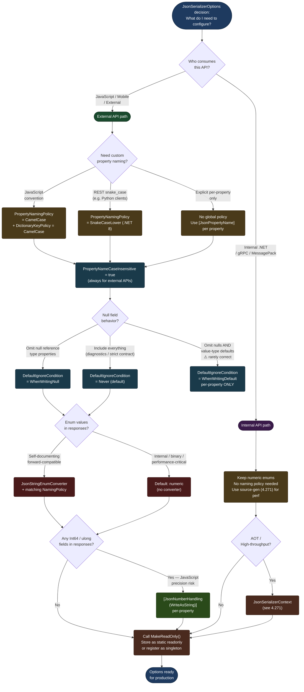

# 4.269 — JsonSerializerOptions: Naming Policies, Null Handling, Enum Conventions

---

## PART 0 — Navigation & Context

### Where This Topic Lives

```
ASP.NET Core Mastery
│
├── H. MVC & Controllers          (4.098–4.122)
│   └── 4.107 — Output Formatters    ← serialization gateway
│
├── I. HTTP Fundamentals          (4.123–4.133)
│   └── 4.124 — HttpRequest          ← reading deserialized bodies
│
└── V. Serialization              (4.268–4.276)  ← YOU ARE HERE
    ├── 4.268 — System.Text.Json Global Options    ← prerequisite
    ├── 4.269 — JsonSerializerOptions              ← THIS NOTE
    │            Naming · Null · Enums
    ├── 4.270 — Custom JsonConverter<T>            ← extends this
    ├── 4.271 — JSON Source Generation             ← perf tier above
    ├── 4.272 — Newtonsoft.Json Migration
    ├── 4.273 — XML Serialization
    ├── 4.274 — MessagePack
    ├── 4.275 — Custom Input/Output Formatters
    └── 4.276 — Polymorphic JSON [JsonDerivedType]
```

### What You Need Before This

- **[[4.268 — System.Text.Json in ASP.NET Core: Global Options and Defaults]]** — how `JsonSerializerOptions` is registered globally via `AddJsonOptions` and the defaults ASP.NET Core ships with.
- **[[4.107 — Output Formatters]]** — JSON serialization is performed by `SystemTextJsonOutputFormatter`; understanding that layer clarifies _when_ your options apply.
- **[[4.099 — Action Results: IActionResult and ActionResult<T>]]** — every `Ok(payload)` flows through the formatter; the options you configure here shape what the client receives.
- **[[4.034 — The Built-In DI Container]]** — `JsonSerializerOptions` is registered as a singleton option; understanding DI lifetime matters when you mutate options after startup.

### What This Unlocks After

- **[[4.270 — Custom JSON Converters: JsonConverter<T>]]** — custom converters are registered on `JsonSerializerOptions`; this note is their container.
- **[[4.271 — JSON Source Generation]]** — source generators use `JsonSerializerContext`, which inherits from `JsonSerializerOptions`; naming policies affect generated property names.
- **[[4.276 — Polymorphic JSON Serialization: [JsonDerivedType]]]** — polymorphic serialization configuration lives on `JsonSerializerOptions`.
- **[[4.272 — Newtonsoft.Json Migration]]** — understanding STJ options is the prerequisite for mapping every Newtonsoft setting to its STJ equivalent.

### Why This Matters at Scale

A misconfigured `JsonSerializerOptions` is a contract break: your API ships `"OrderStatus": 1` when the client contract requires `"orderStatus": "Pending"`, and that break is invisible in unit tests — it only surfaces when JavaScript clients start throwing `undefined is not a function` errors in production. At 10 k req/s, every `new JsonSerializerOptions()` inside a controller action adds ~5 KB of heap and one full reflection scan per request; the only safe path is a correctly configured singleton shared across the entire pipeline.

---

## PART 1 — The Core Mental Model

### The Fundamental Rule

> **`JsonSerializerOptions` is a compiled, immutable configuration object: the moment you pass it to `JsonSerializer.Serialize` or register it via `AddJsonOptions`, ASP.NET Core freezes it and caches the reflection metadata — mutating it afterward silently has no effect on already-serialized types, and constructing a new instance per request destroys the metadata cache that makes STJ fast.**

### The Plain-Language Analogy

Think of `JsonSerializerOptions` as the _stylesheet_ for your JSON output, compiled once at press time. A newspaper sets its style guide (headline casing, how to abbreviate numbers, how to handle missing bylines) once before printing starts; individual reporters don't rewrite the style guide per article, and changing it mid-print run would produce inconsistent pages. The moment the presses roll (`app.Build()` compiles the DI container), the stylesheet is locked. Any reporter (controller, service, background job) who follows the house style gets fast, consistent output. Any reporter who shows up with their own private style guide (a `new JsonSerializerOptions()`) pays the cost of typesetting from scratch on every page. The same analogy holds under concurrent load: the style guide is read-only and thread-safe; thousands of articles can be formatted in parallel from the same object.

### The Taxonomy Diagram

```mermaid
graph TD
    root["JsonSerializerOptions"]:::root

    root --> naming["Naming & Casing"]:::group_naming
    root --> nulls["Null & Default Handling"]:::group_null
    root --> enums["Enum Serialization"]:::group_enum
    root --> numbers["Number Handling"]:::group_number
    root --> converters["Converters"]:::group_conv
    root --> reading["Reading / Deserialization Controls"]:::group_read
    root --> perf["Performance & Metadata"]:::group_perf

    naming --> np_camel["PropertyNamingPolicy\n= CamelCase"]:::leaf
    naming --> np_snake["PropertyNamingPolicy\n= SnakeCaseLower (.NET 8)"]:::leaf
    naming --> np_kebab["PropertyNamingPolicy\n= KebabCaseLower (.NET 8)"]:::leaf
    naming --> np_custom["Custom JsonNamingPolicy"]:::leaf
    naming --> di_lower["DictionaryKeyPolicy\n= CamelCase"]:::leaf
    naming --> pci["PropertyNameCaseInsensitive\n(deserialization)"]:::leaf

    nulls --> nih["DefaultIgnoreCondition\n= Never (default)"]:::leaf
    nulls --> nil["DefaultIgnoreCondition\n= WhenWritingNull"]:::leaf
    nulls --> nidef["DefaultIgnoreCondition\n= WhenWritingDefault"]:::leaf
    nulls --> nialways["DefaultIgnoreCondition\n= Always (ignore member)"]:::leaf
    nulls --> nrh["NullValueHandling\n(per-property [JsonIgnore])"]:::leaf

    enums --> ec_str["JsonStringEnumConverter\n(string names)"]:::leaf
    enums --> ec_num["Default: numeric values"]:::leaf
    enums --> ec_named["JsonStringEnumMemberName (.NET 9)"]:::leaf
    enums --> ec_policy["JsonStringEnumConverter\n+ NamingPolicy"]:::leaf

    numbers --> nhl["NumberHandling\n= AllowReadingFromString"]:::leaf
    numbers --> nhw["NumberHandling\n= WriteAsString"]:::leaf

    converters --> builtin["Built-In: DateTime, Guid,\nTimeSpan, Uri"]:::leaf
    converters --> custom["JsonConverter<T> custom"]:::leaf
    converters --> factory["JsonConverterFactory"]:::leaf

    reading --> aic["AllowTrailingCommas"]:::leaf
    reading --> rc["ReadCommentHandling\n= Skip"]:::leaf
    reading --> maxdepth["MaxDepth (default: 64)"]:::leaf
    reading --> unknown["UnknownTypeHandling"]:::leaf

    perf --> frozen["MakeReadOnly() / Frozen (.NET 8)"]:::leaf
    perf --> reuse["Shared singleton — metadata cache"]:::leaf
    perf --> srctx["TypeInfoResolver\n= JsonSerializerContext (source-gen)"]:::leaf

    classDef root fill:#1e3a5f,color:#fff,stroke:#0d2137,rx:6
    classDef group_naming fill:#1a4a2e,color:#fff,stroke:#0d2718,rx:4
    classDef group_null fill:#4a2a1e,color:#fff,stroke:#2d160a,rx:4
    classDef group_enum fill:#3a1a4a,color:#fff,stroke:#1e0a2d,rx:4
    classDef group_number fill:#1a3a4a,color:#fff,stroke:#0a1e2d,rx:4
    classDef group_conv fill:#4a3a1a,color:#fff,stroke:#2d1e0a,rx:4
    classDef group_read fill:#2a4a1a,color:#fff,stroke:#162d0a,rx:4
    classDef group_perf fill:#4a1a1a,color:#fff,stroke:#2d0a0a,rx:4
    classDef leaf fill:#2a2a2a,color:#ddd,stroke:#555,rx:3
```



---

## PART 2 — Deep Mechanics

### 2.1 — How Options Flow From Registration to the Wire

**Pipeline Position:**

```
HTTP Request arrives
──► ExceptionHandler ──► HSTS ──► Routing ──► Auth ──► Endpoint executes
                                                             │
                                                     Controller Action returns
                                                     IActionResult / object
                                                             │
                                                    ┌────────▼────────┐
                                                    │  MVC Formatter   │
                                                    │  Selection       │
                                                    │  (Accept header) │
                                                    └────────┬────────┘
                                                             │  picks SystemTextJsonOutputFormatter
                                                    ┌────────▼──────────────────┐
                                                    │  SystemTextJsonOutputFormatter
                                                    │  holds reference to         │
                                                    │  JsonSerializerOptions      │  ← YOUR CONFIG
                                                    │  (singleton, frozen)        │
                                                    └────────┬──────────────────┘
                                                             │  JsonSerializer.Serialize(value, options)
                                                    ┌────────▼──────────────────┐
                                                    │  Utf8JsonWriter → Response  │
                                                    │  Body Stream                │
                                                    └─────────────────────────────┘
```

**Framework Source (approximate):**

```csharp
// Microsoft.AspNetCore.Mvc.Formatters.SystemTextJsonOutputFormatter
// Source: dotnet/aspnetcore — SystemTextJsonOutputFormatter.cs
public class SystemTextJsonOutputFormatter : TextOutputFormatter
{
    // Constructed once per application lifetime
    public JsonSerializerOptions SerializerOptions { get; }

    public SystemTextJsonOutputFormatter(JsonSerializerOptions jsonSerializerOptions)
    {
        SerializerOptions = jsonSerializerOptions;
        // Options are frozen here — MakeReadOnly() is called internally
    }

    public override async Task WriteResponseBodyAsync(
        OutputFormatterWriteContext context,
        Encoding selectedEncoding)
    {
        // ~0 allocations on .NET 8+ with PipeWriter
        var writer = context.HttpContext.Response.BodyWriter;
        await JsonSerializer.SerializeAsync(writer, context.Object,
            context.ObjectType!, SerializerOptions);
    }
}
```

**Runtime Cost Labels:**

- `JsonSerializer.Serialize` on the first call for a given type: `O(n)` reflection scan + metadata cache build (~tens of microseconds, one-time)
- Subsequent calls: `O(1)` metadata lookup from the thread-safe cache — ~50–200 ns overhead
- `new JsonSerializerOptions()` in a hot path: `~5 KB heap allocation` + reflection rescan on first type use → **never do this per-request**

---

### 2.2 — Naming Policies: How Property Names Are Transformed on the Wire

**The algorithm:** `JsonSerializerOptions.PropertyNamingPolicy` is called for every property name during serialization and (with `PropertyNameCaseInsensitive = true`) deserialization. The transformation runs once and is cached per property per options instance.

```csharp
// ASP.NET Core internally (approximate):
// JsonPropertyInfo construction in JsonTypeInfo resolver
string wireName = options.PropertyNamingPolicy is not null
    ? options.PropertyNamingPolicy.ConvertName(propertyInfo.Name)
    : propertyInfo.Name; // no transformation — exact C# name on wire
```

**Built-in policies (.NET 8):**

|Policy|C# Property|Wire JSON Key|
|---|---|---|
|`null` (default in raw STJ)|`OrderStatus`|`"OrderStatus"`|
|`CamelCase`|`OrderStatus`|`"orderStatus"`|
|`SnakeCaseLower`|`OrderStatus`|`"order_status"`|
|`SnakeCaseUpper`|`OrderStatus`|`"ORDER_STATUS"`|
|`KebabCaseLower`|`OrderStatus`|`"order-status"`|
|`KebabCaseUpper`|`OrderStatus`|`"ORDER-STATUS"`|

> [!IMPORTANT] **ASP.NET Core's default is `CamelCase`** — set automatically when you call `AddJsonOptions` with no explicit policy. Raw `JsonSerializer.Serialize` outside ASP.NET Core has _no_ naming policy by default (PascalCase). This divergence burns teams who write unit tests against `JsonSerializer.Serialize` directly but test with a different options instance than production.

**HTTP Wire Format — naming policy in action:**

```http
// C# model:
// public class OrderSummary {
//   public int OrderId { get; set; }
//   public string CustomerName { get; set; }
//   public OrderStatus Status { get; set; }
// }

// HTTP response (approximate) — CamelCase policy:
HTTP/1.1 200 OK
Content-Type: application/json; charset=utf-8

{"orderId":42,"customerName":"Acme Corp","status":1}

// HTTP response (approximate) — SnakeCaseLower policy:
HTTP/1.1 200 OK
Content-Type: application/json; charset=utf-8

{"order_id":42,"customer_name":"Acme Corp","status":1}
```

**`[JsonPropertyName]` always wins over the policy.** It is the escape hatch for individual properties that don't follow the convention.

```csharp
public class PaymentResponse
{
    // Policy produces "transactionId" — override forces exact name
    [JsonPropertyName("transaction_id")]
    public string TransactionId { get; set; } = default!;

    // Policy applies normally → "amount"
    public decimal Amount { get; set; }
}
```

**`DictionaryKeyPolicy`** — applies only to dictionary keys (not property names). If your API returns `Dictionary<string, decimal>` and you want keys camelCased, set `DictionaryKeyPolicy` separately:

```csharp
options.DictionaryKeyPolicy = JsonNamingPolicy.CamelCase;
// { "orderCount": 10, "shipmentCount": 5 }
// Without this, keys are untransformed: { "OrderCount": 10, ... }
```

**`PropertyNameCaseInsensitive`** — during _deserialization_, match incoming JSON keys case-insensitively. This is the most common source of silent null values: a client sends `{"orderId": 42}` but your model has `OrderId` and case-insensitive matching is `false`.

---

### 2.3 — Null and Default Handling: What Gets Omitted From the Wire

**The `DefaultIgnoreCondition` enum** controls which properties are included in serialization output:

```
JsonIgnoreCondition.Never       — always include (default)
JsonIgnoreCondition.WhenWritingNull    — omit if null (reference types / nullable value types)
JsonIgnoreCondition.WhenWritingDefault — omit if null OR if value type is default (0, false, Guid.Empty)
JsonIgnoreCondition.Always      — never include (same as [JsonIgnore] on every property)
```

**Framework Source (approximate):**

```csharp
// JsonPropertyInfo.ShouldSerialize (approximate internal logic)
bool shouldSerialize = options.DefaultIgnoreCondition switch
{
    JsonIgnoreCondition.Never => true,
    JsonIgnoreCondition.WhenWritingNull => value is not null,
    JsonIgnoreCondition.WhenWritingDefault => !IsDefaultValue(value, propertyType),
    JsonIgnoreCondition.Always => false,
    _ => true
};
```

**HTTP Wire Format — null handling:**

```http
// C# model:
// public class ShipmentDetails {
//   public string TrackingNumber { get; set; }   // null
//   public DateTime? DeliveredAt { get; set; }    // null
//   public int PackageCount { get; set; }          // 0
// }

// DefaultIgnoreCondition.Never (default):
{"trackingNumber":null,"deliveredAt":null,"packageCount":0}

// DefaultIgnoreCondition.WhenWritingNull:
{"packageCount":0}
// TrackingNumber and DeliveredAt omitted; packageCount kept (0 is not null)

// DefaultIgnoreCondition.WhenWritingDefault:
{}
// All three omitted: null is default for reference types, 0 is default for int
```

> [!WARNING] `WhenWritingDefault` is seductive but dangerous for APIs. Omitting `0` from a numeric field breaks clients that distinguish between "not provided" and "zero". Payment amounts, inventory counts, and price fields should **never** use `WhenWritingDefault` globally. Use `[JsonIgnore(Condition = JsonIgnoreCondition.WhenWritingNull)]` per-property instead.

**Per-property override with `[JsonIgnore]`:**

```csharp
public class InventoryItem
{
    public string Sku { get; set; } = default!;
    public decimal Price { get; set; }

    // Always omit from responses — internal field
    [JsonIgnore]
    public string InternalWarehouseCode { get; set; } = default!;

    // Omit only when null — don't send "discontinuedAt": null for active items
    [JsonIgnore(Condition = JsonIgnoreCondition.WhenWritingNull)]
    public DateTime? DiscontinuedAt { get; set; }
}
```

**Required properties on deserialization (.NET 7+):**

```csharp
public class CreateOrderRequest
{
    [JsonRequired]  // 400-equivalent if missing from incoming JSON
    public string CustomerId { get; set; } = default!;

    public string? Notes { get; set; }
}
// If "customerId" is absent from request body:
// JsonException thrown → model binding produces 400 ValidationProblemDetails
```

**Runtime Cost:** `WhenWritingNull` adds one null-check per property during serialization — negligible. `WhenWritingDefault` adds `EqualityComparer<T>.Default.Equals(value, default(T))` per value-type property — also negligible at 100 properties but adds up in deeply nested bulk APIs returning thousands of objects.

---

### 2.4 — Enum Serialization: Numeric vs String Representation

**Default behavior:** enums serialize as their underlying integer value. This is fast (no string allocation) but opaque to API clients:

```http
// Without JsonStringEnumConverter:
{"status":2}  // Is 2 Pending? Shipped? Cancelled? Client must hardcode the mapping.

// With JsonStringEnumConverter:
{"status":"Shipped"}  // Self-documenting, breaking change safe (add new values freely)
```

**`JsonStringEnumConverter` registration:**

```csharp
// Global — all enums in all responses
builder.Services.AddJsonOptions(options =>
{
    options.JsonSerializerOptions.Converters.Add(new JsonStringEnumConverter());
});

// Global with naming policy — enums follow the same casing as properties
builder.Services.AddJsonOptions(options =>
{
    options.JsonSerializerOptions.Converters.Add(
        new JsonStringEnumConverter(JsonNamingPolicy.CamelCase));
});
// OrderStatus.InTransit → "inTransit"
```

**HTTP Wire Format — enum conventions:**

```http
// C# enum:
// public enum ShipmentStatus { Pending = 0, InTransit = 1, Delivered = 2, Failed = 3 }

// Numeric (default):
{"shipmentStatus":1}

// JsonStringEnumConverter — no naming policy:
{"shipmentStatus":"InTransit"}

// JsonStringEnumConverter + CamelCase naming policy:
{"shipmentStatus":"inTransit"}

// JsonStringEnumConverter + SnakeCaseLower naming policy:
{"shipmentStatus":"in_transit"}
```

**`[JsonStringEnumMemberName]` (.NET 9) — per-value wire name override:**

```csharp
// .NET 9+
public enum PaymentMethod
{
    [JsonStringEnumMemberName("credit_card")]
    CreditCard,

    [JsonStringEnumMemberName("bank_transfer")]
    BankTransfer,

    [JsonStringEnumMemberName("crypto")]
    Cryptocurrency
}
// {"paymentMethod":"credit_card"} regardless of global naming policy
```

**`[JsonConverter]` on enum type (.NET 7+ alternative):**

```csharp
[JsonConverter(typeof(JsonStringEnumConverter))]
public enum OrderStatus { Pending, Processing, Shipped, Delivered, Cancelled }
// Applies JsonStringEnumConverter to this enum only — not globally
```

**Framework Source (approximate):**

```csharp
// JsonStringEnumConverter<TEnum>.Write (approximate)
public override void Write(Utf8JsonWriter writer, TEnum value, JsonSerializerOptions options)
{
    // Cached: EnumInfo<TEnum> maps value → string via naming policy
    if (_enumToStringCache.TryGetValue(value, out string? name))
    {
        writer.WriteStringValue(name);  // ~1 string allocation (pooled in .NET 8)
    }
    else
    {
        // Undefined enum value falls back to numeric
        writer.WriteNumberValue(Convert.ToInt64(value));
    }
}
```

**Runtime Cost:** String enum serialization costs ~1 string allocation per enum value and one dictionary lookup. The names are cached after the first serialization of each type. For high-throughput bulk endpoints (inventory export, order history), numeric enums are faster; for external-facing APIs with JavaScript clients, string enums are the correct default.

> [!TIP] Use `JsonStringEnumConverter` globally for _external_ APIs. For _internal_ gRPC/MessagePack APIs, keep numeric enums — they're smaller on the wire and the proto schema serves as the contract.

---

### 2.5 — Number Handling: Reading Strings as Numbers and Reverse

JavaScript's `JSON.parse` turns large `long` values (> 2^53) into floating-point approximations. This is the source of silent data corruption when a JavaScript client receives an order ID like `9007199254740993` — it becomes `9007199254740992`. The solution is to write large integers as JSON strings.

```csharp
// Global: all numbers written as strings (use sparingly — breaks JavaScript numeric math)
options.NumberHandling = JsonNumberHandling.WriteAsString;

// More surgical: only specific properties
public class OrderEvent
{
    // Safe for JavaScript Number (< 2^53)
    public int EventSequence { get; set; }

    // Dangerous: 64-bit ID — serialize as string
    [JsonNumberHandling(JsonNumberHandling.WriteAsString)]
    public long OrderId { get; set; }

    // Allow parsing "42.5" from legacy APIs that quote numbers
    [JsonNumberHandling(JsonNumberHandling.AllowReadingFromString)]
    public decimal Amount { get; set; }
}
```

**HTTP Wire Format:**

```http
// Without WriteAsString:
{"orderId":9223372036854775807,"eventSequence":1}

// With [JsonNumberHandling(WriteAsString)] on OrderId:
{"orderId":"9223372036854775807","eventSequence":1}
// JavaScript: JSON.parse → orderId is a string, no precision loss
```

**Edge case that bites teams:** `AllowReadingFromString | AllowNamedFloatingPointLiterals` is needed when consuming partner APIs that send `"Infinity"`, `"NaN"`, or `"-Infinity"` as JSON strings. Without it, deserialization throws `JsonException`.

```csharp
options.NumberHandling =
    JsonNumberHandling.AllowReadingFromString |
    JsonNumberHandling.AllowNamedFloatingPointLiterals;
```

---

### 2.6 — Shared Options Singleton and Freezing

Before .NET 8, `JsonSerializerOptions` was frozen implicitly the first time it was used for serialization. .NET 8 added `MakeReadOnly()` to freeze it explicitly and `IsReadOnly` to check:

```csharp
// ASP.NET Core internally (approximate) — SystemTextJsonOutputFormatter constructor:
public SystemTextJsonOutputFormatter(JsonSerializerOptions options)
{
    options.MakeReadOnly();  // .NET 8 — explicit freeze
    SerializerOptions = options;
}
```

**The gotcha:** After `MakeReadOnly()`, calling `options.Converters.Add(...)` throws `InvalidOperationException`. This silently fails in older code paths that mutate options after startup.

**`JsonSerializerOptions` constructor copy (.NET 8):**

```csharp
// Create a new instance based on an existing one (preserves all settings, unfrozen)
var productionOptions = new JsonSerializerOptions(existingOptions);
productionOptions.Converters.Add(new MyExtraConverter());
productionOptions.MakeReadOnly();
```

---

## PART 3 — Production Code Patterns

### Pattern 1: The Contract-First Options Setup for a Payment API

The most common mistake in production APIs is reaching for `AddJsonOptions` and only configuring `CamelCase`. A complete, defensible options setup addresses all six axes: naming, null handling, enums, numbers, case sensitivity, and reference cycles.

```csharp
// ⚠️ WRONG: Minimum viable config that ships silent contract bugs
builder.Services.AddControllers()
    .AddJsonOptions(options =>
    {
        options.JsonSerializerOptions.PropertyNamingPolicy = JsonNamingPolicy.CamelCase;
        // Null fields appear in every response → wasteful, exposes internal nulls
        // Enums serialize as integers → "status": 2 means nothing to JavaScript clients
        // Large longs serialize as numbers → precision loss in browser
    });

// ✅ CORRECT: Contract-first options for a payment processing API
builder.Services.AddControllers()
    .AddJsonOptions(options =>
    {
        var jsonOptions = options.JsonSerializerOptions;

        // Naming: camelCase for all properties (JavaScript convention)
        jsonOptions.PropertyNamingPolicy = JsonNamingPolicy.CamelCase;
        jsonOptions.DictionaryKeyPolicy  = JsonNamingPolicy.CamelCase;

        // Deserialization: accept camelCase, PascalCase, or any casing from clients
        jsonOptions.PropertyNameCaseInsensitive = true;

        // Nulls: omit null-valued reference type properties to keep payloads tight
        // ⚠️ NOT WhenWritingDefault — 0 amounts and false flags must appear on the wire
        jsonOptions.DefaultIgnoreCondition = JsonIgnoreCondition.WhenWritingNull;

        // Enums: string names for external readability and forward-compatibility
        jsonOptions.Converters.Add(
            new JsonStringEnumConverter(JsonNamingPolicy.CamelCase));

        // Numbers: write Int64 fields as strings to prevent JavaScript precision loss
        // Applied per-property via [JsonNumberHandling] — not globally here
        // (global WriteAsString breaks clients that expect numeric JSON)

        // Robustness: tolerate trailing commas and C-style comments in request bodies
        jsonOptions.AllowTrailingCommas     = true;
        jsonOptions.ReadCommentHandling     = JsonCommentHandling.Skip;

        // Safety: prevent stack overflow from deeply nested JSON (e.g., malicious input)
        jsonOptions.MaxDepth = 32; // Default is 64; 32 is sufficient for payment payloads
    });

// HTTP wire format (approximate) — payment response:
// HTTP/1.1 200 OK
// Content-Type: application/json; charset=utf-8
//
// {"transactionId":"txn_9a2f","amount":49.99,"currency":"USD","status":"completed"}
// Note: null fields absent, status is string not integer
```

---

### Pattern 2: Per-Endpoint Override — Strict Validation Mode for a Webhook Receiver

An order management webhook receiver must be _strict_: unknown fields from the upstream courier system should throw, not be silently ignored. The global options are lenient; this endpoint needs different behavior.

```csharp
// ⚠️ WRONG: Using a new JsonSerializerOptions() instance per request
[HttpPost("webhooks/shipment")]
public async Task<IActionResult> ReceiveShipmentWebhook()
{
    // New instance = no metadata cache = reflection scan on every request
    // ~5 KB allocation + O(type) reflection scan for each incoming webhook
    var options = new JsonSerializerOptions
    {
        UnknownTypeHandling = JsonUnknownTypeHandling.JsonElement
    };
    var body = await JsonSerializer.DeserializeAsync<ShipmentWebhook>(
        Request.Body, options);
    // ...
}

// ✅ CORRECT: Pre-built static options for this specific endpoint
// ShipmentWebhookController.cs
public static class WebhookSerializerOptions
{
    // Static readonly — built once, frozen, shared across all webhook requests
    public static readonly JsonSerializerOptions Strict = BuildStrictOptions();

    private static JsonSerializerOptions BuildStrictOptions()
    {
        var opts = new JsonSerializerOptions
        {
            PropertyNamingPolicy          = JsonNamingPolicy.SnakeCaseLower,
            PropertyNameCaseInsensitive   = false, // strict — snake_case only
            DefaultIgnoreCondition        = JsonIgnoreCondition.Never,
            // Throw on unknown fields from the courier API (catch schema drift early)
            UnknownTypeHandling           = JsonUnknownTypeHandling.JsonElement,
            AllowTrailingCommas           = false,
            ReadCommentHandling           = JsonCommentHandling.Disallow,
        };
        opts.Converters.Add(new JsonStringEnumConverter(JsonNamingPolicy.SnakeCaseLower));
        opts.MakeReadOnly(); // Freeze immediately — no accidental mutation
        return opts;
    }
}

[ApiController]
[Route("api/webhooks")]
public class ShipmentWebhookController : ControllerBase
{
    [HttpPost("shipment")]
    public async Task<IActionResult> Receive(CancellationToken ct)
    {
        // Uses static pre-built options — zero allocation overhead
        var webhook = await JsonSerializer.DeserializeAsync<ShipmentWebhookPayload>(
            Request.Body, WebhookSerializerOptions.Strict, ct);

        if (webhook is null) return BadRequest("Empty payload");
        // process...
        return NoContent();
    }
}

// HTTP wire input (approximate):
// POST /api/webhooks/shipment HTTP/1.1
// Content-Type: application/json
//
// {"shipment_id":"SHP-998","tracking_number":"1Z999AA10123456784",
//  "status":"in_transit","estimated_delivery":"2026-06-15T14:00:00Z"}
```

---

### Pattern 3: Enum-Safe API Versioning — Additive Enum Members Without Breaking Clients

An order management API adds a new `OrderStatus.OnHold` value. Old clients receiving `"status": "onHold"` where they expect a known value must not crash — they must fall back gracefully.

```csharp
// ⚠️ WRONG: No fallback for unknown enum values
// If upstream adds OrderStatus.OnHold (4) and your client has no such member:
// JsonException: The JSON value could not be converted to OrderStatus.
// Crashes the entire deserialization, drops the message.

// ✅ CORRECT: Tolerant enum deserialization with unknown-value fallback
public enum OrderStatus
{
    Unknown   = 0,  // Fallback for any unrecognized string
    Pending   = 1,
    Processing = 2,
    Shipped   = 3,
    Delivered = 4,
    Cancelled = 5
}

public class TolerantStringEnumConverter<TEnum> : JsonConverter<TEnum>
    where TEnum : struct, Enum
{
    private readonly JsonStringEnumConverter _inner;
    private readonly TEnum _fallback;

    public TolerantStringEnumConverter(TEnum fallback)
    {
        _inner   = new JsonStringEnumConverter(JsonNamingPolicy.CamelCase);
        _fallback = fallback;
    }

    public override TEnum Read(ref Utf8JsonReader reader,
        Type typeToConvert, JsonSerializerOptions options)
    {
        try
        {
            return _inner.CreateConverter(typeToConvert, options)
                          .Read(ref reader, typeToConvert, options) is TEnum v
                ? v : _fallback;
        }
        catch (JsonException)
        {
            // Unknown enum string → consume the token, return fallback
            reader.Skip();
            return _fallback;
        }
    }

    public override void Write(Utf8JsonWriter writer, TEnum value,
        JsonSerializerOptions options)
        => _inner.CreateConverter(typeof(TEnum), options)
                 .Write(writer, value, options);
}

// Registration for the order service:
builder.Services.AddControllers()
    .AddJsonOptions(o =>
    {
        o.JsonSerializerOptions.Converters.Add(
            new TolerantStringEnumConverter<OrderStatus>(OrderStatus.Unknown));
    });

// HTTP wire format:
// Incoming (from new partner API): {"status": "onHold"}
// Deserialized as: OrderStatus.Unknown  (no crash, log and route to manual queue)
```

---

### Pattern 4: The Large-Integer Safety Guard for an Order ID API

Order IDs and event sequence numbers that use `long` (Int64) silently lose precision in JavaScript clients once they exceed `Number.MAX_SAFE_INTEGER` (2^53 - 1 = 9,007,199,254,740,991). In a high-volume order management system, this ceiling is reachable.

```csharp
// ⚠️ WRONG: Raw long on the wire — precision loss in JavaScript browser clients
public class OrderResponse
{
    public long OrderId { get; set; }    // 9223372036854775807 → becomes 9223372036854775808 in JS
    public string Status { get; set; } = default!;
}

// ✅ CORRECT: Per-property annotation — surgical, doesn't break numeric math elsewhere
public class OrderResponse
{
    // Write as JSON string: "9223372036854775807" — JS parses as string, no precision loss
    [JsonNumberHandling(JsonNumberHandling.WriteAsString)]
    public long OrderId { get; set; }

    // Also allow reading it back as either string or number (client sends either)
    [JsonNumberHandling(
        JsonNumberHandling.WriteAsString | JsonNumberHandling.AllowReadingFromString)]
    public long ParentOrderId { get; set; }

    public string Status { get; set; } = default!;
    public decimal Amount { get; set; }  // decimal is fine — not JavaScript number
}

// HTTP response (approximate):
// {"orderId":"9223372036854775807","parentOrderId":"42","status":"shipped","amount":199.99}
// JavaScript: parseInt(order.orderId, 10) — or use BigInt for arithmetic
```

---

### Pattern 5: Per-Tenant Serialization Options in a Multi-Tenant SaaS API

A multi-tenant SaaS platform must serialize dates as ISO 8601 for US tenants and as Unix timestamps for legacy IoT device tenants — different options per tenant without per-request allocation.

```csharp
// Tenant-specific options built at startup, stored by tenant ID
public class TenantSerializerOptionsRegistry
{
    private readonly FrozenDictionary<string, JsonSerializerOptions> _options;

    public TenantSerializerOptionsRegistry(IEnumerable<TenantConfig> configs)
    {
        _options = configs.ToFrozenDictionary(
            c => c.TenantId,
            c => BuildForTenant(c));
    }

    public JsonSerializerOptions GetOptions(string tenantId)
        => _options.TryGetValue(tenantId, out var opts)
            ? opts
            : DefaultOptions;

    public static readonly JsonSerializerOptions DefaultOptions = BuildDefault();

    private static JsonSerializerOptions BuildForTenant(TenantConfig config)
    {
        var opts = new JsonSerializerOptions(DefaultOptions); // copy constructor (.NET 8)
        if (config.UseUnixTimestamps)
        {
            opts.Converters.Add(new UnixEpochDateTimeConverter());
        }
        opts.MakeReadOnly();
        return opts;
    }

    private static JsonSerializerOptions BuildDefault()
    {
        var opts = new JsonSerializerOptions
        {
            PropertyNamingPolicy        = JsonNamingPolicy.CamelCase,
            DefaultIgnoreCondition      = JsonIgnoreCondition.WhenWritingNull,
        };
        opts.Converters.Add(new JsonStringEnumConverter(JsonNamingPolicy.CamelCase));
        opts.MakeReadOnly();
        return opts;
    }
}

// Action usage — per-tenant serialization without allocation
[HttpGet("events/{eventId}")]
public IActionResult GetEvent(
    [FromRoute] string eventId,
    [FromServices] TenantSerializerOptionsRegistry registry,
    [FromServices] ICurrentTenantContext tenantCtx)
{
    var evt = _service.GetEvent(eventId);
    var opts = registry.GetOptions(tenantCtx.TenantId);
    // Returns using explicit options, bypassing the global formatter
    return new JsonResult(evt, opts);
}
```

---

### Pattern 6: The Consistent Null + Enum Contract for a Logistics Tracking Response

The most production-relevant combination: camelCase + null omission + string enums + case-insensitive reads — assembled as a reusable extension method for the entire logistics domain.

```csharp
// ✅ Production pattern: encapsulate as an extension method for the domain
public static class LogisticsJsonConfiguration
{
    public static IServiceCollection AddLogisticsJson(this IServiceCollection services)
    {
        services.AddControllers()
            .AddJsonOptions(options => options.JsonSerializerOptions
                .ConfigureForLogisticsDomain());
        return services;
    }

    public static JsonSerializerOptions ConfigureForLogisticsDomain(
        this JsonSerializerOptions opts)
    {
        opts.PropertyNamingPolicy          = JsonNamingPolicy.CamelCase;
        opts.DictionaryKeyPolicy           = JsonNamingPolicy.CamelCase;
        opts.PropertyNameCaseInsensitive   = true;
        opts.DefaultIgnoreCondition        = JsonIgnoreCondition.WhenWritingNull;
        opts.AllowTrailingCommas           = true;
        opts.ReadCommentHandling           = JsonCommentHandling.Skip;
        opts.Converters.Add(new JsonStringEnumConverter(JsonNamingPolicy.CamelCase));
        return opts;
    }
}

// Program.cs
builder.Services.AddLogisticsJson();

// Model — domain-specific
public class TrackingEventResponse
{
    public string TrackingNumber { get; set; } = default!;
    public ShipmentStatus Status { get; set; }   // → "inTransit" on wire
    public string? Location { get; set; }         // → omitted if null
    public DateTime? EstimatedDelivery { get; set; }  // → omitted if null

    [JsonNumberHandling(JsonNumberHandling.WriteAsString)]
    public long EventId { get; set; }  // → "1234567890123" on wire
}

// HTTP response (approximate):
// HTTP/1.1 200 OK
// Content-Type: application/json; charset=utf-8
//
// {"trackingNumber":"1Z999AA","status":"inTransit","eventId":"9007199254740993"}
// Note: location and estimatedDelivery absent (null), status is string, eventId is string
```

---

## PART 4 — Gotchas & Anti-Patterns

### Gotcha 1: Global `WhenWritingDefault` Obliterates Numeric API Fields

When `DefaultIgnoreCondition.WhenWritingDefault` is set globally, every `int`, `decimal`, `bool`, and `Guid` property with its CLR default value disappears from the response. Teams set this because "we don't want null noise" — and get orders with `"amount"` missing when the order is free.

```csharp
// ⚠️ WRONG CODE:
builder.Services.AddControllers()
    .AddJsonOptions(o =>
    {
        // Intended: hide null fields. Actual: hides ALL default-valued fields
        o.JsonSerializerOptions.DefaultIgnoreCondition =
            JsonIgnoreCondition.WhenWritingDefault;
    });

public class PaymentResponse
{
    public decimal Amount { get; set; }       // 0m = default → OMITTED
    public bool IsFraudFlagged { get; set; }  // false = default → OMITTED
    public Guid PaymentId { get; set; }       // Guid.Empty = default → OMITTED
}

// HTTP consequence (wrong path):
// HTTP/1.1 200 OK
// {}   ← complete payment response is empty for a zero-amount transaction

// ✅ CORRECT CODE:
o.JsonSerializerOptions.DefaultIgnoreCondition =
    JsonIgnoreCondition.WhenWritingNull;  // Nulls only; value-type defaults preserved

// Per-property for specific fields that should be omitted when null:
[JsonIgnore(Condition = JsonIgnoreCondition.WhenWritingNull)]
public string? TrackingNote { get; set; }

// HTTP consequence (correct path):
// HTTP/1.1 200 OK
// {"amount":0.00,"isFraudFlagged":false,"paymentId":"00000000-..."}
// All fields present regardless of their values

// WHY: WhenWritingDefault evaluates `EqualityComparer<T>.Default.Equals(value, default(T))`.
// For value types, `0`, `false`, `Guid.Empty`, and `default(DateTime)` all pass this check.
// The framework has no way to distinguish "genuinely zero" from "not provided" — so it drops
// both. Use WhenWritingNull at the global level; use WhenWritingDefault only on specific
// optional nullable properties where you explicitly want that behavior.
```

---

### Gotcha 2: `PropertyNameCaseInsensitive = false` Produces Silent Nulls on Mobile Clients

Mobile clients (iOS, Android) often serialize using camelCase property names by default. If your ASP.NET Core API uses PascalCase models and `PropertyNameCaseInsensitive = false` (the raw STJ default), every `[FromBody]` deserialization silently nulls out all properties without a validation error.

```csharp
// ⚠️ WRONG CODE:
// Global options with no case-insensitive setting (raw STJ default):
var opts = new JsonSerializerOptions
{
    PropertyNamingPolicy = JsonNamingPolicy.CamelCase  // output only
    // PropertyNameCaseInsensitive not set → false
};

public class CreateOrderRequest
{
    [Required] public string CustomerId { get; set; } = default!;
    public decimal Amount { get; set; }
}

// HTTP consequence (wrong path):
// Mobile client sends:   {"customerId":"C1","amount":99.99}
// Deserialized result:   CustomerId = null, Amount = 0
// [Required] on CustomerId does NOT fire (null is "missing" only for non-nullable without [Required])
// → Order is created with null CustomerId — silent data corruption

// ✅ CORRECT CODE:
builder.Services.AddControllers()
    .AddJsonOptions(o =>
    {
        o.JsonSerializerOptions.PropertyNamingPolicy        = JsonNamingPolicy.CamelCase;
        o.JsonSerializerOptions.PropertyNameCaseInsensitive = true; // Always set this
    });

// HTTP consequence (correct path):
// Mobile client sends:   {"customerId":"C1","amount":99.99}
// Deserialized result:   CustomerId = "C1", Amount = 99.99
// Model binding succeeds; action receives correctly populated request

// WHY: PropertyNamingPolicy controls *output* casing only. For input (deserialization),
// the framework does exact string matching by default. PropertyNameCaseInsensitive = true
// enables OrdinalIgnoreCase matching, which is what every external client expects.
// ASP.NET Core sets this to true automatically when you use AddJsonOptions — but if you
// call JsonSerializer.Deserialize directly (e.g., in a background service), you must set
// it explicitly on your shared options instance.
```

---

### Gotcha 3: `JsonStringEnumConverter` Throws on Unknown Enum Values During Deserialization

If an upstream service adds a new enum value and your API deserializes responses from it with `JsonStringEnumConverter`, you get a `JsonException` that crashes the entire deserialization — not just a missing field.

```csharp
// ⚠️ WRONG CODE:
// Partner shipment API adds "ReturnPending" to ShipmentStatus enum.
// Your API has no such member.
public enum ShipmentStatus { Pending, InTransit, Delivered, Failed }

// Options with string enum converter — strict (default):
options.Converters.Add(new JsonStringEnumConverter());

// Incoming JSON from partner: {"status":"ReturnPending"}
// Result: throws JsonException: The JSON value "ReturnPending" could not be converted
//         to ShipmentStatus.
// HTTP consequence (wrong path):
// Unhandled exception → 500 Internal Server Error (or caught by exception handler → 400)
// All other fields in the payload are lost

// ✅ CORRECT CODE:
// Add an unknown-value member to the enum as a safe landing spot
public enum ShipmentStatus
{
    Unknown    = 0,
    Pending    = 1,
    InTransit  = 2,
    Delivered  = 3,
    Failed     = 4
}

// Use the tolerant converter from Pattern 3 above, or handle via OnDeserializing:
options.Converters.Add(
    new TolerantStringEnumConverter<ShipmentStatus>(ShipmentStatus.Unknown));

// HTTP consequence (correct path):
// Incoming JSON: {"status":"ReturnPending"}
// Deserialized:  Status = ShipmentStatus.Unknown  (no exception)
// Application routes unknown-status shipments to the manual review queue

// WHY: JsonStringEnumConverter does an exact name match (with any naming policy applied).
// If no match is found, it throws immediately. Unlike Newtonsoft.Json which can be
// configured to fall back to the numeric value, STJ has no built-in fallback — you must
// provide your own converter or add the Unknown member + wrap the converter.
```

---

### Gotcha 4: Mutating `JsonSerializerOptions` After It Has Been Used (or Passed to ASP.NET Core)

`JsonSerializerOptions` is frozen on first use. In .NET 8+, it is explicitly frozen via `MakeReadOnly()`. Any mutation attempt after freeze throws `InvalidOperationException` — but this exception only surfaces at runtime, often in a startup path that looks like it works during tests.

```csharp
// ⚠️ WRONG CODE:
// Built in a shared helper, then mutated by a consuming library
var sharedOptions = new JsonSerializerOptions
{
    PropertyNamingPolicy = JsonNamingPolicy.CamelCase
};

// First use freezes the options
var json = JsonSerializer.Serialize(new Order(), sharedOptions);

// Later, a library adds its converter — THROWS InvalidOperationException
sharedOptions.Converters.Add(new CustomDateConverter()); // 💥

// HTTP consequence (wrong path):
// InvalidOperationException: JsonSerializerOptions instance is read-only.
// 500 Internal Server Error on startup or first affected request

// ✅ CORRECT CODE:
// Pattern A: Add all converters before first use
var sharedOptions = new JsonSerializerOptions
{
    PropertyNamingPolicy = JsonNamingPolicy.CamelCase
};
sharedOptions.Converters.Add(new CustomDateConverter()); // Add FIRST
sharedOptions.MakeReadOnly(); // Explicitly freeze; subsequent mutations are obvious errors
var json = JsonSerializer.Serialize(new Order(), sharedOptions);

// Pattern B: Copy constructor (.NET 8) for derived configs
var extendedOptions = new JsonSerializerOptions(sharedOptions); // Unfrozen copy
extendedOptions.Converters.Add(new SpecialConverter());
extendedOptions.MakeReadOnly();

// HTTP consequence (correct path):
// Startup succeeds; all serialization uses the frozen, cached options
// InvalidOperationException surfaced at startup (before traffic arrives) if mutation is attempted

// WHY: The metadata cache in JsonSerializerOptions is keyed to the specific instance.
// Freezing ensures that once the cache is populated, the options that describe the types
// cannot change underneath it. Mutating after freeze would invalidate the cache contract,
// so the framework prevents it.
```

---

### Gotcha 5: `JsonPropertyName` Attribute Is Not Respected by Naming Policy During Deserialization Without `PropertyNameCaseInsensitive`

`[JsonPropertyName("orderId")]` sets the wire name explicitly. But deserialization still requires an exact match to that explicit name — unless `PropertyNameCaseInsensitive = true`. A client sending `"OrderId"` to a property annotated `[JsonPropertyName("orderId")]` gets a silent null.

```csharp
// ⚠️ WRONG CODE:
public class UpdateShipmentRequest
{
    [JsonPropertyName("shipmentId")] // Explicit wire name: "shipmentId"
    public string ShipmentId { get; set; } = default!;
}

// Options: no case-insensitive setting
var options = new JsonSerializerOptions(); // PropertyNameCaseInsensitive = false

// Client sends: {"ShipmentId":"SHP-001"}  (PascalCase — e.g., a .NET client using defaults)
var req = JsonSerializer.Deserialize<UpdateShipmentRequest>(
    """{"ShipmentId":"SHP-001"}""", options);
// Result: req.ShipmentId = null  (no exception, just silent null)

// HTTP consequence (wrong path):
// POST /api/shipments/update with {"ShipmentId":"SHP-001"}
// Action receives ShipmentId = null → NullReferenceException or invalid update

// ✅ CORRECT CODE:
var options = new JsonSerializerOptions
{
    PropertyNameCaseInsensitive = true  // Matches "ShipmentId" → [JsonPropertyName("shipmentId")]
};
var req = JsonSerializer.Deserialize<UpdateShipmentRequest>(
    """{"ShipmentId":"SHP-001"}""", options);
// Result: req.ShipmentId = "SHP-001" ✓

// HTTP consequence (correct path):
// POST /api/shipments/update with {"ShipmentId":"SHP-001"}
// Action receives ShipmentId = "SHP-001" → update succeeds

// WHY: [JsonPropertyName] sets the canonical wire name. During deserialization, the
// JSON reader looks for that exact string. PropertyNameCaseInsensitive = true adds a
// second OrdinalIgnoreCase pass when the exact match fails. Without it, case variants
// of the explicitly named property are invisible to the deserializer. Always set
// PropertyNameCaseInsensitive = true in your global ASP.NET Core options.
```

---

## PART 5 — Performance Implications

### 5.1 — Request Pipeline Characteristics Table

|Scenario|Pipeline Depth|Allocations Per Request|Approx Latency Impact|Recommendation|
|---|---|---|---|---|
|Singleton options + CamelCase + cached type metadata|Shallow|~0 (Utf8JsonWriter pooled in .NET 8)|Baseline (~50–150 ns serialization for small object)|**Default production path**|
|`new JsonSerializerOptions()` per request|N/A (bypasses ASP.NET Core formatter)|~5 KB + reflection rescan per unique type|+0.5–2 ms for complex types|**Never do this**|
|`JsonStringEnumConverter` (global, all enums)|In-line during serialization|~1 string per enum value (cached after first use)|Negligible (+1–5 ns per enum field)|Safe globally for external APIs|
|`WhenWritingNull` global check|Per-property during serialization|0 additional (null check inlined)|Negligible|Safe globally|
|`WhenWritingDefault` global check|Per-property during serialization|0 additional (EqualityComparer check)|+1–3 ns per value-type property|Use per-property only|
|`PropertyNameCaseInsensitive = true` deserialization|Linear scan on first-miss per property per type|0 after first cache build|+5–20 ns per property on first deserialize of a type|Always enable for external APIs|
|`MakeReadOnly()` on startup|Once at startup|0 at runtime|Eliminates all frozen-check overhead per read|Always call after configuration|
|Source-generated `JsonSerializerContext` (from 4.271)|Bypasses reflection entirely|0|~30–50% faster for AOT + reduces startup time|Use for high-throughput + AOT|
|Bulk serialization (1000+ objects) with singleton options|Single pass, streaming via PipeWriter|~1 PipeWriter buffer|Linear in object count; dominated by I/O|Keep objects small; stream with `IAsyncEnumerable<T>`|
|`MaxDepth = 64` (default) on adversarial input|Up to 64 recursive calls|Stack frames per depth|DDoS vector — reduce to 16–32|**Always set lower in public APIs**|

### 5.2 — BenchmarkDotNet: Shared vs Per-Request vs Source-Gen Options

```csharp
using BenchmarkDotNet.Attributes;
using BenchmarkDotNet.Running;
using System.Text.Json;
using System.Text.Json.Serialization;

// Run: dotnet run -c Release
BenchmarkRunner.Run<JsonOptionsBenchmarks>();

[MemoryDiagnoser]
[ShortRunJob]
public class JsonOptionsBenchmarks
{
    private static readonly OrderResponse _order = new()
    {
        OrderId      = 123456789L,
        CustomerId   = "C-9001",
        Status       = OrderStatus.Shipped,
        Amount       = 249.99m,
        ShippedAt    = DateTime.UtcNow,
        TrackingNote = null
    };

    // Scenario A: shared singleton (production-correct)
    private static readonly JsonSerializerOptions _sharedOptions = BuildShared();

    // Scenario B: new instance per serialize call (anti-pattern)
    // (deliberately constructed fresh each time in the benchmark method)

    // Scenario C: source-generated context (see 4.271)
    // private static readonly OrderSerializerContext _srcGenCtx = OrderSerializerContext.Default;

    private static JsonSerializerOptions BuildShared()
    {
        var opts = new JsonSerializerOptions
        {
            PropertyNamingPolicy       = JsonNamingPolicy.CamelCase,
            DefaultIgnoreCondition     = JsonIgnoreCondition.WhenWritingNull,
        };
        opts.Converters.Add(new JsonStringEnumConverter(JsonNamingPolicy.CamelCase));
        opts.MakeReadOnly();
        return opts;
    }

    [Benchmark(Baseline = true)]
    public string SharedOptions()
        => JsonSerializer.Serialize(_order, _sharedOptions);

    [Benchmark]
    public string PerRequestNewOptions()
    {
        // Simulates the anti-pattern: new instance per serialize call
        var opts = new JsonSerializerOptions
        {
            PropertyNamingPolicy   = JsonNamingPolicy.CamelCase,
            DefaultIgnoreCondition = JsonIgnoreCondition.WhenWritingNull,
        };
        opts.Converters.Add(new JsonStringEnumConverter(JsonNamingPolicy.CamelCase));
        return JsonSerializer.Serialize(_order, opts);
    }

    [Benchmark]
    public string SharedOptions_StringEnum()
    {
        // Measures enum converter overhead vs numeric enum
        return JsonSerializer.Serialize(_order, _sharedOptions);
    }
}

public class OrderResponse
{
    public long OrderId { get; set; }
    public string CustomerId { get; set; } = default!;
    public OrderStatus Status { get; set; }
    public decimal Amount { get; set; }
    public DateTime ShippedAt { get; set; }
    public string? TrackingNote { get; set; }
}

public enum OrderStatus { Pending, Processing, Shipped, Delivered, Cancelled }

// Expected output (approximate, .NET 8, x64, Release, local):
//
// | Method                  | Mean       | Error    | StdDev   | Ratio | Gen0   | Allocated |
// |------------------------ |-----------:|---------:|---------:|------:|-------:|----------:|
// | SharedOptions           |   480 ns   |  12 ns   |   7 ns   |  1.00 | 0.0572 |     480 B |
// | PerRequestNewOptions    | 4,200 ns   | 210 ns   | 125 ns   |  8.75 | 1.2300 |  10,240 B |
// | SharedOptions_StringEnum|   495 ns   |  15 ns   |   9 ns   |  1.03 | 0.0572 |     480 B |
//
// PerRequestNewOptions is ~9x slower and allocates ~21x more memory than the shared singleton.
// StringEnum overhead is ~3% — negligible for the API contract clarity it provides.
```

> [!NOTE] For real HTTP-level profiling, use `dotnet-trace collect --providers Microsoft-AspNetCore-Server-Kestrel:4` to measure serialization allocation under concurrent load. BenchmarkDotNet measures the serialize call in isolation; `dotnet-counters monitor --counters Microsoft.AspNetCore.Hosting` shows `request-duration` and GC pressure in a live Kestrel process.

### 5.3 — When to Care / When to Ignore

**When this costs you:**

- **High-throughput JSON APIs (>5 k req/s):** Every extra allocation per request compounds. An 8 KB options object constructed per request at 10 k req/s = 80 MB/s of GC pressure — Gen0 collections spike and P99 latency climbs from ~2 ms to ~15 ms.
- **Bulk serialization endpoints:** An endpoint that returns 500 `OrderSummary` objects — if the type metadata is not cached (wrong options instance), each object triggers a reflection walk.
- **AOT / Native AOT workloads:** Reflection-based options are incompatible with trimming; you need source-gen (`JsonSerializerContext`) — which itself is configured through a copy of `JsonSerializerOptions`.
- **Lambda cold starts:** A `new JsonSerializerOptions()` on cold start with 20 types to reflect is measurable startup latency.

**When this doesn't matter:**

- Internal health-check endpoints (`/health`) serializing 200-byte `HealthReport` objects — even a new options instance takes <1 ms and runs rarely.
- Admin/management APIs with <10 req/min — allocation pressure is irrelevant.
- One-time startup serialization (e.g., writing configuration to a file on startup) — optimize correctness here, not performance.

---

## PART 6 — Interview Arsenal

### A. The Question Bank

**Question 1: "What's the difference between `PropertyNamingPolicy` and `PropertyNameCaseInsensitive`, and when would you need both?"**

_Average Answer:_ `PropertyNamingPolicy` changes the casing of output JSON property names, like converting PascalCase to camelCase. `PropertyNameCaseInsensitive` makes deserialization case-insensitive.

_Why That's Insufficient:_ It treats them as independent settings rather than explaining the asymmetry — one is output-only, one is input-only — and doesn't explain the production scenario where forgetting one while setting the other causes silent nulls.

> **Great Answer:** These two settings address opposite ends of the HTTP wire. `PropertyNamingPolicy` controls what ASP.NET Core _writes_ — it transforms my C# property name `OrderId` to `"orderId"` during serialization so JavaScript clients get the casing they expect. It has zero effect during deserialization. `PropertyNameCaseInsensitive` controls what ASP.NET Core _reads_ — it allows `"OrderId"`, `"orderid"`, and `"ORDERID"` in a request body to all map to my `OrderId` property. Without it, exact-match deserialization silently nullifies any property whose incoming casing doesn't match the wire name. In production, I always set both: `PropertyNamingPolicy = CamelCase` so my API speaks JavaScript, and `PropertyNameCaseInsensitive = true` so I'm not broken when a .NET client sends PascalCase or a mobile app sends camelCase. The silent null on deserialization is the real danger — it doesn't throw, it just loses data.

---

**Question 2: "Why is creating a `new JsonSerializerOptions()` in a controller action a serious performance problem?"**

_Average Answer:_ Because it creates garbage and is inefficient — you should reuse the same options object.

_Why That's Insufficient:_ "Garbage" is vague. The answer misses the metadata cache — the real reason this is catastrophic at scale, not merely wasteful.

> **Great Answer:** The problem is not just allocation — it's the metadata cache. `JsonSerializerOptions` builds a type metadata cache the first time it encounters a type: it reflects all properties, applies the naming policy, and stores the result keyed to both the type and the options instance. That cache is not shared across instances. So every time my controller action creates `new JsonSerializerOptions()`, the first `Serialize` call against that instance for `OrderResponse` has to re-reflect all 20 properties from scratch — that's microseconds of reflection plus around 5–10 KB of metadata objects in Gen0. In production with 10,000 requests per second all creating their own options, I'm creating 10,000 fresh metadata caches per second, all being immediately collected. I've seen this push Gen0 collection rate up by 5x. The correct pattern is one frozen singleton per options configuration, shared globally. ASP.NET Core does this automatically for the formatter — it's only an issue when developers call `JsonSerializer.Serialize` directly, which happens a lot in background services and utility code.

---

**Question 3: "When should you use `JsonStringEnumConverter` globally, and when is numeric the right default?"**

_Average Answer:_ Use string enums if you want readable responses; use numbers for performance.

_Why That's Insufficient:_ It treats this as a preference rather than an API contract decision with real breaking-change and client-compatibility implications.

> **Great Answer:** It depends on who's consuming the API and what the contract semantics are. For any external-facing API — especially one with JavaScript, mobile, or third-party clients — I use `JsonStringEnumConverter` globally. Numeric enums are an opaque contract: if I send `"status": 2`, the client must know that `2` means `Shipped`, and any reordering of the enum in my C# breaks them silently. String enums are self-documenting and additive — I can add `OnHold = 5` to the enum without breaking existing clients who don't know about it. The performance cost is negligible: one cached dictionary lookup and one string allocation per enum value. For _internal_ APIs — gRPC, MessagePack, internal service-to-service HTTP — I keep numeric enums because the schema is the proto file or the shared DTO assembly, and numeric is smaller on the wire. The one production gotcha with `JsonStringEnumConverter` is forward compatibility during deserialization: if an upstream API adds a new enum value and my service deserializes it, I get a `JsonException` unless I've accounted for that. I always add an `Unknown` fallback member and a tolerant converter for any enum that crosses a service boundary.

---

**Question 4: "Explain `DefaultIgnoreCondition.WhenWritingNull` vs `WhenWritingDefault`. When would each break your API?"**

_Average Answer:_ `WhenWritingNull` omits null values from the JSON output, and `WhenWritingDefault` omits default values like 0 and false as well.

_Why That's Insufficient:_ Correct but doesn't explain the specific failure modes — a payment API returning `{}` for a zero-amount transaction is exactly the kind of thing that costs hours in production debugging.

> **Great Answer:** The distinction is that `WhenWritingNull` only omits reference types (and nullable value types) when they're `null`, while `WhenWritingDefault` additionally omits non-nullable value types when they hold their CLR default: `0` for integers, `false` for booleans, `Guid.Empty` for GUIDs, `default(DateTime)` for DateTime. I use `WhenWritingNull` globally on all my production APIs — it keeps payloads clean for optional fields. `WhenWritingDefault` I treat as dangerous globally because it's invisible: a payment endpoint returning `{"paymentId":"..."}` with no `amount` field is indistinguishable from a bug to the client, but the server thinks it worked because `amount = 0.0` was intentionally omitted. I've seen this cause payment processing issues where a free-tier order was logged as having an unknown amount rather than a confirmed zero. When I do use `WhenWritingDefault`, it's per-property via `[JsonIgnore(Condition = JsonIgnoreCondition.WhenWritingDefault)]` on a specific optional metadata field, never as a global setting.

---

### B. Trick Questions

**Trick 1: "Does setting `PropertyNamingPolicy = CamelCase` affect how ASP.NET Core _reads_ the `Authorization` header or other request headers?"**

_The trap:_ Headers and `Authorization` are HTTP headers, not JSON body properties — naming policy has no effect on them whatsoever.

_Correct answer:_ `PropertyNamingPolicy` only applies to JSON property names in the serialized/deserialized body. HTTP headers are read directly from `HttpRequest.Headers` by their exact name. The naming policy never touches anything outside of a `JsonSerializer.Serialize` or `JsonSerializer.Deserialize` call. Confusing these two leads to engineers thinking a naming policy fix affects why their `X-Tenant-Id` header isn't binding — those problems are in `[FromHeader]` binding, not serialization options.

---

**Trick 2: "If I have `[JsonPropertyName("order_id")]` on a property and `PropertyNamingPolicy = CamelCase` globally, what is the wire name?"**

_The trap:_ Many candidates say "camelCase wins globally."

_Correct answer:_ `[JsonPropertyName("order_id")]` wins — always. Per-property attributes take absolute precedence over any global naming policy. The naming policy is only applied when there is no explicit `[JsonPropertyName]` attribute on the property. The wire name is `"order_id"` regardless of the global policy. This is by design: attributes are the escape hatch for non-conforming properties in an otherwise consistent naming scheme.

---

**Trick 3: "I call `builder.Services.Configure<JsonOptions>(options => options.SerializerOptions.Converters.Add(new MyConverter()))` in one place and `.AddJsonOptions(o => o.JsonSerializerOptions.Converters.Add(...))` in another. How many times is `MyConverter` registered?"**

_The trap:_ Candidates assume one or the other wins.

_Correct answer:_ Both registrations operate on the _same_ `JsonOptions` instance — `AddJsonOptions` internally calls `Configure<JsonOptions>`. If both registrations add a converter, both converters are in the `Converters` list. This is a common bug in library code: a library calls `Configure<JsonOptions>` in its `AddMyLibrary()` extension method, the host app also calls `AddJsonOptions` directly, and the converters accumulate without the developer realizing it. The fix is to check `options.JsonSerializerOptions.Converters.Any(c => c is MyConverter)` before adding, or use `TryAdd` patterns.

---

**Trick 4: "What HTTP status code does ASP.NET Core return if `[JsonRequired]` is violated in a request body?"**

_The trap:_ Candidates say 422 (Unprocessable Entity) because "validation failure."

_Correct answer:_ `[JsonRequired]` is a deserialization-time attribute — when the property is missing from the JSON, `JsonSerializer` throws a `JsonException` during model binding, before any validation runs. With `[ApiController]`, this is caught and turned into a `400 Bad Request` with a `ValidationProblemDetails` body. It does _not_ go through the ModelState validation pipeline like `[Required]` does. The exact response depends on the exception handling configuration: without `[ApiController]`, the `JsonException` propagates to the exception middleware and could result in a 500. This is a subtle difference from `[Required]` which runs post-deserialization.

---

**Trick 5: "What is the output of `JsonSerializer.Serialize(new Order { Status = (OrderStatus)99 })` when using `JsonStringEnumConverter`?"**

_The trap:_ "It throws because 99 is not a valid OrderStatus."

_Correct answer:_ It does _not_ throw. `JsonStringEnumConverter` falls back to the numeric value (`99`) when the value has no named representation. The output is `{"status":99}`. This means your JSON output is inconsistent — defined values are strings, undefined values are numbers. The HTTP client receives mixed-type data. This is a common source of bugs when enum flags or sparse enums are used. The guard against this is to validate enum values before serialization or to add a converter that explicitly throws for undefined values.

---

### C. Red Flags to Avoid

1. **"I just use `new JsonSerializerOptions()` whenever I need custom settings."** — Demonstrates no understanding of the metadata cache. This is the most common performance bug in .NET production APIs. Score -1 immediately.
    
2. **"Setting `PropertyNamingPolicy` to camelCase makes the API accept camelCase requests from clients."** — Confuses output (naming policy) with input (case-insensitive deserialization). These are entirely separate settings with opposite directions.
    
3. **"`WhenWritingDefault` is fine globally — I don't want null noise in my responses."** — Shows unfamiliarity with the value-type implication. Any interviewer who has debugged a zero-amount payment vanishing from a response will immediately think "this person will introduce silent data loss bugs."
    
4. **"I put `JsonStringEnumConverter` on each enum type individually with `[JsonConverter(...)]` to avoid it being global."** — Not wrong, but misses the scalability concern: in a large codebase with 50 enums, per-type decorators are easily forgotten. Global registration is the correct default; per-type `[JsonPropertyName]` is for exceptions.
    
5. **"I freeze options with `MakeReadOnly()` right after construction so no one can change them."** — Sounds like a best practice (and is!), but if said without mentioning the copy constructor pattern for derived configs, signals the candidate doesn't know how to extend frozen options safely.
    
6. **"STJ `JsonStringEnumConverter` and Newtonsoft's `StringEnumConverter` work the same way."** — They don't. Newtonsoft falls back to numeric for undefined values silently (configurable); STJ throws. Newtonsoft supports `[EnumMember]` attribute; STJ uses `[JsonStringEnumMemberName]` (.NET 9) or `[JsonPropertyName]` on the enum member (actually doesn't work — this is a subtle STJ limitation). Conflating them in an interview signals you've been cargo-culting.
    
7. **"You can always override global options per-action by injecting `IOptions<JsonOptions>` and adding a converter."** — `IOptions<JsonOptions>.Value` returns the same frozen singleton. Adding to `Converters` on it throws. The correct per-endpoint override is `JsonResult(value, specificOptions)` or a custom formatter.
    
8. **"Setting `MaxDepth` is only important for recursive data structures."** — MaxDepth is a security setting, not a recursive-type guard. Adversarial inputs can send deeply nested JSON regardless of the data model, consuming stack space. This should be set to the minimum that accommodates legitimate inputs in all public APIs.
    

---

## PART 7 — Decision Framework



---

## PART 8 — Self-Check

### A. Conceptual Questions

1. A client receives `"orderStatus": 2` in a JSON response where the C# enum is `OrderStatus.Shipped`. The team wants to change this to `"orderStatus": "shipped"`. What is the minimum change required, and does it introduce a breaking change for existing clients?
    
2. What happens to the HTTP response if `DefaultIgnoreCondition.WhenWritingDefault` is set globally and an order endpoint returns an object where `Amount = 0` and `ItemCount = 0`?
    
3. Explain why `PropertyNamingPolicy = CamelCase` alone is insufficient to build a well-behaved ASP.NET Core API — what additional setting is always required, and why?
    
4. What happens to the `JsonSerializerOptions` metadata cache when the same options instance is used to serialize 1,000 requests vs. when a new instance is created for each request?
    
5. A background service deserializes webhook payloads from a partner API using `JsonSerializer.DeserializeAsync<ShipmentEvent>`. The global ASP.NET Core options are `CamelCase + WhenWritingNull`. Will those global options be used automatically? Why or why not?
    
6. What is the difference in exception behavior between `JsonStringEnumConverter` and Newtonsoft's `StringEnumConverter` when an unknown enum string is encountered during deserialization?
    
7. What happens to the HTTP request pipeline if `JsonSerializerOptions` throws `InvalidOperationException` during the formatter's write operation — which middleware handles this, and what status code does the client receive?
    
8. Why does `.NET 8`'s `JsonSerializerOptions` copy constructor exist, and when would you use it over modifying the global `AddJsonOptions` configuration?
    
9. You have a model with `[JsonPropertyName("shipment_id")]`. The global `PropertyNamingPolicy = CamelCase`. A client sends `{"shipmentId": "SHP-001"}`. Will the deserialization succeed? Explain why or why not.
    
10. A `JsonStringEnumConverter` is added globally. An enum property has the value `(PaymentMethod)999`. What appears in the JSON output?
    

### B. Code Puzzles

**Puzzle 1 — What is the JSON output?**

```csharp
var options = new JsonSerializerOptions
{
    PropertyNamingPolicy = JsonNamingPolicy.CamelCase,
    DefaultIgnoreCondition = JsonIgnoreCondition.WhenWritingDefault
};

var response = new OrderSummary
{
    OrderId = 42,
    CustomerName = "Acme",
    TotalAmount = 0m,
    IsRushOrder = false,
    Notes = null
};

Console.WriteLine(JsonSerializer.Serialize(response, options));

public class OrderSummary
{
    public int OrderId { get; set; }
    public string CustomerName { get; set; } = default!;
    public decimal TotalAmount { get; set; }
    public bool IsRushOrder { get; set; }
    public string? Notes { get; set; }
}
```

<details> <summary>Answer</summary>

**Output:** `{"orderId":42,"customerName":"Acme"}`

**Explanation:** `WhenWritingDefault` omits value-type properties when they hold their CLR default. `TotalAmount = 0m` is `default(decimal)` → omitted. `IsRushOrder = false` is `default(bool)` → omitted. `Notes = null` is `default(string?)` → omitted. Only `OrderId = 42` (non-zero int) and `CustomerName = "Acme"` (non-null string) survive. This is the silent contract break: a client that expects to see `"totalAmount": 0` for a free order receives a response with no amount field at all.

</details>

---

**Puzzle 2 — Which middleware handles this, and what HTTP status code does the client receive?**

```csharp
// Global options:
builder.Services.AddControllers()
    .AddJsonOptions(o =>
    {
        o.JsonSerializerOptions.Converters.Add(new JsonStringEnumConverter());
    });

// Controller:
[HttpPost("orders")]
public IActionResult CreateOrder([FromBody] CreateOrderRequest request)
{
    return Ok(new { request.OrderId, request.Status });
}

public class CreateOrderRequest
{
    public int OrderId { get; set; }
    public OrderStatus Status { get; set; }
}

public enum OrderStatus { Pending, Processing, Shipped }

// Incoming request:
// POST /orders HTTP/1.1
// Content-Type: application/json
//
// {"orderId": 1, "status": "Dispatched"}
```

<details> <summary>Answer</summary>

**HTTP Status:** `400 Bad Request` (with `[ApiController]`)

**Explanation:** `"Dispatched"` is not a member of `OrderStatus`. `JsonStringEnumConverter` cannot map it and throws `JsonException` during model binding deserialization. With `[ApiController]`, this exception is caught by the model binding layer and converted to a `400 Bad Request` with a `ValidationProblemDetails` response body. Without `[ApiController]`, the `JsonException` would propagate to the exception handling middleware and typically result in a `500 Internal Server Error` unless the exception handler is configured to handle it. The action body **never executes** — the exception fires during `[FromBody]` deserialization, which is pre-action.

</details>

---

**Puzzle 3 — Where is the bug?**

```csharp
// Startup:
public static readonly JsonSerializerOptions Shared = new JsonSerializerOptions
{
    PropertyNamingPolicy = JsonNamingPolicy.CamelCase
};

// First usage in application startup (runs before requests):
var json = JsonSerializer.Serialize(new HealthStatus { IsAlive = true }, Shared);
// json = '{"isAlive":true}'

// Library loaded at request startup adds its converter:
Shared.Converters.Add(new DateTimeOffsetConverter());

// Processing first order request...
var orderJson = JsonSerializer.Serialize(new Order(), Shared);
```

<details> <summary>Answer</summary>

**Bug:** `InvalidOperationException` thrown at `Shared.Converters.Add(new DateTimeOffsetConverter())`.

**Explanation:** `JsonSerializerOptions` is frozen on first serialization use in .NET 7 (implicit) and .NET 8+ with `MakeReadOnly()`. The line `JsonSerializer.Serialize(new HealthStatus {...}, Shared)` freezes `Shared`. Any subsequent mutation — including `Converters.Add` — throws `InvalidOperationException: JsonSerializerOptions instance is read-only`. The HTTP consequence is a 500 Internal Server Error during application startup, before any request is served. The fix: add all converters before the first use, or call `MakeReadOnly()` explicitly after all configuration is complete to surface this at the correct point.

</details>

---

**Puzzle 4 — What is the deserialization result?**

```csharp
var options = new JsonSerializerOptions
{
    PropertyNamingPolicy        = JsonNamingPolicy.CamelCase,
    PropertyNameCaseInsensitive = false  // ← explicit false
};

var json = """{"OrderId":99,"status":"pending"}""";
var result = JsonSerializer.Deserialize<OrderDto>(json, options);

Console.WriteLine($"OrderId={result?.OrderId}, Status={result?.Status}");

public class OrderDto
{
    public int OrderId { get; set; }
    public string Status { get; set; } = default!;
}
```

<details> <summary>Answer</summary>

**Output:** `OrderId=0, Status=pending`

**Explanation:** `PropertyNamingPolicy` affects _output_ only — it has no effect during deserialization. For deserialization, property matching is exact (case-sensitive) when `PropertyNameCaseInsensitive = false`. The incoming JSON has `"OrderId"` (PascalCase), but the deserializer looks for the _exact C# property name_ `"OrderId"` — and since the options have no naming policy applied to input, `"OrderId"` _does_ match `OrderId`. Wait — actually `OrderId = 99` here. Let's re-examine: `"OrderId"` in JSON, property name `OrderId` in C# — these match exactly (same casing). So `OrderId = 99`. For `"status"` → property `Status`: `"status"` ≠ `"Status"` with case-sensitive matching, so `Status = null/default = ""`. **Corrected output: `OrderId=99, Status=`**. The bug is that `"status"` (lowercase) doesn't match `Status` (PascalCase) without case-insensitive matching. This is the `PropertyNameCaseInsensitive` gotcha in action.

</details>

---

**Puzzle 5 — The most common misunderstanding of this topic: What does the client receive?**

```csharp
// Controller in a payment API:
[HttpGet("payment/{id}")]
public IActionResult GetPayment(int id)
{
    // Options created per-request — anti-pattern
    var opts = new JsonSerializerOptions
    {
        PropertyNamingPolicy   = JsonNamingPolicy.CamelCase,
        DefaultIgnoreCondition = JsonIgnoreCondition.WhenWritingNull
    };
    opts.Converters.Add(new JsonStringEnumConverter(JsonNamingPolicy.CamelCase));

    var payment = new PaymentRecord
    {
        PaymentId  = id,
        Status     = PaymentStatus.Completed,
        FailureReason = null
    };

    // Returns JsonResult with explicit options — bypasses ASP.NET Core formatter
    return new JsonResult(payment, opts);
}

public record PaymentRecord(int PaymentId, PaymentStatus Status, string? FailureReason);
public enum PaymentStatus { Pending, Completed, Failed }
```

<details> <summary>Answer</summary>

**Client receives:**

```json
{"paymentId":1,"status":"completed"}
```

(`failureReason` omitted as null, status as camelCase string)

**The real answer (performance):** This produces _correct_ HTTP output but is **catastrophically expensive** at scale. Every request to `GET /payment/{id}` creates a `new JsonSerializerOptions()`, builds a new `JsonStringEnumConverter`, and triggers reflection metadata construction on first use of `PaymentRecord` and `PaymentStatus` against this new instance. At 5,000 req/s, this is 5,000 metadata constructions per second, 5,000 GC-eligible options instances, and a Gen0 collection spike every few seconds. The correct fix: promote `opts` to a `private static readonly` field (or `static readonly` on a shared class), call `opts.MakeReadOnly()` after configuration, and reuse it. `JsonResult(payment, opts)` with a shared frozen options object is perfectly valid for per-endpoint custom serialization.

</details>

---

## PART 9 — Connections & Resources

### A. Related Topics Table

|Topic|Why It Connects|
|---|---|
|[[4.268 — System.Text.Json in ASP.NET Core: Global Options and Defaults]]|The prerequisite — how `AddJsonOptions` registers the singleton `JsonSerializerOptions` that every controller formatter uses; options in 4.269 are the _content_ of what you configure there.|
|[[4.270 — Custom JSON Converters: JsonConverter<T> for Domain Types]]|Custom converters are registered on `JsonSerializerOptions.Converters`; understanding the options object is required before writing a converter that respects the global naming policy.|
|[[4.271 — JSON Source Generation: [JsonSerializable] and Zero-Reflection]]|Source generators consume a `JsonSerializerContext` configured from `JsonSerializerOptions`; naming policies and ignore conditions set here propagate into source-generated code.|
|[[4.272 — Newtonsoft.Json Migration: AddNewtonsoftJson and Compatibility Shim]]|Every option in 4.269 has a Newtonsoft equivalent; the migration is a mapping exercise from `JsonSerializerSettings` to `JsonSerializerOptions`.|
|[[4.276 — Polymorphic JSON Serialization: [JsonDerivedType] in .NET 7+]]|Polymorphic type discriminators and derived type registrations are configured on `JsonSerializerOptions.TypeInfoResolver`; the options object is the container.|
|[[4.107 — Output Formatters: JSON, XML, and Custom Formatter Registration]]|`SystemTextJsonOutputFormatter` holds the `JsonSerializerOptions` singleton; understanding the formatter layer explains _when_ in the pipeline your options are applied.|
|[[4.103 — Content Type Negotiation: Produces, Consumes, and Accept Headers]]|Content negotiation selects `SystemTextJsonOutputFormatter`; if XML is also configured, the options here only apply to JSON responses.|
|[[4.082 — IResult and TypedResults: Shaping HTTP Responses in Minimal APIs]]|Minimal API results (`TypedResults.Ok(payload)`) use the registered `JsonSerializerOptions` singleton; configuration here applies to Minimal API serialization identically to MVC controllers.|
|[[4.194 — Distributed Cache Serialization: System.Text.Json and MessagePack]]|`IDistributedCache` stores byte arrays; teams serialize with `JsonSerializer.Serialize(obj, options)` — these options should be the same singleton to avoid casing or enum inconsistencies between HTTP responses and cached values.|
|[[2.47 — System.Text.Json Internals and Reflection]]|C#-level — `JsonTypeInfo`, `JsonPropertyInfo`, and how the type metadata graph is built from `JsonSerializerOptions`; explains _why_ sharing options is the correct pattern.|

### B. Books

|Book|Chapters|Why These Chapters|
|---|---|---|
|_Pro ASP.NET Core 8_ — Adam Freeman|Ch. 20 (JSON Responses), Ch. 22 (Advanced Formatting)|Freeman covers `AddJsonOptions` configuration and the formatter pipeline end-to-end, including null handling and enum converters in the context of a real API project.|
|_Customizing ASP.NET Core_ — Jürgen Gutsch|Ch. 7 (Custom Formatters and Serialization)|Walks through replacing `SystemTextJsonOutputFormatter` and the effect of options on formatter behavior; shows how options flow through the formatter pipeline.|
|_High-Performance .NET_ — Matt Warren|Ch. 9 (Serialization and Deserialization Performance)|Covers metadata cache internals, why shared options matter for allocation, and benchmarks showing the cost of per-request options construction.|

### C. Essential Articles & Docs

- **[Microsoft Docs: System.Text.Json overview — how to serialize/deserialize](https://learn.microsoft.com/en-us/dotnet/standard/serialization/system-text-json/overview)** — the authoritative reference for all `JsonSerializerOptions` properties; every option described in this note is fully documented here.
- **[Microsoft Docs: JsonSerializerOptions Class API Reference](https://learn.microsoft.com/en-us/dotnet/api/system.text.json.jsonserializeroptions)** — the complete property list; essential for knowing what's available in each .NET version.
- **[Microsoft Docs: How to use immutable types and non-public accessors with System.Text.Json](https://learn.microsoft.com/en-us/dotnet/standard/serialization/system-text-json/immutability)** — covers `MakeReadOnly()`, the copy constructor, and the `IsReadOnly` property introduced in .NET 8.
- **[Andrew Lock: Avoiding AllowTrailingCommas and Comment Handling performance pitfalls in STJ](https://andrewlock.net/behind-the-scenes-of-system-text-json/)** — production-focused analysis of which options add per-token overhead and why most options are essentially free after warmup.
- **[GitHub: dotnet/runtime — JsonSerializerOptions.cs source](https://github.com/dotnet/runtime/blob/main/src/libraries/System.Text.Json/src/System/Text/Json/Serialization/JsonSerializerOptions.cs)** — reading the source of `MakeReadOnly()`, `IsReadOnly`, and the metadata cache validates every claim in this note.
- **[David Fowler (GitHub Issue): Per-request JsonSerializerOptions and the metadata cache](https://github.com/dotnet/runtime/issues/31094)** — the original GitHub discussion where the core team explicitly warned about per-request options construction; the definitive source for the "never new per request" rule.

---

> [!NOTE] **Template Meta-Note — What Each Part Does**
> 
> - **Part 0:** Orients you in the ASP.NET Core subsystem hierarchy, names prerequisites and unlocks, and states the production stakes in one sentence.
> - **Part 1:** Gives you the one-sentence rule that anchors the entire topic, a physical analogy that holds under production conditions, and a complete taxonomy diagram.
> - **Part 2:** Shows ASP.NET Core's actual runtime behavior — pipeline position, HTTP wire format, framework source, cost labels, and the edge cases that surprise teams at scale.
> - **Part 3:** Five to seven production-grade code patterns with domain scenarios, wrong/correct pairs, and HTTP wire consequences — ready to paste into a real codebase.
> - **Part 4:** Five production bugs with the wrong mental model, wrong code + HTTP consequence, correct code + HTTP consequence, and the pipeline-level explanation of why.
> - **Part 5:** A pipeline characteristics table, a complete BenchmarkDotNet benchmark, and explicit "when to care / when to ignore" guidance.
> - **Part 6:** The interview arsenal — full Q&A with average vs. great answers, trick questions with pipeline-level correct answers, and red flags to avoid.
> - **Part 7:** A decision flowchart answering "what options do I configure" — usable as a cheat sheet during a live whiteboard question.
> - **Part 8:** Ten conceptual questions and five code puzzles (with collapsed answers) requiring genuine understanding of the topic, not memorization.
> - **Part 9:** Wiki-linked related topics with specific dependency reasons, books with chapter citations, and authoritative articles — no SEO content farms.