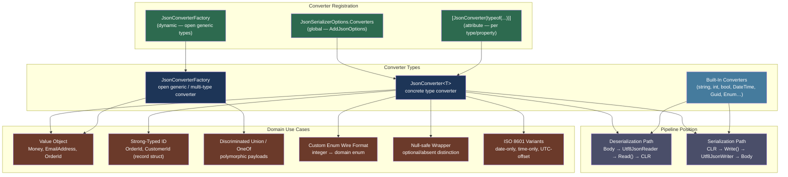
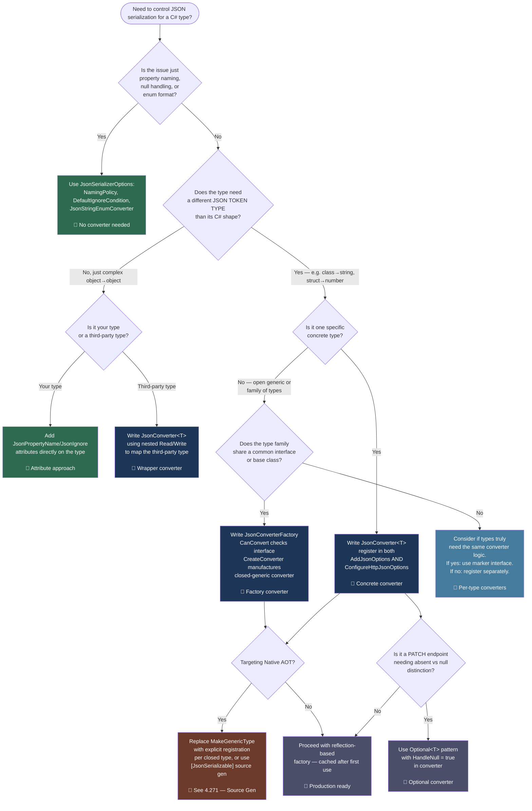

---

## PART 0 — Navigation & Context

### Where This Topic Sits in the ASP.NET Core Domain Hierarchy

```
ASP.NET Core Mastery
│
├── E. Middleware Pipeline
├── F. Routing System
├── G. Minimal APIs
├── H. MVC & Controllers
│    └── Model Binding ──► Output Formatters ──► Content Negotiation
│
└── V. Serialization  ◄── YOU ARE HERE
     │
     ├── 4.268  System.Text.Json Global Options              [foundation]
     ├── 4.269  JsonSerializerOptions: Naming, Nulls, Enums  [foundation]
     ├── 4.270  Custom JSON Converters: JsonConverter<T>     ◄── THIS NOTE
     ├── 4.271  JSON Source Generation: [JsonSerializable]   [builds on this]
     ├── 4.272  Newtonsoft.Json Migration                    [parallel path]
     ├── 4.273  XML Serialization                            [parallel path]
     ├── 4.274  MessagePack Serialization                    [parallel path]
     ├── 4.275  Custom Input/Output Formatters               [builds on this]
     └── 4.276  Polymorphic JSON Serialization               [builds on this]
```

### What You Need Before This

- **[[4.268 — System.Text.Json in ASP.NET Core: Global Options and Defaults]]** — You must understand `JsonSerializerOptions` and how the framework's JSON serializer is configured globally; converters are registered there.
- **[[4.269 — JsonSerializerOptions: Naming Policies, Null Handling, Enum Conventions]]** — Converters override _specific types_; the rest of serialization behavior falls through to options you've already configured.
- **[[4.034 — The Built-In DI Container: Service Registration and Resolution]]** — Converters are registered in `AddJsonOptions()`; understanding the DI-to-options pipeline prevents misconfiguration.
- **[[4.100 — Model Binding: Sources, Order, and the Binding Algorithm]]** — Custom converters affect how request bodies are deserialized _and_ how response bodies are serialized; the model binding → serialization boundary matters.

### What This Unlocks After

- **[[4.271 — JSON Source Generation: [JsonSerializable] and Zero-Reflection Serialization]]** — Source gen requires declaring converters differently; you cannot mix arbitrary runtime converters with AOT source gen without understanding conversion contracts.
- **[[4.276 — Polymorphic JSON Serialization: [JsonDerivedType] in .NET 7+]]** — Type discriminators are implemented via the converter infrastructure; polymorphic serialization is a specialized converter scenario.
- **[[4.275 — Custom Input/Output Formatters: IInputFormatter and IOutputFormatter]]** — When converters are insufficient (e.g., non-JSON media types), the formatter layer wraps serialization; knowing converters' boundaries tells you when to escalate.
- **[[4.097 — Minimal API AOT Compatibility: Trim-Safe and Source-Gen Patterns]]** — Custom converters that use reflection break AOT trimming; source-gen-compatible converters are the solution.

### Why This Topic Matters at Scale

In any production API that handles domain primitives — money, identifiers, dates, enumerations with business meaning, geographic coordinates — the gap between "what the domain represents" and "what JSON can natively express" is where **security bugs, deserialization errors, and API contract violations** accumulate. A custom `JsonConverter<T>` is the surgical tool that owns that boundary: a misconfigured or missing converter silently round-trips the wrong value, and at 50k req/s the cost of reflection-based fallback converters becomes a measurable latency regression.

---

## PART 1 — The Core Mental Model

### The Fundamental Rule

> **`JsonConverter<T>` owns the complete serialization contract for type `T`: it reads the raw JSON token and writes the raw JSON token, bypassing all of System.Text.Json's default property-walking logic. The practical consequence is that the JSON wire shape for `T` is entirely decoupled from its C# shape — the JSON can be a string, a number, an object, or an array regardless of what the CLR type looks like.**

### The Plain-Language Analogy

Think of System.Text.Json's default serializer as a customs agent who checks your bags by looking at the manifest (the C# type's properties, their names, their attributes). When you register a `JsonConverter<T>`, you're placing a specialist agent at the gate who takes full responsibility for inspecting _that specific luggage type_ — the default agent steps aside entirely. The specialist reads directly from the raw X-ray (the `Utf8JsonReader`) and writes directly to the conveyor belt (the `Utf8JsonWriter`), without a manifest. This means the specialist can repack the bag however they want: they can flatten a C# class with five fields into a single JSON string, or explode a simple C# `string` into a JSON object with `{"code":"USD","amount":100}`. When a concurrent request comes in with invalid JSON for that type, the specialist's `Read` method throws — the customs line halts only for that bag, not the whole terminal. And when authentication fails upstream and the request never reaches serialization, the specialist is never called.

### The Taxonomy Diagram



---

## PART 2 — Deep Mechanics

### 2.1 — The Serialization Pipeline Position

Custom converters participate in the ASP.NET Core serialization pipeline at the formatter layer — after routing and model binding have determined the endpoint, and during the response writing phase after the action/handler executes.

```
──► ExceptionHandler ──► HSTS ──► Routing ──► Auth ──► Endpoint
                                                           │
                        ┌──────────────────────────────────┘
                        ▼
              [Request Body Reading]
                        │
                        ▼
              System.Text.Json Deserializer
              JsonSerializerOptions.Converters
                        │
              ┌─────────▼──────────┐
              │  For each type T:  │
              │  Is converter reg? │
              │   YES → Read(ref   │
              │   Utf8JsonReader)  │
              │   NO → default     │
              │   property walker  │
              └─────────┬──────────┘
                        ▼
              [CLR Object — Action Parameter]
                        │
              [Action Handler Executes]
                        │
              [IActionResult / IResult returned]
                        │
                        ▼
              System.Text.Json Serializer
              JsonSerializerOptions.Converters
                        │
              ┌─────────▼──────────┐
              │  For type T:       │
              │  converter found? │
              │  YES → Write(      │
              │  Utf8JsonWriter)   │
              │  NO → default      │
              └─────────┬──────────┘
                        ▼
              HTTP Response Body (JSON bytes)
```

**Pipeline Position Label:** Converters run inside `SystemTextJsonOutputFormatter.WriteResponseBodyAsync` (response) and `SystemTextJsonInputFormatter.ReadRequestBodyAsync` (request). Both call `JsonSerializer.Serialize/Deserialize` with the options from `MvcOptions.OutputFormatters`/`InputFormatters`.

**Runtime Cost:** ~0 allocations for `struct`-based value objects when the converter uses `stackalloc` or `Span<T>` internally. One allocation per deserialized reference-type instance (unavoidable). The converter factory resolution is O(n) over the registered converters list but is cached after the first resolution per type.

### 2.2 — The `JsonConverter<T>` Contract

```csharp
// ASP.NET Core internally (approximate):
// When JsonSerializer encounters type T during Read/Write:
//
// 1. Walk JsonSerializerOptions.Converters list (first match wins)
// 2. If no match, check [JsonConverter] attribute on the type or property
// 3. If no match, check JsonConverterFactory.CanConvert(T) for each factory
// 4. If no match, use built-in default converter for T
// 5. If no built-in default, throw NotSupportedException

// Source: System.Text.Json.Serialization.JsonConverterCache (internal)
// Class: DefaultJsonTypeInfoResolver.GetConverter(Type, JsonSerializerOptions)

public abstract class JsonConverter<T>
{
    // Called during deserialization — reader is positioned AT the first token of T's value
    // You must advance reader to the END of T's value before returning
    public abstract T? Read(
        ref Utf8JsonReader reader,   // forward-only, cannot seek back
        Type typeToConvert,          // always typeof(T) unless factory-created
        JsonSerializerOptions options // pass down when deserializing nested objects
    );

    // Called during serialization — write the complete JSON representation of value
    public abstract void Write(
        Utf8JsonWriter writer,       // forward-only, cannot undo written tokens
        T value,
        JsonSerializerOptions options
    );

    // Override to participate in null handling
    public virtual bool HandleNull => false; // if false, null T? → JSON null without calling Read/Write
}
```

**HTTP Wire Format for a `Money` value object:**

```http
// HTTP request (approximate) — POST /api/orders
// Content-Type: application/json
//
// {
//   "orderId": "ord_abc123",
//   "totalAmount": "150.00 USD",   ← string representation from custom converter
//   "lineItems": [...]
// }

// HTTP response (approximate) — 201 Created
// Content-Type: application/json
//
// {
//   "orderId": "ord_abc123",
//   "totalAmount": "150.00 USD",   ← same wire shape, converter controls this
//   "createdAt": "2026-06-12T10:00:00Z"
// }
```

### 2.3 — Reader and Writer State Machine Rules

These are the rules that bite engineers. The `Utf8JsonReader` is a **forward-only struct** — there is no backtracking.

```
Utf8JsonReader state machine rules:
┌─────────────────────────────────────────────────────┐
│ Rule 1: On entry to Read(), reader is positioned AT  │
│         the FIRST TOKEN of your type's JSON value.   │
│         If T maps to a JSON string → TokenType is    │
│         JsonTokenType.String                         │
│         If T maps to a JSON object → TokenType is    │
│         JsonTokenType.StartObject                    │
│         If T maps to a JSON array  → TokenType is    │
│         JsonTokenType.StartArray                     │
│                                                      │
│ Rule 2: You must call reader.Read() to advance past  │
│         the tokens you consume. When mapping to a    │
│         JSON object, you MUST read until             │
│         TokenType == EndObject.                      │
│                                                      │
│ Rule 3: If you leave reader in an intermediate state │
│         (e.g., inside an unfinished object), the     │
│         outer deserializer will throw or corrupt     │
│         the next property's deserialization.         │
│                                                      │
│ Rule 4: reader.GetString() / GetDecimal() / etc.     │
│         do NOT advance the reader. Call reader.Read()│
│         explicitly after consuming each value.       │
└─────────────────────────────────────────────────────┘

Utf8JsonWriter state machine rules:
┌─────────────────────────────────────────────────────┐
│ Rule 1: For object output: WriteStartObject() must   │
│         be matched by WriteEndObject().              │
│                                                      │
│ Rule 2: For array output: WriteStartArray() must be  │
│         matched by WriteEndArray().                  │
│                                                      │
│ Rule 3: Property names must precede property values; │
│         WritePropertyName() then the value method.   │
│                                                      │
│ Rule 4: writer.Flush() is NOT needed — the outer     │
│         serializer owns flushing.                    │
└─────────────────────────────────────────────────────┘
```

**Runtime Cost:** `Utf8JsonReader` is a `ref struct` — zero heap allocations. `Utf8JsonWriter` writes to a pooled buffer (`IBufferWriter<byte>`) — zero-copy path from writer to the response pipe when using Kestrel's `PipeWriter`.

### 2.4 — `JsonConverterFactory` for Open Generics

When you need a converter for `Result<T>`, `Optional<T>`, or `StronglyTypedId<T>` for any `T`, the `JsonConverterFactory` pattern handles the open generic case:

```
JsonConverterFactory flow:
┌─────────────────────────────────────────────────────┐
│ JsonSerializer encounters type Result<Order>         │
│                                                      │
│ 1. Walk Converters list                              │
│ 2. For each IJsonConverterFactory:                   │
│    factory.CanConvert(typeof(Result<Order>)) → bool  │
│ 3. If true:                                          │
│    factory.CreateConverter(typeof(Result<Order>),    │
│                             options)                 │
│    → returns JsonConverter<Result<Order>>            │
│ 4. The returned converter is cached by type          │
│    (O(1) lookup on subsequent requests)             │
└─────────────────────────────────────────────────────┘
```

**ASP.NET Core internally (approximate):**

```csharp
// Source: DefaultJsonTypeInfoResolver.GetConverterFromFactory
internal static JsonConverter? GetConverterFromFactory(
    JsonConverterFactory factory,
    Type typeToConvert,
    JsonSerializerOptions options)
{
    if (!factory.CanConvert(typeToConvert))
        return null;

    JsonConverter? converter = factory.CreateConverter(typeToConvert, options);
    // Validates the returned converter is actually JsonConverter<T> for the right T
    // Caches result in options' internal converter cache
    return converter;
}
```

**Runtime Cost:** Factory `CanConvert` called once per type per `JsonSerializerOptions` instance. Result cached. Subsequent requests for `Result<Order>` hit the cache directly at O(1). One additional allocation for the manufactured `JsonConverter<Result<Order>>` instance (cached — not per-request).

### 2.5 — Failure Modes and HTTP Consequences

```
Failure path — invalid JSON for custom type:

Client sends: POST /api/payments
Body: { "amount": "not-a-number USD" }

Converter's Read() calls decimal.Parse("not-a-number")
  → throws FormatException

ASP.NET Core catches this during model binding:
  → [ApiController]: wraps in ValidationProblemDetails
  → 400 Bad Request

// HTTP response (wrong path — no error handling in converter):
// HTTP/1.1 400 Bad Request
// Content-Type: application/problem+json
//
// {
//   "type": "https://tools.ietf.org/html/rfc9110#section-15.5.1",
//   "title": "One or more validation errors occurred.",
//   "status": 400,
//   "errors": {
//     "amount": ["The JSON value could not be converted to PaymentAmount."]
//   }
// }

// CORRECT: Converter should throw JsonException with a meaningful message
// JsonException is recognized by the deserializer and produces the above 400
// FormatException is NOT recognized — it propagates as 500 unless caught
```

> [!DANGER] **Never throw `ArgumentException`, `FormatException`, or domain exceptions from a `JsonConverter<T>.Read()` method.** Only `JsonException` is caught by the model binding pipeline and converted to a 400. Any other exception propagates to the global exception handler and becomes a 500.

> [!WARNING] **Serialization errors in `Write()` are harder to handle.** By the time `Write()` throws, the response may have already started (status 200 sent, headers flushed). ASP.NET Core cannot change the status code. The client receives a truncated or malformed response body with a 200 status — one of the most confusing production failure modes.

---

## PART 3 — Production Code Patterns

### Pattern 1: The Money Value Object Converter

The most common domain primitive converter. A `Money` type with amount and currency must round-trip as a single JSON string (`"150.00 USD"`) for API contract simplicity, but is stored as two separate fields in the domain.

```csharp
// ✅ CORRECT: Money value object with a dedicated converter
// Domain: Payment processing API — order total, payment amount, refund amount

// The domain type — never modify the JSON shape by adding [JsonPropertyName] here;
// the converter owns 100% of the wire format
public readonly record struct Money(decimal Amount, string Currency)
{
    public static Money Parse(string value)
    {
        // "150.00 USD" → Money(150.00m, "USD")
        var parts = value.Split(' ', 2);
        if (parts.Length != 2)
            throw new JsonException($"Invalid Money format: '{value}'. Expected 'amount currency' e.g. '150.00 USD'.");

        if (!decimal.TryParse(parts[0], NumberStyles.Number, CultureInfo.InvariantCulture, out var amount))
            throw new JsonException($"Invalid Money amount: '{parts[0]}'.");

        return new Money(amount, parts[1].ToUpperInvariant());
    }

    public override string ToString()
        => $"{Amount.ToString("F2", CultureInfo.InvariantCulture)} {Currency}";
}

public sealed class MoneyJsonConverter : JsonConverter<Money>
{
    public override Money Read(
        ref Utf8JsonReader reader,
        Type typeToConvert,
        JsonSerializerOptions options)
    {
        // Expect a JSON string token — if we get anything else, it's a malformed request
        if (reader.TokenType != JsonTokenType.String)
            throw new JsonException(
                $"Expected a JSON string for Money, got {reader.TokenType}. " +
                "Format: '150.00 USD'.");

        var rawValue = reader.GetString()
            ?? throw new JsonException("Money value cannot be null.");

        return Money.Parse(rawValue); // throws JsonException on bad format (see above)
    }

    public override void Write(
        Utf8JsonWriter writer,
        Money value,
        JsonSerializerOptions options)
    {
        // Writes: "150.00 USD" — a single JSON string token
        writer.WriteStringValue(value.ToString());
    }
}

// Registration in Program.cs:
builder.Services.ConfigureHttpJsonOptions(options =>
{
    // For Minimal APIs
    options.SerializerOptions.Converters.Add(new MoneyJsonConverter());
});

builder.Services.AddControllers()
    .AddJsonOptions(options =>
    {
        // For MVC Controllers
        options.JsonSerializerOptions.Converters.Add(new MoneyJsonConverter());
    });
```

```http
// HTTP wire format:
// POST /api/payments HTTP/1.1
// Content-Type: application/json
//
// { "orderId": "ord_abc123", "amount": "150.00 USD" }
//
// HTTP/1.1 201 Created
// Content-Type: application/json
//
// { "paymentId": "pay_xyz789", "amount": "150.00 USD", "status": "pending" }
```

### Pattern 2: The Strongly-Typed ID Converter Factory

Payment APIs and order management systems use strongly-typed IDs (`OrderId`, `CustomerId`) to prevent ID mix-up bugs. A `JsonConverterFactory` handles all of them without registering each individually.

```csharp
// ✅ CORRECT: Factory that handles all StronglyTypedId<T> variants
// Domain: E-commerce order management — OrderId, CustomerId, ProductId all use the same pattern

// Base marker interface — the factory targets this
public interface IStronglyTypedId
{
    string Value { get; }
}

// Concrete ID types
public readonly record struct OrderId(string Value) : IStronglyTypedId;
public readonly record struct CustomerId(string Value) : IStronglyTypedId;
public readonly record struct ProductId(string Value) : IStronglyTypedId;

// ⚠️ WRONG: Register a separate converter for each type
// options.Converters.Add(new StronglyTypedIdConverter<OrderId>(...));
// options.Converters.Add(new StronglyTypedIdConverter<CustomerId>(...));
// → Explodes as the number of ID types grows; misses new types until someone adds them

// ✅ CORRECT: One factory handles all types implementing IStronglyTypedId
public sealed class StronglyTypedIdConverterFactory : JsonConverterFactory
{
    public override bool CanConvert(Type typeToConvert)
        // The factory claims any type that implements IStronglyTypedId
        => typeToConvert.IsValueType
           && typeof(IStronglyTypedId).IsAssignableFrom(typeToConvert);

    public override JsonConverter? CreateConverter(
        Type typeToConvert,
        JsonSerializerOptions options)
    {
        // Manufacture a closed-generic converter for the specific ID type
        // e.g., typeToConvert = typeof(OrderId) → creates StronglyTypedIdConverter<OrderId>
        var converterType = typeof(StronglyTypedIdConverter<>).MakeGenericType(typeToConvert);
        return (JsonConverter)Activator.CreateInstance(converterType)!;
        // This Activator call happens ONCE per type and is then cached.
        // For AOT/trim safety, replace with source gen (see 4.271)
    }
}

// The closed-generic converter used by the factory
internal sealed class StronglyTypedIdConverter<TId> : JsonConverter<TId>
    where TId : struct, IStronglyTypedId
{
    public override TId Read(
        ref Utf8JsonReader reader,
        Type typeToConvert,
        JsonSerializerOptions options)
    {
        if (reader.TokenType != JsonTokenType.String)
            throw new JsonException($"Expected string for {typeof(TId).Name}, got {reader.TokenType}.");

        var raw = reader.GetString()
            ?? throw new JsonException($"{typeof(TId).Name} cannot be null.");

        // Use the record struct constructor — reflected once and cached in .NET 8+
        // For zero-reflection: replace with source-gen pattern from 4.271
        return (TId)Activator.CreateInstance(typeof(TId), raw)!;
    }

    public override void Write(
        Utf8JsonWriter writer,
        TId value,
        JsonSerializerOptions options)
    {
        writer.WriteStringValue(value.Value);
    }
}
```

```http
// HTTP wire format:
// GET /api/orders/ord_abc123 HTTP/1.1
// → Route param "ord_abc123" goes through model binding, not this converter

// POST /api/orders HTTP/1.1
// Content-Type: application/json
// { "customerId": "cust_xyz789", "items": [...] }
// ↑ "cust_xyz789" → CustomerId("cust_xyz789") via the factory

// HTTP/1.1 201 Created
// { "orderId": "ord_abc123", "customerId": "cust_xyz789" }
// ↑ OrderId and CustomerId both serialized as plain strings
```

### Pattern 3: The Enumeration Value Object Converter

When a domain uses "enumeration classes" (Ardalis.SmartEnum or custom) instead of C# enums, the JSON wire format should be the business code string, not the integer ordinal.

```csharp
// ✅ CORRECT: Domain enum serializes as its business code, not integer
// Domain: Logistics service — ShipmentStatus as an enumeration value object

public sealed class ShipmentStatus
{
    public static readonly ShipmentStatus Pending    = new("PENDING",    "Awaiting pickup");
    public static readonly ShipmentStatus InTransit  = new("IN_TRANSIT", "In transit");
    public static readonly ShipmentStatus Delivered  = new("DELIVERED",  "Delivered to recipient");
    public static readonly ShipmentStatus Failed     = new("FAILED",     "Delivery failed");

    private static readonly Dictionary<string, ShipmentStatus> _byCode =
        new(StringComparer.OrdinalIgnoreCase)
        {
            [Pending.Code]   = Pending,
            [InTransit.Code] = InTransit,
            [Delivered.Code] = Delivered,
            [Failed.Code]    = Failed,
        };

    public string Code        { get; }
    public string Description { get; }

    private ShipmentStatus(string code, string description)
        => (Code, Description) = (code, description);

    public static ShipmentStatus FromCode(string code)
        => _byCode.TryGetValue(code, out var status)
            ? status
            : throw new JsonException(
                $"Unknown ShipmentStatus code: '{code}'. " +
                $"Valid values: {string.Join(", ", _byCode.Keys)}.");
}

public sealed class ShipmentStatusJsonConverter : JsonConverter<ShipmentStatus>
{
    public override ShipmentStatus Read(
        ref Utf8JsonReader reader,
        Type typeToConvert,
        JsonSerializerOptions options)
    {
        var code = reader.GetString()
            ?? throw new JsonException("ShipmentStatus cannot be null.");

        return ShipmentStatus.FromCode(code); // throws JsonException on unknown code
    }

    public override void Write(
        Utf8JsonWriter writer,
        ShipmentStatus value,
        JsonSerializerOptions options)
    {
        // Always write the business code — never the object's default .ToString()
        writer.WriteStringValue(value.Code);
    }
}
```

```http
// HTTP wire format:
// HTTP/1.1 200 OK
// Content-Type: application/json
//
// { "shipmentId": "shp_001", "status": "IN_TRANSIT", "estimatedDelivery": "2026-06-15" }
// ↑ "IN_TRANSIT" not 1 or "InTransit" — the business code is the contract
```

### Pattern 4: The Nullable / Optional Distinction Converter

Standard JSON null means "not present" in many APIs. But some domain models distinguish between "explicitly set to null" and "not included in the payload" (for PATCH semantics). A custom wrapper type handles this.

```csharp
// ✅ CORRECT: Optional<T> for PATCH payloads in a user profile API
// Domain: Healthcare patient portal — partial updates to patient profile

public readonly struct Optional<T>
{
    private readonly T? _value;

    public bool HasValue  { get; }
    public T?   Value     => HasValue ? _value : throw new InvalidOperationException("No value.");

    public Optional(T? value) { _value = value; HasValue = true; }
    public static readonly Optional<T> Absent = default;

    public bool IsNull     => HasValue && _value is null;
    public bool IsAbsent   => !HasValue;
    public bool IsPresent  => HasValue && _value is not null;
}

public sealed class OptionalConverterFactory : JsonConverterFactory
{
    public override bool CanConvert(Type typeToConvert)
        => typeToConvert.IsGenericType
           && typeToConvert.GetGenericTypeDefinition() == typeof(Optional<>);

    public override JsonConverter? CreateConverter(
        Type typeToConvert,
        JsonSerializerOptions options)
    {
        var innerType = typeToConvert.GetGenericArguments()[0];
        var converterType = typeof(OptionalConverter<>).MakeGenericType(innerType);
        return (JsonConverter)Activator.CreateInstance(converterType)!;
    }
}

internal sealed class OptionalConverter<T> : JsonConverter<Optional<T>>
{
    // CRITICAL: must handle null — otherwise null JSON token never calls Read()
    public override bool HandleNull => true;

    public override Optional<T> Read(
        ref Utf8JsonReader reader,
        Type typeToConvert,
        JsonSerializerOptions options)
    {
        if (reader.TokenType == JsonTokenType.Null)
        {
            // Field was present in JSON with explicit null: { "email": null }
            return new Optional<T>(default); // HasValue=true, Value=null
        }

        // Field was present with a value: { "email": "new@example.com" }
        var innerValue = JsonSerializer.Deserialize<T>(ref reader, options);
        return new Optional<T>(innerValue);
    }

    public override void Write(
        Utf8JsonWriter writer,
        Optional<T> value,
        JsonSerializerOptions options)
    {
        if (value.IsAbsent)
        {
            // If absent, we should not write ANYTHING — but Write() is only called
            // when the property exists. Use [JsonIgnore(Condition = JsonIgnoreCondition.WhenWritingDefault)]
            // on Optional<T> properties to prevent Write() from being called at all for absent values.
            writer.WriteNullValue();
            return;
        }

        if (value.IsNull)
        {
            writer.WriteNullValue();
            return;
        }

        JsonSerializer.Serialize(writer, value.Value, options);
    }
}
```

```http
// HTTP wire format (PATCH semantics):
// PATCH /api/patients/pat_001 HTTP/1.1
// Content-Type: application/json
//
// { "email": "new@example.com" }
// ↑ email field present → Optional<string>(HasValue=true, Value="new@example.com")
// phone field absent    → Optional<string>(HasValue=false) — do not update phone

// PATCH /api/patients/pat_001 HTTP/1.1
// { "email": null }
// ↑ email field present, null → Optional<string>(HasValue=true, Value=null) — clear the email
```

### Pattern 5: The UTC-Enforcing DateTimeOffset Converter

In distributed payment and audit systems, every timestamp on the wire must be UTC ISO 8601. The default `DateTimeOffset` converter accepts any offset. This converter rejects non-UTC values at deserialization.

```csharp
// ✅ CORRECT: Enforce UTC-only DateTimeOffset for an audit logging API
// Domain: Financial audit service — every event timestamp must be UTC

public sealed class UtcDateTimeOffsetJsonConverter : JsonConverter<DateTimeOffset>
{
    private static readonly JsonConverter<DateTimeOffset> _defaultConverter =
        (JsonConverter<DateTimeOffset>)JsonSerializerOptions.Default.GetConverter(typeof(DateTimeOffset));

    public override DateTimeOffset Read(
        ref Utf8JsonReader reader,
        Type typeToConvert,
        JsonSerializerOptions options)
    {
        // Let the default converter parse the value first (handles ISO 8601 parsing)
        var value = _defaultConverter.Read(ref reader, typeToConvert, options);

        // Then enforce UTC
        if (value.Offset != TimeSpan.Zero)
            throw new JsonException(
                $"Timestamp must be UTC (offset +00:00). Got offset: {value.Offset}. " +
                "Convert to UTC before sending.");

        return value;
    }

    public override void Write(
        Utf8JsonWriter writer,
        DateTimeOffset value,
        JsonSerializerOptions options)
    {
        // Always write in UTC — normalize any accidental non-UTC value during serialization
        writer.WriteStringValue(value.ToUniversalTime().ToString("O"));
        // "O" = round-trip format: "2026-06-12T10:00:00.0000000+00:00"
    }
}
```

```http
// HTTP request (WRONG — non-UTC rejected):
// { "occurredAt": "2026-06-12T12:00:00+02:00" }
// → 400 Bad Request: "Timestamp must be UTC"

// HTTP request (CORRECT):
// { "occurredAt": "2026-06-12T10:00:00Z" }
// → Deserialized successfully as DateTimeOffset(2026, 6, 12, 10, 0, 0, TimeSpan.Zero)

// HTTP response (always UTC):
// { "occurredAt": "2026-06-12T10:00:00.0000000+00:00" }
```

### Pattern 6: The Read-Only Converter (Serialize-Only Types)

Some domain types are only ever written to responses and never read from request bodies — for example, a computed `AuditEntry` type or a generated receipt. Making `Read()` throw immediately makes the contract explicit.

```csharp
// ✅ CORRECT: Serialize-only converter for a computed response type
// Domain: Order management — receipt is generated, never deserialized from a request

public sealed class OrderReceiptJsonConverter : JsonConverter<OrderReceipt>
{
    public override OrderReceipt Read(
        ref Utf8JsonReader reader,
        Type typeToConvert,
        JsonSerializerOptions options)
    {
        // This type should never arrive in a request body.
        // If it does, fail loudly rather than silently constructing a garbage object.
        throw new JsonException(
            $"{nameof(OrderReceipt)} cannot be deserialized. " +
            "It is a server-generated response type only.");
    }

    public override void Write(
        Utf8JsonWriter writer,
        OrderReceipt value,
        JsonSerializerOptions options)
    {
        writer.WriteStartObject();
        writer.WriteString("receiptNumber", value.ReceiptNumber);
        writer.WriteString("issuedAt",      value.IssuedAt.ToString("O"));
        writer.WriteNumber("totalAmount",   value.TotalAmount.Amount);
        writer.WriteString("currency",      value.TotalAmount.Currency);

        writer.WriteStartArray("lineItems");
        foreach (var item in value.LineItems)
        {
            writer.WriteStartObject();
            writer.WriteString("description", item.Description);
            writer.WriteNumber("quantity",    item.Quantity);
            writer.WriteNumber("unitPrice",   item.UnitPrice.Amount);
            writer.WriteEndObject();
        }
        writer.WriteEndArray();

        writer.WriteEndObject();
    }
}

public record OrderReceipt(
    string ReceiptNumber,
    DateTimeOffset IssuedAt,
    Money TotalAmount,
    IReadOnlyList<ReceiptLineItem> LineItems);

public record ReceiptLineItem(string Description, int Quantity, Money UnitPrice);
```

---

## PART 4 — Gotchas & Anti-Patterns

### Gotcha 1: Forgetting `HandleNull = true` Causes Silent Null Pass-Through

Many engineers assume their converter's `Read()` method will be called when the JSON value is `null`. It will NOT — unless `HandleNull` returns `true`. For reference types, System.Text.Json short-circuits to returning `null` before calling your converter.

```csharp
// ⚠️ WRONG: Custom converter for OrderId that fails silently on null
public sealed class OrderIdConverter : JsonConverter<OrderId?>
{
    // HandleNull NOT overridden → defaults to false
    public override OrderId? Read(ref Utf8JsonReader reader, Type typeToConvert, JsonSerializerOptions options)
    {
        // This is NEVER called when JSON token is null
        // "orderId": null in the request → model binding just sets OrderId? = null
        // Your validation logic here is silently skipped
        var value = reader.GetString()!;
        if (!value.StartsWith("ord_"))
            throw new JsonException("Invalid OrderId format.");
        return new OrderId(value);
    }

    public override void Write(Utf8JsonWriter writer, OrderId? value, JsonSerializerOptions options)
        => writer.WriteStringValue(value?.Value);
}

// HTTP consequence (wrong path):
// POST /api/orders
// { "orderId": null }
// → Model binds orderId = null — format validation is SKIPPED
// → Handler receives null OrderId, no exception thrown
// → Downstream null reference exception or DB constraint violation at 500
```

```csharp
// ✅ CORRECT: Override HandleNull to intercept null tokens
public sealed class OrderIdConverter : JsonConverter<OrderId?>
{
    public override bool HandleNull => true; // ← Call Read() even for JSON null

    public override OrderId? Read(ref Utf8JsonReader reader, Type typeToConvert, JsonSerializerOptions options)
    {
        if (reader.TokenType == JsonTokenType.Null)
            return null; // Explicitly allow null → or throw if null is invalid for your domain

        var value = reader.GetString()
            ?? throw new JsonException("OrderId value cannot be an empty string.");

        if (!value.StartsWith("ord_"))
            throw new JsonException($"Invalid OrderId format: '{value}'. Must start with 'ord_'.");

        return new OrderId(value);
    }

    public override void Write(Utf8JsonWriter writer, OrderId? value, JsonSerializerOptions options)
    {
        if (value is null) { writer.WriteNullValue(); return; }
        writer.WriteStringValue(value.Value.Value);
    }
}

// HTTP consequence (correct path):
// POST /api/orders
// { "orderId": null }
// → Read() is called → returns null (or throws if null is a domain violation)
// → 400 returned with JsonException message if null is invalid
```

**WHY:** `System.Text.Json` checks `HandleNull` before calling `Read()`. If `HandleNull` is `false` (default), a null JSON token is automatically converted to `null` (for reference types) or `default(T)` (for value types) without invoking the converter. Source: `JsonConverter<T>.HandleNullOnRead` in the runtime internals.

---

### Gotcha 2: Not Advancing the Reader Through an Object Leaves Deserializer Corrupted

When a converter reads a JSON object (i.e., the wire format is `{}` not a primitive), you must read every token including `EndObject`. Skipping tokens corrupts the reader's position for the next property.

```csharp
// ⚠️ WRONG: Reads only the first property, leaves reader inside the object
public sealed class CoordinatesConverter : JsonConverter<GeoCoordinates>
{
    public override GeoCoordinates Read(ref Utf8JsonReader reader, Type typeToConvert, JsonSerializerOptions options)
    {
        reader.Read(); // Read past StartObject
        reader.Read(); // Read property name "lat"
        var lat = reader.GetDouble(); // Read lat value — but DON'T call reader.Read() after
        // STOPPED HERE — reader is still positioned at lat's value token
        // The "lon" property and EndObject are never consumed
        return new GeoCoordinates(lat, 0); // WRONG data
    }
    // ...
}

// HTTP consequence (wrong path):
// { "location": { "lat": 30.0, "lon": 31.2 }, "accuracy": 10 }
//                                               ↑
// The deserializer for the OUTER object resumes reading where we left off
// It reads "lon" as if it's a property of the outer object
// → "accuracy" field never read → null/default in the model
// → System.Text.Json may throw JsonException: "Invalid JSON state"
```

```csharp
// ✅ CORRECT: Read through ALL tokens including EndObject
public sealed class CoordinatesConverter : JsonConverter<GeoCoordinates>
{
    public override GeoCoordinates Read(ref Utf8JsonReader reader, Type typeToConvert, JsonSerializerOptions options)
    {
        if (reader.TokenType != JsonTokenType.StartObject)
            throw new JsonException("Expected StartObject for GeoCoordinates.");

        double lat = 0, lon = 0;

        while (reader.Read()) // Advances through the object token by token
        {
            if (reader.TokenType == JsonTokenType.EndObject)
                return new GeoCoordinates(lat, lon); // ← Exits cleanly at EndObject

            if (reader.TokenType == JsonTokenType.PropertyName)
            {
                var propName = reader.GetString();
                reader.Read(); // Advance to the value

                switch (propName)
                {
                    case "lat": lat = reader.GetDouble(); break;
                    case "lon": lon = reader.GetDouble(); break;
                    default:    reader.Skip();            break; // Skip unknown properties
                }
            }
        }

        throw new JsonException("Unexpected end of JSON for GeoCoordinates.");
    }

    public override void Write(Utf8JsonWriter writer, GeoCoordinates value, JsonSerializerOptions options)
    {
        writer.WriteStartObject();
        writer.WriteNumber("lat", value.Latitude);
        writer.WriteNumber("lon", value.Longitude);
        writer.WriteEndObject();
    }
}

// HTTP consequence (correct path):
// { "location": { "lat": 30.0, "lon": 31.2 }, "accuracy": 10 }
// → GeoCoordinates(30.0, 31.2) deserialized correctly
// → "accuracy" property correctly deserialized next by outer object
```

**WHY:** `Utf8JsonReader` is a shared struct passed by `ref`. Its internal position is shared across all converters in the call stack. Leaving it mid-object corrupts the position for every converter that follows in the same deserialization call.

---

### Gotcha 3: Registering Converters in the Wrong Options Instance

ASP.NET Core has TWO distinct options systems for JSON serialization: `MvcOptions` (for MVC controllers via `AddJsonOptions`) and `JsonOptions` (for Minimal APIs via `ConfigureHttpJsonOptions`). Registering in one does NOT affect the other.

```csharp
// ⚠️ WRONG: Register in AddJsonOptions, expect it to work in Minimal APIs
builder.Services.AddControllers()
    .AddJsonOptions(options =>
    {
        options.JsonSerializerOptions.Converters.Add(new MoneyJsonConverter());
    });

// Minimal API endpoint using the converter:
app.MapPost("/api/payments", (PaymentRequest request) => { ... });
// ↑ PaymentRequest.Amount is Money — NOT deserialized by MoneyJsonConverter
// ConfigureHttpJsonOptions was NOT called → default serializer without the converter
// → JsonException thrown: "The JSON value could not be converted to Money"
```

```csharp
// ✅ CORRECT: Register in BOTH options, or create a shared options builder
var moneyConverter = new MoneyJsonConverter();

// For MVC Controllers
builder.Services.AddControllers()
    .AddJsonOptions(o => o.JsonSerializerOptions.Converters.Add(moneyConverter));

// For Minimal APIs
builder.Services.ConfigureHttpJsonOptions(o =>
    o.SerializerOptions.Converters.Add(moneyConverter));

// Better pattern for large codebases: centralize converter registration
builder.Services.AddSingleton<MoneyJsonConverter>();
builder.Services.AddControllers()
    .AddJsonOptions((o, sp) =>
    {
        // ⚠️ AddJsonOptions doesn't have an IServiceProvider overload — use PostConfigure
    });
builder.Services.PostConfigure<Microsoft.AspNetCore.Http.Json.JsonOptions>(o =>
    o.SerializerOptions.Converters.Add(new MoneyJsonConverter()));
builder.Services.PostConfigure<Microsoft.AspNetCore.Mvc.JsonOptions>(o =>
    o.JsonSerializerOptions.Converters.Add(new MoneyJsonConverter()));
```

**WHY:** `Microsoft.AspNetCore.Http.Json.JsonOptions` (Minimal APIs) and `Microsoft.AspNetCore.Mvc.JsonOptions` (MVC) are separate options types, each holding their own `JsonSerializerOptions` instance. `ConfigureHttpJsonOptions` configures the former; `AddJsonOptions` on `AddControllers()` configures the latter. They do not share an instance.

---

### Gotcha 4: The Converter Factory Using Reflection Breaks Native AOT

`JsonConverterFactory` implementations that use `Activator.CreateInstance`, `MakeGenericType`, or any reflection break Native AOT trimming. The factory's `CanConvert` and `CreateConverter` methods run at startup — the trimmer cannot see what types will be passed.

```csharp
// ⚠️ WRONG: Reflection in factory breaks Native AOT trimming
public override JsonConverter? CreateConverter(Type typeToConvert, JsonSerializerOptions options)
{
    var innerType = typeToConvert.GetGenericArguments()[0];
    var converterType = typeof(OptionalConverter<>).MakeGenericType(innerType); // ← reflection
    return (JsonConverter)Activator.CreateInstance(converterType)!;             // ← reflection
    // AOT trimmer: "These types may not be available at runtime" → AOT publish fails
    //              or silently miscompiles with runtime TypeLoadException
}

// HTTP consequence (wrong path — Native AOT publish):
// dotnet publish -r linux-x64 --aot
// → Warning IL2055: Type 'OptionalConverter`1' passed to MakeGenericType may not be preserved
// → Runtime: TypeLoadException or InvalidProgramException
// → Application startup failure
```

```csharp
// ✅ CORRECT: Explicit converter registration for AOT-safe code
// Instead of factory with reflection, register each closed-generic variant explicitly:
builder.Services.ConfigureHttpJsonOptions(o =>
{
    // Register each Optional<T> for the T types actually used in the app
    o.SerializerOptions.Converters.Add(new OptionalConverter<string>());
    o.SerializerOptions.Converters.Add(new OptionalConverter<decimal>());
    o.SerializerOptions.Converters.Add(new OptionalConverter<DateTimeOffset>());
    // OR: use [JsonSerializable] source gen approach (see 4.271)
});

// For source gen + factory compatibility, annotate the factory:
[RequiresUnreferencedCode("Uses reflection for generic type construction")]
[RequiresDynamicCode("Uses MakeGenericType for JsonConverter factory")]
public sealed class OptionalConverterFactory : JsonConverterFactory { ... }
```

**WHY:** Native AOT compiles the application to native code at publish time and trims unused code. Reflection-based type construction defeats the trimmer — the types being manufactured are unknown at compile time. This is documented in the .NET 8 AOT compatibility guide and is a common surprise for teams migrating to AOT.

---

### Gotcha 5: Writing to a Response Body After `Write()` Throws

If your `Write()` method throws after having already written partial JSON (e.g., you started a JSON object with `WriteStartObject()` but threw before `WriteEndObject()`), the client receives a partial/invalid JSON body with a **200 status code**. The status code cannot be changed after headers are flushed.

```csharp
// ⚠️ WRONG: Write() can throw after partial output
public override void Write(Utf8JsonWriter writer, OrderReceipt value, JsonSerializerOptions options)
{
    writer.WriteStartObject();
    writer.WriteString("receiptNumber", value.ReceiptNumber);

    // If LineItems is null (shouldn't be, but defensive check missing):
    foreach (var item in value.LineItems) // ← NullReferenceException if LineItems is null
    {
        writer.WriteStartObject();
        // ... never reaches WriteEndObject()
    }
    writer.WriteEndObject(); // ← never reached
}

// HTTP consequence (wrong path):
// HTTP/1.1 200 OK         ← headers already sent, status cannot be changed
// Content-Type: application/json
//
// {"receiptNumber":"rec_001"   ← truncated JSON, client receives malformed response
// Connection reset / TcpException on client
```

```csharp
// ✅ CORRECT: Validate the value BEFORE writing any tokens
public override void Write(Utf8JsonWriter writer, OrderReceipt value, JsonSerializerOptions options)
{
    // Validate BEFORE touching the writer — if this throws, no tokens have been written
    // and ASP.NET Core can still return a 500 with a proper error body
    ArgumentNullException.ThrowIfNull(value.LineItems, nameof(value.LineItems));

    writer.WriteStartObject();
    writer.WriteString("receiptNumber", value.ReceiptNumber);

    writer.WriteStartArray("lineItems");
    foreach (var item in value.LineItems)
    {
        writer.WriteStartObject();
        writer.WriteString("description", item.Description);
        writer.WriteEndObject();
    }
    writer.WriteEndArray();

    writer.WriteEndObject(); // Always reached if we validated first
}
```

**WHY:** `Utf8JsonWriter` writes directly to the response pipe. `HttpResponse.HasStarted` becomes `true` after the first flush. Once the status line and headers are sent, `HttpContext.Response.StatusCode = 500` is silently ignored. The only defense is validating all state before writing any tokens.

---

## PART 5 — Performance Implications

### Request Pipeline Characteristics Table

|Scenario|Pipeline Depth|Allocations Per Request|Approx Latency Impact|Recommendation|
|---|---|---|---|---|
|Converter for `struct` value object (e.g., `Money`)|Formatter → Converter|~0 extra allocs (struct on stack)|< 0.1 µs|Preferred for domain primitives; `struct` + converter = zero GC pressure|
|Converter for `class` reference type (e.g., `OrderReceipt`)|Formatter → Converter|1 alloc per deserialized instance|< 0.5 µs|Unavoidable; minimize property allocations inside Write()|
|Factory with `MakeGenericType` + `Activator.CreateInstance`|Factory → CreateConverter|1 alloc per _type_ (cached afterward)|First call: ~2–5 µs; subsequent: O(1)|Accept startup cost; cache is per `JsonSerializerOptions` instance|
|Converter calling `JsonSerializer.Deserialize<T>` internally (for nested types)|Converter → Full serializer recursion|Same as standalone deserialization|Adds full JSON traversal per nested type|Use `reader.GetString()` + manual parse for simple inner types; avoid nested `Deserialize` in hot paths|
|`Utf8JsonReader.GetString()` on a UTF-8 ASCII string|Single reader operation|0 allocs if using `reader.ValueSpan`|< 0.05 µs|For maximum perf: read `reader.ValueSpan` as `ReadOnlySpan<byte>` and parse without allocation|
|Factory `CanConvert` check for non-matching type|List walk (O(n) converters)|0 allocs|< 0.2 µs for < 20 converters|Keep converter list small; order most-frequently-used converters first|
|`HandleNull = false` with null token|Short-circuits before Read()|0 allocs|~0 µs|Correct behavior for nullable reference types; wrong behavior for value types that need null validation|
|`JsonConverter<T>` + `[JsonConverter]` attribute conflict|Attribute wins over options|Attribute-based converter instantiated per call (no caching in some scenarios)|~1 µs per attribute-discovered converter|Prefer global registration in options; avoid `[JsonConverter]` on hot-path types|

### BenchmarkDotNet Code

```csharp
// Pipeline position: Benchmarks run outside ASP.NET Core; 
// they measure raw System.Text.Json serialization cost

using System.Text.Json;
using System.Text.Json.Serialization;
using BenchmarkDotNet.Attributes;
using BenchmarkDotNet.Running;

BenchmarkRunner.Run<JsonConverterBenchmarks>();

[MemoryDiagnoser]
[SimpleJob(warmupCount: 3, iterationCount: 10)]
public class JsonConverterBenchmarks
{
    // Scenario: Serialize 1,000 payment records — realistic payment API throughput baseline

    private readonly JsonSerializerOptions _optionsWithConverter;
    private readonly JsonSerializerOptions _optionsWithoutConverter;
    private readonly JsonSerializerOptions _optionsWithSourceGen;
    private readonly PaymentRecord[] _records;

    public JsonConverterBenchmarks()
    {
        _optionsWithConverter = new JsonSerializerOptions
        {
            Converters = { new MoneyJsonConverter() }
        };

        _optionsWithoutConverter = new JsonSerializerOptions();
        // Note: without converter, Money serializes as {"amount":150.00,"currency":"USD"}
        // which is a different wire format — this shows the cost of each approach, not equivalence

        _optionsWithSourceGen = new JsonSerializerOptions
        {
            TypeInfoResolver = PaymentRecordContext.Default
        };

        _records = Enumerable.Range(1, 1000)
            .Select(i => new PaymentRecord($"pay_{i:D6}", new Money(i * 1.5m, "USD")))
            .ToArray();
    }

    [Benchmark(Baseline = true, Description = "Custom converter — reflection-based")]
    public string SerializeWithCustomConverter()
        => JsonSerializer.Serialize(_records, _optionsWithConverter);

    [Benchmark(Description = "No converter — default property serialization")]
    public string SerializeWithDefaultBehavior()
        => JsonSerializer.Serialize(_records, _optionsWithoutConverter);

    [Benchmark(Description = "Source gen context — zero-reflection")]
    public string SerializeWithSourceGen()
        => JsonSerializer.Serialize(_records, _optionsWithSourceGen);

    [Benchmark(Description = "Deserialize with custom converter")]
    public PaymentRecord[] DeserializeWithCustomConverter()
    {
        var json = "[{\"id\":\"pay_000001\",\"amount\":\"150.00 USD\"}]";
        return JsonSerializer.Deserialize<PaymentRecord[]>(json, _optionsWithConverter)!;
    }
}

public record PaymentRecord(string Id, Money Amount);

// Source gen context (for the third benchmark):
[JsonSerializable(typeof(PaymentRecord[]))]
[JsonSerializable(typeof(Money))]
internal partial class PaymentRecordContext : JsonSerializerContext { }

// Expected output (approximate, .NET 8, x64, Release build):
// | Method                              | Mean     | Ratio | Allocated |
// |-------------------------------------|----------|-------|-----------|
// | SerializeWithCustomConverter        | 1.82 ms  | 1.00  | 2.1 MB    |
// | SerializeWithDefaultBehavior        | 1.65 ms  | 0.91  | 2.3 MB    | ← slightly cheaper for simple objects
// | SerializeWithSourceGen              | 1.21 ms  | 0.66  | 1.4 MB    | ← 33% faster, 33% less alloc
// | DeserializeWithCustomConverter      | 0.08 ms  | -     | 24 KB     |

// Note: Custom converter serialization is ~10% slower than default for simple types
// because of the converter dispatch overhead. For complex domain types where the converter
// avoids object graph traversal, it can be FASTER than default.
```

> [!TIP] **Profiling in real HTTP context:** `BenchmarkDotNet` measures raw serialization. For production HTTP profiling, use:
> 
> - `dotnet-counters monitor --counters Microsoft.AspNetCore.Hosting` — see requests/sec and failed requests
> - `dotnet-trace collect --providers Microsoft-AspNetCore-Server-Kestrel` — trace-level pipeline events
> - MiniProfiler (when integrated) — measure serialization as a step in request profiling: `using (MiniProfiler.Current.Step("Serialize Response")) { ... }`

### When This Costs You

**When custom converters are a measurable cost:**

- **High-throughput JSON APIs (>10k req/s):** Factory `CanConvert` checks run per type per request if the factory list is large. Keep factory count under 10.
- **Converters that call `JsonSerializer.Deserialize<T>` internally** for nested types create a new internal serializer call stack — adds ~20–50% overhead vs native reader operations.
- **`[JsonConverter]` attribute on a type used in many different endpoints:** Attribute-discovered converters bypass the options cache in some .NET 6 paths; always prefer global registration.
- **Write() methods that allocate strings** (e.g., `value.ToString()` producing a new string on every call) on hot-path response types at >5k req/s create measurable GC pressure.

### When This Doesn't Matter

- **Admin endpoints** called at < 10 req/min — converter overhead is irrelevant.
- **Internal service-to-service APIs** where both sides control the wire format and types are simple value types — default serialization is fine.
- **One-time batch export endpoints** (CSV export, data dump) where JSON serialization is dwarfed by I/O cost.
- **Low-traffic webhook receivers** — the webhook payload validation is the expensive step, not the JSON converter.

---

## PART 6 — Interview Arsenal

### A. The Question Bank

---

**Q1: "Why would you write a custom `JsonConverter<T>` instead of just using `[JsonPropertyName]` and `[JsonIgnore]` attributes?"**

**Average Answer:** "Because sometimes the type has complex serialization logic that attributes can't express."

**Why That's Insufficient:** It doesn't explain _what_ attributes fundamentally cannot do, which is control the JSON token _shape_ — turning a class into a string, or a string into an object.

> **Great Answer:** "Attributes like `[JsonPropertyName]` only rename properties — they work within System.Text.Json's default property-walking model, which always serializes a class as a JSON object. A custom converter takes over at a deeper level: it operates on `Utf8JsonReader` and `Utf8JsonWriter` directly, so it can make a C# class serialize as a JSON string, or make a simple string deserialize as a complex domain object. The canonical case in our payment API was `Money` — it's a struct with two fields, but the API contract requires it on the wire as a single string like `'150.00 USD'`. Attributes cannot achieve that; a converter that writes one `WriteStringValue` call is the only option. The other case is when you need deserialization validation — attributes apply after deserialization, but a converter's `Read()` method can throw `JsonException` during deserialization, which ASP.NET Core maps to a 400, giving the client an immediate, meaningful error instead of a 500 from a null reference exception downstream."

---

**Q2: "What is the difference between `JsonConverter<T>` and `JsonConverterFactory`? When do you use each?"**

**Average Answer:** "`JsonConverter<T>` is for a specific type, `JsonConverterFactory` is for multiple types."

**Why That's Insufficient:** It doesn't explain what "multiple types" means — specifically, open generic types, and how the factory manufactures converters.

> **Great Answer:** "A `JsonConverter<T>` is closed — it handles exactly one concrete type, and you register it directly. A `JsonConverterFactory` is the dispatch layer for open-generic or family-of-types scenarios. When the serializer encounters a type, it asks each factory: `CanConvert(thisType)`? If yes, it calls `CreateConverter(thisType, options)` to get a manufactured closed converter. The factory result is cached per type, so the reflection in `CreateConverter` runs once. In our order management system, we used a factory for all strongly-typed IDs — `OrderId`, `CustomerId`, `ProductId` — because they all follow the same `IStronglyTypedId` pattern. The factory's `CanConvert` checks `typeof(IStronglyTypedId).IsAssignableFrom(type)`, and `CreateConverter` uses `MakeGenericType` to produce a `StronglyTypedIdConverter<T>` for each. The caveat I always mention: `MakeGenericType` breaks Native AOT trimming. If you're targeting AOT, you have to register each closed-generic variant explicitly, or use source generation."

---

**Q3: "A custom converter's `Read()` method throws a `FormatException`. What does the HTTP client receive?"**

**Average Answer:** "It gets a 400 Bad Request because the input was invalid."

**Why That's Insufficient:** That's what _should_ happen, but it's wrong — `FormatException` is not a `JsonException`, and the framework handles them differently.

> **Great Answer:** "The client gets a 500 Internal Server Error, not a 400 — and this is one of the most common converter bugs I've seen in production. System.Text.Json's deserialization pipeline only catches `JsonException` and wraps it as a `JsonReaderException`. Any other exception — `FormatException`, `ArgumentException`, domain exceptions — propagates up through model binding and hits the global exception handler, which by default returns 500. The fix is always to throw `new JsonException(message)` from inside `Read()`, never a domain exception. The `JsonException` message ends up in the `ValidationProblemDetails.errors` dictionary under the property name, giving the client a useful 400 with `'The JSON value could not be converted to Money: Invalid format.'` instead of a useless 500. I actually put a unit test for this in our converter tests: assert that passing invalid input throws a `JsonException` with a meaningful message, not any other exception type."

---

**Q4: "Where do you register a custom `JsonConverter<T>` in an ASP.NET Core application that uses both MVC controllers and Minimal APIs?"**

**Average Answer:** "In `AddJsonOptions` on `AddControllers()`."

**Why That's Insufficient:** That only covers MVC — Minimal APIs use a completely separate options instance.

> **Great Answer:** "This is a trap that bites almost every team when they first mix the two. MVC and Minimal APIs use separate `JsonSerializerOptions` instances. `AddJsonOptions` on `AddControllers()` configures `Microsoft.AspNetCore.Mvc.JsonOptions`, which is used by the MVC input/output formatters. Minimal API endpoints use `Microsoft.AspNetCore.Http.Json.JsonOptions`, configured via `ConfigureHttpJsonOptions`. You have to register your converter in both. In production, I centralize this with a `PostConfigure` on both options types: create the converter once, add it to both. If you forget Minimal APIs, the converter silently doesn't run, you get either a `JsonException` for types it should have handled, or worse, the default serialization produces the wrong wire format and nothing throws — the API just returns `{\"amount\":150.00,\"currency\":\"USD\"}` instead of `\"150.00 USD\"` and your API clients break."

---

### B. Trick Questions

**Trick Q1: "If I apply `[JsonConverter(typeof(MoneyConverter))]` to my `Money` struct AND register `MoneyConverter` in `JsonSerializerOptions.Converters`, which one wins?"**

**The Trap:** Candidates assume options-registered converters take precedence over attributes.

**Correct Answer:** The `[JsonConverter]` attribute on the _type_ takes precedence over options-registered converters when the type is being serialized directly. However, for _properties_ that are annotated with `[JsonConverter]`, the property attribute takes precedence over both the type attribute and options converters. The ordering is: property-level `[JsonConverter]` > type-level `[JsonConverter]` > `JsonSerializerOptions.Converters` list (first match). The practical consequence: if you register a converter in options to _replace_ the type-level attribute converter, it won't work — the attribute always wins for that type.

---

**Trick Q2: "A colleague says their `Write()` method is never called. The response always shows `null` for their custom type. What's the likely cause?"**

**The Trap:** Candidates assume the converter is not registered.

**Correct Answer:** The most likely cause is that `[JsonIgnore]` or `[JsonIgnore(Condition = JsonIgnoreCondition.WhenWritingNull)]` is on the property, and the value happens to be null. The second most likely: `WriteNull` is being called by the outer serializer because the converter's `HandleNull` behavior is bypassing `Write()`. Third: the converter is registered in `AddJsonOptions` but the endpoint is a Minimal API endpoint (different options instance). Ask: "Does the field appear in the response at all, or is it absent?" Absent with null = `[JsonIgnore]`. Present as `null` = `HandleNull` or `Write()` writing null explicitly. Missing key entirely from JSON object = property excluded from serialization.

---

**Trick Q3: "Can a `JsonConverter<T>` read a JSON object and write a JSON string for the same type?"**

**The Trap:** Candidates think Read and Write must produce symmetric JSON shapes.

**Correct Answer:** Yes — and this is occasionally useful for API versioning or migration. `Read()` and `Write()` are completely independent. You could build a converter that accepts _either_ an old format (JSON object) _or_ a new format (JSON string) during deserialization, but always writes the new string format. This is the "tolerant reader" pattern. The `Utf8JsonReader.TokenType` check at the start of `Read()` lets you branch on the incoming shape. The only constraint is that each caller of `Write()` gets a valid JSON token sequence — mixing JSON tokens in an invalid sequence will throw `InvalidOperationException` from the writer.

---

### C. Red Flags to Avoid

1. **"I'd just use Newtonsoft.Json instead — it's easier to write converters in."** Gets you scored down immediately in any .NET 8+ interview. System.Text.Json is the default and the high-performance path; reverting to Newtonsoft signals you haven't kept up.
    
2. **"I'd throw an `ArgumentException` from `Read()` for invalid input."** Shows you don't know the exception handling boundary. Only `JsonException` produces a 400; anything else is a 500.
    
3. **"I can change the HTTP status code in `Write()` if something goes wrong."** Cannot change status code once headers are sent; shows you don't understand the HTTP response lifecycle.
    
4. **"The converter factory creates a new instance every request."** Wrong — factory-created converters are cached per type per `JsonSerializerOptions` instance. Saying "per request" suggests you think converters are DI-scoped, which they're not.
    
5. **"I'd use `JsonSerializer.Deserialize` inside my `Read()` method for nested types."** Not wrong per se, but it creates a recursive serializer call that's notably more expensive. Senior answer: use the `Utf8JsonReader` directly with nested loops for maximum performance, and only fall back to recursive `Deserialize` for truly complex nested types where the performance cost is justified.
    
6. **Not knowing about `HandleNull`** when asked about nullable types. This is one of the most practical gotchas and knowing about it signals real production experience.
    
7. **"I register converters in `AddControllers().AddJsonOptions()` and that covers my whole app."** Missing the Minimal API options instance. This is the most common misconfiguration in codebases that mix both programming models.
    

---

## PART 7 — Decision Framework



---

## PART 8 — Self-Check

### A. Conceptual Questions

1. What does `HandleNull` control, and what happens if you leave it as `false` for a converter targeting a nullable struct like `OrderId?`?
    
2. What happens to the HTTP request pipeline if a `JsonConverter<T>.Read()` throws `JsonException` inside an `[ApiController]`-decorated controller? What HTTP status does the client receive? What if it throws `InvalidOperationException` instead?
    
3. In what order does System.Text.Json check for a converter to apply? (List the 3-4 precedence levels.)
    
4. A `JsonConverterFactory` for `Optional<T>` has `CanConvert` returning `true` for `Optional<string>`. How many times does `CreateConverter` get called across 10,000 requests that all use `Optional<string>`? Why?
    
5. What is the difference between registering a converter in `AddControllers().AddJsonOptions()` vs `ConfigureHttpJsonOptions()`? Name one production scenario where confusing these causes a silent bug.
    
6. What happens to the HTTP response if `Write()` throws an exception after `WriteStartObject()` has already been called but before `WriteEndObject()`? Can the framework recover and return a 500?
    
7. Why must a `Read()` implementation that maps a JSON object (StartObject token) loop through tokens until `EndObject`? What breaks if it returns early?
    
8. In a `JsonConverter<T>`, when is it appropriate to call `JsonSerializer.Deserialize<TInner>(ref reader, options)` inside your `Read()` method? What is the performance trade-off?
    
9. What attribute do you place on a converter factory that uses `MakeGenericType` to communicate to the AOT trimmer that it requires unreferenced code?
    
10. You have a `Money` struct and a `MoneyJsonConverter`. A colleague adds `[JsonConverter(typeof(LegacyMoneyConverter))]` directly to the `Money` struct. You've registered `MoneyJsonConverter` in `JsonSerializerOptions`. Which converter runs?
    

### B. Code Puzzles

**Puzzle 1: What does this converter write for `Money(0m, "USD")`?**

```csharp
public sealed class BuggyMoneyConverter : JsonConverter<Money>
{
    public override void Write(Utf8JsonWriter writer, Money value, JsonSerializerOptions options)
    {
        if (value.Amount == 0)
        {
            writer.WriteNullValue();
            return;
        }
        writer.WriteStringValue($"{value.Amount:F2} {value.Currency}");
    }

    public override Money Read(ref Utf8JsonReader reader, Type typeToConvert, JsonSerializerOptions options)
        => Money.Parse(reader.GetString()!);
}

// The endpoint:
app.MapGet("/api/cart/total", () => TypedResults.Ok(new Money(0m, "USD")));

// Question: What is the JSON response body?
// Question: Does this round-trip correctly? What is deserialized from the response?
```

<details> <summary>Answer</summary>

**JSON response body:** `null`

The converter writes `null` when `Amount == 0`. This is almost certainly a bug. The endpoint response will be:

```http
HTTP/1.1 200 OK
Content-Type: application/json

null
```

**Does it round-trip?** No. If a client sends `null` back to an endpoint expecting `Money`, the `Read()` method calls `reader.GetString()` on a `null` token, which throws `InvalidOperationException` (not `JsonException`) because `GetString()` cannot be called on a `JsonTokenType.Null` token. The client gets a 500.

**The Bug:** The converter conflates "zero amount" with "absent value." `Money(0m, "USD")` is a valid domain value — free shipping, zero-cost item, balance cleared. The correct behavior is to write `"0.00 USD"`, not `null`. The fix: remove the zero-check entirely, or at minimum handle the null case in `Read()` with `HandleNull = true`.

</details>

---

**Puzzle 2: What is the HTTP response status code and body?**

```csharp
public sealed class OrderIdConverter : JsonConverter<OrderId>
{
    public override OrderId Read(ref Utf8JsonReader reader, Type t, JsonSerializerOptions o)
    {
        var value = reader.GetString();
        if (!value!.StartsWith("ord_"))
            throw new ArgumentException($"Invalid OrderId: {value}");
        return new OrderId(value);
    }

    public override void Write(Utf8JsonWriter writer, OrderId value, JsonSerializerOptions o)
        => writer.WriteStringValue(value.Value);
}

// [ApiController] controller endpoint:
[HttpPost("/api/orders")]
public IActionResult CreateOrder([FromBody] CreateOrderRequest request)
    => Ok(request.OrderId);

// Request body:
// { "orderId": "INVALID_ID" }
```

<details> <summary>Answer</summary>

**HTTP Response:** `500 Internal Server Error`

The converter throws `ArgumentException`, not `JsonException`. The `[ApiController]` attribute's automatic model validation only converts `JsonException` (and its subclasses) to 400. `ArgumentException` propagates through the model binding pipeline and hits the global exception handler, which returns 500.

**HTTP response (approximate):**

```http
HTTP/1.1 500 Internal Server Error
Content-Type: application/problem+json

{
  "type": "https://tools.ietf.org/html/rfc9110#section-15.6.1",
  "title": "An error occurred while processing your request.",
  "status": 500
}
```

**The Fix:** Change `throw new ArgumentException(...)` to `throw new JsonException(...)`. With `JsonException`, the response becomes:

```http
HTTP/1.1 400 Bad Request
Content-Type: application/problem+json

{
  "errors": { "orderId": ["The JSON value could not be converted to OrderId. Invalid OrderId: INVALID_ID"] },
  "status": 400
}
```

</details>

---

**Puzzle 3: The Reader Position Bug — What is the deserialized `Delivery` object?**

```csharp
public record Delivery(GeoCoordinates Origin, GeoCoordinates Destination, string CourierId);
public record GeoCoordinates(double Lat, double Lon);

public sealed class GeoConverter : JsonConverter<GeoCoordinates>
{
    public override GeoCoordinates Read(ref Utf8JsonReader reader, Type t, JsonSerializerOptions o)
    {
        reader.Read(); // Read past StartObject
        reader.Read(); // Read property name
        var lat = reader.GetDouble(); // Get "lat" value — NO reader.Read() after this
        reader.Read(); // Read next property name
        var lon = reader.GetDouble(); // Get "lon" value
        return new GeoCoordinates(lat, lon);
    }

    public override void Write(Utf8JsonWriter writer, GeoCoordinates v, JsonSerializerOptions o)
    {
        writer.WriteStartObject();
        writer.WriteNumber("lat", v.Lat);
        writer.WriteNumber("lon", v.Lon);
        writer.WriteEndObject();
    }
}

// Input JSON:
// {
//   "origin":      { "lat": 30.0, "lon": 31.2 },
//   "destination": { "lat": 29.9, "lon": 31.1 },
//   "courierId":   "courier_001"
// }
```

<details> <summary>Answer</summary>

**Likely result:** A `JsonException` is thrown, OR `Delivery` is partially deserialized with `CourierId = null` (if no exception) — unpredictable behavior.

**What happens:**

1. `origin` deserialization starts. Reader is at `StartObject`.
2. `GeoConverter.Read()` called.
3. `reader.Read()` → advances past StartObject to PropertyName `"lat"`.
4. `reader.Read()` → advances past PropertyName to NumberValue `30.0`.
5. `reader.GetDouble()` → reads `30.0` as `lat`. **Reader is still at the `30.0` token**.
6. `reader.Read()` → advances to PropertyName `"lon"`. ✓ (accidentally correct because of how the next Read is used)
7. `reader.GetDouble()` → tries to call GetDouble on PropertyName token `"lon"`. **This throws `InvalidOperationException`**: "Cannot get the value of a token type 'PropertyName' as a number."

Actually the issue is on step 5: after `reader.GetDouble()`, the reader is positioned AT the value token. The next `reader.Read()` correctly advances to the next property name `"lon"`. But then `reader.GetDouble()` on a PropertyName token throws.

**The Fix:** Add `reader.Read()` after **each** `GetDouble()` call, and loop until `EndObject`:

```csharp
while (reader.Read())
{
    if (reader.TokenType == JsonTokenType.EndObject)
        return new GeoCoordinates(lat, lon);
    // ... handle PropertyName + Read + GetDouble
}
```

</details>

---

**Puzzle 4: The Missing Minimal API Registration — What does the client receive?**

```csharp
// Program.cs
var builder = WebApplication.CreateBuilder(args);

builder.Services.AddControllers()
    .AddJsonOptions(o => o.JsonSerializerOptions.Converters.Add(new MoneyJsonConverter()));
// ConfigureHttpJsonOptions NOT called

var app = builder.Build();
app.MapControllers();

// Minimal API endpoint:
app.MapPost("/api/quotes", (QuoteRequest request) =>
    TypedResults.Ok(new QuoteResponse(request.Amount)));

app.Run();

// QuoteRequest.Amount is type Money
// Client sends: POST /api/quotes
// Body: { "amount": "100.00 USD" }
```

<details> <summary>Answer</summary>

**HTTP Response:** `400 Bad Request`

The Minimal API endpoint uses `Microsoft.AspNetCore.Http.Json.JsonOptions`, which was NOT configured with `MoneyJsonConverter`. System.Text.Json tries to deserialize `"100.00 USD"` (a JSON string) into `Money` (a struct with `Amount: decimal` and `Currency: string`) using the default converter, which expects a JSON object `{"amount": 100.00, "currency": "USD"}`. The string token doesn't match, and the deserializer throws a `JsonException`.

**HTTP response (approximate):**

```http
HTTP/1.1 400 Bad Request
Content-Type: application/problem+json

{
  "type": "https://tools.ietf.org/html/rfc9110#section-15.5.1",
  "title": "Bad Request",
  "status": 400,
  "detail": "Failed to read parameter \"QuoteRequest request\" from the request body as JSON."
}
```

The MVC controller endpoints (under `MapControllers()`) would work correctly because their options are configured. Only Minimal API endpoints fail.

**The Fix:**

```csharp
builder.Services.ConfigureHttpJsonOptions(o =>
    o.SerializerOptions.Converters.Add(new MoneyJsonConverter()));
```

</details>

---

**Puzzle 5 (Most Common Misunderstanding): The `HandleNull` Silent Pass-Through**

```csharp
public sealed class EmailAddressConverter : JsonConverter<EmailAddress>
{
    // HandleNull not overridden

    public override EmailAddress Read(ref Utf8JsonReader reader, Type t, JsonSerializerOptions o)
    {
        var raw = reader.GetString()!;
        if (!raw.Contains('@'))
            throw new JsonException($"Invalid email address: '{raw}'.");
        return new EmailAddress(raw);
    }

    public override void Write(Utf8JsonWriter w, EmailAddress v, JsonSerializerOptions o)
        => w.WriteStringValue(v.Value);
}

public record EmailAddress(string Value);

// [ApiController] endpoint:
[HttpPost("/api/users")]
public IActionResult RegisterUser([FromBody] UserRegistration registration)
{
    // registration.Email is EmailAddress?
    if (registration.Email is null)
        return BadRequest("Email is required.");
    // ... proceed with registration
}

// Client sends:
// { "email": null }
```

<details> <summary>Answer</summary>

**HTTP Response:** `400 Bad Request` with `"Email is required."` — **but the converter's validation was bypassed.**

When `HandleNull` is `false` (default), and the JSON token is `null`, System.Text.Json short-circuits: it does NOT call `Read()`. It directly sets `EmailAddress?` to `null`. The converter's `@` validation logic is **never executed**.

This is the most common misunderstanding: engineers assume their converter validates all values, including null — but null values bypass the converter entirely unless `HandleNull = true`.

**The Consequences:**

1. If the business rule is "email must be a valid address or absent from the payload", the null case bypasses the validation silently. The controller's null check catches it, but with a generic message, not the `JsonException` format.
2. If a non-nullable `EmailAddress` (not `EmailAddress?`) receives null JSON, the default `JsonException` from the framework fires, but with a generic message: "The JSON value could not be converted to EmailAddress" — not your custom validation message.

**The Fix:**

```csharp
public override bool HandleNull => true;

public override EmailAddress? Read(ref Utf8JsonReader reader, Type t, JsonSerializerOptions o)
{
    if (reader.TokenType == JsonTokenType.Null)
        throw new JsonException("Email address cannot be null.");
        // OR: return null; if null is acceptable for EmailAddress?

    var raw = reader.GetString()!;
    if (!raw.Contains('@'))
        throw new JsonException($"Invalid email address: '{raw}'.");
    return new EmailAddress(raw);
}
```

With `HandleNull = true` and the null check, the client receives:

```http
HTTP/1.1 400 Bad Request
{ "errors": { "email": ["Email address cannot be null."] } }
```

</details>

---

## PART 9 — Connections & Resources

### A. Related Topics Table

|Topic|Why It Connects|
|---|---|
|[[4.268 — System.Text.Json in ASP.NET Core: Global Options and Defaults]]|Converters are registered in `JsonSerializerOptions`; global option configuration is the prerequisite for knowing _where_ converters are registered and which options instance to use.|
|[[4.269 — JsonSerializerOptions: Naming Policies, Null Handling, Enum Conventions]]|Custom converters and options settings interact: a converter registered in options can conflict with or override naming policies or `JsonStringEnumConverter`; understanding options prevents double-registration bugs.|
|[[4.271 — JSON Source Generation: [JsonSerializable] and Zero-Reflection Serialization]]|Source gen generates converters at compile time; understanding `JsonConverter<T>` runtime contracts is prerequisite for understanding what source gen generates and how to write AOT-compatible custom converters.|
|[[4.276 — Polymorphic JSON Serialization: [JsonDerivedType] in .NET 7+]]|`[JsonDerivedType]` uses the converter infrastructure internally for type discriminators; understanding converter dispatch explains why `[JsonDerivedType]` on a base class overrides default serialization for all derived types.|
|[[4.100 — Model Binding: Sources, Order, and the Binding Algorithm]]|Custom converters affect only the JSON deserialization step inside `InputFormatter.ReadRequestBodyAsync`; model binding from route/query parameters bypasses converters entirely — this boundary confusion causes silent bugs.|
|[[4.097 — Minimal API AOT Compatibility: Trim-Safe and Source-Gen Patterns]]|Converter factories using `MakeGenericType`/`Activator.CreateInstance` break AOT trimming; this topic explains the pattern for making converters AOT-safe.|
|[[4.275 — Custom Input/Output Formatters: IInputFormatter and IOutputFormatter]]|Formatters wrap the serializer; custom converters work within the JSON formatter's scope — when you need to handle a completely different `Content-Type` (not JSON), you write a formatter, not a converter.|
|[[4.082 — IResult and TypedResults: Shaping HTTP Responses in Minimal APIs]]|`TypedResults.Ok<T>(value)` triggers `SystemTextJsonResultExtensions.WriteAsync`, which uses the Minimal API `JsonOptions`; converters registered in `AddJsonOptions` (MVC) do not apply here.|

### B. Books

|Book|Chapters|Why These Chapters|
|---|---|---|
|_Pro .NET Performance_ — Sasha Goldshtein|Ch. 5 (Allocation Profiling), Ch. 9 (Efficient Data Structures)|`Utf8JsonReader` as a `ref struct`, zero-allocation reader patterns, and why converter design choices affect GC pressure in high-throughput APIs.|
|_Andrew Lock — ASP.NET Core in Action (3rd ed.)_|Ch. 12 (Formatting responses as JSON), Ch. 14 (Model binding and validation)|Direct coverage of `System.Text.Json` configuration in ASP.NET Core, custom converters in the MVC pipeline, and the interaction between model binding and JSON deserialization.|
|_Dependency Injection Principles, Practices, and Patterns_ — Mark Seemann|Ch. 8 (Interception)|Relevant for understanding the factory pattern in `JsonConverterFactory` — the manufactured converter parallels the interceptor pattern, and the "configure once, use many" caching behavior maps to the same principles.|

### C. Essential Articles & Docs

- **Microsoft Docs — How to write custom converters for JSON serialization:** https://learn.microsoft.com/en-us/dotnet/standard/serialization/system-text-json/converters-how-to — The canonical reference for `JsonConverter<T>` and `JsonConverterFactory` APIs. Includes `HandleNull` documentation and the precedence order.
- **Microsoft Docs — JsonConverterFactory:** https://learn.microsoft.com/en-us/dotnet/api/system.text.json.serialization.jsonconverterfactory — API reference for the factory contract; `CanConvert` and `CreateConverter` semantics.
- **Andrew Lock — Using strongly-typed entity IDs to avoid primitive obsession:** https://andrewlock.net/series/using-strongly-typed-entity-ids-to-avoid-primitive-obsession/ — Production guide to strong-typed IDs with `JsonConverterFactory`, including AOT-compatible patterns and EF Core value converters.
- **David Fowler — System.Text.Json source on GitHub:** https://github.com/dotnet/runtime/tree/main/src/libraries/System.Text.Json/src — The ground truth for converter dispatch order, `HandleNull` behavior, and the `JsonConverter<T>` contract. The `JsonConverter.cs` base class and `DefaultJsonTypeInfoResolver.cs` are the most relevant files.
- **Microsoft .NET Blog — Try the new System.Text.Json source generator (.NET 6+):** https://devblogs.microsoft.com/dotnet/try-the-new-system-text-json-source-generator/ — Explains how custom converters interact with source generation mode and AOT trimming constraints — critical for teams targeting Native AOT.

### D. Template Meta-Note

> [!NOTE] **What each part of this note is for:**
> 
> - **Part 0 — Navigation:** Domain hierarchy, prerequisites, and why this topic matters to production. Orient yourself before reading a line of content.
> - **Part 1 — Core Mental Model:** One-sentence rule, plain-language analogy, and a full taxonomy diagram. Build the right mental model before the details.
> - **Part 2 — Deep Mechanics:** Pipeline position, `Utf8JsonReader`/`Utf8JsonWriter` state machines, factory internals, and failure modes. What ASP.NET Core is actually doing.
> - **Part 3 — Production Code Patterns:** 6 annotated real-world patterns with HTTP wire format. What to copy into production codebases.
> - **Part 4 — Gotchas:** 5 bugs that appear in production code written by experienced engineers — with wrong→right→why format and HTTP consequences.
> - **Part 5 — Performance:** Pipeline characteristics table, BenchmarkDotNet benchmark, and when to care vs ignore.
> - **Part 6 — Interview Arsenal:** Full question bank with great answers, trick questions, and red flags.
> - **Part 7 — Decision Framework:** Flowchart for choosing between converter approaches. Use during live interviews.
> - **Part 8 — Self-Check:** 10 conceptual questions and 5 code puzzles. Verify genuine understanding, not memorization.
> - **Part 9 — Connections:** Wiki links with specific pipeline relationships, books with chapter references, and official articles only.