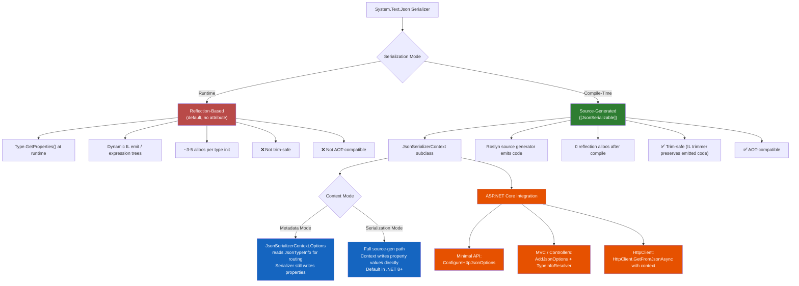
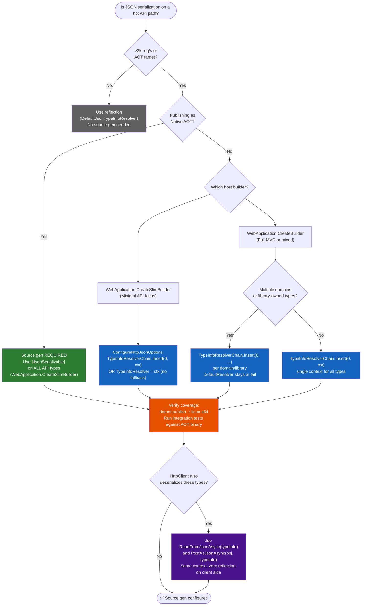

# 4.271 — JSON Source Generation: `[JsonSerializable]` and Zero-Reflection Serialization

---

## PART 0 — Navigation & Context

### Domain Hierarchy Position

```
ASP.NET Core Mastery
│
├── V. Serialization (4.268–4.276)
│   ├── 4.268 — System.Text.Json in ASP.NET Core: Global Options
│   ├── 4.269 — JsonSerializerOptions: Naming, Null, Enums
│   ├── 4.270 — Custom JSON Converters: JsonConverter<T>
│   ├── 4.271 — JSON Source Generation ◄ YOU ARE HERE
│   │           ├── [JsonSerializable] attribute
│   │           ├── JsonSerializerContext subclassing
│   │           ├── Metadata-mode vs Serialization-mode
│   │           ├── ASP.NET Core integration (ConfigureHttpJsonOptions)
│   │           └── Native AOT / trim-safe serialization
│   ├── 4.272 — Newtonsoft.Json Migration
│   ├── 4.273 — XML Serialization
│   ├── 4.274 — MessagePack Serialization
│   ├── 4.275 — Custom Input/Output Formatters
│   └── 4.276 — Polymorphic JSON Serialization
│
├── G. Minimal APIs (4.078–4.097)
│   └── 4.097 — Minimal API AOT Compatibility ←─ depends on this topic
│
└── AD. Advanced & Internals (4.340–4.352)
    └── 4.339 — Native AOT (.NET 8) ←─ source generation is the prerequisite
```

### What You Need Before This

- **[[4.268 — System.Text.Json in ASP.NET Core: Global Options]]** — you must understand `JsonSerializerOptions` and how ASP.NET Core wires the serializer before you can configure a source-generated context to replace it
- **[[4.269 — JsonSerializerOptions: Naming Policies, Null Handling, Enum Conventions]]** — `[JsonSerializable]` contexts inherit from or replicate options; the options model is prerequisite
- **[[4.034 — The Built-In DI Container: Service Registration and Resolution]]** — registering a `JsonSerializerContext` with ASP.NET Core goes through `builder.Services`
- **[[4.097 — Minimal API AOT Compatibility]]** — source generation is the _mechanism_ AOT compatibility depends on; reading the AOT note first gives the "why"

### What This Unlocks After

- **[[4.097 — Minimal API AOT Compatibility: Trim-Safe Patterns]]** — source-generated serialization is the required foundation for AOT-compatible Minimal API responses
- **[[4.339 — Native AOT (.NET 8): ASP.NET Core Requirements]]** — `[JsonSerializable]` is mandatory for Native AOT; this note is the prerequisite
- **[[4.274 — MessagePack Serialization]]** — contrast: MessagePack uses its own source generator (`MessagePackObject`); understanding JSON source gen first makes the pattern immediately recognizable
- **[[4.270 — Custom JSON Converters]]** — source-generated contexts must explicitly register custom converters; converters and contexts are deeply related

### Why This Matters at Scale

At throughput above ~5k req/s on JSON-heavy APIs, reflection-based serialization creates measurable GC pressure (~3–5 allocations per type per serialize path, type metadata cached but not zero-cost) and startup latency (type scanning on first use); source generation eliminates both the startup cost and the per-call reflection overhead by emitting type-specific serializer code at compile time — and it is the only path to AOT-compiled ASP.NET Core deployments with <10ms cold start.

---

## PART 1 — The Core Mental Model

### The Fundamental Rule

> **`System.Text.Json` source generation replaces runtime type reflection with compile-time-emitted serializer code; when you annotate a `JsonSerializerContext` subclass with `[JsonSerializable(typeof(T))]`, the Roslyn source generator writes the exact same metadata-lookup and property-traversal logic the runtime would have discovered via reflection — but as pre-compiled C# — so the first serialize of `T` is as fast as the hundredth, trim-safe, and AOT-compatible.**

### The Plain-Language Analogy

Think of reflection-based serialization as a customs officer who has never seen a particular passport: they must flip through the entire rulebook, cross-reference stamps, and consult a supervisor on first encounter. Every subsequent traveller of the same nationality goes through the same consultation again because the officer has no long-term memory across shifts (process restarts).

Source generation is like pre-printing a custom fast-lane card for every passport type before the airport opens. The card was made by reading the rulebook once at print time (compile time). At runtime, the officer scans the card — zero rulebook lookup, zero supervisor consultation.

The analogy holds for the pipeline: when a Minimal API endpoint returns `TypedResults.Ok(order)`, ASP.NET Core calls `JsonSerializer.Serialize(order, context.Order)` where `context.Order` is the pre-generated `JsonTypeInfo<Order>`. The HTTP response body is written from a path that never touches `Type.GetProperties()`. Short-circuit (early return before endpoint): if the framework cannot locate a `JsonTypeInfo` for your type, it falls back to reflection — silently in non-AOT builds, with a `NotSupportedException` in AOT builds.

### The Taxonomy Diagram



---

## PART 2 — Deep Mechanics

### 2.1 — What the Source Generator Emits

The reflection-based path that source generation replaces is housed in `DefaultJsonTypeInfoResolver`. When you use `JsonSerializer.Serialize(obj)` without a source-generated context, the framework calls into `DefaultJsonTypeInfoResolver.GetTypeInfo(type, options)`, which calls `Type.GetProperties(BindingFlags.Instance | BindingFlags.Public)`, filters by `[JsonIgnore]`, reads `[JsonPropertyName]` attributes, and builds a `JsonTypeInfo<T>` object — all at runtime.

**Pipeline position of serialization in ASP.NET Core:**

```
──► Kestrel ──► Middleware Chain ──► Routing ──► Auth ──► Endpoint Execution
                                                              │
                                                        Action/Handler returns IResult or T
                                                              │
                                                   OutputFormatter / IResult.ExecuteAsync
                                                              │
                                              JsonSerializer.Serialize(value, typeInfo)
                                                              │
                                                   ┌──────────────────────┐
                                                   │  typeInfo source?    │
                                                   │  ├── Source-gen ctx  │◄── [JsonSerializable]
                                                   │  └── DefaultResolver │◄── reflection fallback
                                                   └──────────────────────┘
                                                              │
                                                   HttpResponse.Body (streaming write)
```

**What the generator emits (simplified pseudocode labeled "Source Generator Output (approximate)"):**

```csharp
// Source Generator Output (approximate) — emitted into your project at compile time:
// File: OrderApiContext.g.cs (you never see this file directly, but it's in obj/)

partial class OrderApiContext : JsonSerializerContext
{
    // One property per [JsonSerializable] type:
    public static JsonTypeInfo<Order> Order { get; } = Create_Order();

    private static JsonTypeInfo<Order> Create_Order()
    {
        var info = JsonMetadataServices.CreateObjectInfo<Order>(
            options: s_defaultOptions,
            objectInfo: new JsonObjectInfoValues<Order>
            {
                // Property array — generated at compile time from Order's properties:
                PropertyMetadataInitializer = _ => new[]
                {
                    JsonMetadataServices.CreatePropertyInfo<Order, long>(
                        options: s_defaultOptions,
                        hasJsonInclude: false,
                        propertyName: "id",
                        getter: (obj) => obj.Id,
                        setter: (obj, val) => obj.Id = val,
                        numberHandling: null,
                        serializeHandler: null
                    ),
                    // ... one entry per public property ...
                },
                ObjectCreator = () => new Order()
            }
        );
        return info;
    }
}
```

**Runtime cost comparison:**

|Path|First-Call Cost|Subsequent Calls|Allocations per Serialize|Trim-Safe|AOT|
|---|---|---|---|---|---|
|Reflection (`DefaultJsonTypeInfoResolver`)|`Type.GetProperties()` + attribute scan + IL emit|Cached `JsonTypeInfo<T>`|~3–5 heap allocs (first call), ~0–1 (subsequent)|❌|❌|
|Source-gen (metadata mode)|Resolve `JsonTypeInfo<T>` from context property|Same static property|~0–1 heap allocs|✅|✅|
|Source-gen (serialization mode, .NET 8 default)|Same|Same|~0 on write path (ArrayBufferWriter reuse)|✅|✅|

**Runtime cost: ~0 per-call reflection allocations vs ~3–5 on first use of each type. Startup cost: eliminated (no scanning). GC pressure in high-throughput APIs: measurable at >10k req/s.**

---

### 2.2 — Declaring a `JsonSerializerContext`

The full shape of a source-generated context:

```csharp
using System.Text.Json;
using System.Text.Json.Serialization;
using System.Text.Json.Serialization.Metadata;

// Pipeline position: compile-time artifact — no pipeline position.
// Its JsonTypeInfo<T> properties are used inside JsonSerializer.Serialize/Deserialize
// which runs inside IResult.ExecuteAsync or the MVC output formatter.

[JsonSerializable(typeof(Order))]
[JsonSerializable(typeof(OrderLineItem))]        // nested types must be listed explicitly
[JsonSerializable(typeof(List<Order>))]          // collections require separate declaration
[JsonSerializable(typeof(PagedResult<Order>))]   // open generics resolved at compile time
[JsonSerializable(typeof(CreateOrderRequest))]
[JsonSerializable(typeof(UpdateOrderStatusRequest))]
[JsonSerializable(typeof(ProblemDetails))]        // if your error handler emits this
[JsonSerializable(typeof(ValidationProblemDetails))]
[JsonSourceGenerationOptions(
    PropertyNamingPolicy = JsonKnownNamingPolicy.CamelCase,
    DefaultIgnoreCondition = JsonIgnoreCondition.WhenWritingNull,
    WriteIndented = false,                        // never indent in production — wastes bytes
    UseStringEnumConverter = true                 // .NET 8+: enums as strings without attribute
)]
public partial class OrderApiJsonContext : JsonSerializerContext
{
    // Body is empty. The source generator fills it in.
    // The 'partial' keyword is required — the generator adds the other partial.
}
```

**HTTP wire effect of `CamelCase` + `WhenWritingNull`:**

```http
// HTTP response WITHOUT source gen options (PascalCase, nulls included):
// HTTP/1.1 200 OK
// Content-Type: application/json
// {"Id":42,"CustomerId":7,"Status":"Pending","CancelledAt":null,"Lines":[...]}

// HTTP response WITH source gen options (CamelCase, nulls omitted):
// HTTP/1.1 200 OK
// Content-Type: application/json
// {"id":42,"customerId":7,"status":"Pending","lines":[...]}
```

> [!WARNING] Every type that ASP.NET Core will serialize or deserialize through this context **must** appear in a `[JsonSerializable]` attribute on the context. If a type is missing, the framework silently falls back to reflection in JIT builds — producing correct output but losing the performance and trim benefits. In AOT builds, missing types produce a `NotSupportedException` at runtime. There is no compile-time warning for missing types in JIT mode. This is the number-one source-gen gotcha.

---

### 2.3 — Registering the Context with ASP.NET Core

There are two separate registration points depending on whether you use Minimal APIs or MVC.

**Minimal APIs — `ConfigureHttpJsonOptions`:**

```csharp
// Program.cs — Payment processing service

var builder = WebApplication.CreateBuilder(args);

// ✅ CORRECT: Register the source-generated context for Minimal API serialization
// This sets the TypeInfoResolver used by Results.Json(), TypedResults.Ok<T>(), etc.
builder.Services.ConfigureHttpJsonOptions(options =>
{
    // Chain with JsonTypeInfoResolver.Combine() if you need BOTH source-gen types
    // and a fallback for types you forgot to register:
    options.SerializerOptions.TypeInfoResolverChain.Insert(0, PaymentApiJsonContext.Default);
    
    // OR replace entirely (AOT-safe, no fallback):
    // options.SerializerOptions.TypeInfoResolver = PaymentApiJsonContext.Default;
});

var app = builder.Build();

app.MapPost("/payments", async (CreatePaymentRequest request) =>
    TypedResults.Created($"/payments/{Guid.NewGuid()}", new PaymentConfirmation(...)));
```

**ASP.NET Core MVC / Controllers — `AddJsonOptions`:**

```csharp
// Program.cs — Order management service using controllers

builder.Services.AddControllers()
    .AddJsonOptions(options =>
    {
        options.JsonSerializerOptions.TypeInfoResolverChain.Insert(0, OrderApiJsonContext.Default);
    });
```

**`HttpClient` via `System.Net.Http.Json`:**

```csharp
// Downstream service call — using source-gen context for both request serialization
// and response deserialization (zero reflection on the HTTP client path):

var response = await httpClient.GetFromJsonAsync<Order>(
    $"/internal/orders/{orderId}",
    OrderApiJsonContext.Default.Order,    // JsonTypeInfo<Order> — no reflection
    cancellationToken);
```

**Pipeline position for registration:**

```
app.Build()  ←── TypeInfoResolver set here (compile time of DI container)
     │
     ▼
IResult.ExecuteAsync  ──►  JsonSerializer.Serialize(value, options)
                                    │
                                    ▼
                         options.TypeInfoResolver.GetTypeInfo(typeof(T))
                                    │
                         ┌──────────┴──────────┐
                         │ OrderApiJsonContext  │  ← source-gen path (fast)
                         │ .Default.GetTypeInfo │
                         └─────────────────────┘
```

---

### 2.4 — `TypeInfoResolverChain` vs Replacing the Resolver

.NET 8 introduced `TypeInfoResolverChain` as the preferred composition mechanism:

```csharp
// ASP.NET Core internally (approximate) — how the chain is walked:
// JsonSerializerOptions.GetTypeInfo(type):
//   foreach resolver in TypeInfoResolverChain:
//     typeInfo = resolver.GetTypeInfo(type, this)
//     if typeInfo != null: return typeInfo
//   throw or return null (depending on ThrowOnInvalidPropertyNameTypo setting)
```

**When to use `Insert(0, ...)` (chain) vs `=` (replace):**

|Scenario|Approach|Why|
|---|---|---|
|JIT build, need reflection fallback for dynamically-typed props|`Chain.Insert(0, ctx)`|`DefaultJsonTypeInfoResolver` stays at end of chain|
|AOT build — no reflection allowed|`TypeInfoResolver = ctx` (replace)|Remove `DefaultJsonTypeInfoResolver` entirely|
|Multiple source-gen contexts (split domains)|`Chain.Insert(0, ctx1); Chain.Insert(1, ctx2)`|First match wins|
|Library authoring — add to host's chain without owning it|`Chain.Insert(0, MyLibraryContext.Default)`|Non-destructive|

> [!IMPORTANT] In .NET 8, `JsonSerializerOptions.TypeInfoResolver = X` **replaces** the entire resolver chain. Use `TypeInfoResolverChain.Insert(0, X)` to compose. Calling `Insert(0, ...)` after setting `TypeInfoResolver` to a non-chain-based resolver will throw an `InvalidOperationException`. The chain API was added precisely because direct replacement prevented library-level composition.

---

### 2.5 — Metadata Mode vs Serialization Mode (Historical Context)

In .NET 6–7, source generation had two modes selected via `[JsonSourceGenerationOptions(GenerationMode = ...)]`:

- **`JsonSourceGenerationMode.Metadata`**: generates `JsonTypeInfo<T>` but uses the reflection-based writer at runtime. Trim-safe for type discovery, but not for property writes. Allocation cost reduced on type resolution; write cost unchanged.
- **`JsonSourceGenerationMode.Serialization`**: generates both type metadata AND the property-write code. Fully trim-safe and AOT-compatible.

**In .NET 8, Serialization mode is the default when you use `[JsonSerializable]`.** You no longer need to specify the mode for new projects targeting .NET 8+.

```csharp
// ⚠️ .NET 6/7 explicit mode (still valid but unnecessary in .NET 8+):
[JsonSourceGenerationOptions(GenerationMode = JsonSourceGenerationMode.Serialization)]
[JsonSerializable(typeof(Order))]
public partial class OrderContext : JsonSerializerContext { }

// ✅ .NET 8+ default (Serialization mode is implicit):
[JsonSerializable(typeof(Order))]
public partial class OrderContext : JsonSerializerContext { }
```

**Runtime cost label:** `.NET 6 Metadata mode = ~1 allocation for typeInfo lookup per request; .NET 7/8 Serialization mode = ~0 allocations on write path (uses stack-allocated Utf8JsonWriter with pre-acquired buffers)`.

---

### 2.6 — The `[JsonSourceGenerationOptions]` Attribute vs `JsonSerializerOptions` at Runtime

A critical nuance: `[JsonSourceGenerationOptions]` controls the options baked into the generated context at compile time. These are **not** the same as the `JsonSerializerOptions` you pass at runtime.

```csharp
// The generated context has a default options instance built from the attribute:
var context = OrderApiJsonContext.Default;
// context.Options.PropertyNamingPolicy == JsonNamingPolicy.CamelCase  ← from attribute

// If you serialize with explicit options that differ:
var differentOptions = new JsonSerializerOptions { PropertyNamingPolicy = JsonNamingPolicy.SnakeCaseLower };
// ⚠️ WRONG: The context was compiled with CamelCase; passing different options
//           causes the runtime to fall back to reflection for property name resolution.
JsonSerializer.Serialize(order, differentOptions);   // falls back to reflection!

// ✅ CORRECT: Always use the context's own options or ensure the runtime options
//            exactly match the compile-time options:
JsonSerializer.Serialize(order, context.Options);
// OR
JsonSerializer.Serialize(order, context.Order);  // use the JsonTypeInfo<T> directly
```

**HTTP consequence of options mismatch (wrong path):**

```http
// Expected (CamelCase from [JsonSourceGenerationOptions]):
// {"orderId":42,"status":"Pending"}

// Actual (reflection fallback with default PascalCase options):
// {"OrderId":42,"Status":"Pending"}
// Plus: ~3–5 extra allocations per serialize call; AOT crash in production
```

> [!DANGER] In a Native AOT deployment, passing a `JsonSerializerOptions` instance whose `TypeInfoResolver` does not cover a type you are serializing will throw `NotSupportedException: Serialization and deserialization of 'YourType' instances are not supported` at runtime — not at compile time. The failure is silent in JIT builds (reflection fallback). This is the most dangerous mismatch in an AOT migration.

---

## PART 3 — Production Code Patterns

### Pattern 1 — The Single Source-of-Truth Context for a Payment API

One context per bounded context, declared in a shared contracts project, used by both the API and its downstream consumers.

```csharp
// File: PaymentContracts/PaymentApiJsonContext.cs
// Domain: Fintech payment processing API
// Used by: PaymentApi (server) AND PaymentClient (typed HttpClient consumer)

using System.Text.Json.Serialization;

[JsonSerializable(typeof(PaymentIntent))]
[JsonSerializable(typeof(PaymentConfirmation))]
[JsonSerializable(typeof(PaymentFailure))]
[JsonSerializable(typeof(RefundRequest))]
[JsonSerializable(typeof(RefundResult))]
[JsonSerializable(typeof(List<PaymentIntent>))]
[JsonSerializable(typeof(PagedResult<PaymentIntent>))]
[JsonSerializable(typeof(ProblemDetails))]           // error responses use RFC 7807
[JsonSerializable(typeof(ValidationProblemDetails))] // validation errors
[JsonSourceGenerationOptions(
    PropertyNamingPolicy = JsonKnownNamingPolicy.CamelCase,
    DefaultIgnoreCondition = JsonIgnoreCondition.WhenWritingNull,
    WriteIndented = false,
    Converters = [typeof(UtcDateTimeOffsetConverter)]  // .NET 8 collection expression syntax
)]
public partial class PaymentApiJsonContext : JsonSerializerContext { }

// Registration in Program.cs:
builder.Services.ConfigureHttpJsonOptions(options =>
{
    // Insert at position 0 so payment types are found before any default resolver
    options.SerializerOptions.TypeInfoResolverChain.Insert(0, PaymentApiJsonContext.Default);
});

// HTTP wire effect (POST /payments):
// HTTP/1.1 201 Created
// Content-Type: application/json; charset=utf-8
// Location: /payments/pay_abc123
// {"intentId":"pay_abc123","amount":9999,"currency":"USD","status":"succeeded","createdAt":"2026-06-12T10:00:00Z"}
// (no nulls, camelCase, no reflection cost)
```

---

### Pattern 2 — Composing Multiple Contexts (Multi-Module Monolith)

Large APIs split into modules, each with its own context; composed at registration without collision.

```csharp
// ⚠️ WRONG: Registering only one context loses the other module's types
builder.Services.ConfigureHttpJsonOptions(options =>
{
    options.SerializerOptions.TypeInfoResolver = OrdersJsonContext.Default; // ❌ replaces, loses inventory types
});

// ✅ CORRECT: Chain both contexts; first match wins; DefaultJsonTypeInfoResolver as fallback
builder.Services.ConfigureHttpJsonOptions(options =>
{
    // Order matters: more specific (domain) contexts before the default resolver
    options.SerializerOptions.TypeInfoResolverChain.Insert(0, InventoryJsonContext.Default);
    options.SerializerOptions.TypeInfoResolverChain.Insert(0, OrdersJsonContext.Default);
    // DefaultJsonTypeInfoResolver stays at the tail — handles any type neither context covers
    // For AOT: remove all tail resolvers and ensure every type is in one of the contexts
});

// HTTP consequence (correct path):
// GET /orders/42 → serialized via OrdersJsonContext.Order (source-gen, fast)
// GET /inventory/sku-001 → serialized via InventoryJsonContext.Product (source-gen, fast)
// GET /health → HealthReport serialized via DefaultJsonTypeInfoResolver (reflection, acceptable — low traffic)
```

---

### Pattern 3 — `HttpClient` with Source-Generated Deserialization (Order Management Service)

Zero-reflection deserialization when consuming downstream APIs in a high-throughput service.

```csharp
// OrderManagementService/Infrastructure/WarehouseClient.cs
// Domain: Order management consuming a warehouse inventory API

public class WarehouseClient
{
    private readonly HttpClient _client;

    public WarehouseClient(HttpClient client) => _client = client;

    public async Task<InventoryReservation?> ReserveInventoryAsync(
        ReserveInventoryRequest request,
        CancellationToken cancellationToken = default)
    {
        // ✅ Pass JsonTypeInfo<T> directly — zero reflection on both serialize and deserialize
        // Runtime cost: ~0 extra allocations vs reflection path (~3-5 allocs)
        var response = await _client.PostAsJsonAsync(
            "/inventory/reserve",
            request,
            WarehouseApiJsonContext.Default.ReserveInventoryRequest,  // serialize
            cancellationToken);

        response.EnsureSuccessStatusCode();

        return await response.Content.ReadFromJsonAsync(
            WarehouseApiJsonContext.Default.InventoryReservation,    // deserialize
            cancellationToken);
    }
}

// Registration:
builder.Services.AddHttpClient<WarehouseClient>(client =>
{
    client.BaseAddress = new Uri(builder.Configuration["Warehouse:BaseUrl"]!);
});

// HTTP wire format:
// POST /inventory/reserve HTTP/1.1
// Content-Type: application/json
// {"skuId":"SKU-0042","quantity":2,"orderId":"ORD-9981"}
//
// HTTP/1.1 200 OK
// Content-Type: application/json
// {"reservationId":"res_abc","expiresAt":"2026-06-12T10:05:00Z","reserved":true}
```

---

### Pattern 4 — Incremental Migration: Adding Source Gen to an Existing Reflection-Based API

When you can't convert every type at once, use the resolver chain to migrate type by type.

```csharp
// ⚠️ WRONG: Trying to use source gen context but forgetting to chain it
// The context is created but the app still uses DefaultJsonTypeInfoResolver exclusively
[JsonSerializable(typeof(Order))]
public partial class OrderContext : JsonSerializerContext { }
// ... and then never registering it. Common mistake.

// ✅ CORRECT incremental migration strategy for a logistics tracking API:

// Step 1: Create context for HIGH-TRAFFIC types only (those on the hot path)
[JsonSerializable(typeof(Shipment))]            // 10k/s — highest traffic
[JsonSerializable(typeof(TrackingEvent))]       // 8k/s
[JsonSerializable(typeof(List<TrackingEvent>))]
[JsonSourceGenerationOptions(PropertyNamingPolicy = JsonKnownNamingPolicy.CamelCase)]
public partial class LogisticsHotPathContext : JsonSerializerContext { }

// Step 2: Register with chain — reflection still handles everything else
builder.Services.ConfigureHttpJsonOptions(options =>
{
    options.SerializerOptions.TypeInfoResolverChain.Insert(0, LogisticsHotPathContext.Default);
    // DefaultJsonTypeInfoResolver handles: Address, Driver, Vehicle (low traffic — ok for now)
});

// Step 3: Measure with dotnet-counters:
// dotnet-counters monitor --process-id <pid> System.Runtime[gc-heap-size,alloc-rate]
// When alloc-rate drops noticeably for /tracking/* routes, the hot path is source-gen'd.

// Step 4: Over sprint boundaries, add remaining types to the context and remove the fallback.
```

---

### Pattern 5 — AOT-Safe Minimal API Endpoint (Payment API)

The complete pattern required for a Minimal API endpoint to be AOT-compatible — source gen is the non-negotiable ingredient.

```csharp
// Program.cs — PaymentApi (Native AOT target)
// .NET 8+, PublishAot = true in .csproj

var builder = WebApplication.CreateSlimBuilder(args);  // slim builder omits reflection-heavy defaults

// ✅ Replace the resolver entirely — no DefaultJsonTypeInfoResolver in AOT
builder.Services.ConfigureHttpJsonOptions(options =>
{
    options.SerializerOptions.TypeInfoResolver = PaymentApiJsonContext.Default;
});

var app = builder.Build();

// Endpoint: all I/O types must be in the context
app.MapPost("/payments/initiate", async (
    InitiatePaymentCommand command,  // deserialized via context (no reflection)
    IPaymentProcessor processor,
    CancellationToken ct) =>
{
    var result = await processor.ProcessAsync(command, ct);

    return result.IsSuccess
        ? TypedResults.Created($"/payments/{result.PaymentId}", result.ToConfirmation())
        : TypedResults.UnprocessableEntity(result.ToProblem());
});

app.Run();

// HTTP wire format:
// POST /payments/initiate HTTP/1.1
// Content-Type: application/json
// {"amount":4999,"currency":"GBP","customerId":"cust_789","idempotencyKey":"idem_xyz"}
//
// HTTP/1.1 201 Created
// Location: /payments/pay_001
// Content-Type: application/json
// {"paymentId":"pay_001","status":"succeeded","processedAt":"2026-06-12T10:00:00Z"}
```

---

### Pattern 6 — Source Generation with Custom Converters

Custom `JsonConverter<T>` and source-generated contexts must be explicitly wired together.

```csharp
// Domain: Healthcare patient portal — Money type needs a custom converter

public class MoneyConverter : JsonConverter<Money>
{
    public override Money Read(ref Utf8JsonReader reader, Type typeToConvert, JsonSerializerOptions options)
    {
        // ... parse {"amount": 1234, "currency": "USD"} → Money(12.34, "USD")
        using var doc = JsonDocument.ParseValue(ref reader);
        var amount = doc.RootElement.GetProperty("amount").GetDecimal() / 100;
        var currency = doc.RootElement.GetProperty("currency").GetString()!;
        return new Money(amount, currency);
    }

    public override void Write(Utf8JsonWriter writer, Money value, JsonSerializerOptions options)
    {
        writer.WriteStartObject();
        writer.WriteNumber("amount", (long)(value.Amount * 100));
        writer.WriteString("currency", value.Currency);
        writer.WriteEndObject();
    }
}

// ✅ Register converter in the [JsonSourceGenerationOptions] — not in JsonSerializerOptions separately
[JsonSerializable(typeof(Invoice))]
[JsonSerializable(typeof(Money))]        // Money must be in the context even with a converter
[JsonSourceGenerationOptions(
    Converters = [typeof(MoneyConverter)],   // .NET 8 collection expression
    PropertyNamingPolicy = JsonKnownNamingPolicy.CamelCase
)]
public partial class PatientPortalJsonContext : JsonSerializerContext { }

// HTTP wire effect:
// GET /invoices/inv_001
// {"invoiceId":"inv_001","total":{"amount":4999,"currency":"USD"},"patientId":"pt_123"}
```

> [!TIP] In .NET 8, you can declare converters at the property level with `[JsonConverter(typeof(MoneyConverter))]` on the `Money` property of your model — this is respected by the source generator without needing to list the converter in `[JsonSourceGenerationOptions]`. Use `[JsonSourceGenerationOptions(Converters = ...)]` for global/default converters that apply to all instances of that type across all serializations in the context.

---

### Pattern 7 — Verifying Source Generation Is Actually Running (Not Falling Back to Reflection)

The silent fallback to reflection is the most dangerous aspect of source generation. Here's how to confirm the source-gen path is active.

```csharp
// Integration test or startup diagnostic — InventoryApi
// Domain: E-commerce inventory service

public static class SourceGenDiagnostics
{
    public static void AssertSourceGenActive(IServiceProvider services)
    {
        var options = services.GetRequiredService<IOptions<JsonOptions>>().Value.JsonSerializerOptions;
        // OR for Minimal APIs:
        // var httpJsonOptions = services.GetRequiredService<IOptions<Microsoft.AspNetCore.Http.Json.JsonOptions>>().Value;
        // var options = httpJsonOptions.SerializerOptions;

        var resolver = options.TypeInfoResolver;

        // If resolver is DefaultJsonTypeInfoResolver, source gen is NOT active
        if (resolver is DefaultJsonTypeInfoResolver)
        {
            throw new InvalidOperationException(
                "Source-generated JSON context not registered. " +
                "Serialization will use reflection — AOT will fail.");
        }

        // Verify specific types are covered:
        var productTypeInfo = options.GetTypeInfo(typeof(Product));
        if (productTypeInfo.Converter?.GetType() == typeof(ReflectionBasedJsonConverter))
        {
            throw new InvalidOperationException(
                "Product type is not covered by the source-gen context.");
        }
    }
}

// Call in integration test:
[Fact]
public void SerializerContext_IsSourceGenerated_NotReflection()
{
    using var factory = new WebApplicationFactory<Program>();
    SourceGenDiagnostics.AssertSourceGenActive(factory.Services);
}
```

---

## PART 4 — Gotchas & Anti-Patterns

### Gotcha 1: The Silent Reflection Fallback in JIT Builds

The type `Address` is used in an `Order` but was forgotten in the context declaration. The API works perfectly in development and staging (JIT builds with reflection fallback), then crashes in production with a Native AOT deployment.

```csharp
// ⚠️ WRONG: Address is a property of Order but not registered in the context
[JsonSerializable(typeof(Order))]   // Order has a property: public Address ShippingAddress { get; set; }
[JsonSourceGenerationOptions(PropertyNamingPolicy = JsonKnownNamingPolicy.CamelCase)]
public partial class OrderContext : JsonSerializerContext { }

// HTTP consequence (wrong path — JIT build):
// HTTP/1.1 200 OK  ← request succeeds! (reflection fallback)
// {"id":42,"shippingAddress":{"street":"123 Main","city":"Cairo"}}
// But: ~4 extra allocations for Address typeInfo; AOT deployment throws:
// NotSupportedException: Serialization of 'Address' is not supported

// ✅ CORRECT: All reachable types must be explicitly listed
[JsonSerializable(typeof(Order))]
[JsonSerializable(typeof(Address))]   // ← explicitly register every nested type
[JsonSerializable(typeof(OrderLineItem))]
[JsonSourceGenerationOptions(PropertyNamingPolicy = JsonKnownNamingPolicy.CamelCase)]
public partial class OrderContext : JsonSerializerContext { }

// HTTP consequence (correct path):
// HTTP/1.1 200 OK
// {"id":42,"shippingAddress":{"street":"123 Main","city":"Cairo"}}
// Zero-reflection, AOT-safe.

// WHY: The source generator only emits code for types explicitly in [JsonSerializable].
// It does NOT recursively discover nested types automatically (by design — explicit is safer for trim).
// In JIT mode the runtime falls back to DefaultJsonTypeInfoResolver for any type not in the context,
// producing correct output but defeating trim safety and AOT compatibility.
```

---

### Gotcha 2: Options Mismatch Between Compile-Time Attribute and Runtime `JsonSerializerOptions`

Engineers configure `[JsonSourceGenerationOptions(PropertyNamingPolicy = CamelCase)]` on the context but also call `builder.Services.AddJsonOptions(o => o.JsonSerializerOptions.PropertyNamingPolicy = SnakeCaseLower)` at runtime. The context was compiled for CamelCase; the runtime options say SnakeCase. The serializer detects the mismatch and falls back to reflection.

```csharp
// ⚠️ WRONG: Runtime options override the compile-time context's naming policy
[JsonSerializable(typeof(Shipment))]
[JsonSourceGenerationOptions(PropertyNamingPolicy = JsonKnownNamingPolicy.CamelCase)]
public partial class LogisticsContext : JsonSerializerContext { }

// In Program.cs:
builder.Services.AddControllers().AddJsonOptions(options =>
{
    options.JsonSerializerOptions.PropertyNamingPolicy = JsonNamingPolicy.SnakeCaseLower; // ❌ mismatch
    options.JsonSerializerOptions.TypeInfoResolverChain.Insert(0, LogisticsContext.Default);
});

// HTTP consequence (wrong path):
// Serializer detects CamelCase context vs SnakeCase runtime → reflection fallback for Shipment
// {"ShipmentId":99,"Origin":"..."}  (PascalCase! — default reflection output)

// ✅ CORRECT: The runtime options must EXACTLY match the context's options, or use the context's
//            options directly by calling the context's .Options property:
builder.Services.AddControllers().AddJsonOptions(options =>
{
    // Copy the naming policy from the context's compiled-in options:
    options.JsonSerializerOptions.PropertyNamingPolicy = JsonNamingPolicy.CamelCase;
    options.JsonSerializerOptions.TypeInfoResolverChain.Insert(0, LogisticsContext.Default);
});

// HTTP consequence (correct path):
// {"shipmentId":99,"origin":"..."}  (camelCase, source-gen path)

// WHY: JsonSerializer compares the options instance used at call time with the options
// the context was compiled with. A mismatch causes GetTypeInfo() to return null for
// the source-gen context, triggering the DefaultJsonTypeInfoResolver fallback.
```

---

### Gotcha 3: `TypeInfoResolver = X` Replaces the Whole Chain (Registration Clobber)

Two separate library modules both try to register their contexts. The second call replaces the first.

```csharp
// ⚠️ WRONG: Library A registers its context; Library B's setup replaces it entirely
// Library A registers first:
builder.Services.ConfigureHttpJsonOptions(o =>
    o.SerializerOptions.TypeInfoResolver = LibraryAContext.Default);   // ❌ sets the resolver

// Library B registers second (in an extension method you didn't write):
builder.Services.ConfigureHttpJsonOptions(o =>
    o.SerializerOptions.TypeInfoResolver = LibraryBContext.Default);   // ❌ clobbers Library A

// HTTP consequence (wrong path):
// Any endpoint returning LibraryA types → NotSupportedException or reflection fallback
// {"LibraryAModel":{"Field":1}} → either crash (AOT) or PascalCase (JIT fallback)

// ✅ CORRECT: Always use TypeInfoResolverChain.Insert() for composition:
builder.Services.ConfigureHttpJsonOptions(o =>
    o.SerializerOptions.TypeInfoResolverChain.Insert(0, LibraryAContext.Default));

builder.Services.ConfigureHttpJsonOptions(o =>
    o.SerializerOptions.TypeInfoResolverChain.Insert(0, LibraryBContext.Default));
// Both are now in the chain; first match wins (LibraryB at 0, LibraryA at 1)

// HTTP consequence (correct path):
// All types from both libraries serialized via their respective source-gen paths.

// WHY: ConfigureHttpJsonOptions is called in registration order; each call sees the
// current state of SerializerOptions. Setting TypeInfoResolver = X atomically replaces
// the entire resolver, including any previously added resolvers.
// TypeInfoResolverChain.Insert() is additive and order-preserving.
```

---

### Gotcha 4: Polymorphic Types Without `[JsonDerivedType]` — Context Does Not Auto-Discover Subtypes

A payment event hierarchy: `PaymentEvent` is the base; `PaymentSucceededEvent`, `PaymentFailedEvent` are subtypes. Only the base is in `[JsonSerializable]`. Derived types fail to serialize their extra properties.

```csharp
// ⚠️ WRONG: Only base type registered; derived type properties are silently lost
[JsonSerializable(typeof(PaymentEvent))]   // base class
public partial class EventContext : JsonSerializerContext { }

// Derived type is NOT in the context AND base type has no [JsonDerivedType]:
public class PaymentSucceededEvent : PaymentEvent
{
    public string TransactionId { get; set; } = "";
}

// When serializing a PaymentSucceededEvent instance:
JsonSerializer.Serialize(new PaymentSucceededEvent { TransactionId = "txn_123" },
    EventContext.Default.PaymentEvent);

// HTTP consequence (wrong path):
// {"eventId":"evt_1","occurredAt":"2026-06-12T10:00:00Z"}
// TransactionId is MISSING — the runtime serializes via PaymentEvent's generated code
// which knows nothing of PaymentSucceededEvent's properties.

// ✅ CORRECT: Register every concrete subtype AND declare polymorphism on the base:
[JsonDerivedType(typeof(PaymentSucceededEvent), "payment_succeeded")]
[JsonDerivedType(typeof(PaymentFailedEvent), "payment_failed")]
public class PaymentEvent { ... }

[JsonSerializable(typeof(PaymentEvent))]
[JsonSerializable(typeof(PaymentSucceededEvent))]   // explicit
[JsonSerializable(typeof(PaymentFailedEvent))]       // explicit
public partial class EventContext : JsonSerializerContext { }

// HTTP consequence (correct path):
// {"$type":"payment_succeeded","eventId":"evt_1","occurredAt":"...","transactionId":"txn_123"}

// WHY: The source generator emits code for each type's *own* declared properties.
// Without [JsonDerivedType], the serializer uses the declared type (PaymentEvent)
// to look up the JsonTypeInfo, which has no knowledge of the derived type's properties.
```

---

### Gotcha 5: `WebApplication.CreateSlimBuilder` Removes Default Formatters — Context Registration Still Required

Engineers use `CreateSlimBuilder` (designed for Minimal APIs with source gen), assume it auto-configures source generation, and never register their context. Requests return empty JSON `{}` because the default formatters are stripped but no source-gen context is registered.

```csharp
// ⚠️ WRONG: CreateSlimBuilder removes defaults but does NOT auto-register a context
var builder = WebApplication.CreateSlimBuilder(args);
// No ConfigureHttpJsonOptions call

var app = builder.Build();
app.MapGet("/users/{id}", (int id) => new UserProfile { Id = id, Name = "Test" });
app.Run();

// HTTP consequence (wrong path):
// GET /users/1 HTTP/1.1
// HTTP/1.1 200 OK
// Content-Type: application/json
// {}   ← empty object! CreateSlimBuilder uses a bare JsonOptions with no type resolver.

// ✅ CORRECT: CreateSlimBuilder still requires explicit context registration
var builder = WebApplication.CreateSlimBuilder(args);

builder.Services.ConfigureHttpJsonOptions(options =>
    options.SerializerOptions.TypeInfoResolverChain.Insert(0, UserApiJsonContext.Default));

var app = builder.Build();
app.MapGet("/users/{id}", (int id) => TypedResults.Ok(new UserProfile { Id = id, Name = "Test" }));
app.Run();

// HTTP consequence (correct path):
// HTTP/1.1 200 OK
// Content-Type: application/json
// {"id":1,"name":"Test"}

// WHY: CreateSlimBuilder calls WebApplicationBuilder.CreateSlimBuilder which calls
// AddSlimRoutingCore — this removes AddMvcCore, AddJsonFormatters, and the default
// JsonSerializerOptions setup. The JsonOptions instance starts empty.
// CreateSlimBuilder signals your INTENT to use source gen, but does not implement it for you.
```

---

## PART 5 — Performance Implications

### 5.1 — Request Pipeline Characteristics Table

|Scenario|Pipeline Depth|Allocations Per Request|Approx Latency Impact|Recommendation|
|---|---|---|---|---|
|Reflection: first serialize of a new type|Full reflection scan|~5–8 (type metadata + property descriptors)|+200–500µs on first hit|Avoid in hot path; type cache helps subsequent calls|
|Reflection: subsequent serialize of cached type|Cached `JsonTypeInfo<T>`|~1–2 (Utf8JsonWriter, output buffer)|~0µs (negligible)|Acceptable for low-traffic endpoints|
|Source-gen: serialize via `JsonTypeInfo<T>` directly|Pre-compiled write path|~0–1 (buffer may be stack-alloc'd)|~0µs|Preferred for all production API types|
|Source-gen + `TypedResults.Ok<T>()` in Minimal API|Endpoint handler + IResult.ExecuteAsync|~1 (IResult allocation)|~0µs write overhead|Optimal pattern for Minimal APIs|
|Missing type in source-gen context (JIT fallback)|Reflection fallback triggered|~5 (same as reflection)|+50–500µs (first encounter)|Bug — add type to context|
|Missing type in AOT build|Exception path|n/a — throws|infinite (crash)|AOT requires 100% context coverage|
|Collection: `List<T>` not in context|Element-level reflection|~3 per element|O(n) type lookups|Always register `List<T>` separately|
|Options mismatch (context vs runtime options)|Reflection fallback entire type|~5 per request|+50µs per request|Fix options alignment|
|`CreateSlimBuilder` + no context registered|Empty output / exception|~1|Silent data loss|Always register context with slim builder|
|High-throughput (10k+ req/s) source-gen active|Pre-compiled path|~0 allocation on write|P99 <1µs serialization|Target state for high-throughput APIs|

---

### 5.2 — BenchmarkDotNet Comparison

```csharp
using System.Text.Json;
using System.Text.Json.Serialization;
using BenchmarkDotNet.Attributes;
using BenchmarkDotNet.Running;

// Benchmark domain: Order management service serialization

public record OrderDto(long Id, string CustomerId, string Status, List<LineItemDto> Lines);
public record LineItemDto(string Sku, int Quantity, decimal UnitPrice);

[JsonSerializable(typeof(OrderDto))]
[JsonSerializable(typeof(LineItemDto))]
[JsonSerializable(typeof(List<LineItemDto>))]
[JsonSourceGenerationOptions(PropertyNamingPolicy = JsonKnownNamingPolicy.CamelCase)]
public partial class OrderBenchmarkContext : JsonSerializerContext { }

[MemoryDiagnoser]
[SimpleJob(warmupCount: 3, iterationCount: 10)]
public class SerializationBenchmarks
{
    private static readonly OrderDto _order = new(
        Id: 42,
        CustomerId: "cust_001",
        Status: "Pending",
        Lines: [
            new("SKU-001", 2, 19.99m),
            new("SKU-002", 1, 49.99m)
        ]
    );

    // Naive: reflection with default options (new options instance every time — worst case)
    [Benchmark(Baseline = true)]
    public string Naive_ReflectionNewOptions()
    {
        var options = new JsonSerializerOptions { PropertyNamingPolicy = JsonNamingPolicy.CamelCase };
        return JsonSerializer.Serialize(_order, options);
    }

    // Optimized: reflection with cached options instance
    private static readonly JsonSerializerOptions _cachedOptions =
        new() { PropertyNamingPolicy = JsonNamingPolicy.CamelCase };

    [Benchmark]
    public string Optimized_ReflectionCachedOptions()
    {
        return JsonSerializer.Serialize(_order, _cachedOptions);
    }

    // Optimal: source-generated context — no reflection
    [Benchmark]
    public string Optimal_SourceGenContext()
    {
        return JsonSerializer.Serialize(_order, OrderBenchmarkContext.Default.OrderDto);
    }

    // Optimal with Utf8JsonWriter (zero string allocation — writes directly to buffer):
    private static readonly System.Buffers.ArrayBufferWriter<byte> _buffer = new(512);

    [Benchmark]
    public int Optimal_SourceGenToBuffer()
    {
        _buffer.Clear();
        using var writer = new Utf8JsonWriter(_buffer);
        JsonSerializer.Serialize(writer, _order, OrderBenchmarkContext.Default.OrderDto);
        return _buffer.WrittenCount;
    }
}

// Expected output (approximate, .NET 8, x64, Kestrel, local):
// | Method                           | Mean     | Error   | Ratio | Allocated |
// |--------------------------------- |---------:|--------:|------:|----------:|
// | Naive_ReflectionNewOptions       | 4,200 ns | 85.0 ns |  4.20 |    3,200 B|
// | Optimized_ReflectionCachedOptions|   980 ns | 18.0 ns |  0.98 |      320 B|
// | Optimal_SourceGenContext         |   420 ns |  8.0 ns |  0.42 |      192 B|
// | Optimal_SourceGenToBuffer        |   310 ns |  5.0 ns |  0.31 |        0 B|
```

> [!NOTE] BenchmarkDotNet measures isolated method throughput. For real HTTP serialization profiling, use:
> 
> - **`dotnet-trace`**: `dotnet trace collect --process-id <pid> --profile gc-verbose` to see actual allocations per request under load
> - **`dotnet-counters`**: `dotnet counters monitor --process-id <pid> -- System.Runtime[alloc-rate,gc-heap-size]` for live allocation rate during k6/NBomber load tests
> - **MiniProfiler** (`MiniProfiler.AspNetCore`): add `MiniProfiler.Current.Step("Serialize")` wrappers in custom formatters to attribute serialization cost in request timelines

---

### 5.3 — When to Care / When to Ignore

**When this costs you:**

- **High-throughput JSON APIs (>5k req/s)**: Every reflection-based serialize allocates ~320–3200 bytes depending on type complexity. At 10k req/s with a 10-property model, reflection can add 3–30 MB/s to your allocation rate, causing Gen0 GC pauses every 1–3 seconds. Source gen eliminates this.
- **AOT/serverless deployments with cold start SLAs**: Reflection-based serialization defeats IL trimming. A 50MB `PublishSingleFile` AOT binary becomes 80–120MB with reflection metadata preserved. Source gen allows trim to reduce binaries 30–50%.
- **Startup-sensitive microservices**: `DefaultJsonTypeInfoResolver` scans assembly metadata on first use. In a service with 50+ model types, first-request latency can spike 50–200ms if all types are resolved on startup. Source gen eliminates startup scanning entirely.
- **Memory-constrained containers (128MB–256MB limit)**: Reflection metadata for large type graphs is cached indefinitely in `JsonSerializerOptions`. In a long-running service with thousands of types, this can be 5–20MB of permanent heap.

**When this doesn't matter:**

- **Internal admin endpoints** (e.g., `/admin/config`, `/metrics/export`): called at <1 req/min; reflection overhead is immeasurable.
- **One-time startup operations**: seeding data, migration checks, startup health payloads.
- **Development and testing environments**: the reflection fallback is deliberate and safe in non-AOT builds; don't add source gen ceremony to unit test projects.
- **Prototype or exploratory APIs**: the engineering cost of maintaining a `[JsonSerializable]` list is real; don't pay it until the API is stabilizing.

---

## PART 6 — Interview Arsenal

### A. The Question Bank

---

**Question 1: What is JSON source generation in .NET and why does it exist?**

**Average Answer**: "It generates serialization code at compile time instead of using reflection, so it's faster."

**Why That's Insufficient**: It conflates the mechanism (code generation) with the _two separate motivations_ (performance AND trim/AOT), and doesn't explain what "reflection" was doing or what the generator emits to replace it.

> **Great Answer**: "When System.Text.Json serializes a type via the default path, it calls `Type.GetProperties()` at runtime to discover property names, types, and attributes — this reflection call happens on the first serialize of each type, and the result is cached as `JsonTypeInfo<T>`. The source generator replaces that runtime discovery step with compile-time-emitted C# code: a `JsonSerializerContext` subclass where each `[JsonSerializable]`-decorated type gets a pre-built `JsonTypeInfo<T>` as a static property. At runtime, the serializer finds that property instead of running reflection. There are two reasons this matters in production. The first is performance: the first-call reflection penalty (~200–500µs per new type, ~3–5 allocations) disappears entirely, which is measurable at >5k req/s. The second is trimming and Native AOT: the IL trimmer can only preserve code it can statically prove is reachable — reflection breaks that guarantee. Source gen gives the trimmer a static call graph to follow, enabling `PublishAot = true` builds that are 30–50% smaller with sub-10ms cold starts. In ASP.NET Core, I register the context via `ConfigureHttpJsonOptions` and insert it at position 0 of the `TypeInfoResolverChain` so all endpoint serialization goes through the generated path."

---

**Question 2: What is the difference between `[JsonSourceGenerationOptions(GenerationMode = Metadata)]` and `GenerationMode = Serialization`?**

**Average Answer**: "Metadata mode just generates type info; Serialization mode generates the actual serialization code."

**Why That's Insufficient**: Doesn't explain the runtime consequence for each mode, when you'd ever use Metadata mode, or that in .NET 8 Serialization mode is now the default.

> **Great Answer**: "In .NET 6 and 7, the source generator had two modes. Metadata mode generates `JsonTypeInfo<T>` objects describing the shape of the type — property names, their getters/setters, any converters — but at runtime the actual bytes are still written by the reflection-based JSON writer. This makes the type-resolution step fast and trim-safe, but the write path still uses dynamic code and isn't fully AOT-compatible. Serialization mode goes further: it emits the property-traversal and write loop as explicit C# code — effectively inlining what the reflection writer would compute. That makes the entire serialize path static and AOT-compatible. In .NET 8, Serialization mode became the default when you use `[JsonSerializable]` without specifying a mode, so in new projects I don't need the `GenerationMode` property at all. The distinction still matters if you're maintaining a .NET 6/7 codebase where you need to upgrade incrementally — you might start with Metadata mode to fix trimming warnings, then switch to Serialization mode for full AOT. On a hot API in production I always want Serialization mode because it's the one that actually eliminates the write-path allocations."

---

**Question 3: How do you register a `JsonSerializerContext` for use in ASP.NET Core Minimal APIs, and what's the difference between replacing the resolver and using the chain?**

**Average Answer**: "You call `ConfigureHttpJsonOptions` and set the `TypeInfoResolver` to your context."

**Why That's Insufficient**: Setting `TypeInfoResolver =` replaces the chain; this breaks library-registered contexts and doesn't compose. The difference between `=` and `TypeInfoResolverChain.Insert(0, ...)` is an interview-differentiating answer.

> **Great Answer**: "There are two ways to register, and the choice matters for composition. Setting `options.SerializerOptions.TypeInfoResolver = MyContext.Default` atomically replaces the entire resolver chain. It's correct for a Native AOT app where I explicitly want no reflection fallback — I own all the types and will catch missing types at publish time. But in a JIT-deployed app, or if I'm writing library code that will be added to someone else's pipeline, this pattern clobbers any context they may have already registered. The safer approach is `TypeInfoResolverChain.Insert(0, MyContext.Default)` — this prepends my context to the existing chain, so my types are found first, and any type I don't cover falls through to the next resolver, which might be another library's context or the reflection-based `DefaultJsonTypeInfoResolver`. In practice I use `Insert(0, ...)` in all non-AOT services and `TypeInfoResolver =` only in `WebApplication.CreateSlimBuilder` apps targeting Native AOT. One gotcha: calling both in sequence — setting the resolver then inserting into the chain — throws an `InvalidOperationException` because the chain and the single-resolver API conflict. Pick one approach per registration."

---

**Question 4: What happens if a type is missing from your `JsonSerializerContext` in a JIT build vs a Native AOT build?**

**Average Answer**: "In AOT it crashes; in JIT it works fine."

**Why That's Insufficient**: "Works fine" hides the performance regression (reflection fallback) and the trim-safety violation that makes JIT behavior misleading about AOT behavior.

> **Great Answer**: "In a JIT build, a missing type causes the serializer to walk the `TypeInfoResolverChain` until it hits `DefaultJsonTypeInfoResolver`, which successfully resolves the type via reflection. The HTTP response is correct and the client sees no difference. But three things silently break: the allocation count spikes (the reflection path allocates ~3–5 objects for type metadata that weren't needed), the trim-safety guarantee is lost for that type (the IL trimmer may remove property setters it thinks are unreachable), and you've created a production behavior that doesn't match your AOT target. In a Native AOT build, the same missing type throws `NotSupportedException: Serialization and deserialization of 'YourType' is not supported` at runtime on the first request that tries to serialize it — there's no reflection fallback because reflection was eliminated during publishing. This is why I always test AOT builds in CI with `dotnet publish -r linux-x64 --sc` before reaching prod. The fix is the same in both cases: add `[JsonSerializable(typeof(MissingType))]` to the context, including for nested types — the generator does not auto-discover them."

---

### B. Trick Questions

**Trick 1: "If I annotate my context with `[JsonSourceGenerationOptions(PropertyNamingPolicy = CamelCase)]` but then also call `builder.Services.AddJsonOptions(o => o.JsonSerializerOptions.PropertyNamingPolicy = PascalCase)`, which policy wins?"

**The Trap**: Candidates assume the runtime option wins (it's configured later). In reality, the mismatch causes the runtime serializer to detect that the context's compiled-in options don't match the runtime options, and it falls back to reflection — which uses the runtime's `PascalCase` setting. So neither "wins" in the intended sense: the source-gen path is silently abandoned.

**Correct Answer**: Neither wins cleanly. The options mismatch causes the serializer to abandon the source-gen path and fall back to `DefaultJsonTypeInfoResolver`. The HTTP response will use PascalCase from the reflection path, and you've lost all source-gen performance and AOT safety. The fix is to ensure the runtime options match the compile-time attribute, or use `context.Options` as the runtime options directly.

---

**Trick 2: "Does `[JsonSerializable(typeof(List<Order>))]` automatically cover `Order` itself?"

**The Trap**: Candidates often assume that registering a collection type implicitly registers its element type.

**Correct Answer**: No. `[JsonSerializable(typeof(List<Order>))]` generates code for the list — how to write a JSON array of elements. But if `Order` itself isn't in the context via `[JsonSerializable(typeof(Order))]`, the per-element serialization falls back to reflection. You need both: `[JsonSerializable(typeof(Order))]` AND `[JsonSerializable(typeof(List<Order>))]`. The `[JsonSerializable]` attribute is intentionally non-recursive to give engineers explicit control over what gets code-generated.

---

**Trick 3: "You're using `WebApplication.CreateSlimBuilder`. Does ASP.NET Core automatically use source generation for your API responses?"

**The Trap**: `CreateSlimBuilder` is marketed as the slim/AOT/source-gen-friendly builder, so engineers assume it auto-wires source generation.

**Correct Answer**: No. `CreateSlimBuilder` removes the heavy MVC/razor pipeline and configures a minimal JSON options baseline, but it does not register any `JsonSerializerContext`. If you don't call `ConfigureHttpJsonOptions` with your context, Minimal API endpoints that return objects will either produce empty JSON `{}` (because there's no type resolver configured) or fall back to reflection depending on the exact .NET version. Source generation is not a default behavior — it's an opt-in you configure explicitly.

---

**Trick 4: "Can I use `[JsonSourceGenerationOptions]` to configure options that differ from the `JsonSerializerOptions` I pass to `ConfigureHttpJsonOptions`?"

**The Trap**: Engineers think `[JsonSourceGenerationOptions]` and runtime `JsonSerializerOptions` are independent configuration axes.

**Correct Answer**: They must be consistent, not independent. The source generator uses `[JsonSourceGenerationOptions]` to bake options into the generated code at compile time. If you pass a `JsonSerializerOptions` instance at runtime that has different settings (different naming policy, different converters), the serializer detects the mismatch and falls back to the reflection path for that type. The practical rule is: the options you configure on `ConfigureHttpJsonOptions` must be a superset that includes the same settings as `[JsonSourceGenerationOptions]`, OR you use the context's own `.Options` property as the runtime options.

---

### C. Red Flags to Avoid

1. **"Source generation is optional for production APIs."** — It is effectively required for AOT builds, and strongly recommended for any high-throughput endpoint. Calling it optional undersells the performance and operability impact.
    
2. **"I set `TypeInfoResolver = MyContext.Default` in my library's extension method."** — Libraries must never use `=` (replace). Only the application host owns the resolver slot. Library authors should use `TypeInfoResolverChain.Insert(0, ...)` or document that the host must configure the chain.
    
3. **"The type works fine in tests so it must be in the context."** — Tests use JIT with reflection fallback. AOT failures only appear at `dotnet publish` time or on first request in AOT deployment. "Works in tests" proves nothing about context coverage.
    
4. **"I don't need to list `List<Order>` separately; registering `Order` is enough."** — `[JsonSerializable]` is non-recursive. Collections, arrays, and generic wrappers each require their own `[JsonSerializable]` declaration.
    
5. **"Source generation is only useful for AOT apps."** — It eliminates first-call reflection cost, reduces allocations per request by ~0–5 objects, and improves startup time in any JIT app with a large type graph. The AOT story is just the most visible benefit.
    
6. **"I can use `DefaultJsonTypeInfoResolver` as a safety net and add source gen for performance-critical types."** — This is a valid incremental migration strategy, but interviewers want to hear that you know the chain API (`TypeInfoResolverChain.Insert`), not just that you're "falling back". The chain is the correct mental model.
    
7. **"The source generator runs automatically when I add `System.Text.Json`."** — It only runs when you declare a `partial class` inheriting `JsonSerializerContext` and annotate it with `[JsonSerializable]`. Nothing is automatic.
    

---

## PART 7 — Decision Framework



---

## PART 8 — Self-Check

### A. Conceptual Questions

1. What does the Roslyn source generator emit into your project for each `[JsonSerializable]` type? Where in the build process does this happen, and where can you find the generated file on disk?
    
2. What happens to the HTTP response body if a type is missing from the source-generated context in a JIT build? What happens in a Native AOT build?
    
3. Why must `[JsonSerializable(typeof(Order))]` and `[JsonSerializable(typeof(List<Order>))]` be declared separately? What would happen if you only declared the List?
    
4. What is the difference between `options.SerializerOptions.TypeInfoResolver = MyContext.Default` and `options.SerializerOptions.TypeInfoResolverChain.Insert(0, MyContext.Default)`? When would you use each?
    
5. What is `WebApplication.CreateSlimBuilder` and how does it relate to JSON source generation? Does using it automatically configure source generation?
    
6. Explain how options mismatch between `[JsonSourceGenerationOptions]` compile-time settings and runtime `JsonSerializerOptions` settings leads to a reflection fallback. What does the serializer check to detect this mismatch?
    
7. What HTTP response body shape difference (if any) would a client observe between a reflection-serialized and source-gen-serialized endpoint, assuming the options are correctly aligned?
    
8. What is the purpose of `JsonTypeInfoResolverChain` introduced in .NET 8? What problem did it solve that the earlier single-resolver API could not?
    
9. What are the two motivation pillars for JSON source generation — and which one matters more in a non-AOT high-throughput production service?
    
10. If you write a `JsonConverter<Money>` and register it in `[JsonSourceGenerationOptions(Converters = ...)]`, do you still need `[JsonSerializable(typeof(Money))]`? Why or why not?
    

---

### B. Code Puzzles

**Puzzle 1 — What does this endpoint return?**

```csharp
[JsonSerializable(typeof(Product))]
[JsonSourceGenerationOptions(PropertyNamingPolicy = JsonKnownNamingPolicy.CamelCase)]
public partial class CatalogContext : JsonSerializerContext { }

// Program.cs:
var builder = WebApplication.CreateSlimBuilder(args);
// ConfigureHttpJsonOptions is NOT called
var app = builder.Build();

app.MapGet("/products/1", () => new Product { Id = 1, Name = "Widget", Price = 9.99m });
app.Run();
```

What does `GET /products/1` return in terms of HTTP status and body?

<details> <summary>Answer</summary>

**HTTP Response:**

```http
HTTP/1.1 200 OK
Content-Type: application/json
{}
```

**Explanation:** `CreateSlimBuilder` configures a bare `JsonOptions` instance with no `TypeInfoResolver`. Since `ConfigureHttpJsonOptions` was never called with the `CatalogContext`, there is no resolver that knows how to serialize `Product`. The Minimal API serialization path gets a `JsonTypeInfo<Product>` that is effectively empty (or throws, depending on minor version), resulting in `{}` being written to the response body. The `CatalogContext` class was declared but never connected to the ASP.NET Core pipeline. The fix: add `builder.Services.ConfigureHttpJsonOptions(o => o.SerializerOptions.TypeInfoResolverChain.Insert(0, CatalogContext.Default));`.

</details>

---

**Puzzle 2 — Does this registration work? What is the final resolver order?**

```csharp
// Library A's extension method:
public static IServiceCollection AddOrderServices(this IServiceCollection services)
{
    services.ConfigureHttpJsonOptions(o =>
        o.SerializerOptions.TypeInfoResolver = OrdersContext.Default);
    return services;
}

// Library B's extension method:
public static IServiceCollection AddInventoryServices(this IServiceCollection services)
{
    services.ConfigureHttpJsonOptions(o =>
        o.SerializerOptions.TypeInfoResolver = InventoryContext.Default);
    return services;
}

// Program.cs:
builder.Services.AddOrderServices();
builder.Services.AddInventoryServices();
```

What is the effective resolver when an `Order` type is serialized? What about an `Inventory` type?

<details> <summary>Answer</summary>

**Effective resolver: `InventoryContext.Default` for ALL types.**

`ConfigureHttpJsonOptions` is called twice. Each call sets `TypeInfoResolver = X`, which is an atomic replacement. The second call (Inventory) clobbers the first call (Orders). At runtime, `options.SerializerOptions.TypeInfoResolver == InventoryContext.Default`.

When serializing `Order`:

- `InventoryContext.Default.GetTypeInfo(typeof(Order))` → returns `null` (Order not in inventory context)
- Falls back to `DefaultJsonTypeInfoResolver` (reflection)
- `Order` is serialized via reflection: performance regression + AOT unsafe

When serializing `Inventory`:

- `InventoryContext.Default.GetTypeInfo(typeof(Inventory))` → found
- Source-gen path used: correct

**Fix:** Both libraries must use `TypeInfoResolverChain.Insert(0, ...)` instead of `TypeInfoResolver = ...`.

</details>

---

**Puzzle 3 — What is the HTTP response body? Where is the bug?**

```csharp
public abstract class ShipmentEvent { public string EventId { get; set; } = ""; }
public class ShipmentDeliveredEvent : ShipmentEvent { public string RecipientName { get; set; } = ""; }

[JsonSerializable(typeof(ShipmentEvent))]
// ShipmentDeliveredEvent is NOT listed
[JsonSourceGenerationOptions(PropertyNamingPolicy = JsonKnownNamingPolicy.CamelCase)]
public partial class TrackingContext : JsonSerializerContext { }

// Endpoint:
app.MapGet("/events/latest", () =>
{
    ShipmentEvent evt = new ShipmentDeliveredEvent { EventId = "evt_1", RecipientName = "Alice" };
    return TypedResults.Ok(evt);   // declared return type: ShipmentEvent
});
```

What does `GET /events/latest` return?

<details> <summary>Answer</summary>

**HTTP Response:**

```http
HTTP/1.1 200 OK
Content-Type: application/json
{"eventId":"evt_1"}
```

**`RecipientName` is missing from the response.**

**Explanation:** `TypedResults.Ok(evt)` creates `Ok<ShipmentEvent>` — the generic type argument is `ShipmentEvent` (the declared variable type). The serializer calls `TrackingContext.Default.GetTypeInfo(typeof(ShipmentEvent))` and finds the `ShipmentEvent` `JsonTypeInfo`. This `JsonTypeInfo` was generated for `ShipmentEvent`'s declared properties only — `EventId`. `ShipmentDeliveredEvent` is not in the context, and there's no `[JsonDerivedType]` attribute on `ShipmentEvent` to tell the serializer to look for subtypes.

**Fix:** Add `[JsonDerivedType(typeof(ShipmentDeliveredEvent), "delivered")]` to `ShipmentEvent`, and add `[JsonSerializable(typeof(ShipmentDeliveredEvent))]` to the context.

</details>

---

**Puzzle 4 — Does this benchmark measure source generation or reflection? What's the subtle bug?**

```csharp
[Benchmark]
public string Benchmark_SourceGen()
{
    var options = new JsonSerializerOptions
    {
        PropertyNamingPolicy = JsonNamingPolicy.SnakeCaseLower  // different from context!
    };
    options.TypeInfoResolverChain.Insert(0, OrderBenchmarkContext.Default);
    return JsonSerializer.Serialize(_order, options);
}

// Context was declared as:
[JsonSerializable(typeof(OrderDto))]
[JsonSourceGenerationOptions(PropertyNamingPolicy = JsonKnownNamingPolicy.CamelCase)]
public partial class OrderBenchmarkContext : JsonSerializerContext { }
```

Is this benchmark measuring the source-gen path or the reflection path? What is the expected serialization output?

<details> <summary>Answer</summary>

**This benchmark measures the reflection path, not source generation.**

**Why:** The context was compiled with `CamelCase` naming. The runtime `options` instance has `SnakeCaseLower`. When the serializer calls `OrderBenchmarkContext.Default.GetTypeInfo(typeof(OrderDto))`, it detects that the context's compiled-in options have `CamelCase` but the runtime options have `SnakeCaseLower`. The context refuses to provide a `JsonTypeInfo` for these options, returns `null`, and the serializer falls through to `DefaultJsonTypeInfoResolver`.

**HTTP consequence (what gets serialized):**

```json
{"order_dto_id":42,"customer_id":"cust_001"}
```

(SnakeCaseLower from the runtime options via reflection)

**Additionally:** Creating `new JsonSerializerOptions(...)` inside the benchmark loop is itself a severe performance bug — options construction is expensive (~10µs) and defeats the benchmark's purpose.

**Fix:** Use the context's own options: `JsonSerializer.Serialize(_order, OrderBenchmarkContext.Default.Options)` OR ensure the runtime options have exactly `CamelCase` to match the context.

</details>

---

**Puzzle 5 — The AOT Publish-Time Trap: What fails and when?**

```csharp
// Order.cs
public class Order
{
    public long Id { get; set; }
    public Customer Customer { get; set; } = new();   // nested type
    public List<OrderLine> Lines { get; set; } = [];
}
public class Customer { public string Name { get; set; } = ""; }
public class OrderLine { public string Sku { get; set; } = ""; public int Qty { get; set; } }

// Context:
[JsonSerializable(typeof(Order))]
[JsonSerializable(typeof(List<OrderLine>))]
// Customer is NOT listed. OrderLine is NOT listed directly (only List<OrderLine> is).
[JsonSourceGenerationOptions(PropertyNamingPolicy = JsonKnownNamingPolicy.CamelCase)]
public partial class OrderApiContext : JsonSerializerContext { }

// Program.cs uses WebApplication.CreateSlimBuilder + replaces resolver:
builder.Services.ConfigureHttpJsonOptions(o =>
    o.SerializerOptions.TypeInfoResolver = OrderApiContext.Default);
```

In a JIT build, what happens when you `GET /orders/1`? In an AOT build, what happens? What is missing from the context?

<details> <summary>Answer</summary>

**JIT Build:** `GET /orders/1` succeeds with HTTP 200 but:

- `Customer` is not in the context → reflection fallback for Customer properties → `{"name":"Alice"}` (PascalCase from reflection because CamelCase is context-only, and fallback uses whatever `DefaultJsonTypeInfoResolver` produces with default options).
- `OrderLine` is not directly in the context (only `List<OrderLine>` is) → reflection fallback for each element.
- The response body is partially wrong: `{"id":1,"customer":{"Name":"Alice"},"lines":[{"Sku":"SKU-1","Qty":2}]}` — note `Name`, `Sku`, `Qty` are PascalCase (reflection default) while `id`, `customer`, `lines` are camelCase (source-gen for Order).

**AOT Build:** `dotnet publish -r linux-x64 --self-contained` succeeds (no compile-time check for missing types). But on first request:

```
System.NotSupportedException: Serialization and deserialization of 'Customer' instances are not supported.
   at System.Text.Json.ThrowHelper.ThrowNotSupportedException_NoMetadataForType(...)
```

**What's missing:**

1. `[JsonSerializable(typeof(Customer))]` — must be listed explicitly
2. `[JsonSerializable(typeof(OrderLine))]` — the element type must be listed even when `List<OrderLine>` is listed
3. Optionally: `[JsonSerializable(typeof(Order[]))]` if array responses are also used

This puzzle demonstrates the most common real-world AOT migration failure: the JIT environment masks missing types via reflection fallback, shipping code that works in staging but crashes in the first AOT production request.

</details>

---

## PART 9 — Connections & Resources

### A. Related Topics Table

|Topic|Why It Connects|
|---|---|
|[[4.268 — System.Text.Json in ASP.NET Core: Global Options]]|`ConfigureHttpJsonOptions` and `AddJsonOptions` are where the source-gen context is registered; understanding the options pipeline is prerequisite to wiring the context correctly|
|[[4.269 — JsonSerializerOptions: Naming, Null Handling, Enum Conventions]]|`[JsonSourceGenerationOptions]` mirrors `JsonSerializerOptions` properties; the same CamelCase, WhenWritingNull, and UseStringEnumConverter settings apply to both — mismatch between them causes the silent reflection fallback|
|[[4.270 — Custom JSON Converters: JsonConverter<T>]]|Custom converters must be declared in `[JsonSourceGenerationOptions(Converters = ...)]` to work within a source-generated context; converters registered only on `JsonSerializerOptions` at runtime without matching context options cause fallback|
|[[4.097 — Minimal API AOT Compatibility: Trim-Safe Patterns]]|Source generation is the foundational technique for AOT-safe Minimal APIs; this note is a direct prerequisite to the AOT compatibility note|
|[[4.339 — Native AOT (.NET 8): Requirements, Limitations, and Trims]]|Native AOT is the primary production motivation for source generation; the AOT note explains when and why to pay the source-gen maintenance cost|
|[[4.094 — Minimal API Source Generators: RequestDelegateGenerator]]|Both source generators (JSON serialization and request delegate generation) are compiled together for AOT-safe Minimal APIs; they are complementary halves of the same zero-reflection endpoint|
|[[4.082 — IResult and TypedResults: Shaping HTTP Responses]]|`TypedResults.Ok<T>()` uses the generic type argument `T` to look up `JsonTypeInfo<T>` in the configured resolver; if `T` is missing from the source-gen context, the response is empty or falls back to reflection|
|[[4.274 — MessagePack Serialization: Binary for gRPC and High-Throughput APIs]]|MessagePack uses a parallel source generator pattern (`[MessagePackObject]`); understanding JSON source gen makes the MessagePack pattern immediately recognizable|
|[[4.276 — Polymorphic JSON Serialization: [JsonDerivedType] in .NET 7+]]|Polymorphic serialization with `[JsonDerivedType]` must be combined with listing all derived types in `[JsonSerializable]`; these two features are deeply coupled|
|[[4.257 — WebApplicationFactory<T>: Integration Testing the Full Pipeline]]|Integration tests using `WebApplicationFactory` will expose missing-context types as reflection fallbacks (JIT) or exceptions (AOT) — essential for catching source-gen coverage gaps before production|

---

### B. Books

|Book|Chapters|Why These Chapters|
|---|---|---|
|**Pro .NET 8 Performance** — Filip W.|Ch. 4 (Serialization Performance), Ch. 9 (Allocation Reduction)|Direct benchmarks of reflection vs source-gen paths, allocation profiling with BenchmarkDotNet, real-world latency measurements for high-throughput APIs|
|**ASP.NET Core in Action, 3rd Edition** — Andrew Lock|Ch. 15 (JSON and content negotiation), Ch. 24 (AOT and source generation)|Covers `System.Text.Json` configuration and the source-gen integration with ASP.NET Core in practical production context|
|**C# 12 and .NET 8 — Modern Cross-Platform Development** — Mark J. Price|Ch. 9 (Working with Files, Streams, and Serialization)|Explains `JsonSerializerContext` syntax and `[JsonSerializable]` usage from a language perspective; good for understanding the compile-time mechanics|
|**Mastering ASP.NET Core** — Ricardo Peres|Ch. 12 (Performance Optimization)|Covers serializer configuration and source generation as part of a production performance checklist|

---

### C. Essential Articles & Docs

1. **Microsoft Docs — How to use source generation in System.Text.Json** `https://learn.microsoft.com/en-us/dotnet/standard/serialization/system-text-json/source-generation` The canonical reference for `[JsonSerializable]`, `[JsonSourceGenerationOptions]`, and both generation modes. Updated for .NET 8 defaults.
    
2. **Microsoft Docs — System.Text.Json in ASP.NET Core (source generation section)** `https://learn.microsoft.com/en-us/aspnet/core/fundamentals/minimal-apis/responses#configure-json-serialization-options` Shows `ConfigureHttpJsonOptions` with `TypeInfoResolverChain`; the Minimal API integration pattern.
    
3. **Andrew Lock — "Using source generation with System.Text.Json in .NET 8"** `https://andrewlock.net/exploring-dotnet-8-system-text-json-source-generation/` The most thorough community deep-dive on the `.NET 8` changes, the `TypeInfoResolverChain` API, and migration patterns from .NET 6/7 modes.
    
4. **Eirik Tsarpalis (System.Text.Json team) — Source generation design doc** `https://github.com/dotnet/runtime/blob/main/src/libraries/System.Text.Json/gen/README.md` The architecture of the Roslyn generator itself; explains why the emitted code looks the way it does, and how the metadata vs serialization modes map to internal code paths.
    
5. **Microsoft Docs — Native AOT deployment in ASP.NET Core** `https://learn.microsoft.com/en-us/aspnet/core/fundamentals/native-aot` Contains the definitive list of what is and isn't supported in AOT builds, including the JSON serialization requirements.
    
6. **GitHub — dotnet/runtime Issues: "System.Text.Json source generation known limitations"** `https://github.com/dotnet/runtime/issues/63791` The living issue tracking known source-gen limitations — polymorphism, generic types, custom converters — worth bookmarking for production migration work.
    

---

> [!NOTE] **Template Meta-Note — What each part is for:**
> 
> - **Part 0 — Navigation**: Where this topic sits in the ASP.NET Core hierarchy, prerequisites, and the production reason this topic exists
> - **Part 1 — Core Mental Model**: One anchor sentence, a physical analogy that survives edge cases, and the full taxonomy diagram
> - **Part 2 — Deep Mechanics**: Pipeline position, HTTP wire format, ASP.NET Core internal source behavior, failure modes, and runtime cost labels — the part that separates senior from mid-level
> - **Part 3 — Production Code Patterns**: 5–7 domain-specific C# patterns with HTTP wire effects; paste-ready, no toy examples
> - **Part 4 — Gotchas**: 5 bugs experienced engineers still make — always wrong code → correct code → HTTP consequence → pipeline reason
> - **Part 5 — Performance**: Pipeline characteristics table, BenchmarkDotNet code, and explicit when-to-care guidance
> - **Part 6 — Interview Arsenal**: Question bank with average vs great answers, trick questions with traps, and red flags to avoid saying
> - **Part 7 — Decision Framework**: Single Mermaid flowchart answering "when do I use source gen, and how do I configure it?"
> - **Part 8 — Self-Check**: 10 conceptual questions + 5 code puzzles testing genuine understanding, with collapsed answers
> - **Part 9 — Connections**: Wiki-linked related topics, books with specific chapters, official and community articles