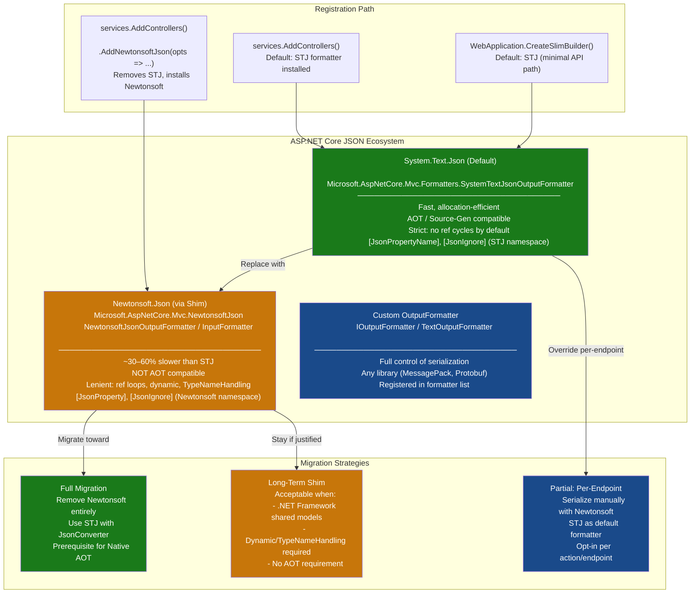
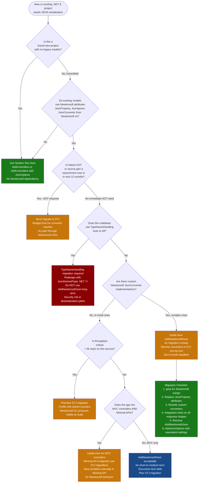

# 4.272 — Newtonsoft.Json Migration: `AddNewtonsoftJson` and Compatibility Shim

---

## PART 0 — Navigation & Context

### Where This Topic Lives in the ASP.NET Core Domain

```
ASP.NET Core Mastery
└── V. Serialization
    ├── 4.268 — System.Text.Json: Global Options            ← prerequisite
    ├── 4.269 — JsonSerializerOptions: Naming, Null, Enum   ← prerequisite
    ├── 4.270 — Custom JSON Converters: JsonConverter<T>
    ├── 4.271 — JSON Source Generation: [JsonSerializable]
    ├── 4.272 — Newtonsoft.Json Migration ◄ YOU ARE HERE
    ├── 4.273 — XML Serialization: AddXmlSerializerFormatters
    ├── 4.274 — MessagePack Serialization
    └── 4.275 — Custom Input/Output Formatters
```

```
Cross-subsystem touchpoints:
├── 4.107 — Output Formatters: JSON registration mechanism
├── 4.099 — Action Results: serialization is the last step before response write
└── 4.082 — IResult and TypedResults: Minimal API serialization path
```

### What You Need Before This

- **[[4.268 — System.Text.Json in ASP.NET Core]]** — you must understand the default serializer (STJ) to know what you're replacing and why
- **[[4.107 — Output Formatters: JSON, XML, and Custom Formatter Registration]]** — `AddNewtonsoftJson` swaps the JSON output formatter; understanding the formatter slot makes the swap comprehensible
- **[[4.269 — JsonSerializerOptions: Naming Policies, Null Handling, Enum Conventions]]** — the behavioral gap between STJ and Newtonsoft is the entire motivation for the shim

### What This Unlocks After

- **[[4.270 — Custom JSON Converters: JsonConverter<T>]]** — Newtonsoft and STJ have different converter APIs; migrating custom converters is a common migration subtask
- **[[4.275 — Custom Input/Output Formatters]]** — understanding the formatter chain explains how `AddNewtonsoftJson` achieves the swap at the formatter level
- **[[4.271 — JSON Source Generation]]** — AOT and source-gen are the reason to _finish_ the migration away from Newtonsoft entirely

### Why This Matters at Scale

When you inherit a .NET Framework–era codebase migrating to .NET 8, `AddNewtonsoftJson` is often the one line that prevents a production outage on day one — but running Newtonsoft indefinitely in a high-throughput API costs you 30–60% serialization throughput versus STJ, and blocks you from Native AOT entirely. Knowing when the shim is a safe long-term strategy versus a migration runway that must have an end date is the production decision that separates engineers who ship safely from engineers who ship fast but create technical debt.

---

## PART 1 — The Core Mental Model

### The Fundamental Rule

> **ASP.NET Core 3.0+ ships with System.Text.Json as its default JSON serializer. `AddNewtonsoftJson()` replaces the STJ formatter slot with a Newtonsoft.Json formatter, providing behavioral compatibility at the cost of performance and AOT eligibility. The HTTP wire format is identical; the serializer executing inside the formatter is different.**

### The Plain-Language Analogy

Think of ASP.NET Core's output formatter pipeline as a conveyor belt with a "JSON station" near the end. In .NET 3.0+, that station runs a fast but strict worker (System.Text.Json) who follows precise rules — no reference cycles, no `[JsonProperty]` tags, no polymorphic type handling without explicit opt-in. When you call `AddNewtonsoftJson()`, you're swapping that worker out for a slower but more experienced one (Newtonsoft.Json) who knows all the old customs — `[JsonProperty]`, `[JsonIgnore]` from the Newtonsoft namespace, `JsonConverter`, reference loops — without changing anything about the conveyor belt or the station.

The critical thing this analogy captures: the HTTP request still arrives, still gets routed, still goes through model binding, still returns an `IActionResult` — all of that is unchanged. Only the moment where `.Value` gets serialized to bytes changes. When you call `Results.Ok(order)` in a Minimal API endpoint, or return `Ok(order)` from a controller, the formatter chosen for `application/json` does the serialization. `AddNewtonsoftJson` changes which formatter wins that slot. And when someone asks "but what about the concurrent request" — both formatters are stateless workers called per-request from a registered singleton; the only thread-safety concern is custom converter state, which applies equally to both.

### The Taxonomy Diagram



---

## PART 2 — Deep Mechanics

### 2.1 How `AddNewtonsoftJson` Rewires the Formatter Pipeline

The swap happens at `MvcOptions.OutputFormatters` and `MvcOptions.InputFormatters`. When you call `AddControllers()` (or `AddMvc()`, `AddControllersWithViews()`), ASP.NET Core installs `SystemTextJsonOutputFormatter` and `SystemTextJsonInputFormatter` at specific indices in these lists. Calling `.AddNewtonsoftJson()` removes those entries and inserts `NewtonsoftJsonOutputFormatter` and `NewtonsoftJsonInputFormatter` in their place.

**Pipeline Position Diagram:**

```
HTTP Request
──► Kestrel ──► ExceptionHandler ──► HTTPS ──► StaticFiles ──► Routing
    ──► Auth ──► Authorization ──► Endpoint
                                         │
                           ┌─────────────▼────────────────┐
                           │  MVC Action Execution         │
                           │  Model Binding (InputFormatter│
                           │  ◄─ reads request body JSON   │
                           │                               │
                           │  Action Method Runs           │
                           │                               │
                           │  Result Execution             │
                           │  ─► Content Negotiation       │
                           │     (Accept: application/json)│
                           │  ─► OutputFormatter selected  │
                           │     [NewtonsoftJsonFormatter]  │← HERE
                           │  ─► Writes bytes to Response  │
                           └───────────────────────────────┘
                                         │
HTTP Response ◄──────────────────────────┘
200 OK / Content-Type: application/json
```

**ASP.NET Core internally (approximate) — `MvcCoreBuilderExtensions.AddNewtonsoftJson`:**

```csharp
// What AddNewtonsoftJson does internally (simplified):
public static IMvcBuilder AddNewtonsoftJson(
    this IMvcBuilder builder,
    Action<MvcNewtonsoftJsonOptions>? setupAction = null)
{
    // 1. Register Newtonsoft-specific services
    builder.Services.TryAddEnumerable(
        ServiceDescriptor.Transient<IConfigureOptions<MvcOptions>,
            NewtonsoftJsonMvcOptionsSetup>());

    // 2. NewtonsoftJsonMvcOptionsSetup.Configure():
    //    - Removes SystemTextJsonOutputFormatter from OutputFormatters
    //    - Removes SystemTextJsonInputFormatter from InputFormatters
    //    - Inserts NewtonsoftJsonOutputFormatter at index 0
    //    - Inserts NewtonsoftJsonInputFormatter at index 0

    // 3. Registers MvcNewtonsoftJsonOptions for JsonSerializerSettings injection
    if (setupAction != null)
        builder.Services.Configure(setupAction);

    return builder;
}
```

**Runtime Cost:** One `NewtonsoftJsonOutputFormatter` instance is created per application lifetime (singleton formatter). Per request: `JsonTextWriter` allocation, `JToken` graph construction (if using `JObject`), `JsonSerializer` pulled from an internal pool. ~3–5× more allocations per response than STJ on typical payloads. `~4–8 allocations per serialize call` vs `~1–2 for STJ`.

---

### 2.2 HTTP Wire Format — What Changes, What Doesn't

The HTTP wire format is **identical** from the client's perspective. Both serializers write `Content-Type: application/json` and produce valid JSON bytes. The differences are behavioral — what gets serialized and how.

```
// HTTP response (both serializers — wire format identical):
HTTP/1.1 200 OK
Content-Type: application/json; charset=utf-8
Transfer-Encoding: chunked

{"orderId":"ORD-9142","customerId":"CUST-007","total":149.99}
```

**Where the differences become HTTP-visible:**

```
// Scenario 1: Reference cycle — Newtonsoft handles it, STJ throws 500
// With Newtonsoft + ReferenceLoopHandling.Ignore:
HTTP/1.1 200 OK
{"orderId":"ORD-9142","lineItems":[{"order":null}]}  // cycle omitted

// With STJ default — unhandled exception → 500 Internal Server Error
HTTP/1.1 500 Internal Server Error
{"type":"...","title":"An error occurred","status":500}

// Scenario 2: [JsonProperty("order_id")] — only Newtonsoft honors it
// Model: [JsonProperty("order_id")] public string OrderId { get; set; }
// Newtonsoft:
{"order_id":"ORD-9142"}
// STJ (ignores Newtonsoft attributes — uses property name verbatim):
{"OrderId":"ORD-9142"}  // ← camelCase policy not applied either without config
```

---

### 2.3 The Behavioral Gap: What Newtonsoft Supports That STJ Doesn't (Or Handles Differently)

This is the real reason `AddNewtonsoftJson` exists. These gaps drive migration complexity:

|Feature|Newtonsoft.Json|System.Text.Json|Migration Path|
|---|---|---|---|
|`[JsonProperty("name")]`|✅ Native|❌ Must use `[JsonPropertyName("name")]`|Find/replace attribute namespace|
|`[JsonIgnore]`|✅ (Newtonsoft ns)|✅ (STJ ns, different behavior on null)|Replace attribute + verify behavior|
|Reference cycles|✅ `ReferenceLoopHandling.Ignore`|✅ `ReferenceHandler.Preserve` (.NET 6+)|Explicit opt-in required in STJ|
|`TypeNameHandling`|✅ (dangerous)|❌ Not supported|Redesign polymorphism with `[JsonDerivedType]`|
|`JsonConverter` abstract class|✅|✅ `JsonConverter<T>` (different API)|Rewrite each converter|
|`JObject` / `JToken` dynamic|✅|✅ `JsonDocument`, `JsonElement`, `JsonNode`|API migration, not behavioral|
|Constructor binding|✅ Auto-discovers ctors|✅ Requires `[JsonConstructor]` explicitly (.NET 7 auto-discovers)|Add `[JsonConstructor]` where needed|
|`IsoDateTimeConverter`|✅|✅ Handles ISO 8601 natively|Usually no action needed|
|`StringEnumConverter`|✅|✅ `[JsonConverter(typeof(JsonStringEnumConverter))]`|Add converter registration|
|Null value handling|`NullValueHandling.Ignore`|`DefaultIgnoreCondition.WhenWritingNull`|Different option name|
|`PreserveReferencesHandling`|✅ `$id` / `$ref`|✅ Same semantics via `ReferenceHandler.Preserve`|Compatible wire format|
|Polymorphic deserialization|✅ `$type` discriminator|✅ `[JsonDerivedType]` (.NET 7+) / `[JsonPolymorphic]`|Wire format change — breaking|
|LINQ to JSON|✅ `JObject`, `JArray`|✅ `JsonNode`, `JsonArray` (.NET 6+)|API migration|

**Runtime Cost for the Gap Assessment:**

- Identifying all `[JsonProperty]` usages: `O(n)` across codebase, one-time cost
- Rewriting custom `JsonConverter`: `~1 day per complex converter`
- Polymorphic deserialization with `$type`: breaking wire-format change — requires coordinated client/server update
- `TypeNameHandling.All`: **never migrate to STJ equivalent** — STJ intentionally has no `TypeNameHandling` due to deserialization RCE risk; redesign required

---

### 2.4 `MvcNewtonsoftJsonOptions` vs `JsonSerializerSettings` — Configuration

The configuration entry point after `AddNewtonsoftJson()` is `MvcNewtonsoftJsonOptions.SerializerSettings`, which exposes the full `JsonSerializerSettings` object.

```
// The configuration chain:
AddNewtonsoftJson(opts => opts.SerializerSettings.X = Y)
    └── MvcNewtonsoftJsonOptions { SerializerSettings: JsonSerializerSettings }
            └── Flows into NewtonsoftJsonOutputFormatter ctor
                    └── Used by JsonSerializer.CreateDefault(settings) per request
```

**Key `JsonSerializerSettings` migration mapping to STJ `JsonSerializerOptions`:**

|Newtonsoft `JsonSerializerSettings`|STJ `JsonSerializerOptions`|
|---|---|
|`NullValueHandling = Ignore`|`DefaultIgnoreCondition = WhenWritingNull`|
|`ReferenceLoopHandling = Ignore`|`ReferenceHandler = ReferenceHandler.Ignore` (no direct equiv; use `IgnoreCycles` in .NET 7)|
|`Formatting = Indented`|`WriteIndented = true`|
|`ContractResolver = CamelCasePropertyNamesContractResolver`|`PropertyNamingPolicy = JsonNamingPolicy.CamelCase`|
|`DateFormatHandling = IsoDateFormat`|Default behavior (ISO 8601 is STJ default)|
|`TypeNameHandling = Auto`|**No equivalent — redesign required**|
|`Converters.Add(new StringEnumConverter())`|`Converters.Add(new JsonStringEnumConverter())`|
|`DefaultValueHandling = Ignore`|`DefaultIgnoreCondition = WhenWritingDefault`|

**Runtime Cost:** `JsonSerializerSettings` is passed into the formatter at registration time — it is a singleton configuration object, not allocated per-request. However, Newtonsoft creates a new `JsonSerializer` instance from a pool per serialization call, while STJ reuses a single `JsonSerializer`-equivalent (`Utf8JsonWriter` + options) more cheaply.

---

### 2.5 Minimal APIs and `AddNewtonsoftJson`

This is the edge case that bites teams. `AddNewtonsoftJson()` only replaces formatters inside the **MVC formatter pipeline**. Minimal API endpoints that call `Results.Ok(obj)` use `HttpContext.Response.WriteAsJsonAsync()` underneath, which is hardwired to `System.Text.Json`. `AddNewtonsoftJson` has **zero effect on Minimal API endpoint serialization**.

```
// Minimal API path — ALWAYS uses STJ regardless of AddNewtonsoftJson:
app.MapGet("/orders/{id}", (int id) => TypedResults.Ok(new Order { Id = id }));
// ─► HttpContext.Response.WriteAsJsonAsync() ─► System.Text.Json

// MVC Controller path — uses the configured formatter:
[HttpGet("{id}")]
public IActionResult GetOrder(int id) => Ok(new Order { Id = id });
// ─► OutputFormatter pipeline ─► NewtonsoftJsonOutputFormatter (if shim installed)
```

**HTTP consequence of this asymmetry:**

```
// If Order has [JsonProperty("order_id")] (Newtonsoft attribute):

// MVC Controller response (AddNewtonsoftJson installed):
GET /api/orders/42 HTTP/1.1
→ HTTP/1.1 200 OK
{"order_id":42}   ← Newtonsoft honors [JsonProperty]

// Minimal API response (same model, same app):
GET /orders/42 HTTP/1.1
→ HTTP/1.1 200 OK
{"Id":42}         ← STJ ignores [JsonProperty("order_id")], no naming policy
```

This is a real production bug: two endpoints in the same application return different JSON shapes for the same model class.

---

### 2.6 The Failure Mode: `System.Text.Json` Exceptions in Mixed Codebases

When an application uses both MVC controllers (with `AddNewtonsoftJson`) and Minimal API endpoints (always STJ), a model that works fine in the controller will silently produce different output or throw during Minimal API serialization.

**Failure path when a reference cycle reaches a Minimal API endpoint:**

```
// Model with navigation property cycle:
public class Order
{
    public int Id { get; set; }
    public Customer Customer { get; set; }  // Customer.Orders is IList<Order>
}

// Minimal API — no AddNewtonsoftJson protection:
app.MapGet("/orders/{id}", async (int id, OrderDbContext db) =>
{
    var order = await db.Orders.Include(o => o.Customer)
                               .ThenInclude(c => c.Orders) // cycle loaded
                               .FirstAsync(o => o.Id == id);
    return Results.Ok(order);  // ← JsonException: A possible object cycle was detected
});
// → HTTP/1.1 500 Internal Server Error
```

**Runtime Cost:** The exception is thrown during serialization write — after the response status line may already be sent, depending on response buffering. This can produce a 200 response with a truncated or malformed JSON body if response has already started.

---

## PART 3 — Production Code Patterns

### Pattern 1: The Safe Day-One Shim — Legacy Order API Migration

**Scenario:** Migrating a .NET Framework order management API to .NET 8. All models use `[JsonProperty]` attributes. Going live this sprint, full STJ migration deferred.

```csharp
// ⚠️ WRONG: Just adding AddControllers() without the shim
// All [JsonProperty] attributes become invisible; JSON property names
// change on the wire — breaking all existing API clients.
builder.Services.AddControllers(); // STJ default — [JsonProperty] ignored

// ✅ CORRECT: Install the shim on day one
builder.Services.AddControllers()
    .AddNewtonsoftJson(options =>
    {
        // Mirror the Newtonsoft defaults the old app used
        options.SerializerSettings.ContractResolver =
            new CamelCasePropertyNamesContractResolver();

        options.SerializerSettings.NullValueHandling = NullValueHandling.Ignore;

        options.SerializerSettings.DateFormatHandling = DateFormatHandling.IsoDateFormat;

        // Prevent reference cycles from crashing the serializer
        // (EF navigation properties can create cycles)
        options.SerializerSettings.ReferenceLoopHandling =
            ReferenceLoopHandling.Ignore;

        // Add enum-as-string support if the legacy API used it
        options.SerializerSettings.Converters.Add(new StringEnumConverter());
    });
```

```
// HTTP wire format (correct path with shim):
// GET /api/orders/1042 HTTP/1.1
// Authorization: Bearer eyJhbG...

// HTTP/1.1 200 OK
// Content-Type: application/json; charset=utf-8
// {"orderId":"ORD-1042","status":"Shipped","lineItems":[...]}
// ← camelCase honored, nulls omitted, enums as strings — matches legacy behavior
```

---

### Pattern 2: The Minimal API JSON Override — Bridging the Shim Gap

**Scenario:** Payment API uses a mix of MVC controllers (with Newtonsoft shim) for legacy endpoints and Minimal APIs for new endpoints. Need Newtonsoft behavior on Minimal API responses without a full STJ migration.

```csharp
// ⚠️ WRONG: Assuming AddNewtonsoftJson covers Minimal API endpoints
app.MapGet("/api/v2/payments/{id}", async (string id, IPaymentRepository repo) =>
{
    var payment = await repo.GetAsync(id);
    return Results.Ok(payment); // ← Uses STJ; [JsonProperty] on Payment ignored
});

// ✅ CORRECT: Serialize explicitly with Newtonsoft for Minimal API endpoints
// that must maintain the same contract as MVC controller endpoints

// Register the JsonSerializerSettings as a named service for reuse
builder.Services.AddSingleton<JsonSerializerSettings>(_ =>
{
    var settings = new JsonSerializerSettings
    {
        ContractResolver = new CamelCasePropertyNamesContractResolver(),
        NullValueHandling = NullValueHandling.Ignore,
        ReferenceLoopHandling = ReferenceLoopHandling.Ignore,
    };
    settings.Converters.Add(new StringEnumConverter());
    return settings;
});

// Extension method to avoid per-endpoint duplication
public static class MinimalApiNewtonsoftExtensions
{
    public static IResult JsonNewtonsoft<T>(
        T value,
        JsonSerializerSettings settings,
        HttpStatusCode statusCode = HttpStatusCode.OK)
    {
        var json = JsonConvert.SerializeObject(value, settings);
        return Results.Content(
            json,
            contentType: "application/json",
            statusCode: (int)statusCode);
    }
}

// Usage in endpoint — explicit Newtonsoft serialization
app.MapGet("/api/v2/payments/{id}", async (
    string id,
    IPaymentRepository repo,
    JsonSerializerSettings settings) =>
{
    var payment = await repo.GetAsync(id);
    if (payment is null)
        return Results.NotFound();

    return MinimalApiNewtonsoftExtensions.JsonNewtonsoft(payment, settings);
});
```

```
// HTTP wire format (correct path):
// GET /api/v2/payments/PAY-8821 HTTP/1.1
// HTTP/1.1 200 OK
// Content-Type: application/json
// {"paymentId":"PAY-8821","amount":299.00}
// ← Newtonsoft camelCase + [JsonProperty] honored despite Minimal API path
```

---

### Pattern 3: The Migration Tracker — Incremental Attribute Replacement

**Scenario:** Inventory service has 200+ model classes with `Newtonsoft.Json` attributes. Strategy is to migrate incrementally, verifying each model class before removing the shim.

```csharp
// Before migration: Newtonsoft model
// using Newtonsoft.Json;
public class InventoryItem
{
    [JsonProperty("item_id")]          // Newtonsoft
    public string ItemId { get; set; }

    [JsonProperty("quantity_on_hand")] // Newtonsoft
    public int QuantityOnHand { get; set; }

    [JsonIgnore]                       // Newtonsoft — ignored on both input and output
    public string InternalTrackingCode { get; set; }

    [JsonConverter(typeof(Newtonsoft.Json.Converters.StringEnumConverter))]
    public StockStatus Status { get; set; }
}

// ✅ CORRECT: After migrating a single model to STJ attributes
// using System.Text.Json.Serialization;
public class InventoryItem
{
    [JsonPropertyName("item_id")]      // STJ
    public string ItemId { get; set; }

    [JsonPropertyName("quantity_on_hand")] // STJ
    public int QuantityOnHand { get; set; }

    [JsonIgnore]                       // STJ — [JsonIgnore] exists in BOTH namespaces
    // ⚠️ WARNING: must remove Newtonsoft.Json using or fully qualify;
    //    ambiguous [JsonIgnore] at the class level silently uses wrong namespace
    public string InternalTrackingCode { get; set; }

    [JsonConverter(typeof(JsonStringEnumConverter))]  // STJ converter
    public StockStatus Status { get; set; }
}
```

> [!WARNING] **The ambiguous `[JsonIgnore]` trap.** Both `Newtonsoft.Json` and `System.Text.Json.Serialization` define a `[JsonIgnore]` attribute. If a file has `using Newtonsoft.Json;` and you add `[JsonIgnore]` intending the STJ version, you silently apply the Newtonsoft version — which is ignored by STJ. The compiler does not warn about this. Always remove Newtonsoft `using` directives from files you've migrated, and use `[System.Text.Json.Serialization.JsonIgnore]` fully qualified during the transition period.

```
// HTTP consequence of wrong JsonIgnore:
// Newtonsoft.JsonIgnore on a model — STJ ignores the attribute:
// GET /api/inventory/SKU-001
// HTTP/1.1 200 OK
// {"item_id":"SKU-001","quantity_on_hand":100,
//  "internalTrackingCode":"TRK-INTERNAL-XYZ"}  ← leaked internal field!
```

---

### Pattern 4: The Parallel Serializer — Controlled STJ Rollout per Controller

**Scenario:** Logistics tracking API is doing a phased migration. New `ShipmentController` must use STJ (for source-gen compatibility); legacy `LegacyFreightController` stays on Newtonsoft.

```csharp
// Global: still using Newtonsoft shim for legacy controllers
builder.Services.AddControllers()
    .AddNewtonsoftJson(options =>
    {
        options.SerializerSettings.ContractResolver =
            new CamelCasePropertyNamesContractResolver();
    });

// ✅ Per-controller STJ override using a custom OutputFormatter
// approach: for the migrated controller, manually call JsonSerializer
// and return Content() to bypass the formatter pipeline.

[ApiController]
[Route("api/v3/shipments")]
public class ShipmentController : ControllerBase
{
    private static readonly JsonSerializerOptions _stjOptions = new()
    {
        PropertyNamingPolicy = JsonNamingPolicy.CamelCase,
        DefaultIgnoreCondition = JsonIgnoreCondition.WhenWritingNull,
    };

    [HttpGet("{trackingNumber}")]
    public IActionResult GetShipment(string trackingNumber,
        [FromServices] IShipmentRepository repo)
    {
        var shipment = repo.GetByTracking(trackingNumber);
        if (shipment is null) return NotFound();

        // Serialize with STJ explicitly — bypasses Newtonsoft formatter
        var json = JsonSerializer.Serialize(shipment, _stjOptions);
        return Content(json, "application/json");
        // Now this controller is STJ-based while others remain Newtonsoft
    }
}
```

> [!TIP] **Better long-term approach:** Use `[JsonPropertyName]` STJ attributes on the `Shipment` model, remove `AddNewtonsoftJson`, and let content negotiation handle the rest. The per-controller manual approach is a migration step, not a permanent architecture.

---

### Pattern 5: The Global `JsonSerializerSettings` as a Named Singleton

**Scenario:** Order management API uses Newtonsoft in multiple places — MVC formatters, manual `JsonConvert.SerializeObject()` calls, a Hangfire background job serializer, and a custom audit log. All must share the same settings.

```csharp
// ⚠️ WRONG: Settings scattered across the codebase
// Each usage creates its own JsonSerializerSettings — drift guaranteed
JsonConvert.SerializeObject(order, new JsonSerializerSettings
{
    NullValueHandling = NullValueHandling.Ignore,
    // Forgot ContractResolver — different casing than the MVC formatter
});

// ✅ CORRECT: Centralize settings and inject everywhere
public static class NewtonsoftJsonConfiguration
{
    public static JsonSerializerSettings CreateSharedSettings()
    {
        var settings = new JsonSerializerSettings
        {
            ContractResolver = new CamelCasePropertyNamesContractResolver(),
            NullValueHandling = NullValueHandling.Ignore,
            ReferenceLoopHandling = ReferenceLoopHandling.Ignore,
            DateFormatHandling = DateFormatHandling.IsoDateFormat,
            DateTimeZoneHandling = DateTimeZoneHandling.Utc,
        };
        settings.Converters.Add(new StringEnumConverter());
        return settings;
    }
}

// Registration — shared settings as singleton
builder.Services.AddSingleton(NewtonsoftJsonConfiguration.CreateSharedSettings());

// MVC formatter uses the same settings
builder.Services.AddControllers()
    .AddNewtonsoftJson(options =>
    {
        var sharedSettings = NewtonsoftJsonConfiguration.CreateSharedSettings();
        // Copy all settings (or read from DI if needed before build)
        options.SerializerSettings.ContractResolver =
            sharedSettings.ContractResolver;
        options.SerializerSettings.NullValueHandling =
            sharedSettings.NullValueHandling;
        options.SerializerSettings.ReferenceLoopHandling =
            sharedSettings.ReferenceLoopHandling;
        foreach (var converter in sharedSettings.Converters)
            options.SerializerSettings.Converters.Add(converter);
    });

// Background job serializer also uses the same settings
public class OrderAuditService
{
    private readonly JsonSerializerSettings _settings;

    public OrderAuditService(JsonSerializerSettings settings) // injected singleton
        => _settings = settings;

    public string SerializeForAudit(Order order)
        => JsonConvert.SerializeObject(order, _settings);
}
```

---

### Pattern 6: Removing the Shim — The Final Migration Step

**Scenario:** All 200 inventory models have been migrated to STJ attributes. Ready to remove `AddNewtonsoftJson` and verify no regression.

```csharp
// ⚠️ WRONG: Removing AddNewtonsoftJson before verifying all consumers

// Remove this:
builder.Services.AddControllers()
    .AddNewtonsoftJson(...); // ← remove line

// Replace with:
builder.Services.AddControllers()
    .AddJsonOptions(options =>
    {
        // Mirror the behavior you had in Newtonsoft:
        options.JsonSerializerOptions.PropertyNamingPolicy =
            JsonNamingPolicy.CamelCase;

        options.JsonSerializerOptions.DefaultIgnoreCondition =
            JsonIgnoreCondition.WhenWritingNull;

        options.JsonSerializerOptions.ReferenceHandler =
            ReferenceHandler.IgnoreCycles; // .NET 7+ equivalent of ReferenceLoopHandling.Ignore

        options.JsonSerializerOptions.Converters
            .Add(new JsonStringEnumConverter(JsonNamingPolicy.CamelCase));
    });

// ✅ CORRECT migration checklist before removing the shim:
// 1. grep -rn "using Newtonsoft.Json" src/ — confirm zero remaining usages
// 2. grep -rn "JsonProperty\b" src/ — confirm no Newtonsoft [JsonProperty] remaining
// 3. Integration tests with real HTTP client cover all API response shapes
// 4. Run contract tests (Pact) if external consumers depend on the JSON contract
// 5. Deploy to staging, run smoke tests, diff a sample of responses against baseline
```

```
// HTTP wire format — must be identical before and after shim removal:
// BEFORE (Newtonsoft):
// {"orderId":"ORD-9142","status":"Shipped","total":149.99}
// AFTER (STJ):
// {"orderId":"ORD-9142","status":"Shipped","total":149.99}
// ← If these match for all endpoints, migration is complete
```

---

### Pattern 7: Handling `TypeNameHandling` — The Hard Migration Case

**Scenario:** An internal inter-service message bus uses `TypeNameHandling.Auto` to serialize polymorphic command objects. The downstream service deserializes `$type` discriminators to reconstruct the correct derived type.

```csharp
// ⚠️ WRONG: Attempting a direct migration using STJ with TypeNameHandling equivalent
// STJ has NO TypeNameHandling equivalent — for a reason:
// TypeNameHandling.All is a known RCE vector (CVE-2017-10583 class of issues).
// Deserializing $type from untrusted input is dangerous. STJ refuses to implement it.

// ✅ CORRECT: Migrate to explicit discriminator pattern using [JsonDerivedType] (.NET 7+)
// Step 1: Define the type hierarchy with STJ polymorphism attributes

[JsonDerivedType(typeof(CreateOrderCommand), typeDiscriminator: "create_order")]
[JsonDerivedType(typeof(CancelOrderCommand), typeDiscriminator: "cancel_order")]
[JsonPolymorphic(TypeDiscriminatorPropertyName = "$type")]
public abstract class OrderCommand
{
    public string CommandId { get; set; } = Guid.NewGuid().ToString();
}

public class CreateOrderCommand : OrderCommand
{
    public string CustomerId { get; set; }
    public List<OrderLineItem> LineItems { get; set; } = new();
}

public class CancelOrderCommand : OrderCommand
{
    public string OrderId { get; set; }
    public string Reason { get; set; }
}

// Step 2: Wire format is now STJ-managed with a $type discriminator
// Serialization:
var cmd = new CreateOrderCommand { CustomerId = "CUST-007" };
var json = JsonSerializer.Serialize<OrderCommand>(cmd);
// → {"$type":"create_order","commandId":"...","customerId":"CUST-007","lineItems":[]}

// Step 3: Verify the old Newtonsoft $type format matches the new STJ format
// Newtonsoft TypeNameHandling.Auto produces:
// → {"$type":"OrderService.Commands.CreateOrderCommand, OrderService","commandId":"..."}
// STJ [JsonDerivedType] produces:
// → {"$type":"create_order","commandId":"..."}
// ⚠️ BREAKING CHANGE — requires coordinated deployment of all consumers
```

> [!IMPORTANT] `TypeNameHandling` migration is the only case where removing the Newtonsoft shim produces a **breaking wire-format change**. The `$type` value changes from a fully-qualified assembly type name to your chosen string discriminator. This requires coordinated deployment and is the strongest justification for keeping the shim long-term in systems with many independent consumers.

---

## PART 4 — Gotchas & Anti-Patterns

### Gotcha 1: `AddNewtonsoftJson` Does Not Affect Minimal API Endpoints

Engineers assume that `AddNewtonsoftJson()` configures JSON serialization application-wide. It only configures the MVC **formatter pipeline**. Minimal API endpoints use `System.Text.Json` via `HttpContext.Response.WriteAsJsonAsync()` regardless of what serializer is installed in MVC.

```csharp
// ⚠️ WRONG: Assuming Minimal API endpoints respect AddNewtonsoftJson
builder.Services.AddControllers().AddNewtonsoftJson(...);

app.MapGet("/api/payments/{id}", async (string id, PaymentRepository repo) =>
{
    var payment = await repo.FindAsync(id); // Payment has [JsonProperty("payment_ref")]
    return Results.Ok(payment); // ← STJ; [JsonProperty] ignored
});
```

```
// HTTP consequence (wrong path):
// GET /api/payments/PAY-001
// HTTP/1.1 200 OK
// {"PaymentRef":"PAY-001"}  ← STJ uses property name, ignores [JsonProperty]
// Client expects {"payment_ref":"PAY-001"} — API contract broken
```

```csharp
// ✅ CORRECT: Serialize explicitly with Newtonsoft in Minimal API endpoints
app.MapGet("/api/payments/{id}", async (string id, PaymentRepository repo,
    JsonSerializerSettings settings) =>
{
    var payment = await repo.FindAsync(id);
    if (payment is null) return Results.NotFound();
    return Results.Content(
        JsonConvert.SerializeObject(payment, settings),
        "application/json");
});
```

```
// HTTP consequence (correct path):
// HTTP/1.1 200 OK
// {"payment_ref":"PAY-001"}  ← Newtonsoft honors [JsonProperty]
```

```
// WHY: Results.Ok() calls HttpContext.Response.WriteAsJsonAsync<T>() which
// is hardwired in the framework to System.Text.Json. The MVC formatter
// pipeline is not involved in Minimal API response writing.
```

---

### Gotcha 2: Ambiguous `[JsonIgnore]` Attribute Leaks Internal Fields

Both `Newtonsoft.Json` and `System.Text.Json.Serialization` define `[JsonIgnore]`. In a mixed codebase with both `using` directives, the compiler picks one based on import order — often silently picking the wrong one.

```csharp
// ⚠️ WRONG: Ambiguous [JsonIgnore] during migration
using Newtonsoft.Json;                  // still present from before migration
using System.Text.Json.Serialization;   // added for migration

public class CustomerProfile
{
    public string CustomerId { get; set; }

    [JsonIgnore]  // ← Which namespace? Compiler resolves based on using order
    public string PasswordHash { get; set; }  // MUST be hidden from API response
}
```

```
// HTTP consequence (wrong path — STJ formatter ignores Newtonsoft [JsonIgnore]):
// GET /api/customers/CUST-007
// HTTP/1.1 200 OK
// {"customerId":"CUST-007","passwordHash":"$2a$10$..."}  ← SECURITY BREACH
```

```csharp
// ✅ CORRECT: Fully qualify during transition OR remove old using directive
public class CustomerProfile
{
    public string CustomerId { get; set; }

    [System.Text.Json.Serialization.JsonIgnore]  // explicit — no ambiguity
    public string PasswordHash { get; set; }
}
```

```
// HTTP consequence (correct path):
// HTTP/1.1 200 OK
// {"customerId":"CUST-007"}  ← passwordHash correctly excluded
```

```
// WHY: The C# compiler resolves ambiguous attributes by using declaration order.
// The safe pattern is to remove all Newtonsoft.Json using directives from
// any file that has been migrated to STJ attributes, not to coexist with both.
```

---

### Gotcha 3: `JsonSerializerSettings` Shared Instance Mutated at Runtime

`JsonSerializerSettings` is mutable. If the settings object registered as a singleton is mutated anywhere after registration (in a test, in a background job, during a request), all serialization behavior changes globally and concurrently.

```csharp
// ⚠️ WRONG: Registering a settings instance, then mutating it
builder.Services.AddSingleton(new JsonSerializerSettings
{
    NullValueHandling = NullValueHandling.Ignore
});

// Later, in a one-off endpoint:
app.MapPost("/debug/enable-type-names", (JsonSerializerSettings settings) =>
{
    settings.TypeNameHandling = TypeNameHandling.Auto; // ← mutates singleton!
    return Results.Ok("TypeNameHandling enabled globally");
});
```

```
// HTTP consequence (wrong path):
// After one POST to /debug/enable-type-names, ALL subsequent responses
// from ALL controllers include $type discriminators:
// {"$type":"OrderService.Models.Order, OrderService","orderId":"ORD-9142"}
// ← Unexpected format; existing clients break
```

```csharp
// ✅ CORRECT: Make the settings object effectively immutable after registration
public static JsonSerializerSettings CreateImmutableSettings()
{
    var settings = new JsonSerializerSettings
    {
        ContractResolver = new CamelCasePropertyNamesContractResolver(),
        NullValueHandling = NullValueHandling.Ignore,
    };
    // Consider sealing or wrapping in a read-only decorator if needed
    return settings;
}

builder.Services.AddSingleton(CreateImmutableSettings());
// Never expose the singleton settings to endpoints that can modify it
```

```
// WHY: JsonSerializerSettings lacks immutability enforcement. Registering it as
// a singleton makes it a global mutable variable accessible to any component
// that requests it from DI. The framework does not defend against mutation.
```

---

### Gotcha 4: `ReferenceLoopHandling.Ignore` Silently Truncates Graph — Client Sees Null Navigation Properties

EF Core navigation properties with bidirectional relationships create reference cycles. Setting `ReferenceLoopHandling.Ignore` prevents the serializer crash but silently omits the circular reference as `null`, which clients can mistake for "no data loaded."

```csharp
// ⚠️ WRONG: Assuming Ignore means "handle gracefully"
// Model: Order.Customer.Orders (cycle)
options.SerializerSettings.ReferenceLoopHandling = ReferenceLoopHandling.Ignore;

// Controller returns an Order with Customer eagerly loaded:
[HttpGet("{id}")]
public async Task<IActionResult> GetOrderWithCustomer(int id)
{
    var order = await _context.Orders
        .Include(o => o.Customer)
        .ThenInclude(c => c.Orders) // this loads the cycle
        .FirstAsync(o => o.Id == id);
    return Ok(order);
}
```

```
// HTTP consequence (wrong path):
// HTTP/1.1 200 OK
// {"orderId":42,"customer":{"customerId":7,"orders":null}}
// ← client expected orders array for customer but got null (cycle was ignored)
// JavaScript client: customer.orders.length → TypeError: Cannot read properties of null
```

```csharp
// ✅ CORRECT: Use DTOs or projection to break cycles at the data layer
[HttpGet("{id}")]
public async Task<IActionResult> GetOrderWithCustomer(int id)
{
    var order = await _context.Orders
        .Where(o => o.Id == id)
        .Select(o => new OrderWithCustomerDto
        {
            OrderId = o.Id,
            Customer = new CustomerSummaryDto
            {
                CustomerId = o.Customer.Id,
                Name = o.Customer.Name
                // No Orders collection — no cycle
            }
        })
        .FirstOrDefaultAsync();

    if (order is null) return NotFound();
    return Ok(order);
}
```

```
// HTTP consequence (correct path):
// HTTP/1.1 200 OK
// {"orderId":42,"customer":{"customerId":7,"name":"Acme Corp"}}
// ← No null navigation properties; client gets exactly what it needs
```

```
// WHY: ReferenceLoopHandling.Ignore silently breaks object graphs.
// The correct fix is not to configure the serializer to tolerate cycles;
// it is to not serialize object graphs with cycles in the first place.
// DTOs + projection eliminate cycles at the source.
```

---

### Gotcha 5: `CamelCasePropertyNamesContractResolver` vs `DefaultContractResolver` — Dictionary Key Casing Divergence

`CamelCasePropertyNamesContractResolver` also camelCases dictionary **keys**, not just property names. This is a Newtonsoft-specific behavior that differs from STJ's `JsonNamingPolicy.CamelCase`, which only applies to serialized properties.

```csharp
// ⚠️ WRONG: Expecting dictionary keys to preserve their casing
options.SerializerSettings.ContractResolver =
    new CamelCasePropertyNamesContractResolver();

// Model with a dictionary:
public class OrderMetadata
{
    public Dictionary<string, string> Tags { get; set; } = new()
    {
        ["Priority"] = "High",    // key with uppercase P
        ["ShipVia"] = "FedEx"     // key with uppercase S and V
    };
}
```

```
// HTTP consequence (wrong path):
// HTTP/1.1 200 OK
// {"tags":{"priority":"High","shipVia":"FedEx"}}
// ← Keys camelCased by CamelCasePropertyNamesContractResolver
// ← Client expected "Priority" and "ShipVia" but got "priority" and "shipVia"
```

```csharp
// ✅ CORRECT: Use DefaultContractResolver with explicit naming on properties
// if dictionary key preservation is required
options.SerializerSettings.ContractResolver = new DefaultContractResolver
{
    NamingStrategy = new CamelCaseNamingStrategy(
        processDictionaryKeys: false,    // ← preserve dictionary key casing
        overrideSpecifiedNames: false)
};
```

```
// HTTP consequence (correct path):
// HTTP/1.1 200 OK
// {"tags":{"Priority":"High","ShipVia":"FedEx"}}
// ← Property names camelCased; dictionary keys preserved
```

```
// WHY: CamelCasePropertyNamesContractResolver was Newtonsoft's original camelCase
// resolver. DefaultContractResolver with CamelCaseNamingStrategy(processDictionaryKeys: false)
// was added later to give finer control. Most teams using the old resolver
// don't realize their dictionary keys are being transformed until a client
// report surfaces the discrepancy.
```

---

## PART 5 — Performance Implications

### 5.1 Request Pipeline Characteristics

|Scenario|Serializer|Approx Allocations Per Response|Approx Throughput (req/s)|Recommendation|
|---|---|---|---|---|
|Simple POCO, 5 properties|STJ (default)|~2–3 managed objects|~90k req/s (Kestrel benchmark)|Default — no change needed|
|Simple POCO, 5 properties|Newtonsoft (shim)|~8–12 managed objects|~50k req/s|Acceptable for brownfield; migrate when possible|
|POCO with 50 properties|STJ|~4–6 managed objects|~60k req/s|STJ still efficient at scale|
|POCO with 50 properties|Newtonsoft|~20–35 managed objects|~30k req/s|Gen-0 GC pressure visible at >5k req/s|
|Deeply nested graph (5 levels)|STJ|~10–15 managed objects|~30k req/s|Add `[JsonIgnore]` on unused navs|
|Deeply nested graph (5 levels)|Newtonsoft|~40–60 managed objects|~15k req/s|Migrate to DTOs first; then remove shim|
|Reference loop present|STJ (ReferenceHandler.IgnoreCycles)|~15–20 managed objects|~25k req/s|IgnoreCycles adds overhead; use DTOs|
|Reference loop present|Newtonsoft (ReferenceLoopHandling.Ignore)|~45–70 managed objects|~12k req/s|Most expensive path; always use DTOs|
|`IAsyncEnumerable<T>` response|STJ only|~1 per iteration + buffer|Best streaming throughput|Newtonsoft cannot stream async enumerable|
|Native AOT|STJ with source-gen only|~0 reflection|Fastest possible|Newtonsoft blocks AOT entirely|

### 5.2 BenchmarkDotNet Comparison

```csharp
using System.Text.Json;
using BenchmarkDotNet.Attributes;
using BenchmarkDotNet.Running;
using Newtonsoft.Json;

[MemoryDiagnoser]
[SimpleJob]
public class JsonSerializerComparisonBenchmark
{
    private readonly OrderResponse _smallOrder;
    private readonly OrderResponse _largeOrder;
    private readonly System.Text.Json.JsonSerializerOptions _stjOptions;
    private readonly Newtonsoft.Json.JsonSerializerSettings _newtonsoftSettings;

    public JsonSerializerComparisonBenchmark()
    {
        _smallOrder = new OrderResponse
        {
            OrderId = "ORD-9142",
            CustomerId = "CUST-007",
            Status = "Shipped",
            Total = 149.99m,
            LineItems = new()
            {
                new() { Sku = "SKU-001", Quantity = 2, UnitPrice = 49.99m },
                new() { Sku = "SKU-002", Quantity = 1, UnitPrice = 50.01m },
            }
        };

        _largeOrder = new OrderResponse
        {
            OrderId = "ORD-LARGE",
            CustomerId = "CUST-001",
            Status = "Processing",
            Total = 5000m,
            LineItems = Enumerable.Range(1, 50)
                .Select(i => new LineItemDto
                {
                    Sku = $"SKU-{i:000}",
                    Quantity = i,
                    UnitPrice = 100m
                }).ToList()
        };

        _stjOptions = new System.Text.Json.JsonSerializerOptions
        {
            PropertyNamingPolicy = JsonNamingPolicy.CamelCase,
            DefaultIgnoreCondition =
                System.Text.Json.Serialization.JsonIgnoreCondition.WhenWritingNull,
        };

        _newtonsoftSettings = new Newtonsoft.Json.JsonSerializerSettings
        {
            ContractResolver = new Newtonsoft.Json.Serialization
                                    .CamelCasePropertyNamesContractResolver(),
            NullValueHandling = NullValueHandling.Ignore,
        };
    }

    [Benchmark(Baseline = true)]
    public string Newtonsoft_SmallOrder()
        => JsonConvert.SerializeObject(_smallOrder, _newtonsoftSettings);

    [Benchmark]
    public string STJ_SmallOrder()
        => System.Text.Json.JsonSerializer.Serialize(_smallOrder, _stjOptions);

    [Benchmark]
    public string Newtonsoft_LargeOrder()
        => JsonConvert.SerializeObject(_largeOrder, _newtonsoftSettings);

    [Benchmark]
    public string STJ_LargeOrder()
        => System.Text.Json.JsonSerializer.Serialize(_largeOrder, _stjOptions);
}

// Support types
public class OrderResponse
{
    public string OrderId { get; set; }
    public string CustomerId { get; set; }
    public string Status { get; set; }
    public decimal Total { get; set; }
    public List<LineItemDto> LineItems { get; set; }
}

public class LineItemDto
{
    public string Sku { get; set; }
    public int Quantity { get; set; }
    public decimal UnitPrice { get; set; }
}

// Expected output (approximate, .NET 8, x64, Release, AMD Ryzen 9 / equivalent):
// | Method                  | Mean      | Error    | Allocated |
// |------------------------ |----------:|---------:|----------:|
// | Newtonsoft_SmallOrder   |  4.21 μs  | 0.04 μs  | 3,648 B   |
// | STJ_SmallOrder          |  1.18 μs  | 0.01 μs  |   872 B   |  ← 3.5x faster, 4x fewer allocs
// | Newtonsoft_LargeOrder   | 28.40 μs  | 0.24 μs  | 22,016 B  |
// | STJ_LargeOrder          |  7.92 μs  | 0.08 μs  |  4,912 B  |  ← 3.6x faster, 4.5x fewer allocs
//
// Note: Throughput gap widens as payload size increases.
// Note: STJ with source generation ([JsonSerializable]) eliminates reflection
//       overhead entirely — another 20–40% improvement on top of the above.
```

> [!NOTE] **Profiling in real HTTP context:** BenchmarkDotNet measures isolated serialization throughput. For full-pipeline profiling including Kestrel I/O:
> 
> - `dotnet-counters monitor --counters System.Runtime,Microsoft.AspNetCore.Hosting` — watch `request-rate`, `current-requests`, GC collection rates
> - `dotnet-trace collect --providers Microsoft.AspNetCore.Hosting` — flame graph shows formatter time vs handler time
> - `dotnet-trace` with `gc-verbose` provider to identify Gen-0 GC spikes from Newtonsoft allocations at load

### 5.3 When to Care / When to Ignore

**When this costs you:**

- APIs handling >5,000 req/s with medium-to-large payloads — Newtonsoft's allocation rate causes measurable Gen-0 GC pauses visible in P99 latency
- Microservices targeting Native AOT (.NET 8+) — Newtonsoft uses reflection; it is flatly incompatible with AOT
- Services serializing large collections (analytics, reporting APIs returning 100+ item arrays) — the allocation gap is quadratic with collection size
- Any endpoint using `IAsyncEnumerable<T>` for streaming — Newtonsoft cannot stream; it buffers the entire enumeration before writing

**When this doesn't matter:**

- Internal admin APIs handling <100 req/s — serialization cost is noise against DB round-trips
- One-time batch jobs — total serialization time in seconds, not microseconds per call
- Management endpoints like `/health`, `/metrics` — called by infrastructure, not user traffic
- Applications with P99 latency dominated by database queries (>10ms query time) — shaving 3μs from serialization does not appear in percentile charts

---

## PART 6 — Interview Arsenal

### A. The Question Bank

---

**Question 1: "Why would you call `AddNewtonsoftJson` on a new .NET 8 project?"**

**Average Answer:** "Newtonsoft.Json has more features than System.Text.Json, so you might use it if you need things like `[JsonProperty]` support."

**Why That's Insufficient:** It doesn't explain the migration context, the performance cost, the AOT implication, or when the shim is a liability versus a legitimate choice.

> **Great Answer:** "In practice, I'd only reach for `AddNewtonsoftJson` on a new project if I'm sharing model classes across a service boundary with a legacy system that's already producing Newtonsoft-formatted JSON — specifically if those models carry `[JsonProperty]` attributes or use `TypeNameHandling` for polymorphic types. The shim swaps the MVC output formatter from STJ to Newtonsoft, so the HTTP wire format your clients see honors those attributes. The cost is real though: Newtonsoft allocates roughly 4x more per serialization than STJ on typical payloads, and critically, it blocks you from Native AOT entirely. In a genuinely new project, I'd invest the day or two to write the models with `[JsonPropertyName]` STJ attributes from the start and never install the shim at all. The only time I'd keep it long-term is when changing the `$type` discriminator format for polymorphic types would break existing consumers and I can't coordinate a simultaneous deployment."

---

**Question 2: "A team says they called `AddNewtonsoftJson` and their Minimal API endpoints are still returning different JSON than their MVC controller endpoints. What's happening?"**

**Average Answer:** "There might be a configuration problem with `AddNewtonsoftJson`. Maybe the options weren't set correctly."

**Why That's Insufficient:** This misses the fundamental architectural point — `AddNewtonsoftJson` only affects the MVC formatter pipeline, not Minimal API serialization.

> **Great Answer:** "This is a known gotcha. `AddNewtonsoftJson` exclusively replaces the MVC output formatter — the one used when an MVC controller returns `Ok(obj)` and content negotiation selects the JSON formatter. Minimal API endpoints, when they call `Results.Ok(obj)` or `TypedResults.Ok(obj)`, call `HttpContext.Response.WriteAsJsonAsync` under the hood, which is hardwired to System.Text.Json. There's no way to make `AddNewtonsoftJson` affect that code path because it doesn't go through the formatter pipeline at all. So if you have a model with Newtonsoft `[JsonProperty('order_id')]`, the MVC controller endpoint returns `order_id` in the response, and the Minimal API endpoint returns `OrderId` — the client sees two different JSON shapes for the same type. The fix during migration is to either serialize manually with Newtonsoft in Minimal API endpoints, or to accept that Minimal API endpoints will use STJ and migrate the model attributes first before exposing those endpoints."

---

**Question 3: "What are the risks of keeping `AddNewtonsoftJson` permanently in production?"**

**Average Answer:** "Newtonsoft is slower than System.Text.Json, so there could be performance issues."

**Why That's Insufficient:** Performance is one concern but the AOT/source-gen incompatibility, the `TypeNameHandling` security surface, and the maintenance trajectory are the deeper production concerns.

> **Great Answer:** "Performance is the most immediately measurable concern — Newtonsoft allocates roughly 3–5x more per serialization and runs about 3x slower than STJ on equivalent payloads. At moderate traffic this is tolerable; at >5,000 req/s on medium-sized payloads you'll see it in GC pressure and P99 latency. But there are two concerns I weight higher than raw throughput in practice. First, Native AOT: Newtonsoft uses runtime reflection for contract generation and will never be AOT-compatible. If the application ever needs to go AOT — for cold start times in a serverless context, or for container density — Newtonsoft in any part of the pipeline blocks that entirely. Second, if the codebase ever used `TypeNameHandling.Auto` or `.All`, that's a deserialization RCE vector if any endpoint deserializes untrusted JSON. The shim does not add that risk if it was never used, but it keeps Newtonsoft in the dependency graph and creates the possibility of it being re-introduced. My position is that the shim is an acceptable migration runway of 6–12 months, not a permanent solution."

---

**Question 4: "How would you migrate a Newtonsoft `JsonConverter<T>` to a System.Text.Json equivalent?"**

**Average Answer:** "You'd implement `JsonConverter<T>` in System.Text.Json and override the Read and Write methods similarly to how you did it in Newtonsoft."

**Why That's Insufficient:** The APIs differ significantly — `Utf8JsonReader` vs `JToken`/`JObject`, the lack of access to a serializer for nested serialization in Read, and thread-safety requirements are all omitted.

> **Great Answer:** "The shape of the interface is the same — you inherit `JsonConverter<T>` and override `Read` and `Write` — but the internal APIs are completely different. Newtonsoft converters typically deserialize by calling `serializer.Deserialize<NestedType>(reader)` or by working with `JObject`/`JToken`. STJ converters work with `Utf8JsonReader` and `Utf8JsonWriter`, which are ref structs that don't box and don't do dynamic dispatch. The non-obvious problem is handling nested types: in Newtonsoft you'd call `serializer.Deserialize<Address>(reader)` inside your converter. In STJ, to deserialize a nested type inside a custom converter, you need to call `JsonSerializer.Deserialize<Address>(ref reader, options)` — passing the `options` through is essential, otherwise the nested type loses the serializer configuration. I've seen production bugs where converters were migrated without threading `options` through, and the nested types lost their naming policy and null handling. For complex Newtonsoft converters that walk `JObject` trees, the STJ equivalent is `JsonDocument`, `JsonElement`, or `JsonNode` — the APIs are more verbose but faster due to zero allocation on `JsonElement` reads."

---

### B. Trick Questions

**Trick 1: "Does `AddNewtonsoftJson()` affect how `JsonConvert.SerializeObject()` behaves?"**

_The trap:_ Engineers assume adding the shim configures Newtonsoft globally.

_Correct answer:_ No. `AddNewtonsoftJson` configures `MvcNewtonsoftJsonOptions.SerializerSettings` which flows into the ASP.NET Core formatter. `JsonConvert.SerializeObject()` called directly uses either Newtonsoft's `DefaultSettings` (if set globally with `JsonConvert.DefaultSettings = () => new JsonSerializerSettings { ... }`) or the overload-provided settings. The MVC formatter settings and the direct-call settings are completely independent unless you explicitly share the same `JsonSerializerSettings` object.

---

**Trick 2: "If you set `options.SerializerSettings.TypeNameHandling = TypeNameHandling.All` in `AddNewtonsoftJson`, what happens to the `Content-Type` header?"**

_The trap:_ Engineers think changing serialization behavior changes the content type.

_Correct answer:_ Nothing — the `Content-Type` header remains `application/json; charset=utf-8`. The response body will contain `$type` properties, but clients that do not expect them will likely fail JSON parsing or ignore unknown properties depending on their deserializer. The HTTP layer is unaware of the semantic change; the format is still valid JSON.

---

**Trick 3: "You install `AddNewtonsoftJson` and configure `NullValueHandling = NullValueHandling.Ignore`. A Minimal API endpoint returns a model with null properties. Are those properties omitted in the response?"**

_The trap:_ Engineers assume the setting applies everywhere.

_Correct answer:_ No. The Minimal API endpoint uses STJ. Null properties will be included in the response unless the global STJ options are also configured with `DefaultIgnoreCondition = JsonIgnoreCondition.WhenWritingNull`. These are entirely separate configuration paths.

---

**Trick 4: "Can you use `AddNewtonsoftJson` and JSON Source Generation together?"**

_The trap:_ Engineers think they can get the safety of source-gen with the compatibility of Newtonsoft.

_Correct answer:_ No. JSON source generation (`[JsonSerializable]`) is a System.Text.Json feature — it generates optimized serialization code at compile time for the STJ serializer. It has no relationship to Newtonsoft. If you install `AddNewtonsoftJson`, you're using Newtonsoft as the formatter, and STJ source-gen code is never called. You cannot mix them at the formatter level. Source generation is also the prerequisite for Native AOT, so `AddNewtonsoftJson` and Native AOT are mutually exclusive.

---

**Trick 5: "Both Newtonsoft.Json and System.Text.Json define `[JsonIgnore]`. If a model file has both `using` directives, which one does the compiler use?"**

_The trap:_ Engineers assume the compiler warns about ambiguity.

_Correct answer:_ The compiler reports a _compile error_ for the ambiguous attribute reference — it does not silently pick one. The code fails to build. However, if the two attributes happen to be in the same namespace (they are not — `Newtonsoft.Json` vs `System.Text.Json.Serialization`) or if only one is imported, there's no error. The real trap is when one `using` is removed but the attribute still refers to the wrong namespace via a fully-qualified reference, or when both `using` directives are present and the engineer incorrectly assumes the compiler will warn.

> [!NOTE] This is a nuance: if _both_ using directives are present and _both_ namespaces define `[JsonIgnore]` (which they do), the compiler raises CS0104 "ambiguous reference." This is actually the safe failure mode — better a compile error than silent misbehavior. The gotcha is when only one namespace is imported but it's the wrong one.

---

### C. Red Flags to Avoid

**1. "Just use Newtonsoft everywhere, it's more mature."** This ignores the 3–5x performance cost, AOT incompatibility, and the security history around `TypeNameHandling`. Saying this signals you're not aware of the STJ gap closure since .NET 6.

**2. "I set up `AddNewtonsoftJson` so all my JSON is configured centrally."** This is false — Minimal API endpoints bypass the formatter entirely. Claiming centralization without understanding the boundary shows incomplete knowledge of the serialization architecture.

**3. "I'll migrate from Newtonsoft when I have time."** Without a specific plan (which models, which converters, which endpoints), this is a promise without execution. Interviewers will probe the specific migration steps; "when I have time" signals you've never done one.

**4. "Newtonsoft and STJ produce the same JSON."** They often do for simple types, but for `[JsonProperty]` names, null handling defaults, reference cycle behavior, enum serialization, and dictionary key casing, they produce different output. Claiming equivalence shows you haven't worked with a migration scenario.

**5. "`TypeNameHandling.Auto` is fine for internal services."** Even for internal services, deserializing `$type` from JSON is a deserialization gadget chain risk. Microsoft's security guidance explicitly recommends against `TypeNameHandling.All/Auto`. Saying it's "fine internally" signals unfamiliarity with the threat model.

**6. "I'd configure Newtonsoft globally with `JsonConvert.DefaultSettings`."** Setting `DefaultSettings` as a process-wide global is a side-effecting anti-pattern — tests, background jobs, and third-party libraries all inherit it. The correct approach is explicit `JsonSerializerSettings` injection via DI.

**7. "The performance difference between Newtonsoft and STJ is negligible."** Measurably false at 5,000+ req/s. Saying this without context shows you haven't profiled it.

**8. "Adding `AddNewtonsoftJson` fixes the serialization for the whole app."** The blind spot on Minimal APIs is one of the most common real-world bugs in migrating teams. Claiming full coverage shows you haven't tested a mixed controller/Minimal API application.

---

## PART 7 — Decision Framework



---

## PART 8 — Self-Check

### A. Conceptual Questions

1. `AddNewtonsoftJson()` is called in `Program.cs`. A Minimal API endpoint calls `Results.Ok(product)`. Which JSON serializer processes the response, and why?
    
2. What is the HTTP-observable difference between a model using `[JsonProperty("order_id")]` (Newtonsoft) when the controller returns `Ok(order)` versus when a Minimal API endpoint returns `Results.Ok(order)`, assuming `AddNewtonsoftJson` is installed?
    
3. Both `Newtonsoft.Json` and `System.Text.Json.Serialization` define a `[JsonIgnore]` attribute. What happens if a class file imports both namespaces and applies `[JsonIgnore]` to a property? What is the correct resolution strategy during migration?
    
4. A developer sets `ReferenceLoopHandling.Ignore` to handle EF Core navigation property cycles. What appears in the HTTP response for the circular reference, and what is the production risk of this approach?
    
5. Explain the relationship between `AddNewtonsoftJson(opts => opts.SerializerSettings.X = Y)` and `JsonConvert.DefaultSettings`. Are they the same configuration path?
    
6. What happens to the middleware pipeline request flow when `AddNewtonsoftJson` is called? At what stage of pipeline execution does the formatter difference become observable?
    
7. Why is `TypeNameHandling.Auto` specifically excluded from System.Text.Json's feature set? What security class of vulnerability does it enable?
    
8. A developer has successfully replaced all `[JsonProperty]` attributes with `[JsonPropertyName]` on 150 model classes. What additional steps are required before safely removing `AddNewtonsoftJson`? Name at least four.
    
9. What is the `CamelCasePropertyNamesContractResolver` behavior difference on dictionary keys versus `DefaultContractResolver` with `CamelCaseNamingStrategy`? Write the STJ equivalent configuration.
    
10. You have a Newtonsoft `JsonConverter<Money>` that reads a `JObject` and reconstructs a `Money` value object. Describe the three key differences in the STJ `JsonConverter<Money>` implementation you would write as a replacement.
    

---

### B. Code Puzzles

**Puzzle 1: What is the HTTP response body?**

```csharp
// AddNewtonsoftJson installed with CamelCasePropertyNamesContractResolver
// and NullValueHandling = NullValueHandling.Ignore

public class ShipmentDto
{
    [Newtonsoft.Json.JsonProperty("tracking_number")]
    public string TrackingNumber { get; set; }

    public string Carrier { get; set; }

    public string EstimatedDelivery { get; set; } // null
}

// Minimal API endpoint:
app.MapGet("/shipments/{id}", (string id) =>
    Results.Ok(new ShipmentDto
    {
        TrackingNumber = "1Z999AA10123456784",
        Carrier = "UPS",
        EstimatedDelivery = null
    }));
```

<details> <summary>Answer</summary>

```
HTTP/1.1 200 OK
Content-Type: application/json; charset=utf-8

{"TrackingNumber":"1Z999AA10123456784","Carrier":"UPS","EstimatedDelivery":null}
```

**Explanation:** This is a Minimal API endpoint. `Results.Ok()` calls `HttpContext.Response.WriteAsJsonAsync<T>()`, which is hardwired to System.Text.Json. `AddNewtonsoftJson` has no effect here. STJ does not honor `[JsonProperty("tracking_number")]` — it uses the C# property name verbatim without a naming policy. Null values are included by default in STJ unless `DefaultIgnoreCondition` is configured. The Newtonsoft `NullValueHandling = Ignore` setting only applies to the MVC formatter, not this path.

</details>

---

**Puzzle 2: Where is the bug?**

```csharp
// Migration in progress: AddNewtonsoftJson still installed
// Developer migrated CustomerModel to STJ attributes

using Newtonsoft.Json;            // not yet removed
using System.Text.Json.Serialization;

public class CustomerModel
{
    [JsonPropertyName("customer_id")]  // STJ attribute
    public string CustomerId { get; set; }

    [JsonIgnore]  // ← which namespace?
    public string InternalScore { get; set; }

    public string Email { get; set; }
}
```

<details> <summary>Answer</summary>

**The bug:** `[JsonIgnore]` is ambiguous — both `Newtonsoft.Json` and `System.Text.Json.Serialization` define it. With both `using` directives present, the compiler raises **CS0104: ambiguous reference**. The code does not compile.

**But if one using is removed by mistake (e.g., the developer removes the STJ using and keeps Newtonsoft):** `[JsonIgnore]` becomes `Newtonsoft.Json.JsonIgnore`. Since `AddNewtonsoftJson` is installed and the MVC formatter uses Newtonsoft, `InternalScore` IS ignored in controller responses. However, if this model is also returned from a Minimal API endpoint, `Newtonsoft.JsonIgnore` is invisible to STJ — `InternalScore` appears in the response.

**Safe fix:**

```csharp
// Remove using Newtonsoft.Json; from the migrated file
// Use fully-qualified attribute during transition:
[System.Text.Json.Serialization.JsonIgnore]
public string InternalScore { get; set; }
```

</details>

---

**Puzzle 3: What status code does the client receive, and why?**

```csharp
// STJ is the active formatter (no AddNewtonsoftJson)
// No ReferenceHandler configured

public class Order
{
    public int Id { get; set; }
    public Customer Customer { get; set; }
}
public class Customer
{
    public int Id { get; set; }
    public List<Order> Orders { get; set; }  // back-reference to Order
}

[HttpGet("{id}")]
public async Task<IActionResult> Get(int id)
{
    var order = new Order
    {
        Id = id,
        Customer = new Customer
        {
            Id = 1,
            Orders = new List<Order>() // ← this will be populated with the same order
        }
    };
    order.Customer.Orders.Add(order); // ← creates reference cycle
    return Ok(order);
}
```

<details> <summary>Answer</summary>

```
HTTP/1.1 500 Internal Server Error
Content-Type: application/problem+json

{
  "type": "https://tools.ietf.org/html/rfc7807",
  "title": "An error occurred while processing your request.",
  "status": 500
}
```

**Explanation:** STJ by default does not handle reference cycles. When the serializer encounters `order.Customer.Orders[0]` (which is the same object as `order`), it throws `System.Text.Json.JsonException: A possible object cycle was detected`. This exception propagates to the exception handling middleware, which returns a 500 with problem details (if `AddProblemDetails()` is configured) or a generic 500.

**Fix options:**

1. STJ `.NET 7+`: `options.ReferenceHandler = ReferenceHandler.IgnoreCycles`
2. Better: use a DTO that breaks the cycle at projection time
3. If using Newtonsoft: `ReferenceLoopHandling = ReferenceLoopHandling.Ignore` (but note Gotcha 4 — the cycle is omitted as null)

</details>

---

**Puzzle 4: What does the JSON response look like for these two endpoints?**

```csharp
// AddNewtonsoftJson installed with:
// CamelCasePropertyNamesContractResolver, NullValueHandling = Ignore

public class OrderSummary
{
    public string OrderId { get; set; } = "ORD-001";
    public Dictionary<string, string> Metadata { get; set; } = new()
    {
        ["Priority"] = "High",
        ["RegionCode"] = "EU-WEST"
    };
}

// Endpoint A: MVC controller
[HttpGet("a")]
public IActionResult GetA() => Ok(new OrderSummary());

// Endpoint B: Minimal API
app.MapGet("/b", () => new OrderSummary());
```

<details> <summary>Answer</summary>

**Endpoint A (MVC — Newtonsoft):**

```json
{"orderId":"ORD-001","metadata":{"priority":"High","regionCode":"EU-WEST"}}
```

`CamelCasePropertyNamesContractResolver` camelCases both the property name (`orderId`, `metadata`) AND the dictionary keys (`priority`, `regionCode`).

**Endpoint B (Minimal API — STJ):**

```json
{"OrderId":"ORD-001","Metadata":{"Priority":"High","RegionCode":"EU-WEST"}}
```

STJ has no naming policy configured (Minimal API serialization uses `JsonSerializerOptions.Default` unless explicitly configured). Property names and dictionary keys are unchanged — PascalCase from the C# definition.

**The two endpoints return different JSON shapes for the same model.** This is a real production bug in mixed applications.

</details>

---

**Puzzle 5: The most common misunderstanding bug — does this code compile, and if so, what is the HTTP response?**

```csharp
// AddNewtonsoftJson installed globally
// New engineer migrated PaymentRecord to use STJ attributes

public class PaymentRecord
{
    [System.Text.Json.Serialization.JsonPropertyName("payment_id")]
    public string PaymentId { get; set; }

    [System.Text.Json.Serialization.JsonPropertyName("amount_usd")]
    public decimal AmountUsd { get; set; }

    [System.Text.Json.Serialization.JsonIgnore]
    public string ProcessorToken { get; set; }
}

[HttpGet("{id}")]
public IActionResult GetPayment(string id)
{
    return Ok(new PaymentRecord
    {
        PaymentId = "PAY-7733",
        AmountUsd = 299.99m,
        ProcessorToken = "tok_live_secret_xyz"
    });
}
```

<details> <summary>Answer</summary>

**Compiles without error.**

**HTTP response:**

```
HTTP/1.1 200 OK
Content-Type: application/json; charset=utf-8

{"PaymentId":"PAY-7733","AmountUsd":299.99,"ProcessorToken":"tok_live_secret_xyz"}
```

**This is a security bug.** `AddNewtonsoftJson` means this MVC controller endpoint uses the Newtonsoft formatter. Newtonsoft does not recognize `System.Text.Json.Serialization.JsonPropertyName` or `System.Text.Json.Serialization.JsonIgnore` — those are STJ-specific attributes. Newtonsoft uses its own `[Newtonsoft.Json.JsonProperty]` and `[Newtonsoft.Json.JsonIgnore]`.

Since no Newtonsoft attributes are present, Newtonsoft serializes the C# property names verbatim (`PaymentId`, not `payment_id`) and **does not ignore `ProcessorToken`** — leaking a sensitive processor token to the client.

**This is the canonical misunderstanding bug for this topic:** migrating to STJ attribute usage while the Newtonsoft formatter is still active produces incorrect property names AND fails to suppress ignored fields.

</details>

---

## PART 9 — Connections & Resources

### A. Related Topics

|Topic|Why It Connects|
|---|---|
|[[4.268 — System.Text.Json in ASP.NET Core: Global Options and Defaults]]|The direct replacement for Newtonsoft in the formatter slot; understanding STJ defaults is prerequisite for knowing what the shim is preserving|
|[[4.269 — JsonSerializerOptions: Naming Policies, Null Handling, Enum Conventions]]|The STJ configuration API that mirrors `JsonSerializerSettings`; migration maps one-to-one between these option sets|
|[[4.270 — Custom JSON Converters: JsonConverter<T> for Domain Types]]|Custom Newtonsoft converters must be rewritten for STJ with a different API; this is the most labor-intensive migration subtask|
|[[4.271 — JSON Source Generation: JsonSerializable and Zero-Reflection]]|Source generation is the end state of migration — the performance payoff that justifies removing the shim and the prerequisite for Native AOT|
|[[4.275 — Custom Input/Output Formatters: IInputFormatter and IOutputFormatter]]|`AddNewtonsoftJson` works by registering a custom formatter; understanding how formatters are registered and selected explains the swap mechanism|
|[[4.107 — Output Formatters: JSON, XML, and Custom Formatter Registration]]|The formatter pipeline that `AddNewtonsoftJson` participates in; explains why the formatter choice only affects MVC controller responses|
|[[4.099 — Action Results: IActionResult, ActionResult<T>]]|Action results delegate to formatters; `Ok(obj)` goes through the formatter pipeline where `AddNewtonsoftJson` is active|
|[[4.082 — IResult and TypedResults: Shaping HTTP Responses in Minimal APIs]]|`Results.Ok()` bypasses the formatter and calls STJ directly — this is the root cause of the Minimal API vs MVC serializer divergence|
|[[4.339 — Native AOT (.NET 8): ASP.NET Core Requirements, Limitations]]|Newtonsoft is incompatible with Native AOT; removing the shim is a prerequisite for any AOT deployment target|
|[[4.276 — Polymorphic JSON Serialization: JsonDerivedType in .NET 7+]]|The STJ-based replacement for Newtonsoft's `TypeNameHandling`; the migration path for polymorphic type deserialization|

### B. Books

|Book|Chapters|Why These Chapters|
|---|---|---|
|**Pro ASP.NET Core 8** — Adam Freeman|Ch. 20–21 (Controllers & Formatting)|Covers how formatters are registered and selected, with explicit coverage of `AddNewtonsoftJson` alongside the default STJ formatter|
|**ASP.NET Core in Action, 3rd Ed.** — Andrew Lock|Ch. 11 (Serialization and Formatting)|Compares STJ and Newtonsoft in the ASP.NET Core pipeline context; covers the formatter selection algorithm|
|**.NET Performance in Practice** — Matt Warren|Ch. 6 (Allocation profiling), Ch. 9 (Hot path optimization)|Directly relevant to the allocation gap between Newtonsoft and STJ at scale; includes BenchmarkDotNet methodology for serializer comparison|

### C. Essential Articles & Docs

- **Microsoft Docs — Migrate from Newtonsoft.Json to System.Text.Json:** https://learn.microsoft.com/en-us/dotnet/standard/serialization/system-text-json/migrate-from-newtonsoft — The canonical migration guide from the .NET team; covers the feature parity table and attribute mapping
- **Microsoft Docs — System.Text.Json overview in ASP.NET Core:** https://learn.microsoft.com/en-us/aspnet/core/web-api/advanced/formatting — Explains the formatter pipeline and where STJ/Newtonsoft integrate
- **Andrew Lock — Using Newtonsoft.Json in ASP.NET Core 3.0:** https://andrewlock.net/using-newtonsoft-json-in-asp-net-core-3 — Explains the `Microsoft.AspNetCore.Mvc.NewtonsoftJson` package, why it was separated, and migration considerations
- **David Fowler GitHub — Minimal APIs serialization design:** https://github.com/dotnet/aspnetcore/issues/37552 — The design discussion explaining why Minimal API endpoints hardcode STJ and do not participate in the MVC formatter pipeline
- **Newtonsoft.Json TypeNameHandling security advisory:** https://www.newtonsoft.com/json/help/html/SerializeTypeNameHandling.htm — The Newtonsoft documentation itself warning about RCE risk with `TypeNameHandling.All/Auto`; cite this in security reviews

### D. Template Meta-Note

> [!NOTE] **What each part of this note is for:**
> 
> - **Part 0 — Navigation:** Orients you in the subsystem hierarchy; shows prerequisites and what this unlocks
> - **Part 1 — Mental Model:** The one-sentence rule, a concrete analogy tied to HTTP pipeline behavior, and a complete taxonomy diagram
> - **Part 2 — Deep Mechanics:** How the framework actually works — formatter pipeline internals, HTTP wire format differences, runtime costs, and edge cases
> - **Part 3 — Production Code:** 5–7 real patterns from named domains, wrong-first then correct, with HTTP wire format consequences shown
> - **Part 4 — Gotchas:** 5 production bugs experienced engineers make, with wrong/correct code pairs and HTTP consequence for each path
> - **Part 5 — Performance:** Allocation and throughput table + runnable BenchmarkDotNet scaffold with expected output + when to care vs ignore
> - **Part 6 — Interview Arsenal:** Full spoken great answers, trick questions with traps and correct pipeline-aware answers, and red flags
> - **Part 7 — Decision Framework:** Mermaid flowchart to answer "should I use `AddNewtonsoftJson` or migrate?" during a live interview
> - **Part 8 — Self-Check:** 10 conceptual questions + 5 code puzzles testing real understanding (what status code? which serializer? where's the bug?)
> - **Part 9 — Connections:** Wiki-linked related topics with specific pipeline relationships, books with chapter rationale, and authoritative-only articles