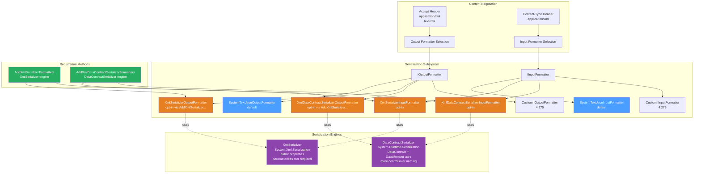
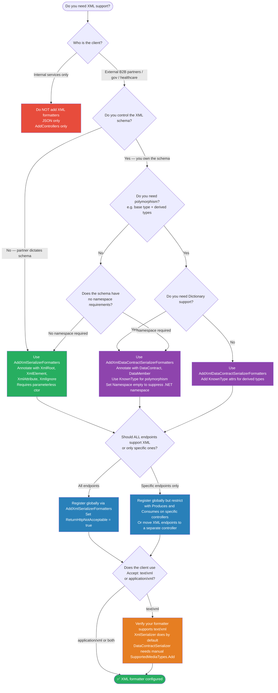

# 4.273 — XML Serialization: AddXmlSerializerFormatters in ASP.NET Core

---

## PART 0 — Navigation & Context

### Where This Topic Lives in the ASP.NET Core Domain

```
ASP.NET Core Mastery
└── V. Serialization
    ├── 4.268 — System.Text.Json: Global Options            ← must read first
    ├── 4.269 — JsonSerializerOptions                       ← must read first
    ├── 4.270 — Custom JSON Converters
    ├── 4.271 — JSON Source Generation
    ├── 4.272 — Newtonsoft.Json Migration
    ├── 4.273 — XML Serialization ◄ YOU ARE HERE
    ├── 4.274 — MessagePack Serialization
    ├── 4.275 — Custom Input/Output Formatters
    └── 4.276 — Polymorphic JSON Serialization

    ↕ Depends on:
    └── F. Routing / G. Minimal APIs / H. MVC & Controllers
        └── 4.103 — Content Type Negotiation               ← the mechanism that selects XML vs JSON
        └── 4.107 — Output Formatters: JSON, XML, Custom   ← the formatter pipeline this note extends
```

### What You Need Before This

- **[[4.103 — Content Type Negotiation]]** — XML is selected via the `Accept: application/xml` header; you must understand how ASP.NET Core negotiates content type before you can reason about when XML formatters are invoked.
- **[[4.107 — Output Formatters: JSON, XML, and Custom Formatter Registration]]** — the formatter pipeline is the mechanism; this topic is a specific configuration of it.
- **[[4.268 — System.Text.Json in ASP.NET Core]]** — JSON is the default; XML is opt-in. You need the baseline to understand what you are adding.
- **[[4.100 — Model Binding: Sources, Order, and the Binding Algorithm]]** — input formatters (which deserialize XML request bodies) are part of model binding; understanding model binding explains where `XmlSerializerInputFormatter` slots in.

### What This Unlocks After

- **[[4.275 — Custom Input/Output Formatters]]** — understanding the built-in XML formatters teaches the formatter interface you implement for custom types.
- **[[4.122 — Content Negotiation Deep Dive]]** — understanding XML formatter registration reveals why the `Accept` header algorithm matters and how formatters are scored.
- **[[4.113 — Action Selectors: AcceptVerbs and Custom Selection Attributes]]** — `[Produces]` and `[Consumes]` filter the formatter list at the action level, which is critical for XML-capable APIs.

### Why This Matters at Scale

In enterprise and government integration APIs — healthcare (HL7), finance (FpML, FIXML), logistics (EDI over HTTP), and legacy B2B services — XML is the wire format your partners demand. Knowing how ASP.NET Core's formatter pipeline handles XML keeps you from shipping an API that silently falls back to JSON when `Accept: application/xml` arrives, breaking the integration contract.

---

## PART 1 — The Core Mental Model

### The Fundamental Rule

> **ASP.NET Core's XML formatters are not registered by default. When `AddXmlSerializerFormatters()` is called, two formatters are added — an input formatter that deserializes XML request bodies and an output formatter that serializes response objects to XML — and the content negotiation algorithm selects between them and the JSON formatter based on the client's `Accept` and `Content-Type` headers. If no XML formatter is registered, `Accept: application/xml` requests fall back to JSON or receive a 406 Not Acceptable.**

### The Plain-Language Analogy

Think of ASP.NET Core's formatter registry as a translation desk at a customs office. By default the desk only has one translator: JSON. When a shipment arrives labeled "I speak XML" (`Accept: application/xml`), the desk checks its translator list — if no XML translator is on duty, it either falls back to the translator it has (JSON, if the client also accepts `*/*`) or turns the shipment away with a 406. Calling `AddXmlSerializerFormatters()` hires the XML translator and adds them to the desk. Now the customs officer (content negotiation algorithm) can route XML shipments to the right translator. The translator pair works bidirectionally: one translator reads incoming XML parcels (`Content-Type: application/xml` on the request body), and one writes outgoing parcels in XML. When the auth middleware short-circuits and returns a 401 before reaching the formatter, the translator never runs — the 401 is written directly to the response stream, format-agnostic.

### The Taxonomy Diagram



---

## PART 2 — Deep Mechanics

### 2.1 — Pipeline Position: Where Formatters Live

XML formatters operate at the **endpoint execution phase** — well after routing, authentication, and authorization have already run. They are invoked by `ObjectResult` (and its derivatives) during **result execution**, not during middleware traversal.

```
──► ExceptionHandler
    ──► HSTS
        ──► StaticFiles
            ──► Routing          (endpoint selected here)
                ──► Auth
                    ──► RateLimiting
                        ──► [Your Middleware]
                            ──► Endpoint Execution
                                ──► Model Binding ← XmlSerializerInputFormatter runs HERE
                                    ──► Action / Handler
                                        ──► Result Execution ← XmlSerializerOutputFormatter runs HERE
                                            ──► Response Stream
```

**The formatter runs AFTER:**

- Exception handling middleware is set up (so formatter errors can be caught)
- Authentication and authorization have passed
- Model binding has begun (input formatter is part of model binding for `[FromBody]`)

**The formatter runs BEFORE:**

- The response body bytes hit the network
- Response compression (if registered)

**Cost label:** `~1 XmlSerializer instance per type (cached after first use)`, `~2-5x more bytes than JSON for equivalent data`, `O(n) property reflection on first serialize per type`.

---

### 2.2 — The Two Registration Methods and Their Engines

ASP.NET Core ships two distinct XML serialization engines. Choosing the wrong one is one of the most common XML integration bugs.

**`AddXmlSerializerFormatters()`** uses `System.Xml.Serialization.XmlSerializer`:

```csharp
// ASP.NET Core internally (approximate):
// MvcOptions.InputFormatters.Add(new XmlSerializerInputFormatter(options));
// MvcOptions.OutputFormatters.Add(new XmlSerializerOutputFormatter(options));
//
// XmlSerializer requirements:
// - Class must have parameterless public constructor
// - Only public read/write properties are serialized by default
// - No interface types (use concrete types or XmlInclude)
// - Supports: [XmlRoot], [XmlElement], [XmlAttribute], [XmlIgnore], [XmlArray], [XmlArrayItem]
```

**`AddXmlDataContractSerializerFormatters()`** uses `System.Runtime.Serialization.DataContractSerializer`:

```csharp
// ASP.NET Core internally (approximate):
// MvcOptions.InputFormatters.Add(new XmlDataContractSerializerInputFormatter(options));
// MvcOptions.OutputFormatters.Add(new XmlDataContractSerializerOutputFormatter(options));
//
// DataContractSerializer requirements:
// - Opt-in: [DataContract] on class, [DataMember] on properties
//   OR opt-out: no attributes (serializes all public members)
// - Supports known types for polymorphism via [KnownType]
// - Supports [DataMember(Name="...", Order=1, IsRequired=true)]
```

**HTTP wire format when XML output formatter runs:**

```http
// Request:
GET /api/orders/42 HTTP/1.1
Host: logistics.example.com
Accept: application/xml
Authorization: Bearer eyJhbGci...

// Response (XmlSerializer path):
HTTP/1.1 200 OK
Content-Type: application/xml; charset=utf-8
Transfer-Encoding: chunked

<?xml version="1.0" encoding="utf-8"?>
<ShipmentOrder xmlns:xsi="http://www.w3.org/2001/XMLSchema-instance"
               xmlns:xsd="http://www.w3.org/2001/XMLSchema">
  <OrderId>42</OrderId>
  <CustomerRef>CUST-9871</CustomerRef>
  <Status>InTransit</Status>
  <EstimatedDelivery>2026-06-15T00:00:00</EstimatedDelivery>
</ShipmentOrder>
```

```http
// Request body with XML (input formatter path):
POST /api/orders HTTP/1.1
Host: logistics.example.com
Content-Type: application/xml
Content-Length: 312
Authorization: Bearer eyJhbGci...

<?xml version="1.0" encoding="utf-8"?>
<CreateShipmentRequest>
  <CustomerRef>CUST-9871</CustomerRef>
  <Destination>Dubai, UAE</Destination>
  <Weight>14.5</Weight>
</CreateShipmentRequest>

// Response:
HTTP/1.1 201 Created
Location: /api/orders/43
Content-Type: application/xml; charset=utf-8
```

---

### 2.3 — Content Negotiation Algorithm: How XML Gets Selected

The content negotiation algorithm in `ObjectResultExecutor` scores formatters against the client's `Accept` header. This runs inside `MvcOptions.OutputFormatters` list traversal.

```csharp
// ASP.NET Core internally (approximate) — ObjectResultExecutor:
// 1. Collect all Accept header values from the request, ordered by q-value
// 2. For each Accept media type (descending quality):
//    For each output formatter (in registration order):
//      if formatter.CanWriteType(objectType) && formatter.SupportedMediaTypes.Contains(acceptType):
//        → use this formatter
// 3. If no match and RespectBrowserAcceptHeader = false (default):
//    → use first formatter that can write the type (usually JSON)
// 4. If no formatter can write: 406 Not Acceptable
//
// Class: DefaultOutputFormatterSelector (Microsoft.AspNetCore.Mvc.Infrastructure)
// Method: SelectFormatter(OutputFormatterCanWriteContext, IList<IOutputFormatter>, MediaTypeCollection)
```

**The `RespectBrowserAcceptHeader` flag** is the most misunderstood configuration option. Browsers send `Accept: text/html,application/xhtml+xml,application/xml;q=0.9,*/*;q=0.8`. Without `RespectBrowserAcceptHeader = true`, the `*/*` causes ASP.NET Core to always return JSON to browsers even when XML formatters are registered.

```csharp
// Pipeline position: inside MvcOptions configuration, before any request arrives
builder.Services.AddControllers(options =>
{
    // ⚠️ Default: false — browser Accept headers are ignored; first formatter wins for browsers
    // Set true only if your API serves browsers AND must respect their Accept header
    options.RespectBrowserAcceptHeader = true;

    // ReturnHttpNotAcceptable: true = 406 when no formatter matches
    //                          false (default) = fall back to first formatter
    options.ReturnHttpNotAcceptable = true;
})
.AddXmlSerializerFormatters();
```

**Cost label:** `O(n×m) where n = Accept header values, m = registered formatters` — negligible for typical configurations (2-3 formatters, 3-5 Accept values).

---

### 2.4 — XmlSerializer vs DataContractSerializer: Runtime Behavior Differences

This is the edge case that bites engineers integrating with partner systems.

|Behavior|XmlSerializer|DataContractSerializer|
|---|---|---|
|Root element name|Class name or `[XmlRoot("Name")]`|Class name or `[DataContract(Name="...")]`|
|Namespace|None by default|`http://schemas.datacontract.org/2004/07/{Namespace}` auto-added|
|Null values|Omits element|Includes with `xsi:nil="true"`|
|Dictionary support|No (use arrays of key-value pairs)|Yes, `IDictionary<K,V>`|
|Circular references|Not supported (StackOverflowException)|Supported via `PreserveObjectReferences`|
|Interface properties|Not supported|Not supported without `[KnownType]`|
|DateTime format|ISO 8601|ISO 8601|
|Enum serialization|By name|By name|
|Inheritance|`[XmlInclude]` required|`[KnownType]` required|

**The namespace surprise with DataContractSerializer:**

```http
// ⚠️ DataContractSerializer output adds namespace automatically:
HTTP/1.1 200 OK
Content-Type: application/xml

<ShipmentOrder xmlns:i="http://www.w3.org/2001/XMLSchema-instance"
               xmlns="http://schemas.datacontract.org/2004/07/Logistics.Api.Models">
  <OrderId>42</OrderId>
</ShipmentOrder>

// ✅ XmlSerializer output is namespace-clean by default:
HTTP/1.1 200 OK
Content-Type: application/xml

<?xml version="1.0" encoding="utf-8"?>
<ShipmentOrder xmlns:xsi="..." xmlns:xsd="...">
  <OrderId>42</OrderId>
</ShipmentOrder>
```

**Failure mode — no parameterless constructor:**

```csharp
// ⚠️ XmlSerializer will throw at RUNTIME (not startup) for this type:
public class ShipmentOrder
{
    public ShipmentOrder(int orderId) { OrderId = orderId; } // no parameterless ctor

    public int OrderId { get; set; }
}

// HTTP consequence (wrong path):
// HTTP/1.1 500 Internal Server Error
// Content-Type: application/problem+json
// {"type":"...","status":500,"detail":"InvalidOperationException: ...
//  ShipmentOrder cannot be serialized because it does not have a default public constructor."}

// ✅ CORRECT: Always add a parameterless constructor for XmlSerializer types
public class ShipmentOrder
{
    public ShipmentOrder() { }  // required by XmlSerializer
    public ShipmentOrder(int orderId) { OrderId = orderId; }
    public int OrderId { get; set; }
}
```

**Cost label:** `XmlSerializer type initialization: ~5ms first use per type (compiled and cached)`, `subsequent serializations: ~3-8x slower than System.Text.Json for equivalent payloads`.

---

### 2.5 — Input Formatter: Deserializing XML Request Bodies

The input formatter runs during model binding when a `[FromBody]` parameter is present and the request `Content-Type` is `application/xml` or `text/xml`.

```
// Pipeline position: inside the model binding phase, before the action method executes
// Triggered by: [FromBody] parameter + Content-Type: application/xml
// Class: XmlSerializerInputFormatter
// Method: ReadRequestBodyAsync(InputFormatterContext, Encoding)
```

**Failure mode — malformed XML:**

```http
// Request with malformed XML:
POST /api/shipments HTTP/1.1
Content-Type: application/xml

<CreateShipmentRequest>
  <CustomerRef>CUST-001</CustomerRef
  <!-- missing closing > -->

// HTTP consequence (wrong path):
// HTTP/1.1 400 Bad Request
// Content-Type: application/problem+json
//
// {
//   "type": "https://tools.ietf.org/html/rfc7231#section-6.5.1",
//   "title": "One or more validation errors occurred.",
//   "status": 400,
//   "errors": {
//     "": ["Unexpected end of file has occurred. ..."]
//   }
// }
```

**The `[ApiController]` automatic 400** catches XML deserialization failures the same way it catches JSON failures — the `XmlException` is translated to a 400 by the model binding infrastructure. **Cost label:** `~1 XmlSerializer instance per root type (cached after first use per AppDomain)`, `~1 StreamReader allocation per request`.

---

## PART 3 — Production Code Patterns

### Pattern 1 — The Healthcare B2B XML Gateway (AddXmlSerializerFormatters Baseline)

This is the minimal correct registration for an API that must serve both JSON clients (internal mobile app) and XML clients (hospital partner using HL7-adjacent XML).

```csharp
// ✅ CORRECT: Register both XML and JSON formatters
// Pipeline position: service registration — before app.Build()
// Domain: Healthcare patient record API

var builder = WebApplication.CreateBuilder(args);

builder.Services.AddControllers(options =>
{
    // 406 when client demands a format we don't support
    // Without this: silently returns JSON to XML-only clients — breaks their parser
    options.ReturnHttpNotAcceptable = true;
})
.AddXmlSerializerFormatters();  // Adds XmlSerializerInputFormatter + XmlSerializerOutputFormatter
                                 // JSON formatters remain registered (added by AddControllers)

var app = builder.Build();
app.UseRouting();
app.UseAuthentication();
app.UseAuthorization();
app.MapControllers();
app.Run();
```

```http
// HTTP wire format — JSON client:
GET /api/patients/12345 HTTP/1.1
Accept: application/json

HTTP/1.1 200 OK
Content-Type: application/json; charset=utf-8
{"patientId":12345,"name":"Sarah Chen","dob":"1988-04-12"}

// HTTP wire format — XML partner system:
GET /api/patients/12345 HTTP/1.1
Accept: application/xml

HTTP/1.1 200 OK
Content-Type: application/xml; charset=utf-8
<?xml version="1.0" encoding="utf-8"?>
<PatientRecord xmlns:xsi="..." xmlns:xsd="...">
  <PatientId>12345</PatientId>
  <Name>Sarah Chen</Name>
  <Dob>1988-04-12T00:00:00</Dob>
</PatientRecord>
```

---

### Pattern 2 — The Decorator: Controlling XML Shape with XmlSerializer Attributes

When the XML schema is dictated by the partner (e.g., a government healthcare standard), use `[XmlRoot]`, `[XmlElement]`, and `[XmlAttribute]` to match their contract exactly. Do not try to do this with DataContractSerializer.

```csharp
// Domain: Insurance claims submission API — partner demands specific XML element names

// ⚠️ WRONG: Default XmlSerializer uses property names directly
public class ClaimSubmission
{
    public string ClaimId { get; set; }
    public decimal ClaimAmount { get; set; }
    public string ProviderNpi { get; set; }
}
// Produces: <ClaimSubmission><ClaimId>...</ClaimId><ClaimAmount>...</ClaimAmount></ClaimSubmission>
// Partner expects: <Claim id="CLM-001"><Amount>450.00</Amount><NPI>1234567890</NPI></Claim>

// ✅ CORRECT: Annotate to match partner's XML contract
[XmlRoot(ElementName = "Claim", Namespace = "")]
public class ClaimSubmission
{
    // Empty parameterless constructor — REQUIRED by XmlSerializer
    public ClaimSubmission() { }

    [XmlAttribute(AttributeName = "id")]    // becomes an XML attribute, not element
    public string ClaimId { get; set; }

    [XmlElement(ElementName = "Amount")]    // renames the element
    public decimal ClaimAmount { get; set; }

    [XmlElement(ElementName = "NPI")]
    public string ProviderNpi { get; set; }

    [XmlIgnore]                              // internal tracking field, not in wire format
    public DateTime ProcessedAt { get; set; }
}
```

```http
// HTTP wire format (correct path):
POST /api/insurance/claims HTTP/1.1
Accept: application/xml
Content-Type: application/xml

<?xml version="1.0" encoding="utf-8"?>
<Claim id="CLM-001">
  <Amount>450.00</Amount>
  <NPI>1234567890</NPI>
</Claim>

HTTP/1.1 201 Created
Location: /api/insurance/claims/CLM-001
Content-Type: application/xml; charset=utf-8

<?xml version="1.0" encoding="utf-8"?>
<Claim id="CLM-001">
  <Amount>450.00</Amount>
  <NPI>1234567890</NPI>
</Claim>
```

---

### Pattern 3 — The Auth Firewall at the Route Group Boundary (XML + Auth Together)

A common pattern in B2B XML APIs: different partner types get different endpoints, some XML-only, some JSON-only.

```csharp
// Domain: Logistics tracking API — internal JSON API + external XML partner API
// ✅ CORRECT: Restrict content type at the action level using [Produces] and [Consumes]

[ApiController]
[Route("api/v1/partner/shipments")]
[Authorize(Policy = "PartnerApiKey")]
public class PartnerShipmentController : ControllerBase
{
    private readonly IShipmentService _shipmentService;

    public PartnerShipmentController(IShipmentService shipmentService)
        => _shipmentService = shipmentService;

    // [Produces] restricts the output formatter selection at this action
    // [Consumes] restricts which Content-Type is accepted for this action
    // Without these: the action accepts both JSON and XML (less explicit contract)
    [HttpGet("{trackingNumber}")]
    [Produces("application/xml")]    // 406 if client sends Accept: application/json
    public async Task<ActionResult<ShipmentStatusResponse>> GetStatus(
        string trackingNumber,
        CancellationToken ct)
    {
        var status = await _shipmentService.GetStatusAsync(trackingNumber, ct);
        if (status is null)
            return NotFound();

        return Ok(status);
    }

    [HttpPost]
    [Consumes("application/xml")]    // 415 Unsupported Media Type if Content-Type is not XML
    [Produces("application/xml")]
    public async Task<ActionResult<ShipmentCreatedResponse>> CreateShipment(
        [FromBody] CreateShipmentRequest request,
        CancellationToken ct)
    {
        var result = await _shipmentService.CreateAsync(request, ct);
        return CreatedAtAction(nameof(GetStatus),
            new { trackingNumber = result.TrackingNumber },
            result);
    }
}
```

```http
// HTTP wire format — wrong content type:
POST /api/v1/partner/shipments HTTP/1.1
Content-Type: application/json
{"customerRef": "CUST-001"}

HTTP/1.1 415 Unsupported Media Type
Content-Type: application/problem+json
{"type":"...","title":"Unsupported Media Type","status":415}
```

---

### Pattern 4 — The DataContractSerializer for Polymorphic XML Payloads

When the XML payload needs to represent a class hierarchy (base type + derived types), use DataContractSerializer with `[KnownType]`. XmlSerializer requires `[XmlInclude]` on every property that might hold a derived type — DataContractSerializer handles it centrally.

```csharp
// Domain: Order management system — orders contain line items of different product types
// ✅ CORRECT: DataContractSerializer with KnownType for polymorphic XML

// Registration — note: uses AddXmlDataContractSerializerFormatters, not AddXmlSerializerFormatters
builder.Services.AddControllers()
    .AddXmlDataContractSerializerFormatters();

[DataContract(Name = "Order")]
[KnownType(typeof(PhysicalLineItem))]
[KnownType(typeof(DigitalLineItem))]
public class Order
{
    [DataMember(Name = "OrderId", Order = 1)]
    public int OrderId { get; set; }

    [DataMember(Name = "LineItems", Order = 2)]
    public List<LineItemBase> LineItems { get; set; } = new();
}

[DataContract(Name = "LineItem")]
public abstract class LineItemBase
{
    [DataMember(Name = "Sku", Order = 1)]
    public string Sku { get; set; }

    [DataMember(Name = "Quantity", Order = 2)]
    public int Quantity { get; set; }
}

[DataContract(Name = "PhysicalLineItem")]
public class PhysicalLineItem : LineItemBase
{
    [DataMember(Name = "ShippingWeight", Order = 3)]
    public decimal ShippingWeight { get; set; }
}

[DataContract(Name = "DigitalLineItem")]
public class DigitalLineItem : LineItemBase
{
    [DataMember(Name = "DownloadUrl", Order = 3)]
    public string DownloadUrl { get; set; }
}
```

---

### Pattern 5 — Customizing XmlWriterSettings for Pretty-Printing and Encoding

Production XML APIs serving non-.NET consumers often need specific encoding or indentation. The formatter exposes `XmlWriterSettings`.

```csharp
// Domain: Government procurement API — requires UTF-8, no BOM, indented output
// ✅ CORRECT: Configure XmlWriterSettings via formatter options

builder.Services.AddControllers(options =>
{
    options.ReturnHttpNotAcceptable = true;
    options.OutputFormatters.Clear();       // remove defaults (JSON included)
    options.OutputFormatters.Add(
        new SystemTextJsonOutputFormatter(
            new JsonSerializerOptions(JsonSerializerDefaults.Web)));

    var xmlFormatter = new XmlSerializerOutputFormatter();
    // XmlSerializerOutputFormatter.WriterSettings is the underlying XmlWriterSettings
    xmlFormatter.WriterSettings.Indent = true;
    xmlFormatter.WriterSettings.IndentChars = "  ";
    xmlFormatter.WriterSettings.OmitXmlDeclaration = false;
    xmlFormatter.WriterSettings.Encoding = new UTF8Encoding(encoderShouldEmitUTF8Identifier: false); // no BOM
    options.OutputFormatters.Add(xmlFormatter);
})
.AddXmlSerializerFormatters(); // still needed for input formatter
```

> [!WARNING] Calling `options.OutputFormatters.Clear()` removes ALL formatters including JSON. If you also need JSON output, you must re-add it explicitly as shown above. Forgetting this is a silent breakage — `Accept: application/json` requests get 406 after the clear.

---

### Pattern 6 — The Namespace Problem: Suppressing DataContract Namespaces

DataContractSerializer adds `xmlns="http://schemas.datacontract.org/..."` automatically. Partners not using .NET are often confused by this. Suppress it.

```csharp
// Domain: FpML (Financial Products Markup Language) integration — partner expects no .NET namespaces
// ⚠️ WRONG: Default DataContractSerializer output has unwanted namespace
[DataContract]
public class TradeConfirmation
{
    [DataMember]
    public string TradeId { get; set; }
}
// Produces: <TradeConfirmation xmlns="http://schemas.datacontract.org/2004/07/Finance.Api.Models">

// ✅ CORRECT: Specify empty namespace in DataContract
[DataContract(Name = "TradeConfirmation", Namespace = "")]  // empty string suppresses namespace
public class TradeConfirmation
{
    [DataMember(Name = "TradeId")]
    public string TradeId { get; set; }
}
// Produces: <TradeConfirmation><TradeId>T-001</TradeId></TradeConfirmation>
```

```http
// HTTP wire format (correct path — no unexpected namespace):
HTTP/1.1 200 OK
Content-Type: application/xml; charset=utf-8

<?xml version="1.0" encoding="utf-8"?>
<TradeConfirmation>
  <TradeId>T-001</TradeId>
</TradeConfirmation>
```

---

### Pattern 7 — Conditional XML: Only Accept XML from Partner Endpoints

Don't enable XML globally if only a small surface of your API needs it. Scoping XML to specific route groups prevents accidental XML exposure.

```csharp
// Domain: E-commerce order service — internal APIs JSON only, partner webhook receiver XML only
// ✅ CORRECT: XML input formatter only on specific endpoints, not globally

// Registration: Add XML formatters globally but restrict via [Consumes]/[Produces]
builder.Services.AddControllers(options => options.ReturnHttpNotAcceptable = true)
    .AddXmlSerializerFormatters();

// Internal API controller — JSON only
[ApiController]
[Route("api/internal/orders")]
[Produces("application/json")]   // explicit: only JSON output
[Consumes("application/json")]   // explicit: only JSON input
public class InternalOrderController : ControllerBase { /* ... */ }

// Partner webhook receiver — XML only
[ApiController]
[Route("api/partner/webhook")]
[Produces("application/xml")]
[Consumes("application/xml")]
[Authorize(AuthenticationSchemes = "PartnerCertificate")]
public class PartnerWebhookController : ControllerBase
{
    [HttpPost]
    public async Task<IActionResult> ReceiveOrder([FromBody] PartnerOrderNotification notification)
    {
        // notification was deserialized from XML by XmlSerializerInputFormatter
        // return XML confirmation
        return Ok(new PartnerAcknowledgement { ReceivedAt = DateTime.UtcNow });
    }
}
```

---

## PART 4 — Gotchas & Anti-Patterns

### Gotcha 1: `AddXmlSerializerFormatters()` Does Not Remove JSON — Both Are Active

Engineers coming from other frameworks assume adding XML replaces JSON. In ASP.NET Core, it's additive. This means `Accept: */*` requests (most browsers and simple `curl` calls without an `Accept` header) still get JSON, while only explicit `Accept: application/xml` gets XML.

```csharp
// ⚠️ WRONG: Assuming this makes the API XML-only
builder.Services.AddControllers()
    .AddXmlSerializerFormatters();

// HTTP consequence (wrong path):
// GET /api/orders/1 HTTP/1.1
// Accept: */*
// → HTTP/1.1 200 OK
// → Content-Type: application/json  ← Still JSON! Engineer expects XML.
// → {"orderId":1,...}

// ✅ CORRECT: If you need XML-only, clear all formatters first
builder.Services.AddControllers(options =>
{
    options.OutputFormatters.Clear();
    options.InputFormatters.Clear();
    var xmlOut = new XmlSerializerOutputFormatter();
    var xmlIn = new XmlSerializerInputFormatter(options);
    options.OutputFormatters.Add(xmlOut);
    options.InputFormatters.Add(xmlIn);
});

// HTTP consequence (correct path):
// GET /api/orders/1 HTTP/1.1
// Accept: */*
// → HTTP/1.1 200 OK
// → Content-Type: application/xml  ← XML as intended

// WHY: AddXmlSerializerFormatters appends to MvcOptions.OutputFormatters, which starts with
// SystemTextJsonOutputFormatter. The negotiation algorithm picks the first capable formatter
// when Accept is */*. JSON comes first in the list, so JSON wins.
```

---

### Gotcha 2: XmlSerializer Fails Silently at Runtime for Types Without Parameterless Constructors — No Startup Error

Unlike DI validation (`ValidateOnBuild`), XmlSerializer type validation happens at the first request that triggers serialization of that type — not at startup. A missing parameterless constructor surfaces as a 500 in production, not a startup crash.

```csharp
// ⚠️ WRONG: Type looks correct but will 500 at first XML request
public class InvoiceRecord
{
    // Only constructor with required parameters — XmlSerializer cannot use this
    public InvoiceRecord(string invoiceId, decimal amount)
    {
        InvoiceId = invoiceId;
        Amount = amount;
    }

    public string InvoiceId { get; set; }
    public decimal Amount { get; set; }
}

// HTTP consequence (wrong path):
// GET /api/invoices/INV-001 HTTP/1.1
// Accept: application/xml
// → HTTP/1.1 500 Internal Server Error
// InvalidOperationException: There was an error reflecting type 'InvoiceRecord'.
// InnerException: InvalidOperationException: InvoiceRecord cannot be serialized
// because it does not have a default public constructor.

// ✅ CORRECT: Add parameterless constructor (can be private in .NET 6+ with XmlSerializer)
public class InvoiceRecord
{
    public InvoiceRecord() { }  // required

    public InvoiceRecord(string invoiceId, decimal amount)
    {
        InvoiceId = invoiceId;
        Amount = amount;
    }

    public string InvoiceId { get; set; }
    public decimal Amount { get; set; }
}

// HTTP consequence (correct path):
// → HTTP/1.1 200 OK
// → Content-Type: application/xml

// WHY: XmlSerializer uses reflection to construct the object during deserialization.
// It cannot call parameterized constructors — it constructs first, then sets properties.
// The error is only raised when XmlSerializer is instantiated for that specific type.
```

---

### Gotcha 3: `ReturnHttpNotAcceptable = false` (Default) Causes Silent Format Downgrade

The default configuration silently falls back to JSON when the client requests XML but no XML formatter matches. This is invisible during development (you test with JSON clients) and breaks partner integrations in production.

```csharp
// ⚠️ WRONG: Default configuration — silent fallback to JSON
builder.Services.AddControllers()  // ReturnHttpNotAcceptable defaults to false
    .AddXmlSerializerFormatters();

// A specific action with [Produces("application/json")] — does NOT support XML
[HttpGet("{id}")]
[Produces("application/json")]
public ActionResult<Order> GetOrder(int id) => Ok(new Order { OrderId = id });

// HTTP consequence (wrong path):
// GET /api/orders/1 HTTP/1.1
// Accept: application/xml
// → HTTP/1.1 200 OK
// → Content-Type: application/json  ← Silent fallback! Partner's XML parser explodes.

// ✅ CORRECT: Enable 406 to make mismatches visible
builder.Services.AddControllers(options => options.ReturnHttpNotAcceptable = true)
    .AddXmlSerializerFormatters();

// HTTP consequence (correct path):
// GET /api/orders/1 HTTP/1.1
// Accept: application/xml
// → HTTP/1.1 406 Not Acceptable
// → Content-Type: application/problem+json

// WHY: ReturnHttpNotAcceptable = false is the legacy default for browser compatibility.
// ASP.NET Core's content negotiation was designed in an era when 406 responses confused
// browsers. For API-only services, always set this to true.
```

---

### Gotcha 4: `Accept: text/xml` vs `Accept: application/xml` — Both Must Be Registered

The XmlSerializer output formatter registers BOTH `application/xml` and `text/xml` by default. However, `DataContractSerializerOutputFormatter` only registers `application/xml` by default. If your partner sends `Accept: text/xml` and you switched to DataContractSerializer, they get 406.

```csharp
// ⚠️ WRONG: Switched to DataContract but partner uses text/xml
builder.Services.AddControllers()
    .AddXmlDataContractSerializerFormatters(); // only registers application/xml

// HTTP consequence (wrong path):
// GET /api/orders/1 HTTP/1.1
// Accept: text/xml
// → HTTP/1.1 406 Not Acceptable  ← breaks partner integration

// ✅ CORRECT: Explicitly add text/xml to the DataContract output formatter
builder.Services.AddControllers(options =>
{
    var dcFormatter = options.OutputFormatters
        .OfType<XmlDataContractSerializerOutputFormatter>()
        .FirstOrDefault();
    dcFormatter?.SupportedMediaTypes.Add("text/xml");
})
.AddXmlDataContractSerializerFormatters();

// HTTP consequence (correct path):
// → HTTP/1.1 200 OK
// → Content-Type: text/xml; charset=utf-8

// WHY: XmlSerializerOutputFormatter historically supported both MIME types.
// DataContractSerializerOutputFormatter is more strict and only registers the IANA-correct
// application/xml. If your partners predate RFC 7303 (2013), they may still use text/xml.
```

---

### Gotcha 5: Dictionary Properties Are Silently Dropped by XmlSerializer

`Dictionary<TKey, TValue>` is not XML-serializable by `XmlSerializer`. It does not throw — it silently omits the property. This produces truncated XML with no error, which is the worst kind of bug.

```csharp
// ⚠️ WRONG: Dictionary property on XmlSerializer model — silently dropped
public class PatientRecord
{
    public PatientRecord() { }

    public int PatientId { get; set; }

    // XmlSerializer cannot serialize Dictionary<K,V> — property is silently omitted
    public Dictionary<string, string> Metadata { get; set; } = new();
}

// HTTP consequence (wrong path):
// GET /api/patients/1 HTTP/1.1
// Accept: application/xml
// → HTTP/1.1 200 OK
// → <?xml version="1.0"?>
// → <PatientRecord>
// →   <PatientId>1</PatientId>
// →   <!-- Metadata is MISSING. No error. -->
// → </PatientRecord>

// ✅ CORRECT OPTION A: Replace Dictionary with a serializable array of key-value pairs
public class PatientRecord
{
    public PatientRecord() { }

    public int PatientId { get; set; }

    [XmlArray("Metadata")]
    [XmlArrayItem("Entry")]
    public List<MetadataEntry> Metadata { get; set; } = new();
}

public class MetadataEntry
{
    [XmlAttribute("key")]
    public string Key { get; set; }
    [XmlText]
    public string Value { get; set; }
}

// ✅ CORRECT OPTION B: Switch to DataContractSerializer which supports IDictionary<K,V>
builder.Services.AddControllers()
    .AddXmlDataContractSerializerFormatters();

// HTTP consequence (correct path — Option A):
// → <PatientRecord>
// →   <PatientId>1</PatientId>
// →   <Metadata>
// →     <Entry key="ward">Cardiology</Entry>
// →     <Entry key="bed">42B</Entry>
// →   </Metadata>
// → </PatientRecord>

// WHY: XmlSerializer was designed for SOAP-style contracts predating generic dictionaries.
// The XmlSerializer type system has no built-in mapping for arbitrary key-value pairs.
// DataContractSerializer added Dictionary support in .NET 3.5.
```

---

## PART 5 — Performance Implications

### 5.1 — Request Pipeline Characteristics Table

|Scenario|Pipeline Depth|Allocations Per Request|Approx Latency Impact|Recommendation|
|---|---|---|---|---|
|JSON response, no XML registered|Shallow (JSON only)|~2-4 allocations (ObjectResult, JsonConverter)|Baseline|Default — use for internal APIs|
|XML response, XmlSerializer, small payload (<1KB)|+XmlSerializerOutputFormatter|~8-12 allocations + XmlWriter creation|+0.5-1ms|Acceptable for B2B partner APIs|
|XML response, XmlSerializer, large payload (>100KB)|+XmlSerializerOutputFormatter|~20-50+ allocations, large string buffers|+5-20ms|Add response compression|
|XML response, DataContractSerializer, small payload|+XmlDataContractOutputFormatter|~10-15 allocations|+0.8-1.5ms|Use when polymorphism is needed|
|XML input, [FromBody] deserialization, small body|+XmlSerializerInputFormatter|~5-8 allocations + XmlReader|+0.3-0.8ms|Acceptable|
|XML input + JSON output (dual-format endpoint)|Both formatter chains run|~15-20 allocations total|+1-2ms combined|Acceptable for content-negotiated APIs|
|First request per type (XmlSerializer cold path)|+type reflection + compilation|~5ms one-time per type|+5ms first only|Pre-warm with explicit XmlSerializer<T>() call at startup|
|XmlSerializer with `Indent = true` on large payload|+IndentedXmlWriter overhead|~30% more allocations vs non-indented|+2-5ms on large payloads|Disable indentation in production|
|ReturnHttpNotAcceptable = false, Accept mismatch|Short-circuit after formatter scan|Minimal (no serialization occurs)|Near-zero|Always enable ReturnHttpNotAcceptable = true|
|`[Produces("application/xml")]` on action|Formatter selected before negotiation|Skips negotiation O(n×m)|Saves ~0.05ms|Prefer explicit [Produces] on XML endpoints|

### 5.2 — BenchmarkDotNet Comparison

```csharp
// Domain: Logistics tracking API — comparing JSON vs XML serialization overhead
using BenchmarkDotNet.Attributes;
using BenchmarkDotNet.Running;
using Microsoft.AspNetCore.Mvc.Formatters;
using System.Text.Json;
using System.Xml.Serialization;

[MemoryDiagnoser]
[RankColumn]
public class XmlVsJsonFormatterBenchmarks
{
    private ShipmentStatusResponse _payload;
    private XmlSerializer _xmlSerializer;
    private JsonSerializerOptions _jsonOptions;
    private MemoryStream _outputStream;

    [GlobalSetup]
    public void Setup()
    {
        _payload = new ShipmentStatusResponse
        {
            TrackingNumber = "TRK-2026-001234",
            Status = "InTransit",
            CurrentLocation = "Dubai International Airport",
            EstimatedDelivery = new DateTime(2026, 6, 20),
            Events = Enumerable.Range(1, 10)
                .Select(i => new TrackingEvent
                {
                    Timestamp = DateTime.UtcNow.AddHours(-i),
                    Location = $"Hub-{i:D3}",
                    Description = $"Package scanned at hub {i}"
                })
                .ToList()
        };

        _xmlSerializer = new XmlSerializer(typeof(ShipmentStatusResponse));
        _jsonOptions = new JsonSerializerOptions(JsonSerializerDefaults.Web);
        _outputStream = new MemoryStream(capacity: 4096);
    }

    [IterationSetup]
    public void IterationSetup() => _outputStream.SetLength(0);

    [Benchmark(Baseline = true)]
    public void JsonSerialization()
    {
        _outputStream.SetLength(0);
        JsonSerializer.Serialize(_outputStream, _payload, _jsonOptions);
    }

    [Benchmark]
    public void XmlSerializerSerialization()
    {
        _outputStream.SetLength(0);
        _xmlSerializer.Serialize(_outputStream, _payload);
    }

    [Benchmark]
    public void XmlSerializerSerializationNewInstance()
    {
        // Simulates the cost if XmlSerializer is not cached (anti-pattern)
        _outputStream.SetLength(0);
        var xs = new XmlSerializer(typeof(ShipmentStatusResponse)); // ⚠️ allocates compilation
        xs.Serialize(_outputStream, _payload);
    }
}

// Expected output (approximate, .NET 8, x64, Kestrel, local, 10 tracking events):
// | Method                             | Mean      | Ratio | Allocated |
// |-----------------------------------:|----------:|------:|----------:|
// | JsonSerialization                  |  18.4 μs  |  1.00 |   2.1 KB  |
// | XmlSerializerSerialization         |  62.1 μs  |  3.38 |   8.4 KB  |
// | XmlSerializerSerializationNewInst  | 847.3 μs  | 46.1x | 312.0 KB  |
//
// Note: XmlSerializer caching is CRITICAL. The third benchmark shows the cost of
// new XmlSerializer(type) without caching — ASP.NET Core's formatters cache this
// automatically. Never call new XmlSerializer(type) in request handlers.
//
// For real HTTP profiling of the full formatter chain including content negotiation:
// - dotnet-trace collect --providers Microsoft-AspNetCore-Server-Kestrel
// - dotnet-counters monitor --counters Microsoft.AspNetCore.Hosting
// - MiniProfiler: services.AddMiniProfiler() — measures from request to response including formatters
```

### 5.3 — When to Care / When to Ignore

**When this costs you:**

- Partner integrations at >5,000 req/s — XML is 3-5x slower than JSON; consider pre-computed XML or caching responses with `[ResponseCache]`
- Large XML payloads (>50KB) per response — XmlWriter allocates large string buffers; add `UseResponseCompression()` with Brotli (XML compresses extremely well, 80-90% reduction)
- High-frequency webhook receivers with XML bodies — each request parses and validates XML; consider dedicated XML parsing outside the formatter pipeline for maximum control
- APIs that serve the same data to both JSON and XML clients — evaluate caching the serialized output by `Content-Type` rather than serializing twice per request

**When this doesn't matter:**

- Admin endpoints processing <100 requests/day (HR portals, one-time data exports)
- Batch operations where latency is measured in seconds, not milliseconds
- Internal tooling APIs behind VPNs that happen to return XML for legacy clients
- Development and test environments — correctness matters more than throughput

---

## PART 6 — Interview Arsenal

### A. The Question Bank

---

**Question 1:** "How does ASP.NET Core decide whether to serialize a response as JSON or XML?"

**Average Answer:** "It looks at the `Accept` header and matches it against the registered formatters."

**Why That's Insufficient:** It skips the algorithm details — formatter registration order, q-values, the `ReturnHttpNotAcceptable` flag, and what happens when no formatter matches.

> **Great Answer:** "The content negotiation runs inside `ObjectResultExecutor`, which scores each registered output formatter against the client's `Accept` header values ordered by q-value. If I've called `AddXmlSerializerFormatters()`, there are now two output formatter types — `SystemTextJsonOutputFormatter` and `XmlSerializerOutputFormatter` — in my MvcOptions list. The algorithm walks the Accept values from highest q to lowest and for each, asks each formatter in order whether it can write that media type. The first match wins. The tricky part I've hit in production is `ReturnHttpNotAcceptable`, which defaults to false. That means when a client sends `Accept: application/xml` and I only have JSON registered, instead of a 406, ASP.NET Core silently returns JSON — the client's XML parser then explodes on the response. I always set `ReturnHttpNotAcceptable = true` on API services and let the 406 surface the misconfiguration early."

---

**Question 2:** "What's the difference between `AddXmlSerializerFormatters()` and `AddXmlDataContractSerializerFormatters()`?"

**Average Answer:** "They use different serialization engines — one uses `XmlSerializer` and one uses `DataContractSerializer`."

**Why That's Insufficient:** It doesn't address the practical consequences: namespace injection, attribute requirements, Dictionary support, polymorphism, and which to choose for a given contract.

> **Great Answer:** "Both add an input and output formatter pair, but they use fundamentally different serialization engines with different contracts. `XmlSerializer` requires a public parameterless constructor, serializes all public properties by default, and gives you fine-grained control over element names and attributes via `[XmlRoot]`, `[XmlElement]`, `[XmlAttribute]`. It's my choice when I'm matching a pre-existing XML schema dictated by a partner. `DataContractSerializer` is opt-in via `[DataContract]` and `[DataMember]`, adds a .NET-specific namespace to every root element unless you explicitly suppress it with `Namespace = \"\"`, and supports `Dictionary<K,V>` and polymorphic inheritance via `[KnownType]`. I ran into the namespace issue on a FIXML integration where the partner's XML schema validator rejected our responses because of the unexpected `xmlns` attribute — switching from DataContract to XmlSerializer with explicit `[XmlRoot]` annotations fixed it. The rule I follow: use `XmlSerializer` for external partner contracts you don't own, use `DataContractSerializer` when you control the schema and need polymorphism."

---

**Question 3:** "If I add `AddXmlSerializerFormatters()` and a client sends `Accept: application/xml` but the controller action has `[Produces("application/json")]`, what does the client receive?"

**Average Answer:** "Probably a 406, since the action is restricted to JSON."

**Why That's Insufficient:** It's correct but doesn't explain the mechanism — `[Produces]` constrains the formatter list at the action level before content negotiation runs.

> **Great Answer:** "The client gets a 406 Not Acceptable — but only if `ReturnHttpNotAcceptable = true` is configured. Here's the mechanism: `[Produces("application/json")]` adds `ProducesAttribute` to the endpoint's metadata, which is read by `ObjectResultExecutor` during result execution. It filters the available output formatters to only those matching the declared media types before the content negotiation algorithm runs. So even though XML formatters are globally registered, this action's negotiation runs against only the JSON formatter. When `XmlSerializerOutputFormatter` is excluded and the client's `Accept` only says `application/xml`, nothing matches. With the default `ReturnHttpNotAcceptable = false`, the first remaining formatter (JSON) is used as a fallback, and the client gets JSON it didn't ask for — the silent fallback that breaks integrations. The correct setup for a mixed-format API is `ReturnHttpNotAcceptable = true` globally and explicit `[Produces]` attributes per action to make the contract explicit."

---

### B. Trick Questions

**Trick 1:** "I added `AddXmlSerializerFormatters()` but XML requests still get JSON responses. What are the three most likely causes?"

**The trap:** Engineers immediately blame the formatter registration and start debugging startup code.

**Correct answer:** (1) `ReturnHttpNotAcceptable = false` (default) — the algorithm falls back to JSON when XML is not matched; (2) the client is sending `Accept: */*` which matches JSON first since JSON formatter is registered before XML; (3) the action has `[Produces("application/json")]` which overrides the global formatter list at the action level. A fourth cause specific to development: the client is Swagger UI or Postman with a default `Accept: application/json` header.

---

**Trick 2:** "Does `AddXmlSerializerFormatters()` affect middleware?"

**The trap:** Engineers say "no, it's only for serialization."

**Correct answer:** Directly, no — formatters run inside endpoint execution, not in middleware. But indirectly, yes in one important way: the `Accept` header on OPTIONS (CORS preflight) requests can interact with the formatter list if `UseCors` is not registered before endpoint execution. If a CORS preflight arrives for an XML endpoint and the `Allow` headers are evaluated against the formatter-declared media types, you may see unexpected CORS behavior. The formatters themselves run post-auth and post-routing, but their declared `SupportedMediaTypes` are read at endpoint metadata inspection time.

---

**Trick 3:** "What HTTP status code does a client receive when they POST with `Content-Type: application/xml` to an endpoint that has `[Consumes("application/json")]`, and XML input formatters are registered?"

**The trap:** Engineers say 400 (bad request) or think it might still work if XML formatters are registered.

**Correct answer:** 415 Unsupported Media Type. The `[Consumes]` attribute is checked during action selection — if the request's `Content-Type` doesn't match any declared media type on `[Consumes]`, the action selection process rejects this action candidate. If no other action handles the route, the framework returns 415. The XML input formatter's presence in the formatter list is irrelevant — `[Consumes]` is evaluated at the routing/action selection layer, before model binding and formatters run.

---

**Trick 4:** "What happens to `List<Dictionary<string, string>>` when serialized with `XmlSerializerOutputFormatter`?"

**The trap:** Engineers expect an exception or a clear error.

**Correct answer:** The list is serialized but each `Dictionary<string, string>` entry is silently omitted — the XML output contains the list element but each item inside is empty. There is no exception, no warning log, and no HTTP error. The response is 200 OK with truncated XML. This is the most dangerous behavior of XmlSerializer: silent property omission for types it doesn't know how to handle.

---

### C. Red Flags to Avoid

1. **"I always use AddXmlSerializerFormatters just in case."** — This signals no understanding of content negotiation cost and exposes XML output to clients who didn't ask for it. Adds unnecessary complexity and formatter chain overhead on every request.
    
2. **"DataContractSerializer is better for external APIs because it has more features."** — DataContractSerializer's automatic namespace injection breaks most partner XML validators. XmlSerializer with explicit attributes is almost always correct for external partner contracts.
    
3. **"The XML formatter handles XML validation (XSD) automatically."** — It does not. XmlSerializer and DataContractSerializer perform no XSD schema validation. Schema validation is a separate concern (use `XmlReaderSettings.Schemas` and `ValidationType.Schema`).
    
4. **"I can use `new XmlSerializer(typeof(T))` in my action methods to customize serialization."** — `new XmlSerializer(type)` triggers reflection and IL emit — it is extremely expensive. In hot paths this can add 10-100ms per call. ASP.NET Core's formatter caches the instance; going around it destroys that optimization.
    
5. **"406 Not Acceptable is a client error, not my problem."** — In a B2B partner API, a 406 means your API broke the integration contract. It is always your problem to ensure the formatters you registered match the formats you documented.
    
6. **"XML is for SOAP. REST APIs should be JSON only."** — Many enterprise, healthcare, government, and financial domains require XML. This statement ends conversations prematurely in partner integration contexts.
    
7. **"`[Produces]` and `[Consumes]` are optional documentation hints."** — They affect actual behavior: `[Consumes]` filters action selection (415 for mismatches), `[Produces]` filters the formatter list before content negotiation. Treating them as optional hints leads to format mismatches.
    

---

## PART 7 — Decision Framework



---

## PART 8 — Self-Check

### A. Conceptual Questions

1. What HTTP status code does a client receive when they request `Accept: application/xml` and no XML output formatter is registered, with `ReturnHttpNotAcceptable = true`? With `ReturnHttpNotAcceptable = false`?
    
2. What happens to the HTTP request if an XML input formatter is registered but the request body contains a malformed XML document (e.g., unclosed tag)?
    
3. Which ASP.NET Core class is responsible for selecting the output formatter during response writing, and at what point in the pipeline does it execute relative to authentication middleware?
    
4. Why does `XmlSerializer` require a parameterless public constructor on the model class, and does `DataContractSerializer` have the same requirement?
    
5. If a middleware registered before `UseRouting()` throws an unhandled exception, does the XML output formatter run? Explain why or why not.
    
6. What is the runtime cost of calling `new XmlSerializer(typeof(T))` inside an action method on every request versus letting the ASP.NET Core formatter cache it?
    
7. What is the difference between `[Produces("application/xml")]` and `AddXmlSerializerFormatters()` in terms of what each controls in the pipeline?
    
8. If `ReturnHttpNotAcceptable` is false and a client sends `Accept: application/xml` to an endpoint that only has `[Produces("application/json")]`, what does the client receive and why?
    
9. How does `DataContractSerializer` handle null properties in XML output differently from `XmlSerializer`?
    
10. What is the `text/xml` media type and why might a legacy partner system use it instead of `application/xml`?
    

---

### B. Code Puzzles

**Puzzle 1: What is the HTTP response?**

```csharp
// Registration:
builder.Services.AddControllers(options =>
{
    options.ReturnHttpNotAcceptable = true;
})
.AddXmlSerializerFormatters();

// Controller:
[ApiController]
[Route("api/products")]
public class ProductController : ControllerBase
{
    [HttpGet("{id}")]
    public IActionResult GetProduct(int id)
    {
        return Ok(new Product { Id = id, Name = "Widget" });
    }
}

public class Product
{
    public int Id { get; set; }
    public string Name { get; set; }
}

// Request:
// GET /api/products/5 HTTP/1.1
// Accept: application/xml, application/json;q=0.5
```

<details> <summary>Answer</summary>

**Response:**

```http
HTTP/1.1 200 OK
Content-Type: application/xml; charset=utf-8

<?xml version="1.0" encoding="utf-8"?>
<Product xmlns:xsi="http://www.w3.org/2001/XMLSchema-instance"
         xmlns:xsd="http://www.w3.org/2001/XMLSchema">
  <Id>5</Id>
  <Name>Widget</Name>
</Product>
```

**Explanation:** The `Accept` header declares `application/xml` with an implicit q=1.0 and `application/json` with q=0.5. The content negotiation algorithm selects by highest q-value first. `application/xml` at q=1.0 matches `XmlSerializerOutputFormatter`, which is selected. The `Product` class has a parameterless constructor (implicit since no other constructors are declared), so serialization succeeds. The xmlns attributes are added by XmlSerializer automatically.

</details>

---

**Puzzle 2: Where is the bug and what HTTP status does the client receive?**

```csharp
builder.Services.AddControllers()
    .AddXmlSerializerFormatters();

public class OrderSummary
{
    public OrderSummary(string id, string status)
    {
        Id = id;
        Status = status;
    }

    public string Id { get; set; }
    public string Status { get; set; }
    public Dictionary<string, string> Tags { get; set; } = new();
}

[HttpGet("summary/{id}")]
[Produces("application/xml")]
public IActionResult GetSummary(string id)
    => Ok(new OrderSummary("ORD-001", "Shipped"));
```

<details> <summary>Answer</summary>

**Two bugs, two different failure modes:**

**Bug 1 — Missing parameterless constructor:** `OrderSummary` only has a parameterized constructor. At runtime (NOT startup), when `XmlSerializerOutputFormatter` attempts to serialize the response, `XmlSerializer` tries to instantiate the type (needed for deserialization symmetry — XmlSerializer compiles a single serializer for both directions) and fails.

**Response:**

```http
HTTP/1.1 500 Internal Server Error
Content-Type: application/problem+json

{
  "type": "https://tools.ietf.org/html/rfc7231#section-6.6.1",
  "title": "An error occurred while processing your request.",
  "status": 500
}
```

**Bug 2 (if Bug 1 is fixed) — Silent Dictionary omission:** Adding `public OrderSummary() { }` fixes the 500, but the `Tags` dictionary is silently omitted from the XML output. The response is 200 OK with XML that has no `<Tags>` element and no indication that data was dropped.

**Fix:** Add parameterless constructor AND replace `Dictionary<string, string>` with `List<TagEntry>` where `TagEntry` has `Key` and `Value` properties.

</details>

---

**Puzzle 3: What status code does the client receive and why?**

```csharp
builder.Services.AddControllers(options =>
{
    options.ReturnHttpNotAcceptable = true;
})
.AddXmlSerializerFormatters();

[ApiController]
[Route("api/invoices")]
public class InvoiceController : ControllerBase
{
    [HttpPost]
    [Consumes("application/json")]
    [Produces("application/json")]
    public IActionResult CreateInvoice([FromBody] InvoiceRequest request)
        => Ok(new { invoiceId = "INV-001" });
}

// Request:
// POST /api/invoices HTTP/1.1
// Content-Type: application/xml
// Accept: application/xml
//
// <?xml version="1.0"?>
// <InvoiceRequest><Amount>450.00</Amount></InvoiceRequest>
```

<details> <summary>Answer</summary>

**Response: 415 Unsupported Media Type**

```http
HTTP/1.1 415 Unsupported Media Type
Content-Type: application/problem+json

{
  "type": "https://tools.ietf.org/html/rfc7231#section-6.5.13",
  "title": "Unsupported Media Type",
  "status": 415
}
```

**Explanation:** `[Consumes("application/json")]` causes action selection to check whether the request's `Content-Type` matches any declared consumed media type. The request sends `Content-Type: application/xml`, which does not match `application/json`. The action is rejected during action selection — before model binding, before the XML input formatter, and before the output formatter. The 415 is returned. The `Accept: application/xml` header and the registered XML formatters are irrelevant because action selection fails first. This is the most common puzzle answer engineers get wrong — they see XML formatters registered and assume the request will reach the action.

</details>

---

**Puzzle 4: Does this code correctly restrict XML output to only the GetStatus action?**

```csharp
builder.Services.AddControllers()
    .AddXmlSerializerFormatters();

[ApiController]
[Route("api/shipments")]
[Produces("application/xml")]  // ← on controller, not on action
public class ShipmentController : ControllerBase
{
    [HttpGet("{id}/status")]
    public IActionResult GetStatus(int id) => Ok(new ShipmentStatus { Id = id });

    [HttpGet("{id}/details")]
    public IActionResult GetDetails(int id) => Ok(new ShipmentDetails { Id = id });
}

// Request to GetDetails with Accept: application/json
// GET /api/shipments/1/details HTTP/1.1
// Accept: application/json
```

<details> <summary>Answer</summary>

**Response to the GetDetails request:**

```http
HTTP/1.1 406 Not Acceptable
```

(if `ReturnHttpNotAcceptable = true`) or:

```http
HTTP/1.1 200 OK
Content-Type: application/xml
```

(if `ReturnHttpNotAcceptable = false` — falls back to XML since `[Produces("application/xml")]` restricts formatter list to XML only and `Accept: application/json` doesn't match)

**Explanation:** `[Produces]` applied at the **controller level** applies to ALL actions in that controller — not just GetStatus. Both `GetStatus` and `GetDetails` are XML-only. The engineer's intent was to restrict XML to `GetStatus` but they put the attribute on the controller. To restrict to a single action, `[Produces]` must be on the action method itself. If `ReturnHttpNotAcceptable = false` (the default — not enabled in this puzzle), the client asking for JSON actually gets XML, which is the bug: the client sends `Accept: application/json`, gets `Content-Type: application/xml`, and their JSON parser fails.

</details>

---

**Puzzle 5 (The Most Common Misunderstanding): What does this endpoint return for each request?**

```csharp
// Registration — no ReturnHttpNotAcceptable set (defaults to false)
builder.Services.AddControllers()
    .AddXmlSerializerFormatters();

[ApiController]
[Route("api/contracts")]
public class ContractController : ControllerBase
{
    public class Contract
    {
        public Contract() { }
        public int Id { get; set; }
        public string Name { get; set; }
    }

    [HttpGet("{id}")]
    public IActionResult Get(int id) => Ok(new Contract { Id = id, Name = "ACME Deal" });
}

// Request A:
// GET /api/contracts/1 HTTP/1.1
// Accept: application/xml

// Request B:
// GET /api/contracts/1 HTTP/1.1
// Accept: application/json

// Request C:
// GET /api/contracts/1 HTTP/1.1
// Accept: text/html

// Request D:
// GET /api/contracts/1 HTTP/1.1
// (no Accept header)
```

<details> <summary>Answer</summary>

**Request A — `Accept: application/xml`:**

```http
HTTP/1.1 200 OK
Content-Type: application/xml; charset=utf-8
<?xml version="1.0" encoding="utf-8"?>
<Contract xmlns:xsi="..." xmlns:xsd="..."><Id>1</Id><Name>ACME Deal</Name></Contract>
```

XML formatter selected — direct match.

**Request B — `Accept: application/json`:**

```http
HTTP/1.1 200 OK
Content-Type: application/json; charset=utf-8
{"id":1,"name":"ACME Deal"}
```

JSON formatter selected — direct match.

**Request C — `Accept: text/html`:**

```http
HTTP/1.1 200 OK
Content-Type: application/json; charset=utf-8
{"id":1,"name":"ACME Deal"}
```

**The trick:** No formatter supports `text/html`. With `ReturnHttpNotAcceptable = false` (the default), the algorithm falls back to the first formatter that can write this object type — which is `SystemTextJsonOutputFormatter` (registered before XML). The client asked for HTML and got JSON. No 406.

**Request D — no Accept header:**

```http
HTTP/1.1 200 OK
Content-Type: application/json; charset=utf-8
{"id":1,"name":"ACME Deal"}
```

No Accept header is treated as `Accept: */*`. First capable formatter wins — JSON.

**The lesson:** `ReturnHttpNotAcceptable = false` creates a system where format mismatches are invisible. A client demanding `text/html`, `text/csv`, or any unsupported format silently gets JSON. Always enable `ReturnHttpNotAcceptable = true` on API services.

</details>

---

## PART 9 — Connections & Resources

### A. Related Topics Table

|Topic|Why It Connects|
|---|---|
|[[4.103 — Content Type Negotiation: Produces, Consumes, and Accept Headers]]|The content negotiation algorithm is what selects XML vs JSON formatters; `[Produces]` and `[Consumes]` constrain the formatter list at the action level before negotiation runs|
|[[4.107 — Output Formatters: JSON, XML, and Custom Formatter Registration]]|XML formatters are concrete implementations of the `IOutputFormatter` interface described in this topic; the formatter registration order in `MvcOptions.OutputFormatters` directly affects negotiation outcomes|
|[[4.268 — System.Text.Json in ASP.NET Core: Global Options Configuration]]|JSON is the default formatter that XML competes with in content negotiation; understanding JSON formatter configuration reveals why `AddXmlSerializerFormatters()` is additive, not replacing|
|[[4.275 — Custom Input/Output Formatters: IInputFormatter and IOutputFormatter]]|The XML formatters implement the same `IInputFormatter`/`IOutputFormatter` interfaces; understanding XML formatters teaches the interface contract needed for custom formatter implementations|
|[[4.272 — Newtonsoft.Json Migration: AddNewtonsoftJson and Compatibility Shim]]|Newtonsoft has its own XML-to-JSON conversion (`JToken` from XML); if you're migrating a legacy service that used Newtonsoft's XML helpers, understanding both serialization paths prevents data shape regressions|
|[[4.122 — Content Negotiation Deep Dive: Accept Header Algorithm]]|The q-value scoring algorithm, media type matching, and `*/*` wildcard handling are the engine under XML formatter selection; understanding the algorithm explains the `ReturnHttpNotAcceptable` and `RespectBrowserAcceptHeader` flags|
|[[4.100 — Model Binding: Sources, Order, and the Binding Algorithm]]|XML input formatters are invoked by the model binding system for `[FromBody]` parameters with `Content-Type: application/xml`; the model binding algorithm determines when input formatters are consulted|
|[[4.269 — JsonSerializerOptions: Naming Policies, Null Handling, Enum Conventions]]|Serialization behavior (null handling, enum representation) has parallel configuration for XML via `XmlWriterSettings` and serializer attributes; comparing the two builds intuition for serialization control|

### B. Books

|Book|Chapters|Why These Chapters|
|---|---|---|
|_ASP.NET Core in Action_ (3rd ed.) — Andrew Lock|Ch. 18 (Formatters and Content Negotiation), Ch. 19 (Customizing Formatters)|Directly covers the formatter pipeline, `AddXmlSerializerFormatters`, `IOutputFormatter`, and content negotiation algorithm with code examples|
|_Pro ASP.NET Core 8_ — Adam Freeman|Ch. 20 (Formatters and Content), Ch. 21 (Advanced API Features)|Covers both XmlSerializer and DataContractSerializer approaches with `[Produces]`/`[Consumes]` interaction|
|_Programming ASP.NET Core_ — Dino Esposito|Ch. 9 (Web API Services), API formatter sections|Covers XML formatter configuration in the context of enterprise API design patterns|

### C. Essential Articles & Docs

- **Microsoft Docs — Format response data in ASP.NET Core Web API:** https://learn.microsoft.com/en-us/aspnet/core/web-api/advanced/formatting — The canonical reference for `AddXmlSerializerFormatters`, `AddXmlDataContractSerializerFormatters`, `ReturnHttpNotAcceptable`, and `RespectBrowserAcceptHeader`
- **Microsoft Docs — Custom formatters in ASP.NET Core Web API:** https://learn.microsoft.com/en-us/aspnet/core/web-api/advanced/custom-formatters — Explains the `IInputFormatter`/`IOutputFormatter` interfaces that both XML and JSON formatters implement
- **Andrew Lock — Content negotiation in ASP.NET Core:** https://andrewlock.net/formatting-response-data-as-xml-or-json-based-on-the-request/ — Detailed walkthrough of the negotiation algorithm with concrete HTTP examples
- **ASP.NET Core GitHub — XmlSerializerInputFormatter source:** https://github.com/dotnet/aspnetcore/blob/main/src/Mvc/Mvc.Formatters.Xml/src/XmlSerializerInputFormatter.cs — Source code showing how `XmlReaderSettings`, type caching, and error handling work internally
- **Microsoft Docs — XmlSerializer vs DataContractSerializer:** https://learn.microsoft.com/en-us/dotnet/standard/serialization/xml-serialization-with-xml-web-services — Covers the behavioral differences relevant to choosing between the two engines

### D. Template Meta-Note

> [!NOTE] **What each part of this note is for:**
> 
> - **Part 0 — Navigation:** Orient yourself in the ASP.NET Core domain hierarchy before reading; check prerequisites
> - **Part 1 — Core Mental Model:** The one sentence you must be able to say in an interview + the analogy + full taxonomy diagram
> - **Part 2 — Deep Mechanics:** What the framework is actually doing internally — pipeline position, HTTP wire format, engine differences, failure modes, and runtime costs
> - **Part 3 — Production Code:** 7 annotated patterns from real domain scenarios — paste-ready, with HTTP consequences shown
> - **Part 4 — Gotchas:** 5 production bugs written by experienced engineers — wrong→right→HTTP consequence→why
> - **Part 5 — Performance:** Pipeline characteristics table + BenchmarkDotNet code + when to care
> - **Part 6 — Interview Arsenal:** Full question bank with great answers written to be spoken aloud + trick questions + red flags
> - **Part 7 — Decision Framework:** Mermaid flowchart answering "when do I use XmlSerializer vs DataContractSerializer vs JSON only"
> - **Part 8 — Self-Check:** 10 conceptual questions + 5 code puzzles with collapsed answers (at least one tests the most common misunderstanding)
> - **Part 9 — Connections:** Wiki links with specific dependency reasons + book chapters + essential articles