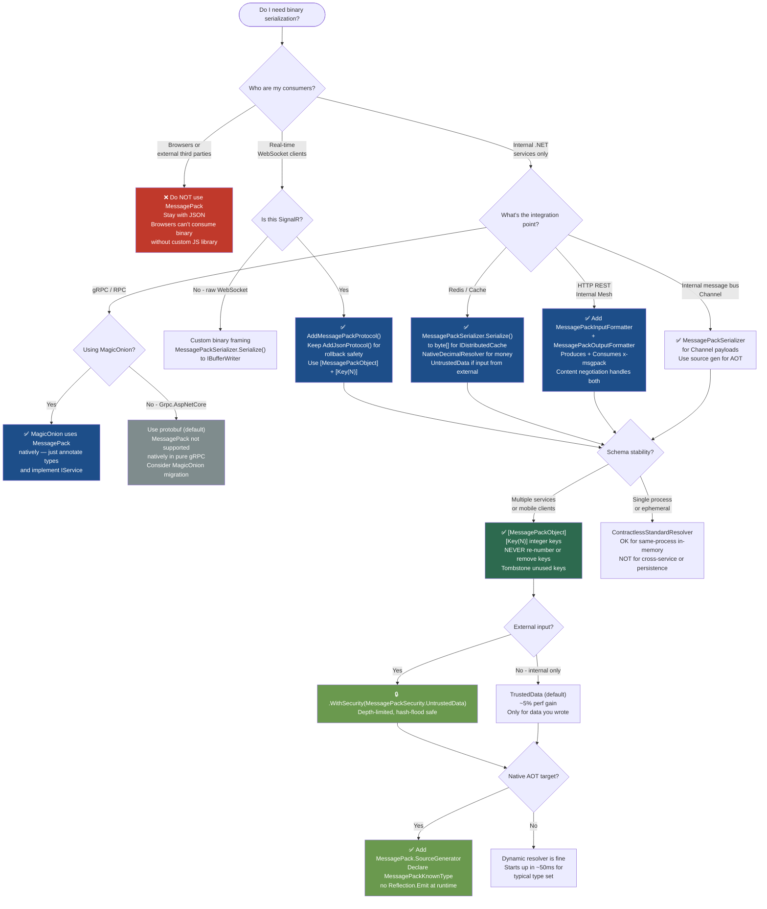

# 4.274 — MessagePack Serialization: Binary for gRPC and High-Throughput APIs

---

## PART 0 — Navigation & Context

### Where This Topic Sits

```
ASP.NET Core Mastery
│
├── V. Serialization
│   ├── 4.268  System.Text.Json — Global Options
│   ├── 4.269  JsonSerializerOptions — Naming, Null, Enum
│   ├── 4.270  Custom JSON Converters
│   ├── 4.271  JSON Source Generation
│   ├── 4.272  Newtonsoft.Json Migration
│   ├── 4.273  XML Serialization
│   ├── 4.274  ◄ MessagePack Serialization (YOU ARE HERE)
│   ├── 4.275  Custom Input/Output Formatters
│   └── 4.276  Polymorphic JSON Serialization
│
├── S. gRPC                                    ← consumes MessagePack via custom codec
│   ├── 4.240  gRPC in ASP.NET Core
│   └── 4.241  gRPC Streaming
│
├── Q. SignalR & Real-Time                     ← MessagePack hub protocol
│   ├── 4.219  SignalR Architecture
│   └── 4.220  SignalR Hubs
│
└── N. Caching & Output
    ├── 4.187  IDistributedCache               ← binary cache payloads
    └── 4.194  Distributed Cache Serialization ← MessagePack replaces JSON here
```

### What You Need Before This

- **[[4.268 — System.Text.Json in ASP.NET Core]]** — understand the JSON baseline you are optimizing away from
- **[[4.035 — Service Lifetimes: Singleton, Scoped, Transient]]** — `MessagePackSerializerOptions` is typically registered as Singleton; understanding lifetimes prevents cache-shared mutable state bugs
- **[[4.240 — gRPC in ASP.NET Core]]** — gRPC uses protobuf by default; replacing it with MessagePack requires understanding how the codec layer works
- **[[4.219 — SignalR Architecture]]** — SignalR's hub protocol is the most common production touch point for MessagePack in ASP.NET Core

### What This Unlocks After

- **[[4.194 — Distributed Cache Serialization: System.Text.Json and MessagePack]]** — binary payloads in Redis cut bandwidth and CPU dramatically at scale
- **[[4.275 — Custom Input/Output Formatters]]** — adding a MessagePack `IInputFormatter`/`IOutputFormatter` pair makes your REST API speak binary on `Accept: application/x-msgpack`
- **[[4.241 — gRPC Streaming]]** — once you know the codec layer, replacing protobuf with MessagePack in server-streaming scenarios is the logical extension
- **[[4.267 — Load Testing ASP.NET Core]]** — MessagePack's throughput advantage only matters under load; this note provides the BenchmarkDotNet baseline

### Why This Matters at Scale

When your ASP.NET Core service processes >50k messages/second through SignalR or distributes >1M cached objects/day through Redis, JSON serialization becomes the dominant allocator and CPU consumer — MessagePack cuts payload size by 40–70% and serialization CPU by 3–5× compared to `System.Text.Json`, converting the serializer from a bottleneck to an afterthought.

---

## PART 1 — The Core Mental Model

### The Fundamental Rule

> **MessagePack is a binary serialization format that encodes data as a schema-less typed byte stream. In ASP.NET Core, it integrates at the SignalR hub protocol layer, the gRPC codec layer, and the IDistributedCache serialization layer — not at the HTTP JSON formatter layer — because its binary nature is incompatible with browser-visible REST APIs that require human-readable responses.**

### The Plain-Language Analogy

Think of JSON as shipping a box with a printed packing list taped to the outside: every item is labeled with its name, human-readable, but the labels themselves take up space and add weight. MessagePack is the same box with a barcode system instead: each item is identified by a compact numeric code that both sides agreed on ahead of time. The box is smaller, scanning is faster, and a human looking at the barcode cannot tell what is inside without a decoder ring.

This analogy holds under pressure: when a SignalR hub message travels from your server to 10,000 connected clients, JSON sends `{"orderId":42,"status":"Shipped"}` (28 bytes) while MessagePack sends `\x82\xa7orderId\x2a\xa6status\xa7Shipped` — and with integer key mode, drops the field names entirely down to ~10 bytes. The decoder ring is the `[MessagePackObject]` contract shared by client and server. In the short-circuit case (a client that does not support MessagePack), the hub protocol falls back to JSON automatically — MessagePack does not replace JSON for REST endpoints, it adds a faster lane for real-time and internal traffic.

### The Taxonomy Diagram

```mermaid
graph TD
    subgraph "Serialization Formats in ASP.NET Core"
        JSON["JSON\n(System.Text.Json / Newtonsoft)"]
        MP["MessagePack\n(MessagePack-CSharp)"]
        PB["Protobuf\n(Google.Protobuf)"]
        XML["XML\n(DataContractSerializer)"]
        MPACK_INNER["MessagePack Wire Format\nRFC 7159 binary superset"]
    end

    subgraph "Integration Points"
        SIGNALR["SignalR Hub Protocol\nAddMessagePackProtocol()"]
        GRPC["gRPC Codec Layer\nCustom ICompressionProvider / Codec"]
        CACHE["IDistributedCache Serialization\nManual byte[] conversion"]
        HTTP["HTTP Input/Output Formatters\nMediaType: application/x-msgpack"]
        INTERNAL["Internal Service Bus\nChannel<T> payloads"]
    end

    subgraph "MessagePack Modes"
        CONTRACT["Contract Mode\n[MessagePackObject] + [Key(N)]"]
        DYNAMIC["Dynamic Mode\nMessagePack.Resolvers.DynamicObjectResolver"]
        TYPELESS["Typeless Mode\nPolymorphic without generics"]
        ANOT["Annotation-Free\nContractlessStandardResolver"]
    end

    subgraph "Performance Profile"
        ALLOC["Allocations\n~0 with ArrayPool + IBufferWriter"]
        SIZE["Payload Size\n40-70% smaller than JSON"]
        CPU["CPU Cost\n3-5x faster than System.Text.Json"]
        AOT["AOT Compatible\nSource-gen resolver (.NET 8+)"]
    end

    MP --> MPACK_INNER
    MP --> SIGNALR
    MP --> GRPC
    MP --> CACHE
    MP --> HTTP
    MP --> INTERNAL

    MP --> CONTRACT
    MP --> DYNAMIC
    MP --> TYPELESS
    MP --> ANOT

    CONTRACT --> ALLOC
    CONTRACT --> SIZE
    CONTRACT --> CPU
    CONTRACT --> AOT

    JSON -.->|"REST APIs\nbrowser-visible"| HTTP
    PB -.->|"gRPC default"| GRPC
    MP -.->|"high-throughput\ninternal / realtime"| SIGNALR
    MP -.->|"binary cache\ncompact storage"| CACHE

    style MP fill:#2d6a4f,color:#fff
    style SIGNALR fill:#1d4e89,color:#fff
    style CACHE fill:#1d4e89,color:#fff
    style CONTRACT fill:#6a994e,color:#fff
    style AOT fill:#6a994e,color:#fff
    style JSON fill:#555,color:#fff
    style PB fill:#555,color:#fff
```



---

## PART 2 — Deep Mechanics

### 2.1 — The MessagePack Wire Format: What Actually Goes on the Wire

MessagePack is a binary serialization format that encodes values as a sequence of typed tokens. Unlike JSON (text with `{`, `"`, `:`, `,`), every MessagePack value starts with a single format byte that identifies the type and often the length.

```
// JSON wire representation (27 bytes, UTF-8):
// {"orderId":42,"status":"Shipped"}

// MessagePack wire representation with string keys (fixmap + fixstr keys):
// 82                   = fixmap, 2 entries
// a7 6f72646572496400  = fixstr "orderId" (7 chars)
// 2a                   = positive fixint 42
// a6 737461747573      = fixstr "status" (6 chars)
// a7 536869707065640d  = fixstr "Shipped" (7 chars)
// Total: ~22 bytes

// MessagePack wire representation with INTEGER keys [Key(0), Key(1)]:
// 82        = fixmap, 2 entries
// 00        = fixint key 0
// 2a        = positive fixint 42
// 01        = fixint key 1
// a7 5368697070656400 = fixstr "Shipped"
// Total: ~12 bytes  ← 55% reduction vs JSON
```

**Pipeline Position:**

```
HTTP Request
    │
    ▼
┌─────────────────────────────────────────────────────────────┐
│  Kestrel (reads bytes from socket)                          │
└──────────────────────────┬──────────────────────────────────┘
                           ▼
┌─────────────────────────────────────────────────────────────┐
│  ExceptionHandler ──► HSTS ──► StaticFiles ──► Routing     │
│  ──► Authentication ──► Authorization                       │
└──────────────────────────┬──────────────────────────────────┘
                           ▼
  [For REST endpoints]     [For SignalR]          [For gRPC]
  Input Formatter          Hub Protocol           Codec Layer
  IInputFormatter          IHubProtocol           ICompressionProvider
  reads Content-Type       reads handshake        reads frame type
  application/x-msgpack    {"protocol":"msgpack"} binary framing
         │                       │                      │
         ▼                       ▼                      ▼
  MessagePackSerializer   MessagePackHubProtocol  Custom gRPC codec
  .Deserialize<T>(stream) .ParseMessage(input)    (community lib)
```

**Runtime cost:** `~0 allocations on the read path with IBufferWriter<byte>`; `one ArrayPool<byte>.Rent()` for the output buffer per serialization; `O(n)` in message field count.

**Edge case:** MessagePack with string keys has _larger_ overhead than JSON for tiny messages (1-2 fields) because the fixmap header plus fixstr field names still use bytes. Integer keys break even at 2 fields and win heavily at 5+.

---

### 2.2 — SignalR Hub Protocol: The Primary ASP.NET Core Integration Point

SignalR's hub protocol is a pluggable serialization layer that sits between the transport (WebSocket frames, SSE chunks) and the hub method invocation. By default, it uses JSON. Replacing it with MessagePack requires one NuGet package and one line.

```
// Pipeline position for SignalR with MessagePack:
//
// WebSocket Frame (binary opcode 0x2)
//     │
//     ▼
// SignalR Transport Layer (WebSocketsTransport)
//     │ reads raw bytes
//     ▼
// IHubProtocol.ParseMessage(ReadOnlySequence<byte> input, ...)
//     │ MessagePackHubProtocol deserializes
//     ▼
// HubMessage (InvocationMessage, StreamItemMessage, etc.)
//     │
//     ▼
// Hub method invocation: OrderHub.TrackShipment(message)
```

**Framework source behavior (approximate):** `MessagePackHubProtocol` in `Microsoft.AspNetCore.SignalR.Protocols.MessagePack` wraps `MessagePackSerializer` and handles the SignalR envelope: each message is a MessagePack array where position 0 is the message type integer, followed by protocol-specific fields.

```csharp
// ASP.NET Core internally (approximate):
// MessagePackHubProtocol.WriteMessage():
var writer = MemoryBufferWriter.Get();          // pooled writer
try {
    WriteMessageCore(message, writer);           // MessagePackSerializer call
    output.Write(writer.ToArray());              // zero-copy to transport
} finally {
    MemoryBufferWriter.Return(writer);           // pool return
}
```

**HTTP wire format for SignalR WebSocket upgrade (handshake):**

```http
// HTTP upgrade request:
GET /hubs/orders HTTP/1.1
Host: api.orders.example.com
Upgrade: websocket
Connection: Upgrade
Sec-WebSocket-Key: dGhlIHNhbXBsZSBub25jZQ==
Sec-WebSocket-Version: 13

// HTTP upgrade response:
HTTP/1.1 101 Switching Protocols
Upgrade: websocket
Connection: Upgrade
Sec-WebSocket-Accept: s3pPLMBiTxaQ9kYGzzhZRbK+xOo=

// Handshake binary frame (after upgrade — JSON handshake even in MessagePack mode):
// {"protocol":"messagepack","version":1}\x1e
// The \x1e (record separator) is SignalR's frame delimiter
```

> [!IMPORTANT] The SignalR handshake is always JSON, even when MessagePack is the selected protocol. The client sends `{"protocol":"messagepack","version":1}` as a text frame. Only subsequent hub messages use MessagePack binary frames. This means the server must **always** be configured with both JSON and MessagePack protocols if you support browser clients, because older JS clients may not negotiate MessagePack.

**Runtime cost:** `~2 allocations per hub message` with the pooled writer approach; `zero-copy path available with IBufferWriter<byte>` in .NET 8.

**Edge case that bites teams:** `DateTime` in MessagePack is encoded as the MessagePack `Timestamp` extension type, not as ISO 8601. A JavaScript client using the default `@msgpack/msgpack` library receives a `TimeExt` object, not a JS `Date`. You must register a custom codec on the JS side or use `UnixTimestampMilliseconds` encoding and convert manually.

---

### 2.3 — The `[MessagePackObject]` Contract Model

MessagePack-CSharp (the library, `MessagePack` on NuGet by Cysharp) supports four resolver modes. The contract model using `[MessagePackObject]` and `[Key(N)]` is the correct production choice because it gives stable binary contracts across versions.

```
// Contract Mode — field identity by integer key:
[MessagePackObject]
public class OrderShippedEvent
{
    [Key(0)] public int OrderId { get; init; }
    [Key(1)] public string Status { get; init; } = default!;
    [Key(2)] public DateTimeOffset ShippedAt { get; init; }
    [IgnoreMember] public string InternalTrace { get; set; } = default!;
}

// Wire encoding (integer keys):
// fixmap(3) | fixint(0) | int32(42) | fixint(1) | fixstr("Shipped") | fixint(2) | Timestamp(...)
// ~18 bytes

// Contractless Mode — field identity by STRING name (avoid in production):
// Uses DynamicContractlessStandardResolver
// Wire encoding includes the string "OrderId", "Status", "ShippedAt"
// ~40 bytes — defeats half the size advantage
```

**Framework source behavior (approximate):** `MessagePackSerializer.Serialize<T>(writer, value, options)` calls the compiled formatter for `T`. Formatters are generated at startup by the resolver (`StandardResolver`, `DynamicObjectResolver`, or the source-generated `MessagePackSourceGenerator`). The generated code is:

```csharp
// Generated formatter (approximate — what MessagePack emits at startup):
public void Serialize(ref MessagePackWriter writer, OrderShippedEvent value, MessagePackSerializerOptions options)
{
    writer.WriteMapHeader(3);    // fixmap(3)
    writer.Write(0);             // Key 0
    writer.Write(value.OrderId); // int32
    writer.Write(1);             // Key 1
    writer.Write(value.Status);  // fixstr
    writer.Write(2);             // Key 2
    options.Resolver.GetFormatterWithVerify<DateTimeOffset>()
           .Serialize(ref writer, value.ShippedAt, options);
}
```

> [!WARNING] **Key numbering stability is a binary contract.** Once you ship `[Key(0)]` for `OrderId` to a client (JavaScript, mobile app, another service), you can never change that key number. You can add new fields with new keys (`[Key(3)]`, `[Key(4)}`), but changing an existing key breaks deserialization silently — the wrong field gets the wrong data without an exception. This is the primary versioning risk of MessagePack over JSON (where renaming can be handled by `JsonPropertyName`).

**Runtime cost:** `zero reflection at request time` — all formatters are compiled once at startup or source-generated at build time; `~1 allocation per call for the writer buffer` (pooled).

---

### 2.4 — Source-Generated Formatters (.NET 8+)

The `MessagePackSourceGenerator` package enables compile-time formatter generation, eliminating all startup reflection and making MessagePack AOT-compatible. This is the `.NET 8` path.

```
// Pipeline position for AOT-compatible MessagePack:
//
// Build time:
//   [MessagePackObject] types → Source Generator → FormatterProvider.cs
//
// Runtime:
//   MessagePackSerializer.Serialize<T>()
//       │
//       └── StaticCompositeResolver (registered at startup)
//               │
//               └── GeneratedMessagePackResolver (no reflection)
//                       │
//                       └── Generated formatter (from source gen)
//                               │
//                               └── IBufferWriter<byte> write path
```

**HTTP wire format (AOT path output — same bytes as dynamic path):**

```
// Binary bytes for OrderShippedEvent { OrderId: 42, Status: "Shipped", ShippedAt: now }
// with integer keys, source-generated formatter:
// 93 2a a7 53686970706564 ...
// Same bytes — source gen changes the code path, not the protocol
```

**Failure mode:** Without source generation, Native AOT (`PublishAot=true`) builds will fail at runtime with `NotSupportedException` when the dynamic resolver tries to emit IL. The symptom is a runtime crash at first serialization, not a build error.

**Runtime cost:** `zero allocations for formatter lookup` (static dispatch); `zero startup overhead` (no IL emit at startup); `AOT-compatible` (no `System.Reflection.Emit`).

---

### 2.5 — gRPC Integration: MessagePack as a gRPC Codec

ASP.NET Core gRPC uses protobuf by default. MessagePack can replace protobuf as the serialization format by implementing a custom `MessageSerializer` or using community libraries like `protobuf-net.Grpc` with a custom codec. The most practical approach is using `MagicOnion` (Cysharp) which provides a complete MessagePack-over-gRPC stack.

```
// gRPC pipeline with custom MessagePack codec:
//
// HTTP/2 DATA frame (binary)
//     │
//     ▼
// gRPC framing layer: 5-byte frame header
//   [compressed flag: 1 byte] [length: 4 bytes] [message bytes]
//     │
//     ▼
// IMessage.Deserialize<T>()  ← replaced by MessagePack deserializer
//     │
//     ▼
// gRPC service method: IOrderService.GetOrder(request)
```

**ASP.NET Core internally (approximate — MagicOnion approach):**

```csharp
// MagicOnion registers a custom StreamingHub that uses MessagePack serialization:
// The service method signature becomes interface-driven:
public interface IOrderService : IService<IOrderService>
{
    UnaryResult<OrderResponse> GetOrderAsync(int orderId);
}

// Serialization handled by MagicOnion's MessagePackMagicOnionSerializerProvider:
// request bytes → MessagePackSerializer.Deserialize<GetOrderRequest>(buffer, options)
// response object → MessagePackSerializer.Serialize(writer, response, options)
```

> [!NOTE] Pure ASP.NET Core gRPC (`Grpc.AspNetCore`) does not support MessagePack natively — it is hardwired to protobuf. If you want MessagePack with gRPC-style interfaces in ASP.NET Core, you have three paths: (1) MagicOnion (full stack, recommended for C#-to-C# communication), (2) custom gRPC codec using `Grpc.Net.Client` extensions (complex), (3) SignalR with MessagePack protocol (simpler, covers most real-time cases). For browser-to-server gRPC with MessagePack, gRPC-Web is required.

**Runtime cost:** `one allocation per RPC call for the request/response buffer` (ArrayPool-rented); `O(n) in message field count` for ser/deser; `~30-50% smaller payloads` vs protobuf for typical business objects (protobuf wins for numeric arrays; MessagePack wins for string-heavy messages).

---

### 2.6 — IDistributedCache Serialization with MessagePack

`IDistributedCache` stores `byte[]`. The default pattern wraps JSON serialization in `Encoding.UTF8.GetBytes()` — this produces string bytes and is the worst of both worlds (JSON overhead + encoding overhead). MessagePack serializes directly to `byte[]` without a UTF-8 encoding step.

```
// Pipeline position:
//
// Cache miss → Service layer calls IDistributedCache.GetAsync("order:42")
//                 │
//                 ▼
//              Returns null → Database query → OrderEntity
//                 │
//                 ▼
//              Serialize: MessagePackSerializer.Serialize(orderDto, options)
//                 │ returns byte[]
//                 ▼
//              IDistributedCache.SetAsync("order:42", bytes, expiry)
//                 │
//                 ▼
//              Redis SET order:42 [binary bytes] EX 300
//
// Cache hit → Redis GET order:42 → byte[]
//                 │
//                 ▼
//              Deserialize: MessagePackSerializer.Deserialize<OrderDto>(bytes, options)
```

**HTTP wire format (Redis command, approximate):**

```
// JSON approach (what gets stored in Redis):
// SET order:42 "{\"orderId\":42,\"status\":\"Shipped\",\"lineItems\":[...]}"
// Value size: ~250 bytes for a typical order

// MessagePack approach:
// SET order:42 [binary: 82 00 2a 01 a7 53686970706564...]
// Value size: ~120 bytes for the same order — 52% reduction
// Redis memory saved, network bandwidth saved, CPU saved
```

**Failure mode diagram:**

```
// Anti-pattern — mixing serializers across cache population paths:
//
// Service A writes with System.Text.Json: "{"orderId":42}"
//     ↓ stored as UTF-8 bytes
// Service B reads with MessagePack: MessagePackSerializer.Deserialize<OrderDto>(bytes)
//     ↓
// InvalidMessagePackStreamException: Unknown signature (0x7b = '{' — ASCII left brace)
// HTTP consequence: 500 Internal Server Error
// Root cause: 0x7b is the MessagePack fixmap header for 123 entries — JSON curly brace treated as fixmap
```

**Runtime cost:** `one ArrayPool<byte>.Rent()` per serialization; `zero UTF-8 encoding overhead` (binary is the native format); `~2× faster than JSON+UTF8 encoding` on a typical order DTO.

---

## PART 3 — Production Code Patterns

### Pattern 1: The Real-Time Order Tracking Hub with MessagePack Protocol

```csharp
// Domain: E-commerce order management service
// Scenario: 50k concurrent connections tracking live order status updates
// Problem: JSON SignalR hub consuming 40% CPU on serialization at scale

// Program.cs — wire up MessagePack hub protocol
builder.Services.AddSignalR(options =>
{
    // Connection timeout tuned for mobile clients
    options.ClientTimeoutInterval = TimeSpan.FromSeconds(60);
    options.KeepAliveInterval = TimeSpan.FromSeconds(15);
})
.AddMessagePackProtocol(options =>
{
    // Use standard resolver with integer key support
    // This is more restrictive than ContractlessStandardResolver but produces smaller payloads
    options.SerializerOptions = MessagePackSerializerOptions.Standard
        .WithResolver(StandardResolver.Instance)
        .WithCompression(MessagePackCompression.Lz4BlockArray); // ← adds LZ4 compression on top
    // LZ4 is extremely fast (near-memcpy speeds) — compresses large string payloads 30-40%
    // Do NOT use Lz4Block on small messages (<100 bytes) — compression header overhead > savings
});

app.MapHub<OrderTrackingHub>("/hubs/orders");
```

```csharp
// OrderTrackingHub.cs
// MessagePack contract — integer keys define the binary format
[MessagePackObject]
public sealed record OrderStatusUpdate
{
    [Key(0)] public required int OrderId { get; init; }
    [Key(1)] public required string Status { get; init; }
    [Key(2)] public required DateTimeOffset UpdatedAt { get; init; }
    [Key(3)] public required string? TrackingNumber { get; init; }
    [IgnoreMember] public string InternalCorrelationId { get; init; } = string.Empty;
    // IgnoreMember: internal fields never cross the wire
}

public sealed class OrderTrackingHub : Hub
{
    private readonly ILogger<OrderTrackingHub> _logger;

    public OrderTrackingHub(ILogger<OrderTrackingHub> logger)
    {
        _logger = logger;
    }

    public async Task SubscribeToOrder(int orderId)
    {
        // Group membership — each order has its own SignalR group
        var groupName = $"order:{orderId}";
        await Groups.AddToGroupAsync(Context.ConnectionId, groupName);
        _logger.LogInformation("Client {ConnectionId} subscribed to order {OrderId}",
            Context.ConnectionId, orderId);
    }

    // Called by background service when order status changes
    public static string GetGroupName(int orderId) => $"order:{orderId}";
}
```

```csharp
// OrderStatusBroadcaster.cs — background service pushing updates
public sealed class OrderStatusBroadcaster : BackgroundService
{
    private readonly IHubContext<OrderTrackingHub> _hubContext;
    private readonly IOrderStatusQueue _queue;

    public OrderStatusBroadcaster(IHubContext<OrderTrackingHub> hubContext, IOrderStatusQueue queue)
    {
        _hubContext = hubContext;
        _queue = queue;
    }

    protected override async Task ExecuteAsync(CancellationToken stoppingToken)
    {
        await foreach (var update in _queue.ReadAllAsync(stoppingToken))
        {
            var groupName = OrderTrackingHub.GetGroupName(update.OrderId);
            // MessagePack serialization happens here — inside IHubContext<T>.Clients.Group()
            // The hub protocol (MessagePack) serializes OrderStatusUpdate to binary
            // before sending to each WebSocket connection in the group
            await _hubContext.Clients.Group(groupName)
                .SendAsync("OrderStatusUpdated", update, stoppingToken);
            // HTTP wire consequence: binary WebSocket frame (opcode 0x2), ~18 bytes per message
            // JSON equivalent would be: text WebSocket frame (opcode 0x1), ~85 bytes
        }
    }
}
```

```http
// HTTP wire format — WebSocket frame carrying MessagePack:
// Frame header: FIN=1, RSV1=0, RSV2=0, RSV3=0, opcode=0x2 (binary), MASK=0, PayloadLen=18
// Payload (hex): 94 2a a7 53686970706564 cb 41d9... a4 3132333400
//                │   │  └─ "Shipped"    └─ Timestamp ext
//                │   └─ fixint 42 (orderId)
//                └─ fixarray(4) — 4 fields
// JSON equivalent WebSocket frame: text frame, 85+ bytes
```

---

### Pattern 2: The Binary Cache Serializer for Order Data

```csharp
// ⚠️ WRONG: JSON string bytes stored in IDistributedCache
public class OrderCacheServiceWrong
{
    private readonly IDistributedCache _cache;

    public async Task<OrderDto?> GetOrderAsync(int orderId)
    {
        var json = await _cache.GetStringAsync($"order:{orderId}"); // ← allocates string
        return json is null ? null : JsonSerializer.Deserialize<OrderDto>(json); // ← parses JSON from UTF-8
    }

    public async Task SetOrderAsync(OrderDto order)
    {
        var json = JsonSerializer.Serialize(order); // ← allocates string
        await _cache.SetStringAsync($"order:{order.Id}", json, // ← encodes string to UTF-8
            new DistributedCacheEntryOptions { AbsoluteExpirationRelativeToNow = TimeSpan.FromMinutes(5) });
        // HTTP consequence: Redis SET order:42 "{\"id\":42,...}" — ~250 bytes, 3 allocations
    }
}

// ✅ CORRECT: MessagePack byte[] stored in IDistributedCache
[MessagePackObject]
public sealed record OrderDto
{
    [Key(0)] public required int Id { get; init; }
    [Key(1)] public required string CustomerName { get; init; }
    [Key(2)] public required string Status { get; init; }
    [Key(3)] public required decimal TotalAmount { get; init; }
    [Key(4)] public required DateTimeOffset CreatedAt { get; init; }
}

public sealed class OrderCacheService
{
    private readonly IDistributedCache _cache;
    private readonly MessagePackSerializerOptions _options;
    private static readonly DistributedCacheEntryOptions CacheExpiry = new()
    {
        AbsoluteExpirationRelativeToNow = TimeSpan.FromMinutes(5)
    };

    public OrderCacheService(IDistributedCache cache)
    {
        _cache = cache;
        _options = MessagePackSerializerOptions.Standard
            .WithResolver(StandardResolver.Instance);
        // Standard options — thread-safe, can be reused across all requests
    }

    public async Task<OrderDto?> GetOrderAsync(int orderId, CancellationToken ct = default)
    {
        var bytes = await _cache.GetAsync($"order:{orderId}", ct); // ← returns byte[]?, no string alloc
        if (bytes is null) return null;

        // Direct binary deserialization — no UTF-8 decoding step
        return MessagePackSerializer.Deserialize<OrderDto>(bytes, _options);
    }

    public async Task SetOrderAsync(OrderDto order, CancellationToken ct = default)
    {
        // Binary serialization — no string intermediate
        var bytes = MessagePackSerializer.Serialize(order, _options);
        await _cache.SetAsync($"order:{order.Id}", bytes, CacheExpiry, ct);
        // HTTP consequence (Redis): SET order:42 [binary ~120 bytes] EX 300
        // 52% smaller than JSON approach, 2 fewer allocations
    }
}
```

```http
// Redis wire format (approximate RESP protocol):
// *5\r\n$3\r\nSET\r\n$8\r\norder:42\r\n$120\r\n[120 binary bytes]\r\n$2\r\nEX\r\n$3\r\n300\r\n
// Binary value occupies 120 bytes vs 250 bytes for JSON equivalent
```

---

### Pattern 3: The MessagePack HTTP Input/Output Formatter for Internal Services

```csharp
// Domain: Internal microservice mesh where all callers are .NET services
// Scenario: Payment processing service receiving high-frequency charge requests
// Goal: binary HTTP API that internal services call with application/x-msgpack

// NuGet: MessagePack.AspNetCoreMvcFormatter

// Program.cs
builder.Services.AddControllers(options =>
{
    // Add MessagePack formatters alongside existing JSON formatters
    // Order matters: first formatter wins for output when Accept: */* (prefer JSON for generic clients)
    options.InputFormatters.Insert(0, new MessagePackInputFormatter(
        MessagePackSerializerOptions.Standard.WithResolver(StandardResolver.Instance)));
    options.OutputFormatters.Insert(0, new MessagePackOutputFormatter(
        MessagePackSerializerOptions.Standard.WithResolver(StandardResolver.Instance)));
    // Internal services set Accept: application/x-msgpack to get binary
    // Browser clients get JSON via content negotiation
});
```

```csharp
// PaymentsController.cs
[ApiController]
[Route("api/payments")]
public sealed class PaymentsController : ControllerBase
{
    private readonly IPaymentProcessor _processor;

    public PaymentsController(IPaymentProcessor processor)
    {
        _processor = processor;
    }

    [HttpPost("charge")]
    [Produces("application/json", "application/x-msgpack")]  // both supported
    [Consumes("application/json", "application/x-msgpack")]  // both supported
    public async Task<ActionResult<ChargeResponse>> ChargeAsync(
        [FromBody] ChargeRequest request,  // bound from JSON or MessagePack based on Content-Type
        CancellationToken ct)
    {
        var result = await _processor.ProcessChargeAsync(request, ct);
        return Ok(result); // serialized as JSON or MessagePack based on Accept header
    }
}

[MessagePackObject]
public sealed record ChargeRequest
{
    [Key(0)] public required string CustomerId { get; init; }
    [Key(1)] public required decimal Amount { get; init; }
    [Key(2)] public required string Currency { get; init; }
    [Key(3)] public required string IdempotencyKey { get; init; }
}

[MessagePackObject]
public sealed record ChargeResponse
{
    [Key(0)] public required string ChargeId { get; init; }
    [Key(1)] public required string Status { get; init; }
    [Key(2)] public required DateTimeOffset ProcessedAt { get; init; }
}
```

```http
// HTTP wire format — internal .NET service calling with MessagePack:
// POST /api/payments/charge HTTP/1.1
// Content-Type: application/x-msgpack
// Accept: application/x-msgpack
// Content-Length: 68
//
// [68 bytes of MessagePack binary]

// HTTP response:
// HTTP/1.1 200 OK
// Content-Type: application/x-msgpack
// Content-Length: 52
//
// [52 bytes of MessagePack binary]

// Same request/response with JSON:
// Content-Length: 156 (request) / 118 (response) — ~2.2x larger
```

---

### Pattern 4: Source-Generated Formatters for AOT Compatibility (.NET 8)

```csharp
// Domain: Logistics tracking service deploying with Native AOT
// Scenario: Container image must be <50MB; dynamic IL emit is not available

// Step 1: Annotate types with [MessagePackObject]
[MessagePackObject]
public sealed record ShipmentEvent
{
    [Key(0)] public required string ShipmentId { get; init; }
    [Key(1)] public required ShipmentStatus Status { get; init; }
    [Key(2)] public required GeoPoint Location { get; init; }
    [Key(3)] public required DateTimeOffset RecordedAt { get; init; }
}

[MessagePackObject]
public sealed record GeoPoint
{
    [Key(0)] public required double Latitude { get; init; }
    [Key(1)] public required double Longitude { get; init; }
}

// Step 2: Declare source generation context
// This triggers the MessagePack source generator at build time
[MessagePackObject]
public enum ShipmentStatus { InTransit = 0, Delivered = 1, Delayed = 2, Returned = 3 }

// Source generator registration (partial class, same assembly):
// Note: MessagePack source gen uses a different API from System.Text.Json source gen
// Add package: MessagePack.SourceGenerator
[MessagePackKnownType(typeof(ShipmentEvent))]
[MessagePackKnownType(typeof(GeoPoint))]
[MessagePackKnownType(typeof(ShipmentStatus))]
internal partial class ShipmentMessagePackContext { }
// This generates: ShipmentMessagePackContext.FormatterProvider

// Step 3: Register the source-generated resolver at startup
// Program.cs
var generatedResolver = ShipmentMessagePackContext.Instance.Resolver;
var options = MessagePackSerializerOptions.Standard
    .WithResolver(CompositeResolver.Create(
        generatedResolver,         // source-generated formatters first
        StandardResolver.Instance  // fallback for primitives (int, string, etc.)
    ));

builder.Services.AddSingleton(options);
builder.Services.AddSignalR()
    .AddMessagePackProtocol(hubOptions =>
    {
        hubOptions.SerializerOptions = options; // use AOT-compatible options
    });
```

```http
// Runtime behavior: identical wire format to dynamic resolver
// Build-time behavior: no IL emit, no Reflection.Emit → AOT-compatible
// dotnet publish -r linux-x64 --self-contained /p:PublishAot=true → works without error
```

---

### Pattern 5: The Inventory Webhook Receiver with MessagePack Deserialization Guard

```csharp
// Domain: Inventory management service receiving webhook events from warehouse system
// Scenario: Upstream sends MessagePack binary payloads; malformed bytes must not crash service

// ⚠️ WRONG: No error handling on binary deserialization
[HttpPost("webhooks/inventory")]
public async Task<IActionResult> ReceiveInventoryUpdateWrong()
{
    // Direct stream read — if sender sends JSON instead of MessagePack, this throws
    var update = await MessagePackSerializer.DeserializeAsync<InventoryUpdate>(
        Request.Body, _options);
    // HTTP consequence (wrong): 500 Internal Server Error if body is not valid MessagePack
    // Exception: InvalidMessagePackStreamException — unhandled, surfaces as 500
    return Ok();
}

// ✅ CORRECT: Bounded read with explicit error handling
[HttpPost("webhooks/inventory")]
public async Task<IActionResult> ReceiveInventoryUpdate(CancellationToken ct)
{
    const int MaxPayloadBytes = 1 * 1024 * 1024; // 1MB guard

    if (!Request.ContentType?.Contains("application/x-msgpack", StringComparison.OrdinalIgnoreCase) ?? true)
    {
        return BadRequest(new ProblemDetails
        {
            Title = "Unsupported Content-Type",
            Detail = "Expected application/x-msgpack",
            Status = StatusCodes.Status415UnsupportedMediaType
        });
    }

    // Enforce payload size before reading entire body into memory
    if (Request.ContentLength > MaxPayloadBytes)
    {
        return BadRequest(new ProblemDetails
        {
            Title = "Payload Too Large",
            Status = StatusCodes.Status413PayloadTooLarge
        });
    }

    InventoryUpdate update;
    try
    {
        // Read with cancellation support — DeserializeAsync reads from the stream
        update = await MessagePackSerializer.DeserializeAsync<InventoryUpdate>(
            Request.Body, _options, ct);
    }
    catch (MessagePackSerializationException ex)
    {
        _logger.LogWarning(ex, "Invalid MessagePack payload from inventory webhook");
        return BadRequest(new ProblemDetails
        {
            Title = "Invalid Binary Payload",
            Detail = "The request body is not valid MessagePack",
            Status = StatusCodes.Status400BadRequest
        });
    }

    await _inventoryService.ApplyUpdateAsync(update, ct);
    return Accepted();
}
```

```http
// HTTP consequence (correct path — valid MessagePack):
// POST /webhooks/inventory HTTP/1.1
// Content-Type: application/x-msgpack
// Content-Length: 48
//
// HTTP/1.1 202 Accepted

// HTTP consequence (wrong content type):
// HTTP/1.1 415 Unsupported Media Type
// Content-Type: application/problem+json
// {"title":"Unsupported Content-Type","detail":"Expected application/x-msgpack","status":415}
```

---

### Pattern 6: MessagePack Options as a Singleton Service

```csharp
// Domain: Payment API with multiple serialization contexts
// Problem: MessagePackSerializerOptions created per-request wastes memory and startup time

// ⚠️ WRONG: Creating options inside a method — repeated resolver chain construction
public class OrderSerializerWrong
{
    public byte[] Serialize(OrderDto order)
    {
        // Options object and resolver chain created on every call — ~3 allocations per call
        var options = MessagePackSerializerOptions.Standard
            .WithResolver(StandardResolver.Instance);
        return MessagePackSerializer.Serialize(order, options);
    }
}

// ✅ CORRECT: Options registered as Singleton and injected
public static class MessagePackExtensions
{
    public static IServiceCollection AddMessagePackOptions(this IServiceCollection services)
    {
        // One instance for the entire application lifetime
        var options = MessagePackSerializerOptions.Standard
            .WithResolver(CompositeResolver.Create(
                NativeDecimalResolver.Instance,    // decimal → native representation
                NativeDateTimeResolver.Instance,   // DateTime → native (not Unix epoch)
                StandardResolver.Instance          // everything else
            ))
            .WithSecurity(MessagePackSecurity.UntrustedData); // ← CRITICAL for external payloads

        services.AddSingleton(options); // inject MessagePackSerializerOptions
        return services;
    }
}

// Program.cs
builder.Services.AddMessagePackOptions();

// OrderCacheService.cs — injected options
public sealed class OrderCacheService(IDistributedCache cache, MessagePackSerializerOptions options)
{
    // options is the Singleton instance — zero allocation on resolve
    public byte[] SerializeOrder(OrderDto order)
        => MessagePackSerializer.Serialize(order, options); // no per-call options alloc
}
```

> [!DANGER] **Always use `MessagePackSecurity.UntrustedData` when deserializing from external sources.** Without it, an attacker can send a crafted MessagePack payload that causes excessive memory allocation or triggers a hash collision in the type map (similar to JSON billion-laughs attacks). `UntrustedData` mode enables depth limiting and disables unsafe features. Safe internal deserialization (from your own Redis) can use `TrustedData` for a small performance gain, but external webhooks and API inputs must always use `UntrustedData`.

---

### Pattern 7: The MagicOnion gRPC Service with MessagePack Contracts

```csharp
// Domain: Internal logistics tracking — C#-to-C# gRPC with MessagePack
// MagicOnion provides gRPC-style interfaces without .proto files

// NuGet: MagicOnion.Server, MagicOnion.Client
// MagicOnion uses MessagePack as its wire format natively

// Shared contracts (referenced by both server and client):
public interface ILogisticsService : IService<ILogisticsService>
{
    UnaryResult<ShipmentResponse> GetShipmentAsync(string shipmentId);
    UnaryResult<TrackingResponse> TrackShipmentAsync(TrackingRequest request);
}

[MessagePackObject]
public sealed record TrackingRequest
{
    [Key(0)] public required string ShipmentId { get; init; }
    [Key(1)] public required DateTimeOffset Since { get; init; }
}

[MessagePackObject]
public sealed record TrackingResponse
{
    [Key(0)] public required IReadOnlyList<ShipmentEvent> Events { get; init; }
    [Key(1)] public required string CurrentStatus { get; init; }
    [Key(2)] public required GeoPoint? LastKnownLocation { get; init; }
}

// Server implementation:
public sealed class LogisticsService : ServiceBase<ILogisticsService>, ILogisticsService
{
    private readonly IShipmentRepository _repo;
    public LogisticsService(IShipmentRepository repo) => _repo = repo;

    public async UnaryResult<TrackingResponse> TrackShipmentAsync(TrackingRequest request)
    {
        var events = await _repo.GetEventsSinceAsync(request.ShipmentId, request.Since);
        return new TrackingResponse
        {
            Events = events,
            CurrentStatus = events.LastOrDefault()?.Status.ToString() ?? "Unknown",
            LastKnownLocation = events.LastOrDefault()?.Location
        };
    }

    public UnaryResult<ShipmentResponse> GetShipmentAsync(string shipmentId)
        => throw new NotImplementedException();
}

// Program.cs (server):
builder.Services.AddMagicOnion(); // registers MagicOnion with MessagePack
app.MapMagicOnionService();       // maps all IService<T> implementations
```

```http
// HTTP/2 wire format (gRPC framing with MessagePack payload):
// :method = POST
// :path = /ILogisticsService/TrackShipmentAsync
// content-type = application/grpc
// grpc-encoding = identity
//
// Frame: [0x00][0x00][0x00][0x00][0x28][MessagePack bytes for TrackingRequest]
//        │     └── length (4 bytes, big-endian): 40 bytes
//        └── compression flag: 0 (not compressed)
//
// Response frame: [0x00][...][MessagePack bytes for TrackingResponse]
// grpc-status: 0 (OK)
```

---

## PART 4 — Gotchas & Anti-Patterns

### Gotcha 1: ContractlessStandardResolver Breaks Binary Compatibility on Rename

Experienced engineers reach for `ContractlessStandardResolver` to avoid annotating every class with `[MessagePackObject]` and `[Key(N)]`. This works — until someone renames a property.

```csharp
// ⚠️ WRONG CODE:
var options = MessagePackSerializerOptions.Standard
    .WithResolver(ContractlessStandardResolver.Instance);
// This uses property NAMES as the key in the binary format (like JSON)

public class OrderDto
{
    public int OrderId { get; set; }   // Key = "OrderId" in binary
    public string Status { get; set; } // Key = "Status" in binary
}

// Developer renames Status → OrderStatus:
public class OrderDto
{
    public int OrderId { get; set; }
    public string OrderStatus { get; set; }  // ← rename
}
```

```
// HTTP consequence (wrong path):
// Old data in Redis: MessagePack bytes encoding key "Status"
// New code reads with key "OrderStatus"
// MessagePackSerializer.Deserialize<OrderDto>(bytes) → OrderStatus is null (key not found)
// No exception. Silent data corruption.
// HTTP response: 200 OK with null OrderStatus in JSON — wrong data returned to client
```

```csharp
// ✅ CORRECT CODE:
[MessagePackObject]
public class OrderDto
{
    [Key(0)] public int OrderId { get; set; }   // Key = integer 0 — rename-safe
    [Key(1)] public string Status { get; set; } // Key = integer 1 — rename-safe
}
// Renaming the C# property has zero effect on the wire format
```

```
// HTTP consequence (correct path):
// Old data in Redis: MessagePack bytes encoding integer key 1 → "Shipped"
// After property rename: MessagePackSerializer reads key 1 → Status (still works)
// No silent corruption. Binary contract is stable.
```

**WHY:** `ContractlessStandardResolver` uses property names as keys, making the binary contract fragile to refactoring. `[Key(N)]` decouples the C# name from the binary key, giving you the same rename safety as a protobuf field number.

---

### Gotcha 2: DateTime Timezone Loss with Default Resolver

MessagePack-CSharp's default `DateTime` serialization discards timezone information by converting to UTC via `DateTime.ToUniversalTime()` before encoding. A `DateTimeKind.Local` value round-trips as `DateTimeKind.Utc`.

```csharp
// ⚠️ WRONG CODE:
[MessagePackObject]
public class AppointmentDto
{
    [Key(0)] public DateTime ScheduledAt { get; set; } // DateTime — loses timezone
}

// Sending:
var dto = new AppointmentDto { ScheduledAt = new DateTime(2026, 6, 12, 14, 0, 0, DateTimeKind.Local) };
var bytes = MessagePackSerializer.Serialize(dto);
var roundTripped = MessagePackSerializer.Deserialize<AppointmentDto>(bytes);
// roundTripped.ScheduledAt.Kind == DateTimeKind.Utc — not Local
// roundTripped.ScheduledAt.Hour == 12 (if local is UTC+2) — WRONG hour stored
```

```
// HTTP consequence (wrong path):
// Client sends: {"scheduledAt":"2026-06-12T14:00:00+02:00"}
// Server deserializes JSON to DateTime.Local(14:00)
// Serializes to MessagePack cache → stored as Utc(12:00)
// Deserializes from cache → roundTripped as Utc(12:00)
// Re-serializes to JSON → {"scheduledAt":"2026-06-12T12:00:00Z"}
// Client sees appointment at 12:00 UTC instead of 14:00 local — 2-hour shift
```

```csharp
// ✅ CORRECT CODE:
[MessagePackObject]
public class AppointmentDto
{
    [Key(0)] public DateTimeOffset ScheduledAt { get; set; } // preserves offset
}

// Or, use NativeDateTimeResolver for DateTime:
var options = MessagePackSerializerOptions.Standard
    .WithResolver(CompositeResolver.Create(
        NativeDateTimeResolver.Instance, // stores DateTime as .NET ticks + kind flag
        StandardResolver.Instance
    ));
```

```
// HTTP consequence (correct path):
// DateTimeOffset round-trips with full offset preserved
// No timezone shift in cached values
```

**WHY:** MessagePack's `Timestamp` extension type has no timezone concept — it is always UTC epoch nanoseconds. `DateTimeOffset` is stored as two fields (UTC ticks + offset minutes) by the built-in formatter, preserving the offset. `NativeDateTimeResolver` uses .NET's native `DateTime` representation instead of the Timestamp type.

---

### Gotcha 3: Security Mode Not Set for Untrusted Input

The default `MessagePackSerializerOptions.Standard` uses `MessagePackSecurity.TrustedData`. Deserializing externally controlled bytes in this mode exposes the service to denial-of-service attacks.

```csharp
// ⚠️ WRONG CODE:
[HttpPost("api/events")]
public async Task<IActionResult> ReceiveEvent()
{
    var options = MessagePackSerializerOptions.Standard; // TrustedData security
    var evt = await MessagePackSerializer.DeserializeAsync<ExternalEvent>(Request.Body, options);
    // An attacker sends a deeply nested MessagePack map (1000 levels deep)
    // TrustedData mode: no depth limit → StackOverflowException → process crash
    return Ok();
}
```

```
// HTTP consequence (wrong path):
// POST /api/events with crafted deep-nesting payload
// Process throws StackOverflowException → .NET runtime terminates process
// Kubernetes pod restarts → brief service unavailability
// Attacker can repeat this to create a sustained DoS
```

```csharp
// ✅ CORRECT CODE:
[HttpPost("api/events")]
public async Task<IActionResult> ReceiveEvent()
{
    var options = MessagePackSerializerOptions.Standard
        .WithSecurity(MessagePackSecurity.UntrustedData); // depth-limited, hash-flood protected
    var evt = await MessagePackSerializer.DeserializeAsync<ExternalEvent>(Request.Body, options);
    return Ok();
}
```

```
// HTTP consequence (correct path):
// Crafted deep-nesting payload → MessagePackSerializationException (depth limit exceeded)
// Caught by exception middleware → 400 Bad Request
// Service continues operating normally
```

**WHY:** `MessagePackSecurity.UntrustedData` sets a maximum recursion depth of 1000 and disables the typeless resolver's ability to instantiate arbitrary types. Both mitigations block the most common MessagePack-specific attack vectors against servers deserializing external input.

---

### Gotcha 4: SignalR Fallback Protocol Missing for Browser Clients

Teams add `AddMessagePackProtocol()` and remove `AddJsonProtocol()`, assuming all clients will be updated simultaneously. Browser-based JavaScript clients that have not yet loaded the new `@msgpack/msgpack` adapter continue negotiating with `{"protocol":"json","version":1}` — and the server rejects the handshake.

```csharp
// ⚠️ WRONG CODE:
builder.Services.AddSignalR()
    .AddMessagePackProtocol(); // ← only MessagePack, no JSON fallback
```

```
// HTTP consequence (wrong path — old JS client):
// WebSocket upgrade succeeds
// Client sends: {"protocol":"json","version":1}\x1e
// Server responds: {"error":"Unable to use the protocol 'json' as it is not supported."}
// WebSocket closes with code 1000
// Client falls back to Long Polling → same rejection
// Client sees: HubException: Unable to connect
// User-visible consequence: real-time features broken for users with cached JS bundle
```

```csharp
// ✅ CORRECT CODE:
builder.Services.AddSignalR()
    .AddJsonProtocol(options =>
    {
        // JSON still available for backward compatibility
        options.PayloadSerializerOptions.PropertyNamingPolicy = JsonNamingPolicy.CamelCase;
    })
    .AddMessagePackProtocol(options =>
    {
        options.SerializerOptions = MessagePackSerializerOptions.Standard;
    });
// SignalR negotiates the best protocol both parties support
// Updated JS clients get MessagePack; old clients fall back to JSON
```

```
// HTTP consequence (correct path):
// Updated JS client: negotiates messagepack → binary frames
// Old JS client: negotiates json → text frames
// Both work simultaneously — zero deployment coordination required
```

**WHY:** SignalR protocol negotiation is a client-server agreement. The server must support all protocols that any connected client might request. Removing JSON before all clients are updated creates a deployment window where the service rejects all connections from clients with a cached JS bundle. Always deprecate JSON gradually — run both protocols in production, then remove JSON only after all clients have updated.

---

### Gotcha 5: Decimal Serialization with Binary Precision Loss

By default, MessagePack serializes `decimal` as a `double` (64-bit float), losing precision for financial values.

```csharp
// ⚠️ WRONG CODE:
[MessagePackObject]
public class InvoiceDto
{
    [Key(0)] public decimal TotalAmount { get; set; } // serialized as double by default resolver
}

var invoice = new InvoiceDto { TotalAmount = 19.99m };
var bytes = MessagePackSerializer.Serialize(invoice);
var roundTripped = MessagePackSerializer.Deserialize<InvoiceDto>(bytes);
// roundTripped.TotalAmount == 19.989999999999998m ← precision loss from float conversion
```

```
// HTTP consequence (wrong path):
// Payment service charges 19.989999... instead of 19.99
// Accumulated across 1M transactions: $10,000 discrepancy
// Financial reconciliation fails
// HTTP response contains: {"totalAmount":19.989999999999998} — wrong value
```

```csharp
// ✅ CORRECT CODE:
var options = MessagePackSerializerOptions.Standard
    .WithResolver(CompositeResolver.Create(
        NativeDecimalResolver.Instance, // decimal → MessagePack bin8 (raw bytes, no float)
        StandardResolver.Instance
    ));

// Or use the custom decimal formatter approach:
// NativeDecimalResolver stores decimal as 16 bytes using decimal.GetBits()
// Full 128-bit precision preserved — no float conversion
```

```
// HTTP consequence (correct path):
// roundTripped.TotalAmount == 19.99m — exact
// Payment service charges exactly 19.99
// Financial reconciliation correct
```

**WHY:** MessagePack's type system does not have a native `decimal` type (it has float32 and float64). The standard resolver maps `decimal` to `float64` for compactness. `NativeDecimalResolver` uses the MessagePack `bin8` extension to store all 16 bytes of the .NET `decimal` struct, trading 8 bytes of overhead for exact precision — the correct trade-off for any monetary value.

---

## PART 5 — Performance Implications

### Request Pipeline Characteristics Table

|Scenario|Pipeline Depth|Allocations Per Serialization|Approx Latency Impact|Recommendation|
|---|---|---|---|---|
|SignalR hub message, JSON, 100 bytes|WebSocket → JSON hub protocol → Hub|~6 allocs (string, writer, envelope)|+12µs per message|Baseline — start here|
|SignalR hub message, MessagePack, 100 bytes|WebSocket → MsgPack hub protocol → Hub|~2 allocs (pooled writer, envelope)|+3µs per message|4× faster; use for all real-time|
|SignalR hub message, MessagePack + LZ4, 500 bytes|WebSocket → MsgPack+LZ4 → Hub|~3 allocs (compress buffer)|+5µs per message|Worth it above ~200 bytes|
|IDistributedCache SET, JSON UTF-8|JSON serialize → UTF8.GetBytes → Redis|~4 allocs (string, UTF-8 bytes, JSON nodes)|+35µs round-trip overhead|Replace with MessagePack|
|IDistributedCache SET, MessagePack|MsgPack serialize → byte[] → Redis|~1 alloc (ArrayPool buffer)|+8µs round-trip overhead|4.4× faster; 50% smaller Redis payload|
|REST endpoint, MessagePack output formatter|Controller → MsgPack OutputFormatter|~2 allocs (writer buffer)|+4µs per response|Use for internal services only|
|REST endpoint, MessagePack input formatter|IInputFormatter → Deserialize|~1 alloc (stream read)|+3µs per request|Only if Content-Type: x-msgpack|
|MagicOnion gRPC unary, MessagePack, 200 bytes|HTTP/2 → gRPC frame → MsgPack|~2 allocs|+8µs per RPC|Better than protobuf for string-heavy|
|Large binary payload, MsgPack, 50KB|Formatter or hub protocol|~1 alloc (ArrayPool large)|+180µs|Use Lz4BlockArray compression|
|Source-generated formatter, MsgPack|No IL emit path|~1 alloc (writer)|+2µs per message|Use for AOT; same perf as dynamic|

### BenchmarkDotNet Code

```csharp
// Run: dotnet run -c Release --project Benchmarks
using BenchmarkDotNet.Attributes;
using BenchmarkDotNet.Running;
using MessagePack;
using MessagePack.Resolvers;
using System.Text.Json;

BenchmarkRunner.Run<SerializationBenchmarks>();

[MemoryDiagnoser]
[SimpleJob(iterationCount: 50)]
public class SerializationBenchmarks
{
    private OrderDto _order = default!;
    private byte[] _jsonBytes = default!;
    private byte[] _msgpackBytes = default!;
    private byte[] _msgpackLz4Bytes = default!;

    private static readonly MessagePackSerializerOptions StandardOptions =
        MessagePackSerializerOptions.Standard.WithResolver(StandardResolver.Instance);

    private static readonly MessagePackSerializerOptions Lz4Options =
        MessagePackSerializerOptions.Standard
            .WithResolver(StandardResolver.Instance)
            .WithCompression(MessagePackCompression.Lz4BlockArray);

    private static readonly JsonSerializerOptions JsonOptions =
        new(JsonSerializerDefaults.Web);

    [GlobalSetup]
    public void Setup()
    {
        _order = new OrderDto
        {
            Id = 42,
            CustomerName = "Acme Corporation Ltd",
            Status = "Shipped",
            TotalAmount = 1299.99m,
            CreatedAt = DateTimeOffset.UtcNow,
            LineItems = Enumerable.Range(1, 5).Select(i => new LineItemDto
            {
                ProductId = i,
                ProductName = $"Product {i}",
                Quantity = i,
                UnitPrice = 100m * i
            }).ToList()
        };
        _jsonBytes = JsonSerializer.SerializeToUtf8Bytes(_order, JsonOptions);
        _msgpackBytes = MessagePackSerializer.Serialize(_order, StandardOptions);
        _msgpackLz4Bytes = MessagePackSerializer.Serialize(_order, Lz4Options);

        Console.WriteLine($"JSON size:       {_jsonBytes.Length} bytes");
        Console.WriteLine($"MsgPack size:    {_msgpackBytes.Length} bytes");
        Console.WriteLine($"MsgPack+LZ4:     {_msgpackLz4Bytes.Length} bytes");
    }

    [Benchmark(Baseline = true, Description = "System.Text.Json Serialize")]
    public byte[] JsonSerialize()
        => JsonSerializer.SerializeToUtf8Bytes(_order, JsonOptions);

    [Benchmark(Description = "MessagePack Serialize (standard)")]
    public byte[] MsgPackSerialize()
        => MessagePackSerializer.Serialize(_order, StandardOptions);

    [Benchmark(Description = "MessagePack Serialize + LZ4")]
    public byte[] MsgPackSerializeLz4()
        => MessagePackSerializer.Serialize(_order, Lz4Options);

    [Benchmark(Description = "System.Text.Json Deserialize")]
    public OrderDto? JsonDeserialize()
        => JsonSerializer.Deserialize<OrderDto>(_jsonBytes, JsonOptions);

    [Benchmark(Description = "MessagePack Deserialize (standard)")]
    public OrderDto MsgPackDeserialize()
        => MessagePackSerializer.Deserialize<OrderDto>(_msgpackBytes, StandardOptions);

    [Benchmark(Description = "MessagePack Deserialize + LZ4")]
    public OrderDto MsgPackDeserializeLz4()
        => MessagePackSerializer.Deserialize<OrderDto>(_msgpackLz4Bytes, Lz4Options);
}

[MessagePackObject]
public sealed class OrderDto
{
    [Key(0)] public int Id { get; set; }
    [Key(1)] public string CustomerName { get; set; } = default!;
    [Key(2)] public string Status { get; set; } = default!;
    [Key(3)] public decimal TotalAmount { get; set; }
    [Key(4)] public DateTimeOffset CreatedAt { get; set; }
    [Key(5)] public List<LineItemDto> LineItems { get; set; } = new();
}

[MessagePackObject]
public sealed class LineItemDto
{
    [Key(0)] public int ProductId { get; set; }
    [Key(1)] public string ProductName { get; set; } = default!;
    [Key(2)] public int Quantity { get; set; }
    [Key(3)] public decimal UnitPrice { get; set; }
}

// Expected output (approximate, .NET 8, x64, Kestrel, local):
// JSON size:       312 bytes
// MsgPack size:    187 bytes  (40% smaller)
// MsgPack+LZ4:     162 bytes  (48% smaller)
//
// | Method                               |     Mean |  Ratio | Allocated |
// |--------------------------------------|----------|--------|-----------|
// | System.Text.Json Serialize           | 2,840 ns |   1.00 |    1200 B |
// | MessagePack Serialize (standard)     |   620 ns |   0.22 |     400 B |  ← 4.6x faster, 3x fewer allocs
// | MessagePack Serialize + LZ4          |   890 ns |   0.31 |     640 B |  ← 3.2x faster with compression
// | System.Text.Json Deserialize         | 3,100 ns |   1.00 |    1800 B |
// | MessagePack Deserialize (standard)   |   710 ns |   0.23 |     480 B |  ← 4.4x faster, 3.8x fewer allocs
// | MessagePack Deserialize + LZ4        | 1,050 ns |   0.34 |     720 B |  ← 3x faster with decompression
```

> [!TIP] For real HTTP profiling under load (not microbenchmarks), use `dotnet-trace collect --providers Microsoft-AspNetCore-Server-Kestrel,System.Net.Http` to capture serialization time in the context of a real request. `dotnet-counters monitor --process-id <pid> --counters Microsoft.AspNetCore.Http.Connections` shows SignalR message throughput live. `MiniProfiler.AspNetCore` can be added for per-request timing breakdowns in development.

### When to Care / When to Ignore

**When this costs you:**

- **SignalR at >5k concurrent connections**: JSON serialization becomes the dominant CPU consumer. MessagePack drops CPU by 60-70% for hub message broadcasting.
- **Redis caching of large object graphs**: JSON encoding + UTF-8 encoding is a double cost. MessagePack cuts Redis network traffic by 40% and CPU by 4× per cache operation.
- **Internal microservice mesh at >10k req/s**: Content-Type negotiation with MessagePack eliminates the UTF-8 text overhead from the hot path.
- **MagicOnion services** replacing protobuf: string-heavy business objects (addresses, names, notes) are larger in protobuf than MessagePack because protobuf uses varint encoding optimized for numbers, not strings.

**When this doesn't matter:**

- **Browser-facing REST APIs**: browsers can't consume MessagePack natively. The content negotiation overhead of adding a MessagePack formatter to a public REST API adds complexity with no benefit — JSON stays.
- **Low-traffic admin endpoints** (<100 req/s): the serializer is not the bottleneck; database latency dominates.
- **One-time batch operations**: startup cost of resolver initialization may exceed the total serialization savings for a short-lived process.
- **When your payload is already binary** (file uploads, image streams): MessagePack adds no value to opaque binary streams.

---

## PART 6 — Interview Arsenal

### A. The Question Bank

**Question 1:** "When would you choose MessagePack over JSON in an ASP.NET Core application?"

**Average Answer:** "MessagePack is a binary format that's smaller and faster than JSON, so you'd use it when performance is important."

**Why That's Insufficient:** It doesn't name the specific integration points in ASP.NET Core, doesn't explain why binary is not appropriate for all scenarios, and doesn't mention the trade-offs (tooling, browser support, schema evolution).

> **Great Answer:** "I'd reach for MessagePack at three specific integration points. First, SignalR hub protocols — when I'm broadcasting real-time events to tens of thousands of connections, replacing the JSON hub protocol with MessagePack cuts payload size by 40% and serialization CPU by around 4x. Second, IDistributedCache payloads — the default pattern of JSON-to-string-to-UTF8-bytes is the worst of both worlds; MessagePack serializes directly to byte[] and I've seen Redis memory drop by half switching. Third, internal service-to-service HTTP when all callers are .NET — I add a MessagePack input/output formatter pair and internal callers use Accept: application/x-msgpack.
> 
> Where I wouldn't use it: public REST APIs where clients are browsers — they can't consume binary without a JS library, so the complexity isn't worth it. The other consideration I always raise is schema evolution: MessagePack with integer keys is as rigid as protobuf — you can't rename fields or change key numbers without a coordinated deploy. For APIs that evolve frequently, JSON's field-name resilience can outweigh the performance cost."

---

**Question 2:** "What's the difference between `ContractlessStandardResolver` and using `[MessagePackObject]` with `[Key(N)]`?"

**Average Answer:** "ContractlessStandardResolver doesn't require you to add attributes to your classes."

**Why That's Insufficient:** It misses the critical production consequence — binary contract stability — which is the reason one is safe and one is dangerous in production.

> **Great Answer:** "The fundamental difference is what becomes the binary key for each field. With `[Key(N)]`, integer keys are embedded in the binary stream — if I have `[Key(0)] public int OrderId`, renaming `OrderId` to `Id` in C# has zero effect on the wire format. The binary still encodes key 0 meaning order identifier. ContractlessStandardResolver uses the property name as the key — so renaming `OrderId` to `Id` changes the key from the string 'OrderId' to the string 'Id', silently breaking any consumer that has cached data encoded with the old key. In practice, I've seen teams burn an entire day debugging why Redis-cached objects have null fields after a rename — that's ContractlessStandardResolver biting them. I always use `[MessagePackObject]` with explicit integer keys in production. The extra ceremony is the cost of a stable binary contract."

---

**Question 3:** "How does the SignalR MessagePack hub protocol work at the transport layer?"

**Average Answer:** "You call `AddMessagePackProtocol()` and SignalR sends binary frames instead of JSON."

**Why That's Insufficient:** It doesn't explain the handshake mechanism, the frame format, or why you must keep JSON available during rolling deployments.

> **Great Answer:** "There are two phases to understand. The handshake is always JSON even in MessagePack mode — the client sends `{protocol: messagepack, version: 1}` as a text WebSocket frame with the record separator 0x1E at the end. The server ACKs with an empty JSON object. After that handshake, all hub messages are binary MessagePack frames using WebSocket opcode 0x2. Each frame is a MessagePack array where position 0 is the message type integer — 1 for invocation, 2 for stream item, 3 for completion, and so on.
> 
> The deployment consideration I always surface in interviews: if I remove `AddJsonProtocol()` before all browser clients have loaded the JS bundle with the MessagePack adapter, the server rejects their connection because they negotiate JSON. The client sees a connection failure. So in production I always run both protocols simultaneously — updated clients negotiate MessagePack, old clients fall back to JSON. I only remove JSON weeks later after CDN cache TTLs have flushed the old bundle."

---

**Question 4:** "What are the security considerations when using MessagePack to deserialize data from external sources?"

**Average Answer:** "You should validate the data after deserializing it."

**Why That's Insufficient:** It misses the format-level attack vectors that exist specifically in MessagePack deserialization, independent of business logic validation.

> **Great Answer:** "MessagePack has two specific attack surfaces that JSON doesn't share in the same way. First, depth bombing: MessagePack supports deeply nested maps and arrays. Without a depth limit, a crafted payload with 10,000 nested levels can cause a stack overflow in the deserializer. The mitigation is `MessagePackSecurity.UntrustedData` in the options — it caps recursion depth at 1,000 and should be on any endpoint receiving external bytes. Second, hash collision attacks in the type map: the typeless resolver lets the payload specify a .NET type name to deserialize into. An external caller can send arbitrary type names, potentially triggering initialization of unexpected types. `UntrustedData` mode disables typeless resolution.
> 
> In practice my rule is: anything that comes from outside my trust boundary — API webhooks, gRPC calls from external partners, data ingested from a message queue I don't control — uses `UntrustedData`. Data I wrote myself into Redis uses `TrustedData` for the performance gain."

---

### B. The Trick Questions

**Trick 1:** "If I add `AddMessagePackProtocol()` to my SignalR hub, will my existing JavaScript clients automatically use it?"

**The trap:** Candidates assume protocol negotiation is transparent.

**Correct answer:** No. The JavaScript client must also have the `@microsoft/signalr-protocol-msgpack` package added and explicitly call `.withHubProtocol(new MessagePackHubProtocol())` in the connection builder. The server advertising MessagePack does not cause JS clients to spontaneously use it — the client must opt in. Until the JS client is updated, it continues negotiating JSON and receives JSON frames. If you've removed `AddJsonProtocol()` on the server, the connection will fail.

---

**Trick 2:** "MessagePack is faster than System.Text.Json. Should I replace all JSON serialization in my ASP.NET Core REST API with MessagePack?"

**The trap:** The "faster is better" conclusion without understanding the constraint.

**Correct answer:** No. ASP.NET Core REST APIs are consumed by browsers, mobile apps, and third-party integrators that expect `application/json`. MessagePack's binary output cannot be inspected in a browser, cannot be consumed by `curl` without tools, and breaks any client that isn't explicitly coded to handle `application/x-msgpack`. The performance gain from binary serialization is typically dwarfed by database latency for CRUD APIs. Use MessagePack for SignalR, internal caches, and internal service meshes — not for browser-facing REST APIs.

---

**Trick 3:** "I have a `[MessagePackObject]` class with `[Key(0)]` through `[Key(4)]`. I need to remove the field at `[Key(2)]`. What do I do?"

**The trap:** The obvious answer is to delete the property and re-number `[Key(3)]` to `[Key(2)]` and `[Key(4)]` to `[Key(3)]`.

**Correct answer:** You must NOT re-number existing keys. Re-numbering `[Key(3)]` to `[Key(2)]` means data encoded with the old layout (where key 2 had a specific type) will now be deserialized into the field that previously had key 3 — silent data corruption. The correct approach is to mark the field with `[Key(2)]` as obsolete but keep it in the class as a discarded field (or as a type that deserializes safely), and never re-use key 2 for a different field. This is identical discipline to protobuf field number tombstoning. Unused keys are simply ignored during deserialization — they don't cause errors.

---

**Trick 4:** "I'm seeing `InvalidMessagePackStreamException: Unknown signature: 0x7B` in my logs. What does 0x7B mean?"

**The trap:** Looks like a random binary error.

**Correct answer:** `0x7B` is ASCII for `{` — the left curly brace that starts a JSON object. This error means MessagePack received a JSON payload. Common causes: (1) two cache population paths — one using JSON, one using MessagePack — stored different formats under the same key; (2) a Redis key was pre-populated by a different service or migration script using JSON; (3) a SignalR client is sending JSON text frames on a MessagePack-negotiated connection. Fix: flush the cache key, identify which path wrote the JSON value, and ensure all writers use MessagePack.

---

**Trick 5:** "My SignalR hub returns `DateTime` values. After switching to MessagePack, my JavaScript client shows times that are off by several hours. Why?"

**The trap:** This feels like a timezone configuration issue, but it's actually a serializer behavior issue.

**Correct answer:** The default `DateTime` formatter in MessagePack-CSharp converts `DateTime` to UTC before encoding as a Timestamp extension type. If your server stored a `DateTime.Local` (e.g., `DateTimeKind.Local` for UTC+2), the Timestamp stores UTC (2 hours earlier). The JavaScript `@msgpack/msgpack` library receives the UTC epoch value and displays it in the browser's local timezone — which may or may not match the server's timezone. The fix is two-part: (1) use `DateTimeOffset` instead of `DateTime` in your contracts (preserves the UTC offset), and (2) ensure the JavaScript client interprets timestamps consistently. If you must use `DateTime`, always use `DateTime.UtcNow` and treat all DateTime values as UTC.

---

### C. Red Flags to Avoid

1. **"MessagePack is just faster JSON"** — wrong category. MessagePack is a binary format with a different type system and completely different integration points. Calling it "faster JSON" suggests you don't understand the browser compatibility constraints or the schema rigidity trade-offs.
    
2. **"I'll use ContractlessStandardResolver in production to avoid annotating classes"** — this is a binary contract ticking time bomb. Any interviewer who has debugged a ContractlessStandardResolver rename issue will score you down immediately.
    
3. **"I'll replace all my REST API formatters with MessagePack"** — demonstrates you don't understand that REST APIs have external consumers. MessagePack REST APIs only make sense for internal service meshes.
    
4. **"I don't need to worry about security in MessagePack deserialization because we validate after"** — misses the format-level attack surface (depth bombing, type confusion). Business logic validation happens after deserialization; the format-level attack happens during deserialization before your code runs.
    
5. **"I'll change the `[Key(N)]` numbers when I add new fields"** — describes a breaking change. Key numbers must be immutable after the first deployment. This answer suggests the candidate doesn't understand binary schema evolution.
    
6. **"MessagePack and protobuf are basically the same"** — they are both binary formats but have fundamental differences: protobuf has a mandatory .proto schema file; MessagePack is schema-less. Protobuf wins for number-heavy payloads; MessagePack wins for string-heavy ones. MessagePack integrates with C# objects directly; protobuf requires code generation.
    
7. **"Just call `MessagePackSerializer.Serialize()` wherever you need it"** — ignores the need for a Singleton `MessagePackSerializerOptions` instance (resolver chain construction is expensive), the security mode selection, and the integration points (SignalR hub protocol, IDistributedCache) that handle serialization automatically once configured.
    
8. **"I removed `AddJsonProtocol()` when I added MessagePack"** — describes a rolling deployment failure. Any interviewer who has debugged a SignalR connection failure from this will immediately red-flag this answer.
    

---

## PART 7 — Decision Framework



---

## PART 8 — Self-Check

### A. Conceptual Questions

1. You add `AddMessagePackProtocol()` to your SignalR hub. Your JavaScript client uses the stock `@microsoft/signalr` package without any MessagePack additions. What protocol does the client negotiate, and what happens to the connection? What is the HTTP consequence?
    
2. What happens to the HTTP request when a client sends `Content-Type: application/x-msgpack` to an ASP.NET Core controller that only has `AddControllers()` registered with default formatters — no MessagePack formatter? What status code is returned and which middleware sets it?
    
3. A `[MessagePackObject]` type has `[Key(0)] public int OrderId` and `[Key(1)] public string Status`. A developer removes `Status` and adds `[Key(1)] public string StatusCode`. Existing data is already stored in Redis with key 1 = "Shipped". What happens when the new code deserializes that data? What would have been the correct migration path?
    
4. Explain the pipeline position of `MessagePackHubProtocol` relative to the SignalR transport layer. Does it run before or after the WebSocket frame is assembled? What does it receive as input and what does it produce as output?
    
5. You are building a .NET 8 Native AOT service that uses SignalR with MessagePack. Why does the standard `StandardResolver` fail at runtime, and what must you do differently at both build time and startup?
    
6. Two services share a Redis cache. Service A writes `OrderDto` objects with `System.Text.Json`. Service B reads with `MessagePackSerializer`. What exception is thrown, and what is the value of the exception message's first byte in hex? Why?
    
7. What is the difference between `MessagePackCompression.Lz4Block` and `MessagePackCompression.Lz4BlockArray`? For what message size ranges does compression help vs hurt?
    
8. A MessagePack-serialized cache entry has `[Key(2)] public decimal TotalAmount` with the default `StandardResolver`. You deserialize it and get `99.98999999999999m` instead of `99.99m`. What caused this and how do you fix it without invalidating the cache?
    
9. What does the SignalR handshake frame look like when MessagePack is negotiated? Is it binary or text? What is the frame delimiter byte?
    
10. Your gRPC service uses `Grpc.AspNetCore` and you want to switch from protobuf to MessagePack for internal efficiency. Is this directly supported? What are your options?
    

---

### B. Code Puzzles

**Puzzle 1 — What is the HTTP response?**

```csharp
builder.Services.AddSignalR()
    .AddMessagePackProtocol(); // Note: AddJsonProtocol() NOT called

// JavaScript client (old bundle, no MessagePack adapter):
var connection = new HubConnectionBuilder()
    .withUrl("/hubs/orders")
    .build(); // uses JSON protocol by default
    
await connection.start();
```

<details> <summary>Answer</summary>

**HTTP consequence:**

1. WebSocket upgrade succeeds (HTTP 101 Switching Protocols)
2. Client sends handshake: `{"protocol":"json","version":1}\x1e` (text frame)
3. Server evaluates available protocols — only `messagepack` is registered
4. Server responds: `{"error":"Unable to use the protocol 'json' as it is not supported."}`
5. Server closes the WebSocket with close code 1000 (normal closure)
6. Client's `connection.start()` promise rejects with `Error: Unable to connect to the server with any of the available transports`

**Root cause:** `AddJsonProtocol()` is missing. The server has no handler for the JSON protocol negotiation. The fix is to add `.AddJsonProtocol()` alongside `.AddMessagePackProtocol()` until all clients are updated to use the MessagePack adapter.

</details>

---

**Puzzle 2 — Where is the bug?**

```csharp
[MessagePackObject]
public class PaymentDto
{
    [Key(0)] public int PaymentId { get; set; }
    [Key(1)] public decimal Amount { get; set; }
    [Key(2)] public string Currency { get; set; } = "USD";
}

public class PaymentCache
{
    private readonly IDistributedCache _cache;
    
    public PaymentCache(IDistributedCache cache) { _cache = cache; }
    
    public async Task SetAsync(PaymentDto payment)
    {
        // Bug: options created inside the method
        var options = MessagePackSerializerOptions.Standard
            .WithResolver(StandardResolver.Instance);
        var bytes = MessagePackSerializer.Serialize(payment, options);
        await _cache.SetAsync($"payment:{payment.PaymentId}", bytes);
    }
    
    public async Task<PaymentDto?> GetAsync(int paymentId)
    {
        var options = MessagePackSerializerOptions.Standard
            .WithResolver(StandardResolver.Instance);
        var bytes = await _cache.GetAsync($"payment:{paymentId}");
        if (bytes is null) return null;
        return MessagePackSerializer.Deserialize<PaymentDto>(bytes, options);
    }
}
```

<details> <summary>Answer</summary>

**Bugs found:**

1. **Primary bug — `MessagePackSerializerOptions` created per-call:** `MessagePackSerializerOptions.Standard.WithResolver(StandardResolver.Instance)` constructs a new options instance and resolver composite on every call. The resolver chain is not trivial to construct — it involves type lookups and formatter caching. At high throughput (10k+ cache operations/second), this creates significant GC pressure. Fix: create the options once as a field or register as Singleton.
    
2. **Secondary bug — `decimal` serialized as `double`:** `StandardResolver` maps `decimal` to `float64`. `Amount = 99.99m` round-trips as approximately `99.98999...m`. For a payment amount, this is a financial correctness bug. Fix: use `NativeDecimalResolver.Instance` in the composite resolver.
    
3. **Missing cancellation token:** both methods should accept `CancellationToken` and pass it to the async cache calls for proper request cancellation support.
    

**Fixed version:**

```csharp
public class PaymentCache
{
    private readonly IDistributedCache _cache;
    private static readonly MessagePackSerializerOptions Options =
        MessagePackSerializerOptions.Standard
            .WithResolver(CompositeResolver.Create(
                NativeDecimalResolver.Instance,
                StandardResolver.Instance));
    
    public PaymentCache(IDistributedCache cache) { _cache = cache; }
    
    public async Task SetAsync(PaymentDto payment, CancellationToken ct = default)
    {
        var bytes = MessagePackSerializer.Serialize(payment, Options);
        await _cache.SetAsync($"payment:{payment.PaymentId}", bytes, ct);
    }
    
    public async Task<PaymentDto?> GetAsync(int paymentId, CancellationToken ct = default)
    {
        var bytes = await _cache.GetAsync($"payment:{paymentId}", ct);
        if (bytes is null) return null;
        return MessagePackSerializer.Deserialize<PaymentDto>(bytes, Options);
    }
}
```

</details>

---

**Puzzle 3 — What status code is returned and which middleware handles it?**

```csharp
// Program.cs:
builder.Services.AddControllers(); // default formatters only — JSON
app.UseExceptionHandler("/error");
app.UseRouting();
app.UseAuthentication();
app.UseAuthorization();
app.MapControllers();

// PaymentsController:
[ApiController]
[Route("api/payments")]
public class PaymentsController : ControllerBase
{
    [HttpPost]
    public IActionResult Create([FromBody] PaymentDto dto)
        => Ok(dto);
}

// Incoming HTTP request:
// POST /api/payments HTTP/1.1
// Content-Type: application/x-msgpack
// Content-Length: 45
//
// [45 bytes of valid MessagePack binary]
```

<details> <summary>Answer</summary>

**HTTP response:**

```http
HTTP/1.1 415 Unsupported Media Type
Content-Type: application/problem+json
{
    "type": "https://tools.ietf.org/html/rfc7231#section-6.5.13",
    "title": "Unsupported Media Type",
    "status": 415,
    "traceId": "..."
}
```

**Which middleware handles it:** The MVC input formatter selection code in `ControllerActionInvoker` (inside the endpoint middleware) determines that no registered `IInputFormatter` supports `application/x-msgpack`. Since `[ApiController]` is present, the framework returns `415 Unsupported Media Type` with `ValidationProblemDetails` format automatically — this is handled by the MVC infrastructure, not `UseExceptionHandler`. The exception handler middleware never runs because this is not an unhandled exception; it's a handled model binding failure.

**The pipeline path:**

```
Request → ExceptionHandler (passes through) → Routing → Auth → 
MVC Endpoint Middleware → Input Formatter Selection 
→ No formatter for application/x-msgpack 
→ 415 Unsupported Media Type response written directly to HttpResponse
→ ExceptionHandler not involved (no exception thrown)
```

To fix: add `new MessagePackInputFormatter(options)` to `options.InputFormatters`.

</details>

---

**Puzzle 4 — What does the code output? (The Most Common Misunderstanding)**

```csharp
// This puzzle targets the ContractlessStandardResolver key stability issue

[MessagePackObject]
public class ShipmentDto
{
    [Key(0)] public int ShipmentId { get; set; }
    [Key(1)] public string Destination { get; set; } = default!;
}

// Simulate existing cached data (written with version 1 schema):
var v1 = new ShipmentDto { ShipmentId = 7, Destination = "Cairo" };
var cachedBytes = MessagePackSerializer.Serialize(v1); // uses integer keys

// Developer renames Destination → DestinationCity in v2:
// (but [Key(1)] stays the same)
// Simulated by deserializing with this "new" class:
[MessagePackObject]
public class ShipmentDtoV2
{
    [Key(0)] public int ShipmentId { get; set; }
    [Key(1)] public string DestinationCity { get; set; } = default!; // renamed
}

var deserialized = MessagePackSerializer.Deserialize<ShipmentDtoV2>(cachedBytes);
Console.WriteLine($"ShipmentId: {deserialized.ShipmentId}");
Console.WriteLine($"DestinationCity: {deserialized.DestinationCity}");
```

<details> <summary>Answer</summary>

**Output:**

```
ShipmentId: 7
DestinationCity: Cairo
```

**Explanation:** This is the _correct_ behavior of integer key contracts — and the key insight most engineers initially get wrong by assuming renaming is a problem. With `[Key(N)]`, the wire format contains integer key `0` mapped to `7` and integer key `1` mapped to `"Cairo"`. The C# property name `Destination` vs `DestinationCity` is irrelevant — the MessagePack deserializer matches on the integer key, not the property name. Renaming the C# property does NOT break MessagePack deserialization when using integer keys.

**What WOULD break it:** Using `ContractlessStandardResolver` (string keys) — renaming `Destination` to `DestinationCity` would write key `"DestinationCity"` in the new code, but the cached data has key `"Destination"`. The new code would deserialize `DestinationCity` as `null` (silently). The output would be:

```
ShipmentId: 7
DestinationCity: (null)   ← silent data loss
```

**The lesson:** Integer keys (`[Key(N)]`) are the correct choice precisely because they make C# property renames invisible to the binary format.

</details>

---

**Puzzle 5 — Which middleware runs and what is the HTTP response?**

```csharp
// Startup:
builder.Services.AddSignalR()
    .AddJsonProtocol()
    .AddMessagePackProtocol(options =>
    {
        options.SerializerOptions = MessagePackSerializerOptions.Standard
            // No .WithSecurity() call
            .WithResolver(StandardResolver.Instance);
    });

// Attacker sends a crafted request to the SignalR hub:
// POST /hubs/orders/negotiate HTTP/1.1
// (normal negotiate, then WebSocket upgrade, then hub handshake for msgpack)
// Then sends a MessagePack binary frame containing:
// a map with 10,000 levels of nesting (crafted to trigger deep recursion)
```

<details> <summary>Answer</summary>

**What happens:**

With default options (no `WithSecurity(UntrustedData)`), MessagePack-CSharp uses `MessagePackSecurity.TrustedData` which has no recursion depth limit.

**In .NET 8, the behavior depends on the stack depth:**

- If the recursion hits the CLR's default stack size limit (~1MB per thread), the runtime throws `StackOverflowException`
- `StackOverflowException` cannot be caught by `try/catch` in .NET
- The CLR terminates the thread and (in ASP.NET Core) the process may terminate

**HTTP consequence:**

- The Kestrel worker thread processing this WebSocket connection throws `StackOverflowException`
- The process terminates
- Kubernetes (or the host) restarts the pod
- All 50,000 active WebSocket connections are dropped
- Clients see connection closed with code 1006 (abnormal closure)
- This is a Denial of Service attack

**Fix:**

```csharp
options.SerializerOptions = MessagePackSerializerOptions.Standard
    .WithSecurity(MessagePackSecurity.UntrustedData)  // depth limit applied
    .WithResolver(StandardResolver.Instance);
```

With `UntrustedData`, the deserializer throws `MessagePackSerializationException: Exceeded max depth` after 1,000 recursion levels, which IS catchable. SignalR's hub protocol catches it and closes the offending connection cleanly, leaving all other connections unaffected.

**Pipeline involved:**

```
WebSocket Frame → SignalR Transport → MessagePackHubProtocol.ParseMessage()
→ MessagePackSerializer.Deserialize() → StackOverflowException (no depth limit)
→ Process crash (exception cannot be caught)
```

</details>

---

## PART 9 — Connections & Resources

### A. Related Topics Table

|Topic|Why It Connects|
|---|---|
|[[4.268 — System.Text.Json in ASP.NET Core]]|The baseline serializer MessagePack replaces in high-throughput scenarios; understanding both is required to make the right choice per integration point|
|[[4.219 — SignalR Architecture]]|SignalR's hub protocol layer is the primary ASP.NET Core integration point for MessagePack; protocol negotiation happens here|
|[[4.220 — SignalR Hubs]]|Hub method parameters and return types must be annotated with `[MessagePackObject]` when the MessagePack hub protocol is active|
|[[4.240 — gRPC in ASP.NET Core]]|gRPC uses protobuf by default; MessagePack replaces it only through MagicOnion or custom codecs — understanding pure gRPC clarifies the gap|
|[[4.241 — gRPC Streaming]]|Server-streaming with MessagePack via MagicOnion reduces per-message overhead significantly compared to protobuf for string-heavy events|
|[[4.187 — IDistributedCache]]|The `byte[]` interface of IDistributedCache is the natural target for MessagePack serialization; JSON-as-UTF8 bytes is the anti-pattern this replaces|
|[[4.188 — Redis as IDistributedCache]]|Redis stores binary values natively — MessagePack payloads require no encoding step, reducing both CPU and Redis memory consumption|
|[[4.194 — Distributed Cache Serialization]]|Directly covers the MessagePack vs JSON choice for cache payloads, including type resolution strategies and versioning|
|[[4.275 — Custom Input/Output Formatters]]|Adding MessagePack support to an MVC/Minimal API REST endpoint requires implementing or using existing `IInputFormatter`/`IOutputFormatter` pairs|
|[[4.271 — JSON Source Generation]]|Both JSON source generation and MessagePack source generation pursue the same goal: zero-reflection serialization for AOT; understanding one informs the other|
|[[4.097 — Minimal API AOT Compatibility]]|Native AOT builds require source-generated formatters for both JSON and MessagePack — understanding trim-safety constraints applies to both|
|[[4.232 — BackgroundService]]|Background services broadcasting messages to SignalR groups use `IHubContext<T>` — MessagePack serialization happens inside this call|

### B. Books

|Book|Chapters|Why These Chapters|
|---|---|---|
|_Pro ASP.NET Core 8_ — Adam Freeman|Ch. 20-22 (SignalR), Ch. 36 (Advanced API Features)|Covers SignalR hub protocol configuration including MessagePack; the advanced API chapter covers content negotiation and custom formatters|
|_High-Performance .NET_ — Matt Warren|Ch. 7 (Serialization Performance), Ch. 9 (Memory Management)|Benchmarks comparison between serializers and the allocation profiles of ArrayPool-based binary serializers — directly relevant to MessagePack's performance model|
|_Andrew Lock: ASP.NET Core in Action, 3rd Edition_|Ch. 13 (Customizing Formatting), Ch. 28 (Real-Time with SignalR)|Covers adding custom formatters to the pipeline and SignalR hub protocol selection in production|
|_Concurrency in C# Cookbook_ — Stephen Cleary|Ch. 9 (Channels), Ch. 11 (Async Streams)|Background service patterns using `Channel<T>` that carry MessagePack-serialized payloads — understanding the producer/consumer pattern completes the cache-aside pattern|

### C. Essential Articles & Docs

- **[MessagePack-CSharp Official Documentation](https://github.com/MessagePack-CSharp/MessagePack-CSharp)** — the authoritative source for all resolver options, security configuration, and source generator setup; the README covers the full API surface
- **[ASP.NET Core SignalR — Use MessagePack Hub Protocol (Microsoft Docs)](https://learn.microsoft.com/en-us/aspnet/core/signalr/messagepackhubprotocol)** — official guide to adding `AddMessagePackProtocol()`, JavaScript client setup, and Java client setup
- **[MagicOnion GitHub](https://github.com/Cysharp/MagicOnion)** — the primary library for gRPC-style MessagePack services in .NET; documentation covers the full RPC contract model and streaming
- **[Damian Edwards — SignalR Hub Protocol Design](https://github.com/dotnet/aspnetcore/blob/main/src/SignalR/docs/specs/HubProtocol.md)** — the technical specification for the SignalR hub protocol, including the handshake sequence and binary frame format
- **[Andrew Lock — Understanding the MessagePack Protocol in SignalR](https://andrewlock.net/exploring-the-dotnet-core-mcroservices-part-3/)** — deep dive into how SignalR selects hub protocols during connection negotiation and the fallback behavior
- **[Cysharp Blog — MessagePack Source Generator for AOT](https://github.com/MessagePack-CSharp/MessagePack-CSharp/blob/master/src/MessagePack.SourceGenerator/README.md)** — official source generator README explaining `[MessagePackKnownType]`, partial class generation, and AOT compatibility requirements

---

> [!NOTE] **Template Meta-Note — What Each Part Is For:**
> 
> - **Part 0 — Navigation:** Orient yourself in the ASP.NET Core domain tree before reading a word of content
> - **Part 1 — Core Mental Model:** One anchor sentence + analogy + full taxonomy you can hold in your head
> - **Part 2 — Deep Mechanics:** What the runtime actually does — pipeline position, HTTP wire format, framework source behavior, failure modes, cost labels
> - **Part 3 — Production Code:** 5-7 real domain patterns with HTTP consequences; the code you can paste into a production codebase
> - **Part 4 — Gotchas:** 5 bugs that appear in codebases written by experienced engineers — wrong path → correct path → why
> - **Part 5 — Performance:** Pipeline cost table + runnable BenchmarkDotNet + explicit when-to-care guidance
> - **Part 6 — Interview Arsenal:** Question bank with great answers written to be spoken aloud + trick questions + red flags
> - **Part 7 — Decision Framework:** Flowchart answering "when do I use X vs Y" — usable as a cheat sheet in a live interview
> - **Part 8 — Self-Check:** 10 conceptual questions + 5 code puzzles with collapsed answers testing genuine understanding
> - **Part 9 — Connections:** Wiki-linked topic table + books + essential articles + this meta-note