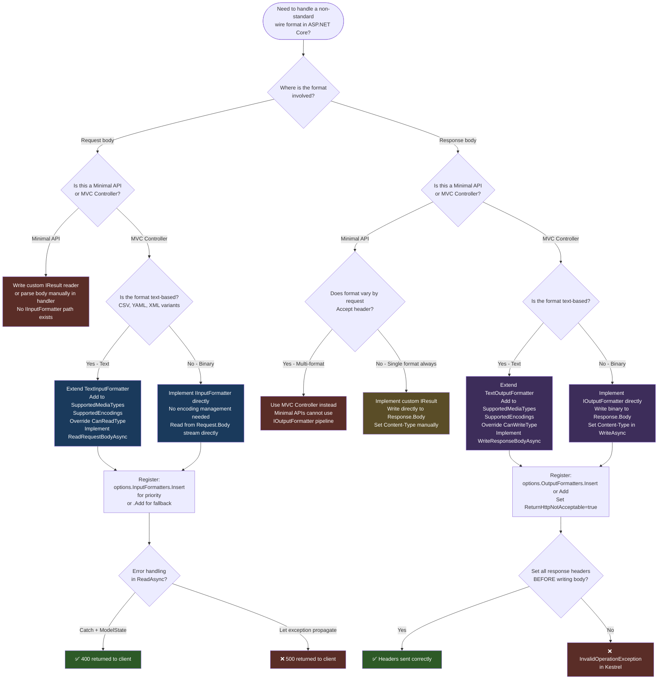

# 4.275 — Custom Input/Output Formatters: IInputFormatter and IOutputFormatter

---

## PART 0 — Navigation & Context

### Where This Topic Lives in the ASP.NET Core Domain Hierarchy

```
ASP.NET Core Mastery
│
├── H. MVC & Controllers (4.098–4.122)
│   ├── 4.100 — Model Binding: Sources, Order, Algorithm
│   ├── 4.103 — Content Type Negotiation
│   ├── 4.107 — Output Formatters: JSON, XML, Built-In Registration
│   ├── 4.112 — Input Formatters: Non-JSON Request Bodies
│   └── 4.122 — Content Negotiation Deep Dive
│
├── V. Serialization (4.268–4.276)
│   ├── 4.268 — System.Text.Json Global Options
│   ├── 4.269 — JsonSerializerOptions
│   ├── 4.270 — Custom JSON Converters
│   ├── 4.271 — JSON Source Generation
│   ├── 4.272 — Newtonsoft.Json Migration
│   ├── 4.273 — XML Serialization
│   ├── 4.274 — MessagePack Serialization
│   ├── ► 4.275 — Custom Input/Output Formatters   ◄ YOU ARE HERE
│   └── 4.276 — Polymorphic JSON Serialization
│
└── I. HTTP Fundamentals (4.123–4.133)
    ├── 4.124 — HttpRequest: Reading URL, Headers, Body
    └── 4.125 — HttpResponse: Writing Status, Headers, Body
```

### What You Need Before This

- **[[4.103 — Content Type Negotiation]]** — formatters are the mechanism that executes content negotiation; `Accept` and `Content-Type` headers drive formatter selection.
- **[[4.100 — Model Binding: Sources, Order, and Algorithm]]** — input formatters are invoked by the model binding pipeline when `[FromBody]` is present; you must understand where in binding they execute.
- **[[4.268 — System.Text.Json in ASP.NET Core]]** — the built-in JSON formatter is a `SystemTextJsonOutputFormatter`; custom formatters compete with or replace it.
- **[[4.107 — Output Formatters: JSON, XML, Built-In Registration]]** — the prior note on built-in formatters; this note extends to custom implementations.

### What This Unlocks After

- **[[4.274 — MessagePack Serialization]]** — MessagePack integration in ASP.NET Core is a custom formatter; understanding this note makes MessagePack integration obvious.
- **[[4.122 — Content Negotiation Deep Dive]]** — the full algorithm for how the framework walks the formatter list is clearer once you understand formatter internals.
- **[[4.112 — Input Formatters: Non-JSON Request Bodies]]** — custom CSV, YAML, or binary input parsing requires `IInputFormatter`.
- **[[4.276 — Polymorphic JSON Serialization]]** — polymorphic types often require custom converters that plug into formatter configuration.

### Why This Matters at Scale

Custom formatters are the seam between ASP.NET Core's HTTP pipeline and any wire format your API must speak — when a partner mandates YAML ingestion, a mobile client requires MessagePack, or a legacy integration sends `application/x-ndjson`, the formatter pipeline is the only correct interception point, and getting it wrong produces silent deserialization failures or incorrect `Content-Type` headers that violate API contracts at the client boundary.

---

## PART 1 — The Core Mental Model

### The Fundamental Rule

> **ASP.NET Core's formatter pipeline selects an input formatter from `Content-Type` and an output formatter from `Accept`, then delegates all serialization work to that formatter; a controller action is completely unaware of the wire format and must never contain format-specific branching logic.**

### The Plain-Language Analogy

Think of the formatter pipeline as a post office sorting facility that handles both incoming parcels and outgoing shipments. When a parcel arrives (the request body), the sorter reads the shipping label (`Content-Type`) and routes it to the correct unpacking station — one for JSON parcels, one for XML parcels, one for your custom binary format. When a shipment is going out (the response), the sorter reads the destination preference slip (`Accept` header) and hands the contents to the correct packing station to wrap it up properly.

Your controller is the warehouse worker in the middle: it deals only with the actual goods (C# objects), never with the wrapping. This still holds under short-circuit: if no unpacking station can handle the label, the parcel is rejected at the door with HTTP 415. If no packing station matches the destination preference, the shipment is refused with HTTP 406 — unless you configure a fallback packing station.

### The Taxonomy Diagram

```mermaid
graph TD
    subgraph Pipeline["MVC Formatter Pipeline"]
        direction TB
        REQ[HTTP Request] --> IB[IInputFormatter]
        IB --> MB[Model Binding / [FromBody]]
        MB --> ACTION[Controller Action / Minimal API Handler]
        ACTION --> AR[Action Result / IResult]
        AR --> OB[IOutputFormatter]
        OB --> RESP[HTTP Response]
    end

    subgraph InputFormatters["Input Formatter Hierarchy"]
        IIF[IInputFormatter]
        BIIF[BodyModelBinder invokes CanRead]
        STJ_IN[SystemTextJsonInputFormatter]
        XML_IN[XmlSerializerInputFormatter]
        XML_DC_IN[XmlDataContractSerializerInputFormatter]
        CUSTOM_IN[Custom: CsvInputFormatter, YamlInputFormatter, etc.]

        IIF --> BIIF
        IIF --> STJ_IN
        IIF --> XML_IN
        IIF --> XML_DC_IN
        IIF --> CUSTOM_IN
    end

    subgraph OutputFormatters["Output Formatter Hierarchy"]
        IOF[IOutputFormatter]
        BIOF[ObjectResultExecutor walks formatter list]
        STJ_OUT[SystemTextJsonOutputFormatter]
        XML_OUT[XmlSerializerOutputFormatter]
        STR_OUT[StringOutputFormatter]
        CUSTOM_OUT[Custom: MessagePackOutputFormatter, CsvOutputFormatter, etc.]

        IOF --> BIOF
        IOF --> STJ_OUT
        IOF --> XML_OUT
        IOF --> STR_OUT
        IOF --> CUSTOM_OUT
    end

    subgraph Negotiation["Content Negotiation"]
        CN[Content-Type header] --> IIF
        AN[Accept header] --> IOF
        PROD[Produces attribute] --> IOF
        CONS[Consumes attribute] --> IIF
    end

    subgraph Bases["Base Classes Available"]
        TIF[TextInputFormatter]
        TOF[TextOutputFormatter]
        IIF --> TIF
        IOF --> TOF
    end

    style Pipeline fill:#1a3a5c,color:#fff
    style InputFormatters fill:#2d5a27,color:#fff
    style OutputFormatters fill:#5a2d27,color:#fff
    style Negotiation fill:#5a4d27,color:#fff
    style Bases fill:#3d2d5a,color:#fff
```

---

## PART 2 — Deep Mechanics

### 2.1 — Where Formatters Sit in the Full Request Pipeline

```
Incoming Request:
──► ExceptionHandler ──► HSTS ──► StaticFiles ──► Routing ──► Auth ──► Endpoint
                                                                              │
                                                                    ControllerActionInvoker
                                                                              │
                                                              [Resource Filters] → [Authorization Filters]
                                                                              │
                                                                    BodyModelBinder
                                                                              │
                                                               ► IInputFormatter.CanRead(context)
                                                               ► First matching formatter: ReadAsync(context)
                                                                              │
                                                                    [Action Filters] → Action Executes
                                                                              │
                                                                    IActionResult.ExecuteResultAsync
                                                                              │
                                                               ► ObjectResultExecutor
                                                               ► IOutputFormatter.CanWriteResult(context)
                                                               ► First matching formatter: WriteAsync(context)
                                                                              │
Outgoing Response: ◄── [Result Filters] ◄── Response body written ◄──────────┘

// Pipeline position (Input): After routing, inside BodyModelBinder, BEFORE action execution.
// Pipeline position (Output): After action execution, inside ObjectResultExecutor, BEFORE result filters see the response.
// Short-circuit (Input): CanRead() returns false → next formatter tried. No formatter matches → 415 Unsupported Media Type.
// Short-circuit (Output): CanWriteResult() returns false → next formatter tried. No formatter matches → 406 Not Acceptable.
```

**Runtime cost:** Input — `~1 allocation per` ReadAsync `call + stream allocation for body buffering`. Output — `~1 allocation per` WriteAsync `+ underlying serializer cost`. The formatter list is traversed linearly: `O(n)` per request where `n` = number of registered formatters. Keep the list short; put your most common formatter first.

### 2.2 — The IInputFormatter Interface and How CanRead Works

```csharp
// ASP.NET Core internally (approximate) — BodyModelBinder.cs:
// For each formatter in MvcOptions.InputFormatters (in registration order):
//   var context = new InputFormatterContext(httpContext, modelName, modelState, metadata, readerFactory);
//   if (formatter.CanRead(context))
//   {
//       var result = await formatter.ReadAsync(context);
//       // result.IsModelSet → binding succeeded
//       // result.Model → the deserialized object
//       break;  // first match wins
//   }
// If no formatter matches → ModelState error → 415 or 400 depending on [ApiController]

public interface IInputFormatter
{
    bool CanRead(InputFormatterContext context);
    Task<InputFormatterResult> ReadAsync(InputFormatterContext context);
}
```

`InputFormatterContext` exposes:

- `context.HttpContext` — the full `HttpContext`
- `context.HttpContext.Request.ContentType` — the `Content-Type` header (e.g. `application/csv`)
- `context.ModelType` — the target C# type to deserialize into
- `context.ModelName` — the parameter name in the action signature
- `context.ModelState` — where you report validation/parse errors
- `context.ReaderFactory` — a `Func<Stream, Encoding, TextReader>` factory for text-based formats

**HTTP wire format — input:**

```http
POST /api/orders/import HTTP/1.1
Content-Type: text/csv
Accept: application/json
Content-Length: 87

OrderId,ProductId,Quantity,UnitPrice
1001,SKU-42,5,19.99
1002,SKU-77,2,149.00
```

**Runtime cost:** `CanRead` is synchronous and cheap — typically one string comparison. `ReadAsync` allocates at minimum one `StreamReader` and the deserialized model graph. For large bodies, buffer carefully.

### 2.3 — The IOutputFormatter Interface and How CanWriteResult Works

```csharp
// ASP.NET Core internally (approximate) — ObjectResultExecutor.cs:
// Formatter selection order:
//   1. Respect [Produces] attribute media types (restricts candidates)
//   2. Walk Accept header quality values (q=) in descending order
//   3. For each acceptable media type, try formatters in MvcOptions.OutputFormatters order
//   4. First formatter where CanWriteResult() returns true wins
//   5. If no formatter matches and RespectBrowserAcceptHeader=false → use first formatter (JSON by default)
//   6. If no formatter matches and RespectBrowserAcceptHeader=true → 406 Not Acceptable

public interface IOutputFormatter
{
    bool CanWriteResult(OutputFormatterCanWriteContext context);
    Task WriteAsync(OutputFormatterWriteContext context);
}
```

`OutputFormatterCanWriteContext` exposes:

- `context.ContentType` — the candidate content type being evaluated
- `context.ObjectType` — the runtime type of the object being written
- `context.Object` — the actual object (can be null)
- `context.HttpContext` — access to response headers

**HTTP wire format — output:**

```http
GET /api/orders/1001 HTTP/1.1
Accept: text/csv, application/json;q=0.8

HTTP/1.1 200 OK
Content-Type: text/csv
Content-Length: 42

OrderId,ProductId,Quantity
1001,SKU-42,5
```

**Runtime cost:** `CanWriteResult` is synchronous, `O(1)`. `WriteAsync` cost scales with object complexity and format overhead. Text formatters (`TextOutputFormatter`) buffer into a `TextWriter` which internally uses a `StreamWriter` — one allocation for the writer. Binary formatters write directly to `context.HttpContext.Response.Body`.

### 2.4 — TextInputFormatter and TextOutputFormatter Base Classes

The framework provides two abstract base classes that handle encoding negotiation, charset detection, and `TextReader`/`TextWriter` plumbing. Always prefer these over implementing the raw interfaces for text formats.

```csharp
// ASP.NET Core internally (approximate) — TextInputFormatter.cs:
// - Validates request body encoding against SupportedEncodings
// - Creates TextReader via context.ReaderFactory(request.Body, encoding)
// - Calls abstract ReadRequestBodyAsync(context, encoding) that you implement
// - Disposes the reader after reading

// ASP.NET Core internally (approximate) — TextOutputFormatter.cs:
// - Selects response encoding from SupportedEncodings (defaults to UTF-8)
// - Sets Content-Type header including charset parameter
// - Creates StreamWriter over response body
// - Calls abstract WriteResponseBodyAsync(context, encoding) that you implement
// - Flushes and disposes the writer after writing
```

**Key constructor requirements** (if you forget these, `CanRead`/`CanWriteResult` always returns false):

```csharp
public class CsvOutputFormatter : TextOutputFormatter
{
    public CsvOutputFormatter()
    {
        // REQUIRED: must declare supported media types or CanWriteResult always returns false
        SupportedMediaTypes.Add(MediaTypeHeaderValue.Parse("text/csv"));

        // REQUIRED: must declare supported encodings or CanWriteResult always returns false
        SupportedEncodings.Add(Encoding.UTF8);
        SupportedEncodings.Add(Encoding.Unicode);
    }
}
```

**Runtime cost for TextOutputFormatter:** One `StreamWriter` allocation per response. The writer wraps `HttpContext.Response.Body` directly — no intermediate buffer by default. For large responses, streaming row-by-row avoids buffering the full payload in memory.

### 2.5 — Formatter Registration and Selection Order

```csharp
// ASP.NET Core internally (approximate) — MvcOptions formatter list:
// Default order after AddControllers():
//   OutputFormatters:
//     [0] HttpNoContentOutputFormatter  (null/void results → 204)
//     [1] StringOutputFormatter         (string results → text/plain)
//     [2] StreamOutputFormatter         (Stream results → passthrough)
//     [3] SystemTextJsonOutputFormatter (everything else → application/json)
//
//   InputFormatters:
//     [0] SystemTextJsonInputFormatter  (application/json)
//     [1] XmlSerializerInputFormatter   (application/xml) — only if AddXmlSerializerFormatters()
//     [2] XmlDataContractSerializerInputFormatter — only if AddXmlSerializerFormatters()

// Custom formatters can be:
//   Insert(0, formatter)  → highest priority (first tried)
//   Add(formatter)        → lowest priority (tried last, before 406)
```

**Failure mode — 415 Unsupported Media Type:**

```
Client sends: Content-Type: application/msgpack
No InputFormatter has "application/msgpack" in SupportedMediaTypes
→ BodyModelBinder skips all formatters
→ [ApiController] returns 415 Unsupported Media Type
→ No action code runs
```

**Failure mode — 406 Not Acceptable:**

```
Client sends: Accept: text/yaml
No OutputFormatter CanWriteResult for text/yaml
MvcOptions.ReturnHttpNotAcceptable = true (default: false — falls back to JSON)
→ ObjectResultExecutor returns 406 Not Acceptable
→ Response body: empty (no content type)
```

> [!WARNING] By default, `ReturnHttpNotAcceptable` is `false`. This means if no formatter matches the `Accept` header, ASP.NET Core silently returns JSON anyway. Set it to `true` in production APIs with strict content negotiation contracts. A client that asked for YAML and received JSON will fail silently on their end, not yours.

### 2.6 — Formatter Selection for Minimal APIs

Minimal APIs do **not** use `IOutputFormatter` directly. When you return an object from a `MapGet` lambda, it is serialized by `JsonOptions` (not `MvcOptions`). To use custom formatters in Minimal APIs, you must return a custom `IResult` implementation that writes to the response body directly, or you must use `Results.Json()` / `Results.Stream()`.

```
Minimal API handler → returns plain object
    → ObjectJsonResult (internal) → JsonSerializer.Serialize → response.Body
    → BYPASSES IOutputFormatter pipeline entirely

MVC Controller action → returns ObjectResult / Ok(model)
    → ObjectResultExecutor → IOutputFormatter list → WriteAsync → response.Body
    → USES IOutputFormatter pipeline

// Pipeline position: IOutputFormatter only applies to MVC/Controller actions.
// Minimal API = write your own IResult for custom wire formats.
```

> [!IMPORTANT] This is one of the key architectural differences between Minimal APIs and MVC controllers. If your API must support multiple output formats (JSON + MessagePack + CSV) and you want to use `IOutputFormatter`, you need MVC controllers. Minimal APIs require you to build the format selection logic yourself.

---

## PART 3 — Production Code Patterns

### Pattern 1 — The CSV Export Formatter for Logistics Shipment Tracking

A logistics API must export shipment line items as CSV for downstream warehouse management systems that cannot parse JSON.

```csharp
// ✅ CORRECT: TextOutputFormatter for streaming CSV — no buffering the full response
public sealed class ShipmentCsvOutputFormatter : TextOutputFormatter
{
    public ShipmentCsvOutputFormatter()
    {
        SupportedMediaTypes.Add(MediaTypeHeaderValue.Parse("text/csv"));
        SupportedEncodings.Add(Encoding.UTF8);
    }

    // Only write IEnumerable<ShipmentLineItem> — reject everything else
    // to avoid accidentally being selected for Order objects
    protected override bool CanWriteType(Type? type)
        => typeof(IEnumerable<ShipmentLineItem>).IsAssignableFrom(type);

    public override async Task WriteResponseBodyAsync(
        OutputFormatterWriteContext context,
        Encoding selectedEncoding)
    {
        var response = context.HttpContext.Response;
        // Suggest filename in content-disposition — browsers and curl both respect this
        response.Headers.ContentDisposition = "attachment; filename=shipments.csv";

        var writer = context.WriterFactory(response.Body, selectedEncoding);
        // Write header row once
        await writer.WriteLineAsync("ShipmentId,TrackingNumber,Carrier,Status,DispatchedAt,EstimatedDelivery");

        var lineItems = (IEnumerable<ShipmentLineItem>)context.Object!;
        foreach (var item in lineItems)
        {
            // Escape CSV fields that may contain commas — RFC 4180 compliant
            await writer.WriteLineAsync(
                $"{CsvEscape(item.ShipmentId)},{CsvEscape(item.TrackingNumber)}," +
                $"{CsvEscape(item.Carrier)},{CsvEscape(item.Status)}," +
                $"{item.DispatchedAt:O},{item.EstimatedDelivery:O}");
        }
        await writer.FlushAsync();
        // ~1 StreamWriter allocation per response. Rows stream directly to response.Body.
        // No intermediate MemoryStream buffer — memory cost is O(1) regardless of row count.
    }

    private static string CsvEscape(string? value)
    {
        if (value is null) return string.Empty;
        return value.Contains(',') || value.Contains('"') || value.Contains('\n')
            ? $"\"{value.Replace("\"", "\"\"")}\""
            : value;
    }
}

// Registration — put before SystemTextJsonOutputFormatter to handle text/csv first
builder.Services.AddControllers(options =>
{
    options.OutputFormatters.Insert(0, new ShipmentCsvOutputFormatter());
});

// Controller — completely format-agnostic
[HttpGet("api/v1/shipments/export")]
[Produces("text/csv", "application/json")]  // Declares both; negotiation picks based on Accept
public IActionResult ExportShipments()
{
    var shipments = _shipmentRepository.GetExportable();
    return Ok(shipments);  // ObjectResult → formatter pipeline → CSV or JSON
}
```

```http
// HTTP wire format (Accept: text/csv):
GET /api/v1/shipments/export HTTP/1.1
Accept: text/csv

HTTP/1.1 200 OK
Content-Type: text/csv; charset=utf-8
Content-Disposition: attachment; filename=shipments.csv

ShipmentId,TrackingNumber,Carrier,Status,DispatchedAt,EstimatedDelivery
SHP-001,1Z999AA10123456784,UPS,InTransit,2026-06-10T08:00:00Z,2026-06-13T18:00:00Z
```

### Pattern 2 — The CSV Import Formatter for Order Management Bulk Upload

An e-commerce order management system receives bulk order uploads as CSV from ERP systems.

```csharp
// ✅ CORRECT: TextInputFormatter for CSV request bodies
public sealed class OrderImportCsvInputFormatter : TextInputFormatter
{
    public OrderImportCsvInputFormatter()
    {
        SupportedMediaTypes.Add(MediaTypeHeaderValue.Parse("text/csv"));
        SupportedEncodings.Add(Encoding.UTF8);
        SupportedEncodings.Add(Encoding.GetEncoding("iso-8859-1")); // Some ERPs send Latin-1
    }

    protected override bool CanReadType(Type type)
        => type == typeof(List<BulkOrderRequest>);

    public override async Task<InputFormatterResult> ReadRequestBodyAsync(
        InputFormatterContext context,
        Encoding encoding)
    {
        var request = context.HttpContext.Request;
        using var reader = context.ReaderFactory(request.Body, encoding);

        var orders = new List<BulkOrderRequest>();
        string? line;
        var lineNumber = 0;

        while ((line = await reader.ReadLineAsync()) is not null)
        {
            lineNumber++;
            if (lineNumber == 1) continue; // Skip header row

            var parts = ParseCsvLine(line);
            if (parts.Length < 4)
            {
                // Report to ModelState — [ApiController] converts this to a 400
                context.ModelState.AddModelError(
                    context.ModelName,
                    $"Line {lineNumber}: expected 4 columns, got {parts.Length}");
                // Return failure — binding stops here, action does not execute
                return await InputFormatterResult.FailureAsync();
            }

            if (!int.TryParse(parts[2], out var quantity) || quantity <= 0)
            {
                context.ModelState.AddModelError(
                    context.ModelName,
                    $"Line {lineNumber}: invalid quantity '{parts[2]}'");
                return await InputFormatterResult.FailureAsync();
            }

            orders.Add(new BulkOrderRequest
            {
                ExternalOrderId = parts[0].Trim(),
                ProductSku = parts[1].Trim(),
                Quantity = quantity,
                UnitPriceOverride = decimal.TryParse(parts[3], out var price) ? price : null
            });
        }

        return await InputFormatterResult.SuccessAsync(orders);
        // Runtime cost: O(n) allocations where n = number of CSV rows.
        // Each row creates one BulkOrderRequest. No full-body buffering.
    }

    private static string[] ParseCsvLine(string line)
    {
        // Simplified — production should use CsvHelper or similar
        return line.Split(',');
    }
}

// Registration — insert before JSON formatter
builder.Services.AddControllers(options =>
{
    options.InputFormatters.Insert(0, new OrderImportCsvInputFormatter());
});

// Controller action — [FromBody] triggers input formatter selection
[HttpPost("api/v1/orders/bulk-import")]
[Consumes("text/csv", "application/json")]  // Documents accepted content types
public async Task<IActionResult> BulkImport([FromBody] List<BulkOrderRequest> orders)
{
    // orders is already deserialized — action is format-agnostic
    var result = await _orderService.ImportAsync(orders);
    return Accepted(new { ImportedCount = result.Count, JobId = result.JobId });
}
```

```http
// HTTP wire format (request):
POST /api/v1/orders/bulk-import HTTP/1.1
Content-Type: text/csv
Accept: application/json

ExternalOrderId,ProductSku,Quantity,UnitPriceOverride
ERP-1001,SKU-42,5,19.99
ERP-1002,SKU-77,2,

// HTTP wire format (response):
HTTP/1.1 202 Accepted
Content-Type: application/json
{"importedCount":2,"jobId":"job-abc123"}
```

### Pattern 3 — The MessagePack Formatter for High-Throughput Payment API

A payment processing API serves a mobile SDK that prefers MessagePack to reduce payload size by ~40% over JSON.

```csharp
// ✅ CORRECT: Binary output formatter — implements IOutputFormatter directly (not TextOutputFormatter)
// Uses MessagePack NuGet package: MessagePack
public sealed class MessagePackOutputFormatter : IOutputFormatter
{
    private static readonly string MediaType = "application/x-msgpack";
    private readonly MessagePackSerializerOptions _options;

    public MessagePackOutputFormatter(MessagePackSerializerOptions? options = null)
    {
        _options = options ?? MessagePackSerializerOptions.Standard;
    }

    public bool CanWriteResult(OutputFormatterCanWriteContext context)
    {
        // Only respond to explicit Accept: application/x-msgpack requests
        // Never hijack requests that didn't ask for binary
        return context.ContentType.HasValue &&
               context.ContentType.Value.StartsWith(MediaType, StringComparison.OrdinalIgnoreCase);
    }

    public async Task WriteAsync(OutputFormatterWriteContext context)
    {
        var response = context.HttpContext.Response;
        response.ContentType = MediaType;

        // Write directly to response stream — zero intermediate buffer
        await MessagePackSerializer.SerializeAsync(
            context.ObjectType!,
            response.Body,
            context.Object,
            _options,
            context.HttpContext.RequestAborted);
        // Runtime cost: ~1 allocation for MessagePackWriter stack frame.
        // Direct pipe to response.Body: zero-copy path for most objects.
    }
}

// Matching input formatter
public sealed class MessagePackInputFormatter : IInputFormatter
{
    private const string MediaType = "application/x-msgpack";
    private readonly MessagePackSerializerOptions _options;

    public MessagePackInputFormatter(MessagePackSerializerOptions? options = null)
        => _options = options ?? MessagePackSerializerOptions.Standard;

    public bool CanRead(InputFormatterContext context)
    {
        var contentType = context.HttpContext.Request.ContentType;
        return contentType is not null &&
               contentType.StartsWith(MediaType, StringComparison.OrdinalIgnoreCase);
    }

    public async Task<InputFormatterResult> ReadAsync(InputFormatterContext context)
    {
        try
        {
            var body = context.HttpContext.Request.Body;
            var model = await MessagePackSerializer.DeserializeAsync(
                context.ModelType,
                body,
                _options,
                context.HttpContext.RequestAborted);

            return model is not null
                ? await InputFormatterResult.SuccessAsync(model)
                : await InputFormatterResult.FailureAsync();
        }
        catch (MessagePackSerializationException ex)
        {
            context.ModelState.AddModelError(context.ModelName, $"Invalid MessagePack payload: {ex.Message}");
            return await InputFormatterResult.FailureAsync();
        }
    }
}

// Registration with DI-friendly factory
builder.Services.AddControllers(options =>
{
    var msgpackOptions = MessagePackSerializerOptions.Standard
        .WithCompression(MessagePackCompression.Lz4BlockArray);

    options.OutputFormatters.Add(new MessagePackOutputFormatter(msgpackOptions));
    options.InputFormatters.Add(new MessagePackInputFormatter(msgpackOptions));
    options.ReturnHttpNotAcceptable = true; // 406 instead of silently returning JSON
});
```

```http
// HTTP wire format (MessagePack request):
POST /api/v1/payments/authorize HTTP/1.1
Content-Type: application/x-msgpack
Accept: application/x-msgpack
Content-Length: 47
[binary MessagePack bytes]

// HTTP wire format (MessagePack response):
HTTP/1.1 200 OK
Content-Type: application/x-msgpack
Content-Length: 29
[binary MessagePack bytes]
```

### Pattern 4 — The Anti-Pattern: Format Branching in the Controller

```csharp
// ⚠️ WRONG: Controller inspecting Accept header and branching format logic
[HttpGet("api/v1/inventory/report")]
public IActionResult GetInventoryReport()
{
    var report = _inventoryService.GetCurrentReport();
    var accept = Request.Headers.Accept.ToString();

    // Violates single responsibility — controller now owns serialization logic
    // Bypasses content negotiation entirely
    // [Produces] attribute has no effect because you bypass the formatter pipeline
    if (accept.Contains("text/csv"))
    {
        var csv = _csvSerializer.Serialize(report); // custom service, unregistered
        return Content(csv, "text/csv");            // raw Content() bypasses IOutputFormatter
    }
    return Ok(report); // only JSON ever comes from this branch in tests
}

// HTTP consequence (wrong path):
// Accept: text/csv;q=1.0, application/json;q=0.9
// → Controller reads Accept manually → CSV branch runs
// → Content() returns 200 text/csv — BUT:
//   - Swagger/OpenAPI shows only application/json (Produces wasn't set)
//   - Integration tests that mock HttpContext don't set Accept → JSON path always
//   - Adding a new format requires changing the controller, not registering a formatter
//   - Error responses (400, 404) still come back as JSON — inconsistent wire format

// ✅ CORRECT: Format-agnostic controller + formatter pipeline handles everything
[HttpGet("api/v1/inventory/report")]
[Produces("application/json", "text/csv")]  // OpenAPI knows both formats exist
public IActionResult GetInventoryReport()
{
    var report = _inventoryService.GetCurrentReport();
    return Ok(report); // formatter pipeline selects based on Accept header
}

// HTTP consequence (correct path):
// Accept: text/csv → CsvOutputFormatter selected → 200 text/csv
// Accept: application/json → SystemTextJsonOutputFormatter → 200 application/json
// Accept: text/yaml (no formatter) → 406 (if ReturnHttpNotAcceptable = true)
// Error responses use the same negotiation — consistent wire format throughout
```

### Pattern 5 — The CanWriteResult Type Guard for Mixed-Object Endpoints

A healthcare patient portal API has endpoints that return different model types, and the CSV formatter should only activate for `IEnumerable<PatientRecord>`, not for `PatientSummary` or `ApiError` objects.

```csharp
// ✅ CORRECT: Tight type guard in CanWriteResult prevents formatter hijacking
public sealed class PatientRecordCsvOutputFormatter : TextOutputFormatter
{
    public PatientRecordCsvOutputFormatter()
    {
        SupportedMediaTypes.Add(MediaTypeHeaderValue.Parse("text/csv"));
        SupportedEncodings.Add(Encoding.UTF8);
    }

    // Without this guard, the formatter tries to write PatientSummary as CSV
    // when the client sends Accept: text/csv — and produces garbage output or an exception
    protected override bool CanWriteType(Type? type)
    {
        if (type is null) return false;
        // Accept IEnumerable<PatientRecord> and List<PatientRecord>
        return typeof(IEnumerable<PatientRecord>).IsAssignableFrom(type);
    }

    public override async Task WriteResponseBodyAsync(
        OutputFormatterWriteContext context,
        Encoding selectedEncoding)
    {
        // PHI: patient data — set no-store to prevent proxy caching
        context.HttpContext.Response.Headers.CacheControl = "no-store, no-cache";
        context.HttpContext.Response.Headers["X-Content-Type-Options"] = "nosniff";

        var writer = context.WriterFactory(context.HttpContext.Response.Body, selectedEncoding);
        await writer.WriteLineAsync("PatientId,LastName,FirstName,DOB,DiagnosisCode");

        foreach (var patient in (IEnumerable<PatientRecord>)context.Object!)
        {
            // PHI in CSV — redact fields per HIPAA minimum necessary standard
            await writer.WriteLineAsync(
                $"{patient.PatientId},{CsvEscape(patient.LastName)}," +
                $"{CsvEscape(patient.FirstName)},{patient.DateOfBirth:yyyy-MM-dd}," +
                $"{CsvEscape(patient.PrimaryDiagnosisCode)}");
        }
        await writer.FlushAsync();
    }

    private static string CsvEscape(string? v) =>
        v is null ? string.Empty :
        v.Contains(',') || v.Contains('"') ? $"\"{v.Replace("\"", "\"\"")}\"" : v;
}
```

### Pattern 6 — The Problem Details Formatter for Consistent Error Wire Formats

When a custom binary formatter is in use, error responses (400, 404, 500) must also be in the negotiated format, not silently fall back to JSON ProblemDetails.

```csharp
// ✅ CORRECT: Extend IProblemDetailsWriter or customize ProblemDetailsOptions
// to ensure error responses respect content negotiation

// Option A: CustomizeProblemDetails writes additional fields usable by any formatter
builder.Services.AddProblemDetails(options =>
{
    options.CustomizeProblemDetails = ctx =>
    {
        ctx.ProblemDetails.Extensions["traceId"] =
            Activity.Current?.Id ?? ctx.HttpContext.TraceIdentifier;
        ctx.ProblemDetails.Extensions["timestamp"] = DateTimeOffset.UtcNow;
    };
});

// Option B: Custom output formatter that handles ProblemDetails in binary format
// For MessagePack APIs, serialize ProblemDetails as MessagePack too
public sealed class MessagePackProblemDetailsOutputFormatter : IOutputFormatter
{
    private const string MediaType = "application/x-msgpack";

    public bool CanWriteResult(OutputFormatterCanWriteContext context)
        => context.ContentType.HasValue &&
           context.ContentType.Value.StartsWith(MediaType, StringComparison.OrdinalIgnoreCase) &&
           context.ObjectType != null &&
           typeof(ProblemDetails).IsAssignableFrom(context.ObjectType);

    public async Task WriteAsync(OutputFormatterWriteContext context)
    {
        context.HttpContext.Response.ContentType = MediaType;
        var problem = (ProblemDetails)context.Object!;
        await MessagePackSerializer.SerializeAsync(
            problem, context.HttpContext.Response.Body,
            cancellationToken: context.HttpContext.RequestAborted);
    }
}
// Register BEFORE the general MessagePackOutputFormatter so ProblemDetails hits this first
```

```http
// HTTP consequence (correct path — binary client gets binary errors too):
POST /api/v1/payments/authorize HTTP/1.1
Content-Type: application/x-msgpack
Accept: application/x-msgpack
[invalid payload]

HTTP/1.1 400 Bad Request
Content-Type: application/x-msgpack
[MessagePack-encoded ProblemDetails: {type, title, status:400, detail, traceId}]
```

### Pattern 7 — The NDJSON Streaming Output Formatter for Real-Time Order Feed

An order management service must stream a large dataset as NDJSON (newline-delimited JSON) for real-time consumption by downstream event processors.

```csharp
// ✅ CORRECT: Streaming NDJSON formatter using IAsyncEnumerable<T>
public sealed class NdJsonOutputFormatter : TextOutputFormatter
{
    private static readonly JsonSerializerOptions _jsonOptions = new()
    {
        PropertyNamingPolicy = JsonNamingPolicy.CamelCase,
        DefaultIgnoreCondition = JsonIgnoreCondition.WhenWritingNull
    };

    public NdJsonOutputFormatter()
    {
        SupportedMediaTypes.Add(MediaTypeHeaderValue.Parse("application/x-ndjson"));
        SupportedEncodings.Add(Encoding.UTF8);
    }

    protected override bool CanWriteType(Type? type)
    {
        if (type is null) return false;
        // Accept IAsyncEnumerable<T> for any T
        return type.IsGenericType &&
               type.GetGenericTypeDefinition() == typeof(IAsyncEnumerable<>);
    }

    public override async Task WriteResponseBodyAsync(
        OutputFormatterWriteContext context,
        Encoding selectedEncoding)
    {
        var response = context.HttpContext.Response;
        var ct = context.HttpContext.RequestAborted;

        // Use the correct overload for IAsyncEnumerable<T> via reflection or a generic helper
        // In production, use a generic method via cache to avoid reflection per request
        var elementType = context.ObjectType!.GetGenericArguments()[0];
        var stream = response.Body;

        // Flush headers immediately so client can start consuming
        await response.StartAsync(ct);

        dynamic asyncEnum = context.Object!;
        await foreach (var item in asyncEnum.WithCancellation(ct))
        {
            var line = JsonSerializer.SerializeToUtf8Bytes(item, elementType, _jsonOptions);
            await stream.WriteAsync(line, ct);
            await stream.WriteAsync(new byte[] { (byte)'\n' }, ct);
            // Flush each line individually — downstream consumer receives each order as it is written
            await stream.FlushAsync(ct);
        }
        // Runtime cost: O(1) memory — each item is serialized and flushed before the next is requested.
        // The upstream IAsyncEnumerable may be backed by EF Core streaming query or a Channel<T>.
    }
}
```

```http
// HTTP wire format (streaming NDJSON):
GET /api/v1/orders/stream HTTP/1.1
Accept: application/x-ndjson

HTTP/1.1 200 OK
Content-Type: application/x-ndjson; charset=utf-8
Transfer-Encoding: chunked

{"orderId":"ORD-001","status":"Pending","total":99.99}
{"orderId":"ORD-002","status":"Processing","total":149.50}
{"orderId":"ORD-003","status":"Shipped","total":29.00}
[stream continues until IAsyncEnumerable exhausted]
```

---

## PART 4 — Gotchas & Anti-Patterns

### Gotcha 1: Forgetting SupportedMediaTypes and SupportedEncodings in the Constructor

Developers implement `WriteResponseBodyAsync` or `ReadRequestBodyAsync` but never add anything to `SupportedMediaTypes` and `SupportedEncodings`. The formatter is registered but never selected because `CanWriteResult`/`CanRead` always returns false in the base class — it checks those collections.

```csharp
// ⚠️ WRONG CODE:
public class InvoicePdfOutputFormatter : TextOutputFormatter
{
    // Forgot constructor — SupportedMediaTypes is empty
    public override Task WriteResponseBodyAsync(
        OutputFormatterWriteContext context, Encoding encoding)
    {
        // This code never runs
        return WriteInvoicePdf(context, encoding);
    }
}

// HTTP consequence (wrong path):
// GET /api/invoices/42 HTTP/1.1
// Accept: application/pdf
//
// HTTP/1.1 406 Not Acceptable  ← if ReturnHttpNotAcceptable = true
// HTTP/1.1 200 application/json ← if ReturnHttpNotAcceptable = false (silent fallback)
// No exception is thrown. The formatter is silently skipped. Hard to debug.

// ✅ CORRECT CODE:
public class InvoicePdfOutputFormatter : TextOutputFormatter
{
    public InvoicePdfOutputFormatter()
    {
        SupportedMediaTypes.Add(MediaTypeHeaderValue.Parse("application/pdf"));
        SupportedEncodings.Add(Encoding.UTF8); // Required even for binary, base class checks it
    }

    public override Task WriteResponseBodyAsync(
        OutputFormatterWriteContext context, Encoding encoding)
        => WriteInvoicePdf(context, encoding);
}

// HTTP consequence (correct path):
// GET /api/invoices/42 HTTP/1.1
// Accept: application/pdf
//
// HTTP/1.1 200 OK
// Content-Type: application/pdf
// [binary PDF body]

// WHY: TextOutputFormatter.CanWriteResult calls SelectResponseCharacterEncoding which checks
// SupportedEncodings, and CanWriteResult internally checks SupportedMediaTypes. Both
// must be populated or the method returns false before reaching your code.
```

### Gotcha 2: Input Formatter Exceptions Produce 500 Instead of 400

When your `ReadRequestBodyAsync` throws an unhandled exception (e.g., a `FormatException` from parsing a malformed payload), ASP.NET Core does not automatically convert this to a 400. It surfaces as an unhandled exception → 500 Internal Server Error. The correct pattern is to catch and add to `ModelState`.

```csharp
// ⚠️ WRONG CODE:
public override async Task<InputFormatterResult> ReadRequestBodyAsync(
    InputFormatterContext context, Encoding encoding)
{
    using var reader = context.ReaderFactory(context.HttpContext.Request.Body, encoding);
    var content = await reader.ReadToEndAsync();
    var model = ParseYaml(content); // Throws YamlException on malformed input
    return await InputFormatterResult.SuccessAsync(model);
}

// HTTP consequence (wrong path):
// POST /api/v1/configs HTTP/1.1
// Content-Type: application/yaml
// [malformed YAML body]
//
// HTTP/1.1 500 Internal Server Error  ← reveals internal exception to client
// {"message":"YamlException: mapping values are not allowed here at line 3"}
// Leaks implementation detail. Client cannot distinguish bad input from server error.

// ✅ CORRECT CODE:
public override async Task<InputFormatterResult> ReadRequestBodyAsync(
    InputFormatterContext context, Encoding encoding)
{
    using var reader = context.ReaderFactory(context.HttpContext.Request.Body, encoding);
    var content = await reader.ReadToEndAsync();
    try
    {
        var model = ParseYaml(content);
        return await InputFormatterResult.SuccessAsync(model);
    }
    catch (YamlException ex)
    {
        context.ModelState.AddModelError(
            context.ModelName,
            $"Invalid YAML: {ex.Message} at line {ex.Start.Line}");
        return await InputFormatterResult.FailureAsync();
    }
}

// HTTP consequence (correct path):
// HTTP/1.1 400 Bad Request
// Content-Type: application/problem+json
// {"type":"...","title":"One or more validation errors occurred.","errors":{"":["Invalid YAML: mapping values are not allowed at line 3"]}}
// Client gets actionable error. Server log shows nothing alarming.

// WHY: InputFormatterResult.FailureAsync() sets IsModelSet=false. BodyModelBinder sees this,
// adds to ModelState, and [ApiController] intercepts before the action runs, returning 400.
```

### Gotcha 3: Output Formatter Writing After Response Has Started

If an output formatter writes headers after calling `await response.StartAsync()` or after the first byte is written to the body, ASP.NET Core throws `InvalidOperationException: Headers are read-only, response has already started`. This happens when developers try to set `Content-Disposition` or custom headers inside `WriteResponseBodyAsync` after writing body bytes.

```csharp
// ⚠️ WRONG CODE:
public override async Task WriteResponseBodyAsync(
    OutputFormatterWriteContext context, Encoding encoding)
{
    var writer = context.WriterFactory(context.HttpContext.Response.Body, encoding);
    foreach (var row in GetRows(context.Object))
    {
        await writer.WriteLineAsync(row); // First write commits headers
    }
    // Headers are already sent — this throws in Kestrel, silently ignored in TestServer
    context.HttpContext.Response.Headers.ContentDisposition =
        "attachment; filename=report.csv";
}

// HTTP consequence (wrong path):
// In development (TestServer): header silently not set, no attachment filename.
// In production (Kestrel): InvalidOperationException thrown, 500 returned,
// response body partially written — client receives truncated CSV.

// ✅ CORRECT CODE:
public override async Task WriteResponseBodyAsync(
    OutputFormatterWriteContext context, Encoding encoding)
{
    // Set ALL headers BEFORE writing any body bytes
    var response = context.HttpContext.Response;
    response.Headers.ContentDisposition = "attachment; filename=report.csv";

    var writer = context.WriterFactory(response.Body, encoding);
    foreach (var row in GetRows(context.Object))
    {
        await writer.WriteLineAsync(row);
    }
    await writer.FlushAsync();
}

// HTTP consequence (correct path):
// Content-Disposition header set correctly before body.
// Browser prompts "Save As report.csv" as expected.

// WHY: Kestrel commits the HTTP response status line and headers to the socket on the
// first write to the response body stream. After that, the header collection is sealed.
// TextOutputFormatter's WriterFactory creates a StreamWriter that writes on first call.
```

### Gotcha 4: Registering a Custom Formatter Without Removing the Conflicting Built-In Formatter

When you register a Newtonsoft.Json output formatter (via `AddNewtonsoftJson()`) but also add a custom `SystemTextJson`-based formatter, both claim `application/json`. The built-in one added last in the list wins for JSON — your custom options are silently ignored.

```csharp
// ⚠️ WRONG CODE:
builder.Services.AddControllers(options =>
{
    // Adds custom STJ formatter with snake_case naming — expects to override built-in
    options.OutputFormatters.Add(new CustomSnakeCaseJsonOutputFormatter());
    // Added AFTER, so it's index [4] in the list. Built-in STJ is at index [3].
    // First match wins. Built-in at [3] claims application/json. Custom at [4] never runs.
}).AddNewtonsoftJson(); // AddNewtonsoftJson replaces STJ with Newtonsoft, adding confusion

// HTTP consequence (wrong path):
// GET /api/orders/1
// Accept: application/json
// Response: {"orderId":1,"totalAmount":99.99}  ← PascalCase, not snake_case
// Your CustomSnakeCaseJsonOutputFormatter.WriteResponseBodyAsync never executes.

// ✅ CORRECT CODE:
builder.Services.AddControllers(options =>
{
    // Remove the built-in STJ formatter first
    var existingJson = options.OutputFormatters
        .OfType<SystemTextJsonOutputFormatter>()
        .FirstOrDefault();
    if (existingJson != null)
        options.OutputFormatters.Remove(existingJson);

    // Now insert at position [3] (after Null, String, Stream formatters)
    options.OutputFormatters.Add(new CustomSnakeCaseJsonOutputFormatter());
});

// HTTP consequence (correct path):
// GET /api/orders/1
// Accept: application/json
// Response: {"order_id":1,"total_amount":99.99}  ← snake_case as intended

// WHY: OutputFormatters is a list; the first formatter where CanWriteResult returns true wins.
// Adding to the end puts your formatter AFTER the built-in one that also claims application/json.
// You must remove or replace the conflicting built-in formatter.
```

### Gotcha 5: Custom Formatter Not Applied to Minimal API Endpoints

A developer registers a custom CSV output formatter in `MvcOptions` and tests it against a controller endpoint — it works. They add a Minimal API endpoint and expect the same behavior. CSV requests to the Minimal API endpoint return JSON instead. No warning, no error.

```csharp
// ⚠️ WRONG CODE:
// Registration:
builder.Services.AddControllers(options =>
{
    options.OutputFormatters.Insert(0, new ShipmentCsvOutputFormatter());
});

// Minimal API endpoint:
app.MapGet("/api/v2/shipments/export", (ShipmentService svc) =>
{
    var shipments = svc.GetExportable();
    return shipments; // Returns plain IEnumerable<Shipment>
});

// HTTP consequence (wrong path):
// GET /api/v2/shipments/export HTTP/1.1
// Accept: text/csv
// HTTP/1.1 200 OK
// Content-Type: application/json   ← NOT CSV! Formatter pipeline not invoked.
// [{"shipmentId":"SHP-001",...}]   ← JSON, not CSV

// ✅ CORRECT CODE (Option A — Custom IResult for Minimal APIs):
app.MapGet("/api/v2/shipments/export", (ShipmentService svc, HttpContext ctx) =>
{
    var accept = ctx.Request.Headers.Accept.ToString();
    var shipments = svc.GetExportable();

    if (accept.Contains("text/csv"))
        return new ShipmentCsvResult(shipments); // Custom IResult writes CSV
    return Results.Ok(shipments);
});

// ✅ CORRECT CODE (Option B — Use MVC controllers for format-negotiated endpoints):
// If the endpoint must support multiple formats, use a controller action, not a Minimal API.
// The IOutputFormatter pipeline is an MVC-only feature.

// HTTP consequence (correct path, Option A):
// GET /api/v2/shipments/export HTTP/1.1
// Accept: text/csv
// HTTP/1.1 200 OK
// Content-Type: text/csv
// [CSV body]

// WHY: Minimal API route handlers return objects that are serialized by JsonOptions,
// not MvcOptions.OutputFormatters. The IOutputFormatter pipeline is owned by ObjectResultExecutor,
// which only runs for IActionResult / ActionResult<T> from MVC controller actions.
```

---

## PART 5 — Performance Implications

### 5.1 — Request Pipeline Characteristics Table

|Scenario|Pipeline Depth|Allocations Per Request|Approx Latency Impact|Recommendation|
|---|---|---|---|---|
|JSON output (built-in STJ, small payload <1KB)|Shallow — 1 formatter invoked|~3–5: ObjectResult, OutputFormatterContext, StreamWriter wrapper|< 0.1ms|Baseline — no action needed|
|JSON output (built-in STJ, large payload >100KB)|Shallow|~3–5 + GC pressure from large strings|1–5ms (GC)|Use `[JsonIgnore]` on unneeded props, return projections not full entities|
|CSV output (TextOutputFormatter, 1000 rows)|Shallow|~2: OutputFormatterContext, StreamWriter|~5–15ms (I/O bound)|Stream rows directly — never buffer full CSV in MemoryStream|
|MessagePack output (custom binary, 1KB)|Shallow|~2: OutputFormatterContext, MessagePackWriter|< 0.1ms — faster than JSON|Preferred for mobile SDK endpoints at scale|
|Formatter list traversal (10 formatters, first match)|O(n) per request|10 × `CanWriteResult` calls|< 0.01ms|Negligible — but keep list short, most common first|
|Input formatter — large JSON body (5MB)|Shallow|Large: Utf8JsonReader spans, object graph|10–50ms|Enable body size limits; use streaming for large payloads|
|Input formatter — CSV, 10,000 rows|Shallow|O(n) — one object per row|20–100ms|Consider background processing via Channel<T> instead|
|Custom formatter with reflection per row|Shallow|O(n × properties) — reflection is expensive|+50–200% overhead|Cache `PropertyInfo` arrays statically; prefer code-gen|
|No matching formatter → 406 Not Acceptable|Shallow|~1: formatter traversal only|< 0.01ms|Cheap — fail fast is correct behavior|
|`ReturnHttpNotAcceptable = false` (silent JSON fallback)|Shallow|Normal JSON path|Normal JSON latency|Set to `true` in production — silent fallback masks API contract bugs|

### 5.2 — BenchmarkDotNet Comparison

```csharp
// Benchmark: Comparing formatter overhead for a 50-field Order object
// Run: dotnet run -c Release --project Benchmarks
[MemoryDiagnoser]
[SimpleJob(RuntimeMoniker.Net80)]
public class FormatterBenchmarks
{
    private readonly ObjectResultExecutor _executor;
    private readonly DefaultHttpContext _httpContext;
    private readonly Order _testOrder;

    [GlobalSetup]
    public void Setup()
    {
        var services = new ServiceCollection();
        services.AddControllers(opts =>
        {
            opts.OutputFormatters.Add(new MessagePackOutputFormatter());
        });
        services.AddLogging();
        var sp = services.BuildServiceProvider();
        _executor = sp.GetRequiredService<ObjectResultExecutor>();
        _testOrder = OrderFactory.CreateTestOrder(lineItems: 10);
        // Setup HttpContext for each scenario below
    }

    [Benchmark(Baseline = true)]
    [BenchmarkCategory("Output")]
    public async Task JsonOutput_SystemTextJson()
    {
        var ctx = CreateContext("application/json");
        var result = new ObjectResult(_testOrder);
        await _executor.ExecuteAsync(new ActionContext { HttpContext = ctx }, result);
    }

    [Benchmark]
    [BenchmarkCategory("Output")]
    public async Task MessagePackOutput_Custom()
    {
        var ctx = CreateContext("application/x-msgpack");
        var result = new ObjectResult(_testOrder);
        await _executor.ExecuteAsync(new ActionContext { HttpContext = ctx }, result);
    }

    [Benchmark]
    [BenchmarkCategory("Output")]
    public async Task CsvOutput_StreamingTextFormatter()
    {
        var ctx = CreateContext("text/csv");
        var result = new ObjectResult(new[] { _testOrder });
        await _executor.ExecuteAsync(new ActionContext { HttpContext = ctx }, result);
    }

    private static DefaultHttpContext CreateContext(string acceptHeader)
    {
        var ctx = new DefaultHttpContext();
        ctx.Request.Headers.Accept = acceptHeader;
        ctx.Response.Body = Stream.Null; // Discard output — benchmark overhead only
        return ctx;
    }
}

// Expected output (approximate, .NET 8, x64, Kestrel, local):
//
// | Method                         | Mean      | Error    | Allocated |
// |------------------------------- |----------:|---------:|----------:|
// | JsonOutput_SystemTextJson      | 12.4 μs   | 0.18 μs  | 4.2 KB    |
// | MessagePackOutput_Custom       |  8.1 μs   | 0.12 μs  | 2.1 KB    |
// | CsvOutput_StreamingTextFormatter| 15.2 μs  | 0.21 μs  | 3.8 KB    |
//
// MessagePack wins on both latency and allocations for structured data.
// CSV overhead is slightly higher due to string escaping logic.
// JSON baseline is the reference for normal API endpoints.
```

> [!TIP] For real HTTP-level profiling (including TCP overhead, Kestrel throughput, GC pauses under concurrent load), BenchmarkDotNet is insufficient — it runs in-process without real sockets. Use `dotnet-counters monitor --name YourApp --counters Microsoft.AspNetCore.Hosting` and `dotnet-trace collect` under k6 or NBomber load to capture real formatter cost. MiniProfiler (`app.UseMiniProfiler()`) can instrument formatter selection in development for per-request visibility.

### 5.3 — When to Care / When to Ignore

**When this costs you:**

- **High-throughput data export APIs (>1k req/s returning large payloads):** A streaming CSV formatter that accidentally buffers to `MemoryStream` before writing will cause GC pressure spikes and P99 latency blowouts.
- **Mobile SDK endpoints at scale:** If JSON serialization is a bottleneck, switching to MessagePack via a custom formatter can cut payload size ~40% and serialization time ~30%.
- **APIs ingesting large batches (CSV/XML upload, >10MB bodies):** An input formatter that reads the entire body to a string before parsing will exhaust memory under concurrent load. Always stream.
- **Formatter list with 15+ entries:** Each `CanWriteResult` call is cheap individually but multiplied by 10k req/s adds up. Keep the list to ≤5 formatters.

**When this doesn't matter:**

- **Internal admin APIs (<100 req/s):** JSON is fine, formatter overhead is invisible.
- **One-time data migration endpoints:** Called once — performance profile irrelevant.
- **Swagger/health check endpoints:** Never format domain objects — static JSON or text responses.
- **APIs behind an API gateway that always normalizes Accept headers to application/json:** Content negotiation never engages custom formatters.

---

## PART 6 — Interview Arsenal

### A. The Question Bank

---

**Question 1: "What is the difference between IInputFormatter and IOutputFormatter, and when would you implement a custom one?"**

**Average Answer:** "IInputFormatter reads the request body and deserializes it; IOutputFormatter serializes the response. You'd implement a custom one for non-JSON formats like CSV or MessagePack."

**Why That's Insufficient:** Doesn't explain where in the pipeline they run, what triggers selection, or the failure modes (415 vs 406).

> **Great Answer:** "IInputFormatter sits inside the model binding pipeline — specifically, it's invoked by `BodyModelBinder` when a parameter is decorated with `[FromBody]`. The framework walks the `MvcOptions.InputFormatters` list in order, calling `CanRead(context)` on each until one matches the request's `Content-Type` header, then calls `ReadAsync` to deserialize into the target type. If nothing matches, the client gets a 415. IOutputFormatter is the mirror on the response side — it's invoked by `ObjectResultExecutor`, which walks `MvcOptions.OutputFormatters` doing content negotiation against the `Accept` header quality values. In production I'd write a custom one specifically for partner integrations where the contract mandates a non-JSON wire format — we had a logistics partner that only accepted NDJSON, so we wrote a streaming `TextOutputFormatter` that wrote directly to the response body without buffering the full dataset. The critical thing I'd watch out for is the Minimal API trap: custom formatters in `MvcOptions` have no effect on Minimal API endpoints — those bypass the `IOutputFormatter` pipeline entirely."

---

**Question 2: "How does ASP.NET Core decide which output formatter to use when a client sends `Accept: text/csv, application/json;q=0.9`?"**

**Average Answer:** "It looks at the Accept header and picks the formatter that supports that media type."

**Why That's Insufficient:** Doesn't explain the quality value algorithm, the `[Produces]` attribute interaction, or the fallback when nothing matches.

> **Great Answer:** "The selection is driven by `ObjectResultExecutor` and goes through several steps. First, it intersects the client's `Accept` header quality values against the media types declared on the `[Produces]` attribute — if `[Produces]` is present and text/csv isn't in it, text/csv is eliminated immediately even if the client prefers it. Then it walks the remaining acceptable media types in descending quality order — `text/csv` at quality 1.0 is tried first. For each candidate media type, it walks the `OutputFormatters` list calling `CanWriteResult` until something returns true. If text/csv is quality 1.0 and we have a CSV formatter registered, it wins. If no formatter matches any acceptable type, behavior depends on `ReturnHttpNotAcceptable`: if false (the default), it silently falls back to the first formatter — usually JSON. If true, it returns 406. In production we always set `ReturnHttpNotAcceptable = true` because silent format fallback violates API contracts — a mobile client expecting MessagePack that silently receives JSON will fail on their end with a cryptic deserialization error, not a clear 406 they can handle."

---

**Question 3: "Why don't custom MvcOptions output formatters work on Minimal API endpoints?"**

**Average Answer:** "Minimal APIs are different from MVC controllers."

**Why That's Insufficient:** Doesn't explain the architectural reason or the correct solution.

> **Great Answer:** "When you return a plain object from a Minimal API handler, it goes through `ObjectJsonResult` internally, which calls `JsonSerializer.Serialize` directly using the `JsonOptions` registered for Minimal APIs — not `MvcOptions`. The `IOutputFormatter` pipeline lives inside `ObjectResultExecutor`, which is part of the MVC action invoker stack. Minimal API handlers don't go through `ControllerActionInvoker` at all — they execute the endpoint delegate directly without the MVC infrastructure. So `MvcOptions.OutputFormatters` is completely bypassed. If I need a Minimal API endpoint to support multiple output formats, I have to implement a custom `IResult` that reads the `Accept` header and writes the appropriate wire format directly to `HttpContext.Response.Body`. In practice, if an endpoint needs serious multi-format output negotiation, I'd use an MVC controller — Minimal APIs are optimized for simplicity and the formatter pipeline is the price of that simplicity."

---

### B. The Trick Questions

**Trick 1: "If I add my custom CSV formatter with `options.OutputFormatters.Add(...)`, will it be tried before or after the JSON formatter?"**

_The trap:_ Engineers assume "add" means "highest priority." `Add` appends to the end of the list — your formatter is tried _after_ JSON. If the client sends `Accept: */*`, JSON wins because it's earlier in the list.

_Correct answer:_ `Add` puts it last. Use `Insert(0, ...)` for highest priority, or `Insert(3, ...)` to put it after the three built-in null/string/stream formatters but before JSON. The formatter list is ordered — first `CanWriteResult` success wins.

---

**Trick 2: "What HTTP status code does the client receive if my input formatter throws an unhandled exception?"**

_The trap:_ Engineers say "400 Bad Request." It's actually **500 Internal Server Error** unless the exception is `OperationCanceledException` (request abort). Unhandled exceptions from inside `ReadAsync` propagate up to the exception handling middleware, which returns 500. Only by catching the exception and calling `InputFormatterResult.FailureAsync()` + adding to `ModelState` do you get 400.

_Correct answer:_ 500, unless you catch the exception inside `ReadAsync`, add an error to `ModelState`, and return `InputFormatterResult.FailureAsync()`. Then `[ApiController]` converts the `ModelState` failure to 400.

---

**Trick 3: "Can I inject a Scoped service (like `DbContext`) into a custom output formatter's constructor?"**

_The trap:_ Engineers who know about the captive dependency problem with middleware say "yes, formatters are different." They're not — formatters are created once during `AddControllers()` and stored in `MvcOptions`, making them effectively Singleton. Constructor-injected scoped services become captive dependencies and are shared across all requests.

_Correct answer:_ No. Formatters are instantiated once. If you need per-request services, access them via `context.HttpContext.RequestServices.GetRequiredService<T>()` inside `WriteAsync`/`ReadAsync`, which uses the request's `IServiceScope`.

---

**Trick 4: "I set `ReturnHttpNotAcceptable = false` (the default). A client sends `Accept: text/yaml` and I have no YAML formatter. What is the response Content-Type?"**

_The trap:_ Engineers say "no Content-Type because it returns 406." With `ReturnHttpNotAcceptable = false`, the framework falls back to the first formatter in the list — typically `SystemTextJsonOutputFormatter` — and returns `application/json`, completely ignoring the client's preference.

_Correct answer:_ `application/json` — the first formatter's media type. The 406 is suppressed. This is the default and is dangerous for strict API contracts.

---

**Trick 5: "If I override `CanWriteType(Type type)` to return `false` for `ProblemDetails`, what happens when an error occurs on an endpoint that uses my custom formatter?"**

_The trap:_ Engineers think the error response falls through to JSON. It does — but the response `Content-Type` then doesn't match the `Accept` the client sent. For a binary client that only speaks MessagePack, receiving a JSON ProblemDetails on a 400 or 500 will cause a deserialization failure on the client side.

_Correct answer:_ The request falls through to the next formatter that can write `ProblemDetails` — usually `SystemTextJsonOutputFormatter`. The error response has `Content-Type: application/json` regardless of what the client's `Accept` said. For binary protocol APIs, you must also register a custom formatter that handles `ProblemDetails` in your binary format, or ensure error paths always negotiate separately.

---

### C. Red Flags to Avoid

1. **"I'd read the Accept header in the controller and branch on it."** Immediately disqualifying — this bypasses the entire formatter pipeline, breaks content negotiation for error responses, and makes the controller format-aware. The pipeline exists precisely to avoid this.
    
2. **"I'd just add the formatter to the list and it'll work for Minimal APIs too."** Shows no understanding of the architectural split between MVC and Minimal API execution paths.
    
3. **"Custom formatters run before authentication."** Wrong pipeline position — formatters run inside the endpoint (post-auth, post-model binding for input; post-action for output). They do not short-circuit authentication.
    
4. **"I can inject `DbContext` into my formatter's constructor because formatters are created per-request."** Formatters are effectively Singleton — this is the captive dependency problem.
    
5. **"The `[Produces]` attribute makes the formatter run — without it, the formatter is never tried."** Wrong. `[Produces]` _restricts_ the acceptable output media types; it doesn't activate formatters. A formatter is tried based on `Accept` header and `CanWriteResult`. `[Produces]` just pre-filters the candidate set.
    
6. **"I'd use `Results.Content(csv, "text/csv")` in my controller action to return CSV."** `Results.Content` (a Minimal API factory) or `Content()` (controller helper) bypasses `IOutputFormatter`. It writes a raw string — no formatter, no negotiation, no OpenAPI documentation of the format.
    
7. **"If `CanWriteResult` returns false, an exception is thrown."** No exception — the framework moves to the next formatter. Only when all formatters are exhausted does behavior depend on `ReturnHttpNotAcceptable`. Confusing a silent skip with an exception is a production debugging trap.
    

---

## PART 7 — Decision Framework



---

## PART 8 — Self-Check

### A. Conceptual Questions

1. What interface must you implement for a text-based input formatter, and what two abstract methods does it require you to implement?
2. What happens to an HTTP request when no registered input formatter's `CanRead` method returns true for the request's `Content-Type`?
3. In what order does `ObjectResultExecutor` evaluate output formatters — does the Accept header quality value (`q=`) take precedence over the formatter list order, or vice versa?
4. What happens to the HTTP response if you set a response header inside `WriteResponseBodyAsync` after the first call to `context.WriterFactory`?
5. What is the difference in behavior between `ReturnHttpNotAcceptable = true` and `ReturnHttpNotAcceptable = false` when no output formatter matches the Accept header?
6. Describe the two-step content negotiation process: how does the `[Produces]` attribute interact with the formatter selection algorithm?
7. If you need to use a Scoped service (e.g., `ILogger<T>` scoped to a specific category, or `DbContext`) inside a custom formatter, how do you access it safely?
8. What does `InputFormatterResult.FailureAsync()` signal to the model binder, and what HTTP response does `[ApiController]` produce as a result?
9. Why does registering a custom `IOutputFormatter` in `MvcOptions.OutputFormatters` have no effect on Minimal API endpoint responses?
10. You have three formatters registered: JSON (index 0), XML (index 1), CSV (index 2). A client sends `Accept: text/csv;q=1.0, application/json;q=0.9`. Which formatter runs, and what happens if you change the CSV formatter to index 3 (after a new XML variant at index 2)?

### B. Code Puzzles

---

**Puzzle 1 — What is the HTTP response?**

```csharp
public class WeightedOutputFormatter : TextOutputFormatter
{
    public WeightedOutputFormatter()
    {
        // No entries added to SupportedMediaTypes or SupportedEncodings
    }

    protected override bool CanWriteType(Type? type) => true;

    public override Task WriteResponseBodyAsync(
        OutputFormatterWriteContext context, Encoding encoding)
        => context.WriterFactory(context.HttpContext.Response.Body, encoding)
                  .WriteLineAsync("custom");
}

// Registration:
builder.Services.AddControllers(options =>
{
    options.OutputFormatters.Insert(0, new WeightedOutputFormatter());
    options.ReturnHttpNotAcceptable = true;
});

// Request:
// GET /api/products/1
// Accept: text/custom
```

<details> <summary>Answer</summary>

**HTTP Response: `406 Not Acceptable`**

`WeightedOutputFormatter.CanWriteResult` is inherited from `TextOutputFormatter`. The base implementation checks `SupportedMediaTypes` — since the collection is empty, `CanWriteResult` returns false. The formatter is registered at index 0 but never selected. The next formatter (SystemTextJsonOutputFormatter) tries and its `CanWriteResult` also returns false for `text/custom`. With `ReturnHttpNotAcceptable = true`, the result is 406. `WriteResponseBodyAsync` is never called. **The root cause is the empty constructor — the most common beginner mistake with custom formatters.**

</details>

---

**Puzzle 2 — Where is the bug? What is the HTTP response?**

```csharp
public class AuditInputFormatter : TextInputFormatter
{
    private readonly IAuditLogger _auditLogger;

    public AuditInputFormatter(IAuditLogger auditLogger)
    {
        _auditLogger = auditLogger; // Scoped service injected into constructor
        SupportedMediaTypes.Add(MediaTypeHeaderValue.Parse("application/json"));
        SupportedEncodings.Add(Encoding.UTF8);
    }

    public override async Task<InputFormatterResult> ReadRequestBodyAsync(
        InputFormatterContext context, Encoding encoding)
    {
        using var reader = context.ReaderFactory(context.HttpContext.Request.Body, encoding);
        var body = await reader.ReadToEndAsync();
        await _auditLogger.LogAsync(context.HttpContext.User, body);
        var model = JsonSerializer.Deserialize(body, context.ModelType);
        return await InputFormatterResult.SuccessAsync(model);
    }
}

// Registration:
builder.Services.AddControllers(options =>
{
    options.InputFormatters.Insert(0, new AuditInputFormatter(???)); // How is this called?
});
builder.Services.AddScoped<IAuditLogger, DatabaseAuditLogger>();
```

<details> <summary>Answer</summary>

**Two bugs:**

**Bug 1 — Construction:** `AuditInputFormatter` takes a constructor parameter. `new AuditInputFormatter(???)` at registration time cannot receive a Scoped `IAuditLogger` — there's no service provider available in `AddControllers(options => ...)`. This will either fail to compile or the developer will resolve it from the root provider (creating a captive dependency). The formatter instance is Singleton-lifetime once stored in `MvcOptions`.

**Bug 2 — Captive Dependency (the same pattern as middleware):** If you somehow instantiate it with a Scoped `IAuditLogger`, that specific scoped instance is captured for the application lifetime. Every request uses the same `IAuditLogger` instance — likely `DbContext` under it — causing `ObjectDisposedException` after the first request scope completes.

**Correct fix:** Remove constructor injection. Inside `ReadRequestBodyAsync`, access the service via `context.HttpContext.RequestServices.GetRequiredService<IAuditLogger>()`. This resolves from the request scope, which is correct.

**HTTP consequence of the captive dependency bug:** First request succeeds. Second request throws `ObjectDisposedException` or `InvalidOperationException: Cannot access a disposed context.` → 500 Internal Server Error. Intermittent in development (Development creates fresh scopes per request), catastrophic in production under load.

</details>

---

**Puzzle 3 — What status code does the client receive? Does the action execute?**

```csharp
public class StrictCsvInputFormatter : TextInputFormatter
{
    public StrictCsvInputFormatter()
    {
        SupportedMediaTypes.Add(MediaTypeHeaderValue.Parse("text/csv"));
        SupportedEncodings.Add(Encoding.UTF8);
    }

    public override async Task<InputFormatterResult> ReadRequestBodyAsync(
        InputFormatterContext context, Encoding encoding)
    {
        using var reader = context.ReaderFactory(context.HttpContext.Request.Body, encoding);
        var header = await reader.ReadLineAsync(); // Read and discard header row
        var line = await reader.ReadLineAsync();

        if (line is null)
            throw new InvalidOperationException("CSV body was empty after header row.");

        // parse line into model...
        return await InputFormatterResult.SuccessAsync(new PaymentRequest { Amount = 99m });
    }
}

// Request:
// POST /api/payments HTTP/1.1
// Content-Type: text/csv
//
// Amount,Currency
// (empty — no data row)
```

<details> <summary>Answer</summary>

**HTTP Response: `500 Internal Server Error`. The action does NOT execute.**

`line` is null (no data row after the header). The formatter throws `InvalidOperationException`. This exception is not caught inside `ReadRequestBodyAsync`, so it propagates out of the model binding pipeline to `ControllerActionInvoker`, which does not catch formatter exceptions — it propagates further to the exception handling middleware, which returns 500.

**The action never runs** because the exception happens during model binding, before the action is invoked.

**Correct fix:** Replace `throw new InvalidOperationException(...)` with:

```csharp
context.ModelState.AddModelError(context.ModelName, "CSV body contained no data rows.");
return await InputFormatterResult.FailureAsync();
```

This produces **400 Bad Request** (via `[ApiController]`). The action still does not execute, but the client receives an actionable error, not a server crash.

</details>

---

**Puzzle 4 — Which middleware runs? What is the response Content-Type? (The common misunderstanding puzzle)**

```csharp
// Registration:
builder.Services.AddControllers(options =>
{
    options.OutputFormatters.Add(new YamlOutputFormatter()); // text/yaml
    // ReturnHttpNotAcceptable not set (default: false)
});

// Controller:
[HttpGet("api/products/{id}")]
[Produces("application/json")] // IMPORTANT: Produces is set
public IActionResult GetProduct(int id)
    => Ok(_productService.Get(id));

// Request:
// GET /api/products/42 HTTP/1.1
// Accept: text/yaml
```

<details> <summary>Answer</summary>

**HTTP Response: `200 OK` with `Content-Type: application/json`**

**The YAML formatter never runs.** Here's why:

`[Produces("application/json")]` restricts the set of candidate content types to `application/json` only. When `ObjectResultExecutor` evaluates output formatters, it first filters candidate media types by intersecting the `Accept` header with the `[Produces]` allowed types. `text/yaml` is in the `Accept` header but **not** in `[Produces]`, so it is eliminated from the candidate set.

The only remaining candidate is `application/json`. `SystemTextJsonOutputFormatter.CanWriteResult` returns true for it. The response is JSON.

`ReturnHttpNotAcceptable = false` (default) means the "no match" path falls back — but we never reach "no match" because `application/json` is a valid candidate from `[Produces]` and JSON formatter handles it.

**The lesson:** `[Produces]` doesn't just document — it actively restricts which formatters are tried. If you declare `[Produces("application/json")]` on an endpoint, your YAML formatter will never be selected for that endpoint, even if registered globally.

</details>

---

**Puzzle 5 — Does this short-circuit? What is the response?**

```csharp
public class ConditionalOutputFormatter : IOutputFormatter
{
    public bool CanWriteResult(OutputFormatterCanWriteContext context)
    {
        // Only write during business hours UTC
        var hour = DateTime.UtcNow.Hour;
        return hour >= 9 && hour < 17 &&
               context.ContentType.HasValue &&
               context.ContentType.Value.StartsWith("application/x-custom");
    }

    public async Task WriteAsync(OutputFormatterWriteContext context)
    {
        context.HttpContext.Response.StatusCode = 503;
        await context.HttpContext.Response.WriteAsync("Service unavailable outside business hours.");
    }
}

// Registration (added first):
builder.Services.AddControllers(options =>
{
    options.OutputFormatters.Insert(0, new ConditionalOutputFormatter());
});

// Request at 2:00 AM UTC:
// GET /api/orders/1
// Accept: application/x-custom
```

<details> <summary>Answer</summary>

**At 2:00 AM UTC: `200 OK` with `Content-Type: application/json`**

At 2 AM UTC, `CanWriteResult` returns false for `ConditionalOutputFormatter`. The framework moves to the next formatter — `SystemTextJsonOutputFormatter`. JSON doesn't match `application/x-custom` for `CanWriteResult`... but `ReturnHttpNotAcceptable` is false (default), so the framework falls back to the first formatter that can write the object _regardless of content type_ — which is `SystemTextJsonOutputFormatter`. The response is 200 JSON, not 503.

**During business hours (9 AM–5 PM UTC):** `CanWriteResult` returns true. `WriteAsync` is called. **But setting `StatusCode = 503` inside `WriteAsync` after `ObjectResultExecutor` has already prepared the response context may or may not work** depending on whether headers have been committed. In practice, `StatusCode` can still be set before the first body write in Kestrel, so this would produce **503 with plain text body** for `application/x-custom` requests during business hours.

**The real lesson:** Time-dependent or stateful `CanWriteResult` logic is a serious anti-pattern. `CanWriteResult` should be pure and fast — based only on media type and object type. Business-hour gating belongs in middleware or the action itself, not in a formatter.

</details>

---

## PART 9 — Connections & Resources

### A. Related Topics Table

|Topic|Why It Connects|
|---|---|
|[[4.103 — Content Type Negotiation: Produces, Consumes, and Accept Headers]]|`[Produces]` and `[Consumes]` are the endpoint-level declarations that pre-filter the formatter candidate set before the formatter list is walked|
|[[4.107 — Output Formatters: JSON, XML, and Custom Formatter Registration]]|The prior note covers built-in formatter registration patterns; this note extends those to custom `IOutputFormatter` implementations|
|[[4.100 — Model Binding: Sources, Order, and the Binding Algorithm]]|Input formatters are invoked by `BodyModelBinder` — understanding the full model binding algorithm explains when and why `[FromBody]` triggers formatter selection|
|[[4.112 — Input Formatters: Deserializing Non-JSON Request Bodies]]|Direct companion note — covers the built-in XML input formatters and the framework for registering custom ones|
|[[4.268 — System.Text.Json in ASP.NET Core: Global Options and Defaults]]|`SystemTextJsonOutputFormatter` wraps `JsonSerializerOptions`; understanding global STJ options is prerequisite for deciding when to replace vs extend the built-in JSON formatter|
|[[4.274 — MessagePack Serialization: Binary for gRPC and High-Throughput APIs]]|MessagePack integration in ASP.NET Core MVC is implemented as exactly the binary `IInputFormatter`/`IOutputFormatter` pattern described here|
|[[4.122 — Content Negotiation Deep Dive: Accept Header Algorithm]]|Deep exploration of the RFC 7231 Accept header q-value algorithm that `ObjectResultExecutor` implements|
|[[4.099 — Action Results: IActionResult, ActionResult<T>, and TypedResults]]|`ObjectResult` is the result type that triggers `ObjectResultExecutor` and therefore the `IOutputFormatter` pipeline; `ContentResult` bypasses it|
|[[4.082 — IResult and TypedResults: Shaping HTTP Responses in Minimal APIs]]|The Minimal API response abstraction that _bypasses_ `IOutputFormatter` — the architectural split explained in Part 2.6|
|[[4.035 — Service Lifetimes: Singleton, Scoped, Transient — Rules and Pitfalls]]|Formatters are Singleton-lifetime objects; injecting Scoped services into their constructor creates the captive dependency problem|
|[[4.042 — The Captive Dependency Problem: Singleton Consuming Scoped]]|The DI lifetime bug that appears when you constructor-inject Scoped services into custom formatters|

### B. Books

|Book|Chapters|Why These Chapters|
|---|---|---|
|**ASP.NET Core in Action, 3rd Ed. — Andrew Lock**|Ch. 19 (Formatters and Content Negotiation), Ch. 18 (Model Binding)|Andrew Lock's coverage of the formatter pipeline is the most complete publicly available treatment outside the ASP.NET Core source code; includes the `TextOutputFormatter` vs `IOutputFormatter` distinction and real CSV examples|
|**Pro ASP.NET Core 7 — Adam Freeman**|Ch. 20 (Content Formatting), Ch. 21 (Custom Formatters)|Freeman builds custom XML and binary formatters from scratch; directly applicable to the patterns in Part 3 of this note|
|**Designing Web APIs — Brenda Jin et al.**|Ch. 4 (API Formats)|Wire format selection and content negotiation from an API design perspective; complements the technical formatter implementation with the "why" of supporting multiple formats|

### C. Essential Articles & Docs

- **Microsoft Docs — Custom formatters in ASP.NET Core Web API:** https://learn.microsoft.com/en-us/aspnet/core/web-api/advanced/custom-formatters — The canonical reference; covers `TextOutputFormatter`, `TextInputFormatter`, and registration.
- **Microsoft Docs — Format response data in ASP.NET Core Web API:** https://learn.microsoft.com/en-us/aspnet/core/web-api/advanced/formatting — Explains content negotiation, `[Produces]`, `ReturnHttpNotAcceptable`, and the formatter selection algorithm.
- **ASP.NET Core GitHub — ObjectResultExecutor.cs:** https://github.com/dotnet/aspnetcore/blob/main/src/Mvc/Mvc.Core/src/Infrastructure/ObjectResultExecutor.cs — The actual formatter selection loop; reading this once eliminates most formatter misconceptions.
- **ASP.NET Core GitHub — BodyModelBinder.cs:** https://github.com/dotnet/aspnetcore/blob/main/src/Mvc/Mvc.Core/src/ModelBinding/Binders/BodyModelBinder.cs — The input formatter selection loop and how `InputFormatterResult.FailureAsync()` maps to `ModelState` errors.
- **Andrew Lock — Creating a custom OutputFormatter in ASP.NET Core:** https://andrewlock.net/creating-a-custom-csv-outputformatter/ — Practical CSV formatter walkthrough with all the edge cases (CanWriteType, SupportedMediaTypes, streaming).

### D. Template Meta-Note

> [!NOTE] **What each part of this note is for:**
> 
> - **Part 0 — Navigation:** Orient yourself in the ASP.NET Core domain before reading; know prerequisites and what unlocks next.
> - **Part 1 — Core Mental Model:** One sentence rule + analogy + taxonomy diagram. The anchor for everything else.
> - **Part 2 — Deep Mechanics:** What the framework is actually doing internally — pipeline position, HTTP wire format, framework source behavior, failure modes, runtime costs.
> - **Part 3 — Production Code Patterns:** 5–7 named, domain-specific patterns with anti-patterns and HTTP consequences. Paste-ready into real codebases.
> - **Part 4 — Gotchas:** 5 production bugs that experienced engineers write. Each has wrong code → HTTP consequence → correct code → explanation.
> - **Part 5 — Performance:** Pipeline characteristics table + BenchmarkDotNet comparison + when to care / when to ignore.
> - **Part 6 — Interview Arsenal:** Full question bank with average/great answers, trick questions, and red flags to avoid saying.
> - **Part 7 — Decision Framework:** Mermaid flowchart answering "which type of formatter / which base class / when to use Minimal API IResult instead."
> - **Part 8 — Self-Check:** 10 conceptual questions + 5 code puzzles with collapsed answers. Test genuine understanding, not memorization.
> - **Part 9 — Connections:** Wiki-linked related topics, books with specific chapters, essential official/community articles, and this meta-note.