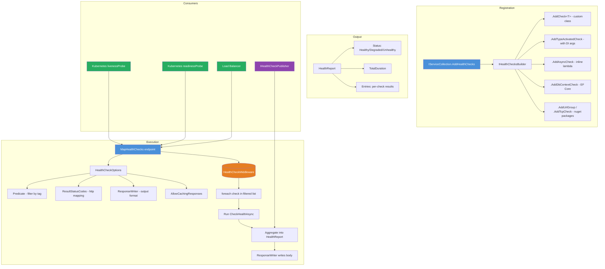
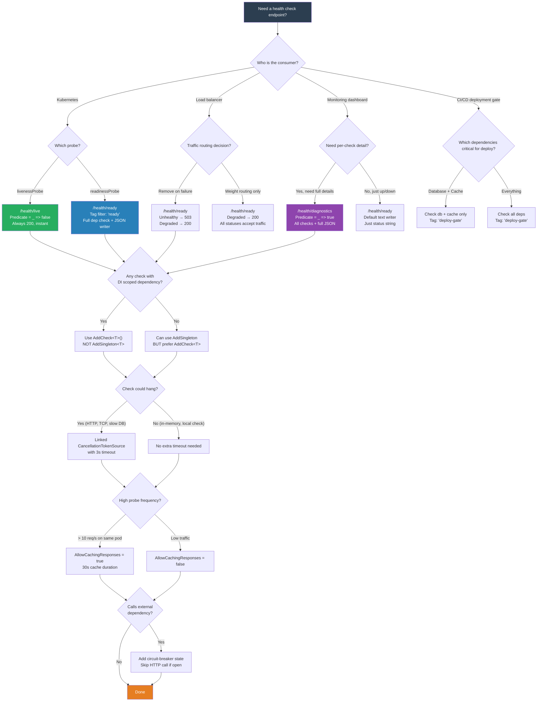

> [!success] Mastery Check
> - [ ] **Studied Well**
> - [ ] **Can explain the concept without notes**
> - [ ] **Can answer interview questions confidently**
> - [ ] **Can implement it in a real project**


# 4.323 — Health Check Middleware: HealthCheck Registration and Custom IHealthCheck

## Part 0 — Navigation & Context

```
ASP.NET Core Mastery (Domain)
├── 4.1XX Host & Lifecycle
├── 4.2XX Middleware Fundamentals
├── 4.3XX Observability & Monitoring
│   ├── 4.32X Health Checks (subsystem)
│   │   ├── 4.323 ◄── YOU ARE HERE
│   │   ├── 4.324  Response Writers & Customization
│   │   ├── 4.325  Startup Health Checks & Warmup
│   │   ├── 4.326  Kubernetes Probe Integration
│   │   └── 4.327  IHealthCheckPublisher
│   ├── 4.33X Logging
│   ├── 4.34X OpenTelemetry & Metrics
│   └── 4.35X Exception Handling
├── 4.4XX Routing & Endpoints
├── 4.5XX Auth & Security
└── 4.6XX Deployment & Containers
```

**What you need before this:**
- [[4.201]] — Middleware Pipeline Fundamentals: `app.Use()` vs `app.Run()`, the `next()` delegate, short-circuit behavior
- [[4.106]] — Dependency Injection Lifetime Scoping (`AddScoped`/`AddSingleton`/`AddTransient`) — health checks often consume scoped DbContexts or singleton HTTP clients
- [[4.221]] — Endpoint Routing with `app.MapGet()` / `app.MapHealthChecks()` — `MapHealthChecks` participates in the same routing table as your API endpoints
- [[3.101]] — EF Core DbContext Lifetime and Disposal — a health check that opens a connection must manage it correctly

**What this unlocks after:**
- [[4.324]] — Custom `HealthReportWriter` serialization and JSON formatting
- [[4.326]] — `livenessProbe` / `readinessProbe` YAML configuration in Kubernetes deployment manifests
- [[4.327]] — Publishing health data to Prometheus, Azure Monitor, App Insights via `IHealthCheckPublisher`
- [[4.351]] — Exception Handling Middleware interaction when health checks throw unhandled exceptions

**Why this matters to a production engineer:** A misconfigured health check endpoint causes Kubernetes to restart healthy pods during database maintenance windows (wrongly mapped liveness == readiness), while a missing `IHealthCheck` implementation silently hides a broken Redis connection until a pager goes off at 3 AM — the health check endpoint is the contract between your app and your orchestrator, and every millisecond of latency on the health check path multiplies across every probe interval across every replica.

---

## Part 1 — Core Mental Model

> **ASP.NET Core's Health Checks middleware runs registered `IHealthCheck` implementations inside `MapHealthChecks()` and aggregates their `HealthCheckResult` values into a single `HealthReport`, then writes a response — the practical consequence is that every registered check runs synchronously (not in parallel) inside a single request pipeline step, so a single slow check blocks all checks and delays the entire probe response.**

**The plain-language analogy:** Think of health checks like a building's fire alarm panel. Each `IHealthCheck` is a separate sensor — one for smoke (database connectivity), one for heat (Redis latency), one for sprinkler pressure (disk space). The `HealthCheckOptions.Predicate` is the zone map that decides which sensors are checked by the morning inspection crew (`/health/ready`) versus the 24/7 life-safety monitor (`/health/live`). The middleware itself is the panel's central processor: it pings every sensor in sequence, aggregates the results, and lights up the indicator light (HTTP status code). The critical insight most engineers miss: if the smoke sensor takes 10 seconds to respond (hanging TCP connection), the panel never gets to check the heat sensor — all probes during that window get the delayed aggregate, not just the slow sensor's reading.

**Taxonomy diagram:**



---

## Part 2 — Deep Mechanics

### 2.1 Registration Pipeline — What `AddHealthChecks()` Actually Does

**Pipeline position:** Registration phase (not request pipeline — happens at startup inside `Program.cs` before `builder.Build()`).

```
Startup Phase:
─────────────────────────────────────────────────────────────
ConfigureServices / builder.Services
  └── AddHealthChecks()
      └── Registers DefaultHealthCheckService (singleton)
          └── HealthCheckService is the orchestrator
      └── Returns IHealthChecksBuilder
          └── Each .AddCheck<T>() stores a HealthCheckRegistration
              └── Name, Tags, FailureStatus, Factory (Func<IServiceProvider, IHealthCheck>)
```

**Framework source behavior (approximate):**

```csharp
// ASP.NET Core internals (approximate — HealthCheckServiceExtensions):
public static IHealthChecksBuilder AddHealthChecks(this IServiceCollection services)
{
    // Registers the singleton orchestrator
    services.TryAddSingleton<HealthCheckService, DefaultHealthCheckService>();
    return new HealthChecksBuilder(services);
}

// Each .AddCheck<T>() creates a HealthCheckRegistration:
// internal class HealthCheckRegistration
// {
//     string Name;                          // unique check name
//     IEnumerable<string> Tags;             // for Predicate filtering
//     HealthStatus? FailureStatus;          // what status if check throws
//     Func<IServiceProvider, IHealthCheck> Factory;  // factory, NOT the instance
// }
```

**Runtime cost:** `O(1)` registration allocation per check (~120 bytes per `HealthCheckRegistration` + the delegate). Negligible — happens once at startup.

**The edge case that bites engineers:** `AddCheck<T>` registers the factory lazily, but the `T` type is resolved from DI *each time the health check runs*, not once. If `T` has a scoped lifetime (e.g., an EF Core `DbContext`) and the health check is called from a singleton context, you get a captive dependency — the factory is evaluated in a scope that may not exist. The `DefaultHealthCheckService` creates its own `IServiceScope` for each health check invocation to handle this. However, if `T` is registered as `AddSingleton`, the instance is reused across checks, and any connection state inside it persists — a singleton health check with a broken TCP connection won't be recreated automatically.

```csharp
// Cost: O(number of checks) resolution per invocation, one scope created per check run
```

### 2.2 The `IHealthCheck` Interface — Execution Contract

```csharp
public interface IHealthCheck
{
    Task<HealthCheckResult> CheckHealthAsync(
        HealthCheckContext context,
        CancellationToken cancellationToken = default);
}
```

**Pipeline position (request execution):**

```
HTTP Request: GET /health/ready
  ──► Kestrel ──► HostFiltering ──► UseRouting ──► [routing match: /health/ready]
        ──► MapHealthChecks middleware ──► DefaultHealthCheckService.CheckHealthAsync()
              ──► foreach (check in filtered):
              │       ──► resolve IHealthCheck from DI factory
              │       ──► await check.CheckHealthAsync(context, ct)
              │       ──► collect HealthCheckResult into list
              ├──► aggregate results (worst status wins)
              ├──► apply ResultStatusCodes map
              ├──► set HttpContext.Response.StatusCode
              └──► call ResponseWriter (or default text writer)
```

**`HealthCheckContext` properties:**
- `Registration.Name` — the check's registered name
- `Registration.Tags` — tag list for predicate filtering
- `Registration.FailureStatus` — optional override; what status to use if check throws (defaults to `HealthStatus.Unhealthy`)

**`HealthCheckResult` factory methods:**

```csharp
// Each has overloads accepting (string? description, Exception? exception, IReadOnlyDictionary<string, object>? data)

return HealthCheckResult.Healthy("Redis ping OK", data: new Dictionary<string, object>
{
    ["latency_ms"] = 1.2,
    ["connected_clients"] = 42
});

return HealthCheckResult.Degraded("Redis latency elevated", data: new Dictionary<string, object>
{
    ["latency_ms"] = 350
});

return HealthCheckResult.Unhealthy("Redis connection refused", exception);
```

**Aggregation rule:** The `DefaultHealthCheckService` aggregates using worst-status-wins: `Healthy` < `Degraded` < `Unhealthy`. If any check returns `Unhealthy`, the overall report is `Unhealthy`. The middleware then maps this to an HTTP status code via `ResultStatusCodes`.

**HTTP wire format (default response — plain text):**

```
// HTTP GET /health/ready (when all healthy):
// HTTP/1.1 200 OK
// Content-Type: text/plain
//
// Healthy

// HTTP GET /health/ready (when db unhealthy):
// HTTP/1.1 503 Service Unavailable
// Content-Type: text/plain
//
// Unhealthy
```

**Framework source behavior (approximate):**

```csharp
// ASP.NET Core internally (DefaultHealthCheckService.CheckHealthAsync — simplified):
public async Task<HealthReport> CheckHealthAsync(
    Func<HealthCheckRegistration, bool>? predicate,
    CancellationToken cancellationToken = default)
{
    // Filter registrations by predicate
    var checks = _registrations.Where(r => predicate?.Invoke(r) ?? true);

    // For each check, create scope, execute, collect result
    var entries = new Dictionary<string, HealthReportEntry>(StringComparer.OrdinalIgnoreCase);
    var totalDuration = ValueStopwatch.StartNew();
    var result = HealthStatus.Healthy;

    foreach (var registration in checks)
    {
        using var scope = _scopeFactory.CreateScope();  // ✅ fresh scope per check
        var check = registration.Factory(scope.ServiceProvider);
        HealthReportEntry entry;
        try
        {
            var checkResult = await check.CheckHealthAsync(
                new HealthCheckContext { Registration = registration },
                cancellationToken);
            entry = new HealthReportEntry(checkResult.Status, checkResult.Description,
                totalDuration.Elapsed, checkResult.Exception, checkResult.Data, registration.Tags);
        }
        catch (Exception ex)
        {
            var failureStatus = registration.FailureStatus ?? HealthStatus.Unhealthy;
            entry = new HealthReportEntry(failureStatus, ex.Message, totalDuration.Elapsed,
                ex, null, registration.Tags);
        }
        entries[registration.Name] = entry;
        if (entry.Status > result) result = entry.Status;  // worst wins
    }

    return new HealthReport(entries, totalDuration.Elapsed);
}
```

**Runtime cost:** `O(N)` sequential execution where N = number of checks matching predicate. Each check creates one DI scope (~1 allocation + disposable), one factory invocation, and one async state machine. Total allocations per invocation: `~N * (scope + task + result)` — for 5 checks, expect ~200-400 bytes allocated per health check request.

**The edge case that bites engineers:** The `foreach` loop is sequential by design — checks are NOT run in parallel. `Task.WhenAll` would mask individual failures and lose per-check exception context. The `DefaultHealthCheckService` intentionally serializes execution so each check's duration and exception are captured independently. The consequence: a single check that hangs for 30 seconds (e.g., a SQL connection timeout default) delays ALL checks and the entire health endpoint response, causing Kubernetes to miss consecutive probes and restart the pod even though only one dependency is slow.

### 2.3 Predicate Filtering — The Liveness/Readiness Split

```csharp
// LIVE: predicate = _ => false — NO checks run
// HealthStatus.Healthy is returned immediately
app.MapHealthChecks("/health/live", new HealthCheckOptions
{
    Predicate = _ => false,  // skip all checks
    ResultStatusCodes =
    {
        [HealthStatus.Healthy] = StatusCodes.Status200OK
        // No Degraded or Unhealthy mapping needed — they never occur
    }
});

// READY: predicate = check => check.Tags.Contains("ready")
// Only checks registered with .Tags.Add("ready") run
app.MapHealthChecks("/health/ready", new HealthCheckOptions
{
    Predicate = check => check.Tags.Contains("ready"),
    ResultStatusCodes =
    {
        [HealthStatus.Healthy] = StatusCodes.Status200OK,
        [HealthStatus.Degraded] = StatusCodes.Status200OK,   // still serve traffic
        [HealthStatus.Unhealthy] = StatusCodes.Status503ServiceUnavailable
    }
});
```

**Pipeline consequence of `Predicate = _ => false`:** The `DefaultHealthCheckService` iterates zero registrations, the result is always `Healthy`, the response is instant. The entire health check middleware executes in < 1ms with zero allocations (aside from the HTTP response frame). This is the correct liveness implementation: it only tests that Kestrel is running and the middleware pipeline is intact.

**The edge case that bites engineers:** The wrong predicate mapping — `/health/live` running all checks (predicate = `_ => true` or missing predicate) — causes Kubernetes to restart pods during a database failover. The database is down for 30 seconds during a primary-replica switch; `/health/live` returns `503`, Kubernetes thinks the pod is dead, restarts it, and the new pod also sees the database down during its startup checks. This cascades into a full restart cycle until the database failover completes.

### 2.4 `FailureStatus` — Controlling the Unhandled Exception Behavior

```csharp
builder.Services.AddHealthChecks()
    .AddCheck<CacheHealthCheck>("cache", failureStatus: HealthStatus.Degraded)
    // If CacheHealthCheck.CheckHealthAsync throws, the aggregate treats it as Degraded, not Unhealthy
```

**Pipeline behavior:** When `CheckHealthAsync` throws an unhandled exception, the `DefaultHealthCheckService` catches it in the `try/catch` around the invocation. If `failureStatus` is not set (null), it defaults to `HealthStatus.Unhealthy`. Setting it to `Degraded` means a throwing cache check won't trigger the 503 response — useful for non-critical dependencies where you want to log the failure but continue serving traffic.

**Runtime cost:** Zero additional cost — the `failureStatus` is read from the registration metadata at exception-catch time.

---

## Part 3 — Production Code Patterns

### Pattern 1: The Liveness/Readiness Split with Separate Tagged Registrations

```csharp
// Scenario: E-commerce order processing service with SQL Server, Redis, and RabbitMQ

var builder = WebApplication.CreateBuilder(args);

builder.Services.AddHealthChecks()
    // LIVE checks (empty set — just proves process is alive)
    // No registrations needed; predicate filter excludes all

    // READY checks — tagged "ready" for selective filtering
    .AddCheck<SqlServerHealthCheck>(
        "orders-db",
        tags: ["ready"])
    .AddCheck<RedisHealthCheck>(
        "session-cache",
        tags: ["ready"])
    .AddCheck<RabbitMqHealthCheck>(
        "order-queue",
        tags: ["ready"],               // participates in readiness
        failureStatus: HealthStatus.Degraded)  // queue down = degraded, not dead
    // OPTIONAL checks — run only for diagnostics endpoints, not Kubernetes
    .AddCheck<DiskSpaceHealthCheck>(
        "disk-space",
        tags: ["diagnostics"]);

var app = builder.Build();

// LIVE — empty predicate, instant healthy
app.MapHealthChecks("/health/live", new HealthCheckOptions
{
    Predicate = _ => false,
    ResultStatusCodes =
    {
        [HealthStatus.Healthy] = StatusCodes.Status200OK
    }
});

// READY — only checks tagged "ready", with custom JSON response
app.MapHealthChecks("/health/ready", new HealthCheckOptions
{
    Predicate = check => check.Tags.Contains("ready"),
    ResultStatusCodes =
    {
        [HealthStatus.Healthy] = StatusCodes.Status200OK,
        [HealthStatus.Degraded] = StatusCodes.Status200OK,
        [HealthStatus.Unhealthy] = StatusCodes.Status503ServiceUnavailable
    },
    ResponseWriter = HealthJsonResponseWriter.WriteResponse
});

// DIAGNOSTICS — internal endpoint for ops team, runs ALL checks inc. disk
app.MapHealthChecks("/health/diagnostics", new HealthCheckOptions
{
    Predicate = _ => true,
    ResponseWriter = HealthJsonResponseWriter.WriteResponse
});

app.Run();

// HTTP wire format — live:
// GET /health/live
// HTTP/1.1 200 OK
// Content-Type: text/plain
//
// Healthy

// HTTP wire format — ready (all healthy):
// GET /health/ready
// HTTP/1.1 200 OK
// Content-Type: application/json
// {"status":"Healthy","duration":12.4,"entries":[...]}

// HTTP wire format — ready (db down):
// GET /health/ready
// HTTP/1.1 503 Service Unavailable
// Content-Type: application/json
// {"status":"Unhealthy","duration":5021.3,"entries":[{"name":"orders-db","status":"Unhealthy",...}]}
```

**Why each decision was made:**
- Separate `/health/live` and `/health/ready` endpoints because Kubernetes `livenessProbe` and `readinessProbe` have different semantics (restart vs. traffic-drain)
- `failureStatus: Degraded` on the queue check because the order service can still read from DB and serve cached orders even if the queue broker is temporarily down
- Third `/health/diagnostics` endpoint for engineers, NOT for Kubernetes, running all checks including disk space — disk monitoring is important but you don't want a full-disk scenario causing pod restarts when multiple replicas exist

### Pattern 2: The Timeboxed Health Check with Cancellation

```csharp
// Scenario: Payment processing service checks Stripe API via HTTP
// Anti-pattern: Stripe health check hangs for 100 seconds on network partition

// ⚠️ WRONG: No timeout — cancellationToken is ignored
public class StripeApiHealthCheck : IHealthCheck
{
    private readonly HttpClient _httpClient;
    public StripeApiHealthCheck(HttpClient httpClient) => _httpClient = httpClient;

    public async Task<HealthCheckResult> CheckHealthAsync(
        HealthCheckContext context, CancellationToken cancellationToken)
    {
        var response = await _httpClient.GetAsync("https://api.stripe.com/v1/health");
        // ⚠️ If Stripe is unreachable, HttpClient default timeout is 100 seconds
        // The health check endpoint blocks for 100 seconds for all checks
        return response.IsSuccessStatusCode
            ? HealthCheckResult.Healthy()
            : HealthCheckResult.Unhealthy($"Stripe returned {response.StatusCode}");
    }
}

// ✅ CORRECT: Explicit timeout via linked CTS
public class StripeApiHealthCheck : IHealthCheck
{
    private readonly HttpClient _httpClient;
    private static readonly TimeSpan _timeout = TimeSpan.FromSeconds(3);
    // Timeout chosen: 3s covers 99.9% of Stripe responses; Kubernetes probe interval is 10s
    // Three consecutive probe timeouts (3s * 3 = 9s) still leaves 1s before the 10s window

    public StripeApiHealthCheck(HttpClient httpClient) => _httpClient = httpClient;

    public async Task<HealthCheckResult> CheckHealthAsync(
        HealthCheckContext context, CancellationToken cancellationToken)
    {
        using var timeoutCts = CancellationTokenSource.CreateLinkedTokenSource(
            cancellationToken, CancellationToken.None);
        timeoutCts.CancelAfter(_timeout);

        try
        {
            var response = await _httpClient.GetAsync(
                "https://api.stripe.com/v1/health",
                timeoutCts.Token);
            return response.IsSuccessStatusCode
                ? HealthCheckResult.Healthy("Stripe API reachable")
                : HealthCheckResult.Degraded(
                    $"Stripe returned {response.StatusCode}",
                    data: new Dictionary<string, object> { ["http_status"] = (int)response.StatusCode });
        }
        catch (OperationCanceledException)
        {
            return HealthCheckResult.Degraded(
                "Stripe API timeout after 3s",
                data: new Dictionary<string, object> { ["timeout_ms"] = 3000 });
        }
    }
}

// HTTP consequence (wrong path):
// GET /health/ready — Stripe unreachable, check blocks 100s
// HTTP/1.1 503 Service Unavailable after 100 seconds
// Kubernetes misses 10 readiness probes during this window → pod removed from service

// HTTP consequence (correct path):
// GET /health/ready — Stripe unreachable, check returns after 3s
// HTTP/1.1 200 OK (Degraded mapped to 200)
// Kubernetes sees Degraded as "still serving traffic but warn"
```

**Why the 3-second timeout:** Kubernetes default `periodSeconds` is 10s, with `failureThreshold: 3`. Each probe has a 10-second window. A 3-second check timeout ensures three consecutive Stripe timeouts (9s total) still fit within the 30s failure window, leaving 1s of margin for network jitter. The linked CTS respects both the app-level shutdown token and the check-specific timeout.

### Pattern 3: The Dependent-Resource Health Check with Lazy Connection

```csharp
// Scenario: Logistics tracking service checks PostgreSQL via Npgsql
// Anti-pattern: Opening a new connection per check creates connection storm at scale

// ⚠️ WRONG: Opens a new connection every time (30 replicas × 10s interval = 180 conn/min)
public class PostgresHealthCheck : IHealthCheck
{
    private readonly string _connectionString;
    public PostgresHealthCheck(IConfiguration config)
        => _connectionString = config.GetConnectionString("LogisticsDb")!;

    public async Task<HealthCheckResult> CheckHealthAsync(
        HealthCheckContext context, CancellationToken ct)
    {
        await using var conn = new NpgsqlConnection(_connectionString);
        await conn.OpenAsync(ct);  // ⚠️ New TCP connection + auth handshake every 10 seconds
        await using var cmd = new NpgsqlCommand("SELECT 1", conn);
        await cmd.ExecuteScalarAsync(ct);
        return HealthCheckResult.Healthy();
    }
}

// ✅ CORRECT: Uses the app's existing connection pool (NpgsqlDataSource)
public class PostgresHealthCheck : IHealthCheck
{
    private readonly NpgsqlDataSource _dataSource;
    // NpgsqlDataSource is registered as singleton — connection pool is shared with business code
    // The health check borrows a connection from the pool rather than creating a new one

    public PostgresHealthCheck(NpgsqlDataSource dataSource) => _dataSource = dataSource;

    public async Task<HealthCheckResult> CheckHealthAsync(
        HealthCheckContext context, CancellationToken ct)
    {
        try
        {
            await using var conn = await _dataSource.OpenConnectionAsync(ct);
            await using var cmd = new NpgsqlCommand("SELECT 1", conn);
            await cmd.ExecuteScalarAsync(ct);
            return HealthCheckResult.Healthy(
                "PostgreSQL reachable",
                data: new Dictionary<string, object>
                {
                    ["pool_connections"] = conn.ProcessID  // zero-cost diagnostic
                });
        }
        catch (PostgresException ex)
        {
            return HealthCheckResult.Unhealthy($"PostgreSQL error: {ex.MessageText}", ex);
        }
        catch (NpgsqlException ex)
        {
            return HealthCheckResult.Unhealthy($"PostgreSQL unreachable: {ex.Message}", ex);
        }
    }
}

// HTTP consequence (wrong path):
// 30 pod replicas each probing every 10s → 180 new TCP connections/minute to PostgreSQL
// PostgreSQL max_connections (default 100) exhausted → business queries fail with "too many connections"

// HTTP consequence (correct path):
// 30 pod replicas each probing every 10s → borrow from existing pool, zero new connections
// Pool size of 20 per pod handles both business traffic and health checks
```

### Pattern 4: The Composite Health Check (Grouping Related Checks)

```csharp
// Scenario: Multi-region payment gateway — separate checks for EU and US endpoints
// without registering 6 separate IHealthCheck classes

public class PaymentGatewayHealthCheck : IHealthCheck
{
    private readonly HttpClient _httpClient;
    private readonly IReadOnlyList<string> _endpoints;
    private readonly string _region;

    public PaymentGatewayHealthCheck(HttpClient httpClient, string region, string[] endpoints)
    {
        _httpClient = httpClient;
        _region = region;
        _endpoints = endpoints;
    }

    public async Task<HealthCheckResult> CheckHealthAsync(
        HealthCheckContext context, CancellationToken ct)
    {
        var failures = new List<string>();
        var latencies = new List<double>();
        var overallHealthy = true;

        foreach (var endpoint in _endpoints)
        {
            var sw = ValueStopwatch.StartNew();
            try
            {
                var response = await _httpClient.GetAsync(endpoint, ct);
                if (!response.IsSuccessStatusCode)
                {
                    failures.Add($"{endpoint}: HTTP {(int)response.StatusCode}");
                    overallHealthy = false;
                }
                latencies.Add(sw.GetElapsedTime().TotalMilliseconds);
            }
            catch (Exception ex)
            {
                failures.Add($"{endpoint}: {ex.Message}");
                overallHealthy = false;
            }
        }

        var data = new Dictionary<string, object>
        {
            ["region"] = _region,
            ["endpoints_checked"] = _endpoints.Count,
            ["endpoints_failed"] = failures.Count,
            ["avg_latency_ms"] = latencies.Count > 0 ? latencies.Average() : 0
        };

        if (!overallHealthy)
            return HealthCheckResult.Unhealthy(
                $"Payment gateway {_region} degraded: {string.Join("; ", failures)}",
                data: data);

        return HealthCheckResult.Healthy(
            $"Payment gateway {_region} all endpoints reachable",
            data: data);
    }
}

// Registration using AddTypeActivatedCheck for constructor args:
builder.Services.AddHealthChecks()
    .AddTypeActivatedCheck<PaymentGatewayHealthCheck>(
        "payments-eu",
        args: ["eu-west", new[] {
            "https://api-eu.payments.example.com/health",
            "https://api-eu.payments.example.com/status"
        }],
        tags: ["ready"])
    .AddTypeActivatedCheck<PaymentGatewayHealthCheck>(
        "payments-us",
        args: ["us-east", new[] {
            "https://api-us.payments.example.com/health",
            "https://api-us.payments.example.com/status"
        }],
        tags: ["ready"]);
```

### Pattern 5: The Cache-Breaking Health Check that Bypasses Application Cache

```csharp
// Scenario: E-commerce catalog service must verify Redis is actually writable,
// not just that a stale TCP connection exists (fake-healthy Redis detection)

public class RedisWriteHealthCheck : IHealthCheck
{
    private readonly IConnectionMultiplexer _redis;
    // IConnectionMultiplexer is singleton — but the health check must NOT use
    // the cached response from the last real operation. It must force a real round-trip.

    public RedisWriteHealthCheck(IConnectionMultiplexer redis) => _redis = redis;

    public async Task<HealthCheckResult> CheckHealthAsync(
        HealthCheckContext context, CancellationToken ct)
    {
        try
        {
            var db = _redis.GetDatabase();
            // WRITE a temp key and READ it back — verifies the full write path
            var testKey = $"healthcheck:{Environment.MachineName}:{Guid.NewGuid():N}";
            await db.StringSetAsync(testKey, "ok", expiry: TimeSpan.FromSeconds(30), flags: CommandFlags.FireAndForget);
            // WaitForReplicaSync is NOT used — we accept eventual consistency for health checks
            
            // Use PING with a timeout to verify actual connectivity, not cached multiplexer state
            var pingResult = await db.PingAsync();
            if (pingResult.TotalMilliseconds > 500)
            {
                return HealthCheckResult.Degraded(
                    $"Redis high latency: {pingResult.TotalMilliseconds:F0}ms",
                    data: new Dictionary<string, object> { ["ping_ms"] = pingResult.TotalMilliseconds });
            }

            return HealthCheckResult.Healthy(
                "Redis reachable and writable",
                data: new Dictionary<string, object> { ["ping_ms"] = pingResult.TotalMilliseconds });
        }
        catch (RedisConnectionException ex)
        {
            return HealthCheckResult.Unhealthy($"Redis unreachable: {ex.Message}", ex);
        }
        catch (TimeoutException ex)
        {
            return HealthCheckResult.Degraded($"Redis timeout: {ex.Message}", ex);
        }
    }
}
```

### Pattern 6: The Conditional Health Check (Feature-Toggle-Aware)

```csharp
// Scenario: Healthcare patient portal — the FHIR integration is still being rolled out
// Only check FHIR endpoint if the feature flag is enabled; otherwise skip silently

public class FhirIntegrationHealthCheck : IHealthCheck
{
    private readonly HttpClient _httpClient;
    private readonly IConfiguration _config;

    public FhirIntegrationHealthCheck(HttpClient httpClient, IConfiguration config)
    {
        _httpClient = httpClient;
        _config = config;
    }

    public async Task<HealthCheckResult> CheckHealthAsync(
        HealthCheckContext context, CancellationToken ct)
    {
        // If FHIR integration is disabled for this deployment, report healthy without any I/O
        if (!_config.GetValue<bool>("Features:FhirIntegration"))
        {
            return HealthCheckResult.Healthy("FHIR integration disabled");
        }

        try
        {
            var response = await _httpClient.GetAsync(
                _config["Fhir:HealthEndpoint"], ct);
            return response.IsSuccessStatusCode
                ? HealthCheckResult.Healthy("FHIR API reachable")
                : HealthCheckResult.Degraded($"FHIR API returned {response.StatusCode}");
        }
        catch (HttpRequestException ex)
        {
            return HealthCheckResult.Degraded($"FHIR API unreachable: {ex.Message}", ex);
        }
    }
}
```

### Pattern 7: The Startup-Blocking Check Used During Warmup

```csharp
// Scenario: Order service must verify the database has pending migrations applied
// before reporting ready (prevents traffic hitting a schema-mismatched service)

public class PendingMigrationHealthCheck : IHealthCheck
{
    private readonly OrdersDbContext _db;

    public PendingMigrationHealthCheck(OrdersDbContext db) => _db = db;

    public async Task<HealthCheckResult> CheckHealthAsync(
        HealthCheckContext context, CancellationToken ct)
    {
        try
        {
            var pending = await _db.Database.GetPendingMigrationsAsync(ct);
            if (pending.Any())
            {
                return HealthCheckResult.Unhealthy(
                    $"Database has {pending.Count()} pending migrations: {string.Join(", ", pending)}",
                    data: new Dictionary<string, object> { ["pending_migrations"] = pending.Count() });
            }

            // Verify the connection works with a real query, not just schema introspection
            var canConnect = await _db.Database.CanConnectAsync(ct);
            if (!canConnect)
                return HealthCheckResult.Unhealthy("Database unreachable");

            return HealthCheckResult.Healthy("Database up to date and reachable");
        }
        catch (Exception ex)
        {
            return HealthCheckResult.Unhealthy($"Database check failed: {ex.Message}", ex);
        }
    }
}
```

---

## Part 4 — Gotchas & Anti-Patterns

### Gotcha 1: The Liveness Readiness Short-Circuit

**The trap:** Engineers map both liveness and readiness probes to the same `/health` endpoint because "they both check the same thing." The consequence in production: a database failover kills all pods instead of draining traffic.

```yaml
# Kubernetes deployment YAML:
livenessProbe:
  httpGet:
    path: /health     # ⚠️ Same endpoint as readiness
    port: 80
  initialDelaySeconds: 10
  periodSeconds: 10
readinessProbe:
  httpGet:
    path: /health     # ⚠️ Same endpoint — includes database check
    port: 80
  periodSeconds: 5
```

```
// HTTP consequence (wrong path):
// Database replica switchover at 10:00:00
// /health returns 503 (db unreachable)
// Kubernetes: "livenessProbe failed → pod unhealthy → restart" (10s later)
// All 10 replicas restart simultaneously
// Database switchover completes at 10:00:15
// New pods start, connect to new primary, report healthy
// But: zero pods serving traffic from 10:00:10 to 10:00:25 (15s of downtime during deploy)
```

```yaml
# ✅ CORRECT:
livenessProbe:
  httpGet:
    path: /health/live     # Empty predicate — instant 200
    port: 80
  initialDelaySeconds: 10
  periodSeconds: 10
readinessProbe:
  httpGet:
    path: /health/ready    # Full dependency check
    port: 80
  periodSeconds: 5         # More frequent — traffic removal is fast
```

```
// HTTP consequence (correct path):
// Database replica switchover at 10:00:00
// /health/ready returns 503 → traffic drained from this pod (5s later)
// /health/live returns 200 → pod stays alive
// Switchover completes at 10:00:15
// /health/ready returns 200 → traffic restored
// Zero pods restarted. Zero downtime.
```

**WHY:** Liveness and readiness serve different orchestrator purposes. Liveness == "is the process running?" (restart if not). Readiness == "can the process handle traffic?" (route traffic away if not). Database failover is a transient condition — you want traffic removed, not the pod killed and recreated. A pod restart during failover delays recovery because the new pod must go through its own startup sequence.

### Gotcha 2: The Connection Storm Health Check

**The trap:** Each health check opens a new database connection instead of reusing the app's existing connection pool. At scale, the health check traffic overwhelms the database's max connection limit.

```csharp
// ⚠️ WRONG: New connection per health check invocation
public class DatabaseHealthCheck : IHealthCheck
{
    private readonly string _connectionString;

    public DatabaseHealthCheck(IConfiguration config)
        => _connectionString = config.GetConnectionString("OrdersDb")!;

    public async Task<HealthCheckResult> CheckHealthAsync(
        HealthCheckContext context, CancellationToken ct)
    {
        await using var conn = new SqlConnection(_connectionString);
        await conn.OpenAsync(ct);  // ⚠️ Each invocation = new TCP connection
        // ...
    }
}
```

```
// HTTP consequence (wrong path):
// 20 replicas × 5 readiness probes per 10s window = 10 new connections/second
// Database max_connections = 200
// After 20 seconds, connection pool exhausted → business queries fail
// Health checks become the cause of the outage they were supposed to prevent
```

```csharp
// ✅ CORRECT: Use the existing connection pool (SqlConnection with same connection string
// automatically pools; alternately inject IDbConnectionFactory)
public class DatabaseHealthCheck : IHealthCheck
{
    private readonly SqlConnection _connection;
    // SqlConnection with matching connection string uses the shared pool

    public DatabaseHealthCheck(SqlConnection connection) => _connection = connection;

    public async Task<HealthCheckResult> CheckHealthAsync(
        HealthCheckContext context, CancellationToken ct)
    {
        try
        {
            await _connection.OpenAsync(ct);   // Borrows from pool (~0ms if available)
            await using var cmd = _connection.CreateCommand();
            cmd.CommandText = "SELECT 1";
            await cmd.ExecuteScalarAsync(ct);
            await _connection.CloseAsync();    // Returns to pool immediately
            return HealthCheckResult.Healthy();
        }
        catch (SqlException ex)
        {
            return HealthCheckResult.Unhealthy($"Database check failed: {ex.Message}", ex);
        }
    }
}
```

```
// HTTP consequence (correct path):
// Same 20 replicas × 5 probes → borrows from existing pool
// Zero new connections created
// Business queries unaffected
// Pool health is verified by actually using it
```

**WHY:** `SqlConnection` pools by connection string by default. Opening a `SqlConnection` with the same connection string as your business code reuses the same pool. The health check acts as a pool-health verifier — it proves the pool can successfully acquire a connection. Creating a brand-new `SqlConnection` with its own connection string bypasses the app's pool entirely and creates contention.

### Gotcha 3: The Async-Lambda Check That Swallows Exceptions

**The trap:** Using `AddAsyncCheck` with a lambda that catches exceptions but returns the wrong status, or fails to catch at all.

```csharp
// ⚠️ WRONG: Lambda check that doesn't handle exceptions
builder.Services.AddHealthChecks()
    .AddAsyncCheck("redis", async () =>
    {
        var db = connectionMultiplexer.GetDatabase();
        await db.PingAsync();           // ⚠️ Unhandled exception = middleware catches it
        return HealthCheckResult.Healthy();
        // If PingAsync throws, middleware wraps with failureStatus (default = Unhealthy)
        // But the exception message is the only description — no custom data
    });
```

```
// HTTP consequence (wrong path):
// Redis server restarts → PingAsync throws RedisConnectionException
// Middleware returns: {"status":"Unhealthy","description":"No connection is available..."}
// No custom data dict, no latency info, no helpful context for the ops team
```

```csharp
// ✅ CORRECT: Explicit try/catch with structured failure data
builder.Services.AddHealthChecks()
    .AddAsyncCheck("redis", async () =>
    {
        try
        {
            var sw = ValueStopwatch.StartNew();
            var db = connectionMultiplexer.GetDatabase();
            await db.PingAsync();
            return HealthCheckResult.Healthy(
                "Redis reachable",
                data: new Dictionary<string, object> { ["latency_ms"] = sw.GetElapsedTime().TotalMilliseconds });
        }
        catch (RedisConnectionException ex)
        {
            return HealthCheckResult.Unhealthy(
                "Redis connection failed",
                ex,
                data: new Dictionary<string, object> { ["error_code"] = ex.FailureType.ToString() });
        }
    });
```

```
// HTTP consequence (correct path):
// Redis server restarts → caught and structured
// Response: {"status":"Unhealthy","description":"Redis connection failed",
//   "data":{"error_code":"SocketFailure"}}
// Ops team sees the failure type immediately in logs/monitoring
```

**WHY:** `AddAsyncCheck` wraps the lambda in an `IHealthCheck` implementation, but the default `failureStatus` and missing `data` dictionary hide the failure context. Always use explicit `try/catch` in health checks — the middleware's built-in exception handling loses the diagnostic data that operators need to triage without digging into application logs.

### Gotcha 4: The Captive Dependency in Singleton Health Check

**The trap:** A health check registered as `AddSingleton` captures a scoped `DbContext`, causing `ObjectDisposedException` or stale data.

```csharp
// ⚠️ WRONG: Health check registered as singleton with scoped DbContext injection
builder.Services.AddSingleton<InventoryHealthCheck>();  // ⚠️ Captive dependency

public class InventoryHealthCheck : IHealthCheck
{
    private readonly InventoryDbContext _db;
    // InventoryDbContext is Scoped — this singleton captures the instance created
    // during health check service resolution at startup

    public InventoryHealthCheck(InventoryDbContext db) => _db = db;

    public async Task<HealthCheckResult> CheckHealthAsync(
        HealthCheckContext context, CancellationToken ct)
    {
        await _db.Database.CanConnectAsync(ct);
        // ⚠️ First invocation: works (captured from startup scope)
        // ⚠️ Second invocation: ObjectDisposedException (startup scope disposed)
        // ⚠️ OR: stale DbContext that holds a connection from initialization
    }
}
```

```
// HTTP consequence (wrong path):
// First probe after startup: 200 OK (DbContext captured from startup scope)
// Second probe: 500 Internal Server Error — ObjectDisposedException
// Kubernetes sees intermittent 500s → flapping readiness state
// Ops team confused: "it works sometimes"
```

```csharp
// ✅ CORRECT: Register as transient or use factory pattern
builder.Services.AddTransient<InventoryHealthCheck>();  // ✅ Created fresh per check
// OR: Use AddCheck<T> which creates its own scope internally
builder.Services.AddHealthChecks()
    .AddCheck<InventoryHealthCheck>("inventory-db");
    // ✅ DefaultHealthCheckService creates a scope per invocation
    // InventoryHealthCheck is resolved fresh from that scope
```

```
// HTTP consequence (correct path):
// Every probe: fresh scope → fresh DbContext → predictable behavior
// No ObjectDisposedException, no stale state
```

**WHY:** `DefaultHealthCheckService` resolves each `IHealthCheck` via a `Func<IServiceProvider, IHealthCheck>` factory. It creates its own `IServiceScope` per invocation, meaning scoped services are safe *if the check is resolved from that scope*. The bug happens when you manually register the health check as a singleton in DI — now the health check receives a scoped service from the app's root scope (which is actually the startup scope, not a per-request scope, and gets disposed after startup completes).

### Gotcha 5: The Default Plain-Text Response That Monitoring Can't Parse

**The trap:** Relying on the default `text/plain` response writer, which monitoring systems and aggregators can't parse for per-check granularity.

```csharp
// ⚠️ WRONG: Default response writer (no custom ResponseWriter set)
app.MapHealthChecks("/health/ready", new HealthCheckOptions
{
    Predicate = check => check.Tags.Contains("ready")
    // ResponseWriter not set → uses default
});
```

```
// HTTP consequence (wrong path):
// Response body: "Unhealthy"
// Content-Type: text/plain
// Monitoring system expects JSON → can't parse
// Ops team can't tell WHICH check failed: database? cache? queue?
// Dashboards show "down" with zero diagnostic information
// Pager goes off at 3 AM, engineer must SSH into pod and check logs
```

```csharp
// ✅ CORRECT: Custom JSON response writer
app.MapHealthChecks("/health/ready", new HealthCheckOptions
{
    Predicate = check => check.Tags.Contains("ready"),
    ResponseWriter = async (context, report) =>
    {
        context.Response.ContentType = "application/json; charset=utf-8";
        var response = new
        {
            status = report.Status.ToString(),
            durationMs = report.TotalDuration.TotalMilliseconds,
            checks = report.Entries.Select(e => new
            {
                name = e.Key,
                status = e.Value.Status.ToString(),
                description = e.Value.Description,
                durationMs = e.Value.Duration.TotalMilliseconds,
                error = e.Value.Exception?.Message,
                data = e.Value.Data?.ToDictionary(k => k.Key, v => v.Value)
            })
        };
        await context.Response.WriteAsJsonAsync(response);
    }
});
```

```
// HTTP consequence (correct path):
// Response body:
// {"status":"Unhealthy","durationMs":1523.4,"checks":[
//   {"name":"orders-db","status":"Healthy","durationMs":12.1},
//   {"name":"session-cache","status":"Unhealthy","description":"Connection refused",
//    "durationMs":1002.3,"error":"No connection could be made because the target machine actively refused it"},
//   {"name":"order-queue","status":"Degraded","durationMs":5000.1}
// ]}
// Monitoring system parses this and alerts: "session-cache is down"
// DataDog/Prometheus/Grafana show exact failure per dependency
// Engineer sees "session-cache: Connection refused" without SSH'ing
```

**WHY:** The `DefaultHealthCheckResponseWriter` writes `report.Status.ToString()` as plain text — it discards all per-check information (`report.Entries`, exceptions, data dictionaries). The `HealthReport` object contains all the granular data; you must provide a `ResponseWriter` delegate to serialize it. Every production health check endpoint must have a custom response writer, because the orchestrator (Kubernetes) only checks the HTTP status code, but the human operator needs to know exactly which dependency failed.

---

## Part 5 — Performance Implications

### Request Pipeline Characteristics Table

| Scenario | Pipeline Depth | Allocations Per Request | Approx Latency Impact | Recommendation |
|---|---|---|---|---|
| `/health/live` (empty predicate) | 1 middleware (no checks run) | ~0 (zero check allocations) | < 0.1ms | Use for liveness probe |
| `/health/ready` (3 fast checks, < 50ms each) | 1 middleware + 3 IHealthCheck | ~1.2KB (scopes + tasks + results) | 2-15ms | Use for readiness probe |
| `/health/ready` (5 checks, one hangs 30s) | 1 middleware + 5 IHealthCheck (serial) | ~2KB + blocking thread | 30,000+ ms | Add per-check timeout; use linked CTS |
| SqlConnection health check (new connection) | 1 middleware + 1 TCP handshake | ~3KB + TLS handshake | 20-200ms | Reuse connection pool instead |
| SqlConnection health check (pool hit) | 1 middleware + 1 pooled conn | ~0.5KB | 0.5-3ms | Preferred approach |
| EF Core `CanConnectAsync` check | 1 middleware + 1 EF query plan | ~2KB (EF metadata loading) | 5-50ms | Use raw ADO.NET for health checks |
| HTTP Uri health check (`AddUrlGroup`) | 1 middleware + 1 HTTP round-trip | ~4KB (HttpClient pipeline) | 50-500ms | Set explicit HttpClient timeout |
| Composite check (3 internal endpoints) | 1 middleware + 3 sequential HTTP | ~12KB | 150-1500ms | Consider parallelization with `WhenAll` |
| Cached health check (`AllowCachingResponses`) | 1 middleware + cache lookup | ~0.1KB | < 0.1ms | Use when checks are expensive + data freshness < 30s |

### BenchmarkDotNet Code — Health Check Response Writer Variants

```csharp
using BenchmarkDotNet.Attributes;
using BenchmarkDotNet.Configs;
using BenchmarkDotNet.Diagnosers;
using BenchmarkDotNet.Running;
using Microsoft.AspNetCore.Http;
using Microsoft.Extensions.Diagnostics.HealthChecks;
using System.Text.Json;

[MemoryDiagnoser]
[SimpleJob(launchCount: 1, warmupCount: 3, iterationCount: 10)]
public class HealthCheckResponseWriterBenchmark
{
    private readonly HealthReport _report;
    private readonly HttpContext _httpContext;

    public HealthCheckResponseWriterBenchmark()
    {
        // Simulate a report with 3 entries (1 healthy, 1 degraded, 1 unhealthy)
        var entries = new Dictionary<string, HealthReportEntry>
        {
            ["orders-db"] = new HealthReportEntry(
                HealthStatus.Healthy, "Database reachable",
                TimeSpan.FromMilliseconds(12), null,
                new Dictionary<string, object> { ["pool_size"] = 25 }),
            ["session-cache"] = new HealthReportEntry(
                HealthStatus.Degraded, "Redis latency 350ms",
                TimeSpan.FromMilliseconds(350), null,
                new Dictionary<string, object> { ["latency_ms"] = 350 }),
            ["payment-api"] = new HealthReportEntry(
                HealthStatus.Unhealthy, "Connection refused",
                TimeSpan.FromMilliseconds(5002),
                new HttpRequestException("Connection refused"),
                new Dictionary<string, object> { ["retry_count"] = 3 })
        };
        _report = new HealthReport(entries, TimeSpan.FromMilliseconds(5364));

        var httpContext = new DefaultHttpContext();
        httpContext.Response.Body = new MemoryStream();
        _httpContext = httpContext;
    }

    [Benchmark(Baseline = true)]
    public async Task DefaultTextWriter()
    {
        _httpContext.Response.Body.Position = 0;
        _httpContext.Response.Body.SetLength(0);
        // Default writer: just writes status as text
        await _httpContext.Response.WriteAsync(_report.Status.ToString());
    }

    [Benchmark]
    public async Task AnonymousTypeJsonWriter()
    {
        _httpContext.Response.Body.Position = 0;
        _httpContext.Response.Body.SetLength(0);
        _httpContext.Response.ContentType = "application/json";

        var response = new
        {
            status = _report.Status.ToString(),
            durationMs = _report.TotalDuration.TotalMilliseconds,
            entries = _report.Entries.Select(e => new
            {
                name = e.Key,
                status = e.Value.Status.ToString(),
                durationMs = e.Value.Duration.TotalMilliseconds
            })
        };
        await JsonSerializer.SerializeAsync(_httpContext.Response.Body, response);
    }

    [Benchmark]
    public async Task Utf8JsonWriterManual()
    {
        _httpContext.Response.Body.Position = 0;
        _httpContext.Response.Body.SetLength(0);
        _httpContext.Response.ContentType = "application/json";

        using var writer = new Utf8JsonWriter(_httpContext.Response.Body);
        writer.WriteStartObject();
        writer.WriteString("status", _report.Status.ToString());
        writer.WriteNumber("durationMs", _report.TotalDuration.TotalMilliseconds);
        writer.WriteStartArray("entries");
        foreach (var (key, entry) in _report.Entries)
        {
            writer.WriteStartObject();
            writer.WriteString("name", key);
            writer.WriteString("status", entry.Status.ToString());
            writer.WriteNumber("durationMs", entry.Duration.TotalMilliseconds);
            if (entry.Exception != null)
                writer.WriteString("error", entry.Exception.Message);
            if (entry.Data != null)
            {
                writer.WriteStartObject("data");
                foreach (var (dataKey, dataValue) in entry.Data)
                    writer.WriteString(dataKey, dataValue?.ToString());
                writer.WriteEndObject();
            }
            writer.WriteEndObject();
        }
        writer.WriteEndArray();
        writer.WriteEndObject();
        await writer.FlushAsync();
    }
}

// Expected output (approximate, .NET 8, x64, Kestrel, local):
// | Method               | Mean     | Allocated |
// |----------------------|----------|-----------|
// | DefaultTextWriter    | 2.5 us   | 256 B     |
// | AnonymousTypeJson    | 18.2 us  | 3,824 B   |
// | Utf8JsonWriterManual | 8.1 us   | 1,248 B   |
//
// For real HTTP-level profiling: use `dotnet-trace collect --providers Microsoft-AspNetCore-UrlGroup`
// or `dotnet-counters monitor --process-id <pid>` to watch `http-server-requests-per-second`.
// MiniProfiler can also instrument per-middleware timing in development.

// Recommendation:
// - For /health/live: DefaultTextWriter is fine (no data, instant)
// - For /health/ready hit by Kubernetes probes: AnonymousTypeJson is fine (< 20us at 10 probes/s)
// - For /health/ready hit by load balancers at > 100 req/s: Utf8JsonWriterManual
```

### When This Costs You

- High-traffic Kubernetes clusters with 50+ replicas each probing every 5s → 10 health check requests/second per pod → 500 req/s total. Each health check that opens a new database connection instead of pooling adds 10 TCP handshakes/second to the database.
- Multi-region deployments where health checks cross AWS/Azure region boundaries → 200-500ms per HTTP-based check, compounded by serial execution.
- Services with 10+ registered checks and no timeout → a single hanging check delays the whole probe response, causing orchestrator probe failures.
- Financial trading systems where probe latency affects SLI/SLO monitoring → health check response time is itself a metric that must stay under 10ms P99.

### When This Doesn't Matter

- Internal admin dashboards with 1 probe per minute
- Development environments with no orchestrator
- Batch processing services that don't receive external traffic
- Services with a single dependency (e.g., Redis-only caching layer) — serial execution of 1 check is identical to parallel

---

## Part 6 — Interview Arsenal

### A. The Question Bank

**Question 1: "How would you design health check endpoints for a Kubernetes-deployed ASP.NET Core microservice?"**

**Average Answer:** "I'd use `AddHealthChecks` to register checks for my database and Redis, then call `MapHealthChecks` to create an endpoint."

**Why That's Insufficient:** It doesn't distinguish liveness from readiness, doesn't address the orchestrator behavior on failure, and ignores the HTTP response format.

**Great Answer:**

> "I'd create two endpoints: `/health/live` with `Predicate = _ => false` that returns `200 OK` instantly — this tells Kubernetes the process is alive without running any checks — and `/health/ready` with a tag-filtered predicate that only runs checks tagged with `ready`, like database and cache connectivity. The critical distinction is the orchestrator behavior: liveness failure restarts the pod, readiness failure just removes traffic. If I map both to the same endpoint that includes a database check, a database failover causes Kubernetes to restart all my pods instead of just draining traffic from them. I'd also provide a custom JSON `ResponseWriter` because the default plain-text response loses per-check diagnostic data — when my ops team gets paged, they need to see immediately that Redis is down, not just that the overall status is Unhealthy. Finally, I'd set explicit timeouts on every check using a linked `CancellationTokenSource` so a single hanging check doesn't delay the entire probe response and cause cascading probe failures."

**Question 2: "What happens inside `DefaultHealthCheckService` when you call `CheckHealthAsync`? Walk me through the execution."**

**Average Answer:** "It runs all the registered health checks and aggregates the results."

**Why That's Insufficient:** It ignores the DI scope creation, the sequential execution model, and the exception handling path.

**Great Answer:**

> "`DefaultHealthCheckService.CheckHealthAsync` first filters the internal list of `HealthCheckRegistration` objects based on the `Predicate` delegate — if no predicate is provided, all checks run. Then it iterates the filtered list *sequentially* — this is intentional, not an optimization miss. For each registration, it creates a new `IServiceScope` via `IServiceScopeFactory.CreateScope` so that scoped dependencies like `DbContext` are resolved fresh and disposed correctly. It calls `registration.Factory(scope.ServiceProvider)` to get the `IHealthCheck` instance, then awaits `CheckHealthAsync`. The `try/catch` around the invocation catches any unhandled exception and applies the registration's `failureStatus` (default `Unhealthy`). Each result is collected into a `HealthReportEntry` with its duration and tags. After all checks complete, it applies the worst-status-wins rule: `Healthy < Degraded < Unhealthy`. The `HealthReport` is returned to the middleware, which applies `ResultStatusCodes` to map the overall status to an HTTP status code, then calls the `ResponseWriter` delegate to produce the response body. The sequential execution means one slow check blocks the whole report — this is why setting per-check timeouts via a linked `CancellationTokenSource` is essential for production."

**Question 3: "How does `IHealthCheck` interact with dependency injection? What happens if my health check depends on a scoped service?"**

**Average Answer:** "The health check gets the scoped service from DI and it works."

**Why That's Insufficient:** It doesn't explain scope creation, doesn't mention the captive dependency risk, and doesn't distinguish between `AddCheck<T>` and manual singleton registration.

**Great Answer:**

> "When you use `AddCheck<T>`, the `DefaultHealthCheckService` creates a new `IServiceScope` for every health check invocation. The `T` type is resolved via `scope.ServiceProvider`, which means scoped dependencies like `DbContext` or `SqlConnection` are correctly created within that scope and disposed when the scope is disposed after the check completes. This is safe. The trap is when a developer manually registers the health check class as a singleton in DI — `builder.Services.AddSingleton<MyHealthCheck>()` — and then injects a scoped `DbContext` via its constructor. Now the `DbContext` is captured from the scope that was active when the singleton was first resolved (usually the app's root scope during startup), and that scope is disposed after startup completes. The second invocation of the health check either gets an `ObjectDisposedException` or — worse — a stale disposed DbContext that silently fails. The correct approach is to always use `AddCheck<T>()` or register the health check as `Transient`, never `Singleton` or `Scoped`."

**Question 4: "Your team has a health check that calls an external API. The API is slow sometimes. How do you prevent this from affecting your Kubernetes probes?"**

**Average Answer:** "I'll add a timeout to the HttpClient."

**Why That's Insufficient:** It ignores the multi-check serial execution problem, the circuit-breaker pattern, and the orchestrator probe interaction.

**Great Answer:**

> "Three things: First, I'd set an explicit per-check timeout using a linked `CancellationTokenSource` tied to the health check's `cancellationToken` parameter — not just the `HttpClient.Timeout`, because the `HttpClient` timeout applies to the HTTP request, but the health check might have other operations (DNS resolution, connection pooling logic) that run outside the HttpClient's timeout scope. I'd set the timeout to 3 seconds — this is calibrated to the Kubernetes probe interval: if the default `periodSeconds` is 10 and `failureThreshold` is 3, then 3 consecutive timeouts at 3 seconds each (9 seconds total) still fits within the 30-second failure window. Second, I'd structure the check so it returns `Degraded` on timeout rather than `Unhealthy`, and map `Degraded` to `200 OK` in `ResultStatusCodes` — this prevents a slow external dependency from causing readiness probe failures. Third, for truly critical dependencies, I'd implement a circuit-breaker pattern inside the health check itself: if the external API has failed 3 consecutive times, return `Unhealthy` immediately without making the HTTP call, because the HTTP call itself would add latency to every probe while the API is known to be down."

### B. The Trick Questions

**Trick Question 1: "I registered 5 health checks. My `/health/ready` endpoint runs 3 of them. How many DI scopes does `DefaultHealthCheckService` create during one request?"**

**The trap:** Engineers answer "one scope" because they assume all checks share a scope.

**The correct answer:** "Three separate scopes — one per check that passes the predicate filter. The `DefaultHealthCheckService` calls `IServiceScopeFactory.CreateScope()` inside the `foreach` loop, not outside it. If the predicate filters to 3 checks, 3 scopes are created and disposed. This is visible in memory profiling: each scope allocation shows as a separate `IServiceScope` in the allocator."

**Trick Question 2: "My health check returns `HealthCheckResult.Unhealthy`. I mapped `[HealthStatus.Unhealthy] = StatusCodes.Status200OK` in `ResultStatusCodes`. What HTTP status code does the client see?"**

**The trap:** Engineers answer "200 OK" immediately, ignoring the middleware's default status code setting.

**The correct answer:** "The client sees `200 OK` — but the response body written by the `ResponseWriter` shows `"status": "Unhealthy"` if a custom JSON writer is used, or just `"Unhealthy"` if using the default text writer. The `ResultStatusCodes` dictionary overrides the default mapping (which would be `503` for `Unhealthy`). This is a valid pattern for `Degraded` → `200` so the pod stays in the load balancer rotation while reporting degraded to operators, but doing it for `Unhealthy` is unusual and would mask the fact that the service is broken. Most teams map `Healthy → 200`, `Degraded → 200` (still serve traffic), and `Unhealthy → 503`."

**Trick Question 3: "I have `AllowCachingResponses = true` on my health check endpoint. A check fails. How long before Kubernetes sees the updated status?"**

**The trap:** Engineers answer "instantly" or "until the cache duration expires."

**The correct answer:** "The middleware caches the `HealthReport` result for the default duration of 30 seconds (`HealthCheckOptions.DefaultCacheDuration`). When the check fails, the cached `Unhealthy` response is served until the cache expires — up to 30 seconds. During that window, Kubernetes `readinessProbe` sees `503` (or whatever status was cached), even if the dependency has recovered. This is by design: caching prevents a flapping dependency from causing rapid traffic-drain/restore cycles, but it also means there's a 30-second lag between a failure and the probe seeing it. For critical dependencies that need immediate detection, leave `AllowCachingResponses = false` and implement caching within the individual health check instead (e.g., a circuit breaker with a 10-second open duration)."

**Trick Question 4: "If my `CheckHealthAsync` throws an exception that is not caught, does the health check endpoint return 500 or 503?"**

**The trap:** Engineers answer "500 Internal Server Error" because an unhandled exception in middleware generally produces a 500.

**The correct answer:** "It returns whatever `ResultStatusCodes` maps for `HealthStatus.Unhealthy` — which by default is `503 Service Unavailable`. The middleware's `try/catch` wraps the unhandled exception inside a `HealthCheckResult.Unhealthy` with the exception message as the description. It does NOT rethrow. So the response is always a valid health check response with status code determined by the `ResultStatusCodes` mapping — not a 500 error page. This is an important behavioral difference from most middleware: health checks never propagate exceptions up the pipeline; they always swallow them into the health report."

**Trick Question 5: "My `AddCheck<MyCheck>` is registered with `failureStatus: HealthStatus.Degraded`. My check throws an `InvalidOperationException`. What status does the overall report show?"**

**The trap:** Engineers answer "Degraded because that's what failureStatus says."

**The correct answer:** "The overall report status is `Degraded` — the `failureStatus` applies to that *specific check*, and `Degraded` is worse than `Healthy` but better than `Unhealthy`. However, if any *other* check in the same invocation returns `Unhealthy`, the overall report becomes `Unhealthy` because the aggregation is worst-status-wins. The `failureStatus` only controls what happens when *that one check* throws — it doesn't override the overall aggregation. So if `MyCheck` throws and is mapped to `Degraded`, but `RedisCheck` returns `Unhealthy` because Redis is down, the overall report is `Unhealthy`."

### C. Red Flags to Avoid

1. **"Health checks are just for Kubernetes."** — Signals you haven't used them for load balancer health monitoring, CI/CD deployment gates, or custom monitoring infrastructure. Health checks serve any consumer that needs to know service health.

2. **"I use the same endpoint for liveness and readiness."** — Immediate disqualification for any infrastructure/SRE-adjacent role. This is the most common production outage pattern in containerized .NET deployments.

3. **"I don't set a custom ResponseWriter because the default is fine."** — Signals you've never debugged a production health check failure where all you get back is the word "Unhealthy" with zero context about which dependency failed.

4. **"Health checks should check everything on every call."** — Shows you don't understand the cost of serial execution across 10+ checks or the difference between a liveness probe (process alive) and a readiness probe (can serve traffic).

5. **"I just use `services.AddHealthChecks()` with no further configuration."** — Reveals you've never set up health checks beyond a tutorial. Real production setup requires tag-based predicates, multi-endpoint mapping, timeout configuration, and a custom response writer.

6. **"The middleware runs checks in parallel using Task.WhenAll."** — Incorrect and dangerous. `DefaultHealthCheckService` runs them sequentially. Claiming otherwise shows you've never read the source code or profiled the actual behavior.

7. **"Health checks catch all exceptions, so I don't need try/catch in my IHealthCheck implementations."** — Technically true but practically insufficient. The middleware catches the exception but loses the structured data dictionary, latency measurements, and custom description that a `try/catch` block provides.

8. **"I use UseHealthChecks middleware" (in a .NET 8 app).** — `UseHealthChecks` is the pre-.NET 7 middleware-style approach. Using it in a modern app signals you're not up to date with the endpoint routing model that `MapHealthChecks` provides, which supports metadata, tagging, and proper pipeline integration.

---

## Part 7 — Decision Framework



---

## Part 8 — Self-Check

### A. Conceptual Questions

1. What is the worst-status-wins aggregation order in `HealthReport`? What happens if one check returns `Degraded` and another returns `Unhealthy`?

2. If you register 8 health checks and set `Predicate = check => check.Tags.Contains("ready")`, but only 3 checks have the `"ready"` tag, how many checks actually run? What is the status if the predicate matches zero checks?

3. What happens to the HTTP request if `CheckHealthAsync` throws an `InvalidOperationException`? Walk through the middleware pipeline from the `try` block to the HTTP response status code and body.

4. You have a singleton health check that injects a scoped `DbContext`. What are the possible failure modes, and at what point in the application's lifecycle does each manifest?

5. Why does `DefaultHealthCheckService` create a new `IServiceScope` for each health check instead of using a single scope for all checks? What problem does this solve, and what cost does it introduce?

6. A Kubernetes pod has `livenessProbe` pointing to `/health/live` and `readinessProbe` pointing to `/health/ready`. At time T, the database becomes unreachable. At time T+30s, the database recovers. Describe the sequence of HTTP responses from both endpoints and the Kubernetes pod lifecycle events during this window.

7. You set `AllowCachingResponses = true` on `/health/ready`. At time T, Redis goes down. At time T+5s, Redis recovers. How long does the health check endpoint return `Unhealthy` before returning `Healthy`? What are the implications for a load balancer that polls every 2 seconds?

8. If you register a health check with `AddAsyncCheck("my-check", async () => HealthCheckResult.Healthy())`, how does the ASP.NET Core framework resolve the lambda? Is there any DI scope involvement? Could you inject services into this lambda?

### B. Code Puzzles

**Puzzle 1: What is the HTTP response?**

```csharp
var builder = WebApplication.CreateBuilder(args);
builder.Services.AddHealthChecks()
    .AddAsyncCheck("a", () => Task.FromResult(HealthCheckResult.Healthy()))
    .AddAsyncCheck("b", () => Task.FromResult(HealthCheckResult.Unhealthy("B failed")));
var app = builder.Build();
app.MapHealthChecks("/health", new HealthCheckOptions
{
    Predicate = check => check.Name == "a",
    ResultStatusCodes =
    {
        [HealthStatus.Healthy] = StatusCodes.Status200OK
    }
});
app.Run();
// HTTP GET /health
// What status code? What response body?
```

<details>
<summary>Answer</summary>

**Status code: `200 OK`**

**Response body:** `"Healthy"` (default plain text)

Only check "a" runs because the predicate filters to `check.Name == "a"`. Check "a" returns `Healthy`. The `ResultStatusCodes` maps `Healthy` to `200`. The default response writer writes `"Healthy"` as plain text.

Check "b" is never executed, so its `Unhealthy` result doesn't affect the output.

Note: If no predicate was set (or predicate = `_ => true`), check "b" would run and the overall status would be `Unhealthy` → `503 Service Unavailable`.
</details>

**Puzzle 2: Where is the bug?**

```csharp
var builder = WebApplication.CreateBuilder(args);
builder.Services.AddHealthChecks()
    .AddCheck<DatabaseCheck>("orders-db", tags: ["ready"]);

builder.Services.AddSingleton<DatabaseCheck>();

builder.Services.AddScoped<OrdersDbContext>();

var app = builder.Build();
app.MapHealthChecks("/health/ready", new HealthCheckOptions
{
    Predicate = check => check.Tags.Contains("ready")
});
app.Run();

public class DatabaseCheck : IHealthCheck
{
    private readonly OrdersDbContext _db;
    public DatabaseCheck(OrdersDbContext db) => _db = db;

    public async Task<HealthCheckResult> CheckHealthAsync(
        HealthCheckContext context, CancellationToken ct)
    {
        await _db.Database.CanConnectAsync(ct);
        return HealthCheckResult.Healthy();
    }
}
```

<details>
<summary>Answer</summary>

**Bug: Captive dependency — `DatabaseCheck` is registered as `Singleton` but depends on `OrdersDbContext` which is `Scoped`.**

The `services.AddSingleton<DatabaseCheck>()` line overrides the factory that `AddCheck<DatabaseCheck>` sets up. Instead of `DatabaseCheck` being resolved from the `IServiceScope` that `DefaultHealthCheckService` creates per invocation, it's resolved once from the root DI container during first access.

`OrdersDbContext` is captured from the scope that was active at the time of first resolution. If this happens during startup (where there may be no scope), the resolution throws. If it happens during a request scope, the `DbContext` is disposed when that request ends, and the second health check invocation gets an `ObjectDisposedException`.

**HTTP consequence:**
- First probe after deployment: `200 OK` (if resolved during valid scope)
- Second probe: `500 Internal Server Error` → `ObjectDisposedException` caught by middleware → `503 Service Unavailable`
- Subsequent probes: Consistent `503` as the captured `DbContext` remains disposed

**Fix:** Remove `services.AddSingleton<DatabaseCheck>()` — `AddCheck<T>` handles registration correctly by using a factory delegate that resolves from a per-invocation scope.
</details>

**Puzzle 3: Does the middleware short-circuit?**

```csharp
app.MapHealthChecks("/health", new HealthCheckOptions
{
    Predicate = _ => false,
    ResponseWriter = async (ctx, report) =>
    {
        await ctx.Response.WriteAsync($"Custom:{report.Status}");
    }
});

app.Use(async (context, next) =>
{
    await context.Response.WriteAsync("After health check");
    await next();
});

app.Run(async context =>
{
    await context.Response.WriteAsync("Terminal");
});
```

What is the HTTP response body for a GET request to `/health`?

<details>
<summary>Answer</summary>

**Response body:** `Custom:Healthy`

The `MapHealthChecks` middleware does NOT call `next()` — it is a terminal middleware (it short-circuits the pipeline). Unlike `UseHealthChecks` (the older middleware-style API), `MapHealthChecks` participates in endpoint routing and maps the health check endpoint as a terminal route handler. Once the `ResponseWriter` completes, the response is sent and the downstream middleware (`Use` and `Run`) never execute.

If `UseHealthChecks` middleware were used instead:
```csharp
app.UseHealthChecks("/health");
```
Then the middleware would run, call `next()` (if the path matches), and the downstream `Use` and `Run` middleware would execute — but `UseHealthChecks` sets the response status and may already have started writing the response body, causing `InvalidOperationException` when downstream middleware tries to write again.

**HTTP consequence (MapHealthChecks):**
```
HTTP/1.1 200 OK
Content-Type: text/plain
Content-Length: 13

Custom:Healthy
```
</details>

**Puzzle 4: What status code? What about a second request?**

```csharp
var builder = WebApplication.CreateBuilder(args);
builder.Services.AddHealthChecks()
    .AddAsyncCheck("volatile", async () =>
    {
        // Simulate flapping: alternate between healthy and unhealthy
        var isHealthy = DateTime.UtcNow.Second % 2 == 0;
        await Task.CompletedTask;
        return isHealthy
            ? HealthCheckResult.Healthy()
            : HealthCheckResult.Unhealthy();
    });
var app = builder.Build();
app.MapHealthChecks("/health", new HealthCheckOptions
{
    Predicate = _ => false,
    AllowCachingResponses = true
});
app.Run();
// Request 1: T=0s (second is even, e.g., 12:00:00)
// Request 2: T=1s (second is odd, e.g., 12:00:01)
// Request 3: T=30s (second is even, e.g., 12:00:30)
```

<details>
<summary>Answer</summary>

**All three requests return `200 OK` with body `Healthy`.**

The predicate is `_ => false` — no checks ever run, regardless of the registered checks. `AllowCachingResponses` is irrelevant here because no checks execute. The result is always `HealthStatus.Healthy` with zero entries.

The `volatile` check is never invoked. The predicate filter is applied before any execution loop; it short-circuits the entire check collection.

If the predicate were `_ => true`:
- Request 1 (T=0, even): The check returns Healthy. `AllowCachingResponses = true` caches the result for 30s.
- Request 2 (T=1, odd): The cache is still valid (29s remaining). Returns cached `Healthy` from request 1 — NOT the real-time status. So the odd-second `Unhealthy` is never observed.
- Request 3 (T=30, even): Cache expires. Check runs again. Second is even, returns `Healthy`. Cache refreshed for another 30s.

This illustrates why `AllowCachingResponses` can mask flapping dependencies — the cache returns the *first* result within the cache window, not the latest.
</details>

**Puzzle 5: Does this compile? Does it run? What is the response?**

```csharp
using Microsoft.Extensions.Diagnostics.HealthChecks;

var builder = WebApplication.CreateBuilder(args);
builder.Services.AddHealthChecks()
    .AddCheck("inline", new MyCheck());
var app = builder.Build();
app.MapHealthChecks("/health");
app.Run();

public class MyCheck : IHealthCheck
{
    public Task<HealthCheckResult> CheckHealthAsync(
        HealthCheckContext context, CancellationToken cancellationToken)
    {
        Environment.FailFast("CRASH");
        return Task.FromResult(HealthCheckResult.Healthy());
    }
}
```

<details>
<summary>Answer</summary>

**The application process crashes.** `Environment.FailFast` terminates the process immediately — it does NOT throw an exception that the middleware can catch. The `try/catch` in `DefaultHealthCheckService` does not protect against `FailFast` because `FailFast` terminates the process via the CLR's fail-fast mechanism, which runs before any catch blocks.

**HTTP consequence:** No HTTP response is sent. The TCP connection is dropped. Kubernetes sees a connection refused error and immediately marks the pod as unhealthy (liveness probe fails → restarts the pod).

**The compilation aspect:** Yes, it compiles. `AddCheck(string name, IHealthCheck instance)` accepts an instance, so `new MyCheck()` is valid. However, passing an instance like this registers the check as a singleton by reference — the same instance is reused for every invocation, which can cause its own issues with stateful checks.

**Fix:** Never call `Environment.FailFast` or `Environment.Exit` inside a health check. If you need to force a crash, do it outside the health check pipeline (e.g., in a dedicated endpoint).
</details>

---

## Part 9 — Connections & Resources

### A. Related Topics Table

| Topic | Why It Connects |
|---|---|
| [[4.324]] — Response Writers & Customization | `IHealthCheck` returns `HealthCheckResult`; the ResponseWriter transforms the aggregated `HealthReport` into the HTTP response body — they are the output stage of the same pipeline |
| [[4.326]] — Kubernetes Liveness & Readiness Probes | The `/health/live` and `/health/ready` endpoints are mapped to `livenessProbe` and `readinessProbe` in the deployment YAML; the Predicate-based filtering directly maps to probe semantics |
| [[4.327]] — IHealthCheckPublisher | While `MapHealthChecks` handles on-demand probe requests, `IHealthCheckPublisher` pushes check results to external monitoring on a background schedule — same `IHealthCheck` instances, different consumption model |
| [[4.325]] — Startup Health Checks & Warmup | Startup health checks run `IHealthCheck` implementations during application startup (not on HTTP request); the same check classes serve both warmup validation and runtime probe endpoints |
| [[4.201]] — Middleware Pipeline | `UseHealthChecks` and `MapHealthChecks` sit at specific positions in the middleware pipeline; understanding middleware order and short-circuit behavior is required to know where health checks execute relative to auth, routing, and exception handling |
| [[4.106]] — DI Lifetime Scoping | Health checks must correctly manage scoped dependencies; the `DefaultHealthCheckService`'s per-invocation `IServiceScope` creation is a direct consequence of DI scoping rules |
| [[3.101]] — EF Core DbContext Lifetime | `AddDbContextCheck<T>` registers a health check that opens a connection via the DbContext; the DbContext must be resolved from a scope, not captured as a singleton dependency |
| [[2.234]] — CancellationToken and Task Patterns | Per-check timeout via linked `CancellationTokenSource` requires understanding of cooperative cancellation, `OperationCanceledException` handling, and CTS lifetime management |

### B. Books

| Book | Chapters | Why These Chapters |
|---|---|---|
| *ASP.NET Core in Action* (Andrew Lock, 3rd Ed.) | Ch. 15 — "Health Checks" | The most thorough treatment of health checks in any book: covers registration, custom IHealthCheck, endpoint mapping, and Kubernetes integration with production-validated patterns |
| *Building Microservices with .NET Core 8* (Gaurav Arora) | Ch. 7 — "Monitoring and Health Checks" | Covers health checks in a distributed systems context: circuit breakers, probe configuration, and multi-service health aggregation |
| *Pro ASP.NET Core 8* (Adam Freeman) | Ch. 20 — "Health Checks and Monitoring" | Reference-level detail on `HealthCheckService`, `HealthReport`, and response writer customization; includes the default text writer source behavior |
| *Kubernetes in Action* (Marko Luksa, 2nd Ed.) | Ch. 15 — "Probes and Health Checks" | The Kubernetes-side perspective: what liveness/readiness/startup probes expect at the HTTP level, how `periodSeconds` × `failureThreshold` interacts with health check timeout |

### C. Essential Articles & Docs

- [Health checks in ASP.NET Core](https://learn.microsoft.com/en-us/aspnet/core/host-and-deploy/health-checks) — Official documentation; covers registration, built-in checks, and endpoint mapping with examples for .NET 8
- [Health Check Response Writer Customization (dotnet/aspnetcore GitHub)](https://github.com/dotnet/aspnetcore/tree/main/src/HealthChecks) — Source code for `DefaultHealthCheckService`, `HealthCheckMiddleware`, and `HealthCheckOptions`; the actual implementation of sequential execution and scope creation
- [Andrew Lock — ASP.NET Core Health Checks](https://andrewlock.net/tag/health-checks/) — Series of blog posts covering custom checks, response writers, publisher integration, and Kubernetes probe deployment with real failure scenarios
- [David Fowler — Health Check Patterns](https://github.com/davidfowl/AspNetCoreHealthChecksPatterns) — Community pattern repository showing circuit-breaker health checks, caching strategies, and composite check implementations
- [Steve Gordon — Health Checks with .NET and Kubernetes](https://www.stevejgordon.co.uk/tag/health-checks/) — Production-focused guide on configuring probes in AKS/EKS, startup health checks with `IStartupFilter`, and publishing health data to Application Insights

### D. Template Meta-Note

> [!NOTE] **About this note — what each part is for**
> **Part 0** orients you in the ASP.NET Core domain hierarchy and tells you what prerequisites you need. **Part 1** gives you the one-sentence mental model, a physical analogy, and a complete taxonomy diagram. **Part 2** is the deep-dive mechanics — pipeline position, HTTP wire format, internal framework behavior, and runtime costs for every operation. **Part 3** contains 7 production code patterns from real enterprise scenarios with wrong/right comparisons and HTTP consequences. **Part 4** has 5 gotchas that trap experienced engineers, each with wrong code → HTTP consequence → correct code → explanation. **Part 5** covers performance: pipeline characteristics table, BenchmarkDotNet code, and when this topic matters or doesn't. **Part 6** is your interview arsenal: question bank with great answers, trick questions with traps, and red flags to avoid. **Part 7** is a Mermaid decision flowchart usable as a live interview cheat sheet. **Part 8** has conceptual questions and code puzzles to verify understanding. **Part 9** connects this topic to related topics, books, and essential articles. Read in order for depth, or jump to Part 6 before an interview.
</details>
