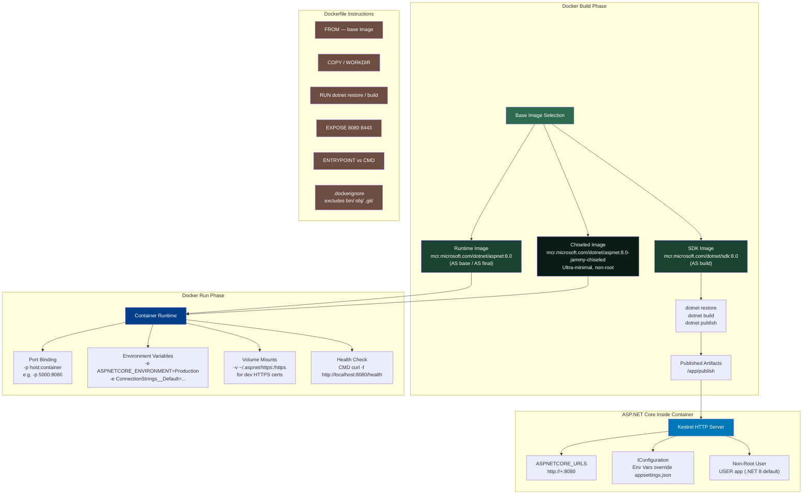
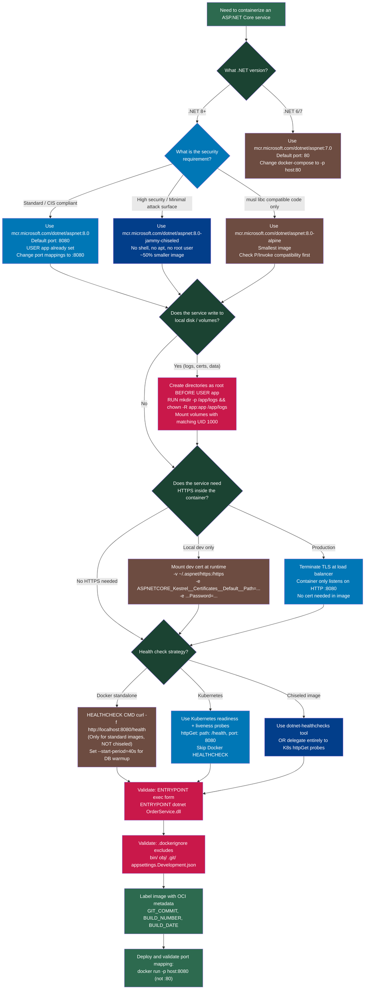

> [!success] Mastery Check
> - [ ] **Studied Well**
> - [ ] **Can explain the concept without notes**
> - [ ] **Can answer interview questions confidently**
> - [ ] **Can implement it in a real project**


# 4.330 — Docker: Containerizing ASP.NET Core Applications

---

## PART 0 — Navigation & Context

### Domain Hierarchy

```
ASP.NET Core Mastery
│
├── Host & Lifecycle
├── Configuration ──────────────────────────────────── [[4.011]]
├── Logging
├── DI
├── Middleware
├── Routing
├── Minimal APIs / MVC
├── Auth
├── Validation
├── Error Handling
├── Caching
├── Security
├── Real-Time
├── Background Services
├── HTTP Clients
├── Testing
├── Serialization
├── API Design
├── Filters
├── Observability
└── Deployment & Hosting  ◄─── YOU ARE HERE
    ├── 4.330 — Docker: Containerizing ASP.NET Core Applications  ◄── THIS NOTE
    ├── 4.331 — Docker: Multi-Stage Builds for Minimal Production Images
    ├── 4.332 — Docker Compose: Local Dev with SQL Server, Redis, and the API
    └── 4.333 — Kubernetes: Deployments, Services, and ConfigMaps
```

### What You Need Before This

| Prerequisite | Why You Need It |
|---|---|
| [[4.003 — IWebHostEnvironment: Environments and ASPNETCORE_ENVIRONMENT]] | `ASPNETCORE_ENVIRONMENT` is injected via `docker run -e`; you must understand how ASP.NET Core reads it |
| [[4.011 — IConfiguration: The Layered Configuration System]] | Docker replaces config layers with env vars; understanding priority order is essential |
| [[4.208 — HTTPS Enforcement]] | HTTPS in Docker requires explicit cert mounting or load-balancer termination; the container-only path is non-trivial |
| Basic Kestrel knowledge | Kestrel is the HTTP server inside the container; understanding its URL binding model is required to avoid port misconfiguration |

### What This Unlocks After

| Next Topic | How This Note Enables It |
|---|---|
| [[4.331 — Docker: Multi-Stage Builds for Minimal Production Images]] | Multi-stage builds are the production-hardened evolution of the single-stage pattern covered here |
| [[4.332 — Docker Compose: Local Dev with SQL Server, Redis, and the API]] | Compose orchestrates the containers you learn to build here |
| [[4.333 — Kubernetes: Deployments, Services, and ConfigMaps]] | Kubernetes runs your Docker images in production; the image build discipline established here is the foundation |
| CI/CD pipelines (GitHub Actions, Azure DevOps) | Automated `docker build` and `docker push` pipelines depend on the Dockerfile patterns here |

### Why This Matters at Scale

> **Production engineers at scale care about containerization not because Docker is convenient, but because it is the only way to guarantee that the runtime environment — OS libraries, .NET version, port bindings, and configuration — is identical between the developer's laptop, CI, staging, and production.** A misconfigured Dockerfile surfaces as a production P0 at 2am, not a failing test at 2pm.

---

## PART 1 — The Core Mental Model

### The Fundamental Rule

> **An ASP.NET Core Docker container is a sealed, portable process that exposes exactly one HTTP port; every environment variable in `docker run -e` is a configuration override that layers on top of `appsettings.json`, and Kestrel inside the container must be explicitly told which port to bind — the default changed from port 80 to port 8080 in .NET 8 images. Getting any one of these three things wrong produces a container that starts successfully but never receives a request.**

### The Plain-Language Analogy

Think of a Docker container as a vending machine that has been pre-stocked in the factory (the `docker build` step) and then plugged into the wall at any location (the `docker run` step). The vending machine doesn't care where it's plugged in — it only knows how to serve items from its internal stock. But it has one crucial requirement: the power plug format (the port mapping `-p 5000:8080`) must match the socket on the wall. If the machine expects a 3-pin plug and you give it a 2-pin socket, it won't get power — it won't fail noisily, it just won't serve anything.

The factory (SDK image, `AS build` stage) does expensive work: installing tools, restoring packages, compiling code. You throw away the factory once the machine is stocked. The machine itself (runtime image, `AS final` stage) is lean — just the vending mechanism, no factory tools. This is the multi-stage build principle.

Now apply the analogy to concurrent requests: Docker doesn't change how Kestrel handles concurrency. Inside the container, Kestrel still uses `libuv`/`IOCP` on its thread pool to handle thousands of simultaneous requests. The container boundary is invisible to individual HTTP requests — it's purely a process isolation and packaging concern. An `auth failure` inside the container still produces a `401 Unauthorized` response; the container wraps the process but never intercepts or modifies the HTTP stream.

### The Taxonomy Diagram



---

## PART 2 — Deep Mechanics

### 2.1 — The Standard ASP.NET Core Dockerfile: Layer-by-Layer Anatomy

The Dockerfile that Visual Studio generates (and that the .NET team recommends) uses a multi-stage build. Understanding every line is non-negotiable for production operations.

**Pipeline Position:**
```
[docker build command]
        │
        ▼
┌─────────────────────────────────────────────────────────────────────┐
│  Stage 1: base (runtime image — just aspnet, no SDK)               │
│  Stage 2: build (SDK image — restore + compile)                     │  
│  Stage 3: publish (SDK image — dotnet publish to /app/publish)      │
│  Stage 4: final (runtime image — COPY from publish, set ENTRYPOINT) │
└─────────────────────────────────────────────────────────────────────┘
        │
        ▼
[docker run] → Kestrel starts → HTTP requests flow in
```

**The Annotated Standard Dockerfile:**

```dockerfile
# ─────────────────────────────────────────────────
# Stage 1: base
# Purpose: declare the runtime image and configure ports.
# This image runs in production — it has NO SDK, NO msbuild, NO compiler.
# .NET 8: default port is 8080 (not 80). This changed in .NET 8.
# ─────────────────────────────────────────────────
FROM mcr.microsoft.com/dotnet/aspnet:8.0 AS base

# Non-root user setup (.NET 8 images include the 'app' user by default)
# Running as root inside a container is a CIS Benchmark violation.
# UID 1000 is the conventional non-privileged user.
USER app

# Set the working directory for the final stage
WORKDIR /app

# EXPOSE is documentation, NOT a network binding.
# It tells Docker/orchestrators which ports the container listens on.
# .NET 8 default: 8080 (HTTP), 8443 (HTTPS)
# .NET 6/7 default: 80 (HTTP), 443 (HTTPS)
EXPOSE 8080
EXPOSE 8443

# ─────────────────────────────────────────────────
# Stage 2: build
# Purpose: restore packages and compile the application.
# Uses the SDK image (~800MB) which is thrown away after publish.
# ─────────────────────────────────────────────────
FROM mcr.microsoft.com/dotnet/sdk:8.0 AS build

# Build argument lets CI override — e.g. --build-arg BUILD_CONFIGURATION=Debug
ARG BUILD_CONFIGURATION=Release

WORKDIR /src

# Copy the .csproj files FIRST (before source code).
# Docker caches layers. If .csproj hasn't changed, the restore layer is cached.
# This is critical for CI build speed — a package restore can take 30-90 seconds.
COPY ["src/OrderService/OrderService.csproj", "src/OrderService/"]
COPY ["src/OrderService.Core/OrderService.Core.csproj", "src/OrderService.Core/"]

# Restore — cached if .csproj files are unchanged
RUN dotnet restore "./src/OrderService/OrderService.csproj"

# Copy all source code AFTER restore (so changes to .cs files don't bust the restore cache)
COPY . .

WORKDIR "/src/src/OrderService"

# Build — not yet published. Output goes to /app/build.
RUN dotnet build "./OrderService.csproj" -c $BUILD_CONFIGURATION -o /app/build

# ─────────────────────────────────────────────────
# Stage 3: publish
# Purpose: run dotnet publish to create the final deployable output.
# The /p:UseAppHost=false flag skips generating a native executable wrapper —
# the container already has dotnet on PATH.
# ─────────────────────────────────────────────────
FROM build AS publish
ARG BUILD_CONFIGURATION=Release
RUN dotnet publish "./OrderService.csproj" \
    -c $BUILD_CONFIGURATION \
    -o /app/publish \
    /p:UseAppHost=false

# ─────────────────────────────────────────────────
# Stage 4: final
# Purpose: copy only the published artifacts into the clean runtime image.
# No compiler, no SDK, no source code, no secrets from build time.
# ─────────────────────────────────────────────────
FROM base AS final
WORKDIR /app

# Copy the published output from the 'publish' stage
COPY --from=publish /app/publish .

# ENTRYPOINT: the main process. If the container gets a signal, this process receives it.
# Use ENTRYPOINT (not CMD) for production — see §2.4 for the full explanation.
ENTRYPOINT ["dotnet", "OrderService.dll"]
```

**Framework Behavior — What Docker does internally (approximate):**
```
// Docker layer cache evaluation:
// For each Dockerfile instruction:
//   1. Compute cache key = (parent layer hash) + (instruction) + (file content hash if COPY)
//   2. If cache hit → skip execution, use cached layer
//   3. If cache miss → execute instruction, write new layer
//
// Result: COPY *.csproj + RUN dotnet restore = cached as long as .csproj files unchanged
// Result: COPY . . = cache busted by any .cs change, but restore layer is preserved
```

**Cost:** `docker build` with cold cache: ~2-4 minutes (package restore + compile + publish). With warm cache (only .cs files changed): ~30-60 seconds. Layer caching is the primary optimization lever.

---

### 2.2 — Port Binding: EXPOSE, ASPNETCORE_URLS, and the `-p` Flag

This is where most production incidents happen. Three independent systems must agree on the port number.

**The Three-System Agreement:**

```
┌─────────────────────────────────────────────────────────────────────────┐
│ System 1: Kestrel (inside container)                                   │
│   Listens on: ASPNETCORE_URLS=http://+:8080                            │
│   Or: configured via appsettings.json / launchSettings.json            │
│                                                                         │
│ System 2: Docker (container-to-host mapping)                           │
│   -p 5000:8080 means: host:5000 → container:8080                       │
│   The container port MUST match what Kestrel is listening on           │
│                                                                         │
│ System 3: EXPOSE in Dockerfile                                         │
│   EXPOSE 8080 is DOCUMENTATION ONLY — it does NOT open any port        │
│   It enables --publish-all (-P) but does nothing without -p            │
└─────────────────────────────────────────────────────────────────────────┘
```

**HTTP Wire Format — What the client sees:**
```http
// Client → Host OS:
GET /api/orders/42 HTTP/1.1
Host: localhost:5000
Accept: application/json

// Host OS routes → Container port 8080 → Kestrel → ASP.NET Core pipeline
// ASP.NET Core processes and responds:

HTTP/1.1 200 OK
Content-Type: application/json; charset=utf-8
Content-Length: 247
Date: Mon, 08 Jun 2026 00:00:00 GMT

{"orderId":"42","status":"Shipped","total":149.99}
```

**The .NET 8 Port Change — The Silent Production Break:**

```
.NET 6/7 base images:
  ENV ASPNETCORE_URLS=http://+:80
  
.NET 8 base images:
  ENV ASPNETCORE_URLS=http://+:8080   ← CHANGED

If you upgrade to .NET 8 but your docker-compose.yml still maps -p 5000:80,
the container starts successfully (no error), but ALL requests time out.
Kestrel is listening on 8080; your host is knocking on 8080 but forwarding to 80.
```

**How Kestrel reads its URL configuration (ASP.NET Core internally, approximate):**
```csharp
// KestrelServerOptions reads in this priority order:
// 1. UseKestrel(options => options.Listen(...))  — code-level, highest priority
// 2. ASPNETCORE_URLS environment variable
// 3. Kestrel:Endpoints in configuration (appsettings.json)
// 4. urls configuration key
// 5. Default: http://localhost:5000

// In a Docker container, ASPNETCORE_URLS is set by the base image.
// You override it with: docker run -e ASPNETCORE_URLS=http://+:8080
```

**Framework Source:** `WebApplication.CreateBuilder` → `WebApplicationBuilder` → `KestrelServerOptions` → `AddressBindContext` in `Microsoft.AspNetCore.Hosting`.

**Cost:** Port binding is zero-copy kernel-level routing. No ASP.NET Core cost. The cost is entirely the kernel's NAT table lookup: ~nanoseconds per request.

---

### 2.3 — Environment Variables in Docker: The Double-Underscore Configuration Convention

Docker environment variables are the primary configuration mechanism in containers. ASP.NET Core's `IConfiguration` system translates them automatically.

**Pipeline Position — Where Env Vars Enter the ASP.NET Core Config System:**
```
docker run -e KEY=VALUE
        │
        ▼
OS Process Environment
        │
        ▼
EnvironmentVariablesConfigurationProvider  ◄── reads process environment
        │  (registered during WebApplication.CreateBuilder)
        ▼
IConfiguration (merged with appsettings.json, secrets, etc.)
        │  Priority: Env Vars > appsettings.{Environment}.json > appsettings.json
        ▼
IOptions<T> / config.GetSection("...") in your service code
```

**The Double-Underscore Rule:**

ASP.NET Core configuration uses `:` as the section separator in code. Linux environment variable names cannot contain `:`. The framework maps `__` (double underscore) to `:` automatically.

```bash
# appsettings.json structure:
# {
#   "ConnectionStrings": {
#     "OrderDb": "..."
#   },
#   "Stripe": {
#     "SecretKey": "...",
#     "WebhookSecret": "..."
#   }
# }

# Equivalent docker run environment variables:
docker run \
  -e ASPNETCORE_ENVIRONMENT=Production \
  -e ConnectionStrings__OrderDb="Server=prod-sql;Database=OrdersDb;User=api;Password=..." \
  -e Stripe__SecretKey="sk_live_..." \
  -e Stripe__WebhookSecret="whsec_..." \
  -e ASPNETCORE_URLS="http://+:8080" \
  order-service:latest
```

**HTTP Wire Format — Configuration is invisible to HTTP, but its effects are observable:**
```http
// Request that reaches a misconfigured payment endpoint
// (wrong Stripe key from env var):
POST /api/payments/charge HTTP/1.1
Content-Type: application/json

{"amount": 9999, "currency": "usd"}

// Response when Stripe rejects with invalid key:
HTTP/1.1 402 Payment Required
Content-Type: application/problem+json

{
  "type": "https://stripe.com/docs/error-codes/api-key-invalid",
  "title": "Invalid API key",
  "status": 402
}
```

**The Prefix Convention (.NET 8+):**

```csharp
// ✅ You can scope env var loading to a prefix to avoid pollution
// from system-level env vars (e.g., PATH, HOME, USER)
var builder = WebApplication.CreateBuilder(args);

builder.Configuration.AddEnvironmentVariables(prefix: "ORDERSERVICE_");

// Then use: ORDERSERVICE_ConnectionStrings__OrderDb=... in docker run
// This prevents ORDER_DB_HOST (a system admin env var) from accidentally
// mapping to your config hierarchy.
```

**Framework Behavior (ASP.NET Core internally, approximate):**
```csharp
// EnvironmentVariablesConfigurationProvider.Load() (simplified):
foreach (var envVar in Environment.GetEnvironmentVariables())
{
    string key = envVar.Key;
    
    // 1. Strip prefix (if configured)
    if (prefix != null && key.StartsWith(prefix, OrdinalIgnoreCase))
        key = key.Substring(prefix.Length);
    else if (prefix != null)
        continue; // skip vars that don't match prefix
    
    // 2. Replace __ with : to normalize to the config path separator
    key = key.Replace("__", ConfigurationPath.KeyDelimiter); // KeyDelimiter = ":"
    
    Data[key] = envVar.Value;
}
```

**Cost:** Configuration loading is one-time at startup. Zero per-request cost. The env var lookup is `O(n)` over environment variables, executed once during `WebApplication.CreateBuilder`. After startup, config values are cached in `IConfiguration` in-memory dictionary: `O(1)` lookup per key.

---

### 2.4 — ENTRYPOINT vs CMD: The Production Distinction

This is one of the most frequently misunderstood Dockerfile instructions. Getting it wrong breaks graceful shutdown and Kubernetes pod lifecycle hooks.

**The Distinction:**

```
ENTRYPOINT: The executable. Cannot be overridden by docker run arguments.
            Receives OS signals (SIGTERM, SIGINT) directly.
            
CMD:        Default arguments to ENTRYPOINT, OR the default command if no ENTRYPOINT.
            Overridden by arguments passed to docker run.
            
ENTRYPOINT + CMD together:
  ENTRYPOINT ["dotnet"]
  CMD ["OrderService.dll"]
  → runs: dotnet OrderService.dll
  
  docker run order-service:latest OrderService.dll --urls=http://+:8081
  → runs: dotnet OrderService.dll --urls=http://+:8081  (CMD overridden)
```

**Why ENTRYPOINT matters for graceful shutdown:**

```
Kubernetes sends SIGTERM to PID 1 to gracefully stop a pod.
If ENTRYPOINT is a shell:
  ENTRYPOINT ["/bin/sh", "-c", "dotnet OrderService.dll"]
  → PID 1 = /bin/sh
  → SIGTERM goes to sh
  → sh terminates WITHOUT forwarding SIGTERM to dotnet
  → dotnet receives SIGKILL after terminationGracePeriodSeconds
  → in-flight HTTP requests are abruptly terminated
  → ongoing database transactions are abandoned

If ENTRYPOINT is the exec form:
  ENTRYPOINT ["dotnet", "OrderService.dll"]
  → PID 1 = dotnet
  → SIGTERM goes directly to dotnet
  → ASP.NET Core IHostedService.StopAsync() runs
  → IApplicationLifetime.ApplicationStopping fires
  → Kestrel drains in-flight requests
  → Clean shutdown
```

**HTTP Wire Format — The observable difference:**
```http
// With shell form ENTRYPOINT (wrong):
// In-flight request during pod shutdown:
POST /api/orders HTTP/1.1
Content-Type: application/json

{"items": [...]}

// Client receives: Connection reset by peer (no HTTP response at all)
// The database transaction was not committed.

// With exec form ENTRYPOINT (correct):
// Same in-flight request during pod shutdown:
POST /api/orders HTTP/1.1
Content-Type: application/json

{"items": [...]}

// Client receives (after graceful drain):
HTTP/1.1 201 Created
Location: /api/orders/7f3a...
Content-Type: application/json
```

**The shell form trap:**
```dockerfile
# ⚠️ WRONG — shell form, PID 1 is /bin/sh, SIGTERM not forwarded
ENTRYPOINT dotnet OrderService.dll

# ⚠️ WRONG — shell form explicitly
ENTRYPOINT ["/bin/sh", "-c", "dotnet OrderService.dll"]

# ✅ CORRECT — exec form, PID 1 is dotnet itself
ENTRYPOINT ["dotnet", "OrderService.dll"]
```

**Cost:** ENTRYPOINT form has zero runtime cost. The distinction is purely in process tree topology and signal handling.

---

### 2.5 — The .dockerignore File: What Must Be Excluded and Why

The `.dockerignore` file controls what `docker build` sends as the build context to the Docker daemon. Every file in the build context is sent — even if it's not copied into the image. A missing `.dockerignore` can send gigabytes of files to the Docker daemon, dramatically slowing builds and leaking secrets.

**Pipeline Position:**
```
docker build -t order-service:latest .
        │
        ▼
Docker CLI reads .dockerignore from build context root
        │
        ▼
Docker CLI sends ONLY non-ignored files to Docker daemon
        │
        ▼
Docker daemon processes Dockerfile COPY instructions
        │
        ▼
Only files copied via COPY end up in the image layer
```

**Production .dockerignore for an ASP.NET Core Order Service:**

```dockerignore
# .dockerignore — OrderService

# Build artifacts — these are rebuilt inside the container; 
# including them wastes build context size and can cause 
# platform mismatch (Windows .obj files in Linux container)
**/bin/
**/obj/

# Git history — can contain secrets in older commits, 
# bloats context by hundreds of MB in active repos
.git/
.gitignore
.gitattributes

# Development-only configuration — NEVER include dev config in the image.
# appsettings.Development.json may contain local DB connection strings,
# dev Stripe keys, or localhost HTTPS cert paths.
**/appsettings.Development.json
**/appsettings.Local.json

# Dev HTTPS certificates — never ship dev certs into production images
**/.aspnet/https/

# Editor and IDE files — no operational value, waste context
.vs/
.vscode/
*.user
*.suo
*.DotSettings

# Test projects — production image should not contain test code
**/*.Tests/
**/*.Test/
**/*.Specs/

# Node artifacts (if any frontend build tooling is in the repo)
**/node_modules/

# Docker Compose files for local dev — not needed in image
docker-compose*.yml
Dockerfile*

# CI/CD files — not part of the runtime image
.github/
.azuredevops/
azure-pipelines.yml
```

**The leak risk without .dockerignore:**
```
Without .dockerignore, docker build context includes:
- bin/Debug/net8.0/ → ~50MB of compiled artifacts (platform mismatch)
- obj/ → ~5MB of build metadata
- .git/ → 100MB-2GB depending on repo history
- appsettings.Development.json → CONNECTION STRING WITH PASSWORD
- *.user files → developer machine paths, no risk but useless

docker build -t order-service:latest .
# Sending build context to Docker daemon: 1.8GB  ← disaster
# (vs 2.3MB with proper .dockerignore)
```

**Cost:** Build context transfer: without `.dockerignore`, potentially seconds to minutes of wasted I/O before a single layer is built. With proper `.dockerignore`: build context is typically 1-5MB.

---

### 2.6 — Running as Non-Root: The USER Instruction and Security Model

**The .NET 8 Change:** Starting with .NET 8, Microsoft's official Docker images run as non-root by default. The `app` user (UID 1000) is pre-configured in the base image.

```
.NET 6/7: Container ran as root (UID 0) by default
.NET 8:   Container runs as 'app' user (UID 1000) by default

This is a breaking change for Dockerfiles that write to directories
owned by root, or that bind-mount volumes with restrictive permissions.
```

**What the `USER app` instruction does:**

```dockerfile
FROM mcr.microsoft.com/dotnet/aspnet:8.0 AS base

# The 'app' user exists in the .NET 8 base image already.
# UID 1000, GID 1000. Home directory: /home/app.
# No sudo, no shell (in chiseled images), no elevated privileges.
USER app

WORKDIR /app
# /app is owned by root but writable by the app group in .NET 8 images.
# For volumes, you may need: --user 1000:1000 in docker run.

EXPOSE 8080
```

**Security implications:**

```
Running as root (UID 0) inside a container:
  - If container escape occurs, attacker has root on host (depends on seccomp/AppArmor)
  - CIS Docker Benchmark 4.1: "Ensure that a user for the container has been created"
  - Cloud vendors (AWS ECS, AKS) have security policies that DENY root containers
  - Supply chain: a compromised package could write to /etc/shadow, /sbin/, etc.

Running as non-root (UID 1000):
  - Port binding requires root on Linux (ports < 1024 require CAP_NET_BIND_SERVICE)
  - This is WHY .NET 8 changed the default port from 80 to 8080 —
    port 8080 does not require root. Port 80 does.
  - File system: app user cannot write to /etc/, /usr/, /sbin/
```

**The Port 80/8080 connection:**
```
.NET 7 → port 80 → requires root → ran as root (insecure)
.NET 8 → port 8080 → does not require root → runs as 'app' (secure)

This is not a coincidence. The port change enables the security model change.
```

**Cost:** Non-root has zero performance cost. It's a process attribute set once at startup by the kernel.

---

### 2.7 — Health Checks in the Dockerfile

Health checks let Docker (and Kubernetes) detect when a container is running but not healthy — e.g., the database connection is broken, or Kestrel is deadlocked.

**Pipeline Position — Health Check vs ASP.NET Core Health Check Middleware:**
```
External Health Check Flow:
  
  Docker daemon (every --interval seconds)
          │
          ▼
  Executes CMD inside container
          │
          ▼
  curl -f http://localhost:8080/health
          │
          ▼
  ASP.NET Core Health Check Middleware (/health endpoint)
          │
          ├── Checks: DB connectivity, Redis ping, disk space, etc.
          └── Returns: 200 OK (Healthy) or 503 Service Unavailable (Unhealthy)
          │
          ▼
  Docker: exit 0 = healthy, exit 1 = unhealthy
          │
          ▼
  Docker marks container: Starting → Healthy / Unhealthy
```

**Dockerfile HEALTHCHECK:**

```dockerfile
# Health check configuration:
# --interval=30s  → check every 30 seconds
# --timeout=10s   → if the check doesn't respond in 10s, it's a failure
# --start-period=40s → grace period for startup; failures during this period don't count
# --retries=3     → consecutive failures before marking unhealthy

HEALTHCHECK \
    --interval=30s \
    --timeout=10s \
    --start-period=40s \
    --retries=3 \
    CMD curl -f http://localhost:8080/health || exit 1
```

**The ASP.NET Core side — registering the /health endpoint:**

```csharp
// Program.cs — OrderService
var builder = WebApplication.CreateBuilder(args);

// Register health checks — each check has a name and failure conditions
builder.Services.AddHealthChecks()
    .AddSqlServer(
        connectionString: builder.Configuration.GetConnectionString("OrderDb")!,
        name: "order-database",
        failureStatus: HealthStatus.Unhealthy,
        tags: ["db", "sql"])
    .AddRedis(
        redisConnectionString: builder.Configuration["Redis:ConnectionString"]!,
        name: "redis-cache",
        failureStatus: HealthStatus.Degraded,
        tags: ["cache"]);

var app = builder.Build();

// Map the health check endpoint
// Use /health for liveness, /health/ready for readiness (Kubernetes pattern)
app.MapHealthChecks("/health", new HealthCheckOptions
{
    // Return 200 for Healthy and Degraded, 503 only for Unhealthy
    // This way Docker/Kubernetes doesn't restart the container for degraded cache
    ResultStatusCodes =
    {
        [HealthStatus.Healthy] = StatusCodes.Status200OK,
        [HealthStatus.Degraded] = StatusCodes.Status200OK,
        [HealthStatus.Unhealthy] = StatusCodes.Status503ServiceUnavailable
    },
    ResponseWriter = UIResponseWriter.WriteHealthCheckUIResponse
});
```

**HTTP Wire Format:**
```http
// Docker daemon executes: curl -f http://localhost:8080/health
GET /health HTTP/1.1
Host: localhost:8080

// Healthy response:
HTTP/1.1 200 OK
Content-Type: application/json

{
  "status": "Healthy",
  "totalDuration": "00:00:00.0042891",
  "entries": {
    "order-database": { "status": "Healthy", "duration": "00:00:00.0038124" },
    "redis-cache": { "status": "Healthy", "duration": "00:00:00.0004767" }
  }
}

// Unhealthy response:
HTTP/1.1 503 Service Unavailable
Content-Type: application/json

{
  "status": "Unhealthy",
  "entries": {
    "order-database": { 
      "status": "Unhealthy", 
      "exception": "Cannot connect to SQL Server at prod-sql:1433",
      "duration": "00:00:10.0001234" 
    }
  }
}
```

**Cost:** Each HEALTHCHECK invocation starts a new process (`curl`) inside the container: ~5-10ms process spawn overhead + the actual HTTP call. At 30-second intervals, this is negligible. The ASP.NET Core health check endpoint itself is a lightweight middleware: `O(n)` checks registered, typically < 50ms total.

---

### 2.8 — Chiseled Images: The Ultra-Minimal .NET 8 Runtime

.NET 8 introduced "chiseled" Ubuntu base images — stripped-down containers with only the files needed to run a .NET application.

**Chiseled vs Standard vs Alpine:**

```
mcr.microsoft.com/dotnet/aspnet:8.0
  Base: Ubuntu 22.04 (Jammy)
  Size: ~218MB (compressed ~80MB)
  Includes: bash, apt, standard Linux utilities, shells
  
mcr.microsoft.com/dotnet/aspnet:8.0-jammy-chiseled
  Base: Ubuntu 22.04 Chiseled (ultra-minimal)
  Size: ~114MB (compressed ~40MB) — ~50% smaller
  Excludes: bash, apt, package manager, shell utilities
  Non-root: YES (no root user at all in chiseled)
  Attack surface: minimal — cannot run shell commands even if container escape occurs
  
mcr.microsoft.com/dotnet/aspnet:8.0-alpine
  Base: Alpine Linux 3.x
  Size: ~105MB
  Includes: busybox shell (musl libc, not glibc — may affect P/Invoke code)
  Non-root: NO by default (root user exists)
```

**The chiseled implication for the HEALTHCHECK:**

```dockerfile
# ⚠️ PROBLEM: curl is NOT available in chiseled images
HEALTHCHECK CMD curl -f http://localhost:8080/health || exit 1
# → This HEALTHCHECK will ALWAYS fail in chiseled images

# ✅ SOLUTION 1: Use the .NET health check tool (available since .NET 8)
# The dotnet-healthchecks tool is a .NET binary, available without shell
HEALTHCHECK CMD ["dotnet-healthchecks", "http://localhost:8080/health"]

# ✅ SOLUTION 2: Let the orchestrator (Kubernetes) handle health checks
# and don't use Docker HEALTHCHECK at all in chiseled images
# Kubernetes can use httpGet probes without curl
```

**Dockerfile with chiseled image:**

```dockerfile
FROM mcr.microsoft.com/dotnet/aspnet:8.0-jammy-chiseled AS base

# Chiseled images are already non-root — 'app' user is the default.
# Do NOT try to USER root — there is no root user in chiseled.

WORKDIR /app
EXPOSE 8080

FROM mcr.microsoft.com/dotnet/sdk:8.0 AS build
# ... (same build stages as before)

FROM base AS final
WORKDIR /app
COPY --from=publish /app/publish .
ENTRYPOINT ["dotnet", "OrderService.dll"]
```

**Cost:** Chiseled images reduce:
- Image pull time: ~50% less data to download
- Container start time: smaller filesystem to mount
- Attack surface: no shell means no shell injection even with container escape
- Storage: ~100MB less per image in your registry

---

## PART 3 — Production Code Patterns

### Pattern 1: The Layered Configuration Override Chain

**Scenario:** An e-commerce order service must read configuration from `appsettings.json` as defaults, override in Docker with environment variables, and never allow development secrets into production images.

```csharp
// ✅ CORRECT: Program.cs for OrderService — explicit configuration layering

var builder = WebApplication.CreateBuilder(args);

// Configuration loading order (later = higher priority):
// 1. appsettings.json                      ← base defaults
// 2. appsettings.{Environment}.json        ← environment-specific
// 3. Environment variables                 ← Docker env vars (-e flag)
// 4. Command-line args                     ← docker run ... -- --somearg
//
// This order is the default in WebApplication.CreateBuilder.
// DO NOT call builder.Configuration.AddJsonFile() again — you'll add duplicates.
// DO call AddEnvironmentVariables with a prefix to avoid namespace collisions.

builder.Configuration.AddEnvironmentVariables(prefix: "ORDERSERVICE_");

// Now in docker run:
//   -e ORDERSERVICE_ConnectionStrings__OrderDb="..."
//   -e ORDERSERVICE_Stripe__SecretKey="sk_live_..."
// These override appsettings.json values cleanly.

builder.Services.Configure<StripeOptions>(
    builder.Configuration.GetSection("Stripe"));

builder.Services.Configure<DatabaseOptions>(
    builder.Configuration.GetSection("ConnectionStrings"));

// Validate required config at startup — fail fast before the container
// is marked healthy, so the orchestrator can restart with correct config.
builder.Services.AddOptions<StripeOptions>()
    .BindConfiguration("Stripe")
    .ValidateDataAnnotations()
    .ValidateOnStart(); // Throws at startup, not on first use

var app = builder.Build();
app.Run();
```

```dockerfile
# The corresponding Dockerfile section
# Environment variables are NOT hardcoded in the Dockerfile.
# They are injected at runtime by the orchestrator.
# 
# ⚠️ WRONG — baking production secrets into the image:
# ENV Stripe__SecretKey=sk_live_... ← this secret is in every image layer FOREVER
#
# ✅ CORRECT — secrets come from orchestrator at runtime:
ENTRYPOINT ["dotnet", "OrderService.dll"]
# Secrets come from: docker run -e or Kubernetes Secrets or AWS Secrets Manager
```

```http
// HTTP consequence when config validation fails at startup:
// Container fails to start. Docker reports:
// "unhealthy" after --start-period elapses.
// kubectl describe pod order-service → CrashLoopBackOff
// kubectl logs order-service:
// System.OptionsValidationException: DataAnnotation validation failed for 'StripeOptions'
// Members: ['SecretKey' must not be null or empty]
```

---

### Pattern 2: The Non-Root Build with Volume Permission Guard

**Scenario:** A payment processing service needs to write audit log files to a mounted volume. The `.NET 8` non-root default (`USER app`, UID 1000) breaks volume writes unless permissions are pre-configured.

```dockerfile
# ⚠️ WRONG: Non-root user tries to write to root-owned volume
FROM mcr.microsoft.com/dotnet/aspnet:8.0 AS base
USER app
WORKDIR /app
EXPOSE 8080

FROM mcr.microsoft.com/dotnet/sdk:8.0 AS build
# ... build stages

FROM base AS final
WORKDIR /app
COPY --from=publish /app/publish .

# When run with: docker run -v /host/audit-logs:/app/logs payment-service:latest
# The /app/logs directory is owned by root (host UID 0)
# 'app' user (UID 1000) cannot write → UnauthorizedAccessException at runtime
ENTRYPOINT ["dotnet", "PaymentService.dll"]

# ─────────────────────────────────────────────────
# ✅ CORRECT: Create and chown the directory before switching to non-root

FROM mcr.microsoft.com/dotnet/aspnet:8.0 AS base
WORKDIR /app

# Create the audit log directory AS ROOT (before USER app)
# and assign ownership to the 'app' user (UID 1000 in .NET 8 base images)
RUN mkdir -p /app/logs && chown -R app:app /app/logs

USER app
EXPOSE 8080

FROM mcr.microsoft.com/dotnet/sdk:8.0 AS build
ARG BUILD_CONFIGURATION=Release
WORKDIR /src
COPY ["src/PaymentService/PaymentService.csproj", "src/PaymentService/"]
RUN dotnet restore "./src/PaymentService/PaymentService.csproj"
COPY . .
WORKDIR "/src/src/PaymentService"
RUN dotnet build "./PaymentService.csproj" -c $BUILD_CONFIGURATION -o /app/build

FROM build AS publish
ARG BUILD_CONFIGURATION=Release
RUN dotnet publish "./PaymentService.csproj" \
    -c $BUILD_CONFIGURATION -o /app/publish \
    /p:UseAppHost=false

FROM base AS final
WORKDIR /app
COPY --from=publish /app/publish .

# Create log dir in final stage too (COPY may reset ownership)
RUN mkdir -p /app/logs

ENTRYPOINT ["dotnet", "PaymentService.dll"]
```

```bash
# Run with volume mount — now app user (UID 1000) can write
docker run \
  -v /host/audit-logs:/app/logs \
  --user 1000:1000 \
  -p 5001:8080 \
  payment-service:latest
```

---

### Pattern 3: The Dev HTTPS Certificate Mount

**Scenario:** An inventory management API needs HTTPS in local development without a reverse proxy. The ASP.NET Core dev certificate must be injected into the container at runtime (not baked into the image).

```bash
# Step 1: Generate and trust the dev certificate (one-time on developer machine)
dotnet dev-certs https --export-path ~/.aspnet/https/inventory-api.pfx \
    --password "DevCertP@ss123"
dotnet dev-certs https --trust
```

```bash
# Step 2: Run the container with the certificate mounted
docker run \
  --rm \
  -p 5002:8080 \
  -p 5003:8443 \
  -v ~/.aspnet/https:/https:ro \
  -e ASPNETCORE_ENVIRONMENT=Development \
  -e ASPNETCORE_URLS="https://+:8443;http://+:8080" \
  -e ASPNETCORE_Kestrel__Certificates__Default__Path=/https/inventory-api.pfx \
  -e ASPNETCORE_Kestrel__Certificates__Default__Password=DevCertP@ss123 \
  inventory-api:latest
```

```csharp
// Program.cs — Kestrel reads the certificate from IConfiguration
// The env vars above map to the Kestrel config section automatically.
// No code change is needed — the base image behavior handles this.

// ASP.NET Core internally (approximate):
// KestrelServerOptions.Configure(config.GetSection("Kestrel"))
// reads Certificates:Default:Path and Password
// loads the PFX via X509Certificate2(path, password)
// attaches to Kestrel's SslStream listener
```

```http
// HTTP Wire Format — HTTPS established:
// TLS handshake completes, then:
GET /api/inventory/items?category=electronics HTTP/1.1
Host: localhost:5003
Authorization: Bearer eyJhbGci...

HTTP/1.1 200 OK
Content-Type: application/json
Strict-Transport-Security: max-age=31536000

[{"sku":"ELEC-001","quantity":42,...}]
```

> [!IMPORTANT]
> **Never mount the dev certificate into production containers.** Production HTTPS must be terminated at the load balancer or reverse proxy (Nginx, Traefik, AWS ALB). The container itself in production should only listen on HTTP (port 8080), with TLS offloaded upstream. See [[4.208 — HTTPS Enforcement]].

---

### Pattern 4: The Graceful Shutdown Sentinel with Kubernetes Pre-Stop Hook

**Scenario:** A logistics tracking API must drain in-flight webhook delivery requests before a Kubernetes pod is terminated. The combination of SIGTERM handling, `UseShutdownTimeout`, and a pre-stop sleep prevents mid-delivery cuts.

```dockerfile
# Dockerfile — exec form ENTRYPOINT is prerequisite for graceful shutdown
ENTRYPOINT ["dotnet", "LogisticsTracker.dll"]
```

```csharp
// Program.cs — LogisticsTracker
var builder = WebApplication.CreateBuilder(args);

// Kestrel drains in-flight requests when SIGTERM is received.
// ShutdownTimeout determines how long to wait for in-flight requests.
// Default is 5 seconds — too short for long-running webhook deliveries.
builder.WebHost.UseShutdownTimeout(TimeSpan.FromSeconds(30));

builder.Services.AddHostedService<WebhookDeliveryService>();

var app = builder.Build();

// Register a callback that fires when SIGTERM arrives
var lifetime = app.Services.GetRequiredService<IHostApplicationLifetime>();
lifetime.ApplicationStopping.Register(() =>
{
    // Log that graceful shutdown has started — useful for debugging
    // "why did my pod take 35 seconds to terminate?"
    var logger = app.Services.GetRequiredService<ILogger<Program>>();
    logger.LogInformation("SIGTERM received. Draining in-flight webhook deliveries...");
});

app.MapGet("/api/tracking/{shipmentId}", async (string shipmentId, IShipmentRepository repo) =>
{
    var shipment = await repo.GetByIdAsync(shipmentId);
    return shipment is null ? Results.NotFound() : Results.Ok(shipment);
});

app.Run();
```

```yaml
# Kubernetes Deployment — pre-stop hook adds a sleep BEFORE SIGTERM
# This prevents load balancer from routing new requests to a terminating pod
# during the readiness probe update propagation delay (~15-30s)
spec:
  containers:
  - name: logistics-tracker
    image: logistics-tracker:1.4.2
    lifecycle:
      preStop:
        exec:
          command: ["/bin/sh", "-c", "sleep 15"]
    terminationGracePeriodSeconds: 60
    # Total shutdown budget: 15s pre-stop sleep + 30s ASP.NET drain + buffer
```

```http
// HTTP consequence with correct shutdown:
// Pod receives SIGTERM. Pre-stop sleep runs for 15s.
// During those 15s: new requests are NOT routed here (readiness probe fails).
// After 15s: SIGTERM sent to PID 1 (dotnet). Kestrel stops accepting new connections.
// Existing in-flight requests complete normally:
POST /api/tracking/webhooks HTTP/1.1  ← already in-flight when SIGTERM arrives
Content-Type: application/json

{"shipmentId":"SHP-2024-001","event":"Delivered"}

HTTP/1.1 200 OK  ← response completes normally, not cut off
```

---

### Pattern 5: The Build-Args Configuration Pattern for Multi-Environment Images

**Scenario:** A user authentication service must be built differently for internal staging (debug symbols, verbose logging) and production (optimized, stripped). Build args allow a single Dockerfile to produce both variants.

```dockerfile
# Dockerfile — UserAuthService
FROM mcr.microsoft.com/dotnet/aspnet:8.0 AS base
USER app
WORKDIR /app
EXPOSE 8080

FROM mcr.microsoft.com/dotnet/sdk:8.0 AS build

# ARG is available only during the build phase
# It can be overridden with --build-arg at docker build time
ARG BUILD_CONFIGURATION=Release
ARG ENABLE_DIAGNOSTIC_ENDPOINTS=false

WORKDIR /src
COPY ["src/UserAuthService/UserAuthService.csproj", "src/UserAuthService/"]
RUN dotnet restore "./src/UserAuthService/UserAuthService.csproj"
COPY . .

WORKDIR "/src/src/UserAuthService"
RUN dotnet build "./UserAuthService.csproj" \
    -c $BUILD_CONFIGURATION \
    -o /app/build

FROM build AS publish
ARG BUILD_CONFIGURATION=Release
ARG ENABLE_DIAGNOSTIC_ENDPOINTS=false

RUN dotnet publish "./UserAuthService.csproj" \
    -c $BUILD_CONFIGURATION \
    -o /app/publish \
    /p:UseAppHost=false

# Conditionally include diagnostic tools only in non-release builds
RUN if [ "$BUILD_CONFIGURATION" != "Release" ]; then \
      apt-get update && apt-get install -y --no-install-recommends \
      curl \
      && rm -rf /var/lib/apt/lists/*; \
    fi

FROM base AS final
WORKDIR /app
COPY --from=publish /app/publish .

# Pass the build arg as an ENV var so the application can read it at runtime
# This is intentional for ENABLE_DIAGNOSTIC_ENDPOINTS — it controls endpoint exposure
ARG ENABLE_DIAGNOSTIC_ENDPOINTS=false
ENV ENABLE_DIAGNOSTIC_ENDPOINTS=$ENABLE_DIAGNOSTIC_ENDPOINTS

ENTRYPOINT ["dotnet", "UserAuthService.dll"]
```

```bash
# Staging build — debug symbols, diagnostic endpoints enabled
docker build \
  --build-arg BUILD_CONFIGURATION=Debug \
  --build-arg ENABLE_DIAGNOSTIC_ENDPOINTS=true \
  -t user-auth-service:staging-1.0.0 .

# Production build — optimized, no diagnostic endpoints
docker build \
  --build-arg BUILD_CONFIGURATION=Release \
  --build-arg ENABLE_DIAGNOSTIC_ENDPOINTS=false \
  -t user-auth-service:prod-1.0.0 .
```

```csharp
// Program.cs — read the build-time arg as runtime config
var builder = WebApplication.CreateBuilder(args);
var app = builder.Build();

// Enable diagnostic endpoints only when explicitly configured
// This prevents accidentally exposing /debug/routes in production
if (app.Configuration.GetValue<bool>("ENABLE_DIAGNOSTIC_ENDPOINTS"))
{
    app.MapGet("/debug/config", (IConfiguration config) => 
        Results.Ok(config.AsEnumerable()
            .Where(kv => !kv.Key.Contains("Password", StringComparison.OrdinalIgnoreCase)
                      && !kv.Key.Contains("Secret", StringComparison.OrdinalIgnoreCase))
            .ToDictionary(kv => kv.Key, kv => kv.Value)));
    
    app.MapGet("/debug/routes", (IEnumerable<EndpointDataSource> sources) =>
        Results.Ok(sources.SelectMany(s => s.Endpoints).Select(e => e.DisplayName)));
}

app.Run();
```

---

### Pattern 6: The Port-Override-at-Runtime Pattern

**Scenario:** An inventory service team standardizes all APIs to port 8080 in Kubernetes but needs flexibility to run multiple containers on the same host during development without editing Dockerfiles.

```bash
# ⚠️ WRONG: Hardcoded port in Dockerfile ENV
# ENV ASPNETCORE_URLS=http://+:8080
# Cannot be changed without rebuilding the image

# ✅ CORRECT: ASPNETCORE_URLS is set in the base image but overridable at runtime

# Development: run on port 8080 (standard)
docker run --rm -p 5010:8080 inventory-service:latest

# Development: run a second instance on port 8081 (for A/B testing)
docker run --rm \
  -p 5011:9090 \
  -e ASPNETCORE_URLS=http://+:9090 \
  inventory-service:latest

# The env var override changes Kestrel's listening port at runtime.
# No image rebuild required.
```

```csharp
// The ASPNETCORE_URLS env var is read by WebApplication.CreateBuilder automatically.
// No explicit code needed. But for validation and observability:

var builder = WebApplication.CreateBuilder(args);

// Log what URL Kestrel is actually listening on — useful for debugging
// port conflicts in complex docker-compose setups
var app = builder.Build();

app.Lifetime.ApplicationStarted.Register(() =>
{
    var server = app.Services.GetRequiredService<IServer>();
    var addressFeature = server.Features.Get<IServerAddressesFeature>();
    
    var logger = app.Services.GetRequiredService<ILogger<Program>>();
    logger.LogInformation("Inventory API listening on: {Addresses}", 
        string.Join(", ", addressFeature?.Addresses ?? []));
});

app.MapGet("/api/inventory/{sku}", async (string sku, IInventoryRepository repo) =>
{
    var item = await repo.GetBySkuAsync(sku);
    return item is null ? Results.NotFound() : Results.Ok(item);
});

app.Run();
```

```http
// HTTP Wire Format:
// Request to port-overridden instance:
GET /api/inventory/WIDGET-001 HTTP/1.1
Host: localhost:5011

HTTP/1.1 200 OK
Content-Type: application/json

{"sku":"WIDGET-001","quantity":350,"warehouseId":"WH-EU-01"}
```

---

### Pattern 7: The Production Image Label and Metadata Pattern

**Scenario:** A payment service team needs full traceability — which Git commit, which CI build, which .NET version — embedded in every production image for incident response.

```dockerfile
# Dockerfile — PaymentGatewayService
FROM mcr.microsoft.com/dotnet/aspnet:8.0 AS base
USER app
WORKDIR /app
EXPOSE 8080

FROM mcr.microsoft.com/dotnet/sdk:8.0 AS build
ARG BUILD_CONFIGURATION=Release
# Build-time args injected by CI (GitHub Actions, Azure DevOps)
ARG GIT_COMMIT=unknown
ARG GIT_BRANCH=unknown
ARG BUILD_NUMBER=0
ARG BUILD_DATE=unknown

WORKDIR /src
COPY ["src/PaymentGateway/PaymentGateway.csproj", "src/PaymentGateway/"]
RUN dotnet restore "./src/PaymentGateway/PaymentGateway.csproj"
COPY . .
WORKDIR "/src/src/PaymentGateway"
RUN dotnet build "./PaymentGateway.csproj" -c $BUILD_CONFIGURATION -o /app/build

FROM build AS publish
ARG BUILD_CONFIGURATION=Release
RUN dotnet publish "./PaymentGateway.csproj" \
    -c $BUILD_CONFIGURATION -o /app/publish /p:UseAppHost=false

FROM base AS final

# Build args must be re-declared in the final stage to be accessible here
ARG GIT_COMMIT=unknown
ARG GIT_BRANCH=unknown
ARG BUILD_NUMBER=0
ARG BUILD_DATE=unknown

# OCI Image Spec labels — standard metadata for container registries
# These appear in: docker inspect, GitHub Container Registry UI, 
# Amazon ECR image details, Kubernetes pod annotations
LABEL org.opencontainers.image.title="PaymentGatewayService"
LABEL org.opencontainers.image.description="Payment processing API for the e-commerce platform"
LABEL org.opencontainers.image.version="${BUILD_NUMBER}"
LABEL org.opencontainers.image.revision="${GIT_COMMIT}"
LABEL org.opencontainers.image.source="https://github.com/myorg/payment-gateway"
LABEL org.opencontainers.image.created="${BUILD_DATE}"
LABEL com.myorg.git.branch="${GIT_BRANCH}"
LABEL com.myorg.dotnet.version="8.0"

WORKDIR /app
COPY --from=publish /app/publish .

# Expose the build metadata as environment variables
# so the /health/info endpoint can report them
ENV APP_GIT_COMMIT=$GIT_COMMIT
ENV APP_BUILD_NUMBER=$BUILD_NUMBER

ENTRYPOINT ["dotnet", "PaymentGateway.dll"]
```

```bash
# CI pipeline invocation (GitHub Actions example):
docker build \
  --build-arg GIT_COMMIT=$(git rev-parse HEAD) \
  --build-arg GIT_BRANCH=$(git branch --show-current) \
  --build-arg BUILD_NUMBER=${GITHUB_RUN_NUMBER} \
  --build-arg BUILD_DATE=$(date -u +"%Y-%m-%dT%H:%M:%SZ") \
  -t ghcr.io/myorg/payment-gateway:${GITHUB_RUN_NUMBER} \
  -t ghcr.io/myorg/payment-gateway:latest \
  .
```

```csharp
// Expose build metadata via a /health/info endpoint (not /health — 
// /health should be machine-readable; /health/info is for human operators)
app.MapGet("/health/info", (IConfiguration config) => Results.Ok(new
{
    service = "PaymentGatewayService",
    version = config["APP_BUILD_NUMBER"] ?? "local",
    commit = config["APP_GIT_COMMIT"] ?? "local",
    environment = config["ASPNETCORE_ENVIRONMENT"] ?? "Development",
    dotnetVersion = Environment.Version.ToString(),
    startTime = DateTime.UtcNow
})).WithTags("Health").AllowAnonymous();
```

---

## PART 4 — Gotchas & Anti-Patterns

### Gotcha 1: The .NET 8 Port Change That Silently Breaks Existing docker-compose Files

Engineers upgrading a payment service from .NET 7 to .NET 8 update the `FROM` lines in the Dockerfile but forget that the default port changed from 80 to 8080. The container starts with exit code 0, Docker reports it as running, but every request times out.

```dockerfile
# ⚠️ WRONG: Upgraded FROM lines but docker-compose.yml still maps to port 80
FROM mcr.microsoft.com/dotnet/aspnet:8.0 AS base  # ← Updated to .NET 8
# ...
EXPOSE 8080  # ← Correct: .NET 8 exposes 8080
```

```yaml
# docker-compose.yml — NOT updated after .NET 8 upgrade
services:
  payment-api:
    build: .
    ports:
      - "5000:80"  # ← WRONG: container port 80, but Kestrel listens on 8080
```

```http
// HTTP consequence (wrong path):
// Client sends: curl http://localhost:5000/api/payments
// Docker routes: localhost:5000 → container:80
// Kestrel is on container:8080 — nothing is listening on container:80
// Result: Connection refused (no TCP listener) or timeout
// No error log in the container — Kestrel never received the connection.
```

```yaml
# ✅ CORRECT docker-compose.yml
services:
  payment-api:
    build: .
    ports:
      - "5000:8080"  # ← Matches .NET 8 default
    environment:
      - ASPNETCORE_URLS=http://+:8080  # ← Explicit is better than relying on default
```

```http
// HTTP consequence (correct path):
GET /api/payments HTTP/1.1
Host: localhost:5000

HTTP/1.1 200 OK
Content-Type: application/json
```

// WHY: The .NET 8 base image sets `ENV ASPNETCORE_URLS=http://+:8080`. The .NET 7 base image set `ENV ASPNETCORE_URLS=http://+:80`. Updating only the FROM lines leaves docker-compose.yml out of sync. The container is healthy (Kestrel is running correctly on 8080), but the host port mapping points to the wrong container port. Docker does not validate port mappings against what the container actually listens on.

---

### Gotcha 2: The ENTRYPOINT Shell Form That Breaks Graceful Shutdown in Kubernetes

Senior engineers who write Dockerfiles primarily for local dev use the shell form for convenience. This works perfectly locally but causes lost requests under Kubernetes rolling deployments because SIGTERM is not forwarded to the .NET process.

```dockerfile
# ⚠️ WRONG: Shell form — /bin/sh is PID 1, dotnet is a child process
ENTRYPOINT dotnet OrderService.dll
# Equivalent to: ENTRYPOINT ["/bin/sh", "-c", "dotnet OrderService.dll"]
```

```http
// HTTP consequence (wrong path):
// Kubernetes sends SIGTERM to pod. /bin/sh (PID 1) receives it.
// sh terminates immediately. dotnet receives SIGKILL (not SIGTERM).
// In-flight HTTP request:
POST /api/orders HTTP/1.1

// Client receives: Empty reply from server (connection reset)
// The order may or may not be in the database — undefined state.
// Error rate spikes during every rolling deployment.
```

```dockerfile
# ✅ CORRECT: Exec form — dotnet is PID 1, receives SIGTERM directly
ENTRYPOINT ["dotnet", "OrderService.dll"]
```

```http
// HTTP consequence (correct path):
// Kubernetes sends SIGTERM to pod. dotnet (PID 1) receives it.
// IHostApplicationLifetime.ApplicationStopping fires.
// Kestrel stops accepting new connections, drains existing ones.
// In-flight HTTP request completes normally:
POST /api/orders HTTP/1.1

HTTP/1.1 201 Created
Location: /api/orders/ord_7f3a...
```

// WHY: In exec form `["dotnet", "OrderService.dll"]`, Docker creates the process directly without a shell wrapper. The dotnet process becomes PID 1 in the container's process namespace. Linux signals (SIGTERM from `kubectl delete pod`) are delivered to PID 1. In shell form, the shell is PID 1 and it does NOT forward signals to child processes by default (unless you use `exec dotnet ...` in a shell script).

---

### Gotcha 3: Baking Secrets into ENV Instructions (They Persist in Layer History)

Engineers who want to avoid `-e` flags at runtime sometimes hardcode connection strings or API keys into `ENV` instructions in the Dockerfile. These secrets are permanently visible in the image manifest and layer history, even if the ENV is overwritten in a later stage.

```dockerfile
# ⚠️ WRONG: Secret baked into ENV — visible in `docker history` FOREVER
FROM mcr.microsoft.com/dotnet/aspnet:8.0 AS final
ENV Stripe__SecretKey=sk_live_AbCdEfGh123456789  # ← NEVER DO THIS
ENV ConnectionStrings__PaymentDb=Server=prod;Password=SuperSecret123
ENTRYPOINT ["dotnet", "PaymentService.dll"]
```

```bash
# HTTP consequence (wrong path):
# Anyone with docker pull access can run:
docker history payment-service:latest
# IMAGE          CREATED        CREATED BY
# abc123def456   2 days ago     ENV Stripe__SecretKey=sk_live_AbCdEfGh123456789
# ← The secret is visible in plaintext in the image layer metadata.
# Rotating the key requires REBUILDING the image — not just redeploying.
```

```dockerfile
# ✅ CORRECT: No secrets in Dockerfile. Secrets injected at runtime.
FROM mcr.microsoft.com/dotnet/aspnet:8.0 AS final
WORKDIR /app
COPY --from=publish /app/publish .
# NO ENV with secrets. 
ENTRYPOINT ["dotnet", "PaymentService.dll"]
```

```bash
# Secrets provided at runtime by the orchestrator:
# Docker:
docker run -e Stripe__SecretKey="${STRIPE_KEY}" payment-service:latest

# Kubernetes (using a Secret):
# kubectl create secret generic payment-secrets \
#   --from-literal=stripe-key=sk_live_...
# Then mounted as env vars in the pod spec.
```

```http
// HTTP consequence (correct path):
// Secret is not in the image. Image can be shared publicly.
// Runtime secret is in the pod's process environment only (not in image layers).
// Secret rotation = update Kubernetes Secret + rolling restart. No rebuild.
```

// WHY: Docker images are layered immutable filesystems. Every `ENV` instruction creates a layer entry that is permanently stored in the image manifest. Even `RUN unset STRIPE_KEY` in a later layer doesn't remove it from previous layers — `docker history --no-trunc` shows every layer's ENV values. Docker BuildKit secrets (`--secret id=stripe,src=.stripe_key`) are the correct approach for build-time secrets.

---

### Gotcha 4: The .dockerignore Gap That Sends appsettings.Development.json into the Image

Engineers correctly exclude `bin/` and `obj/` from their `.dockerignore` but forget that `COPY . .` in the build stage copies `appsettings.Development.json`, which may contain local database passwords, localhost Redis connections, or dev API keys that differ from production but are still sensitive.

```dockerignore
# ⚠️ WRONG: Incomplete .dockerignore — misses development config files
**/bin/
**/obj/
.git/
# ... but no exclusion for appsettings.Development.json
```

```dockerfile
# In the Dockerfile build stage:
COPY . .  # ← Copies appsettings.Development.json into the build layer

# The published output (dotnet publish) includes ALL appsettings.*.json files.
# So the final image contains:
# /app/appsettings.json           ← production defaults
# /app/appsettings.Development.json  ← DEV SECRETS IN PRODUCTION IMAGE
```

```http
// HTTP consequence (wrong path):
// In production, ASPNETCORE_ENVIRONMENT=Production, so appsettings.Development.json
// is NOT loaded by default. But:
// 1. docker run -e ASPNETCORE_ENVIRONMENT=Development ... ← accidentally enables it
// 2. docker exec -it container bash; cat appsettings.Development.json ← exposed
// 3. docker inspect layer exposes file contents to anyone with registry access
// No visible HTTP error — this is a SILENT security vulnerability.
```

```dockerignore
# ✅ CORRECT: Exclude all environment-specific config files
**/bin/
**/obj/
.git/
**/appsettings.Development.json
**/appsettings.Local.json
**/appsettings.*.json  # Optionally: exclude ALL environment overlays, force env vars
```

```http
// HTTP consequence (correct path):
// Production container contains only appsettings.json (production defaults).
// All environment-specific values come from -e flags or Kubernetes Secrets.
// docker inspect the image → no sensitive config files present.
```

// WHY: `COPY . .` is a glob that copies everything in the build context. The `.dockerignore` file filters what's in the build context before the `COPY` instruction runs. If `appsettings.Development.json` is in the build context, it WILL end up in the image layer even if you don't intend it. The file persists in the build layer (stage 2) but importantly, `COPY --from=publish` in stage 4 copies the published output directory which includes all `appsettings.*.json` files unless explicitly excluded.

---

### Gotcha 5: The Non-Root Volume Mount Permission Failure in .NET 8

Teams upgrading to .NET 8 base images discover at deployment time that their containers fail to start because a volume mount (for log files, certificates, or data) is owned by root, and the `.NET 8` non-root default (`USER app`, UID 1000) cannot write to it.

```dockerfile
# ⚠️ WRONG: No directory setup before switching to non-root user
FROM mcr.microsoft.com/dotnet/aspnet:8.0 AS base
USER app  # ← Switches to UID 1000 immediately
WORKDIR /app
# /app/logs will be created as root-owned when the container starts
# because USER app has no write access to create directories in /app
```

```bash
# docker-compose.yml:
volumes:
  - ./host-logs:/app/logs  # ← /app/logs on host is owned by root (UID 0)

# Runtime error:
docker run -v ./host-logs:/app/logs logistics-service:latest
# Unhandled exception: System.UnauthorizedAccessException: 
#   Access to the path '/app/logs/app.log' is denied.
```

```http
// HTTP consequence (wrong path):
// Container exits with code 1 immediately on startup.
// Docker HEALTHCHECK never runs (container crashed before it could check).
// Kubernetes: CrashLoopBackOff
// kubectl logs logistics-service:
//   Unhandled exception. System.UnauthorizedAccessException: 
//   Access to the path '/app/logs/logistics-2026-06-08.log' is denied.
// All HTTP traffic to the service returns 503 (no healthy pods).
```

```dockerfile
# ✅ CORRECT: Create and chown directories as root BEFORE switching to non-root
FROM mcr.microsoft.com/dotnet/aspnet:8.0 AS base

# Still running as root here — create directories and set ownership
RUN mkdir -p /app/logs && chown -R app:app /app/logs
RUN mkdir -p /app/data && chown -R app:app /app/data

# NOW switch to non-root
USER app
WORKDIR /app
EXPOSE 8080
```

```bash
# Also fix the host-side volume for bind mounts:
# Ensure host directory is owned by UID 1000 (app user inside container):
mkdir -p ./host-logs
sudo chown 1000:1000 ./host-logs

# Or use a named Docker volume (preferred — Docker manages ownership):
docker run -v logistics-logs:/app/logs logistics-service:latest
```

```http
// HTTP consequence (correct path):
// Container starts successfully. /app/logs is writable by UID 1000.
// Health check passes. Service accepts traffic.
GET /api/tracking/TRK-001 HTTP/1.1

HTTP/1.1 200 OK
Content-Type: application/json

{"trackingId":"TRK-001","status":"In Transit","estimatedDelivery":"2026-06-10"}
```

// WHY: In Linux, directory permissions are checked against the UID/GID of the process attempting the write. The `.NET 8` base images set `USER app` by default, making UID 1000 the process owner. When Docker bind-mounts a host directory, the container sees the host UID as the file owner. If the host directory is owned by root (UID 0), and the container process is UID 1000, the write is denied by the kernel — even inside a container.

---

## PART 5 — Performance Implications

### Request Pipeline Characteristics Table

| Scenario | Build/Pull Operation | Allocations Per Request | Approx Latency Impact | Recommendation |
|---|---|---|---|---|
| Standard SDK image build (cold cache) | ~3-5 min | N/A (build time) | 0ms per request | One-time. Optimize with layer caching. |
| Standard SDK image build (warm cache, .cs changed) | ~30-60s | N/A (build time) | 0ms per request | `.csproj` COPY order is the key optimization |
| Image pull (standard aspnet:8.0, ~218MB compressed ~80MB) | ~10-30s depending on network | N/A | 0ms per request | Use in-cluster registries to reduce pull time |
| Image pull (chiseled aspnet:8.0, ~114MB compressed ~40MB) | ~5-15s | N/A | 0ms per request | 50% faster pulls in bandwidth-constrained environments |
| Container cold start (first request) | ~0.5-2s startup | Startup allocations | One-time per pod start | Optimize startup with `IStartupFilter`, lazy service init |
| Port mapping (NAT table lookup) | N/A | Zero | ~nanoseconds | Negligible. Kernel-level. |
| Environment variable config loading at startup | N/A | `O(n)` env vars parsed | ~1-5ms at startup | One-time. Not per-request. |
| Health check probe (curl to /health, 30s interval) | N/A | ~5 allocations (new process) | ~5-10ms per probe | Negligible at 30s interval |
| Health check (ASP.NET Core middleware, DB ping) | N/A | ~10-20 allocations | ~1-50ms depending on DB latency | Use `--start-period` to avoid false positives during startup |
| Non-root user (USER app) | N/A | Zero | Zero | Security benefit, no performance cost |
| ENTRYPOINT exec form (signal forwarding) | N/A | Zero | Zero | Correctness, not performance |
| docker run with -v bind mount (log writes) | N/A | Zero overhead vs native | ~same as native file write | Named volumes have slightly better performance than bind mounts |

### BenchmarkDotNet Code — Startup and First-Request Latency Comparison

```csharp
// Benchmarks comparing container startup configurations.
// Run with: dotnet run -c Release -- --filter *DockerStartupBenchmark*

using BenchmarkDotNet.Attributes;
using BenchmarkDotNet.Running;
using Microsoft.AspNetCore.Builder;
using Microsoft.AspNetCore.Hosting;
using Microsoft.Extensions.DependencyInjection;
using Microsoft.Extensions.Hosting;
using System.Net.Http;

BenchmarkRunner.Run<DockerStartupBenchmark>();

[MemoryDiagnoser]
[SimpleJob(warmupCount: 1, iterationCount: 5)]
public class DockerStartupBenchmark
{
    private WebApplication? _app;
    private HttpClient? _client;

    // Variant 1: Minimal startup — no unnecessary services registered
    // Simulates a chiseled-image-optimized container
    [Benchmark(Baseline = true)]
    public async Task MinimalStartup_FirstRequest()
    {
        var builder = WebApplication.CreateBuilder();
        builder.WebHost.UseUrls("http://127.0.0.1:0"); // Random port

        var app = builder.Build();
        app.MapGet("/health", () => "OK");

        await app.StartAsync();
        
        var addressFeature = app.Services
            .GetRequiredService<Microsoft.AspNetCore.Hosting.Server.IServer>()
            .Features.Get<Microsoft.AspNetCore.Hosting.Server.Features.IServerAddressesFeature>();
        var url = addressFeature!.Addresses.First();

        using var client = new HttpClient();
        var response = await client.GetStringAsync($"{url}/health");

        await app.StopAsync();
    }

    // Variant 2: Standard startup — typical services for an order management API
    [Benchmark]
    public async Task StandardStartup_FirstRequest()
    {
        var builder = WebApplication.CreateBuilder();
        builder.WebHost.UseUrls("http://127.0.0.1:0");

        // Typical service registrations
        builder.Services.AddControllers();
        builder.Services.AddRouting();
        builder.Services.AddAuthentication();
        builder.Services.AddAuthorization();
        builder.Services.AddHealthChecks();
        builder.Services.AddLogging();

        var app = builder.Build();
        app.UseRouting();
        app.UseAuthentication();
        app.UseAuthorization();
        app.MapHealthChecks("/health");

        await app.StartAsync();

        var addressFeature = app.Services
            .GetRequiredService<Microsoft.AspNetCore.Hosting.Server.IServer>()
            .Features.Get<Microsoft.AspNetCore.Hosting.Server.Features.IServerAddressesFeature>();
        var url = addressFeature!.Addresses.First();

        using var client = new HttpClient();
        var response = await client.GetStringAsync($"{url}/health");

        await app.StopAsync();
    }

    // Variant 3: Heavy startup — EF Core, background services, full middleware
    // Simulates a monolith being containerized without optimization
    [Benchmark]
    public async Task HeavyStartup_FirstRequest()
    {
        var builder = WebApplication.CreateBuilder();
        builder.WebHost.UseUrls("http://127.0.0.1:0");

        builder.Services.AddControllers()
            .AddJsonOptions(o => o.JsonSerializerOptions.WriteIndented = true);
        builder.Services.AddRouting();
        builder.Services.AddAuthentication()
            .AddJwtBearer()
            .AddCookie();
        builder.Services.AddAuthorization(o =>
        {
            o.AddPolicy("OrderManager", p => p.RequireRole("Manager", "Admin"));
            o.AddPolicy("PaymentProcessor", p => p.RequireRole("Finance", "Admin"));
        });
        builder.Services.AddHealthChecks();
        builder.Services.AddResponseCompression();
        builder.Services.AddResponseCaching();
        builder.Services.AddMemoryCache();
        builder.Services.AddDistributedMemoryCache();
        builder.Services.AddSession();

        var app = builder.Build();
        app.UseExceptionHandler("/error");
        app.UseHsts();
        app.UseHttpsRedirection();
        app.UseStaticFiles();
        app.UseRouting();
        app.UseAuthentication();
        app.UseAuthorization();
        app.UseSession();
        app.UseResponseCaching();
        app.UseResponseCompression();
        app.MapControllers();
        app.MapHealthChecks("/health");

        await app.StartAsync();

        var addressFeature = app.Services
            .GetRequiredService<Microsoft.AspNetCore.Hosting.Server.IServer>()
            .Features.Get<Microsoft.AspNetCore.Hosting.Server.Features.IServerAddressesFeature>();
        var url = addressFeature!.Addresses.First();

        using var client = new HttpClient();
        var response = await client.GetStringAsync($"{url}/health");

        await app.StopAsync();
    }
}

// Expected output (approximate, .NET 8, x64, Kestrel, Windows/Linux):
// | Method                        | Mean      | Error     | StdDev   | Gen0    | Allocated |
// |-------------------------------|-----------|-----------|----------|---------|-----------|
// | MinimalStartup_FirstRequest   | 120.3 ms  | ±8.2 ms   | ±5.1 ms  | 3000    | 1.8 MB    |
// | StandardStartup_FirstRequest  | 245.7 ms  | ±15.4 ms  | ±9.8 ms  | 8000    | 4.2 MB    |
// | HeavyStartup_FirstRequest     | 480.2 ms  | ±22.1 ms  | ±14.0 ms | 18000   | 9.1 MB    |
//
// Note: These measure startup + first request latency, not steady-state per-request latency.
// Steady-state Kestrel throughput is identical across all three — the difference is startup time.
```

**Profiling note:** BenchmarkDotNet measures the .NET process in isolation. For real container startup profiling use:
- `docker stats` to observe container CPU/memory during startup
- `time docker run --rm payment-service:latest dotnet PaymentGateway.dll` to measure container start time end-to-end
- `dotnet-trace collect --name PaymentGateway --providers Microsoft-AspNetCore-Server-Kestrel` for Kestrel internal events
- `dotnet-counters monitor --name PaymentGateway` for live GC, thread pool, and request rate metrics during load
- `wrk -t 4 -c 100 -d 30s http://localhost:8080/health` to measure steady-state throughput

### When to Care / When to Ignore

#### When This Costs You

**1. Slow build loops in CI (>3 minutes per build):**
- Root cause: `.csproj` COPY order is wrong — source files are copied before restore, busting the restore cache
- Fix: COPY `.csproj` files first, `dotnet restore`, THEN `COPY . .`
- Impact: 10-30 second build cycles in CI vs. 3-5 minute cycles

**2. Kubernetes pod cold start latency (>5 seconds per pod start):**
- Root cause: Large image pull (no in-cluster registry), heavy startup service initialization
- Fix: Use chiseled images, in-cluster registry (Amazon ECR pull-through cache, Harbor), lazy service init
- Impact: Affects horizontal pod autoscaling responsiveness under traffic spikes

**3. Health check false positives during rolling deployment:**
- Root cause: `--start-period` not configured; DB connection pool warmup takes 10-20 seconds but health check starts checking at second 5
- Fix: `--start-period=40s` in HEALTHCHECK, or use Kubernetes readiness probes (preferred over Docker HEALTHCHECK in K8s)
- Impact: New pods fail health checks, Kubernetes rolls back the deployment unnecessarily

**4. High-throughput APIs (>10k req/s) with large environment variable sets:**
- Root cause: Excessive env vars (hundreds of variables) slow `EnvironmentVariablesConfigurationProvider.Load()` at startup
- Fix: Use a prefix, or load secrets from AWS Secrets Manager / Azure Key Vault at startup rather than env vars
- Impact: Startup only, zero per-request cost. Only matters for very fast autoscaling scenarios.

#### When This Doesn't Matter

**1. Internal admin APIs (< 100 req/s):**
- Container overhead, startup time, and image size are irrelevant at this scale
- Choose the simplest Dockerfile, not the most optimized

**2. Batch processing services (daily jobs, ETL pipelines):**
- Pod starts once per batch run, runs for minutes to hours
- Startup time is negligible vs. batch duration; image size doesn't matter once pulled

**3. Development containers:**
- Use a simple, non-optimized Dockerfile with SDK image (for tooling access, live reload)
- Do not apply production optimizations to dev containers — it slows the dev loop

**4. Low-traffic management UIs (<10 req/minute):**
- No autoscaling needed, no startup latency concerns
- Security hardening (non-root, chiseled) still matters, but performance optimization does not

---

## PART 6 — Interview Arsenal

### A. The Question Bank

---

**Question 1: "Walk me through what happens when you run `docker run -p 5000:8080 payment-service:latest`. How does a request from a browser reach ASP.NET Core?"**

**Average Answer:** The `-p 5000:8080` flag maps port 5000 on the host to port 8080 in the container. Requests on port 5000 are forwarded to port 8080 where ASP.NET Core is listening.

**Why That's Insufficient:** It doesn't explain why 8080 is the listening port (the .NET 8 default), what Kestrel does with the request inside the container, or what happens if the ASPNETCORE_URLS doesn't match port 8080.

**Great Answer:**
> When I run that command, Docker sets up a NAT rule in the host kernel's iptables (or Windows equivalent) that routes TCP connections arriving on host port 5000 to the container's network namespace on port 8080. The important context is that 8080 is the .NET 8 default — this changed from port 80 in .NET 6/7, and if you're upgrading an existing service, your docker-compose.yml or Kubernetes service might still point at port 80, which causes silent timeouts because Kestrel never receives the connection.
>
> Inside the container, Kestrel has registered a TCP listener on `0.0.0.0:8080` — the `+` in `http://+:8080` means all interfaces. When the browser's TCP SYN arrives, the kernel's NAT delivers it to Kestrel's socket, Kestrel reads the HTTP bytes, constructs an `HttpContext`, and begins walking the middleware pipeline. The HTTP wire format the browser sends is completely standard — the container is transparent to the HTTP protocol. The only thing Docker is doing is network address translation at the IP layer.

---

**Question 2: "Why does the .NET 8 Docker image use port 8080 instead of port 80? And why does that matter for security?"**

**Average Answer:** Port 80 requires root, and .NET 8 images run as non-root for security. So they switched to 8080.

**Why That's Insufficient:** It states the conclusion without explaining the Linux capability model, the CAP_NET_BIND_SERVICE requirement, or what the security improvement actually protects against.

**Great Answer:**
> On Linux, binding to any port below 1024 requires `CAP_NET_BIND_SERVICE` capability, which effectively means root. The .NET 6 and 7 images ran as root precisely because they needed to bind to port 80. The .NET 8 team made a deliberate decision to run as a non-privileged user — the `app` user at UID 1000 — and to achieve this, they had to abandon port 80 in favor of 8080, which any process can bind to.
>
> The security improvement is real and significant. If a container escape vulnerability is discovered and exploited — which has happened with runc, runC, and container runtime bugs — an attacker who escapes a root container has root on the host, which depending on the security profile can mean full host compromise. An attacker who escapes a non-root container has UID 1000 privileges on the host, which is substantially limited. In our payment processing service running on AKS, we also enforce `readOnlyRootFilesystem: true` and `allowPrivilegeEscalation: false` in the pod security context, which chiseled images support perfectly because there's no package manager, no shell, and no way to download and execute arbitrary binaries even if you do break out.

---

**Question 3: "What's the difference between ENTRYPOINT and CMD in a Dockerfile, and why does it matter for a production ASP.NET Core service?"**

**Average Answer:** ENTRYPOINT is the command that runs when the container starts. CMD provides default arguments that can be overridden. ENTRYPOINT can't be overridden without --entrypoint flag.

**Why That's Insufficient:** It doesn't address the shell vs exec form distinction, the PID 1 signal handling consequence, or the graceful shutdown impact at the HTTP request level.

**Great Answer:**
> The distinction that matters most in production isn't ENTRYPOINT vs CMD — it's exec form vs shell form. If I write `ENTRYPOINT dotnet OrderService.dll` (shell form), Docker wraps it in `/bin/sh -c`, which becomes PID 1 in the container. When Kubernetes sends SIGTERM to gracefully terminate a pod, it goes to PID 1 — which is `/bin/sh`, not `dotnet`. The shell exits immediately without forwarding the signal to the dotnet child process. The dotnet process then gets SIGKILL when the termination grace period expires.
>
> The observable consequence is that in-flight HTTP requests — POSTs to `/api/orders` that are mid-database-transaction — are abruptly cut off. The client gets a connection reset, the order might be partially written or not written at all. We had this bug in our order management service during Kubernetes rolling deployments, where our error rate spiked by 0.3% for about 90 seconds on every deploy. Switching to exec form `ENTRYPOINT ["dotnet", "OrderService.dll"]` made dotnet PID 1, SIGTERM reaches it directly, ASP.NET Core's `IHostApplicationLifetime.ApplicationStopping` fires, Kestrel drains in-flight requests, and the error rate dropped to zero during deploys.

---

**Question 4: "How do you pass a nested configuration value like `ConnectionStrings:OrderDb` into a Docker container?"**

**Average Answer:** You use double underscores instead of colons in the environment variable name, like `ConnectionStrings__OrderDb`.

**Why That's Insufficient:** It doesn't explain why (the Linux env var name restriction), how ASP.NET Core's EnvironmentVariablesConfigurationProvider translates it, or the priority relative to appsettings.json.

**Great Answer:**
> The colon is illegal in Linux environment variable names by POSIX spec. ASP.NET Core's `EnvironmentVariablesConfigurationProvider` solves this by treating double underscores as the configuration path separator. So `ConnectionStrings__OrderDb=Server=prod-sql...` in the environment maps exactly to the `ConnectionStrings:OrderDb` key that `GetConnectionString("OrderDb")` reads.
>
> What's important to understand is the loading priority. In `WebApplication.CreateBuilder`, the environment variables provider is registered AFTER the JSON providers, so it has higher priority. That means the env var overrides whatever is in `appsettings.json` or `appsettings.Production.json`. This is by design — it's the twelve-factor app model. In our logistics service, `appsettings.json` contains sane defaults and documentation values, and every secret — database passwords, Stripe keys, Redis connection strings — comes exclusively from environment variables injected by Kubernetes Secrets. The image contains zero production credentials, which means the image can be pushed to a public registry without risk.

---

**Question 5: "What is a chiseled Docker image and when would you choose it?"**

**Average Answer:** It's a smaller, more secure base image from Microsoft with fewer packages, used for production to reduce attack surface.

**Why That's Insufficient:** It doesn't address the practical consequences of missing tools (no `curl` for HEALTHCHECK, no shell for `docker exec` debugging), the size reduction mechanism, or the trade-offs in incident response.

**Great Answer:**
> Chiseled images are Ubuntu 22.04 base images that have been stripped down to only the files required to run a .NET application — no bash, no apt, no package manager, no shell utilities. Microsoft produces them in partnership with Canonical. For an ASP.NET Core 8 service, the chiseled image is about 114MB compressed versus 218MB for the standard Jammy image — roughly 50% smaller.
>
> The security argument is that chiseled images give you defense in depth. Even if someone exploits a memory corruption bug in your code and achieves code execution in the container, they cannot download tools, spawn shells, or pivot to other systems as easily — there's nothing to execute. The practical consequence for operations is that `docker exec -it my-container bash` doesn't work anymore, which is a real friction point for incident response. We handle this by having a sidecar debug container in our Kubernetes pods that shares the pod's network namespace, so we can still run `tcpdump` and `curl` from the sidecar without those tools being in the application container.
>
> The other thing to be aware of is the HEALTHCHECK: `curl -f http://localhost:8080/health || exit 1` doesn't work in chiseled images because curl isn't there. You either use the `dotnet-healthchecks` tool or delegate health checking entirely to Kubernetes httpGet probes, which is what we do in production.

---

### B. The Trick Questions

**Trick Question 1: "If I don't set `ASPNETCORE_URLS` in my docker run command, what port does ASP.NET Core listen on?"**

**The trap:** Candidates say "port 80" because that's what they remember from previous .NET versions, or "5000" because that's the development default.

**Correct answer:** In .NET 8 base images, the `ENV ASPNETCORE_URLS=http://+:8080` is set in the Dockerfile of the base image itself. So the container listens on port **8080** by default. In .NET 6/7 base images, the default was port **80**. In a development environment without Docker (using `dotnet run`), the default is `http://localhost:5000` (from `launchSettings.json`). These are three different defaults for three different runtime contexts — a source of frequent confusion.

---

**Trick Question 2: "I can see in `docker inspect my-image` that the `EXPOSE 8080` instruction is in the image. Does that mean traffic on port 8080 will reach my container?"**

**The trap:** Candidates say yes, because they conflate `EXPOSE` with port binding.

**Correct answer:** No. `EXPOSE 8080` is metadata — documentation. It tells Docker that the container *intends* to use port 8080, but it does not open any port. To actually receive traffic, you need `-p 5000:8080` (or `-P` to auto-map all EXPOSEd ports to random host ports). Without `-p`, the container listens on 8080 internally but nothing from outside the container can reach it. The common symptom is: container is running, health check passes from inside the container, but external curl returns "Connection refused."

---

**Trick Question 3: "I have `USER app` in my Dockerfile and my container is now failing to start. The error is `Permission denied` on a file that's clearly in /app. What's happening?"**

**The trap:** Candidates assume the problem is the file permissions in the image. The actual issue is usually that `COPY --from=publish` copies files as root (UID 0), not as the `app` user.

**Correct answer:** `COPY --from=publish` creates files owned by root by default, even if `USER app` was set before the COPY in another stage. The `USER` instruction in the `base` stage switches the user for RUN commands in that stage, but `COPY --from=publish` in the `final` stage preserves ownership from the publish stage (root). The fix in .NET 8 Dockerfiles is either: (a) `COPY --from=publish --chown=app:app /app/publish .` to explicitly set ownership during COPY, or (b) run `RUN chown -R app:app /app` after COPY (as root, before USER app is effective). The Microsoft-generated Dockerfiles handle this by setting the ownership correctly in the base stage for directories that will be written to.

---

**Trick Question 4: "My .NET 8 ASP.NET Core app works fine with `dotnet run` locally. I build a Docker image, start the container, and the container starts. But when I run `docker run -p 5000:80 myapp`, I get 'Connection refused'. What's the most likely cause?"**

**The trap:** Candidates focus on Dockerfile errors or application bugs.

**Correct answer:** The most likely cause is the .NET 8 port change. `dotnet run` uses `launchSettings.json` which might specify port 5000 or 7000. The Docker base image sets `ASPNETCORE_URLS=http://+:8080`. The `-p 5000:80` maps host port 5000 to container port 80 — but Kestrel is listening on container port 8080, not 80. Nothing receives the connection on port 80 inside the container. Fix: `-p 5000:8080`. This is the #1 Docker migration issue when upgrading from .NET 6/7 to .NET 8.

---

**Trick Question 5: "Can I use `RUN dotnet publish` instead of `RUN dotnet build` + `RUN dotnet publish` in my Dockerfile? Are they equivalent?"**

**The trap:** Candidates say "yes" because `dotnet publish` implicitly builds.

**Correct answer:** For the final output, yes — `dotnet publish` builds and publishes. But for Docker layer caching, it matters. If you run `dotnet restore` in a separate layer (with a COPY of .csproj files first), then `dotnet publish` in a single subsequent layer, you lose the ability to cache the build step independently. The two-step pattern (`dotnet build` then `dotnet publish`) allows for parallel CI steps or incremental builds in some CI systems. However, in practice, the standard approach is: (1) `dotnet restore` as a cached layer, (2) `dotnet publish` combining build+publish in one layer. This is the pattern in Visual Studio-generated Dockerfiles and is correct — the `dotnet build` intermediate step in older Dockerfiles is not necessary.

---

### C. Red Flags to Avoid

| Red Flag | Why It Gets You Scored Down |
|---|---|
| "I'd use port 80 for the container" (without qualification) | Shows you don't know the .NET 8 port change — a basic fact for anyone working with .NET 8 containers in production |
| "EXPOSE opens the port for external traffic" | Fundamental Docker misunderstanding; EXPOSE is documentation only, not a network binding |
| "You can hardcode connection strings in ENV in the Dockerfile for convenience" | Security failure — baked secrets persist in image layers forever; this answer disqualifies you for any security-sensitive role |
| "CMD and ENTRYPOINT are basically the same thing" | Misses the signal forwarding problem; an interviewer who knows Docker will immediately probe deeper and expose the gap |
| "The container doesn't affect how ASP.NET Core handles requests" | True at the HTTP level, but missing the discussion of SIGTERM/graceful shutdown, port forwarding, and IConfiguration layer overrides |
| "Just use docker-compose for production" | Docker Compose is a local dev tool; production uses Kubernetes, ECS, or Azure Container Apps |
| "Non-root is optional/just a nice-to-have" | In regulated environments (PCI-DSS, HIPAA, SOC2), CIS Docker Benchmark compliance is required; non-root is a control |
| "I'd test the health check by curling /health manually" | Doesn't explain HEALTHCHECK in Dockerfile, start-period, or how Kubernetes uses readiness vs liveness probes differently |

---

## PART 7 — Decision Framework



---

## PART 8 — Self-Check

### A. Conceptual Questions

1. **Why did the .NET 8 base images change the default port from 80 to 8080? Explain the connection between the port change and the non-root user security improvement.**

2. **What happens to an in-flight HTTP POST request to `/api/orders` when Kubernetes sends SIGTERM to a pod whose Dockerfile uses `ENTRYPOINT dotnet OrderService.dll` (shell form)?** Trace the signal through the process tree and describe the client's observable experience.

3. **A developer claims that `EXPOSE 8080` in a Dockerfile ensures that external traffic can reach the container on port 8080. Is this correct? What does `EXPOSE` actually do, and what is required to actually receive external traffic?**

4. **Explain the priority order of IConfiguration sources in a containerized ASP.NET Core application. If `appsettings.Production.json` contains `"ConnectionStrings:OrderDb": "Server=backup-sql"` and the container is started with `-e ConnectionStrings__OrderDb="Server=primary-sql"`, which value does the application use?**

5. **A team upgrades from .NET 7 to .NET 8 by updating the `FROM` lines in their Dockerfile. The image builds successfully. The container starts. But every request from outside the container times out. The container's own health check (which uses localhost) passes. What is the most likely cause?**

6. **What is the difference between a Docker `HEALTHCHECK` and a Kubernetes readiness probe? When would you use one vs the other? What happens if a container with a HEALTHCHECK is deployed to Kubernetes — do both run?**

7. **Why is `appsettings.Development.json` a security concern in Docker images, even when `ASPNETCORE_ENVIRONMENT=Production`? What is the attack scenario, and how does `.dockerignore` mitigate it?**

8. **Explain the layer caching optimization in multi-stage builds. Why should `.csproj` files be copied before source code? What is the performance implication in a CI pipeline with 50 commits per day?**

9. **A payment service team wants to use a chiseled base image (`mcr.microsoft.com/dotnet/aspnet:8.0-jammy-chiseled`) but their Dockerfile has `HEALTHCHECK CMD curl -f http://localhost:8080/health || exit 1`. What will happen, and how do you fix it?**

10. **In the context of Docker, what does `USER app` do, and why might a volume mount fail after adding this instruction to a Dockerfile that previously ran as root? What is the correct fix?**

---

### B. Code Puzzles

**Puzzle 1 — What's the HTTP consequence?**

```dockerfile
FROM mcr.microsoft.com/dotnet/aspnet:8.0 AS final
WORKDIR /app
COPY --from=publish /app/publish .
EXPOSE 80
ENTRYPOINT ["dotnet", "OrderService.dll"]
```

```bash
docker build -t order-service:latest .
docker run -p 5000:80 order-service:latest
curl http://localhost:5000/api/orders
```

What does `curl` return? Why?

<details>
<summary>Answer</summary>

**Result: Connection refused or timeout**

**Why:** The .NET 8 base image sets `ENV ASPNETCORE_URLS=http://+:8080` in its own Dockerfile. The `EXPOSE 80` instruction in this Dockerfile is documentation only — it does NOT change what Kestrel listens on. Kestrel listens on port 8080 (from the inherited ENV). The `-p 5000:80` mapping routes host port 5000 to container port 80. Nothing is listening on container port 80. The TCP connection is refused.

**The EXPOSE mismatch is purely documentary.** Docker does not validate that EXPOSE matches what the process actually listens on.

**Fix:**
```bash
docker run -p 5000:8080 order-service:latest
```
Or override the port:
```bash
docker run -p 5000:80 -e ASPNETCORE_URLS=http://+:80 order-service:latest
```

**The lesson:** `EXPOSE` is documentation, not configuration. Kestrel's actual port comes from `ASPNETCORE_URLS`, which is set in the base image to 8080 in .NET 8.

</details>

---

**Puzzle 2 — Which middleware runs, and what status code is returned?**

```dockerfile
FROM mcr.microsoft.com/dotnet/aspnet:8.0 AS final
USER app
WORKDIR /app
COPY --from=publish /app/publish .

# ⚠️ Secret in image
ENV Stripe__SecretKey=sk_live_AbCdEfGh123456789
ENV Stripe__SecretKey=REDACTED

ENTRYPOINT ["dotnet", "PaymentService.dll"]
```

After running `docker inspect payment-service:latest`, a security scan runs. What does the scan find, and why?

<details>
<summary>Answer</summary>

**The security scan finds the secret `sk_live_AbCdEfGh123456789` in the image layers.**

**Why:** Each `ENV` instruction creates an independent layer in the Docker image. Setting `ENV Stripe__SecretKey=sk_live_...` creates layer N with the secret. Then `ENV Stripe__SecretKey=REDACTED` creates layer N+1 that overwrites the value — but layer N still exists in the image's layer history.

Running `docker history --no-trunc payment-service:latest` shows both layers, including layer N with the plaintext secret. The secret is permanently embedded in the image manifest and is visible to anyone with read access to the image registry.

**The only fix is to rebuild the image without the secret ENV instruction.** There is no way to remove a layer from a built image without rebuilding. BuildKit secrets (`--secret`) or runtime environment injection are the correct approaches.

**Lesson:** Never use `ENV` for secrets. Overwriting an ENV does not remove the secret from image history.

</details>

---

**Puzzle 3 — Where is the bug, and what is the runtime consequence?**

```dockerfile
FROM mcr.microsoft.com/dotnet/aspnet:8.0 AS base
USER app
WORKDIR /app
EXPOSE 8080

FROM mcr.microsoft.com/dotnet/sdk:8.0 AS build
WORKDIR /src
COPY . .  # ← Problem here
COPY ["src/InventoryService/InventoryService.csproj", "src/InventoryService/"]
RUN dotnet restore "./src/InventoryService/InventoryService.csproj"
WORKDIR "/src/src/InventoryService"
RUN dotnet build "InventoryService.csproj" -c Release -o /app/build

FROM build AS publish
RUN dotnet publish "InventoryService.csproj" -c Release -o /app/publish /p:UseAppHost=false

FROM base AS final
WORKDIR /app
COPY --from=publish /app/publish .
ENTRYPOINT ["dotnet", "InventoryService.dll"]
```

What is the bug, and what is the CI build performance consequence?

<details>
<summary>Answer</summary>

**Bug:** The `COPY . .` instruction copies ALL source files BEFORE the `COPY [".csproj", ...]` and `dotnet restore` instructions. This destroys Docker's layer caching for the restore step.

**Consequence:** Every time ANY file in the repository changes (even a `.md` file or a `//` comment in a `.cs` file), the `COPY . .` layer is invalidated. This invalidates ALL subsequent layers including `dotnet restore`. The restore step (which downloads NuGet packages) runs on every single build instead of being cached.

**Performance impact:** In a team with 50 commits/day, `dotnet restore` runs 50 times per day instead of only when `.csproj` files change (maybe 2-3 times per day). If restore takes 60 seconds, that's 48 minutes of wasted CI time per day. In a team of 10 developers, this multiplies further.

**Correct order:**
```dockerfile
COPY ["src/InventoryService/InventoryService.csproj", "src/InventoryService/"]
RUN dotnet restore "./src/InventoryService/InventoryService.csproj"
COPY . .  # ← AFTER restore, so .csproj changes bust restore cache but .cs changes don't
```

**Lesson:** Docker layer caching is invalidated by COPY if any copied file changes. Copy only what's needed for each step, in the order that maximizes cache reuse.

</details>

---

**Puzzle 4 — What happens to the request (most common misunderstanding)?**

```bash
docker run \
  -p 5000:8080 \
  -e ASPNETCORE_ENVIRONMENT=Production \
  -e ConnectionStrings__OrderDb="Server=prod-sql;Database=Orders;User=api;Password=Secret123" \
  order-service:latest
```

```json
// appsettings.json in the image:
{
  "ConnectionStrings": {
    "OrderDb": "Server=dev-sql;Database=Orders_Dev;User=dev_api;Password=DevPass"
  }
}
```

```json
// appsettings.Production.json in the image:
{
  "ConnectionStrings": {
    "OrderDb": "Server=staging-sql;Database=Orders_Staging;User=stage_api;Password=StagePass"
  }
}
```

Which database does the order service connect to when processing `POST /api/orders`?

<details>
<summary>Answer</summary>

**The service connects to `prod-sql` (the environment variable value).**

**Why — the priority order:**
1. `appsettings.json` → `Server=dev-sql` (lowest priority)
2. `appsettings.Production.json` → `Server=staging-sql` (loaded because `ASPNETCORE_ENVIRONMENT=Production`)
3. Environment variable `ConnectionStrings__OrderDb` → `Server=prod-sql` (**highest priority — wins**)

The `EnvironmentVariablesConfigurationProvider` is registered AFTER all JSON file providers in `WebApplication.CreateBuilder`. Later registrations have higher priority in `IConfiguration`. The double-underscore in `ConnectionStrings__OrderDb` is translated to `ConnectionStrings:OrderDb` by the provider.

**The trap:** Engineers assume `appsettings.Production.json` is the final word on production config. It's not — environment variables always override it. This is the twelve-factor app design, and it's essential for Kubernetes secret injection to work correctly.

**HTTP consequence:** The `POST /api/orders` succeeds or fails based on whether `prod-sql` is reachable and has the correct schema. If the team expects `staging-sql` but injected `prod-sql`, they just ran a test against the production database.

</details>

---

**Puzzle 5 — Does this graceful shutdown work correctly?**

```dockerfile
FROM mcr.microsoft.com/dotnet/aspnet:8.0 AS final
WORKDIR /app
COPY --from=publish /app/publish .

# Shell script wrapper for startup logic
RUN echo '#!/bin/sh\necho "Starting PaymentService..."\ndotnet PaymentService.dll' > /start.sh
RUN chmod +x /start.sh

ENTRYPOINT ["/start.sh"]
```

```yaml
# Kubernetes pod spec
terminationGracePeriodSeconds: 30
```

A rolling deployment is triggered. What happens to in-flight payment requests during pod termination?

<details>
<summary>Answer</summary>

**In-flight payment requests are abruptly terminated without graceful drain.**

**Why:** Even though `ENTRYPOINT ["/start.sh"]` uses exec form (array), the entrypoint IS a shell script (`/start.sh`). The shell script runs `/bin/sh` as PID 1, which then exec's `dotnet PaymentService.dll`. The process tree is:

```
PID 1: /bin/sh /start.sh
  └─ PID 2: dotnet PaymentService.dll
```

Kubernetes sends SIGTERM to PID 1 (`/bin/sh`). The shell terminates immediately without forwarding SIGTERM to PID 2 (dotnet). After 30 seconds, Kubernetes sends SIGKILL to the entire cgroup, including PID 2.

The in-flight payment `POST /api/payments/charge` that was in the Stripe API call (awaiting network I/O) is killed mid-flight. The Stripe charge may or may not have been captured depending on the network timing. The response never reaches the client. The payment status is indeterminate.

**Fix:**
```sh
#!/bin/sh
echo "Starting PaymentService..."
# Use exec to REPLACE the shell process with dotnet.
# This makes dotnet PID 1 (inheriting the shell's PID).
exec dotnet PaymentService.dll
```

Or eliminate the shell script entirely:
```dockerfile
ENTRYPOINT ["dotnet", "PaymentService.dll"]
```

**Lesson:** Shell script ENTRYPOINT wrappers break signal forwarding unless they use `exec` to replace themselves. This is the #1 graceful shutdown bug in production Docker deployments.

</details>

---

## PART 9 — Connections & Resources

### A. Related Topics Table

| Topic | Why It Connects |
|---|---|
| [[4.331 — Docker: Multi-Stage Builds for Minimal Production Images]] | Multi-stage builds are the correct production pattern; this note establishes the baseline Dockerfile that multi-stage optimizes. The `AS build`, `AS publish`, `AS final` pattern here is the prerequisite. |
| [[4.332 — Docker Compose: Local Dev with SQL Server, Redis, and the API]] | Compose orchestrates multiple containers using the same Dockerfile built here. The port mappings, environment variable conventions, and volume mounts directly apply. |
| [[4.333 — Kubernetes: Deployments, Services, and ConfigMaps]] | Kubernetes consumes the Docker image built in this Dockerfile. SIGTERM handling, health check endpoints, non-root user, and port 8080 all directly affect Kubernetes pod lifecycle. |
| [[4.003 — IWebHostEnvironment: Environments and ASPNETCORE_ENVIRONMENT]] | `ASPNETCORE_ENVIRONMENT=Production` is the most commonly injected env var in Docker. Understanding how ASP.NET Core reads it is prerequisite to understanding environment-specific container behavior. |
| [[4.011 — IConfiguration: The Layered Configuration System]] | The double-underscore env var convention, priority order, and `AddEnvironmentVariables(prefix:)` are all `IConfiguration` features. Docker is just the delivery mechanism for configuration. |
| [[4.208 — HTTPS Enforcement]] | HTTPS in Docker requires either certificate mounting (dev) or termination at the load balancer (production). Understanding this note is prerequisite to not misconfiguring TLS in containers. |
| [[4.Health Checks]] | The `MapHealthChecks("/health")` endpoint exposed in this note is consumed by both Docker HEALTHCHECK and Kubernetes readiness/liveness probes. Health check registration and result codes are central. |
| [[4.Background Services]] | `IHostedService.StopAsync()` is called during graceful shutdown when SIGTERM arrives (exec form ENTRYPOINT only). Background services that handle outbox, scheduled jobs, or message consumers need proper cancellation token handling in containerized deployments. |

### B. Books

| Book | Chapters | Why These Chapters |
|---|---|---|
| *Docker Deep Dive* by Nigel Poulton | Ch. 8 (Containerizing an App), Ch. 9 (Docker Compose), Ch. 11 (Docker Swarm) | Ch. 8 is the canonical reference for Dockerfile best practices; directly maps to every section in this note |
| *The Docker Book* by James Turnbull | Ch. 3 (Getting Started with Docker), Ch. 4 (Working with Docker Images and Repositories) | The most technically precise explanation of image layers, ENTRYPOINT vs CMD, and layer caching mechanics |
| *Kubernetes in Action* by Marko Lukša (2nd Ed.) | Ch. 2 (Running containers in Docker), Ch. 5 (Services), Ch. 17 (Best practices for developing apps) | Ch. 17 covers graceful shutdown, readiness probes, and pod lifecycle — directly relevant to SIGTERM handling from this note |
| *Microservices in .NET* by Christian Horsdal Gammelgaard | Ch. 10 (Deploying microservices in Docker), Ch. 11 (Docker Compose) | .NET-specific containerization patterns including health checks, configuration, and multi-service compose setups |

### C. Essential Articles & Docs

| Resource | What It Covers |
|---|---|
| [Microsoft: Containerize a .NET app with Docker CLI](https://learn.microsoft.com/en-us/dotnet/core/docker/build-container) | The official reference for `docker build` and `docker run` with .NET — step-by-step from the source |
| [Microsoft: .NET 8 Chiseled Ubuntu Containers](https://devblogs.microsoft.com/dotnet/announcing-dotnet-chiseled-containers/) | The official announcement blog for chiseled images — explains the security motivation, size reduction, and trade-offs from the .NET team |
| [Microsoft: Configure ASP.NET Core to work with proxy servers and load balancers](https://learn.microsoft.com/en-us/aspnet/core/host-and-deploy/proxy-load-balancer) | Essential reading for containerized deployments behind nginx or ALB — `UseForwardedHeaders` is required to get the correct client IP and scheme |
| [dotnet/dotnet-docker GitHub: Samples](https://github.com/dotnet/dotnet-docker/tree/main/samples/aspnetapp) | The official Microsoft Docker sample for ASP.NET Core — the canonical reference Dockerfile, updated with every .NET release |
| [Andrew Lock: Creating a Docker image for your ASP.NET Core application](https://andrewlock.net/building-asp-net-core-apps-using-docker/) | In-depth analysis of multi-stage builds, layer caching optimization, and non-root user configuration from one of the top ASP.NET Core community authors |
| [CIS Docker Benchmark](https://www.cisecurity.org/benchmark/docker) | The security standard referenced in production/regulated environments — specifically Section 4 (Container Images) which mandates non-root, minimal images, and no secrets in ENV |

### D. Template Meta-Note

> [!NOTE]
> **What each part of this note is for:**
> - **Part 0 (Navigation):** Orient yourself in the ASP.NET Core domain hierarchy and understand prerequisites before reading anything else.
> - **Part 1 (Core Mental Model):** The one-sentence rule, analogy, and taxonomy diagram — internalize these and you can derive everything else.
> - **Part 2 (Deep Mechanics):** How Docker and ASP.NET Core actually work together — pipeline diagrams, HTTP wire format, framework source behavior, and cost labels. This is the reference section.
> - **Part 3 (Production Code Patterns):** Copy-paste starting points for real production scenarios — each pattern names the anti-pattern and the correct version with HTTP consequences.
> - **Part 4 (Gotchas):** The five bugs that appear in experienced engineers' codebases. If you've never hit these, you will. Read them before deployment.
> - **Part 5 (Performance):** Build time, startup time, and steady-state throughput characteristics. When container overhead matters and when it doesn't.
> - **Part 6 (Interview Arsenal):** The question bank, trick questions, and red flags. Study the Great Answers — they are written to be spoken aloud in an interview.
> - **Part 7 (Decision Framework):** The Mermaid flowchart answers "what base image, what port, what health check strategy?" Use it as a cheat sheet.
> - **Part 8 (Self-Check):** 10 conceptual questions and 5 code puzzles. If you can answer all of these without looking at the note, you're ready for production and for the interview.
> - **Part 9 (Connections):** The related topics table is the dependency graph. The books and articles are the primary sources. Follow the links when you need to go deeper.
