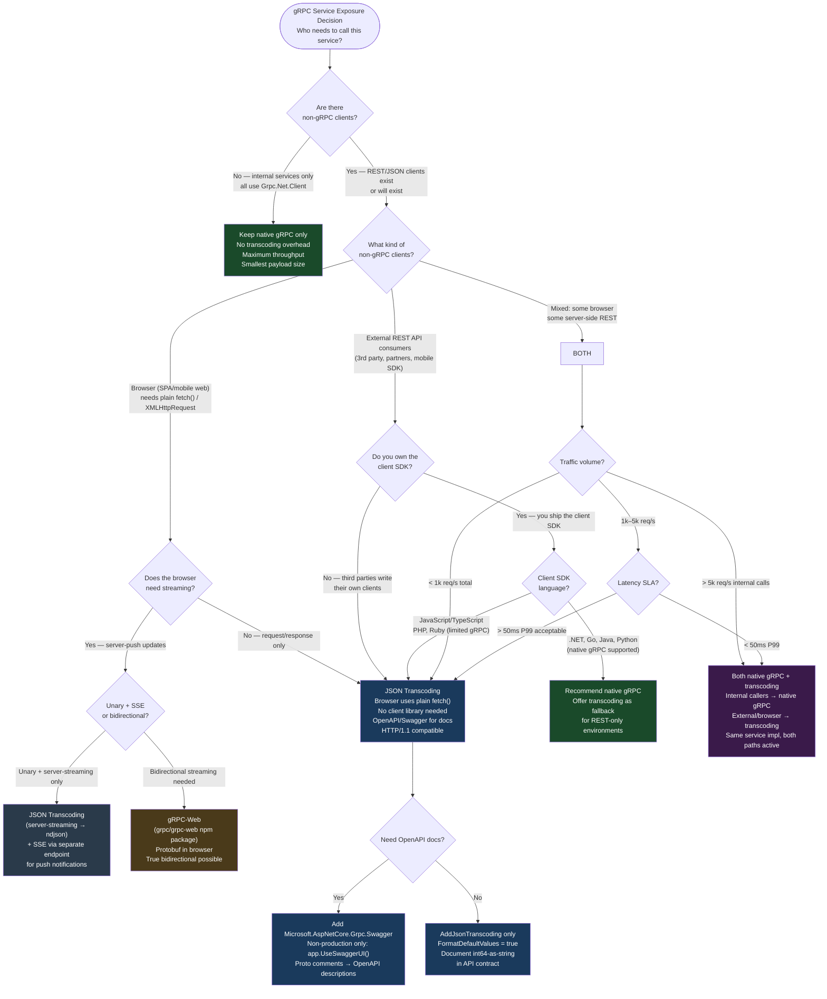

---

topic: "gRPC JSON Transcoding: REST-to-gRPC Translation Layer" domain: "ASP.NET Core Mastery" topic_id: "4.247" subsystem: "gRPC" tags:

- aspnetcore
- dotnet
- grpc
- transcoding
- rest
- openapi
- http-api status: "complete" difficulty: "expert" interview_importance: "medium" production_importance: "medium" aspnetcore_version: "8.0+" last_reviewed: "2026-06" related:
- "[[4.240 — gRPC in ASP.NET Core: Proto Contracts and Service Implementation]]"
- "[[4.241 — gRPC Streaming: Unary, Server, Client, and Bidirectional]]"
- "[[4.242 — gRPC Authentication: JWT and Certificate Interceptors]]"
- "[[4.244 — gRPC Interceptors: Server-Side and Client-Side Cross-Cutting Concerns]]"
- "[[4.245 — gRPC-Web: Browser Support via Grpc.AspNetCore.Web]]"
- "[[4.248 — gRPC vs REST vs GraphQL vs SignalR: The Decision Framework]]"
- "[[4.064 — Endpoint Routing: The Modern Routing System]]"
- "[[4.279 — OpenAPI / Swagger: Swashbuckle and NSwag Integration]]"
- "[[4.280 — OpenAPI in .NET 9: Microsoft.AspNetCore.OpenApi Built-In]]"
- "[[4.268 — System.Text.Json in ASP.NET Core: Global Options and Defaults]]"

---

# 4.247 — gRPC JSON Transcoding: REST-to-gRPC Translation Layer

---

## PART 0 — Navigation & Context

### Domain Hierarchy

```
ASP.NET Core Mastery
│
├── S. gRPC                               (4.240–4.248)
│   ├── 4.240 — gRPC: Proto Contracts & Service Implementation
│   ├── 4.241 — gRPC Streaming
│   ├── 4.242 — gRPC Authentication: JWT & Certificate Interceptors
│   ├── 4.243 — gRPC Error Handling: StatusCode and RpcException
│   ├── 4.244 — gRPC Interceptors: Server & Client Cross-Cutting
│   ├── 4.245 — gRPC-Web: Browser Support
│   ├── 4.246 — gRPC Client Factory: AddGrpcClient<T>
│   ├── 4.247 — gRPC JSON Transcoding  ◄ YOU ARE HERE
│   └── 4.248 — gRPC vs REST vs GraphQL: Decision Framework
│
├── W. API Design Patterns                (4.277–4.287)
│   ├── 4.279 — OpenAPI / Swagger Integration  ← transcoding generates OpenAPI
│   └── 4.283 — REST API Design Conventions    ← REST shape that transcoding exposes
│
└── V. Serialization                      (4.268–4.276)
    └── 4.268 — System.Text.Json Global Config  ← JSON serialization used by transcoding
```

### What You Need Before This

- **[[4.240 — gRPC in ASP.NET Core: Proto Contracts and Service Implementation]]** — Transcoding annotates existing `.proto` service definitions with HTTP binding rules; you must understand proto services, `ServerCallContext`, and `MapGrpcService<T>` before the annotations make sense.
- **[[4.064 — Endpoint Routing: The Modern Routing System]]** — Transcoding registers REST endpoints alongside gRPC endpoints in the same routing table; understanding how `MapGrpcServiceEndpoint` and `MapGet`/`MapPost` coexist prevents route collision surprises.
- **[[4.244 — gRPC Interceptors: Server-Side and Client-Side Cross-Cutting Concerns]]** — Interceptors run on _both_ the native gRPC path and the transcoded REST path; understanding the interceptor chain is prerequisite for reasoning about auth, logging, and error handling on both surfaces simultaneously.
- **[[4.268 — System.Text.Json in ASP.NET Core: Global Options and Defaults]]** — Transcoding serializes/deserializes JSON using the `Google.Protobuf` JSON formatter (not `System.Text.Json`), which has distinct field-name conventions; knowing the difference prevents silent field-mapping bugs.

### What This Unlocks After

- **[[4.248 — gRPC vs REST vs GraphQL vs SignalR: The Decision Framework]]** — Transcoding collapses the "gRPC vs REST" choice in one direction: you can have both simultaneously, which changes the trade-off analysis when picking a protocol for a new service.
- **[[4.279 — OpenAPI / Swagger: Swashbuckle and NSwag Integration]]** — The `Microsoft.AspNetCore.Grpc.Swagger` package generates OpenAPI spec from transcoded endpoints; understanding transcoding is prerequisite for knowing why the OpenAPI output looks the way it does.
- **[[4.245 — gRPC-Web: Browser Support via Grpc.AspNetCore.Web]]** — Transcoding is an alternative to gRPC-Web for browser accessibility; understanding both lets you choose the right one for your constraints.
- **[[4.283 — REST API Design Conventions in ASP.NET Core]]** — The `google.api.http` annotation syntax (`get`, `post`, `body`, `additional_bindings`) maps to REST conventions; understanding REST resource design makes the annotation choices obvious.

### Why This Matters at Scale

A service team that owns a gRPC API used by internal services but also needs to expose it to external REST clients or a web frontend faces a hard choice: duplicate the contract in two separate services, write an adapter proxy, or use transcoding to serve both surfaces from a single binary with zero duplication of business logic. Getting this wrong means two out-of-sync APIs, double the maintenance surface, and double the attack surface.

---

## PART 1 — The Core Mental Model

### The Fundamental Rule

> **gRPC JSON Transcoding translates an incoming REST HTTP request into a gRPC `ServerCallContext` and invokes the gRPC service method directly in-process — the REST call never becomes a real gRPC call over the wire. The practical consequence is that one `.proto` service definition, one service implementation, and one `MapGrpcService<T>` registration simultaneously serves both `application/grpc+proto` over HTTP/2 and `application/json` over HTTP/1.1 or HTTP/2, with all interceptors and auth middleware running on both paths.**

### The Plain-Language Analogy

Think of a government office that handles applications either in person (gRPC native — you fill in a precise, machine-readable form with exact field numbers) or by phone (transcoded REST — a clerk translates your conversational English request into the same machine-readable form on your behalf). The clerk at the front desk (the transcoding middleware) intercepts phone calls, asks the right questions, fills in the official form, and hands it to the same back-office processor (your gRPC service implementation) that handles walk-in applicants. The back-office processor has no idea whether the application came from a walk-in or a phone call — it sees only the filled-in official form. The clerk knows about the forms (the `.proto` schema), the mapping between conversational language and form fields (the `google.api.http` annotations), and the correct response format to translate back to the caller. This analogy holds for auth failures: if the back-office requires a badge (authorization middleware), the clerk still has to present a valid badge before handing off the form — the phone call is not exempt.

### The Taxonomy Diagram

```mermaid
graph TD
    subgraph client_types ["Client Access Patterns"]
        NATIVE["gRPC Native Client\n(Grpc.Net.Client)\nHTTP/2 + protobuf\napplication/grpc+proto"]
        REST_CLIENT["REST Client\n(curl, browser, mobile SDK)\nHTTP/1.1 or HTTP/2\napplication/json"]
        GRPC_WEB["gRPC-Web Client\n(browser via JS)\napplication/grpc-web+proto"]
    end

    subgraph pipeline ["ASP.NET Core Pipeline"]
        KESTREL["Kestrel\n(HTTP/1.1 + HTTP/2)"]
        MW["Middleware Stack\n(Auth, Logging, CORS...)"]
        ROUTING["UseRouting\n(matches both gRPC + REST endpoints)"]
        TRANS_MW["GrpcJsonTranscodingMiddleware\n(translates REST → gRPC call context)"]
        GRPC_MW["GrpcEndpointMiddleware\n(native gRPC path)"]
    end

    subgraph service_impl ["Single Service Implementation"]
        INTERCEPTORS["Server Interceptors\n(run on both paths)"]
        SVC["OrderService : OrderServiceBase\n(one class, two surfaces)"]
    end

    subgraph registration ["Registration Variants (.NET 8)"]
        R1["builder.Services.AddGrpc()\n+ AddJsonTranscoding()"]
        R2["MapGrpcService&lt;T&gt;()\n(registers both endpoints)"]
        R3["google.api.http annotation\nin .proto file"]
        R4["Microsoft.AspNetCore.Grpc.Swagger\n(OpenAPI generation)"]
    end

    subgraph proto_annotations ["Proto HTTP Annotations"]
        ANN1["option (google.api.http) = {\n  get: \"/v1/orders/{order_id}\"\n}"]
        ANN2["post: \"/v1/orders\"\nbody: \"*\""]
        ANN3["additional_bindings:\n(multiple REST mappings)"]
        ANN4["response_body:\n(select sub-field as response)"]
    end

    subgraph serialization ["JSON Serialization (NOT System.Text.Json)"]
        PROTO_JSON["Google.Protobuf JSON Formatter\n- camelCase field names\n- int64 as string\n- enum as name string\n- Timestamp as RFC3339\n- bytes as base64"]
    end

    NATIVE -->|"HTTP/2 HEADERS + DATA frames\nContent-Type: application/grpc+proto"| KESTREL
    REST_CLIENT -->|"HTTP GET/POST/PUT/DELETE\nContent-Type: application/json"| KESTREL
    GRPC_WEB -->|"application/grpc-web+proto"| KESTREL

    KESTREL --> MW --> ROUTING
    ROUTING -->|"Content-Type: application/json\nor Accept: application/json"| TRANS_MW
    ROUTING -->|"Content-Type: application/grpc+proto"| GRPC_MW
    TRANS_MW --> INTERCEPTORS
    GRPC_MW --> INTERCEPTORS
    INTERCEPTORS --> SVC

    R1 --> R2 --> R3
    R3 --> PROTO_JSON
    R2 --> R4

    style client_types fill:#1a3a5c,color:#fff
    style pipeline fill:#1a4a2a,color:#fff
    style service_impl fill:#3a1a4a,color:#fff
    style registration fill:#4a3a1a,color:#fff
    style proto_annotations fill:#4a1a1a,color:#fff
    style serialization fill:#2a3a4a,color:#fff
```

---

## PART 2 — Deep Mechanics

### 2.1 — The Translation Pipeline: How a REST Request Becomes a gRPC Call

Transcoding does not proxy the request to a gRPC endpoint over the network. It synthesises a `ServerCallContext` from the incoming HTTP request and calls the gRPC service method directly — in the same process, on the same thread pool, with no network hop.

```
Incoming REST request
        │
        ▼
┌───────────────────────────────────────────────────────────────────────────┐
│  Kestrel: accepts HTTP/1.1 or HTTP/2                                      │
│  Content-Type: application/json  (or no Content-Type for GET)             │
└───────────────────────────────────────────────────────────────────────────┘
        │
        ▼
──► ExceptionHandler
        │
        ▼
──► UseRouting     ← matches route pattern from google.api.http annotation
        │             e.g. GET /v1/orders/{order_id} → GetOrder endpoint
        │             Both REST and gRPC routes live in same routing table
        ▼
──► UseAuthentication / UseAuthorization
        │             auth middleware runs IDENTICALLY for REST and gRPC paths
        ▼
──► GrpcJsonTranscoding endpoint middleware (registered by AddJsonTranscoding)
        │
        ├── 1. Route variable extraction:
        │      /v1/orders/42 → { order_id: "42" }
        │
        ├── 2. Request body deserialization (POST/PUT):
        │      JSON body → proto message fields
        │      Uses Google.Protobuf JSON parser (NOT System.Text.Json)
        │
        ├── 3. Query string binding (GET):
        │      ?page_size=10&page_token=abc → proto message fields
        │
        ├── 4. Synthesise HttpContextServerCallContext:
        │      Wraps HttpContext to implement ServerCallContext
        │      Sets Deadline from grpc-timeout header if present
        │      Populates RequestHeaders from HTTP headers
        │
        ├── 5. Invoke service method directly:
        │      orderService.GetOrder(request, syntheticCallContext)
        │
        └── 6. Serialise response:
               proto message → JSON via Google.Protobuf JSON formatter
               Write to HttpResponse body
               Content-Type: application/json
               HTTP status: 200 OK (success) / 4xx/5xx (RpcException mapped)
```

**Framework source:** `GrpcJsonTranscodingMiddleware` in `Microsoft.AspNetCore.Grpc.JsonTranscoding`. The key class is `UnaryServerCallHandler<TService, TRequest, TResponse>` which has a `HandleTranscodingCallAsync` path that differs from the native gRPC path by skipping protobuf binary framing and using the JSON formatter instead.

**HTTP wire format — native gRPC path (for comparison):**

```http
// gRPC native request:
POST /grpc.order.v1.OrderService/GetOrder HTTP/2
Content-Type: application/grpc+proto
grpc-timeout: 30S

[binary protobuf: GetOrderRequest { order_id: "42" }]

// gRPC native response:
HTTP/2 200 OK
Content-Type: application/grpc+proto
grpc-status: 0

[binary protobuf: GetOrderResponse { ... }]
```

**HTTP wire format — transcoded REST path:**

```http
// Transcoded REST request:
GET /v1/orders/42 HTTP/1.1
Authorization: Bearer eyJhbGci...
Accept: application/json

// Transcoded REST response:
HTTP/1.1 200 OK
Content-Type: application/json

{
  "orderId": "42",
  "status": "ORDER_STATUS_PROCESSING",
  "totalAmountCents": 4999,
  "createdAt": "2024-03-15T09:30:00Z"
}
```

**Runtime cost:** Transcoding adds one JSON deserialisation (request) and one JSON serialisation (response) compared to native gRPC. The `Google.Protobuf` JSON formatter is not as fast as `System.Text.Json` source generation. Approximate additional overhead vs native gRPC: `~2–5μs` for small messages (<1KB), `~50–200μs` for large messages (>10KB JSON). The proto-to-JSON field name mapping (snake_case → camelCase) is precomputed at startup — `O(1)` per field at runtime.

**Edge case that bites engineers:** If the `.proto` field is named `order_id` (snake_case, as convention), the JSON key will be `orderId` (camelCase) by the Google JSON formatter — not `order_id`. REST clients that send `{ "order_id": "42" }` will have the field silently ignored and the proto message will have a zero-value `order_id`. This is the most common transcoding bug in production and is covered in detail in Gotcha 1.

---

### 2.2 — The `.proto` Annotation Syntax: `google.api.http`

Transcoding is controlled entirely by annotations in the `.proto` file. The annotation imports `google/api/http.proto` and uses the `(google.api.http)` option on each RPC method.

```protobuf
// order_service.proto
syntax = "proto3";
package grpc.order.v1;

import "google/api/annotations.proto";
import "google/protobuf/timestamp.proto";
import "google/protobuf/empty.proto";

option csharp_namespace = "OrderManagement.Grpc.V1";

service OrderService {

  // GET /v1/orders/{order_id}
  // Route variable {order_id} maps to GetOrderRequest.order_id
  rpc GetOrder(GetOrderRequest) returns (GetOrderResponse) {
    option (google.api.http) = {
      get: "/v1/orders/{order_id}"
    };
  }

  // POST /v1/orders
  // body: "*" means the entire request body maps to CreateOrderRequest fields
  rpc CreateOrder(CreateOrderRequest) returns (CreateOrderResponse) {
    option (google.api.http) = {
      post: "/v1/orders"
      body: "*"
    };
  }

  // PUT /v1/orders/{order_id}
  // body: "update" means only the nested "update" message maps to the body
  // Route var + body sub-message is the standard Update pattern
  rpc UpdateOrder(UpdateOrderRequest) returns (UpdateOrderResponse) {
    option (google.api.http) = {
      put: "/v1/orders/{order_id}"
      body: "update"
    };
  }

  // DELETE /v1/orders/{order_id}
  rpc CancelOrder(CancelOrderRequest) returns (google.protobuf.Empty) {
    option (google.api.http) = {
      delete: "/v1/orders/{order_id}"
    };
  }

  // Multiple REST bindings for the same gRPC method:
  // GET /v1/customers/{customer_id}/orders
  // GET /v1/orders?customer_id={customer_id}&status={status}
  rpc ListOrders(ListOrdersRequest) returns (ListOrdersResponse) {
    option (google.api.http) = {
      get: "/v1/customers/{customer_id}/orders"
      additional_bindings: {
        get: "/v1/orders"
        // query string parameters: customer_id, status, page_size, page_token
      }
    };
  }
}

message GetOrderRequest {
  string order_id = 1;
}

message GetOrderResponse {
  string order_id = 1;
  OrderStatus status = 2;
  int64 total_amount_cents = 3;
  google.protobuf.Timestamp created_at = 4;
  repeated OrderLineItem line_items = 5;
}

enum OrderStatus {
  ORDER_STATUS_UNSPECIFIED = 0;
  ORDER_STATUS_PENDING = 1;
  ORDER_STATUS_PROCESSING = 2;
  ORDER_STATUS_SHIPPED = 3;
  ORDER_STATUS_DELIVERED = 4;
}

message UpdateOrderRequest {
  string order_id = 1;    // from route variable
  OrderUpdate update = 2;  // from body
}

message OrderUpdate {
  string shipping_address = 1;
  string notes = 2;
}
```

**Field binding rules — how request data maps to proto message fields:**

```
HTTP method  Source of proto field values
──────────   ──────────────────────────────────────────────────────────────────
GET          Route variables  →  proto fields (by name, snake_case)
             Query string     →  remaining proto fields not in route
             (no body)

POST/PUT     Route variables  →  proto fields in route template
             body: "*"        →  all remaining proto fields from JSON body
             body: "field"    →  nested message field from JSON body
             
DELETE       Route variables  →  proto fields in route template
             (no body usually)
```

**HTTP wire format — mapping examples:**

```http
// GET with route variable → GetOrderRequest.order_id = "42"
GET /v1/orders/42 HTTP/1.1

// GET with query string → ListOrdersRequest fields
GET /v1/orders?customer_id=cust-99&status=ORDER_STATUS_SHIPPED&page_size=20 HTTP/1.1

// POST with body: "*" → all CreateOrderRequest fields from body
POST /v1/orders HTTP/1.1
Content-Type: application/json

{
  "customerId": "cust-99",       ← camelCase! proto field: customer_id
  "lineItems": [                  ← proto field: line_items
    { "productId": "prod-1", "quantity": 2 }
  ]
}

// PUT with route + body: "update" → order_id from route, update sub-message from body
PUT /v1/orders/42 HTTP/1.1
Content-Type: application/json

{
  "shippingAddress": "123 Main St",  ← fields of OrderUpdate, not UpdateOrderRequest
  "notes": "Leave at door"
}
```

**Runtime cost:** Route variable extraction: `O(1)` per variable (routing trie already parsed at startup). Query string binding: `O(n)` where n = number of query parameters. JSON body parsing with Google.Protobuf: `~2–5μs` per KB of payload.

**Edge case:** Nested message fields in query strings use dot notation: `?order.customer_id=99`. This is rarely documented and breaks most clients that don't know the proto structure. Prefer route variables for primary keys and shallow query parameters for filters.

---

### 2.3 — JSON Serialisation: Google.Protobuf vs System.Text.Json

This is the single most dangerous mechanical difference between transcoding and a regular REST endpoint. Transcoding uses the `Google.Protobuf` JSON formatter — a completely separate serialisation engine from `System.Text.Json`.

**Field name conventions:**

```
Proto field name     → JSON key (Google Protobuf JSON)
────────────────────────────────────────────────────
order_id             → "orderId"           (camelCase conversion)
total_amount_cents   → "totalAmountCents"  (camelCase)
created_at           → "createdAt"
line_items           → "lineItems"
customer_id          → "customerId"

// These conversions are BAKED INTO the proto descriptor at compile time.
// You cannot change them via JsonSerializerOptions.PropertyNamingPolicy.
// UseSnakeCaseNaming() on your JsonSerializerOptions has ZERO EFFECT on transcoding output.
```

**Type serialisation differences:**

```
Proto type           → JSON representation (Google Protobuf JSON)
────────────────────────────────────────────────────────────────
int64, uint64        → string  (e.g., "4999")        ← JavaScript safe integer limit
                                                        System.Text.Json would write number
float, double        → number
bytes                → base64url string
bool                 → true / false
enum                 → string name (e.g., "ORDER_STATUS_PROCESSING")
                       NOT the integer value
google.protobuf.Timestamp → RFC3339 string: "2024-03-15T09:30:00Z"
google.protobuf.Duration  → string: "3.5s"
google.protobuf.Struct    → arbitrary JSON object
google.protobuf.Value     → any JSON value
repeated field       → JSON array
map field            → JSON object

// Default (zero) values:
// By default, proto3 zero values are OMITTED from the JSON output.
// int32 = 0 → field absent from JSON
// string = "" → field absent from JSON
// To include zero values: configure FormatDefaultValues = true in GrpcJsonSettings
```

**ASP.NET Core internally (approximate):**

```csharp
// Microsoft.AspNetCore.Grpc.JsonTranscoding - response serialisation:
// JsonTranscodingHelper.WriteResponseMessage(response, httpContext, descriptor)
//   → Uses Google.Protobuf.JsonFormatter with JsonFormatter.Settings
//   → Settings derived from GrpcJsonTranscodingOptions.JsonSettings
//   → NOT the global JsonSerializerOptions from builder.Services.ConfigureHttpJsonOptions()
```

**Configuring the Google.Protobuf JSON formatter:**

```csharp
// Program.cs — the only way to configure transcoding JSON behaviour:
builder.Services.AddGrpc()
    .AddJsonTranscoding(options =>
    {
        // Include fields that have default (zero) values in the JSON output
        // Default: false → zero-value fields are omitted
        options.JsonSettings.FormatDefaultValues = true;

        // Use original proto field names (snake_case) instead of camelCase
        // Only set to true if your REST clients expect snake_case
        options.JsonSettings.PreserveProtoFieldNames = false; // default: false (camelCase)
    });

// ⚠️ This does NOT affect transcoding — it only affects regular REST endpoints:
builder.Services.ConfigureHttpJsonOptions(options =>
{
    options.SerializerOptions.PropertyNamingPolicy = JsonNamingPolicy.CamelCase;
});
```

**HTTP wire format — zero-value omission (the silent bug):**

```http
// Proto message: GetOrderResponse { order_id: "42", status: ORDER_STATUS_UNSPECIFIED (=0), total_amount_cents: 0 }

// Response WITHOUT FormatDefaultValues (default — silent omission):
HTTP/1.1 200 OK
Content-Type: application/json

{
  "orderId": "42"
  // status and totalAmountCents are ABSENT — they have zero/default values
  // REST client receives partial object and interprets missing fields as null/0
}

// Response WITH FormatDefaultValues = true:
HTTP/1.1 200 OK
Content-Type: application/json

{
  "orderId": "42",
  "status": "ORDER_STATUS_UNSPECIFIED",
  "totalAmountCents": "0"   ← int64 is a string!
}
```

**Runtime cost:** `Google.Protobuf.JsonFormatter` is not source-generated. It uses reflection over the proto descriptor at runtime: `~5–20μs` per message for small payloads. For high-throughput APIs with large response payloads (>50 fields), this is the dominant serialisation cost — approximately 3–5× slower than `System.Text.Json` with source generation.

---

### 2.4 — Error Mapping: RpcException → HTTP Status Codes

When the gRPC service method throws an `RpcException`, the transcoding layer maps the gRPC `StatusCode` to an HTTP status code and writes an error body.

**Status code mapping table:**

```
gRPC StatusCode              → HTTP Status   → JSON body
──────────────────────────────────────────────────────────────────────────
StatusCode.OK                → 200           → response message
StatusCode.Cancelled         → 408 Request Timeout (or 499 client closed)
StatusCode.Unknown           → 500 Internal Server Error
StatusCode.InvalidArgument   → 400 Bad Request
StatusCode.DeadlineExceeded  → 504 Gateway Timeout
StatusCode.NotFound          → 404 Not Found
StatusCode.AlreadyExists     → 409 Conflict
StatusCode.PermissionDenied  → 403 Forbidden
StatusCode.ResourceExhausted → 429 Too Many Requests
StatusCode.FailedPrecondition→ 400 Bad Request
StatusCode.Aborted           → 409 Conflict
StatusCode.OutOfRange        → 400 Bad Request
StatusCode.Unimplemented     → 501 Not Implemented
StatusCode.Internal          → 500 Internal Server Error
StatusCode.Unavailable       → 503 Service Unavailable
StatusCode.DataLoss          → 500 Internal Server Error
StatusCode.Unauthenticated   → 401 Unauthorized
```

**HTTP wire format — error response:**

```http
// Service throws: throw new RpcException(new Status(StatusCode.NotFound, "Order 42 not found"));

// Transcoded REST error response:
HTTP/1.1 404 Not Found
Content-Type: application/json

{
  "code": 5,
  "message": "Order 42 not found",
  "details": []
}

// Note: "code" is the gRPC StatusCode integer value (5 = StatusCode.NotFound)
// This is NOT RFC 7807 Problem Details format.
// REST clients that expect problem+json will not get it from transcoding by default.
```

**Framework source:** `GrpcStatusCodeMappingMiddleware` in the transcoding package maps `StatusCode` to HTTP status. The JSON error body format is `google.rpc.Status` — defined in `google/rpc/status.proto`.

**Edge case:** `RpcException` with rich error details (`google.rpc.BadRequest`, `google.rpc.ResourceInfo`) is serialised into the `"details"` array as base64-encoded proto messages — not human-readable JSON. REST clients that need human-readable error details must use the `google.rpc.Status` detail types and the transcoding layer will attempt to format them if the proto descriptors are included. This is a known sharp edge: transcoded error bodies are less developer-friendly than RFC 7807 Problem Details.

---

### 2.5 — OpenAPI Generation with `Microsoft.AspNetCore.Grpc.Swagger`

The `Microsoft.AspNetCore.Grpc.Swagger` package (NuGet) generates an OpenAPI spec from transcoded endpoints by reading the `.proto` annotations and the proto descriptor.

**Pipeline position:**

```
──► Routing ──► Auth ──► TranscodeMiddleware ──► GrpcService
                   ↑
            MapGrpcService registers BOTH:
            - gRPC endpoint: POST /{package}.{Service}/{Method}
            - REST endpoints: GET/POST/PUT/DELETE from http annotations
                   ↓
            Swashbuckle introspects REST endpoints → OpenAPI spec
```

**Registration:**

```csharp
// Program.cs (.NET 8):
builder.Services.AddGrpc().AddJsonTranscoding();

// Generates OpenAPI from transcoded REST endpoints only (not native gRPC endpoints)
builder.Services.AddGrpcSwagger();
builder.Services.AddSwaggerGen(c =>
{
    c.SwaggerDoc("v1", new OpenApiInfo { Title = "Order Service", Version = "v1" });
    // Proto file comments become OpenAPI descriptions if you include XML docs:
    var xmlFile = $"{Assembly.GetExecutingAssembly().GetName().Name}.xml";
    var xmlPath = Path.Combine(AppContext.BaseDirectory, xmlFile);
    c.IncludeGrpcXmlComments(xmlPath, includeControllerXmlComments: true);
});

app.UseSwagger();
app.UseSwaggerUI();
app.MapGrpcService<OrderService>();
```

**HTTP wire format — Swagger UI access:**

```http
// OpenAPI JSON spec (generated from proto annotations):
GET /swagger/v1/swagger.json HTTP/1.1

// Response includes transcoded REST paths:
// GET /v1/orders/{order_id}
// POST /v1/orders
// PUT /v1/orders/{order_id}
// DELETE /v1/orders/{order_id}
// Each with request/response schema derived from proto message descriptors
```

**Runtime cost:** OpenAPI generation happens once at startup — `O(n)` where n = number of annotated RPC methods. Zero cost per request. The proto descriptor parsing adds `~50–200ms` to startup time depending on the number of `.proto` files. This is acceptable; do not pre-warm or cache it differently.

**Edge case:** `google.protobuf.Timestamp`, `google.protobuf.Duration`, and `google.protobuf.Struct` are well-known types that the OpenAPI generator maps to `string (date-time)`, `string`, and `object` respectively. Without explicit XML documentation comments, REST clients have no indication that an `object` field is actually a JSON free-form structure. Document these fields explicitly in `.proto` comments.

---

## PART 3 — Production Code Patterns

### Pattern 1 — The Dual-Surface Order API: Single Implementation, Two Protocols

The foundational pattern: one gRPC service, one `AddJsonTranscoding()` call, both REST and gRPC served.

```csharp
// ─── order_service.proto ────────────────────────────────────────────────────
// syntax = "proto3";
// import "google/api/annotations.proto";
// service OrderService {
//   rpc GetOrder(GetOrderRequest) returns (GetOrderResponse) {
//     option (google.api.http) = { get: "/v1/orders/{order_id}" };
//   }
//   rpc CreateOrder(CreateOrderRequest) returns (CreateOrderResponse) {
//     option (google.api.http) = { post: "/v1/orders" body: "*" };
//   }
// }

// ─── OrderService.cs ────────────────────────────────────────────────────────
// Pipeline position: runs inside the endpoint middleware, after UseAuthentication
//                    and UseAuthorization. Both REST and gRPC calls arrive here
//                    via the same method — transcoding is transparent to the impl.
[Authorize]
public sealed class OrderService : OrderService.OrderServiceBase
{
    private readonly IOrderRepository _orders;
    private readonly ILogger<OrderService> _logger;

    public OrderService(IOrderRepository orders, ILogger<OrderService> logger)
    {
        _orders = orders;
        _logger = logger;
    }

    public override async Task<GetOrderResponse> GetOrder(
        GetOrderRequest request,
        ServerCallContext context)
    {
        // context.GetHttpContext().User is populated by UseAuthentication
        // regardless of whether the caller used gRPC or the transcoded REST path
        var userId = context.GetHttpContext().User.FindFirstValue("sub")
            ?? throw new RpcException(new Status(StatusCode.Unauthenticated, "Missing sub claim"));

        var order = await _orders.GetByIdAsync(request.OrderId, context.CancellationToken)
            ?? throw new RpcException(new Status(StatusCode.NotFound,
                $"Order {request.OrderId} not found"));

        // Authorise: user can only see their own orders
        if (order.CustomerId != userId)
            throw new RpcException(new Status(StatusCode.PermissionDenied,
                "You do not have access to this order"));

        _logger.LogInformation("GetOrder: orderId={OrderId} userId={UserId}",
            request.OrderId, userId);

        return new GetOrderResponse
        {
            OrderId          = order.Id,
            Status           = (OrderStatus)order.Status,
            TotalAmountCents = order.TotalAmountCents,
            CreatedAt        = Timestamp.FromDateTime(order.CreatedAt.ToUniversalTime()),
        };
    }

    public override async Task<CreateOrderResponse> CreateOrder(
        CreateOrderRequest request,
        ServerCallContext context)
    {
        var userId = context.GetHttpContext().User.FindFirstValue("sub")!;
        var orderId = await _orders.CreateAsync(userId, request, context.CancellationToken);

        return new CreateOrderResponse
        {
            OrderId = orderId,
            Status  = OrderStatus.OrderStatusPending,
        };
    }
}

// ─── Program.cs ─────────────────────────────────────────────────────────────
builder.Services.AddGrpc(options =>
{
    // Interceptors run on BOTH native gRPC and transcoded REST paths
    options.Interceptors.Add<LoggingInterceptor>();
    options.Interceptors.Add<CorrelationIdInterceptor>();
})
.AddJsonTranscoding(options =>
{
    // Include zero-value fields so REST clients get complete objects
    // Without this, { status: ORDER_STATUS_UNSPECIFIED } is omitted silently
    options.JsonSettings.FormatDefaultValues = true;
});

app.UseAuthentication();
app.UseAuthorization();

// One registration serves both surfaces:
app.MapGrpcService<OrderService>();
```

```
// HTTP wire effect — REST client (transcoded):
// GET /v1/orders/ord-123 HTTP/1.1
// Authorization: Bearer eyJ...
//
// → UseAuthentication validates JWT → User.sub = "usr-99"
// → Transcoding extracts order_id = "ord-123" from route
// → OrderService.GetOrder called with GetOrderRequest { order_id: "ord-123" }
// → Returns GetOrderResponse
// → JSON response: { "orderId":"ord-123","status":"ORDER_STATUS_PROCESSING","totalAmountCents":"4999","createdAt":"2024-03-15T09:30:00Z" }
//
// HTTP wire effect — gRPC client (native, same method):
// POST /grpc.order.v1.OrderService/GetOrder HTTP/2
// Content-Type: application/grpc+proto
// → Same OrderService.GetOrder called, protobuf response
```

---

### Pattern 2 — The Partial Body Binding: Logistics Update with Route + Body Split

When a PUT/PATCH operation needs the resource ID from the route and the update payload from the body, use the `body: "field_name"` annotation to bind a sub-message.

```csharp
// ─── proto annotation ────────────────────────────────────────────────────────
// rpc UpdateShipment(UpdateShipmentRequest) returns (UpdateShipmentResponse) {
//   option (google.api.http) = {
//     put: "/v1/shipments/{shipment_id}"
//     body: "update"    ← only the 'update' sub-message comes from the JSON body
//   };
// }
//
// message UpdateShipmentRequest {
//   string shipment_id = 1;   // from route variable
//   ShipmentUpdate update = 2; // from request body
// }
//
// message ShipmentUpdate {
//   string carrier_tracking_id = 1;
//   string estimated_delivery = 2;
//   ShipmentStatus status = 3;
// }

// ─── REST client sends: ──────────────────────────────────────────────────────
// PUT /v1/shipments/ship-456 HTTP/1.1
// Content-Type: application/json
//
// {
//   "carrierTrackingId": "1Z999AA10123456784",
//   "estimatedDelivery": "2024-03-20",
//   "status": "SHIPMENT_STATUS_IN_TRANSIT"
// }
//
// Transcoding builds:
//   UpdateShipmentRequest {
//     shipment_id: "ship-456",          ← from route
//     update: {                          ← from body
//       carrier_tracking_id: "1Z999...",
//       estimated_delivery: "2024-03-20",
//       status: SHIPMENT_STATUS_IN_TRANSIT
//     }
//   }

// ─── ShipmentService.cs ──────────────────────────────────────────────────────
public override async Task<UpdateShipmentResponse> UpdateShipment(
    UpdateShipmentRequest request,
    ServerCallContext context)
{
    // request.ShipmentId comes from the route variable
    // request.Update comes from the JSON body
    // No parsing needed — transcoding already mapped both

    if (string.IsNullOrEmpty(request.ShipmentId))
        throw new RpcException(new Status(StatusCode.InvalidArgument,
            "shipment_id is required"));

    if (request.Update is null)
        throw new RpcException(new Status(StatusCode.InvalidArgument,
            "update body is required"));

    await _shipments.UpdateAsync(request.ShipmentId, request.Update, context.CancellationToken);

    return new UpdateShipmentResponse { ShipmentId = request.ShipmentId };
}
```

```
// HTTP wire effect — successful update:
// PUT /v1/shipments/ship-456 → 200 OK { "shipmentId": "ship-456" }

// HTTP wire effect — missing body:
// PUT /v1/shipments/ship-456 (no body) → 400 Bad Request
// { "code": 3, "message": "update body is required", "details": [] }
```

---

### Pattern 3 — The `additional_bindings` Pattern: Inventory Search with Multiple REST Shapes

One gRPC method exposed at multiple REST URLs for backwards compatibility or REST convention alignment.

```csharp
// ─── proto annotation ────────────────────────────────────────────────────────
// rpc SearchInventory(SearchInventoryRequest) returns (SearchInventoryResponse) {
//   option (google.api.http) = {
//     // Primary REST binding: resource-scoped search
//     get: "/v1/warehouses/{warehouse_id}/inventory"
//     additional_bindings: {
//       // Secondary: global inventory search, all filters via query string
//       get: "/v1/inventory"
//     }
//     additional_bindings: {
//       // Tertiary: POST with complex filter in body (for large filter sets)
//       post: "/v1/inventory:search"
//       body: "filter"
//     }
//   };
// }
//
// message SearchInventoryRequest {
//   string warehouse_id = 1;       // route var (binding 1) or query (bindings 2/3)
//   InventoryFilter filter = 2;    // query (binding 1+2) or body (binding 3)
//   int32 page_size = 3;           // query string all bindings
//   string page_token = 4;         // query string all bindings
// }

// ─── InventoryService.cs ─────────────────────────────────────────────────────
public override async Task<SearchInventoryResponse> SearchInventory(
    SearchInventoryRequest request,
    ServerCallContext context)
{
    // The service method doesn't know which binding was used —
    // it just sees the populated SearchInventoryRequest.
    // Transcoding filled in warehouse_id, filter, page_size from wherever they came.

    var results = await _inventory.SearchAsync(
        warehouseId: string.IsNullOrEmpty(request.WarehouseId) ? null : request.WarehouseId,
        filter:      request.Filter,
        pageSize:    request.PageSize > 0 ? request.PageSize : 20,
        pageToken:   request.PageToken,
        ct:          context.CancellationToken);

    return new SearchInventoryResponse
    {
        Items         = { results.Items.Select(MapToProto) },
        NextPageToken = results.NextPageToken ?? string.Empty,
        TotalCount    = results.TotalCount,
    };
}
```

```
// HTTP wire effect — three different REST calls hit the same gRPC method:
// GET /v1/warehouses/wh-1/inventory?page_size=50
// → warehouse_id="wh-1", page_size=50, filter=default

// GET /v1/inventory?warehouse_id=wh-1&filter.sku_prefix=PROD-A
// → warehouse_id="wh-1", filter.sku_prefix="PROD-A" (nested query param)

// POST /v1/inventory:search
// { "skuPrefix": "PROD-A", "categoryIds": ["cat-1","cat-2"], "inStockOnly": true }
// → filter sub-message populated from body

// All three produce identical gRPC method invocation signature.
```

> [!TIP] The `:search` suffix convention for POST searches (`/v1/inventory:search`) comes from the Google AIP (API Improvement Proposals) standard — specifically AIP-136 (Custom Methods). It signals to REST clients that this is a non-standard verb on a collection resource. It integrates naturally with gRPC JSON transcoding's `additional_bindings`.

---

### Pattern 4 — The Zero-Value Visibility Fix: Payment Status with FormatDefaultValues

The most important production configuration fix for transcoding. Without it, zero-value proto fields are silently omitted from JSON responses, breaking REST clients.

```csharp
// ⚠️ WRONG: Default configuration — zero values silently omitted
builder.Services.AddGrpc().AddJsonTranscoding();
// No FormatDefaultValues configuration

// Proto response: PaymentStatusResponse { status: PAYMENT_STATUS_PENDING (= 1 — not zero), amount_cents: 0, fee_cents: 0 }
// JSON output:
// { "status": "PAYMENT_STATUS_PENDING" }
// amount_cents (= 0) and fee_cents (= 0) are OMITTED
// REST client's TypeScript model:
//   { status: "PAYMENT_STATUS_PENDING", amountCents: undefined, feeCents: undefined }
// → REST client crashes when trying to do math on amountCents

// HTTP consequence (wrong path):
// GET /v1/payments/pay-123 → 200 OK
// { "status": "PAYMENT_STATUS_PENDING" }   ← partial response, silent data loss

// ✅ CORRECT: Configure FormatDefaultValues
builder.Services.AddGrpc()
    .AddJsonTranscoding(options =>
    {
        // Always include zero-value fields in transcoded JSON responses
        // REST clients expect complete objects; omitting zero values violates that contract
        options.JsonSettings.FormatDefaultValues = true;
    });

// JSON output with fix:
// { "status": "PAYMENT_STATUS_PENDING", "amountCents": "0", "feeCents": "0" }
// Note: int64 is serialised as string — REST clients must parse the string to number

// HTTP consequence (correct path):
// GET /v1/payments/pay-123 → 200 OK
// { "status": "PAYMENT_STATUS_PENDING", "amountCents": "0", "feeCents": "0" }
```

> [!WARNING] Even with `FormatDefaultValues = true`, `int64` and `uint64` proto fields are serialised as JSON strings (e.g. `"0"`, `"4999"`), not numbers. This is deliberate — JavaScript cannot safely represent 64-bit integers as numbers (`Number.MAX_SAFE_INTEGER = 2^53 - 1`). REST clients consuming `int64` fields **must** parse them as `BigInt` or treat them as strings. Document this in your API contract.

---

### Pattern 5 — The Auth-Forwarding Interceptor: Propagating User Identity to Downstream gRPC

When a transcoded REST call reaches a gRPC service that itself calls other internal gRPC services, the user identity must be propagated. This is the same interceptor pattern regardless of whether the entry point was REST or native gRPC.

```csharp
// Server interceptor — runs on BOTH native gRPC and transcoded REST paths
// Extracts the bearer token and stores it for downstream propagation
public sealed class UserContextInterceptor : Interceptor
{
    private static readonly AsyncLocal<string?> _currentToken = new();

    // Token is stored in AsyncLocal so it flows with the async context
    // to downstream service calls made from the same request
    public static string? CurrentToken => _currentToken.Value;

    public override async Task<TResponse> UnaryServerHandler<TRequest, TResponse>(
        TRequest request,
        ServerCallContext context,
        UnaryServerMethod<TRequest, TResponse> continuation)
    {
        // Works for both native gRPC (Authorization header in gRPC metadata)
        // and transcoded REST (Authorization header in HTTP headers)
        var httpContext = context.GetHttpContext();
        var authHeader = httpContext.Request.Headers.Authorization.FirstOrDefault();

        if (authHeader?.StartsWith("Bearer ", StringComparison.OrdinalIgnoreCase) == true)
        {
            // Store for downstream calls made within this request's async context
            _currentToken.Value = authHeader["Bearer ".Length..];
        }

        try
        {
            return await continuation(request, context);
        }
        finally
        {
            _currentToken.Value = null; // clean up — avoid leaking across requests
        }
    }
}

// Client interceptor — attaches stored token to outgoing downstream gRPC calls
public sealed class ForwardAuthInterceptor : Interceptor
{
    public override AsyncUnaryCall<TResponse> AsyncUnaryCall<TRequest, TResponse>(
        TRequest request,
        ClientInterceptorContext<TRequest, TResponse> context,
        AsyncUnaryCallContinuation<TRequest, TResponse> continuation)
    {
        var token = UserContextInterceptor.CurrentToken;
        if (token is not null)
        {
            var headers = context.Options.Headers ?? new Metadata();
            headers.Add("authorization", $"Bearer {token}");
            context = new ClientInterceptorContext<TRequest, TResponse>(
                context.Method, context.Host,
                context.Options.WithHeaders(headers));
        }
        return continuation(request, context);
    }
}

// Registration:
builder.Services.AddGrpc(options =>
{
    options.Interceptors.Add<UserContextInterceptor>(); // server-side, runs first
})
.AddJsonTranscoding(options =>
{
    options.JsonSettings.FormatDefaultValues = true;
});

// Client interceptor registered on outgoing gRPC clients:
builder.Services.AddGrpcClient<InventoryService.InventoryServiceClient>(o =>
    o.Address = new Uri("https://inventory-grpc:443"))
    .AddInterceptor<ForwardAuthInterceptor>();
```

---

### Pattern 6 — The OpenAPI Documentation Pipeline: Self-Describing Transcoded API

Generating a Swagger UI from proto annotations so REST clients have full API documentation.

```csharp
// ─── order_service.proto — with documentation comments ──────────────────────
// // Service for managing customer orders in the e-commerce platform.
// service OrderService {
//   // Retrieves a single order by its unique identifier.
//   // Returns NOT_FOUND if the order does not exist or the caller lacks access.
//   rpc GetOrder(GetOrderRequest) returns (GetOrderResponse) {
//     option (google.api.http) = {
//       get: "/v1/orders/{order_id}"
//     };
//   }
// }

// ─── Program.cs ─────────────────────────────────────────────────────────────
builder.Services.AddGrpc().AddJsonTranscoding(options =>
{
    options.JsonSettings.FormatDefaultValues = true;
});

// Only enable Swagger in non-production — proto descriptors add ~2MB to the process
if (!builder.Environment.IsProduction())
{
    builder.Services.AddGrpcSwagger();
    builder.Services.AddSwaggerGen(c =>
    {
        c.SwaggerDoc("v1", new OpenApiInfo
        {
            Title   = "Order Management API",
            Version = "v1",
            Description = "REST interface for the gRPC OrderService (via JSON Transcoding).",
        });

        // Proto XML doc file — generated by Grpc.Tools when IncludeAdditionalFiles is set
        // in the .csproj: <Protobuf Include="..." GrpcServices="Server" AdditionalImportDirs="..." />
        var xmlPath = Path.Combine(AppContext.BaseDirectory,
            $"{Assembly.GetExecutingAssembly().GetName().Name}.xml");
        if (File.Exists(xmlPath))
            c.IncludeGrpcXmlComments(xmlPath, includeControllerXmlComments: true);
    });
}

if (!app.Environment.IsProduction())
{
    app.UseSwagger();
    app.UseSwaggerUI(c =>
    {
        c.SwaggerEndpoint("/swagger/v1/swagger.json", "Order Management API v1");
        c.RoutePrefix = "api-docs";
    });
}

app.MapGrpcService<OrderService>();
```

```
// HTTP wire effect — Swagger UI access:
// GET /api-docs → Swagger UI HTML (non-production only)
// GET /swagger/v1/swagger.json → OpenAPI JSON spec
//
// The spec includes:
// GET /v1/orders/{order_id}
//   Parameters: order_id (path, required, string)
//   Responses: 200 GetOrderResponse schema, 404, 403
// POST /v1/orders
//   Request body: CreateOrderRequest schema (JSON)
//   Responses: 200 CreateOrderResponse schema
```

---

### Pattern 7 — The gRPC-Web vs Transcoding Decision: Healthcare Patient Portal

When a browser-facing use case requires choosing between gRPC-Web and JSON Transcoding.

```csharp
// ⚠️ WRONG choice: gRPC-Web for a REST-heavy browser client
// gRPC-Web requires a JS client library and binary framing — adds complexity
// for a browser client that just wants REST JSON
builder.Services.AddGrpcWeb(options => options.DefaultEnabled = true);
// REST clients must use the Grpc-Web protocol — not plain fetch()

// ✅ CORRECT choice: JSON Transcoding for browser REST compatibility
// Browser uses plain fetch() with JSON — no special library needed
builder.Services.AddGrpc().AddJsonTranscoding(options =>
{
    options.JsonSettings.FormatDefaultValues = true;
});

// Proto annotation:
// rpc GetPatientRecord(GetPatientRecordRequest) returns (GetPatientRecordResponse) {
//   option (google.api.http) = {
//     get: "/v1/patients/{patient_id}/records/{record_id}"
//   };
// }

// Browser JavaScript can now call:
// const response = await fetch('/v1/patients/p-123/records/r-456', {
//   headers: { 'Authorization': 'Bearer ' + token }
// });
// const data = await response.json();
// No gRPC client library needed.

// HTTP wire effect — browser fetch():
// GET /v1/patients/p-123/records/r-456 HTTP/1.1
// Accept: */*
// Authorization: Bearer eyJ...
//
// → 200 OK Content-Type: application/json
// { "patientId": "p-123", "recordId": "r-456", "diagnosis": "...", ... }
```

---

## PART 4 — Gotchas & Anti-Patterns

### Gotcha 1: camelCase vs snake_case — REST Clients Sending Wrong Field Names

Experienced engineers migrating from Newtonsoft.Json or System.Text.Json assume they can send `order_id` in the JSON body and it will be mapped to the proto field `order_id`. The Google.Protobuf JSON formatter uses camelCase by default, and the deserialization is strict — `order_id` is **silently ignored**.

```csharp
// ⚠️ WRONG: REST client sends snake_case field names in POST body
// POST /v1/orders HTTP/1.1
// Content-Type: application/json
//
// {
//   "customer_id": "cust-99",     ← snake_case — ignored by Google.Protobuf deserialiser
//   "total_amount_cents": 4999,    ← snake_case — ignored
//   "line_items": [...]            ← snake_case — ignored
// }
//
// Result: CreateOrderRequest { customer_id: "", total_amount_cents: 0, line_items: [] }

// HTTP consequence (wrong path):
// POST /v1/orders → 200 OK (no error!)
// But the order is created with empty customer ID and zero amount
// → Silent data corruption in production
```

```csharp
// ✅ CORRECT: REST client sends camelCase field names
// POST /v1/orders HTTP/1.1
// Content-Type: application/json
//
// {
//   "customerId": "cust-99",      ← camelCase — correctly mapped
//   "totalAmountCents": 4999,      ← camelCase — correctly mapped
//   "lineItems": [...]             ← camelCase — correctly mapped
// }

// HTTP consequence (correct path):
// POST /v1/orders → 200 OK
// Order created with correct customer ID and amount
```

```csharp
// Alternative fix: PreserveProtoFieldNames = true
// This makes the server accept snake_case AND use snake_case in responses
// Trade-off: breaks the camelCase convention that JS/TS clients expect
builder.Services.AddGrpc().AddJsonTranscoding(options =>
{
    options.JsonSettings.PreserveProtoFieldNames = true; // accept snake_case
});
```

**WHY:** `Google.Protobuf.JsonParser` uses the camelCase conversion defined in the proto descriptor to match incoming JSON keys. The conversion happens at compile time — there is no runtime reflection. The parser does not fall back to snake_case; unrecognised keys are silently discarded (proto3 unknown field handling). This is identical to the Google Cloud REST API behaviour.

---

### Gotcha 2: `int64` Serialised as String — TypeScript Client Breaks on Number Parse

Engineers see `"totalAmountCents": "4999"` in the JSON response and assume it is a bug or that they misconfigured the formatter. It is intentional, but it breaks TypeScript clients that declare the field as `number`.

```typescript
// ⚠️ WRONG TypeScript client model:
interface OrderResponse {
  orderId: string;
  totalAmountCents: number;   // ← declared as number
}

const order: OrderResponse = await fetchOrder("42");
const tax = order.totalAmountCents * 0.1; // totalAmountCents is "4999" (string) → NaN

// HTTP consequence (wrong path):
// GET /v1/orders/42 → { "orderId": "42", "totalAmountCents": "4999" }
// TypeScript receives a string where number is expected
// → tax = NaN → silent calculation error in production payment display
```

```typescript
// ✅ CORRECT TypeScript client model — treat int64 as string or parse explicitly
interface OrderResponse {
  orderId: string;
  totalAmountCents: string;  // ← declared as string (proto int64 convention)
}

// Or: parse on access
const amountCents = parseInt(order.totalAmountCents, 10);
const tax = amountCents * 0.1; // 499.9
```

```csharp
// Server-side: no fix is possible while keeping int64.
// If you need a true JSON number, use int32 instead of int64 in the proto —
// only if values are guaranteed to fit within JS Number.MAX_SAFE_INTEGER (2^53 - 1).
// For monetary amounts in cents, int32 overflows at ~$21M — use int64 and document.
```

**WHY:** The gRPC JSON encoding spec (https://protobuf.dev/programming-guides/proto3/#json) explicitly defines `int64`/`uint64` as JSON string to avoid JavaScript precision loss. `Google.Protobuf.JsonFormatter` cannot be configured to write `int64` as a number — that would violate the spec. The TypeScript/JavaScript fix is always on the client side.

---

### Gotcha 3: Server Interceptors Running on Transcoded Calls — Unexpected Double-Execution

A team registers a logging interceptor on `AddGrpc()`. They also register a middleware that logs HTTP requests. Both run on transcoded REST calls, producing double log entries for every REST request. Worse: an interceptor that does mutation (e.g., adds a correlation ID to the gRPC metadata) may conflict with the same ID being set by HTTP middleware.

```csharp
// ⚠️ WRONG: Unaware that interceptors run on both paths
builder.Services.AddGrpc(options =>
{
    options.Interceptors.Add<CorrelationIdInterceptor>(); // adds correlation ID to gRPC metadata
})
.AddJsonTranscoding();

app.Use(async (ctx, next) =>
{
    // Also adds correlation ID to HTTP headers — runs BEFORE the interceptor
    ctx.Response.Headers["X-Correlation-Id"] = Guid.NewGuid().ToString();
    await next();
});

// When a REST client calls GET /v1/orders/42:
// 1. HTTP middleware sets X-Correlation-Id = "aaa-111"
// 2. Transcoding translates to gRPC call context
// 3. CorrelationIdInterceptor runs — sets ANOTHER correlation ID "bbb-222" on gRPC metadata
// → Two different correlation IDs in the logs for the same request
// → Distributed tracing is broken for REST-entry-point calls

// HTTP consequence (wrong path):
// GET /v1/orders/42 → 200 OK X-Correlation-Id: aaa-111 (from HTTP middleware)
// gRPC logs show correlation "bbb-222"
// REST logs show "aaa-111"
// → Cannot correlate the two log streams
```

```csharp
// ✅ CORRECT: Interceptor reads correlation ID from HTTP context if present
public sealed class CorrelationIdInterceptor : Interceptor
{
    public override async Task<TResponse> UnaryServerHandler<TRequest, TResponse>(
        TRequest request,
        ServerCallContext context,
        UnaryServerMethod<TRequest, TResponse> continuation)
    {
        var httpContext = context.GetHttpContext();

        // Check if correlation ID was already set by HTTP middleware (transcoded path)
        // If not (native gRPC path), generate a new one from gRPC metadata or create fresh
        var correlationId =
            httpContext.Request.Headers["X-Correlation-Id"].FirstOrDefault()
            ?? context.RequestHeaders.GetValue("x-correlation-id")
            ?? Guid.NewGuid().ToString();

        // Set consistently on both the HTTP response and gRPC response metadata
        httpContext.Response.Headers["X-Correlation-Id"] = correlationId;
        context.ResponseTrailers.Add("x-correlation-id", correlationId);

        using (_logger.BeginScope(new { CorrelationId = correlationId }))
        {
            return await continuation(request, context);
        }
    }
}

// HTTP consequence (correct path):
// REST: X-Correlation-Id read from request (if present) or generated → logged consistently
// gRPC: x-correlation-id from metadata or generated → same ID in both log streams
```

**WHY:** `MapGrpcService<T>()` with `AddJsonTranscoding` registers a single endpoint that handles both native gRPC and transcoded REST. Server interceptors are part of that endpoint's processing chain — they run on all calls reaching the endpoint regardless of input protocol. This is intentional and correct for most cross-cutting concerns, but teams must design interceptors to be protocol-aware when the behaviour should differ between REST and gRPC callers.

---

### Gotcha 4: Missing `google/api/annotations.proto` Import in `.csproj` — Silent No-Op

Teams add the `google.api.http` option to their `.proto` file but forget to import `google/api/annotations.proto` and configure the `Grpc.Tools` build to include the Google API proto files. The build succeeds but transcoding silently ignores all HTTP annotations — no REST endpoints are registered.

```xml
<!-- ⚠️ WRONG: Missing Google API proto files in .csproj -->
<ItemGroup>
  <Protobuf Include="Protos\order_service.proto" GrpcServices="Server" />
  <!-- No reference to Google API protos — annotations.proto is unresolved -->
</ItemGroup>
```

```http
// HTTP consequence (wrong path):
// GET /v1/orders/42 HTTP/1.1
// → HTTP 404 Not Found
// The endpoint was never registered because the annotation was unresolvable.
// No build error, no runtime error — just a missing route.
// Native gRPC still works: POST /grpc.order.v1.OrderService/GetOrder → 200 OK
```

```xml
<!-- ✅ CORRECT: Include Google API proto files -->
<ItemGroup>
  <!-- NuGet package provides the Google API proto files -->
  <!-- Install: Microsoft.AspNetCore.Grpc.JsonTranscoding (includes google/api/*.proto) -->
  <Protobuf Include="Protos\order_service.proto"
            GrpcServices="Server"
            AdditionalImportDirs="$(PkgMicrosoft_AspNetCore_Grpc_JsonTranscoding)\content\google\api" />
</ItemGroup>

<!-- OR: reference the proto files directly if you vendored them -->
<ItemGroup>
  <Protobuf Include="Protos\google\api\annotations.proto" GrpcServices="None" />
  <Protobuf Include="Protos\google\api\http.proto" GrpcServices="None" />
  <Protobuf Include="Protos\order_service.proto" GrpcServices="Server" />
</ItemGroup>
```

**WHY:** `Grpc.Tools` compiles `.proto` files in isolation. If `google/api/annotations.proto` is referenced in an import but not available on the import path, `protoc` ignores the unresolvable option rather than failing the build (proto3 unknown options are silently ignored). The generated C# classes have no trace of the HTTP options, so `AddJsonTranscoding` finds nothing to bind and registers no REST endpoints. The diagnostic is: compare what `MapGrpcService` registers by checking `app.Urls` and the routing table with `EndpointDataSource`.

---

### Gotcha 5: Query String Binding for Nested Messages Uses Dot Notation — REST Clients Don't Know

When a GET request maps query parameters to a proto message that contains nested messages, the correct query string syntax is dot-notation (`filter.sku_prefix=A`). REST clients and OpenAPI tooling that introspect the route pattern never see this convention documented, so they pass flat query params that are silently discarded.

```csharp
// Proto:
// message SearchInventoryRequest {
//   string warehouse_id = 1;
//   InventoryFilter filter = 2;
//   int32 page_size = 3;
// }
// message InventoryFilter {
//   string sku_prefix = 1;
//   bool in_stock_only = 2;
// }
//
// rpc SearchInventory(SearchInventoryRequest) returns (...) {
//   option (google.api.http) = { get: "/v1/inventory" };
// }

// ⚠️ WRONG: REST client sends flat query params for nested message fields
// GET /v1/inventory?sku_prefix=PROD-A&in_stock_only=true HTTP/1.1
//
// HTTP consequence (wrong path):
// sku_prefix and in_stock_only are not fields of SearchInventoryRequest directly
// → They are silently discarded → filter is empty → full inventory returned
// → REST client gets wrong results with no error, no log, no indication
```

```http
// ✅ CORRECT: dot-notation for nested message fields
// GET /v1/inventory?filter.skuPrefix=PROD-A&filter.inStockOnly=true&pageSize=20 HTTP/1.1
//
// Note: the nested field names are also camelCase: skuPrefix, inStockOnly
// filter.sku_prefix (snake_case) would also work due to proto name matching
// but filter.skuPrefix (camelCase) is safer for consistency

// HTTP consequence (correct path):
// SearchInventoryRequest { filter: { sku_prefix: "PROD-A", in_stock_only: true }, page_size: 20 }
// → Filtered results returned
```

```csharp
// ✅ Server-side validation to catch missing filter:
public override Task<SearchInventoryResponse> SearchInventory(
    SearchInventoryRequest request, ServerCallContext context)
{
    // If filter fields are all default, log a warning — may indicate client bug
    if (request.Filter is null || (string.IsNullOrEmpty(request.Filter.SkuPrefix)
        && !request.Filter.InStockOnly))
    {
        _logger.LogWarning(
            "SearchInventory called with empty filter from {RemoteIp}. " +
            "REST clients must use dot-notation for nested filter fields: " +
            "?filter.skuPrefix=X&filter.inStockOnly=true",
            context.GetHttpContext().Connection.RemoteIpAddress);
    }
    // ... proceed
}
```

**WHY:** The transcoding layer uses the proto descriptor field path to build a recursive binding: `filter.sku_prefix` maps to `request.Filter.SkuPrefix` by traversing the message hierarchy. There is no convention in standard HTTP query string syntax for nested objects — the dot notation is a gRPC transcoding-specific convention. The OpenAPI spec generated by `Microsoft.AspNetCore.Grpc.Swagger` does not document nested query params correctly as of .NET 8 — they appear as a single `filter` parameter of type `object`, which is uninformative.

---

## PART 5 — Performance Implications

### Request Pipeline Characteristics Table

|Scenario|Pipeline Depth|Allocations Per Request|Approx Latency Impact|Recommendation|
|---|---|---|---|---|
|Transcoded GET (small proto <1KB)|Full pipeline + JSON deserialise/serialise|~8 (route match, context, proto msg, JSON, response)|~0.5–2ms overhead vs native gRPC|Acceptable for latency-tolerant REST clients|
|Transcoded POST with body (small JSON <2KB)|Full pipeline + JSON parse|~10 (adds JSON parse + proto populate)|~1–3ms overhead vs native gRPC|Acceptable; optimise only if >5k req/s|
|Transcoded response with large repeated field (>50 items)|Full pipeline + JSON serialise of list|~50+ (one per list item in JsonFormatter)|~5–20ms for 50 items|Consider pagination; JSON formatter is not zero-alloc|
|Native gRPC (same service method, for comparison)|Full pipeline + protobuf deserialise/serialise|~4 (context, proto msg, framing)|Baseline|Use native gRPC where performance is critical|
|Transcoded call with server interceptors (×3)|Full pipeline + interceptors + JSON|~12 + interceptor allocations|+1–3μs per interceptor|Interceptors run on both paths — profile combined cost|
|OpenAPI spec generation at startup|Once at startup|~500KB proto descriptor in memory|~100–300ms startup overhead|Disable in production if Swagger not needed|
|JSON deserialise `int64` from string|Per field containing int64|~1 string allocation per field|~0.1μs per field|Unavoidable; document int64-as-string to REST clients|
|Transcoded streaming (server-streaming RPC)|Full pipeline + per-message JSON|~8 + per-message serialise|~1ms per message|Prefer native gRPC for streaming; transcoding adds framing cost|
|Error path — RpcException → HTTP 4xx|Short-circuits after service method throws|~2 (Status mapping, JSON error body)|~0.2ms|Fast; Status mapping is O(1) lookup|
|Google.Protobuf JSON for large message (>10KB)|Serialise only|~5μs per KB|~50–200μs for 10KB|Consider reducing response size or using native gRPC|

### BenchmarkDotNet Code

```csharp
using BenchmarkDotNet.Attributes;
using BenchmarkDotNet.Running;
using Google.Protobuf;
using Google.Protobuf.WellKnownTypes;

/// <summary>
/// Compares serialisation approaches for gRPC JSON transcoding response paths.
/// Measures the cost of Google.Protobuf JSON formatting vs protobuf binary vs System.Text.Json.
/// </summary>
[MemoryDiagnoser]
[SimpleJob]
public class TranscodingSerializationBenchmarks
{
    // Scenario 1: Naive — Google.Protobuf JSON formatter (what transcoding uses), no config
    // Scenario 2: Optimized — Google.Protobuf with FormatDefaultValues=false (skip zero fields)
    // Scenario 3: Optimal — Native protobuf binary (what native gRPC uses — baseline comparison)

    private GetOrderResponse _response = null!;
    private JsonFormatter _defaultFormatter = null!;
    private JsonFormatter _noDefaultsFormatter = null!;

    [GlobalSetup]
    public void Setup()
    {
        _response = new GetOrderResponse
        {
            OrderId          = "ord-12345678",
            Status           = OrderStatus.OrderStatusProcessing,
            TotalAmountCents = 4999,
            CreatedAt        = Timestamp.FromDateTime(DateTime.UtcNow),
            LineItems =
            {
                new OrderLineItem { ProductId = "prod-1", Quantity = 2, UnitPriceCents = 1500 },
                new OrderLineItem { ProductId = "prod-2", Quantity = 1, UnitPriceCents = 1999 },
                new OrderLineItem { ProductId = "prod-3", Quantity = 3, UnitPriceCents = 333  },
            }
        };

        // Default: omits zero-value fields (saves bandwidth but surprises REST clients)
        _defaultFormatter = new JsonFormatter(JsonFormatter.Settings.Default);

        // With FormatDefaultValues: includes zero-value fields
        _noDefaultsFormatter = new JsonFormatter(
            JsonFormatter.Settings.Default.WithFormatDefaultValues(true));
    }

    [Benchmark(Baseline = true, Description = "Google.Protobuf JSON (default) — omits zero fields")]
    public string GoogleProtobufJsonDefault()
        => _defaultFormatter.Format(_response);

    [Benchmark(Description = "Google.Protobuf JSON (FormatDefaultValues=true) — includes all fields")]
    public string GoogleProtobufJsonAllFields()
        => _noDefaultsFormatter.Format(_response);

    [Benchmark(Description = "Protobuf binary (native gRPC path — baseline for comparison)")]
    public byte[] ProtobufBinary()
        => _response.ToByteArray();
}

// Expected output (approximate, .NET 8, x64, Linux, response with 3 line items):
// | Method                                                | Mean     | Allocated |
// |──────────────────────────────────────────────────────|─────────:|──────────:|
// | Google.Protobuf JSON (default) — omits zero fields   |  3.21 μs |   1.8 KB  |
// | Google.Protobuf JSON (FormatDefaultValues=true)      |  3.48 μs |   2.1 KB  |
// | Protobuf binary (native gRPC — baseline)             |  0.31 μs |   0.2 KB  |
//
// Key insight: JSON serialisation is ~10× slower and ~9× larger than protobuf binary.
// For high-throughput internal service calls, native gRPC is significantly cheaper.
// Transcoding cost is in the serialisation, not the routing or context synthesis.
```

> [!TIP] For profiling the full HTTP round-trip cost of transcoded calls vs native gRPC in production, use `dotnet-counters monitor --counters Microsoft.AspNetCore.Hosting` to compare `request-rate` and `requests-per-second` between the two endpoint types. Use `dotnet-trace collect --providers Microsoft-AspNetCore-Server-Kestrel` to capture Kestrel events and identify where latency accumulates. For serialisation-specific profiling, JetBrains dotMemory or `PerfView` with the GC allocation profiler will show the `JsonFormatter` allocation cost per request.

### When to Care / When to Ignore

**When this costs you:**

- **High-throughput internal service-to-service calls (>5k req/s):** If internal services are calling each other over the transcoded REST path instead of native gRPC, you're paying the JSON serialisation tax (~10× overhead) unnecessarily. Migrate internal callers to native gRPC; keep transcoding only for external-facing REST consumers.
- **Large response payloads (>50 JSON fields or >20 repeated items):** `Google.Protobuf.JsonFormatter` iterates over all fields without zero-copy or pooling. At 10k req/s with 100-field responses, you are generating significant GC pressure from string allocations. Consider response projection (return only requested fields) or pagination.
- **Streaming RPCs exposed via transcoding:** Server-streaming transcoded to HTTP/1.1 uses chunked transfer encoding, serialising each proto message independently. At high message rates (>100 msg/s per connection), the per-message JSON overhead becomes significant.

**When this doesn't matter:**

- **External-facing CRUD APIs with <1k req/s:** The 2–5μs transcoding overhead per request is completely invisible at these traffic levels. Use transcoding freely; it saves an entire parallel REST service.
- **OpenAPI/Swagger documentation generation:** The startup cost and the ~2MB descriptor memory footprint are irrelevant for a service that otherwise handles gigabytes of application data. Disable in production if you don't need the Swagger UI but don't over-optimise this.
- **Development and staging environments:** Any environment where you're iterating on API contracts. Transcoding makes it dramatically faster to test gRPC services from curl, Postman, or a browser during development — the performance cost in these environments doesn't matter.

---

## PART 6 — Interview Arsenal

### A. The Question Bank

**Question 1:** "What is gRPC JSON Transcoding, and how does it differ from gRPC-Web?"

**Average Answer:** Transcoding lets you call a gRPC service with REST/JSON instead of protobuf. gRPC-Web is for browsers.

**Why That's Insufficient:** It describes the surface but not the mechanism — specifically, that transcoding is an in-process translation (not a proxy), and it doesn't explain why you'd choose one over the other.

> **Great Answer:** Transcoding sits inside the ASP.NET Core endpoint middleware and translates an incoming HTTP JSON request directly into a `ServerCallContext`, then calls the gRPC service method in-process — there is no network hop to a separate gRPC endpoint. The proto annotation (`google.api.http`) defines the mapping between REST URL patterns and proto message fields, and the `Google.Protobuf` JSON formatter handles serialisation both ways. The key practical consequence is that one service implementation, one binary, simultaneously serves `POST /grpc.order.v1.OrderService/GetOrder` in protobuf over HTTP/2 and `GET /v1/orders/42` in JSON over HTTP/1.1 — with all auth middleware and server interceptors running on both paths identically. gRPC-Web, by contrast, keeps the binary protobuf encoding but wraps it in an HTTP/1.1-compatible framing so browsers can make the calls without a proxy — it requires a gRPC-Web client library in the browser. I'd choose transcoding when REST clients need to call the service with plain `fetch()` and no special library, and I'd choose gRPC-Web when the browser client already uses the gRPC ecosystem and wants type-safe generated client stubs.

---

**Question 2:** "What are the JSON serialisation differences you have to account for when exposing a gRPC service via transcoding?"

**Average Answer:** The field names are camelCase because protobuf uses camelCase.

**Why That's Insufficient:** CamelCase is only one of several critical differences — `int64` as string, enum as name string, zero-value omission, and Timestamp as RFC3339 are all production-breaking if not accounted for.

> **Great Answer:** There are four differences that actually break clients in production. First, field names: proto's snake_case is converted to camelCase by the Google Protobuf JSON formatter — `order_id` becomes `orderId` in the JSON output, and incoming JSON must also use camelCase or the field is silently discarded. This is different from `System.Text.Json`, which I can configure; the Google formatter's mapping is fixed at proto descriptor compile time. Second, `int64` and `uint64` are serialised as JSON strings — `"4999"` not `4999` — because JavaScript can't safely represent 64-bit integers as numbers. TypeScript clients declaring these as `number` will receive strings and get `NaN` in calculations. Third, enums are serialised as their string name — `"ORDER_STATUS_PROCESSING"` not `2`. Fourth — and this is the subtlest one — proto3 zero-value fields are omitted from the JSON output by default. A response with `status: ORDER_STATUS_UNSPECIFIED` (which is the zero value, `0`) produces JSON with no `status` field at all. REST clients that initialise from the JSON object get `undefined` for that field. I always set `options.JsonSettings.FormatDefaultValues = true` in production to prevent this silent data loss.

---

**Question 3:** "How does authentication work when a gRPC service is accessed via the transcoded REST path versus the native gRPC path?"

**Average Answer:** Auth works the same way because they use the same middleware.

**Why That's Insufficient:** Correct, but the interviewer wants to hear that you've reasoned about this consciously — specifically that the auth middleware runs _before_ the transcoding layer and that server interceptors also run on both paths, which has implications for double-execution.

> **Great Answer:** Auth is identical for both paths because transcoding doesn't bypass any middleware — it's just another endpoint registered in the routing table. `UseAuthentication` and `UseAuthorization` run before the gRPC endpoint middleware regardless of whether the request is `Content-Type: application/grpc+proto` or `Content-Type: application/json`. The `JwtBearerHandler` reads the `Authorization` header identically from both — in HTTP/1.1 it's a plain header, in HTTP/2 it's a HEADERS frame field, but the ASP.NET Core abstractions hide that difference. Where I do have to be careful is with server interceptors. Interceptors are part of the gRPC endpoint's processing, so they run on both the native gRPC path and the transcoded REST path. If I have an interceptor that adds a correlation ID from gRPC metadata, I need to check whether an HTTP-layer middleware already set one — otherwise I get two different correlation IDs for the same request, which breaks distributed tracing for REST callers.

---

### B. The Trick Questions

**Trick Q1:** "You add `[Authorize]` to a gRPC service class. A REST client calls the transcoded endpoint without a token. What HTTP status code do they get?"

**The Trap:** Candidates say "401" — which is correct HTTP, but they stop there. The interviewer wants to hear the full chain.

**Correct Answer:** The client gets `HTTP 401` with body `{ "code": 16, "message": "...", "details": [] }`. `UseAuthorization` runs before the transcoding endpoint middleware. When it challenges the unauthenticated request, it calls `JwtBearerHandler.ChallengeAsync`, which writes `HTTP 401` with a `WWW-Authenticate: Bearer` header. The response body is produced by the error handling — specifically, `GrpcJsonTranscoding` writes it in `google.rpc.Status` JSON format (not RFC 7807 Problem Details). Note: `code: 16` is `StatusCode.Unauthenticated` as an integer. This is the body format for all transcoded error responses, including auth failures.

---

**Trick Q2:** "You set `options.JsonSettings.PreserveProtoFieldNames = true`. What does a REST client now receive for a field named `order_id` in the proto?"

**The Trap:** Candidates say "it receives `order_id` (snake_case) which is what they wanted." That's correct, but the trap is: what does this do to _incoming_ requests?

**Correct Answer:** With `PreserveProtoFieldNames = true`, the server both outputs `order_id` in responses and accepts `order_id` in incoming JSON bodies. So existing REST clients that were already correctly sending camelCase (`orderId`) will now have their camelCase fields silently rejected in favour of the snake_case versions — a breaking change for existing callers. Additionally, the OpenAPI spec generated by `AddGrpcSwagger` will show `order_id` as the field name, which may confuse TypeScript tooling that generates camelCase client models. This setting is a bilateral change to both input and output serialisation.

---

**Trick Q3:** "Can you transcode a server-streaming gRPC method to REST?"

**The Trap:** Most candidates say "no, REST doesn't support streaming."

**Correct Answer:** Yes, but with significant limitations. Server-streaming RPCs are transcoded to HTTP/1.1 as newline-delimited JSON (`application/x-ndjson`) or chunked JSON array. Each streamed proto message is serialised as a JSON object and delimited by newline. The REST client must read the response as a stream — a standard `fetch()` call that reads the full response body won't work; the client must use the streaming fetch API (`response.body.getReader()`). As of .NET 8, this works but isn't well-documented. Native gRPC or gRPC-Web is strongly preferred for streaming because the protobuf framing is designed for it — transcoded streaming is a compatibility shim, not a first-class feature. Client-streaming and bidirectional-streaming RPCs cannot be transcoded to REST at all.

---

**Trick Q4:** "You have a transcoded service and you call `app.UseResponseCaching()`. Does it cache transcoded REST responses?"

**The Trap:** Candidates say "yes, it's a REST endpoint now so response caching works."

**Correct Answer:** It depends entirely on whether the `Cache-Control` response header is set. Response caching middleware honours standard `Cache-Control: public, max-age=60` headers. gRPC services do not set these headers by default — neither does the transcoding layer. So in practice, `UseResponseCaching()` has no effect on transcoded responses unless you explicitly set the cache headers either in the service method (via `context.GetHttpContext().Response.Headers`) or in a result filter. Furthermore, `UseResponseCaching` is positioned before the endpoint middleware — so it runs before transcoding even runs. Without cache-control headers, the middleware passes through every request. This is a subtle no-op that engineers don't notice until they profile.

---

### C. Red Flags to Avoid

1. **"Transcoding proxies the request to a gRPC backend"** — It doesn't. It's an in-process translation. There is no network hop, no second TCP connection, no second gRPC client. Saying this reveals a fundamental misunderstanding of how transcoding works in ASP.NET Core.
    
2. **"I'd use `System.Text.Json` to configure the field naming policy for transcoding"** — `System.Text.Json` has zero influence on transcoding serialisation. The `Google.Protobuf.JsonFormatter` is a completely separate engine. `ConfigureHttpJsonOptions` only affects non-gRPC REST endpoints.
    
3. **"Zero-value fields are included by default"** — They're not. The proto3 JSON encoding spec explicitly omits zero/default values. This is one of the most common production bugs with transcoding and not knowing the default catches teams off guard.
    
4. **"I'd use transcoding for all my service-to-service calls — it's easier to test"** — Transcoding adds a meaningful serialisation overhead (roughly 10× vs protobuf binary). Using it for internal service calls when native gRPC clients are available is a performance anti-pattern. Use transcoding for external/browser consumers only; keep internal calls on native gRPC.
    
5. **"`int64` amounts and IDs are safe as JSON numbers"** — They're not — JavaScript `Number` can only safely represent integers up to 2^53 − 1 (~9 quadrillion). Proto `int64` encodes as a JSON string precisely to avoid this. Any claim that it's "fine as a number" reveals the candidate hasn't shipped code that a JavaScript/TypeScript client consumed.
    
6. **"I can use transcoding for bidirectional streaming"** — You can't. Only unary and server-streaming RPCs can be transcoded. Client-streaming and bidirectional-streaming are fundamentally incompatible with REST semantics and are not supported. Stating this suggests the candidate hasn't checked the feature boundary.
    
7. **"The `[Authorize]` attribute doesn't work on transcoded endpoints"** — It works identically to any other endpoint. Saying this suggests the candidate thinks transcoding bypasses the middleware pipeline, which is the most consequential misunderstanding in this topic from a security standpoint.
    

---

## PART 7 — Decision Framework



---

## PART 8 — Self-Check

### A. Conceptual Questions

1. Explain exactly what happens between an incoming `GET /v1/orders/42 HTTP/1.1` request and the `OrderService.GetOrder` method being invoked. Name every ASP.NET Core component involved in sequence.
    
2. Why does the `Google.Protobuf.JsonFormatter` serialise `int64` fields as strings rather than JSON numbers? What breaks if it serialised them as numbers instead?
    
3. A proto field named `customer_shipping_address` will appear as what key in the transcoded JSON response? Can this be changed, and if so, how and at what cost?
    
4. Explain what `FormatDefaultValues = true` does. What is the concrete production scenario where omitting this setting causes incorrect behaviour in a REST client?
    
5. What is the `body: "field_name"` annotation in `google.api.http`? When would you use `body: "*"` vs `body: "update"` — give a concrete REST API design scenario for each.
    
6. A server interceptor is registered in `AddGrpc(options => options.Interceptors.Add<X>())`. Does it run when a client calls the service via the transcoded REST path? Describe the full execution sequence.
    
7. Can you transcode a bidirectional-streaming gRPC RPC to REST? What about server-streaming? Explain the mechanism and limitations for each.
    
8. What proto import and `.csproj` configuration is required for `google.api.http` annotations to take effect? What symptom do you see if it is missing?
    
9. How do you generate OpenAPI documentation from transcoded gRPC endpoints? What package is required, and what are the limitations of the generated spec compared to a hand-written OpenAPI document?
    
10. You have a payment gRPC service used by 15 internal .NET microservices (all using `Grpc.Net.Client`) and one external JavaScript SPA. You need to decide where to invest: transcoding, gRPC-Web, or a separate REST adapter. Walk through the trade-offs and give your recommendation.
    

---

### B. Code Puzzles

**Puzzle 1 — What does the REST client receive?**

```proto
// payment_service.proto:
message RecordPaymentRequest {
  string order_id = 1;
  int64 amount_cents = 2;
  string currency = 3;
}

// option (google.api.http) = {
//   post: "/v1/payments"
//   body: "*"
// };
```

```http
// REST client sends:
POST /v1/payments HTTP/1.1
Content-Type: application/json

{
  "order_id": "ord-123",
  "amount_cents": 4999,
  "currency": "USD"
}
```

What does `PaymentService.RecordPayment` receive in the `RecordPaymentRequest`?

<details> <summary>Answer</summary>

**What the service receives:**

```
RecordPaymentRequest {
  order_id: "",         ← snake_case "order_id" was silently discarded
  amount_cents: 0,      ← snake_case "amount_cents" was silently discarded
  currency: "USD"       ← "currency" is single word, same in both cases — correctly mapped
}
```

**Why:** The `Google.Protobuf.JsonParser` maps JSON keys to proto fields using camelCase names: `orderId` → `order_id`, `amountCents` → `amount_cents`. The incoming JSON uses snake_case (`order_id`, `amount_cents`), which does not match the expected camelCase keys. The parser silently discards unknown keys (proto3 unknown field behaviour). `currency` has no underscores so its camelCase form is identical to its snake_case form — it maps correctly.

**Correct client payload:**

```json
{
  "orderId": "ord-123",
  "amountCents": "4999",
  "currency": "USD"
}
```

Note: `amountCents` must be a string (`"4999"`) for `int64` fields.

</details>

---

**Puzzle 2 — What is the HTTP status code?**

```csharp
// PaymentService.ProcessRefund:
public override Task<RefundResponse> ProcessRefund(
    RefundRequest request, ServerCallContext context)
{
    if (string.IsNullOrEmpty(request.PaymentId))
        throw new RpcException(new Status(StatusCode.InvalidArgument,
            "payment_id is required"));

    if (!_payments.TryGetValue(request.PaymentId, out var payment))
        throw new RpcException(new Status(StatusCode.NotFound,
            $"Payment {request.PaymentId} not found"));

    if (payment.Status == PaymentStatus.Refunded)
        throw new RpcException(new Status(StatusCode.AlreadyExists,
            "Payment has already been refunded"));

    // ... process refund
    return Task.FromResult(new RefundResponse { Success = true });
}
```

A REST client calls `DELETE /v1/payments/pay-999/refund`. The payment `pay-999` exists and has `Status = PaymentStatus.Refunded`. What HTTP status code and body does the REST client receive?

<details> <summary>Answer</summary>

**HTTP response:** `409 Conflict`

```json
{
  "code": 6,
  "message": "Payment has already been refunded",
  "details": []
}
```

**Why:** `StatusCode.AlreadyExists` (integer value `6`) maps to HTTP `409 Conflict` in the gRPC-to-HTTP status code mapping table. The body uses the `google.rpc.Status` JSON format with `"code"` as the integer gRPC status value. The `"details"` array is empty because no `google.rpc.*` detail proto messages were added to the `RpcException`.

Note: this is NOT RFC 7807 Problem Details format — REST clients expecting `application/problem+json` will not recognise this error shape.

</details>

---

**Puzzle 3 — What does the JSON response look like?**

```proto
message ShipmentSummary {
  string shipment_id = 1;
  int64 weight_grams = 2;        // zero value: 0
  ShipmentStatus status = 3;     // zero value: SHIPMENT_STATUS_UNSPECIFIED (= 0)
  string tracking_number = 4;    // zero value: ""
  bool requires_signature = 5;   // zero value: false
}
```

```csharp
// AddJsonTranscoding default configuration (no FormatDefaultValues)
// Service returns:
return new GetShipmentResponse
{
    Shipment = new ShipmentSummary
    {
        ShipmentId      = "ship-1",
        WeightGrams     = 0,       // zero
        Status          = ShipmentStatus.ShipmentStatusUnspecified, // zero enum
        TrackingNumber  = "",      // zero string
        RequiresSignature = false, // zero bool
    }
};
```

What JSON does the REST client receive?

<details> <summary>Answer</summary>

**JSON response:**

```json
{
  "shipment": {
    "shipmentId": "ship-1"
  }
}
```

**Why:** With default `FormatDefaultValues = false`, all zero-value fields are omitted:

- `weightGrams = 0` → omitted
- `status = SHIPMENT_STATUS_UNSPECIFIED (= 0)` → omitted (zero enum value)
- `trackingNumber = ""` → omitted (empty string is zero value for proto3 string)
- `requiresSignature = false` → omitted

Only `shipmentId` has a non-zero value (`"ship-1"` is non-empty), so only it appears.

**Production consequence:** A REST client that initialises a `ShipmentSummary` object from this JSON will have `undefined`/`null` for all omitted fields. Code like `if (shipment.requiresSignature) { ... }` will silently fail to execute even if the intent was "absent = not required" — the semantic is ambiguous.

**Fix:** `options.JsonSettings.FormatDefaultValues = true` → all fields appear, even with zero values.

</details>

---

**Puzzle 4 — Which endpoint handles this request?**

```csharp
// Both are registered in the same Program.cs:
app.MapGrpcService<OrderService>();  // has transcoding annotation: get: "/v1/orders/{id}"
app.MapGet("/v1/orders/{id}", async (string id, IOrderRepository repo) =>
{
    var order = await repo.GetByIdAsync(id);
    return order is null ? Results.NotFound() : Results.Ok(order);
});
```

A REST client sends:

```http
GET /v1/orders/ord-42 HTTP/1.1
Accept: application/json
```

Which handler runs? What does the client receive?

<details> <summary>Answer</summary>

**The `MapGet` handler runs**, not the transcoded gRPC handler.

**Why:** When both `MapGrpcService` (with transcoding) and `MapGet` register a route for `GET /v1/orders/{id}`, there is a route precedence conflict. In ASP.NET Core's routing system, `MapGet` creates an endpoint with a specific HTTP method constraint (`GET`) and a route template. `MapGrpcService` with transcoding also creates an endpoint for `GET /v1/orders/{id}`. Both are in the routing table.

The resolution: `MapGet` endpoints are registered as regular route endpoints with an HTTP method constraint. The transcoded gRPC endpoint is also a regular route endpoint. Routing precedence is determined by the order of registration and the specificity score. In .NET 8, `MapGet` endpoints registered after `MapGrpcService` will conflict, but the system picks the last-registered matching endpoint for equal-specificity routes (or may throw an `AmbiguousMatchException` depending on whether disambiguating metadata exists).

**Safe practice:** Never register both a `MapGet` REST endpoint and a transcoded gRPC endpoint for the same route pattern. The transcoding annotation _is_ the REST endpoint — registering a duplicate is an architectural error. If you need to override the transcoded behaviour for a specific route, do it via an interceptor or by removing the transcoding annotation and writing a separate minimal API.

</details>

---

**Puzzle 5 (The 5-Puzzle Rule) — The Most Common Misunderstanding: Field Name Mismatch**

```csharp
// This is the most common production bug with gRPC JSON Transcoding.
// Find it and describe the full production consequence.

// Proto:
// message CreateShipmentRequest {
//   string sender_name = 1;
//   string recipient_address = 2;
//   double weight_kg = 3;
//   repeated string item_descriptions = 4;
// }
//
// rpc CreateShipment(CreateShipmentRequest) returns (CreateShipmentResponse) {
//   option (google.api.http) = { post: "/v1/shipments" body: "*" };
// }

// Integration test that "passes":
[Fact]
public async Task CreateShipment_WithValidData_Returns200()
{
    var response = await _client.PostAsJsonAsync("/v1/shipments", new
    {
        sender_name = "Acme Corp",              // snake_case
        recipient_address = "123 Main St",      // snake_case
        weight_kg = 2.5,
        item_descriptions = new[] { "Widget A", "Widget B" }
    });

    response.EnsureSuccessStatusCode(); // ✅ passes — 200 OK
    var body = await response.Content.ReadAsStringAsync();
    // body: { "shipmentId": "ship-new-1" }
    Assert.Contains("shipmentId", body); // ✅ passes
}
```

The test passes. What is the bug? What shipment is actually created?

<details> <summary>Answer</summary>

**The bug:** The integration test sends snake_case field names (`sender_name`, `recipient_address`, `item_descriptions`). The Google.Protobuf JSON parser expects camelCase (`senderName`, `recipientAddress`, `itemDescriptions`). Snake_case keys are silently discarded.

**What is actually created:**

```
CreateShipmentRequest {
  sender_name: "",           ← discarded (wrong key: "sender_name" not "senderName")
  recipient_address: "",     ← discarded
  weight_kg: 2.5,            ← correctly mapped ("weight_kg" → single underscore → "weightKg")
                               wait — "weight_kg" → camelCase is "weightKg"
                               but JSON sends "weight_kg" → ALSO discarded
                               EXCEPT: "weight_kg" → camelCase conversion produces "weightKg"
                               and "weight_kg" != "weightKg", so it IS discarded
  item_descriptions: [],     ← discarded
}
```

Actually ALL fields are discarded except none — `weight_kg` also fails because it's sent as snake_case `weight_kg` and the expected camelCase key is `weightKg`.

**The production consequence:** The service creates a shipment with empty sender name, empty recipient address, zero weight, and no item descriptions. The `CreateShipment` service method doesn't validate for empty strings (it trusts that binding handled it), so it returns `200 OK` with a new shipment ID. The test passes because it only checks the HTTP status code and the presence of `shipmentId` — it doesn't validate the created shipment's fields.

In production, real shipments are created with no recipient address. They either fail at a downstream processing step (courier API rejects the empty address) hours later with no correlation to the original API call, or worse, they are created silently and only discovered when a customer complains their shipment never arrived.

**The correct test:**

```csharp
var response = await _client.PostAsJsonAsync("/v1/shipments", new
{
    senderName = "Acme Corp",              // camelCase
    recipientAddress = "123 Main St",      // camelCase
    weightKg = 2.5,
    itemDescriptions = new[] { "Widget A", "Widget B" }
});
response.EnsureSuccessStatusCode();

// Also validate the response body contains the created data, or
// do a follow-up GET to verify the created resource has correct fields.
```

</details>

---

## PART 9 — Connections & Resources

### A. Related Topics Table

|Topic|Why It Connects|
|---|---|
|[[4.240 — gRPC in ASP.NET Core: Proto Contracts and Service Implementation]]|Transcoding annotates existing `.proto` service definitions; understanding proto file structure, `Grpc.Tools` code generation, and `MapGrpcService<T>` is prerequisite|
|[[4.241 — gRPC Streaming: Unary, Server, Client, and Bidirectional]]|Only unary and server-streaming RPCs can be transcoded; client-streaming and bidirectional cannot — understanding stream types clarifies the transcoding boundary|
|[[4.242 — gRPC Authentication: JWT and Certificate Interceptors]]|Auth middleware runs identically on transcoded REST and native gRPC paths; the double-execution risk with interceptors (Gotcha 3) is a direct consequence of the auth architecture|
|[[4.244 — gRPC Interceptors: Server-Side and Client-Side Cross-Cutting Concerns]]|Server interceptors run on both the native gRPC and transcoded REST paths; correlation ID, logging, and auth-forwarding interceptors must be protocol-aware|
|[[4.245 — gRPC-Web: Browser Support via Grpc.AspNetCore.Web]]|gRPC-Web and JSON Transcoding are alternatives for browser access to gRPC services; the decision framework (Part 7) uses both; understanding both is required to choose correctly|
|[[4.248 — gRPC vs REST vs GraphQL vs SignalR: The Decision Framework]]|Transcoding collapses the "gRPC or REST" choice — you can have both — which changes the protocol selection calculus; this topic feeds directly into that decision framework|
|[[4.064 — Endpoint Routing: The Modern Routing System]]|Transcoding registers REST endpoints in the same routing table as native gRPC endpoints; route collision (Puzzle 4) requires understanding routing precedence and ambiguous match resolution|
|[[4.279 — OpenAPI / Swagger: Swashbuckle and NSwag Integration]]|`Microsoft.AspNetCore.Grpc.Swagger` generates OpenAPI from transcoded endpoints by reading proto descriptors; the generated spec's limitations (nested query params, int64 types) flow from the proto→OpenAPI mapping|
|[[4.268 — System.Text.Json in ASP.NET Core: Global Options and Defaults]]|`System.Text.Json` has zero effect on transcoding serialisation — a critical non-obvious fact; understanding STJ's scope of influence makes this absence intentional rather than a bug|
|[[4.283 — REST API Design Conventions in ASP.NET Core]]|The `google.api.http` annotation syntax (`get`, `post`, `body`, `additional_bindings`, `response_body`) implements Google's AIP REST conventions; understanding REST resource design patterns makes annotation choices obvious|

### B. Books

|Book|Chapters|Why These Chapters|
|---|---|---|
|_gRPC: Up and Running_ — Kasun Indrasiri & Danesh Kuruppu|Ch. 8 (The gRPC Ecosystem)|Covers the Google API HTTP annotation spec, the transcoding concept, and the `google.api.http` option syntax in a language-neutral way that applies directly to .NET|
|_Designing Web APIs_ — Brenda Jin, Saurabh Sahni, Amir Shevat|Ch. 4 (Design Patterns)|REST API design conventions (resource naming, HTTP verbs, pagination) that the `google.api.http` annotation system encodes; understanding these makes annotation design obvious|
|_Building Microservices, 2nd Edition_ — Sam Newman|Ch. 5 (Communication Styles)|The case for protocol flexibility (gRPC internally, REST externally) that transcoding enables; the "strangler fig" migration pattern from REST monolith to gRPC microservices|
|_Designing Distributed Systems_ — Brendan Burns|Ch. 3 (Serving Patterns — Adapter)|The adapter pattern that transcoding implements: converting between the REST interface expected by external clients and the gRPC interface used internally|

### C. Essential Articles & Docs

- **Microsoft Docs — gRPC JSON transcoding in ASP.NET Core:** https://learn.microsoft.com/en-us/aspnet/core/grpc/httpapi — the authoritative reference covering `AddJsonTranscoding`, the `google.api.http` annotation syntax, OpenAPI generation, and configuration options
- **Google AIP-127 — HTTP to gRPC Transcoding:** https://google.aip.dev/127 — the specification that defines the `google.api.http` annotation semantics, field binding rules, and the body/query/route variable precedence that ASP.NET Core's implementation follows
- **Protocol Buffers JSON Encoding spec:** https://protobuf.dev/programming-guides/proto3/#json — authoritative source for camelCase conversion, `int64`-as-string, zero-value omission, enum serialisation as string, and all other proto3 JSON encoding rules that govern transcoding output
- **Microsoft ASP.NET Core gRPC JSON Transcoding — GitHub source:** https://github.com/dotnet/aspnetcore/tree/main/src/Grpc/JsonTranscoding — `GrpcJsonTranscodingMiddleware.cs` and `UnaryServerCallHandler.cs` show the exact translation pipeline from HTTP request to `ServerCallContext`
- **James Newton-King (gRPC .NET maintainer) — gRPC JSON Transcoding blog post:** https://devblogs.microsoft.com/dotnet/announcing-grpc-json-transcoding-for-dotnet/ — original announcement explaining the design decisions, comparison with gRPC-Web, and limitations

---

> [!NOTE] **Template Meta-Note — What Each Part Is For:**
> 
> - **Part 0 — Navigation:** Orient yourself in the domain hierarchy; understand prerequisites and what this unlocks.
> - **Part 1 — Core Mental Model:** One sentence rule + analogy + taxonomy diagram; the foundation everything else builds on.
> - **Part 2 — Deep Mechanics:** What ASP.NET Core is actually doing internally — pipeline position, HTTP wire format, framework source behavior, failure modes, runtime costs.
> - **Part 3 — Production Code Patterns:** 5–7 named, domain-specific patterns with HTTP consequences; paste-ready into real codebases.
> - **Part 4 — Gotchas:** 5 bugs that experienced engineers write in production — wrong → right → HTTP consequence → why.
> - **Part 5 — Performance:** Pipeline characteristics table + BenchmarkDotNet comparison + when to care / ignore.
> - **Part 6 — Interview Arsenal:** Full question bank with great answers + trick questions + red flags; designed to be spoken aloud.
> - **Part 7 — Decision Framework:** Mermaid flowchart for "which approach do I use" — usable as a cheat sheet mid-interview.
> - **Part 8 — Self-Check:** 10 conceptual questions + 5 code puzzles with non-obvious answers in collapsed details blocks.
> - **Part 9 — Connections:** Wiki links with specific dependency explanations + books with chapter-level targeting + essential docs only.