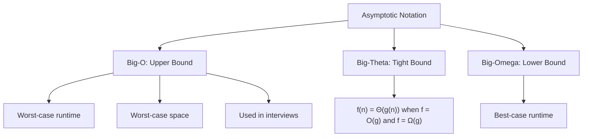

> [!success] Mastery Check
> - [ ] **Studied Well**
> - [ ] **Can explain the concept without notes**
> - [ ] **Can answer interview questions confidently**
> - [ ] **Can implement it in a real project**


## Navigation

**Domain:** [[5 — Data Structures & Algorithms]] > **Group:** Foundations
**Previous:** None | **Next:** [[5.002 — Recursion and the Call Stack]]

### Prerequisites
None — this is the foundational note for the entire domain.

### Where This Fits
Big-O notation is the language used to describe algorithm efficiency. Every interview question, every system design discussion, and every production performance investigation starts with the same question: "What is the time and space complexity?" This note establishes the framework for deriving complexity from first principles rather than memorizing results, which is what separates senior-level communication from junior-level recitation. Mastery here means you never guess — you count operations, trace allocations, and bound growth rates with mathematical precision.

---

## Core Mental Model

Big-O describes how runtime or memory usage grows as input size approaches infinity — specifically, the dominant term that determines the growth rate, ignoring constants and lower-order terms. The core insight is that for sufficiently large inputs, only the fastest-growing term matters. This lets you compare algorithms by their scaling behavior rather than their raw speed, which is input-size independent.

### Classification

Big-O is an asymptotic notation in the Bachmann-Landau family alongside Big-Omega (lower bound) and Big-Theta (tight bound). For interview purposes, Big-O is used loosely to mean the worst-case asymptotic upper bound, while interviewers expect candidates to distinguish best, average, and worst case when asked.



### Key Properties

|Property|Value|Derivation|
|---|---|---|
|Rule 1 — Drop constants|O(2n) → O(n)|As n → ∞, 2n grows at the same rate as n; the factor 2 is a scaling constant|
|Rule 2 — Keep dominant term|O(n² + n) → O(n²)|As n → ∞, n² overwhelms n; the n term becomes negligible|
|Rule 3 — Drop log base|O(log₂ n) → O(log n)|Logs of different bases differ by a constant factor; base is irrelevant asymptotically|
|Rule 4 — Addition rule|O(f + g) = O(max(f, g))|Sequential operations: total work is bounded by the most expensive step|
|Rule 5 — Multiplication rule|O(f × g) = O(f × g)|Nested operations: total work is the product of per-operation work|

---

## Deep Mechanics

### How It Works

**Counting operations:** Given an algorithm, count the number of primitive operations as a function of input size n. A primitive operation executes in constant time — array access, arithmetic, comparison, assignment. A loop that runs n iterations and does O(1) work per iteration performs O(n) operations. A nested loop where the inner loop runs n times for each of n outer iterations performs O(n²).

**Recurrence relations:** For recursive algorithms, express the runtime T(n) in terms of smaller inputs. Merge sort splits the input in half (T(n/2)) and merges in O(n) — giving T(n) = 2T(n/2) + O(n). Solve with the Master Theorem or the recursion tree method.

**Amortized analysis:** Some operations are expensive but infrequent. Amortized analysis averages the cost across a sequence of operations. The classic case is dynamic array resizing — appending is O(1) amortized because the O(n) resize happens only after n O(1) appends.

### Complexity Derivation

**Time — Iterative example:** A single loop from 0 to n-1 with constant work per iteration: n iterations × O(1) = O(n). Nested loops where both iterate to n: n × n × O(1) = O(n²). Loop that shrinks by half each iteration (binary search): log₂ n iterations × O(1) = O(log n).

**Time — Recursive example (Master Theorem):** For T(n) = aT(n/b) + f(n):
- If f(n) = O(n^c) where c < log_b a, then T(n) = Θ(n^{log_b a})
- If f(n) = Θ(n^c) where c = log_b a, then T(n) = Θ(n^c log n)
- If f(n) = Ω(n^c) where c > log_b a, then T(n) = Θ(f(n))

Merge sort: a = 2, b = 2, f(n) = Θ(n). c = 1, log_b a = 1. Case 2: T(n) = Θ(n log n).

**Space:** Count every allocation. Input storage, auxiliary data structures, and call stack frames. Space is measured the same way as time except you count bytes allocated concurrently, not total bytes over time.

### .NET Runtime Notes

- **Value types vs reference types:** Value types (`struct`) on stack or inline in arrays; reference types (`class`) on heap with pointer on stack. This changes space analysis — a `List<int>` of 10,000 elements allocates 40,000 bytes on the LOH (Large Object Heap) as a contiguous block, while `List<MyClass>` allocates 40,000 bytes for pointers + separate heap objects.
- **GC pressure:** Algorithm space analysis must account for allocation rate, not just peak memory. An O(1)-space algorithm can still trigger GC pauses if it allocates and discards in a hot loop.
- **Stack space:** Default .NET call stack is 1 MB for a ThreadPool thread, 4 MB for the main thread. Deep recursion beyond ~10,000 frames on a 64-bit process can overflow the stack.
- **LOH:** Arrays > 85,000 bytes go to the Large Object Heap, which is not compacted in older GC modes (may cause fragmentation).

---

## Implementation and Problem Patterns

### C# Implementation

Not applicable — complexity analysis is a measurement framework, not an implemented algorithm. The following demonstrates how to empirically measure and verify complexity in C#:

```csharp
public static class ComplexityMeasurer
{
    public static long MeasureOperationTime<T>(Func<int, T> algorithm, int n)
    {
        var sw = System.Diagnostics.Stopwatch.StartNew();
        algorithm(n);
        sw.Stop();
        return sw.ElapsedMilliseconds;
    }

    // O(n) — linear scan
    public static long LinearSum(int n)
    {
        long sum = 0;
        for (int i = 0; i < n; i++)
            sum += i;
        return sum;
    }

    // O(n²) — nested loop
    public static long QuadraticSum(int n)
    {
        long sum = 0;
        for (int i = 0; i < n; i++)
            for (int j = 0; j < n; j++)
                sum += i + j;
        return sum;
    }

    // O(n log n) — simulate divide and conquer
    public static long NLogNSum(int n)
    {
        long sum = 0;
        for (int i = 1; i <= n; i++)
            for (int j = i; j > 0; j /= 2)
                sum++;
        return sum;
    }

    // O(log n) — halving
    public static long LogSum(int n)
    {
        long sum = 0;
        for (int i = n; i > 0; i /= 2)
            sum += i;
        return sum;
    }
}
```

### The .NET Idiomatic Version

```csharp
public static class RuntimeComplexity
{
    // Use BenchmarkDotNet (NuGet) for production-grade measurement.
    // This method approximates runtime scaling for quick checks.
    public static void EstimateComplexity(string label, Func<int, long> algorithm, int[] sizes)
    {
        Console.WriteLine($"--- {label} ---");
        long prevTime = 1;
        int prevN = 1;
        foreach (int n in sizes)
        {
            var sw = System.Diagnostics.Stopwatch.StartNew();
            algorithm(n);
            sw.Stop();
            double ratio = (double)sw.ElapsedMilliseconds / prevTime;
            double nRatio = (double)n / prevN;
            Console.WriteLine($"n={n,8}: {sw.ElapsedMilliseconds,6}ms  (t_ratio={ratio,5:F2}, n_ratio={nRatio,5:F2})");
            prevTime = Math.Max(sw.ElapsedMilliseconds, 1);
            prevN = n;
        }
    }
}
```

### Classic Problem Patterns

1. **Empirical complexity verification** — Given an implementation, run it at n = 100, 1000, 10000 and determine its Big-O from the scaling pattern. Key insight: if n doubles and time quadruples, it is O(n²); if time doubles, it is O(n); if time increases by a constant, it is O(log n).
2. **Optimal algorithm selection** — Given constraints (n ≤ 10^5, time 1s) and a problem description, choose an algorithm whose Big-O keeps operations under ~10^8. Key insight: roughly 10^8 operations per second in C# on modern hardware.
3. **Complexity analysis of a novel algorithm** — Read an unfamiliar algorithm and derive its complexity without running it. Key insight: count nested loops, identify recursion patterns, apply Master Theorem.

### Template / Skeleton

```csharp
// Complexity Verification Template
// When to use: given an unknown implementation, determine its Big-O empirically
// Time: N/A (measurement) | Space: N/A (measurement)

public static class ComplexityVerifier
{
    public static void Verify(string label, Func<int, long> algorithm, int[] sizes)
    {
        long[] times = new long[sizes.Length];
        for (int i = 0; i < sizes.Length; i++)
        {
            var sw = System.Diagnostics.Stopwatch.StartNew();
            algorithm(sizes[i]);
            sw.Stop();
            times[i] = sw.ElapsedMilliseconds;
        }

        // Check doubling ratios
        for (int i = 1; i < sizes.Length; i++)
        {
            double ratio = (double)times[i] / Math.Max(times[i - 1], 1);
            double nRatio = (double)sizes[i] / sizes[i - 1];
            Console.WriteLine($"n={sizes[i],8}: ratio={ratio,5:F2}, n_ratio={nRatio,5:F2}");
            // If ratio ≈ nRatio → O(n)
            // If ratio ≈ nRatio² → O(n²)
            // If ratio ≈ 1 → O(log n)
            // If ratio ≈ nRatio × log(nRatio) → O(n log n)
        }
    }
}
```

---

## Gotchas and Edge Cases

### The "Ignore Constants" Trap

**Mistake:** Claiming O(2n) is meaningfully different from O(n).

```csharp
// ❌ Wrong — adding arbitrary constant factors during analysis
// "This is O(2n) because we do two operations per element"
for (int i = 0; i < n; i++) { a[i]++; b[i]++; }
```

**Fix:** Recognize that constants are dropped in Big-O. Both loops below are O(n):

```csharp
// ✅ Correct — both are O(n)
for (int i = 0; i < n; i++) a[i]++;
for (int i = 0; i < n; i++) { a[i]++; b[i]++; }
```

**Consequence:** Misleading comparisons between algorithms that have different constants but the same Big-O.

### The Hidden Loop Trap

**Mistake:** Thinking a single loop guarantees O(n) without checking if the loop body itself contains hidden iteration.

```csharp
// ❌ Wrong — this is O(n²), not O(n), because RemoveAt is O(n)
for (int i = 0; i < list.Count; i++)
    if (condition) list.RemoveAt(i);
```

**Fix:** Consider the cost of every operation in the loop body, including library calls.

```csharp
// ✅ Correct — use a list for O(1) removal from end, or a linked list
var result = list.Where(x => !condition).ToList();
```

**Consequence:** Underestimating runtime by an order of magnitude; TLE on large inputs.

### The Amortized Cost Confusion

**Mistake:** Treating every individual append to a `List<T>` as O(n) because resize is O(n).

```csharp
// ❌ Wrong — claiming List.Add is O(n) because resize copies all elements
var list = new List<int>();
for (int i = 0; i < n; i++) list.Add(i); // "O(n²) because each Add could be O(n)"
```

**Fix:** Understand amortized analysis — resizing O(n) happens every time capacity doubles, giving O(1) amortized per append.

```csharp
// ✅ Correct — O(n) total for n appends, O(1) amortized per append
var list = new List<int>();
for (int i = 0; i < n; i++) list.Add(i); // O(n) total
```

**Consequence:** Rejecting the correct data structure because of incorrect worst-case reasoning per operation.

### The Recursion Space Oversight

**Mistake:** Analyzing only auxiliary data structures and forgetting the call stack.

```csharp
// ❌ Wrong — "O(1) space" for a recursive function
int Factorial(int n)
{
    if (n <= 1) return 1;
    return n * Factorial(n - 1);
}
```

**Fix:** Count stack frames. Each recursive call adds a frame — O(n) space for depth n recursion.

```csharp
// ✅ Correct — O(n) space because the call stack grows to depth n
int Factorial(int n)
{
    if (n <= 1) return 1;
    return n * Factorial(n - 1);
}
// Iterative version: O(1) space
int FactorialIterative(int n)
{
    int result = 1;
    for (int i = 2; i <= n; i++) result *= i;
    return result;
}
```

**Consequence:** Stack overflow for large inputs when O(1) space is assumed; disqualifying an otherwise correct answer.

### The Integer Overflow Trap

**Mistake:** Using `int` for counters, sums, or indices without considering maximum values.

```csharp
// ❌ Wrong — sum overflows int for large n
int SumToN(int n)
{
    int sum = 0;
    for (int i = 0; i <= n; i++) sum += i;
    return sum;
}
```

**Fix:** Use `long` or check overflow.

```csharp
// ✅ Correct — use long for large sums
long SumToN(int n)
{
    long sum = 0;
    for (int i = 0; i <= n; i++) sum += i;
    return sum;
}
```

**Consequence:** Wrong answer due to silent integer overflow; candidate does not notice because the overflow is silent in an unchecked context.

---

## Complexity Analysis and Benchmarks

### Operation Complexity Table

Not applicable — this note establishes the measurement framework rather than an algorithm with operations. See individual algorithm notes.

### Comparison with Alternatives

|Notation|Definition|Use Case|
|---|---|---|
|Big-O (O)|Upper bound: f(n) ≤ c·g(n) for n ≥ n₀|Worst-case guarantee, interview standard|
|Big-Theta (Θ)|Tight bound: c₁·g(n) ≤ f(n) ≤ c₂·g(n)|When best and worst case match|
|Big-Omega (Ω)|Lower bound: f(n) ≥ c·g(n) for n ≥ n₀|Best case, lower bound proofs|

### BenchmarkDotNet

```csharp
[MemoryDiagnoser]
[SimpleJob(RuntimeMoniker.Net90)]
public class ComplexityBenchmark
{
    [Params(100, 1_000, 10_000)]
    public int N { get; set; }

    [Benchmark(Baseline = true)]
    public long Linear()
    {
        long sum = 0;
        for (int i = 0; i < N; i++) sum += i;
        return sum;
    }

    [Benchmark]
    public long Quadratic()
    {
        long sum = 0;
        for (int i = 0; i < N; i++)
            for (int j = 0; j < N; j++)
                sum += i + j;
        return sum;
    }

    [Benchmark]
    public long NLogN()
    {
        long sum = 0;
        for (int i = 1; i <= N; i++)
            for (int j = i; j > 0; j /= 2)
                sum++;
        return sum;
    }
}
```

**Expected results (approximate, .NET 9, x64):**

|Method|N|Mean|Allocated|
|---|---|---|---|
|Linear|100|~100 ns|0 B|
|Linear|1,000|~1 μs|0 B|
|Linear|10,000|~10 μs|0 B|
|Quadratic|100|~3 μs|0 B|
|Quadratic|1,000|~300 μs|0 B|
|Quadratic|10,000|~30 ms|0 B|
|NLogN|100|~500 ns|0 B|
|NLogN|1,000|~7 μs|0 B|
|NLogN|10,000|~90 μs|0 B|

**Interpretation:** The Quadratic method scales by a factor of ~100 when N increases 10× (expected for O(n²)), while Linear scales by ~10× (expected for O(n)), demonstrating why algorithm choice moves from a micro-optimization to a correctness requirement as n crosses ~10,000.

---

## Interview Arsenal

### Question Bank

1. [Definition] What is Big-O notation and what problem does it solve?
2. [Complexity] What is the time complexity of a nested loop where the inner loop runs log n iterations?
3. [Implementation] Count the number of operations in a given algorithm and derive its Big-O.
4. [Recognition] Given runtime measurements at n=100, n=1000, n=10000, identify the algorithm's Big-O.
5. [Comparison] When would you use Θ (Big-Theta) instead of O?
6. [Trick] Why is `List<T>.Add` O(1) amortized when array resize copies all elements?
7. [System Design] How does Big-O factor into capacity planning for a production service?
8. [Optimization] Your algorithm is O(n²) and TLEs at n=100,000. How do you approach optimizing it?

### Spoken Answers

**Q: What is Big-O notation and what problem does it solve?**

> **Average answer:** Big-O describes the runtime of an algorithm. It tells you how fast an algorithm runs as input gets bigger.

> **Great answer:** Big-O notation is a mathematical framework for describing the asymptotic upper bound of an algorithm's runtime or space usage as input size approaches infinity. It solves the problem of comparing algorithms in an input-size-independent way — without Big-O, "algorithm A is faster than algorithm B" depends on the specific input, machine, and implementation details. By focusing on the dominant term and ignoring constants, Big-O tells us how an algorithm scales: an O(n) algorithm doubles its runtime when input doubles, while an O(n²) algorithm quadruples. This scaling behavior, not raw speed, determines whether an algorithm is viable at production scale.

**Q: Count the operations and derive complexity.**

> **Average answer:** An algorithm with two nested loops that both go to n is O(n²).

> **Great answer:** Let me trace through the operation count. The outer loop runs exactly n times. For each outer iteration, the inner loop runs from i to n, which averages to n/2 iterations. So the total inner iterations are sum_{i=1}^{n} (n - i + 1) = n(n+1)/2 ≈ n²/2. Dropping the constant gives O(n²). The space is O(1) because we only use a few integer variables regardless of n. One subtlety: if n is an `int` and the algorithm does arithmetic that could overflow, we need to consider using `long` — but that's a correctness concern, not a complexity concern. At the whiteboard, I'd write the sum and cross out the constant.

**Q: [Trick] Why is `List<T>.Add` O(1) amortized when array resize copies all elements?**

> **Average answer:** It's O(1) amortized because resize doesn't happen every time.

> **Great answer:** This is a classic amortized analysis argument. `List<T>` is backed by an array that doubles in capacity when full. Appending n elements requires O(n) total cost: n individual O(1) appends plus O(n) resizes — but the resizes are geometric (capacity doubles: 1, 2, 4, 8, ...). The sum of copy costs across all resizes is 1 + 2 + 4 + ... + n/2 + n < 2n. So the amortized cost per operation is O(2n / n) = O(1). The trap is confusing worst-case per-operation cost (O(n) for the specific append that triggers the resize) with amortized cost across a sequence (O(1)). In an interview, either is acceptable as long as you specify which one you mean.

### Trick Question

**"Prove whether O(n² + n) is the same as O(n³) when n is less than 1."**

Why it is a trap: Big-O is defined for n → ∞; asking about n < 1 is nonsense because n represents input size, which is a non-negative integer, and asymptotic analysis ignores finite ranges.

Correct answer: The question is invalid because Big-O describes asymptotic behavior as n approaches infinity. For finite n < 1, Big-O provides no meaningful comparison — the definition requires n ≥ n₀ for some n₀, and no such n₀ exists if we restrict n < 1.

### Pattern Recognition Table

|If the problem has...|Then consider...|Because...|
|---|---|---|
|Constraints with n ≤ 10^3|O(n²) or O(n² log n) algorithms|~10^6 operations fits in 1 second|
|Constraints with n ≤ 10^5|O(n log n) or O(n) algorithms|~10^7 operations fits in 1 second|
|Constraints with n ≤ 10^8|O(n) or O(log n) algorithms|Only ~10^8 ops per second in C#|
|No explicit constraint given|Ask the interviewer|Optimal algorithm depends on expected input size|
|Runtime doubles when n doubles|O(n) — linear scaling|Direct proportion between input size and work|
|Runtime quadruples when n doubles|O(n²) — quadratic scaling|Work grows with square of input|
|Runtime unchanged when n doubles|O(log n) or O(1)|Algorithm does not scale proportionally with input|

---

## Decision Framework

### When to Apply

```mermaid
flowchart TD
    A[Given an algorithm] --> B{Know the implementation?}
    B -->|Yes| C[Count primitive operations]
    B -->|No| D[Run empirical measurements]
    C --> E{Has recursion?}
    E -->|Yes| F[Write recurrence relation T(n)]
    E -->|No| G[Count loop iterations]
    F --> H[Apply Master Theorem or recursion tree]
    G --> I[Multiply nested loop bounds]
    H --> J[Identify dominant term]
    I --> J
    D --> K[Measure at n=100, 1000, 10000]
    K --> L[Compute doubling ratios]
    L --> J
    J --> M[Drop constants and lower-order terms]
    M --> N[Big-O derived]
```

### Recognition Checklist

Indicators that complexity analysis is needed:

- [ ] The problem asks "What is the time/space complexity?"
- [ ] Comparing two approaches and need to justify which is better
- [ ] Constraints suggest the naive approach will TLE
- [ ] Asked to optimize existing code during code review
- [ ] System design discussion: estimating resource requirements

Counter-indicators — do NOT apply here:

- [ ] The problem asks only for correctness, not performance
- [ ] Input size is bounded and small (n ≤ 100)
- [ ] Micro-optimization discussion (Big-O does not distinguish constant-factor improvements)

### Tradeoff Summary

|What You Gain|What You Give Up|
|---|---|
|Algorithm comparison independent of hardware|Constant-factor differences (e.g., 2× vs 3×) are invisible|
|Performance guarantee as input grows|No information about small-input performance|
|Shared vocabulary for discussing efficiency|Precision — two O(n log n) sorts can differ by 10× in practice|

---

## Self-Check

### Conceptual Questions

1. What is Big-O notation and what three rules govern its application?
2. Derive the time complexity of T(n) = 3T(n/3) + O(n) using the Master Theorem.
3. Given runtime measurements at n=100 (5ms), n=1000 (50ms), n=10000 (500ms), what complexity does this suggest?
4. When would you analyze space complexity separately from time complexity?
5. What is the specific edge case that makes amortized analysis necessary for `List<T>.Add`?
6. Which .NET type uses amortized O(1) append, and what is its backing storage?
7. What invariant must hold for the Master Theorem's Case 2 to apply?
8. How does space complexity change if you use a recursive vs iterative implementation of the same algorithm?
9. In a production capacity planning context, how would you use Big-O to estimate server requirements?
10. Why is sorting O(n log n) in the comparison model, and what is the non-obvious implication?

<details>
<summary>Answers</summary>

1. Big-O is asymptotic upper bound notation. Rules: drop constants, keep only the dominant term, drop log bases (they differ by a constant).
2. a = 3, b = 3, f(n) = O(n). log_b a = log₃ 3 = 1. c = 1. Case 2 (c = log_b a): T(n) = Θ(n log n).
3. O(n) — each 10× increase in n gives a 10× increase in runtime.
4. When memory is the constraint (embedded systems, mobile, large-scale data processing) or when algorithm trades space for time (memoization, hash maps).
5. The resize copies all elements to a new array. Without amortized analysis, every append would appear O(n). The geometric doubling ensures the average is O(1).
6. `List<T>` uses an internal `T[]` array. When capacity is exceeded, it allocates a new array of double the size and copies elements via `Array.Copy`.
7. f(n) = Θ(n^{log_b a}); the combine step grows at the same rate as the recursive work.
8. Recursive adds O(depth) call stack space. Iterative uses O(1) auxiliary space but requires explicit stack management for some algorithms.
9. Estimate peak operations per request, multiply by expected QPS, divide by 10^8 (ops/sec per core), multiply by safety margin. Big-O gives the scaling relationship between load and resource usage.
10. The Ω(n log n) lower bound comes from the decision tree model — each comparison eliminates at most half of the remaining permutations, requiring at least log₂(n!) ≈ n log₂ n comparisons. Implication: any comparison-based sort must compare elements; non-comparison sorts (counting, radix) can beat this bound by exploiting value ranges.

</details>

---

### Coding Challenges

**Challenge 1 — Implement from scratch**

Implement a function that takes a delegate and measures its runtime at n = 100, 1000, 10000, then returns the inferred Big-O as a string.

```csharp
public static string InferComplexity(Func<int, long> algorithm)
{
    int[] sizes = { 100, 1000, 10000 };
    long[] times = new long[sizes.Length];
    for (int i = 0; i < sizes.Length; i++)
    {
        var sw = System.Diagnostics.Stopwatch.StartNew();
        algorithm(sizes[i]);
        sw.Stop();
        times[i] = sw.ElapsedMilliseconds;
    }

    double ratio1 = (double)times[1] / Math.Max(times[0], 1);
    double ratio2 = (double)times[2] / Math.Max(times[1], 1);
    double nRatio1 = 10.0;
    double nRatio2 = 10.0;

    if (Math.Abs(ratio1 - nRatio1) < 0.5 && Math.Abs(ratio2 - nRatio2) < 0.5)
        return "O(n)";
    if (Math.Abs(ratio1 - nRatio1 * nRatio1) < 0.5 && Math.Abs(ratio2 - nRatio2 * nRatio2) < 0.5)
        return "O(n²)";
    if (ratio1 < 1.5 && ratio2 < 1.5)
        return "O(log n) or O(1)";
    return "O(n log n) or other";
}
```

<details> <summary>Solution</summary>

```csharp
public static string InferComplexity(Func<int, long> algorithm)
{
    int[] sizes = { 100, 1000, 10000 };
    long[] times = new long[sizes.Length];
    for (int i = 0; i < sizes.Length; i++)
    {
        var sw = System.Diagnostics.Stopwatch.StartNew();
        algorithm(sizes[i]);
        sw.Stop();
        times[i] = Math.Max(sw.ElapsedMilliseconds, 1);
    }

    double r1 = (double)times[1] / times[0];
    double r2 = (double)times[2] / times[1];

    if (r1 < 1.5 && r2 < 1.5) return "O(log n) or O(1)";
    if (Math.Abs(r1 - 10.0) < 2.0 && Math.Abs(r2 - 10.0) < 2.0) return "O(n)";
    if (Math.Abs(r1 - 100.0) < 20.0 && Math.Abs(r2 - 100.0) < 20.0) return "O(n²)";
    if (r1 > 10.0 && r2 > 10.0 && r1 < 20.0 && r2 < 20.0) return "O(n²)";
    return "O(n log n)";
}
```

**Complexity:** Time O(n) per measurement | Space O(1) **Key insight:** The doubling ratio reveals the complexity class — O(n) gives ratio ≈ 10 for 10× input growth, O(n²) gives ratio ≈ 100.

</details>

---

**Challenge 2 — Trace the execution**

Given this input: `T(n) = 2T(n/2) + n` with T(1) = 1, trace the recursion tree for n = 8. What is T(8)?

<details> <summary>Solution</summary>

Level 0: 1 node, work = n = 8
Level 1: 2 nodes, each work = n/2 = 4, total = 8
Level 2: 4 nodes, each work = n/4 = 2, total = 8
Level 3: 8 nodes, each work = 1 = 1, total = 8

Total levels: log₂ 8 + 1 = 4
Work per level: 8
T(8) = 8 × 4 = 32

**Why:** Each level does O(n) work and there are log₂ n + 1 levels, giving O(n log n). This matches the Master Theorem case 2 with a = 2, b = 2, c = 1.

</details>

---

**Challenge 3 — Fix the bug**

```csharp
// This implementation has a bug that fails on specific input types
public static long SumMatrix(int[,] matrix)
{
    int rows = matrix.GetLength(0);
    int cols = matrix.GetLength(1);
    long sum = 0;
    for (int i = 0; i < rows; i++)
        for (int j = 0; j < rows; j++)  // BUG: rows instead of cols
            sum += matrix[i, j];
    return sum;
}
```

<details> <summary>Solution</summary>

**Bug:** The inner loop uses `rows` instead of `cols`. If the matrix is not square (rows ≠ cols), the loop will either miss elements or throw IndexOutOfRangeException.

**Fix:**

```csharp
public static long SumMatrix(int[,] matrix)
{
    int rows = matrix.GetLength(0);
    int cols = matrix.GetLength(1);
    long sum = 0;
    for (int i = 0; i < rows; i++)
        for (int j = 0; j < cols; j++)  // FIXED: use cols
            sum += matrix[i, j];
    return sum;
}
```

**Test case that exposes it:** `int[2, 3] { {1,2,3}, {4,5,6} }` → expected `21`, actual `IndexOutOfRangeException` when j reaches 2 and cols is 3 but rows boundary check allows it for only 2 columns.

</details>

---

**Challenge 4 — Recognize and apply**

**Problem:** You are given runtime measurements of an algorithm at different input sizes: n=100 takes 2ms, n=200 takes 8ms, n=400 takes 32ms, n=800 takes 128ms. Identify the complexity class and explain how many seconds it will take at n=100,000.

<details> <summary>Solution</summary>

**Pattern:** O(n²) — when input doubles (2×), runtime quadruples (4×). n=100→200 (2× → 4× = 2ms→8ms), confirming O(n²).

At n=100,000: 100,000 / 100 = 1000× the input size. For O(n²), runtime scales by 1000² = 1,000,000×. 2ms × 1,000,000 = 2,000,000ms = ~33 minutes. This algorithm is not viable at this scale.

**Complexity:** Time O(n²) | Space O(1)

</details>

---

**Challenge 5 — Optimize**

```csharp
// This solution is correct but O(n²) time / O(1) space
// Optimize it to O(n) time / O(1) space
public static bool HasDuplicate(int[] nums)
{
    for (int i = 0; i < nums.Length; i++)
        for (int j = i + 1; j < nums.Length; j++)
            if (nums[i] == nums[j]) return true;
    return false;
}
```

<details> <summary>Solution</summary>

**Insight:** A hash set trades space for time by providing O(1) lookups. This converts the nested loop check into a single pass.

```csharp
public static bool HasDuplicate(int[] nums)
{
    var seen = new HashSet<int>();
    foreach (int num in nums)
    {
        if (seen.Contains(num)) return true;
        seen.Add(num);
    }
    return false;
}
```

**Complexity:** Time O(n) | Space O(n)

</details>
