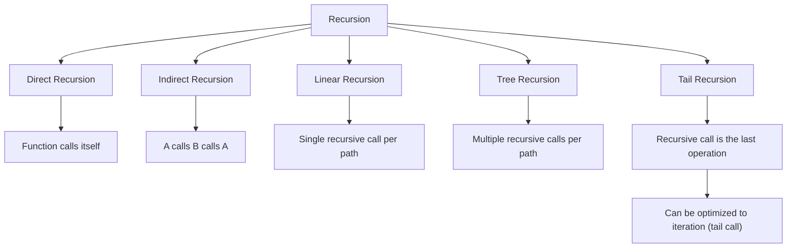
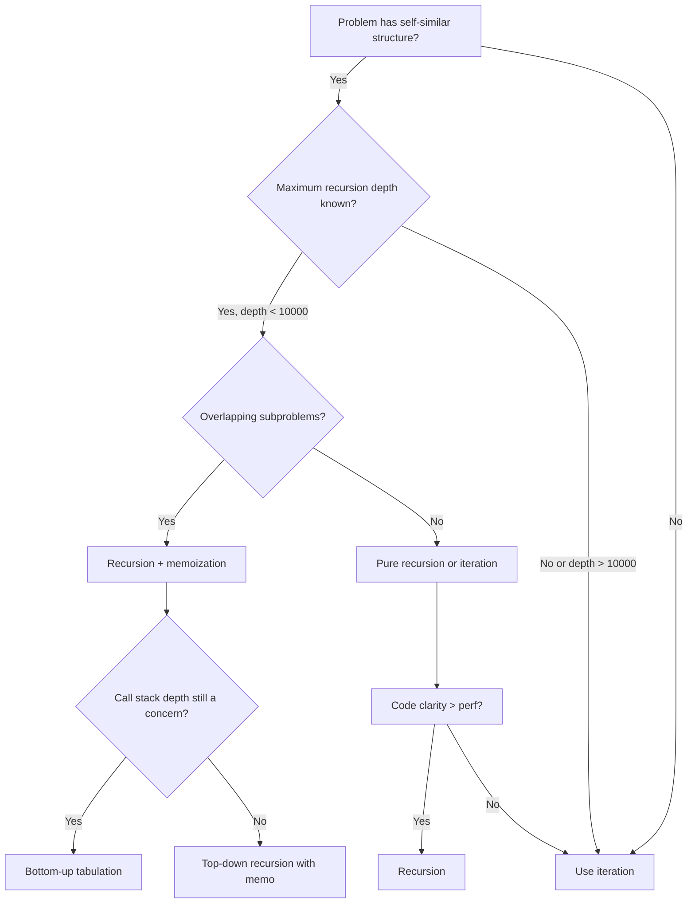

> [!success] Mastery Check
> - [ ] **Studied Well**
> - [ ] **Can explain the concept without notes**
> - [ ] **Can answer interview questions confidently**
> - [ ] **Can implement it in a real project**


## Navigation

**Domain:** [[5 — Data Structures & Algorithms]] > **Group:** Foundations
**Previous:** [[5.001 — Big-O Notation and Complexity Analysis]] | **Next:** [[5.004 — Arrays, Fixed, Dynamic, and In-Place Operations]]

### Prerequisites
- [[5.001 — Big-O Notation and Complexity Analysis]] — recursion depth analysis is impossible without asymptotic notation; the recurrence relation for recursive algorithms derives complexity from first principles.

### Where This Fits
Recursion is the mechanism that underpins every divide-and-conquer algorithm, every tree or graph traversal, every backtracking search, and every top-down dynamic programming solution. In interviews, recursion appears in approximately 40% of all coding problems — either as the primary solution or as the baseline from which the iterative optimization is derived. For a senior engineer, mastering recursion means being able to trace the call stack, identify tail recursion opportunities, convert between recursive and iterative forms, and recognize when recursion depth will cause a stack overflow. This is not theoretical — the .NET call stack is a finite 1 MB resource on ThreadPool threads, and deep recursion is a production incident waiting to happen.

---

## Core Mental Model

A recursive function is a function that calls itself with a smaller or simpler input until it reaches a base case. The key insight is that each call pushes a frame onto the call stack containing its local variables and the return address, and the frames unwind in reverse order when the base case is reached. This last-in-first-out behavior is what makes recursion a natural fit for problems that have a self-similar structure: trees (a node's children are trees), combinatorial search (each decision leads to a smaller set of remaining choices), and divide-and-conquer (a problem halves into subproblems of the same type).

### Classification

Recursion is a programming technique, not a data structure. It belongs to the control flow paradigm alongside iteration. Every recursive algorithm has an equivalent iterative form (using an explicit stack or queue), and understanding when the recursive form is clearer vs. when the iterative form is safer is a senior-level skill.



### Key Properties

|Property|Value|Derivation|
|---|---|---|
|Call stack space (linear recursion)|O(n)|Each call pushes a frame; n calls before base case|
|Call stack space (tree recursion)|O(depth)|Maximum concurrent frames = depth of recursion tree|
|Time for T(n) = T(n-1) + O(1)|O(n)|n recursive calls, each doing O(1) work|
|Time for T(n) = 2T(n/2) + O(n)|O(n log n)|Master Theorem case 2: log_b a = 1, c = 1|
|Time for T(n) = T(n-1) + T(n-2)|O(2^n)|Fibonacci without memo: exponential branching|

---

## Deep Mechanics

### How It Works

**The call stack:** When a function is called, the runtime pushes a stack frame containing:
- Return address (where execution resumes after the call)
- Local variables (including parameters)
- Saved register state

When the function returns, its frame is popped and execution continues at the return address.

**Tracing factorial recursion for n = 4:**

```
factorial(4) pushes frame with n=4
  → factorial(3) pushes frame with n=3
    → factorial(2) pushes frame with n=2
      → factorial(1) pushes frame with n=1
        → base case: return 1
      → pop frame (n=1), resume factorial(2): return 2 * 1 = 2
    → pop frame (n=2), resume factorial(3): return 3 * 2 = 6
  → pop frame (n=3), resume factorial(4): return 4 * 6 = 24
→ pop frame (n=4), final result = 24
```

Maximum stack depth: 4 frames. For input n, depth is n.

**The base case invariant:** Every recursive function must have a base case that does not recurse, and every recursive call must move toward that base case. If either condition is violated, the recursion never terminates and will overflow the stack.

### Complexity Derivation

**Time — Fibonacci (naive):** T(n) = T(n-1) + T(n-2) + O(1). The recursion tree is a binary tree of depth n with approximately 2^n nodes. Each node does O(1) work. Total: O(2^n). More precisely, T(n) = Θ(φ^n) where φ ≈ 1.618.

**Time — Merge sort:** T(n) = 2T(n/2) + O(n). At each level of the recursion tree, the total work across all subproblems is O(n). There are log₂ n levels. Total: O(n log n).

**Space — Call stack depth:** For linear recursion depth n, space is O(n). For divide-and-conquer with depth log n, space is O(log n). For tree recursion, space is the maximum depth of the recursion tree, not the total number of nodes.

### .NET Runtime Notes

- **Stack size:** Each thread in .NET has a fixed stack size (1 MB default for ThreadPool threads, 4 MB for main thread). Each frame is typically ~40-100 bytes (locals + metadata). A recursion depth of ~10,000 on a 1 MB stack is the practical limit before StackOverflowException.
- **Tail call optimization:** .NET supports tail calls via the `tail.` IL prefix, but C# does not guarantee tail call generation. The `TailCall` attribute is in consideration but not standard. For guaranteed tail recursion, write an iterative loop.
- **StackOverflowException:** In .NET, StackOverflowException is un-catchable (since .NET 2.0) if it occurs on the main thread. It terminates the process immediately.
- **Value types on stack:** Struct locals are allocated on the stack (or inline in heap objects if captured by a closure). Large structs in recursive calls increase frame size and reduce maximum recursion depth.

---

## Implementation and Problem Patterns

### C# Implementation

```csharp
public static class Recursion
{
    /// <summary>
    /// Computes factorial recursively, demonstrating the call stack mechanism.
    /// </summary>
    public static long Factorial(int n)
    {
        if (n < 0) throw new ArgumentOutOfRangeException(nameof(n));
        if (n <= 1) return 1;
        return n * Factorial(n - 1);
    }

    /// <summary>
    /// Computes Fibonacci recursively — naive exponential version.
    /// </summary>
    public static long FibonacciNaive(int n)
    {
        if (n < 0) throw new ArgumentOutOfRangeException(nameof(n));
        if (n <= 1) return n;
        return FibonacciNaive(n - 1) + FibonacciNaive(n - 2);
    }

    /// <summary>
    /// Recursive binary search on a sorted array.
    /// Each call halves the search space — O(log n) depth.
    /// </summary>
    public static int BinarySearch(int[] arr, int target, int left, int right)
    {
        if (left > right) return -1;
        int mid = left + (right - left) / 2;
        if (arr[mid] == target) return mid;
        if (arr[mid] > target)
            return BinarySearch(arr, target, left, mid - 1);
        return BinarySearch(arr, target, mid + 1, right);
    }

    /// <summary>
    /// Recursive palindrome check — base cases for empty/single char, then check ends.
    /// </summary>
    public static bool IsPalindrome(string s, int left, int right)
    {
        if (left >= right) return true;
        if (s[left] != char.ToLower(s[right])) return false;
        return IsPalindrome(s, left + 1, right - 1);
    }

    /// <summary>
    /// Generates all subsets using recursive include/exclude — tree recursion.
    /// Base: index == array length. Branch: include or skip current element.
    /// </summary>
    public static List<List<int>> Subsets(int[] nums)
    {
        var result = new List<List<int>>();
        SubsetsRecursive(nums, 0, new List<int>(), result);
        return result;
    }

    private static void SubsetsRecursive(int[] nums, int index, List<int> current, List<List<int>> result)
    {
        if (index == nums.Length)
        {
            result.Add(new List<int>(current));
            return;
        }
        // Exclude current element
        SubsetsRecursive(nums, index + 1, current, result);
        // Include current element
        current.Add(nums[index]);
        SubsetsRecursive(nums, index + 1, current, result);
        current.RemoveAt(current.Count - 1);
    }
}
```

### The .NET Idiomatic Version

```csharp
public static class RecursionIterative
{
    // Iterative factorial — O(1) stack space
    public static long Factorial(int n)
    {
        long result = 1;
        for (int i = 2; i <= n; i++) result *= i;
        return result;
    }

    // Iterative Fibonacci — O(1) stack space, O(n) time
    public static long Fibonacci(int n)
    {
        if (n <= 1) return n;
        long prev = 0, curr = 1;
        for (int i = 2; i <= n; i++)
        {
            long next = prev + curr;
            prev = curr;
            curr = next;
        }
        return curr;
    }

    // Iterative binary search — O(1) stack space
    public static int BinarySearch(int[] arr, int target)
    {
        int left = 0, right = arr.Length - 1;
        while (left <= right)
        {
            int mid = left + (right - left) / 2;
            if (arr[mid] == target) return mid;
            if (arr[mid] < target) left = mid + 1;
            else right = mid - 1;
        }
        return -1;
    }
}
```

### Classic Problem Patterns

1. **Divide and conquer (merge sort, quick sort)** — Recursively split input, solve subproblems independently, combine results. Key insight: the recursion tree depth is O(log n) for equal splits, O(n) for skewed splits.
2. **Tree/graph traversal (DFS)** — Recursion naturally mirrors the structure of trees: process node, recurse on children. Key insight: the call stack acts as implicit traversal state.
3. **Backtracking (permutations, subsets, N-Queens)** — Recursion with state mutation: choose, explore, unchoose. Key insight: the base case corresponds to a complete solution; each recursive call explores one branch of the decision tree.

### Template / Skeleton

```csharp
// Recursive Backtracking Template
// When to use: problems that require exploring all combinations/permutations with constraints
// Time: O(branching_factor^depth) | Space: O(depth) for call stack

public static class RecursiveBacktracking
{
    public static List<List<T>> Solve<T>(T[] input)
    {
        var results = new List<List<T>>();
        var current = new List<T>();
        // TODO: sort input if duplicates need deduplication via skip-adjacent-duplicates
        Backtrack(input, 0, current, results);
        return results;
    }

    private static void Backtrack<T>(T[] input, int index, List<T> current, List<List<T>> results)
    {
        // TODO: define base case — when is a complete solution formed?
        if (/* base case condition */)
        {
            results.Add(new List<T>(current));
            return;
        }

        // TODO: define the branching — iterate over candidates
        for (int i = index; i < input.Length; i++)
        {
            // TODO: pruning — skip invalid candidates
            // if (IsInvalid(input[i])) continue;

            // Choose
            current.Add(input[i]);
            // Explore
            Backtrack(input, i + 1, current, results); // or i for reuse (permutations)
            // Unchoose
            current.RemoveAt(current.Count - 1);
        }
    }
}
```

---

## Gotchas and Edge Cases

### Missing or Incorrect Base Case

**Mistake:** Forgetting the base case or writing one that is never reached.

```csharp
// ❌ Wrong — no base case, infinite recursion
int Factorial(int n)
{
    return n * Factorial(n - 1);
}
```

**Fix:** Always define a base case that stops recursion.

```csharp
// ✅ Correct — base case for n <= 1
int Factorial(int n)
{
    if (n <= 1) return 1;
    return n * Factorial(n - 1);
}
```

**Consequence:** StackOverflowException — the process terminates.

### Stack Overflow for Deep Recursion

**Mistake:** Using recursion where depth equals input size (linear recursion) for large inputs.

```csharp
// ❌ Wrong — O(n) stack space, will overflow for n > 10000
long SumToN(int n)
{
    if (n == 0) return 0;
    return n + SumToN(n - 1);
}
```

**Fix:** Convert to iteration or tail-recursive form with accumulator.

```csharp
// ✅ Correct — O(1) stack space
long SumToN(int n)
{
    long sum = 0;
    for (int i = 1; i <= n; i++) sum += i;
    return sum;
}
```

**Consequence:** Process crash on large inputs — complete disqualification in an interview setting.

### Exponential Time Without Memoization

**Mistake:** Recomputing the same subproblems repeatedly in recursive tree recursion.

```csharp
// ❌ Wrong — O(2^n) time, recomputes Fibonacci(3) multiple times
long Fibonacci(int n)
{
    if (n <= 1) return n;
    return Fibonacci(n - 1) + Fibonacci(n - 2);
}
```

**Fix:** Add memoization (top-down DP) or convert to iteration.

```csharp
// ✅ Correct — O(n) time with memoization
long Fibonacci(int n, Dictionary<int, long>? memo = null)
{
    memo ??= new Dictionary<int, long>();
    if (memo.ContainsKey(n)) return memo[n];
    if (n <= 1) return n;
    memo[n] = Fibonacci(n - 1, memo) + Fibonacci(n - 2, memo);
    return memo[n];
}
```

**Consequence:** TLE (Time Limit Exceeded) on any input n > 40.

### Mutable State in Tree Recursion

**Mistake:** Sharing mutable state across recursive branches without proper copy-on-write or backtracking.

```csharp
// ❌ Wrong — modifies shared list and passes it to all branches
void Subsets(int[] nums, int index, List<int> current, List<List<int>> result)
{
    if (index == nums.Length) { result.Add(current); return; }
    current.Add(nums[index]);
    Subsets(nums, index + 1, current, result); // Branch 1: includes element
    current.RemoveAt(current.Count - 1);
    Subsets(nums, index + 1, current, result); // Branch 2: skips element
}
```

**Fix:** Either copy per branch or add to result before mutation continues.

```csharp
// ✅ Correct — copy before adding to results
void Subsets(int[] nums, int index, List<int> current, List<List<int>> result)
{
    if (index == nums.Length) { result.Add(new List<int>(current)); return; }
    current.Add(nums[index]);
    Subsets(nums, index + 1, current, result);
    current.RemoveAt(current.Count - 1);
    Subsets(nums, index + 1, current, result);
}
```

**Consequence:** All result entries point to the same list instance, containing only the final backtracked state (empty or the last branch's values).

---

## Complexity Analysis and Benchmarks

### Operation Complexity Table

|Operation|Time (Best)|Time (Average)|Time (Worst)|Space|Notes|
|---|---|---|---|---|---|
|Linear recursion (sum)|O(n)|O(n)|O(n)|O(n) call stack|Depth = n frames|
|Tree recursion (Fibonacci naive)|O(φ^n)|O(φ^n)|O(φ^n)|O(n) call stack|Depth = n, total nodes ≈ 2^n|
|Divide and conquer (merge sort)|O(n log n)|O(n log n)|O(n log n)|O(log n) call stack|Depth = log₂ n|
|Backtracking (subsets)|O(2^n)|O(2^n)|O(2^n)|O(n) call stack|Depth = n, binary branching|

**Derivation for the non-obvious entries:** Fibonacci naive's complexity T(n) = T(n-1) + T(n-2) + O(1) solves to T(n) = Θ(φ^n) where φ = (1+√5)/2. The recursion tree has n levels, but the number of nodes grows exponentially because each node spawns two children, and the subtrees overlap heavily.

### Comparison with Alternatives

|Structure / Algorithm|Time|Space|Best When|
|---|---|---|---|
|Recursion|Varies|O(depth) stack|Problem has self-similar structure; code clarity matters|
|Iteration|Same|O(1) stack|Depth could overflow; performance is critical|
|Recursion + Memoization|Same as DP|O(depth + cache)|Overlapping subproblems exist|

### BenchmarkDotNet

```csharp
[MemoryDiagnoser]
[SimpleJob(RuntimeMoniker.Net90)]
public class RecursionBenchmark
{
    [Params(10, 30, 50)]
    public int N { get; set; }

    [Benchmark(Baseline = true)]
    public long FibonacciNaive()
    {
        return FibonacciRecursive(N);
    }

    [Benchmark]
    public long FibonacciMemoized()
    {
        var memo = new Dictionary<int, long>();
        return FibonacciMemo(N, memo);
    }

    [Benchmark]
    public long FibonacciIterative()
    {
        if (N <= 1) return N;
        long prev = 0, curr = 1;
        for (int i = 2; i <= N; i++)
        {
            long next = prev + curr;
            prev = curr;
            curr = next;
        }
        return curr;
    }

    private static long FibonacciRecursive(int n)
    {
        if (n <= 1) return n;
        return FibonacciRecursive(n - 1) + FibonacciRecursive(n - 2);
    }

    private static long FibonacciMemo(int n, Dictionary<int, long> memo)
    {
        if (memo.ContainsKey(n)) return memo[n];
        if (n <= 1) return n;
        memo[n] = FibonacciMemo(n - 1, memo) + FibonacciMemo(n - 2, memo);
        return memo[n];
    }
}
```

**Expected results (approximate, .NET 9, x64):**

|Method|N|Mean|Allocated|
|---|---|---|---|
|FibonacciNaive|10|~1 μs|0 B|
|FibonacciNaive|30|~300 ms|0 B|
|FibonacciNaive|50|~10 min|0 B|
|FibonacciMemoized|10|~1 μs|~1 KB|
|FibonacciMemoized|30|~1 μs|~1 KB|
|FibonacciMemoized|50|~1 μs|~1 KB|
|FibonacciIterative|10|~50 ns|0 B|
|FibonacciIterative|30|~50 ns|0 B|
|FibonacciIterative|50|~50 ns|0 B|

**Interpretation:** The naive recursive version becomes unusable past n=30 due to exponential blowup. Memoization collapses the time to O(n) at the cost of O(n) space. The iterative version is both fastest and most memory-efficient, demonstrating why production code rarely uses naive recursion for linear-work problems.

---

## Interview Arsenal

### Question Bank

1. [Definition] What is recursion and what are its required components?
2. [Complexity] Derive the time complexity of naive Fibonacci vs. memoized Fibonacci.
3. [Implementation] Implement binary search recursively and then iteratively.
4. [Recognition] Given a problem description, would you use recursion or iteration?
5. [Comparison] What are the tradeoffs between recursive and iterative implementations of the same algorithm?
6. [Trick] Can you have infinite recursion that does not overflow the stack? Explain.
7. [System Design] How would you handle deep recursion in a production .NET service?
8. [Optimization] How would you convert a recursive algorithm to iterative and what changes?

### Spoken Answers

**Q: What is recursion and what are its required components?**

> **Average answer:** Recursion is when a function calls itself. You need a base case and a recursive case.

> **Great answer:** Recursion is a problem-solving technique where a function solves a problem by delegating a smaller instance of the same problem to itself. Three components are required: a base case that terminates the recursion without calling itself, a recursive case that breaks the problem into a smaller subproblem, and progress toward the base case — each recursive call must move the input closer to the base condition. The key insight for a senior audience is that the call stack is the implicit data structure: each call pushes a frame with local state, and frames unwind in LIFO order on return. This means recursion depth is bounded by available stack space — roughly 10,000 frames on a .NET ThreadPool thread. When evaluating whether recursion is appropriate, I consider three factors: maximum depth (will it overflow?), clarity (does recursion make the code simpler than iteration?), and whether the problem has overlapping subproblems (if so, add memoization or switch to DP).

**Q: Derive the time complexity of naive Fibonacci vs. memoized Fibonacci.**

> **Average answer:** Naive Fibonacci is O(2^n) and memoized is O(n).

> **Great answer:** Let me derive from the recurrence. Naive Fibonacci: T(n) = T(n-1) + T(n-2) + O(1). The recursion tree has depth n, and each node branches into two children, giving approximately 2^n nodes — more precisely Θ(φ^n) where φ ≈ 1.618. Each node does constant work, so T(n) = Θ(φ^n). The space is O(n) because the call stack reaches depth n, even though there are 2^n total calls. Memoized Fibonacci: we cache each result on first computation. Each value from 0 to n is computed exactly once at O(1) per computation, so time is O(n). Space is O(n) for the memo dictionary plus O(n) for the call stack in the top-down version. The iterative version collapses this to O(n) time and O(1) space by maintaining only the two most recent values. At the whiteboard, I'd draw the recursion tree for n=5, show the redundant computations, and then show the memo table filling left to right.

**Q: [Trick] Can you have infinite recursion that does not overflow the stack?**

> **Average answer:** No, infinite recursion always overflows the stack.

> **Great answer:** A properly implemented tail-recursive function with guaranteed tail call optimization will not overflow the stack because the compiler replaces the call with a jump, reusing the same frame. However, C# does not guarantee tail call optimization — the JIT may apply it in release mode for 64-bit, but you cannot rely on it. In languages like F# or Scheme, which guarantee tail call optimization, infinite recursion is possible as long as it is properly tail-recursive. In C#, the practical answer is no — write a loop instead. This is the trap: a candidate might claim "tail recursion avoids stack overflow" without knowing whether their language actually implements tail call optimization reliably.

### Trick Question

**"Would you use recursion or iteration to compute the sum of the first 1,000,000 natural numbers?"**

Why it is a trap: The obvious answer is iteration because recursion depth of 1,000,000 would overflow the stack. The trick is that with tail call optimization, a tail-recursive sum could theoretically be O(1) space — but C# does not guarantee this.

Correct answer: Iteration. A recursive version requires O(n) stack frames, and at n=1,000,000, the call stack would exceed the default 1 MB limit (approximately 40,000 frames). Even if the compiler applied tail call optimization, the C# specification does not guarantee it. An iterative for loop is O(1) space, equally clear, and definitely correct.

### Pattern Recognition Table

|If the problem has...|Then consider...|Because...|
|---|---|---|
|Self-similar substructure (tree, linked list)|Recursion|The structure defines a natural recursive decomposition|
|Maximum depth is bounded and small (≤ 1000)|Recursion|Stack overflow is not a risk|
|Overlapping subproblems|Recursion + memoization|Top-down DP naturally starts from the full problem|
|Potentially unbounded depth|Iteration with explicit stack|Call stack is bounded; heap is bounded only by available memory|
|Performance-critical hot path|Iteration|Avoid function call overhead, cache locality concerns|

---

## Decision Framework

### When to Apply



### Recognition Checklist

Indicators that recursion is the right choice:

- [ ] The problem is defined recursively (tree, linked list, nested structure)
- [ ] The solution is clearer with recursion than iteration
- [ ] Maximum depth is bounded and below ~10,000
- [ ] The problem has a natural base case (empty tree, single element, zero-length array)

Counter-indicators — do NOT apply here:

- [ ] Depth is potentially unlimited (user input dependent, large dataset)
- [ ] Performance is critical and the overhead of function calls matters
- [ ] The recursive solution would require significant state to be passed through parameters (prefer explicit stack)

### Tradeoff Summary

|What You Gain|What You Give Up|
|---|---|
|Code clarity for self-similar problems|Stack space — O(depth) frames|
|Natural mapping to tree/graph structures|Stack overflow risk for large inputs|
|Simpler backtracking code (implicit undo with return)|Function call overhead vs. loop|

---

## Self-Check

### Conceptual Questions

1. What three components must every recursive function have?
2. Derive the time and space complexity of divide-and-conquer with T(n) = 2T(n/2) + O(1).
3. Recognizing from a recursion trace: given a recursion tree with 32 leaf nodes and depth 5, what is the branching factor?
4. When would you choose iteration over recursion for a tree traversal?
5. What is the specific edge case that causes the naive recursive Fibonacci to TLE at n=50?
6. What .NET exception occurs on stack overflow and why is it particularly dangerous?
7. What invariant must hold for recursion to terminate?
8. How does space complexity change if a recursive function uses `Span<T>` instead of `T[]`?
9. In a production web API, why might deep recursion cause intermittent failures that are hard to reproduce?
10. Why does adding memoization to a naive recursive function change the complexity from O(2^n) to O(n)?

<details>
<summary>Answers</summary>

1. Base case (termination condition), recursive case (smaller instance of the problem), progress toward base case (each call reduces input size).
2. T(n) = 2T(n/2) + O(1). Master Theorem: a = 2, b = 2, f(n) = O(1) = O(n^0). log_b a = 1. Case 1 (c < log_b a): T(n) = Θ(n^{log_b a}) = Θ(n). Space = O(log n) for call stack depth.
3. Branching factor b: 32 = b^5 → b = 2. The recursion tree has branching factor 2.
4. When the tree depth could exceed ~10,000 (e.g., skewed tree in worst-case BST), or when stack overflow is a production concern and explicit `Stack<T>` control is needed.
5. The naive version recomputes the same subproblems repeatedly. Fibonacci(50) requires over 20 billion recursive calls because each call spawns two children (T(n) = T(n-1) + T(n-2)).
6. `StackOverflowException`. Since .NET 2.0, it is un-catchable on the main thread — the process terminates immediately with no opportunity for cleanup.
7. Each recursive call must reduce the input to a strictly smaller or simpler state, and the base case must be reachable after a finite number of reductions.
8. `Span<T>` is a stack-only type (ref struct), so it cannot be used in recursive `async` methods or stored in heap-allocated closures. However, using `Span<T>` in recursion reduces GC pressure because no heap allocation occurs for the span itself.
9. Each HTTP request uses a ThreadPool thread with a ~1 MB stack. Under normal load, only a few requests recurse deeply. Under high concurrency, stack pressure increases, and a request that barely succeeds at low concurrency may overflow at high concurrency due to thread pool contention and increased context switching overhead.
10. Without memoization, Fibonacci(n) computes the same value (e.g., Fibonacci(3)) across multiple branches — the same call is repeated many times. Memoization ensures each value is computed once, reducing the state space from the full recursion tree (exponential) to the distinct subproblems (linear).

</details>

---

### Coding Challenges

**Challenge 1 — Implement from scratch**

Implement a recursive function that reverses a linked list in place. Do not use any built-in collections for the core mechanism.

```csharp
public class ListNode
{
    public int Value;
    public ListNode? Next;
    public ListNode(int value) { Value = value; }
}

public static ListNode? ReverseList(ListNode? head)
{
    // Your implementation here
}
```

<details> <summary>Solution</summary>

```csharp
public static ListNode? ReverseList(ListNode? head)
{
    if (head == null || head.Next == null) return head;
    ListNode? newHead = ReverseList(head.Next);
    head.Next.Next = head;
    head.Next = null;
    return newHead;
}
```

**Complexity:** Time O(n) | Space O(n) call stack **Key insight:** The recursive reversal works by going to the end of the list, then rewiring the pointers on the way back up — the call stack stores the traversal path so no explicit backtracking state is needed.

</details>

---

**Challenge 2 — Trace the execution**

Given this input: `Evaluate("3+4*2")` with this grammar: `value = digit; expr = value | expr + expr | expr * expr`. Trace the recursive descent parser. What does the call stack look like at the deepest point?

<details> <summary>Solution</summary>

The recursive descent parser for `"3+4*2"`:

Step 1: ParseExpr → calls ParseTerm → calls ParseFactor → returns 3
Step 2: ParseExpr sees '+' → calls ParseTerm → calls ParseFactor → returns 4
Step 3: ParseTerm sees '*' → calls ParseFactor → returns 2
Step 4: ParseTerm computes 4 * 2 = 8
Step 5: ParseExpr computes 3 + 8 = 11

**Why:** The call stack at its deepest is: ParseExpr → ParseTerm → ParseFactor. Depth = 3. The recursion mirrors the precedence hierarchy: factors first (highest precedence), then terms (multiplication/division), then expressions (addition/subtraction).

</details>

---

**Challenge 3 — Fix the bug**

```csharp
// This implementation has a bug that fails on specific input types
public static int SumArray(int[] arr, int index)
{
    if (index == arr.Length) return 0;
    return arr[index] + SumArray(arr, index++);  // BUG
}
```

<details> <summary>Solution</summary>

**Bug:** Post-increment `index++` passes the current value of index to the recursive call, then increments it. This causes infinite recursion because every call passes the same index value. The base case is never reached.

**Fix:**

```csharp
public static int SumArray(int[] arr, int index)
{
    if (index == arr.Length) return 0;
    return arr[index] + SumArray(arr, index + 1);  // FIXED: pass index + 1
}
```

**Test case that exposes it:** `int[] {1, 2, 3}` → expected `6`, actual `StackOverflowException`

</details>

---

**Challenge 4 — Recognize and apply**

**Problem:** You are given a binary tree where each node has a value. Find the maximum depth (number of nodes along the longest path from root to leaf). Which pattern applies? Write the solution.

<details> <summary>Solution</summary>

**Pattern:** Recursive tree traversal — post-order DFS. For each node, the depth is 1 + max(depth of left, depth of right). The base case is null node → depth 0.

```csharp
public class TreeNode
{
    public int Value;
    public TreeNode? Left;
    public TreeNode? Right;
}

public static int MaxDepth(TreeNode? root)
{
    if (root == null) return 0;
    return 1 + Math.Max(MaxDepth(root.Left), MaxDepth(root.Right));
}
```

**Complexity:** Time O(n) | Space O(h) where h is tree height

</details>

---

**Challenge 5 — Optimize**

```csharp
// This solution is correct but O(2^n) time / O(n) space
// Optimize it to O(n) time / O(n) space
public static int ClimbStairs(int n)
{
    if (n <= 2) return n;
    return ClimbStairs(n - 1) + ClimbStairs(n - 2);
}
```

<details> <summary>Solution</summary>

**Insight:** This is Fibonacci in disguise. The overlapping subproblems are identical to the Fibonacci case — memoize or use bottom-up tabulation.

```csharp
public static int ClimbStairs(int n)
{
    if (n <= 2) return n;
    int prev = 1, curr = 2;
    for (int i = 3; i <= n; i++)
    {
        int next = prev + curr;
        prev = curr;
        curr = next;
    }
    return curr;
}
```

**Complexity:** Time O(n) | Space O(1)

</details>
