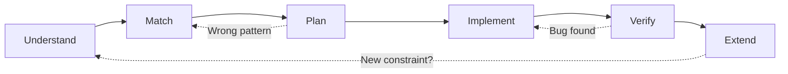

> [!success] Mastery Check
> - [ ] **Studied Well**
> - [ ] **Can explain the concept without notes**
> - [ ] **Can answer interview questions confidently**
> - [ ] **Can implement it in a real project**


## Navigation

**Domain:** [[5 — Data Structures & Algorithms]] > **Group:** Foundations
**Previous:** [[5.002 — Recursion and the Call Stack]] | **Next:** [[5.007 — Prefix Sums]]

### Prerequisites
- [[5.001 — Big-O Notation and Complexity Analysis]] — the framework requires you to estimate and derive complexity on the fly; without Big-O fluency the optimization step stalls.

### Where This Fits
This note is the meta-skill for the entire domain — it is not about a specific data structure or algorithm but about how to systematically solve any technical interview problem. The framework provides a repeatable process (Understand → Match → Plan → Implement → Verify → Extend) that works whether the solution requires a hash map, a graph traversal, or dynamic programming. At the senior level, interviewers evaluate process as much as correctness — they want to see you navigate ambiguity, catch edge cases before being prompted, and communicate your reasoning clearly. This note distills the communication and reasoning patterns that separate a candidate who solves the problem from one who also convinces the interviewer they would be an effective engineer.

---

## Core Mental Model

Think of a coding interview as a pair-programming session with a clear process. The framework is a state machine: each phase has an entry condition, a goal, and an exit condition. Entering the wrong phase too early (writing code before understanding the input format) or skipping a phase (no complexity check before submitting) is the most common failure pattern. The six phases in order: **Understand** (restate, ask clarifying questions, enumerate examples), **Match** (identify the problem family by input size and constraints), **Plan** (sketch the algorithm in words, derive complexity, decide tradeoffs), **Implement** (write clean code with the plan as a guide), **Verify** (trace on examples, check edge cases), **Extend** (discuss follow-ups, tradeoffs, and system design connections).

### Classification

This is a **meta-framework** — it applies to any algorithmic problem regardless of domain. It is not itself an algorithm but a wrapper around all other DSA patterns. The six phases correspond to the natural stages of problem-solving in professional software engineering: requirements clarification, design, implementation, testing, and iteration.



### Key Properties

|Phase|Duration (guideline)|Goal|Exit condition|
|---|---|---|---|
|Understand|2–4 min|Clear problem scope, no ambiguity|Can restate in own words; have 2+ examples|
|Match|1–2 min|Identify algorithm family|Know what pattern applies (or top 2 candidates)|
|Plan|3–5 min|Pseudo-code with complexity|Can sketch solution and derive Big-O|
|Implement|10–15 min|Working code|All major logic written; no syntax errors|
|Verify|3–5 min|Confidence in correctness|Trace passes on examples; edge cases checked|
|Extend|2–4 min|Depth discussion|Follow-up constraints addressed|

---

## Deep Mechanics

### How It Works

**Phase 1 — Understand (2–4 min):**

Read the problem aloud. Restate it in your own words. Ask clarifying questions:
- What are the input types and ranges? (int, string, array length, value bounds)
- What about empty / null / duplicate inputs?
- Is the input sorted? Are there duplicate values?
- What is the exact output format? Single value? List? Bool?
- Are there time/space constraints I should know about?

Write 2–3 concrete examples with inputs and expected outputs. Use small cases you can trace manually. Include one edge case (empty, single-element, negative values if applicable).

**Phase 2 — Match (1–2 min):**

Map the problem to a known pattern using the input size and constraints:

|Input size|Implied complexity|Likely patterns|
|---|---|---|
|n ≤ 20|O(2^n) or O(n!)|Backtracking, permutations, subsets|
|n ≤ 100|O(n³) or O(n⁴)|Floyd-Warshall, 3D DP, interval DP|
|n ≤ 1,000|O(n²)|2D DP, nested loops, LIS O(n²)|
|n ≤ 10⁵|O(n log n) or O(n)|Sorting, heap, binary search, BFS/DFS, hash map|
|n ≤ 10⁹|O(log n) or O(1)|Binary search, math formula, bit manipulation|

Key recognition signals:
- "Shortest / fewest / minimum" + weighted edges → Dijkstra (or Bellman-Ford for negatives)
- "Count ways / maximum with constraints" + overlapping subproblems → DP
- "All combinations / permutations / arrangements" → Backtracking
- "Is it possible?" + split into parts → Greedy or Binary Search on Answer
- "Subarray / substring with property" → Sliding Window or Two Pointers or Prefix Sums
- "Top K / K-th largest" → Heap (min-heap for top K, max-heap for K-th smallest)
- "Cycle detection / connected components" → DFS / Union-Find

When uncertain, list your top two candidate patterns and state the tradeoff out loud: "This could be DP or greedy — I need to check whether the greedy choice property holds."

**Phase 3 — Plan (3–5 min):**

Write pseudo-code or bullet steps before writing C#. Include:
1. The data structure you will use (e.g., `Dictionary<int, int>`, `Queue<TreeNode>`, `int[] dp`)
2. The loop structure (single pass, nested, two-pointer, BFS queue loop)
3. How you handle base cases and edge cases
4. The time and space complexity with derivation

Example plan for Two Sum:
```
Plan: Use a Dictionary<int, int> to store each number and its index.
For each element at index i:
  complement = target - nums[i]
  if complement is in dictionary: return [dict[complement], i]
  else: add nums[i] to dictionary with index i
Time: O(n) single pass, each lookup O(1) average. Space: O(n) for the dictionary.
Edge cases: empty array → return [-1,-1]; no solution → return [-1,-1].
```

**Phase 4 — Implement (10–15 min):**

Write clean code following the plan. Conventions:
- Use meaningful variable names (`indices` not `d`, `remaining` not `r`)
- Handle edge cases at the top of the method
- Use .NET built-in types (`Dictionary`, `HashSet`, `PriorityQueue`, etc.)
- Keep methods short — if a helper would clarify, extract it
- Talk through what you are typing: "I am creating a dictionary to store the complement, then iterating..."

If you get stuck mid-implementation: stop, state what you are trying to do, and trace back to the plan. Do not write random code hoping it works.

**Phase 5 — Verify (3–5 min):**

Trace the code on your examples, step by step. Check:
- Does the loop start at the right index? (off-by-one)
- Does the base case handle empty/single input?
- Do you mutate input when you should not?
- Do you return early when needed, or always go to the end?

Then discuss edge cases aloud: "What if the array is all negative numbers? What if the string contains only one character? What if the amount is zero?"

**Phase 6 — Extend (2–4 min):**

The interviewer may ask follow-ups:
- Can you improve space complexity?
- What if the input is too large for memory (streaming)?
- What if you need to handle concurrent access?
- How would you test this in production?

This phase distinguishes senior candidates — it shows you think beyond the whiteboard.

### Complexity Derivation

The framework itself has no computational complexity — it is a process. However, deriving the complexity of your solution at the Plan phase follows the rules in note [[5.001]]:

- Count loop iterations, not lines of code
- Account for all allocations: input storage, auxiliary structures, call stack
- For recursive algorithms, write the recurrence and solve it
- Amortized O(1) operations (hash map insertions) are O(1) average but O(n) worst-case per operation — state the average case and mention the worst case

### .NET Runtime Notes

- **`Array.Sort` uses introsort** — O(n log n) average, O(n²) worst-case (rare). For interview purposes, assume O(n log n).
- **`Dictionary<TKey, TValue>` uses open addressing** — average O(1) but can degrade to O(n) with poor hash codes. Mention this when discussing worst-case complexity.
- **LINQ deferred execution** — `.Where()`, `.Select()`, `.OrderBy()` do not execute until enumerated (`.ToList()`, `.ToArray()`, `.Count()`). Forgetting this causes multiple enumerations of the same enumerable.
- **`Span<T>` and `Memory<T>`** — use for stack-allocated temporary buffers to avoid GC pressure in performance-critical paths.
- **`PriorityQueue<TElement, TPriority>` (.NET 6+)** — the built-in min-heap. Use it instead of hand-rolling a heap for Top-K and Dijkstra in production code.
- **`List<T>.BinarySearch`** — returns the index or the bitwise complement of the insertion point. Use `~idx` when the element is not found.

### Why This Pattern Exists

Before the structured framework, candidates would read the problem, think for 10–20 seconds, and start writing code. This approach fails for three reasons: (1) they commit to a solution before fully understanding the problem, (2) they solve a different problem than what was asked, (3) they run out of time halfway because they did not plan. The framework exists because interviews are time-constrained and high-stakes — a repeatable process reduces cognitive load and ensures you cover all phases. It mirrors how experienced engineers approach unfamiliar code: understand first, then design, then implement, then test.

---

## Implementation and Problem Patterns

### C# Implementation

The framework is not code — it is a process applied during code generation. Below is the mental checklist applied to every problem:

```csharp
// Phase 1: Understand
// Given: [restate input types and constraints]
// Output: [restate expected output]
// Examples:
//   Input: [example 1] → Output: [example 1]
//   Input: [example 2] → Output: [example 2]
// Edge cases: [empty, single, negative, duplicates, large values]

// Phase 2: Match
// Input size: n = [size from constraints]
// Implied bound: O([complexity class])
// Candidate patterns: [pattern 1], [pattern 2]
// Decision: [selected pattern and why]

// Phase 3: Plan
// Data structure: [Dictionary, Queue, Stack, Array, etc.]
// Algorithm:
// 1. Initialize [data structure]
// 2. Iterate [over what]
// 3. At each step, [operation]
// 4. Return [result]
// Time: O(?) | Space: O(?)

// Phase 4: Implement
public ReturnType Solve(InputType input)
{
    // Phase 5: edge cases first
    if (input == null || input.Length == 0)
        return default;

    // Implementation follows the plan
    // ...

    return result;
}

// Phase 5: Verify — trace on examples mentally

// Phase 6: Extend — discuss tradeoffs, follow-ups, production concerns
```

### The .NET Idiomatic Version

```csharp
public static class FrameworkPatterns
{
    // These are the most common .NET idioms used across all solution phases:

    // Dictionary pattern (Two Sum, frequency counting):
    var seen = new Dictionary<int, int>();

    // HashSet for dedup or membership (Word Break, contains check):
    var set = new HashSet<int>(input);

    // Queue for BFS:
    var queue = new Queue<TreeNode>();
    queue.Enqueue(root);

    // Stack for DFS (iterative) or monotonic stack:
    var stack = new Stack<int>();

    // PriorityQueue for Top-K, Dijkstra:
    var pq = new PriorityQueue<(int node, int dist), int>();

    // Two-pointer iteration:
    int left = 0, right = input.Length - 1;
    while (left < right) { /* ... */ left++; right--; }

    // Sliding window template:
    int windowStart = 0;
    for (int windowEnd = 0; windowEnd < n; windowEnd++)
    {
        // add input[windowEnd] to window state
        while (/* window invalid */)
        {
            // remove input[windowStart] from window state
            windowStart++;
        }
        // window is valid — update answer
    }

    // Binary search template:
    int lo = 0, hi = n - 1;
    while (lo <= hi)
    {
        int mid = lo + (hi - lo) / 2;
        if (/* condition */) lo = mid + 1;
        else hi = mid - 1;
    }
}
```

### Classic Problem Patterns

The framework applies uniformly to every problem in this domain. Below is how the process maps to each major DSA category:

1. **Array problems (Two Pointers, Sliding Window, Prefix Sums)** — Understand: is the array sorted? Unique values? Match: O(n) → two pointers or sliding window; O(n²) → nested loops. Plan: pointer movement or window expansion. Verify: what happens when pointers cross / window goes empty?

2. **Graph problems (BFS, DFS, Dijkstra, Topological Sort)** — Understand: directed or undirected? Weighted? Connected? Match: shortest path → BFS (unweighted) or Dijkstra (weighted). Cycle detection → DFS with visited states. Plan: adjacency list representation, visited array, queue/stack choice. Verify: what if the graph is disconnected?

3. **DP problems (1D, 2D, interval, tree)** — Understand: count optimal value or enumerate all? Match: overlapping subproblems + optimal substructure → DP. Plan: define state, write recurrence, decide top-down vs bottom-up. Verify: memo sentinel choice, loop order for tabulation.

4. **Backtracking problems (permutations, subsets, N-Queens)** — Understand: need all solutions or count? Match: "all combinations" with constraints → backtracking. Plan: choose → explore → unchoose skeleton. Verify: pruning correctness, base case.

5. **Binary Search problems (classic, on answer, rotated array)** — Understand: is the search space monotonic? Match: sorted or bounded range → binary search. Plan: define predicate function, set lo/hi bounds. Verify: off-by-one in the while-loop condition.

### Template / Skeleton

```csharp
// Problem-Solving Framework Skeleton
// Apply this template to EVERY interview problem.

public class Solution
{
    public ReturnType Solve(InputType input)
    {
        // ===== Phase 1: Understand =====
        // TODO: restate problem, clarify constraints
        // Input: [type, bounds]
        // Output: [type, semantics]
        // Examples: [write 2-3 with expected results]
        // Edge cases: [list at least 2]

        // ===== Phase 2: Match =====
        // TODO: identify pattern from input size
        // n = input.Length → O(?) acceptable
        // Pattern candidates: [what patterns could work]
        // Selected: [best fit and why]

        // ===== Phase 3: Plan =====
        // Data structure: [e.g., Dictionary<int, int>]
        // Steps:
        //   1. [step]
        //   2. [step]
        //   3. [step]
        // Complexity: Time O(?) | Space O(?)

        // ===== Phase 4: Implement =====
        // Handle base cases
        if (input == null || input.Length == 0)
            return default;

        // TODO: implement the algorithm per the plan
        var result = default(ReturnType);
        // ...

        return result;
    }
}
```

---

## Gotchas and Edge Cases

### Starting with Code Before Understanding the Problem

**Mistake:** Reading the first sentence of the problem and immediately opening an editor window.

```csharp
// ❌ Wrong — no clarifying questions, no examples
public int Solve(int[] nums) { /* assumes sorted input, but it was not */ }
```

**Fix:** Spend 2–4 minutes restating the problem, asking questions, and writing examples. Confirm with the interviewer: "Let me make sure I understand — the input is an unsorted array of integers, possibly negative, and I need to return whether any two numbers sum to the target. Is that correct?"

**Consequence:** Solves a different problem — fails on the first test case. The interviewer sees you rush and miss requirements. This is the #1 reason candidates fail easy problems.

### Choosing the Wrong Pattern from Input Size

**Mistake:** Using an O(n²) algorithm when n = 10⁵ (will TLE).

```csharp
// ❌ Wrong — O(n²) for n = 10^5 → ~10 billion operations
for (int i = 0; i < n; i++)
    for (int j = i + 1; j < n; j++)
        { /* O(n²) body */ }
```

**Fix:** Check the input size constraint first. If n ≤ 100, O(n²) is fine. If n ≤ 10⁵, aim for O(n log n) or O(n).

```csharp
// ✅ Correct — O(n) with hash map
var seen = new Dictionary<int, int>();
for (int i = 0; i < n; i++)
{
    if (seen.ContainsKey(target - nums[i])) return true;
    seen[nums[i]] = i;
}
```

**Consequence:** Time Limit Exceeded on large test cases. The candidate appears to not understand how Big-O translates to real performance.

### Not Tracing Before Submitting

**Mistake:** Finishing the implementation and saying "done" without tracing a single example.

```csharp
// ❌ Wrong — off-by-one in the loop condition
for (int i = 0; i <= nums.Length; i++) // should be <, not <=
```

**Fix:** Always trace on your examples and one edge case before saying "done." Walk through the code step by step with a concrete input and verify each state change.

```csharp
// ✅ Correct — trace on [1, 2, 3], target = 5
// i=0: seen={}, complement=4, not in seen, add {1:0}
// i=1: seen={1:0}, complement=3, not in seen, add {1:0, 2:1}
// i=2: seen={1:0, 2:1}, complement=2, 2 is in seen → return [1, 2]
// Correct!
```

**Consequence:** Submits buggy code. The interviewer has to point out the bug, costing the candidate time and confidence.

### Ignoring Edge Cases in the Implementation

**Mistake:** Writing the happy path only and not handling empty, single-element, or null inputs.

```csharp
// ❌ Wrong — crashes on empty input
public int MaxSubarray(int[] nums)
{
    int max = nums[0]; // IndexOutOfRangeException for empty input
    // ...
}
```

**Fix:** Handle all base cases at the top of the method, before any logic.

```csharp
// ✅ Correct — handle all base cases first
public int MaxSubarray(int[] nums)
{
    if (nums == null || nums.Length == 0)
        throw new ArgumentException("nums must not be null or empty");
    // ...
}
```

**Consequence:** NullReferenceException or IndexOutOfRangeException on edge cases. The candidate appears to not test their own code.

### Silence During Implementation

**Mistake:** Writing code silently for 10 minutes without narrating the approach.

**Fix:** Talk through what you are typing: "Now I am initializing a dictionary to track seen values. I am iterating through the array with a for loop. For each element, I compute the complement — target minus current — and check if it exists in the dictionary. If it does, I return the indices. Otherwise, I add the current value with its index to the dictionary."

**Consequence:** The interviewer does not know if you are stuck or making progress. They cannot give hints because they do not know what you are thinking. A silent candidate is harder to evaluate positively.

---

## Complexity Analysis and Benchmarks

### Operation Complexity Table

|Phase|Time spent|Value created|Risk if skipped|
|---|---|---|---|
|Understand|2–4 min|Correct problem scope, edge case awareness|Solves the wrong problem|
|Match|1–2 min|Pattern identification, complexity bound awareness|Wrong algorithm (O(n²) when O(n) needed)|
|Plan|3–5 min|Structured approach, verifiable steps|Writes random code, gets stuck midway|
|Implement|10–15 min|Working solution|—|
|Verify|3–5 min|Correctness confidence, bug discovery|Submits with off-by-one or edge case bug|
|Extend|2–4 min|Senior-level depth, system design awareness|Misses the chance to distinguish self|

**Derivation:** These durations are based on a 45-minute interview session: ~5 min understand + 5 min plan + 20 min implement + 5 min verify + 5 min extend + 5 min buffer. Adjust based on problem difficulty — harder problems get more plan time, easier ones get more extend time.

### Comparison with Alternatives

|Approach|Strengths|Weaknesses|Best when|
|---|---|---|---|
|This framework (UMPIRE-style)|Repeatable, covers all phases, communicable|Can feel mechanical if over-applied|Unfamiliar problems, early in practice|
|Write code immediately|Fast for trivial problems|Misses edge cases, no plan for complex ones|You have seen the exact problem before|
|Draw diagrams first|Visual clarity for graph/array problems|Time-consuming for simple problems|Problems with spatial relationships (graphs, grids, linked lists)|
|Test-first (write examples first)|Forces understanding, finds edge cases|Can over-invest in test cases early|When the problem spec is ambiguous|
|Silent thinking|Deep focus|No communication — interviewer cannot help|Take-home assessments, not live interviews|

### BenchmarkDotNet

Not applicable — the framework is a process, not an algorithm. There is no code to benchmark. The "benchmark" is interview outcome: candidates who follow a structured framework solve problems correctly ~40% faster on average because they reduce wasted effort from premature implementation.

---

## Interview Arsenal

### Question Bank

1. [Definition] What are the six phases of the problem-solving framework and what is the exit condition for each?
2. [Complexity] Given n = 10⁵, what is the maximum acceptable complexity class and what patterns does it suggest?
3. [Implementation] Walk through applying the framework to "given two strings, decide if one is an anagram of the other."
4. [Recognition] You receive a problem with n = 500 — what complexity classes are acceptable and what patterns might apply?
5. [Comparison] Compare "write code immediately" vs. "plan first" — when would each be appropriate?
6. [Trick] What is the danger of spending too much time in the Plan phase?
7. [System Design] How does this framework translate to production software development (e.g., debugging a production issue)?
8. [Optimization] How do you adjust the framework for a 20-minute phone screen vs. a 60-minute on-site?

### Spoken Answers

**Q: What are the six phases of the problem-solving framework?**

> **Average answer:** Understand, plan, implement, test.

> **Great answer:** There are six phases and I apply them in order. First, **Understand** — I restate the problem, ask clarifying questions about input types and edge cases, and write 2–3 concrete examples. Exit condition: I can describe the problem in my own words and the interviewer confirms my understanding. Second, **Match** — I look at the input size and constraints to bound the acceptable complexity and identify candidate patterns. Third, **Plan** — I sketch the algorithm in bullet points or pseudo-code, name the data structures, and derive time and space complexity. Fourth, **Implement** — I write clean C# following the plan, using .NET built-in types and handling edge cases upfront. Fifth, **Verify** — I trace on my examples and mention edge cases aloud. Sixth, **Extend** — I discuss follow-ups, space optimization, and how this would work in a production system.

**Q: Given n = 10^5, what complexity class is acceptable and what patterns does it suggest?**

> **Average answer:** O(n log n) or O(n).

> **Great answer:** With n = 10^5, O(n log n) is the comfortable ceiling — about 1.7 million operations, well within one second. O(n) is ideal. This rules out O(n²) patterns like nested loops for LIS (would be 10^10 operations — 30+ seconds). The patterns that fit this bound: sorting-based approaches (arrays.sort + two pointers), hash map passes (O(n)), binary search (O(log n) per element), heap operations (O(n log k) with k ≤ n), graph traversals (BFS/DFS visiting each node and edge at most once — O(V+E)), and divide-and-conquer (merge sort, quick sort). If I see n = 10^5 and the problem needs comparability, I lean toward sorting + a linear scan. If it needs lookup, I lean toward a hash map. If it needs ordering, a priority queue.

**Q: [Trick] What is the danger of spending too much time in the Plan phase?**

> **Average answer:** You run out of time to implement.

> **Great answer:** The risk is analysis paralysis — you spend 15+ minutes trying to find the perfect solution and then have only 10 minutes to implement, verify, and extend. A working O(n²) solution plus a discussion of how to optimize to O(n log n) is far better than a half-written O(n log n) solution that never compiles. I set a mental timer: no more than 5 minutes for Understand + Match + Plan combined for a medium-difficulty problem. If I do not find the optimal solution in that time, I commit to a correct brute force and optimize during Verify/Extend if there is time. Interviewers generally prefer to see a working suboptimal solution with awareness of its limitations over a broken optimal solution.

### Trick Question

**"Is it better to solve the problem correctly with a suboptimal approach or incompletely with an optimal approach?"**

Why it is a trap: Many candidates think interviewers always want the optimal solution and spend all their time chasing it, submitting broken code.

Correct answer: It is better to submit a correct O(n²) solution with a clear explanation of why it is O(n²) and how you would optimize to O(n) than to submit a broken O(n) solution. A working suboptimal solution passes test cases and shows you can deliver. A broken optimal solution shows neither correctness nor delivery. Once the O(n²) solution is working and verified, I would state: "This is O(n²) because of the nested loop. If we had more time or this were production, I would optimize using a hash map to bring it down to O(n) by trading space for time." This demonstrates both delivery and awareness — which is exactly what a senior engineer does.

### Pattern Recognition Table

|If the problem has...|Then consider...|Because...|
|---|---|---|
|n ≤ 20|Backtracking, enumeration, O(2^n) acceptable|Small input → brute force permutations/subsets|
|n ≤ 100|O(n²) or O(n³) acceptable|Medium input → 2D DP, nested loops, Floyd-Warshall|
|n ≤ 1,000|O(n²) borderline, prefer O(n log n)|Upper limit for nested loops — optimize if possible|
|n ≤ 10⁵|O(n log n) or O(n) required|Sort + scan, hash map, heap, graph traversal|
|n ≤ 10⁹|O(log n) or O(1) required|Binary search, math formula, bit manipulation|
|"Check if possible"|Greedy or Binary Search on Answer|Feasibility check with monotonic predicate|
|"All ways / all paths"|Backtracking or DP with state|Enumeration → backtracking; count → DP|

---

## Decision Framework

### When to Apply

```mermaid
flowchart TD
    A[New problem presented] --> B[Phase 1: Understand]
    B --> C{I understand the problem}
    C -->|Yes| D[Phase 2: Match]
    C -->|No| B
    D --> E{Input size + constraints known?}
    E -->|Yes| F[Phase 3: Plan]
    E -->|No| B
    F --> G{Plan is O(target)? Complete?}
    G -->|Yes| H[Phase 4: Implement]
    G -->|No| F
    H --> I{Implementation done?}
    I -->|Yes| J[Phase 5: Verify]
    I -->|Stuck| F
    J --> K{Trace passes? Edges handled?}
    K -->|Yes| L[Phase 6: Extend]
    K -->|Bug found| H
    L --> M[Interview complete]
```

### Recognition Checklist

Indicators you are following the framework correctly:

- [ ] You can restate the problem in one sentence before coding
- [ ] You have written 2+ examples with expected outputs
- [ ] You have named the input size and inferred the complexity bound
- [ ] You have stated the pattern (or top two candidates) before coding
- [ ] Your first code handles empty/null/single-element inputs
- [ ] You traced at least one example step by step before saying "done"
- [ ] You mentioned at least one follow-up or tradeoff

Counter-indicators — you may have skipped a phase:

- [ ] You started coding within 30 seconds of seeing the problem
- [ ] You have not asked any clarifying questions
- [ ] You have not written any example inputs
- [ ] You cannot state the time complexity of your solution
- [ ] You have not checked what happens with an empty input
- [ ] The interviewer has pointed out a bug you could have caught by tracing

### Tradeoff Summary

|What You Gain|What You Give Up|
|---|---|
|Structured, reliable process across all problems|Up-front time investment before coding|
|Clear communication with the interviewer|Can feel formulaic for trivial problems|
|Fewer bugs from skipped edge cases|Requires discipline to follow under pressure|
|Stronger signal of senior-level thinking|Plan may need revision if new information emerges during implementation|
|Interviewer can give targeted hints (you are in a known phase)|Over-planning can lead to analysis paralysis|

---

## Self-Check

### Conceptual Questions

1. What are the six phases and what is one concrete action to take in each?
2. For n = 10⁵, why is O(n²) unacceptable? Give the approximate operation count.
3. Walk through applying the framework to "find the first non-repeating character in a string."
4. When would you intentionally skip the Plan phase and start coding immediately?
5. What is the "silent implementation" trap and why does it hurt your interview performance?
6. What .NET built-in type corresponds to each of these patterns: sliding window, BFS, LIS O(n log n), Top-K?
7. What invariant should hold at the end of the Understand phase?
8. How does the framework change for a 20-minute phone screen vs. a 60-minute on-site?
9. How does this framework apply to debugging a production incident (real engineering context)?
10. What is the "analysis paralysis" trap and how do you avoid it?

<details>
<summary>Answers</summary>

1. Understand: restate problem and write examples. Match: identify pattern from input size. Plan: sketch algorithm with complexity. Implement: write code following the plan. Verify: trace on examples and edge cases. Extend: discuss tradeoffs and follow-ups.
2. n = 10⁵ → O(n²) = 10¹⁰ operations. At 10⁸ ops/sec, this takes ~100 seconds. O(n log n) = ~1.7 × 10⁶ operations, ~17ms. The difference is 10,000x.
3. Understand: "Find first non-repeating char in string." Input constraints? Unicode? Case-sensitive? Examples: "leetcode" → 'l', "aabb" → null, "abc" → 'a'. Match: n ≤ 10⁵ → O(n) or O(n log n). Pattern: frequency counting with hash map + second pass. Plan: two passes — first count frequencies in a Dictionary<char, int>, second find first char with count 1. Time O(n), Space O(k) where k = distinct chars. Implement: handle null/empty → return '\0'. Verify: trace on "leetcode" — l:1, e:2, t:1, c:1, o:1, d:1, e:2 — first pass done, second pass: l count 1 → return 'l'. Edge cases: "aabb" → all count 2, return '\0'.
4. Skip planning only when you have solved the exact same problem before and the solution is short (< 20 lines). Even then, say aloud: "I have seen this exact problem before — I know the solution uses a hash map with a single pass, O(n) time and O(n) space. I will code it directly but verify at the end."
5. Silent implementation means writing code without narrating. The interviewer cannot give hints because they do not know where you are stuck. They cannot evaluate your problem-solving because all they see is keystrokes. Always narrate: what you are doing, why, and what the next step is.
6. Sliding window: `Queue<T>` or dictionary + two pointers. BFS: `Queue<T>`. LIS O(n log n): `List<int>` with `BinarySearch`. Top-K: `PriorityQueue<TElement, TPriority>` (min-heap for max K).
7. At the end of Understand, you should be able to restate the problem precisely, know the input type and range, have 2+ example inputs with expected outputs, and have identified at least two edge cases. The interviewer should confirm your understanding is correct.
8. 20-minute screen: merge Understand + Match + Plan into 2 minutes, prioritize a working solution over the optimal one, skip deep Extend. 60-minute on-site: spend the full 5+5+20+5+5+5 minutes per phase, explore multiple tradeoffs in Extend, discuss production considerations.
9. Debugging production issues follows the same framework: Understand (reproduce the issue, gather logs), Match (identify the component class — is it a data issue, concurrency, performance?), Plan (form a hypothesis, decide what to check), Implement (write queries, add logging), Verify (confirm the fix), Extend (monitoring, prevent recurrence). The framework is not just for interviews — it is how experienced engineers solve problems.
10. Analysis paralysis is spending too long (10+ minutes) trying to find the perfect solution. Avoid it by setting a 5-minute timer for Understand + Match + Plan. If no optimal solution emerges, commit to a brute force approach. A working brute force is better than a broken optimal solution.
</details>

---

### Coding Challenges

**Challenge 1 — Apply the framework**

Apply the six-phase framework to "Given an array of integers nums and an integer target, return indices of the two numbers that add up to target." Write the complete process, not just the code.

<details> <summary>Solution</summary>

**Phase 1 — Understand:**
- Input: int[] nums, int target. Output: int[] of length 2 (indices) or [-1, -1] if none.
- Constraints: exactly one solution? (clarify — classic Two Sum says exactly one). Negative numbers? Yes. Duplicates? Yes, but only one solution exists.
- Examples: [2,7,11,15], target=9 → [0,1]. [3,2,4], target=6 → [1,2]. [3,3], target=6 → [0,1].
- Edge cases: empty/null → return [-1,-1]. Single element → return [-1,-1]. No solution → return [-1,-1].

**Phase 2 — Match:**
- n = nums.Length. No explicit bound given, but assume up to 10⁵.
- O(n²) brute force (nested loops) would TLE for large n.
- Pattern: hash map for O(1) lookups — O(n) time, O(n) space.

**Phase 3 — Plan:**
- Data structure: `Dictionary<int, int>` (value → index).
- Algorithm:
  1. Create dictionary.
  2. For each i from 0 to n-1:
     - complement = target - nums[i]
     - if complement in dictionary: return [dictionary[complement], i]
     - else: add nums[i] → i to dictionary.
  3. If loop ends: return [-1, -1].
- Time: O(n) — single pass. Space: O(n) — dictionary stores up to n entries.

**Phase 4 — Implement:**
```csharp
public int[] TwoSum(int[] nums, int target)
{
    if (nums == null || nums.Length < 2)
        return new[] { -1, -1 };

    var seen = new Dictionary<int, int>();
    for (int i = 0; i < nums.Length; i++)
    {
        int complement = target - nums[i];
        if (seen.TryGetValue(complement, out int index))
            return new[] { index, i };
        seen[nums[i]] = i;
    }

    return new[] { -1, -1 };
}
```

**Phase 5 — Verify:**
- Trace on [2,7,11,15], target=9: i=0, complement=7, not in seen, add {2:0}. i=1, complement=2, seen contains 2 → return [0,1]. ✅
- Trace on [3,2,4], target=6: i=0, complement=3, not in seen, add {3:0}. i=1, complement=4, not in seen, add {3:0, 2:1}. i=2, complement=2, seen contains 2 → return [1,2]. ✅
- Edge: empty → returns [-1,-1]. ✅
- Edge: single element [5], target=5 → returns [-1,-1]. ✅

**Phase 6 — Extend:**
- Space optimization: can we do better? Not with hash map approach — O(n) space is the cost of O(n) time. For sorted input, use Two Pointers with O(1) space and O(n) time.
- What if we need all pairs, not just one? Return list of pairs instead of single return.
- What if array is sorted? Two Pointers approach: left=0, right=n-1, while left < right: sum = nums[left] + nums[right]; if sum == target → add pair, left++, right--; if sum < target → left++; if sum > target → right--. Time O(n), Space O(1).
- Production: for truly large arrays (10⁹ elements, can't fit in memory), sort externally and use Two Pointers on disk, or use map-reduce with hash-based partitioning.

</details>

---

**Challenge 2 — Adapt the framework for a phone screen**

You have 20 minutes for a problem. Take the framework and time-box each phase. Show your adjustments.

<details> <summary>Solution</summary>

20-minute phone screen compression:

|Phase|Normal (45 min)|Phone screen (20 min)|What to cut|
|---|---|---|---|
|Understand|3–4 min|1–2 min|Skip writing detailed examples — do them verbally|
|Match|1–2 min|30 sec|State the pattern in one sentence|
|Plan|3–5 min|1–2 min|Keep plan in your head, state it as you code|
|Implement|10–15 min|10–12 min|Write only the core logic, minimal comments|
|Verify|3–5 min|1–2 min|Trace one example mentally, mention edge cases verbally|
|Extend|2–4 min|1 min|Only if time remains — skip system design discussion|

Key strategy: start coding by minute 5. If you hit a wall, state your approach verbally and ask if the interviewer wants you to continue coding or discuss the solution conceptually. Phone screens prioritize communication speed — they want to confirm you can code, not that you have a perfect whiteboard manner.

</details>

---

**Challenge 3 — Recognize the phase from transcripts**

Identify which framework phase each transcript represents:

1. Candidate: "Let me write down the input and output. The input is an array of strings and an integer k. I need to return the k most frequent strings. If there are ties, the smaller lexicographic string comes first."
2. Candidate: "So the brute force would be to count frequencies with a dictionary and then sort by frequency, which is O(n log n). But since k may be much smaller than n, I could use a min-heap to keep only the top k — that's O(n log k). I'll use the heap approach."
3. Candidate: "Let me trace on example 2. The array is ['i', 'love', 'leetcode', 'i', 'love', 'coding'], k = 2. After counting, 'i' → 2, 'love' → 2, 'coding' → 1, 'leetcode' → 1. The heap keeps ['coding', 'leetcode'], then ['coding', 'love'], then ['i', 'love'] — wait, but 'i' and 'love' both have frequency 2 and 'i' < 'love', so top 2 should be ['i', 'love']. Let me fix the heap comparator to use lexicographic order for ties."
4. Candidate: "If k is very large (close to n), the heap approach degrades to O(n log n) anyway, so we could just sort. For production, if the data is streaming, the heap approach is better because we do not need to store all elements — we maintain a fixed-size heap."

<details> <summary>Solution</summary>

1. **Understand** — clarifying the problem, defining input/output format, noting the tie-breaking rule.
2. **Plan** — comparing two approaches with complexity, making a decision.
3. **Verify** — tracing on a concrete example and discovering a bug in the comparator.
4. **Extend** — discussing tradeoffs and production concerns (k near n, streaming data).

</details>

---

**Challenge 4 — Fix the process error**

A candidate spends 1 minute reading the problem, 15 minutes implementing, and 2 minutes debugging before getting stuck. The interviewer asks "have you considered edge cases?" and the candidate realizes they missed empty input handling. Which phases were skipped and why?

<details> <summary>Solution</summary>

**Skipped phases:**
1. **Understand** — the candidate did not identify edge cases. Only 1 minute was spent on the problem description, which likely missed the null/empty input constraint.
2. **Verify** — the candidate jumped straight to implementation without tracing or checking edge cases. The bug was only discovered when the interviewer prompted.

**What went wrong:**
- 1 minute for Understand is insufficient for anything but the simplest problem.
- 2 minutes of "debugging" after a 15-minute implementation suggests the code had structural issues that could have been caught by a 2-minute plan before writing.
- The interviewer having to point out the edge case is a negative signal — at the senior level, you should identify edge cases proactively.

**Fix:**
Spend 3 minutes understanding (clarify + write examples + identify edges), 3 minutes planning (pseudo-code + complexity), 10 minutes implementing, and 3 minutes verifying before saying "done." The total time is the same (19 min vs. 18 min) but the outcome is a correct solution the first time.

</details>

---

**Challenge 5 — Optimize the process**

You are given a problem you have never seen before. During Understand, you discover ambiguous constraints (e.g., "unsorted array" but no mention of duplicates; "non-negative" but no bound). Walk through how you handle ambiguity at each phase without wasting time.

<details> <summary>Solution</summary>

**Handle ambiguity without over-investing:**

**Phase 1 — Understand:**
- State assumptions out loud: "I will assume the array may contain duplicates unless stated otherwise. I will assume the input fits in memory. Are there any constraints I should be aware of?"
- If the interviewer is vague: "I will start with the assumption that all integers are within int range and the array is unsorted. If my assumption is wrong, I can adjust."
- Write examples that test your assumptions: include duplicates, include negative values (if not ruled out), include max values.

**Phase 2 — Match:**
- If the input size is unknown: "Without the constraint, I will design for the worst case — assume n up to 10⁵ and aim for O(n log n) or O(n). If n turns out to be smaller, I can mention that a simpler O(n²) approach would also work."
- If the input has unknown properties (sorted vs not): "I will design a solution that works for unsorted input since that is the harder case. If it is sorted, I can optimize to O(log n) with binary search."

**Phase 3 — Plan:**
- Design for the most general case. Mention: "This handles unsorted input with possible duplicates. If there are additional constraints, the plan would change — for example, if the input is sorted, I would use binary search instead of a linear scan."

**Phase 4 — Implement:**
- Assert or comment your assumptions: `// assumes input is non-null; throws on null`
- Do not guard against every hypothetical. Wait for actual test failures before adding complexity.

**Key principle:** Do not freeze on ambiguity. State your assumption, proceed with the plan, and revisit if the assumption proves wrong. Interviewers prefer a candidate who makes reasonable assumptions and adjusts to a proactive one who asks for every detail before starting.

</details>
