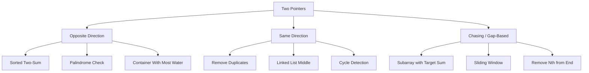

> [!success] Mastery Check
> - [ ] **Studied Well**
> - [ ] **Can explain the concept without notes**
> - [ ] **Can answer interview questions confidently**
> - [ ] **Can implement it in a real project**


## Navigation

**Domain:** [[5 — Data Structures & Algorithms]] > **Group:** Arrays and Strings
**Previous:** [[5.004 — Arrays, Fixed, Dynamic, and In-Place Operations]] | **Next:** [[5.006 — Sliding Window]]

### Prerequisites
- [[5.004 — Arrays, Fixed, Dynamic, and In-Place Operations]] — two-pointer techniques depend on index manipulation and in-place array modification.
- [[5.001 — Big-O Notation and Complexity Analysis]] — the O(n) vs O(n²) improvement of two pointers over brute force must be derived.

### Where This Fits
Two Pointers is the most fundamental algorithmic pattern for reducing nested-loop brute force to a single pass — typically from O(n²) to O(n). It applies when the input is sorted (or can be sorted) and the problem involves comparing or combining pairs of elements. In senior interviews, Two Pointers is a baseline expectation: failing to recognize when it applies signals gaping holes in pattern recognition. It appears in array, string, and linked list problems across Easy through Hard difficulty, and is frequently paired with sorting as a preprocessing step.

---

## Core Mental Model

Two Pointers exploits the sorted property of an array to eliminate the inner loop. Instead of checking every pair (n²), two pointers start at opposite ends (or the same end at different speeds) and converge toward each other (or chase each other) in a single pass. The key insight is that the sorted order provides a monotonic relationship: if the sum at left + right is too small, moving left forward increases it; if too large, moving right backward decreases it. No pair is missed because the pointers have partitioned the search space.

### Classification

Two Pointers is a pattern (algorithmic technique), not a data structure. There are three main variants:

- **Opposite-direction:** Pointers start at both ends and converge (Two-Sum in sorted array, palindrome check)
- **Same-direction (fast and slow):** Both pointers start at the same end, one moves faster (linked list cycle detection, remove duplicates)
- **Chasing (sliding window variant):** Both pointers move forward, maintaining a window between them (subarray problems)



### Key Properties

|Property|Value|Derivation|
|---|---|---|
|Sorted Two-Sum (find pair with target sum)|O(n): one pass|Each iteration eliminates exactly one element — n iterations|
|Palindrome check|O(n/2) = O(n): half pass|Pointers meet in the middle; each checks one pair|
|Remove duplicates from sorted|O(n): one pass|Read pointer scans; write pointer marks keep position|
|Container With Most Water|O(n): one pass|Pointer that limits height moves inward — each iteration eliminates one column|
|Space|O(1)|Only two integer indices stored|

---

## Deep Mechanics

### How It Works

**Opposite-direction (sorted Two-Sum):**

Given sorted array `arr` and target sum `target`:
1. Set `left = 0`, `right = n - 1`.
2. Compute `currentSum = arr[left] + arr[right]`.
3. If `currentSum == target`: found the pair.
4. If `currentSum < target`: increment `left` — the sum must increase. Since the array is sorted, moving left forward gives the next larger value.
5. If `currentSum > target`: decrement `right` — the sum must decrease. Moving right backward gives the next smaller value.
6. Repeat until `left >= right`.

Why this covers all pairs: At each step, exactly one pointer moves. The invariant is that any pair that could sum to target must have one element to the left of right and one to the right of left. Moving a pointer eliminates all pairs involving the skipped element, and this elimination is safe because the sorted order proves they cannot combine with the remaining elements to reach the target.

**Same-direction (write-pointer pattern):**

Write pointer `w` and read pointer `r`. `r` scans ahead; when `arr[r]` should be kept, copy it to `arr[w]` and increment `w`. This gives O(n) in-place filtering.

### Complexity Derivation

**Time — Opposite direction:** The loop executes at most n times because each iteration moves either left or right, and left < right after each move until they meet. n iterations × O(1) work per iteration = O(n).

**Time — Three-way partition (Dutch National Flag):** Three pointers: low, mid, high. Mid scans from 0 to high. Each iteration either increments mid (when arr[mid] == 1), swaps mid with low and increments both (when arr[mid] == 0), or swaps mid with high and decrements high (when arr[mid] == 2). Each element is examined exactly once, and each swap positions an element correctly. O(n).

**Space — All variants:** Two or three integer variables. No auxiliary data structures. O(1).

### .NET Runtime Notes

- **Span<T> and two pointers:** `Span<T>` slices make two-pointer code more readable: `var leftSpan = arr[..mid]`, `var rightSpan = arr[mid..]`. However, slicing creates a new Span (O(1) — just a pointer + length), not a copy.
- **Array.Sort before Two Pointers:** Many problems require a sorted array. `Array.Sort` uses introsort (O(n log n)). For large inputs, the sort dominates the runtime; the two-pointer pass is the cheap part.
- **LINQ is not two-pointer:** LINQ's `Where`, `Select`, and `Aggregate` are single-pass but do not support the dual-index state machine that two-pointers require. You need explicit iteration.

---

## Implementation and Problem Patterns

### C# Implementation

```csharp
public static class TwoPointers
{
    /// <summary>
    /// Sorted Two-Sum: find a pair in a sorted array that sums to target.
    /// Returns indices [left, right] or [-1, -1] if not found.
    /// </summary>
    public static int[] TwoSumSorted(int[] sorted, int target)
    {
        int left = 0, right = sorted.Length - 1;
        while (left < right)
        {
            int sum = sorted[left] + sorted[right];
            if (sum == target) return [left, right];
            if (sum < target) left++;
            else right--;
        }
        return [-1, -1];
    }

    /// <summary>
    /// Palindrome check: is the string a palindrome?
    /// Converging pointers from both ends.
    /// </summary>
    public static bool IsPalindrome(string s)
    {
        int left = 0, right = s.Length - 1;
        while (left < right)
        {
            if (char.ToLower(s[left]) != char.ToLower(s[right]))
                return false;
            left++;
            right--;
        }
        return true;
    }

    /// <summary>
    /// Container With Most Water: given heights, find max water area.
    /// The limiting height determines which pointer moves.
    /// </summary>
    public static int MaxWaterArea(int[] height)
    {
        int left = 0, right = height.Length - 1;
        int maxArea = 0;
        while (left < right)
        {
            int h = Math.Min(height[left], height[right]);
            maxArea = Math.Max(maxArea, h * (right - left));
            if (height[left] < height[right]) left++;
            else right--;
        }
        return maxArea;
    }

    /// <summary>
    /// Dutch National Flag: sort array of 0, 1, 2 in place.
    /// Three pointers: low = boundary of 0s, mid = current element, high = boundary of 2s.
    /// </summary>
    public static void SortThreeColors(int[] nums)
    {
        int low = 0, mid = 0, high = nums.Length - 1;
        while (mid <= high)
        {
            if (nums[mid] == 0)
            {
                (nums[low], nums[mid]) = (nums[mid], nums[low]);
                low++; mid++;
            }
            else if (nums[mid] == 1)
            {
                mid++;
            }
            else // nums[mid] == 2
            {
                (nums[mid], nums[high]) = (nums[high], nums[mid]);
                high--;
            }
        }
    }

    /// <summary>
    /// ThreeSum: find all unique triplets that sum to zero.
    /// Sort + Two Pointers.
    /// </summary>
    public static List<List<int>> ThreeSum(int[] nums)
    {
        Array.Sort(nums);
        var result = new List<List<int>>();
        for (int i = 0; i < nums.Length - 2; i++)
        {
            if (i > 0 && nums[i] == nums[i - 1]) continue;
            int left = i + 1, right = nums.Length - 1;
            while (left < right)
            {
                int sum = nums[i] + nums[left] + nums[right];
                if (sum == 0)
                {
                    result.Add([nums[i], nums[left], nums[right]]);
                    left++;
                    right--;
                    while (left < right && nums[left] == nums[left - 1]) left++;
                    while (left < right && nums[right] == nums[right + 1]) right--;
                }
                else if (sum < 0) left++;
                else right--;
            }
        }
        return result;
    }

    /// <summary>
    /// Trapping Rain Water: water trapped between bars of given heights.
    /// Two pointers track max height from left and right.
    /// </summary>
    public static int TrapRainWater(int[] height)
    {
        int left = 0, right = height.Length - 1;
        int leftMax = 0, rightMax = 0, water = 0;
        while (left < right)
        {
            if (height[left] < height[right])
            {
                if (height[left] >= leftMax) leftMax = height[left];
                else water += leftMax - height[left];
                left++;
            }
            else
            {
                if (height[right] >= rightMax) rightMax = height[right];
                else water += rightMax - height[right];
                right--;
            }
        }
        return water;
    }
}
```

### The .NET Idiomatic Version

```csharp
public static class TwoPointersIdiomatic
{
    // For Two-Sum on sorted array, Array.BinarySearch can work but is not O(n)
    // Two Pointers is the idiomatic O(n) solution.

    // For palindrome check, Enumerable.SequenceEqual works but allocates:
    public static bool IsPalindromeLinq(string s) =>
        s.SequenceEqual(s.Reverse());

    // For in-place operations, Span<T> provides a cleaner two-pointers surface:
    public static void ReverseInPlace<T>(Span<T> span)
    {
        int left = 0, right = span.Length - 1;
        while (left < right)
        {
            (span[left], span[right]) = (span[right], span[left]);
            left++;
            right--;
        }
    }
}
```

### Classic Problem Patterns

1. **Sorted Two-Sum** — Given a sorted array, find a pair summing to a target. Key insight: move left up to increase sum, move right down to decrease sum.
2. **ThreeSum / K-Sum generalization** — Sort the array, fix one element, then use two pointers on the remainder. Key insight: sort enables both the two-pointer pass and duplicate skipping.
3. **Container With Most Water** — Two pointers track the leftmost and rightmost walls; the shorter wall determines the area and must move inward. Key insight: moving the taller wall cannot increase the area because height is limited by the shorter wall.

### Template / Skeleton

```csharp
// Two Pointers (Opposite Direction) Template
// When to use: sorted array, need to find a pair satisfying a condition
// Time: O(n) | Space: O(1)

public static int[] OppositeDirectionTemplate(int[] sorted, /* condition params */)
{
    int left = 0, right = sorted.Length - 1;
    while (left < right)
    {
        // TODO: compute current value based on left and right
        int current = sorted[left] /* +/-/*/ sorted[right];
        // TODO: check if current satisfies the target condition
        if (/* current meets condition */)
        {
            return [left, right];
        }
        // TODO: decide which pointer to move based on monotonic property
        if (/* current < target */) left++;
        else right--;
    }
    return [-1, -1]; // not found
}
```

---

## Gotchas and Edge Cases

### Duplicate Triplets in ThreeSum

**Mistake:** Including duplicate triplets in the result because the same value appears at multiple indices.

```csharp
// ❌ Wrong — no duplicate skipping; produces [[-1, 0, 1], [-1, 0, 1]]
for (int i = 0; i < nums.Length - 2; i++)
{
    // inner two-pointer loop — but arr[-1, 0, 1, -1] finds (-1, 0, 1) twice
}
```

**Fix:** Skip duplicates for the fixed element and after each found pair.

```csharp
// ✅ Correct — skip duplicate values at i and after each found pair
for (int i = 0; i < nums.Length - 2; i++)
{
    if (i > 0 && nums[i] == nums[i - 1]) continue;
    // ... two-pointer loop ...
    while (left < right && nums[left] == nums[left - 1]) left++;
    while (left < right && nums[right] == nums[right + 1]) right--;
}
```

**Consequence:** Wrong answer — the expected set of unique triplets includes duplicates, causing test failure.

### Overflow in Sum Calculation

**Mistake:** Computing `arr[left] + arr[right]` without considering integer overflow.

```csharp
// ❌ Wrong — can overflow for large int values
int sum = arr[left] + arr[right];
```

**Fix:** Use `long` for sum or check for overflow.

```csharp
// ✅ Correct — use long to avoid overflow
long sum = (long)arr[left] + arr[right];
```

**Consequence:** Integer overflow wraps around (unchecked context by default in .NET) and produces a wrong comparison, leading to incorrect pointer movement.

### Off-by-One in Pointer Start Position

**Mistake:** Starting `left` and `right` incorrectly for the specific variant.

```csharp
// ❌ Wrong — right starts at arr.Length instead of arr.Length - 1
int left = 0, right = arr.Length;
while (left < right) { ... arr[right] ... } // IndexOutOfBounds on first access
```

**Fix:** Always start with valid indices.

```csharp
// ✅ Correct — right points to the last valid index
int left = 0, right = arr.Length - 1;
```

**Consequence:** `IndexOutOfRangeException` at runtime.

### Forgetting to Skip Duplicates After Each Found ThreeSum Pair

**Mistake:** Only skipping duplicates for the outer loop, not the inner ones.

```csharp
// ❌ Wrong — skips duplicates on i but not left/right
if (i > 0 && nums[i] == nums[i - 1]) continue; // Only this skip
while (left < right) { if (sum == 0) { result.Add(...); left++; right--; } }
```

**Fix:** Also skip duplicates after finding a pair.

```csharp
// ✅ Correct — skip duplicates on left and right after each match
while (left < right) {
    if (sum == 0) {
        result.Add(...);
        left++; right--;
        while (left < right && nums[left] == nums[left - 1]) left++;
        while (left < right && nums[right] == nums[right + 1]) right--;
    }
}
```

**Consequence:** Duplicate triplets in the result set.

---

## Complexity Analysis and Benchmarks

### Operation Complexity Table

|Operation|Time (Best)|Time (Average)|Time (Worst)|Space|Notes|
|---|---|---|---|---|---|
|Sorted Two-Sum|O(1)|O(n/2)|O(n)|O(1)|Found immediately ... not found after full pass|
|Palindrome check|O(1)|O(n/2)|O(n/2)|O(1)|Mismatch at first char ... all chars match|
|Container With Most Water|O(n)|O(n)|O(n)|O(1)|Always one full pass|
|ThreeSum (with sort)|O(n log n)|O(n²)|O(n²)|O(log n) to O(n) for sort|Sort dominates; sort + n × (two-pointer O(n))|
|Trapping Rain Water|O(n)|O(n)|O(n)|O(1)|One pass with two pointers|

**Derivation for the non-obvious entries:** ThreeSum sorts first (O(n log n)), then iterates through each element (O(n)) with a two-pointer scan of the remaining elements (O(n)). Total: O(n log n + n²) = O(n²). The two-pointer scan per fixed element is O(n) because each iteration eliminates one element.

### Comparison with Alternatives

|Structure / Algorithm|Time|Space|Best When|
|---|---|---|---|
|Two Pointers|O(n) or O(n²)|O(1)|Sorted input or sortable; needs O(1) memory|
|Brute Force (nested loops)|O(n²)|O(1)|Small n (≤ 100) or unsorted and not sortable|
|Hash Map|O(n)|O(n)|Unsorted input; can trade space for time|
|Binary Search|O(n log n)|O(1)|Sorted input, need to find one element per iteration|

### BenchmarkDotNet

```csharp
[MemoryDiagnoser]
[SimpleJob(RuntimeMoniker.Net90)]
public class TwoPointersBenchmark
{
    [Params(100, 1_000, 10_000)]
    public int N { get; set; }

    private int[] _sorted = null!;

    [GlobalSetup]
    public void Setup()
    {
        _sorted = Enumerable.Range(0, N).ToArray();
    }

    [Benchmark(Baseline = true)]
    public int[] TwoSumBruteForce()
    {
        for (int i = 0; i < _sorted.Length; i++)
            for (int j = i + 1; j < _sorted.Length; j++)
                if (_sorted[i] + _sorted[j] == N)
                    return [i, j];
        return [-1, -1];
    }

    [Benchmark]
    public int[] TwoSumTwoPointers()
    {
        int left = 0, right = _sorted.Length - 1;
        while (left < right)
        {
            int sum = _sorted[left] + _sorted[right];
            if (sum == N) return [left, right];
            if (sum < N) left++;
            else right--;
        }
        return [-1, -1];
    }
}
```

**Expected results (approximate, .NET 9, x64):**

|Method|N|Mean|Allocated|
|---|---|---|---|
|TwoSumBruteForce|100|~4 μs|0 B|
|TwoSumBruteForce|1,000|~400 μs|0 B|
|TwoSumBruteForce|10,000|~40 ms|0 B|
|TwoSumTwoPointers|100|~100 ns|0 B|
|TwoSumTwoPointers|1,000|~1 μs|0 B|
|TwoSumTwoPointers|10,000|~10 μs|0 B|

**Interpretation:** At N=10,000, the two-pointer approach is ~4000× faster than brute force (10 μs vs 40 ms). The O(n) vs O(n²) difference is visible even at N=100 (4 μs vs 100 ns). No allocations on either side — both are O(1) space.

---

## Interview Arsenal

### Question Bank

1. [Definition] What types of problems does the Two Pointers pattern apply to?
2. [Complexity] Why does the two-pointer approach solve sorted Two-Sum in O(n) while brute force is O(n²)?
3. [Implementation] Implement `Container With Most Water` using two pointers.
4. [Recognition] Given an unsorted array and a target sum, would you use two pointers or a hash map? Why?
5. [Comparison] When would you use opposite-direction vs. same-direction two pointers?
6. [Trick] Can two pointers work on an unsorted array? If not, what must you do first?
7. [System Design] How would you detect a cycle in a distributed system's log processing pipeline using this pattern?
8. [Optimization] How would you modify the two-pointer template to handle the case where the array contains negative numbers?

### Spoken Answers

**Q: Why does the two-pointer approach solve sorted Two-Sum in O(n) while brute force is O(n²)?**

> **Average answer:** Because you only have one loop instead of two loops.

> **Great answer:** The brute force checks every pair (i, j), which is O(n²) because there are n choices for i and O(n) choices for j for each i. The two-pointer approach exploits the sorted property to eliminate the inner loop. At each step, we compute the current sum. If it matches the target, we are done. If it is less than the target, we increment the left pointer — this eliminates the current left element from consideration, and crucially, it eliminates every future pair that includes this left element with any element to the right of the current right. Why? Because the array is sorted; if arr[left] + arr[right] is too small, then arr[left] + any smaller element (to the left of right) would be even smaller and cannot be the target. So we can safely discard the left element. Similarly, if the sum is too large, we discard the right element. Each iteration discards exactly one element, so the loop runs at most n times. This is the essence of the two-pointer proof: at each step, the monotonicity of the sorted array lets us eliminate all pairs involving one element, reducing the problem size by 1.

**Q: Implement Container With Most Water using two pointers.**

> **Average answer:** Two nested loops checking all pairs, tracking the max area.

> **Great answer:** I'll use two pointers starting at both ends. The area between left and right is `min(height[left], height[right]) * (right - left)`. I track the maximum. The key decision is which pointer moves: the pointer pointing to the shorter wall moves inward. The reasoning is that the area is limited by the shorter wall; if I move the taller wall, the width decreases but the height cannot increase because it is capped by the shorter wall. So the only chance to find a larger area is to move the shorter wall inward, hoping to find a taller wall that increases the height enough to compensate for the reduced width. This gives O(n) time and O(1) space. I'd note at the whiteboard that this is the optimal solution — there is no O(log n) solution because the data is unsorted and you must look at each height at least once.

**Q: [Trick] Can two pointers work on an unsorted array?**

> **Average answer:** No, two pointers requires a sorted array.

> **Great answer:** It depends on which variant. The opposite-direction variant (Two-Sum) requires sorting because the monotonic relationship — moving left increases the sum, moving right decreases it — depends on sorted order. However, same-direction two pointers (fast/slow, write-pointer) work on unsorted arrays because they do not depend on value ordering. The write-pointer pattern for removing elements works regardless of sortedness. Similarly, the Container With Most Water problem uses unsorted heights because the decision of which pointer to move depends on comparing the two heights, not on global sorted order. So the correct answer is: "Opposite-direction two pointers needs sorted input or needs a preprocessing sort. Same-direction two pointers often does not."

### Trick Question

**"Can you solve ThreeSum in O(n) time?"**

Why it is a trap: ThreeSum requires at least O(n²) in the worst case because there are O(n²) distinct pairs to check, and each could be part of a valid triplet. The sort + two-pointer approach is O(n²). No O(n) solution exists for the general case.

Correct answer: No. The best known bound is O(n²) for ThreeSum, and it is conjectured that no O(n^{2-ε}) algorithm exists. The standard approach is sort (O(n log n)) + two-pointer scan for each element (O(n²)), giving O(n²) total. Any algorithm claiming O(n) for the general case is incorrect.

### Pattern Recognition Table

|If the problem has...|Then consider...|Because...|
|---|---|---|
|Sorted array + pair condition|Opposite-direction two pointers|Monotonicity enables safe elimination of one element per step|
|In-place removal/filtering|Same-direction write-pointer|Read + write pointers at different speeds|
|Unsorted array + pair condition|Sort + two pointers OR hash map|Sort enables two pointers; hash map works without sort|
|Array + triplet/quads condition|Sort + two pointers inside a loop|Fix outer elements, use two pointers on the remainder|
|Linked list + cycle detection|Fast and slow pointers (same-direction)|Different speeds ensure they meet if cycle exists|

---

## Decision Framework

### When to Apply

```mermaid
flowchart TD
    A[Array or sequence problem] --> B{Is the input sorted?}
    B -->|Yes| C[Use opposite-direction two pointers]
    B -->|No| D{Can we sort without losing information?}
    D -->|Yes| E[Sort + opposite-direction two pointers]
    D -->|No| F{Does the problem need in-place modification?}
    F -->|Yes| G[Use same-direction write-pointer]
    F -->|No| H{Check pairs between two sequences?}
    H -->|Yes| I[Two pointers, one per sequence]
    H -->|No| J[Consider other patterns — sliding window, hash map]
    C --> K{Pair condition is monotonic?}
    K -->|Yes| L[O(n) solution with two pointers]
    K -->|No| M[O(n²) — try all pairs or use hash map]
```

### Recognition Checklist

Indicators that Two Pointers is the right choice:

- [ ] Problem involves pairs of elements (Two-Sum, ThreeSum, container, etc.)
- [ ] Array is sorted, or sorting does not change the problem
- [ ] Need O(1) extra space (or O(log n) for the sort)
- [ ] Palindrome checking, reversing, or symmetric comparison

Counter-indicators — do NOT apply here:

- [ ] Problem needs all elements in sorted order at the end (sorting helps but two pointers is not the sort itself)
- [ ] Input is unsorted and sorting changes the answer (e.g., longest subarray requires original indices)
- [ ] Problem involves counting pairs with a condition that is not monotonic

### Tradeoff Summary

|What You Gain|What You Give Up|
|---|---|
|O(n) time instead of O(n²)|Requires sorted input (or sort preprocessing = O(n log n))|
|O(1) additional space|Only works when the condition is monotonic in the sorted array|
|Simple, interview-communicable logic|Not applicable to problems requiring all pairs, only those meeting a constraint|

---

## Self-Check

### Conceptual Questions

1. What is the core insight that makes opposite-direction two pointers O(n) instead of O(n²)?
2. Derive the time complexity of ThreeSum by analyzing the sort + two-pointer approach step by step.
3. Recognizing from a problem: given an unsorted array of integers, find if any three sum to zero. What is the first step?
4. When would you use opposite-direction two pointers vs. same-direction?
5. What specific edge case makes the Container With Most Water pointer decision rule correct?
6. What is the .NET equivalent of a two-pointer operation on a Span<T>?
7. What invariant holds on the left and right pointers in the opposite-direction Two-Sum algorithm?
8. How does the answer change if the array contains negative numbers in ThreeSum?
9. In a production system, why might you prefer two pointers over a hash map for Two-Sum on very large datasets?
10. What is the trap question about O(n) ThreeSum and why is it misleading?

<details>
<summary>Answers</summary>

1. The sorted order provides a monotonic relationship — moving left increases the sum, moving right decreases it. At each step, one pointer moves, and that movement eliminates a set of pairs that the sorted order proves cannot contain the target.
2. Sort: O(n log n). For each of n elements, run two-pointer scan on the remaining n-1 elements: O(n × n) = O(n²). Total: O(n²) dominates O(n log n), so O(n²). The two-pointer scan per element is O(n) because each iteration eliminates one element.
3. Sort the array. Sorting is always the first step for K-Sum problems because it enables the two-pointer approach and duplicate elimination.
4. Opposite-direction: when you need pairs from both ends (sorted Two-Sum, palindrome, container with water). Same-direction: when you need to track a subarray or filter in place (remove duplicates, sliding window, linked list cycle).
5. Moving the shorter wall inward is correct because the area is limited by the shorter wall. If you move the taller wall, the width decreases but the height cannot increase (it is capped by the shorter wall), so area can only decrease. Moving the shorter wall gives a chance to find a taller wall that increases the area.
6. `Span<T>.Reverse()` uses the same opposite-direction two-pointer swap internally. For custom two-pointer logic, `arr.AsSpan()` provides the same indexing interface without bounds check overhead in release builds.
7. At each step, any pair that sums to target must have left element ≥ current left and right element ≤ current right. Moving a pointer preserves this invariant.
8. Negative numbers do not change the algorithm — sorting handles negatives correctly, and the three-pointer logic (skip duplicates, move left/right based on sum) generalizes to any integers.
9. Two pointers uses O(1) extra space vs. O(n) for the hash map. For very large arrays (e.g., 1 billion elements that cannot fit in memory), the hash map's O(n) memory is prohibitive. Two pointers can process in streaming fashion with only two indices.
10. The trap is that it sounds plausible but the O(n) lower bound for ThreeSum is an open problem; no O(n) algorithm is known. The best known is O(n²). Any algorithm claiming O(n) for general ThreeSum is incorrect.

</details>

---

### Coding Challenges

**Challenge 1 — Implement from scratch**

Implement a function that checks if a string is a palindrome, considering only alphanumeric characters and ignoring case. Do not use `string.Reverse()` or LINQ.

```csharp
public static bool IsPalindrome(string s)
{
    // Your implementation here
}
```

<details> <summary>Solution</summary>

```csharp
public static bool IsPalindrome(string s)
{
    int left = 0, right = s.Length - 1;
    while (left < right)
    {
        while (left < right && !char.IsLetterOrDigit(s[left])) left++;
        while (left < right && !char.IsLetterOrDigit(s[right])) right--;
        if (char.ToLower(s[left]) != char.ToLower(s[right]))
            return false;
        left++;
        right--;
    }
    return true;
}
```

**Complexity:** Time O(n) | Space O(1) **Key insight:** Skip non-alphanumeric characters by advancing pointers; only compare letters and digits.

</details>

---

**Challenge 2 — Trace the execution**

Given `arr = [-2, -1, 0, 1, 2, 3]` and target `0`, trace the opposite-direction two-pointer algorithm for Two-Sum. Show the state after each iteration.

<details> <summary>Solution</summary>

Initial: left=0 (val=-2), right=5 (val=3), sum=1 > 0 → move right

Step 1: left=0 (val=-2), right=4 (val=2), sum=0 → found! Return [0, 4]

**Why:** The algorithm finds the answer in one step because -2 + 2 = 0. At each step, moving the right pointer down decreases the sum (because the array is sorted). From 3 to 2, the sum decreases from 1 to 0.

</details>

---

**Challenge 3 — Fix the bug**

```csharp
// This implementation has a bug that fails on specific input types
public static int MaxArea(int[] height)
{
    int left = 0, right = height.Length - 1;
    int max = 0;
    while (left < right)
    {
        int area = Math.Min(height[left], height[right]) * (right - left);
        max = Math.Max(max, area);
        if (height[left] < height[right]) left++;
        if (height[left] > height[right]) right--;  // BUG
    }
    return max;
}
```

<details> <summary>Solution</summary>

**Bug:** Both conditions use `if` instead of `if-else`. After incrementing left, the second `if` checks the *new* left value against right. On the iteration where both pointers have equal height, both move, potentially skipping the optimal solution.

**Fix:**

```csharp
public static int MaxArea(int[] height)
{
    int left = 0, right = height.Length - 1;
    int max = 0;
    while (left < right)
    {
        int area = Math.Min(height[left], height[right]) * (right - left);
        max = Math.Max(max, area);
        if (height[left] < height[right]) left++;
        else right--;  // FIXED: only one pointer moves per iteration
    }
    return max;
}
```

**Test case that exposes it:** `height = [1, 8, 6, 2, 5, 4, 8, 3, 7]` → expected `49`, actual may be incorrect (depends on the equal-height case at the first pair).

</details>

---

**Challenge 4 — Recognize and apply**

**Problem:** Given an array of n integers, find the number of pairs (i, j) with i < j such that arr[i] + arr[j] is less than a target value. Solve in O(n log n) time.

<details> <summary>Solution</summary>

**Pattern:** Sort + two pointers counting. This is a variant of Two-Sum where we count pairs with sum < target, not equal.

```csharp
public static int CountPairsLessThanTarget(int[] nums, int target)
{
    Array.Sort(nums);
    int left = 0, right = nums.Length - 1, count = 0;
    while (left < right)
    {
        if (nums[left] + nums[right] < target)
        {
            count += right - left;
            left++;
        }
        else
        {
            right--;
        }
    }
    return count;
}
```

**Complexity:** Time O(n log n) | Space O(log n) sort

</details>

---

**Challenge 5 — Optimize**

```csharp
// This solution is correct but O(n²) time / O(1) space
// Optimize it to O(n) time / O(1) space
public static int[] SortedSquares(int[] nums)
{
    // nums is sorted in non-decreasing order, may contain negatives
    int[] result = new int[nums.Length];
    for (int i = 0; i < nums.Length; i++)
        for (int j = 0; j < nums.Length; j++)
            // find the correct position... this is wrong approach
    // Replace entirely:
    for (int i = 0; i < nums.Length; i++)
        result[i] = nums[i] * nums[i];
    Array.Sort(result);
    return result;
}
```

<details> <summary>Solution</summary>

**Insight:** The input is sorted but contains negatives, so squares decrease then increase. Use opposite-direction two pointers — compare absolute values from both ends, fill result from the end.

```csharp
public static int[] SortedSquares(int[] nums)
{
    int n = nums.Length;
    int[] result = new int[n];
    int left = 0, right = n - 1;
    for (int pos = n - 1; pos >= 0; pos--)
    {
        if (Math.Abs(nums[left]) > Math.Abs(nums[right]))
        {
            result[pos] = nums[left] * nums[left];
            left++;
        }
        else
        {
            result[pos] = nums[right] * nums[right];
            right--;
        }
    }
    return result;
}
```

**Complexity:** Time O(n) | Space O(n) for result (required by problem)

</details>
