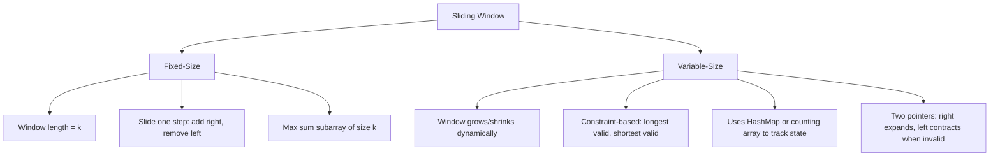

> [!success] Mastery Check
> - [ ] **Studied Well**
> - [ ] **Can explain the concept without notes**
> - [ ] **Can answer interview questions confidently**
> - [ ] **Can implement it in a real project**


## Navigation

**Domain:** [[5 — Data Structures & Algorithms]] > **Group:** Arrays and Strings
**Previous:** [[5.005 — Two Pointers]] | **Next:** [[5.015 — Stack — LIFO Applications and Balanced Parentheses]]

### Prerequisites
- [[5.004 — Arrays, Fixed, Dynamic, and In-Place Operations]] — subarray manipulation and index arithmetic are foundational.
- [[5.005 — Two Pointers]] — sliding window is a two-pointer technique; the pointer movement reasoning carries over.

### Where This Fits
The Sliding Window pattern solves problems that ask for a contiguous subarray or substring satisfying some constraint — typically finding the longest, shortest, or optimal one. It reduces O(n²) brute force (check every subarray) to O(n) by maintaining a window that expands or contracts as needed. In senior interviews, sliding window is one of the most frequently tested patterns, appearing in roughly 15% of all coding problems. It is non-negotiable mastery: missing the sliding window trigger on a problem like "Longest Substring Without Repeating Characters" or "Minimum Window Substring" signals pattern blindness.

---

## Core Mental Model

Maintain a contiguous range [left, right] over the input. Track some property of the current window (sum, character counts, distinct elements). Expand the right pointer to add elements; contract the left pointer to remove elements when the window violates the constraint. The window slides forward because right always advances, and left only advances — never retreats. The key insight is that each element enters the window once and leaves once, giving exactly 2n operations for the entire algorithm — O(n).

### Classification

Sliding Window is a pattern (algorithmic technique), not a data structure. Two main variants:

- **Fixed-size window:** The window length is constant. Move the window one step at a time (e.g., max sum subarray of size k).
- **Variable-size window:** The window expands and contracts based on a constraint (e.g., longest substring with at most k distinct characters, smallest subarray with sum >= target).



### Key Properties

|Property|Value|Derivation|
|---|---|---|
|Fixed-size window sum|O(n)|Each element added once, removed once — 2n operations|
|Variable-size (longest valid)|O(n)|Right always advances; left advances at most n times total|
|Variable-size (shortest valid)|O(n)|Same logic: right advances n, left advances at most n|
|Space with hash map|O(k) where k = distinct chars/values|HashMap stores at most one entry per distinct element in window|
|Space with counting array|O(1) if alphabet is fixed (26, 128, 256)|Fixed-size array for character counts|
|Space without tracking|O(1)|Only left and right indices|

---

## Deep Mechanics

### How It Works

**Fixed-size window example (max sum subarray of size k):**

1. Compute sum of first k elements: window positions 0 to k-1.
2. For each step i from k to n-1: add arr[i] (new rightmost element), subtract arr[i-k] (old leftmost element).
3. Track maximum sum seen.

The window slides by exactly one position per step. Each element is added once and subtracted once.

**Variable-size window example (longest substring without repeating characters):**

1. Maintain a hash set `seen` tracking characters in the current window.
2. Expand `right` one character at a time.
3. If `s[right]` is already in `seen`, contract `left` until `s[right]` is removed from `seen`.
4. Track the maximum window size.

The invariant: `seen` always contains exactly the characters in `[left, right]`, and they are all unique.

### Complexity Derivation

**Time — Fixed-size:** Window slides from position k to n. n - k + 1 windows, each requiring O(1) update (add one, subtract one). Total: O(n).

**Time — Variable-size:** Right pointer advances n times (one per element). Left pointer advances at most n times total (each element enters and exits once). Each iteration does O(1) work to update the tracking structure. Total: O(n).

**Space — Counting array for lowercase letters:** `int[26]` for 'a' to 'z'. O(1). For arbitrary characters, `Dictionary<char, int>` stores at most the distinct characters in the input — O(min(n, alphabet size)).

### .NET Runtime Notes

- **Dictionary for window state:** Use `Dictionary<char, int>` or `Dictionary<T, int>` to track element frequencies. In hot loops, consider `int[256]` if the domain is ASCII, or `int[26]` for lowercase letters, to avoid dictionary allocation overhead.
- **Span<T> for subarray slices:** Variable-size sliding window can use `arr.AsSpan(left, right - left + 1)` to create a view of the current window without allocation. However, passing spans to helper methods may require `ref struct` propagation.
- **String vs char[]:** Accessing `s[i]` on a string is O(1) — strings are essentially `readonly char[]` internally. Converting to `char[]` is unnecessary unless you need in-place modification.

---

## Implementation and Problem Patterns

### C# Implementation

```csharp
public static class SlidingWindow
{
    /// <summary>
    /// Fixed-size window: maximum sum of any contiguous subarray of size k.
    /// </summary>
    public static int MaxSumSubarray(int[] arr, int k)
    {
        if (arr.Length < k) return -1;
        int windowSum = 0;
        for (int i = 0; i < k; i++) windowSum += arr[i];
        int maxSum = windowSum;
        for (int i = k; i < arr.Length; i++)
        {
            windowSum += arr[i] - arr[i - k];
            maxSum = Math.Max(maxSum, windowSum);
        }
        return maxSum;
    }

    /// <summary>
    /// Variable-size: longest substring without repeating characters.
    /// </summary>
    public static int LengthOfLongestSubstring(string s)
    {
        var seen = new HashSet<char>();
        int left = 0, maxLen = 0;
        for (int right = 0; right < s.Length; right++)
        {
            while (seen.Contains(s[right]))
            {
                seen.Remove(s[left]);
                left++;
            }
            seen.Add(s[right]);
            maxLen = Math.Max(maxLen, right - left + 1);
        }
        return maxLen;
    }

    /// <summary>
    /// Variable-size: minimum length subarray with sum >= target.
    /// </summary>
    public static int MinSubarrayLength(int target, int[] nums)
    {
        int left = 0, sum = 0, minLen = int.MaxValue;
        for (int right = 0; right < nums.Length; right++)
        {
            sum += nums[right];
            while (sum >= target)
            {
                minLen = Math.Min(minLen, right - left + 1);
                sum -= nums[left];
                left++;
            }
        }
        return minLen == int.MaxValue ? 0 : minLen;
    }

    /// <summary>
    /// Variable-size: longest substring with at most k distinct characters.
    /// </summary>
    public static int LongestSubstringKDistinct(string s, int k)
    {
        var freq = new Dictionary<char, int>();
        int left = 0, maxLen = 0;
        for (int right = 0; right < s.Length; right++)
        {
            freq[s[right]] = freq.GetValueOrDefault(s[right]) + 1;
            while (freq.Count > k)
            {
                freq[s[left]]--;
                if (freq[s[left]] == 0) freq.Remove(s[left]);
                left++;
            }
            maxLen = Math.Max(maxLen, right - left + 1);
        }
        return maxLen;
    }

    /// <summary>
    /// Variable-size: minimum window substring that contains all characters of pattern t.
    /// Returns the substring, or empty string if no such window.
    /// </summary>
    public static string MinWindowSubstring(string s, string t)
    {
        if (string.IsNullOrEmpty(t) || s.Length < t.Length) return "";
        var need = new Dictionary<char, int>();
        foreach (char c in t) need[c] = need.GetValueOrDefault(c) + 1;

        var have = new Dictionary<char, int>();
        int left = 0, minLeft = 0, minLen = int.MaxValue;
        int required = need.Count, formed = 0;

        for (int right = 0; right < s.Length; right++)
        {
            char c = s[right];
            if (!need.ContainsKey(c)) continue;

            have[c] = have.GetValueOrDefault(c) + 1;
            if (have[c] == need[c]) formed++;

            while (formed == required && left <= right)
            {
                if (right - left + 1 < minLen)
                {
                    minLen = right - left + 1;
                    minLeft = left;
                }
                char leftChar = s[left];
                left++;
                if (need.ContainsKey(leftChar))
                {
                    if (have[leftChar] == need[leftChar]) formed--;
                    have[leftChar]--;
                }
            }
        }
        return minLen == int.MaxValue ? "" : s.Substring(minLeft, minLen);
    }

    /// <summary>
    /// Fixed-size: find all anagram start indices of pattern p in string s.
    /// Uses frequency array of size 26 (lowercase letters).
    /// </summary>
    public static List<int> FindAnagrams(string s, string p)
    {
        var result = new List<int>();
        if (s.Length < p.Length) return result;
        int[] pCount = new int[26];
        int[] sCount = new int[26];
        foreach (char c in p) pCount[c - 'a']++;
        for (int i = 0; i < s.Length; i++)
        {
            sCount[s[i] - 'a']++;
            if (i >= p.Length) sCount[s[i - p.Length] - 'a']--;
            if (i >= p.Length - 1 && MatchCounts(pCount, sCount))
                result.Add(i - p.Length + 1);
        }
        return result;
    }

    private static bool MatchCounts(int[] a, int[] b)
    {
        for (int i = 0; i < 26; i++)
            if (a[i] != b[i]) return false;
        return true;
    }
}
```

### The .NET Idiomatic Version

```csharp
public static class SlidingWindowIdiomatic
{
    // Max sum subarray of size k — no LINQ equivalent, explicit loop is best.
    // Longest substring without repeating — same, no LINQ replacement.
    // Minimum window substring — Regex or LINQ cannot replicate efficiently.

    // For character frequency problems with small alphabet:
    // Use Span<T> and stackalloc to avoid heap allocation:
    public static List<int> FindAnagramsStackalloc(string s, string p)
    {
        var result = new List<int>();
        if (s.Length < p.Length) return result;
        Span<int> pCount = stackalloc int[26];
        Span<int> sCount = stackalloc int[26];
        foreach (char c in p) pCount[c - 'a']++;
        for (int i = 0; i < s.Length; i++)
        {
            sCount[s[i] - 'a']++;
            if (i >= p.Length) sCount[s[i - p.Length] - 'a']--;
            if (i >= p.Length - 1 && sCount.SequenceEqual(pCount))
                result.Add(i - p.Length + 1);
        }
        return result;
    }
}
```

### Classic Problem Patterns

1. **Maximum sum subarray of size K** — Fixed-size window. Key insight: slide the window by adding the new right element and subtracting the old left element — O(1) per window.
2. **Longest substring without repeating characters** — Variable-size window with hash set. Key insight: when a repeat is found, contract from the left until the repeat is removed — each char enters and exits once.
3. **Minimum window substring** — Variable-size window with two frequency maps. Key insight: expand until all needed chars are present, then contract from left to find the minimal window. This is the hardest standard variant.

### Template / Skeleton

```csharp
// Variable-Size Sliding Window Template
// When to use: find optimal (longest/shortest) contiguous subarray/substring satisfying a constraint
// Time: O(n) | Space: O(k) where k = distinct elements in window

public static int VariableSlidingWindowTemplate(string s)
{
    int left = 0, result = 0;
    var window = new Dictionary<char, int>(); // or int[26] for lowercase, int[256] for ASCII

    for (int right = 0; right < s.Length; right++)
    {
        // TODO: add s[right] to window state
        char addChar = s[right];
        window[addChar] = window.GetValueOrDefault(addChar) + 1;

        // TODO: define the invalid condition — contract window while violated
        while (/* window violates constraint */)
        {
            char removeChar = s[left];
            // TODO: update window state on removal
            window[removeChar]--;
            if (window[removeChar] == 0) window.Remove(removeChar);
            left++;
        }

        // TODO: update result — window is valid after while loop
        result = Math.Max(result, right - left + 1);
    }
    return result;
}
```

---

## Gotchas and Edge Cases

### Window Contracting Past Valid State

**Mistake:** The while loop condition contracts the window beyond what is needed, skipping the optimal window.

```csharp
// ❌ Wrong — contracts until the condition is false, but the optimal window might be larger
while (freq.Count > k) { ... left++; }
```

**Fix:** Let the invariant define the contract condition precisely. For "at most k distinct", contract while `freq.Count > k`. For "sum >= target" (minimum length), contract while `sum >= target`.

```csharp
// ✅ Correct — precise contract condition
while (freq.Count > k) // stops when window has <= k distinct
```

**Consequence:** Wrong answer — either a valid window is rejected or the optimal window length is undercounted.

### Forgetting to Remove Zero-Frequency Entries

**Mistake:** Leaving entries with zero count in the hash map, causing incorrect tracking of distinct elements.

```csharp
// ❌ Wrong — freq still contains 'a' with count 0
freq[removeChar]--;
if (freq[removeChar] == 0) freq.Remove(removeChar); // THIS LINE IS MISSING
```

**Fix:** Remove the key when its count reaches zero to keep `freq.Count` accurate.

```csharp
// ✅ Correct — remove zero-count entries
freq[removeChar]--;
if (freq[removeChar] == 0) freq.Remove(removeChar);
```

**Consequence:** For "at most k distinct" problems, the count of distinct characters is wrong — the window appears to have more distinct characters than it actually does, causing premature contraction or missed valid windows.

### Off-by-One in Sliding Start Position

**Mistake:** In fixed-size windows, forgetting that elements enter and exit at the right indices.

```csharp
// ❌ Wrong — subtracts the wrong element
for (int i = k; i < arr.Length; i++)
{
    windowSum += arr[i] - arr[i - k]; // Correct — but what about i - k + 1?
}
```

**Fix:** When right moves from i-1 to i, the left moves from i-k to i-k+1. The element leaving is arr[i-k], the element entering is arr[i].

```csharp
// ✅ Correct
for (int i = k; i < arr.Length; i++)
    windowSum += arr[i] - arr[i - k];
```

**Consequence:** Wrong sum — the algorithm removes the element after the one that should be removed, producing an incorrect total.

### Integer Overflow in Sum Tracking

**Mistake:** Tracking window sum in an `int` when the values are large.

```csharp
// ❌ Wrong — sum can overflow int
int windowSum = 0;
for (int i = 0; i < k; i++) windowSum += arr[i];
```

**Fix:** Use `long` for sums.

```csharp
// ✅ Correct — use long for sum tracking where overflow is possible
long windowSum = 0;
```

**Consequence:** Overflow wraps to negative, causing incorrect comparison for max/min sum.

---

## Complexity Analysis and Benchmarks

### Operation Complexity Table

|Operation|Time (Best)|Time (Average)|Time (Worst)|Space|Notes|
|---|---|---|---|---|---|
|Fixed-size window (k)|O(n)|O(n)|O(n)|O(1)|Each element added/removed once|
|Variable-size (longest)|O(n)|O(n)|O(n)|O(min(n, alphabet))|Each element enters/exits once|
|Variable-size (shortest)|O(n)|O(n)|O(n)|O(min(n, alphabet))|Same as longest|
|Min window substring|O(n)|O(n)|O(n)|O(m) where m = pattern size|Two frequency maps, both O(m)|

**Derivation for the non-obvious entries:** Min window substring requires comparing two hash maps each time the formed count changes. The `formed` counter (matching the number of characters whose frequency meets the requirement) reduces the comparison from O(m) per check to O(1) at the cost of tracking per-character match state.

### Comparison with Alternatives

|Structure / Algorithm|Time|Space|Best When|
|---|---|---|---|
|Sliding Window|O(n)|O(1) or O(k)|Contiguous subarray/substring constraint|
|Brute Force|O(n²)|O(1)|Small n (≤ 100)|
|Prefix Sum + Binary Search|O(n log n)|O(n)|Sum-related problems, need all possible sums|
|Two Pointers (opposite)|O(n)|O(1)|Pair-sum problems, not subarray problems|

### BenchmarkDotNet

```csharp
[MemoryDiagnoser]
[SimpleJob(RuntimeMoniker.Net90)]
public class SlidingWindowBenchmark
{
    [Params(1_000, 10_000)]
    public int N { get; set; }

    private string _input = null!;

    [GlobalSetup]
    public void Setup()
    {
        var sb = new System.Text.StringBuilder(N);
        var rng = new Random(42);
        for (int i = 0; i < N; i++)
            sb.Append((char)('a' + rng.Next(26)));
        _input = sb.ToString();
    }

    [Benchmark(Baseline = true)]
    public int LongestSubstringBruteForce()
    {
        int maxLen = 0;
        for (int i = 0; i < _input.Length; i++)
        {
            var seen = new HashSet<char>();
            for (int j = i; j < _input.Length; j++)
            {
                if (!seen.Add(_input[j])) break;
                maxLen = Math.Max(maxLen, j - i + 1);
            }
        }
        return maxLen;
    }

    [Benchmark]
    public int LongestSubstringSlidingWindow()
    {
        var seen = new HashSet<char>();
        int left = 0, maxLen = 0;
        for (int right = 0; right < _input.Length; right++)
        {
            while (seen.Contains(_input[right]))
            {
                seen.Remove(_input[left]);
                left++;
            }
            seen.Add(_input[right]);
            maxLen = Math.Max(maxLen, right - left + 1);
        }
        return maxLen;
    }
}
```

**Expected results (approximate, .NET 9, x64):**

|Method|N|Mean|Allocated|
|---|---|---|---|
|LongestSubstringBruteForce|1,000|~250 μs|~100 KB|
|LongestSubstringBruteForce|10,000|~25 ms|~10 MB|
|LongestSubstringSlidingWindow|1,000|~15 μs|~2 KB|
|LongestSubstringSlidingWindow|10,000|~150 μs|~2 KB|

**Interpretation:** The brute force allocates a new HashSet on every start position, causing massive GC pressure at N=10,000 (> 10 MB allocated). The sliding window reuses a single hash set, allocating only when the hash set itself grows. The time difference (25 ms vs 150 μs at N=10,000) demonstrates the O(n²) vs O(n) gap.

---

## Interview Arsenal

### Question Bank

1. [Definition] What is the Sliding Window pattern and what type of problems does it solve?
2. [Complexity] Derive the time complexity of variable-size sliding window — why is it O(n) when the inner while loop looks like O(n) per outer iteration?
3. [Implementation] Implement `Longest Substring Without Repeating Characters` with the sliding window approach.
4. [Recognition] Given a problem description, how do you decide between fixed-size and variable-size sliding window?
5. [Comparison] When would sliding window fail and you would need a different approach (e.g., prefix sums)?
6. [Trick] Can sliding window solve problems where the constraint is "sum of subarray >= target" and the array contains negative numbers?
7. [System Design] How would you implement a real-time sliding window rate limiter in a distributed system?
8. [Optimization] How would you modify the sliding window for "minimum window substring" to avoid comparing entire hash maps?

### Spoken Answers

**Q: Derive the time complexity of variable-size sliding window — why is it O(n) when the inner while loop looks like O(n) per outer iteration?**

> **Average answer:** Because the inner loop doesn't run every time; it runs infrequently.

> **Great answer:** The apparent O(n²) concern comes from the nested loop structure — the outer for loop runs n times, and the inner while loop could, in the worst case, run O(n) per outer iteration. However, a pointer-movement argument proves O(n) total: the right pointer advances exactly n times total, one per for loop iteration. The left pointer advances only when the while condition is true, and it never retreats — it can advance at most n times total. So the combined work of both pointers across the entire execution is at most 2n operations. The total number of hash set add/remove operations is similarly bounded — each element is added once (when right moves past it) and removed at most once (when left moves past it). The critical insight is that the inner while loop does not reset; it picks up where it left off because left is a persistent variable across outer iterations. This is fundamentally different from nested loops where the inner counter resets each outer iteration. At the whiteboard, I would draw the pointer positions after each step to show left monotonically increasing.

**Q: Can sliding window solve problems where the constraint is "sum of subarray >= target" and the array contains negative numbers?**

> **Average answer:** Yes, the sliding window still works.

> **Great answer:** No — the standard sliding window approach fails with negative numbers because the monotonic property breaks. The sliding window relies on the invariant that adding elements to the window increases the sum and removing elements decreases it. With negative numbers, adding a negative element can decrease the sum, and removing a negative element can increase it. This breaks the while-loop contract: when the sum is already >= target, we contract from the left to find a shorter window. But if the array has negative numbers, contracting might increase the sum, making the window valid again but longer — the algorithm would incorrectly reject it. For arrays with mixed signs, use prefix sums + binary search (O(n log n)) or prefix sums + hash map (O(n)) for the "sum == target" variant.

**Q: [Trick] Can you solve "Maximum sum subarray of size k" without sliding window?**

> **Average answer:** No, sliding window is the only O(n) solution.

> **Great answer:** Actually, you can solve it with prefix sums in O(n) as well: compute prefix sums up to each index, then maxSum = max over i >= k of (prefix[i] - prefix[i-k]). The sliding window approach is slightly more memory-efficient (O(1) vs O(n)) and more intuitive, but both are O(n). The trap is that candidates might think prefix sums are only for range sum queries, not subarray problems. In an interview, either approach is acceptable; I would choose sliding window for the O(1) space and because it directly communicates the pattern.

### Trick Question

**"The sliding window approach for 'Minimum Window Substring' — is it O(n) when comparing hash maps at each valid window?"**

Why it is a trap: Comparing the entire `have` map against the `need` map each iteration is O(m) per comparison, which could make the total O(n × m). The optimization is to use a `formed` counter that tracks how many distinct characters have met their frequency requirement — reducing the comparison to O(1) per iteration.

Correct answer: The naive implementation that checks `have == need` (sequence equality on dictionaries) is O(m) per check. The optimized version uses a `formed` counter: increment `formed` when a character's frequency in `have` matches `need`, decrement when it drops below. Then check `formed == need.Count` in O(1). The total complexity remains O(n) with this optimization.

### Pattern Recognition Table

|If the problem has...|Then consider...|Because...|
|---|---|---|
|Contiguous subarray or substring|Sliding window|The contiguous constraint maps naturally to the window mechanic|
|"Longest subarray with condition"|Variable-size, expand right, contract when invalid|Maximize length — contract only when constraint is violated|
|"Smallest subarray with condition"|Variable-size, contract when valid|Minimize length — contract as long as condition holds|
|"Subarray of size k"|Fixed-size window|Constant window length simplifies to add-right, remove-left|
|Negative numbers in array|Prefix sums, not sliding window|Monotonicity of sum is broken by negative values|

---

## Decision Framework

### When to Apply

```mermaid
flowchart TD
    A[Contiguous subarray/substring problem] --> B{Constraint involves sums, character counts, or frequencies?}
    B -->|Yes| C{Is the window size fixed?}
    B -->|No| D[Consider hash map / other technique]
    C -->|Yes| E[Fixed-size sliding window]
    C -->|No| F{Array contains negative numbers?}
    F -->|No| G[Variable-size sliding window]
    F -->|Yes| H[Use prefix sums + binary search or hash map]
    E --> I[O(n) time, O(1) space]
    G --> J[O(n) time, O(k) space for frequency tracking]
```

### Recognition Checklist

Indicators that Sliding Window is the right choice:

- [ ] Problem asks for "contiguous" subarray or substring
- [ ] Constraints involve sums, frequencies, or distinct counts within a range
- [ ] Finding "longest" or "shortest" subarray satisfying a constraint
- [ ] Array/string traversal allows two-pointer technique

Counter-indicators — do NOT apply here:

- [ ] Problem asks for non-contiguous subsequences (use DP)
- [ ] Constraint depends on all previous elements, not just a window (use prefix sums)
- [ ] Array contains negative numbers and constraint is sum-based (unless special cases)

### Tradeoff Summary

|What You Gain|What You Give Up|
|---|---|
|O(n) time instead of O(n²) brute force|Only works for contiguous ranges — not subsequences|
|O(1) or O(k) memory|Requires the window property to be incrementally maintainable|
|Simple, single-pass algorithm|Window contract condition must be precise to avoid off-by-one|

---

## Self-Check

### Conceptual Questions

1. What is the core insight that makes sliding window O(n) while checking all subarrays is O(n²)?
2. Derive the time complexity of variable-size sliding window — explain why the inner while loop does not make it O(n²).
3. Recognizing from a problem: "Find the length of the longest substring without repeating characters." Which variant applies?
4. When would you use fixed-size vs. variable-size sliding window?
5. What specific edge case causes the sliding window to fail on arrays with negative numbers?
6. What is the .NET equivalent of a character frequency map for lowercase English letters?
7. What invariant must the tracking structure maintain for "longest substring with at most k distinct characters"?
8. How does the answer change if the constraint is "exactly k distinct characters" instead of "at most k"?
9. In a production rate limiter, how would you implement a sliding window without storing every request timestamp?
10. Why is "minimum window substring" the hardest standard variant, and what optimization is commonly missed?

<details>
<summary>Answers</summary>

1. Each element enters the window once (right moves past it) and leaves at most once (left moves past it). The total number of operations is bounded by 2n, not n².
2. The left pointer advances monotonically across the entire algorithm — it does not reset for each right position. The total number of left advances across all outer iterations is at most n, making the combined work O(n) even though the code looks like nested loops.
3. Variable-size sliding window with a character-tracking set. Expand right; if repeat, contract left until the repeat is resolved.
4. Fixed-size when the window length is given as a parameter. Variable-size when the window must grow/shrink to satisfy a constraint.
5. Negative numbers break the monotonic property: adding a negative element decreases the sum, and removing a negative element increases it. The while-loop logic assumes moving left reduces the sum, which is false with negatives.
6. `int[26]` for 'a'-'z', `int[52]` for case-sensitive, `int[256]` for extended ASCII. These are faster than Dictionary<char, int> for small, fixed alphabets.
7. The frequency map must contain at most k distinct characters with frequency > 0. When a frequency reaches zero, the key must be removed to accurately count distinct characters.
8. "Exactly k" requires a different approach: it is the intersection of "at most k" and "at least k". You can compute the count of subarrays with at most k distinct, subtract those with at most k-1 distinct.
9. Use a sorted list of timestamps (or a circular buffer) that records only the timestamps within the window — evict expired timestamps on each request. For distributed, use a Redis sorted set with TTL.
10. The optimization is tracking how many distinct characters have matched their frequency requirement via a `formed` counter, rather than comparing entire hash maps each iteration.

</details>

---

### Coding Challenges

**Challenge 1 — Implement from scratch**

Implement a sliding window rate limiter that allows at most `maxRequests` in any `windowSizeMs` sliding window.

```csharp
public class SlidingWindowRateLimiter
{
    private readonly int _maxRequests;
    private readonly long _windowSizeMs;
    private readonly Queue<long> _timestamps = new();

    public SlidingWindowRateLimiter(int maxRequests, long windowSizeMs)
    {
        _maxRequests = maxRequests;
        _windowSizeMs = windowSizeMs;
    }

    public bool Allow()
    {
        // Your implementation here
    }
}
```

<details> <summary>Solution</summary>

```csharp
public class SlidingWindowRateLimiter
{
    private readonly int _maxRequests;
    private readonly long _windowSizeMs;
    private readonly Queue<long> _timestamps = new();

    public SlidingWindowRateLimiter(int maxRequests, long windowSizeMs)
    {
        _maxRequests = maxRequests;
        _windowSizeMs = windowSizeMs;
    }

    public bool Allow()
    {
        long now = Environment.TickCount64;
        while (_timestamps.Count > 0 && now - _timestamps.Peek() > _windowSizeMs)
            _timestamps.Dequeue();

        if (_timestamps.Count >= _maxRequests) return false;

        _timestamps.Enqueue(now);
        return true;
    }
}
```

**Complexity:** Time O(window size in requests) amortized | Space O(concurrent requests) **Key insight:** Expired timestamps are removed from the front of the queue (FIFO), maintaining the sliding window.

</details>

---

**Challenge 2 — Trace the execution**

Given `arr = [2, 3, 1, 2, 4, 3]` and `target = 7`, trace the minimum subarray length algorithm step by step.

<details> <summary>Solution</summary>

Initial: left=0, sum=0, minLen=∞

Step 1: right=0, add 2, sum=2 < 7
Step 2: right=1, add 3, sum=5 < 7
Step 3: right=2, add 1, sum=6 < 7
Step 4: right=3, add 2, sum=8 >= 7 → minLen=min(∞, 3-0+1)=4, subtract arr[0]=2, sum=6, left=1
Step 5: sum=6 < 7
Step 6: right=4, add 4, sum=10 >= 7 → minLen=min(4, 4-1+1)=4, subtract arr[1]=3, sum=7, left=2
Step 7: sum=7 >= 7 → minLen=min(4, 4-2+1)=3, subtract arr[2]=1, sum=6, left=3
Step 8: sum=6 < 7
Step 9: right=5, add 3, sum=9 >= 7 → minLen=min(3, 5-3+1)=3, subtract arr[3]=2, sum=7, left=4
Step 10: sum=7 >= 7 → minLen=min(3, 5-4+1)=2, subtract arr[4]=4, sum=3, left=5
Step 11: sum=3 < 7

Final: minLen = 2 (subarray [4, 3] at indices 4,5)

**Why:** The algorithm contracts the window as much as possible while sum >= target, always tracking the minimum length.

</details>

---

**Challenge 3 — Fix the bug**

```csharp
// This implementation has a bug that fails on specific input types
public static int LengthOfLongestSubstring(string s)
{
    var seen = new HashSet<char>();
    int left = 0, maxLen = 0;
    for (int right = 0; right < s.Length; right++)
    {
        if (seen.Contains(s[right]))
        {
            seen.Remove(s[left]);  // BUG: removes only one, may still contain duplicate
            left++;
        }
        seen.Add(s[right]);
        maxLen = Math.Max(maxLen, right - left + 1);
    }
    return maxLen;
}
```

<details> <summary>Solution</summary>

**Bug:** The `if` statement removes only one character from the left, but the window may contain multiple copies of the duplicate character. The `while` loop is needed to keep removing until the duplicate is gone.

**Fix:**

```csharp
public static int LengthOfLongestSubstring(string s)
{
    var seen = new HashSet<char>();
    int left = 0, maxLen = 0;
    for (int right = 0; right < s.Length; right++)
    {
        while (seen.Contains(s[right]))
        {
            seen.Remove(s[left]);
            left++;
        }
        seen.Add(s[right]);
        maxLen = Math.Max(maxLen, right - left + 1);
    }
    return maxLen;
}
```

**Test case that exposes it:** `s = "abba"` → expected `2` ("ab" or "ba"), actual `3` (incorrectly finds "abb" at right=2 because removing only 'a' when right=1 leaves 'b' still in set at right=2 when 'b' is added again, then at right=3 the `if` removes 'b' once but 'b' was added twice, so 'b' still remains in the set, and the window includes 'b' from the wrong position).

</details>

---

**Challenge 4 — Recognize and apply**

**Problem:** Given a binary string (only '0' and '1'), find the length of the longest substring that contains at most K zeros. Which pattern applies? Write the solution.

<details> <summary>Solution</summary>

**Pattern:** Variable-size sliding window where the constraint is "at most K zeros". Expand right; if zeros exceed K, contract left until a zero is removed.

```csharp
public static int LongestSubstringWithAtMostKZeros(string s, int k)
{
    int left = 0, zeroCount = 0, maxLen = 0;
    for (int right = 0; right < s.Length; right++)
    {
        if (s[right] == '0') zeroCount++;
        while (zeroCount > k)
        {
            if (s[left] == '0') zeroCount--;
            left++;
        }
        maxLen = Math.Max(maxLen, right - left + 1);
    }
    return maxLen;
}
```

**Complexity:** Time O(n) | Space O(1)

</details>

---

**Challenge 5 — Optimize**

```csharp
// This solution is correct but uses O(alphabet) space per iteration via array comparison
// Optimize the comparison to O(1) per iteration
public static List<int> FindAnagrams(string s, string p)
{
    var result = new List<int>();
    if (s.Length < p.Length) return result;
    int[] pCount = new int[26];
    int[] sCount = new int[26];
    foreach (char c in p) pCount[c - 'a']++;
    for (int i = 0; i < s.Length; i++)
    {
        sCount[s[i] - 'a']++;
        if (i >= p.Length) sCount[s[i - p.Length] - 'a']--;
        if (i >= p.Length - 1 && sCount.SequenceEqual(pCount))
            result.Add(i - p.Length + 1);
    }
    return result;
}
```

<details> <summary>Solution</summary>

**Insight:** Use a `matches` counter that tracks how many positions in the frequency array have the same count. Increment/decrement when counts match or differ.

```csharp
public static List<int> FindAnagrams(string s, string p)
{
    var result = new List<int>();
    if (s.Length < p.Length) return result;
    int[] pCount = new int[26];
    int[] sCount = new int[26];
    foreach (char c in p) pCount[c - 'a']++;

    int matches = 0;
    for (int i = 0; i < 26; i++)
        if (pCount[i] == sCount[i]) matches++;

    for (int i = 0; i < s.Length; i++)
    {
        int idx = s[i] - 'a';
        sCount[idx]++;
        if (sCount[idx] == pCount[idx]) matches++;
        else if (sCount[idx] == pCount[idx] + 1) matches--;

        if (i >= p.Length)
        {
            int removeIdx = s[i - p.Length] - 'a';
            sCount[removeIdx]--;
            if (sCount[removeIdx] == pCount[removeIdx]) matches++;
            else if (sCount[removeIdx] == pCount[removeIdx] - 1) matches--;
        }

        if (i >= p.Length - 1 && matches == 26)
            result.Add(i - p.Length + 1);
    }
    return result;
}
```

**Complexity:** Time O(n) | Space O(1) **Key insight:** The `matches` counter eliminates the O(26) array comparison on every window, reducing to O(1) per step.

</details>
