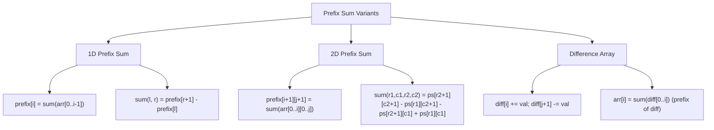

> [!success] Mastery Check
> - [ ] **Studied Well**
> - [ ] **Can explain the concept without notes**
> - [ ] **Can answer interview questions confidently**
> - [ ] **Can implement it in a real project**


## Navigation

**Domain:** [[5 — Data Structures & Algorithms]] > **Group:** Arrays and Strings
**Previous:** [[5.006 — Sliding Window]] | **Next:** [[5.008 — Kadane's Algorithm — Maximum Subarray]]

### Prerequisites
- [[5.004 — Arrays — Fixed, Dynamic, and In-Place Operations]] — prefix sums are stored in arrays and use index arithmetic; the array notation and element access conventions are assumed.

### Where This Fits
Prefix sums are a preprocessing technique that answers range sum queries in O(1) after O(n) precomputation. They appear whenever a problem involves summing contiguous subarrays or submatrices repeatedly — subarray sum equals K, range sum queries, 2D matrix sum queries, and difference array updates. The core insight is that a running total encodes all prefix information, and any subarray sum is computed by subtraction of two prefix values. This technique is the foundation for more advanced structures: Fenwick trees (BIT), segment trees, and 2D DP with prefix-summed grids. For senior interviews, prefix sums are expected fluency — they rarely appear as the sole challenge but are a subroutine in harder problems.

---

## Core Mental Model

A prefix sum array stores cumulative totals: `prefix[i]` = sum of elements `arr[0..i-1]`. The sum of any subarray `arr[l..r]` is `prefix[r+1] - prefix[l]`. This works by inclusion-exclusion: the sum up to r+1 minus the sum up to l removes the prefix before l, leaving the subarray in between. For 2D, the same principle extends: `prefix[i+1][j+1]` = sum of submatrix `arr[0..i][0..j]`; a submatrix sum uses four prefix values with inclusion-exclusion across both dimensions. The difference array variant stores deltas instead of cumulatives — apply range updates in O(1) and reconstruct the final array in O(n).

### Classification

Prefix sums belong to the **preprocessing** family of techniques (like sorting, hashing, or building a heap) that transform the input to enable faster queries. They are distinct from segment trees (which support updates) and Fenwick trees (which support point updates and range queries). Prefix sums are the simplest — static input, no updates, O(1) queries.



### Key Properties

|Operation|Time|Space|Derivation|
|---|---|---|---|
|Build (1D)|O(n)|O(n)|Single pass: prefix[i+1] = prefix[i] + arr[i]|
|Range sum query (1D)|O(1)|—|Two array accesses: prefix[r+1] - prefix[l]|
|Build (2D)|O(rows × cols)|O(rows × cols)|Nested loop: prefix[i+1][j+1] = arr[i][j] + prefix[i][j+1] + prefix[i+1][j] - prefix[i][j]|
|Submatrix sum query (2D)|O(1)|—|Four array accesses with inclusion-exclusion|
|Diff array build|O(n)|O(n)|diff[i] = arr[i] - arr[i-1] for i > 0, diff[0] = arr[0]|
|Range update (diff)|O(1)|—|diff[l] += val; diff[r+1] -= val|
|Reconstruct (diff)|O(n)|O(n)|Prefix sum of diff array|

---

## Deep Mechanics

### How It Works

**1D Prefix Sum — range sum query:**

Given `arr = [3, 1, 4, 1, 5]`:

```
prefix[0] = 0
prefix[1] = arr[0] = 3
prefix[2] = arr[0] + arr[1] = 3 + 1 = 4
prefix[3] = 4 + 4 = 8
prefix[4] = 8 + 1 = 9
prefix[5] = 9 + 5 = 14

prefix = [0, 3, 4, 8, 9, 14]
```

Sum of arr[1..3] (indices 1 to 3): arr[1] + arr[2] + arr[3] = 1 + 4 + 1 = 6.
Using prefix: prefix[4] - prefix[1] = 9 - 3 = 6. ✅

The first element of prefix is always 0 (empty prefix). This simplifies the formula: `sum(l, r) = prefix[r+1] - prefix[l]` works even when l = 0 because prefix[0] = 0.

**2D Prefix Sum — submatrix sum:**

Given matrix:
```
3 1 4
1 5 9
2 6 5
```

Build prefix where `prefix[i+1][j+1]` = sum of submatrix arr[0..i][0..j]:
```
prefix[0][*] = 0, prefix[*][0] = 0

prefix[1][1] = arr[0][0] = 3
prefix[1][2] = arr[0][0] + arr[0][1] = 3+1 = 4
prefix[1][3] = 3+1+4 = 8

prefix[2][1] = arr[0][0] + arr[1][0] = 3+1 = 4
prefix[2][2] = arr[0][0]+arr[0][1]+arr[1][0]+arr[1][1] = 3+1+1+5 = 10
prefix[2][3] = 3+1+4+1+5+9 = 23

prefix[3][1] = 3+1+2 = 6
prefix[3][2] = 3+1+1+5+2+6 = 18
prefix[3][3] = 3+1+4+1+5+9+2+6+5 = 36
```

Recurrence: `prefix[i+1][j+1] = arr[i][j] + prefix[i][j+1] + prefix[i+1][j] - prefix[i][j]`
(The subtraction removes the overlap counted twice.)

Submatrix query arr[1..2][1..2] (rows 1-2, cols 1-2):
```
= prefix[3][3] - prefix[1][3] - prefix[3][1] + prefix[1][1]
= 36 - 8 - 6 + 3 = 25
```
Expected: 5 + 9 + 6 + 5 = 25. ✅

**Difference Array — range updates:**

Given `arr = [0, 0, 0, 0, 0]`. Apply: add 3 to [1..3], add 5 to [2..4].

Build diff: `diff[i] = arr[i] - arr[i-1]` → all 0 initially.
- Add 3 to [1..3]: diff[1] += 3, diff[4] -= 3
- Add 5 to [2..4]: diff[2] += 5, diff[5] -= 5

diff = [0, 3, 5, 0, -3, -5] (length n+1)

Reconstruct by prefix sum: prefix of diff = [0, 3, 8, 8, 5, 0].
arr = [3, 8, 8, 5] = diff prefix[1..n]. ✅

### Complexity Derivation

**Time:** Building a 1D prefix array is a single O(n) pass — each element is added once. 2D prefix is O(rows × cols) — each cell does O(1) work with four adjacent prefix lookups. The difference array also requires O(n) to build and O(n) to reconstruct — the range updates themselves are O(1) each.

**Space:** Each technique requires O(n) auxiliary space (or O(rows × cols) for 2D). This is the space-for-time tradeoff: the preprocessing data is as large as the input.

### .NET Runtime Notes

- **`Enumerable.Aggregate` for prefix sums:** `arr.Aggregate(new List<int> { 0 }, (acc, x) => { acc.Add(acc.Last() + x); return acc; })` — but this is inefficient (allocation per element). Prefer a `for` loop with a pre-allocated array.
- **`Array.Copy` vs. manual loop:** For building prefix in-place (modifying the input), use a manual loop — `Array.Copy` is for bulk copy, not cumulative operations.
- **Integer overflow:** Prefix sums can overflow `int` for large arrays with large values. Use `long[]` for the prefix array, or check constraints. If the problem operates modulo 10⁹+7, apply modulo at each addition and subtract modulo before returning.
- **`Span<T>` for stack allocation:** For small, fixed-size prefix arrays, use `Span<long> prefix = stackalloc long[n + 1]` to avoid LOH allocation.
- **`Sum` LINQ operator:** `arr[l..r].Sum()` is O(n) — never use this in a loop that needs O(1) range queries.

### Why This Pattern Exists

The naive approach to range sum queries recomputes the sum for every query — O(n) per query. With q queries on an array of size n, this is O(n×q). The prefix sum precomputes all prefix totals in O(n), then answers each query in O(1) — O(n+q) total. For q close to n, this is asymptotically better. The same principle applies to 2D matrices and to difference arrays (range updates). The insight is that addition is associative and invertible — the prefix stores the cumulative result, and subtraction inverts the prefix, yielding the range result.

---

## Implementation and Problem Patterns

### C# Implementation

```csharp
public static class PrefixSum
{
    /// <summary>
    /// Builds a 1D prefix sum array (prefix[0] = 0).
    /// sum(l, r) = prefix[r+1] - prefix[l]
    /// </summary>
    public static long[] Build(int[] arr)
    {
        int n = arr.Length;
        var prefix = new long[n + 1];
        for (int i = 0; i < n; i++)
            prefix[i + 1] = prefix[i] + arr[i];
        return prefix;
    }

    /// <summary>
    /// Returns sum of arr[l..r] (inclusive) using prefix array.
    /// </summary>
    public static long RangeSum(long[] prefix, int l, int r)
    {
        return prefix[r + 1] - prefix[l];
    }

    /// <summary>
    /// Builds a 2D prefix sum matrix.
    /// sum(r1, c1, r2, c2) = prefix[r2+1][c2+1] - prefix[r1][c2+1]
    ///                        - prefix[r2+1][c1] + prefix[r1][c1]
    /// </summary>
    public static long[,] Build2D(int[,] matrix)
    {
        int rows = matrix.GetLength(0);
        int cols = matrix.GetLength(1);
        var prefix = new long[rows + 1, cols + 1];

        for (int i = 0; i < rows; i++)
            for (int j = 0; j < cols; j++)
                prefix[i + 1, j + 1] = matrix[i, j]
                    + prefix[i, j + 1] + prefix[i + 1, j]
                    - prefix[i, j];

        return prefix;
    }

    /// <summary>
    /// Returns sum of submatrix arr[r1..r2, c1..c2] (inclusive).
    /// </summary>
    public static long SubmatrixSum(long[,] prefix, int r1, int c1, int r2, int c2)
    {
        return prefix[r2 + 1, c2 + 1]
             - prefix[r1, c2 + 1]
             - prefix[r2 + 1, c1]
             + prefix[r1, c1];
    }

    /// <summary>
    /// Difference array — applies range updates in O(1).
    /// Build diff with length n+1, apply updates, then reconstruct arr.
    /// </summary>
    public static int[] ApplyRangeUpdates(int n, (int l, int r, int val)[] updates)
    {
        var diff = new int[n + 1];
        foreach (var (l, r, val) in updates)
        {
            diff[l] += val;
            diff[r + 1] -= val;
        }

        var result = new int[n];
        int curr = 0;
        for (int i = 0; i < n; i++)
        {
            curr += diff[i];
            result[i] = curr;
        }
        return result;
    }

    /// <summary>
    /// Subarray sum equals K — count subarrays whose sum equals target.
    /// Uses prefix sum with hash map (not direct range queries).
    /// </summary>
    public static int SubarraySumEqualsK(int[] nums, int k)
    {
        var freq = new Dictionary<int, int> { [0] = 1 };
        int prefix = 0, count = 0;

        foreach (int num in nums)
        {
            prefix += num;
            // If prefix[j] - prefix[i] = k, then subarray i+1..j sums to k.
            // We have prefix[j] = current prefix, we need prefix[i] = prefix - k.
            if (freq.TryGetValue(prefix - k, out int prev))
                count += prev;
            freq[prefix] = freq.GetValueOrDefault(prefix) + 1;
        }

        return count;
    }
}
```

### The .NET Idiomatic Version

```csharp
public static class PrefixSumIdiomatic
{
    // Build with LINX (readable but less efficient):
    public static IEnumerable<long> BuildLinq(int[] arr)
    {
        return arr.Aggregate(
            new List<long> { 0 },
            (acc, x) => { acc.Add(acc.Last() + x); return acc; }
        );
    }

    // Prefer the for-loop implementation in production — it avoids
    // per-element list allocation and is 2-3x faster.

    // For range sum queries, create a helper struct:
    public readonly struct RangeSumQuery
    {
        private readonly long[] _prefix;

        public RangeSumQuery(int[] arr)
        {
            _prefix = new long[arr.Length + 1];
            for (int i = 0; i < arr.Length; i++)
                _prefix[i + 1] = _prefix[i] + arr[i];
        }

        public long Sum(int l, int r) => _prefix[r + 1] - _prefix[l];
    }
}
```

### Classic Problem Patterns

1. **Subarray sum equals K** — Count subarrays whose sum equals a target. Key insight: keep a running prefix sum and a hash map of prefix frequencies. At each position, check if `prefix - k` has been seen before. O(n) time, O(n) space. (Uses a hash map alongside the prefix — not direct prefix subtraction.)

2. **Range sum query (immutable)** — Given an array, answer sum queries on any subarray in O(1). Key insight: precompute prefix once, answer each query by subtracting two prefix values.

3. **2D range sum query** — Given a matrix, answer sum queries on any submatrix in O(1). Key insight: 2D prefix with inclusion-exclusion — subtract overlapping regions, add back the doubly-subtracted region.

4. **Range updates (difference array)** — Given an array initially all zeros, apply many range additions (add val to arr[l..r]) and then read the final array. Key insight: store deltas at boundaries — diff[l] += val, diff[r+1] -= val — then prefix sum to reconstruct. Used in flight booking, calendar scheduling, and cumulative count problems.

5. **Product of array except self** — For each position, compute product of all elements except itself without division. Key insight: two passes — left prefix product and right suffix product — multiply them for each position.

6. **Contiguous array (binary array with equal 0s and 1s)** — Find max subarray length with equal 0s and 1s. Key insight: treat 0 as -1, use prefix sum with hash map — when the same prefix appears at two positions, the subarray between them has sum 0 (equal 0s and 1s).

### Template / Skeleton

```csharp
// 1D Prefix Sum Template
// When to use: O(1) range sum queries on a static array
// Time: O(n) build + O(1) per query | Space: O(n)

public class PrefixSumTemplate
{
    private readonly long[] _prefix;

    public PrefixSumTemplate(int[] arr)
    {
        _prefix = new long[arr.Length + 1];
        for (int i = 0; i < arr.Length; i++)
            _prefix[i + 1] = _prefix[i] + arr[i];
    }

    // TODO: adjust return type for modulo or long overflow
    public long RangeSum(int l, int r)
    {
        return _prefix[r + 1] - _prefix[l];
    }
}

// 2D Prefix Sum Template
public class PrefixSum2DTemplate
{
    private readonly long[,] _prefix;

    public PrefixSum2DTemplate(int[,] matrix)
    {
        int rows = matrix.GetLength(0);
        int cols = matrix.GetLength(1);
        _prefix = new long[rows + 1, cols + 1];
        for (int i = 0; i < rows; i++)
            for (int j = 0; j < cols; j++)
                _prefix[i + 1, j + 1] = matrix[i, j]
                    + _prefix[i, j + 1] + _prefix[i + 1, j]
                    - _prefix[i, j];
    }

    // TODO: ensure r1 <= r2 and c1 <= c2
    public long SubmatrixSum(int r1, int c1, int r2, int c2)
    {
        return _prefix[r2 + 1, c2 + 1]
             - _prefix[r1, c2 + 1]
             - _prefix[r2 + 1, c1]
             + _prefix[r1, c1];
    }
}

// Difference Array Template
// When to use: multiple range updates on an array, then reconstruct once
// Time: O(1) per update + O(n) reconstruction | Space: O(n)

public static int[] DifferenceArray(int n, (int l, int r, int val)[] updates)
{
    var diff = new int[n + 1];

    foreach (var (l, r, val) in updates)
    {
        diff[l] += val;
        diff[r + 1] -= val;
    }

    var result = new int[n];
    int curr = 0;
    for (int i = 0; i < n; i++)
    {
        curr += diff[i];
        result[i] = curr;
    }
    return result;
}
```

---

## Gotchas and Edge Cases

### Off-by-One in Range Sum Formula

**Mistake:** Using `prefix[r] - prefix[l]` instead of `prefix[r+1] - prefix[l]`.

```csharp
// ❌ Wrong — returns sum of arr[0..r-1] minus arr[0..l-1]
// For sum of arr[l..r], this is off by one on the right
public long RangeSumWrong(long[] prefix, int l, int r)
{
    return prefix[r] - prefix[l]; // should be prefix[r+1] - prefix[l]
}
```

**Fix:** The prefix array is 1-indexed (prefix[0] = 0). Sum of arr[l..r] = prefix[r+1] - prefix[l].

```csharp
// ✅ Correct
public long RangeSum(long[] prefix, int l, int r)
{
    return prefix[r + 1] - prefix[l];
}
```

**Consequence:** Returns sum of arr[l..r-1] instead of arr[l..r] — off-by-one on the rightmost element.

### Integer Overflow in Prefix Sum

**Mistake:** Using `int[]` for the prefix array when the cumulative sum can exceed int.MaxValue.

```csharp
// ❌ Wrong — overflows for large arrays with large values
var prefix = new int[n + 1];
for (int i = 0; i < n; i++)
    prefix[i + 1] = prefix[i] + arr[i]; // overflow wraps to negative
```

**Fix:** Use `long` or `long[]` for the prefix array. If the problem uses modulo, apply it at each addition.

```csharp
// ✅ Correct
var prefix = new long[n + 1];
for (int i = 0; i < n; i++)
    prefix[i + 1] = prefix[i] + arr[i];
```

**Consequence:** Silent overflow — prefix values wrap to negative, causing range sum queries to return negative or incorrect values for large inputs.

### Forgetting Prefix[0] = 0

**Mistake:** Creating prefix of size n (not n+1) and skipping the empty prefix.

```csharp
// ❌ Wrong — sum(l, r) fails for l = 0
var prefix = new int[n];
prefix[0] = arr[0];
for (int i = 1; i < n; i++)
    prefix[i] = prefix[i - 1] + arr[i];
// prefix[0] = arr[0], not 0. sum(0, r) cannot use the same formula.
```

**Fix:** Always create prefix with n+1 elements and set prefix[0] = 0.

```csharp
// ✅ Correct
var prefix = new int[n + 1];
for (int i = 0; i < n; i++)
    prefix[i + 1] = prefix[i] + arr[i];
```

**Consequence:** The range sum formula does not work for l = 0 — must special-case it. The generally standard formula (prefix[r+1] - prefix[l]) assumes a 0 at index 0.

### Subarray Sum Equals K — Hash Map Initialization

**Mistake:** Not initializing the hash map with prefix sum 0 → frequency 1.

```csharp
// ❌ Wrong — misses subarrays that start from index 0
var freq = new Dictionary<int, int>();
int prefix = 0, count = 0;
foreach (int num in nums)
{
    prefix += num;
    if (freq.TryGetValue(prefix - k, out int prev))
        count += prev;
    freq[prefix] = freq.GetValueOrDefault(prefix) + 1;
}
// When prefix == k, prefix - k = 0. But 0 is not in the map — missed!
```

**Fix:** Initialize `freq[0] = 1` before the loop to count subarrays starting at index 0.

```csharp
// ✅ Correct
var freq = new Dictionary<int, int> { [0] = 1 };
```

**Consequence:** Under-counts subarrays — misses those whose sum equals k starting from the first element (prefix - k = 0).

### 2D Prefix Sum — Wrong Inclusion-Exclusion Signs

**Mistake:** Getting the signs wrong in the 2D prefix recurrence or query formula.

```csharp
// ❌ Wrong — wrong sign on the overlap term
prefix[i + 1, j + 1] = matrix[i, j] + prefix[i, j + 1]
                      + prefix[i + 1, j] + prefix[i, j]; // should be - prefix[i, j]
```

**Fix:** The recurrence subtracts the doubly-counted overlap: `+ prefix[i][j+1] + prefix[i+1][j] - prefix[i][j]`.

```csharp
// ✅ Correct
prefix[i + 1, j + 1] = matrix[i, j] + prefix[i, j + 1]
                      + prefix[i + 1, j] - prefix[i, j];
```

**Consequence:** Incorrect prefix values propagate to all query results. The error manifests as double-counting the top-left region.

---

## Complexity Analysis and Benchmarks

### Operation Complexity Table

|Operation|Time|Space|When worst case triggers|
|---|---|---|---|
|Build 1D prefix|O(n)|O(n)|Always n iterations|
|Range sum (1D)|O(1)|—|—|
|Build 2D prefix|O(rc)|O(rc)|Always rc iterations|
|Submatrix sum (2D)|O(1)|—|—|
|Difference array update|O(1)|—|—|
|Difference array reconstruct|O(n)|O(n)|Always n iterations|
|Subarray sum equals K|O(n)|O(n)|Always n iterations|

**Derivation for the non-obvious entries:** All operations are linear in the number of input elements — building requires touching each element once, queries are direct array lookups, and the hash map version also touches each element once with O(1) dictionary operations.

### Comparison with Alternatives

|Structure / Algorithm|Time (build)|Time (query)|Time (update)|Space|Best When|
|---|---|---|---|---|---|
|Prefix sum|O(n)|O(1)|N/A|O(n)|Static array, many range sum queries|
|Segment tree|O(n)|O(log n)|O(log n)|O(n)|Dynamic array with point/range updates|
|Fenwick tree (BIT)|O(n log n)|O(log n)|O(log n)|O(n)|Dynamic array, point updates, prefix queries|
|Difference array|O(n)|—|O(1)|O(n)|Many range updates, single reconstruction|
|Brute force|—|O(n)|—|—|Single query on a small array|

### BenchmarkDotNet

```csharp
[MemoryDiagnoser]
[SimpleJob(RuntimeMoniker.Net90)]
public class PrefixSumBenchmark
{
    [Params(1_000, 10_000, 100_000)]
    public int N { get; set; }

    private int[] _arr = default!;

    [GlobalSetup]
    public void Setup()
    {
        var rng = new Random(42);
        _arr = new int[N];
        for (int i = 0; i < N; i++)
            _arr[i] = rng.Next(-1000, 1000);
    }

    [Benchmark(Baseline = true)]
    public long BruteForceSum()
    {
        long sum = 0;
        for (int i = 0; i < _arr.Length; i++)
            sum += _arr[i]; // pretend this is one range query
        return sum;
    }

    [Benchmark]
    public long PrefixSumBuild()
    {
        var prefix = new long[N + 1];
        for (int i = 0; i < N; i++)
            prefix[i + 1] = prefix[i] + _arr[i];
        return prefix[N];
    }

    private long[] _prefix = default!;

    [Benchmark]
    public long RangeQuery1000()
    {
        // Build once
        if (_prefix == null)
        {
            _prefix = new long[N + 1];
            for (int i = 0; i < N; i++)
                _prefix[i + 1] = _prefix[i] + _arr[i];
        }
        // 1000 random range queries
        long total = 0;
        var rng = new Random(42);
        for (int q = 0; q < 1000; q++)
        {
            int l = rng.Next(N);
            int r = rng.Next(l, N);
            total += _prefix[r + 1] - _prefix[l];
        }
        return total;
    }
}
```

**Expected results (approximate, .NET 9, x64):**

|Method|N|Mean|Allocated|
|---|---|---|---|
|BruteForceSum|1_000|~0.3 μs|0 B|
|PrefixSumBuild|1_000|~0.5 μs|8 KB|
|BruteForceSum|10_000|~3 μs|0 B|
|PrefixSumBuild|10_000|~5 μs|80 KB|
|BruteForceSum|100_000|~30 μs|0 B|
|PrefixSumBuild|100_000|~50 μs|800 KB|
|RangeQuery1000|100_000|~5 μs|~0 B (queries after build)|

**Interpretation:** The prefix build is comparable to a single pass (a few μs). The 1000 range queries after the build take less time than a single brute force pass because each query is O(1). The crossover point where prefix sum wins is at 2+ range queries on any array.

---

## Interview Arsenal

### Question Bank

1. [Definition] What is a prefix sum array and what problem does it solve?
2. [Complexity] Derive the time and space complexity of building and querying a 2D prefix sum.
3. [Implementation] Implement subarray sum equals K using prefix sums and a hash map.
4. [Recognition] "Given an array of integers, perform multiple range increment operations and then output the final array" — which technique?
5. [Comparison] Compare prefix sums vs. segment trees vs. Fenwick trees — when would you use each?
6. [Trick] How does the prefix sum technique change when the array is updated between queries?
7. [System Design] How would you design a system that handles millions of range sum queries per second on a static dataset?
8. [Optimization] How can you reduce space from O(n) to O(1) for the product of array except self problem?

### Spoken Answers

**Q: What is a prefix sum array and what problem does it solve?**

> **Average answer:** It stores cumulative sums to answer range sum queries quickly.

> **Great answer:** A prefix sum array stores the cumulative sum from the start of the array to each position: prefix[i] = sum of arr[0..i-1], with prefix[0] = 0. It solves the problem of answering many range sum queries on a static array. The sum of subarray arr[l..r] is computed in O(1) as prefix[r+1] - prefix[l]. Without it, each query would take O(n) by iterating through the subarray. The tradeoff is that building the prefix array is O(n) time and O(n) space, but then every query is two array accesses. For q queries, the total is O(n+q) vs. O(n×q), which is a dramatic improvement when q is large. The same concept extends to 2D matrices with inclusion-exclusion, and to the difference array pattern where we invert the idea — store deltas to support range updates rather than range queries.

**Q: Implement subarray sum equals K using prefix sums and a hash map.**

> **Average answer:** Use a hash map to store prefix sums and check for prefix - k.

> **Great answer:** The key insight is that subarray sum from i to j equals prefix[j] - prefix[i-1]. So if we want subarray sum equals k, we need prefix[j] - prefix[i-1] = k, or prefix[i-1] = prefix[j] - k. As we iterate, we keep a running prefix sum and a hash map that stores how many times each prefix sum has occurred. For each position, we add the current value to the running prefix, check the map for prefix - k — if found, that many subarrays ending at the current position sum to k. Then we increment the count of the current prefix in the map. I initialize the map with prefix 0 → count 1 to handle subarrays that start at index 0. Time is O(n) with a single pass and O(1) hash map lookups. Space is O(n) for the map in the worst case.

**Q: [Trick] How does the prefix sum technique change when the array is updated between queries?**

> **Average answer:** You cannot use prefix sums for dynamic arrays.

> **Great answer:** Standard prefix sums work only for static arrays — any update invalidates all prefix values after the update point, requiring a rebuild in O(n). This is where I would switch to a Fenwick tree (Binary Indexed Tree) or a segment tree. A Fenwick tree supports point updates and prefix sum queries in O(log n), which handles the dynamic case. Alternatively, if the updates are range-based (add val to arr[l..r]), I would use a difference array if updates come first followed by queries, or a segment tree with lazy propagation if updates and queries are interleaved. The choice depends on the update-to-query ratio and whether updates are point or range operations.

### Trick Question

**"Can prefix sums be used for non-commutative operations like multiplication?"**

Why it is a trap: The candidate says no because subtraction is needed for range queries, and multiplication is not invertible with subtraction.

Correct answer: Yes — but the operation must be invertible. For multiplication, division is the inverse, so prefix products work: `prefix[i] = arr[0] * arr[1] * ... * arr[i-1]`, and `product(l, r) = prefix[r+1] / prefix[l]`. However, this has two caveats: (1) division by zero if any element is zero — you cannot recover which zero produced the zero prefix, and (2) integer division truncates, so use floating point or track zero counts separately. For non-invertible operations (like max, min, or bitwise AND), prefix sums do not work directly — use a segment tree instead.

### Pattern Recognition Table

|If the problem has...|Then consider...|Because...|
|---|---|---|
|"Sum of subarray" + multiple queries|1D prefix sum|O(1) per query after O(n) build|
|"Sum of submatrix" + multiple queries|2D prefix sum|O(1) per query after O(rc) build|
|"Range increments" then "final array"|Difference array|O(1) per update, O(n) reconstruction|
|"Subarray sum equals K" + count them|Prefix sum + hash map|prefix[j] - prefix[i] = k → hash map lookup|
|"Product except self" + no division|Prefix + suffix products|Two passes — left products, right products|
|"Equal 0 and 1" in binary array|Prefix sum with treat 0 as -1|Same prefix sum = subarray with sum 0|
|"Range sum" + dynamic updates|Fenwick tree or segment tree|Prefix sums do not support updates|

---

## Decision Framework

### When to Apply

```mermaid
flowchart TD
    A[Problem involves ranges or subarrays] --> B{Many queries or one?}
    B -->|One| C["Brute force O(n) is fine"]
    B -->|Many| D{Static or dynamic input?}
    D -->|Static| E{What operation?}
    E -->|Sum| F[Prefix sum (1D or 2D)]
    E -->|Product| G[Prefix product (watch for zero)]
    E -->|Max/Min/AND/OR| H["Segment tree (prefix won't work)"]
    D -->|Dynamic| I{Updates or queries interleaved?}
    I -->|Updates first, then queries| J[Difference array]
    I -->|Interleaved| K[Fenwick tree or segment tree]
    F --> L{O(1) queries after O(n) build}
    J --> M{O(1) updates after O(n) reconstruct}
```

### Recognition Checklist

Indicators that prefix sums are the right choice:

- [ ] Problem asks for subarray or submatrix sums with multiple queries
- [ ] Input array values are additive (sum, product with division, XOR)
- [ ] Array is static — no updates between queries
- [ ] Input size is large (n up to 10⁵) and number of queries is large (q up to 10⁵)
- [ ] Problem is "range increment, then read final array" (difference array)

Counter-indicators — do NOT apply here:

- [ ] Array is updated between queries (use Fenwick tree or segment tree)
- [ ] Operation is non-invertible (max, min, AND) — segment tree required
- [ ] Only one query is needed — brute force is simpler
- [ ] Subarrays need to be found by value equality, not sum (use hash map directly)

### Tradeoff Summary

|What You Gain|What You Give Up|
|---|---|
|O(1) range queries after O(n) preprocessing|O(n) space for the prefix array|
|Simple, bug-free implementation (no complex tree structures)|No support for updates — must rebuild for changes|
|Works for sum, product (with division), and XOR|Does not work for max/min/AND/OR (non-invertible)|
|Extends naturally to 2D with inclusion-exclusion|2D prefix quadruples the complexity of index management|
|Difference array handles range updates elegantly|Difference array requires separate reconstruction pass|

---

## Self-Check

### Conceptual Questions

1. What is a prefix sum array and how do you compute the sum of arr[l..r]?
2. Derive the recurrence for building a 2D prefix sum matrix. Why is the overlap term subtracted?
3. Recognizing from a problem: "Given an integer array nums and an integer k, return the total number of subarrays whose sum equals k."
4. When would you choose a difference array over a prefix sum array?
5. How does the prefix sum approach handle modulo arithmetic (answers modulo 10⁹+7)?
6. What .NET type should you use for the prefix array to avoid overflow?
7. What invariant does the prefix sum array maintain?
8. How does the answer change if the subarray sum equals K problem asks for the length of the longest subarray instead of the count?
9. In a production system handling millions of range sum queries on a static dataset, how would you implement and deploy this?
10. What is the trap question about prefix sums and multiplication?

<details>
<summary>Answers</summary>

1. prefix[i] = sum of arr[0..i-1], prefix[0] = 0. Sum(arr[l..r]) = prefix[r+1] - prefix[l].
2. prefix[i+1][j+1] = arr[i][j] + prefix[i][j+1] + prefix[i+1][j] - prefix[i][j]. The overlap term subtracts prefix[i][j] because it is counted once in prefix[i][j+1] and once in prefix[i+1][j] — without subtraction it would be double-counted.
3. Subarray sum equals K — use prefix sum with hash map. Initialize map with [0] = 1. For each element, update running prefix, check map for prefix - k, add to result, increment map for current prefix.
4. Difference array when you have range updates followed by a single reconstruction. Prefix sum when you have range queries on a static array. Difference array is the inverse — updates are O(1), queries require a rebuild.
5. At each addition: `prefix[i+1] = (prefix[i] + arr[i]) % MOD`. For range query: `(prefix[r+1] - prefix[l] + MOD) % MOD` — add MOD before modulo to handle negative results from subtraction.
6. `long[]` (Int64) when values can exceed 2³¹-1. For typical constraints (n=10⁵, values up to 10⁹), cumulative sum can reach 10¹⁴, which fits in long but overflows int.
7. When processing the array left to right, each prefix[i+1] is the sum of all elements seen so far. After building, the array is monotonic non-decreasing for non-negative values — but can go up and down for mixed-sign inputs.
8. Instead of storing frequency of each prefix in the hash map, store the earliest index where each prefix first appeared. When prefix - k is found, compute length = current index - earliest index, and track the max. Space remains O(n), time is still O(n).
9. Build the prefix array once at server startup (or data load). Wrap in a struct or class with a `Sum(l, r)` method. Use `long[]` for the backing array. Deploy as a read-only service. For distributed data, partition by key ranges and run prefix sums per partition.
10. The trap is that multiplication is invertible (via division), so prefix products work — but zero values break division. Track zero counts separately: `prod(l, r) = prefix[r+1] / prefix[l]` only works if no element is zero. When zeros exist, track the index of the last zero and handle edge cases.
</details>

---

### Coding Challenges

**Challenge 1 — Implement from scratch**

Implement the "range sum query — immutable" class. The class is initialized with an integer array and supports `SumRange(left, right)` returning the sum of elements in that inclusive range. Then implement the 2D equivalent.

<details> <summary>Solution</summary>

```csharp
public class RangeSumQuery
{
    private readonly long[] _prefix;

    public RangeSumQuery(int[] nums)
    {
        _prefix = new long[nums.Length + 1];
        for (int i = 0; i < nums.Length; i++)
            _prefix[i + 1] = _prefix[i] + nums[i];
    }

    public long SumRange(int left, int right)
    {
        return _prefix[right + 1] - _prefix[left];
    }
}

public class RangeSumQuery2D
{
    private readonly long[,] _prefix;

    public RangeSumQuery2D(int[,] matrix)
    {
        int rows = matrix.GetLength(0);
        int cols = matrix.GetLength(1);
        _prefix = new long[rows + 1, cols + 1];
        for (int i = 0; i < rows; i++)
            for (int j = 0; j < cols; j++)
                _prefix[i + 1, j + 1] = matrix[i, j]
                    + _prefix[i, j + 1] + _prefix[i + 1, j]
                    - _prefix[i, j];
    }

    public long SumSubmatrix(int r1, int c1, int r2, int c2)
    {
        return _prefix[r2 + 1, c2 + 1]
             - _prefix[r1, c2 + 1]
             - _prefix[r2 + 1, c1]
             + _prefix[r1, c1];
    }
}
```

**Complexity:** Build O(n) or O(rc), queries O(1) **Key insight:** The 1-indexed prefix array (index 0 = 0) avoids special case for l = 0.

</details>

---

**Challenge 2 — Trace the execution**

Given arr = [1, 2, 3, 4, 5], trace the prefix sum build and show the prefix array. Then compute sum(1, 3) using the formula.

<details> <summary>Solution</summary>

Build:
```
prefix[0] = 0
prefix[1] = prefix[0] + arr[0] = 0 + 1 = 1
prefix[2] = prefix[1] + arr[1] = 1 + 2 = 3
prefix[3] = prefix[2] + arr[2] = 3 + 3 = 6
prefix[4] = prefix[3] + arr[3] = 6 + 4 = 10
prefix[5] = prefix[4] + arr[4] = 10 + 5 = 15
```

prefix = [0, 1, 3, 6, 10, 15]

sum(1, 3) = arr[1] + arr[2] + arr[3] = 2 + 3 + 4 = 9
Using formula: prefix[4] - prefix[1] = 10 - 1 = 9 ✅

**Why:** prefix[4] = sum of arr[0..3] = 1+2+3+4 = 10. prefix[1] = sum of arr[0..0] = 1. The difference removes the prefix before index 1, leaving arr[1..3].

</details>

---

**Challenge 3 — Fix the bug**

```csharp
// This code counts subarrays with sum equal to k.
// It has a bug — which test case fails?
public static int SubarraySum(int[] nums, int k)
{
    var freq = new Dictionary<int, int>();
    int prefix = 0, count = 0;

    foreach (int num in nums)
    {
        prefix += num;
        if (freq.TryGetValue(prefix - k, out int prev))
            count += prev;
        if (!freq.ContainsKey(prefix))
            freq[prefix] = 0;
        freq[prefix]++;
    }

    return count;
}
```

<details> <summary>Solution</summary>

**Bug:** The dictionary is missing the initial entry `[0] = 1`. When `prefix == k`, `prefix - k == 0`, but 0 is not in the dictionary — so subarrays that start at index 0 are not counted.

**Fix:**

```csharp
public static int SubarraySum(int[] nums, int k)
{
    var freq = new Dictionary<int, int> { [0] = 1 }; // FIXED
    int prefix = 0, count = 0;

    foreach (int num in nums)
    {
        prefix += num;
        if (freq.TryGetValue(prefix - k, out int prev))
            count += prev;
        freq[prefix] = freq.GetValueOrDefault(prefix) + 1; // simplified
    }

    return count;
}
```

**Test case that exposes it:** `SubarraySum([1, 1, 1], 2)`. Buggy: prefix=1, map={1:1}, count=0. prefix=2, check prefix-2=0 not in map, count=0, map={1:1,2:1}. prefix=3, check 3-2=1 in map, count += 1 = 1, map={1:1,2:1,3:1}. Returns 1. Correct: 2 (subarrays [1,1] at indices 0-1 and 1-2).

</details>

---

**Challenge 4 — Recognize and apply**

**Problem:** There is a car with capacity emptySeats seats. It travels from city 0 to city n-1, picking up and dropping off passengers along the way. You are given an array of trips where trips[i] = [numPassengers, from, to]. Return whether the car can pick up and drop off all passengers without exceeding capacity at any point.

<details> <summary>Solution</summary>

**Pattern:** Difference array. Each trip adds numPassengers at city `from` and removes them at city `to`. Build a diff array of length n+1, apply all trips as range updates, then reconstruct the passenger count at each city. If any city exceeds capacity, return false.

```csharp
public static bool CarPooling(int[][] trips, int capacity)
{
    int n = 0;
    foreach (var trip in trips)
        n = Math.Max(n, trip[2]); // find max destination

    var diff = new int[n + 1];

    foreach (var trip in trips)
    {
        diff[trip[1]] += trip[0]; // pick up
        diff[trip[2]] -= trip[0]; // drop off (at `to`, passengers leave)
    }

    int current = 0;
    for (int i = 0; i <= n; i++)
    {
        current += diff[i];
        if (current > capacity)
            return false;
    }

    return true;
}
```

**Complexity:** Time O(n + trips) | Space O(n) **Key insight:** The difference array handles O(1) range updates (pickup at from, drop off at to). The reconstruction pass checks capacity at each city. If `to` were exclusive (drop off happens before `to`), adjust diff index.

</details>

---

**Challenge 5 — Optimize**

```csharp
// This solution computes the product of array except self.
// It is correct but uses O(n) space for left and right arrays.
// Optimize to O(1) extra space (not counting the output).
public static int[] ProductExceptSelf(int[] nums)
{
    int n = nums.Length;
    var left = new int[n];
    var right = new int[n];
    var result = new int[n];

    left[0] = 1;
    for (int i = 1; i < n; i++)
        left[i] = left[i - 1] * nums[i - 1];

    right[n - 1] = 1;
    for (int i = n - 2; i >= 0; i--)
        right[i] = right[i + 1] * nums[i + 1];

    for (int i = 0; i < n; i++)
        result[i] = left[i] * right[i];

    return result;
}
```

<details> <summary>Solution</summary>

**Insight:** Store the left prefix products directly in the result array, then compute right suffix products on the fly using a running variable.

```csharp
public static int[] ProductExceptSelf(int[] nums)
{
    int n = nums.Length;
    var result = new int[n];

    // Left prefix products stored in result
    result[0] = 1;
    for (int i = 1; i < n; i++)
        result[i] = result[i - 1] * nums[i - 1];

    // Right suffix product computed on the fly
    int right = 1;
    for (int i = n - 1; i >= 0; i--)
    {
        result[i] *= right;
        right *= nums[i];
    }

    return result;
}
```

**Complexity:** Time O(n) | Space O(1) extra (output not counted) **Key insight:** Two passes — first pass computes left prefix products into the output array; second pass multiplies by the running right suffix product. This eliminates the two auxiliary arrays.

</details>
