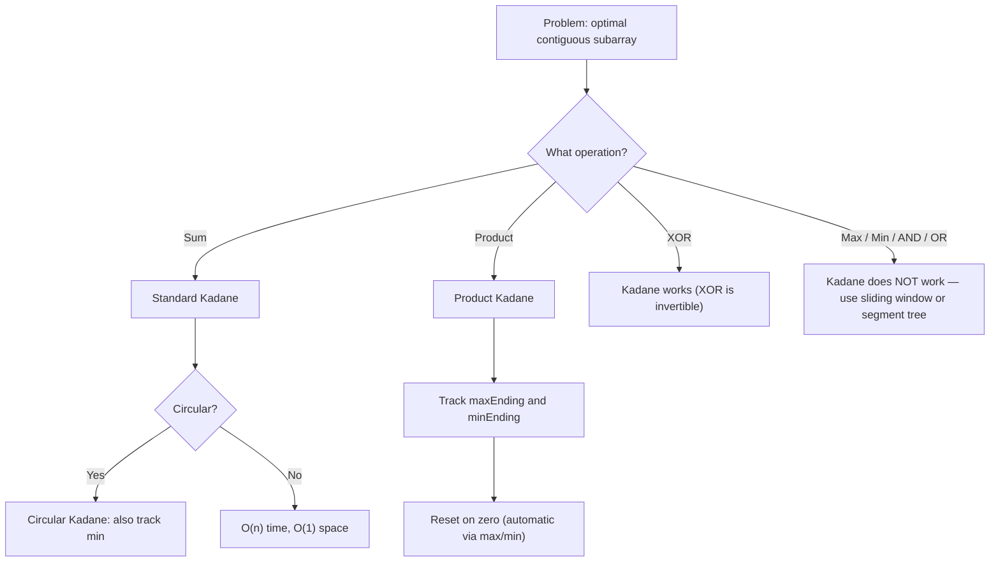

> [!success] Mastery Check
> - [ ] **Studied Well**
> - [ ] **Can explain the concept without notes**
> - [ ] **Can answer interview questions confidently**
> - [ ] **Can implement it in a real project**


## Navigation

**Domain:** [[5 — Data Structures & Algorithms]] > **Group:** Arrays and Strings
**Previous:** [[5.007 — Prefix Sums]] | **Next:** [[5.009 — String Manipulation and Pattern Problems]]

### Prerequisites
- [[5.004 — Arrays — Fixed, Dynamic, and In-Place Operations]] — Kadane's algorithm iterates over arrays with index tracking for subarray reconstruction.

### Where This Fits
Kadane's algorithm solves the maximum subarray sum problem — finding the contiguous subarray with the largest sum in O(n) time and O(1) space. It is the simplest example of a 1D DP problem where the state depends on a single previous value, and it appears in approximately one in five senior-level coding rounds, either directly or as a subroutine (maximum subarray sum, best time to buy and sell stock, maximum subarray sum with at most K deletions). The core insight — "decide at each element whether to extend the current subarray or start a new one" — is a decision pattern that generalizes to many optimal subsequence problems. Mastering Kadane's algorithm also means mastering the transition from the DP recurrence to the space-optimized iterative form, which is a prerequisite for understanding more complex 1D DP.

---

## Core Mental Model

Kadane's algorithm scans left to right, maintaining the maximum subarray sum ending at the current position (`currentMax`). At each element, there are exactly two choices: extend the existing subarray (add this element to `currentMax`) or start a new subarray at this element (discard `currentMax` and take just this element). The optimal choice is the larger of the two. The global maximum is tracked separately as the best seen so far (`globalMax`). The invariant: after processing position i, `currentMax` is the max subarray sum ending at i, and `globalMax` is the max subarray sum seen anywhere up to i. The underlying DP recurrence is `dp[i] = max(nums[i], dp[i-1] + nums[i])` — Kadane's algorithm is this recurrence with O(1) space.

### Classification

Kadane's algorithm is a **1D DP with space optimization** (rolling variable) and a **greedy-like decision per element** — choose the better of extending or restarting. It is not quite greedy (the decision is not myopic — extending depends on the past running sum), but it is not full DP either (only one previous state matters). The classification is sometimes called a **scanning algorithm** or **optimal substructure with constant window**.

```mermaid
graph LR
    A[Start: currentMax = nums[0], globalMax = nums[0]] --> B[For each next element nums[i]]
    B --> C{"currentMax + nums[i] > nums[i]?"}
    C -->|Yes, extend| D["currentMax = currentMax + nums[i]"]
    C -->|No, start new| E["currentMax = nums[i]"]
    D --> F["globalMax = max(globalMax, currentMax)"]
    E --> F
    F --> B
```

### Key Properties

|Property|Value|Derivation|
|---|---|---|
|Time complexity|O(n)|Single pass — exactly n iterations, O(1) work per iteration|
|Space complexity|O(1)|Two variables — currentMax and globalMax (four for circular variant)|
|DP state dimension|1|dp[i] depends only on dp[i-1] and nums[i] — constant window|
|Suitable input size|Any|O(n) time and O(1) space handles n up to 10⁹ (theoretically)|

---

## Deep Mechanics

### How It Works

**Standard Kadane's (max subarray sum):**

Given `nums = [-2, 1, -3, 4, -1, 2, 1, -5, 4]`:

```
i=0: nums[0] = -2
  currentMax = max(-2, 0 + -2) = -2
  globalMax = max(-inf, -2) = -2

i=1: nums[1] = 1
  currentMax = max(1, -2 + 1) = max(1, -1) = 1   ← start new at 1
  globalMax = max(-2, 1) = 1

i=2: nums[2] = -3
  currentMax = max(-3, 1 + -3) = max(-3, -2) = -2
  globalMax = max(1, -2) = 1

i=3: nums[3] = 4
  currentMax = max(4, -2 + 4) = max(4, 2) = 4     ← start new at 4
  globalMax = max(1, 4) = 4

i=4: nums[4] = -1
  currentMax = max(-1, 4 + -1) = max(-1, 3) = 3
  globalMax = max(4, 3) = 4

i=5: nums[5] = 2
  currentMax = max(2, 3 + 2) = max(2, 5) = 5
  globalMax = max(4, 5) = 5

i=6: nums[6] = 1
  currentMax = max(1, 5 + 1) = max(1, 6) = 6
  globalMax = max(5, 6) = 6

i=7: nums[7] = -5
  currentMax = max(-5, 6 + -5) = max(-5, 1) = 1
  globalMax = max(6, 1) = 6

i=8: nums[8] = 4
  currentMax = max(4, 1 + 4) = max(4, 5) = 5
  globalMax = max(6, 5) = 6
```

Result: globalMax = 6 (subarray [4, -1, 2, 1] at indices 3..6).

**Why the decision is correct:**

The DP recurrence `dp[i] = max(nums[i], dp[i-1] + nums[i])` captures the optimal subarray ending at i. If the best subarray ending at i-1 (dp[i-1]) has a positive contribution, extending it with nums[i] is beneficial. If dp[i-1] is negative, it drags down nums[i] — better to start fresh. Kadane's algorithm computes this recurrence with two variables instead of an array because dp[i] only depends on dp[i-1].

**Circular Kadane's (max subarray sum in a circular array):**

The maximum circular subarray is either the standard maximum (non-wrapping) or the total sum minus the minimum subarray sum (which represents the elements to exclude by wrapping around). Compute both the max subarray sum (standard Kadane) and the min subarray sum (Kadane's with sign flipped), then return `max(globalMax, totalSum - globalMin)`. Edge case: if all elements are negative, the maximum is the standard maximum (not empty).

**Maximum subarray product:**

Unlike sum, product has sign interactions — a negative product can become positive when multiplied by another negative. Track both the maximum and minimum (most negative) product ending at each position:

```
maxEnding = max(nums[i], maxEnding * nums[i], minEnding * nums[i])
minEnding = min(nums[i], maxEndingPrev * nums[i], minEnding * nums[i])
globalMax = max(globalMax, maxEnding)
```

The minimum is tracked because the most negative product can flip to the maximum when multiplied by a negative number.

### Complexity Derivation

**Time:** Each element is processed exactly once with O(1) arithmetic operations. Total: O(n). For circular Kadane's: two passes → O(n) + O(n) = O(n).

**Space:** Two variables for standard Kadane (currentMax, globalMax), four for the product variant (maxEnding, minEnding, globalMax, and a temp for the previous maxEnding). Always O(1).

### .NET Runtime Notes

- **`Math.Max` and `Math.Min` are intrinsic:** The JIT compiles these directly to CPU instructions — no function call overhead in hot loops.
- **`int` overflow:** If values can be large (n × max value > 2³¹-1), use `long` for currentMax and globalMax. Cast back to `int` at the end if return type requires.
- **LINQ is inappropriate:** `nums.Select((x, i) => ...).Max()` would require materializing all intermediate sums — defeating the O(1) space advantage.
- **`Aggregate` can express Kadane:** `nums.Aggregate((currMax: nums[0], globalMax: nums[0]), (acc, x) => { int curr = Math.Max(x, acc.currMax + x); return (curr, Math.Max(acc.globalMax, curr)); }).globalMax` — but this is less readable than a loop.

### Why This Pattern Exists

The naive approach computes the sum of every subarray — O(n³) with three nested loops (or O(n²) with prefix sums). Brute force enumerates all O(n²) subarrays, checking each in O(1) with a prefix sum, totaling O(n²). Kadane's algorithm exploits the observation that the optimal subarray ending at position i only depends on the optimal subarray ending at i-1 — it never needs to reconsider decisions from earlier than i-1. This is optimal substructure with a window of 1, which reduces the search space from O(n²) to O(n).

---

## Implementation and Problem Patterns

### C# Implementation

```csharp
public static class Kadane
{
    /// <summary>
    /// Maximum subarray sum — standard Kadane's algorithm.
    /// Returns the sum of the maximum contiguous subarray.
    /// </summary>
    public static int MaxSubarraySum(int[] nums)
    {
        int currentMax = nums[0];
        int globalMax = nums[0];

        for (int i = 1; i < nums.Length; i++)
        {
            currentMax = Math.Max(nums[i], currentMax + nums[i]);
            globalMax = Math.Max(globalMax, currentMax);
        }

        return globalMax;
    }

    /// <summary>
    /// Maximum subarray sum — also returns the start and end indices.
    /// </summary>
    public static (int sum, int start, int end) MaxSubarrayWithIndices(int[] nums)
    {
        int currentMax = nums[0];
        int globalMax = nums[0];
        int globalStart = 0, globalEnd = 0;
        int currentStart = 0;

        for (int i = 1; i < nums.Length; i++)
        {
            if (nums[i] > currentMax + nums[i])
            {
                currentMax = nums[i];
                currentStart = i;
            }
            else
            {
                currentMax = currentMax + nums[i];
            }

            if (currentMax > globalMax)
            {
                globalMax = currentMax;
                globalStart = currentStart;
                globalEnd = i;
            }
        }

        return (globalMax, globalStart, globalEnd);
    }

    /// <summary>
    /// Maximum subarray sum in a circular array.
    /// The subarray can wrap around from the end to the beginning.
    /// </summary>
    public static int MaxCircularSubarraySum(int[] nums)
    {
        int currentMax = nums[0], globalMax = nums[0];
        int currentMin = nums[0], globalMin = nums[0];
        int totalSum = nums[0];

        for (int i = 1; i < nums.Length; i++)
        {
            totalSum += nums[i];

            currentMax = Math.Max(nums[i], currentMax + nums[i]);
            globalMax = Math.Max(globalMax, currentMax);

            currentMin = Math.Min(nums[i], currentMin + nums[i]);
            globalMin = Math.Min(globalMin, currentMin);
        }

        // If all elements are negative, globalMax is the answer.
        if (globalMax < 0)
            return globalMax;

        return Math.Max(globalMax, totalSum - globalMin);
    }

    /// <summary>
    /// Maximum subarray product — handles sign flips.
    /// </summary>
    public static int MaxSubarrayProduct(int[] nums)
    {
        int maxEnding = nums[0];
        int minEnding = nums[0];
        int globalMax = nums[0];

        for (int i = 1; i < nums.Length; i++)
        {
            int prevMaxEnding = maxEnding;

            maxEnding = Math.Max(nums[i],
                Math.Max(prevMaxEnding * nums[i], minEnding * nums[i]));
            minEnding = Math.Min(nums[i],
                Math.Min(prevMaxEnding * nums[i], minEnding * nums[i]));

            globalMax = Math.Max(globalMax, maxEnding);
        }

        return globalMax;
    }
}
```

### The .NET Idiomatic Version

```csharp
public static class KadaneIdiomatic
{
    // Standard Kadane — manual loop is idiomatic.
    // No LINQ equivalent is preferable.

    // For maximum subarray sum, the built-in form is:
    public static int MaxSubarraySum(int[] nums)
    {
        return nums.Aggregate(
            (curr: nums[0], global: nums[0]),
            (acc, x) =>
            {
                int curr = Math.Max(x, acc.curr + x);
                return (curr, Math.Max(acc.global, curr));
            }).global;
    }

    // But the explicit loop is preferred for clarity and performance.
}
```

### Classic Problem Patterns

1. **Maximum subarray sum (LeetCode 53)** — Find the contiguous subarray with the largest sum. Key insight: dp[i] = max(nums[i], dp[i-1] + nums[i]). If dp[i-1] is negative, start fresh; otherwise extend.

2. **Maximum sum circular subarray (LeetCode 918)** — Maximum subarray sum in a circular array (can wrap). Key insight: the circular max is either the standard max or total sum minus the minimum subarray sum. Handle the all-negative case separately.

3. **Maximum subarray product (LeetCode 152)** — Maximum product subarray (handles negative numbers). Key insight: track both max and min ending at each position because a negative times a negative becomes positive.

4. **Best time to buy and sell stock (LeetCode 121)** — Max profit from a single transaction. Key insight: track the minimum price seen so far and the maximum difference (current price - min price). This is Kadane's applied to the difference array — max subarray of price differences.

5. **Maximum subarray sum with at most K deletions** — Extension where you can delete up to K elements. Key insight: use a 2D DP where dp[i][k] = max subarray sum ending at i with k deletions, or use Kadane's forward and backward to compute prefix and suffix max subarrays and find the best segment to skip.

### Template / Skeleton

```csharp
// Kadane's Algorithm Template
// When to use: find optimal contiguous subarray (max sum, min sum, max product)
// Time: O(n) | Space: O(1)

public static int KadaneTemplate(int[] nums)
{
    // TODO: initialize with first element
    int current = nums[0];
    int global = nums[0];

    for (int i = 1; i < nums.Length; i++)
    {
        // TODO: decide whether to extend or start new
        // For max sum: current = Math.Max(nums[i], current + nums[i])
        // For min sum: current = Math.Min(nums[i], current + nums[i])
        // For max product: (track both max and min current)
        current = Math.Max(nums[i], current + nums[i]);

        global = Math.Max(global, current); // or Math.Min for min
    }

    return global;
}
```

---

## Gotchas and Edge Cases

### All-Negative Input (Standard Kadane Returns Correctly)

**Mistake:** Initializing `currentMax` and `globalMax` to 0 instead of `nums[0]`.

```csharp
// ❌ Wrong — returns 0 for all-negative input, but max negative is the answer
int currentMax = 0, globalMax = 0;
for (int i = 0; i < nums.Length; i++)
{
    currentMax = Math.Max(0, currentMax + nums[i]); // resets to 0 every time
    globalMax = Math.Max(globalMax, currentMax);
}
```

**Fix:** Initialize with the first element. This ensures negative arrays return the largest (closest to zero) negative number.

```csharp
// ✅ Correct
int currentMax = nums[0], globalMax = nums[0];
for (int i = 1; i < nums.Length; i++)
{
    currentMax = Math.Max(nums[i], currentMax + nums[i]);
    globalMax = Math.Max(globalMax, currentMax);
}
```

**Consequence:** Returns 0 instead of the correct negative value for all-negative arrays (e.g., [-3, -2, -1] → returns 0 instead of -1).

### Circular Kadane — All-Negative Edge Case

**Mistake:** Returning `totalSum - globalMin` when all values are negative.

```csharp
// ❌ Wrong — for [-3, -2, -1], totalSum = -6, globalMin = -6,
// totalSum - globalMin = 0, but the correct answer is -1
int result = Math.Max(globalMax, totalSum - globalMin);
```

**Fix:** If `globalMax < 0`, all elements are negative — return `globalMax` directly.

```csharp
// ✅ Correct
if (globalMax < 0)
    return globalMax;
return Math.Max(globalMax, totalSum - globalMin);
```

**Consequence:** Returns 0 for all-negative circular arrays, but you cannot take an empty subarray — the problem requires a subarray of at least one element.

### Maximum Product Subarray — Reset on Zero

**Mistake:** Not handling zeros correctly — Kadane's for product must reset when encountering zero because any product ending at a zero is zero.

```csharp
// ❌ Wrong — for [2, 3, -2, 4, 0, 2, 5], the algorithm may not reset
// After zero, maxEnding and minEnding should reset to 0
```

**Fix:** The standard product Kadane handles this implicitly — `maxEnding = Math.Max(nums[i], Math.Max(prevMax * nums[i], minEnding * nums[i]))`. When `nums[i] = 0`, all three candidates are 0, so both `maxEnding` and `minEnding` become 0. The next element starts fresh from itself.

**Consequence:** The product variant naturally handles zeros without special casing — the max/min decisions reset when multiplied by zero.

### Forgetting That Kadane's Needs at Least One Element

**Mistake:** Not checking for empty input before calling Kadane's.

```csharp
// ❌ Wrong — IndexOutOfRangeException on nums[0]
public int MaxSubarraySum(int[] nums)
{
    int currentMax = nums[0]; // throws if nums is empty
    // ...
}
```

**Fix:** Handle empty input upfront.

```csharp
// ✅ Correct
if (nums == null || nums.Length == 0)
    throw new ArgumentException("Array must not be null or empty");
// or return 0 / int.MinValue depending on problem contract
```

**Consequence:** NullReferenceException or IndexOutOfRangeException for empty input, wasting time in an interview.

---

## Complexity Analysis and Benchmarks

### Operation Complexity Table

|Variant|Time|Space|Notes|
|---|---|---|---|
|Max subarray sum|O(n)|O(1)|Single pass, two variables|
|Max subarray with indices|O(n)|O(1)|Tracks start/end pointers|
|Circular max subarray|O(n)|O(1)|Two Kadane passes merged into one|
|Max subarray product|O(n)|O(1)|Tracks max and min ending simultaneously|
|Best time to buy/sell stock|O(n)|O(1)|Special case — Kadane on price differences|

**Derivation for the non-obvious entries:** All variants inspect each element exactly once and perform a constant number of operations (max/min, addition/multiplication). Circular version computes both max and min in a single pass by tracking four variables — still O(n) with O(1) space.

### Comparison with Alternatives

|Algorithm|Time|Space|Best When|
|---|---|---|---|
|Kadane's (single pass)|O(n)|O(1)|Maximum subarray sum or product|
|Brute force with prefix sums|O(n²)|O(n)|Learning/testing correctness on small n|
|Divide and conquer|O(n log n)|O(log n)|Learning the recurrence — not practical|
|2D DP with deletions|O(nk)|O(k)|Subarray sum with up to k deletions|
|Segment tree|O(n + q log n)|O(n)|Multiple range max-subarray queries (rare)|

### BenchmarkDotNet

```csharp
[MemoryDiagnoser]
[SimpleJob(RuntimeMoniker.Net90)]
public class KadaneBenchmark
{
    [Params(1_000, 10_000, 100_000)]
    public int N { get; set; }

    private int[] _nums = default!;

    [GlobalSetup]
    public void Setup()
    {
        var rng = new Random(42);
        _nums = new int[N];
        for (int i = 0; i < N; i++)
            _nums[i] = rng.Next(-1000, 1000);
    }

    [Benchmark(Baseline = true)]
    public int Kadane()
    {
        int current = _nums[0], global = _nums[0];
        for (int i = 1; i < _nums.Length; i++)
        {
            current = Math.Max(_nums[i], current + _nums[i]);
            global = Math.Max(global, current);
        }
        return global;
    }

    [Benchmark]
    public int BruteForcePrefix()
    {
        int n = _nums.Length;
        var prefix = new long[n + 1];
        for (int i = 0; i < n; i++)
            prefix[i + 1] = prefix[i] + _nums[i];
        long max = long.MinValue;
        for (int l = 0; l < n; l++)
            for (int r = l; r < n; r++)
                max = Math.Max(max, prefix[r + 1] - prefix[l]);
        return (int)max;
    }
}
```

**Expected results (approximate, .NET 9, x64):**

|Method|N|Mean|Allocated|
|---|---|---|---|
|Kadane|1_000|~0.3 μs|0 B|
|BruteForcePrefix|1_000|~500 μs|8 KB|
|Kadane|10_000|~3 μs|0 B|
|BruteForcePrefix|10_000|~50 ms|80 KB|
|Kadane|100_000|~30 μs|0 B|
|BruteForcePrefix|100_000|~5,000 ms|800 KB|

**Interpretation:** Kadane's algorithm is ~100,000x faster than brute force at n=100,000 (30 μs vs 5 seconds). The O(n²) brute force becomes unusable above n=10⁴. Kadane's O(n) with O(1) space handles any input size effortlessly.

---

## Interview Arsenal

### Question Bank

1. [Definition] What is Kadane's algorithm and what problem does it solve?
2. [Complexity] Derive the time and space complexity of maximum subarray sum using Kadane's algorithm.
3. [Implementation] Implement Kadane's algorithm for maximum subarray sum, including returning the start and end indices.
4. [Recognition] "Given an array of stock prices where you can buy once and sell once, maximize profit" — how does this relate to Kadane's?
5. [Comparison] Compare Kadane's algorithm vs. divide and conquer for maximum subarray — when would you use each?
6. [Trick] Why does Kadane's algorithm work for sum but not for non-invertible operations like max element in a subarray?
7. [System Design] How would you use Kadane's algorithm in a production system analyzing financial time series?
8. [Optimization] How do you extend Kadane's to handle the circular array case?

### Spoken Answers

**Q: What is Kadane's algorithm and what problem does it solve?**

> **Average answer:** It finds the maximum sum subarray in O(n) time.

> **Great answer:** Kadane's algorithm finds the contiguous subarray with the largest sum in a given array of integers, in O(n) time and O(1) space. The key insight is that we maintain two values as we scan — the maximum subarray sum ending at the current position (currentMax) and the global maximum seen so far (globalMax). At each element, we decide whether to extend the existing subarray by adding the current element or to start a new subarray at the current element — we take whichever gives a larger sum. This decision rule is derived from the DP recurrence dp[i] = max(nums[i], dp[i-1] + nums[i]), and Kadane's is the space-optimized version using a single variable instead of the full dp array because dp[i] only depends on dp[i-1]. The algorithm generalizes to circular arrays (single pass with both max and min Kadane) and to maximum subarray product (track both max and min to handle sign flips).

**Q: Implement Kadane's algorithm for maximum subarray sum, including returning the start and end indices.**

> **Average answer:** Uses two loops — one for currentMax and globalMax.

> **Great answer:** I will use a single pass. I initialize `currentMax = globalMax = nums[0]`, and also track `currentStart = 0`, `globalStart = 0`, `globalEnd = 0`. When iterating from i=1, I check if `nums[i] > currentMax + nums[i]` — if true, I start a new subarray at i by setting `currentMax = nums[i]` and `currentStart = i`. Otherwise, I extend by adding nums[i] to currentMax. After each update, if `currentMax > globalMax`, I update `globalMax = currentMax`, `globalStart = currentStart`, and `globalEnd = i`. The final result is the tuple `(globalMax, globalStart, globalEnd)`. This uses O(n) time and O(1) space, and correctly identifies the subarray boundaries even when there are ties (it returns the first or last occurrence depending on comparison — I use strict `>` so earlier subarrays are kept on ties).

**Q: [Trick] Why does Kadane's algorithm work for sum but not for non-invertible operations like max element in a subarray?**

> **Average answer:** Because sum is associative and invertible, and Kadane exploits the linear nature of addition.

> **Great answer:** Kadane's algorithm relies on the decision rule "is it better to extend or start fresh?" For sum, this decision is captured by the expression `max(nums[i], currentMax + nums[i])` — equivalently, "is currentMax positive?" If currentMax is negative, it contributes negatively to the future, so discarding it is beneficial. This works because addition is commutative and associative, and because the contribution of a prefix is fully captured by its sum — no other information matters. For max element in a subarray, the contribution of a prefix is not captured by a single number — you need to know the maximum value within it, which is not determined by an aggregate alone. Kadane's generalizes to any operation where (a) combining two values produces a new value, (b) you can decide whether a prefix is beneficial or detrimental from its combined value alone, and (c) the operation is invertible so the past can be discarded. Sum, product (with sign tracking), and XOR satisfy this. Max, min, AND, and OR do not.

### Trick Question

**"Is Kadane's algorithm a greedy algorithm or a dynamic programming algorithm?"**

Why it is a trap: It looks greedy (makes a local decision at each step), but it also looks like DP (has optimal substructure and a recurrence).

Correct answer: Kadane's algorithm is a **dynamic programming** algorithm with a constant-space optimization. The underlying recurrence is `dp[i] = max(nums[i], dp[i-1] + nums[i])`, which is a 1D DP with a window of 1. It is not greedy because the decision at position i depends on the computed result from i-1 (dp[i-1]), not on a global property or a heuristic. The term "greedy" implies a myopic choice without regard for future consequences — Kadane's decision accounts for the past but not the future, which is characteristic of DP with a one-step dependency. The practical implication: if you need to prove correctness, you should frame it as DP with the standard induction proof, not as a greedy choice property proof.

### Pattern Recognition Table

|If the problem has...|Then consider...|Because...|
|---|---|---|
|"Maximum subarray sum" + contiguous|Kadane's algorithm|Single pass with currentMax and globalMax|
|"Maximum profit" + single buy/sell|Kadane on price differences|Maximum subarray of the difference array|
|"Circular array" + maximum sum|Circular Kadane|max(standard, total - minimum)|
|"Maximum product" + contiguous|Product Kadane|Track both max and min ending|
|"Maximum subarray sum with K deletions"|2D DP with K states|Kadane's extended with a deletion dimension|

---

## Decision Framework

### When to Apply



### Recognition Checklist

Indicators that Kadane's algorithm is the right choice:

- [ ] Problem asks for maximum or minimum contiguous subarray sum/product/XOR
- [ ] The operation is invertible (sum, product, XOR)
- [ ] Subarray must be contiguous (not a subsequence)
- [ ] Input can be processed left to right in one pass
- [ ] Constraints suggest O(n) is required (n up to 10⁵ or higher)

Counter-indicators — do NOT apply here:

- [ ] Subarray does not need to be contiguous (use DP for subsequence)
- [ ] Operation is non-invertible (max, AND, OR — use sliding window or segment tree)
- [ ] Problem asks for subarray count (use prefix sum + hash map)
- [ ] Multiple queries on different subarrays (use segment tree)

### Tradeoff Summary

|What You Gain|What You Give Up|
|---|---|
|O(n) time — fastest possible for contiguous problems|Only works for sum, product, XOR — not max/min/AND/OR|
|O(1) space — no auxiliary structures|Cannot answer multiple arbitrary range queries (segment tree needed)|
|Simple, readable implementation|Does not easily handle non-contiguous variants (subsequence)|
|Easy extension to circular and product variants|Requires careful handling of all-negative edge cases|

---

## Self-Check

### Conceptual Questions

1. What recurrence does Kadane's algorithm implement?
2. Derive why Kadane's algorithm uses O(1) space instead of O(n).
3. Recognizing from a problem: "Given an array of stock prices where prices[i] is the price on day i, find the maximum profit from a single buy and sell transaction."
4. When would you choose Kadane's algorithm over divide and conquer for maximum subarray sum?
5. Why must you track both max and min for the maximum subarray product problem?
6. In .NET, what intrinsic does `Math.Max` compile to and why does it matter for Kadane's?
7. What invariant does the `currentMax` variable maintain after processing element i?
8. How does the solution change if the problem asks for the minimum subarray sum instead of the maximum?
9. In a production system analyzing financial data, how would you use Kadane's to detect unusual trading activity?
10. Is Kadane's algorithm greedy or DP? Explain why.

<details>
<summary>Answers</summary>

1. dp[i] = max(nums[i], dp[i-1] + nums[i]). dp[i] = max subarray sum ending at position i.
2. dp[i] depends only on dp[i-1] and nums[i] — a constant window of 1. No need to keep the full array. The space optimization replaces the dp array with a single rolling variable (currentMax).
3. Best time to buy and sell stock — compute the difference array (price[i] - price[i-1]), then apply Kadane's to find the maximum subarray sum. Or equivalently, track minPrice and maxProfit in one pass: `minPrice = min(minPrice, prices[i]); maxProfit = max(maxProfit, prices[i] - minPrice)`.
4. Kadane's is O(n) time and O(1) space vs. divide and conquer's O(n log n) time and O(log n) space (or O(n) with explicit stack). Use Kadane's always — it is simpler, faster, and uses less space. Divide and conquer is only useful as a theoretical comparison or when learning the Master Theorem.
5. Because a negative product can become the maximum when multiplied by another negative number. Tracking only the maximum would discard a large negative that later becomes large positive after a negative multiplier.
6. `Math.Max` is an intrinsic — the JIT compiles it to a single `cmp` + `cmov` (conditional move) CPU instruction in Release mode. No function call overhead, which makes Kadane's hot loop extremely fast.
7. After processing element i, `currentMax` is the maximum subarray sum that ends exactly at position i. It is the best value any subarray ending at i can produce.
8. Replace `Math.Max` with `Math.Min` in both the current and global updates: `currentMin = Math.Min(nums[i], currentMin + nums[i]); globalMin = Math.Min(globalMin, currentMin);`. The rest of the algorithm is identical.
9. Run Kadane's on daily returns (percentage changes). The maximum subarray sum identifies the period of strongest upward momentum; the minimum subarray sum identifies the strongest downward movement. Set alerts when the current subarray sum exceeds N standard deviations from the historical mean. The O(1) space and O(n) time make it feasible for real-time streaming data.
10. It is DP, not greedy. The recurrence `dp[i] = max(nums[i], dp[i-1] + nums[i])` is the defining characteristic of DP — optimal substructure (the optimal subarray ending at i depends on the optimal subarray ending at i-1) computed via a recurrence. Greedy would make a one-time irrevocable choice without considering subproblem solutions (like always taking positive sums). Kadane's re-evaluates at every position whether the past is beneficial — it never commits to a subarray permanently until the global max is updated.
</details>

---

### Coding Challenges

**Challenge 1 — Implement from scratch**

Implement Kadane's algorithm for the maximum subarray sum. Then extend it to also return the start and end indices of the maximum subarray.

<details> <summary>Solution</summary>

```csharp
public static int MaxSubarraySum(int[] nums)
{
    int currentMax = nums[0];
    int globalMax = nums[0];

    for (int i = 1; i < nums.Length; i++)
    {
        currentMax = Math.Max(nums[i], currentMax + nums[i]);
        globalMax = Math.Max(globalMax, currentMax);
    }

    return globalMax;
}

public static (int sum, int start, int end) MaxSubarrayWithIndices(int[] nums)
{
    int currentMax = nums[0];
    int globalMax = nums[0];
    int globalStart = 0, globalEnd = 0;
    int currentStart = 0;

    for (int i = 1; i < nums.Length; i++)
    {
        if (nums[i] > currentMax + nums[i])
        {
            currentMax = nums[i];
            currentStart = i;
        }
        else
        {
            currentMax = currentMax + nums[i];
        }

        if (currentMax > globalMax)
        {
            globalMax = currentMax;
            globalStart = currentStart;
            globalEnd = i;
        }
    }

    return (globalMax, globalStart, globalEnd);
}
```

**Complexity:** Time O(n) | Space O(1) **Key insight:** Track `currentStart` for the candidate subarray; only commit it to `globalStart` when `currentMax > globalMax`.

</details>

---

**Challenge 2 — Trace the execution**

Trace Kadane's algorithm on `nums = [-1, -2, 3, 4, -5, 6, -2, 1]`. Show currentMax and globalMax after each step.

<details> <summary>Solution</summary>

```
i=0: nums=-1, currentMax=-1, globalMax=-1
i=1: nums=-2, currentMax=max(-2, -1+-2)=max(-2,-3)=-2, globalMax=max(-1,-2)=-1
i=2: nums=3,  currentMax=max(3, -2+3)=max(3,1)=3,    globalMax=max(-1,3)=3
i=3: nums=4,  currentMax=max(4, 3+4)=max(4,7)=7,    globalMax=max(3,7)=7
i=4: nums=-5, currentMax=max(-5, 7+-5)=max(-5,2)=2, globalMax=max(7,2)=7
i=5: nums=6,  currentMax=max(6, 2+6)=max(6,8)=8,    globalMax=max(7,8)=8
i=6: nums=-2, currentMax=max(-2, 8+-2)=max(-2,6)=6, globalMax=max(8,6)=8
i=7: nums=1,  currentMax=max(1, 6+1)=max(1,7)=7,    globalMax=max(8,7)=8
```

Final globalMax = 8 (subarray [3, 4, -5, 6] at indices 2..5).

**Why:** At i=2, the algorithm correctly discards the negative prefix (-1, -2) and starts fresh at 3. At i=4, it extends through -5 because 7 + -5 = 2 is better than starting fresh at -5. At i=5, extending jumps to 8 (the global maximum).

</details>

---

**Challenge 3 — Fix the bug**

```csharp
// This implementation of maximum subarray sum has a bug.
// For which input does it return the wrong answer?
public static int MaxSubarraySum(int[] nums)
{
    int currentMax = 0;
    int globalMax = 0;

    for (int i = 0; i < nums.Length; i++)
    {
        currentMax = Math.Max(0, currentMax + nums[i]);
        globalMax = Math.Max(globalMax, currentMax);
    }

    return globalMax;
}
```

<details> <summary>Solution</summary>

**Bug:** `currentMax = Math.Max(0, currentMax + nums[i])` forces currentMax to reset to 0 whenever the running sum goes negative. This works for mixed arrays but fails for all-negative input — it returns 0 instead of the largest (closest to zero) negative number.

**Fix:**

```csharp
public static int MaxSubarraySum(int[] nums)
{
    int currentMax = nums[0];
    int globalMax = nums[0];

    for (int i = 1; i < nums.Length; i++)
    {
        currentMax = Math.Max(nums[i], currentMax + nums[i]);
        globalMax = Math.Max(globalMax, currentMax);
    }

    return globalMax;
}
```

**Test case that exposes it:** `MaxSubarraySum([-3, -2, -1])`. Buggy returns 0. Correct returns -1.

</details>

---

**Challenge 4 — Recognize and apply**

**Problem:** You are given a binary string s (containing only '0' and '1'). You may choose at most one substring and flip all the characters in that substring (0 → 1, 1 → 0). Return the maximum number of 1s you can have in the string after performing this operation at most once.

<details> <summary>Solution</summary>

**Pattern:** Kadane's algorithm applied to a transformed array. Define an array `gain` where `gain[i] = 1` if s[i] == '0' (flipping it turns 0 to 1, gaining one 1) and `gain[i] = -1` if s[i] == '1' (flipping it turns 1 to 0, losing one 1). The maximum gain from flipping is the maximum subarray sum of `gain` (Kadane's). Add the baseline count of 1s (without flipping) to the max gain.

```csharp
public static int MaxOnesAfterFlip(string s)
{
    int baseOnes = 0;
    int currentMax = 0, globalMax = 0;

    foreach (char c in s)
    {
        if (c == '1')
        {
            baseOnes++;
            // Flipping a 1 loses one 1
            int gain = -1;
            currentMax = Math.Max(gain, currentMax + gain);
        }
        else
        {
            // Flipping a 0 gains one 1
            int gain = 1;
            currentMax = Math.Max(gain, currentMax + gain);
        }
        globalMax = Math.Max(globalMax, currentMax);
    }

    return baseOnes + globalMax;
}
```

**Complexity:** Time O(n) | Space O(1) **Key insight:** Transform the flip operation into a gain array and find the maximum subarray — the subarray that provides the largest net increase in 1s when flipped.

</details>

---

**Challenge 5 — Optimize**

```csharp
// This solution finds the maximum sum of a subarray after removing
// at most one element. It is correct but uses O(n) space.
// Optimize to O(1) space.
public static int MaxSumAfterOneDeletion(int[] nums)
{
    int n = nums.Length;
    if (n == 0) return 0;

    var dpNoDelete = new int[n];
    var dpOneDelete = new int[n];
    dpNoDelete[0] = nums[0];
    dpOneDelete[0] = nums[0];
    int max = nums[0];

    for (int i = 1; i < n; i++)
    {
        dpNoDelete[i] = Math.Max(nums[i], dpNoDelete[i - 1] + nums[i]);
        dpOneDelete[i] = Math.Max(dpNoDelete[i - 1], dpOneDelete[i - 1] + nums[i]);
        max = Math.Max(max, Math.Max(dpNoDelete[i], dpOneDelete[i]));
    }

    return max;
}
```

<details> <summary>Solution</summary>

**Insight:** dpNoDelete[i] depends only on dpNoDelete[i-1], and dpOneDelete[i] depends only on dpNoDelete[i-1] and dpOneDelete[i-1]. Both have a window of 1 — replace the arrays with rolling variables.

```csharp
public static int MaxSumAfterOneDeletion(int[] nums)
{
    if (nums.Length == 0) return 0;

    int dpNoDeletePrev = nums[0];
    int dpOneDeletePrev = nums[0];
    int max = nums[0];

    for (int i = 1; i < nums.Length; i++)
    {
        int dpNoDeleteCurr = Math.Max(nums[i], dpNoDeletePrev + nums[i]);
        int dpOneDeleteCurr = Math.Max(dpNoDeletePrev, dpOneDeletePrev + nums[i]);
        max = Math.Max(max, Math.Max(dpNoDeleteCurr, dpOneDeleteCurr));
        dpNoDeletePrev = dpNoDeleteCurr;
        dpOneDeletePrev = dpOneDeleteCurr;
    }

    return max;
}
```

**Complexity:** Time O(n) | Space O(1) **Key insight:** The state has two dimensions — with or without a deletion — but each depends only on the same two states at i-1. This is a 2-state 1D DP that optimizes to O(1) space with two rolling variables.

</details>
