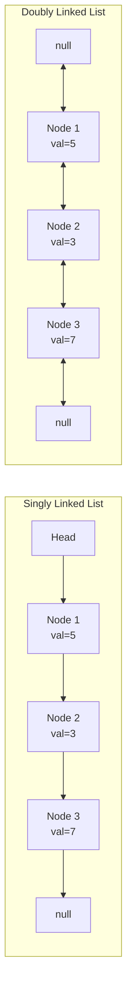

> [!success] Mastery Check
> - [ ] **Studied Well**
> - [ ] **Can explain the concept without notes**
> - [ ] **Can answer interview questions confidently**
> - [ ] **Can implement it in a real project**


## Navigation

**Domain:** [[5 — Data Structures & Algorithms]] > **Group:** Linked Lists
**Previous:** [[5.009 — String Manipulation and Pattern Problems]] | **Next:** [[5.011 — Fast and Slow Pointers — Floyd's Cycle Detection]]

### Prerequisites
- [[5.004 — Arrays — Fixed, Dynamic, and In-Place Operations]] — the core comparison between arrays and linked lists is cache locality, index access, and insertion/deletion tradeoffs; array mechanics are the baseline.

### Where This Fits
A linked list is a linear collection where each element (node) points to the next (and optionally the previous). Unlike arrays, linked lists offer O(1) insertion and deletion at known positions, O(1) head/tail access, and no wasted capacity from resizing. Their cost: O(n) access by index, poor cache locality (nodes are heap objects scattered in memory), and the overhead of per-element pointer storage. They appear in ~15% of coding interviews as the data structure itself (implement operations, detect cycles, reverse) and in production contexts where `LinkedList<T>` is used for LRU caches, navigation history, and queue-like structures requiring O(1) removal from both ends.

---

## Core Mental Model

A linked list is a chain of nodes. Each node is a separate heap object containing a value and one or two pointers (next, prev). The list is identified by a reference to the first node (head). The structural invariant is that following the next pointers from head traverses every element exactly once, ending at null. For doubly linked lists, a tail reference and prev pointers allow O(1) append and reverse traversal. The key interview insight: linked list problems are about pointer manipulation — every operation reduces to rerouting one to three pointers.

### Classification

Linked lists are a **linear data structure** in the **pointer-based** family. They satisfy `ICollection<T>` in .NET but not `IList<T>` (no index access).



### Key Properties

|Property|Singly Linked|Doubly Linked|Derivation|
|---|---|---|---|
|Access by index|O(n)|O(n)|Must traverse from head; no random access|
|Insert at head|O(1)|O(1)|Create node, point to old head|
|Insert at tail|O(n)|O(1)|Singly: traverse to end. Doubly: use tail pointer|
|Insert at known node|O(1)|O(1)|Reroute pointers of neighbors|
|Delete at head|O(1)|O(1)|Move head to head.next|
|Delete at tail|O(n)|O(1)|Singly: traverse to second-to-last. Doubly: use tail.prev|
|Search|O(n)|O(n)|Must traverse; no binary search|
|Space per element|1 value + 1 pointer|1 value + 2 pointers|Singly: ~16 bytes. Doubly: ~24 bytes (on x64)|

---

## Deep Mechanics

### How It Works

**Singly linked list insertion at head:**
1. Create a new node with the given value.
2. Set new node's next to current head.
3. Set head to the new node.

`newNode.next = head; head = newNode;` — O(1), always.

**Singly linked list deletion at head:**
1. Set head to head.next.
2. The old head is now unreferenced and will be GC'd.

`head = head.next;` — O(1), always.

**Singly linked list insertion after a given node:**
1. Create new node.
2. Set new node's next to given node's next.
3. Set given node's next to new node.

`newNode.next = node.next; node.next = newNode;` — O(1).

**Singly linked list deletion after a given node:**
1. Set given node's next to node.next.next (skipping the deleted node).

`node.next = node.next.next;` — O(1). But finding the node before the one to delete is O(n) if only the target node is known.

**Doubly linked list advantages:** Each node has a prev pointer. This makes deletion of a known node O(1) (update prev node's next and next node's prev), and reverse traversal is O(1) from the tail.

### Complexity Derivation

**Search:** In the worst case, the target is the last element or absent. Must traverse n nodes, each requiring a null check and value comparison. O(n) comparisons. For arrays, binary search is O(log n) — the linked list's inability to binary search is its fundamental weakness.

**Insert at known position:** Two pointer assignments (for singly linked). Each assignment is O(1) memory write. No shifting of elements (unlike arrays which require moving O(n) elements).

**Space per node:** In .NET x64, a `LinkedListNode<T>` object has: sync block index (8 bytes), method table pointer (8 bytes), value field (size of T), next pointer (8 bytes), prev pointer (8 bytes for doubly). Total: ~32 bytes + T size for a doubly linked node vs. 4 bytes for an int in an array.

### Why This Pattern Exists

The linked list solves the array's fundamental problem: O(n) insertion and deletion. Arrays store elements contiguously in memory, so inserting or deleting requires shifting all subsequent elements. Linked lists decouple the elements: each node is independently allocated and points to the next, so insertion is a local pointer change. The cost is locality: array elements are adjacent in memory (cache-friendly sequential access), while linked list nodes may be scattered across heap pages, causing a cache miss per node.

---

## Implementation and Problem Patterns

### C# Implementation

```csharp
public class ListNode
{
    public int Val { get; set; }
    public ListNode? Next { get; set; }

    public ListNode(int val) => Val = val;
}

public class DoublyListNode
{
    public int Val { get; set; }
    public DoublyListNode? Next { get; set; }
    public DoublyListNode? Prev { get; set; }

    public DoublyListNode(int val) => Val = val;
}

/// <summary>
/// Singly linked list implementation.
/// </summary>
public class SinglyLinkedList
{
    public ListNode? Head { get; private set; }

    public void AddFirst(int val)
    {
        var node = new ListNode(val) { Next = Head };
        Head = node;
    }

    public void AddLast(int val)
    {
        var node = new ListNode(val);

        if (Head == null)
        {
            Head = node;
            return;
        }

        var current = Head;
        while (current.Next != null)
            current = current.Next;

        current.Next = node;
    }

    public void AddAfter(ListNode target, int val)
    {
        var node = new ListNode(val) { Next = target.Next };
        target.Next = node;
    }

    public bool RemoveFirst()
    {
        if (Head == null) return false;
        Head = Head.Next;
        return true;
    }

    public bool Remove(int val)
    {
        if (Head == null) return false;
        if (Head.Val == val) { Head = Head.Next; return true; }

        var current = Head;
        while (current.Next != null && current.Next.Val != val)
            current = current.Next;

        if (current.Next == null) return false;
        current.Next = current.Next.Next;
        return true;
    }

    public ListNode? Find(int val)
    {
        var current = Head;
        while (current != null)
        {
            if (current.Val == val) return current;
            current = current.Next;
        }
        return null;
    }

    public int Count()
    {
        int count = 0;
        var current = Head;
        while (current != null) { count++; current = current.Next; }
        return count;
    }
}

/// <summary>
/// Doubly linked list implementation.
/// </summary>
public class DoublyLinkedList
{
    public DoublyListNode? Head { get; private set; }
    public DoublyListNode? Tail { get; private set; }

    public void AddFirst(int val)
    {
        var node = new DoublyListNode(val);
        if (Head == null)
        {
            Head = Tail = node;
            return;
        }

        node.Next = Head;
        Head.Prev = node;
        Head = node;
    }

    public void AddLast(int val)
    {
        var node = new DoublyListNode(val);
        if (Tail == null)
        {
            Head = Tail = node;
            return;
        }

        node.Prev = Tail;
        Tail.Next = node;
        Tail = node;
    }

    public bool Remove(DoublyListNode node)
    {
        if (node.Prev != null)
            node.Prev.Next = node.Next;
        else
            Head = node.Next;

        if (node.Next != null)
            node.Next.Prev = node.Prev;
        else
            Tail = node.Prev;

        return true;
    }

    public bool RemoveFirst()
    {
        if (Head == null) return false;
        Remove(Head);
        return true;
    }

    public bool RemoveLast()
    {
        if (Tail == null) return false;
        Remove(Tail);
        return true;
    }
}
```

### The .NET Idiomatic Version

.NET provides `LinkedList<T>` (doubly linked) and `LinkedListNode<T>`:

```csharp
var list = new LinkedList<int>();
list.AddFirst(5);                    // O(1)
list.AddLast(3);                     // O(1)
list.AddAfter(list.First!, 7);       // O(1) — insert after head

var node = list.Find(3);             // O(n) — linear search
list.Remove(node!);                  // O(1) — removal at known node
list.RemoveFirst();                  // O(1)
list.RemoveLast();                   // O(1)

// Traversal
foreach (int val in list) { }
for (var n = list.First; n != null; n = n.Next) { }
```

`LinkedList<T>` is the production-grade implementation. Use it unless the problem requires scratch implementation or a singly linked list (which .NET does not provide as a built-in). The key difference: `LinkedList<T>` is doubly linked with sentinel nodes, making all insertion/removal O(1) at known positions.

### Classic Problem Patterns

- **Traversal and search** — Find an element by value or index. Always O(n). No optimization available; the pattern is `while (current != null)`.
- **Insert at specific positions** — AddFirst, AddLast, AddAfter, AddBefore. O(1) at head/tail for both singly and doubly; O(1) at known node for both; O(n) to find the position if not known.
- **Delete by value** — Must find the node before the target (singly) or the target itself (doubly). Singly: O(n) search + O(1) pointer skip. Doubly: O(n) search + O(1) removal.
- **Detect cycle** — Floyd's cycle detection (fast/slow pointers). See `[[5.011]]`.
- **Middle of linked list** — Fast/slow pointers: slow moves one step, fast moves two. When fast reaches the end, slow is at the middle. See `[[5.014]]`.
- **Remove Nth from end** — Two-pointer technique with a gap of n nodes between the pointers. See `[[5.014]]`.

### Template / Skeleton

```csharp
// Linked List Traversal Template
// When to use: iterate over a linked list to find, count, or compare
// Time: O(n) | Space: O(1)

public int TraverseList(ListNode? head)
{
    var current = head;
    while (current != null)
    {
        // TODO: Process current.Val
        current = current.Next;
    }
    return /* result */;
}
```

---

## Gotchas and Edge Cases

### Null Reference on .Next

**Mistake:** Accessing `.Next` on a null node during traversal or pointer rerouting.

```csharp
// ❌ Wrong — crashes when current is null
while (current.Next != null) { current = current.Next; }
```

**Fix:** Check current for null before accessing .Next.

```csharp
// ✅ Correct
while (current != null && current.Next != null)
    current = current.Next.Next;  // For fast pointer
```

**Consequence:** NullReferenceException. In C#, accessing a property on null throws immediately.

### Updating Head After Insertion/Deletion

**Mistake:** Inserting at the head but forgetting to update the Head reference.

```csharp
// ❌ Wrong — Head still points to the old first node
public void AddFirst(int val)
{
    var node = new ListNode(val);
    node.Next = Head;  // node points to old head
    // Head = node;  // MISSING
}
```

**Fix:** Always update Head (and Tail for doubly linked) when the first/last node changes.

```csharp
// ✅ Correct
Head = node;
```

**Consequence:** The new node is unreachable from the list (it points to Head but Head does not point to it). The list appears unchanged.

### Losing the List After Removal

**Mistake:** Removing a node without linking its predecessor to its successor.

```csharp
// ❌ Wrong — the list is broken after removing the only middle node
current.Next = current.Next.Next;  // Correct for singly linked
```

Actually this is correct for singly linked. The real mistake is in doubly linked:

```csharp
// ❌ Wrong — doubly linked deletion breaks the prev chain
node.Prev.Next = node.Next;
// node.Next.Prev = node.Prev;  // MISSING — prev chain broken
```

**Fix:** Always update both directions for doubly linked.

```csharp
// ✅ Correct
node.Prev.Next = node.Next;
node.Next.Prev = node.Prev;
```

**Consequence:** Forward traversal skips the node, but reverse traversal from Tail goes through the deleted node or hits a null prev.

### Self-Referencing Node

**Mistake:** Creating a cycle accidentally during insertion.

```csharp
// ❌ Wrong — node points to itself
var node = new ListNode(5);
node.Next = node;  // Creates a 1-node cycle
```

**Fix:** Never set a node's next to itself during normal operations. If cycles are possible, detect them using Floyd's algorithm.

**Consequence:** Traversal never terminates (infinite loop). Memory leak. Stack overflow if using recursion.

---

## Complexity Analysis and Benchmarks

### Operation Complexity Table

|Operation|Singly Linked|Doubly Linked|Array (List<T>)|Notes|
|---|---|---|---|---|
|Access by index|O(n)|O(n)|O(1)|Linked: must traverse|
|Insert at head|O(1)|O(1)|O(n)|Array: shift all elements|
|Insert at tail|O(n)|O(1)|O(1)*|*Amortized; O(n) on resize|
|Insert at known node|O(1)|O(1)|O(n)|Array: shift from insertion point|
|Delete at head|O(1)|O(1)|O(n)|Array: shift left|
|Delete at tail|O(n)|O(1)|O(1)|Singly: must find second-to-last|
|Delete known node|O(n)|O(1)|O(n)|Singly: need predecessor|
|Search|O(n)|O(n)|O(n)|Both linear; array has binary search if sorted|

**Derivation for the non-obvious entries:** Singly linked delete at tail is O(n) because the only reference to the second-to-last node comes from traversing from head. The tail pointer is of no help — you need to set the second-to-last node's Next to null, requiring a full traversal to find it.

### Comparison with Alternatives

|Structure|Access|Insert/Delete|Memory|Best When|
|---|---|---|---|---|
|Singly Linked List|O(n)|O(1) at head|Low (1 ptr/elem)|Stack, queue (add/remove at head)|
|Doubly Linked List|O(n)|O(1) at both ends|Medium (2 ptrs/elem)|LRU cache, deque|
|Array (List<T>)|O(1)|O(n) shift|Low (contiguous)|Random access, cache-friendly traversal|
|Array (resized)|O(1)|O(1) at end*|Low|Appending with occasional resizes|

### BenchmarkDotNet

```csharp
[MemoryDiagnoser]
[SimpleJob(RuntimeMoniker.Net90)]
public class LinkedListBenchmark
{
    private LinkedList<int> _linked = null!;
    private List<int> _list = null!;

    [Params(1_000, 10_000)]
    public int N { get; set; }

    [GlobalSetup]
    public void Setup()
    {
        _linked = new LinkedList<int>();
        _list = new List<int>(N);
        for (int i = 0; i < N; i++)
        {
            _linked.AddLast(i);
            _list.Add(i);
        }
    }

    [Benchmark]
    public int Traverse_LinkedList()
    {
        int sum = 0;
        for (var n = _linked.First; n != null; n = n.Next)
            sum += n.Value;
        return sum;
    }

    [Benchmark]
    public int Traverse_List()
    {
        int sum = 0;
        for (int i = 0; i < _list.Count; i++)
            sum += _list[i];
        return sum;
    }
}
```

**Expected results (approximate, .NET 9, x64):**

|Method|N|Mean|Allocated|
|---|---|---|---|
|Traverse_LinkedList|1,000|~3 μs|0 B|
|Traverse_List|1,000|~0.5 μs|0 B|
|Traverse_LinkedList|10,000|~35 μs|0 B|
|Traverse_List|10,000|~5 μs|0 B|

**Interpretation:** List traversal is 5-7× faster than LinkedList traversal due to cache locality — array elements are contiguous in memory while linked list nodes are scattered heap objects. The gap widens with N as cache miss rates increase for the linked list.

---

## Interview Arsenal

### Question Bank

1. What are the time complexities of insertion and deletion at the head and tail of a singly linked list?
2. Why does a linked list not support binary search even if the elements are sorted?
3. Implement a singly linked list with AddFirst, AddLast, Remove, and Find operations.
4. Compare the memory usage of a linked list vs. an array for 10,000 integers.
5. When would you use LinkedList<T> over List<T> in production?
6. What happens if you create a cycle in a linked list, and how would you detect it?
7. Design an LRU cache using a doubly linked list and a dictionary.
8. Optimize a singly linked list for constant-time append at the tail.

### Spoken Answers

**Q: Compare memory usage of a linked list vs. an array for 10,000 integers.**

> **Average answer:** A linked list uses more memory because each element has a pointer. An array just stores the integers.

> **Great answer:** On .NET x64, an array of 10,000 ints occupies 40,000 bytes — 40,000 for the ints plus ~24 bytes of array header overhead. A singly linked list with 10,000 nodes allocates 10,000 `ListNode` objects, each with: object header (sync block + method table = 16 bytes), the int value (4 bytes, padded to 8), and the Next pointer (8 bytes). That's ~32 bytes per node, or 320,000 bytes total — 8× the array. Additionally, each node is a separate heap allocation, so fragmentation and GC collection overhead add runtime cost. `LinkedList<T>` is doubly linked, adding another 8 bytes per node for the Prev pointer, totaling ~40 bytes per node. The memory difference is significant: the array is dense and contiguous; the linked list is sparse and scattered.

**Q: When would you use LinkedList<T> over List<T> in production?**

> **Average answer:** When you need fast insertion and deletion in the middle of the list.

> **Great answer:** LinkedList<T> is appropriate when you need O(1) insertion/removal at both ends AND you already have a reference to the node where the operation occurs. The canonical use case is an LRU cache: you maintain a doubly linked list of cache entries ordered by access time, and a Dictionary mapping keys to LinkedListNode. When an entry is accessed, you remove it from its current position (O(1) if you have the node reference) and add it to the head (O(1)). Evicting the least recently used entry is O(1) by removing from the tail. Another use case is a navigation history where you need to move forward and backward (prev/next pointers). For most other scenarios — especially sequential iteration, indexing, or small collections — List<T> is superior due to cache locality, lower memory overhead, and the ability to binary search when sorted.

### Trick Question

**"A linked list can always be traversed in O(n) time, so finding the middle element takes O(n). But you can optimize this to O(n/2) by stopping early."**

Why it is a trap: O(n/2) is still O(n) — the constant factor does not affect the asymptotic complexity. The fast/slow pointer technique is also O(n), just with a different constant. There is no sub-linear algorithm for finding the middle of a linked list because you must at least traverse to the middle, which is O(n/2) = O(n).

Correct answer: Finding the middle is O(n) regardless of technique. The fast/slow pointer technique is O(n) but requires only one pass (no need to compute length first), and it uses O(1) space.

### Pattern Recognition Table

|If the problem has...|Then consider...|Because...|
|---|---|---|
|Frequent insertions/deletions at both ends|LinkedList<T> or doubly linked list|O(1) at head and tail vs. O(n) shift for array|
|Need index-based access|List<T> or array|O(1) random access; linked list requires O(n) traversal|
|Implement an LRU cache|Doubly linked list + Dictionary|O(1) move-to-front via node reference removal + head insertion|
|Process nodes one by one in order|Linked list traversal|Simple while loop; no index needed|

---

## Decision Framework

### When to Apply

```mermaid
flowchart TD
    A[Need to store linear sequence] --> B{Primary operations?}
    B -->|Random access by index| C[Use array / List<T>]
    B -->|Insert/delete at both ends| D{Have node references?}
    B -->|Sequential traversal only| E[Either — consider memory first]
    D -->|Yes| F[Use doubly linked list<br>LinkedList<T>]
    D -->|No — search by value| G[Use List<T> —<br>search is O(n) either way,<br>but List has better locality]
```

### Recognition Checklist

Indicators that a linked list is the right choice:

- [ ] O(1) insertion and deletion at known positions is required
- [ ] The collection is primarily accessed sequentially
- [ ] Memory overhead per element is acceptable
- [ ] The problem involves implementing a specific linked list operation (reverse, detect cycle, merge)

Counter-indicators — do NOT apply here:

- [ ] Random access by index is required
- [ ] The collection is small (n ≤ 100) — array is simpler
- [ ] The elements are value types and cache locality matters

### Tradeoff Summary

|What You Gain|What You Give Up|
|---|---|
|O(1) insertion/deletion at known positions|O(n) access by index — no random access|
|O(1) head/tail operations|Higher memory per element (pointers + object overhead)|
|No wasted capacity — only allocate per element|Poor cache locality — each node is a separate heap object|
|Simplified concurrency (lock per node, not the whole array)|GC pressure — many small objects to collect|

---

## Self-Check

### Conceptual Questions

1. What is the time complexity of deleting the last element of a singly linked list? Why?
2. Why does insertion at a known node cost O(1) but deletion of a known node cost O(n) in a singly linked list?
3. How much memory does a `LinkedListNode<int>` consume on .NET x64?
4. Compare the performance characteristics of singly vs. doubly linked lists.
5. What is the .NET type for doubly linked lists, and what interfaces does it implement?
6. How would you reverse a singly linked list iteratively? (see [[5.012]])
7. Why does `LinkedList<T>` not have an `AddBefore` or `AddAfter` method that takes an index?
8. In a garbage-collected language like C#, is it safe to let a linked list node become unreferenced?
9. In a real-time system, why might you avoid linked lists despite their O(1) insertion guarantees?

<details>
<summary>Answers</summary>

1. O(n). You must traverse from the head to the second-to-last node to set its Next to null. Even with a tail pointer, you need the predecessor.
2. Insertion: you have the target node, you set `newNode.Next = target.Next; target.Next = newNode;` — O(1). Deletion: you need the predecessor of the target to skip over it — finding the predecessor requires O(n) traversal from the head.
3. ~32 bytes: 8 (sync block) + 8 (method table) + 4 (Value, padded to 8) + 8 (Next pointer). For `LinkedListNode<T>`, add 8 for Prev = ~40 bytes per node.
4. Singly: lower memory (1 pointer per node), faster insertion (fewer assignments), but O(n) tail operations. Doubly: higher memory (2 pointers), O(1) tail operations, O(1) deletion of known node, supports reverse traversal.
5. `LinkedList<T>` implements `ICollection<T>`, `IEnumerable<T>`, `ISerializable`, and `IDeserializationCallback`. It does NOT implement `IList<T>` because it lacks index access.
6. Iterative reversal: maintain `prev = null`, `current = head`. For each node: store `next = current.Next`, set `current.Next = prev`, advance `prev = current`, `current = next`. O(n) time, O(1) space.
7. Insertion before/after requires a node reference. `LinkedList<T>` provides `AddBefore(LinkedListNode<T>, T)`. There is no index-based variant because indexing is O(n) and defeats the purpose of the structure.
8. Yes. When a node has no references pointing to it (no node's Next/Tail points to it, and no external variable references it), the GC will collect it. The next pointers of other nodes maintain the chain; orphaned nodes are automatically reclaimed.
9. Linked list node allocations are heap allocations with non-deterministic latency (GC pauses). In real-time systems, pre-allocated arrays (or object pools) are preferred despite O(n) insertion cost, because the latency profile is predictable.

</details>

---

### Coding Challenges

**Challenge 1 — Implement from scratch**

Implement a `SkipList` using a linked list as the base layer. (Skip lists are not covered elsewhere in this domain — implement a simple sorted singly linked list with insert in sorted order.)

```csharp
public class SortedLinkedList
{
    private ListNode? _head;

    public void Insert(int val)
    {
        // Your implementation here
    }

    public bool Contains(int val)
    {
        // Your implementation here
    }
}
```

<details> <summary>Solution</summary>

```csharp
public class SortedLinkedList
{
    private ListNode? _head;

    public void Insert(int val)
    {
        var node = new ListNode(val);

        if (_head == null || val <= _head.Val)
        {
            node.Next = _head;
            _head = node;
            return;
        }

        var current = _head;
        while (current.Next != null && current.Next.Val < val)
            current = current.Next;

        node.Next = current.Next;
        current.Next = node;
    }

    public bool Contains(int val)
    {
        var current = _head;
        while (current != null)
        {
            if (current.Val == val) return true;
            if (current.Val > val) return false;  // Early exit — sorted
            current = current.Next;
        }
        return false;
    }
}
```

**Complexity:** Time O(n) insert and search | Space O(n) **Key insight:** Even though the list is sorted, insertion requires finding the correct position by traversing — O(n). Binary search is not possible because there is no random access.

</details>

---

**Challenge 2 — Trace the execution**

Trace the insertion of values [3, 1, 4, 2] into an empty singly linked list using AddFirst (not sorted). Show the list state after each insertion.

<details> <summary>Solution</summary>

```
Start: Head = null

Insert 3: node = {3, null}
  node.Next = Head (null)
  Head = node
  List: 3 → null

Insert 1: node = {1, null}
  node.Next = Head (node 3)
  Head = node
  List: 1 → 3 → null

Insert 4: node = {4, null}
  node.Next = Head (node 1)
  Head = node
  List: 4 → 1 → 3 → null

Insert 2: node = {2, null}
  node.Next = Head (node 4)
  Head = node
  List: 2 → 4 → 1 → 3 → null
```

**Why:** AddFirst prepends each new element. The final list is in reverse insertion order.

</details>

---

**Challenge 3 — Fix the bug**

```csharp
// This method removes the first occurrence of val from a singly linked list.
// It has a bug that causes incorrect behavior for certain inputs.
public bool Remove(int val)
{
    if (_head == null) return false;

    if (_head.Val == val)
    {
        _head = _head.Next;
        return true;
    }

    var current = _head;
    while (current.Next != null)
    {
        if (current.Next.Val == val)
        {
            current.Next = current.Next.Next.Next;  // BUG
            return true;
        }
        current = current.Next;
    }

    return false;
}
```

<details> <summary>Solution</summary>

**Bug:** `current.Next = current.Next.Next.Next` skips two nodes instead of one. The correct assignment is `current.Next = current.Next.Next` — skip exactly one node (the one being removed).

**Fix:**

```csharp
current.Next = current.Next.Next;  // Skip the node being deleted
```

**Test case that exposes it:** `Remove(3)` from list `[1, 2, 3, 4]` → original sets `current` at node 2, then `current.Next = current.Next.Next.Next` sets node 2's Next to node 4, skipping node 3 (correct) but also skipping... wait, `current.Next.Next.Next` would be the node after the node after the target. For `1→2→3→4→null`: current=2, current.Next=3, current.Next.Next=4, current.Next.Next.Next=null. So it sets 2's Next to null — removing both 3 and 4. The result is `[1, 2]`.

</details>

---

**Challenge 4 — Recognize and apply**

**Problem:** Design a Last Recently Used (LRU) cache with a fixed capacity. The cache supports Get(key) and Put(key, value). Both operations must be O(1). When the cache is full, evict the least recently used item.

<details> <summary>Solution</summary>

**Pattern:** Doubly linked list for O(1) move-to-front, Dictionary for O(1) lookup by key.

```csharp
public class LRUCache
{
    private readonly int _capacity;
    private readonly Dictionary<int, LinkedListNode<(int key, int value)>> _map;
    private readonly LinkedList<(int key, int value)> _list;

    public LRUCache(int capacity)
    {
        _capacity = capacity;
        _map = new Dictionary<int, LinkedListNode<(int key, int value)>>(capacity);
        _list = new LinkedList<(int key, int value)>();
    }

    public int Get(int key)
    {
        if (!_map.TryGetValue(key, out var node))
            return -1;

        _list.Remove(node);
        _list.AddFirst(node);
        return node.Value.value;
    }

    public void Put(int key, int value)
    {
        if (_map.TryGetValue(key, out var node))
        {
            _list.Remove(node);
            _list.AddFirst(node);
            node.Value = (key, value);
            return;
        }

        if (_map.Count == _capacity)
        {
            var last = _list.Last!;
            _map.Remove(last.Value.key);
            _list.RemoveLast();
        }

        _list.AddFirst((key, value));
        _map[key] = _list.First!;
    }
}
```

**Complexity:** Time O(1) for both Get and Put | Space O(capacity) **Key insight:** The doubly linked list tracks access order; the dictionary maps keys to list nodes for O(1) find-and-remove.

</details>

---

**Challenge 5 — Optimize**

```csharp
// This Count() method computes the length of a linked list by traversing it.
// Optimize the SinglyLinkedList class to support O(1) Count().
```

<details> <summary>Solution</summary>

**Insight:** Maintain a `_count` field that is incremented on every insertion and decremented on every removal. This trades O(1) extra space for O(1) Count.

```csharp
public class SinglyLinkedList
{
    public ListNode? Head { get; private set; }
    private int _count;

    public int Count => _count;

    public void AddFirst(int val)
    {
        var node = new ListNode(val) { Next = Head };
        Head = node;
        _count++;
    }

    public void AddLast(int val)
    {
        var node = new ListNode(val);
        if (Head == null) { Head = node; }
        else
        {
            var current = Head;
            while (current.Next != null) current = current.Next;
            current.Next = node;
        }
        _count++;
    }

    public bool RemoveFirst()
    {
        if (Head == null) return false;
        Head = Head.Next;
        _count--;
        return true;
    }

    public bool Remove(int val)
    {
        if (Head == null) return false;
        if (Head.Val == val) { Head = Head.Next; _count--; return true; }

        var current = Head;
        while (current.Next != null && current.Next.Val != val)
            current = current.Next;

        if (current.Next == null) return false;
        current.Next = current.Next.Next;
        _count--;
        return true;
    }
}
```

**Complexity:** Time O(1) Count | Space O(1) per list — the count field is a single integer.

</details>
