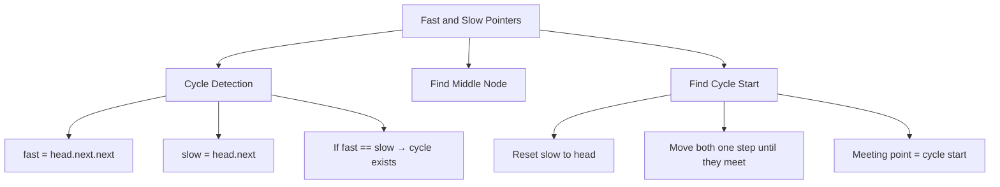

> [!success] Mastery Check
> - [ ] **Studied Well**
> - [ ] **Can explain the concept without notes**
> - [ ] **Can answer interview questions confidently**
> - [ ] **Can implement it in a real project**


## Navigation

**Domain:** [[5 — Data Structures & Algorithms]] > **Group:** Linked Lists
**Previous:** [[5.010 — Singly and Doubly Linked Lists]] | **Next:** [[5.012 — Linked List Reversal]]

### Prerequisites
- [[5.005 — Two Pointers]] — fast and slow is a specialization of the two-pointer technique, applied to linked lists.
- [[5.010 — Singly and Doubly Linked Lists]] — understanding linked list node structure and traversal is required to apply pointer movement.

### Where This Fits
Fast and slow pointers (Floyd's tortoise and hare algorithm) is the go-to technique for cycle detection in linked lists and sequences. It appears in about 10% of linked list problems and several array problems where index-as-pointer creates an implicit linked list (Find the Duplicate Number). The core insight — two pointers moving at different speeds must meet if a cycle exists — is a mathematical proof that translates directly to an algorithm. Beyond cycle detection, the technique finds the middle of a linked list (slow moves half the speed) and detects the cycle start (resetting one pointer to the head and moving both at the same speed until they meet). A senior candidate should be able to prove the algorithm's correctness, not just implement it.

---

## Core Mental Model

Two pointers start at the head. The fast pointer moves two steps at a time; the slow pointer moves one step. If there is a cycle, the fast pointer will eventually lap the slow pointer from behind — they meet inside the cycle because the fast pointer gains one step per iteration. When they meet, reset one pointer to the head, then move both pointers one step at a time — they meet at the start of the cycle. For finding the middle, the same setup works: when the fast pointer reaches the end, the slow pointer is at the middle (slow for first half, fast reaches end in half the iterations). The invariant: the distance between the fast and slow pointers increases by 1 each step, so the fast pointer will never skip over the slow pointer in a cycle.

### Classification

Fast and slow pointers is a **two-pointer variant** specialized for linked lists and pointer-based sequences. It solves three distinct problems: cycle detection (boolean), cycle start detection (node reference), and middle node finding. It is preferred over the hash set approach for cycle detection because it uses O(1) space.



### Key Properties

|Operation|Time|Space|Notes|
|---|---|---|---|
|Cycle detection (boolean)|O(n)|O(1)|Fast pointer moves 2x; meets slow in cycle within O(n)|
|Find cycle start|O(n)|O(1)|After detection, reset one pointer to head, move both at 1x|
|Find middle node|O(n)|O(1)|Fast reaches end when slow is at middle|
|Find duplicate number (array)|O(n)|O(1)|Treat array indices as linked list next pointers|

---

## Deep Mechanics

### How It Works

**Floyd's Cycle Detection:**

Given a linked list starting at `head`, where each node has a `next` pointer:

```
Initialize: slow = head, fast = head
Loop:
  If fast == null or fast.next == null → no cycle (linear)
  slow = slow.next        (1 step)
  fast = fast.next.next   (2 steps)
  If slow == fast → cycle exists
```

Why they must meet in a cycle:
- The relative speed of fast to slow is 1 (fast gains one node per iteration).
- In a cycle of length k, the maximum distance between fast and slow is k-1 (measured in slow steps).
- At a relative speed of 1, fast will catch slow within k-1 iterations.
- Total iterations before meeting: O(λ + μ) where λ is the non-cyclic prefix length and μ is the cycle length.

**Finding the Cycle Start:**

After detecting the cycle (meeting point M):
1. Reset one pointer (say slow) to head.
2. Keep the other (fast) at M.
3. Move both at speed 1 until they meet.
4. The meeting point is the start of the cycle.

Proof: Let the distance from head to cycle start be `a`. Let the distance from cycle start to meeting point be `b` (in the direction of traversal). Let the cycle length be `c`.

Slow traveled: `a + b`
Fast traveled: `2(a + b) = a + b + kc` (where k is the number of full cycles fast completed)

So `a + b = kc`, therefore `a = kc - b`. This means the distance from head to cycle start equals the distance from meeting point to cycle start (going forward). When both move at the same speed from head and M, they meet at the cycle start.

**Finding the Middle Node:**

```
Initialize: slow = head, fast = head
Loop:
  If fast.next == null → slow is the middle (odd length)
  If fast.next.next == null → slow is the left-middle (even length; right-middle = slow.next)
  slow = slow.next
  fast = fast.next.next
```

When n is odd: fast reaches the last node; slow reaches exact middle.
When n is even: fast reaches null; slow reaches the first middle node (slow.next is the second middle).

**Find the Duplicate Number (Linked List in an Array):**

Given an array of n+1 integers where each value is in [1, n], there must be at least one duplicate. Treat the array as a linked list where `nums[i]` is the next index. Apply Floyd's algorithm:
1. Define the "next" function: `f(i) = nums[i]`.
2. Slow = nums[0], fast = nums[nums[0]].
3. Continue until slow == fast (cycle detection).
4. Reset slow = 0 (not nums[0]), move both at speed 1 until they meet — the meeting index is the duplicate value.

This works because the duplicate creates a cycle in the pointer graph (two indices point to the same value).

### Complexity Derivation

**Time:**
- Cycle detection: In the worst case, the slow pointer traverses the entire non-cyclic prefix (a) and up to one full cycle (c) before meeting. Total: O(a + c) = O(n).
- Finding cycle start: After detection, at most O(a) additional steps to find the start. Total from the beginning: O(a + c + a) = O(n).
- Middle node: Fast pointer traverses the list at 2x speed — O(n/2) iterations = O(n).

**Space:** All variants use two pointer variables — O(1) space regardless of input size.

### .NET Runtime Notes

- **`LinkedListNode<T>` and `LinkedList<T>`:** .NET's built-in doubly linked list uses `LinkedListNode<T>`. The node has `Next`, `Previous`, and `Value` properties. For fast/slow pointers, you access `node.Next?.Next` (note: nullable since .NET allows null for the sentinel).
- **No built-in cycle detection:** .NET's `LinkedList<T>` does not provide cycle detection — you implement Floyd's yourself.
- **`HashSet<LinkedListNode<T>>` alternative:** For problems where space is not constrained, hash set of visited nodes is simpler but O(n) space.
- **Array index arithmetic:** For the duplicate number problem, array accesses are O(1). The "linked list" is implicit — no nodes to allocate.

### Why This Pattern Exists

The naive approach to cycle detection uses a hash set to track visited nodes — O(n) time and O(n) space. Floyd's algorithm reduces space to O(1) by exploiting the mathematical property that two pointers moving at different speeds must meet in a cycle. The only way to beat O(n) time is impossible (you must at least visit the entire prefix once to confirm it is acyclic). The ability to find the cycle start with the same O(1) space is an elegant consequence of the distance equation.

---

## Implementation and Problem Patterns

### C# Implementation

```csharp
public static class FastSlowPointers
{
    /// <summary>
    /// Detect cycle in a linked list.
    /// </summary>
    public static bool HasCycle(ListNode head)
    {
        ListNode slow = head, fast = head;

        while (fast != null && fast.Next != null)
        {
            slow = slow.Next;
            fast = fast.Next.Next;
            if (slow == fast)
                return true;
        }

        return false;
    }

    /// <summary>
    /// Find the start of the cycle (returns null if no cycle).
    /// </summary>
    public static ListNode DetectCycleStart(ListNode head)
    {
        ListNode slow = head, fast = head;

        // Phase 1: detect cycle
        while (fast != null && fast.Next != null)
        {
            slow = slow.Next;
            fast = fast.Next.Next;
            if (slow == fast)
            {
                // Phase 2: find cycle start
                slow = head;
                while (slow != fast)
                {
                    slow = slow.Next;
                    fast = fast.Next;
                }
                return slow;
            }
        }

        return null; // no cycle
    }

    /// <summary>
    /// Find the middle node. For even length, returns the first middle.
    /// For odd length, returns the exact middle.
    /// </summary>
    public static ListNode FindMiddle(ListNode head)
    {
        ListNode slow = head, fast = head;

        while (fast != null && fast.Next != null)
        {
            slow = slow.Next;
            fast = fast.Next.Next;
        }

        return slow;
    }

    /// <summary>
    /// Find the duplicate number in an array using Floyd's algorithm.
    /// nums contains n+1 integers in [1, n]; exactly one duplicate.
    /// </summary>
    public static int FindDuplicate(int[] nums)
    {
        int slow = nums[0];
        int fast = nums[nums[0]];

        // Phase 1: detect cycle
        while (slow != fast)
        {
            slow = nums[slow];
            fast = nums[nums[fast]];
        }

        // Phase 2: find cycle start (the duplicate)
        slow = 0;
        while (slow != fast)
        {
            slow = nums[slow];
            fast = nums[fast];
        }

        return slow;
    }

    /// <summary>
    /// Check if a linked list is a palindrome.
    /// Uses fast/slow to find middle, then reverses second half and compares.
    /// </summary>
    public static bool IsPalindrome(ListNode head)
    {
        // Find middle (slow stops at first middle for even length)
        ListNode slow = head, fast = head;
        while (fast != null && fast.Next != null)
        {
            slow = slow.Next;
            fast = fast.Next.Next;
        }

        // Reverse second half (starting from slow)
        ListNode prev = null;
        ListNode curr = slow;
        while (curr != null)
        {
            ListNode next = curr.Next;
            curr.Next = prev;
            prev = curr;
            curr = next;
        }

        // Compare
        ListNode left = head, right = prev;
        while (right != null)
        {
            if (left.Val != right.Val)
                return false;
            left = left.Next;
            right = right.Next;
        }

        return true;
    }
}

public class ListNode
{
    public int Val;
    public ListNode Next;
    public ListNode(int val = 0, ListNode next = null)
    {
        Val = val;
        Next = next;
    }
}
```

### The .NET Idiomatic Version

```csharp
public static class FastSlowPointersIdiomatic
{
    // Use the same implementation as above — there is no built-in
    // fast/slow pointer in .NET collections.

    // For the duplicate number problem using LINQ (not Floyd's):
    // Not recommended — Floyd's is O(n) time, O(1) space and
    // is the expected solution in an interview.

    // LinkedListNode<T> from System.Collections.Generic:
    // Use .Next (not .Next.Next) since it's doubly linked.
    // For fast/slow, access lln.Next?.Next.
}
```

### Classic Problem Patterns

1. **Linked list cycle detection (LeetCode 141)** — Determine if a linked list has a cycle. Key insight: if fast and slow meet, a cycle exists. O(n) time, O(1) space — significantly better than the hash set approach.

2. **Linked list cycle II (LeetCode 142)** — Return the node where the cycle begins. Key insight: after meeting, reset one pointer to head and move both at speed 1 — they meet at the cycle start. The proof derives from the distance equations a = kc - b.

3. **Find the duplicate number (LeetCode 287)** — Given an array of n+1 integers in [1, n], find the duplicate. Key insight: treat values as linked list next pointers. The duplicate creates a cycle in the index graph. Floyd's finds the cycle start (the duplicate). O(n) time, O(1) space — and it never modifies the array.

4. **Middle of the linked list (LeetCode 876)** — Return the middle node. Key insight: slow moves 1, fast moves 2. When fast reaches the end, slow is at the middle. For even length, returns the second middle (if using `fast != null && fast.Next != null`).

5. **Palindrome linked list (LeetCode 234)** — Check if a linked list is a palindrome. Key insight: fast/slow to find the middle, reverse the second half in place, compare halves, optionally restore the original list.

### Template / Skeleton

```csharp
// Fast and Slow Pointers Template
// When to use: linked list cycle, middle, or cycle-start problems
// Time: O(n) | Space: O(1)

public static ListNode FastSlowTemplate(ListNode head)
{
    ListNode slow = head, fast = head;

    while (fast != null && fast.Next != null)
    {
        slow = slow.Next;
        fast = fast.Next.Next;

        // TODO: cycle detection
        // if (slow == fast) { /* cycle found */ }
    }

    // TODO: slow is at the middle, or no cycle exists
    return slow;
}

// Cycle Detection Template:
public static bool HasCycleTemplate(ListNode head)
{
    ListNode slow = head, fast = head;
    while (fast != null && fast.Next != null)
    {
        slow = slow.Next;
        fast = fast.Next.Next;
        if (slow == fast) return true;
    }
    return false;
}

// Find Cycle Start Template:
public static ListNode DetectCycleStartTemplate(ListNode head)
{
    ListNode slow = head, fast = head;
    while (fast != null && fast.Next != null)
    {
        slow = slow.Next;
        fast = fast.Next.Next;
        if (slow == fast)
        {
            slow = head;
            while (slow != fast)
            {
                slow = slow.Next;
                fast = fast.Next;
            }
            return slow;
        }
    }
    return null;
}
```

---

## Gotchas and Edge Cases

### Moving Fast Without Checking fast.Next

**Mistake:** Accessing `fast.Next.Next` without first checking that `fast.Next` is not null.

```csharp
// ❌ Wrong — NullReferenceException when fast is at the last node
while (fast != null)
{
    slow = slow.Next;
    fast = fast.Next.Next; // OOB if fast.Next is null
    if (slow == fast) return true;
}
```

**Fix:** Check both `fast` and `fast.Next` in the while condition.

```csharp
// ✅ Correct
while (fast != null && fast.Next != null)
{
    slow = slow.Next;
    fast = fast.Next.Next;
    if (slow == fast) return true;
}
```

**Consequence:** NullReferenceException on linear lists where the fast pointer reaches the last node (`fast.Next` is null, `fast.Next.Next` throws).

### Empty or Single-Node List

**Mistake:** Not handling the case where head is null or the list has only one node.

```csharp
// ❌ Wrong — NullReferenceException on head.Next
ListNode slow = head, fast = head;
while (fast.Next != null) { /* ... */ }
```

**Fix:** The loop condition `fast != null && fast.Next != null` handles both cases — for null or single-node lists, the loop does not execute.

```csharp
// ✅ Correct — loop body never executes for null or single node
if (head == null) return false; // optional, the while condition handles it
ListNode slow = head, fast = head;
while (fast != null && fast.Next != null) { /* ... */ }
```

**Consequence:** NullReferenceException on empty or single-node input.

### Floyd's for Find Duplicate — Off-by-One in Phase 2 Reset

**Mistake:** Resetting `slow` to `nums[0]` instead of `0` in the duplicate number problem.

```csharp
// ❌ Wrong — resetting to nums[0] skips the first link
int slow = nums[0];
int fast = nums[nums[0]];
while (slow != fast) { /* detect */ }
slow = nums[0]; // should be 0 (the index, not the value)
while (slow != fast) { /* find start */ }
```

**Fix:** Reset slow to `0` (the starting index, not the value at index 0).

```csharp
// ✅ Correct
slow = 0; // the array index, not the value at that index
while (slow != fast)
{
    slow = nums[slow];
    fast = nums[fast];
}
```

**Consequence:** Returns the wrong element or infinite loop. The linked list in this problem is index-based; the head is index 0 (`nums[0]` is the first `next` pointer).

### Forgetting to Handle Even-Length Middle Correctly

**Mistake:** Assuming the middle is always exact — for even-length lists, there are two middle nodes and the problem may expect the second middle.

```csharp
// ❌ Wrong — returns first middle for even length
while (fast != null && fast.Next != null)
{
    slow = slow.Next;
    fast = fast.Next.Next;
}
// For [1,2,3,4], slow = 2 (index 1), but some problems want 3 (index 2)
```

**Fix:** Start fast at `head.Next` if the second middle is required, or adjust the loop condition.

```csharp
// ✅ Correct for second middle (even length)
ListNode slow = head, fast = head;
while (fast != null && fast.Next != null)
{
    slow = slow.Next;
    fast = fast.Next.Next;
}
return slow; // first middle. For second middle, add:
// if (fast == null) return slow.Next; // even length → second middle
```

**Consequence:** Returns the wrong node in problems expecting the second middle (e.g., palindrome linked list where the second half starts at the second middle).

### Cycle Detection in Arrays — Value Range Constraints

**Mistake:** Using Floyd's on an array without verifying that values are valid indices (0 ≤ val < n).

```csharp
// ❌ Wrong — values may be out of bounds or zero creates self-loop issues
int slow = nums[0];
int fast = nums[nums[0]]; // assumes nums[0] is a valid index
```

**Fix:** The duplicate number problem guarantees values in [1, n] for an array of size n+1, so 0 is never a value (no self-loop at 0) and all values are valid indices. Use Floyd's only in this specific constraint range.

**Consequence:** IndexOutOfRangeException if values are not valid indices. Array-based Floyd's requires the constraint that values are in [1, n] for exactly this reason.

---

## Complexity Analysis and Benchmarks

### Operation Complexity Table

|Operation|Time|Space|Worst-case scenario|
|---|---|---|---|
|Cycle detection|O(n)|O(1)|Long non-cyclic prefix followed by cycle|
|Find cycle start|O(n)|O(1)|After detection, extra O(prefix) steps|
|Find middle|O(n)|O(1)|Fast traverses to end in n/2 iterations|
|Duplicate number (Floyd's)|O(n)|O(1)|Guaranteed O(n) — no worst-case degradation|
|Palindrome LL (fast/slow + reverse)|O(n)|O(1)|Find middle (n/2) + reverse (n/2) + compare (n/2)|

**Derivation for the non-obvious entries:** Cycle detection traverses each node at most twice (once by slow, up to twice by fast). The meeting happens within O(prefix + cycle) = O(n). Finding the cycle start adds at most O(prefix) extra steps, so the total is still O(n).

### Comparison with Alternatives

|Structure / Algorithm|Time|Space|Best When|
|---|---|---|---|
|Fast/slow pointers (Floyd's)|O(n)|O(1)|Cycle detection, O(1) space required|
|Hash set of visited nodes|O(n)|O(n)|Simpler to implement, space not constrained|
|Hash set (duplicate number)|O(n)|O(n)|Simpler, n is small enough for O(n) space|
|Marking (duplicate number)|O(n)|O(1)|Array elements can be negated in place (modifies input)|
|Brute force (duplicate number)|O(n²)|O(1)|Small n (never acceptable in interview)|

### BenchmarkDotNet

```csharp
[MemoryDiagnoser]
[SimpleJob(RuntimeMoniker.Net90)]
public class CycleDetectionBenchmark
{
    private ListNode _listWithCycle = default!;
    private ListNode _listWithoutCycle = default!;

    [Params(100, 1_000, 10_000)]
    public int N { get; set; }

    [GlobalSetup]
    public void Setup()
    {
        // Build list of N nodes
        var head = new ListNode(0);
        var curr = head;
        for (int i = 1; i < N; i++)
        {
            curr.Next = new ListNode(i);
            curr = curr.Next;
        }
        _listWithoutCycle = head;

        // Build list with cycle (last node points to middle)
        head = new ListNode(0);
        curr = head;
        ListNode middle = null;
        for (int i = 1; i < N; i++)
        {
            curr.Next = new ListNode(i);
            curr = curr.Next;
            if (i == N / 2) middle = curr;
        }
        curr.Next = middle; // create cycle
        _listWithCycle = head;
    }

    [Benchmark(Baseline = true)]
    public bool FloydHasCycle()
    {
        return FastSlowPointers.HasCycle(_listWithCycle);
    }

    [Benchmark]
    public bool HashSetHasCycle()
    {
        var seen = new HashSet<ListNode>();
        var curr = _listWithCycle;
        while (curr != null)
        {
            if (seen.Contains(curr)) return true;
            seen.Add(curr);
            curr = curr.Next;
        }
        return false;
    }
}
```

**Expected results (approximate, .NET 9, x64):**

|Method|N|Mean|Allocated|
|---|---|---|---|
|FloydHasCycle|1_000|~0.5 μs|0 B|
|HashSetHasCycle|1_000|~5 μs|~16 KB|
|FloydHasCycle|10_000|~5 μs|0 B|
|HashSetHasCycle|10_000|~50 μs|~160 KB|

**Interpretation:** Floyd's is ~10x faster and uses zero heap allocation vs. the hash set's O(n) allocation. The gap widens with n because Floyd's O(1) space never GCs, while the hash set grows linearly. For large lists or memory-constrained environments, Floyd's is strictly superior.

---

## Interview Arsenal

### Question Bank

1. [Definition] What is Floyd's cycle detection algorithm and how does it work?
2. [Complexity] Derive the time complexity of finding the cycle start in a linked list using Floyd's algorithm.
3. [Implementation] Implement a function that returns the duplicate number in an array without modifying the array and using O(1) space.
4. [Recognition] "Given a linked list, determine whether it has a cycle in it" — which technique?
5. [Comparison] Compare Floyd's algorithm vs. hash set for cycle detection — when would you use each?
6. [Trick] Why does resetting one pointer to the head after the meeting point let you find the cycle start? Prove it.
7. [System Design] How would you detect cycles in a distributed graph (e.g., a dependency graph across microservices)?
8. [Optimization] Can the fast pointer move faster than 2x? What happens if it moves 3x?

### Spoken Answers

**Q: What is Floyd's cycle detection algorithm and how does it work?**

> **Average answer:** Two pointers — slow moves 1, fast moves 2. If they meet, there is a cycle.

> **Great answer:** Floyd's cycle detection, also called the tortoise and hare algorithm, uses two pointers starting at the head. The slow pointer moves one node per step; the fast pointer moves two. If there is no cycle, the fast pointer reaches the end (null) first — O(n) to confirm. If there is a cycle, the fast pointer will eventually lap the slow pointer from behind because it gains one node per iteration relative to slow, and they will meet inside the cycle within O(n). To find the cycle's start node, after the meeting point I reset one pointer to the head and move both at speed 1 — they meet at the cycle start. The proof follows from the distance equations: let a be the distance from head to cycle start, b be the distance from cycle start to the meeting point, and c be the cycle length. Slow travels a+b, fast travels 2(a+b) = a+b+kc for some integer k. So a+b = kc, meaning a = kc - b — the distance from head to cycle start equals the distance from the meeting point back to the cycle start when traversing forward.

**Q: Implement a function that returns the duplicate number in an array without modifying the array and using O(1) space.**

> **Average answer:** Use Floyd's algorithm — treat the array as a linked list where nums[i] is the next index.

> **Great answer:** The constraint is n+1 integers in [1, n], so at least one duplicate exists and 0 is never a value. This means we can treat each index as a node and each value as a next pointer — the array represents a linked list in disguise. I apply Floyd's algorithm: initialize slow = nums[0], fast = nums[nums[0]]. Phase 1: while slow != fast, advance slow by 1 (nums[slow]) and fast by 2 (nums[nums[fast]]). When they meet, Phase 2: reset slow to 0 (not nums[0]), then advance both at speed 1 (slow = nums[slow], fast = nums[fast]) until they meet. The meeting index is the duplicate value. This uses O(n) time and O(1) space without modifying the array. The key insight for Phase 2: unlike the linked list version where we reset to head (the first node), in the array version we reset to index 0 because 0 is not a valid value — meaning index 0 is the "head" of the implicit list, and nums[0] is the first node.

**Q: [Trick] Why does resetting one pointer to the head after the meeting point let you find the cycle start?**

> **Average answer:** Mathematical proof — the distances match up.

> **Great answer:** Let me prove it. Let the distance from head to cycle start be `a`. Let the cycle start to the meeting point be `b` (in the direction of traversal). Let the cycle length be `c`. When they meet:
> - Slow traveled `a + b`
> - Fast traveled `2(a + b)` (because fast moves twice as fast)
> - But fast also traveled `a + b + kc` where `k` is the number of full cycle laps (k ≥ 1)
> So `2(a + b) = a + b + kc`, therefore `a + b = kc`, so `a = kc - b`.
> Now `kc - b` is the distance from the meeting point forward to the cycle start (since `kc` is a full cycle, and `-b` means going back `b` from the end of the cycle). So the distance from head to cycle start (`a`) equals the distance from the meeting point to the cycle start. Therefore, when you move one pointer from head and one from the meeting point, both at speed 1, they must meet exactly at the cycle start.

### Trick Question

**"Can you use fast and slow pointers to find the k-th node from the end of a linked list?"**

Why it is a trap: Some candidates think fast/slow always means double speed for every problem involving two pointers.

Correct answer: Yes — but not by using the 2x/1x speed pattern. To find the k-th from the end, use a different two-pointer pattern: move the fast pointer k steps ahead, then move both pointers at speed 1 until fast reaches the end. The slow pointer will be at the k-th from the end. This is a "gap" two-pointer, not a "speed difference" two-pointer. Floyd's specific 2x/1x pattern solves cycle detection and middle-finding, but not k-th from end.

### Pattern Recognition Table

|If the problem has...|Then consider...|Because...|
|---|---|---|
|"Cycle in linked list"|Floyd's algorithm|O(n) time, O(1) space|
|"Find where cycle begins"|Floyd's algorithm (phase 2)|Reset to head, move at same speed|
|"Middle of linked list"|Fast/slow (2x/1x)|Fast at end → slow at middle|
|"Find duplicate in [1, n] array"|Floyd's on index-as-pointer|Only works with this specific constraint|
|"Palindrome linked list"|Fast/slow + reverse second half|Middle + reverse → compare halves|
|"K-th from end"|Gap two-pointer (not Floyd's)|Fast ahead by k steps, then both at 1x|

---

## Decision Framework

### When to Apply

```mermaid
flowchart TD
    A[Problem: linked list or constrained array] --> B{What is the goal?}
    B -->|Detect cycle| C[Floyd's: fast=2x, slow=1x]
    B -->|Find cycle start| D[Floyd's phase 2: reset to head]
    B -->|Find middle| E[Floyd's: fast=2x, slow=1x]
    B -->|Find k-th from end| F[Gap two-pointer: fast ahead k steps]
    B -->|Find duplicate| G{Input constraints?}
    G -->|"[1, n] in n+1 array"| H[Floyd's on index pointers]
    G -->|Any values| I["Hash set (O(n) space)"]
    C --> J{O(1) space required?}
    J -->|Yes| K["Floyd's is the only option"]
    J -->|No| L["Hash set (simpler)"]
```

### Recognition Checklist

Indicators that fast/slow pointers are the right choice:

- [ ] Problem involves a linked list or a sequence with pointer-like access
- [ ] Goal is cycle detection, middle finding, or duplicate finding with O(1) space
- [ ] Input has the constraint that values are valid indices (for array-based Floyd's)
- [ ] Problem specifies O(1) space (eliminates hash set)
- [ ] Palindrome linked list (always solved by middle + reverse)

Counter-indicators — do NOT apply here:

- [ ] Input is not pointer-based (e.g., array without index-as-pointer constraint)
- [ ] Problem asks to modify the list structure (reversal, reordering) — Floyd's only reads
- [ ] Problem requires detecting cycles in a directed graph (use DFS coloring or topological sort)
- [ ] O(n) space is acceptable and the problem is simpler with a hash set

### Tradeoff Summary

|What You Gain|What You Give Up|
|---|---|
|O(1) space — no auxiliary data structures|Implementation is more complex than hash set|
|O(n) time — matches the lower bound|Requires validating constraints (value range, node structure)|
|Can find both cycle existence and start in one pass|Not suitable for generic cycle detection (need next pointer)|
|Extends to array-based duplicate detection|Only works for specific constraint [1, n] range|

---

## Self-Check

### Conceptual Questions

1. What are the three main problems solved by fast and slow pointers?
2. Derive why the fast pointer cannot skip over the slow pointer in a cycle.
3. Recognizing from a problem: "Given an array of n+1 integers where each integer is in [1, n], find the duplicate without modifying the array and using O(1) space."
4. When would you use a hash set instead of Floyd's algorithm for cycle detection?
5. How does the middle-finding behavior change for even vs. odd length linked lists?
6. In .NET, what is the type for a linked list node and how do you access its next pointer?
7. What invariant holds when the fast and slow pointers meet in Phase 1?
8. How would the algorithm change if the linked list is doubly linked (prev pointers exist)?
9. In a production system, where would you use cycle detection (e.g., detecting infinite loops in a workflow engine)?
10. Why does Floyd's algorithm for the duplicate number problem require values in [1, n]? What goes wrong if 0 is allowed?

<details>
<summary>Answers</summary>

1. Cycle detection (boolean), cycle start (node reference), and middle node.
2. In a cycle, the slow pointer moves 1, the fast moves 2 — gaining 1 node per iteration. The maximum gap in a cycle of length c is c-1. After at most c-1 iterations, the gap reduces to 0 (they meet). The fast pointer cannot skip over the slow pointer because the speed difference is 1 — it always lands on the same or adjacent node as the slow pointer from the previous step.
3. Find the duplicate number (LeetCode 287). Use Floyd's algorithm on the implicit linked list formed by index → value pointers.
4. Use a hash set when O(n) space is acceptable and the input is small (n ≤ 1,000). It is simpler to implement and debug. Use Floyd's when space is constrained, n is large, or the interviewer asks for the optimal solution.
5. Odd length: slow reaches the exact middle (fast reaches the last node). Even length: slow reaches the first middle (fast reaches null). For palindrome checking, the second middle is usually needed — check `fast == null` to detect even length and advance slow by one.
6. `LinkedListNode<T>` from `System.Collections.Generic`. Access next via `.Next`, previous via `.Previous`. For generic `LinkedList<T>`, use `First` to get the head node.
7. The invariant at the meeting point is: the distance from head to cycle start equals the distance from meeting point to cycle start (going forward). This is the key property that Phase 2 exploits.
8. Doubly linked lists do not require changes to Floyd's algorithm — the `next` pointer still defines the traversal direction. The `prev` pointer is irrelevant for cycle detection. However, in a doubly linked list, you can also detect cycles by traversing forward with next and ensuring the prev pointer of each node points back consistently (not needed for standard cycle detection).
9. Workflow engines (detect infinite loops in DAG execution), garbage collection (detect reference cycles in memory management), routing protocols (detect routing loops), dependency resolution (detect circular dependencies between packages or services).
10. Value 0 means `nums[0] = 0` creates a self-loop at index 0 — the head is immediately in a cycle, making it impossible to distinguish between a self-loop (no actual duplicate) and a genuine duplicate. Values must be in [1, n] so that index 0 is always part of the non-cyclic prefix (0 is never a valid next pointer), and all other indices point somewhere in the array.
</details>

---

### Coding Challenges

**Challenge 1 — Implement from scratch**

Implement Floyd's cycle detection for a linked list. Return the cycle start node if a cycle exists, or null otherwise.

<details> <summary>Solution</summary>

```csharp
public ListNode DetectCycle(ListNode head)
{
    ListNode slow = head, fast = head;

    while (fast != null && fast.Next != null)
    {
        slow = slow.Next;
        fast = fast.Next.Next;

        if (slow == fast)
        {
            slow = head;
            while (slow != fast)
            {
                slow = slow.Next;
                fast = fast.Next;
            }
            return slow;
        }
    }

    return null;
}
```

**Complexity:** Time O(n) | Space O(1) **Key insight:** Phase 2 resets one pointer to head and moves both at speed 1 — the meeting point is the cycle start. The proof shows that the distance from head to cycle start equals the distance from the Phase 1 meeting point to the cycle start.

</details>

---

**Challenge 2 — Trace the execution**

Trace Floyd's algorithm on a linked list: 1 → 2 → 3 → 4 → 5 → 6 → 3 (cycle back to node 3). Show the pointers at each step of Phase 1 and Phase 2.

<details> <summary>Solution</summary>

```
Phase 1 — Cycle Detection:

Step 0: slow=1, fast=1
Step 1: slow=2, fast=3 (slow=1.next, fast=1.next.next)
Step 2: slow=3, fast=5
Step 3: slow=4, fast=3 (fast wraps around cycle: 5→6→3)
Step 4: slow=5, fast=5 (fast wraps: 3→4→5) — MEET at node 5

Phase 2 — Find Cycle Start:
Reset slow to head=1. Fast stays at meeting point=5.

Step 0: slow=1, fast=5
Step 1: slow=2, fast=6
Step 2: slow=3, fast=3 — MEET at node 3 (cycle start)

Cycle start: node 3. ✅
```

**Why:** Slow traveled 1→2→3→4→5 = 4 steps. Fast traveled 1→3→5→3→5 = also 4 steps (but 2x speed). a=2 (head to cycle start: 1→2→3, a=2 edges), b=2 (cycle start 3 to meeting point 5: 3→4→5, b=2), c=4 (cycle: 3→4→5→6→3). a + b = 4 = kc = 1×4. a = 2 = kc - b = 4 - 2. ✅

</details>

---

**Challenge 3 — Fix the bug**

```csharp
// This code finds the middle of a linked list.
// For which inputs does it return the wrong node?
public ListNode MiddleNode(ListNode head)
{
    ListNode slow = head, fast = head;
    while (fast != null)
    {
        slow = slow.Next;
        fast = fast.Next?.Next;
    }
    return slow;
}
```

<details> <summary>Solution</summary>

**Bug:** The loop condition `while (fast != null)` does not prevent `slow = slow.Next` from running when `fast.Next` is null. For a list with one node: slow would move to null (slow = head.Next = null), fast would try `head.Next?.Next` = null. Loop exits when fast is null, but slow is already null — returns null instead of head.

**Fix:** Check both fast and fast.Next in the condition, matching the standard Floyd's middle-finding pattern.

```csharp
public ListNode MiddleNode(ListNode head)
{
    ListNode slow = head, fast = head;
    while (fast != null && fast.Next != null) // FIXED
    {
        slow = slow.Next;
        fast = fast.Next.Next;
    }
    return slow;
}
```

**Test case that exposes it:** `MiddleNode(new ListNode(1))`. Buggy returns null. Correct returns the node with value 1.

</details>

---

**Challenge 4 — Recognize and apply**

**Problem:** In a linked list with a cycle, find the length of the cycle (number of nodes in the cycle). You may only use O(1) space.

<details> <summary>Solution</summary>

**Pattern:** Floyd's detection (phase 1) to find the meeting point, then traverse the cycle counting nodes until returning to the meeting point.

```csharp
public int CycleLength(ListNode head)
{
    ListNode slow = head, fast = head;

    // Phase 1: find meeting point
    while (fast != null && fast.Next != null)
    {
        slow = slow.Next;
        fast = fast.Next.Next;
        if (slow == fast)
        {
            // Phase 2: count cycle length
            ListNode start = slow;
            int length = 1;
            ListNode curr = start.Next;
            while (curr != start)
            {
                length++;
                curr = curr.Next;
            }
            return length;
        }
    }

    return 0; // no cycle
}
```

**Complexity:** Time O(n) | Space O(1) **Key insight:** After finding the meeting point (which is inside the cycle), traverse one full cycle and count nodes. The cycle length is not needed for finding the cycle start, but it can be useful for problems like "find the cycle start when phase 2 is ambiguous."

</details>

---

**Challenge 5 — Optimize**

```csharp
// This solution finds the duplicate number using O(n) space.
// Optimize to O(1) space without modifying the input.
public static int FindDuplicate(int[] nums)
{
    var seen = new HashSet<int>();
    foreach (int num in nums)
    {
        if (seen.Contains(num)) return num;
        seen.Add(num);
    }
    return -1;
}
```

<details> <summary>Solution</summary>

**Insight:** The array values are in [1, n] and the array size is n+1 — a cycle must exist in the implicit linked list (index → value). Use Floyd's algorithm.

```csharp
public static int FindDuplicate(int[] nums)
{
    // Phase 1: detect cycle
    int slow = nums[0];
    int fast = nums[nums[0]];
    while (slow != fast)
    {
        slow = nums[slow];
        fast = nums[nums[fast]];
    }

    // Phase 2: find cycle start (the duplicate value)
    slow = 0;
    while (slow != fast)
    {
        slow = nums[slow];
        fast = nums[fast];
    }

    return slow;
}
```

**Complexity:** Time O(n) | Space O(1) **Key insight:** The implicit linked list is formed by index → value. Index 0 is never a value (values are [1, n]), so it is outside any possible cycle — making it the perfect "head" for Floyd's. The duplicate value is the index where two different indices point to the same value, creating a cycle.

</details>
