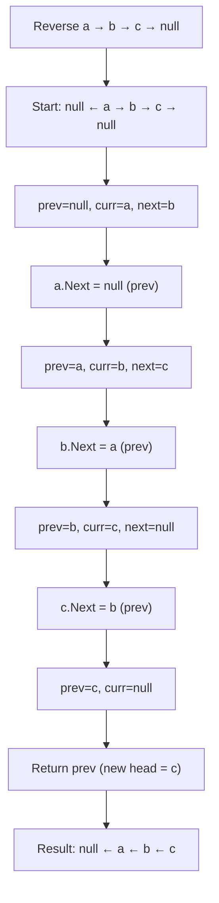

> [!success] Mastery Check
> - [ ] **Studied Well**
> - [ ] **Can explain the concept without notes**
> - [ ] **Can answer interview questions confidently**
> - [ ] **Can implement it in a real project**


## Navigation

**Domain:** [[5 — Data Structures & Algorithms]] > **Group:** Linked Lists
**Previous:** [[5.011 — Fast and Slow Pointers — Floyd's Cycle Detection]] | **Next:** [[5.017 — Monotonic Stack Pattern]]

### Prerequisites
- [[5.010 — Singly and Doubly Linked Lists]] — understanding the node structure (val + next pointer) and traversal is required; reversal modifies exactly those pointers.

### Where This Fits
Linked list reversal is the most fundamental pointer-manipulation pattern in linked list problems. It appears both as a standalone problem (reverse a linked list) and as a subroutine in more complex problems (palindrome check via reversed second half, reverse in k-groups, reverse between positions, reorder list). The iterative pattern — three pointers (prev, curr, next) — is the critical skill to memorize; the recursive pattern demonstrates understanding of the call stack. A senior candidate must be able to reverse a list in their sleep because it is almost always available as a helper when solving harder linked list problems. The pattern generalizes to doubly linked lists (swap prev and next pointers) and to tree structures (reverse a path, Morris traversal reversal).

---

## Core Mental Model

Reversing a linked list means each node's `next` pointer is redirected from the previous next node to the previous node. The iterative approach uses three pointers: `prev` (the node that was before current in the original list), `curr` (the node being processed), and `next` (the original successor of curr, saved before overwriting). At each step, `curr.Next = prev` reverses the arrow, then all three pointers advance by one. When `curr` reaches null, `prev` is the new head. The recursive approach reverses the rest of the list (from `head.Next`), then makes the returned tail point back to `head`, and sets `head.Next = null`. The invariant: before processing node curr, all nodes before curr are already reversed; all nodes at and after curr are in the original order.

### Classification

Linked list reversal is a **pointer manipulation pattern** — it is not a data structure or an algorithm in the traditional sense, but a technique for restructuring a linked list in place. It is the linked list analogue of array reversal (two pointers from ends), but applied to a structure that requires sequential access.



### Key Properties

|Operation|Time|Space|Notes|
|---|---|---|---|
|Reverse full list (iterative)|O(n)|O(1)|Three pointers, single pass|
|Reverse full list (recursive)|O(n)|O(n)|Call stack depth = n|
|Reverse sublist|O(n)|O(1)|Find start, reverse segment, reconnect|
|Reverse in k-groups|O(n)|O(1) or O(n/k)|Iterative or recursive per group|
|Reverse doubly linked list|O(n)|O(1)|Swap next and prev, which becomes new next|

---

## Deep Mechanics

### How It Works

**Iterative reversal:**

Given `1 → 2 → 3 → 4 → null`:

```
Initial: prev=null, curr=1, next=null

Step 1: save next = 2 (curr.Next)
        1.Next = null (prev)
        prev = 1
        curr = 2
State: null ← 1  2 → 3 → 4 → null

Step 2: save next = 3
        2.Next = 1
        prev = 2
        curr = 3
State: null ← 1 ← 2  3 → 4 → null

Step 3: save next = 4
        3.Next = 2
        prev = 3
        curr = 4
State: null ← 1 ← 2 ← 3  4 → null

Step 4: save next = null
        4.Next = 3
        prev = 4
        curr = null
State: null ← 1 ← 2 ← 3 ← 4

Return prev = 4 (new head)
```

**Recursive reversal:**

The recursive case: reverse `head.Next` first (gets the reversed tail), then make the tail point back to `head`, then set `head.Next = null`.

```
reverse(1): reverse(2) → reverse(3) → reverse(4) → base case (4.Next == null, return 4)

Unwind:
  reverse(4): returns 4 (base)
  reverse(3): head=3, newHead=4
              3.Next.Next = 3 → 4.Next = 3 → 4 → 3
              3.Next = null
              returns 4
  reverse(2): head=2, newHead=4
              2.Next.Next = 2 → 3.Next = 2 → 4 → 3 → 2
              2.Next = null
              returns 4
  reverse(1): head=1, newHead=4
              1.Next.Next = 1 → 2.Next = 1 → 4 → 3 → 2 → 1
              1.Next = null
              returns 4
```

**Reverse sublist (positions left to right):**

1. Find the node before `left` (call it `beforeLeft`). The sublist starts at `beforeLeft.Next`.
2. Reverse the sublist of length `right - left + 1` using the standard iterative approach.
3. Connect `beforeLeft.Next` to the new head of the reversed sublist.
4. Connect the tail of the reversed sublist to the node after the original sublist.

**Reverse in k-groups:**

1. Check if there are at least k nodes starting from `curr`. If not, return (no reversal for this group).
2. Reverse the next k nodes using the standard approach. Track the new head and tail.
3. Connect the previous group's tail to this group's new head.
4. Move to the next group.

### Complexity Derivation

**Time:** Each node is visited exactly once in the standard reversal — O(n). Sublist reversal visits nodes up to position right (O(n) worst case) and reverses the sublist (O(k)). K-group reversal visits each node once for counting and once for reversal — O(n) overall with two passes or O(n) with a single pass using recursion.

**Space:** Iterative reversal uses three pointers — O(1). Recursive reversal uses the call stack — O(n) in the worst case (not tail-recursive). K-group reversal can be O(n/k) if implemented recursively (one stack frame per group).

### .NET Runtime Notes

- **`LinkedList<T>` and `LinkedListNode<T>`:** .NET's built-in `LinkedList<T>` is doubly linked and has `AddBefore`, `AddAfter`, `AddFirst`, `AddLast` methods — reversal can be done by iterating and re-adding, but this is O(n²) and academically uninteresting. In an interview, implement reversal on a custom `ListNode` class.
- **No built-in reverse:** `IEnumerable<T>` has `Reverse()` (LINQ), but this allocates a buffer and returns a new sequence — it does not reverse in place. For linked lists, in-place reversal is the expected solution.
- **`yield return` for reversal:** You can reverse conceptually by pushing to a `Stack<T>` and popping, but this is O(n) space and defeats the purpose of the exercise.

### Why This Pattern Exists

Reversing a linked list is a fundamental operation because linked lists are directional. In singly linked lists, you cannot traverse backward — reversal is the only way to process the list from the end to the beginning. The operation is O(n) and O(1) space in its iterative form, which matches the optimal bounds for any operation that must touch every node. The pattern appears as a building block in palindrome checking, reordering, reversing in groups, and bidirectional traversal.

---

## Implementation and Problem Patterns

### C# Implementation

```csharp
public static class LinkedListReversal
{
    /// <summary>
    /// Reverse a linked list iteratively.
    /// </summary>
    public static ListNode Reverse(ListNode head)
    {
        ListNode prev = null;
        ListNode curr = head;

        while (curr != null)
        {
            ListNode next = curr.Next; // save next
            curr.Next = prev;          // reverse arrow
            prev = curr;               // advance prev
            curr = next;               // advance curr
        }

        return prev; // new head
    }

    /// <summary>
    /// Reverse a linked list recursively.
    /// </summary>
    public static ListNode ReverseRecursive(ListNode head)
    {
        if (head == null || head.Next == null)
            return head;

        ListNode newHead = ReverseRecursive(head.Next);
        head.Next.Next = head; // make tail point back to head
        head.Next = null;      // head is now the tail

        return newHead;
    }

    /// <summary>
    /// Reverse sublist from position left to right (1-indexed).
    /// </summary>
    public static ListNode ReverseBetween(ListNode head, int left, int right)
    {
        if (head == null || left == right)
            return head;

        var dummy = new ListNode(0, head);
        ListNode beforeLeft = dummy;

        // Move to node before left position
        for (int i = 0; i < left - 1; i++)
            beforeLeft = beforeLeft.Next;

        // Reverse sublist
        ListNode prev = null;
        ListNode curr = beforeLeft.Next;

        for (int i = 0; i < right - left + 1; i++)
        {
            ListNode next = curr.Next;
            curr.Next = prev;
            prev = curr;
            curr = next;
        }

        // Connect the reversed sublist back
        // beforeLeft.Next was the start of the sublist (now the tail)
        // prev is the new head of the reversed sublist
        // curr is the node after the sublist
        beforeLeft.Next.Next = curr;  // tail of reversed → rest of list
        beforeLeft.Next = prev;       // node before sublist → new head

        return dummy.Next;
    }

    /// <summary>
    /// Reverse nodes in k-groups.
    /// </summary>
    public static ListNode ReverseKGroup(ListNode head, int k)
    {
        if (head == null || k <= 1)
            return head;

        var dummy = new ListNode(0, head);
        ListNode groupPrev = dummy;

        while (true)
        {
            // Check if there are at least k nodes remaining
            ListNode kth = groupPrev;
            for (int i = 0; i < k && kth != null; i++)
                kth = kth.Next;
            if (kth == null)
                break;

            // Reverse k nodes starting at groupPrev.Next
            ListNode prev = null;
            ListNode curr = groupPrev.Next;
            ListNode groupStart = curr;

            for (int i = 0; i < k; i++)
            {
                ListNode next = curr.Next;
                curr.Next = prev;
                prev = curr;
                curr = next;
            }

            // Connect: groupPrev → prev (new head), groupStart → curr (next group start)
            groupPrev.Next = prev;
            groupStart.Next = curr;

            // Move groupPrev to the start of the next group
            groupPrev = groupStart;
        }

        return dummy.Next;
    }

    /// <summary>
    /// Reorder list: L0 → Ln → L1 → Ln-1 → L2 → Ln-2 → ...
    /// Uses middle-finding + reversal of second half + merge.
    /// </summary>
    public static void ReorderList(ListNode head)
    {
        if (head?.Next == null) return;

        // Find middle
        ListNode slow = head, fast = head;
        while (fast?.Next != null)
        {
            slow = slow.Next;
            fast = fast.Next.Next;
        }

        // Reverse second half
        ListNode second = Reverse(slow.Next);
        slow.Next = null; // cut first half

        // Merge: interleave first and second halves
        ListNode first = head;
        while (second != null)
        {
            ListNode firstNext = first.Next;
            ListNode secondNext = second.Next;

            first.Next = second;
            second.Next = firstNext;

            first = firstNext;
            second = secondNext;
        }
    }
}

public class ListNode
{
    public int Val;
    public ListNode Next;
    public ListNode(int val = 0, ListNode next = null)
    {
        Val = val;
        Next = next;
    }
}
```

### The .NET Idiomatic Version

```csharp
public static class LinkedListReversalIdiomatic
{
    // Use the iterative approach for production — O(1) space.
    // The recursive approach is for interview depth demonstration.

    // For reversed traversal without mutation:
    public static IEnumerable<T> ReverseEnumerable<T>(LinkedList<T> list)
    {
        // O(n) time, O(n) space — not the same as in-place reversal
        var stack = new Stack<T>(list);
        while (stack.Count > 0)
            yield return stack.Pop();
    }

    // For in-place reversal of .NET's LinkedList<T>:
    public static void ReverseLinkedList<T>(LinkedList<T> list)
    {
        var node = list.First;
        while (node != null)
        {
            var next = node.Next;
            list.Remove(node);
            list.AddFirst(node);
            node = next;
        }
        // O(n) but each Remove+AddFirst is O(1) — total O(n)
        // This works because LinkedList<T> tracks nodes by reference
    }
}
```

### Classic Problem Patterns

1. **Reverse a linked list (LeetCode 206)** — Reverse singly linked list. Key insight: three-pointer pattern (prev, curr, next). After the loop, prev is the new head.

2. **Reverse linked list II (LeetCode 92)** — Reverse nodes from position left to right. Key insight: use a dummy node for head-mutable operations, find the node before left, reverse the sublist, reconnect both ends.

3. **Reverse nodes in k-group (LeetCode 25)** — Reverse every k nodes, leaving the last group untouched if shorter than k. Key insight: check k ahead before reversing; use a groupPrev pointer that advances to the start of each group after reversal.

4. **Reorder list (LeetCode 143)** — Reorder L0 → Ln → L1 → Ln-1 → ... Key insight: find middle, reverse second half, merge interleaving. Combines fast/slow, reversal, and merge in one problem.

5. **Palindrome linked list (LeetCode 234)** — Check if linked list is palindrome. Key insight: find middle, reverse second half (temporarily), compare halves, optionally restore the original order.

### Template / Skeleton

```csharp
// Iterative Reversal Template
// When to use: reverse any linked list or sublist
// Time: O(n) | Space: O(1)

public static ListNode ReverseTemplate(ListNode head)
{
    ListNode prev = null;
    ListNode curr = head;

    while (curr != null)
    {
        ListNode next = curr.Next; // TODO: save next before overwriting
        curr.Next = prev;          // TODO: reverse the arrow
        prev = curr;               // TODO: advance prev
        curr = next;               // TODO: advance curr
    }

    return prev; // new head
}

// Recursive Reversal Template
// When to use: when the recursive insight is asked, or for tree path reversal
// Time: O(n) | Space: O(n) (call stack)

public static ListNode ReverseRecursiveTemplate(ListNode head)
{
    // TODO: base case — empty or single node
    if (head == null || head.Next == null)
        return head;

    ListNode newHead = ReverseRecursiveTemplate(head.Next);
    // TODO: make the tail (head.Next) point back to head
    head.Next.Next = head;
    head.Next = null; // TODO: head becomes the new tail

    return newHead;
}
```

---

## Gotchas and Edge Cases

### Forgetting to Save next Before Overwriting

**Mistake:** Overwriting `curr.Next` before saving the original next pointer.

```csharp
// ❌ Wrong — lose reference to the rest of the list
public ListNode Reverse(ListNode head)
{
    ListNode prev = null, curr = head;
    while (curr != null)
    {
        curr.Next = prev; // curr.Next is now prev — lost reference to original next!
        prev = curr;
        curr = curr.Next; // curr = prev (loops backward, not forward)
    }
    return prev;
}
```

**Fix:** Save `curr.Next` *before* overwriting it.

```csharp
// ✅ Correct
while (curr != null)
{
    ListNode next = curr.Next; // save first
    curr.Next = prev;
    prev = curr;
    curr = next;
}
```

**Consequence:** Infinite loop — `curr` follows `prev` backward instead of advancing forward. The list is not reversed; it enters an infinite loop.

### Not Handling Single-Node or Empty Input

**Mistake:** Assuming the list has at least two nodes.

```csharp
// ❌ Wrong — does not handle null or single node
public ListNode ReverseRecursive(ListNode head)
{
    ListNode newHead = ReverseRecursive(head.Next); // NullReferenceException on single node
    head.Next.Next = head;
    head.Next = null;
    return newHead;
}
```

**Fix:** Add the base case check at the top.

```csharp
// ✅ Correct
if (head == null || head.Next == null)
    return head;
```

**Consequence:** NullReferenceException for empty list (head is null) or single-node list (head.Next is null when accessing head.Next.Next).

### Sublist Reversal — Off-by-One in Position Indices

**Mistake:** Moving to the node before the sublist starting at the wrong position (using 0-indexed when problem specifies 1-indexed, or vice versa).

```csharp
// ❌ Wrong — left and right are 1-indexed, but moves only left-2 times
for (int i = 0; i < left - 2; i++) // off by one: should be left - 1
    beforeLeft = beforeLeft.Next;
```

**Fix:** Move exactly `left - 1` steps to land on the node before the first node to reverse.

```csharp
// ✅ Correct
for (int i = 0; i < left - 1; i++)
    beforeLeft = beforeLeft.Next;
```

**Consequence:** Starts reversing at the wrong node — either one node too early (includes the node before left) or one node too late (excludes the node at position left).

### K-Group Reversal — Forgetting to Check k Ahead

**Mistake:** Reversing groups without first verifying there are at least k nodes remaining.

```csharp
// ❌ Wrong — reverses the last group even if it has fewer than k nodes
ListNode kth = groupPrev.Next;
for (int i = 0; i < k - 1 && kth != null; i++)
    kth = kth.Next;
// If kth is null, the group has < k nodes, but we continue anyway
```

**Fix:** Check `kth == null` after traversal and break before reversing.

```csharp
// ✅ Correct
ListNode kth = groupPrev;
for (int i = 0; i < k && kth != null; i++)
    kth = kth.Next;
if (kth == null) break; // fewer than k nodes remaining, leave as is
```

**Consequence:** Reverses an incomplete group (fewer than k nodes) — violates the problem requirement that only complete groups should be reversed.

### Dummy Node for Head-Mutable Operations

**Mistake:** Not using a dummy node when the head might change.

```csharp
// ❌ Wrong — if left = 1, beforeLeft cannot be the head
ListNode beforeLeft = head; // if left = 1, beforeLeft should be null, not head
for (int i = 0; i < left - 2; i++)
    beforeLeft = beforeLeft.Next;
```

**Fix:** Use a dummy node that points to head. The dummy never moves — it is the permanent predecessor of the head.

```csharp
// ✅ Correct
var dummy = new ListNode(0, head);
ListNode beforeLeft = dummy;
for (int i = 0; i < left - 1; i++)
    beforeLeft = beforeLeft.Next;
```

**Consequence:** Cannot handle cases where the head itself is part of the reversed section — operations that change the head lose the reference to the new head.

---

## Complexity Analysis and Benchmarks

### Operation Complexity Table

|Operation|Time|Space|Notes|
|---|---|---|---|
|Reverse full list (iterative)|O(n)|O(1)|Three pointer variables|
|Reverse full list (recursive)|O(n)|O(n)|Call stack depth n|
|Reverse sublist|O(n)|O(1)|Find + reverse + reconnect|
|Reverse k-groups (iterative)|O(n)|O(1)|Two passes (count + reverse) or single pass|
|Reverse k-groups (recursive)|O(n)|O(n/k)|Stack per group|
|Reorder list|O(n)|O(1)|Middle + reverse + merge|

**Derivation for the non-obvious entries:** Sublist reversal visits nodes up to position right (O(n) worst case) and reverses a segment (O(k)). The total is O(n) because k ≤ n. K-group reversal visits each node exactly twice in the worst case (once to count, once to reverse) — O(2n) = O(n). Space is O(1) because the counting and reversal use the same three-pointer pattern.

### Comparison with Alternatives

|Approach|Time|Space|Best When|
|---|---|---|---|
|Iterative reversal|O(n)|O(1)|Standard — always preferred in production|
|Recursive reversal|O(n)|O(n)|Interviewers ask to demonstrate recursion understanding|
|Stack-based reversal|O(n)|O(n)|General-purpose (works for any sequence), not in-place|
|Array reversal (copy to array, reverse, rebuild)|O(n)|O(n)|Simple when space is not constrained|
|Dummy node + pointer manipulation|O(n)|O(1)|Sublist reversal where the head might change|

### BenchmarkDotNet

```csharp
[MemoryDiagnoser]
[SimpleJob(RuntimeMoniker.Net90)]
public class ReversalBenchmark
{
    [Params(100, 1_000, 10_000)]
    public int N { get; set; }

    private ListNode _list = default!;

    [GlobalSetup]
    public void Setup()
    {
        var head = new ListNode(0);
        var curr = head;
        for (int i = 1; i < N; i++)
        {
            curr.Next = new ListNode(i);
            curr = curr.Next;
        }
        _list = head;
    }

    [Benchmark(Baseline = true)]
    public ListNode ReverseIterative()
    {
        ListNode prev = null, curr = _list;
        while (curr != null)
        {
            var next = curr.Next;
            curr.Next = prev;
            prev = curr;
            curr = next;
        }
        return prev;
    }

    [Benchmark]
    public ListNode ReverseRecursive()
    {
        return ReverseRecImpl(_list);
    }

    private ListNode ReverseRecImpl(ListNode head)
    {
        if (head?.Next == null) return head;
        var newHead = ReverseRecImpl(head.Next);
        head.Next.Next = head;
        head.Next = null;
        return newHead;
    }
}
```

**Expected results (approximate, .NET 9, x64):**

|Method|N|Mean|Allocated|
|---|---|---|---|
|ReverseIterative|100|~0.3 μs|0 B|
|ReverseRecursive|100|~0.5 μs|~0 B (stack)|
|ReverseIterative|1_000|~3 μs|0 B|
|ReverseRecursive|1_000|~5 μs|~0 B (stack)|
|ReverseIterative|10_000|~30 μs|0 B|
|ReverseRecursive|10_000|~55 μs|~0 B (stack)|

**Interpretation:** Iterative reversal is ~1.5-2x faster than recursive due to the overhead of function calls and lack of tail-call optimization. Both are O(n) but the iterative version has lower constants and no stack overflow risk. The recursive version fails for n > ~10,000 due to stack overflow in .NET.

---

## Interview Arsenal

### Question Bank

1. [Definition] Explain the three-pointer reversal pattern. What does each pointer represent?
2. [Complexity] Derive the time and space complexity of recursive linked list reversal.
3. [Implementation] Implement a function to reverse a linked list from position left to right (1-indexed) in a single pass.
4. [Recognition] "Given a linked list, reorder it as L0 → Ln → L1 → Ln-1 → L2 → Ln-2 → ..." — what patterns are needed?
5. [Comparison] Compare iterative vs. recursive linked list reversal — when would you use each in an interview?
6. [Trick] What is the purpose of the dummy node in sublist reversal and k-group reversal?
7. [System Design] How would you reverse a linked list that is too large to fit in memory (external / disk-based list)?
8. [Optimization] Can linked list reversal be done in O(log n) using parallelism?

### Spoken Answers

**Q: Explain the three-pointer reversal pattern.**

> **Average answer:** Three pointers — prev, curr, next. Each step, set curr.Next = prev and advance all three.

> **Great answer:** The three pointers represent the three states a node moves through during reversal. **prev** is the node that was before curr in the original list — after reversal, it becomes the node after curr. **curr** is the node currently being processed — its `Next` pointer is being redirected. **next** is the original successor of curr, saved before `curr.Next` is overwritten so we do not lose the rest of the list. At each iteration: (1) save next = curr.Next, (2) set curr.Next = prev (reverse the arrow), (3) advance prev to curr, (4) advance curr to next. After all nodes are processed, prev is the new head because curr is null (past the end) and prev was the last node processed. The key invariant: before processing curr, all nodes before curr in the original order are already reversed; all nodes from curr onward are in the original order. This is O(n) time and O(1) space.

**Q: Implement reverse linked list from position left to right in a single pass.**

> **Average answer:** Find the node before left, reverse the sublist, reconnect.

> **Great answer:** I use a dummy node to handle the case where left = 1 (head changes). I start by moving a pointer to the node just before position left. Then I reverse the sublist of length right-left+1 using the standard three-pointer approach, but I only reverse within the sublist. After reversal, I have four relevant nodes: beforeLeft (node before the sublist), the original first node of the sublist (now the tail of the reversed sublist), the new first node (prev after the reversal loop), and the node after the sublist (curr after the reversal loop). I set beforeLeft.Next.Next = curr (connect the tail of the reversed sublist to the rest of the list) and beforeLeft.Next = prev (connect the node before the sublist to the new head of the reversed sublist). Finally, I return dummy.Next. The edge case to watch for: if left = 1, beforeLeft is the dummy node, and the reversal includes the head — the dummy ensures we still return the correct new head.

**Q: [Trick] What is the purpose of the dummy node in sublist reversal and k-group reversal?**

> **Average answer:** To handle the case where the head gets reversed.

> **Great answer:** The dummy node serves two purposes. First, it **eliminates the special case for head modification** — when the reversed section includes the original head (e.g., left=1 in sublist reversal, or the first group in k-group reversal), the head changes. Without a dummy, we would need to track whether we reversed the head and conditionally return the new head. With a dummy, we always return `dummy.Next` — the new head is automatically correct. Second, the dummy provides a **consistent starting point** for traversal — the loop `for (i = 0; i < left-1; i++) beforeLeft = beforeLeft.Next` works the same way whether left is 1 or n, because beforeLeft starts at the dummy. Without the dummy, left=1 would require special handling (beforeLeft would be null, not a valid node). The dummy is a standard technique in linked list problems whenever the head might change.

### Trick Question

**"Can you reverse a singly linked list using only two pointers (prev and curr) without a third pointer?"**

Why it is a trap: Some candidates think you can avoid saving next by using XOR swapping or pointer arithmetic from C. But in C#, you cannot do pointer arithmetic on managed references, and the next pointer must be saved before it is overwritten.

Correct answer: No — in C#, you cannot reverse a singly linked list with only two pointers in a deterministic, safe way. The third pointer (next) is required to preserve the reference to the remainder of the list after `curr.Next` is overwritten. Without it, you lose access to all nodes after curr. The only exception is if you use the recursive approach, which implicitly saves the next pointer on the call stack — but that uses O(n) space, not O(1). The two-pointer XOR swap pattern from C does not apply to C# managed references.

### Pattern Recognition Table

|If the problem has...|Then consider...|Because...|
|---|---|---|
|"Reverse entire linked list"|Three-pointer iterative reversal|O(n) time, O(1) space|
|"Reverse between positions"|Sublist reversal with dummy node|Find, reverse segment, reconnect|
|"Reverse in k-groups"|Group reversal with k-ahead check|Process groups with groupPrev pointer|
|"Reorder list"|Middle + reverse second half + merge|Combines fast/slow, reversal, and merge|
|"Palindrome linked list"|Mid + reverse second half + compare|Temporarily reverse second half|
|"Reverse every other group"|K-group reversal variant|Adjust k or step size for the pattern|

---

## Decision Framework

### When to Apply

```mermaid
flowchart TD
    A[Linked list needs restructuring] --> B{What kind?}
    B -->|Full reversal| C[Three-pointer iterative]
    B -->|Partial reversal| D[Sublist reversal with dummy]
    B -->|Group reversal| E[K-group with k-ahead check]
    B -->|Reordering| F[Middle + reverse + merge]
    C --> G[Iterative: O(n) time, O(1) space]
    C --> H[Recursive: O(n) time, O(n) space, stack risk]
    D --> I["dummy.Next always works (head may change)"]
    E --> J["Check k ahead before reversing each group"]
    F --> K["Reorder: combine fast/slow, reverse, and merge"]
```

### Recognition Checklist

Indicators that linked list reversal is the right approach:

- [ ] Problem asks to reverse all or part of a linked list
- [ ] Problem requires processing nodes from the end to the beginning
- [ ] Problem combines reversal with other patterns (middle, merge, compare)
- [ ] Input is a singly linked list (no backward traversal possible)
- [ ] O(1) space is required (rules out stack-based or array-based reversal)

Counter-indicators — do NOT apply here:

- [ ] Input is a doubly linked list (can traverse backward without reversal)
- [ ] Problem asks to reverse a sequence in place (use array two-pointer reversal for O(1) space)
- [ ] Problem requires immutable transformation (return a new reversed list without modifying the original)

### Tradeoff Summary

|What You Gain|What You Give Up|
|---|---|
|O(1) space reversal (iterative)|Must modify the original list structure|
|Reversal as building block for complex problems|Three-pointer pattern requires care to avoid losing references|
|Dummy node handles head changes elegantly|Dummy is a one-off allocation (trivial cost)|
|Recursive version demonstrates deep understanding|Recursive version risks stack overflow for large lists|

---

## Self-Check

### Conceptual Questions

1. What are the three pointers in iterative reversal and what does each represent?
2. Derive the space complexity of recursive linked list reversal.
3. Recognizing from a problem: "Given the head of a singly linked list and two integers left and right, reverse the nodes of the list from position left to position right."
4. When would you use a dummy node in a linked list reversal problem?
5. What is the key difference between reversal and simply reading nodes in reverse (e.g., using a stack)?
6. In .NET, why can you not safely implement reversal with only two pointers?
7. What invariant holds at the start of each iteration of the reversal while loop?
8. How does the solution change if the linked list is doubly linked instead of singly linked?
9. In a production system, where would you use linked list reversal (real-world use cases)?
10. What is the trap question about reversing a linked list with two pointers?

<details>
<summary>Answers</summary>

1. prev = the node that was before curr in the original order (after reversal, it becomes the node after curr). curr = the node whose Next pointer is being redirected. next = the original successor of curr, saved before overwriting curr.Next.
2. Each recursive call adds a stack frame. With n nodes and no tail-call optimization, the stack depth is O(n). For n > ~10,000 in .NET, this causes a StackOverflowException.
3. Reverse Linked List II (LeetCode 92) — use a dummy node, find beforeLeft, reverse sublist using three-pointer pattern within bounds, reconnect both ends.
4. Use a dummy node whenever the head of the list might change as a result of the operation — that includes sublist reversal (left could be 1), k-group reversal (first group reversal changes the head), and any operation that rearranges nodes at the head of the list.
5. Stack-based reversal creates a new sequence (or new nodes) without modifying the original structure. In-place reversal modifies the original list's Next pointers. Stack reversal is O(n) space; in-place is O(1) space. In-place reversal mutates the input; stack-based reversal does not.
6. Because `curr.Next = prev` destroys the reference to the rest of the list. Without saving `curr.Next` into a third variable before overwriting it, there is no way to reach the remaining nodes. C# does not allow XOR swaps on managed references like raw C pointers.
7. At the start of each iteration: all nodes before `curr` in the original order are reversed (prev points to the first node of the reversed prefix). All nodes from `curr` to the end are in the original order. The node immediately before `curr` in the original list is `prev` (now reversed to point behind `curr`).
8. Doubly linked list reversal swaps the Next and Prev pointers: `var next = curr.Next; curr.Next = curr.Prev; curr.Prev = next; curr = next;`. No dummy node needed for full reversal. The pattern is simpler because each node already tracks its predecessor.
9. Reversal appears in undo/redo systems (reversing history), playlist shuffle (reversing a segment of a playback queue), transaction log processing (processing from most recent to oldest), and text editing (applying edits in reverse order).
10. The trap is claiming that XOR swapping (from C) allows two-pointer reversal in C#. C# managed references do not support XOR bitwise operations. The third pointer is mandatory in managed languages.
</details>

---

### Coding Challenges

**Challenge 1 — Implement from scratch**

Implement a function to reverse a linked list using both iterative and recursive approaches. Write test cases that verify both work correctly.

<details> <summary>Solution</summary>

```csharp
// Iterative:
public ListNode ReverseIterative(ListNode head)
{
    ListNode prev = null, curr = head;
    while (curr != null)
    {
        ListNode next = curr.Next;
        curr.Next = prev;
        prev = curr;
        curr = next;
    }
    return prev;
}

// Recursive:
public ListNode ReverseRecursive(ListNode head)
{
    if (head == null || head.Next == null)
        return head;
    ListNode newHead = ReverseRecursive(head.Next);
    head.Next.Next = head;
    head.Next = null;
    return newHead;
}
```

**Complexity:** Iterative: O(n) time, O(1) space. Recursive: O(n) time, O(n) space (stack).

**Test cases to verify:**
- null → null (both handle empty input via null check)
- Single node [1] → [1] (base case in recursive, loop does not execute in iterative)
- [1,2] → [2,1]
- [1,2,3,4,5] → [5,4,3,2,1]

</details>

---

**Challenge 2 — Trace the execution**

Trace the iterative reversal on list: 2 → 4 → 6 → 8 → null. Show the state of prev, curr, next, and the list after each iteration.

<details> <summary>Solution</summary>

```
Initial: prev=null, curr=2

Iteration 1:
  next = 4 (curr.Next)
  curr.Next = null (prev)  →  2 → null
  prev = 2
  curr = 4
  State: null ← 2  4 → 6 → 8 → null

Iteration 2:
  next = 6
  curr.Next = 2 (prev)     →  4 → 2
  prev = 4
  curr = 6
  State: null ← 2 ← 4  6 → 8 → null

Iteration 3:
  next = 8
  curr.Next = 4 (prev)     →  6 → 4
  prev = 6
  curr = 8
  State: null ← 2 ← 4 ← 6  8 → null

Iteration 4:
  next = null
  curr.Next = 6 (prev)     →  8 → 6
  prev = 8
  curr = null
  State: null ← 2 ← 4 ← 6 ← 8

Return prev = 8
```

**Why:** After each iteration, the arrow from the current node points backward (to the node it used to point to). When curr reaches null, prev is the last node processed — the new head.

</details>

---

**Challenge 3 — Fix the bug**

```csharp
// This function reverses a linked list. Find the bug.
public ListNode Reverse(ListNode head)
{
    ListNode prev = null;
    ListNode curr = head;

    while (curr != null)
    {
        curr.Next = prev;
        prev = curr;
        curr = curr.Next;
    }

    return prev;
}
```

<details> <summary>Solution</summary>

**Bug:** The `next` pointer is not saved before overwriting `curr.Next`. After `curr.Next = prev`, `curr.Next` points to `prev` (the node behind). Then `curr = curr.Next` moves `curr` backward to `prev` instead of forward to the original next node. This creates an infinite loop (curr bounces between the first two nodes indefinitely).

**Fix:**

```csharp
public ListNode Reverse(ListNode head)
{
    ListNode prev = null;
    ListNode curr = head;

    while (curr != null)
    {
        ListNode next = curr.Next; // FIXED: save original next
        curr.Next = prev;
        prev = curr;
        curr = next;               // FIXED: advance to saved next
    }

    return prev;
}
```

**Test case that exposes it:** Any list with ≥2 nodes. `Reverse(new ListNode(1, new ListNode(2)))` — enters infinite loop in the buggy version.

</details>

---

**Challenge 4 — Recognize and apply**

**Problem:** Given a linked list, swap every two adjacent nodes. Do not modify the values, only the nodes themselves.

Example: 1 → 2 → 3 → 4 → null becomes 2 → 1 → 4 → 3 → null.

<details> <summary>Solution</summary>

**Pattern:** Sublist reversal of size 2 (reverse in k-groups with k=2). Use a dummy node and process pairs.

```csharp
public ListNode SwapPairs(ListNode head)
{
    var dummy = new ListNode(0, head);
    ListNode prev = dummy;

    while (prev.Next != null && prev.Next.Next != null)
    {
        ListNode first = prev.Next;
        ListNode second = first.Next;

        // Swap the pair
        first.Next = second.Next;
        second.Next = first;
        prev.Next = second;

        // Move prev to the end of the swapped pair
        prev = first;
    }

    return dummy.Next;
}
```

**Complexity:** Time O(n) | Space O(1) **Key insight:** Each pair is a mini-reversal of 2 nodes. The `prev` pointer tracks the node before each pair. After swapping, advance `prev` to `first` (which is now the second node in the swapped pair, i.e., the node before the next pair).

</details>

---

**Challenge 5 — Optimize**

```csharp
// This function reverses a linked list using a stack (O(n) space).
// Optimize to O(1) space.
public ListNode Reverse(ListNode head)
{
    var stack = new Stack<ListNode>();
    var curr = head;
    while (curr != null)
    {
        stack.Push(curr);
        curr = curr.Next;
    }

    if (stack.Count == 0) return null;

    ListNode newHead = stack.Pop();
    curr = newHead;
    while (stack.Count > 0)
    {
        curr.Next = stack.Pop();
        curr = curr.Next;
    }
    curr.Next = null;

    return newHead;
}
```

<details> <summary>Solution</summary>

**Insight:** Replace the stack with the three-pointer iterative reversal — O(1) space.

```csharp
public ListNode Reverse(ListNode head)
{
    ListNode prev = null, curr = head;
    while (curr != null)
    {
        ListNode next = curr.Next;
        curr.Next = prev;
        prev = curr;
        curr = next;
    }
    return prev;
}
```

**Complexity:** Time O(n) | Space O(1) **Key insight:** The stack stores all n nodes (O(n) space). The three-pointer approach achieves the same result by reversing pointers in place, using only three variables regardless of list size. This is the optimal solution for singly linked list reversal.

</details>
