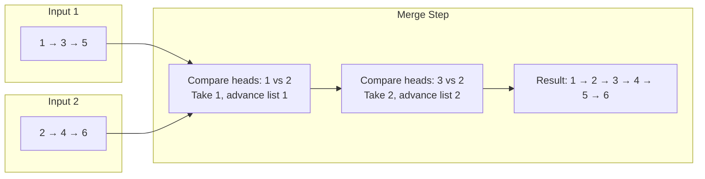

> [!success] Mastery Check
> - [ ] **Studied Well**
> - [ ] **Can explain the concept without notes**
> - [ ] **Can answer interview questions confidently**
> - [ ] **Can implement it in a real project**


## Navigation

**Domain:** [[5 — Data Structures & Algorithms]] > **Group:** Linked Lists
**Previous:** [[5.012 — Linked List Reversal]] | **Next:** [[5.015 — Stack — LIFO Applications and Balanced Parentheses]]

### Prerequisites
- [[5.010 — Singly and Doubly Linked Lists]] — node structure traversal and pointer manipulation are required to follow the merge logic.

### Where This Fits
Merging two sorted linked lists is the simplest instance of the **two-way merge** pattern, which is the core subroutine of merge sort. It appears as a standalone problem (LeetCode 21) that tests basic pointer manipulation under a sorted-order constraint, and as the building block for Merge K Sorted Lists (LeetCode 23) and merge sort itself. Every senior candidate should be able to write this solution bug-free in under two minutes — the recursive version is two lines, the iterative version is a simple while loop with a dummy head. It is non-negotiable because it is the simplest test of whether you understand linked list pointer manipulation with an ordering constraint, and because its O(n) single-pass merging is the reference pattern for all merge-based algorithms.

---

## Core Mental Model

Two sorted sequences are merged by repeatedly plucking the smaller head from either sequence and appending it to the result. The invariant: at every step, the remaining tails of both input lists are each independently sorted, and all elements already in the result are less than or equal to the heads of both remaining tails. Once one list is exhausted, the remainder of the other list is appended directly — it is already sorted and all its elements are >= the last appended element.

### Classification

This is a **two-pointer merge** pattern in the **divide-and-conquer** family. It uses the same pointer progression as the merge step of merge sort: two pointers advance independently through sorted sequences, and a third pointer builds the output.



### Key Properties

|Property|Value|Derivation|
|---|---|---|
|Merge two lists of size n,m|O(n + m)|Each node is visited exactly once — the smaller head advances each iteration|
|Space (iterative)|O(1)|Only pointer variables — no auxiliary allocations|
|Space (recursive)|O(n + m)|Call stack depth = merged list length in worst case|

---

## Deep Mechanics

### How It Works

**Iterative merge:**
1. Create a dummy head node. This eliminates the need to handle the first node specially.
2. Maintain a `current` pointer starting at the dummy node.
3. While both lists are non-null: compare the heads, attach the smaller node to `current.Next`, advance the pointer of the list that donated the node, and advance `current`.
4. When one list is exhausted, attach the remaining list directly.
5. Return `dummy.Next` — the true head of the merged list.

Walkthrough on `[1, 3, 5]` and `[2, 4, 6]`:

|Step|List 1 head|List 2 head|Current (merged tail)|Result so far|
|---|---|---|---|---|
|0|1|2|dummy|(empty)|
|1|3|2|1|1|
|2|3|4|2|1 → 2|
|3|5|4|3|1 → 2 → 3|
|4|5|6|4|1 → 2 → 3 → 4|
|5|null|6|5|1 → 2 → 3 → 4 → 5|
|6|null|null|6|1 → 2 → 3 → 4 → 5 → 6|

**Recursive merge:**
- Base case: if either list is null, return the other.
- Compare heads. The smaller head becomes the result head. Its `Next` is the recursive merge of (the list that lost its head) and (the list that kept its head).
- Return the smaller head.

The recursive view is: "The merged list consists of the smaller head followed by the merged result of the two remaining tails." This is a natural recurrence: `Merge(a, b) = {a.Val if a.Val <= b.Val }.Next = Merge(a.Next, b)`.

### Complexity Derivation

**Time:** Each recursive call or loop iteration consumes exactly one node from one of the two lists. There are n + m nodes total, so exactly n + m comparisons and pointer assignments. O(n + m).

**Space (iterative):** Three pointer variables (curr, l1, l2) plus the dummy node. O(1) auxiliary space — the merged list reuses the existing nodes.

**Space (recursive):** The recursion depth equals the merged list length in the worst case (when the lists interleave completely, every call consumes one node). O(n + m) call stack space.

### Why This Pattern Exists

The naive approach to merging two sorted sequences is to concatenate them (O(1)) and then sort the result (O((n+m) log(n+m))). This is wasteful because the two input sequences are already individually sorted. The merge pattern exploits the **sortedness invariant**: at every point, the smallest remaining element overall must be the smaller of the two heads. This allows a single O(n + m) pass — optimal because every element must be examined at least once to determine its position in the output.

---

## Implementation and Problem Patterns

### C# Implementation

```csharp
public ListNode? MergeTwoLists(ListNode? l1, ListNode? l2)
{
    var dummy = new ListNode(0);
    var current = dummy;

    while (l1 != null && l2 != null)
    {
        if (l1.Val <= l2.Val)
        {
            current.Next = l1;
            l1 = l1.Next;
        }
        else
        {
            current.Next = l2;
            l2 = l2.Next;
        }
        current = current.Next;
    }

    current.Next = l1 ?? l2;
    return dummy.Next;
}
```

Recursive version:

```csharp
public ListNode? MergeTwoListsRecursive(ListNode? l1, ListNode? l2)
{
    if (l1 == null) return l2;
    if (l2 == null) return l1;

    if (l1.Val <= l2.Val)
    {
        l1.Next = MergeTwoListsRecursive(l1.Next, l2);
        return l1;
    }
    else
    {
        l2.Next = MergeTwoListsRecursive(l1, l2.Next);
        return l2;
    }
}
```

### The .NET Idiomatic Version

For merging sorted arrays (not linked lists), .NET provides no single-purpose merge method, but LINQ can be abused:

```csharp
// For arrays — does NOT re-use existing nodes; allocates new array
int[] merged = list1.Concat(list2).OrderBy(x => x).ToArray();
```

This is O((n+m) log(n+m)) — worse than the O(n+m) merge. For linked lists, there is no built-in merge; the scratch implementation above is the production pattern.

For merging sorted arrays in O(n+m), implement the two-pointer merge directly on arrays:

```csharp
public int[] MergeSortedArrays(int[] a, int[] b)
{
    var result = new int[a.Length + b.Length];
    int i = 0, j = 0, k = 0;
    while (i < a.Length && j < b.Length)
        result[k++] = a[i] <= b[j] ? a[i++] : b[j++];
    while (i < a.Length) result[k++] = a[i++];
    while (j < b.Length) result[k++] = b[j++];
    return result;
}
```

### Classic Problem Patterns

- **Merge two sorted linked lists (LeetCode 21)** — The canonical problem. Tests pointer manipulation under a sorted-order constraint. The dummy head pattern is the key insight.
- **Merge k sorted lists (LeetCode 23)** — Direct generalization. Use a min-heap to find the smallest head among k lists in O(log k), or repeatedly merge pairs (divide-and-conquer merge). See [[5.034]].
- **Merge step of merge sort** — The two-pointer merge is the core of merge sort. Understanding the merge in isolation makes the full sort algorithm clearer.
- **Intersection of two sorted linked lists** — Same two-pointer comparison, but only add elements when both heads have the same value, advancing both lists.

### Template / Skeleton

```csharp
// Merge Two Sorted Sequences Template
// When to use: given two independently sorted sequences, produce a merged sorted sequence
// Time: O(n + m) | Space: O(1) iterative, O(n + m) recursive

public ListNode? MergeSorted(ListNode? a, ListNode? b)
{
    var dummy = new ListNode(0);
    var tail = dummy;

    while (a != null && b != null)
    {
        if (a.Val <= b.Val)
        {
            tail.Next = a;
            a = a.Next;
        }
        else
        {
            tail.Next = b;
            b = b.Next;
        }
        tail = tail.Next;
    }

    // TODO: Attach the remaining non-null list
    tail.Next = a ?? b;
    return dummy.Next;
}
```

---

## Gotchas and Edge Cases

### Forgetting the Dummy Head

**Mistake:** Handling the first node selection with an if/else outside the loop, duplicating the append logic.

```csharp
// ❌ Wrong — first node handled separately, code duplication
if (l1.Val <= l2.Val) { head = l1; l1 = l1.Next; }
else { head = l2; l2 = l2.Next; }
var current = head;
```

**Fix:** Use a dummy head node so the loop logic handles the first node identically.

```csharp
// ✅ Correct
var dummy = new ListNode(0);
var current = dummy;
```

**Consequence:** Code duplication increases bug surface area. The dummy head pattern makes the code uniform — every append is `current.Next = node; current = current.Next;`.

### Null Input

**Mistake:** Not checking for null inputs, causing NullReferenceException when accessing `.Val`.

```csharp
// ❌ Wrong — crashes when l1 or l2 is null
while (l1.Val <= l2.Val) { ... }
```

**Fix:** Handle null at the start of the recursive version with guard clauses; handle null in the loop condition for the iterative version.

```csharp
// ✅ Correct — iterative loop condition handles null naturally
while (l1 != null && l2 != null) { ... }
// ✅ Correct — recursive guards
if (l1 == null) return l2;
if (l2 == null) return l1;
```

**Consequence:** NullReferenceException. The recursive version needs explicit null checks; the iterative version handles null via the while condition and the final `??` attachment.

### Stack Overflow with Recursive Version on Long Lists

**Mistake:** Using recursion for production-length lists or in an interview without noting the stack depth concern.

```csharp
// ❌ Risky — recursion depth = merged list length
public ListNode? MergeTwoListsRecursive(ListNode? l1, ListNode? l2)
```

**Fix:** Use the iterative version for large inputs or mention the recursion depth limitation and specify that the iterative version is preferred.

**Consequence:** StackOverflowException for lists longer than ~10,000 nodes (default .NET call stack ~1 MB, each recursive frame ~100 bytes). The iterative version has no such limit.

### Modifying Input Lists When Not Expected

**Mistake:** The merge reuses input nodes, mutating the input lists. Callers may not expect their lists to be modified.

```csharp
// ❌ Side effect — after merge, l1's original structure is gone
l1.Next = MergeTwoListsRecursive(l1.Next, l2);
```

**Fix:** Document that the method consumes the input lists, or allocate new nodes if the caller needs the originals preserved.

**Consequence:** Silent data corruption. If the caller retains a reference to an original list node, that node's `.Next` may now point into the middle of the merged list.

---

## Complexity Analysis and Benchmarks

### Operation Complexity Table

|Operation|Time (Best)|Time (Average)|Time (Worst)|Space|Notes|
|---|---|---|---|---|---|
|Merge two lists (iterative)|O(min(n,m))|O(n+m)|O(n+m)|O(1)|Best case: one list is empty; just return the other|
|Merge two lists (recursive)|O(min(n,m))|O(n+m)|O(n+m)|O(n+m)|Call stack depth = merged length|
|Merge two arrays (iterative)|O(min(n,m))|O(n+m)|O(n+m)|O(n+m)|Must allocate new array; linked list version reuses nodes|

**Derivation for the non-obvious entries:** The best case (one input empty) is O(1) for linked lists with a null guard. For arrays, even if one is empty, you still allocate the result array (O(1) allocation, O(n) copy for the non-empty one).

### Comparison with Alternatives

|Approach|Time|Space|Best When|
|---|---|---|---|
|Merge (two-pointer)|O(n+m)|O(1) list / O(n+m) array|Inputs are already sorted|
|Concat + sort|O((n+m) log(n+m))|O(n+m)|Lists are small (n+m < 100) or only needed once|
|Insert each element individually|O(n * m)|O(1)|One list is very small (m << n); binary search insertion if array|

### BenchmarkDotNet

```csharp
[MemoryDiagnoser]
[SimpleJob(RuntimeMoniker.Net90)]
public class MergeSortedBenchmark
{
    private ListNode? _list1 = null!;
    private ListNode? _list2 = null!;

    [Params(1_000, 10_000)]
    public int N { get; set; }

    [GlobalSetup]
    public void Setup()
    {
        // Build two sorted linked lists of length N
        var rng = new Random(42);
        var vals1 = Enumerable.Range(0, N).Select(_ => rng.Next(1_000_000)).OrderBy(x => x).ToArray();
        var vals2 = Enumerable.Range(0, N).Select(_ => rng.Next(1_000_000)).OrderBy(x => x).ToArray();

        _list1 = BuildList(vals1);
        _list2 = BuildList(vals2);
    }

    private static ListNode? BuildList(int[] vals)
    {
        if (vals.Length == 0) return null;
        var head = new ListNode(vals[0]);
        var curr = head;
        for (int i = 1; i < vals.Length; i++)
        {
            curr.Next = new ListNode(vals[i]);
            curr = curr.Next;
        }
        return head;
    }

    [Benchmark(Baseline = true)]
    public ListNode? MergeIterative()
    {
        return MergeTwoLists(_list1, _list2);
    }

    [Benchmark]
    public ListNode? MergeRecursive()
    {
        return MergeTwoListsRecursive(_list1, _list2);
    }
}
```

**Expected results (approximate, .NET 9, x64):**

|Method|N|Mean|Allocated|
|---|---|---|---|
|MergeIterative|1,000|~2 μs|0 B|
|MergeRecursive|1,000|~3 μs|0 B|
|MergeIterative|10,000|~20 μs|0 B|
|MergeRecursive|10,000|~50 μs|0 B|

**Interpretation:** Both versions are O(n) and allocate zero heap memory (they reuse existing nodes). The iterative version is faster because it avoids function call overhead. The gap widens with N as recursion overhead accumulates.

---

## Interview Arsenal

### Question Bank

1. What is the time complexity of merging two sorted linked lists and why?
2. What is the space complexity difference between the iterative and recursive versions?
3. Implement mergeTwoLists — both iterative and recursive versions.
4. What is the purpose of the dummy head node in the iterative version?
5. When would you use the recursive version over the iterative version in an interview?
6. How does mergeTwoLists generalize to merge k sorted lists?
7. How would you merge two sorted arrays in place without allocating a new array?
8. What happens to the original input lists after the merge operation?

### Spoken Answers

**Q: What is the time complexity of merging two sorted linked lists and why?**

> **Average answer:** It is O(n + m) because you traverse both lists once.

> **Great answer:** O(n + m) — and I can derive that because each node is visited exactly once: at every step, I compare the two heads and advance the pointer of the list with the smaller head. That consumes one node per iteration. There are n + m nodes total, so exactly n + m iterations. An alternative is to concatenate and sort, which would be O((n+m) log(n+m)) — the merge approach exploits the fact that both inputs are already sorted to avoid the log factor. This is the same reasoning that makes merge sort O(n log n) rather than O(n²): each level of the recursion processes all n elements, and there are log n levels.

**Q: What is the purpose of the dummy head node?**

> **Average answer:** It avoids a null check on the first element.

> **Great answer:** The dummy head eliminates a branch from the hot path. Without a dummy head, I need an if/else to set the result head on the first iteration and append on subsequent iterations. With a dummy head, every iteration is identical — I append to current.Next and advance current. This makes the loop simpler, eliminates a branch (which helps CPU branch prediction), and is the standard pattern for linked list construction in problems that build a result list incrementally. At the end, I return dummy.Next as the true head. The dummy node itself is never referenced after the function returns, so it becomes garbage immediately.

### Trick Question

**"The recursive version of mergeTwoLists is more elegant and more efficient than the iterative version because it avoids the dummy head and has fewer lines of code."**

Why it is a trap: Fewer lines does not mean more efficient. The recursive version is O(n + m) time but also O(n + m) space due to the call stack. The iterative version is O(n + m) time and O(1) space. For large lists, recursion causes a stack overflow. "Elegant" does not mean "more efficient" — in an interview, you should show both and explain when each is appropriate.

Correct answer: The recursive version is elegant and demonstrates understanding of recurrence relations, but it is less space-efficient (O(n+m) stack space vs O(1) for iterative). Use recursive for explanation and iterative for the final implementation.

### Pattern Recognition Table

|If the problem has...|Then consider...|Because...|
|---|---|---|
|Two sorted arrays/lists and need one sorted result|Two-pointer merge|The sortedness property makes O(n+m) possible|
|Need to merge k sorted lists|Min-heap or divide-and-conquer merge|Generalization of the two-list merge|
|Input is unsorted but needs sorted output|Merge sort|Merge is the core subroutine|
|Need to find the intersection of two sorted arrays|Two-pointer merge with equality check|Same pointer progression; output only on equal values|

---

## Decision Framework

### When to Apply

```mermaid
flowchart TD
    A[Two sorted sequences] --> B{Combine into one sorted output?}
    B -->|Yes| C{Merging in-place?}
    C -->|Linked lists — reuse nodes| D[Two-pointer merge O(n+m) O(1)]
    C -->|Arrays — allocate new| E[Two-pointer merge O(n+m) O(n+m)]
    B -->|No — find common elements| F[Two-pointer intersection<br>Same merge, equality output]
    D --> G[Use dummy head pattern]
```

### Recognition Checklist

Indicators that the two-pointer merge pattern is the right choice:

- [ ] Two independently sorted sequences are provided as input
- [ ] The expected output is a single sorted sequence combining all elements
- [ ] The problem involves comparing elements from both sequences pairwise
- [ ] One pass through both sequences is sufficient — no backtracking needed

Counter-indicators — do NOT apply here:

- [ ] Only one sequence — no merge needed
- [ ] Inputs are not sorted — must sort first or use a different approach
- [ ] Need to find the k-th smallest element without constructing the full merge — use binary search with counting instead

### Tradeoff Summary

|What You Gain|What You Give Up|
|---|---|
|O(n+m) time — optimal lower bound|Cannot beat O(n+m) — every element must be examined|
|O(1) space (linked list, iterative)|Destructive — input lists are modified (nodes reused)|
|Simple, branch-free loop (iterative)|Recursive version trades space for elegance|
|Natural building block for merge sort and k-way merge|Does not apply to unsorted inputs|

---

## Self-Check

### Conceptual Questions

1. Why is the time complexity O(n+m) and not O(n) when both lists have different lengths?
2. What does the dummy head node achieve in the iterative merge?
3. Why does the recursive version use O(n+m) space?
4. What is the worst-case input for the recursive version in terms of stack depth?
5. How would you merge two sorted arrays in-place if one array has enough buffer space at the end?
6. What is the complexity of concatenating two sorted arrays and sorting the result? When might this be acceptable?
7. How does the merge-two-lists operation relate to merge sort?
8. What changes if you need to merge two sorted doubly linked lists?
9. In .NET, what built-in method merges two sorted sequences? (Trick: there is none for general use.)
10. What happens to the original list nodes after a call to mergeTwoLists?

<details>
<summary>Answers</summary>

1. Each iteration consumes one node from either list. The total number of nodes across both lists is n + m, so exactly n + m iterations are required.
2. It eliminates the need to handle the first node as a special case — the loop body applies uniformly to every node, and we return dummy.Next as the result head.
3. Each recursive call adds a frame to the call stack. In the worst case (perfectly interleaved lists), each call consumes one node, leading to n + m frames.
4. When elements are perfectly interleaved (1, 1, 2, 2, 3, 3, ...), each recursive call consumes exactly one node, making the stack depth equal to the merged list length.
5. Merge from the end (largest first): place pointers at the end of each array and the end of the buffer. This avoids overwriting elements that haven't been processed yet.
6. Concat + sort is O((n+m) log(n+m)) time and O(n+m) space. It is acceptable for small arrays (n+m < 100) where the log factor is negligible and code simplicity matters.
7. Merge sort divides the array into single-element lists (trivially sorted) and merges pairs back up the recursion tree. The merge step is exactly this operation.
8. The logic is identical — compare heads, attach the smaller node, advance. The only difference is that each node also has a prev pointer that should be set to the previous node in the merged result.
9. There is no built-in method for merging two sorted sequences in .NET. `Concat` + `OrderBy` works but is O((n+m) log(n+m)). For production, the two-pointer merge is implemented manually.
10. The input lists are consumed — their nodes are reused in the merged list. If a caller retains a reference to any node from the input lists, that node's `.Next` pointer may now point to a different part of the merged list.
</details>

---

### Coding Challenges

**Challenge 1 — Implement from scratch**

Implement MergeSortedLists for a doubly linked list.

```csharp
public class DoublyListNode
{
    public int Val { get; set; }
    public DoublyListNode? Next { get; set; }
    public DoublyListNode? Prev { get; set; }
    public DoublyListNode(int val) => Val = val;
}

public DoublyListNode? MergeDoublySorted(DoublyListNode? a, DoublyListNode? b)
{
    // Your implementation here
}
```

<details> <summary>Solution</summary>

```csharp
public DoublyListNode? MergeDoublySorted(DoublyListNode? a, DoublyListNode? b)
{
    var dummy = new DoublyListNode(0);
    var tail = dummy;

    while (a != null && b != null)
    {
        if (a.Val <= b.Val)
        {
            tail.Next = a;
            a.Prev = tail;
            a = a.Next;
        }
        else
        {
            tail.Next = b;
            b.Prev = tail;
            b = b.Next;
        }
        tail = tail.Next;
    }

    var remainder = a ?? b;
    if (remainder != null)
    {
        tail.Next = remainder;
        remainder.Prev = tail;
    }

    var head = dummy.Next;
    if (head != null) head.Prev = null;
    return head;
}
```

**Complexity:** Time O(n+m) | Space O(1) **Key insight:** The only difference from singly linked merge is that we also set the `Prev` pointer on each attached node to point to the current tail.

</details>

---

**Challenge 2 — Trace the execution**

Trace the iterative merge of `[1, 4, 5]` and `[2, 3, 6]`. Show the state of l1, l2, and the merged list after each step.

<details> <summary>Solution</summary>

```
Init: l1 = 1→4→5, l2 = 2→3→6, dummy = 0, tail = dummy

Step 1: Compare 1 vs 2 → take 1
  tail.Next = node(1), tail = node(1), l1 = 4→5
  List: 0 → 1

Step 2: Compare 4 vs 2 → take 2
  tail.Next = node(2), tail = node(2), l2 = 3→6
  List: 0 → 1 → 2

Step 3: Compare 4 vs 3 → take 3
  tail.Next = node(3), tail = node(3), l2 = 6
  List: 0 → 1 → 2 → 3

Step 4: Compare 4 vs 6 → take 4
  tail.Next = node(4), tail = node(4), l1 = 5
  List: 0 → 1 → 2 → 3 → 4

Step 5: Compare 5 vs 6 → take 5
  tail.Next = node(5), tail = node(5), l1 = null
  List: 0 → 1 → 2 → 3 → 4 → 5

Step 6: l1 is null → attach remainder = l2 = 6
  tail.Next = node(6)
  List: 0 → 1 → 2 → 3 → 4 → 5 → 6

Return dummy.Next = 1 → 2 → 3 → 4 → 5 → 6
```

**Why:** Each step consumes exactly one node from either input. The dummy head makes the first append identical to all others.

</details>

---

**Challenge 3 — Fix the bug**

```csharp
// This method attempts to merge two sorted linked lists but has a bug.
// It produces incorrect output for certain inputs.
public ListNode? MergeTwoLists(ListNode? l1, ListNode? l2)
{
    if (l1 == null) return l2;
    if (l2 == null) return l1;

    var head = l1.Val <= l2.Val ? l1 : l2;
    var current = head;

    while (l1 != null && l2 != null)
    {
        if (l1.Val <= l2.Val)
        {
            current.Next = l1;
            l1 = l1.Next;
        }
        else
        {
            current.Next = l2;
            l2 = l2.Next;
        }
        current = current.Next;
    }

    current.Next = l1 ?? l2;
    return head;
}
```

<details> <summary>Solution</summary>

**Bug:** The `head` is set before the loop, but the loop does not skip the head node. The head node is attached twice — once to `head` and again as `current.Next`. Suppose `l1 = 1→3` and `l2 = 2→4`. head = 1 (from l1). The loop starts: l1=1 <= l2=2, so `current.Next = l1` — but current starts at head which IS l1. So l1.Next gets set to l1 (self-loop).

**Fix:** Use a dummy head or restructure the code so the first node is handled by the loop, not separately.

```csharp
public ListNode? MergeTwoLists(ListNode? l1, ListNode? l2)
{
    var dummy = new ListNode(0);
    var current = dummy;

    while (l1 != null && l2 != null)
    {
        if (l1.Val <= l2.Val)
        {
            current.Next = l1;
            l1 = l1.Next;
        }
        else
        {
            current.Next = l2;
            l2 = l2.Next;
        }
        current = current.Next;
    }

    current.Next = l1 ?? l2;
    return dummy.Next;
}
```

**Test case that exposes it:** `MergeTwoLists([1→3], [2→4])` → original produces a cycle (1 points to itself), causing infinite traversal.

</details>

---

**Challenge 4 — Recognize and apply**

**Problem:** You are given two sorted integer arrays, nums1 and nums2. nums1 has a length of m + n, where the first m elements are the actual data and the last n elements are filled with zeros (buffer). Merge nums2 into nums1 so that the result is sorted in-place.

<details> <summary>Solution</summary>

**Pattern:** Reverse two-pointer merge — fill from the end to avoid overwriting unprocessed elements.

```csharp
public void MergeInPlace(int[] nums1, int m, int[] nums2, int n)
{
    int i = m - 1;
    int j = n - 1;
    int k = m + n - 1;

    while (j >= 0)
    {
        if (i >= 0 && nums1[i] > nums2[j])
            nums1[k--] = nums1[i--];
        else
            nums1[k--] = nums2[j--];
    }
}
```

**Complexity:** Time O(m+n) | Space O(1) **Key insight:** Merging from the largest element downward avoids overwriting nums1's data before it is read.

</details>

---

**Challenge 5 — Optimize**

```csharp
// This solution merges two sorted linked lists but uses O(n+m) extra space
// by creating new nodes instead of reusing existing ones.
// Optimize it to use O(1) extra space.
public ListNode? MergeTwoListsNewNodes(ListNode? l1, ListNode? l2)
{
    var dummy = new ListNode(0);
    var current = dummy;

    while (l1 != null && l2 != null)
    {
        if (l1.Val <= l2.Val)
        {
            current.Next = new ListNode(l1.Val);
            l1 = l1.Next;
        }
        else
        {
            current.Next = new ListNode(l2.Val);
            l2 = l2.Next;
        }
        current = current.Next;
    }

    while (l1 != null)
    {
        current.Next = new ListNode(l1.Val);
        l1 = l1.Next;
        current = current.Next;
    }

    while (l2 != null)
    {
        current.Next = new ListNode(l2.Val);
        l2 = l2.Next;
        current = current.Next;
    }

    return dummy.Next;
}
```

<details> <summary>Solution</summary>

**Insight:** The input nodes can be reused directly — no need to allocate new nodes. Instead of `new ListNode(l1.Val)`, assign `current.Next = l1` directly. This eliminates the O(n+m) allocation.

```csharp
public ListNode? MergeTwoListsInPlace(ListNode? l1, ListNode? l2)
{
    var dummy = new ListNode(0);
    var current = dummy;

    while (l1 != null && l2 != null)
    {
        if (l1.Val <= l2.Val)
        {
            current.Next = l1;
            l1 = l1.Next;
        }
        else
        {
            current.Next = l2;
            l2 = l2.Next;
        }
        current = current.Next;
    }

    current.Next = l1 ?? l2;
    return dummy.Next;
}
```

**Complexity:** Time O(n+m) | Space O(1) **Key insight:** Linked list nodes are heap objects. Reusing them eliminates O(n+m) allocations and GC pressure. This is the standard approach and should be asked about during the interview — "do you want me to reuse the existing nodes or create new ones?"

</details>
