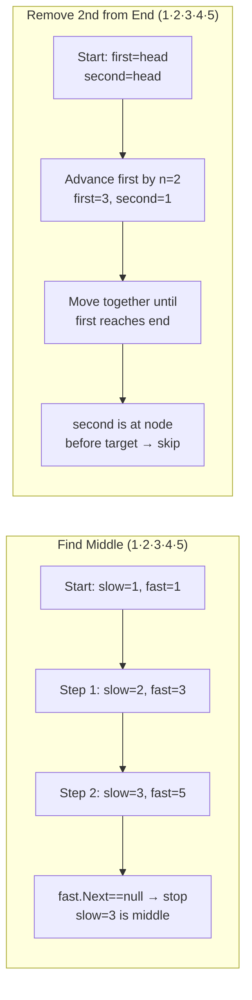
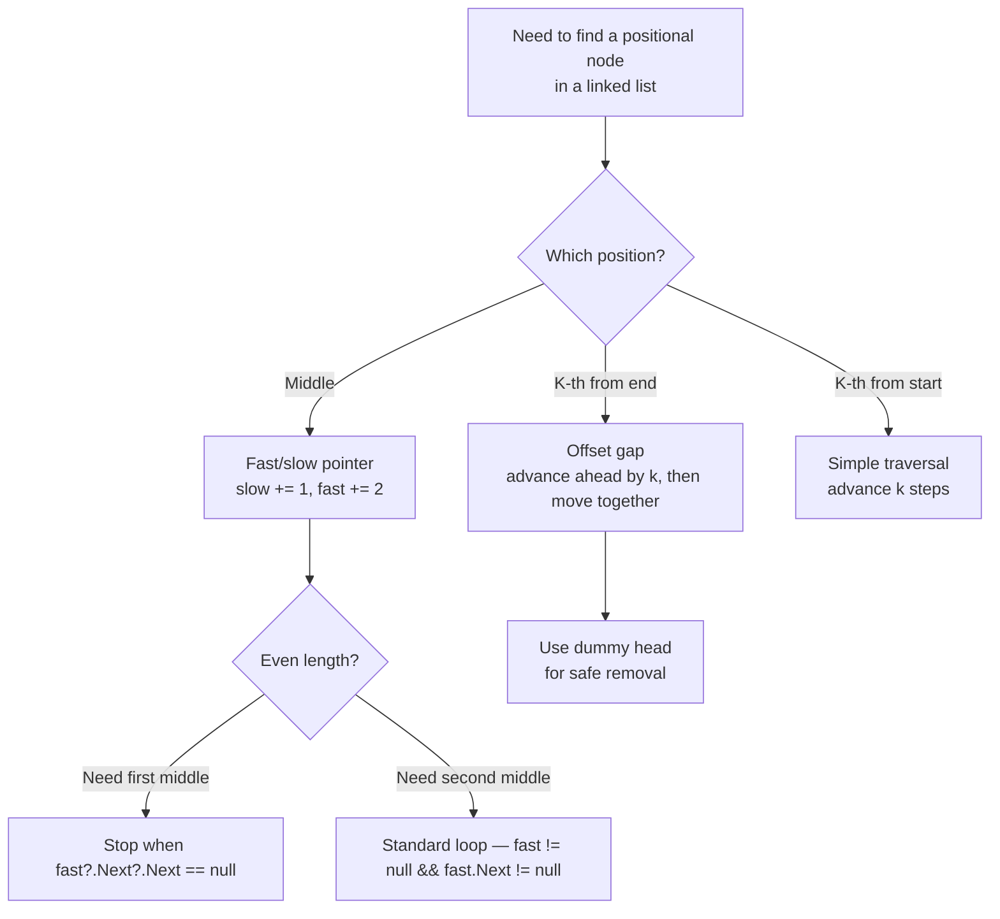

> [!success] Mastery Check
> - [ ] **Studied Well**
> - [ ] **Can explain the concept without notes**
> - [ ] **Can answer interview questions confidently**
> - [ ] **Can implement it in a real project**


## Navigation

**Domain:** [[5 — Data Structures & Algorithms]] > **Group:** Linked Lists
**Previous:** [[5.013 — Merge Two Sorted Lists]] | **Next:** [[5.015 — Stack — LIFO Applications and Balanced Parentheses]]

### Prerequisites
- [[5.010 — Singly and Doubly Linked Lists]] — node structure and traversal are required; both problems operate on the standard singly linked list node with Val and Next.

### Where This Fits
Finding the middle node and removing the N-th node from the end are the two most common pointer-gap problems on linked lists. They appear in ~10% of linked list interviews either as standalone questions (LeetCode 876 — Middle of the Linked List, LeetCode 19 — Remove Nth Node From End of List) or as subroutines: finding the middle is the split step in merge sort on a linked list and the detection step in palindrome checking; removing from the end appears in reorder list and rotate list problems. Both are solved with the two-pointer (fast/slow or offset) technique that demonstrates understanding of linked list traversal without index access.

---

## Core Mental Model

Both problems exploit the inability to index into a linked list by using two pointers at different speeds (middle) or with a fixed offset (remove nth). For the middle: the fast pointer moves two steps per iteration; the slow pointer moves one. When the fast pointer reaches the end, the slow pointer is at the middle. For remove nth: the first pointer advances n steps ahead, then both pointers advance together until the first reaches the end — the second pointer is now just before the node to remove.

### Classification

Both are **two-pointer** patterns applied to linked lists. The middle-finding variant uses **unequal speeds** (fast/slow). The remove-nth variant uses **equal speeds with an initial offset** (ahead/behind). Both are specializations of `[[5.005 — Two Pointers]]` and `[[5.011 — Fast and Slow Pointers]]`.



### Key Properties

|Property|Value|Derivation|
|---|---|---|
|Find middle (odd length)|O(n) time, O(1) space|Fast pointer reaches end in n/2 steps; slow pointer is at middle|
|Find middle (even length)|O(n) time, O(1) space|Returns second middle; fast pointer ends at null|
|Remove nth from end|O(n) time, O(1) space|First pointer advances n steps, then both advance n - steps to reach target|
|Both — space|O(1)|Only pointer variables — no auxiliary data structures|

---

## Deep Mechanics

### How It Works

**Find middle (fast/slow):**
1. Initialize slow and fast to head.
2. While fast is not null and fast.Next is not null: advance slow by one, fast by two.
3. When the loop exits, slow points to the middle node.

For an odd-length list `[1, 2, 3, 4, 5]`:
- slow=1, fast=1
- slow=2, fast=3
- slow=3, fast=5 → fast.Next is null → exit → middle=3

For an even-length list `[1, 2, 3, 4]`:
- slow=1, fast=1
- slow=2, fast=3
- slow=3, fast=null → fast is null → exit → middle=3 (the second middle)

To get the first middle on even length, stop when `fast.Next?.Next` is null, or decrement slow by one after the loop.

**Remove nth from end (offset gap):**
1. Create a dummy head pointing to the list.
2. Initialize `first` and `second` to dummy.
3. Advance `first` by n steps (so there is a gap of n between first and second).
4. Advance both pointers together until `first` reaches the last node.
5. `second` is now at the node before the target — skip it: `second.Next = second.Next.Next`.
6. Return dummy.Next.

Walkthrough on `[1, 2, 3, 4, 5]`, remove n=2 (remove 4):

|Step|First|Second|State|
|---|---|---|---|
|0|dummy|dummy|dummy → 1 → 2 → 3 → 4 → 5|
|Advance first by 2|node(2)|dummy|gap of 2 established|
|1|node(3)|node(1)||
|2|node(4)|node(2)||
|3|node(5)|node(3)|first.Next is null → stop|
|Skip|node(5)|node(3)|second.Next = second.Next.Next = node(5)|
|Result|—|—|dummy → 1 → 2 → 3 → 5|

### Complexity Derivation

**Find middle:** The fast pointer covers 2k nodes while the slow pointer covers k nodes. The loop runs k times where 2k = n (odd) or 2k + 1 = n (even). In either case, k = floor(n/2). O(n/2) = O(n).

**Remove nth from end:** The first pointer advances n times, then both pointers advance L-n times (where L is the list length). Total: n + (L - n) = L operations. O(L) = O(n).

**Space:** Both use only local pointer variables — no dynamic allocation. O(1).

### Why This Pattern Exists

With an array, finding the middle is O(1) by indexing (arr[length/2]). Removing the n-th from the end is O(1) by index (arr[length-n]). Linked lists have no index access, so these operations require a traversal strategy. The two-pointer technique achieves both in O(n) with O(1) space — the same time as a simple traversal but without a separate length computation pass. This is optimal because any operation on a linked list that identifies a positional element requires at least O(n) time (the node must be reached by following pointers).

---

## Implementation and Problem Patterns

### C# Implementation

```csharp
public ListNode? FindMiddle(ListNode? head)
{
    var slow = head;
    var fast = head;

    while (fast != null && fast.Next != null)
    {
        slow = slow!.Next;
        fast = fast.Next.Next;
    }

    return slow;
}

public ListNode? RemoveNthFromEnd(ListNode? head, int n)
{
    var dummy = new ListNode(0) { Next = head };
    var first = dummy;
    var second = dummy;

    // Advance first by n steps
    for (int i = 0; i < n; i++)
        first = first!.Next;

    // Move both until first reaches the end
    while (first!.Next != null)
    {
        first = first.Next;
        second = second!.Next;
    }

    // Skip the target node
    second!.Next = second.Next?.Next;

    return dummy.Next;
}
```

### The .NET Idiomatic Version

.NET provides no built-in linked list operations for "find middle" or "remove nth from end" on `LinkedList<T>`. However, the same patterns apply using `LinkedListNode<T>`:

```csharp
// Find middle using LinkedList<T>
public LinkedListNode<T>? FindMiddleNode<T>(LinkedList<T> list)
{
    var slow = list.First;
    var fast = list.First;

    while (fast?.Next != null)
    {
        slow = slow!.Next;
        fast = fast.Next.Next;
    }

    return slow;
}

// Remove nth from end using LinkedList<T> — not efficient because we lack index
public void RemoveNthFromEnd<T>(LinkedList<T> list, int n)
{
    // Count approach: O(n) to count, O(n) to find, O(1) to remove
    var node = list.First;
    int count = 0;
    while (node != null) { count++; node = node.Next; }

    int targetIndex = count - n;
    node = list.First!;
    for (int i = 0; i < targetIndex - 1; i++)
        node = node!.Next;

    list.Remove(node!.Next!);  // O(1) removal with node reference
}
```

The two-pointer approach is preferred over counting because it is a single pass.

### Classic Problem Patterns

- **Middle of linked list (LeetCode 876)** — Fast/slow pointer returns the second middle for even-length lists.
- **Remove nth node from end (LeetCode 19)** — Dummy head + offset gap. The dummy head eliminates the need to handle head removal as a special case.
- **Palindrome linked list (LeetCode 234)** — Find middle (fast/slow), reverse the second half, compare. Links middle finding with reversal.
- **Reorder list (LeetCode 143)** — Find middle, reverse second half, interleave the two halves. Combines both patterns.
- **Rotate list (LeetCode 61)** — Find the new head by computing the effective rotation (k mod length), then removing from the end and reattaching at the front.
- **Split linked list in parts (LeetCode 725)** — Find the segment sizes (requires counting or middle-adjacent positions) and split at each boundary.

### Template / Skeleton

```csharp
// Fast/Slow Pointer Template
// When to use: find a positional node (middle, k-th from end, cycle detection) in a linked list
// Time: O(n) | Space: O(1)

public ListNode? FindPositionalNode(ListNode? head)
{
    // TODO: Set up initial positions (may include dummy head)
    var slow = head;
    var fast = head;

    while (fast != null && fast.Next != null)
    {
        // TODO: Adjust pointer advancement based on the target position
        slow = slow!.Next;
        fast = fast.Next.Next;
    }

    // TODO: slow is now at or near the target position; adjust if needed
    return slow;
}
```

```csharp
// Offset Gap (Ahead/Behind) Template
// When to use: remove or find the k-th node from the end of a linked list
// Time: O(n) | Space: O(1)

public ListNode? TargetFromEnd(ListNode? head, int offset)
{
    var dummy = new ListNode(0) { Next = head };
    var ahead = dummy;
    var behind = dummy;

    // Establish the gap
    for (int i = 0; i < offset; i++)
        ahead = ahead!.Next;

    // Advance together until ahead reaches the end
    while (ahead!.Next != null)
    {
        ahead = ahead.Next;
        behind = behind!.Next;
    }

    // TODO: behind is now at the node before the target
    // Perform operation (skip, inspect, etc.)
    return dummy.Next;
}
```

---

## Gotchas and Edge Cases

### Single-Element List (Middle)

**Mistake:** Assuming the list has at least two elements, causing the loop to skip incorrectly.

```csharp
// ❌ Wrong — returns null for single-element list if not handled
public ListNode? FindMiddle(ListNode? head)
{
    var slow = head;
    var fast = head;
    while (fast != null && fast.Next != null) { ... }
    return slow;  // OK actually — this works for single element
    // The real mistake is accessing slow.Next without null check after
}
```

**Fix:** The fast/slow loop already handles single-element lists correctly — the while condition `fast != null && fast.Next != null` is false immediately, so slow stays at head. No special case needed.

**Consequence:** None for the basic case. But be careful: the pattern naturally returns the second middle for even lengths, which may not be what the problem expects.

### Removing the Head Node

**Mistake:** Using a two-pointer approach without a dummy head — when the node to remove is the head, the `behind` pointer never reaches a node before it.

```csharp
// ❌ Wrong — crashes when n == list length (removing head)
public ListNode? RemoveNthFromEnd(ListNode? head, int n)
{
    var first = head;
    var second = head;
    for (int i = 0; i < n; i++) first = first!.Next;
    while (first!.Next != null) { first = first.Next; second = second!.Next; }
    second!.Next = second.Next?.Next;  // second is still head, but this works?
    return head;  // WRONG — if head was removed, head still points to the old head
}
```

**Fix:** Use a dummy head node so that `behind` starts before the head. This way, when the target is the original head, `behind` is the dummy node and `behind.Next = behind.Next.Next` correctly removes the head.

```csharp
// ✅ Correct
var dummy = new ListNode(0) { Next = head };
var behind = dummy;
```

**Consequence:** Without a dummy head, removing the head produces incorrect output — the caller receives a reference to the removed node.

### Off-by-One in the Gap

**Mistake:** Advancing the first pointer by n-1 or n+1 instead of exactly n.

```csharp
// ❌ Wrong — off by one
for (int i = 0; i < n - 1; i++) first = first!.Next;  // Removes wrong node
```

**Fix:** The gap must be exactly n. After advancing first by n, when first.Next is null (first is the last node), behind is at the node before the target.

```csharp
// ✅ Correct
for (int i = 0; i < n; i++) first = first!.Next;
```

**Consequence:** Removing the wrong node (n-1 removes the node one position early; n+1 skips past the target).

### Even Length — Which Middle?

**Mistake:** Not confirming with the interviewer whether to return the first or second middle for even-length lists.

```csharp
// Returns second middle (standard fast/slow)
var middle = FindMiddle(head);  // [1,2,3,4] → 3

// To get first middle: stop when fast?.Next?.Next is null
while (fast?.Next?.Next != null) { ... }
```

**Fix:** Clarify the requirement. For merge sort splitting, use the first middle. For palindrome checking, use either and adjust the reversal accordingly.

**Consequence:** Wrong split point for merge sort (produces uneven division) or incorrect palindrome comparison.

---

## Complexity Analysis and Benchmarks

### Operation Complexity Table

|Operation|Time|Space|Notes|
|---|---|---|---|
|Find middle (odd length)|O(n/2)|O(1)|Fast pointer covers 2 per step; slow covers 1|
|Find middle (even length)|O(n/2)|O(1)|Returns second middle by default|
|Remove nth from end|O(n)|O(1)|Single pass with offset gap|
|Remove nth from end (count-first)|O(2n)|O(1)|Two passes: count + traverse to position|

**Derivation for the non-obvious entries:** Counting first requires two full traversals — one to count nodes, one to reach the target. The two-pointer approach combines both into one pass, halving the traversal time (though both are O(n)).

### Comparison with Alternatives

|Approach|Time|Space|Best When|
|---|---|---|---|
|Fast/slow (middle)|O(n)|O(1)|Default — single pass, optimal|
|Count then index|O(2n)|O(1)|Simple to explain; useful if count is needed elsewhere|
|Recursion with backtracking|O(n)|O(n)|Alternative for remove nth (return n from the end)|

### BenchmarkDotNet

```csharp
[MemoryDiagnoser]
[SimpleJob(RuntimeMoniker.Net90)]
public class LinkedListPositionBenchmark
{
    private ListNode? _head = null!;

    [Params(1_000, 10_000)]
    public int N { get; set; }

    [GlobalSetup]
    public void Setup()
    {
        _head = new ListNode(0);
        var curr = _head;
        for (int i = 1; i < N; i++)
        {
            curr.Next = new ListNode(i);
            curr = curr.Next;
        }
    }

    [Benchmark(Baseline = true)]
    public ListNode? FindMiddle()
    {
        var slow = _head;
        var fast = _head;
        while (fast != null && fast.Next != null)
        {
            slow = slow!.Next;
            fast = fast.Next.Next;
        }
        return slow;
    }

    [Benchmark]
    public ListNode? RemoveNthFromEnd()
    {
        var dummy = new ListNode(0) { Next = _head };
        var first = dummy;
        var second = dummy;
        for (int i = 0; i < N / 2; i++)
            first = first!.Next;
        while (first!.Next != null)
        {
            first = first.Next;
            second = second!.Next;
        }
        second!.Next = second.Next?.Next;
        return dummy.Next;
    }
}
```

**Expected results (approximate, .NET 9, x64):**

|Method|N|Mean|Allocated|
|---|---|---|---|
|FindMiddle|1,000|~1 μs|0 B|
|RemoveNthFromEnd|1,000|~1.5 μs|0 B|
|FindMiddle|10,000|~10 μs|0 B|
|RemoveNthFromEnd|10,000|~15 μs|0 B|

**Interpretation:** Both operations are essentially single traversals with pointer assignments — no allocations, no branching beyond the loop condition. Runtime scales linearly with N as expected.

---

## Interview Arsenal

### Question Bank

1. How does the fast/slow pointer technique find the middle of a linked list?
2. What is the time and space complexity of finding the middle node of a linked list?
3. Implement RemoveNthFromEnd using the two-pointer approach.
4. What happens if n equals the length of the list (removing the head) in RemoveNthFromEnd?
5. How would you modify the middle-finding algorithm to return the first middle for even-length lists?
6. Why does the fast/slow technique use a dummy head for RemoveNthFromEnd but not for FindMiddle?
7. How would you find the k-th node from the end without removing it?
8. Combine these patterns: detect if a linked list is a palindrome using middle-finding and reversal.

### Spoken Answers

**Q: How does the fast/slow pointer technique find the middle of a linked list?**

> **Average answer:** One pointer moves twice as fast as the other. When the fast pointer reaches the end, the slow pointer is in the middle.

> **Great answer:** Two pointers start at the head. The fast pointer advances two nodes per iteration — `fast = fast.Next.Next` — while the slow pointer advances one — `slow = slow.Next`. Since the fast pointer covers distance at twice the speed, when it reaches or passes the end of the list, the slow pointer has covered exactly half the distance. For an odd-length list of length 5, the fast pointer reaches node 5 (where `fast.Next` is null) after 2 steps, and the slow pointer is at node 3 — the middle. For an even-length list of length 4, the fast pointer reaches null (after node 4) after 2 steps, and the slow pointer is at node 3 — the second middle. This works because each iteration consumes 2 positions from the fast and 1 from the slow, so the slow position is always floor(k/2) where k is the number of iterations.

**Q: Why does RemoveNthFromEnd use a dummy head but FindMiddle does not?**

> **Average answer:** Because the dummy head makes it easier to remove the head node.

> **Great answer:** The dummy head ensures that the `behind` pointer always has a node before the target — even when the target is the head (n equals the list length). Without a dummy head and with `second` starting at head, removing the head would require a separate check: `if (nodeToRemove == head) return head.Next`. The dummy head eliminates this special case: `second` starts at the dummy, so when the target is the head, `behind` is the dummy node and `behind.Next = behind.Next.Next` correctly removes the head. FindMiddle does not need a dummy head because it never modifies the list — it simply returns a node reference. When the operation is read-only (find), the dummy head is unnecessary; when it is write (remove), the dummy head simplifies edge case handling.

### Trick Question

**"Finding the middle of a linked list cannot be done in a single pass without knowing the length in advance — you must either count first or use O(n) extra space."**

Why it is a trap: The fast/slow pointer technique is a single pass, O(1) space solution that finds the middle without knowing the length. It exploits the fact that two pointers moving at different speeds can divide the distance by their relative speed.

Correct answer: The fast/slow pointer technique finds the middle in one pass, O(1) space. The fast pointer covers 2x the distance of the slow pointer, so when the fast pointer reaches the end, the slow pointer is at the middle.

### Pattern Recognition Table

|If the problem has...|Then consider...|Because...|
|---|---|---|
|Need the middle element of a linked list|Fast/slow pointer|One pass, O(1) space — optimal|
|Need the k-th element from the end|Offset gap (two pointers)|Dummy head + gap of k, then advance together|
|Need to split a linked list into two halves|Find middle, then split at that node|Middle marks the split point for merge sort|
|Need to check palindrome on linked list|Find middle + reverse second half|Compare first half with reversed second half|
|Need to reorder list (L0→Ln→L1→Ln-1→...)|Find middle + reverse + interleave|Three-step combination of the two patterns|

---

## Decision Framework

### When to Apply



### Recognition Checklist

Indicators that a two-pointer positional technique is the right choice:

- [ ] The data structure is a singly linked list (no index access)
- [ ] The target position is relative (middle, k-th from end) rather than absolute
- [ ] O(n) time and O(1) space are expected
- [ ] The problem requires only a single pass (or benefits from one)

Counter-indicators — do NOT apply here:

- [ ] The data structure provides O(1) index access (array, List<T>)
- [ ] The list is doubly linked and you have a tail reference (can count from end in one pass)
- [ ] Multiple positional lookups on the same list — consider converting to array first

### Tradeoff Summary

|What You Gain|What You Give Up|
|---|---|
|Single pass — O(n) time with O(1) space|Cannot access by index — positional operations require traversal|
|No auxiliary data structures|Slightly more complex logic than array indexing|
|Dummy head eliminates edge case branching|One extra node allocation (dummy) — negligible|

---

## Self-Check

### Conceptual Questions

1. How does the fast/slow pointer find the middle in a single pass?
2. What is the time complexity of finding the middle? Why can it not be better than O(n)?
3. Why does RemoveNthFromEnd use a dummy head?
4. What happens if n is 1 (remove the last node) in the two-pointer implementation? Trace it.
5. How would you modify the middle-finding algorithm to return the first middle for even-length lists?
6. For which problems is finding the middle a subroutine?
7. What does the loop condition `fast != null && fast.Next != null` protect against?
8. How would you find the k-th node from the end without removing it, using the two-pointer approach?
9. What is the space complexity advantage of the iterative two-pointer approach over a recursive approach?
10. Can you find the middle of a singly linked list in O(log n) time? Why or why not?

<details>
<summary>Answers</summary>

1. Two pointers: slow moves one step, fast moves two steps per iteration. When fast reaches the end, slow is at the midpoint because it has traveled half the distance.
2. O(n). Every linked list operation that identifies a positional node must traverse from head to reach it — there is no random access. O(n) is the lower bound.
3. The dummy head ensures that `second` always has a node before the target, even when the target is the head (n equals list length). Without it, removing the head requires a special case.
4. With n=1: first advances 1 step (to node 1). Both advance until first reaches the last node. second is now at the second-to-last node. `second.Next = second.Next.Next` removes the last node. The dummy head ensures this works even when there is only one node.
5. Change the loop condition to `while (fast?.Next?.Next != null)`. This stops one step earlier — when fast can advance only one more step rather than two — placing slow at the first middle.
6. Merge sort split, palindrome checking (find middle, reverse second half, compare), reorder list (find middle, reverse, interleave), binary tree to linked list conversion, split linked list in parts.
7. `fast != null` protects against an empty list. `fast.Next != null` protects against odd-length lists where fast is at the last node and fast.Next.Next would throw NullReferenceException.
8. Same offset gap as remove, but without the dummy head: `first = head; second = head;` advance first by k, then advance both together until first is null (not first.Next). At that point, second is at the k-th from end.
9. The recursive approach for remove-nth-from-end returns the position from the end through call stack unwinding, requiring O(n) stack space. The iterative two-pointer approach uses O(1) space.
10. No — binary search requires O(1) random access (indexing), which linked lists do not provide. Middle-finding is inherently O(n) on a linked list.
</details>

---

### Coding Challenges

**Challenge 1 — Implement from scratch**

Implement a method that deletes the middle node of a linked list. If the list has an even number of nodes, delete the second middle node.

```csharp
public ListNode? DeleteMiddle(ListNode? head)
{
    // Your implementation here
}
```

<details> <summary>Solution</summary>

```csharp
public ListNode? DeleteMiddle(ListNode? head)
{
    if (head?.Next == null) return null;

    var dummy = new ListNode(0) { Next = head };
    var slow = dummy;
    var fast = head;

    while (fast != null && fast.Next != null)
    {
        slow = slow!.Next;
        fast = fast.Next.Next;
    }

    slow!.Next = slow.Next?.Next;
    return dummy.Next;
}
```

**Complexity:** Time O(n) | Space O(1) **Key insight:** The dummy head + slow pointer starting at dummy places slow at the node before the middle when the loop exits. This is the same pattern as RemoveNthFromEnd — the dummy shifts slow so it lands on the predecessor, not the target.

</details>

---

**Challenge 2 — Trace the execution**

Trace the execution of RemoveNthFromEnd on list `[1, 2, 3, 4, 5]` with n=5. Show the state of first, second, and the modified list after each step.

<details> <summary>Solution</summary>

```
Init: dummy = 0→1→2→3→4→5
      first = dummy, second = dummy

Gap: advance first by n=5
  Step 1: first = 1
  Step 2: first = 2
  Step 3: first = 3
  Step 4: first = 4
  Step 5: first = 5
  first = 5, second = dummy, gap = 5

Together: advance until first.Next == null
  Step 1: first = null (first was 5, first.Next is null)
  Loop ends immediately — single iteration covers
  second = dummy, first = 5 → first.Next is null → exit

Skip: second.Next = second.Next.Next
  dummy.Next = dummy.Next.Next = node(2)
  Result: dummy → 2 → 3 → 4 → 5 → null

Return dummy.Next = 2 → 3 → 4 → 5 → null
```

**Why:** With n = list length, the target is the head. The dummy head ensures second stays at dummy, so skipping second.Next removes the head correctly.

</details>

---

**Challenge 3 — Fix the bug**

```csharp
// This method removes the n-th node from the end but has a bug.
// It fails for certain inputs.
public ListNode? RemoveNthFromEnd(ListNode? head, int n)
{
    var slow = head;
    var fast = head;

    for (int i = 0; i < n; i++)
        fast = fast!.Next;

    while (fast!.Next != null)
    {
        slow = slow!.Next;
        fast = fast.Next;
    }

    slow!.Next = slow.Next?.Next;
    return head;
}
```

<details> <summary>Solution</summary>

**Bug:** Without a dummy head, when n equals the list length (removing the head), the loop `for (int i = 0; i < n; i++) fast = fast!.Next` advances fast to null. Then `fast!.Next` throws NullReferenceException. Additionally, even if that were fixed, `return head` returns the old head even though it was removed.

**Fix:** Use a dummy head and return dummy.Next.

```csharp
public ListNode? RemoveNthFromEnd(ListNode? head, int n)
{
    var dummy = new ListNode(0) { Next = head };
    var fast = dummy;
    var slow = dummy;

    for (int i = 0; i < n; i++)
        fast = fast!.Next;

    while (fast!.Next != null)
    {
        fast = fast.Next;
        slow = slow!.Next;
    }

    slow!.Next = slow.Next?.Next;
    return dummy.Next;
}
```

**Test case that exposes it:** `RemoveNthFromEnd([1, 2], 2)` → original crashes with NullReferenceException on `fast!.Next` because fast is null after the gap loop.

</details>

---

**Challenge 4 — Recognize and apply**

**Problem:** Given the head of a singly linked list, determine if the linked list is a palindrome. Solve in O(n) time with O(1) extra space.

<details> <summary>Solution</summary>

**Pattern:** Find middle → reverse second half → compare halves.

```csharp
public bool IsPalindrome(ListNode? head)
{
    if (head?.Next == null) return true;

    // Find middle (first middle for even length)
    var slow = head;
    var fast = head;
    while (fast?.Next?.Next != null)
    {
        slow = slow!.Next;
        fast = fast.Next.Next;
    }

    // Reverse second half
    var secondHalf = ReverseList(slow!.Next);
    slow.Next = null;

    // Compare
    var first = head;
    var second = secondHalf;
    while (first != null && second != null)
    {
        if (first.Val != second.Val) return false;
        first = first.Next;
        second = second.Next;
    }

    return true;
}

private ListNode? ReverseList(ListNode? head)
{
    ListNode? prev = null;
    var current = head;
    while (current != null)
    {
        var next = current.Next;
        current.Next = prev;
        prev = current;
        current = next;
    }
    return prev;
}
```

**Complexity:** Time O(n) | Space O(1) **Key insight:** The fast/slow pointer finds the middle using `fast?.Next?.Next` (not `fast.Next`) to get the first middle for even lengths, which simplifies the reversal boundary.

</details>

---

**Challenge 5 — Optimize**

```csharp
// This method finds the middle of a linked list by first counting all nodes,
// then traversing to the middle. Optimize it to use a single pass.
public ListNode? FindMiddleTwoPass(ListNode? head)
{
    int count = 0;
    var current = head;
    while (current != null) { count++; current = current.Next; }

    current = head;
    for (int i = 0; i < count / 2; i++)
        current = current!.Next;

    return current;
}
```

<details> <summary>Solution</summary>

**Insight:** The fast/slow pointer technique achieves the same result in a single pass by exploiting the 2:1 speed ratio. Halving the traversal time (though both are O(n)).

```csharp
public ListNode? FindMiddle(ListNode? head)
{
    var slow = head;
    var fast = head;
    while (fast != null && fast.Next != null)
    {
        slow = slow!.Next;
        fast = fast.Next.Next;
    }
    return slow;
}
```

**Complexity:** Time O(n) — same asymptotic complexity, but half the pointer traversals | Space O(1) **Key insight:** The fast/slow technique does not eliminate any work compared to the two-pass approach asymptotically — both are O(n). The advantage is simpler code and avoiding the first pass entirely.

</details>
